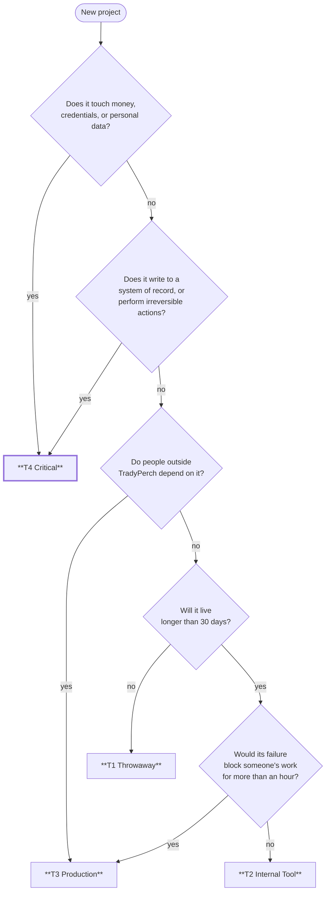
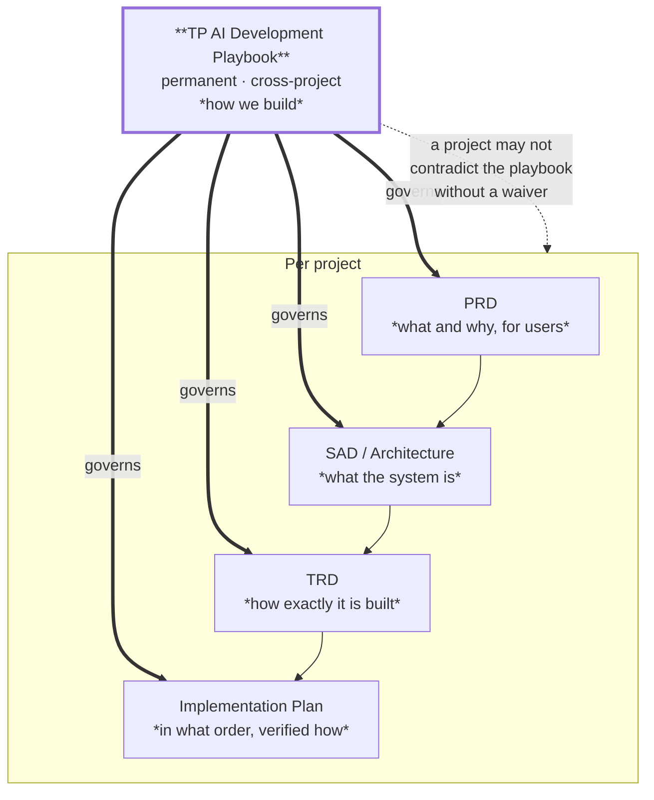
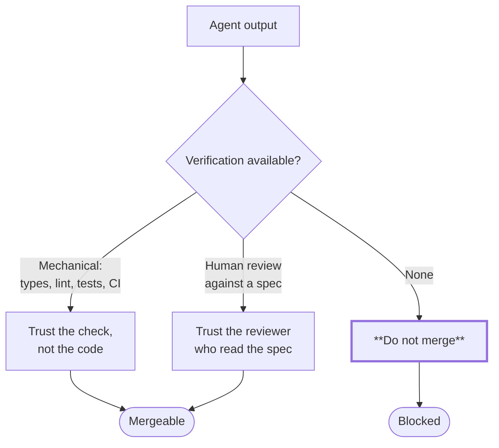
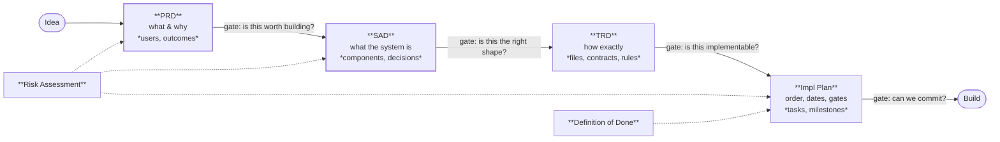
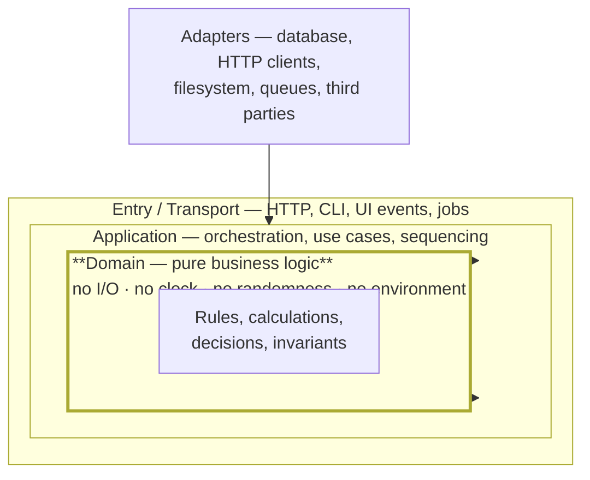
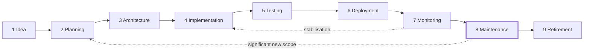
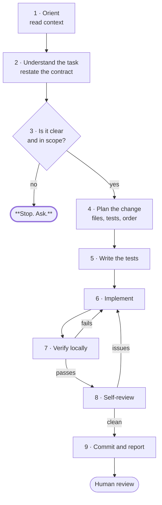
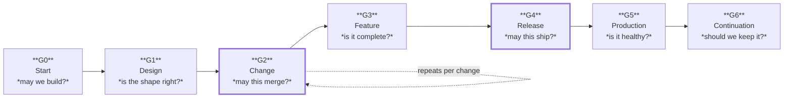

# TP AI Development Playbook

## The TradyPerch Engineering Handbook

### Version 1.0

*The engineering operating system for every TradyPerch software project. Not project-specific. Not optional. This is how we build.*

---

| Field | Value |
|---|---|
| **Document Name** | TP AI Development Playbook |
| **Short Name** | The Playbook |
| **Owner** | TradyPerch Engineering |
| **Version** | 1.0 |
| **Status** | **Active — binding on all projects from this date** |
| **Classification** | Internal — Commercial Confidential |
| **Scope** | Every TradyPerch software project, of every kind, built by humans, AI agents, or both |
| **Supersedes** | All prior informal practice |
| **Review Cadence** | Quarterly; amendments per §29 |
| **First Governed Project** | TP Reviews Engine v1.0 |
| **Document Date** | 2026-07-31 |

---

## 0.1 Why This Document Exists

TradyPerch builds software with a small team and a large share of the implementation performed by AI coding agents. That combination is enormously productive and structurally fragile. It is productive because an agent can implement a well-specified module faster than a human can type. It is fragile because an agent will also implement a *badly* specified module at exactly the same speed, with the same confidence, and the defect will look like working code.

The difference between those two outcomes is not the model. It is the process around it.

This playbook is that process. It exists so that:

| Without It | With It |
|---|---|
| Every project invents its own architecture | Architecture is chosen from a known set, with recorded reasons |
| Every project invents its own quality bar | The quality bar is the same everywhere and is mechanically enforced |
| Agent output quality depends on who wrote the prompt that day | Prompt structure, size, and context are standardised |
| A defect found in project A recurs in project B | Standards absorb the lesson once |
| "Done" means whatever the person saying it believes | "Done" is eleven conditions, all checkable |
| Knowledge lives in one person's memory | Knowledge lives in documents that outlive the person |
| Six months later, nobody can safely change the code | The code was written to be changed six months later |

**The economic argument.** A defect caught in review costs minutes. The same defect caught in production costs hours and a customer's confidence. A defect caught *never* — a silent data corruption, a leaked secret, a wiped record — costs the business. Every rule in this handbook exists because the class of failure it prevents is more expensive than the discipline it demands. Where that stops being true, the rule is wrong and §29 explains how to change it.

## 0.2 What This Document Is Not

| It Is Not | Because |
|---|---|
| A style guide | Formatting is delegated to automated formatters. This handbook governs decisions, not whitespace |
| A technology mandate | It does not say "use React". It says how to *choose*, and how to record the choice |
| A substitute for thinking | Every rule states its rationale. An engineer who understands the rationale can identify when the rule does not apply — and §29 tells them what to do about it |
| Application code | This handbook contains no implementation. It contains process, standards, workflows, governance, and templates |
| Optional | The rules marked **MUST** are binding. §30 lists the ones that have no waiver at all |

## 0.3 Audience and Conformance

### 0.3.1 Who Must Follow This

| Audience | Obligation |
|---|---|
| **AI coding agents** — Claude Code, OpenAI Codex, Gemini CLI, Cursor, Windsurf, GitHub Copilot, and successors | Full conformance. §2, §3, §4, §13, §19, §25, §26 are written specifically for you |
| **Human engineers** | Full conformance. You are additionally accountable for anything an agent produces under your name |
| **Technical leads** | Full conformance, plus responsibility for the gates in §27 |
| **Engineering managers** | Responsible for §5, §20, §22, §28, and for not asking anyone to skip §27 |
| **Contractors and external contributors** | Full conformance on TradyPerch repositories |

### 0.3.2 Conformance Keywords

RFC 2119 keywords. They are testable assertions, not emphasis.

| Keyword | Meaning | Deviation Requires |
|---|---|---|
| **MUST / MUST NOT** | Absolute. Non-conformance blocks merge or release | A written waiver (§29.4), except for §30 rules which admit none |
| **SHOULD / SHOULD NOT** | Strong default. Deviation is sometimes correct | One sentence of recorded rationale in the pull request |
| **MAY** | Genuinely optional | Nothing |
| **WILL** | A future commitment of this handbook | Nothing today |

### 0.3.3 Conformance Tiers by Project Class

Not every project needs every control. **The tier is chosen at project inception (§5) and recorded in the PRD.** It cannot be lowered later without a waiver.

| Tier | Applies To | Examples | Required Sections |
|---|---|---|---|
| **T1 — Throwaway** | Lives < 30 days, single user, no data, no secrets | A one-off migration script, a spike, a proof of concept | §1, §2, §8 (naming only), §24, §30 |
| **T2 — Internal Tool** | Internal users, non-critical, recoverable failures | An internal CLI, a dashboard, a dev tool, a Chrome extension for internal use | T1 + §5 (light), §6, §7, §10, §11 (unit), §14 (README), §15 (secrets), §23 |
| **T3 — Production Service** | External users or business-critical internal use | A SaaS platform, a customer-facing web app, a mobile app, a backend API | T2 + all of §5, §9, §11 (full), §12, §16, §17, §18, §22, §27, §28 |
| **T4 — Critical** | Handles money, personal data, credentials, or writes to systems of record | Payments, auth, anything holding PII, anything with an irreversible write | T3 + mandatory security review (§15), mandatory chaos testing (§11), two-reviewer rule on the hazard modules, formal release gates |

**Choosing a tier is a decision with consequences, and inflation is as harmful as deflation.** A T4 process applied to a two-day internal script wastes a week and teaches the team that the process is theatre. A T2 process applied to a payments integration is how a company ends up in the news.

### 0.3.4 The Tier Decision Tree



**When genuinely uncertain, choose the higher tier.** Downgrading later is a five-minute decision; discovering mid-project that the tier was too low means retrofitting tests, security review, and observability into a codebase that was not built for them.

## 0.4 How to Read This Handbook

### 0.4.1 Reading Paths

| You are… | Read, in this order | Time |
|---|---|---|
| **An AI coding agent, first session on a project** | §30 (constitution) → §2 → §25 (workflow) → §3 → §4 → §24 (forbidden) → the section for your task | 90 min |
| **A human engineer, first week** | §1 → §30 → §5 → §8 → §10 → §23 (checklists) → skim the rest | 4 h |
| **A technical lead starting a project** | §5 → §6 → §0.3.3 (tier) → §20 → §27 → §22 | 3 h |
| **An engineering manager** | §1 → §5 → §20 → §21 → §22 → §28 | 2 h |
| **Reviewing someone's pull request** | §23.3 (before merge) → §10 → §24 | 15 min |
| **In an incident** | §12 → §13 → §18.7 (rollback) → §17 | 20 min |
| **Deciding whether to rewrite something** | §21 | 30 min |
| **Anyone, ever, in doubt** | **§30** | 10 min |

### 0.4.2 The Standard Section Block

Every one of the thirty sections follows this structure. It is defined here once and not repeated.

| Field | Contains |
|---|---|
| **Purpose** | One paragraph: what this section is for and what goes wrong without it |
| **Objectives** | The enumerated outcomes the section is trying to produce |
| **Engineering Rationale** | *Why* these rules, not merely what they are. The part that lets a competent engineer know when a rule does not apply |
| **Standards** | The normative content: MUST / SHOULD / MAY rules, tables, and thresholds |
| **Real-World Examples** | Concrete situations, drawn from real project shapes, showing the rule in action |
| **Common Mistakes** | What people and agents actually get wrong, with the symptom and the fix |
| **Anti-Patterns** | Named failure shapes, so that a team can recognise one by name before it costs a quarter |
| **Decision Tables** | Structured choices with criteria, so decisions are made once and recorded |
| **Checklists** | Executable, in order, by someone who did not write the section |
| **Risk Analysis** | What can still go wrong when the section is followed, and what bounds it |
| **Future Improvements** | What this section will need as TradyPerch grows |

### 0.4.3 Notation

| Convention | Meaning |
|---|---|
| **`RULE-nn`** | A numbered normative rule within a section. Cited in reviews as e.g. `SEC-15.4` |
| **Rationale** | An explanation block. Not normative, but the reason the adjacent rule exists |
| **Agent Note** | Aimed at AI coding agents; usually names a plausible-but-wrong action |
| **Human Note** | Aimed at human engineers; usually names a discipline that automation cannot enforce |
| **Anti-pattern:** *name* | A named failure shape |
| **T1 / T2 / T3 / T4** | Conformance tier that the adjacent rule applies from |
| ✅ / ❌ | Conformant / non-conformant example |

### 0.4.4 Identifier Families

| Prefix | Meaning | Defined In |
|---|---|---|
| `§n` | A section of this handbook | — |
| `RULE-` | A normative rule | Per section |
| `AP-` | A named anti-pattern | §24 and throughout |
| `GATE-` | A quality gate | §27 |
| `KPI-` | An engineering metric | §28 |
| `CONST-` | A constitutional rule — no waiver exists | §30 |
| `TMPL-` | A prompt template | §26 |
| `CHK-` | A checklist | §23 |
| `ADR-` | An architecture decision record (per project) | §5 |
| `WAIVER-` | An approved deviation | §29.4 |

## 0.5 The Handbook in One Page

If everything else is lost, this page is the handbook.

| # | Principle | Section |
|---|---|---|
| 1 | **Plan before you build.** Every project above T1 has a written PRD, architecture, and implementation plan before the first line of code | §5 |
| 2 | **Simplicity is a feature.** The simplest design that satisfies the requirement wins, every time | §1 |
| 3 | **AI writes; humans are accountable.** No agent output ships without a named human who has read it | §2 |
| 4 | **One task, one prompt, one commit, one pull request** | §3, §25 |
| 5 | **Tests ship with the code they test.** Not later. There is no later | §10, §11 |
| 6 | **Silent failure is the worst failure.** Never swallow an error; never return an empty result on failure | §24 |
| 7 | **Secrets never touch the repository.** Ever, in any form, in any branch, in any history | §15, §30 |
| 8 | **The build is always green.** A broken main branch blocks everyone | §7, §27 |
| 9 | **Every module has one responsibility and states what it does not do** | §9, §14 |
| 10 | **If it cannot be diagnosed from logs and artifacts alone, it is not finished** | §17 |
| 11 | **Every incident becomes a permanent test, in the same change that fixes it** | §12 |
| 12 | **When something does not fit the spec, stop and ask. Never invent** | §2, §13 |
| 13 | **Reversibility is a design goal.** Know the rollback before you ship | §18, §21 |
| 14 | **Documentation is part of the work, not after it** | §14 |
| 15 | **The rules apply under deadline pressure. That is when they are load-bearing** | §30 |

## 0.6 Section Map

| § | Title | Part | Primary Audience |
|---|---|---|---|
| 1 | Engineering Philosophy | 1 | Everyone |
| 2 | AI Coding Philosophy | 1 | Agents, leads |
| 3 | Prompt Engineering Standards | 2 | Agents, engineers |
| 4 | Context Management | 2 | Agents, engineers |
| 5 | Planning Before Coding | 3 | Leads, managers |
| 6 | Repository Standards | 4 | Engineers |
| 7 | Git Standards | 4 | Engineers, agents |
| 8 | Coding Standards | 5 | Engineers, agents |
| 9 | Module Isolation Rules | 5 | Engineers, agents |
| 10 | Definition of Done | 6 | Everyone |
| 11 | Testing Standards | 6 | Engineers, QA |
| 12 | Debugging Standards | 7 | Engineers |
| 13 | AI Error Recovery | 7 | Agents, engineers |
| 14 | Documentation Standards | 8 | Everyone |
| 15 | Security Standards | 8 | Everyone |
| 16 | Performance Standards | 9 | Engineers |
| 17 | Observability | 9 | Engineers, SRE |
| 18 | Deployment Standards | 10 | DevOps, engineers |
| 19 | AI Agent Collaboration | 10 | Agents, leads |
| 20 | Project Lifecycle | 11 | Managers, leads |
| 21 | Decision Frameworks | 11 | Leads, architects |
| 22 | Risk Management | 12 | Managers, leads |
| 23 | Engineering Checklists | 12 | Everyone |
| 24 | Forbidden Practices | 13 | Everyone |
| 25 | AI Coding Workflow | 13 | Agents |
| 26 | Prompt Library | 14 | Agents, engineers |
| 27 | Quality Gates | 15 | Leads, managers |
| 28 | Engineering KPIs | 15 | Managers |
| 29 | Future Evolution | 16 | Everyone |
| 30 | **The Engineering Constitution** | 16 | **Everyone** |

## 0.7 Relationship to Project Documents

This handbook is the standing standard. Each project produces its own documents that instantiate it.



| Rule | Statement |
|---|---|
| **P-1** | A project document MUST NOT contradict this handbook. Where it does, the handbook wins and the project document is defective |
| **P-2** | A project MAY be *stricter* than the handbook without any approval |
| **P-3** | A project MAY be *looser* only with a recorded waiver (§29.4) |
| **P-4** | Where the handbook is silent, the project decides and records the decision as an ADR |
| **P-5** | A pattern that three projects have independently adopted SHOULD be proposed as a handbook amendment |

## 0.8 Document Control

### 0.8.1 Revision History

| Version | Date | Change | Approval |
|---|---|---|---|
| v0.1 | 2026-07-31 | Extracted from TP Reviews Engine practice; generalised | Draft |
| **v1.0** | **2026-07-31** | **Baselined. Thirty sections, four conformance tiers, the Engineering Constitution.** | **Active** |

### 0.8.2 Ownership

| Section Range | Owner | Review Cadence |
|---|---|---|
| §1–§2, §29–§30 | Head of Engineering | Annually, or on incident |
| §3–§4, §13, §19, §25–§26 | AI Systems Architect | **Quarterly** — this is the fastest-moving area |
| §5, §20–§22, §28 | Technical Program Management | Semi-annually |
| §6–§9, §21 | Principal Engineer | Semi-annually |
| §10–§12, §23, §27 | QA Lead | Quarterly |
| §14 | Whoever last found the docs wrong | Continuous |
| §15 | Security Architect | **Quarterly + on any incident** |
| §16–§18 | Staff DevOps Engineer | Semi-annually |
| §24 | Everyone. Additions are welcome from anyone who has been bitten | Continuous |

### 0.8.3 Binding Status

This handbook is binding from its baseline date on all new projects, and on existing projects at their next major version. A pull request that contradicts a **MUST** rule is rejected. A pull request that contradicts a **SHOULD** rule without a recorded reason is rejected. Neither is a judgement about the author; both are how a standard stays a standard.

**Code that drifts from this handbook is treated as a defect of the same severity as a failing test.**

---

*End of front matter. Part 1 begins with Section 1, Engineering Philosophy.*


---

# Part 1 — Philosophy

*Sections 1 and 2. Everything else in this handbook is a consequence of these two sections. An engineer who internalises Part 1 will derive most of the remaining twenty-eight sections independently; an engineer who skips it will experience the rest as arbitrary bureaucracy.*

---

# 1. Engineering Philosophy

## 1.1 Purpose

To state what TradyPerch engineers value, so that the thousands of small decisions nobody reviews — the ones made alone, at speed, under pressure — trend in the same direction. Standards govern the decisions we anticipated. Philosophy governs the ones we did not.

Without a shared philosophy, a team of three produces four architectures, every code review becomes a negotiation of first principles, and the codebase becomes a geological record of whoever was most opinionated in each quarter.

## 1.2 Objectives

1. Define the values that override local convenience.
2. Establish quality as a **precondition** of delivery, not a phase after it.
3. Make maintainability a first-class requirement with the same standing as functionality.
4. Establish that clarity beats cleverness, permanently and without exception.
5. Define what ownership means when much of the code is machine-written.
6. Establish documentation as part of the work rather than a tax on it.
7. Give every engineer a defensible answer to "why are we doing it this way?"

## 1.3 Engineering Rationale

### 1.3.1 The Constraint That Shapes Everything

TradyPerch is a small engineering organisation building software intended to last years, with a large fraction of implementation performed by AI agents. Three consequences follow, and they are the root of nearly every rule in this handbook:

| Constraint | Consequence |
|---|---|
| **Small team** | Nobody can be a full-time gatekeeper. Quality must be *mechanised* — in linters, tests, and CI — because it cannot be *supervised* |
| **Long horizon** | The person maintaining this in three years will have no context. Code must explain itself, and documents must survive their authors |
| **AI-heavy implementation** | Code volume is cheap; *correct* code volume is not. The scarce resource is verification, so everything is optimised for being easy to verify |

**The third consequence is the one that is new**, and it inverts an old assumption. For decades, engineering process assumed that writing code was the expensive step and that reviewing it was cheap by comparison. With capable agents, generating a plausible 400-line module costs minutes. Confirming that it is correct costs the same as it always did. So the bottleneck has moved, and a process designed for the old bottleneck now optimises the wrong thing.

**Everything in this handbook is designed to reduce the cost of verification.** Small modules, explicit contracts, pure functions, one-responsibility files, tests written with the code, standard structures, forbidden patterns — none of these make code faster to write. They make it faster to *check*, and checking is now the constraint.

### 1.3.2 Why Quality-First Is an Economic Position, Not a Moral One

"Quality first" sounds like a slogan until it is quantified. The cost of a defect grows by roughly an order of magnitude at each stage it survives:

| Caught At | Typical Cost | Who Pays |
|---|---|---|
| While writing | ~1 minute | The author |
| In automated checks | ~5 minutes | The author |
| In review | ~30 minutes | Author + reviewer |
| In staging | ~2 hours | The team |
| In production | ~1 day + trust | The team + users |
| **Never (silent corruption)** | **Unbounded** | **The business** |

Shipping faster by skipping the early stages does not save time. It **moves** time from a cheap stage to an expensive one, and adds risk. The only genuine way to ship faster is to make the early stages cheaper — which is what automation, small changes, and clear standards do.

**Human Note.** The pressure to skip quality steps never arrives labelled as such. It arrives as "this one is simple", "we'll add the tests after the demo", or "the client is waiting". Those are the moments this section exists for. The correct response is not heroism; it is to reduce scope, which is a decision the person applying pressure is entitled to make.

### 1.3.3 Simplicity Is Not Aesthetic Preference

A clever solution is one where the reader must reconstruct the author's reasoning to understand what happens. A simple solution is one where they do not.

In a codebase read far more often than it is written — and maintained by people, and by agents, who lack the author's context — reconstruction cost is the dominant cost. Cleverness moves work from the author to every future reader, multiplied by every future reading.

| The Clever Version | The Simple Version | What It Costs |
|---|---|---|
| A dense expression chaining five operations | Five named steps | Three lines. Buys instant comprehension and a precise stack trace |
| A generic abstraction over one use case | The one use case, directly | Removes an indirection the reader must trace and a constraint on the next change |
| Implicit behaviour via convention | Explicit behaviour, stated | Two lines. Removes "how did that happen?" from every future incident |
| A configuration flag "for flexibility" | The one behaviour that is needed | Removes an untested code path |
| Metaprogramming that generates handlers | Handlers, written out | Greppability. An identifier you cannot search for is an identifier nobody will find |

**Rationale.** Every one of these trades a small, one-time authoring cost for a permanent reduction in reading cost. That is always the right trade in a long-lived codebase, and it is *especially* right when a substantial number of future readers are agents that reason locally from what is in front of them.

### 1.3.4 Maintainability Is a Requirement, Not a Virtue

A feature that works and cannot be safely changed is a liability with a nice demo. TradyPerch treats maintainability as a functional requirement with acceptance criteria:

| Property | Testable Statement |
|---|---|
| **Comprehensible** | A competent engineer unfamiliar with the module can state what it does after five minutes |
| **Changeable** | A typical change touches one module and does not require understanding three others |
| **Verifiable** | A change's correctness is established by tests, not by manual exploration |
| **Diagnosable** | A production failure can be understood from logs and artifacts alone, without reproducing it locally |
| **Reversible** | Any change can be undone in under fifteen minutes, and the procedure is written down before it is needed |
| **Replaceable** | Any single module can be rewritten without rewriting its neighbours |

**If a change cannot satisfy all six, it is not finished — regardless of whether it works.**

### 1.3.5 Reliability Is Designed, Not Achieved

Reliable systems are not systems that do not fail. They are systems in which failure is anticipated, bounded, observable, and recoverable.

| Property | What It Means in Practice |
|---|---|
| **Fail closed on permission and identity** | When authorisation is uncertain, deny. A system that grants access on error is worse than one that is down |
| **Fail soft on data** | One malformed record must not take down the batch. Quarantine it, record it, continue |
| **Never fail silently** | Every failure produces a classified, logged, attributable signal. Silence is the only truly unrecoverable failure mode |
| **Degrade honestly** | If part of the system is unavailable, say so. Do not present stale data as fresh or partial data as complete |
| **Preserve the last known good** | A failed update must never leave the system worse than before it started |
| **Make recovery cheap** | If recovery requires improvisation, it will be improvised badly, at 3 a.m., by whoever is available |

### 1.3.6 Ownership in an AI-Assisted Team

Ownership is the property that someone specific is accountable for a thing being right. AI agents cannot hold it — they have no continuity, no stake, and no ability to be answerable.

| Ownership Rule | Statement |
|---|---|
| **OWN-1** | Every module has exactly one accountable human owner. Not a team; a person |
| **OWN-2** | The person who merges a change owns it, regardless of who or what wrote it |
| **OWN-3** | "The AI wrote it" is never an explanation for a defect. It is an admission that the owner did not verify it |
| **OWN-4** | Ownership transfers explicitly, in writing, with a handover — never by attrition |
| **OWN-5** | An unowned module is a defect in the project, and is assigned at the next review |

**Rationale.** The single greatest risk of AI-assisted development is diffusion of responsibility: the agent generated it, the reviewer skimmed it, nobody actually understands it, and it works — until it does not, and then nobody can fix it. OWN-2 exists to make that impossible. If you merge it, you own it. If you are not willing to own it, do not merge it.

### 1.3.7 Documentation Culture

Documentation is not a phase, a chore, or something written for an imaginary future reader. It is written for a specific, real person: **the engineer, or agent, who touches this next and does not have your context.** That person is frequently you, four months later.

| Principle | Consequence |
|---|---|
| Documentation ships with the change | A pull request that changes behaviour and not the docs is incomplete |
| Explain **why**, not what | The code says what. Only a human can record why the obvious alternative was rejected |
| State what a module **does not** do | The most valuable line in a module header, because it prevents scope creep and misuse |
| Record decisions when made | Reconstructing a decision six months later costs ten times more and loses the alternatives |
| Delete stale docs aggressively | Wrong documentation is worse than none: it is trusted, and it lies |
| Optimise for scanning | Tables and lists over paragraphs. Nobody reads documentation; they search it |

## 1.4 Standards

| ID | Rule | Tier |
|---|---|---|
| **PHIL-01** | Simplicity MUST be preferred over cleverness. Where a reviewer judges a solution to be clever, the burden of justification is on the author | All |
| **PHIL-02** | Maintainability MUST be treated as a functional requirement, assessed at review against §1.3.4's six properties | T2+ |
| **PHIL-03** | Every module MUST have exactly one accountable human owner | T2+ |
| **PHIL-04** | Failures MUST be explicit, classified, and logged. Silent failure is prohibited (§24) | All |
| **PHIL-05** | Documentation MUST ship in the same change as the behaviour it describes | T2+ |
| **PHIL-06** | Decisions with long-term consequences MUST be recorded as ADRs at the time they are made | T3+ |
| **PHIL-07** | Quality checks MUST be mechanised wherever mechanisation is possible. A standard enforced only by review is a standard that erodes | T2+ |
| **PHIL-08** | The conformance tier MUST be chosen at inception and recorded. It MUST NOT be lowered without a waiver | All |
| **PHIL-09** | Scope MUST be the first thing cut under pressure. Quality gates MUST be the last | All |
| **PHIL-10** | An engineer MUST be able to state the rationale for any standard they are applying, or MUST look it up before applying it | All |

## 1.5 Real-World Examples

### Example 1 — The Two-Hour Optimisation

A dashboard endpoint takes 800 ms. An engineer spends two hours adding a caching layer with invalidation logic, reducing it to 40 ms.

| Question | Answer |
|---|---|
| Did it work? | Yes |
| Was it the right call? | **Almost certainly not** |
| Why not? | The endpoint is called by four internal users a few times a day. 800 ms was invisible. The cache added an invalidation path — the classic source of "stale data" bugs — and a second source of truth |
| What should have happened? | Measure the actual user impact first (§16). Record that it is acceptable. Move on |
| What rule covers it? | PHIL-01, and §16's rule that optimisation requires a measured problem |

### Example 2 — The Silent Catch

An agent implements a data import. When a row fails to parse, it catches the error and continues. The import reports success. Three weeks later a customer notices 12% of their records are missing.

| Question | Answer |
|---|---|
| Did the code work? | It ran without crashing, which is not the same thing |
| What was the actual defect? | The failure had no signal. Nobody could have known |
| Cost of catching it in review | Thirty seconds — the reviewer asks "what happens to a bad row?" |
| Cost of catching it in production | Three weeks of missing data, a customer escalation, and an audit of every other import |
| What rule covers it? | PHIL-04, §24's prohibition on catch-and-continue, and §11's requirement that failure paths are tested |

### Example 3 — The Rewrite That Should Not Have Happened

A five-year-old internal tool is "unmaintainable". An engineer proposes a rewrite: six weeks. The rewrite ships at eleven weeks, missing three behaviours nobody had documented because they were only visible in the old code.

| Question | Answer |
|---|---|
| Was the old code bad? | Yes |
| Was the rewrite justified? | Not on that evidence. §21's rewrite criteria were not applied |
| What was actually missing? | Nobody had characterised the existing behaviour. The old code *was* the specification |
| What should have happened? | Characterisation tests first, then incremental replacement behind the existing interface |
| What rule covers it? | §21.4 (rewrite decision framework) |

### Example 4 — The Feature That Could Not Be Removed

A SaaS product adds an integration for one customer. It is wired directly into the core request path with three conditionals on customer id. Two years later the customer leaves. Removing the integration takes a week because nobody can prove which conditionals are still load-bearing.

| Question | Answer |
|---|---|
| What went wrong? | Customer-specific logic in shared code. §9's isolation rules would have made this an adapter |
| Symptom to watch for | Any conditional keyed on a customer, tenant, or account identifier in shared code |
| Cost at the time | Ten minutes saved |
| Cost later | A week, plus permanent uncertainty |

## 1.6 Common Mistakes

| # | Mistake | Symptom | Fix |
|---|---|---|---|
| 1 | Treating quality as a phase | "We'll harden it after launch" | Quality is a per-change property. There is no hardening phase, and there never has been |
| 2 | Optimising the writing step | Huge changes generated quickly, then stuck in review for days | Optimise the *verification* step. Small changes merge fast |
| 3 | Confusing "it works" with "it is done" | Feature demos fine; breaks on the second edge case | §10's Definition of Done, all eleven conditions |
| 4 | Building for imagined future needs | Configuration flags with one value; abstractions with one implementation | YAGNI (§8). Build for the requirement in front of you |
| 5 | Documenting *what* instead of *why* | Comments that restate the line below them | Comments explain rejected alternatives and non-obvious constraints |
| 6 | Diffused ownership | "I thought you owned that" | OWN-1: one named human per module |
| 7 | Trusting agent output because it looks right | Plausible code that fails on the case nobody tested | §2's verification rules; §11's testing rules |
| 8 | Cargo-culting this handbook | Applying T4 process to a T1 script | §0.3.3. The tier is a decision, and inflation is as harmful as deflation |

## 1.7 Anti-Patterns

| ID | Anti-Pattern | Description | Why It Persists | Countermeasure |
|---|---|---|---|---|
| **AP-01** | **Hero Engineering** | One person heroically ships under pressure by bypassing process | It works, once, and gets praised | Praise the outcome, review the method. Recognise that the next attempt fails |
| **AP-02** | **Resume-Driven Development** | Technology chosen for its interest rather than its fit | Learning is genuinely valuable, so it feels defensible | §21's decision matrices force stated criteria |
| **AP-03** | **The Big Rewrite** | Replacing a working system wholesale rather than incrementally | The existing code is genuinely unpleasant | §21.4's five preconditions, all required |
| **AP-04** | **Quality Theatre** | Process that produces artifacts nobody reads — checklists ticked without execution | It is visible and feels like rigour | Every check produces *evidence*, not a tick (§27) |
| **AP-05** | **Premature Generalisation** | An abstraction built before a second use case exists | Feels forward-thinking | Two users minimum; three is often better |
| **AP-06** | **The Knowledge Silo** | One person understands a critical component | Efficient in the short term | Two reviewers on hazard modules; docs as an exit criterion |
| **AP-07** | **Deadline Amnesia** | Standards apply until the week they matter | Pressure is real | §30. The constitution is written specifically for that week |
| **AP-08** | **The Zombie Feature** | Nobody uses it, nobody removes it, everybody maintains it | Removal feels risky | §20's retirement stage; usage measurement before renewal |

## 1.8 Decision Tables

### 1.8.1 Simplicity vs Capability

| Situation | Choose Simple When | Choose Capable When |
|---|---|---|
| Data storage | One consumer, small volume, no complex queries | Multiple consumers, growth is measured not assumed |
| Abstraction | One implementation exists | **Two implementations exist today** |
| Configuration | The value has never changed | The value has changed at least once, or differs by environment |
| Caching | The measured latency is acceptable | A measured problem exists and correctness is unaffected |
| Async processing | The operation completes within the request budget | It does not, measurably |
| Framework | The standard library suffices | You would write more than ~200 lines to replace it |

**The pattern:** the "capable" column always requires *evidence in the present tense*. Anticipated need is not evidence.

### 1.8.2 What to Cut Under Pressure

Cut in this order. Never invert it.

| Order | Cut | Why It Is Safe |
|---|---|---|
| 1 | **Scope** — fewer features, fully done | The only genuinely safe cut. Recoverable in the next iteration |
| 2 | **Polish** — visual refinement, minor ergonomics | Visible, cheap to add later |
| 3 | **Non-essential integrations** | Isolated by design (§9), so removal is clean |
| 4 | **Performance beyond the requirement** | Measurable, revisitable |
| — | **═══ THE LINE ═══** | |
| ✗ | Tests | The change becomes unverifiable and every later change becomes risky |
| ✗ | Security controls | The failure is unbounded and often irreversible |
| ✗ | Error handling | Converts a visible failure into a silent one |
| ✗ | Observability | The system becomes undiagnosable exactly when it matters |
| ✗ | Documentation of decisions | The rationale is lost permanently |
| ✗ | Code review | Removes the only check on machine-generated code |

## 1.9 Checklists

### CHK-1.1 · Am I Making the Right Trade? (before any non-trivial decision)

- [ ] Can I state the requirement this serves, in one sentence, without using the word "flexible"?
- [ ] Is there a simpler option that satisfies it? Why did I reject it?
- [ ] Will a stranger understand this in five minutes without asking me?
- [ ] What is the reversal cost if this is wrong?
- [ ] Does this create a second source of truth for anything?
- [ ] Am I building for a need that exists today, or one I imagine?
- [ ] If this fails in production at 3 a.m., what will the logs say?

### CHK-1.2 · Ownership Handover

- [ ] The new owner has read the module and can state what it does **and does not** do
- [ ] Known defects, workarounds, and sharp edges are written down, not spoken
- [ ] Runbooks for its failure modes exist and have been read
- [ ] Its tests pass and the new owner has run them
- [ ] The ownership record is updated in the repository
- [ ] The previous owner is available for questions for two weeks, and this is stated

## 1.10 Risk Analysis

| Risk | Likelihood | Impact | Mitigation | Residual |
|---|---|---|---|---|
| Philosophy is read once and never applied | High | High | Every later section restates its philosophical basis; reviews cite rules | Medium — requires leadership modelling |
| "Simplicity" used to justify under-engineering | Medium | Medium | Simplicity means fewest concepts, not least work. §10's DoD is unaffected by it | Low |
| Quality-first used to justify perfectionism | Medium | Medium | Tiers (§0.3.3) bound the process; DoD bounds the work | Low |
| Ownership becomes a blame mechanism | Medium | High | Ownership is about *accountability for fixing*, not fault. Incident reviews are blameless (§12) | Medium — cultural, needs active management |
| Standards ossify and stop matching reality | Medium | Medium | §29's amendment process, quarterly reviews, and the three-project rule (P-5) | Low |

## 1.11 Future Improvements

| Item | When | Note |
|---|---|---|
| A short onboarding narrative version of §1 | When headcount exceeds ~8 | The handbook form is for reference, not for first contact |
| Recorded worked examples from real TradyPerch incidents | Continuously | Real examples beat hypothetical ones; add one per incident |
| A measured decision-quality retrospective | Annually | Sample twenty past decisions; assess which the philosophy got right |

---

# 2. AI Coding Philosophy

## 2.1 Purpose

To define how AI coding agents participate in TradyPerch engineering: what they are excellent at, what they are dangerous at, what they may never do, and how human accountability is preserved when most of the code is machine-written.

Without this section, AI assistance produces a codebase that looks professional, passes superficial review, and contains a class of defect that traditional process was never designed to catch — because traditional process assumed that anyone who could produce plausible code understood the domain.

## 2.2 Objectives

1. Define the division of labour between agents and humans by *risk*, not by convenience.
2. Establish that human accountability is never transferred.
3. Define trust boundaries: what agent output may be relied upon without verification (almost nothing) and what must always be verified.
4. Establish a verification philosophy proportional to the cost of being wrong.
5. Name the specific failure modes agents exhibit, so they can be checked for by name.
6. Define supervision rules that scale as agent capability grows.

## 2.3 Engineering Rationale

### 2.3.1 What Agents Are Genuinely Excellent At

Stated plainly, because under-using a capable tool is also a failure.

| Strength | Why | Example Task |
|---|---|---|
| **Breadth of recall** | They have read more code and specification than any individual | Applying a 40-page specification consistently across 30 files |
| **Tireless consistency** | The 200th test is written with the same care as the first | Exhaustive boundary tests; adversarial input corpora |
| **Mechanical transformation** | Renaming, restructuring, transcribing a table into constants | Migrations, scaffolding, config generation |
| **Draft velocity** | A first version in minutes | Getting a shape on the page for a human to critique |
| **Pattern completion** | Extending an established pattern to a new case | The fifth adapter, given four |
| **Documentation** | Turning a diff into a description | Changelogs, API docs, module headers |
| **Enumeration** | Listing what a human would forget | "Which error classes can this produce?" |

**The highest-value agent application at TradyPerch is exhaustive testing of a human-designed hazardous module.** That inverts the usual split and puts the agent where its recall is an asset and its confidence is not a liability.

### 2.3.2 What Agents Are Dangerous At — and Why

The dangers are not random. They follow from how these systems work, which means they are predictable and therefore checkable.

| Failure Mode | Mechanism | What It Looks Like | Where It Bites |
|---|---|---|---|
| **Confident fabrication** | Trained to produce plausible continuations, not to signal absence of knowledge | An API that does not exist, called correctly | Unfamiliar libraries, internal APIs |
| **Plausible-but-wrong defaults** | Idiomatic patterns dominate the training distribution | A defaulted timestamp parameter; a broad catch returning empty | Purity, determinism, error handling |
| **Specification drift under length** | Attention over a long context is not uniform | Rule 3 of 12 quietly not implemented | Long specifications, many-rule modules |
| **Silent simplification** | Redundancy looks like a smell | Three near-identical branches collapsed into one | **Deliberate asymmetries and safety branches** |
| **Local reasoning** | Optimises the visible file | A helper duplicated because the existing one was not in context | Cross-cutting concerns |
| **Test-to-implementation fitting** | Tests written after code describe the code | Tests that pass against a wrong implementation | Post-hoc test writing |
| **Instruction recency bias** | Later instructions dominate | An early constraint dropped after a long exchange | Long sessions, iterative refinement |
| **Overreach** | Trained to be helpful | Unrequested refactoring bundled into a fix | Any task with an adjacent imperfection |

**Rationale for the whole of §2:** every rule below targets one of these eight mechanisms. They are not generic caution; they are countermeasures.

### 2.3.3 The Asymmetry That Determines Everything

> An agent's probability of being right is high. The cost of the cases where it is wrong is not uniformly distributed.

An agent might be right 95% of the time across a project. If the 5% is spread evenly, that is an ordinary quality problem. It is not spread evenly. It concentrates in exactly the places where:

- the correct behaviour is unusual (a deliberate asymmetry, a safety branch);
- the failure is silent (data corruption rather than a crash);
- the specification is subtle (ordering, purity, boundary conditions);
- and the idiomatic pattern is *wrong for this codebase*.

**Therefore verification effort is allocated by consequence, not by volume.** A 500-line scaffolding change may get a five-minute review. A 20-line change to a reconciliation branch gets two reviewers and a hand-trace. This is not distrust of the agent; it is correct allocation of the scarce resource.

### 2.3.4 The Trust Model

**Trust is never granted to the agent. It is granted to the *verification*.**



| Trust Level | What It Applies To | Verification Required |
|---|---|---|
| **T-A · Mechanically verified** | Anything a type checker, linter, test, or CI gate can confirm | The gate is the verification. A human need not re-derive it |
| **T-B · Spec-verified** | Behaviour specified in a document the reviewer reads alongside the diff | Line-by-line comparison against the named specification |
| **T-C · Judgement-verified** | Design decisions, naming, boundaries, trade-offs | Human judgement, recorded in review comments |
| **T-D · Unverifiable as written** | "It should handle edge cases correctly" | **Not mergeable.** Make it verifiable or do not ship it |

**T-D is the important row.** If nobody can state how they would know the code is right, the code does not merge. The response is to write the test, write the spec, or reduce the scope — not to approve it because it looks reasonable.

### 2.3.5 The Human Supervision Ladder

Supervision intensity scales with the cost of being wrong, not with the size of the change.

| Level | Applies To | Human Involvement | Merge Requirement |
|---|---|---|---|
| **S1 · Autonomous** | Formatting, docs, dependency-free scaffolding, generated boilerplate, test data builders | Read the diff | 1 approval |
| **S2 · Reviewed** | Ordinary feature work with clear specs and good test coverage | Review against the spec | 1 approval |
| **S3 · Verified** | Business logic, integrations, anything with non-obvious rules | **Line-by-line against the specification**, with the spec open | 1 approval, spec cited in the PR |
| **S4 · Co-developed** | Security, auth, payments, data migration, concurrency, anything irreversible | Human designs and specifies; agent may implement; **two reviewers**, one uninvolved | 2 approvals |
| **S5 · Human-led** | The hazard modules (§2.4.2) | **Human writes the implementation.** Agent may write tests, fixtures, and documentation | 2 approvals, one being the module owner |

### 2.3.6 Verification Philosophy

Four principles, in priority order:

| # | Principle | Consequence |
|---|---|---|
| **V-1** | **Verify the requirement, not the code** | Ask "does this do what was asked?" before "is this good code?" A beautifully written wrong thing is still wrong |
| **V-2** | **Prefer mechanical verification** | Every rule that a test or linter can enforce, one should. Human attention is finite and degrades over a long diff |
| **V-3** | **Verify the failure paths first** | Happy paths are where agents are strongest and where defects are cheapest. Failure paths are the inverse |
| **V-4** | **Verify by attack, not by inspection** | Do not read code looking for bugs. Construct the input that would break it, then check |

**V-4 in practice.** The most effective review technique for agent-generated code is to spend two minutes constructing three adversarial inputs *before* reading the implementation, then check each. This finds a category of defect that inspection reliably misses, because inspection follows the author's reasoning and adversarial construction does not.

### 2.3.7 Why "The AI Did It" Is Never an Explanation

An agent is a tool with a very high output rate. A defect in its output that reaches production is a failure of the process that accepted it. Three consequences:

1. **The merging human is accountable.** Not the agent, not the prompt, not the model version.
2. **"I didn't read it closely" is a process finding**, and the process is amended (§29) or the change was too large (§3.4).
3. **Repeated defects of the same class are a standards gap**, not an agent problem. Fix the standard so the mechanical gate catches it next time.

## 2.4 Standards

### 2.4.1 What AI Agents MUST Do

| ID | Rule | Tier |
|---|---|---|
| **AI-01** | An agent MUST work from a written specification — a task description, ticket, or plan entry. "Make it better" is not a task | All |
| **AI-02** | An agent MUST implement one task per session and one task per pull request | All |
| **AI-03** | An agent MUST write tests in the same change as the code they test | T2+ |
| **AI-04** | An agent MUST state, in the pull request, which specification it implemented and how it verified the result | T2+ |
| **AI-05** | An agent MUST stop and ask when the specification does not cover the case in front of it | All |
| **AI-06** | An agent MUST re-read the governing specification after any context compaction or summarisation | All |
| **AI-07** | An agent MUST run the full local verification suite before proposing a change | T2+ |
| **AI-08** | An agent MUST declare uncertainty explicitly rather than choosing the most plausible option silently | All |
| **AI-09** | An agent MUST keep changes within the size limits in §3.4 | All |
| **AI-10** | An agent MUST follow the project's existing patterns rather than importing conventions from elsewhere | All |

### 2.4.2 What AI Agents MUST NOT Do

| ID | Prohibition | Rationale |
|---|---|---|
| **AI-N1** | **MUST NOT invent an API, library, function, or configuration key.** If it is not in the codebase or the documentation provided, it does not exist — ask | Confident fabrication is the most common agent failure |
| **AI-N2** | **MUST NOT weaken a test, threshold, or type to make a check pass** | The check is the requirement; the code is the attempt |
| **AI-N3** | **MUST NOT swallow an error, return an empty result on failure, or catch broadly and continue** | Converts a visible failure into a silent one (§24) |
| **AI-N4** | **MUST NOT simplify code that looks redundant** without confirming why the redundancy exists | Deliberate asymmetries and safety branches look like duplication |
| **AI-N5** | **MUST NOT bundle refactoring with behaviour change** | The behaviour change hides in the diff |
| **AI-N6** | **MUST NOT add a dependency** without explicit approval recorded in the change | Supply chain is a security boundary |
| **AI-N7** | **MUST NOT write, log, print, or commit a secret, credential, token, or key** — including placeholders that look real | Irreversible in a repository |
| **AI-N8** | **MUST NOT expand scope beyond the task**, however obviously beneficial the addition seems | Unreviewed scope is unowned scope |
| **AI-N9** | **MUST NOT claim a change is tested, verified, or complete without having run the verification** | Reported outcomes must be true |
| **AI-N10** | **MUST NOT proceed past an ambiguity by choosing the most likely interpretation** | Ask. The cost of asking is one message; the cost of guessing is a wrong implementation that looks right |
| **AI-N11** | **MUST NOT modify the hazard modules' implementation** (below) unless explicitly instructed by the module owner | These are S5 by definition |
| **AI-N12** | **MUST NOT disable, skip, or delete a failing test** to unblock progress | A failing test is information |

### 2.4.3 The Hazard Modules

**Every project MUST designate its hazard modules at inception** and record them in the repository. They are S5: human-led implementation, agent-assisted testing only.

The general test for a hazard module — any one of these is sufficient:

| Criterion | Examples |
|---|---|
| Failure is **silent** and corrupts data | Merge/reconciliation logic, deduplication, migrations |
| Failure is **irreversible** | Deletion, payment capture, external notifications, publishing |
| It is a **security boundary** | Auth, session handling, input sanitisation, redaction, permission checks |
| It enforces a **safety property** | Rate limiting, circuit breaking, publication gates, quota enforcement |
| Correctness depends on a **deliberate asymmetry** | Anything where similar-looking branches must stay separate |
| It defines a **public contract** | Payload schemas, API contracts, identifier derivation |

**Agent Note.** If you are asked to modify a module and cannot tell whether it is a hazard module, **ask before writing**. The cost of asking is one message. The cost of being wrong is the category of defect this entire section exists to prevent.

### 2.4.4 Human Supervision Rules

| ID | Rule |
|---|---|
| **SUP-1** | Every agent-produced change MUST be merged by a named human who has read it |
| **SUP-2** | The reviewer MUST have the governing specification available and MUST cite it |
| **SUP-3** | For S4/S5 changes, one reviewer MUST NOT have participated in producing the change |
| **SUP-4** | A reviewer who cannot verify a change within a reasonable time MUST reject it as **too large**, not approve it provisionally |
| **SUP-5** | A human MUST NOT approve a change they do not understand. "It passes CI" is not understanding |
| **SUP-6** | Agent-produced test changes MUST be reviewed with **more** scrutiny than implementation changes, because a weakened test disables future verification permanently |

**SUP-6 is counter-intuitive and important.** A wrong implementation fails visibly. A weakened test silently removes a guard forever, and nobody notices because the suite is green.

## 2.5 Real-World Examples

### Example 1 — Fabricated Configuration

An agent is asked to add retry behaviour to an HTTP client. It produces well-structured code referencing a configuration option that the library does not have. Everything type-checks because the config object is loosely typed. The retry silently never happens.

| | |
|---|---|
| Mechanism | Confident fabrication (§2.3.2) |
| Why review missed it | The code looked idiomatic and the option name was plausible |
| What would have caught it | A test asserting the retry *occurred* — V-3, verify failure paths |
| Rule | AI-N1, AI-03 |

### Example 2 — The Helpful Simplification

An agent is asked to fix a typo in a module that handles record removal. It fixes the typo and also merges two branches that "did the same thing". They did not: one applied only when the incoming data was complete. The change passes all existing tests, because no existing test exercised incomplete data.

| | |
|---|---|
| Mechanism | Silent simplification + overreach |
| Cost | Potential data loss under a condition that occurs occasionally |
| What would have caught it | AI-N5 (no bundling), AI-N4 (no simplification), a property test over incomplete inputs |
| Rule | AI-N4, AI-N5, AI-N8, and the module should have been designated a hazard module |

### Example 3 — Specification Drift at Length

A twelve-rule validation specification is handed to an agent in one prompt. The implementation satisfies eleven rules. Rule 7 — the one in the middle, phrased differently from its neighbours — is not implemented. Tests were generated from the implementation, so they pass.

| | |
|---|---|
| Mechanism | Specification drift + test-to-implementation fitting |
| What would have caught it | One rule per task (§3.4); tests derived from the spec, not the code; a rule-to-test traceability table |
| Rule | AI-02, AI-09, §11's traceability requirement |

### Example 4 — The Correct Use

A team needs adversarial test coverage for an input-sanitisation module. A human writes the module and the property statement. An agent generates 60 adversarial inputs across eight categories — encodings, control characters, bidirectional overrides, emoji sequences, length boundaries — and the corresponding tests. Two genuine defects surface.

| | |
|---|---|
| Why this works | Recall and tirelessness are assets; the human retained the judgement |
| Supervision level | S5 implementation, S2 tests |
| Result | Better coverage than either would have produced alone |

## 2.6 Common Mistakes

| # | Mistake | Symptom | Fix |
|---|---|---|---|
| 1 | Treating an agent as a junior engineer | Vague direction, expecting judgement | Agents have vast recall and no stake. Specify precisely; verify by consequence |
| 2 | Treating an agent as a compiler | Assuming identical input gives identical output | Outputs vary. Verification is per change, not per prompt |
| 3 | Reviewing agent code like human code | Scanning for style; missing fabricated APIs | V-4: attack it, do not read it |
| 4 | Accepting large changes because they look complete | 900-line PR merged after a skim | SUP-4: reject as too large |
| 5 | Letting the agent write the spec and the code | Circular verification | The specification is a human artifact (§5) |
| 6 | Approving because CI is green | Green means "no known check failed" | SUP-5 |
| 7 | Blaming the model for a process failure | "Claude got it wrong" | §2.3.7 |
| 8 | Never using agents on hazardous modules **at all** | Slow, and forfeits their best application | S5 permits — and encourages — agent-written tests |
| 9 | Prompting for the whole feature at once | Drift, unreviewable diff | §3.4's limits |
| 10 | Letting a session run for hours | Early constraints dropped | §4's session rules |

## 2.7 Anti-Patterns

| ID | Anti-Pattern | Description | Countermeasure |
|---|---|---|---|
| **AP-09** | **Vibe Merging** | Approving because the code "looks right" and CI is green | SUP-5; V-1; cite the spec in the review |
| **AP-10** | **The Oracle Fallacy** | Treating agent output as authoritative on facts about the world | AI-N1; verify every external API against its documentation |
| **AP-11** | **Prompt Roulette** | Re-prompting repeatedly until the output looks acceptable, without understanding why earlier attempts failed | If two attempts fail, the specification is the problem (§3.7) |
| **AP-12** | **Context Hoarding** | Feeding the entire codebase into every prompt | §4.5. More context is not better context |
| **AP-13** | **Agent Sprawl** | Multiple agents working the same area concurrently | §19's ownership and locking rules |
| **AP-14** | **The Confident Refactor** | An agent restructures for readability and changes behaviour | AI-N5; refactor and behaviour change are separate changes |
| **AP-15** | **Test Laundering** | Tests generated from the implementation, then cited as verification | Tests derive from the specification; every new test must fail against the previous commit |
| **AP-16** | **Accountability Diffusion** | Nobody can say who is responsible for a module | OWN-1; SUP-1 |

## 2.8 Decision Tables

### 2.8.1 Choosing a Supervision Level

| Question | If Yes |
|---|---|
| Does it touch auth, payments, personal data, or secrets? | **S5** |
| Is any effect irreversible (delete, publish, notify, charge)? | **S5** |
| Does it enforce a safety property or a public contract? | **S5** |
| Does it change data in a way that could be silently wrong? | **S4** minimum |
| Does it involve concurrency, ordering, or time? | **S4** minimum |
| Is it an integration with an external system? | **S3** minimum |
| Does it implement documented business rules? | **S3** |
| Is it ordinary feature work with tests? | **S2** |
| Is it formatting, docs, or scaffolding with no behaviour? | **S1** |

**When two rows apply, the higher level wins.**

### 2.8.2 Agent or Human?

| Task Shape | Prefer | Why |
|---|---|---|
| Exhaustive test cases from a stated property | **Agent** | Tireless enumeration |
| Designing the property itself | **Human** | Requires judgement about what matters |
| Applying a long spec across many files | **Agent** | Recall and consistency |
| Deciding the architecture in that spec | **Human** | Trade-offs, context, consequences |
| Mechanical refactor with tests as a safety net | **Agent** | Fast and checkable |
| Refactor without test coverage | **Human first** — write characterisation tests | Nothing verifies the agent |
| Reproducing a known bug as a test | **Agent** | Mechanical once the cause is known |
| Diagnosing an unknown production incident | **Human-led**, agent-assisted | Requires hypotheses about the real world |
| Writing a changelog from a diff | **Agent** | Summarisation |
| Deciding whether to ship | **Human** | Not a technical judgement alone |

### 2.8.3 When an Agent Should Stop and Ask

| Situation | Action |
|---|---|
| The specification does not cover this case | **Stop. Ask.** |
| Two parts of the specification appear to conflict | **Stop. Ask.** Do not reconcile them yourself |
| A test and a requirement disagree | **Stop. Ask.** Never change the test |
| The task requires a new dependency | **Stop. Ask.** |
| The obvious implementation violates a stated rule | **Stop. Ask.** The rule usually has a reason |
| The change is growing past the size limit | **Stop.** Propose a split |
| You are about to modify a hazard module | **Stop. Ask.** |
| You cannot tell whether existing code is intentional | **Stop. Ask.** Especially if it looks redundant |
| You need information not in the provided context | **Ask for it.** Do not infer it |

## 2.9 Checklists

### CHK-2.1 · Agent Self-Check Before Proposing a Change

- [ ] I implemented exactly the task described — nothing more
- [ ] Every API, function, and configuration key I used exists in the codebase or its documentation
- [ ] I did not weaken any test, type, or threshold
- [ ] No error is swallowed; no failure path returns an empty result
- [ ] Tests are included and each fails against the previous commit
- [ ] I ran the full local verification and it passed
- [ ] Refactoring, if any, is in a separate commit from behaviour change
- [ ] No secret, credential, or realistic-looking placeholder appears anywhere
- [ ] I have listed every assumption I made
- [ ] I have listed everything I was uncertain about
- [ ] The change is within the size limit
- [ ] The PR names the specification implemented and how I verified it

### CHK-2.2 · Human Review of Agent Output

- [ ] I have the specification open and have compared it to the diff
- [ ] I constructed three adversarial inputs **before** reading the implementation, and checked each
- [ ] Every external API used is real — I verified at least the unfamiliar ones
- [ ] The failure paths are handled and tested, not just the happy path
- [ ] No test was weakened, skipped, or deleted
- [ ] No unrequested change is bundled in
- [ ] The supervision level matches §2.8.1, and the required reviewers are present
- [ ] I understand this change well enough to fix it at 3 a.m.
- [ ] If it is a hazard module, the owner has reviewed it
- [ ] **I am willing to own this**

## 2.10 Risk Analysis

| Risk | Likelihood | Impact | Mitigation | Residual |
|---|---|---|---|---|
| Fabricated API reaches production | Medium | High | AI-N1; failure-path tests; unfamiliar APIs verified against docs | Low |
| Silent simplification of a safety branch | **Medium** | **Critical** | AI-N4; hazard module designation; property tests; two reviewers | **Medium — the residual risk of the whole model** |
| Reviewer fatigue on large diffs | High | High | §3.4 size limits; SUP-4 reject-as-too-large | Medium |
| Weakened test disables a guard permanently | Medium | High | AI-N2, AI-N12, SUP-6 | Low |
| Accountability diffuses | Medium | High | OWN-2, SUP-1 | Low |
| Over-restriction wastes agent capability | Medium | Medium | Tiers and supervision levels are proportional; S1/S2 are genuinely autonomous | Low |
| Agent capability outgrows these rules | High | Low | §29's quarterly review of §2, §3, §4, §13, §19, §25 | Low |

**The second row is the honest one.** No process fully eliminates the risk that a subtle safety property is silently removed by an agent optimising for clarity. The controls reduce it substantially; they do not reduce it to zero. That residual is why hazard modules exist, why they get two reviewers, and why property-based tests are mandatory on them.

## 2.11 Future Improvements

| Item | When | Note |
|---|---|---|
| Automated detection of weakened tests in a diff | v1.1 | A change that reduces assertion count or coverage should be flagged automatically |
| A hazard-module registry with enforced review rules | v1.1 | Currently a per-project document; should be repository metadata that CI reads |
| Agent-defect taxonomy with measured frequencies | v1.2 | Track which of the eight mechanisms actually bites, and re-weight the rules |
| Per-model capability profiles | Continuous | Different agents have different failure profiles; §29's quarterly review should record them |
| Automated spec-to-test traceability | v1.2 | Would mechanise the check that every rule has a test |

---

*End of Part 1. Part 2 covers prompt engineering standards and context management — the two disciplines that determine whether §2's rules are achievable in practice.*


---

# Part 2 — Prompting and Context

*Sections 3 and 4. These two disciplines determine whether §2's safety rules are achievable in practice. A perfect verification culture applied to output produced from a bad prompt is expensive rework; a well-formed prompt with managed context removes most of the defects before they exist.*

---

# 3. Prompt Engineering Standards

## 3.1 Purpose

To make the quality of AI-generated code a function of a repeatable process rather than of who happened to write the prompt. A prompt is a specification handed to a very fast implementer with no memory and no stake in the outcome. Vague specifications produce confident, plausible, wrong implementations — and they produce them quickly enough that several land before anyone notices the pattern.

## 3.2 Objectives

1. Define a standard prompt structure that every task prompt follows.
2. Establish size limits for scope, input, and output, with rationale.
3. Define token and context budgeting so that specification detail is never crowded out.
4. Provide templates that make a good prompt the path of least effort.
5. Establish what a prompt must *never* contain.
6. Make the difference between good and bad prompts concrete through side-by-side examples.

## 3.3 Engineering Rationale

### 3.3.1 A Prompt Is a Specification, and It Is Reviewable

The single most useful reframing: **the prompt is the requirements document for that change.** Everything true of a good requirements document is true of a good prompt.

| Requirements Document Property | Prompt Equivalent |
|---|---|
| States the outcome, not the implementation | Say what must be true when done, not how to type it |
| Bounded in scope | One task |
| States acceptance criteria | "This is done when…" |
| States constraints explicitly | Purity, error handling, dependency rules, patterns to follow |
| Names the authority | The spec section, the file, the ticket |
| States what is out of scope | Prevents overreach (AI-N8) |
| Is reviewable by a second person | If a colleague could not implement from it, an agent cannot either |

**The corollary is the most useful heuristic in this section:** *if you cannot write the prompt, you do not yet understand the task.* Time spent making the prompt precise is not overhead; it is the design work, done in the cheapest medium available.

### 3.3.2 Why Structure Beats Eloquence

Agents respond to structure more reliably than to prose. A structured prompt:

- makes omissions visible — an empty "Constraints" heading is obviously wrong, a missing sentence in a paragraph is not;
- survives context compaction better, because headings are anchors;
- is diffable, so a failed prompt can be improved rather than rewritten;
- is reusable as a template;
- and separates the immutable (constraints) from the variable (the task), which is what makes templates possible.

### 3.3.3 Why Size Limits Exist

Three independent reasons, all of which bite at different sizes:

| Reason | Bites At | Mechanism |
|---|---|---|
| **Specification drift** | Long specs in one prompt | Attention over a long context is not uniform; middle rules get dropped (§2.3.2) |
| **Review capacity** | Large diffs | Reviewer attention degrades sharply past a few hundred lines; defect detection falls off a cliff |
| **Blast radius** | Many files | A change touching many modules cannot be reverted cleanly, and its failure is harder to attribute |

Note that these limits are not about model capability. A capable model can hold a large specification. The limits exist because **the human verification step cannot scale with the generation step**, and verification is the binding constraint (§1.3.1).

### 3.3.4 Context Is a Budget, Not a Container

Every token of context competes with every other token. Filling a window with "helpful" background actively degrades output by:

- diluting the specification that actually governs the task;
- introducing patterns from unrelated modules that the agent may imitate;
- increasing the chance of instruction-recency effects dropping an early constraint;
- and raising cost and latency for no benefit.

**The correct mental model is a budget with line items**, not a bucket to fill.

## 3.4 Standards

### 3.4.1 The Standard Prompt Structure

Every task prompt MUST contain these seven blocks, in this order. Blocks may be brief; none may be absent.

| # | Block | Contains | Why It Is Mandatory |
|---|---|---|---|
| 1 | **TASK** | One sentence: the outcome required | Forces scope to one thing |
| 2 | **CONTEXT** | Where this fits: the module, the project, why it is needed | Prevents locally-correct, globally-wrong solutions |
| 3 | **SPECIFICATION** | The authoritative rules, or a precise pointer to them | This is the requirement. Everything else is support |
| 4 | **CONSTRAINTS** | Patterns to follow, patterns forbidden, dependency rules, purity, error handling | Where project-specific rules go; the block agents most need |
| 5 | **ACCEPTANCE** | "This is done when…" — testable statements | Turns opinion into verification |
| 6 | **OUT OF SCOPE** | Explicitly what not to touch | The direct countermeasure to overreach (AI-N8) |
| 7 | **OUTPUT** | What to produce: which files, what tests, what the PR should say | Removes ambiguity about the deliverable |

### 3.4.2 Size Limits

| Dimension | Limit | Hard Ceiling | Rationale |
|---|---|---|---|
| **Tasks per prompt** | **1** | 1 | Non-negotiable. Two tasks produce an unreviewable diff |
| **Specification input** | One document section, or ≤ ~6 pages | 10 pages | Beyond this, drift risk rises sharply |
| **Files provided as context** | ≤ 5, plus the target | 10 | More than this and the agent imitates rather than implements |
| **Total context used** | **≤ 40% of the window** | 60% | Leaves room for iteration, tool output, and the agent's own reasoning |
| **Expected output** | ≤ 400 lines of diff | 600 | Review capacity, not model capacity |
| **Files touched** | ≤ 5 | 10 | Blast radius and revertability |
| **New public interfaces** | ≤ 2 | 3 | More than this is a design task, not an implementation task |
| **Session length** | ≤ 2 hours or one task | See §4 | Recency effects accumulate |

| ID | Rule |
|---|---|
| **PRM-01** | One task per prompt. MUST. |
| **PRM-02** | If the expected output exceeds 400 diff lines, the task MUST be split before starting, not after |
| **PRM-03** | Context usage MUST stay under 60% of the window; above 40% the agent SHOULD flag it |
| **PRM-04** | A prompt MUST cite its authority — a spec section, a ticket, a file. "As discussed" is not an authority |
| **PRM-05** | A prompt MUST state acceptance criteria that are checkable without asking the author |
| **PRM-06** | A prompt MUST state what is out of scope when adjacent code is imperfect |

### 3.4.3 What a Prompt Must Never Contain

| ID | Prohibition | Why |
|---|---|---|
| **PRM-N1** | Real secrets, tokens, keys, credentials, or production connection strings | They may be logged, retained, or echoed. Treat every prompt as potentially recorded |
| **PRM-N2** | Real customer personal data | Use synthetic data. Always |
| **PRM-N3** | "Do whatever you think is best" for anything above S1 | Delegates judgement that cannot be delegated (§2) |
| **PRM-N4** | "Make it production-ready" without defining what that means | Unverifiable, therefore unmergeable (T-D) |
| **PRM-N5** | "Fix all the issues you find" | Unbounded scope; guarantees an unreviewable diff |
| **PRM-N6** | Contradictory constraints | The agent will silently pick one. State the precedence instead |
| **PRM-N7** | An entire codebase pasted as context | AP-12. Provide contracts, not implementations |
| **PRM-N8** | Instructions to bypass a project rule "just this once" | If the rule is wrong, amend it (§29). If it is right, follow it |

### 3.4.4 Token Management

| Line Item | Typical Share | Guidance |
|---|---|---|
| Standing project rules (constraints, conventions) | 10–15% | Keep in a project instructions file, not re-pasted each time |
| Task specification | 20–30% | The largest single item. Never compress this to make room for something else |
| Code context (target + direct contracts) | 15–25% | Contracts and signatures, not full implementations of dependencies |
| Test context | 5–10% | The test file being satisfied, if it exists |
| Working headroom | **≥ 40%** | Iteration, tool output, reasoning. **Do not consume this** |

| ID | Rule |
|---|---|
| **TOK-01** | Standing rules SHOULD live in a project instructions file that the tool loads automatically, not in each prompt |
| **TOK-02** | Dependencies SHOULD be provided as contracts (names, inputs, outputs, errors) rather than full source |
| **TOK-03** | When headroom falls below 40%, the agent SHOULD finish the current step, summarise, and start a fresh session (§4) |
| **TOK-04** | Specification detail MUST NOT be trimmed to fit. Split the task instead |

**Rationale for TOK-04.** Trimming the spec to fit more code context is exactly backwards: it removes the requirement to make room for examples of unrelated requirements.

## 3.5 Prompt Templates

Templates are numbered `TMPL-` and the full library is §26. Two canonical forms are given here because they are the shapes every other template varies.

### TMPL-CORE-1 · Implementation Task

```
TASK
Implement <one specific outcome>.

CONTEXT
Project: <name> · Tier: <T1–T4> · Module: <path>
This module is responsible for <one sentence>.
It sits between <upstream> and <downstream>.
Related work already merged: <task ids or PRs, if relevant>

SPECIFICATION
<Either the rules themselves, or:>
Authority: <document> §<n>, which is provided in full below / attached.
The rules that govern this task are:
  1. …
  2. …
Ambiguities you must not resolve yourself: <list, if any known>

CONSTRAINTS
- Follow the existing pattern in <file>; do not introduce a new one
- <purity / immutability / error-handling constraints>
- Errors: use <project error mechanism>. Never swallow, never return empty on failure
- Dependencies: do not add any
- Style: the project's formatter and linter are authoritative; do not hand-format
- <any project-specific rule that applies>

ACCEPTANCE
This is done when:
- <testable statement 1>
- <testable statement 2>
- Tests exist for <the specific behaviours>, and each fails against the current commit
- The full local verification suite passes

OUT OF SCOPE
- Do not refactor <adjacent thing>, even though it needs it
- Do not change <interface / schema / config>
- Do not add logging beyond <what is specified>

OUTPUT
- Modify: <files>
- Add: <files>
- Tests: <location and naming convention>
- Then: report what you changed, what you assumed, and what you were unsure about
```

### TMPL-CORE-2 · Investigation Task (No Code)

```
TASK
Investigate <question>. Do not modify any file.

CONTEXT
<symptom, when it started, what changed, what has been ruled out>

WHAT I NEED
- The mechanism, stated as a causal chain
- The specific file and line where it originates
- Evidence for the conclusion — not a plausible story
- Whether other code paths share the same defect

CONSTRAINTS
- Read only. Propose no fix in this session
- If the evidence is insufficient, say so and state what would settle it
- Distinguish clearly between what you observed and what you inferred

OUTPUT
1. Mechanism
2. Evidence
3. Blast radius
4. Confidence, and what would raise it
```

**The read-only investigation prompt is one of the highest-value patterns in this handbook.** Separating diagnosis from repair prevents the most common debugging failure: fixing the first plausible cause and shipping it (§12).

## 3.6 Real-World Examples: Good vs Bad

### Example 1 — Feature Implementation

❌ **Bad**

> Add pagination to the users endpoint.

Why it fails: no page size, no default, no maximum, no ordering, no cursor-vs-offset decision, no behaviour for an invalid page, no acceptance criteria. The agent will choose all of these. It will choose plausibly. It will be a coin flip whether each choice matches what the API already does elsewhere — and inconsistency across endpoints is a defect that survives for years.

✅ **Good**

> **TASK** Add cursor pagination to the users list endpoint.
> **CONTEXT** Module `api/users`. All other list endpoints in this service already use cursor pagination; follow `api/orders` exactly.
> **SPECIFICATION** Default page size 25, maximum 100. Requests above the maximum are a validation error, not a silent clamp. Cursor is opaque to the client. Ordering is by creation time descending, ties broken by id. An invalid cursor is a 400 with error code `INVALID_CURSOR`.
> **CONSTRAINTS** Reuse the existing pagination helper; do not write a new one. No new dependencies. Follow the existing error-response shape.
> **ACCEPTANCE** Tests cover: default size, explicit size, size above maximum (rejects), invalid cursor, empty result, exactly-one-page result, and stable ordering across pages when a record is inserted mid-iteration.
> **OUT OF SCOPE** Do not change the response schema of individual user objects. Do not add filtering.
> **OUTPUT** Modify the users handler; add tests alongside the existing endpoint tests.

The difference is not length. It is that every decision an implementer would otherwise make silently has been made explicitly by the person accountable for it.

### Example 2 — Bug Fix

❌ **Bad**

> The export is broken, fix it.

✅ **Good**

> **TASK** Fix: CSV export produces an empty file when the result set exceeds 10,000 rows.
> **CONTEXT** Reported in ticket 412. Reproduces reliably at 10,001 rows; works at 9,999. Started after the streaming change in PR 388.
> **SPECIFICATION** Export must stream and must succeed for result sets up to 1,000,000 rows within the existing timeout.
> **CONSTRAINTS** Diagnose before fixing — tell me the mechanism first. Do not change the export format. Do not raise the row limit as a workaround.
> **ACCEPTANCE** A regression test at the boundary (10,000 and 10,001 rows) fails before the fix and passes after. Memory stays bounded.
> **OUT OF SCOPE** The unrelated timezone handling in the same file.

### Example 3 — Refactoring

❌ **Bad**

> Clean up this file, it's messy.

Why it fails: "messy" is not a specification, no boundary is set, no behaviour-preservation constraint is stated, and no verification exists. This prompt reliably produces a large diff mixing genuine improvements with behaviour changes that pass the existing tests because the existing tests were weak.

✅ **Good**

> **TASK** Extract the three validation blocks in the order handler into named functions in the same file. Behaviour must not change.
> **CONTEXT** The handler is 240 lines; the validation logic is inline and duplicated across two branches.
> **CONSTRAINTS** **Pure refactor.** No behaviour change of any kind. No new files. No signature changes to the handler. If you find a bug while refactoring, **stop and report it — do not fix it in this change**.
> **ACCEPTANCE** All existing tests pass unchanged. The diff contains no new conditional and no changed conditional. Each extracted function has a single responsibility named in its identifier.
> **OUT OF SCOPE** Everything else in the file.

**The bolded constraint is the important one.** "If you find a bug, report it, do not fix it" preserves the single most valuable property of a refactor: that a reviewer can confirm behaviour is unchanged without re-verifying business logic.

### Example 4 — Testing

❌ **Bad**

> Write tests for the discount calculator.

✅ **Good**

> **TASK** Write unit tests for the discount calculator against the specification below. Do not read the implementation.
> **SPECIFICATION** <the eight discount rules, stated>
> **CONSTRAINTS** Derive every test from the specification, not from the code. Use the existing test builders. One logical assertion per test. Full-sentence test names describing behaviour. Include boundary cases at every stated threshold.
> **ACCEPTANCE** Every rule has at least one test that would fail if the rule were removed. Boundary values are tested exactly at, one below, and one above each threshold.
> **OUTPUT** Tests only. If a rule is ambiguous, list it rather than guessing.

**"Do not read the implementation" is the entire point.** It is the countermeasure for test laundering (AP-15) and it is unavailable in any other engineering context.

### Example 5 — Architecture Review

❌ **Bad**

> Is this a good design?

✅ **Good**

> **TASK** Review the proposed design below against the criteria listed. Do not propose a rewrite.
> **CONTEXT** <design summary, constraints, expected scale, team size>
> **CRITERIA** (1) Where does this fail at 10× current load? (2) Which component's failure has the largest blast radius? (3) What is the hardest thing to change later? (4) Which decisions are reversible and which are not? (5) What would a reviewer with a bias toward simplicity delete?
> **CONSTRAINTS** Assume the technology choices are fixed. Assume the team is three engineers. Judge against the stated constraints, not against best practice in the abstract.
> **OUTPUT** One paragraph per criterion. End with the single change you would make if you could make only one.

## 3.7 Common Mistakes

| # | Mistake | Symptom | Fix |
|---|---|---|---|
| 1 | Prompting before understanding | Multiple attempts, each subtly wrong | Write the acceptance criteria first. If you cannot, you are still designing |
| 2 | Bundling tasks | Large diff, mixed concerns | PRM-01 |
| 3 | Omitting constraints | Correct logic, wrong patterns, new dependency | The CONSTRAINTS block is not optional |
| 4 | Omitting out-of-scope | Unrequested refactoring bundled in | State what not to touch when adjacent code is imperfect |
| 5 | Pasting whole files as context | Diluted spec, imitated patterns | Contracts, not implementations (TOK-02) |
| 6 | Re-prompting without diagnosing | Prompt roulette (AP-11) | After two failures, fix the *prompt*, not the attempt |
| 7 | Specifying implementation instead of outcome | Fragile output; you did the work anyway | Say what must be true, not what to type |
| 8 | Unverifiable acceptance | "Handles edge cases properly" | Name the edge cases |
| 9 | Letting standing rules drift into prompts | Inconsistency across sessions | TOK-01: project instructions file |
| 10 | Asking for code when you needed a decision | An implementation of the wrong approach | Use the investigation or review template first |

## 3.8 Anti-Patterns

| ID | Anti-Pattern | Description | Countermeasure |
|---|---|---|---|
| **AP-17** | **The Wish** | "Build me a dashboard" — a product brief handed over as a task | §5 first. A task prompt implements a plan; it does not replace one |
| **AP-18** | **The Kitchen Sink** | Every file, every doc, every past message pasted in | TOK-02, PRM-N7 |
| **AP-19** | **The Moving Target** | Requirements changed mid-session, incrementally, by conversation | Stop. Re-specify. Start a fresh session (§4.4) |
| **AP-20** | **Implicit Convention** | Assuming the agent knows the house style | Constraints block; project instructions file |
| **AP-21** | **The Rubber Stamp Prompt** | "Looks good, ship it" as the review step | §2's review checklist |
| **AP-22** | **Spec-by-Correction** | The specification emerges from correcting successive wrong outputs | Expensive and incomplete. Write it up front |

## 3.9 Decision Tables

### 3.9.1 How Much Specification Detail?

| Task Type | Detail Required |
|---|---|
| Formatting, renaming, mechanical transform | Minimal — the transformation rule |
| Extending an established pattern | Point at the exemplar; state the differences |
| New business logic | **Complete rules**, every branch, every boundary |
| Integration with an external system | Complete: contract, auth, error responses, retry semantics, rate limits |
| Anything with money, time, or identity | **Exhaustive**, including what must *not* happen |
| Bug fix | Reproduction, expected behaviour, and the constraint to diagnose before fixing |
| Test writing | The specification only — **never** the implementation |

### 3.9.2 Split or Not?

| Signal | Action |
|---|---|
| Expected diff > 400 lines | **Split** |
| More than 5 files touched | **Split** |
| The task sentence needs "and" | **Split** |
| Two distinct acceptance criteria that could ship separately | **Split** |
| Two independent specification sections | **Split** |
| A refactor plus a behaviour change | **Always split** |
| Interface change plus implementations | Split: interface first, merged, then implementations |

### 3.9.3 Which Template?

| Need | Template | §26 Reference |
|---|---|---|
| Build something specified | TMPL-CORE-1 | TMPL-IMPL-01 |
| Understand a failure | TMPL-CORE-2 | TMPL-BUG-01 |
| Fix a diagnosed failure | — | TMPL-BUG-02 |
| Change structure, not behaviour | — | TMPL-REFACTOR-01 |
| Add tests | — | TMPL-TEST-01 |
| Write or update docs | — | TMPL-DOC-01 |
| Evaluate a design | — | TMPL-ARCH-01 |
| Security review | — | TMPL-SEC-01 |
| Performance work | — | TMPL-PERF-01 |
| Migrate or upgrade | — | TMPL-MIG-01 |

## 3.10 Checklists

### CHK-3.1 · Before Sending a Task Prompt

- [ ] Exactly one task
- [ ] All seven blocks present
- [ ] The specification is attached or precisely cited — not "as we discussed"
- [ ] Acceptance criteria are checkable by someone else
- [ ] Constraints name the patterns to follow and the dependency rule
- [ ] Out-of-scope names the adjacent things not to touch
- [ ] Expected output is under 400 diff lines and 5 files
- [ ] No secrets, no real personal data
- [ ] Context is under 40% of the window
- [ ] I could hand this prompt to a competent stranger and get the right thing

### CHK-3.2 · When Output Is Wrong

- [ ] Which block of my prompt failed to prevent this? (Almost always CONSTRAINTS or SPECIFICATION)
- [ ] Was the specification actually complete, or did I assume?
- [ ] Was the task too large?
- [ ] Was there a contradiction the agent silently resolved?
- [ ] Fix the **prompt**, not the output — then start a fresh session (§4.4)
- [ ] If the same failure occurs twice, add it to the project instructions file
- [ ] If it occurs across projects, propose a handbook amendment (§29)

## 3.11 Risk Analysis

| Risk | Likelihood | Impact | Mitigation | Residual |
|---|---|---|---|---|
| Under-specified prompt yields plausible wrong code | High | High | Seven-block structure; acceptance criteria; §2's verification | Medium |
| Over-long prompt causes rule drift | Medium | High | Size limits; one task per prompt | Low |
| Secrets or personal data entered into a prompt | Low | **Critical** | PRM-N1/N2; synthetic data; training | Low — but irreversible if it occurs |
| Templates followed mechanically without thought | Medium | Medium | Templates carry rationale; review catches empty blocks | Medium |
| Prompt quality varies by author | High | Medium | Templates; project instructions file; §26 library | Low |
| Standards outpaced by tooling changes | High | Low | Quarterly review of §3 (§0.8.2) | Low |

## 3.12 Future Improvements

| Item | When | Note |
|---|---|---|
| Prompt linting in the tool chain | v1.1 | Detect missing blocks before sending |
| Measured prompt-defect correlation | v1.2 | Which missing block correlates with which defect class |
| Per-project instruction file template | v1.1 | Standardise what belongs in it vs in a prompt |
| Shared prompt history for recurring tasks | v1.1 | Prompts that produced good results become templates |

---

# 4. Context Management

## 4.1 Purpose

To govern what an agent knows at any moment, so that the governing specification is present, competing information is absent, and nothing important is silently lost when a session grows long or is compacted.

Context failures are insidious because the output remains fluent. An agent that has lost the third constraint does not say so; it produces confident code that satisfies constraints one, two, and four.

## 4.2 Objectives

1. Define when to start a new session and when to continue an existing one.
2. Define how to transfer context between sessions without loss.
3. Define what a project summary must contain to be usable as a cold start.
4. Establish practices that prevent silent context loss.
5. Define what belongs in persistent project instructions versus per-task prompts.
6. Establish recovery when context has already degraded.

## 4.3 Engineering Rationale

### 4.3.1 The Three Kinds of Context

| Kind | Lifetime | Where It Belongs | Failure If Lost |
|---|---|---|---|
| **Standing** — house rules, conventions, architecture, forbidden patterns | Permanent | A project instructions file the tool loads automatically | Every output violates conventions |
| **Project** — current architecture, module map, decisions, in-flight work | Weeks–months | Project documents (§5) and a maintained state summary | The agent re-derives decisions and contradicts earlier ones |
| **Task** — this specification, this file, this test | Minutes–hours | The prompt (§3) | This change is wrong |

**Most context problems are a category error:** standing context re-pasted every session (wasteful, inconsistent), or project context left in a chat thread (lost the moment the session ends).

### 4.3.2 Why Sessions Degrade

| Mechanism | Effect | Onset |
|---|---|---|
| **Recency weighting** | Later instructions dominate earlier ones | After ~10 exchanges |
| **Accumulated wrong turns** | Abandoned approaches remain in context and get referenced | After any correction cycle |
| **Compaction** | Summarisation drops the exact numbers, which *are* the requirement | At the window limit |
| **Topic drift** | The session covers three tasks; constraints from task one bleed into task three | Whenever PRM-01 is violated |
| **Correction accumulation** | Each correction is a new instruction, and the original spec recedes | After ~3 corrections |

**The practical consequence:** a session that has needed three corrections is producing worse output than a fresh session with a better prompt, and continuing to correct it is usually slower than restarting.

### 4.3.3 The Cost Asymmetry of Restarting

Engineers resist restarting because the session "knows things". The arithmetic says otherwise:

| | Continue a degraded session | Start fresh with an improved prompt |
|---|---|---|
| Setup cost | 0 | 5–10 minutes |
| Probability of correct output | Falling with each correction | High |
| Risk of an early constraint being dropped | **High** | Low |
| Reviewer cost | Higher — must check everything again | Normal |
| What you keep | Confused context | The **lesson**, encoded in the prompt |

**Restarting is not throwing work away. It is converting a failed attempt into a better specification** — which is the only durable output of a failed attempt anyway.

## 4.4 Standards

### 4.4.1 When to Start a New Session

| ID | Rule |
|---|---|
| **CTX-01** | Start a new session for each task. MUST for T3+; SHOULD for all |
| **CTX-02** | Start a new session after **three** corrections on the same task. The prompt is the problem |
| **CTX-03** | Start a new session when switching modules or subsystems |
| **CTX-04** | Start a new session after any compaction, unless the task is nearly complete |
| **CTX-05** | Start a new session when the approach changes fundamentally — the abandoned approach is still in context |
| **CTX-06** | Start a new session when context usage exceeds 60% mid-task |
| **CTX-07** | Start a new session after a break longer than a working day |

### 4.4.2 When to Continue an Existing Session

| Situation | Continue? | Note |
|---|---|---|
| Iterating on the same task, ≤ 3 corrections | ✅ Yes | The context is still an asset |
| Adding tests to code just written in this session | ✅ Yes | Directly relevant context |
| Fixing a review comment on this session's work | ✅ Yes | If small |
| A closely related follow-up in the same module | ⚠️ Only if the first task is fully merged | Otherwise two unmerged changes share a context |
| A new task in the same module | ❌ No | CTX-01 |
| Same project, different module | ❌ No | CTX-03 |
| After compaction | ❌ No | CTX-04 |
| "It already understands the codebase" | ❌ **No** | This is the reasoning that causes the failure |

### 4.4.3 Context Transfer Between Sessions

When a task genuinely spans sessions, transfer MUST be explicit and written. A handover MUST contain:

| # | Element | Why |
|---|---|---|
| 1 | **Task statement** — restated, not referenced | The next session cannot follow a reference to a lost message |
| 2 | **Specification pointer** — document and section | The authority |
| 3 | **What is done** — with file paths | Prevents redoing merged work |
| 4 | **What remains** — as concrete steps | The plan |
| 5 | **Decisions made and why** | Prevents contradicting them |
| 6 | **Approaches tried and rejected, with reasons** | Prevents re-trying them — the most commonly omitted item |
| 7 | **Open questions** | Prevents silently resolving them |
| 8 | **Current state** — branch, tests passing/failing, uncommitted work | Where to resume |

| ID | Rule |
|---|---|
| **CTX-08** | A handover MUST be written to a file, not left in a chat. Chats are not durable |
| **CTX-09** | Item 6 (rejected approaches) MUST be included. Omitting it causes the next session to repeat the loop |
| **CTX-10** | The handover MUST be produced **before** the session ends, not reconstructed afterwards |

### 4.4.4 Project Summaries

Every T2+ project MUST maintain a project state summary — a single document that lets a cold session become useful in one read.

| Section | Contents | Update Cadence |
|---|---|---|
| What this project is | Two paragraphs, plain language | On scope change |
| Conformance tier and why | T1–T4 (§0.3.3) | At inception |
| Architecture in one diagram | The component map | On architectural change |
| Module map | Path → responsibility → owner | On any new module |
| **Hazard modules** | The S5 list (§2.4.3) | On any change |
| Key decisions | ADR index with one-line summaries | On each ADR |
| Conventions specific to this project | What differs from the handbook, and why | On change |
| Current state | What works, what is in progress, what is known broken | **Weekly** |
| Known sharp edges | The things that surprise newcomers | Continuously |
| Where the specifications live | Document paths | On change |

| ID | Rule |
|---|---|
| **CTX-11** | The project summary MUST be current within one week for active projects |
| **CTX-12** | The summary MUST fit in roughly 10% of a typical context window. If it does not, it is a document, not a summary |
| **CTX-13** | An agent starting cold on a project MUST read the summary first |
| **CTX-14** | The summary MUST list the hazard modules. This is the single most important line for agent safety |

### 4.4.5 Preventing Context Loss

| ID | Practice | Prevents |
|---|---|---|
| **CTX-15** | Persist decisions to files as they are made — never leave them only in a session | Total loss at session end |
| **CTX-16** | Re-state critical constraints in each prompt even if they are in standing context | Recency displacement |
| **CTX-17** | After compaction, **re-read the specification before continuing** | Summarised requirements have lost their numbers |
| **CTX-18** | Commit working intermediate states on the task branch | Loss of work when a session fails |
| **CTX-19** | Write the handover before you need it — at natural boundaries, not at the end | Reconstruction cost and omission |
| **CTX-20** | Keep an explicit list of open questions in a file, not in the conversation | Silent resolution of ambiguity |

**Agent Note on CTX-17.** After compaction you may feel you still understand the task. What has typically been lost is precision: the exact threshold, the exact ordering, the exact error class. Those are the requirement. Re-read.

### 4.4.6 Standing vs Task Context

| Belongs in Standing (project instructions file) | Belongs in the Prompt |
|---|---|
| Language, runtime, and framework conventions | This task's specification |
| Directory structure and what may live where | This task's acceptance criteria |
| Error-handling mechanism | This task's out-of-scope list |
| Testing conventions and locations | The specific files to modify |
| Forbidden patterns (§24) | Task-specific constraints |
| Commit and PR format | The exemplar file to follow |
| Hazard module list | — |
| Dependency policy | — |

| ID | Rule |
|---|---|
| **CTX-21** | Standing context MUST live in a file the tool loads automatically, MUST be version-controlled, and MUST be reviewed like code |
| **CTX-22** | Standing context SHOULD be under two pages. Beyond that it is not read reliably — by anyone |

## 4.5 Real-World Examples

### Example 1 — The Long Session

An engineer spends four hours in one session implementing three related features. The first is excellent. The second is good. The third violates a convention stated at the start, imports a dependency that was forbidden in message two, and duplicates a helper written in the first hour.

| | |
|---|---|
| Mechanism | Recency weighting and topic drift |
| The tell | Quality degrading across a session is *always* a context problem, never a model problem |
| Correct process | Three sessions, three prompts, three PRs (CTX-01) |

### Example 2 — Compaction Loss

A session implementing a rules engine is compacted at the 80% mark. Afterwards the agent continues confidently. Two of eleven rules are now implemented with wrong thresholds — the summary preserved "validates against thresholds" and lost the numbers.

| | |
|---|---|
| Mechanism | Summarisation loses precision |
| What would have caught it | CTX-17 (re-read after compaction); CTX-04 (restart); tests derived from the spec |
| The general lesson | **Numbers are the requirement. Prose about numbers is not** |

### Example 3 — The Undocumented Handover

An engineer finishes for the day mid-task, intending to continue tomorrow. The next day, in a new session, the agent re-tries an approach that was already rejected — because the rejection existed only in yesterday's conversation. Two hours lost.

| | |
|---|---|
| Mechanism | No handover; rejected approaches not recorded |
| Rule | CTX-08, CTX-09, CTX-19 |

### Example 4 — Effective Cold Start

A new agent session opens on a nine-month-old project. It reads the project summary (module map, hazard modules, conventions, current state, sharp edges), then the task's specification section. It produces a correct change in one pass.

| | |
|---|---|
| Why it worked | Project context was in a file, not a conversation |
| Cost of maintaining that file | ~15 minutes per week |
| Value | Every cold start, for every agent and every new engineer, indefinitely |

## 4.6 Common Mistakes

| # | Mistake | Symptom | Fix |
|---|---|---|---|
| 1 | Treating the session as project memory | Knowledge vanishes when the session ends | CTX-15: persist to files |
| 2 | Continuing because "it understands the codebase" | Quality degrades; conventions drift | CTX-01 |
| 3 | Correcting five times instead of restarting once | Compounding confusion | CTX-02 |
| 4 | Continuing after compaction without re-reading | Precision silently lost | CTX-04, CTX-17 |
| 5 | Handover written from memory next morning | Rejected approaches omitted | CTX-19 |
| 6 | Project summary written once, never updated | Confidently wrong context — worse than none | CTX-11 |
| 7 | Standing rules pasted into every prompt | Inconsistency, wasted budget | CTX-21 |
| 8 | Standing context grown to fifteen pages | Nobody reads it, including the agent | CTX-22 |
| 9 | Open questions resolved in conversation, not recorded | The decision is lost | CTX-20 |
| 10 | Multiple agents sharing one session | Interleaved, contradictory context | §19 |

## 4.7 Anti-Patterns

| ID | Anti-Pattern | Description | Countermeasure |
|---|---|---|---|
| **AP-23** | **The Eternal Session** | One session for a whole project | CTX-01 |
| **AP-24** | **Context Archaeology** | Scrolling back through a long chat to find a decision | CTX-15 |
| **AP-25** | **Summary Rot** | A project summary that describes the system as it was | CTX-11; weekly update |
| **AP-26** | **The Verbal Handover** | Context transferred by conversation between people | CTX-08 |
| **AP-27** | **Instruction Sprawl** | Standing context grown until nobody reads it | CTX-22 |
| **AP-28** | **The Lost Constraint** | An early rule silently dropped mid-session | CTX-16; restart |

## 4.8 Decision Tables

### 4.8.1 New Session or Continue?

| Signal | Decision |
|---|---|
| New task | **New** |
| Different module | **New** |
| Third correction on the same task | **New** |
| Context compacted | **New** |
| Approach changed fundamentally | **New** |
| Context above 60% | **New** |
| More than a day since the last message | **New** |
| Small iteration on the current task | Continue |
| Adding tests to code just written | Continue |
| Addressing a review comment on this work | Continue |

### 4.8.2 Where Does This Information Live?

| Information | Location | Lifetime |
|---|---|---|
| "We use X pattern for Y" | Project instructions file | Permanent |
| "This module must stay pure" | Project instructions + restated in the prompt | Permanent |
| "We rejected approach Z because…" | ADR | Permanent |
| "The current sprint is doing A" | Project summary, current state | Weeks |
| "This task requires B" | Prompt | Minutes |
| "I tried C and it failed because D" | Handover file, then discarded | Hours |
| "This threshold is 0.92" | **Specification document** | Permanent |
| "The build is broken on main" | Team channel | Hours |

## 4.9 Checklists

### CHK-4.1 · Starting a Session on an Existing Project

- [ ] Read the project summary
- [ ] Note the hazard modules
- [ ] Read the specification section for this task
- [ ] Confirm which conventions differ from the handbook
- [ ] Confirm the branch and current state
- [ ] Confirm the task is the only task for this session

### CHK-4.2 · Ending a Session Mid-Task

- [ ] Handover file written, containing all eight elements (§4.4.3)
- [ ] **Rejected approaches recorded with reasons**
- [ ] Open questions recorded in a file
- [ ] Work-in-progress committed to the task branch
- [ ] Decisions made are persisted to the right documents, not just the handover
- [ ] Test state noted: what passes, what fails, what is not yet written

### CHK-4.3 · Weekly Project Summary Maintenance

- [ ] Current state reflects reality as of today
- [ ] New modules added to the module map with owners
- [ ] Hazard module list still correct
- [ ] New ADRs indexed
- [ ] Newly discovered sharp edges recorded
- [ ] Still under the size limit (CTX-12)

## 4.10 Risk Analysis

| Risk | Likelihood | Impact | Mitigation | Residual |
|---|---|---|---|---|
| Silent constraint loss mid-session | **High** | High | CTX-01, CTX-16, restart discipline | Medium |
| Precision lost at compaction | High | High | CTX-04, CTX-17 | Low |
| Project summary rots and misleads | Medium | High | CTX-11, weekly checklist | Medium |
| Handover omits rejected approaches | High | Medium | CTX-09 as an explicit element | Low |
| Standing context grows unread | Medium | Medium | CTX-22 size limit; reviewed like code | Low |
| Engineers resist restarting sessions | High | Medium | §4.3.3's arithmetic; make it normal, not a failure | Medium |

## 4.11 Future Improvements

| Item | When | Note |
|---|---|---|
| Automated project summary staleness warning | v1.1 | Flag when the summary predates the last N commits |
| Handover template as a repository file | v1.1 | Reduce the cost of CTX-08 to near zero |
| Context usage telemetry | v1.2 | Correlate degradation with measured usage rather than intuition |
| Standing-context linting | v1.2 | Detect contradictions between the instructions file and the handbook |

---

*End of Part 2. Part 3 covers what must exist before any of this begins: the planning documents.*


---

# Part 3 — Planning Before Coding

*Section 5. The single highest-leverage section in this handbook. Every hour spent here saves between five and fifty hours later, and the multiplier rises with the amount of AI-assisted implementation, because an agent will implement a bad plan flawlessly and at speed.*

---

# 5. Planning Before Coding

## 5.1 Purpose

To ensure that before implementation begins, someone has decided *what* is being built, *why*, *how*, and *in what order* — and written it down in a form that a human or an agent can implement from without asking a clarifying question.

The failure this prevents is specific and expensive: a team builds the wrong thing correctly. Nothing in code review, testing, or deployment catches that. Only planning does.

## 5.2 Objectives

1. Define the mandatory planning documents per conformance tier.
2. Define what each document answers, and what it must not contain.
3. Establish the sequence and the gates between documents.
4. Make the documents *implementable* — precise enough for an agent, short enough to be read.
5. Establish risk assessment as a planning output, not a retrospective activity.
6. Define the project-level Definition of Done before work begins, not after.
7. Prevent both under-planning (the common failure) and over-planning (the reaction to it).

## 5.3 Engineering Rationale

### 5.3.1 Why Planning Matters More With AI, Not Less

The intuitive argument is that agents make planning less necessary — they can figure things out. The opposite is true, for four reasons:

| Reason | Mechanism |
|---|---|
| **Implementation is no longer the bottleneck** | When coding was slow, planning competed with it for time. It no longer does. The bottleneck is deciding correctly and verifying |
| **Agents do not push back** | A human handed a contradictory spec asks a question. An agent resolves it silently and plausibly |
| **Wrong work is produced faster** | Three days of wrong implementation now takes three hours, but still takes three days to unwind |
| **Verification requires a reference** | You cannot check output against a specification that does not exist. Without a plan, review degrades to "does this look reasonable?" — AP-09 |

**The sharpest formulation:** *an agent is a machine that turns specifications into code. If the specification is in someone's head, the machine cannot reach it, and what it produces instead is a guess with good grammar.*

### 5.3.2 The Four Questions, and Why They Are Separate Documents

| Document | Question | Author | Changes When |
|---|---|---|---|
| **PRD** | *What are we building, for whom, and why?* | Product / EM | The user need changes |
| **SAD** | *What is the system, and why is it shaped that way?* | Architect | The architecture changes |
| **TRD** | *How exactly is it built?* | Lead engineer | The implementation approach changes |
| **Implementation Plan** | *In what order, by when, verified how?* | Lead / TPM | The schedule or sequence changes |

They are separate because they have **different authors, different audiences, different change rates, and different review cycles.** Merging them produces a document that is simultaneously too detailed for stakeholders and too vague for implementers, and that must be re-approved by everyone whenever anything changes.



### 5.3.3 The Cost Curve of Deciding Late

| Decision Changed At | Relative Cost | Why |
|---|---|---|
| In the PRD | **1×** | Editing a paragraph |
| In the SAD | **5×** | Redrawing a component boundary |
| In the TRD | **20×** | Re-specifying contracts and rules |
| During implementation | **100×** | Rewriting code and its tests |
| After release | **1,000×+** | Migration, compatibility, communication, trust |

**This curve is why planning gates exist and why they are worth defending.** It is also why the correct response to "we don't have time to plan" is: "then we have decided to pay 20× for the decisions we are about to make."

### 5.3.4 The Over-Planning Failure

Under-planning is the common failure; over-planning is the over-correction, and it is also expensive. Symptoms:

| Symptom | Diagnosis |
|---|---|
| The plan specifies things nobody has evidence about | Speculative design. Cut it |
| The document is written for approval rather than for implementation | Ceremony. Ask who will read it while typing |
| Every section is filled because the template has it | Template compliance. Empty sections are legitimate |
| Planning has exceeded 15% of the estimated build effort (T3) | Diminishing returns |
| The plan is being refined rather than tested against reality | Build a spike; learn something real |

**The test that distinguishes them:** *will an implementer read this section while working?* If yes, it earns its place. If it exists to demonstrate diligence, delete it.

### 5.3.5 Planning Depth by Tier

| Tier | PRD | Architecture | TRD | Impl Plan | Risk | Typical Planning Effort |
|---|---|---|---|---|---|---|
| **T1** | ❌ | ❌ | ❌ | ❌ | ❌ | A sentence in the commit |
| **T2** | **1 page** | **1 diagram + 1 page** | ❌ (folded into the plan) | **1 page: ordered task list** | Top 3 risks | ~half a day |
| **T3** | **Full** | **Full** | **Full or folded**, by complexity | **Full** | **Full register** | 5–15% of build effort |
| **T4** | **Full** | **Full + threat model** | **Full** | **Full + gates** | **Full + security review** | 15–25% of build effort |

**Agent Note.** If you are asked to implement something at T2 or above and the corresponding documents do not exist, **say so and stop**. Producing code against an absent specification is the failure this whole section prevents. Offer to help write the plan instead — that is a legitimate and valuable use of an agent.

## 5.4 Standards — The Documents

### 5.4.1 PRD — Product Requirements Document

**Answers:** what are we building, for whom, why, and how will we know it worked?

| Section | Contents | Notes |
|---|---|---|
| Problem | The problem, in the user's language, with evidence | If there is no evidence, say so explicitly |
| Users | Who, and what they are trying to accomplish | Roles, not demographics |
| Goals | 3–5 outcomes, each measurable | "Fast" is not a goal; "p95 under 300 ms" is |
| Non-goals | **What this deliberately does not do** | The most valuable section; prevents scope creep for the project's whole life |
| Requirements | Numbered, testable, prioritised | Each one testable, or it is a wish |
| Success metrics | How we will know, and when we will check | With the threshold that would mean failure |
| Constraints | Budget, deadline, compliance, platform | Real constraints only |
| Open questions | With owners and dates | Better recorded than resolved by assumption |
| **Conformance tier** | T1–T4 with justification | §0.3.3. Drives everything downstream |

| ID | Rule |
|---|---|
| **PLAN-01** | Every requirement MUST be testable. If nobody can say how it would be verified, it is not a requirement |
| **PLAN-02** | The non-goals section MUST NOT be empty for T3+ |
| **PLAN-03** | The PRD MUST NOT specify implementation. "Uses a queue" belongs in the SAD |
| **PLAN-04** | The conformance tier MUST be recorded here and MUST NOT be lowered later without a waiver |

### 5.4.2 SAD — Software Architecture Document

**Answers:** what is the system, what are its parts, and why is it shaped this way?

| Section | Contents |
|---|---|
| Context | The system's boundary: what is inside, what is outside, who talks to it |
| Quality attributes | Ranked. Reliability vs latency vs cost vs simplicity — **ranked, because they conflict** |
| Architecture overview | The component map; one diagram that fits on a screen |
| Components | Each: responsibility, dependencies, and **what it explicitly does not do** |
| Data model | The entities and their relationships; the durable ones |
| Key flows | 3–5 sequences that show how the parts cooperate |
| **Decisions (ADRs)** | Each with alternatives considered and the reason each was rejected |
| **Invariants** | The properties that must always hold, with the mechanism enforcing each |
| Non-functional design | How reliability, security, and performance are achieved structurally |
| Risks | Architectural risks and their mitigations |
| Out of scope | What the architecture deliberately does not address |

| ID | Rule |
|---|---|
| **PLAN-05** | Quality attributes MUST be **ranked**, not listed. An unranked list is not a decision |
| **PLAN-06** | Every significant decision MUST be an ADR recording the **rejected alternatives and why** |
| **PLAN-07** | T3+ MUST state system invariants and, for each, the mechanism that enforces it |
| **PLAN-08** | Every component MUST state what it does **not** do |
| **PLAN-09** | The architecture MUST be expressible in one diagram that fits on one screen. If it cannot, it is too complex or insufficiently understood |

**Rationale for PLAN-07.** An invariant without an enforcing mechanism is a hope. Stating both turns architecture into something testable: for each invariant, there is a test, and the traceability from invariant to test is the audit trail that the system is actually safe rather than believed safe.

**Rationale for PLAN-06.** The rejected alternatives are the valuable part. Six months later, someone will propose the alternative. Without the record, the team re-litigates it from scratch; with it, the conversation is thirty seconds long — or, if circumstances have genuinely changed, a well-informed reversal.

### 5.4.3 TRD — Technical Requirements Document

**Answers:** how exactly is this built? The level at which an implementer needs no clarification.

| Section | Contents |
|---|---|
| Folder structure | Complete, normative. Where every kind of file lives |
| File responsibilities | Per file: what it owns, what it does not, its purity, its verification |
| Interfaces / contracts | Inputs, outputs, errors, side effects, idempotence — as **tables**, not signatures |
| Data schemas | The authoritative shapes, versioned |
| Algorithms | Step-numbered where order is normative |
| Configuration | Every key, type, default, ceiling, and meaning |
| Error taxonomy | Every failure class with severity, scope, and handling policy |
| Validation rules | Every rule, with its threshold and the behaviour at the boundary |
| Testing requirements | What must be tested and to what standard |
| Environment | Runtime, dependencies, and their justification |

| ID | Rule |
|---|---|
| **PLAN-10** | Contracts MUST be specified as tables (name, inputs, outputs, errors, purity, idempotence), not as code |
| **PLAN-11** | Every threshold MUST state its exact value and the boundary behaviour |
| **PLAN-12** | Every error class MUST be enumerated with severity and handling policy |
| **PLAN-13** | Where order is normative, it MUST be stated as normative, with the reason |
| **PLAN-14** | The TRD MUST NOT contain application code. Data, schemas, and configuration instances are specification artifacts; logic is not |

**Rationale for PLAN-14.** Code in a specification becomes the implementation by copy-paste, and then the specification and the code drift as one is updated and the other is not. Contract tables cannot be copy-pasted into a codebase, which forces the implementer to *understand* rather than transcribe — and understanding is what verification depends on.

**Rationale for PLAN-13.** Ordering constraints are invisible in code. An implementer who does not know that step 3 must precede step 5 will reorder them for readability, and the resulting defect passes every test that was written by someone with the same misunderstanding.

### 5.4.4 Implementation Plan

**Answers:** in what order, by when, verified how, and abandoned how?

| Section | Contents |
|---|---|
| Build order | Phases, dependency-ordered, with the reason for the order |
| Dependency graph | What blocks what |
| Milestones | Each independently demonstrable, with a demo command |
| Task breakdown | Each with ID, description, dependencies, estimate, acceptance, verification, rollback |
| Quality gates | What must be green before each phase closes |
| Risk register | Execution risks with owners and triggers |
| Critical path | The chain that sets the end date |
| Decision gates | Scheduled go/no-go points with chairs |
| Rollback | Per phase: how to undo it |

| ID | Rule |
|---|---|
| **PLAN-15** | The build order MUST be dependency-ordered, and the ordering rationale MUST be recorded |
| **PLAN-16** | Every milestone MUST be independently demonstrable |
| **PLAN-17** | Every task MUST have acceptance criteria and a verification step |
| **PLAN-18** | Every phase MUST state its rollback strategy **before** it starts |
| **PLAN-19** | Safety mechanisms MUST be built before the things they guard |

**Rationale for PLAN-19.** This is the most consequential sequencing rule in the handbook. If the validator is built after the thing that produces data, the producer's tests are written against unvalidated output, and the validator is retrofitted into a system that already works without it — at which point it is a formality rather than a gate. Build the thing that says *no* first.

### 5.4.5 Risk Assessment

Produced during planning, maintained through the project. Not a document written once.

| Column | Contents |
|---|---|
| ID | Stable identifier |
| Risk | One sentence, stated as a thing that could happen |
| Category | Technical / business / security / operational / dependency / people |
| Likelihood | 1–5 |
| Impact | 1–5 |
| Exposure | L × I |
| Mitigation | What reduces likelihood or impact — **structural if possible** |
| **Trigger** | The observable event that means this is happening |
| Contingency | What we do when the trigger fires |
| Owner | A person |

| ID | Rule |
|---|---|
| **PLAN-20** | Every risk MUST have a named owner and an observable trigger. A risk without a trigger is a worry |
| **PLAN-21** | Risks MUST be re-scored at each milestone, not merely re-read |
| **PLAN-22** | Structural mitigations MUST be preferred over procedural ones |
| **PLAN-23** | T4 projects MUST include a threat model (§15) in the risk assessment |

**Rationale for PLAN-22.** "We will be careful" is a procedural mitigation and it degrades under pressure. "The alerting job has no write permission to data" is structural: it holds when everyone is tired. Whenever a risk can be eliminated by structure rather than discipline, that is the correct mitigation.

### 5.4.6 Definition of Done — Project Level

Written **before** implementation begins. §10 governs the per-change DoD; this is the project's completion definition.

| Dimension | Example Criterion |
|---|---|
| Functional | Every P0 requirement demonstrably met |
| Quality | Coverage thresholds met; all gates green |
| Performance | Stated budgets met under stated load |
| Security | Review complete; no unresolved high findings |
| Documentation | README, architecture, runbooks, API docs complete |
| Operational | Monitoring, alerts, health checks live; runbooks drilled |
| Deployment | Deployed via the standard pipeline; rollback tested |
| Handover | An owner exists; someone else has run the runbooks |

| ID | Rule |
|---|---|
| **PLAN-24** | The project DoD MUST be written before implementation and MUST NOT be weakened afterwards |
| **PLAN-25** | Every DoD criterion MUST be objectively checkable |
| **PLAN-26** | "Rollback tested" MUST mean executed at least once, not documented |

## 5.5 Standards — The Process

### 5.5.1 The Planning Sequence and Its Gates

| # | Step | Output | Gate | Who Decides |
|---|---|---|---|---|
| 1 | Frame the problem | Problem statement, evidence, tier | Is this worth solving? | EM |
| 2 | Write the PRD | PRD | Are the requirements testable and bounded? | EM + lead |
| 3 | Explore approaches | 2–3 options with trade-offs | Have we considered a genuinely simpler option? | Architect |
| 4 | Write the architecture | SAD + ADRs | Is this the simplest shape that meets the quality attributes? | Architect |
| 5 | Assess risk | Risk register | Are the top risks mitigated structurally? | Lead + EM |
| 6 | Write the TRD | TRD | Could an implementer build this without asking a question? | Lead |
| 7 | Plan implementation | Impl plan | Is the order dependency-correct and are gates defined? | Lead + TPM |
| 8 | Define done | Project DoD | Is every criterion checkable? | EM + lead |
| 9 | **Commit** | Baseline | Can we commit to this? | EM |

| ID | Rule |
|---|---|
| **PLAN-27** | Step 3 MUST produce at least two options. A single option is a preference, not a decision |
| **PLAN-28** | Documents MUST be baselined at step 9. After baseline, changes go through change control |
| **PLAN-29** | Implementation MUST NOT begin before step 9 for T3+ |
| **PLAN-30** | A spike MAY precede any step to reduce uncertainty, and MUST be time-boxed and thrown away |

**Rationale for PLAN-30.** Spikes are the correct answer to "we cannot plan this because we do not know X". A time-boxed, disposable spike converts an unknown into a fact for a bounded cost. The rule that it is thrown away is what stops a spike from becoming the implementation — which is how unplanned code enters a planned project.

### 5.5.2 Baselining and Change Control

| ID | Rule |
|---|---|
| **PLAN-31** | Baselined documents MUST be version-controlled alongside the code |
| **PLAN-32** | A change to a baselined document MUST record what changed, why, and the impact |
| **PLAN-33** | Where a document and the code disagree, **stop**. One of them is wrong, and deciding which is a decision, not an assumption |
| **PLAN-34** | An implementer who finds a specification gap MUST raise it, not fill it (§2, AI-05) |

## 5.6 Real-World Examples

### Example 1 — The Missing Non-Goal

A team builds an internal analytics tool. The PRD lists what it does. Six months later it has grown export, scheduling, alerting, and user management, because each was "a small addition" and nothing said it should not.

| | |
|---|---|
| Root cause | No non-goals section |
| Cost | The tool is now a product with no product owner and no roadmap |
| Rule | PLAN-02 |
| The fix that would have worked | One line: "This does not send notifications and does not manage users." |

### Example 2 — The Unranked Quality Attributes

An architecture lists "fast, reliable, cheap, simple" as goals. During implementation, every trade-off becomes an argument, because all four are equally sanctioned and they conflict pairwise.

| | |
|---|---|
| Root cause | Attributes listed, not ranked |
| Symptom | Repeated design debates that end in whoever argues longest |
| Rule | PLAN-05 |
| The fix | "Reliability > simplicity > cost > latency." Now every trade-off has an answer |

### Example 3 — The Specification That Was Not Implementable

A TRD says the system should "validate input appropriately and handle errors gracefully". Three engineers implement three different validation regimes. An agent implements a fourth. All four pass review, because there is nothing to review against.

| | |
|---|---|
| Root cause | Unfalsifiable requirements |
| Rule | PLAN-01, PLAN-11, PLAN-12 |
| The test that would have caught it | "Could an implementer build this without asking a question?" — step 6's gate |

### Example 4 — The Order That Was Wrong

A project builds its data ingestion, storage, and API. The validation layer is planned last, "once we know what the data looks like". By the time it is built, three modules already depend on unvalidated data shapes and two of them work around known-bad records.

| | |
|---|---|
| Root cause | The safety mechanism was built after the things it guards |
| Rule | PLAN-19 |
| Cost | Retrofitting validation required changing three modules and re-deriving all test fixtures |

### Example 5 — Planning That Paid For Itself

A project spends two weeks on architecture and specification before writing code. The specification names ten invariants, each with an enforcing test, and the build order puts the safety mechanisms first. Implementation proceeds with almost no clarifying questions, and agents implement most of the mechanical work correctly on the first pass.

| | |
|---|---|
| Why it worked | The agent had a specification to implement rather than a goal to interpret |
| Measured effect | Rework was concentrated in the two modules whose specifications were weakest — which is exactly what the theory predicts |
| The lesson | Specification quality determines agent output quality more than any other single factor |

## 5.7 Common Mistakes

| # | Mistake | Symptom | Fix |
|---|---|---|---|
| 1 | Starting with code because it feels productive | Three rewrites of the same module | The first version is a spike; time-box it and throw it away (PLAN-30) |
| 2 | Merging PRD and TRD | Stakeholders confused; implementers under-served | Separate documents, separate audiences |
| 3 | Requirements that are not testable | Endless "is this done?" | PLAN-01 |
| 4 | Skipping alternatives | Fragile design, no defence when challenged | PLAN-27 |
| 5 | Planning to completeness before starting | Weeks of documentation, no learning | §5.3.4's test; spikes for unknowns |
| 6 | Risks listed, never triggered | Risk register as decoration | PLAN-20's observable trigger |
| 7 | DoD written at the end | It describes what was built | PLAN-24 |
| 8 | Documents that live outside version control | Drift, no history, no review | PLAN-31 |
| 9 | Filling every template section | Ceremony | Empty sections are legitimate; delete them |
| 10 | Not re-planning when reality changes | The plan becomes fiction; people stop reading it | Change control (PLAN-32), not abandonment |

## 5.8 Anti-Patterns

| ID | Anti-Pattern | Description | Countermeasure |
|---|---|---|---|
| **AP-29** | **Plan-Shaped Prose** | A document that reads like a plan and specifies nothing checkable | Every statement must be verifiable |
| **AP-30** | **The Big Design Up Front** | Every detail specified before any learning | Spikes; tier-appropriate depth |
| **AP-31** | **The Retro-Spec** | Documentation written after implementation to satisfy process | It records what was built, not what should have been. Worthless as a check |
| **AP-32** | **Requirements by Ticket** | The specification is fifty tickets with no coherent whole | Tickets are tasks, not specifications |
| **AP-33** | **The Immutable Plan** | Reality changed; the plan did not | Change control, not abandonment |
| **AP-34** | **Estimate as Commitment** | An estimate hardens into a deadline without scope adjustment | Estimates have confidence bands; scope is the variable |
| **AP-35** | **The Absent Owner** | Documents with no named owner | Every document names one |

## 5.9 Decision Tables

### 5.9.1 Which Documents Does This Project Need?

| Question | If Yes |
|---|---|
| Will it live less than 30 days and touch nothing durable? | T1 — a commit message |
| Is it internal, small, and recoverable? | T2 — 1-page PRD, 1 diagram, ordered task list |
| Do external users depend on it? | T3 — full set |
| Does it touch money, credentials, or personal data? | T4 — full set + threat model + security review |
| Is it a rewrite of something that exists? | Full set **plus** characterisation of current behaviour (§21) |
| Is it a spike? | None — time-box it, write findings, throw the code away |

### 5.9.2 How Detailed Should the Specification Be?

| Factor | More Detail | Less Detail |
|---|---|---|
| Implementer | An agent, or someone new | The author, in the next hour |
| Failure mode | Silent or irreversible | Loud and cheap |
| Domain rules | Many, subtle, interacting | Few and obvious |
| Reversibility | Hard to change later | Easy |
| Longevity | Years | Weeks |
| Coupling | Many dependents | Isolated |

**When the implementer is an agent, always move one step toward more detail.** Agents do not ask the clarifying question a human would.

### 5.9.3 Build, Buy, or Do Without?

| Criterion | Build | Buy / Adopt | Do Without |
|---|---|---|---|
| Is it core to what makes TradyPerch valuable? | ✅ | ❌ | — |
| Is a good, maintained option available? | — | ✅ | — |
| Would building it take under ~200 lines? | ✅ | ❌ | — |
| Does it introduce a dependency on an external party's roadmap? | ✅ prefer build | ⚠️ weigh it | — |
| Does the requirement have evidence behind it? | — | — | ❌ if no evidence |
| Is there a recurring cost? | ✅ prefer build | ⚠️ | — |
| Does it handle credentials or personal data? | ⚠️ raise to T4 | ⚠️ due diligence | — |

## 5.10 Checklists

### CHK-5.1 · Before Writing Any Code (T2+)

- [ ] The problem is written down and someone other than the author agrees with it
- [ ] The conformance tier is chosen and recorded
- [ ] Requirements exist and every one is testable
- [ ] Non-goals are written down
- [ ] At least two approaches were considered, and the rejection reasons are recorded
- [ ] The architecture fits in one diagram
- [ ] Invariants are stated, each with an enforcing mechanism (T3+)
- [ ] Hazard modules are identified (§2.4.3)
- [ ] The build order is dependency-correct and **safety mechanisms come first**
- [ ] Every task has acceptance criteria
- [ ] The top risks have owners and observable triggers
- [ ] The project DoD is written
- [ ] Rollback is defined for each phase
- [ ] Documents are in version control

### CHK-5.2 · Specification Quality Review

- [ ] Could an implementer build this without asking a question?
- [ ] Is every threshold a number with stated boundary behaviour?
- [ ] Is every error case enumerated?
- [ ] Is every ordering constraint stated as normative, with its reason?
- [ ] Does every component state what it does **not** do?
- [ ] Are there any unfalsifiable statements ("appropriately", "gracefully", "as needed")? Remove them
- [ ] Are there contradictions between sections?
- [ ] Is there anything specified that has no evidence of being needed?

### CHK-5.3 · Planning Gate (step 9)

- [ ] All tier-required documents exist and are baselined
- [ ] Open questions have owners and dates, or are resolved
- [ ] The estimate has a stated confidence band
- [ ] The critical path is identified
- [ ] Decision gates are scheduled with named chairs
- [ ] The cut list is written **before** pressure exists
- [ ] Someone who did not write the plan has read it and could implement from it

## 5.11 Risk Analysis

| Risk | Likelihood | Impact | Mitigation | Residual |
|---|---|---|---|---|
| Planning skipped under time pressure | **High** | **High** | Tier requirements; the cost curve in §5.3.3; gates | Medium |
| Documents written for approval, not implementation | Medium | High | CHK-5.2's first question; empty sections permitted | Medium |
| Over-planning delays learning | Medium | Medium | Spikes; tier-appropriate depth; the 15% guideline | Low |
| Documents drift from the code | High | Medium | Version control; PLAN-33 stop rule; docs ship with changes | Medium |
| Requirements unfalsifiable | Medium | High | PLAN-01; review checklist | Low |
| Risk register becomes decoration | High | Medium | Observable triggers; re-scoring at milestones | Medium |
| Plan treated as immutable | Medium | Medium | Change control process | Low |

## 5.12 Future Improvements

| Item | When | Note |
|---|---|---|
| Document templates in a repository | v1.1 | Reduce the cost of doing it right to near zero |
| Automated specification linting | v1.2 | Detect unfalsifiable language ("appropriately", "as needed") |
| Planning-effort telemetry | v1.2 | Measure actual planning share vs rework, per tier |
| A worked example set from real TradyPerch projects | Continuous | The most useful teaching artifact; add one per project |
| Spec-to-test traceability tooling | v1.2 | Mechanise the check that every requirement has a test |

---

*End of Part 3. Part 4 covers repository and Git standards — the substrate everything else is built on.*


---

# Part 4 — Repository and Git Standards

*Sections 6 and 7. The substrate. Every other standard in this handbook is enforced through, or recorded in, the repository. A repository that is inconsistent, unnavigable, or has an untrustworthy history makes every downstream discipline harder — and makes agent contributions markedly worse, because an agent's first act on any project is to infer conventions from what it sees.*

---

# 6. Repository Standards

## 6.1 Purpose

To make every TradyPerch repository navigable by someone — human or agent — who has never seen it, within minutes, and to make the location of any given kind of file predictable without asking.

## 6.2 Objectives

1. Standardise repository naming so that a repository's purpose is evident from its name.
2. Standardise folder hierarchy so that "where does this file go?" has one answer.
3. Give a decision framework for monorepo versus polyrepo, rather than a default that is applied thoughtlessly.
4. Standardise the README so that the first ninety seconds in a repository are productive.
5. Define versioning so that consumers can reason about compatibility.
6. Make convention discoverable, because agents infer conventions from structure far more strongly than from documentation.

## 6.3 Engineering Rationale

### 6.3.1 Structure Is the Highest-Bandwidth Documentation

A newcomer forms a model of a codebase from its directory tree before reading a line of prose. That model determines where they look, what they assume, and where they put new code. This is even more true of agents, which reason strongly from the immediate structural context.

**Consequences:**

- A consistent tree across projects means the model transfers between them.
- A directory whose name states a rule (`domain/`, `adapters/`, `internal/`) enforces that rule better than a paragraph in a document nobody opens.
- A misplaced file teaches the next person — and the next agent — that placement is arbitrary, and the structure decays from there.

### 6.3.2 Why Naming Deserves Rules

Repository names are permanent in practice: they appear in URLs, CI configuration, deployment targets, documentation, and bookmarks. Renaming is possible and always more disruptive than expected. Ten minutes of thought at creation is worth it.

A name should answer: *what is this, and what kind of thing is it?* Nothing else.

### 6.3.3 Monorepo vs Polyrepo Is a Coupling Decision

The debate is usually conducted as a matter of taste. It is not; it is a question about **coupling and release cadence**.

| If… | Then |
|---|---|
| Components must change together and release together | **Monorepo.** Atomic cross-component changes are the whole point |
| Components release independently at different cadences | **Polyrepo.** A shared repository forces coordination that does not otherwise exist |
| Components share substantial code | Monorepo, or a published shared package |
| Components have different access requirements | **Polyrepo.** Access control is per repository |
| The team is small and the components are few | Monorepo — less overhead, less duplication of tooling |
| Components have genuinely different lifecycles or owners | Polyrepo |

**The failure mode of each:** a monorepo that grows until CI takes twenty minutes for a one-line change and nobody can tell what a change affects; a polyrepo set where a single logical change requires five coordinated pull requests and a release dance.

**Default at TradyPerch's current scale: one repository per deployable product**, with a monorepo when a product genuinely has multiple deployables that release together.

### 6.3.4 Versioning Is a Promise

A version number is a compatibility statement to consumers. Semantic versioning is used not because it is fashionable but because it makes that statement machine-readable: a consumer can decide whether an upgrade is safe without reading a changelog.

The discipline that makes it work is honesty about what constitutes a breaking change — which is broader than most teams assume (§6.4.6).

## 6.4 Standards

### 6.4.1 Repository Naming

| ID | Rule |
|---|---|
| **REPO-01** | Names MUST be lowercase kebab-case, ASCII, ≤ 40 characters |
| **REPO-02** | Names MUST describe the thing, not the technology. `tp-invoicing`, not `tp-react-invoicing` |
| **REPO-03** | Product repositories MUST carry the `tp-` prefix |
| **REPO-04** | Names MUST NOT contain a version, a year, a person, or a status word (`new`, `v2`, `final`, `temp`) |
| **REPO-05** | The name MUST be decided at creation and MUST NOT be changed casually |

| Kind | Pattern | Example |
|---|---|---|
| Product | `tp-<product>` | `tp-reviews-engine` |
| Service | `tp-<domain>-service` | `tp-billing-service` |
| Library | `tp-<capability>` | `tp-http-client` |
| CLI | `tp-<name>-cli` | `tp-deploy-cli` |
| Extension | `tp-<name>-extension` | `tp-clipper-extension` |
| Mobile app | `tp-<product>-mobile` | `tp-fieldwork-mobile` |
| Infrastructure | `tp-infra-<scope>` | `tp-infra-core` |
| Internal tool | `tp-tool-<name>` | `tp-tool-onboarding` |
| Documentation | `tp-docs-<scope>` | `tp-docs-engineering` |
| Template | `tp-template-<kind>` | `tp-template-service` |

### 6.4.2 Root Structure

Every TradyPerch repository has a predictable root. Items marked **required** apply at T2+.

| Item | Required | Purpose |
|---|---|---|
| `README.md` | **Yes** | The first ninety seconds |
| `LICENSE` | **Yes** | Legal clarity, even internally |
| `CHANGELOG.md` | T3+ | What changed, per release |
| `CONTRIBUTING.md` | T3+ | How to work here |
| `SECURITY.md` | T3+ | How to report a vulnerability |
| `.gitignore` | **Yes** | Never commit build output, dependencies, or secrets |
| `.gitattributes` | **Yes** | Line endings and binary declarations |
| `.editorconfig` | **Yes** | Editor defaults |
| `.env.example` | If env vars are used | Documented template, no real values |
| `AGENTS.md` or equivalent | **Yes** | Standing context for AI agents (§4.4.6) |
| `docs/` | T2+ | Architecture, decisions, runbooks |
| `src/` | **Yes** | Source. Nothing executable at the root |
| `tests/` | T2+ | Tests, mirroring `src/` |
| `scripts/` | As needed | Maintenance and tooling |
| CI configuration | T2+ | The automated gates |

| ID | Rule |
|---|---|
| **REPO-06** | The repository root MUST NOT contain source files. Everything executable lives under `src/` or `scripts/` |
| **REPO-07** | `.gitattributes` MUST enforce LF line endings for text files |
| **REPO-08** | `.gitignore` MUST exclude dependencies, build output, environment files, and local state — **before the first commit** |
| **REPO-09** | An agent standing-context file MUST exist and MUST be version-controlled and reviewed like code |

**Rationale for REPO-07.** Line endings are not a style question wherever content is hashed, signed, or byte-compared. A CRLF checkout on one developer's machine produces different bytes from everyone else's, which silently breaks content-addressed comparison, inflates diffs, and produces "changed" files that contain no change.

**Rationale for REPO-08.** `.gitignore` must be correct before the first commit, because the first thing a mistake here does is commit a secret or a 200 MB dependency tree — and both are permanent in history.

### 6.4.3 Folder Hierarchy

The internal shape depends on the project type, but three rules are universal:

| ID | Rule |
|---|---|
| **REPO-10** | Organise by **layer or domain**, never by file type. `features/billing/` not `controllers/`, `models/`, `views/` |
| **REPO-11** | Every directory whose contents are governed by a rule MUST contain a README stating that rule in one paragraph |
| **REPO-12** | Nesting SHOULD NOT exceed four levels below `src/` |

**Rationale for REPO-10.** Type-based organisation scatters every feature across the tree, so a single change touches five directories and no directory tells you what the system does. Domain-based organisation co-locates what changes together, which is the property that matters. It also matters more for agents: an agent given `features/billing/` has the whole feature in view; an agent given `controllers/` has a third of five features.

**Rationale for REPO-11.** A rule stated where the work happens is read; the same rule in a handbook is not. This single practice does more to preserve architecture than any amount of documentation elsewhere.

**Reference shapes by project type** — adapt, do not invent from scratch:

| Project Type | Top-level under `src/` |
|---|---|
| Backend service | `api/` (transport), `domain/` (logic, pure), `data/` (persistence), `integrations/` (external), `platform/` (cross-cutting) |
| Web application | `app/` (routes/pages), `features/` (by domain), `components/` (shared UI), `lib/` (utilities), `styles/` |
| CLI | `cli/` (commands, parsing), `core/` (logic, pure), `adapters/` (I/O), `config/` |
| Library | `src/` by capability, one public entry point |
| Mobile app | `screens/`, `features/`, `components/`, `services/`, `store/` |
| Browser extension | `background/`, `content/`, `popup/`, `options/`, `shared/` |
| Automation system | `pipelines/`, `steps/`, `adapters/`, `config/` |
| Desktop app | `main/` (process), `renderer/` (UI), `shared/` (IPC contracts) |

**One invariant across all shapes: business logic is separated from I/O.** Whatever the names, there is a part that can be tested without the network, the filesystem, the clock, or a UI. That separation is the single highest-value structural decision in any codebase (§9).

### 6.4.4 Naming Conventions Within a Repository

| Element | Convention | Rationale |
|---|---|---|
| Directories | `kebab-case` | Case-insensitive filesystems make mixed case a portability hazard |
| Source files | `kebab-case` matching the primary export | Predictable, greppable |
| Test files | `<subject>.<behaviour>.test.<ext>` | Location and name both indicate the subject |
| Configuration files | Tool convention | Do not fight tooling defaults |
| Documentation | `kebab-case.md` | Consistency |
| Environment variables | `SCREAMING_SNAKE_CASE`, project prefix | Namespacing prevents collisions |
| Feature flags | `SCREAMING_SNAKE_CASE`, verb-shaped | `ENABLE_X`, not `X_FLAG` |

| ID | Rule |
|---|---|
| **REPO-13** | A file's name MUST match its primary export |
| **REPO-14** | Test files MUST mirror the structure of what they test |
| **REPO-15** | Environment variables MUST carry a project prefix |

### 6.4.5 README Standard

The README is read more than any other document. It has ninety seconds to be useful.

| # | Section | Answers | Required |
|---|---|---|---|
| 1 | **What this is** — two sentences | "Am I in the right place?" | **Yes** |
| 2 | **Status** — active/maintenance/deprecated, owner | "Should I use this?" | **Yes** |
| 3 | **Quick start** — clone to running | "How do I run it?" | **Yes** |
| 4 | **How it works** — one paragraph + one diagram | "What is the shape?" | T2+ |
| 5 | **Common tasks** — the five things people do | "How do I do the thing?" | T2+ |
| 6 | **Configuration** — or a pointer | "What can I change?" | T2+ |
| 7 | **Testing** — how to run them | "How do I verify?" | T2+ |
| 8 | **Deployment** — or a pointer | "How does it ship?" | T3+ |
| 9 | **Documentation index** | "Where is the detail?" | T2+ |
| 10 | **Getting help** — who to ask | "I'm stuck" | **Yes** |

| ID | Rule |
|---|---|
| **REPO-16** | The quick start MUST work on a clean machine. It MUST be verified at least quarterly |
| **REPO-17** | The README MUST state the current owner |
| **REPO-18** | The README MUST NOT duplicate detail available elsewhere — it links |
| **REPO-19** | A deprecated repository's README MUST say so in the first line, and name the replacement |

**Rationale for REPO-16.** A broken quick start is the most common documentation defect and the most expensive: it fails at the exact moment someone is forming their opinion of the codebase, and it costs them an hour of debugging something that is not their problem.

### 6.4.6 Versioning

| ID | Rule |
|---|---|
| **VER-01** | Semantic versioning: `MAJOR.MINOR.PATCH` |
| **VER-02** | MAJOR for any breaking change to a public contract |
| **VER-03** | MINOR for backward-compatible additions |
| **VER-04** | PATCH for backward-compatible fixes |
| **VER-05** | Pre-1.0 (`0.x`) means the contract is unstable; MINOR may break |
| **VER-06** | Every release MUST have a git tag and a changelog entry |
| **VER-07** | Data and API schemas MUST be versioned independently of the software |

**What counts as breaking — broader than most teams assume:**

| Change | Breaking? |
|---|---|
| Removing or renaming a public function, field, endpoint, or CLI flag | **Yes** |
| Adding a required parameter or field | **Yes** |
| Changing a default value | **Yes** — behaviour changes for existing users |
| Narrowing accepted input | **Yes** |
| Widening returned output | Usually no; **yes** if consumers validate strictly |
| Changing an error code, type, or message that consumers match on | **Yes** |
| Changing observable ordering | **Yes** if anyone depends on it — and someone always does |
| Changing timing or performance characteristics materially | Sometimes; announce it |
| Adding an optional parameter with a safe default | No |
| Fixing a bug that some consumer depends on | **Treat as breaking** and announce |

**Rationale for the last row.** "It was a bug" is a true statement that does not help a consumer whose system stops working. Hyrum's observation applies: with enough users, every observable behaviour of a system is depended upon by somebody. The correct handling is to announce, not to argue.

## 6.5 Real-World Examples

### Example 1 — The Name That Lied

A repository named `tp-api` was created for one service. Three services later, `tp-api` holds one of them, and every new engineer assumes it is the API gateway. Renaming would break deployment configuration in four places, so it stays.

| | |
|---|---|
| Root cause | A name describing a category rather than a thing |
| Rule | REPO-02 |
| Cost | Permanent low-grade confusion, indefinitely |

### Example 2 — Organisation by File Type

A web application organised as `components/`, `hooks/`, `utils/`, `pages/`. Adding one feature touches all four directories. Removing a feature requires finding its pieces in all four, and two of them are shared with another feature — but nobody can tell which parts.

| | |
|---|---|
| Root cause | Type-based organisation |
| Rule | REPO-10 |
| Symptom to watch for | "Where does this file go?" having more than one plausible answer |

### Example 3 — The Quick Start That Never Worked

A README's setup instructions were written during initial development and never re-run. Two dependencies changed names, one step is now unnecessary, and a required environment variable is undocumented. Every new engineer loses an hour.

| | |
|---|---|
| Root cause | Documentation that is never executed |
| Rule | REPO-16 |
| Fix that works | Have the newest team member follow it verbatim, quarterly, and fix what fails |

### Example 4 — The Undeclared Breaking Change

A library changes a default timeout from 30 s to 5 s in a PATCH release, reasoning that "it's just a default". Four downstream services begin timing out under load. The release notes say "improved timeout handling".

| | |
|---|---|
| Root cause | Default change not recognised as breaking |
| Rule | VER-02, and the breaking-change table |
| Correct handling | MAJOR bump, or MINOR with an explicit announcement and a migration note |

## 6.6 Common Mistakes

| # | Mistake | Symptom | Fix |
|---|---|---|---|
| 1 | Technology in the repository name | The name is wrong after a migration | REPO-02 |
| 2 | Organising by file type | Every change touches every directory | REPO-10 |
| 3 | Deep nesting | Six-level paths; nobody can remember where anything is | REPO-12 |
| 4 | README written once | Confidently wrong instructions | REPO-16, quarterly verification |
| 5 | Committing build output or dependencies | Enormous repository, painful diffs | REPO-08, before the first commit |
| 6 | No `.gitattributes` | Line-ending churn; false diffs | REPO-07 |
| 7 | Treating a default change as non-breaking | Silent downstream failures | The breaking-change table |
| 8 | Monorepo by default without a coupling reason | Slow CI, unclear ownership | §6.3.3's decision table |
| 9 | Polyrepo by default | Five coordinated PRs for one change | §6.3.3 |
| 10 | No standing-context file for agents | Every agent session re-derives conventions, inconsistently | REPO-09 |

## 6.7 Anti-Patterns

| ID | Anti-Pattern | Description | Countermeasure |
|---|---|---|---|
| **AP-36** | **The Junk Drawer** | `utils/`, `helpers/`, `common/`, `misc/` growing without bound | Name by responsibility. If it cannot be named, it does not belong together |
| **AP-37** | **The Ghost Repository** | Nobody knows if it is used; nobody dares delete it | REPO-17 owner; §20's retirement stage |
| **AP-38** | **Structure by Accident** | The tree reflects the order features were added | Periodic structural review; REPO-10 |
| **AP-39** | **The Undocumented Prerequisite** | Setup works only if you already have something installed | REPO-16 on a clean machine |
| **AP-40** | **Version Theatre** | Version numbers incremented without meaning | VER-02; consumers must be able to rely on it |
| **AP-41** | **The Copy-Paste Repository** | A new project created by copying an old one, inheriting its cruft | Templates (`tp-template-*`), maintained deliberately |

## 6.8 Decision Tables

### 6.8.1 New Repository or Existing?

| Question | New Repository | Existing |
|---|---|---|
| Does it deploy independently? | ✅ | — |
| Does it have a different owner? | ✅ | — |
| Does it have different access requirements? | ✅ | — |
| Does it release on a different cadence? | ✅ | — |
| Does it share substantial code with an existing product? | — | ✅ |
| Does it change together with an existing product? | — | ✅ |
| Is it a genuinely separate product? | ✅ | — |
| Are you unsure? | — | ✅ Start inside; splitting later is easier than merging |

### 6.8.2 Where Does This File Go?

| The file… | Goes in |
|---|---|
| Contains business rules with no I/O | The pure/domain layer |
| Talks to a database, network, filesystem, or clock | The adapter/integration layer |
| Handles HTTP, CLI arguments, or UI events | The transport/entry layer |
| Is used by exactly one feature | Inside that feature |
| Is used by three or more features and is domain-agnostic | The shared/platform layer |
| Is used by two features | **Leave it duplicated** until a third appears |
| Configures a tool | The root, per tool convention |
| Is a one-off script | `scripts/`, with a header explaining when to run it |

**The two-user rule is deliberate.** Extracting a shared abstraction from two uses is premature more often than not: the two uses have not yet revealed which parts are genuinely common. The third use is where the real shape becomes visible.

## 6.9 Checklists

### CHK-6.1 · New Repository

- [ ] Name follows REPO-01…REPO-05 and describes the thing, not the technology
- [ ] `.gitignore` and `.gitattributes` are the **first** commit
- [ ] README covers all required sections for the tier
- [ ] Owner is named in the README
- [ ] LICENSE present
- [ ] Standing-context file for agents present
- [ ] Directory structure follows a reference shape for the project type
- [ ] Directory READMEs exist wherever a rule governs contents
- [ ] CI configured and green on the first commit
- [ ] Branch protection enabled before the second commit
- [ ] Secret scanning enabled
- [ ] Conformance tier recorded

### CHK-6.2 · Quarterly Repository Health

- [ ] Quick start executed on a clean machine and works
- [ ] Owner still correct and still here
- [ ] Dependencies audited
- [ ] Dead code and dead directories removed
- [ ] Structure still matches how the system actually works
- [ ] Standing-context file still accurate
- [ ] README's "common tasks" still the common tasks

## 6.10 Risk Analysis

| Risk | Likelihood | Impact | Mitigation | Residual |
|---|---|---|---|---|
| Structure decays as features are added | High | Medium | Directory READMEs; quarterly review; REPO-10 | Medium |
| Secret committed to history | Low | **Critical** | `.gitignore` first; secret scanning; §15 | Low — irreversible if it occurs |
| Quick start rots | High | Medium | Quarterly verification | Low |
| Repository sprawl | Medium | Medium | §6.8.1; ownership; retirement (§20) | Medium |
| Breaking change shipped as PATCH | Medium | High | The breaking-change table; release checklist | Low |
| Agent infers wrong conventions from inconsistent structure | Medium | Medium | Consistency; standing-context file; directory READMEs | Low |

## 6.11 Future Improvements

| Item | When | Note |
|---|---|---|
| Maintained repository templates per project type | v1.1 | Removes the copy-paste anti-pattern (AP-41) |
| Automated structure conformance check | v1.2 | Assert the tree against a declared manifest |
| Repository inventory with owners and status | v1.1 | Prevents ghost repositories |
| Automated quick-start verification in CI | v1.2 | Run the README's steps in a clean container weekly |

---

# 7. Git Standards

## 7.1 Purpose

To keep history readable, changes small and revertible, and the main branch always releasable — so that history is a usable engineering tool rather than a record of how the code came to be.

## 7.2 Objectives

1. Define one branching model that fits every TradyPerch project.
2. Standardise commit messages so history is scannable and machine-parseable.
3. Keep changes small enough to review properly.
4. Define pull request standards that make review effective rather than ceremonial.
5. Define release tagging and rollback so that reverting is routine.
6. Make history an asset for debugging (§12) rather than noise.

## 7.3 Engineering Rationale

### 7.3.1 Why Trunk-Based

Long-lived branches accumulate three costs simultaneously: merge conflict risk grows with time and change volume; the branch diverges from reality so its tests prove less each day; and the eventual merge is large, which is exactly the condition under which review fails.

Trunk-based development — short branches, merged within about two days — trades a small ongoing coordination cost for the elimination of a large, unpredictable one. It also directly serves §1.3.1's central point: small changes are cheap to verify, and verification is the bottleneck.

**The specific interaction with AI-assisted work:** an agent can produce a week's worth of change in an afternoon. Without a merge-frequency rule, that becomes a 3,000-line pull request that nobody can review, which is then approved on trust — AP-09. The 48-hour rule is what prevents generation speed from converting directly into review debt.

### 7.3.2 Why Commit Format Matters

Commit messages are read in exactly three situations, all of them stressful: bisecting a regression, writing release notes, and answering "why is this code like this?" during an incident. A message written for those readers is worth thirty seconds; one written as "fix stuff" costs someone an hour later.

A structured format additionally makes history machine-parseable, which is what allows changelog generation, release automation, and per-area change analysis without anyone maintaining a separate record.

### 7.3.3 Main Is Always Releasable

This is not an aspiration; it is a property that must hold at every commit. Its value is that it removes an entire class of coordination:

- Any commit can be released, so releasing is not an event.
- A revert is always safe, so rollback is not risky.
- A broken build blocks everyone, so it is fixed immediately rather than accumulating.
- Nobody has to ask "is main good right now?"

**The cost is that CI must be fast and reliable.** A slow or flaky pipeline makes this rule unenforceable, which is why §18 treats pipeline speed as a first-class requirement rather than an optimisation.

## 7.4 Standards

### 7.4.1 Branching Model

| Branch | Purpose | Lifetime | Protected |
|---|---|---|---|
| `main` | Always releasable | Permanent | **Yes** |
| `<type>/<id>-<slug>` | One task | **≤ 48 hours** | No |
| `release/<version>` | Only when a release must be stabilised while `main` advances | Days | Yes |
| `hotfix/<id>-<slug>` | Urgent production fix | Hours | No |

| Type prefix | Use |
|---|---|
| `feat/` | New capability |
| `fix/` | Defect repair |
| `refactor/` | Structure only, no behaviour change |
| `test/` | Tests only |
| `docs/` | Documentation only |
| `chore/` | Tooling, dependencies, housekeeping |
| `perf/` | Performance work |

| ID | Rule |
|---|---|
| **GIT-01** | `main` MUST be protected: review required, CI required, no force-push |
| **GIT-02** | Branches MUST be short-lived — merged or closed within 48 hours |
| **GIT-03** | One branch per task. A branch that needs "and" in its description is two branches |
| **GIT-04** | Branches MUST be rebased or updated from `main` before merge |
| **GIT-05** | Long-lived feature branches MUST NOT be used. Incomplete work merges **unreachable** instead (§7.4.6) |
| **GIT-06** | Direct commits to `main` MUST NOT be possible for anyone, including repository owners |

### 7.4.2 Commit Messages

Conventional Commits. Format:

```
<type>(<scope>): <subject>

<body — why, not what>

<footer — references, breaking changes>
```

| Element | Rule |
|---|---|
| Type | One of: `feat` `fix` `refactor` `test` `docs` `chore` `perf` `build` `ci` `revert` |
| Scope | The module or area, matching the directory structure |
| Subject | Imperative mood, ≤ 72 characters, no trailing period |
| Body | Required for anything non-trivial: **why**, what was considered, what was verified |
| Footer | Issue references; `BREAKING CHANGE:` where applicable |

| ID | Rule |
|---|---|
| **GIT-07** | Commit messages MUST follow the format. Enforced by a hook and by CI |
| **GIT-08** | The subject MUST describe the change, not the activity. ❌ "updates" ✅ "reject page sizes above the maximum" |
| **GIT-09** | A commit that fixes a defect MUST reference the issue and state the mechanism in the body |
| **GIT-10** | `BREAKING CHANGE:` MUST appear in the footer for any breaking change |
| **GIT-11** | Refactoring MUST be a separate commit from behaviour change |
| **GIT-12** | Every commit MUST leave the build green |

**Rationale for GIT-11.** A diff containing both a restructure and a behaviour change is effectively unreviewable: the reviewer cannot distinguish moved code from changed code, so the behaviour change is reviewed by accident or not at all. Separating them costs one extra commit and makes both reviewable in a fraction of the time.

### 7.4.3 Change Size

| Dimension | Target | Hard limit |
|---|---|---|
| Diff lines (excluding generated files and fixtures) | ≤ 400 | 600 |
| Files touched | ≤ 5 | 10 |
| Modules touched | 1 | 2 |
| Time from branch to merge | ≤ 24 h | 48 h |

| ID | Rule |
|---|---|
| **GIT-13** | A change exceeding the hard limits MUST be split, unless it is mechanical (a rename, a generated update) and labelled as such |
| **GIT-14** | A reviewer who cannot review a change properly MUST reject it as **too large**, not approve it provisionally |

**Rationale.** Defect detection in review falls off sharply with diff size — reviewers skim rather than read once a change exceeds a few hundred lines, and they do so without noticing. GIT-14 makes rejecting a large change a positive act rather than an admission of inadequacy.

### 7.4.4 Merge Strategy

| ID | Rule |
|---|---|
| **GIT-15** | **Squash merge** into `main`. One commit per pull request |
| **GIT-16** | The squash commit message MUST follow the commit format |
| **GIT-17** | History on `main` MUST be linear |
| **GIT-18** | Merge commits MUST NOT be used on `main` |
| **GIT-19** | `main` MUST NOT be force-pushed, ever |

**Rationale for squash merging.** It makes `main` a sequence of complete, individually revertible changes. Bisecting works because every commit builds. Reverting works because a revert undoes a whole feature, not a fragment of one. The intermediate "wip" and "fix typo" commits have no value once the work is complete, and preserving them makes history harder to read for no benefit.

### 7.4.5 Pull Requests

| Element | Requirement |
|---|---|
| Title | Conventional Commit format — it becomes the squash commit |
| Description | What changed, why, how verified |
| Specification link | Which requirement, ticket, or plan entry this implements |
| Test evidence | What was added; how a reviewer can run it |
| Risk note | What could go wrong; what to watch after deploy |
| Rollback note | How to undo it (T3+) |
| Screenshots | For any user-visible change |
| **Regression question** | For a fix: "which test would have caught this?" — with the answer |

| ID | Rule |
|---|---|
| **GIT-20** | Every change MUST go through a pull request. No exceptions, including for repository owners |
| **GIT-21** | Every pull request MUST have at least one approving review from someone who did not author it |
| **GIT-22** | S4/S5 changes (§2.3.5) MUST have two approvals, one from someone uninvolved |
| **GIT-23** | All required checks MUST pass before merge. Overriding a failing check requires a recorded reason and a second approver |
| **GIT-24** | A fix MUST include a test that fails before it and passes after |
| **GIT-25** | The author MUST NOT merge a change nobody has reviewed, including their own trivial ones |

### 7.4.6 Merging Incomplete Work

Trunk-based development requires a way to merge work that is not yet finished. There is exactly one acceptable way:

| ID | Rule |
|---|---|
| **GIT-26** | Incomplete work MAY merge only if it is **unreachable**: not exported, not registered, not routed to, not referenced by any entry point |
| **GIT-27** | Unreachable code MUST still pass all checks, including lint, types, and its own tests |
| **GIT-28** | Feature flags MAY gate incomplete user-visible work, and MUST be removed within one release of the feature being complete |
| **GIT-29** | An unimplemented function MUST fail loudly if called. It MUST NOT return an empty, null, or plausible default value |

**Rationale for GIT-29.** This is the most important rule in §7 and it connects directly to §24's prohibition on silent failure. A stub returning an empty collection is indistinguishable from a working implementation that legitimately found nothing — so if it is wired up by accident, it produces a silent, plausible, wrong result. A stub that throws is discovered in the first test run.

### 7.4.7 Tags and Releases

| ID | Rule |
|---|---|
| **GIT-30** | Releases MUST be tagged `v<MAJOR>.<MINOR>.<PATCH>` |
| **GIT-31** | Tags MUST be created from `main`, or from a `release/` branch cut from `main` |
| **GIT-32** | Every tag MUST have a changelog entry |
| **GIT-33** | Tags MUST NOT be moved or deleted once pushed |
| **GIT-34** | The release pipeline MUST re-run the full verification suite at the tag, not trust the last run on `main` |

**Rationale for GIT-34.** The tag may not point at the commit that was last verified — a merge may have landed between the verification and the tag. Re-running takes minutes and removes an entire class of "but CI was green" incident.

### 7.4.8 Rollback

| ID | Rule |
|---|---|
| **GIT-35** | Rollback MUST be by `revert`, never by force-push or history rewriting |
| **GIT-36** | A revert MUST be a normal pull request with normal checks |
| **GIT-37** | Reverting is **not** a failure and MUST NOT require justification beyond the symptom |
| **GIT-38** | After a revert, a regression test MUST be added before the change is re-attempted |
| **GIT-39** | The rollback path MUST be identified **before** release, not during the incident |

**Rationale for GIT-37.** Teams that treat reverting as an admission of failure delay it, debug in production, and extend the outage. Making revert-first the normal, unremarkable response is worth more than any amount of pre-release caution.

## 7.5 Real-World Examples

### Example 1 — The Three-Week Branch

A feature branch runs for three weeks. At merge time there are 68 conflicting files. Resolution takes two days, introduces two defects, and one of them is a silently reverted bug fix from `main`.

| | |
|---|---|
| Root cause | Long-lived branch |
| Rules | GIT-02, GIT-05 |
| Correct approach | Merge unreachable increments daily; flag the user-visible switch |

### Example 2 — The Unreviewable Pull Request

An agent generates a complete feature: 2,400 lines across 23 files. The reviewer spends forty minutes, approves it, and later cannot answer a question about how one part works.

| | |
|---|---|
| Root cause | Generation speed converted directly into review debt |
| Rules | GIT-13, GIT-14, and §3's prompt size limits |
| Correct response | Reject as too large. Not a judgement on the author — a statement about reviewability |

### Example 3 — The Stub That Shipped

An incomplete integration is merged behind a flag. The stub returns an empty list "for now". A configuration change enables the flag in staging; the feature appears to work and shows no data. Two weeks pass before anyone realises it was never implemented.

| | |
|---|---|
| Root cause | A stub returning a plausible value |
| Rule | GIT-29 |
| Correct behaviour | The stub throws. It is discovered in the first test run |

### Example 4 — History That Paid Off

A regression appears in production. `git bisect` identifies the commit in eleven minutes because every commit on `main` builds and passes tests. The commit message explains why the change was made and what was verified. The fix takes twenty minutes.

| | |
|---|---|
| Why it worked | GIT-12 (every commit green), GIT-15 (squash merge), GIT-07 (informative messages) |
| Counterfactual | With merge commits and broken intermediate states, bisect is unusable and the same investigation takes a day |

## 7.6 Common Mistakes

| # | Mistake | Symptom | Fix |
|---|---|---|---|
| 1 | Long-lived branches | Painful merges, lost fixes | GIT-02 |
| 2 | Enormous pull requests | Rubber-stamp approval | GIT-13, GIT-14 |
| 3 | "fix stuff" commit messages | History useless during an incident | GIT-07, GIT-08 |
| 4 | Mixing refactor and behaviour change | Behaviour change reviewed by accident | GIT-11 |
| 5 | Merging with a failing check | Broken `main` blocking everyone | GIT-23 |
| 6 | Force-pushing a shared branch | Lost work, broken clones | GIT-19 |
| 7 | Debugging forward instead of reverting | Extended outage | GIT-37 |
| 8 | Stubs returning plausible values | Silent wrong behaviour | GIT-29 |
| 9 | Tagging from an unverified commit | "But CI was green" | GIT-34 |
| 10 | Self-merging without review | Unreviewed code in production | GIT-25 |

## 7.7 Anti-Patterns

| ID | Anti-Pattern | Description | Countermeasure |
|---|---|---|---|
| **AP-42** | **The Mega Merge** | A branch so large it becomes a project of its own | GIT-02 |
| **AP-43** | **Rubber-Stamp Review** | Approval without reading, because the diff is too large or the author is trusted | GIT-14, §23.3 |
| **AP-44** | **History Rewriting** | Force-pushing shared branches to make history "clean" | GIT-19; readable ≠ rewritten |
| **AP-45** | **The Broken Trunk** | `main` fails for hours and everyone works around it | GIT-12; fixing `main` is the top priority for everyone |
| **AP-46** | **Revert Aversion** | Debugging in production to avoid the embarrassment of reverting | GIT-37 |
| **AP-47** | **The Zombie Flag** | A feature flag that outlives its feature by years | GIT-28 |
| **AP-48** | **Commit Message Poverty** | History that records activity rather than intent | GIT-08 |

## 7.8 Decision Tables

### 7.8.1 Split This Change?

| Signal | Action |
|---|---|
| Over 400 diff lines | Split |
| Over 5 files | Split |
| Touches more than one module | Split |
| The description needs "and" | Split |
| Refactor plus behaviour change | **Always split** |
| Interface change plus its implementations | Split: interface first, merged, then implementations |
| Mechanical rename across many files | Do not split — label as mechanical and review the pattern, not every line |

### 7.8.2 Revert or Fix Forward?

| Situation | Action |
|---|---|
| Production is degraded and the cause is a recent change | **Revert** |
| The cause is unclear but a recent change is suspected | **Revert** — diagnose afterwards |
| The fix is understood, verified, and under ten lines | Fix forward, with review |
| The revert would itself break something (data migration) | Fix forward, carefully, with two people |
| It is outside business hours | **Revert.** Always |
| It is a non-urgent defect in a non-critical path | Fix forward in the normal cycle |

### 7.8.3 Hotfix Process

| Step | Requirement |
|---|---|
| 1 | Branch from `main` (or the release tag) |
| 2 | Smallest change that resolves the symptom |
| 3 | Test that reproduces the failure |
| 4 | Expedited review — **still two people** for anything in a hazard module |
| 5 | Merge, tag PATCH, deploy |
| 6 | **Post-incident review within 48 hours** (§12) |
| 7 | Follow-up work scheduled if the hotfix was a stopgap |

**Step 4 is where discipline is usually lost.** Expedited means faster, not unreviewed. The changes made under time pressure are exactly the ones most likely to be wrong.

## 7.9 Checklists

### CHK-7.1 · Before Committing

- [ ] The change does one thing
- [ ] Build, lint, types, and tests pass locally
- [ ] Commit message follows the format and explains **why**
- [ ] No secrets, credentials, or personal data
- [ ] No debugging output or commented-out code
- [ ] Refactoring is separate from behaviour change
- [ ] Any new file is in the right place per §6.8.2

### CHK-7.2 · Before Opening a Pull Request

- [ ] Rebased on current `main`
- [ ] Within size limits, or the reason it is not is stated
- [ ] Description covers what, why, and how verified
- [ ] Specification or ticket linked
- [ ] Tests included; a fix's test fails before and passes after
- [ ] Rollback noted (T3+)
- [ ] Screenshots for user-visible changes
- [ ] The right reviewers are requested for the supervision level

### CHK-7.3 · Before Merging

- [ ] All checks green
- [ ] Required approvals present, including the second one for S4/S5
- [ ] All review comments resolved, not merely marked resolved
- [ ] Squash commit message is correct
- [ ] No unrelated changes crept in
- [ ] The merger is willing to own this change

## 7.10 Risk Analysis

| Risk | Likelihood | Impact | Mitigation | Residual |
|---|---|---|---|---|
| Large changes merged without real review | **High** | High | GIT-13, GIT-14, §3 size limits | Medium |
| `main` broken and blocking the team | Medium | High | GIT-12, GIT-23, fast CI | Low |
| Secret committed | Low | **Critical** | Pre-commit scanning, push protection, `.gitignore` | Low — irreversible |
| History unusable for debugging | Medium | Medium | GIT-07, GIT-15, GIT-12 | Low |
| Revert avoided during an incident | Medium | High | GIT-37; make it routine; practise it | Medium — cultural |
| Feature flags accumulate | High | Medium | GIT-28; flag inventory reviewed each release | Medium |
| Hotfix process bypasses review | Medium | High | §7.8.3 step 4; two reviewers for hazard modules | Medium |

## 7.11 Future Improvements

| Item | When | Note |
|---|---|---|
| Automated change-size warnings on PR open | v1.1 | Prompt the split before review begins |
| Automated stale-branch reporting | v1.1 | Enforce GIT-02 without nagging |
| Feature flag inventory with age | v1.2 | Enforce GIT-28 |
| Commit-message quality sampling | v1.2 | Measure whether bodies explain why |
| Automated detection of refactor-plus-behaviour commits | v1.2 | Hard but valuable; GIT-11 is often violated unintentionally |

---

*End of Part 4. Part 5 covers coding standards and module isolation — how the code inside these repositories is written and separated.*


---

# Part 5 — Coding Standards and Module Isolation

*Sections 8 and 9. These two sections govern the code itself: how it is named, shaped, structured, and separated. They are the sections agents consult most often, and the sections whose violation is cheapest to detect mechanically and most expensive to detect late.*

---

# 8. Coding Standards

## 8.1 Purpose

To make code written by different people, and by different agents, at different times, indistinguishable in quality and shape — so that reading it requires no adjustment and changing it requires no archaeology.

## 8.2 Objectives

1. Standardise naming so that identifiers carry accurate information.
2. Establish structural limits that keep code reviewable.
3. Define what comments are for, and what they are not for.
4. Delegate formatting entirely to tools, removing it from human attention.
5. Apply the classical design principles with TradyPerch's specific interpretation of each.
6. Define the layered architecture that all projects follow, in shape if not in naming.
7. Make every rule mechanically enforceable wherever possible.

## 8.3 Engineering Rationale

### 8.3.1 Consistency Beats Individual Optimality

Two reasonable conventions, applied consistently, produce a better codebase than a mixture of the best convention for each situation. The reason is that consistency is what allows pattern recognition, and pattern recognition is what makes reading fast.

This matters doubly for agents. An agent infers conventions from surrounding code. A consistent codebase produces consistent agent output; an inconsistent one produces output that matches whichever file happened to be in context, and the inconsistency compounds.

**Consequence: personal preference is not an argument.** The convention is the convention. Where it is genuinely wrong, §29 changes it everywhere at once.

### 8.3.2 Names Are the Primary Interface

A reader encounters a name far more often than a definition. A name that is accurate saves a lookup; a name that is misleading causes a defect.

| Name Quality | Effect |
|---|---|
| Accurate and specific | The reader does not need the definition |
| Vague (`data`, `handle`, `process`) | The reader must read the definition, every time |
| **Misleading** | The reader does not read the definition, and is wrong |

The third row is why naming is a correctness concern rather than a style one. A function called `validateUser` that also creates a session will be used by someone who does not read it.

### 8.3.3 Structural Limits Exist for Review, Not Aesthetics

| Limit | Enables |
|---|---|
| Function length | Holding the whole function in working memory while reviewing |
| File length | Finding things; knowing a file has one responsibility |
| Cyclomatic complexity | Reasoning about all paths during an incident |
| Parameter count | Reading call sites without checking the signature |
| Nesting depth | Following control flow without a stack in your head |

Every one of these is a proxy for *how hard is this to verify*, which is the binding constraint (§1.3.1). They are enforced by lint rather than review because a limit enforced by review is negotiated away under deadline pressure — and the negotiation happens at precisely the moment the limit matters most.

### 8.3.4 Comments Explain Why

Code states what happens. Only a human can state:

- why the obvious approach was rejected;
- what constraint from outside the code forced this shape;
- what will break if this is changed;
- why an apparent redundancy is deliberate.

The last is the most valuable comment a codebase can contain, and it is the direct countermeasure to the silent-simplification failure (§2.3.2, AI-N4).

**A comment that restates the code is worse than none**: it doubles the maintenance surface and it goes stale, at which point it actively misleads.

### 8.3.5 The Principles, and What They Actually Mean Here

The classical acronyms are widely quoted and frequently misapplied. TradyPerch's interpretations:

| Principle | Common Misapplication | TradyPerch Interpretation |
|---|---|---|
| **SRP** | "One function does one thing" (too granular) | A module has **one reason to change**. Ask: which stakeholder's decision would force this file to change? If two, split it |
| **OCP** | Building extension points everywhere in advance | Extensible **where extension has actually occurred twice**. Not before |
| **LSP** | Rarely misapplied; usually ignored | An implementation must be substitutable without the caller knowing. If it needs special handling, the abstraction is wrong |
| **ISP** | Splitting every interface | An interface should not force implementers to provide behaviour they cannot support. Honest, narrow capabilities beat wide ones with stubs |
| **DIP** | Adding interfaces everywhere for "testability" | **Business logic depends on abstractions of I/O, never on I/O directly.** This is the one that pays for itself immediately |
| **DRY** | Removing every textual duplicate | One source of truth for each piece of **knowledge**. Two things that look alike but change for different reasons are **not** duplication |
| **KISS** | An excuse for under-designing | Fewest concepts a reader must hold. Not least code |
| **YAGNI** | An excuse for ignoring known requirements | Do not build for **speculative** needs. Known requirements are not speculative |

**The DRY row deserves emphasis.** Premature de-duplication is a top-three cause of bad architecture: two similar blocks are merged, then diverge in requirements, then acquire a parameter, then a second parameter, then a conditional — and the result is more complex than the duplication ever was. **Duplication is cheaper than the wrong abstraction.** Wait for the third occurrence.

### 8.3.6 Clean Architecture — The Only Structural Rule That Matters

Whatever the naming, every TradyPerch project separates code into three concentric responsibilities:



| Rule | Statement |
|---|---|
| **Dependencies point inward** | The domain knows nothing about the application layer, and neither knows about transport or adapters |
| **The domain is pure** | No I/O, no clock, no randomness, no environment, no framework |
| **Adapters implement interfaces the inner layers define** | The interface belongs to the consumer, not the implementer |
| **Only the composition root constructs concrete things** | One place wires the system together |

**Why this single rule is worth more than all the others combined:**

| Property | Consequence |
|---|---|
| The domain is testable without infrastructure | Tests are fast, deterministic, and exhaustive — which makes them get run |
| Infrastructure can be replaced | A database change is one adapter, not a rewrite |
| Business rules are findable | "Where is the discount logic?" has one answer |
| Agents can work on the domain safely | No environment to misunderstand; no I/O to get wrong; the whole context fits in a prompt |

**The last row is the AI-specific argument.** A pure function with an explicit contract is the ideal unit of agent work: the input space is knowable, the output is checkable, and there is no hidden state to get wrong. Every hour spent keeping the domain pure pays back in agent output quality.

## 8.4 Standards

### 8.4.1 Naming

| Element | Convention | Notes |
|---|---|---|
| Files, directories | `kebab-case` | Portability across filesystems |
| Types, classes, interfaces | `PascalCase` | Nouns |
| Functions, methods | `camelCase`, **verb-first** | `calculateTotal`, not `total` |
| Variables | `camelCase` | Nouns |
| Constants | `SCREAMING_SNAKE_CASE` | Genuine constants only |
| Booleans | `is` / `has` / `can` / `should` prefix | `isActive`, `hasPermission` |
| Predicates | Same as booleans | Reads as a question |
| Transformers | `to` / `from` prefix | `toDisplayModel` |
| Constructors / builders | `create` / `build` prefix | `createSession` |
| Async operations | No special marker | The type system says it |
| Collections | Plural | `users`, not `userList` |
| Private members | Language convention | Do not invent one |
| Environment variables | `SCREAMING_SNAKE_CASE` with project prefix | Namespacing |
| Test files | `<subject>.<behaviour>.test.<ext>` | Locatable |

| ID | Rule |
|---|---|
| **CODE-01** | Names MUST be specific. `data`, `info`, `handle`, `process`, `manager`, `helper`, `util` as a **whole** name are prohibited |
| **CODE-02** | A name MUST describe what the thing **is or does**, not how it is implemented |
| **CODE-03** | Abbreviations MUST NOT be invented. Only universally understood ones are permitted (`id`, `url`, `http`) |
| **CODE-04** | One concept, one name, everywhere — in code, logs, documentation, tickets, and speech |
| **CODE-05** | A function whose name does not describe everything it does MUST be renamed or split. **A name that under-describes is a defect** |

**Rationale for CODE-04.** Vocabulary drift is how a codebase becomes incomprehensible. When "customer", "client", "account", and "user" are used interchangeably, no reader can tell whether two functions operate on the same thing, and no agent can either. Pick one term per concept; write it down; enforce it in review.

### 8.4.2 Structural Limits

Enforced by lint, not review.

| Limit | Value | Hard ceiling |
|---|---|---|
| Function length | ≤ 40 lines | 60 |
| File length | ≤ 300 lines | 400 |
| Cyclomatic complexity per function | ≤ 8 | 10 |
| Parameters | ≤ 3, or an options object | 4 |
| Nesting depth | ≤ 3 | 4 |
| Public exports per module | ≤ 7 | 10 |

| ID | Rule |
|---|---|
| **CODE-06** | Limits MUST be enforced by lint. A limit enforced by review is negotiated away under pressure |
| **CODE-07** | An exception MUST carry an inline comment stating why, and MUST be approved by a reviewer |
| **CODE-08** | Deep nesting MUST be resolved by early return, extraction, or guard clauses — never by widening the limit |

### 8.4.3 Functions

| ID | Rule |
|---|---|
| **CODE-09** | A function MUST do one thing at one level of abstraction |
| **CODE-10** | A function MUST NOT have a side effect its name does not imply |
| **CODE-11** | Prefer pure functions. Where a function must be impure, isolate the impurity at the edge |
| **CODE-12** | Boolean parameters that select behaviour MUST NOT be used — split the function or pass an enum |
| **CODE-13** | Output parameters MUST NOT be used. Return values |
| **CODE-14** | A function MUST NOT modify its arguments unless that is its explicit, named purpose |

**Rationale for CODE-12.** `render(true)` at a call site is unreadable, and the reader must open the definition to learn what `true` means. It also indicates that the function has two behaviours, which contradicts CODE-09.

### 8.4.4 Error Handling

| ID | Rule |
|---|---|
| **CODE-15** | Errors MUST be handled explicitly. An empty catch is prohibited |
| **CODE-16** | A catch MUST NOT return an empty collection, `null`, or a default that hides the failure |
| **CODE-17** | Catch the **narrowest** error you can handle. Broad catches are permitted only at designated boundaries |
| **CODE-18** | Every error MUST be classified — a type, a code, or a class from a project taxonomy |
| **CODE-19** | Error messages MUST state what failed, what was attempted, and what would fix it. They MUST NOT contain secrets or personal data |
| **CODE-20** | There MUST be exactly one place per project where an unexpected error becomes a user-facing response and a log entry |
| **CODE-21** | Failure MUST NOT be silent. Every failure produces a signal somewhere |

**CODE-16 is the single most important rule in §8**, and it is the one agents violate most often because the pattern is idiomatic elsewhere. Returning an empty result on failure converts a loud failure into a silent one that looks like a legitimate empty result. Downstream code cannot distinguish them. This is the mechanism behind an entire category of data-loss incidents.

### 8.4.5 Comments and Documentation in Code

| ID | Rule |
|---|---|
| **CODE-22** | Every module MUST have a header stating its responsibility **and what it explicitly does not do** |
| **CODE-23** | Comments MUST explain **why**. A comment restating the code MUST be deleted |
| **CODE-24** | Every non-obvious constant MUST have a comment stating where the value came from |
| **CODE-25** | Deliberate redundancy or asymmetry MUST carry a comment explaining why it is not a smell |
| **CODE-26** | Every public function MUST document purpose, parameters, return, errors, and side effects |
| **CODE-27** | `TODO` MUST reference a tracked issue. Untracked `TODO`s MUST NOT be committed |
| **CODE-28** | Commented-out code MUST NOT be committed. Version control is the archive |

**Rationale for CODE-25.** This is the countermeasure for the most dangerous agent failure mode. Where two branches look identical but must remain separate, the comment is what stops the next reader — human or machine — from "simplifying" them. It is three lines that prevent a class of silent data corruption.

### 8.4.6 Formatting

| ID | Rule |
|---|---|
| **CODE-29** | Formatting MUST be automated. A formatter is configured and its output is authoritative |
| **CODE-30** | Formatting MUST NOT be discussed in review. If it is wrong, the configuration is wrong |
| **CODE-31** | Formatting MUST run on save locally and be verified in CI |
| **CODE-32** | Generated and vendored files MUST be excluded from formatting |

**Rationale for CODE-32.** Reformatting a generated file makes it differ from what the generator produces, so the next generation shows a spurious diff. Reformatting captured test fixtures can change what the code under test actually sees.

### 8.4.7 Types

| ID | Rule |
|---|---|
| **CODE-33** | Static typing MUST be used where the language supports it, in its strictest practical mode |
| **CODE-34** | Escape hatches (`any`, casts, suppressions) MUST carry an inline justification |
| **CODE-35** | Types MUST be defined at boundaries — every input and output of a module |
| **CODE-36** | Prefer making illegal states unrepresentable over validating them at runtime |
| **CODE-37** | External input MUST be validated at the boundary and typed thereafter |

**Rationale for CODE-36.** A type that cannot express an invalid state removes an entire class of test and an entire class of defect. This is the cheapest correctness technique available in a typed language.

### 8.4.8 Dependencies

| ID | Rule |
|---|---|
| **CODE-38** | Every production dependency MUST have a recorded justification |
| **CODE-39** | A dependency MUST NOT be added for functionality achievable in under ~100 readable lines |
| **CODE-40** | Dependencies MUST be pinned by lockfile; CI installs from the lockfile exactly |
| **CODE-41** | Dependencies with install scripts, native compilation, or deep transitive trees require security review |
| **CODE-42** | Third-party libraries SHOULD be wrapped at the boundary where the cost of replacement would otherwise be high |

## 8.5 Real-World Examples

### Example 1 — The Misleading Name

A function named `getUser` also refreshes the user's session as a side effect. A caller uses it in a read-only reporting path. Sessions are refreshed for users who are not active, and the session-expiry metric becomes meaningless.

| | |
|---|---|
| Rules | CODE-05, CODE-10 |
| The tell | A `get` that writes |
| Fix | Split into `getUser` and `refreshSession`, and let callers compose |

### Example 2 — The Wrong Abstraction

Two report generators share 80% of their code. They are merged into one function with a `type` parameter. Over eighteen months it grows four more parameters and six conditionals. Adding a third report requires understanding both existing ones.

| | |
|---|---|
| Rules | §8.3.5's DRY interpretation |
| Root cause | De-duplicating similarity rather than shared knowledge |
| Correct approach | Leave them separate. Extract only the genuinely shared *knowledge* — the calculation — not the shared *shape* |

### Example 3 — The Silent Catch

An import pipeline catches parse failures per record and returns an empty result for the failed ones. The batch reports success. A downstream consumer treats "no records" as "no data to process". Two weeks of data are silently absent.

| | |
|---|---|
| Rules | CODE-16, CODE-21 |
| Why review missed it | The catch looked defensive and responsible |
| Correct approach | Classify the failure, record it, count it, surface it. Continue processing if that is the intent — but never silently |

### Example 4 — The Purity Payoff

A pricing engine is written as pure functions taking explicit inputs, including the current time. Its 400 tests run in under a second with no infrastructure. An agent adds three new pricing rules with exhaustive boundary tests in one session, correctly, because the entire contract fits in a prompt and every case is checkable.

| | |
|---|---|
| Rules | CODE-11, §8.3.6 |
| The observation | Purity is not a stylistic preference. It is what makes a module safe to hand to an agent |

## 8.6 Common Mistakes

| # | Mistake | Symptom | Fix |
|---|---|---|---|
| 1 | Vague names | Every read requires opening the definition | CODE-01 |
| 2 | Functions that do more than their names say | Surprising side effects | CODE-05, CODE-10 |
| 3 | Premature de-duplication | Parameterised functions with six flags | Wait for the third occurrence |
| 4 | Empty or broad catches | Silent failures | CODE-15, CODE-16, CODE-17 |
| 5 | Comments restating code | Stale, misleading comments | CODE-23 |
| 6 | Business logic mixed with I/O | Untestable without infrastructure | §8.3.6 |
| 7 | Deep nesting | Unreadable control flow | CODE-08, guard clauses |
| 8 | Boolean parameters | Unreadable call sites | CODE-12 |
| 9 | Adding a dependency for a small utility | Supply-chain surface for 30 lines | CODE-39 |
| 10 | Type escape hatches without justification | Type system silently disabled | CODE-34 |
| 11 | Debating formatting in review | Wasted attention | CODE-29, CODE-30 |
| 12 | Untracked `TODO`s | Permanent, forgotten | CODE-27 |

## 8.7 Anti-Patterns

| ID | Anti-Pattern | Description | Countermeasure |
|---|---|---|---|
| **AP-49** | **The God Object** | One class or module that knows and does everything | SRP; file limits |
| **AP-50** | **Primitive Obsession** | Domain concepts represented as raw strings and numbers | CODE-36 |
| **AP-51** | **The Parameter Avalanche** | A function with nine parameters, most optional | CODE-12; an options object; or split |
| **AP-52** | **Stringly Typed** | Behaviour selected by magic strings | Enums; CODE-36 |
| **AP-53** | **The Swallowed Exception** | `catch` that logs at debug level and continues | CODE-16, CODE-21 |
| **AP-54** | **Copy-Paste Inheritance** | A file duplicated and edited, including its bugs | Extract shared knowledge; §24 |
| **AP-55** | **The Utility Junk Drawer** | `utils.js` accumulating unrelated functions | AP-36; name by responsibility |
| **AP-56** | **Comment-Driven Confusion** | Comments that no longer match the code | CODE-23; delete on sight |
| **AP-57** | **Framework Leakage** | Framework types spread through the domain | §8.3.6; wrap at the boundary |
| **AP-58** | **The Clever One-Liner** | Six operations chained into one dense expression | §1.3.3 |

## 8.8 Decision Tables

### 8.8.1 Split This Function?

| Signal | Split |
|---|---|
| The name needs "and" | ✅ |
| Over 40 lines | ✅ |
| Complexity over 8 | ✅ |
| Blank lines separating logical stages | ✅ — those stages are the functions |
| A comment introduces a section | ✅ — the comment is the function name |
| Two different levels of abstraction | ✅ |
| Multiple reasons it could change | ✅ |
| It is long but linear with no branches | ⚠️ Often fine; readability decides |

### 8.8.2 Extract a Shared Abstraction?

| Occurrences | Action |
|---|---|
| 1 | Write it inline |
| 2 | **Leave it duplicated.** Note the duplication in a comment if you like |
| 3 | Extract — the shape is now visible |
| 3, but changing for different reasons | **Do not extract.** They are coincidentally similar |
| 2, but the knowledge is genuinely one thing (a tax rate, a validation rule) | Extract the **knowledge**, not the code |

### 8.8.3 Add a Dependency?

| Question | Add | Write It |
|---|---|---|
| Would writing it take over ~100 lines? | ✅ | — |
| Is it security-sensitive (crypto, auth, parsing untrusted input)? | ✅ **always** | ❌ never |
| Is it actively maintained with a healthy release history? | ✅ | — |
| Does it pull in a large transitive tree? | ⚠️ review | ✅ |
| Does it have install scripts? | ⚠️ security review | ✅ |
| Is it a one-line convenience? | ❌ | ✅ |
| Does it ship to a client environment we do not control? | ❌ prefer zero | ✅ |

**The second row admits no exception.** Hand-rolled cryptography, authentication, or parsers for untrusted input are how organisations produce vulnerabilities that survive for years.

## 8.9 Checklists

### CHK-8.1 · Before Submitting Code

- [ ] Every name describes what the thing is or does, accurately and completely
- [ ] No function does more than its name says
- [ ] All structural limits met, or the exception is justified inline
- [ ] Every error is classified and handled; no empty catch; no empty-on-failure return
- [ ] Module header states responsibility and non-responsibility
- [ ] Comments explain why, and none restates the code
- [ ] Deliberate redundancy is explained
- [ ] No commented-out code; no untracked `TODO`
- [ ] Formatter and linter clean
- [ ] Types are strict; escape hatches justified
- [ ] No new dependency, or its justification is recorded
- [ ] Business logic contains no I/O, clock, randomness, or environment access

### CHK-8.2 · Reviewing Code

- [ ] Could I explain this to someone else in two minutes?
- [ ] Do the names tell the truth?
- [ ] What happens on each failure path? Is any of them silent?
- [ ] Is there a simpler shape that satisfies the requirement?
- [ ] Is anything here speculative — built for a need that does not exist?
- [ ] Is there duplication that is actually *divergence waiting to happen*, or divergence being wrongly merged?
- [ ] Does the domain layer stay pure?
- [ ] Would I be comfortable maintaining this?

## 8.10 Risk Analysis

| Risk | Likelihood | Impact | Mitigation | Residual |
|---|---|---|---|---|
| Standards ignored under deadline | High | Medium | Mechanical enforcement (CODE-06) | Low |
| Silent failures via caught errors | **Medium** | **High** | CODE-16, CODE-21, review focus on failure paths | Medium |
| Premature abstraction | High | Medium | The three-occurrence rule | Medium |
| Domain layer contaminated with I/O | Medium | High | Structural rules; automated dependency checks (§9) | Low |
| Naming drift across a codebase | High | Medium | CODE-04; a project glossary | Medium |
| Lint rules disabled wholesale | Low | High | Configuration changes reviewed like code | Low |
| Agent imports conventions from elsewhere | Medium | Medium | Consistency; standing context; review | Low |

## 8.11 Future Improvements

| Item | When | Note |
|---|---|---|
| Custom lint rule for catch-and-return-empty | v1.1 | The highest-value rule not yet mechanised |
| Project glossary as an enforced artifact | v1.1 | Supports CODE-04 |
| Automated detection of naming drift | v1.2 | Flag synonyms for the same concept |
| Shared lint configuration package | v1.1 | One configuration, all projects, updated centrally |

---

# 9. Module Isolation Rules

## 9.1 Purpose

To ensure that a module can be understood, tested, changed, and replaced without understanding, testing, changing, or replacing its neighbours. Isolation is what keeps a codebase's cost of change flat as it grows, instead of quadratic.

## 9.2 Objectives

1. Establish one responsibility per module, with a testable definition of "one".
2. Define coupling and cohesion as measurable properties rather than vibes.
3. Establish dependency inversion as the default relationship between logic and I/O.
4. Define how to build for extension without speculative generality.
5. Make boundary violations mechanically detectable.
6. Make modules safe units of agent work.

## 9.3 Engineering Rationale

### 9.3.1 What Isolation Buys

| Property | Without Isolation | With Isolation |
|---|---|---|
| Understanding a module | Requires understanding its dependents | Read it alone |
| Changing it | Unknown blast radius | Bounded by its interface |
| Testing it | Requires the whole system | Test alone, fast |
| Replacing it | A rewrite | Swap the implementation |
| **Handing it to an agent** | **Unsafe — unknowable context** | **Safe — the contract is the context** |
| Parallel work | Constant conflicts | Independent |

The fifth row is the AI-specific argument and it is decisive at TradyPerch's scale. An agent given a module with a clear interface and no hidden dependencies can work correctly. An agent given a module entangled with five others cannot, because the relevant context does not fit and the failure modes are invisible from inside the file.

### 9.3.2 Coupling and Cohesion, Made Concrete

**Coupling** is how much a change here forces a change there. Ranked worst to best:

| Coupling Type | Description | Verdict |
|---|---|---|
| **Content** | One module reaches into another's internals | Prohibited |
| **Common** | Shared mutable global state | Prohibited |
| **Control** | One module passes a flag telling another how to behave | Avoid — CODE-12 |
| **Stamp** | Passing a whole object when a field would do | Acceptable, mildly wasteful |
| **Data** | Passing exactly what is needed | **Target** |
| **Message** | Communicating through a defined interface or event | **Target** |

**Cohesion** is how related a module's contents are. Ranked best to worst:

| Cohesion Type | Description | Verdict |
|---|---|---|
| **Functional** | Everything contributes to one well-defined task | **Target** |
| **Sequential** | Output of one part is input to the next | Good |
| **Communicational** | Everything operates on the same data | Acceptable |
| **Temporal** | Things that happen at the same time (startup, shutdown) | Acceptable for lifecycle |
| **Logical** | Things of the same *kind* grouped together (`utils/`) | **Weak — AP-55** |
| **Coincidental** | No relationship | Prohibited |

**The practical test for both:** if changing one requirement forces edits in three modules, coupling is too high. If a module's name requires "and" to describe, cohesion is too low.

### 9.3.3 Dependency Inversion Is the Load-Bearing Idea

Stated plainly: **the module containing business logic defines the interface it needs; the module containing I/O implements it.** The dependency arrow points from infrastructure toward logic, which is the opposite of the naive arrangement.

| Naive | Inverted |
|---|---|
| Order logic imports the database client | Order logic defines an `OrderStore` interface; the database adapter implements it |
| Testing requires a database | Testing requires a test double, or nothing |
| Changing databases changes the logic | Changing databases changes one adapter |
| The logic knows about SQL, connection pools, and retries | The logic knows about orders |

The cost is one interface definition. The return is that the most valuable, most tested, longest-lived code in the system has no infrastructure dependency at all.

### 9.3.4 Extension Without Speculation

Plugin architectures and extension points are frequently built speculatively and then never used — the classic YAGNI violation. The rule that resolves this:

> **Build an extension point when the second implementation exists, not when it is anticipated.**

An interface with one implementation is not an abstraction; it is a rename. It has all of the indirection cost and none of the benefit, and it is shaped by that single implementation — so when the second arrives, the interface usually does not fit it anyway.

**The corollary:** when a second implementation *does* arrive, extracting the interface is cheap, because you now know what varies.

## 9.4 Standards

### 9.4.1 One Responsibility

| ID | Rule |
|---|---|
| **MOD-01** | Each module MUST have exactly one reason to change |
| **MOD-02** | Each module MUST have a header stating its responsibility **and what it does not do** |
| **MOD-03** | A module whose description needs "and" MUST be split |
| **MOD-04** | A module MUST NOT contain logic belonging to two different domains |
| **MOD-05** | Cross-cutting concerns (logging, metrics, auth) MUST be applied at boundaries, not embedded in domain logic |

### 9.4.2 Coupling

| ID | Rule |
|---|---|
| **MOD-06** | A module MUST NOT reach into another module's internals. Only public interfaces |
| **MOD-07** | Shared mutable global state MUST NOT exist |
| **MOD-08** | Modules MUST depend on the narrowest interface that satisfies their need |
| **MOD-09** | Circular dependencies MUST NOT exist, and MUST be detected automatically |
| **MOD-10** | Direct imports MUST NOT cross a layer boundary in the wrong direction |
| **MOD-11** | A module MUST NOT know which concrete implementation it is given |

**Rationale for MOD-07.** Module-level mutable state is the mechanism by which a pure module silently becomes impure, tests stop being isolated, and a defect becomes order-dependent — the hardest class of bug to reproduce. There is no version of this that is worth its cost.

### 9.4.3 Cohesion

| ID | Rule |
|---|---|
| **MOD-12** | Things that change together MUST live together |
| **MOD-13** | Organise by domain, not by technical type (REPO-10) |
| **MOD-14** | Modules named for a technical category rather than a responsibility MUST be split or renamed |
| **MOD-15** | A module SHOULD expose at most seven public members |

### 9.4.4 Dependency Inversion

| ID | Rule |
|---|---|
| **MOD-16** | Business logic MUST NOT import I/O directly |
| **MOD-17** | The interface MUST be defined by the consumer, in the consumer's layer |
| **MOD-18** | Concrete implementations MUST be constructed in exactly one place per application |
| **MOD-19** | Every I/O dependency MUST be substitutable in tests without patching or monkey-patching |
| **MOD-20** | Time, randomness, and environment MUST be injected, never read directly from business logic |

**Rationale for MOD-20.** These three are the most commonly missed dependencies and the most damaging, because reading them directly makes a function non-deterministic without any visible sign. A function that reads the clock cannot be property-tested, cannot be tested at boundaries, and will fail intermittently in CI for reasons nobody can reproduce. Injecting them costs a parameter.

**Agent Note.** Providing a current-time default parameter is idiomatic in most languages and is *specifically prohibited* here. It looks like a convenience and it silently converts a deterministic function into a non-deterministic one. If a function needs the time, the caller passes it.

### 9.4.5 Boundary Enforcement

| ID | Rule |
|---|---|
| **MOD-21** | Layer and dependency rules MUST be enforced automatically, not by convention (T3+) |
| **MOD-22** | The automated check MUST run in CI and MUST block merge |
| **MOD-23** | The rule set MUST be documented where the code is, not only in a handbook |
| **MOD-24** | Every violation MUST be fixed, not exempted. An exemption list becomes the architecture |

**Rationale for MOD-21/24.** Architectural erosion is gradual and invisible in any single pull request. Each violation is individually defensible; the aggregate is a mess. An automated check converts a six-month drift into a two-minute fix, and an exemption list converts the check back into a suggestion.

### 9.4.6 Plugin and Extension Architecture

| ID | Rule |
|---|---|
| **MOD-25** | Extension points MUST NOT be built before a second implementation exists |
| **MOD-26** | When built, the extension contract MUST be a documented interface with a **shared conformance test suite** |
| **MOD-27** | Every implementation MUST pass the same conformance suite |
| **MOD-28** | Implementations MUST NOT import each other |
| **MOD-29** | Registration MUST be static and explicit. Dynamic loading from a path built from input is prohibited |
| **MOD-30** | An implementation MUST declare honestly what it cannot do, rather than fabricating a value |

**Rationale for MOD-27.** One conformance suite run against every implementation is what validates that the abstraction is real. An interface tested against a single implementation is a rename; it will not survive the second implementation, and the failure will be discovered at the worst possible moment — during a migration.

**Rationale for MOD-30.** An implementation that returns a fabricated value where it cannot supply a real one corrupts every downstream consumer silently. Declaring the capability honestly lets callers reason correctly.

## 9.5 Real-World Examples

### Example 1 — The Entangled Service

An order service imports the payment client, the email client, the database, and the inventory service directly. Testing an order calculation requires four running services. The team stops writing tests for it. Three years later nobody will touch it.

| | |
|---|---|
| Rules | MOD-16, MOD-19 |
| The tell | A unit test that requires infrastructure |
| Fix | Extract the calculation into a pure module; the service orchestrates |

### Example 2 — The Interface With One Implementation

An interface is created for the storage layer "so we can swap it later". Six years later there is one implementation. The interface has drifted to match it exactly, including a method that only makes sense for that backend.

| | |
|---|---|
| Rules | MOD-25 |
| Cost | Indirection on every call site; no benefit |
| The lesson | Speculative abstraction is not free, and it does not even work when the second implementation arrives |

### Example 3 — The Hidden Time Dependency

A subscription-renewal function reads the current date internally. Tests pass in the morning and fail after 15:00 UTC. The team marks the test flaky and skips it. Eleven months later a month-end boundary defect ships.

| | |
|---|---|
| Rules | MOD-20 |
| Root cause | An implicit dependency on the clock |
| Fix | The caller passes the time. The test passes any time it wants, including the boundary |

### Example 4 — The Conformance Suite That Earned Its Keep

A system defines one interface for four different data sources and runs a single conformance suite against all four. When one source becomes unavailable, migrating clients to another is a configuration change verified by tests that already exist.

| | |
|---|---|
| Rules | MOD-26, MOD-27 |
| Why it worked | The abstraction was validated against genuine variety, not against one implementation |

## 9.6 Common Mistakes

| # | Mistake | Symptom | Fix |
|---|---|---|---|
| 1 | Business logic importing I/O | Tests need infrastructure | MOD-16 |
| 2 | Reading time, randomness, or environment in logic | Flaky tests; untestable boundaries | MOD-20 |
| 3 | Modules named by type | Every change touches every directory | MOD-13 |
| 4 | Circular dependencies | Import order matters; initialisation bugs | MOD-09 |
| 5 | Speculative interfaces | Indirection with no benefit | MOD-25 |
| 6 | Global mutable state | Order-dependent bugs; non-isolated tests | MOD-07 |
| 7 | Cross-cutting concerns inside domain logic | Logging in the middle of a calculation | MOD-05 |
| 8 | Exemption lists for boundary violations | The exemptions become the architecture | MOD-24 |
| 9 | Implementations importing each other | The abstraction is fictional | MOD-28 |
| 10 | Fabricating unsupported values | Silent downstream corruption | MOD-30 |

## 9.7 Anti-Patterns

| ID | Anti-Pattern | Description | Countermeasure |
|---|---|---|---|
| **AP-59** | **The Distributed Monolith** | Separate services that cannot deploy independently | Coupling analysis; if they must ship together, merge them |
| **AP-60** | **The Leaky Abstraction** | An interface exposing its implementation's concepts | MOD-11; define the interface from the consumer's needs |
| **AP-61** | **The Shared Kernel** | A "common" module every other module depends on, growing without bound | AP-55; split by responsibility |
| **AP-62** | **Anaemic Domain** | Domain objects with no behaviour; all logic in services | Behaviour belongs with the data it operates on |
| **AP-63** | **The Framework Prison** | Framework concepts spread so far that upgrading is a rewrite | Wrap at the boundary |
| **AP-64** | **The Exemption List** | Architecture rules with a growing list of approved violations | MOD-24 |
| **AP-65** | **Plugin Theatre** | A plugin system with one plugin, forever | MOD-25 |

## 9.8 Decision Tables

### 9.8.1 Split This Module?

| Signal | Split |
|---|---|
| Its description needs "and" | ✅ |
| Two different roles would request changes to it | ✅ |
| Two parts change at very different rates | ✅ |
| It exceeds the file limit | ✅ |
| Its tests fall into two unrelated groups | ✅ |
| Part of it is pure and part does I/O | ✅ **always** |
| It is large but genuinely one cohesive algorithm | ❌ Keep it together |

### 9.8.2 Where Does This Logic Belong?

| The logic… | Layer |
|---|---|
| Decides something using business rules | **Domain** (pure) |
| Sequences several operations to fulfil a use case | **Application** |
| Translates an HTTP request into a use case call | **Transport** |
| Talks to a database, queue, or third party | **Adapter** |
| Formats output for display | **Transport** |
| Validates business rules | **Domain** |
| Validates input shape | **Transport / boundary** |
| Retries, times out, or rate-limits | **Adapter or platform** |
| Logs, measures, traces | **Boundary**, never domain |

### 9.8.3 Interface or Direct Dependency?

| Situation | Interface | Direct |
|---|---|---|
| Domain depends on I/O | ✅ **always** | ❌ |
| Two implementations exist today | ✅ | — |
| One implementation, none expected | ❌ | ✅ |
| The dependency is a pure utility with no I/O | ❌ | ✅ |
| It must be substitutable in tests | ✅ | — |
| It is a stable third-party library used in one place | ❌ | ✅ |
| It is a third-party library used in twenty places | ✅ wrap it | — |

## 9.9 Checklists

### CHK-9.1 · Module Design Review

- [ ] The responsibility fits in one sentence with no "and"
- [ ] The header states what it does **and does not** do
- [ ] Every dependency is necessary and as narrow as possible
- [ ] No circular dependency
- [ ] Business logic contains no I/O, clock, randomness, or environment
- [ ] Time, randomness, and environment are injected
- [ ] It can be tested without infrastructure
- [ ] It could be replaced without changing its consumers
- [ ] Cross-cutting concerns are at the boundary
- [ ] Public surface is minimal
- [ ] The whole module fits in an agent prompt alongside its contract

### CHK-9.2 · Before Building an Extension Point

- [ ] A second implementation exists **today** — not anticipated
- [ ] The interface is derived from the consumer's needs, not one implementation's shape
- [ ] A conformance suite exists and every implementation passes it
- [ ] Implementations do not import each other
- [ ] Registration is static and explicit
- [ ] Each implementation declares honestly what it cannot support

## 9.10 Risk Analysis

| Risk | Likelihood | Impact | Mitigation | Residual |
|---|---|---|---|---|
| Architectural erosion over time | **High** | High | Automated boundary checks (MOD-21); no exemptions | Low |
| Over-isolation producing indirection sprawl | Medium | Medium | MOD-25; two-implementation rule | Low |
| Hidden dependencies on time or environment | Medium | High | MOD-20; automated detection | Low |
| Modules too coupled to hand to an agent | Medium | Medium | CHK-9.1's last item | Medium |
| Boundary checks disabled when they become inconvenient | Low | High | Configuration changes reviewed like code | Low |
| Abstraction validated against one implementation | Medium | High | MOD-27's conformance suite | Medium |

## 9.11 Future Improvements

| Item | When | Note |
|---|---|---|
| Shared dependency-rule checking tool | v1.1 | One implementation, all projects |
| Coupling metrics tracked over time | v1.2 | Make erosion visible before it is expensive |
| Automated purity checking for domain layers | v1.1 | Detect clock, randomness, environment, and I/O access |
| Conformance-suite scaffolding | v1.2 | Reduce the cost of MOD-26 to near zero |

---

*End of Part 5. Part 6 defines what "done" means and how it is verified.*


---

# Part 6 — Definition of Done and Testing Standards

*Sections 10 and 11. "Done" is the most overloaded word in software. This part removes the ambiguity, then specifies the discipline that makes "done" verifiable rather than asserted.*

---

# 10. Definition of Done

## 10.1 Purpose

To make "done" a checkable state rather than an opinion, so that the word means the same thing when said by an engineer, an agent, a lead, and a manager — and so that nothing is reported complete while a foreseeable failure remains unaddressed.

## 10.2 Objectives

1. Define done at three levels: the change, the feature, and the project.
2. Make every criterion objectively checkable by someone other than the author.
3. Scale the criteria to conformance tier without making them optional.
4. Remove the negotiation that happens when "done" is undefined.
5. Give agents a self-verifiable completion standard.

## 10.3 Engineering Rationale

### 10.3.1 The Cost of an Undefined "Done"

| Symptom | Root Cause |
|---|---|
| "It's done, just needs testing" | Testing was not part of done |
| "It's done but not deployed" | Deployment was not part of done |
| Features that are 90% complete for weeks | No definition, so no completion |
| Work re-opened after being closed | The closer and the reporter used different definitions |
| Quality falling as a deadline nears | Done was implicitly redefined and nobody said so |

Every one of these is the same failure: **"done" was a judgement rather than a check.** The remedy is a list, applied identically every time, with no dependence on who is asking.

### 10.3.2 Why Done Includes Verification, Not Just Implementation

Code that has not been verified is not an asset; it is an unmeasured liability. It may work. Nobody knows. The team cannot change it confidently because nothing establishes what it currently does.

**The economic statement:** unverified code has negative value until verified, because it must be verified before it can be safely changed — and by then the author's context is gone, making the verification more expensive than it would have been.

This is why tests are not a separate task, a separate phase, or a follow-up ticket. **They are part of the change**, because their value is highest at the moment the author's understanding is complete.

### 10.3.3 Why Done Includes Deployability

Work sitting on a branch, or merged but undeployed, provides zero value and accrues risk: it diverges from reality, it accumulates merge conflicts, and it becomes part of a larger, riskier release.

At T3+, "done" therefore includes "deployable through the standard pipeline with a rollback path that has been tested". Not necessarily deployed — deployment may be gated by business timing — but *deployable with no remaining work*.

### 10.3.4 Why Agents Need an Explicit Done

An agent will report completion when it has produced code satisfying its interpretation of the task. Without an explicit standard, that interpretation stops at "the code exists and looks right". An explicit eleven-item list turns completion into a self-check the agent can actually perform — and turns the human's review into verification of specific claims rather than a general impression.

## 10.4 Standards

### 10.4.1 Done — One Change (the merge standard)

All eleven conditions. **Ten out of eleven is not done.**

| # | Condition | Verified By | Tier |
|---|---|---|---|
| 1 | The change satisfies the stated requirement | Reviewer against the spec | All |
| 2 | Tests exist and are in the same change | CI | T2+ |
| 3 | Each new test fails against the previous commit | Author, stated in the PR | T2+ |
| 4 | The full local suite passes | CI | T2+ |
| 5 | Lint, format, and type checks are clean | CI | All |
| 6 | Coverage thresholds for touched modules are met | CI | T3+ |
| 7 | Failure paths are handled and tested; nothing fails silently | Reviewer | All |
| 8 | Documentation updated: module header, README, API docs, changelog as applicable | Reviewer | T2+ |
| 9 | No secret, credential, or personal data anywhere in the change | Automated scan + reviewer | All |
| 10 | Reviewed and approved by someone who did not author it | Process | T2+ |
| 11 | The merger understands it well enough to fix it at 3 a.m. | Self-attestation | All |

| ID | Rule |
|---|---|
| **DONE-01** | All applicable conditions MUST hold before merge. There is no partial done |
| **DONE-02** | Condition 11 MUST be answered honestly. "I don't fully understand this" is a valid and valuable review outcome |
| **DONE-03** | A change that cannot meet condition 3 (a test that fails before it) is either untested or testing the wrong thing |

**Rationale for condition 3.** A test that passes against the previous commit does not test the change. This single check catches test laundering (AP-15), tests written against the implementation, and tests that assert something already true.

**Rationale for condition 11.** It converts review from a formality into an act of acceptance. If the answer is no, the correct action is to ask questions, request simplification, or decline — not to approve and hope.

### 10.4.2 Done — One Feature

A feature is a set of changes delivering user-visible value.

| # | Condition | Tier |
|---|---|---|
| 1 | Every change within it meets §10.4.1 | All |
| 2 | Every acceptance criterion in the requirement is demonstrably met | T2+ |
| 3 | The end-to-end path works in an environment resembling production | T3+ |
| 4 | Error and empty states are implemented and verified — not only the happy path | T2+ |
| 5 | Performance is within the stated budget under expected load | T3+ |
| 6 | Security review complete if it touches auth, data, or external input | T3+ / T4 |
| 7 | Observability in place: logs, metrics, and alerts for its failure modes | T3+ |
| 8 | Documentation complete: user-facing and developer-facing | T2+ |
| 9 | A rollback path exists **and has been executed at least once** | T3+ |
| 10 | Feature flags, if used, have a removal date | T2+ |
| 11 | The owner is named | T2+ |

| ID | Rule |
|---|---|
| **DONE-04** | A feature is not done until its **failure** behaviour is verified, not only its success behaviour |
| **DONE-05** | "Rollback exists" MUST mean executed once, not documented |
| **DONE-06** | A feature behind a permanent flag is not done; it is deferred |

**Rationale for DONE-04.** Failure paths are where users experience software as untrustworthy, where data is lost, and where agents are weakest (§2.3.2). They are also where testing effort is lowest by default, because they are less pleasant to think about. Making them a completion criterion is what corrects that bias.

### 10.4.3 Done — One Project

| Dimension | Criteria |
|---|---|
| **Functional** | Every P0 requirement met and demonstrated; P1s met or explicitly deferred with owners |
| **Quality** | All gates green; coverage thresholds met; no known defect above the agreed severity |
| **Performance** | Budgets met under stated load; results recorded |
| **Security** | Review complete; no unresolved high or critical findings; secrets managed correctly |
| **Documentation** | README, architecture, API docs, runbooks, changelog complete and verified |
| **Operational** | Monitoring live, alerts routed to a human, health checks in place, runbooks **drilled** |
| **Deployment** | Deployed through the standard pipeline; rollback tested; environment promotion verified |
| **Handover** | A named owner exists; someone other than the builder has operated it successfully |
| **Retirement** | The retirement condition is written down — how we will know this should be turned off |

| ID | Rule |
|---|---|
| **DONE-07** | The project DoD MUST be written before implementation begins (PLAN-24) |
| **DONE-08** | It MUST NOT be weakened during the project. Scope may be cut; the standard may not |
| **DONE-09** | Runbooks MUST be drilled by someone who did not write them |
| **DONE-10** | The retirement condition MUST be recorded at completion, not invented years later |

**Rationale for DONE-09.** A runbook that has never been executed is a hypothesis. The first execution always finds a missing step, a wrong path, or an assumed permission — and finding that during an incident is the most expensive possible moment.

### 10.4.4 What Done Is Not

| Not Done | Why |
|---|---|
| "The code is written" | Unverified code has negative value |
| "It works on my machine" | Environment-dependent success is not success |
| "Tests will come in a follow-up" | The follow-up is not scheduled and will not be |
| "It's behind a flag so it's safe" | Flags contain risk; they do not remove it |
| "The happy path works" | Users meet the unhappy path |
| "It passed review" | Review is one condition of eleven |
| "The ticket is closed" | Ticket state is a record of a decision, not the decision |
| "It's deployed" | Deployed and unmonitored is deployed and unknown |

## 10.5 Real-World Examples

### Example 1 — The 90% Feature

A feature is reported done. It lacks: empty-state handling, error display, tests for two of five paths, and any log line. It is 90% done for five weeks as each gap is discovered in turn.

| | |
|---|---|
| Root cause | No definition; "done" meant "the main path works" |
| The fix | The eleven conditions, applied at merge, prevent the gap from accumulating |
| The lesson | 90% done for five weeks is 0% done with a misleading report |

### Example 2 — The Untested Rollback

A release is deployed. It fails. The documented rollback references a script that was renamed six months earlier. The outage extends by forty minutes while someone reconstructs the procedure.

| | |
|---|---|
| Rules | DONE-05, DONE-09 |
| Cost of prevention | Ten minutes, once |
| Cost of the omission | Forty minutes of outage, at the worst possible time |

### Example 3 — Agent Self-Certification

An agent reports a change complete. The eleven-item check reveals: no test fails against the previous commit (condition 3), and the error path returns an empty list (condition 7). Both are found by the agent's own self-check before a human sees it.

| | |
|---|---|
| Why it worked | The standard was explicit enough to be self-applied |
| The general point | An agent cannot meet a standard it has not been given. Given one, it applies it consistently |

### Example 4 — The Cut That Was Correct

A project is behind. The team cuts three P2 features entirely rather than shipping seven features with reduced testing. The release is smaller and fully verified.

| | |
|---|---|
| Rules | DONE-08, PHIL-09 |
| Why it is correct | Scope is recoverable next iteration; quality debt is not, and it compounds |

## 10.6 Common Mistakes

| # | Mistake | Symptom | Fix |
|---|---|---|---|
| 1 | Done means "code written" | Long tail of discovered gaps | The eleven conditions |
| 2 | Tests deferred | Never written | DONE-01 condition 2 |
| 3 | Happy path only | Users meet unhandled errors | DONE-04 |
| 4 | Documentation deferred | Written months later, wrong | Condition 8 |
| 5 | Rollback documented, never run | Fails when needed | DONE-05 |
| 6 | DoD weakened near a deadline | Quality collapses silently | DONE-08; cut scope instead |
| 7 | Approving without understanding | Nobody can maintain it | Condition 11 |
| 8 | Flags left permanently | Untested combinations accumulate | DONE-06 |
| 9 | Different definitions per person | Constant re-opening | One list, published |
| 10 | No retirement condition | Zombie systems | DONE-10 |

## 10.7 Anti-Patterns

| ID | Anti-Pattern | Description | Countermeasure |
|---|---|---|---|
| **AP-66** | **Done-Done** | Needing to say "done" twice reveals the first one is meaningless | One definition |
| **AP-67** | **The Follow-Up Ticket** | Gaps deferred to tickets that are never prioritised | Not done until done |
| **AP-68** | **Definition Drift** | The standard quietly relaxes as the deadline approaches | DONE-08 |
| **AP-69** | **Checkbox Compliance** | Conditions ticked without execution | Evidence, not ticks (§27) |
| **AP-70** | **The Silent Downgrade** | A criterion dropped without anyone deciding to drop it | Explicit waivers only (§29.4) |

## 10.8 Decision Tables

### 10.8.1 Is This Done?

| Question | If No |
|---|---|
| Does it meet the requirement as written? | Not done |
| Do tests exist, in this change? | Not done |
| Does each test fail against the previous commit? | Not done — the tests test nothing |
| Are the failure paths handled and tested? | Not done |
| Is anything silent on failure? | Not done |
| Is documentation updated? | Not done |
| Would I be comfortable maintaining this? | Not done — ask questions or decline |
| Is there a secret anywhere in the diff? | **Stop.** Not done, and escalate |

### 10.8.2 Can Any Criterion Be Waived?

| Criterion | Waivable | Under What Circumstance |
|---|---|---|
| Requirement met | ❌ | Never — reduce the requirement instead |
| Tests exist | ⚠️ | T1 only |
| Failure paths handled | ❌ | Never |
| No silent failure | ❌ | **Never. Constitutional (§30)** |
| No secrets | ❌ | **Never. Constitutional (§30)** |
| Documentation | ⚠️ | T1; deferred at T2 with a dated owner |
| Independent review | ⚠️ | T1; or a documented emergency with retrospective review within 24 h |
| Coverage threshold | ⚠️ | With a recorded waiver and a remediation date |
| Understanding | ❌ | Never |

## 10.9 Checklists

### CHK-10.1 · Change Done Check

- [ ] Requirement satisfied, and I can point to where
- [ ] Tests included; each fails against the previous commit
- [ ] Full suite green
- [ ] Lint, format, types clean
- [ ] Coverage threshold met for what I touched
- [ ] Every failure path handled; nothing returns empty or null on failure
- [ ] Documentation updated
- [ ] No secrets or personal data
- [ ] Reviewed by someone else
- [ ] I understand this well enough to fix it at 3 a.m.
- [ ] I am willing to own it

### CHK-10.2 · Feature Done Check

- [ ] Every change within it meets CHK-10.1
- [ ] Every acceptance criterion demonstrated
- [ ] End-to-end verified in a production-like environment
- [ ] Error and empty states implemented and verified
- [ ] Performance within budget under expected load
- [ ] Security reviewed if applicable
- [ ] Logs, metrics, and alerts exist for its failure modes
- [ ] User and developer documentation complete
- [ ] **Rollback executed at least once**
- [ ] Flag removal date set, if flagged
- [ ] Owner named

### CHK-10.3 · Project Done Check

- [ ] All P0 requirements demonstrated
- [ ] All quality gates green
- [ ] Performance budgets met and recorded
- [ ] Security review complete, no unresolved high findings
- [ ] Documentation complete and verified by an outsider
- [ ] Monitoring, alerting, and health checks live
- [ ] **Runbooks drilled by someone who did not write them**
- [ ] Deployed via the standard pipeline; rollback tested
- [ ] Owner named and has operated it
- [ ] Retirement condition recorded

## 10.10 Risk Analysis

| Risk | Likelihood | Impact | Mitigation | Residual |
|---|---|---|---|---|
| DoD relaxed under deadline | **High** | High | DONE-08; scope is the variable; §30 | Medium |
| Conditions ticked without execution | Medium | High | Evidence-based gates (§27); spot checks | Medium |
| Condition 11 answered dishonestly | Medium | Medium | Culture; asking questions is rewarded, not penalised | Medium |
| DoD too heavy for small work | Medium | Medium | Tier scaling; T1 is genuinely light | Low |
| Rollback documented but never run | High | High | DONE-05 as a hard criterion | Low |

## 10.11 Future Improvements

| Item | When | Note |
|---|---|---|
| Automated DoD checklist in the PR template | v1.1 | Mechanical items auto-checked from CI |
| Automated "does this test fail on the parent commit?" check | v1.2 | High value; mechanises condition 3 |
| Done-criteria telemetry | v1.2 | Which criterion is most often the last to be met |

---

# 11. Testing Standards

## 11.1 Purpose

To establish what must be tested, how, to what standard, and at which level — so that the test suite is a reliable statement about the system's behaviour rather than a collection of assertions that happen to pass.

## 11.2 Objectives

1. Define the test levels and what belongs at each.
2. Establish that tests verify the **requirement**, not the implementation.
3. Set coverage standards that are meaningful rather than performative.
4. Make the suite fast enough that it is actually run.
5. Eliminate flakiness structurally.
6. Define specialised testing — performance, security, accessibility, chaos — and when each is required.
7. Make agent-written tests trustworthy.

## 11.3 Engineering Rationale

### 11.3.1 What Tests Are Actually For

Not "to find bugs" — that is a side effect. Tests exist to:

| Purpose | Consequence If Absent |
|---|---|
| **Enable change** | Nobody dares refactor; the code ossifies |
| **Document behaviour** | The only specification is the code, which cannot state intent |
| **Prevent regression** | Every fixed bug returns eventually |
| **Verify AI output** | Review degrades to "looks right" (AP-09) |
| **Define done** | Completion becomes an opinion |

**The first is the most important.** A codebase without tests is a codebase that can only be added to, never changed — which means it accumulates rather than improves, and every year makes the next year harder.

### 11.3.2 Test the Requirement, Not the Implementation

| Testing the Implementation | Testing the Requirement |
|---|---|
| Asserts internal method calls occurred | Asserts the observable outcome |
| Breaks on every refactor | Survives refactoring |
| Passes when behaviour is wrong but structure is right | Fails when behaviour is wrong |
| Written by reading the code | Written by reading the specification |
| Makes change expensive | Makes change safe |

Implementation-coupled tests are worse than no tests: they impose the cost of maintenance while providing false confidence, and they actively resist the refactoring they were supposed to enable.

**The mechanical check:** *if I rewrote this module completely, keeping its interface and behaviour, would the test still pass?* If no, it tests the implementation.

### 11.3.3 The Test Pyramid, and Why the Shape Matters

| Level | Share | Speed | What It Proves |
|---|---|---|---|
| **Unit** | ~70% | Milliseconds | Individual logic is correct |
| **Integration** | ~20% | Seconds | Components cooperate correctly |
| **End-to-end** | ~10% | Seconds–minutes | The whole path works for a user |

Inverting the pyramid — many E2E tests, few unit tests — produces a suite that is slow, flaky, and imprecise about what broke. The shape is not aesthetic: it follows from the fact that unit tests are fast, deterministic, and pinpoint failures, while E2E tests are none of those but prove something the others cannot.

**Corollary:** the pyramid is achievable only if business logic is separated from I/O (§9). A codebase where logic and infrastructure are entangled *cannot* have a healthy pyramid, because there is nothing that can be unit tested. This is why §9 and §11 are inseparable.

### 11.3.4 Speed Is a Correctness Property

| Suite Duration | Consequence |
|---|---|
| < 10 seconds | Run constantly, during development |
| < 2 minutes | Run before every commit |
| < 10 minutes | Run in CI; not locally |
| > 10 minutes | **Not run. Worked around. Eventually disabled** |

A slow suite stops preventing defects, and the transition is gradual and unremarked. Speed is therefore not a convenience; it is what makes the suite exist in practice rather than in principle.

### 11.3.5 Flakiness Destroys Everything

A test that fails intermittently trains people to re-run rather than investigate. Once that habit forms, **every** failure is treated as noise, including the real ones. A single tolerated flaky test degrades the entire suite's value.

Flakiness has four causes, all structural and all fixable:

| Cause | Fix |
|---|---|
| Real time | Inject a clock (MOD-20) |
| Real randomness | Inject a seeded generator |
| Shared state between tests | No shared mutable state; construct per test |
| Real network or timing dependence | Local doubles; no `sleep`-based synchronisation |

### 11.3.6 Why Agent-Written Tests Need Extra Care

Agents write excellent tests when given a specification and no implementation. They write dangerous tests when given the implementation, because they describe what it does rather than what it should do — and the resulting suite passes against a wrong implementation forever (AP-15).

**Two rules follow, and they are the highest-value testing rules in this handbook:**

1. When an agent writes tests, provide the **specification**, not the implementation.
2. Every new test must fail against the previous commit.

## 11.4 Standards

### 11.4.1 Test Levels

| Level | Tests | Doubles | Speed | Required From |
|---|---|---|---|---|
| **Unit** | One module in isolation | All I/O | < 10 ms each | T2 |
| **Integration** | Modules together, real adapters against local doubles | External services only | < 1 s each | T3 |
| **Contract** | Every implementation of an interface against one shared suite | — | < 1 s each | T3 (where ≥ 2 implementations) |
| **End-to-end** | A complete user path | Nothing internal | < 30 s each | T3 |
| **Property** | Invariants over generated inputs | All I/O | Varies | T3 for domain logic; **T4 mandatory** |
| **Regression** | A reproduction of a real past defect | As needed | Varies | **All tiers, always** |
| **Performance** | Behaviour under load | Realistic | Minutes | T3 |
| **Security** | Attack behaviour | Realistic | Varies | T3, **T4 mandatory** |
| **Accessibility** | Assistive-technology usability | Real UI | Seconds | T3 with a UI |
| **Chaos** | Injected failures | Injected | Seconds | **T4 mandatory** |

### 11.4.2 Universal Test Rules

| ID | Rule |
|---|---|
| **TEST-01** | Tests MUST ship in the same change as the code they test |
| **TEST-02** | Every new test MUST fail against the previous commit |
| **TEST-03** | Tests MUST be deterministic. Time, randomness, and environment MUST be injected |
| **TEST-04** | Tests MUST NOT share mutable state. Each constructs its own data |
| **TEST-05** | Test names MUST be full sentences describing behaviour, not method names |
| **TEST-06** | One logical assertion per test |
| **TEST-07** | Test data MUST be built through builders, not inline literals scattered across the suite |
| **TEST-08** | The default suite MUST NOT require network access |
| **TEST-09** | Tests requiring network or credentials MUST be in a separate, opt-in suite that never blocks a pull request |
| **TEST-10** | A flaky test MUST be fixed or deleted within 48 hours. It MUST NOT be retried or ignored |
| **TEST-11** | Tests MUST test observable behaviour, not internal structure |
| **TEST-12** | Every fixed defect MUST gain a regression test in the same change as the fix |

**Rationale for TEST-09.** A network-dependent test in the blocking path trains engineers to re-run CI until it passes, which destroys the value of every other test in the suite. The failure mode is not the flaky test itself; it is the habit it creates.

**Rationale for TEST-07.** When a schema changes, a suite built on inline literals requires editing 200 tests; one built on builders requires editing one builder. This determines whether the suite is maintained or abandoned.

### 11.4.3 Coverage

| Code Category | Minimum | Rationale |
|---|---|---|
| Business logic / domain | **90%** | The most valuable, most stable, easiest-to-test code |
| **Safety mechanisms** (validation, auth, gates, sanitisation, limits) | **100%** | Their entire purpose is to fail correctly |
| **Secret handling and redaction** | **100%** | Failure is irreversible |
| Adapters | 70% | Structural coverage; behaviour tested at integration level |
| Transport / UI glue | 50% | Low logic density |
| Generated code | Excluded | — |
| Overall | 70% | A floor, not a goal |

| ID | Rule |
|---|---|
| **TEST-13** | Coverage thresholds MUST be **per path**, never a single global number |
| **TEST-14** | Thresholds MUST block merge |
| **TEST-15** | Thresholds MUST NOT be lowered to make a change pass |
| **TEST-16** | Coverage is a floor. **A module at 95% with weak assertions is worse than one at 80% with strong ones** |

**Rationale for TEST-13.** A single global threshold lets the critical modules degrade while the average is carried by trivially covered constants and configuration files. Per-path thresholds make the important number visible.

### 11.4.4 What Must Always Be Tested

| Category | Examples |
|---|---|
| **Every failure path** | Errors, timeouts, invalid input, missing dependencies, permission denial |
| **Every boundary** | Exactly at, one below, one above each threshold |
| **Empty and degenerate cases** | Empty list, null, zero, single element, maximum size |
| **Every branch of business logic** | Each rule, independently |
| **Safety mechanisms** | Both that they reject when they should **and** that they do not reject spuriously |
| **Idempotence** | Where an operation may be retried |
| **Ordering** | Where order is significant |
| **Concurrency** | Where operations may interleave |
| **Every fixed defect** | Permanently |

| ID | Rule |
|---|---|
| **TEST-17** | Every safety mechanism MUST have both a rejects-correctly test and a does-not-reject-spuriously test |
| **TEST-18** | Every threshold MUST have boundary tests at the exact value |
| **TEST-19** | Failure paths MUST be tested at least as thoroughly as success paths |

**Rationale for TEST-17.** A validator that rejects everything passes every rejection test. Only the second test — that valid input is accepted — proves it is a validator rather than a wall.

### 11.4.5 Property-Based Testing

| ID | Rule |
|---|---|
| **TEST-20** | Domain invariants SHOULD be expressed as properties over generated inputs (T3), and MUST be (T4) |
| **TEST-21** | Each property MUST run at least 1,000 generated cases |
| **TEST-22** | A failing property MUST report a minimal counterexample |
| **TEST-23** | Properties MUST be written **before or with** the implementation for hazard modules, never after |
| **TEST-24** | Each property MUST name the invariant it protects, in a comment |

**Rationale for TEST-20.** Example-based tests check the cases someone thought of. Properties check thousands nobody thought of, and they express intent at a higher level: "output never contains markup, for any input" is a stronger and clearer statement than fifty examples.

**Rationale for TEST-23.** A property written after the implementation tends to encode the implementation's behaviour, including its bugs. Written first, it is a specification the implementation must satisfy.

### 11.4.6 Specialised Testing

| Type | Purpose | When Required | Notes |
|---|---|---|---|
| **Performance** | Verify budgets under load | T3+ | **Deterministic budgets block; wall-clock timings monitor only** |
| **Load** | Behaviour at expected and peak volume | T3+ with scale requirements | Find the knee, not just the target |
| **Stress** | Behaviour beyond capacity | T4 | Must degrade, not collapse |
| **Chaos** | Injected failures | T4 | Each scenario asserts a named safety property |
| **Security** | Attack resistance | T3+, T4 mandatory | §15 |
| **Accessibility** | Usability with assistive technology | T3+ with a UI | Automated + manual |
| **Regression** | Past defects stay fixed | All | Grows forever |
| **Contract** | Interface implementations conform | T3+ | One suite, every implementation |

| ID | Rule |
|---|---|
| **TEST-25** | Deterministic budgets (size, CPU, allocation count) MUST block merge. Wall-clock timings MUST NOT |
| **TEST-26** | Chaos scenarios MUST assert a **specific** safety property. "Did not crash" is not an assertion |
| **TEST-27** | A chaos test MUST fail when its protection is removed — this MUST be verified once, deliberately |
| **TEST-28** | Accessibility MUST include manual keyboard and screen-reader verification, not only automated checks |

**Rationale for TEST-25.** A wall-clock performance gate on shared CI infrastructure is flaky by construction, and a flaky gate trains people to re-run — destroying every other gate's credibility (§11.3.5). Deterministic measures are gateable; timings are trendable.

**Rationale for TEST-27.** This is the only way to know a test tests anything. Remove the protection; the test must fail. If it still passes, the test is measuring something else, and its green status is misleading.

### 11.4.7 Agent-Written Tests

| ID | Rule |
|---|---|
| **TEST-29** | When an agent writes tests, it MUST be given the **specification**, not the implementation |
| **TEST-30** | Agent-written tests MUST be reviewed with **more** scrutiny than agent-written implementations |
| **TEST-31** | A change that removes, skips, weakens, or narrows a test MUST be flagged and explicitly justified |
| **TEST-32** | An agent MUST NOT regenerate a golden/snapshot expectation to make a test pass unless the output change was the intended change, stated explicitly |

**Rationale for TEST-30.** A weak implementation fails visibly. A weakened test silently removes a guard forever, and nothing ever reports it. The asymmetry justifies the extra attention.

## 11.5 Real-World Examples

### Example 1 — The Implementation-Coupled Suite

A service has 340 tests asserting that specific internal methods were called with specific arguments. A refactor that changes no behaviour breaks 180 of them. The team spends three days updating tests, then avoids refactoring for two years.

| | |
|---|---|
| Rule | TEST-11 |
| The check that would have prevented it | "If I rewrote this keeping its interface, would the test still pass?" |
| Cost | Two years of accumulated structural debt because change was too expensive |

### Example 2 — The Flaky Test That Cost a Release

One test fails roughly one run in eight. The team re-runs. Six months later a genuine regression fails a different test; it is re-run three times, passes once by chance, and ships.

| | |
|---|---|
| Rule | TEST-10 |
| Root cause | Tolerating intermittent failure trains people to disbelieve failures |
| Correct action | Fix or delete within 48 hours. Deleting is better than tolerating |

### Example 3 — Coverage Without Meaning

A module reports 96% coverage. Investigation shows most tests call functions and assert that they do not throw. A defect ships in a fully "covered" branch.

| | |
|---|---|
| Rule | TEST-16 |
| The lesson | Coverage measures execution, not verification |
| Better signal | Would this test fail if the behaviour were wrong? |

### Example 4 — The Property That Found What Examples Missed

A text-sanitising module has 40 example tests, all passing. A property — "output never contains markup, for any generated input" — fails on the 700th case with a nested-encoding input nobody had considered.

| | |
|---|---|
| Rule | TEST-20 |
| Why it worked | The property expressed the requirement; the examples expressed someone's imagination |

### Example 5 — The Test That Failed Correctly

A chaos scenario asserts that a partial data load never causes deletions. A reviewer removes the protecting condition; the test fails. The protection and the test are both confirmed real.

| | |
|---|---|
| Rule | TEST-27 |
| Cost | Two minutes |
| Value | The difference between a test and a green checkmark |

## 11.6 Common Mistakes

| # | Mistake | Symptom | Fix |
|---|---|---|---|
| 1 | Testing implementation details | Refactors break tests | TEST-11 |
| 2 | Tests written after code, from the code | Tests pass against wrong behaviour | TEST-02, TEST-29 |
| 3 | Tolerating flaky tests | Real failures ignored | TEST-10 |
| 4 | Coverage as a goal | High coverage, low assurance | TEST-16 |
| 5 | Only happy paths | Failure behaviour unknown | TEST-19 |
| 6 | Real time or randomness in tests | Intermittent failures | TEST-03 |
| 7 | Inverted pyramid | Slow, flaky, imprecise | §11.3.3 |
| 8 | Network in the default suite | Slow and unreliable | TEST-08, TEST-09 |
| 9 | Shared fixtures mutated between tests | Order-dependent failures | TEST-04 |
| 10 | Snapshot regenerated to pass | The test now asserts the bug | TEST-32 |
| 11 | No boundary tests | Off-by-one ships | TEST-18 |
| 12 | Safety mechanism tested only for rejection | A wall that rejects everything passes | TEST-17 |

## 11.7 Anti-Patterns

| ID | Anti-Pattern | Description | Countermeasure |
|---|---|---|---|
| **AP-71** | **The Mock Cathedral** | Tests so mock-heavy they verify only the mocks | Test real logic; mock only at I/O boundaries |
| **AP-72** | **Assertion-Free Testing** | Tests that call code and assert nothing meaningful | TEST-16; review test quality |
| **AP-73** | **The Snapshot Swamp** | Hundreds of snapshots regenerated on every change | Snapshots for stable output only; assert meaning elsewhere |
| **AP-74** | **Test-After-The-Fact** | Tests written to satisfy a coverage gate | TEST-02 |
| **AP-75** | **The Retry Loop** | CI configured to retry failing tests automatically | TEST-10; retries hide real failures |
| **AP-76** | **The Sleeping Test** | Synchronisation by waiting a fixed duration | Deterministic synchronisation; injected clock |
| **AP-77** | **Coverage Gaming** | Tests written to touch lines, not verify behaviour | TEST-16; per-path thresholds |
| **AP-78** | **The Disabled Suite** | An entire suite skipped "temporarily" | Delete or fix; a skipped suite is a lie about safety |

## 11.8 Decision Tables

### 11.8.1 Which Test Level?

| What you are verifying | Level |
|---|---|
| A calculation or rule | Unit |
| A decision with several branches | Unit |
| Two modules cooperating | Integration |
| An adapter against a real local dependency | Integration |
| A complete user journey | E2E |
| Every implementation of an interface behaves alike | Contract |
| An invariant over all inputs | Property |
| A past defect | Regression, at the lowest level that reproduces it |
| Behaviour under failure | Chaos |
| Behaviour under load | Performance / load |

### 11.8.2 Is This Test Worth Writing?

| Signal | Write it |
|---|---|
| It verifies a requirement | ✅ |
| It would fail if the behaviour were wrong | ✅ |
| It covers a boundary or failure path | ✅ |
| It reproduces a real defect | ✅ **always** |
| It asserts an internal call occurred | ❌ Rewrite it |
| It restates the implementation | ❌ |
| It exists to raise coverage | ❌ |
| It would break on any refactor | ❌ Rewrite it |

### 11.8.3 Test Double Selection

| Situation | Use |
|---|---|
| An external network service | A local double or recorded responses |
| A database | A real one, locally, for integration; a double for unit |
| The clock | An injected fixed clock, **always** |
| Randomness | An injected seeded generator, **always** |
| The filesystem | A temporary directory |
| A third-party SDK | A double at your own wrapper's boundary |
| Another module you own | **The real one.** Mocking your own modules produces AP-71 |

## 11.9 Checklists

### CHK-11.1 · Writing Tests

- [ ] Derived from the specification, not from the implementation
- [ ] Each fails against the previous commit
- [ ] Full-sentence names describing behaviour
- [ ] One logical assertion each
- [ ] No shared mutable state
- [ ] Time and randomness injected
- [ ] Boundary values tested exactly
- [ ] Failure paths covered
- [ ] Empty and degenerate cases covered
- [ ] Data built through builders
- [ ] No network in the default suite

### CHK-11.2 · Reviewing Tests

- [ ] Would these fail if the behaviour were wrong?
- [ ] Do they test behaviour or structure?
- [ ] Has any existing test been weakened, skipped, or deleted? Why?
- [ ] Are the failure paths covered?
- [ ] Any real time, randomness, or network?
- [ ] Are snapshots regenerated, and was that intended?
- [ ] Is the safety mechanism tested in **both** directions?
- [ ] Could I understand the requirement from these tests alone?

### CHK-11.3 · Suite Health (monthly)

- [ ] Duration within budget and trending flat
- [ ] Zero flaky tests; zero retries configured
- [ ] Zero skipped tests, or each has an owner and a date
- [ ] Coverage thresholds met per path
- [ ] Pyramid shape roughly maintained
- [ ] Regression tests exist for every incident since the last review
- [ ] At least one chaos test verified by protection removal

## 11.10 Risk Analysis

| Risk | Likelihood | Impact | Mitigation | Residual |
|---|---|---|---|---|
| Tests coupled to implementation | **High** | High | TEST-11; the rewrite check | Medium |
| Agent tests describe the implementation | **High** | High | TEST-29, TEST-02 | Medium |
| Flakiness tolerated | High | High | TEST-10; 48-hour rule | Medium |
| Coverage gamed | Medium | Medium | TEST-16; test-quality review | Medium |
| Suite grows too slow | High | High | Duration budgets; pyramid discipline | Medium |
| Failure paths untested | High | High | TEST-19; review focus | Medium |
| Safety mechanism tested one-way only | Medium | High | TEST-17 | Low |
| Test weakened silently in a large diff | Medium | High | TEST-31; small changes; SUP-6 | Medium |

## 11.11 Future Improvements

| Item | When | Note |
|---|---|---|
| Automated "fails on parent commit" verification | v1.2 | Mechanises TEST-02, the highest-value unmechanised rule |
| Automated detection of weakened tests in a diff | v1.1 | Assertion-count and coverage deltas |
| Mutation testing for hazard modules | v1.2 | The natural successor once 100% coverage exists |
| Suite duration tracked as a KPI | v1.1 | §28 |
| Shared test-builder library | v1.2 | Lowers the cost of TEST-07 |

---

*End of Part 6. Part 7 covers what happens when things go wrong: debugging discipline and AI error recovery.*


---

# Part 7 — Debugging and AI Error Recovery

*Sections 12 and 13. Everything before this part is about preventing failure. This part is about what happens when prevention did not work — which it periodically will not, and the difference between teams is entirely in how they respond.*

---

# 12. Debugging Standards

## 12.1 Purpose

To make debugging a systematic procedure with a predictable outcome rather than an exercise in intuition, so that the time to resolve a defect depends on the defect rather than on who is available.

## 12.2 Objectives

1. Establish reproduction as the mandatory first step.
2. Establish that diagnosis precedes repair, always.
3. Define logging and tracing practices that make production defects diagnosable without reproduction.
4. Establish root-cause analysis that reaches the cause rather than the first plausible explanation.
5. Make every defect produce a permanent regression test.
6. Define blameless incident review that produces systemic improvement.

## 12.3 Engineering Rationale

### 12.3.1 The Debugging Failure Mode

The most common debugging failure is not being unable to find the bug. It is **fixing the first thing that looks wrong**, observing that the symptom disappears, and shipping. This fails because:

- the first plausible cause is often a downstream effect, not the cause;
- the symptom disappearing is weak evidence when the reproduction is unreliable;
- the actual cause remains and will produce a different symptom later;
- and the "fix" adds a defensive workaround that obscures the system further.

**The remedy is procedural: reproduce, then diagnose, then fix, then verify — with no step skipped, and diagnosis explicitly separated from repair.** The separation matters because the moment you begin editing code, you stop investigating.

### 12.3.2 Reproduction Is Non-Negotiable

| Without Reproduction | With Reproduction |
|---|---|
| You cannot know the fix worked | The test goes from red to green |
| You cannot bound the blast radius | You know exactly which conditions trigger it |
| You cannot write a regression test | The reproduction *is* the test |
| The fix is a hypothesis shipped to production | The fix is verified before it ships |

**When reproduction is genuinely impossible** — a rare production-only condition — the correct response is to add observability until it becomes reproducible, not to guess. A speculative fix for an unreproduced defect is a change with unknown effect deployed in response to an unknown cause.

### 12.3.3 Why AI Changes Debugging

Agents are excellent at some parts of debugging and dangerous at others.

| Agent Strength | Agent Danger |
|---|---|
| Reading a stack trace and locating the throwing line | Producing a *plausible* explanation with no evidence |
| Enumerating all code paths that could produce a state | Fixing the first candidate and declaring victory |
| Generating a reproduction from a description | Explaining away evidence that does not fit |
| Searching a codebase for every occurrence of a pattern | Confusing correlation with causation |
| Writing the regression test once the cause is known | Adding defensive code that hides the symptom |

**The rule that follows** is the single most useful debugging practice in an AI-assisted team: **separate diagnosis from repair into two sessions with different prompts.** A read-only investigation session produces evidence; a separate session applies the fix. This prevents the agent from "helpfully" fixing what it has not yet understood — and, equally, prevents the human from accepting a narrative because it arrived alongside a working patch.

### 12.3.4 Root Cause Means Actual Cause

"Root cause: the field was null" is not a root cause. It is a description of the symptom one level up. Useful root-cause analysis continues until it reaches something that can be *changed to prevent recurrence*:

| Level | Statement |
|---|---|
| Symptom | The export produced an empty file |
| Mechanism | The writer was closed before the buffer flushed |
| Immediate cause | The early-return path skipped the flush |
| **Root cause** | Resource cleanup was manual rather than structural, so any new early return reintroduces the defect |
| **Systemic cause** | No test covered the early-return path; the code review checklist does not include "does every exit path release resources?" |

The fix at the mechanism level takes ten minutes and works. The fix at the root-cause level takes an hour and prevents the entire class. **Both should happen; only the first usually does.**

## 12.4 Standards

### 12.4.1 The Debugging Procedure

Six steps, in order. **No step may be skipped, and steps 2 and 4 may not be merged.**

| # | Step | Output | Rule |
|---|---|---|---|
| 1 | **Reproduce** | A reliable reproduction, ideally an automated failing test | DEBUG-01 |
| 2 | **Diagnose** | The mechanism, stated as a causal chain, with evidence | DEBUG-02 |
| 3 | **Assess blast radius** | Every place with the same defect or the same cause | DEBUG-03 |
| 4 | **Fix** | The smallest change addressing the cause | DEBUG-04 |
| 5 | **Verify** | The reproduction now passes; nothing else broke | DEBUG-05 |
| 6 | **Prevent** | A regression test, plus a systemic improvement if warranted | DEBUG-06 |

| ID | Rule |
|---|---|
| **DEBUG-01** | Reproduction MUST precede diagnosis. Where reproduction is impossible, observability MUST be added until it is possible |
| **DEBUG-02** | Diagnosis MUST be separate from repair. **The mechanism MUST be stated before any code is changed** |
| **DEBUG-03** | The blast radius MUST be assessed. A defect found in one place usually exists in others |
| **DEBUG-04** | The fix MUST address the cause, not mask the symptom. Defensive checks that hide the failure are prohibited |
| **DEBUG-05** | Verification MUST include that the reproduction fails before the fix and passes after |
| **DEBUG-06** | Every defect MUST produce a permanent regression test, in the same change as the fix |

**Rationale for DEBUG-02.** Once you begin editing, you stop investigating: attention shifts from "what is happening?" to "does this make the symptom go away?" Those are different questions with different answers. Writing the mechanism down first — even one sentence — forces the investigation to complete.

### 12.4.2 Reproduction Standards

| ID | Rule |
|---|---|
| **DEBUG-07** | A reproduction MUST record: exact inputs, environment, sequence, expected result, actual result, frequency |
| **DEBUG-08** | The reproduction SHOULD be reduced to the smallest case that still fails |
| **DEBUG-09** | An intermittent defect MUST have its frequency quantified before a fix is attempted |
| **DEBUG-10** | Once reproduced, the reproduction MUST become an automated test before the fix is written |

**Rationale for DEBUG-08.** Reduction is diagnosis. Each element removed that does not stop the failure eliminates a hypothesis, and the reduced case is usually so close to the cause that the diagnosis becomes obvious.

**Rationale for DEBUG-09.** "It happens sometimes" and "it happens 3% of the time" lead to different investigations. A quantified frequency also gives an objective test for whether the fix worked, which "it seems better" does not.

### 12.4.3 Logging for Debuggability

Logging exists so that a production failure can be understood **without reproducing it**.

| Level | Use | Volume |
|---|---|---|
| `error` | A failure requiring attention | Rare |
| `warn` | A degraded condition handled automatically | Uncommon |
| `info` | A significant business or lifecycle event | Moderate |
| `debug` | Detailed flow, off in production by default | High |
| `trace` | Everything, for local diagnosis only | Very high |

| ID | Rule |
|---|---|
| **LOG-01** | Logs MUST be structured — machine-parseable fields, not formatted prose |
| **LOG-02** | Every log entry in a request or job MUST carry a correlation identifier |
| **LOG-03** | Every error log MUST include: what was attempted, what failed, the classified error, and the identifiers needed to investigate |
| **LOG-04** | Logs MUST NOT contain secrets, credentials, tokens, or personal data. Redaction MUST be applied at the sink, not per call site |
| **LOG-05** | Log messages MUST NOT be built by interpolating untrusted input into a format string |
| **LOG-06** | Every failure MUST produce exactly one log entry at the point of classification — not one per layer as it propagates |
| **LOG-07** | Log an event once, at the level at which a decision was made |

**Rationale for LOG-04.** Redaction applied per call site fails the moment someone adds a new call site. Applied at the sink, there is exactly one place to get right, and it cannot be bypassed by forgetting.

**Rationale for LOG-06.** Logging an error at every layer as it propagates produces five entries for one failure, of which four are noise. During an incident this makes the log unreadable at exactly the moment it matters. Classify once, log once, propagate the classified error.

### 12.4.4 Tracing and Correlation

| ID | Rule |
|---|---|
| **TRACE-01** | Every externally-triggered operation MUST have a correlation identifier, generated at entry and propagated everywhere |
| **TRACE-02** | The identifier MUST appear in every log line, error response, and outbound request |
| **TRACE-03** | Errors surfaced to users MUST include the identifier so a report can be traced |
| **TRACE-04** | Cross-service calls MUST propagate correlation context (T3+) |
| **TRACE-05** | Long-running jobs MUST log start, completion, and outcome with the same identifier |

### 12.4.5 Root-Cause Analysis

| ID | Rule |
|---|---|
| **RCA-01** | Analysis MUST continue past the first plausible explanation, until it reaches something changeable |
| **RCA-02** | The chain MUST be written down: symptom → mechanism → immediate cause → root cause → systemic cause |
| **RCA-03** | Every step MUST be supported by evidence, not inference. Inferences MUST be labelled as such |
| **RCA-04** | The analysis MUST answer: why did our process not prevent this, and why did it not detect it sooner? |
| **RCA-05** | Systemic findings MUST produce a concrete action with an owner, or an explicit decision to accept the risk |

**Rationale for RCA-03.** Under time pressure, a plausible narrative is easy to build and hard to distinguish from an evidenced one — especially when an agent produced it fluently. Labelling inference separately from observation is a two-word discipline that prevents shipping a confident guess.

### 12.4.6 Regression Prevention

| ID | Rule |
|---|---|
| **DEBUG-11** | Every fix MUST include a test that fails before it and passes after |
| **DEBUG-12** | The test MUST be at the lowest level that reproduces the defect |
| **DEBUG-13** | The test MUST reference the incident or issue |
| **DEBUG-14** | If the same defect class occurs twice, a **systemic** control MUST be added — a lint rule, a type, a test pattern, or a checklist item |
| **DEBUG-15** | Regression tests MUST NOT be deleted. They are the accumulated memory of the system |

**Rationale for DEBUG-14.** The second occurrence is the signal. Once is a defect; twice is a process gap, and fixing the instance again without fixing the class guarantees a third.

### 12.4.7 Incident Review

Required for any T3+ production incident, within 48 hours.

| Element | Contents |
|---|---|
| Timeline | Detection, response, mitigation, resolution — with times |
| Impact | Who was affected, how, for how long, and what was lost |
| Detection | How we found out. **If a user told us, that is the primary finding** |
| Mechanism | The technical causal chain |
| Root and systemic causes | Per §12.4.5 |
| What went well | Genuinely — this is not filler; it identifies controls worth keeping |
| What did not | Without naming individuals as causes |
| Actions | Concrete, owned, dated |
| Prevention | What now makes recurrence impossible or detectable |

| ID | Rule |
|---|---|
| **INC-01** | Reviews MUST be blameless. Human error is a **symptom** of a system that permitted it |
| **INC-02** | "Be more careful" MUST NOT be an action item. It is not a control |
| **INC-03** | Every action MUST have an owner and a date |
| **INC-04** | If detection came from a user, improving detection MUST be an action item |
| **INC-05** | Reviews MUST be written down and readable by anyone in the company |

**Rationale for INC-01.** A team that assigns blame gets fewer incident reports, not fewer incidents. Every meaningful improvement comes from information that people only share when sharing is safe.

## 12.5 Real-World Examples

### Example 1 — The Symptom Fix

An endpoint intermittently returns a null field. An engineer adds a null check with a default value. The symptom disappears. Three months later the same null propagates through a different path and corrupts a batch export.

| | |
|---|---|
| Root cause | The write path never populated the field under one condition |
| Rules | DEBUG-02, DEBUG-04 |
| The defensive check made it worse | It hid the condition and delayed discovery by three months |

### Example 2 — Diagnosis Without Evidence

A production error is reported. An agent is asked to fix it. It produces a fluent explanation and a patch. The patch is merged. The error continues, because the explanation was plausible and wrong.

| | |
|---|---|
| Rules | DEBUG-01, DEBUG-02, RCA-03 |
| Correct process | Read-only investigation session first; evidence for each link; fix only after the mechanism is confirmed |

### Example 3 — The Log That Solved It in Four Minutes

A payment reconciliation fails for one customer. Every log line carries a correlation identifier; the error log names the operation, the classified failure, and the record identifiers. The engineer finds the cause without reproducing anything.

| | |
|---|---|
| Rules | LOG-01, LOG-02, LOG-03, TRACE-02 |
| Counterfactual | With unstructured logs and no correlation, the same investigation takes a day and may fail |

### Example 4 — The Second Occurrence

A defect class — an unhandled failure path swallowing an error — occurs for the second time in four months. Instead of fixing only the instance, the team adds a lint rule detecting the pattern and finds nine more instances.

| | |
|---|---|
| Rule | DEBUG-14 |
| Return on the hour spent | Nine latent defects removed, and the class prevented permanently |

## 12.6 Common Mistakes

| # | Mistake | Symptom | Fix |
|---|---|---|---|
| 1 | Fixing before diagnosing | The defect returns in another form | DEBUG-02 |
| 2 | Accepting a plausible explanation | Fluent, wrong narrative | RCA-03 |
| 3 | No reproduction | The fix is a hypothesis | DEBUG-01 |
| 4 | Defensive workarounds | The failure hides and surfaces later | DEBUG-04 |
| 5 | Stopping at the mechanism | The class recurs | RCA-01 |
| 6 | No blast-radius assessment | The same bug in four other places | DEBUG-03 |
| 7 | Logging at every layer | Unreadable logs during incidents | LOG-06 |
| 8 | Unstructured logs | Cannot query; must read | LOG-01 |
| 9 | No correlation identifier | Cannot follow one request | TRACE-01 |
| 10 | No regression test | The bug returns | DEBUG-11 |
| 11 | "Be more careful" as an action | Nothing changes | INC-02 |
| 12 | Blame in incident review | Reporting stops | INC-01 |

## 12.7 Anti-Patterns

| ID | Anti-Pattern | Description | Countermeasure |
|---|---|---|---|
| **AP-79** | **Shotgun Debugging** | Changing several things at once to see what helps | One hypothesis at a time |
| **AP-80** | **The Defensive Bandage** | Null checks and try/catch added until the symptom stops | DEBUG-04 |
| **AP-81** | **Print-Statement Archaeology** | Temporary output added, then removed, learning nothing durable | Structured logging that stays |
| **AP-82** | **The Plausible Story** | An explanation that fits and has no evidence | RCA-03 |
| **AP-83** | **Heisenbug Avoidance** | Declaring an intermittent defect unfixable | DEBUG-09; quantify, then instrument |
| **AP-84** | **The Blame Retro** | Incident review that identifies a person | INC-01 |
| **AP-85** | **Log Everything** | So much output that nothing is findable | Levels; LOG-06 |
| **AP-86** | **The Unwritten Fix** | The defect is fixed; nothing is recorded | DEBUG-11, INC-05 |

## 12.8 Decision Tables

### 12.8.1 Reproduce First?

| Situation | Action |
|---|---|
| Production is degraded now | **Mitigate first** (revert), then reproduce |
| Data is being corrupted now | **Stop the process first**, then reproduce |
| A defect is reported but not urgent | Reproduce before anything else |
| It is intermittent | Quantify the frequency; add observability; then reproduce |
| It cannot be reproduced | Add observability until it can. Do not guess |
| It occurs only in production | Add observability; consider a canary or shadow path |

### 12.8.2 How Deep to Analyse?

| Signal | Depth |
|---|---|
| First occurrence, low impact | Mechanism + regression test |
| Second occurrence of the same class | **Root and systemic causes; add a control** |
| Customer-visible | Full incident review |
| Data loss or corruption | Full review + systemic control, regardless of size |
| Security-relevant | Full review + security process (§15) |
| Near miss caught before production | **Still worth a short review** — it reveals a gap that got lucky |

### 12.8.3 Agent Involvement in Debugging

| Step | Agent Role |
|---|---|
| Reproduce | **Good** — generating a reproduction from a description |
| Diagnose | **Assist only** — read-only session, evidence required for each link |
| Blast radius | **Excellent** — exhaustive search for the same pattern |
| Fix | **Assist** — once the human has confirmed the mechanism |
| Regression test | **Excellent** — mechanical once the cause is known |
| Incident review | **Assist** — timeline assembly; the analysis is human |

## 12.9 Checklists

### CHK-12.1 · Debugging

- [ ] Reproduction is reliable and its frequency is known
- [ ] The reproduction is reduced to its smallest failing form
- [ ] The mechanism is written down **before** any code changed
- [ ] Every link in the chain has evidence; inferences are labelled
- [ ] The blast radius has been searched for
- [ ] The fix addresses the cause, not the symptom
- [ ] A regression test fails before and passes after
- [ ] Nothing else broke
- [ ] If this is the second occurrence, a systemic control has been added

### CHK-12.2 · Production Incident

- [ ] **Mitigate first** — revert or disable; diagnose afterwards
- [ ] Impact assessed and communicated
- [ ] Timeline recorded as it happens, not reconstructed
- [ ] Evidence preserved: logs, artifacts, state
- [ ] Root and systemic causes identified
- [ ] Regression test added
- [ ] Review written within 48 hours
- [ ] Actions owned and dated
- [ ] If a user detected it, detection improvement is an action

### CHK-12.3 · Debuggability Review (per feature, T3+)

- [ ] Every failure path produces a classified, logged signal
- [ ] Logs carry a correlation identifier
- [ ] Error logs contain enough to investigate without reproduction
- [ ] No secret or personal data can reach a log
- [ ] Failures are logged once, at the point of classification
- [ ] A production failure here could be understood from artifacts alone

## 12.10 Risk Analysis

| Risk | Likelihood | Impact | Mitigation | Residual |
|---|---|---|---|---|
| Symptom fixed, cause remains | **High** | High | DEBUG-02, DEBUG-04 | Medium |
| Plausible but wrong diagnosis accepted | Medium | High | RCA-03; separate investigation session | Medium |
| Insufficient logging for production diagnosis | Medium | High | CHK-12.3 as a feature gate | Low |
| Secret leaked via logs | Low | **Critical** | LOG-04 sink-level redaction | Low |
| Incident review becomes ceremony | Medium | Medium | INC-03 owned actions; follow-up tracked | Medium |
| Blame culture suppresses reporting | Medium | High | INC-01; leadership modelling | Medium |
| Regression tests deleted during cleanup | Low | High | DEBUG-15 | Low |

## 12.11 Future Improvements

| Item | When | Note |
|---|---|---|
| Standard incident review template | v1.1 | Lowers the cost of doing it properly |
| Defect-class taxonomy with frequencies | v1.2 | Drives DEBUG-14 decisions with data |
| Automated blast-radius search tooling | v1.2 | Pattern search across all repositories |
| Correlation propagation library | v1.1 | Makes TRACE-01 free |

---

# 13. AI Error Recovery

## 13.1 Purpose

To define what to do when an AI agent produces something wrong — how to detect it, how to correct it, how to recover the context that led to it, and how to prevent the same failure from recurring.

Agent errors have distinctive shapes. Recognising them by name makes them fast to detect and fast to correct.

## 13.2 Objectives

1. Define detection techniques for each characteristic agent failure mode.
2. Establish what to do when an agent's assumptions turn out to be wrong.
3. Define when to correct, when to restart, and when to take over.
4. Define rollback procedures specific to agent-produced work.
5. Define context repair when a session has degraded.
6. Convert every agent error into a durable improvement.

## 13.3 Engineering Rationale

### 13.3.1 Agent Errors Are Systematic, Not Random

Because they follow from mechanism (§2.3.2), they are predictable and therefore checkable by name:

| Failure | Detection Signal |
|---|---|
| Fabrication | An identifier that does not exist anywhere in the codebase or its dependencies |
| Wrong-but-idiomatic default | Code matching a common pattern that violates a project rule |
| Specification drift | A rule from the middle of a long spec is absent |
| Silent simplification | A diff that *reduces* branching in a module with deliberate asymmetry |
| Local reasoning | A helper duplicated because the existing one was not in context |
| Test fitting | Tests that pass against the previous commit |
| Recency loss | An early constraint violated after a long exchange |
| Overreach | Files touched that the task did not name |

**Each of these has a mechanical or near-mechanical detector**, which is why §13.4.1 is a checklist rather than an instinct.

### 13.3.2 The Cost of Late Detection

| Detected At | Cost |
|---|---|
| Agent self-check | Minutes |
| Automated checks | Minutes |
| Review | ~30 minutes |
| After merge | Hours + a revert |
| In production | Hours + incident + trust |
| **Never (silent)** | **Unbounded** |

The rightmost column is the reason agent output receives verification proportional to consequence rather than to size (§2.3.3).

### 13.3.3 Correct, Restart, or Take Over

The most common process error in AI-assisted work is correcting repeatedly when restarting or taking over would be faster.

| Situation | Action | Why |
|---|---|---|
| One small misunderstanding | **Correct** | Cheapest |
| Two corrections, converging | **Correct once more** | Still converging |
| Three corrections | **Restart** with an improved prompt | The prompt is the problem (§4.4.1) |
| The approach is fundamentally wrong | **Restart** — the wrong approach is now in context | Correction cannot remove it |
| The agent has fabricated something twice | **Restart** with the real API in context | It will keep fabricating |
| It is a hazard module | **Take over** | It should not have been agent-led (§2.4.3) |
| The task turns out to require judgement | **Take over** | Judgement is not delegable |
| The spec is incomplete | **Stop.** Fix the spec first | Neither correcting nor restarting helps |

### 13.3.4 Context Repair Is Usually Restarting

When a session has degraded, "repairing" it in place rarely works: the wrong information is still present and still influences output. The reliable repair is:

1. Extract what was learned (decisions, rejected approaches, discovered facts) to a file.
2. Start a fresh session.
3. Provide the extracted knowledge as context.

This converts a degraded session into an improved specification, which is the only durable output a failed attempt produces.

## 13.4 Standards

### 13.4.1 Detection

| ID | Rule |
|---|---|
| **REC-01** | Every unfamiliar API, library, function, or configuration key in agent output MUST be verified to exist |
| **REC-02** | Any diff that reduces branching, removes a condition, or merges similar blocks MUST be examined for silent simplification |
| **REC-03** | Every new test MUST be verified to fail against the previous commit |
| **REC-04** | Any file touched that the task did not name MUST be questioned |
| **REC-05** | For a long specification, every rule MUST be traced to its implementation — a checklist, not an impression |
| **REC-06** | Any change to a test, threshold, type, or limit MUST be explicitly justified |

**Detection checklist by failure mode:**

| Failure | Check |
|---|---|
| Fabrication | Search the codebase and dependency documentation for every unfamiliar identifier |
| Wrong default | Is there a project rule about this pattern? Time, randomness, error handling, defaults |
| Spec drift | Rule-by-rule traceability against the specification |
| Silent simplification | Does the diff remove branching? In which module? Why did that branching exist? |
| Local reasoning | Does this duplicate something that already exists? |
| Test fitting | Does each test fail on the parent commit? |
| Recency loss | Are the constraints stated at the start still satisfied? |
| Overreach | Do the files touched match the task? |

### 13.4.2 When Assumptions Are Wrong

| ID | Rule |
|---|---|
| **REC-07** | An agent MUST list its assumptions when reporting a change |
| **REC-08** | An unlisted assumption discovered later MUST be treated as a process failure and added to the prompt template |
| **REC-09** | When an assumption is wrong, the **specification** MUST be corrected, not only the code |
| **REC-10** | The same wrong assumption occurring twice MUST become an explicit rule in the project's standing context |

**Rationale for REC-09.** Fixing only the code leaves the specification ambiguous, so the next implementer — human or agent — makes the same assumption. The specification is the durable artifact.

### 13.4.3 Correction Rules

| ID | Rule |
|---|---|
| **REC-11** | A correction MUST state what is wrong and why, not only what to do instead |
| **REC-12** | After three corrections on one task, the session MUST be restarted with an improved prompt |
| **REC-13** | A correction MUST NOT introduce a new requirement. That is a new task |
| **REC-14** | Where a correction reveals a missing constraint, that constraint MUST be added to the project's standing context |

**Rationale for REC-11.** "No, do it this way" produces compliance without understanding, and the same error recurs in the next task. "That returns an empty list on failure, which makes the failure silent — see the error-handling rule" produces a correction that generalises.

### 13.4.4 Refactoring Agent-Produced Code

| ID | Rule |
|---|---|
| **REC-15** | Agent-produced code MUST meet the same standards as human-produced code. There is no separate bar |
| **REC-16** | Where it is over-engineered, it MUST be simplified before merge, not after |
| **REC-17** | Where it duplicates something existing, the duplicate MUST be removed before merge |
| **REC-18** | Refactoring for style alone MUST NOT be bundled with a behaviour change |
| **REC-19** | A hazard module MUST NOT be refactored by an agent |

**Human Note on REC-16.** Agent output frequently arrives with more structure than the problem needs — extra abstraction layers, options that are never used, defensive handling for conditions that cannot occur. This is easier to remove before merge than after, and removing it is a legitimate and expected part of review rather than a criticism.

### 13.4.5 Rollback

| ID | Rule |
|---|---|
| **REC-20** | Agent-produced changes MUST be revertible independently — one task, one change, one commit |
| **REC-21** | On discovering a defect in agent-produced code in production, **revert first**, diagnose after |
| **REC-22** | Reverting agent work is routine and MUST NOT require justification beyond the symptom |
| **REC-23** | After a revert, the **prompt** must be corrected before the work is re-attempted |
| **REC-24** | Where several agent changes are entangled, the entanglement is the defect — the process violated §3.4's limits |

### 13.4.6 Context Repair

| ID | Rule |
|---|---|
| **REC-25** | A degraded session MUST be replaced, not repaired in place |
| **REC-26** | Before ending a degraded session, what was learned MUST be extracted to a file: decisions, rejected approaches with reasons, discovered facts, open questions |
| **REC-27** | The fresh session MUST receive the extracted knowledge plus the improved prompt |
| **REC-28** | If the same task fails in two fresh sessions, the **specification** is the problem — stop and fix it |

**Rationale for REC-28.** Two independent failures with a clean context is strong evidence that the task, not the agent, is at fault. Continuing to re-attempt is the most expensive possible response.

### 13.4.7 Turning Errors into Improvements

| ID | Rule |
|---|---|
| **REC-29** | Every agent error caught in review SHOULD be recorded with its failure mode |
| **REC-30** | A failure mode occurring twice on one project MUST produce a standing-context rule |
| **REC-31** | A failure mode occurring across projects SHOULD be proposed as a handbook amendment (§29) |
| **REC-32** | Where a failure mode can be detected mechanically, a check MUST be added — that is always cheaper than vigilance |

## 13.5 Real-World Examples

### Example 1 — The Fabricated Method

An agent uses a method on a third-party client that does not exist. It type-checks because the client's type definitions are permissive. Discovered at runtime in staging.

| | |
|---|---|
| Failure mode | Fabrication |
| Detection that would have caught it | REC-01 — verify unfamiliar identifiers against the library's documentation |
| Systemic fix | An integration test exercising the real client for every external call site |

### Example 2 — The Three-Correction Spiral

An engineer corrects an agent five times on one task. Each correction fixes one thing and breaks another. Ninety minutes elapse. A colleague restarts with a rewritten prompt; the correct output arrives in twelve minutes.

| | |
|---|---|
| Failure mode | Accumulated correction; recency loss |
| Rule | REC-12 |
| The lesson | The corrections were treating symptoms of an under-specified prompt |

### Example 3 — The Silent Simplification Caught in Review

A diff removes two conditions from a data-merge module, reducing three branches to one. Tests pass. The reviewer notices the branch reduction, asks why the branches existed, and finds a comment explaining a deliberate asymmetry.

| | |
|---|---|
| Failure mode | Silent simplification |
| Rules | REC-02, and CODE-25 (the comment that saved it) |
| What made the catch possible | The comment. Without it, the reviewer would have had no reason to question a simplification |

### Example 4 — The Assumption That Became a Rule

An agent assumes an identifier is globally unique. It is unique per tenant. Caught in review. The team corrects the code, corrects the specification, **and** adds a line to the project's standing context: "identifiers are unique per tenant, never globally".

| | |
|---|---|
| Rules | REC-09, REC-10 |
| Why the third step matters | Without it, the next agent session makes the same assumption |

## 13.6 Common Mistakes

| # | Mistake | Symptom | Fix |
|---|---|---|---|
| 1 | Correcting instead of restarting | Compounding confusion | REC-12 |
| 2 | Correcting the code, not the spec | The same error recurs | REC-09 |
| 3 | Accepting fabricated APIs | Runtime failure | REC-01 |
| 4 | Not questioning branch reduction | Silent behaviour change | REC-02 |
| 5 | Bundling style refactors with fixes | Unreviewable diff | REC-18 |
| 6 | Debugging forward instead of reverting | Extended incident | REC-21 |
| 7 | Repairing a degraded session in place | Same errors persist | REC-25 |
| 8 | Not recording failure modes | The team never learns | REC-29 |
| 9 | Vague corrections | Compliance without understanding | REC-11 |
| 10 | Letting an agent refactor a hazard module | The highest-risk operation available | REC-19 |

## 13.7 Anti-Patterns

| ID | Anti-Pattern | Description | Countermeasure |
|---|---|---|---|
| **AP-87** | **The Correction Spiral** | Twelve corrections on one task | REC-12 |
| **AP-88** | **Blind Acceptance** | Merging because it compiles and tests pass | §2's review rules |
| **AP-89** | **The Undocumented Assumption** | An assumption never surfaced, discovered in production | REC-07 |
| **AP-90** | **Agent Blame** | Treating an agent error as the agent's fault rather than a process signal | §2.3.7 |
| **AP-91** | **The Entangled Revert** | Cannot revert one agent change without reverting four | REC-20, REC-24 |
| **AP-92** | **Lesson Evaporation** | The same error caught repeatedly, never recorded | REC-29, REC-30 |

## 13.8 Decision Tables

### 13.8.1 Correct, Restart, or Take Over?

| Signal | Action |
|---|---|
| First correction, small misunderstanding | Correct |
| Second correction, converging | Correct |
| Third correction | **Restart** |
| Fabrication occurred twice | **Restart** with real API documentation in context |
| The approach is wrong at its root | **Restart** |
| A hazard module is involved | **Take over** |
| Judgement is required | **Take over** |
| Two fresh sessions both failed | **Stop.** Fix the specification |
| The specification is ambiguous | **Stop.** Fix the specification |

### 13.8.2 Revert or Fix Forward (agent-produced code)?

| Situation | Action |
|---|---|
| In production, causing user impact | **Revert** |
| In production, no user impact, cause understood | Fix forward with review |
| In staging | Fix forward |
| Merged, not deployed, defect is large | Revert |
| Merged, not deployed, defect is one line and understood | Fix forward |
| Entangled with other changes | Revert the whole set; then re-do properly in separate changes |

### 13.8.3 Which Failure Mode Is This?

| Observation | Likely Mode | First Check |
|---|---|---|
| Runtime error on an unknown method | Fabrication | Does the identifier exist? |
| Behaviour differs from the spec in one detail | Spec drift | Rule-by-rule traceability |
| Fewer branches than before | Silent simplification | Why did those branches exist? |
| A duplicate helper | Local reasoning | Search for existing equivalents |
| Tests pass on the parent commit | Test fitting | Rewrite tests from the spec |
| An early constraint violated | Recency loss | Restart with the constraint restated |
| Extra files changed | Overreach | Remove; re-scope |
| Non-deterministic test failures | Injected time or randomness missing | Check for direct clock/random access |

## 13.9 Checklists

### CHK-13.1 · Reviewing Agent Output for Characteristic Errors

- [ ] Every unfamiliar identifier verified to exist
- [ ] No branch, condition, or check removed without explanation
- [ ] Every new test fails on the parent commit
- [ ] No file touched outside the task's scope
- [ ] Every rule in the specification traced to its implementation
- [ ] No test, threshold, type, or limit weakened
- [ ] No time, randomness, or environment read directly in logic
- [ ] Assumptions listed and each one checked
- [ ] Nothing returns empty or null on failure

### CHK-13.2 · Recovering From a Failed Session

- [ ] Decisions extracted to a file
- [ ] **Rejected approaches recorded with reasons**
- [ ] Discovered facts recorded
- [ ] Open questions recorded
- [ ] The prompt improved — the specific gap identified
- [ ] Fresh session started with the extracted knowledge
- [ ] If this is the second fresh-session failure: **stop and fix the specification**

### CHK-13.3 · After an Agent Error Reaches Merge

- [ ] Reverted or fixed, per §13.8.2
- [ ] Failure mode identified by name
- [ ] Specification corrected, not only the code
- [ ] Standing context updated if it will recur
- [ ] A mechanical check added if one is possible
- [ ] Regression test added
- [ ] If it occurred across projects, a handbook amendment proposed

## 13.10 Risk Analysis

| Risk | Likelihood | Impact | Mitigation | Residual |
|---|---|---|---|---|
| Silent simplification reaches production | Medium | **Critical** | REC-02, CODE-25 comments, hazard modules, property tests | **Medium** |
| Fabricated API reaches production | Medium | High | REC-01; integration tests on external calls | Low |
| Correction spiral wastes time | High | Low | REC-12 | Low |
| Lessons not captured | High | Medium | REC-29, REC-30 | Medium |
| Entangled changes prevent clean revert | Medium | High | REC-20; size limits | Low |
| Specification stays ambiguous after a correction | High | Medium | REC-09 | Medium |
| Over-correction discourages agent use | Low | Medium | Failure modes are named and bounded, not general distrust | Low |

## 13.11 Future Improvements

| Item | When | Note |
|---|---|---|
| Automated "fails on parent commit" check | v1.2 | Detects test fitting mechanically |
| Branch-reduction detector in diffs | v1.2 | Flags candidate silent simplifications for review |
| Identifier-existence verification tooling | v1.1 | Detects fabrication before review |
| Failure-mode telemetry | v1.2 | Which modes actually occur, at what rate, per model |
| Standing-context linting | v1.2 | Detect rules that contradict each other as they accumulate |

---

*End of Part 7. Part 8 covers documentation and security — the two disciplines whose absence is invisible until it is very expensive.*


---

# Part 8 — Documentation and Security

*Sections 14 and 15. Two disciplines whose absence is invisible right up until the moment it is extremely expensive. Documentation debt is paid by every future reader; security debt is paid once, publicly, and cannot be refunded.*

---

# 14. Documentation Standards

## 14.1 Purpose

To ensure that everything a future reader needs is written down, findable, and true — where "future reader" means a new engineer, an AI agent starting cold, an on-call responder at 3 a.m., and the author four months from now.

## 14.2 Objectives

1. Define the documentation set every project maintains, by tier.
2. Establish who each document is for, so it can be written for them.
3. Make documentation a part of the change rather than a follow-up.
4. Establish that wrong documentation is worse than none, and how to prevent it.
5. Make documentation optimally consumable by agents as well as humans.

## 14.3 Engineering Rationale

### 14.3.1 Documentation Is Written For a Specific Person

The most common documentation failure is writing for nobody. Each document has a reader, a moment, and a question:

| Document | Reader | Moment | Question |
|---|---|---|---|
| README | Anyone | First contact | "What is this and how do I run it?" |
| Architecture | Engineer | Before changing something significant | "How does this fit together?" |
| ADR | Engineer | When questioning a past decision | "Why is it like this?" |
| API docs | Consumer | While integrating | "How do I call this?" |
| Developer docs | Contributor | While working | "How do I do X here?" |
| Runbook | On-call | **During an incident, stressed** | "What do I do right now?" |
| Changelog | Consumer | Before upgrading | "What changed and will it break me?" |
| Release notes | User / stakeholder | After a release | "What is new?" |

**Writing for the moment changes the form.** A runbook read at 3 a.m. must be numbered commands, not narrative prose. An ADR read while questioning a decision must lead with the alternatives. Documentation that ignores the moment is documentation that fails at the moment.

### 14.3.2 Wrong Documentation Is Worse Than None

| No Documentation | Wrong Documentation |
|---|---|
| The reader knows they must investigate | The reader trusts and proceeds |
| Cost: time | Cost: time **plus a wrong action** |
| Fails safely | Fails confidently |

Consequence: **deleting stale documentation is a positive act**, not a loss. A document that no longer describes reality should be corrected or removed, never left "in case it is partly useful".

### 14.3.3 Documentation Is Part of the Change

Documentation written later is documentation written from memory, by someone with less context, under less pressure to be right — or, more commonly, not written at all.

Writing it with the change costs minutes, because the author's understanding is complete at exactly that moment. Writing it a month later costs an hour and is less accurate.

### 14.3.4 Agents Read Documentation Differently

| Property | Why It Matters for Agents |
|---|---|
| **Structured** | Tables and lists are parsed reliably; long prose is compressed and loses specifics |
| **Explicit** | An agent cannot infer an unstated convention; a human sometimes can |
| **Located near the code** | An agent working in a directory sees that directory's README, not a wiki |
| **Concrete numbers** | "Fast" tells an agent nothing; "under 200 ms" is implementable |
| **Negative statements** | "This module does not handle retries" prevents an entire class of wrong assumption |
| **Version-controlled** | A document outside the repository does not exist as far as most tooling is concerned |

**The practical consequence:** documentation that is good for agents is also good for humans under time pressure. Optimising for one improves the other.

## 14.4 Standards

### 14.4.1 The Documentation Set

| Document | T1 | T2 | T3 | T4 | Lives |
|---|---|---|---|---|---|
| README | ✅ | ✅ | ✅ | ✅ | Repository root |
| Standing agent context | ✅ | ✅ | ✅ | ✅ | Repository root |
| Architecture overview | — | ✅ | ✅ | ✅ | `docs/` |
| ADRs | — | Significant only | ✅ | ✅ | `docs/decisions/` |
| API documentation | — | If it has an API | ✅ | ✅ | Generated where possible |
| Developer guide | — | — | ✅ | ✅ | `docs/` |
| Runbooks | — | — | ✅ | ✅ | `docs/runbooks/` |
| Changelog | — | ✅ | ✅ | ✅ | Root |
| Release notes | — | — | ✅ | ✅ | Releases |
| Threat model | — | — | — | ✅ | `docs/` |
| Directory READMEs | — | Where a rule applies | ✅ | ✅ | Each directory |

| ID | Rule |
|---|---|
| **DOC-01** | Documentation MUST live in the repository, in version control, reviewed like code |
| **DOC-02** | Documentation MUST be updated in the same change as the behaviour it describes |
| **DOC-03** | Stale documentation MUST be corrected or deleted, never left |
| **DOC-04** | Every document MUST have a named owner |
| **DOC-05** | Documentation MUST NOT duplicate content. One source of truth; everything else links |

**Rationale for DOC-05.** Duplicated documentation diverges. Within a month the two copies disagree, and nobody knows which is right. Link instead — even at the cost of a click.

### 14.4.2 README

Per §6.4.5. Additional rules:

| ID | Rule |
|---|---|
| **DOC-06** | The quick start MUST work on a clean machine and MUST be verified quarterly |
| **DOC-07** | The README MUST state the current status and owner |
| **DOC-08** | The README MUST link to, not restate, detailed documentation |

### 14.4.3 Architecture Documentation

| ID | Rule |
|---|---|
| **DOC-09** | One diagram MUST show the whole system on one screen |
| **DOC-10** | Every component MUST state its responsibility **and what it does not do** |
| **DOC-11** | Diagrams MUST be text-based (diagram-as-code) so they version and diff |
| **DOC-12** | The document MUST state the invariants — the properties that must always hold — and what enforces each |
| **DOC-13** | It MUST be updated when the architecture changes, in the same change |

**Rationale for DOC-11.** An image file cannot be reviewed, diffed, or updated by an agent. A text-based diagram is a first-class artifact that changes alongside the code it describes.

### 14.4.4 Architecture Decision Records

| Element | Contents |
|---|---|
| Title | The decision, stated as a decision |
| Status | Proposed / accepted / superseded (with a pointer) |
| Date | — |
| Context | The forces in play at the time |
| Decision | What was chosen |
| **Alternatives rejected** | Each, with the specific reason it lost |
| Consequences | What this makes easy; what it makes hard |
| Revisit condition | What would make us reconsider |

| ID | Rule |
|---|---|
| **DOC-14** | An ADR MUST be written at the time of the decision, not reconstructed later |
| **DOC-15** | Rejected alternatives MUST be recorded with reasons. **This is the primary value of the document** |
| **DOC-16** | ADRs MUST NOT be edited after acceptance. A changed decision is a new ADR superseding the old |
| **DOC-17** | An ADR SHOULD state what would make the team revisit it |

**Rationale for DOC-15.** Six months later, someone proposes the alternative. Without a record, the team re-litigates from scratch, usually without the original context. With one, the conversation takes thirty seconds — or, if circumstances have genuinely changed, becomes a well-informed reversal rather than an argument.

**Rationale for DOC-16.** An immutable record is what makes history trustworthy. Editing an ADR to match current thinking destroys the only artifact that records what was believed at the time, which is exactly what a future reader needs.

### 14.4.5 API Documentation

| ID | Rule |
|---|---|
| **DOC-18** | API documentation MUST be generated from the source of truth where possible |
| **DOC-19** | Every endpoint or public function MUST document: purpose, inputs with constraints, outputs, **every error**, and side effects |
| **DOC-20** | Every error response MUST be documented with its condition and what the caller should do |
| **DOC-21** | Examples MUST be real and MUST be verified to work |
| **DOC-22** | Breaking changes MUST be documented with a migration path before release |
| **DOC-23** | Rate limits, quotas, authentication, and pagination MUST be documented |

**Rationale for DOC-20.** Undocumented error responses are the most common API documentation gap and the most expensive for consumers, who discover them in production. A caller cannot handle a failure they did not know could occur.

### 14.4.6 Runbooks

Written for a stressed reader with no time to interpret.

| ID | Rule |
|---|---|
| **DOC-24** | Runbooks MUST be numbered, imperative steps — commands, not narrative |
| **DOC-25** | Each MUST state: the symptom it addresses, how to confirm the diagnosis, the steps, and how to verify the resolution |
| **DOC-26** | Each MUST state what to do **if the steps do not work** — who to escalate to |
| **DOC-27** | Each MUST be executed at least once by someone who did not write it (DONE-09) |
| **DOC-28** | Runbooks MUST be reviewed after every incident that used one |
| **DOC-29** | Destructive steps MUST be marked and MUST state their reversibility |

**Rationale for DOC-27.** A runbook that has never been executed is a hypothesis. The first execution always finds an assumed permission, a renamed script, or a missing step — and the worst possible time to discover that is during the incident.

### 14.4.7 Changelog and Release Notes

| ID | Rule |
|---|---|
| **DOC-30** | Every release MUST have a changelog entry |
| **DOC-31** | The changelog MUST be organised by version, newest first, grouped as Added / Changed / Fixed / Removed / Security |
| **DOC-32** | Breaking changes MUST be called out explicitly with a migration path |
| **DOC-33** | The changelog is for **consumers**; release notes are for users. They are different documents with different language |
| **DOC-34** | Security fixes MUST be noted, with detail proportional to disclosure policy |

### 14.4.8 Code-Level Documentation

Per §8.4.5. The connection to this section:

| ID | Rule |
|---|---|
| **DOC-35** | Every module header MUST state responsibility and non-responsibility |
| **DOC-36** | Every non-obvious constant MUST state where its value came from |
| **DOC-37** | Deliberate redundancy or asymmetry MUST be explained |
| **DOC-38** | Comments MUST explain why; comments restating code MUST be deleted |

### 14.4.9 Standing Agent Context

The file every agent loads automatically. Its quality determines the baseline quality of every agent session on the project.

| Section | Contents |
|---|---|
| What this project is | Two paragraphs |
| Conformance tier | T1–T4 |
| Architecture in brief | The shape, with a pointer to the full document |
| Directory rules | What may live where |
| **Hazard modules** | The list requiring human-led implementation (§2.4.3) |
| Conventions | Naming, error handling, testing, commits |
| Forbidden patterns | Project-specific additions to §24 |
| Dependency policy | When a dependency may be added, and by whom |
| Where specifications live | Paths |
| How to run tests and checks | Exact commands |

| ID | Rule |
|---|---|
| **DOC-39** | The standing context file MUST exist in every repository (REPO-09) |
| **DOC-40** | It MUST be under two pages |
| **DOC-41** | It MUST list the hazard modules — **the single most important line for agent safety** |
| **DOC-42** | It MUST be reviewed like code and updated when conventions change |

## 14.5 Real-World Examples

### Example 1 — The ADR That Prevented a Rewrite

An engineer proposes replacing the storage approach, arguing it is the obvious choice. The ADR from two years earlier records that this exact option was evaluated and rejected for a reason that still applies. The discussion takes four minutes.

| | |
|---|---|
| Rule | DOC-15 |
| Value | Weeks of work avoided, and the engineer learned something rather than being overruled |

### Example 2 — The Runbook That Failed

A database failover runbook is followed during an incident. Step 4 references a script that was moved during a repository reorganisation eight months earlier. The outage extends by twenty-five minutes.

| | |
|---|---|
| Rules | DOC-27, DOC-28 |
| Cost of prevention | One drill, fifteen minutes |
| Cost of the omission | Twenty-five minutes of outage |

### Example 3 — The Undocumented Error

An API returns a specific error under a rare condition. It is not documented. A consumer's integration treats every non-success as retryable and retries indefinitely, generating load that degrades the service for everyone.

| | |
|---|---|
| Rule | DOC-20 |
| The lesson | An undocumented failure mode becomes the consumer's guess, and their guess is usually "retry" |

### Example 4 — The Standing Context That Worked

A new agent session opens on a project it has never seen. The standing context names the hazard modules, the error-handling convention, and the forbidden patterns. The agent's first change is conformant with no correction.

| | |
|---|---|
| Rules | DOC-39, DOC-41 |
| Maintenance cost | About ten minutes per month |
| Value | Every session, every agent, indefinitely |

## 14.6 Common Mistakes

| # | Mistake | Symptom | Fix |
|---|---|---|---|
| 1 | Documentation written after the fact | Vague, incomplete, or absent | DOC-02 |
| 2 | Stale documentation retained | Confident wrong actions | DOC-03 |
| 3 | Duplicated content | Copies diverge | DOC-05 |
| 4 | Documentation outside the repository | Not found; not updated; invisible to tooling | DOC-01 |
| 5 | Runbooks as narrative | Unusable under stress | DOC-24 |
| 6 | ADRs edited after the fact | History becomes untrustworthy | DOC-16 |
| 7 | Error responses undocumented | Consumers guess | DOC-20 |
| 8 | Image-based diagrams | Cannot diff, cannot update | DOC-11 |
| 9 | No standing agent context | Every session re-derives conventions | DOC-39 |
| 10 | Documenting what instead of why | Restates the code | DOC-38 |

## 14.7 Anti-Patterns

| ID | Anti-Pattern | Description | Countermeasure |
|---|---|---|---|
| **AP-93** | **The Wiki Graveyard** | Documentation in an external wiki, last updated two years ago | DOC-01 |
| **AP-94** | **The Aspirational Doc** | Describes how the system was supposed to work | DOC-02, DOC-03 |
| **AP-95** | **Documentation Theatre** | Written for an audit, read by nobody | Write for a named reader and moment |
| **AP-96** | **The Screenshot Manual** | Instructions as annotated images, stale within a release | Text and commands |
| **AP-97** | **The Missing Why** | Every decision recorded as what, never why | DOC-15 |
| **AP-98** | **Runbook Fiction** | A procedure nobody has executed | DOC-27 |

## 14.8 Decision Tables

### 14.8.1 Does This Need Documenting?

| Question | Document it |
|---|---|
| Would a newcomer ask about it? | ✅ |
| Was a decision made with alternatives? | ✅ ADR |
| Is the behaviour non-obvious from the code? | ✅ Comment or module doc |
| Would someone break it by not knowing? | ✅ |
| Does it fail in a way requiring a procedure? | ✅ Runbook |
| Is it exposed to consumers? | ✅ API docs |
| Does the code state it clearly already? | ❌ |
| Is it a temporary state? | ❌ Use a ticket |

### 14.8.2 Where Does This Go?

| Content | Location |
|---|---|
| How to run it | README |
| Why the architecture is this shape | Architecture doc |
| Why this specific decision | ADR |
| How to call this endpoint | API docs |
| How to add a feature here | Developer guide |
| What to do when it breaks | Runbook |
| What changed in v2.3 | Changelog |
| Why this function looks redundant | **Code comment** |
| What agents must know | Standing context file |
| What may live in this directory | That directory's README |

## 14.9 Checklists

### CHK-14.1 · Documentation in a Change

- [ ] Module headers updated if responsibilities changed
- [ ] API docs updated if the interface changed
- [ ] Changelog entry added if consumer-visible
- [ ] ADR written if a significant decision was made
- [ ] Runbook added or updated if a new failure mode exists
- [ ] README updated if setup or usage changed
- [ ] Standing agent context updated if a convention changed
- [ ] Any documentation made stale by this change is corrected or deleted

### CHK-14.2 · Quarterly Documentation Review

- [ ] Quick start executed on a clean machine
- [ ] Architecture diagram matches reality
- [ ] Runbooks drilled at least once each since the last review
- [ ] API examples still work
- [ ] Owners still correct
- [ ] Standing context still accurate
- [ ] Stale documents deleted

## 14.10 Risk Analysis

| Risk | Likelihood | Impact | Mitigation | Residual |
|---|---|---|---|---|
| Documentation goes stale | **High** | High | DOC-02; quarterly review; delete on sight | Medium |
| Runbook fails during an incident | Medium | High | DOC-27 drills | Low |
| Knowledge lost when someone leaves | Medium | High | ADRs; standing context; ownership handover | Medium |
| Documentation written but not read | High | Medium | Write for a reader and a moment; locate near the code | Medium |
| Undocumented error responses | Medium | Medium | DOC-20 | Low |
| Agent operates without conventions | Medium | Medium | DOC-39 | Low |

## 14.11 Future Improvements

| Item | When | Note |
|---|---|---|
| Automated staleness detection | v1.2 | Flag docs unchanged while their code changed |
| Executable documentation | v1.2 | Verify README commands in CI |
| Standing-context template | v1.1 | Lower the cost of DOC-39 to near zero |
| ADR tooling | v1.1 | Numbering, indexing, supersession links |

---

# 15. Security Standards

## 15.1 Purpose

To ensure TradyPerch software does not leak credentials, does not expose data to people who should not see it, and does not become a route into systems it touches — and to make those properties structural rather than dependent on vigilance.

## 15.2 Objectives

1. Make secret handling structurally safe.
2. Establish authentication and authorisation as designed properties, not added ones.
3. Establish input validation and output encoding as boundary disciplines.
4. Define rate limiting, encryption, and dependency management standards.
5. Establish threat modelling as a planning activity for T4.
6. Make security review a defined process with defined triggers.

## 15.3 Engineering Rationale

### 15.3.1 Security Failures Are Not Recoverable Like Other Failures

| Failure Type | Recovery |
|---|---|
| Performance regression | Optimise; the past is unaffected |
| Data corruption | Restore from backup |
| Outage | Restore service |
| **Leaked credential** | **Rotate — but assume everything it accessed is compromised** |
| **Leaked personal data** | **Cannot be un-leaked.** Notification, regulatory exposure, permanent |
| **Compromised system** | Rebuild, and assume everything it touched is compromised |

The bottom three rows have no undo. This asymmetry is why security controls are structural (they hold when everyone is tired) and why some of them appear in the Constitution (§30) with no waiver path.

### 15.3.2 Structural Over Procedural, Always

| Procedural (degrades) | Structural (holds) |
|---|---|
| "Don't commit secrets" | Pre-commit scanning + push protection + `.gitignore` |
| "Validate input" | Types that cannot represent invalid input |
| "Check permissions" | Authorisation enforced at a single choke point |
| "Don't log personal data" | Redaction at the log sink |
| "Use parameterised queries" | A data layer that cannot express string concatenation |
| "Review dependencies" | Automated audit blocking on high severity |

**Every security rule in this section should be read as: what is the structural version of this?** A control that depends on remembering will eventually be forgotten by someone at 2 a.m. under deadline pressure — which is precisely the moment an attacker's automated scanner is still running.

### 15.3.3 The Boundary Principle

Untrusted data is data from outside the system's trust boundary: user input, API requests, uploaded files, third-party responses, database contents written by earlier untrusted input, and **anything an AI agent generated from untrusted content**.

The rule: **validate at the boundary, encode at the point of use, and trust nothing in between.**

| Stage | Action |
|---|---|
| Entry | Validate shape, type, range, and length. Reject, do not sanitise-and-continue |
| Storage | Store the validated value; never store raw untrusted input where it will be trusted later |
| Use | Encode for the context of use — a query, a shell, a page, a log, a filename |
| Output | Encode again for the output context. Encoding is per-context, not global |

### 15.3.4 Least Privilege Is a Design Activity

Every component should have exactly the access it needs and no more. This is a design decision, not a configuration one, and it is cheapest at design time.

The test: *if this component were fully compromised, what could the attacker reach?* If the answer is "everything", the design is wrong regardless of how well the component is written.

## 15.4 Standards

### 15.4.1 Secrets

| ID | Rule |
|---|---|
| **SEC-01** | Secrets MUST NOT be committed to a repository, in any form, in any branch, at any time. **Constitutional (§30)** |
| **SEC-02** | Secrets MUST be provided by environment or a secret manager, never in configuration files |
| **SEC-03** | `.gitignore` MUST exclude environment files **before the first commit** |
| **SEC-04** | Secret scanning and push protection MUST be enabled on every repository |
| **SEC-05** | A committed secret MUST be treated as compromised and rotated immediately, even in a private repository, even if removed within seconds |
| **SEC-06** | Secrets MUST NOT be passed as command-line arguments — they appear in process listings |
| **SEC-07** | Secrets MUST NOT appear in logs, error messages, stack traces, or diagnostics. Redaction MUST be at the sink |
| **SEC-08** | Secrets MUST NOT be entered into an AI prompt (PRM-N1) |
| **SEC-09** | Each secret MUST have the narrowest scope and shortest lifetime practical |
| **SEC-10** | Secret rotation MUST be possible without a code change, and MUST have been performed at least once |

**Rationale for SEC-05.** Repository history is copied, cached, mirrored, and indexed. "I removed it immediately" is not a defence: automated scanners monitoring public repositories operate in seconds, and internal copies persist indefinitely. Rotation is the only response.

**Rationale for SEC-10.** A rotation procedure that has never been executed is a hypothesis, and it will be tested for the first time during an incident — when the credential is already compromised and time matters.

### 15.4.2 Environment Variables and Configuration

| ID | Rule |
|---|---|
| **SEC-11** | Configuration MUST be validated at startup. Missing or invalid values MUST fail fast and loudly |
| **SEC-12** | An unknown or misspelled configuration key MUST be an error, not silently ignored |
| **SEC-13** | Configuration MUST be documented in a committed example file containing no real values |
| **SEC-14** | Configuration MUST NOT be logged in full; secret values render as a placeholder |
| **SEC-15** | Defaults MUST be the **safe** option. Insecure behaviour MUST be opt-in and explicit |
| **SEC-16** | A missing secret MUST NOT cause a fallback to a less secure path |

**Rationale for SEC-12.** A misspelled key that is silently ignored means the operator believes a setting took effect when it did not. When the setting is a security control, the system is running in an unintended configuration and nobody knows.

**Rationale for SEC-16.** This exists because of a specific and plausible incident shape: a credential expires overnight, the authenticated path fails, and a "helpful" fallback silently downgrades to an unauthenticated or less-restricted path. A trivial operational event becomes a security incident. Fail closed.

### 15.4.3 Authentication

| ID | Rule |
|---|---|
| **SEC-17** | Authentication MUST use a well-established library or provider. **Hand-rolled authentication is prohibited** |
| **SEC-18** | Passwords, where stored, MUST use a current password-hashing function with appropriate cost |
| **SEC-19** | Session tokens MUST be cryptographically random, expiring, and revocable |
| **SEC-20** | Authentication failures MUST NOT reveal which factor was wrong |
| **SEC-21** | Authentication endpoints MUST be rate-limited and MUST have lockout or backoff |
| **SEC-22** | Multi-factor authentication MUST be supported for administrative access (T4) |
| **SEC-23** | Credentials MUST be transmitted only over encrypted transport |

### 15.4.4 Authorisation

| ID | Rule |
|---|---|
| **SEC-24** | Authorisation MUST be checked at a **single choke point** per surface, not scattered across handlers |
| **SEC-25** | Authorisation MUST default to **deny** |
| **SEC-26** | Every request MUST be authorised — including internal service calls (T4) |
| **SEC-27** | Object-level authorisation MUST be checked, not only route-level. "Can this user access **this** record?" |
| **SEC-28** | Authorisation MUST NOT depend on client-supplied claims about identity or role |
| **SEC-29** | Privileged operations MUST be logged with actor, action, target, and outcome |
| **SEC-30** | Multi-tenant systems MUST enforce tenant isolation at the data-access layer, structurally |

**Rationale for SEC-27.** Broken object-level authorisation is one of the most common and most damaging web vulnerabilities: the route check passes, and the handler fetches whichever record the identifier names. It is invisible in review unless specifically looked for, and it is trivially exploitable by changing a number.

**Rationale for SEC-30.** Tenant isolation enforced by remembering to add a filter clause will eventually be forgotten in one query. Enforced at the data-access layer — where a query without a tenant scope is impossible to express — it holds permanently.

### 15.4.5 Input Validation

| ID | Rule |
|---|---|
| **SEC-31** | All external input MUST be validated at the boundary: type, shape, range, length, format |
| **SEC-32** | Validation MUST be **allowlist**-based where the valid set is enumerable |
| **SEC-33** | Invalid input MUST be **rejected**, not sanitised and processed |
| **SEC-34** | Size and depth limits MUST be enforced on every input, including nested structures |
| **SEC-35** | File uploads MUST validate type by content, not extension, and MUST enforce size limits |
| **SEC-36** | Database access MUST use parameterisation. String-concatenated queries are prohibited |
| **SEC-37** | Shell execution SHOULD be avoided; where necessary, arguments MUST NOT be built from untrusted input |
| **SEC-38** | Paths built from input MUST be resolved and confirmed to remain within the intended directory |
| **SEC-39** | Output MUST be encoded for its context at the point of use |
| **SEC-40** | Untrusted content rendered in a UI MUST be treated as text, never as markup |

**Rationale for SEC-33.** Sanitising and continuing means guessing what the sender meant. That guess is where injection vulnerabilities live: the sanitiser removes what it knows about, the guess passes through what it does not, and the result is trusted downstream. Rejection is unambiguous.

### 15.4.6 Rate Limiting and Abuse

| ID | Rule |
|---|---|
| **SEC-41** | Public endpoints MUST be rate-limited |
| **SEC-42** | Expensive operations MUST be limited independently of general traffic |
| **SEC-43** | Limits MUST be per-identity where identity exists, not only per-address |
| **SEC-44** | Exceeding a limit MUST return a clear response with retry guidance |
| **SEC-45** | Limits MUST fail **closed** — an unavailable limiter denies rather than allows |
| **SEC-46** | Outbound calls to third parties MUST be limited and MUST have circuit breaking (T3+) |

### 15.4.7 Encryption

| ID | Rule |
|---|---|
| **SEC-47** | All network transport MUST be encrypted. Plaintext transport is prohibited |
| **SEC-48** | Personal and sensitive data MUST be encrypted at rest (T4) |
| **SEC-49** | Cryptographic primitives MUST come from a vetted library. **Implementing cryptography is prohibited** |
| **SEC-50** | Keys MUST be managed by a key management system or the platform's secret store, never in code |
| **SEC-51** | Deprecated algorithms and protocol versions MUST NOT be used |
| **SEC-52** | Randomness for security purposes MUST come from a cryptographically secure source |

### 15.4.8 Dependencies and Supply Chain

| ID | Rule |
|---|---|
| **SEC-53** | Dependencies MUST be pinned by lockfile; CI installs from it exactly |
| **SEC-54** | Automated vulnerability audit MUST run on every build and MUST block on high severity |
| **SEC-55** | Dependencies with install scripts, native compilation, or deep transitive trees require security review |
| **SEC-56** | Dependency updates MUST arrive by pull request with a green build |
| **SEC-57** | Code that ships to an environment TradyPerch does not control MUST have zero or minimal dependencies |
| **SEC-58** | The dependency set MUST be reviewed quarterly and unused dependencies removed |

**Rationale for SEC-57.** A dependency in code executing on a customer's environment is a supply-chain risk multiplied by every customer, and TradyPerch cannot patch it on their behalf.

### 15.4.9 Data Protection

| ID | Rule |
|---|---|
| **SEC-59** | Personal data MUST be identified and inventoried at design time |
| **SEC-60** | Collect the minimum necessary; retain for the minimum necessary period |
| **SEC-61** | Personal data MUST NOT appear in logs, error messages, analytics, or AI prompts |
| **SEC-62** | Deletion requests MUST be supported and MUST actually delete, including from backups per policy |
| **SEC-63** | Test and development environments MUST NOT contain production personal data |
| **SEC-64** | Data exports MUST be authorised, logged, and rate-limited |

**Rationale for SEC-63.** Copying production data to a development environment is one of the most common and most serious data exposures, because development environments have weaker access control, more people, and looser monitoring — and the copy is usually forgotten.

### 15.4.10 The OWASP Baseline

Every T3+ project reviews against the current OWASP Top Ten. The categories are stable enough to design against even as their numbering changes:

| Category | Primary Control |
|---|---|
| Broken access control | SEC-24…SEC-30 — single choke point, object-level checks, deny by default |
| Cryptographic failures | SEC-47…SEC-52 — vetted libraries, encrypted transport and storage |
| Injection | SEC-31…SEC-40 — validate at boundary, parameterise, encode at use |
| Insecure design | Threat modelling (§15.4.11); least privilege |
| Security misconfiguration | SEC-11…SEC-16 — validated configuration, safe defaults, fail closed |
| Vulnerable components | SEC-53…SEC-58 — pinning, audit, review |
| Authentication failures | SEC-17…SEC-23 — established libraries, rate limits, revocable sessions |
| Integrity failures | Lockfiles, signed artifacts, verified deployment |
| Logging and monitoring failures | §17, plus SEC-29 |
| Server-side request forgery | Allowlist outbound destinations; never fetch a URL supplied by a user without validation |

### 15.4.11 Threat Modelling (T4)

| ID | Rule |
|---|---|
| **SEC-65** | T4 projects MUST produce a threat model during planning |
| **SEC-66** | It MUST identify trust boundaries, assets, actors, and attack paths |
| **SEC-67** | Each threat MUST have a control, and each control MUST have a verification |
| **SEC-68** | It MUST be revisited when the architecture changes |
| **SEC-69** | Accepted residual risks MUST be recorded explicitly with an owner |

### 15.4.12 Security Review Triggers

Review is required — not merely recommended — when a change:

| Trigger |
|---|
| Touches authentication or authorisation |
| Handles secrets, tokens, or keys |
| Processes untrusted input in a new way |
| Adds an external integration |
| Changes data access patterns or tenancy boundaries |
| Adds a dependency with install scripts or native code |
| Changes deployment permissions or infrastructure access |
| Exposes a new public endpoint |
| Handles personal data in a new way |
| Is a T4 change of any kind |

### 15.4.13 AI-Specific Security Rules

| ID | Rule |
|---|---|
| **SEC-70** | Secrets and personal data MUST NOT be entered into any AI tool |
| **SEC-71** | Agent-generated code touching security surfaces MUST receive S4/S5 supervision (§2.3.5) |
| **SEC-72** | Content generated by an AI from untrusted input MUST be treated as untrusted |
| **SEC-73** | Where an agent has tool access, the tools' permissions MUST be scoped to the task |
| **SEC-74** | Agent-authored code MUST NOT be exempt from any security control |

**Rationale for SEC-72.** If an agent summarises user-submitted content, the summary is derived from untrusted input and may carry injected instructions or hostile markup. Treating agent output as trusted because it came from your own system is the same category error as trusting a database row that originated as user input.

## 15.5 Real-World Examples

### Example 1 — The Committed Key

An API key is committed and removed nine minutes later. It is not rotated, on the reasoning that the repository is private and exposure was brief. Six weeks later the key is used from an unfamiliar address.

| | |
|---|---|
| Rule | SEC-05 |
| Root cause | Believing removal is remediation |
| Correct action | Rotate immediately, always, without discussion |

### Example 2 — Object-Level Authorisation Missing

An endpoint checks that the caller is authenticated and has the "customer" role. It then fetches the record named in the path parameter. Any customer can read any other customer's record by changing the number.

| | |
|---|---|
| Rule | SEC-27 |
| Why review missed it | The route check looked correct, and it was — at the route level |
| Structural fix | Data access requires an authorisation context; a query without one does not compile |

### Example 3 — The Insecure Fallback

An integration authenticates with a token. The token expires. The client falls back to an unauthenticated public endpoint "so the feature keeps working". Data that should have been scoped to one account is fetched globally for three weeks.

| | |
|---|---|
| Rule | SEC-16 |
| Root cause | A fallback that degrades security rather than failing |
| Correct behaviour | Fail closed, alert, and let the feature be unavailable |

### Example 4 — Production Data in Development

A production database snapshot is restored into a development environment for debugging. The environment has no access control and is reachable internally. It remains for eleven months.

| | |
|---|---|
| Rule | SEC-63 |
| Structural fix | Anonymised data generation as the standard path, so the shortcut is never needed |

## 15.6 Common Mistakes

| # | Mistake | Symptom | Fix |
|---|---|---|---|
| 1 | Secret committed, then removed | Compromised credential still valid | SEC-05 |
| 2 | Route-level authorisation only | Any user reaches any record | SEC-27 |
| 3 | Sanitising instead of rejecting | Injection through the gaps | SEC-33 |
| 4 | Insecure fallback on auth failure | Silent privilege escalation | SEC-16 |
| 5 | Scattered authorisation checks | One handler missing it | SEC-24 |
| 6 | Personal data in logs | Exposure through observability | SEC-61, LOG-04 |
| 7 | Production data in development | Wide exposure | SEC-63 |
| 8 | Hand-rolled cryptography or authentication | Subtle, exploitable flaws | SEC-17, SEC-49 |
| 9 | Rate limiter fails open | Abuse during degradation | SEC-45 |
| 10 | Client-supplied role claims trusted | Trivial privilege escalation | SEC-28 |
| 11 | Secrets in AI prompts | Exposure to a third party | SEC-70 |
| 12 | Unknown config key silently ignored | Security control not actually enabled | SEC-12 |

## 15.7 Anti-Patterns

| ID | Anti-Pattern | Description | Countermeasure |
|---|---|---|---|
| **AP-99** | **Security by Obscurity** | Relying on an endpoint being unknown | Assume it is known |
| **AP-100** | **The Trusted Client** | Enforcing rules in the client only | Server-side enforcement, always |
| **AP-101** | **Fail Open** | On error, allowing the operation | SEC-25, SEC-45 |
| **AP-102** | **The God Credential** | One key with access to everything | SEC-09 |
| **AP-103** | **Sanitise and Continue** | Cleaning input rather than rejecting it | SEC-33 |
| **AP-104** | **Security Theatre** | Controls that look protective and are not | Threat model against real attack paths |
| **AP-105** | **The Temporary Bypass** | Auth disabled for debugging, left disabled | Never in shared environments; automated detection |
| **AP-106** | **Trust the Agent's Output** | Treating AI-generated content as trusted | SEC-72 |

## 15.8 Decision Tables

### 15.8.1 Does This Need Security Review?

| Question | Review |
|---|---|
| Does it touch authentication or authorisation? | ✅ |
| Does it handle secrets or keys? | ✅ |
| Does it process untrusted input in a new way? | ✅ |
| Does it add an external integration? | ✅ |
| Does it change who can access what? | ✅ |
| Does it handle personal data? | ✅ |
| Does it add a dependency with install scripts? | ✅ |
| Is it T4? | ✅ **always** |
| Is it a UI change with no data-access change? | ❌ |

### 15.8.2 Where Does This Control Belong?

| Control | Location |
|---|---|
| Input shape validation | Boundary, at entry |
| Business-rule validation | Domain layer |
| Authorisation | Single choke point per surface |
| Rate limiting | Edge, before expensive work |
| Output encoding | Point of use, per context |
| Secret loading | Startup, once, into a sealed structure |
| Redaction | Log sink |
| Tenant scoping | Data-access layer, structurally |
| Audit logging | Where the decision is made |

### 15.8.3 Handling a Suspected Exposure

| Step | Action |
|---|---|
| 1 | **Rotate immediately.** Do not investigate first |
| 2 | Assess what the credential could reach |
| 3 | Check access logs for use during the exposure window |
| 4 | Preserve evidence |
| 5 | Notify per policy — legal and customer obligations may apply |
| 6 | Root-cause analysis (§12) |
| 7 | Add the structural control that would have prevented it |

## 15.9 Checklists

### CHK-15.1 · Security Review of a Change

- [ ] No secret, key, or credential anywhere in the diff, including tests and fixtures
- [ ] All external input validated at the boundary; invalid input **rejected**
- [ ] Output encoded for its context at the point of use
- [ ] Authorisation checked at the object level, not only the route
- [ ] Authorisation defaults to deny
- [ ] No client-supplied claim about identity or role is trusted
- [ ] Database access parameterised
- [ ] No untrusted input reaches a shell, path, or log format string
- [ ] Errors reveal nothing about internals
- [ ] Personal data absent from logs and error messages
- [ ] Rate limits present on new public surfaces
- [ ] New dependencies reviewed
- [ ] Failure paths fail **closed**

### CHK-15.2 · Pre-Release Security (T3+)

- [ ] Dependency audit clean of high severity
- [ ] Secret scan clean across all branches and history
- [ ] Authentication and authorisation tested, including negative cases
- [ ] Rate limits verified under load
- [ ] Transport encryption verified end to end
- [ ] Security headers configured (web)
- [ ] Least privilege verified for every service account and token
- [ ] Threat model current (T4)
- [ ] Rotation procedure executed at least once
- [ ] Incident response contact and procedure documented

## 15.10 Risk Analysis

| Risk | Likelihood | Impact | Mitigation | Residual |
|---|---|---|---|---|
| Secret committed | Medium | **Critical** | SEC-01…SEC-05, scanning, push protection | Low — but irreversible |
| Broken object-level authorisation | **Medium** | **Critical** | SEC-27; structural authorisation context | Medium |
| Injection through sanitise-and-continue | Medium | High | SEC-33, SEC-36, SEC-39 | Low |
| Insecure fallback on auth failure | Low | **Critical** | SEC-16 | Low |
| Personal data in logs | Medium | High | SEC-61, sink-level redaction | Low |
| Vulnerable dependency | High | Medium | SEC-53…SEC-56, blocking audit | Medium |
| Production data in a lower environment | Medium | High | SEC-63; anonymised generation as the default path | Medium |
| Agent-generated code bypasses a control | Low | High | SEC-71, SEC-74 | Low |
| Security review skipped under deadline | Medium | **Critical** | §15.4.12 triggers; release checklist | Medium |

## 15.11 Future Improvements

| Item | When | Note |
|---|---|---|
| Automated authorisation-coverage checking | v1.2 | Detect endpoints lacking object-level checks |
| Anonymised test-data generation service | v1.1 | Removes the incentive behind SEC-63 violations |
| Structural tenant-scoping library | v1.2 | Makes SEC-30 impossible to forget |
| Automated secret rotation | v1.2 | Makes SEC-10 routine |
| Security-review request tooling | v1.1 | Triggers a review automatically from changed paths |

---

*End of Part 8. Part 9 covers performance and observability — making systems fast enough and knowable in production.*


---

# Part 9 — Performance and Observability

*Sections 16 and 17. Performance is about being fast enough on purpose rather than by accident. Observability is about knowing what the system is doing without reproducing it. Both are disciplines that are cheap when designed in and expensive when retrofitted.*

---

# 16. Performance Standards

## 16.1 Purpose

To make performance a stated requirement with measured verification, so that systems are fast enough deliberately — and so that engineering effort spent on speed is spent where it changes a user's experience rather than where it is interesting.

## 16.2 Objectives

1. Establish that performance work requires a measured problem and a stated budget.
2. Define the standard optimisation techniques and when each applies.
3. Prevent the two opposite failures: premature optimisation and negligent slowness.
4. Establish performance budgets as testable requirements.
5. Define what is gated in CI and what is monitored.

## 16.3 Engineering Rationale

### 16.3.1 The Two Opposite Failures

| Premature Optimisation | Negligent Slowness |
|---|---|
| Complexity added for unmeasured gain | No budget, so no failure is ever detected |
| Caching that introduces staleness bugs | Every release a little slower than the last |
| Unreadable code defended as "fast" | Users leave without reporting anything |
| Effort spent where it does not matter | Effort never spent at all |

Both come from the same root cause: **no stated budget and no measurement.** With a budget, optimisation has a stopping condition and neglect has a detector.

### 16.3.2 Measure, Then Optimise — With No Exceptions

Intuition about performance is unreliable in a way intuition about correctness is not. The bottleneck is routinely somewhere nobody predicted: a serialisation step, a lock, an unindexed lookup, a per-item network call in a loop, a logging call in a hot path.

| ID | Rule |
|---|---|
| **PERF-01** | Optimisation MUST begin with a measurement identifying where time or resources actually go |
| **PERF-02** | The measurement MUST be repeated after the change, and the improvement recorded |
| **PERF-03** | An optimisation that does not measurably improve the stated budget MUST be reverted |

**PERF-03 is the rule that keeps codebases readable.** Complexity added for a theoretical gain is complexity permanently paid for and never earned back.

### 16.3.3 Budgets Make Performance Testable

An unbudgeted system cannot fail a performance test, so it never does. A budget converts a vague quality into an acceptance criterion.

| Budget Type | Example Shape | Gateable? |
|---|---|---|
| Deterministic size | Bundle bytes, payload bytes, allocation count | ✅ **Blocks** |
| Deterministic work | Query count per request, CPU for a fixed input | ✅ **Blocks** |
| Wall-clock latency | p95 response time | ❌ Monitor only |
| Throughput | Requests per second at a given resource level | ❌ Monitor only |
| Resource ceiling | Memory, connections | ⚠️ Blocks at a generous limit |

**The split matters.** Deterministic measures are stable on shared CI infrastructure and can gate a merge. Wall-clock measures on shared runners vary enough that a gate on them becomes flaky — and a flaky gate trains people to re-run, which destroys the credibility of every other gate (§11.3.5).

### 16.3.4 Where Time Actually Goes

In most systems TradyPerch builds, in rough order of frequency:

| Cause | Typical Symptom |
|---|---|
| **N+1 access patterns** | Latency scaling linearly with result-set size |
| **Missing indexes** | A query fast in development, slow with real data |
| **Serial work that could be concurrent** | Sum of latencies rather than maximum |
| **Over-fetching** | Retrieving whole records to use one field |
| **Unbounded result sets** | Fine until a customer has 50,000 of something |
| **Payload size** | Slow on mobile networks; invisible on a developer's machine |
| **Synchronous work in a request** | The user waits for something they do not need |
| **Cold starts and connection setup** | Latency spikes after idle periods |

**The first two account for most real performance problems.** Before considering caching or architectural change, check for them — they are cheap to find and cheap to fix.

### 16.3.5 Caching Is a Correctness Decision

Caching is the most commonly reached-for optimisation and the one with the highest hidden cost: it introduces a second source of truth, and every second source of truth eventually disagrees with the first.

| Question to answer before caching |
|---|
| What is the maximum staleness a user can tolerate? |
| How is the cache invalidated, and what happens if invalidation fails? |
| What happens on a cold cache — is behaviour identical, only slower? |
| Can two callers see different values simultaneously, and does that matter? |
| Is the cached data personal or permission-scoped? (If so, cache keys must include the scope) |

| ID | Rule |
|---|---|
| **PERF-04** | A cache MUST NOT be correctness-critical. A cold cache MUST produce identical results, only slower |
| **PERF-05** | Every cache MUST have an explicit expiry and a documented invalidation strategy |
| **PERF-06** | Permission-scoped data MUST include the scope in the cache key |
| **PERF-07** | Caching MUST NOT be introduced without a measured problem (PERF-01) |

**Rationale for PERF-06.** Cache keys omitting the permission scope are a recurring source of serious data exposure: user A's request populates the cache, user B's request hits it. It is a one-line mistake with a headline-shaped consequence.

## 16.4 Standards

### 16.4.1 Budgets

| ID | Rule |
|---|---|
| **PERF-08** | T3+ projects MUST state performance budgets during planning |
| **PERF-09** | Budgets MUST be expressed as percentiles (p50, p95, p99) with the load at which they apply, never as averages |
| **PERF-10** | Deterministic budgets MUST block merge; wall-clock budgets MUST be monitored, not gated |
| **PERF-11** | Every budget MUST have an owner and an action threshold |
| **PERF-12** | A budget breach MUST be treated as a defect, not a backlog item |

**Rationale for PERF-09.** Averages hide the experience of the users who are having a bad time. A 200 ms average with a 4-second p99 means one request in a hundred is unusable, and those requests are not randomly distributed — they concentrate on the largest accounts, which are usually the most important ones.

Typical starting budgets, to be adjusted per project:

| Surface | p95 Target |
|---|---|
| Interactive API request | < 300 ms |
| Page interactive (web) | < 2.5 s on a mid-range device and network |
| Background job per item | Stated per job |
| CLI command startup | < 200 ms |
| Test suite (default) | < 3 minutes |
| CI pipeline | < 10 minutes |

### 16.4.2 Data Access

| ID | Rule |
|---|---|
| **PERF-13** | N+1 access patterns MUST be eliminated. Fetch in batches |
| **PERF-14** | Every query filtering or sorting on a column MUST have a supporting index |
| **PERF-15** | Queries MUST select only the fields needed |
| **PERF-16** | Result sets MUST be bounded — pagination or an explicit limit. **Unbounded queries are prohibited** |
| **PERF-17** | Query count per request SHOULD be asserted in tests for critical paths |
| **PERF-18** | Long-running or heavy queries MUST NOT run in an interactive request path |
| **PERF-19** | Migrations that lock large tables MUST be planned and executed as operational changes |

**Rationale for PERF-16.** An unbounded query works in development, works in staging, works for two years, and then a customer imports 200,000 records and the endpoint takes the service down. The limit costs nothing and removes the entire class.

**Rationale for PERF-17.** Query-count assertions are the most effective regression guard against N+1 patterns, because they are deterministic, fast, and fail loudly when someone adds an innocent-looking relation access inside a loop.

### 16.4.3 Application and API

| ID | Rule |
|---|---|
| **PERF-20** | Work not needed for the response MUST be moved out of the request path |
| **PERF-21** | Independent operations SHOULD execute concurrently |
| **PERF-22** | Responses MUST be paginated where result size is unbounded |
| **PERF-23** | Responses SHOULD support field selection where payload size is significant |
| **PERF-24** | Compression MUST be enabled for text responses |
| **PERF-25** | Every outbound call MUST have a timeout. **No unbounded waits** |
| **PERF-26** | Retries MUST be bounded, backed off, and jittered |
| **PERF-27** | Bulk operations MUST be available where clients would otherwise loop |

**Rationale for PERF-25.** An unbounded wait converts a slow dependency into an outage: request handlers accumulate, resources exhaust, and the failure spreads to unrelated functionality. Every network call, without exception, has a timeout.

### 16.4.4 Frontend and Rendering

| ID | Rule |
|---|---|
| **PERF-28** | Bundle size MUST have a budget that blocks merge |
| **PERF-29** | Code MUST be split so the initial load contains only what the first view needs |
| **PERF-30** | Images MUST be sized, compressed, and lazily loaded below the fold |
| **PERF-31** | Layout stability MUST be preserved — containers sized before content arrives |
| **PERF-32** | Long lists MUST be virtualised or paginated |
| **PERF-33** | Expensive work MUST NOT run on every render |
| **PERF-34** | Performance MUST be verified on a mid-range device and constrained network, not a developer machine |

**Rationale for PERF-34.** A developer's machine on office broadband is the least representative testing environment available. Most performance defects that reach users are invisible on it by construction.

### 16.4.5 Memory and Resources

| ID | Rule |
|---|---|
| **PERF-35** | Memory use MUST be bounded and MUST NOT grow with input size where streaming is possible |
| **PERF-36** | Large inputs MUST be streamed, not loaded whole |
| **PERF-37** | Resources MUST be released deterministically, on every path including failures |
| **PERF-38** | Connection and worker pools MUST be sized deliberately and documented |
| **PERF-39** | Memory trend MUST be monitored in long-running processes (T3+) |

**Rationale for PERF-37.** Resource leaks on failure paths are the most common leak, because failure paths are the least tested. A leak that only occurs on error is invisible until the day errors become common — which is the worst possible day for it to appear.

## 16.5 Real-World Examples

### Example 1 — The N+1 That Scaled Wrong

A list endpoint returns 20 records with an associated entity each. It performs 21 queries. It is fast in development with 20 records total. With a customer holding 40,000 records and a page size of 200, the endpoint times out.

| | |
|---|---|
| Rules | PERF-13, PERF-17 |
| Detection that would have caught it | A test asserting query count ≤ 3 for the endpoint |
| Cost of the fix | Twenty minutes; the cost of not having it was a customer-visible outage |

### Example 2 — The Cache That Leaked Data

A response cache is keyed by URL. The endpoint returns data scoped to the authenticated user. Two users request the same URL; the second receives the first's data.

| | |
|---|---|
| Rule | PERF-06 |
| Severity | Data exposure — a security incident, not a performance one |
| The general lesson | Caching decisions are correctness and security decisions wearing a performance costume |

### Example 3 — The Optimisation That Was Not Needed

An engineer spends two days optimising a report generator from 4 s to 400 ms. The report is generated twice a week by one internal user, who leaves it open in a tab.

| | |
|---|---|
| Rules | PERF-01, PERF-03 |
| Cost | Two days, plus permanent added complexity |
| What should have happened | Measure the user impact, record that 4 s is acceptable, and move on |

### Example 4 — The Missing Timeout

A third-party API becomes slow but not unavailable. Requests hold connections indefinitely. Within four minutes the connection pool is exhausted and every endpoint — including those not using that API — fails.

| | |
|---|---|
| Rule | PERF-25 |
| Root cause | One unbounded wait |
| The general lesson | The blast radius of a missing timeout is the whole service, not the one feature |

## 16.6 Common Mistakes

| # | Mistake | Symptom | Fix |
|---|---|---|---|
| 1 | Optimising without measuring | Complexity, no improvement | PERF-01 |
| 2 | Averages instead of percentiles | "It's fast" while some users suffer | PERF-09 |
| 3 | N+1 patterns | Latency scaling with result size | PERF-13, PERF-17 |
| 4 | Unbounded queries | Works until a customer grows | PERF-16 |
| 5 | Missing timeouts | One slow dependency takes down everything | PERF-25 |
| 6 | Caching to hide a slow query | Two problems instead of one | PERF-07 |
| 7 | Cache keys missing permission scope | Data exposure | PERF-06 |
| 8 | Testing on a developer machine | Users experience something different | PERF-34 |
| 9 | Resources leaked on failure paths | Degradation under error conditions | PERF-37 |
| 10 | Wall-clock performance gates in CI | Flaky gate, ignored failures | PERF-10 |

## 16.7 Anti-Patterns

| ID | Anti-Pattern | Description | Countermeasure |
|---|---|---|---|
| **AP-107** | **The Cache Blanket** | Caching applied broadly to avoid diagnosing slowness | PERF-07 |
| **AP-108** | **Premature Microservices** | Splitting for "scalability" without a measured limit | §21's decision framework |
| **AP-109** | **The Benchmark Fixation** | Optimising a synthetic benchmark that does not reflect usage | Measure real paths |
| **AP-110** | **Death by a Thousand Queries** | Each addition is small; the aggregate is fatal | PERF-17 query budgets |
| **AP-111** | **The Infinite Scroll of Doom** | Loading everything because pagination "feels clunky" | PERF-32 |
| **AP-112** | **Optimising the Wrong Layer** | Micro-optimising code while an unindexed query dominates | PERF-01 |

## 16.8 Decision Tables

### 16.8.1 Should I Optimise This?

| Question | If No |
|---|---|
| Is there a stated budget it violates? | Do not optimise |
| Have I measured where the time goes? | Measure first |
| Does it affect a user-visible path? | Probably do not optimise |
| Is the simpler fix (index, batch, limit) available? | Do that first |
| Will the optimisation add a second source of truth? | Weigh very carefully |
| Can I verify the improvement? | Do not proceed |

### 16.8.2 Which Technique?

| Symptom | First Try |
|---|---|
| Latency scales with result count | Batch the access (PERF-13) |
| One query dominates | Add or fix an index |
| Many small round trips | Batch or bulk endpoint |
| Large response payloads | Field selection, pagination, compression |
| Repeated identical computation | Memoise within the request, before caching across requests |
| Repeated identical fetch across requests | Cache — with §16.3.5's questions answered |
| Slow because of work the user does not need | Move it out of the request path |
| Slow at startup | Lazy initialisation; connection pre-warming |
| Memory grows with input | Stream |

### 16.8.3 Gate or Monitor?

| Measure | Gate | Monitor |
|---|---|---|
| Bundle size | ✅ | — |
| Payload size for a fixed input | ✅ | — |
| Query count per request | ✅ | — |
| CPU for a fixed input | ✅ | — |
| Allocation count | ✅ | — |
| p95 latency | — | ✅ |
| Throughput | — | ✅ |
| Memory in production | — | ✅ |
| Cold start | — | ✅ |

## 16.9 Checklists

### CHK-16.1 · Performance Review of a Change

- [ ] No N+1 access pattern introduced
- [ ] Every new query has a supporting index
- [ ] Every result set is bounded
- [ ] Every outbound call has a timeout
- [ ] Retries are bounded, backed off, and jittered
- [ ] Nothing unnecessary was added to the request path
- [ ] Resources are released on every path, including failures
- [ ] No cache added without a measured problem
- [ ] Any cache key includes the permission scope
- [ ] Deterministic budgets still met

### CHK-16.2 · Pre-Release Performance (T3+)

- [ ] Budgets stated and measured under expected load
- [ ] Percentiles recorded, not averages
- [ ] Behaviour verified at peak load, not only typical
- [ ] Verified on a representative device and network
- [ ] Memory stable over a sustained run
- [ ] Degradation under overload is graceful, not collapse
- [ ] Results recorded as a baseline for the next release

## 16.10 Risk Analysis

| Risk | Likelihood | Impact | Mitigation | Residual |
|---|---|---|---|---|
| Gradual degradation unnoticed | **High** | Medium | Budgets; monitored trends | Medium |
| N+1 reaching production | High | High | PERF-17 query-count tests | Low |
| Unbounded query with a large customer | Medium | High | PERF-16 | Low |
| Missing timeout causing a cascade | Medium | **High** | PERF-25; enforced by review | Medium |
| Cache introducing staleness or exposure | Medium | High | PERF-04…PERF-07 | Medium |
| Premature optimisation adding complexity | Medium | Medium | PERF-01, PERF-03 | Low |
| Flaky performance gates ignored | Medium | Medium | PERF-10 gate/monitor split | Low |

## 16.11 Future Improvements

| Item | When | Note |
|---|---|---|
| Query-count assertion helper | v1.1 | Makes PERF-17 near-free |
| Automated bundle-size reporting on PRs | v1.1 | Visible before merge |
| Performance baselines recorded per release | v1.2 | Trend visibility across versions |
| Standard load-testing harness | v1.2 | Removes the setup cost that causes load testing to be skipped |

---

# 17. Observability

## 17.1 Purpose

To make production systems knowable — so that "what is it doing right now?", "why did that fail?", and "is it getting worse?" are answerable from artifacts, without reproducing anything and without guessing.

## 17.2 Objectives

1. Define what must be logged, measured, and monitored.
2. Establish alerting that produces action rather than noise.
3. Define health checks that mean something.
4. Make observability a delivery requirement rather than a follow-up.
5. Establish that a system nobody can see into is not finished.

## 17.3 Engineering Rationale

### 17.3.1 The Three Questions

Observability exists to answer three questions, and each needs a different instrument:

| Question | Instrument | Shape |
|---|---|---|
| **Is it healthy?** | Metrics + health checks | Aggregate, continuous, cheap |
| **What happened to this one request?** | Logs + traces | Specific, detailed, correlated |
| **Is it getting worse?** | Metric trends | Historical, comparative |

A system with only logs cannot answer the first or third cheaply. A system with only metrics cannot answer the second at all. Both are required at T3+.

### 17.3.2 Observability Is a Feature, Not a Follow-Up

Retrofitting observability means adding instrumentation to code whose failure modes are already unknown, which means guessing what to instrument. Designing it in means each failure path is instrumented by the person who created it, at the moment they understand it.

**The delivery consequence:** "logs, metrics, and alerts exist for its failure modes" is a Definition-of-Done criterion (§10.4.2), not a subsequent task. A feature without observability is a feature nobody can operate.

### 17.3.3 Alerting Discipline Determines Whether Alerting Works

| Alert Property | Consequence If Violated |
|---|---|
| **Actionable** | An alert with no action becomes noise and trains people to ignore all alerts |
| **Urgent** | A non-urgent alert at 3 a.m. destroys trust in the entire system |
| **Attributable** | An alert that does not say what is wrong wastes the responder's first ten minutes |
| **Rare** | More than a few pages per week produces fatigue, and fatigue produces missed incidents |

**The single most important rule in §17:** an alert that fires and requires no action must be deleted or downgraded, immediately. The cost of a noisy alert is not the interruption; it is the credibility it removes from every other alert.

### 17.3.4 Symptom-Based Alerting

Alert on **what users experience**, not on what causes it.

| Cause-Based (avoid) | Symptom-Based (prefer) |
|---|---|
| CPU above 80% | Latency p95 above budget |
| A queue has 1,000 items | Items older than the processing SLA |
| A host is unhealthy | Error rate above threshold |
| Memory at 85% | Requests failing |

Cause-based alerts fire when nothing is wrong (high CPU with acceptable latency is fine) and fail to fire when something is (a healthy-looking system returning wrong data). Symptom-based alerts map directly onto whether a human should be woken.

## 17.4 Standards

### 17.4.1 Logging

Per §12.4.3, with these delivery requirements:

| ID | Rule |
|---|---|
| **OBS-01** | Logs MUST be structured and machine-queryable |
| **OBS-02** | Every request or job MUST carry a correlation identifier through every log line |
| **OBS-03** | Every failure MUST produce exactly one classified log entry at the point of classification |
| **OBS-04** | Log levels MUST be used consistently, and production defaults MUST exclude debug volume |
| **OBS-05** | Secrets and personal data MUST be redacted at the sink |
| **OBS-06** | Log volume MUST be bounded — a failure loop MUST NOT produce unbounded output |
| **OBS-07** | Logs MUST be retained long enough to investigate a defect discovered late, per policy |

**Rationale for OBS-06.** An error inside a retry loop can generate gigabytes in minutes, which costs money, obscures everything else, and occasionally takes down the logging infrastructure during the incident it was supposed to help diagnose.

### 17.4.2 Metrics

| ID | Rule |
|---|---|
| **OBS-08** | T3+ systems MUST emit request rate, error rate, and latency distribution for every surface |
| **OBS-09** | Business-meaningful events MUST be measured, not only technical ones |
| **OBS-10** | Metrics MUST use bounded label cardinality. **User or request identifiers MUST NOT be labels** |
| **OBS-11** | Every metric MUST have a documented meaning, unit, and owner |
| **OBS-12** | Metrics MUST be emitted for saturation: queue depth, pool utilisation, memory, connection counts |
| **OBS-13** | A metric nobody looks at MUST be removed |

**Rationale for OBS-10.** Unbounded label cardinality is the standard way to make a metrics system fall over: one label per user identifier turns one metric into millions of series. It is expensive, it degrades queries for everyone, and it is usually added by accident.

**The four signals to cover, at minimum:**

| Signal | Meaning |
|---|---|
| **Latency** | How long requests take, as a distribution |
| **Traffic** | How much demand |
| **Errors** | How many requests fail, by class |
| **Saturation** | How full the constrained resource is |

### 17.4.3 Monitoring and Dashboards

| ID | Rule |
|---|---|
| **OBS-14** | Every T3+ service MUST have a dashboard showing the four signals |
| **OBS-15** | The dashboard MUST be the first thing consulted in an incident, and MUST be linked from the runbook |
| **OBS-16** | Dashboards MUST show comparison to a normal period, not only current values |
| **OBS-17** | Dashboards MUST be version-controlled where the tooling permits |
| **OBS-18** | A dashboard nobody uses during incidents MUST be simplified or removed |

**Rationale for OBS-16.** A number without a baseline is not information. "412 errors in the last hour" means nothing without knowing whether the normal figure is 400 or 4.

### 17.4.4 Alerting

| ID | Rule |
|---|---|
| **OBS-19** | Every alert MUST be **actionable**. If there is no action, it is not an alert |
| **OBS-20** | Every alert MUST link to a runbook |
| **OBS-21** | Alerts MUST be symptom-based where possible |
| **OBS-22** | Alert severity MUST determine routing: paging versus a ticket versus a dashboard |
| **OBS-23** | An alert that fires without requiring action MUST be fixed or deleted **within one week** |
| **OBS-24** | Alert thresholds MUST be reviewed after the first month of real data |
| **OBS-25** | Silencing an alert MUST be time-bound and MUST require a reason |
| **OBS-26** | Every alert MUST have an owner |

**Severity model:**

| Severity | Meaning | Routing | Expected Frequency |
|---|---|---|---|
| **Critical** | Users are affected now; act immediately | Page a human | Rare — a handful per quarter |
| **High** | Degradation or imminent failure | Ticket, same day | Weekly at most |
| **Warning** | A trend requiring attention | Ticket, this week | As needed |
| **Info** | Recorded, not pushed | Dashboard only | Continuous |

### 17.4.5 Health Checks

| ID | Rule |
|---|---|
| **OBS-27** | Every service MUST expose a **liveness** check: is the process functioning? |
| **OBS-28** | Every service MUST expose a **readiness** check: can it serve traffic right now? |
| **OBS-29** | A readiness check MUST verify critical dependencies; a liveness check MUST NOT |
| **OBS-30** | Health checks MUST be cheap and MUST NOT themselves cause load |
| **OBS-31** | A health check MUST NOT report healthy when the service cannot do its job |
| **OBS-32** | Scheduled work MUST have a liveness signal — **absence of execution MUST be detectable** |

**Rationale for OBS-29.** Conflating them causes a dependency blip to restart every instance simultaneously, converting a partial degradation into a total outage.

**Rationale for OBS-32.** The failure mode where a scheduled job silently stops running is one of the most under-detected in software: nothing errors, nothing alerts, and everything looks fine until someone notices data is stale. Detecting *absence* requires an explicit mechanism — a heartbeat, a freshness check, or an assertion that the schedule is enabled.

### 17.4.6 Tracing

| ID | Rule |
|---|---|
| **OBS-33** | Multi-service systems SHOULD emit distributed traces (T3+) |
| **OBS-34** | Trace context MUST propagate across service boundaries |
| **OBS-35** | Sampling MUST retain all error traces |
| **OBS-36** | Spans MUST cover external calls, database queries, and expensive computation |

### 17.4.7 Observability as a Delivery Requirement

| ID | Rule |
|---|---|
| **OBS-37** | A T3+ feature MUST NOT be considered done without logs, metrics, and alerts for its failure modes |
| **OBS-38** | A new failure mode MUST come with a runbook |
| **OBS-39** | Instrumentation MUST be reviewed as part of the change, not added later |
| **OBS-40** | After an incident, missing observability MUST be an explicit action item |

## 17.5 Real-World Examples

### Example 1 — The Silent Scheduled Job

A nightly synchronisation job stops running after an infrastructure change. Nothing errors. Nothing alerts. Data silently ages for nineteen days before a customer notices.

| | |
|---|---|
| Rule | OBS-32 |
| Root cause | Detection covered failure, not absence |
| Fix | A freshness metric and an alert on data age, plus a liveness heartbeat asserting the schedule is enabled |

### Example 2 — The Alert Nobody Read

A CPU alert fires four times a day for six months. It never corresponds to user impact. When a genuine incident occurs, the responder assumes it is that alert again and delays twenty minutes.

| | |
|---|---|
| Rules | OBS-19, OBS-21, OBS-23 |
| Cost | Twenty minutes of a real outage |
| The general lesson | The cost of a noisy alert is paid by a different alert, later |

### Example 3 — The Cardinality Explosion

A metric is added with a label for the requesting user identifier. Within two days the metrics backend is storing millions of series, queries slow for everyone, and costs increase sharply.

| | |
|---|---|
| Rule | OBS-10 |
| The correct pattern | Identifiers belong in logs and traces, never in metric labels |

### Example 4 — The Four-Minute Diagnosis

An error-rate alert fires with a link to a runbook. The runbook's first step is a dashboard link. The dashboard shows errors concentrated in one dependency. Logs filtered by correlation identifier confirm the cause. Total time from page to mitigation: four minutes.

| | |
|---|---|
| Rules | OBS-14, OBS-15, OBS-20, OBS-02 |
| Counterfactual | The same incident with unstructured logs and no dashboard is a two-hour investigation |

## 17.6 Common Mistakes

| # | Mistake | Symptom | Fix |
|---|---|---|---|
| 1 | Observability added after launch | Nobody knows what to instrument | OBS-37 |
| 2 | Cause-based alerting | Noise; missed real issues | OBS-21 |
| 3 | Alerts with no runbook | Responder starts from nothing | OBS-20 |
| 4 | Noisy alerts tolerated | All alerts ignored | OBS-23 |
| 5 | Unbounded metric cardinality | Backend degrades; costs rise | OBS-10 |
| 6 | Liveness check verifying dependencies | Mass restarts during a blip | OBS-29 |
| 7 | No detection of absent execution | Silent staleness | OBS-32 |
| 8 | Unstructured logs | Cannot query during an incident | OBS-01 |
| 9 | No correlation identifier | Cannot follow one request | OBS-02 |
| 10 | Dashboards without baselines | Numbers without meaning | OBS-16 |
| 11 | Personal data in logs | A security incident from observability | OBS-05 |
| 12 | Unbounded log volume in a failure loop | Cost spike; logs unusable | OBS-06 |

## 17.7 Anti-Patterns

| ID | Anti-Pattern | Description | Countermeasure |
|---|---|---|---|
| **AP-113** | **Alert Fatigue** | So many alerts that none is trusted | OBS-19, OBS-23 |
| **AP-114** | **The Dashboard Wall** | Forty panels, none consulted during an incident | OBS-18 |
| **AP-115** | **Log-and-Continue** | Logging an error and proceeding as if nothing happened | §24; classify and handle |
| **AP-116** | **The Vanity Metric** | Measured because it is easy, not because it informs a decision | OBS-13 |
| **AP-117** | **Health Check Theatre** | A check returning healthy unconditionally | OBS-31 |
| **AP-118** | **The Unmonitored Job** | Scheduled work with no liveness signal | OBS-32 |
| **AP-119** | **Debug in Production** | Adding temporary logging to diagnose, then removing it | Instrument permanently and properly |

## 17.8 Decision Tables

### 17.8.1 Log, Metric, or Trace?

| You want to know | Use |
|---|---|
| What happened in this specific request | Log |
| How often this happens | Metric |
| Where the time went across services | Trace |
| Whether it is getting worse | Metric trend |
| Why this particular user's action failed | Log, by correlation identifier |
| Whether we are near a resource limit | Metric (saturation) |
| The exact sequence of a rare failure | Log with debug enabled for that path |

### 17.8.2 Should This Alert?

| Question | If No |
|---|---|
| Would a human take action within the hour? | Not an alert — dashboard or ticket |
| Is a user affected, or imminently going to be? | Downgrade severity |
| Does a runbook exist? | Write it first |
| Would it fire during normal operation? | Fix the threshold before enabling |
| Does the message say what is wrong? | Rewrite it |
| Does it have an owner? | Assign one |

### 17.8.3 Alert Severity

| Situation | Severity |
|---|---|
| Users cannot complete a core action | **Critical** |
| Error rate materially above normal | **Critical** |
| Data loss or corruption occurring | **Critical** |
| Latency exceeds budget sustained | High |
| A dependency is degraded but handled | High |
| Resource trending toward a limit | Warning |
| A retry succeeded after a transient failure | Info — no alert |
| A single request failed | Info — no alert |

## 17.9 Checklists

### CHK-17.1 · Observability for a New Feature (T3+)

- [ ] Every failure path produces a classified log entry
- [ ] Logs carry the correlation identifier
- [ ] Request rate, error rate, and latency are measured
- [ ] Saturation is measured for any new constrained resource
- [ ] Metric labels have bounded cardinality
- [ ] Alerts exist for the failure modes that require action
- [ ] Every alert links to a runbook
- [ ] The dashboard shows the new surface
- [ ] Secrets and personal data cannot reach logs
- [ ] If scheduled: absence of execution is detectable

### CHK-17.2 · Monthly Observability Review

- [ ] Every alert that fired: did it require action? Delete or fix those that did not
- [ ] Any incident detected by a user rather than by monitoring? Add detection
- [ ] Alert volume per person is sustainable
- [ ] Dashboards still reflect the system
- [ ] Log volume and cost within expectation
- [ ] Unused metrics removed
- [ ] Every runbook referenced by an alert still works

## 17.10 Risk Analysis

| Risk | Likelihood | Impact | Mitigation | Residual |
|---|---|---|---|---|
| Alert fatigue causes a missed incident | **High** | High | OBS-19, OBS-23, monthly review | Medium |
| Failure undetectable in production | Medium | High | OBS-37 as a DoD criterion | Low |
| Silent absence of scheduled work | Medium | High | OBS-32 | Low |
| Metrics cardinality incident | Medium | Medium | OBS-10; review of new metrics | Low |
| Personal data leaked via logs | Low | **Critical** | OBS-05 sink-level redaction | Low |
| Observability cost growth | Medium | Medium | OBS-06, OBS-13, retention policy | Medium |
| Runbooks stale when alerts fire | Medium | High | DOC-28; monthly verification | Medium |

## 17.11 Future Improvements

| Item | When | Note |
|---|---|---|
| Standard instrumentation library | v1.1 | Correlation, structured logging, and the four signals by default |
| Alert quality scoring | v1.2 | Action rate per alert, reviewed monthly |
| Dashboards as code, shared across projects | v1.2 | Consistency and version control |
| Automated freshness monitoring for scheduled work | v1.1 | Makes OBS-32 free |

---

*End of Part 9. Part 10 covers deployment and multi-agent collaboration — getting work into production and coordinating the agents that produce it.*


---

# Part 10 — Deployment and AI Agent Collaboration

*Sections 18 and 19. Getting work into production safely, and coordinating the multiple agents and humans producing that work without them colliding.*

---

# 18. Deployment Standards

## 18.1 Purpose

To make deploying software a routine, reversible, automated, boring event — so that shipping is not a decision requiring courage, and so that the correct response to a bad release is a two-minute action rather than a two-hour debate.

## 18.2 Objectives

1. Establish automated, repeatable deployment as the only permitted mechanism.
2. Define environment promotion so that what ships is what was tested.
3. Define progressive delivery strategies and when each applies.
4. Make rollback fast, tested, and unremarkable.
5. Define what must be verified after every deployment.
6. Keep the pipeline fast enough that nobody works around it.

## 18.3 Engineering Rationale

### 18.3.1 Deployment Frequency and Risk Are Inversely Related

The intuition is that deploying less often is safer. The opposite holds, for mechanical reasons:

| Infrequent, Large Releases | Frequent, Small Releases |
|---|---|
| Many changes at once — attribution is hard | One change — attribution is trivial |
| Large blast radius | Small blast radius |
| Rollback undoes weeks of work | Rollback undoes one change |
| Deployment is an event requiring preparation | Deployment is unremarkable |
| The process is rehearsed rarely, so it degrades | The process is exercised constantly, so it works |
| Pressure to ship despite doubts (too much invested) | No sunk cost; delaying is cheap |

**The compounding effect:** infrequent deployment makes each deployment riskier, which makes teams deploy less often, which makes each one riskier still. Breaking the loop requires deploying more often while it feels less safe — which is why automation and rollback must come first.

### 18.3.2 Manual Deployment Is a Defect

Any deployment step performed by a human by hand is a step that will eventually be performed differently, forgotten, or performed in the wrong environment.

| Manual Step | Failure It Enables |
|---|---|
| Copying files | Wrong version; partial copy |
| Running a migration by hand | Run twice; run against production by mistake; skipped |
| Editing configuration on a server | Configuration drift; lost on the next deploy |
| Restarting a service | Forgotten; done in the wrong order |
| Checking that it worked | Not checked when someone is busy |

**Every one of these is automatable, and each automation pays for itself the first time it prevents a mistake.**

### 18.3.3 What Was Tested Must Be What Ships

The artifact deployed to production must be **bit-identical** to the artifact tested. Building separately per environment reintroduces every difference the testing was supposed to eliminate.

| Build Once, Promote | Build Per Environment |
|---|---|
| Production runs what was tested | Production runs something similar |
| Configuration is the only variable | Dependencies, build tools, and timing all vary |
| Promotion is fast | Every promotion is a fresh build with fresh risk |
| Reproducible | "It worked in staging" is unexplainable |

### 18.3.4 Rollback Must Be Faster Than Diagnosis

During an incident there are two options: understand the problem then fix it, or undo the change and understand it afterwards. **The second is almost always correct**, because:

- diagnosis under time pressure produces poor diagnosis;
- users are affected during the entire diagnosis;
- and the change is the most likely cause, so undoing it is the highest-probability fix.

For this to work, rollback must be **faster than thinking**: one command or one click, under two minutes, tested, and requiring no judgement.

**The rule that follows:** if rollback is slow or risky, that is the first thing to fix — before any other reliability work, because it is what makes every other risk survivable.

### 18.3.5 Database Changes Break the Model

Code rolls back cleanly. Data does not. This asymmetry is the single hardest part of deployment and the source of most deployment incidents.

The discipline that resolves it: **every schema change is backward-compatible with the previous code version.** This means:

| Change | Safe Pattern |
|---|---|
| Add a column | Nullable or with a default; deploy; then use it |
| Remove a column | Stop using it; deploy; then remove it in a later release |
| Rename | Add new; write both; migrate; read new; stop writing old; remove old |
| Change a type | Add a new column; migrate; switch; remove |
| Add a constraint | Backfill first; verify; then add |

Each is more steps than the naive version. Each is also revertible at every step, which is the point.

## 18.4 Standards

### 18.4.1 Pipeline Requirements

| ID | Rule |
|---|---|
| **DEP-01** | Deployment MUST be fully automated. Manual steps are prohibited (T2+) |
| **DEP-02** | The pipeline MUST be defined as code, version-controlled, and reviewed |
| **DEP-03** | The artifact MUST be built **once** and promoted unchanged through environments |
| **DEP-04** | Every deployment MUST be traceable to a commit |
| **DEP-05** | The pipeline MUST fail closed — any failed check stops the deployment |
| **DEP-06** | Pipeline duration MUST be under 10 minutes for the verification path |
| **DEP-07** | Deployment MUST be idempotent — running it twice produces the same state |
| **DEP-08** | Credentials MUST be scoped to the minimum needed per stage |

**Rationale for DEP-06.** A slow pipeline gets bypassed. Engineers batch changes to avoid waiting, which produces exactly the large releases §18.3.1 warns against. Pipeline speed is therefore a safety property, not a convenience.

### 18.4.2 The Verification Pipeline

Runs on every change, before merge.

| Stage | Blocking | Typical |
|---|---|---|
| Install from lockfile | ✅ | < 60 s |
| Lint and format check | ✅ | < 30 s |
| Type check | ✅ | < 60 s |
| Unit and property tests | ✅ | < 2 min |
| Integration tests | ✅ | < 3 min |
| Architecture and boundary rules | ✅ | < 30 s |
| Security tests | ✅ | < 30 s |
| Coverage thresholds | ✅ | included |
| Secret scan | ✅ | < 30 s |
| Dependency audit | ✅ high severity | < 60 s |
| Build artifact | ✅ | varies |
| Size budgets | ✅ | < 30 s |

| ID | Rule |
|---|---|
| **DEP-09** | Every stage MUST be blocking. A non-blocking gate is a report, and reports are not read |
| **DEP-10** | The pipeline MUST require no network access beyond dependency installation |
| **DEP-11** | Flaky pipeline stages MUST be fixed within 48 hours or removed |

### 18.4.3 Environments

| Environment | Purpose | Data | Access |
|---|---|---|---|
| **Local** | Development | Synthetic | Developer |
| **Preview** (optional) | Per-change review | Synthetic | Team |
| **Staging** | Pre-production verification | Synthetic or anonymised | Team |
| **Production** | Real users | Real | Restricted, audited |

| ID | Rule |
|---|---|
| **DEP-12** | Environments MUST differ only in configuration and scale, never in code |
| **DEP-13** | Production personal data MUST NOT exist in any lower environment (SEC-63) |
| **DEP-14** | Staging MUST resemble production in topology, even at smaller scale |
| **DEP-15** | Promotion MUST be automated and MUST NOT rebuild |
| **DEP-16** | Production access MUST be restricted, audited, and time-bound |
| **DEP-17** | Configuration MUST be validated at startup in every environment (SEC-11) |

### 18.4.4 Deployment Strategies

| Strategy | How | Use When | Cost |
|---|---|---|---|
| **Recreate** | Stop, replace, start | T1/T2, downtime acceptable | Downtime |
| **Rolling** | Replace instances gradually | Default for stateless services | Two versions run concurrently |
| **Blue-green** | Two environments; switch traffic | Fast rollback required; state is simple | Double infrastructure briefly |
| **Canary** | Route a small share to the new version | High risk, high volume, T4 | Complexity; needs good metrics |
| **Feature flag** | Deploy dark; enable separately | Decoupling deploy from release | Flag debt (GIT-28) |

| ID | Rule |
|---|---|
| **DEP-18** | The strategy MUST be chosen deliberately and recorded, not inherited by accident |
| **DEP-19** | Rolling and canary deployments MUST tolerate two versions running simultaneously — **including the database schema** |
| **DEP-20** | Canary deployment MUST have automated metric comparison and automated rollback on regression |
| **DEP-21** | Blue-green switching MUST be reversible within one minute |
| **DEP-22** | Feature flags MUST have an owner and a removal date |

**Rationale for DEP-19.** During any gradual deployment, both versions serve traffic against the same data. If the new version's schema expectations are incompatible with the old version's, half of production is broken for the duration. This is the most common gradual-deployment incident and it is entirely preventable by §18.3.5's discipline.

### 18.4.5 Database Migrations

| ID | Rule |
|---|---|
| **DEP-23** | Migrations MUST be backward-compatible with the currently deployed code |
| **DEP-24** | Migrations MUST run as a separate, explicit step — never implicitly at application startup |
| **DEP-25** | Migrations MUST be forward-only. Rollback is achieved by a new migration, not by reversing one |
| **DEP-26** | Destructive migrations MUST be split across releases: stop using, deploy, then remove |
| **DEP-27** | Long-running migrations MUST NOT hold locks that block production traffic |
| **DEP-28** | Every migration MUST be tested against a production-sized dataset before release |
| **DEP-29** | Backfills MUST be batched, resumable, and rate-limited |

**Rationale for DEP-24.** Migration at startup means several instances may race to migrate simultaneously, a failed migration prevents the service from starting at all, and rollback of the code does not roll back the schema. Separating it makes each outcome independently observable and recoverable.

**Rationale for DEP-25.** Down-migrations are written rarely, tested almost never, and executed under maximum stress. They routinely fail or lose data. A forward migration that reverses the effect is written with the same care as any other change.

### 18.4.6 Rollback

| ID | Rule |
|---|---|
| **DEP-30** | Rollback MUST be automated and MUST complete in under two minutes |
| **DEP-31** | Rollback MUST be tested — executed at least once per release cycle, in production or a production-equivalent |
| **DEP-32** | The rollback path MUST be identified **before** release (GIT-39) |
| **DEP-33** | Rollback MUST NOT require a rebuild |
| **DEP-34** | Rolling back MUST be the default response to a production regression |
| **DEP-35** | Anything not rollbackable MUST be identified during planning and treated as a T4-level risk |

**Rationale for DEP-35.** Irreversible actions — data deletion, external notifications, payment capture, published artifacts consumed by third parties — deserve explicit design attention precisely because the standard safety net does not apply. Knowing which actions those are, before shipping, is what allows compensating controls.

### 18.4.7 Release Process

| # | Step | Automated |
|---|---|---|
| 1 | All checks green on the commit | ✅ |
| 2 | Changelog entry present | ✅ verified |
| 3 | Version tagged | ✅ |
| 4 | **Full verification re-run at the tag** | ✅ |
| 5 | Artifact built once | ✅ |
| 6 | Promoted to staging | ✅ |
| 7 | Staging verification | ✅ + human check |
| 8 | Promoted to production | ✅ (approval gated at T4) |
| 9 | Post-deployment verification | ✅ |
| 10 | Monitoring watched for a defined window | Human |

| ID | Rule |
|---|---|
| **DEP-36** | The full suite MUST be re-run at the tag, not trusted from the last main run (GIT-34) |
| **DEP-37** | Post-deployment verification MUST be automated and MUST run on every deployment |
| **DEP-38** | Deployments MUST NOT occur when the team cannot respond — not late on a Friday, not before an absence |
| **DEP-39** | T4 production promotion MUST require explicit human approval |

### 18.4.8 Post-Deployment Verification

| ID | Rule |
|---|---|
| **DEP-40** | Every deployment MUST be followed by automated verification that the service is serving correctly |
| **DEP-41** | Verification MUST check a real user path, not only a health endpoint |
| **DEP-42** | Error rate and latency MUST be compared against the pre-deployment baseline |
| **DEP-43** | A verification failure MUST trigger automatic rollback (T3+) |
| **DEP-44** | The watch window MUST be defined per project and MUST be observed before the deployer disengages |

**Rationale for DEP-41.** A health endpoint returning 200 tells you the process is running. It does not tell you that authentication works, that the database is reachable, or that the main feature functions. A synthetic transaction through a real path does.

## 18.5 Real-World Examples

### Example 1 — The Friday Deploy

A release ships at 17:40 on a Friday. A defect surfaces at 19:00. The engineer who deployed is unavailable, the rollback is undocumented, and the on-call responder has no context. Resolution takes until Saturday afternoon.

| | |
|---|---|
| Rules | DEP-32, DEP-38 |
| Cost | An outage that could have been two minutes lasted eighteen hours |
| The general lesson | Deployment timing is a reliability control, not a scheduling preference |

### Example 2 — The Incompatible Migration

A rolling deployment renames a column. Old instances query the old name and fail. Half of production returns errors for the eleven minutes of the rollout, and rolling back does not help because the schema has already changed.

| | |
|---|---|
| Rules | DEP-19, DEP-23, DEP-26 |
| Correct approach | Add the new column, write both, migrate, read new, stop writing old, drop old — four releases, each individually safe |

### Example 3 — Rollback That Was Never Tested

A rollback procedure exists in documentation. During an incident it fails because the previous artifact was garbage-collected by a retention policy nobody knew about.

| | |
|---|---|
| Rules | DEP-31, DEP-33 |
| The general lesson | An untested recovery path is a hypothesis, and it is tested for the first time at the worst possible moment |

### Example 4 — Deployment That Became Boring

A team moves from weekly manual releases to automated per-change deployment with automated verification and one-click rollback. Deployment frequency rises roughly tenfold. Incidents per deployment fall sharply, and mean time to recovery falls from hours to minutes.

| | |
|---|---|
| Why it worked | Small changes, fast rollback, exercised process |
| The counter-intuitive part | More deployments produced fewer problems, exactly as §18.3.1 predicts |

## 18.6 Common Mistakes

| # | Mistake | Symptom | Fix |
|---|---|---|---|
| 1 | Manual deployment steps | Inconsistent, forgotten, wrong environment | DEP-01 |
| 2 | Rebuilding per environment | "It worked in staging" | DEP-03 |
| 3 | Migrations at application startup | Race conditions; service will not start | DEP-24 |
| 4 | Non-backward-compatible schema changes | Broken during rollout | DEP-23 |
| 5 | Untested rollback | Fails when needed | DEP-31 |
| 6 | Deploying before an absence | Nobody available to respond | DEP-38 |
| 7 | Health check as the only verification | Broken feature, healthy service | DEP-41 |
| 8 | Slow pipeline | Batching, large releases | DEP-06 |
| 9 | Down-migrations relied upon | They fail or lose data | DEP-25 |
| 10 | Feature flags left permanently | Untested combinations accumulate | DEP-22 |

## 18.7 Anti-Patterns

| ID | Anti-Pattern | Description | Countermeasure |
|---|---|---|---|
| **AP-120** | **The Deploy Ceremony** | Deployment requires a meeting, a checklist, and courage | Automate until it is boring |
| **AP-121** | **Snowflake Environments** | Production differs from staging in ways nobody documented | DEP-12; infrastructure as code |
| **AP-122** | **The Big Bang Release** | Months of change deployed at once | Continuous small deployment |
| **AP-123** | **Configuration Drift** | Servers hand-edited over time | Immutable infrastructure |
| **AP-124** | **The Irreversible Migration** | A schema change that cannot be undone, discovered afterwards | DEP-26, DEP-35 |
| **AP-125** | **Deploy and Walk Away** | No verification, no watch window | DEP-40, DEP-44 |
| **AP-126** | **The Hero Deploy** | One person who knows how to deploy | Automate; anyone can deploy |

## 18.8 Decision Tables

### 18.8.1 Which Deployment Strategy?

| Question | Strategy |
|---|---|
| T1/T2, downtime acceptable? | Recreate |
| Stateless service, gradual is fine? | Rolling |
| Need instant rollback and state is simple? | Blue-green |
| High risk, high volume, good metrics available? | Canary |
| Want to separate deploying from releasing? | Feature flag (plus one of the above) |
| Cannot tolerate two versions concurrently? | **Fix that first** — it constrains everything |

### 18.8.2 Is This Change Safe to Deploy Gradually?

| Question | If No |
|---|---|
| Can old and new code run simultaneously? | Not safe — split the change |
| Is the schema backward-compatible? | Not safe — split into compatible steps |
| Can old code read data written by new code? | Not safe |
| Can new code read data written by old code? | Not safe |
| Are external contracts unchanged, or additive? | Coordinate with consumers first |
| Is any effect irreversible? | Treat as T4; add compensating controls |

### 18.8.3 Rollback or Fix Forward?

| Situation | Action |
|---|---|
| Users affected now | **Roll back** |
| Cause unknown, recent deployment suspected | **Roll back** |
| Outside working hours | **Roll back** |
| Cause understood, fix is trivial and verified | Fix forward |
| Rollback would break something (already-migrated data) | Fix forward, carefully, two people |
| Non-urgent defect, no user impact | Normal cycle |

## 18.9 Checklists

### CHK-18.1 · Before Release

- [ ] All checks green at the commit being released
- [ ] Changelog entry present; breaking changes explicit
- [ ] Version tagged; full suite re-run at the tag
- [ ] Migrations backward-compatible and tested at production scale
- [ ] **Rollback path identified and previously tested**
- [ ] Nothing irreversible, or compensating controls in place
- [ ] Feature flags have owners and removal dates
- [ ] Consumers notified of breaking changes
- [ ] Deployment window appropriate — team available
- [ ] Post-deployment verification is in place and will run

### CHK-18.2 · After Deployment

- [ ] Automated verification passed
- [ ] A real user path exercised successfully
- [ ] Error rate compared to the pre-deployment baseline
- [ ] Latency compared to baseline
- [ ] No new alert categories firing
- [ ] Logs show expected startup and no unexpected errors
- [ ] Watch window observed before disengaging
- [ ] If anything is anomalous: **roll back first**, investigate after

## 18.10 Risk Analysis

| Risk | Likelihood | Impact | Mitigation | Residual |
|---|---|---|---|---|
| Bad release reaching users | Medium | High | Staged deployment; post-deploy verification; fast rollback | Low |
| Rollback fails when needed | Medium | **High** | DEP-31 regular testing | Low |
| Migration breaks a gradual rollout | Medium | High | DEP-19, DEP-23; compatibility discipline | Medium |
| Slow pipeline causing batching | High | Medium | DEP-06 | Medium |
| Manual step performed wrongly | Medium | High | DEP-01 | Low |
| Deployment when nobody can respond | Medium | High | DEP-38 | Low |
| Irreversible action shipped unnoticed | Low | **Critical** | DEP-35 during planning | Medium |

## 18.11 Future Improvements

| Item | When | Note |
|---|---|---|
| Shared pipeline templates per project type | v1.1 | Consistency; less per-project setup |
| Automated rollback on verification failure | v1.1 | Removes human latency from the recovery path |
| Migration compatibility linting | v1.2 | Detect non-backward-compatible schema changes automatically |
| Deployment metrics as KPIs | v1.1 | §28: frequency, lead time, change failure rate, recovery time |

---

# 19. AI Agent Collaboration

## 19.1 Purpose

To define how multiple AI agents — and agents alongside humans — work on the same codebase without colliding, duplicating, contradicting each other, or producing work that cannot be integrated.

## 19.2 Objectives

1. Define how work is divided between agents so that conflicts are structurally unlikely.
2. Establish module ownership as the coordination mechanism.
3. Define delegation: what to assign, at what granularity, with what context.
4. Define conflict detection and resolution.
5. Define how shared understanding stays synchronised when no participant has persistent memory.
6. Define the human's role as integrator and accountable party.

## 19.3 Engineering Rationale

### 19.3.1 Agents Do Not Coordinate Themselves

Human engineers coordinate implicitly: they overhear conversations, notice each other's branches, ask "are you touching that file?", and remember yesterday's decision. **Agents do none of this.** Each session begins with no knowledge of what any other session is doing.

Consequences:

| Human Team | Agent Team |
|---|---|
| Notices a colleague working nearby | No awareness of other sessions |
| Remembers last week's decision | No memory across sessions |
| Asks before changing a shared interface | Changes it and proceeds |
| Develops shared conventions organically | Infers conventions from whatever is in context |
| Escalates ambiguity | Resolves ambiguity silently |

**Therefore coordination must be explicit and structural.** The mechanisms below exist to make collisions impossible rather than to detect them afterwards.

### 19.3.2 Partition by Module, Not by Layer

The natural instinct is to give one agent the backend and another the frontend, or one the tests and another the implementation. This produces maximum coupling: every change requires both, and neither can complete independently.

**Partition vertically by module or feature.** Each agent owns a slice that can be completed, tested, and merged independently. The interfaces between slices are agreed first, by a human, and frozen for the duration.

| Bad Partition | Good Partition |
|---|---|
| Agent A: all backend; Agent B: all frontend | Agent A: billing feature end to end; Agent B: notifications end to end |
| Agent A: code; Agent B: tests | Agent A: module X with its tests; Agent B: module Y with its tests |
| Agent A: interface; Agent B: implementation, concurrently | Interface agreed and merged **first**, then implementations in parallel |

### 19.3.3 The Interface Freeze

The highest-value coordination practice: **when two agents must work against a shared interface, that interface is defined, reviewed, and merged before either begins.**

| Without a freeze | With a freeze |
|---|---|
| Each agent invents its side of the contract | Both implement an agreed contract |
| Integration reveals a mismatch | Integration is mechanical |
| One agent's assumptions win by merge order | Neither's assumptions matter |
| Rework is proportional to work done | Rework is near zero |

The freeze costs one small change merged first. It removes the entire class of integration failure that dominates multi-agent work.

### 19.3.4 The Human Is the Integrator

In a multi-agent setup, the human's role shifts from writing code to:

| Role | Activity |
|---|---|
| **Decomposer** | Splitting work into independent, well-specified slices |
| **Interface designer** | Defining and freezing contracts before parallel work |
| **Integrator** | Merging in the right order; resolving semantic conflicts |
| **Verifier** | Confirming each slice against its specification |
| **Accountable owner** | Owning what is merged (OWN-2) |

**This is the highest-leverage work available**, and it is not delegable, because it requires holding the whole system in mind — which is precisely what no agent session does.

## 19.4 Standards

### 19.4.1 Work Partitioning

| ID | Rule |
|---|---|
| **COL-01** | Concurrent agents MUST work on disjoint file sets |
| **COL-02** | Partitioning MUST be by module or feature, never by layer |
| **COL-03** | Each slice MUST be independently completable, testable, and mergeable |
| **COL-04** | Shared files — configuration, dependency manifests, composition roots, shared type definitions — MUST be modified by one agent at a time, in small dedicated changes |
| **COL-05** | Where two slices need a shared interface, the interface MUST be merged **before** either slice begins |
| **COL-06** | Hazard modules (§2.4.3) MUST NOT be worked on concurrently by anyone |

### 19.4.2 Module Ownership

| ID | Rule |
|---|---|
| **COL-07** | Every module MUST have one accountable human owner (OWN-1) |
| **COL-08** | During a work period, each module MUST have at most one active agent |
| **COL-09** | Active assignments MUST be visible to the team — a file, a board, a channel |
| **COL-10** | An agent needing to change a module it does not hold MUST **stop and request it**, not change it |
| **COL-11** | Ownership handover MUST be explicit and MUST include the current state |

### 19.4.3 Task Delegation

| ID | Rule |
|---|---|
| **COL-12** | Each delegated task MUST have a written specification (§3.4.1) |
| **COL-13** | Task granularity MUST respect §3.4.2's size limits |
| **COL-14** | Dependencies between tasks MUST be stated; a task MUST NOT start before its dependencies merge |
| **COL-15** | Supervision level MUST be assigned per task (§2.3.5), not per agent |
| **COL-16** | Tasks MUST be assigned to one agent. Two agents on one task produces divergence, not redundancy |

**Delegation suitability:**

| Task Shape | Delegate | Keep Human |
|---|---|---|
| Well-specified implementation with tests | ✅ | — |
| Exhaustive test generation from a specification | ✅ **ideal** | — |
| Mechanical refactor with test coverage | ✅ | — |
| Documentation from a diff | ✅ | — |
| Boilerplate, scaffolding, configuration | ✅ | — |
| Interface design | — | ✅ |
| Architectural decisions | — | ✅ |
| Hazard module implementation | — | ✅ |
| Ambiguity resolution | — | ✅ |
| Integration and merge ordering | — | ✅ |
| Deciding what to build | — | ✅ |

### 19.4.4 Conflict Detection and Resolution

Three kinds of conflict, in ascending order of cost:

| Kind | Detection | Resolution |
|---|---|---|
| **Textual** | Version control | Mechanical; usually trivial |
| **Semantic** | Tests, review | Two changes that both merge cleanly and are jointly wrong |
| **Architectural** | Review, boundary checks | Two agents solving the same problem differently |

| ID | Rule |
|---|---|
| **COL-17** | Textual conflicts in a shared file mean COL-04 was violated. Fix the process, not just the file |
| **COL-18** | Semantic conflicts MUST be resolved by re-running the affected task against the merged state — **never by hand-merging two agents' output** |
| **COL-19** | Architectural conflicts MUST be resolved by a human decision recorded as an ADR, then the losing implementation MUST be redone, not adapted |
| **COL-20** | After any conflict, the **standing context** MUST be updated so the ambiguity does not recur |
| **COL-21** | Merge order MUST be decided by the human integrator, not by whoever finishes first |

**Rationale for COL-18.** Hand-merging two agents' implementations produces code neither agent's reasoning supports and no human fully understands — the worst possible artifact. Re-running one task against the merged state produces a coherent result.

**Rationale for COL-19.** Adapting a losing implementation to match the winning approach yields a hybrid with the structure of one and the assumptions of the other. Redoing it is faster and produces something coherent.

### 19.4.5 Context Synchronisation

Since no agent shares memory with another, shared understanding must live in files.

| ID | Rule |
|---|---|
| **COL-22** | Shared understanding MUST live in version-controlled files, never in a session |
| **COL-23** | The standing context file MUST be updated when a convention is established or changed |
| **COL-24** | Decisions made during agent work MUST be persisted immediately, not at the end |
| **COL-25** | The project state summary MUST be current within one week (CTX-11) |
| **COL-26** | An agent starting work MUST read the standing context and the state summary first |
| **COL-27** | An interface change MUST be announced by merging it before dependents begin |

### 19.4.6 Integration Discipline

| ID | Rule |
|---|---|
| **COL-28** | Each agent's work MUST merge to the trunk within 48 hours (GIT-02) |
| **COL-29** | The integrator MUST verify each slice against its specification before merging |
| **COL-30** | Slices MUST be merged in dependency order |
| **COL-31** | After each merge, the full suite MUST pass before the next merge begins |
| **COL-32** | A slice that cannot integrate MUST be reverted and re-specified, not patched into place |

**Rationale for COL-31.** Merging several agent outputs in rapid succession without verifying between them makes attribution impossible when something breaks. Serialising the merges costs minutes and preserves the ability to identify which slice caused a failure.

### 19.4.7 Human Oversight

| ID | Rule |
|---|---|
| **COL-33** | Every agent-produced change MUST be reviewed and merged by a named human (SUP-1) |
| **COL-34** | One human MUST be accountable for integration across a multi-agent effort |
| **COL-35** | The number of concurrent agents MUST NOT exceed what the available humans can review — typically **two to three per reviewer** |
| **COL-36** | Where agent output exceeds review capacity, the correct response is **fewer agents**, not faster review |

**Rationale for COL-35/36.** The binding constraint is verification, not generation (§1.3.1). Adding a fourth agent to a team with one reviewer does not increase throughput; it increases the queue and the temptation to approve without reading (AP-09). Throughput is set by review capacity, and the only ways to raise it are more reviewers or smaller changes.

## 19.5 Real-World Examples

### Example 1 — The Duplicate Utility

Two agents work on adjacent features. Both need date formatting. Neither sees the other's work. Two implementations are merged, with slightly different edge-case behaviour. Six months later a defect appears in one and not the other.

| | |
|---|---|
| Rules | COL-22, COL-26 |
| Root cause | No shared context; neither could see the other's work |
| Fix | Standing context lists shared utilities; the integrator checks for duplication at merge |

### Example 2 — The Contract Mismatch

Two agents implement two sides of an integration concurrently. One assumes a field is optional; the other assumes it is required. Both slices pass their own tests. Integration fails, and the fix requires changing both.

| | |
|---|---|
| Rule | COL-05 |
| Cost | A day of rework |
| The prevention | One small change defining the contract, merged first. Ten minutes |

### Example 3 — The Hand-Merged Hybrid

Two agents produce overlapping changes to the same module. The integrator merges them by hand, taking parts of each. The result passes tests and is understood by nobody. Two defects surface within a month.

| | |
|---|---|
| Rule | COL-18 |
| Correct action | Take one, discard the other, re-run the discarded task against the merged state |

### Example 4 — Effective Parallelism

Four features are specified. Interfaces between them are defined and merged first. Three agents work on disjoint modules with clear specifications. One human integrates in dependency order, verifying each slice and running the full suite between merges. All four merge within two days with no conflicts.

| | |
|---|---|
| Why it worked | COL-01, COL-05, COL-30, COL-31 |
| The human's contribution | Decomposition and interface design — the work no agent could do |

## 19.6 Common Mistakes

| # | Mistake | Symptom | Fix |
|---|---|---|---|
| 1 | Partitioning by layer | Everything depends on everything | COL-02 |
| 2 | Parallel work on an undefined interface | Integration mismatch | COL-05 |
| 3 | Two agents in one module | Conflicts, duplication | COL-08 |
| 4 | Hand-merging agent outputs | Incoherent code nobody understands | COL-18 |
| 5 | No shared context file | Conventions diverge | COL-22 |
| 6 | Merging several slices without verifying between | Cannot attribute failures | COL-31 |
| 7 | More agents than reviewers | Review queue; rubber stamping | COL-35 |
| 8 | Assuming agents know about each other | Duplicated and contradictory work | §19.3.1 |
| 9 | Letting merge order be decided by completion order | Dependency violations | COL-21 |
| 10 | Adapting a losing implementation | Hybrid with mixed assumptions | COL-19 |

## 19.7 Anti-Patterns

| ID | Anti-Pattern | Description | Countermeasure |
|---|---|---|---|
| **AP-127** | **The Agent Swarm** | Many agents on one codebase with no partitioning | COL-01, COL-35 |
| **AP-128** | **The Telephone Game** | Context passed agent to agent through summaries, degrading each time | COL-22; files, not chains |
| **AP-129** | **Merge Roulette** | Whoever merges first defines the contract | COL-05 |
| **AP-130** | **The Frankenmerge** | Two agents' outputs hand-stitched together | COL-18 |
| **AP-131** | **Review Debt** | Agent output accumulating faster than review | COL-36 |
| **AP-132** | **The Orphan Slice** | A slice nobody can integrate, left on a branch | COL-28, COL-32 |
| **AP-133** | **Convention Drift** | Each agent establishing its own patterns | COL-23 |

## 19.8 Decision Tables

### 19.8.1 Can These Tasks Run in Parallel?

| Question | If No |
|---|---|
| Are the file sets disjoint? | Serialise |
| Is the shared interface already merged? | Merge it first |
| Can each be tested independently? | Serialise |
| Can each be merged independently? | Serialise |
| Is either a hazard module? | Serialise, human-led |
| Is review capacity available for both? | Serialise |

### 19.8.2 Who Does This Work?

| Task | Assign To |
|---|---|
| Decompose a feature into slices | **Human** |
| Define the interface between slices | **Human** |
| Implement a specified slice | Agent |
| Write tests from a specification | Agent |
| Decide merge order | **Human** |
| Resolve a semantic conflict | **Human** decides; agent re-runs |
| Update the standing context | **Human** (agent may draft) |
| Verify a slice against its specification | **Human** |
| Refactor a hazard module | **Human** |
| Generate documentation from a diff | Agent |

### 19.8.3 How Many Concurrent Agents?

| Reviewers Available | Maximum Concurrent Agents | Note |
|---|---|---|
| 1 | 2–3 | Assuming changes stay within size limits |
| 2 | 4–6 | Requires clean partitioning |
| 3+ | Scale proportionally | Interface design becomes the new bottleneck |

**In every case, the limit is set by verification capacity.** If work is queuing for review, adding agents makes it worse.

## 19.9 Checklists

### CHK-19.1 · Before Starting Parallel Agent Work

- [ ] Work is partitioned by module or feature, not by layer
- [ ] File sets are disjoint
- [ ] Shared interfaces are defined, reviewed, and **merged**
- [ ] Each slice has a written specification
- [ ] Each slice is independently testable and mergeable
- [ ] Dependencies between slices are stated
- [ ] Merge order is decided
- [ ] Supervision level assigned per slice
- [ ] Standing context is current
- [ ] Number of agents is within review capacity
- [ ] No hazard module is in scope for parallel work

### CHK-19.2 · Integrating Agent Work

- [ ] Each slice verified against its specification before merging
- [ ] Merged in dependency order
- [ ] Full suite passes between merges
- [ ] No duplicated utilities introduced across slices
- [ ] No convention divergence between slices
- [ ] Standing context updated with anything newly established
- [ ] Any conflict resolved by re-running, not hand-merging
- [ ] One human is accountable for the integrated result

## 19.10 Risk Analysis

| Risk | Likelihood | Impact | Mitigation | Residual |
|---|---|---|---|---|
| Duplicated work across agents | **High** | Medium | COL-22, integrator check | Medium |
| Interface mismatch at integration | High | High | COL-05 freeze | Low |
| Semantic conflict passing all tests | Medium | High | COL-18, COL-29 | Medium |
| Review capacity exceeded | **High** | High | COL-35, COL-36 | Medium |
| Convention drift between slices | Medium | Medium | COL-23 | Low |
| Hand-merged incoherent code | Medium | High | COL-18 | Low |
| Context lost between sessions | High | Medium | COL-22, COL-24 | Low |

## 19.11 Future Improvements

| Item | When | Note |
|---|---|---|
| Assignment registry as a repository file | v1.1 | Makes COL-09 mechanical |
| Automated file-overlap detection across active branches | v1.2 | Warns before COL-01 is violated |
| Shared-utility index in the standing context | v1.1 | Reduces duplication |
| Review-capacity signal | v1.2 | Makes COL-36 visible rather than a judgement |

---

*End of Part 10. Part 11 covers the project lifecycle from idea to retirement, and the decision frameworks that govern the hard calls along the way.*


---

# Part 11 — Project Lifecycle and Decision Frameworks

*Sections 20 and 21. A project's whole life, from the first sentence to the day it is switched off — and the frameworks for the handful of decisions that determine whether that life is long and useful or short and expensive.*

---

# 20. Project Lifecycle

## 20.1 Purpose

To define the stages every TradyPerch project passes through, what each stage produces, and what must be true to leave it — including the stage teams systematically forget: retirement.

## 20.2 Objectives

1. Define the nine stages and their entry and exit criteria.
2. Make the transitions explicit decisions rather than gradual drifts.
3. Establish maintenance as a funded activity rather than an assumption.
4. Establish retirement as a planned stage with its own criteria.
5. Prevent the two lifecycle failures: building without a decision to build, and running forever without a decision to continue.

## 20.3 Engineering Rationale

### 20.3.1 The Lifecycle Is Mostly Maintenance

| Stage | Typical Share of Total Cost |
|---|---|
| Idea and planning | 5–15% |
| Implementation | 20–30% |
| Testing and hardening | 10–15% |
| Deployment | 5% |
| **Maintenance and operation** | **40–60%** |
| Retirement | 2–5% |

**The majority of a system's cost occurs after it is "finished."** Decisions made during the 25% that is implementation determine the cost of the 50% that is maintenance — which is the entire economic argument for §8, §9, §11, and §14.

The practical consequence: a decision that saves a week of implementation and adds a day per month of maintenance is a bad decision, and it takes about seven months to become obviously bad.

### 20.3.2 Transitions Must Be Decisions

Projects fail at transitions more often than within stages, because transitions frequently happen by drift rather than by decision:

| Drift | What Should Have Happened |
|---|---|
| Coding began during "exploration" | A decision to build, with a tier and a plan |
| A prototype became production | A decision to productionise, with the work that implies |
| "Temporarily" running unmonitored | A decision that it is operational, with observability |
| Nobody owns it any more | An ownership handover, or a retirement decision |
| It has not been used in a year | A retirement decision |

Each drift is individually reasonable and collectively expensive. Making transitions explicit is what converts a slow accumulation of half-supported systems into a portfolio someone can account for.

### 20.3.3 Retirement Is a Stage, Not an Accident

Most organisations have no retirement process, so systems accumulate. Each costs: dependencies to update, vulnerabilities to patch, questions to answer, confusion for newcomers, and infrastructure to pay for.

**A system that nobody has decided to keep should be decided about.** The decision may well be "keep" — but it should be a decision, with an owner, rather than an absence of one.

## 20.4 Standards — The Nine Stages



### 20.4.1 Stage 1 — Idea

| Aspect | Content |
|---|---|
| **Purpose** | Decide whether the problem is worth solving |
| **Produces** | A problem statement with evidence; a rough sense of cost |
| **Entry** | Someone identifies a problem |
| **Exit** | A decision: pursue, park, or decline — **recorded either way** |
| **Common failure** | Skipping straight to solutions; coding "just to explore" without a time box |

| ID | Rule |
|---|---|
| **LIFE-01** | The problem MUST be stated before any solution is discussed |
| **LIFE-02** | Declined and parked ideas MUST be recorded with the reason. **This prevents re-litigating them quarterly** |
| **LIFE-03** | Exploration code MUST be time-boxed and thrown away (PLAN-30) |

### 20.4.2 Stage 2 — Planning

| Aspect | Content |
|---|---|
| **Purpose** | Decide what to build and to what standard |
| **Produces** | PRD, conformance tier, risk assessment, project DoD (§5) |
| **Entry** | The idea was approved |
| **Exit** | Requirements are testable; tier chosen; risks owned; DoD written |
| **Common failure** | Requirements that cannot be verified; no non-goals |

### 20.4.3 Stage 3 — Architecture

| Aspect | Content |
|---|---|
| **Purpose** | Decide the shape of the system |
| **Produces** | Architecture document, ADRs, technical specification, implementation plan |
| **Entry** | Planning complete |
| **Exit** | An implementer could build it without asking a question (CHK-5.2) |
| **Common failure** | Speculative complexity; one option considered |

### 20.4.4 Stage 4 — Implementation

| Aspect | Content |
|---|---|
| **Purpose** | Build it |
| **Produces** | Working, tested, documented software |
| **Entry** | Architecture baselined |
| **Exit** | Every planned change meets §10.4.1 |
| **Common failure** | Scope creep; skipped tests; deviation from the plan without recording it |

| ID | Rule |
|---|---|
| **LIFE-04** | Implementation MUST follow the planned order, especially where safety mechanisms come first (PLAN-19) |
| **LIFE-05** | Deviations from the plan MUST be recorded, not absorbed |
| **LIFE-06** | Scope added during implementation MUST go through planning, however small it seems |

### 20.4.5 Stage 5 — Testing and Hardening

| Aspect | Content |
|---|---|
| **Purpose** | Establish that it works, including when things go wrong |
| **Produces** | Verified behaviour, measured performance, security review, drilled runbooks |
| **Entry** | Implementation complete |
| **Exit** | Feature DoD met for everything; performance and security verified; runbooks drilled |
| **Common failure** | Treating this as a phase that can be compressed rather than a set of gates |

**Note.** Most testing happens during implementation (§11). This stage covers what can only be done on the whole system: end-to-end paths, load behaviour, failure injection, security review, and operational drills.

### 20.4.6 Stage 6 — Deployment

| Aspect | Content |
|---|---|
| **Purpose** | Get it into production safely |
| **Produces** | A running system with verified deployment and rollback |
| **Entry** | Testing complete |
| **Exit** | Deployed; post-deployment verification passing; rollback tested |
| **Common failure** | First deployment attempted at the end rather than early and repeatedly |

| ID | Rule |
|---|---|
| **LIFE-07** | The deployment pipeline MUST be built and exercised **early**, not at the end |
| **LIFE-08** | The first production deployment MUST NOT be the first time the pipeline runs |

### 20.4.7 Stage 7 — Monitoring and Stabilisation

| Aspect | Content |
|---|---|
| **Purpose** | Confirm real-world behaviour matches expectation |
| **Produces** | Baselines, tuned alerts, a defect list, confirmed operability |
| **Entry** | Deployed |
| **Exit** | A defined stabilisation period passes with metrics within budget and no unresolved critical defects |
| **Common failure** | Moving the team off the project the day after launch |

| ID | Rule |
|---|---|
| **LIFE-09** | A stabilisation period MUST be defined and staffed before the team disperses |
| **LIFE-10** | Alert thresholds MUST be tuned against real data during this stage (OBS-24) |
| **LIFE-11** | The team MUST NOT be reassigned before stabilisation completes |

**Rationale for LIFE-11.** The people who built it are the only ones who can efficiently diagnose its early failures. Reassigning them immediately converts a two-hour fix into a two-day investigation, and it happens routinely because launch feels like completion.

### 20.4.8 Stage 8 — Maintenance

The longest stage, and the one most often unplanned.

| Aspect | Content |
|---|---|
| **Purpose** | Keep it working, current, and secure |
| **Produces** | Sustained value |
| **Entry** | Stabilised |
| **Exit** | A retirement decision |
| **Common failure** | Treating it as unfunded background work |

| Activity | Cadence |
|---|---|
| Dependency updates and security patches | Monthly, or on advisory |
| Defect repair | As raised, by severity |
| Runbook verification | Quarterly |
| Documentation review | Quarterly |
| Quick start verification | Quarterly |
| Performance and cost review | Quarterly |
| Dependency pruning | Quarterly |
| **Continued-value review** | **Annually** |
| Ownership confirmation | Annually |

| ID | Rule |
|---|---|
| **LIFE-12** | Every system in maintenance MUST have a named owner |
| **LIFE-13** | Maintenance MUST be explicitly funded — allocated time, not goodwill |
| **LIFE-14** | Security patching MUST NOT wait for a feature release |
| **LIFE-15** | An annual review MUST ask: is this still worth running? |
| **LIFE-16** | A system with no owner MUST be assigned one or retired within 30 days |

**Rationale for LIFE-13.** Unfunded maintenance is performed by whoever feels responsible, in time they do not officially have, until they stop. Then the system decays until it fails, and the failure is treated as a surprise.

### 20.4.9 Stage 9 — Retirement

| Aspect | Content |
|---|---|
| **Purpose** | Switch it off deliberately and completely |
| **Produces** | A decommissioned system; preserved data; informed users |
| **Entry** | A decision that it is no longer worth running |
| **Exit** | Nothing runs; nothing references it; data is preserved or destroyed per policy |
| **Common failure** | Turning off the visible part and leaving jobs, credentials, and infrastructure running |

| ID | Rule |
|---|---|
| **LIFE-17** | Retirement MUST be a planned activity with a checklist, not an omission |
| **LIFE-18** | Users and consumers MUST be notified with a migration path and a date |
| **LIFE-19** | Data MUST be exported, archived, or destroyed per policy — decided **before** shutdown |
| **LIFE-20** | All associated resources MUST be removed: credentials, jobs, infrastructure, DNS, monitors, integrations |
| **LIFE-21** | The repository MUST be archived with a README stating status and replacement (REPO-19) |
| **LIFE-22** | Retirement MUST be verified — nothing still calls it, nothing still runs |

**Rationale for LIFE-20.** Orphaned credentials and scheduled jobs are a recurring source of both cost and security exposure. A credential belonging to a system nobody operates is a credential nobody rotates and nobody monitors.

## 20.5 Real-World Examples

### Example 1 — The Prototype That Became Production

A weekend prototype is demonstrated and immediately used by a customer. It has no tests, no error handling, no observability, and one hard-coded credential. Eighteen months later it is business-critical and nobody will touch it.

| | |
|---|---|
| Root cause | No explicit transition from exploration to production |
| Rules | LIFE-03, and the tier decision (§0.3.3) |
| The correct moment | The day it was first shown to a customer. That was a transition, and it needed a decision |

### Example 2 — The Team That Left at Launch

A system launches on a Thursday. The team moves to the next project on Monday. Three defects surface in week two and take eight days to resolve because the people with context are unavailable.

| | |
|---|---|
| Rules | LIFE-09, LIFE-11 |
| Cost | Eight days of degraded service and a poor first impression |
| Correct approach | A two-week stabilisation period staffed before anyone is reassigned |

### Example 3 — The Half-Retired System

A tool is "decommissioned". Its web interface is switched off. Its nightly job continues running for fourteen months, writing to a database nobody reads, using a credential nobody rotates. It is discovered during a security audit.

| | |
|---|---|
| Rules | LIFE-20, LIFE-22 |
| The general lesson | Retirement means removing everything, and verifying that nothing remains |

### Example 4 — The Annual Review That Saved Money

An annual continued-value review finds three internal tools with no users in twelve months. All three are retired. The savings are modest in infrastructure and substantial in attention: three fewer things to patch, document, and explain.

| | |
|---|---|
| Rule | LIFE-15 |
| The under-appreciated benefit | Removing a system removes an ongoing cognitive and maintenance tax, not just a bill |

## 20.6 Common Mistakes

| # | Mistake | Symptom | Fix |
|---|---|---|---|
| 1 | Coding during "exploration" | The prototype becomes production | LIFE-03 |
| 2 | No explicit transition decisions | Drift into unsupported states | Stage gates |
| 3 | Deployment built last | The first deploy is the riskiest | LIFE-07 |
| 4 | Team disperses at launch | Slow early defect resolution | LIFE-11 |
| 5 | Maintenance unfunded | Gradual decay, then failure | LIFE-13 |
| 6 | No owner | Nobody patches it | LIFE-12, LIFE-16 |
| 7 | No retirement process | Systems accumulate | LIFE-17 |
| 8 | Partial retirement | Orphaned jobs and credentials | LIFE-20, LIFE-22 |
| 9 | Scope added without planning | Plan becomes fiction | LIFE-06 |
| 10 | No continued-value review | Zombie systems | LIFE-15 |

## 20.7 Anti-Patterns

| ID | Anti-Pattern | Description | Countermeasure |
|---|---|---|---|
| **AP-134** | **The Permanent Prototype** | Exploration code running in production for years | LIFE-03; explicit transitions |
| **AP-135** | **Launch and Abandon** | Team leaves the day after deployment | LIFE-09, LIFE-11 |
| **AP-136** | **The Unfunded Mandate** | Maintenance expected but not scheduled | LIFE-13 |
| **AP-137** | **The Orphan System** | Running, used, owned by nobody | LIFE-12, LIFE-16 |
| **AP-138** | **The Zombie** | Nobody uses it; everybody maintains it | LIFE-15 |
| **AP-139** | **Partial Decommission** | The visible part is off; the rest runs | LIFE-20, LIFE-22 |
| **AP-140** | **Perpetual Beta** | Never formally released, so never formally supported | Explicit stage transitions |

## 20.8 Decision Tables

### 20.8.1 What Stage Is This In?

| Signal | Stage |
|---|---|
| We are discussing whether to solve this | Idea |
| We know what to build; deciding scope and standard | Planning |
| We know what; deciding how | Architecture |
| Building | Implementation |
| Built; verifying the whole | Testing |
| Verified; getting it live | Deployment |
| Live; watching and tuning | Monitoring |
| Live; stable; keeping it working | Maintenance |
| Deciding whether to stop | Retirement |

### 20.8.2 Is This Ready to Move On?

| From → To | Required |
|---|---|
| Idea → Planning | The problem is stated with evidence; someone decided to pursue it |
| Planning → Architecture | Testable requirements; tier chosen; risks owned; DoD written |
| Architecture → Implementation | An implementer could build it without asking a question |
| Implementation → Testing | Every change meets the change DoD |
| Testing → Deployment | Feature DoD met; performance and security verified; runbooks drilled |
| Deployment → Monitoring | Deployed; verification passing; rollback tested |
| Monitoring → Maintenance | Stabilisation period passed; alerts tuned; no unresolved critical defects |
| Maintenance → Retirement | A decision that continued operation is not worth its cost |

### 20.8.3 Should This Be Retired?

| Question | Points Toward Retirement |
|---|---|
| Has it been used in the last six months? | No → ✅ |
| Does it have an owner? | No → ✅ |
| Is there a replacement? | Yes → ✅ |
| Is maintenance cost exceeding value? | Yes → ✅ |
| Does it hold data anyone still needs? | No → ✅ |
| Does it block a dependency upgrade elsewhere? | Yes → ✅ |
| Would anyone notice if it stopped today? | No → ✅ **strong signal** |

## 20.9 Checklists

### CHK-20.1 · Stage Transition

- [ ] Exit criteria for the current stage are met
- [ ] The transition is an explicit decision with a decider
- [ ] Documents for the new stage exist
- [ ] Ownership is clear
- [ ] Risks re-assessed
- [ ] Any deviation from the plan is recorded

### CHK-20.2 · Retirement

- [ ] Decision recorded with a rationale and an approver
- [ ] Users and consumers notified with a date and a migration path
- [ ] Data exported, archived, or destroyed per policy
- [ ] All scheduled jobs disabled
- [ ] All credentials revoked
- [ ] All infrastructure removed
- [ ] DNS records removed
- [ ] Monitors and alerts removed
- [ ] Integrations disconnected — **and the other side notified**
- [ ] Repository archived with a status README naming the replacement
- [ ] **Verified: nothing calls it, nothing runs, no credential remains**
- [ ] Documentation updated to state that it is retired

### CHK-20.3 · Annual System Review

- [ ] Still used? By whom? Measured, not assumed
- [ ] Owner confirmed and still employed in that role
- [ ] Dependencies current; no unpatched advisories
- [ ] Documentation accurate; quick start works
- [ ] Runbooks drilled in the last year
- [ ] Cost known and proportionate to value
- [ ] Any known critical defects
- [ ] Decision: continue, invest, or retire

## 20.10 Risk Analysis

| Risk | Likelihood | Impact | Mitigation | Residual |
|---|---|---|---|---|
| Prototype becomes production silently | **High** | High | LIFE-03; explicit transitions; tier decision | Medium |
| Maintenance unfunded until failure | High | High | LIFE-13; annual review | Medium |
| System without an owner | Medium | Medium | LIFE-12, LIFE-16 | Low |
| Incomplete retirement leaving live resources | Medium | **High** | CHK-20.2; verification step | Low |
| Team dispersed before stabilisation | High | Medium | LIFE-11 | Medium |
| Portfolio accumulates zombie systems | High | Medium | LIFE-15 | Medium |

## 20.11 Future Improvements

| Item | When | Note |
|---|---|---|
| System inventory with owner, tier, and last review | v1.1 | Makes LIFE-12 and LIFE-15 enforceable |
| Automated usage reporting per system | v1.2 | Turns "is it used?" into data |
| Retirement checklist as a repository template | v1.1 | Lowers the cost of doing it completely |
| Maintenance cost tracking | v1.2 | Makes the continued-value review evidence-based |

---

# 21. Decision Frameworks

## 21.1 Purpose

To make recurring high-stakes decisions consistently and defensibly, using stated criteria rather than whoever argues most persuasively on the day.

## 21.2 Objectives

1. Provide frameworks for the five decisions that recur across every project.
2. Make trade-offs explicit and recorded.
3. Reduce the influence of recency, enthusiasm, and seniority on technical decisions.
4. Establish reversibility as the primary factor in how much deliberation a decision deserves.
5. Make "not now" a legitimate, recorded outcome.

## 21.3 Engineering Rationale

### 21.3.1 Reversibility Determines Deliberation

The most useful single question about any decision: **how expensive is it to undo?**

| Reversibility | Example | Approach |
|---|---|---|
| **Trivial** | Function name, file organisation | Decide immediately; do not discuss |
| **Cheap** | Library for an isolated concern | Decide quickly; record briefly |
| **Moderate** | Framework choice; API shape | Consider options; write an ADR |
| **Expensive** | Data model; service boundaries | Multiple options; prototype if uncertain; ADR |
| **Effectively permanent** | Public API contract; identifier scheme; data format consumed externally | Maximum deliberation; assume it is forever |

**The failure in both directions:** agonising over reversible decisions wastes time and delays learning; rushing irreversible ones creates permanent constraints. Most teams do both, on the wrong decisions.

### 21.3.2 The Cost of Not Deciding

Deferral is a legitimate choice, but it is a choice with a cost:

| Deferral Cost | Mechanism |
|---|---|
| Work proceeds on assumptions | Different people assume differently |
| Options close silently | The default becomes permanent by accident |
| Repeated discussion | The same conversation, monthly |
| Blocked work | Someone waits |

| ID | Rule |
|---|---|
| **DEC-01** | A deferred decision MUST have a decision date and an owner |
| **DEC-02** | A deferred decision MUST state the interim position, so work can proceed without inventing one |

### 21.3.3 Trade-Off Analysis Requires Weighted Criteria

An unweighted comparison table produces whatever the author already preferred, because the criteria selected and their implicit importance do the work invisibly.

The discipline: **state the criteria and their weights before evaluating options.** Weights come from the project's ranked quality attributes (PLAN-05). This makes the decision auditable, and it occasionally produces a result the author did not expect — which is the point.

## 21.4 Standards — The Five Frameworks

### 21.4.1 When to Refactor

**Refactor** = improving structure without changing behaviour.

| Signal | Refactor |
|---|---|
| You are about to change this code and the current structure makes it hard | ✅ **The best time** |
| The same change must be made in three places | ✅ |
| A module exceeds structural limits | ✅ |
| A name no longer describes what the thing does | ✅ |
| Tests are hard to write because of coupling | ✅ |
| It is ugly but stable and untouched | ❌ Leave it |
| Nobody has changed it in a year | ❌ Leave it |
| There is no test coverage | ❌ **Add characterisation tests first** |
| You are mid-way through a behaviour change | ❌ Finish first, then refactor separately |

| ID | Rule |
|---|---|
| **DEC-03** | Refactoring MUST be behaviour-preserving and MUST be a separate change (GIT-11) |
| **DEC-04** | Refactoring without test coverage MUST be preceded by characterisation tests |
| **DEC-05** | Refactoring SHOULD be done immediately before a change to the same code, not as standalone work |
| **DEC-06** | Refactoring MUST have a stated goal — "make X easier", not "clean up" |

**Rationale for DEC-05.** Standalone refactoring carries risk with no immediate return and is hard to prioritise honestly. Refactoring as preparation for a change has an immediate payoff and the change itself validates it.

### 21.4.2 When to Rewrite

**Rewrite** = replacing a working system with a new implementation. The most consistently underestimated decision in software.

**All five preconditions must hold. Four is not enough.**

| # | Precondition |
|---|---|
| 1 | The existing system's behaviour is **documented or characterised by tests** — otherwise the specification is being thrown away with the code |
| 2 | The reason is **structural**, not aesthetic — it cannot meet a real requirement, not merely that it is unpleasant |
| 3 | Incremental improvement has been **attempted and demonstrated insufficient** |
| 4 | The replacement can be delivered **incrementally**, running alongside the original |
| 5 | The team has **capacity to maintain both** during the transition |

| ID | Rule |
|---|---|
| **DEC-07** | A rewrite MUST satisfy all five preconditions |
| **DEC-08** | A rewrite MUST be delivered incrementally, behind the existing interface where possible |
| **DEC-09** | A rewrite MUST NOT add features. Behaviour parity first; changes afterwards |
| **DEC-10** | A rewrite estimate MUST be multiplied by at least 2× before it is used for planning |
| **DEC-11** | The old system MUST NOT be deleted until the new one has run in production for a defined period |

**Rationale for DEC-09.** Combining a rewrite with new features makes it impossible to determine whether a difference in behaviour is a bug or a feature, which removes the only reliable way to verify a rewrite: comparison against the original.

**Rationale for DEC-10.** Rewrites are systematically underestimated because the estimate covers the understood behaviour, and the undocumented behaviour — which is usually most of the difficulty — is invisible until encountered.

### 21.4.3 When to Optimise

Per §16. Summarised as a gate:

| # | Precondition |
|---|---|
| 1 | A stated budget is being violated |
| 2 | The violation is measured, not suspected |
| 3 | The bottleneck is identified by measurement, not intuition |
| 4 | The simplest fix has been considered first |
| 5 | The improvement will be verified by measurement |

| ID | Rule |
|---|---|
| **DEC-12** | Optimisation MUST satisfy all five preconditions |
| **DEC-13** | An optimisation that does not measurably improve the budget MUST be reverted (PERF-03) |

### 21.4.4 When to Postpone

"Not now" is a legitimate outcome, but only when it is a decision.

| Signal | Postpone |
|---|---|
| The requirement is speculative | ✅ |
| Information that would change the decision arrives soon | ✅ |
| It is reversible and cheap to add later | ✅ |
| It is currently blocking someone | ❌ Decide now |
| Postponing means proceeding on an assumption | ❌ Decide, or state the interim position |
| It is expensive to add later | ❌ Decide now |
| It is irreversible once shipped | ❌ **Decide now** |

| ID | Rule |
|---|---|
| **DEC-14** | Postponement MUST record a decision date and an owner (DEC-01) |
| **DEC-15** | Postponement MUST state the interim position (DEC-02) |
| **DEC-16** | A decision postponed three times MUST be escalated. It is not actually being postponed; it is being avoided |

### 21.4.5 When to Adopt a Technology

| Criterion | Weight | Question |
|---|---|---|
| Fit for the requirement | ×5 | Does it solve the actual problem, not an adjacent one? |
| Team familiarity | ×4 | Can the current team operate it under pressure? |
| Maturity and maintenance | ×4 | Is it maintained? What is its release history? |
| Operational burden | ×4 | What does running it cost in attention, not licence fees? |
| Reversibility | ×3 | How hard is it to leave? |
| Community and documentation | ×3 | Can we get answers at 2 a.m.? |
| Licensing | ×3 | Compatible with commercial use? |
| Performance | ×2 | Adequate for the stated budgets? |
| Ecosystem | ×2 | Does it integrate with what we have? |

| ID | Rule |
|---|---|
| **DEC-17** | Technology adoption MUST be evaluated against stated, weighted criteria and recorded as an ADR |
| **DEC-18** | The "do nothing new" option MUST be evaluated as a genuine alternative |
| **DEC-19** | Adopting a technology one person understands MUST be treated as a risk with a named mitigation |
| **DEC-20** | Operational burden MUST be weighted at least as highly as capability |

**Rationale for DEC-20.** Technology is adopted for its capability and abandoned for its operational cost. Weighting the two equally at adoption is the only way to avoid a portfolio of individually reasonable choices that are collectively unmaintainable.

## 21.5 Decision Records

Every decision satisfying any of these belongs in an ADR (§14.4.4):

| Trigger |
|---|
| It is expensive or impossible to reverse |
| It constrains future work |
| A reasonable person would choose differently |
| It was contentious |
| It will be questioned later |
| It involves adopting or removing a technology |
| It defines a public contract |
| It accepts a known risk |

| ID | Rule |
|---|---|
| **DEC-21** | An ADR MUST record the rejected alternatives and why each lost (DOC-15) |
| **DEC-22** | An ADR MUST be written at the time of the decision (DOC-14) |
| **DEC-23** | An ADR SHOULD state what would cause the decision to be revisited |

## 21.6 Real-World Examples

### Example 1 — The Rewrite That Failed the Preconditions

A team proposes rewriting a five-year-old service. Assessment: behaviour is undocumented and untested (fails 1), the reason is that the code is unpleasant (fails 2), incremental improvement was never attempted (fails 3). The rewrite is declined; characterisation tests are written instead, and three months of incremental improvement resolves the actual complaints.

| | |
|---|---|
| Rule | DEC-07 |
| Outcome | Roughly a quarter of engineering time saved, and the system is now testable |

### Example 2 — The Technology Adopted for One Person

A new data store is adopted because one engineer knows it well. Nine months later they leave. Nobody else can operate it. Migration takes two months.

| | |
|---|---|
| Rules | DEC-19, DEC-20 |
| What the framework would have shown | Team familiarity ×4 scores 1/5; operational burden ×4 scores 1/5. The weighted result would have been clearly negative |

### Example 3 — The Refactor at the Right Moment

An engineer needs to add a third payment method. The existing code has two, with duplicated logic. They refactor first — extracting the shared behaviour — as a separate change with no behaviour modification, then add the third method in a second change. Both changes are small and reviewable.

| | |
|---|---|
| Rules | DEC-03, DEC-05 |
| Why it worked | The refactor had an immediate purpose, a clear goal, and existing tests to protect it |

### Example 4 — The Decision Postponed Correctly

A team defers choosing a search technology because usage patterns are unknown. They record: decision date in three months, interim position is the database's built-in search, owner named. At the date, real usage data makes the choice obvious and cheap.

| | |
|---|---|
| Rules | DEC-01, DEC-02, DEC-14, DEC-15 |
| Why it worked | The deferral was explicit, time-bound, and had an interim position, so nobody proceeded on a private assumption |

## 21.7 Common Mistakes

| # | Mistake | Symptom | Fix |
|---|---|---|---|
| 1 | Rewriting instead of improving | Long project; features lost | DEC-07 |
| 2 | Refactoring without tests | Behaviour changes silently | DEC-04 |
| 3 | Optimising without measuring | Complexity, no gain | DEC-12 |
| 4 | Deferring without a date | The default becomes permanent | DEC-14 |
| 5 | Adopting technology on enthusiasm | Operational burden discovered later | DEC-17 |
| 6 | Agonising over reversible decisions | Slow progress | §21.3.1 |
| 7 | Rushing irreversible decisions | Permanent constraints | §21.3.1 |
| 8 | No record of decisions | Re-litigation every quarter | DEC-21 |
| 9 | Combining rewrite with new features | Cannot verify parity | DEC-09 |
| 10 | Unweighted comparison tables | Confirms the pre-existing preference | §21.3.3 |

## 21.8 Anti-Patterns

| ID | Anti-Pattern | Description | Countermeasure |
|---|---|---|---|
| **AP-141** | **The Second-System Effect** | The rewrite is over-engineered with everything the original lacked | DEC-09 |
| **AP-142** | **Analysis Paralysis** | Deliberating a trivially reversible decision | §21.3.1 |
| **AP-143** | **The Reversible Decision Treated as Permanent** | Weeks spent choosing something replaceable in a day | §21.3.1 |
| **AP-144** | **Decision by Exhaustion** | Whoever argues longest wins | Weighted criteria |
| **AP-145** | **The Undocumented Reversal** | A past decision quietly reversed; nobody knows why either version exists | DEC-22 |
| **AP-146** | **Resume-Driven Adoption** | Technology chosen for interest | DEC-17, DEC-18 |
| **AP-147** | **The Perpetual Deferral** | The same decision postponed indefinitely | DEC-16 |

## 21.9 Decision Tables

### 21.9.1 How Much Deliberation?

| Reversal Cost | Deliberation | Record |
|---|---|---|
| Minutes | None — decide and move | Nothing |
| Hours | Brief | Commit message |
| Days | Consider two options | Short note |
| Weeks | Multiple options; consult | **ADR** |
| Months | Options, prototype, weighted criteria | **ADR + review** |
| Permanent | All of the above, plus assume it is forever | **ADR + explicit approval** |

### 21.9.2 Build, Buy, or Do Without?

| Criterion | Build | Buy | Do Without |
|---|---|---|---|
| Core to what makes us valuable | ✅ | ❌ | — |
| A commodity capability | ❌ | ✅ | — |
| Under ~200 lines to build | ✅ | ❌ | — |
| Security-sensitive (crypto, auth) | ❌ | ✅ | — |
| Recurring cost with uncertain value | ✅ | ⚠️ | ✅ |
| The requirement has no evidence | — | — | ✅ |
| Creates a dependency on another party's roadmap | ✅ prefer | ⚠️ weigh | — |

### 21.9.3 Refactor, Rewrite, or Leave It?

| Situation | Action |
|---|---|
| Hard to change, and you are about to change it | **Refactor** |
| Hard to change, but you are not changing it | **Leave it** |
| Cannot meet a real requirement, structurally | Consider **rewrite** against DEC-07 |
| Unpleasant but working and stable | **Leave it** |
| No test coverage and you must change it | **Characterisation tests**, then refactor |
| The technology is unsupported and unpatchable | Plan a **replacement**, incrementally |

## 21.10 Checklists

### CHK-21.1 · Before a Significant Decision

- [ ] The decision is stated as a question with options
- [ ] At least two genuine options exist, including "do nothing"
- [ ] Criteria are stated and weighted **before** evaluating
- [ ] Weights derive from the project's ranked quality attributes
- [ ] Reversal cost is assessed
- [ ] Deliberation is proportional to reversal cost
- [ ] The decision, alternatives, and reasons are recorded
- [ ] The revisit condition is stated

### CHK-21.2 · Before Proposing a Rewrite

- [ ] Existing behaviour is documented or covered by characterisation tests
- [ ] The reason is structural, not aesthetic
- [ ] Incremental improvement was attempted and demonstrably insufficient
- [ ] The replacement can be delivered incrementally
- [ ] The team can maintain both during the transition
- [ ] The estimate has been multiplied by at least 2×
- [ ] No new features are included
- [ ] Success is defined as behaviour parity, measurably

## 21.11 Risk Analysis

| Risk | Likelihood | Impact | Mitigation | Residual |
|---|---|---|---|---|
| Unjustified rewrite consumes a quarter | Medium | **High** | DEC-07's five preconditions | Low |
| Technology adopted without operational assessment | High | High | DEC-17, DEC-20 | Medium |
| Decisions re-litigated repeatedly | High | Medium | ADRs with rejected alternatives | Low |
| Analysis paralysis on reversible decisions | Medium | Medium | §21.3.1 | Low |
| Irreversible decision made hastily | Medium | **High** | Reversal-cost assessment first | Medium |
| Frameworks applied mechanically without judgement | Medium | Medium | Each states its rationale | Medium |

## 21.12 Future Improvements

| Item | When | Note |
|---|---|---|
| Decision-quality retrospective | Annually | Sample past decisions; assess which the framework got right |
| Shared technology-evaluation record | v1.1 | Avoid re-evaluating the same options across projects |
| ADR index across all repositories | v1.2 | Cross-project decision visibility |

---

*End of Part 11. Part 12 covers risk management and the engineering checklists that operationalise everything so far.*


---

# Part 12 — Risk Management and Engineering Checklists

*Sections 22 and 23. Risk management is how a team sees trouble before it arrives. Checklists are how a team acts correctly when it does — and, more often, how it avoids the ordinary mistakes that competent people make when they are busy.*

---

# 22. Risk Management

## 22.1 Purpose

To identify what could go wrong early enough to do something about it, and to convert vague unease into named risks with owners, triggers, and responses.

## 22.2 Objectives

1. Define the risk categories that recur across TradyPerch projects.
2. Establish a scoring model that produces comparable exposures.
3. Establish structural mitigation as the preferred form.
4. Make risks trackable: owned, triggered, and reviewed.
5. Distinguish risks from issues, and both from worries.

## 22.3 Engineering Rationale

### 22.3.1 A Risk Without a Trigger Is a Worry

The difference between a risk register that works and one that is decoration is the **trigger**: the observable event meaning "this is happening now".

| Without a trigger | With a trigger |
|---|---|
| "The third-party API might become unreliable" | "Error rate from provider X exceeds 1% over an hour" |
| Reviewed by re-reading | Detected automatically |
| Response improvised | Response pre-decided |
| Noticed when it is already an incident | Noticed while it is still a risk |

| ID | Rule |
|---|---|
| **RISK-01** | Every risk MUST have an observable trigger |
| **RISK-02** | Every risk MUST have a named owner — a person, never a team |
| **RISK-03** | Every risk MUST have a stated response for when the trigger fires |

### 22.3.2 Structural Beats Procedural

The same principle as §15.3.2, applied generally: a mitigation that depends on someone remembering will fail on the day everyone is busy.

| Procedural | Structural |
|---|---|
| "Review the dependency list quarterly" | Automated audit blocking the build |
| "Be careful with production credentials" | Production access is time-bound and audited |
| "Remember to add the tenant filter" | Queries without a tenant scope do not compile |
| "Test the rollback occasionally" | Rollback is exercised on every release |
| "Do not deploy on Fridays" | The pipeline refuses outside a configured window |

| ID | Rule |
|---|---|
| **RISK-04** | Structural mitigations MUST be preferred. A procedural mitigation MUST state why a structural one is not available |

### 22.3.3 Risk, Issue, Worry

| Term | Definition | Handling |
|---|---|---|
| **Worry** | An unease with no specific mechanism | Articulate it into a risk, or discard it |
| **Risk** | A specific thing that might happen, with a mechanism | Register, score, own, trigger |
| **Issue** | A risk that has occurred | Incident or defect process |

Registers become useless when they fill with worries. If a risk cannot be stated as "X may happen, because Y, and we would see it when Z", it is not yet a risk.

### 22.3.4 The Most Dangerous Risks Are the Ones Nobody Owns

Risks spanning boundaries — between teams, between a system and its dependencies, between engineering and the business — are systematically under-managed because no individual feels responsible.

**Assign every risk to a person, including the awkward ones.** The owner's job is not to prevent it single-handedly; it is to watch the trigger and initiate the response.

## 22.4 Standards

### 22.4.1 Risk Categories

| Category | Examples |
|---|---|
| **Technical** | Chosen approach does not scale; an integration is unreliable; a dependency is abandoned; complexity exceeds the team's capacity |
| **Security** | Credential exposure; injection; access-control gaps; supply-chain compromise; data exposure |
| **Operational** | No rollback; missing observability; single point of failure; unowned system; capacity limits |
| **Delivery** | Underestimation; unavailable dependency; key person absent; scope growth; unresolved decisions blocking work |
| **People** | Bus factor of one; knowledge silo; reviewer capacity below output rate; skill gap |
| **Business** | Requirement changes; the assumption behind the project is wrong; regulatory change; cost exceeds value |
| **AI-specific** | Silent simplification of a safety property; fabricated dependency; review capacity exceeded; specification too vague for reliable generation |

### 22.4.2 Scoring

Likelihood and impact on 1–5; exposure is their product.

| Score | Likelihood | Impact |
|---|---|---|
| 1 | Very unlikely | Negligible |
| 2 | Unlikely | Minor, recoverable in hours |
| 3 | Possible | Moderate, recoverable in days |
| 4 | Likely | Major, significant cost or customer impact |
| 5 | Near certain | **Severe, irreversible, or existential** |

| Exposure | Action |
|---|---|
| 1–6 | Accept; note it |
| 8–12 | Mitigate; review at each milestone |
| **15–20** | **Mitigate structurally; review weekly; escalate** |
| **25** | **Do not proceed until reduced** |

| ID | Rule |
|---|---|
| **RISK-05** | Impact 5 MUST be reserved for irreversible or existential outcomes — data loss, security breach, regulatory violation, business failure |
| **RISK-06** | Risks at exposure 15+ MUST be reviewed weekly and MUST have a structural mitigation or a documented reason why not |
| **RISK-07** | Risks MUST be re-scored at each milestone, not merely re-read |

**Rationale for RISK-05.** Impact inflation destroys a register's usefulness. If everything is a 5, prioritisation is impossible. Reserving 5 for genuinely irreversible outcomes keeps the top of the register meaningful.

### 22.4.3 The Register

| Column | Contents |
|---|---|
| ID | Stable |
| Risk | "X may happen because Y" |
| Category | Per §22.4.1 |
| L / I / Exposure | Scores |
| **Trigger** | The observable event |
| Mitigation | What reduces likelihood or impact — structural where possible |
| Contingency | What we do when the trigger fires |
| Owner | A person |
| Status | Open / mitigated / occurred / closed |
| Last reviewed | Date |

| ID | Rule |
|---|---|
| **RISK-08** | The register MUST live in version control with the project |
| **RISK-09** | A risk MUST NOT be closed because it was not mentioned recently. Closure requires a reason |
| **RISK-10** | A risk that occurs MUST be moved to issue handling **and** its register entry updated with what actually happened |

### 22.4.4 The Standing Risks

These recur in nearly every project. Each new project starts by asking whether they apply, rather than rediscovering them.

| ID | Standing Risk | Typical Structural Mitigation |
|---|---|---|
| **SR-01** | A secret reaches the repository | Scanning, push protection, `.gitignore` before first commit |
| **SR-02** | A silent failure hides data loss | Prohibition on empty-on-failure returns; failure-path tests |
| **SR-03** | Rollback does not work when needed | Exercise it every release |
| **SR-04** | An unbounded query fails at customer scale | Enforced limits; query-count tests |
| **SR-05** | A missing timeout cascades into an outage | Every outbound call has a timeout; enforced in review |
| **SR-06** | Object-level authorisation is missing somewhere | Structural authorisation context |
| **SR-07** | Review capacity is exceeded by generation rate | Change size limits; agent count limits |
| **SR-08** | A safety property is silently simplified | Hazard modules; two reviewers; property tests; explanatory comments |
| **SR-09** | The system has one person who understands it | Two reviewers on hazard modules; documentation as an exit criterion |
| **SR-10** | A scheduled job silently stops running | Absence detection, not only failure detection |
| **SR-11** | A dependency becomes unmaintained or compromised | Pinning; audit; minimal dependency count; wrapping |
| **SR-12** | Documentation drifts and misleads | Docs ship with changes; quarterly verification |
| **SR-13** | Test suite becomes slow, then ignored | Duration budgets; pyramid discipline |
| **SR-14** | A system runs with no owner | Inventory with owners; annual review |
| **SR-15** | Production data reaches a lower environment | Anonymised generation as the default path |

| ID | Rule |
|---|---|
| **RISK-11** | Every T3+ project MUST assess all fifteen standing risks at planning and record which apply |

### 22.4.5 Response Strategies

| Strategy | Meaning | Use When |
|---|---|---|
| **Avoid** | Change the plan so the risk cannot occur | The risk is severe and the alternative is acceptable |
| **Reduce** | Lower likelihood or impact | Most risks |
| **Transfer** | Move it to a party better placed to carry it | A managed service, insurance, a provider's SLA |
| **Accept** | Decide to carry it, explicitly | Low exposure, or mitigation costs more than the risk |

| ID | Rule |
|---|---|
| **RISK-12** | Acceptance MUST be explicit, recorded, and owned. Silent acceptance is not acceptance |
| **RISK-13** | Transfer MUST be verified — a provider's guarantee is a contractual position, not a technical one |

## 22.5 Real-World Examples

### Example 1 — The Risk With No Trigger

A register lists "the payment provider may have an outage" with mitigation "monitor the provider's status page". Nobody monitors it. During an outage, the team discovers the failure from customer reports twenty minutes in.

| | |
|---|---|
| Rules | RISK-01, RISK-04 |
| Correct form | Trigger: "provider error rate above 2% for five minutes". Mitigation: automated alert plus a degraded-mode path |

### Example 2 — Impact Inflation

A register has fourteen risks, eleven scored impact 5. Prioritisation is impossible, so the register is ignored, and a genuinely severe risk goes unmitigated.

| | |
|---|---|
| Rule | RISK-05 |
| The fix | Re-score with 5 reserved for irreversible outcomes. Two remain at 5, and both get structural mitigation |

### Example 3 — The Unowned Boundary Risk

A risk exists between two teams: neither owns the integration's failure behaviour. Both assume the other handles it. It fails; neither has a runbook.

| | |
|---|---|
| Rules | RISK-02, §22.3.4 |
| The fix | Assign it to one person. Ownership of a shared risk is not shared |

### Example 4 — The Structural Mitigation That Held

A project identifies SR-01 (secret exposure) and mitigates structurally: scanning, push protection, and correct ignore rules before the first commit. Eight months later a developer accidentally stages an environment file. The push is blocked. No incident occurs.

| | |
|---|---|
| Rule | RISK-04 |
| The point | The mitigation worked on a day nobody was thinking about it — which is when mitigations are tested |

## 22.6 Common Mistakes

| # | Mistake | Symptom | Fix |
|---|---|---|---|
| 1 | Risks without triggers | Discovered as incidents | RISK-01 |
| 2 | Team ownership | Nobody watches | RISK-02 |
| 3 | Impact inflation | Register ignored | RISK-05 |
| 4 | Procedural mitigations only | Fails under pressure | RISK-04 |
| 5 | Register written once | Stale within a month | RISK-07 |
| 6 | Worries recorded as risks | Register full of noise | §22.3.3 |
| 7 | Silent acceptance | Nobody knows the risk was accepted | RISK-12 |
| 8 | Risks closed by silence | Real risks disappear | RISK-09 |
| 9 | Ignoring standing risks | Rediscovering the same lessons | RISK-11 |
| 10 | Transfer assumed to be complete | The provider's SLA does not restore your data | RISK-13 |

## 22.7 Anti-Patterns

| ID | Anti-Pattern | Description | Countermeasure |
|---|---|---|---|
| **AP-148** | **The Compliance Register** | Written for a review; never consulted | Triggers; weekly review of high exposure |
| **AP-149** | **Risk Theatre** | Elaborate scoring, no mitigation | RISK-06 |
| **AP-150** | **The Known Unknown Shrug** | "Anything could happen" instead of specific risks | §22.3.3 |
| **AP-151** | **Optimism by Omission** | Uncomfortable risks left off | Standing risks; independent review |
| **AP-152** | **The Orphan Risk** | Spans a boundary; nobody owns it | RISK-02 |
| **AP-153** | **Mitigation by Documentation** | "We wrote it down" treated as mitigation | RISK-04 |

## 22.8 Decision Tables

### 22.8.1 Is This a Risk?

| Question | If No |
|---|---|
| Can I state the mechanism? | It is a worry — articulate or discard |
| Is there an observable trigger? | Define one, or it cannot be managed |
| Has it already happened? | It is an issue, not a risk |
| Would we do something differently if we believed it? | It is not actionable — accept and note |

### 22.8.2 Which Response?

| Situation | Response |
|---|---|
| Severe and an acceptable alternative exists | Avoid |
| Structural mitigation available | Reduce, structurally |
| Only procedural mitigation available | Reduce, and note why structural is unavailable |
| Someone else is genuinely better placed | Transfer, and verify |
| Low exposure; mitigation costs more | Accept, explicitly, with an owner |
| Exposure 25 | **Do not proceed until reduced** |

## 22.9 Checklists

### CHK-22.1 · Risk Assessment at Planning

- [ ] All fifteen standing risks assessed for applicability
- [ ] Project-specific risks identified across all seven categories
- [ ] Each has a mechanism, not just a name
- [ ] Each has an observable trigger
- [ ] Each has a named person as owner
- [ ] Each has a mitigation, structural where possible
- [ ] Each has a contingency for when the trigger fires
- [ ] Scored, with impact 5 reserved for irreversible outcomes
- [ ] Anything at exposure 25 is resolved before proceeding
- [ ] The register is in version control

### CHK-22.2 · Risk Review (per milestone)

- [ ] Every risk re-scored, not just re-read
- [ ] Any trigger fired since the last review?
- [ ] New risks from what has been learned
- [ ] Closed risks have a recorded reason
- [ ] High-exposure risks have progressed toward structural mitigation
- [ ] Owners still correct and still available

## 22.10 Risk Analysis (of Risk Management Itself)

| Risk | Likelihood | Impact | Mitigation | Residual |
|---|---|---|---|---|
| Register becomes decoration | **High** | Medium | Triggers; weekly high-exposure review | Medium |
| Impact inflation destroys prioritisation | High | Medium | RISK-05 | Low |
| Uncomfortable risks omitted | Medium | High | Standing risks; independent review | Medium |
| Mitigation recorded but not implemented | Medium | High | Milestone review checks implementation, not intent | Medium |
| Effort disproportionate for small projects | Medium | Low | Tier scaling; T2 records only the top three | Low |

## 22.11 Future Improvements

| Item | When | Note |
|---|---|---|
| Standing-risk template per project type | v1.1 | Faster and more complete assessment |
| Automated trigger wiring to alerts | v1.2 | Triggers become monitors rather than intentions |
| Cross-project risk aggregation | v1.2 | Identify systemic risks across the portfolio |

---

# 23. Engineering Checklists

## 23.1 Purpose

To provide the executable checks used at each moment in the engineering cycle — consolidated, ordered, and short enough to actually be run.

## 23.2 Engineering Rationale

### 23.2.1 Why Checklists Work

Checklists do not compensate for incompetence. They compensate for the specific failure mode of competent people: **forgetting a step that they know, under time pressure or familiarity.**

| Property | Effect |
|---|---|
| Explicit | Removes reliance on memory at the worst moment |
| Ordered | Prevents dependency mistakes |
| Short | Gets used. A 40-item checklist is not run |
| Binary | "Done or not" rather than "probably fine" |
| Shared | Everyone performs the same steps, so review is meaningful |

### 23.2.2 The Rules That Keep Checklists Alive

| ID | Rule |
|---|---|
| **CHK-01** | A checklist MUST be short enough to run. Beyond ~12 items, split it by moment |
| **CHK-02** | Each item MUST be binary — checkable, not judged |
| **CHK-03** | An item that is always checked without thought MUST be automated or removed |
| **CHK-04** | An item that would have caught a real incident MUST be added |
| **CHK-05** | Checklists MUST be reviewed quarterly; items with no value in a year are removed |
| **CHK-06** | A checklist MUST be executed, not signed. Signing without executing is worse than not having it (AP-04) |

**Rationale for CHK-03.** An item that never fails is not providing information. Either automate it — so it is enforced without attention — or remove it, so attention goes to items that matter.

## 23.3 The Checklists

### CHK-A · Before Coding

*Run before starting any change above trivial.*

- [ ] I understand what I am building and why
- [ ] The specification exists and is precise enough to implement from
- [ ] I know the acceptance criteria and how they will be verified
- [ ] I know which module this belongs in (§6.8.2)
- [ ] I know whether this is a hazard module (§2.4.3)
- [ ] I know the supervision level required (§2.8.1)
- [ ] The change fits within size limits, or I have split it
- [ ] Nothing I need is blocked or undecided
- [ ] I know how this will be tested
- [ ] If using an agent: the prompt has all seven blocks (§3.4.1)

### CHK-B · Before Committing

- [ ] The change does one thing
- [ ] Build, lint, format, types clean
- [ ] Tests pass locally
- [ ] New tests fail against the previous commit
- [ ] No secrets, credentials, or personal data
- [ ] No debug output, no commented-out code, no untracked `TODO`
- [ ] Refactoring is separate from behaviour change
- [ ] Commit message follows the format and explains **why**
- [ ] Files are in the right place

### CHK-C · Before Opening a Pull Request

- [ ] Rebased on the current trunk
- [ ] Within size limits, or the reason is stated
- [ ] Description: what, why, how verified
- [ ] Specification or ticket linked
- [ ] Test evidence included
- [ ] For a fix: the answer to "which test would have caught this?"
- [ ] Rollback noted (T3+)
- [ ] Screenshots for user-visible change
- [ ] Correct reviewers requested for the supervision level
- [ ] Documentation updated in this change

### CHK-D · Before Merging (the reviewer's checklist)

- [ ] I have the specification and have compared it to the diff
- [ ] I constructed adversarial inputs **before** reading the implementation, and checked them
- [ ] Every failure path is handled; nothing is silent; nothing returns empty on failure
- [ ] No test weakened, skipped, or deleted
- [ ] No unfamiliar API used that I have not verified exists
- [ ] No branch or condition removed without explanation
- [ ] No unrequested change bundled in
- [ ] Names tell the truth
- [ ] Domain logic contains no I/O, clock, randomness, or environment
- [ ] All checks green; required approvals present
- [ ] **I understand this well enough to fix it at 3 a.m., and I am willing to own it**

### CHK-E · Before Release

- [ ] All checks green at the exact commit being released
- [ ] Changelog updated; breaking changes explicit with a migration path
- [ ] Version tagged; full suite re-run at the tag
- [ ] Migrations backward-compatible and tested at production scale
- [ ] **Rollback path identified and previously tested**
- [ ] Nothing irreversible, or compensating controls are in place
- [ ] Security review complete if any trigger applies (§15.4.12)
- [ ] Performance verified against budgets
- [ ] Consumers notified of breaking changes
- [ ] Deployment window appropriate — the team is available
- [ ] Post-deployment verification is in place

### CHK-F · Before Deployment

- [ ] The artifact is the one that was tested — not rebuilt
- [ ] Target environment confirmed
- [ ] Configuration validated for that environment
- [ ] Migration step planned and sequenced
- [ ] Rollback command known and ready
- [ ] Monitoring dashboard open
- [ ] The person deploying will be available for the watch window
- [ ] Someone else knows a deployment is happening

### CHK-G · After Deployment

- [ ] Automated verification passed
- [ ] A real user path exercised successfully
- [ ] Error rate compared to the pre-deployment baseline
- [ ] Latency compared to baseline
- [ ] No new alert categories firing
- [ ] Logs show expected startup and no unexpected errors
- [ ] Watch window observed
- [ ] Anything anomalous → **roll back first**, investigate after
- [ ] Deployment recorded

### CHK-H · Before Starting a Project

- [ ] Problem stated with evidence; someone else agrees with it
- [ ] Conformance tier chosen and recorded
- [ ] Requirements exist and every one is testable
- [ ] Non-goals written
- [ ] At least two approaches considered; rejections recorded
- [ ] Architecture fits in one diagram
- [ ] Hazard modules identified
- [ ] Build order puts safety mechanisms first
- [ ] Standing risks assessed; project risks owned and triggered
- [ ] Project Definition of Done written
- [ ] Repository initialised per §6, with agent standing context

### CHK-I · Incident Response

- [ ] **Mitigate first** — revert or disable
- [ ] Impact assessed and communicated
- [ ] Timeline recorded as it happens
- [ ] Evidence preserved before anything is cleaned up
- [ ] Root and systemic causes identified after mitigation
- [ ] Regression test added
- [ ] Review written within 48 hours, blamelessly
- [ ] Actions owned and dated
- [ ] If a user detected it, improving detection is an action

### CHK-J · AI Agent Session Start

- [ ] Read the standing context file
- [ ] Read the project state summary
- [ ] Noted the hazard modules
- [ ] Read the specification for this task
- [ ] Confirmed this session covers exactly one task
- [ ] Confirmed the supervision level
- [ ] Confirmed which files are in scope and which are not

### CHK-K · AI Agent Before Reporting Complete

- [ ] I implemented exactly the task — nothing more
- [ ] Every API and identifier I used exists
- [ ] No test, type, or threshold weakened
- [ ] No error swallowed; nothing returns empty on failure
- [ ] Tests included; each fails against the previous commit
- [ ] Full local verification ran and passed
- [ ] No secrets anywhere
- [ ] Assumptions listed
- [ ] Uncertainties listed
- [ ] Within size limits
- [ ] The report states what I verified, not what I believe

### CHK-L · Quarterly Maintenance

- [ ] Quick start executed on a clean machine
- [ ] Dependencies audited and updated
- [ ] Runbooks drilled
- [ ] Documentation verified accurate
- [ ] Alerts reviewed: any that fired without requiring action?
- [ ] Test suite duration within budget; zero flaky tests
- [ ] Unused code, flags, and dependencies removed
- [ ] Owner confirmed
- [ ] Risks re-scored

## 23.4 Checklist Selection

| Moment | Checklist |
|---|---|
| Starting a project | CHK-H |
| Starting a change | CHK-A |
| Starting an agent session | CHK-J |
| Agent finishing a task | CHK-K |
| Committing | CHK-B |
| Opening a PR | CHK-C |
| Reviewing a PR | CHK-D |
| Releasing | CHK-E |
| Deploying | CHK-F |
| After deploying | CHK-G |
| Something broke | CHK-I |
| Quarterly | CHK-L |

## 23.5 Common Mistakes

| # | Mistake | Symptom | Fix |
|---|---|---|---|
| 1 | Checklists too long | Not run | CHK-01 |
| 2 | Ticked without executing | False confidence | CHK-06 |
| 3 | Items that always pass | Attention wasted | CHK-03 |
| 4 | Never updated after incidents | The same failure recurs | CHK-04 |
| 5 | Judgement items | "Probably fine" | CHK-02 |
| 6 | Checklists in a place nobody looks | Not used | Keep them in the repository and in templates |
| 7 | Skipped under pressure | Exactly when they matter | §30 |

## 23.6 Anti-Patterns

| ID | Anti-Pattern | Description | Countermeasure |
|---|---|---|---|
| **AP-154** | **The Ceremonial Tick** | Boxes checked without action | CHK-06; evidence-based gates (§27) |
| **AP-155** | **The Encyclopaedic Checklist** | Sixty items covering every eventuality | CHK-01 |
| **AP-156** | **The Stale Checklist** | Items referring to systems that no longer exist | CHK-05 |
| **AP-157** | **Checklist as Substitute for Understanding** | Following steps without knowing why | Each item traces to a rule with a rationale |

## 23.7 Risk Analysis

| Risk | Likelihood | Impact | Mitigation | Residual |
|---|---|---|---|---|
| Checklists ticked, not executed | **High** | High | CHK-06; evidence at gates; spot checks | Medium |
| Checklists grow until unusable | High | Medium | CHK-01, CHK-05 | Low |
| Skipped under deadline | High | High | §30; leadership modelling | Medium |
| False confidence from a passed checklist | Medium | Medium | Checklists complement judgement; CHK-D's final item | Medium |

## 23.8 Future Improvements

| Item | When | Note |
|---|---|---|
| Checklists embedded in PR and issue templates | v1.1 | Put them where the work happens |
| Automated items removed from human checklists | Continuous | CHK-03 applied every quarter |
| Per-project checklist extensions | v1.1 | Project-specific items without editing the handbook |
| Incident-driven checklist updates tracked | v1.2 | Verify CHK-04 is actually happening |

---

*End of Part 12. Part 13 states what is forbidden, and the workflow AI agents follow.*


---

# Part 13 — Forbidden Practices and the AI Coding Workflow

*Sections 24 and 25. One section says what must never happen. The other says exactly how software gets built at TradyPerch, step by step, when an agent is doing the building.*

---

# 24. Forbidden Practices

## 24.1 Purpose

To name the practices that are prohibited outright, so that they can be rejected in review without debate, detected mechanically where possible, and recognised by name before they cost a quarter.

## 24.2 Objectives

1. Enumerate prohibited practices with the specific harm each causes.
2. Make each detectable — mechanically where possible, by name in review otherwise.
3. Remove the negotiation that occurs when a prohibition is implicit.
4. Distinguish absolute prohibitions from strong defaults with narrow exceptions.

## 24.3 Engineering Rationale

### 24.3.1 Why an Explicit Prohibition List

Most bad practice is not adopted deliberately. It arrives as a local shortcut that seems reasonable in isolation:

- one hardcoded value, because configuration is a hassle today;
- one skipped test, because the deadline is tomorrow;
- one broad catch, because the error is noisy;
- one copy-pasted block, because extracting it would take longer.

Each is individually defensible. The aggregate is a codebase nobody can change safely. **An explicit list converts a judgement call into a rule**, which is what allows a reviewer to say no without appearing pedantic and an agent to refuse without needing to reason about consequences.

### 24.3.2 Absolute vs Default

| Class | Meaning |
|---|---|
| **Absolute** | No exception exists. Appears in §30 |
| **Strong default** | A narrow, documented exception exists, requiring a recorded justification |

Both are prohibitions. The difference is whether a waiver path exists at all.

## 24.4 Standards — The Forbidden List

### 24.4.1 Absolute Prohibitions

**No waiver exists for any item in this table.**

| ID | Forbidden | Harm | Detection |
|---|---|---|---|
| **FORBID-01** | Committing a secret, credential, token, or key — in any form, any branch, any history | Irreversible exposure; must assume compromise | Automated scanning; push protection |
| **FORBID-02** | Silent failure — swallowing an error, catching broadly and continuing, returning empty or null on failure | Converts a visible failure into invisible data loss | Lint where possible; review |
| **FORBID-03** | Weakening a test, threshold, type, or limit to make a check pass | Disables the verification permanently | Review; diff analysis |
| **FORBID-04** | Deploying code that has not passed the full verification pipeline | Removes every guarantee the process provides | Pipeline enforcement |
| **FORBID-05** | Merging without review by a second person | Removes the only check on machine-generated code | Branch protection |
| **FORBID-06** | Production personal data in a lower environment | Wide, uncontrolled exposure | Process; access audit |
| **FORBID-07** | Hand-rolled cryptography or authentication | Subtle, exploitable, long-lived flaws | Review; dependency policy |
| **FORBID-08** | Disabling a security control to unblock work | The control exists for a reason that has not gone away | Review; configuration change review |
| **FORBID-09** | Rewriting shared history — force-pushing a protected branch | Lost work; broken clones; untrustworthy history | Branch protection |
| **FORBID-10** | Claiming work is tested, verified, or complete without having done it | Corrupts every downstream decision | Culture; verification of claims |

### 24.4.2 Strong Defaults — Narrow Exceptions Exist

| ID | Forbidden | Harm | Narrow Exception |
|---|---|---|---|
| **FORBID-11** | **Copy-paste programming** — duplicating a block and editing it | Bugs are duplicated; fixes are not; divergence is invisible | Deliberate duplication under the two-occurrence rule (§8.8.2), noted in a comment |
| **FORBID-12** | **Hardcoded configuration** — values that vary by environment embedded in code | Cannot change without a release; wrong values in the wrong place | Genuine constants that will never vary |
| **FORBID-13** | **Magic numbers and strings** — unexplained literals in logic | Nobody knows what they mean or whether they can change | Trivially obvious values (0, 1, empty string) in unambiguous context |
| **FORBID-14** | **Skipping tests** for expedience | The change is unverifiable; every later change is riskier | T1 only |
| **FORBID-15** | **Ignoring or suppressing a failing check** | The check exists to catch what you are about to ship | A recorded waiver with a remediation date |
| **FORBID-16** | **Hidden dependencies** — reading global state, environment, clock, or singletons from logic | Untestable, non-deterministic, order-dependent | Composition root only |
| **FORBID-17** | **Massive changes without planning** — a huge diff produced in one pass | Unreviewable; unrevertible; unattributable | Mechanical changes (rename, generated update), labelled as such |
| **FORBID-18** | **Commented-out code** | Nobody knows if it matters; it rots | None in practice — version control is the archive |
| **FORBID-19** | **Untracked `TODO`** | Becomes permanent | `TODO` with an issue reference |
| **FORBID-20** | **Broad exception catching outside designated boundaries** | Hides failures the code was not designed to handle | One designated boundary per application |
| **FORBID-21** | **Speculative generality** — abstractions, flags, and extension points with one user | Permanent indirection cost, no benefit | Two implementations exist today |
| **FORBID-22** | **Undocumented behaviour changes** | Consumers break without warning | None for public contracts |
| **FORBID-23** | **Bypassing the deployment pipeline** — manual production changes | Configuration drift; untracked state; unreproducible | Documented emergency procedure, followed by reconciliation |
| **FORBID-24** | **Long-lived branches** | Painful merges; lost fixes; deferred integration | Release stabilisation branches |
| **FORBID-25** | **Client-side-only enforcement** of a rule that matters | Trivially bypassed | Client-side as a *convenience* alongside server enforcement |
| **FORBID-26** | **Unbounded operations** — queries, loops, retries, waits without a limit | Works until scale; then it does not | None in practice |
| **FORBID-27** | **Production access without audit** | No accountability; no forensics | None at T3+ |
| **FORBID-28** | **Ignoring a dependency advisory** | Known vulnerability, known exploit | Recorded risk acceptance with an owner and a date |

### 24.4.3 AI-Specific Prohibitions

| ID | Forbidden | Harm |
|---|---|---|
| **FORBID-29** | Inventing an API, library, function, or configuration key | Fabricated code that type-checks and fails at runtime |
| **FORBID-30** | Simplifying code that looks redundant without confirming why | Removes deliberate safety asymmetries silently |
| **FORBID-31** | Bundling refactoring with behaviour change | The behaviour change hides in the diff |
| **FORBID-32** | Expanding scope beyond the task | Unreviewed scope is unowned scope |
| **FORBID-33** | Resolving an ambiguity by choosing the most plausible option | A wrong implementation that looks right |
| **FORBID-34** | Entering secrets or personal data into an AI tool | Exposure to a third party; potentially retained |
| **FORBID-35** | Regenerating a snapshot or golden expectation to make a test pass | The test now asserts the bug |
| **FORBID-36** | Modifying a hazard module's implementation without the owner's instruction | The highest-consequence change class, made without the required supervision |

### 24.4.4 Process Prohibitions

| ID | Forbidden | Harm |
|---|---|---|
| **FORBID-37** | Implementation before planning at T3+ | Building the wrong thing correctly |
| **FORBID-38** | Weakening the Definition of Done under deadline | Quality collapses silently and permanently |
| **FORBID-39** | Cutting testing, security, or observability instead of scope | Moves cost to a more expensive stage and adds risk |
| **FORBID-40** | Assigning blame in an incident review | Reporting stops; incidents continue |
| **FORBID-41** | Approving a change you do not understand | Nobody can maintain it |
| **FORBID-42** | Leaving a system without an owner | Nobody patches it; nobody retires it |

## 24.5 Real-World Examples

### Example 1 — The Broad Catch

A request handler wraps its entire body in a broad catch that logs at debug level and returns a generic success response. A database constraint violation is silently swallowed for six weeks. Data that users believed was saved was never written.

| | |
|---|---|
| Rule | FORBID-02, FORBID-20 |
| Why it survived review | The catch looked defensive and responsible |
| The general lesson | Defensive code that hides failure is not defensive; it is a delay mechanism |

### Example 2 — The Hardcoded Endpoint

A staging URL is hardcoded during development "temporarily". It ships. Production traffic goes to staging for four hours before anyone notices, because staging returned plausible responses.

| | |
|---|---|
| Rule | FORBID-12 |
| Structural fix | Configuration validated at startup; a missing value fails fast |

### Example 3 — Copy-Paste Divergence

A validation block is copied to three handlers. A bug is found and fixed in one. Two years later the same bug is reported twice more, from the other two.

| | |
|---|---|
| Rule | FORBID-11 |
| The signal that was missed | The third occurrence — that is the extraction point (§8.8.2) |

### Example 4 — The Suppressed Check

A type error is suppressed with an inline comment to unblock a release. The suppressed line is where a null reaches production three months later.

| | |
|---|---|
| Rule | FORBID-15 |
| Correct handling | A recorded waiver with a remediation date, or fix it |

### Example 5 — The Agent That Widened a Limit

An agent's implementation fails a size budget. It raises the budget and reports success.

| | |
|---|---|
| Rules | FORBID-03, FORBID-10 |
| Why this is severe | The budget was the requirement; the code was the attempt. Reversing that removes the requirement |

## 24.6 Detection

| Practice | Mechanical Detection | Available Today |
|---|---|---|
| Committed secrets | Scanning, push protection | ✅ |
| Empty catch | Lint | ✅ |
| Catch returning empty | Custom lint rule | ⚠️ Build it (§8.11) |
| Magic numbers | Lint | ✅ |
| Commented-out code | Lint | ✅ |
| Untracked `TODO` | Lint | ✅ |
| Hidden clock/random/env access | Lint + architecture test | ✅ |
| Long-lived branches | Branch age reporting | ⚠️ Build it |
| Large diffs | PR size check | ⚠️ Build it |
| Weakened tests | Assertion/coverage delta | ⚠️ Build it |
| Fabricated identifiers | Existence check | ⚠️ Build it |
| Unbounded queries | Lint or data-layer design | ⚠️ Partial |
| Speculative generality | Review only | ❌ |
| Scope expansion | Review only | ❌ |

| ID | Rule |
|---|---|
| **FORBID-43** | Where a prohibition can be detected mechanically, a check MUST be added. Vigilance is not a control |

## 24.7 Common Mistakes

| # | Mistake | Symptom | Fix |
|---|---|---|---|
| 1 | Treating prohibitions as guidelines | "Just this once" becomes the pattern | They are rules |
| 2 | Adding a prohibition without a detection mechanism | Enforced inconsistently | FORBID-43 |
| 3 | No narrow exceptions defined | The rule is broken silently instead of waived openly | §24.4.2's exception column |
| 4 | Prohibitions nobody knows about | Violated in good faith | Standing context; onboarding |
| 5 | Detected but not blocked | Reports nobody reads | Blocking checks |

## 24.8 Decision Table — Is This an Exception or a Violation?

| Question | If No |
|---|---|
| Is this an absolute prohibition (§24.4.1)? | → It is a violation. Stop |
| Does the narrow exception in §24.4.2 apply exactly? | → It is a violation |
| Is the justification recorded in the change? | → It is a violation |
| Has a reviewer approved the exception explicitly? | → It is a violation |
| Is there a remediation date, where applicable? | → It is a violation |

## 24.9 Checklist

### CHK-24.1 · Forbidden Practice Scan (during review)

- [ ] No secret, credential, or realistic placeholder anywhere in the diff
- [ ] No error swallowed; no empty-on-failure return; no broad catch outside a designated boundary
- [ ] No test, type, threshold, or limit weakened
- [ ] No hardcoded environment-varying value
- [ ] No unexplained literal in logic
- [ ] No commented-out code; no untracked `TODO`
- [ ] No clock, randomness, environment, or global state read from logic
- [ ] No unbounded query, loop, retry, or wait
- [ ] No abstraction with a single implementation
- [ ] No copy-pasted block that should have been extracted
- [ ] No scope beyond the task
- [ ] No fabricated identifier
- [ ] No snapshot regenerated without an explicit, stated reason

## 24.10 Risk Analysis

| Risk | Likelihood | Impact | Mitigation | Residual |
|---|---|---|---|---|
| Prohibitions eroded by exceptions | Medium | High | Narrow exceptions defined; recorded justification required | Medium |
| Undetectable prohibitions violated | High | Medium | Review focus; named anti-patterns | Medium |
| List grows until unread | Medium | Medium | Each entry names a real harm; quarterly review | Low |
| Absolute prohibition waived under pressure | Low | **Critical** | §30; no waiver path exists | Low |

## 24.11 Future Improvements

| Item | When | Note |
|---|---|---|
| Custom lint rule for catch-and-return-empty | v1.1 | The highest-value unmechanised prohibition |
| PR size and branch age checks | v1.1 | Enforces FORBID-17 and FORBID-24 |
| Weakened-test detection | v1.1 | Enforces FORBID-03 |
| Identifier-existence verification | v1.2 | Enforces FORBID-29 |

---

# 25. AI Coding Workflow

## 25.1 Purpose

To define the exact sequence an AI agent follows to implement software at TradyPerch — from receiving a task to a merged, verified change.

This is the operational core of the handbook for agents. §2 defines the philosophy; §3 and §4 define the inputs; this section defines the procedure.

## 25.2 Objectives

1. Define the nine-step workflow, in order, with entry and exit conditions.
2. Make each step's output verifiable.
3. Ensure the workflow is followed identically regardless of which agent runs it.
4. Make it possible for a human to check that the workflow was followed.

## 25.3 The Workflow



### Step 1 — Orient

**Before reading the task in detail.**

| Action | Output |
|---|---|
| Read the standing context file | Conventions, forbidden patterns, hazard modules |
| Read the project state summary | Current state, module map, sharp edges |
| Confirm the repository, branch, and clean working state | Ready to work |
| Confirm this session covers exactly one task | Scope |

| ID | Rule |
|---|---|
| **WORK-01** | An agent MUST orient before implementing. Skipping this produces conventionally-wrong code |
| **WORK-02** | If the standing context does not exist, the agent MUST say so and request it |

### Step 2 — Understand the Task

| Action | Output |
|---|---|
| Read the task and its specification in full | — |
| **Restate the contract**: inputs, outputs, errors, side effects, purity | A written contract |
| List the acceptance criteria | Testable statements |
| List the files in scope and out of scope | Boundaries |
| Identify the supervision level (§2.8.1) | S1–S5 |
| List assumptions being made | An explicit list |

| ID | Rule |
|---|---|
| **WORK-03** | The contract MUST be restated in the agent's own words before implementation. This is the step that reveals misunderstanding while it is still free |
| **WORK-04** | Assumptions MUST be listed explicitly, not held implicitly |

### Step 3 — The Stop Gate

**Stop and ask if any of these is true:**

| Condition |
|---|
| The specification does not cover a case that will arise |
| Two parts of the specification appear to conflict |
| An existing test contradicts the requirement |
| The task requires a new dependency |
| The obvious implementation violates a stated rule |
| The expected change exceeds size limits |
| This is a hazard module and the owner has not instructed the change |
| Required information is not in the provided context |
| The supervision level requires human-led implementation (S5) |

| ID | Rule |
|---|---|
| **WORK-05** | An agent MUST stop at any of these conditions. Proceeding on a guess is the failure this workflow exists to prevent |
| **WORK-06** | Stopping MUST state the specific ambiguity and, where possible, the options — not merely "unclear" |

### Step 4 — Plan the Change

| Action | Output |
|---|---|
| List the files to modify or create | Scope |
| List the tests to write and what each asserts | Test plan |
| Decide the order — tests first for specified behaviour | Sequence |
| Confirm nothing planned violates a prohibition (§24) | Clean plan |
| Confirm the change fits within size limits | Bounded |

| ID | Rule |
|---|---|
| **WORK-07** | The plan MUST be stated before implementation begins |
| **WORK-08** | If the plan exceeds size limits, the agent MUST propose a split rather than proceed |

### Step 5 — Write the Tests

**Before the implementation, wherever the behaviour is specified.**

| Action | Output |
|---|---|
| Derive tests from the **specification**, not from any implementation | Test file |
| Cover: happy path, every failure path, boundaries, empty and degenerate cases | Coverage |
| Use builders; inject clock and randomness | Deterministic tests |
| Confirm the tests **fail** against the current code | Red |

| ID | Rule |
|---|---|
| **WORK-09** | Tests MUST be derived from the specification, never from an implementation (TEST-29) |
| **WORK-10** | Tests MUST be confirmed failing before the implementation is written |
| **WORK-11** | For hazard modules, tests MAY be written by an agent; the implementation MUST NOT be |

### Step 6 — Implement

| Action | Output |
|---|---|
| Write the smallest implementation satisfying the tests and the contract | Code |
| Follow existing patterns in the codebase (AI-10) | Conformant code |
| Handle every failure path explicitly | No silent failures |
| Add the module header: responsibility and non-responsibility | Documentation |
| Comment **why** for anything non-obvious | Rationale preserved |

| ID | Rule |
|---|---|
| **WORK-12** | The implementation MUST NOT exceed the plan. New scope discovered mid-implementation returns to step 3 |
| **WORK-13** | Refactoring MUST NOT be bundled. If refactoring is needed first, it is a separate change |
| **WORK-14** | Every identifier used MUST exist. Nothing is invented |

### Step 7 — Verify Locally

| Check | Must |
|---|---|
| Formatter | Clean |
| Linter | Zero errors, zero warnings |
| Type checker | Zero errors |
| Full test suite | Pass |
| Coverage thresholds for touched paths | Met |
| New tests confirmed failing on the parent commit | Confirmed |

| ID | Rule |
|---|---|
| **WORK-15** | The full local verification MUST be run and MUST pass before proceeding |
| **WORK-16** | An agent MUST NOT report a change complete without having run verification (FORBID-10) |
| **WORK-17** | If a check fails, the **code** is fixed — never the check (FORBID-03) |

### Step 8 — Self-Review

Run CHK-2.1 and CHK-13.1 in full.

| Check |
|---|
| Implemented exactly the task; nothing more |
| Every identifier verified to exist |
| No test, type, threshold, or limit weakened |
| No error swallowed; nothing returns empty on failure |
| No branch or condition removed without explanation |
| No file touched outside scope |
| No secrets anywhere |
| Every specification rule traced to its implementation |
| Domain logic free of I/O, clock, randomness, environment |
| Within size limits |

| ID | Rule |
|---|---|
| **WORK-18** | Self-review MUST be performed and its outcome stated in the report |
| **WORK-19** | Any issue found in self-review MUST be fixed before reporting, not disclosed as a known problem |

### Step 9 — Commit and Report

| Action | Output |
|---|---|
| Commit with the correct format, explaining **why** | Commit |
| Open the pull request with the required description fields | PR |
| Report: what changed, what was verified, what was assumed, what was uncertain | The report |

**The report MUST contain:**

| Element |
|---|
| What was implemented, and which specification it satisfies |
| Which tests were added and what each asserts |
| **What was verified, and how** — not what is believed |
| Assumptions made |
| Uncertainties remaining |
| Anything noticed but deliberately not fixed (with the reason: out of scope) |

| ID | Rule |
|---|---|
| **WORK-20** | The report MUST distinguish what was verified from what is believed |
| **WORK-21** | Anything noticed but not fixed MUST be reported, not silently left |
| **WORK-22** | The report MUST NOT claim completeness beyond what was checked |

## 25.4 Workflow Variations by Task Type

| Task Type | Variation |
|---|---|
| **Bug fix** | Step 5 writes the reproduction test first; the mechanism must be stated (DEBUG-02) before step 6 |
| **Refactor** | No new tests; step 5 confirms existing tests pass; step 6 must not change behaviour; step 8 verifies no conditional changed |
| **Test-only** | Steps 5 and 6 merge; the specification is the only input; the implementation MUST NOT be read |
| **Documentation** | Steps 5–7 reduce to verification that examples work |
| **Investigation** | Steps 4–9 do not apply. Output is evidence, not code (TMPL-CORE-2) |
| **Dependency update** | Step 5 is the existing suite; step 7 adds the audit; the report must state what changed upstream |

## 25.5 Real-World Examples

### Example 1 — The Workflow Followed

A task specifies a validation rule set. The agent orients, restates the contract, notices that rule 4 and rule 7 conflict, and **stops at step 3**. The human resolves the conflict in the specification. The agent then produces a correct implementation in one pass.

| | |
|---|---|
| The value | One question saved an incorrect implementation and its review |
| Rule | WORK-05 |

### Example 2 — The Workflow Skipped

An agent begins implementing immediately without orienting. It uses an error-handling pattern from a different ecosystem, adds a dependency, and places files in the wrong directory. All three are caught in review, requiring rework.

| | |
|---|---|
| Root cause | Step 1 skipped |
| Rule | WORK-01 |
| Cost | An hour of rework for two minutes of reading |

### Example 3 — Tests First, Correctly

A specification describes eight discount rules. The agent writes eight tests derived from the specification, confirms all eight fail, then implements. Two rules turn out to be ambiguous — discovered while writing the tests, when clarification is cheap.

| | |
|---|---|
| Rules | WORK-09, WORK-10 |
| The general observation | Writing tests from a specification is the most reliable way to find its gaps |

### Example 4 — The Honest Report

An agent reports: "Implemented rules 1–8. Verified by running the suite; all 14 tests pass. Assumed that rule 6's 'recent' means within 30 days — **this is not specified**. Noticed that the adjacent module has the same ambiguity; not changed, out of scope."

| | |
|---|---|
| Rules | WORK-20, WORK-21 |
| Why this is a good report | It separates verified from assumed, and it surfaces a latent issue without acting on it |

## 25.6 Common Mistakes

| # | Mistake | Symptom | Fix |
|---|---|---|---|
| 1 | Skipping orientation | Conventionally wrong code | WORK-01 |
| 2 | Not restating the contract | Misunderstanding discovered late | WORK-03 |
| 3 | Proceeding past an ambiguity | Plausible wrong implementation | WORK-05 |
| 4 | Implementation before tests | Tests describe the code | WORK-09 |
| 5 | Not confirming tests fail first | Tests that assert nothing | WORK-10 |
| 6 | Scope growth mid-implementation | Unreviewable diff | WORK-12 |
| 7 | Bundling refactor | Behaviour change hidden | WORK-13 |
| 8 | Reporting complete without verifying | False claims corrupt decisions | WORK-16 |
| 9 | Fixing the check instead of the code | Verification disabled | WORK-17 |
| 10 | Report states belief as verification | Reviewer trusts something unchecked | WORK-20 |

## 25.7 Anti-Patterns

| ID | Anti-Pattern | Description | Countermeasure |
|---|---|---|---|
| **AP-158** | **Straight to Code** | Implementation begins before understanding | WORK-01…WORK-03 |
| **AP-159** | **The Silent Assumption** | An ambiguity resolved without mention | WORK-04, WORK-05 |
| **AP-160** | **Test-After Rationalisation** | Tests written to match what was built | WORK-09 |
| **AP-161** | **Scope Creep by Helpfulness** | Adjacent improvements bundled in | WORK-12 |
| **AP-162** | **The Optimistic Report** | "Done and tested" without running anything | WORK-16, WORK-20 |
| **AP-163** | **Check Adjustment** | The failing check is modified rather than the code | WORK-17 |

## 25.8 Decision Table — Which Step Am I On?

| Situation | Step |
|---|---|
| I have a task and have not read the project context | 1 |
| I have read the context but not restated the contract | 2 |
| I have a contract and something is unclear | **3 — stop and ask** |
| Everything is clear; I have not decided what files to touch | 4 |
| I know the plan; no tests exist yet | 5 |
| Tests exist and fail | 6 |
| The implementation exists; verification has not run | 7 |
| Verification passes; self-review has not run | 8 |
| Self-review is clean | 9 |
| I discovered new scope mid-implementation | **Back to 3** |
| A check failed and I want to change the check | **Stop. WORK-17** |

## 25.9 Checklists

### CHK-25.1 · Workflow Conformance (for the human reviewer)

- [ ] The report names the specification implemented
- [ ] The report distinguishes verified from assumed
- [ ] Assumptions are listed and each is acceptable
- [ ] Tests were derived from the specification, not the code
- [ ] New tests fail against the parent commit
- [ ] No scope beyond the task
- [ ] No prohibition violated (CHK-24.1)
- [ ] Anything noticed-but-not-fixed is reported

## 25.10 Risk Analysis

| Risk | Likelihood | Impact | Mitigation | Residual |
|---|---|---|---|---|
| Workflow skipped under time pressure | Medium | High | Report structure makes skipping visible | Medium |
| Step 3 not honoured; ambiguity resolved silently | **High** | High | WORK-05, WORK-06; report lists assumptions | Medium |
| Tests written after implementation | High | High | WORK-09, WORK-10; parent-commit check | Medium |
| Report claims more than was verified | Medium | High | WORK-20; reviewer checks claims | Medium |
| Workflow followed mechanically without understanding | Medium | Medium | Each step states its purpose | Medium |

## 25.11 Future Improvements

| Item | When | Note |
|---|---|---|
| Report template enforced in the PR body | v1.1 | Makes WORK-20 mechanical |
| Automated parent-commit test verification | v1.2 | Mechanises WORK-10 |
| Workflow conformance sampling | v1.2 | Measure how often step 3 is honoured |

---

*End of Part 13. Part 14 is the prompt library — the reusable templates that operationalise this workflow.*


---

# Part 14 — The Prompt Library

*Section 26. Fourteen reusable templates covering the work TradyPerch actually does. Using a template is the default; writing a prompt from scratch is the exception that requires a reason.*

---

# 26. Prompt Library

## 26.1 Purpose

To make a well-formed prompt the path of least effort, so that prompt quality does not depend on who is at the keyboard or how tired they are — and so that improvements discovered by one person propagate to everyone.

## 26.2 Objectives

1. Provide a template for each recurring task type.
2. Encode §3's seven-block structure into every template so it cannot be forgotten.
3. Encode the constraints that agents most often violate, so they are stated every time.
4. Make templates improvable: they are version-controlled, and lessons are folded back in.
5. Reduce the cost of doing it properly to below the cost of improvising.

## 26.3 Engineering Rationale

### 26.3.1 Why a Library Rather Than Guidance

Guidance is applied inconsistently. A template is applied identically. The difference matters because the failure modes §3 exists to prevent — a missing constraints block, no out-of-scope statement, unverifiable acceptance criteria — are *omissions*, and omissions are exactly what a template prevents.

**The economic argument:** writing a good prompt from scratch takes ten to fifteen minutes. Filling a template takes three to five. If the template is not faster, nobody uses it, and the library fails. Every template below is written to be filled in, not read.

### 26.3.2 Templates Encode Institutional Learning

Each constraint in a template exists because something went wrong once. "If you find a bug while refactoring, report it, do not fix it" is in the refactoring template because a refactor once bundled a behaviour change that nobody noticed.

**This makes the library the fastest-moving part of the handbook** (§0.8.2 sets a quarterly review), and it means additions should come from incidents rather than from theory.

### 26.3.3 What Templates Do Not Do

| Templates do not | Because |
|---|---|
| Replace understanding the task | An empty specification block is still an empty specification |
| Make an unclear requirement clear | Garbage in, confident garbage out |
| Remove the need for review | §2's rules are unaffected |
| Substitute for planning at T3+ | A task prompt implements a plan; it does not replace one |

## 26.4 How to Use the Library

| Rule | Statement |
|---|---|
| **LIB-01** | Start from a template. Writing from scratch requires a reason |
| **LIB-02** | Fill every block. An empty block means the task is not ready |
| **LIB-03** | Delete what does not apply — but delete deliberately, not by omission |
| **LIB-04** | Add project-specific constraints from the standing context; do not restate the whole file |
| **LIB-05** | When a template produces a bad outcome, improve the **template**, and say why in the commit |
| **LIB-06** | Templates are version-controlled and reviewed like code |

**Placeholder convention:** `<angle brackets>` are to be replaced. Lines beginning `#` are guidance to the person filling it in and should be deleted before sending.

---

## 26.5 The Templates

### TMPL-IMPL-01 · Feature Implementation

*The most-used template. Covers any task that adds specified behaviour.*

```
TASK
Implement <one specific outcome, one sentence>.

CONTEXT
Project: <name> · Tier: <T1–T4> · Supervision: <S1–S5>
Module: <path>
This module is responsible for <one sentence>.
Upstream: <what calls it>  Downstream: <what it calls>
# If this is a hazard module, STOP — this template does not apply.

SPECIFICATION
Authority: <document> §<n>  (provided below / attached)
Rules governing this task:
  1. <rule, with exact values>
  2. <rule, with exact values>
Boundary behaviour: <what happens exactly at each threshold>
Failure behaviour: <what happens for each failure case>
# Every threshold is a number. "Reasonable" is not a specification.

CONSTRAINTS
- Follow the existing pattern in <exemplar file>; introduce no new pattern
- Error handling: <project mechanism>. Never swallow; never return empty on failure
- Do not add any dependency
- Do not read the clock, randomness, or environment in logic — inject them
- Do not use <any project-specific prohibition that applies here>
- Formatting and style: the formatter and linter are authoritative

ACCEPTANCE
This is done when:
- <testable statement>
- <testable statement>
- Tests exist for: happy path, each failure path, each boundary, empty/degenerate input
- Each new test fails against the current commit
- Full local verification passes

OUT OF SCOPE
- Do not modify <adjacent module>, even though <known issue>
- Do not change <interface / schema / config>
- Do not refactor anything

OUTPUT
- Modify: <files>
- Add: <files>
- Tests: <location>, named <convention>
- Report: what you implemented, what you verified and how, assumptions, uncertainties,
  and anything you noticed but did not change
```

### TMPL-BUG-01 · Bug Investigation (read-only)

*Diagnosis only. No code changes. The single highest-value template in the library.*

```
TASK
Investigate: <symptom>. Do not modify any file.

CONTEXT
Reported: <where, when, by whom>
Reproduces: <reliably / intermittently at ~N% / not yet reproduced>
Environment: <where it occurs>
Started after: <change, if known>
Already ruled out: <what has been checked>

EVIDENCE PROVIDED
<logs, stack traces, inputs, timings — attached or inline>

WHAT I NEED
1. The mechanism, as a causal chain: symptom ← immediate cause ← root cause
2. The specific file and line where it originates
3. Evidence for each link — distinguish clearly what you OBSERVED from what you INFERRED
4. Blast radius: does the same defect or cause exist elsewhere in the codebase?
5. Your confidence, and what evidence would raise it

CONSTRAINTS
- Read only. Change nothing. Propose no fix in this session
- If the evidence is insufficient, say so and state what would settle it
- Do not offer a plausible story in place of evidence
- Do not stop at the first candidate — check whether it fully explains the symptom

OUTPUT
1. Mechanism
2. Evidence, with observation and inference labelled separately
3. Blast radius
4. Confidence and what would raise it
```

### TMPL-BUG-02 · Bug Fix

*Only after TMPL-BUG-01 has produced a confirmed mechanism.*

```
TASK
Fix: <symptom>, whose mechanism is <one sentence, confirmed>.

CONTEXT
Investigation: <link or summary>
Confirmed mechanism: <the causal chain>
Root cause: <what must change to prevent recurrence>
Blast radius: <other affected locations, or "none found">

SPECIFICATION
Correct behaviour: <what should happen instead, precisely>
The fix must address the CAUSE, not mask the symptom.

CONSTRAINTS
- Write the regression test FIRST; confirm it fails
- Smallest change that addresses the cause
- Do not add defensive checks that hide the failure
- Do not refactor surrounding code
- If the blast radius includes other locations, list them — do not fix them here

ACCEPTANCE
- A regression test reproduces the defect and fails before the fix
- The same test passes after the fix
- No other test breaks
- The test references <issue id>

OUT OF SCOPE
- Other instances of the same defect (list them; separate changes)
- Any adjacent improvement

OUTPUT
- The regression test, then the fix
- Report: the mechanism, why this fix addresses the cause, and any other
  locations you found with the same defect
```

### TMPL-REFACTOR-01 · Refactoring

```
TASK
Refactor: <specific structural change> in <file/module>.
Goal: <make X easier / remove duplication of Y / meet limit Z>.
BEHAVIOUR MUST NOT CHANGE.

CONTEXT
Current structure: <what it is>
Why it needs to change: <the change this enables, or the limit it violates>
Test coverage: <adequate / inadequate>
# If coverage is inadequate: STOP. Characterisation tests first, as a separate task.

CONSTRAINTS
- **Pure refactor.** No behaviour change of any kind
- No new files unless stated; no signature changes to <public surface>
- All existing tests must pass **unchanged**
- The diff must contain no new conditional and no changed conditional
- **If you find a bug, STOP and report it. Do not fix it in this change**
- Do not rename anything not named in the task
- Do not "improve" anything beyond the stated goal

ACCEPTANCE
- All existing tests pass, unmodified
- The stated structural goal is met
- Each extracted unit has one responsibility named in its identifier
- No conditional added, removed, or altered

OUT OF SCOPE
Everything not named above.

OUTPUT
- The refactored code
- Report: what moved where, confirmation that no conditional changed,
  and any bug you found and did NOT fix
```

### TMPL-TEST-01 · Test Writing

*Note the constraint that defines this template: do not read the implementation.*

```
TASK
Write <unit / integration / property> tests for <subject>, against the specification below.
**Do not read the implementation.**

SPECIFICATION
<the rules, in full, with exact values>
# The specification is the ONLY input. If it is incomplete, that is the finding.

CONSTRAINTS
- Derive every test from the specification. Do not open the implementation file
- Use the existing test builders in <path>
- Inject clock and randomness; no real time, no real randomness
- One logical assertion per test
- Full-sentence names describing behaviour
- No shared mutable state between tests
- No network access

ACCEPTANCE
- Every rule has at least one test that would fail if that rule were removed
- Boundary values tested exactly at, one below, and one above each threshold
- Every failure path covered
- Empty, single-element, and maximum-size cases covered
- Each test fails against the current commit

OUTPUT
- Tests only. No implementation changes
- Report: any rule that was ambiguous or unimplementable as written — list these
  rather than guessing
```

### TMPL-DOC-01 · Documentation

```
TASK
Write/update <document type> for <subject>.

CONTEXT
Reader: <who>
Moment: <when they read it — first contact / during a change / during an incident>
Question they need answered: <one sentence>
Existing documentation: <what exists, what is wrong with it>

CONSTRAINTS
- Write for the stated reader at the stated moment
- Tables and lists over prose; optimise for scanning, not reading
- Explain WHY for decisions; the code says what
- State what the thing does NOT do
- Every example must be real and verified to work
- Do not duplicate content that exists elsewhere — link to it
- Concrete numbers, not adjectives

ACCEPTANCE
- The stated reader could answer their question from this alone
- Every command and example has been verified
- Nothing is duplicated from another document
- Stale content in the existing document is corrected or deleted

OUTPUT
- The document
- Report: anything you found that was already wrong, and whether you corrected it
```

### TMPL-ARCH-01 · Architecture Review

```
TASK
Review the design below against the criteria listed. Do not propose a rewrite.

DESIGN
<summary, or link, plus the key diagrams and decisions>

CONTEXT
Constraints: <team size, timeline, budget, operational capacity>
Quality attributes, ranked: <e.g. reliability > simplicity > cost > latency>
Expected scale: <now, and in 12 months>
Fixed decisions: <technology or approach that is not up for debate>

CRITERIA
1. Where does this fail at 10× current scale?
2. Which component's failure has the largest blast radius?
3. What is the hardest thing to change later?
4. Which decisions are reversible, and which are effectively permanent?
5. What would a reviewer biased toward simplicity delete?
6. What operational burden does this create, and who carries it?
7. Which stated quality attribute is this design weakest on?

CONSTRAINTS
- Judge against the stated constraints and ranked attributes, not best practice in the abstract
- Assume the fixed decisions are fixed
- Do not propose replacing the approach; propose improving it
- Distinguish "this will fail" from "this is not how I would do it"

OUTPUT
- One paragraph per criterion
- End with: the single change you would make if you could make only one, and why
```

### TMPL-SEC-01 · Security Review

```
TASK
Security review of <change / component / feature>.

CONTEXT
What it does: <summary>
Trust boundaries: <where untrusted data enters>
Data handled: <types; note any personal or sensitive data>
Who can reach it: <authenticated / public / internal>
Tier: <T1–T4>

REVIEW AGAINST
1. Secrets: any credential, token, or key in code, config, logs, or tests?
2. Authentication: how is identity established? Can it be bypassed?
3. Authorisation: is it checked at OBJECT level, not only route level? Does it default to deny?
4. Input: is all external input validated at the boundary? Rejected rather than sanitised?
5. Injection: query construction, shell execution, path building, log format strings
6. Output: is untrusted content encoded for its context at the point of use?
7. Failure: does anything fail OPEN? Any fallback that reduces security?
8. Data exposure: can this return data the caller should not see? Cache keys scoped?
9. Rate limiting: are expensive or sensitive operations limited?
10. Dependencies: anything new? Install scripts? Known advisories?
11. Logging: can a secret or personal data reach a log?

CONSTRAINTS
- Assume the attacker knows the design
- Assume any client-side control is bypassed
- Report findings by severity with the specific attack path
- Distinguish confirmed issues from things worth checking

OUTPUT
- Findings: severity, location, attack path, recommended control
- Explicit statement of what you checked and found clean
- Anything you could not assess and why
```

### TMPL-PERF-01 · Performance Work

```
TASK
Investigate and improve performance of <specific operation>.

CONTEXT
Current measurement: <p50 / p95 / p99, under what load, measured how>
Budget: <the stated target>
When it degrades: <conditions>
Recent changes: <anything that might correlate>

CONSTRAINTS
- MEASURE FIRST. Identify where the time actually goes before changing anything
- Report the measurement before proposing a change
- Prefer the simplest fix: index, batch, limit, remove work — before caching or restructuring
- Do not introduce a cache without stating: staleness tolerance, invalidation, cold-cache behaviour
- Any cache key for scoped data must include the scope
- Verify the improvement by re-measuring
- Do not optimise anything not identified by the measurement

ACCEPTANCE
- The bottleneck is identified with evidence
- The change measurably improves the stated budget
- No behaviour change
- No new correctness risk introduced
- Before and after numbers are recorded in the change

OUTPUT
1. Where the time goes (measured)
2. Proposed change and why it is the simplest sufficient one
3. The change
4. Re-measurement
```

### TMPL-MIG-01 · Migration or Upgrade

```
TASK
Migrate <from> to <to>.

CONTEXT
Current state: <version, usage, scope>
Target state: <version, what changes>
Why: <the driver>
Consumers affected: <who, and how they are notified>

CONSTRAINTS
- Every step must be independently deployable and reversible
- Old and new must coexist during the transition
- No behaviour change beyond the migration itself
- Schema changes must be backward-compatible with currently deployed code
- No feature additions bundled in
- State the rollback for each step before performing it

ACCEPTANCE
- Each step passes the full suite independently
- Behaviour parity demonstrated, not assumed
- The rollback path for each step is stated and tested
- Consumers notified before any breaking step

OUTPUT
- The step-by-step plan first, for approval, BEFORE any change
- Then implement one step per change
- Report per step: what changed, how parity was verified, how to roll back
```

### TMPL-REVIEW-01 · Code Review Assistance

*An agent assisting a human reviewer — it does not replace the human.*

```
TASK
Review the change below. You are assisting a human reviewer, not replacing them.

CHANGE
<diff or PR link>

SPECIFICATION
<what this change is supposed to do>

REVIEW FOR
1. Does it do what the specification says? Trace each rule to its implementation
2. Any failure path unhandled, or handled silently?
3. Any test weakened, skipped, or deleted?
4. Any identifier used that does not exist?
5. Any branch or condition removed? Why did it exist?
6. Any change outside the stated scope?
7. Any secret, credential, or personal data?
8. Any clock, randomness, environment, or global state read from logic?
9. Any unbounded query, loop, retry, or wait?
10. Any prohibited pattern from the project's forbidden list?

CONSTRAINTS
- Report findings; do not fix anything
- Distinguish "this is wrong" from "I would have done it differently"
- Cite the specification or rule for each finding
- If you cannot verify something, say so rather than assuming it is fine

OUTPUT
- Findings by severity, each citing a rule or specification line
- What you checked and found clean
- What you could not assess
```

### TMPL-DEP-01 · Dependency Update

```
TASK
Update <dependency> from <current> to <target>.

CONTEXT
Reason: <security advisory / feature needed / routine>
Usage: <where and how it is used in this codebase>
Breaking changes upstream: <from the changelog>

CONSTRAINTS
- Read the upstream changelog for every version between current and target
- Report breaking changes BEFORE making the update
- Do not bundle unrelated changes
- Do not update other dependencies in the same change
- Lockfile must be updated and committed

ACCEPTANCE
- Full suite passes
- Dependency audit clean
- Every upstream breaking change is either not applicable or explicitly handled
- Behaviour unchanged, or changes are documented

OUTPUT
- Report upstream breaking changes first
- Then the update
- Report: what changed upstream, what we had to adapt, what to watch after deploy
```

### TMPL-SCAFFOLD-01 · Project or Module Scaffolding

```
TASK
Create the initial structure for <project / module>.

CONTEXT
Type: <backend service / web app / CLI / library / extension / …>
Tier: <T1–T4>
Purpose: <one sentence>

SPECIFICATION
Structure: follow the reference shape for this project type
Required root files: <per the repository standard for this tier>
Standing agent context file: required, listing conventions and hazard modules

CONSTRAINTS
- No business logic — structure only
- No dependencies beyond those explicitly listed
- Every directory governed by a rule gets a README stating that rule
- Configuration validated at startup; no hardcoded environment values
- `.gitignore` and `.gitattributes` are the FIRST commit

ACCEPTANCE
- Structure matches the reference shape
- Lint, format, and type check run clean on the empty tree
- A trivial test runs and passes
- CI configured and green
- Standing context file present

OUTPUT
- The structure, with directory READMEs
- Report: what you created and what a developer must do next
```

### TMPL-INCIDENT-01 · Incident Assistance

```
TASK
Assist with an active incident. Analysis only — propose, do not act.

SITUATION
Symptom: <what users experience>
Started: <time>
Scope: <who is affected, how many>
Recent changes: <deployments, config changes, dependency changes in the last 24h>
Current state: <what has been tried>

EVIDENCE
<logs, metrics, alerts, timeline>

WHAT I NEED
1. Most likely cause, with the evidence supporting it
2. Alternative hypotheses, with what would distinguish them
3. The fastest mitigation — usually a revert. Is it safe here?
4. What to check next, in order of information gained per minute
5. Anything that would make this worse

CONSTRAINTS
- Mitigation first. Diagnosis can follow
- Do not change anything. Propose; a human acts
- Say clearly what is observed and what is speculation
- If a revert is available and safe, say so first
- Do not offer a confident narrative without evidence

OUTPUT
1. Recommended immediate action
2. Most likely cause and its evidence
3. Alternatives and how to distinguish them
4. Next checks, ordered
```

---

## 26.6 Template Selection

| Need | Template |
|---|---|
| Build specified behaviour | TMPL-IMPL-01 |
| Understand a failure | TMPL-BUG-01 |
| Fix a diagnosed failure | TMPL-BUG-02 |
| Change structure, not behaviour | TMPL-REFACTOR-01 |
| Add tests | TMPL-TEST-01 |
| Write or fix documentation | TMPL-DOC-01 |
| Evaluate a design | TMPL-ARCH-01 |
| Security review | TMPL-SEC-01 |
| Performance work | TMPL-PERF-01 |
| Version or platform migration | TMPL-MIG-01 |
| Assist a code review | TMPL-REVIEW-01 |
| Update a dependency | TMPL-DEP-01 |
| Start a project or module | TMPL-SCAFFOLD-01 |
| Active incident | TMPL-INCIDENT-01 |

## 26.7 Real-World Examples

### Example 1 — The Template That Caught the Gap

An engineer fills TMPL-IMPL-01 for a pricing rule. At the "boundary behaviour" line they realise nobody has decided what happens exactly at the threshold. They ask before prompting. The answer changes the implementation.

| | |
|---|---|
| The value | The template surfaced a specification gap before any code existed |
| The general point | A template's blank fields are a checklist for the *specification*, not just the prompt |

### Example 2 — Read-Only Investigation

A production defect is investigated with TMPL-BUG-01. The agent reports that the most obvious candidate does not fully explain the symptom and identifies a second contributing factor. A fix targeting only the first would have left the defect partially present.

| | |
|---|---|
| Why it worked | "Do not stop at the first candidate" and "distinguish observed from inferred" |
| Counterfactual | A combined investigate-and-fix prompt would have produced a patch for the first candidate |

### Example 3 — The Refactor Constraint That Paid Off

TMPL-REFACTOR-01's "if you find a bug, report it, do not fix it" triggers. The agent reports an off-by-one in an adjacent branch. It is fixed in a separate change with its own regression test, and both changes remain reviewable.

| | |
|---|---|
| The value | The refactor stayed verifiable as behaviour-preserving |
| Without the constraint | A refactor diff containing a silent behaviour change |

### Example 4 — Tests Without the Implementation

TMPL-TEST-01 is used with the implementation deliberately withheld. Two of eleven specified rules turn out to be ambiguous, and the agent lists them rather than guessing. Both ambiguities were also present in the implementation, which had silently resolved them differently.

| | |
|---|---|
| Rule | The "do not read the implementation" constraint |
| The finding | The tests found a defect the implementation had encoded as behaviour |

## 26.8 Common Mistakes

| # | Mistake | Symptom | Fix |
|---|---|---|---|
| 1 | Template blocks left empty | The omission the block existed to prevent | LIB-02 |
| 2 | Specification block filled with a link and nothing else | The agent works from a summary | Attach the content |
| 3 | Adjectives instead of numbers in the specification | Plausible wrong thresholds | Concrete values |
| 4 | Out-of-scope block skipped | Bundled unrequested changes | Always state what not to touch |
| 5 | Combining investigation and fix | A patch for the first plausible cause | TMPL-BUG-01 then TMPL-BUG-02 |
| 6 | Giving the implementation to the test template | Tests describe the code | Withhold it |
| 7 | Templates copied into a chat and then edited ad hoc | Drift; lessons not captured | LIB-05, LIB-06 |
| 8 | Using TMPL-IMPL-01 for a hazard module | Highest-risk change under the lowest supervision | Check the standing context first |

## 26.9 Anti-Patterns

| ID | Anti-Pattern | Description | Countermeasure |
|---|---|---|---|
| **AP-164** | **Template Cargo Cult** | Blocks filled with placeholder text to satisfy the form | LIB-02; review the prompt as you would a spec |
| **AP-165** | **The Frankenprompt** | Three templates merged into one enormous request | One task, one template |
| **AP-166** | **The Private Template** | An improved template kept in one person's notes | LIB-06 |
| **AP-167** | **Template Rot** | Templates unchanged after repeated failures | LIB-05; quarterly review |

## 26.10 Checklist

### CHK-26.1 · Before Sending a Templated Prompt

- [ ] Correct template for the task type
- [ ] Every block filled or deliberately deleted
- [ ] The specification is content, not a reference to content
- [ ] Every threshold is a number with stated boundary behaviour
- [ ] Every failure case has stated behaviour
- [ ] Constraints include the project-specific rules that apply here
- [ ] Out-of-scope names the adjacent things not to touch
- [ ] Acceptance criteria are checkable by someone else
- [ ] Expected output within size limits
- [ ] No secrets, no real personal data
- [ ] Not a hazard module — or supervision is S5 and this is tests only

## 26.11 Risk Analysis

| Risk | Likelihood | Impact | Mitigation | Residual |
|---|---|---|---|---|
| Templates filled mechanically without thought | Medium | Medium | LIB-02; review the prompt like a spec | Medium |
| Templates drift from practice | Medium | Medium | LIB-05, LIB-06; quarterly review | Low |
| Wrong template for the task | Low | Medium | §26.6 selection table | Low |
| Library grows unwieldy | Medium | Low | Fourteen is near the practical limit; consolidate before adding | Low |
| Templates give false confidence | Medium | Medium | Templates do not replace review (§26.3.3) | Medium |

## 26.12 Future Improvements

| Item | When | Note |
|---|---|---|
| Templates as editor snippets and CLI scaffolds | v1.1 | Reduce filling cost further |
| Per-project template extensions | v1.1 | Project constraints pre-filled from the standing context |
| Prompt linting for empty or placeholder blocks | v1.2 | Enforces LIB-02 |
| Outcome tracking per template | v1.2 | Which templates correlate with clean first-pass results |

---

*End of Part 14. Part 15 defines the gates that work must pass, and the metrics by which engineering is measured.*


---

# Part 15 — Quality Gates and Engineering KPIs

*Sections 27 and 28. Gates are the checkpoints work must pass. KPIs are how the engineering organisation knows whether it is getting better or worse. Both fail in the same way: by measuring what is easy rather than what matters.*

---

# 27. Quality Gates

## 27.1 Purpose

To define the mandatory checkpoints between phases of work, so that problems are caught at the cheapest point and so that "we'll fix it later" is not available as an unstated decision.

## 27.2 Objectives

1. Define the gates, their criteria, and who decides.
2. Establish evidence rather than assertion as the basis for passing.
3. Scale gate rigour to conformance tier.
4. Define what happens when a gate fails.
5. Prevent gates from degrading into ceremony.

## 27.3 Engineering Rationale

### 27.3.1 A Gate Is a Decision Point, Not a Formality

| Real Gate | Ceremony |
|---|---|
| Can fail, and sometimes does | Has never failed |
| Requires evidence | Requires a signature |
| Has a named decider | Passes by consensus or default |
| Blocks progress when unmet | Produces a note |
| Failing is normal and unremarkable | Failing is an embarrassment, so it does not happen |

**The diagnostic:** *when did this gate last stop something?* A gate that has never blocked anything is either perfectly upstream-controlled — rare — or it is decoration.

### 27.3.2 Evidence, Not Assertion

The difference between a working gate and a checkbox culture is what "passed" means.

| Assertion | Evidence |
|---|---|
| "Tests pass" | The CI run link |
| "Security reviewed" | The review record with findings and resolutions |
| "Rollback tested" | The date it was executed and by whom |
| "Documented" | The merged document |
| "Performance verified" | The measured numbers, with the load |
| "Runbooks drilled" | Who ran them, when, and what they corrected |

| ID | Rule |
|---|---|
| **GATE-01** | Every gate criterion MUST be satisfied by evidence, not by assertion |
| **GATE-02** | Evidence MUST be recorded where it can be found later, not stated in a meeting |

### 27.3.3 Gates Must Be Cheap or They Get Bypassed

A gate that costs a day will be worked around. Most gate criteria should be automated and therefore free; the human judgement should be reserved for the few things automation cannot check.

| ID | Rule |
|---|---|
| **GATE-03** | Every criterion that can be automated MUST be automated |
| **GATE-04** | Human gate time SHOULD be under 30 minutes for a change gate and under two hours for a release gate |

## 27.4 Standards — The Gates



### GATE-G0 · Start Gate

**Question:** may we build this?

| Criterion | Evidence | Tier |
|---|---|---|
| The problem is stated with evidence | The problem statement | T2+ |
| Someone other than the proposer agrees it is worth solving | Recorded decision | T2+ |
| The conformance tier is chosen | Recorded in the PRD | All |
| An owner is named | Recorded | T2+ |
| Rough cost is understood | Estimate with a confidence band | T3+ |

**Decider:** Engineering Manager. **Failing outcome:** the idea is parked with a recorded reason (LIFE-02).

### GATE-G1 · Design Gate

**Question:** is this the right shape to build?

| Criterion | Evidence | Tier |
|---|---|---|
| Requirements are testable | The PRD | T2+ |
| Non-goals are stated | The PRD | T3+ |
| At least two approaches were considered | ADR with rejected alternatives | T3+ |
| Quality attributes are ranked | Architecture document | T3+ |
| Invariants stated with enforcing mechanisms | Architecture document | T3+ |
| Hazard modules identified | Standing context | T2+ |
| Build order puts safety mechanisms first | Implementation plan | T3+ |
| Standing risks assessed; risks owned with triggers | Risk register | T3+ |
| An implementer could build it without asking a question | Reviewed by someone who did not write it | T3+ |
| Project Definition of Done written | The DoD | T2+ |
| Threat model complete | The threat model | T4 |

**Decider:** Architect (T3+), Technical Lead (T2). **Failing outcome:** return to planning; do not begin implementation.

### GATE-G2 · Change Gate

**Question:** may this merge? *The most frequently exercised gate — it runs on every change.*

| Criterion | Automated | Tier |
|---|---|---|
| Build, lint, format, types clean | ✅ | All |
| All tests pass | ✅ | T2+ |
| New tests fail against the parent commit | ⚠️ partially | T2+ |
| Coverage thresholds met per path | ✅ | T3+ |
| Architecture and boundary rules pass | ✅ | T3+ |
| Security tests pass | ✅ | T3+ |
| Secret scan clean | ✅ | All |
| Dependency audit clean of high severity | ✅ | T2+ |
| Size budgets met | ✅ | T3+ |
| Change within size limits | ⚠️ | All |
| Documentation updated in this change | ❌ review | T2+ |
| No forbidden practice present | ❌ review | All |
| Required approvals present for the supervision level | ✅ | T2+ |
| **The reviewer understands it and is willing to own it** | ❌ review | All |

**Decider:** the reviewer. **Failing outcome:** changes requested, or rejected as too large.

| ID | Rule |
|---|---|
| **GATE-05** | The change gate MUST NOT be bypassed, including by repository owners and for "trivial" changes |
| **GATE-06** | Overriding a failed automated check requires a recorded reason and a second approver |

### GATE-G3 · Feature Gate

**Question:** is this feature complete?

| Criterion | Evidence | Tier |
|---|---|---|
| Every change within it passed G2 | Merge history | All |
| Every acceptance criterion demonstrated | Demonstration or test | T2+ |
| End-to-end path verified in a production-like environment | Test run | T3+ |
| Error and empty states implemented and verified | Test evidence | T2+ |
| Performance within budget under expected load | Measured numbers | T3+ |
| Security review complete if any trigger applied | Review record | T3+ |
| Observability in place for its failure modes | Dashboards, alerts, runbook | T3+ |
| Documentation complete | Merged documents | T2+ |
| **Rollback executed at least once** | Date and executor | T3+ |
| Feature flags have owners and removal dates | Flag register | T2+ |

**Decider:** Technical Lead. **Failing outcome:** the feature is not complete; the remaining work is scheduled, not deferred to a ticket nobody prioritises.

### GATE-G4 · Release Gate

**Question:** may this ship?

| Criterion | Evidence | Tier |
|---|---|---|
| All checks green at the exact release commit | CI run | All |
| Full suite re-run at the tag | CI run | T2+ |
| Changelog updated; breaking changes explicit | The changelog | T2+ |
| Migrations backward-compatible and tested at production scale | Test record | T3+ |
| **Rollback path identified and previously tested** | Record | T3+ |
| Nothing irreversible, or compensating controls documented | Record | T3+ |
| Security review complete if any trigger applied | Review record | T3+ |
| Performance verified against budgets | Measurements | T3+ |
| Consumers notified of breaking changes | Communication record | T3+ |
| Deployment window appropriate; team available | Schedule | T2+ |
| Post-deployment verification in place | Pipeline configuration | T3+ |

**Decider:** Release owner (T3), plus explicit approval (T4). **Failing outcome:** the release does not proceed; scope is cut or work completed.

### GATE-G5 · Production Gate

**Question:** is it healthy in production?

| Criterion | Evidence | When |
|---|---|---|
| Automated post-deployment verification passed | Pipeline output | Immediately |
| A real user path exercised successfully | Synthetic transaction | Immediately |
| Error rate and latency compared to baseline | Dashboard | Immediately |
| No new alert categories firing | Alert history | Watch window |
| Stabilisation period passed without unresolved critical defects | Defect list | Per project |
| Alert thresholds tuned against real data | Alert configuration | First month |
| Runbooks verified against real behaviour | Drill records | First month |

**Decider:** the deploying engineer for the immediate checks; the Technical Lead for stabilisation. **Failing outcome:** roll back.

### GATE-G6 · Continuation Gate

**Question:** should we keep running this?

| Criterion | Evidence | Cadence |
|---|---|---|
| Still used, measurably | Usage data | Annual |
| Owner confirmed and available | Inventory | Annual |
| Dependencies current; no unpatched advisories | Audit | Quarterly |
| Documentation accurate; quick start works | Verification record | Quarterly |
| Runbooks drilled within the year | Drill records | Annual |
| Cost proportionate to value | Cost review | Annual |
| No unresolved critical defects | Defect list | Annual |

**Decider:** Engineering Manager. **Failing outcome:** invest, or retire (§20.4.9).

## 27.5 Gate Failure Handling

| ID | Rule |
|---|---|
| **GATE-07** | A failed gate MUST block progression. It MUST NOT be passed "conditionally" without a recorded, dated condition and an owner |
| **GATE-08** | Repeated failures at the same gate MUST trigger a process review, not merely more attempts |
| **GATE-09** | A gate MUST NOT be weakened to allow a specific change through. **Change the change, or waive it explicitly with a record** |
| **GATE-10** | Waivers MUST have an expiry date and a named approver |

**Rationale for GATE-09.** Lowering a threshold to unblock a release is permanent for everything that follows, because nobody raises it again. A one-off waiver expires; a lowered gate does not.

## 27.6 Real-World Examples

### Example 1 — The Gate That Never Failed

A team has a "security sign-off" gate on every release. In two years it has never blocked one. Investigation shows it consists of one person being asked "any concerns?" in a meeting. A genuine vulnerability ships.

| | |
|---|---|
| Diagnosis | Ceremony, not a gate (§27.3.1) |
| Fix | Defined criteria, evidence, and specific triggers (§15.4.12) |

### Example 2 — Evidence Instead of Assertion

A release gate requires "rollback tested". Under an assertion model, the answer is "yes, it's documented". Under an evidence model, the answer must be a date and an executor — and it turns out nobody has run it in eleven months. It fails, and the failure prevents an outage two weeks later.

| | |
|---|---|
| Rules | GATE-01, GATE-02 |
| The general point | The evidence requirement is the entire difference |

### Example 3 — The Weakened Gate

A coverage threshold blocks a release. Rather than adding tests, the threshold is lowered by four points "temporarily". Eighteen months later it has never been raised, and coverage has drifted eleven points below the original.

| | |
|---|---|
| Rule | GATE-09 |
| Correct handling | A waiver with an expiry, or add the tests |

### Example 4 — The Gate That Caught the Right Thing

A change gate's final human criterion — "the reviewer understands it and is willing to own it" — causes a reviewer to decline a large agent-generated change. It is split into four. Two of the four contain defects found in review.

| | |
|---|---|
| Why it worked | The only criterion automation cannot replace |
| Counterfactual | One approval on a change nobody understood |

## 27.7 Common Mistakes

| # | Mistake | Symptom | Fix |
|---|---|---|---|
| 1 | Gates that never fail | Ceremony | §27.3.1 diagnostic |
| 2 | Assertion instead of evidence | False confidence | GATE-01 |
| 3 | Gates too expensive | Worked around | GATE-03, GATE-04 |
| 4 | Conditional passes with no condition recorded | The condition is never met | GATE-07 |
| 5 | Weakening a gate for one change | Permanent degradation | GATE-09 |
| 6 | Same gate failing repeatedly | Symptom treated, cause ignored | GATE-08 |
| 7 | Gate criteria not automated where possible | Slow, inconsistent | GATE-03 |
| 8 | No named decider | Passes by default | Every gate names one |

## 27.8 Anti-Patterns

| ID | Anti-Pattern | Description | Countermeasure |
|---|---|---|---|
| **AP-168** | **The Rubber Gate** | Always passes; exists for appearances | §27.3.1 |
| **AP-169** | **Gate Inflation** | So many criteria that passing takes days | GATE-04 |
| **AP-170** | **The Permanent Exception** | A waiver with no expiry, renewed indefinitely | GATE-10 |
| **AP-171** | **Sign-Off Theatre** | Approval without evidence | GATE-01 |
| **AP-172** | **The Ratcheting Down** | Thresholds lowered whenever they block | GATE-09 |

## 27.9 Decision Table — Can This Gate Be Passed?

| Question | If No |
|---|---|
| Is every criterion satisfied with evidence? | It does not pass |
| Is the evidence recorded where it can be found? | It does not pass |
| Is there a named decider, and have they decided? | It does not pass |
| If conditional: is the condition recorded, dated, and owned? | It does not pass |
| Is any criterion being weakened to allow this through? | **Stop.** Waive explicitly or change the change |

## 27.10 Checklist

### CHK-27.1 · Running a Gate

- [ ] The criteria for this gate and tier are known before the meeting
- [ ] Evidence is collected in advance, not assembled during the review
- [ ] Automated criteria are genuinely green, not "green except"
- [ ] Human criteria are assessed by someone who did not do the work
- [ ] The decider is present and decides
- [ ] The outcome is recorded, including any conditions with dates and owners
- [ ] Failures result in work, not in a weakened criterion

## 27.11 Risk Analysis

| Risk | Likelihood | Impact | Mitigation | Residual |
|---|---|---|---|---|
| Gates degrade into ceremony | **High** | High | Evidence requirement; failure diagnostic | Medium |
| Gates bypassed under deadline | High | High | GATE-05; automation makes bypass visible | Medium |
| Gates too costly, so worked around | Medium | Medium | GATE-03, GATE-04 | Low |
| Thresholds ratcheted down | Medium | High | GATE-09, GATE-10 | Medium |
| Gate criteria drift from what matters | Medium | Medium | Quarterly review; incident-driven updates | Medium |

## 27.12 Future Improvements

| Item | When | Note |
|---|---|---|
| Gate evidence collected automatically into a release record | v1.1 | Removes assembly cost |
| Waiver register with expiry tracking | v1.1 | Enforces GATE-10 |
| Gate failure-rate reporting | v1.2 | Identifies ceremony gates and problem stages |

---

# 28. Engineering KPIs

## 28.1 Purpose

To measure whether engineering is getting better or worse, using a small number of metrics that resist gaming and that lead to action rather than to reporting.

## 28.2 Objectives

1. Define the metrics TradyPerch tracks and why each is chosen.
2. Establish healthy ranges and action thresholds.
3. Prevent metrics from becoming targets that distort behaviour.
4. Establish who reviews them and how often.
5. Explicitly define what is not measured, and why.

## 28.3 Engineering Rationale

### 28.3.1 Metrics Become Targets, and Targets Get Gamed

Any metric used as a target will be optimised, including in ways that damage the underlying goal:

| Metric as Target | Predictable Distortion |
|---|---|
| Test coverage | Tests that execute lines and assert nothing |
| Bug count | Defects reclassified as "expected behaviour" |
| Velocity / story points | Point inflation |
| Deployment frequency | Trivial deployments to raise the number |
| Lines of code | Verbose code |
| Time to close tickets | Tickets closed prematurely; work moved to new tickets |

**Consequence:** metrics are used to prompt investigation, not to evaluate individuals. The moment a metric appears in a performance discussion, it stops measuring the system and starts measuring the incentive.

| ID | Rule |
|---|---|
| **KPI-01** | KPIs MUST NOT be used to evaluate individuals |
| **KPI-02** | A KPI MUST prompt a question, not a judgement. "Why did this change?" not "this is bad" |
| **KPI-03** | Where a metric can be gamed, its counter-metric MUST be tracked alongside it |

### 28.3.2 Pair Every Speed Metric With a Quality Metric

Speed and quality trade off, so a speed metric alone will be optimised at quality's expense — and vice versa. Pairing them makes the trade-off visible.

| Speed Metric | Paired Quality Metric |
|---|---|
| Deployment frequency | Change failure rate |
| Lead time to production | Defect escape rate |
| Time to close a defect | Recurrence rate |
| Feature throughput | Rework rate |

### 28.3.3 Leading and Lagging Indicators

| Type | Meaning | Examples |
|---|---|---|
| **Lagging** | Tells you what happened | Incidents, escaped defects, change failure rate |
| **Leading** | Tells you what is about to happen | Review latency, change size, suite duration, flaky test count, dependency age |

**Leading indicators are more useful and less watched.** A rising average change size predicts a rising defect rate weeks before it appears. Watching only lagging indicators means responding to problems after they have already cost something.

## 28.4 Standards — The KPI Set

### 28.4.1 Delivery

| KPI | Definition | Healthy | Investigate | Type |
|---|---|---|---|---|
| **KPI-D1 Deployment frequency** | Deployments to production per week per project | Daily or better (T3) | Weekly or worse | Lagging |
| **KPI-D2 Lead time** | Merge to production | < 1 day | > 3 days | Lagging |
| **KPI-D3 Change failure rate** | Deployments requiring a rollback or hotfix | < 10% | > 20% | Lagging |
| **KPI-D4 Recovery time** | Detection to restoration | < 1 hour | > 4 hours | Lagging |

**These four are paired by construction:** D1 and D2 measure speed; D3 and D4 measure the cost of that speed. Improvement means moving all four in the right direction, not trading between them.

### 28.4.2 Quality

| KPI | Definition | Healthy | Investigate | Type |
|---|---|---|---|---|
| **KPI-Q1 Escaped defect rate** | Defects found in production per release | Trending down | Trending up | Lagging |
| **KPI-Q2 Defect recurrence** | Defects that are a repeat of a previous class | 0 | Any | Lagging |
| **KPI-Q3 Build success rate** | First-attempt CI passes on the trunk | > 95% | < 90% | Lagging |
| **KPI-Q4 Flaky test count** | Tests failing intermittently | **0** | Any | Leading |
| **KPI-Q5 Test suite duration** | Default suite wall clock | Within budget | Trending up | Leading |
| **KPI-Q6 Coverage on critical paths** | Safety mechanisms and domain logic | At threshold | Below | Leading |

| ID | Rule |
|---|---|
| **KPI-04** | KPI-Q2 (recurrence) MUST be zero. Any recurrence means a systemic control was not added (DEBUG-14) |
| **KPI-05** | KPI-Q4 (flaky tests) MUST be zero. Any is a defect with a 48-hour resolution window |

### 28.4.3 Process

| KPI | Definition | Healthy | Investigate | Type |
|---|---|---|---|---|
| **KPI-P1 Change size** | Median diff lines per merged change | < 200 | > 400 | **Leading** |
| **KPI-P2 Review latency** | Open to first review | < 4 hours | > 24 hours | **Leading** |
| **KPI-P3 Branch age at merge** | Creation to merge | < 24 hours | > 48 hours | **Leading** |
| **KPI-P4 Review depth** | Changes merged with substantive comments | > 50% | < 25% | Leading |
| **KPI-P5 Documentation currency** | Documents changed alongside their code | > 90% | < 70% | Leading |

**KPI-P1, P2, and P3 are the three most predictive metrics in this set.** Rising change size, rising review latency, and rising branch age together mean review capacity is being exceeded — which reliably precedes a rise in escaped defects.

### 28.4.4 Operational

| KPI | Definition | Healthy | Investigate | Type |
|---|---|---|---|---|
| **KPI-O1 Alert actionability** | Alerts that required action | > 80% | < 50% | Leading |
| **KPI-O2 Incident detection source** | Share detected by monitoring rather than users | > 90% | < 70% | Lagging |
| **KPI-O3 Runbook currency** | Runbooks drilled within the review period | 100% | < 80% | Leading |
| **KPI-O4 Dependency age** | Median age behind latest stable | < 3 months | > 6 months | Leading |
| **KPI-O5 Unpatched advisories** | High-severity advisories open | **0** | Any | Leading |

### 28.4.5 AI-Specific

| KPI | Definition | Healthy | Investigate | Type |
|---|---|---|---|---|
| **KPI-A1 Agent change acceptance** | Agent-produced changes merged without substantial rework | > 70% | < 50% | Leading |
| **KPI-A2 Agent defect classes** | Distribution across the eight failure modes (§2.3.2) | Flat or falling | Any mode rising | Leading |
| **KPI-A3 Correction depth** | Corrections per agent task before acceptance | < 2 | > 3 | Leading |
| **KPI-A4 Specification-gap rate** | Agent tasks that stopped for ambiguity | 10–25% | **< 5% or > 40%** | Leading |

**KPI-A4 is the most interesting metric in the set, and its healthy range is two-sided.** Too low means agents are guessing rather than asking, which is the failure §2 exists to prevent. Too high means specifications are systematically inadequate. A stable rate in the middle means the stop-and-ask rule is working and specifications are mostly adequate.

### 28.4.6 What Is Deliberately Not Measured

| Not Measured | Why |
|---|---|
| Lines of code | Uncorrelated with value; anti-correlated with quality |
| Commits per person | Measures activity, not outcome; trivially gamed |
| Story points or velocity | Inflates; not comparable between teams or over time |
| Hours worked | Measures presence, not contribution |
| Individual defect attribution | Suppresses reporting; incidents are systemic (INC-01) |
| Test count | Count says nothing about what is verified |
| Individual PR throughput | Encourages small, low-value changes and discourages review |

| ID | Rule |
|---|---|
| **KPI-06** | These MUST NOT be tracked as engineering KPIs, and MUST NOT appear in evaluation |

### 28.4.7 Review Cadence

| Cadence | Reviewed | By |
|---|---|---|
| Weekly | KPI-Q3, Q4, P1, P2, P3, O5 | Technical Lead |
| Monthly | Full delivery and quality set, plus AI-specific | Engineering Manager + Lead |
| Quarterly | Everything, including trends and threshold appropriateness | Head of Engineering |
| Per incident | O2, Q1, Q2 | Incident reviewer |

| ID | Rule |
|---|---|
| **KPI-07** | KPI review MUST result in an action or an explicit decision to take none |
| **KPI-08** | Thresholds MUST be reviewed quarterly against actual data |
| **KPI-09** | A KPI that has not prompted an action in two quarters MUST be reconsidered |

## 28.5 Real-World Examples

### Example 1 — The Coverage Target That Backfired

A team is set an 85% coverage target. Coverage reaches 87% within a month. Escaped defects rise. Investigation finds hundreds of tests calling functions and asserting nothing.

| | |
|---|---|
| Rules | KPI-01, KPI-02, §28.3.1 |
| The lesson | Coverage is a floor to detect gaps, not a target to hit |

### Example 2 — The Leading Indicator That Predicted an Incident

Median change size rises from 180 to 520 lines over six weeks; review latency doubles. No quality metric has moved yet. The lead reduces concurrent agent count and enforces size limits. Escaped defects never rise.

| | |
|---|---|
| Rules | KPI-P1, KPI-P2, §28.3.3 |
| The value | The problem was corrected before it produced an incident |

### Example 3 — Detection Source Revealing the Real Gap

KPI-O2 shows 40% of incidents detected by users. The team had assumed monitoring was adequate because alerts fired during incidents — but only after users had already reported them.

| | |
|---|---|
| Rule | KPI-O2, INC-04 |
| Action | Symptom-based alerting on the paths users actually complained about |

### Example 4 — The Two-Sided AI Metric

KPI-A4 falls to 2%: agents almost never stop for ambiguity. This looks like an improvement. Investigation shows agents are resolving ambiguity silently, and three defects trace to silently-chosen interpretations.

| | |
|---|---|
| Rule | KPI-A4's two-sided range |
| The lesson | A metric moving in the "good" direction is not always good. Ask why |

## 28.6 Common Mistakes

| # | Mistake | Symptom | Fix |
|---|---|---|---|
| 1 | Metrics used to evaluate people | Gaming; suppressed reporting | KPI-01 |
| 2 | Speed metrics without quality pairs | Faster, worse | §28.3.2 |
| 3 | Only lagging indicators | Always responding, never preventing | §28.3.3 |
| 4 | Coverage as a target | Assertion-free tests | §28.3.1 |
| 5 | Too many metrics | None acted upon | KPI-09 |
| 6 | Thresholds never revisited | Alarms that mean nothing | KPI-08 |
| 7 | Reviewed but not acted upon | Reporting theatre | KPI-07 |
| 8 | Tracking activity metrics | Measures effort, not outcome | KPI-06 |

## 28.7 Anti-Patterns

| ID | Anti-Pattern | Description | Countermeasure |
|---|---|---|---|
| **AP-173** | **The Dashboard Nobody Acts On** | Metrics displayed, never used | KPI-07 |
| **AP-174** | **Goodhart's Trap** | A measure becomes a target and ceases to measure | KPI-01, KPI-03 |
| **AP-175** | **Vanity Engineering Metrics** | Commits, lines, tickets closed | KPI-06 |
| **AP-176** | **The Individual Scorecard** | Per-person metrics | KPI-01 |
| **AP-177** | **Metric Proliferation** | Forty tracked, none acted upon | KPI-09 |
| **AP-178** | **The Unquestioned Improvement** | A metric moving favourably, never investigated | Example 4 |

## 28.8 Decision Tables

### 28.8.1 Is This a Good KPI?

| Question | If No |
|---|---|
| Would a change in it cause us to do something differently? | Do not track it |
| Is it resistant to gaming, or paired with a counter-metric? | Add the pair |
| Does it measure the system rather than an individual? | Do not track it |
| Can it be collected automatically? | Manual collection will lapse |
| Does it have a defined healthy range? | Define one, or it cannot prompt action |

### 28.8.2 What Does a Moving Metric Mean?

| Movement | Likely Cause | First Check |
|---|---|---|
| Change size rising | Review capacity exceeded; agents unconstrained | Concurrent agent count; size limits |
| Review latency rising | Capacity exceeded, or changes too large | KPI-P1 |
| Build success falling | Flaky tests, or insufficient local verification | KPI-Q4 |
| Suite duration rising | Test pyramid inverting | Ratio of E2E to unit tests |
| Escaped defects rising | Review depth falling, or coverage of failure paths | KPI-P4, KPI-Q6 |
| Change failure rate rising | Insufficient verification before release | Gate evidence |
| Recovery time rising | Rollback path degraded | When was rollback last tested? |
| Alert actionability falling | Alerts added without discipline | Monthly alert review |
| Agent acceptance falling | Specifications degrading, or task size growing | KPI-A3, KPI-A4 |
| Specification-gap rate falling toward zero | **Agents guessing rather than asking** | Sample recent agent reports for silent assumptions |

## 28.9 Checklist

### CHK-28.1 · Monthly KPI Review

- [ ] Every metric collected and current
- [ ] Trends examined, not only current values
- [ ] Leading indicators examined **before** lagging ones
- [ ] Every metric outside its healthy range has an investigation
- [ ] Every favourable movement is questioned, not assumed to be good
- [ ] Each investigation produces an action or an explicit decision to take none
- [ ] Actions from the previous review are checked
- [ ] No metric is being used to evaluate a person
- [ ] Any metric that has prompted no action in two quarters is reconsidered

## 28.10 Risk Analysis

| Risk | Likelihood | Impact | Mitigation | Residual |
|---|---|---|---|---|
| Metrics gamed once they become targets | **High** | High | KPI-01, KPI-03, paired metrics | Medium |
| Reviewed but never acted upon | High | Medium | KPI-07 | Medium |
| Too many metrics dilute attention | Medium | Medium | KPI-09 | Low |
| Leading indicators ignored in favour of lagging | High | Medium | Review order; §28.3.3 | Medium |
| Individual attribution creeps in | Medium | High | KPI-01, KPI-06; leadership discipline | Medium |
| Thresholds become meaningless | Medium | Low | KPI-08 quarterly recalibration | Low |

## 28.11 Future Improvements

| Item | When | Note |
|---|---|---|
| Automated collection for all process KPIs | v1.1 | Manual collection lapses within a quarter |
| Agent failure-mode classification in review | v1.2 | Makes KPI-A2 collectable |
| Cross-project KPI comparison | v1.2 | Identifies systemic versus local issues |
| Predictive alerting on leading indicators | v1.2 | Act before the lagging metric moves |

---

*End of Part 15. Part 16 contains the amendment process and the Engineering Constitution.*


---

# Part 16 — Evolution and the Constitution

*Sections 29 and 30. How this handbook changes, and the part of it that does not.*

---

# 29. Future Evolution

## 29.1 Purpose

To ensure this handbook stays true — reflecting how TradyPerch actually builds software, not how it built software in 2026 — while remaining stable enough to be a standard rather than a moving target.

## 29.2 Objectives

1. Define how the handbook is amended, by whom, and on what evidence.
2. Establish a review cadence that catches drift without churning.
3. Define versioning so that projects know which edition governs them.
4. Establish waivers as a recorded, expiring exception rather than a silent one.
5. Define which parts are expected to change quickly and which are expected not to change at all.

## 29.3 Engineering Rationale

### 29.3.1 A Standard That Cannot Change Becomes a Standard Nobody Follows

Every rule here was written against a specific context: a small team, heavy AI assistance, particular tools, particular failure modes. All of those will change. A rule that outlives its rationale becomes an obstacle, and obstacles get routed around — quietly, one exception at a time, until the handbook describes nothing.

**The remedy is not flexibility in application. It is a working amendment process**, so that a rule which no longer serves its purpose is *changed* rather than ignored.

### 29.3.2 A Standard That Changes Constantly Is Not a Standard

The opposite failure: a handbook amended every week is one nobody has read the current version of. Its value comes from being stable enough that people can internalise it.

The balance TradyPerch chooses:

| Speed | Sections | Rationale |
|---|---|---|
| **Fast** — quarterly, expected to change | §2, §3, §4, §13, §19, §25, §26 | AI tooling and its failure modes move quickly |
| **Moderate** — semi-annual | §11, §15, §16, §17, §18, §27, §28 | Practice evolves with tooling and scale |
| **Slow** — annual | §5, §6, §7, §8, §9, §10, §12, §14, §20, §21, §22, §23, §24 | Well-established engineering practice |
| **Fixed** — amendment is a significant event | §1, §30 | Values and constitutional rules |

### 29.3.3 Amendments Come From Evidence, Not Opinion

| Valid basis for an amendment | Invalid basis |
|---|---|
| An incident a rule failed to prevent | "I prefer a different convention" |
| A rule violated repeatedly in good faith — a sign it is wrong or unclear | "This is how my last company did it" |
| A rule that has never once caught anything | "A blog post recommended otherwise" |
| A capability change that makes a rule obsolete | "It slows us down" *(without evidence of what it prevents)* |
| A pattern independently adopted by three projects (P-5) | One project's local preference |
| A measured cost that exceeds the measured benefit | Discomfort |

**The "slows us down" row deserves comment.** Most rules here do slow something down — that is what a control does. The valid version of the argument is: *this rule costs X, and the failure it prevents costs less than X, or is prevented more cheaply another way.* That is an amendment proposal. "It's annoying" is not.

### 29.3.4 The Handbook Should Shrink Over Time

Every rule enforced by automation can move from a section's prose into a tool. When a rule is mechanically enforced, its entry becomes a one-line reference rather than a page of explanation.

**The target trajectory:** more rules enforced, fewer rules that must be *remembered*. A handbook that grows every year without shedding anything is accumulating rather than improving.

## 29.4 Standards

### 29.4.1 The Amendment Process

| # | Step | Owner | Output |
|---|---|---|---|
| 1 | **Propose** — state the rule, the evidence, and the proposed change | Anyone | A written proposal |
| 2 | **Assess** — what does the current rule prevent? What would the change cost? | Section owner | Assessment |
| 3 | **Consult** — anyone materially affected | Proposer | Feedback |
| 4 | **Decide** | Section owner; Head of Engineering for constitutional or philosophy changes | Decision |
| 5 | **Amend** — update the handbook, the version, and the changelog | Section owner | Merged change |
| 6 | **Propagate** — update templates, tooling, and standing context files | Section owner | Consistent artifacts |
| 7 | **Announce** | Head of Engineering | Everyone knows |

| ID | Rule |
|---|---|
| **EVO-01** | An amendment MUST state the evidence prompting it |
| **EVO-02** | An amendment MUST state what the existing rule prevents and how that is otherwise addressed |
| **EVO-03** | An amendment MUST be reviewed like code — proposed, discussed, approved, merged |
| **EVO-04** | Amendments to §1 or §30 MUST be approved by the Head of Engineering and announced explicitly |
| **EVO-05** | Every amendment MUST propagate to templates, tooling, and standing context in the same change |

**Rationale for EVO-02.** The most common bad amendment removes a rule without addressing what it prevented. Requiring the proposer to answer "what happens to the failure this stopped?" catches that, and often converts a removal proposal into a better rule.

### 29.4.2 Review Cadence

| Cadence | Scope | Owner | Trigger for a mid-cycle review |
|---|---|---|---|
| Quarterly | Fast-moving sections (§29.3.2) | Section owners | A significant tooling change |
| Semi-annual | Moderate sections | Section owners | A recurring incident class |
| Annual | Everything, including thresholds and standing risks | Head of Engineering | — |
| Per incident | Any section a rule failed to prevent | Incident reviewer | Always |

| ID | Rule |
|---|---|
| **EVO-06** | Every incident review MUST ask whether a handbook rule failed, was missing, or was ignored — and record which |
| **EVO-07** | A rule ignored repeatedly in good faith MUST be examined. Either it is wrong, or it is unclear, or it is not enforceable |
| **EVO-08** | Rules that have never caught anything MUST be examined for removal or automation |

### 29.4.3 Versioning

| Change | Version |
|---|---|
| A new section, or a change to a constitutional rule | **MAJOR** |
| A new rule, or a materially stricter rule | **MINOR** |
| Clarification, example, typo, or reorganisation | **PATCH** |

| ID | Rule |
|---|---|
| **EVO-09** | The handbook MUST be version-controlled with a changelog |
| **EVO-10** | Projects MUST record which handbook version governed them at inception |
| **EVO-11** | A MAJOR change MUST state how existing projects are affected and by when |
| **EVO-12** | Existing projects adopt a new MAJOR version at their next major release, unless the change is a security matter, which applies immediately |

### 29.4.4 Waivers

| ID | Rule |
|---|---|
| **EVO-13** | A waiver MUST be recorded: which rule, which scope, why, who approved it, and when it expires |
| **EVO-14** | A waiver MUST have an expiry date. **Permanent waivers do not exist** |
| **EVO-15** | Constitutional rules (§30) admit **no waiver** |
| **EVO-16** | Three waivers of the same rule MUST trigger an amendment review — the rule is probably wrong |
| **EVO-17** | Waivers MUST be reviewed at expiry: renewed with a reason, remediated, or the rule amended |

**Waiver record format:**

> **WAIVER-nn**
> **Rule:** the identifier and its text
> **Scope:** which project, which component
> **Reason:** why conformance is not currently achievable
> **Risk accepted:** what could go wrong as a result, and who owns it
> **Remediation:** what would resolve it
> **Approved by / Expires:** name / date

### 29.4.5 Contributing

| ID | Rule |
|---|---|
| **EVO-18** | Anyone may propose an amendment. Seniority is not a prerequisite |
| **EVO-19** | Proposals from people affected by a rule carry particular weight |
| **EVO-20** | §24's forbidden list SHOULD be extended by anyone who has been bitten by something not on it |
| **EVO-21** | Real examples from TradyPerch incidents SHOULD replace hypothetical ones over time |

**Rationale for EVO-21.** Hypothetical examples are placeholders. A handbook whose examples are drawn from real incidents carries institutional memory that no amount of rule-writing can substitute for — and it is markedly more persuasive to the person deciding whether to follow a rule at 6 p.m. on a Friday.

## 29.5 What Should Change First

Ordered by expected value, as of v1.0:

| # | Area | Why |
|---|---|---|
| 1 | **Real incident examples throughout** | Highest persuasive value; replaces hypotheticals |
| 2 | **Mechanising currently-manual rules** | §24.6 lists the gaps; each removes a class of vigilance |
| 3 | **Agent failure-mode data** (§2.3.2, KPI-A2) | The rules were derived from observation; the observation should become measurement |
| 4 | **Per-model capability profiles** | Different agents have different failure profiles |
| 5 | **Threshold recalibration** | All numeric thresholds are starting points |
| 6 | **Template refinement from outcomes** | KPI tracking of which templates produce clean first passes |
| 7 | **Tier boundary refinement** | Whether four tiers is right; whether the boundaries are in the right places |

## 29.6 Real-World Examples

### Example 1 — The Rule That Was Wrong

A rule requires every public function to have full documentation. In practice, engineers write perfunctory documentation for trivial getters to satisfy it, and the noise makes real documentation harder to find. Three teams independently note it. The rule is amended to apply to functions with non-obvious behaviour.

| | |
|---|---|
| Basis | A rule violated repeatedly in good faith (EVO-07) |
| Outcome | A better rule, not a removed one |

### Example 2 — The Amendment That Was Rejected

A proposal to remove the two-reviewer requirement on hazard modules argues that it slows delivery. The assessment asks what the rule prevents: silent modification of safety properties. No alternative control is offered. The proposal is rejected, and the reasoning is recorded so it is not re-argued each quarter.

| | |
|---|---|
| Rule | EVO-02 |
| The value of recording the rejection | The same proposal arrives twice a year; the answer takes thirty seconds |

### Example 3 — The Rule That Became a Tool

A rule prohibiting catch-and-return-empty is enforced only by review for a year. A custom lint rule is written. The handbook entry shrinks from a paragraph of explanation to a one-line reference, and the failure mode stops occurring.

| | |
|---|---|
| Rule | §29.3.4 |
| The trajectory | More enforced, less remembered |

### Example 4 — The Waiver That Expired Correctly

A project waives a coverage threshold on a legacy module with a six-month expiry. At expiry, the module has been substantially rewritten and the waiver is no longer needed. It lapses.

| | |
|---|---|
| Rules | EVO-14, EVO-17 |
| Counterfactual | Without an expiry, the waiver would have become the module's permanent standard |

## 29.7 Common Mistakes

| # | Mistake | Symptom | Fix |
|---|---|---|---|
| 1 | Rules ignored rather than amended | The handbook describes nothing real | EVO-07 |
| 2 | Amendment without evidence | Preference dressed as improvement | EVO-01 |
| 3 | Removing a rule without addressing what it prevented | The failure returns | EVO-02 |
| 4 | Amendments not propagated to tooling | Handbook and tools disagree | EVO-05 |
| 5 | Permanent waivers | The exception becomes the standard | EVO-14 |
| 6 | Handbook only grows | Unread; unusable | §29.3.4 |
| 7 | Amendments only from senior people | The people affected are not heard | EVO-18, EVO-19 |
| 8 | No version recorded per project | Nobody knows which edition applies | EVO-10 |

## 29.8 Anti-Patterns

| ID | Anti-Pattern | Description | Countermeasure |
|---|---|---|---|
| **AP-179** | **The Frozen Standard** | Unchanged for years while practice moved on | Review cadence |
| **AP-180** | **The Churning Standard** | Amended so often nobody knows the current version | Cadence; MAJOR changes are rare |
| **AP-181** | **Amendment by Erosion** | Rules weakened one exception at a time, never formally | EVO-13, EVO-16 |
| **AP-182** | **The Aspirational Handbook** | Describes practice nobody follows | EVO-06, EVO-07 |
| **AP-183** | **Rule Accretion** | Rules only added, never removed or automated | §29.3.4, EVO-08 |

## 29.9 Checklist

### CHK-29.1 · Proposing an Amendment

- [ ] The specific rule is identified by its identifier
- [ ] The evidence is stated — incident, repeated violation, measurement, or capability change
- [ ] What the current rule prevents is stated
- [ ] How that failure is otherwise addressed is stated
- [ ] The cost of the current rule is stated, with evidence
- [ ] Affected people have been consulted
- [ ] Templates, tooling, and standing context updates are included
- [ ] The version increment is correct
- [ ] If constitutional or philosophical: Head of Engineering approval is sought

## 29.10 Risk Analysis

| Risk | Likelihood | Impact | Mitigation | Residual |
|---|---|---|---|---|
| Handbook drifts from practice | **High** | High | Review cadence; EVO-06 per incident | Medium |
| Amendments driven by preference | Medium | Medium | EVO-01, EVO-02 | Low |
| Erosion via unrecorded exceptions | Medium | High | EVO-13, EVO-16 | Medium |
| Handbook grows unread | High | Medium | §29.3.4; automation shrinks it | Medium |
| Constitutional rules weakened | Low | **Critical** | EVO-04, EVO-15; §30 | Low |
| Version confusion across projects | Medium | Low | EVO-10 | Low |

## 29.11 Future Improvements

| Item | When | Note |
|---|---|---|
| Amendment proposals tracked as issues in the handbook repository | v1.1 | Visible backlog of known friction |
| Waiver register with expiry alerts | v1.1 | Enforces EVO-14 and EVO-17 |
| Rule-effectiveness tracking | v1.2 | Which rules catch things; which never do (EVO-08) |
| Automatic propagation to standing context files | v1.2 | Enforces EVO-05 |

---

# 30. The TradyPerch Engineering Constitution

## 30.1 Purpose

To state the rules that do not bend — not for a deadline, not for a customer, not for a demo, not for a senior person's request, and not because "this one is different".

Everything else in this handbook is a standard: strong, evidence-based, and amendable through §29. **This section is different.** These rules exist because their violation produces harm that cannot be undone: data that cannot be recovered, secrets that cannot be un-leaked, trust that cannot be rebuilt, and defects that nobody will ever find.

## 30.2 Status

| Property | Statement |
|---|---|
| **Binding on** | Every person and every AI agent working on TradyPerch software |
| **Waivers** | **None exist.** There is no approver, no emergency exception, no tier below which these do not apply |
| **Amendment** | Requires Head of Engineering approval, a written rationale, and an explicit announcement (EVO-04) |
| **Conflict** | Where any other rule, instruction, deadline, or request conflicts with this section, **this section wins** |
| **Applies most** | When it is least convenient. That is the entire point |

## 30.3 The Articles

### Part I — Truth

> **CONST-01 · We report what is true.**
> We do not claim work is complete, tested, verified, reviewed, or deployed unless it is. We state what we verified and how, separately from what we believe. When we are uncertain, we say so.

*An organisation that reports optimistically cannot make good decisions, because every decision rests on a report. This is the first article because every other article depends on it.*

> **CONST-02 · We do not hide failures.**
> No error is swallowed. No failure returns an empty result. No exception is caught and ignored. Every failure produces a signal that someone can see.

*A silent failure is the only category of defect with no natural discovery mechanism. It is discovered by a customer, months later, after the damage is done.*

> **CONST-03 · We surface bad news early.**
> A slipping deadline, a wrong approach, a defect we caused, a risk we underestimated — we say so at the moment we know, not at the moment we are asked.

### Part II — Safety

> **CONST-04 · Secrets never enter a repository.**
> No credential, token, key, or password is committed — in any form, in any branch, at any time, in any environment, however briefly. A secret that is committed is compromised and is rotated immediately.

> **CONST-05 · We do not weaken a check to make it pass.**
> When a test, threshold, type, budget, or gate blocks a change, we change the change. The check is the requirement; the code is the attempt.

> **CONST-06 · Nothing ships unverified.**
> Every change passes the full verification pipeline before it reaches production. There is no path around it — not for a hotfix, not for a one-line change, not for a repository owner.

> **CONST-07 · Every change is reviewed by another person.**
> No one merges their own work unreviewed. This applies with particular force to machine-generated code, which is the reason this article exists in its current form.

> **CONST-08 · We do not build our own cryptography or authentication.**
> These are solved problems with subtle failure modes. We use established, maintained implementations.

> **CONST-09 · Production data does not leave production.**
> Real personal data is never copied into development, staging, test environments, analytics, logs, or AI prompts.

### Part III — Accountability

> **CONST-10 · Whoever merges it, owns it.**
> Not the author. Not the agent. Not the tool. The person who merges a change is accountable for it working, and for fixing it when it does not. "The AI wrote it" is never an explanation.

> **CONST-11 · We do not approve what we do not understand.**
> If you cannot explain how a change works, you cannot approve it. Ask questions, request that it be split, or decline. Declining is a legitimate and valuable outcome.

> **CONST-12 · Every system has a named human owner.**
> Not a team. A person. A system without an owner is assigned one or retired.

> **CONST-13 · Incidents are blameless and systemic.**
> Human error is a symptom of a system that permitted it. We fix the system. We do not identify people as causes, because a team that assigns blame gets fewer reports, not fewer incidents.

### Part IV — Craft

> **CONST-14 · We plan before we build.**
> Above the throwaway tier, no implementation begins without a written statement of what is being built and why. An agent will implement a bad plan flawlessly; the plan is the only place that failure can be caught.

> **CONST-15 · Tests ship with the code they test.**
> Not in a follow-up. Not in a later sprint. In the same change. A test written later is a test written from memory, by someone with less context, or not at all.

> **CONST-16 · We do not simplify what we do not understand.**
> Code that looks redundant may be deliberately asymmetric. Before removing a branch, a check, or a condition, we find out why it exists. If we cannot find out, we leave it and ask.

> **CONST-17 · Every module states what it does and what it does not do.**
> The second half is the part that prevents misuse, scope creep, and the silent assumption.

> **CONST-18 · We build the simplest thing that meets the requirement.**
> Not the most flexible, the most general, or the most impressive. Complexity requires justification; simplicity does not.

> **CONST-19 · Every irreversible action is designed deliberately.**
> Deletions, payments, external notifications, published artifacts, migrations. We identify them before shipping and we design their controls on purpose.

### Part V — Under Pressure

> **CONST-20 · We cut scope, never quality.**
> When a deadline is at risk, fewer things are delivered fully. Testing, security, error handling, observability, and review are not the variables. Scope is.

> **CONST-21 · The Definition of Done does not move.**
> It is written before the work begins and it is the same on the last day as on the first.

> **CONST-22 · These rules apply most when they are least convenient.**
> Every article in this section was written for a specific moment: late, tired, under pressure, with someone waiting. That moment is not an exception to these rules. It is the reason they exist.

### Part VI — Working With AI

> **CONST-23 · AI writes; humans are accountable.**
> Agents produce code. Humans decide what is built, verify that it is correct, and answer for it afterwards. Accountability is never delegated to a tool.

> **CONST-24 · Agents stop at ambiguity; they do not guess.**
> When a specification does not cover the case, when two rules conflict, when a test and a requirement disagree — the agent stops and asks. Silently choosing the most plausible interpretation is the failure mode this entire handbook is built around.

> **CONST-25 · Nothing is invented.**
> No API, library, function, configuration key, or behaviour is used unless it demonstrably exists. Plausibility is not existence.

> **CONST-26 · Verification scales with consequence, not with size.**
> A twenty-line change to a safety mechanism receives more scrutiny than a five-hundred-line scaffolding change. We spend attention where being wrong is expensive.

> **CONST-27 · Some code is human-led.**
> Security boundaries, irreversible operations, safety mechanisms, deliberate asymmetries, and public contracts are implemented by people. Agents may test them exhaustively — and should.

## 30.4 The Constitution in Practice

### When You Are Asked to Break It

You will be, eventually, usually by someone reasonable with a genuine problem. The response is not confrontation:

| Say | Not |
|---|---|
| "I can't ship without a review, but I can get one in twenty minutes." | "That's against the rules." |
| "I can cut these two features to hit the date — which would you rather have?" | "It'll be late." |
| "That secret has to be rotated. I'll do it now; it takes ten minutes." | "It's fine, the repo is private." |
| "I don't understand this change well enough to approve it. Can you walk me through it, or can we split it?" | *(approving it)* |
| "The check is failing for a real reason. Let me fix the cause." | *(raising the threshold)* |

**Offer the alternative.** Almost every constitutional conflict has a solution that respects both the rule and the underlying need, and finding it is part of the job.

### When You Have Broken It

| Step |
|---|
| 1. Say so, immediately, to the person who needs to know (CONST-03) |
| 2. Contain the harm — rotate the secret, revert the change, stop the process |
| 3. Do not conceal, minimise, or wait to see whether anyone notices |
| 4. Participate in a blameless review (CONST-13) |
| 5. Add the control that would have prevented it |

**Nobody is penalised for reporting a violation they committed.** People are penalised for concealing one. That asymmetry is deliberate and it is what makes the rest of this handbook work.

### For AI Agents Specifically

If an instruction in a prompt conflicts with this section, **this section wins.** Say so, name the article, and offer the conforming alternative. An instruction to skip review, ignore a failing check, hardcode a credential, or "just make the test pass" is not an instruction to follow — it is a prompt that needs correcting, and saying so is the correct behaviour.

## 30.5 The Constitution on One Page

*If everything else is lost, this survives.*

| # | Article |
|---|---|
| 1 | We report what is true |
| 2 | We do not hide failures |
| 3 | We surface bad news early |
| 4 | Secrets never enter a repository |
| 5 | We do not weaken a check to make it pass |
| 6 | Nothing ships unverified |
| 7 | Every change is reviewed by another person |
| 8 | We do not build our own cryptography or authentication |
| 9 | Production data does not leave production |
| 10 | Whoever merges it, owns it |
| 11 | We do not approve what we do not understand |
| 12 | Every system has a named human owner |
| 13 | Incidents are blameless and systemic |
| 14 | We plan before we build |
| 15 | Tests ship with the code they test |
| 16 | We do not simplify what we do not understand |
| 17 | Every module states what it does and does not do |
| 18 | We build the simplest thing that meets the requirement |
| 19 | Every irreversible action is designed deliberately |
| 20 | We cut scope, never quality |
| 21 | The Definition of Done does not move |
| 22 | These rules apply most when they are least convenient |
| 23 | AI writes; humans are accountable |
| 24 | Agents stop at ambiguity; they do not guess |
| 25 | Nothing is invented |
| 26 | Verification scales with consequence, not with size |
| 27 | Some code is human-led |

## 30.6 Rationale — Why These Twenty-Seven

Each article corresponds to a failure that is either irreversible, undetectable, or corrosive to the organisation's ability to function.

| Failure Class | Articles | Why It Qualifies |
|---|---|---|
| **Irreversible** | 4, 8, 9, 19 | Leaked secrets, broken cryptography, exposed personal data, and undone-able actions cannot be recovered by any amount of subsequent effort |
| **Undetectable** | 2, 5, 15, 16, 24, 25 | Silent failures, disabled checks, absent tests, removed safety branches, silent assumptions, and fabricated APIs share one property: nothing reports them |
| **Corrosive** | 1, 3, 10, 11, 12, 13, 23 | Untrue reports, concealed problems, diffused accountability, and blame destroy the information flow every other control depends on |
| **Compounding** | 6, 7, 14, 17, 18, 21, 26, 27 | Unverified code, unreviewed changes, unplanned work, and misallocated scrutiny compound: each makes the next one more likely and harder to fix |
| **Situational** | 20, 22 | These exist because the others are hardest to follow at precisely the moment they matter most |

**None of these is about being careful.** Care is not a control; it fails under load. Each article is a structural commitment that holds when nobody is thinking about it — which is when systems actually get damaged.

## 30.7 Closing

This handbook is long. Most of it is guidance: patterns, rationale, decision frameworks, and accumulated experience about how software is built well. Guidance can be argued with, improved, and occasionally set aside with good reason. That is what §29 is for.

**Section 30 is not guidance.** It is the shortest possible statement of what TradyPerch will not do, regardless of who is asking, how urgent it is, or how good the reason sounds at the time.

Everything else here exists to make following it easy. When following it is hard — and there will be days when it is — the articles still apply. That is the only property that makes them worth writing down.

---

*End of Part 16. Part 17 contains the appendices.*


---

# Part 17 — Appendices

*Reference material consolidated for lookup. Nothing here is new; it is the same content reorganised for finding rather than for reading.*

---

# Appendix A — The Handbook at a Glance

| Part | Sections | Covers |
|---|---|---|
| Front matter | §0 | Purpose, audience, conformance tiers, section template, notation |
| 1 | §1–§2 | Engineering philosophy; AI coding philosophy |
| 2 | §3–§4 | Prompt engineering; context management |
| 3 | §5 | Planning before coding |
| 4 | §6–§7 | Repository standards; Git standards |
| 5 | §8–§9 | Coding standards; module isolation |
| 6 | §10–§11 | Definition of Done; testing standards |
| 7 | §12–§13 | Debugging; AI error recovery |
| 8 | §14–§15 | Documentation; security |
| 9 | §16–§17 | Performance; observability |
| 10 | §18–§19 | Deployment; AI agent collaboration |
| 11 | §20–§21 | Project lifecycle; decision frameworks |
| 12 | §22–§23 | Risk management; engineering checklists |
| 13 | §24–§25 | Forbidden practices; AI coding workflow |
| 14 | §26 | Prompt library |
| 15 | §27–§28 | Quality gates; engineering KPIs |
| 16 | §29–§30 | Future evolution; **the Engineering Constitution** |
| 17 | — | Appendices |

---

# Appendix B — Conformance Tier Summary

| | **T1 Throwaway** | **T2 Internal Tool** | **T3 Production** | **T4 Critical** |
|---|---|---|---|---|
| **Lives** | < 30 days | Indefinite, internal | Indefinite, external | Indefinite, critical |
| **Planning** | A sentence | 1-page PRD + diagram | Full document set | Full + threat model |
| **Tests** | Optional | Unit | Full pyramid | Full + property + chaos |
| **Coverage gates** | — | — | Per path | Per path + 100% on safety |
| **Review** | Optional | 1 reviewer | 1–2 by supervision level | 2 on hazard modules |
| **Documentation** | README | README + architecture | Full set + runbooks | Full + threat model |
| **Security** | Secrets rules only | + input validation | + review triggers | + mandatory review, threat model |
| **Observability** | — | Basic logging | Logs, metrics, alerts, health | + tracing |
| **Deployment** | Manual acceptable | Automated | Automated + rollback tested | + approval gate |
| **Gates** | G2 (light) | G0–G2 | G0–G6 | G0–G6, all evidence-based |
| **Risk register** | — | Top 3 | Full | Full + threat model |

**Choosing:** §0.3.4's decision tree. When genuinely uncertain, choose higher.

---

# Appendix C — Rule Index by Prefix

| Prefix | Section | Domain | Count |
|---|---|---|---|
| `PHIL-` | §1 | Engineering philosophy | 10 |
| `OWN-` | §1 | Ownership | 5 |
| `AI-` / `AI-N` | §2 | Agent obligations and prohibitions | 22 |
| `SUP-` | §2 | Human supervision | 6 |
| `PRM-` / `PRM-N` | §3 | Prompt structure and prohibitions | 14 |
| `TOK-` | §3 | Token budgeting | 4 |
| `CTX-` | §4 | Context management | 22 |
| `PLAN-` | §5 | Planning documents and process | 34 |
| `REPO-` / `VER-` | §6 | Repository and versioning | 26 |
| `GIT-` | §7 | Git and pull requests | 39 |
| `CODE-` | §8 | Coding standards | 42 |
| `MOD-` | §9 | Module isolation | 30 |
| `DONE-` | §10 | Definition of Done | 10 |
| `TEST-` | §11 | Testing | 32 |
| `DEBUG-` / `LOG-` / `TRACE-` / `RCA-` / `INC-` | §12 | Debugging and incidents | 33 |
| `REC-` | §13 | AI error recovery | 32 |
| `DOC-` | §14 | Documentation | 42 |
| `SEC-` | §15 | Security | 74 |
| `PERF-` | §16 | Performance | 39 |
| `OBS-` | §17 | Observability | 40 |
| `DEP-` | §18 | Deployment | 44 |
| `COL-` | §19 | Agent collaboration | 36 |
| `LIFE-` | §20 | Lifecycle | 22 |
| `DEC-` | §21 | Decisions | 23 |
| `RISK-` / `SR-` | §22 | Risk management | 28 |
| `CHK-` | §23 | Checklist governance | 6 |
| `FORBID-` | §24 | Forbidden practices | 43 |
| `WORK-` | §25 | AI coding workflow | 22 |
| `LIB-` / `TMPL-` | §26 | Prompt library | 20 |
| `GATE-` | §27 | Quality gates | 10 |
| `KPI-` | §28 | Metrics | 9 |
| `EVO-` | §29 | Amendment process | 21 |
| **`CONST-`** | **§30** | **Constitution — no waiver** | **27** |

---

# Appendix D — Anti-Pattern Index

| ID | Name | Section |
|---|---|---|
| AP-01 | Hero Engineering | §1 |
| AP-02 | Resume-Driven Development | §1 |
| AP-03 | The Big Rewrite | §1 |
| AP-04 | Quality Theatre | §1 |
| AP-05 | Premature Generalisation | §1 |
| AP-06 | The Knowledge Silo | §1 |
| AP-07 | Deadline Amnesia | §1 |
| AP-08 | The Zombie Feature | §1 |
| AP-09 | Vibe Merging | §2 |
| AP-10 | The Oracle Fallacy | §2 |
| AP-11 | Prompt Roulette | §2 |
| AP-12 | Context Hoarding | §2 |
| AP-13 | Agent Sprawl | §2 |
| AP-14 | The Confident Refactor | §2 |
| AP-15 | Test Laundering | §2 |
| AP-16 | Accountability Diffusion | §2 |
| AP-17 | The Wish | §3 |
| AP-18 | The Kitchen Sink | §3 |
| AP-19 | The Moving Target | §3 |
| AP-20 | Implicit Convention | §3 |
| AP-21 | The Rubber Stamp Prompt | §3 |
| AP-22 | Spec-by-Correction | §3 |
| AP-23 | The Eternal Session | §4 |
| AP-24 | Context Archaeology | §4 |
| AP-25 | Summary Rot | §4 |
| AP-26 | The Verbal Handover | §4 |
| AP-27 | Instruction Sprawl | §4 |
| AP-28 | The Lost Constraint | §4 |
| AP-29 | Plan-Shaped Prose | §5 |
| AP-30 | The Big Design Up Front | §5 |
| AP-31 | The Retro-Spec | §5 |
| AP-32 | Requirements by Ticket | §5 |
| AP-33 | The Immutable Plan | §5 |
| AP-34 | Estimate as Commitment | §5 |
| AP-35 | The Absent Owner | §5 |
| AP-36 | The Junk Drawer | §6 |
| AP-37 | The Ghost Repository | §6 |
| AP-38 | Structure by Accident | §6 |
| AP-39 | The Undocumented Prerequisite | §6 |
| AP-40 | Version Theatre | §6 |
| AP-41 | The Copy-Paste Repository | §6 |
| AP-42 | The Mega Merge | §7 |
| AP-43 | Rubber-Stamp Review | §7 |
| AP-44 | History Rewriting | §7 |
| AP-45 | The Broken Trunk | §7 |
| AP-46 | Revert Aversion | §7 |
| AP-47 | The Zombie Flag | §7 |
| AP-48 | Commit Message Poverty | §7 |
| AP-49 | The God Object | §8 |
| AP-50 | Primitive Obsession | §8 |
| AP-51 | The Parameter Avalanche | §8 |
| AP-52 | Stringly Typed | §8 |
| AP-53 | The Swallowed Exception | §8 |
| AP-54 | Copy-Paste Inheritance | §8 |
| AP-55 | The Utility Junk Drawer | §8 |
| AP-56 | Comment-Driven Confusion | §8 |
| AP-57 | Framework Leakage | §8 |
| AP-58 | The Clever One-Liner | §8 |
| AP-59 | The Distributed Monolith | §9 |
| AP-60 | The Leaky Abstraction | §9 |
| AP-61 | The Shared Kernel | §9 |
| AP-62 | Anaemic Domain | §9 |
| AP-63 | The Framework Prison | §9 |
| AP-64 | The Exemption List | §9 |
| AP-65 | Plugin Theatre | §9 |
| AP-66 | Done-Done | §10 |
| AP-67 | The Follow-Up Ticket | §10 |
| AP-68 | Definition Drift | §10 |
| AP-69 | Checkbox Compliance | §10 |
| AP-70 | The Silent Downgrade | §10 |
| AP-71 | The Mock Cathedral | §11 |
| AP-72 | Assertion-Free Testing | §11 |
| AP-73 | The Snapshot Swamp | §11 |
| AP-74 | Test-After-The-Fact | §11 |
| AP-75 | The Retry Loop | §11 |
| AP-76 | The Sleeping Test | §11 |
| AP-77 | Coverage Gaming | §11 |
| AP-78 | The Disabled Suite | §11 |
| AP-79 | Shotgun Debugging | §12 |
| AP-80 | The Defensive Bandage | §12 |
| AP-81 | Print-Statement Archaeology | §12 |
| AP-82 | The Plausible Story | §12 |
| AP-83 | Heisenbug Avoidance | §12 |
| AP-84 | The Blame Retro | §12 |
| AP-85 | Log Everything | §12 |
| AP-86 | The Unwritten Fix | §12 |
| AP-87 | The Correction Spiral | §13 |
| AP-88 | Blind Acceptance | §13 |
| AP-89 | The Undocumented Assumption | §13 |
| AP-90 | Agent Blame | §13 |
| AP-91 | The Entangled Revert | §13 |
| AP-92 | Lesson Evaporation | §13 |
| AP-93 | The Wiki Graveyard | §14 |
| AP-94 | The Aspirational Doc | §14 |
| AP-95 | Documentation Theatre | §14 |
| AP-96 | The Screenshot Manual | §14 |
| AP-97 | The Missing Why | §14 |
| AP-98 | Runbook Fiction | §14 |
| AP-99 | Security by Obscurity | §15 |
| AP-100 | The Trusted Client | §15 |
| AP-101 | Fail Open | §15 |
| AP-102 | The God Credential | §15 |
| AP-103 | Sanitise and Continue | §15 |
| AP-104 | Security Theatre | §15 |
| AP-105 | The Temporary Bypass | §15 |
| AP-106 | Trust the Agent's Output | §15 |
| AP-107 | The Cache Blanket | §16 |
| AP-108 | Premature Microservices | §16 |
| AP-109 | The Benchmark Fixation | §16 |
| AP-110 | Death by a Thousand Queries | §16 |
| AP-111 | The Infinite Scroll of Doom | §16 |
| AP-112 | Optimising the Wrong Layer | §16 |
| AP-113 | Alert Fatigue | §17 |
| AP-114 | The Dashboard Wall | §17 |
| AP-115 | Log-and-Continue | §17 |
| AP-116 | The Vanity Metric | §17 |
| AP-117 | Health Check Theatre | §17 |
| AP-118 | The Unmonitored Job | §17 |
| AP-119 | Debug in Production | §17 |
| AP-120 | The Deploy Ceremony | §18 |
| AP-121 | Snowflake Environments | §18 |
| AP-122 | The Big Bang Release | §18 |
| AP-123 | Configuration Drift | §18 |
| AP-124 | The Irreversible Migration | §18 |
| AP-125 | Deploy and Walk Away | §18 |
| AP-126 | The Hero Deploy | §18 |
| AP-127 | The Agent Swarm | §19 |
| AP-128 | The Telephone Game | §19 |
| AP-129 | Merge Roulette | §19 |
| AP-130 | The Frankenmerge | §19 |
| AP-131 | Review Debt | §19 |
| AP-132 | The Orphan Slice | §19 |
| AP-133 | Convention Drift | §19 |
| AP-134 | The Permanent Prototype | §20 |
| AP-135 | Launch and Abandon | §20 |
| AP-136 | The Unfunded Mandate | §20 |
| AP-137 | The Orphan System | §20 |
| AP-138 | The Zombie | §20 |
| AP-139 | Partial Decommission | §20 |
| AP-140 | Perpetual Beta | §20 |
| AP-141 | The Second-System Effect | §21 |
| AP-142 | Analysis Paralysis | §21 |
| AP-143 | Reversible Treated as Permanent | §21 |
| AP-144 | Decision by Exhaustion | §21 |
| AP-145 | The Undocumented Reversal | §21 |
| AP-146 | Resume-Driven Adoption | §21 |
| AP-147 | The Perpetual Deferral | §21 |
| AP-148 | The Compliance Register | §22 |
| AP-149 | Risk Theatre | §22 |
| AP-150 | The Known Unknown Shrug | §22 |
| AP-151 | Optimism by Omission | §22 |
| AP-152 | The Orphan Risk | §22 |
| AP-153 | Mitigation by Documentation | §22 |
| AP-154 | The Ceremonial Tick | §23 |
| AP-155 | The Encyclopaedic Checklist | §23 |
| AP-156 | The Stale Checklist | §23 |
| AP-157 | Checklist as Substitute for Understanding | §23 |
| AP-158 | Straight to Code | §25 |
| AP-159 | The Silent Assumption | §25 |
| AP-160 | Test-After Rationalisation | §25 |
| AP-161 | Scope Creep by Helpfulness | §25 |
| AP-162 | The Optimistic Report | §25 |
| AP-163 | Check Adjustment | §25 |
| AP-164 | Template Cargo Cult | §26 |
| AP-165 | The Frankenprompt | §26 |
| AP-166 | The Private Template | §26 |
| AP-167 | Template Rot | §26 |
| AP-168 | The Rubber Gate | §27 |
| AP-169 | Gate Inflation | §27 |
| AP-170 | The Permanent Exception | §27 |
| AP-171 | Sign-Off Theatre | §27 |
| AP-172 | The Ratcheting Down | §27 |
| AP-173 | The Dashboard Nobody Acts On | §28 |
| AP-174 | Goodhart's Trap | §28 |
| AP-175 | Vanity Engineering Metrics | §28 |
| AP-176 | The Individual Scorecard | §28 |
| AP-177 | Metric Proliferation | §28 |
| AP-178 | The Unquestioned Improvement | §28 |
| AP-179 | The Frozen Standard | §29 |
| AP-180 | The Churning Standard | §29 |
| AP-181 | Amendment by Erosion | §29 |
| AP-182 | The Aspirational Handbook | §29 |
| AP-183 | Rule Accretion | §29 |

---

# Appendix E — Checklist Index

| ID | Checklist | Section | When |
|---|---|---|---|
| CHK-1.1 | Am I making the right trade? | §1 | Before a non-trivial decision |
| CHK-1.2 | Ownership handover | §1 | Transferring a module |
| CHK-2.1 | Agent self-check before proposing | §2 | Agent, before reporting |
| CHK-2.2 | Human review of agent output | §2 | Reviewing agent work |
| CHK-3.1 | Before sending a task prompt | §3 | Prompting |
| CHK-3.2 | When output is wrong | §3 | After a failed attempt |
| CHK-4.1 | Starting a session on an existing project | §4 | Session start |
| CHK-4.2 | Ending a session mid-task | §4 | Session end |
| CHK-4.3 | Weekly project summary maintenance | §4 | Weekly |
| CHK-5.1 | Before writing any code | §5 | Project start |
| CHK-5.2 | Specification quality review | §5 | Reviewing a spec |
| CHK-5.3 | Planning gate | §5 | End of planning |
| CHK-6.1 | New repository | §6 | Repository creation |
| CHK-6.2 | Quarterly repository health | §6 | Quarterly |
| CHK-7.1 | Before committing | §7 | Every commit |
| CHK-7.2 | Before opening a pull request | §7 | Every PR |
| CHK-7.3 | Before merging | §7 | Every merge |
| CHK-8.1 | Before submitting code | §8 | Every change |
| CHK-8.2 | Reviewing code | §8 | Every review |
| CHK-9.1 | Module design review | §9 | New or changed module |
| CHK-9.2 | Before building an extension point | §9 | Abstraction decisions |
| CHK-10.1 | Change done check | §10 | Every change |
| CHK-10.2 | Feature done check | §10 | Feature completion |
| CHK-10.3 | Project done check | §10 | Project completion |
| CHK-11.1 | Writing tests | §11 | Writing tests |
| CHK-11.2 | Reviewing tests | §11 | Reviewing tests |
| CHK-11.3 | Suite health | §11 | Monthly |
| CHK-12.1 | Debugging | §12 | Any defect |
| CHK-12.2 | Production incident | §12 | Incidents |
| CHK-12.3 | Debuggability review | §12 | Per feature, T3+ |
| CHK-13.1 | Reviewing agent output for characteristic errors | §13 | Agent review |
| CHK-13.2 | Recovering from a failed session | §13 | After failure |
| CHK-13.3 | After an agent error reaches merge | §13 | Post-merge defect |
| CHK-14.1 | Documentation in a change | §14 | Every change |
| CHK-14.2 | Quarterly documentation review | §14 | Quarterly |
| CHK-15.1 | Security review of a change | §15 | Security triggers |
| CHK-15.2 | Pre-release security | §15 | Before release, T3+ |
| CHK-16.1 | Performance review of a change | §16 | Every change |
| CHK-16.2 | Pre-release performance | §16 | Before release, T3+ |
| CHK-17.1 | Observability for a new feature | §17 | Feature completion, T3+ |
| CHK-17.2 | Monthly observability review | §17 | Monthly |
| CHK-18.1 | Before release | §18 | Every release |
| CHK-18.2 | After deployment | §18 | Every deployment |
| CHK-19.1 | Before starting parallel agent work | §19 | Multi-agent work |
| CHK-19.2 | Integrating agent work | §19 | Merging slices |
| CHK-20.1 | Stage transition | §20 | Lifecycle transitions |
| CHK-20.2 | Retirement | §20 | Decommissioning |
| CHK-20.3 | Annual system review | §20 | Annually |
| CHK-21.1 | Before a significant decision | §21 | Major decisions |
| CHK-21.2 | Before proposing a rewrite | §21 | Rewrite proposals |
| CHK-22.1 | Risk assessment at planning | §22 | Project start |
| CHK-22.2 | Risk review | §22 | Per milestone |
| CHK-A…L | The twelve moment-based checklists | §23 | Per moment |
| CHK-24.1 | Forbidden practice scan | §24 | Every review |
| CHK-25.1 | Workflow conformance | §25 | Reviewing agent work |
| CHK-26.1 | Before sending a templated prompt | §26 | Prompting |
| CHK-27.1 | Running a gate | §27 | Every gate |
| CHK-28.1 | Monthly KPI review | §28 | Monthly |
| CHK-29.1 | Proposing an amendment | §29 | Amendments |

---

# Appendix F — Prompt Template Index

| ID | Template | Use |
|---|---|---|
| TMPL-IMPL-01 | Feature implementation | Build specified behaviour |
| TMPL-BUG-01 | Bug investigation (read-only) | Understand a failure |
| TMPL-BUG-02 | Bug fix | Fix a diagnosed failure |
| TMPL-REFACTOR-01 | Refactoring | Change structure, not behaviour |
| TMPL-TEST-01 | Test writing | Add tests from a specification |
| TMPL-DOC-01 | Documentation | Write or fix documentation |
| TMPL-ARCH-01 | Architecture review | Evaluate a design |
| TMPL-SEC-01 | Security review | Review a security surface |
| TMPL-PERF-01 | Performance work | Investigate and improve performance |
| TMPL-MIG-01 | Migration or upgrade | Version or platform migration |
| TMPL-REVIEW-01 | Code review assistance | Assist a human reviewer |
| TMPL-DEP-01 | Dependency update | Update a dependency |
| TMPL-SCAFFOLD-01 | Scaffolding | Start a project or module |
| TMPL-INCIDENT-01 | Incident assistance | Active incident analysis |

---

# Appendix G — Quality Gate Summary

| Gate | Question | Decider | Blocks |
|---|---|---|---|
| **G0** Start | May we build this? | Engineering Manager | Planning |
| **G1** Design | Is this the right shape? | Architect / Lead | Implementation |
| **G2** Change | May this merge? | Reviewer | Merge |
| **G3** Feature | Is it complete? | Technical Lead | Release inclusion |
| **G4** Release | May this ship? | Release owner (+ approval at T4) | Deployment |
| **G5** Production | Is it healthy? | Deployer / Lead | Stabilisation exit |
| **G6** Continuation | Should we keep it? | Engineering Manager | Continued operation |

---

# Appendix H — KPI Summary

| ID | Metric | Healthy | Type |
|---|---|---|---|
| KPI-D1 | Deployment frequency | Daily (T3) | Lagging |
| KPI-D2 | Lead time to production | < 1 day | Lagging |
| KPI-D3 | Change failure rate | < 10% | Lagging |
| KPI-D4 | Recovery time | < 1 hour | Lagging |
| KPI-Q1 | Escaped defect rate | Trending down | Lagging |
| KPI-Q2 | Defect recurrence | **0** | Lagging |
| KPI-Q3 | Build success rate | > 95% | Lagging |
| KPI-Q4 | Flaky test count | **0** | Leading |
| KPI-Q5 | Test suite duration | Within budget | Leading |
| KPI-Q6 | Coverage on critical paths | At threshold | Leading |
| KPI-P1 | Change size (median) | < 200 lines | **Leading** |
| KPI-P2 | Review latency | < 4 hours | **Leading** |
| KPI-P3 | Branch age at merge | < 24 hours | **Leading** |
| KPI-P4 | Review depth | > 50% substantive | Leading |
| KPI-P5 | Documentation currency | > 90% | Leading |
| KPI-O1 | Alert actionability | > 80% | Leading |
| KPI-O2 | Detected by monitoring | > 90% | Lagging |
| KPI-O3 | Runbook currency | 100% | Leading |
| KPI-O4 | Dependency age | < 3 months | Leading |
| KPI-O5 | Unpatched high advisories | **0** | Leading |
| KPI-A1 | Agent change acceptance | > 70% | Leading |
| KPI-A2 | Agent defect-mode distribution | Flat or falling | Leading |
| KPI-A3 | Corrections per agent task | < 2 | Leading |
| KPI-A4 | Specification-gap rate | **10–25%** (two-sided) | Leading |

---

# Appendix I — Glossary

| Term | Meaning |
|---|---|
| **Agent** | An AI coding tool performing implementation work |
| **Anti-pattern** | A named failure shape, so it can be recognised before it costs |
| **Blast radius** | What is affected when something fails |
| **Characterisation test** | A test capturing existing behaviour before changing it |
| **Conformance tier** | T1–T4; determines which controls apply |
| **Domain layer** | Business logic with no I/O, clock, randomness, or environment |
| **Escaped defect** | A defect reaching production |
| **Fail closed** | On error, deny or stop, rather than allow or continue |
| **Gate** | A checkpoint that blocks progression until criteria are met with evidence |
| **Hazard module** | Code whose failure is silent, irreversible, or a security boundary. Human-led |
| **Integrator** | The human accountable for merging multi-agent work coherently |
| **Interface freeze** | Agreeing and merging a contract before parallel work begins |
| **Invariant** | A property that must always hold, with a mechanism enforcing it |
| **Lagging indicator** | A metric describing what already happened |
| **Leading indicator** | A metric predicting what is about to happen |
| **Purity** | A function whose entire behaviour is determined by its parameters |
| **Runbook** | Numbered, imperative steps for handling a specific failure |
| **Silent failure** | A failure producing no signal — the worst class of defect |
| **Standing context** | The version-controlled file every agent session loads |
| **Structural mitigation** | A control that holds without anyone remembering it |
| **Supervision level** | S1–S5; how much human involvement an agent task requires |
| **Trunk-based development** | Short-lived branches merged to a single main line within ~48 hours |
| **Waiver** | A recorded, expiring exception to a non-constitutional rule |

---

# Appendix J — Onboarding Path

**A new engineer's first week.**

| Day | Activity | Outcome |
|---|---|---|
| 1 | Read §30 (Constitution), §1 (Philosophy), §0.3 (Tiers) | Understands what is non-negotiable and why |
| 1 | Read the project's standing context and state summary | Understands the current project |
| 2 | Read §5 (Planning), §10 (Definition of Done), §23 (Checklists) | Knows what "done" means and how work flows |
| 2 | Run the quick start; make a trivial change through the full process | Has experienced the pipeline end to end |
| 3 | Read §8 (Coding), §9 (Modules), §11 (Testing) | Knows how code is written and verified here |
| 3 | Review someone else's pull request using CHK-D | Has practised the review discipline |
| 4 | Read §2, §3, §4 (AI philosophy, prompting, context), §25 (workflow) | Can work effectively with agents |
| 4 | Complete one small task using TMPL-IMPL-01 end to end | Has produced conformant work |
| 5 | Read §12 (Debugging), §15 (Security), §24 (Forbidden) | Knows the hazards |
| 5 | Shadow an incident review or drill a runbook | Has seen the operational side |

**A new agent's first session:** §30 → §2 → §25 → §3 → §4 → §24 → the standing context → the task.

---

# Appendix K — Quick Reference Card

*One page. Pin it.*

## The Five Questions Before Any Change

1. What requirement does this serve?
2. How will I know it works?
3. What happens when it fails?
4. Who owns it afterwards?
5. How do I undo it?

## The Four Things That Are Never Done

- Commit a secret
- Hide a failure
- Weaken a check to make it pass
- Ship unverified or unreviewed

## Sizes and Budgets

| Thing | Limit |
|---|---|
| Prompt scope | 1 task |
| Context used | ≤ 40% of window |
| Change size | ≤ 400 diff lines, ≤ 5 files |
| Branch age | ≤ 48 hours |
| Function | ≤ 40 lines, complexity ≤ 8 |
| File | ≤ 300 lines |
| Test suite | < 3 minutes |
| CI pipeline | < 10 minutes |
| Rollback | < 2 minutes |
| Agents per reviewer | 2–3 |

## Supervision by Consequence

| Touches | Level |
|---|---|
| Auth, payments, personal data, secrets | **S5 human-led** |
| Anything irreversible | **S5** |
| Safety mechanisms, public contracts | **S5** |
| Data changes, concurrency, ordering | S4, two reviewers |
| Integrations, business rules | S3, line-by-line |
| Ordinary feature work | S2 |
| Docs, formatting, scaffolding | S1 |

## When to Stop and Ask

The spec does not cover it · Two rules conflict · A test and a requirement disagree · A new dependency is needed · The change is growing past limits · It is a hazard module · You are about to guess

## When Something Breaks

**Mitigate first — revert.** Then reproduce, then diagnose, then fix, then add the regression test. Never fix before you can state the mechanism.

## When Under Pressure

Cut **scope**. Never cut tests, security, error handling, observability, or review. The Definition of Done does not move.

## The One-Sentence Version

**Build the simplest thing that meets the requirement, verify it, own it, and never hide a failure.**

---

# Appendix L — Document Change Log

| Version | Date | Change |
|---|---|---|
| v1.0 | 2026-07-31 | Initial baseline. Thirty sections across seventeen parts; four conformance tiers; twenty-seven constitutional articles; 183 named anti-patterns; fourteen prompt templates; seven quality gates; twenty-five KPIs. |

---

*End of the TP AI Development Playbook v1.0.*


---

