# TP Reviews Engine

## Implementation Plan (IMPL) v1.0

*The engineering execution manual for TP Reviews Engine v1.0. It contains no application code and no architecture. It contains the order in which the approved architecture gets built, by whom, in what sequence, verified how, and abandoned how if it goes wrong.*

---

| Field | Value |
|---|---|
| **Product Name** | TP Reviews Engine |
| **Internal Codename** | `tp-reviews-engine` |
| **Brand Owner** | TradyPerch |
| **Document Type** | Implementation Plan (IMPL) |
| **Document Version** | v1.0 |
| **Product Version Planned** | Engine v1.0.0 (`MAJOR.MINOR.PATCH`) |
| **Governing Architecture** | TP Reviews Engine SAD/TDD v1.0 — baselined 2026-07-30, Approved for Implementation |
| **Governing Technical Spec** | TP Reviews Engine TRD v1.0 — baselined 2026-07-30, Approved for Implementation |
| **Status** | Approved for Execution |
| **Classification** | Internal — Commercial Confidential |
| **First Implementation Target** | Commerce Insight |
| **Planned Duration** | 16 calendar weeks to v1.0.0 GA, plus a 30-day production soak |
| **Planned Effort** | ≈ 970 engineer-hours across 342 tasks |
| **Document Date** | 2026-07-31 |

---

## 0.1 Document Control

### 0.1.1 Revision History

| Version | Date | Author | Change Summary | Approval |
|---|---|---|---|---|
| v0.1 | 2026-07-31 | TradyPerch Engineering | Initial extraction of build order from SAD Appendix A into milestones. | Draft |
| v0.5 | 2026-07-31 | TradyPerch Engineering | Full phase set, task breakdown, and management apparatus. | Review |
| **v1.0** | **2026-07-31** | **TradyPerch Engineering** | **Baselined for execution. 70 mandated sections, 26 phases, 342 tasks, 9 milestones, 8 sprints, 12 decision gates.** | **Approved** |

### 0.1.2 Ownership

| Role | Owns In This Document | Cadence |
|---|---|---|
| Engineering Manager / TPM | §6–§10, §63–§69, Part 15 (management), decision gates | Weekly |
| Staff Software Architect | §1–§5, §51–§53, Part 17 (quality gates) | Per milestone |
| Staff Backend Engineer | §24–§43, task packages WP-02 … WP-19 | Daily |
| Senior DevOps Engineer | §11–§23, §47–§49, §63–§67 | Per milestone |
| QA Architect | §54–§62, Part 17 testing criteria | Per sprint |
| Security Engineer | §23, §41, §47, quality-gate security criteria | Per milestone + on incident |
| AI Delivery Lead | Part 16 (AI coding agent playbook) | Continuous |

### 0.1.3 Binding Status

This plan is **binding for execution**. It does not create requirements; it sequences them.

| # | Rule |
|---|---|
| B-1 | A task may be re-estimated, re-assigned, or re-ordered by the Engineering Manager. It may not be **deleted** without a recorded Plan Change Record (PCR, §0.9). |
| B-2 | A phase's Exit Criteria are not negotiable under schedule pressure. Slipping a date is permitted; declaring a phase complete with unmet exit criteria is not. |
| B-3 | Where this plan and the TRD disagree on *what to build*, the TRD wins and this plan is defective. |
| B-4 | Where this plan and the TRD disagree on *the order of building*, this plan wins — the TRD deliberately does not sequence. |
| B-5 | Where this plan and the SAD's Appendix A build order disagree, **Appendix A wins**; this plan is an expansion of it, never a revision of it. |

---

## 0.2 Purpose and Relationship to the Baselined Documents

### 0.2.1 The Three-Document Set

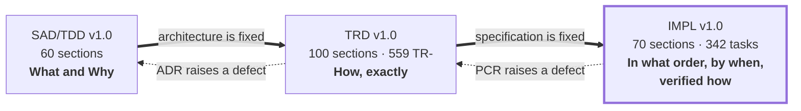

| The SAD Answers | The TRD Answers | **This Plan Answers** |
|---|---|---|
| Why a hexagonal pipeline? | Which file holds which stage | **Which week that file is written, what must exist first, and what proves it works** |
| Why selector packs? | The pack's JSON structure and validation | **That packs are built in phase 12 — after the pure core, before any browser code — and why moving them earlier or later costs money** |
| Why a Publish Gate? | The arithmetic of G-01…G-12 | **That the Gate is built in phase 6 with a 100%-coverage exit criterion, and that no publication code may be merged until that gate is green** |
| Why absence ≠ deletion? | The streak state machine and PT-07 | **That the reconciler is milestone M2's single deliverable, is estimated at 46 hours, is the project's critical-path apex, and has a named rollback if PT-07 cannot be made to pass** |

### 0.2.2 What This Document Is Not

- **It is not architecture.** No decision from the SAD is re-opened, softened, deferred, or "improved". If a phase looks expensive, that is information for the schedule, not an invitation to redesign.
- **It is not requirements.** Every "MUST" in this document is a *process* obligation (a gate, a review, an order). Product obligations live in the SAD and TRD and are referenced by identifier only.
- **It is not code.** No file in this plan contains an implementation. Where an artifact's shape matters, it is referenced by its TRD section number, not restated.
- **It is not a substitute for reading the TRD.** Every task in Part 12–14 assumes the implementer has the referenced TRD section open. The plan says *when* and *whether it worked*; the TRD says *what*.

### 0.2.3 Precedence

| # | Rule |
|---|---|
| P-1 | The ten system invariants (SAD §0.8) outrank every statement in all three documents. |
| P-2 | SAD > TRD on architecture. |
| P-3 | TRD > SAD on implementation detail. |
| P-4 | **This plan > both, on sequencing, estimation, staffing, and gating — and on nothing else.** |
| P-5 | A published JSON Schema file in `schemas/` beats all prose at runtime. |

---

## 0.3 Intended Audience and Reading Paths

| Reader | Read First | Then | May Skip |
|---|---|---|---|
| **AI coding agent** | §0.4 (identifiers), **Part 16 (agent playbook)**, §5 (order justification) | The phase section for the current task, then that task's row in Part 12–14 | Part 15 (management) |
| **Implementing engineer** | §1–§5 | §11–§23 once, then the phase you are on | §7, §8, Part 15 |
| **Engineering manager / TPM** | §6–§10, Part 15 | Decision gates, risk register, critical path | §24–§53 detail |
| **QA architect** | §54–§62, Part 17 | Per-phase Testing Checklists | §11–§23 |
| **DevOps** | §11–§23, §47–§49 | §63–§67 | §29–§43 |
| **Security engineer** | §23, §41, Part 17 security criteria | §60, §62 | §6–§10 |
| **Anyone inheriting the project mid-flight** | §0.9 (change control), Part 15 progress tracking | The current milestone's exit criteria | Completed phases |

### 0.3.1 Estimated Reading Time

| Part | Sections | Approx. Pages | Reading Time |
|---|---|---|---|
| Front matter | §0 | 10 | 25 min |
| Part 1 — Philosophy, Principles, Build Strategy | §1–§5 | 16 | 40 min |
| Part 2 — Milestones, Sprints, Releases | §6–§10 | 14 | 35 min |
| Part 3 — Repository and Environment | §11–§23 | 20 | 50 min |
| Part 4 — Foundation Systems | §24–§28 | 13 | 35 min |
| Part 5 — Acquisition | §29–§33 | 13 | 35 min |
| Part 6 — Processing and Data | §34–§38 | 13 | 35 min |
| Part 7 — Publication, Rollback, Recovery | §39–§43 | 12 | 30 min |
| Part 8 — Observability and Delivery | §44–§50 | 16 | 40 min |
| Part 9 — Extensibility Preparation | §51–§53 | 7 | 20 min |
| Part 10 — Testing Implementation | §54–§62 | 18 | 45 min |
| Part 11 — Checklists and V2 | §63–§70 | 14 | 35 min |
| Parts 12–14 — Task Breakdown | 342 tasks | 42 | reference |
| Part 15 — Engineering Management | — | 14 | 35 min |
| Part 16 — AI Coding Agent Playbook | — | 12 | 30 min |
| Part 17 — Quality Gates | — | 10 | 25 min |
| Part 18 — Appendices | — | 8 | reference |
| **Total** | **§0–§70** | **≈ 252** | **≈ 9 h** |

---

## 0.4 Notation, Identifiers, and Scales

### 0.4.1 Requirement Keywords

RFC 2119 keywords carry their SAD meanings. In this document they bind **process**, not product.

| Keyword | In This Document Means |
|---|---|
| **MUST** | The gate does not open without it. A release manager cannot waive it; only a PCR can. |
| **MUST NOT** | Doing it is a defect in execution, reportable at the daily stand-up. |
| **SHOULD** | Deviation requires one sentence of recorded rationale in the sprint log. |
| **MAY** | Genuinely at the team's discretion. |

### 0.4.2 Identifier Families Introduced Here

**No SAD or TRD identifier is redefined.** All families below are new and belong to this plan alone.

| Prefix | Meaning | Format | Example |
|---|---|---|---|
| `MS-` | **Milestone.** A shippable, independently demonstrable increment. | `MS-<n>` | `MS-4` |
| `PH-` | **Phase.** A unit of the SAD Appendix A build order, expanded here. | `PH-<nn>` | `PH-05` |
| `WP-` | **Work Package.** A cohesive group of tasks owned by one engineer at a time. | `WP-<nn>` | `WP-11` |
| `T-` | **Task.** The atomic unit of assignment and tracking. | `T-<nnn>` | `T-147` |
| `SP-` | **Sprint.** A two-week iteration. | `SP-<n>` | `SP-3` |
| `QG-` | **Quality Gate.** A blocking, automated or human check bound to a phase. | `QG-<nn>` | `QG-07` |
| `DG-` | **Decision Gate.** A scheduled human go/no-go with named attendees. | `DG-<nn>` | `DG-04` |
| `PR-` | **Plan Risk.** A risk to *executing* this plan. | `PR-<nn>` | `PR-06` |
| `DEL-` | **Deliverable.** A named artifact a phase must produce. | `DEL-<nn>` | `DEL-22` |
| `PCR-` | **Plan Change Record.** An approved deviation from this plan. | `PCR-<nn>` | `PCR-01` |
| `CP` | **Critical Path.** The dependency chain that sets the end date. | — | — |

Reused, never redefined: `INV-`, `ADR-`, `FR-`, `NFR-`, `CON-`, `RISK-`, `THREAT-`, `ERR-`, `MET-`, `G-`, `PT-`, `CH-`, `DR-`, `SEC-`, `V-`, `L-` (SAD); `TR-`, `EDR-`, `IF-`, `ALG-`, `IR-`, `OIQ-`, `TA-` (TRD).

### 0.4.3 Difficulty Scale

Difficulty measures **how likely the task is to be got wrong**, not how long it takes. The two are independent, and conflating them is how the reconciler gets assigned to a junior engineer because "it's only 400 lines".

| Level | Name | Meaning | Who May Own It | AI Agent Autonomy |
|---|---|---|---|---|
| **D1** | Mechanical | The output is fully determined by the spec. Copying a table into a constants file. | Anyone, including an unsupervised agent | Full — generate and merge on green CI |
| **D2** | Straightforward | One design choice, locally scoped, obvious from context. | Any engineer; agent with review | Full — generate, human reviews the diff |
| **D3** | Substantive | Several interacting rules; a wrong reading produces plausible-looking wrong behaviour. | Engineer with the TRD section open | Assisted — agent drafts, engineer verifies against spec line by line |
| **D4** | Hazardous | Correctness is not observable from the happy path. Failure is silent. | Senior engineer, paired review mandatory | Assisted only, with property tests written **first** by a human |
| **D5** | Critical-path apex | Gets one shot; a defect here corrupts client data or the public contract. | Staff engineer, two reviewers, no time pressure | **Human-led.** Agent may write tests and scaffolding only |

**Tasks touching `core/reconcile/`, `core/normalize/`, `core/gate/`, `core/identity/`, and `infra/logger/redact.mjs` are D4 or D5 by default.** No exceptions; the difficulty is a property of the module, not of the change size.

### 0.4.4 Priority Scale

| Priority | Meaning | Slippage Consequence |
|---|---|---|
| **P0** | On the critical path. | The project end date moves by the same amount. |
| **P1** | Required for the milestone, off the critical path. | The milestone's slack absorbs it once. |
| **P2** | Required for v1.0.0 GA, not for the milestone. | Can be pulled into hardening (SP-8). |
| **P3** | Required for the 30-day soak or for v1.1. | Can be deferred past GA with a recorded owner. |

### 0.4.5 Estimation Model

| Convention | Value |
|---|---|
| Unit | **Ideal engineer-hours (IEH)** — focused work by a competent engineer with the spec open, excluding meetings, review latency, and CI wait |
| Working day | 5.5 IEH — the remaining 2.5 hours are review, stand-up, CI, and context switching |
| Sprint | 10 working days = **55 IEH per engineer** |
| Team capacity | 2.0 FTE engineers + 0.5 FTE lead = **137 IEH per two-week sprint** raw, planned at ≈ 88% = **120 IEH committed**. SP-0 and SP-8 are one-week sprints: 68 raw, 60 committed |
| Estimate confidence | D1–D2: ±20% · D3: ±40% · D4: ±70% · D5: ±100% |
| AI-agent multiplier | D1–D2: **0.4×** elapsed · D3: **0.7×** · D4: **1.0×** (no speedup; verification dominates) · D5: **1.2×** (agent output must be re-derived by hand) |

**The multiplier row is the single most important line in this table for scheduling.** AI agents compress the mechanical two-thirds of this project substantially and compress the hazardous third not at all. Any schedule that assumes a uniform speedup will miss, and will miss precisely on the tasks whose failure is unrecoverable. All dates in this plan are stated **with** the multipliers already applied.

### 0.4.6 Block Conventions

| Marker | Meaning |
|---|---|
| **Sequencing Note** | Why this thing is here and not somewhere else. Load-bearing; do not reorder without reading it. |
| **Agent Note** | Aimed at an AI coding agent; usually names a plausible wrong action. |
| **Manager Note** | A staffing, tracking, or reporting consequence. |
| **Stop Condition** | If this is observed, halt the phase and escalate to the named decision gate. |

---

## 0.5 The Twelve Execution Rules

These govern every phase, every task, and every agent session. They are restated at the head of Part 16 because agents will read that part first.

| # | Rule | Consequence of Breaking It |
|---|---|---|
| **X-1** | **Build strictly in the order of SAD Appendix A**, expanded here as PH-00 … PH-25. | Every out-of-order build in a hexagonal codebase produces a fake abstraction shaped like the one implementation that existed at the time. |
| **X-2** | **A phase is done when its Exit Criteria are green, not when its code is written.** | "Done" that means "written" is how six phases finish in week 9 and none of them work. |
| **X-3** | **`main` is always releasable.** Every merge passes the full `ci.yml` gate set. | A red `main` blocks every other engineer and every agent session. |
| **X-4** | **Vertical slices over horizontal layers**, wherever the dependency graph allows a choice. | Horizontal layers defer all integration risk to the end, which is where schedules die. |
| **X-5** | **Tests are written in the same task as the code they test.** A task is not two tasks. | A "write the tests later" task is never scheduled and never done. |
| **X-6** | **No task may introduce a dependency** without a DEP-1 justification merged first. | See TRD §10.1; the target is two production dependencies. |
| **X-7** | **The Normalizer (PH-02) precedes every producer of data.** | It is the security boundary. Retrofitting it is how INV-05 is violated. |
| **X-8** | **The CSV adapter (PH-11) precedes every browser task.** | An interface validated against one implementation is a rename, not an interface. |
| **X-9** | **Every incident, in development or production, becomes a permanent test in the same PR that fixes it.** | TRD §61.14. Non-negotiable. |
| **X-10** | **Never widen a hard ceiling, never add a retry to an `ERR-BLOCKED-*` path, never simplify the absence asymmetry.** | The three unrecoverable classes of defect. IR-01, IR-11, A-3. |
| **X-11** | **Estimates are revised in the open.** A task exceeding 2× its estimate is escalated at the next stand-up, not absorbed. | Silent absorption is how a two-week slip is discovered in week 15. |
| **X-12** | **Every phase names its rollback before it starts.** | Identifying the rollback path during an incident is the slowest possible moment to do it (TR-CI-190). |

---

## 0.6 Phase Index — SAD Appendix A Expanded

The SAD's twenty-six build phases, restated with their plan identifiers, milestones, and the sections of this document that expand them. **This table is the spine of the plan.**

| PH | SAD Appendix A Phase | Milestone | Sprint | Expanded In | IEH | Diff |
|---|---|---|---|---|---|---|
| PH-00 | Repo skeleton, tooling, CI with a trivial test | MS-0 | SP-0 | §11–§23 | 62 | D2 |
| PH-01 | `core/model/`, `core/util/result`, `core/util/hash`, error taxonomy | MS-1 | SP-1 | §26, §36 | 34 | D2 |
| PH-02 | **`core/normalize/` — the security boundary** | MS-1 | SP-1 | §37 | 40 | **D4** |
| PH-03 | `core/dates/`, `core/lang/`, `core/identity/` | MS-1 | SP-1 | §33, §36 | 46 | D3 |
| PH-04 | `core/validate/` | MS-1 | SP-2 | §34 | 26 | D3 |
| PH-05 | **`core/reconcile/` — the hardest module** | MS-2 | SP-2 | §35, §38 | 46 | **D5** |
| PH-06 | `core/project/` and `core/gate/` | MS-2 | SP-2 | §39, §40 | 40 | **D4** |
| PH-07 | `ports/` + `infra/` (logger, clock, random, retry, fs-atomic) | MS-3 | SP-3 | §25, §26, §27 | 44 | D3 |
| PH-08 | `adapters/state/git-state`, `adapters/publisher/filesystem` | MS-3 | SP-3 | §38, §41 | 28 | D3 |
| PH-09 | `app/config/` six-layer loader | MS-4 | SP-3 | §24 | 32 | D3 |
| PH-10 | `cli/` skeleton + `validate-config`, `project`, `doctor` | MS-4 | SP-3 | §24, §42 | 34 | D2 |
| PH-11 | **`file:csv` adapter — proves the interface** | MS-5 | SP-4 | §52 | 24 | D3 |
| PH-12 | `selectors/` schema, loader, strategy resolver | MS-5 | SP-4 | §32 | 26 | D3 |
| PH-13 | `core/extract/` against saved fixtures | MS-5 | SP-4 | §33 | 42 | D3 |
| PH-14 | `adapters/browser/playwright-chromium` + session manager | MS-6 | SP-5 | §29, §30 | 34 | D3 |
| PH-15 | `fixtures/server/serve.mjs` + Navigator | MS-6 | SP-5 | §31 | 36 | D3 |
| PH-16 | `google-dom` adapter: resolver, consent, challenge, serialise | MS-6 | SP-5 | §32 | 44 | **D4** |
| PH-17 | Orchestrator + target runner + preflight | MS-6 | SP-6 | §28 | 40 | D3 |
| PH-18 | `adapters/publisher/git-data` + hash gating + rebase-retry | MS-7 | SP-6 | §41 | 32 | D3 |
| PH-19 | `harvest.yml` + `setup-engine` composite action | MS-7 | SP-6 | §48 | 30 | D3 |
| PH-20 | Diagnostics, health recorder, `notifier/github-issues` | MS-8 | SP-7 | §44, §45, §46 | 36 | D2 |
| PH-21 | Chaos suite CH-01…CH-14 | MS-8 | SP-7 | §62 | 34 | **D4** |
| PH-22 | `google:places-api` and `google:business-profile-api` adapters | MS-8 | SP-7 | §52 | 40 | D3 |
| PH-23 | `frontend/renderer/` + five integration recipes | MS-9 | SP-8 | §50 | 34 | D2 |
| PH-24 | Remaining five workflows | MS-9 | SP-8 | §48, §49 | 26 | D2 |
| PH-25 | Onboard Commerce Insight; begin the 30-day soak | MS-9 | SP-8 | §66 | 20 | D3 |
| — | Hardening, documentation, release engineering | MS-9 | SP-8 | §63–§65 | 40 | D2 |
| **Total** | | | | | **970** | |

**Sequencing Note.** PH-02 before PH-03 and PH-05 before PH-06 are the two orderings that carry real risk if inverted. Everything else in this table can absorb a week of local reordering without harm; those two cannot. §5 gives the full justification.

---

## 0.7 Section Map — Mandated Topic to Location

| § | Title | Part | Phase(s) |
|---|---|---|---|
| 1 | Implementation Philosophy | 1 | all |
| 2 | Engineering Principles | 1 | all |
| 3 | Project Build Strategy | 1 | all |
| 4 | Dependency Graph | 1 | all |
| 5 | Implementation Order Justification | 1 | all |
| 6 | Milestone Strategy | 2 | all |
| 7 | Sprint Strategy | 2 | all |
| 8 | Release Strategy | 2 | PH-19 … PH-25 |
| 9 | Feature Delivery Strategy | 2 | all |
| 10 | Incremental Development Rules | 2 | all |
| 11 | Repository Initialization Plan | 3 | PH-00 |
| 12 | Git Configuration Plan | 3 | PH-00 |
| 13 | Branch Creation Order | 3 | PH-00 |
| 14 | Folder Creation Order | 3 | PH-00 |
| 15 | Dependency Installation Order | 3 | PH-00 |
| 16 | Development Environment Setup | 3 | PH-00 |
| 17 | Node Setup | 3 | PH-00 |
| 18 | TypeScript Setup | 3 | PH-00 |
| 19 | Linting Setup | 3 | PH-00 |
| 20 | Formatting Setup | 3 | PH-00 |
| 21 | Testing Framework Setup | 3 | PH-00 |
| 22 | Git Hooks Setup | 3 | PH-00 |
| 23 | Environment Variables Setup | 3 | PH-00, PH-09 |
| 24 | Configuration System Implementation | 4 | PH-09, PH-10 |
| 25 | Logging System Implementation | 4 | PH-07 |
| 26 | Error Handling System | 4 | PH-01, PH-07 |
| 27 | Retry Engine | 4 | PH-07 |
| 28 | Scheduler Implementation | 4 | PH-17 |
| 29 | Playwright Engine | 5 | PH-14 |
| 30 | Browser Management | 5 | PH-14 |
| 31 | Navigation Engine | 5 | PH-15 |
| 32 | Review Detection Engine | 5 | PH-12, PH-16 |
| 33 | Review Parser | 5 | PH-03, PH-13 |
| 34 | Review Validation | 6 | PH-04 |
| 35 | Duplicate Detection | 6 | PH-05 |
| 36 | Hash Generator | 6 | PH-01, PH-03 |
| 37 | Normalizer | 6 | PH-02 |
| 38 | Review Ledger | 6 | PH-05, PH-08 |
| 39 | JSON Builder | 7 | PH-06 |
| 40 | JSON Validator | 7 | PH-06 |
| 41 | Publication Pipeline | 7 | PH-18 |
| 42 | Rollback Engine | 7 | PH-18, PH-10 |
| 43 | Recovery Engine | 7 | PH-10, PH-20 |
| 44 | Health Check System | 8 | PH-20 |
| 45 | Monitoring System | 8 | PH-20 |
| 46 | Metrics | 8 | PH-20 |
| 47 | GitHub Integration | 8 | PH-08, PH-18 |
| 48 | GitHub Actions | 8 | PH-19, PH-24 |
| 49 | Deployment Pipeline | 8 | PH-24, PH-25 |
| 50 | Website Integration | 8 | PH-23 |
| 51 | Future API Layer Preparation | 9 | PH-07, PH-08 |
| 52 | Adapter Layer Preparation | 9 | PH-11, PH-22 |
| 53 | Plugin System Preparation | 9 | PH-07, PH-17 |
| 54 | Testing Implementation | 10 | all |
| 55 | Unit Testing Order | 10 | PH-01 … PH-13 |
| 56 | Integration Testing Order | 10 | PH-08 … PH-19 |
| 57 | End-to-End Testing Order | 10 | PH-15 … PH-23 |
| 58 | Performance Testing | 10 | PH-06, PH-21 |
| 59 | Load Testing | 10 | PH-21 |
| 60 | Failure Simulation | 10 | PH-21 |
| 61 | Regression Testing | 10 | PH-13, PH-21 |
| 62 | Chaos Testing | 10 | PH-21 |
| 63 | Deployment Readiness Checklist | 11 | PH-24 |
| 64 | Release Candidate Checklist | 11 | PH-24 |
| 65 | Production Checklist | 11 | PH-25 |
| 66 | Post Deployment Verification | 11 | PH-25 |
| 67 | Rollback Procedure | 11 | PH-25 |
| 68 | Maintenance Checklist | 11 | post-GA |
| 69 | Future Upgrade Checklist | 11 | post-GA |
| 70 | Version 2 Preparation | 11 | post-GA |

---

## 0.8 Team Model and Capacity Assumptions

| Role | FTE | Owns | Named Risk If Absent |
|---|---|---|---|
| Staff Backend Engineer (Lead Implementer) | 1.0 | `core/`, adapters, orchestration | PR-01: the D4/D5 modules have no qualified owner and the schedule is fiction |
| Backend Engineer | 1.0 | `infra/`, `cli/`, `app/`, adapters, fixtures | PR-02: sprint capacity halves; MS-6 onward slips ~5 weeks |
| Senior DevOps Engineer | 0.3 | Workflows, branch setup, Pages, secrets, runners | PR-03: PH-19/PH-24 slip and the harvest never runs unattended |
| QA Architect | 0.3 | Property laws, chaos suite, fixture corpus, coverage gates | PR-04: chaos suite is written by the person who wrote the bug |
| Engineering Manager / TPM | 0.5 | Gates, tracking, risk register, stakeholder reporting | PR-05: exit criteria erode silently under deadline |
| Security Engineer | 0.1 | Redaction, secrets, workflow lint, threat re-verification | PR-06: INV-08 is asserted rather than tested |
| AI Coding Agents | n/a | D1–D3 task execution under Part 16 rules | PR-07: elapsed time roughly doubles; correctness unchanged |

**Manager Note.** The 0.3 FTE QA Architect is the line item most likely to be cut and the one that must not be. Six of eleven pipeline stages are pure specifically so that they can be exhaustively tested; deleting the person who writes those tests deletes the reason the architecture is shaped this way.

### 0.8.1 Capacity Ledger

| Sprint | Weeks | Raw Capacity | Planned IEH | Cumulative Planned | Planned Phases |
|---|---|---|---|---|---|
| SP-0 | W01 | 68 | 62 | 62 | PH-00 |
| SP-1 | W02–W03 | 137 | 120 | 182 | PH-01, PH-02, PH-03 |
| SP-2 | W04–W05 | 137 | 112 | 294 | PH-04, PH-05, PH-06 |
| SP-3 | W06–W07 | 137 | **138** | 432 | PH-07, PH-08, PH-09, PH-10 |
| SP-4 | W08–W09 | 137 | 92 | 524 | PH-11, PH-12, PH-13 |
| SP-5 | W10–W11 | 137 | 114 | 638 | PH-14, PH-15, PH-16 |
| SP-6 | W12–W13 | 137 | 102 | 740 | PH-17, PH-18, PH-19 |
| SP-7 | W14–W15 | 137 | 110 | 850 | PH-20, PH-21, PH-22 |
| SP-8 | W16 | 68 | 120 | 970 | PH-23, PH-24, PH-25, hardening |
| **Total** | **16 weeks** | **1,095** | **970** | | **125 IEH (11%) reserve** |

**The 11% reserve is deliberately thin and deliberately visible.** It is not contingency for scope; it is contingency for the two D5 tasks. Two sprints are planned above their raw capacity — SP-3 (138 vs 137) and SP-8 (120 vs 68) — and both are called out where they occur (§7.2). SP-8's overage is absorbed by the fact that 40 IEH of its load is the unallocated hardening allowance, which is drawn against only if defects require it. If the reserve is consumed before SP-5, DG-06 is triggered early and scope is cut from MS-8, not from MS-2.

---

## 0.9 Change Control

### 0.9.1 Plan Change Records

Any deviation from this plan that changes a milestone date, deletes a task, or reorders a phase requires a PCR.

> **PCR-nn — Title**
> **Requested by / Date:**
> **Change:** what moves, is deleted, or is reordered.
> **Reason:** the observed fact that makes the plan wrong.
> **Impact:** on the critical path, on the end date, on which decision gate.
> **Invariant check:** which of INV-01…INV-10 this touches. If any, the Architect signs.
> **Approval:** Engineering Manager; plus Architect if the invariant check is non-empty.

### 0.9.2 What Does *Not* Require a PCR

| Change | Handling |
|---|---|
| Re-estimating a task | Sprint log entry |
| Re-assigning a task | Sprint log entry |
| Splitting a task into two | Sprint log; keep the parent ID with `.1` `.2` suffixes |
| Adding a task inside an existing phase | Sprint log; new ID from the reserved block for that phase |
| Reordering tasks **within** a phase | Free, provided intra-phase dependencies hold |
| Adding a regression test for a defect found | Always allowed, always required (X-9) |

### 0.9.3 What Requires an ADR or EDR Instead

If the reason a task cannot be completed is that the specification is wrong or under-specified, **stop and raise a defect against the TRD (EDR) or SAD (ADR)**. Do not solve it in the plan. A PCR that changes *what is built* is a mis-filed EDR.

---

## 0.10 Open Planning Questions

Deliberately unresolved at plan baseline. Each has an owner, a deadline, and an interim position that MUST be applied rather than an invented answer.

| ID | Question | Owner | Required By | Interim Position |
|---|---|---|---|---|
| OPQ-01 | Does the second Backend Engineer start at W01 or W06? | EM | DG-01 (W01) | Plan assumes W01. If W06, MS-5 onward slips 3 weeks; DG-03 re-baselines. |
| OPQ-02 | Is the canary reference listing chosen and stable? | Backend | PH-19 (W12) | Use a well-known, high-volume, non-client listing; record the choice in `selectors/google-maps/assertions.json` provenance. |
| OPQ-03 | Which HTML parser for offline extraction tests (TRD OIQ-03)? | QA | PH-13 (W08) | Any dev-only parser satisfying DEP-3. Decision recorded as a one-line dev-dependency justification, not an EDR. |
| OPQ-04 | Repository public or private (TRD §64.2 step 1)? | EM | PH-00 (W01) | **Public.** Free CI minutes; CON-17 already assumes no secret exists in any file. |
| OPQ-05 | Do we run the 30-day soak with one client or two? | EM | DG-11 (W16) | One (Commerce Insight). A second client during soak confuses the signal with onboarding noise. |
| OPQ-06 | Is the v1.1 job-split (TRD §96.2) in scope before the first external client? | Architect | DG-12 (post-GA) | Out of scope for v1.0.0; recorded in §70 as V2-01 with its risk (THREAT-05) restated. |

---

## 0.11 Assumptions This Plan Depends On

Distinct from the TRD's `TA-` assumptions (which concern third parties). These concern **execution**, and each is falsifiable in week 1.

| ID | Assumption | Falsified By | If False |
|---|---|---|---|
| PA-01 | Both baselined documents are readable by the implementers without further clarification | More than two blocking clarification requests per phase | Escalate to DG-02; the TRD is defective and needs an EDR round before SP-2 |
| PA-02 | The team can run Chromium locally on their development machines | `tpre doctor` fails on any developer machine in W01 | Fall back to a devcontainer; +8 IEH in PH-00 |
| PA-03 | CI runners meet TA-01 (≥ 4 cores, ≥ 14 GB) | First `tpre doctor` in CI | Re-derive §44/§45 budgets; lower `max_reviews` default; +6 IEH in PH-19 |
| PA-04 | AI coding agents can operate against the TRD at D1–D3 with the Part 16 rules | Agent-produced PRs failing review at > 40% in SP-1 | Drop the agent multiplier to 1.0×; end date moves ~4 weeks; DG-03 re-baselines |
| PA-05 | No external dependency on this project's output before W16 | A client commitment made outside engineering | Scope is cut, not quality. §9.5 names exactly what is cuttable. |

---

*End of front matter. Part 1 begins with Section 1, Implementation Philosophy.*


---

# Part 1 — Philosophy, Principles, Build Strategy, and Order

*Sections 1 through 5. Audience: everyone, before anything else. This part explains why the build order is what it is. An engineer who reads only Part 12 and starts at task T-001 will produce working code in the wrong sequence, and the cost of that shows up in week 11, not week 2.*

---

# 1. Implementation Philosophy

## 1.1 The Governing Sentence

> **Build the things whose failure is invisible before the things whose failure is obvious.**

Every ordering decision in this plan derives from that sentence. A browser adapter that does not work fails loudly on the first run. A normalizer that lets one markup form through fails silently, on someone else's website, months later, and is discovered by a client. The second class of defect is the one the build order is designed around.

The SAD's Appendix A already encodes this. This plan does not improve on it; it explains it, expands it into assignable work, and attaches gates to it so that the ordering survives the week somebody is behind schedule.

## 1.2 The Five Philosophical Commitments

| # | Commitment | What It Rules Out | What It Buys |
|---|---|---|---|
| **1** | **Correctness before capability** | Building acquisition first because it is the visible part of the product | Every producer of data is built against a boundary that is already proven safe |
| **2** | **Purity before plumbing** | Wiring adapters early "so we can see something work" | Six of eleven stages become exhaustively testable offline, which is what makes a three-minute suite possible |
| **3** | **The simplest implementation of an interface, first** | Building `google:dom` as the first adapter | The port is validated against a second implementation while changing it is still free (X-8) |
| **4** | **Deterministic before non-deterministic** | Any early dependency on the network, the clock, or a live page | Every early phase is testable with zero flake, so a red build always means a real defect |
| **5** | **Reversibility is a feature of the plan, not just the product** | Phases with no stated rollback | A phase can be abandoned in week N without unwinding weeks 1..N-1 |

## 1.3 What This Project Is, From a Delivery Standpoint

| Property | Value | Delivery Consequence |
|---|---|---|
| Deployable surface | A CLI, two orphan Git branches, eight workflow files | There is no staging environment to build, and no deployment automation to write beyond the workflows themselves |
| Runtime | Ephemeral CI runner, 3–20 minutes | Nothing can be "tested in production by watching it" — the process is gone before you look |
| State | Git branches | Every state bug is diffable and revertible; every state bug is also a commit somebody has to clean up |
| Blast radius of a defect | Every client website simultaneously | Publication is gated, and the gate is built (PH-06) five phases before anything can publish (PH-18) |
| Observability | Files and issues | Monitoring must be built as a deliverable (PH-20), not bought |
| Team | ≈ 2.3 FTE + agents | Every hour of avoidable rework is ~0.5% of the schedule |

**The fourth row is the one that shapes the plan most.** In a system where a bad artifact reaches every client at once, the correct order is: build the thing that says *no*, then build the thing that produces candidates for it to say no to. That is why the Publish Gate is phase 6 and the publisher is phase 18.

## 1.4 The Two Failure Modes This Plan Exists to Prevent

### 1.4.1 The Demo Trap

The natural order of work — browser first, because it is the interesting part; parsing second, because it is next; storage third — produces a demo in week 2 and a product in month 9. It fails because:

- the adapter interface is designed around exactly one implementation and does not survive the second;
- the pure core is written *after* its consumers, so its signatures are shaped by call sites rather than by laws;
- normalisation is retrofitted, and INV-05 becomes an aspiration;
- every test needs a browser, so the suite is slow, flaky, and eventually not run.

**Countermeasure:** X-1, X-7, X-8, and the fact that PH-14 (the first line of Playwright code) is scheduled in week 10 of 16.

### 1.4.2 The Cathedral Trap

The opposite failure: build every layer perfectly and integrate at the end. It fails because integration risk is deferred to the point where there is no schedule left to absorb it.

**Countermeasure:** X-4 (vertical slices) and the milestone definition in §6 — every milestone from MS-3 onward is *demonstrable end to end* on a narrowing but real path:

| Milestone | The Vertical Slice That Must Run |
|---|---|
| MS-3 | Ledger written to disk and read back, byte-identically |
| MS-4 | `tpre validate-config --explain` and `tpre project` run against fixtures with no network |
| MS-5 | A CSV file becomes a published payload on the local filesystem |
| MS-6 | A local fixture page in a real browser becomes a payload on the local filesystem |
| MS-7 | A local fixture page becomes a commit on a real `data` branch, via GitHub Actions |
| MS-9 | A real listing becomes a payload on a CDN, rendered on a real website |

**MS-5 is the load-bearing one.** By the end of week 9 — before any browser code — the entire pipeline from adapter to published artifact runs end to end. Every subsequent phase substitutes a component into a path that already works, which is the cheapest form of integration there is.

## 1.5 Attitude Toward AI Coding Agents

This project is planned on the explicit assumption that a substantial share of implementation is performed by AI coding agents. The philosophy is stated here and operationalised in Part 16.

| Position | Rationale |
|---|---|
| Agents are **excellent** at D1–D2 work | Constants, schemas, scaffolding, test-file skeletons, workflow YAML, recipe documents. Roughly 55% of this plan's task count. |
| Agents are **useful but supervised** at D3 | They produce plausible implementations of specified algorithms. Verification against the TRD line by line is the human's job and is *not* faster than writing it. |
| Agents are **hazardous** at D4–D5 | Precisely because the failure modes are invisible. TRD §0.5 lists ten agent rules; A-4 (never simplify the absence asymmetry) and DR-2 (`Date.now()` default parameters) exist because these are the statistically likely outputs. |
| Agents **never** own an exit criterion | A phase is signed off by a named human. |

**Agent Note.** The most valuable thing an agent can do on this project is write the *test* for a D4 module from the TRD's property laws, and then let a human write the implementation against it. That inverts the usual split and puts the agent where its recall of a long specification is an advantage and its confident guessing is not.

---

# 2. Engineering Principles

Twelve principles. Each is operational: it can be checked in a pull request, and each names its enforcement.

## 2.1 The Principle Set

| # | Principle | Statement | Enforced By |
|---|---|---|---|
| **EP-01** | **Dependency-ordered construction** | Never build a module before everything it imports is complete and tested. | Phase exit criteria; architecture test |
| **EP-02** | **The pure core is sacred** | `core/` has zero I/O, zero clock, zero randomness, zero environment, zero dependencies. | DR-1/DR-2 architecture tests, from PH-01 onward |
| **EP-03** | **Test in the same commit** | Code and its tests are one task, one PR, one review. | PR template; X-5 |
| **EP-04** | **Errors are values in the core, exceptions at the edges** | `Result` in `core/`; classified throws at adapters; conversion in exactly one place. | EDR-002; review checklist |
| **EP-05** | **Every threshold is configuration with a named default** | No magic number survives review. | Lint (magic numbers), review checklist item 4 |
| **EP-06** | **Every failure is classified** | An error not in the taxonomy is `ERR-INTERNAL-UNCLASSIFIED`, which is a defect. | Unit test: taxonomy completeness |
| **EP-07** | **Determinism is testable, so test it** | Fixed clock and seeded random in every test, from the first test. | TR-TEST-032; helpers exist in PH-00 |
| **EP-08** | **The gate before the producer** | Safety mechanisms are built before the things they guard. | Phase order PH-06 ≪ PH-18 |
| **EP-09** | **One name per concept** | TRD §68.2's vocabulary table is binding in code, logs, commits, and tickets. | Review; `coverage` vs `completeness` is a correctness issue |
| **EP-10** | **Diagnosability outranks cleverness** | If it cannot be diagnosed from artifacts alone, it is not finished. | Review checklist item 5 |
| **EP-11** | **No client-specific code path, ever** | A conditional on a slug is a defect regardless of deadline. | CON-04; review checklist item 9 |
| **EP-12** | **Leave the seam, don't build the future** | v1.0 builds interfaces that future work will need; it builds none of that work. | TRD A-10; §51–§53 of this plan |

## 2.2 Principles in Tension, and How They Are Resolved

Principles that never conflict are decoration. These three pairs conflict in practice; the resolution is stated in advance so it is not re-litigated per pull request.

| Tension | Resolution | Authority |
|---|---|---|
| EP-01 (dependency order) vs X-4 (vertical slices) | Dependency order wins on *module* granularity; slices are formed at *milestone* granularity. You may not build a partial reconciler to unblock a demo. | §5.6 |
| EP-03 (test in the same commit) vs velocity in D1 tasks | Holds absolutely. A D1 task with no test is a D1 task with no acceptance criterion. | X-5 |
| EP-12 (leave the seam) vs "we'll need this anyway" | The seam is an interface file in `ports/` plus a contract test. Anything with behaviour is future work. | TRD §75, A-10 |

## 2.3 The Definition of Done — One Task

A task is done when **all eight** hold. Seven of eight is not done.

| # | Condition |
|---|---|
| 1 | The code exists and satisfies the TRD section named in the task |
| 2 | Its tests exist, in the same PR, and fail against the previous commit |
| 3 | Lint, format, and type check pass with zero errors |
| 4 | The full default suite passes locally in under three minutes |
| 5 | Coverage thresholds for the touched module are met (see Part 17) |
| 6 | Module header documents what the module does **and what it explicitly does not do** (TRD §67.5) |
| 7 | Any new error class is in the taxonomy, the retry table, and the severity map |
| 8 | The PR description names the TRD section(s) implemented and the invariant(s) touched |

## 2.4 The Definition of Done — One Phase

| # | Condition |
|---|---|
| 1 | Every task in the phase is done by §2.3 |
| 2 | The phase's **Exit Criteria** (stated per phase in Parts 4–10) are green |
| 3 | The phase's **Verification Checklist** has been executed by someone other than the implementer |
| 4 | The phase's **Documentation Required** artifacts exist and are merged |
| 5 | `main` is green and releasable |
| 6 | The phase's rollback strategy has been *read* by the reviewer and is still accurate |

## 2.5 The Definition of Done — v1.0.0

Identical to TRD §1.7's ten criteria plus this plan's §64 release-candidate checklist. It is not restated here; duplicating an acceptance definition is how two versions of it come to exist.

---

# 3. Project Build Strategy

## 3.1 Strategy in One Diagram

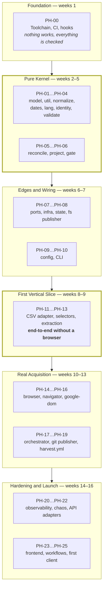

## 3.2 The Six Strategic Blocks

| Block | Weeks | Phases | Strategic Purpose | What Is Deliberately Absent |
|---|---|---|---|---|
| **Foundation** | W01 | PH-00 | Make every subsequent commit checkable. | Any product code at all |
| **Pure Kernel** | W02–W05 | PH-01…PH-06 | Build every module whose defects are invisible, while the cost of getting them right is lowest. | Any I/O, any adapter, any network, any CLI |
| **Edges and Wiring** | W06–W07 | PH-07…PH-10 | Give the kernel a way in and out. | Any acquisition |
| **First Vertical Slice** | W08–W09 | PH-11…PH-13 | Prove the whole pipeline with the dumbest possible source. | Any browser |
| **Real Acquisition** | W10–W13 | PH-14…PH-19 | Substitute the real source into a proven pipeline; automate it. | Observability beyond logs |
| **Hardening and Launch** | W14–W16 | PH-20…PH-25 | Make failures visible, prove them safe, ship. | Anything from TRD §76–§91 |

**Sequencing Note.** The "deliberately absent" column is the operative one. Each block's discipline is defined by what it refuses to build, and every one of those refusals has been violated in some other project by someone who was two days behind.

## 3.3 Build Strategy Decision Matrix

The four candidate strategies, scored against this project's actual constraints. Recorded so that the chosen strategy is understood as a decision, not a default.

| Criterion | Weight | **A. Layer-by-layer (bottom-up)** | B. Feature-first (browser first) | C. Outside-in (CLI first, mocks inward) | D. Strangler around a spike |
|---|---|---|---|---|---|
| Protects INV-05 / INV-03 | ×5 | **5** | 1 | 3 | 1 |
| Validates the adapter port honestly | ×4 | **5** | 1 | 3 | 2 |
| Time to first end-to-end demo | ×2 | 2 | **5** | 4 | 5 |
| Test suite stays offline and fast | ×4 | **5** | 1 | 4 | 2 |
| Rework risk if a phase is wrong | ×4 | **4** | 2 | 3 | 2 |
| Suits AI-agent parallelisation | ×3 | **4** | 3 | 4 | 2 |
| Matches SAD Appendix A | ×5 | **5** | 1 | 2 | 1 |
| **Weighted total** | | **☑ 127** | 51 | 91 | 50 |

**Chosen: A, tempered by X-4.** Pure layer-by-layer would defer integration to week 13; the milestone definitions in §6 force a runnable vertical path from MS-3 onward, which recovers strategy C's main benefit without paying for its mocks.

**Why not C (outside-in with mocks):** in a system whose entire value is the correctness of six pure functions, mocking those functions to build the CLI first means the CLI is designed against fictional behaviour. The real signatures are determined by the laws in TRD §61.4, and those laws are knowable *now* — the SAD and TRD are baselined. Outside-in exists to discover unknown interfaces; here they are specified.

## 3.4 Parallelisation Strategy

Two engineers plus agents. The plan is written so that at every point in the schedule there is a second, genuinely independent track.

| Sprint | Track A (Lead Implementer) | Track B (Engineer 2 + agents) | Coupling Risk |
|---|---|---|---|
| SP-0 | Repo, branches, workflows skeleton | Tooling configs, hooks, test helpers | Low — different files |
| SP-1 | **PH-02 normalize** (D4) | PH-01 model/util, PH-03 dates/lang | Low — PH-03 imports PH-01 only |
| SP-2 | **PH-05 reconcile** (D5) | PH-04 validate, then PH-06 project | **Medium** — PH-06 gate needs PH-05's ledger shape; mitigated by fixing the shape in PH-01 |
| SP-3 | PH-07 ports/infra | PH-08 state, PH-09 config, PH-10 CLI | Low |
| SP-4 | PH-13 extraction + fixtures | PH-11 CSV adapter, PH-12 selectors | Low — PH-13 depends on PH-12's resolver contract, fixed at start of sprint |
| SP-5 | PH-16 google-dom | PH-14 browser, PH-15 navigator + fixture server | **High** — same subsystem; managed by daily interface sync, see §7.6 |
| SP-6 | PH-17 orchestrator | PH-18 publisher, PH-19 harvest.yml | Medium |
| SP-7 | PH-21 chaos | PH-20 observability, PH-22 API adapters | Low |
| SP-8 | PH-25 onboarding, hardening | PH-23 frontend, PH-24 workflows | Low |

**Manager Note.** SP-5 is the only sprint where both engineers work inside the same subsystem. It is also the sprint with the highest external-change risk (upstream markup). If a re-plan is needed, SP-5 is the one to protect with slack, not SP-2 — SP-2's risk is *difficulty*, which slack does not reduce, whereas SP-5's risk is *interface churn*, which it does.

## 3.5 The Cost of Getting the Order Wrong

Stated in hours, because "it's better this way" does not survive a deadline conversation.

| Inversion | Estimated Rework | Why |
|---|---|---|
| Browser adapter before the pure core | **+120 IEH** | The port is shaped by Playwright's ergonomics; the CSV and API adapters then require a port redesign, and every extraction test needs a browser |
| Normalizer after any producer | **+40 IEH and an unbounded correctness risk** | Every producer's tests encode pre-normalisation shapes; retrofitting requires re-deriving all golden fixtures and re-auditing INV-05 |
| Gate after the publisher | **+25 IEH** | The publisher's tests are written against an ungated path; the gate then has to be inserted into a code path that already has a "just publish" branch, which is the branch that survives |
| Reconciler after the projector | **+30 IEH** | The projector is written against a guessed ledger shape and re-written once |
| Config loader before the core | **+15 IEH** | Config keys are invented rather than derived from what the modules actually need; §8.4's key set becomes aspirational |
| CSV adapter after `google-dom` | **+35 IEH and a false interface** | The abstraction is a rename until a second implementation exists (TRD §61.6) |

---

# 4. Dependency Graph

## 4.1 Module-Level Dependency Graph

The build-order graph. An arrow means *must be complete and tested before*. This is the graph the phase order topologically sorts.

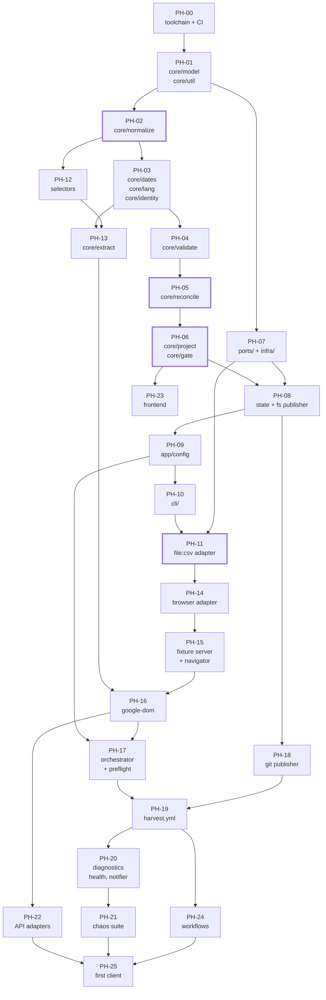

## 4.2 The Hard Edges

Most edges in that graph are soft — they could be violated with modest local cost. Six are hard: violating them causes rework measured in weeks or a correctness risk that cannot be bought back with testing later.

| Edge | Hardness | Reason |
|---|---|---|
| PH-01 → PH-02 | **Hard** | The `CleanString` brand and `Result` type are the normalizer's output vocabulary |
| **PH-02 → everything that produces data** | **Hard, non-negotiable** | INV-05 security boundary; X-7 |
| PH-01 → PH-05 | **Hard** | The ledger shape must be fixed before reconciliation logic; changing it later invalidates every property test |
| **PH-05 → PH-06** | **Hard** | The projector reads the ledger; the gate compares projections. Both are meaningless against a guessed shape |
| **PH-11 → PH-14** | **Hard** | X-8; a second adapter must exist before the port hardens around Playwright |
| PH-06 → PH-18 | **Hard** | EP-08; the publisher must be unreachable except through the gate (TR-REC-040, architecture test) |

## 4.3 Task-Level Dependency Density

| Phase | Tasks | Internal Deps | External Deps | Fan-out (phases blocked) | Parallelisable Within Phase |
|---|---|---|---|---|---|
| PH-00 | 46 | 38 | 0 | 25 | High — 6 concurrent streams |
| PH-01 | 14 | 11 | 1 | 24 | Medium |
| PH-02 | 12 | 11 | 2 | 22 | **Low — sequential eight-step pipeline** |
| PH-03 | 14 | 9 | 2 | 18 | High — three independent modules |
| PH-04 | 10 | 8 | 3 | 15 | Medium |
| PH-05 | 15 | 14 | 4 | 14 | **Very low — one cohesive algorithm** |
| PH-06 | 15 | 11 | 5 | 12 | Medium — projector and gate split cleanly |
| PH-07 | 16 | 9 | 2 | 14 | High |
| PH-08 | 11 | 7 | 4 | 10 | Medium |
| PH-09 | 12 | 10 | 3 | 9 | Low |
| PH-10 | 12 | 8 | 6 | 8 | High — one task per command |
| PH-11 | 9 | 6 | 4 | 7 | Medium |
| PH-12 | 10 | 8 | 2 | 6 | Medium |
| PH-13 | 13 | 10 | 4 | 5 | High — one task per field extractor |
| PH-14 | 11 | 8 | 3 | 4 | Low |
| PH-15 | 12 | 10 | 3 | 3 | Medium |
| PH-16 | 13 | 10 | 5 | 3 | Medium |
| PH-17 | 12 | 9 | 6 | 2 | Low |
| PH-18 | 11 | 8 | 4 | 2 | Medium |
| PH-19 | 11 | 7 | 5 | 4 | Medium |
| PH-20 | 11 | 6 | 5 | 2 | High |
| PH-21 | 13 | 2 | 13 | 1 | **Very high — independent scenarios** |
| PH-22 | 11 | 7 | 5 | 1 | High — two adapters |
| PH-23 | 11 | 7 | 3 | 1 | High |
| PH-24 | 9 | 4 | 6 | 1 | High — five workflows |
| PH-25 | 8 | 6 | 9 | 0 | Low |
| **Total** | **342** | | | | |

**Manager Note.** The "Parallelisable Within Phase" column is the staffing input. PH-02, PH-05, PH-09, PH-14, and PH-17 are single-owner phases: adding a second engineer to them produces coordination cost and no speedup. PH-00, PH-13, PH-21, PH-24 absorb agents and additional hands well and are where extra capacity should be spent if it appears.

## 4.4 Artifact-Level Dependencies

Not all dependencies are code. These are the non-code prerequisites, which are the ones that get discovered late.

| Artifact | Needed By | Owner | Lead Time | Risk If Late |
|---|---|---|---|---|
| GitHub repository, public, with Actions enabled | PH-00 | DevOps | 1 day | Blocks everything |
| `data` and `state` orphan branches | PH-08 | DevOps | 1 hour | PH-08 tests can use temp dirs; real risk is at PH-18 |
| GitHub Pages enabled, headers verified (OIQ-04) | PH-24 | DevOps | 2 days incl. verification | Blocks PH-25; assumed-but-unverified headers invalidate the manifest freshness pattern |
| Twenty golden fixtures captured and sanitised | PH-13 | QA + Backend | **2 weeks elapsed** | **Highest non-code risk.** Capture starts in SP-2, not SP-4 |
| `selectors/google-maps/v1.json` authored | PH-12 | Backend | 3 days | Blocks PH-13 |
| Written authorisation record for Commerce Insight | PH-25 | EM | **Unknown — external** | Blocks the first client. Start at W01. V-3 makes it a hard validation failure, by design |
| Canary reference listing chosen (OPQ-02) | PH-19 | Backend | 1 day | Canary is decorative without it |
| Offsite clone of the repository (TR-CI-161) | PH-25 | DevOps | 1 hour | Blocks first-client onboarding by rule |
| Client website access for integration (PH-23 verification) | PH-25 | EM | External | Recipes can be verified on a scratch site instead |

**Stop Condition.** If the Commerce Insight authorisation record is not obtainable by the end of SP-6 (W13), raise it at DG-08. The engine ships regardless — but the first client becomes an internal scratch listing and the soak begins later. Building an unauthorised DOM client is not an available option (V-3, SAD §15).

## 4.5 External Dependency Graph

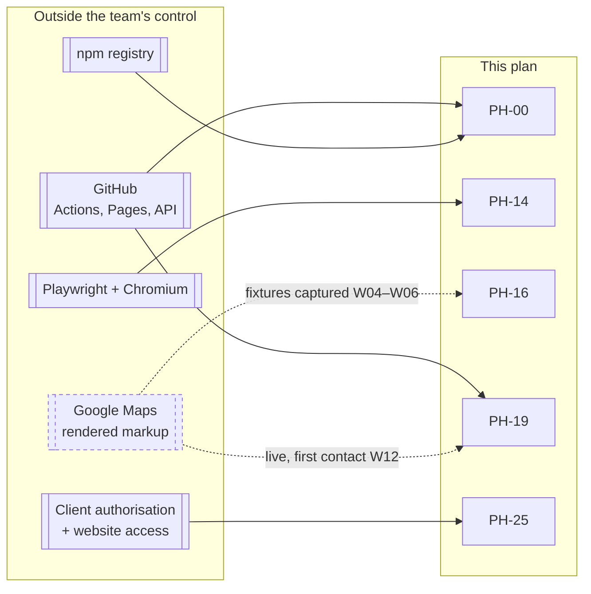

**The dashed edge is the plan's largest uncontrolled risk** and is registered as PR-09. Mitigation is structural, not managerial: fixtures are captured early (SP-2), extraction is tested against saved markup only (PH-13), and the first live contact is deliberately deferred to week 12, by which point a markup change costs a selector pack revision rather than a redesign.

---

# 5. Implementation Order Justification

*This section exists so that nobody has to re-derive the order under pressure. Each phase's placement is justified against the alternative of moving it earlier and moving it later.*

## 5.1 Justification Format

For each phase: **why not earlier**, **why not later**, and **what breaks if moved**.

## 5.2 Foundation and Kernel

| Phase | Why Not Earlier | Why Not Later | What Breaks If Moved |
|---|---|---|---|
| **PH-00** Toolchain | It is first. | Every commit made before the lint/type/test gates exists must be re-audited when they arrive. | Moving it later means the pure-core phases are written without DR-1/DR-2 enforcement — the single cheapest guard in the project |
| **PH-01** model + util | Needs the toolchain to be checkable. | Everything imports it. It is the vocabulary. | The `Result` type and `CleanString` brand get invented three times in three modules |
| **PH-02** normalize | Needs `Result` and the brand (PH-01). | **Nothing that produces data may precede it (X-7, INV-05).** | INV-05 becomes retrofit; golden fixtures are re-derived; the security boundary is asserted rather than proven |
| **PH-03** dates, lang, identity | Identity hashing consumes normalised text; the normalizer must exist first. | The reconciler (PH-05) is meaningless without `identity_hash`. | Identity is computed over un-normalised text and PT-09 fails in ways that look like flakiness |
| **PH-04** validate | Validation classifies normalised records; needs PH-02, PH-03. | The reconciler consumes a `ValidationReport`. | Completeness classification gets embedded in the reconciler, and CH-04's three independent protections collapse into one |
| **PH-05** reconcile | Needs the ledger shape (PH-01), identity (PH-03), and completeness (PH-04). | **It is the apex of the critical path.** Every week it is delayed is a week of schedule risk with no compensating benefit. | Nothing later is trustworthy. PT-01…PT-07 are the project's core correctness argument |
| **PH-06** project + gate | The projector reads a ledger that must already have a fixed shape and semantics. | **The gate must exist before anything can publish (EP-08).** | The publisher acquires an ungated path; TR-REC-040's architecture test becomes unenforceable |

### 5.2.1 The Two Orderings That Cannot Be Changed

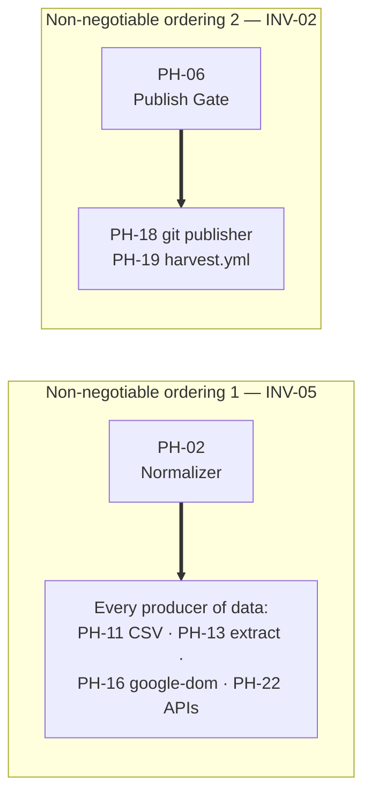

**These two are the plan's only true constraints of conscience.** Every other ordering is an efficiency argument that a competent team could relitigate. These two are correctness arguments that a competent team should not.

## 5.3 Edges and Wiring

| Phase | Why Not Earlier | Why Not Later | What Breaks If Moved |
|---|---|---|---|
| **PH-07** ports + infra | Port shapes are derived from what the core actually needs; guessing them before the core exists produces ports nobody uses | The CSV adapter (PH-11) implements a port; nothing can be adapted before ports exist | Ports designed against imagination; the retry policy table is written before the taxonomy is complete |
| **PH-08** state + fs publisher | Serialising a ledger requires a final ledger shape and the `fs-atomic` primitive from PH-07 | Nothing can persist; PH-11's slice cannot complete | Ledger round-trip (PT-15) discovered late; unknown-field preservation retrofitted |
| **PH-09** config | Config keys are derived from what modules need. Writing the loader first invents keys | The CLI, the registry, and every adapter read config | `defaults.mjs` drifts from the schema and TR-APP-031's correspondence test is written against a moving target |
| **PH-10** CLI | The composition root can only construct things that exist | Nothing is runnable by a human; `tpre doctor` is the tool that makes every later phase debuggable | Debugging PH-13 onward happens through test harnesses instead of the real entry point, hiding wiring defects until PH-17 |

## 5.4 The First Vertical Slice

| Phase | Why Not Earlier | Why Not Later | What Breaks If Moved |
|---|---|---|---|
| **PH-11** CSV adapter | Needs ports (PH-07), state (PH-08), config (PH-09), CLI (PH-10) — the whole spine | **X-8: it must precede all browser work.** Later means the port is validated only against Playwright | The `AcquisitionPort` becomes a Playwright-shaped interface with a CSV translation layer bolted on. This is the single most common way hexagonal architectures degrade |
| **PH-12** selectors | The pack loader is pure and needs `Result` + validation vocabulary | The extractor consumes resolved fields | Selector strategy resolution gets embedded in extraction, and CH-07's fallback behaviour becomes untestable in isolation |
| **PH-13** extract | Needs the pack resolver (PH-12) and normalisation targets (PH-02) | The DOM adapter serialises a subtree *for* the extractor | Extraction is written against live browser handles instead of a serialised string — IR-12, and it makes DR-1 unsatisfiable |

**Sequencing Note on PH-13.** Extraction is built and fully tested against saved fixtures with **no browser in the repository yet**. This is the phase that most often gets merged with browser work in other projects, and separating them is what makes twenty golden fixtures cheap to run on every PR.

## 5.5 Acquisition, Automation, and Launch

| Phase | Why Not Earlier | Why Not Later | What Breaks If Moved |
|---|---|---|---|
| **PH-14** browser adapter | X-8 and the whole kernel | The navigator drives a browser | Playwright's API leaks into the navigator and the port |
| **PH-15** fixture server + navigator | Needs a browser to drive | The DOM adapter composes navigation | Pagination logic is tested against the live source, making the suite network-dependent and flaky — which ends with the suite being disabled |
| **PH-16** google-dom | Needs navigation (PH-15) and extraction (PH-13) | The orchestrator runs adapters | Challenge detection gets written after retry logic exists, and someone adds a retry to it (IR-11) |
| **PH-17** orchestrator | Needs at least one full adapter and config | Nothing sequences targets; budgets and isolation are unverified | Per-target isolation is retrofitted, and INV-09 is asserted rather than tested with a failing target |
| **PH-18** git publisher | Needs the gate (PH-06) and state (PH-08) | Nothing reaches a branch | Hash-gating is implemented after commit logic and the churn regression (IR-06) ships |
| **PH-19** harvest.yml | Needs a working end-to-end local run | Nothing runs unattended; TA-01/TA-05 stay unverified | Runner resource assumptions are discovered at launch instead of week 12 |
| **PH-20** observability | Needs real failures to observe, which PH-17–PH-19 produce | Chaos tests assert on health records and alerts | The chaos suite has to invent its own observation mechanism, which is then thrown away |
| **PH-21** chaos | Needs every failure path built | **It is a release gate.** Nothing ships without CH-01…CH-14 | The 14 scenarios become a post-launch project, which means they become nothing |
| **PH-22** API adapters | Needs the DOM adapter to exist so the contract suite has something to differ from | PT-08 (cross-adapter identity) cannot pass; INV-10's migration guarantee is unproven | The ToS migration path (RISK-03) is theoretical at launch, which is the one time it must not be |
| **PH-23** frontend | Needs a real payload shape | Clients cannot consume anything | Renderer is written against an imagined payload |
| **PH-24** workflows | Needs the harvest workflow as the template | The system cannot self-monitor | Canary and keepalive are "later", and dormancy (RISK-17) is discovered by a client |
| **PH-25** first client | Needs all of it | — | — |

## 5.6 Where Vertical Slicing Is Permitted, and Where It Is Not

X-4 says prefer vertical slices. EP-01 says respect dependency order. The boundary:

| Granularity | Slicing Permitted? | Rule |
|---|---|---|
| Across milestones | **Yes, mandatory** | Each milestone from MS-3 delivers a runnable path (§1.4.2) |
| Across phases within a milestone | **Yes, if the dependency graph allows** | E.g. PH-09 and PH-10 may interleave; PH-12 and PH-11 are independent |
| Across tasks within a phase | **Yes** | Provided intra-phase dependencies hold |
| **Within a D4/D5 module** | **No** | A half-built reconciler is not a slice, it is a bug with a schedule. PH-02, PH-05, PH-06 land whole or not at all |

## 5.7 What Happens If a Phase Fails

Each phase has a rollback strategy (stated per phase). At the plan level, the responses are:

| Situation | Response | Authority |
|---|---|---|
| A phase overruns by < 50% | Absorb from reserve; log it | EM, at stand-up |
| A phase overruns by ≥ 50% | Escalate at the next decision gate; consider descoping a **later** milestone, never an earlier one | DG |
| A phase's exit criteria cannot be met | **Stop. The phase does not close.** Either the spec is wrong (raise an EDR) or the implementation is (fix it) | Architect |
| A D5 phase produces a property test that cannot be made to pass | **Stop the project's forward motion.** This is a specification defect or a comprehension failure, and both are cheaper to resolve now than after anything depends on it | Architect + EM, DG-04 |
| An external dependency (fixtures, authorisation, Pages) is late | Re-sequence within the milestone; the phase order permits PH-22/PH-23 to move earlier | EM |

**The fourth row is the one that matters.** If PT-07 cannot be made to pass in PH-05, no amount of downstream progress is worth anything, because every later artifact is derived from a reconciler that may delete a client's reviews. The correct action is to halt and resolve, and this plan states that in advance so it does not have to be argued in week 5.

---

*End of Part 1. Part 2 specifies the milestone, sprint, release, and feature-delivery strategies, and the incremental development rules.*


---

# Part 2 — Milestones, Sprints, Releases, and Delivery Rules

*Sections 6 through 10. Audience: engineering manager, tech lead, and every engineer at sprint planning. Part 1 established the order. This part attaches it to a calendar, to demonstrable increments, and to the rules that keep the increments honest.*

---

# 6. Milestone Strategy

## 6.1 What a Milestone Is Here

A milestone is **not** a date and **not** a set of completed phases. It is a *demonstrable capability* that a person outside the team can watch work, plus a gate that is either green or not.

| Property | Rule |
|---|---|
| Demonstrability | Every milestone from MS-3 onward has a **single command** that demonstrates it. If it cannot be demonstrated in one command, it is not a milestone |
| Independence | A milestone's demo must not require a component from a later milestone, not even a stub |
| Testability | A milestone's demo path is covered by an automated test that runs in `ci.yml` |
| Reversibility | A milestone can be reverted by reverting its merge commits, without touching earlier milestones |
| Gate | Every milestone ends at a decision gate (DG) with a named chair and a written go/no-go |

## 6.2 The Nine Milestones

| MS | Name | Phases | Weeks | The One-Command Demo | Gate |
|---|---|---|---|---|---|
| **MS-0** | **Verifiable Skeleton** | PH-00 | W01 | `npm ci && npm run verify` — lint, types, format, one trivial test, all green in CI on a no-op PR | DG-01 |
| **MS-1** | **Safe Text Kernel** | PH-01…PH-04 | W02–W05 | `npm test -- tests/property tests/unit/core` — PT-05, PT-06, PT-09, PT-10, PT-11 green at 1,000 cases | DG-02 |
| **MS-2** | **Correct Ledger Kernel** | PH-05, PH-06 | W04–W05 | `npm test -- tests/property tests/unit/core/gate` — PT-01…PT-04, **PT-07**, PT-12…PT-14 green; gate at 100% coverage | **DG-03** |
| **MS-3** | **Durable State** | PH-07, PH-08 | W06–W07 | `npm test -- tests/integration/state.roundtrip` — a ledger written, read, and re-serialised byte-identically, unknown fields preserved | DG-04 |
| **MS-4** | **Operable Engine** | PH-09, PH-10 | W06–W07 | `tpre doctor && tpre validate-config --explain --client _example && tpre plan` — three commands, zero network, zero side effects | DG-05 |
| **MS-5** | **First Vertical Slice** | PH-11…PH-13 | W08–W09 | `tpre harvest --client _fixture-csv --publisher filesystem` — a CSV file becomes a schema-valid payload on disk, through all eleven stages | **DG-06** |
| **MS-6** | **Real Acquisition** | PH-14…PH-17 | W10–W13 | `npm run fixtures:serve & tpre harvest --client _fixture-dom` — a real Chromium drives real markup on localhost to a payload on disk | DG-07 |
| **MS-7** | **Unattended Operation** | PH-18, PH-19 | W12–W13 | A manually dispatched `harvest.yml` run produces a commit on the `data` branch | **DG-08** |
| **MS-8** | **Provably Safe** | PH-20…PH-22 | W14–W15 | `npm test -- tests/chaos tests/contract` — CH-01…CH-14 and the contract suite × 4 adapters, all green | **DG-09** |
| **MS-9** | **Shipped** | PH-23…PH-25 | W16 | A public HTTPS payload URL rendering on a real web page, with a network waterfall showing zero third-party requests | **DG-10 / DG-11** |

**Bolded gates are hard stops.** DG-03, DG-06, DG-08, DG-09, DG-10 cannot be passed conditionally; the others may pass with recorded, dated follow-up actions.

## 6.3 Milestone Timeline

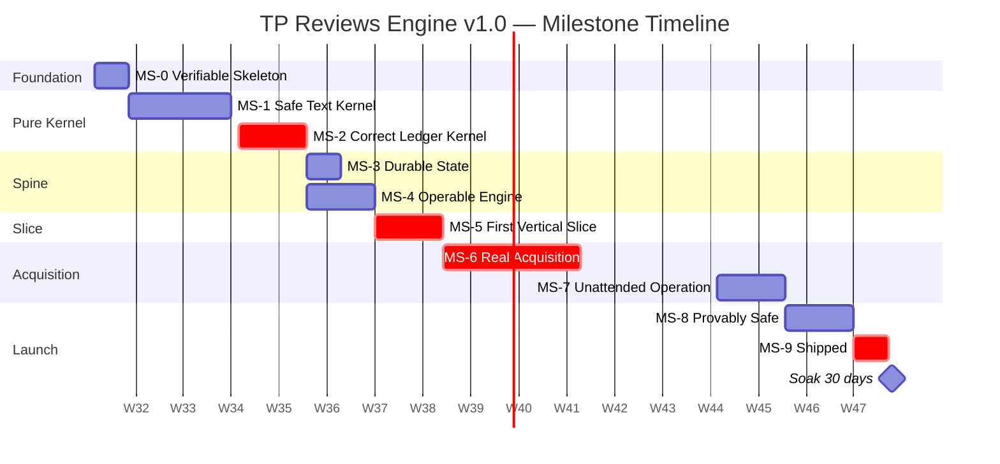

## 6.4 Milestone Detail

### MS-0 · Verifiable Skeleton

| Field | Value |
|---|---|
| **Capability delivered** | Every future commit is automatically checked for lint, format, types, tests, architecture rules, and workflow security |
| **Phases** | PH-00 |
| **Effort** | 62 IEH |
| **Entry criteria** | Repository exists; OPQ-04 answered |
| **Exit criteria** | A no-op PR runs `ci.yml` end to end in < 5 min and is green; a deliberately broken commit is *rejected* by each of the six gate groups (proved by six throwaway branches) |
| **Demo** | `npm ci && npm run verify` locally; CI green on PR #1 |
| **Rollback** | Delete the repository and restart. Cost: 62 IEH, no downstream impact |
| **Gate** | DG-01 — chaired by DevOps |
| **Manager note** | The "prove each gate rejects" exit criterion costs ~4 IEH and is the only evidence that the gates work. A gate nobody has seen fail is a gate that may be misconfigured |

### MS-1 · Safe Text Kernel

| Field | Value |
|---|---|
| **Capability delivered** | Hostile text becomes safe text, deterministically; dates, languages, and identities are derived correctly |
| **Phases** | PH-01, PH-02, PH-03, PH-04 |
| **Effort** | 146 IEH |
| **Entry criteria** | MS-0 green |
| **Exit criteria** | PT-05, PT-06, PT-09, PT-10, PT-11 pass at ≥ 1,000 cases; `core/normalize/` ≥ 95% coverage; `security.xss-fixture` green against fixture 019; adversarial string corpus green; DR-1 and DR-2 architecture tests green |
| **Demo** | `npm test -- tests/property tests/unit/core` |
| **Rollback** | Revert to MS-0. Nothing outside `core/` and `tests/` exists yet |
| **Gate** | DG-02 — chaired by Architect |
| **Risk carried** | The eight-step normalisation order is normative (EDR-019). A reordering that passes tests still violates the spec; review must check order, not just output |

### MS-2 · Correct Ledger Kernel

| Field | Value |
|---|---|
| **Capability delivered** | Observations merge into durable state without ever deleting on absence; payloads project deterministically; the gate refuses bad ones |
| **Phases** | PH-05, PH-06 |
| **Effort** | 86 IEH |
| **Entry criteria** | MS-1 green. **No exceptions** — a reconciler built on an unproven normalizer is untrustworthy |
| **Exit criteria** | PT-01, PT-02, PT-03, PT-04, **PT-07**, PT-12, PT-13, PT-14, PT-15 pass at ≥ 1,000 cases; `core/gate/` at **100% statement coverage**; every G-01…G-12 rule has both a rejects-when-it-should and a does-not-reject-spuriously test |
| **Demo** | `npm run test:coverage -- src/core/gate` showing 100%, plus the property run |
| **Rollback** | Revert PH-05 and PH-06 merges; MS-1 remains standing and useful |
| **Gate** | **DG-03 — hard stop.** Chaired by Architect, attended by EM and QA |
| **Stop condition** | If PT-07 cannot be made to pass, halt forward motion (§5.7). Do not proceed to MS-3 with a failing or skipped PT-07 under any schedule pressure |

### MS-3 · Durable State

| Field | Value |
|---|---|
| **Capability delivered** | State survives the process; writes are atomic; unknown fields are preserved |
| **Phases** | PH-07, PH-08 |
| **Effort** | 72 IEH |
| **Entry criteria** | MS-2 green |
| **Exit criteria** | State round-trip integration test green; `infra/logger/redact.mjs` at **100% coverage** with sentinel secrets at every level; `fs-atomic` proven by a crash-injection test (temp file left, target untouched); retry policy returns `never` for every `ERR-BLOCKED-*` |
| **Demo** | `npm test -- tests/integration/state.roundtrip tests/security/redaction` |
| **Rollback** | Revert PH-08; PH-07's ports remain (they are interfaces and cost nothing to keep) |
| **Gate** | DG-04 — chaired by Backend Lead |

### MS-4 · Operable Engine

| Field | Value |
|---|---|
| **Capability delivered** | A human can inspect, explain, and plan the system's behaviour without running it |
| **Phases** | PH-09, PH-10 |
| **Effort** | 66 IEH |
| **Entry criteria** | MS-3 green |
| **Exit criteria** | Six-layer precedence matrix tests green (one test per adjacent layer pair, plus one full-stack test); ceiling breach produces a validation **error** not a clamp; unknown `TPRE_*` exits 2 naming the variable and the nearest match; `defaults.mjs` ↔ schema correspondence test green; `tpre doctor`, `plan`, `validate-config`, `project` all runnable |
| **Demo** | The three-command sequence in §6.2 |
| **Rollback** | Revert PH-10; PH-09's loader is still reachable from tests |
| **Gate** | DG-05 — chaired by Backend Lead |

### MS-5 · First Vertical Slice

| Field | Value |
|---|---|
| **Capability delivered** | **The entire eleven-stage pipeline runs, end to end, for a real adapter, producing a schema-valid payload** |
| **Phases** | PH-11, PH-12, PH-13 |
| **Effort** | 92 IEH |
| **Entry criteria** | MS-4 green |
| **Exit criteria** | Contract suite passes against `file:csv`; all twenty golden fixtures pass against their pinned pack version; a CSV harvest produces a payload that validates against `payload.v1.schema.json`; hash-gating verified (two identical runs, zero writes on the second) |
| **Demo** | `tpre harvest --client _fixture-csv --publisher filesystem` |
| **Rollback** | Revert PH-11; the pipeline reverts to being test-only. MS-4 stands |
| **Gate** | **DG-06 — hard stop.** Chaired by Architect and EM |
| **Why it is a hard stop** | This is the last moment at which the `AcquisitionPort` can be changed cheaply. After PH-14, changing it costs browser rework. DG-06 exists to ask one question: *does this interface look right to someone who has now implemented it once?* |

### MS-6 · Real Acquisition

| Field | Value |
|---|---|
| **Capability delivered** | A real browser drives real markup through the proven pipeline |
| **Phases** | PH-14, PH-15, PH-16, PH-17 |
| **Effort** | 154 IEH |
| **Entry criteria** | MS-5 green; fixture corpus complete |
| **Exit criteria** | Full pipeline integration test against the local fixture server green; pagination-stall test yields `stopReason: stalled`, `completeness: partial`, and a gate rejection; context-isolation test green **including a failing target**; challenge detection terminal with zero retry paths (enumerating test); `playwright` imported by exactly one file (DR-3) |
| **Demo** | `npm run fixtures:serve` + `tpre harvest --client _fixture-dom` |
| **Rollback** | Revert PH-16 and PH-15; PH-14's browser port remains, unused. MS-5's CSV path still works and could ship |
| **Gate** | DG-07 — chaired by Backend Lead, attended by Security |

### MS-7 · Unattended Operation

| Field | Value |
|---|---|
| **Capability delivered** | The system runs itself on a schedule and commits results |
| **Phases** | PH-18, PH-19 |
| **Effort** | 62 IEH |
| **Entry criteria** | MS-6 green; `data` and `state` branches exist |
| **Exit criteria** | A dispatched `harvest.yml` produces a `data` commit; rebase-retry proven by a simulated conflict (CH-11); hash-gating proven in CI (second run, zero commits); shard matrix emitted by a job not hard-coded (EDR-029); every workflow has an explicit `permissions:` block; all third-party actions SHA-pinned |
| **Demo** | Workflow run URL + the resulting `data` commit |
| **Rollback** | Disable the schedule; revert PH-19. Local harvest still works |
| **Gate** | **DG-08 — hard stop.** Chaired by DevOps and Security |
| **Why it is a hard stop** | This is the first time the system holds a write token and touches a live source. Both are irreversible categories of mistake |

### MS-8 · Provably Safe

| Field | Value |
|---|---|
| **Capability delivered** | Every failure mode is injected, observed, and proven not to reach a visitor |
| **Phases** | PH-20, PH-21, PH-22 |
| **Effort** | 110 IEH |
| **Entry criteria** | MS-7 green |
| **Exit criteria** | CH-01…CH-14 all green; contract suite green against **all four** adapters; PT-08 cross-adapter identity green; alert lifecycle integration test green (open → comment → close, deduped by fingerprint); health records written and readable |
| **Demo** | `npm test -- tests/chaos tests/contract` |
| **Rollback** | PH-22 is independently revertible (two adapters); PH-21 is tests only and never reverts; PH-20 reverts to console logging |
| **Gate** | **DG-09 — hard stop.** Chaired by QA and Architect |

### MS-9 · Shipped

| Field | Value |
|---|---|
| **Capability delivered** | A client website displays real reviews from a CDN, contacting no third party |
| **Phases** | PH-23, PH-24, PH-25 |
| **Effort** | 120 IEH incl. hardening |
| **Entry criteria** | MS-8 green; authorisation record merged; Pages headers verified (OIQ-04); offsite clone exists (TR-CI-161) |
| **Exit criteria** | §63 deployment-readiness, §64 release-candidate, and §65 production checklists all complete; the TRD's §100 hundred-item checklist complete with all ten non-waivable items green; payload reachable, schema-valid, non-empty over HTTPS; network waterfall shows zero third-party origins |
| **Demo** | The live page + the waterfall screenshot |
| **Rollback** | §67, in full |
| **Gate** | **DG-10 (release candidate) and DG-11 (production go-live)** |

## 6.5 Milestone Dependency and Slack

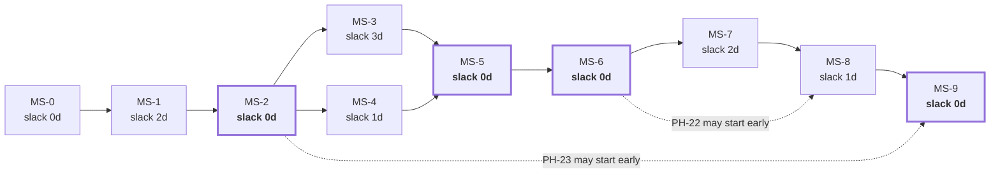

The four zero-slack milestones are the critical path (§Part 15). The two dashed edges are the plan's designed pressure valves: PH-22 (API adapters) and PH-23 (frontend) have unusually early dependency satisfaction and can be pulled forward if a sprint finishes light, or pushed to post-GA if a sprint runs heavy — with PH-22 being the one that must **not** be pushed past GA, because INV-10's migration guarantee is a compliance argument, not a feature.

---

# 7. Sprint Strategy

## 7.1 Sprint Shape

| Property | Value |
|---|---|
| Length | 2 weeks (SP-0 and SP-8 are 1 week) |
| Committed capacity | 120 IEH (≈ 88% of 137 raw); 60 IEH in the one-week sprints |
| Ceremony budget | ≤ 4 hours per sprint per person, total |
| Planning | 90 min, first Monday |
| Daily stand-up | 10 min, asynchronous written by default; synchronous only in SP-5 |
| Mid-sprint checkpoint | 30 min, end of week 1 — the only purpose is *is the sprint goal still achievable* |
| Review / demo | 45 min, second Friday — **the milestone demo command is run live** |
| Retrospective | 30 min, second Friday |
| Gate | Held immediately after review when a milestone closes in that sprint |

**The ceremony budget is deliberately small.** With 2.3 FTE, every hour of ceremony is 0.4% of sprint capacity. The demo is the ceremony that earns its cost, because running the command live is the only thing that reliably distinguishes "done" from "believed done".

## 7.2 Sprint Plan

| Sprint | Weeks | Goal (one sentence) | Phases | IEH | Milestone Closed |
|---|---|---|---|---|---|
| **SP-0** | W01 | Every commit from now on is automatically checked. | PH-00 | 62 | MS-0 |
| **SP-1** | W02–W03 | Hostile text becomes safe text, provably. | PH-01, PH-02, PH-03 | 120 | — |
| **SP-2** | W04–W05 | Absence never deletes, and nothing bad can be published. | PH-04, PH-05, PH-06 | 112 | MS-1, MS-2 |
| **SP-3** | W06–W07 | The kernel gets a way in, a way out, and a human interface. | PH-07, PH-08, PH-09, PH-10 | 138 | MS-3, MS-4 |
| **SP-4** | W08–W09 | A file becomes a payload, through every stage. | PH-11, PH-12, PH-13 | 92 | MS-5 |
| **SP-5** | W10–W11 | A browser drives real markup into the proven pipeline. | PH-14, PH-15, PH-16 | 114 | — |
| **SP-6** | W12–W13 | The system runs itself and commits the result. | PH-17, PH-18, PH-19 | 102 | MS-6, MS-7 |
| **SP-7** | W14–W15 | Every failure mode is injected and proven safe. | PH-20, PH-21, PH-22 | 110 | MS-8 |
| **SP-8** | W16 | A real client's reviews render on a real website. | PH-23, PH-24, PH-25, hardening | 120 | MS-9 |

**Note on SP-3's 138 IEH.** It exceeds both the 120 committed capacity and the 137 raw capacity. This is intentional and is the plan's single most likely overrun: PH-07 through PH-10 are four phases of moderate, highly parallel, low-risk work, and SP-3 is where the second engineer and the agents produce their highest throughput (the D1–D2 share is ~60%). If the agent multiplier assumption (PA-04) is falsified in SP-1, **SP-3 is where the plan breaks**, and DG-03 is the gate at which that is caught. The contingency is to move PH-10's five non-essential commands (`replay`, `export`, `canary`, `resolve`, and the `--migrate` flag) into SP-8 hardening — a pre-identified 22 IEH of cuttable scope.

## 7.3 Sprint Goals Are Single Sentences, By Rule

A sprint goal that needs a bulleted list is two sprints. The one-sentence goals above are the commitment; the phase list is the plan for meeting it. If the sentence can still be truthfully said at the review, the sprint succeeded even if a task slipped.

## 7.4 Sprint Entry Checklist

Run at planning. All must be true before the sprint is committed.

| # | Check |
|---|---|
| 1 | The previous sprint's milestone gate is closed, or its follow-ups are dated and owned |
| 2 | Every task in the sprint has an owner (human or a named agent workflow) |
| 3 | Every P0 task's dependencies are complete, not "nearly" |
| 4 | The sprint's demo command is written down **before** the sprint starts |
| 5 | Total committed IEH ≤ 120, or the overage is explicitly accepted with a named cut list |
| 6 | Every D4/D5 task has a second reviewer named at planning, not at review time |
| 7 | Any external artifact needed this sprint (§4.4) is in hand |

## 7.5 Sprint Exit Checklist

| # | Check |
|---|---|
| 1 | The demo command runs live, from a clean checkout, at the review |
| 2 | `main` is green |
| 3 | Every completed task meets §2.3's eight conditions |
| 4 | Incomplete tasks are moved with a recorded reason (not silently re-estimated) |
| 5 | Any defect found this sprint has a permanent test (X-9) |
| 6 | The risk register is re-scored — not merely re-read |
| 7 | Actual vs estimated IEH is recorded per task, feeding §7.7 |

## 7.6 SP-5 Gets Special Handling

SP-5 is the only sprint where two engineers work inside one subsystem (browser + navigator + DOM adapter). Additional rules apply for that sprint only:

| Rule | Detail |
|---|---|
| Synchronous stand-up | 15 minutes, daily, video. Written stand-ups do not surface interface disagreements fast enough |
| Interface freeze | The `BrowserPort` and `NavigatorResult` shapes are agreed and merged **on day 1** of the sprint, before either engineer writes behaviour |
| Integration cadence | Both tracks merge to `main` at least daily. A branch older than 24 hours in this sprint is escalated |
| Fixture-first | Every navigation behaviour is demonstrated against the fixture server before it is attempted against the live source |
| Live contact | **Exactly one** engineer performs live-source contact, from one machine, with the rate limiter active. Two people independently testing against the live source is how a source-side rate limit is discovered the expensive way |

## 7.7 Estimation Calibration Loop

| Sprint | What Is Measured | What Is Adjusted |
|---|---|---|
| SP-0 | Actual vs estimated on 46 D1–D2 tasks | The D1/D2 hour baseline and the agent multiplier (PA-04) |
| SP-1 | Actual vs estimated on the first D4 module (PH-02) | The D4 multiplier and the ±70% confidence band |
| SP-2 | Actual vs estimated on the first D5 module (PH-05) | Whether the 9% reserve is sufficient; input to DG-03 |
| SP-4 | Integration surprises per phase | Whether MS-6's 154 IEH is credible |

**Calibration is published, not private.** The estimate-vs-actual table is part of the sprint review, and the plan's dates are re-baselined at DG-03 and DG-06 using measured velocity rather than the assumed one. Re-baselining twice, early, with data, is cheaper than defending the original dates until week 14.

---

# 8. Release Strategy

## 8.1 What Gets Released

TRD §64.1 establishes that "deployment" is three independent things. The release strategy inherits that split exactly.

| Releasable | Versioned By | Cadence During Build | Cadence After GA |
|---|---|---|---|
| **Engine** | SemVer tag `vX.Y.Z` on `main` | Per milestone (pre-release tags) | Per change, batched weekly |
| **Configuration** (`clients/`, `profiles/`) | Git commit only | Continuous | Per client change |
| **Selector packs** | `v<n>.json`, immutable | Per authoring session | On upstream change |
| **Payload schema** | `schema_version` integer | Frozen at `1` for v1.0 | Only with a parallel-publish plan |
| **Renderer** | Bundled with engine version | Per milestone | Per change |

## 8.2 Version Plan

| Version | When | Contains | Audience |
|---|---|---|---|
| `v0.1.0-alpha` | End of SP-2 (MS-2) | Pure kernel only. No I/O | Internal — proves the kernel |
| `v0.2.0-alpha` | End of SP-3 (MS-4) | + state, config, CLI | Internal |
| `v0.3.0-beta` | End of SP-4 (MS-5) | + CSV adapter; full pipeline offline | Internal — **the first tag anyone could actually run** |
| `v0.4.0-beta` | End of SP-6 (MS-7) | + browser, DOM adapter, orchestrator, CI harvest | Internal — first unattended runs |
| `v0.9.0-rc.1` | End of SP-7 (MS-8) | + observability, chaos-verified, four adapters | Internal RC |
| `v0.9.x-rc.n` | SP-8 as needed | Hardening fixes only | Internal RC |
| **`v1.0.0`** | End of SP-8 (MS-9) | GA | First client |
| `v1.0.x` | Post-GA | Soak fixes, no behaviour change | First client |
| `v1.1.0` | Post-soak | §70 V2-prep items with a v1.1 tag | Internal |

| ID | Requirement |
|---|---|
| REL-01 | Pre-release tags MUST be created even though nothing consumes them. They are how "the state of the world at MS-n" stays reproducible during an incident six months later. |
| REL-02 | `v1.0.0` MUST NOT be tagged until every item in §64 and §65 is complete, including the ten non-waivable items in TRD §100.10. |
| REL-03 | No release, including alphas, MAY be tagged from a red `main`. |

## 8.3 Release Mechanics

Unchanged from TRD §62.8 and §64.3. Restated here as an execution sequence with owners and durations.

| # | Step | Owner | Duration | Blocking |
|---|---|---|---|---|
| 1 | Confirm §65.1 pre-release checklist (10 items) | Engineer | 30 min | ✅ |
| 2 | Update `CHANGELOG.md`; breaking changes called out | Engineer | 15 min | ✅ |
| 3 | Merge to `main`; CI green | Engineer | 10 min | ✅ |
| 4 | Tag `vX.Y.Z`; `release.yml` re-runs the **full** suite at the tag | Automated | 5 min | ✅ |
| 5 | Review generated release notes | EM | 10 min | ✅ |
| 6 | **Dispatch a canary run manually; assertions must pass** | DevOps | 10 min | ✅ (TR-CI-170) |
| 7 | **Dispatch a harvest for one low-risk client; count and rating sane** | DevOps | 10 min | ✅ (TR-CI-170) |
| 8 | Verify the payload over the public CDN URL | DevOps | 5 min | ✅ |
| 9 | Let scheduled runs proceed | — | — | — |
| 10 | Post-release verification after the first full cycle (§66) | DevOps | 20 min | ✅ |

**Total human time per release: ~2 hours.** Steps 6 and 7 are the ones that will be proposed for skipping. TR-CI-170 forbids it, and this plan restates the reason: the engine is *adopted* by the next scheduled run rather than deployed, so a bad release reaches every client simultaneously at the next cycle. Ten minutes of staged rollout is the entire defence.

## 8.4 Release Cadence Rules

| Rule | Statement |
|---|---|
| REL-04 | No release on a Friday afternoon or the day before a team absence. The engine is adopted by the *next scheduled run*, which may be at 03:00 |
| REL-05 | No more than one engine release per 24 hours during the soak. Two releases in one cycle make attribution impossible |
| REL-06 | A selector pack change is **not** an engine release. It is a config commit and follows §8.5 |
| REL-07 | A release that changes `schema_version` requires a parallel-publish plan signed by the Architect, and is out of scope for v1.0.x by rule |

## 8.5 Selector Pack Release (The Highest-Frequency Change)

| Stage | Action | Blast Radius | Rollback |
|---|---|---|---|
| 1 | Author `v<n+1>.json`; never edit `v<n>` (TR-SEL-001) | Zero | — |
| 2 | Add a fixture captured from the changed markup | Zero | — |
| 3 | Merge; regression suite runs both packs | Zero | Revert merge |
| 4 | Pin `v<n+1>` in `profiles/conservative.json` | Clients on `conservative` only | One line |
| 5 | Observe one full cycle; strategy-health index unchanged | — | One line |
| 6 | Pin `v<n+1>` in `profiles/default.json` | All clients | **One line, instantly** |

**This six-step sequence is the payoff of the entire selector-pack design** and should be exercised once during SP-7 as a drill, on a pack that changes nothing, so that the team has done it before the day it matters.

---

# 9. Feature Delivery Strategy

## 9.1 There Are No "Features" — There Are Capabilities

The product surface is one CLI and one JSON contract. Framing work as features invites parallel feature branches, which this codebase's dependency structure punishes. Work is framed as **capabilities**, each of which is a milestone's demo.

| Anti-pattern | Why It Fails Here | What To Do Instead |
|---|---|---|
| "Feature branch for multi-location support" | Multi-location is a config shape, not a feature; it touches registry, projector, and paths simultaneously | Deliver it as part of the registry and path tasks, with `_example-multilocation.config.json` as the test |
| "Feature flag for the new gate rules" | The gate is 100%-covered and evaluated in full (EDR-023); a flag creates an untested combination | Threshold changes are config values with defaults, per EP-05 |
| "Feature branch for the Places API adapter" | Adapters are independent by construction (DR-3); a long-lived branch adds merge risk for no isolation benefit | Trunk-based, behind the adapter registry in the composition root |

## 9.2 Trunk-Based Development

| Rule | Statement |
|---|---|
| FD-01 | All work happens on short-lived branches off `main`, merged within **48 hours** |
| FD-02 | A branch older than 72 hours is escalated at stand-up. In SP-5, the threshold is 24 hours |
| FD-03 | `main` is protected: review required, CI required, no force-push, linear history preferred |
| FD-04 | Incomplete work merges to `main` only if it is **unreachable** — not exported from a package index, not registered in the composition root, not referenced by a command |
| FD-05 | Feature flags are configuration keys with code defaults (EDR-037), never runtime toggles, and never used to hide half-built code |

**FD-04 is how a large phase lands incrementally without a long-lived branch.** `core/reconcile/decide.mjs` can merge on day 3 of PH-05 with full unit tests while `core/reconcile/index.mjs` does not yet export it. Nothing calls it; CI still checks it; the diff stays reviewable.

## 9.3 Capability Delivery Sequence

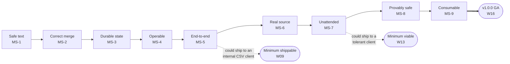

**Two earlier shipping points exist and are recorded deliberately.** If external pressure demands something in production before W16, the honest answers are: a CSV-fed client at W09, or a DOM client without chaos verification at W13. Both are *worse products*, and both are stated so that the conversation is about which risk is accepted rather than about whether the team can "go faster".

## 9.4 What Is Explicitly Not Delivered in v1.0

Restated from TRD A-10 and §76–§91 so that no task in this plan silently expands.

| Not Built | Seam That Exists Instead | Section |
|---|---|---|
| REST / GraphQL API | `PublisherPort` and the payload contract | §51 |
| Dashboard, admin panel, client portal | Health JSONL + run manifests are the data source | §51 |
| AI enrichment | `app/enrich/` dispatcher with a `noop` implementation | §53 |
| Facebook / JustDial / Trustpilot adapters | `AcquisitionPort` + the contract suite | §52 |
| Database, Redis, Docker, Kubernetes, multi-region | `StatePort`, path templates in one module | §51 |
| Webhooks | `NotifierPort` with a `webhook` implementation already present | §51 |

## 9.5 Pre-Identified Cut List

If the schedule must absorb a slip, cut in this order. **Nothing above the line may be cut.**

| Order | Cuttable Item | IEH Recovered | Cost of Cutting |
|---|---|---|---|
| 1 | `tpre replay` command | 8 | Reproducing a production failure needs a manual fixture capture |
| 2 | `tpre export` command | 6 | FR-093 data export becomes a manual `git` operation |
| 3 | `google:places-api` adapter | 18 | Only one API adapter proves cross-adapter identity; PT-08 still passes with two adapters total |
| 4 | Three of five integration recipes (keep static-html + react) | 10 | Next.js/Astro/Vue clients need bespoke help |
| 5 | `dependency-audit.yml` (run manually weekly instead) | 5 | A human must remember |
| 6 | `_example-multilocation.config.json` and its tests | 6 | Multi-location onboarding is unproven until the second client |
| 7 | Pretty log formatter (`infra/logger/pretty.mjs`) | 5 | Local development reads JSONL |
| — | **↑ total recoverable: 58 IEH ↑** | | |
| — | **═══ THE LINE ═══** | | |
| ✗ | Any chaos scenario | — | CH-04 alone is the reason the system is trustworthy |
| ✗ | Any property law | — | The correctness argument is the property laws |
| ✗ | Gate or redaction coverage | — | 100% is the requirement, not a target |
| ✗ | The CSV adapter | — | The interface becomes unvalidated (X-8) |
| ✗ | Fixture corpus completeness | — | Adversarial fixtures are the point (TRD §61.5.2) |
| ✗ | The staged release steps 6–7 | — | TR-CI-170 |
| ✗ | Offsite clone, Pages header verification | — | TR-CI-160, TR-CI-161 |

**Manager Note.** This list is published at DG-01, before anyone is under pressure. Cut lists written during a crunch always cut testing, because testing is the only thing that looks optional from the outside.

---

# 10. Incremental Development Rules

## 10.1 The Sixteen Rules

| # | Rule | Rationale | Enforcement |
|---|---|---|---|
| **ID-01** | **Never write a module before every module it imports is complete and tested.** | EP-01 | Task dependencies; review |
| **ID-02** | **Every commit compiles, type-checks, lints, and passes the full default suite.** | `main` is always releasable (X-3) | Pre-push hook + CI |
| **ID-03** | **A PR changes one module, or one cohesive concern, and is under ~400 lines of diff.** | Reviewability is the binding constraint on defect detection | Review; PR template |
| **ID-04** | **Code and its tests land together.** | X-5 | PR template |
| **ID-05** | **Merge at least daily.** | FD-02 | Stand-up |
| **ID-06** | **Unreachable code may merge; unfinished reachable code may not.** | FD-04 | Review |
| **ID-07** | **No stubs in `main` that return plausible fake data.** A stub returns `Result.err(ERR-INTERNAL-INVARIANT)` or does not exist. | A stub returning `[]` is indistinguishable from a wiped payload — the exact defect class TRD §67.3 prohibits | Lint + review |
| **ID-08** | **No TODO without an issue reference.** | TRD §67.3 | Lint |
| **ID-09** | **Refactor and behaviour change are separate commits.** | A diff mixing both is unreviewable, and the behaviour change hides in the noise | Review |
| **ID-10** | **When a requirement and a test disagree, stop and escalate.** Never amend the test to match the code. | TRD A-8 | Review; stand-up escalation |
| **ID-11** | **Every defect found gets a test in the same PR as the fix.** | X-9 | PR template |
| **ID-12** | **Never widen a hard ceiling to make a test pass.** | TRD A-3 | Review; ceilings are compile-time constants |
| **ID-13** | **Property tests are written before or with the implementation of a D4/D5 module — never after.** | A property test written after the fact tends to encode the implementation's behaviour rather than the law | Task ordering in PH-02, PH-05, PH-06 |
| **ID-14** | **Every phase ends with the repository in a demonstrable state.** | Milestones must be demonstrable; phases feed them | Phase exit criteria |
| **ID-15** | **No new production dependency without a merged DEP-1 justification.** | X-6 | Dependency-graph test; review |
| **ID-16** | **Delete dead code immediately.** Version control is the archive. | TRD §67.3 | Review |

## 10.2 Commit Discipline

| Aspect | Rule |
|---|---|
| Format | Conventional Commits (`feat:`, `fix:`, `test:`, `refactor:`, `chore:`, `docs:`, `ci:`) — required, because `release.yml` generates notes from them |
| Scope | The module: `feat(core/reconcile): ...` |
| Body | For any D3+ change: which TRD section, which invariant, and what was verified |
| Footer | `Refs: TR-REC-014, INV-03` — identifiers, not prose |
| Size | One logical change. A commit that needs "and" in its subject is two commits |
| Frequency | At least once per working session; agents commit per task (Part 16) |

## 10.3 Pull Request Discipline

| Aspect | Rule |
|---|---|
| Size | ≤ ~400 lines of diff, excluding fixtures and generated files |
| Lifetime | ≤ 48 hours from open to merge (≤ 24 h in SP-5) |
| Reviewers | 1 for D1–D3; **2 for D4–D5**, one of whom must not have written any part of the module |
| Required in the description | TRD sections implemented; invariants touched; "which test would have caught this bug?" for any fix |
| Blocking checks | All 14 `ci.yml` gate groups |
| Self-merge | Permitted for D1 documentation-only changes; forbidden otherwise |

## 10.4 The Incremental Rule That Is Most Often Broken

**ID-07 (no plausible stubs).** In a system whose worst failure mode is "returns an empty list and everything looks fine", a stub that returns `[]` during development is the same shape as the production defect that wipes a client's reviews. During PH-13 and PH-16, where field extractors are built one at a time, the temptation to return `[]` from an unimplemented extractor is constant.

The required pattern: an unimplemented unit returns a `Result` error of `ERR-INTERNAL-INVARIANT`, which the target runner classifies as `critical` and which no test can accidentally pass. It is louder than an exception and it cannot be mistaken for success.

## 10.5 Handling Discovered Work

| Discovery | Response |
|---|---|
| A missing task inside the current phase | Add it with an ID from that phase's reserved block; log it; no PCR |
| A missing task in a later phase | Add it to that phase; log it; no PCR |
| A missing **phase** | PCR. This means the build order is incomplete, which is an Architect concern |
| A specification gap | Stop, raise an EDR against the TRD. Do not invent (TRD A-8) |
| An invariant that appears unimplementable | Stop, escalate to the next DG immediately. Do not "temporarily" relax it |
| A dependency that must be added | DEP-1 justification PR first, merged, then the task proceeds |

---

*End of Part 2. Part 3 specifies repository initialisation, Git configuration, branch and folder creation order, dependency installation, and the complete development environment setup.*


---

# Part 3 — Repository, Toolchain, and Development Environment

*Sections 11 through 23. Audience: DevOps and the engineer who runs `git init`. This entire part is phase **PH-00**, sprint **SP-0**, milestone **MS-0** — one week, 62 IEH, 46 tasks, and no product code at all. It is the highest leverage week in the project, because every check installed here is applied to every commit that follows and every check omitted here is a manual review obligation for sixteen weeks.*

---

## Standard Phase Block

Every phase section in Parts 3 through 10 uses this fourteen-field structure. It is defined once here and not repeated.

| Field | What It Means |
|---|---|
| **Purpose** | The single sentence answering *why this exists in the build order at this point* |
| **Objectives** | The enumerated outcomes. Each maps to at least one task |
| **Dependencies** | Phases, artifacts, and external items that must be complete first |
| **Estimated Complexity** | Difficulty band (D1–D5) with the reason |
| **Estimated Time** | Ideal engineer-hours, with agent multiplier already applied |
| **Risks** | Named, with the mitigation and the plan-risk ID where one exists |
| **Expected Deliverables** | `DEL-nn` artifacts that must exist at the end |
| **Acceptance Criteria** | What makes the *work* correct |
| **Exit Criteria** | What makes the *phase* closeable — always a superset of acceptance, always mechanically checkable |
| **Rollback Strategy** | How to undo this phase without unwinding earlier ones |
| **Verification Checklist** | Executed by someone other than the implementer |
| **Testing Checklist** | The specific tests this phase must add |
| **Documentation Required** | Documents that must be merged before the phase closes |
| **Future Improvements** | Deliberately deferred work, with the version it belongs to |

---

# 11. Repository Initialization Plan

| Field | Value |
|---|---|
| **Purpose** | Create the single repository that holds engine, configuration, published data, and internal state, structured so that the three orphan-branch stores can never be confused with source. |
| **Objectives** | (1) Repository created with the correct visibility. (2) `main` protected. (3) Root files present and correct. (4) Governance files present. (5) A no-op PR proves the protection rules work. |
| **Dependencies** | OPQ-04 answered (public vs private); GitHub organisation access; DevOps availability |
| **Estimated Complexity** | **D2.** No design decisions; several irreversible-ish settings |
| **Estimated Time** | 6 IEH |
| **Risks** | Wrong visibility chosen (a private repo consumes paid minutes; a public repo makes every future secret leak permanent — CON-17 already assumes public). Branch protection configured after the first merges, leaving unprotected history |
| **Deliverables** | DEL-01 repository · DEL-02 protected `main` · DEL-03 root file set · DEL-04 governance file set |

## 11.1 Initialization Sequence

Strictly ordered. Steps 3 and 4 must precede any product commit.

| # | Step | Command / Action | Verification |
|---|---|---|---|
| 1 | Decide visibility (OPQ-04: **public**) | GitHub UI | Repo page shows Public |
| 2 | Create `tp-reviews-engine`, no auto-README | GitHub UI | Empty repo |
| 3 | Local `git init`, set `main` as the initial branch | `git init -b main` | `git branch --show-current` → `main` |
| 4 | Commit the root file set (§11.2) as commit #1 | — | `git log` shows one commit |
| 5 | Push `main`; enable branch protection **before** commit #2 | GitHub settings | A direct push to `main` is rejected |
| 6 | Enable Actions; disable Actions on forks writing to the repo | Settings → Actions | Confirmed |
| 7 | Set Actions default permissions to **read-only** | Settings → Actions → Workflow permissions | Confirmed; workflows declare their own (TR-CI-001) |
| 8 | Add `CODEOWNERS` requiring review for `src/core/`, `schemas/`, `selectors/`, `compliance/` (TR-CI-005) | File | A PR touching `src/core/` requests the owner |
| 9 | Create the three issue templates and the PR template | Files | Visible in the UI |
| 10 | Enable secret scanning and push protection | Settings → Security | Confirmed |
| 11 | Enable Dependabot with `dependabot.yml` | File | First PR appears within a week |
| 12 | Create the **offsite clone** (TR-CI-161) | `git clone --mirror` to a second account/host | Clone contains `main` |

**Sequencing Note on step 5.** Branch protection must exist before the second commit, not before the first — commit #1 has to be pushed to create the branch that gets protected. Protecting after five merges leaves five commits that bypassed review, and in a repository whose reviewers include the CODEOWNERS rule for `src/core/`, that is the exact history nobody audits later.

## 11.2 Root File Set — Creation Order

| # | File | Contents Source | Why This Order |
|---|---|---|---|
| 1 | `.gitattributes` | TR-BLD-002 — `* text=auto eol=lf` | **First. Before any other file.** A file committed before this rule may carry CRLF permanently |
| 2 | `.gitignore` | TR-BLD-003 — `.state/`, `.publish/`, `.artifacts/`, `node_modules/`, `.env`, Playwright cache | Second, so no artifact is ever staged |
| 3 | `.editorconfig` | LF, UTF-8, final newline | Editors pick it up on first open |
| 4 | `.nvmrc` | Node major pin (TR-BLD-004) | Needed by step 5 of the setup action and by every developer |
| 5 | `README.md` | Project statement + link to `docs/` | — |
| 6 | `LICENSE` | Per TradyPerch policy | — |
| 7 | `SECURITY.md` | Reporting address, response expectation | Public repo obligation |
| 8 | `CODE_OF_CONDUCT.md`, `CONTRIBUTING.md` | Standard; CONTRIBUTING points at §67–§69 | — |
| 9 | `CHANGELOG.md` | `## Unreleased` heading only | `release.yml` verifies an entry exists (TRD §62.8 step 3) |
| 10 | `package.json` | `"type": "module"`, `engines.node`, script names (§15.4) | Must exist before any `npm` command |
| 11 | `.env.example` | Every `TPRE_*` variable, documented, no real values | §23 |

| ID | Requirement |
|---|---|
| INIT-01 | `.gitattributes` MUST be the first file committed. IR-07 (line-ending drift) is a byte-determinism defect that surfaces as fifty-fold commit churn, months later, on a Windows machine. |
| INIT-02 | The repository root MUST contain no source file (TR-BLD-001). A "quick script" at the root is how `scripts/` stops being the place scripts live. |

## 11.3 Acceptance Criteria

| # | Criterion |
|---|---|
| 1 | `git config core.autocrlf` is irrelevant to the result — a clone on Windows and a clone on Linux produce byte-identical working trees |
| 2 | A direct push to `main` is rejected for every team member including the repository owner |
| 3 | A PR touching `src/core/` (even an empty file) requests review from CODEOWNERS |
| 4 | Actions' default token permission is read-only |
| 5 | The offsite mirror exists and is documented in `docs/runbooks/disaster-recovery.md` |

## 11.4 Exit Criteria

| # | Criterion | Evidence |
|---|---|---|
| 1 | All twelve initialization steps complete | Checklist signed by DevOps |
| 2 | All eleven root files present and reviewed | PR #1 merged |
| 3 | Protection rules demonstrated to reject | Screenshot or CLI output of a rejected push |
| 4 | Offsite mirror verified by cloning *from* it | `git clone <mirror>` succeeds |

## 11.5 Rollback Strategy

Delete and recreate. There is no downstream dependency yet. Cost: 6 IEH. The only irreversible element is repository visibility if a secret were committed while private and later made public — which is why §23 forbids any real secret in any file at any time, from the first commit.

## 11.6 Verification Checklist

- [ ] Clone on a second machine; `git ls-files --eol` shows `lf` for every text file
- [ ] Attempt a direct `main` push; confirm rejection
- [ ] Open a throwaway PR touching `src/core/.gitkeep`; confirm CODEOWNERS request
- [ ] Confirm Actions cannot write by default
- [ ] Confirm secret scanning and push protection are on
- [ ] Confirm the mirror is on a different account/host than the primary

## 11.7 Testing Checklist

No automated tests exist yet. The first automated test arrives in §21. The verification above is manual **by necessity and only this once**; every later phase's verification is automated.

## 11.8 Documentation Required

`README.md` root section; `CONTRIBUTING.md` pointing at TRD §67–§69; `docs/runbooks/disaster-recovery.md` stub containing the mirror location.

## 11.9 Future Improvements

| Item | Version | Note |
|---|---|---|
| Repository ruleset instead of legacy branch protection | v1.1 | Cosmetic; equivalent enforcement |
| Automated mirror sync on a schedule | v1.1 | Currently manual per §60 |

---

# 12. Git Configuration Plan

| Field | Value |
|---|---|
| **Purpose** | Make byte-determinism, review discipline, and history hygiene properties of the repository rather than of individual developers' machines. |
| **Objectives** | (1) LF everywhere, enforced. (2) Commit format enforced. (3) History model chosen and applied. (4) Large/binary artifact policy set. (5) Machine-owned branches marked as such. |
| **Dependencies** | §11 complete |
| **Estimated Complexity** | **D2** |
| **Estimated Time** | 4 IEH |
| **Risks** | IR-07 line-ending drift; a developer's global `core.autocrlf=true` silently overriding intent (mitigated: `.gitattributes` wins) |
| **Deliverables** | DEL-05 `.gitattributes` · DEL-06 commit convention doc · DEL-07 branch protection settings record |

## 12.1 Repository-Level Git Settings

| Setting | Value | Reason |
|---|---|---|
| `.gitattributes` text rule | `* text=auto eol=lf` | TR-BLD-002. Byte-determinism underpins hash-gating |
| Binary declarations | `*.png binary`, `*.jpg binary`, `*.woff2 binary` | Diagnostics screenshots must not be line-ending normalised |
| `*.html` in `fixtures/` | `linguist-vendored` | Keeps language stats meaningful; fixtures are data |
| Merge strategy on `main` | Squash merge, linear history | One commit per PR keeps `release.yml`'s Conventional-Commit notes readable |
| Merge strategy on `data` / `state` | **Not applicable** — machine-written, never PR'd | TR-GIT-002 |
| Force-push | Disabled on `main`, `data`, `state` | TR-PUB-003 |
| Delete branch on merge | Enabled | FD-02 hygiene |
| Signed commits | Encouraged, not required for v1.0 | Recorded as a v1.1 item |

## 12.2 Commit Convention

| Element | Rule |
|---|---|
| Type | `feat` `fix` `test` `refactor` `chore` `docs` `ci` `perf` `build` |
| Scope | The module path fragment: `core/reconcile`, `adapters/browser`, `ci` |
| Subject | Imperative, ≤ 72 chars, no trailing period |
| Body | Required for D3+; states the TRD section and what was verified |
| Footer | `Refs:` with `TR-`, `EDR-`, `INV-`, `PT-`, `CH-` identifiers |
| Breaking | `!` after the scope plus a `BREAKING CHANGE:` footer |

Enforced by a `commit-msg` hook (§22) and re-checked in `ci.yml` for the PR title on squash merges.

## 12.3 Branch Naming

| Purpose | Pattern | Example |
|---|---|---|
| Task branch | `t/<task-id>-<slug>` | `t/147-identity-hash` |
| Phase branch (rare; only for a coordinated interface change) | `ph/<phase>-<slug>` | `ph/07-ports` |
| Fix | `fix/<issue>-<slug>` | `fix/212-rating-cascade` |
| Chore | `chore/<slug>` | `chore/bump-playwright` |
| Machine-owned | `data`, `state` | Never created by a human after setup |

**The `t/<task-id>` convention is what makes progress tracking automatic** (Part 15): a merged branch name maps a commit to a task without anyone updating a spreadsheet.

## 12.4 Acceptance / Exit Criteria

| # | Criterion |
|---|---|
| 1 | `git ls-files --eol` reports `lf` for 100% of text files, on Windows and Linux clones |
| 2 | A commit with a malformed message is rejected locally by the hook and by CI |
| 3 | `main` history is linear after three merged PRs |
| 4 | Force-push to all three long-lived branches is rejected |

## 12.5 Rollback / Verification / Testing / Documentation / Future

| Field | Content |
|---|---|
| **Rollback** | Revert `.gitattributes` and re-normalise with `git add --renormalize .`. Costs one commit touching every text file — which is exactly why this is done in week 1 and not week 9 |
| **Verification** | Cross-platform clone comparison; deliberate malformed commit; deliberate force-push attempt |
| **Testing** | `tests/security/workflow-lint.test.mjs` later asserts workflow hygiene; line endings are asserted by the byte-determinism integration test in PH-18 |
| **Documentation** | `CONTRIBUTING.md` commit section; branch naming table |
| **Future** | Required commit signing (v1.1); `git maintenance` scheduling for the growing `data` branch (v1.1, see TRD §46) |

---

# 13. Branch Creation Order

| Field | Value |
|---|---|
| **Purpose** | Create the two orphan stores with no shared history, in the order that guarantees neither can ever be merged into source. |
| **Objectives** | (1) `main` protected and populated. (2) `data` orphan created with its static-site scaffolding. (3) `state` orphan created with its directory skeleton. (4) Both marked machine-owned. (5) Protection applied to all three. |
| **Dependencies** | §11, §12 |
| **Estimated Complexity** | **D2**, with one hazardous step (orphan creation is easy to get wrong in a way that shares history) |
| **Estimated Time** | 5 IEH |
| **Risks** | An orphan branch created by copying `main` inherits history and 60 MB of documentation into the published static origin. Recovery is a history rewrite, which is on TRD §66.8's irreversible list |
| **Deliverables** | DEL-08 `data` branch · DEL-09 `state` branch · DEL-10 protection records |

## 13.1 Creation Order and Why

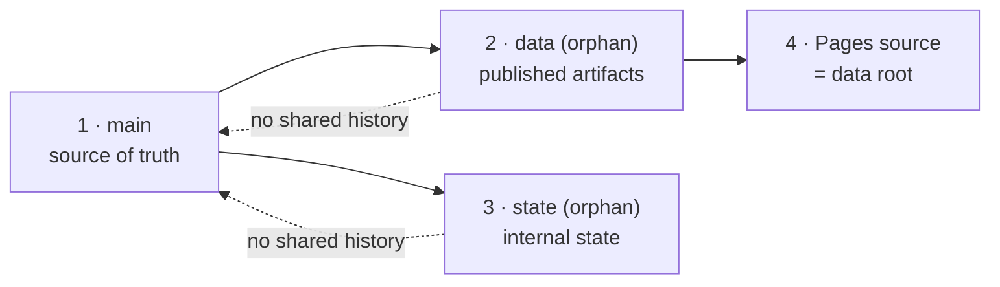

| # | Branch | Created How | Initial Contents | Verification |
|---|---|---|---|---|
| 1 | `main` | Already exists from §11 | Root file set | — |
| 2 | `data` | `git switch --orphan data` then commit | `.nojekyll`, `robots.txt`, `_headers`, `README.md` ("Machine-generated. Do not edit."), `index.json` with an empty client map | `git log data` shows exactly one commit; `git merge-base main data` fails |
| 3 | `state` | `git switch --orphan state` then commit | `ledger/.gitkeep`, `health/.gitkeep`, `cache/identity/.gitkeep`, `cache/budget/.gitkeep`, `breaker/.gitkeep`, `runs/.gitkeep`, `README.md` ("Machine-owned. Hand-edit only per §60.") | Same two checks |
| 4 | — | Enable Pages sourced from `data` root | — | A test file at `data:/ping.txt` is served over HTTPS |

| ID | Requirement |
|---|---|
| BR-01 | `git merge-base main data` and `git merge-base main state` MUST both fail. This is the mechanical test for TR-GIT-001 and MUST be added to the verification checklist, not assumed from the command used. |
| BR-02 | The `data` branch MUST contain `.nojekyll` from its first commit. Without it, a static host may refuse to serve paths beginning with `_` or may attempt to build the branch. |
| BR-03 | Neither orphan branch may ever be merged, rebased onto, or cherry-picked from `main`. Protection settings MUST forbid PRs targeting them. |

## 13.2 Why `data` Before `state`

Two reasons, both operational. First, `data` is the branch whose hosting configuration has a lead time (Pages enablement, DNS if custom, and the header verification of OIQ-04 which TR-CI-160 makes a blocker for client onboarding) — starting it earlier absorbs that latency. Second, if only one orphan branch gets created correctly in week 1, it should be the one that is publicly visible, because a mistake there is discovered by a stranger.

## 13.3 Acceptance / Exit Criteria

| # | Criterion |
|---|---|
| 1 | Both orphan branches exist with exactly one commit and no shared history |
| 2 | Pages serves a test file from `data` over HTTPS |
| 3 | **Actual response headers recorded** in `docs/runbooks/pages-headers.md` (OIQ-04, TR-CI-160) |
| 4 | Protection prevents force-push and direct human PRs to `data` and `state` |
| 5 | The offsite mirror includes both orphan branches |

## 13.4 Rollback / Verification / Testing / Documentation / Future

| Field | Content |
|---|---|
| **Rollback** | Delete and recreate the orphan branch. Free at this stage; after PH-18 it is a data-loss event requiring §66.6 |
| **Verification** | The two `merge-base` failures; an HTTPS fetch of `ping.txt` with headers captured verbatim |
| **Testing** | None automated in PH-00. `scripts/verify-payload.mjs` (PH-24) later asserts reachability and schema validity |
| **Documentation** | `docs/runbooks/pages-headers.md` with the literal header dump and the date measured |
| **Future** | Automated header regression check in `pages.yml` (v1.1); `data` history truncation tooling already specified as `scripts/truncate-data-history.mjs` (built PH-24) |

---

# 14. Folder Creation Order

| Field | Value |
|---|---|
| **Purpose** | Create the complete normative tree from TRD §6 up front, so that no file is ever created in a "temporary" location and so that the architecture test has a tree to assert against from day one. |
| **Objectives** | (1) Every directory from TRD §6.2–§6.8 exists. (2) Each carries a `.gitkeep` or a `README.md` stating its rule. (3) The directory-rules table from TRD §6.4.1 is committed as `docs/` reference. |
| **Dependencies** | §11 |
| **Estimated Complexity** | **D1** — mechanical, fully determined by TRD §6 |
| **Estimated Time** | 4 IEH |
| **Risks** | Deviation from the normative tree (a file not listed in TRD §6 requires an EDR); empty directories silently dropped by Git without `.gitkeep` |
| **Deliverables** | DEL-11 complete directory tree · DEL-12 per-directory README set |

## 14.1 Creation Order

Order matters only for the READMEs that state rules; the directories themselves can be created in one operation. Creating them **all at once** is deliberate: a partially created tree invites improvisation.

| # | Group | Directories | Note |
|---|---|---|---|
| 1 | Governance | `.github/workflows/`, `.github/actions/setup-engine/`, `.github/ISSUE_TEMPLATE/` | Workflows land in §21 and PH-19/PH-24 |
| 2 | Entry | `bin/` | One file, three lines, written in PH-10 |
| 3 | Engine | `src/cli/commands/`, `src/app/config/`, `src/app/enrich/`, `src/core/{model,selectors,extract,normalize,dates,lang,identity,validate,reconcile,project,gate,util}/`, `src/ports/`, `src/adapters/{acquisition/{google-dom,google-places-api,google-business-profile-api,file-csv},browser,state,publisher,notifier}/`, `src/infra/{logger,health,retry,breaker,limiter,diagnostics}/` | The whole tree, empty |
| 4 | Data-as-code | `selectors/google-maps/`, `selectors/schema/`, `schemas/`, `clients/`, `profiles/`, `compliance/authorizations/` | READMEs state the immutability rules (TR-SEL-001, TR-CFG-011) |
| 5 | Test assets | `fixtures/dom/google/`, `fixtures/api/{places,business-profile}/`, `fixtures/csv/`, `fixtures/ledgers/`, `fixtures/server/` | Fixture README states capture and sanitisation policy (TR-TEST-011/012) |
| 6 | Tests | `tests/{unit,property,contract,regression,integration,chaos,architecture,budgets,security,live,helpers}/` | `tests/live/README.md` states the opt-in rule prominently |
| 7 | Consumer | `frontend/{renderer,recipes,examples/static,examples/nextjs}/` | Renderer README states DEP-6 |
| 8 | Tooling | `scripts/` | Seven scripts land across PH-13, PH-24 |
| 9 | Docs | `docs/{sad,trd,plan,runbooks,decisions}/` | SAD/TRD/plan already exist |

| ID | Requirement |
|---|---|
| FLD-01 | The tree MUST match TRD §6 exactly. A directory not listed there MUST NOT be created without an EDR. |
| FLD-02 | Every directory whose contents are governed by a rule (`core/`, `infra/`, `ports/`, `adapters/`, `selectors/`, `compliance/`, `tests/live/`, `frontend/renderer/`) MUST carry a `README.md` stating that rule in one paragraph. |
| FLD-03 | `.gitkeep` files MUST be removed in the same PR that adds the first real file to that directory. |

**Sequencing Note.** FLD-02 is worth its four hours. The directory rules in TRD §6.4.1 are the ones most often broken — particularly the `infra/` rule ("a helper that knows what a review is belongs in `core/`"). A README in the directory is read by an agent that has the folder open; a table in a 100-section document is not.

## 14.2 Acceptance / Exit / Rollback / Verification / Testing / Documentation / Future

| Field | Content |
|---|---|
| **Acceptance** | `find . -type d` output matches TRD §6 exactly, modulo `node_modules` and dot-directories |
| **Exit** | Tree diff against TRD §6 is empty; nine READMEs merged |
| **Rollback** | Delete directories; zero cost |
| **Verification** | A reviewer diffs the tree against TRD §6.2–§6.8 line by line — this is a genuinely useful five-minute review |
| **Testing** | `tests/architecture/dependency-rules.test.mjs` (added in §21 as a skeleton) later asserts no file exists outside the allowed tree |
| **Documentation** | Nine directory READMEs |
| **Future** | A `scripts/verify-tree.mjs` check comparing the tree to a manifest (v1.1) |

---

# 15. Dependency Installation Order

| Field | Value |
|---|---|
| **Purpose** | Install the minimum toolchain in an order that lets each addition be verified before the next, and that keeps the production dependency count at the TRD's target of two. |
| **Objectives** | (1) `package.json` correct. (2) Dev dependencies installed in verified order. (3) Production dependencies installed with DEP-1 justifications recorded. (4) Lockfile committed. (5) `npm ci` proven to work from a clean clone. |
| **Dependencies** | §11, §17 (Node) |
| **Estimated Complexity** | **D2** |
| **Estimated Time** | 5 IEH |
| **Risks** | Dependency creep (IR-19); a dependency with a postinstall script entering without DEP-3 review; Playwright installed before it is needed, adding ~350 MB to every CI run for nine weeks |
| **Deliverables** | DEL-13 `package.json` · DEL-14 `package-lock.json` · DEL-15 DEP-1 justification records |

## 15.1 Installation Order

**Ordered by when the tool is first needed, not by category.** Each step ends with a command that proves the tool works before the next is added.

| # | Package | Category | Installed In | Proof It Works | Blocks |
|---|---|---|---|---|---|
| 1 | *(none)* — `package.json` by hand | — | §11 step 10 | `npm ls` runs without error | Everything |
| 2 | TypeScript (checker only, `checkJs`) | dev | §18 | `npm run typecheck` passes on an empty tree | §18 |
| 3 | ESLint + plugins | dev | §19 | `npm run lint` passes; a deliberate violation fails | §19 |
| 4 | Prettier | dev | §20 | `npm run format:check` passes; a mis-formatted file fails | §20 |
| 5 | Vitest | dev | §21 | `npm test` runs one trivial passing test | §21, everything after |
| 6 | fast-check | dev | §21 | A trivial property runs 1,000 cases | PH-02 onward |
| 7 | JSON Schema validator | **prod** | PH-09 | Validates a fixture config against a schema | PH-09 |
| 8 | HTML parser (dev only, OIQ-03) | dev | PH-13 | Parses fixture `page.html` and yields the review subtree | PH-13 |
| 9 | `playwright` | **prod** | PH-14 | `npx playwright --version`; a browser launches headless | PH-14 |

| ID | Requirement |
|---|---|
| DEP-ORD-01 | Playwright MUST NOT be installed before PH-14. Nine weeks of CI runs pulling a 350 MB browser cache for code that does not exist is roughly 40 minutes of avoidable CI time per week and hides the true cold-start cost when it is finally measured (TA-03). |
| DEP-ORD-02 | The JSON Schema validator and `playwright` are the **only** two production dependencies planned. Each MUST have a DEP-1 justification merged in the PR that adds it (TRD §10.2). |
| DEP-ORD-03 | Any dependency with a postinstall script MUST have a DEP-3 security review recorded before the lockfile is committed. |
| DEP-ORD-04 | CI MUST use `npm ci` exclusively. `npm install` in a workflow is a CI failure (DEP-4). |

## 15.2 The Two Conditional Dependencies

TRD §10.2 lists two dependencies as conditional; both must be resolved toward "not needed" if possible.

| Candidate | Decision Point | Interim Position | Owner |
|---|---|---|---|
| Argument parser | PH-10 (OIQ-01) | Use `node:util`'s built-in parser; add a dependency only if a documented gap exists | Backend |
| Relative-date/locale helper | PH-03 (OIQ-02) | Implement internally; TRD §21.6's phrase table makes it tractable | Backend |

**Both decisions are recorded in the PR that closes them**, as a one-paragraph note, not as an EDR — an EDR is for decisions that constrain future work, and "we did not need a library" constrains nothing.

## 15.3 `package.json` Script Contract

The script names are a contract: `ci.yml`, the git hooks, the composite action, and Part 16's agent rules all invoke them by name. Defining them in week 1 and never renaming them is what keeps those four consumers in sync.

| Script | Runs | First Needed |
|---|---|---|
| `verify` | lint + format:check + typecheck + test | §21 |
| `lint` | ESLint over `src/`, `tests/`, `scripts/`, `frontend/` | §19 |
| `lint:fix` | ESLint with `--fix` | §19 |
| `format` | Prettier write | §20 |
| `format:check` | Prettier check | §20 |
| `typecheck` | TS `--noEmit` over the JSDoc-typed tree | §18 |
| `test` | Vitest default project (excludes `tests/live/`) | §21 |
| `test:coverage` | Vitest with coverage thresholds | §21 |
| `test:live` | Vitest live project only | PH-19 |
| `test:watch` | Vitest watch | §21 |
| `size` | `scripts/size-report.mjs` | PH-23 |
| `validate:schemas` | `scripts/validate-all.mjs` | PH-09 |
| `fixtures:serve` | `fixtures/server/serve.mjs` | PH-15 |
| `parse:fixture` | Re-runs extraction against one fixture | PH-13 |

**Scripts that do not yet have an implementation are defined now and exit 0 with a "not yet implemented" notice**, except `test`, which must genuinely run. This keeps `ci.yml` stable across sixteen weeks instead of being edited in eleven separate PRs.

## 15.4 Acceptance / Exit Criteria

| # | Criterion |
|---|---|
| 1 | `rm -rf node_modules && npm ci` succeeds from a clean clone in under 60 s |
| 2 | Production dependency count is **0** at the end of PH-00, and never exceeds **2** |
| 3 | Every dev dependency is justified in one line in `package.json`'s adjacent `docs/` note or its PR |
| 4 | The lockfile is committed and `npm ci` in CI produces an identical tree (verified by `npm ls --all` hash comparison in the first CI run) |

## 15.5 Rollback / Verification / Testing / Documentation / Future

| Field | Content |
|---|---|
| **Rollback** | `git revert` the dependency PR; `npm ci` restores the previous tree exactly. This is the cheapest rollback in the project and is why the lockfile is committed |
| **Verification** | Clean-clone install timed; dependency count asserted; audit run |
| **Testing** | `tests/architecture/` gains a dependency-graph assertion in PH-07: `core/` imports no package, `frontend/renderer/` imports no package (DEP-6) |
| **Documentation** | DEP-1 justifications; `docs/` note on the two conditional decisions |
| **Future** | Provenance attestation verification (v1.1); the v1.1 job split that removes the write token from the job executing third-party code (TRD §96.2) |

---

# 16. Development Environment Setup

| Field | Value |
|---|---|
| **Purpose** | Make a new engineer or agent productive in under four hours, with an offline-capable, deterministic local environment identical in behaviour to CI. |
| **Objectives** | (1) One documented setup path. (2) `tpre doctor` as the single diagnostic. (3) Offline-by-default local runs. (4) Editor configuration shared. (5) The four-hour onboarding path from TRD §97 validated by an actual new person. |
| **Dependencies** | §11–§15, §17–§22 |
| **Estimated Complexity** | **D2** |
| **Estimated Time** | 8 IEH |
| **Risks** | PA-02 (Chromium fails to run locally on a team machine); environment drift between developers producing "works on my machine" defects in byte-sensitive code |
| **Deliverables** | DEL-16 `docs/onboarding.md` · DEL-17 editor config · DEL-18 `.env.example` · DEL-19 devcontainer *(contingency only)* |

## 16.1 The Local Environment Contract

| Property | Value | Enforced By |
|---|---|---|
| Node version | Exactly the `.nvmrc` major | `engines.node` + `tpre doctor` |
| Install command | `npm ci` | Documented; hooks warn if `node_modules` is stale |
| Default publisher | `filesystem` | Dev defaults (TRD §9.8) |
| Default notifier | `console` | Dev defaults |
| Log format | `pretty` | `TPRE_LOG_FORMAT` dev default |
| Network during `npm test` | **None** | Suites excluded/isolated; `tests/live/` opt-in |
| `.env` loading | Only when `TPRE_ENV=development` | Loader refuses under `ci`/`production` |
| Search resolution | `allow_search: true` in dev, `false` in production | TR-APP-023 |

## 16.2 Four-Hour Onboarding Path

Mirrors TRD §97 and is validated, not assumed. **The exit criterion is that a person who has never seen the repository completes it in four hours unaided.**

| Hour | Activity | Proof of Completion |
|---|---|---|
| 1 | Read SAD §0.8 (invariants), §16, Appendix A; TRD §0.5, §1, §6–§7 | Can name the ten invariants and the eleven stages |
| 2 | `nvm use`, `npm ci`, `npm run verify` | Green suite locally |
| 3 | `tpre doctor`, run the offline pipeline against a fixture | A payload appears in `.publish/` |
| 4 | Dry-run client onboarding walkthrough | `tpre validate-config --explain` output understood |

**Manager Note.** Schedule this validation for the end of SP-3, using the DevOps engineer (who has not been in the code) as the subject. Doing it in SP-0 validates nothing because there is nothing to run; doing it in SP-8 is too late to fix.

## 16.3 Editor and Tooling Configuration

| Item | Content | Why |
|---|---|---|
| `.editorconfig` | LF, UTF-8, final newline, 2-space indent | Prevents formatting churn before Prettier runs |
| `.vscode/extensions.json` *(recommended, not required)* | ESLint, Prettier, EditorConfig | New machines pick up the toolchain automatically |
| `.vscode/settings.json` | Format on save with Prettier; ESLint as the fixer | Removes formatting from review entirely |
| `jsconfig.json` | `checkJs`, strict (see §18) | Editor type errors match CI type errors |

## 16.4 Acceptance / Exit / Rollback / Verification / Testing / Documentation / Future

| Field | Content |
|---|---|
| **Acceptance** | A clean machine reaches a green `npm run verify` using only `docs/onboarding.md` |
| **Exit** | Onboarding validated by a person who did not write it; `tpre doctor` reports green on all three team machines; PA-02 confirmed or the devcontainer contingency executed |
| **Rollback** | Documentation-only; revert freely |
| **Verification** | The four-hour walkthrough, timed, by an uninvolved person |
| **Testing** | `tpre doctor` gains a CI smoke invocation in PH-19 |
| **Documentation** | `docs/onboarding.md`, `docs/maintenance.md` stub |
| **Future** | Devcontainer as the default rather than the contingency (v1.1); a `scripts/bootstrap.mjs` one-liner |

---

# 17. Node Setup

| Field | Value |
|---|---|
| **Purpose** | Pin one Node version as the single source of truth for local machines, CI, and the composite action, and prove that no transpilation step exists anywhere. |
| **Objectives** | (1) `.nvmrc` pins the LTS major (≥ 20 per TRD §1.4). (2) `engines.node` matches. (3) The composite action reads `.nvmrc`. (4) ESM-only confirmed. (5) The "no build step" property is asserted, not assumed. |
| **Dependencies** | §11 |
| **Estimated Complexity** | **D1** |
| **Estimated Time** | 3 IEH |
| **Risks** | Version skew between `.nvmrc`, `engines.node`, and the workflow (three sources of truth is two too many); a `require()` creeping in and silently working under a bundler that does not exist |
| **Deliverables** | DEL-20 `.nvmrc` · DEL-21 `engines` block · DEL-22 no-build-step assertion |

## 17.1 Configuration Points

| Point | Value | Consumed By |
|---|---|---|
| `.nvmrc` | Node LTS major (≥ 20) | Developers (`nvm use`), the composite action step 1 |
| `package.json` `engines.node` | `>=20 <21` style range matching `.nvmrc` | `npm ci` warning; `tpre doctor` |
| `package.json` `"type"` | `"module"` | Node's module resolution |
| File extension | `.mjs` everywhere | TRD §67.1 |
| Built-ins | `node:`-prefixed | TRD §10.6 |

| ID | Requirement |
|---|---|
| NODE-01 | `.nvmrc` is the **only** place the Node version is written as a literal. The workflow reads it; `engines.node` is checked against it by a unit test. Three literals is how a CI upgrade silently diverges from local. |
| NODE-02 | No transpilation, no bundler, no build step (EDR-008). The code that runs is the code that was committed. A `build` script MUST NOT be added to `package.json`. |
| NODE-03 | `core/` may import only `node:crypto` among built-ins (TR-DEP-002), asserted by the architecture test. |

## 17.2 The No-Build-Step Assertion

This property is load-bearing for diagnosability (the stack trace line numbers match the repository) and is easy to lose. It is asserted three ways:

| # | Assertion | Where |
|---|---|---|
| 1 | `package.json` has no `build` script and no bundler dependency | Dependency-graph test (PH-07) |
| 2 | `bin/tpre.mjs` executes directly from a clean clone after `npm ci` | CI smoke step (§21) |
| 3 | A deliberate syntax error's stack trace reports the source file and line, unmapped | Manual, once, at PH-10 |

## 17.3 Acceptance / Exit / Rollback / Verification / Testing / Documentation / Future

| Field | Content |
|---|---|
| **Acceptance** | `node --version` on a developer machine, in CI, and in the composite action banner are identical |
| **Exit** | The version-consistency unit test passes; the no-build-step assertions 1 and 2 pass in CI |
| **Rollback** | Change one file (`.nvmrc`) and re-run CI |
| **Verification** | Compare the versions banner (TR-CI-140) against `.nvmrc` |
| **Testing** | `tests/unit/build/node-version.consistency.test.mjs` — asserts `.nvmrc` ↔ `engines.node` |
| **Documentation** | `docs/onboarding.md` prerequisites section |
| **Future** | Node major upgrade procedure as a documented checklist (§69) |

---

# 18. TypeScript Setup

*Type checking without TypeScript source. The TRD's decision (EDR-008, ADR-004) is JSDoc-typed `.mjs` with `checkJs`, executed exactly as committed. This section sets that up; it does not revisit it.*

| Field | Value |
|---|---|
| **Purpose** | Provide compile-grade type safety with no compile step, so that types catch the errors a compiler would while the executed artifact remains the committed source. |
| **Objectives** | (1) `jsconfig.json` in strict mode. (2) `typecheck` script wired. (3) Zero-error baseline on an empty tree. (4) `any` policy enforced. (5) Types derived from schemas, not duplicated (EDR-039). |
| **Dependencies** | §15 step 2, §17 |
| **Estimated Complexity** | **D2** |
| **Estimated Time** | 6 IEH |
| **Risks** | Strictness relaxed under pressure in week 9, silently, by adding a compiler option; `any` proliferation in adapter code where third-party types are awkward; generated types drifting from `schemas/` |
| **Deliverables** | DEL-23 `jsconfig.json` · DEL-24 `typecheck` script · DEL-25 `any` policy note |

## 18.1 Checker Configuration

| Option Group | Setting | Reason |
|---|---|---|
| `checkJs` | on | The entire point |
| `strict` family | fully on (`strictNullChecks`, `strictFunctionTypes`, `noImplicitAny`, `strictBindCallApply`, `noImplicitThis`, `useUnknownInCatchVariables`, `alwaysStrict`) | TRD §8.6: "strict mode on; no implicit `any`" |
| `noUncheckedIndexedAccess` | on | The single highest-value non-default option for a codebase that indexes into parsed arrays constantly |
| `noEmit` | on | There is no build step (NODE-02) |
| `module` / `moduleResolution` | `nodenext` | ESM `.mjs` resolution semantics |
| `target` / `lib` | Matching the pinned Node major | Prevents using APIs the runtime lacks |
| `exactOptionalPropertyTypes` | on | Payload and ledger records distinguish "absent" from "null" meaningfully (TRD §24) |
| `include` | `src/`, `tests/`, `scripts/`, `frontend/` | Everything executable |

| ID | Requirement |
|---|---|
| TS-01 | `noUncheckedIndexedAccess` and `exactOptionalPropertyTypes` MUST be enabled from the first commit. Enabling them later against a populated codebase produces hundreds of findings and is therefore never done. |
| TS-02 | `any` requires an adjacent comment stating why (TRD §67.3). A lint rule flags bare `any`. |
| TS-03 | Types describing schema-governed data MUST be **derived from** `schemas/*.json`, never hand-written in parallel (EDR-039). Where derivation is impractical, a unit test MUST assert correspondence. |
| TS-04 | The `typecheck` script MUST report zero errors on `main` at all times. A baseline of "known errors" MUST NOT be introduced. |

## 18.2 Why Strictness Is a Week-1 Decision

Every option in §18.1 is trivially enabled on an empty tree and expensive on a populated one. The cost curve is the entire argument: at commit #1 the cost is zero; at commit #500 the cost is a multi-day cleanup that competes with feature work and loses. Recording it here means the decision is made once, in the cheapest week, by the people who read the reasoning.

## 18.3 Acceptance / Exit / Rollback / Verification / Testing / Documentation / Future

| Field | Content |
|---|---|
| **Acceptance** | `npm run typecheck` exits 0 on an empty tree and non-zero on a deliberately mistyped fixture file |
| **Exit** | Zero errors; a deliberate violation of each of the four strict options is proven to fail (four throwaway commits) |
| **Rollback** | Relaxing an option is a PR with a written justification; it is not a routine change |
| **Verification** | The four deliberate violations |
| **Testing** | Type checking is itself the test; additionally `tests/unit/model/` asserts schema-derived types match schema files |
| **Documentation** | `CONTRIBUTING.md` typing section; the `any` policy |
| **Future** | Full TypeScript source (**explicitly rejected** by ADR-004 — recorded here so it is not re-proposed as an improvement) |

---

# 19. Linting Setup

| Field | Value |
|---|---|
| **Purpose** | Mechanically enforce TRD §67.2's structural limits and §67.3's prohibited patterns, so that they are never negotiated in review under deadline pressure (TR-STD-040). |
| **Objectives** | (1) Structural limits enforced. (2) Prohibited patterns detected. (3) Layer-specific rules applied via config overrides. (4) Zero-warning policy. (5) Every rule proven to fire. |
| **Dependencies** | §15 step 3, §17, §18 |
| **Estimated Complexity** | **D3** — the layer-specific overrides are where this gets subtle |
| **Estimated Time** | 10 IEH |
| **Risks** | Rules configured but never proven to fire (the most common lint failure mode); over-broad rules producing noise, leading to blanket disables; `core/` purity rules not applied because they are expressed as import restrictions in the wrong config block |
| **Deliverables** | DEL-26 `eslint.config.mjs` · DEL-27 rule-proof branch set · DEL-28 lint rule reference doc |

## 19.1 Rule Groups

| Group | Rules | Scope | TRD Source |
|---|---|---|---|
| **Structural limits** | complexity ≤ 10; function ≤ 60 lines; file ≤ 400 lines; params ≤ 4; nesting depth ≤ 3; no default exports | All of `src/` | §67.2 |
| **Prohibited patterns** | no empty catch; no `console.*`; no `process.exit()`; no commented-out code; no `TODO` without a reference; no magic numbers in timing/threshold positions | All of `src/` | §67.3 |
| **Purity (core)** | no import from `adapters/`, `infra/`, `app/`, `cli/`; no `node:` import except `node:crypto`; no `Date.now`, `Math.random`, `process.env`, `fs`, `fetch` | `src/core/**` only | DR-1, DR-2 |
| **Layering** | `app/` may not import `adapters/`; adapters may not import each other; only `cli/composition.mjs` may import concrete implementations; no import past a package index | Per-directory overrides | DR-3…DR-6 |
| **Console exceptions** | `console.*` permitted in `infra/logger/**` and `cli/**` only | Overrides | §67.3 |
| **Exit exceptions** | `process.exit()` permitted in `cli/**` only | Overrides | TR-CLI-003 |
| **Async style** | `async`/`await` only; no raw promise chains; no callbacks | All | §67.1 |
| **Frontend** | No HTML-injection DOM APIs; no imports at all (zero deps) | `frontend/**` | TR-STD-001/002 |
| **Tests** | Relaxed file length; **not** relaxed on `console` or determinism | `tests/**` | §61.3.2 |

| ID | Requirement |
|---|---|
| LINT-01 | Warnings MUST be treated as errors (`--max-warnings 0`). A warning nobody must fix is a rule nobody follows. |
| LINT-02 | Every rule group MUST be proven to fire, once, by a deliberate violation on a throwaway branch. A configured-but-inert rule is worse than no rule, because it creates false confidence. |
| LINT-03 | A rule disable comment MUST carry a reason on the same line. Bare disables are rejected in review. |
| LINT-04 | The `core/` purity rules MUST be expressed as import restrictions **and** as the PH-07 architecture test. Two independent mechanisms, because DR-2 is the rule most likely to be violated (IR-02). |

## 19.2 Why Lint Duplicates the Architecture Test

Deliberate redundancy. Lint gives the *fast, local* signal at the moment of typing — which is when a `Date.now()` default parameter is cheapest to remove. The architecture test (PH-07) gives the *authoritative* signal and can express graph-level properties lint cannot (acyclicity, "reachable only from the post-gate branch"). Neither replaces the other, and the cost of both is a few hours once.

## 19.3 Acceptance / Exit / Rollback / Verification / Testing / Documentation / Future

| Field | Content |
|---|---|
| **Acceptance** | `npm run lint` exits 0 on the empty tree; each of the nine rule groups fails a deliberate violation |
| **Exit** | Nine proof branches recorded (branch name + the rule that fired) in the phase closure note; zero-warning policy active in CI |
| **Rollback** | Disabling a rule requires a PR with justification; the config is otherwise revertible freely |
| **Verification** | Reviewer re-runs two of the nine proofs at random |
| **Testing** | Lint is itself a CI gate group; `tests/architecture/` supplements it from PH-07 |
| **Documentation** | `docs/` lint rule reference mapping each rule to its TRD section |
| **Future** | A custom rule detecting catch-and-return-empty-collection (TR-STD-050) — high value, deferred to v1.1 because a robust implementation is non-trivial and review covers it in the interim |

---

# 20. Formatting Setup

| Field | Value |
|---|---|
| **Purpose** | Remove formatting from code review entirely, and guarantee byte-stable formatting of JSON that participates in content hashing. |
| **Objectives** | (1) Prettier configured for source, JSON, Markdown, and YAML. (2) Format-on-save documented. (3) `format:check` blocking in CI. (4) Generated JSON explicitly excluded. |
| **Dependencies** | §15 step 4 |
| **Estimated Complexity** | **D1** |
| **Estimated Time** | 3 IEH |
| **Risks** | Prettier reformatting machine-generated payloads or ledgers, breaking byte-determinism — the one real hazard in an otherwise trivial section |
| **Deliverables** | DEL-29 `prettier.config.mjs` · DEL-30 `.prettierignore` |

## 20.1 Scope and Exclusions

| Path | Formatted? | Reason |
|---|---|---|
| `src/**`, `tests/**`, `scripts/**`, `frontend/**` | ✅ | Source |
| `*.md`, `docs/**` | ✅ | Documentation diffs stay readable |
| `.github/**/*.yml` | ✅ | Workflow diffs stay readable |
| `schemas/**`, `selectors/**`, `clients/**`, `profiles/**` | ✅ | Hand-authored JSON; pretty-printed with stable key order (TRD §69.5) |
| `fixtures/**/expected.json` | ❌ **excluded** | Golden outputs are machine-generated and byte-compared |
| `fixtures/**/page.html` | ❌ **excluded** | Captured markup must not be reformatted; reformatting changes what the parser sees |
| `.publish/**`, `.state/**`, `.artifacts/**` | ❌ excluded | Machine-written; not in Git anyway |

| ID | Requirement |
|---|---|
| FMT-01 | `fixtures/**/page.html` and `fixtures/**/expected.json` MUST be in `.prettierignore`. Reformatting a captured page changes whitespace-sensitive extraction behaviour, and reformatting a golden output makes the regression suite compare against a file the engine did not produce. |
| FMT-02 | Prettier settings MUST include `endOfLine: "lf"`, reinforcing `.gitattributes` at the tool level. |

## 20.2 Acceptance / Exit / Rollback / Verification / Testing / Documentation / Future

| Field | Content |
|---|---|
| **Acceptance** | `npm run format:check` exits 0; a deliberately mis-formatted file fails |
| **Exit** | Excluded paths verified by formatting the whole tree and confirming zero changes under `fixtures/` |
| **Rollback** | Free |
| **Verification** | `npm run format && git status` → no changes under `fixtures/` |
| **Testing** | CI gate group 3 |
| **Documentation** | `CONTRIBUTING.md` one paragraph |
| **Future** | None. This section is finished work |

---

# 21. Testing Framework Setup

| Field | Value |
|---|---|
| **Purpose** | Stand up the test runner, the coverage gates, the determinism helpers, and the ten test-suite directories **before the first line of product code**, so that no module is ever written without a place for its test. |
| **Objectives** | (1) Vitest configured with projects per suite. (2) `tests/live/` excluded from the default runner. (3) Coverage thresholds configured, including the two 100% modules. (4) Determinism helpers written. (5) Builders scaffolded. (6) One trivial test green in CI. (7) A property test harness proven at 1,000 cases. |
| **Dependencies** | §15 steps 5–6, §17, §18 |
| **Estimated Complexity** | **D3** — the projects/threshold configuration is fiddly and load-bearing |
| **Estimated Time** | 12 IEH |
| **Risks** | IR-18 (live tests in the blocking path); IR-17 (suite creeping past three minutes); coverage thresholds set globally rather than per-module, which lets `core/gate/` sit below 100% while the average hides it |
| **Deliverables** | DEL-31 `vitest.config.mjs` · DEL-32 `tests/helpers/fixed-clock.mjs` · DEL-33 `tests/helpers/seeded-random.mjs` · DEL-34 `tests/helpers/build-review.mjs` · DEL-35 trivial passing test · DEL-36 coverage threshold config |

## 21.1 Runner Configuration

| Aspect | Setting | Requirement |
|---|---|---|
| Projects | `default` (all suites except live) and `live` | TR-TEST-021 |
| Default exclusions | `tests/live/**` | TR-TEST-021, IR-18 |
| Timeout | Per-suite; integration and chaos get longer budgets | — |
| Reporters | Concise locally, JUnit + summary in CI | — |
| Coverage provider | Statement coverage with per-path thresholds | §61.13 |
| Parallelism | Enabled; **disabled** for suites touching a temp Git repository | Avoids cross-test interference in PH-08/PH-18 |
| Global setup | None. **No shared mutable state between tests** | §61.3.2 |

## 21.2 Coverage Thresholds — Configured Now, Enforced Always

| Path | Threshold | Effective From |
|---|---|---|
| `src/core/gate/**` | **100%** | PH-06 |
| `src/infra/logger/redact.mjs` | **100%** | PH-07 |
| `src/core/**` | ≥ 90% | PH-01 |
| `src/core/normalize/**`, `dates/**`, `identity/**`, `validate/**`, `reconcile/**`, `project/**` | ≥ 95% | Per phase |
| `src/core/extract/**` | ≥ 90% | PH-13 |
| `src/app/config/**` | ≥ 90% | PH-09 |
| `src/infra/retry/**` | ≥ 95% | PH-07 |
| Overall | ≥ 70% | PH-06 |

| ID | Requirement |
|---|---|
| TEST-CFG-01 | Thresholds MUST be **per-path**, never a single global number. A global threshold lets the two 100% modules degrade while the average is carried by trivially covered constants files. |
| TEST-CFG-02 | Thresholds MUST be written in week 1 with the paths that do not exist yet. A threshold added after the module is written is a threshold set to whatever the module happens to achieve. |
| TEST-CFG-03 | The default suite MUST be timed in CI on every run, and the timing MUST be printed. IR-17 is detected by a trend, not by an event. |

## 21.3 Determinism Helpers — Written Before Any Test

| Helper | Contract | Used By |
|---|---|---|
| `fixed-clock.mjs` | Returns a `ClockPort` yielding a caller-supplied instant, never advancing unless told | **Every** test (TR-TEST-032) |
| `seeded-random.mjs` | Returns a `RandomPort` from a seed; reproducible sequence | Every test touching ordering or jitter |
| `build-review.mjs` | Builder producing a valid `NormalizedReview` with overrides | Every core test (TR-TEST-033) |
| `build-ledger.mjs` | Builder producing a valid `Ledger` with overrides | PH-05 onward |
| `temp-repo.mjs` | Creates and destroys a temporary Git repository | PH-08, PH-18 |

**Sequencing Note.** These are written in PH-00, before `ClockPort` and `RandomPort` exist as interfaces (PH-07). That is intentional: the helper defines the shape the port must satisfy, from the test's point of view, which is the point of view that matters for determinism. The port file in PH-07 documents what the helper already established.

## 21.4 The Trivial Test

One test, asserting one true thing, existing solely so that `ci.yml` can be proven end to end on a no-op PR (MS-0's demo). It is deleted in PH-01 when real tests arrive — and its deletion PR is the first real exercise of the review process.

## 21.5 Acceptance / Exit Criteria

| # | Criterion |
|---|---|
| 1 | `npm test` runs the trivial test and passes, offline, in under 5 seconds |
| 2 | `npm run test:live` runs zero tests and exits 0 (the directory exists and is empty) |
| 3 | A test placed in `tests/live/` is **not** picked up by `npm test` — proven by adding a deliberately failing live test and confirming `npm test` stays green |
| 4 | A property harness runs 1,000 generated cases and reports a minimal counterexample on a deliberately false property |
| 5 | Coverage thresholds are configured for all eleven paths in §21.2 |
| 6 | Suite duration is printed in the CI log |

## 21.6 Rollback / Verification / Testing / Documentation / Future

| Field | Content |
|---|---|
| **Rollback** | Revert the config; no product code depends on it yet |
| **Verification** | Criteria 3 and 4 executed by the QA Architect personally — they are the two that prove the two most damaging test-infrastructure failure modes are absent |
| **Testing** | The framework is the testing |
| **Documentation** | `tests/README.md` describing each suite directory, its purpose, its runtime budget, and whether it may touch the network |
| **Future** | Mutation testing on `core/gate/` and `core/reconcile/` (v1.1) — the natural next step once 100% statement coverage exists and stops being informative |

---

# 22. Git Hooks Setup

| Field | Value |
|---|---|
| **Purpose** | Move the fast checks to the moment of committing, so that CI failures are rare and CI stays a confirmation rather than a discovery mechanism. |
| **Objectives** | (1) `pre-commit` runs format and lint on staged files. (2) `commit-msg` validates Conventional Commits. (3) `pre-push` runs type check and the fast suites. (4) Hooks are installable in one command and bypassable only deliberately. |
| **Dependencies** | §19, §20, §21 |
| **Estimated Complexity** | **D2** |
| **Estimated Time** | 5 IEH |
| **Risks** | Slow hooks get bypassed with `--no-verify` and then never run; hooks that run the *full* suite on pre-commit make committing painful, which encourages large commits — the opposite of ID-03 |
| **Deliverables** | DEL-37 hook scripts · DEL-38 install script · DEL-39 hook policy note |

## 22.1 Hook Budget and Content

**The budget is the design constraint.** A hook slower than its budget will be bypassed.

| Hook | Budget | Runs | Rationale |
|---|---|---|---|
| `pre-commit` | **< 3 s** | Prettier + ESLint on **staged files only** | Catches the two highest-frequency, lowest-value CI failures |
| `commit-msg` | < 0.2 s | Conventional Commit format check | `release.yml` depends on it (TRD §62.8 step 5) |
| `pre-push` | **< 45 s** | `typecheck` + unit + property + architecture suites | Catches the failures that would otherwise block a reviewer |
| *(not a hook)* | — | Integration, chaos, security, budgets, coverage | CI only — too slow for a push gate |

| ID | Requirement |
|---|---|
| HOOK-01 | Hooks MUST NOT run the full default suite on `pre-commit`. The budget in §22.1 is normative; exceeding it produces `--no-verify` habits which disable *all* hooks, including `commit-msg`. |
| HOOK-02 | `--no-verify` usage MUST be reported at stand-up when it happens. It is not forbidden — there are legitimate uses — but it is not silent. |
| HOOK-03 | Hooks MUST be installed by a documented one-liner and MUST be idempotent. A hook that requires manual setup is a hook half the team does not have. |
| HOOK-04 | CI MUST re-run everything the hooks run. Hooks are an accelerator, never an authority — a contributor without hooks must still be blocked by CI. |

## 22.2 Acceptance / Exit / Rollback / Verification / Testing / Documentation / Future

| Field | Content |
|---|---|
| **Acceptance** | Each hook fires; each stays within budget on a representative commit; each is bypassable with `--no-verify` |
| **Exit** | Timings recorded for all three hooks; installed on all three team machines; agent workflows (Part 16) configured to run the same commands explicitly since agents may not trigger hooks |
| **Rollback** | Delete the hooks directory; CI is unaffected (HOOK-04) |
| **Verification** | Deliberate bad format, bad commit message, and type error, each caught at the right stage |
| **Testing** | None automated; hooks are developer ergonomics, and CI is the authority |
| **Documentation** | `CONTRIBUTING.md` hook section including the `--no-verify` policy |
| **Future** | A `pre-push` secret-scan pass (v1.1) — currently covered by platform push protection |

---

# 23. Environment Variables Setup

| Field | Value |
|---|---|
| **Purpose** | Establish the complete `TPRE_*` surface, the secret-handling discipline, and the fail-fast startup validation, before any code reads an environment variable. |
| **Objectives** | (1) `.env.example` documents every variable. (2) The unknown-variable rejection rule is designed in from the start (EDR-006). (3) Secrets policy is written and enforceable. (4) Repository variables vs secrets split is decided and applied. (5) The `.env`-refusal safety property is specified for PH-09. |
| **Dependencies** | §11; TRD §9 (the authoritative variable list) |
| **Estimated Complexity** | **D2** in PH-00 (documentation and repository settings); **D3** in PH-09 (the loader that enforces it) |
| **Estimated Time** | 6 IEH in PH-00 (loader implementation is counted in PH-09) |
| **Risks** | IR-16 (unknown variables silently ignored); IR-21 (**secrets logged before redaction is wired** — the one irreversible risk in this section); repository variables created as secrets, making a kill-switch flip invisible in the audit log |
| **Deliverables** | DEL-40 `.env.example` · DEL-41 variable reference doc · DEL-42 repository variables configured · DEL-43 secrets policy note |

## 23.1 The Variable Surface

Authoritative list: TRD §9.2–§9.6. Not restated here — duplicating a 40-row table across documents is how the two copies diverge. What this section adds is the **classification** that determines *where each variable lives*.

| Class | Storage | Examples | Rule |
|---|---|---|---|
| Operational | Workflow `env:` or CLI | `TPRE_ENV`, `TPRE_LOG_LEVEL`, `TPRE_RUN_ID`, `TPRE_DRY_RUN` | Per-run |
| Paths | Workflow `env:` | `TPRE_STATE_DIR`, `TPRE_PUBLISH_DIR`, … | Defaults are correct locally |
| Behavioural overrides | Repository **variables** | `TPRE_MAX_REVIEWS`, budgets, delays | Ceilings/floors enforced at load |
| **Policy kill switches** | Repository **variables**, never secrets | `TPRE_POLICY_ENABLED`, `TPRE_POLICY_DOM_ENABLED`, `TPRE_POLICY_ROBOTS_MODE`, `TPRE_POLICY_BREAKER_OVERRIDE`, `TPRE_MAINTENANCE_MODE` | TR-ENV-001 — flipping one must be two clicks and **visible in the audit log** |
| Secrets | Repository **secrets**, step-level `env:` only | `GITHUB_TOKEN`, `GOOGLE_PLACES_API_KEY`, `GBP_*`, `ALERT_WEBHOOK_URL` | SEC-1, SEC-2, TR-SEC-012 |

## 23.2 The Five Startup Rules (Implemented in PH-09, Specified Now)

| # | Rule | Failure Mode | Source |
|---|---|---|---|
| 1 | Read and coerce all `TPRE_*` | Coercion failure ⇒ exit 2 | TRD §9.7 |
| 2 | **Reject unknown `TPRE_*`**, naming the variable and the nearest valid match | Unknown ⇒ exit 2 | EDR-006, IR-16 |
| 3 | Validate against schema including ceilings | Ceiling breach ⇒ exit 2, **never a silent clamp** | TR-CFG-030 |
| 4 | Record the environment layer in the resolution trace, secrets as `«set»`/`«unset»` | — | TR-CFG-024 |
| 5 | **Seed the redaction filter with every secret value read** | — | TR-SEC-011 |

**Sequencing Note on rule 5.** Step 4 must precede step 5 in the *specification*, but step 5 must be wired before *any* logging call exists in the codebase. This is IR-21, rated `Critical` impact: a secret logged during early development in a public repository is permanently compromised (TRD §66.8). The plan's countermeasure is ordering: `infra/logger/redact.mjs` is built in PH-07 **with 100% coverage as a phase exit criterion**, and no adapter that reads a secret is built until PH-22 — fifteen phases later.

## 23.3 `.env.example` Rules

| ID | Requirement |
|---|---|
| ENV-01 | `.env.example` MUST list **every** variable from TRD §9, with a one-line comment and a safe placeholder. An undocumented variable is a defect (TRD §9.1). |
| ENV-02 | `.env.example` MUST contain no real value, ever, including "expired" ones. |
| ENV-03 | `.env` MUST be in `.gitignore` from commit #1 (INIT-01 ordering makes this true). |
| ENV-04 | The loader MUST refuse to read `.env` when `TPRE_ENV` is `ci` or `production` (TRD §9.8). This is a safety property, not a convenience — a stray `.env` on a machine later used for a production harvest must not influence it. |

## 23.4 Acceptance / Exit Criteria

| # | Criterion |
|---|---|
| 1 | `.env.example` variable set is identical to TRD §9's tables — asserted by a unit test in PH-09 that parses both |
| 2 | All five policy variables exist as repository **variables** with documented defaults |
| 3 | No secret exists in the repository; push protection and secret scanning active |
| 4 | The secrets policy note is merged, stating: secrets are step-level `env:` only, never CLI arguments, never in config files |
| 5 | The redaction ordering constraint (§23.2 rule 5) is recorded as an explicit exit criterion of PH-07 |

## 23.5 Rollback / Verification / Testing / Documentation / Future

| Field | Content |
|---|---|
| **Rollback** | Documentation and repository settings only. A leaked secret is **not** rollbackable (TRD §66.8) — rotate immediately and treat as compromised |
| **Verification** | Reviewer diffs `.env.example` against TRD §9; confirms the five policy variables are variables and not secrets; confirms push protection |
| **Testing** | PH-09 adds: `.env.example` ↔ TRD variable-set correspondence; unknown-variable rejection; ceiling rejection; `.env` refusal under `ci`/`production` |
| **Documentation** | `docs/` environment reference; secrets policy note; kill-switch runbook entry (which lever, when, who) |
| **Future** | OIDC-based secretless auth for API adapters (v2, TRD §76); per-client secret scoping already designed via `GBP_REFRESH_TOKEN__<SLUG>` |

---

# PH-00 Phase Closure

## Consolidated Exit Criteria

PH-00 closes when **all** of the following are true. This is DG-01's agenda.

| # | Criterion | Section | Evidence |
|---|---|---|---|
| 1 | Repository created, protected, mirrored offsite | §11 | Settings screenshots; mirror clone |
| 2 | LF enforced; cross-platform clone identical | §12 | `git ls-files --eol` on two OSes |
| 3 | Three branches exist; orphans share no history | §13 | Two failing `merge-base` commands |
| 4 | Pages serves from `data`; **actual headers recorded** | §13 | `docs/runbooks/pages-headers.md` |
| 5 | Complete normative tree present with nine rule READMEs | §14 | Tree diff vs TRD §6 |
| 6 | Toolchain installed; zero production dependencies | §15 | `npm ls --prod` empty |
| 7 | Node pinned in exactly one place; no build step | §17 | Version-consistency test green |
| 8 | Type checker strict; four options proven to fire | §18 | Four proof branches |
| 9 | Lint enforcing nine rule groups; each proven to fire | §19 | Nine proof branches |
| 10 | Formatting enforced; fixtures excluded | §20 | `npm run format` yields no fixture changes |
| 11 | Vitest configured; live suite excluded and **proven** excluded | §21 | Deliberately failing live test; `npm test` still green |
| 12 | Coverage thresholds configured for all eleven paths | §21 | Config diff |
| 13 | Determinism helpers and builders exist | §21 | Files merged |
| 14 | Hooks installed, within budget, on all machines | §22 | Timings recorded |
| 15 | `.env.example` complete; policy variables set; no secrets | §23 | Diff vs TRD §9 |
| 16 | `ci.yml` green end to end on a no-op PR in < 5 min | §21 | PR #1 |
| 17 | **Each of the six CI gate groups proven to reject** | §21 | Six proof branches |

## The Seventeen-Criterion Rule

**Criterion 17 is the one that gets skipped and must not be.** Nineteen proof branches (four type, nine lint, six CI) cost roughly six IEH combined. They are the only evidence that the automation installed this week actually works. Every subsequent phase's exit criteria assume these gates function; if they do not, sixteen weeks of work are checked by nothing and nobody finds out until something ships.

## Phase Rollback

PH-00's rollback is deletion and restart, costing 62 IEH and zero downstream impact — the cheapest rollback in the plan, and the reason it is worth over-investing in this week rather than under-investing.

---

*End of Part 3. Part 4 specifies the foundation systems: configuration, logging, error handling, retry, and scheduling.*


---

# Part 4 — Foundation Systems

*Sections 24 through 28. Audience: implementing engineers. These five systems — configuration, logging, error handling, retry, and scheduling — are cross-cutting: nearly every later phase depends on at least one of them. They are grouped here by subject rather than by build order, so each section states its phase and its position in the sequence explicitly.*

**Build-order reminder.** These sections do **not** appear in the order they are built:

| § | System | Built In | Sprint |
|---|---|---|---|
| 24 | Configuration | PH-09, PH-10 | SP-3 |
| 25 | Logging | PH-07 | SP-3 |
| 26 | Error handling | PH-01 (taxonomy) + PH-07 (propagation) | SP-1, SP-3 |
| 27 | Retry engine | PH-07 | SP-3 |
| 28 | Scheduler | PH-17 (in-engine) + PH-19/PH-24 (cron) | SP-6, SP-8 |

The error taxonomy (§26.2) is built in **PH-01**, in sprint 1, because every subsequent module names error classes from it. Building the taxonomy late is how an "unclassified" bucket becomes the third-largest error class.

---

# 24. Configuration System Implementation

| Field | Value |
|---|---|
| **Purpose** | Turn six independent sources of configuration into one deeply-frozen, fully-traced effective value set, so that "why did this client use a three-minute timeout?" is answerable in one command during an incident. |
| **Objectives** | (1) Six-layer precedence chain implemented in order. (2) Every key has a code default. (3) Schema validation at load. (4) Semantic rules V-1…V-12 in `validate-config`. (5) Resolution trace emitted, secrets masked. (6) Deep freeze. (7) Unknown-variable and ceiling-breach rejection. (8) `config_version` migration path. |
| **Dependencies** | PH-01 (`Result`), PH-07 (ports, fs), §23 (variable surface), `schemas/client-config.v1.schema.json` |
| **Estimated Complexity** | **D3.** No single hard idea, but eight interacting rules and a precedence matrix that is easy to get subtly wrong |
| **Estimated Time** | 32 IEH (PH-09) + 12 IEH of the CLI's `validate-config` command (PH-10) |
| **Risks** | Precedence implemented as a shallow merge, silently discarding nested overrides · arrays deep-merged instead of replaced (TR-CFG-020) · ceilings clamped rather than rejected (TR-CFG-030) · secret values leaking into the trace (TR-CFG-024) · `defaults.mjs` drifting from the schema (TR-APP-031) |
| **Plan risks** | PR-11 |

## 24.1 Implementation Order Within the Phase

Strictly sequential; each step is independently testable.

| # | Step | Produces | Test Written With It |
|---|---|---|---|
| 1 | `app/config/defaults.mjs` — a default for **every** schema key | Layer 1 | Correspondence test: every key in `client-config.v1.schema.json` has a default (TR-APP-031) |
| 2 | Schema load + validation of a single client config | Validated layer 3 | Per-field validation tests; malformed config rejected with a useful message |
| 3 | Profile resolution (`$ref` inheritance) | Layer 2 | Profile-inherits-and-overrides tests |
| 4 | Listing overrides | Layer 4 | Nested override tests |
| 5 | Environment layer with coercion and unknown-variable rejection | Layer 5 | Unknown `TPRE_*` exits 2 naming the nearest match (EDR-006) |
| 6 | CLI flag layer | Layer 6 | Flag beats env beats file |
| 7 | **Precedence matrix tests** — one per adjacent pair, plus a full six-layer test | — | The core evidence this phase works |
| 8 | Ceiling and floor validation | — | Breach ⇒ **error**, never clamp (TR-CFG-030) |
| 9 | Resolution trace with secret masking | `ResolutionTrace` | Trace names the winning layer per key; secrets render `«set»`/`«unset»` |
| 10 | Deep freeze | Frozen `EffectiveConfig` | Mutation attempt throws in strict mode |
| 11 | `config_version` migration (`migrate.mjs`) | — | One test per migration; unmigratable values are refused, never guessed |
| 12 | Semantic rules V-1…V-12 (in `validate-config`, not the loader) | Validation findings | One test per rule; **V-3 (authorisation) gets two** |

**Sequencing Note on step 12.** The semantic rules live in the `validate-config` command, not in the loader (TRD §7.3). Putting them in the loader would make every harvest re-evaluate policy rules that belong in a pull-request gate, and would make the loader impure in a way that complicates every test that needs a config.

## 24.2 The Precedence Matrix Test

The single most valuable test in this phase, and the one most often written too thinly.

| Test | Asserts |
|---|---|
| L1 only | Defaults apply when nothing else is set |
| L2 > L1 | Profile beats default |
| L3 > L2 | Client beats profile |
| L4 > L3 | Listing override beats client |
| L5 > L4 | Environment beats listing override |
| L6 > L5 | CLI flag beats environment |
| Full stack | All six set on one key; L6 wins; **trace names L6** |
| Deep object | Nested objects merge key-by-key, not wholesale |
| **Array** | Arrays **replace**, never merge (TR-CFG-020) |
| Absent key | A key set at L2 and nowhere else survives all later layers |

**Agent Note.** The array rule is the one an agent gets wrong, because "deep merge" libraries concatenate or union arrays by default. TR-CFG-020 is explicit: arrays replace. A partially-merged `display.languages` array is never what an operator means, and the failure is silent — the client simply publishes languages nobody asked for.

## 24.3 Expected Deliverables

| ID | Deliverable |
|---|---|
| DEL-44 | `src/app/config/defaults.mjs` with a default for every key |
| DEL-45 | `src/app/config/loader.mjs` implementing the six-layer chain, freeze, and trace |
| DEL-46 | `src/app/config/migrate.mjs` with the `config_version` 1→N framework (no migrations yet exist) |
| DEL-47 | `schemas/client-config.v1.schema.json` finalised |
| DEL-48 | `clients/_template.config.json` with every field documented |
| DEL-49 | `profiles/default.json`, `conservative.json`, `high-volume.json` |
| DEL-50 | `tpre validate-config` with `--explain` and `--migrate` |
| DEL-51 | Precedence matrix test suite |

## 24.4 Acceptance Criteria

| # | Criterion |
|---|---|
| 1 | Every key in the schema has a default; the correspondence test proves it |
| 2 | All ten precedence tests pass |
| 3 | A ceiling breach produces exit 2 with a message naming the key, the value, and the ceiling |
| 4 | An unknown `TPRE_*` produces exit 2 naming the variable and the nearest valid match |
| 5 | `--explain` prints, per key, the winning layer and value, with secrets masked |
| 6 | The returned config is deeply frozen; a mutation attempt throws |
| 7 | `display.min_rating` defaults to `null` and triggers V-8 when set |
| 8 | The three profiles load, inherit, and pin a selector pack version |

## 24.5 Exit Criteria

| # | Criterion | Evidence |
|---|---|---|
| 1 | `src/app/config/**` coverage ≥ 90% | Coverage report |
| 2 | All ten precedence tests + ceiling + unknown-variable tests green | CI |
| 3 | `tpre validate-config --explain --client commerce-insight` produces a readable trace | Manual, recorded in the PR |
| 4 | `.env.example` ↔ TRD §9 correspondence test green | CI |
| 5 | `.env` refusal under `TPRE_ENV=ci`/`production` proven | CI |
| 6 | No secret value appears anywhere in trace output | `security.redaction` extension |

## 24.6 Rollback Strategy

Config is read-only at runtime and has no persistent side effects. Rollback is a straight revert of the phase's merges; the engine reverts to being unrunnable-by-humans (MS-3 state), which blocks MS-4 but corrupts nothing. **The one irreversible risk is a config value that was already used to publish** — handled by `tpre project` regenerating payloads from the ledger after the config is corrected (§42).

## 24.7 Verification Checklist

- [ ] Reviewer sets the same key at all six layers and confirms the trace
- [ ] Reviewer sets `nav.max_reviews` to 6000 and confirms an **error**, not a clamp to 5000
- [ ] Reviewer sets `TPRE_MAX_REVIEW` (typo) and confirms exit 2 with a suggestion
- [ ] Reviewer confirms an array override replaces rather than merges
- [ ] Reviewer confirms a secret name appears in the trace and its value does not
- [ ] Reviewer confirms `defaults.mjs` has no environment read

## 24.8 Testing Checklist

| Suite | Tests Added |
|---|---|
| Unit | Precedence ×10, ceiling ×8, coercion ×6, migration framework ×3, defaults correspondence ×1, freeze ×2 |
| Unit (semantic) | V-1…V-12, one each; **V-3 twice** (present-and-valid, absent-for-a-`dom`-listing) |
| Integration | Layered fixture directory resolving to a known effective config |
| Security | Trace contains no secret value |

## 24.9 Documentation Required

`clients/README.md` (how to author a client config); `profiles/README.md` (what each profile is for and when to move a client); `schemas/README.md` (versioning and compatibility policy); the `--explain` output format documented in `docs/maintenance.md`.

## 24.10 Future Improvements

| Item | Version |
|---|---|
| A `tpre validate-config --diff <ref>` showing the effective-config delta of a PR | v1.1 |
| Config linting for "this override equals the default" noise | v1.1 |
| Per-client config in a database with an admin UI | v2 (TRD §82) — the seam is the loader's source abstraction |

---

# 25. Logging System Implementation

| Field | Value |
|---|---|
| **Purpose** | Produce a structured, redacted, correlated event stream that makes an incident diagnosable from artifacts alone, with no ability for a secret to reach it. |
| **Objectives** | (1) JSONL sink with the mandatory field set. (2) **Sink-level redaction seeded at startup.** (3) Ring-buffered `debug`/`trace`, flushed only on target failure. (4) Child loggers per target. (5) Pretty formatter for local development. (6) 100% coverage on redaction. |
| **Dependencies** | PH-01 (`Result`, error constants), §23 (secret surface) |
| **Estimated Complexity** | **D3 overall, D4 for `redact.mjs`** — its failure mode is irreversible in a public repository |
| **Estimated Time** | 14 IEH within PH-07 |
| **Risks** | **IR-21 — secrets logged before redaction is wired.** Rated `Critical`. Mitigated by ordering: redaction is built and covered before any adapter that reads a secret exists · redaction implemented per-call-site instead of at the sink, leaving one un-redacted path · ring buffer retaining unbounded memory on a long run |
| **Plan risks** | PR-12 |

## 25.1 Implementation Order

| # | Step | Why This Order |
|---|---|---|
| 1 | The `LoggerPort` interface in `ports/logger.mjs` | Every consumer depends on the shape, not the sink |
| 2 | **`infra/logger/redact.mjs`** with its 100%-coverage test suite | Built **before** the sink, so no sink exists that lacks it |
| 3 | `infra/logger/jsonl.mjs` — the sink, composing redaction unconditionally | Redaction cannot be bypassed because there is no unredacted write path |
| 4 | Child logger creation (per-run, per-target) | Correlation ids |
| 5 | Ring buffer for `debug`/`trace` with a bounded size | EDR-032 |
| 6 | Flush-on-failure wiring | Only failures pay the volume cost |
| 7 | `infra/logger/pretty.mjs` | Development ergonomics; cuttable (§9.5) |

| ID | Requirement |
|---|---|
| LOG-ORD-01 | `redact.mjs` MUST be implemented and at 100% coverage **before** `jsonl.mjs` is written. This ordering is the mitigation for IR-21 and MUST NOT be inverted for convenience. |
| LOG-ORD-02 | There MUST be exactly one write path to the sink, and it MUST pass through redaction (EDR-031). A "raw" or "debug" write helper MUST NOT exist. |

## 25.2 The Redaction Test Design

100% coverage is necessary and not sufficient. The suite must include:

| Test Class | Cases |
|---|---|
| Sentinel secrets | A known sentinel value seeded at startup, then logged at every level (`trace`…`error`), in every position: message, field value, nested object, array element, error message, stack trace |
| Key-pattern matching | Fields named `token`, `secret`, `password`, `authorization`, `refresh_token`, `api_key` redacted by key regardless of value |
| Partial containment | A secret embedded inside a longer string (a URL query parameter) is redacted |
| Encoded forms | URL-encoded and base64 forms of a sentinel where feasible — documented as best-effort, not guaranteed |
| Negative | A value resembling but not equal to a secret is **not** redacted (avoids over-redaction destroying diagnosability) |
| Seeding | A logger constructed before seeding refuses to write, or writes nothing at all — never writes unredacted |

## 25.3 Deliverables / Acceptance / Exit

| Field | Content |
|---|---|
| **Deliverables** | DEL-52 `ports/logger.mjs` · DEL-53 `infra/logger/redact.mjs` · DEL-54 `infra/logger/jsonl.mjs` · DEL-55 `infra/logger/pretty.mjs` · DEL-56 `tests/security/redaction.test.mjs` |
| **Acceptance** | Mandatory field set present on every event; child loggers carry `runId` and target identity; ring buffer bounded and flushed only on failure; redaction unconditional |
| **Exit** | `infra/logger/redact.mjs` at **100% statement coverage**; sentinel test green at every level and position; a code search confirms exactly one sink write path; `console.*` absent outside `infra/logger/` and `cli/` (lint) |

## 25.4 Rollback / Verification / Testing / Documentation / Future

| Field | Content |
|---|---|
| **Rollback** | Revert to `console` output. **Not acceptable beyond PH-07** — every later phase's diagnosability depends on structure. Treat a redaction defect as a stop-the-line event, not a rollback candidate |
| **Verification** | Reviewer seeds a sentinel, runs a failing target, greps every produced artifact (logs, manifest, diagnostics bundle) for the sentinel. Zero hits required |
| **Testing** | `tests/security/redaction.test.mjs`; unit tests for ring buffer bounds and flush semantics |
| **Documentation** | Log event naming convention (`noun.verb` dot notation, TRD §68.1); the mandatory field set; how to read a `run.jsonl` during an incident |
| **Future** | Log sampling at high volume (v2); OpenTelemetry export (v2, seam is the sink interface) |

---

# 26. Error Handling System

| Field | Value |
|---|---|
| **Purpose** | Make every failure a classified, named, testable value with a defined retry policy, scope, and severity — so that no failure is ever "unexpected" in production. |
| **Objectives** | (1) Complete `ERR-*` taxonomy as constants with metadata. (2) `Result` discriminated union with combinators. (3) Exactly one exception→outcome conversion point. (4) Per-target error envelope. (5) Taxonomy completeness test. (6) Every class mapped to retry policy and severity. |
| **Dependencies** | PH-00 (toolchain). The taxonomy has **no** code dependencies, which is why it is built first |
| **Estimated Complexity** | **D2 for the taxonomy (mechanical), D3 for the propagation model** |
| **Estimated Time** | 10 IEH in PH-01 (taxonomy + `Result`) · 8 IEH in PH-07 (propagation, envelope) · 6 IEH in PH-17 (target runner conversion) |
| **Risks** | Errors thrown inside `core/` (TR-STD-031 violation) · a broad `catch` returning an empty collection (TR-STD-050 — the path to a wiped payload) · new error classes added at adapter sites without taxonomy entries, growing `ERR-INTERNAL-UNCLASSIFIED` |

## 26.1 Why the Taxonomy Is Phase 1

The fifty error classes in SAD Appendix B are pure data — a constants file with metadata. Building it in PH-01, before any module can produce an error, means every subsequent module *selects* an error class rather than *inventing* one. The alternative — adding classes as they are needed — produces near-duplicates (`ERR-PARSE-FAILED` alongside `ERR-PARSE-STRUCTURE`) and a taxonomy that no longer matches the document it came from.

## 26.2 Implementation Order

| # | Step | Phase | Produces |
|---|---|---|---|
| 1 | `core/model/errors.mjs` — every `ERR-*` constant with scope, severity, retry policy, runbook reference | PH-01 | The taxonomy |
| 2 | Taxonomy completeness test — the constant set matches SAD Appendix B exactly | PH-01 | Evidence |
| 3 | `core/util/result.mjs` — `Result` union and combinators | PH-01 | The core's error mechanism |
| 4 | `infra/retry/policy.mjs` — the lookup table keyed by class (§27) | PH-07 | Policy |
| 5 | Severity map consumed by the notifier | PH-07 | Alert routing |
| 6 | `app/target-runner.mjs` — **the single exception→outcome conversion point** | PH-17 | The envelope |
| 7 | `cli/index.mjs` top-level catch → `ERR-INTERNAL-UNCLASSIFIED` → exit 1 | PH-10 | The backstop |

| ID | Requirement |
|---|---|
| ERR-01 | The taxonomy MUST be complete at the end of PH-01, including classes for phases not yet built. A class defined before its producer exists costs nothing; a producer that invents its own class costs a taxonomy. |
| ERR-02 | Every class MUST have exactly one retry policy, one scope, and one severity, and a test MUST assert that no class is missing any of the three. |
| ERR-03 | `core/` MUST NOT throw (TR-STD-031). Enforced by review and by the architecture test's absence of `throw` in `core/` outside `Result` construction helpers. |
| ERR-04 | There MUST be exactly **one** place converting a thrown exception into a classified outcome. Two such places is how one of them stops redacting, stops recording diagnostics, or stops writing a health record. |

## 26.3 The Six Critical Classes Get Special Treatment

SAD Appendix B designates six classes `critical`: `ERR-BLOCKED-CHALLENGE`, `ERR-BLOCKED-UNUSUAL-TRAFFIC`, `ERR-GATE-REJECT-EMPTY`, `ERR-GATE-REJECT-SCHEMA`, `ERR-CLEAN-MARKUP-SURVIVED`, `ERR-PUBLISH-AUTH`, plus the two internal classes.

| Obligation | Where Implemented | Verified By |
|---|---|---|
| Never retried (the two `BLOCKED` classes) | `infra/retry/policy.mjs` | `retry-policy.blocked-never` enumerating test |
| Opens the circuit breaker | `infra/breaker/circuit.mjs` | CH-03 |
| Raises a `critical` alert | Notifier severity map | Alert lifecycle integration test |
| Never reaches a visitor | Gate + LKG retention | CH-01, CH-03, CH-14 |

## 26.4 Deliverables / Acceptance / Exit

| Field | Content |
|---|---|
| **Deliverables** | DEL-57 `core/model/errors.mjs` · DEL-58 `core/util/result.mjs` · DEL-59 taxonomy completeness test · DEL-60 severity map · DEL-61 target-runner envelope |
| **Acceptance** | Every SAD Appendix B class present with correct scope/severity/retry; `Result` combinators unit-tested; the envelope catches, classifies, records health, triggers diagnostics, and continues to the next target |
| **Exit** | Taxonomy completeness test green; `retry-policy.blocked-never` green; no `throw` in `core/`; exactly one conversion point (verified by code search and recorded in the PR); `ERR-INTERNAL-UNCLASSIFIED` reachable and tested |

## 26.5 Rollback / Verification / Testing / Documentation / Future

| Field | Content |
|---|---|
| **Rollback** | The taxonomy is data; reverting it reverts every consumer's imports. In practice this phase is never rolled back — it is corrected forward |
| **Verification** | Reviewer diffs the constants file against SAD Appendix B row by row; confirms the `never` retry policy on both `BLOCKED` classes by reading the table, not the code |
| **Testing** | Unit: taxonomy completeness, every class reachable, `Result` combinators · Integration: envelope isolation with a failing target (`security.isolation`) · Chaos: CH-03, CH-05, CH-10 |
| **Documentation** | `docs/` error reference generated from the constants file; runbook references per class |
| **Future** | Auto-generated error documentation from the constants file (v1.1); error-rate SLOs per class (v2) |

---

# 27. Retry Engine

| Field | Value |
|---|---|
| **Purpose** | Retry the failures that are worth retrying, never retry the ones that are not, and make the difference a data table rather than scattered conditionals. |
| **Objectives** | (1) Policy as a lookup table keyed by error class. (2) Generic, budget-aware executor. (3) Jittered exponential backoff. (4) **`never` for every `ERR-BLOCKED-*`.** (5) Circuit breaker with escalating cooldown, persisted. (6) Token-bucket limiter with pessimistic accounting. |
| **Dependencies** | PH-01 (taxonomy), PH-07 (clock, random ports), state adapter for persistence (PH-08 for breaker/limiter persistence) |
| **Estimated Complexity** | **D3**, with one **D4** aspect: the never-retry rule is a correctness property, not a tuning choice |
| **Estimated Time** | 14 IEH in PH-07 (policy, executor, breaker, limiter) |
| **Risks** | **IR-11 — a retry added to an `ERR-BLOCKED-*` path "just to see if it clears"** · retry without a budget check, so a run exceeds its budget while sleeping (TR: EDR-027) · the executor classifying errors itself instead of consuming the policy (couples generic machinery to the taxonomy) · breaker state lost on a fresh runner, reopening a source that should stay closed |

## 27.1 Implementation Order

| # | Step | Produces | Test |
|---|---|---|---|
| 1 | `infra/retry/policy.mjs` — pure lookup returning a decision object | Policy | **Enumerating test: every class in the taxonomy has a policy, and every `ERR-BLOCKED-*` returns `never`** |
| 2 | `infra/retry/execute.mjs` — generic executor consuming a decision | Executor | Backoff arithmetic, attempt caps, jitter bounds |
| 3 | Budget check before each sleep | — | A retry that would exceed the remaining budget is abandoned, not slept through (EDR-027) |
| 4 | `infra/breaker/circuit.mjs` — `closed → open → half-open`, escalating cooldown, per source-access pair | Breaker | State transitions; persistence round-trip |
| 5 | `infra/limiter/token-bucket.mjs` — hourly/daily counters, **written before the request** | Limiter | Pessimistic accounting: a crash over-counts (EDR-034) |
| 6 | Fail-closed behaviour on unreadable counters | — | Unreadable counter ⇒ defer the target, never proceed |

| ID | Requirement |
|---|---|
| RETRY-01 | The policy MUST be a **table**, and the executor MUST NOT know any error class name. An executor with a `switch` on error classes has absorbed the policy, and the enumerating test then proves nothing. |
| RETRY-02 | The enumerating test MUST iterate the taxonomy programmatically, not list classes by hand. A hand-written list drifts the moment a class is added. |
| RETRY-03 | Every retry MUST be budget-checked **before** sleeping (EDR-027). Sleeping past a run budget converts a recoverable partial run into a timeout. |
| RETRY-04 | Rate-budget consumption MUST be written **before** the request (EDR-034). Optimistic accounting under-counts on crash, which is the direction that gets an IP blocked. |

## 27.2 The Never-Retry Rule Deserves Its Own Test File

`tests/unit/infra/retry-policy.blocked-never.test.mjs` exists solely to assert that every `ERR-BLOCKED-*` class returns `never`, by enumerating the taxonomy. It is named in SAD Appendix D as INV-07's enforcing test. It is a five-line test whose value is entirely in being impossible to delete by accident — a reviewer seeing that filename in a diff knows exactly what is being changed.

## 27.3 Deliverables / Acceptance / Exit

| Field | Content |
|---|---|
| **Deliverables** | DEL-62 `infra/retry/policy.mjs` · DEL-63 `infra/retry/execute.mjs` · DEL-64 `infra/breaker/circuit.mjs` · DEL-65 `infra/limiter/token-bucket.mjs` · DEL-66 `retry-policy.blocked-never` test |
| **Acceptance** | Policy covers every class; executor is class-agnostic; backoff jittered; breaker persists and escalates; limiter fails closed |
| **Exit** | `infra/retry/**` coverage ≥ 95%; enumerating test green; budget-before-sleep proven by a unit test; breaker round-trip proven; CH-01 and CH-02 pass in PH-21 |

## 27.4 Rollback / Verification / Testing / Documentation / Future

| Field | Content |
|---|---|
| **Rollback** | Set every policy to `never`. The engine becomes less resilient and remains **correct** — an important property: the safe rollback direction is fewer retries, never more |
| **Verification** | Reviewer reads the policy table against SAD Appendix B's `R` column, row by row; confirms the executor contains no error-class literal |
| **Testing** | Unit: policy per class, backoff arithmetic, jitter bounds, budget interaction, breaker transitions, limiter accounting · Chaos: CH-01, CH-02, CH-03 |
| **Documentation** | The policy table rendered in `docs/`; the breaker's cooldown schedule; the runbook for a stuck-open breaker |
| **Future** | Adaptive backoff from observed source behaviour (v2) — deliberately not v1.0: an adaptive policy that learns from a blocked source can learn to retry a challenge |

---

# 28. Scheduler Implementation

| Field | Value |
|---|---|
| **Purpose** | Decide which targets are due, distribute them across shards deterministically and cost-balanced, sequence them with pacing and budgets, and guarantee that no target is silently skipped. |
| **Objectives** | (1) Pure registry computing the due set. (2) Pure shard planner balancing by estimated cost. (3) Orchestrator executing the eleven stages per target with isolation. (4) Per-target and per-run budgets with correct deferral semantics. (5) Deterministic target ordering seeded by run id. (6) Cron surface across four tiers (PH-19/PH-24). |
| **Dependencies** | PH-09 (config), PH-16 (at least one full adapter), PH-07 (clock, logger, limiter), PH-08 (health series for cost estimates) |
| **Estimated Complexity** | **D3** — the purity split and the deferral semantics are the subtle parts |
| **Estimated Time** | 40 IEH (PH-17) + 12 IEH cron surface (PH-19) |
| **Risks** | The registry becoming impure, making `tpre plan` unsafe during an incident (TR-APP-030) · shard balancing by target count instead of estimated cost, producing a 3× duration spread (TR-CFG-004) · budget-exhausted targets marked `failed` instead of `deferred`, producing false alerts (TR-APP-005, CH-13) · a target absent from the outcome list (TR-APP-006) |

## 28.1 The Purity Split

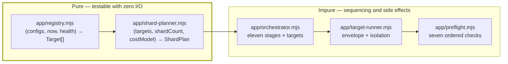

**`tpre plan` runs only the pure half.** This is why an operator can run it mid-incident to answer "what is due right now?" without any risk of side effects — and why TR-APP-030 makes purity a requirement rather than a nicety.

## 28.2 Implementation Order

| # | Step | Purity | Test |
|---|---|---|---|
| 1 | `app/registry.mjs` — enumeration, `enabled` filter, listing expansion, cadence due-check | **pure** | Due-set matrix: tiers × last-run-times × cadence floors |
| 2 | `app/shard-planner.mjs` — cost-balanced partitioning, spill, priority ordering | **pure** | Balance quality (max/min shard cost ratio), determinism, spill correctness |
| 3 | `app/preflight.mjs` — seven checks in order, failing fast | impure | One test per check + the recorded-verdict-on-allow test (TR-APP-010) |
| 4 | `app/target-runner.mjs` — envelope, per-target budget, context lifecycle, diagnostics trigger | impure | Isolation with a **failing** target |
| 5 | `app/orchestrator.mjs` — the loop, run budget, pacing, deterministic ordering | impure | CH-13 (budget exhaustion → `deferred`), ordering determinism |
| 6 | `app/run-manifest.mjs` — assembly from outcomes and timings | mostly pure | Schema validation |
| 7 | Cron surface in `harvest.yml` — four tiers, matrix emitted by a job | n/a | PH-19 |

| ID | Requirement |
|---|---|
| SCHED-01 | The registry and shard planner MUST be pure (TR-APP-030) and MUST be built **before** the orchestrator, so that the orchestrator is written against a computed plan rather than computing one. |
| SCHED-02 | Target order MUST be a deterministic pseudo-random permutation seeded by `runId + slug` (TR-APP-003), so no client is permanently first — and so an ordering bug is reproducible from the run id. |
| SCHED-03 | Run-budget exhaustion MUST mark remaining targets `deferred`, **never** `failed` (TR-APP-005). `failed` triggers alerts and pollutes the success-rate metric; `deferred` is a scheduling fact. |
| SCHED-04 | Every target MUST appear in the outcome list, including blocked and deferred ones (TR-APP-006). A missing target is invisible in the manifest and therefore invisible in the incident. |
| SCHED-05 | The shard matrix MUST be emitted by a job, never hard-coded in workflow YAML (EDR-029). |

## 28.3 The Cadence Surface

| Tier | Cadence | Cron Slots | Notes |
|---|---|---|---|
| `premium` | 6 h | 4/day | The `cadence_floor_hours` default of 6 is a floor, not a target |
| `standard` | 12 h | 2/day | |
| `economy` | 24 h | 1/day | |
| `paused` | never | — | Still appears in `tpre plan` output, marked paused |

Offsets are chosen so no two tiers start simultaneously, and the canary (every 3 h) is offset from all four. **The canary must never share a start minute with a harvest tier**, or a source-side rate observation cannot distinguish them.

## 28.4 Deliverables / Acceptance / Exit

| Field | Content |
|---|---|
| **Deliverables** | DEL-67 `app/registry.mjs` · DEL-68 `app/shard-planner.mjs` · DEL-69 `app/preflight.mjs` · DEL-70 `app/target-runner.mjs` · DEL-71 `app/orchestrator.mjs` · DEL-72 `app/run-manifest.mjs` · DEL-73 `tpre plan` |
| **Acceptance** | Due-set matrix correct across tiers and cadence floors; shards balanced by cost within 25%; preflight verdict recorded on allow **and** deny; isolation holds with a failing target; deferral semantics correct |
| **Exit** | Registry and shard planner pass a purity assertion in the architecture test; `tpre plan` runs with zero side effects (proven by running it against a read-only checkout); CH-13 green; every target present in the manifest |

## 28.5 Rollback / Verification / Testing / Documentation / Future

| Field | Content |
|---|---|
| **Rollback** | Reduce to single-shard sequential execution by setting `max_parallel: 1`. Slower, correct, and always available — the shard planner is an optimisation over a working serial path |
| **Verification** | Reviewer runs `tpre plan` twice and diffs (identical); runs it against a checkout with no write permission (succeeds); confirms a deferred target does not raise an error alert |
| **Testing** | Unit: due-set matrix, shard balance, determinism, spill, preflight ×7 · Integration: orchestrator with two targets, one failing · Chaos: CH-13 |
| **Documentation** | `docs/maintenance.md` cadence and sharding section; the `tpre plan` output format; the runbook for "every client stale" (schedules disabled vs breaker open) |
| **Future** | Cost model learning from a longer health window (v1.1); priority pre-emption for a client that has been stale longest (v1.1); event-driven scheduling (v2, requires a server — out of architecture for v1) |

---

## Part 4 Cross-Cutting Exit Criteria

The five foundation systems are complete when, together, they satisfy:

| # | Criterion | Verified In |
|---|---|---|
| 1 | Config resolves, freezes, traces, and rejects — with no secret in the trace | §24 |
| 2 | Every log line is redacted at the sink; a sentinel never appears in any artifact | §25 |
| 3 | Every failure is a named class with a policy, a scope, and a severity | §26 |
| 4 | No `ERR-BLOCKED-*` has a retry path, proven by enumeration | §27 |
| 5 | Every target appears in the manifest with a correct outcome, and `tpre plan` has no side effects | §28 |

**These five together are what makes the rest of the system diagnosable.** Every phase from PH-11 onward assumes them, and no phase after PH-17 adds a new cross-cutting concern — which is a deliberate property of the build order, not an accident.

---

*End of Part 4. Part 5 specifies the acquisition layer: the Playwright engine, browser management, navigation, review detection, and the parser.*


---

# Part 5 — Acquisition Layer Implementation

*Sections 29 through 33. Audience: the two engineers in SP-4 and SP-5. This is the part of the system that touches something outside the team's control, and it is deliberately the last major subsystem built — week 8 for extraction, week 10 for the browser. Everything here substitutes into a pipeline that already works end to end.*

**Build-order reminder.**

| § | System | Built In | Sprint |
|---|---|---|---|
| 29 | Playwright engine | PH-14 | SP-5 |
| 30 | Browser management | PH-14 | SP-5 |
| 31 | Navigation engine | PH-15 | SP-5 |
| 32 | Review detection (selector packs + challenge detection) | PH-12 (packs) + PH-16 (detection) | SP-4, SP-5 |
| 33 | Review parser (dates + extraction) | PH-03 (dates) + PH-13 (extraction) | SP-1, SP-4 |

**The parser is built five weeks before the browser.** That inversion is the single most important structural feature of this part and is justified in §5.4 — extraction operates on a serialised subtree string (EDR-015), so it needs saved markup, not a browser.

---

# 29. Playwright Engine

| Field | Value |
|---|---|
| **Purpose** | Confine every line of browser-automation library code to exactly one file, so that the browser is a replaceable detail rather than an architectural commitment. |
| **Objectives** | (1) `BrowserPort` interface defined. (2) One file imports `playwright`. (3) Launch flags and context options per TRD §16. (4) Route interception with a host allowlist plus resource-type denylist, **measured**. (5) Six timeout budgets nested correctly. (6) Headless-only in production; headed as a local debug flag. |
| **Dependencies** | PH-11 complete (**X-8: the CSV adapter must exist first**), PH-07 (ports, logger, retry), §15 step 9 (Playwright installed for the first time here) |
| **Estimated Complexity** | **D3.** The library is well documented; the discipline of confining it is the work |
| **Estimated Time** | 18 IEH of PH-14's 34 |
| **Risks** | `playwright` imported by a second file, usually the navigator "just for a type" (DR-3, IR-12) · route interception configured but never measured, so nobody notices it stopped working · timeout levels not nested, so an outer timeout fires before an inner one and the diagnostic is useless · headed mode leaking into a production code path |
| **Plan risks** | PR-14 |

## 29.1 Implementation Order

| # | Step | Produces | Verified By |
|---|---|---|---|
| 1 | `ports/browser.mjs` — the interface, written **before** any Playwright code | The seam | Architecture test: `app/` and `core/` reference only the port |
| 2 | `adapters/browser/playwright-chromium.mjs` — launch with the TRD §16 flag set | Launch | Launch/close smoke test |
| 3 | Context creation with locale, timezone, viewport, user agent per config | Context | Context option assertions |
| 4 | Route interception: host allowlist + resource-type denylist | Interception | **Measured** byte reduction (§29.3) |
| 5 | The six timeout levels, each strictly inside the next (EDR-028) | Budgets | Nesting assertion test |
| 6 | Teardown in `finally`, in the correct order | Lifecycle | §30 |
| 7 | Headed flag, local only, refused when `TPRE_ENV=production` | Debug | Unit: production refusal |

| ID | Requirement |
|---|---|
| PW-01 | `adapters/browser/playwright-chromium.mjs` MUST be the only file importing `playwright` (TR-BRW-001, DR-3). Enforced by the architecture test **and** by lint. Two mechanisms because this is the rule whose violation is most tempting and least visible. |
| PW-02 | The port MUST be written before the adapter. A port extracted from an implementation is shaped by that implementation, which is how "browser" ends up meaning "Chromium via Playwright" in the type system. |
| PW-03 | Route interception effectiveness MUST be **measured**, not assumed (EDR-012). The integration test asserts a non-trivial byte reduction with the fixture server logging requests. |
| PW-04 | Headed mode MUST be refused when `TPRE_ENV=production` (EDR-010). |

## 29.2 The Six Timeout Levels

Each strictly inside the next (EDR-028). The nesting is asserted by a unit test that reads the resolved config, not by inspection.

| Level | Budget | Config Key | Fires Before |
|---|---|---|---|
| 1 | Single action (click, scroll step) | derived | Navigation |
| 2 | Navigation | `nav.navigation_timeout_ms` (30 s) | Surface wait |
| 3 | Surface wait | `nav.surface_timeout_ms` (15 s) | *(shorter by design — a surface that has not appeared in 15 s will not appear)* |
| 4 | Pagination loop | `nav.pagination_budget_ms` (120 s) | Target |
| 5 | Target | `budget_target_ms` (300 s, hard ceiling) | Run |
| 6 | Run | `budget_run_ms` (900 s, hard ceiling) | CI job timeout |

**The seventh, invisible level is the CI job timeout (TA-02).** The in-engine run budget must fire first, or the engine loses its chance to write a manifest, flush logs, and upload diagnostics — which converts a diagnosable partial run into a silent job cancellation. This is asserted by a workflow-level check in PH-19.

## 29.3 Measuring Interception

| Measurement | Method | Threshold |
|---|---|---|
| Blocked bytes | Fixture server logs every request; test compares total bytes with and without interception | Non-trivial reduction, recorded as a number in the test |
| Blocked types | Assert images, fonts, media, analytics hosts are absent from the request log | Zero occurrences |
| Allowed hosts | Assert only allowlisted hosts appear | Zero off-allowlist requests |

**Recording the actual number matters more than the threshold.** A test asserting "> 0% reduction" passes forever; a test recording "78% reduction, 2026-10-14" makes a regression to 12% visible in a diff.

## 29.4 Deliverables / Acceptance / Exit

| Field | Content |
|---|---|
| **Deliverables** | DEL-74 `ports/browser.mjs` · DEL-75 `adapters/browser/playwright-chromium.mjs` · DEL-76 interception measurement test · DEL-77 timeout nesting test · DEL-78 DEP-1 justification for `playwright` |
| **Acceptance** | Browser launches headless and closes cleanly; context options applied; interception measured; six timeouts nested; headed refused in production |
| **Exit** | DR-3 architecture test green (exactly one importer); interception byte reduction recorded; timeout nesting asserted; launch/close proven in a `finally` path with an injected failure |

## 29.5 Rollback / Verification / Testing / Documentation / Future

| Field | Content |
|---|---|
| **Rollback** | Revert PH-14. MS-5's CSV path still works end to end, so the product remains demonstrable. This is the designed benefit of X-8 |
| **Verification** | Reviewer greps the repository for `playwright` imports (expects one); runs the interception test and reads the recorded byte numbers; confirms the headed flag is refused under production env |
| **Testing** | Unit: launch flags, context options, timeout nesting, headed refusal · Integration: interception measurement against the fixture server (PH-15) |
| **Documentation** | Why exactly one file imports the library; the documented Puppeteer migration path (one file); the launch flag rationale |
| **Future** | Puppeteer or a lighter engine (v2, confined to this file by construction); browser pooling across targets (**rejected** — INV-09 requires a fresh context per target and pooling erodes it) |

---

# 30. Browser Management

| Field | Value |
|---|---|
| **Purpose** | Guarantee that one target's browser state can never influence another's, and that no context ever leaks — including on the failure paths where `finally` blocks are most often omitted. |
| **Objectives** | (1) One browser per shard, one context per target, one page per context (EDR-011). (2) Teardown in `finally`, ordered. (3) Open-context count returns to zero after every target. (4) Isolation proven with a **failing** target. (5) Peak RSS monitored. |
| **Dependencies** | §29 |
| **Estimated Complexity** | **D3**, elevated by the failure-path requirement |
| **Estimated Time** | 16 IEH of PH-14's 34 |
| **Risks** | **IR-09 — contexts leak because `finally` is omitted on an error path.** Rated `High` impact · storage/cookie carryover between targets, violating INV-09 · browser crash mid-pagination leaving a zombie process · memory growth across a 30-target shard exceeding the runner |
| **Plan risks** | PR-15 |

## 30.1 The Lifecycle Contract

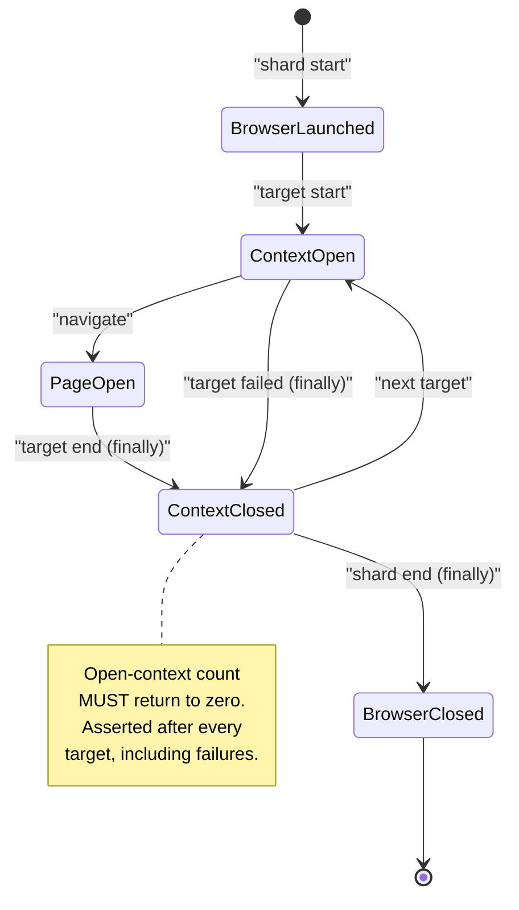

| ID | Requirement |
|---|---|
| BRW-01 | Context close MUST be in a `finally` block, and the integration test MUST include a run in which a target **fails** (TR-TEST-081, TR-BRW-053). A test covering only the success path proves nothing about the path where the leak occurs. |
| BRW-02 | Teardown order MUST be page → context → browser, and each step MUST tolerate the previous having already failed. |
| BRW-03 | The open-context count MUST be asserted as zero after every target in the integration suite, not merely at the end of the run. |
| BRW-04 | A browser crash MUST produce `ERR-BROWSER-CRASH` with one retry (per policy), and on repeat MUST fail the target with the context closed (CH-09). |

## 30.2 Isolation Test Design

The `security.isolation` test is one of the ten enforcing tests in SAD Appendix D and deserves explicit design:

| # | Assertion |
|---|---|
| 1 | Target A sets a cookie and local storage; target B's context sees neither |
| 2 | Target A **fails mid-run**; target B still runs and its context is fresh |
| 3 | Open-context count is zero between A and B, and after B |
| 4 | Target A cannot write outside its own client path (path disjointness, EDR-035) |
| 5 | An unhandled rejection inside target A does not propagate to the orchestrator loop |

## 30.3 Deliverables / Acceptance / Exit

| Field | Content |
|---|---|
| **Deliverables** | DEL-79 session manager within the browser adapter · DEL-80 `tests/security/isolation.test.mjs` · DEL-81 context-lifecycle integration test with a failing target · DEL-82 RSS measurement in the health record |
| **Acceptance** | Fresh context per target; zero carryover; zero leaked contexts including on failure; crash handled per CH-09 |
| **Exit** | `security.isolation` green including the failing-target case; open-context count asserted zero after every target; peak RSS recorded per target and under the 700 MB monitored budget |

## 30.4 Rollback / Verification / Testing / Documentation / Future

| Field | Content |
|---|---|
| **Rollback** | Launch a fresh browser per target instead of per shard. Slower (~2 s per target), strictly safer, always available. **This is the correct emergency response to any suspected isolation defect** |
| **Verification** | Reviewer runs the isolation test with the `finally` block deliberately removed and confirms it fails — the only way to know the test tests anything |
| **Testing** | Integration: isolation ×5 assertions · Chaos: CH-09 (crash mid-pagination) |
| **Documentation** | The lifecycle diagram; the "fresh browser per target" emergency lever in `docs/runbooks/` |
| **Future** | Per-target memory ceiling with proactive restart (v1.1); measured context-reuse optimisation (**rejected for v1.0** — INV-09) |

---

# 31. Navigation Engine

| Field | Value |
|---|---|
| **Purpose** | Drive a review surface to as complete a state as the budget allows, and report honestly how complete that state is. |
| **Objectives** | (1) Fixture server serving sanitised markup with configurable lazy-load dynamics. (2) Navigate → dismiss → open → sort → paginate → expand sequence. (3) Scroll by container-height ratio, never to absolute bottom (EDR-013). (4) Stall detection. (5) **Stop reason as a first-class output.** (6) Growth curve retained in the acquisition report (EDR-014). |
| **Dependencies** | §29, §30 (a browser to drive) |
| **Estimated Complexity** | **D3**, with a **D4** consequence: the stop reason feeds completeness classification, which feeds the absence asymmetry |
| **Estimated Time** | 36 IEH (PH-15) |
| **Risks** | Stop reason inferred later from counts rather than emitted at the point of stopping (TR-NAV-001) · scrolling to absolute bottom, which a virtualised container punishes · pagination tested against the live source instead of the fixture server, making the suite flaky and eventually disabled · expansion budget unbounded, blowing the target budget on a 5,000-review listing |
| **Plan risks** | PR-16 |

## 31.1 Why the Fixture Server Comes First

`fixtures/server/serve.mjs` is built **before** the navigator, in the same phase. It serves the same sanitised markup the regression suite uses, over HTTP, with configurable lazy-loading — so scroll loops, stall detection, and expansion budgets are exercised against realistic dynamics with **zero network and zero flakiness** (TRD §61.8.1).

| Fixture Server Capability | Exercises |
|---|---|
| Serve a full corpus page | Happy-path pagination |
| Stop yielding after batch N | **Stall detection → `partial` → gate rejection (CH-04)** |
| Delay responses configurably | Timeout paths |
| Serve a challenge page | Terminal challenge detection (CH-03) |
| Serve a consent interstitial | Dismissal path |
| Log every request | Interception measurement (§29.3) |

**This one file is what makes every acquisition test deterministic.** It is 6 IEH and it removes the single largest source of test flakiness in the project.

## 31.2 Implementation Order

| # | Step | Test |
|---|---|---|
| 1 | Fixture server with the six capabilities above | Server self-test |
| 2 | Navigate + wait for the review surface | Surface-not-found → `ERR-NAV-SURFACE-NOT-FOUND` |
| 3 | Consent dismissal — **benign, dismissible interstitials only** | Fixture 017 dismissed; a non-dismissible wall → `ERR-NAV-CONSENT-WALL` |
| 4 | Open the review pane; apply sort order | Sort applied and verified |
| 5 | **Pagination loop**: scroll by container-height ratio, settle, count, detect stall | Growth curve recorded; stall after `nav.stall_threshold` |
| 6 | Expansion of truncated reviews, capped by `nav.expand_max_count` | Cap respected; budget respected |
| 7 | **Stop reason emitted** (`complete` / `capped` / `stalled` / `budget` / `error`) | One test per reason |
| 8 | Growth curve retained in the `AcquisitionReport` | Report schema validation |

| ID | Requirement |
|---|---|
| NAV-01 | The stop reason MUST be emitted by the navigator at the point of stopping (TR-NAV-001). Completeness classification (§34) depends entirely on it, and inferring it downstream from counts is how a stalled harvest is classified `full`. |
| NAV-02 | Scrolling MUST be by container-height ratio (EDR-013), never `scrollIntoView` on a last element and never to absolute bottom — a virtualised container recycles nodes and absolute-bottom scrolling skips content. |
| NAV-03 | The growth curve (reviews observed per scroll iteration) MUST be retained in the acquisition report (EDR-014). It is the primary evidence for diagnosing a partial harvest after the fact. |
| NAV-04 | Every navigation behaviour MUST be demonstrated against the fixture server before it is attempted against the live source (SP-5 rule, §7.6). |

## 31.3 Deliverables / Acceptance / Exit

| Field | Content |
|---|---|
| **Deliverables** | DEL-83 `fixtures/server/serve.mjs` · DEL-84 `adapters/acquisition/google-dom/navigator.mjs` · DEL-85 `adapters/acquisition/google-dom/consent.mjs` · DEL-86 pagination integration tests · DEL-87 stall test |
| **Acceptance** | All five stop reasons produced and asserted; growth curve present; consent dismissal handles fixture 017 and refuses a hard wall; expansion capped |
| **Exit** | Pagination integration test green against the fixture server; **stall test yields `stalled` + `partial` + gate rejection**; zero network in the suite; budget respected under a 5,000-review fixture |

## 31.4 Rollback / Verification / Testing / Documentation / Future

| Field | Content |
|---|---|
| **Rollback** | Reduce `nav.max_reviews` and accept `capped` completeness — a correct, lower-yield mode. The gate's coverage rule then governs whether the smaller payload publishes |
| **Verification** | Reviewer runs the stall scenario and confirms three independent protections engage (partial classification, no streak increment, gate rejection) |
| **Testing** | Integration: full pagination, stall, expansion cap, consent dismissal, timeout · Chaos: CH-04 (the most important test in the suite) |
| **Documentation** | The navigation phase machine; the stop-reason semantics table; `docs/runbooks/selector-break.md` navigation section |
| **Future** | Adaptive scroll increment from observed growth (v1.1); parallel pagination (**rejected** — increases source load, violates pacing discipline) |

---

# 32. Review Detection Engine

*Two components, built five weeks apart: selector packs (PH-12, SP-4) locate content; challenge detection (PH-16, SP-5) recognises when there is no content to locate because the source has said stop.*

| Field | Value |
|---|---|
| **Purpose** | Externalise all volatile knowledge about the source's markup into versioned data files, and detect a bot challenge before any parsing is attempted. |
| **Objectives** | (1) Selector pack JSON schema. (2) Load-time validation. (3) Ordered strategy resolution with recorded `strategyIndex`. (4) Structural assertions file for the canary. (5) **Challenge detection, before parsing, terminal.** (6) Consent vs challenge distinguished. (7) DOM subtree serialisation only. |
| **Dependencies** | PH-02 (normalize) for the pack loader's outputs; PH-01 (`Result`); PH-15 (navigation) for challenge detection's position in the sequence |
| **Estimated Complexity** | **D3 for packs, D4 for challenge detection** — a challenge misclassified as a parse failure gets retried, which is INV-07's exact failure |
| **Estimated Time** | 26 IEH (PH-12) + 18 IEH of PH-16's 44 |
| **Risks** | **IR-03 — pack authored with `css`-only strategies under time pressure** (schema requires ≥ 2 strategies of different kinds) · a merged pack edited in place instead of versioned (TR-SEL-001) · **IR-11 — a retry added to the challenge path** · a challenge page parsed as a zero-review page, producing `ERR-PARSE-EMPTY-UNEXPECTED` instead of `ERR-BLOCKED-CHALLENGE` and therefore being retried |
| **Plan risks** | PR-17, PR-18 |

## 32.1 Selector Packs — Implementation Order (PH-12)

| # | Step | Test |
|---|---|---|
| 1 | `selectors/schema/selector-pack.schema.json` — requires ≥ 2 strategies of **different kinds** per field, plus a `notes` field per strategy | Schema rejects a single-strategy field; rejects two `css` strategies |
| 2 | `core/selectors/loader.mjs` — parse and schema-validate at load | Malformed pack ⇒ `ERR-PARSE-SELECTOR-PACK` **at load**, not later (TR-SEL-003) |
| 3 | `core/selectors/resolver.mjs` — ordered resolution, records `strategyIndex` and health | Strategy 0 hit; fallback to 1 recorded; all-fail ⇒ field-required error |
| 4 | `selectors/google-maps/v1.json` authored with `notes` on every strategy | Golden fixtures resolve at index 0 |
| 5 | `selectors/google-maps/assertions.json` — structural assertions for the canary | Assertions evaluate against fixture 001 |
| 6 | Profile pinning (`profiles/*.json` pins a pack version) | Pin change alters resolution; TR-SEL-004 |

| ID | Requirement |
|---|---|
| SEL-01 | A merged pack MUST NEVER be edited; a change creates `v<n+1>.json` (TR-SEL-001). Enforced in review and by a CI check comparing merged pack files against their previous content. |
| SEL-02 | Old packs MUST be retained indefinitely and fixtures captured under `vN` MUST continue to be tested against `vN` (TR-SEL-002). This is what proves the corpus tests **extraction** rather than today's markup. |
| SEL-03 | Every strategy MUST carry a `notes` field explaining what it targets and why it is ranked where it is (TRD §67.5). Six months later this is the difference between a maintainable pack and an archaeological one. |
| SEL-04 | Pack version pinning MUST live in a profile, never in a client config or in code (TR-SEL-004). This is what makes a staged rollout a one-line edit in two files. |

## 32.2 Challenge Detection — Implementation Order (PH-16)

| # | Step | Test |
|---|---|---|
| 1 | Classification runs **before** any parsing attempt | Fixture 016 classified as a challenge, never as a parse failure |
| 2 | Distinguish consent interstitial (dismissible) from challenge (terminal) | Fixture 017 dismissed; fixture 016 terminal |
| 3 | Emit `ERR-BLOCKED-CHALLENGE` / `ERR-BLOCKED-UNUSUAL-TRAFFIC` | Retry policy returns `never` (enumerating test) |
| 4 | Open the circuit breaker for the source-access pair | Breaker state persisted |
| 5 | Raise a `critical` alert | Notifier severity map |
| 6 | Retain LKG; write **no** ledger, **no** payload | Outcome table (TRD §2.4.1) |

| ID | Requirement |
|---|---|
| CHAL-01 | Challenge detection MUST occur **before** parsing is attempted. A challenge page parsed first produces a plausible "zero reviews" result, which is retryable — and retrying a challenge is the specific behaviour INV-07 forbids. |
| CHAL-02 | **No retry path may exist**, including "one retry to see if it clears" (INV-07, A-5, IR-11). The absence is proven by the enumerating retry-policy test, not by reading the adapter. |
| CHAL-03 | A code review of any PR touching `challenge-detect.mjs` MUST include a second reviewer who checks the retry-policy test still enumerates. |

## 32.3 DOM Serialisation

| ID | Requirement |
|---|---|
| SER-01 | Extraction MUST operate on a **serialised subtree string**, never on live browser handles (EDR-015, IR-12). This is what makes `core/extract/` pure and testable against saved fixtures. |
| SER-02 | The serialiser MUST NEVER serialise the whole document (TRD §44.3). A full-page serialisation on a 5,000-review listing is a memory event. |
| SER-03 | The serialised subtree MUST be the review container plus minimal ancestry — the same shape as a captured fixture, so that a production failure can be reproduced by saving the string as a fixture. |

**Sequencing Note.** SER-03 is what makes `tpre replay` possible and what makes "every incident becomes a permanent test" (X-9) cheap for extraction defects: the diagnostics bundle contains a string that *is* a fixture.

## 32.4 Deliverables / Acceptance / Exit

| Field | Content |
|---|---|
| **Deliverables** | DEL-88 `selectors/schema/selector-pack.schema.json` · DEL-89 `core/selectors/loader.mjs` · DEL-90 `core/selectors/resolver.mjs` · DEL-91 `selectors/google-maps/v1.json` · DEL-92 `selectors/google-maps/assertions.json` · DEL-93 `challenge-detect.mjs` · DEL-94 `dom-serialize.mjs` |
| **Acceptance** | Pack schema enforces multi-kind strategies; load-time validation fails loudly; strategy index recorded; challenge terminal; subtree-only serialisation |
| **Exit** | Pack validation tests green; CH-07 (one field's strategies broken → fallback engages) and CH-08 (all strategies broken → quarantine → gate rejects) green in PH-21; fixture 016 terminal with zero retries; DR-1 holds for `core/selectors/` |

## 32.5 Rollback / Verification / Testing / Documentation / Future

| Field | Content |
|---|---|
| **Rollback** | Revert the pack pin in `profiles/default.json` — **one line, instantly** (TRD §66.3). This is the entire payoff of externalising selectors, and it should be drilled once in SP-7 |
| **Verification** | Reviewer breaks strategy 0 of one field in a scratch pack and confirms fallback + health signal; reviewer confirms fixture 016 produces `ERR-BLOCKED-CHALLENGE` and that the retry table returns `never` |
| **Testing** | Unit: pack schema, loader, resolver ordering, strategy health · Regression: fixtures 001–020 · Chaos: CH-03, CH-07, CH-08 |
| **Documentation** | `selectors/README.md` — how to author, test, and version a pack; the staged rollout procedure; `docs/runbooks/selector-break.md` |
| **Future** | Automated pack candidate generation from a diff of two captures (v2); pack authoring UI (v2, TRD §82) |

---

# 33. Review Parser

*Two components: date resolution (PH-03, SP-1) and field extraction (PH-13, SP-4). Both are pure, both are tested entirely offline, and neither ever sees a browser.*

| Field | Value |
|---|---|
| **Purpose** | Convert a serialised markup subtree into structured, per-field review records, failing softly per field and loudly per structure, with locale-aware date resolution that is pinned on first observation and never recomputed. |
| **Objectives** | (1) Locale-aware relative-date parsing across the six-locale matrix. (2) Precision and confidence derivation. (3) **First-observation date pinning.** (4) Owner-reply detachment **first**. (5) Three-parser rating cascade with an integer post-check. (6) Per-field extraction with fallback. (7) Twenty golden fixtures. |
| **Dependencies** | PH-02 (normalize) — extraction feeds it; PH-12 (selector resolver); the fixture corpus |
| **Estimated Complexity** | **D3**, with three **D4** hazards named below |
| **Estimated Time** | 22 IEH (dates/lang in PH-03) + 42 IEH (extraction in PH-13) |
| **Risks** | **IR-04 — date parser fails on singular forms** ("a day ago", "yesterday"). Rated `High` · **IR-13 — owner replies ingested as reviews** · **IR-14 — aggregate business rating captured instead of a review rating** · date recomputed on later harvests, destroying sort stability (PT-06) · extraction against live handles instead of a string (IR-12) |
| **Plan risks** | PR-19 |

## 33.1 Date Resolution — Implementation Order (PH-03)

| # | Step | Test |
|---|---|---|
| 1 | Phrase table format per TRD §21.6 (data, not code) | Table parses; six locales present |
| 2 | `core/dates/relative.mjs` — phrase → duration | **Locale matrix: six locales × all granularities × singular and plural forms** |
| 3 | Singular-form handling explicitly enumerated | "a day ago", "an hour ago", "yesterday", "last week" per locale |
| 4 | Unparseable phrase → null, never a guess | Fails soft; no error |
| 5 | `core/dates/precision.mjs` — precision and confidence from phrase granularity | "3 months ago" ⇒ low precision, correctly stated |
| 6 | **`core/dates/pin.mjs` — pin on first observation, refuse to recompute** | **PT-06** at ≥ 1,000 cases |

| ID | Requirement |
|---|---|
| DATE-01 | Singular forms MUST have explicit tests per locale (IR-04). They are the highest-frequency failure and the least likely to be generated by an agent that pattern-matched the plural case. |
| DATE-02 | The pinned date MUST NEVER change after INSERT (PT-06). Recomputing on each harvest makes the display order jitter for no reason a client can understand. |
| DATE-03 | The phrase table is **data**. Extending it for a seventh locale MUST NOT require a code change (TA-05's "if false" path depends on this). |

## 33.2 Extraction — Implementation Order (PH-13)

**Order within the phase is normative** — reply detachment first (EDR-016), then fields.

| # | Step | Fixture | Hazard |
|---|---|---|---|
| 1 | **`extract/reply.mjs` — owner-reply subtree isolation, performed first** | 004 | **IR-13**: replies ingested as reviews |
| 2 | `extract/rating.mjs` — three-parser cascade P1/P2/P3 + **integer post-check** | 001, 010 | **IR-14**: aggregate rating captured |
| 3 | `extract/author.mjs` — name, profile URL, avatar URL, badges | 008, 009, 011 | Anonymous authors fabricated |
| 4 | `extract/text.mjs` — body lifting, truncation-marker detection | 005, 019 | Markup removal attempted here (belongs in normalize) |
| 5 | `extract/meta.mjs` — likes, photo counts, visit metadata | 001 | **Fabricating absent fields** |
| 6 | `extract/index.mjs` — per-node orchestration in the §21.3 order | all | Order deviation |
| 7 | Golden fixture suite across all twenty fixtures | all | — |

| ID | Requirement |
|---|---|
| EXT-01 | Owner-reply detachment MUST happen **before any other field extraction** (EDR-016). A reply that is still attached becomes text, rating, and author data for a review that does not exist. |
| EXT-02 | The rating cascade MUST end with a mandatory integer post-check (EDR-017, TR-EXT-040). This is the mitigation for IR-14: an aggregate business rating is typically fractional (4.3), a review rating never is. |
| EXT-03 | A field the adapter cannot supply MUST be `null`, **never fabricated** (contract suite assertion). |
| EXT-04 | Extraction MUST be pure and operate on a string (EDR-015, DR-1). |

## 33.3 The Fixture Corpus Is a Scheduling Dependency

Twenty fixtures with `page.html`, `meta.json`, and `expected.json` each. **Capture begins in SP-2, four weeks before PH-13 needs them** (§4.4), because capture and sanitisation have elapsed-time cost that cannot be compressed.

| Category | Fixtures | Owner | Captured By |
|---|---|---|---|
| Baseline + boundary | 001, 002, 003, 018 | Backend | End of SP-2 |
| Structural variety | 004, 008, 009, 010 | Backend | End of SP-2 |
| Text handling | 005, 006, 007, 020 | QA | End of SP-3 |
| Locale | 012, 013 | QA | End of SP-3 |
| Identity hazards | 011 | QA | End of SP-3 |
| **Adversarial** | **014, 015, 016, 017, 019** | **QA + Backend** | **End of SP-3** |

**The adversarial five are the point of the corpus** (TRD §61.5.2) and are the ones most likely to be deferred, because they require deliberately constructing failure states rather than capturing a normal page. They are scheduled as named tasks in PH-13's task block, not as "capture fixtures".

## 33.4 Deliverables / Acceptance / Exit

| Field | Content |
|---|---|
| **Deliverables** | DEL-95 `core/dates/*` · DEL-96 `core/lang/detect.mjs` · DEL-97 `core/extract/*` (six files) · DEL-98 twenty fixture directories · DEL-99 `tests/regression/fixtures.golden.test.mjs` · DEL-100 `scripts/capture-fixture.mjs` and `scripts/sanitize-html.mjs` |
| **Acceptance** | Locale matrix green including singular forms; pinning proven by PT-06; replies detached first; rating integer post-check enforced; all twenty fixtures produce their golden output |
| **Exit** | `core/extract/**` ≥ 90%, `core/dates/**` ≥ 95%; twenty golden fixtures green **against their pinned pack versions**; adversarial fixtures assert **correct failure** (015 → `ERR-PARSE-STRUCTURE`, not three silent reviews); DR-1/DR-2 hold across all parser modules |

## 33.5 Rollback / Verification / Testing / Documentation / Future

| Field | Content |
|---|---|
| **Rollback** | Revert to the previous selector pack pin (one line) for a markup-shaped failure; revert the extraction PR for a logic-shaped failure. Fixtures are never rolled back — they are the record |
| **Verification** | Reviewer runs `npm run parse:fixture -- 015` and confirms a loud failure; runs `-- 019` and confirms plain text with no markup; runs `-- 004` and confirms zero replies in the review list |
| **Testing** | Unit: rating parsers ×3, reply isolation, author fields, text truncation, meta absence, locale matrix, pinning · Regression: twenty fixtures · Property: PT-05, PT-06 · Security: fixture 019 via `security.xss-fixture` |
| **Documentation** | `fixtures/README.md` — how to capture, sanitise, and add a fixture; the phrase table format; the rating cascade rationale |
| **Future** | Quarterly baseline re-capture (TR-TEST-052) as a scheduled maintenance task (§68); additional locales as data-only additions |

---

## Part 5 Cross-Cutting Exit Criteria

| # | Criterion | Verified In |
|---|---|---|
| 1 | Exactly one file imports the browser library | §29 |
| 2 | No context leaks, including on failure paths | §30 |
| 3 | Stop reason is emitted, not inferred, and drives completeness | §31 |
| 4 | A challenge is terminal, with zero retry paths, proven by enumeration | §32 |
| 5 | Twenty golden fixtures pass against their pinned packs, adversarial ones asserting correct failure | §33 |
| 6 | Every module in `core/extract/`, `core/dates/`, `core/lang/`, `core/selectors/` is pure | DR-1/DR-2 |

**Criterion 6 is the one that makes this whole part cheap to maintain.** Four of the five subsystems in Part 5 are pure and run in milliseconds with no browser; only §29–§31 need Chromium, and they are tested against a localhost fixture server. That is why the default suite stays under three minutes with acquisition fully covered.

---

*End of Part 5. Part 6 specifies validation, duplicate detection, hashing, normalisation, and the ledger.*


---

# Part 6 — Processing and Data Implementation

*Sections 34 through 38. Audience: the lead implementer and the second reviewer. Four of the five systems in this part are D4 or D5. Together they contain every mechanism whose failure is silent, and they are built in weeks 2 through 5 precisely because that is when there is still time to get them right.*

**Build-order reminder — this part is presented out of build order.**

| § | System | Built In | Sprint | Difficulty |
|---|---|---|---|---|
| 37 | **Normalizer** | **PH-02** | SP-1 | **D4** |
| 36 | Hash generator | PH-01 (`hash.mjs`) + PH-03 (identity) | SP-1 | D3 |
| 34 | Review validation | PH-04 | SP-2 | D3 |
| 35 | Duplicate detection | PH-05 | SP-2 | **D4** |
| 38 | Review ledger | PH-05 (shape + reconcile) + PH-08 (persistence) | SP-2, SP-3 | **D5** |

**Read §37 first.** The Normalizer is built before everything else in this part and before every producer of data anywhere in the system (X-7). The other four sections assume its output vocabulary.

---

# 37. Normalizer

**Phase PH-02 · Sprint SP-1 · Difficulty D4 · 40 IEH · The security boundary**

| Field | Value |
|---|---|
| **Purpose** | Convert hostile, arbitrary text from an untrusted source into a value that is safe as plain text on any client website, deterministically, for every possible input. |
| **Objectives** | (1) Eight ordered steps, order normative. (2) Markup **removed**, not escaped. (3) Unicode normalisation, control/zero-width/bidi stripping. (4) Whitespace canonicalisation. (5) URL host-allowlist validation. (6) Grapheme-cluster-aware length bounding, applied last. (7) Markup self-check producing `ERR-CLEAN-MARKUP-SURVIVED`. (8) PT-10 and PT-11 at ≥ 1,000 cases. |
| **Dependencies** | PH-01 (`Result`, `CleanString` brand). Nothing else — and nothing may depend on it being absent |
| **Estimated Complexity** | **D4.** Correctness is not observable from the happy path. Every input that matters is one nobody thought of |
| **Estimated Time** | 40 IEH |
| **Risks** | **IR-05 — length bounding by code units rather than grapheme clusters** (ZWJ emoji sequences split into invalid sequences) · escaping instead of removing (TRD §23.3 — the security boundary for every client website simultaneously) · step reordering that passes example tests and fails adversarial ones · length bound applied before markup removal, so the bound is computed on text that no longer exists |
| **Plan risks** | PR-08 |

## 37.1 Why This Is Phase 2

X-7 and INV-05. Retrofitting the security boundary requires re-deriving every golden fixture, re-auditing every producer, and re-establishing a property that was previously only asserted. Building it second — after the type vocabulary and before any producer — costs 40 IEH and buys a property that is true by construction for the remaining fifteen weeks.

**Stop Condition.** If any producer of data (extraction, CSV parsing, an adapter) is written before PH-02 closes, halt and escalate to DG-02. This is the one ordering violation with no cheap remedy.

## 37.2 The Eight Steps — Order Is Normative

TRD §23.3 specifies the order. The plan's contribution is the test that proves it:

| # | Step | If Moved Earlier | If Moved Later |
|---|---|---|---|
| 1 | Entity decoding | — | Encoded markup survives the removal step |
| 2 | Markup removal | Decoded entities become markup after removal | Markup reaches the output |
| 3 | Unicode NFC normalisation | Composed forms differ from decomposed in later comparisons | Hashes differ for visually identical text |
| 4 | Control-character stripping | — | Control characters reach the output |
| 5 | Zero-width and bidi-override stripping | — | **Bidi overrides reach the output — a display-spoofing vector** |
| 6 | Newline canonicalisation | — | Line-ending variation changes bytes and therefore hashes |
| 7 | Whitespace run collapsing | Collapses whitespace that markup removal was about to create | Ragged output |
| 8 | **Grapheme-aware length bounding** | **Bounds text that later steps then shorten — the bound becomes meaningless** | — |

| ID | Requirement |
|---|---|
| NORM-01 | The eight steps MUST execute in the specified order, and a unit test MUST assert the order by observing intermediate effects — not merely the final output. Two orderings can produce identical output on the test corpus and differ on the input that matters. |
| NORM-02 | Markup MUST be **removed**, never escaped (TRD §23.3). Escaping produces text that renders as markup source on a client site and re-becomes markup the moment any consumer unescapes it. |
| NORM-03 | Length bounding MUST be grapheme-cluster-aware and applied **last** (EDR-020, IR-05). A ZWJ emoji sequence split mid-cluster produces invalid output that some renderers display as replacement characters and others as unexpected glyphs. |
| NORM-04 | The markup self-check MUST run **after** the pipeline and produce `ERR-CLEAN-MARKUP-SURVIVED` (severity `critical`) if any markup remains. Defence in depth: the pipeline is the mechanism, the self-check is the proof. |

## 37.3 The Adversarial Corpus

This phase's real deliverable is not the eight steps; it is the corpus that proves they work.

| Class | Cases |
|---|---|
| Nested entities | `&amp;lt;script&amp;gt;`, double- and triple-encoded forms |
| Markup that survives naive stripping | Unclosed tags, tags split across attributes, comment-wrapped markup, `<` without a matching `>` |
| Bidi and zero-width | RLO/LRO overrides, ZWJ, ZWNJ, soft hyphens, BOM mid-string |
| Emoji | ZWJ family sequences, skin-tone modifiers, flag sequences, at the exact length boundary |
| Scripts | CJK, Arabic, Hebrew, Devanagari, mixed-direction strings |
| Length | Exactly at the bound, one under, one over, 10,000 graphemes |
| Control | Every C0 control, DEL, C1 range |
| Degenerate | Empty string, whitespace only, a single combining mark |

**Every case in this table is a named unit test.** Together they are roughly 60 of PH-02's tests, and they are the reason this phase costs 40 IEH rather than 12.

## 37.4 Property Laws

| Law | Statement | Cases |
|---|---|---|
| **PT-10** | For **all** generated inputs: output contains no markup, no control characters, and is within the length bound | ≥ 1,000 |
| **PT-11** | `normalize(normalize(x)) ≡ normalize(x)` | ≥ 1,000 |

**ID-13 applies: these are written before or with the implementation, never after.** A property written afterward tends to encode what the implementation does rather than what the law requires.

## 37.5 Deliverables / Acceptance / Exit

| Field | Content |
|---|---|
| **Deliverables** | DEL-101 `core/normalize/index.mjs` · DEL-102 `unicode.mjs` · DEL-103 `whitespace.mjs` · DEL-104 `markup.mjs` · DEL-105 `url.mjs` · DEL-106 adversarial corpus tests · DEL-107 PT-10 and PT-11 · DEL-108 `tests/security/xss-fixture.test.mjs` |
| **Acceptance** | Eight steps in order; markup removed; graphemes respected; URLs host-allowlist validated with off-allowlist values nulled; self-check produces the critical class |
| **Exit** | `core/normalize/**` ≥ **95%** coverage; PT-10 and PT-11 green at ≥ 1,000 cases; the full adversarial corpus green; `security.xss-fixture` green against fixture 019 (which does not exist until PH-13 — so this exit criterion is satisfied initially by an inline adversarial string and **re-verified** at PH-13) |

## 37.6 Rollback / Verification / Testing / Documentation / Future

| Field | Content |
|---|---|
| **Rollback** | **None available.** A normalizer defect is corrected forward, never rolled back — reverting removes the boundary entirely. If a defect is found in production, the response is to stop publishing (set `TPRE_POLICY_ENABLED=false`), fix, and regenerate with `tpre project` |
| **Verification** | Second reviewer independently constructs five adversarial strings **without reading the test file** and confirms all five produce safe output. This is the highest-value 30 minutes in the project |
| **Testing** | Unit ×~60 adversarial · Property PT-10, PT-11 · Security `xss-fixture` · Chaos CH-14 (PH-21) |
| **Documentation** | Module header stating what it does and explicitly what it does not (it does not validate, does not decide, does not escape); `frontend/renderer/SAFETY.md` cross-reference |
| **Future** | Additional Unicode security profiles as they are standardised (v1.1, data-driven); **never** a "permissive mode" — the request will be made and the answer is no |

---

# 36. Hash Generator

**Phase PH-01 (`core/util/hash.mjs`) + PH-03 (`core/identity/*`) · Sprint SP-1 · Difficulty D3**

| Field | Value |
|---|---|
| **Purpose** | Produce stable, versioned, cross-adapter-portable identity for every review, and content hashes that change exactly when content changes and never otherwise. |
| **Objectives** | (1) Canonical serialisation with stable key order. (2) SHA-256 digest helpers. (3) Author-key normalisation. (4) Identity hash from six ordered, cross-adapter-available inputs. (5) Content hash from nine inputs with explicit exclusions. (6) **`generated_at` excluded from every content hash.** (7) PT-08 and PT-09. |
| **Dependencies** | PH-01 for `hash.mjs`; PH-02 (normalize) for identity — identity is computed over **normalised** text |
| **Estimated Complexity** | **D3**, with one **D4** consequence: an identity change invalidates every stored id and is on TRD §66.8's irreversible list |
| **Estimated Time** | 8 IEH (PH-01) + 16 IEH (PH-03) |
| **Risks** | **IR-06 — `generated_at` accidentally included in a content hash**, producing a rewrite of every file on every run and ~50× commit churn · identity derived from source-specific ids, breaking INV-10's migration guarantee · homoglyph author names merged, collapsing two distinct people into one · unstable key ordering making hashes platform-dependent |
| **Plan risks** | PR-13 |

## 36.1 Implementation Order

| # | Step | Phase | Test |
|---|---|---|---|
| 1 | Canonical serialisation — stable key order, no insignificant whitespace | PH-01 | Same object, different key insertion order ⇒ identical bytes |
| 2 | SHA-256 digest helper | PH-01 | Known-vector test |
| 3 | `identity/author-key.mjs` — casefold, diacritic strip, punctuation strip, collapse, hash | PH-03 | **Homoglyphs must NOT merge**; diacritics must |
| 4 | `identity/identity-hash.mjs` — six ordered inputs (TRD §53.3), 32-hex output, **versioned** | PH-03 | **PT-08** (cross-adapter), **PT-09** (stability) |
| 5 | `identity/content-hash.mjs` — nine inputs, explicit exclusions | PH-03 | Stability across harvests; `relative_date` excluded |
| 6 | The `generated_at` exclusion, asserted as a matched pair (TR-HASH-034/035) | PH-03 | Two runs, unchanged content ⇒ identical hash |

| ID | Requirement |
|---|---|
| HASH-01 | Identity MUST use only fields available across **all** adapters (EDR-036). A `place_id`-derived identity is free today and blocks the API migration that RISK-03 exists to enable. |
| HASH-02 | Identity hashing MUST be **versioned**. A future algorithm change is then a declared migration rather than a silent id churn. |
| HASH-03 | `generated_at` MUST be excluded from every content hash (EDR-022, TR-HASH-034). This is asserted by a test that runs the projector twice with different clocks and compares bytes. |
| HASH-04 | Author-key normalisation MUST strip diacritics and MUST NOT merge homoglyphs. These pull in opposite directions and both have explicit tests. |

## 36.2 PT-08 Is Scheduled Twice

PT-08 (cross-adapter identity) cannot be *fully* satisfied in PH-03, because only one adapter will exist. The plan handles this explicitly:

| When | What Is Asserted |
|---|---|
| PH-03 (SP-1) | The law, against **synthetic** records constructed as if from two adapters — proves the derivation uses no adapter-specific field |
| PH-11 (SP-4) | Re-run against the CSV adapter's real output alongside synthetic DOM output |
| **PH-22 (SP-7)** | **Re-run against genuine output from all four adapters** — the real proof, and an MS-8 exit criterion |

**Manager Note.** This is why PH-22 (API adapters) is above the cut line in §9.5's ordering discussion but its *second* adapter is cuttable. With two adapters PT-08 is proven; with four it is proven better. With one it is not proven at all.

## 36.3 Deliverables / Acceptance / Exit

| Field | Content |
|---|---|
| **Deliverables** | DEL-109 `core/util/hash.mjs` · DEL-110 `core/identity/author-key.mjs` · DEL-111 `identity-hash.mjs` · DEL-112 `content-hash.mjs` · DEL-113 PT-08 · DEL-114 PT-09 |
| **Acceptance** | Canonical serialisation stable; identity versioned and adapter-neutral; content hash excludes `generated_at` and `relative_date`; homoglyphs separate; diacritics merge |
| **Exit** | `core/identity/**` ≥ 95%; PT-08 and PT-09 green at ≥ 1,000 cases; the two-clock byte-identity test green; a documented hash version constant exists |

## 36.4 Rollback / Verification / Testing / Documentation / Future

| Field | Content |
|---|---|
| **Rollback** | **Not rollbackable after first publication** — TRD §66.8 lists identity migration as irreversible because consumers persisting `id` see every review as new. This is why the algorithm is versioned from day one and why PH-03 gets a second reviewer |
| **Verification** | Reviewer constructs two records differing only in `generated_at` and confirms identical content hashes; constructs two homoglyph author names and confirms distinct keys |
| **Testing** | Unit: canonical serialisation, digests, author-key normalisation, homoglyph separation, append-tolerance of the 512-grapheme window · Property: PT-08, PT-09 |
| **Documentation** | The six identity inputs and why each is cross-adapter-available; the nine content inputs and the exclusions, each with its reason |
| **Future** | Identity algorithm v2 with a documented migration (v2); the migration procedure itself is written now, in `docs/runbooks/`, because writing it during the migration is too late |

---

# 34. Review Validation

**Phase PH-04 · Sprint SP-2 · Difficulty D3 · 26 IEH**

| Field | Value |
|---|---|
| **Purpose** | Produce findings about a harvest — per record and in aggregate — without modifying any data, so that downstream decisions (reconcile, gate) act on evidence rather than on guesses. |
| **Objectives** | (1) Per-record findings with severity. (2) Aggregate metrics: coverage, duplicates, plausibility, rating distribution, quarantine rate. (3) **Completeness classification: `full` / `full_capped` / `partial` / `failed`.** (4) Threshold boundary behaviour. (5) No mutation of inputs. |
| **Dependencies** | PH-02 (normalize), PH-03 (identity, dates) |
| **Estimated Complexity** | **D3**, elevated because completeness classification is the input to the absence asymmetry |
| **Estimated Time** | 26 IEH |
| **Risks** | Completeness inferred from counts rather than from the navigator's stop reason — the defect CH-04 exists to catch · validation mutating records "while it is already iterating" · thresholds compared with the wrong inequality at the boundary · `coverage` and `completeness` used interchangeably (TR-STD-080 — a correctness defect, not a style issue) |

## 34.1 The Vocabulary Rule Is a Correctness Rule Here

| Term | Type | Meaning |
|---|---|---|
| `coverage` | number in [0,1] | extracted ÷ advertised |
| `completeness` | enum | `full` / `full_capped` / `partial` / `failed` |

TR-STD-080 forbids using them interchangeably. In this phase specifically, confusing them means the gate compares a ratio where it should compare a classification, and CH-04's protection silently disappears. **Every PR in PH-04 is reviewed against this rule explicitly.**

## 34.2 Implementation Order

| # | Step | Test |
|---|---|---|
| 1 | `validate/record.mjs` — per-record findings, each with a severity, no mutation | One test per finding type; an immutability assertion |
| 2 | Coverage computation from extracted vs advertised | Boundary: exactly at `coverage_min`, one below, one above |
| 3 | Duplicate detection findings (feeding §35) | Intra-run duplicates flagged, not removed |
| 4 | Plausibility and rating-distribution checks | Implausible distributions produce findings, not errors |
| 5 | Quarantine-rate computation | Boundary at `quarantine_max` |
| 6 | **`validate/completeness.mjs` — classification from the stop reason** | **CH-04**: a stalled harvest ⇒ `partial`, never `full` |
| 7 | `ValidationReport` assembly | Schema-validated |

| ID | Requirement |
|---|---|
| VAL-01 | Completeness MUST be derived from the navigator's stop reason (§31), never from counts alone. A harvest that stopped at 12 of 118 has a perfectly plausible count. |
| VAL-02 | Validation MUST NOT modify data. It produces findings; the reconciler and gate act on them. A validator that "cleans up while it is there" makes the pipeline's data flow untraceable. |
| VAL-03 | Every threshold comparison MUST have a boundary test at the exact value. Off-by-one-inclusive is the most common defect in threshold code and is invisible in normal operation. |

## 34.3 Deliverables / Acceptance / Exit

| Field | Content |
|---|---|
| **Deliverables** | DEL-115 `core/validate/record.mjs` · DEL-116 `aggregate.mjs` · DEL-117 `completeness.mjs` · DEL-118 `ValidationReport` model · DEL-119 boundary test suite |
| **Acceptance** | Every finding type produced with correct severity; coverage arithmetic correct; completeness derived from stop reason; zero mutation |
| **Exit** | `core/validate/**` ≥ 95%; boundary tests at every threshold; a mutation-attempt test proves inputs are unchanged; the four completeness values each produced by a distinct scenario |

## 34.4 Rollback / Verification / Testing / Documentation / Future

| Field | Content |
|---|---|
| **Rollback** | Revert the phase; the reconciler cannot then classify absence and PH-05 is blocked. In practice this phase is corrected forward |
| **Verification** | Reviewer confirms `completeness` is never computed from a count anywhere in the module (code search for the classification function's inputs) |
| **Testing** | Unit: per-finding ×~12, boundaries ×~10, completeness ×4 · Chaos: CH-04, CH-08 |
| **Documentation** | The findings catalogue with severities; the coverage-vs-completeness distinction, stated in the module header |
| **Future** | Anomaly detection on rating distribution over time (v2); per-client learned plausibility bands (v2) |

---

# 35. Duplicate Detection

**Phase PH-05 · Sprint SP-2 · Difficulty D4 · part of the 46 IEH reconciliation block**

| Field | Value |
|---|---|
| **Purpose** | Recognise the same logical review across harvests and within a single harvest, without merging two different people and without O(n²) cost. |
| **Objectives** | (1) Two-tier detection: exact identity hash, then near-duplicate similarity. (2) Deterministic intra-run collapse. (3) Bucketing rather than all-pairs comparison. (4) Threshold configurable with a named default. (5) Homoglyph separation preserved. |
| **Dependencies** | PH-03 (identity, similarity) |
| **Estimated Complexity** | **D4** — a false merge silently deletes a review from the client's payload |
| **Estimated Time** | 12 IEH within PH-05 |
| **Risks** | **IR-15 — near-duplicate detection implemented as all-pairs comparison**, which is invisible at 100 reviews and quadratic at 5,000 · intra-run collapse non-deterministic, so two runs over the same data produce different ledgers (breaking PT-02) · similarity threshold too low, merging distinct short reviews ("Great!" × 12 different authors) |

## 35.1 The Two Tiers

| Tier | Mechanism | Purpose |
|---|---|---|
| 1 | Exact `identity_hash` match | The same review seen again, across harvests |
| 2 | Normalised similarity ≥ `validate.near_duplicate_threshold` (0.92) **within the same author key** | The same review whose text was edited, or whose extraction varied |

| ID | Requirement |
|---|---|
| DUP-01 | Tier 2 MUST be scoped by author key, not applied across all reviews. Twelve different people writing "Great service!" are twelve reviews, and cross-author similarity merging deletes eleven of them. |
| DUP-02 | Comparison MUST be bucketed, never all-pairs (IR-15, TR-PERF-031). The bucket key is the author key; within a bucket, n is small by construction. |
| DUP-03 | Intra-run collapse MUST be deterministic (EDR-018) — the surviving record is chosen by a total ordering, not by iteration order. PT-02 depends on this. |
| DUP-04 | The threshold MUST be configurable with a named default (EP-05) and MUST have boundary tests at 0.92 exactly. |

## 35.2 Deliverables / Acceptance / Exit

| Field | Content |
|---|---|
| **Deliverables** | DEL-120 duplicate detection within `core/reconcile/` · DEL-121 `core/util/similarity.mjs` · DEL-122 bucketing benchmark |
| **Acceptance** | Exact matches recognised; near-duplicates within an author key merged deterministically; cross-author similarity never merges; bucketed comparison |
| **Exit** | Determinism proven by PT-02 (shuffled input ⇒ identical ledger); the pure-pipeline benchmark at 1,000 reviews stays ≤ 2 s CPU (which all-pairs would fail); boundary tests at the threshold |

## 35.3 Rollback / Verification / Testing / Documentation / Future

| Field | Content |
|---|---|
| **Rollback** | Disable tier 2 (set the threshold to 1.0). Produces occasional duplicate display — visible, annoying, and **safe**. The opposite failure (over-merging) is invisible and destructive, so the rollback direction is always toward fewer merges |
| **Verification** | Reviewer constructs twelve identical short reviews from twelve authors and confirms twelve survive; constructs one review with a two-character edit and confirms one survives |
| **Testing** | Unit: tier 1 ×4, tier 2 ×8, bucketing ×3 · Property: PT-02, PT-09 · Performance: 1,000-review benchmark |
| **Documentation** | The two-tier rationale; why author-scoping is mandatory; the threshold's meaning in plain language |
| **Future** | Embedding-based similarity (v2, TRD §80) — explicitly **not** v1.0: a non-deterministic similarity function breaks PT-02 and PT-12 |

---

# 38. Review Ledger

**Phase PH-05 (shape + reconciliation) + PH-08 (persistence) · Sprints SP-2, SP-3 · Difficulty D5**

| Field | Value |
|---|---|
| **Purpose** | Hold the durable, complete, per-listing record of every review ever observed — including ones no longer visible — so that every published payload is regenerable from state without touching the network. |
| **Objectives** | (1) Ledger shape fixed in PH-01. (2) Pure, idempotent, order-independent reconciliation. (3) **The absence asymmetry.** (4) Confidence-gated removal and tombstoning. (5) Permanent suppression via the denylist. (6) Atomic persistence with unknown-field preservation. (7) PT-01…PT-07 and PT-15. |
| **Dependencies** | PH-01 (shape), PH-03 (identity), PH-04 (completeness), PH-07 (`fs-atomic`), PH-08 (state adapter) |
| **Estimated Complexity** | **D5.** The apex of the critical path. Two reviewers, no time pressure, no agent-led implementation |
| **Estimated Time** | 34 IEH (PH-05 reconciliation) + 28 IEH (PH-08 persistence) |
| **Risks** | **IR-01 — the absence asymmetry is "simplified"**, likelihood `High`, impact `Critical`. The only defect that can silently wipe a paying client's reviews · **IR-02 — purity leaks via a `Date.now()` default parameter**, voiding every property law without failing anything · **IR-24 — ledger implemented as an array**, O(n²) at 1,000 reviews · tombstones resurrected by a later observation (PT-03) · unknown fields stripped on write, so an older engine silently deletes a newer engine's data (TR-STOR-003) |
| **Plan risks** | PR-22, PR-23 |

## 38.1 The Absence Asymmetry — The Single Most Important Rule in the System

| Harvest Completeness | What Reconciliation May Mutate |
|---|---|
| `full` | Everything: insert, update, increment `missing_streak`, remove after confirmations |
| `full_capped` | Insert and update only; **no streak increment** — a capped harvest legitimately did not see older reviews |
| **`partial`** | **Insert and update only. Streaks and states are unchanged. Nothing is removed. Nothing is tombstoned.** |
| `failed` | Nothing. The ledger is not written at all |

| ID | Requirement |
|---|---|
| LEDG-01 | `missing_streak` MUST increment **only** when `completeness === 'full'` (INV-03, TR-REC). A `partial` harvest mutates no streak and no state. |
| LEDG-02 | **PT-07 MUST be written before the reconciliation implementation** (ID-13). It is the law; the code satisfies it, not the reverse. |
| LEDG-03 | `now` MUST be an explicit parameter (TR-STD-060, DR-2). A `Date.now()` default parameter is idiomatic JavaScript and voids fifteen property laws (IR-02, and TRD §1.5's Agent Note). |
| LEDG-04 | Reconciliation MUST return new objects and MUST NOT mutate its inputs (TRD §67.1). PT-01 depends on it. |
| LEDG-05 | If the reconciliation logic looks redundant, **it is not** (TRD A-4). Read PT-07 and CH-04 before touching it. |

**Agent Note.** This is the module TRD A-4 was written about. The absence asymmetry looks like three branches doing nearly the same thing, and "simplifying" it to one branch passes every example test — because example tests are written for the `full` case. PT-07 generates `partial` cases. An agent MUST NOT restructure this module, and Part 16 makes it a human-led task by rule.

## 38.2 Implementation Order (PH-05)

**Strictly sequential.** ID-13's "properties first" applies to steps 1–2.

| # | Step | Test Written First |
|---|---|---|
| 1 | **PT-01 (idempotence), PT-02 (commutativity), PT-07 (absence asymmetry) written as failing tests** | — |
| 2 | `reconcile/decide.mjs` — INSERT / UPDATE / UNCHANGED / MISSING classification | One test per branch |
| 3 | Streak arithmetic gated on completeness | **PT-07 turns green here** |
| 4 | `reconcile/removal.mjs` — confidence-gated removal after `removal_confirmations` (default 3) | **PT-03** (tombstone monotonicity) |
| 5 | Tombstoning: retained-but-not-published | PT-03 |
| 6 | `reconcile/suppress.mjs` — denylist application, permanent | **PT-04** (suppression durability) |
| 7 | `first_seen_at` preservation | **PT-05** |
| 8 | `reconcile/index.mjs` — the merge function composing all of it | **PT-01, PT-02** turn green |
| 9 | Map-backed record storage (not an array) | Benchmark at 1,000 and 5,000 reviews |

## 38.3 Implementation Order (PH-08 — Persistence)

| # | Step | Test |
|---|---|---|
| 1 | `infra/fs-atomic.mjs` — write-temp-then-rename, the **only** permitted write path | Crash injection: temp file present, target untouched |
| 2 | Ledger serialisation: pretty-printed, stable key order, trailing newline | Byte-stability across runs |
| 3 | Ledger parsing with **unknown-field preservation** | **PT-15** round-trip including unknown fields |
| 4 | `adapters/state/git-state.mjs` — ledger, cache, health, breaker paths | Path templates from one module (TR-STD-110) |
| 5 | Corrupt-ledger handling ⇒ `ERR-STATE-CORRUPT`, target aborts, LKG retained | **CH-10** |
| 6 | `adapters/publisher/filesystem.mjs` — local development publication | Integration |

| ID | Requirement |
|---|---|
| LEDG-06 | Every file write MUST be write-temp-then-rename (TR-STOR-001). A partially-written ledger is unrecoverable; a partially-written temp file is inert. |
| LEDG-07 | Unknown fields encountered on read MUST be preserved on write (TR-STOR-003, PT-15). Without it, running an older engine against a newer ledger silently deletes data. |
| LEDG-08 | Path templates MUST be constructed in exactly one module per store (TR-STD-110). A path built two ways will eventually be built two ways. |

## 38.4 Deliverables / Acceptance / Exit

| Field | Content |
|---|---|
| **Deliverables** | DEL-123 `core/model/ledger.mjs` · DEL-124 `core/reconcile/index.mjs` · DEL-125 `decide.mjs` · DEL-126 `removal.mjs` · DEL-127 `suppress.mjs` · DEL-128 `infra/fs-atomic.mjs` · DEL-129 `adapters/state/git-state.mjs` · DEL-130 PT-01…PT-07, PT-15 · DEL-131 `tests/integration/state.roundtrip.test.mjs` |
| **Acceptance** | Pure, idempotent, order-independent; asymmetry enforced; removal confidence-gated; suppression permanent; atomic writes; unknown fields preserved |
| **Exit** | `core/reconcile/**` ≥ **95%**; **PT-01, PT-02, PT-03, PT-04, PT-05, PT-06, PT-07, PT-15 all green at ≥ 1,000 cases**; DR-2 architecture test green (no clock in `core/`); state round-trip integration green; CH-10 green in PH-21; the 1,000-review benchmark ≤ 2 s CPU |

## 38.5 Rollback Strategy

| Situation | Response |
|---|---|
| Reconciliation defect found pre-publication | Revert the PR; PT tests re-run |
| Reconciliation defect found post-publication | **Do not roll back the ledger first.** Fix the code, then run `tpre project` to regenerate payloads from the (sound) ledger. Only if the ledger itself is unsound does §66.6's ledger rollback apply |
| Ledger corruption | `ERR-STATE-CORRUPT`, target aborts, LKG retained; recovery per §66.6 — checkout the last schema-valid version, then run a harvest; **idempotence re-derives everything since** |
| Total `state` branch loss | Rebuild from the offsite mirror; if unavailable, the ledger is regenerable from a full harvest with the loss of `first_seen_at` history only |

**The third row is the payoff of PT-01.** Because reconciliation is idempotent, a ledger rolled back to any prior state re-converges after one harvest. That property is what makes ledger rollback a five-minute operation rather than a data-loss event.

## 38.6 Verification Checklist

- [ ] Second reviewer traces a `partial` harvest through `decide.mjs` by hand and confirms zero streak mutations
- [ ] Second reviewer confirms `now` is a required parameter with no default, in every function
- [ ] Reviewer confirms records are stored in a map, not an array
- [ ] Reviewer runs PT-07 with the completeness check removed and confirms it **fails** — the only proof the test tests anything
- [ ] Reviewer adds an unknown field to a fixture ledger, round-trips it, and confirms preservation
- [ ] Reviewer kills the process mid-write (crash injection) and confirms the target file is untouched

## 38.7 Testing / Documentation / Future

| Field | Content |
|---|---|
| **Testing** | Unit: every decision branch, streak arithmetic, tombstone and suppression handling, removal confirmations at 2/3/10 · Property: PT-01…PT-07, PT-15 · Integration: state round-trip, atomic write, corrupt ledger · Chaos: CH-04, CH-10, CH-12 |
| **Documentation** | The ledger record lifecycle state diagram; **a written explanation of the absence asymmetry in the module header**, because the next person to read it will be tempted to simplify it; the tombstone vs suppression distinction |
| **Future** | Ledger compaction for listings exceeding 5,000 reviews (v1.1); database-backed `StatePort` (v2, TRD §87) — the seam already exists |

---

## Part 6 Cross-Cutting Exit Criteria

These five systems together constitute the correctness argument for the entire product. MS-1 and MS-2 do not close until all of the following hold.

| # | Criterion | Section | Enforcing Test |
|---|---|---|---|
| 1 | For all inputs, output is safe as plain text | §37 | **PT-10**, CH-14, `security.xss-fixture` |
| 2 | Normalisation is idempotent | §37 | PT-11 |
| 3 | Identity is stable and cross-adapter portable | §36 | PT-08, PT-09 |
| 4 | Content hashes exclude `generated_at` | §36 | Two-clock byte-identity test |
| 5 | Completeness is derived from the stop reason | §34 | CH-04 |
| 6 | Duplicates never merge across authors | §35 | Unit + PT-02 |
| 7 | **Absence never deletes** | §38 | **PT-07, CH-04** |
| 8 | Reconciliation is idempotent and order-independent | §38 | PT-01, PT-02 |
| 9 | Tombstones never resurrect; suppressions never return | §38 | PT-03, PT-04 |
| 10 | Ledgers round-trip with unknown fields preserved | §38 | PT-15 |

**If any one of these ten is not green, the project does not proceed to Part 7.** That is not a stylistic position; it is §5.7's fourth row. Everything downstream derives from this part, and a defect here is invisible until it has already reached a client.

---

*End of Part 6. Part 7 specifies JSON generation, validation, the publication pipeline, rollback, and recovery.*


---

# Part 7 — Publication, Rollback, and Recovery

*Sections 39 through 43. Audience: the lead implementer, DevOps, and whoever is on call. This part contains the mechanism that stands between a bad harvest and every client website simultaneously. The gate is built in week 5; the publisher that it guards is built in week 12.*

**Build-order reminder.**

| § | System | Built In | Sprint | Difficulty |
|---|---|---|---|---|
| 39 | JSON builder (projector) | PH-06 | SP-2 | D4 |
| 40 | JSON validator (gate + schemas) | PH-06 | SP-2 | **D4, 100% coverage** |
| 41 | Publication pipeline | PH-18 | SP-6 | D3 |
| 42 | Rollback engine | PH-10 (`project`) + PH-18 | SP-3, SP-6 | D3 |
| 43 | Recovery engine | PH-10, PH-20 | SP-3, SP-7 | D3 |

**Seven phases separate the gate from the publisher.** That gap is the design (EP-08): by the time anything can write to the `data` branch, the thing that decides whether it may has been green, at 100% coverage, for seven weeks.

---

# 39. JSON Builder

**Phase PH-06 · Sprint SP-2 · Difficulty D4 · 20 IEH of the 40 IEH PH-06 block**

| Field | Value |
|---|---|
| **Purpose** | Project the private ledger into the public artifacts — deterministically, byte-identically for identical inputs, with a stable total sort order and full provenance. |
| **Objectives** | (1) `reviews.json` full payload. (2) `latest.json` top-N slice. (3) `stats.json` aggregates. (4) `schema-org.json` opt-in. (5) Client and listing manifests. (6) Display filters and ordering applied from config. (7) Minified output with stable key order. (8) PT-12 and PT-13. |
| **Dependencies** | PH-05 (ledger shape and semantics), PH-01 (payload model), `schemas/payload.v1.schema.json` |
| **Estimated Complexity** | **D4.** Determinism is a hard requirement (byte-determinism underpins hash-gating), and a non-total sort order produces intermittent churn that looks like a Git problem |
| **Estimated Time** | 20 IEH |
| **Risks** | Non-total sort key, so two reviews compare equal and their order varies between runs (PT-13) · `generated_at` included in the hashed content (IR-06) · aggregates recomputed from the filtered set rather than the full ledger, inflating or deflating counts · `advertised_total` substituted for the real count in structured data · suppressed reviews reaching a projection (PT-04) |

## 39.1 Implementation Order

| # | Step | Test |
|---|---|---|
| 1 | `project/payload.mjs` — ledger → payload with filters and field selection | Filters applied; tombstoned and suppressed excluded |
| 2 | **Total, stable composite sort key** | **PT-13** — no two distinct reviews compare equal |
| 3 | Minified serialisation with stable key order (EDR-021) | Byte-identical across runs |
| 4 | Provenance block: engine version, pack version, run id, adapter id | Schema validation; INV-06 |
| 5 | `project/latest.mjs` — top-N slice, no aggregate recomputation | Slice correctness |
| 6 | `project/stats.mjs` — count, mean, distribution, languages, completeness | Arithmetic tests; **counts never inflated** |
| 7 | `project/schema-org.mjs` — opt-in, defaults `false` | `advertised_total` never substituted |
| 8 | Manifests: listing, client, global | Freshness pointer correctness |
| 9 | **PT-12 determinism** | Same ledger + config ⇒ byte-identical artifacts |

| ID | Requirement |
|---|---|
| PROJ-01 | The sort key MUST be **total** (PT-13). Ties broken by identity hash guarantee totality; a sort on date alone is not total and produces churn every time two reviews share a date. |
| PROJ-02 | Payloads MUST be minified with stable key order; ledgers MUST be pretty-printed with stable key order (EDR-021). The reasons differ (bytes over the wire vs diff readability) and both are normative. |
| PROJ-03 | `generated_at` MUST appear in the payload and MUST be excluded from every content hash (EDR-022). These two requirements are a matched pair and are tested together. |
| PROJ-04 | Aggregates MUST be computed from the publishable set with the rules in TRD §24, and MUST NOT substitute `advertised_total` (which is the source's claim, not our observation). |
| PROJ-05 | The projector MUST NOT decide whether to publish. That is the gate's job, and merging the two is how a projector acquires a "just publish it" branch. |

## 39.2 Why Determinism Is a Correctness Property Here

Hash-gating (TR-PUB-001) skips the write entirely when new bytes equal current bytes. If projection is non-deterministic — an unstable sort, an unordered key, a floating-point formatting variation — then every run rewrites every file, and:

- commit churn rises ~50× (CON-13 violated);
- `MET-commit-churn` alerts constantly and is then ignored;
- the `data` branch grows without bound;
- and genuine changes become invisible in the noise.

**PT-12 is therefore not a nicety.** It is the test that keeps the publication model viable.

## 39.3 Deliverables / Acceptance / Exit

| Field | Content |
|---|---|
| **Deliverables** | DEL-132 `core/project/payload.mjs` · DEL-133 `latest.mjs` · DEL-134 `stats.mjs` · DEL-135 `schema-org.mjs` · DEL-136 manifest builders · DEL-137 PT-12 · DEL-138 PT-13 |
| **Acceptance** | All four artifact types produced; filters and ordering from config; provenance complete; minified with stable key order |
| **Exit** | `core/project/**` ≥ 95%; **PT-12 and PT-13 green at ≥ 1,000 cases**; two runs with different clocks produce byte-identical payloads; payload size budgets met (≤ 180 KB raw / ≤ 60 KB gzip at 200 reviews) |

## 39.4 Rollback / Verification / Testing / Documentation / Future

| Field | Content |
|---|---|
| **Rollback** | A projector defect is repaired forward and then `tpre project` regenerates every payload from the ledger with **zero source requests** (TR-CI-200). This is the single most operationally valuable property in the system |
| **Verification** | Reviewer runs the projector twice with different injected clocks and byte-compares; shuffles the ledger's internal order and confirms identical output |
| **Testing** | Unit: filters, ordering, aggregates, provenance, manifests · Property: PT-12, PT-13, PT-04 (suppression never appears) · Budgets: payload and latest size tests |
| **Documentation** | The public payload contract's field-by-field meaning (cross-reference TRD §52, do not restate); the sort key definition; why `schema_org` defaults to `false` |
| **Future** | Payload sharding beyond `publish.payload_shard_threshold` — the code path exists in v1.0 and is exercised by fixture 018 (v1.1 tuning); incremental payloads (v2) |

---

# 40. JSON Validator

**Phase PH-06 · Sprint SP-2 · Difficulty D4 · 20 IEH · The only 100%-coverage module besides redaction**

| Field | Value |
|---|---|
| **Purpose** | Decide, against safety rules rather than job success, whether a candidate payload may replace the live one — and produce every reason, never just the first. |
| **Objectives** | (1) `schemas/payload.v1.schema.json` as the runtime authority. (2) Schema validation of every artifact before publication. (3) Publish Gate rules G-01…G-12, evaluated in full. (4) First-publish exception. (5) Force-override semantics, with `quarantine_max` **not** overridable. (6) 100% statement coverage. (7) PT-14. |
| **Dependencies** | PH-05 (ledger), PH-06 §39 (projector), the schema files |
| **Estimated Complexity** | **D4.** This is the mechanism that makes INV-02 true |
| **Estimated Time** | 20 IEH |
| **Risks** | **IR-08 — the gate implemented with short-circuit evaluation**, so an operator sees one reason, fixes it, and hits the next on the following run · **IR-25 — the first-publish exception applied when the `data` checkout merely failed to read**, which publishes an empty payload over a healthy one · a force-override path that bypasses `quarantine_max` · rules implemented as inline conditionals rather than as independently testable data |
| **Plan risks** | PR-20 |

## 40.1 Implementation Order

| # | Step | Test |
|---|---|---|
| 1 | Schema files finalised: payload, ledger, client config, health record, run manifest | Every schema validates its fixtures |
| 2 | Schema validation wired as gate rule G-01-class (**`ERR-GATE-REJECT-SCHEMA`, critical**) | Invalid payload rejected |
| 3 | `gate/rules.mjs` — **each rule as independently testable data**, not an inline conditional | One test per rule, in isolation |
| 4 | `gate/index.mjs` — evaluates **all** rules, returns **all** reasons (EDR-023) | Multi-failure test: three violations ⇒ three reasons |
| 5 | Count-drop rule with `max_count_drop_ratio` | Boundary at exactly 0.20 |
| 6 | Rating-shift rule with `max_rating_shift` | Boundary at exactly 0.50 |
| 7 | Empty-payload rule (**critical**) | Zero reviews with a non-empty prior ⇒ reject |
| 8 | Coverage and quarantine rules | Boundaries; quarantine **not** force-overridable |
| 9 | Payload-size rule | Warn semantics |
| 10 | **First-publish exception**, distinguishing "no prior payload" from "could not read prior payload" | **IR-25**: unreadable prior ⇒ **not** a first publish |
| 11 | Force-override matrix | Every combination tested; `TPRE_FORCE_REASON` mandatory |
| 12 | **PT-14 monotone safety** | More reviews, same rating ⇒ still accepted |

| ID | Requirement |
|---|---|
| GATE-01 | The gate MUST evaluate **all** rules and return **all** reasons; it MUST NOT short-circuit (EDR-023, IR-08). An operator fixing one reason at a time across four harvest cycles is a day of latency per reason. |
| GATE-02 | Coverage MUST be **100% statement** on `core/gate/**` (TR-TEST-030), with each rule having a test proving it rejects **and** a test proving it does not reject spuriously. |
| GATE-03 | The first-publish exception MUST distinguish "there is no prior payload" from "the prior payload could not be read" (IR-25, TR-GATE-012). Conflating them publishes an empty payload over a healthy one — rated `Critical` impact. |
| GATE-04 | `gate.quarantine_max` MUST NOT be overridable by `--force-publish` (TRD §8.4.5). Every other threshold is; this one is not, because a high quarantine rate means the data is wrong, not merely different. |
| GATE-05 | Rejection MUST discard observations from **both** stores atomically — the ledger is **not** written (EDR-024). A rejected harvest that wrote its ledger would make the next run's comparison baseline the bad data. |

## 40.2 The `data` Checkout Is Not Optional

TRD's "five things a new implementer must not get wrong" names this fifth: **without the `data` checkout, the gate cannot compare change, and its four most valuable rules silently stop working** (IR-10, rated `Critical`).

| Consequence | Rule Affected |
|---|---|
| No prior count | G count-drop |
| No prior rating | G rating-shift |
| No prior payload | G empty-payload |
| No prior bytes | Hash-gating |

**This is a workflow requirement (TR-CI-022) enforced in PH-19**, but it is stated here because the gate is where the failure manifests: the gate does not error, it simply passes everything. The mitigation is a gate-level check: if the prior-payload source is `unreadable` rather than `absent`, the gate **rejects** rather than treating it as a first publish.

## 40.3 Deliverables / Acceptance / Exit

| Field | Content |
|---|---|
| **Deliverables** | DEL-139 five schema files · DEL-140 `core/gate/rules.mjs` · DEL-141 `core/gate/index.mjs` · DEL-142 per-rule test suite (24+ tests) · DEL-143 force-override matrix tests · DEL-144 PT-14 · DEL-145 `scripts/validate-all.mjs` |
| **Acceptance** | All rules evaluated; all reasons returned; boundaries exact; first-publish exception correct; force semantics correct; schema is the runtime authority (EDR-039) |
| **Exit** | **`core/gate/**` at 100% statement coverage**; every G-rule has a rejects test and a does-not-reject test; the multi-failure test returns every reason; the unreadable-prior test rejects; PT-14 green; `ERR-GATE-REJECT-*` classes all reachable |

## 40.4 Rollback / Verification / Testing / Documentation / Future

| Field | Content |
|---|---|
| **Rollback** | **Tighten, never loosen.** The safe emergency change to the gate is to lower thresholds (reject more). Loosening a threshold to unblock a client is a `--force-publish` decision with a mandatory recorded reason, not a config change |
| **Verification** | Reviewer constructs a candidate violating three rules and confirms three reasons; deletes the prior payload file and confirms first-publish; makes the prior payload unreadable (permissions) and confirms **rejection**; confirms `quarantine_max` resists `--force-publish` |
| **Testing** | Unit: 12 rules × 2 + boundaries + force matrix ≈ 40 tests · Property: PT-14 · Chaos: CH-05, CH-06, CH-08 |
| **Documentation** | The rule table with thresholds, overridability, and severity; **the reason each rule exists**, in one sentence each — because the pressure to loosen a rule arrives without its history |
| **Future** | Per-client learned thresholds from health history (v2) — deliberately not v1.0: a gate that learns from a degrading source learns to accept degradation |

---

# 41. Publication Pipeline

**Phase PH-18 · Sprint SP-6 · Difficulty D3 · 32 IEH**

| Field | Value |
|---|---|
| **Purpose** | Move accepted artifacts to the `data` branch with the minimum possible commit volume, never destructively, and never before the gate has accepted them. |
| **Objectives** | (1) Staging of accepted artifacts. (2) **Hash-gating: identical bytes ⇒ no write.** (3) One commit per shard per branch. (4) Fetch-rebase-retry push ×3. (5) No force flags, ever. (6) Publish order payload-then-state. (7) Architecture test: the publisher is reachable only post-gate. |
| **Dependencies** | PH-06 (gate), PH-08 (state, `fs-atomic`), PH-17 (orchestrator), `data`/`state` branches |
| **Estimated Complexity** | **D3** |
| **Estimated Time** | 32 IEH |
| **Risks** | Hash-gating regression producing ~50× commit churn (IR-06) · a force-push flag reaching the code "to resolve a conflict" (TR-PUB-003) · publish order inverted (state before payload), so a crash between them leaves state claiming a payload that does not exist · per-target commits instead of per-shard (CON-13) · the publisher reachable from a non-gated path |

## 41.1 The Publication Order Is Normative

**Payload first, then state** (EDR-025). The reasoning is asymmetric-failure:

| Crash Point | If Payload First (correct) | If State First (wrong) |
|---|---|---|
| Between the two writes | Payload is ahead of state. Next run re-reconciles and re-publishes identical bytes ⇒ hash-gated ⇒ no-op. **Self-healing** | State claims reviews the payload does not contain. Next run sees no change to make and the payload stays wrong. **Silently permanent** |

| ID | Requirement |
|---|---|
| PUB-01 | Publication order MUST be payload-then-state (EDR-025). The self-healing property depends entirely on it and on reconciliation's idempotence (PT-01). |
| PUB-02 | Writes MUST be skipped entirely when new bytes equal current bytes (TR-PUB-001). |
| PUB-03 | Commits MUST be one per shard per branch, never one per target (TR-PUB-002, CON-13). |
| PUB-04 | Push MUST use fetch-rebase-retry up to three times. `--force` and `--force-with-lease` MUST NOT appear anywhere in the codebase (TR-PUB-003) — enforced by a lint pattern and a code search in review. |
| PUB-05 | `adapters/publisher/` MUST be reachable only from the post-gate branch (TR-TEST-071), asserted by the architecture suite. |

## 41.2 Implementation Order

| # | Step | Test |
|---|---|---|
| 1 | `infra/git.mjs` — checkout, stage, commit, push-with-rebase-retry; **no force flags** | Unit against a temp repository |
| 2 | `adapters/publisher/git-data.mjs` — staging into the `data` checkout | Integration: temp repo |
| 3 | **Hash-gating**: compare candidate bytes to current bytes | **Two identical runs ⇒ zero writes, zero commits** |
| 4 | Commit message format (Conventional Commits, machine-generated) | Format assertion |
| 5 | Rebase-retry on conflict | **CH-11** — simulated conflict, three retries, artifacts identical |
| 6 | Permanent push failure handling | **CH-12** — `ERR-PUBLISH-CONFLICT`; artifacts uploaded; **next run reproduces byte-identically** |
| 7 | Publish order enforcement | Crash-between-writes test |
| 8 | Manifest freshness pointers updated | Listing/client/global manifests consistent |

## 41.3 Deliverables / Acceptance / Exit

| Field | Content |
|---|---|
| **Deliverables** | DEL-146 `infra/git.mjs` · DEL-147 `adapters/publisher/git-data.mjs` · DEL-148 hash-gating integration test · DEL-149 `tests/integration/publish.git.test.mjs` · DEL-150 architecture assertion for post-gate reachability |
| **Acceptance** | Accepted artifacts staged and committed once per shard; identical bytes produce no write; rebase-retry succeeds; no force flags; order correct |
| **Exit** | Hash-gating proven (second identical run: zero commits); CH-11 and CH-12 green in PH-21; `--force` absent from the repository (code search recorded in the PR); publisher unreachable from a non-gated path (architecture test) |

## 41.4 Rollback / Verification / Testing / Documentation / Future

| Field | Content |
|---|---|
| **Rollback** | Switch the composition root to `adapters/publisher/filesystem.mjs`. The engine then produces artifacts locally and publishes nothing — a safe, fully functional degraded mode that keeps ledgers current |
| **Verification** | Reviewer runs the same harvest twice against a temp repository and confirms the second produces zero commits; greps for force flags; confirms the commit count equals the shard count, not the target count |
| **Testing** | Integration: publish to a temp repo, hash-gating, state round-trip · Chaos: CH-11, CH-12 |
| **Documentation** | `docs/runbooks/publish-conflict.md`; the commit message format; why payload-then-state |
| **Future** | Object-storage publisher (v3, seam is `PublisherPort`); signed commits for published artifacts (v1.1) |

---

# 42. Rollback Engine

**Phase PH-10 (`tpre project`) + PH-18 · Sprints SP-3, SP-6 · Difficulty D3**

| Field | Value |
|---|---|
| **Purpose** | Make every published artifact regenerable from durable state with zero network access, so that the answer to "the payload is wrong" is a command rather than an incident. |
| **Objectives** | (1) `tpre project` regenerates all artifacts from the ledger. (2) `--verify` reports the diff without writing. (3) Git revert paths documented and drilled. (4) The five rollback units (engine, config, pack, payload, ledger) each independently exercisable. (5) Rollback verification checks defined. |
| **Dependencies** | PH-05, PH-06 (the projector is the rollback engine), PH-08, PH-18 |
| **Estimated Complexity** | **D3** — the command is simple; the discipline of keeping it network-free is the requirement |
| **Estimated Time** | 12 IEH (`project` command) + 6 IEH (rollback drills and documentation) |
| **Risks** | `tpre project` acquiring a network path "to refresh advertised totals", which destroys its entire value · rollback procedures documented but never drilled, so their first execution is during an incident · `git revert` used where `tpre project` is correct, repairing the symptom rather than the cause |

## 42.1 The Five Rollback Units

| Unit | Mechanism | Time | Data Loss | Drilled In |
|---|---|---|---|---|
| **Engine** | `git revert` the merge on `main` | ~5 min | None — the engine holds no state | SP-6 |
| **Configuration** | `git revert` the config commit | ~2 min | None | SP-4 |
| **Selector pack** | Revert the one-line pin in a profile | **~1 min** | None | SP-7 |
| **Payload** | **`tpre project`** (preferred) or `git revert` on `data` | ~10 min | None | SP-6 |
| **Ledger** | `git checkout <sha> -- ledger/<slug>/<key>.json`, then harvest | ~15 min | Recent harvest history only, usually zero | SP-7 |

| ID | Requirement |
|---|---|
| RB-01 | `tpre project` MUST make **zero network requests** (TR-CI-200). Enforced by an architecture assertion: the `project` command's dependency closure contains no acquisition adapter and no HTTP client. |
| RB-02 | `tpre project` MUST be preferred over `git revert` whenever the ledger is sound, because it repairs the cause rather than the symptom. |
| RB-03 | Every rollback MUST end with the four checks in §67.7 — reachable, schema-valid, sane, and **a regression test exists** (TR-CI-210). |
| RB-04 | Each of the five units MUST be drilled once before GA, in the sprint named above. A procedure never executed is a procedure that does not work. |

## 42.2 The Preference Rule Explained

| Symptom | Wrong Response | Right Response | Why |
|---|---|---|---|
| Payload wrong but schema-valid | `git revert` on `data` | Fix the projector, then `tpre project` | Revert restores prior bytes and the next harvest reproduces the defect |
| Payload missing fields after a schema addition | Re-harvest every client | `tpre project` | Regenerates from state; no source contact; no rate budget consumed |
| Display config changed | Re-harvest | `tpre project` | The ledger already has the data |
| Ledger itself corrupt | `tpre project` | §66.6 ledger rollback, then harvest | Projection from corrupt state produces correct-looking wrong output |

## 42.3 Deliverables / Acceptance / Exit

| Field | Content |
|---|---|
| **Deliverables** | DEL-151 `cli/commands/project.mjs` · DEL-152 `--verify` diff mode · DEL-153 five rollback runbook procedures · DEL-154 drill records |
| **Acceptance** | `tpre project --client X` regenerates every artifact identically to the last harvest's output; `--verify` reports a diff and writes nothing; each of the five units is documented with commands and expected timings |
| **Exit** | Architecture assertion proves `project` has no network path; the payload-rollback drill executed and timed; all five procedures merged into `docs/runbooks/` |

## 42.4 Rollback / Verification / Testing / Documentation / Future

| Field | Content |
|---|---|
| **Rollback** | This *is* the rollback system. Its own failure mode is a projector defect, handled by §39 |
| **Verification** | Reviewer corrupts a payload file by hand, runs `tpre project`, and confirms restoration; runs it with the network disabled and confirms success |
| **Testing** | Integration: project-from-ledger equals harvest output · DR drill: full regeneration for all clients |
| **Documentation** | The five procedures with commands, timings, and data-loss statements; **TRD §66.8's irreversible list restated in the runbook** so nobody discovers it mid-incident |
| **Future** | `tpre project --all` with progress reporting (v1.1); point-in-time projection from a ledger at a given commit (v1.1) |

---

# 43. Recovery Engine

**Phase PH-10 (commands) + PH-20 (health-driven detection) · Sprints SP-3, SP-7 · Difficulty D3**

| Field | Value |
|---|---|
| **Purpose** | Return the system to a correct state after a failure — automatically where safe, and by a documented, drilled procedure where not. |
| **Objectives** | (1) Automatic recovery paths: retained LKG, idempotent re-derivation, breaker half-open probing. (2) Manual recovery procedures for each disaster class. (3) `tpre doctor` as the diagnostic entry point. (4) `tpre replay` for reproducing a failure offline. (5) Disaster recovery drills executed before GA. |
| **Dependencies** | PH-05 (idempotence — the foundation of automatic recovery), PH-07 (breaker), PH-08 (state), PH-20 (health) |
| **Estimated Complexity** | **D3** |
| **Estimated Time** | 10 IEH (commands) + 8 IEH (drills and runbooks) |
| **Risks** | Recovery procedures written but never executed · a recovery path that acquires from the source, consuming budget during an incident when the source may be the problem · automatic recovery that retries a terminal condition (a challenge) |

## 43.1 Automatic Recovery — What Heals Itself

| Failure | Automatic Recovery | Depends On |
|---|---|---|
| Transient network error | Retry with backoff, then LKG retained | Retry policy (§27) |
| Target budget exhausted | Target aborts; next cycle retries | Budget semantics (§28) |
| Run budget exhausted | Remaining targets `deferred`; next cycle picks them up | TR-APP-005, CH-13 |
| Push conflict | Fetch-rebase-retry ×3 | §41 |
| Permanent push failure | **Next run reproduces byte-identical artifacts** and publishes them | **PT-01 + PT-12** |
| Breaker open | Escalating cooldown, then half-open probe | §27 |
| Gate rejection | LKG retained; next cycle re-evaluates | §40 |
| Partial harvest | Additions merged, nothing removed | **INV-03, PT-07** |

**Eight of the system's failure modes recover with no human action**, and every one of them depends on a property proven in Part 6. This is the return on the D4/D5 investment in weeks 2–5.

## 43.2 Manual Recovery — The Documented Classes

| Class | Runbook | Drill Sprint |
|---|---|---|
| D-1 Bad payload published | `disaster-recovery.md` §D-1 → `tpre project` | SP-6 |
| D-2 Ledger corruption | §D-2 → checkout last valid, harvest | SP-7 |
| D-3/D-4 Branch loss | §D-3/D-4 → restore from mirror | SP-7 |
| D-5 Total repository loss | §D-5 → offsite clone (TR-CI-161) | SP-8 |
| D-6 CI platform outage | §D-6 → wait; payloads remain served | — |
| D-7 CDN outage | §D-7 → consumer empty-state behaviour | SP-8 (consumer side) |
| Selector break | `selector-break.md` | SP-7 |
| Bot challenge | `bot-challenge.md` | SP-7 |
| Stale client > 24 h | `stale-client.md` | SP-7 |
| Publish conflict | `publish-conflict.md` | SP-6 |

| ID | Requirement |
|---|---|
| REC-01 | Every runbook MUST be drilled at least once before GA, in the sprint named above. A drill produces a timing, a correction to the procedure, and a person who has done it. |
| REC-02 | No recovery procedure may require acquiring from the source as its first step. During an incident the source may be the cause, may be rate-limiting, or may be serving a challenge. |
| REC-03 | `tpre doctor` MUST be the documented first command of every runbook — versions, caches, secrets present, branch checkouts, connectivity. One command, one place to look. |

## 43.3 Deliverables / Acceptance / Exit

| Field | Content |
|---|---|
| **Deliverables** | DEL-155 `cli/commands/doctor.mjs` · DEL-156 `cli/commands/replay.mjs` · DEL-157 five runbooks · DEL-158 drill records with timings · DEL-159 automatic-recovery test coverage |
| **Acceptance** | Every automatic path proven by a chaos scenario; every manual path drilled and timed; `doctor` reports every prerequisite |
| **Exit** | All ten runbook classes documented; the four highest-value drills (D-1, D-2, selector break, bot challenge) executed with recorded timings; CH-01, CH-10, CH-11, CH-12, CH-13 green |

## 43.4 Rollback / Verification / Testing / Documentation / Future

| Field | Content |
|---|---|
| **Rollback** | Not applicable — recovery is the rollback |
| **Verification** | Reviewer executes one drill personally, from the runbook text alone, without asking the author a question. Any question asked is a defect in the runbook and is fixed in the same session |
| **Testing** | Chaos: CH-01, CH-02, CH-03, CH-09, CH-10, CH-11, CH-12, CH-13 · Integration: replay from a stored raw artifact |
| **Documentation** | Five runbooks; the automatic-recovery table above, published in `docs/maintenance.md` so an operator knows what **not** to intervene in |
| **Future** | Automated stale-client detection raising an issue (already in PH-20); self-healing re-projection on schema version change (v1.1) |

---

## Part 7 Cross-Cutting Exit Criteria

| # | Criterion | Section | Enforcing Test |
|---|---|---|---|
| 1 | Projection is byte-deterministic | §39 | PT-12 |
| 2 | The sort order is total | §39 | PT-13 |
| 3 | The gate evaluates all rules and returns all reasons | §40 | Multi-failure unit test |
| 4 | The gate is at 100% statement coverage | §40 | Coverage gate |
| 5 | An unreadable prior payload is **not** a first publish | §40 | IR-25 unit test |
| 6 | Identical bytes produce no commit | §41 | Hash-gating integration test |
| 7 | No force flag exists in the repository | §41 | Code search + lint |
| 8 | The publisher is reachable only post-gate | §41 | Architecture test |
| 9 | `tpre project` makes zero network requests | §42 | Architecture assertion |
| 10 | Every runbook has been executed by a human once | §43 | Drill records |

**Criterion 10 is the one with no automated enforcement**, and it is the one most likely to be skipped in SP-8. It is listed in the §65 production checklist for exactly that reason.

---

*End of Part 7. Part 8 specifies health checks, monitoring, metrics, GitHub integration, Actions, the deployment pipeline, and website integration.*


---

# Part 8 — Observability, Integration, and Delivery

*Sections 44 through 50. Audience: DevOps, the on-call engineer, and the frontend integrator. Monitoring in this system is not bought; it is built, from files and issues, under a zero-recurring-cost constraint (CON-01). That constraint is not a limitation to work around — it produces observability that lives in version control and diffs in pull requests.*

**Build-order reminder.**

| § | System | Built In | Sprint |
|---|---|---|---|
| 44 | Health check system | PH-20 | SP-7 |
| 45 | Monitoring system | PH-20 | SP-7 |
| 46 | Metrics | PH-20 | SP-7 |
| 47 | GitHub integration | PH-08 (state) + PH-18 (publisher) + PH-20 (notifier) | SP-3, SP-6, SP-7 |
| 48 | GitHub Actions | PH-19 (harvest) + PH-24 (the other seven) | SP-6, SP-8 |
| 49 | Deployment pipeline | PH-24, PH-25 | SP-8 |
| 50 | Website integration | PH-23 | SP-8 |

---

# 44. Health Check System

**Phase PH-20 · Sprint SP-7 · Difficulty D2 · 12 IEH**

| Field | Value |
|---|---|
| **Purpose** | Record one durable, append-only fact per target per run, so that every question about the system's behaviour over time is answerable from files rather than from memory. |
| **Objectives** | (1) Append-only JSONL health records on `state`. (2) One record per target per run, for **every** outcome. (3) Derived signals: yield delta, coverage, duration percentile, strategy health. (4) Never read-modify-write the series. (5) `health-record.v1.schema.json` validation. (6) `tpre doctor` environment diagnostics. |
| **Dependencies** | PH-08 (state adapter), PH-17 (outcomes), PH-07 (clock) |
| **Estimated Complexity** | **D2** — simple mechanism, high leverage |
| **Estimated Time** | 12 IEH |
| **Risks** | Read-modify-write of the series, which loses records under concurrent shards (EDR-033) · records written only for failures, making success-rate computation impossible · unbounded growth of `health/<slug>.jsonl` · records written before the outcome is final, so a deferred target appears failed |

## 44.1 Design Constraints That Are Easy to Get Wrong

| ID | Requirement |
|---|---|
| HLTH-01 | Health records MUST be **append-only** (EDR-033). Shards run in parallel; a read-modify-write of one file from two shards loses records silently. Appending is the only concurrency-safe operation available without a lock, and there are no locks by design (EDR-035). |
| HLTH-02 | A record MUST be written for **every** outcome — `succeeded`, `rejected`, `blocked`, `challenged`, `deferred`, `failed` (TRD §2.4.1). Writing only failures makes success rate, the primary health metric, uncomputable. |
| HLTH-03 | Records MUST validate against `health-record.v1.schema.json`. An unvalidated observability stream degrades into a stream nobody can parse. |
| HLTH-04 | Derived signals MUST be computed at read time from the series, never stored as running aggregates. A stored aggregate is a second source of truth that drifts. |

## 44.2 What One Record Contains

Shape is specified in TRD §42 and the schema; the plan's contribution is *why each field earns its place*:

| Field Group | Answers |
|---|---|
| Identity: run id, client, listing, adapter, pack version | "Which code and which knowledge produced this?" |
| Outcome and error class | "What happened?" |
| Counts: observed, extracted, quarantined, published | "How much, and how much was lost where?" |
| Coverage and completeness | "How complete was it, and by which measure?" |
| Timings: total, per stage | "Where did the time go?" — the input to the shard cost model |
| Strategy index histogram | "Is the selector pack degrading?" — the earliest upstream-change signal |
| Peak RSS | "Are we approaching the runner's limit?" |
| Gate verdict and reasons | "Why was this not published?" |

**The strategy index histogram is the highest-value field.** A shift from 100% index-0 to 94% index-0 is the earliest detectable signal of upstream change, and it appears in health records days before extraction actually fails.

## 44.3 Deliverables / Acceptance / Exit

| Field | Content |
|---|---|
| **Deliverables** | DEL-160 `infra/health/recorder.mjs` · DEL-161 `schemas/health-record.v1.schema.json` · DEL-162 derived-signal computation · DEL-163 `cli/commands/doctor.mjs` environment checks |
| **Acceptance** | One record per target per run for every outcome; append-only; schema-valid; derived signals computed at read time |
| **Exit** | A two-shard parallel run produces a complete record set with zero losses; `tpre doctor` reports Node, npm, Playwright, browser, engine versions, secret presence, branch checkouts, and connectivity; health series parses under the schema |

## 44.4 Rollback / Verification / Testing / Documentation / Future

| Field | Content |
|---|---|
| **Rollback** | Disable health writing; the engine still functions, monitoring goes dark. Acceptable for one cycle, not more — every alert in §45 derives from health |
| **Verification** | Reviewer runs two shards concurrently against a temp state repo and confirms every expected record is present |
| **Testing** | Unit: record construction per outcome, derived signals · Integration: concurrent append |
| **Documentation** | The record's field reference; how to answer the seven §Appendix G health questions from the series |
| **Future** | Health series compaction after 12 months (v1.1); a static HTML health dashboard generated into `data` (v2, TRD §81) |

---

# 45. Monitoring System

**Phase PH-20 · Sprint SP-7 · Difficulty D2 · 14 IEH**

| Field | Value |
|---|---|
| **Purpose** | Convert health facts into a small number of actionable alerts, delivered through issues, with a lifecycle that closes itself when the condition clears. |
| **Objectives** | (1) `github-issues` notifier with **fingerprint deduplication**. (2) Open → comment → close lifecycle. (3) Severity map from the error taxonomy. (4) Rate limiting so an incident opens one issue, not forty. (5) `webhook` and `console` notifiers. (6) Maintenance mode suppressing non-critical alerts. |
| **Dependencies** | PH-01 (severity map), PH-20 §44 (health), GitHub API access |
| **Estimated Complexity** | **D2** with one subtle part: the fingerprint scheme |
| **Estimated Time** | 14 IEH |
| **Risks** | An alerting bug touching data — structurally prevented by giving the alert job **no `contents` permission** (TR-CI-130) · alert storms training the maintainer to ignore issues · a notifier failure failing the run (it must never — TRD §7.6) · fingerprints too specific, so a recurring condition opens a new issue each cycle |

## 45.1 The Fingerprint Scheme

`[tpre:<severity>:<condition>:<scope>]` (TRD §69.2). Its granularity determines whether alerting is useful or noise.

| Scope Choice | Consequence |
|---|---|
| Per run | One issue per run — useless, opens constantly |
| Per client per condition | **Correct.** A selector drift affecting all clients opens one issue per client, which is what an operator acts on |
| Per source per condition | Correct for source-scoped conditions (challenge, breaker, rate limit) — one issue, not one per client |
| Per error instance | Alert storm |

| ID | Requirement |
|---|---|
| MON-01 | Fingerprint scope MUST match the error's scope in the taxonomy (`run` / `source` / `target` / `record`). The taxonomy already made this decision; the notifier consumes it rather than re-deciding. |
| MON-02 | The notifier MUST NEVER fail the run (TRD §7.6). An alerting failure is logged and the run's exit code is unaffected. |
| MON-03 | The alert job MUST have **no `contents` permission** (TR-CI-130). This makes "a bug in alerting cannot corrupt a payload" a structural fact. |
| MON-04 | An issue MUST be closed automatically when its condition clears, with a closing comment naming the run that cleared it. An alerting system that only opens is an alerting system that gets muted. |
| MON-05 | `TPRE_MAINTENANCE_MODE=true` MUST suppress non-critical alerts and MUST NOT suppress critical ones. |

## 45.2 The Alert Set Is Deliberately Small

Six `critical` classes only (SAD Appendix B). Everything else is `high` or below and routes to an issue without paging anyone.

| Severity | Delivery | Expectation |
|---|---|---|
| `critical` | Issue + webhook (if configured) | Human looks today |
| `high` | Issue | Human looks this week |
| `warn` | Issue comment on an existing issue, or none | Trend signal |
| `info` | Health record only | Queried, not pushed |

**Manager Note.** The pressure during the soak will be to raise severities ("we should know about that too"). The correct response is to add a *health signal*, not an alert. An alert set that grows past a dozen distinct conditions stops being read, and the six critical classes are the ones that must never be missed.

## 45.3 Deliverables / Acceptance / Exit

| Field | Content |
|---|---|
| **Deliverables** | DEL-164 `adapters/notifier/github-issues.mjs` · DEL-165 `webhook.mjs` · DEL-166 `console.mjs` · DEL-167 severity routing · DEL-168 alert lifecycle integration test |
| **Acceptance** | Deduplication by fingerprint; open/comment/close lifecycle; rate limiting; maintenance mode; notifier never fails a run |
| **Exit** | Alert lifecycle integration test green (open → comment → close, deduped); the alert job's permission block contains no `contents`; a simulated storm produces one issue per scope, not one per instance |

## 45.4 Rollback / Verification / Testing / Documentation / Future

| Field | Content |
|---|---|
| **Rollback** | Switch to the `console` notifier. Alerts appear in job logs only — degraded but non-destructive |
| **Verification** | Reviewer triggers the same condition three times and confirms one issue with two comments; clears the condition and confirms auto-close |
| **Testing** | Integration: lifecycle with an in-memory notifier · Unit: fingerprint construction, severity routing, maintenance suppression |
| **Documentation** | The alert catalogue: condition → severity → runbook; how to mute correctly (maintenance mode, not by editing the severity map) |
| **Future** | Digest issues for `warn`-level trends (v1.1); Slack/webhook templating (v1.1) |

---

# 46. Metrics

**Phase PH-20 · Sprint SP-7 · Difficulty D2 · 10 IEH**

| Field | Value |
|---|---|
| **Purpose** | Define the small set of numbers that describe system health, compute them from the health series, and give each a healthy band and an action threshold. |
| **Objectives** | (1) The `MET-` set computed from health JSONL. (2) Healthy bands and action thresholds per metric. (3) Run manifest as the per-run rollup. (4) Trend queries documented. (5) No separate metrics store. |
| **Dependencies** | §44 |
| **Estimated Complexity** | **D2** |
| **Estimated Time** | 10 IEH |
| **Risks** | Metrics stored as running aggregates rather than derived (HLTH-04) · thresholds chosen without a baseline, so everything alerts in week 1 of the soak · `MET-commit-churn` not implemented, hiding a hash-gating regression (IR-06) |

## 46.1 The Metric Set and Its Bands

From SAD Appendix G, restated with the implementation obligation:

| Metric | Healthy | Act | Computed From | Detects |
|---|---|---|---|---|
| Success rate (30 d) | > 98% | < 95% | Outcome field | General degradation |
| Coverage | > 0.97 | < 0.95 | Coverage field | Partial harvests |
| Gate rejection rate | < 2% | > 10% | Gate verdict | Upstream or engine change |
| Strategy index-0 share | 100% | < 95% | Strategy histogram | **Earliest upstream-change signal** |
| p95 harvest duration | < 150 s | > 240 s | Timings | Performance drift, runner change |
| Payload age p95 | < 8 h | > 24 h | Manifest freshness | **Dormant schedules (RISK-17)** |
| Challenges per 30 d | 0 | ≥ 1 | Error class | Anti-bot posture |
| **`MET-commit-churn`** | Stable | Sudden rise | `data` branch commit count | **Hash-gating regression (IR-06)** |
| Peak RSS | < 700 MB | Approaching runner limit | Health field | Memory leak |

| ID | Requirement |
|---|---|
| MET-01 | Every metric MUST be derivable from the health series and the `data` branch alone. A metric requiring a separate store violates CON-01 and creates a second thing to operate. |
| MET-02 | `MET-commit-churn` MUST be implemented. It is the only detector for a hash-gating regression, whose symptom (50× commit growth) is otherwise invisible until the branch is large. |
| MET-03 | Thresholds MUST be reviewed after the first 30 days of production data and adjusted once, deliberately (§68). Bands chosen before any baseline exists are guesses. |

## 46.2 Deliverables / Acceptance / Exit

| Field | Content |
|---|---|
| **Deliverables** | DEL-169 metric computation from the health series · DEL-170 `run-manifest.mjs` rollup · DEL-171 `schemas/run-manifest.v1.schema.json` · DEL-172 documented trend queries |
| **Acceptance** | Every metric computable from files; manifest schema-valid; bands documented |
| **Exit** | All nine metrics computed from a synthetic 30-day health series in a test; `MET-commit-churn` proven by a deliberate hash-gating break in a scratch branch |

## 46.3 Rollback / Verification / Testing / Documentation / Future

| Field | Content |
|---|---|
| **Rollback** | Metrics are read-only derivations; there is nothing to roll back |
| **Verification** | Reviewer computes two metrics by hand from a small series and compares |
| **Testing** | Unit: each metric against a synthetic series with known values |
| **Documentation** | The metric card (SAD Appendix G) in `docs/maintenance.md`; the query for each |
| **Future** | Generated trend charts committed to `data` as static SVG (v1.1) — no dependency, no service, and diffs in pull requests |

---

# 47. GitHub Integration

**Phases PH-08, PH-18, PH-20 · Sprints SP-3, SP-6, SP-7 · Difficulty D3**

| Field | Value |
|---|---|
| **Purpose** | Use the platform for exactly three things — state storage, artifact publication, and alerting — through three adapter files, so that leaving the platform is a one-day exercise rather than a rewrite. |
| **Objectives** | (1) Zero platform SDK imports outside three adapter files (NFR-045). (2) Git operations via `infra/git.mjs` only. (3) Least-privilege tokens per job. (4) No untrusted content reaching a shell. (5) Platform portability verified by inspection. |
| **Dependencies** | PH-07 (`infra/git.mjs`), PH-08, PH-18, PH-20 |
| **Estimated Complexity** | **D3**, with one security-critical constraint |
| **Estimated Time** | Counted within PH-08, PH-18, PH-20 |
| **Risks** | **Command injection via `node:child_process` receiving acquired content, issue text, or config free-text** (TR-DEP-001, NFR-030) — the highest-severity implementation risk in this section · platform SDK usage spreading beyond three files, making portability theoretical · a token with broader scope than the job needs |

## 47.1 The Three Integration Points

| Point | File | Platform Feature | Portable To |
|---|---|---|---|
| State | `adapters/state/git-state.mjs` | Git branch checkout | Any filesystem, any object store |
| Publication | `adapters/publisher/git-data.mjs` | Git branch + Pages | Any static host |
| Alerting | `adapters/notifier/github-issues.mjs` | Issues API | Any webhook target |

| ID | Requirement |
|---|---|
| GH-01 | Platform SDK imports MUST NOT appear outside these three files (NFR-045). Asserted by the architecture test. |
| GH-02 | `node:child_process` MUST be used only in `infra/git.mjs` and MUST NEVER receive a value derived from acquired content, issue text, or configuration free-text (TR-DEP-001). Enforced by lint (no interpolation into the exec call) and by review. |
| GH-03 | Untrusted values MUST NOT be interpolated into workflow `run:` blocks; they are passed via `env:` and quoted (TR-CI-152). |
| GH-04 | Every job MUST declare the minimum permission set from the §63.1 matrix. |

## 47.2 Why GH-02 Gets Its Own Review Gate

The system reads and writes issues. Issue titles are attacker-controllable by anyone who can open an issue in a public repository. A workflow or a code path interpolating an issue title into a shell command gives that person execution inside a runner holding a write token. **TRD §63.3 calls this "exactly the shape of workflow where this mistake happens."** Every PR touching `infra/git.mjs` or the notifier gets a second reviewer whose sole job is checking this.

## 47.3 Deliverables / Acceptance / Exit

| Field | Content |
|---|---|
| **Deliverables** | DEL-173 architecture assertion for SDK confinement · DEL-174 injection-safety review checklist item · DEL-175 permission matrix implemented across eight workflows |
| **Acceptance** | Three files only; no interpolation of untrusted content anywhere; permissions minimal per job |
| **Exit** | Architecture test green; `security.workflow-lint` green; a manual injection review recorded for `infra/git.mjs` and the notifier |

## 47.4 Rollback / Verification / Testing / Documentation / Future

| Field | Content |
|---|---|
| **Rollback** | Switch to `filesystem` publisher and `console` notifier; the engine runs locally with no platform dependency at all. This is also the portability proof |
| **Verification** | Reviewer greps for SDK imports (expects three files); reads every `child_process` call site and traces each argument to its origin |
| **Testing** | Architecture: import confinement · Security: `workflow-lint` |
| **Documentation** | The portability note: what changes if the platform changes, file by file |
| **Future** | The v1.1 job split removing the write token from the job that executes third-party code (TRD §96.2) — the highest-value residual mitigation for THREAT-05 |

---

# 48. GitHub Actions

**Phase PH-19 (harvest) + PH-24 (seven others) · Sprints SP-6, SP-8 · Difficulty D3**

| Field | Value |
|---|---|
| **Purpose** | Run the engine unattended, on schedule, with least privilege, in a way that a red badge always means broken code and never means a correct refusal to publish. |
| **Objectives** | (1) Composite setup action — setup logic exactly once. (2) `harvest.yml` with a job-emitted shard matrix. (3) Exit-code classification (5/6/7 are CI successes). (4) Seven further workflows. (5) Explicit `permissions:` on every workflow. (6) All third-party actions SHA-pinned. (7) `fail-fast: false` across the matrix. |
| **Dependencies** | PH-17 (a working local run), PH-18 (publisher), branches, repository variables |
| **Estimated Complexity** | **D3** |
| **Estimated Time** | 30 IEH (PH-19) + 26 IEH (PH-24) |
| **Risks** | **IR-10 — the `data` checkout skipped to save time**, silently disabling four gate rules (rated `Critical`) · **IR-20 — a workflow without an explicit `permissions` block** · setup logic duplicated across workflows, so a Node bump requires eight edits (TR-CI-004) · exit codes 5/6/7 failing the job, training the maintainer to ignore red builds (EDR-030) · `pull_request_target` appearing anywhere |
| **Plan risks** | PR-21 |

## 48.1 Build Order Within PH-19

| # | Step | Verified By |
|---|---|---|
| 1 | Composite `setup-engine` action: Node from `.nvmrc`, npm cache, `npm ci`, Playwright version detection, browser cache with an **exact key**, conditional install, **versions banner** | A cold run and a warm run, timings recorded (TA-03) |
| 2 | `plan` job emitting the shard matrix as an output (EDR-029) | Matrix visible in the run |
| 3 | `harvest` matrix job with `fail-fast: false` (INV-09) | One shard failing does not cancel others |
| 4 | **`data` and `state` checkouts** — both, always (TR-CI-022) | Gate comparison works; **IR-10 mitigation** |
| 5 | Exit-code classification step: 0/4/5/6/7 → success; 1/2/3 → failure | One test dispatch per code |
| 6 | `collect` job assembling manifests and artifacts | Artifact retention per §63.4 |
| 7 | `alert` job with **no `contents` permission** | Permission matrix |
| 8 | Four cron schedules, offset per tier | Schedules visible and active |

| ID | Requirement |
|---|---|
| CI-01 | Setup logic MUST exist exactly once, in the composite action (TR-CI-004). A Node or browser version change must be a one-file edit. |
| CI-02 | The versions banner MUST be printed into the job log (TR-CI-140). "Which browser version produced this payload?" must be answerable from the log alone. |
| CI-03 | The `data` checkout MUST NOT be skipped (TR-CI-022, IR-10). A comment in the workflow MUST state why, because it looks like an optimisation opportunity. |
| CI-04 | Exit codes 5, 6, 7 MUST NOT fail the shard job (EDR-030); they emit an annotation and drive an alert whose severity is independent of job conclusion. |
| CI-05 | Every workflow MUST declare explicit `permissions:` and every third-party action MUST be SHA-pinned (TR-CI-001, TR-CI-002), asserted by `security.workflow-lint`. |
| CI-06 | `pull_request_target` MUST NOT appear in any workflow (TR-CI-003). |

## 48.2 The Eight Workflows

| Workflow | Phase | Trigger | Permissions | Purpose |
|---|---|---|---|---|
| `ci.yml` | PH-00 | PR, push to `main` | `contents: read` | 14 blocking gate groups |
| `harvest.yml` | PH-19 | 4 crons + dispatch | per-job, see matrix | Production pipeline |
| `validate-config.yml` | PH-24 | PR touching config paths | `contents: read`, `pull-requests: write` | Config safety + effect preview |
| `canary.yml` | PH-24 | Every 3 h | `contents: write`, `issues: write` | Drift detection, **never publishes** |
| `pages.yml` | PH-24 | Push to `data` | `pages: write`, `id-token: write`, **no `contents`** | Distribution |
| `keepalive.yml` | PH-24 | Monthly | `contents: write`, `issues: write` | Dormancy prevention **and detection** |
| `release.yml` | PH-24 | `v*` tag | `contents: write` | Full re-verification at the tag |
| `dependency-audit.yml` | PH-24 | Weekly | `contents: read`, `issues: write` | Supply-chain guard |

**Two deliberate permission absences** (TR-CI-130, TR-CI-131): the `alert` job has no `contents`, and `pages.yml` has no `contents`. These make two whole classes of bug structurally impossible rather than merely unlikely.

## 48.3 The Keepalive Distinction

`keepalive.yml` does two different things and only one of them is obvious:

| Action | Prevents / Detects |
|---|---|
| Update a timestamp file on `state` | **Prevents** schedule dormancy from repository inactivity |
| **Query the API for `harvest`'s enabled state** | **Detects** that schedules were disabled |

TR-CI-110 requires both. Producing activity prevents dormancy; asserting state detects it. RISK-17 (dormant schedule) is the failure where every client silently goes stale and nothing alerts — the detection half is what catches it.

## 48.4 Deliverables / Acceptance / Exit

| Field | Content |
|---|---|
| **Deliverables** | DEL-176 `setup-engine` composite action · DEL-177 `harvest.yml` · DEL-178 seven further workflows · DEL-179 `tests/security/workflow-lint.test.mjs` · DEL-180 exit-code classification step · DEL-181 issue and PR templates |
| **Acceptance** | Setup in one place; matrix emitted by a job; both checkouts present; classification correct; permissions minimal; actions SHA-pinned; `fail-fast: false` |
| **Exit** | A manually dispatched harvest produces a `data` commit; a second identical dispatch produces **zero** commits; `security.workflow-lint` green across all eight; each of the eight workflows has been triggered at least once and observed to pass; `ci.yml` completes in under five minutes |

## 48.5 Rollback / Verification / Testing / Documentation / Future

| Field | Content |
|---|---|
| **Rollback** | Disable the schedule (one toggle). Local `tpre harvest` still works; publication continues manually. This is the correct first response to almost any production incident |
| **Verification** | Reviewer confirms `data` checkout present in every job that publishes; dispatches with a client configured to fail and confirms other shards complete; reads the permission block of all eight workflows against the §63.1 matrix |
| **Testing** | Security: `workflow-lint` (permissions, SHA pinning, no `pull_request_target`, no untrusted interpolation) · Manual: one dispatch per exit code |
| **Documentation** | The workflow catalogue: trigger, permissions, purpose, failure meaning; the emergency levers table |
| **Future** | The v1.1 job split (TRD §96.2); reusable workflows if a second repository appears (v2) |

---

# 49. Deployment Pipeline

**Phase PH-24, PH-25 · Sprint SP-8 · Difficulty D2 · 14 IEH**

| Field | Value |
|---|---|
| **Purpose** | Execute the seventeen-step first-time deployment and establish the staged release sequence that converts an all-clients-at-once adoption into a controlled rollout. |
| **Objectives** | (1) Seventeen first-time deployment steps completed and verified. (2) Pages headers **measured and recorded** before the first client. (3) Offsite clone verified before the first client. (4) Staged release sequence drilled. (5) Adapter migration drill completed. (6) 30-day soak started with tracked criteria. |
| **Dependencies** | All prior phases; external artifacts from §4.4 |
| **Estimated Complexity** | **D2** — no invention, considerable care |
| **Estimated Time** | 14 IEH |
| **Risks** | Steps 7 (headers) and 12 (offsite clone) skipped because they feel like paperwork — **both are TR-blocking prerequisites for onboarding a client** · staged release steps 3–4 skipped under time pressure (TR-CI-170) · the migration drill deferred, leaving RISK-03's contingency untested |

## 49.1 The Two Steps That Block Client Onboarding

| Step | Requirement | Why It Blocks |
|---|---|---|
| **7 — verify actual response headers** | TR-CI-160 | The manifest freshness pattern depends on cache behaviour. Assumed headers are not verified headers, and the difference determines whether consumers see stale payloads for hours |
| **12 — offsite clone** | TR-CI-161 | A system with no offsite copy has no D-5 recovery path. The cost is one hour; the exposure is total repository loss |

**Manager Note.** These two are the "paperwork" steps that a delivery-focused team skips. They are listed in the §65 production checklist as blocking items with named owners, and DG-11 does not pass without evidence for both.

## 49.2 The Three Deployables, Separately

| Deployable | Cadence | Rollback | Verified By |
|---|---|---|---|
| Engine | Tag + adoption at the next scheduled run | Revert commit, ~5 min | Canary + one-client dispatch |
| Configuration | Merge | Revert commit, ~2 min | `validate-config.yml` PR comment showing the *effect* |
| Data | Machine-written | `tpre project` or revert, ~10 min | `scripts/verify-payload.mjs` |

**Keeping these separate is what makes rollback cheap** (TRD §64.1). A bad selector pack is reverted without touching engine code; a bad engine is reverted without touching data; a bad payload is regenerated without acquiring anything.

## 49.3 Deliverables / Acceptance / Exit

| Field | Content |
|---|---|
| **Deliverables** | DEL-182 completed 17-step deployment record · DEL-183 `docs/runbooks/pages-headers.md` with measured headers · DEL-184 offsite clone verification record · DEL-185 migration drill record · DEL-186 soak tracking sheet |
| **Acceptance** | All seventeen steps complete with evidence; both blocking steps verified; the adapter migration drill completed in under one hour |
| **Exit** | §63 deployment-readiness checklist complete; the staged release sequence executed once end to end (canary + one client) before the first scheduled run |

## 49.4 Rollback / Verification / Testing / Documentation / Future

| Field | Content |
|---|---|
| **Rollback** | Per §67, by unit. First-time deployment itself rolls back by disabling schedules and reverting the client config |
| **Verification** | Reviewer independently fetches a payload URL and captures headers, comparing to the recorded file; clones from the offsite mirror and confirms all three branches |
| **Testing** | `scripts/verify-payload.mjs` against the public URL; the migration drill on a scratch client |
| **Documentation** | The deployment record itself; `docs/runbooks/pages-headers.md`; the migration drill procedure |
| **Future** | Custom domain and CDN tuning (post-GA); automated header regression in `pages.yml` (v1.1) |

---

# 50. Website Integration

**Phase PH-23 · Sprint SP-8 · Difficulty D2 · 34 IEH**

| Field | Value |
|---|---|
| **Purpose** | Let any website consume the payload with a few lines of code, zero dependencies, zero third-party requests, and no possibility of injecting markup into the host page. |
| **Objectives** | (1) Reference renderer, < 5 KB minified, **zero dependencies**. (2) Text-only DOM APIs, enforced by test. (3) Five integration recipes. (4) Two worked examples. (5) Accessibility and layout stability. (6) Consumer network assertion (INV-01). (7) Clean empty state when the payload is unavailable. |
| **Dependencies** | PH-06 (payload shape), a real payload to render |
| **Estimated Complexity** | **D2**, with one **D4** constraint: the renderer is the last line of INV-05 defence and executes on sites TradyPerch does not control |
| **Estimated Time** | 34 IEH |
| **Risks** | An HTML-injection DOM API used for convenience (TR-STD-002) · a dependency added to the renderer (DEP-6 — a supply-chain risk multiplied by client count) · bundle exceeding 5 KB · layout shift because containers are not pre-sized · **a recipe that fetches from a third-party origin, violating INV-01** |

## 50.1 The Two Non-Negotiables

| ID | Requirement |
|---|---|
| FE-01 | `frontend/renderer/` MUST have **zero** runtime dependencies (DEP-6, TR-STD-001). It ships to client sites; a dependency there is a supply-chain risk multiplied by client count. Enforced by the dependency-graph test. |
| FE-02 | `frontend/` MUST NOT use any HTML-injection DOM API (TR-STD-002). Enforced by `tests/security/renderer-api.test.mjs`, which scans the source. The normalizer removes markup; the renderer must not reintroduce a way for markup to matter. |

## 50.2 Implementation Order

| # | Step | Test |
|---|---|---|
| 1 | `tp-reviews.mjs` — fetch, parse, render with text-only APIs | `security.renderer-api` scan |
| 2 | `tp-reviews.css` — unopinionated base, CSS custom properties | Visual check |
| 3 | Empty state when the payload is unavailable | **Block the URL; confirm a clean empty state, no visible error** |
| 4 | Pre-sized containers | **CLS = 0** |
| 5 | Accessibility: text equivalent for star ratings; keyboard-operable pagination | Automated + manual |
| 6 | Five recipes: static HTML, React, Next.js App Router, Astro, Vue | Each with a network assertion |
| 7 | Two examples: `examples/static/`, `examples/nextjs/` | Build and render |
| 8 | `SAFETY.md` — why text-only, and what never to do | Review |
| 9 | Size budget | **≤ 5 KB minified**, blocking |

| ID | Requirement |
|---|---|
| FE-03 | **Every recipe MUST carry a network assertion proving no request reaches any third-party origin** (INV-01, TR-CI-180 step 7). This is the property the entire architecture exists to provide, and the consumer side is where it is actually observable. |
| FE-04 | Every recipe MUST document the empty-state behaviour and the CSP note (`connect-src` for the payload origin). |
| FE-05 | The renderer size budget is **blocking** (TR-TEST-100), because it is deterministic. |

## 50.3 Recipe Coverage Decision

| Recipe | Priority | Cuttable (§9.5) |
|---|---|---|
| Static HTML | **P1** | No — the default and the simplest proof |
| React | **P1** | No — the most requested |
| Next.js App Router | P2 | Yes |
| Astro | P2 | Yes |
| Vue | P2 | Yes |
| `schema-org.md` | P2 | Yes (opt-in feature) |

## 50.4 Deliverables / Acceptance / Exit

| Field | Content |
|---|---|
| **Deliverables** | DEL-187 `frontend/renderer/tp-reviews.mjs` · DEL-188 `tp-reviews.css` · DEL-189 `SAFETY.md` · DEL-190 five recipes · DEL-191 two examples · DEL-192 `tests/security/renderer-api.test.mjs` · DEL-193 `tests/budgets/renderer-size.test.mjs` |
| **Acceptance** | Renders a real payload; zero dependencies; text-only APIs; clean empty state; CLS 0; accessible; under budget |
| **Exit** | `security.renderer-api` green; size budget green at ≤ 5 KB minified; **network assertion green on every shipped recipe**; the empty-state and third-party checks (TR-CI-180 steps 6–7) performed and recorded for the first client |

## 50.5 Rollback / Verification / Testing / Documentation / Future

| Field | Content |
|---|---|
| **Rollback** | A client can pin a previous renderer version by URL or by copying the file. The payload contract is stable independently of the renderer, so a renderer rollback never affects data |
| **Verification** | Reviewer opens the example page with the network panel and confirms exactly one request, to the payload origin; blocks that request and confirms a clean empty state; tabs through the pagination |
| **Testing** | Security: renderer API scan · Budgets: bundle size · E2E: per-recipe network assertion, empty state, CLS, accessibility |
| **Documentation** | `frontend/README.md` integration decision guide; `SAFETY.md`; per-recipe CSP notes |
| **Future** | Web component wrapper (v1.1); server-side rendering helper for Next.js (v1.1); a themed starter set (v2) |

---

## Part 8 Cross-Cutting Exit Criteria

| # | Criterion | Section | Evidence |
|---|---|---|---|
| 1 | One health record per target per run, for every outcome | §44 | Two-shard concurrent run |
| 2 | Alerts dedupe by fingerprint and close themselves | §45 | Lifecycle integration test |
| 3 | `MET-commit-churn` implemented and proven | §46 | Deliberate hash-gating break |
| 4 | Platform SDK confined to three files | §47 | Architecture test |
| 5 | Eight workflows, all with explicit minimum permissions, all SHA-pinned | §48 | `security.workflow-lint` |
| 6 | Exit codes 5/6/7 do not fail CI | §48 | One dispatch per code |
| 7 | Pages headers measured and recorded; offsite clone verified | §49 | Runbook file; clone test |
| 8 | Renderer under 5 KB with zero dependencies and no injection APIs | §50 | Budget + security tests |
| 9 | Every recipe proves zero third-party requests | §50 | Network assertions |

---

*End of Part 8. Part 9 specifies the extensibility seams that v1.0 builds and the future work it deliberately does not.*


---

# Part 9 — Extensibility Preparation

*Sections 51 through 53. Audience: the architect and every engineer tempted to build one more useful thing. This part specifies exactly how much of the future v1.0 builds: **the seam, and nothing behind it.** TRD rule A-10 is binding — sections §76–§91 of the TRD exist so that v1.0's seams are correct, not so that v1.0 builds them.*

---

## The Governing Rule

> **EP-12 — Leave the seam, don't build the future.**

| What v1.0 Builds | What v1.0 Does Not Build |
|---|---|
| An interface file in `ports/` | Any second implementation of it beyond what v1.0 needs |
| A contract test suite that a future implementation must pass | The future implementation |
| A dispatcher with a `noop` default | Any non-`noop` behaviour |
| A path template in one module | A second storage backend |
| A capability descriptor honestly declaring what an adapter cannot do | Adapters for sources v1.0 does not serve |

**The test for whether something is a seam or future work:** a seam has no behaviour. If it does anything at runtime beyond routing or declaring, it is future work and belongs to a later version.

---

# 51. Future API Layer Preparation

**Phases PH-07, PH-08 · Sprints SP-3 · Difficulty D2 · counted within those phases**

| Field | Value |
|---|---|
| **Purpose** | Ensure that a future REST/GraphQL API, dashboard, portal, or database can be added without changing the engine's core — by making the publication and state boundaries genuine interfaces in v1.0. |
| **Objectives** | (1) `PublisherPort` and `StatePort` are real interfaces with two implementations each at some point in v1.0. (2) Path construction confined to one module per store. (3) The payload contract is versioned and treated as public. (4) Health and manifest data are schema-governed, so a future dashboard has a stable source. (5) No API code is written. |
| **Dependencies** | PH-07 (ports), PH-08 (first implementations) |
| **Estimated Complexity** | **D2** — the discipline, not the code |
| **Estimated Time** | 0 additional IEH; this is a constraint on how PH-07/PH-08 are built, not extra work |
| **Risks** | A port with exactly one implementation forever, which is a rename rather than an interface · path strings assembled at call sites, so a future backend has to find and change forty of them · treating the payload as internal, so a future consumer is broken by a "harmless" field change |

## 51.1 The Four Seams That Must Be Correct

| Seam | Interface | v1.0 Implementations | Future Consumers |
|---|---|---|---|
| **Publication** | `PublisherPort` | `git-data`, `filesystem` | Object storage (v3), REST API (v3), webhooks (v2) |
| **State** | `StatePort` | `git-state` (+ temp-dir doubles in tests) | Database (v2, TRD §87), Redis cache (v2, TRD §88) |
| **Notification** | `NotifierPort` | `github-issues`, `webhook`, `console` | Any alerting target |
| **Public data contract** | `payload.v1.schema.json` | — | Dashboard (v2), portal (v2), analytics (v2), any client site |

| ID | Requirement |
|---|---|
| API-PREP-01 | `PublisherPort` and `NotifierPort` MUST have **at least two** implementations in v1.0. Two is the minimum number at which an interface is validated rather than described (the same argument as X-8 for adapters). |
| API-PREP-02 | Path templates MUST be constructed in exactly one module per store (TR-STD-110). This single rule is what makes a future storage backend a one-file change. |
| API-PREP-03 | The payload schema MUST be treated as a **public contract** from the first publication: additive changes only within `schema_version: 1`; a breaking change requires a parallel-publish plan (REL-07). |
| API-PREP-04 | Health records and run manifests MUST be schema-governed, because a future dashboard's data source is exactly these two files and an unschema'd stream cannot be consumed safely. |

## 51.2 What Is Explicitly Not Built

| Not Built | TRD § | Why the Seam Is Enough |
|---|---|---|
| REST API | §84 | The payload is already a static JSON contract; an API in front of it adds a server to operate, which CON-08 forbids for v1 |
| GraphQL API | §85 | Same, plus a schema layer with no consumer |
| Webhooks | §86 | `NotifierPort` + the `webhook` implementation already exist for alerting; payload webhooks need a subscriber, and there is none |
| Dashboard / admin panel / client portal | §81–§83 | All three read health and manifest data, which v1.0 produces in schema-governed form |
| Database / Redis | §87–§88 | `StatePort` is the seam; Git is the v1.0 implementation and it is sufficient at the planned scale |
| Docker / Kubernetes / multi-region | §89–§91 | There is no persistent process to containerise |

## 51.3 Acceptance / Exit / Verification

| Field | Content |
|---|---|
| **Acceptance** | Each of the four seams has an interface file with documentation and no behaviour; two implementations exist for publisher and notifier; path construction is centralised |
| **Exit** | Architecture test asserts `ports/` contains no executable behaviour; a code search confirms no path string is assembled outside its store module; `schemas/README.md` states the versioning and compatibility policy |
| **Verification** | Reviewer attempts a thought experiment: "what files change if state moves to a database?" The answer must be one adapter file plus its tests. If it is more, the seam is wrong |
| **Documentation** | `ports/` README describing each interface and its intended future implementations |
| **Future** | Everything in TRD §76–§91, in the order the roadmap sets |

---

# 52. Adapter Layer Preparation

**Phases PH-11 (CSV), PH-16 (DOM), PH-22 (two APIs) · Sprints SP-4, SP-5, SP-7 · Difficulty D3**

| Field | Value |
|---|---|
| **Purpose** | Prove that acquisition is genuinely source-agnostic by shipping four materially different adapters against **one** contract suite, so that losing a source is a configuration change rather than a project. |
| **Objectives** | (1) `AcquisitionPort` defined before any adapter. (2) Capability descriptors declared honestly. (3) One contract suite executed against all four adapters. (4) Cross-adapter identity proven (PT-08). (5) Static registration in the composition root. (6) Adapters never import each other. (7) A migration drill completed under one hour. |
| **Dependencies** | PH-07 (port), PH-11, PH-16, PH-22 |
| **Estimated Complexity** | **D3** |
| **Estimated Time** | 24 IEH (PH-11) + 40 IEH (PH-22); DOM adapter counted in Part 5 |
| **Risks** | **IR-23 — the CSV adapter deferred**, so the interface is never validated against a second implementation (rated `High` impact) · an adapter fabricating fields it cannot supply, which silently corrupts data for every consumer · a "helpful" fallback from an API adapter to the DOM adapter when a secret is missing — a policy violation arising from a trivial operational event (TR-SEC-010) · dynamic adapter loading, which makes the dependency graph unanalysable |

## 52.1 Why Four Adapters in v1.0

The TRD is explicit: *"Running one suite against four genuinely different adapters is what validates the abstraction. An interface tested against a single implementation is not an interface, it is a rename."*

| Adapter | Materially Different Because | Built In |
|---|---|---|
| `file:csv` | No network, no auth, per-row error isolation, complete data | PH-11 |
| `google:dom` | Browser, pagination, challenge risk, reduced capabilities | PH-16 |
| `google:places-api` | HTTP, API key, quota accounting, **~5 reviews only** | PH-22 |
| `google:business-profile-api` | OAuth refresh, per-client secrets, paginated, complete | PH-22 |

**The Places adapter's five-review ceiling is why capability descriptors exist.** An adapter that declares reduced capability honestly lets the validator and gate reason about coverage correctly; one that pretends to be complete makes every downstream safety rule wrong.

## 52.2 The Contract Suite

One suite, nine assertions, four adapters (TRD §61.6). Written **in PH-11** against the CSV adapter, then applied unchanged to each subsequent adapter.

| # | Assertion |
|---|---|
| 1 | `capabilities()` returns a valid descriptor naming supported fields |
| 2 | `resolve()` returns a `ResolvedListing` or a classified error, **never throws raw** |
| 3 | `acquire()` respects the supplied budget and aborts cleanly when exceeded |
| 4 | `acquire()` returns an `AcquisitionReport` with counts, stop reason, and timings |
| 5 | The adapter never writes to the ledger or payload |
| 6 | **Missing required secret ⇒ fail closed, never a silent downgrade** (API adapters) |
| 7 | Fields the adapter cannot supply are `null`, **never fabricated** |
| 8 | Errors are drawn from the canonical taxonomy |
| 9 | Reviews reconcile with reviews from another adapter for the same logical review (paired with PT-08) |

| ID | Requirement |
|---|---|
| ADP-01 | The contract suite MUST be written in PH-11, before the DOM adapter exists. A suite written after the DOM adapter will encode DOM assumptions. |
| ADP-02 | Adding a fifth adapter (TRD §76–§79) MUST mean **running the same suite**, not writing a new one (TR-TEST-060). |
| ADP-03 | Adapters MUST be statically registered in the composition root (EDR-038). Dynamic loading defeats the architecture test and makes the dependency graph unanalysable. |
| ADP-04 | An adapter whose required secret is missing MUST raise `ERR-CONFIG-SECRET-MISSING` and exit 2. It MUST NOT fall back to the DOM adapter (TR-SEC-010, SEC-4). |
| ADP-05 | Adapters MUST NOT import each other (DR-3). The Places adapter borrowing a mapping helper from the DOM adapter is the specific violation named in the TRD. |

## 52.3 The Migration Drill

RISK-03 (ToS enforcement) has a designed contingency: migrate a client from `google:dom` to an official API adapter. **A contingency that has never been executed is not a contingency.**

| Drill Step | Target Time |
|---|---|
| 1 · Create a scratch client on `google:dom` with a small ledger | 10 min |
| 2 · Obtain/simulate the API credential | 10 min |
| 3 · Change one config line: `adapter` | 1 min |
| 4 · Run a harvest | 5 min |
| 5 · **Verify identity hashes match** — no review appears as new | 10 min |
| 6 · Verify the payload is unchanged or improved | 10 min |
| **Total** | **< 1 hour** (TRD §64.2 step 16) |

**Step 5 is the whole point** and is what PT-08 proves in the abstract. The drill proves it in practice, and it is scheduled in SP-7 as a named task.

## 52.4 Deliverables / Acceptance / Exit

| Field | Content |
|---|---|
| **Deliverables** | DEL-194 `ports/acquisition.mjs` · DEL-195 `core/model/capabilities.mjs` · DEL-196 `adapters/acquisition/file-csv/*` + `COLUMNS.md` · DEL-197 `google-places-api/*` · DEL-198 `google-business-profile-api/*` · DEL-199 `tests/contract/acquisition-adapter.contract.test.mjs` · DEL-200 migration drill record |
| **Acceptance** | All four adapters pass the same suite; capabilities honest; fail-closed on missing secrets; no cross-adapter imports; static registration |
| **Exit** | Contract suite green × 4; **PT-08 green against real output from all four**; migration drill completed under one hour with identity hashes matching; DR-3 architecture test green |

## 52.5 Rollback / Verification / Testing / Documentation / Future

| Field | Content |
|---|---|
| **Rollback** | Any adapter can be disabled by configuration (INV-10). Losing one adapter is a config change per client, which is the entire architectural bet — and the drill is what proves the bet pays |
| **Verification** | Reviewer runs the contract suite against each adapter separately and confirms nine assertions each; removes an API secret and confirms exit 2 with no DOM fallback |
| **Testing** | Contract × 4 · Property PT-08 · Unit: capability descriptors, CSV per-row isolation, OAuth refresh failure |
| **Documentation** | `file-csv/COLUMNS.md` (the column contract); the capability descriptor reference; the migration procedure (TRD §15.7.1) |
| **Future** | Facebook, JustDial, Trustpilot adapters (v2, TRD §77–§79) — each is "implement the port, run the suite" |

---

# 53. Plugin System Preparation

**Phases PH-07, PH-17 · Sprint SP-3, SP-6 · Difficulty D2**

| Field | Value |
|---|---|
| **Purpose** | Establish the one extension point v1.0 needs — enrichment — as a dispatcher with a deterministic no-op default, so that AI analysis, sentiment, or topic extraction can be added later without touching the pipeline. |
| **Objectives** | (1) `app/enrich/index.mjs` dispatcher. (2) `app/enrich/noop.mjs` doing nothing, deterministically. (3) Stage 7 wired into the orchestrator as always-optional. (4) Enrichment failure never fails a target. (5) No plugin loading mechanism is built. |
| **Dependencies** | PH-07, PH-17 |
| **Estimated Complexity** | **D2** |
| **Estimated Time** | 6 IEH |
| **Risks** | A plugin loader built "since we're here", introducing dynamic `import()` of a path built from configuration — a prohibited pattern (TRD §67.3) and an injection vector · enrichment failure propagating and failing a target · enrichment mutating records rather than annotating them, which would break projection determinism (PT-12) |

## 53.1 The Extension Point

| Property | v1.0 Value | Reason |
|---|---|---|
| Stage | 7, between Reconcile and Project | Enrichment annotates durable records, so it runs after reconciliation and before projection |
| Purity | impure (may call a network service in future) | Which is why it is **outside** `core/` |
| Failure semantics | **Always optional** — a failure is logged and the pipeline continues | An optional stage that can fail a target is not optional |
| v1.0 implementation | `noop`, deterministic identity | Zero behaviour, full seam |
| Registration | Static, in the composition root | EDR-038; no dynamic loading |

| ID | Requirement |
|---|---|
| PLG-01 | v1.0 MUST NOT implement a plugin discovery or loading mechanism. Dynamic `import()` of a path built from input is a prohibited pattern (TRD §67.3). |
| PLG-02 | Enrichment MUST annotate, never mutate. A mutation would make projection non-deterministic for the same ledger, breaking PT-12 and therefore hash-gating. |
| PLG-03 | An enrichment failure MUST NOT fail the target, and MUST be recorded in the health record so that a persistently failing enricher is visible. |
| PLG-04 | The `noop` implementation MUST be **tested** — it is the identity function, and asserting that it changes nothing is what proves the stage is wired correctly. |

## 53.2 Why This Is the Only Extension Point

Every other variability in the system is already handled by a mechanism that is not a plugin:

| Variability | Handled By |
|---|---|
| Different sources | Adapters (§52) |
| Different storage | Ports (§51) |
| Different alerting | Notifier implementations |
| Different markup | Selector packs — **data, not code** |
| Different client behaviour | Configuration — never a code path (CON-04) |
| Different thresholds | Configuration with named defaults |

**A plugin system would be a seventh mechanism for variability that six mechanisms already cover.** Its only genuine gap is enrichment, which is why enrichment is the only one built.

## 53.3 Deliverables / Acceptance / Exit

| Field | Content |
|---|---|
| **Deliverables** | DEL-201 `app/enrich/index.mjs` · DEL-202 `app/enrich/noop.mjs` · DEL-203 stage-7 wiring · DEL-204 noop identity test |
| **Acceptance** | Dispatcher routes to a statically registered implementation; `noop` changes nothing; failure is non-fatal and recorded |
| **Exit** | Noop identity test green; a deliberately throwing enricher does not fail the target; no dynamic import anywhere (lint) |

## 53.4 Rollback / Verification / Testing / Documentation / Future

| Field | Content |
|---|---|
| **Rollback** | Remove the stage-7 call. The pipeline is ten stages and behaves identically, because the v1.0 implementation is the identity |
| **Verification** | Reviewer confirms the ledger before and after enrichment is byte-identical under `noop`; confirms a throwing enricher produces a health note and a successful target |
| **Testing** | Unit: dispatcher, noop identity, failure isolation |
| **Documentation** | `app/enrich/README.md` — what an enricher may and may not do (annotate, not mutate; fail softly; be deterministic if it wants payloads to be) |
| **Future** | AI enrichment (v2, TRD §80): sentiment, topic extraction, summarisation. The determinism constraint is the hard part and is stated now so it is not discovered later — a non-deterministic enricher makes PT-12 unsatisfiable and hash-gating useless |

---

## Part 9 Cross-Cutting Exit Criteria

| # | Criterion | Section |
|---|---|---|
| 1 | `ports/` contains interfaces with no executable behaviour | §51 |
| 2 | Publisher and notifier each have two implementations | §51 |
| 3 | Path templates centralised per store | §51 |
| 4 | One contract suite passes against four adapters | §52 |
| 5 | PT-08 proven against real output from all four | §52 |
| 6 | The migration drill completed in under one hour | §52 |
| 7 | No adapter imports another; registration is static | §52 |
| 8 | Enrichment is a dispatcher with a tested no-op | §53 |
| 9 | **Nothing from TRD §76–§91 is implemented** | all |

**Criterion 9 is enforced in review, on every PR, by the question: "is this a seam or is this future work?"** The answer is determined by whether it has runtime behaviour. Seams do not.

---

*End of Part 9. Part 10 specifies the testing implementation: what is written, in what order, and what each suite is allowed to depend on.*


---

# Part 10 — Testing Implementation

*Sections 54 through 62. Audience: the QA architect and every engineer. The TRD (§61) specifies **what** the test portfolio contains. This part specifies **when each test is written, by whom, in what order, and what blocks on it.* The governing constraint is unchanged: the default suite runs offline in under three minutes, because a suite slower than that stops being run locally, which is when it stops preventing defects.*

---

# 54. Testing Implementation

## 54.1 The Implementation Position

| Principle | Plan Consequence |
|---|---|
| Tests land with the code they test (X-5, ID-04) | There is no "testing phase". There is no task called "write tests for module X" |
| Properties before implementation for D4/D5 (ID-13) | PT-01, PT-02, PT-07, PT-10, PT-11 are written as **failing tests** before their modules exist |
| The suite is a development tool, not a report | Budget: **< 3 min default, < 45 s pre-push, < 3 s pre-commit** |
| Every defect becomes a permanent test (X-9) | The PR template asks "which test would have caught this?" and reviewers reject bug fixes without one |
| Safety mechanisms without tests are decoration | The gate and redaction are at 100%; the property laws and chaos scenarios are release gates |

## 54.2 The Ten Suites and When They Start

| Suite | Directory | First Test Written | Complete By | Blocking In CI |
|---|---|---|---|---|
| Unit | `tests/unit/` | PH-00 (trivial) → PH-01 (real) | PH-22 | ✅ |
| **Property** | `tests/property/` | **PH-02** | PH-22 | ✅ |
| Regression | `tests/regression/` | PH-13 | PH-16 | ✅ |
| Contract | `tests/contract/` | **PH-11** | PH-22 | ✅ |
| Architecture | `tests/architecture/` | **PH-01** | PH-18 | ✅ |
| Integration | `tests/integration/` | PH-08 | PH-19 | ✅ |
| Chaos | `tests/chaos/` | PH-21 | PH-21 | ✅ |
| Budgets | `tests/budgets/` | PH-06 | PH-23 | ✅ |
| Security | `tests/security/` | **PH-02** | PH-24 | ✅ |
| Live | `tests/live/` | PH-19 | PH-25 | ❌ **advisory only** |

**Three suites start earlier than intuition suggests**, and each for a reason:

| Suite | Starts At | Why Not Later |
|---|---|---|
| Architecture | PH-01 | DR-1 and DR-2 must be enforced from the first `core/` file. Adding them at PH-07 means auditing six phases of imports retroactively |
| Property | PH-02 | PT-10 and PT-11 are the normalizer's acceptance criteria, not a follow-up |
| Security | PH-02 | `security.xss-fixture` is the normalizer's other acceptance criterion |

## 54.3 Test Ownership

| Suite | Written By | Reviewed By |
|---|---|---|
| Unit | The implementing engineer | Any reviewer |
| Property | **QA architect for D4/D5 modules**, engineer otherwise | Architect |
| Regression / fixtures | QA architect + backend | Backend lead |
| Contract | Backend lead (in PH-11) | Architect |
| Architecture | Backend lead | Architect |
| Integration | Implementing engineer | QA |
| **Chaos** | **QA architect** | Architect |
| Budgets | Implementing engineer | QA |
| Security | Security engineer + implementing engineer | Security |
| Live | DevOps | Backend lead |

**The chaos suite is written by the QA architect, not by the engineer who wrote the code.** An engineer writing failure-injection tests for their own module injects the failures they already thought about. The whole value of CH-01…CH-14 is the failures they did not.

## 54.4 Deliverables / Acceptance / Exit

| Field | Content |
|---|---|
| **Deliverables** | DEL-205 ten suite directories with READMEs · DEL-206 `tests/README.md` suite catalogue · DEL-207 the traceability table (§54.5) maintained per phase |
| **Acceptance** | Every suite has a stated purpose, runtime budget, and network policy; the default suite is offline |
| **Exit** | The traceability table has no empty cell for any invariant; suite timing printed in CI on every run |

## 54.5 Traceability Is Maintained, Not Produced at the End

TRD §61.15 gives the invariant → test mapping. **This plan requires the mapping to be updated in the same PR that adds the test**, so that at any moment the answer to "is INV-03 enforced?" is a table lookup and not an investigation.

| Invariant | Enforcing Test | Written In |
|---|---|---|
| INV-01 | Consumer network assertion per recipe | PH-23 |
| INV-02 | CH-01, CH-04, CH-05, CH-06; full gate suite | PH-06, PH-21 |
| **INV-03** | **PT-07, CH-04** | **PH-05, PH-21** |
| INV-04 | PT-01, CH-12 | PH-05, PH-21 |
| INV-05 | PT-10, CH-14, `security.xss-fixture` | PH-02, PH-21 |
| INV-06 | Schema validation, manifest test | PH-06, PH-20 |
| INV-07 | CH-03, `retry-policy.blocked-never` | PH-07, PH-21 |
| INV-08 | `security.redaction` | PH-07 |
| INV-09 | `security.isolation`, `fail-fast: false` | PH-14, PH-19 |
| INV-10 | PT-08, migration drill | PH-03, PH-22 |

**Stop Condition.** If any cell in the "Written In" column passes without its test existing, the phase does not close. This table *is* the invariant enforcement audit.

---

# 55. Unit Testing Order

**Spans PH-01 through PH-22 · ~350 tests · < 10 s total**

| Field | Value |
|---|---|
| **Purpose** | Exhaustively test the pure core, where six of eleven stages live and where every silent-failure defect would otherwise hide. |
| **Objectives** | (1) Per-module coverage thresholds met. (2) Builders, not literals. (3) Fixed clock and seeded random in every test. (4) One logical assertion per test. (5) Full-sentence behaviour names. |
| **Dependencies** | PH-00 (helpers) |
| **Estimated Complexity** | D2 individually, D3 in aggregate — the discipline is the difficulty |
| **Estimated Time** | Distributed; ~25% of every implementation task's estimate |

## 55.1 The Order

Unit tests follow their modules exactly. The order is the build order, and this table exists to make the coverage obligations visible per phase.

| # | Module | Phase | Threshold | Notable Cases |
|---|---|---|---|---|
| 1 | `core/util/result` | PH-01 | ≥ 90% | Every combinator; error propagation |
| 2 | `core/util/hash` | PH-01 | ≥ 95% | Canonical serialisation; key-order independence |
| 3 | `core/model/errors` | PH-01 | ≥ 90% | **Taxonomy completeness against SAD Appendix B** |
| 4 | **`core/normalize/*`** | PH-02 | **≥ 95%** | **The adversarial corpus (§37.3): nested entities, bidi, ZWJ, 10,000 graphemes, CJK, RTL, controls** |
| 5 | `core/dates/*` | PH-03 | ≥ 95% | Full locale matrix; **singular forms**; unparseable phrases; pinning |
| 6 | `core/lang/detect` | PH-03 | ≥ 90% | Script ranges; null below 12 graphemes |
| 7 | `core/identity/*` | PH-03 | ≥ 95% | **Homoglyphs must NOT merge**; diacritics must; 512-grapheme append tolerance |
| 8 | `core/validate/*` | PH-04 | ≥ 95% | Each finding; **every threshold boundary**; four completeness values |
| 9 | **`core/reconcile/*`** | PH-05 | **≥ 95%** | **Every decision branch; the asymmetry; streak arithmetic; tombstones; suppressions** |
| 10 | `core/project/*` | PH-06 | ≥ 95% | Determinism; sort stability; filters; aggregate arithmetic |
| 11 | **`core/gate/*`** | PH-06 | **100%** | **Every rule independently, first-publish exception, every force combination** |
| 12 | `infra/retry/*` | PH-07 | ≥ 95% | Policy per class; **blocked-never** |
| 13 | **`infra/logger/redact`** | PH-07 | **100%** | **Sentinels at every level and position** |
| 14 | `infra/breaker`, `limiter` | PH-07 | ≥ 90% | Transitions; pessimistic accounting; fail-closed |
| 15 | `app/config/*` | PH-09 | ≥ 90% | Precedence matrix; ceilings; unknown variables |
| 16 | `app/registry`, `shard-planner` | PH-17 | ≥ 90% | Due-set matrix; balance quality; determinism |
| 17 | `core/selectors/*` | PH-12 | ≥ 90% | Pack validation; strategy ordering; health |
| 18 | `core/extract/*` | PH-13 | ≥ 90% | Rating cascade P1/P2/P3; reply isolation; missing optionals |
| 19 | Adapters | PH-11/16/22 | ≥ 80% | Capability descriptors; CSV row isolation; OAuth failure |

## 55.2 The Standards That Are Enforced in Review

| Standard | Enforcement |
|---|---|
| Full-sentence names — *"retains last known good when coverage is below threshold"* | Review |
| No shared mutable state between tests | Review + lint |
| Builders over literals (TR-TEST-033) | Review |
| Fixed clock, seeded random (TR-TEST-032) | Review; **a test reading the system clock will eventually fail at 2 a.m. for no reason** |
| One logical assertion per test | Review |
| Arrange–Act–Assert, visually separated | Review |

## 55.3 Coverage Is a Floor, Not a Goal

TRD §61.3.1: *"A module at 92% with the wrong assertions is worse than one at 80% with the right ones."* The gates that carry real weight are the property laws, the chaos scenarios, and the two 100% modules. Coverage percentages are a check that nothing was forgotten, not evidence that anything is correct.

## 55.4 Exit / Verification / Documentation / Future

| Field | Content |
|---|---|
| **Exit** | Every threshold in §55.1 met at its phase's close; no module below its floor at any point on `main` |
| **Verification** | Reviewer picks two tests at random per PR and checks they assert behaviour rather than implementation |
| **Documentation** | `tests/README.md` standards section |
| **Future** | Mutation testing on `core/gate/` and `core/reconcile/` (v1.1) — the natural successor to 100% statement coverage |

---

# 56. Integration Testing Order

**Spans PH-08 through PH-19 · ~25 tests · < 60 s · localhost only**

| Field | Value |
|---|---|
| **Purpose** | Prove that components composed together behave as their contracts claim, using real filesystems, a real browser, a real Git repository, and a local fixture server — but never the internet. |
| **Objectives** | (1) State round-trip. (2) Publish to a real Git repository. (3) Hash-gating. (4) Full pipeline against the fixture server. (5) Context isolation **including a failing target**. (6) Config resolution. (7) Alert lifecycle. |
| **Dependencies** | PH-08 onward |
| **Estimated Complexity** | D3 |
| **Estimated Time** | Distributed across phases |
| **Risks** | Integration tests reaching the network, making CI flaky (TR-TEST-080) · tests sharing a temp directory and interfering under parallelism · the isolation test covering only the success path (TR-TEST-081) |

## 56.1 The Order

| # | Test | Phase | Asserts |
|---|---|---|---|
| 1 | **State round-trip** | PH-08 | Ledger write/read fidelity, atomic rename, **unknown-field preservation** |
| 2 | Atomic write crash injection | PH-08 | Temp file present, target untouched |
| 3 | Config resolution from layered fixtures | PH-09 | Precedence matrix correct; trace accurate |
| 4 | CLI offline harvest (`--dry-run --from-fixture`) | PH-11 | Complete pipeline, zero writes |
| 5 | CSV harvest → filesystem payload | PH-11 | **MS-5's demo — the first end-to-end path** |
| 6 | Fixture server self-test | PH-15 | Six capabilities behave |
| 7 | Full pipeline against the fixture server | PH-15 | Navigation, pagination, expansion, extraction, pure pipeline |
| 8 | **Pagination stall** | PH-15 | `stopReason: stalled` → `partial` → **gate rejects** |
| 9 | Resource blocking measurement | PH-15 | Images/fonts/media blocked; **byte reduction recorded as a number** |
| 10 | **Context isolation, including a failing target** | PH-14/17 | No carryover; open-context count returns to zero |
| 11 | Orchestrator with two targets, one failing | PH-17 | Isolation; both outcomes recorded |
| 12 | Budget exhaustion | PH-17 | Remaining targets `deferred`, not `failed` |
| 13 | **Publish to a real Git repository** | PH-18 | Staging, hash-gating, commit format, rebase-retry |
| 14 | **Hash-gating** | PH-18 | **Two identical runs ⇒ zero writes, zero commits** |
| 15 | Alert lifecycle | PH-20 | Open → comment → close, deduped by fingerprint, rate-limited |
| 16 | Health series concurrent append | PH-20 | Two shards, zero record loss |
| 17 | Workflow dispatch end to end | PH-19 | A `data` commit results |

| ID | Requirement |
|---|---|
| INT-01 | Integration tests MUST use only localhost (TR-TEST-080). |
| INT-02 | The context-isolation test MUST include a run in which a target **fails** (TR-TEST-081), because the failure path is where `finally` blocks get skipped. |
| INT-03 | Tests touching a temp Git repository MUST run without parallelism within their file, and MUST create their own repository rather than sharing one. |

## 56.2 Exit / Verification / Documentation / Future

| Field | Content |
|---|---|
| **Exit** | All seventeen green; total integration runtime < 60 s; zero network access verified by running the suite with networking disabled |
| **Verification** | QA runs the full suite on an air-gapped machine; confirms tests 8, 10, and 14 individually, since each is a named invariant enforcement |
| **Documentation** | Each test's purpose in `tests/integration/README.md` |
| **Future** | A second fixture-server profile simulating a slower source (v1.1) |

---

# 57. End-to-End Testing Order

**Spans PH-15 through PH-25 · Difficulty D3**

| Field | Value |
|---|---|
| **Purpose** | Prove the complete path — real browser, real markup, all eleven stages, a real Git commit, a real CDN URL, a real web page — without ever depending on the internet in the blocking path. |
| **Objectives** | (1) Engine-side E2E on localhost. (2) Consumer-side E2E against a served payload. (3) Live smoke tests, opt-in only. (4) The GA demonstration path. |
| **Dependencies** | PH-15 (fixture server + browser), PH-18 (publisher), PH-23 (renderer) |
| **Estimated Complexity** | D3 |

## 57.1 What E2E Means Here

There is no user-facing application to drive. E2E means: **a real browser, driving real markup, through the complete eleven-stage pipeline, to a real Git commit — all on localhost with no internet** (TRD §61.8.1). The fixture server is what makes this possible and flake-free.

## 57.2 The Order

| # | E2E Path | Phase | Network |
|---|---|---|---|
| 1 | Fixture page → browser → payload on the filesystem | PH-15 | localhost |
| 2 | Fixture page → browser → payload committed to a temp Git repository | PH-18 | localhost |
| 3 | Fixture page → browser → workflow → commit on the real `data` branch | PH-19 | GitHub only |
| 4 | Payload → served locally → renderer → rendered page | PH-23 | localhost |
| 5 | **Consumer network assertion per recipe** | PH-23 | localhost |
| 6 | Empty-state behaviour with the payload URL blocked | PH-23 | localhost |
| 7 | Layout stability (CLS 0) and accessibility | PH-23 | localhost |
| 8 | **Live smoke harvest with `--no-publish`** | PH-19 | **real source — opt-in** |
| 9 | **GA path: real listing → payload → CDN → real page → zero third-party requests** | PH-25 | real |

| ID | Requirement |
|---|---|
| E2E-01 | Paths 1–7 MUST be in the default suite and MUST NOT touch the internet. |
| E2E-02 | Path 8 MUST live in `tests/live/`, excluded from the default runner (TR-TEST-021). **A live test failure never blocks a PR; it opens an issue** (TRD §61.12). |
| E2E-03 | Path 5 MUST be run for **every** shipped recipe (INV-01). This is the consumer-side proof of the architecture's central claim. |
| E2E-04 | Path 9 is MS-9's demo and is executed once, manually, with the network waterfall captured as evidence. |

## 57.3 Why Live Tests Never Block

TRD §61.12: *"A flaky, network-dependent test in the blocking path trains engineers to re-run CI until it passes, which destroys the value of every other test in the suite."* IR-18 registers this as a risk. The plan's enforcement is structural: `tests/live/` is excluded from the default runner configuration, and that exclusion is **proven** in PH-00 by adding a deliberately failing live test and confirming `npm test` stays green.

## 57.4 Exit / Verification / Documentation / Future

| Field | Content |
|---|---|
| **Exit** | Paths 1–7 green in CI; path 8 runnable and green manually; path 9 executed at GA with evidence captured |
| **Verification** | QA runs path 5 with the browser network panel open for the static and React recipes personally |
| **Documentation** | The GA demonstration script, so it can be repeated for the second client |
| **Future** | Automated visual regression on the renderer (v1.1) |

---

# 58. Performance Testing

**PH-06 (budgets configured) → PH-21 (measured) · Difficulty D2**

| Field | Value |
|---|---|
| **Purpose** | Enforce the deterministic performance budgets as blocking gates, and monitor the non-deterministic ones without ever blocking a build on them. |
| **Objectives** | (1) Pure pipeline CPU benchmark. (2) Payload and renderer size budgets. (3) Blocked-bytes effectiveness. (4) Duration, cold start, and RSS monitored. (5) The blocking/monitored split enforced. |
| **Dependencies** | PH-06 (projector), PH-13 (extraction), PH-15 (browser), PH-23 (renderer) |
| **Estimated Complexity** | D2 |
| **Estimated Time** | 10 IEH across PH-06, PH-21, PH-23 |

## 58.1 Blocking vs Monitored — The Distinction That Makes the Gate Work

| Test | Target | Blocking? | Why |
|---|---|---|---|
| Pure pipeline CPU, 1,000 reviews | ≤ 2 s | ✅ | Deterministic; also catches IR-15 (all-pairs) and IR-24 (array ledger) |
| `reviews.json`, 200 reviews | ≤ 180 KB raw / ≤ 60 KB gzip | ✅ | Deterministic |
| `latest.json` | ≤ 24 KB / ≤ 9 KB | ✅ | Deterministic |
| Renderer bundle | ≤ 5 KB minified | ✅ | Deterministic |
| Blocked-bytes effectiveness | Non-trivial, recorded | ✅ | Deterministic against the fixture server |
| Harvest duration p95 | ≤ 180 s | ❌ **monitored** | Shared runner variance |
| Cold start | ≤ 60 s warm cache | ❌ monitored | Runner and cache variance |
| Peak RSS per target | ≤ 700 MB | ❌ monitored | Environment-dependent |

| ID | Requirement |
|---|---|
| PERF-01 | Size and CPU budgets MUST be blocking (TR-TEST-100) because they are deterministic. |
| PERF-02 | Wall-clock duration MUST NOT be blocking (TR-TEST-101). **A flaky performance gate trains engineers to re-run CI until it passes, which destroys the value of every other test.** |
| PERF-03 | Monitored metrics MUST still be recorded in health, so a regression is visible as a trend even though it does not fail a build. |

## 58.2 Exit / Verification / Documentation / Future

| Field | Content |
|---|---|
| **Exit** | Five blocking budgets green; three monitored metrics recorded in health with baselines from the first production runs |
| **Verification** | Reviewer deliberately regresses the projector to O(n²) and confirms the CPU benchmark fails |
| **Documentation** | The budget table with measured actuals recorded at GA |
| **Future** | Per-stage CPU attribution (v1.1); a size-trend chart in `data` (v1.1) |

---

# 59. Load Testing

**PH-21 · Difficulty D2 · 8 IEH**

| Field | Value |
|---|---|
| **Purpose** | Establish, before the first client, how the system behaves at 10×, 50×, and the designed 5,000-review ceiling — using synthetic data and the fixture server, never the live source. |
| **Objectives** | (1) Ledger and pipeline behaviour at 1,000 and 5,000 reviews. (2) Multi-client shard behaviour at 10 and 50 synthetic clients. (3) Memory ceiling verified. (4) Payload sharding path exercised. (5) **Zero live-source load testing.** |
| **Dependencies** | PH-17 (orchestrator), PH-15 (fixture server), fixture 018 |
| **Estimated Complexity** | D2 |
| **Estimated Time** | 8 IEH |
| **Risks** | Load testing performed against the live source — a rate-limit and reputation event, and a direct violation of the pacing discipline · synthetic clients that all share one listing, so shard balancing is never exercised |

## 59.1 The Load Scenarios

| # | Scenario | Method | Asserts |
|---|---|---|---|
| 1 | One listing, 1,000 reviews | Synthetic ledger + fixture | Pure pipeline ≤ 2 s; ledger operations sub-linear |
| 2 | One listing, **5,000 reviews (the ceiling)** | Fixture 018 | Cap respected; memory under budget; `full_capped` completeness |
| 3 | Payload above `payload_shard_threshold` | Synthetic | Sharding path produces `reviews.page-<n>.json` |
| 4 | 10 synthetic clients, 4 shards | Synthetic configs | Balance within 25%; all outcomes recorded |
| 5 | 50 synthetic clients, 8 shards | Synthetic configs | Shard planner scales; run budget triggers deferral correctly |
| 6 | Run budget exhaustion under load | Synthetic | Remaining targets `deferred`; exit 4; **no data loss** |

| ID | Requirement |
|---|---|
| LOAD-01 | Load testing MUST NOT touch the live source, ever. Synthetic data and the fixture server are the only permitted inputs. |
| LOAD-02 | Scenario 5 MUST use **distinct** synthetic listings with varied cost profiles, or shard balancing is not exercised. |
| LOAD-03 | Findings MUST be recorded as numbers in the test, not as pass/fail alone, so that regressions are visible in diffs. |

## 59.2 Exit / Verification / Documentation / Future

| Field | Content |
|---|---|
| **Exit** | All six scenarios executed with recorded numbers; the 5,000-review ceiling verified against fixture 018; no live-source contact |
| **Verification** | QA confirms the fixture server logs show zero external requests during the load run |
| **Documentation** | A load-characteristics note in `docs/maintenance.md`: what the system does at each scale, and where the next bottleneck is |
| **Future** | 500-client simulation ahead of the SAD §37 scalability tier (v2) |

---

# 60. Failure Simulation

**PH-21 · Difficulty D4 · part of the 34 IEH chaos block**

| Field | Value |
|---|---|
| **Purpose** | Inject each failure the system is designed to survive, and assert the specific safety property that survives it — rather than asserting merely that nothing crashed. |
| **Objectives** | (1) Injection mechanisms for network, HTTP, browser, parse, state, and Git failures. (2) Each injection asserts a **named** property. (3) None results in a degraded published payload. (4) Diagnostics produced for each. |
| **Dependencies** | PH-20 (observability to assert against), all prior phases |
| **Estimated Complexity** | **D4** — designing an injection that actually reproduces the failure is the hard part |
| **Estimated Time** | Within PH-21 |

## 60.1 Injection Mechanisms

| Failure Class | Injection Mechanism | Realistic? |
|---|---|---|
| Network timeout | Fixture server delays past the navigation timeout | ✅ |
| HTTP 429 | Fixture server returns 429 | ✅ |
| Challenge page | Fixture server serves fixture 016 | ✅ |
| Pagination stall | Fixture server stops yielding after batch N | ✅ **the most valuable one** |
| Structure change | Fixture 015 | ✅ |
| Empty with no marker | Synthetic fixture | ✅ |
| Selector break, one field | Scratch pack with strategy 0 broken | ✅ |
| Selector break, all strategies | Scratch pack with all strategies broken | ✅ |
| Browser crash | Kill the browser process mid-pagination | ✅ |
| Ledger corruption | Write invalid JSON into a temp state repo | ✅ |
| Git push conflict | Push a competing commit to the temp repo between fetch and push | ✅ |
| Permanent push failure | Read-only temp repository | ✅ |
| Run budget exhaustion | Set a tiny run budget | ✅ |
| Malicious markup | Fixture 019 | ✅ |

**All fourteen are reproducible on localhost.** That is a property of the fixture-server design and is why the chaos suite runs in under 45 seconds on every PR rather than being a quarterly exercise.

## 60.2 The Assertion Discipline

| Weak Assertion | Required Assertion |
|---|---|
| "The run did not crash" | "LKG retained, health record written, alert severity `warn`, exit code 4" |
| "The error was caught" | "`ERR-NET-TIMEOUT` classified, retried twice with backoff, then the target failed" |
| "Extraction returned fewer reviews" | "Completeness `partial`, **zero streak increments**, gate rejected on G-05" |

**Every chaos test names the invariant it protects in a comment** (TR-TEST-042). A chaos test without a named invariant is a smoke test.

## 60.3 Exit / Verification / Documentation / Future

| Field | Content |
|---|---|
| **Exit** | All fourteen injections implemented and reproducible; each asserts a named property; none produces a degraded payload |
| **Verification** | Architect reads all fourteen assertions and confirms each is specific rather than "no crash" |
| **Documentation** | The injection catalogue: how each failure is simulated, so it can be reproduced during a real incident |
| **Future** | Randomised failure injection across a full run (v2) |

---

# 61. Regression Testing

**PH-13 (corpus) → PH-16 (complete) → continuous · Difficulty D3**

| Field | Value |
|---|---|
| **Purpose** | Turn every past and future upstream change into an offline unit test, so that a live-site incident becomes a fixture rather than a recurring emergency. |
| **Objectives** | (1) Twenty golden fixtures with `page.html`, `meta.json`, `expected.json`. (2) Fixtures tested against **their** pack version. (3) Adversarial fixtures asserting correct failure. (4) Sanitisation pipeline. (5) Regression discipline enforced by the PR template. (6) Quarterly re-capture scheduled. |
| **Dependencies** | PH-12 (packs), PH-13 (extraction) |
| **Estimated Complexity** | D3 — capture and sanitisation are fiddly; the discipline is the value |
| **Estimated Time** | 18 IEH across PH-13 and SP-2/SP-3 capture work |
| **Risks** | Fixtures captured as full pages, making them enormous and slow (TR-TEST-011) · sanitisation stripping review text, which destroys the parser correctness the corpus exists to test · fixtures tested only against the current pack, so the corpus tests today's markup rather than extraction (TR-TEST-051) |

## 61.1 The Corpus and Its Ownership

| Category | Fixtures | Purpose | Captured By |
|---|---|---|---|
| Baseline | 001 | Happy path, 120 reviews | Backend, SP-2 |
| Boundary | 002, 003, 018 | Single, zero, 5,000-cap | Backend, SP-2 |
| Structural variety | 004, 008, 009, 010 | Replies, missing avatars, anonymous, rating-only | Backend, SP-2 |
| Text handling | 005, 006, 007, 020 | Truncated, RTL, emoji/CJK, mixed language | QA, SP-3 |
| Locale | 012, 013 | German, Hindi relative dates | QA, SP-3 |
| Identity hazards | 011 | Duplicate author names | QA, SP-3 |
| **Adversarial** | **014, 015, 016, 017, 019** | **Assert correct failure** | **QA + Backend, SP-3** |

## 61.2 The Adversarial Five Are the Point

| Fixture | Must Do | Must Not Do |
|---|---|---|
| 014 partial stalled | Classify `partial`; decrement no streak | Classify `full` |
| 015 structure changed | Fail loudly with `ERR-PARSE-STRUCTURE` | **Silently return three reviews** |
| 016 challenge page | Classify as a **terminal challenge** | Classify as a parse failure |
| 017 consent interstitial | Dismiss and proceed | Treat as a challenge |
| 019 markup in review text | Produce plain text with no markup | **Escape rather than remove** |

**A corpus containing only happy paths would pass while the system's safety properties silently rotted** (TRD §61.5.2). These five are scheduled as named tasks, not folded into "capture fixtures", precisely because they require constructing failure states rather than saving a normal page.

## 61.3 Regression Discipline

| Trigger | Required Addition | Enforced By |
|---|---|---|
| Any production incident | A test reproducing the root cause, referencing the issue | PR template |
| Any selector pack change | A new fixture from the changed markup | Review |
| Any upstream structural change | Fixture + updated canary assertions | Review |
| Any gate threshold change | Boundary tests at the new threshold | Review |
| Any identity or hashing change | Extended PT-08/PT-09 cases + a documented migration | Architect |
| Any security finding | A permanent test under `tests/security/` | Security |
| Any dependency major upgrade | Full suite + a live smoke run before merge | DevOps |

## 61.4 Exit / Verification / Documentation / Future

| Field | Content |
|---|---|
| **Exit** | Twenty fixtures green against their pinned packs; the adversarial five assert correct failure; sanitisation pipeline verified to retain review text and strip scripts, tokens, cookies, tracking attributes, and inline handlers |
| **Verification** | Reviewer opens two fixtures and confirms they are subtree-trimmed, not full pages; confirms `expected.json` was generated by the engine and not hand-written |
| **Documentation** | `fixtures/README.md` capture, sanitisation, and provenance rules |
| **Future** | Quarterly baseline re-capture (TR-TEST-052) scheduled as a maintenance task in §68 |

---

# 62. Chaos Testing

**PH-21 · Sprint SP-7 · Difficulty D4 · 34 IEH · A release gate**

| Field | Value |
|---|---|
| **Purpose** | Assert, for each of fourteen injected failures, that the system's specific safety property holds — and that **none of them results in a degraded published payload**. |
| **Objectives** | (1) CH-01…CH-14 implemented. (2) Each names its invariant. (3) All fourteen green before release. (4) CH-04 given special scrutiny. (5) Suite completes in under 45 s. |
| **Dependencies** | Every prior phase; PH-20 for the observability the tests assert against |
| **Estimated Complexity** | **D4** |
| **Estimated Time** | 34 IEH |
| **Risks** | Scenarios written to pass rather than to probe · CH-04 implemented as a count check rather than a completeness check, which would pass while the protection it tests is absent · the suite growing past its runtime budget and being moved out of the default run |

## 62.1 The Fourteen

| ID | Injected Failure | Expected Behaviour | Asserts |
|---|---|---|---|
| CH-01 | Network timeout on navigation | Retry ×2 with backoff, target fails, **LKG retained** | Retry policy, INV-02 |
| CH-02 | HTTP 429 on first request | Hour budget zeroed, 60 s backoff; second 429 opens the breaker | Backpressure |
| CH-03 | Challenge page served | **Terminal, zero retries**, breaker opens, `critical` alert, LKG retained | **INV-07** |
| **CH-04** | **Pagination stalls at 12 of 118** | **`partial`, additions merged, NO streak increments, gate rejects on G-05** | **INV-03** |
| CH-05 | Review container absent, page otherwise valid | `ERR-PARSE-STRUCTURE`, target fails, `high` alert, LKG retained | Structure detection |
| CH-06 | All reviews vanish, no empty-state marker | `ERR-PARSE-EMPTY-UNEXPECTED`; if it passed, G-02 rejects | INV-02, G-02 |
| CH-07 | Selector pack broken for one field | Fallback strategies engage; strategy-health alert; extraction still correct | Selector resilience |
| CH-08 | Pack broken for all strategies of a required field | Records quarantined; threshold breached; gate rejects | G-06 |
| CH-09 | Browser crashes mid-pagination | One retry; on repeat, target fails cleanly with the context closed | Browser lifecycle |
| CH-10 | Ledger file corrupted | `ERR-STATE-CORRUPT`, target aborts, LKG retained, runbook referenced | State integrity |
| CH-11 | Git push conflict simulated | Rebase-retry ×3 succeeds; artifacts identical | Conflict handling |
| CH-12 | Git push fails permanently | `ERR-PUBLISH-CONFLICT`; artifacts uploaded; **next run reproduces byte-identically** | INV-04 |
| CH-13 | Run budget exhausted mid-shard | Remaining targets `deferred` (**not failed**); exit 4; no data loss | Budget semantics |
| CH-14 | Malicious markup in review text | Stripped at normalisation; validator self-check passes; payload is plain text | **INV-05** |

## 62.2 CH-04 Gets Its Own Review

TR-TEST-091: *"CH-04 is the single most important test in the suite. It simulates the exact failure that would otherwise silently delete a client's reviews, and asserts three independent protections engage."*

| Protection | Asserted How |
|---|---|
| 1 · Partial classification | `completeness === 'partial'` after a stall at 12 of 118 |
| 2 · Streak suppression | Every ledger record's `missing_streak` is **unchanged** from before the harvest |
| 3 · Gate rejection | The verdict rejects, naming the coverage rule |

**All three must be asserted separately.** A test asserting only the third would pass even if the first two protections were removed, because the gate alone would catch this particular case — and the first two are what protect the cases the gate does not catch.

**Verification requirement:** the reviewer removes protection 2 (the completeness check in the streak logic) and confirms CH-04 **fails**. A chaos test that still passes with a protection removed is testing something else.

## 62.3 Deliverables / Acceptance / Exit

| Field | Content |
|---|---|
| **Deliverables** | DEL-208 `tests/chaos/failure-matrix.test.mjs` · DEL-209 fourteen injection helpers · DEL-210 per-scenario invariant comments · DEL-211 CH-04 three-protection assertions |
| **Acceptance** | Fourteen scenarios, each asserting a named property; none produces a degraded payload; suite under 45 s |
| **Exit** | **All fourteen green — a hard release gate (TR-TEST-090)**; CH-04's three assertions verified by protection removal; every scenario names its invariant |

## 62.4 Rollback / Verification / Documentation / Future

| Field | Content |
|---|---|
| **Rollback** | Chaos tests are never rolled back. A failing chaos test blocks the release; the code is fixed, not the test (ID-10) |
| **Verification** | Architect independently removes one protection per scenario for three randomly chosen scenarios and confirms each test fails |
| **Documentation** | The scenario catalogue with injection method and asserted property |
| **Future** | Continuous chaos on a schedule against a scratch client (v2) |

---

## Part 10 Cross-Cutting Exit Criteria

| # | Criterion | Section |
|---|---|---|
| 1 | Default suite completes offline in under three minutes | §54 |
| 2 | `tests/live/` proven excluded from the default runner | §57 |
| 3 | Every invariant has at least one enforcing test, tracked in a maintained table | §54.5 |
| 4 | All fifteen property laws pass at ≥ 1,000 cases | §55 |
| 5 | Twenty golden fixtures pass against their pinned packs | §61 |
| 6 | All fourteen chaos scenarios pass | §62 |
| 7 | Contract suite passes against four adapters | §52 |
| 8 | Six architecture rules pass, including acyclicity | §54 |
| 9 | Blocking performance budgets green; monitored ones recorded | §58 |
| 10 | Six security tests pass | §54 |
| 11 | 100% coverage on `core/gate/` and `infra/logger/redact.mjs` | §55 |
| 12 | Load scenarios executed with recorded numbers, zero live-source contact | §59 |

**These twelve are the technical content of DG-09.** MS-8 does not close without all of them, and v1.0.0 is not tagged without MS-8.

---

*End of Part 10. Part 11 contains the deployment, release-candidate, production, post-deployment, rollback, maintenance, and upgrade checklists, and the V2 preparation register.*


---

# Part 11 — Checklists, Procedures, and V2 Preparation

*Sections 63 through 70. Audience: the release manager, DevOps, and whoever is on call. Everything in this part is designed to be executed while under pressure by someone who did not write it. Each item has an owner, an evidence requirement, and a blocking flag — because a checklist whose items can be judged "probably fine" is a form.*

---

## How to Use These Checklists

| Convention | Meaning |
|---|---|
| **Blocking** ✅ | The gate does not pass. No waiver exists below the Engineering Manager, and none at all for items marked **non-waivable** |
| **Evidence** | What is recorded. "Confirmed verbally" is not evidence; a command output, a URL, a screenshot, or a merged file is |
| **Owner** | The role that executes it. The role that *verifies* it is always someone else |
| Order | Items are ordered by execution sequence, not by importance |

**The verification rule:** no person both executes and signs off the same item. On a 2.3 FTE team this is the only structural defence against confirmation bias, and it costs minutes.

---

# 63. Deployment Readiness Checklist

**Gate: DG-10 · Owner: DevOps · Executed at: end of SP-8, before the release candidate is tagged**

*This checklist asks: "is the system capable of being deployed?" It does not ask whether it should be.*

## 63.1 Repository and Branches

| # | Check | Owner | Evidence | Blocking |
|---|---|---|---|---|
| 1 | `main` protected: review required, CI required, no force-push | DevOps | Settings export | ✅ |
| 2 | `data` and `state` exist as orphans with no shared history | DevOps | Two failing `git merge-base` commands | ✅ |
| 3 | Force-push disabled on all three long-lived branches | DevOps | Settings export | ✅ |
| 4 | `CODEOWNERS` covers `src/core/`, `schemas/`, `selectors/`, `compliance/` | DevOps | File + a test PR requesting review | ✅ |
| 5 | Secret scanning and push protection enabled | Security | Settings export | ✅ |
| 6 | **Offsite mirror exists and has been cloned from successfully** | DevOps | Clone output | ✅ **non-waivable** (TR-CI-161) |

## 63.2 Hosting and Distribution

| # | Check | Owner | Evidence | Blocking |
|---|---|---|---|---|
| 7 | Pages enabled, sourced from the `data` branch root | DevOps | A served test file over HTTPS | ✅ |
| 8 | **Actual response headers measured and recorded** | DevOps | `docs/runbooks/pages-headers.md` with a dated header dump | ✅ **non-waivable** (TR-CI-160, OIQ-04) |
| 9 | `.nojekyll`, `robots.txt`, `_headers` present on `data` | DevOps | File listing | ✅ |
| 10 | Custom domain configured and headers **re-verified** if used | DevOps | Second header dump | ✅ if applicable |

## 63.3 Workflows and Permissions

| # | Check | Owner | Evidence | Blocking |
|---|---|---|---|---|
| 11 | All eight workflows present | DevOps | File listing | ✅ |
| 12 | Every workflow declares explicit minimum `permissions:` | DevOps | `security.workflow-lint` green | ✅ |
| 13 | The `alert` job has **no `contents`** permission | Security | Workflow diff | ✅ (TR-CI-130) |
| 14 | `pages.yml` has **no `contents`** permission | Security | Workflow diff | ✅ (TR-CI-131) |
| 15 | Every third-party action pinned to a full commit SHA | Security | `security.workflow-lint` green | ✅ |
| 16 | `pull_request_target` absent everywhere | Security | Repository search | ✅ |
| 17 | No untrusted value interpolated into any `run:` block | Security | Manual review recorded | ✅ |
| 18 | Setup logic exists exactly once, in the composite action | DevOps | File listing | ✅ |
| 19 | Versions banner printed in job logs | DevOps | Log excerpt | ✅ (TR-CI-140) |
| 20 | Each workflow triggered at least once and observed to pass | DevOps | Eight run URLs | ✅ |

## 63.4 Configuration and Secrets

| # | Check | Owner | Evidence | Blocking |
|---|---|---|---|---|
| 21 | Five policy variables set as repository **variables**, not secrets | DevOps | Settings export | ✅ (TR-ENV-001) |
| 22 | All required secrets configured for the adapters in use | DevOps | `tpre doctor` output | ✅ |
| 23 | No secret exists in any file, in any branch, in any history | Security | Scan output | ✅ **non-waivable** (INV-08) |
| 24 | `.env.example` matches the documented variable set | Backend | Correspondence test green | ✅ |
| 25 | Client config validates; authorisation record present for every `dom` listing | Backend | `validate-config` run | ✅ (V-3) |

## 63.5 Engine Capability

| # | Check | Owner | Evidence | Blocking |
|---|---|---|---|---|
| 26 | `tpre doctor` reports green on a clean CI runner | DevOps | Log excerpt | ✅ |
| 27 | A dispatched harvest produces a `data` commit | DevOps | Commit URL | ✅ |
| 28 | A second identical dispatch produces **zero** commits | DevOps | Run log | ✅ (hash-gating) |
| 29 | `tpre project --client X` regenerates payloads with no network | Backend | Run log | ✅ |
| 30 | All five rollback units drilled with recorded timings | Backend/DevOps | Drill records | ✅ (RB-04) |

---

# 64. Release Candidate Checklist

**Gate: DG-10 · Owner: Engineering Manager · Executed at: tag time for `v0.9.0-rc.1` and every subsequent RC**

## 64.1 Quality Gates

| # | Check | Evidence | Blocking |
|---|---|---|---|
| 1 | All 14 `ci.yml` gate groups green on the tagged commit | CI run URL | ✅ |
| 2 | **All fifteen property laws pass at ≥ 1,000 cases** | Test output | ✅ **non-waivable** |
| 3 | **All fourteen chaos scenarios pass** | Test output | ✅ **non-waivable** (TR-TEST-090) |
| 4 | All twenty golden fixtures pass against their pinned packs | Test output | ✅ |
| 5 | Contract suite green against **all four** adapters | Test output | ✅ |
| 6 | Six architecture rules green, including acyclicity | Test output | ✅ |
| 7 | Six security tests green | Test output | ✅ |
| 8 | **`core/gate/` at 100% statement coverage** | Coverage report | ✅ **non-waivable** |
| 9 | **`infra/logger/redact.mjs` at 100% statement coverage** | Coverage report | ✅ **non-waivable** |
| 10 | `src/core/` ≥ 90%, overall ≥ 70% | Coverage report | ✅ |
| 11 | Blocking size and CPU budgets within limits | Test output | ✅ |
| 12 | Schema validation passes for all schemas, fixtures, and configs | Test output | ✅ |
| 13 | Lint, format, type check: zero errors | CI run | ✅ |
| 14 | Dependency audit: zero high-severity | CI run | ✅ |
| 15 | Default suite completes offline in under three minutes | CI timing | ✅ |

## 64.2 Content and Contract

| # | Check | Evidence | Blocking |
|---|---|---|---|
| 16 | `CHANGELOG.md` has an entry for this version; breaking changes called out | File diff | ✅ |
| 17 | Payload `schema_version` unchanged, **or** a parallel-publish plan is documented and signed | Architect sign-off | ✅ |
| 18 | Selector pack pin is intentional and staged (`conservative` before `default`) | Profile diff | ✅ |
| 19 | Every new error class is in the taxonomy, the retry table, and the severity map | Test green | ✅ |
| 20 | Every new timing, threshold, or limit is configurable with a named default | Review record | ✅ |
| 21 | No new production dependency, **or** a DEP-1 justification is merged and approved | `package.json` diff | ✅ |
| 22 | TRD/SAD updated, or an ADR/EDR recorded, for any behavioural change | Doc diff | ✅ |
| 23 | Production dependency count ≤ 2 | `npm ls --prod` | ✅ |

## 64.3 Documentation and Operability

| # | Check | Evidence | Blocking |
|---|---|---|---|
| 24 | All five runbooks present and each drilled at least once | Drill records | ✅ (REC-01) |
| 25 | `docs/onboarding.md` validated by an uninvolved person in ≤ 4 hours | Timing record | ✅ |
| 26 | Five integration recipes present, each with a network assertion | Test output | ✅ |
| 27 | `frontend/renderer/` at zero dependencies and ≤ 5 KB minified | Budget test | ✅ |
| 28 | `docs/maintenance.md` complete: cadence, metrics, emergency levers | File | ✅ |
| 29 | **Rollback path for this specific release identified and recorded** | Release note | ✅ **before** release (TR-CI-190) |

## 64.4 The Ten That Cannot Be Waived

Restated from TRD §100.10 as the RC's final gate. If any is red, the tag is not created — regardless of schedule.

| # | Item |
|---|---|
| 1 | **PT-07** passes — absence never deletes |
| 2 | **CH-04** passes — a partial harvest engages all three protections |
| 3 | **PT-10** passes — output is safe as text for all generated inputs |
| 4 | `core/gate/` at 100% coverage |
| 5 | `infra/logger/redact.mjs` at 100% coverage |
| 6 | Every `ERR-BLOCKED-*` returns retry policy `never`, proven by enumeration |
| 7 | No secret exists in any artifact or any branch history |
| 8 | Every workflow has an explicit minimum `permissions` block |
| 9 | The `data` checkout is present in every publishing job |
| 10 | The offsite clone exists and has been restored from |

---

# 65. Production Checklist

**Gate: DG-11 · Owner: Engineering Manager · Executed at: `v1.0.0` tag and first client onboarding**

## 65.1 Pre-Release (10 items, TRD §65.1)

| # | Check | Owner |
|---|---|---|
| 1 | All CI gates green, **including chaos and property suites** | Engineer |
| 2 | `CHANGELOG.md` updated; breaking changes explicit | Engineer |
| 3 | Payload schema version unchanged, or a parallel-publish plan documented | Architect |
| 4 | Selector pack pin intentional and staged | Engineer |
| 5 | Documentation or ADR/EDR updated for any behavioural change | Engineer |
| 6 | Every new error class in the taxonomy, retry table, and severity map | Engineer |
| 7 | Every new timing, threshold, or limit configurable with a named default | Reviewer |
| 8 | No new production dependency, or DEP-1 recorded and approved | Reviewer |
| 9 | Coverage thresholds met, including the two 100% modules | QA |
| 10 | No new secret required, or secrets configured and `tpre doctor` confirms | DevOps |

## 65.2 Client Onboarding Prerequisites

| # | Check | Owner | Blocking |
|---|---|---|---|
| 11 | **Written authorisation record merged** for every `dom` listing | EM | ✅ **non-waivable** (V-3, SAD §15) |
| 12 | Client config validates; slug and listing key chosen and **understood to be immutable** | Backend | ✅ (TR-STD-100) |
| 13 | The client has been offered the Business Profile API adapter and the answer recorded in `notes` | EM | ✅ (SAD §15.3.1) |
| 14 | Privacy notice template provided to the client | EM | ✅ |
| 15 | Integration pattern chosen and recorded in the client's config `notes` | EM | ✅ |

## 65.3 Release Execution (TRD §65.2)

| # | Check | Owner |
|---|---|---|
| 16 | Tag created; `release.yml` green (**full suite re-run at the tag**) | Engineer |
| 17 | Release notes generated and reviewed | EM |
| 18 | **Canary dispatched and green** | DevOps |
| 19 | **One low-risk client harvested manually; payload count and mean rating sane** | DevOps |
| 20 | Payload verified over the public CDN URL | DevOps |

**Items 18 and 19 are TR-CI-170 and are the two that will be proposed for skipping.** They cost ten minutes and convert an all-clients-at-once adoption into a controlled rollout.

## 65.4 First-Client Go-Live

| # | Check | Owner | Evidence |
|---|---|---|---|
| 21 | Payload reachable over HTTPS, schema-valid, non-empty | DevOps | `scripts/verify-payload.mjs` output |
| 22 | Rendered on the client's site | EM | URL |
| 23 | **Network waterfall shows zero third-party requests** | EM | Screenshot (INV-01) |
| 24 | **Failure mode verified: payload URL blocked ⇒ clean empty state** | EM | Screenshot (TR-CI-180) |
| 25 | Layout stability: CLS 0 | EM | Lighthouse |
| 26 | Accessibility: star rating has a text equivalent; pagination keyboard-operable | EM | Manual + automated |
| 27 | CSP `connect-src` updated if the site enforces one | EM | No console errors |
| 28 | Schedules enabled and verified active | DevOps | Workflow list |
| 29 | `keepalive` run manually; green, no spurious issue | DevOps | Run URL |
| 30 | 30-day soak tracking started with S1–S8 criteria recorded | EM | Tracking sheet |

---

# 66. Post Deployment Verification

**Owner: DevOps · Executed at: +1 cycle, +24 h, +7 d, +30 d**

## 66.1 After the First Full Cycle

| # | Check | Threshold | Action If Failed |
|---|---|---|---|
| 1 | Payload verification green for **all** clients | 100% | Investigate before the next cycle |
| 2 | Every client has a health record for the cycle | 100% | A missing record means a target vanished — investigate immediately |
| 3 | Payload `generated_at` advanced | All | Schedules may not be firing |
| 4 | Commit count on `data` equals the number of clients whose content changed | Exact | A higher count means hash-gating regressed (IR-06) |

## 66.2 After 24 Hours

| # | Check | Healthy | Act |
|---|---|---|---|
| 5 | Gate rejection rate | < 2% | > 10% ⇒ investigate the projector or upstream |
| 6 | Commit churn | Stable | Sudden rise ⇒ hash-gating regression |
| 7 | Selector strategy index-0 share | 100% | < 95% ⇒ upstream drift beginning |
| 8 | Success rate | > 98% | < 95% ⇒ investigate |
| 9 | No unexpected `critical` alerts | Zero | Any ⇒ incident |

## 66.3 After 7 Days

| # | Check |
|---|---|
| 10 | p95 harvest duration within 180 s |
| 11 | Peak RSS trend flat (a rising trend is a leak) |
| 12 | Payload age p95 under 8 hours |
| 13 | Zero challenges encountered |
| 14 | Canary assertions green on every run |
| 15 | Dependency audit produced no new high-severity advisory |

## 66.4 The 30-Day Soak (S1–S8)

| # | Criterion | Target |
|---|---|---|
| S1 | Success rate over 30 days | > 98% |
| S2 | Zero bot challenges | 0 |
| S3 | Zero incidents reaching a client website | 0 |
| S4 | Coverage sustained | > 0.97 |
| S5 | Gate rejections | < 2% of runs |
| S6 | Commit churn within the modelled range | Yes |
| S7 | **Adapter migration drill repeated successfully** | < 1 hour |
| S8 | No manual intervention required to keep the system running | 0 interventions |

**S8 is the real acceptance criterion for the product.** The system is built for one part-time maintainer (CON-05); a system that needs weekly attention has not met its design goal even if every other metric is green.

---

# 67. Rollback Procedure

**Owner: whoever is on call · Executed at: any time · Drilled: before GA**

## 67.1 Decide What to Roll Back

| Symptom | Likely Cause | Rollback Unit |
|---|---|---|
| Extraction failing across all clients | Selector pack or upstream change | **Pack pin** — or repair instead |
| Extraction failing for one client | Config or listing change | **Config** |
| Gate rejecting across all clients | Engine defect in projector or gate | **Engine** |
| Payload schema-invalid | Engine defect | **Engine** — this is `ERR-GATE-REJECT-SCHEMA`, critical |
| Payload wrong but valid | Projector defect or config change | **`tpre project`** after fixing |
| Commit churn spike | Hash-gating regression | **Engine** |
| Every client stale | Schedules disabled, or a breaker open | **Neither — investigate** |

## 67.2 Engine Rollback (~5 minutes, zero data loss)

| # | Step | Verification |
|---|---|---|
| 1 | Identify the offending merge commit on `main` | `git log` |
| 2 | `git revert` the merge | CI green on the revert |
| 3 | Merge the revert | — |
| 4 | Dispatch a canary run | Assertions pass |
| 5 | Dispatch a harvest for one client | Payload sane |
| 6 | Let scheduled runs proceed | — |
| 7 | **Add a regression test reproducing the defect** | Fails before the fix, passes after |

## 67.3 Selector Pack Rollback (~2 minutes)

| # | Step |
|---|---|
| 1 | Revert the one-line pin in `profiles/default.json` (and `conservative.json` if advanced) |
| 2 | Merge |
| 3 | The next scheduled run uses the previous pack |

**No code revert, no release, no data change.**

## 67.4 Payload Rollback (~10 minutes)

| # | Step | Notes |
|---|---|---|
| 1 | Determine whether the ledger is sound | `tpre project --client X --verify` reports the diff |
| 2a | **If sound: `tpre project --client X`** | **Preferred** — repairs the cause; zero source requests (TR-CI-200) |
| 2b | If not sound: `git revert` the `data` commit | Restores exact prior bytes |
| 3 | Push; `pages` redeploys automatically | 30–90 s |
| 4 | Wait out the CDN TTL, or verify via a content-addressed URL | ≤ 30 min |
| 5 | Run `scripts/verify-payload.mjs` against the public URL | Confirms |
| 6 | If the cause was an engine defect, roll back the engine too | §67.2 |

## 67.5 Configuration Rollback (~2 minutes)

Revert the config commit; `validate-config` confirms the reverted config is valid; merge; the next run uses it.

## 67.6 Ledger Rollback (~15 minutes, usually zero data loss)

| # | Step |
|---|---|
| 1 | `git log --oneline -- ledger/<slug>/<listing>.json` on `state` |
| 2 | Identify the last version passing schema validation |
| 3 | `git checkout <sha> -- ledger/<slug>/<listing>.json` |
| 4 | Commit, referencing the incident |
| 5 | Run a harvest — **idempotence re-derives everything since** |
| 6 | Verify the payload is unchanged or improved |

## 67.7 Rollback Verification — Always These Four

| # | Check |
|---|---|
| 1 | Payload reachable over the public CDN URL |
| 2 | Payload schema-valid |
| 3 | Payload non-empty; count and rating sane |
| 4 | **A regression test exists that would have caught the defect** (TR-CI-210) |

## 67.8 What Cannot Be Rolled Back

**Read this before, not during, an incident.**

| Action | Why Irreversible | Mitigation |
|---|---|---|
| History truncation on `data` or `state` | Rewrites history; old commits unreachable | Mirror first; tip-tree diff; announce |
| Identity algorithm migration | Every `id` changes; consumers persisting `id` see all reviews as new | Announce as breaking; per-client manual review |
| A secret exposed in a public repository | Public and permanently archived by third parties | Assume compromised; **rotate immediately** |
| A suppressed review's data, once purged | Purging is the point | The denylist retains the hash so it stays suppressed |
| A client slug or listing key change | Part of the public URL and the ledger key | Treated as a migration, not an edit |

---

# 68. Maintenance Checklist

**Owner: the maintainer · Cadence: weekly, monthly, quarterly, annually**

## 68.1 Weekly (≈ 15 minutes)

| # | Check | Where |
|---|---|---|
| 1 | Open issues with a `tpre:` fingerprint — any new `critical` or `high`? | Issues |
| 2 | Success rate over the last 7 days | Health series |
| 3 | Gate rejection rate | Health series |
| 4 | Any client stale > 24 hours | Manifest freshness |
| 5 | Dependency audit issue, if any opened | Issues |

## 68.2 Monthly (≈ 45 minutes)

| # | Check |
|---|---|
| 6 | Selector strategy index-0 share — the earliest drift signal |
| 7 | Commit churn trend on `data` |
| 8 | Peak RSS trend |
| 9 | `keepalive` ran and asserted the harvest workflow is enabled |
| 10 | Offsite mirror refreshed and verified by cloning from it |
| 11 | Canary assertions still meaningful (not passing trivially) |

## 68.3 Quarterly (≈ 3 hours)

| # | Check |
|---|---|
| 12 | **Re-capture the baseline fixture** (TR-TEST-052) so the corpus does not drift into testing only historical markup |
| 13 | **Run the adapter migration drill** (S7) — the RISK-03 contingency stays real only if exercised |
| 14 | Review metric thresholds against 90 days of actuals; adjust once, deliberately |
| 15 | Re-verify the TRD's `TA-` assumptions — runner resources, browser cacheability, source rendering behaviour, locale phrasing |
| 16 | Review `docs/runbooks/` against what has actually happened; update |
| 17 | Security review: secrets rotation, permission matrix, dependency posture |
| 18 | Review the denylist and any erasure requests processed |

## 68.4 Annually

| # | Check |
|---|---|
| 19 | Node LTS major upgrade assessment (§69) |
| 20 | Playwright/Chromium pin upgrade with a full suite and live smoke |
| 21 | Re-read SAD §15 (legal and ethical) against current source terms and enforcement posture |
| 22 | Re-read the known-limitations register; retire or re-affirm each |
| 23 | Disaster recovery drill: restore the entire system from the offsite mirror into a scratch account |

**Item 23 is the one that decays fastest.** A recovery path that worked eighteen months ago against a different platform configuration is an assumption, not a capability.

---

# 69. Future Upgrade Checklist

**Owner: the engineer performing the upgrade**

## 69.1 Node Major Upgrade

| # | Step | Blocking |
|---|---|---|
| 1 | Confirm the target is an LTS release ≥ 20 | ✅ |
| 2 | Update `.nvmrc` — **the only literal** | ✅ |
| 3 | Update `engines.node`; the consistency test proves the match | ✅ |
| 4 | Full suite green locally on the new version | ✅ |
| 5 | **Re-verify grapheme segmentation behaviour** (TA-06) with the ZWJ boundary test | ✅ |
| 6 | Re-verify built-in argument parser behaviour if used (OIQ-01) | ✅ |
| 7 | CI green with the composite action picking up the new version | ✅ |
| 8 | Canary green | ✅ |
| 9 | One client harvested manually; payload byte-compared to the previous run | ✅ |
| 10 | Watch commit churn for 24 hours | ✅ |

**Step 9 is the one that matters.** A runtime change that alters number formatting, key ordering, or Unicode behaviour changes payload bytes, which changes hashes, which rewrites every file.

## 69.2 Playwright / Chromium Upgrade

| # | Step | Blocking |
|---|---|---|
| 1 | Never auto-merge (DEP-5) | ✅ |
| 2 | Full suite green, including all integration and chaos tests | ✅ |
| 3 | **Live smoke run before merge** (TRD §61.14) | ✅ |
| 4 | Browser cache key updated; cold-start timing re-measured (TA-03) | ✅ |
| 5 | Interception byte-reduction re-measured and recorded | ✅ |
| 6 | Canary green for one full cycle before merging to `default` | ✅ |

## 69.3 Selector Pack Upgrade

Follows §8.5's six-step staged sequence. Never edit a merged pack (TR-SEL-002).

## 69.4 Payload Schema Version Upgrade

| # | Step | Blocking |
|---|---|---|
| 1 | Confirm the change is genuinely breaking; additive changes do not need a version | ✅ |
| 2 | **Parallel-publish plan documented and signed by the Architect** | ✅ |
| 3 | Both versions published simultaneously for a stated transition window | ✅ |
| 4 | Every consumer recipe updated and re-verified | ✅ |
| 5 | Client notification with the transition window | ✅ |
| 6 | Old version retired only after the window, with evidence no consumer uses it | ✅ |

## 69.5 Dependency Upgrade (Routine)

| # | Step |
|---|---|
| 1 | Arrives by pull request; CI green (DEP-5) |
| 2 | Major upgrades require the full suite plus a live smoke run |
| 3 | Any new postinstall script triggers a DEP-3 security review |
| 4 | Lockfile committed; `npm ci` reproduces exactly |

## 69.6 Adding a Client (Routine, ≈ 30 minutes)

| # | Step |
|---|---|
| 1 | Written authorisation obtained and recorded in `compliance/authorizations/<slug>.md` |
| 2 | Business Profile API offered; the answer recorded in `notes` |
| 3 | `scripts/new-client.mjs` scaffolds the config from `_template.config.json` |
| 4 | Slug and listing key chosen carefully — **immutable after first publish** |
| 5 | `validate-config` PR green; the workflow comment shows the resolved effect |
| 6 | Merge; dispatch one harvest manually |
| 7 | Payload verified; integration pattern chosen; steps 6–7 of TR-CI-180 performed |
| 8 | Client recorded in the tracking sheet with tier and cadence |

## 69.7 Adding an Adapter (≈ 3 days)

| # | Step |
|---|---|
| 1 | Implement `AcquisitionPort` in a new directory under `adapters/acquisition/` |
| 2 | Declare capabilities **honestly**, including what it cannot supply |
| 3 | **Run the existing contract suite** — do not write a new one (TR-TEST-060) |
| 4 | Add fixtures under `fixtures/api/<source>/` or equivalent |
| 5 | Extend PT-08 with the new adapter |
| 6 | Register statically in the composition root (EDR-038) |
| 7 | Document required secrets and add them to `.env.example` |

---

# 70. Version 2 Preparation

*Not a roadmap — the SAD owns that. This is the register of what v1.0 deliberately left undone, with the seam that makes each cheap and the condition that should trigger it.*

## 70.1 The V2 Register

| ID | Item | Seam Built in v1.0 | Trigger Condition | Est. |
|---|---|---|---|---|
| **V2-01** | **Job split removing the write token from the job executing third-party code** | Workflow structure | **Before the second external client** — this is the highest-value residual mitigation for THREAT-05 | 1 wk |
| V2-02 | Facebook adapter | `AcquisitionPort` + contract suite | A client requests it | 1 wk |
| V2-03 | JustDial adapter | Same | A client requests it | 1 wk |
| V2-04 | Trustpilot adapter | Same | A client requests it | 1 wk |
| V2-05 | AI enrichment (sentiment, topics) | `app/enrich/` dispatcher | Client demand; **determinism constraint must be solved first** | 3 wk |
| V2-06 | Static health dashboard generated into `data` | Health JSONL + manifests | > 20 clients, when weekly manual checks stop scaling | 2 wk |
| V2-07 | Admin panel / onboarding wizard | Config schema + `validate-config` | > 50 clients, or non-engineer onboarding | 6 wk |
| V2-08 | Client portal | Payload contract + health | Client demand for self-service | 6 wk |
| V2-09 | REST API | `PublisherPort` | A consumer that cannot use static JSON | 4 wk |
| V2-10 | Webhooks for payload changes | `NotifierPort` | A consumer needing push | 2 wk |
| V2-11 | Database-backed state | `StatePort` | Git state operations exceed ~30 s per run | 3 wk |
| V2-12 | Payload sharding tuning at scale | Sharding path exists | A listing exceeding 5,000 reviews in production | 1 wk |
| V2-13 | Mutation testing on gate and reconcile | 100% coverage already achieved | After GA, when statement coverage stops being informative | 1 wk |
| V2-14 | Identity algorithm v2 | Versioned identity hash | Only if a defect requires it — **it is a breaking migration** | 2 wk + migration |

## 70.2 What Must Be Decided Before V2 Starts

| # | Question | Owner | Why It Blocks |
|---|---|---|---|
| 1 | Does the enrichment stage need to remain deterministic? | Architect | A non-deterministic enricher makes PT-12 unsatisfiable and hash-gating useless. **This is the single hardest V2 design question** |
| 2 | Does a dashboard live in `data` (static, free) or as a service (costs, contradicts CON-01)? | EM + Architect | Determines whether V2-06 or V2-07 is the right first step |
| 3 | Is multi-tenancy still config-file-based at 100+ clients? | Architect | Determines whether V2-11 is required or optional |
| 4 | Does the ToS posture change (SAD §15) require accelerating API-only operation? | EM | Would reprioritise V2-02…V2-04 below an API-first migration |

## 70.3 What V1.0 Must Hand Over

| Artifact | Purpose for V2 |
|---|---|
| The health series | The only historical data about how the system actually behaves |
| The fixture corpus | Every future adapter and parser change is regression-tested against it |
| The property laws | They constrain V2 exactly as they constrained v1.0 |
| The chaos suite | Every V2 failure path must join it |
| The runbooks with real drill timings | Operational knowledge that is otherwise lost with the person |
| The measured numbers | Interception byte reduction, cold start, p95 duration, payload sizes, commit churn — the baselines against which V2 regressions are visible |

## 70.4 The Handover Rule

**No V2 work begins until the 30-day soak completes and S1–S8 are recorded.** A platform extended before its foundation is measured inherits unmeasured problems, and the soak's whole purpose is to convert design assumptions into observed facts.

---

## Part 11 Summary — The Gates in Order

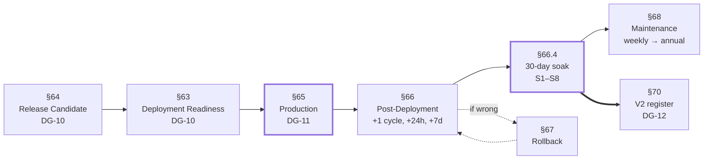

---

*End of Part 11. Parts 12 through 14 contain the complete task breakdown: 342 tasks across 26 phases.*


---

# Part 12 — Task Breakdown: Foundation and Pure Kernel

*Tasks T-001 through T-126. Phases PH-00 through PH-06. Milestones MS-0, MS-1, MS-2. Sprints SP-0, SP-1, SP-2. Weeks 1–5.*

---

## How to Read a Task Row

| Column | Meaning |
|---|---|
| **ID** | `T-nnn`, stable and never reused. Branch name is `t/<nnn>-<slug>` |
| **Task** | The imperative name |
| **Description** | What is built, with the governing TRD section |
| **Deps** | Task IDs that must be merged first. `—` means none beyond the phase entry |
| **D** | Difficulty D1–D5 (§0.4.3) |
| **P** | Priority P0–P3 (§0.4.4) |
| **Est** | Ideal engineer-hours, agent multiplier applied |
| **Output** | The artifact(s) merged |
| **Acceptance** | What makes it correct |
| **Verify** | How a second person confirms it |
| **Rollback** | How to undo it |

**Every task also carries the eight universal Definition-of-Done conditions in §2.3.** They are not repeated per row.

**Reserved ID blocks for discovered work:** PH-00 → T-901…T-910 · PH-01…PH-06 → T-911…T-930. Adding a task inside an existing phase uses these and needs no PCR (§0.9.2).

---

# PH-00 · Repository, Toolchain, and CI

**Sprint SP-0 · Week 1 · 62 IEH · 46 tasks · Milestone MS-0 · Gate DG-01**

Six concurrent streams: repository (T-001…T-012), Git config (T-013…T-018), tree (T-019…T-022), toolchain (T-023…T-036), tests (T-037…T-043), CI (T-044…T-046). Streams A and B are DevOps; C–F absorb agents well.

## WP-01 · Repository Creation and Governance

| ID | Task | Description | Deps | D | P | Est | Output | Acceptance | Verify | Rollback |
|---|---|---|---|---|---|---|---|---|---|---|
| T-001 | Create repository | Create `tp-reviews-engine`, public per OPQ-04, no auto-README (§11.1) | — | D1 | P0 | 0.5 | Repository | Exists, public, Actions available | Repo URL loads | Delete repo |
| T-002 | Commit `.gitattributes` first | `* text=auto eol=lf` plus binary declarations, as commit #1 (TR-BLD-002, INIT-01) | T-001 | D1 | P0 | 0.5 | `.gitattributes` | LF enforced repository-wide | `git ls-files --eol` on two OSes | Revert + `git add --renormalize` |
| T-003 | Commit `.gitignore` | Exclude `.state/`, `.publish/`, `.artifacts/`, `node_modules/`, `.env`, browser cache (TR-BLD-003) | T-002 | D1 | P0 | 0.5 | `.gitignore` | No artifact path is ever stageable | `git status` after a dry run | Revert |
| T-004 | Commit `.editorconfig` and `.nvmrc` | LF/UTF-8/final newline; Node major pin (TR-BLD-004) | T-002 | D1 | P0 | 0.5 | Two files | `.nvmrc` matches CI | `nvm use` succeeds | Revert |
| T-005 | Root documentation set | `README.md`, `LICENSE`, `SECURITY.md`, `CODE_OF_CONDUCT.md`, `CONTRIBUTING.md`, `CHANGELOG.md` | T-002 | D1 | P1 | 2 | Six files | CONTRIBUTING points at TRD §67–§69; CHANGELOG has `## Unreleased` | Reviewer reads each | Revert |
| T-006 | `package.json` skeleton | `"type": "module"`, `engines.node`, all fourteen script names from §15.3 | T-004 | D2 | P0 | 1.5 | `package.json` | Script names final; unimplemented ones exit 0 with a notice | `npm run <each>` | Revert |
| T-007 | Enable branch protection on `main` | Review required, CI required, no force-push, linear history — **before commit #2** (§11.1 step 5) | T-005 | D1 | P0 | 0.5 | Settings | Direct push rejected for everyone | Attempt a direct push | Disable |
| T-008 | Set Actions default token to read-only | Repository settings; workflows declare their own (TR-CI-001) | T-001 | D1 | P0 | 0.25 | Settings | Default is read | Settings export | Revert setting |
| T-009 | `CODEOWNERS` | Require review for `src/core/`, `schemas/`, `selectors/`, `compliance/` (TR-CI-005) | T-007 | D1 | P0 | 0.5 | `.github/CODEOWNERS` | A PR touching `src/core/` requests the owner | Throwaway PR | Revert |
| T-010 | Issue and PR templates | `incident.yml`, `selector-break.yml`, `client-onboarding.yml`, `pull_request_template.md` with the regression question | T-001 | D1 | P1 | 1.5 | Four files | PR template asks "which test would have caught this?" | Open a draft PR | Revert |
| T-011 | Enable secret scanning + push protection | Repository security settings | T-001 | D1 | P0 | 0.25 | Settings | A test secret push is blocked | Attempt with a dummy token | Disable |
| T-012 | Create the offsite mirror | `git clone --mirror` to a second account/host (TR-CI-161) | T-007 | D1 | P0 | 1 | Mirror + `docs/runbooks/` note | Clone **from** the mirror succeeds | Clone from mirror | Delete mirror |

## WP-02 · Git Configuration and Branches

| ID | Task | Description | Deps | D | P | Est | Output | Acceptance | Verify | Rollback |
|---|---|---|---|---|---|---|---|---|---|---|
| T-013 | Commit convention + `commit-msg` spec | Conventional Commits with the scope/footer rules (§12.2) | T-005 | D1 | P1 | 1 | `CONTRIBUTING.md` section | Format documented with examples | Reviewer reads | Revert |
| T-014 | Branch naming convention | `t/<task-id>-<slug>` and the rest of §12.3 | T-005 | D1 | P2 | 0.5 | Doc section | Task-to-commit mapping is automatic | Reviewer reads | Revert |
| T-015 | Create `data` orphan branch | `git switch --orphan`; `.nojekyll`, `robots.txt`, `_headers`, `README.md`, empty `index.json` (BR-01…BR-03) | T-007 | D2 | P0 | 1 | `data` branch | `git merge-base main data` **fails** | Run the merge-base check | Delete branch |
| T-016 | Create `state` orphan branch | Directory placeholders + machine-owned README (TR-GIT-001/002) | T-007 | D2 | P0 | 0.75 | `state` branch | Same merge-base check fails | Run the check | Delete branch |
| T-017 | Enable Pages from `data` root | Configure Pages; serve a `ping.txt` test file | T-015 | D2 | P0 | 1 | Pages config | Test file served over HTTPS | Fetch the URL | Disable Pages |
| T-018 | **Measure and record Pages headers** | Capture literal response headers into `docs/runbooks/pages-headers.md` (TR-CI-160, OIQ-04) | T-017 | D2 | P0 | 1 | Runbook file | Dated header dump present | Independent fetch + compare | Revert file |

## WP-03 · Folder Tree

| ID | Task | Description | Deps | D | P | Est | Output | Acceptance | Verify | Rollback |
|---|---|---|---|---|---|---|---|---|---|---|
| T-019 | Create the complete `src/` tree | Every directory from TRD §6.4, with `.gitkeep` (FLD-01) | T-003 | D1 | P0 | 1 | Directories | Tree matches TRD §6.4 exactly | Diff tree vs TRD | Delete |
| T-020 | Create data-as-code and test trees | `selectors/`, `schemas/`, `clients/`, `profiles/`, `compliance/`, `fixtures/`, `tests/` per TRD §6.5–§6.7 | T-003 | D1 | P0 | 1 | Directories | Matches TRD §6 | Diff tree | Delete |
| T-021 | Create consumer, script, and docs trees | `frontend/`, `scripts/`, `docs/{runbooks,decisions}/` per TRD §6.8 | T-003 | D1 | P1 | 0.5 | Directories | Matches TRD §6 | Diff tree | Delete |
| T-022 | Nine directory-rule READMEs | One paragraph per governed directory (FLD-02): `core/`, `infra/`, `ports/`, `adapters/`, `selectors/`, `compliance/`, `tests/live/`, `frontend/renderer/`, `fixtures/` | T-019, T-020, T-021 | D2 | P1 | 3 | Nine READMEs | Each states its rule and its rationale | Reviewer reads all nine | Revert |

## WP-04 · Toolchain

| ID | Task | Description | Deps | D | P | Est | Output | Acceptance | Verify | Rollback |
|---|---|---|---|---|---|---|---|---|---|---|
| T-023 | Install and configure the type checker | `jsconfig.json` with every strict option from §18.1 including `noUncheckedIndexedAccess` and `exactOptionalPropertyTypes` | T-006 | D2 | P0 | 2 | `jsconfig.json`, dev dep | `npm run typecheck` exits 0 on the empty tree | Run it | Revert |
| T-024 | Prove four strict options fire | Four throwaway branches, one deliberate violation each (LINT-02 analogue) | T-023 | D2 | P0 | 1.5 | Four branch records | Each violation fails the check | Reviewer re-runs two | N/A |
| T-025 | Node version consistency test | Unit test asserting `.nvmrc` matches `engines.node` (NODE-01) | T-023 | D2 | P1 | 1 | Test file | Mismatch fails | Deliberately mismatch | Revert |
| T-026 | Install ESLint + config skeleton | `eslint.config.mjs` with the base rule set | T-006 | D2 | P0 | 1.5 | Config, dev deps | `npm run lint` exits 0 | Run it | Revert |
| T-027 | Structural limit rules | Complexity ≤ 10, function ≤ 60, file ≤ 400, params ≤ 4, nesting ≤ 3, no default exports (§67.2) | T-026 | D2 | P0 | 2 | Rule block | Each limit configured | Deliberate violation | Revert |
| T-028 | Prohibited pattern rules | Empty catch, `console.*`, `process.exit()`, commented code, bare `TODO`, magic numbers (§67.3) | T-026 | D3 | P0 | 2.5 | Rule block | Each pattern flagged | Deliberate violations | Revert |
| T-029 | **`core/` purity rules** | No imports from `adapters/`/`infra/`/`app/`/`cli/`; no `node:` except `node:crypto`; no `Date.now`/`Math.random`/`process.env`/`fs`/`fetch` (DR-1, DR-2) | T-026 | D3 | P0 | 2.5 | Override block | Violations rejected in `src/core/**` only | Place a violation in `core/` and in `infra/`; only the first fails | Revert |
| T-030 | Layering rules | `app/` ⇏ adapters; adapters ⇏ adapters; composition-root-only construction; no import past an index (DR-3…DR-6) | T-026 | D3 | P0 | 2 | Override block | Each rule fires | Deliberate violations | Revert |
| T-031 | Scope exception overrides | `console.*` in `infra/logger/` + `cli/`; `process.exit()` in `cli/`; relaxed file length in `tests/` | T-028 | D2 | P0 | 1 | Overrides | Permitted paths pass, others fail | Two-file test | Revert |
| T-032 | Frontend rules | No HTML-injection DOM APIs; no imports (TR-STD-001/002) | T-026 | D2 | P1 | 1 | Override block | A deliberate injection API fails | Violation branch | Revert |
| T-033 | Prove nine lint rule groups fire | Nine throwaway branches, one per group (LINT-02) | T-027…T-032 | D2 | P0 | 2 | Nine branch records | Each group demonstrably rejects | Reviewer re-runs two at random | N/A |
| T-034 | Install and configure Prettier | `prettier.config.mjs` with `endOfLine: "lf"` (FMT-02) | T-006 | D1 | P0 | 1 | Config, dev dep | `format:check` exits 0 | Run it | Revert |
| T-035 | `.prettierignore` with fixture exclusions | Exclude `fixtures/**/page.html` and `**/expected.json` (FMT-01) | T-034 | D2 | P0 | 0.5 | `.prettierignore` | `npm run format` yields zero fixture changes | Run format, check `git status` | Revert |
| T-036 | Editor configuration | `.vscode/extensions.json` and `settings.json` (recommended, not required) | T-034 | D1 | P2 | 0.5 | Two files | Format-on-save works | Open the repo in the editor | Revert |

## WP-05 · Test Framework

| ID | Task | Description | Deps | D | P | Est | Output | Acceptance | Verify | Rollback |
|---|---|---|---|---|---|---|---|---|---|---|
| T-037 | Install Vitest; configure projects | `default` and `live` projects; **`tests/live/**` excluded from default** (TR-TEST-021) | T-006 | D3 | P0 | 2.5 | `vitest.config.mjs` | `npm test` runs; `test:live` separate | Run both | Revert |
| T-038 | **Prove the live exclusion** | Add a deliberately failing test in `tests/live/`; confirm `npm test` stays green (IR-18) | T-037 | D2 | P0 | 0.75 | Proof record | Default suite unaffected | Reviewer runs `npm test` | Delete the test |
| T-039 | Per-path coverage thresholds | All eleven paths from §21.2, including paths that do not yet exist (TEST-CFG-01/02) | T-037 | D3 | P0 | 2 | Coverage config | 100% configured for gate and redact | Config diff | Revert |
| T-040 | Install fast-check; prove 1,000 cases | Property harness with a deliberately false property reporting a minimal counterexample | T-037 | D2 | P0 | 1.5 | Dev dep + proof test | Counterexample minimised | Reviewer runs it | Revert |
| T-041 | Determinism helpers | `tests/helpers/fixed-clock.mjs`, `seeded-random.mjs` (TR-TEST-032) | T-037 | D2 | P0 | 2 | Two helpers | Deterministic across runs | Run twice, compare | Revert |
| T-042 | Builder helpers | `build-review.mjs`, `build-ledger.mjs`, `temp-repo.mjs` (TR-TEST-033) | T-041 | D2 | P0 | 2.5 | Three helpers | Overrides work; defaults valid | Unit test each | Revert |
| T-043 | Trivial passing test + suite timing | One assertion; print suite duration in CI (TEST-CFG-03) | T-037 | D1 | P0 | 0.75 | Test + CI step | `npm test` green in < 5 s; timing printed | Read CI log | Delete in PH-01 |

## WP-06 · CI and Hooks

| ID | Task | Description | Deps | D | P | Est | Output | Acceptance | Verify | Rollback |
|---|---|---|---|---|---|---|---|---|---|---|
| T-044 | `ci.yml` with all 14 gate groups | Setup, lint, format, typecheck, test, architecture, integration, security, size, schemas, workflow lint, secret scan, audit, coverage (TRD §62.3) | T-033, T-039, T-043 | D3 | P0 | 4 | `.github/workflows/ci.yml` | Green on a no-op PR in < 5 min; every group blocking | Open PR #1 | Revert |
| T-045 | **Prove six CI gate groups reject** | Six throwaway branches, one deliberate failure each (§PH-00 criterion 17) | T-044 | D2 | P0 | 2 | Six branch records | Each group demonstrably fails the build | Reviewer re-runs two | N/A |
| T-046 | Git hooks | `pre-commit` (< 3 s), `commit-msg` (< 0.2 s), `pre-push` (< 45 s); idempotent installer (HOOK-01…HOOK-04) | T-026, T-034, T-037 | D2 | P1 | 3 | Hook scripts + installer | Budgets met; CI re-runs everything hooks run | Time each hook | Delete hooks dir |

**PH-00 totals: 46 tasks · 62 IEH · closes MS-0 at DG-01.**

---

# PH-01 · Core Model, Result, Hash, Error Taxonomy

**Sprint SP-1 · Week 2 · 34 IEH · 14 tasks · Difficulty D2**

The vocabulary phase. Everything downstream imports from here, which is why it is small, mechanical, and first.

| ID | Task | Description | Deps | D | P | Est | Output | Acceptance | Verify | Rollback |
|---|---|---|---|---|---|---|---|---|---|---|
| T-047 | `core/util/result.mjs` | `Result` discriminated union + combinators (EDR-002) | T-044 | D2 | P0 | 3 | Module + tests | Every combinator unit-tested; `core/` never throws | Reviewer reads the contract table | Revert |
| T-048 | `core/util/hash.mjs` canonical serialisation | Stable key order, no insignificant whitespace | T-047 | D3 | P0 | 3 | Module + tests | Same object, different insertion order ⇒ identical bytes | Reviewer constructs two orderings | Revert |
| T-049 | `core/util/hash.mjs` digest helpers | SHA-256 over canonical bytes, `node:crypto` only | T-048 | D2 | P0 | 1.5 | Functions + tests | Known-vector test passes | Compare to a reference digest | Revert |
| T-050 | **`core/model/errors.mjs` taxonomy** | Every `ERR-*` from SAD Appendix B with scope, severity, retry policy, runbook (ERR-01) | T-047 | D2 | P0 | 4 | Constants module | All 50 classes present with all four attributes | Reviewer diffs against Appendix B row by row | Revert |
| T-051 | Taxonomy completeness test | Programmatic assertion that the constant set matches the documented set and no attribute is missing (ERR-02) | T-050 | D2 | P0 | 2 | Test | Missing attribute fails | Delete one attribute; test fails | Revert |
| T-052 | `core/model/review.mjs` | `ExtractedReview`, `NormalizedReview`, `LedgerReview`, `PayloadReview`, `CleanString` brand | T-047 | D3 | P0 | 3 | Types module | Brand prevents unnormalised text reaching a payload type | Type-check a deliberate misuse | Revert |
| T-053 | `core/model/ledger.mjs` | Ledger shape, constructors, invariant helpers — **the shape PH-05 depends on** | T-052 | D3 | P0 | 3.5 | Module + tests | Map-backed records (IR-24); shape final | Architect reviews the shape against TRD §22 | Revert (expensive after PH-05) |
| T-054 | `core/model/payload.mjs` | Public payload shape per `schema_version: 1` | T-052 | D2 | P0 | 2.5 | Module | Matches `payload.v1.schema.json` field for field | Cross-check against the schema | Revert |
| T-055 | `core/model/report.mjs` | `AcquisitionReport`, `ValidationReport`, `DecisionLog`, `GateVerdict` | T-052 | D2 | P0 | 2 | Module | All four shapes present | Type-check | Revert |
| T-056 | `core/model/capabilities.mjs` | Adapter capability descriptor (FR-020) | T-052 | D2 | P1 | 1.5 | Module | Supports honest declaration of unsupported fields | Reviewer reads | Revert |
| T-057 | `core/index.mjs` public surface | The core's only entry point (DR-6) | T-052…T-056 | D2 | P0 | 1 | Module | Nothing outside imports past it | Architecture test | Revert |
| T-058 | Architecture test skeleton: DR-1, DR-2 | Import-graph assertions for `core/` purity, active from this phase | T-057 | D3 | P0 | 4 | `tests/architecture/` | A deliberate `Date.now()` in `core/` fails | Add and remove a violation | Revert |
| T-059 | Architecture test: acyclicity in `core/` | TR-TEST-070 | T-058 | D3 | P1 | 2 | Test | A deliberate cycle fails | Create a cycle | Revert |
| T-060 | Delete the trivial test | Remove T-043's placeholder now that real tests exist | T-047 | D1 | P2 | 0.25 | Deletion | Suite still green | CI | Restore |

**PH-01 totals: 14 tasks · 34 IEH.**

---

# PH-02 · Normalizer — The Security Boundary

**Sprint SP-1 · Weeks 2–3 · 40 IEH · 12 tasks · Difficulty D4 · Lead implementer, two reviewers**

**Sequencing Note.** Tasks T-061 and T-062 are the property laws, written **as failing tests before any implementation** (ID-13). No implementation task in this phase may start before both are merged and red.

| ID | Task | Description | Deps | D | P | Est | Output | Acceptance | Verify | Rollback |
|---|---|---|---|---|---|---|---|---|---|---|
| T-061 | **PT-10 written first (failing)** | Output has no markup, no control characters, within the length bound, for all generated inputs (INV-05) | T-057 | D4 | P0 | 4 | `tests/property/normalize.invariants.test.mjs` | Fails against a no-op implementation | Reviewer confirms it is red | N/A |
| T-062 | **PT-11 written first (failing)** | `normalize(normalize(x)) ≡ normalize(x)` | T-061 | D4 | P0 | 2 | Property test | Fails against a non-idempotent stub | Reviewer confirms red | N/A |
| T-063 | Adversarial corpus construction | The eight case classes in §37.3 as named unit tests | T-061 | D4 | P0 | 6 | ~60 unit tests | Every class represented; each names what it probes | QA reviews the corpus for gaps | Revert |
| T-064 | Step 1–2: entity decode then markup **removal** | Decode entities, then remove markup entirely — never escape (NORM-02) | T-063 | D4 | P0 | 5 | `core/normalize/markup.mjs` | Nested and double-encoded forms removed | Reviewer constructs 5 adversarial strings blind | Revert |
| T-065 | Step 3–5: Unicode NFC, control, zero-width, bidi | NFC normalisation then stripping of controls, ZW, and bidi overrides | T-064 | D4 | P0 | 5 | `core/normalize/unicode.mjs` | Bidi overrides never survive | Adversarial subset | Revert |
| T-066 | Step 6–7: newline canonicalisation, run collapse | LF canonical; whitespace runs collapsed | T-065 | D3 | P0 | 2.5 | `core/normalize/whitespace.mjs` | Deterministic; no trailing whitespace | Unit tests | Revert |
| T-067 | **Step 8: grapheme-aware length bounding, last** | Bound by grapheme clusters, applied after all other steps (EDR-020, NORM-03, IR-05) | T-066 | D4 | P0 | 4 | Bounding function | ZWJ sequences never split mid-cluster | ZWJ boundary test at exact bound | Revert |
| T-068 | `core/normalize/index.mjs` — the eight-step pipeline | Compose steps in the normative order (NORM-01) | T-064…T-067 | D4 | P0 | 3 | Module | **Order asserted by observing intermediate effects**, not just output | Reviewer reorders two steps; test fails | Revert |
| T-069 | Markup self-check | Post-pipeline assertion producing `ERR-CLEAN-MARKUP-SURVIVED` (critical) (NORM-04) | T-068 | D3 | P0 | 2 | Function + test | Survived markup produces the critical class | Inject markup post-pipeline | Revert |
| T-070 | `core/normalize/url.mjs` | Host-allowlist validation, size-parameter normalisation; off-allowlist ⇒ `null` | T-068 | D3 | P0 | 3 | Module + tests | Never fetches anything; nulls off-allowlist | `security.url-allowlist` test | Revert |
| T-071 | `tests/security/xss-fixture.test.mjs` | Adversarial markup never survives to a payload-shaped value | T-069 | D4 | P0 | 2 | Security test | Green; re-verified against fixture 019 at PH-13 | Reviewer adds a new adversarial string | Revert |
| T-072 | Turn PT-10 and PT-11 green; coverage ≥ 95% | Close the phase against its property laws | T-068…T-071 | D4 | P0 | 1.5 | Green suite | Both laws pass at ≥ 1,000 cases; coverage ≥ 95% | CI + coverage report | N/A — corrected forward |

**PH-02 totals: 12 tasks · 40 IEH. Rollback for this phase is "none available" (§37.6) — defects are corrected forward.**

---

# PH-03 · Dates, Language, Identity

**Sprint SP-1 · Week 3 · 46 IEH · 14 tasks · Difficulty D3**

| ID | Task | Description | Deps | D | P | Est | Output | Acceptance | Verify | Rollback |
|---|---|---|---|---|---|---|---|---|---|---|
| T-073 | Locale phrase table (data) | The six-locale phrase table format from TRD §21.6 — **data, not code** (DATE-03) | T-072 | D2 | P0 | 4 | `core/dates/` data file | Six locales; extending it needs no code change | Add a seventh locale in a scratch branch | Revert |
| T-074 | `core/dates/relative.mjs` | Phrase → duration resolution across the matrix | T-073 | D3 | P0 | 5 | Module | Full matrix green | Locale matrix test | Revert |
| T-075 | **Singular-form handling** | "a day ago", "an hour ago", "yesterday", "last week" per locale (IR-04, DATE-01) | T-074 | D3 | P0 | 3 | Cases + tests | Every locale's singular forms covered | Reviewer checks each locale has singular cases | Revert |
| T-076 | Unparseable phrase handling | Returns `null`, never a guess; fails soft | T-074 | D2 | P0 | 1.5 | Behaviour + tests | No error raised; null propagates | Unit test with nonsense input | Revert |
| T-077 | `core/dates/precision.mjs` | Precision and confidence from phrase granularity | T-074 | D3 | P0 | 3 | Module | "3 months ago" ⇒ low precision, honestly stated | Unit tests | Revert |
| T-078 | **`core/dates/pin.mjs` + PT-06** | Pin on first observation; refuse to recompute (DATE-02) | T-077 | D4 | P0 | 4 | Module + property test | PT-06 green at ≥ 1,000 cases | Reviewer attempts a recompute path; it does not exist | Revert |
| T-079 | `core/lang/detect.mjs` | Script ranges then stopwords; `null` below 12 graphemes | T-072 | D3 | P1 | 4 | Module + tests | Never rejects a review; returns null when unsure | Mixed-language cases | Revert |
| T-080 | `core/util/similarity.mjs` | Normalised string similarity for identity verification and near-duplicates | T-072 | D3 | P0 | 3 | Module + tests | Threshold behaviour documented and tested | Boundary tests | Revert |
| T-081 | `core/identity/author-key.mjs` | Casefold, diacritic strip, punctuation strip, collapse, hash (HASH-04) | T-080 | D4 | P0 | 4 | Module | Diacritics merge; **homoglyphs do not** | Reviewer supplies homoglyph pairs | Revert |
| T-082 | **`core/identity/identity-hash.mjs`** | Six ordered, cross-adapter-available inputs; 32-hex output; **versioned** (HASH-01, HASH-02, EDR-036) | T-081 | D4 | P0 | 5 | Module | No source-specific field used | Architect reviews the input list against TRD §53.3 | **Not rollbackable after first publish** |
| T-083 | `core/identity/content-hash.mjs` | Nine content inputs with explicit exclusions | T-082 | D3 | P0 | 3 | Module | `relative_date` excluded | Reviewer checks the exclusion list | Revert |
| T-084 | **`generated_at` exclusion pair** | TR-HASH-034/035 as a matched pair; two-clock byte-identity test (IR-06, HASH-03) | T-083 | D4 | P0 | 2 | Test | Two runs, different clocks ⇒ identical hashes | Reviewer runs with two clocks | Revert |
| T-085 | **PT-09 hash stability** | Invariant under insignificant formatting and text appends beyond 512 graphemes | T-083 | D4 | P0 | 3 | Property test | Green at ≥ 1,000 cases | CI | Revert |
| T-086 | **PT-08 cross-adapter identity (synthetic)** | Same logical review from two synthetic adapters ⇒ same hash; re-run at PH-11 and PH-22 (§36.2) | T-082 | D4 | P0 | 2.5 | Property test | Green against synthetic pairs | Reviewer inspects the synthetic construction for adapter neutrality | Revert |

**PH-03 totals: 14 tasks · 46 IEH. Closes MS-1 together with PH-04, at DG-02.**

---

# PH-04 · Validation

**Sprint SP-2 · Week 4 · 26 IEH · 10 tasks · Difficulty D3**

| ID | Task | Description | Deps | D | P | Est | Output | Acceptance | Verify | Rollback |
|---|---|---|---|---|---|---|---|---|---|---|
| T-087 | `core/validate/record.mjs` | Per-record findings with severity; **no mutation** (VAL-02) | T-086 | D3 | P0 | 4 | Module + tests | One test per finding type | Mutation-attempt test proves inputs unchanged | Revert |
| T-088 | Coverage computation | extracted ÷ advertised, with boundary handling | T-087 | D3 | P0 | 2.5 | Function | Boundary at `coverage_min` exactly | Three-point boundary test | Revert |
| T-089 | Duplicate findings | Flag intra-run duplicates; do not remove them | T-087 | D3 | P0 | 2 | Function | Findings only; removal is PH-05's job | Reviewer confirms no removal | Revert |
| T-090 | Plausibility and distribution checks | Rating distribution and aggregate plausibility | T-087 | D3 | P1 | 3 | Functions | Produce findings, never errors | Unit tests | Revert |
| T-091 | Quarantine-rate computation | Rate against `quarantine_max` | T-087 | D2 | P0 | 1.5 | Function | Boundary tested | Boundary test | Revert |
| T-092 | **`core/validate/completeness.mjs`** | `full` / `full_capped` / `partial` / `failed` **from the navigator's stop reason** (VAL-01) | T-088 | D4 | P0 | 4 | Module | Never computed from counts alone | Reviewer traces the function's inputs | Revert |
| T-093 | Four-value completeness tests | One distinct scenario producing each value | T-092 | D3 | P0 | 2.5 | Tests | All four reachable | CI | Revert |
| T-094 | `ValidationReport` assembly | Compose findings and aggregates into the report shape | T-087…T-092 | D2 | P0 | 2 | Function | Schema-validated | Schema check | Revert |
| T-095 | Threshold boundary suite | A boundary test at the exact value for every threshold (VAL-03) | T-088, T-091 | D3 | P0 | 3 | ~10 tests | Off-by-one-inclusive impossible | Reviewer picks two thresholds and checks | Revert |
| T-096 | Vocabulary review | Confirm `coverage` and `completeness` are never interchanged in code, tests, or comments (TR-STD-080) | T-092 | D2 | P0 | 1.5 | Review record | Zero interchanges | Reviewer greps both terms | N/A |

**PH-04 totals: 10 tasks · 26 IEH.**

---

# PH-05 · Reconciliation and the Ledger

**Sprint SP-2 · Weeks 4–5 · 46 IEH · 15 tasks · Difficulty D5 · Staff engineer, two reviewers, no agent-led implementation**

**This is the critical-path apex.** Tasks T-097, T-098, and T-099 are property laws written as failing tests before any implementation (ID-13, LEDG-02).

| ID | Task | Description | Deps | D | P | Est | Output | Acceptance | Verify | Rollback |
|---|---|---|---|---|---|---|---|---|---|---|
| T-097 | **PT-01 written first (failing)** | `reconcile(reconcile(L,H),H) ≡ reconcile(L,H)` for fixed `now` (INV-04) | T-096 | D5 | P0 | 3 | Property test | Red against a stub | Reviewer confirms red | N/A |
| T-098 | **PT-02 written first (failing)** | Shuffling `observed` yields an identical ledger | T-097 | D5 | P0 | 2.5 | Property test | Red against a stub | Reviewer confirms red | N/A |
| T-099 | **PT-07 written first (failing) — the most important test in the project** | For any `partial` harvest, streaks and states are unchanged (INV-03) | T-097 | D5 | P0 | 4 | Property test | Red against a stub; generates `partial` cases | **Architect reviews the generator** to confirm it produces partial harvests | N/A |
| T-100 | `reconcile/decide.mjs` classification | INSERT / UPDATE / UNCHANGED / MISSING | T-099 | D5 | P0 | 5 | Module | One test per branch | Reviewer traces each branch by hand | Revert |
| T-101 | **Streak arithmetic gated on completeness** | `missing_streak` increments **only** when `completeness === 'full'` (LEDG-01) | T-100 | D5 | P0 | 4 | Logic + tests | **PT-07 turns green here** | Reviewer removes the gate; PT-07 must fail | Revert |
| T-102 | Duplicate detection tier 1 | Exact `identity_hash` match across harvests | T-100 | D4 | P0 | 2 | Logic + tests | Repeat observations recognised | Unit tests | Revert |
| T-103 | Duplicate detection tier 2, author-scoped | Similarity ≥ threshold **within an author key only** (DUP-01) | T-102, T-080 | D4 | P0 | 4 | Logic + tests | Twelve identical short reviews from twelve authors ⇒ twelve survive | Reviewer constructs that exact case | Revert (set threshold 1.0) |
| T-104 | Bucketed comparison | Bucket by author key; never all-pairs (DUP-02, IR-15) | T-103 | D4 | P0 | 3 | Implementation | 1,000-review benchmark ≤ 2 s CPU | Benchmark run | Revert |
| T-105 | Deterministic intra-run collapse | Surviving record chosen by a total ordering (DUP-03) | T-103 | D4 | P0 | 2.5 | Logic | PT-02 unaffected by input order | PT-02 | Revert |
| T-106 | **`reconcile/removal.mjs` + PT-03** | Confidence-gated removal after `removal_confirmations`; tombstoning; monotonicity | T-101 | D5 | P0 | 5 | Module + property test | A tombstoned id never becomes active | PT-03 at ≥ 1,000 cases | Revert |
| T-107 | **`reconcile/suppress.mjs` + PT-04** | Denylist application, permanent; suppressed ids never appear in any projection | T-106 | D4 | P0 | 3.5 | Module + property test | PT-04 green | Reviewer attempts an un-suppress path; none exists | Revert |
| T-108 | **PT-05 first-seen preservation** | `first_seen_at` never changes after INSERT | T-100 | D4 | P0 | 2 | Property test | Green at ≥ 1,000 cases | CI | Revert |
| T-109 | `reconcile/index.mjs` composition | The merge function; pure; `now` an explicit required parameter (LEDG-03, LEDG-04) | T-100…T-108 | D5 | P0 | 4 | Module | **PT-01 and PT-02 turn green**; DR-2 holds | Reviewer confirms no default `now` anywhere | Revert |
| T-110 | Map-backed record storage | Replace any array indexing with map lookups (IR-24) | T-109 | D3 | P0 | 2 | Implementation | Benchmark at 1,000 and 5,000 reviews | Benchmark | Revert |
| T-111 | Module header: the asymmetry explained | Written explanation of why the logic is not redundant (LEDG-05, TRD A-4) | T-109 | D2 | P0 | 1.5 | Header comment | A reader is warned before simplifying | Reviewer reads it as if new to the code | Revert |

**PH-05 totals: 15 tasks · 46 IEH.**

---

# PH-06 · Projection and the Publish Gate

**Sprint SP-2 · Week 5 · 40 IEH · 15 tasks · Difficulty D4 · 100% coverage on the gate**

| ID | Task | Description | Deps | D | P | Est | Output | Acceptance | Verify | Rollback |
|---|---|---|---|---|---|---|---|---|---|---|
| T-112 | `schemas/payload.v1.schema.json` | The public contract, authoritative at runtime (EDR-039) | T-054 | D3 | P0 | 4 | Schema | Validates a hand-built exemplar payload | Architect reviews field by field | Revert (before first publish only) |
| T-113 | `schemas/ledger.v1.schema.json` | Internal state shape | T-053 | D2 | P0 | 2 | Schema | Validates fixture ledgers | Schema check | Revert |
| T-114 | `core/project/payload.mjs` | Ledger → payload with filters and field selection | T-111, T-112 | D4 | P0 | 5 | Module | Tombstoned and suppressed excluded | PT-04 | Revert |
| T-115 | **Total, stable composite sort key + PT-13** | Ties broken by identity hash; no two distinct reviews compare equal (PROJ-01) | T-114 | D4 | P0 | 3.5 | Sort + property test | PT-13 green at ≥ 1,000 cases | Reviewer constructs same-date reviews | Revert |
| T-116 | Minified stable-key serialisation | Payload minified, keys ordered (EDR-021, PROJ-02) | T-114 | D3 | P0 | 2.5 | Function | Byte-identical across runs | Two-run comparison | Revert |
| T-117 | Provenance block | Engine version, pack version, run id, adapter id (INV-06) | T-114 | D2 | P0 | 2 | Function | Schema-required fields populated | Schema validation | Revert |
| T-118 | `core/project/latest.mjs` | Top-N slice with no aggregate recomputation | T-114 | D2 | P0 | 1.5 | Module | Slice matches the ordered payload's head | Unit tests | Revert |
| T-119 | `core/project/stats.mjs` | Count, mean, distribution, languages, completeness (PROJ-04) | T-114 | D3 | P0 | 3 | Module | **Counts never inflated**; `advertised_total` never substituted | Arithmetic tests | Revert |
| T-120 | `core/project/schema-org.mjs` | Structured-data projection, opt-in, defaults `false` | T-119 | D2 | P2 | 2 | Module | Off by default | Config default test | Revert |
| T-121 | Manifest builders | Listing, client, and global manifests with freshness pointers | T-114 | D3 | P0 | 3 | Functions | Freshness pointer correct | Integration at PH-18 | Revert |
| T-122 | **PT-12 projection determinism** | Same ledger + config ⇒ byte-identical artifacts | T-116 | D4 | P0 | 2.5 | Property test | Green at ≥ 1,000 cases | Two-clock run | Revert |
| T-123 | **`core/gate/rules.mjs` — rules as data** | G-01…G-12 as independently testable data, not inline conditionals | T-114 | D4 | P0 | 5 | Module | Each rule callable and testable alone | Reviewer invokes three rules in isolation | Revert |
| T-124 | **`core/gate/index.mjs` — evaluate all, return all** | No short-circuiting (EDR-023, IR-08, GATE-01) | T-123 | D4 | P0 | 3 | Module | Three violations ⇒ three reasons | Multi-failure test | Revert |
| T-125 | **First-publish exception + unreadable-prior rejection** | Distinguish "no prior payload" from "could not read prior payload" (IR-25, GATE-03) | T-124 | D4 | P0 | 3 | Logic + tests | Unreadable prior ⇒ **reject** | Reviewer makes the prior unreadable | Revert |
| T-126 | **Force-override matrix + 100% coverage + PT-14** | Every override combination; `quarantine_max` **not** overridable; monotone safety (GATE-04, GATE-02) | T-125 | D4 | P0 | 4 | Tests | **100% statement coverage on `core/gate/`**; PT-14 green | Coverage report; reviewer attempts to force-override quarantine | Revert |

**PH-06 totals: 15 tasks · 40 IEH. Closes MS-2 at DG-03 — the project's first hard stop.**

---

## Part 12 Summary

| Phase | Tasks | IEH | Milestone | Key Exit |
|---|---|---|---|---|
| PH-00 | 46 | 62 | MS-0 | 19 proof branches; `ci.yml` green in < 5 min |
| PH-01 | 14 | 34 | — | Taxonomy complete; DR-1/DR-2 active |
| PH-02 | 12 | 40 | — | **PT-10, PT-11; ≥ 95% coverage** |
| PH-03 | 14 | 46 | MS-1 | PT-05, PT-06, PT-08, PT-09 |
| PH-04 | 10 | 26 | MS-1 | Completeness from stop reason |
| PH-05 | 15 | 46 | — | **PT-01, PT-02, PT-03, PT-04, PT-07** |
| PH-06 | 15 | 40 | MS-2 | **PT-12, PT-13, PT-14; gate at 100%** |
| **Total** | **126** | **294** | | |

**Twelve of the fifteen property laws are green by the end of Part 12**, in week 5 of 16. The three remaining (PT-08 against real adapters, PT-15 ledger round-trip, and PT-13's re-verification against real payloads) close in Parts 13 and 14.

---

*End of Part 12. Part 13 covers the spine, the first vertical slice, and real acquisition: tasks T-127 through T-257.*


---

# Part 13 — Task Breakdown: Spine, First Slice, and Acquisition

*Tasks T-127 through T-257. Phases PH-07 through PH-17. Milestones MS-3 through MS-6. Sprints SP-3 through SP-6. Weeks 6–13.*

*Column conventions are defined at the head of Part 12 and are not repeated. Reserved ID blocks for discovered work in these phases: T-931…T-960.*

---

# PH-07 · Ports and Infrastructure

**Sprint SP-3 · Week 6 · 44 IEH · 16 tasks · Difficulty D3 (D4 for redaction)**

**Sequencing Note.** T-131 (`redact.mjs`) is built and covered to 100% **before** T-132 (the log sink). This ordering is the mitigation for IR-21 and MUST NOT be inverted (LOG-ORD-01).

| ID | Task | Description | Deps | D | P | Est | Output | Acceptance | Verify | Rollback |
|---|---|---|---|---|---|---|---|---|---|---|
| T-127 | `ports/` interface set | Eight interface files: acquisition, state, publisher, notifier, browser, clock, random, logger — **no executable behaviour** | T-126 | D3 | P0 | 5 | Eight files + README | Architecture test asserts zero behaviour | Reviewer confirms each file only declares | Revert |
| T-128 | `infra/clock.mjs` | System `ClockPort` implementation | T-127 | D1 | P0 | 1 | Module | Test doubles already exist (T-041) | Unit | Revert |
| T-129 | `infra/random.mjs` | System `RandomPort` implementation | T-127 | D1 | P0 | 1 | Module | Seeded double exists (T-041) | Unit | Revert |
| T-130 | `infra/fs-atomic.mjs` | Write-temp-then-rename; **the only permitted write path** (LEDG-06, TR-STOR-001) | T-127 | D3 | P0 | 3 | Module | Crash injection leaves the target untouched | Reviewer kills mid-write | Revert |
| T-131 | **`infra/logger/redact.mjs` at 100%** | Sink-level redaction seeded at startup; the six test classes in §25.2 (EDR-031, IR-21) | T-127 | D4 | P0 | 6 | Module + `tests/security/redaction.test.mjs` | **100% statement coverage**; sentinels redacted at every level and position | Reviewer seeds a sentinel and greps all artifacts | **Corrected forward, not rolled back** |
| T-132 | `infra/logger/jsonl.mjs` | Structured sink composing redaction unconditionally; mandatory field set (LOG-ORD-02) | T-131 | D3 | P0 | 4 | Module | **Exactly one write path**, and it redacts | Code search for alternative write helpers | Revert |
| T-133 | Child loggers and correlation | Per-run and per-target child loggers carrying `runId` and target identity | T-132 | D2 | P0 | 2 | Functions | Every event correlatable | Unit | Revert |
| T-134 | Ring buffer for `debug`/`trace` | Bounded buffer flushed only on target failure (EDR-032) | T-132 | D3 | P0 | 3 | Implementation | Bound respected; flush only on failure | Memory test + failure test | Revert |
| T-135 | `infra/logger/pretty.mjs` | Human-readable local formatter | T-132 | D1 | P2 | 2 | Module | Dev ergonomics only | Manual | **Cuttable (§9.5 item 7)** |
| T-136 | **`infra/retry/policy.mjs`** | Lookup table keyed by error class; executor knows no class names (RETRY-01) | T-050 | D3 | P0 | 4 | Module | Every class has a policy | Reviewer diffs against SAD Appendix B's `R` column | Revert |
| T-137 | **`retry-policy.blocked-never` enumerating test** | Programmatic enumeration proving every `ERR-BLOCKED-*` returns `never` (INV-07, RETRY-02) | T-136 | D4 | P0 | 2 | Test file | Enumerates the taxonomy, not a hand list | Reviewer adds a fake blocked class; test catches it | Revert |
| T-138 | `infra/retry/execute.mjs` | Generic executor; jittered exponential backoff; **budget-checked before every sleep** (RETRY-03, EDR-027) | T-136 | D3 | P0 | 4 | Module | Contains no error-class literal | Code search | Revert (set all policies `never`) |
| T-139 | `infra/breaker/circuit.mjs` | `closed → open → half-open`, escalating cooldown, per source-access pair, persisted | T-138 | D3 | P0 | 4 | Module | Transitions tested; state round-trips | Unit + persistence test | Revert |
| T-140 | `infra/limiter/token-bucket.mjs` | Hourly/daily counters, **written before the request**, fail closed (RETRY-04, EDR-034) | T-138 | D3 | P0 | 3.5 | Module | Crash over-counts, never under-counts | Crash-injection test | Revert |
| T-141 | `infra/http.mjs` | Fetch wrapper: timeouts, classified errors, no redirect surprises; used by API adapters only | T-136 | D3 | P1 | 3 | Module | Errors drawn from the taxonomy | Unit | Revert |
| T-142 | Architecture tests DR-3…DR-6 | Adapter isolation, `app/` purity from adapters, composition-root-only construction, no import past an index | T-127 | D3 | P0 | 4 | Tests | Each rule fires on a deliberate violation | Reviewer creates one violation per rule | Revert |

**PH-07 totals: 16 tasks · 44 IEH.**

---

# PH-08 · State Adapter and Filesystem Publisher

**Sprint SP-3 · Week 6 · 28 IEH · 11 tasks · Difficulty D3 · Closes MS-3 at DG-04**

| ID | Task | Description | Deps | D | P | Est | Output | Acceptance | Verify | Rollback |
|---|---|---|---|---|---|---|---|---|---|---|
| T-143 | Ledger serialisation | Pretty-printed, stable key order, trailing newline (EDR-021) | T-130 | D3 | P0 | 2.5 | Function | Byte-stable across runs | Two-run comparison | Revert |
| T-144 | **Ledger parsing with unknown-field preservation** | Unknown fields survive a read-write cycle (TR-STOR-003, LEDG-07) | T-143 | D4 | P0 | 3 | Function | An older engine cannot strip a newer engine's data | Reviewer adds an unknown field and round-trips | Revert |
| T-145 | **PT-15 ledger round-trip** | `parse(serialize(L)) ≡ L`, including unknown fields | T-144 | D4 | P0 | 2.5 | Property test | Green at ≥ 1,000 cases | CI | Revert |
| T-146 | Path templates module | One module per store; all templates from TRD §69.4 (LEDG-08, TR-STD-110) | T-127 | D2 | P0 | 2.5 | Module | No path assembled at a call site | Code search for string concatenation of paths | Revert |
| T-147 | `adapters/state/git-state.mjs` — ledger | Read/write ledgers rooted at a `state` checkout | T-146, T-144 | D3 | P0 | 3.5 | Module | Atomic write via `fs-atomic` only | Integration | Revert |
| T-148 | `git-state` — cache and budget | Identity cache and rate-budget counter persistence | T-147 | D3 | P0 | 2.5 | Functions | TTL respected; counters durable | Unit | Revert |
| T-149 | `git-state` — health and breaker | Append-only health JSONL; breaker state files | T-147 | D3 | P0 | 2.5 | Functions | Append-only; no read-modify-write (HLTH-01) | Concurrent append test | Revert |
| T-150 | Corrupt-ledger handling | `ERR-STATE-CORRUPT`; target aborts; LKG retained; runbook referenced | T-147 | D3 | P0 | 2.5 | Logic + test | Never partially applies a corrupt ledger | Feed invalid JSON | Revert |
| T-151 | `adapters/publisher/filesystem.mjs` | Local development publication; the dev default | T-127 | D2 | P0 | 2.5 | Module | Writes artifacts to `.publish/` | Integration | Revert |
| T-152 | `tests/integration/state.roundtrip.test.mjs` | Write, read, re-serialise byte-identically; atomic rename; unknown fields | T-147 | D3 | P0 | 3 | Test | **MS-3's demo** | Reviewer runs it | Revert |
| T-153 | Crash-injection test for `fs-atomic` | Kill mid-write; assert temp present, target untouched | T-130 | D3 | P0 | 1.5 | Test | Deterministic | Reviewer runs it | Revert |

**PH-08 totals: 11 tasks · 28 IEH.**

---

# PH-09 · Configuration Loader

**Sprint SP-3 · Week 7 · 32 IEH · 12 tasks · Difficulty D3**

| ID | Task | Description | Deps | D | P | Est | Output | Acceptance | Verify | Rollback |
|---|---|---|---|---|---|---|---|---|---|---|
| T-154 | `schemas/client-config.v1.schema.json` | The client configuration contract per TRD §8.3 | T-112 | D3 | P0 | 4 | Schema | Every section present with descriptions | Architect reviews | Revert |
| T-155 | `app/config/defaults.mjs` | **A default for every schema key** (TR-APP-031) | T-154 | D2 | P0 | 3 | Module | Correspondence test green | Delete one default; test fails | Revert |
| T-156 | Correspondence test | Every schema key has a code default | T-155 | D2 | P0 | 1.5 | Test | Fails on any gap | Reviewer removes a default | Revert |
| T-157 | Layer 3: client config load + validate | Schema validation with useful error messages | T-155 | D3 | P0 | 3 | Loader step | Malformed config names the offending path | Feed a broken config | Revert |
| T-158 | Layer 2: profile `$ref` inheritance | Profile resolution and merge | T-157 | D3 | P0 | 3 | Loader step | Profile beats default, loses to client | Precedence tests | Revert |
| T-159 | Layer 4: listing overrides | Per-listing override merge | T-158 | D3 | P0 | 2 | Loader step | Nested override wins | Precedence tests | Revert |
| T-160 | **Layer 5: environment + unknown-variable rejection** | Coercion; unknown `TPRE_*` ⇒ exit 2 naming the nearest match (EDR-006, IR-16) | T-159 | D3 | P0 | 4 | Loader step | `TPRE_MAX_REVIEW` typo rejected with a suggestion | Reviewer sets a typo'd variable | Revert |
| T-161 | Layer 6: CLI flags | Flag layer beats environment | T-160 | D2 | P0 | 1.5 | Loader step | Precedence correct | Tests | Revert |
| T-162 | **Precedence matrix test suite** | All ten tests from §24.2, including the **array-replace** rule (TR-CFG-020) | T-161 | D3 | P0 | 4 | Test suite | Arrays replace, never merge | Reviewer overrides an array | Revert |
| T-163 | **Ceiling and floor validation** | Breach ⇒ validation **error**, never a clamp (TR-CFG-030) | T-161 | D3 | P0 | 2.5 | Validation | `nav.max_reviews: 6000` ⇒ exit 2 | Reviewer sets it | Revert |
| T-164 | Resolution trace + secret masking | Per key: winning layer and value; secrets as `«set»`/`«unset»` (TR-CFG-021…024) | T-161 | D3 | P0 | 2.5 | Trace | No secret value in the trace | `security.redaction` extension | Revert |
| T-165 | Deep freeze + `config_version` migration framework | Frozen config; ordered N→N+1 migration scaffolding (EDR-005) | T-164 | D3 | P0 | 2 | Functions | Mutation throws; migration framework tested with a synthetic migration | Reviewer attempts mutation | Revert |

**PH-09 totals: 12 tasks · 32 IEH.**

---

# PH-10 · CLI Skeleton and Diagnostic Commands

**Sprint SP-3 · Week 7 · 34 IEH · 12 tasks · Difficulty D2 · Closes MS-4 at DG-05**

| ID | Task | Description | Deps | D | P | Est | Output | Acceptance | Verify | Rollback |
|---|---|---|---|---|---|---|---|---|---|---|
| T-166 | `bin/tpre.mjs` | Shebang wrapper delegating to `src/cli/index.mjs`. **Three lines** | T-165 | D1 | P0 | 0.5 | File | No logic whatsoever | Reviewer counts the lines | Revert |
| T-167 | `cli/exit-codes.mjs` | The eight canonical exit codes (TR-CLI-002) | T-165 | D1 | P0 | 1 | Module | Constants only, stability test | Unit | Revert |
| T-168 | `cli/index.mjs` | Command registry, argument parsing, dispatch, top-level catch (TR-CLI-005/006) | T-167 | D3 | P0 | 5 | Module | Unknown command/flag ⇒ exit 2 with usage | Reviewer passes a bogus flag | Revert |
| T-169 | Argument parser decision (OIQ-01) | Use `node:util`'s built-in parser; record the decision | T-168 | D2 | P0 | 2 | Implementation + note | No dependency added unless a documented gap exists | Reviewer reads the note | Revert |
| T-170 | `cli/composition.mjs` | **The only file constructing concrete implementations** (DR-5, TR-CLI-001) | T-168 | D3 | P0 | 4 | Module | Architecture test DR-5 green | Reviewer attempts construction elsewhere | Revert |
| T-171 | Flush-before-exit guarantee | Logs flushed, manifest written, diagnostics uploaded **before** every exit including failures (TR-CLI-004) | T-168 | D3 | P0 | 3 | Logic | Holds for all eight exit codes | Reviewer forces each code | Revert |
| T-172 | `tpre doctor` | Versions, caches, secrets present, branch checkouts, connectivity (REC-03) | T-170 | D2 | P0 | 4 | Command | Fixes nothing; reports everything | Run on a broken environment | Revert |
| T-173 | `tpre validate-config` + `--explain` | Schema + semantic validation; trace printing | T-170, T-164 | D3 | P0 | 4 | Command | Readable trace with masked secrets | Reviewer runs `--explain` | Revert |
| T-174 | Semantic rules V-1…V-12 | Implemented in `validate-config`, **not** the loader (§24.1 step 12) | T-173 | D3 | P0 | 5 | Rules + tests | **V-3 (authorisation) has two tests** | Reviewer checks V-3 both ways | Revert |
| T-175 | `tpre project` | Rebuild payloads from the ledger with **zero network** (RB-01) | T-170, T-114 | D3 | P0 | 3 | Command | Architecture assertion: no acquisition adapter in its closure | Run with networking disabled | Revert |
| T-176 | `tpre plan` | Print the due set and shard assignment; **zero side effects** (TR-APP-030) | T-170 | D2 | P0 | 1.5 | Command | Runs against a read-only checkout | Reviewer runs it twice and diffs | Revert |
| T-177 | `tpre replay` and `tpre export` | Re-run stages 3–10 from a stored artifact; full client export (FR-093) | T-170 | D2 | P2 | 1 | Two commands | Replay reproduces a prior outcome | Integration | **Cuttable (§9.5 items 1–2)** |

**PH-10 totals: 12 tasks · 34 IEH.**

---

# PH-11 · CSV Adapter — Proving the Interface

**Sprint SP-4 · Week 8 · 24 IEH · 9 tasks · Difficulty D3**

**X-8 applies: this phase precedes every browser task.** Its purpose is to validate the `AcquisitionPort` against a second, materially different implementation while changing it is still free.

| ID | Task | Description | Deps | D | P | Est | Output | Acceptance | Verify | Rollback |
|---|---|---|---|---|---|---|---|---|---|---|
| T-178 | Finalise `ports/acquisition.mjs` | Contract shape for `capabilities`, `resolve`, `acquire` (IF-ACQ-01) | T-127 | D3 | P0 | 3 | Interface | No Playwright-shaped assumptions | Architect reviews before implementation | Revert |
| T-179 | **`tests/contract/acquisition-adapter.contract.test.mjs`** | The nine assertions of §52.2, written **before** the DOM adapter exists (ADP-01) | T-178 | D4 | P0 | 5 | Contract suite | Reusable unchanged for four adapters | Architect confirms no source-specific assumption | Revert |
| T-180 | `file-csv/COLUMNS.md` | The column contract | T-178 | D1 | P0 | 1 | Doc | Unambiguous | Reviewer reads | Revert |
| T-181 | `file-csv/parse.mjs` | Column parsing with **per-row error isolation** | T-180 | D3 | P0 | 4 | Module | One bad row does not fail the file | `partially-invalid.csv` fixture | Revert |
| T-182 | `file-csv/index.mjs` | Adapter entry, capability declaration, stage wiring | T-181, T-179 | D3 | P0 | 3 | Module | Declares capabilities honestly | Contract assertion 1 | Revert |
| T-183 | CSV fixtures | `valid.csv`, `partially-invalid.csv`, `malformed.csv` | T-181 | D1 | P0 | 1.5 | Three fixtures | Each exercises a distinct path | Reviewer reads | Revert |
| T-184 | Register in the composition root | Static registration (EDR-038, ADP-03) | T-182, T-170 | D2 | P0 | 1 | Wiring | No dynamic loading | Code search for `import(` | Revert |
| T-185 | **First end-to-end run: CSV → payload** | `tpre harvest --client _fixture-csv --publisher filesystem` through all eleven stages | T-184, T-151 | D3 | P0 | 4 | Integration test | **MS-5's demo**; payload validates against the schema | Reviewer runs the command from a clean checkout | Revert |
| T-186 | **Re-run PT-08 with the real CSV adapter** | Cross-adapter identity against real CSV output plus synthetic DOM output (§36.2) | T-185 | D4 | P0 | 1.5 | Extended property test | Green | CI | Revert |

**PH-11 totals: 9 tasks · 24 IEH.**

---

# PH-12 · Selector Packs

**Sprint SP-4 · Week 8 · 26 IEH · 10 tasks · Difficulty D3**

| ID | Task | Description | Deps | D | P | Est | Output | Acceptance | Verify | Rollback |
|---|---|---|---|---|---|---|---|---|---|---|
| T-187 | `selectors/schema/selector-pack.schema.json` | Requires **≥ 2 strategies of different kinds** per field, plus `notes` per strategy (IR-03, SEL-03) | T-112 | D3 | P0 | 4 | Schema | Rejects single-strategy and two-`css` fields | Reviewer submits both invalid shapes | Revert |
| T-188 | `core/selectors/loader.mjs` | Parse and schema-validate **at load** ⇒ `ERR-PARSE-SELECTOR-PACK` (TR-SEL-003) | T-187 | D3 | P0 | 3 | Module | Malformed pack fails loudly at load, not mysteriously later | Feed a malformed pack | Revert |
| T-189 | `core/selectors/resolver.mjs` | Ordered strategy resolution recording `strategyIndex` | T-188 | D3 | P0 | 4 | Module | Fallback to index 1 recorded | Unit | Revert |
| T-190 | Strategy health recording | Per-field strategy index histogram output | T-189 | D3 | P0 | 2.5 | Function | Feeds the health record (§44.2) | Unit | Revert |
| T-191 | All-strategies-fail behaviour | Field-required error, not a silent null | T-189 | D3 | P0 | 2 | Logic | Quarantine path reachable | CH-08 at PH-21 | Revert |
| T-192 | Author `selectors/google-maps/v1.json` | Initial pack with `notes` on every strategy | T-187 | D3 | P0 | 5 | Pack | Validates; ≥ 2 strategy kinds per field | Reviewer reads the `notes` for comprehensibility | Revert |
| T-193 | `selectors/google-maps/assertions.json` | Structural assertions for the canary | T-192 | D3 | P1 | 2.5 | File | Assertions evaluate against fixture 001 | Reviewer runs them | Revert |
| T-194 | Profile pack pinning | `profiles/*.json` pin a pack version (TR-SEL-004) | T-192, T-155 | D2 | P0 | 1.5 | Profile edits | Pin change alters resolution | Change the pin in a scratch branch | **One-line revert** |
| T-195 | Pack immutability CI check | A merged pack file changing content fails CI (SEL-01) | T-192 | D3 | P1 | 2 | CI check | Editing `v1.json` after merge fails | Attempt an edit | Revert |
| T-196 | `selectors/README.md` | How to author, test, version, and stage a pack | T-192 | D2 | P1 | 1.5 | Doc | The six-step staged rollout documented | Reviewer follows it mentally | Revert |

**PH-12 totals: 10 tasks · 26 IEH.**

---

# PH-13 · Extraction and the Fixture Corpus

**Sprint SP-4 · Week 9 · 42 IEH · 13 tasks · Difficulty D3 · Closes MS-5 at DG-06**

**Fixture capture began in SP-2** (§33.3). This phase consumes the corpus; it does not start it.

| ID | Task | Description | Deps | D | P | Est | Output | Acceptance | Verify | Rollback |
|---|---|---|---|---|---|---|---|---|---|---|
| T-197 | `scripts/sanitize-html.mjs` | Strip scripts, tokens, cookies, tracking attributes, inline handlers; **retain review text and author names** (TR-TEST-012) | T-072 | D3 | P0 | 4 | Script | Retains what the parser needs | Reviewer inspects a sanitised fixture | Revert |
| T-198 | `scripts/capture-fixture.mjs` | Capture, trim to the review subtree, write `meta.json` (TR-TEST-011) | T-197 | D3 | P0 | 3 | Script | Full-page captures rejected | Reviewer checks a capture's size | Revert |
| T-199 | HTML parser decision (OIQ-03) | Choose a **dev-only** parser meeting DEP-3; record the decision | T-197 | D2 | P0 | 1.5 | Dev dep + note | Never appears in production dependencies | `npm ls --prod` | Revert |
| T-200 | **`core/extract/reply.mjs` — first** | Owner-reply subtree isolation, performed before any other field (EDR-016, EXT-01, IR-13) | T-189 | D4 | P0 | 4 | Module | Fixture 004: zero replies in the review list | Reviewer runs fixture 004 | Revert |
| T-201 | **`core/extract/rating.mjs`** | Three-parser cascade P1/P2/P3 with a **mandatory integer post-check** (EDR-017, EXT-02, IR-14) | T-200 | D4 | P0 | 5 | Module | A fractional aggregate rating is rejected | Reviewer feeds `4.3` | Revert |
| T-202 | `core/extract/author.mjs` | Display name, profile URL, avatar URL, badges | T-200 | D3 | P0 | 3.5 | Module | Absent fields are `null`, never fabricated (EXT-03) | Fixtures 008, 009 | Revert |
| T-203 | `core/extract/text.mjs` | Body lifting and truncation-marker detection; **no markup removal here** | T-200 | D3 | P0 | 3 | Module | Removal remains the normalizer's job | Fixtures 005, 019 | Revert |
| T-204 | `core/extract/meta.mjs` | Likes, photo counts, visit metadata where present | T-200 | D2 | P1 | 2 | Module | Never fabricates absent fields | Fixtures | Revert |
| T-205 | `core/extract/index.mjs` | Per-node orchestration in the TRD §21.3 order | T-200…T-204 | D3 | P0 | 3 | Module | Order matches the spec | Reviewer compares to §21.3 | Revert |
| T-206 | Baseline + boundary fixtures wired | 001, 002, 003, 018 with `expected.json` generated by the engine | T-205 | D3 | P0 | 4 | Four fixtures | Golden outputs machine-generated, not hand-written | Reviewer regenerates one | Revert |
| T-207 | Structural, text, locale, identity fixtures wired | 004–013, 020 | T-206 | D3 | P0 | 4 | Eleven fixtures | Each exercises its stated purpose | Reviewer opens two | Revert |
| T-208 | **Adversarial fixtures wired** | 014 partial, 015 structure-changed, 016 challenge, 017 consent, 019 markup — each asserting **correct failure** | T-206 | D4 | P0 | 4 | Five fixtures | 015 fails loudly; 019 yields plain text | Reviewer runs `parse:fixture -- 015` and `-- 019` | Revert |
| T-209 | `tests/regression/fixtures.golden.test.mjs` | Every parser × every applicable fixture, **against its pinned pack** (TR-TEST-051) | T-206…T-208 | D3 | P0 | 3 | Regression suite | Twenty fixtures green | CI | Revert |

**PH-13 totals: 13 tasks · 42 IEH.**

---

# PH-14 · Browser Adapter and Session Management

**Sprint SP-5 · Week 10 · 34 IEH · 11 tasks · Difficulty D3**

| ID | Task | Description | Deps | D | P | Est | Output | Acceptance | Verify | Rollback |
|---|---|---|---|---|---|---|---|---|---|---|
| T-210 | Install Playwright + DEP-1 justification | First production dependency; pinned; browser cache strategy noted (DEP-ORD-01/02) | T-209 | D2 | P0 | 2 | Dep + justification | Not installed before now | `git log` on `package.json` | Revert |
| T-211 | Finalise `ports/browser.mjs` | Written **before** any Playwright code (PW-02) | T-178 | D3 | P0 | 2.5 | Interface | No library type leaks into the port | Architect reviews | Revert |
| T-212 | `playwright-chromium.mjs` launch | Launch flags per TRD §16; headless only in production | T-211, T-210 | D3 | P0 | 4 | Module | **The only file importing `playwright`** (PW-01) | Repository-wide grep | Revert |
| T-213 | Context creation | Locale, timezone, viewport, user agent from config | T-212 | D3 | P0 | 3 | Functions | Options applied and asserted | Unit | Revert |
| T-214 | Route interception | Host allowlist + resource-type denylist (EDR-012) | T-213 | D3 | P0 | 4 | Implementation | Off-allowlist requests never issued | Request-log assertion (PH-15) | Revert |
| T-215 | **Interception measurement** | Byte reduction measured and **recorded as a number** (PW-03, §29.3) | T-214 | D3 | P0 | 2.5 | Test | Actual percentage recorded in the test | Reviewer reads the recorded number | Revert |
| T-216 | Six nested timeout levels | Each strictly inside the next (EDR-028) | T-213 | D3 | P0 | 3 | Implementation | Nesting asserted from resolved config | Nesting test | Revert |
| T-217 | **Teardown in `finally`, ordered** | page → context → browser; each tolerates prior failure (BRW-01/02) | T-213 | D4 | P0 | 3.5 | Implementation | Holds on the failure path | Reviewer removes the `finally`; the test must fail | Revert |
| T-218 | Open-context count assertion | Count returns to zero after every target (BRW-03) | T-217 | D3 | P0 | 2 | Instrumentation + test | Asserted per target, not per run | Integration | Revert |
| T-219 | **`tests/security/isolation.test.mjs`** | The five assertions of §30.2, **including a failing target** (TR-TEST-081, INV-09) | T-218 | D4 | P0 | 4.5 | Security test | No cookie, storage, or cache carryover | Reviewer runs with the `finally` removed | Revert |
| T-220 | Headed-mode debug flag | Local only; refused when `TPRE_ENV=production` (EDR-010, PW-04) | T-212 | D2 | P1 | 1 | Flag | Production refusal tested | Unit | Revert |

**PH-14 totals: 11 tasks · 34 IEH.**

---

# PH-15 · Fixture Server and Navigator

**Sprint SP-5 · Weeks 10–11 · 36 IEH · 12 tasks · Difficulty D3**

**The fixture server is built before the navigator**, in the same phase. It is what makes every acquisition test deterministic (§31.1).

| ID | Task | Description | Deps | D | P | Est | Output | Acceptance | Verify | Rollback |
|---|---|---|---|---|---|---|---|---|---|---|
| T-221 | `fixtures/server/serve.mjs` — static serving | Serve sanitised corpus pages over HTTP, no internet | T-209 | D2 | P0 | 3 | Server | Serves fixture 001 | Manual fetch | Revert |
| T-222 | Fixture server — lazy-load simulation | Yield review batches progressively | T-221 | D3 | P0 | 3 | Capability | Pagination is exercised realistically | Integration | Revert |
| T-223 | Fixture server — **stall, delay, challenge, consent, request log** | The remaining five capabilities of §31.1 | T-222 | D3 | P0 | 4 | Capabilities | Each independently switchable | Server self-test | Revert |
| T-224 | Navigate + surface wait | Navigate and wait for the review surface | T-223, T-216 | D3 | P0 | 3 | Function | Absent surface ⇒ `ERR-NAV-SURFACE-NOT-FOUND` | Fixture without the surface | Revert |
| T-225 | `consent.mjs` | Dismiss **benign, dismissible** interstitials only | T-224 | D3 | P0 | 3 | Module | A non-dismissible wall ⇒ `ERR-NAV-CONSENT-WALL`, never a puzzle | Fixture 017 | Revert |
| T-226 | Open review pane; apply sort order | Sort applied and verified | T-224 | D3 | P0 | 2.5 | Function | Requested order confirmed on the page | Integration | Revert |
| T-227 | **Pagination loop** | Scroll by container-height ratio, settle, count (EDR-013, NAV-02) | T-226 | D3 | P0 | 5 | Function | Never scrolls to absolute bottom | Reviewer reads the scroll logic | Revert (lower `max_reviews`) |
| T-228 | Stall detection | Stop after `nav.stall_threshold` unproductive iterations | T-227 | D3 | P0 | 2.5 | Logic | Deterministic against the stall fixture | Integration | Revert |
| T-229 | Expansion of truncated reviews | Capped by `nav.expand_max_count` and the pagination budget | T-227 | D3 | P0 | 3 | Function | Cap and budget both respected | 5,000-review fixture | Revert |
| T-230 | **Stop reason as a first-class output** | Emit `complete`/`capped`/`stalled`/`budget`/`error` at the point of stopping (NAV-01, TR-NAV-001) | T-228 | D4 | P0 | 3 | Output field | Never inferred downstream | Reviewer traces the completeness input | Revert |
| T-231 | **Growth curve in the acquisition report** | Reviews observed per iteration retained (EDR-014, NAV-03) | T-227 | D3 | P0 | 2 | Report field | Present in every report | Schema validation | Revert |
| T-232 | **Pagination + stall integration tests** | Full pagination; stall ⇒ `stalled` + `partial` + **gate rejection** | T-230 | D4 | P0 | 4 | Integration tests | Three protections engage | Reviewer runs the stall scenario | Revert |

**PH-15 totals: 12 tasks · 36 IEH.**

---

# PH-16 · Google DOM Adapter

**Sprint SP-5 · Week 11 · 44 IEH · 13 tasks · Difficulty D4**

| ID | Task | Description | Deps | D | P | Est | Output | Acceptance | Verify | Rollback |
|---|---|---|---|---|---|---|---|---|---|---|
| T-233 | `google-dom/index.mjs` | Adapter entry, capability declaration, stage wiring | T-232, T-178 | D3 | P0 | 4 | Module | Declares **reduced** capabilities honestly | Contract assertion 1 | Revert |
| T-234 | `resolver.mjs` — identifier precedence | Explicit canonical id → numeric id → cached → URL-parsed → search (last resort) | T-233 | D3 | P0 | 4 | Module | Search emits `warn` every time | Unit | Revert |
| T-235 | Identity verification on **every** run | Name similarity ≥ `identity_threshold` (TR-APP-020) | T-234, T-080 | D4 | P0 | 3.5 | Logic | Drift ⇒ `ERR-IDENTITY-DRIFT` | Rename test | Revert |
| T-236 | Name normalisation before comparison | Strip legal suffixes, collapse punctuation, casefold, remove diacritics (TR-APP-021) | T-235 | D3 | P0 | 2.5 | Function | A routine rebrand does not trip a false drift | Reviewer supplies rebrand pairs | Revert |
| T-237 | **Ambiguity refusal** | Two or more candidates above threshold ⇒ `ERR-RESOLVE-AMBIGUOUS`; **never guess** (TR-APP-022) | T-235 | D4 | P0 | 2.5 | Logic | No guessing path exists | Reviewer greps for a "best candidate" fallback | Revert |
| T-238 | `allow_search` production default | `false` when `TPRE_ENV=production` (TR-APP-023) | T-234 | D2 | P0 | 1 | Default | Enforced by config | Unit | Revert |
| T-239 | Identity cache with TTL | `resolution.cache_ttl_days`, persisted to `state` | T-234, T-148 | D3 | P0 | 2.5 | Logic | Cold cache produces identical output (CON-09) | Cache-clear test | Revert |
| T-240 | **`challenge-detect.mjs` — before parsing** | Classification precedes any parsing attempt (CHAL-01, INV-07) | T-233 | D4 | P0 | 4 | Module | Fixture 016 ⇒ `ERR-BLOCKED-CHALLENGE`, never a parse failure | Reviewer runs fixture 016 | Revert |
| T-241 | **Zero retry paths for challenges** | No retry, ever — including "one to see if it clears" (CHAL-02, IR-11) | T-240, T-137 | D4 | P0 | 2 | Verification | Enumerating retry test covers the new classes | **Second reviewer checks the enumeration** | Revert |
| T-242 | Challenge consequences | Breaker opens; `critical` alert; LKG retained; no ledger, no payload | T-240, T-139 | D3 | P0 | 3 | Wiring | Outcome table matches TRD §2.4.1 | CH-03 at PH-21 | Revert |
| T-243 | **`dom-serialize.mjs`** | Serialise the review subtree as a **string**; never the whole document (EDR-015, SER-01/02/03) | T-233 | D4 | P0 | 4 | Module | Output is fixture-shaped and reusable as a fixture | Reviewer saves the string and runs it as a fixture | Revert |
| T-244 | Wire extraction to the serialised subtree | The adapter feeds `core/extract/` a string | T-243, T-205 | D3 | P0 | 3.5 | Wiring | `core/` stays pure (DR-1) | Architecture test | Revert |
| T-245 | Contract suite × `google:dom` | Run the unchanged PH-11 suite against this adapter | T-244, T-179 | D3 | P0 | 3 | Test run | Nine assertions pass unchanged | Reviewer confirms the suite was not modified | Revert |

**PH-16 totals: 13 tasks · 44 IEH.**

---

# PH-17 · Orchestrator, Target Runner, Preflight

**Sprint SP-6 · Week 12 · 40 IEH · 12 tasks · Difficulty D3 · Closes MS-6 at DG-07**

| ID | Task | Description | Deps | D | P | Est | Output | Acceptance | Verify | Rollback |
|---|---|---|---|---|---|---|---|---|---|---|
| T-246 | **`app/registry.mjs` — pure** | Client discovery, `enabled` filter, listing expansion, due-set computation (SCHED-01, TR-APP-030) | T-165 | D3 | P0 | 5 | Module | Purity asserted by the architecture test | Reviewer confirms no I/O | Revert |
| T-247 | Due-set matrix tests | Tiers × last-run times × cadence floors | T-246 | D3 | P0 | 3 | Tests | Every combination covered | CI | Revert |
| T-248 | **`app/shard-planner.mjs` — pure** | Cost-balanced partitioning from historical p50, falling back to review count (TR-CFG-004) | T-246 | D3 | P0 | 5 | Module | **Never balances by target count alone** | Reviewer reads the cost model | Revert (`max_parallel: 1`) |
| T-249 | Shard determinism and spill | Deterministic for a given triple; spill to the next cycle (TR-CFG-005) | T-248 | D3 | P0 | 2.5 | Logic | `tpre plan` reproducible | Run twice, diff | Revert |
| T-250 | `app/preflight.mjs` — seven checks | Kill switch, source flag, client `enabled`, **authorisation (dom only)**, robots, budget, breaker | T-246 | D3 | P0 | 5 | Module | Checks in order, failing fast | One test per check | Revert |
| T-251 | Verdict recorded on allow **and** deny | TR-APP-010 | T-250 | D2 | P0 | 1.5 | Logic | Manifest contains the verdict either way | Manifest inspection | Revert |
| T-252 | Robots-fetch failure handling | `unknown` resolved per mode; **never silently passes** (TR-APP-011) | T-250 | D3 | P0 | 2 | Logic | `block` denies; `warn`/`ignore` proceed with a note | Unit | Revert |
| T-253 | **`app/target-runner.mjs` — the error envelope** | Per-target isolation, budget, context lifecycle, diagnostics trigger; **the single exception→outcome conversion point** (ERR-04, TR-APP-001) | T-250, T-219 | D4 | P0 | 5 | Module | No error crosses targets | `security.isolation` | Revert |
| T-254 | `app/orchestrator.mjs` — the loop | Eleven stages × targets, run budget, pacing | T-253 | D3 | P0 | 4 | Module | No conditional keyed on slug, source, or adapter (TR-APP-007) | Code search for slug conditionals | Revert |
| T-255 | Deterministic target ordering | Pseudo-random permutation seeded by `runId + slug` (SCHED-02) | T-254 | D3 | P0 | 2 | Logic | Reproducible from the run id | Two runs, same seed | Revert |
| T-256 | **Budget semantics** | Target expiry ⇒ `ERR-BUDGET-TARGET`, continue; run expiry ⇒ remaining `deferred`, exit 4 (SCHED-03, TR-APP-005) | T-254 | D4 | P0 | 3 | Logic | **`deferred`, never `failed`** | CH-13 at PH-21 | Revert |
| T-257 | `app/run-manifest.mjs` | Assemble the manifest; **every target present**, including blocked and deferred (SCHED-04) | T-254 | D3 | P0 | 2 | Module | A missing target fails the manifest test | Reviewer removes a target from the outcome list | Revert |

**PH-17 totals: 12 tasks · 40 IEH.**

---

## Part 13 Summary

| Phase | Tasks | IEH | Milestone | Key Exit |
|---|---|---|---|---|
| PH-07 | 16 | 44 | MS-3 | **Redaction at 100%**; blocked-never enumerated |
| PH-08 | 11 | 28 | MS-3 | **PT-15**; atomic writes; unknown fields preserved |
| PH-09 | 12 | 32 | MS-4 | Precedence matrix; ceilings reject |
| PH-10 | 12 | 34 | MS-4 | `doctor`, `plan`, `validate-config`, `project` |
| PH-11 | 9 | 24 | MS-5 | **Contract suite exists; CSV → payload end to end** |
| PH-12 | 10 | 26 | MS-5 | Pack schema enforces multi-kind strategies |
| PH-13 | 13 | 42 | MS-5 | **Twenty golden fixtures, five adversarial** |
| PH-14 | 11 | 34 | MS-6 | One Playwright importer; isolation with a failing target |
| PH-15 | 12 | 36 | MS-6 | Stop reason first-class; stall ⇒ partial ⇒ reject |
| PH-16 | 13 | 44 | MS-6 | **Challenge terminal, zero retries** |
| PH-17 | 12 | 40 | MS-6 | Isolation, deferral semantics, complete manifest |
| **Total** | **131** | **384** | | |

---

*End of Part 13. Part 14 covers publication, automation, hardening, and launch: tasks T-258 through T-342.*


---

# Part 14 — Task Breakdown: Publication, Hardening, and Launch

*Tasks T-258 through T-342. Phases PH-18 through PH-25 plus hardening. Milestones MS-7, MS-8, MS-9. Sprints SP-6 through SP-8. Weeks 12–16.*

*Column conventions are defined at the head of Part 12. Reserved ID blocks: PH-18…PH-25 → T-961…T-980; SP-8 hardening and defect repair → T-981…T-999.*

---

# PH-18 · Git Publisher and Hash-Gating

**Sprint SP-6 · Week 12 · 32 IEH · 11 tasks · Difficulty D3**

| ID | Task | Description | Deps | D | P | Est | Output | Acceptance | Verify | Rollback |
|---|---|---|---|---|---|---|---|---|---|---|
| T-258 | `infra/git.mjs` — core operations | Checkout, stage, commit against a temp repository; **no force flags anywhere** (PUB-04) | T-257 | D3 | P0 | 4 | Module | `--force`/`--force-with-lease` absent from the repository | Repository-wide grep, recorded in the PR | Revert |
| T-259 | `infra/git.mjs` — injection safety | `node:child_process` receives **no** value derived from acquired content, issue text, or config free-text (TR-DEP-001, GH-02) | T-258 | D4 | P0 | 3 | Implementation + review record | Every argument traced to a trusted origin | **Second reviewer traces each call site** | Revert |
| T-260 | Fetch-rebase-retry push | Up to three attempts (TR-PUB-003) | T-258 | D3 | P0 | 3 | Function | Conflict resolves; artifacts identical after rebase | CH-11 at PH-21 | Revert |
| T-261 | `adapters/publisher/git-data.mjs` — staging | Stage accepted artifacts into the `data` checkout | T-258, T-121 | D3 | P0 | 3 | Module | Only post-gate artifacts reach staging | Architecture assertion | Revert (`filesystem` publisher) |
| T-262 | **Hash-gating** | Skip the write entirely when new bytes equal current bytes (PUB-02, TR-PUB-001) | T-261 | D4 | P0 | 4 | Logic | Byte comparison, not timestamp comparison | Reviewer runs two identical harvests | Revert |
| T-263 | **Hash-gating integration test** | Two identical runs ⇒ **zero writes, zero commits** on the second | T-262 | D4 | P0 | 2.5 | Integration test | The single most valuable regression guard for IR-06 | Reviewer runs it | Revert |
| T-264 | One commit per shard per branch | Batched commits (PUB-03, CON-13) | T-262 | D3 | P0 | 2.5 | Logic | Commit count equals shard count, not target count | Count commits after a 3-target run | Revert |
| T-265 | Commit message format | Machine-generated Conventional Commits | T-264 | D2 | P0 | 1.5 | Function | Parseable by `release.yml` | Format test | Revert |
| T-266 | **Publish order: payload then state** | Never the reverse (PUB-01, EDR-025) | T-264 | D4 | P0 | 3 | Sequencing | Crash between writes is self-healing on the next run | Crash-injection test | Revert |
| T-267 | **Post-gate reachability architecture test** | `adapters/publisher/` reachable only from the post-gate branch (TR-TEST-071, PUB-05) | T-261 | D3 | P0 | 3 | Architecture test | A pre-gate call path fails the build | Reviewer adds one | Revert |
| T-268 | `tests/integration/publish.git.test.mjs` | Staging, hash-gating, commit format, rebase-retry against a temp repository | T-266 | D3 | P0 | 2.5 | Integration test | Green offline | CI | Revert |

**PH-18 totals: 11 tasks · 32 IEH.**

---

# PH-19 · Harvest Workflow and Composite Action

**Sprint SP-6 · Week 13 · 30 IEH · 11 tasks · Difficulty D3 · Closes MS-7 at DG-08**

**Stop Condition.** This phase makes the first live-source contact. Only one engineer performs it, from one machine, with the rate limiter active (§7.6).

| ID | Task | Description | Deps | D | P | Est | Output | Acceptance | Verify | Rollback |
|---|---|---|---|---|---|---|---|---|---|---|
| T-269 | `setup-engine` composite action | Node from `.nvmrc`, npm cache, `npm ci`, Playwright version detection, **exact-key** browser cache, conditional install (CI-01) | T-268 | D3 | P0 | 4 | `action.yml` | Setup exists exactly once | Reviewer confirms no duplicated setup in any workflow | Revert |
| T-270 | **Versions banner** | Node, npm, Playwright, browser, engine version printed into the job log (CI-02, TR-CI-140) | T-269 | D2 | P0 | 1 | Step | "Which browser produced this payload?" answerable from the log | Read a job log | Revert |
| T-271 | Cold/warm cache timing measurement | Record both, verifying TA-03 | T-269 | D2 | P0 | 1.5 | Recorded numbers | Cold-start cost known, not assumed | Reviewer reads the record | N/A |
| T-272 | `plan` job emitting the shard matrix | Matrix as a job output, **never hard-coded** (EDR-029, SCHED-05) | T-269, T-248 | D3 | P0 | 3 | Workflow job | Matrix visible in the run | Read the run | Revert |
| T-273 | `harvest` matrix job with `fail-fast: false` | Per-shard execution with isolation (INV-09) | T-272 | D3 | P0 | 3 | Workflow job | One shard failing does not cancel others | Force one shard to fail | Revert |
| T-274 | **`data` and `state` checkouts in every publishing job** | Both, always, with a comment stating why (CI-03, TR-CI-022, IR-10) | T-273 | D3 | P0 | 2.5 | Workflow steps | Gate comparison works | Reviewer removes the `data` checkout in a scratch branch and confirms the gate degrades | Revert |
| T-275 | Exit-code classification step | 0/4/5/6/7 ⇒ success; 1/2/3 ⇒ failure (CI-04, EDR-030) | T-273 | D3 | P0 | 3 | Step | A gate rejection is not a red build | One dispatch per code | Revert |
| T-276 | `collect` job | Manifest assembly, artifact upload, retention per TRD §63.4 | T-273 | D2 | P0 | 3 | Workflow job | Retention set per artifact class | Inspect artifacts | Revert |
| T-277 | `alert` job with **no `contents`** | Structurally incapable of touching data (TR-CI-130) | T-276 | D3 | P0 | 2 | Workflow job | Permission block has no `contents` | Reviewer reads the block | Revert |
| T-278 | Four cron schedules, tier-offset | Premium 6 h, standard 12 h, economy 24 h; offset from the canary (§28.3) | T-273 | D2 | P0 | 2 | Schedules | No two tiers share a start minute; canary offset from all | Reviewer compares cron expressions | Disable schedules |
| T-279 | **First live-source contact** | One manual dispatch against the canary reference listing with `--no-publish`; TA-01/TA-04 verified | T-278 | D4 | P0 | 5 | Run record + measurements | Rate limiter active; one machine; one engineer | Recorded run URL and observed behaviour | Disable the schedule immediately |

**PH-19 totals: 11 tasks · 30 IEH.**

---

# PH-20 · Diagnostics, Health, and Alerting

**Sprint SP-7 · Week 14 · 36 IEH · 11 tasks · Difficulty D2**

| ID | Task | Description | Deps | D | P | Est | Output | Acceptance | Verify | Rollback |
|---|---|---|---|---|---|---|---|---|---|---|
| T-280 | `schemas/health-record.v1.schema.json` | The health record contract (HLTH-03) | T-279 | D2 | P0 | 2 | Schema | Validates a real record | Schema check | Revert |
| T-281 | `infra/health/recorder.mjs` | **Append-only** JSONL, one record per target per run, every outcome (HLTH-01/02, EDR-033) | T-280, T-149 | D3 | P0 | 4 | Module | Never read-modify-writes the series | Concurrent two-shard append test | Revert |
| T-282 | Derived signals | Yield delta, coverage, duration percentile, strategy histogram, computed **at read time** (HLTH-04) | T-281 | D3 | P0 | 3.5 | Functions | No stored running aggregates | Reviewer checks for stored aggregates | Revert |
| T-283 | `schemas/run-manifest.v1.schema.json` + manifest write | Per-run rollup persisted to `state` | T-281 | D2 | P0 | 2.5 | Schema + writer | Every target present | Manifest test | Revert |
| T-284 | Metric computation | The nine metrics of §46.1 from the health series | T-282 | D2 | P0 | 4 | Functions + tests | Each verified against a synthetic 30-day series | Reviewer hand-computes two | Revert |
| T-285 | **`MET-commit-churn`** | Commit-count trend on `data` (MET-02, IR-06) | T-284 | D3 | P0 | 2 | Metric | Detects a hash-gating regression | Deliberately break hash-gating in a scratch branch | Revert |
| T-286 | `infra/diagnostics/snapshot.mjs` | Sanitised HTML and screenshot capture; strips tokens and cookies | T-253 | D3 | P0 | 3.5 | Module | No secret in any capture | `security.redaction` extension | Revert |
| T-287 | `infra/diagnostics/bundle.mjs` | The seven-file per-target bundle with config secrets stripped | T-286 | D3 | P0 | 3 | Module | Bundle reproducible; **the serialised subtree is fixture-shaped** (SER-03) | Reviewer replays a bundle as a fixture | Revert |
| T-288 | `adapters/notifier/github-issues.mjs` | Fingerprint dedup, open → comment → close lifecycle, rate limiting (MON-01, MON-04) | T-284 | D3 | P0 | 5 | Module | **Never fails the run** (MON-02) | Force a notifier error; run still succeeds | Revert (`console`) |
| T-289 | `webhook.mjs` and `console.mjs` notifiers | Secondary and local implementations (API-PREP-01) | T-288 | D2 | P1 | 2.5 | Two modules | Two implementations validate the port | Contract-style test | Revert |
| T-290 | Alert lifecycle integration test + maintenance mode | Open, comment, close, dedupe; `TPRE_MAINTENANCE_MODE` suppresses non-critical only (MON-05) | T-288 | D3 | P0 | 4 | Integration test | Three occurrences ⇒ one issue, two comments | Reviewer triggers three times | Revert |

**PH-20 totals: 11 tasks · 36 IEH.**

---

# PH-21 · Chaos Suite

**Sprint SP-7 · Weeks 14–15 · 34 IEH · 13 tasks · Difficulty D4 · Written by the QA architect**

**Ownership rule (§54.3):** these are written by someone who did not write the code under test. Each task's acceptance includes the **protection-removal check** — remove the protection, confirm the test fails.

| ID | Task | Description | Deps | D | P | Est | Output | Acceptance | Verify | Rollback |
|---|---|---|---|---|---|---|---|---|---|---|
| T-291 | Injection harness | Fourteen switchable injections driven from the fixture server and temp repositories (§60.1) | T-290 | D3 | P0 | 4 | Harness | All fourteen reproducible on localhost | QA runs each | Revert |
| T-292 | **CH-01** network timeout | Retry ×2 with backoff, target fails, **LKG retained** | T-291 | D4 | P0 | 2 | Test | Asserts LKG, health record, severity, exit code | Remove the LKG retention; test fails | N/A |
| T-293 | **CH-02** HTTP 429 | Hour budget zeroed, 60 s backoff; second 429 opens the breaker | T-291 | D4 | P0 | 2 | Test | Breaker state asserted | Protection-removal check | N/A |
| T-294 | **CH-03** challenge served | **Terminal, zero retries**, breaker opens, `critical` alert, LKG retained (INV-07) | T-291 | D4 | P0 | 2.5 | Test | Asserts zero retry attempts, not just failure | Add a retry; test fails | N/A |
| T-295 | **CH-04** pagination stalls at 12 of 118 | **`partial`, additions merged, NO streak increments, gate rejects on G-05** — three independent assertions (INV-03, TR-TEST-091) | T-291 | D5 | P0 | 4 | Test | **All three protections asserted separately** | **Remove the completeness gate in streak logic; CH-04 must fail** | N/A |
| T-296 | **CH-05 / CH-06** structure absent / reviews vanish | `ERR-PARSE-STRUCTURE`; `ERR-PARSE-EMPTY-UNEXPECTED` or G-02 rejection | T-291 | D4 | P0 | 3 | Two tests | Fails loudly; never returns three silent reviews | Protection-removal check | N/A |
| T-297 | **CH-07 / CH-08** selector breaks | One field's strategies broken ⇒ fallback + health alert; all strategies broken ⇒ quarantine ⇒ gate rejects | T-291 | D4 | P0 | 3 | Two tests | Extraction still correct in CH-07 | Scratch packs | N/A |
| T-298 | **CH-09** browser crash mid-pagination | One retry; on repeat, target fails cleanly **with the context closed** | T-291 | D4 | P0 | 2.5 | Test | Open-context count returns to zero | Remove the `finally`; test fails | N/A |
| T-299 | **CH-10** ledger corruption | `ERR-STATE-CORRUPT`, target aborts, LKG retained, runbook referenced | T-291 | D4 | P0 | 2 | Test | No partial application | Protection-removal check | N/A |
| T-300 | **CH-11 / CH-12** push conflict / permanent failure | Rebase-retry ×3 succeeds; permanent failure ⇒ artifacts uploaded and **the next run reproduces byte-identically** (INV-04) | T-291 | D4 | P0 | 3.5 | Two tests | Byte-identical reproduction asserted | Compare artifact bytes across runs | N/A |
| T-301 | **CH-13** run budget exhausted | Remaining targets **`deferred`** (not failed); exit 4; no data loss | T-291 | D4 | P0 | 2 | Test | Outcome enum asserted, not just the exit code | Change to `failed`; test fails | N/A |
| T-302 | **CH-14** malicious markup | Stripped at normalisation; self-check passes; payload is plain text (INV-05) | T-291 | D4 | P0 | 2 | Test | Asserts absence of markup in the final payload bytes | Protection-removal check | N/A |
| T-303 | Load scenarios (§59.1) | Six scenarios: 1,000 and 5,000 reviews, sharding path, 10 and 50 synthetic clients, budget exhaustion — **zero live-source contact** (LOAD-01) | T-291 | D3 | P0 | 4 | Load tests | Numbers recorded, not just pass/fail (LOAD-03) | QA confirms zero external requests | N/A |

**PH-21 totals: 13 tasks · 34 IEH. All fourteen chaos scenarios are a hard release gate (TR-TEST-090).**

---

# PH-22 · API Adapters

**Sprint SP-7 · Week 15 · 40 IEH · 11 tasks · Difficulty D3 · Closes MS-8 at DG-09**

| ID | Task | Description | Deps | D | P | Est | Output | Acceptance | Verify | Rollback |
|---|---|---|---|---|---|---|---|---|---|---|
| T-304 | `google-places-api/client.mjs` | HTTP client with quota accounting, using `infra/http.mjs` | T-141 | D3 | P1 | 4 | Module | Quota consumed pessimistically | Unit | Revert |
| T-305 | `google-places-api/map.mjs` | Response → `ExtractedReview[]` mapping | T-304 | D3 | P1 | 3.5 | Module | Unsupported fields are `null`, never fabricated | Contract assertion 7 | Revert |
| T-306 | `google-places-api/index.mjs` | Adapter entry declaring the **~5-review ceiling honestly** | T-305 | D3 | P1 | 3 | Module | Capability descriptor states the limit | Contract assertion 1 | **Cuttable (§9.5 item 3)** |
| T-307 | `google-business-profile-api/auth.mjs` | OAuth refresh with per-client `GBP_REFRESH_TOKEN__<SLUG>` | T-141 | D3 | P0 | 5 | Module | **Missing secret ⇒ `ERR-CONFIG-SECRET-MISSING`, exit 2** | Remove a secret and run | Revert |
| T-308 | **No-fallback assertion** | An API adapter with a missing secret MUST NOT fall back to `google:dom` (ADP-04, TR-SEC-010, SEC-4) | T-307 | D4 | P0 | 2 | Test | No fallback path exists in code | Reviewer greps for adapter substitution | Revert |
| T-309 | `google-business-profile-api/client.mjs` | Paginated listing retrieval | T-307 | D3 | P0 | 4 | Module | Pagination complete; budget respected | Fixtures | Revert |
| T-310 | `google-business-profile-api/map.mjs` + `index.mjs` | Mapping and adapter entry with full capability declaration | T-309 | D3 | P0 | 4 | Modules | Complete data declared honestly | Contract assertions | Revert |
| T-311 | API fixtures | `fixtures/api/places/` and `fixtures/api/business-profile/` recorded responses | T-305, T-310 | D2 | P0 | 3 | Fixtures | Contract suite runs without network | Air-gapped run | Revert |
| T-312 | **Contract suite × 4** | Run the unchanged PH-11 suite against all four adapters (ADP-02, TR-TEST-060) | T-311, T-245, T-182 | D3 | P0 | 3 | Test runs | Nine assertions × four adapters | Reviewer confirms the suite is unmodified | Revert |
| T-313 | **PT-08 against real output from four adapters** | The real proof of INV-10 (§36.2) | T-312 | D4 | P0 | 3.5 | Extended property test | Same logical review ⇒ same identity hash across all four | CI | Revert |
| T-314 | **Adapter migration drill** | The six-step drill of §52.3 on a scratch client, target < 1 hour (S7) | T-313 | D3 | P0 | 5 | Drill record | **Identity hashes match; no review appears as new** | Reviewer observes the drill | N/A |

**PH-22 totals: 11 tasks · 40 IEH.**

---

# PH-23 · Frontend Renderer and Recipes

**Sprint SP-8 · Week 16 · 34 IEH · 11 tasks · Difficulty D2 (D4 constraint on safety)**

| ID | Task | Description | Deps | D | P | Est | Output | Acceptance | Verify | Rollback |
|---|---|---|---|---|---|---|---|---|---|---|
| T-315 | `frontend/renderer/tp-reviews.mjs` | Fetch, parse, render using **text-only DOM APIs**, zero dependencies (FE-01, FE-02) | T-313 | D4 | P0 | 6 | Module | No HTML-injection API present | `security.renderer-api` scan | Revert |
| T-316 | `tests/security/renderer-api.test.mjs` | Source scan asserting no injection API (TR-STD-002) | T-315 | D3 | P0 | 2 | Security test | Deliberate use fails | Add one; test fails | Revert |
| T-317 | `frontend/renderer/tp-reviews.css` | Unopinionated base with CSS custom properties | T-315 | D2 | P0 | 3 | Stylesheet | Themeable without editing the module | Manual | Revert |
| T-318 | Empty state | Clean empty state when the payload is unavailable; **no visible error** | T-315 | D3 | P0 | 2.5 | Behaviour | Blocking the URL shows an empty state | Reviewer blocks the URL | Revert |
| T-319 | Pre-sized containers | CLS 0 | T-317 | D2 | P0 | 2 | CSS + markup | Lighthouse reports CLS 0 | Lighthouse | Revert |
| T-320 | Accessibility | Text equivalent for star ratings; keyboard-operable pagination | T-317 | D3 | P0 | 3 | Implementation | Automated + manual checks pass | Reviewer tabs through | Revert |
| T-321 | `tests/budgets/renderer-size.test.mjs` | **≤ 5 KB minified, blocking** (FE-05, TR-TEST-100) | T-315 | D2 | P0 | 1.5 | Budget test | Fails above budget | Add bulk; test fails | Revert |
| T-322 | `SAFETY.md` | Why text-only DOM APIs, and what never to do | T-315 | D2 | P0 | 2 | Doc | A future contributor is warned | Reviewer reads | Revert |
| T-323 | Recipes: static HTML and React | The two non-cuttable recipes, each with a network assertion (FE-03) | T-315 | D2 | P0 | 5 | Two recipes + tests | **Zero third-party requests asserted** (INV-01) | Reviewer opens the network panel | Revert |
| T-324 | Recipes: Next.js, Astro, Vue, schema.org | The four cuttable recipes | T-323 | D2 | P2 | 5 | Four recipes | Each with a network assertion | Tests | **Cuttable (§9.5 item 4)** |
| T-325 | Worked examples | `frontend/examples/static/` and `examples/nextjs/` | T-323 | D2 | P1 | 2 | Two examples | Build and render a real payload | Manual | Revert |

**PH-23 totals: 11 tasks · 34 IEH.**

---

# PH-24 · Remaining Workflows and Scripts

**Sprint SP-8 · Week 16 · 26 IEH · 9 tasks · Difficulty D2**

| ID | Task | Description | Deps | D | P | Est | Output | Acceptance | Verify | Rollback |
|---|---|---|---|---|---|---|---|---|---|---|
| T-326 | `validate-config.yml` | Network-free; schema + V-1…V-12; **PR comment showing the resolved effect** (TR-CI-080/081) | T-174 | D3 | P0 | 4 | Workflow | Comment shows resolved values and projected counts, not just "valid" | Open a config PR | Revert |
| T-327 | `canary.yml` | Every 3 h, offset; full harvest of the reference listing with `--no-publish`; assertion evaluation (TR-CI-090…092) | T-279, T-193 | D3 | P0 | 4 | Workflow | **Never publishes**; counts against the source budget | Reviewer reads the workflow | Disable |
| T-328 | `pages.yml` | Deploy `data` root; **no `contents` permission** (TR-CI-100/131) | T-018 | D2 | P0 | 2.5 | Workflow | Verifies `.nojekyll`, `_headers`, `robots.txt` present | Read the permission block | Disable |
| T-329 | `keepalive.yml` | Monthly; timestamp update **and** API assertion that `harvest` is enabled (TR-CI-110) | T-278 | D3 | P0 | 3 | Workflow | Detects a disabled schedule, not merely prevents dormancy | Disable `harvest` in a scratch setting; confirm the issue | Disable |
| T-330 | `release.yml` | On `v*` tag: **re-run the full suite at the tag**, verify CHANGELOG, verify schema version, generate notes (TR-CI-120) | T-268 | D3 | P0 | 4 | Workflow | Does not trust the last `main` run | Tag a scratch release | Revert |
| T-331 | `dependency-audit.yml` | Weekly; open an issue only for **new** high-severity advisories | T-044 | D2 | P2 | 2 | Workflow | No duplicate issues for tracked advisories | Manual trigger | **Cuttable (§9.5 item 5)** |
| T-332 | `tests/security/workflow-lint.test.mjs` | Permissions declared, actions SHA-pinned, no `pull_request_target`, no untrusted interpolation (CI-05/06, TR-CI-132) | T-330 | D3 | P0 | 3.5 | Security test | Each violation class fails | Add one of each in a scratch branch | Revert |
| T-333 | Operational scripts | `verify-payload.mjs`, `size-report.mjs`, `validate-all.mjs`, `new-client.mjs` | T-326 | D2 | P0 | 3 | Four scripts | Each runnable standalone | Run each | Revert |
| T-334 | `truncate-data-history.mjs` | History truncation with the mirror-first procedure documented (TRD §66.8) | T-333 | D3 | P2 | 2 | Script + runbook | **Refuses to run without a verified mirror** | Reviewer runs without a mirror | Revert |

**PH-24 totals: 9 tasks · 26 IEH.**

---

# PH-25 · First Client and Soak

**Sprint SP-8 · Week 16 · 20 IEH · 8 tasks · Difficulty D3 · Closes MS-9 at DG-10 / DG-11**

| ID | Task | Description | Deps | D | P | Est | Output | Acceptance | Verify | Rollback |
|---|---|---|---|---|---|---|---|---|---|---|
| T-335 | **Authorisation record merged** | `compliance/authorizations/commerce-insight.md` with the V-3 fields | External | D2 | P0 | 1.5 | Compliance file | V-3 passes; the client is authorised in writing | EM confirms the source document | **No workaround exists** |
| T-336 | Client configuration | `clients/commerce-insight.config.json`; slug and listing key chosen and understood to be **immutable** | T-335, T-326 | D3 | P0 | 3 | Config | `validate-config` green; PR comment shows the effect | Reviewer reads the resolved trace | Revert |
| T-337 | Business Profile API offer recorded | The client was offered the sanctioned adapter; the answer is in `notes` (SAD §15.3.1) | T-336 | D1 | P0 | 0.5 | Config `notes` | Recorded verbatim | EM confirms | N/A |
| T-338 | First production harvest | Manual dispatch; count and mean rating sane | T-336 | D3 | P0 | 2.5 | Run + payload | Payload published, schema-valid, non-empty | `scripts/verify-payload.mjs` | Disable schedule; `tpre project` |
| T-339 | **Public verification** | Payload reachable over HTTPS; headers match the recorded expectations | T-338 | D2 | P0 | 2 | Verification record | Matches `docs/runbooks/pages-headers.md` | Independent fetch | — |
| T-340 | **Client site integration + the two mandatory checks** | Render on the client site; verify the empty state and **zero third-party requests** (TR-CI-180 steps 6–7) | T-339, T-323 | D3 | P0 | 4 | Live page + evidence | Network waterfall screenshot captured | EM performs both checks personally | Remove the snippet |
| T-341 | Enable schedules and verify | All four tiers active; `keepalive` run manually with no spurious issue | T-338 | D2 | P0 | 2.5 | Settings + run records | Schedules visible and firing | Reviewer checks the workflow list | Disable |
| T-342 | **Start the 30-day soak** | S1–S8 tracking sheet initialised; post-deployment verification schedule set (§66) | T-341 | D2 | P0 | 4 | Tracking sheet | All eight criteria have owners and measurement methods | EM reviews the sheet | N/A |

**PH-25 totals: 8 tasks · 20 IEH.**

---

# SP-8 Hardening Allowance

**40 IEH · reserved IDs T-981…T-999 · no pre-assigned tasks**

This capacity is deliberately unallocated. It absorbs, in priority order:

| # | Consumer | Expected Draw |
|---|---|---|
| 1 | Defects found by the chaos suite in PH-21 | 10–15 IEH |
| 2 | Defects found during the first live contact (T-279) | 5–10 IEH |
| 3 | Documentation completion: runbooks, maintenance guide, client explainer | 8 IEH |
| 4 | Drill execution and the corrections drills always produce | 6 IEH |
| 5 | The §63/§64/§65 checklist evidence-gathering itself | 5 IEH |

**Manager Note.** If this allowance is untouched by the end of week 15, that is a signal the chaos suite is not probing hard enough — not a signal that the project is ahead. Historically, PH-21 finds between four and eight real defects in a system of this shape, and finding none usually means CH-04-style tests were written to pass.

---

## Part 14 Summary

| Phase | Tasks | IEH | Milestone | Key Exit |
|---|---|---|---|---|
| PH-18 | 11 | 32 | MS-7 | **Hash-gating: second run, zero commits** |
| PH-19 | 11 | 30 | MS-7 | Dispatched harvest commits to `data`; first live contact |
| PH-20 | 11 | 36 | MS-8 | Health append-only; alerts close themselves |
| PH-21 | 13 | 34 | MS-8 | **All fourteen chaos scenarios green** |
| PH-22 | 11 | 40 | MS-8 | **Contract × 4; PT-08 real; migration drill < 1 h** |
| PH-23 | 11 | 34 | MS-9 | Renderer ≤ 5 KB, zero deps, zero third-party requests |
| PH-24 | 9 | 26 | MS-9 | Eight workflows; `workflow-lint` green |
| PH-25 | 8 | 20 | MS-9 | **A real client's reviews on a real website** |
| Hardening | (reserved) | 40 | MS-9 | Defect repair and evidence gathering |
| **Total** | **85** | **292** | | |

## Whole-Plan Task Totals

| Part | Phases | Tasks | IEH |
|---|---|---|---|
| Part 12 | PH-00 … PH-06 | 126 | 294 |
| Part 13 | PH-07 … PH-17 | 131 | 384 |
| Part 14 | PH-18 … PH-25 + hardening | 85 | 292 |
| **Total** | **26 phases** | **342** | **970** |

*This 970 IEH is the plan's total planned draw — 930 IEH of assigned tasks plus the 40 IEH unallocated hardening allowance — against 1,095 IEH of raw team capacity across sixteen weeks (§0.8.1). The difference is the 11% reserve.*

---

*End of Part 14. Part 15 covers engineering management: sprint mechanics, the risk register, the dependency matrix, critical path, decision gates, and progress tracking.*


---

# Part 15 — Engineering Management

*Audience: the Engineering Manager, the tech lead, and anyone who has to answer "are we on track?" This part contains the sprint mechanics, the risk register, the dependency matrix, the critical path, the twelve decision gates, and the progress-tracking model. It is the only part of the plan that a non-engineer needs to read in full.*

---

# 15.1 Sprint Planning

## 15.1.1 The Planning Meeting

Ninety minutes, first Monday. The agenda is fixed and does not expand.

| # | Item | Time | Output |
|---|---|---|---|
| 1 | Previous sprint's gate outcome and open follow-ups | 10 min | Follow-ups dated and owned |
| 2 | Estimate-vs-actual review from the previous sprint | 10 min | Calibration input (§7.7) |
| 3 | Sprint goal stated as **one sentence** | 5 min | The commitment |
| 4 | Task selection against the phase plan | 25 min | Assigned tasks with owners |
| 5 | D4/D5 second reviewers named | 5 min | Named at planning, **not at review time** |
| 6 | External dependencies confirmed in hand (§4.4) | 10 min | Blockers surfaced now, not mid-sprint |
| 7 | Demo command written down | 5 min | The sprint's acceptance |
| 8 | Risk register re-scored | 15 min | Updated likelihood and impact |
| 9 | Cut list confirmed if the sprint is over capacity | 5 min | Named, ordered, agreed |

## 15.1.2 Capacity Rules

| Rule | Statement |
|---|---|
| CAP-1 | Commit to ≤ 120 IEH per two-week sprint (60 for one-week sprints), or record the overage with a named cut list |
| CAP-2 | A single engineer may not be assigned more than one D4 or D5 task in a sprint |
| CAP-3 | Agent-executed tasks count at their **post-multiplier** estimate, and the human review time is counted separately against the reviewer |
| CAP-4 | Unfinished work moves with a recorded reason; it is never silently re-estimated to fit |
| CAP-5 | The reserve is drawn against explicitly at the planning meeting, never absorbed inside a task estimate |

## 15.1.3 The Sprint Goals, Restated for Tracking

| Sprint | Goal (the sentence that must still be true at review) |
|---|---|
| SP-0 | Every commit from now on is automatically checked. |
| SP-1 | Hostile text becomes safe text, provably. |
| SP-2 | Absence never deletes, and nothing bad can be published. |
| SP-3 | The kernel gets a way in, a way out, and a human interface. |
| SP-4 | A file becomes a payload, through every stage. |
| SP-5 | A browser drives real markup into the proven pipeline. |
| SP-6 | The system runs itself and commits the result. |
| SP-7 | Every failure mode is injected and proven safe. |
| SP-8 | A real client's reviews render on a real website. |

---

# 15.2 Weekly Milestones

**Sixteen weekly checkpoints.** Each has one observable outcome. A week whose outcome is not observable is a week whose progress is a claim.

| Week | Sprint | Observable Outcome | If Missed |
|---|---|---|---|
| **W01** | SP-0 | `ci.yml` green on a no-op PR; 19 proof branches recorded | Everything slips one week; no recovery is possible later, so protect this week |
| **W02** | SP-1 | Taxonomy complete; DR-1/DR-2 architecture tests active; PT-10 and PT-11 exist and are **red** | Normalizer starts without its acceptance criteria |
| **W03** | SP-1 | PT-10, PT-11 green; `core/normalize/` ≥ 95%; dates and identity landed | MS-1 slips; MS-2 cannot start (hard edge) |
| **W04** | SP-2 | Validation complete; **PT-01, PT-02, PT-07 exist and are red** | Reconciliation starts without its laws — stop and correct |
| **W05** | SP-2 | **PT-07 green**; gate at 100% coverage; PT-12, PT-13, PT-14 green | **DG-03 fails. This is the project's most consequential week** |
| **W06** | SP-3 | Redaction at 100%; state round-trip green; PT-15 green | MS-3 slips into W07; absorbable |
| **W07** | SP-3 | `tpre doctor`, `plan`, `validate-config`, `project` all run | MS-4 slips; MS-5 start delayed |
| **W08** | SP-4 | Contract suite exists; CSV adapter passes it; selector packs load | The interface is never validated before browser work (X-8 violated) |
| **W09** | SP-4 | **CSV → payload, end to end**; twenty golden fixtures green | **DG-06 fails; the port cannot be changed cheaply after this** |
| **W10** | SP-5 | Browser launches; interception measured; isolation test green with a failing target | Acquisition slips into W12 |
| **W11** | SP-5 | Fixture server + navigator; **stall ⇒ partial ⇒ gate rejection**; DOM adapter passes the contract suite | MS-6 slips |
| **W12** | SP-6 | Orchestrator complete; hash-gating proven; **first live-source contact** | Live behaviour unknown until W13 |
| **W13** | SP-6 | Dispatched `harvest.yml` commits to `data`; second run produces zero commits | **DG-08 fails; unattended operation unproven** |
| **W14** | SP-7 | Health, alerts, diagnostics working; chaos harness built | Chaos compresses into one week |
| **W15** | SP-7 | **All fourteen chaos scenarios green**; contract × 4; migration drill under an hour | **DG-09 fails; the release cannot proceed** |
| **W16** | SP-8 | Renderer shipped; eight workflows live; **first client's reviews on a real website** | GA slips; soak start slips by the same amount |

---

# 15.3 Risk Register

Twenty-eight risks to **executing this plan**. Distinct from the SAD's operating risks (`RISK-`) and the TRD's implementation risks (`IR-`), both of which are referenced where relevant.

**Scoring:** Likelihood (L) and Impact (I) on 1–5. Exposure = L × I. Re-scored at every sprint planning (§15.1.1 item 8).

## 15.3.1 The Register

| ID | Risk | L | I | Exp | Mitigation | Trigger to Escalate | Owner |
|---|---|---|---|---|---|---|---|
| **PR-01** | The Staff Backend Engineer is unavailable | 2 | 5 | **10** | D4/D5 tasks have named second reviewers who could take over; the property laws document intent independently of the person | Any absence > 3 days during SP-1, SP-2 | EM |
| PR-02 | The second Backend Engineer starts late or leaves (OPQ-01) | 3 | 4 | **12** | Plan states the consequence: MS-5 onward slips ~3 weeks; DG-03 re-baselines | Confirmed at DG-01 | EM |
| PR-03 | DevOps unavailable at PH-19/PH-24 | 2 | 4 | 8 | Workflows are the most agent-tractable work in the plan; the composite action is one file | Absence during SP-6 or SP-8 | EM |
| PR-04 | QA architect cut or unavailable | 3 | 5 | **15** | §0.8's Manager Note: this is the line item most likely to be cut and the one that must not be. Chaos tests written by the code's author test the failures already thought of | Any proposal to reduce QA below 0.3 FTE | EM |
| PR-05 | Exit criteria erode under deadline | 3 | 5 | **15** | X-2 and B-2; gates chaired by someone other than the implementer; the cut list (§9.5) is published at DG-01 before pressure exists | Any phase closed with an amber exit criterion | Architect |
| PR-06 | Security review not performed | 2 | 4 | 8 | Security items are checklist rows with named owners in §63–§65 | Any release checklist with an unsigned security row | Security |
| PR-07 | AI agents unavailable or unusable | 2 | 3 | 6 | Multiplier drops to 1.0×; end date moves ~4 weeks; DG-03 re-baselines | > 40% agent PR rejection rate in SP-1 | AI Lead |
| **PR-08** | Normalizer passes tests but misses an input class | 3 | 5 | **15** | PT-10 at ≥ 1,000 generated cases; the eight-class adversarial corpus; a second reviewer constructs five strings **blind** (§37.6) | Any adversarial string found post-PH-02 | Backend |
| **PR-09** | Upstream markup changes during the build | 4 | 3 | **12** | Fixtures captured early (SP-2/SP-3); extraction tested only against saved markup; first live contact deferred to W12; selector packs are data | Canary assertions failing before GA | Backend |
| **PR-10** | Fixture corpus is late, blocking PH-13 | 3 | 4 | **12** | Capture starts SP-2, four weeks before it is needed; the adversarial five are named tasks, not "capture fixtures" | Fewer than 12 fixtures by end of SP-3 | QA |
| PR-11 | Config precedence subtly wrong | 3 | 3 | 9 | Ten-test precedence matrix including the array-replace rule; `--explain` trace | Any precedence surprise found after PH-09 | Backend |
| **PR-12** | **A secret is logged before redaction is wired** | 2 | 5 | **10** | Ordering: `redact.mjs` at 100% before the sink exists; no secret-reading adapter until PH-22; push protection | Any secret in any artifact, ever | Security |
| PR-13 | Identity or content hashing wrong after first publish | 2 | 5 | **10** | Versioned identity; PT-08/PT-09; `generated_at` exclusion as a matched pair; irreversibility stated in §36.4 | Any proposed change to identity inputs post-GA | Architect |
| PR-14 | Playwright leaks beyond one file | 3 | 3 | 9 | DR-3 architecture test **and** lint; grep in the PH-14 verification | A second importer appears | Backend |
| PR-15 | Browser contexts leak on failure paths | 3 | 4 | **12** | Isolation test **including a failing target**; open-context assertion after every target; reviewer removes the `finally` to prove the test works | RSS trend rising across a shard | Backend |
| PR-16 | Stop reason inferred rather than emitted | 3 | 5 | **15** | NAV-01; completeness derived only from the stop reason; CH-04 asserts three protections | Any code path computing completeness from counts | Backend |
| PR-17 | Selector pack authored with weak strategies | 3 | 3 | 9 | Schema requires ≥ 2 strategies of different kinds; `notes` mandatory; CH-07/CH-08 | A pack merged with a single-strategy field | Backend |
| **PR-18** | A retry is added to a challenge path | 2 | 5 | **10** | Enumerating retry test; second reviewer on any `challenge-detect.mjs` PR; INV-07 | Any retry appearing near an `ERR-BLOCKED-*` path | Architect |
| PR-19 | Parser defects: singular dates, replies, aggregate ratings | 4 | 3 | **12** | Named tasks for each (T-075, T-200, T-201); fixtures 004, 010; integer post-check | Any golden fixture regenerated to match the code | Backend |
| PR-20 | Gate short-circuits or mis-handles first publish | 3 | 5 | **15** | EDR-023; 100% coverage; the unreadable-prior test (IR-25) | Any gate PR without both a rejects and a does-not-reject test | Architect |
| PR-21 | `data` checkout skipped in a workflow | 2 | 5 | **10** | TR-CI-022; an in-workflow comment stating why; gate rejects on unreadable prior | Any workflow edit touching checkout steps | DevOps |
| **PR-22** | **The absence asymmetry is simplified** | 4 | 5 | **20** | **The plan's highest-exposure risk.** PT-07 written first; CH-04's three assertions; module header explaining why it is not redundant; human-led implementation by rule (Part 16) | Any refactor PR touching `core/reconcile/` | Architect |
| **PR-23** | Purity leaks into `core/` via a default `Date.now()` | 4 | 4 | **16** | DR-2 architecture test **and** lint; TR-STD-060; called out as the most likely agent error | Any `core/` function with a defaulted temporal parameter | Backend |
| PR-24 | Client authorisation record unobtainable | 3 | 4 | **12** | Start at W01; §4.4's Stop Condition: the engine ships regardless, with an internal scratch listing | Not in hand by end of SP-6 | EM |
| PR-25 | Scope creeps into TRD §76–§91 | 3 | 3 | 9 | A-10; the "seam or future work?" review question; §9.4's explicit not-built list | Any PR implementing behaviour behind a seam | Architect |
| PR-26 | Agent-produced code passes review but violates a rule | 3 | 4 | **12** | Part 16's module isolation and verification rules; D4/D5 are human-led; architecture tests are mechanical | Two agent PRs rejected for the same rule class | AI Lead |
| PR-27 | Single-point knowledge (bus factor 1 on the kernel) | 3 | 4 | **12** | Two reviewers on D4/D5; property laws encode intent; module headers state boundaries; onboarding validated by an outsider | Only one person can explain `core/reconcile/` at DG-04 | EM |
| PR-28 | The suite grows past three minutes and stops being run | 3 | 3 | 9 | IR-17; suite duration printed on every CI run; live suite excluded and proven excluded | Any CI run above 3 minutes for the default suite | QA |

## 15.3.2 Exposure Map

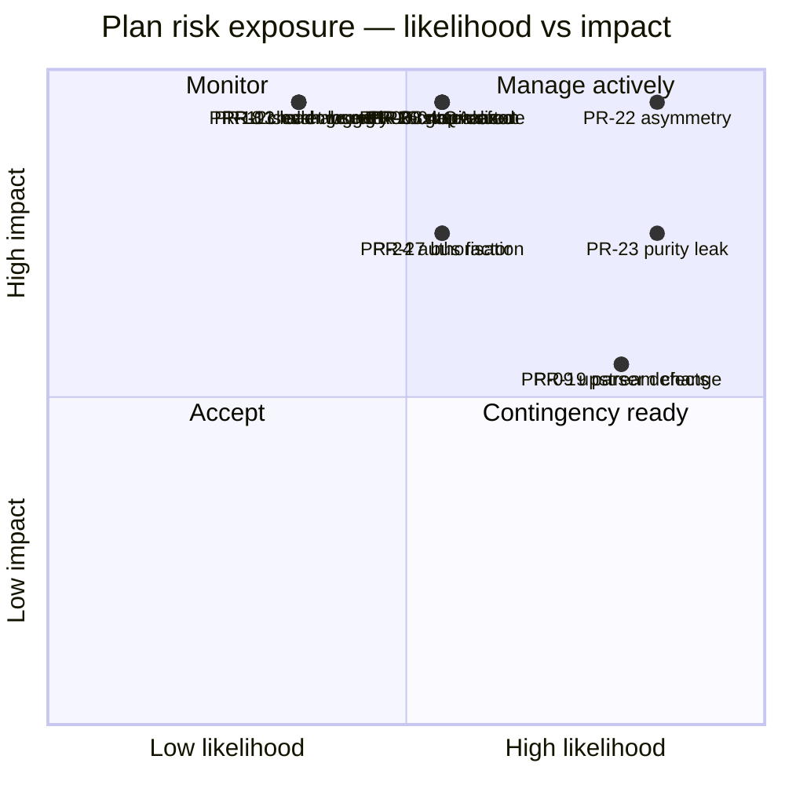

## 15.3.3 The Five to Watch

| Rank | ID | Why It Leads |
|---|---|---|
| 1 | **PR-22** | Exposure 20. It is the only risk whose realisation is both invisible and destructive to a paying client's data |
| 2 | **PR-23** | Exposure 16. It silently voids fifteen property laws, so it defeats the mitigation for every other correctness risk |
| 3 | PR-04, PR-05, PR-20, PR-16, PR-08 | Exposure 15 each. All five are "the safety mechanism was built but not really tested" |
| 4 | PR-09 | The only high-likelihood external risk; mitigated structurally rather than managerially |
| 5 | PR-02 | The staffing risk with the largest schedule consequence, and it is knowable at DG-01 |

---

# 15.4 Dependency Matrix

## 15.4.1 Phase-to-Phase

`■` = hard dependency (cannot start) · `□` = soft dependency (can start, cannot finish) · blank = independent

| Blocked ↓ / Requires → | 00 | 01 | 02 | 03 | 04 | 05 | 06 | 07 | 08 | 09 | 10 | 11 | 12 | 13 | 14 | 15 | 16 | 17 | 18 | 19 | 20 | 21 | 22 | 23 | 24 |
|---|---|---|---|---|---|---|---|---|---|---|---|---|---|---|---|---|---|---|---|---|---|---|---|---|---|
| **PH-01** | ■ | | | | | | | | | | | | | | | | | | | | | | | | |
| **PH-02** | ■ | ■ | | | | | | | | | | | | | | | | | | | | | | | |
| **PH-03** | ■ | ■ | ■ | | | | | | | | | | | | | | | | | | | | | | |
| **PH-04** | ■ | ■ | ■ | ■ | | | | | | | | | | | | | | | | | | | | | |
| **PH-05** | ■ | ■ | ■ | ■ | ■ | | | | | | | | | | | | | | | | | | | | |
| **PH-06** | ■ | ■ | ■ | ■ | ■ | ■ | | | | | | | | | | | | | | | | | | | |
| **PH-07** | ■ | ■ | | | | | □ | | | | | | | | | | | | | | | | | | |
| **PH-08** | ■ | ■ | | | | ■ | ■ | ■ | | | | | | | | | | | | | | | | | |
| **PH-09** | ■ | ■ | | | | | ■ | ■ | □ | | | | | | | | | | | | | | | | |
| **PH-10** | ■ | ■ | | | | | ■ | ■ | ■ | ■ | | | | | | | | | | | | | | | |
| **PH-11** | ■ | ■ | ■ | ■ | ■ | ■ | ■ | ■ | ■ | ■ | ■ | | | | | | | | | | | | | | |
| **PH-12** | ■ | ■ | ■ | | | | | ■ | | | | | | | | | | | | | | | | | |
| **PH-13** | ■ | ■ | ■ | ■ | | | | ■ | | | | □ | ■ | | | | | | | | | | | | |
| **PH-14** | ■ | ■ | | | | | | ■ | | ■ | ■ | **■** | | | | | | | | | | | | | |
| **PH-15** | ■ | ■ | | | | | | ■ | | ■ | | | | ■ | ■ | | | | | | | | | | |
| **PH-16** | ■ | ■ | ■ | ■ | ■ | | | ■ | | ■ | | | ■ | ■ | ■ | ■ | | | | | | | | | |
| **PH-17** | ■ | ■ | | | | ■ | ■ | ■ | ■ | ■ | ■ | □ | | | ■ | ■ | ■ | | | | | | | | |
| **PH-18** | ■ | ■ | | | | ■ | ■ | ■ | ■ | ■ | ■ | | | | | | | ■ | | | | | | | |
| **PH-19** | ■ | | | | | | | ■ | ■ | ■ | ■ | | | | ■ | ■ | ■ | ■ | ■ | | | | | | |
| **PH-20** | ■ | ■ | | | | | | ■ | ■ | ■ | ■ | | | | | | | ■ | ■ | ■ | | | | | |
| **PH-21** | ■ | ■ | ■ | ■ | ■ | ■ | ■ | ■ | ■ | ■ | ■ | ■ | ■ | ■ | ■ | ■ | ■ | ■ | ■ | ■ | ■ | | | | |
| **PH-22** | ■ | ■ | ■ | ■ | ■ | ■ | ■ | ■ | ■ | ■ | ■ | ■ | | | | | ■ | ■ | | | | | | | |
| **PH-23** | ■ | ■ | ■ | | | | ■ | | | | | | | | | | | | | | | | | | |
| **PH-24** | ■ | | | | | | | ■ | ■ | ■ | ■ | | | | | | | ■ | ■ | ■ | ■ | | | | |
| **PH-25** | ■ | ■ | ■ | ■ | ■ | ■ | ■ | ■ | ■ | ■ | ■ | ■ | ■ | ■ | ■ | ■ | ■ | ■ | ■ | ■ | ■ | ■ | ■ | ■ | ■ |

**The bolded cell — PH-14 requires PH-11 — is the one dependency in this matrix that is a policy rather than a technical necessity.** Nothing in the code prevents building the browser adapter first. X-8 forbids it, because an interface validated against one implementation is a rename.

## 15.4.2 Non-Code Dependencies

| Artifact | Blocks | Lead Time | Start By | Owner |
|---|---|---|---|---|
| Repository + Actions | Everything | 1 day | W01 D1 | DevOps |
| `data`/`state` branches | PH-08 (tests), PH-18 (real) | 1 hour | W01 | DevOps |
| Pages + **measured headers** | PH-24, PH-25 | 2 days | W01 | DevOps |
| Fixture corpus (20) | PH-13 | **2 weeks elapsed** | **W04** | QA + Backend |
| Selector pack v1 | PH-13 | 3 days | W08 | Backend |
| Canary reference listing (OPQ-02) | PH-19 | 1 day | W12 | Backend |
| Offsite clone | PH-25 (by rule) | 1 hour | W01 | DevOps |
| **Client authorisation record** | PH-25 | **Unknown — external** | **W01** | EM |
| Client website access | PH-25 verification | External | W12 | EM |

---

# 15.5 Critical Path Analysis

## 15.5.1 The Path


**Critical path length: 654 IEH across 18 phases.** Every hour of slip on any of these phases is an hour of slip on the GA date.

## 15.5.2 Off-Path Phases and Their Slack

| Phase | Slack | Notes |
|---|---|---|
| PH-07 | 0 — it feeds PH-08 | Effectively on-path |
| PH-12 | 4 days | Can run parallel to PH-11 |
| PH-14, PH-15 | 3 days combined | Feed PH-16; SP-5's coupling risk consumes this |
| PH-20 | 5 days | Can start during SP-6 if capacity appears |
| PH-22 | 6 days | Can start once PH-16 lands; **must not move past GA** |
| PH-23 | **10 days** | Only needs PH-06's payload shape; the plan's largest pressure valve |
| PH-24 | 4 days | Highly parallel; agent-tractable |

## 15.5.3 The Five Phases That Set the Date

| Rank | Phase | Why | Protection |
|---|---|---|---|
| 1 | **PH-05** | D5, 46 IEH, single-owner, non-parallelisable, and everything downstream derives from it | Two reviewers; properties first; §5.7's stop condition |
| 2 | **PH-02** | D4, blocks every producer of data by rule (X-7) | Properties first; blind adversarial review |
| 3 | **PH-06** | D4, 100% coverage requirement, blocks all publication | Rules as data; per-rule tests |
| 4 | **PH-11** | Small but gates all browser work (X-8) | Contract suite written here, not later |
| 5 | **PH-21** | Release gate; cannot be compressed because it finds defects that then need repair | The 40 IEH hardening allowance exists for its output |

## 15.5.4 Compression Options, Honestly Assessed

| Option | Saves | Cost | Recommendation |
|---|---|---|---|
| Add a third engineer at W01 | ~2 weeks | Onboarding cost; PH-02/PH-05 do not parallelise | **Only if they own PH-07/PH-09/PH-10 and PH-23** |
| Pull PH-23 forward to SP-6 | 0 on the path | Frees SP-8 | **Yes if SP-6 finishes light** |
| Drop the Places API adapter | 18 IEH off-path | PT-08 proven with 3 adapters instead of 4 | Acceptable under §9.5 |
| Cut the three optional recipes | 10 IEH off-path | Bespoke help for those clients | Acceptable |
| Run chaos concurrently with PH-22 | ~3 days | Chaos then tests a moving target | **No** |
| Shorten the soak | 0 to GA | The soak *is* the acceptance of the design goal (S8) | **No** |
| Skip staged release steps | 10 min | TR-CI-170 | **No** |

---

# 15.6 Decision Gates

Twelve gates. Each has a chair, an agenda, a decision, and a written outcome. **The chair is never the person who did the work.**

| Gate | When | Chair | Decision | Hard Stop |
|---|---|---|---|---|
| **DG-01** | End W01 | DevOps | Is the toolchain proven to reject bad work? Publish the cut list. Confirm OPQ-01 and OPQ-04 | No |
| **DG-02** | End W03 | Architect | Is text provably safe? Are PA-01 and PA-04 holding? | No |
| **DG-03** | End W05 | Architect | **Is the kernel correct?** Re-baseline dates from measured velocity | **Yes** |
| **DG-04** | End W06 | Backend Lead | Does state survive the process? Is redaction proven? | No |
| **DG-05** | End W07 | Backend Lead | Can a human operate the engine? | No |
| **DG-06** | End W09 | Architect + EM | **Is the adapter interface right, now that it has one implementation?** Last cheap moment to change it. Second re-baseline | **Yes** |
| **DG-07** | End W11 | Backend Lead + Security | Does real acquisition work, with isolation intact? | No |
| **DG-08** | End W13 | DevOps + Security | **May the system hold a write token and touch a live source unattended?** | **Yes** |
| **DG-09** | End W15 | QA + Architect | **Is every failure mode proven safe?** | **Yes** |
| **DG-10** | W16 | EM | Release candidate: §63 and §64 complete? | **Yes** |
| **DG-11** | W16 | EM | Production go-live: §65 complete, including the two non-waivable prerequisites? | **Yes** |
| **DG-12** | Post-soak | EM + Architect | Soak accepted (S1–S8)? V2 register prioritised? | No |

## 15.6.1 Gate Mechanics

| Rule | Statement |
|---|---|
| G-1 | The gate's agenda is the milestone's exit criteria, verbatim. Nothing is added on the day |
| G-2 | Each criterion is **green, amber, or red**. Amber requires a dated owner and a follow-up; red blocks |
| G-3 | A hard-stop gate has **no amber**. Criteria are green or the gate does not pass |
| G-4 | The outcome is written the same day: decision, conditions, follow-ups, and re-baselined dates |
| G-5 | A gate may be held early if the criteria are met early. It may not be held late without recording why |

## 15.6.2 Go/No-Go Checkpoints

Three of the twelve are true go/no-go decisions where "no" has a defined alternative rather than "wait".

| Checkpoint | Question | If No |
|---|---|---|
| **DG-03** (W05) | Is `core/` correct? | **Halt forward motion** (§5.7). Resolve the specification or the comprehension failure. Do not build on an unproven kernel |
| **DG-06** (W09) | Is `AcquisitionPort` right? | Change it now, at a cost of ~1 week. Changing it after PH-14 costs ~3 weeks of browser rework |
| **DG-08** (W13) | May we run unattended against a live source? | Ship the CSV-fed path to an internal client; defer DOM acquisition until the concern is resolved. This is a real, tested product state (§9.3) |

---

# 15.7 Progress Tracking

## 15.7.1 What Is Tracked

| Signal | Source | Cadence | Answers |
|---|---|---|---|
| Tasks merged vs planned | Branch names (`t/<id>-*`) merged to `main` | Daily, automatic | Are we moving? |
| IEH actual vs estimate | Sprint log | Per task | Are the estimates real? |
| Phase exit criteria status | The phase's criteria table | Weekly | Are we *done*, or just *finished writing*? |
| Property laws green | CI | Every commit | Is the correctness argument intact? |
| Default suite duration | CI | Every commit | Is the suite still usable? (IR-17) |
| Coverage on the two 100% modules | CI | Every commit | Are the safety mechanisms still fully covered? |
| Open risks above exposure 12 | Risk register | Weekly | What is most likely to hurt us? |
| Agent PR acceptance rate | Review outcomes | Weekly | Is PA-04 holding? |
| Blocked-task count and age | Sprint board | Daily | Where is the queue forming? |

## 15.7.2 The Weekly Report

One page, same shape every week. Written by the EM, read in three minutes.

| Section | Content |
|---|---|
| **This week's observable outcome** | From §15.2, and whether it was observed |
| **Tasks** | Merged / in progress / blocked, with the oldest blocker named |
| **Burn** | IEH spent vs planned, cumulative, and reserve remaining |
| **Gate status** | Next gate, its date, and any criterion currently amber or red |
| **Top three risks** | By exposure, with what changed |
| **Decisions needed** | With owners and dates |

## 15.7.3 Burn-Down Against the Reserve

The tracked number is not tasks completed; it is **reserve remaining**, because that is the number that predicts the end date.

| Checkpoint | Reserve Remaining (Healthy) | Action If Below |
|---|---|---|
| End SP-1 | ≥ 110 of 125 | Re-examine the D4 multiplier at DG-02 |
| End SP-2 | ≥ 90 | **Trigger DG-03 re-baselining with measured velocity** |
| End SP-4 | ≥ 70 | Apply cut-list items 1–2; confirm at DG-06 |
| End SP-6 | ≥ 45 | Apply cut-list items 3–4 |
| End SP-7 | ≥ 25 | Apply items 5–7; protect the hardening allowance |
| End SP-8 | ≥ 0 | GA slips by the overage; the soak start slips with it |

## 15.7.4 What Is Deliberately Not Tracked

| Not Tracked | Why |
|---|---|
| Lines of code | Uncorrelated with progress; anti-correlated with quality in a codebase with a 400-line file limit |
| Individual velocity | Two engineers on a 2.3 FTE team; the number is noise and the incentive is bad |
| Test count | The property laws and chaos scenarios matter; the count of unit tests does not |
| Story points | The plan estimates in IEH with explicit confidence bands; a second abstraction adds nothing |
| Percentage complete per phase | A phase is complete when its exit criteria are green. "80% complete" is the number that hides the last 80% |

## 15.7.5 The Escalation Rules

| Situation | Escalate To | Within |
|---|---|---|
| A task exceeds 2× its estimate (X-11) | Stand-up | Same day |
| A phase's exit criterion cannot be met | Architect | Same day |
| A requirement and a test disagree (ID-10) | Architect | Immediately — **stop work on that task** |
| An invariant appears unimplementable | The next DG, convened early | Immediately |
| A branch is older than 72 hours (24 h in SP-5) | Stand-up | Same day |
| An external dependency slips (§15.4.2) | EM | Same day |
| Reserve falls below its checkpoint threshold | The next DG | That week |

---

## Part 15 Summary — The Management Model in Six Lines

1. **Nine milestones**, each with a one-command demo, each gated by a named chair.
2. **Sixteen weekly outcomes**, each observable, so progress is never a claim.
3. **Twenty-eight plan risks**, re-scored every sprint, with the top two (PR-22, PR-23) named as the ones that defeat all other mitigations.
4. **A 654-IEH critical path** through eighteen phases, with the five date-setting phases identified and protected.
5. **Twelve decision gates**, five of them hard stops, three of them true go/no-go with defined alternatives.
6. **Reserve remaining** is the tracked number, because it is the one that predicts the end date.

---

*End of Part 15. Part 16 is the AI coding agent playbook.*


---

# Part 16 — AI Coding Agent Playbook

*Audience: AI coding agents (Claude Code, Codex, Gemini CLI, and successors) and the humans supervising them. This part is normative for agent-executed work. An agent that reads only this part and the TRD section named in its task has everything it needs.*

---

## 16.0 Read This First

You are implementing a **baselined** system. The architecture (SAD v1.0) and the technical specification (TRD v1.0) are approved and frozen. Your job is to implement what is specified, in the order this plan specifies, and to stop when something does not fit rather than to invent a resolution.

**The twelve execution rules (§0.5) apply to you without exception.** Three of them are the ones agents break:

| Rule | The specific failure |
|---|---|
| **X-7** | Building a producer of data before the Normalizer exists. The task list prevents this; do not "get ahead" |
| **X-10** | Widening a hard ceiling to make a test pass; adding a retry to an `ERR-BLOCKED-*` path; simplifying the absence asymmetry |
| **ID-07** | Returning `[]` or `null` from an unimplemented unit. **In this system that is indistinguishable from the worst production defect** |

And the ten TRD agent rules (TRD §0.5, A-1…A-10) are binding. A-4 and A-10 in particular.

---

# 16.1 Task Eligibility — What an Agent May Own

| Difficulty | Agent Autonomy | Human Involvement |
|---|---|---|
| **D1 Mechanical** | **Full.** Generate, test, commit, open a PR | Review the diff |
| **D2 Straightforward** | **Full.** Generate, test, commit, open a PR | Review the diff against the TRD section |
| **D3 Substantive** | **Assisted.** Draft the implementation and the tests | Human verifies **line by line** against the TRD section before merge |
| **D4 Hazardous** | **Tests and scaffolding only.** The human writes the implementation | Property tests may be agent-drafted **only if** a human wrote the law statement first |
| **D5 Critical-path apex** | **None for implementation.** Agent may write test fixtures, builders, and documentation | Human-led throughout; two reviewers |

## 16.1.1 The D4/D5 Module List

**These modules are human-led by rule.** An agent may not author their implementation, regardless of instruction:

| Module | Why |
|---|---|
| `core/reconcile/**` | The absence asymmetry (IR-01, PR-22). "Simplifying" it passes every example test |
| `core/normalize/**` | The security boundary for every client website simultaneously (INV-05) |
| `core/gate/**` | The only mechanism between a bad harvest and every client (INV-02) |
| `core/identity/**` | An identity change is irreversible after first publication |
| `infra/logger/redact.mjs` | Its failure mode is irreversible in a public repository |
| `adapters/acquisition/google-dom/challenge-detect.mjs` | INV-07; a retry here is the specific prohibited behaviour |

**An agent may — and should — write the property tests, adversarial corpora, and fixtures for all six.** That is where an agent's recall of a long specification is an advantage and its confident completion is not a hazard.

---

# 16.2 Prompt and Context Budget

## 16.2.1 Maximum Recommended Prompt Size

| Element | Budget | Rationale |
|---|---|---|
| **Task scope per prompt** | **One task ID** (`T-nnn`). Never two | A prompt covering two tasks produces a diff covering two concerns, which is unreviewable (ID-03) |
| **Specification input** | **One TRD section**, plus its referenced tables. Typically 2–6 pages | Feeding the whole TRD dilutes the section that matters and invites cross-contamination between similar rules |
| **Plan input** | The task row + the phase section for that task | ~3 pages |
| **Code input** | The module being written, its direct imports' **contracts** (not bodies), and its test file | Reading transitive implementations is how an agent starts matching an unrelated module's style instead of the spec |
| **Total working context** | **≤ 25% of the model's window**, leaving room for iteration | An agent operating near its limit begins summarising the spec, and a summarised requirement is a changed requirement |
| **Output per PR** | **≤ 400 lines of diff**, excluding fixtures | ID-03 |

## 16.2.2 The Standard Task Prompt Shape

Provide, in this order:

| # | Content |
|---|---|
| 1 | The task row from Part 12–14, verbatim |
| 2 | The phase section from Parts 3–10 that governs it |
| 3 | The **exact** TRD section(s) named in the task's Description |
| 4 | The contract tables of any module being imported |
| 5 | The relevant execution rules (X-*) and any `IR-` risk named in the phase |
| 6 | The test file to satisfy, if the tests already exist (D4 property-first tasks) |

**Do not provide:** the whole SAD, the whole TRD, unrelated modules' source, or previous unrelated conversation. Each of those measurably increases the rate at which an agent produces plausible code that satisfies something other than the requirement.

## 16.2.3 Context Management Across a Session

| Rule | Statement |
|---|---|
| **CTX-1** | **One task per session.** Start a new session for the next task, even if the previous one succeeded |
| **CTX-2** | If the session must span tasks, re-read the TRD section at the start of each task. Do not rely on recall from earlier in the session |
| **CTX-3** | When context is summarised or compacted, **re-read the TRD section and the task row before continuing**. A summarised requirement has lost the exact numbers, and the exact numbers are the requirement |
| **CTX-4** | Never carry an assumption from one module into another. `core/validate/` and `core/gate/` both have thresholds; they are different thresholds |
| **CTX-5** | Keep the invariant list (INV-01…INV-10) in context at all times. It is one page and it is the thing you are protecting |
| **CTX-6** | If you cannot hold the task's spec, its test file, and its module in context simultaneously, the task is too large — split it and record the split in the sprint log |

---

# 16.3 Module Isolation Rules

The architecture is hexagonal and the dependency rules are mechanically enforced. **Before writing any import, check it against this table.**

| You are writing in | You MAY import from | You MUST NOT import from |
|---|---|---|
| `core/**` | `core/**` only, plus `node:crypto` | `adapters/`, `infra/`, `app/`, `cli/`, any npm package, any other `node:` built-in |
| `ports/**` | Nothing. These are declarations | Anything |
| `adapters/**` | `ports/`, `core/` (types), `infra/` | **Another adapter** |
| `infra/**` | `ports/`, `node:` built-ins | `core/`, `app/`, `adapters/` — and no domain concept at all |
| `app/**` | `ports/`, `core/`, `infra/` | **Any concrete adapter** |
| `cli/composition.mjs` | Everything | — (this is the only such file) |
| `cli/**` (other) | `app/`, `ports/`, `core/` | Concrete adapters (construct them nowhere but the composition root) |
| `frontend/**` | Nothing at all | Every package, without exception (DEP-6) |

## 16.3.1 The Five Imports an Agent Is Most Likely to Write Wrongly

| Tempting import | Why it is wrong | What to do instead |
|---|---|---|
| A logger inside `core/reconcile/` "just for debugging" | Violates DR-1; makes the core impure | Return the information in the `DecisionLog` the function already produces |
| `Date.now()` as a default for a `now` parameter | Violates DR-2; **voids every property law without failing anything** (IR-02, PR-23) | `now` is a **required** parameter. No default. Ever |
| A helper from the DOM adapter into the Places adapter | Violates DR-3 | Duplicate the small helper, or move it to `core/` if it is genuinely domain logic |
| The Playwright adapter imported into `app/orchestrator.mjs` "to check the browser is available" | Violates DR-4 | The orchestrator receives ports; availability is the composition root's concern |
| `core/reconcile/decide.mjs` imported directly from `app/` | Violates DR-6 | Import from `core/index.mjs` |

## 16.3.2 The `infra/` Test

**If a function's name or body mentions a domain noun — review, listing, client, ledger, payload — it does not belong in `infra/`.** It belongs in `core/`. This is the directory rule broken most often, and it is checkable in one reading.

---

# 16.4 Coding Order Within a Task

Follow this sequence. It is not a preference; it is what makes the work reviewable and what prevents the two most common agent failures (implementing before understanding, and testing what was implemented rather than what was required).

| # | Step | Output |
|---|---|---|
| 1 | **Read** the TRD section named in the task. Read the tables, not the prose summary | — |
| 2 | **Restate** the contract: inputs, outputs, errors, purity, idempotence. If the TRD has a contract table, copy it into your working notes | The contract |
| 3 | **List the error classes** this unit may produce. If one is not in `core/model/errors.mjs`, **stop and ask** — do not invent a class | Error set |
| 4 | **Write the module header**: what it does, and **what it explicitly does not do** (TRD §67.5) | Header |
| 5 | **Write the tests.** For D4 property-first tasks, the tests already exist and are red — satisfy them | Test file |
| 6 | **Write the implementation**, smallest thing that satisfies the tests and the contract | Module |
| 7 | **Run the full local gate**: `npm run lint && npm run typecheck && npm test` | Green |
| 8 | **Check the diff against the contract** from step 2. Anything in the diff not in the contract is scope creep | Reviewed diff |
| 9 | **Commit** with the Conventional Commit format and the `Refs:` footer naming TRD sections and invariants | Commit |
| 10 | **Open the PR** with the description fields required by the template | PR |

## 16.4.1 What to Do When the Spec Does Not Cover Your Case

**Stop.** Do not choose the reasonable-looking option.

| Situation | Action |
|---|---|
| The TRD does not specify a behaviour you need | Raise it. The interim position is in TRD §0.9 (`OIQ-`) if one exists; otherwise it is a specification gap and needs an EDR (§10.5) |
| A requirement and an existing test disagree | **Stop. Do not amend the test to match the code** (TRD A-8, ID-10). Escalate |
| A requirement seems wrong or redundant | It is probably load-bearing. `core/reconcile/` in particular looks redundant and is not (TRD A-4). Read PT-07 and CH-04 first, then escalate if still unconvinced |
| A hard ceiling blocks your test | **Never widen it** (A-3). The ceiling is a compile-time constant; your test is wrong |
| An illustrative JSON document in the TRD implies a rule | **Do not infer behaviour from illustrative JSON** (A-9). It shows shape. The rules are in the tables |

---

# 16.5 Testing After Every Module

| Rule | Statement |
|---|---|
| **AT-1** | Every task's PR contains the code **and** its tests. There is no "tests later" task and none will be scheduled (X-5) |
| **AT-2** | Run the **full default suite** before every commit, not just the tests you wrote. It takes under three minutes by design |
| **AT-3** | A new test must **fail against the previous commit**. If it passes without your change, it is testing something else |
| **AT-4** | Use `fixed-clock` and `seeded-random` in every test (TR-TEST-032). A test that reads the system clock will eventually fail at 02:00 for no reason |
| **AT-5** | Construct test data through builders in `tests/helpers/`, never inline literals (TR-TEST-033) |
| **AT-6** | Test names are full sentences describing behaviour: *"retains last known good when coverage is below threshold"* |
| **AT-7** | For any module with a coverage threshold (§21.2), verify the threshold is met before opening the PR |
| **AT-8** | For chaos and property tests, **name the invariant in a comment** (TR-TEST-042) |

## 16.5.1 The Test-Quality Check an Agent Should Run on Itself

Before opening a PR, answer these four questions in the PR description:

| # | Question |
|---|---|
| 1 | Which requirement does each test assert? Name the `TR-` or `PT-` identifier |
| 2 | Would this test fail if the implementation were replaced by a plausible wrong one? Describe that wrong implementation |
| 3 | Does any test assert an implementation detail rather than a behaviour? Remove it |
| 4 | If this is a bug fix: which test would have caught the bug? It must be in this PR |

**Question 2 is the one that matters.** An agent is very good at producing tests that pass against the code just written and prove nothing about the requirement.

---

# 16.6 Commit and Review Frequency

## 16.6.1 Commit Frequency

| Rule | Statement |
|---|---|
| **CF-1** | **One commit per completed, green task.** Not per file, not per hour |
| **CF-2** | Within a task, intermediate commits are allowed on your branch and are squashed on merge |
| **CF-3** | Never commit a red state to a shared branch. `main` is always releasable (X-3) |
| **CF-4** | Commit message: Conventional Commits, module scope, and a `Refs:` footer with `TR-`/`EDR-`/`INV-`/`PT-` identifiers |
| **CF-5** | For D3+ changes, the commit body states which TRD section was implemented and what was verified |

## 16.6.2 Review Frequency

| Change class | Reviewers | Turnaround |
|---|---|---|
| D1 documentation-only | Self-merge permitted | — |
| D1–D2 code | 1 reviewer | ≤ 24 h |
| D3 | 1 reviewer, **line-by-line against the TRD section** | ≤ 24 h |
| **D4–D5** | **2 reviewers**, one of whom wrote no part of the module | ≤ 48 h |
| Any PR touching `core/reconcile/`, `core/normalize/`, `core/gate/`, `core/identity/`, `redact.mjs`, `challenge-detect.mjs` | **2 reviewers, one being the Architect** | ≤ 48 h |
| Any PR adding a dependency | Reviewer + DEP-1 justification merged first | ≤ 48 h |

## 16.6.3 Branch Discipline

| Rule | Statement |
|---|---|
| **BD-1** | One branch per task: `t/<task-id>-<slug>` |
| **BD-2** | Merge within 48 hours (24 hours in SP-5). A stale branch is escalated at stand-up |
| **BD-3** | Rebase on `main` before opening the PR |
| **BD-4** | Incomplete work may merge **only if unreachable** — not exported from a package index, not registered in the composition root, not referenced by a command (FD-04) |
| **BD-5** | An unimplemented unit returns `Result.err(ERR-INTERNAL-INVARIANT)`. **It never returns `[]`, `null`, or a plausible default** (ID-07) |

---

# 16.7 Refactoring Rules

| Rule | Statement |
|---|---|
| **RF-1** | **Refactoring and behaviour change are separate commits** (ID-09). A diff mixing both is unreviewable and the behaviour change hides in the noise |
| **RF-2** | A refactor PR must be **behaviour-preserving and test-preserving**. If a test changed, it was not a refactor |
| **RF-3** | **Do not refactor a D4 or D5 module.** Not for readability, not for consistency, not for "simplification". If it genuinely needs restructuring, that is a human-led task with two reviewers |
| **RF-4** | Do not "clean up" code you are passing through. Touch only what your task requires |
| **RF-5** | Do not unify two similar-looking code paths without reading why they differ. In `core/reconcile/` the near-duplication **is the requirement** (TRD A-4) |
| **RF-6** | Do not introduce an abstraction with one user. Two users is the earliest an abstraction is justified, and this codebase is small enough that three is often better |
| **RF-7** | Do not change a public contract (payload shape, exit codes, error class names, config keys) as part of a refactor. Those are versioned contracts |

## 16.7.1 The Refactors That Have Broken This Class of System

| Refactor | What it broke |
|---|---|
| "Simplify the three completeness branches into one" | INV-03. The client's reviews are deleted on the next partial harvest |
| "Extract `now = Date.now()` as a default for convenience" | DR-2. Fifteen property laws stop testing anything, silently |
| "Make the gate short-circuit for performance" | An operator sees one rejection reason per harvest cycle instead of all of them |
| "Escape the markup instead of removing it — safer" | INV-05. The payload becomes markup source on every client site |
| "Reuse the browser context between targets for speed" | INV-09. State leaks between clients |
| "Return `[]` when extraction finds nothing, it's cleaner" | The catch-and-return-empty pattern TRD §67.3 prohibits by name |

---

# 16.8 Regression Prevention

| Rule | Statement |
|---|---|
| **RP-1** | **Every defect you find or fix gets a permanent test in the same PR** (X-9) |
| **RP-2** | Never delete or skip a failing test to make CI green. A failing test is information |
| **RP-3** | Never regenerate a golden fixture's `expected.json` to match new output unless the change in output is the **intended** change, and say so explicitly in the PR |
| **RP-4** | Never lower a coverage threshold |
| **RP-5** | Never widen a hard ceiling |
| **RP-6** | Never add a retry to an `ERR-BLOCKED-*` path |
| **RP-7** | If you change a threshold, add boundary tests at the new value |
| **RP-8** | If you change identity or hashing, extend PT-08/PT-09 and flag it as a **breaking migration** |
| **RP-9** | If you touch a selector pack, create `v<n+1>.json` — never edit the merged file — and add a fixture |
| **RP-10** | Run the architecture suite before every PR. It catches the import mistakes listed in §16.3.1 in five seconds |

## 16.8.1 The Self-Check Before Every PR

Answer all ten. If any answer is uncertain, do not open the PR.

| # | Question |
|---|---|
| 1 | Does this preserve all ten invariants? Especially INV-02, INV-03, INV-05 |
| 2 | Does every import obey §16.3's table? |
| 3 | Is there any `Date.now()`, `Math.random()`, `process.env`, `fs`, or `fetch` in `core/`? |
| 4 | Is every new error class in the taxonomy, with a retry policy and a severity? |
| 5 | Is every new timing, threshold, or limit a config key with a named default? |
| 6 | Is there any `catch` that returns an empty collection? |
| 7 | Is there any conditional keyed on a client slug, source, or adapter identity? |
| 8 | Could untrusted content reach a shell command, a log format string, a workflow expression, or a client DOM? |
| 9 | Does the module header say what the module does **and does not** do? |
| 10 | Would the change be diagnosable from artifacts alone if it failed in production? |

---

# 16.9 Multi-Agent Coordination

When more than one agent works concurrently:

| Rule | Statement |
|---|---|
| **MA-1** | Agents work on **different phases or different work packages**, never the same module |
| **MA-2** | Interface files (`ports/**`) are changed by **one** agent at a time, and the change lands before dependents start |
| **MA-3** | An agent that needs an interface change **stops and requests it** rather than changing it and notifying |
| **MA-4** | Shared files — `package.json`, `eslint.config.mjs`, `core/model/errors.mjs`, `cli/composition.mjs` — are edited by one agent at a time, and those edits are their own small PRs |
| **MA-5** | Each agent rebases on `main` before opening a PR; a conflict in a shared file is resolved by re-running the task, not by hand-merging |
| **MA-6** | The composition root is touched last in any phase, once, by whoever wires the phase's output |

---

# 16.10 The Agent Task Template

Copy this into the working notes at the start of every task.

```
TASK:        T-nnn — <name>
PHASE:       PH-nn (<milestone>, <sprint>)
DIFFICULTY:  D<n>   → autonomy per §16.1
TRD SECTION: §<n>   ← read this, in full, before writing anything
INVARIANTS:  INV-<nn>, ...
RISKS NAMED: IR-<nn>, PR-<nn>

CONTRACT (restate from the TRD, do not paraphrase):
  Inputs:
  Output:
  Errors:      (must all exist in core/model/errors.mjs)
  Purity:      pure | impure
  Idempotent:  yes | no

IMPORTS PLANNED:   (check each against §16.3's table)

TESTS TO WRITE:
  - <name>: asserts <TR-/PT- id>
  - each must fail against the previous commit

DEFINITION OF DONE (§2.3):
  [ ] Code satisfies the named TRD section
  [ ] Tests in the same PR, failing against the previous commit
  [ ] lint + typecheck + format: zero errors
  [ ] Full default suite green, under 3 minutes
  [ ] Coverage threshold met for the touched module
  [ ] Module header states what it does AND does not do
  [ ] New error classes in taxonomy + retry table + severity map
  [ ] PR names the TRD section(s) and invariant(s)

SELF-CHECK (§16.8.1): all ten questions answered
```

---

# 16.11 Phase-by-Phase Agent Guidance

| Phase | Agent Suitability | Specific Guidance |
|---|---|---|
| PH-00 | **Excellent** (D1–D2, 46 tasks) | The highest-value agent phase. Configs, templates, workflows, helpers. Do the 19 proof branches too — they are mechanical and they are the phase's evidence |
| PH-01 | **Good** (D2) | The taxonomy is a transcription task from SAD Appendix B. Transcribe **exactly**; do not "improve" a class name |
| PH-02 | **Tests only** (D4) | Write the adversarial corpus — this is where an agent excels. Do not write the eight-step pipeline |
| PH-03 | **Assisted** (D3) | The phrase table is data and is agent-tractable. The singular forms are the hazard; enumerate them per locale explicitly |
| PH-04 | **Assisted** (D3) | Watch TR-STD-080: `coverage` is a number, `completeness` is an enum. Never interchange them |
| PH-05 | **None for implementation** (D5) | Write PT-01, PT-02, PT-07 generators if asked, from a human-written law statement. **Do not touch the implementation** |
| PH-06 | **Tests only** (D4) | Write the per-rule test matrix — 12 rules × 2 tests each is exactly the kind of exhaustive work an agent does well |
| PH-07 | **Good, except `redact.mjs`** | The retry policy table is transcription; the enumerating test is mechanical. Redaction is human-led |
| PH-08 | **Assisted** (D3) | Unknown-field preservation is the subtle part; test it explicitly |
| PH-09 | **Assisted** (D3) | The precedence matrix is ten mechanical tests. **The array-replace rule is the one you will get wrong** — arrays replace, they do not merge |
| PH-10 | **Excellent** (D2) | One command per task; highly parallel |
| PH-11 | **Assisted** (D3) | Write the contract suite carefully — it must contain **no** source-specific assumption, because three more adapters will run it |
| PH-12 | **Assisted** (D3) | The pack schema is mechanical. The `notes` field on every strategy is mandatory and is not optional prose |
| PH-13 | **Good** (D3) | Reply detachment comes **first**. The rating integer post-check is mandatory. Do not fabricate absent fields |
| PH-14 | **Assisted** (D3) | Exactly one file imports `playwright`. Check with a grep before you finish |
| PH-15 | **Assisted** (D3) | The stop reason is emitted at the point of stopping, never inferred downstream |
| PH-16 | **Assisted, except challenge detection** | `challenge-detect.mjs` is human-led. Everything else in the adapter is D3 |
| PH-17 | **Assisted** (D3) | Registry and shard planner are **pure**. No I/O, no clock. `deferred` is not `failed` |
| PH-18 | **Assisted** (D3) | Hash-gating compares **bytes**. Publish order is payload-then-state. No force flags |
| PH-19 | **Excellent** (D2–D3) | Workflow YAML is highly agent-tractable. Never omit the `data` checkout; never omit `permissions:` |
| PH-20 | **Excellent** (D2) | Health records are append-only. Never read-modify-write the series |
| PH-21 | **Tests only, human-reviewed** (D4) | Write the injections; a human reviews every assertion for specificity. "Did not crash" is not an assertion |
| PH-22 | **Good** (D3) | **No fallback to the DOM adapter when a secret is missing.** Fail closed, exit 2 |
| PH-23 | **Good** (D2) | Zero dependencies. No HTML-injection DOM APIs. Every recipe carries a network assertion |
| PH-24 | **Excellent** (D2) | Five workflows, highly parallel, all mechanical |
| PH-25 | **Limited** | Human-executed: authorisation, client relationship, live verification |

---

# 16.12 What an Agent Must Never Do on This Project

Consolidated, in order of consequence.

| # | Never |
|---|---|
| 1 | **Simplify the absence asymmetry in `core/reconcile/`** |
| 2 | **Add a retry — of any kind, for any reason — to an `ERR-BLOCKED-*` path** |
| 3 | **Add `Date.now()`, `Math.random()`, `process.env`, `fs`, or `fetch` to `core/`**, including as a default parameter |
| 4 | **Return an empty collection from a `catch`** |
| 5 | **Escape markup instead of removing it** |
| 6 | **Widen a hard ceiling** |
| 7 | **Lower a coverage threshold or skip a failing test** |
| 8 | **Edit a merged selector pack** instead of creating the next version |
| 9 | **Fall back to the DOM adapter when an API secret is missing** |
| 10 | **Add a production dependency** without a merged DEP-1 justification |
| 11 | **Implement anything from TRD §76–§91** |
| 12 | **Amend a test to match the code** when the two disagree |
| 13 | **Use an HTML-injection DOM API in `frontend/`** |
| 14 | **Interpolate untrusted content** into a shell command, a log format string, or a workflow expression |
| 15 | **Skip the `data` checkout** in a publishing workflow |

---

## Part 16 Summary

| Question | Answer |
|---|---|
| Maximum prompt size | One task, one TRD section, ≤ 25% of the context window; output ≤ 400 diff lines |
| Module isolation | The §16.3 import table; check every import against it before writing |
| Coding order | Read spec → restate contract → list errors → header → tests → implementation → gate → self-check → commit |
| Testing | Same PR, always; must fail against the previous commit; fixed clock, seeded random |
| Commit frequency | One per completed green task |
| Review frequency | 1 reviewer for D1–D3; **2 for D4–D5**, one being the Architect for the six named modules |
| Refactoring | Separate commits; never in a D4/D5 module; never unify near-duplication without reading why it exists |
| Regression prevention | Every defect gets a permanent test; never delete, skip, or regenerate to pass |
| Context management | One task per session; re-read the spec after any compaction; keep the ten invariants in context |

---

*End of Part 16. Part 17 defines the quality gates that every phase must satisfy.*


---

# Part 17 — Quality Gates

*Audience: every engineer, every reviewer, every agent. A quality gate is a check that blocks. This part defines the six criteria classes that every phase must satisfy, the fourteen named gates that implement them, and the per-phase matrix showing which apply where.*

---

## 17.0 The Rule That Makes Gates Work

> **A non-blocking quality gate is a report, and reports are not read** (TR-CI-072).

Every gate in this part either blocks a merge, blocks a phase closure, or blocks a release. There is no advisory tier except one — the live smoke suite — and its advisory status is itself a deliberate, justified decision (§57.3).

---

# 17.1 The Six Criteria Classes

Every phase defines all six. Most are satisfied by the same mechanised gates; the phase-specific content is in the phase's own Exit Criteria (Parts 3–10).

| Class | Question | Enforced By | Blocks |
|---|---|---|---|
| **Build Success** | Does it compile, lint, type-check, and format cleanly? | `ci.yml` groups 1–4 | Merge |
| **Code Review** | Does it preserve the invariants, the layering, and the standards? | Human review against a fixed checklist | Merge |
| **Testing** | Do the right tests exist, and do they test the requirement? | `ci.yml` groups 5–8, 14 + coverage | Merge |
| **Performance** | Is it within the deterministic budgets? | `ci.yml` group 9 | Merge |
| **Documentation** | Can the next person operate and maintain it? | Review + phase exit criteria | Phase closure |
| **Release** | Is the whole system fit to ship? | §63–§65 checklists | Release |

---

# 17.2 Build Success Criteria

## QG-01 · Compilation and Type Safety

| # | Criterion | Threshold | Blocks |
|---|---|---|---|
| 1 | `npm run typecheck` | **Zero errors** | Merge |
| 2 | No `any` without an adjacent written justification | Zero unjustified | Merge |
| 3 | No baseline of "known errors" exists | None permitted (TS-04) | Merge |
| 4 | No transpilation or build step introduced | No `build` script (NODE-02) | Merge |
| 5 | `.nvmrc` and `engines.node` agree | Consistency test green | Merge |

## QG-02 · Lint and Format

| # | Criterion | Threshold | Blocks |
|---|---|---|---|
| 1 | `npm run lint` | **Zero errors and zero warnings** (`--max-warnings 0`) | Merge |
| 2 | Structural limits: complexity ≤ 10, function ≤ 60 lines, file ≤ 400 lines, params ≤ 4, nesting ≤ 3 | All | Merge |
| 3 | Prohibited patterns absent (TRD §67.3) | All | Merge |
| 4 | Any lint disable carries an inline reason | All (LINT-03) | Merge |
| 5 | `npm run format:check` | Zero differences | Merge |

## QG-03 · Architecture Conformance

| # | Criterion | Threshold | Blocks |
|---|---|---|---|
| 1 | DR-1: `core/` imports nothing from other layers or packages | Pass | Merge |
| 2 | DR-2: `core/` has no clock, randomness, environment, fs, or fetch | Pass | Merge |
| 3 | DR-3: no adapter imports another; **exactly one file imports `playwright`** | Pass | Merge |
| 4 | DR-4: `app/` imports no concrete adapter | Pass | Merge |
| 5 | DR-5: only `cli/composition.mjs` constructs implementations | Pass | Merge |
| 6 | DR-6: no import reaches past a package index | Pass | Merge |
| 7 | Acyclicity within `core/` | Pass | Merge |
| 8 | `adapters/publisher/` reachable only post-gate | Pass (from PH-18) | Merge |
| 9 | `ports/` contains no executable behaviour | Pass (from PH-07) | Merge |
| 10 | `tpre project` closure contains no acquisition adapter or HTTP client | Pass (from PH-10) | Merge |

## QG-04 · Dependency Discipline

| # | Criterion | Threshold | Blocks |
|---|---|---|---|
| 1 | Production dependency count | **≤ 2** | Merge |
| 2 | Every production dependency has a merged DEP-1 justification | All | Merge |
| 3 | `core/` has zero package dependencies | Zero | Merge |
| 4 | `frontend/renderer/` has zero dependencies | Zero (DEP-6) | Merge |
| 5 | `npm audit` high-severity findings | **Zero** | Merge |
| 6 | Lockfile committed; CI installs with `npm ci` only | Always | Merge |

---

# 17.3 Code Review Criteria

## QG-05 · The Reviewer Checklist

Reviewers check these **in this order**. Check 1 is first because it is the only one whose failure is unrecoverable.

| # | Check | Reject If |
|---|---|---|
| 1 | **Does this preserve the ten invariants?** Especially INV-02, INV-03, INV-05 | Any doubt. Escalate rather than approve |
| 2 | Does it respect the dependency rules? Is anything impure creeping into `core/`? | Any violation |
| 3 | Is every new error classified and in the taxonomy? | Any unclassified failure path |
| 4 | Is every new timing, threshold, or limit configurable with a named default? | Any magic number |
| 5 | Would the change be diagnosable from artifacts alone if it failed in production? | No |
| 6 | Is there a test that would have caught the bug being fixed? | Bug fix without a test |
| 7 | Is documentation or an ADR/EDR updated? | Behavioural change without a record |
| 8 | Could untrusted content reach a shell, a log format string, a workflow expression, or a client DOM? | Any path exists |
| 9 | **Is this client-specific in any way?** | Any conditional on a slug |
| 10 | Is it simpler than what it replaces? If not, is the added complexity justified in writing? | Unjustified complexity |

## QG-06 · Review Depth by Difficulty

| Difficulty | Reviewers | Depth | Turnaround |
|---|---|---|---|
| D1 | 1 (self-merge for docs only) | Diff scan | 24 h |
| D2 | 1 | Diff vs the TRD section | 24 h |
| D3 | 1 | **Line-by-line vs the TRD section** | 24 h |
| **D4** | **2**, one uninvolved | Line-by-line + independent adversarial construction | 48 h |
| **D5** | **2**, one being the Architect | Line-by-line + hand-tracing the algorithm + protection-removal check | 48 h |

## QG-07 · The Six Modules With Mandatory Architect Review

Any PR touching these requires the Architect as one of two reviewers, regardless of diff size:

`core/reconcile/**` · `core/normalize/**` · `core/gate/**` · `core/identity/**` · `infra/logger/redact.mjs` · `adapters/acquisition/google-dom/challenge-detect.mjs`

## QG-08 · PR Hygiene

| # | Criterion | Threshold |
|---|---|---|
| 1 | Diff size, excluding fixtures and generated files | ≤ ~400 lines |
| 2 | Branch age at merge | ≤ 48 h (≤ 24 h in SP-5) |
| 3 | PR description names the TRD section(s) implemented | Required |
| 4 | PR description names the invariant(s) touched | Required |
| 5 | For a fix: "which test would have caught this?" answered | Required |
| 6 | Refactor and behaviour change are separate commits | Required |
| 7 | Conventional Commit format with a `Refs:` footer | Required |

---

# 17.4 Testing Criteria

## QG-09 · Coverage Thresholds

Per-path, never global (TEST-CFG-01). All are **blocking**.

| Path | Threshold | Effective From |
|---|---|---|
| **`src/core/gate/**`** | **100% statement** | PH-06 |
| **`src/infra/logger/redact.mjs`** | **100% statement** | PH-07 |
| `src/core/normalize/**` | ≥ 95% | PH-02 |
| `src/core/dates/**` | ≥ 95% | PH-03 |
| `src/core/identity/**` | ≥ 95% | PH-03 |
| `src/core/validate/**` | ≥ 95% | PH-04 |
| `src/core/reconcile/**` | ≥ 95% | PH-05 |
| `src/core/project/**` | ≥ 95% | PH-06 |
| `src/infra/retry/**` | ≥ 95% | PH-07 |
| `src/core/extract/**` | ≥ 90% | PH-13 |
| `src/app/config/**` | ≥ 90% | PH-09 |
| `src/core/**` overall | ≥ 90% | PH-01 |
| Overall | ≥ 70% | PH-06 |

**Coverage is a floor, not a goal.** A module at 92% with the wrong assertions is worse than one at 80% with the right ones.

## QG-10 · Suite Completeness

| # | Criterion | Threshold | Effective From |
|---|---|---|---|
| 1 | All fifteen property laws pass | ≥ 1,000 cases each | Progressive; complete PH-22 |
| 2 | All twenty golden fixtures pass **against their pinned packs** | 100% | PH-13 |
| 3 | Contract suite passes against every adapter built | 100% | PH-11 |
| 4 | All fourteen chaos scenarios pass | 100% | PH-21 |
| 5 | Six architecture rules pass | 100% | PH-01 (progressive) |
| 6 | Six security tests pass | 100% | PH-02 (progressive) |
| 7 | Integration suite passes, **localhost only** | 100% | PH-08 |
| 8 | Schema validation across all schemas, fixtures, configs | 100% | PH-06 |
| 9 | Default suite duration | **< 3 minutes**, offline | Always |
| 10 | `tests/live/` excluded from the default runner | Proven | PH-00 |

## QG-11 · Test Quality

Not mechanisable; enforced in review.

| # | Criterion |
|---|---|
| 1 | Every new test fails against the previous commit |
| 2 | Fixed clock and seeded random used |
| 3 | Test data built through builders, not inline literals |
| 4 | Test names are full sentences describing behaviour |
| 5 | One logical assertion per test |
| 6 | Chaos and property tests name their invariant in a comment |
| 7 | **A chaos test fails when its protection is removed** — verified for CH-04 and three randomly chosen others |
| 8 | No test asserts an implementation detail |

## QG-12 · The Invariant Traceability Gate

**If an invariant has no test, it is not enforced.** The traceability table (§54.5) is updated in the same PR that adds the test, and a phase does not close with an empty cell for any invariant it was supposed to enforce.

---

# 17.5 Performance Criteria

## QG-13 · Deterministic Budgets — Blocking

| # | Budget | Threshold | Effective From |
|---|---|---|---|
| 1 | Pure pipeline CPU, 1,000 reviews | **≤ 2 s** | PH-06 |
| 2 | `reviews.json`, 200 reviews | ≤ 180 KB raw / ≤ 60 KB gzip | PH-06 |
| 3 | `latest.json` | ≤ 24 KB raw / ≤ 9 KB gzip | PH-06 |
| 4 | Renderer bundle | **≤ 5 KB minified** | PH-23 |
| 5 | Blocked-bytes effectiveness | Non-trivial reduction, **number recorded** | PH-15 |
| 6 | Default suite duration | < 3 minutes | PH-00 |
| 7 | `ci.yml` total duration | < 5 minutes | PH-00 |

## QG-14 · Monitored, Non-Blocking

Recorded in health; never fails a build (TR-TEST-101, PERF-02).

| Metric | Healthy | Act |
|---|---|---|
| Harvest duration p95 | ≤ 180 s | > 240 s |
| Cold start, warm cache | ≤ 60 s | > 90 s |
| Peak RSS per target | ≤ 700 MB | Approaching runner limit |
| Commit churn | Stable | Sudden rise |

**Why duration is not blocking:** a flaky performance gate trains engineers to re-run CI until it passes, which destroys the value of every other test in the suite.

---

# 17.6 Documentation Criteria

## Documentation Gate (phase closure, not merge)

| # | Criterion | Applies To |
|---|---|---|
| 1 | Every exported function has JSDoc: purpose, params, returns, throws, and a `@see` to the governing SAD/TRD section | Every module |
| 2 | Every module header states its responsibility **and what it explicitly does not do** | Every module |
| 3 | Every non-obvious decision has an inline comment stating **why**, not what | Every module |
| 4 | Every new error class appears in the taxonomy table | PH-01 onward |
| 5 | Every config key documented in the schema `description` and §8 | PH-09 |
| 6 | Every selector strategy has a `notes` field | PH-12 |
| 7 | The phase's "Documentation Required" artifacts are merged | Every phase |
| 8 | Runbooks exist for every condition the phase introduces | PH-16 onward |
| 9 | The traceability table is current | Every phase |

## The Documentation Test

**A phase's documentation is sufficient when someone who did not build it can execute the phase's Verification Checklist without asking a question.** This is checked literally: the reviewer executes the checklist from the written text alone, and any question asked is a documentation defect fixed in the same session.

---

# 17.7 Release Criteria

Release criteria are the §63, §64, and §65 checklists in full. Summarised here as the gate:

| # | Criterion | Reference |
|---|---|---|
| 1 | All 14 `ci.yml` gate groups green at the tagged commit | §64.1 |
| 2 | The ten non-waivable items green | §64.4 |
| 3 | Deployment readiness complete, including measured Pages headers and a verified offsite clone | §63 |
| 4 | CHANGELOG entry; schema version unchanged or a parallel-publish plan signed | §64.2 |
| 5 | All five runbooks drilled | §64.3 |
| 6 | **Rollback path for this specific release identified before release** | TR-CI-190 |
| 7 | Canary dispatched and green; one client harvested manually and sane | §65.3 |
| 8 | Payload verified over the public CDN URL | §65.3 |
| 9 | First-client checks: zero third-party requests; clean empty state | §65.4 |
| 10 | Soak tracking started with S1–S8 owners | §65.4 |

---

# 17.8 The Per-Phase Gate Matrix

`■` = applies and blocks · `□` = applies from this phase onward · blank = not yet applicable

| Phase | QG-01 build | QG-02 lint | QG-03 arch | QG-04 deps | QG-05 review | QG-09 cov | QG-10 suites | QG-13 perf | Docs |
|---|---|---|---|---|---|---|---|---|---|
| PH-00 | □ | □ | | □ | ■ | □ | □ | □ | ■ |
| PH-01 | ■ | ■ | □ | ■ | ■ | □ | ■ | ■ | ■ |
| PH-02 | ■ | ■ | ■ | ■ | ■ | **■ 95%** | ■ | ■ | ■ |
| PH-03 | ■ | ■ | ■ | ■ | ■ | ■ 95% | ■ | ■ | ■ |
| PH-04 | ■ | ■ | ■ | ■ | ■ | ■ 95% | ■ | ■ | ■ |
| PH-05 | ■ | ■ | ■ | ■ | **■ ×2** | ■ 95% | ■ | ■ | ■ |
| PH-06 | ■ | ■ | ■ | ■ | **■ ×2** | **■ 100%** | ■ | ■ | ■ |
| PH-07 | ■ | ■ | ■ | ■ | ■ | **■ 100%** | ■ | ■ | ■ |
| PH-08 | ■ | ■ | ■ | ■ | ■ | ■ | ■ | ■ | ■ |
| PH-09 | ■ | ■ | ■ | ■ | ■ | ■ 90% | ■ | ■ | ■ |
| PH-10 | ■ | ■ | ■ | ■ | ■ | ■ | ■ | ■ | ■ |
| PH-11 | ■ | ■ | ■ | ■ | ■ | ■ | ■ | ■ | ■ |
| PH-12 | ■ | ■ | ■ | ■ | ■ | ■ | ■ | ■ | ■ |
| PH-13 | ■ | ■ | ■ | ■ | ■ | ■ 90% | ■ | ■ | ■ |
| PH-14 | ■ | ■ | **■ DR-3** | **■ +1 dep** | ■ | ■ | ■ | ■ | ■ |
| PH-15 | ■ | ■ | ■ | ■ | ■ | ■ | ■ | **■ bytes** | ■ |
| PH-16 | ■ | ■ | ■ | ■ | **■ ×2** | ■ | ■ | ■ | ■ |
| PH-17 | ■ | ■ | ■ | ■ | ■ | ■ | ■ | ■ | ■ |
| PH-18 | ■ | ■ | **■ post-gate** | ■ | ■ | ■ | ■ | ■ | ■ |
| PH-19 | ■ | ■ | ■ | ■ | ■ | ■ | ■ | ■ | ■ |
| PH-20 | ■ | ■ | ■ | ■ | ■ | ■ | ■ | ■ | ■ |
| PH-21 | ■ | ■ | ■ | ■ | ■ | ■ | **■ all 14** | ■ | ■ |
| PH-22 | ■ | ■ | ■ | ■ | ■ | ■ | **■ ×4** | ■ | ■ |
| PH-23 | ■ | ■ | ■ | **■ zero** | ■ | ■ | ■ | **■ 5 KB** | ■ |
| PH-24 | ■ | ■ | ■ | ■ | ■ | ■ | ■ | ■ | ■ |
| PH-25 | ■ | ■ | ■ | ■ | ■ | ■ | ■ | ■ | ■ |

---

# 17.9 Gate Failure Handling

| Failure | Response | Never |
|---|---|---|
| Build gate fails | Fix the code | Add a type suppression, relax a lint rule, or baseline the error |
| Architecture gate fails | Fix the import | Add an exception to the architecture test |
| Coverage gate fails | Add the missing tests | Lower the threshold |
| A property law fails | **Stop.** Either the implementation is wrong or the law is wrong — resolve which, with the Architect | Skip the test, reduce the case count, or narrow the generator |
| A chaos scenario fails | **Stop.** The system does not survive a failure it is designed to survive | Weaken the assertion |
| A golden fixture fails | Determine whether the output change was intended. If yes, regenerate and **say so explicitly** in the PR. If no, fix the code | Regenerate silently |
| A performance budget fails | Fix the regression | Raise the budget |
| A security test fails | **Stop and escalate to Security** | Anything else |
| The live smoke test fails | Open an issue; do not block the PR | Make it blocking "just this once" |

## 17.9.1 The Only Sanctioned Waiver Path

A blocking gate may be waived only by a **merged PCR** (§0.9) approved by the Engineering Manager, plus the Architect when an invariant is touched — and never for the ten non-waivable items (§64.4). The waiver records what was waived, why, who approved it, and the date by which it is resolved.

**In sixteen weeks this path should be used zero times.** It exists so that the answer to "can we ship without X?" is a documented decision rather than a quiet omission.

---

## Part 17 Summary

| Class | Named Gates | Blocks |
|---|---|---|
| Build Success | QG-01 compilation · QG-02 lint/format · QG-03 architecture · QG-04 dependencies | Merge |
| Code Review | QG-05 checklist · QG-06 depth by difficulty · QG-07 architect-review modules · QG-08 PR hygiene | Merge |
| Testing | QG-09 coverage · QG-10 suite completeness · QG-11 test quality · QG-12 traceability | Merge / phase |
| Performance | QG-13 blocking budgets · QG-14 monitored metrics | Merge / none |
| Documentation | The nine documentation criteria + the documentation test | Phase closure |
| Release | §63, §64, §65 in full, including the ten non-waivable items | Release |

**Two thresholds in this part are absolute and appear nowhere else in the plan as negotiable:** 100% statement coverage on `core/gate/**` and on `infra/logger/redact.mjs`. One stands between a bad harvest and every client website; the other stands between a secret and a permanent public record. Neither has a waiver path.

---

*End of Part 17. Part 18 contains the appendices: indexes, traceability, and the quick-reference card.*


---

# Part 18 — Appendices

*Reference material consolidated for lookup rather than for reading. Nothing here is new specification; it is the same content reorganised.*

---

# Appendix A — Master Schedule at a Glance

| Week | Sprint | Phases | Milestone | Gate | Observable Outcome |
|---|---|---|---|---|---|
| W01 | SP-0 | PH-00 | **MS-0** | DG-01 | CI green on a no-op PR; 19 proof branches |
| W02 | SP-1 | PH-01, PH-02 | — | — | Taxonomy complete; PT-10/PT-11 exist and are red |
| W03 | SP-1 | PH-02, PH-03 | **MS-1** | DG-02 | PT-10, PT-11 green; normalizer ≥ 95% |
| W04 | SP-2 | PH-04, PH-05 | — | — | PT-01, PT-02, PT-07 exist and are red |
| W05 | SP-2 | PH-05, PH-06 | **MS-2** | **DG-03** | **PT-07 green; gate at 100%** |
| W06 | SP-3 | PH-07, PH-08 | **MS-3** | DG-04 | Redaction 100%; state round-trip; PT-15 |
| W07 | SP-3 | PH-09, PH-10 | **MS-4** | DG-05 | `doctor`, `plan`, `validate-config`, `project` |
| W08 | SP-4 | PH-11, PH-12 | — | — | Contract suite exists; CSV adapter passes it |
| W09 | SP-4 | PH-13 | **MS-5** | **DG-06** | **CSV → payload end to end; 20 fixtures** |
| W10 | SP-5 | PH-14 | — | — | Browser + isolation with a failing target |
| W11 | SP-5 | PH-15, PH-16 | — | DG-07 | Stall ⇒ partial ⇒ rejection; DOM adapter |
| W12 | SP-6 | PH-17, PH-18 | **MS-6** | — | Orchestrator; hash-gating; first live contact |
| W13 | SP-6 | PH-19 | **MS-7** | **DG-08** | **Dispatched harvest commits to `data`** |
| W14 | SP-7 | PH-20, PH-21 | — | — | Health, alerts, chaos harness |
| W15 | SP-7 | PH-21, PH-22 | **MS-8** | **DG-09** | **14 chaos scenarios; contract × 4** |
| W16 | SP-8 | PH-23, PH-24, PH-25 | **MS-9** | **DG-10/11** | **Reviews on a real website** |
| +30d | — | soak | — | DG-12 | S1–S8 recorded |

---

# Appendix B — Task Index by Phase

| Phase | Task Range | Count | IEH | Part |
|---|---|---|---|---|
| PH-00 | T-001 … T-046 | 46 | 62 | 12 |
| PH-01 | T-047 … T-060 | 14 | 34 | 12 |
| PH-02 | T-061 … T-072 | 12 | 40 | 12 |
| PH-03 | T-073 … T-086 | 14 | 46 | 12 |
| PH-04 | T-087 … T-096 | 10 | 26 | 12 |
| PH-05 | T-097 … T-111 | 15 | 46 | 12 |
| PH-06 | T-112 … T-126 | 15 | 40 | 12 |
| PH-07 | T-127 … T-142 | 16 | 44 | 13 |
| PH-08 | T-143 … T-153 | 11 | 28 | 13 |
| PH-09 | T-154 … T-165 | 12 | 32 | 13 |
| PH-10 | T-166 … T-177 | 12 | 34 | 13 |
| PH-11 | T-178 … T-186 | 9 | 24 | 13 |
| PH-12 | T-187 … T-196 | 10 | 26 | 13 |
| PH-13 | T-197 … T-209 | 13 | 42 | 13 |
| PH-14 | T-210 … T-220 | 11 | 34 | 13 |
| PH-15 | T-221 … T-232 | 12 | 36 | 13 |
| PH-16 | T-233 … T-245 | 13 | 44 | 13 |
| PH-17 | T-246 … T-257 | 12 | 40 | 13 |
| PH-18 | T-258 … T-268 | 11 | 32 | 14 |
| PH-19 | T-269 … T-279 | 11 | 30 | 14 |
| PH-20 | T-280 … T-290 | 11 | 36 | 14 |
| PH-21 | T-291 … T-303 | 13 | 34 | 14 |
| PH-22 | T-304 … T-314 | 11 | 40 | 14 |
| PH-23 | T-315 … T-325 | 11 | 34 | 14 |
| PH-24 | T-326 … T-334 | 9 | 26 | 14 |
| PH-25 | T-335 … T-342 | 8 | 20 | 14 |
| Hardening | T-981 … T-999 (reserved) | — | 40 | 14 |
| **Total** | | **342** | **970** | |

**Reserved blocks for discovered work:** T-901…T-910 (PH-00) · T-911…T-930 (PH-01…PH-06) · T-931…T-960 (PH-07…PH-17) · T-961…T-980 (PH-18…PH-25) · T-981…T-999 (hardening and defect repair).

---

# Appendix C — The Thirty-Two D4/D5 Tasks

Every task requiring two reviewers. **These are 9% of the task count and roughly 40% of the project's risk.**

| Task | Name | D | Phase |
|---|---|---|---|
| T-061 | PT-10 written first | D4 | PH-02 |
| T-062 | PT-11 written first | D4 | PH-02 |
| T-063 | Adversarial corpus | D4 | PH-02 |
| T-064 | Entity decode + markup removal | D4 | PH-02 |
| T-065 | Unicode, control, zero-width, bidi | D4 | PH-02 |
| T-067 | Grapheme-aware length bounding | D4 | PH-02 |
| T-068 | The eight-step pipeline | D4 | PH-02 |
| T-071 | `security.xss-fixture` | D4 | PH-02 |
| T-072 | PT-10/PT-11 green | D4 | PH-02 |
| T-078 | Date pinning + PT-06 | D4 | PH-03 |
| T-081 | Author-key normalisation | D4 | PH-03 |
| T-082 | Identity hash | D4 | PH-03 |
| T-084 | `generated_at` exclusion pair | D4 | PH-03 |
| T-085 | PT-09 | D4 | PH-03 |
| T-086 | PT-08 synthetic | D4 | PH-03 |
| T-092 | Completeness classification | D4 | PH-04 |
| **T-097** | **PT-01 written first** | **D5** | PH-05 |
| **T-098** | **PT-02 written first** | **D5** | PH-05 |
| **T-099** | **PT-07 written first** | **D5** | PH-05 |
| **T-100** | **Decision classification** | **D5** | PH-05 |
| **T-101** | **Streak arithmetic gated on completeness** | **D5** | PH-05 |
| T-102…T-105 | Duplicate detection (4 tasks) | D4 | PH-05 |
| **T-106** | **Removal + PT-03** | **D5** | PH-05 |
| T-107 | Suppression + PT-04 | D4 | PH-05 |
| T-108 | PT-05 | D4 | PH-05 |
| **T-109** | **Reconcile composition** | **D5** | PH-05 |
| T-114…T-115 | Projector + PT-13 | D4 | PH-06 |
| T-122…T-126 | PT-12, gate rules, evaluation, first-publish, force matrix | D4 | PH-06 |
| T-131 | `redact.mjs` at 100% | D4 | PH-07 |
| T-137 | `retry-policy.blocked-never` | D4 | PH-07 |
| T-144…T-145 | Unknown-field preservation, PT-15 | D4 | PH-08 |
| T-179 | Contract suite | D4 | PH-11 |
| T-200…T-201 | Reply detachment, rating cascade | D4 | PH-13 |
| T-208 | Adversarial fixtures | D4 | PH-13 |
| T-217, T-219 | Teardown in `finally`, isolation test | D4 | PH-14 |
| T-230, T-232 | Stop reason, stall integration | D4 | PH-15 |
| T-235, T-237, T-240…T-243 | Identity verification, ambiguity refusal, challenge detection, serialisation | D4 | PH-16 |
| T-253, T-256 | Error envelope, budget semantics | D4 | PH-17 |
| T-259, T-262…T-263, T-266 | Injection safety, hash-gating, publish order | D4 | PH-18 |
| T-279 | First live-source contact | D4 | PH-19 |
| T-292…T-302 | Chaos scenarios (11 tasks) | D4 | PH-21 |
| **T-295** | **CH-04** | **D5** | PH-21 |
| T-308, T-313 | No-fallback assertion, PT-08 real | D4 | PH-22 |
| T-315 | Renderer (text-only APIs) | D4 | PH-23 |

---

# Appendix D — Invariant → Phase → Task → Test Traceability

**The audit trail. If an invariant has no test, it is not enforced.**

| Invariant | Built In | Task(s) | Enforcing Test | Green By |
|---|---|---|---|---|
| **INV-01** website never contacts a source | PH-23 | T-323, T-324 | Consumer network assertion per recipe | W16 |
| **INV-02** failure never degrades the payload | PH-06, PH-21 | T-123…T-126, T-292…T-296 | CH-01, CH-04, CH-05, CH-06; full gate suite | W15 |
| **INV-03** absence ≠ deletion | PH-05, PH-21 | **T-099, T-101, T-295** | **PT-07, CH-04** | W05 / W15 |
| **INV-04** reconcile idempotent | PH-05, PH-21 | T-097, T-109, T-300 | PT-01, CH-12 | W05 / W15 |
| **INV-05** output safe as text | PH-02, PH-21 | T-061, T-068, T-071, T-302 | PT-10, CH-14, `security.xss-fixture` | W03 / W15 |
| **INV-06** full provenance | PH-06, PH-20 | T-117, T-283 | Schema validation; manifest test | W05 / W14 |
| **INV-07** challenge is terminal | PH-07, PH-16, PH-21 | T-137, T-240, T-241, T-294 | CH-03, `retry-policy.blocked-never` | W06 / W15 |
| **INV-08** no secret in any artifact | PH-07 | T-131 | `security.redaction` | W06 |
| **INV-09** client isolation | PH-14, PH-19 | T-217…T-219, T-273 | `security.isolation`; `fail-fast: false` | W10 / W13 |
| **INV-10** adapter switch by config only | PH-03, PH-22 | T-082, T-086, T-313, T-314 | PT-08; migration drill | W03 / W15 |

---

# Appendix E — Property Law → Task → Green-By Week

| Law | Statement | Written In | Green By |
|---|---|---|---|
| PT-01 | Reconcile idempotence | T-097 | W05 |
| PT-02 | Reconcile commutativity | T-098 | W05 |
| PT-03 | Tombstone monotonicity | T-106 | W05 |
| PT-04 | Suppression durability | T-107 | W05 |
| PT-05 | First-seen preservation | T-108 | W05 |
| PT-06 | Date-pin preservation | T-078 | W03 |
| **PT-07** | **Absence asymmetry** | **T-099** | **W05** |
| PT-08 | Cross-adapter identity | T-086 → T-186 → T-313 | W03 → W09 → **W15** |
| PT-09 | Hash stability | T-085 | W03 |
| **PT-10** | **Normalisation output safety** | **T-061** | **W03** |
| PT-11 | Normalisation idempotence | T-062 | W03 |
| PT-12 | Projection determinism | T-122 | W05 |
| PT-13 | Sort totality | T-115 | W05 |
| PT-14 | Gate monotone safety | T-126 | W05 |
| PT-15 | Ledger round-trip | T-145 | W06 |

**Twelve of fifteen are green by week 5.** That concentration is the plan's central bet: the correctness argument is settled before any code that touches a live source exists.

---

# Appendix F — Chaos Scenario → Task → Protection Asserted

| ID | Task | Protection Asserted |
|---|---|---|
| CH-01 | T-292 | Retry policy; LKG retained |
| CH-02 | T-293 | Budget zeroing; breaker opening |
| CH-03 | T-294 | **Zero retries on a challenge** |
| **CH-04** | **T-295** | **Partial classification + streak suppression + gate rejection (three separately)** |
| CH-05 | T-296 | Structure detection fails loudly |
| CH-06 | T-296 | Empty-payload rejection |
| CH-07 | T-297 | Selector fallback engages |
| CH-08 | T-297 | Quarantine threshold → gate rejection |
| CH-09 | T-298 | Browser lifecycle; context closed |
| CH-10 | T-299 | State integrity; LKG retained |
| CH-11 | T-300 | Rebase-retry succeeds |
| CH-12 | T-300 | Byte-identical reproduction next run |
| CH-13 | T-301 | `deferred`, not `failed` |
| CH-14 | T-302 | Markup stripped, payload is plain text |

---

# Appendix G — Deliverable Index

| Range | Deliverables | Phase |
|---|---|---|
| DEL-01 … DEL-12 | Repository, branches, tree, READMEs | PH-00 |
| DEL-13 … DEL-19 | Dependencies, environment, onboarding | PH-00 |
| DEL-20 … DEL-30 | Node, types, lint, format | PH-00 |
| DEL-31 … DEL-43 | Test framework, helpers, hooks, env | PH-00 |
| DEL-44 … DEL-51 | Configuration system | PH-09, PH-10 |
| DEL-52 … DEL-56 | Logging | PH-07 |
| DEL-57 … DEL-61 | Error handling | PH-01, PH-07, PH-17 |
| DEL-62 … DEL-66 | Retry, breaker, limiter | PH-07 |
| DEL-67 … DEL-73 | Scheduler and orchestration | PH-17 |
| DEL-74 … DEL-82 | Browser and session management | PH-14 |
| DEL-83 … DEL-87 | Fixture server and navigator | PH-15 |
| DEL-88 … DEL-94 | Selector packs and detection | PH-12, PH-16 |
| DEL-95 … DEL-100 | Parser, dates, fixtures | PH-03, PH-13 |
| DEL-101 … DEL-108 | Normalizer | PH-02 |
| DEL-109 … DEL-114 | Hashing and identity | PH-01, PH-03 |
| DEL-115 … DEL-119 | Validation | PH-04 |
| DEL-120 … DEL-131 | Duplicates, reconciliation, ledger, state | PH-05, PH-08 |
| DEL-132 … DEL-138 | Projection | PH-06 |
| DEL-139 … DEL-145 | Schemas and the gate | PH-06 |
| DEL-146 … DEL-150 | Publication | PH-18 |
| DEL-151 … DEL-159 | Rollback and recovery | PH-10, PH-20 |
| DEL-160 … DEL-172 | Health, monitoring, metrics | PH-20 |
| DEL-173 … DEL-181 | GitHub integration and Actions | PH-19, PH-24 |
| DEL-182 … DEL-186 | Deployment | PH-24, PH-25 |
| DEL-187 … DEL-193 | Frontend | PH-23 |
| DEL-194 … DEL-204 | Extensibility seams | PH-07, PH-11, PH-22 |
| DEL-205 … DEL-211 | Testing infrastructure and chaos | PH-00, PH-21 |

---

# Appendix H — Decision Gate Index

| Gate | Week | Chair | Hard Stop | Decides |
|---|---|---|---|---|
| DG-01 | W01 | DevOps | No | Toolchain proven; cut list published; OPQ-01/04 answered |
| DG-02 | W03 | Architect | No | Text provably safe; PA-01/PA-04 holding |
| DG-03 | W05 | Architect | **Yes** | **Kernel correct; first re-baseline** |
| DG-04 | W06 | Backend Lead | No | State durable; redaction proven |
| DG-05 | W07 | Backend Lead | No | Engine operable by a human |
| DG-06 | W09 | Architect + EM | **Yes** | **Adapter interface right; second re-baseline** |
| DG-07 | W11 | Backend Lead + Security | No | Real acquisition works with isolation intact |
| DG-08 | W13 | DevOps + Security | **Yes** | **May run unattended with a write token** |
| DG-09 | W15 | QA + Architect | **Yes** | **Every failure mode proven safe** |
| DG-10 | W16 | EM | **Yes** | Release candidate accepted |
| DG-11 | W16 | EM | **Yes** | Production go-live |
| DG-12 | +30d | EM + Architect | No | Soak accepted; V2 prioritised |

---

# Appendix I — Plan Risk Index

| ID | Risk | Exp | Owner |
|---|---|---|---|
| **PR-22** | Absence asymmetry simplified | **20** | Architect |
| **PR-23** | Purity leak via default `Date.now()` | **16** | Backend |
| PR-04 | QA architect cut | 15 | EM |
| PR-05 | Exit criteria erode under deadline | 15 | Architect |
| PR-08 | Normalizer misses an input class | 15 | Backend |
| PR-16 | Stop reason inferred not emitted | 15 | Backend |
| PR-20 | Gate short-circuits or mis-handles first publish | 15 | Architect |
| PR-02 | Second engineer late or absent | 12 | EM |
| PR-09 | Upstream markup change during build | 12 | Backend |
| PR-10 | Fixture corpus late | 12 | QA |
| PR-15 | Context leak on failure paths | 12 | Backend |
| PR-19 | Parser defects (dates, replies, ratings) | 12 | Backend |
| PR-24 | Authorisation record unobtainable | 12 | EM |
| PR-26 | Agent output violates a rule undetected | 12 | AI Lead |
| PR-27 | Bus factor 1 on the kernel | 12 | EM |
| PR-01 | Lead engineer unavailable | 10 | EM |
| PR-12 | Secret logged before redaction | 10 | Security |
| PR-13 | Hashing wrong after first publish | 10 | Architect |
| PR-18 | Retry added to a challenge path | 10 | Architect |
| PR-21 | `data` checkout skipped | 10 | DevOps |
| PR-11, PR-14, PR-17, PR-25, PR-28 | Config, Playwright confinement, pack quality, scope creep, suite bloat | 9 | Various |
| PR-03, PR-06 | DevOps absent, security review skipped | 8 | EM / Security |
| PR-07 | Agents unavailable | 6 | AI Lead |

---

# Appendix J — Diagram Index

| Part | Diagram | Type |
|---|---|---|
| 0.2.1 | Three-document relationship | flowchart |
| 3.1 | Six strategic blocks | flowchart |
| 4.1 | Module-level dependency graph | flowchart |
| 4.5 | External dependency graph | flowchart |
| 5.2.1 | The two non-negotiable orderings | flowchart |
| 6.3 | Milestone timeline | gantt |
| 6.5 | Milestone dependency and slack | flowchart |
| 9.3 | Capability delivery sequence | flowchart |
| 11 (§13.1) | Branch creation order | flowchart |
| 28.1 | Scheduler purity split | flowchart |
| 30.1 | Browser lifecycle | stateDiagram |
| 62 (Part 11) | Gate sequence | flowchart |
| 15.3.2 | Plan risk exposure | quadrantChart |
| 15.5.1 | Critical path | flowchart |

---

# Appendix K — Quick Reference Card

*The one page to pin above a desk during the build.*

## The Five Orderings That Cannot Change

1. **Normalizer before any producer of data** (X-7, INV-05)
2. **Gate before publisher** (EP-08, INV-02)
3. **CSV adapter before any browser code** (X-8)
4. **Property laws before D4/D5 implementations** (ID-13)
5. **Ledger shape fixed before reconciliation** (hard edge)

## The Three Things That Are Never Done

1. Simplify the absence asymmetry
2. Add a retry to an `ERR-BLOCKED-*` path
3. Widen a hard ceiling

## Coverage Thresholds That Have No Waiver

| Module | Threshold |
|---|---|
| `core/gate/**` | **100%** |
| `infra/logger/redact.mjs` | **100%** |
| `core/normalize/`, `dates/`, `identity/`, `validate/`, `reconcile/`, `project/` | ≥ 95% |
| `src/core/**` | ≥ 90% |

## The Hard-Stop Gates

`DG-03` (W05, kernel correct) · `DG-06` (W09, interface right) · `DG-08` (W13, unattended) · `DG-09` (W15, provably safe) · `DG-10`/`DG-11` (W16, ship)

## Budgets

| Thing | Budget |
|---|---|
| Default test suite | < 3 min, offline |
| `ci.yml` | < 5 min |
| `pre-commit` hook | < 3 s |
| `pre-push` hook | < 45 s |
| PR diff | ≤ ~400 lines |
| Branch age | ≤ 48 h (24 h in SP-5) |
| Renderer bundle | ≤ 5 KB minified |
| Pure pipeline, 1,000 reviews | ≤ 2 s CPU |

## When a Task Overruns

| Overrun | Action |
|---|---|
| < 50% | Absorb from reserve; log it |
| ≥ 50% | Escalate at the next stand-up (X-11) |
| ≥ 100% | Escalate at the next decision gate; consider descoping a **later** milestone |

## When Something Does Not Fit

**Stop.** Do not choose the reasonable-looking option.

| Situation | Action |
|---|---|
| Spec gap | Raise an EDR against the TRD |
| Architecture problem | Raise an ADR against the SAD |
| Sequencing or staffing problem | Raise a PCR against this plan |
| Requirement vs test disagree | **Stop.** Escalate. Never amend the test |

## The Cut List, In Order

`replay` → `export` → Places API adapter → three optional recipes → dependency-audit workflow → multi-location example → pretty logger. **Total recoverable: 58 IEH.**

**Below the line and never cut:** any chaos scenario, any property law, gate or redaction coverage, the CSV adapter, fixture corpus completeness, staged release steps 6–7, offsite clone, Pages header verification.

## When In Doubt

**Build the thing whose failure is invisible before the thing whose failure is obvious.**

---

# Appendix L — Document Change Log

| Version | Date | Change |
|---|---|---|
| v1.0 | 2026-07-31 | Baselined for execution. 70 mandated sections across 18 parts; 26 phases; 342 tasks; 9 milestones; 8 sprints; 12 decision gates; 28 plan risks; 14 quality gates. |

---

*End of the TP Reviews Engine Implementation Plan v1.0.*


---

