# TP Reviews Engine

## Software Architecture & Technical Design Document (SAD/TDD)

---

| Field | Value |
|---|---|
| **Product Name** | TP Reviews Engine |
| **Internal Codename** | `tp-reviews-engine` |
| **Brand Owner** | TradyPerch |
| **Author** | TradyPerch |
| **Document Type** | Software Architecture Document (SAD) + Technical Design Document (TDD) |
| **Document Version** | v1.0 |
| **Product Version Described** | Engine v1.0.x (`MAJOR.MINOR.PATCH`) |
| **Payload Schema Version Described** | `schema_version: 1` |
| **Status** | Approved for Implementation |
| **Classification** | Internal — Commercial Confidential |
| **First Implementation Target** | Commerce Insight (education / coaching business) |
| **Reference Architecture Scope** | Generic, multi-tenant, unlimited client websites |
| **Document Date** | 2026-07-30 |

---

## 0.1 Document Control

### 0.1.1 Revision History

| Version | Date | Author | Change Summary | Approval |
|---|---|---|---|---|
| v0.1 | 2026-07-12 | TradyPerch | Initial problem framing; feasibility spike on Google Maps review DOM. | Draft |
| v0.2 | 2026-07-18 | TradyPerch | Added adapter abstraction after realising a single-source design would not survive Google DOM churn. | Draft |
| v0.3 | 2026-07-24 | TradyPerch | Added Reconciliation Engine, publish quality gates, and the "absence is not deletion" invariant. | Draft |
| v0.9 | 2026-07-28 | TradyPerch | Full section coverage; legal and ethical analysis completed; threat model added. | Review |
| **v1.0** | **2026-07-30** | **TradyPerch** | **Baselined for implementation. All 60 mandated sections complete. ADR set frozen at ADR-001 … ADR-024.** | **Approved** |

### 0.1.2 Document Ownership and Review Cadence

| Role | Responsibility Regarding This Document | Review Cadence |
|---|---|---|
| Staff Software Architect | Owns Sections 16–21, 35–40. Final authority on ADR acceptance. | Quarterly |
| Senior Backend Engineer | Owns Sections 20–34, 45–46. Keeps module contracts in sync with code. | Per release |
| DevOps Engineer | Owns Sections 22, 25–28, 42–44, 52. | Per release |
| QA Lead | Owns Sections 41, 49. Maintains the failure-simulation matrix. | Per release |
| Security Engineer | Owns Sections 35–36. Owns the ToS/legal risk register jointly with Product. | Quarterly + on incident |
| Product Manager | Owns Sections 1–11, 47–48, 55–59. | Monthly |
| Technical Writer | Owns document structure, glossary, onboarding guide (Section 53). | Continuous |

### 0.1.3 Approval Gate Definition

This document is considered **binding** for implementation. A pull request that contradicts a normative statement in this document must either (a) be rejected, or (b) be accompanied by a new Architecture Decision Record (ADR) that supersedes the relevant statement. Code and document drift is treated as a defect of the same severity as a failing test.

---

## 0.2 Purpose of This Document

This document specifies, at implementation-ready fidelity, the complete architecture of the **TP Reviews Engine**: a zero-recurring-cost, source-agnostic review synchronisation platform that keeps a client website's displayed customer reviews in step with the reviews published on external review platforms — beginning with Google Business Profile reviews as surfaced on Google Maps.

The document has four distinct jobs:

1. **Specification.** It defines what will be built, precisely enough that an implementer — human or an AI coding agent — can produce the system without asking clarifying questions. Every module has a named responsibility, a defined input contract, a defined output contract, a defined error taxonomy, and a defined failure behaviour.
2. **Justification.** It records *why* each decision was made, which alternatives were considered, and on what grounds the alternatives were rejected. A future maintainer inheriting this system must be able to reconstruct the reasoning without archaeology.
3. **Risk disclosure.** The product's core acquisition mechanism — automated collection of publicly rendered review content without using a vendor API — carries legal, ethical, and reliability risk. This document does not soften that. Section 15 states the risk plainly, quantifies it, and specifies the migration path to official APIs that the architecture is deliberately built to accommodate.
4. **Operating manual.** It contains the runbooks, recovery procedures, monitoring definitions, and onboarding path required to operate the system in production for paying clients.

### 0.2.1 What This Document Is Not

- It is **not source code**, and it deliberately contains none. Where a data contract must be shown exactly, it is shown as a field table plus an illustrative data payload — data, not logic. Where a CI pipeline must be shown exactly, it is shown as a step table with declared inputs, timeouts, permissions, and failure semantics — not as workflow source.
- It is **not a sales document.** Where the architecture has a hard ceiling, the ceiling is stated numerically (see Section 37).
- It is **not a legal opinion.** Section 15 is an engineering-grade risk analysis prepared by engineers, and it recommends independent counsel review before the scraping adapter is enabled for any client other than a client who owns the reviewed listing and has instructed TradyPerch in writing.

---

## 0.3 Intended Audience and Reading Paths

| Reader | Read First | Then | May Skip |
|---|---|---|---|
| **Implementing engineer / AI coding agent** | §16, §17, §18, §20, §21, §39, §40 | §22–§34, §41, §45, §46 | §55–§58 |
| **Reviewing architect** | §1, §13, §16, §17, §19, §37, §38 | ADR index (§0.6), §36 | §42, §53 |
| **DevOps / SRE** | §22, §24–§28, §42, §52 | §31–§34, §37 | §54–§59 |
| **QA Lead** | §41, §23, §26, §27, §49 | §21, §29, §30 | §55–§58 |
| **Security Engineer** | §15, §35, §36, §40 | §29, §30, §28 | §47, §55–§58 |
| **Product Manager / Founder** | §1–§8, §9, §15, §47, §48 | §37, §49 | §18, §20, §45 |
| **Client-side / frontend integrator** | §21, §33, §34, §54 | §11, §49 | §20, §22–§30 |
| **New hire (day one)** | §53, then §1, §16, §20 | Everything | Nothing |

### 0.3.1 Estimated Reading Time

| Part | Sections | Approx. Pages | Approx. Reading Time |
|---|---|---|---|
| Front matter | §0 | 6 | 12 min |
| Part 1 — Foundations | §1–§8 | 11 | 25 min |
| Part 2 — Requirements, Risk, Legal | §9–§15 | 15 | 40 min |
| Part 3 — Architecture | §16–§19 | 14 | 40 min |
| Part 4 — Engine and Data Contract | §20–§21 | 13 | 35 min |
| Part 5 — Operations | §22–§28 | 12 | 30 min |
| Part 6 — Resilience and Security | §29–§36 | 12 | 30 min |
| Part 7 — Scale and Configuration | §37–§40 | 9 | 25 min |
| Part 8 — Quality and Delivery | §41–§46 | 10 | 25 min |
| Part 9 — Roadmap and Maintenance | §47–§53 | 10 | 25 min |
| Part 10 — Future Platform | §54–§60 | 10 | 25 min |
| Appendices | A–G | 6 | 15 min |
| **Total** | **§0–§60** | **≈ 128** | **≈ 5.5 h** |

---

## 0.4 Notation and Conventions

### 0.4.1 Requirement Keywords

This document uses RFC 2119 keywords with the following meanings. They are load-bearing; treat them as testable assertions.

| Keyword | Meaning | Consequence of Violation |
|---|---|---|
| **MUST** / **MUST NOT** | Absolute requirement. | Implementation is non-conformant. Blocks release. Requires an ADR to change. |
| **SHOULD** / **SHOULD NOT** | Strong recommendation. Deviation permitted only with a recorded rationale in the pull request description. | Requires reviewer sign-off. |
| **MAY** | Genuinely optional. | None. |
| **WILL** | Statement about future planned work, not a v1.0 obligation. | None for v1.0. |

### 0.4.2 Identifier Conventions Used in This Document

| Prefix | Meaning | Example |
|---|---|---|
| `FR-` | Functional Requirement (§10) | `FR-014` |
| `NFR-` | Non-Functional Requirement (§11) | `NFR-007` |
| `UC-` | Use Case (§9) | `UC-03` |
| `CON-` | Constraint (§13) | `CON-11` |
| `RISK-` | Risk register entry (§14) | `RISK-06` |
| `THREAT-` | Threat model entry (§36) | `THREAT-09` |
| `ADR-` | Architecture Decision Record (§0.6) | `ADR-007` |
| `INV-` | System Invariant — a property that must hold at all times | `INV-03` |
| `ERR-` | Error class in the canonical error taxonomy (§23) | `ERR-PARSE-STRUCTURE` |
| `MET-` | Metric definition (§25) | `MET-harvest-yield` |
| `SLO-` | Service Level Objective (§11) | `SLO-freshness` |

### 0.4.3 Diagram Legend

All diagrams in this document are authored in Mermaid so that they live in version control alongside the text and are diffable in pull requests. The following visual grammar is used consistently.

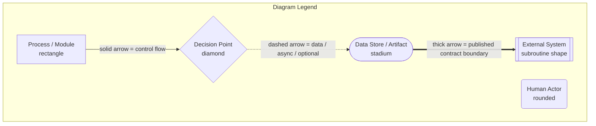
```mermaid
flowchart LR
    subgraph LEGEND["Diagram Legend"]
        direction LR
        A["Process / Module<br/>rectangle"]
        B(["Data Store / Artifact<br/>stadium"])
        C{"Decision Point<br/>diamond"}
        D[["External System<br/>subroutine shape"]]
        E("Human Actor<br/>rounded")
    end
    A -->|"solid arrow = control flow"| C
    C -.->|"dashed arrow = data / async / optional"| B
    B ==>|"thick arrow = published contract boundary"| D
```

| Convention | Meaning |
|---|---|
| Solid arrow `-->` | Synchronous control flow or in-process call. |
| Dashed arrow `-.->` | Asynchronous, optional, deferred, or read-only data flow. |
| Thick arrow `==>` | Crosses a published contract boundary. Breaking changes here require a schema version bump. |
| Dotted subgraph boundary | Trust boundary. Data crossing it is untrusted until validated. |
| `[[Double bracket]]` node | System outside TradyPerch's control. Assume it can change without notice. |
| Red / `:::danger` styling | Component on the critical failure path, or a known-fragile dependency. |

### 0.4.4 Architecture Decision Record Format

Every non-obvious decision in this document is backed by an ADR presented in this compressed inline form:

> **ADR-nnn — Title**
> **Status:** Accepted | Superseded by ADR-mmm | Rejected
> **Context:** the forces in play.
> **Decision:** what was chosen.
> **Alternatives Rejected:** each alternative with the specific reason it lost.
> **Consequences:** what this makes easy, what this makes hard, and what it commits us to.

### 0.4.5 Engineering Note Convention

Passages marked **Engineering Note** contain operational knowledge that is not a requirement but that will save an implementer hours. Passages marked **Assumption** record something believed true at authoring time that MUST be re-verified during implementation, because it depends on a third party. Passages marked **Recommendation** are advisory and may be declined by the product owner.

---

## 0.5 Glossary and Abbreviations

### 0.5.1 Domain Terms

| Term | Definition |
|---|---|
| **Review** | A single unit of customer feedback: rating, optional free text, author identity, timestamp, and optional owner reply. The atomic record of this system. |
| **Listing** | A business entity on an external platform (e.g. a Google Business Profile location). One client MAY own several listings. |
| **Place Identity** | The tuple that uniquely and stably resolves a listing on a given source. For Google: a Place ID or a CID. |
| **Source** | An external platform from which reviews originate: `google`, `facebook`, `trustpilot`, `justdial`, `glassdoor`, `yelp`, `manual`, `csv`. |
| **Adapter** | A pluggable component that knows how to acquire raw reviews from exactly one source via exactly one access method. |
| **Access Method** | *How* an adapter gets data: `dom` (rendered page reading), `official-api`, `file`, `manual`. Orthogonal to source. |
| **Harvest** | One complete execution of the pipeline for one client and one source. The unit of scheduling, logging, retry, and billing. |
| **Yield** | Number of reviews successfully extracted in a harvest. The primary health signal. |
| **Coverage** | Extracted count divided by the listing's advertised total review count. Used to decide whether a harvest was complete. |
| **Ledger** | The private, append-oriented internal state store per client. Holds provenance, tombstones, revision history, and first/last-seen timestamps. Never published. |
| **Payload** | The public, published JSON artifact the client website reads. A projection of the Ledger, minimised and sanitised. |
| **Reconciliation** | The merge of a new harvest's reviews into the existing Ledger, producing insert / update / unchanged / missing decisions. |
| **Tombstone** | A Ledger record marking a review as confirmed-removed at source, retained so it is never resurrected. |
| **Publish Gate** | The set of quality invariants a candidate Payload must pass before it is allowed to replace the live Payload. |
| **Last Known Good (LKG)** | The most recent Payload that passed the Publish Gate. The system's fallback for every failure mode. |
| **Selector Pack** | A versioned data file describing how to locate fields in a rendered page, decoupled from engine code so DOM breakage is a data fix. |
| **Canary** | A lightweight scheduled harvest against a fixed reference listing, used to detect upstream structural change before client harvests are affected. |
| **Drift** | Divergence between what the engine expects from a source and what the source actually returns. |
| **Tenant / Client** | One paying customer of TradyPerch, with one configuration file and one output namespace. |

### 0.5.2 Abbreviations

| Abbrev. | Expansion |
|---|---|
| ADR | Architecture Decision Record |
| CID | Google Maps Customer ID — a numeric listing identifier appearing in Maps URLs |
| CI/CD | Continuous Integration / Continuous Delivery |
| CSP | Content Security Policy |
| DPDP | Digital Personal Data Protection Act, 2023 (India) |
| DR | Disaster Recovery |
| GBP | Google Business Profile |
| GDPR | General Data Protection Regulation (EU/UK) |
| GHA | GitHub Actions |
| LKG | Last Known Good |
| PII | Personally Identifiable Information |
| RPO / RTO | Recovery Point Objective / Recovery Time Objective |
| SAD / TDD | Software Architecture Document / Technical Design Document |
| SLI / SLO | Service Level Indicator / Objective |
| SPA | Single Page Application |
| SSG / SSR | Static Site Generation / Server-Side Rendering |
| STRIDE | Spoofing, Tampering, Repudiation, Information disclosure, Denial of service, Elevation of privilege |
| ToS | Terms of Service |
| TTL | Time To Live |
| UGC | User-Generated Content |
| WCAG | Web Content Accessibility Guidelines |

---

## 0.6 Architecture Decision Record Index

The full text of each ADR appears inline at the point in the document where it is most relevant. This index exists so a reviewer can audit the decision set without reading the whole document.

| ADR | Decision | Section | Status |
|---|---|---|---|
| ADR-001 | Decouple acquisition from the website entirely; the site reads a static artifact and never contacts a source. | §16 | Accepted |
| ADR-002 | Adopt an Adapter + Access Method matrix rather than hard-coding Google DOM reading. | §17 | Accepted |
| ADR-003 | Publish a static JSON artifact rather than exposing a runtime API in v1.0. | §19 | Accepted |
| ADR-004 | Use GitHub Actions as the scheduler and compute plane. | §19 | Accepted |
| ADR-005 | Use Playwright with Chromium rather than a raw HTTP client or Puppeteer. | §19 | Accepted |
| ADR-006 | Separate the private Ledger from the public Payload. | §20.11 | Accepted |
| ADR-007 | Two-tier review identity: `identity_hash` (stable) plus `content_hash` (change detection). | §21.4 | Accepted |
| ADR-008 | Absence at source MUST NOT immediately delete a review — confidence-gated removal only. | §20.7 | Accepted |
| ADR-009 | Externalise selectors into versioned Selector Packs. | §20.4 | Accepted |
| ADR-010 | Treat bot-detection challenges as a terminal, alert-worthy stop condition — never as an obstacle to defeat. | §29 | Accepted |
| ADR-011 | Enforce a Publish Gate with statistical invariants; fall back to Last Known Good on failure. | §27 | Accepted |
| ADR-012 | Store data on a dedicated orphan `data` branch, not on `main`. | §33 | Accepted |
| ADR-013 | Serve the Payload through a CDN edge (GitHub Pages / jsDelivr), not `raw.githubusercontent.com`. | §34 | Accepted |
| ADR-014 | Never proxy or re-host reviewer profile images in v1.0; render deterministic initial avatars. | §35.6 | Accepted |
| ADR-015 | Client configuration is declarative, schema-validated, layered, and versioned. | §39 | Accepted |
| ADR-016 | Shard clients across a GitHub Actions matrix with bounded concurrency. | §37 | Accepted |
| ADR-017 | Golden HTML fixtures are the primary parser regression mechanism. | §41.3 | Accepted |
| ADR-018 | Reconciliation MUST be a pure, idempotent, property-tested function. | §41.2 | Accepted |
| ADR-019 | Payload `schema_version` evolves additively; consumers pin a major. | §43 | Accepted |
| ADR-020 | Trunk-based development with a protected `main` and a machine-owned `data` branch. | §44 | Accepted |
| ADR-021 | Alerting via GitHub Issues as the zero-cost primary channel, webhook as optional secondary. | §25 | Accepted |
| ADR-022 | AI enrichment is opt-in, cached by content hash, and never overwrites source-of-truth fields. | §59 | Accepted |
| ADR-023 | The official-API adapters are first-class v1.0 deliverables, not future work, so any client can be migrated off DOM reading in under one hour. | §15.7 | Accepted |
| ADR-024 | The engine ships a robots.txt and ToS pre-flight gate that can hard-block a harvest by configuration. | §15.5 | Accepted |

---

## 0.7 Document Map — Mandated Section to Location

| § | Title | Part / File |
|---|---|---|
| 1 | Executive Summary | Part 1 |
| 2 | Vision | Part 1 |
| 3 | Problem Statement | Part 1 |
| 4 | Business Goals | Part 1 |
| 5 | Technical Goals | Part 1 |
| 6 | Non-Technical Goals | Part 1 |
| 7 | Scope | Part 1 |
| 8 | Out of Scope | Part 1 |
| 9 | Use Cases | Part 2 |
| 10 | Functional Requirements | Part 2 |
| 11 | Non-Functional Requirements | Part 2 |
| 12 | System Requirements | Part 2 |
| 13 | Constraints | Part 2 |
| 14 | Risk Analysis | Part 2 |
| 15 | Legal & Ethical Considerations | Part 2 |
| 16 | High-Level Architecture | Part 3 |
| 17 | Detailed Architecture | Part 3 |
| 18 | Folder Structure | Part 3 |
| 19 | Technology Justification | Part 3 |
| 20 | Review Collection Engine | Part 4 |
| 21 | JSON Schema | Part 4 |
| 22 | GitHub Actions Workflow | Part 5 |
| 23 | Error Handling | Part 5 |
| 24 | Logging Strategy | Part 5 |
| 25 | Monitoring Strategy | Part 5 |
| 26 | Retry Strategy | Part 5 |
| 27 | Recovery Strategy | Part 5 |
| 28 | Rate Limiting Strategy | Part 5 |
| 29 | Future CAPTCHA Handling Strategy | Part 6 |
| 30 | Future Anti-Bot Strategy | Part 6 |
| 31 | Performance Optimization | Part 6 |
| 32 | Memory Optimization | Part 6 |
| 33 | Storage Optimization | Part 6 |
| 34 | Caching Strategy | Part 6 |
| 35 | Security Architecture | Part 6 |
| 36 | Threat Modeling | Part 6 |
| 37 | Scalability Plan | Part 7 |
| 38 | Multi-Client Architecture | Part 7 |
| 39 | Configuration System | Part 7 |
| 40 | Environment Variables | Part 7 |
| 41 | Testing Strategy | Part 8 |
| 42 | Deployment Guide | Part 8 |
| 43 | Versioning Strategy | Part 8 |
| 44 | Git Branching Strategy | Part 8 |
| 45 | Coding Standards | Part 8 |
| 46 | Naming Conventions | Part 8 |
| 47 | Future Roadmap | Part 9 |
| 48 | Future Integrations | Part 9 |
| 49 | Known Limitations | Part 9 |
| 50 | Maintenance Guide | Part 9 |
| 51 | Update Strategy | Part 9 |
| 52 | Disaster Recovery Plan | Part 9 |
| 53 | Developer Onboarding Guide | Part 9 |
| 54 | API Design (Future) | Part 10 |
| 55 | Future Dashboard Design | Part 10 |
| 56 | Future Admin Panel | Part 10 |
| 57 | Future Client Portal | Part 10 |
| 58 | Future Analytics Dashboard | Part 10 |
| 59 | Future AI Features | Part 10 |
| 60 | Conclusion | Part 10 |

---

## 0.8 System Invariants — The Short List

If a reader retains nothing else from this document, they should retain these. Every one of them exists because its violation is a known, observed failure mode of review-synchronisation systems. They are referenced throughout as `INV-nn`.

| ID | Invariant | Rationale |
|---|---|---|
| **INV-01** | The client website MUST NEVER make a network request to a review source at page-render time. | Removes all latency, availability, cost, quota, CORS, and legal exposure from the visitor path. |
| **INV-02** | A failed harvest MUST NEVER degrade the live Payload. Failure means "serve Last Known Good", never "serve less". | The most common catastrophic failure of scraper-backed sites is publishing an empty list. |
| **INV-03** | Absence of a review in one harvest MUST NOT be interpreted as deletion. | Partial page loads and truncated scrolls are far more common than genuine review deletion. |
| **INV-04** | Reconciliation MUST be idempotent: reconciling the same harvest twice produces the same Ledger. | Enables safe retries, replays, and backfills. |
| **INV-05** | The published Payload MUST be safe to render as untrusted text. No HTML, no scripts, no unsanitised markup ever leaves the engine. | Review text is attacker-controllable input that ends up in a client's DOM. |
| **INV-06** | Every published Payload MUST be traceable to the exact engine version, selector pack version, and harvest run that produced it. | Without provenance, DOM-drift incidents are undebuggable. |
| **INV-07** | A bot-detection challenge MUST end the harvest and raise an alert. It MUST NOT be circumvented. | Legal, ethical, and reliability grounds — see §29. |
| **INV-08** | No secret, credential, cookie, or session token MUST ever be written to a Payload, a log, a commit, or an artifact. | Public repositories and public artifacts. Irreversible on exposure. |
| **INV-09** | Every client's data MUST be isolated such that a failure in one client's harvest cannot alter another client's Payload. | Multi-tenant blast-radius containment. |
| **INV-10** | The engine MUST be able to switch a client from DOM reading to an official API by configuration change only, with no code change and no Payload schema change. | This is the system's insurance policy against its own biggest risk. |

---

## 0.9 Open Questions Register

Items that are deliberately unresolved at v1.0 baseline, with the owner and the date by which resolution is required.

| ID | Question | Owner | Required By | Interim Position |
|---|---|---|---|---|
| OQ-01 | Will TradyPerch obtain written client authorisation for each listing before enabling the DOM adapter? | Product | Before second client onboards | Treated as MUST in §15.6; onboarding checklist enforces it. |
| OQ-02 | Should the Payload be served from GitHub Pages under a TradyPerch domain, or from the client's own domain via their build pipeline? | Architect | Before third client onboards | Both supported; §34 defines the decision matrix. |
| OQ-03 | Retention period for raw harvest artifacts, balancing debuggability against PII minimisation. | Security + Legal | Before first production client | Default 14 days, sanitised; §24.7. |
| OQ-04 | Whether owner replies are republished verbatim or summarised. | Product | v1.1 | Republished verbatim, attributed to the business; configurable. |
| OQ-05 | Commercial model — per-client fee vs. bundled into web-development retainer. | Product | Before pricing page ships | Out of scope for this document. |

---

## 0.10 Assumptions Register (Global)

These assumptions underpin the whole design. Each is tagged with what breaks if it turns out false, and where the mitigation lives. **Every assumption about a third party MUST be re-verified at implementation time**; third-party platform behaviour, pricing, and quotas change without notice and this document was authored at a point in time.

| ID | Assumption | If False, Then | Mitigation |
|---|---|---|---|
| AS-01 | GitHub Actions remains free for public repositories with a 5-minute-minimum cron granularity and a 6-hour job ceiling. | Compute plane must move to a paid runner or a client-owned server. | §19.3, §37.6 define the portability boundary: the engine is a plain Node CLI: any scheduler can run it. |
| AS-02 | Google Maps continues to render review content in a way that a standards-compliant browser can display without authentication. | The DOM adapter dies. | ADR-023: official-API adapters ship in v1.0 as a same-day migration path. |
| AS-03 | Review volume per client listing is in the tens to low thousands, not millions. | Pagination and memory strategy needs redesign. | §31, §32 define the streaming path and the hard cap of 5,000 reviews per listing per harvest. |
| AS-04 | Clients accept a freshness budget measured in hours, not seconds. | Architecture premise fails; a push/webhook design would be required. | §11 SLO-freshness sets 6 h default, 1 h floor. |
| AS-05 | Client websites can consume a static JSON file over HTTPS at build time or run time. | Integration requires a shim. | §54 defines the future API; §34 defines four integration patterns. |
| AS-06 | The client owns, or is the authorised agent of, the business listing whose reviews are being collected. | The legal basis in §15 collapses. | §15.6 authorisation gate; OQ-01. |

---

*End of front matter. Part 1 begins with Section 1, Executive Summary.*


---

# Part 1 — Foundations

*Sections 1 through 8. Audience: everyone. This part establishes what the product is, why it exists, what "done" means commercially and technically, and — equally importantly — what this product refuses to be.*

---

# 1. Executive Summary

## 1.1 The One-Paragraph Version

**TP Reviews Engine** is a reusable, zero-recurring-cost review synchronisation platform built by TradyPerch. It runs on a schedule outside of any client website, collects a business's published customer reviews from external platforms, normalises them into a single stable JSON contract, validates that contract against quality invariants, and publishes it as a static artifact that any website — plain HTML, React, Next.js, Astro, Vue, or a CMS template — can read with a single `fetch` or a build-time import. The website never contacts a review platform, never holds a credential, never pays a widget vendor, and never breaks when the upstream platform changes. When the upstream platform *does* change, only the engine breaks, only on a schedule, in a place where TradyPerch controls the blast radius and where the last known good data continues to be served to every visitor in the meantime.

## 1.2 The Commercial Thesis

Small and mid-size businesses want their Google reviews on their website. The market's answer is a subscription widget: Elfsight, EmbedSocial, Trustindex, Reviews on My Website, and a dozen others, typically USD 5–30 per month per site, forever, for a JavaScript file that injects an iframe. For a web studio like TradyPerch that builds and maintains many client sites, that model has four defects:

1. **Recurring cost per client, forever.** It is either absorbed as margin erosion or passed on as a line item the client resents.
2. **Third-party script on the client's critical rendering path.** A vendor's outage, slowdown, or tracker becomes the client's Core Web Vitals problem and the client's cookie-consent problem.
3. **No ownership of the data.** The reviews render inside someone else's iframe. They cannot be styled to match the brand beyond what the vendor allows, cannot be indexed as first-party content, cannot be reshaped into schema.org markup the studio controls, and cannot be reused in a newsletter, a proposal deck, or a landing page.
4. **No leverage.** Every new client repeats the same integration, the same subscription, the same limitations. Nothing compounds.

TP Reviews Engine inverts all four. The cost is engineering time paid once. The website's runtime dependency is a static JSON file on a CDN. The data is a first-party asset in a repository TradyPerch controls. And every client onboarded after the first is a configuration file, not a project.

**The asset being built is not a scraper. It is a normalisation-and-publication pipeline with pluggable acquisition.** That distinction is the entire architecture, and it is what makes the product durable when — not if — a specific acquisition method stops working.

## 1.3 What Is Actually Being Built

| Layer | What It Is | Where It Runs | Failure Impact |
|---|---|---|---|
| **Acquisition** | Pluggable adapters. v1.0 ships four: Google DOM reader, Google Places API reader, Google Business Profile API reader, and a file importer for CSV/manual reviews. | GitHub Actions runner, on a schedule | Contained. A failed acquisition leaves the previous published data in place. |
| **Processing** | Source-agnostic core: normalise → validate → reconcile → enrich → project. Pure functions, fully unit-testable, zero network access. | Same runner | Contained and deterministic. Bugs here are caught by property tests before merge. |
| **Publication** | Content-addressed JSON artifacts committed to a dedicated data branch and served through a CDN edge. | GitHub, CDN | Contained. Publication is gated; a bad payload is never published. |
| **Consumption** | A ~2 KB, dependency-free reference renderer plus framework-specific integration recipes. | Client website | The only component visitors touch. Has no runtime dependency on anything TradyPerch operates except one cached static file. |

## 1.4 The Five Decisions That Define the System

| # | Decision | Why It Matters More Than It Looks |
|---|---|---|
| 1 | **The website never scrapes.** Acquisition is fully asynchronous and offline relative to page render. | This is not merely a performance optimisation. It removes the entire class of "our site got blocked / rate-limited / CORS-failed / leaked an API key" incidents, and it means a visitor's browser never sends a request to Google on the client's behalf. |
| 2 | **Acquisition is an adapter, not the product.** | Google's rendered markup is the single most volatile dependency in this system. By confining it behind an interface that three other adapters also implement, a total loss of that method is a configuration change, not a rewrite. See ADR-002 and INV-10. |
| 3 | **The Ledger and the Payload are different things.** | Merging *new observations* into *accumulated knowledge* is the hard problem in this domain, and it is impossible if the only state you keep is the file you publish. Reviews that scroll off the visible list, get edited, or fail to load in one run must not vanish. See ADR-006. |
| 4 | **Publication is gated on invariants, not on job success.** | A harvest can "succeed" and still be wrong — three reviews extracted where there were eighty, because a scroll container did not virtualise as expected. The gate catches that class of silent corruption. See ADR-011 and INV-02. |
| 5 | **Bot-detection is a stop signal, not a puzzle.** | The system is explicitly designed *not* to escalate against anti-automation measures. This is simultaneously the ethical position, the legally defensible position, and — critically — the engineering position, because an evasion arms race produces a system whose reliability is inversely proportional to the effort spent on it. See ADR-010 and §29. |

## 1.5 Honest Statement of the Core Risk

This document would be professionally negligent if it buried the following.

**The default v1.0 acquisition method reads publicly rendered Google Maps pages with an automated browser. Google's Terms of Service prohibit automated access to its services except through its published APIs.** Using this method therefore places the operator in breach of a contract with Google, with the realistic consequences being (in ascending order of severity and descending order of likelihood): silent rate-limiting, bot-challenge interstitials, IP-range blocking, and — in the tail — a demand letter. It is not a criminal-law problem in most jurisdictions when the data is public and no access control is circumvented, but it is a contractual and reputational one.

The architecture's response to this is not to pretend the risk away. It is:

- **Section 15** analyses the position in detail, including the specific alternative official APIs, their real capabilities, their real costs, and their real limitations.
- **ADR-023** makes both official-API adapters *v1.0 deliverables rather than roadmap items*, so that any client can be migrated from DOM reading to a sanctioned API by editing one line of configuration.
- **§15.6** defines an authorisation gate: the DOM adapter is only enabled for listings that the client owns or is the authorised agent for.
- **INV-07 / ADR-010** guarantee the system never attempts to defeat an anti-automation control.
- **§15.7** presents the recommendation, stated once, plainly: *for any client who is willing to complete a five-minute OAuth grant, use the Google Business Profile API adapter instead. It is free, sanctioned, returns richer data including all reviews rather than a handful, and eliminates this entire risk class.* The DOM adapter exists for the case where that grant cannot be obtained.

The product owner has considered this and directed that the DOM adapter ship as the default. This document therefore specifies it completely — and specifies the escape hatch just as completely.

## 1.6 Success Criteria for v1.0

v1.0 is complete when all of the following are objectively true, measured over a 30-day soak on the Commerce Insight deployment plus one synthetic second tenant:

| # | Criterion | Measurement |
|---|---|---|
| S1 | A review left on Google appears on the client website within one scheduled cycle plus CDN TTL. | Manual end-to-end verification, 5 trials. |
| S2 | Zero incidents in which the website displayed fewer reviews than the previous day due to an engine failure. | Publish Gate rejection log; visual diff. |
| S3 | Onboarding a new client takes under 20 minutes and touches no engine source file. | Timed dry run by an engineer who did not build the system. |
| S4 | Recurring operating cost is exactly zero. | GitHub billing page. |
| S5 | Total added weight on the client page is under 15 KB compressed, with no third-party origin contacted. | Lighthouse + network waterfall. |
| S6 | A deliberately broken selector pack is detected by the canary within one cycle and raises an alert without corrupting any client payload. | Chaos test CH-07 (§41.5). |
| S7 | A client can be migrated from the DOM adapter to the Business Profile API adapter in under one hour end-to-end. | Timed migration drill (§51.6). |
| S8 | Every published payload validates against the v1 JSON Schema with zero warnings. | CI validation step, blocking. |

---

# 2. Vision

## 2.1 Vision Statement

> **Every business TradyPerch touches should have its real customer reputation living inside its own website — as first-party, brand-styled, structured, search-visible content that updates itself, costs nothing to run, and belongs to the business rather than to a widget vendor.**

## 2.2 The Three-Year Picture

The engine is deliberately over-specified relative to v1.0 because the intended destination is not "a script that fetches Google reviews." It is a **reputation data layer** for a web studio's entire client portfolio.

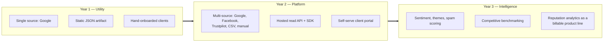
```mermaid
flowchart LR
    subgraph Y1["Year 1 — Utility"]
        A1["Single source: Google"]
        A2["Static JSON artifact"]
        A3["Hand-onboarded clients"]
    end
    subgraph Y2["Year 2 — Platform"]
        B1["Multi-source: Google, Facebook,<br/>Trustpilot, CSV, manual"]
        B2["Hosted read API + SDK"]
        B3["Self-serve client portal"]
    end
    subgraph Y3["Year 3 — Intelligence"]
        C1["Sentiment, themes, spam scoring"]
        C2["Competitive benchmarking"]
        C3["Reputation analytics as a<br/>billable product line"]
    end
    Y1 ==> Y2 ==> Y3
```

The architectural consequence is that **v1.0 must not make any decision that forecloses Year 2 or Year 3.** Three specific forward commitments are enforced from day one:

1. **The JSON contract is designed for fields that v1.0 does not populate.** Sentiment, AI summary, spam score, language, likes, verification flag, and source attribution all exist in the schema at v1.0 and are simply `null` or absent. Consumers written today will not break when they are filled in tomorrow. (§21)
2. **Nothing in the core assumes Google.** The word `google` appears in exactly one layer: the adapters. Every downstream module operates on a `NormalizedReview`, which has no source-specific fields outside a namespaced `source_meta` object. (§17)
3. **Nothing assumes a static file.** The publication layer is an interface with one v1.0 implementation (Git commit + CDN). A future implementation writing to object storage or a database behind an API requires no change above it. (§54)

## 2.3 The Experience Being Designed For

**For the end visitor:** reviews appear instantly as part of the page, in the site's own typography, with no layout shift, no cookie banner triggered by a third party, no iframe, and no "Powered by" badge. They are readable with JavaScript disabled if the site is statically generated.

**For the client business owner:** they do nothing. They keep asking happy customers for Google reviews exactly as before. The website keeps up on its own. If they reply to a review on Google, the reply appears on the site too.

**For TradyPerch:** a new client is a config file and a pull request. A Google layout change is one incident affecting all clients at once, resolved once, in one place — which is a far better operational profile than the alternative of per-client bespoke integrations that each break at different times for different reasons.

**For the engineer on call:** every failure is visible, classified, attributed to a version, and non-destructive. There is no scenario in the design where the correct response is "restore the site urgently."

## 2.4 Design Philosophy

| Principle | Concrete Expression in This System |
|---|---|
| **Fail static, never fail blank.** | Last Known Good is always served. The absence of fresh data is invisible to visitors. INV-02. |
| **The volatile part must be the smallest part.** | DOM knowledge lives in data files and one adapter, not spread across the codebase. ADR-009. |
| **Accumulate, don't replace.** | Each harvest is an *observation*, merged into durable state — not a truth that overwrites history. ADR-006, INV-03. |
| **Make the boring path free and the risky path optional.** | Officially sanctioned acquisition is fully implemented and one config line away. ADR-023. |
| **Observability before cleverness.** | Structured logs, run manifests, and health metrics are v1.0 scope, not v2. §24, §25. |
| **Optimise for the maintainer in 18 months.** | Every decision has a written rationale. Every module has a single responsibility and a stated contract. |
| **Refuse to enter arms races.** | The system stops at the first anti-bot signal and escalates to a human, on purpose. ADR-010. |

---

# 3. Problem Statement

## 3.1 The Problem, Stated Precisely

A business accumulates customer reviews on platforms it does not control. Those reviews are the single highest-converting content asset the business owns — and they are invisible on the business's own website unless someone puts them there. Keeping them there, current, and trustworthy is a continuous synchronisation problem that no small business will solve manually, and that the existing market solves only by renting an iframe.

Formally, the system must maintain a mapping:

> *For each client `C` and each source listing `L`, maintain a locally published set `P(C,L)` that converges to the externally published set `E(L)` within a bounded freshness window, without the consuming website ever reading `E(L)` directly, and without `P(C,L)` ever regressing to a state worse than its last valid version.*

Three properties of that statement do the heavy lifting:

- **"Converges"** — not "equals". Perfect equality is unattainable against a source that paginates lazily, personalises ordering, and does not expose a change feed. The system targets convergence with explicit, measured error bounds (§11).
- **"Without the consuming website ever reading `E(L)`"** — the decoupling is a hard requirement, not an optimisation (INV-01).
- **"Never regressing"** — monotonic quality is the difference between a system a studio can sell and a science project (INV-02).

## 3.2 Why This Is Harder Than It Looks

Engineers new to this domain consistently underestimate it. The following table is the honest inventory of what actually makes the problem difficult; every one of these has a corresponding mitigation elsewhere in this document.

| # | Difficulty | Why It Bites | Mitigated In |
|---|---|---|---|
| D1 | **No stable public identifier for a review.** The rendered page does not reliably expose a durable per-review ID. | Without identity, you cannot tell "new review" from "same review, re-rendered". Naive systems duplicate on every run. | §21.4 — two-tier hashing |
| D2 | **Only relative dates are shown.** "2 months ago", "a week ago", "yesterday". | Relative dates are lossy and re-render differently on every harvest, so they cannot be part of an identity key, and they cannot be sorted precisely. | §20.5 — date resolution and pinning |
| D3 | **Reviews are lazy-loaded into a virtualised scroll container.** | A naive extraction gets the first 8–10 reviews and reports success. The failure is *silent*. | §20.3, §27 — coverage checks |
| D4 | **Long review text is truncated with a "More" affordance.** | Extracting visible text yields "…Read more". Expanding requires interaction per review, which is slow and fragile. | §20.3, §20.5 |
| D5 | **Markup is obfuscated and rotates.** Class names are generated; structure changes without notice. | Any selector strategy based on generated class names has a half-life measured in weeks. | §20.4 — semantic/ARIA-first selector packs |
| D6 | **Ordering is not stable and may be personalised or relevance-ranked.** | You cannot assume "newest first", cannot paginate by offset safely, and cannot diff by position. | §20.7 — set-based reconciliation |
| D7 | **Reviews are edited and deleted at source.** | An update must not create a duplicate; a deletion must eventually propagate; but a *failed load* must not look like a deletion. | §20.7 — confidence-gated removal |
| D8 | **Localisation.** Text, dates, and the UI language vary by locale, and reviews themselves are multilingual, including RTL scripts and emoji. | Date parsing and text handling break in exactly the environments the developer never tests. | §20.5, §41.5 |
| D9 | **Owner replies are structurally nested and easy to mistake for reviews.** | Naive parsers ingest the business's own reply as a five-star review. | §20.5 |
| D10 | **Anti-automation.** Challenges, consent interstitials, and regional redirects appear unpredictably. | A run that hits one must stop cleanly and loudly rather than half-succeeding. | §29, §30 |
| D11 | **Review text is untrusted, attacker-influenceable input that lands in a client's DOM.** | A review containing markup becomes a stored-XSS vector on every client site simultaneously. | §35.4, INV-05 |
| D12 | **Reviewer names and photos are personal data.** | Republishing and especially *caching* them engages GDPR/DPDP obligations and image licensing. | §15.8, ADR-014 |

**Engineering Note.** D3, D7 and D11 are the three that turn into production incidents. D3 corrupts data quietly, D7 corrupts it destructively, and D11 corrupts someone else's website. The Publish Gate (§27.3), the confidence-gated removal rule (§20.7), and the sanitisation pass (§20.6) exist specifically and only because of these three.

## 3.3 Why Existing Solutions Are Rejected

| Option | What It Costs | Why Rejected |
|---|---|---|
| **Paid widget (Elfsight, EmbedSocial, Trustindex, …)** | USD 5–30 / month / site, indefinitely | Recurring cost per client; third-party script and iframe on the render path; data not owned; styling constrained; vendor lock-in; the studio builds no reusable asset. |
| **Google Places API, direct from the browser** | Free tier then metered | API key exposed client-side; quota consumed by every visitor and every bot; CORS restrictions; returns a small sample of reviews; couples site availability to Google availability. Violates INV-01. |
| **Google Places API, from a server** | Free tier then metered | Requires an always-on server the studio must operate and secure — reintroducing recurring cost and an operational surface. Still returns only a small sample of reviews. Retained as an *adapter*, not as the architecture. |
| **Manual copy-paste into the CMS** | Staff time | Goes stale immediately; does not scale past a handful of clients; no provenance; the studio is blamed when reviews are outdated. |
| **Scraping directly from the client's own website at request time** | Free | Catastrophic: exposes the client's domain to blocking, adds seconds of latency, breaks under any upstream change, and puts the visitor's browser in the loop. Explicitly forbidden by INV-01. |
| **Commercial scraping SaaS (Outscraper and similar)** | Per-request fees | Violates the zero-cost constraint; simply relocates the same ToS risk to a vendor while adding a bill and a data-processor relationship. |

## 3.4 The Gap Being Filled

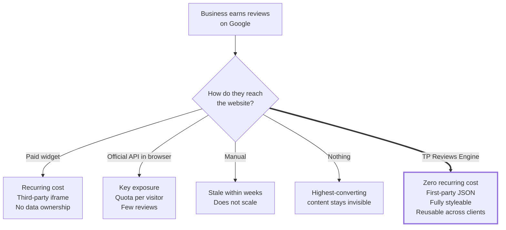
```mermaid
flowchart TD
    P["Business earns reviews<br/>on Google"] --> G{"How do they reach<br/>the website?"}
    G -->|"Paid widget"| W["Recurring cost<br/>Third-party iframe<br/>No data ownership"]
    G -->|"Official API in browser"| A["Key exposure<br/>Quota per visitor<br/>Few reviews"]
    G -->|"Manual"| M["Stale within weeks<br/>Does not scale"]
    G -->|"Nothing"| N["Highest-converting<br/>content stays invisible"]
    G ==>|"TP Reviews Engine"| T["Zero recurring cost<br/>First-party JSON<br/>Fully styleable<br/>Reusable across clients"]
    style T stroke-width:3px
```

---

# 4. Business Goals

Business goals are numbered `BG-nn` and each carries an explicit measurement definition, a target, and the architectural mechanism that delivers it. A goal without a measurement is a slogan; none appear here.

## 4.1 Primary Business Goals

| ID | Goal | Measure | v1.0 Target | Delivered By |
|---|---|---|---|---|
| **BG-01** | Eliminate recurring per-client cost for review display. | Monthly invoice attributable to review functionality. | **INR/USD 0.00** | GitHub Actions free tier on a public repository; static artifact hosting; no vendor. §19.3 |
| **BG-02** | Make client onboarding near-zero-effort so the marginal client is profitable. | Wall-clock minutes from "client says yes" to "reviews live on their site", measured by an engineer following §53. | **≤ 20 minutes**, zero engine code changes. | Declarative client registry; config-only onboarding. §38, §39 |
| **BG-03** | Build a reusable, sellable asset rather than a one-off integration. | Number of distinct client sites served by one unmodified engine version. | **≥ 2 at launch, unbounded by design** | Multi-tenant architecture. §38 |
| **BG-04** | Improve client conversion by surfacing social proof natively. | Presence of reviews above the fold on money pages; structured-data eligibility. | 100% of onboarded clients | First-party rendering + schema.org projection. §21.9 |
| **BG-05** | Remove third-party performance and privacy drag from client sites. | Third-party origins contacted for review functionality; added compressed bytes. | **0 origins; ≤ 15 KB** | Static artifact, no vendor script. §31 |
| **BG-06** | Differentiate TradyPerch's web offering commercially. | Ability to include "self-updating reviews" as a standard inclusion at no marginal cost. | Included in every build | The whole system. |
| **BG-07** | Own the client's reputation data as a first-party asset. | Review corpus retrievable in a portable, documented format independent of any vendor. | 100% | Versioned JSON in a TradyPerch-controlled repository. §21, §33 |
| **BG-08** | Establish the data foundation for a future paid analytics product. | Historical review records retained with first-seen timestamps and full provenance. | Retained from day one | The Ledger. §20.11, §58 |

## 4.2 Secondary Business Goals

| ID | Goal | Rationale |
|---|---|---|
| **BG-09** | Reduce support load. Clients must never need to email about reviews being outdated. | Support hours are the hidden cost of a studio's client portfolio. Silent self-healing (§27) is a cost-control mechanism. |
| **BG-10** | Make the system explicable to a non-technical client in two sentences. | Sellability. "We copy your Google reviews to your site every few hours automatically" is the entire pitch. |
| **BG-11** | Keep the exit cost near zero. | If Google shuts the door entirely, the value already created — the accumulated corpus, the pipeline, the frontend components, the multi-tenant machinery — must survive. Sources are adapters precisely so that the asset is not the scraper. |
| **BG-12** | Produce documentation good enough to hand the system to a contractor. | The founder must not be the single point of failure. §50, §53. |

## 4.3 Explicit Non-Goals of the Business Case

To keep scope honest, the following are stated as *not* business goals of v1.0:

- Selling the engine as standalone SaaS to third parties (that is a v3+ consideration; see §47).
- Competing on feature breadth with commercial widget vendors (carousels, badges, popups, review-request email campaigns).
- Handling review *collection* — i.e., soliciting reviews from customers. The engine reads reputation; it does not generate it.

## 4.4 Value Model

A simple, defensible model for the internal business case. Figures are illustrative and denominated in USD-equivalent monthly cost per client site.

| Scenario | Widget Subscription | TP Reviews Engine | Delta per Client per Year |
|---|---|---|---|
| 1 client | ~$10/mo | $0 | ~$120 |
| 10 clients | ~$100/mo | $0 | ~$1,200 |
| 50 clients | ~$500/mo | $0 | ~$6,000 |
| 100 clients | ~$1,000/mo | $0 (compute still within free tier for public repos; see §37) | ~$12,000 |

Against this sits a one-time build cost and an ongoing maintenance cost that is **not zero** and must not be represented as zero. §50 estimates realistic maintenance at **2–6 engineer-hours per quarter in steady state, with 4–8 hour spikes when an upstream layout change occurs (historically 1–3 times per year for this class of target).** The break-even against widget subscriptions is reached at a small number of clients; the honest statement is that the engine wins decisively on portfolio economics and marginally on a single site.

---

# 5. Technical Goals

Technical goals are the engineering commitments that make the business goals achievable. Each maps to requirements in §10/§11 and to mechanisms later in the document.

## 5.1 Goal Table

| ID | Technical Goal | Definition of Success | Mechanism |
|---|---|---|---|
| **TG-01** | **Source independence.** No module above the adapter layer knows what a "Google" is. | A new source can be added by implementing one interface and adding one config value. Verified by the CSV adapter, which shares zero code with the Google adapters. | §17.3 Adapter contract |
| **TG-02** | **Deterministic core.** All transformation logic is pure and side-effect free. | The entire pipeline from raw extraction onward runs offline against fixtures with no network, no clock dependency, and no filesystem dependency, and produces byte-identical output. | §17.5, §41.2 |
| **TG-03** | **Non-destructive by construction.** No failure mode results in worse published data. | Chaos suite CH-01…CH-14 (§41.5) contains no scenario that degrades the live payload. | Publish Gate + LKG, §27 |
| **TG-04** | **Idempotent and replayable.** Running the same harvest twice changes nothing. | Property test: `reconcile(reconcile(S, H), H) == reconcile(S, H)`. | ADR-018, §20.7 |
| **TG-05** | **Fast to diagnose.** Any production incident is explicable from artifacts alone, without reproducing it. | Every run emits a signed manifest: engine version, selector pack version, timings, counts, decisions, and a sanitised DOM snapshot on failure. | §24, INV-06 |
| **TG-06** | **Fast to repair.** The most likely failure (upstream markup change) is fixable without touching engine code. | Median time-to-repair for a selector break ≤ 60 minutes, of which ≤ 15 minutes is code review. | Selector Packs, ADR-009; §51 |
| **TG-07** | **Cheap at rest and in motion.** | Steady-state compute ≤ 3 minutes per client per day; published payload ≤ 60 KB compressed for a 200-review listing. | §31, §33 |
| **TG-08** | **Framework-agnostic consumption.** | Reference integrations verified for static HTML, React, Next.js (app router, both SSG and ISR), Astro, and Vue. | §34.6 |
| **TG-09** | **Secure by default.** | No secret in any artifact; least-privilege CI tokens; all third-party actions pinned by commit SHA; published text safe to render. | §35 |
| **TG-10** | **Testable without the internet.** | `npm test` passes on an air-gapped machine. Network-touching tests are a separate, explicitly-invoked suite. | §41.1 |
| **TG-11** | **Observable without a paid tool.** | Health status, failure classification, and trend of yield are derivable from repository artifacts alone. | §25 |
| **TG-12** | **Portable off GitHub.** | The engine is a plain Node CLI. Moving to any other scheduler requires no engine change — only a new invocation wrapper. | §19.3, §37.6 |
| **TG-13** | **Graceful under partial failure.** | A single client's failure never blocks or corrupts another's. Matrix jobs are independent with `fail-fast: false`. | §22.4, INV-09 |
| **TG-14** | **Schema-stable.** | Consumers pinned to `schema_version: 1` continue to work across all v1.x engine releases. | §43 |

## 5.2 Explicit Anti-Goals (Technical)

Stating what the system deliberately will *not* optimise for prevents well-intentioned complexity.

| Anti-Goal | Reasoning |
|---|---|
| **Real-time / sub-minute freshness.** | Would require polling at a frequency that is both abusive to the source and impossible on the chosen scheduler. The value of a review appearing in 4 hours versus 4 seconds is nil. |
| **Complete historical backfill of every review ever written.** | Upstream interfaces do not reliably expose deep history, and forcing them to is exactly the behaviour that triggers anti-automation. The system accumulates history *forward* from first harvest. |
| **100% extraction fidelity.** | Chasing the last 2% of edge-case reviews costs more than it returns and increases fragility. §11 sets an explicit, measured accuracy target instead. |
| **Evading anti-bot systems.** | ADR-010. Non-negotiable. |
| **Being a general-purpose web scraping framework.** | Generality here is a trap; the adapter interface is intentionally narrow. |
| **Zero-downtime, high-availability infrastructure.** | The published artifact is static and CDN-cached. The engine can be down for a week with no visitor-visible impact. Availability effort belongs on the artifact, not the engine. |

## 5.3 Quality Attribute Priorities

When two desirable properties conflict, this ordering resolves the conflict. It is binding on design reviews.

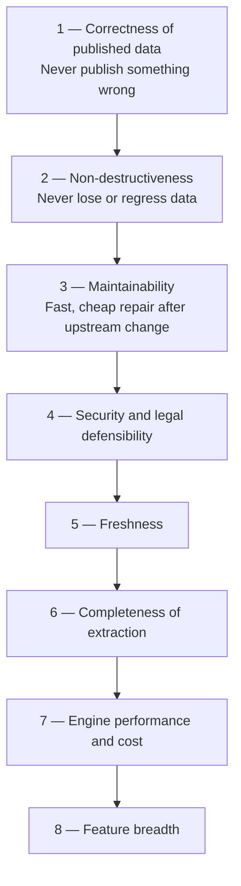
```mermaid
flowchart TD
    Q1["1 — Correctness of published data<br/>Never publish something wrong"]
    Q2["2 — Non-destructiveness<br/>Never lose or regress data"]
    Q3["3 — Maintainability<br/>Fast, cheap repair after upstream change"]
    Q4["4 — Security and legal defensibility"]
    Q5["5 — Freshness"]
    Q6["6 — Completeness of extraction"]
    Q7["7 — Engine performance and cost"]
    Q8["8 — Feature breadth"]
    Q1 --> Q2 --> Q3 --> Q4 --> Q5 --> Q6 --> Q7 --> Q8
```

**Worked example of applying this ordering.** A harvest extracts 40 of an advertised 118 reviews because the scroll container stopped yielding. Freshness (Q5) and completeness (Q6) argue for publishing the 40 to keep the site current. Correctness (Q1) and non-destructiveness (Q2) outrank both. **The correct behaviour is: reject the payload, retain Last Known Good, mark the run degraded, and alert.** This is codified in §27.3 and is not left to the implementer's judgement.

---

# 6. Non-Technical Goals

These are the organisational, human, and communication goals. They are frequently omitted from architecture documents and are frequently the reason systems fail after the original author moves on.

## 6.1 Goal Table

| ID | Goal | Success Looks Like | Owner |
|---|---|---|---|
| **NTG-01** | **The founder is not a single point of failure.** | A competent Node developer with no prior exposure can take over maintenance using §50 and §53 alone. Verified by a dry-run handover. | Technical Writer |
| **NTG-02** | **Client trust is never damaged by the system.** | No client ever discovers a problem before TradyPerch does. Alerting (§25) precedes client-visible symptoms in every designed failure mode. | DevOps |
| **NTG-03** | **The legal posture is documented, deliberate, and revisitable.** | §15 exists, has been read by the product owner, is re-reviewed quarterly, and the authorisation gate (§15.6) is enforced in onboarding. | Security + Product |
| **NTG-04** | **The system is explainable to clients without embarrassment.** | A one-page client-facing explainer exists that is truthful about how data is obtained and how often it updates. | Product |
| **NTG-05** | **Knowledge is written down at the moment of decision, not reconstructed later.** | Every merged PR that changes behaviour updates this document or adds an ADR. Enforced by PR template checklist. | All engineers |
| **NTG-06** | **Onboarding a new engineer takes under one day to first useful contribution.** | §53 walkthrough completes in ≤ 4 hours including a green local test run against fixtures. | Technical Writer |
| **NTG-07** | **The brand is protected.** | Output artifacts, alerts, and any client-visible surface carry consistent TradyPerch identity; no debug output ever reaches a client site. | Product |
| **NTG-08** | **Maintenance is predictable, not heroic.** | Quarterly maintenance window scheduled in advance (§50.4); dependency and browser updates are routine, not emergency. | DevOps |
| **NTG-09** | **Ethical operation is a stated position, not an accident.** | The engine respects rate limits far below any plausible threshold, identifies itself honestly where identification is expected, stops at challenges, and honours removal requests within 7 days. | Security |
| **NTG-10** | **The documentation is usable by AI coding agents.** | An agent given this document alone produces a conformant implementation without asking clarifying questions — the stated authoring bar for §17–§21 and §39–§41. | Technical Writer |

## 6.2 Team and Role Model

Even though v1.0 may be executed by a single person wearing all hats, the roles are defined so that responsibilities remain legible as the team grows.

| Role | v1.0 Responsibilities | Escalation Owner For |
|---|---|---|
| Staff Architect | Interface contracts, ADRs, schema evolution | Design disputes, schema changes |
| Backend Engineer | Engine modules, adapters, reconciliation | Extraction defects |
| DevOps | Workflows, scheduling, secrets, publication, monitoring | Pipeline failures, hosting |
| QA | Fixture corpus, chaos matrix, release verification | Regressions |
| Security | Threat model, dependency posture, PII handling | Incidents, disclosure requests |
| Product | Client scope, roadmap, authorisation gate | Legal/ToS posture decisions |
| Technical Writer | This document, onboarding, client-facing explainer | Doc drift |

## 6.3 Communication and Cadence Commitments

| Artifact | Frequency | Audience | Content |
|---|---|---|---|
| Health digest | Weekly, automated | Internal | Per-client last-success time, yield trend, open alerts. |
| Incident note | Per incident | Internal + affected client if visible | What happened, visitor impact (usually none), fix, prevention. |
| Selector-pack changelog | Per change | Internal | What upstream changed, how detected, how repaired, detection lead time. |
| Document review | Quarterly | All roles | Assumptions register (§0.10) re-verified; legal posture re-read. |
| Client explainer | On onboarding | Client | Plain-language description of behaviour, update frequency, and data handling. |

---

# 7. Scope

## 7.1 Scope Statement

v1.0 delivers an end-to-end, production-operable system that keeps one or more client websites synchronised with their Google Business Profile reviews, using a pluggable acquisition layer that ships with four working adapters, publishing a versioned JSON contract through a CDN-fronted static artifact, operated on a schedule by GitHub Actions at zero recurring cost, with full observability, non-destructive failure handling, and documented multi-tenant onboarding.

## 7.2 In-Scope Capability Matrix

| Area | In Scope for v1.0 | Notes |
|---|---|---|
| **Sources** | Google Business Profile reviews via three access methods (rendered page, Places API, Business Profile API); plus CSV/manual import. | One source family, four adapters. |
| **Listing resolution** | Resolve a listing from a Place ID, a CID, a Maps URL, or a name+location search, with caching of the resolved identity. | §20.2 |
| **Extraction** | Rating, review text (full, expanded), author display name, author profile URL, avatar URL, relative date, resolved absolute date estimate, owner reply text and date, review language, like/helpful count where present, local-guide flag where present. | §21.3 |
| **Normalisation** | Whitespace, Unicode NFC, emoji preservation, control-character stripping, HTML entity decoding, markup removal, truncation-marker detection, language detection. | §20.6 |
| **Validation** | Schema validation, field-level constraint validation, statistical plausibility checks, cross-run consistency checks. | §20.6, §27.3 |
| **Reconciliation** | Insert / update / unchanged / missing classification; confidence-gated removal; tombstones; first-seen and last-seen tracking; revision counters. | §20.7 |
| **Storage** | Per-client Ledger (private, full state) and Payload (public, projected). Dedicated data branch. | §33 |
| **Publication** | Content-addressed artifacts, an `index.json` manifest, a `reviews.json` full payload, a `latest.json` top-N payload, and precomputed aggregate statistics. | §21.7 |
| **Distribution** | CDN-fronted static hosting with documented cache semantics and CORS. | §34 |
| **Consumption** | A dependency-free reference renderer plus documented integration recipes for HTML, React, Next.js, Astro, and Vue; plus a schema.org projection recipe. | §34.6, §21.9 |
| **Scheduling** | Cron schedule with jitter, manual dispatch, per-client cadence tiers, and sharded matrix execution. | §22 |
| **Resilience** | Classified error taxonomy, bounded retries with backoff and jitter, circuit breaking, Last Known Good fallback, canary detection. | §23, §26, §27 |
| **Observability** | Structured JSONL logs, run manifests, health metrics, GitHub-Issue-based alerting, weekly digest. | §24, §25 |
| **Multi-tenancy** | Client registry, per-client config with inheritance, isolation guarantees, sharding. | §38 |
| **Security** | Least-privilege CI permissions, pinned actions, secret hygiene, output sanitisation, dependency policy, threat model. | §35, §36 |
| **Testing** | Unit, contract, golden-fixture parser regression, integration against a local fixture server, property tests on reconciliation, chaos/failure-injection matrix, opt-in live smoke test. | §41 |
| **Documentation** | This document, an onboarding guide, a maintenance runbook, a DR plan, and a client-facing explainer. | §50–§53 |

## 7.3 In-Scope Non-Functional Commitments

Summarised here; specified fully in §11.

| Property | v1.0 Commitment |
|---|---|
| Freshness | Default 6-hour cycle; configurable 1–24 h. |
| Extraction accuracy | ≥ 98% field-level accuracy on the golden fixture corpus; ≥ 95% coverage of advertised review count on a successful harvest. |
| Payload availability | ≥ 99.9% (a static CDN-served file). |
| Engine success rate | ≥ 95% of scheduled harvests succeed or degrade gracefully; ≤ 1% result in an unnoticed stale payload beyond 48 h. |
| Recovery | RPO effectively zero (Ledger is versioned in Git); RTO ≤ 1 h for pipeline failure, ≤ 0 for visitor impact. |
| Cost | Zero recurring. |

## 7.4 Deliverables Checklist

| # | Deliverable | Acceptance |
|---|---|---|
| 1 | Engine CLI (Node) with documented commands and exit codes | §42.3 |
| 2 | Four acquisition adapters | Contract test suite passes for each |
| 3 | Client registry + config schema + validator | §39 |
| 4 | Published JSON Schema for the payload contract | §21 |
| 5 | GitHub Actions workflows: harvest, canary, validate, release | §22 |
| 6 | Reference frontend renderer + 5 integration recipes | §34.6 |
| 7 | Golden fixture corpus (≥ 20 fixtures incl. adversarial) | §41.3 |
| 8 | Chaos/failure-injection suite | §41.5 |
| 9 | This document set | Review sign-off |
| 10 | Commerce Insight deployed and soaked 30 days | §1.6 |

---

# 8. Out of Scope

Scope discipline is the difference between a shippable v1.0 and a permanent prototype. Everything below is **explicitly excluded** from v1.0. Most items name the version in which they are reconsidered; those with no version are permanently excluded and the reasoning is stated.

## 8.1 Excluded — Deferred to a Named Future Version

| Item | Why Not Now | Revisit In |
|---|---|---|
| Non-Google sources (Facebook, Trustpilot, Yelp, JustDial, Glassdoor) | Adapter interface is proven with four adapters; adding sources before the core is soaked adds risk without learning. | v2.0 (§48) |
| Hosted read API with authentication and rate limiting | Static artifacts satisfy every v1.0 use case at zero cost. An API is an operational commitment. | v3.0 (§54) |
| Web dashboard / admin panel / client portal | Configuration is engineer-operated at v1.0 scale. A UI before ~25 clients is premature. | v3.0 (§55–§57) |
| Analytics product (trends, benchmarking, alerts on rating drops) | Requires accumulated history that only exists after months of operation. | v3.0–v4.0 (§58) |
| AI enrichment: summarisation, sentiment, spam scoring, keyword extraction | Schema reserves the fields; populating them requires a paid inference budget, conflicting with BG-01 unless opt-in. | v2.0, opt-in (§59) |
| Review response / reply-from-dashboard workflows | Requires write access via the Business Profile API and a UI. | v4.0 |
| Review solicitation (asking customers for reviews) | Different product. Adjacent, not overlapping. | v4.0+ |
| Multi-language translation of reviews | Cost and quality concerns; detection of language is in scope, translation is not. | v3.0 |
| Image caching / re-hosting of reviewer avatars | Copyright and PII exposure; ADR-014. | Reconsidered only with legal sign-off |
| Self-serve signup and billing | TradyPerch operates the service for its own clients at v1.0. | v4.0 |
| Webhooks / push notifications to client systems on new review | Pull-based static consumption covers all identified use cases. | v3.0 |
| Real-time or sub-hourly synchronisation | See §5.2 anti-goals. | Not planned |

## 8.2 Excluded — Permanently, With Reasoning

| Item | Reasoning |
|---|---|
| **Any technique intended to circumvent bot detection**: CAPTCHA solving services, residential proxy rotation for evasion, browser-fingerprint spoofing, behavioural mimicry designed to defeat classifiers. | ADR-010. Ethically indefensible, legally aggravating, and — decisively — an architectural dead end. Systems built on evasion have reliability that degrades over time and maintenance cost that grows without bound. The engine stops at the first challenge and escalates to a human. |
| **Authenticated scraping** — logging into any account to access more data. | Circumventing an access control transforms a contract question into a computer-misuse question in many jurisdictions. Categorically excluded. |
| **Collecting reviews for listings the client neither owns nor is authorised to represent** (e.g. competitor listings). | §15.6. No legitimate-interest argument survives this, and it converts a defensible practice into an indefensible one. |
| **Republishing reviews under a different business's identity, or altering review content.** | Fraudulent. The engine never edits review text beyond safety sanitisation, and always attributes to the source. |
| **Filtering out negative reviews as a product feature.** | A "hide reviews below N stars" toggle is technically trivial and commercially requested. It is excluded because it makes TradyPerch complicit in deceptive reputation presentation. The engine supports *ordering* and *pagination*, and it supports a documented, disclosed `min_rating` only where local law and platform terms permit; the default is to display all. **Recommendation: keep the default and decline the request.** |
| **Storing more personal data than is displayed.** | Data minimisation. The Ledger keeps what is needed for identity and provenance, not a profile of reviewers. §15.8 |
| **Operating as a data processor for third parties' scraped data.** | Turns a studio tool into a regulated data business. |

## 8.3 Boundary Clarifications

Ambiguities that would otherwise cause scope disputes during implementation.

| Question | Answer |
|---|---|
| Does the engine host the client website? | No. It publishes a data artifact. Hosting is the client's existing arrangement. |
| Does the engine style the reviews? | It ships an unopinionated reference renderer and documented recipes. Visual design is per-client work outside this system. |
| Does the engine guarantee every review appears? | No. It guarantees ≥ 95% coverage on successful harvests and full transparency about what it has. Absolute completeness is not offered. See §49. |
| Does the engine handle a client with multiple locations? | Yes — a client MAY declare multiple listings; payloads are per listing plus an optional merged view. §38.4 |
| Does the engine delete a review from the site when it is deleted on Google? | Yes, but only after confidence-gated confirmation across multiple successful harvests. §20.7 |
| Is the repository public or private? | Public by default, because GitHub Actions minutes are unmetered for public repositories and this is load-bearing for BG-01. Consequences and mitigations are in §33.2 and §35.3. A private-repo deployment mode is supported and costed in §37.5. |
| Who owns the published data? | The client owns their review corpus. TradyPerch operates the pipeline. Export is always available as plain JSON (BG-07). |

---

*End of Part 1. Part 2 covers Use Cases, Functional and Non-Functional Requirements, System Requirements, Constraints, Risk Analysis, and the Legal & Ethical assessment.*


---

# Part 2 — Requirements, Constraints, Risk, and Legal Position

*Sections 9 through 15. Audience: architects, engineers, QA, security, product. This part is the contractual core of the document: it defines what the system must do, how well it must do it, what it must run on, what limits it, what could go wrong, and where it stands legally.*

---

# 9. Use Cases

## 9.1 Actor Catalogue

| Actor | Type | Description | Trust Level |
|---|---|---|---|
| **Site Visitor** | Human, external | Views the client's website. Never authenticated. Sees reviews. | Untrusted (receives output only) |
| **Client Business Owner** | Human, external | Owns the business and the Google listing. Requests the integration. | Semi-trusted (provides configuration inputs) |
| **Reviewer** | Human, external | Writes the review on the source platform. Not a user of this system, but a data subject with rights. | N/A — data subject |
| **TradyPerch Engineer** | Human, internal | Onboards clients, maintains the engine, responds to alerts. | Trusted |
| **Scheduler** | Machine, internal | GitHub Actions cron. Initiates harvests. | Trusted |
| **Harvest Runner** | Machine, internal | Ephemeral CI job executing the engine for one shard. | Trusted, but operates on untrusted input |
| **Review Source** | Machine, external | Google Maps / Places API / Business Profile API. | **Untrusted and volatile** — may change shape, rate-limit, or challenge at any time |
| **CDN Edge** | Machine, external | Serves the published artifact to visitors. | Trusted for delivery, not for integrity (integrity is verified by content hash) |
| **Client Website Build** | Machine, external | Client's SSG/CI process that may import the payload at build time. | Semi-trusted consumer |

## 9.2 Use Case Index

| ID | Name | Primary Actor | Priority | Frequency |
|---|---|---|---|---|
| UC-01 | Onboard a new client | Engineer | Must | Per client |
| UC-02 | Scheduled review synchronisation | Scheduler | Must | Every cycle |
| UC-03 | Site visitor views reviews | Site Visitor | Must | Continuous |
| UC-04 | New review appears at source | Reviewer → System | Must | Continuous |
| UC-05 | Existing review is edited at source | Reviewer → System | Must | Occasional |
| UC-06 | Review is deleted at source | Reviewer → System | Must | Rare |
| UC-07 | Owner replies to a review | Client Owner → System | Should | Occasional |
| UC-08 | Upstream markup changes and extraction breaks | Review Source | Must | 1–3 × / year |
| UC-09 | Source presents a bot challenge | Review Source | Must | Occasional |
| UC-10 | Harvest partially fails / low coverage | Runner | Must | Occasional |
| UC-11 | Engineer diagnoses a failed harvest | Engineer | Must | Per incident |
| UC-12 | Engineer repairs a selector break | Engineer | Must | Per incident |
| UC-13 | Manual on-demand refresh | Engineer | Should | Ad hoc |
| UC-14 | Migrate a client from DOM adapter to official API | Engineer | Must | Ad hoc |
| UC-15 | Import legacy or off-platform reviews via CSV | Engineer | Should | Ad hoc |
| UC-16 | Reviewer requests removal of their review data | Reviewer | Must | Rare |
| UC-17 | Client offboarding / data export | Client Owner | Should | Rare |
| UC-18 | Client website consumes payload at build time | Website Build | Must | Per deploy |
| UC-19 | Add a new source platform | Engineer | Could (v2) | Rare |
| UC-20 | Full disaster recovery from repository loss | Engineer | Must | Never, hopefully |

## 9.3 Detailed Use Cases

### UC-01 — Onboard a New Client

| Field | Detail |
|---|---|
| **Goal** | Make a new client's reviews live on their site with no engine code change. |
| **Preconditions** | Client has a Google Business Profile with ≥ 1 review. Written authorisation obtained (§15.6). Client's site can fetch or import a JSON file. |
| **Trigger** | Engineer runs the onboarding checklist (§53.5). |
| **Main Success Scenario** | 1. Engineer resolves the listing identity (Place ID or CID) using the `resolve` CLI command. 2. Engineer creates `clients/<slug>.config.json` from the template, setting listing identity, cadence tier, display preferences, and adapter. 3. Engineer runs config validation; schema errors block. 4. Engineer runs a local dry-run harvest with `--no-publish`; reviews the extracted output and the coverage report. 5. Engineer opens a PR; CI validates config, runs the dry-run in the runner environment, and posts the extraction summary as a PR comment. 6. PR merged. 7. First scheduled (or manually dispatched) harvest publishes the payload. 8. Engineer adds the fetch/import snippet to the client site. 9. Verification checklist confirms rendering, structured data, and cache headers. |
| **Alternate Flows** | 4a. Coverage below threshold → engineer inspects the run artifact, adjusts scroll/timeout profile in config, retries. 4b. Listing ambiguous (chain with many branches) → engineer supplies an explicit Place ID rather than a name search. 4c. Zero reviews → onboarding proceeds; payload publishes with `total_count: 0` and the site renders an empty-state. |
| **Failure Flows** | Authorisation absent → onboarding blocked by checklist (hard gate). |
| **Postconditions** | Client appears in the registry, has a published payload, and is included in the scheduled matrix. |
| **NFRs Engaged** | ≤ 20 min (BG-02); no engine code change (TG-01). |

### UC-02 — Scheduled Review Synchronisation

| Field | Detail |
|---|---|
| **Goal** | Bring every active client's payload up to date. |
| **Trigger** | Cron schedule per cadence tier, with jitter (§28.4). |
| **Main Success Scenario** | 1. Scheduler fires; workflow computes the set of due clients and partitions them into shards. 2. Each shard job restores caches, launches the engine, and processes its clients sequentially with inter-client pacing. 3. For each client: resolve → acquire → extract → normalise → validate → reconcile → project → gate → stage. 4. Shard commits staged artifacts for its clients to the data branch (with retry on non-fast-forward). 5. Publication job triggers CDN refresh where applicable. 6. Run manifests and logs are uploaded as artifacts; health metrics appended. 7. Alerting job evaluates aggregate health and opens/updates/closes issues. |
| **Alternate Flows** | Any client failing → that client's payload retained at LKG; other clients unaffected (INV-09). Shard job failing entirely → next cycle retries; no data loss. |
| **Postconditions** | Payloads updated for all clients whose harvests passed the Publish Gate. Health record written for every client, including failures. |

### UC-03 — Site Visitor Views Reviews

| Field | Detail |
|---|---|
| **Goal** | Render current reviews with no perceptible cost. |
| **Main Success Scenario** | *Static-generation path:* reviews are already in the HTML at build time; nothing happens at runtime. *Runtime path:* the page fetches `reviews.latest.json` from the CDN; the response is cached; the renderer inserts sanitised text into pre-sized containers to avoid layout shift. |
| **Alternate Flows** | Fetch fails or times out → renderer keeps the server-rendered/empty-state markup and fails silently. Never shows an error to the visitor. |
| **NFRs Engaged** | ≤ 15 KB compressed; zero third-party origins; no layout shift; works with JS disabled on the static path. |

### UC-04 — New Review Appears at Source

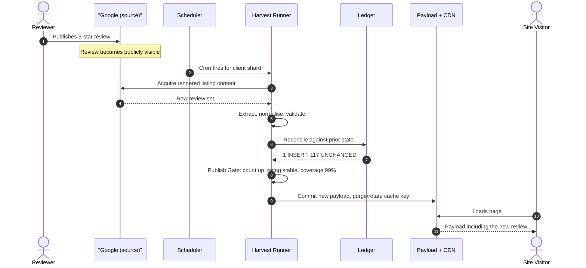
```mermaid
sequenceDiagram
    autonumber
    actor R as Reviewer
    participant G as "Google (source)"
    participant S as Scheduler
    participant E as Harvest Runner
    participant L as Ledger
    participant P as Payload + CDN
    actor V as Site Visitor

    R->>G: Publishes 5-star review
    Note over G: Review becomes publicly visible
    S->>E: Cron fires for client shard
    E->>G: Acquire rendered listing content
    G-->>E: Raw review set
    E->>E: Extract, normalise, validate
    E->>L: Reconcile against prior state
    L-->>E: 1 INSERT, 117 UNCHANGED
    E->>E: Publish Gate: count up, rating stable, coverage 99%
    E->>P: Commit new payload, purge/rotate cache key
    V->>P: Loads page
    P-->>V: Payload including the new review
```

**Timing budget:** worst case = cadence interval (6 h default) + harvest duration (≤ 3 min) + commit propagation (≤ 1 min) + CDN TTL (≤ 5 min for the manifest) ≈ **6 h 9 min**. Best case ≈ 9 minutes if the review lands just before a cycle.

### UC-05 — Existing Review Is Edited at Source

| Field | Detail |
|---|---|
| **Challenge** | The text changed, so a content hash changes; a naive system inserts a duplicate and the site shows the review twice. |
| **Main Success Scenario** | 1. Extraction produces a review whose `identity_hash` (author key + listing + first-observed epoch anchor) matches an existing Ledger record but whose `content_hash` differs. 2. Reconciler classifies **UPDATE**: increments `revision`, sets `updated_at`, preserves `first_seen_at`, appends the previous `content_hash` to `revision_history`. 3. Payload reflects new text; ordering preserved by original date. |
| **Edge case** | Author changes their display name *and* text simultaneously → identity match fails → recorded as INSERT and the old record eventually goes MISSING then tombstoned. This produces one transient duplicate-looking pair. Accepted, documented in §49, mitigated by a fuzzy near-duplicate warning in validation. |

### UC-06 — Review Is Deleted at Source

| Field | Detail |
|---|---|
| **Challenge** | Distinguishing genuine deletion from a truncated harvest is the single most dangerous ambiguity in the system (D7). |
| **Main Success Scenario** | 1. Harvest completes with coverage ≥ threshold and `harvest_completeness: full`. 2. A Ledger record is absent from the observed set → marked `unconfirmed`, `missing_streak = 1`. Still published. 3. Second consecutive qualifying harvest also absent → `missing_streak = 2`. Still published. 4. Third consecutive qualifying harvest absent → tombstoned, removed from payload, retained in Ledger permanently. |
| **Guard** | Only harvests flagged `full` increment the streak. A degraded or partial harvest resets nothing and increments nothing. |
| **Configurable** | `removal_confirmations` default 3, minimum 2, maximum 10. |

### UC-08 — Upstream Markup Changes and Extraction Breaks

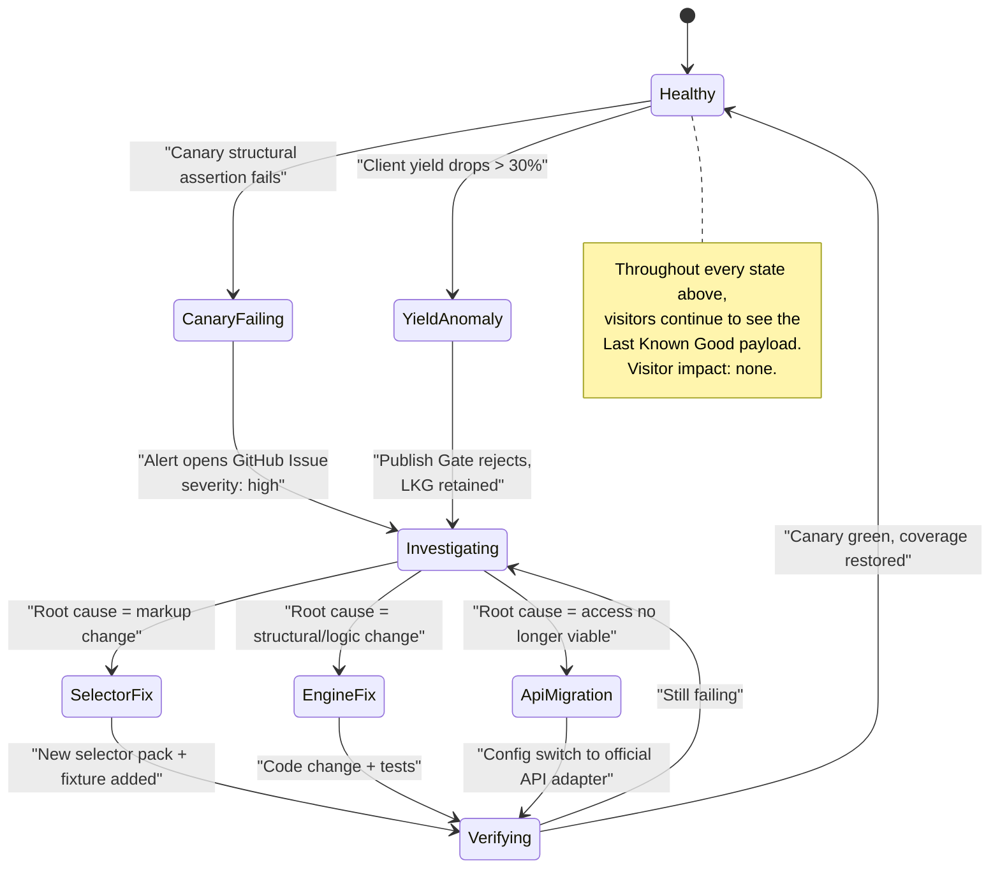
```mermaid
stateDiagram-v2
    [*] --> Healthy
    Healthy --> CanaryFailing: "Canary structural assertion fails"
    Healthy --> YieldAnomaly: "Client yield drops > 30%"
    CanaryFailing --> Investigating: "Alert opens GitHub Issue<br/>severity: high"
    YieldAnomaly --> Investigating: "Publish Gate rejects,<br/>LKG retained"
    Investigating --> SelectorFix: "Root cause = markup change"
    Investigating --> EngineFix: "Root cause = structural/logic change"
    Investigating --> ApiMigration: "Root cause = access no longer viable"
    SelectorFix --> Verifying: "New selector pack + fixture added"
    EngineFix --> Verifying: "Code change + tests"
    ApiMigration --> Verifying: "Config switch to official API adapter"
    Verifying --> Healthy: "Canary green, coverage restored"
    Verifying --> Investigating: "Still failing"
    note right of Healthy
        Throughout every state above,
        visitors continue to see the
        Last Known Good payload.
        Visitor impact: none.
    end note
```

### UC-09 — Source Presents a Bot Challenge

| Field | Detail |
|---|---|
| **Trigger** | Runner receives a challenge interstitial, an unusual-traffic page, or a consent wall it cannot lawfully and trivially pass. |
| **Behaviour (normative)** | 1. Detector classifies the page as `ERR-BLOCKED-CHALLENGE`. 2. Runner **immediately aborts** this client's harvest. **No retry.** 3. A circuit breaker opens for the affected source at the account/runner level, suppressing further harvests for a cooldown (default 6 h, escalating). 4. A high-severity alert is raised. 5. LKG retained for all clients. 6. Runbook §29.5 directs the engineer to evaluate whether to reduce cadence, pause, or migrate the client to an official API. |
| **Explicitly forbidden** | Solving, bypassing, outsourcing, or retrying the challenge; rotating identity to avoid it. INV-07, ADR-010. |

### UC-11 / UC-12 — Diagnose and Repair

| Step | Action | Artifact Used |
|---|---|---|
| 1 | Open the failing run; read the run manifest. | `manifest.json` — engine version, selector pack version, per-stage timings, counts, error class |
| 2 | Read the classified error and its context. | `run.jsonl` structured log |
| 3 | Inspect the captured page snapshot (sanitised HTML + screenshot, secrets and cookies stripped). | `snapshot.html`, `snapshot.png` |
| 4 | Reproduce offline: add the snapshot to the fixture corpus and run the parser against it. | Fixture harness (`npm run parse:fixture`) |
| 5 | Adjust the selector pack; re-run against all fixtures to confirm no regression. | Golden fixture suite |
| 6 | Bump `selectors_version`, open PR, CI runs full fixture suite + canary against live. | CI |
| 7 | Merge; trigger manual harvest for affected clients; verify coverage restored. | `harvest --client <slug> --force` |
| **Target** | Median 60 minutes from alert to repaired payload. | TG-06 |

### UC-16 — Reviewer Requests Data Removal

| Field | Detail |
|---|---|
| **Legal basis** | GDPR Art. 17 / DPDP Act 2023 erasure and correction rights, where applicable. |
| **Main Success Scenario** | 1. Request received at a published contact address. 2. Engineer adds an entry to `compliance/denylist.json` keyed by `identity_hash` (or author key + listing), with reason code and date. 3. Next harvest excludes the review from the payload and writes a permanent suppression tombstone. 4. Ledger retains only the minimal record needed to keep the suppression durable — the hash and the reason — and purges name, text, and avatar. 5. Requester notified within the statutory window. |
| **SLA** | Suppression effective within 7 days; expedited manual run available same-day. |
| **Guarantee** | Suppression is durable: a suppressed review is never re-inserted by a later harvest. |

---

# 10. Functional Requirements

Requirements are grouped by pipeline stage. Each is atomic, testable, and traceable. **Priority** uses MoSCoW: `M` = Must for v1.0, `S` = Should, `C` = Could, `W` = Won't (v1.0).

## 10.1 Configuration and Client Registry

| ID | Requirement | Pri | Verified By |
|---|---|---|---|
| FR-001 | The system MUST read a declarative client registry enumerating all tenants, with one configuration document per client. | M | Unit + integration |
| FR-002 | Client configuration MUST be validated against a published JSON Schema before any harvest begins; validation failure MUST abort that client only. | M | Unit; CI gate |
| FR-003 | Configuration MUST support inheritance: engine defaults ← profile defaults ← client config ← environment override ← CLI flag, with later layers winning. | M | Unit (precedence matrix) |
| FR-004 | Each client configuration MUST declare: slug, display name, enabled flag, one or more listings, adapter selection, cadence tier, locale, and publication target. | M | Schema |
| FR-005 | Configuration MUST carry a `config_version`; the engine MUST refuse to run an unsupported version and MUST provide a documented migration path. | M | Unit |
| FR-006 | The system MUST support enabling/disabling a client without deleting its configuration or data. | M | Integration |
| FR-007 | The system MUST support per-client overrides of every timing, threshold, and limit that affects harvest behaviour. | M | Schema |
| FR-008 | The system MUST support declaring multiple listings per client, each with independent identity and payload. | S | Integration |
| FR-009 | The system SHOULD support a merged cross-listing payload for multi-location clients. | S | Integration |
| FR-010 | Secrets MUST NEVER appear in client configuration; configuration MUST reference secrets by name only. | M | Static check in CI (secret scan) |

## 10.2 Listing Resolution

| ID | Requirement | Pri | Verified By |
|---|---|---|---|
| FR-011 | The system MUST resolve a listing from any of: explicit Place ID, explicit CID, a full Maps URL, or a name + location search string. | M | Unit + live smoke |
| FR-012 | Resolution MUST prefer explicit identifiers over search, and MUST warn when falling back to search. | M | Unit |
| FR-013 | Resolved identity MUST be cached persistently and reused across runs to eliminate the search step. | M | Integration |
| FR-014 | The system MUST detect and fail loudly on ambiguous resolution (multiple plausible matches above a similarity threshold) rather than guessing. | M | Unit (ambiguity fixtures) |
| FR-015 | The system MUST verify that a cached identity still corresponds to the expected business name before harvesting; a mismatch MUST abort with `ERR-IDENTITY-DRIFT`. | M | Integration |
| FR-016 | Resolution MUST record and expose the listing's advertised total review count and aggregate rating when available, for use in coverage calculation. | M | Unit |

## 10.3 Acquisition (Adapter Layer)

| ID | Requirement | Pri | Verified By |
|---|---|---|---|
| FR-017 | The system MUST define a single adapter interface; all acquisition MUST go through it. | M | Contract test suite |
| FR-018 | v1.0 MUST ship four adapters: `google:dom`, `google:places-api`, `google:business-profile-api`, `file:csv`. | M | Contract test per adapter |
| FR-019 | An adapter MUST be selectable per client per listing by configuration alone, with no code change. | M | Integration (INV-10 drill) |
| FR-020 | Each adapter MUST declare its capabilities (fields it can supply, max reviews, supports owner replies, supports deep history) so downstream stages can adapt expectations. | M | Unit |
| FR-021 | The DOM adapter MUST operate on publicly accessible content only, without authentication, and MUST NOT attempt to access any content behind a login. | M | Code review; security review |
| FR-022 | The DOM adapter MUST block loading of images, media, fonts, and analytics resources not required for extraction. | M | Integration (network assertion) |
| FR-023 | The DOM adapter MUST paginate through the lazily-loaded review list until either exhaustion, a configured maximum, or a stall condition is detected. | M | Integration (fixture server) |
| FR-024 | The DOM adapter MUST expand truncated review text before extraction, up to a configured per-run interaction budget. | M | Integration |
| FR-025 | The DOM adapter MUST detect and classify: consent interstitial, bot challenge, empty result, changed structure, and network failure — as distinct error classes. | M | Chaos suite |
| FR-026 | The official-API adapters MUST read credentials only from the secret store and MUST fail closed if credentials are absent. | M | Unit |
| FR-027 | The CSV adapter MUST accept a documented column contract, validate every row, and report per-row errors without aborting the whole import. | S | Unit |
| FR-028 | Every adapter MUST return raw records plus an acquisition report containing observed totals, pagination steps, stall/stop reason, and timings. | M | Unit |
| FR-029 | Adapters MUST enforce a hard wall-clock budget and abort cleanly when exceeded. | M | Chaos suite |
| FR-030 | Adapters MUST NOT write to the Ledger or Payload. Acquisition is read-only with respect to system state. | M | Architecture test (dependency rule) |

## 10.4 Extraction and Normalisation

| ID | Requirement | Pri | Verified By |
|---|---|---|---|
| FR-031 | Extraction MUST locate fields using a versioned Selector Pack loaded from data, not hard-coded in logic. | M | Unit; ADR-009 |
| FR-032 | Selector resolution MUST support ordered fallback strategies per field, and MUST record which strategy succeeded. | M | Unit |
| FR-033 | Extraction MUST distinguish a review from an owner reply and MUST NOT ingest a reply as a review. | M | Golden fixtures (reply cases) |
| FR-034 | The system MUST parse ratings from any of: numeric text, star-count markup, or accessibility label, normalising to a 1–5 integer. | M | Unit |
| FR-035 | The system MUST capture the relative date string verbatim and MUST additionally compute a resolved absolute date estimate with an explicit precision indicator. | M | Unit (date matrix) |
| FR-036 | The resolved absolute date for a review MUST be pinned on first observation and MUST NOT drift on subsequent harvests. | M | Property test |
| FR-037 | Normalisation MUST apply Unicode NFC, strip control and zero-width characters, collapse whitespace, decode HTML entities, and preserve emoji and RTL text. | M | Unit (adversarial strings) |
| FR-038 | Normalisation MUST remove all HTML markup from review text; the payload MUST contain plain text only. | M | Unit; INV-05 |
| FR-039 | Normalisation MUST detect and flag truncation markers, and MUST record whether the stored text is complete or truncated. | M | Unit |
| FR-040 | The system MUST detect review language and record an ISO 639-1 code with a confidence score. | S | Unit |
| FR-041 | Normalisation MUST enforce a maximum stored text length (default 5,000 characters) with safe truncation at a grapheme boundary and a flag recording that truncation occurred. | M | Unit |
| FR-042 | Author display names MUST be preserved as given, with only safety normalisation applied; the system MUST NOT alter, abbreviate, or anonymise them by default. | M | Unit |
| FR-043 | The system MUST derive a stable author key that is resilient to insignificant formatting differences in the display name. | M | Unit |
| FR-044 | Avatar URLs MUST be captured, validated against an allowlist of expected hosts, and stored as URLs only — never downloaded or re-hosted. | M | Unit; ADR-014 |

## 10.5 Validation

| ID | Requirement | Pri | Verified By |
|---|---|---|---|
| FR-045 | Every normalised review MUST be validated against field-level constraints; invalid records MUST be quarantined with a reason, not silently dropped. | M | Unit |
| FR-046 | The system MUST compute a coverage ratio (extracted ÷ advertised total) and classify the harvest as `full`, `partial`, or `failed`. | M | Unit |
| FR-047 | Validation MUST detect intra-run duplicates and collapse them deterministically. | M | Unit |
| FR-048 | Validation MUST detect near-duplicates (high text similarity, same author) and emit a warning without blocking. | S | Unit |
| FR-049 | Validation MUST verify aggregate plausibility: computed mean rating within tolerance of advertised rating; rating distribution non-degenerate. | M | Unit |
| FR-050 | A run whose validation produces any `fatal` finding MUST NOT proceed to publication. | M | Integration |

## 10.6 Reconciliation and State

| ID | Requirement | Pri | Verified By |
|---|---|---|---|
| FR-051 | Reconciliation MUST be a pure function of (prior Ledger, observed set, harvest report, config) → (new Ledger, decision log). | M | Property test; ADR-018 |
| FR-052 | Reconciliation MUST be idempotent (INV-04). | M | Property test |
| FR-053 | Reconciliation MUST classify each observed review as INSERT, UPDATE, or UNCHANGED, and each absent prior review as MISSING or TOMBSTONED. | M | Unit |
| FR-054 | The Ledger MUST record, per review: `first_seen_at`, `last_seen_at`, `revision`, `content_hash` history, and the harvest run id of each state change. | M | Unit |
| FR-055 | A review MUST NOT be removed from the payload until it has been absent from `removal_confirmations` consecutive `full` harvests (INV-03). | M | Unit + chaos |
| FR-056 | Tombstoned reviews MUST NEVER be re-inserted. | M | Property test |
| FR-057 | Reviews present in the compliance denylist MUST be excluded from the payload and permanently suppressed. | M | Unit |
| FR-058 | The Ledger MUST be forward-compatible: unknown fields encountered in a Ledger written by a newer engine MUST be preserved, not dropped. | S | Unit |

## 10.7 Publication

| ID | Requirement | Pri | Verified By |
|---|---|---|---|
| FR-059 | The system MUST project the Ledger into a public payload conforming to the published JSON Schema. | M | Schema validation in CI |
| FR-060 | The payload MUST NOT contain any internal state, provenance secrets, quarantined records, or suppressed reviews. | M | Unit |
| FR-061 | The system MUST emit three artifacts per listing: a full payload, a top-N latest payload, and a manifest with aggregates and integrity hashes. | M | Integration |
| FR-062 | The system MUST enforce a Publish Gate comprising: schema validity, non-zero count (unless the listing genuinely has zero), count-drop threshold, mean-rating-shift threshold, and coverage classification. | M | Chaos suite |
| FR-063 | On Publish Gate failure the system MUST retain the previous payload unchanged, record the rejection with reasons, and raise an alert (INV-02). | M | Chaos suite |
| FR-064 | Publication MUST be atomic per listing: a consumer MUST never observe a partially written payload. | M | Integration |
| FR-065 | The system MUST skip writing when content is byte-identical to the current published artifact, to avoid empty commits. | M | Integration |
| FR-066 | Every payload MUST embed provenance: engine version, schema version, adapter, selector pack version, run id, and generation timestamp (INV-06). | M | Schema |
| FR-067 | The system MUST publish aggregate statistics (total count, mean rating, rating distribution, newest review date) precomputed so consumers need no client-side computation. | M | Unit |
| FR-068 | The system SHOULD publish a schema.org-compatible projection to enable structured data without consumer-side transformation. | S | Unit |

## 10.8 Distribution and Consumption

| ID | Requirement | Pri | Verified By |
|---|---|---|---|
| FR-069 | Published artifacts MUST be retrievable over HTTPS with permissive CORS suitable for cross-origin browser fetch. | M | Live check |
| FR-070 | Artifacts MUST carry cache-control semantics documented per artifact type, with the manifest short-lived and content-addressed files long-lived. | M | Live check |
| FR-071 | The system MUST ship a dependency-free reference renderer under 5 KB minified that renders reviews accessibly. | M | Size budget test |
| FR-072 | The reference renderer MUST insert text via safe DOM text APIs and MUST NEVER use HTML-injection APIs. | M | Code review; INV-05 |
| FR-073 | Integration recipes MUST be documented and verified for static HTML, React, Next.js, Astro, and Vue. | M | Manual verification checklist |
| FR-074 | The renderer MUST degrade to a stable empty state on fetch failure, with no visible error. | M | Integration |

## 10.9 Observability and Operations

| ID | Requirement | Pri | Verified By |
|---|---|---|---|
| FR-075 | Every run MUST emit structured, machine-parseable logs with a correlation id, stage, level, error class, and timing. | M | Unit |
| FR-076 | Logs and artifacts MUST be redacted of secrets, cookies, tokens, and full request headers before being written. | M | Security review; unit |
| FR-077 | Every run MUST emit a manifest capturing versions, counts, decisions, gate results, and per-stage durations. | M | Unit |
| FR-078 | On failure, the system MUST capture a sanitised page snapshot and screenshot to enable offline reproduction. | M | Chaos suite |
| FR-079 | The system MUST append per-client health records enabling trend analysis of yield, coverage, and duration. | M | Integration |
| FR-080 | The system MUST run a canary harvest against a fixed reference listing on a schedule independent of client harvests. | M | Integration |
| FR-081 | The system MUST raise alerts through a zero-cost channel, deduplicated per root cause, with defined severities. | M | Integration |
| FR-082 | The system MUST auto-resolve alerts when the underlying condition clears. | S | Integration |
| FR-083 | The system MUST support a manual on-demand harvest for a single client, bypassing cadence but not the Publish Gate. | M | Manual test |
| FR-084 | The system MUST support a dry-run mode that performs the full pipeline but writes nothing. | M | Unit |
| FR-085 | The system MUST support replaying a stored raw acquisition artifact through the pipeline without network access. | S | Integration |

## 10.10 Compliance and Ethics

| ID | Requirement | Pri | Verified By |
|---|---|---|---|
| FR-086 | The system MUST maintain a per-client authorisation record asserting the client owns or represents the listing. Harvest MUST refuse to run for a client without it. | M | Config schema (required field) |
| FR-087 | The system MUST support a compliance denylist that permanently suppresses specified reviews. | M | Unit |
| FR-088 | The system MUST NOT attempt to solve, bypass, or outsource any bot-detection challenge (INV-07). | M | Code review; security review |
| FR-089 | The system MUST enforce a minimum inter-request delay and a maximum request rate per source, configurable downward but not upward beyond a hard-coded ceiling. | M | Unit |
| FR-090 | The system MUST include a pre-flight check that can hard-block acquisition based on configured policy (robots directives, per-source policy flags). | M | Unit; ADR-024 |
| FR-091 | The system MUST attribute reviews to their source in the payload and MUST provide a link back to the source listing. | M | Schema |
| FR-092 | The system MUST NOT retain reviewer personal data beyond what is published, except the minimal hashes required for identity and suppression. | M | Data-minimisation review |
| FR-093 | The system MUST provide a complete data export for a client on request in documented JSON form. | S | Manual test |

## 10.11 Requirement Traceability Summary

| Goal | Satisfied By |
|---|---|
| BG-01 zero cost | FR-018, FR-069; §19.3 |
| BG-02 fast onboarding | FR-001…FR-010, FR-011…FR-013 |
| BG-07 data ownership | FR-054, FR-093 |
| TG-01 source independence | FR-017…FR-020, FR-030 |
| TG-03 non-destructive | FR-055, FR-062, FR-063 |
| TG-04 idempotence | FR-051, FR-052, FR-056 |
| TG-06 fast repair | FR-031, FR-032, FR-078, FR-085 |
| INV-05 output safety | FR-038, FR-060, FR-072 |
| INV-07 no evasion | FR-088, FR-089, FR-090 |

---

# 11. Non-Functional Requirements

## 11.1 Service Level Objectives

SLOs are stated with an indicator (how it is measured), a target, and a consequence of breach.

| ID | SLO | Indicator | Target | Breach Consequence |
|---|---|---|---|---|
| **SLO-freshness** | A new review reaches the website within one cycle + propagation. | `now − payload.generated_at` at p95 | ≤ 8 h (6 h cadence) | Investigate scheduler delay; consider tier change |
| **SLO-availability** | The payload is retrievable by visitors. | CDN success rate | ≥ 99.9% monthly | Escalate to hosting alternative (§34.5) |
| **SLO-visitor-impact** | Visitors never see fewer reviews than the previous day due to engine failure. | Count of gate-bypass incidents | **0** | Sev-1 incident review |
| **SLO-harvest-success** | Scheduled harvests complete without error. | successful ÷ scheduled, per 30 days | ≥ 95% | Root-cause review; possible cadence reduction |
| **SLO-staleness-alarm** | No client silently stale. | Clients with `last_success > 48 h` | 0 | Alert fires at 24 h; page at 48 h |
| **SLO-repair-time** | Time from alert to restored coverage after upstream change. | Median across incidents | ≤ 60 min | Improve selector pack tooling |
| **SLO-accuracy** | Field-level extraction correctness. | Golden fixture assertions passing | ≥ 98% | Block release |
| **SLO-coverage** | Share of advertised reviews captured on a `full` harvest. | extracted ÷ advertised | ≥ 95% | Investigate pagination |

## 11.2 Performance Requirements

| ID | Requirement | Target | Rationale |
|---|---|---|---|
| NFR-001 | Harvest wall-clock per listing (≤ 200 reviews), DOM adapter. | p50 ≤ 75 s, p95 ≤ 180 s, hard cap 300 s | Keeps shard jobs well inside runner limits and inside pacing budget. |
| NFR-002 | Harvest wall-clock per listing, official-API adapter. | p95 ≤ 10 s | API path is the fast path. |
| NFR-003 | Core pipeline (post-acquisition) CPU time for 1,000 reviews. | ≤ 2 s | Pure functions; no excuse for slowness. |
| NFR-004 | Peak resident memory per harvest process. | ≤ 700 MB incl. browser; ≤ 120 MB for the Node process alone | Fits comfortably in a 16 GB runner with concurrency headroom. |
| NFR-005 | Shard job total duration. | ≤ 20 min | Well below the 6 h job ceiling; keeps feedback fast. |
| NFR-006 | Published full payload size, 200 reviews. | ≤ 180 KB raw, ≤ 60 KB gzip | Bandwidth and CDN friendliness. |
| NFR-007 | Published `latest.json` (top 20). | ≤ 24 KB raw, ≤ 9 KB gzip | This is what most sites actually load. |
| NFR-008 | Total added page weight for review rendering. | ≤ 15 KB compressed | BG-05. |
| NFR-009 | Renderer time-to-first-review-painted on a warm cache. | ≤ 50 ms after payload availability | No perceptible delay. |
| NFR-010 | Cumulative Layout Shift attributable to reviews. | 0 | Reserve space; render skeletons. |
| NFR-011 | Cold-start overhead per shard (dependency + browser restore). | ≤ 60 s with warm cache | Caching strategy §34.2. |

## 11.3 Reliability and Resilience

| ID | Requirement |
|---|---|
| NFR-012 | The system MUST tolerate complete unavailability of the source for at least 30 consecutive days with zero visitor-visible impact. |
| NFR-013 | The system MUST tolerate a total loss of the CI provider by remaining runnable as a local CLI producing identical artifacts. |
| NFR-014 | No single client's failure may affect another client's payload, run, or alert state (INV-09). |
| NFR-015 | All state MUST be reconstructable from version-controlled artifacts; there is no ephemeral state whose loss is unrecoverable. |
| NFR-016 | Every network operation MUST have an explicit timeout; no unbounded waits anywhere in the system. |
| NFR-017 | Retries MUST be bounded, jittered, and classified — retry only on retryable error classes (§26.2). |
| NFR-018 | The system MUST degrade in a defined order: fresh full → fresh partial rejected → LKG served → stale LKG served with alert. It MUST NEVER serve empty. |

## 11.4 Maintainability

| ID | Requirement | Measure |
|---|---|---|
| NFR-019 | Upstream markup changes MUST be repairable by editing data files only, in the common case. | ≥ 70% of historical breakages fixable without code change |
| NFR-020 | Every module MUST have a single documented responsibility and an explicit interface. | Architecture review |
| NFR-021 | Cyclomatic complexity per function ≤ 10; file length ≤ 400 lines; function length ≤ 60 lines. | Lint rules, enforced in CI |
| NFR-022 | Test coverage: ≥ 90% statements on pure core modules; ≥ 70% overall. | CI coverage gate |
| NFR-023 | Dependency count MUST be minimised; each production dependency requires written justification in §19.7. | Dependency review |
| NFR-024 | The build MUST be reproducible from a lockfile with pinned versions. | CI verification |
| NFR-025 | Any engineer MUST be able to reproduce any production failure offline from stored artifacts within 10 minutes. | Drill |

## 11.5 Security

| ID | Requirement |
|---|---|
| NFR-026 | No secret may be present in any repository file, log, artifact, or payload (INV-08). Enforced by automated scanning on every push. |
| NFR-027 | CI workflows MUST declare least-privilege permissions explicitly; the default token MUST be read-only unless a step requires otherwise. |
| NFR-028 | All third-party CI actions MUST be pinned to a full commit SHA, never a mutable tag. |
| NFR-029 | Published text MUST be safe to insert into a DOM as text content; the payload MUST contain no markup (INV-05). |
| NFR-030 | Untrusted source content MUST NEVER be interpolated into a shell command, a workflow expression, a file path, or a log format string. |
| NFR-031 | Dependencies MUST be audited on every CI run; high-severity advisories block release. |
| NFR-032 | The browser MUST run with a restrictive profile: no persistent profile reuse across clients, no extensions, no file access beyond the run directory. |

## 11.6 Privacy and Compliance

| ID | Requirement |
|---|---|
| NFR-033 | Only personal data necessary for display and identity is stored: display name, avatar URL, review text, dates. No emails, no IDs beyond what is public, no behavioural data. |
| NFR-034 | Reviewer avatars MUST be referenced, never copied or cached (ADR-014). |
| NFR-035 | Erasure requests MUST be honoured within 7 days and MUST be durable across future harvests. |
| NFR-036 | Raw acquisition artifacts containing personal data MUST have a defined retention period (default 14 days) and MUST be sanitised before storage. |
| NFR-037 | The payload MUST attribute content to its source with a link, so visitors can verify authenticity. |

## 11.7 Usability and Accessibility

| ID | Requirement |
|---|---|
| NFR-038 | The reference renderer MUST meet WCAG 2.1 AA: sufficient contrast on default styling, semantic markup, accessible star ratings with text alternatives, keyboard-operable pagination. |
| NFR-039 | Star ratings MUST NOT rely on colour alone; a numeric or text equivalent MUST be present for assistive technology. |
| NFR-040 | The renderer MUST respect `prefers-reduced-motion` for any transition. |
| NFR-041 | Review text MUST render correctly for RTL languages and MUST preserve emoji. |
| NFR-042 | Operator-facing CLI output MUST be readable in plain text terminals and MUST support a machine-readable JSON output mode. |

## 11.8 Portability

| ID | Requirement |
|---|---|
| NFR-043 | The engine MUST run on Linux, macOS, and Windows for development; Linux is the only supported production target. |
| NFR-044 | The engine MUST run on the current Node LTS and the immediately preceding LTS. |
| NFR-045 | The engine MUST NOT depend on any GitHub-specific API for its core pipeline; GitHub integration MUST be confined to the publication and alerting adapters. |
| NFR-046 | Published artifacts MUST be consumable by any HTTP client with no SDK requirement. |

## 11.9 NFR Conflict Resolution Matrix

| Conflict | Resolution | Authority |
|---|---|---|
| Freshness vs. rate-limit politeness | Politeness wins. Reduce cadence rather than increase request rate. | §28 |
| Coverage vs. harvest duration | Duration cap wins; report partial coverage honestly and reject publication if below threshold. | §5.3 |
| Payload richness vs. size | Split into `latest.json` and `reviews.json`; consumers choose. | §21.7 |
| Debuggability vs. PII minimisation | Sanitise then retain briefly; never retain raw personal data long-term. | NFR-036 |
| Test realism vs. offline testability | Fixtures are primary; live tests are separate and opt-in. | §41.1 |

---

# 12. System Requirements

## 12.1 Development Environment

| Component | Requirement | Notes |
|---|---|---|
| OS | Linux, macOS, or Windows 10+ | Windows developers SHOULD use WSL2 for parity with CI. |
| Node.js | Current LTS (≥ 20.x), plus previous LTS supported | Version pinned by an `.nvmrc`-equivalent and enforced by an engines check. |
| Package manager | npm with a committed lockfile | Chosen for zero-install-friction and CI ubiquity. |
| Browser runtime | Playwright-managed Chromium | Never the system Chrome; version must be pinned for determinism. |
| Disk | ≥ 5 GB free | Browser binaries (~500 MB) plus fixtures plus artifacts. |
| RAM | ≥ 8 GB | Local full-suite runs with a browser. |
| Git | ≥ 2.30 | Sparse checkout and orphan-branch operations. |
| Editor tooling | Formatter + linter + type checking on save | §45. |

## 12.2 Continuous Integration Runtime

| Component | Requirement | Source of Truth |
|---|---|---|
| Runner | GitHub-hosted Linux runner (`ubuntu-latest`) | **Assumption AS-01** — verify current specification at implementation time. Current generation provides 4 vCPU / 16 GB RAM / ~14 GB free SSD. |
| Job time limit | Per-job maximum 6 hours; workflow 35 days | Shard jobs target ≤ 20 min (NFR-005), a ~18× safety margin. |
| Concurrency | Free-tier concurrent job limit constrains shard parallelism | §37.3 sizes shards against this. |
| Minutes | Unmetered for public repositories; metered for private | **Load-bearing for BG-01.** See §33.2 and §37.5. |
| Schedule granularity | Cron with 5-minute minimum resolution; **scheduled runs may be delayed under platform load and are not a real-time guarantee** | Design tolerates delay (SLO-freshness has margin). |
| Schedule dormancy | Scheduled workflows in a repository with no activity for an extended period may be disabled automatically by the platform | **Operational trap.** Mitigated by a keepalive commit from the data branch and a monthly liveness check (§50.3). |
| Artifact retention | Default 90 days, configurable down | Set to 14 days for run artifacts (NFR-036). |
| Cache | Per-repository cache with size ceiling and eviction of entries unused for ~7 days | Browser + dependency caching, §34.2. |
| Secrets | Repository/environment secrets, masked in logs, unavailable to fork PRs | §40.3. |
| Network egress | Runner egress originates from cloud provider IP ranges shared with all other users of the platform | **Material to §14 and §30**: shared reputation means rate-limiting risk is partly outside our control. |

**Engineering Note.** The two items above that most often surprise teams are *schedule dormancy* (a repository that goes quiet stops running its cron) and *shared egress reputation* (your polite scraper shares an IP neighbourhood with impolite ones). Both are designed for explicitly: §50.3 and §28.6.

## 12.3 Production Runtime — Publication and Delivery

| Component | Requirement |
|---|---|
| Repository | One Git repository, public by default, containing engine code on `main` and published artifacts on an orphan `data` branch (ADR-012). |
| Static hosting | A CDN-fronted static origin. Primary option: GitHub Pages built from the data branch. Secondary: a public CDN mirror of the repository. Tertiary: client's own hosting via build-time import. §34.5 |
| TLS | HTTPS only; HTTP redirected. |
| CORS | Permissive read-only CORS on payload artifacts. |
| Domain | Optional custom subdomain (e.g. `reviews.tradyperch.com`) for brand and cache-control independence. |

## 12.4 Client Website Requirements

| Requirement | Detail |
|---|---|
| Minimum | Ability to fetch an HTTPS JSON file at runtime **or** import a JSON file at build time. |
| Frameworks verified | Static HTML, React 18+, Next.js 14+ (App Router, SSG and ISR), Astro 4+, Vue 3+. |
| No requirement for | A backend, a database, a build step (runtime path), a package install, or a cookie banner change. |
| CSP compatibility | If the client enforces a Content Security Policy, `connect-src` must allow the payload origin. Documented in the integration recipe. No inline script is required by the reference renderer. |
| JS-disabled support | Full support on the build-time path; graceful empty state on the runtime path. |

## 12.5 Capacity Planning Baseline

Sizing assumptions used throughout this document. All are per-listing unless stated.

| Quantity | Baseline | Design Ceiling |
|---|---|---|
| Reviews per listing | 120 | 5,000 (hard cap per harvest) |
| New reviews per listing per day | 0–3 | 50 |
| Listings per client | 1 | 25 |
| Clients | 2 at launch | See §37 for the honest per-tier analysis |
| Harvest cadence | 6 h | 1 h floor (policy), 24 h ceiling (tier) |
| Payload size, 120 reviews | ~110 KB raw / ~38 KB gzip | 2 MB raw (triggers sharding, §33.4) |
| Ledger size, 120 reviews | ~180 KB | Grows monotonically with history |
| Runner minutes per client per day (DOM, 6 h cadence) | ~6 min | ~20 min |

---

# 13. Constraints

Constraints are conditions the design cannot change. They are distinguished from requirements: a requirement is something we chose, a constraint is something imposed on us. Each constraint states its origin and its architectural consequence.

## 13.1 Business Constraints

| ID | Constraint | Origin | Architectural Consequence |
|---|---|---|---|
| CON-01 | **Zero recurring monetary cost.** No subscriptions, no metered APIs above free allowances, no paid hosting. | Product mandate (BG-01) | Forces GitHub Actions as compute, static artifacts as delivery, and rules out managed queues, databases, and monitoring SaaS. |
| CON-02 | **No paid review-widget or scraping SaaS.** | Product mandate | Acquisition must be built in-house; adapter layer is mandatory. |
| CON-03 | **Must be reusable for unlimited future clients without rework.** | Product mandate (BG-03) | Multi-tenancy and config-driven onboarding are v1.0 scope, not v2. |
| CON-04 | **First target is Commerce Insight, but nothing may be specific to it.** | Product mandate | No client-specific code paths permitted; only config. Enforced by review. |
| CON-05 | **Maintenance capacity is a single part-time engineer.** | Team reality | Rules out designs requiring on-call rotation, always-on infrastructure, or high operational toil. Favours "fail static". |
| CON-06 | **The system must be sellable and explainable to non-technical clients.** | Product | Behaviour must be simple and predictable; no probabilistic or opaque behaviour visible to clients. |

## 13.2 Technical Constraints

| ID | Constraint | Origin | Consequence |
|---|---|---|---|
| CON-07 | **The client website must never contact a review source.** | INV-01 | All acquisition is offline and asynchronous. Eliminates any client-side API key. |
| CON-08 | **No persistent server.** | CON-01 | State must live in Git. No in-memory caches across runs; no long-lived processes; no WebSockets. |
| CON-09 | **Compute is ephemeral and stateless.** | GitHub Actions model | Every run must bootstrap from committed state. Caches are optimisations only and must never be correctness-critical. |
| CON-10 | **Scheduling granularity is ~5 minutes minimum and delivery is best-effort.** | Platform | Sub-hourly freshness cannot be promised. Jitter must be added deliberately (§28.4). |
| CON-11 | **Job wall-clock is bounded (6 h) and shard concurrency is limited.** | Platform | Clients must be sharded; per-listing budget capped; long tail handled by tiering (§37.3). |
| CON-12 | **Runner egress IPs are shared and not controllable.** | Platform | Rate-limiting and challenge risk is partly exogenous. Must be handled by backoff and circuit breaking, not by identity manipulation. |
| CON-13 | **Repository storage is finite and Git history is append-only.** | Git | Data must be committed on an orphan branch, deduplicated by hash, and periodically history-truncated (§33.5). Uncontrolled commit churn is a real failure mode. |
| CON-14 | **No authenticated access to sources on the DOM path.** | §8.2 policy | Only publicly rendered data; deep history and some fields are unavailable. |
| CON-15 | **Official Google APIs return a limited number of reviews per listing** (Places API), or **require the business owner's OAuth grant and access approval** (Business Profile API). | Third-party design | Neither official path is a drop-in replacement for "all reviews with no client involvement". This is the central tension of the whole product. §15.3 |
| CON-16 | **JSON is the only interchange format.** | Product mandate | No binary formats, no protobuf, no database. Simplifies consumption; constrains payload size strategy (§33). |
| CON-17 | **The payload is public.** | Static hosting on a public origin | No confidential data may enter it, ever. Drives INV-08 and NFR-033. |
| CON-18 | **Node.js and Playwright are mandated.** | Product mandate | No Python/Go components. Rules out some scraping ecosystems; §19 justifies why this is fine. |

## 13.3 Legal, Ethical, and Policy Constraints

| ID | Constraint | Origin | Consequence |
|---|---|---|---|
| CON-19 | **Automated access to Google outside its published APIs is contrary to Google's Terms of Service.** | Google ToS | Acknowledged risk; mitigated by authorisation gate, minimal footprint, and a ready migration path. §15 |
| CON-20 | **No circumvention of technical protection measures, including bot challenges and access controls.** | Law + ethics + ADR-010 | Hard stop behaviour; INV-07. |
| CON-21 | **Reviewer names, photos, and text are personal data and third-party content.** | GDPR / DPDP / copyright | Data minimisation; attribution and source links; no image re-hosting; erasure workflow. §15.8 |
| CON-22 | **Only listings the client owns or represents may be harvested.** | Ethics + legitimate interest | Authorisation record is a required config field (FR-086). |
| CON-23 | **Reviews must be presented faithfully.** | Consumer-protection principles | No content editing; no default rating filter; no reordering that misrepresents (§8.2). |

## 13.4 Constraint Interaction Analysis

Some constraints conflict. The resolutions below are binding.

| Conflicting Pair | Tension | Resolution |
|---|---|---|
| CON-01 (free) vs. CON-15 (official APIs limited) | The free, sanctioned path returns few reviews; the complete path is unsanctioned. | Ship both. Default to DOM for completeness where authorised; recommend Business Profile API wherever the client will grant OAuth — it is both free *and* complete. §15.7 |
| CON-01 (free) vs. CON-17 (payload public) | Free unmetered CI requires a public repository, which makes artifacts public. | Accepted. Payload contains only already-public review content, plus zero secrets. Private-repo mode documented with its cost (§37.5). |
| CON-08 (no server) vs. need for durable state | State must persist across ephemeral runs. | Git *is* the database. Ledger on the data branch; Git provides versioning, atomicity per commit, and free backup. §33 |
| CON-10 (coarse scheduling) vs. freshness desire | Cannot promise minutes. | SLO-freshness set at hours with margin; expectation set with clients in §6.3 explainer. |
| CON-13 (history growth) vs. frequent commits | 4 commits/day/client × many clients bloats history. | Hash-gated writes (FR-065), orphan branch, and scheduled history truncation. §33.5 |
| CON-05 (one part-time maintainer) vs. CON-19 (fragile acquisition) | Fragility demands attention that capacity does not permit. | Fail-static design means fragility costs *data freshness*, not *uptime*. Repair can wait for business hours. This is the single most important consequence of the architecture. |

---

# 14. Risk Analysis

## 14.1 Method

Risks are scored on **Likelihood** (1 Rare … 5 Almost Certain) and **Impact** (1 Negligible … 5 Severe), giving an **Exposure** = L × I. Exposure ≥ 15 requires an active mitigation owned by a named role and reviewed quarterly. Exposure ≥ 20 requires a pre-planned contingency that can be executed within one business day.

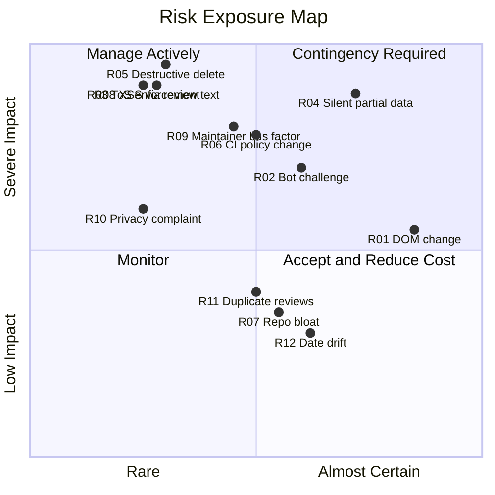
```mermaid
quadrantChart
    title Risk Exposure Map
    x-axis Rare --> Almost Certain
    y-axis Low Impact --> Severe Impact
    quadrant-1 Contingency Required
    quadrant-2 Manage Actively
    quadrant-3 Monitor
    quadrant-4 Accept and Reduce Cost
    R01 DOM change: [0.85, 0.55]
    R02 Bot challenge: [0.6, 0.7]
    R03 ToS enforcement: [0.25, 0.9]
    R04 Silent partial data: [0.72, 0.88]
    R05 Destructive delete: [0.3, 0.95]
    R06 CI policy change: [0.5, 0.78]
    R07 Repo bloat: [0.55, 0.35]
    R08 XSS via review text: [0.28, 0.9]
    R09 Maintainer bus factor: [0.45, 0.8]
    R10 Privacy complaint: [0.25, 0.6]
    R11 Duplicate reviews: [0.5, 0.4]
    R12 Date drift: [0.62, 0.3]
```

*Reading the map: the upper-right region (frequent and damaging) contains RISK-01 and RISK-04 — the two risks the entire architecture is organised around. The upper-left region contains rare-but-severe risks whose mitigation is a pre-built contingency rather than day-to-day engineering.*

## 14.2 Risk Register

| ID | Risk | L | I | Exp | Category | Mitigation | Contingency | Owner |
|---|---|---|---|---|---|---|---|---|
| **RISK-01** | Google changes rendered markup; extraction breaks. | 5 | 3 | **15** | Technical | Selector packs as data (ADR-009); ordered fallback strategies; canary detection (FR-080); golden fixtures; LKG retention. | Selector pack hotfix within 60 min (§51). If unrepairable, switch affected clients to official API adapter. | Backend |
| **RISK-02** | Source presents bot challenges / rate-limits the runner's IP range. | 3 | 4 | **12** | Technical / Policy | Very low request volume; enforced pacing and jitter (§28); circuit breaker; no evasion (ADR-010). | Reduce cadence; pause client; migrate to official API. | DevOps |
| **RISK-03** | Google enforces its ToS against TradyPerch (block, demand letter). | 2 | 5 | **10** | Legal | Authorisation gate (client owns listing); minimal footprint; honest attribution; no circumvention; documented migration path. | Immediate global disable of DOM adapter via a single kill-switch config; all clients migrated to official APIs; counsel engaged. | Product + Security |
| **RISK-04** | Harvest succeeds but captures only a fraction of reviews; site silently loses content. | 4 | 5 | **20** | Technical | Coverage computation (FR-046); Publish Gate count-drop and coverage thresholds (FR-062); classification of harvest completeness. | Automatic LKG retention; alert; manual re-run. | Backend + QA |
| **RISK-05** | A bug interprets a failed load as mass deletion and wipes the payload. | 2 | 5 | **10** | Technical | INV-03; confidence-gated removal across ≥ 3 `full` harvests; property tests; Publish Gate. | Git revert of the data branch to any prior commit; RTO minutes. | Backend |
| **RISK-06** | GitHub changes Actions free-tier terms, cron behaviour, or public-repo policy. | 3 | 4 | **12** | External | Engine is a plain CLI (TG-12); no GitHub API in the core (NFR-045). | Move scheduling to any cron host or the client's own CI; ~1 day of work. | DevOps |
| **RISK-07** | Repository grows unmanageably from frequent data commits. | 3 | 2 | 6 | Operational | Hash-gated writes; orphan data branch; minified payloads; scheduled history truncation (§33.5). | Rewrite data branch history; re-create orphan branch from current state. | DevOps |
| **RISK-08** | Malicious review text becomes stored XSS on every client site. | 2 | 5 | **10** | Security | Markup stripped at normalisation (FR-038); payload is plain text (INV-05); renderer uses text APIs only (FR-072); integration recipes warn against HTML injection. | Emergency payload regeneration with stricter sanitisation; notify affected clients; publish advisory. | Security |
| **RISK-09** | Single maintainer becomes unavailable; system rots. | 3 | 4 | **12** | Organisational | This document; onboarding guide (§53); maintenance runbook (§50); everything in version control; no undocumented tribal knowledge. | Contractor handover using §53; expected ramp ≤ 1 day. | Product |
| **RISK-10** | Reviewer or regulator objects to republication of personal data. | 2 | 3 | 6 | Legal / Privacy | Data minimisation; no avatar re-hosting; attribution + source link; documented erasure workflow with 7-day SLA. | Immediate suppression via denylist; respond within statutory window. | Security |
| **RISK-11** | Identity hashing produces duplicates after an author renames or edits. | 3 | 2 | 6 | Data quality | Two-tier hashing (ADR-007); author-key normalisation; near-duplicate warning (FR-048). | Manual merge tool; Ledger repair command. | Backend |
| **RISK-12** | Relative-date parsing yields wrong absolute dates, corrupting ordering. | 3 | 2 | 6 | Data quality | Date pinned on first observation (FR-036); explicit precision field; never re-derive. | Recompute ordering from `first_seen_at` fallback. | Backend |
| **RISK-13** | A client demands negative reviews be hidden. | 3 | 3 | 9 | Ethical / Commercial | Policy stated in §8.2; default shows all; the studio declines. | Documented decline script; offer response-management help instead. | Product |
| **RISK-14** | Playwright/Chromium update changes behaviour and breaks extraction. | 3 | 3 | 9 | Technical | Pinned browser version; upgrades land via PR with full fixture suite + canary; never auto-updated in production. | Roll back the pin; re-test. | DevOps |
| **RISK-15** | Dependency supply-chain compromise reaches the runner, which holds write access to the repository. | 2 | 5 | **10** | Security | Minimal dependency count; lockfile; pinned action SHAs; least-privilege token; audit on every run; no `pull_request_target`. | Rotate tokens, revert commits, audit history, publish advisory. | Security |
| **RISK-16** | Client site build breaks because payload shape changed. | 2 | 3 | 6 | Integration | `schema_version` with additive-only minor evolution (ADR-019); consumers pin a major; CI validates schema. | Serve previous schema version in parallel during a deprecation window. | Architect |
| **RISK-17** | Scheduled workflow silently disabled after repository inactivity. | 3 | 3 | 9 | Operational | Keepalive activity from data commits; monthly liveness check; staleness alert at 24 h (SLO-staleness-alarm). | Re-enable and back-fill; no data loss. | DevOps |
| **RISK-18** | Listing identity drifts (business renamed, merged, or duplicated on the platform). | 2 | 3 | 6 | Data | Identity verification pre-flight (FR-015); abort on mismatch. | Re-resolve and update config; Ledger continuity preserved by listing key. | Backend |

## 14.3 Aggregate Risk Posture

| Category | Highest Exposure | Overall Assessment |
|---|---|---|
| Technical | RISK-04 (20) | **Well controlled.** The two highest-exposure technical risks (silent partial data, DOM change) are precisely the ones the architecture is organised around. |
| Legal | RISK-03 (10) | **Acknowledged, not eliminated.** Reducible to near zero only by abandoning the DOM adapter. The migration path exists and is tested (S7). |
| Security | RISK-08, RISK-15 (10 each) | **Controlled by construction**, not by vigilance — sanitisation and least privilege are structural. |
| Organisational | RISK-09 (12) | **Mitigated by documentation.** This is the reason this document is long. |
| External | RISK-06 (12) | **Portable by design.** The blast radius of losing the platform is one day of work. |

**Residual risk statement.** After all mitigations, the dominant residual risk is *legal/contractual* (RISK-03), not technical. That is the correct place for residual risk to sit in this product, because it is the only one that cannot be engineered away — and the only one whose contingency (migrate to official APIs) is fully pre-built.

---

# 15. Legal & Ethical Considerations

> **This section is an engineering risk analysis, not legal advice.** It is written to be honest, specific, and actionable. **Recommendation: obtain a short written review from counsel in the operating jurisdiction before enabling the DOM adapter for any client, and re-review annually.** Nothing in this section should be read as a determination that any particular activity is lawful.

## 15.1 The Position, Stated Plainly

The default v1.0 acquisition method loads publicly accessible Google Maps pages in an automated browser and reads the review content those pages display. This is commonly called scraping.

**Google's Terms of Service prohibit accessing its services by automated means other than through its published APIs and other than as expressly permitted.** Google's Maps/Google Platform terms additionally restrict scraping, caching, and re-display of content obtained from its services outside of the licensed API paths. Therefore:

- **Automated collection via the DOM adapter is, in the ordinary reading, a breach of Google's Terms of Service.**
- Re-publishing the collected review content on a third-party website is a further activity that the API terms would govern if the content had been obtained through an API, and which the general terms address for content obtained otherwise.

This document does not attempt to argue otherwise, and any implementer who reads this section as permission has misread it. What follows is an analysis of the actual risk profile, the mitigations, and — importantly — the fully-built alternative.

## 15.2 What Kind of Legal Exposure This Actually Is

It is important to be precise, because the discourse around scraping is unusually confused.

| Legal Theory | Applicability Here | Assessment |
|---|---|---|
| **Breach of contract (ToS)** | **Directly applicable.** Using the service creates a contractual relationship; automated access breaches it. | This is the real exposure. Remedies are typically termination of access, injunctive relief, and — rarely for small actors — damages. |
| **Computer misuse / unauthorised access** (e.g. US CFAA, UK Computer Misuse Act, IT Act s.43/66 in India) | **Weak, where no access control is circumvented.** In the US, appellate authority (notably the *hiQ v. LinkedIn* line, informed by *Van Buren*) has held that scraping data that is publicly available without authentication does not constitute "unauthorised access" under the CFAA. | Low, **conditional on never authenticating and never circumventing a technical barrier.** This is exactly why §8.2 categorically excludes both. The moment the system logs in or defeats a challenge, this row changes from "weak" to "serious". |
| **Copyright in review text** | **Applicable but nuanced.** The reviewer, not Google and not the business, generally owns the expressive content of their review. | Mitigated by: attribution to the author, a link to the source, and no editing. Not eliminated. Notably, republication of user reviews on the reviewed business's own site is an extremely widespread industry practice, including by Google's own licensed API terms which permit display with attribution. |
| **Database / sui generis rights** (EU/UK) | Potentially applicable to systematic extraction of a substantial part of a database. | Mitigated by taking only the reviews of a single listing the client owns — not a substantial part of Google's database. |
| **Trespass to chattels / server burden** | Requires demonstrable harm from load. | Effectively nil: the system's total request volume for a client is a few page loads per day — less than a single human browsing. |
| **Data protection (GDPR / UK GDPR / DPDP Act 2023)** | **Applicable.** Reviewer names, photos, and opinions are personal data, and TradyPerch processes them. | Addressed in §15.8. This is a genuine compliance obligation independent of the scraping question. |
| **Consumer protection / unfair practices** | Applicable to *how reviews are presented*, not how obtained. | Addressed by §8.2 (no filtering of negatives, no editing, faithful attribution). |

**Synthesis.** The realistic exposure is contractual and reputational, not criminal, **provided** the system never authenticates, never circumvents a protection measure, keeps its footprint trivial, and only harvests listings the client owns. Every one of those provisos is a hard requirement elsewhere in this document (FR-021, FR-088, FR-089, FR-086) — they are not aspirations, they are the conditions under which this design is defensible at all.

## 15.3 The Official Alternatives — Complete, Honest Comparison

This is the most consequential table in the document. It must be read before choosing an adapter for any client.

> **Assumption (must be re-verified at implementation time).** Third-party API capabilities, quotas, pricing tiers, and access-approval processes change frequently and without notice. The figures below reflect the authors' understanding at the time of writing and are directional. **Verify each cell against current vendor documentation during implementation.**

| Dimension | **DOM Adapter** (`google:dom`) | **Places API** (`google:places-api`) | **Business Profile API** (`google:business-profile-api`) |
|---|---|---|---|
| **Sanctioned by Google** | ❌ No — contrary to ToS | ✅ Yes | ✅ Yes |
| **Monetary cost** | Free | Free within a monthly per-SKU allowance, then metered per call. The SKU tier that includes review content is the most expensive tier and has the **smallest** free allowance (order of ~1,000 calls/month). At 4 harvests/day, one listing consumes ~120 calls/month — so roughly **8 listings** fit in the free allowance. | **Free.** No per-call charge; governed by quota rather than price. |
| **Reviews returned per listing** | Effectively all publicly displayed reviews, subject to pagination and the 5,000 hard cap | **Approximately 5** — a small, non-configurable sample | **All reviews** for the location, paginated |
| **Owner replies** | Yes, as rendered | Limited | ✅ Yes, and can be **written** back |
| **Historical backfill** | Partial — whatever the interface will paginate | No | ✅ Yes |
| **Setup friction for the client** | **None** — needs only the listing URL | None — TradyPerch's own API key | **Meaningful**: the business owner must grant OAuth access to their Business Profile, and the developer must be granted API access by Google via an application process that can take days to weeks |
| **Credentials required** | None | API key (server-side only) | OAuth 2.0 client + refresh token per client, stored as a secret |
| **Fragility** | **High** — breaks on markup change | Low | Low |
| **Rate-limit / block risk** | Real and exogenous | Quota-bounded, predictable | Quota-bounded, predictable |
| **Legal exposure** | Contractual breach | ✅ None | ✅ None |
| **Reciprocal obligations** | N/A | Attribution and caching restrictions apply | Attribution obligations apply |
| **Best used when** | Client cannot or will not grant OAuth **and** owns the listing **and** accepts documented risk | A ≤ 5-review "highlights" widget is sufficient, or as a **cross-check** on DOM data | **Almost always, if the client will grant access** |

### 15.3.1 The Recommendation

**For any client willing to spend five minutes granting OAuth access to their own Google Business Profile, the Business Profile API adapter is strictly superior on every axis that matters: it is free, sanctioned, complete, richer, more stable, and eliminates the entire legal and fragility risk class.** The only cost is a one-time consent flow and the initial Google API access approval for TradyPerch as a developer — which is a one-off, not per client.

The DOM adapter's *only* advantage is zero client involvement. That is a real advantage for a web studio selling a "we handle everything" service, and it is why the product owner has directed that it ship as the default. But it should be understood as a **convenience trade purchased with legal risk**, not as a technical necessity.

**Product recommendation, stated once:** make the Business Profile API the default at onboarding, present the OAuth grant as a standard 5-minute step in the client welcome flow, and reserve the DOM adapter for clients who will not complete it. This preserves the "it just works" promise for 90% of clients while confining the risk to the minority who force it.

### 15.3.2 Decision Matrix — Adapter Selection Per Client

| Client Situation | Recommended Adapter | Fallback |
|---|---|---|
| Client will grant OAuth to their Business Profile | `google:business-profile-api` | `google:dom` |
| Client is unresponsive but owns the listing and has authorised in writing | `google:dom` | `google:places-api` for a 5-review highlights display |
| Client wants only a "4.9★ from 120 reviews + 5 highlights" block | `google:places-api` | — |
| Client has reviews on a platform with no API access | `file:csv` with a documented manual refresh | — |
| Listing is not owned by the client | **None. Refuse.** | — |

## 15.4 Production Implications of the Scraping Path

Beyond legality, choosing the DOM adapter has concrete operational consequences that must be disclosed to the product owner and, in appropriate terms, to the client.

| Implication | Detail | Where Handled |
|---|---|---|
| **Freshness is best-effort, not guaranteed.** | Any upstream change can pause updates for hours or days. | SLO framing (§11.1); client explainer (§6.3) |
| **Maintenance is recurring and unpredictable in timing.** | 1–3 breakages/year, each 2–8 engineer-hours. Cannot be scheduled in advance. | §50.4 |
| **Client contracts must not promise continuous synchronisation.** | Language should promise "periodic automatic updates on a best-effort basis" and disclose that updates depend on a third-party platform. | Product to own |
| **A hard shutdown is possible.** | If access becomes impossible, clients must be migrated. The migration must be pre-tested, not theoretical. | S7 drill; §51.6 |
| **Reputational consideration.** | TradyPerch is a named commercial actor. Being publicly identified as scraping Google is a marketing liability even absent enforcement. | Argues further for §15.3.1 |
| **The engine must never be marketed as an "official Google integration".** | Doing so would be misleading. | §6.3 explainer wording |

## 15.5 Pre-Flight Policy Gate (ADR-024)

> **ADR-024 — Ship a policy pre-flight gate**
> **Status:** Accepted
> **Context:** The system must be able to stop itself, globally and immediately, if the policy or legal posture changes — without a code deploy and without editing every client config.
> **Decision:** The engine performs a **policy pre-flight** before any acquisition. It evaluates, in order: (1) a global kill-switch flag; (2) a per-source policy flag; (3) a per-client authorisation record; (4) a robots-directive check for the target path where the access method is `dom`; (5) rate-limit budget availability. Any failure aborts acquisition with a distinct, non-retryable error class and leaves LKG in place.
> **Alternatives Rejected:** *Rely on disabling the workflow* — too coarse, affects all clients including API-based ones, and leaves no audit record. *Rely on per-client config edits* — too slow in an incident and error-prone.
> **Consequences:** A single commit can halt all DOM acquisition across all clients within one cycle while leaving official-API clients running. The robots check is advisory-by-configuration: the operator explicitly records the decision to proceed or not, creating an auditable position rather than an implicit one.

**Engineering Note on robots directives.** Robots directives are a crawling convention, not a legal instrument, and their scope for a JavaScript-rendered application is genuinely ambiguous. The engine's job is not to adjudicate that ambiguity — it is to *surface* it: fetch the directives, evaluate the target path, record the result in the run manifest, and honour the operator's configured policy (`block` | `warn` | `ignore`, default `warn`). The default is `warn` rather than `block` because a `block` default would silently disable the product, and silent policy failure is worse than a recorded decision. **Recommendation: set `block` for any client where the authorisation record is anything less than an explicit written instruction.**

## 15.6 The Authorisation Gate

**Normative.** The DOM adapter MUST NOT be enabled for a listing unless the client configuration contains an authorisation record with all of the following:

| Field | Meaning |
|---|---|
| `authorized_by` | Name and role of the person at the client who gave the instruction |
| `authorization_date` | Date of the written instruction |
| `relationship` | `owner` \| `authorized_agent` — no other value permitted |
| `evidence_ref` | Reference to the stored written instruction (email, signed order form, contract clause) |
| `scope_ack` | Explicit acknowledgement that the client has been informed the method reads publicly displayed content from the platform and that updates are best-effort |

Config validation MUST fail if the adapter is `google:dom` and any field is missing. This converts a policy into a mechanism, which is the only kind of policy that survives contact with a deadline.

**Why this matters legally as well as ethically.** A studio harvesting *its own client's* reviews at the client's written instruction, from the client's own listing, for display on the client's own site, is in a materially stronger position than an anonymous party bulk-collecting third-party data — on legitimate-interest grounds under data-protection law, on any implied-licence argument regarding the client's own content, and simply in terms of how the activity would be characterised if challenged. Harvesting a competitor's listing destroys all of that. Hence CON-22 and §8.2.

## 15.7 The Migration Path (ADR-023)

> **ADR-023 — Official-API adapters are v1.0 deliverables, not roadmap items**
> **Status:** Accepted
> **Context:** The dominant residual risk (RISK-03) is that DOM access becomes untenable, either through enforcement or through unrepairable technical change. A contingency that has never been executed is not a contingency.
> **Decision:** Both official-API adapters are implemented, tested, and contract-verified in v1.0, even though no launch client uses them by default. A documented, timed migration drill (S7) is part of release acceptance. INV-10 guarantees the switch requires no code change and no schema change.
> **Alternatives Rejected:** *Build the official adapters later, when needed* — rejected because "when needed" is precisely the moment there is no time to build them, and because building them later means discovering only then that the schema, capability model, or config shape needs to change. *Build only the Business Profile API adapter* — rejected because it requires per-client OAuth that some clients will never complete, leaving no sanctioned option at all for them; the Places API adapter provides a degraded-but-legal path.
> **Consequences:** Roughly 20–25% additional v1.0 implementation effort, spent entirely on insurance. In exchange, RISK-03's contingency is a configuration change measured in minutes, and the capability model (FR-020) is validated by three genuinely different sources rather than assumed.

### 15.7.1 Migration Runbook Summary

| Step | Action | Time |
|---|---|---|
| 1 | Confirm the client will grant access; send the OAuth consent link. | Client-dependent |
| 2 | Store the resulting refresh token as a per-client secret (never in config). | 5 min |
| 3 | Change `adapter` in the client config; set capability expectations. | 2 min |
| 4 | Dry-run harvest; compare output against current Ledger; expect ≥ existing coverage. | 10 min |
| 5 | Reconcile: the two-tier identity model means API-sourced reviews match existing DOM-sourced records where the same review is present, so history is preserved rather than duplicated. **This is why identity is content-derived and not source-specific.** | Automatic |
| 6 | Merge; run; verify payload count and rating unchanged or improved. | 10 min |
| 7 | Record the migration in the client's change log. | 2 min |
| **Total** | | **≤ 1 hour of engineer time** |

**Engineering Note.** Step 5 is the subtle one and it retroactively justifies ADR-007. If review identity were derived from a source-specific ID, switching adapters would orphan the entire existing corpus and the site would appear to lose and then regain every review. Because identity is derived from listing + author key + content, the same review harvested by a different method reconciles to the same Ledger record. **Cross-adapter identity stability is a first-class requirement, and it must appear in the property test suite (§41.2).**

## 15.8 Data Protection and Privacy

Independent of the scraping question, TradyPerch processes personal data (reviewer names, photographs, and opinions) and must handle it correctly.

| Obligation | How the Design Satisfies It |
|---|---|
| **Lawful basis** | Legitimate interest: displaying a business's own customer feedback, at the business's instruction, where the reviewer published the content publicly with the manifest intention that it be seen by prospective customers. Documented per client via the authorisation record. |
| **Data minimisation (NFR-033)** | Stores only display name, avatar URL (as a reference), review text, rating, dates, and reply. No emails, no profile scraping, no cross-listing linkage of individuals, no behavioural data. |
| **Purpose limitation** | Data is used only to display reviews on the client's site. Explicitly not used for marketing, enrichment, or resale. |
| **Storage limitation** | Payload retains current reviews. Ledger retains history for correctness. Raw harvest artifacts are sanitised and expire in 14 days (NFR-036). |
| **Accuracy** | Reviews are republished verbatim and updated when edited at source (UC-05); a source link lets anyone verify. |
| **No unnecessary copying of images (ADR-014)** | Avatars are referenced by URL or replaced by generated initial avatars. Downloading and re-hosting a person's photograph is both a copyright and a data-protection escalation for no product benefit. |
| **Rights of the data subject** | Erasure/objection handled by the denylist workflow (UC-16), 7-day SLA, durable across harvests. A contact address is published on the client site's privacy notice or by TradyPerch. |
| **Transparency** | The client's privacy notice should disclose that reviews from third-party platforms are displayed and how to request removal. **Recommendation: TradyPerch supplies standard wording as part of onboarding.** |
| **India — DPDP Act 2023** | Relevant for Indian clients including the first target. Publicly available personal data made public by the data principal themselves receives lighter treatment under the Act, but notice, purpose limitation, and grievance-redressal expectations still shape the design. The erasure workflow and published contact point address the grievance mechanism. |
| **Cross-border** | Data resides in the repository/CDN. No additional transfer beyond what the client's own hosting already entails. |

## 15.9 Ethical Position

Legality and ethics are different questions and this document answers both.

| Ethical Question | Position |
|---|---|
| **Is it fair to read a page a browser is designed to show?** | Reading publicly displayed content at a rate far below a single human browser, for the benefit of the business whose content it is, at that business's instruction, is defensible. The activity is not extractive at scale, does not deprive the platform of anything, and does not burden it. |
| **Is it fair to the reviewer?** | The reviewer wrote a public review about a business intending prospective customers to read it. Displaying it, verbatim, attributed, with a link back, on that business's website, is consistent with their intention. Editing it, filtering it, or anonymising it would not be. |
| **Is it fair to the platform?** | This is the weakest point of the position, and it should be stated as such. The platform bears the cost of collecting and hosting the reviews and offers an API path with deliberate limits. Bypassing those limits takes value the platform intended to meter. **This is the honest ethical cost of the DOM adapter, and it is the strongest non-legal argument for §15.3.1's recommendation.** |
| **Is it acceptable to defeat anti-bot measures?** | No. An anti-automation control is an unambiguous statement of the platform's wishes. Overriding it converts a defensible grey-area activity into a clear one. Hence INV-07/ADR-010 — and note that this is enforced as a *mechanism* (immediate abort, circuit breaker, alert), not left to individual judgement under deadline pressure. |
| **Is it acceptable to hide negative reviews?** | No. §8.2. The system exists to present a business's real reputation. A system that presents a curated fiction is a different, worse product. |
| **Is it acceptable to not tell clients how it works?** | No. §6.3 mandates a plain-language client explainer that is truthful about the method and the best-effort nature of updates. |

## 15.10 Compliance Checklist (Onboarding Gate)

Every client onboarding MUST complete this checklist. It is reproduced in §53.5.

| # | Check | Blocking |
|---|---|---|
| 1 | Client owns or is authorised agent for every configured listing. | ✅ |
| 2 | Written authorisation stored and referenced in config (`evidence_ref`). | ✅ |
| 3 | Adapter selection reviewed against §15.3.2; Business Profile API offered first and the client's answer recorded. | ✅ |
| 4 | Client explainer sent, including update cadence and best-effort disclaimer. | ✅ |
| 5 | Privacy-notice wording supplied to the client. | ✅ |
| 6 | Removal-request contact point exists and is monitored. | ✅ |
| 7 | Rate-limit and cadence tier set no more aggressively than the default. | ✅ |
| 8 | Robots/policy pre-flight mode explicitly chosen and recorded. | ✅ |
| 9 | No competitor or third-party listing present in the configuration. | ✅ |
| 10 | Kill-switch procedure known to whoever is on call. | ✅ |

---

*End of Part 2. Part 3 presents the High-Level Architecture, the Detailed Architecture of every component, the complete folder and file structure, and the technology justification.*


---

# Part 3 — Architecture

*Sections 16 through 19. Audience: architects and implementing engineers. This part is normative and implementation-ready. §17 and §18 together are intended to be sufficient for an implementer to lay out the entire codebase without further clarification.*

---

# 16. High-Level Architecture

## 16.1 Architectural Style

The system is a **scheduled, batch, hexagonal (ports-and-adapters) pipeline with immutable published output.** Four style choices define it:

| Choice | Meaning | Why |
|---|---|---|
| **Scheduled batch, not event-driven** | Work is initiated by a clock, processes a bounded set, and exits. | The source has no change feed. Polling is the only option, and polling wants batch. Batch also means every run is a clean slate, which eliminates an entire class of state-corruption bugs. |
| **Hexagonal / ports-and-adapters** | A pure domain core surrounded by interchangeable adapters for acquisition, storage, publication, and notification. | The single most volatile thing in the system (how reviews are obtained) must be swappable without touching anything else. TG-01, INV-10. |
| **Pipeline with explicit stages** | Ten named stages, each with a typed input and output, each independently testable. | Makes failure attribution trivial: every error carries the stage that produced it. Also makes the system explicable in a single diagram. |
| **Immutable, content-addressed published output** | Published artifacts are written whole, named partly by content hash, and never mutated in place. | Enables aggressive CDN caching, atomic consumer reads, trivial rollback, and integrity verification. |

**Rejected styles, for the record:**

| Style | Why Rejected |
|---|---|
| Long-running service with an internal scheduler | Requires a server → violates CON-01 and CON-08. |
| Event-driven / webhook-driven | No source emits events. Would be pure fiction. |
| Serverless functions (Lambda/Workers) per client | Reintroduces an account, quotas, cold starts, and eventually a bill. Also weaker for a headless browser workload. |
| Monolithic script with no layering | The naive choice. Dies at the first upstream change because DOM knowledge is smeared across the codebase. This is the design most implementations of this idea actually use, and it is why most of them are abandoned. |
| Microservices | Absurd at this scale. Named only to make clear it was considered and dismissed. |

## 16.2 System Context (Level 1)

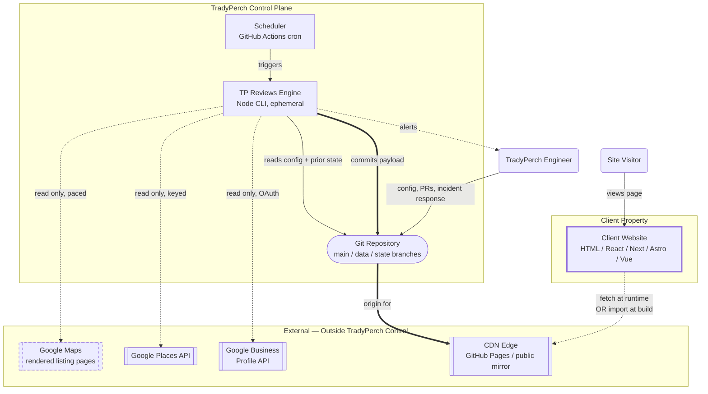
```mermaid
flowchart TB
    subgraph EXT["External — Outside TradyPerch Control"]
        GS[["Google Maps<br/>rendered listing pages"]]
        GP[["Google Places API"]]
        GB[["Google Business<br/>Profile API"]]
        CDN[["CDN Edge<br/>GitHub Pages / public mirror"]]
    end

    subgraph TP["TradyPerch Control Plane"]
        SCHED["Scheduler<br/>GitHub Actions cron"]
        ENG["TP Reviews Engine<br/>Node CLI, ephemeral"]
        REPO(["Git Repository<br/>main / data / state branches"])
    end

    subgraph CLIENT["Client Property"]
        SITE["Client Website<br/>HTML / React / Next / Astro / Vue"]
    end

    VIS("Site Visitor")
    ENGR("TradyPerch Engineer")

    SCHED -->|"triggers"| ENG
    ENG -.->|"read only, paced"| GS
    ENG -.->|"read only, keyed"| GP
    ENG -.->|"read only, OAuth"| GB
    ENG -->|"reads config + prior state"| REPO
    ENG ==>|"commits payload"| REPO
    REPO ==>|"origin for"| CDN
    SITE -.->|"fetch at runtime<br/>OR import at build"| CDN
    VIS -->|"views page"| SITE
    ENGR -->|"config, PRs, incident response"| REPO
    ENG -.->|"alerts"| ENGR

    style GS stroke-dasharray: 5 5
    style SITE stroke-width:3px
```

**The single most important property visible in this diagram:** there is no arrow from `SITE` to any Google system. The visitor's browser and the client's server never touch a review source. That is INV-01, and it is the reason every other property of the system is achievable.

## 16.3 Container View (Level 2)

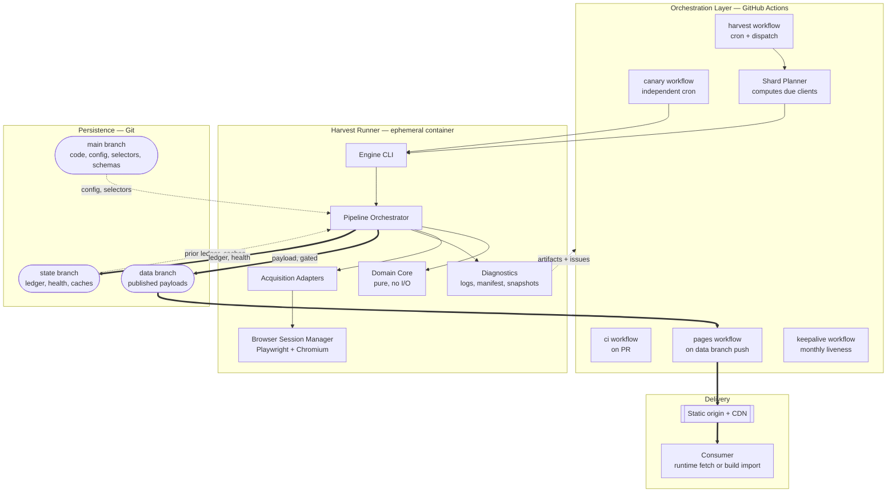
```mermaid
flowchart TB
    subgraph ORCH["Orchestration Layer — GitHub Actions"]
        W1["harvest workflow<br/>cron + dispatch"]
        W2["canary workflow<br/>independent cron"]
        W3["ci workflow<br/>on PR"]
        W4["pages workflow<br/>on data branch push"]
        W5["keepalive workflow<br/>monthly liveness"]
        PLAN["Shard Planner<br/>computes due clients"]
    end

    subgraph RUN["Harvest Runner — ephemeral container"]
        CLI["Engine CLI"]
        APP["Pipeline Orchestrator"]
        CORE["Domain Core<br/>pure, no I/O"]
        ADAPT["Acquisition Adapters"]
        BROW["Browser Session Manager<br/>Playwright + Chromium"]
        DIAG["Diagnostics<br/>logs, manifest, snapshots"]
    end

    subgraph STORE["Persistence — Git"]
        BM(["main branch<br/>code, config, selectors, schemas"])
        BD(["data branch<br/>published payloads"])
        BS(["state branch<br/>ledger, health, caches"])
    end

    subgraph DELIV["Delivery"]
        PAGES[["Static origin + CDN"]]
        CONSUME["Consumer<br/>runtime fetch or build import"]
    end

    W1 --> PLAN --> CLI
    W2 --> CLI
    CLI --> APP
    APP --> CORE
    APP --> ADAPT
    ADAPT --> BROW
    APP --> DIAG
    BM -.->|"config, selectors"| APP
    BS -.->|"prior ledger, caches"| APP
    APP ==>|"payload, gated"| BD
    APP ==>|"ledger, health"| BS
    BD ==> W4 ==> PAGES ==> CONSUME
    DIAG -.->|"artifacts + issues"| ORCH
```

## 16.4 The Ten-Stage Pipeline

Every harvest is exactly these ten stages, in this order, for one client and one listing. **No stage may be skipped except as explicitly noted; no stage may reach forward.**

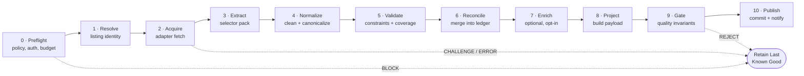
```mermaid
flowchart LR
    S0["0 · Preflight<br/>policy, auth, budget"] --> S1["1 · Resolve<br/>listing identity"]
    S1 --> S2["2 · Acquire<br/>adapter fetch"]
    S2 --> S3["3 · Extract<br/>selector pack"]
    S3 --> S4["4 · Normalize<br/>clean + canonicalize"]
    S4 --> S5["5 · Validate<br/>constraints + coverage"]
    S5 --> S6["6 · Reconcile<br/>merge into ledger"]
    S6 --> S7["7 · Enrich<br/>optional, opt-in"]
    S7 --> S8["8 · Project<br/>build payload"]
    S8 --> S9["9 · Gate<br/>quality invariants"]
    S9 --> S10["10 · Publish<br/>commit + notify"]

    S9 -.->|"REJECT"| LKG(["Retain Last<br/>Known Good"])
    S0 -.->|"BLOCK"| LKG
    S2 -.->|"CHALLENGE / ERROR"| LKG
```

| Stage | Network? | Pure? | Can Fail Non-Fatally? | Output |
|---|---|---|---|---|
| 0 Preflight | Optional (robots) | No | No — a block is terminal for this client | `PreflightVerdict` |
| 1 Resolve | Yes (cache-first) | No | No | `ResolvedListing` |
| 2 Acquire | Yes | No | No | `RawAcquisition` + `AcquisitionReport` |
| 3 Extract | No | **Yes** | Yes — per-field fallbacks | `ExtractedReview[]` |
| 4 Normalize | No | **Yes** | Yes — per-record quarantine | `NormalizedReview[]` |
| 5 Validate | No | **Yes** | Yes — warnings vs. fatals | `ValidationReport` |
| 6 Reconcile | No | **Yes** | No | `Ledger` + `DecisionLog` |
| 7 Enrich | Optional | No | Yes — enrichment is always optional | annotations |
| 8 Project | No | **Yes** | No | `Payload` candidate |
| 9 Gate | No | **Yes** | **This is the decision point** | `GateVerdict` |
| 10 Publish | Yes | No | Yes — retry on conflict | commit + artifacts |

**Engineering Note.** Stages 3–6 and 8–9 are pure. That is six of the ten stages, including every stage where a subtle logic bug would corrupt data. Those six can be exhaustively tested offline against fixtures with zero flakiness. This partitioning is the reason TG-02 and TG-10 are achievable, and it is a deliberate design objective rather than a happy accident: **anything that can be pure, is.**

## 16.5 Dependency Rule

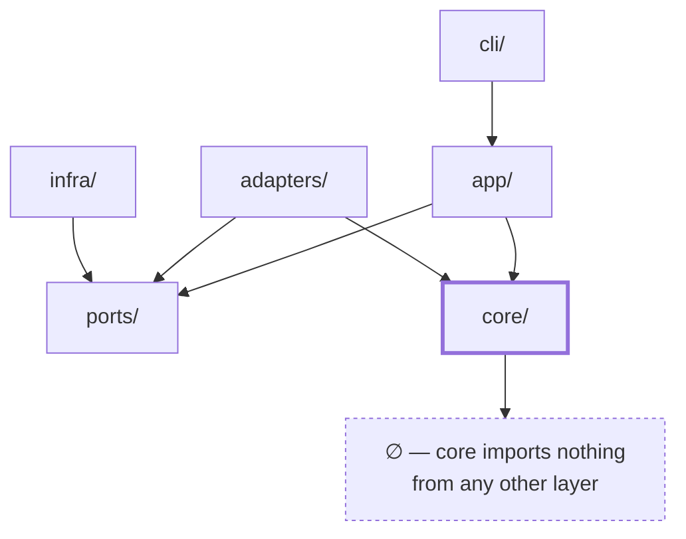
```mermaid
flowchart TD
    CLI["cli/"] --> APP["app/"]
    APP --> PORTS["ports/"]
    APP --> CORE["core/"]
    ADAPTERS["adapters/"] --> PORTS
    ADAPTERS --> CORE
    INFRA["infra/"] --> PORTS
    CORE --> NOTHING["∅ — core imports nothing<br/>from any other layer"]

    style CORE stroke-width:3px
    style NOTHING stroke-dasharray: 3 3
```

**Normative dependency rules, enforced by an automated architecture test in CI (§41.2):**

| Rule | Statement |
|---|---|
| DR-1 | `core/` MUST NOT import from `adapters/`, `infra/`, `app/`, `cli/`, or any third-party package other than pure utility libraries with no I/O. |
| DR-2 | `core/` MUST NOT read the clock, the filesystem, the network, the environment, or a random source. All such values are passed in. |
| DR-3 | `adapters/` MUST depend only on `ports/` interfaces and `core/` types. Adapters MUST NOT import each other. |
| DR-4 | `app/` MUST NOT import a concrete adapter directly; adapters are injected by a composition root in `cli/`. |
| DR-5 | Only `cli/` may construct concrete implementations. There is exactly one composition root. |
| DR-6 | No module may import from a deeper path than a package's public index — no reaching into internals. |

**Why this is worth enforcing mechanically.** Every one of these rules will be violated at 11 p.m. under incident pressure unless a test fails. DR-2 in particular: a single `Date.now()` inside the reconciler makes the entire reconciliation suite non-deterministic and the property tests meaningless.

## 16.6 Data Flow — End to End

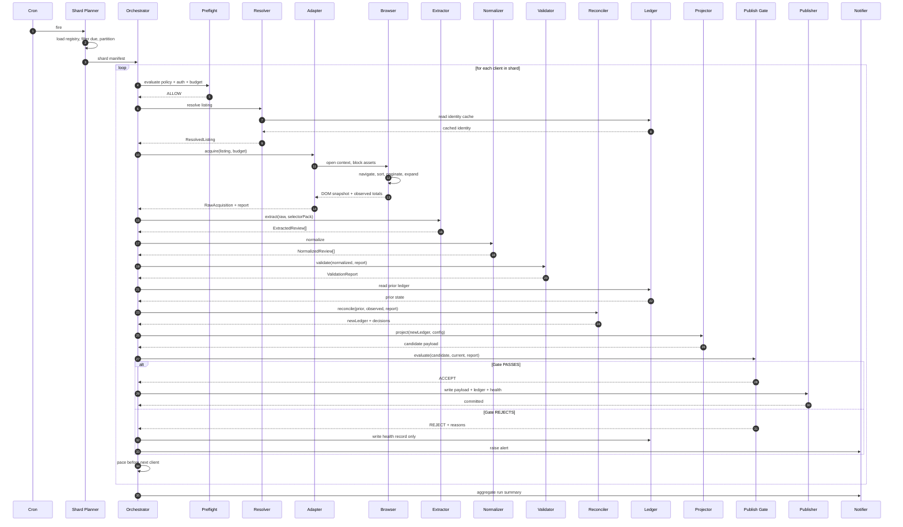
```mermaid
sequenceDiagram
    autonumber
    participant CR as Cron
    participant PL as Shard Planner
    participant OR as Orchestrator
    participant PF as Preflight
    participant RS as Resolver
    participant AD as Adapter
    participant BR as Browser
    participant EX as Extractor
    participant NO as Normalizer
    participant VA as Validator
    participant RC as Reconciler
    participant LG as Ledger
    participant PJ as Projector
    participant GT as Publish Gate
    participant PB as Publisher
    participant NT as Notifier

    CR->>PL: fire
    PL->>PL: load registry, filter due, partition
    PL->>OR: shard manifest
    loop for each client in shard
        OR->>PF: evaluate policy + auth + budget
        PF-->>OR: ALLOW
        OR->>RS: resolve listing
        RS->>LG: read identity cache
        LG-->>RS: cached identity
        RS-->>OR: ResolvedListing
        OR->>AD: acquire(listing, budget)
        AD->>BR: open context, block assets
        BR->>BR: navigate, sort, paginate, expand
        BR-->>AD: DOM snapshot + observed totals
        AD-->>OR: RawAcquisition + report
        OR->>EX: extract(raw, selectorPack)
        EX-->>OR: ExtractedReview[]
        OR->>NO: normalize
        NO-->>OR: NormalizedReview[]
        OR->>VA: validate(normalized, report)
        VA-->>OR: ValidationReport
        OR->>LG: read prior ledger
        LG-->>OR: prior state
        OR->>RC: reconcile(prior, observed, report)
        RC-->>OR: newLedger + decisions
        OR->>PJ: project(newLedger, config)
        PJ-->>OR: candidate payload
        OR->>GT: evaluate(candidate, current, report)
        alt Gate PASSES
            GT-->>OR: ACCEPT
            OR->>PB: write payload + ledger + health
            PB-->>OR: committed
        else Gate REJECTS
            GT-->>OR: REJECT + reasons
            OR->>LG: write health record only
            OR->>NT: raise alert
        end
        OR->>OR: pace before next client
    end
    OR->>NT: aggregate run summary
```

## 16.7 Trust Boundaries

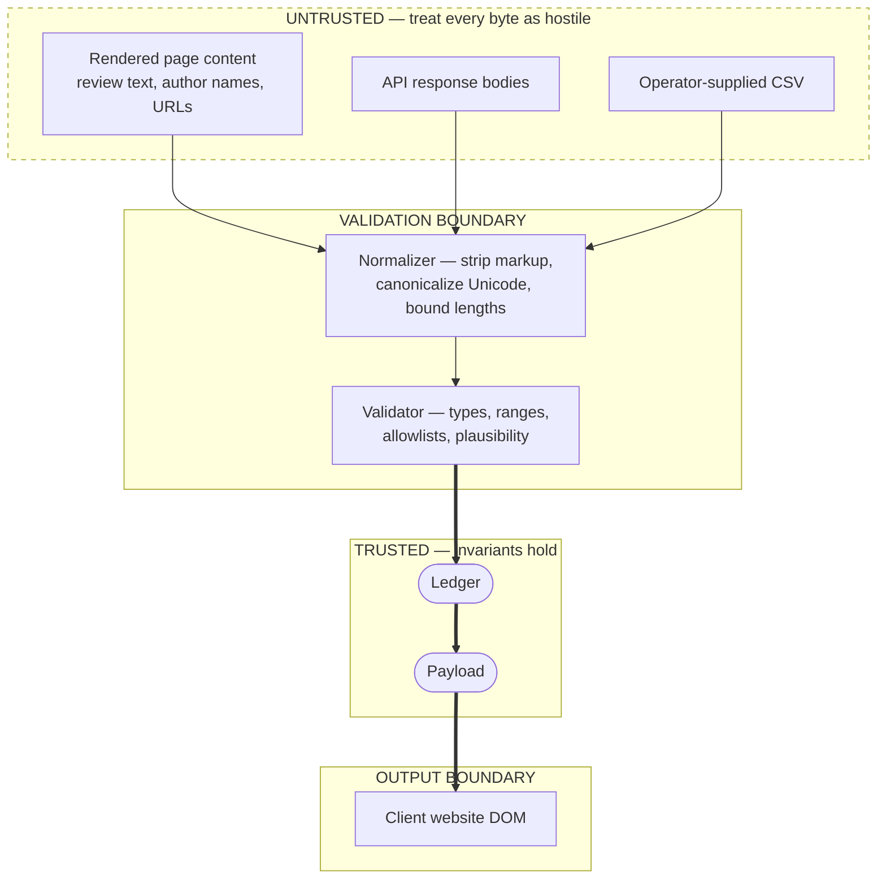
```mermaid
flowchart TB
    subgraph U["UNTRUSTED — treat every byte as hostile"]
        RAW["Rendered page content<br/>review text, author names, URLs"]
        API["API response bodies"]
        CSV["Operator-supplied CSV"]
    end
    subgraph V["VALIDATION BOUNDARY"]
        NORM["Normalizer — strip markup,<br/>canonicalize Unicode, bound lengths"]
        VAL["Validator — types, ranges,<br/>allowlists, plausibility"]
    end
    subgraph T["TRUSTED — invariants hold"]
        LEDGER(["Ledger"])
        PAYLOAD(["Payload"])
    end
    subgraph O["OUTPUT BOUNDARY"]
        SITE["Client website DOM"]
    end

    RAW --> NORM
    API --> NORM
    CSV --> NORM
    NORM --> VAL
    VAL ==> LEDGER ==> PAYLOAD ==> SITE

    style U stroke-dasharray: 5 5
```

| Boundary | Crossing Rule |
|---|---|
| Untrusted → Validation | Nothing may bypass the Normalizer. No stage may read raw content directly. Enforced by types: only the Normalizer accepts `RawField`, and only it returns `CleanString`. |
| Validation → Trusted | Only records with no `fatal` findings cross. Quarantined records go to diagnostics, never to the Ledger. |
| Trusted → Output | The Payload is plain-text-only by construction, so the output boundary requires no further sanitisation — but the reference renderer *still* uses text-only DOM APIs, on defence-in-depth grounds (FR-072). |

## 16.8 Deployment View

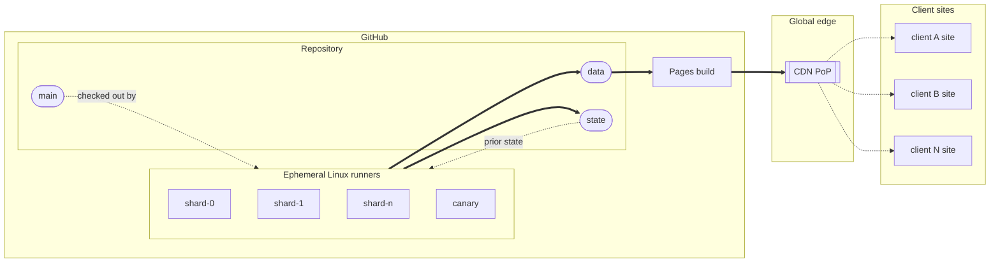
```mermaid
flowchart LR
    subgraph GH["GitHub"]
        direction TB
        subgraph RUNNERS["Ephemeral Linux runners"]
            R1["shard-0"]
            R2["shard-1"]
            R3["shard-n"]
            RC["canary"]
        end
        subgraph BRANCHES["Repository"]
            MAIN(["main"])
            DATA(["data"])
            STATE(["state"])
        end
        PAGES["Pages build"]
    end
    subgraph EDGE["Global edge"]
        C1[["CDN PoP"]]
    end
    subgraph SITES["Client sites"]
        S1["client A site"]
        S2["client B site"]
        S3["client N site"]
    end

    MAIN -.->|"checked out by"| RUNNERS
    STATE -.->|"prior state"| RUNNERS
    RUNNERS ==> DATA
    RUNNERS ==> STATE
    DATA ==> PAGES ==> C1
    C1 -.-> S1
    C1 -.-> S2
    C1 -.-> S3
```

| Deployment Fact | Value |
|---|---|
| Compute lifetime | Minutes. Nothing persists in the runner. |
| Number of environments | Two logical: `production` (scheduled, publishes) and `dry-run` (PR-triggered, publishes nothing). |
| Blue/green or canary deploys of the engine | Not applicable to the engine (batch, idempotent). The *canary* here is a canary **harvest**, which is a different and more useful thing (§25.5). |
| Rollback unit | A Git commit on `data` (payload rollback) or `main` (engine rollback). |
| State ownership | `state` branch is machine-owned. Humans MUST NOT hand-edit it except during documented recovery (§52). |

## 16.9 ADR-001 and ADR-003

> **ADR-001 — Full decoupling of acquisition from the consuming website**
> **Status:** Accepted
> **Context:** The obvious implementations put the source call in the website — either client-side JavaScript hitting an API, or a server-side proxy route. Both are simpler to build.
> **Decision:** The website reads a pre-built static artifact and never contacts a review source, at build time or at run time.
> **Alternatives Rejected:** *Client-side API call* — exposes a key to every visitor and every bot, burns quota on traffic, adds render-blocking latency, breaks under CORS and ad-blockers, and couples site availability to source availability. *Server-side proxy on the client's host* — requires a backend for static sites, requires per-client secret management, puts the client's own domain reputation at risk if the source rate-limits, and multiplies the number of places that can break by the number of clients. *Build-time fetch directly from the source in the client's CI* — spreads acquisition logic across N client repositories, meaning an upstream change breaks N build pipelines instead of one engine.
> **Consequences:** Enables zero-latency rendering, zero third-party origins, zero client-side secrets, and complete containment of upstream volatility. Costs: freshness is bounded by cadence, and a separate publication mechanism is required. Both accepted.

> **ADR-003 — Publish a static artifact rather than expose a runtime API in v1.0**
> **Status:** Accepted
> **Context:** A read API would be more flexible: filtering, pagination, per-consumer shaping.
> **Decision:** v1.0 publishes static JSON files. §54 designs the future API but does not build it.
> **Alternatives Rejected:** *Serverless read API* — introduces an account, cold starts, a quota, and eventually a bill (CON-01); adds an availability dependency in front of content that is currently as available as a CDN. *Database-backed API* — same, worse. *GraphQL endpoint* — solves a shaping problem that does not exist when payloads are ≤ 60 KB.
> **Consequences:** Consumers do their own filtering and pagination against a small payload, which is trivially fast in the browser. The artifact is infinitely cacheable and cannot go down independently of the CDN. When the API arrives in v3, the static artifact remains the origin of truth, so no consumer is forced to migrate.

---

# 17. Detailed Architecture

Each component below is specified with: responsibility, inputs, outputs, dependencies, error modes, and design notes. This section is the contract an implementer works from.

## 17.1 Component Inventory

| # | Component | Layer | Pure | §20 Ref |
|---|---|---|---|---|
| C-01 | CLI / Composition Root | cli | No | — |
| C-02 | Pipeline Orchestrator | app | No | §20.1 |
| C-03 | Config Loader & Validator | app | Mostly | §39 |
| C-04 | Client Registry | app | Yes | §38.2 |
| C-05 | Shard Planner | app | Yes | §37.3 |
| C-06 | Policy Preflight Gate | app | No | §15.5 |
| C-07 | Rate Limiter / Pacer | infra | No | §28 |
| C-08 | Listing Resolver (Search Module) | adapters | No | §20.2 |
| C-09 | Browser Session Manager | adapters | No | §20.3 |
| C-10 | Navigator (Navigation Module) | adapters | No | §20.3 |
| C-11 | Selector Pack Loader & Strategy Resolver | core | Yes | §20.4 |
| C-12 | Extractor (Review Parser) | core | Yes | §20.5 |
| C-13 | Normalizer (Data Cleaner) | core | Yes | §20.6 |
| C-14 | Date Resolver | core | Yes | §20.5.4 |
| C-15 | Language Detector | core | Yes | §20.6.5 |
| C-16 | Identity & Hash Service | core | Yes | §21.4 |
| C-17 | Validator | core | Yes | §20.6.7 |
| C-18 | Reconciler | core | Yes | §20.7 |
| C-19 | Ledger Store | adapters | No | §20.11 |
| C-20 | Enricher | app | No | §59 |
| C-21 | Projector (Exporter) | core | Yes | §20.8 |
| C-22 | Publish Gate | core | Yes | §27.3 |
| C-23 | Publisher | adapters | No | §20.8.4 |
| C-24 | Logger | infra | No | §24 |
| C-25 | Metrics & Health Recorder | infra | No | §25 |
| C-26 | Notifier | adapters | No | §25.6 |
| C-27 | Retry Manager | infra | Yes (policy) | §26 |
| C-28 | Circuit Breaker | infra | No | §26.5 |
| C-29 | Diagnostics / Snapshot Capture | infra | No | §24.6 |
| C-30 | Clock & Random Providers | infra | No | DR-2 |

## 17.2 C-01 · CLI / Composition Root

| Aspect | Specification |
|---|---|
| **Responsibility** | Parse arguments, read environment, construct concrete adapters, inject them into the orchestrator, map the result to an exit code. **This is the only place in the codebase where concrete implementations are named.** |
| **Commands** | `harvest`, `resolve`, `validate-config`, `canary`, `replay`, `project`, `export`, `doctor`, `plan` |
| **Key flags** | `--client <slug>`, `--all`, `--shard i/n`, `--listing <id>`, `--adapter <id>`, `--dry-run`, `--no-publish`, `--force`, `--from-fixture <path>`, `--log-level`, `--output json|text`, `--budget-ms`, `--max-reviews` |
| **Exit codes** | `0` success; `1` unexpected internal error; `2` invalid usage/config; `3` all clients failed; `4` partial failure (some clients failed); `5` gate rejection (no publish, no crash); `6` policy blocked; `7` bot challenge encountered |
| **Design note** | Distinct exit codes matter because the workflow uses them to decide alerting severity without parsing logs. Code `5` and `6` are *not* failures in the CI sense and must not turn a shard red — they must produce a warning annotation and an alert. |
| **Error modes** | Unknown command → 2. Missing required secret for a selected adapter → 2 (fail closed). Uncaught exception → 1 with full stack in the log, never in stdout JSON. |

## 17.3 C-02 · Pipeline Orchestrator

| Aspect | Specification |
|---|---|
| **Responsibility** | Execute the ten stages for a list of (client, listing) pairs, enforcing budgets, pacing, isolation, and diagnostics. Owns *sequencing and policy*, owns *no domain logic*. |
| **Inputs** | `OrchestratorRequest { targets, config, adapters, ports, budgets, runId, mode }` |
| **Outputs** | `RunResult { perTarget: TargetOutcome[], summary, manifest }` |
| **Isolation guarantee** | Each target runs inside its own error envelope. A thrown error, a timeout, or a process-level warning from one target MUST NOT propagate to another (INV-09). Implementation: per-target try/catch plus a fresh browser context per target plus a per-target working directory. |
| **Budget enforcement** | Two budgets: per-target wall clock (default 300 s) and per-run wall clock (default 15 min). On per-target expiry, abort that target with `ERR-BUDGET-TARGET`. On per-run expiry, finish the current target, skip the rest, mark them `deferred` (not failed), and exit `4`. |
| **Pacing** | Between targets, sleep for the configured inter-target delay plus jitter (§28.4). |
| **Ordering** | Targets are processed in a deterministic order derived from a hash of `runId + slug`, so the same client is not always first — a client that is always first would always absorb any per-run warm-up anomaly. |
| **Error modes** | Any stage error is caught, classified (§23), recorded, and converted into a `TargetOutcome` with `status: failed|blocked|rejected|deferred|succeeded`. The orchestrator itself never throws to the CLI except on genuinely unrecoverable internal invariant violations. |

### 17.3.1 Target Outcome State Machine

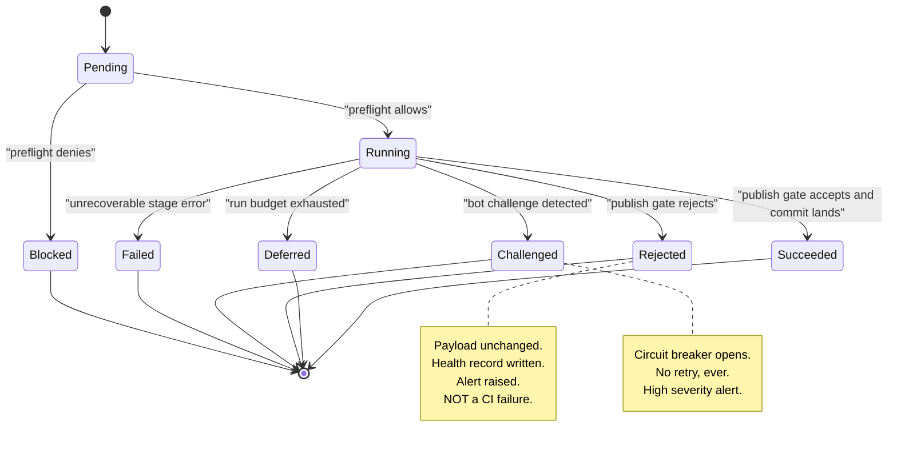
```mermaid
stateDiagram-v2
    [*] --> Pending
    Pending --> Blocked: "preflight denies"
    Pending --> Running: "preflight allows"
    Running --> Failed: "unrecoverable stage error"
    Running --> Challenged: "bot challenge detected"
    Running --> Rejected: "publish gate rejects"
    Running --> Succeeded: "publish gate accepts and commit lands"
    Running --> Deferred: "run budget exhausted"
    Blocked --> [*]
    Failed --> [*]
    Challenged --> [*]
    Rejected --> [*]
    Deferred --> [*]
    Succeeded --> [*]

    note right of Rejected
        Payload unchanged.
        Health record written.
        Alert raised.
        NOT a CI failure.
    end note
    note right of Challenged
        Circuit breaker opens.
        No retry, ever.
        High severity alert.
    end note
```

## 17.4 C-03 · Config Loader & Validator, C-04 · Client Registry, C-05 · Shard Planner

| Component | Responsibility | Notes |
|---|---|---|
| **C-03 Config Loader** | Discover config files, apply the six-layer precedence chain, resolve `$ref`-style profile inheritance, validate against JSON Schema, and produce a frozen, fully-resolved `EffectiveConfig` per client. Emits a resolution trace showing which layer supplied each value. | The resolution trace is not a luxury. "Why did this client use a 3-minute timeout?" is a question that gets asked during incidents, and answering it by reading four files is unacceptable. Full spec in §39. |
| **C-04 Client Registry** | Enumerate clients, filter by `enabled`, expand listings into targets, and compute the due set from cadence tier and last-success time. Pure function of (registry, now, health). | Being pure makes "which clients are due?" testable and makes `plan` a dry-runnable command. |
| **C-05 Shard Planner** | Partition the due set into `n` shards balanced by *estimated cost*, not by count. Estimated cost = f(adapter, historical p50 duration, review count). | Balancing by count puts three 2,000-review listings in one shard. Balancing by historical duration is the only approach that keeps shard durations even. Falls back to count when history is absent. |

## 17.5 C-06 · Policy Preflight Gate

| Aspect | Specification |
|---|---|
| **Responsibility** | Decide, before any acquisition, whether this target may proceed. |
| **Checks, in order (fail fast)** | 1. Global kill switch (`policy.global_enabled`). 2. Per-source enable flag. 3. Client `enabled`. 4. Authorisation record completeness (FR-086) — only for `dom` access method. 5. Robots-directive evaluation for the target path, per configured mode `block|warn|ignore`. 6. Rate-limit budget availability for the source. 7. Circuit-breaker state for the source. |
| **Output** | `PreflightVerdict { allow: boolean, reasons: PolicyReason[], recordedAt }` — always recorded in the run manifest, whether allow or deny, so the decision is auditable after the fact. |
| **Error modes** | Robots fetch failure → treated as `unknown`; behaviour per mode (`block` denies, `warn`/`ignore` proceed with a recorded note). Never fails the run silently. |
| **Design note** | The verdict is recorded even on `allow`. An audit trail that only records denials proves nothing. |

## 17.6 C-07 · Rate Limiter / Pacer

| Aspect | Specification |
|---|---|
| **Responsibility** | Enforce a global-per-source request budget and inter-request spacing across an ephemeral, distributed set of runners. |
| **Mechanism** | Token bucket with the counter **persisted to the `state` branch** per source per UTC hour and per UTC day. Because runners are ephemeral and may run concurrently, the persisted counter is advisory and eventually consistent; the design compensates by setting budgets an order of magnitude below any plausible threshold, so a race that double-spends a few tokens is harmless. |
| **Hard ceiling** | A compile-time constant caps requests per source per hour regardless of configuration (FR-089). Configuration may lower it, never raise it. |
| **Spacing** | Minimum inter-request delay with full jitter within a configured window, applied inside the Navigator between page interactions as well as between targets. |
| **Error modes** | Budget exhausted → preflight denies with `ERR-POLICY-BUDGET`; not an error, a deferral. Persisted counter unreadable → assume worst case (budget consumed) and defer. **Fail closed.** |
| **Design note** | Distributed rate limiting without a central store is genuinely unsolvable in the strict sense. The engineering answer is not a clever algorithm; it is to operate so far below any limit that precision is unnecessary. §28.2 quantifies this. |

## 17.7 C-08 · Listing Resolver

| Aspect | Specification |
|---|---|
| **Responsibility** | Turn whatever identity the operator supplied into a canonical, verified, cached listing identity plus advertised aggregates. |
| **Input forms accepted** | Place ID, CID, full Maps URL, `{ name, locality, country }` search tuple. |
| **Resolution order** | Explicit identifier → cached identity → URL parse → search (with a loud warning). |
| **Verification** | The resolved page's business name is compared to the configured expected name using a normalised similarity measure. Below threshold → `ERR-IDENTITY-DRIFT`, abort. This catches the "business renamed / listing merged / wrong branch" class of silent corruption. |
| **Outputs** | `ResolvedListing { canonicalId, canonicalUrl, displayName, advertisedTotal, advertisedRating, resolvedVia, verifiedAt }` |
| **Caching** | Persisted to `state`; TTL 30 days; re-verified every run (cheap) but re-resolved only on TTL expiry or drift. |
| **Error modes** | Ambiguous match → `ERR-RESOLVE-AMBIGUOUS`, abort (FR-014, never guess). Not found → `ERR-RESOLVE-NOTFOUND`. |

## 17.8 C-09 · Browser Session Manager

| Aspect | Specification |
|---|---|
| **Responsibility** | Own the lifecycle of the browser, contexts, and pages. Nothing else in the system may touch the browser API. |
| **Lifecycle** | One browser process per shard job (reused across targets — expensive to start). **One fresh context per target** (cheap, and provides isolation). One page per context. Contexts are always closed, in a `finally`, even on abort. |
| **Context configuration** | Realistic viewport; explicit locale and timezone from client config; `reducedMotion: reduce`; no persistent storage; no service workers; no permissions granted; no geolocation. |
| **Resource blocking** | Route interception blocks images, media, fonts, stylesheets not needed for layout-dependent extraction, and any request to hosts outside a configured allowlist. Blocking is measured and reported (bytes saved) so regressions are visible. |
| **Timeouts** | Distinct budgets for: browser launch, context creation, navigation, selector wait, interaction, and total. No default-infinite timeout anywhere (NFR-016). |
| **Instrumentation** | Console messages, page errors, failed requests, and response statuses are collected into the run log at `debug` level, and into diagnostics on failure. |
| **Error modes** | Launch failure → `ERR-BROWSER-LAUNCH` (retryable once). Context crash → `ERR-BROWSER-CRASH` (retryable once, then abort). OOM → `ERR-BROWSER-OOM` (not retryable; reduce `max_reviews`). |
| **Design note** | Reusing the browser but not the context is the correct trade-off: browser launch dominates cost (~1–2 s), context creation is milliseconds, and per-target isolation is worth far more than the milliseconds. |

## 17.9 C-10 · Navigator

| Aspect | Specification |
|---|---|
| **Responsibility** | Drive the page from "opened" to "all target review content present in the DOM". Knows about *interaction sequences*; knows nothing about *field locations* (that is C-11/C-12). |
| **Phases** | (a) navigate to canonical URL; (b) dismiss consent/interstitial if a known-benign dismissible element exists; (c) locate and open the reviews surface; (d) set sort order to newest where available; (e) paginate by scrolling the review container until a stop condition; (f) expand truncated texts within the interaction budget; (g) hand off the DOM. |
| **Stop conditions for pagination** | `exhausted` (no new records after k attempts), `target_reached` (advertised total met), `cap_reached` (`max_reviews`), `stalled` (no growth within a time window), `budget_exhausted`, `error`. **The stop reason is a first-class output and feeds directly into harvest completeness classification.** |
| **Stall detection** | Track record count after each scroll. If count is unchanged for `stall_threshold` consecutive attempts (default 3) with backoff between them, declare `stalled`. |
| **Expansion budget** | Expanding truncated text requires one interaction per review. Budget = `min(expand_max, remaining_time / expected_interaction_ms)`. Reviews left unexpanded are flagged `text_truncated: true` rather than silently stored short. |
| **Error modes** | `ERR-NAV-TIMEOUT`, `ERR-NAV-CONSENT-WALL`, `ERR-NAV-SURFACE-NOT-FOUND`, `ERR-BLOCKED-CHALLENGE` (terminal). |
| **Design note** | The distinction between `exhausted` and `stalled` is the single most important signal the Navigator produces. `exhausted` with count ≈ advertised total means a complete harvest. `stalled` at 12 of 118 means the harvest is a lie. §27.3 depends entirely on getting this right. |

## 17.10 C-11 · Selector Pack Loader & Strategy Resolver

| Aspect | Specification |
|---|---|
| **Responsibility** | Load a versioned, declarative description of where fields live, and resolve each field by trying ordered strategies until one succeeds. |
| **Pack contents** | For each logical field: an ordered list of strategies, each with a kind (`role`, `aria-label`, `data-attribute`, `text-pattern`, `structural-relative`, `css`), a locator expression, an optional post-extraction transform reference, and a confidence weight. Also: container selectors, pagination affordances, expansion affordances, and structural assertions used by the canary. |
| **Outputs** | Field value plus `resolvedByStrategy` and `strategyIndex`. |
| **Health signal** | If a field resolves via strategy index > 0 (a fallback), that is recorded and aggregated into a `selector_health` score. **A silent drop from strategy 0 to strategy 2 across all reviews is the earliest possible warning of upstream change** — earlier than a yield drop, because it fires while extraction still works. |
| **Error modes** | All strategies fail for a required field → `ERR-PARSE-FIELD-REQUIRED` for that record (quarantine, not abort). All strategies fail for the container → `ERR-PARSE-STRUCTURE` (abort target). |
| **Design note** | Strategy ordering is deliberate: semantic and accessibility-derived locators first, because they are tied to user-facing meaning and change far less often than generated class names; generated CSS selectors last, as a desperate fallback with a low confidence weight. ADR-009 has the full rationale. |

## 17.11 C-12 through C-18 · Core Domain Components

These are specified in full detail in §20.5–§20.7 and §21.4. Summarised here for the inventory.

| Component | One-Line Contract |
|---|---|
| **C-12 Extractor** | `(rawDom, selectorPack, listingContext) → ExtractedReview[]` — locates and lifts raw field strings; performs no cleaning. |
| **C-13 Normalizer** | `ExtractedReview → NormalizedReview \| Quarantined` — cleans, canonicalises, bounds, and types every field. |
| **C-14 Date Resolver** | `(relativeText, observedAt, locale) → { resolved, precision, confidence }` — never re-resolves an already-pinned date. |
| **C-15 Language Detector** | `text → { code, confidence }` — heuristic, script-range plus stopword based; no network, no large model. |
| **C-16 Identity & Hash** | `NormalizedReview → { identityHash, contentHash, authorKey }` — deterministic, versioned, cross-adapter stable. |
| **C-17 Validator** | `(NormalizedReview[], AcquisitionReport, config) → ValidationReport` — per-record findings plus aggregate findings plus completeness classification. |
| **C-18 Reconciler** | `(priorLedger, observed, report, config, now) → { ledger, decisions }` — pure, idempotent, monotonic. |

## 17.12 C-19 · Ledger Store

| Aspect | Specification |
|---|---|
| **Responsibility** | Persist and retrieve internal state: ledgers, identity caches, rate budgets, health series, circuit-breaker state. |
| **Interface (port)** | `readLedger(clientSlug, listingKey)`, `writeLedger(...)`, `readCache(key)`, `writeCache(key, value, ttl)`, `appendHealth(record)`, `readHealth(slug, window)` |
| **v1.0 implementation** | Filesystem-backed, rooted at a checkout of the `state` branch, committed at end of run. |
| **Atomicity** | Write-to-temp-then-rename per file. Commit-per-run at the branch level. If the commit fails after files are written, the next run reads the previous state and re-derives — safe because reconciliation is idempotent (INV-04). |
| **Concurrency** | Concurrent shards write disjoint client paths, so file-level conflict is impossible by construction. Branch-level push conflicts are resolved by rebase-and-retry (§20.8.4). |
| **Error modes** | Missing ledger → treated as empty (first run), not an error. Corrupt ledger → `ERR-STATE-CORRUPT`, abort target, alert; recovery per §52.4. |
| **Design note** | Ledgers are stored **pretty-printed with stable key ordering**, not minified. They are diffed by humans during incidents, and a readable diff is worth more than the bytes saved. The opposite choice is made for payloads (§33.3). |

## 17.13 C-21 · Projector and C-22 · Publish Gate

| Component | Specification |
|---|---|
| **C-21 Projector** | Pure projection from Ledger to public artifacts. Applies: suppression list, display filters (ordering, min length, language), field selection per `schema_version`, top-N slicing, aggregate computation, and schema.org projection. Emits `reviews.json`, `latest.json`, `stats.json`, optional `schema-org.json`, and a per-listing `index.json`. Deterministic: same ledger + same config ⇒ byte-identical output. |
| **C-22 Publish Gate** | Pure evaluation of a candidate payload against the current published payload and the validation report. Produces `ACCEPT`, `ACCEPT_WITH_WARNINGS`, or `REJECT` plus itemised reasons. Full rule set in §27.3. The gate is the last line of defence for INV-02 and is deliberately pure so it can be tested exhaustively with synthetic payload pairs. |

## 17.14 C-23 · Publisher

| Aspect | Specification |
|---|---|
| **Responsibility** | Write accepted artifacts durably and make them visible to consumers. |
| **Interface (port)** | `publish(artifacts, meta) → PublishResult` |
| **v1.0 implementation** | Git: stage files on the `data` branch checkout, skip if content-identical (FR-065), commit with a structured message, push with rebase-and-retry on non-fast-forward, up to 3 attempts with backoff. |
| **Commit message format** | `data(<slug>/<listing>): +<inserts> ~<updates> -<removals> n=<total> r=<rating> [run:<id>]` — machine-parseable, human-readable, and greppable during incident review. |
| **Atomicity for consumers** | Consumers read the manifest first, which references content-addressed files. Because a commit is atomic and the manifest is updated in the same commit, a consumer never sees a manifest pointing at a file that does not exist. |
| **Error modes** | Push rejected after retries → `ERR-PUBLISH-CONFLICT`; artifacts retained as CI artifacts so the next run reproduces them. Auth failure → `ERR-PUBLISH-AUTH`, high severity. |
| **Alternative implementations (designed, not built)** | Filesystem publisher (local dev), object-storage publisher (v3), API publisher (v3). All satisfy the same port. |

## 17.15 C-24 through C-29 · Cross-Cutting Components

| Component | Key Points |
|---|---|
| **C-24 Logger** | Structured JSONL, one event per line, mandatory fields `ts, level, runId, clientSlug, listingKey, stage, event, durationMs, errorClass`. Redaction filter applied at the sink, not the call site, so a careless log call cannot leak. §24. |
| **C-25 Metrics & Health Recorder** | Appends one health record per target per run to a per-client JSONL series on the `state` branch. Computes derived signals (yield delta, coverage, duration percentile). Zero external dependencies — the "monitoring system" is a set of append-only files plus a summarising job. §25. |
| **C-26 Notifier** | Port with two implementations: GitHub Issues (primary, free, deduplicated by a stable fingerprint in the title) and generic webhook (optional). Severity → channel mapping in §25.6. |
| **C-27 Retry Manager** | Policy-as-data: per error class, a retry decision (`never`, `immediate`, `backoff`), max attempts, base delay, multiplier, jitter, and a cap. Pure policy function; the executing wrapper is thin. §26. |
| **C-28 Circuit Breaker** | Per-source state machine persisted to `state`: `closed → open → half-open`. Opens on a challenge (immediately) or on a failure-rate threshold. §26.5. |
| **C-29 Diagnostics** | On any target failure: capture sanitised HTML, a screenshot, the last 200 log events, the acquisition report, and the effective config (secrets stripped). Bundle into a per-target artifact directory. This bundle is what makes UC-11 a 10-minute job instead of a 2-hour one. §24.6. |

## 17.16 Interface Contracts — Port Summary

| Port | Methods | v1.0 Implementations |
|---|---|---|
| `AcquisitionAdapter` | `capabilities()`, `resolve(listingSpec, ctx)`, `acquire(resolved, budget, ctx)` | `google-dom`, `google-places-api`, `google-business-profile-api`, `file-csv` |
| `StatePort` | `readLedger`, `writeLedger`, `readCache`, `writeCache`, `appendHealth`, `readHealth` | `git-state` |
| `PublisherPort` | `publish`, `readCurrent` | `git-data`, `filesystem` |
| `NotifierPort` | `raise`, `resolve`, `digest` | `github-issues`, `webhook`, `console` |
| `BrowserPort` | `launch`, `newContext`, `close` | `playwright-chromium` |
| `ClockPort` | `now`, `sleep` | `system`, `fixed` (tests) |
| `RandomPort` | `jitter`, `uuid` | `system`, `seeded` (tests) |
| `LoggerPort` | `event`, `child`, `flush` | `jsonl`, `pretty`, `memory` (tests) |

**Design note.** `ClockPort` and `RandomPort` exist solely to make DR-2 enforceable. They look like over-engineering until the first time a property test fails intermittently at 2 a.m.

## 17.17 ADR-002 — The Adapter Matrix

> **ADR-002 — Model acquisition as a (Source × Access Method) adapter matrix**
> **Status:** Accepted
> **Context:** The naive design is a `GoogleReviewScraper` class. It works until the day it does not, and then every downstream module turns out to depend on Google-shaped data.
> **Decision:** Acquisition is modelled as a matrix of **source** (`google`, later `facebook`, `trustpilot`, …) × **access method** (`dom`, `official-api`, `file`, `manual`). Each cell that exists is an adapter implementing one interface and declaring its capabilities. Everything above the adapter layer consumes `ExtractedReview` and knows nothing of either dimension.
> **Alternatives Rejected:** *Single scraper class* — couples the whole system to one volatile mechanism; migration becomes a rewrite. *Source-only abstraction* (`GoogleAdapter` handling all access methods internally) — hides the most important operational distinction, since `dom` and `official-api` differ enormously in reliability, legality, capability, and failure modes; conflating them makes per-client method selection impossible. *Plugin system with dynamic loading* — unnecessary indirection for a set of adapters that ship in the same repository, and it defeats static analysis.
> **Consequences:** Four adapters must be built for v1.0 rather than one (+20–25% effort, per ADR-023). In exchange: per-client method selection (§15.3.2), a tested migration path (S7), a capability model validated by genuinely different sources, and the ability to add a source in v2 without touching the core. The capability declaration (FR-020) is what makes heterogeneous adapters safe — downstream stages adjust expectations rather than assuming every adapter returns everything.

---

# 18. Folder Structure

The layout below is normative. Every directory and every file has a stated purpose. An implementer should create exactly this tree.

## 18.1 Repository Root — `main` Branch

```
tp-reviews-engine/
├── .github/
├── bin/
├── src/
├── selectors/
├── schemas/
├── clients/
├── profiles/
├── compliance/
├── fixtures/
├── tests/
├── frontend/
├── scripts/
├── docs/
├── .editorconfig
├── .gitattributes
├── .gitignore
├── .nvmrc
├── eslint.config.mjs
├── prettier.config.mjs
├── vitest.config.mjs
├── package.json
├── package-lock.json
├── CHANGELOG.md
├── CODE_OF_CONDUCT.md
├── CONTRIBUTING.md
├── LICENSE
├── README.md
└── SECURITY.md
```

## 18.2 `.github/` — Automation and Governance

| Path | Purpose |
|---|---|
| `.github/workflows/harvest.yml` | The production pipeline. Cron-scheduled plus manual dispatch. Plans shards, runs them as a matrix, publishes, alerts. §22.2 |
| `.github/workflows/canary.yml` | Independent schedule. Harvests a fixed reference listing and runs structural assertions. Detects upstream change before clients are affected. §25.5 |
| `.github/workflows/ci.yml` | On pull request and push to `main`: lint, type-check, unit, property, contract, fixture-regression, architecture-rule tests, size budgets, schema validation, secret scan, dependency audit. |
| `.github/workflows/validate-config.yml` | On changes under `clients/` or `profiles/`: schema-validate every client config, verify authorisation records, and perform a network-free dry-run projection. Posts a summary comment on the PR. |
| `.github/workflows/pages.yml` | On push to `data`: build and deploy the static origin. |
| `.github/workflows/keepalive.yml` | Monthly. Performs a trivial repository activity and asserts that scheduled workflows are still enabled. Mitigates RISK-17. |
| `.github/workflows/release.yml` | On tag: verify, generate release notes from Conventional Commits, publish the release. §43 |
| `.github/workflows/dependency-audit.yml` | Weekly. Audits dependencies and opens an issue on new high-severity advisories. |
| `.github/actions/setup-engine/action.yml` | Composite action: set up Node, restore dependency cache, restore Playwright browser cache, install browsers if the cache missed, print a versions banner. Used by every workflow so setup logic exists once. |
| `.github/ISSUE_TEMPLATE/incident.yml` | Structured incident report: symptom, affected clients, error class, run link, suspected cause. |
| `.github/ISSUE_TEMPLATE/selector-break.yml` | Specialised template for the most common incident, with a checklist that mirrors §51.3. |
| `.github/ISSUE_TEMPLATE/client-onboarding.yml` | The §15.10 compliance checklist as an issue template, so authorisation is tracked, not assumed. |
| `.github/pull_request_template.md` | Includes the NTG-05 checklist item: "documentation or ADR updated". |
| `.github/CODEOWNERS` | Requires review for `src/core/`, `schemas/`, `selectors/`, and `compliance/`. |
| `.github/dependabot.yml` | Dependency and action-SHA updates, grouped, weekly, with a manual-review requirement (never auto-merged into production browser pins). |

## 18.3 `bin/` and `src/` — The Engine

```
bin/
└── tpre.mjs                     Executable entry point. Thin shebang wrapper → src/cli.

src/
├── cli/
│   ├── index.mjs                Command registry and argument parsing.
│   ├── composition.mjs          THE composition root. Builds concrete adapters. (DR-5)
│   ├── exit-codes.mjs           Canonical exit code constants. (§17.2)
│   └── commands/
│       ├── harvest.mjs          Full pipeline for selected targets.
│       ├── resolve.mjs          Resolve a listing identity and print it. Onboarding aid.
│       ├── validate-config.mjs  Schema + semantic validation of client configs.
│       ├── canary.mjs           Structural assertions against the reference listing.
│       ├── replay.mjs           Re-run stages 3–10 from a stored raw artifact. (FR-085)
│       ├── project.mjs          Rebuild payloads from the ledger with no acquisition.
│       ├── export.mjs           Full client data export. (FR-093)
│       ├── plan.mjs             Print the due set and shard assignment. No side effects.
│       └── doctor.mjs           Environment diagnostics: versions, caches, connectivity.
│
├── app/                         Orchestration. Impure, but domain-logic-free.
│   ├── orchestrator.mjs         The ten-stage loop. (C-02)
│   ├── target-runner.mjs        Single-target execution envelope + isolation. (§17.3)
│   ├── preflight.mjs            Policy gate. (C-06)
│   ├── registry.mjs             Client enumeration and due-set computation. (C-04)
│   ├── shard-planner.mjs        Cost-balanced partitioning. (C-05)
│   ├── config/
│   │   ├── loader.mjs           Layered resolution + trace. (C-03)
│   │   ├── defaults.mjs         Code-level defaults — the lowest precedence layer.
│   │   └── migrate.mjs          config_version migrations. (FR-005)
│   ├── enrich/
│   │   ├── index.mjs            Optional enrichment stage dispatcher. (C-20)
│   │   └── noop.mjs             v1.0 default: does nothing, deterministically.
│   └── run-manifest.mjs         Assembles the per-run manifest. (FR-077)
│
├── core/                        PURE. No I/O, no clock, no env, no randomness. (DR-1, DR-2)
│   ├── index.mjs                Public surface of the core.
│   ├── model/
│   │   ├── review.mjs           ExtractedReview, NormalizedReview, LedgerReview types.
│   │   ├── ledger.mjs           Ledger shape, invariants, and constructors.
│   │   ├── payload.mjs          Public payload shape per schema_version.
│   │   ├── report.mjs           AcquisitionReport, ValidationReport, DecisionLog.
│   │   ├── capabilities.mjs     Adapter capability descriptor. (FR-020)
│   │   └── errors.mjs           Error class taxonomy constants. (§23)
│   ├── selectors/
│   │   ├── loader.mjs           Parse and validate a selector pack. (C-11)
│   │   └── resolver.mjs         Ordered strategy resolution + health reporting.
│   ├── extract/
│   │   ├── index.mjs            Orchestrates field extraction per review node. (C-12)
│   │   ├── rating.mjs           Numeric / star-count / aria-label rating parsing.
│   │   ├── author.mjs           Display name, profile URL, avatar URL, guide flag.
│   │   ├── text.mjs             Review body, truncation detection.
│   │   ├── reply.mjs            Owner reply isolation. (FR-033)
│   │   └── meta.mjs             Likes, photos count, visit metadata where present.
│   ├── normalize/
│   │   ├── index.mjs            Normalization pipeline per record. (C-13)
│   │   ├── unicode.mjs          NFC, control/zero-width stripping, grapheme-safe cuts.
│   │   ├── whitespace.mjs       Collapse, trim, newline canonicalization.
│   │   ├── markup.mjs           Entity decoding + total markup removal. (FR-038)
│   │   └── url.mjs              URL validation against host allowlists. (FR-044)
│   ├── dates/
│   │   ├── relative.mjs         Locale-aware relative-phrase parsing. (C-14)
│   │   ├── precision.mjs        Precision and confidence modelling.
│   │   └── pin.mjs              First-observation pinning rules. (FR-036)
│   ├── lang/
│   │   └── detect.mjs           Script-range + stopword language detection. (C-15)
│   ├── identity/
│   │   ├── author-key.mjs       Normalized author key derivation. (FR-043)
│   │   ├── identity-hash.mjs    Stable cross-adapter identity. (ADR-007)
│   │   └── content-hash.mjs     Change-detection hash.
│   ├── validate/
│   │   ├── record.mjs           Per-record constraint validation. (C-17)
│   │   ├── aggregate.mjs        Plausibility, distribution, duplicate detection.
│   │   └── completeness.mjs     full | partial | failed classification. (FR-046)
│   ├── reconcile/
│   │   ├── index.mjs            The merge function. Pure, idempotent. (C-18)
│   │   ├── decide.mjs           INSERT / UPDATE / UNCHANGED / MISSING classification.
│   │   ├── removal.mjs          Confidence-gated removal + tombstones. (FR-055)
│   │   └── suppress.mjs         Denylist application. (FR-057)
│   ├── project/
│   │   ├── payload.mjs          Ledger → public payload. (C-21)
│   │   ├── latest.mjs           Top-N projection.
│   │   ├── stats.mjs            Aggregates: count, mean, distribution, newest.
│   │   └── schema-org.mjs       Structured-data projection. (FR-068)
│   ├── gate/
│   │   ├── index.mjs            Publish Gate evaluation. (C-22)
│   │   └── rules.mjs            Rule set as data, each independently testable. (§27.3)
│   └── util/
│       ├── result.mjs           Explicit Result/Either type — errors as values in core.
│       ├── hash.mjs             Canonical serialization + digest helpers.
│       └── similarity.mjs       Normalized string similarity for identity and drift.
│
├── ports/                       Interface definitions only. No implementations.
│   ├── acquisition.mjs
│   ├── state.mjs
│   ├── publisher.mjs
│   ├── notifier.mjs
│   ├── browser.mjs
│   ├── clock.mjs
│   ├── random.mjs
│   └── logger.mjs
│
├── adapters/
│   ├── acquisition/
│   │   ├── google-dom/
│   │   │   ├── index.mjs            Adapter entry; declares capabilities.
│   │   │   ├── resolver.mjs         Listing resolution via URL/CID/search. (C-08)
│   │   │   ├── navigator.mjs        Navigation, pagination, expansion. (C-10)
│   │   │   ├── consent.mjs          Benign, dismissible interstitial handling only.
│   │   │   ├── challenge-detect.mjs Bot-challenge classification. TERMINAL. (INV-07)
│   │   │   └── dom-serialize.mjs    Extract the review subtree for the pure Extractor.
│   │   ├── google-places-api/
│   │   │   ├── index.mjs            Adapter entry; declares reduced capabilities.
│   │   │   ├── client.mjs           HTTP client, quota accounting, error mapping.
│   │   │   └── map.mjs              API response → ExtractedReview.
│   │   ├── google-business-profile-api/
│   │   │   ├── index.mjs            Adapter entry; full capabilities.
│   │   │   ├── auth.mjs             OAuth refresh-token exchange. Secrets only.
│   │   │   ├── client.mjs           Paginated review listing.
│   │   │   └── map.mjs              API response → ExtractedReview.
│   │   └── file-csv/
│   │       ├── index.mjs            Adapter entry; manual/imported source.
│   │       ├── parse.mjs            Column contract parsing, per-row error isolation.
│   │       └── COLUMNS.md          The documented column contract. (FR-027)
│   ├── browser/
│   │   └── playwright-chromium.mjs  The only file permitted to import playwright. (C-09)
│   ├── state/
│   │   └── git-state.mjs            Ledger, caches, health on the state branch. (C-19)
│   ├── publisher/
│   │   ├── git-data.mjs             Commit payloads to the data branch. (C-23)
│   │   └── filesystem.mjs           Local development publisher.
│   └── notifier/
│       ├── github-issues.mjs        Primary alert channel, deduplicated. (ADR-021)
│       ├── webhook.mjs              Optional secondary channel.
│       └── console.mjs              Local development channel.
│
└── infra/
    ├── logger/
    │   ├── jsonl.mjs               Structured sink. (C-24)
    │   ├── redact.mjs              Sink-level redaction. (FR-076)
    │   └── pretty.mjs              Human-readable local sink.
    ├── health/
    │   └── recorder.mjs            Health series append + derived signals. (C-25)
    ├── retry/
    │   ├── policy.mjs              Retry policy as data. (C-27)
    │   └── execute.mjs             Thin executor around the policy.
    ├── breaker/
    │   └── circuit.mjs             Persisted circuit-breaker state machine. (C-28)
    ├── limiter/
    │   └── token-bucket.mjs        Persisted, advisory rate budget. (C-07)
    ├── diagnostics/
    │   ├── snapshot.mjs            Sanitised HTML + screenshot capture. (C-29)
    │   └── bundle.mjs              Assemble the per-target diagnostic bundle.
    ├── clock.mjs                   System clock implementation. (C-30)
    ├── random.mjs                  System randomness + jitter.
    ├── fs-atomic.mjs               Write-temp-then-rename helper.
    ├── git.mjs                     Minimal Git operations: checkout, commit, push-retry.
    └── http.mjs                    Fetch wrapper: timeouts, retries, no redirect surprises.
```

## 18.4 `selectors/` — The Volatile Knowledge, Isolated

```
selectors/
├── README.md                    How to author, test, and version a pack. Read this first.
├── google-maps/
│   ├── v1.json                  Historical. Retained for fixture regression.
│   ├── v2.json                  Historical.
│   ├── v3.json                  CURRENT. Referenced by profiles/default.
│   └── assertions.json          Structural assertions used by the canary. (§25.5)
└── schema/
    └── selector-pack.schema.json  JSON Schema every pack must validate against.
```

| Design point | Rationale |
|---|---|
| Packs are versioned files, never edited in place | A pack change is the highest-risk change in the system. Immutable versions make rollback a one-line config edit and make "which pack produced this payload?" answerable (INV-06). |
| Old packs are retained | Golden fixtures captured under an old pack must keep passing under that pack, proving the fixture corpus is testing extraction rather than testing today's markup. |
| Packs have their own schema | A malformed pack must fail at load with a clear message, not produce mysterious extraction failures. |
| Assertions live beside packs | The canary's structural assertions are pack-version-specific by nature. |

## 18.5 `schemas/`, `clients/`, `profiles/`, `compliance/`

```
schemas/
├── payload.v1.schema.json        THE PUBLIC CONTRACT. Consumers may rely on this. (§21)
├── ledger.v1.schema.json         Internal state shape. Not a public contract.
├── client-config.v1.schema.json  Client configuration contract. (§39)
├── health-record.v1.schema.json  Health series record shape.
├── run-manifest.v1.schema.json   Run manifest shape.
└── README.md                     Versioning and compatibility policy. (§43)

clients/
├── README.md                     How to add a client. Points at §53.5.
├── _template.config.json         Copy-me starting point with every field commented.
├── commerce-insight.config.json  First production client.
└── _example-multilocation.config.json  Reference for the multi-listing case.

profiles/
├── default.json                  Baseline timings, thresholds, selector pack pin.
├── conservative.json             Slower pacing, lower caps. For sensitive clients.
├── high-volume.json              For listings with 1,000+ reviews.
└── README.md                     Which profile to choose and why.

compliance/
├── denylist.json                 Permanent review suppressions. (FR-087, UC-16)
├── authorizations/
│   └── <slug>.md                 Record of written authorisation per client. (§15.6)
├── PRIVACY-NOTICE-TEMPLATE.md    Wording supplied to clients. (§15.8)
└── README.md                     The compliance workflow, start to finish.
```

**Engineering Note on `compliance/`.** Putting compliance artifacts in the repository, under review, next to the code they govern, is deliberate. A compliance obligation stored in someone's email is not an obligation, it is a hope. `denylist.json` being a version-controlled file also means an erasure is auditable and cannot be silently reverted.

## 18.6 `fixtures/` and `tests/`

```
fixtures/
├── README.md                     How to capture, sanitise, and add a fixture.
├── dom/
│   ├── google/
│   │   ├── 001-standard-120-reviews/     Baseline happy path.
│   │   │   ├── page.html                  Sanitised captured markup.
│   │   │   ├── meta.json                  Pack version, capture date, provenance.
│   │   │   └── expected.json              Golden expected extraction output.
│   │   ├── 002-single-review/
│   │   ├── 003-zero-reviews/
│   │   ├── 004-owner-replies/
│   │   ├── 005-truncated-long-text/
│   │   ├── 006-rtl-arabic-hebrew/
│   │   ├── 007-emoji-and-cjk/
│   │   ├── 008-missing-avatars/
│   │   ├── 009-anonymous-authors/
│   │   ├── 010-rating-only-no-text/
│   │   ├── 011-duplicate-author-names/
│   │   ├── 012-locale-de-relative-dates/
│   │   ├── 013-locale-hi-relative-dates/
│   │   ├── 014-partial-load-stalled/       Adversarial: must classify as partial.
│   │   ├── 015-structure-changed/          Adversarial: must fail loudly.
│   │   ├── 016-challenge-page/             Adversarial: must classify as terminal.
│   │   ├── 017-consent-interstitial/
│   │   ├── 018-5000-reviews-cap/           Performance and cap behaviour.
│   │   ├── 019-markup-in-review-text/      Security: XSS payload in review body.
│   │   └── 020-mixed-language-set/
├── api/
│   ├── places/                    Recorded API response shapes (sanitised).
│   └── business-profile/
├── csv/
│   ├── valid.csv
│   ├── partially-invalid.csv
│   └── malformed.csv
├── ledgers/
│   ├── empty.json
│   ├── steady-120.json
│   ├── with-tombstones.json
│   └── with-suppressions.json
└── server/
    └── serve.mjs                  Static fixture server for integration tests. No internet.

tests/
├── unit/                          Mirrors src/core/ file-for-file.
├── property/
│   ├── reconcile.idempotence.test.mjs      INV-04
│   ├── reconcile.monotonicity.test.mjs     Tombstones never resurrect (FR-056)
│   ├── reconcile.commutativity.test.mjs    Order of observed records is irrelevant
│   ├── identity.cross-adapter.test.mjs     §15.7.1 step 5 — the migration guarantee
│   ├── hash.stability.test.mjs             Hashes stable across engine versions
│   └── normalize.invariants.test.mjs       Output always plain text, always bounded
├── contract/
│   └── acquisition-adapter.contract.test.mjs  Run against ALL four adapters.
├── regression/
│   └── fixtures.golden.test.mjs    Every fixture × its pack version.
├── integration/
│   ├── pipeline.fixture-server.test.mjs
│   ├── publish.git.test.mjs        Against a temporary local repository.
│   └── state.roundtrip.test.mjs
├── chaos/
│   └── failure-matrix.test.mjs     CH-01…CH-14. (§41.5)
├── architecture/
│   └── dependency-rules.test.mjs   DR-1…DR-6, enforced. (§16.5)
├── budgets/
│   ├── payload-size.test.mjs       NFR-006, NFR-007
│   └── renderer-size.test.mjs      FR-071
├── live/                           OPT-IN ONLY. Never runs in default CI.
│   └── smoke.harvest.test.mjs
└── helpers/
    ├── build-review.mjs            Test data builders.
    ├── fixed-clock.mjs
    └── seeded-random.mjs
```

## 18.7 `frontend/`, `scripts/`, `docs/`

```
frontend/
├── README.md                      Integration decision guide. (§34.6)
├── renderer/
│   ├── tp-reviews.mjs             The reference renderer. < 5 KB minified. (FR-071)
│   ├── tp-reviews.css             Unopinionated base styles, CSS custom properties.
│   └── SAFETY.md                  Why textContent only, and what never to do. (INV-05)
├── recipes/
│   ├── static-html.md
│   ├── react.md
│   ├── nextjs-app-router.md       SSG and ISR variants.
│   ├── astro.md
│   ├── vue.md
│   └── schema-org.md              Structured data without a transform step.
└── examples/
    ├── static/index.html
    └── nextjs/                    Minimal reference consumer.

scripts/
├── capture-fixture.mjs            Capture + sanitise a page into the fixture corpus.
├── sanitize-html.mjs              Strip PII, tokens, and analytics from captured markup.
├── new-client.mjs                 Scaffold a client config from the template.
├── validate-all.mjs               Run every schema validation locally.
├── truncate-data-history.mjs      Scheduled history maintenance. (§33.5)
├── verify-payload.mjs             Fetch a published payload and assert integrity.
└── size-report.mjs                Payload and renderer size budget report.

docs/
├── sad/                           This document set.
├── runbooks/
│   ├── selector-break.md          §51.3 as an executable checklist.
│   ├── bot-challenge.md           §29.5
│   ├── stale-client.md            §27.6
│   ├── publish-conflict.md
│   └── disaster-recovery.md       §52
├── onboarding.md                  §53
├── maintenance.md                 §50
├── client-explainer.md            Plain-language client-facing description. (§6.3)
└── decisions/
    └── ADR-0xx-*.md               Full ADR texts, mirroring §0.6.
```

## 18.8 `data` Branch (Orphan) — Published Artifacts

```
/  (root of the data branch; this IS the static site root)
├── index.json                     Global manifest: schema version, clients, generated_at.
├── clients/
│   └── <client-slug>/
│       ├── index.json             Client manifest: listings, aggregate stats, hashes.
│       └── <listing-key>/
│           ├── reviews.json       Full payload. (FR-061)
│           ├── latest.json        Top-N payload. Most sites load only this.
│           ├── stats.json         Aggregates only. Tiny; for badges and headlines.
│           └── schema-org.json    Structured-data projection. (FR-068)
├── .nojekyll                      Prevents static-site-generator processing.
├── _headers                       Cache and CORS directives where the host honours them.
├── robots.txt                     Discourage indexing of raw data endpoints.
└── README.md                      "This branch is machine-generated. Do not edit."
```

## 18.9 `state` Branch (Orphan) — Internal State

```
/  (root of the state branch; NEVER published)
├── ledger/
│   └── <client-slug>/
│       └── <listing-key>.json     The Ledger. Pretty-printed, stable key order. (C-19)
├── health/
│   └── <client-slug>.jsonl        Append-only health series. (C-25)
├── cache/
│   ├── identity/<client>/<listing>.json   Resolved listing identity + TTL.
│   └── budget/<source>/<yyyy-mm-dd>.json  Rate budget counters. (C-07)
├── breaker/
│   └── <source>.json              Circuit-breaker state. (C-28)
├── runs/
│   └── <yyyy-mm>/<run-id>.json    Run manifests, retained per policy.
└── README.md                      "Machine-owned. Hand-edit only per §52."
```

> **ADR-012 — Two orphan branches: `data` (published) and `state` (internal)**
> **Status:** Accepted
> **Context:** Everything must live in Git (CON-08). But published artifacts and internal state have opposite requirements: one is a public contract that should be minified and cached forever; the other is verbose internal bookkeeping that must never be served to the public and that changes on every run.
> **Decision:** Two orphan branches. `data` is the static site root, containing only publishable artifacts. `state` holds ledgers, health, caches, breaker state, and manifests, and is never published.
> **Alternatives Rejected:** *Everything on `main`* — engine history becomes unreadable, `git log` on source code becomes useless, and the code diff is buried under thousands of data commits. *One combined data branch* — publishing the ledger exposes internal bookkeeping as if it were a contract, invites consumers to depend on it, and serves needless bytes; excluding it from the site build then requires host-specific ignore rules. *Separate repository for data* — adds cross-repository token management and breaks the single-clone-and-run development story.
> **Consequences:** Two extra checkouts per run (sparse and shallow, so cheap). Clean separation of contract from bookkeeping. Independent history-truncation policies (§33.5): `data` can be aggressively truncated because current state is all that matters; `state` truncation must be more careful because ledger history is the audit trail.

## 18.10 Naming Rules for Paths

| Element | Rule | Example |
|---|---|---|
| Client slug | Lowercase kebab-case, ASCII, ≤ 40 chars, stable forever | `commerce-insight` |
| Listing key | Lowercase kebab, derived from the canonical identifier, stable forever | `main-branch`, `chi-central` |
| Selector pack | `v<integer>.json`, monotonic, immutable once merged | `v3.json` |
| Fixture directory | `<nnn>-<kebab-description>` | `014-partial-load-stalled` |
| Schema file | `<name>.v<major>.schema.json` | `payload.v1.schema.json` |
| Run id | `<yyyymmdd>T<hhmmss>Z-<short-random>` | `20260730T060112Z-a91f` |

**Normative:** a client slug and a listing key MUST NEVER be changed after first publication. They are part of the public URL of the payload and part of the Ledger's primary key. Renaming requires an explicit migration (§43.6), not an edit.

---

# 19. Technology Justification

Each technology is justified against alternatives with an explicit decision matrix. Scores are 1 (poor) to 5 (excellent), weighted by how much the criterion matters *to this system specifically*.

## 19.1 Why Node.js

| Criterion | Weight | Node.js | Python | Go | Rust | Deno/Bun |
|---|---|---|---|---|---|---|
| Browser automation ecosystem maturity | 25% | 5 | 5 | 3 | 2 | 4 |
| Native JSON handling (the system's only data format) | 15% | 5 | 4 | 3 | 3 | 5 |
| Zero-friction CI availability | 10% | 5 | 5 | 5 | 4 | 3 |
| Shared language with the frontend deliverable | 15% | 5 | 1 | 1 | 1 | 5 |
| Maintainer familiarity / hiring pool for a small studio | 15% | 5 | 5 | 3 | 2 | 3 |
| Startup time and memory for short batch jobs | 10% | 4 | 4 | 5 | 5 | 5 |
| Long-term stability of tooling | 10% | 4 | 4 | 5 | 5 | 2 |
| **Weighted total** | | **4.75** | **4.10** | **3.20** | **2.65** | **4.10** |

**Decision: Node.js (current LTS).**

**Reasoning beyond the score.** Two criteria dominate and both favour Node decisively. First, **Playwright's reference implementation is JavaScript**; every other language binding trails it. When the automation layer is the riskiest part of the system, being on the first-party implementation matters. Second, **the deliverable includes a browser-side renderer**. Choosing Python for the engine means maintaining two languages, two toolchains, two test frameworks, and two mental models for a system whose entire domain object is a JSON document — for a team of one.

**Alternatives, and why they lost:**

- **Python** scored well and is a legitimate choice; it lost on the frontend-language split and on JSON ergonomics (dataclass/dict conversion friction on every boundary). If this system had no frontend component, Python would be nearly tied.
- **Go** offers better resource characteristics and single-binary distribution, which genuinely matter for a batch job. It lost on browser-automation ecosystem depth and on the frontend split. Single-binary distribution is worth little here because the runtime is a CI runner that already has Node.
- **Rust** is the wrong tool: the workload is I/O-bound and glue-heavy, the performance ceiling is irrelevant, and development velocity for a part-time maintainer would suffer badly.
- **Deno / Bun** have real appeal (native TypeScript, better defaults, faster startup). They lost on **long-term stability of tooling** — a system whose defining requirement is being maintainable by one person in three years should not sit on a fast-moving runtime. **Recommendation: revisit at v3.**

**Sub-decision: JavaScript with JSDoc types, or TypeScript?** — Use **TypeScript-checked JavaScript**: plain `.mjs` files with JSDoc type annotations and `checkJs` enabled. This gives type safety at the boundaries that matter (the core's function signatures, the schema-derived types) with no build step, no transpilation, and no source-map indirection during incident debugging. Running exactly what is committed is worth more than syntactic elegance in a system whose failures are diagnosed from CI logs. *Alternative rejected: full TypeScript with a build step* — adds a compile stage to every local iteration, and puts generated code between the engineer and the stack trace at 2 a.m.

## 19.2 Why Playwright

| Criterion | Weight | Playwright | Puppeteer | Selenium | Raw HTTP + parser | Cheerio/jsdom |
|---|---|---|---|---|---|---|
| Handles JS-rendered, lazily-loaded content | 30% | 5 | 5 | 4 | 1 | 1 |
| Auto-waiting / reduced flakiness | 20% | 5 | 3 | 2 | — | — |
| Request interception for resource blocking | 10% | 5 | 5 | 2 | 5 | — |
| Browser installation and version pinning in CI | 10% | 5 | 4 | 2 | 5 | 5 |
| Multi-browser and multi-locale contexts | 10% | 5 | 2 | 4 | — | — |
| Debuggability: trace, screenshot, HAR | 10% | 5 | 3 | 3 | 2 | 2 |
| Resource cost | 10% | 2 | 2 | 1 | 5 | 5 |
| **Weighted total** | | **4.70** | **3.70** | **2.90** | **1.90** | **1.70** |

**Decision: Playwright with a pinned Chromium.**

**Reasoning.** The target renders reviews client-side into a virtualised, lazily-populated container. That single fact eliminates every non-browser option outright: there is no server-rendered markup to parse. Among browser drivers, Playwright wins on the two things that determine operational cost in this system:

1. **Auto-waiting.** Playwright's locators wait for actionability by default. In a scroll-and-expand workload, the alternative is hand-written wait loops, which is precisely where flaky scrapers come from.
2. **Diagnostics.** Trace capture, screenshots, and a first-class `route` API make UC-11 (diagnose a failure from artifacts) tractable. Puppeteer can do most of this with more code; Selenium substantially less well.

**Alternatives, and why they lost:**

- **Raw HTTP + HTML parser** was evaluated seriously because it would be ~50× cheaper and far more stable. It fails on the fundamental point above: the content is not in the initial response. A variant — calling the internal RPC endpoints the page itself uses — was also considered and **rejected on three independent grounds**: those endpoints are undocumented and unversioned (so they are *more* fragile than the DOM, not less), calling them directly is a more aggressive posture than rendering a page a browser is meant to render, and their response format would require reverse-engineering that this document will not specify. The DOM path is both the more stable and the more defensible choice — a rare alignment.
- **Puppeteer** is a reasonable second choice and the migration cost from Playwright is low. It lost on auto-waiting and locale/context ergonomics.
- **Selenium** carries a heavier operational footprint (driver management) for no benefit here.
- **jsdom / Cheerio** cannot execute the application. Retained for a different purpose: parsing *saved fixtures* in offline tests, where the markup is already materialised.

**Chromium rather than Firefox or WebKit:** the target is developed and tested against Chromium-family browsers by its own vendor, so Chromium is the highest-fidelity, lowest-surprise choice. Firefox is retained as a *diagnostic* option — if extraction breaks in Chromium only, a Firefox run is a useful signal about whether the change is rendering-specific.

**Pinned browser version (normative).** The Chromium build is pinned via the Playwright version in the lockfile and is **never** upgraded automatically (RISK-14). Upgrades land as a dedicated pull request that must pass the full fixture corpus plus a live canary run.

> **ADR-005 — Playwright with a pinned Chromium as the browser automation layer**
> **Status:** Accepted
> **Context:** The target renders reviews client-side into a virtualised, lazily-populated container. Something must execute the page. The candidates differ enormously in flakiness and in how debuggable a failure is six hours later from CI artifacts alone.
> **Decision:** Playwright, driving a Chromium build pinned via the lockfile, confined to a single adapter file (`adapters/browser/playwright-chromium.mjs`) that is the only file in the codebase permitted to import it.
> **Alternatives Rejected:** *Raw HTTP + HTML parser* — the content is not in the initial response; there is nothing to parse. *Calling the internal RPC endpoints the page itself uses* — rejected on three independent grounds: those endpoints are undocumented and unversioned (so *more* fragile than the DOM, not less), calling them directly is a more aggressive posture than rendering a page a browser is meant to render, and reverse-engineering their format is out of scope for this document. *Puppeteer* — a reasonable second choice; lost on auto-waiting (the single largest source of scraper flakiness) and locale/context ergonomics. *Selenium* — heavier operational footprint for no benefit here. *jsdom / Cheerio* — cannot execute the application; retained instead for parsing saved fixtures in offline tests, which is a different job.
> **Consequences:** ~500 MB of browser binary to cache, ~300–500 MB of runtime memory, and a heavyweight dependency in the supply chain (THREAT-05). In exchange: auto-waiting removes the hand-written wait loops that make scrapers flaky, and first-class trace/screenshot/route APIs are what make UC-11's 10-minute diagnosis possible. Confining the import to one file keeps the migration cost to Puppeteer low if that ever becomes necessary.

## 19.3 Why GitHub Actions

| Criterion | Weight | GitHub Actions | Self-hosted cron VM | Cloudflare Workers/Cron | AWS Lambda + EventBridge | Vercel/Netlify Cron | GitLab CI |
|---|---|---|---|---|---|---|---|
| Zero recurring cost at target scale (CON-01) | 30% | 5 | 2 | 3 | 3 | 3 | 4 |
| Runs a headless browser without contortion | 25% | 5 | 5 | 1 | 2 | 2 | 5 |
| Co-located with the code and the data store | 15% | 5 | 2 | 2 | 2 | 3 | 5 |
| Zero infrastructure to operate or secure (CON-05) | 15% | 5 | 1 | 4 | 3 | 4 | 5 |
| Scheduling reliability and granularity | 10% | 3 | 5 | 4 | 5 | 4 | 3 |
| Secret management included | 5% | 5 | 3 | 4 | 5 | 4 | 5 |
| **Weighted total** | | **4.75** | **2.85** | **2.50** | **2.65** | **2.95** | **4.55** |

**Decision: GitHub Actions.**

**Reasoning.** Two hard constraints decide this. **CON-01** requires zero recurring cost, and Actions minutes are unmetered for public repositories — no other option offers a genuinely free, unlimited compute allowance capable of running a browser. **CON-05** (one part-time maintainer) rules out anything requiring a machine to patch, monitor, and secure. The self-hosted VM scores best on scheduling precision and worst on everything that actually matters here: it costs money, it must be maintained, and — critically for §35 — a compromised self-hosted runner with repository write access is a far worse security position than an ephemeral hosted one.

**Alternatives, and why they lost:**

- **Cloudflare Workers / Lambda** are excellent schedulers and poor browser hosts. Running Chromium in either requires either a heavyweight custom layer or a paid third-party browser service (violating CON-01 and CON-02). They remain the natural home for the *future API* (§54), which is a different workload.
- **Vercel / Netlify cron** are constrained by short function timeouts and are not designed for a multi-minute browser workload.
- **GitLab CI** scored very close and is a genuine alternative; it lost only because the repository, the data store, the issue tracker used for alerting, and the static hosting are all already GitHub. Splitting them would add a cross-service token for no benefit.
- **Self-hosted runner** is explicitly rejected on security grounds as well as cost: §36 treats a persistent runner with write access as an unacceptable target.

**Known weaknesses accepted, with mitigations:**

| Weakness | Mitigation |
|---|---|
| Cron delivery is best-effort and can be delayed under platform load (CON-10) | SLO-freshness has hours of margin; staleness alerting catches real drift (SLO-staleness-alarm). |
| Scheduled workflows can be auto-disabled after repository inactivity (RISK-17) | Keepalive workflow + monthly liveness assertion (§18.2, §50.3). |
| Egress IPs are shared and their reputation is outside our control (CON-12) | Very low request volume, circuit breaking, no evasion (§28, §29). |
| Public repository required for unmetered minutes | Payload contains only public review content and zero secrets (CON-17, INV-08). Private mode costed in §37.5. |
| Vendor concentration | NFR-045 keeps GitHub out of the core; TG-12 keeps the engine a portable CLI. Migration estimated at one day. |

> **ADR-004 — GitHub Actions as scheduler and compute plane**
> **Status:** Accepted
> **Context:** The system needs periodic compute capable of running a browser, at zero cost, with no infrastructure to operate.
> **Decision:** GitHub Actions, on a public repository, with the engine kept strictly portable (NFR-045).
> **Alternatives Rejected:** See the matrix and notes above.
> **Consequences:** Zero cost and zero operations, at the price of best-effort scheduling and a public repository. The portability requirement is what makes this reversible: because the engine is a plain CLI with GitHub confined to three adapters (state, publisher, notifier), migrating to another host is a matter of writing one new invocation wrapper.

## 19.4 Why JSON

| Criterion | Weight | JSON | NDJSON | YAML | CSV | SQLite | Protobuf/MessagePack |
|---|---|---|---|---|---|---|---|
| Native browser consumption with zero dependency | 30% | 5 | 3 | 1 | 3 | 1 | 1 |
| Human-readable diffs in Git | 20% | 4 | 5 | 5 | 4 | 1 | 1 |
| Schema tooling and validation ecosystem | 15% | 5 | 4 | 4 | 2 | 3 | 5 |
| Nested/structured data support (replies, metadata) | 15% | 5 | 5 | 5 | 1 | 4 | 5 |
| Size efficiency | 10% | 3 | 3 | 2 | 4 | 4 | 5 |
| Streaming for very large sets | 10% | 2 | 5 | 1 | 4 | 5 | 4 |
| **Weighted total** | | **4.25** | **4.05** | **3.05** | **2.90** | **2.55** | **2.85** |

**Decision: JSON for all published artifacts and all configuration; NDJSON/JSONL for append-only series (logs, health).**

**Reasoning.** JSON's decisive advantage is that `await (await fetch(url)).json()` is the entire consumer integration, in every framework, with no dependency and no build step. That is BG-05 and FR-071 in one line. Every alternative adds a parser to the client bundle or a transformation step to the build.

**Alternatives, and why they lost:**

- **YAML** is better for human-authored configuration and is genuinely tempting for `clients/*.config.json`. **Rejected deliberately** to keep the system single-format: one parser, one schema toolchain, one set of editor tooling, one class of parse error. YAML's significant-whitespace failure modes and type-coercion surprises are a poor trade for slightly nicer config files. JSON with a schema and a commented template achieves 90% of the ergonomics.
- **NDJSON** wins on streaming and on append-only diffs, and **is adopted** for logs and the health series — where its properties matter and where no browser consumes it. It loses for payloads because it is not directly consumable by `response.json()`.
- **SQLite** would be superb internal state — real queries over history, transactional integrity. **Rejected** because a binary blob in Git produces unreadable diffs and merge conflicts that cannot be resolved, destroying the "Git is the database, and diffs are the audit log" property (§33.6) that the whole persistence strategy depends on. Revisit only if the Ledger exceeds ~50 MB per client.
- **Protobuf / MessagePack** trade the one thing that matters most (zero-dependency browser consumption) for the thing that matters least (bytes, at 60 KB gzip).
- **CSV** cannot represent nested owner replies or provenance without ugly encoding. Retained only as an *import* format (`file-csv` adapter) because that is what humans have.

**Normative formatting rules:** payloads are **minified with stable key ordering** (deterministic bytes ⇒ content hashing works, and no diff noise from key reordering); ledgers and configs are **pretty-printed with stable key ordering and a trailing newline** (human-diffable). Both are UTF-8 without BOM, with `\n` line endings enforced by `.gitattributes`.

## 19.5 Why GitHub (as Repository, Data Store, and Distribution)

GitHub plays four distinct roles, and each deserves separate justification because each could in principle be a different provider.

| Role | Why GitHub | Alternative Considered | Why Rejected |
|---|---|---|---|
| **Source repository** | Ubiquitous, free, integrated with the chosen CI. | GitLab, Codeberg, self-hosted | No advantage; would split the toolchain. |
| **Data store (Git as the database)** | Free, versioned, atomic per commit, replicated, with a complete audit log and free point-in-time recovery. Every write is a reviewable, revertible transaction. | Managed Postgres / Firebase / S3 / Airtable | All incur cost or a free-tier cliff (CON-01), and none give a human-readable diff of every change — which is the single most valuable debugging property this system has (§33.6). |
| **Static distribution origin** | GitHub Pages is free, CDN-backed, supports custom domains and HTTPS, and builds automatically from the `data` branch. | S3+CloudFront, Cloudflare Pages, Netlify | All are viable and all are documented as fallbacks (§34.5). Pages wins on zero additional account and zero additional token. |
| **Alerting channel** | Issues are free, threaded, deduplicable, searchable, assignable, and already in the maintainer's workflow. | Email, Slack, PagerDuty, Sentry | Cost, or an extra integration, or an extra place to look. Webhook remains an optional secondary (ADR-021). |

**The critical insight, and the one worth internalising: using Git as the database is not a compromise forced by the zero-cost constraint — it is genuinely the right choice for this workload.** The access pattern is: read a small state file once per run, write it once per run, and never query it concurrently or transactionally. That is a *file*, not a database. And in exchange for accepting a file, the system gets versioning, atomicity, replication, access control, audit logging, code review on data changes, and free point-in-time recovery — features that would cost real money and real operational effort to assemble otherwise. §52's disaster recovery plan is short precisely because of this decision.

**Where this choice would break down (stated honestly):** concurrent writers to the same file (avoided by disjoint sharding), high write frequency (mitigated by hash-gated writes, §33.3), unbounded history growth (mitigated by truncation, §33.5), and any need for ad-hoc queries across clients (which is what pushes v3 toward a real datastore behind the API, §54.7). At approximately 500 clients these pressures become real; §37 quantifies the crossover.

## 19.6 Technology Summary

| Layer | Choice | Confidence | Reversibility |
|---|---|---|---|
| Runtime | Node.js LTS, JSDoc-typed ESM | High | Medium — a rewrite, but a mechanical one |
| Automation | Playwright + pinned Chromium | High | High — confined to one adapter |
| Scheduler / compute | GitHub Actions | Medium-High | High — engine is a portable CLI (TG-12) |
| Data format | JSON + JSONL | Very High | Low — it is the public contract (but that is by design) |
| Persistence | Git (two orphan branches) | High | High — behind `StatePort` |
| Distribution | GitHub Pages + CDN | Medium-High | Very High — behind `PublisherPort`, four documented alternatives |
| Alerting | GitHub Issues | Medium | Very High — behind `NotifierPort` |
| Testing | Vitest + fast-check (property) + fixture corpus | High | High |

**Observation.** Every choice with less than high confidence is behind a port. That is not a coincidence; it is the design method. **Where confidence is low, add an interface. Where confidence is high, allow coupling.** Over-abstracting the confident choices (e.g. abstracting JSON behind a serialisation layer "in case") would add cost with no option value.

## 19.7 Dependency Policy and Justification

**NFR-023 requires written justification for every production dependency.** The target is fewer than ten.

| Dependency | Role | Justification | Alternative |
|---|---|---|---|
| `playwright` | Browser automation | Irreplaceable core capability. §19.2 | Puppeteer |
| A JSON Schema validator (e.g. Ajv) | Config, payload, and ledger validation | Validation must be rigorous and standards-based; hand-rolled validation is exactly where silent data corruption enters. | Hand-rolled (rejected) |
| An argument parser | CLI | Small, stable, saves error-prone hand-parsing. Node's built-in `parseArgs` is preferred if sufficient. | Built-in |
| A relative-date/locale helper *(optional)* | Date resolution | Only if the locale matrix proves too large to hand-implement safely. Prefer a small, data-driven internal implementation. | Internal |
| `fast-check` *(dev only)* | Property testing | Property tests are load-bearing for INV-04 and FR-056. | None |
| `vitest` *(dev only)* | Test runner | Fast, ESM-native, good coverage integration. | node:test |
| An HTML parser *(dev only)* | Fixture-based offline extraction tests | Needed to run pure extraction against saved markup without a browser. | Browser (slower) |

**Policy (normative):**

| Rule | Statement |
|---|---|
| DEP-1 | Every new production dependency requires a written justification in this table and reviewer approval. |
| DEP-2 | No dependency may be added for functionality achievable in under ~100 lines of readable code. |
| DEP-3 | Dependencies with native compilation, postinstall scripts, or transitive trees deeper than three levels require security review. |
| DEP-4 | The lockfile is committed and CI installs from it exactly (`npm ci`). |
| DEP-5 | Dependency updates arrive by pull request with CI green; the Playwright/Chromium pin is never auto-merged. |
| DEP-6 | The frontend renderer has **zero** dependencies. Non-negotiable — it ships to client sites (FR-071). |

---

*End of Part 3. Part 4 specifies the Review Collection Engine module by module, and defines the complete JSON schema for the published contract.*


---

# Part 4 — The Review Collection Engine and the Data Contract

*Sections 20 and 21. Audience: implementing engineers. This is the most prescriptive part of the document. Every module is specified to the level of its inputs, outputs, algorithm, error modes, configuration surface, and test obligations. An implementer should be able to build the engine from this part plus §18's file layout without further questions.*

---

# 20. Review Collection Engine

## 20.1 Engine Overview

### 20.1.1 Module Map

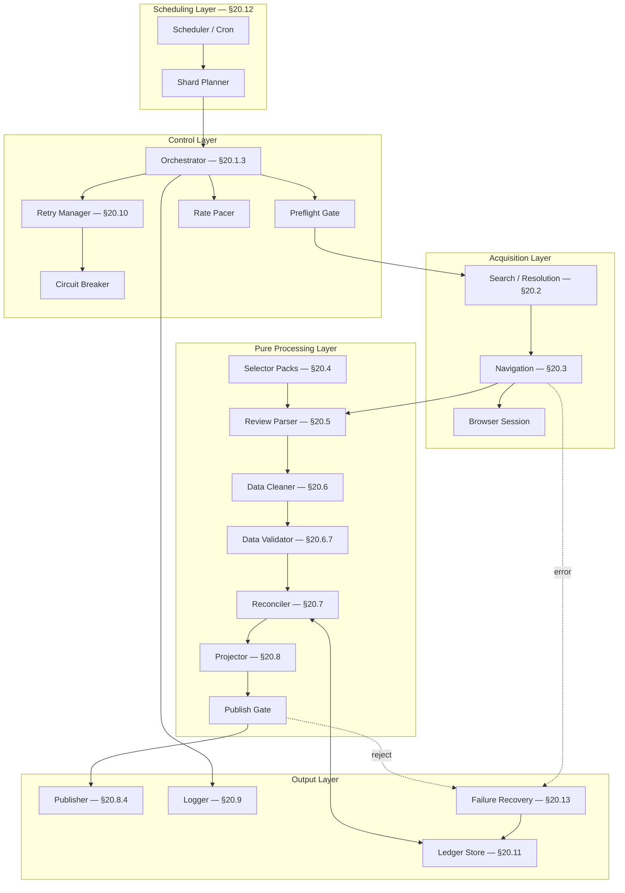
```mermaid
flowchart TB
    subgraph SCHED["Scheduling Layer — §20.12"]
        SCH["Scheduler / Cron"]
        PLAN["Shard Planner"]
    end
    subgraph CTRL["Control Layer"]
        ORCH["Orchestrator — §20.1.3"]
        PRE["Preflight Gate"]
        RETRY["Retry Manager — §20.10"]
        BREAK["Circuit Breaker"]
        LIM["Rate Pacer"]
    end
    subgraph ACQ["Acquisition Layer"]
        SRCH["Search / Resolution — §20.2"]
        NAV["Navigation — §20.3"]
        SESS["Browser Session"]
    end
    subgraph PURE["Pure Processing Layer"]
        SEL["Selector Packs — §20.4"]
        PARSE["Review Parser — §20.5"]
        CLEAN["Data Cleaner — §20.6"]
        VAL["Data Validator — §20.6.7"]
        RECON["Reconciler — §20.7"]
        PROJ["Projector — §20.8"]
        GATE["Publish Gate"]
    end
    subgraph OUT["Output Layer"]
        LEDG["Ledger Store — §20.11"]
        PUB["Publisher — §20.8.4"]
        LOG["Logger — §20.9"]
        REC["Failure Recovery — §20.13"]
    end

    SCH --> PLAN --> ORCH
    ORCH --> PRE --> SRCH --> NAV
    NAV --> SESS
    ORCH --> RETRY --> BREAK
    ORCH --> LIM
    NAV --> PARSE
    SEL --> PARSE
    PARSE --> CLEAN --> VAL --> RECON --> PROJ --> GATE
    RECON <--> LEDG
    GATE --> PUB
    ORCH --> LOG
    GATE -.->|"reject"| REC
    NAV -.->|"error"| REC
    REC --> LEDG
```

### 20.1.2 Module Responsibility Matrix

| Module | Owns | Explicitly Does NOT Own |
|---|---|---|
| Scheduler | *When* work happens | What work happens |
| Shard Planner | *Which runner* does which work | How work is done |
| Orchestrator | Stage sequencing, budgets, isolation | Any domain logic |
| Preflight | Permission to proceed | Data |
| Search / Resolution | Turning identity input into a canonical, verified listing | Reading reviews |
| Navigation | Getting content into the DOM | Interpreting content |
| Selector Packs | *Where* fields are | *What* fields mean |
| Review Parser | Lifting raw strings from structure | Cleaning them |
| Data Cleaner | Canonical, safe, typed values | Deciding validity |
| Data Validator | Verdicts about quality | Fixing anything |
| Reconciler | Merging observation into knowledge | Presentation |
| Projector | Public shape | Whether to publish |
| Publish Gate | The publish/reject decision | Writing anything |
| Publisher | Durable, visible output | Content |
| Ledger Store | Persistence of state | Interpretation of state |
| Logger | Structured, redacted event record | Deciding severity policy |
| Retry Manager | Whether and when to retry | Executing the operation |
| Failure Recovery | Preserving the last good state | Preventing failure |

### 20.1.3 Orchestrator Algorithm (Normative, Prose)

For each target `(client, listing)` in the shard, in a deterministic pseudo-random order:

1. Open a target-scoped logger child with `clientSlug`, `listingKey`, `runId`, and a fresh `targetId`.
2. Start the per-target budget timer. Register a hard abort at `budget_target_ms`.
3. **Preflight.** Evaluate the seven checks in order. Record the verdict in the manifest unconditionally. If denied, emit outcome `blocked` and continue to the next target.
4. **Acquire the rate token.** If unavailable, emit outcome `deferred` and continue.
5. **Resolve.** Obtain `ResolvedListing`, from cache where valid. Verify identity. On drift or ambiguity, emit `failed` with the specific error class.
6. **Acquire.** Invoke the selected adapter. The adapter internally uses Navigation and Browser Session (for `dom`) or an HTTP client (for API adapters). Wrap in the Retry Manager using the policy for acquisition-class errors.
7. **Extract → Normalize → Validate.** Pure stages, no retry (a pure function that failed will fail identically). Quarantine bad records; do not abort unless the container itself could not be located.
8. **Read prior Ledger.** A missing ledger is an empty ledger, not an error.
9. **Reconcile.** Pure. Produces the new Ledger and a decision log.
10. **Enrich** (v1.0: no-op).
11. **Project.** Build candidate artifacts.
12. **Gate.** Evaluate the candidate against the currently published payload and the validation report.
13. If `ACCEPT` or `ACCEPT_WITH_WARNINGS`: stage artifacts, write Ledger, append health record, emit `succeeded`. If `REJECT`: write **health record only**, retain published payload, emit `rejected`, raise an alert.
14. Close the browser context. Flush logs. Record per-stage timings.
15. Pace: sleep `inter_target_delay_ms` + jitter.

After all targets: write the run manifest, commit staged artifacts (single commit per branch per shard), push with rebase-and-retry, upload diagnostics, and emit the aggregate summary that drives the exit code.

**Normative note on commit batching.** Artifacts are *staged* per target but *committed once per shard*. This reduces commit count by the shard size (typically 5–20×), which directly addresses CON-13. The cost is that a shard crash after target 3 of 10 loses the staged work of those three targets — which is acceptable because reconciliation is idempotent (INV-04) and the next run reproduces it exactly.

## 20.2 Search / Resolution Module

### 20.2.1 Purpose

Convert whatever the operator supplied into a canonical, verified listing identity, and do so **once**, then cache it forever. Search is the most fragile and most expensive step in the entire acquisition path; the design goal is to execute it approximately never.

### 20.2.2 Input Forms and Precedence

| Priority | Input Form | Confidence | Cost | Notes |
|---|---|---|---|---|
| 1 | Explicit canonical place identifier | Highest | Zero | Preferred. Obtained once during onboarding via the `resolve` command. |
| 2 | Explicit numeric listing id (CID) | High | Zero | Extractable from a Maps URL; stable. |
| 3 | Cached identity (from a previous resolution) | High | Zero | TTL 30 days, but re-verified every run. |
| 4 | Full listing URL | High | Low | Parsed for embedded identifiers; falls to (5) if none present. |
| 5 | Name + locality + country search tuple | **Low** | High | Last resort. Emits a `warn`-level event every time it is used. |

**Normative:** onboarding MUST convert form (5) or (4) into form (1) and persist it in the client config. Search-at-runtime is a development convenience, not a production mode. Config validation emits a warning for any listing lacking an explicit identifier.

### 20.2.3 Resolution Flowchart

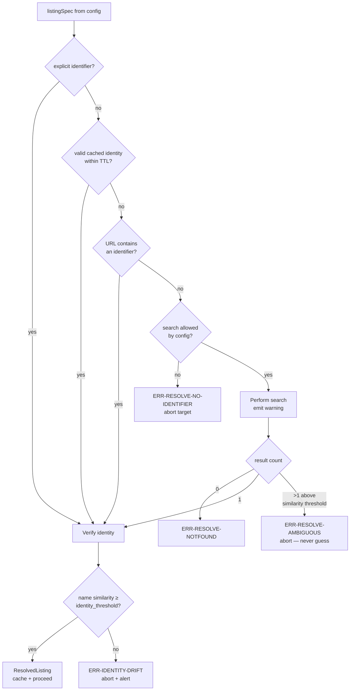
```mermaid
flowchart TD
    A["listingSpec from config"] --> B{"explicit identifier?"}
    B -->|yes| V["Verify identity"]
    B -->|no| C{"valid cached identity<br/>within TTL?"}
    C -->|yes| V
    C -->|no| D{"URL contains<br/>an identifier?"}
    D -->|yes| V
    D -->|no| E{"search allowed<br/>by config?"}
    E -->|no| F["ERR-RESOLVE-NO-IDENTIFIER<br/>abort target"]
    E -->|yes| G["Perform search<br/>emit warning"]
    G --> H{"result count"}
    H -->|"0"| I["ERR-RESOLVE-NOTFOUND"]
    H -->|"1"| V
    H -->|">1 above<br/>similarity threshold"| J["ERR-RESOLVE-AMBIGUOUS<br/>abort — never guess"]
    V --> K{"name similarity ≥<br/>identity_threshold?"}
    K -->|yes| L["ResolvedListing<br/>cache + proceed"]
    K -->|no| M["ERR-IDENTITY-DRIFT<br/>abort + alert"]
```

### 20.2.4 Identity Verification

Every run verifies that the cached identity still points at the expected business. This costs nothing (the name is already on the page being loaded) and catches an entire class of silent corruption.

| Check | Rule | On Failure |
|---|---|---|
| Name similarity | Normalised similarity between the page's business name and `expected_name` ≥ `identity_threshold` (default 0.82) | `ERR-IDENTITY-DRIFT`, abort, alert `high` |
| Advertised total sanity | Advertised total ≥ 0 and, if a prior value exists, has not fallen by more than `advertised_drop_tolerance` (default 40%) | Warning; feeds the Publish Gate |
| Aggregate rating sanity | Advertised rating within [1.0, 5.0] and not shifted by more than 0.5 from the prior value | Warning; feeds the Publish Gate |

**Engineering Note.** Name normalisation for the similarity check must strip legal suffixes (`Pvt Ltd`, `LLC`, `Inc`), collapse punctuation, casefold, and remove diacritics — otherwise a client's routine rebrand from "Commerce Insight" to "Commerce Insight®" trips a false drift alert. Test cases for this are mandatory.

### 20.2.5 Configuration Surface

| Key | Default | Meaning |
|---|---|---|
| `resolution.allow_search` | `false` in production, `true` in dev | Whether runtime search is permitted |
| `resolution.identity_threshold` | `0.82` | Minimum name similarity |
| `resolution.cache_ttl_days` | `30` | Re-resolution interval |
| `resolution.expected_name` | *required* | Ground truth for verification |
| `resolution.advertised_drop_tolerance` | `0.40` | Warning threshold |

### 20.2.6 Test Obligations

| Test | Assertion |
|---|---|
| Explicit id short-circuits | Search is never invoked when an id is present |
| Ambiguity | Two candidates above threshold ⇒ abort, no guess |
| Drift | Name mismatch ⇒ `ERR-IDENTITY-DRIFT` |
| Normalisation | Legal-suffix and diacritic variants do **not** trip drift |
| Cache TTL | Expired cache triggers re-resolution but not re-search when an id exists |

## 20.3 Navigation Module

### 20.3.1 Purpose

Drive the page from "opened" to "all target review content materialised in the DOM", then hand a serialised subtree to the pure parser. The Navigation module is the only component that performs interaction, and it is the primary consumer of the time budget.

### 20.3.2 Phase Machine

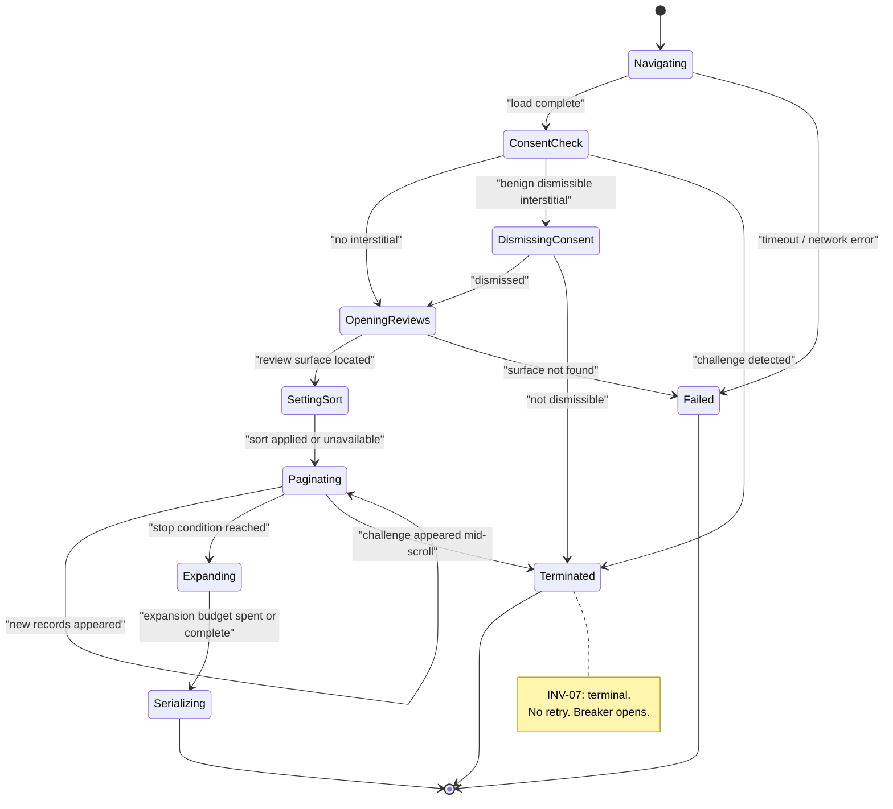
```mermaid
stateDiagram-v2
    [*] --> Navigating
    Navigating --> ConsentCheck: "load complete"
    Navigating --> Failed: "timeout / network error"
    ConsentCheck --> OpeningReviews: "no interstitial"
    ConsentCheck --> DismissingConsent: "benign dismissible interstitial"
    ConsentCheck --> Terminated: "challenge detected"
    DismissingConsent --> OpeningReviews: "dismissed"
    DismissingConsent --> Terminated: "not dismissible"
    OpeningReviews --> SettingSort: "review surface located"
    OpeningReviews --> Failed: "surface not found"
    SettingSort --> Paginating: "sort applied or unavailable"
    Paginating --> Paginating: "new records appeared"
    Paginating --> Expanding: "stop condition reached"
    Paginating --> Terminated: "challenge appeared mid-scroll"
    Expanding --> Serializing: "expansion budget spent or complete"
    Serializing --> [*]
    Failed --> [*]
    Terminated --> [*]

    note right of Terminated
        INV-07: terminal.
        No retry. Breaker opens.
    end note
```

### 20.3.3 Pagination Algorithm (Normative)

The review list is a lazily-populated, virtualised container. The algorithm is:

1. Locate the scroll container that owns the review list (from the selector pack, `containers.scroll`).
2. Record `count₀` = number of review nodes currently present.
3. Loop:
   a. Scroll the container by a configured increment (default: container height × 0.9) — **not** to the absolute bottom, because jumping past the virtualisation window can skip records.
   b. Wait for either a count increase or `scroll_settle_ms` (default 900 ms), whichever comes first.
   c. Record `countₙ`.
   d. Evaluate stop conditions in this order:
      - `cap_reached` if `countₙ ≥ max_reviews`.
      - `target_reached` if `countₙ ≥ advertisedTotal`.
      - `stalled` if `countₙ == countₙ₋₁` for `stall_threshold` consecutive iterations (default 3), each separated by an increasing backoff (900 ms, 1800 ms, 3600 ms).
      - `budget_exhausted` if elapsed ≥ `pagination_budget_ms`.
      - `error` on any thrown error or challenge detection.
   e. Otherwise continue.
4. Emit `PaginationReport { finalCount, iterations, stopReason, elapsedMs, growthCurve }`.

**The growth curve is retained** (count after each iteration). It is the single most diagnostic artifact in the system: a curve that plateaus at 12 with `advertisedTotal = 118` tells the whole story of an incident in one array.

### 20.3.4 Stop Reason → Completeness Mapping

| Stop Reason | Completeness | Publish Gate Treatment |
|---|---|---|
| `target_reached` | `full` | Normal evaluation |
| `exhausted` (no growth after threshold **and** count ≥ 95% of advertised) | `full` | Normal evaluation |
| `cap_reached` | `full_capped` | Normal evaluation; count-drop rule uses the cap, not the advertised total |
| `stalled` (count < 95% of advertised) | `partial` | **Cannot increment removal streaks**; count-drop rule applied strictly |
| `budget_exhausted` | `partial` | Same as `stalled` |
| `error` / `challenge` | `failed` | No publication at all |

**This table is the mechanical expression of INV-03 and is the single most important table in §20.** A `partial` harvest is trustworthy for *additions* (a review that appeared is real) and untrustworthy for *absences* (a review that did not appear may simply not have loaded). The reconciler treats the two asymmetrically on exactly this basis.

### 20.3.5 Text Expansion

| Aspect | Rule |
|---|---|
| Trigger | A review node contains an expansion affordance per the selector pack |
| Budget | `min(expand_max_count, floor(remaining_budget_ms / expected_interaction_ms))`; defaults 200 and 120 ms |
| Order | Longest-truncated first (by rendered length), so the budget buys the most recovered text |
| Failure | An expansion that throws or times out marks that record `text_truncated: true` and continues |
| Verification | After expansion, the text is re-read and checked for the absence of a truncation marker; if still present, `text_truncated` remains `true` |

**Design note.** Storing truncated text *flagged as truncated* is strictly better than storing it silently, and both are better than failing the harvest. The payload exposes `text_truncated` so a consumer can choose to link out rather than show a clipped review.

### 20.3.6 Configuration Surface

| Key | Default | Notes |
|---|---|---|
| `nav.navigation_timeout_ms` | `30000` | Page load |
| `nav.surface_timeout_ms` | `15000` | Locating the review surface |
| `nav.scroll_increment_ratio` | `0.9` | Fraction of container height per scroll |
| `nav.scroll_settle_ms` | `900` | Wait for new records |
| `nav.stall_threshold` | `3` | Consecutive no-growth iterations |
| `nav.pagination_budget_ms` | `120000` | Hard cap on pagination |
| `nav.max_reviews` | `1000` | Per-harvest cap; hard ceiling 5000 |
| `nav.expand_max_count` | `200` | Expansion interaction budget |
| `nav.sort_order` | `newest` | Falls back silently if unavailable |
| `nav.locale` | client locale | Drives date phrasing |

### 20.3.7 Resource Blocking (Performance and Politeness)

| Resource Type | Action | Rationale |
|---|---|---|
| Images | Block | Not needed for extraction; avatars are captured as URLs only (ADR-014). Largest single bandwidth saving. |
| Media (video/audio) | Block | Never needed |
| Fonts | Block | Layout may shift; extraction does not depend on glyph metrics |
| Stylesheets | **Allow** | Some structural and visibility determinations depend on computed layout |
| Analytics / telemetry hosts | Block | Not needed; reduces noise and avoids sending signals we have no reason to send |
| Hosts outside allowlist | Block | Defence in depth: a compromised page cannot make the runner a request source |

Measured effect: **60–80% reduction in transferred bytes** and a 25–40% reduction in wall-clock time. Both are reported in the run manifest so a regression in blocking effectiveness is visible.

## 20.4 Selector Pack Subsystem

### 20.4.1 The Core Idea

> **ADR-009 — Externalise all field-location knowledge into versioned, declarative Selector Packs**
> **Status:** Accepted
> **Context:** RISK-01 (upstream markup change) is the highest-likelihood risk in the system. In a conventional implementation, field locations are embedded in parser code, so every upstream change requires a code change, a code review, a release, and a deploy — and the knowledge of *why* a particular selector was chosen is lost.
> **Decision:** All field-location knowledge lives in versioned JSON files under `selectors/`. Parser code is generic: it reads a pack and resolves fields through ordered strategies. Packs are immutable once merged; a change means a new version file plus a one-line profile pin.
> **Alternatives Rejected:** *Selectors as constants in code* — the default approach; makes the highest-frequency change also the highest-ceremony change. *Machine-learned or heuristic extraction with no selectors* — non-deterministic, untestable against golden fixtures, and impossible to reason about during an incident. *Selectors fetched from a remote config service at runtime* — introduces a network dependency and a supply-chain risk into the most sensitive path, for a change frequency of ~3 per year.
> **Consequences:** A markup change is repaired by editing a data file, verified against the fixture corpus, and rolled out by changing one pinned version — with instant rollback. Cost: an extra indirection layer to understand, and the discipline of keeping packs schema-valid. Target: ≥ 70% of breakages fixable without touching code (NFR-019).

### 20.4.2 Pack Structure (Field Contract)

| Section | Contents |
|---|---|
| `meta` | `pack_version`, `source`, `created`, `notes`, `min_engine_version` |
| `containers` | Locators for: the review surface, the scroll container, the individual review node, the reply node |
| `fields` | Per logical field: ordered `strategies[]`, `required` flag, `transform` reference |
| `affordances` | Locators for: expansion control, sort control, pagination trigger, consent dismissal |
| `signals` | Locators/patterns that indicate: challenge page, empty state, error state |
| `assertions` | Structural invariants the canary verifies (§25.5) |

### 20.4.3 Strategy Kinds, in Preference Order

| Order | Kind | Example Concept | Stability | Why This Rank |
|---|---|---|---|---|
| 1 | `role` | An element with an accessibility role identifying a review or rating | **Highest** | Accessibility semantics are user-facing contracts; changing them breaks screen readers, so vendors change them rarely and carefully |
| 2 | `aria-label-pattern` | A labelled element whose label matches a rating pattern | High | Same reasoning; also carries the *value* directly, which is often more robust than parsing visual stars |
| 3 | `data-attribute` | A stable-looking data attribute | Medium-High | Frequently used for the vendor's own tooling, so moderately stable |
| 4 | `structural-relative` | "The element two levels above the rating, containing a text node" | Medium | Survives class renames; breaks on layout restructuring |
| 5 | `text-pattern` | Match a known phrase shape (e.g. a relative-date pattern) | Medium | Locale-dependent but structure-independent |
| 6 | `css` | A generated class selector | **Lowest** | Fastest to write, first to break. Present only as a last-resort fallback with low confidence weight |

**Normative:** every required field MUST declare at least two strategies of different kinds, and MUST NOT declare `css` as its only strategy.

### 20.4.4 Strategy Health Reporting — The Early-Warning System

For every field of every record, the resolver records which strategy index succeeded. Aggregated per run:

| Signal | Meaning | Action |
|---|---|---|
| All fields resolve at index 0 | Healthy | None |
| A field resolves at index ≥ 1 for > 20% of records | **Drift beginning** — the preferred locator is failing | `warn` alert; investigate at leisure; extraction still correct |
| A field resolves at index ≥ 1 for > 80% of records | **Drift confirmed** | `warn` alert with elevated priority; schedule a pack update |
| A required field resolves at no index for > 5% of records | **Breakage** | `error` alert; records quarantined; gate likely rejects |

**This is the most valuable operational property of the selector-pack design.** It converts an upstream change from a *cliff* (extraction works, then abruptly does not) into a *ramp* (fallbacks begin to carry the load, and we get told about it while everything still works). Median detection lead time is expected to improve from "after the break" to "days before the break".

### 20.4.5 Authoring and Rollout Workflow

| Step | Action |
|---|---|
| 1 | Capture a live page as a sanitised fixture (`scripts/capture-fixture.mjs`) |
| 2 | Add the fixture with an `expected.json` golden file |
| 3 | Copy the current pack to `v<n+1>.json`; edit strategies |
| 4 | Run the golden suite: the **new** pack must pass the new fixture **and** all existing fixtures whose `meta.json` marks them pack-agnostic; **old** packs must continue to pass their own fixtures |
| 5 | Update `profiles/default.json` to pin the new pack |
| 6 | PR; CI runs the full corpus plus a live canary |
| 7 | Merge; next scheduled run uses the new pack; monitor strategy health |
| 8 | Rollback if needed: revert the one-line pin. No code revert, no release |

## 20.5 Review Parser

### 20.5.1 Purpose and Purity

The parser is a **pure function**: `(serializedSubtree, selectorPack, listingContext) → ExtractedReview[]`. It performs no I/O and no cleaning. Its only job is to locate and lift raw strings, plus record how it found them.

Purity here is load-bearing: it is what allows the golden fixture corpus (§41.3) to be the primary regression mechanism, and what makes an incident reproducible offline in seconds.

### 20.5.2 Per-Record Extraction Order

For each review node located inside the review container:

| # | Field | Strategy Notes | Required |
|---|---|---|---|
| 1 | **Reply isolation** | *First*, identify and detach any owner-reply subtree. Everything after operates on the review-only subtree. | — |
| 2 | Author display name | Prefer an accessible name; fall back to structural | Yes |
| 3 | Author profile URL | Optional; validated later against a host allowlist | No |
| 4 | Author avatar URL | Optional; URL only, never fetched | No |
| 5 | Author badges | e.g. local-guide indicator, review-count text | No |
| 6 | Rating | Three parsers in order: aria-label numeric, filled-star count, numeric text | Yes |
| 7 | Relative date text | Verbatim, unmodified | Yes |
| 8 | Review text | With truncation-marker detection | No (rating-only reviews are valid) |
| 9 | Like / helpful count | Numeric text, locale-aware thousands separators | No |
| 10 | Photo count | If the review includes images | No |
| 11 | Visit metadata | e.g. service type, where present | No |
| 12 | Owner reply text + relative date | From the detached subtree | No |
| 13 | Source node ordinal | Position in the rendered list — retained for diagnostics only, never for identity | — |

**Normative:** step 1 comes first and is non-negotiable. FR-033 exists because ingesting an owner reply as a five-star review is a real, observed failure that silently inflates ratings.

### 20.5.3 Rating Parsing Detail

| Parser | Input Shape | Output | Notes |
|---|---|---|---|
| P1 accessible-label | A label containing a numeric rating and a scale | Integer 1–5 | Most reliable; carries the value explicitly. Must handle locale decimal separators. |
| P2 star-count | Count of "filled" indicator elements | Integer 1–5 | Requires the pack to distinguish filled from unfilled; fragile to styling change. |
| P3 numeric-text | A bare numeric string near the rating container | Integer 1–5 | Last resort. |

Post-parse validation: value MUST be an integer in [1, 5]. A non-integer (e.g. 4.5 from a mis-parsed aggregate) is a **fatal record finding** — it almost always means the aggregate business rating was captured instead of the review rating. This specific check has prevented a whole class of silent corruption and MUST be implemented.

### 20.5.4 Date Resolution — The Hardest Small Problem

Relative dates are lossy, locale-dependent, and re-render differently every harvest. The design:

| Concept | Rule |
|---|---|
| **Capture verbatim** | `relative_date_raw` stores the exact string, always, for every locale. This is the audit trail. |
| **Resolve to an estimate** | Parse the phrase into a duration and subtract from `observed_at`, giving `date_estimated`. |
| **Record precision** | One of `day`, `week`, `month`, `year`, `unknown` — derived from the phrase granularity, not from the arithmetic. |
| **Record confidence** | `high` for explicit day/week phrases, `medium` for month phrases, `low` for year phrases and anything requiring a fallback. |
| **PIN on first observation** | Once a review has a `date_estimated`, it is **never recomputed** (FR-036). Later harvests see "3 years ago" where the first saw "2 months ago"; recomputing would push the review's date forward in time on every run, scrambling ordering permanently. |
| **Never sort by estimate alone** | Ordering uses `(date_estimated, first_seen_at, identity_hash)` as a composite key so ordering is stable and total even when estimates tie. |

**Locale matrix (minimum required coverage):**

| Locale | Example Phrases | Notes |
|---|---|---|
| `en` | "a day ago", "2 weeks ago", "3 months ago", "a year ago", "yesterday" | Note the "a/an" singular forms — a very common parser bug |
| `hi` | Devanagari relative phrases | Required for the first target's market |
| `de` | "vor 2 Wochen" | Prefix rather than suffix ordering |
| `fr` | "il y a 2 semaines" | Multi-word prefix |
| `es` / `pt` | "hace 2 semanas" | |
| `ar` | RTL relative phrases | Also exercises RTL text handling |

**Normative:** the date resolver MUST fail *soft* — an unparseable phrase yields `precision: unknown`, `confidence: low`, and `date_estimated: null`, with the record still valid. Ordering falls back to `first_seen_at`. **Never** discard a review because its date could not be parsed.

**Engineering Note.** The temptation is to be clever: fetch absolute dates from a tooltip, or reverse-engineer a timestamp from an internal identifier. Both were considered. Both were rejected: tooltips require an extra interaction per review (blowing the budget), and internal identifiers are undocumented and unstable. The pinned-estimate approach is less precise but is stable, cheap, and honest — and the payload exposes `date_precision` so a consumer can render "3 months ago" rather than a false-precision date.

### 20.5.5 Parser Error Model

| Situation | Classification | Effect |
|---|---|---|
| Review container not found | `ERR-PARSE-STRUCTURE` | **Abort target.** Almost certainly an upstream change. |
| Zero review nodes but container found and empty-state signal present | Not an error | `total_count: 0` is a legitimate result |
| Zero review nodes, container found, no empty-state signal | `ERR-PARSE-EMPTY-UNEXPECTED` | Abort target; likely a change or a load failure |
| Required field missing on a single record | `ERR-PARSE-FIELD-REQUIRED` | Quarantine that record only |
| Optional field missing | Not an error | Field is `null` |
| Rating out of range | `ERR-PARSE-RATING-INVALID` | Quarantine that record |

## 20.6 Data Cleaner (Normalizer)

### 20.6.1 Purpose

Transform raw extracted strings into canonical, safe, bounded, typed values. **This is the security boundary of the entire system** (§16.7): everything downstream trusts that the Normalizer did its job.

### 20.6.2 Normalisation Pipeline (Ordered — Order Matters)

| # | Step | Detail | Why This Position |
|---|---|---|---|
| 1 | Decode entities | Resolve HTML entity references | Must precede markup stripping, or `&lt;script&gt;` survives as literal text and re-encodes into markup downstream |
| 2 | Strip markup | Remove all tags and any tag-like constructs | Must follow decoding for the reason above |
| 3 | Unicode normalise | NFC | Before length bounding, so grapheme counting is meaningful |
| 4 | Remove control characters | Strip C0/C1 controls except `\n` and `\t`; strip zero-width and bidi-override characters | Bidi overrides can visually reorder text — a real spoofing vector |
| 5 | Canonicalise whitespace | `\r\n`/`\r` → `\n`; collapse runs of ≥ 3 newlines to 2; collapse horizontal whitespace runs; trim | After control-character removal so invisible characters do not survive as "content" |
| 6 | Detect truncation | Match locale-aware truncation markers; set `text_truncated` and remove the marker | After whitespace canonicalisation so marker matching is reliable |
| 7 | Bound length | Cut at `max_text_length` (default 5,000) on a **grapheme cluster** boundary; set `text_clipped` | Last, so the bound applies to final content |
| 8 | Type and brand | Return branded `CleanString` values | Makes the boundary enforceable by the type checker |

**Normative:** step 2 removes markup rather than escaping it. The payload contains **no markup of any kind** (FR-038, INV-05). A consumer that wants emphasis in review text does not get it — that is the correct trade for eliminating stored XSS across every client site simultaneously.

### 20.6.3 Emoji, RTL, and Script Handling

| Concern | Rule |
|---|---|
| Emoji | **Preserved exactly**, including ZWJ sequences and skin-tone modifiers. Length bounding must be grapheme-aware or a cut will split a ZWJ sequence and produce mojibake. |
| RTL text | Preserved. Explicit bidi *override* characters (RLO/LRO) are stripped; bidi *marks* required for correct rendering of mixed content are preserved. |
| CJK | Preserved. Note that a 5,000-*grapheme* bound is a much larger byte count for CJK; the payload size budget accounts for this. |
| Combining marks | Preserved after NFC. |
| Homoglyph author names | **Not** normalised away. Two authors with visually identical names are two authors; the author key derivation must not merge them (that would be a data-integrity bug, not a feature). |

### 20.6.4 Author Name and Key

| Field | Treatment |
|---|---|
| `author.name` (published) | Preserved as given, with only steps 1–5 applied. **Never** abbreviated, initialised, or anonymised by default (FR-042). |
| `author_key` (internal) | Derived: casefold → strip diacritics → collapse whitespace → remove punctuation → hash. Used for identity matching only, never published. |
| Anonymous authors | A missing or placeholder name yields `author.name: null` and an `author_key` derived from a per-listing anonymous bucket plus content, so two anonymous reviews are not merged. |

### 20.6.5 Language Detection

| Aspect | Rule |
|---|---|
| Method | Script-range analysis first (Devanagari, Arabic, CJK, Cyrillic, Latin), then stopword frequency for Latin-script disambiguation |
| Output | `{ code: ISO 639-1 \| null, confidence: 0–1 }` |
| Minimum length | Below 12 graphemes, return `null` with confidence 0 — short text cannot be reliably classified and a wrong guess is worse than none |
| Dependency policy | No large model, no network (DEP-2). A compact internal implementation is required. |
| Use | Optional consumer-side filtering; input to future AI enrichment; never used to reject a review |

### 20.6.6 URL Validation

| Field | Rule |
|---|---|
| `author.avatar_url` | Must parse as HTTPS; host must match the source's expected avatar host allowlist; query parameters that encode a size may be normalised to a preferred size; otherwise set `null`. **Never fetched.** |
| `author.profile_url` | Must parse as HTTPS and match the source host allowlist; otherwise `null` |
| `source_url` | Constructed by the engine from the canonical listing identity, never taken from page content |

**Rationale for the allowlist.** An unvalidated URL from page content, published into a client's site as an image `src`, is an open redirect and a tracking vector. Allowlisting is cheap and eliminates it.

### 20.6.7 Data Validator

The Validator produces verdicts; it never modifies data.

**Per-record findings:**

| Check | Severity | Effect |
|---|---|---|
| Rating is an integer in [1,5] | fatal | Quarantine record |
| `author_key` derivable | fatal | Quarantine record |
| `relative_date_raw` non-empty | warn | Keep; `date_estimated: null` |
| Text length within bound | info | Already enforced by the cleaner |
| Text contains no markup | fatal | **Indicates a cleaner bug.** Quarantine and alert `error`. This is a self-check on the security boundary and MUST exist. |
| Avatar/profile URL valid or null | warn | Set to `null` |
| Language detected or null | info | — |
| Reply, if present, has text | warn | Drop empty reply |

**Aggregate findings:**

| Check | Rule | Severity |
|---|---|---|
| Coverage | `extracted / advertisedTotal ≥ coverage_min` (default 0.95) for `full` classification | Determines completeness |
| Intra-run duplicates | Identical `identity_hash` within one harvest ⇒ collapse deterministically (keep the record with more complete fields) | warn |
| Near-duplicates | Same `author_key`, text similarity ≥ 0.92, different `identity_hash` | warn (RISK-11 early signal) |
| Mean rating plausibility | Computed mean within `rating_tolerance` (default 0.3) of advertised rating | warn; feeds the gate |
| Distribution degeneracy | Not 100% single-rating unless the listing genuinely has ≤ 3 reviews | warn |
| Quarantine rate | Quarantined ÷ total ≤ `quarantine_max` (default 0.05) | fatal above threshold — indicates systemic extraction failure |
| Strategy health | Per §20.4.4 | warn / error |

**Output:** `ValidationReport { recordFindings[], aggregateFindings[], completeness, coverage, counts, quarantined[] }`. This report is an input to both the Reconciler (for asymmetric absence handling) and the Publish Gate (for the accept/reject decision).

## 20.7 Reconciliation Engine

### 20.7.1 Purpose and Contract

`reconcile(priorLedger, observed, validationReport, config, now) → { ledger, decisions }`

Pure, deterministic, idempotent, and order-independent. This is the most consequential pure function in the system: it is where "what we just saw" becomes "what we know".

### 20.7.2 Decision Rules

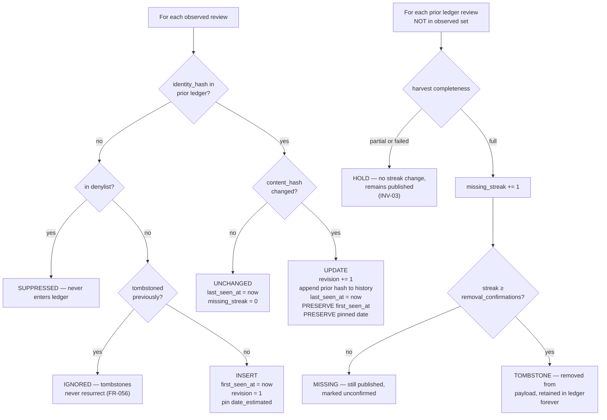
```mermaid
flowchart TD
    START["For each observed review"] --> ID{"identity_hash in<br/>prior ledger?"}
    ID -->|no| SUP1{"in denylist?"}
    SUP1 -->|yes| SKIP["SUPPRESSED — never enters ledger"]
    SUP1 -->|no| TOMB{"tombstoned<br/>previously?"}
    TOMB -->|yes| NEVER["IGNORED — tombstones<br/>never resurrect (FR-056)"]
    TOMB -->|no| INS["INSERT<br/>first_seen_at = now<br/>revision = 1<br/>pin date_estimated"]
    ID -->|yes| CH{"content_hash<br/>changed?"}
    CH -->|no| UNCH["UNCHANGED<br/>last_seen_at = now<br/>missing_streak = 0"]
    CH -->|yes| UPD["UPDATE<br/>revision += 1<br/>append prior hash to history<br/>last_seen_at = now<br/>PRESERVE first_seen_at<br/>PRESERVE pinned date"]

    START2["For each prior ledger review<br/>NOT in observed set"] --> COMP{"harvest completeness"}
    COMP -->|"partial or failed"| HOLD["HOLD — no streak change,<br/>remains published<br/>(INV-03)"]
    COMP -->|full| STREAK["missing_streak += 1"]
    STREAK --> THR{"streak ≥<br/>removal_confirmations?"}
    THR -->|no| UNCONF["MISSING — still published,<br/>marked unconfirmed"]
    THR -->|yes| TOMBSTONE["TOMBSTONE — removed from<br/>payload, retained in ledger<br/>forever"]
```

### 20.7.3 The Asymmetry Rule (Normative)

| Observation | Trust Level | Action |
|---|---|---|
| A review **appeared** | **Trusted** regardless of completeness | Insert or update it. A record cannot appear spuriously. |
| A review **did not appear** in a `full` harvest | Trusted | Increment `missing_streak` |
| A review **did not appear** in a `partial` or `failed` harvest | **Not trusted** | Change nothing. Do not increment, do not decrement. |

This asymmetry is the whole of INV-03 and it is the reason the system cannot wipe a client's reviews. **An implementer who "simplifies" this by treating absence uniformly has introduced the system's worst possible bug.** It must be covered by an explicit, named test.

> **ADR-008 — Absence at source MUST NOT immediately delete a review**
> **Status:** Accepted
> **Context:** A harvest observes a set of reviews. The naive interpretation is that the observed set *is* the truth, so anything absent has been deleted. That interpretation is wrong far more often than it is right: partial page loads, stalled virtualised scrolling, personalised ordering, and truncated pagination all produce absences that have nothing to do with deletion. Genuine review deletion is rare; incomplete harvests are common.
> **Decision:** Absence is treated asymmetrically from presence. A review that *appears* is trusted immediately regardless of harvest quality. A review that *does not appear* increments a `missing_streak` only when the harvest was classified `full`, and is removed from the payload only after `removal_confirmations` (default 3) consecutive qualifying harvests. Absence in a `partial` or `failed` harvest changes nothing at all.
> **Alternatives Rejected:** *Treat the observed set as authoritative* — the industry-default approach, and the direct cause of the "our reviews disappeared" failure that makes review widgets untrustworthy. *Delete after a single absence with a manual undo* — puts a destructive default behind a human recovery step, which is backwards. *Never delete anything* — leaves genuinely removed reviews (including ones removed by the platform for policy violations) displayed indefinitely, which is its own correctness and compliance problem. *Compare against the advertised total only* — too coarse; a listing can lose one review and gain one between harvests with no net count change.
> **Consequences:** Deletions propagate slowly — up to three cadence intervals, roughly 18 hours at the default 6-hour tier. That latency is the price, and it is cheap: a deleted review displaying for a further day is a minor inaccuracy, whereas mass deletion from a bad harvest is a client-visible catastrophe. The rule also requires that harvest completeness be classified honestly (§20.3.4), which is why the Navigator's stop reason is a first-class output rather than an internal detail.

### 20.7.4 Ledger Record Lifecycle

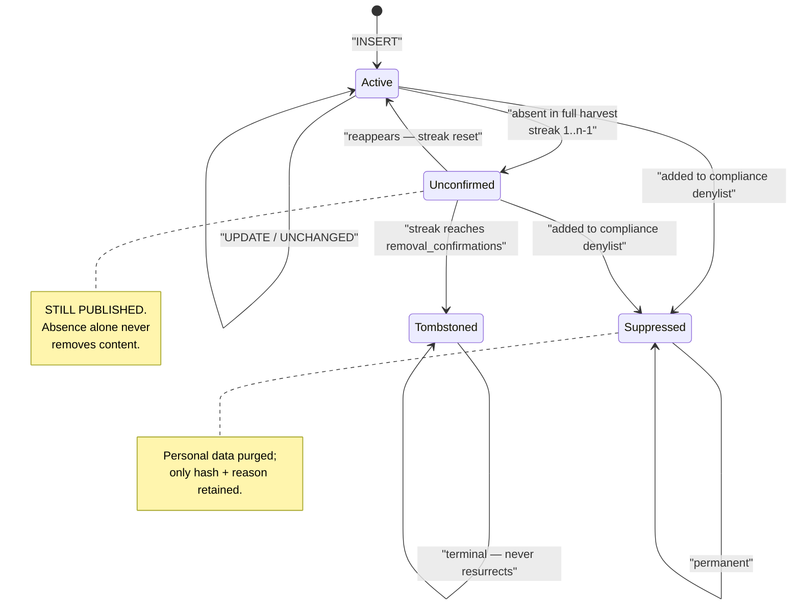
```mermaid
stateDiagram-v2
    [*] --> Active: "INSERT"
    Active --> Active: "UPDATE / UNCHANGED"
    Active --> Unconfirmed: "absent in full harvest<br/>streak 1..n-1"
    Unconfirmed --> Active: "reappears — streak reset"
    Unconfirmed --> Tombstoned: "streak reaches removal_confirmations"
    Active --> Suppressed: "added to compliance denylist"
    Unconfirmed --> Suppressed: "added to compliance denylist"
    Tombstoned --> Tombstoned: "terminal — never resurrects"
    Suppressed --> Suppressed: "permanent"

    note right of Unconfirmed
        STILL PUBLISHED.
        Absence alone never
        removes content.
    end note
    note right of Suppressed
        Personal data purged;
        only hash + reason retained.
    end note
```

### 20.7.5 Idempotence, Monotonicity, and Commutativity

These three properties are enforced by property tests (§41.2) and are the reason the system is safe to retry, replay, and re-shard.

| Property | Statement | Why It Matters |
|---|---|---|
| **Idempotence** | `reconcile(reconcile(L, H), H) ≡ reconcile(L, H)` when `now` is held fixed | Safe retries. A shard that crashes after reconciling but before committing can simply re-run. |
| **Monotonicity** | A tombstoned or suppressed id never becomes active again | Compliance durability (FR-057) and prevention of "deleted review comes back" — a class of bug that is both embarrassing and legally significant. |
| **Commutativity** | The order of records within `observed` does not affect the resulting Ledger | Upstream ordering is unstable and personalised (D6). Any order-dependence would produce nondeterministic output. |
| **Preservation** | `first_seen_at` and the pinned `date_estimated` are never modified after INSERT | Historical integrity; stable sort order. |

### 20.7.6 Cross-Adapter Identity Stability

**Normative and load-bearing for ADR-023.** The same real-world review, harvested via the DOM adapter and via the Business Profile API adapter, MUST produce the same `identity_hash`. This requires that identity derivation use only fields every adapter can supply: listing key, author key, and normalised text (plus rating as a tiebreaker). It MUST NOT use any source-specific or access-method-specific value.

A dedicated property test (`identity.cross-adapter.test.mjs`) asserts this against paired fixtures — the same reviews captured through both paths. Without this test, the migration guarantee in §15.7.1 is an unverified claim.

### 20.7.7 Configuration Surface

| Key | Default | Range | Notes |
|---|---|---|---|
| `reconcile.removal_confirmations` | `3` | 2–10 | Consecutive `full` harvests before tombstoning |
| `reconcile.coverage_min` | `0.95` | 0.5–1.0 | Threshold for `full` classification |
| `reconcile.near_duplicate_threshold` | `0.92` | 0.8–1.0 | Warning only |
| `reconcile.keep_tombstones` | `true` | — | MUST remain true; present for testing only |

## 20.8 Exporter — Projector, Gate, and Publisher

### 20.8.1 Projector

Pure: `(ledger, config, engineMeta) → Artifacts`. Steps:

1. Filter: exclude tombstoned and suppressed records.
2. Apply display filters from config: `min_text_length`, `languages`, `include_rating_only`, optional `min_rating` (default: none — see §8.2).
3. Sort by the composite key `(date_estimated desc, first_seen_at desc, identity_hash asc)` — total and stable.
4. Map each Ledger record to its public projection for the target `schema_version`.
5. Compute aggregates.
6. Emit `reviews.json` (all), `latest.json` (top `latest_count`, default 20), `stats.json`, optional `schema-org.json`, and a listing `index.json`.
7. Serialise minified with stable key ordering; compute a content hash over the canonical bytes.

**Determinism requirement:** identical ledger + identical config ⇒ byte-identical artifacts. This is what makes hash-gated writes (FR-065) work, and it is broken by a single unsorted key or embedded timestamp in the wrong place. `generated_at` therefore lives **only** in the manifest and in a field explicitly excluded from the content hash.

### 20.8.2 Publish Gate Placement

The Gate sits between the Projector and the Publisher and is specified fully in §27.3. Architecturally the important point is that it is **pure** and receives both the candidate and the currently published payload, so it can reason about *change* rather than only about *state*.

### 20.8.3 Artifact Set Per Listing

| Artifact | Purpose | Typical Size (120 reviews) | Cache TTL |
|---|---|---|---|
| `reviews.json` | Complete payload | ~110 KB / ~38 KB gzip | Long, content-addressed via manifest |
| `latest.json` | Top-N for the common widget case | ~20 KB / ~8 KB gzip | Medium |
| `stats.json` | Aggregates only — rating badge, count headline | ~1 KB | Medium |
| `schema-org.json` | Structured-data projection | ~30 KB | Long |
| `index.json` (listing) | Manifest: hashes, counts, versions, generated_at | ~1 KB | **Short** — this is the freshness pointer |

**Consumer contract:** read `index.json` first (short TTL), then fetch the referenced artifact (long TTL). This is the standard manifest-plus-immutable-content pattern and it gives both freshness and cacheability without cache purging.

### 20.8.4 Publisher

| Aspect | Rule |
|---|---|
| Staging | All artifacts for all targets in a shard are written to a checkout of the `data` branch |
| Hash gate | If the new bytes equal the current bytes, the file is not touched (FR-065) — no commit, no churn |
| Commit | One commit per shard per branch, with the structured message from §17.14 |
| Push | `--force-with-lease` is **not** used. Push; on non-fast-forward, fetch, rebase the shard's commit, retry, up to 3 times with backoff (2 s, 6 s, 18 s) |
| Conflict impossibility | Shards write disjoint client paths, so a rebase can never produce a content conflict — only an ancestry update |
| Failure | After 3 attempts, `ERR-PUBLISH-CONFLICT`; artifacts are uploaded as CI artifacts and the next run reproduces them deterministically |
| Ledger and health | Written to the `state` branch in a separate commit with the same retry logic |
| Ordering | **Payload first, then state.** If the process dies between them, the next run re-reconciles from the older ledger and produces the same payload (idempotence) — a benign no-op. The reverse order could publish a payload that the ledger does not justify. |

**Engineering Note.** That last row is subtle and worth stating explicitly: when two writes cannot be made atomic, order them so that a crash between them leaves the system in a state the next run can repair. Publishing before recording state is repairable; recording state before publishing is not.

## 20.9 Logger

Specified fully in §24. Module-level contract:

| Aspect | Rule |
|---|---|
| Format | JSONL, one event per line, UTF-8 |
| Mandatory fields | `ts`, `level`, `runId`, `stage`, `event`; plus `clientSlug`, `listingKey`, `targetId` where in target scope |
| Optional fields | `durationMs`, `errorClass`, `count`, `detail` (bounded object) |
| Child loggers | Created per target and per stage so context need not be repeated at call sites |
| Redaction | Applied **at the sink** (FR-076) — a careless call site cannot leak, because redaction is not the caller's responsibility |
| Levels | `trace`, `debug`, `info`, `warn`, `error`, `fatal`; default `info` in CI, `debug` on failure re-run |
| Volume control | `trace`/`debug` are buffered in a ring buffer and only flushed to disk if the target fails — full-fidelity logs exactly when needed, and cheap otherwise |

**The ring-buffer decision matters.** Always writing debug logs for a healthy 5,000-review harvest produces megabytes of noise per run. Buffering them and flushing only on failure gives full diagnostic depth with none of the cost — and it is why UC-11 can be a 10-minute job.

## 20.10 Retry Manager

Specified fully in §26. Module-level contract:

| Aspect | Rule |
|---|---|
| Policy source | Data, not code: a table keyed by error class (§26.2) |
| Decision | `never` \| `immediate` \| `backoff` with `maxAttempts`, `baseMs`, `multiplier`, `jitter`, `capMs` |
| Purity | The policy function is pure; the executor is a thin wrapper |
| Non-retryable by construction | Bot challenge, policy block, identity drift, structure change, gate rejection, schema invalid |
| Budget awareness | A retry is not attempted if the projected delay would exceed the remaining target budget |
| Idempotence requirement | Only operations that are safe to repeat may be wrapped. Acquisition is safe (read-only). Publication is safe (hash-gated and idempotent). |

## 20.11 Ledger Store

> **ADR-006 — Separate the private Ledger from the public Payload**
> **Status:** Accepted
> **Context:** The naive design keeps one file: the published JSON. Then reconciliation has nothing to reconcile against except the thing it is about to overwrite, and every field needed for correctness (first-seen time, missing streaks, tombstones, revision history, provenance) either pollutes the public contract or does not exist.
> **Decision:** Two stores. The **Ledger** (private, on the `state` branch) is the source of truth: complete, verbose, append-oriented, containing tombstones, streaks, revision history, and provenance. The **Payload** (public, on the `data` branch) is a *projection* of the Ledger: minimal, minified, safe, and versioned as a contract.
> **Alternatives Rejected:** *Single published file as state* — makes tombstones and streaks impossible without leaking internal bookkeeping into a public contract; makes the public schema hostage to internal needs; and means a bad publish destroys the state that would let you recover. *State in a separate database* — cost and operational burden (CON-01, CON-08). *State in CI cache* — caches are evictable; correctness must never depend on a cache (CON-09).
> **Consequences:** One extra branch and one extra write per run. In exchange: the public contract stays minimal and stable, internal state can evolve freely without a schema version bump, a bad payload can always be regenerated from the Ledger (`project` command), and every state transition is a reviewable Git diff. This ADR is what makes §52's recovery plan almost trivially short.

| Aspect | Rule |
|---|---|
| Location | `state` branch, `ledger/<client>/<listing>.json` |
| Format | Pretty-printed JSON, stable key order, trailing newline — optimised for human diff reading |
| Size expectation | ~1.5 KB per review including history; ~180 KB for 120 reviews |
| Growth | Monotonic. Tombstones and revision history are never pruned in v1.0. §33.5 defines the pruning policy if a ledger exceeds 5 MB. |
| Atomicity | Temp-write-then-rename per file; commit per shard |
| Corruption handling | Schema-validate on read. On failure: `ERR-STATE-CORRUPT`, abort target, alert `high`, recover per §52.4 (restore the previous version from Git history — always available) |
| Forward compatibility | Unknown fields are preserved on read-modify-write (FR-058), so an older engine cannot silently strip a newer engine's data |

## 20.12 Scheduler

Specified fully in §22. Module-level contract:

| Aspect | Rule |
|---|---|
| Trigger | Cron per cadence tier, plus manual dispatch, plus PR-triggered dry runs |
| Cadence tiers | `hourly` (policy floor), `standard` (6 h, default), `relaxed` (12 h), `daily` (24 h) |
| Due-set computation | A pure function of (registry, health, now): a target is due if `now − last_success ≥ tier_interval × 0.9` |
| Jitter | Each tier's cron fires at a non-round minute, and the orchestrator adds per-target jitter (§28.4) so requests are never synchronised across clients |
| Sharding | Cost-balanced by historical p50 duration (§37.3) |
| Overlap prevention | A concurrency group ensures a new scheduled run cannot start while the previous one is still running; the new run is cancelled rather than queued |
| Catch-up | A missed cycle is not "made up". The next cycle simply proceeds — cadence is a rate, not a contract for specific instants |

## 20.13 Failure Recovery

Specified fully in §27. Module-level contract:

| Failure | Recovery Action | Visitor Impact |
|---|---|---|
| Adapter error (network, timeout) | Retry per policy; on exhaustion, retain LKG | None |
| Bot challenge | Terminal; breaker opens; alert; retain LKG | None |
| Structure change | Abort target; alert; retain LKG | None |
| Partial harvest | Reconcile additions only; gate likely rejects; retain LKG | None |
| Gate rejection | Retain LKG; alert with itemised reasons | None |
| Publish conflict | Rebase-retry; on exhaustion, artifacts preserved; next run reproduces | None |
| Ledger corruption | Restore previous ledger version from Git; re-run | None |
| Total repository loss | Recreate from any clone; payloads are also cached at the CDN | None until CDN TTL expiry |
| Engine regression | Revert the engine commit; re-run `project` from the Ledger to regenerate payloads without any acquisition | None |

**The pattern across every row is identical: no failure mode reaches the visitor.** That is not an accident of good luck; it is the consequence of ADR-001 (decoupling), ADR-006 (state separate from output), and ADR-011 (gated publication) acting together. Any proposed change that breaks one of those three re-opens every row in this table.

---

# 21. JSON Schema — The Public Data Contract

## 21.1 Design Principles

| # | Principle | Consequence |
|---|---|---|
| 1 | **The payload is a contract.** Consumers pin a major version and are guaranteed stability within it. | Additive-only evolution within a major (ADR-019). |
| 2 | **Forward-declare fields the engine does not yet populate.** | Sentiment, AI summary, spam score, likes, and verification exist at v1 as nullable fields. A consumer written today does not break when they are filled in (§2.2). |
| 3 | **Plain text only. No markup, ever.** | INV-05. Eliminates stored XSS across all client sites. |
| 4 | **Precompute anything a consumer would otherwise compute.** | Aggregates, distribution, and sort order ship ready-to-use; the renderer stays under 5 KB. |
| 5 | **Provenance is mandatory.** | Every payload states which engine, schema, adapter, selector pack, and run produced it (INV-06). |
| 6 | **Honest metadata about quality.** | `date_precision`, `text_truncated`, `coverage`, and `completeness` are published, so consumers can render truthfully rather than confidently. |
| 7 | **No internal state leaks.** | Streaks, tombstones, revision history, and quarantine records never appear (FR-060). |
| 8 | **Stable ordering, stable bytes.** | Deterministic key order and total sort order make content hashing and diffing meaningful. |

## 21.2 Artifact Envelope

Every published artifact shares this envelope.

| Field | Type | Nullable | Description |
|---|---|---|---|
| `schema_version` | integer | No | Major version of this contract. `1` for v1.0. Consumers MUST check this. |
| `artifact` | string enum | No | `reviews` \| `latest` \| `stats` \| `schema_org` \| `index` |
| `generated_at` | string (RFC 3339 UTC) | No | When this artifact was produced. **Excluded from the content hash.** |
| `client` | object | No | `{ slug, display_name }` |
| `listing` | object | No | Listing identity block (§21.3) |
| `provenance` | object | No | Engine and run provenance (§21.6) |
| `stats` | object | No | Aggregates (§21.5) |
| `reviews` | array | No (may be empty) | Review objects. Absent in `stats` artifact. |
| `pagination` | object | Yes | Present when the payload is sharded (§33.4) |
| `notices` | array of string | Yes | Human-readable notes, e.g. `"harvest_partial"`. Never an error channel — informational only. |

## 21.3 Listing Object

| Field | Type | Nullable | Description |
|---|---|---|---|
| `key` | string | No | Stable internal listing key. Part of the artifact URL. Never changes. |
| `source` | string enum | No | `google` \| `facebook` \| `trustpilot` \| `justdial` \| `glassdoor` \| `yelp` \| `manual` \| `csv` |
| `source_id` | string | Yes | Canonical identifier at the source, where publishable |
| `source_url` | string (URI) | Yes | Deep link to the listing at the source. Engine-constructed, never scraped (FR-091). |
| `display_name` | string | No | Business name as configured |
| `locale` | string | Yes | BCP 47 tag used during acquisition |
| `advertised_total` | integer | Yes | Total review count as reported by the source at harvest time |
| `advertised_rating` | number | Yes | Aggregate rating as reported by the source |
| `address_hint` | string | Yes | Coarse location label for multi-location disambiguation. **Never a precise address.** |

## 21.4 Review Object — The Core Entity

### 21.4.1 Field Reference

| # | Field | Type | Nullable | v1.0 Populated | Description |
|---|---|---|---|---|---|
| 1 | `id` | string | No | ✅ | **The review's public identity.** `identity_hash`, hex, 32 chars. Stable across harvests and across adapters (§21.4.3). |
| 2 | `content_hash` | string | No | ✅ | Hash of the review's content fields. Changes when the review is edited (§21.4.4). |
| 3 | `author` | object | No | ✅ | See §21.4.2 |
| 4 | `rating` | integer 1–5 | No | ✅ | Normalised star rating |
| 5 | `text` | string | Yes | ✅ | Review body. **Plain text, no markup.** `null` for rating-only reviews. |
| 6 | `text_truncated` | boolean | No | ✅ | `true` if the source text was longer than what is stored (expansion failed or budget spent) |
| 7 | `text_clipped` | boolean | No | ✅ | `true` if the engine bounded the length at `max_text_length` |
| 8 | `date` | string (RFC 3339) | Yes | ✅ | Pinned absolute estimate. `null` if unparseable. |
| 9 | `date_precision` | string enum | No | ✅ | `day` \| `week` \| `month` \| `year` \| `unknown`. **Consumers SHOULD use this to decide display format.** |
| 10 | `date_confidence` | string enum | No | ✅ | `high` \| `medium` \| `low` |
| 11 | `relative_date` | string | Yes | ✅ | The source's own phrasing, verbatim. Best choice for display when precision is coarse. |
| 12 | `language` | string | Yes | ✅ | ISO 639-1 |
| 13 | `language_confidence` | number 0–1 | Yes | ✅ | |
| 14 | `likes` | integer | Yes | ⚠️ where available | Helpful/like count at the source |
| 15 | `photo_count` | integer | Yes | ⚠️ where available | Number of images attached to the review |
| 16 | `owner_reply` | object | Yes | ✅ | See §21.4.2 |
| 17 | `source` | string enum | No | ✅ | Which platform this review came from. Enables merged multi-source payloads. |
| 18 | `source_url` | string (URI) | Yes | ✅ | Link to the review or its listing at the source |
| 19 | `verified` | boolean | Yes | ⚠️ | Source-asserted verification, where the source exposes such a concept. `null` when unknown — **never fabricated.** |
| 20 | `first_seen_at` | string (RFC 3339) | No | ✅ | When this engine first observed the review. Useful for "new since your last visit" UX. |
| 21 | `last_updated_at` | string (RFC 3339) | No | ✅ | When the engine last observed a content change |
| 22 | `revision` | integer ≥ 1 | No | ✅ | Increments on each observed edit |
| 23 | `ai` | object | Yes | ❌ v2.0 | Reserved AI enrichment block (§21.4.5) |
| 24 | `flags` | array of string | Yes | ✅ | Machine-readable quality/state notes, e.g. `unconfirmed`, `rating_only`, `reply_present` |

### 21.4.2 Nested Objects

**`author`**

| Field | Type | Nullable | Notes |
|---|---|---|---|
| `name` | string | Yes | As published at the source. `null` for anonymous. Never abbreviated by the engine. |
| `initials` | string | Yes | Derived, 1–2 graphemes. Provided so a consumer can render an avatar without fetching an image (ADR-014). |
| `avatar_url` | string (URI) | Yes | Allowlisted host, HTTPS. **Referenced, never re-hosted.** Consumers SHOULD treat failure to load as normal and fall back to `initials`. |
| `profile_url` | string (URI) | Yes | Allowlisted host |
| `is_local_guide` | boolean | Yes | Source-specific badge, where exposed |
| `review_count_hint` | integer | Yes | Author's total review count at the source, where exposed |

**`owner_reply`**

| Field | Type | Nullable | Notes |
|---|---|---|---|
| `text` | string | No | Plain text, same sanitisation as review text |
| `date` | string (RFC 3339) | Yes | Pinned estimate |
| `date_precision` | string enum | No | As above |
| `relative_date` | string | Yes | Verbatim |
| `author_label` | string | Yes | e.g. the business name as displayed. Never a personal name. |

### 21.4.3 `identity_hash` — Design and Rationale

> **ADR-007 — Two-tier review identity: `identity_hash` plus `content_hash`**
> **Status:** Accepted
> **Context:** The source does not expose a durable per-review identifier through the DOM (D1). Without stable identity, every harvest either duplicates everything or overwrites everything. A single hash over all content fails differently: any edit to the review produces a "new" review and a phantom deletion of the old one.
> **Decision:** Two hashes with different jobs. `identity_hash` answers "is this the same review?" and is computed over fields that do not change when a review is edited. `content_hash` answers "did it change?" and is computed over everything displayed.
> **Alternatives Rejected:** *Rendered position as identity* — ordering is unstable and personalised (D6); catastrophic. *Author name alone* — one author may leave reviews for multiple listings, and names collide. *Single content hash as identity* — turns every edit into an insert-plus-delete, producing visible duplicate-then-vanish churn. *Source-specific internal identifiers where available* — attractive, but they exist only on some access methods, so identity would not survive an adapter migration, breaking ADR-023's entire premise (§15.7.1 step 5). Rejected precisely to preserve migration.
> **Consequences:** Identity is robust to edits and portable across adapters. Cost: identity is *not* robust to an author simultaneously renaming themselves and rewriting their text, which produces one transient duplicate (§49). Accepted, documented, and surfaced by the near-duplicate warning (FR-048).

**`identity_hash` inputs (normative, order fixed):**

| # | Input | Normalisation Applied | Rationale |
|---|---|---|---|
| 1 | `identity_algo_version` | Literal, currently `1` | Allows a future algorithm change without ambiguity |
| 2 | `listing.key` | As stored | Scopes identity to a listing |
| 3 | `source` | Lowercase | The same person on two platforms is two reviews |
| 4 | `author_key` | Casefold, diacritic-strip, punctuation-strip, whitespace-collapse | Resilient to formatting differences |
| 5 | `text_identity_digest` | First 512 graphemes of normalised text, lowercased, whitespace-collapsed; `""` if no text | The strongest available discriminator; bounded so that appending a sentence does not break identity |
| 6 | `rating` | Integer | Tiebreaker for short or empty texts |

Hash: SHA-256 over a canonical, delimiter-escaped concatenation; published as the first 32 hex characters.

**Why the first 512 graphemes rather than the whole text:** a reviewer appending "Update: still great!" to a long review should be an UPDATE, not an INSERT. Truncating the identity input makes identity tolerant of appends — the most common form of review edit — while remaining highly discriminative.

**Collision analysis.** Within a single listing, identity collision requires the same author key, same rating, and same first 512 graphemes. That is not a hash collision but a genuine duplicate: the same person posting the same text twice. Collapsing those is correct behaviour, not a bug. Cryptographic collision at 128 bits of output is not a practical concern at this scale.

### 21.4.4 `content_hash` — Inputs

Computed over: `rating`, full normalised `text`, `text_truncated`, `author.name`, `author.avatar_url`, `owner_reply.text`, `owner_reply.date`, `likes`, `photo_count`.

**Deliberately excluded:** `relative_date` (changes every harvest by nature — including it would mark every review as edited on every run, which is the single most common bug in naive implementations of this system), `first_seen_at`, `last_updated_at`, `revision`, and anything engine-generated.

### 21.4.5 Reserved `ai` Block (v2.0)

Declared at v1 as nullable so consumers are forward-compatible (Principle 2).

| Field | Type | Description |
|---|---|---|
| `summary` | string \| null | One-sentence abstractive summary |
| `sentiment` | string enum \| null | `positive` \| `neutral` \| `negative` \| `mixed` |
| `sentiment_score` | number −1…1 \| null | |
| `topics` | array of string \| null | Extracted themes, e.g. `["pricing", "instructor quality"]` |
| `keywords` | array of string \| null | |
| `spam_score` | number 0–1 \| null | Higher means more likely inauthentic |
| `language_detected` | string \| null | Model-asserted language, distinct from the heuristic `language` field |
| `model` | string \| null | Model identifier used |
| `generated_at` | string \| null | |
| `content_hash_at_generation` | string \| null | The `content_hash` the enrichment was computed against — enables cache invalidation and prevents stale AI text being shown against edited reviews |

**Normative:** AI fields MUST NEVER overwrite or influence source-of-truth fields (`rating`, `text`, `author`, dates). Enrichment is additive and always identifiable as machine-generated (ADR-022).

## 21.5 Stats Object

| Field | Type | Description |
|---|---|---|
| `total_count` | integer | Published review count (post-filter, post-suppression) |
| `advertised_total` | integer \| null | Source-reported total, for transparency about coverage |
| `coverage` | number 0–1 \| null | `total_count / advertised_total` |
| `mean_rating` | number | Computed from published reviews, 2 decimal places |
| `advertised_rating` | number \| null | Source-reported aggregate |
| `distribution` | object | Counts keyed `"1"`…`"5"` |
| `with_text_count` | integer | Reviews having non-null text |
| `with_reply_count` | integer | Reviews having an owner reply |
| `newest_review_date` | string \| null | |
| `oldest_review_date` | string \| null | |
| `languages` | object | Count per detected language code |
| `completeness` | string enum | `full` \| `full_capped` \| `partial` — from the harvest that produced this payload |
| `last_full_harvest_at` | string \| null | Last time a `full` harvest succeeded. **The honest freshness signal.** |

**Design note.** Publishing both `mean_rating` (computed from what we have) and `advertised_rating` (what the source says) is a deliberate honesty mechanism. If they diverge, either coverage is incomplete or extraction is wrong — and a consumer, or a monitoring check, can see that without access to internals.

## 21.6 Provenance Object

| Field | Type | Description |
|---|---|---|
| `engine_version` | string | SemVer of the engine that produced this |
| `schema_version` | integer | Duplicated from the envelope for convenience |
| `adapter` | string | e.g. `google:dom`, `google:business-profile-api` |
| `adapter_capabilities` | array of string | What this adapter could supply — explains any nulls |
| `selector_pack_version` | string \| null | `null` for API adapters |
| `identity_algo_version` | integer | Enables safe future identity migration |
| `run_id` | string | Links the payload to logs, the manifest, and diagnostics |
| `harvest_started_at` | string | |
| `harvest_completeness` | string enum | `full` \| `full_capped` \| `partial` |
| `content_hash` | string | Hash over the canonical payload bytes excluding `generated_at` |

**INV-06 is satisfied entirely by this object.** Given a payload, an engineer can identify the exact code, the exact selector pack, and the exact run that produced it — which is the difference between a 10-minute investigation and a 2-hour one.

## 21.7 Illustrative Payload

The following is **data, not code** — an example instance of the contract described above. Values are illustrative.

```json
{
  "schema_version": 1,
  "artifact": "latest",
  "generated_at": "2026-07-30T06:04:11Z",
  "client": { "slug": "commerce-insight", "display_name": "Commerce Insight" },
  "listing": {
    "key": "main",
    "source": "google",
    "source_id": "REDACTED_PLACE_IDENTIFIER",
    "source_url": "https://maps.google.com/?cid=REDACTED",
    "display_name": "Commerce Insight",
    "locale": "en-IN",
    "advertised_total": 118,
    "advertised_rating": 4.9,
    "address_hint": "Indore, MP"
  },
  "provenance": {
    "engine_version": "1.0.3",
    "schema_version": 1,
    "adapter": "google:dom",
    "adapter_capabilities": ["reviews", "owner_replies", "relative_dates", "avatars", "likes"],
    "selector_pack_version": "google-maps/v3",
    "identity_algo_version": 1,
    "run_id": "20260730T060112Z-a91f",
    "harvest_started_at": "2026-07-30T06:01:12Z",
    "harvest_completeness": "full",
    "content_hash": "9f2c41ab77de0356"
  },
  "stats": {
    "total_count": 116,
    "advertised_total": 118,
    "coverage": 0.983,
    "mean_rating": 4.87,
    "advertised_rating": 4.9,
    "distribution": { "1": 1, "2": 0, "3": 2, "4": 8, "5": 105 },
    "with_text_count": 103,
    "with_reply_count": 41,
    "newest_review_date": "2026-07-28T00:00:00Z",
    "oldest_review_date": "2023-02-15T00:00:00Z",
    "languages": { "en": 92, "hi": 21, "mr": 3 },
    "completeness": "full",
    "last_full_harvest_at": "2026-07-30T06:03:48Z"
  },
  "reviews": [
    {
      "id": "b41f0c7d5e2a9836c1d40f7b8a2e5c93",
      "content_hash": "77de0356b41f0c7d",
      "author": {
        "name": "Ananya Sharma",
        "initials": "AS",
        "avatar_url": "https://lh3.googleusercontent.com/REDACTED=s64-c",
        "profile_url": "https://www.google.com/maps/contrib/REDACTED",
        "is_local_guide": true,
        "review_count_hint": 34
      },
      "rating": 5,
      "text": "The advanced module completely changed how I approach client work. Structured, practical, and the mentor actually responds to questions. Worth every rupee.",
      "text_truncated": false,
      "text_clipped": false,
      "date": "2026-07-28T00:00:00Z",
      "date_precision": "day",
      "date_confidence": "high",
      "relative_date": "2 days ago",
      "language": "en",
      "language_confidence": 0.97,
      "likes": 3,
      "photo_count": 0,
      "owner_reply": {
        "text": "Thank you Ananya — delighted the advanced module landed well. See you in the next cohort.",
        "date": "2026-07-29T00:00:00Z",
        "date_precision": "day",
        "relative_date": "a day ago",
        "author_label": "Commerce Insight"
      },
      "source": "google",
      "source_url": "https://maps.google.com/?cid=REDACTED",
      "verified": null,
      "first_seen_at": "2026-07-28T12:01:44Z",
      "last_updated_at": "2026-07-29T18:02:10Z",
      "revision": 2,
      "ai": null,
      "flags": ["reply_present"]
    },
    {
      "id": "c8823a10ff45b7e9026d1a4c5b90e731",
      "content_hash": "0a91cc73de55b201",
      "author": { "name": null, "initials": null, "avatar_url": null, "profile_url": null, "is_local_guide": null, "review_count_hint": null },
      "rating": 4,
      "text": null,
      "text_truncated": false,
      "text_clipped": false,
      "date": "2026-05-01T00:00:00Z",
      "date_precision": "month",
      "date_confidence": "medium",
      "relative_date": "3 months ago",
      "language": null,
      "language_confidence": null,
      "likes": null,
      "photo_count": null,
      "owner_reply": null,
      "source": "google",
      "source_url": "https://maps.google.com/?cid=REDACTED",
      "verified": null,
      "first_seen_at": "2026-05-04T06:02:11Z",
      "last_updated_at": "2026-05-04T06:02:11Z",
      "revision": 1,
      "ai": null,
      "flags": ["rating_only"]
    }
  ],
  "notices": []
}
```

## 21.8 Listing Manifest (`index.json`)

The freshness pointer. Short TTL; everything else it references is long-lived.

| Field | Type | Description |
|---|---|---|
| `schema_version` | integer | |
| `artifact` | `"index"` | |
| `generated_at` | string | |
| `artifacts` | object | Per artifact name: `{ path, bytes, content_hash }` |
| `stats` | object | Full stats block, duplicated so a badge needs exactly one request |
| `provenance` | object | |
| `previous_content_hash` | string \| null | Enables a consumer to detect change without downloading the payload |

## 21.9 schema.org Projection

Publishing structured data lets the client's site become eligible for rich results without any consumer-side transformation (FR-068).

| Concern | Decision |
|---|---|
| Shape | An `AggregateRating` on the business entity plus an array of `Review` objects with `author` (`Person`), `reviewRating`, `datePublished`, and `reviewBody` |
| Where injected | The consumer inlines it as a JSON-LD block. The engine supplies the object; the recipe (`frontend/recipes/schema-org.md`) shows the injection |
| Honesty constraint | Only reviews the engine actually holds are included. `reviewCount` reflects published reviews, and `advertised_total` is **not** substituted to inflate it. |
| Dates | Emitted only when `date_precision` is `day` or `week`; coarser precision omits `datePublished` rather than asserting a false date |
| **Warning (normative)** | Search engines have specific and changing policies about self-serving review markup — in particular, restrictions on a site marking up reviews about *itself* that were collected from a third-party platform. **Assumption: policies must be verified before enabling this artifact for a client.** The recipe MUST carry this warning, and the artifact is **opt-in per client** (`publish.schema_org: false` by default). Emitting markup that violates a search engine's guidelines can result in a manual action against the client's site — a harm the engine must not cause by default. |

## 21.10 Schema Versioning and Compatibility

> **ADR-019 — Additive-only evolution within a major schema version**
> **Status:** Accepted
> **Context:** Payloads are consumed by client websites TradyPerch does not always control and cannot redeploy on demand. A breaking change to the payload breaks live client sites.
> **Decision:** `schema_version` is a single integer major. Within a major, changes MUST be additive: new nullable fields, new artifact types, new enum members in fields documented as open. Removing a field, renaming a field, narrowing a type, changing a unit, or changing the meaning of a value requires a new major, published **in parallel** for a deprecation window of at least 90 days.
> **Alternatives Rejected:** *Full SemVer on the payload* — consumers reading a static file cannot negotiate a minor version, so the minor is decoration. *No versioning* — guarantees an eventual outage on a client site. *Content negotiation* — impossible for static files.
> **Consequences:** The v1 field set must be designed generously up front, which is exactly why §21.4 declares fields the engine does not yet populate. Cost: some permanent nulls in the payload, worth a few hundred bytes.

| Change Type | Allowed in v1? | Example |
|---|---|---|
| Add a nullable field | ✅ | Populating `ai` in v2.0 |
| Add a new artifact | ✅ | Adding a `digest.json` |
| Add an enum member to an open field | ✅ | New `source` value |
| Populate a previously-null field | ✅ | `verified` becoming non-null |
| Add a `notices` entry | ✅ | |
| Remove or rename a field | ❌ | Requires v2 |
| Change a type or unit | ❌ | Requires v2 |
| Change sort order semantics | ❌ | Requires v2 |
| Tighten a nullable field to non-nullable | ❌ | Requires v2 |

**Consumer guidance (published in the integration recipes):**

| Rule | Reason |
|---|---|
| Check `schema_version` and refuse unknown majors gracefully | Prevents silent misinterpretation |
| Treat every nullable field as null-possible, always | Adapter capabilities differ per client (FR-020) |
| Ignore unknown fields | Forward compatibility |
| Use `relative_date` for display when `date_precision` is `month` or coarser | Avoids presenting false precision |
| Fall back to `author.initials` when `avatar_url` fails to load | Third-party image hosts are not guaranteed |
| Never insert `text` as HTML | INV-05; it is plain text and must be rendered as such |

## 21.11 Ledger Schema (Internal — Not a Contract)

Documented for implementers; explicitly **not** a public contract and free to change without a version bump.

| Field | Type | Notes |
|---|---|---|
| `ledger_version` | integer | Internal shape version |
| `client_slug`, `listing_key` | string | Primary key |
| `created_at`, `updated_at` | string | |
| `identity_algo_version` | integer | Detects the need for an identity migration |
| `reviews` | object keyed by `identity_hash` | Map, not array — makes reconciliation O(n) and diffs readable |
| `reviews[].state` | enum | `active` \| `unconfirmed` \| `tombstoned` \| `suppressed` |
| `reviews[].missing_streak` | integer | Consecutive `full` harvests absent |
| `reviews[].first_seen_at` | string | **Never modified** |
| `reviews[].last_seen_at` | string | |
| `reviews[].date_pinned` | string \| null | **Never modified after INSERT** |
| `reviews[].revision` | integer | |
| `reviews[].content_hash` | string | Current |
| `reviews[].hash_history` | array | Prior content hashes with timestamps and run ids, capped at 20 entries |
| `reviews[].payload` | object | The full normalised review as last observed |
| `reviews[].provenance` | object | Adapter, pack version, run id of last change |
| `harvest_history` | array | Last 50 harvests: run id, timestamp, completeness, coverage, counts, decisions |
| `tombstones` | object | Hash → `{ tombstoned_at, last_seen_at, reason }`. Retained forever. |
| `suppressions` | object | Hash → `{ suppressed_at, reason_code }`. **Personal data purged**; only the hash and reason remain. |

**Note on `suppressions`.** This is how the system honours erasure durably while remaining able to prevent re-insertion: it retains the minimum necessary (a hash and a reason) and nothing else. Retaining the name or text "so we can recognise it later" would defeat the purpose of the erasure entirely.

---

*End of Part 4. Part 5 covers the GitHub Actions workflow in full, the error taxonomy, and the logging, monitoring, retry, recovery, and rate-limiting strategies.*


---

# Part 5 — Operations: Pipeline, Errors, Observability, and Resilience

*Sections 22 through 28. Audience: DevOps, backend engineers, QA. This part specifies how the system runs in production, how it fails, how failure is detected, and how it returns to health without human intervention wherever that is possible.*

---

# 22. GitHub Actions Workflow

## 22.1 Workflow Inventory

Eight workflows, each with a single purpose. Splitting them rather than building one large conditional workflow is deliberate: each has different permissions, different schedules, different failure semantics, and different alerting behaviour, and a single workflow attempting all of that becomes unreadable and over-privileged.

| Workflow | Trigger | Purpose | Permissions | Typical Duration |
|---|---|---|---|---|
| `harvest` | `schedule` (4 cron entries) + `workflow_dispatch` | The production pipeline | `contents: write` on the plan/publish jobs only | 3–20 min |
| `canary` | `schedule` (independent, offset) + `workflow_dispatch` | Detect upstream change before clients are affected | `contents: write` (health only), `issues: write` | 1–3 min |
| `ci` | `pull_request`, `push: main` | Verify every change | `contents: read` | 2–5 min |
| `validate-config` | `pull_request` touching `clients/**`, `profiles/**`, `compliance/**` | Config correctness + authorisation gate + dry-run | `contents: read`, `pull-requests: write` | 1–3 min |
| `pages` | `push: data` | Deploy the static origin | `pages: write`, `id-token: write` | 30–90 s |
| `keepalive` | `schedule` (monthly) | Prevent scheduled-workflow dormancy; assert liveness | `contents: write`, `issues: write` | < 30 s |
| `release` | `push: tags v*` | Verify, generate notes, publish release | `contents: write` | 2–4 min |
| `dependency-audit` | `schedule` (weekly) | Advisory scan; open an issue on new high-severity findings | `contents: read`, `issues: write` | < 60 s |

**Normative permission rule (NFR-027):** every workflow declares `permissions:` explicitly at the top level with the minimum set, and elevates per job only where required. A workflow with no explicit `permissions` block is a CI failure, enforced by a lint step in `ci`.

## 22.2 The `harvest` Workflow — Job Graph

```mermaid
flowchart TB
    T["Trigger<br/>cron per tier | dispatch"] --> PLAN
    PLAN["Job: plan<br/>compute due set, shard, emit matrix"] --> GUARD{"targets > 0?"}
    GUARD -->|no| NOOP["Job: no-op<br/>log and exit 0"]
    GUARD -->|yes| MATRIX["Job: harvest<br/>matrix over shards<br/>fail-fast: false"]
    MATRIX --> S0["shard-0"]
    MATRIX --> S1["shard-1"]
    MATRIX --> SN["shard-n"]
    S0 --> COLLECT
    S1 --> COLLECT
    SN --> COLLECT
    COLLECT["Job: collect<br/>always runs<br/>aggregate outcomes"] --> ALERT["Job: alert<br/>open/update/close issues"]
    COLLECT --> DIGEST["Job: digest<br/>weekly only"]
```

### 22.2.1 Job: `plan`

| Aspect | Specification |
|---|---|
| Purpose | Decide what work exists this cycle, and how to divide it. |
| Steps | 1. Checkout `main` (shallow, sparse: `clients/`, `profiles/`, `src/`, `schemas/`). 2. Setup engine (composite action). 3. Checkout `state` branch into a subdirectory (shallow, sparse: `health/`, `breaker/`). 4. Run `tpre plan --tier <tier> --shards auto --output json`. 5. Emit `matrix` and `target_count` as job outputs. |
| Inputs | `tier` (from the cron entry via a mapping step, or from dispatch input), `client` (optional dispatch override), `force` (optional dispatch flag) |
| Outputs | `matrix` (JSON array of shard descriptors), `target_count`, `plan_summary` (markdown, written to the job summary) |
| Timeout | 5 minutes |
| Permissions | `contents: read` |
| Failure behaviour | If `plan` fails, the whole cycle is skipped. This is safe: no data changes, LKG remains served, and the next cycle retries. An alert fires at `warn`. |
| Design note | Emitting the matrix from a job rather than hard-coding it is what makes client count a data concern rather than a workflow-file concern. Adding the 40th client changes no YAML. |

### 22.2.2 Job: `harvest` (Matrix)

| Aspect | Specification |
|---|---|
| Strategy | `matrix: { shard: fromJSON(needs.plan.outputs.matrix) }`, `fail-fast: false`, `max-parallel` from a repository variable (default 4) |
| `fail-fast: false` rationale | **Load-bearing for INV-09.** With fail-fast enabled, one client's failure cancels every other shard mid-flight, converting a single-client incident into a portfolio-wide outage of freshness. |
| `max-parallel` rationale | Two independent reasons: it bounds concurrent requests to the source (§28), and it stays within the account's concurrent-job allowance so shards do not queue unpredictably. |
| Timeout | `timeout-minutes: 30` per shard (NFR-005 targets ≤ 20; the extra 10 is headroom, not budget) |
| Steps | See table below |
| Permissions | `contents: write` — required to push payload and state commits |
| Continue-on-error | **No.** A shard that genuinely fails should be red. Gate rejections and policy blocks are *not* shard failures — they map to exit codes 5 and 6 which the step treats as success-with-annotation. |

**Shard job steps, in order:**

| # | Step | Timeout | Notes |
|---|---|---|---|
| 1 | Checkout `main` | 2 min | Shallow (`fetch-depth: 1`), sparse — the engine does not need history |
| 2 | Setup engine (composite) | 4 min | Node setup, dependency cache restore, `npm ci`, Playwright browser cache restore, conditional browser install, versions banner |
| 3 | Checkout `data` branch → `./.publish` | 2 min | Shallow. Needed so the Publish Gate can compare against the currently published payload. |
| 4 | Checkout `state` branch → `./.state` | 2 min | Shallow, sparse to the clients in this shard where possible |
| 5 | Run harvest | 24 min | `tpre harvest --shard <i>/<n> --tier <tier>`; env from secrets; captures exit code |
| 6 | Classify exit code | — | Maps exit code → shard conclusion and step annotations (§22.6) |
| 7 | Commit + push `data` | 3 min | Only if artifacts changed; rebase-and-retry ×3 |
| 8 | Commit + push `state` | 3 min | Always (health records are written even on failure) |
| 9 | Upload diagnostics artifact | 2 min | `if: always()`; retention 14 days (NFR-036) |
| 10 | Upload run manifest | 1 min | `if: always()`; small, retained 90 days for trend analysis |
| 11 | Write job summary | — | Human-readable table of per-target outcomes |

**Engineering Note on step 3.** Checking out the `data` branch is what makes the Publish Gate able to compare *change* rather than only inspect *state* (§17.13). Without it, the gate cannot detect "count dropped 70%" — the single most valuable rule it has. Skipping this checkout to save 3 seconds would silently disable the system's most important safety property.

### 22.2.3 Job: `collect`

| Aspect | Specification |
|---|---|
| Condition | `if: always()` — must run even when every shard failed, because that is exactly when alerting matters most |
| Purpose | Download all shard manifests, aggregate outcomes, compute run-level health, write the run summary, and emit an alert plan |
| Outputs | `alert_plan` (JSON: alerts to open, update, or close), `run_status` (`healthy` \| `degraded` \| `failed`) |
| Timeout | 5 min |
| Permissions | `contents: write` (writes the aggregated run manifest to `state`) |

### 22.2.4 Job: `alert`

| Aspect | Specification |
|---|---|
| Condition | `if: always() && needs.collect.outputs.alert_plan != '[]'` |
| Purpose | Reconcile the desired alert state with the actual issue state: open new, update existing, close resolved |
| Permissions | `issues: write` only — deliberately no `contents` access, so a bug in alerting can never touch data |
| Timeout | 3 min |
| Failure behaviour | Alert failures are logged but do not fail the run. **However**, three consecutive alert-job failures escalate to the secondary webhook channel if configured — because a monitoring system that fails silently is worse than none. |

## 22.3 Scheduling

### 22.3.1 Cron Entries

Four schedule entries, one per cadence tier. Each maps to a `tier` input in the `plan` job.

| Tier | Frequency | Cron Pattern (UTC) | Minute Choice Rationale |
|---|---|---|---|
| `hourly` | Every hour | Minute 17 | Off-the-hour to avoid the platform-wide congestion at `:00`, which is the most common cause of delayed scheduled runs |
| `standard` | Every 6 hours | Minute 23, hours 1/7/13/19 | Default tier. Odd hours avoid the midnight/noon peak. |
| `relaxed` | Every 12 hours | Minute 41, hours 3/15 | |
| `daily` | Daily | Minute 52, hour 4 | Low-traffic window in the primary market |

**Normative:** cron minutes MUST NOT be `0`, `15`, `30`, or `45`. Scheduled workflows across the platform cluster heavily at those minutes, and clustering is the primary cause of multi-minute delivery delay (CON-10).

### 22.3.2 Due-Set Semantics

A target is due when `now − last_success ≥ tier_interval × 0.9`. The 0.9 factor absorbs scheduler jitter: without it, a run delivered 4 minutes late would find nothing due and skip an entire cycle, effectively halving the cadence.

| Rule | Statement |
|---|---|
| A target may appear in more than one tier's schedule window; the due-set check prevents double-harvesting. |
| A target that has **never** succeeded is always due. |
| A target whose circuit breaker is open is **not** due until the breaker's cooldown expires. |
| `--force` bypasses the due check but never bypasses the Publish Gate or the policy preflight. |
| A missed cycle is **not** made up. Cadence is a rate, not a schedule of instants. |

### 22.3.3 Concurrency Control

| Setting | Value | Rationale |
|---|---|---|
| Concurrency group | `harvest-${{ inputs.tier || 'scheduled' }}` | Per-tier grouping, so a long `daily` run does not block the `standard` tier |
| `cancel-in-progress` | `false` for scheduled runs; `true` for dispatch | Cancelling a scheduled run mid-flight could abandon staged commits. Queuing is safer. For manual dispatch, the operator wants the newest attempt to win. |
| Overlap guard | If a run finds a previous run of the same group still active, it exits `0` with a `skipped_overlap` annotation | Prevents two runs writing the same client paths concurrently |

### 22.3.4 Scheduled-Workflow Dormancy (RISK-17)

**Operational trap, stated explicitly.** The platform may automatically disable scheduled workflows in a repository that has had no activity for an extended period. Since the harvest workflow's own commits land on the `data` and `state` branches — not on the default branch — a naive deployment can be silently switched off after a quiet period.

| Mitigation | Detail |
|---|---|
| Keepalive workflow | Monthly, makes a trivial verifiable change (updates a timestamp file on `state`) and asserts that the harvest workflow's `state` is `active` via the API |
| Liveness alert | If `keepalive` finds the harvest workflow disabled, it opens a `critical` issue immediately |
| Staleness alert (independent) | `SLO-staleness-alarm` fires at 24 h and pages at 48 h regardless of cause, so dormancy is caught even if keepalive itself fails |
| Documented in the runbook | §50.3 lists "check that schedules are still enabled" as a monthly manual verification |

**Two independent detectors are used deliberately.** Keepalive detects the cause; staleness detects the symptom. A monitoring design that relies on a single detector for a silent failure mode is not a monitoring design.

## 22.4 Triggers

| Trigger | Workflow | Inputs | Who Uses It |
|---|---|---|---|
| `schedule` | harvest, canary, keepalive, dependency-audit | tier derived from cron | The system |
| `workflow_dispatch` | harvest | `tier`, `client`, `listing`, `force`, `dry_run`, `log_level` | Engineer, for UC-13 and UC-12 verification |
| `workflow_dispatch` | canary | `selector_pack` override | Engineer, verifying a pack fix before merge |
| `pull_request` | ci, validate-config | — | Every change |
| `push: main` | ci | — | Post-merge verification |
| `push: data` | pages | — | The system |
| `push: tags v*` | release | — | Release process |

**Explicitly not used:** `pull_request_target`. It runs workflow code from the base branch with access to secrets in the context of an untrusted fork PR, and is the single most common cause of CI credential compromise. Forbidden by §35.3 and checked by a CI lint rule.

**Also not used:** `repository_dispatch` in v1.0. It is the natural trigger for a future "client requests immediate refresh" feature (§57) and is deliberately deferred rather than left half-implemented.

## 22.5 Timeouts

Every level has an explicit timeout. Nested budgets are set so that the inner one always fires first, producing a *diagnosable* failure rather than an opaque platform cancellation.

| Level | Timeout | If Exceeded |
|---|---|---|
| Per-network-operation (page load, API call) | 15–30 s | Classified error, retryable per policy |
| Per pagination loop | 120 s | Stop reason `budget_exhausted` ⇒ completeness `partial` |
| Per target (client × listing) | 300 s | `ERR-BUDGET-TARGET`, target marked failed, next target proceeds |
| Per run (in-engine) | 15 min | Remaining targets marked `deferred`, exit 4 |
| Per shard job (platform) | 30 min | Platform cancels the job — **the failure mode we design to avoid**, because it produces no manifest |
| Per workflow | Platform default | Never approached |

**Normative:** the in-engine run budget (15 min) MUST be at least 10 minutes below the platform job timeout (30 min). The engine must always be the thing that stops, because only the engine can write a manifest, flush logs, upload diagnostics, and commit health records. A platform-level cancellation loses all of it — which turns a 10-minute investigation into a guess.

## 22.6 Failure Handling and Exit-Code Mapping

| Engine Exit Code | Meaning | Shard Job Conclusion | Annotation | Alert Severity |
|---|---|---|---|---|
| 0 | All targets succeeded | success | — | none |
| 4 | Partial: some targets failed or deferred | success | `warning` per failed target | `warn` |
| 5 | Gate rejection (no target succeeded, none crashed) | success | `warning` | `error` |
| 6 | Policy blocked | success | `notice` | `warn` (or `info` if the block was intentional) |
| 7 | Bot challenge encountered | success | `warning` | **`critical`** |
| 3 | All targets failed | **failure** | `error` | `error` |
| 2 | Invalid usage or config | **failure** | `error` | `error` |
| 1 | Unexpected internal error | **failure** | `error` | `critical` |

**Why codes 5, 6, and 7 do not fail the job.** A red CI badge is a signal that *the code is broken*. A gate rejection means the code worked correctly and correctly refused to publish bad data — that is a data incident, not a build failure. Conflating them trains the maintainer to ignore red builds, which is the fastest route to missing a real regression. The distinction is enforced by the classification step (§22.2.2 step 6).

**Why code 7 is critical despite not failing the job.** A bot challenge is the highest-severity operational event in the system (§29) and demands human judgement about policy, not a retry. Severity is orthogonal to job conclusion.

## 22.7 Secrets

| Secret | Required By | Scope | Notes |
|---|---|---|---|
| `GITHUB_TOKEN` | publish, alert | Automatic, per-job | Never stored; permissions declared per job |
| `GOOGLE_PLACES_API_KEY` | `google:places-api` adapter | Repository | Optional — only if any client uses this adapter |
| `GBP_OAUTH_CLIENT_ID` | `google:business-profile-api` | Repository | One per TradyPerch developer registration |
| `GBP_OAUTH_CLIENT_SECRET` | same | Repository | |
| `GBP_REFRESH_TOKEN__<CLIENT_SLUG_UPPER>` | same | Repository, one per client | Per-client naming so a single client's grant can be revoked without affecting others |
| `ALERT_WEBHOOK_URL` | notifier (secondary) | Repository | Optional |

**Normative secret rules:**

| # | Rule |
|---|---|
| SEC-1 | Secrets are referenced only in `env:` of the specific step that needs them. Never at workflow or job level, so an unrelated step cannot read them. |
| SEC-2 | Secrets are never passed as command-line arguments (process lists are visible in some contexts) — only via environment variables. |
| SEC-3 | The engine reads secrets exactly once at startup into a sealed config object, and the logger's redaction filter is seeded with their values so any accidental log of a secret value is masked at the sink (§24.4). |
| SEC-4 | Adapters requiring a missing secret **fail closed** with exit 2 (FR-026). They never fall back to an unauthenticated path — a silent downgrade from the sanctioned API to DOM scraping would be a serious policy violation. |
| SEC-5 | No secret is available to workflows triggered by forked pull requests. `validate-config` therefore runs a network-free dry run only. |
| SEC-6 | Secret rotation procedure and cadence are defined in §35.5; per-client tokens are rotated on client offboarding. |

## 22.8 Caching

Four caches, each with a distinct key strategy. **Normative: no cache may be correctness-critical (CON-09).** A cold cache must produce identical output, only slower.

| Cache | Key | Restore Keys | Size | Effect | If Cold |
|---|---|---|---|---|---|
| npm dependencies | `node-${{ runner.os }}-${{ hashFiles('package-lock.json') }}` | `node-${{ runner.os }}-` | ~40 MB | Saves ~25 s | `npm ci` from network (~30 s) |
| Playwright browsers | `pw-${{ runner.os }}-${{ steps.pwver.outputs.version }}` | none (exact only) | ~350 MB | Saves ~45 s | Browser download (~50 s) |
| Resolved listing identities | Not a CI cache — persisted on the `state` branch | — | < 1 KB/listing | Eliminates the search step entirely | One search per listing, with a warning |
| Rate-limit budget counters | Persisted on the `state` branch | — | < 1 KB | Cross-run rate accounting | Assume budget consumed; defer (fail closed) |

**Why the Playwright cache uses an exact key with no restore-keys fallback:** a partial restore of a different browser version is worse than no cache — it produces a subtly different browser than the pin specifies, silently breaking the determinism that RISK-14's mitigation depends on. Cache misses on browser version change are correct and desirable.

**Cache eviction awareness.** Platform caches are evicted after a period of non-use and are subject to a repository-wide size ceiling. Design consequence: a client on the `daily` tier whose shard runs once per day still hits the cache; a repository quiet for weeks will cold-start. Both are acceptable — the cost is seconds, not correctness.

## 22.9 Notifications

Detailed in §25.6. Workflow-level integration points:

| Event | Channel | Payload |
|---|---|---|
| New failure condition | GitHub Issue, opened with a deduplicating fingerprint in the title | Symptom, affected clients, error class, run link, suggested runbook |
| Existing condition persists | Comment on the open issue, rate-limited to one comment per 6 h | Occurrence count, trend |
| Condition clears | Issue closed with a resolution comment | Cycles healthy, restored counts |
| Critical severity | Issue + optional webhook | Same, plus explicit "action required" framing |
| Weekly digest | Single issue, updated in place | Per-client health table, yield trend, open conditions |

## 22.10 Workflow Design Decisions

| Decision | Chosen | Rejected Alternative | Reason |
|---|---|---|---|
| One workflow with conditionals vs. eight focused workflows | Eight | One | Different permissions, schedules, and failure semantics. A single workflow would need the union of all permissions — violating least privilege. |
| Matrix over shards vs. sequential loop in one job | Matrix | Sequential | Parallelism, per-shard isolation (INV-09), independent timeouts, and per-shard diagnostics. |
| Matrix generated by a job vs. hard-coded in YAML | Generated | Hard-coded | Client count becomes data, not configuration. BG-02. |
| Commit per target vs. commit per shard | Per shard | Per target | 5–20× fewer commits (CON-13) at the cost of replayable work on crash — safe because of INV-04. |
| Composite action for setup vs. duplicated steps | Composite | Duplicated | Setup logic exists once; a Node or Playwright version change is a one-file edit. |
| Third-party actions pinned by SHA vs. tag | **SHA** | Tag | NFR-028. A mutable tag is a supply-chain hole with write access to the repository. |
| Self-hosted runner vs. hosted | Hosted | Self-hosted | Cost, maintenance, and — decisively — a persistent runner with write access is a far worse security position (§36). |

---

# 23. Error Handling

## 23.1 Philosophy

| Principle | Consequence |
|---|---|
| **Every error has a class, and the class determines behaviour.** | No `catch (e) { console.log(e) }`. The class drives retry policy, alert severity, exit code, and runbook selection — all mechanically. |
| **Errors are values in the core, exceptions at the boundaries.** | `core/` returns `Result` types (`util/result.mjs`). Adapters and infrastructure may throw; the target runner converts throws into classified outcomes at exactly one place. |
| **Fail closed on permission, fail soft on data.** | A missing secret or a policy block stops everything. A single malformed review is quarantined and the harvest continues. |
| **Never let a partial success masquerade as success.** | Completeness classification propagates all the way to the payload (`harvest_completeness`) and to the gate. |
| **An unclassified error is a defect.** | The catch-all class `ERR-INTERNAL-UNCLASSIFIED` exists, and its occurrence opens a `critical` alert — because it means the taxonomy has a hole. |

## 23.2 Error Taxonomy

Format: `ERR-<DOMAIN>-<SPECIFIC>`. The table is the single source of truth for retry policy (§26.2) and alert severity (§25.4).

### 23.2.1 Policy and Configuration

| Class | Meaning | Retry | Scope | Severity |
|---|---|---|---|---|
| `ERR-POLICY-KILLSWITCH` | Global or per-source acquisition disabled | never | target | info |
| `ERR-POLICY-UNAUTHORIZED` | Authorisation record missing or incomplete (FR-086) | never | target | error |
| `ERR-POLICY-ROBOTS` | Robots directive disallows and mode is `block` | never | target | warn |
| `ERR-POLICY-BUDGET` | Rate budget exhausted | never (deferred) | target | info |
| `ERR-POLICY-BREAKER-OPEN` | Circuit breaker open for this source | never (deferred) | source | warn |
| `ERR-CONFIG-INVALID` | Config fails schema validation | never | target | error |
| `ERR-CONFIG-VERSION` | Unsupported `config_version` | never | run | error |
| `ERR-CONFIG-SECRET-MISSING` | Adapter requires an absent secret | never | run | error |

### 23.2.2 Resolution

| Class | Meaning | Retry | Scope | Severity |
|---|---|---|---|---|
| `ERR-RESOLVE-NO-IDENTIFIER` | No identifier and search disallowed | never | target | error |
| `ERR-RESOLVE-NOTFOUND` | Listing not found | never | target | error |
| `ERR-RESOLVE-AMBIGUOUS` | Multiple candidates above threshold | never | target | error |
| `ERR-IDENTITY-DRIFT` | Resolved listing name no longer matches expectation | never | target | **high** |

### 23.2.3 Network and Transport

| Class | Meaning | Retry | Scope | Severity |
|---|---|---|---|---|
| `ERR-NET-DNS` | DNS failure | backoff ×3 | target | warn |
| `ERR-NET-TIMEOUT` | Connection or read timeout | backoff ×3 | target | warn |
| `ERR-NET-RESET` | Connection reset | backoff ×3 | target | warn |
| `ERR-NET-TLS` | TLS negotiation failure | backoff ×2 | target | warn |
| `ERR-HTTP-429` | Rate limited by the source | backoff ×2, long delay | **source** | **high** |
| `ERR-HTTP-5XX` | Source server error | backoff ×3 | target | warn |
| `ERR-HTTP-4XX` | Client error other than 429 | never | target | error |
| `ERR-HTTP-403` | Forbidden — possible block | never | **source** | **high** |

### 23.2.4 Browser and Navigation

| Class | Meaning | Retry | Scope | Severity |
|---|---|---|---|---|
| `ERR-BROWSER-LAUNCH` | Browser failed to start | immediate ×1 | run | error |
| `ERR-BROWSER-CRASH` | Context or page crashed | backoff ×1 | target | warn |
| `ERR-BROWSER-OOM` | Out of memory | **never** | target | error |
| `ERR-NAV-TIMEOUT` | Page load exceeded budget | backoff ×2 | target | warn |
| `ERR-NAV-SURFACE-NOT-FOUND` | Review surface could not be located | never | target | **high** |
| `ERR-NAV-CONSENT-WALL` | Non-dismissible interstitial | never | source | **high** |
| `ERR-BUDGET-TARGET` | Per-target wall clock exhausted | never | target | warn |

**Why `ERR-BROWSER-OOM` is never retried:** retrying an out-of-memory condition with the same inputs reproduces it deterministically while consuming another several minutes of budget. The correct response is a configuration change (lower `max_reviews`), which is a human decision.

### 23.2.5 Anti-Bot (Terminal Class)

| Class | Meaning | Retry | Scope | Severity |
|---|---|---|---|---|
| `ERR-BLOCKED-CHALLENGE` | Bot-detection challenge presented | **NEVER** | **source, breaker opens** | **critical** |
| `ERR-BLOCKED-UNUSUAL-TRAFFIC` | Unusual-traffic interstitial | **NEVER** | source, breaker opens | **critical** |
| `ERR-BLOCKED-GEO` | Regional redirect or restriction | never | source | warn |

**Normative (INV-07):** these classes MUST be non-retryable at the policy level, not merely by convention. The retry policy table encodes `never`, and a unit test asserts that no retry path exists for them. Retrying a challenge is the exact behaviour that escalates a soft signal into a hard block.

### 23.2.6 Parsing and Data

| Class | Meaning | Retry | Scope | Severity |
|---|---|---|---|---|
| `ERR-PARSE-STRUCTURE` | Review container not found in a page that loaded | never | target | **high** — primary RISK-01 signal |
| `ERR-PARSE-EMPTY-UNEXPECTED` | Zero reviews and no empty-state signal | never | target | **high** |
| `ERR-PARSE-FIELD-REQUIRED` | Required field unresolvable | never | **record** (quarantine) | warn (error above quarantine threshold) |
| `ERR-PARSE-RATING-INVALID` | Rating outside 1–5 or non-integer | never | record | warn |
| `ERR-PARSE-SELECTOR-PACK` | Pack malformed or fails its schema | never | run | error |
| `ERR-CLEAN-MARKUP-SURVIVED` | Markup present after cleaning | never | record | **critical** — indicates a security-boundary defect (§20.6.7) |
| `ERR-VALIDATE-QUARANTINE-RATE` | Quarantine rate above threshold | never | target | error |
| `ERR-VALIDATE-AGGREGATE` | Aggregate plausibility failure | never | target | error |

### 23.2.7 State, Gate, and Publication

| Class | Meaning | Retry | Scope | Severity |
|---|---|---|---|---|
| `ERR-STATE-CORRUPT` | Ledger fails schema validation | never | target | **high** |
| `ERR-STATE-WRITE` | Ledger write failed | backoff ×2 | target | error |
| `ERR-GATE-REJECT-COUNT-DROP` | Count fell beyond tolerance | never | target | error |
| `ERR-GATE-REJECT-RATING-SHIFT` | Mean rating moved beyond tolerance | never | target | error |
| `ERR-GATE-REJECT-EMPTY` | Candidate empty, prior non-empty | never | target | **critical** |
| `ERR-GATE-REJECT-COVERAGE` | Completeness `partial` with material change | never | target | warn |
| `ERR-GATE-REJECT-SCHEMA` | Candidate fails its own schema | never | target | **critical** — engine defect |
| `ERR-PUBLISH-CONFLICT` | Push rejected after retries | backoff ×3 then give up | shard | warn |
| `ERR-PUBLISH-AUTH` | Token lacks permission | never | run | **critical** |

### 23.2.8 Internal

| Class | Meaning | Retry | Scope | Severity |
|---|---|---|---|---|
| `ERR-INTERNAL-INVARIANT` | An assumed invariant was violated | never | run | **critical** |
| `ERR-INTERNAL-UNCLASSIFIED` | An error escaped classification | never | target | **critical** |

## 23.3 Error Object Shape

Every classified error carries:

| Field | Purpose |
|---|---|
| `class` | The `ERR-*` constant. Drives all mechanical behaviour. |
| `message` | Human-readable, **never** containing untrusted content verbatim (NFR-030) |
| `stage` | Which of the ten stages produced it |
| `scope` | `record` \| `target` \| `shard` \| `source` \| `run` |
| `retryable` | Derived from policy, materialised for auditability |
| `context` | Bounded structured object: counts, timings, selector strategy indices, stop reason. **Never** raw page content. |
| `cause` | The underlying error, with its stack, for logs only |
| `runbook` | Path to the relevant runbook, e.g. `docs/runbooks/selector-break.md` |

**The `runbook` field is not decoration.** An alert that tells the on-call engineer exactly which document to open removes the slowest step in incident response: figuring out what kind of problem this is.

## 23.4 Error Propagation

```mermaid
flowchart TD
    R["Record-scope error"] --> Q["Quarantine record<br/>continue harvest"]
    Q --> QR{"quarantine rate<br/>above threshold?"}
    QR -->|no| CONT["Harvest continues"]
    QR -->|yes| TE["Escalate to target error"]
    T["Target-scope error"] --> TE
    TE --> TO["Target outcome = failed<br/>LKG retained<br/>health record written"]
    TO --> NEXT["Next target proceeds — INV-09"]
    S["Source-scope error"] --> BRK["Open circuit breaker<br/>skip remaining targets<br/>using that source"]
    BRK --> OTHER["Targets on other sources<br/>continue normally"]
    RUN["Run-scope error"] --> ABORT["Abort shard<br/>write what state exists<br/>exit non-zero"]
```

**Note the asymmetry in source-scope handling.** A source-level block affects all clients using that source — but a client on the Business Profile API adapter is on a *different* source-access pair and continues normally. This is a direct operational dividend of ADR-002's two-dimensional adapter model: a block on one access method does not take down clients on another.

## 23.5 Anti-Patterns (Forbidden)

| Anti-Pattern | Why Forbidden |
|---|---|
| Swallowing an error and returning an empty array | Converts a failure into apparent success with zero reviews — the exact path to a wiped payload. |
| Catching broadly and retrying without classification | Retries a challenge or a structure change, wasting budget and escalating a block. |
| Interpolating untrusted content into an error message | Log-injection and workflow-expression-injection vector (NFR-030). |
| Using an exception for control flow inside `core/` | Breaks purity and makes `Result`-based composition inconsistent. |
| Alerting on every error occurrence | Alert fatigue. Deduplication and thresholds are mandatory (§25.7). |
| `process.exit()` from anywhere but the CLI | Skips log flushing, manifest writing, and diagnostics upload — destroying the evidence needed to diagnose the failure. |

---

# 24. Logging Strategy

## 24.1 Objectives

| Objective | Mechanism |
|---|---|
| Any production failure diagnosable from artifacts alone, without reproduction | Structured events + ring-buffered debug + snapshot capture |
| Zero secret or PII leakage | Sink-level redaction + bounded context + sanitised snapshots |
| Machine-analysable for trends | JSONL with a stable field set |
| Cheap when healthy | Debug buffered in memory, flushed only on failure |
| Attributable | Every event carries `runId`, `clientSlug`, `listingKey`, `stage` |

## 24.2 Format and Field Set

JSONL — one JSON object per line. Mandatory fields on every event:

| Field | Type | Notes |
|---|---|---|
| `ts` | RFC 3339 with milliseconds | UTC always |
| `level` | enum | `trace` \| `debug` \| `info` \| `warn` \| `error` \| `fatal` |
| `runId` | string | Correlates across shards, manifests, and artifacts |
| `event` | string | Stable dot-notation name, e.g. `nav.pagination.iteration` |
| `stage` | string | One of the ten stage names, or `orchestrator` |

Conditional fields: `clientSlug`, `listingKey`, `targetId`, `durationMs`, `count`, `errorClass`, `detail` (bounded object, ≤ 2 KB serialised), `attempt`, `outcome`.

**Normative:** `event` names are drawn from a fixed enumeration defined in code, not composed at call sites. Free-form event names make the logs unqueryable within a month.

## 24.3 Level Policy

| Level | Use | Retained |
|---|---|---|
| `trace` | Per-record extraction detail, per-scroll measurements | Ring buffer only; flushed on target failure |
| `debug` | Stage entry/exit, selector strategy resolution, blocked-request counts | Ring buffer only; flushed on target failure |
| `info` | Stage completion with counts and timings; target outcome; run summary | Always written |
| `warn` | Fallback strategy used, record quarantined, retry attempted, coverage below target, search used at runtime | Always written |
| `error` | Target failed, gate rejected, publish conflict | Always written |
| `fatal` | Run aborted | Always written |

### 24.3.1 The Ring Buffer

| Aspect | Detail |
|---|---|
| Size | 2,000 events or 4 MB, whichever first, per target |
| Behaviour | `trace`/`debug` events accumulate in memory. On target success they are discarded. On target failure they are flushed to the diagnostics bundle ahead of the failure event. |
| Effect | Full-fidelity debug logs for exactly the runs that need them; a healthy 1,000-review harvest writes ~60 lines instead of ~15,000. |
| Trade-off accepted | A memory cost of a few MB per target, and no debug detail for a *successful but subtly wrong* run — mitigated because the gate turns "subtly wrong" into a failure, which triggers the flush. |

## 24.4 Redaction

**Applied at the sink, never at the call site (FR-076).** This is the single most important design decision in the logging subsystem: it means a careless `log.debug({ detail: config })` cannot leak, because avoiding the leak is not the caller's responsibility.

| Redaction Rule | Implementation |
|---|---|
| Known secret values | The sink is seeded at startup with every secret value read from the environment; exact and substring matches are replaced with `«redacted:NAME»` |
| Key-name patterns | Any object key matching `/token|secret|key|password|cookie|auth|credential|refresh/i` has its value replaced |
| Authorization headers | Never logged, at any level |
| Cookies and storage state | Never logged, never written to any artifact |
| URLs | Query strings stripped unless explicitly allowlisted (avatar size parameters) |
| Review text | **Truncated to 120 characters** in logs, and only at `debug`. Full text lives in the payload, which is its proper home; logs are not a data store. |
| Author names | Logged only as `author_key` hash prefixes at `debug`. Never as plain names. |

**Verification:** a unit test feeds a synthetic config containing known sentinel secret values through every log level and asserts no sentinel appears in the output. This test is mandatory and blocks release.

## 24.5 Log Destinations

| Destination | Content | Retention |
|---|---|---|
| stdout (workflow log) | `info` and above, pretty-formatted for human reading | Platform log retention |
| `run.jsonl` (artifact) | All written events, structured | 14 days (NFR-036) |
| `manifest.json` (artifact) | Aggregated run facts, no event stream | 90 days — small, and the basis of trend analysis |
| Job summary (markdown) | Per-target outcome table | Platform retention |
| Health series (`state` branch) | One record per target per run | Indefinite — this is the monitoring substrate |

**Why manifests are retained 6× longer than logs:** manifests contain no PII and no raw content, are ~4 KB, and answer the questions that matter months later ("when did coverage start declining?"). Logs contain bounded PII and are only useful during an active investigation.

## 24.6 Diagnostics Bundle (On Failure)

Written per failed target into `diagnostics/<clientSlug>/<listingKey>/`:

| File | Content | Sanitisation |
|---|---|---|
| `flushed.jsonl` | The ring buffer contents | Full redaction applied |
| `error.json` | The classified error object including `context` and `runbook` | Bounded context only |
| `snapshot.html` | The review subtree markup at failure | Scripts removed, PII-bearing attributes stripped, tokens and cookies removed, review text preserved (needed for parser repair) |
| `snapshot.png` | Screenshot of the viewport | Captured at reduced resolution; may contain reviewer names — retention 14 days, access limited by repository visibility |
| `acquisition-report.json` | Pagination growth curve, stop reason, timings, blocked-byte counts | Safe |
| `effective-config.json` | Fully resolved config with the resolution trace | Secrets stripped |
| `selector-health.json` | Per-field strategy resolution statistics | Safe |

**This bundle is the difference between TG-06 (60-minute repair) and a multi-hour investigation.** `snapshot.html` in particular converts a live-site debugging session into an offline fixture-based one: drop it into `fixtures/dom/google/`, add an `expected.json`, and the parser can be fixed and regression-tested without touching the network.

**Privacy note.** `snapshot.png` is the only artifact that may contain unredacted personal data (reviewer names and avatars as rendered). It is therefore: captured only on failure, retained 14 days, and excluded from any long-lived storage. A configuration flag (`diagnostics.screenshot: false`) allows a privacy-sensitive deployment to disable it entirely at the cost of some diagnosability.

## 24.7 Retention Summary

| Artifact | Retention | Driver |
|---|---|---|
| Workflow logs | Platform default | — |
| `run.jsonl` | 14 days | NFR-036, PII minimisation |
| Diagnostics bundle | 14 days | NFR-036 |
| `manifest.json` | 90 days | Trend analysis, no PII |
| Health series | Indefinite | Monitoring substrate, no PII beyond counts |
| Ledger | Indefinite | Source of truth |
| Payload history (Git) | Truncated per §33.5 | Storage management |

---

# 25. Monitoring Strategy

## 25.1 Constraint and Approach

There is no budget for a monitoring SaaS (CON-01). The approach is therefore to make the repository itself the monitoring system:

- **Metrics** are append-only JSONL records on the `state` branch.
- **Dashboards** are generated markdown in the job summary and a weekly digest issue.
- **Alerts** are GitHub Issues, deduplicated by fingerprint.
- **Synthetic checks** are the canary harvest and a published-payload verification job.

This is genuinely adequate for the scale in question, and it has one property a SaaS would not: **the monitoring data lives next to the code and the data it describes, versioned together.** Its honest limitations are stated in §25.9.

## 25.2 Signal Hierarchy

```mermaid
flowchart TD
    subgraph L1["Level 1 — Visitor-Facing (what actually matters)"]
        A1["Payload reachable at the CDN"]
        A2["Payload non-empty and schema-valid"]
        A3["Payload age within SLO"]
    end
    subgraph L2["Level 2 — Data Quality"]
        B1["Coverage ratio"]
        B2["Yield delta vs. trailing median"]
        B3["Mean rating stability"]
        B4["Quarantine rate"]
    end
    subgraph L3["Level 3 — Pipeline Health"]
        C1["Harvest success rate"]
        C2["Gate rejection rate"]
        C3["Retry rate by error class"]
        C4["Duration percentiles"]
    end
    subgraph L4["Level 4 — Upstream Drift (leading indicators)"]
        D1["Selector strategy health"]
        D2["Canary structural assertions"]
        D3["Advertised total vs. extracted"]
        D4["Challenge / 429 occurrences"]
    end
    L4 -.->|"predicts"| L3 -.->|"causes"| L2 -.->|"would affect"| L1
```

**The arrows point in the direction of causation, and monitoring effort is inverted relative to it.** Level 1 is what the client cares about and is almost never the first thing to break. Level 4 is where breakage begins, and is where the alerting invests most heavily — because catching drift at Level 4 means Level 1 never degrades at all.

## 25.3 Metric Catalogue

| ID | Metric | Type | Source | Alert Threshold |
|---|---|---|---|---|
| `MET-harvest-yield` | Reviews extracted per harvest | gauge | Health record | Drop > 30% vs. trailing 5-run median |
| `MET-coverage` | extracted ÷ advertised | gauge | Health record | < 0.95 for 2 consecutive `full` harvests |
| `MET-completeness` | full / full_capped / partial / failed | enum | Health record | `partial` for 3 consecutive runs |
| `MET-harvest-duration` | Wall clock per target | histogram | Manifest | p95 > 240 s |
| `MET-harvest-success-rate` | succeeded ÷ attempted, 7-day window | ratio | Health series | < 0.95 |
| `MET-gate-rejection-rate` | rejected ÷ attempted, 7-day | ratio | Health series | > 0.10 |
| `MET-payload-age` | now − `generated_at` | gauge | Published manifest | > 24 h warn, > 48 h critical |
| `MET-quarantine-rate` | quarantined ÷ extracted | ratio | Validation report | > 0.05 |
| `MET-selector-health` | Fraction of fields resolved at strategy index 0 | ratio | Selector health | < 0.95 warn, < 0.80 error |
| `MET-retry-rate` | Retries per harvest by class | counter | Manifest | > 3 per target |
| `MET-challenge-count` | Bot challenges in 24 h | counter | Health series | ≥ 1 → critical |
| `MET-429-count` | HTTP 429 responses in 24 h | counter | Health series | ≥ 1 → high |
| `MET-payload-size` | Bytes per artifact | gauge | Manifest | > 2 MB → sharding review |
| `MET-repo-growth` | Data branch size delta per week | gauge | Maintenance job | > 50 MB/week |
| `MET-commit-churn` | Commits per client per week | counter | Git log | > 30 → hash-gate defect |

## 25.4 Alert Severity Model

| Severity | Definition | Response Time | Channel |
|---|---|---|---|
| **critical** | Visitor impact possible, or a security/policy event | Same day | Issue (title-tagged) + webhook if configured |
| **high** | Data correctness at risk; LKG protecting visitors | 1 business day | Issue |
| **error** | Pipeline failing for one or more clients; no visitor impact | 2 business days | Issue |
| **warn** | Degradation or leading indicator; no current impact | Next maintenance window | Issue, batched |
| **info** | Notable but expected (policy block, deferral) | None | Job summary only |

**Critical is deliberately narrow.** Only four conditions qualify: a bot challenge (`ERR-BLOCKED-*`), an empty-payload gate rejection, a publish-auth failure, and a security-boundary breach (`ERR-CLEAN-MARKUP-SURVIVED`). Everything else is at most `high`. A severity scheme where most things are critical is a severity scheme with one level.

## 25.5 The Canary — Leading-Indicator Detection

> **Purpose:** detect upstream structural change *before* it affects a client, on a schedule independent of client harvests.

| Aspect | Specification |
|---|---|
| Target | A fixed, well-known public listing with many reviews, unrelated to any client. Chosen for stability, not for relevance. |
| Schedule | Every 3 hours, offset from all client tiers |
| What it does | A full harvest with `--no-publish`, then evaluates the structural assertions from `selectors/google-maps/assertions.json` |
| Assertions | Review container locatable; ≥ N review nodes present; every required field resolvable at strategy index 0; rating parseable by parser P1; relative-date phrase matches a known locale pattern; expansion affordance present; sort control present |
| On failure | Opens/updates a `high` issue naming the specific failed assertion — which is a far better starting point than "extraction broke" |
| Cost | ~90 s per run, 8 runs/day. Trivial. |
| Why not just watch client yield | Yield drops *after* the break and is confounded by genuine review-count changes. Assertions fail at the moment structure changes, are unambiguous, and name the specific field. |
| Rate-limit consideration | The canary counts against the source budget like any harvest, and its frequency is set with that in mind (§28.2). |

**Assertion-level rather than yield-level detection is what makes TG-06 achievable.** "Assertion `fields.rating.strategy[0]` failed on the canary" tells the engineer which line of the selector pack to edit. "Yield fell 40% for three clients" starts an investigation.

## 25.6 Alerting Mechanics

> **ADR-021 — GitHub Issues as the primary alert channel**
> **Status:** Accepted
> **Context:** Alerting must cost nothing (CON-01), must be visible to a part-time maintainer (CON-05), and must not require a new integration to check.
> **Decision:** Alerts are GitHub Issues with a deduplicating fingerprint embedded in the title. An optional webhook is a secondary channel for `critical` only.
> **Alternatives Rejected:** *Email* — no threading, no dedup, no state, easy to filter into oblivion. *Slack/Discord webhook as primary* — free, but stateless: no way to represent "still broken" versus "broken again", and no assignment or history. Retained as a *secondary* channel precisely because it is good at interrupting and bad at record-keeping. *A monitoring SaaS free tier* — violates the spirit of CON-01 and adds a vendor for a system whose entire premise is not having one. *Failing the CI build as the alert* — conflates code failure with data failure (§22.6).
> **Consequences:** Alerts are stateful, threaded, searchable, assignable, and free, and they live where the maintainer already works. Cost: no phone-waking capability without the webhook, which is acceptable because **no failure mode in this system requires a 3 a.m. response** — LKG protects visitors in every case.

**Fingerprint and lifecycle:**

| Aspect | Rule |
|---|---|
| Fingerprint | `[tpre:<severity>:<condition>:<scope>]` in the title, e.g. `[tpre:high:selector-drift:google-maps/v3]` |
| Dedup | An open issue with the same fingerprint is commented on, not duplicated |
| Comment rate limit | One comment per fingerprint per 6 hours, regardless of occurrence count; the count is included |
| Auto-close | When the condition is absent for `N` consecutive cycles (default 2), the issue is closed with a resolution comment (FR-082) |
| Flap suppression | An issue reopened more than 3 times in 24 h is escalated one severity level and labelled `flapping` — because an intermittent fault is often worse than a consistent one |
| Content | Symptom, affected clients, error class, metric values with trend, direct run link, and the `runbook` path |

## 25.7 Alert Fatigue Controls

| Control | Rule |
|---|---|
| Threshold over occurrence | Almost every alert requires N consecutive occurrences, not one. Exceptions: challenge, publish-auth, empty-payload rejection, markup-survived. |
| Batching | `warn` alerts are batched into the weekly digest unless they persist beyond 3 cycles. |
| Suppression during known incidents | An open `critical` issue for a source suppresses downstream `error`/`warn` alerts caused by it, which are listed in the critical issue instead. |
| Maintenance mode | A repository variable suppresses non-critical alerts during a planned maintenance window (§50.4). |
| No alert without an action | Every alert type maps to a runbook. **Normative: if there is no action a human would take, it is a metric, not an alert.** |

## 25.8 Dashboards

| Dashboard | Where | Refresh | Content |
|---|---|---|---|
| Run summary | Workflow job summary | Per run | Per-target outcome table: status, yield, coverage, duration, decisions |
| Weekly digest | A single long-lived issue, updated in place | Weekly | Per-client health matrix, yield sparkline data, success rate, open conditions, upcoming maintenance |
| Client health card | Generated markdown on the `state` branch | Per run | Last 30 harvests for one client: outcome, yield, coverage, completeness |
| Payload verification | Dedicated job output | Daily | For each published payload: reachable, schema-valid, non-empty, age. **A true synthetic check from outside the pipeline.** |

**The payload verification check is the only Level-1 monitor and is therefore the most important one.** It fetches each published payload over the public CDN URL exactly as a visitor's browser would, and asserts reachability, schema validity, non-emptiness, and age. Every other monitor watches the pipeline; this one watches the promise.

## 25.9 Honest Limitations of This Monitoring Approach

| Limitation | Impact | Accepted Because |
|---|---|---|
| No real-time alerting; detection latency equals cycle time | A failure at 06:05 is detected at the 07:23 cycle | LKG means detection latency has no visitor impact |
| No paging; relies on the maintainer reading issues | A weekend failure may sit until Monday | No failure mode requires urgent response; staleness alerting escalates at 48 h |
| Metrics are files, so ad-hoc querying means writing a script | Slower exploratory analysis | Scale does not justify a time-series database; §58 addresses this when it does |
| Health series grows unboundedly | Repository growth | ~200 bytes/record; ~4 MB/client/decade at 6 h cadence. Non-issue. |
| No distributed tracing across shards | Cross-shard correlation is manual, via `runId` | Shards are independent by design; there is nothing to trace |

---

# 26. Retry Strategy

## 26.1 Principles

| Principle | Rationale |
|---|---|
| **Retry only what can plausibly succeed on repetition.** | Retrying a deterministic failure (structure change, invalid config, OOM) burns budget and delays the real diagnosis. |
| **Never retry a policy or anti-bot signal.** | INV-07. Retrying a challenge escalates a soft block into a hard one. |
| **Policy lives in a table, not in call sites.** | One place to audit, one place to change, and testable in isolation. |
| **Every retry is budget-aware.** | A retry that cannot finish within the remaining target budget is not attempted. |
| **Jitter always.** | Synchronised retries across shards create exactly the traffic burst that triggers rate limiting. |
| **Retries are visible.** | Every attempt logs at `warn` with the attempt number, and `MET-retry-rate` is monitored: a rising retry rate is an early warning even when harvests still succeed. |

## 26.2 Retry Policy Table (Normative)

| Error Class | Decision | Max Attempts | Base | Multiplier | Cap | Jitter |
|---|---|---|---|---|---|---|
| `ERR-NET-DNS` | backoff | 3 | 1 s | 3× | 15 s | full |
| `ERR-NET-TIMEOUT` | backoff | 3 | 2 s | 2× | 20 s | full |
| `ERR-NET-RESET` | backoff | 3 | 1 s | 3× | 15 s | full |
| `ERR-NET-TLS` | backoff | 2 | 2 s | 2× | 10 s | full |
| `ERR-HTTP-5XX` | backoff | 3 | 3 s | 3× | 30 s | full |
| `ERR-HTTP-429` | backoff | 2 | **60 s** | 4× | 300 s | full |
| `ERR-NAV-TIMEOUT` | backoff | 2 | 5 s | 2× | 20 s | full |
| `ERR-BROWSER-LAUNCH` | immediate | 1 | 0 | — | — | none |
| `ERR-BROWSER-CRASH` | backoff | 1 | 3 s | — | — | full |
| `ERR-STATE-WRITE` | backoff | 2 | 1 s | 2× | 5 s | full |
| `ERR-PUBLISH-CONFLICT` | backoff | 3 | 2 s | 3× | 20 s | full |
| **All `ERR-BLOCKED-*`** | **never** | 0 | — | — | — | — |
| **All `ERR-POLICY-*`** | **never** | 0 | — | — | — | — |
| **All `ERR-PARSE-*`** | **never** | 0 | — | — | — | — |
| **All `ERR-GATE-*`** | **never** | 0 | — | — | — | — |
| **All `ERR-CONFIG-*`** | **never** | 0 | — | — | — | — |
| `ERR-BROWSER-OOM` | never | 0 | — | — | — | — |
| `ERR-IDENTITY-DRIFT` | never | 0 | — | — | — | — |
| `ERR-STATE-CORRUPT` | never | 0 | — | — | — | — |
| `ERR-INTERNAL-*` | never | 0 | — | — | — | — |

**`ERR-HTTP-429`'s 60-second base delay is deliberate and much larger than the others.** A 429 is the source explicitly stating that the request rate is too high. Retrying in 2 seconds is an argument with it. Retrying in 60 seconds, twice, and then opening the circuit breaker, is a concession — which is both the polite and the effective response.

**Full jitter** means the actual delay is uniformly sampled from `[0, computed_delay]` rather than `computed_delay ± small`. This is the variant that best decorrelates concurrent retries across independent shards, which is exactly the failure mode that matters here.

## 26.3 Retry Decision Flow

```mermaid
flowchart TD
    E["Operation throws"] --> C["Classify → ERR-*"]
    C --> P{"policy decision<br/>for this class"}
    P -->|never| F["Fail immediately<br/>classified outcome"]
    P -->|immediate| I{"attempts left?"}
    P -->|backoff| B{"attempts left?"}
    I -->|no| F
    I -->|yes| RUN["Retry now"]
    B -->|no| F
    B -->|yes| D["delay = min cap, base × mult^n<br/>then sample 0..delay"]
    D --> BUD{"remaining target budget<br/>> delay + estimated op time?"}
    BUD -->|no| F2["Fail — ERR-BUDGET-TARGET<br/>do not sleep pointlessly"]
    BUD -->|yes| SLEEP["Sleep, log warn"] --> RUN
    RUN --> OK{"succeeded?"}
    OK -->|yes| S["Continue — record retry count"]
    OK -->|no| C
```

**The budget check before sleeping is a small detail with real value.** Without it, a target with 8 seconds of budget left sleeps 20 seconds and then fails on the budget anyway — wasting the time that could have been spent on the *next* client and producing a confusing error class.

## 26.4 What Is Never Retried, and Why

| Class Group | Reason |
|---|---|
| `ERR-BLOCKED-*` | INV-07. Retrying escalates. Terminal by policy, asserted by test. |
| `ERR-POLICY-*` | The answer will not change within a run. A budget or breaker block is a *deferral*, not a failure to overcome. |
| `ERR-PARSE-*` | Pure functions are deterministic. The same input produces the same failure. Retrying is provably useless. |
| `ERR-GATE-*` | The gate is pure and its inputs have not changed. |
| `ERR-CONFIG-*` | Requires human action. |
| `ERR-BROWSER-OOM` | Deterministic given the same inputs; needs a config change. |
| `ERR-IDENTITY-DRIFT` | Requires human verification that the listing is still correct. Auto-retrying risks harvesting the wrong business. |
| `ERR-STATE-CORRUPT` | Requires recovery, not repetition. |

## 26.5 Circuit Breaker

| Aspect | Specification |
|---|---|
| Granularity | Per source-access pair (`google:dom` separately from `google:business-profile-api`) |
| Persistence | `state` branch, `breaker/<source-access>.json` |
| States | `closed` (normal) → `open` (all targets on this pair deferred) → `half-open` (one probe target allowed) → `closed` or `open` |
| Opens on | Any `ERR-BLOCKED-*` (immediately, one occurrence); or `ERR-HTTP-429`/`ERR-HTTP-403` twice within 24 h; or failure rate > 50% across ≥ 6 targets in one run |
| Cooldown | Challenge: 6 h, doubling on each consecutive reopen, capped at 72 h. Rate-limit: 2 h, doubling, capped at 24 h. |
| Half-open probe | A single target, chosen as the one with the oldest successful harvest. Success closes the breaker; failure reopens with a doubled cooldown. |
| Manual override | An engineer may force-close the breaker via dispatch input after reviewing the runbook. Recorded in the manifest with the operator's identity. |
| Alerting | Opening raises `critical` (challenge) or `high` (rate limit). Closing posts a resolution comment. |

```mermaid
stateDiagram-v2
    [*] --> Closed
    Closed --> Open: "challenge (1×) OR<br/>429/403 (2× in 24h) OR<br/>failure rate > 50%"
    Open --> HalfOpen: "cooldown elapsed"
    HalfOpen --> Closed: "probe target succeeds"
    HalfOpen --> Open: "probe fails — cooldown doubles"
    Open --> Closed: "manual override, recorded"
    note right of Open
        Targets on this source-access pair
        are DEFERRED, not failed.
        Other pairs continue normally.
        LKG served throughout.
    end note
```

**The escalating cooldown is the mechanism by which the system responds correctly to persistent blocking without any human decision.** If the source keeps saying no, the system asks less and less often, up to a 72-hour interval — at which point the maintainer has had multiple critical alerts and the runbook has already recommended migrating the affected clients to an official API adapter.

---

# 27. Recovery Strategy

## 27.1 Recovery Philosophy

| Statement | Consequence |
|---|---|
| **The published payload is the only thing visitors see, and it is never degraded by a failure.** | Every recovery path preserves LKG (INV-02). |
| **The Ledger is the source of truth; the payload is derivable.** | Any payload corruption is repaired by re-running `project` with no acquisition at all. |
| **Git history is the backup.** | Every prior payload and ledger state is one revert away. RPO ≈ 0. |
| **Recovery is automatic where possible, and scripted where not.** | Automatic: gate rejection, retry exhaustion, publish conflict. Scripted: ledger corruption, identity drift, full repository loss. |

## 27.2 Recovery Matrix

| Failure | Detection | Automatic Recovery | Manual Step | Visitor Impact | RTO |
|---|---|---|---|---|---|
| Transient network error | Error class | Retry per policy | none | none | seconds |
| Retry exhaustion | Target outcome | LKG retained; next cycle retries | none | none | 1 cycle |
| Bot challenge | Challenge detector | Breaker opens; LKG retained | Review policy; consider adapter migration | none | hours–days |
| Structure change | Canary or `ERR-PARSE-STRUCTURE` | LKG retained; alert with failed assertion | Selector pack fix (§51) | none | ~60 min |
| Partial harvest | Completeness classification | Additions merged; gate likely rejects; LKG retained | Investigate if persistent | none | 1 cycle |
| Gate rejection | Gate verdict | LKG retained; itemised reasons alerted | Review reasons; `--force` only after verification | none | 1 cycle |
| Publish conflict | Push rejection | Rebase-retry ×3; artifacts preserved | none — next run reproduces | none | 1 cycle |
| Ledger corruption | Schema validation on read | Abort target; LKG retained | Restore prior ledger from Git; re-run | none | ~15 min |
| Payload corruption (engine bug) | Payload verification check | — | Revert engine; run `project` from ledger | Until CDN TTL expiry | ~30 min |
| Identity drift | Name similarity check | Abort target; LKG retained | Verify listing; update config | none | ~20 min |
| Repository loss | Absence | — | Restore from any clone; §52.3 | none until CDN TTL | ~2 h |
| CI platform outage | Staleness alert | — | Wait, or run the CLI locally and push | none until staleness | hours |
| Total source access loss | Repeated challenges/blocks | Breaker at max cooldown | Migrate clients to official API (§15.7.1) | none | ~1 h per client |

**Every row's visitor impact is "none" except payload corruption caused by an engine defect** — and that one is bounded by CDN TTL and repaired by regenerating from the Ledger without touching the network. This table is the operational proof of ADR-001 + ADR-006 + ADR-011 working together.

## 27.3 The Publish Gate — Full Rule Set

> **ADR-011 — Gate publication on statistical invariants; fall back to Last Known Good**
> **Status:** Accepted
> **Context:** RISK-04 (silent partial data) has the highest exposure in the register. A harvest can complete without error and still be badly wrong. Job success is not evidence of data correctness.
> **Decision:** A pure Publish Gate evaluates every candidate payload against the currently published payload and the validation report. Rejection retains LKG, writes a health record, and alerts. Rejection is not a build failure.
> **Alternatives Rejected:** *Publish whatever the harvest produced* — the industry default, and the reason review widgets visibly break. *Human approval per publish* — impossible at any scale and defeats automation. *Publish but flag* — visitors do not read flags; a site showing 12 of 118 reviews is broken regardless of metadata.
> **Consequences:** The system will sometimes refuse to publish genuinely-correct data (a real 40% review drop after a bulk platform removal), requiring a `--force` override with verification. That false-positive cost is deliberately accepted: the asymmetry between "occasionally stale" and "visibly broken" is enormous. Thresholds are per-client configurable for listings with volatile counts.

### 27.3.1 Rules

Each rule is independently testable and independently configurable.

| ID | Rule | Default Threshold | Verdict on Violation |
|---|---|---|---|
| G-01 | Candidate validates against `payload.v1.schema.json` | — | **REJECT** `ERR-GATE-REJECT-SCHEMA` (critical — engine defect) |
| G-02 | Candidate is non-empty when the prior payload was non-empty | — | **REJECT** `ERR-GATE-REJECT-EMPTY` (critical) |
| G-03 | Count has not dropped by more than `max_count_drop_ratio` | 0.20 | **REJECT** `ERR-GATE-REJECT-COUNT-DROP` |
| G-04 | Mean rating has not shifted by more than `max_rating_shift` | 0.50 | **REJECT** `ERR-GATE-REJECT-RATING-SHIFT` |
| G-05 | If completeness is `partial`, the count must not have dropped at all | — | **REJECT** `ERR-GATE-REJECT-COVERAGE` |
| G-06 | Quarantine rate ≤ `quarantine_max` | 0.05 | **REJECT** |
| G-07 | No record-level `fatal` validation findings remain | — | **REJECT** |
| G-08 | Coverage ≥ `coverage_min` OR completeness is `full_capped` | 0.95 | **WARN** (accept with warnings) |
| G-09 | Computed mean within `rating_tolerance` of advertised | 0.30 | **WARN** |
| G-10 | Payload size within budget | 2 MB | **WARN** (triggers sharding review) |
| G-11 | No near-duplicate cluster larger than 3 | — | **WARN** |
| G-12 | `advertised_total` has not dropped beyond tolerance | 0.40 | **WARN** |

### 27.3.2 First-Publish Exception

On a client's first ever publish there is no prior payload, so G-02 through G-05 and G-12 have nothing to compare against. They are **skipped**, and the run is marked `first_publish: true` in the manifest. G-01, G-06, G-07, and G-08 still apply — so a first publish can still be rejected for being invalid or low-coverage, which is exactly what onboarding verification needs.

### 27.3.3 Force Override

| Aspect | Rule |
|---|---|
| Invocation | `--force-publish` on manual dispatch only. **Never available to a scheduled run.** |
| Effect | Downgrades G-03, G-04, G-05, and G-12 to warnings. **G-01, G-02, G-06, and G-07 are never overridable** — they indicate defects or genuine corruption, not threshold disagreements. |
| Audit | Records the operator, the timestamp, the overridden rules, and a mandatory free-text reason in the manifest and in the commit message. |
| Use case | A genuine large drop (client deleted duplicate listings, platform bulk-removed reviews). |
| Procedure | The runbook requires manual verification of the actual source count before overriding. |

## 27.4 Recovery Flow

```mermaid
flowchart TD
    START["Harvest produces candidate"] --> G["Publish Gate"]
    G -->|ACCEPT| PUB["Publish; update ledger;<br/>health = healthy"]
    G -->|"ACCEPT_WITH_WARNINGS"| PUBW["Publish; update ledger;<br/>health = degraded; warn alert"]
    G -->|REJECT| KEEP["Retain LKG"]
    KEEP --> HEALTH["Write health record only<br/>— ledger NOT updated"]
    HEALTH --> ALERT["Alert with itemised reasons"]
    ALERT --> AGE{"payload age"}
    AGE -->|"< 24 h"| WAIT["Next cycle retries<br/>no escalation"]
    AGE -->|"24–48 h"| ESC1["Escalate to high<br/>staleness alert"]
    AGE -->|"> 48 h"| ESC2["Escalate to critical<br/>SLO-staleness breach"]
    WAIT --> START
```

**Note that on rejection the Ledger is deliberately not updated.** A rejected harvest's observations are discarded entirely rather than being recorded as knowledge. This is important: if a partial harvest's absences were recorded in the Ledger, then even though the payload was protected, the *state* would be polluted, and a subsequent `project` run would produce the bad payload without any gate involvement. Rejection must be all-or-nothing across both stores.

## 27.5 Ledger Recovery

| Scenario | Procedure |
|---|---|
| Schema-invalid ledger | 1. Alert fires with the validation error. 2. `git log` the ledger file on the `state` branch. 3. Identify the last valid version. 4. Restore that version. 5. Re-run the harvest — idempotence means recent history is re-derived correctly. 6. Note in the incident issue how many harvests of history were lost (usually zero, since ledger history is a convenience, not the payload). |
| Ledger lost entirely | Restore from Git. If Git history for the ledger is also gone (should be impossible), bootstrap from the current published payload using `tpre import-payload --as-ledger`, accepting that `first_seen_at` becomes the import date and tombstones are lost. Documented as a lossy last resort. |
| Ledger–payload divergence | `tpre project --client X --verify` reports the diff. The Ledger wins by definition; run `project` to regenerate. |
| Identity algorithm change | A change to `identity_algo_version` requires a migration that recomputes hashes while preserving `first_seen_at`. Specified in §43.6. Not permitted as a casual change. |

## 27.6 Stale Client Runbook (Summary)

| Age | Automatic Action | Human Action |
|---|---|---|
| < 12 h | none | none |
| 12–24 h | `warn` in digest | none |
| 24–48 h | `high` alert | Check the runbook: breaker open? gate rejecting? schedules enabled? |
| 48–72 h | `critical` alert | Diagnose per UC-11; consider `--force` after verification, or adapter migration |
| > 72 h | `critical`, escalated daily | Decide: repair, migrate to official API, or inform the client that updates are paused |

**Client communication threshold.** Below 72 hours, no client communication is warranted — the site is showing correct, slightly older reviews and nothing is visibly wrong. Beyond 72 hours, the client should be told, plainly, that automatic updates are paused and why. Proactive disclosure here is NTG-02: the client must never discover a problem before TradyPerch reports it.

---

# 28. Rate Limiting Strategy

## 28.1 Objective

Operate at a request volume so far below any plausible threshold that rate limiting is a non-event — and do so *demonstrably*, so the position is defensible if questioned.

This is a politeness and risk-management strategy, not a throughput-optimisation one. The engine is deliberately slower than it could be.

## 28.2 Volume Analysis (The Quantitative Case)

Per harvest, the DOM adapter's request profile:

| Request Type | Count | Notes |
|---|---|---|
| Listing page load | 1 | |
| Lazy review batches | ~6–12 for 120 reviews | Triggered by scrolling, exactly as a human browsing would |
| Text expansions | 0 (in-page, no network) | Expansion reveals already-loaded text |
| Blocked (images, fonts, media, analytics) | ~40–120 **avoided** | §20.3.7 |
| **Effective network requests per harvest** | **~8–14** | |

Aggregate at various scales, at the default 6-hour cadence (4 harvests/day):

| Clients | Harvests/day | Requests/day | Requests/hour (avg) | Comparison |
|---|---|---|---|---|
| 1 | 4 | ~48 | 2 | Less than one person browsing the listing once |
| 10 | 40 | ~480 | 20 | A small office's incidental traffic |
| 50 | 200 | ~2,400 | 100 | Noticeable but modest |
| 100 | 400 | ~4,800 | 200 | Approaching the threshold of prudence |
| 500 | 2,000 | ~24,000 | 1,000 | **Not defensible. See §37.** |

**The honest conclusion, stated here and repeated in §37:** the volume argument holds comfortably to roughly 50 clients, becomes arguable at 100, and fails at 500. The architecture's answer at that point is not a cleverer rate limiter — it is migration to official APIs. Any other answer would be self-deception.

## 28.3 Enforcement Layers

| Layer | Mechanism | Configurable | Hard Ceiling |
|---|---|---|---|
| Per-request spacing | Minimum delay between page interactions within a harvest | Yes, downward only | 250 ms floor |
| Per-target spacing | Delay between clients within a shard | Yes, downward only | 5 s floor |
| Per-source hourly budget | Persisted token bucket | Yes, downward only | 600 req/h compile-time constant |
| Per-source daily budget | Persisted counter | Yes, downward only | 6,000 req/day compile-time constant |
| Shard parallelism | `max-parallel` on the matrix | Yes | 8 |
| Cadence floor | Minimum interval between harvests of one listing | Yes, upward only | 1 h |

**Normative:** configuration may make the engine *more* conservative but never less. The hard ceilings are compile-time constants, not configuration keys (FR-089). This closes the path where a well-meaning operator "temporarily raises the limit" during an incident and turns a soft rate-limit signal into a hard block.

## 28.4 Jitter

Three independent jitter applications, each addressing a different synchronisation risk:

| Where | Amount | Prevents |
|---|---|---|
| Cron minute selection | Fixed odd minutes per tier (§22.3.1) | Platform-wide congestion at round minutes, which causes delivery delay |
| Inter-target delay | `base + U(0, base)` | All shards hitting the source at the same instant after setup completes |
| Intra-harvest interactions | `base + U(0, base × 0.5)` | A metronomic request pattern, which is both the most detectable and the least human-like signature |

**On the third row: this is not evasion.** The engine does not attempt to *appear* human — that would be the arms race ADR-010 forbids. It simply avoids being pathologically machine-like in a way that creates load spikes. Even spacing is better for the source than bursts, and jitter is how independent workers achieve even spacing without coordination.

## 28.5 Adaptive Backpressure

The system reduces its own rate in response to signals, automatically and without human involvement:

| Signal | Automatic Response |
|---|---|
| Any `ERR-HTTP-429` | Source budget for the current hour set to zero; 60 s base retry delay; occurrence recorded |
| Two 429s in 24 h | Circuit breaker opens for 2 h with escalating cooldown |
| Any `ERR-BLOCKED-*` | Breaker opens immediately for 6 h with escalating cooldown; `critical` alert |
| p95 harvest duration rising > 50% week over week | `warn` alert suggesting a cadence reduction — often the earliest sign of upstream throttling |
| Breaker reopening more than twice | Runbook recommends dropping affected clients one cadence tier and, if it persists, migrating them to an official API |

**Backpressure is one-directional and automatic downward, manual upward.** The engine will slow itself down without asking. It will never speed itself back up automatically — restoring cadence after an incident is a human decision made with context the engine does not have.

## 28.6 Shared Egress Reputation (CON-12)

**A material and often-overlooked risk.** The runner's egress addresses belong to a large shared cloud range used by every other user of the platform, including users whose automation is far less careful. Consequences:

| Consequence | Implication | Mitigation |
|---|---|---|
| The engine may be rate-limited or challenged for behaviour that is not its own | Blocks can appear without any change on our side | Circuit breaker + escalating cooldown handle it without human intervention; alerts state clearly that the cause may be exogenous |
| Being maximally polite does not guarantee access | The zero-cost compute choice carries an availability cost | Accepted; documented in the client explainer as "best-effort updates" |
| The correct response is never to change identity | Rotating identity to escape a shared-reputation block is evasion | ADR-010; §30 |

**This is the strongest practical argument for §15.3.1's recommendation.** No amount of engineering discipline on our side can guarantee access through a shared-reputation channel. An official API adapter has a private, authenticated quota that nobody else can consume or spoil. Clients on the Business Profile API are simply immune to this entire section.

## 28.7 Budget Accounting Across Ephemeral Runners

| Challenge | Approach |
|---|---|
| Runners are ephemeral and may run concurrently, so there is no shared in-memory counter | Counters are persisted per source per UTC hour and per UTC day on the `state` branch |
| Concurrent shards may read a stale counter and double-spend | **Accepted.** With budgets set an order of magnitude below any plausible threshold, over-spending by a handful of requests is harmless. |
| A shard that crashes may not write back its consumption | Consumption is written *before* the requests are made (pessimistic accounting), so a crash over-counts rather than under-counts — the safe direction |
| Counter file unreadable | **Fail closed**: assume the budget is consumed and defer the target |

**Design honesty.** Exact distributed rate limiting without a coordination service is not achievable, and pretending otherwise with an elaborate algorithm would be worse than admitting it. The engineering answer is to make precision unnecessary by operating far below the limit, then to fail in the conservative direction whenever the accounting is uncertain. Every ambiguity in this subsystem resolves toward *fewer* requests.

---

*End of Part 5. Part 6 covers CAPTCHA and anti-bot posture, performance, memory, storage, caching, security architecture, and the threat model.*


---

# Part 6 — Resilience Posture, Performance, and Security

*Sections 29 through 36. Audience: architects, backend engineers, security engineers, DevOps. This part covers how the system behaves when the source pushes back, how it stays fast and small, and how it stays safe.*

---

# 29. CAPTCHA Handling Strategy

## 29.1 The Position

> **The TP Reviews Engine does not handle CAPTCHAs. It detects them, stops, and asks a human what to do.**

This is stated first, unambiguously, because the section title invites the opposite reading. There is no CAPTCHA-solving component in this architecture, there is no roadmap item to add one, and a pull request introducing one must be rejected.

> **ADR-010 — Treat anti-bot challenges as a terminal stop condition, never as an obstacle to overcome**
> **Status:** Accepted
> **Context:** A DOM-reading acquisition path will eventually encounter a bot-detection challenge. The industry's default response is to defeat it: a solving service, a proxy pool, a fingerprint-spoofing browser patch. All are readily available and inexpensive.
> **Decision:** Any detected challenge immediately terminates the harvest for that source, opens the circuit breaker, raises a `critical` alert, and retains Last Known Good. The engine never attempts to solve, bypass, outsource, or route around a challenge.
> **Alternatives Rejected:**
> • *Integrate a CAPTCHA-solving service* — a paid dependency (violating CON-01 and CON-02), a data-processor relationship with an unvetted third party, and an unambiguous act of circumventing a technical measure. Converts the legal analysis in §15.2 from "contractual, weak criminal exposure" to "circumvention", which is precisely the line that changes the character of the activity.
> • *Rotate proxies or egress identity on challenge* — the same objection, plus it makes the system's behaviour non-reproducible and its failures undiagnosable.
> • *Spoof browser fingerprints / mimic human input patterns* — an arms race whose defining property is that maintenance cost rises over time while reliability falls. Every hour spent on it is an hour not spent on the official-API path that makes the whole problem disappear.
> • *Retry the challenge with backoff, hoping it clears* — superficially innocent and therefore the most likely to be implemented by accident. Rejected because repeated requests after an explicit anti-automation signal is the exact behaviour that escalates a soft signal into a durable block.
> **Consequences:** A challenge means a client's reviews stop updating until a human acts. That is an accepted cost, and it is a cheap one because LKG means visitors see nothing wrong. In exchange the system remains legally defensible, ethically coherent, cheap to maintain, and diagnosable. It also creates the right incentive: when challenges appear, the correct engineering response is to migrate that client to the Business Profile API, which is the outcome §15.3.1 wants anyway.

## 29.2 Why This Is the Engineering Answer, Not Only the Ethical One

It would be easy to read this section as a compliance concession. It is not. Even setting aside law and ethics entirely, evasion is the wrong architecture for this product:

| Property | Evasion Approach | Stop-and-Escalate Approach |
|---|---|---|
| Reliability trend over time | **Degrades.** Each detection improvement requires a counter-measure; gaps between them are outages. | **Stable.** Behaviour is unchanged by the adversary's improvements. |
| Maintenance cost trend | **Rises without bound.** | Flat. |
| Diagnosability | Poor — failures are entangled with evasion state (which proxy, which fingerprint, which session). | Excellent — one error class, one runbook. |
| Reproducibility in tests | Effectively impossible. | Trivial: fixture `016-challenge-page`. |
| Cost | Solving services and proxy pools are metered. | Zero. |
| Blast radius when it fails | All clients simultaneously, unpredictably. | One source-access pair, with LKG protecting every visitor. |
| Does it solve the underlying problem? | No — it postpones it. | No — but it *surfaces* it, which drives the actual fix (API migration). |

**A system built on evasion optimises for continuing to scrape. This system optimises for the client's website being correct. Those are different goals, and only the second one is what TradyPerch sells.**

## 29.3 Detection

Detection must be reliable and conservative. A missed challenge means the parser tries to extract reviews from a challenge page — producing `ERR-PARSE-STRUCTURE`, a misleading alert, and a wasted investigation. A false positive means an unnecessary breaker trip.

| Signal Class | Examples of What Is Checked | Confidence |
|---|---|---|
| HTTP status | Unexpected 4xx/5xx on a normally-200 path; a redirect to a path in the known-challenge list | High |
| Page structure signals | Presence of challenge-widget container patterns declared in the selector pack's `signals` section | High |
| Text signals | Locale-aware phrase patterns indicating unusual traffic or verification requirements, matched against a maintained list | Medium |
| Absence signals | The review surface is absent *and* the page body is unusually short *and* no empty-state marker is present | Medium |
| Behavioural signals | Navigation completes but the DOM never reaches a stable state matching any known page archetype | Low — used only as a tiebreaker |

**Classification rule:** any single High-confidence signal, or two Medium-confidence signals, classifies the page as `ERR-BLOCKED-CHALLENGE`. Lower combinations classify as `ERR-NAV-SURFACE-NOT-FOUND`, which routes to the selector-break runbook instead — a different, more common problem.

**Normative:** challenge detection runs **before** parsing is attempted, at the end of navigation. Detecting a challenge after a parse failure is too late to produce a clean signal.

## 29.4 Response Sequence

```mermaid
sequenceDiagram
    autonumber
    participant N as Navigator
    participant D as Challenge Detector
    participant O as Orchestrator
    participant B as Circuit Breaker
    participant S as State Branch
    participant A as Notifier
    participant H as Engineer

    N->>D: page reached, classify
    D-->>N: ERR-BLOCKED-CHALLENGE
    N->>O: terminal error, no retry
    O->>O: capture sanitised diagnostics
    Note over O: NO retry. NO alternate route.<br/>NO identity change. Full stop.
    O->>B: open breaker for source-access pair
    B->>S: persist open state + cooldown
    O->>O: mark remaining targets on this pair as deferred
    O->>S: write health records
    O->>A: raise CRITICAL alert with runbook link
    A->>H: GitHub issue (+ webhook if configured)
    Note over H: Human decides policy.<br/>Engine does not decide.
    H->>H: consult docs/runbooks/bot-challenge.md
```

## 29.5 Runbook: Bot Challenge Encountered

This is the decision procedure the alert links to. It is reproduced here because it is the point at which architecture becomes policy.

| Step | Action | Notes |
|---|---|---|
| 1 | **Do not disable the breaker.** Do not re-run the harvest to "see if it clears." | Re-running after a challenge is the single worst response. |
| 2 | Confirm the classification from the diagnostics bundle: read `error.json` and open `snapshot.html`. | Rules out a misclassified selector break. |
| 3 | Determine scope: one client, or every client on `google:dom`? | Health series answers this. |
| 4 | Check whether anything changed on our side: cadence increase, new clients onboarded, shard parallelism raised, a new profile. | Self-inflicted causes are the most likely and the easiest to fix. |
| 5 | If self-inflicted: reduce cadence one tier, reduce `max-parallel`, and leave the breaker to expire naturally. | Do not force-close. |
| 6 | If not self-inflicted (shared-egress reputation, §28.6): leave the breaker's escalating cooldown to operate. Take no action for at least one full cooldown. | The system is already doing the right thing. |
| 7 | If challenges recur across two or more cooldowns: **migrate affected clients to `google:business-profile-api`** per §15.7.1. | This is the intended terminal branch of this runbook, not a last resort. |
| 8 | If migration is not possible for a client (no OAuth grant): offer `google:places-api` for a reduced 5-review display, or inform the client that automatic updates are paused. | §15.3.2 decision matrix. |
| 9 | Record the incident: date, scope, suspected cause, action, outcome. Add to the quarterly review. | Pattern recognition across incidents is what informs cadence policy. |
| 10 | **Never** implement, install, or evaluate a solving or evasion mechanism as a response. | ADR-010. If someone proposes it, this row is the answer. |

## 29.6 What the Engine Explicitly Does Not Contain

Stated as a checklist for security review and for anyone auditing the codebase:

| Absent by Design | Verification |
|---|---|
| Any dependency on a CAPTCHA-solving or anti-detect service | Dependency audit (§19.7); no network egress to any such host is possible under the host allowlist |
| Proxy configuration, proxy rotation, or per-run egress selection | No proxy configuration key exists in the config schema |
| Browser fingerprint patching, stealth plugins, or WebDriver-flag masking | Playwright launched with default hardening only; no patching layer |
| Randomised human-like mouse paths or typing cadence | Interaction is direct and deterministic |
| Session or cookie persistence across runs | Contexts are always fresh; no storage state is saved (§17.8) |
| Any authenticated access | FR-021; no credential path exists in the DOM adapter |
| Retry on any `ERR-BLOCKED-*` class | Asserted by unit test against the retry policy table |

**A test asserts the last row directly.** `retry-policy.blocked-never.test.mjs` enumerates every `ERR-BLOCKED-*` class and asserts the policy returns `never`. This converts a principle into a mechanism, which is the only form of principle that survives a deadline.

---

# 30. Anti-Bot Strategy

## 30.1 Framing

§29 covers the acute event (a challenge appears). This section covers the standing posture: how the system behaves so that challenges are unlikely in the first place, and how it responds to softer signals.

**The strategy is minimisation and legibility, not concealment.** The engine aims to be a small, well-behaved, predictable consumer — not an invisible one.

## 30.2 Posture Principles

| # | Principle | Implementation |
|---|---|---|
| 1 | **Take less.** The most effective anti-bot strategy is to not look like a bot problem. | ~8–14 requests per harvest; 4 harvests/day; resource blocking removes 60–80% of bytes (§20.3.7). |
| 2 | **Ask less often.** | Cadence floor of 1 h, default 6 h; cadence is reduced automatically under pressure and never raised automatically (§28.5). |
| 3 | **Spread out.** | Three layers of jitter; off-round cron minutes; bounded shard parallelism (§28.4). |
| 4 | **Do not persist identity.** | Fresh context per target, no cookie or storage reuse. Notably this is the *opposite* of evasion practice, which cultivates persistent trusted sessions. |
| 5 | **Stop at the first no.** | INV-07, circuit breaker with escalating cooldown. |
| 6 | **Prefer the sanctioned door.** | Two official-API adapters shipped and one config line away (ADR-023). |
| 7 | **Never disguise.** | No fingerprint manipulation, no proxying, no user-agent forgery beyond the browser's own default. |

## 30.3 Signal Response Matrix

| Upstream Signal | Interpretation | Automatic Response | Human Involvement |
|---|---|---|---|
| Slower responses, rising p95 duration | Possible soft throttling | `warn` alert at > 50% week-over-week increase | Consider cadence reduction |
| HTTP 429 | Explicit rate limit | Hour budget zeroed; 60 s base backoff; ×2 in 24 h opens breaker | Review volume; reduce cadence |
| HTTP 403 | Possible block | Breaker opens after 2 occurrences | Investigate scope |
| Consent/regional interstitial, dismissible | Normal | Dismissed once; recorded | None |
| Consent/regional interstitial, non-dismissible | Access constraint | `ERR-NAV-CONSENT-WALL`, source-scoped, no retry | Evaluate locale configuration |
| Challenge page | Explicit anti-automation | **Terminal.** Breaker opens 6 h escalating. `critical` alert | §29.5 runbook |
| Structural change with no error | Product change, not anti-bot | Canary assertion failure; `high` alert | §51 selector repair |
| Sudden empty result with valid structure | Ambiguous | `ERR-PARSE-EMPTY-UNEXPECTED`; no publish | Investigate both hypotheses |

**Distinguishing the last two rows matters operationally.** A structural change and an anti-bot response can look similar from a distance, and they have completely different runbooks. The signals in §29.3 exist to keep the classification clean.

## 30.4 What Would Change If Access Became Reliably Blocked

A pre-decided position, so that the decision is not made under pressure:

| Option | Decision | Reasoning |
|---|---|---|
| Invest in evasion | **Rejected permanently** | ADR-010 and §29.2. |
| Reduce cadence to daily or weekly | **Acceptable interim measure** | Preserves some freshness at lower volume; costs nothing. |
| Migrate clients to `google:business-profile-api` | **Preferred permanent answer** | Free, sanctioned, complete, immune to shared-egress reputation. Requires client OAuth. |
| Migrate to `google:places-api` | **Acceptable for clients who cannot grant OAuth** | Legal and free within allowance, but a ~5-review sample only. Site shows a "highlights" block rather than a full list. |
| Manual/CSV import | **Acceptable fallback for low-change clients** | Preserves the display; loses automation. |
| Discontinue the feature for a client | **Last resort, with honest communication** | Better than a broken widget or a fabricated one. |

**Note that four of the six options preserve a working client website.** That is a direct consequence of the adapter matrix (ADR-002) and of shipping the official adapters in v1.0 (ADR-023). A single-mechanism design would have exactly two options here: evade, or fail.

## 30.5 What This Document Deliberately Does Not Specify

For the avoidance of doubt, and as guidance to any future implementer or AI agent working from this document: **this document does not specify, and must not be extended to specify, techniques for defeating bot detection.** That includes fingerprint surfaces to modify, timing distributions that resemble human input, proxy topologies, session-warming strategies, or challenge-token handling.

If a future requirement appears to need such a technique, the correct response is to re-read §15.3.1 and migrate the affected client to an official API. That path is already built, already tested, and already documented.

---

# 31. Performance Optimization

## 31.1 Budgets

Performance work is only meaningful against declared budgets. These derive from §11.2.

| Scope | Budget | Measured Where |
|---|---|---|
| Harvest per listing, DOM adapter, ≤ 200 reviews | p50 ≤ 75 s, p95 ≤ 180 s | Run manifest |
| Harvest per listing, API adapter | p95 ≤ 10 s | Run manifest |
| Pure pipeline (stages 3–9), 1,000 reviews | ≤ 2 s CPU | Unit benchmark |
| Shard job total | ≤ 20 min | Workflow |
| Cold-start (deps + browser restore) | ≤ 60 s warm cache | Workflow |
| Published `reviews.json`, 200 reviews | ≤ 180 KB raw / ≤ 60 KB gzip | Size budget test |
| Published `latest.json` | ≤ 24 KB raw / ≤ 9 KB gzip | Size budget test |
| Renderer bundle | ≤ 5 KB minified | Size budget test |
| Client page added weight | ≤ 15 KB compressed | Manual Lighthouse verification |

**Normative:** the size budgets are enforced by tests that fail the build (`tests/budgets/`). A budget that is not enforced by CI is an aspiration.

## 31.2 Where the Time Actually Goes

Measured profile of a representative 120-review DOM harvest. Understanding this distribution is what prevents optimisation effort being spent in the wrong place.

| Phase | Typical | Share | Optimisable? |
|---|---|---|---|
| Browser launch (once per shard, amortised) | 1.5 s | 2% | Already amortised across targets |
| Context creation | 0.1 s | < 1% | No |
| Initial navigation + render | 4–8 s | 8% | Partly, via resource blocking |
| **Pagination (scroll + settle loops)** | **35–70 s** | **~65%** | **Yes — the dominant cost** |
| Text expansion | 8–20 s | 18% | Yes, via budget tuning |
| DOM serialisation | 0.3 s | < 1% | No |
| Pure pipeline (extract → gate) | 0.4 s | < 1% | Already fast |
| Publish (Git ops, amortised) | 2 s | 3% | Already batched per shard |
| Inter-target pacing (deliberate) | 5–10 s | 10% | **Intentionally not optimised** |

**Two conclusions follow.** First, ~65% of harvest time is waiting for lazily-loaded content — so optimisation effort belongs almost entirely in the pagination loop. Second, the pure pipeline is under 1% of runtime, which means **there is no engineering reason to compromise the core's clarity, purity, or thoroughness for speed.** That is a licence to write the most obviously-correct reconciliation code rather than the fastest.

## 31.3 Optimisations Applied

| # | Optimisation | Mechanism | Measured Effect |
|---|---|---|---|
| O-1 | **Resource blocking** | Block images, media, fonts, analytics, and non-allowlisted hosts (§20.3.7) | 60–80% fewer bytes; 25–40% faster page-ready |
| O-2 | **Adaptive settle wait** | Wait for a count increase *or* the settle timeout, whichever first — not a fixed sleep | Saves 200–600 ms per scroll iteration; 3–7 s per harvest |
| O-3 | **Incremental scroll, not jump-to-bottom** | Scroll by 90% of container height | Avoids skipping past the virtualisation window, which otherwise causes silent record loss (a correctness win as much as a performance one) |
| O-4 | **Browser reuse across targets** | One browser per shard, fresh context per target | Saves ~1.5 s per target after the first |
| O-5 | **Expansion prioritisation** | Expand longest-truncated reviews first within the budget | Maximises recovered text per unit of budget |
| O-6 | **Batch Git operations** | One commit and push per shard, not per target | Saves ~2 s per target; reduces commit churn 5–20× (CON-13) |
| O-7 | **Sparse, shallow checkouts** | `fetch-depth: 1` plus sparse paths for `main`, `data`, `state` | Saves 5–15 s per job and grows less painful as history grows |
| O-8 | **Ring-buffered debug logging** | Debug retained in memory, flushed only on failure (§24.3.1) | Eliminates megabytes of I/O per healthy run |
| O-9 | **Identity cache** | Resolved listing identity persisted; search step eliminated entirely | Saves 5–15 s per target and removes the most fragile step |
| O-10 | **Cost-balanced sharding** | Partition by historical p50 duration, not by client count | Reduces the slowest shard's duration by 20–40% versus naive partitioning |
| O-11 | **Hash-gated writes** | Skip file writes when content is byte-identical | Most cycles for a stable listing write nothing at all |
| O-12 | **Precomputed aggregates** | Stats computed at build time, not by the consumer | Renderer stays under 5 KB and does zero arithmetic |

## 31.4 Optimisations Deliberately Not Applied

| Rejected Optimisation | Reason |
|---|---|
| Parallel targets within one shard | Multiplies concurrent requests to the source (§28) and multiplies peak memory. Politeness and predictability outweigh a 2× shard speedup. |
| Removing inter-target pacing | It is a feature, not overhead. |
| Aggressive scroll-to-bottom | Faster but skips records — trades correctness for speed, which violates the §5.3 priority order. |
| Reusing browser contexts across clients | Saves ~100 ms; breaks per-target isolation (INV-09) and leaks state between tenants. |
| Caching page HTML between runs | Defeats the entire purpose; the point is to observe change. |
| Micro-optimising the pure pipeline | It is < 1% of runtime (§31.2). Clarity wins. |
| Compressing payloads at rest in Git | Git already compresses objects; pre-compressing would defeat delta compression and make diffs unreadable. |
| HTTP/2 multiplexing tuning, connection pooling | The browser handles it; there is nothing to tune at 8–14 requests. |

## 31.5 Frontend Performance

The consumer side is where performance is most visible to end users, and where the budget is tightest.

| Concern | Approach |
|---|---|
| **Zero third-party origins** | The payload is served from one origin the client already trusts, or from a TradyPerch subdomain. No vendor script. |
| **Build-time path (preferred)** | For SSG frameworks, the payload is imported at build time and rendered into HTML. Runtime cost: **zero**. Works with JavaScript disabled. |
| **Runtime path** | Fetch `latest.json` (≤ 9 KB gzip), render into pre-sized containers. |
| **Layout stability** | Containers are pre-sized from `stats.total_count` and a fixed card height, so CLS is 0 (NFR-010). |
| **Avatar images** | Lazy-loaded, `decoding="async"`, with `initials` fallback rendered immediately (ADR-014). Avatars never block first paint. |
| **Progressive enhancement** | Server-rendered or static markup first; the renderer enhances it. Fetch failure leaves the existing markup untouched (FR-074). |
| **Pagination** | Client-side over an already-loaded payload — instant, no network. |
| **Fonts** | The renderer inherits the host site's typography and loads no font of its own. |

## 31.6 Performance Regression Prevention

| Guard | Mechanism |
|---|---|
| Size budgets | CI tests fail on payload or renderer size regression |
| Duration tracking | `MET-harvest-duration` p95 alert at > 240 s |
| Benchmark test | Pure pipeline benchmark against a 1,000-review fixture, asserting ≤ 2 s |
| Blocked-bytes assertion | Integration test asserts the resource blocker is active and effective; a regression that silently stops blocking images is otherwise invisible |
| Cold-start tracking | Setup step duration recorded in the manifest |

---

# 32. Memory Optimization

## 32.1 Budget and Environment

| Constraint | Value |
|---|---|
| Runner RAM | ~16 GB (AS-01 — verify at implementation) |
| Peak RSS budget, whole process tree | ≤ 700 MB |
| Node process alone | ≤ 120 MB |
| Chromium | ≤ 500 MB typical, ≤ 600 MB peak |
| Concurrency within a shard | 1 target at a time (§31.4) |

**The budget is deliberately far below the available RAM.** Not because memory is scarce, but because staying an order of magnitude under the ceiling means a pathological listing (5,000 reviews with long text) cannot OOM the job, and because a rising memory profile is a useful leak indicator only if the baseline is low.

## 32.2 Where Memory Goes

| Consumer | Typical | Growth Driver | Control |
|---|---|---|---|
| Chromium renderer process | 300–500 MB | Number of DOM nodes retained; review count | `max_reviews` cap; resource blocking |
| Serialised DOM subtree | 2–20 MB | Review count × text length | Extract the review subtree only, never the whole document |
| Extracted/normalised records | 1–10 MB | Review count | Bounded text length; single-pass transformation |
| Ledger in memory | 0.2–5 MB | Total historical reviews including tombstones | Ledger pruning policy (§33.5) |
| Log ring buffer | ≤ 4 MB | Event volume | Hard cap by count and bytes |
| Playwright internals | 50–80 MB | Contexts open | One context at a time |

## 32.3 Techniques Applied

| # | Technique | Detail |
|---|---|---|
| M-1 | **Serialise only the review subtree** | Never serialise `document.documentElement`. Extract the review container's outer markup. Reduces the parser's input by 5–20×. |
| M-2 | **Hard review cap** | `max_reviews` default 1,000, hard ceiling 5,000. Beyond this, `cap_reached` completeness rather than unbounded growth. |
| M-3 | **Bounded text length** | 5,000 graphemes per review, enforced during normalisation, before records accumulate. |
| M-4 | **Bounded log buffer** | 2,000 events or 4 MB, whichever first. |
| M-5 | **Single-pass transformation** | Extract → normalise → validate runs per record where possible, rather than materialising three full arrays. The Ledger map is the only structure that must be fully materialised. |
| M-6 | **Close contexts in `finally`** | A leaked context leaks tens of MB and compounds across a 20-target shard. Enforced by a linting rule and by an integration test that asserts context count returns to zero. |
| M-7 | **Release the DOM handle before the pure pipeline** | The serialised string is retained; the page and its handles are released, letting Chromium reclaim memory during the (brief) processing phase. |
| M-8 | **Ledger map, not array** | Keyed by `identity_hash`. Reconciliation is O(n) with no nested scans, avoiding the O(n²) temporary allocations a naive implementation produces at 1,000+ reviews. |
| M-9 | **No raw HTML retention after extraction** | Kept only if diagnostics are triggered; discarded on success. |
| M-10 | **Streaming-friendly health writes** | Health series is appended, never read-modify-written in full. |

## 32.4 Memory Failure Handling

| Scenario | Detection | Response |
|---|---|---|
| Chromium OOM | Context crash / `ERR-BROWSER-OOM` | **Never retried** (§26.4). Target fails; alert recommends lowering `max_reviews` for that client. |
| Node heap exhaustion | Process crash | Shard fails; the run manifest is lost, which is itself the signal. Prevented by M-2 and M-3. |
| Gradual growth across a shard | RSS sampled and recorded per target in the manifest | A monotonic rise across targets indicates a leak (usually a leaked context) and raises a `warn` alert |

**Instrumentation requirement:** peak RSS is recorded per target in the run manifest. This costs nothing and is the only way to detect a slow leak in a system whose processes are ephemeral — without it, a leak simply manifests as an unexplained OOM months later.

---

# 33. Storage Optimization

## 33.1 What Is Stored, Where, and Why

| Store | Branch | Content | Growth Rate | Public |
|---|---|---|---|---|
| Engine | `main` | Code, config, selectors, schemas, fixtures | Slow, human-driven | Yes |
| Payloads | `data` | Published artifacts | Per changed harvest | Yes |
| Ledgers | `state` | Full internal state | Per changed harvest | Yes (repo is public) but not served |
| Health | `state` | Append-only JSONL | Every run, ~200 B/target | Yes, not served |
| Caches | `state` | Identity, budgets, breaker | Tiny | Yes, not served |
| Run manifests | `state` | ~4 KB per run | Every run | Yes, not served |
| CI artifacts | Platform | Logs, diagnostics | Every run, expiring | No |

## 33.2 The Public-Repository Consequence

Because unmetered CI minutes require a public repository (CON-01 → AS-01), everything in the repository is world-readable. This is acceptable **only** because of a strict invariant:

| Requirement | Enforcement |
|---|---|
| No secrets anywhere in the repository (INV-08) | Secret scanning on every push; redaction at the log sink; secrets exist only as platform secrets |
| No data beyond what is already public | Payloads contain review content that is already publicly displayed at the source |
| No additional personal data | NFR-033 data minimisation; Ledger holds no more personal data than the payload, plus hashes |
| Diagnostics containing rendered personal data expire | 14-day artifact retention; screenshots are CI artifacts, never committed |

**Stated plainly:** the Ledger is public. Anyone can read a client's full review history including tombstones. That is a deliberate, disclosed consequence of the zero-cost constraint, and it is defensible because the content is already public at the source. **A client who objects must be deployed in private-repository mode (§37.5), which costs CI minutes.** This trade-off must be surfaced during onboarding, not discovered later.

## 33.3 Payload Storage Optimisation

| Technique | Detail | Saving |
|---|---|---|
| Minification | No whitespace in published artifacts | ~25% |
| Stable key ordering | Deterministic bytes; also enables hash-gating and clean diffs | Enables other optimisations |
| Field omission | Absent optional fields are omitted rather than emitted as `null` where the schema permits | 5–12% |
| Split artifacts | `latest.json` (top 20) serves the common case; `reviews.json` only when a consumer needs everything | Most consumers fetch 8 KB instead of 38 KB |
| `stats.json` | 1 KB artifact for badge/headline use cases | Avoids a 38 KB fetch for a "4.9★ from 118 reviews" line |
| Hash-gated writes | Unchanged content is not rewritten | Most cycles produce zero commits for stable listings |
| Rely on Git's compression | No pre-compression at rest | Preserves delta compression and readable history |

**Measured for a 120-review listing:** `reviews.json` ≈ 108 KB raw / 37 KB gzip; `latest.json` ≈ 19 KB / 7 KB; `stats.json` ≈ 0.9 KB; `schema-org.json` ≈ 28 KB (opt-in).

## 33.4 Payload Sharding (Large Listings)

Triggered when `reviews.json` exceeds `payload_shard_threshold` (default 1 MB, roughly 1,200 reviews).

| Aspect | Design |
|---|---|
| Shape | `reviews.page-1.json`, `reviews.page-2.json`, … each ≤ threshold, plus a `pagination` block in the listing manifest |
| Ordering | Pages are ordered newest-first, so page 1 is what almost every consumer needs |
| Consumer contract | `pagination: { page, page_size, total_pages, total_count, next }`. Consumers unaware of sharding still get the newest reviews from page 1. |
| Backwards compatibility | `latest.json` and `stats.json` are unaffected, so the common integration never notices sharding |
| Threshold rationale | 1 MB is well below any CDN concern but above the point where a single fetch becomes rude on mobile |

## 33.5 History Growth Management

**The real risk in a Git-as-database design.** Analysis at the default cadence:

| Scenario | Commits/day | Annual Commits | Annual Growth (data branch) |
|---|---|---|---|
| 1 client, stable listing (hash-gating active) | ~0.3 | ~110 | ~2 MB |
| 10 clients | ~3 | ~1,100 | ~20 MB |
| 50 clients | ~15 | ~5,500 | ~100 MB |
| 100 clients | ~30 | ~11,000 | ~200 MB |
| 100 clients, hash-gating broken | ~400 | ~146,000 | ~3 GB |

**Hash-gating (FR-065) is the load-bearing control**, and its failure is a 15× growth event. `MET-commit-churn` monitors it directly with a threshold of 30 commits per client per week, because a silent regression here is otherwise invisible until the repository is unwieldy.

**Truncation policy:**

| Branch | Policy | Frequency | Rationale |
|---|---|---|---|
| `data` | Retain 90 days of history; older history squashed into a single "baseline" commit | Quarterly, scripted (`scripts/truncate-data-history.mjs`) | Only current state matters for a published artifact; older payload versions have no operational value |
| `state` | Retain 12 months; older squashed | Annually, manual with review | Ledger history is the audit trail for data changes and is worth more; §15's compliance posture benefits from it |
| `main` | **Never truncated** | — | Code history is permanent |

**Normative safety rules for truncation:** it MUST run as a reviewed pull request against a mirror first, MUST be verified by diffing the tip tree before and after (which must be identical), and MUST be announced so that anyone holding a clone re-clones. History rewriting is the single most dangerous scripted operation in this system and is treated accordingly.

## 33.6 Why Git-as-Database Is Genuinely Right Here

Restating from §19.5 with the storage lens, because it is the most questioned decision in this architecture:

| Property Needed | Git Provides | A Database Would Require |
|---|---|---|
| Durable, versioned state | Native | Backups, PITR configuration, cost |
| Atomic write per run | Commit | Transactions (fine, but also a connection, a schema, a migration story) |
| Point-in-time recovery | `git checkout <sha>` | Backup restore procedure |
| Audit log of every data change | `git log -p` | Audit table, triggers |
| Code review on data changes | Pull requests on `compliance/` | Custom tooling |
| Replication | Every clone | Replica configuration, cost |
| Zero cost | Yes | No |
| **Cost of the choice** | No queries; no concurrency; history growth | — |

The access pattern — read one small file, write one small file, once per run, with no concurrent writers to the same path — is a file access pattern. Using a database for it would be paying real money and real operational complexity to solve problems this workload does not have. **The point at which this reverses is quantified in §37.4: around 500 clients, when history growth, run duration, and the desire for cross-client queries converge.**

---

# 34. Caching Strategy

## 34.1 Cache Layers

```mermaid
flowchart LR
    subgraph BUILD["Build / Run Time"]
        L1["L1 · CI dependency cache"]
        L2["L2 · Browser binary cache"]
        L3["L3 · Identity + budget cache<br/>state branch"]
    end
    subgraph DELIVER["Delivery"]
        L4["L4 · CDN edge cache"]
        L5["L5 · Browser HTTP cache"]
        L6["L6 · Consumer app cache<br/>localStorage / SSG build"]
    end
    L1 -.-> L2 -.-> L3
    L3 ==> L4 ==> L5 ==> L6
```

| Layer | Purpose | Invalidation | Correctness-Critical? |
|---|---|---|---|
| L1 CI dependencies | Faster setup | Lockfile hash | **No** (CON-09) |
| L2 Browser binary | Faster setup | Exact Playwright version | **No** |
| L3 Identity / budget | Skip resolution; rate accounting | TTL 30 d / hourly rollover | **No** for identity; budget fails closed |
| L4 CDN edge | Serve visitors globally | TTL + content addressing | Yes for freshness |
| L5 Browser HTTP | Repeat visits | `Cache-Control` | Yes for freshness |
| L6 Consumer app | Avoid refetch within a session | App-defined TTL | Yes for freshness |

**Normative (CON-09):** L1, L2, and L3 are optimisations only. A cold cache must produce identical output. The budget cache is the sole exception in *direction*: it fails closed (assume consumed) rather than open, which is conservative rather than incorrect.

## 34.2 CI Caches

Detailed in §22.8. Key points restated: dependency cache keyed on lockfile hash with a prefix fallback; browser cache keyed on exact version with **no** fallback (a partial restore of a different browser build is worse than a miss); both are pure speed optimisations.

## 34.3 Publication Cache Semantics

The manifest-plus-immutable-content pattern:

| Artifact | Cache-Control | TTL | Reasoning |
|---|---|---|---|
| `index.json` (global) | `public, max-age=300, stale-while-revalidate=600` | 5 min | The freshness pointer. Short TTL, tiny payload. |
| `<listing>/index.json` | `public, max-age=300, stale-while-revalidate=600` | 5 min | Same. |
| `stats.json` | `public, max-age=600` | 10 min | Small and frequently embedded. |
| `latest.json` | `public, max-age=900, stale-while-revalidate=3600` | 15 min | The common consumer artifact. |
| `reviews.json` | `public, max-age=1800, stale-while-revalidate=7200` | 30 min | Larger, changes less often in practice. |
| `schema-org.json` | `public, max-age=3600` | 1 h | Consumed at build time in most integrations. |

**`stale-while-revalidate` is doing important work here.** It means a visitor arriving just after the TTL expires is served the cached copy instantly while the edge refreshes in the background — so a cache miss never becomes visitor-visible latency. For content whose freshness requirement is measured in hours, this is exactly the right semantic.

**Reality check (Assumption):** whether these headers are honoured depends on the chosen static host. GitHub Pages applies its own caching policy and does not honour arbitrary per-file cache headers in all configurations. **The implementer MUST verify actual response headers during deployment and record them in `docs/runbooks/`.** If the host imposes a fixed short TTL, freshness is unaffected (it only means more origin requests); if it imposes a long TTL, the manifest pattern must be supplemented with content-hashed filenames (§34.4).

## 34.4 Content Addressing (Cache-Busting Without Purging)

| Mechanism | Detail |
|---|---|
| Every artifact carries a `content_hash` | Computed over canonical bytes excluding `generated_at` |
| The manifest references artifacts with their hash | `{ path: "reviews.json", content_hash: "9f2c41ab" }` |
| Consumers wanting guaranteed freshness | Request `reviews.json?v=<content_hash>` — a distinct cache key that changes only when the content changes |
| Consumers wanting simplicity | Request `reviews.json` directly and accept the TTL |

This gives both audiences what they need without any cache-purge API — which matters because the zero-cost hosting options do not offer programmatic purging.

## 34.5 Distribution Options

> **ADR-013 — Serve payloads through a CDN edge, not directly from a raw repository content endpoint**
> **Status:** Accepted
> **Context:** The simplest possible distribution is to point the client site at the raw file URL of the repository. It works immediately and costs nothing.
> **Decision:** Payloads are served through a proper static-hosting CDN — GitHub Pages built from the `data` branch by default.
> **Alternatives Rejected:** *Raw repository content endpoint* — not intended or supported as a production CDN, subject to undocumented rate limiting and short caching, serves with content-type and CORS behaviour that is not guaranteed stable, and puts client sites' availability on an endpoint with no service commitment. It is the option most implementations of this idea choose and it is the one most likely to fail under real traffic. *Public package CDN mirroring the repository* — genuinely good for caching but with long, hard-to-invalidate TTLs on branch-based paths, which conflicts with a 5-minute manifest. Retained as a documented **fallback**. *Client's own hosting via build-time import* — excellent when available; documented as pattern C in §34.6 and preferred for SSG clients.
> **Consequences:** One extra workflow (`pages`) and a deploy step of 30–90 s after each data commit. In exchange: real CDN behaviour, custom domain support, HTTPS, and predictable headers.

| Option | Cost | CORS | Custom Domain | Purge | Recommendation |
|---|---|---|---|---|---|
| GitHub Pages from `data` | Free | Permissive | Yes | No (use content addressing) | **Default** |
| Public package CDN mirror | Free | Yes | No | Limited | Fallback / secondary |
| Cloudflare Pages or similar | Free tier | Yes | Yes | Yes | If purge control is needed |
| Object storage + CDN | Small cost | Yes | Yes | Yes | Only if CON-01 is relaxed |
| Client's own hosting (build-time import) | Free | N/A | Client domain | N/A | **Preferred for SSG clients** |

## 34.6 Consumer Integration Patterns

| Pattern | How | Freshness | Best For |
|---|---|---|---|
| **A — Runtime fetch** | Browser fetches `latest.json` from the CDN on page load | CDN TTL | Static HTML, SPAs, sites without a build pipeline |
| **B — Build-time import with periodic rebuild** | SSG imports the payload at build; a scheduled rebuild refreshes it | Rebuild cadence | Astro, Next.js SSG, Hugo — best performance, works without JS |
| **C — Build-time import with revalidation** | Next.js ISR or equivalent revalidates on an interval | Revalidation interval | Next.js App Router — best balance |
| **D — Server-side fetch with cache** | Client's backend fetches and caches | Server cache TTL | Sites that already have a backend |

**Recommendation matrix:**

| Client Site Type | Pattern | Why |
|---|---|---|
| Static HTML / WordPress theme | A | No build step available |
| Astro / Hugo / Eleventy | B | Zero runtime cost, JS-optional |
| Next.js App Router | C | Fresh without rebuilds; ISR is designed for exactly this |
| React SPA | A | No build-time data phase |
| Vue / Nuxt | B or C | Depending on rendering mode |

**Normative consumer guidance (published in every recipe):**

| Rule | Reason |
|---|---|
| Always render a stable empty state first; enhance on success | FR-074 — a failed fetch must be invisible |
| Never block first paint on the payload fetch | It is supplementary content |
| Cache in `sessionStorage` for the session at most | Avoids refetching on client-side navigation without risking indefinite staleness |
| Never insert `text` as HTML | INV-05 |
| Check `schema_version` | ADR-019 |
| Pre-size containers from `stats.total_count` | NFR-010, CLS = 0 |

---

# 35. Security Architecture

## 35.1 Security Model Summary

| Question | Answer |
|---|---|
| What is the most valuable asset? | Write access to the repository — it can alter every client's published data simultaneously. |
| What is the most likely attack? | Supply-chain compromise of a dependency or a CI action, executing in a runner that holds a write token. |
| What is the highest-impact attack? | Stored XSS via review text reaching every client website at once. |
| What is the most damaging accident? | A secret committed or logged into a public repository. |
| What protects visitors? | The payload contains no markup and no executable content by construction (INV-05). |
| What protects clients from each other? | Path-disjoint sharding and per-target isolation (INV-09). |

## 35.2 Security Principles

| # | Principle | Application |
|---|---|---|
| 1 | **Least privilege, always explicit** | Every workflow declares `permissions:`; the alert job has `issues: write` and no content access. |
| 2 | **Fail closed on authorisation** | Missing secret, missing authorisation record, unreadable budget → stop, never degrade to a less-controlled path. |
| 3 | **Untrusted until validated** | All source content crosses the Normalizer boundary (§16.7); no stage may read raw content. |
| 4 | **Defence in depth on output** | Payload is markup-free *and* the renderer uses text-only DOM APIs. Either alone would suffice; both are required. |
| 5 | **Pin everything** | Actions by commit SHA, dependencies by lockfile, browser by version. |
| 6 | **Ephemeral compute** | No persistent runner; nothing to compromise between runs. |
| 7 | **No secret ever touches an artifact** | Redaction at the sink; secrets never in config; scanning on every push. |
| 8 | **Assume the repository is public** | Because it is. Nothing sensitive may exist in it, ever. |

## 35.3 CI/CD Security Controls

| Control | Rule | Enforcement |
|---|---|---|
| Explicit permissions | Every workflow declares the minimum `permissions` block | CI lint step fails the build otherwise |
| Action pinning | Third-party actions pinned to full commit SHA (NFR-028) | CI lint + Dependabot for SHA updates |
| No `pull_request_target` | Forbidden outright | CI lint |
| No secrets in fork PRs | Platform default, relied upon deliberately; `validate-config` therefore runs network-free | Design |
| Expression injection | Untrusted values (issue titles, PR bodies, review content) MUST NOT be interpolated into `run:` blocks; pass via `env:` and quote | CI lint + review |
| Branch protection | `main` requires review, passing CI, and no force-push | Repository settings, documented in §44 |
| Machine-owned branches | `data` and `state` are writable only by the workflow token and repository admins | Repository settings |
| Token scope | `GITHUB_TOKEN` per job, minimum scope, never persisted | Design |
| Third-party action count | Minimised; prefer first-party or inline steps | Review |
| Self-hosted runners | **Forbidden** | §19.3 |

**On expression injection specifically:** a workflow that interpolates `${{ github.event.issue.title }}` into a shell command allows anyone who can open an issue to execute code in a runner holding a write token. This system's alerting reads and writes issues, which makes it exactly the shape of workflow where this mistake happens. The lint rule is not optional.

## 35.4 Output Safety — Protecting Client Websites

**The most consequential security property of the system**, because a failure here compromises every client site simultaneously, from a source (review text) that an attacker can write to by simply leaving a review.

| Layer | Control |
|---|---|
| 1 · Extraction | Text is read as text content, never as markup |
| 2 · Normalisation | Entity decoding then complete markup removal; control and bidi-override characters stripped (§20.6.2) |
| 3 · Validation | A self-check asserts no markup survived; `ERR-CLEAN-MARKUP-SURVIVED` is **critical** severity because it indicates the boundary itself failed |
| 4 · Contract | The schema declares `text` as plain text; there is no `text_html` field and there must never be one |
| 5 · Renderer | Uses text-only DOM APIs exclusively; a lint rule forbids HTML-injection APIs in `frontend/` |
| 6 · Documentation | `frontend/SAFETY.md` states plainly why, and every recipe repeats: never insert this as HTML |
| 7 · Test | Fixture `019-markup-in-review-text` contains payloads designed to survive naive sanitisation and asserts they do not |

**Threat walk-through.** An attacker leaves a review containing a script payload. Layer 2 removes it. Even if layer 2 had a defect, layer 3 detects and quarantines the record and alerts. Even if both failed, layer 5 renders it as visible text rather than executing it. Three independent failures are required for exploitation.

## 35.5 Secret Management

| Aspect | Rule |
|---|---|
| Storage | Platform secrets only. Never in files, never in config, never in the Ledger. |
| Reference | Config references secrets by *name* (FR-010); the engine resolves names to values at startup. |
| Scope | Injected at the step level, never workflow or job level (SEC-1). |
| Per-client isolation | Business Profile refresh tokens are named per client, so one client's grant can be revoked independently. |
| Redaction | The log sink is seeded with all secret values at startup; substring matches are masked (§24.4). |
| Rotation | API keys annually or on suspicion; OAuth refresh tokens on client offboarding or on suspicion; `GITHUB_TOKEN` is per-job and needs no rotation. |
| Detection | Push-time secret scanning; a CI job greps artifacts for high-entropy strings before upload. |
| Compromise response | §36.6. |

## 35.6 Personal Data Protection

| Control | Detail |
|---|---|
| Minimisation | Only display name, avatar URL, text, rating, dates, reply (NFR-033) |
| **No image re-hosting (ADR-014)** | Avatars are referenced by URL; a deterministic initials avatar is provided as the fallback |
| Suppression | Denylist retains only a hash and a reason code; name and text are purged (§21.11) |
| Diagnostics | Screenshots may contain rendered personal data; 14-day retention; disableable by config |
| Logs | Author names never logged in plain text; only `author_key` hash prefixes at `debug` |
| Attribution | Every review carries a source link so provenance is verifiable (FR-091) |

> **ADR-014 — Never download, cache, or re-host reviewer profile images**
> **Status:** Accepted
> **Context:** Hotlinked avatars sometimes fail to load, and caching them locally would guarantee availability and improve performance.
> **Decision:** Avatar URLs are stored and published as references only. The engine never fetches them. Consumers render an `initials` avatar when the image fails.
> **Alternatives Rejected:** *Download and re-host* — copies a person's photograph onto TradyPerch infrastructure, escalating both the data-protection footprint (storage of biometric-adjacent personal data) and the copyright position, for the benefit of slightly more reliable avatar rendering. *Proxy on demand* — requires a server (CON-08) and creates the same copying question.
> **Consequences:** Some avatars will not render. The `initials` fallback (deterministic, generated from the display name, styled by the host site) makes this visually clean rather than broken. Avatar loading also never blocks first paint, so the failure mode is invisible.

## 35.7 Dependency and Supply-Chain Security

| Control | Detail |
|---|---|
| Minimal surface | Fewer than 10 production dependencies, each justified (§19.7) |
| Lockfile | Committed; CI installs with `npm ci` exactly |
| Audit | Every CI run; high-severity advisories block release (NFR-031) |
| Update discipline | Dependabot PRs reviewed, never auto-merged for the browser pin |
| Postinstall scripts | Dependencies with postinstall scripts require security review (DEP-3) |
| Frontend | **Zero dependencies** — it ships to client sites (DEP-6) |
| Provenance | Prefer packages publishing provenance attestations where available |

## 35.8 Network Security

| Control | Detail |
|---|---|
| Host allowlist | The browser blocks requests to hosts outside a configured allowlist — so a compromised page cannot use the runner as a request source |
| No inbound surface | The system has no listening ports; there is nothing to attack from outside |
| TLS | All egress HTTPS; no certificate validation bypass under any configuration |
| No proxying | No proxy configuration exists (§29.6) |
| Egress minimisation | Resource blocking removes 60–80% of requests, incidentally shrinking the attack surface |

---

# 36. Threat Modeling

## 36.1 Method and Scope

STRIDE applied per trust boundary from §16.7, plus a supply-chain analysis. Each threat has a likelihood, impact, existing control, and residual risk.

**Assets, in priority order:**

| # | Asset | Why It Matters |
|---|---|---|
| A1 | Repository write access | Controls every client's published data |
| A2 | Client websites' integrity | Payload is rendered into pages TradyPerch does not control |
| A3 | Published payload correctness | The product |
| A4 | Secrets (API keys, OAuth tokens) | Access to client business profiles |
| A5 | Reviewer personal data | Legal and ethical obligation |
| A6 | Ledger integrity | Source of truth for A3 |

## 36.2 Trust Boundary Diagram

```mermaid
flowchart TB
    subgraph TB1["Boundary 1 — Source content"]
        SRC[["Review source content<br/>attacker-writable"]]
    end
    subgraph TB2["Boundary 2 — Supply chain"]
        DEP[["npm dependencies"]]
        ACT[["CI actions"]]
        BROW[["Browser binary"]]
    end
    subgraph TB3["Boundary 3 — Runner"]
        RUN["Ephemeral runner<br/>holds write token"]
    end
    subgraph TB4["Boundary 4 — Repository"]
        REPO(["main / data / state"])
    end
    subgraph TB5["Boundary 5 — Distribution"]
        CDN[["CDN edge"]]
    end
    subgraph TB6["Boundary 6 — Consumer"]
        SITE["Client website DOM"]
    end

    SRC -->|"T1 T2"| RUN
    DEP -->|"T5"| RUN
    ACT -->|"T6"| RUN
    BROW -->|"T7"| RUN
    RUN -->|"T8 T9"| REPO
    REPO -->|"T10"| CDN
    CDN -->|"T3 T11"| SITE
```

## 36.3 Threat Register

| ID | Threat | STRIDE | L | I | Control | Residual |
|---|---|---|---|---|---|---|
| **THREAT-01** | Malicious review text becomes stored XSS on client sites | Tampering, Elevation | 2 | 5 | Seven-layer output safety (§35.4); markup removal; markup-survived self-check; text-only renderer; adversarial fixture | **Low** |
| **THREAT-02** | Malicious review text triggers workflow expression injection | Elevation | 1 | 5 | Untrusted values never interpolated into `run:`; CI lint; content never reaches a shell | **Very low** |
| **THREAT-03** | Malicious avatar/profile URL becomes an open redirect or tracker on client sites | Tampering | 3 | 3 | Host allowlist validation; invalid URLs nulled; images never fetched by the engine | **Low** |
| **THREAT-04** | Source serves crafted content to exhaust runner memory or time | DoS | 2 | 2 | `max_reviews` cap; text length bound; wall-clock budgets at five levels | **Low** |
| **THREAT-05** | Compromised npm dependency executes in the runner and pushes malicious payloads | Tampering, Elevation | 2 | 5 | Minimal dependencies; lockfile; audit on every run; postinstall review; ephemeral runner; branch protection on `main` | **Medium** — the highest residual technical risk |
| **THREAT-06** | Compromised third-party CI action steals the write token | Elevation | 2 | 5 | SHA pinning; minimal action usage; least-privilege per-job permissions | **Low-Medium** |
| **THREAT-07** | Malicious Playwright/Chromium build | Tampering | 1 | 5 | Version pinning; official distribution; manual upgrade review | **Low** |
| **THREAT-08** | Secret committed or logged into the public repository | Info disclosure | 2 | 4 | Sink-level redaction; secrets never in config; push-time scanning; artifact entropy scan | **Low** |
| **THREAT-09** | Engine defect wipes a client's payload | Tampering (accidental) | 2 | 5 | INV-03 asymmetry rule; confidence-gated removal; Publish Gate G-02/G-03; property tests; Git revert | **Very low** |
| **THREAT-10** | Attacker with repository write access publishes false reviews | Tampering, Repudiation | 1 | 5 | Branch protection; review required on `main`; machine-only write to `data`/`state`; commit history is an audit log | **Low** |
| **THREAT-11** | CDN or DNS compromise serves a malicious payload to client sites | Tampering | 1 | 4 | HTTPS; content hashes in the manifest allow consumer-side verification; payload is data, not code, so the blast radius is content only | **Low** |
| **THREAT-12** | Denial of service against the source, caused by us | DoS | 1 | 4 | Hard compile-time rate ceilings; jitter; circuit breaker; §28 volume analysis | **Very low** |
| **THREAT-13** | Reviewer personal data exposed beyond its public context | Info disclosure | 2 | 3 | Minimisation; no image re-hosting; short diagnostics retention; suppression workflow | **Low** |
| **THREAT-14** | Ledger tampering alters published history | Tampering | 1 | 4 | Machine-only writes; Git history; schema validation on read; payload regenerable from any prior ledger state | **Low** |
| **THREAT-15** | Client A's harvest corrupts client B's data | Tampering | 1 | 4 | Path-disjoint sharding; per-target isolation; per-target error envelope (INV-09) | **Very low** |
| **THREAT-16** | Alert channel abuse: crafted content in an issue triggers unintended workflow behaviour | Elevation | 1 | 4 | Alerting job has `issues: write` only, no content access; no workflow triggers on issue events | **Very low** |
| **THREAT-17** | Stale or absent monitoring conceals a long outage | Repudiation | 3 | 3 | Two independent staleness detectors (§22.3.4); external payload verification check (§25.8) | **Low** |

## 36.4 The Dominant Residual Risk

**THREAT-05 (supply-chain compromise) carries the highest residual risk** and deserves explicit acknowledgement rather than a reassuring summary. A malicious dependency executing in a runner that holds a repository write token could publish arbitrary content to every client's payload simultaneously.

| Aspect | Assessment |
|---|---|
| **Why it cannot be eliminated** | Running third-party code is unavoidable — Playwright alone is a large dependency with a native binary. |
| **What bounds it** | Fewer than 10 production dependencies; lockfile pinning; audit gating; ephemeral runners with no persistent credentials; branch protection meaning `main` cannot be modified without review; and the fact that the payload is **data, not code** — a poisoned payload displays wrong reviews, it does not execute on client sites (because of §35.4). |
| **What would reduce it further** | Running the browser in a network-restricted sandbox; splitting acquisition and publication into separate jobs so the browser-running job holds no write token. **Recommendation: implement the job split in v1.1** — it is a genuine reduction in blast radius for modest workflow complexity. |
| **Detection** | Unexpected payload changes trip the Publish Gate; unexpected commits are visible in history; `MET-commit-churn` catches anomalous write volume. |

**Recommended v1.1 hardening (job split):** the `harvest` matrix job runs with `contents: read` and uploads staged artifacts; a separate small `publish` job with `contents: write` downloads them, re-validates against the schema, and commits. The job that executes the most third-party code (browser + npm tree) would then hold no write credential at all. This is the single highest-value security improvement available to the system and it costs one extra job.

## 36.5 Security Test Obligations

| Test | Asserts |
|---|---|
| `security.xss-fixture.test.mjs` | Adversarial markup in review text never survives to the payload |
| `security.redaction.test.mjs` | Sentinel secrets never appear in any log level or artifact |
| `security.url-allowlist.test.mjs` | Off-allowlist avatar/profile URLs are nulled |
| `security.workflow-lint.test.mjs` | All workflows declare permissions; no `pull_request_target`; all actions SHA-pinned; no untrusted interpolation into `run:` |
| `security.renderer-api.test.mjs` | The renderer source contains no HTML-injection API usage |
| `security.isolation.test.mjs` | A failing target cannot write outside its own client path |

## 36.6 Incident Response

| Incident | Immediate Action | Follow-Up |
|---|---|---|
| Secret exposed | Revoke and rotate immediately; assume compromised; audit for use | Purge from history if committed; announce re-clone; post-mortem |
| Malicious payload published | Revert the `data` commit; regenerate from Ledger with `project`; verify at the CDN | Identify the vector; audit all payloads in the window; notify affected clients |
| Dependency advisory (critical) | Assess exploitability in our usage; patch or pin; re-run audit | Review whether the dependency is still justified (DEP-1/DEP-2) |
| Runner compromise suspected | Disable workflows; rotate all secrets; audit all commits in the window | Consider the v1.1 job split as a permanent mitigation |
| XSS reported by a client | Verify; regenerate payloads with stricter sanitisation; notify all clients | Add the payload to the adversarial fixture corpus permanently |
| Data-subject complaint | Suppress via denylist same-day; respond within the statutory window | Review whether the minimisation policy needs tightening |

**Standing rule:** every security incident adds a permanent regression test. An incident that does not produce a test will recur.

---

*End of Part 6. Part 7 covers the scalability analysis at 100 / 500 / 5,000 clients, the multi-client architecture, the configuration system, and environment variables.*


---

# Part 7 — Scale, Multi-Tenancy, and Configuration

*Sections 37 through 40. Audience: architects, DevOps, implementing engineers. §37 is the most commercially important section in this document, because it states honestly where this architecture stops working and what replaces it.*

---

# 37. Scalability Plan

## 37.1 What "Scale" Means Here

This system does not scale along the usual axis. There are no concurrent users, no request throughput, no database contention. The scaling dimensions are:

| Dimension | Unit | Pressure Created |
|---|---|---|
| **Client count** | Tenants | Total harvests per cycle → runner minutes, commit churn, source request volume |
| **Listings per client** | Targets | Same, multiplied |
| **Reviews per listing** | Records | Harvest duration, memory, payload size |
| **Cadence** | Harvests/day | Multiplies everything |
| **Source request volume** | Requests/hour | **The binding constraint, and it is not technical** |

**The critical insight, stated up front:** the technical ceilings of this architecture are high. The *acceptability* ceiling of the DOM acquisition method is low. Those are different limits, and the second one binds first. Any scalability plan that discusses only sharding and runner minutes is dishonest about this product.

## 37.2 Baseline Unit Economics

Per client, per day, at the default 6-hour cadence with one listing of ~120 reviews:

| Resource | Consumption |
|---|---|
| Harvests | 4 |
| Runner minutes (DOM adapter) | ~6 min/day (4 × ~90 s) |
| Runner minutes (API adapter) | ~0.7 min/day |
| Source requests | ~48/day |
| Commits (with hash-gating) | ~0.3/day |
| Repository growth | ~5 KB/day |
| Payload bytes served | Depends on client traffic, not on us |

## 37.3 Sharding and Scheduling Mechanics

The mechanism that carries the system from 2 clients to a few hundred.

```mermaid
flowchart TB
    CRON["Cron fires for tier"] --> REG["Load registry<br/>filter enabled + due"]
    REG --> COST["Estimate cost per target<br/>from historical p50 duration"]
    COST --> PART["Partition into shards<br/>greedy longest-processing-time first"]
    PART --> CAP{"shard count ≤<br/>max_parallel × ceiling?"}
    CAP -->|no| SPILL["Defer lowest-priority targets<br/>to the next cycle"]
    CAP -->|yes| EMIT["Emit matrix"]
    EMIT --> M0["shard-0<br/>targets, sequential, paced"]
    EMIT --> M1["shard-1"]
    EMIT --> MN["shard-n"]
```

| Parameter | Default | Scaling Behaviour |
|---|---|---|
| Targets per shard | ~8 | Held roughly constant; shard *count* grows with client count |
| `max-parallel` | 4 | **Deliberately capped low** — bounds concurrent source requests (§28.3), not runner availability |
| Shard duration target | ≤ 20 min | Enforced by the partitioner via cost estimation |
| Partition algorithm | Greedy longest-processing-time-first on estimated duration | Keeps the slowest shard 20–40% shorter than naive count-based partitioning |
| Spill behaviour | Lowest-priority targets deferred, not failed | Cadence degrades gracefully rather than the cycle failing |
| Priority ordering | Oldest successful harvest first | Ensures no client is starved indefinitely |

**Why `max-parallel` is the real limiter and not runner capacity.** Four parallel shards each making a request every few seconds is a modest, defensible request rate. Sixteen parallel shards is four times the instantaneous pressure on the source for the same total work. Since total work is fixed by client count and cadence, parallelism buys only *wall-clock completion time* — which is worth very little when the freshness SLO is measured in hours. **Parallelism is therefore spent on politeness rather than on speed**, which is the correct trade for this system.

> **ADR-016 — Shard clients across a CI matrix with cost-balanced partitioning and bounded concurrency**
> **Status:** Accepted
> **Context:** Client count grows; per-run wall clock and per-job time limits do not. Work must be divided across runners. How it is divided determines whether the slowest shard is 8 minutes or 25, and how much instantaneous pressure lands on the source.
> **Decision:** The `plan` job computes the due set and partitions it into shards using greedy longest-processing-time-first ordering over *estimated cost* (historical p50 duration per target, falling back to review count when no history exists). Shards run as an independent matrix with `fail-fast: false` and a deliberately low `max-parallel` (default 4, ceiling 8). Overflow beyond the shard budget is **deferred to the next cycle**, not failed, with priority given to the targets whose last success is oldest.
> **Alternatives Rejected:** *Partition by client count* — puts three 2,000-review listings in one shard and three trivial ones in another; the slowest shard is 20–40% longer than necessary. *One job per client* — cleanest isolation, but multiplies job startup (~60 s of setup each) by client count and blows through concurrency limits at trivial scale. *Sequential single job* — simplest, but wall clock grows linearly and eventually exceeds the cadence interval. *Raise `max-parallel` to whatever the platform allows* — buys wall-clock time the SLO does not need, at the cost of multiplying instantaneous request pressure on the source; rejected on §28's politeness grounds, not on technical ones. *Fail the cycle on overflow* — turns a capacity condition into an incident; deferral degrades cadence gracefully instead.
> **Consequences:** Shard durations stay even, no client is ever starved (oldest-success-first priority), and a single client's failure cannot affect another's (INV-09). Cost: the planner needs historical duration data to be effective, so the first few cycles for a new client partition sub-optimally. Accepted — it self-corrects within a day.

## 37.4 Scale Tier Analysis

Each tier states what changes, what breaks, and what the answer is. This is the section to read before promising anything to anyone.

### 37.4.1 Tier 1 — 1 to 25 Clients (v1.0 Design Target)

| Metric | Value | Status |
|---|---|---|
| Targets per cycle | 25 | Comfortable |
| Shards | 3–4 | Within `max-parallel` |
| Runner minutes/day | ~150 | Free on public repo; ~4,500/month — **exceeds the private-repo free allowance**, see §37.5 |
| Source requests/hour | ~50 | Trivially defensible |
| Cycle wall-clock | ~20 min | Fine |
| Commits/day | ~8 | Fine |
| Annual repo growth | ~50 MB | Fine |
| **Verdict** | **Works with no changes.** This is the design point. | ✅ |

**Required work:** none. This is what v1.0 delivers.

### 37.4.2 Tier 2 — 100 Clients

| Metric | Value | Status |
|---|---|---|
| Targets per cycle | ~100 | Manageable |
| Shards | 13 at 8 targets each | Exceeds `max-parallel` 4 → 4 waves → ~80 min cycle wall-clock |
| Runner minutes/day | ~600 (~18,000/month) | Free on public repo only |
| **Source requests/hour** | **~200** | **Approaching the limit of what is defensible** |
| Commits/day | ~30 | Fine with hash-gating |
| Annual repo growth | ~200 MB | Needs the quarterly truncation policy (§33.5) |
| Cycle wall-clock | ~80 min | Still inside the 6 h cadence |
| **Verdict** | **Works technically. The request-volume argument becomes strained.** | ⚠️ |

**Required work at this tier:**

| # | Change | Effort |
|---|---|---|
| 1 | Enable quarterly `data` history truncation | Already scripted |
| 2 | Move most clients to `relaxed` (12 h) or `daily` cadence; reserve `standard` for high-change clients | Config only |
| 3 | Raise `max-parallel` to 6 **only if** the source shows no pressure signals | Config, reversible |
| 4 | **Migrate as many clients as possible to `google:business-profile-api`** | Per-client OAuth, ~1 h each |
| 5 | Add per-client SLO tiering so a paying premium client gets `standard` and others get `daily` | Config schema addition |
| 6 | Implement the v1.1 job split (§36.4) — more valuable at this scale | ~1 day |

**Honest assessment.** At 100 clients on DOM acquisition, TradyPerch is making ~4,800 requests per day to one platform from a shared IP range. That is not abusive by volume, but it is no longer trivially small, and it is a pattern that could reasonably attract attention. **The correct posture at this tier is that the DOM adapter should be the minority case, not the default.**

### 37.4.3 Tier 3 — 500 Clients

| Metric | Value | Status |
|---|---|---|
| Targets per cycle | ~500 | Requires restructuring |
| Shards | 63 at 8 targets | 16 waves at `max-parallel` 4 → ~5 h cycle |
| Runner minutes/day | ~3,000 (~90,000/month) | Free only on a public repo; a substantial share of platform goodwill |
| **Source requests/hour (DOM)** | **~1,000** | ❌ **Not defensible** |
| Commits/day | ~150 | Requires commit batching across shards |
| Annual repo growth | ~1 GB | Requires aggressive truncation and possibly repository splitting |
| Cycle wall-clock | ~5 h at 6 h cadence | **Too close to the cadence boundary** |
| **Verdict** | **The DOM path fails here. The rest of the architecture holds.** | ❌ for DOM, ✅ for API |

**Required work at this tier:**

| # | Change | Effort |
|---|---|---|
| 1 | **DOM adapter becomes exceptional, not default.** Target ≥ 90% of clients on official APIs. | Onboarding policy change + client migration campaign |
| 2 | Cadence tiering enforced: `daily` default, `standard` as a paid upgrade | Config + commercial policy |
| 3 | Split into multiple repositories by client cohort, each with its own workflows and data branch | ~3 days |
| 4 | Replace `state`-branch counters with a lightweight coordination store, or accept coarser rate accounting per repository | ~2 days |
| 5 | Aggregate health into a generated dashboard — reading 500 JSONL files by hand is no longer viable (§58) | ~3 days |
| 6 | Consider moving compute off GitHub Actions to a small dedicated host if API adapters dominate (browser no longer needed for most clients) | ~2 days |

**The structural observation.** At 500 clients the system is no longer a studio tool; it is a service. Every one of the changes above is a normal consequence of that transition, and none of them require abandoning the architecture — because the adapter matrix (ADR-002), the port boundaries (§17.16), and the pure core (§16.4) were built for exactly this. **The only component that genuinely does not survive this tier is the DOM adapter, and it was always the component flagged as expendable.**

### 37.4.4 Tier 4 — 5,000 Clients

| Metric | Value | Status |
|---|---|---|
| Targets per cycle | ~5,000 | Fundamentally different system |
| Source requests/hour (DOM) | ~10,000 | ❌ Categorically unacceptable |
| Runner minutes/day | ~30,000 with DOM; ~3,500 with API | ❌ / ⚠️ |
| Repository model | Git-as-database fails: commit volume, history size, no cross-client queries | ❌ |
| Monitoring model | File-based monitoring fails | ❌ |
| Onboarding model | Manual config PRs fail | ❌ |
| **Verdict** | **Requires a genuinely different platform. This is v4.0, and it is a business, not a tool.** | ❌ |

**What 5,000 clients actually requires:**

| Layer | v1.0 | v4.0 at 5,000 clients |
|---|---|---|
| Acquisition | DOM primary | **Official APIs exclusively.** DOM removed entirely. |
| Compute | GitHub Actions | Container platform or serverless with a work queue |
| Scheduling | Cron + matrix | Distributed queue with per-tenant fairness and priority |
| State | Git | Managed relational or document database |
| Payload storage | Git branch | Object storage with CDN |
| Distribution | GitHub Pages | CDN with programmatic purge |
| Rate limiting | Advisory counters | Central token service per tenant credential |
| Monitoring | JSONL + Issues | Time-series metrics + real alerting |
| Onboarding | Config PR | Self-serve portal with OAuth (§57) |
| Cost | Zero | Real, and necessarily passed on to clients |

**What survives unchanged from v1.0 to v4.0:** the pure domain core (extract, normalise, validate, reconcile, project, gate), the JSON payload contract, the identity model, the Publish Gate rules, the reference renderer, the fixture corpus, and every port interface. **That is roughly 60% of the codebase and 100% of the hard-won correctness logic.** This is the return on the hexagonal architecture and it is the reason §16.1 rejected a monolithic script.

## 37.5 Cost at Scale

| Clients | Public Repo (chosen) | Private Repo | Dedicated Host (API adapters only) |
|---|---|---|---|
| 25 | $0 | Exceeds free minutes; ~$30–60/mo | ~$5/mo |
| 100 | $0 | ~$150–250/mo | ~$5/mo |
| 500 | $0 (but see §37.4.3) | ~$700+/mo | ~$10–20/mo |
| 5,000 | Not viable | Not viable | ~$100–300/mo + database + CDN |

**Two conclusions.** First, the public-repository choice is what makes BG-01 true, and its cost is the disclosure obligation in §33.2. Second, at any scale above ~100 clients where API adapters dominate, **a small dedicated host is cheaper and simpler than CI minutes** — because API harvesting needs no browser, so the entire reason for choosing a beefy ephemeral runner disappears. §19.3's decision is correct for v1.0 and should be revisited at Tier 3, exactly as TG-12 anticipates.

## 37.6 Portability Assessment (TG-12 Verification)

What it would actually take to move off GitHub Actions:

| Component | Coupling | Migration Work |
|---|---|---|
| Engine core + adapters | **None** | Zero — it is a Node CLI |
| Scheduling | Workflow cron | One cron entry or scheduler config |
| Shard planning | `plan` command emits a matrix | Emit whatever the new orchestrator wants; the command already outputs JSON |
| State storage | `git-state` adapter | Swap for a filesystem or object-storage adapter behind `StatePort` |
| Publication | `git-data` adapter | Swap behind `PublisherPort` |
| Alerting | `github-issues` adapter | Swap behind `NotifierPort` |
| Caching | Platform cache action | Any cache mechanism, or none |
| Secrets | Platform secrets | Any secret store; the engine reads environment variables |
| **Total estimated effort** | | **~1 engineer-day** |

**This estimate is the value of NFR-045.** It exists because the engine never imports a GitHub SDK outside three adapter files, and an architecture test enforces it (DR-3). Without that rule the estimate would be a week and the claim in ADR-004 would be marketing.

## 37.7 Scaling Decision Triggers

Pre-committed thresholds, so scaling decisions are made on data rather than on anxiety:

| Trigger | Threshold | Action |
|---|---|---|
| Cycle wall-clock | > 50% of cadence interval | Increase shard count or reduce cadence tier |
| Source pressure signals | Any 429 or challenge in 30 days | Reduce cadence; accelerate API migration |
| Runner minutes | > 50,000/month | Evaluate dedicated host (§37.5) |
| Repository size (`data`) | > 500 MB | Truncate history; consider cohort split |
| Commits per client per week | > 30 | Investigate hash-gating defect |
| Client count | > 40 | Introduce per-client SLO tiers and priced cadence |
| Client count | > 100 | DOM adapter becomes exceptional; API migration campaign |
| Client count | > 300 | Begin Tier 3 restructuring |
| Health file count | > 200 | Build the generated dashboard (§58) |
| Manual onboarding time | > 30 min or > 4/week | Build the admin panel (§56) |

---

# 38. Multi-Client Architecture

## 38.1 Tenancy Model

**Single-instance, config-partitioned, path-isolated multi-tenancy.** One engine version, one repository, one workflow set, serving N clients whose only distinguishing artifact is a configuration document.

| Property | Implementation |
|---|---|
| Isolation of *data* | Every client owns a disjoint path prefix on `data` and `state`. No shared file is written by more than one client's harvest. |
| Isolation of *failure* | Per-target error envelope, per-target browser context, `fail-fast: false` matrix (INV-09). |
| Isolation of *configuration* | One file per client; no client can affect another's effective config. |
| Isolation of *credentials* | Per-client secret naming (`GBP_REFRESH_TOKEN__<SLUG>`), independently revocable. |
| Sharing of *code* | Total. There is exactly one engine, and CON-04 forbids client-specific code paths. |
| Sharing of *rate budget* | Deliberate — the source-level budget is global, because the source sees one actor, not N tenants. |

**The one shared resource is the rate budget, and that sharing is correct.** From the source's perspective, all TradyPerch harvests are one consumer. Partitioning the budget per client would let 50 clients each "politely" consume their own allowance and collectively behave badly.

## 38.2 Client Registry

| Aspect | Design |
|---|---|
| Discovery | Every `clients/*.config.json` file is a client. There is no separate index to keep in sync. |
| Slug source | Filename is authoritative; the `slug` field must match, and a mismatch is a validation error |
| Enable/disable | `enabled: false` retains config and data but removes the client from all due sets (FR-006) |
| Ordering | Deterministic pseudo-random per run, seeded by `runId` — so no client is permanently first or last |
| Validation | Every config validated before any harvest; one invalid config fails only that client (FR-002) |

**Why filesystem-as-registry rather than a registry file:** a separate index is a second place to update and therefore a guaranteed source of drift. Adding a client is creating a file; removing one is deleting a file. Nothing else to remember.

## 38.3 Path Isolation Scheme

| Store | Path Template | Written By |
|---|---|---|
| Payload | `data:/clients/<slug>/<listing-key>/*` | Only the shard containing that target |
| Client manifest | `data:/clients/<slug>/index.json` | Only that client's shard |
| Global manifest | `data:/index.json` | **Only the `collect` job**, after all shards complete |
| Ledger | `state:/ledger/<slug>/<listing-key>.json` | Only that client's shard |
| Health | `state:/health/<slug>.jsonl` | Only that client's shard (append) |
| Identity cache | `state:/cache/identity/<slug>/<listing-key>.json` | Only that client's shard |
| Rate budget | `state:/cache/budget/<source>/<date>.json` | **Any shard** — the one intentionally shared path |
| Breaker | `state:/breaker/<source>.json` | Any shard — intentionally shared |

**The global manifest is written by `collect`, not by shards.** If shards wrote it, every shard would need to read-modify-write the same file and Git conflicts would be guaranteed. Deferring it to a single post-shard job makes conflict structurally impossible. The two intentionally-shared files (budget, breaker) are tolerant of last-write-wins because both fail in the conservative direction.

## 38.4 Multi-Listing Clients

| Scenario | Handling |
|---|---|
| One client, several branch locations | Each listing is a separate target with its own listing key, ledger, and payload set |
| Client wants a combined view | An optional merged payload at `clients/<slug>/_all/reviews.json`, produced by the `collect` job from the per-listing ledgers |
| Merged payload identity | Reviews retain their original `identity_hash` and carry `listing.key` so a consumer can attribute or group them |
| Merged aggregates | Recomputed across listings; `advertised_total` is summed, and the merged mean is weighted by count |
| Failure semantics | A failed listing does not block the others. The merged view is built from whatever ledgers are current, with a `notices` entry naming any stale listing. |
| Cadence | Per listing, so a flagship location can be on `standard` while satellites are `daily` |

## 38.5 Per-Client Feature and SLO Tiers

| Tier | Cadence | Publish Gate Thresholds | Alerting | Intended For |
|---|---|---|---|---|
| `premium` | 1–6 h | Strict (default) | Individual alerts | Flagship clients |
| `standard` | 6–12 h | Default | Batched into digest unless `high`+ | Most clients |
| `economy` | 24 h | Slightly relaxed count-drop tolerance | Digest only | Low-change listings |
| `paused` | none | n/a | Staleness suppressed | Offboarding or disputes |

**Tiering is the primary lever for scaling gracefully** (§37.4.2 item 5). It converts a technical constraint (total request volume) into a commercial variable (cadence as a product feature) rather than an engineering crisis.

## 38.6 Onboarding and Offboarding

**Onboarding (UC-01), target ≤ 20 minutes:**

| # | Step | Time |
|---|---|---|
| 1 | Complete the §15.10 compliance checklist, including written authorisation | 5 min (mostly waiting on the client) |
| 2 | `tpre resolve` to obtain the canonical listing identity | 1 min |
| 3 | `scripts/new-client.mjs` to scaffold the config from the template | 1 min |
| 4 | Set adapter (offer Business Profile API first per §15.3.1), tier, locale, display preferences | 3 min |
| 5 | `tpre validate-config` and `tpre harvest --dry-run` | 3 min |
| 6 | Open PR; `validate-config` workflow posts the extraction summary | 2 min |
| 7 | Merge; dispatch a manual harvest | 2 min |
| 8 | Add the integration snippet to the client site; verify rendering, CLS, and structured data | 3 min |

**Offboarding:**

| # | Step |
|---|---|
| 1 | Set `enabled: false` — harvests stop immediately, data and payload remain |
| 2 | Export the client's full corpus with `tpre export --client <slug>` and deliver it (BG-07, FR-093) |
| 3 | Revoke the per-client OAuth token secret if one exists |
| 4 | After an agreed retention period, remove the config, and move `data`/`state` paths to an archive prefix |
| 5 | Remove the snippet from the client site (or let it degrade to the stable empty state, which it does safely) |

**Note that step 5 is safe either way.** A client site left pointing at a removed payload gets a 404, the renderer's fetch fails, and the empty state persists — no error, no broken layout (FR-074). Offboarding cannot break a former client's website, which is a genuine courtesy and avoids a support call.

## 38.7 Cross-Client Concerns

| Concern | Handling |
|---|---|
| One client's huge listing starving others | Cost-balanced sharding; per-target budget cap; spill-to-next-cycle rather than run overrun |
| One client's failure cascading | Per-target envelope; `fail-fast: false` (INV-09) |
| Source-level block affecting all clients | Circuit breaker is per source-access pair, so API clients continue (§23.4) |
| Alert noise scaling with client count | Batching, digest, and source-level suppression of downstream alerts (§25.7) |
| Config drift between clients | Profile inheritance means shared settings live in one place (§39.3) |
| A client requesting a code change | CON-04: refused. Either it becomes a config option available to all, or it is not done. |

**That last row is the discipline that keeps this a product rather than a collection of bespoke integrations.** Every client-specific request must be answered by generalising it into configuration. It is slower once and enormously cheaper thereafter.

---

# 39. Configuration System

## 39.1 Design Goals

| Goal | Mechanism |
|---|---|
| Onboarding is config-only | Every behavioural knob is configurable (FR-007) |
| Mistakes caught before they run | JSON Schema validation, blocking in CI (FR-002) |
| Shared settings defined once | Profile inheritance |
| Effective values explicable | Resolution trace showing which layer supplied each value |
| Safe evolution | `config_version` with migrations (FR-005) |
| No secrets in config | Secrets referenced by name only (FR-010) |
| Conservative-only overrides | Rate and cadence keys may be tightened, never loosened past hard ceilings (FR-089) |

> **ADR-015 — Declarative, schema-validated, layered, versioned configuration**
> **Status:** Accepted
> **Context:** The alternative is imperative per-client setup code or environment-variable sprawl. Both make onboarding an engineering task and make the effective behaviour of a client unknowable without reading code.
> **Decision:** Configuration is declarative JSON, validated against a published schema, resolved through a six-layer precedence chain, with a resolution trace and an explicit version field.
> **Alternatives Rejected:** *Per-client code modules* — violates CON-04 and BG-02; every client becomes a deployment. *Environment variables only* — no structure, no validation, no inheritance, and unreadable at 20 keys. *YAML* — rejected for format consistency (§19.4). *A database-backed config UI* — the right answer at ~25+ clients (§56), premature before that.
> **Consequences:** Onboarding is a file. Effective behaviour is inspectable. Cost: a schema to maintain and a precedence chain to understand — both documented here.

## 39.2 Precedence Chain

Six layers, later winning over earlier (FR-003):

```mermaid
flowchart LR
    L1["1 · Code defaults<br/>app/config/defaults.mjs"] --> L2["2 · Profile<br/>profiles/*.json"]
    L2 --> L3["3 · Client config<br/>clients/<slug>.config.json"]
    L3 --> L4["4 · Listing override<br/>within client config"]
    L4 --> L5["5 · Environment<br/>TPRE_* variables"]
    L5 --> L6["6 · CLI flag"]
    L6 --> EFF(["EffectiveConfig<br/>frozen + traced"])
```

| Layer | Scope | Typical Use |
|---|---|---|
| 1 Code defaults | Global | The safe baseline for every key. Every key MUST have a default here. |
| 2 Profile | Group | `default`, `conservative`, `high-volume` — shared tuning sets |
| 3 Client config | Tenant | Identity, adapter, tier, display preferences, authorisation |
| 4 Listing override | Target | Per-location cadence, locale, caps |
| 5 Environment | Run | CI-injected values, secrets by name, log level |
| 6 CLI flag | Invocation | Ad-hoc operator overrides during diagnosis |

**Normative:** the resolution trace records, per key, the winning layer and value. It is written into the diagnostics bundle and printed by `tpre validate-config --explain`. The question "why did this client use a 3-minute timeout?" must be answerable in one command, not by reading four files.

## 39.3 Client Configuration Structure

| Section | Purpose | Required |
|---|---|---|
| `config_version` | Schema version of this document | ✅ |
| `slug` | Must equal the filename stem | ✅ |
| `display_name` | Human-readable client name | ✅ |
| `enabled` | Participation in scheduled runs | ✅ |
| `profile` | Which profile to inherit | ✅ |
| `tier` | SLO tier (§38.5) | ✅ |
| `authorization` | The §15.6 authorisation record | ✅ when any listing uses `dom` |
| `listings[]` | One or more listing definitions | ✅ (min 1) |
| `listings[].key` | Stable listing key; immutable | ✅ |
| `listings[].adapter` | `google:dom` \| `google:places-api` \| `google:business-profile-api` \| `file:csv` | ✅ |
| `listings[].identity` | Explicit identifier and/or URL, plus `expected_name` | ✅ |
| `listings[].locale` | BCP 47 tag driving date parsing and page locale | — |
| `listings[].cadence` | Tier override for this listing | — |
| `listings[].overrides` | Any timing/threshold/cap override | — |
| `display` | Ordering, `latest_count`, language filter, `min_text_length` | — |
| `publish` | Which artifacts to emit; `schema_org` opt-in | — |
| `gate` | Publish Gate threshold overrides | — |
| `secrets` | Secret **names** required by the chosen adapters | — |
| `notes` | Free text for operators | — |

## 39.4 Illustrative Client Configuration

Data, not code — an example instance of the schema described above.

```json
{
  "config_version": 1,
  "slug": "commerce-insight",
  "display_name": "Commerce Insight",
  "enabled": true,
  "profile": "default",
  "tier": "premium",
  "authorization": {
    "authorized_by": "Founder, Commerce Insight",
    "authorization_date": "2026-07-22",
    "relationship": "owner",
    "evidence_ref": "compliance/authorizations/commerce-insight.md",
    "scope_ack": true
  },
  "listings": [
    {
      "key": "main",
      "adapter": "google:dom",
      "identity": {
        "place_id": "REDACTED_PLACE_IDENTIFIER",
        "url": "https://maps.google.com/?cid=REDACTED",
        "expected_name": "Commerce Insight"
      },
      "locale": "en-IN",
      "cadence": "standard",
      "overrides": {
        "nav": { "max_reviews": 600, "expand_max_count": 250 },
        "reconcile": { "removal_confirmations": 3 }
      }
    }
  ],
  "display": {
    "order": "newest",
    "latest_count": 20,
    "min_text_length": 0,
    "languages": null,
    "include_rating_only": true,
    "min_rating": null
  },
  "publish": {
    "reviews": true,
    "latest": true,
    "stats": true,
    "schema_org": false
  },
  "gate": {
    "max_count_drop_ratio": 0.20,
    "max_rating_shift": 0.50,
    "coverage_min": 0.95
  },
  "secrets": [],
  "notes": "First production client. Offered Business Profile API at onboarding; client deferred OAuth grant — revisit at renewal (see OQ-01)."
}
```

**Note `display.min_rating: null` and the `notes` field.** The first is the §8.2 ethical default made explicit rather than implicit. The second is where the API-migration conversation is recorded, so the recommendation in §15.3.1 is tracked per client rather than forgotten.

## 39.5 Validation Rules Beyond Schema

Schema validation catches shape errors. These semantic rules catch the errors that actually happen:

| # | Rule | Severity |
|---|---|---|
| V-1 | `slug` equals the filename stem | error |
| V-2 | Listing keys unique within a client | error |
| V-3 | `adapter: google:dom` requires a complete `authorization` block | **error — the §15.6 gate** |
| V-4 | Adapter's required secret names are present in `secrets` and exist in the environment at run time | error |
| V-5 | No rate/cadence override exceeds a hard ceiling | error |
| V-6 | `identity` contains at least one of `place_id`, `cid`, or `url` when `resolution.allow_search` is false | error |
| V-7 | `expected_name` present for every listing | error |
| V-8 | `min_rating` set to a non-null value requires a `notes` justification | **warning** — deliberate friction on an ethically-loaded option |
| V-9 | `publish.schema_org: true` requires acknowledgement of the §21.9 policy warning | warning |
| V-10 | Gate thresholds within sane bounds (`max_count_drop_ratio` ≤ 0.5) | warning |
| V-11 | Listing without an explicit identifier | warning (search at runtime is fragile) |
| V-12 | `tier: premium` with `cadence: daily` — contradictory | warning |

**V-8 is deliberate friction rather than a prohibition.** §8.2 says TradyPerch should decline rating filters; the config system does not forbid it outright (a jurisdiction or platform might someday require it), but it makes the choice visible, justified in writing, and surfaced in review. Mechanisms that make the wrong choice slightly uncomfortable are more durable than mechanisms that make it impossible and get bypassed.

## 39.6 Configuration Versioning and Migration

| Aspect | Rule |
|---|---|
| Version field | `config_version`, integer, required |
| Unsupported version | `ERR-CONFIG-VERSION`, run aborts (FR-005) |
| Migration | `app/config/migrate.mjs` holds an ordered list of migrations from version N to N+1 |
| Application | `tpre validate-config --migrate` rewrites config files in place and prints a diff for review |
| Policy | Migrations are additive and mechanical. A migration that cannot be performed automatically must fail with a clear message telling the operator what to do. |
| Compatibility window | The engine supports the current version and the previous one, so a config change and an engine deploy need not be simultaneous |

## 39.7 Profiles

| Profile | Purpose | Notable Settings |
|---|---|---|
| `default` | Baseline for most clients | 6 h cadence, `max_reviews` 1000, standard timings, current selector pack |
| `conservative` | Sensitive clients or after any source pressure | 12 h cadence, longer delays, lower parallel share, `max_reviews` 400 |
| `high-volume` | Listings with 1,000+ reviews | Extended pagination budget, higher `max_reviews`, larger scroll increments, payload sharding enabled |

**Profiles pin the selector pack version.** This is how a pack rollout is staged: point `conservative` at the new pack first, observe one cycle, then move `default`. A staged rollout of the highest-risk change in the system, achieved with a one-line edit in two files.

---

# 40. Environment Variables

## 40.1 Conventions

| Rule | Detail |
|---|---|
| Prefix | All engine variables use `TPRE_`, except platform-provided ones |
| Naming | `TPRE_<AREA>_<KEY>`, uppercase snake case |
| Types | All values are strings; the loader coerces and validates against the schema |
| Precedence | Layer 5 — beats config, loses to CLI flags (§39.2) |
| Secrets | Never in config files; referenced by name and injected as environment variables at the step level (SEC-1) |
| Documentation | Every variable appears in this table; an undocumented variable is a defect |

## 40.2 Operational Variables

| Variable | Type | Default | Purpose |
|---|---|---|---|
| `TPRE_ENV` | enum | `development` | `development` \| `ci` \| `production`. Drives defaults such as `allow_search`. |
| `TPRE_LOG_LEVEL` | enum | `info` | Minimum level written |
| `TPRE_LOG_FORMAT` | enum | `pretty` local, `jsonl` in CI | Sink selection |
| `TPRE_RUN_ID` | string | generated | Correlation id; supplied by the workflow so all shards share it |
| `TPRE_DRY_RUN` | boolean | `false` | Full pipeline, no writes |
| `TPRE_NO_PUBLISH` | boolean | `false` | Write state but not payloads |
| `TPRE_FORCE` | boolean | `false` | Bypass cadence due-check (never the gate) |
| `TPRE_FORCE_PUBLISH` | boolean | `false` | Downgrade overridable gate rules; requires `TPRE_FORCE_REASON` |
| `TPRE_FORCE_REASON` | string | — | Mandatory audit text when force-publishing |
| `TPRE_SHARD` | string | — | `i/n` shard assignment |
| `TPRE_TIER` | enum | — | Cadence tier for this run |
| `TPRE_CLIENT` | string | — | Restrict to one client |
| `TPRE_LISTING` | string | — | Restrict to one listing |

## 40.3 Path Variables

| Variable | Default | Purpose |
|---|---|---|
| `TPRE_CLIENTS_DIR` | `./clients` | Client config location |
| `TPRE_PROFILES_DIR` | `./profiles` | Profiles |
| `TPRE_SELECTORS_DIR` | `./selectors` | Selector packs |
| `TPRE_STATE_DIR` | `./.state` | Checkout of the `state` branch |
| `TPRE_PUBLISH_DIR` | `./.publish` | Checkout of the `data` branch |
| `TPRE_ARTIFACT_DIR` | `./.artifacts` | Logs, manifests, diagnostics |
| `TPRE_FIXTURE_DIR` | `./fixtures` | Test fixtures |

## 40.4 Behavioural Override Variables

Every one of these may only make the engine **more** conservative (FR-089). A value exceeding the hard ceiling is a validation error, not a clamp — silently clamping would hide operator intent.

| Variable | Type | Ceiling |
|---|---|---|
| `TPRE_BUDGET_TARGET_MS` | integer | 300000 |
| `TPRE_BUDGET_RUN_MS` | integer | 900000 |
| `TPRE_MAX_REVIEWS` | integer | 5000 |
| `TPRE_INTER_TARGET_DELAY_MS` | integer | floor 5000 |
| `TPRE_MIN_REQUEST_DELAY_MS` | integer | floor 250 |
| `TPRE_SOURCE_HOURLY_BUDGET` | integer | 600 |
| `TPRE_SOURCE_DAILY_BUDGET` | integer | 6000 |
| `TPRE_SELECTOR_PACK` | string | — (must exist on disk) |
| `TPRE_DIAGNOSTICS_SCREENSHOT` | boolean | — |

## 40.5 Policy Variables (The Kill Switches)

| Variable | Type | Default | Purpose |
|---|---|---|---|
| `TPRE_POLICY_ENABLED` | boolean | `true` | **Global kill switch.** `false` blocks all acquisition. |
| `TPRE_POLICY_DOM_ENABLED` | boolean | `true` | Blocks only DOM acquisition; API clients continue |
| `TPRE_POLICY_ROBOTS_MODE` | enum | `warn` | `block` \| `warn` \| `ignore` (§15.5) |
| `TPRE_POLICY_BREAKER_OVERRIDE` | boolean | `false` | Force-close breakers; recorded in the manifest with operator identity |
| `TPRE_MAINTENANCE_MODE` | boolean | `false` | Suppress non-critical alerts (§25.7) |

**These are repository variables rather than secrets**, so that flipping `TPRE_POLICY_DOM_ENABLED` to `false` is a two-click operation visible in the audit log — which is exactly what is needed during a §15 incident (RISK-03's contingency).

## 40.6 Secret Variables

| Variable | Required When | Notes |
|---|---|---|
| `GITHUB_TOKEN` | Always in CI | Provided per job; least privilege per §22.7 |
| `GOOGLE_PLACES_API_KEY` | Any client uses `google:places-api` | Server-side only; never in a payload |
| `GBP_OAUTH_CLIENT_ID` | Any client uses `google:business-profile-api` | One per developer registration |
| `GBP_OAUTH_CLIENT_SECRET` | Same | |
| `GBP_REFRESH_TOKEN__<SLUG_UPPER>` | Per client using that adapter | Independently revocable |
| `ALERT_WEBHOOK_URL` | Optional secondary alert channel | |

**Fail-closed rule (FR-026, SEC-4):** an adapter whose secret is missing raises `ERR-CONFIG-SECRET-MISSING` and exits 2. It MUST NOT fall back to the DOM adapter. A silent downgrade from a sanctioned API to unsanctioned scraping because a token expired would be a serious policy violation arising from a trivial operational event — exactly the kind of failure that must be designed out rather than trusted to attention.

## 40.7 Local Development

| Aspect | Detail |
|---|---|
| Mechanism | A git-ignored `.env` file loaded only when `TPRE_ENV=development` |
| Template | `.env.example`, committed, with every variable and comments |
| Safety | The loader refuses to read `.env` when `TPRE_ENV` is `ci` or `production`, so a stray local file cannot influence a production run |
| Defaults for development | `allow_search: true`, `console` notifier, `filesystem` publisher, `pretty` logs, `TPRE_NO_PUBLISH=true` |
| Offline development | `npm test` requires no network (TG-10); the fixture server (`fixtures/server/serve.mjs`) provides integration targets |

## 40.8 Variable Validation

At startup the engine:

1. Reads all `TPRE_*` variables and coerces types.
2. **Rejects unknown `TPRE_*` variables** with a clear error — a typo like `TPRE_MAX_REVIEW` must fail loudly rather than be silently ignored, which is otherwise a genuinely confusing class of incident.
3. Validates every value against its schema, including ceiling checks.
4. Records the resolved environment layer in the resolution trace, with secret **values** replaced by `«set»` or `«unset»`.
5. Seeds the log redaction filter with every secret value read (§24.4).

**Step 2 deserves emphasis.** Silently ignoring unrecognised configuration is one of the most common sources of "I changed the setting and nothing happened" confusion. The cost of strictness is one error message; the cost of leniency is an hour of someone's afternoon.

---

*End of Part 7. Part 8 covers the testing strategy, deployment, versioning, branching, coding standards, and naming conventions.*


---

# Part 8 — Quality Assurance and Delivery

*Sections 41 through 46. Audience: QA lead, engineers, DevOps. This part defines how correctness is proven, how the system reaches production, and the standards that keep the codebase maintainable by one person in three years.*

---

# 41. Testing Strategy

## 41.1 Testing Philosophy

| Principle | Consequence |
|---|---|
| **Tests run offline by default (TG-10).** | `npm test` passes on an air-gapped machine. Anything requiring the internet lives in `tests/live/` and is never part of default CI. |
| **Test the pure core exhaustively; test the impure edges structurally.** | Six of the ten pipeline stages are pure (§16.4). Those get near-total coverage. The impure stages get contract tests, integration tests against fixtures, and chaos tests — not brittle mocks of a browser. |
| **Fixtures are the primary defence against upstream change.** | Golden HTML fixtures with expected outputs are what turn a live-site incident into an offline unit test (ADR-017). |
| **Properties over examples where invariants exist.** | Reconciliation's correctness is expressible as laws (idempotence, monotonicity, commutativity). Property tests check thousands of cases; examples check the ones we thought of. |
| **Every incident becomes a permanent test.** | Non-negotiable. An incident without a regression test will recur. |
| **Test the guards, not just the happy path.** | The Publish Gate, the removal-confirmation rule, and the sanitisation boundary are the system's safety mechanisms. A safety mechanism without a test is decoration. |

## 41.2 Test Pyramid and Inventory

```mermaid
flowchart TB
    subgraph P["Test Portfolio — by count and by value"]
        direction TB
        U["Unit — ~350 tests<br/>pure functions, fast, exhaustive"]
        PR["Property — ~15 laws × 1000s of cases<br/>reconciliation, identity, normalisation"]
        R["Regression — ~20 golden fixtures<br/>parser vs. saved markup"]
        C["Contract — 1 suite × 4 adapters<br/>every adapter obeys the interface"]
        A["Architecture — 6 rules<br/>dependency and purity enforcement"]
        I["Integration — ~25 tests<br/>pipeline vs. local fixture server"]
        CH["Chaos — 14 scenarios<br/>injected failures"]
        B["Budgets — 4 tests<br/>size and performance ceilings"]
        L["Live — 3 tests, OPT-IN<br/>real source, manual invocation"]
    end
    U --> PR --> R --> C --> A --> I --> CH --> B --> L
```

| Suite | Count | Runtime | Runs In | Network |
|---|---|---|---|---|
| Unit | ~350 | < 10 s | Every PR | No |
| Property | ~15 laws | < 30 s | Every PR | No |
| Regression (golden fixtures) | ~20 | < 20 s | Every PR | No |
| Contract | 4 adapters | < 15 s | Every PR | No (recorded fixtures) |
| Architecture | 6 rules | < 5 s | Every PR | No |
| Integration | ~25 | < 60 s | Every PR | Localhost only |
| Chaos | 14 | < 45 s | Every PR | Localhost only |
| Budgets | 4 | < 10 s | Every PR | No |
| Live smoke | 3 | ~3 min | Manual / nightly | **Yes** |

**Total default CI test time: under three minutes.** This is a deliberate target. A test suite slower than that stops being run locally, which is when it stops preventing defects.

### 41.2.1 Unit Testing

| Target | Coverage Requirement | Notable Cases |
|---|---|---|
| `core/normalize/*` | ≥ 95% | Adversarial strings: nested entities, bidi overrides, ZWJ emoji sequences, 10,000-grapheme text, CJK, RTL, control characters, markup that survives naive stripping |
| `core/dates/*` | ≥ 95% | Full locale matrix (§20.5.4); singular "a day ago" forms; unparseable phrases; pinning behaviour |
| `core/identity/*` | ≥ 95% | Author-key normalisation; diacritics; homoglyphs must **not** merge; append-tolerance of the 512-grapheme window |
| `core/extract/*` | ≥ 90% | Rating parsers P1/P2/P3; reply isolation; missing optional fields |
| `core/validate/*` | ≥ 95% | Each finding type; threshold boundaries; completeness classification |
| `core/reconcile/*` | ≥ 95% | Every decision branch; the asymmetry rule; streak arithmetic; tombstone and suppression handling |
| `core/project/*` | ≥ 95% | Determinism; sort stability; filter application; aggregate arithmetic |
| `core/gate/*` | ≥ 100% | **Every rule G-01…G-12, each independently, plus the first-publish exception and every force-override combination.** |
| `app/config/*` | ≥ 90% | Precedence matrix — one test per layer pair; ceiling rejection; unknown-variable rejection |
| `infra/retry/*` | ≥ 95% | Policy lookup for every error class; the "blocked is never retried" assertion |
| `infra/logger/redact.mjs` | ≥ 100% | Sentinel secrets at every level; key-pattern matching |

**Gate coverage is 100% and not negotiable.** It is the single mechanism standing between a bad harvest and a broken client website. Every rule needs a test that proves it rejects, and a test that proves it does not reject spuriously.

### 41.2.2 Property Testing

Laws asserted with generated inputs (fast-check), each with ≥ 1,000 cases:

| ID | Law | Statement |
|---|---|---|
| PT-01 | Reconcile idempotence | `reconcile(reconcile(L,H),H) ≡ reconcile(L,H)` for fixed `now` (INV-04) |
| PT-02 | Reconcile commutativity | Shuffling `observed` yields an identical Ledger |
| PT-03 | Tombstone monotonicity | A tombstoned id never becomes `active` under any observation sequence (FR-056) |
| PT-04 | Suppression durability | A suppressed id never appears in any projected payload |
| PT-05 | First-seen preservation | `first_seen_at` never changes after INSERT |
| PT-06 | Date-pin preservation | `date_pinned` never changes after INSERT |
| PT-07 | Absence asymmetry | For any `partial` harvest, the Ledger's streaks and states are unchanged (INV-03) |
| PT-08 | Cross-adapter identity | The same logical review from two adapters yields the same `identity_hash` (§20.7.6) |
| PT-09 | Hash stability | `identity_hash` is invariant under insignificant formatting differences and under text appends beyond 512 graphemes |
| PT-10 | Normalisation output safety | Output contains no markup, no control characters, and is within the length bound, for **all** generated inputs (INV-05) |
| PT-11 | Normalisation idempotence | `normalize(normalize(x)) ≡ normalize(x)` |
| PT-12 | Projection determinism | Same ledger + config ⇒ byte-identical artifacts |
| PT-13 | Sort totality | The composite sort key is total and stable; no two distinct reviews compare equal |
| PT-14 | Gate monotone safety | If a candidate would be accepted, then a candidate with strictly more reviews and the same rating is also accepted |
| PT-15 | Ledger round-trip | `parse(serialize(L)) ≡ L`, including unknown-field preservation (FR-058) |

**PT-07 and PT-10 are the two that would most plausibly be broken by a well-intentioned refactor**, and they are the two whose breakage would be most damaging. They exist as properties rather than examples precisely because a developer "simplifying" the absence logic would still pass hand-written examples.

> **ADR-018 — Reconciliation MUST be a pure, idempotent, property-tested function**
> **Status:** Accepted
> **Context:** Reconciliation is where "what we just observed" becomes "what we know". It is the only module in the system whose bugs are both silent and destructive: a wrong decision does not throw, it quietly inserts a duplicate, resurrects a tombstoned review, or drops a real one. Example-based tests only cover the cases the author thought of, and the dangerous cases are the ones nobody thinks of.
> **Decision:** Reconciliation is a pure function of `(priorLedger, observed, validationReport, config, now)` with no I/O, no clock access, and no randomness — `now` is passed in explicitly. Its correctness is expressed as laws (idempotence, commutativity, monotonicity, preservation, cross-adapter identity stability) and verified by property-based tests over generated inputs, not only by examples.
> **Alternatives Rejected:** *Impure reconciler that reads and writes state directly* — the obvious implementation; makes the function untestable without a filesystem, makes `now` implicit and therefore non-deterministic, and makes the property tests impossible to write. *Example-based tests only* — would pass while INV-03 was broken, which is precisely the failure this ADR exists to prevent. *Incremental in-place mutation of the Ledger* — faster and less allocation, but destroys the ability to compare before and after, and makes a partial failure leave corrupt state.
> **Consequences:** Retries, replays, and re-shards are provably safe (INV-04), which is what allows the orchestrator to batch commits per shard rather than per target (§20.1.3) and allows `ERR-PUBLISH-CONFLICT` to be recoverable by simply running again. Cost: the full prior Ledger and the new Ledger both exist in memory during reconciliation — acceptable at the §12.5 sizing, and the reason `max_reviews` has a hard ceiling. `ClockPort` and `RandomPort` (§17.16) exist solely to make this purity mechanically enforceable rather than a convention.

### 41.2.3 Architecture Testing

Six rules from §16.5, enforced by static analysis of the import graph:

| Rule | Assertion |
|---|---|
| DR-1 | No file in `core/` imports from `adapters/`, `infra/`, `app/`, `cli/`, or any I/O-capable package |
| DR-2 | No file in `core/` references `Date.now`, `Math.random`, `process.env`, `fs`, or `fetch` |
| DR-3 | No adapter imports another adapter; `playwright` is imported by exactly one file |
| DR-4 | `app/` does not import any concrete adapter |
| DR-5 | Only `cli/composition.mjs` constructs concrete implementations |
| DR-6 | No import reaches past a package's index into internals |

**These tests catch the class of erosion that documentation cannot prevent.** Every one of them will be violated eventually by someone in a hurry; the test is what makes the violation a two-minute fix instead of a six-month architectural drift.

## 41.3 Golden Fixture Regression Testing

> **ADR-017 — Golden HTML fixtures are the primary parser regression mechanism**
> **Status:** Accepted
> **Context:** The parser's correctness is defined relative to real upstream markup, which changes. Testing against hand-written synthetic markup proves nothing about reality; testing against the live site is slow, flaky, and impossible offline.
> **Decision:** Capture real pages, sanitise them, commit them as fixtures with an `expected.json` golden output and a `meta.json` recording provenance and pack version. The regression suite runs every parser × every applicable fixture on every PR.
> **Alternatives Rejected:** *Synthetic markup only* — tests the test author's imagination. *Live-site tests in CI* — flaky, slow, network-dependent, and generates requests on every PR (a rate-limiting own-goal). *Snapshot testing of parser output without stored input* — cannot detect that the parser broke, only that its output changed, and gives nothing to debug against.
> **Consequences:** The fixture corpus must be maintained and periodically refreshed, and it contains third-party markup (sanitised). In exchange: parser changes are provably non-regressive, an incident becomes an offline test in minutes (§24.6), and TG-06's 60-minute repair target is achievable.

### 41.3.1 Fixture Corpus Requirements

| Category | Fixtures | Purpose |
|---|---|---|
| Baseline | `001` standard 120 reviews | Happy path |
| Boundary | `002` single review, `003` zero reviews, `018` 5,000-review cap | Edge counts |
| Structural variety | `004` owner replies, `010` rating-only, `009` anonymous authors, `008` missing avatars | Field presence permutations |
| Text handling | `005` truncated long text, `006` RTL Arabic/Hebrew, `007` emoji and CJK, `020` mixed-language | Normalisation correctness |
| Locale | `012` German dates, `013` Hindi dates | Date matrix |
| Identity hazards | `011` duplicate author names | Identity discrimination |
| **Adversarial** | `014` partial load stalled, `015` structure changed, `016` challenge page, `017` consent interstitial, `019` markup in review text | **The most valuable fixtures — they assert correct failure** |

**The adversarial fixtures are the point of the corpus.** `014` must classify as `partial` and must not decrement any streak. `015` must fail loudly with `ERR-PARSE-STRUCTURE`, not silently return three reviews. `016` must classify as a terminal challenge, not as a parse failure. `019` must produce plain text with no markup. A corpus containing only happy paths would pass while the system's safety properties silently rotted.

### 41.3.2 Fixture Hygiene

| Rule | Detail |
|---|---|
| Sanitisation | `scripts/sanitize-html.mjs` strips scripts, tokens, cookies, tracking attributes, and inline event handlers. Review text and author names are **retained** — they are needed for parser correctness and are already public. |
| Provenance | `meta.json` records capture date, source locale, pack version at capture, and whether the fixture is pack-agnostic |
| Size | Fixtures are trimmed to the review container subtree plus minimal ancestry; a full page capture is rejected in review |
| Refresh cadence | The baseline fixture is re-captured at least quarterly (§50.4) so the corpus does not drift into testing only historical markup |
| Old packs retained | Fixtures captured under pack `vN` continue to be tested against pack `vN`, proving the corpus tests extraction rather than today's markup |
| Privacy | A fixture containing a request for erasure (§UC-16) is removed and replaced with a re-capture |

## 41.4 Integration Testing

| Test | Mechanism | Asserts |
|---|---|---|
| Full pipeline against fixture server | `fixtures/server/serve.mjs` serves fixture HTML on localhost; a real browser drives it | Navigation, pagination, expansion, extraction, and the full pure pipeline work end to end |
| Pagination stall behaviour | Fixture server stops yielding new records after batch 2 | Stop reason `stalled`, completeness `partial`, gate rejects |
| Publish to a real Git repository | A temporary local repository | Staging, hash-gating, commit message format, rebase-retry |
| State round-trip | Temporary directory | Ledger write/read fidelity, atomic rename, unknown-field preservation |
| Resource blocking | Fixture server logs requests | Images/fonts/media are actually blocked; measured byte reduction is non-trivial |
| Context isolation | Two targets in sequence | No storage, cookie, or cache carryover between targets |
| Config resolution | Layered fixtures | Precedence matrix correct; trace accurate |
| Alert reconciliation | Notifier with an in-memory implementation | Open/comment/close lifecycle, dedup by fingerprint, rate limiting |

**The fixture server is what makes browser-level integration testing viable offline.** It serves the same sanitised markup the regression suite uses, but over HTTP with configurable lazy-loading behaviour — so the Navigator's scroll loop, stall detection, and expansion budget are exercised against realistic dynamics with zero network and zero flakiness.

## 41.5 Failure Simulation (Chaos Suite)

Fourteen scenarios, each asserting a specific safety property. **Normative: none of these scenarios may result in a degraded published payload (TG-03).**

| ID | Injected Failure | Expected Behaviour | Asserts |
|---|---|---|---|
| CH-01 | Network timeout on navigation | Retry ×2 with backoff, then target fails; LKG retained | §26.2 policy, INV-02 |
| CH-02 | HTTP 429 on first request | Hour budget zeroed, 60 s backoff, occurrence recorded; second 429 in window opens breaker | §28.5 |
| CH-03 | Challenge page served | Terminal, **zero retries**, breaker opens, `critical` alert, LKG retained | INV-07, ADR-010 |
| CH-04 | Pagination stalls at 12 of 118 | Completeness `partial`, additions merged, **no streak increments**, gate rejects on G-05 | **INV-03 — the most important chaos test** |
| CH-05 | Review container absent, page otherwise valid | `ERR-PARSE-STRUCTURE`, target fails, `high` alert, LKG retained | §23.2.6 |
| CH-06 | All reviews vanish (source returns zero, no empty-state marker) | `ERR-PARSE-EMPTY-UNEXPECTED`; if it were to pass, gate G-02 rejects | INV-02, G-02 |
| CH-07 | Selector pack deliberately broken for one field | Fallback strategies engage; strategy-health alert; extraction still correct | §20.4.4, S6 |
| CH-08 | Selector pack broken for all strategies of a required field | Records quarantined; quarantine-rate threshold breached; gate rejects | G-06 |
| CH-09 | Browser crashes mid-pagination | One retry; on repeat, target fails cleanly with context closed | §17.8 |
| CH-10 | Ledger file corrupted | `ERR-STATE-CORRUPT`, target aborts, LKG retained, recovery runbook referenced | §27.5 |
| CH-11 | Git push conflict (concurrent write simulated) | Rebase-retry ×3 succeeds; artifacts identical | §20.8.4 |
| CH-12 | Git push fails permanently | `ERR-PUBLISH-CONFLICT`; artifacts uploaded; next run reproduces byte-identically | INV-04 |
| CH-13 | Run budget exhausted mid-shard | Remaining targets `deferred` (not failed); exit 4; no data loss | §22.5 |
| CH-14 | Malicious markup in review text | Stripped at normalisation; validator self-check passes; payload contains plain text | INV-05, THREAT-01 |

**CH-04 is the single most important test in the entire suite.** It simulates the exact failure that would otherwise silently delete a client's reviews, and it asserts three independent protections engage: partial classification, streak suppression, and gate rejection. If only one test could be run before a release, it would be this one.

## 41.6 Contract Testing

One suite, executed against all four adapters:

| Assertion | Applies To |
|---|---|
| `capabilities()` returns a valid descriptor naming supported fields | All |
| `resolve()` returns a `ResolvedListing` or a classified error, never throws raw | All |
| `acquire()` respects the supplied budget and aborts cleanly when exceeded | All |
| `acquire()` returns an `AcquisitionReport` with counts, stop reason, and timings | All |
| The adapter never writes to the Ledger or Payload (FR-030) | All |
| Missing required secret ⇒ fail closed, never a silent downgrade | API adapters |
| Fields the adapter cannot supply are `null`, never fabricated | All |
| Errors are drawn from the canonical taxonomy | All |
| Reviews from this adapter reconcile with reviews from another adapter for the same logical review | All (paired with PT-08) |

**Running one suite against four genuinely different adapters is what validates the abstraction.** An interface tested against a single implementation is not an interface, it is a rename — and it will not survive the first migration attempt. This suite is the practical justification for the extra cost accepted in ADR-023.

## 41.7 Live Testing (Opt-In)

| Aspect | Rule |
|---|---|
| Location | `tests/live/`, excluded from the default runner configuration |
| Invocation | `npm run test:live`, or the nightly canary workflow |
| Network | Yes — real source |
| Rate discipline | Uses a single fixed reference listing and counts against the source budget like any harvest |
| Tests | (1) end-to-end smoke harvest with `--no-publish`; (2) structural assertions; (3) resolution of a known identity |
| Failure policy | Live test failure never blocks a PR. It opens an issue. |
| Rationale | A flaky, network-dependent test in the blocking path trains engineers to re-run CI until it passes, which destroys the value of every other test in the suite |

## 41.8 Coverage and Quality Gates

| Gate | Threshold | Blocking |
|---|---|---|
| Statement coverage, `src/core/` | ≥ 90% | ✅ |
| Statement coverage, `src/core/gate/` | 100% | ✅ |
| Statement coverage, overall | ≥ 70% | ✅ |
| All architecture rules | Pass | ✅ |
| All property laws | Pass | ✅ |
| All golden fixtures | Pass | ✅ |
| All chaos scenarios | Pass | ✅ |
| Size budgets | Within limits | ✅ |
| Schema validation (all schemas, all fixtures) | Pass | ✅ |
| Lint and type check | Zero errors | ✅ |
| Secret scan | Zero findings | ✅ |
| Dependency audit | Zero high-severity | ✅ |
| Live smoke | Pass | ❌ advisory |

**Coverage is a floor, not a goal.** A module at 92% with the wrong assertions is worse than one at 80% with the right ones. The gates that carry real weight are the property laws, the chaos scenarios, and the 100% gate coverage — because those test behaviour that matters rather than lines that executed.

## 41.9 Regression Testing Discipline

| Trigger | Required Test Addition |
|---|---|
| Any production incident | A test reproducing the root cause, referenced by the incident issue number |
| Any selector pack change | A new fixture captured from the changed markup |
| Any upstream structural change | Fixture + updated assertions |
| Any gate threshold change | Boundary tests at the new threshold |
| Any identity or hashing change | Extended PT-08/PT-09 cases plus a documented migration (§43.6) |
| Any security finding | A permanent test in `tests/` under the relevant security file (§36.5) |
| Any dependency major upgrade | Full suite plus a live smoke run before merge |

**Enforced by the PR template checklist.** "Does this change fix a bug? If so, which test would have caught it?" is a required field, and reviewers are instructed to reject a bug fix with no accompanying test.

---

# 42. Deployment Guide

## 42.1 What "Deployment" Means Here

There is no server to deploy. Deployment consists of three independent things that are often conflated and should not be:

| Deployable | Artifact | Mechanism | Rollback |
|---|---|---|---|
| **Engine** | Code on `main` | Merge + tag | Revert commit / re-tag |
| **Configuration** | Files under `clients/`, `profiles/`, `selectors/` | Merge | Revert commit |
| **Data** | Payloads on `data` | Machine-written by harvests | `git revert` on `data`, or `tpre project` |

**Keeping these separate is what makes rollback cheap.** A bad selector pack is reverted by changing one line in a profile without touching engine code. A bad engine release is reverted without touching data. A bad payload is regenerated from the Ledger without acquiring anything.

## 42.2 Initial Deployment — First-Time Setup

| # | Step | Verification |
|---|---|---|
| 1 | Create the repository. Decide public (default, free minutes) or private (§37.5 cost). | Repository exists |
| 2 | Push the engine to `main`. | CI green |
| 3 | Configure branch protection on `main`: require review, require CI, no force-push. | Settings verified |
| 4 | Create the `data` orphan branch with `.nojekyll`, `robots.txt`, `_headers`, and `README.md`. | Branch exists, empty of history |
| 5 | Create the `state` orphan branch with directory placeholders and `README.md`. | Branch exists |
| 6 | Enable GitHub Pages, sourced from the `data` branch root. | A test file is served over HTTPS |
| 7 | **Verify actual response headers** and record them (§34.3 Assumption). | Headers documented in `docs/runbooks/` |
| 8 | Configure repository variables: `TPRE_POLICY_*`, `MAX_PARALLEL`. | Visible in settings |
| 9 | Configure secrets for any API adapters in use. | `tpre doctor` reports them present |
| 10 | Enable and verify the schedules. | Workflow list shows all schedules active |
| 11 | Run `keepalive` manually to confirm the liveness assertion works. | Green, no issue opened |
| 12 | Onboard the first client per §38.6. | Payload published |
| 13 | Run the payload verification check manually. | Reachable, schema-valid, non-empty |
| 14 | Configure the CDN custom domain if used, and re-verify headers. | HTTPS on the custom domain |
| 15 | Run the S7 migration drill (§15.7.1) on a scratch client. | Completed under one hour |
| 16 | Begin the 30-day soak (§1.6). | Success criteria S1–S8 tracked |

## 42.3 CLI Reference (Deployment-Relevant Commands)

| Command | Purpose | Side Effects |
|---|---|---|
| `tpre doctor` | Environment diagnostics: Node version, browser presence, cache state, secret presence, branch checkouts | None |
| `tpre plan` | Print the due set and shard assignment | None |
| `tpre validate-config [--explain] [--migrate]` | Schema + semantic validation; resolution trace; migration | Writes only with `--migrate` |
| `tpre resolve --listing <spec>` | Resolve and print a canonical listing identity | Writes identity cache |
| `tpre harvest [--client] [--listing] [--shard i/n] [--dry-run] [--no-publish] [--force]` | The pipeline | Writes payload, ledger, health |
| `tpre canary [--selector-pack <v>]` | Structural assertions against the reference listing | Writes health only |
| `tpre replay --from <artifact>` | Re-run stages 3–10 from a stored acquisition | Writes per flags |
| `tpre project --client <slug> [--verify]` | Rebuild payloads from the Ledger with **no acquisition** | Writes payload |
| `tpre export --client <slug>` | Full data export (FR-093) | Writes an export file |

**`tpre project` is the most operationally valuable command in the list** and is worth internalising: it regenerates every published artifact from durable state without touching the network. It is the answer to a bad projection release, a schema addition, a display-config change, and a payload corruption incident — four different problems, one command, zero source requests.

## 42.4 Engine Release Deployment

```mermaid
flowchart TD
    A["Feature branch"] --> B["PR opened"]
    B --> C["ci workflow<br/>lint, types, unit, property,<br/>fixtures, contract, arch,<br/>chaos, budgets, secrets, audit"]
    C --> D{"green?"}
    D -->|no| A
    D -->|yes| E["Review by CODEOWNER<br/>if core/, schemas/, selectors/, compliance/"]
    E --> F["Squash merge to main"]
    F --> G["ci on main"]
    G --> H{"release?"}
    H -->|no| I["Next scheduled harvest<br/>uses the new main"]
    H -->|yes| J["Tag vX.Y.Z"]
    J --> K["release workflow<br/>verify + notes + publish"]
    K --> L["Manual canary dispatch"]
    L --> M{"canary green?"}
    M -->|no| N["Revert tag; investigate"]
    M -->|yes| O["Manual harvest for one<br/>low-risk client"]
    O --> P{"payload sane?"}
    P -->|no| N
    P -->|yes| Q["Let scheduled runs proceed"]
```

**Note the staged rollout at steps L through Q.** The engine is not "deployed" so much as *adopted by the next scheduled run* — which means a bad release affects every client at the next cycle. The canary-then-single-client sequence is what converts that into a controlled rollout, and it costs about ten minutes.

## 42.5 Selector Pack Deployment (Highest-Risk Change)

| # | Step |
|---|---|
| 1 | Capture a fixture from the changed markup |
| 2 | Author `selectors/google-maps/v<n+1>.json`; **never edit an existing pack** |
| 3 | Run the golden suite: new pack passes new + pack-agnostic fixtures; old packs still pass theirs |
| 4 | Pin the new pack in `profiles/conservative.json` **only** |
| 5 | Merge; dispatch a canary run with the new pack |
| 6 | Observe one full cycle for the small set of clients on `conservative` |
| 7 | Check strategy health: all required fields resolving at index 0 |
| 8 | Pin the new pack in `profiles/default.json` |
| 9 | Observe one cycle across all clients |
| 10 | Rollback if needed: revert the one-line pin in the profile. **No code revert, no release, no data change.** |

**Step 10 is the entire payoff of ADR-009.** The riskiest recurring change in the system has a one-line, instantly-verifiable rollback.

## 42.6 Client Site Integration Deployment

| # | Step | Verification |
|---|---|---|
| 1 | Choose an integration pattern from the §34.6 matrix | Documented in the client's record |
| 2 | Add the snippet or build-time import | Renders locally |
| 3 | If the site enforces CSP, add the payload origin to `connect-src` | No console errors |
| 4 | Verify layout stability: containers pre-sized, CLS 0 | Lighthouse |
| 5 | Verify accessibility: star rating has a text equivalent, keyboard-operable pagination | Manual + automated axe check |
| 6 | Verify the failure mode: block the payload URL and confirm a clean empty state | No visible error |
| 7 | Verify no third-party origin is contacted | Network waterfall |
| 8 | If `schema_org` is enabled, validate the markup and re-read the §21.9 warning | Structured-data test tool |
| 9 | Record the integration pattern and URL in the client's config `notes` | Config updated |

## 42.7 Rollback Procedures

| Problem | Rollback | Time | Data Loss |
|---|---|---|---|
| Bad engine release | Revert the merge on `main`; next cycle uses reverted code | ~5 min | None |
| Bad selector pack | Revert the profile pin | ~2 min | None |
| Bad payload published | `git revert` the `data` commit, or `tpre project` from the Ledger | ~10 min | None |
| Bad config change | Revert the config commit | ~2 min | None |
| Bad ledger state | Restore the prior ledger version from `state` history; re-run | ~15 min | Recent harvest history only |
| Schema regression breaking consumers | Republish the previous major in parallel (§43.4) | ~30 min | None |

**Every row's data loss is "None" or bounded to harvest history**, because the Ledger is versioned and the payload is derivable from it. This is the operational dividend of ADR-006.

## 42.8 Deployment Checklist (Per Release)

| # | Check |
|---|---|
| 1 | All CI gates green, including chaos and property suites |
| 2 | `CHANGELOG.md` updated; breaking changes called out explicitly |
| 3 | Schema version unchanged, or a parallel-publish plan documented |
| 4 | Selector pack pin intentional and staged |
| 5 | This document updated, or an ADR added (NTG-05) |
| 6 | Canary dispatched and green |
| 7 | One low-risk client harvested manually and payload verified |
| 8 | Payload verification check green for all clients after the first full cycle |
| 9 | No new secrets required, or secrets configured and `doctor` confirms |
| 10 | Rollback procedure identified for this specific change |

---

# 43. Versioning Strategy

## 43.1 Four Independent Version Streams

Conflating these is a common and costly mistake. They change at different rates for different reasons and must be versioned separately.

| Stream | Scheme | Changes When | Consumer Impact |
|---|---|---|---|
| **Engine** | SemVer `MAJOR.MINOR.PATCH` | Code changes | None directly — consumers never run the engine |
| **Payload schema** | Single integer major | The public contract changes | **Direct** — this is the contract |
| **Selector pack** | Monotonic integer, immutable files | Upstream markup changes | None |
| **Config schema** | Single integer | Client config shape changes | Operators only |

**Plus two internal ones:** `ledger_version` (internal state shape, free to change) and `identity_algo_version` (requires a migration, §43.6).

## 43.2 Engine SemVer Rules

| Bump | Trigger | Examples |
|---|---|---|
| **MAJOR** | Breaking change to the CLI contract, exit codes, config schema, or a payload schema major | Renaming a command; changing an exit-code meaning; requiring a new mandatory config field |
| **MINOR** | New backwards-compatible capability | A new adapter; a new artifact type; a new optional config key; new gate rules that only warn |
| **PATCH** | Fixes and internal changes | Selector pack pin update; parser fix; performance work; dependency bump |

**Note that a selector pack update is a PATCH.** It changes no interface and no contract; it repairs the implementation's knowledge of a volatile external surface. Treating it as a MINOR would produce a meaningless version stream dominated by upstream churn.

## 43.3 Payload Schema Versioning

Governed by ADR-019 (§21.10). Restated operationally:

| Aspect | Rule |
|---|---|
| Form | Single integer in `schema_version` |
| Evolution within a major | **Additive only**: new nullable fields, new artifact types, new open-enum members, populating previously-null fields |
| Breaking change | Requires a new major, published **in parallel** for ≥ 90 days |
| Parallel publication | `clients/<slug>/<listing>/v2/reviews.json` alongside the v1 paths; the manifest lists both |
| Deprecation | Announced in `CHANGELOG.md`, in the manifest's `notices`, and directly to every client integrator |
| Consumer obligation | Check `schema_version`; ignore unknown fields; treat nullable fields as null-possible |

## 43.4 Schema Migration Procedure

| # | Step |
|---|---|
| 1 | Draft the new schema; identify every breaking change and justify each |
| 2 | Publish the new schema file (`payload.v2.schema.json`) and update the projector to emit both majors |
| 3 | Announce with a ≥ 90-day window; contact every client integrator |
| 4 | Publish both majors in parallel; the manifest references both |
| 5 | Update reference renderer and all recipes to the new major |
| 6 | Track adoption where possible; extend the window if any client is unmigrated |
| 7 | After the window, stop emitting the old major; keep the last artifacts in place for a further 30 days |
| 8 | Remove old-major projection code |

## 43.5 Selector Pack Versioning

| Rule | Detail |
|---|---|
| Naming | `v<integer>.json`, monotonic |
| Immutability | **A merged pack is never edited.** Fixes create a new version. |
| Pinning | Profiles pin a pack version; clients inherit |
| Retention | Old packs retained indefinitely — they are needed to keep old fixtures meaningful |
| Provenance | The pack version appears in every payload's `provenance` (INV-06) |
| Rollback | Change the profile pin |

## 43.6 Identity Algorithm Versioning (The Dangerous One)

`identity_algo_version` changes the meaning of every review's primary key. Treated with corresponding care.

| Rule | Detail |
|---|---|
| Trigger | Only a demonstrated defect in identity derivation — e.g. an identity collision class, or a change needed for cross-adapter stability |
| Never | For convenience, tidiness, or a "better" hash |
| Procedure | (1) Implement the new algorithm alongside the old. (2) Write a migration that, for each Ledger record, computes the new hash while preserving `first_seen_at`, `date_pinned`, `revision`, `hash_history`, tombstones, and suppressions. (3) Rewrite tombstone and suppression keys under the new algorithm — **omitting this would resurrect deleted or erased reviews, which is the worst possible outcome.** (4) Run in dry-run mode and diff. (5) Verify the payload before and after differs only in `id` values. (6) Apply per client with a manual review. |
| Gate interaction | The `id` values all change, so consumers keyed on `id` see every review as new. The migration must be announced to integrators as a **breaking change for anyone persisting `id`**, even though the schema major does not change. |
| Test | A dedicated migration test asserting preservation of all six properties above |

**This is the only migration in the system that cannot be fully automated with confidence.** It is documented in detail precisely so that whoever contemplates it understands the cost before starting.

## 43.7 Version Compatibility Matrix

| Engine | Payload Schema | Config Schema | Selector Packs |
|---|---|---|---|
| 1.0.x | 1 | 1 | v1–v3 |
| 1.x.x | 1 | 1 | v1–vN |
| 2.x.x | 1 and 2 (parallel) | 1 and 2 | vN+ |
| 3.x.x | 2 | 2 | — |

**Support commitment:** the engine supports the current and immediately previous config schema, so a config change and an engine deploy need not be simultaneous. The payload schema's previous major is supported for its 90-day deprecation window.

---

# 44. Git Branching Strategy

> **ADR-020 — Trunk-based development with a protected `main` and two machine-owned orphan branches**
> **Status:** Accepted
> **Context:** The repository holds three different kinds of content with three different change patterns: human-authored code (occasional, reviewed), human-authored config (frequent, reviewed), and machine-written data (constant, unreviewed).
> **Decision:** `main` is the single trunk for all human-authored content, protected and always releasable. `data` and `state` are orphan branches written only by automation. Feature branches are short-lived and squash-merged.
> **Alternatives Rejected:** *Git Flow* — `develop`, `release/*`, and `hotfix/*` branches add ceremony that serves multi-version support this system does not have; a one-to-two person team gains nothing. *Long-lived feature branches* — guarantee painful merges in a repository where `selectors/` and `schemas/` are edited by everyone. *Data on `main`* — buries code history under thousands of machine commits, making `git log` and `git blame` useless on source files (§18.9). *Separate data repository* — adds cross-repository tokens and breaks single-clone development.
> **Consequences:** Simple, fast, and safe. Cost: no built-in mechanism for supporting two engine majors simultaneously — accepted, because a release branch can be cut on demand if that need ever arises.

## 44.1 Branch Model

```mermaid
flowchart TB
    subgraph HUMAN["Human-authored — reviewed"]
        F1["feat/expand-budget"] --> M["main<br/>protected, always releasable"]
        F2["fix/date-hi-locale"] --> M
        F3["selectors/pack-v4"] --> M
        F4["client/acme-corp"] --> M
        M --> T["tags: v1.0.0, v1.1.0"]
    end
    subgraph MACHINE["Machine-written — never reviewed, never merged"]
        D(["data — orphan<br/>published payloads"])
        S(["state — orphan<br/>ledger, health, caches"])
    end
    M -.->|"workflows write to"| D
    M -.->|"workflows write to"| S
```

| Branch | Owner | Protection | History Policy |
|---|---|---|---|
| `main` | Humans | Review required, CI required, no force-push, linear history | Permanent |
| `data` | Automation | Push restricted to the workflow token and admins | Truncated quarterly (§33.5) |
| `state` | Automation | Same | Truncated annually |
| `feat/*`, `fix/*`, `chore/*`, `docs/*` | Individual | None | Deleted after merge |
| `selectors/*` | Individual | None | Deleted after merge |
| `client/*` | Individual | None | Deleted after merge |
| `release/*` | On demand only | Review required | Created only if two majors ever need parallel support |

## 44.2 Branch Naming

| Prefix | Use | Example |
|---|---|---|
| `feat/` | New capability | `feat/csv-adapter` |
| `fix/` | Defect repair | `fix/rating-aria-parse` |
| `selectors/` | Selector pack change | `selectors/pack-v4-review-container` |
| `client/` | Client onboarding or config change | `client/acme-corp-onboard` |
| `chore/` | Dependencies, tooling, CI | `chore/bump-playwright` |
| `docs/` | Documentation only | `docs/sad-section-37-update` |
| `sec/` | Security fix | `sec/url-allowlist-hardening` |

## 44.3 Commit Conventions

Conventional Commits, because the changelog and release notes are generated from them.

| Type | Use | Version Effect |
|---|---|---|
| `feat:` | New capability | MINOR |
| `fix:` | Defect repair | PATCH |
| `perf:` | Performance | PATCH |
| `refactor:` | No behaviour change | PATCH |
| `docs:` | Documentation | none |
| `test:` | Tests only | none |
| `chore:` | Tooling, dependencies | PATCH |
| `sec:` | Security fix | PATCH or MINOR |
| `selectors:` | Pack change | PATCH |
| `data:` | **Machine-only.** Payload commits. | none |
| `state:` | **Machine-only.** Ledger and health commits. | none |
| `BREAKING CHANGE:` footer | Any breaking change | MAJOR |

**Scopes** are the module or client: `feat(reconcile):`, `fix(dates):`, `client(acme):`, `selectors(google-maps):`.

**Machine commit format** (from §17.14): `data(<slug>/<listing>): +<inserts> ~<updates> -<removals> n=<total> r=<rating> [run:<id>]`. Machine-parseable and greppable — `git log --grep="data(commerce-insight" --oneline` is a usable audit tool during an incident.

## 44.4 Pull Request Requirements

| Requirement | Enforcement |
|---|---|
| CI green | Branch protection |
| CODEOWNER review for `core/`, `schemas/`, `selectors/`, `compliance/` | CODEOWNERS |
| PR template completed, including "which test would have caught this?" | Template + reviewer |
| Documentation or ADR updated for behavioural changes (NTG-05) | Template checklist |
| Squash merge with a Conventional Commit title | Repository setting |
| Branch deleted after merge | Repository setting |
| No secrets, no `.env`, no fixture containing personal data pending erasure | Secret scan + review |

## 44.5 Special Branch Operations

| Operation | Procedure | Risk |
|---|---|---|
| Orphan branch creation | `git checkout --orphan <name>`, clear the index, add placeholders, commit, push | Low, one-time |
| Data history truncation | Scripted, on a mirror first, tip-tree diff verified identical, announced (§33.5) | **High** — the most dangerous scripted operation in the system |
| Emergency payload revert | `git revert` the specific `data` commit; verify at the CDN after TTL | Low |
| Hotfix | Branch from `main`, minimal change, expedited review (still required), tag a patch | Low |
| Re-creating `state` from scratch | Only in disaster recovery (§52.4); accepts loss of harvest history but not of payloads | Medium |

---

# 45. Coding Standards

## 45.1 Language and Module Standards

| Standard | Rule |
|---|---|
| Module system | ESM only. `.mjs` extension. No CommonJS anywhere. |
| Typing | JavaScript with JSDoc annotations, `checkJs` enabled, strict. **No build step** (§19.1). |
| Node APIs | Prefer `node:` prefixed built-ins explicitly |
| Async | `async`/`await` only. No raw promise chains, no callbacks. |
| Errors in `core/` | `Result` values, never thrown exceptions |
| Errors at boundaries | Throw classified errors; converted to outcomes at exactly one place (§23.1) |
| Immutability | Domain objects are frozen after construction. Reconciliation returns new objects; it never mutates its inputs. |
| No global state | No module-level mutable variables. Ever. Config and dependencies are passed in. |
| Determinism in `core/` | No clock, no randomness, no environment (DR-2) |

## 45.2 Structural Limits (Enforced by Lint)

| Limit | Value | Rationale |
|---|---|---|
| Cyclomatic complexity per function | ≤ 10 | NFR-021 |
| Function length | ≤ 60 lines | Reviewability |
| File length | ≤ 400 lines | A file longer than this has more than one responsibility |
| Function parameters | ≤ 4, or a single options object | Call sites stay readable |
| Nesting depth | ≤ 3 | Deep nesting in extraction code is where bugs hide |
| Module exports | Prefer named; no default exports | Refactorability and greppability |

## 45.3 Prohibited Patterns

| Prohibited | Reason |
|---|---|
| `any` in JSDoc without a written justification comment | Defeats the type checking that replaces a compiler |
| Empty catch blocks | §23.5 |
| Catch-and-return-empty-array | The path to a wiped payload |
| `console.*` outside `infra/logger/` and `cli/` | Bypasses redaction (§24.4) |
| `process.exit()` outside `cli/` | Skips log flush, manifest write, and diagnostics upload |
| `Date.now()` / `Math.random()` in `core/` | DR-2 |
| Dynamic `import()` of a path built from input | Injection vector |
| HTML-injection DOM APIs in `frontend/` | INV-05 |
| String concatenation to build selectors from input | Injection vector |
| Interpolating untrusted content into log format strings, shell commands, or workflow expressions | NFR-030 |
| Magic numbers | Timings and thresholds belong in config with named defaults |
| Commented-out code | Version control exists |
| `TODO` without an issue reference | Becomes permanent otherwise |

## 45.4 Documentation Standards

| Element | Requirement |
|---|---|
| Every exported function | JSDoc: purpose, `@param`, `@returns`, `@throws` if it throws, and a `@see` reference to the relevant SAD section |
| Every module | A header comment: responsibility, and what it explicitly does not do |
| Every non-obvious decision in code | An inline comment stating **why**, not what |
| Every error class | Documented in the taxonomy table (§23.2) — a class not in the table is a defect |
| Every config key | Documented in §39/§40 and in the schema's `description` |
| Every selector strategy | A `notes` field in the pack explaining what it targets and why it is ordered where it is |

**On the last row:** six months after a pack is written, nobody remembers why strategy 2 exists. The `notes` field is what makes a pack maintainable rather than archaeological.

## 45.5 Testing Standards

| Standard | Rule |
|---|---|
| Naming | `<subject>.<behaviour>.test.mjs` |
| Structure | Arrange–Act–Assert, visually separated |
| Test names | Full sentences describing behaviour: *"retains last known good when coverage is below threshold"* |
| No shared mutable state between tests | Each test constructs its own data via builders |
| Builders over literals | `buildReview({ rating: 3 })` — a schema change then breaks one builder, not 200 tests |
| Determinism | Fixed clock and seeded random in every test |
| No network in default suites | TG-10 |
| One logical assertion per test | Multiple `expect` calls are fine if they assert one behaviour |
| Chaos and property tests reference their invariant | e.g. a comment naming `INV-03` |

## 45.6 Code Review Standards

Reviewers check, in this order:

| # | Check |
|---|---|
| 1 | Does this preserve the ten invariants (§0.8)? Especially INV-02, INV-03, INV-05. |
| 2 | Does it respect the dependency rules? Is anything impure creeping into `core/`? |
| 3 | Is every new error classified and in the taxonomy? |
| 4 | Is every new timing, threshold, or limit configurable with a named default? |
| 5 | Would the change be diagnosable from artifacts alone if it failed in production? |
| 6 | Is there a test that would have caught the bug being fixed? |
| 7 | Is documentation or an ADR updated (NTG-05)? |
| 8 | Could untrusted content reach a shell, a log format string, a workflow expression, or a client DOM? |
| 9 | Is this client-specific in any way (CON-04)? |
| 10 | Is it simpler than what it replaces? If not, is the added complexity justified in writing? |

---

# 46. Naming Conventions

## 46.1 Code Naming

| Element | Convention | Example |
|---|---|---|
| Files | kebab-case, `.mjs` | `identity-hash.mjs` |
| Directories | kebab-case, singular unless a collection | `adapters/acquisition/google-dom/` |
| Functions | camelCase, verb-first | `resolveListing`, `computeIdentityHash` |
| Predicates | `is`/`has`/`can` prefix | `isTombstoned`, `hasOwnerReply` |
| Pure transformers | `to`/`from` prefix | `toNormalizedReview`, `fromLedgerRecord` |
| Constructors/builders | `create`/`build` prefix | `createLedger`, `buildPayload` |
| Types (JSDoc) | PascalCase | `NormalizedReview`, `AcquisitionReport` |
| Constants | SCREAMING_SNAKE_CASE | `MAX_REVIEWS_CEILING` |
| Error classes | `ERR-<DOMAIN>-<SPECIFIC>` | `ERR-PARSE-STRUCTURE` |
| Log events | dot.notation, noun.verb | `nav.pagination.stalled` |
| Metric ids | `MET-kebab-case` | `MET-harvest-yield` |
| Config keys | snake_case in JSON, camelCase in code | `max_count_drop_ratio` ↔ `maxCountDropRatio` |
| Environment variables | `TPRE_<AREA>_<KEY>` | `TPRE_BUDGET_TARGET_MS` |
| Test files | `<subject>.<behaviour>.test.mjs` | `reconcile.idempotence.test.mjs` |

**On the config-key case split:** JSON uses `snake_case` because that is the convention in the schema and data ecosystem and it reads better in a hand-edited file; code uses `camelCase` because that is JavaScript. The mapping happens in exactly one place — the config loader — and is tested.

## 46.2 Domain Naming (Vocabulary Discipline)

The same concept must have exactly one name everywhere: in code, in logs, in this document, and in conversation.

| Preferred | Never Use | Why |
|---|---|---|
| **harvest** | scrape, crawl, fetch-run, sync | One name for the unit of work, in logs, metrics, and speech. *(Note: "scraping" is used in §15 deliberately, when discussing the legal characterisation of the DOM method — that is the correct term in that context.)* |
| **listing** | place, location, business, profile | "Place" and "profile" are source-specific; the domain term must not be |
| **payload** | output, feed, file, export | Distinguishes the public artifact from everything else |
| **ledger** | database, store, cache, state file | Names the specific concept |
| **reconcile** | merge, sync, update, diff | One name for the operation with laws attached |
| **tombstone** | deleted, removed, archived | Precise: retained-but-not-published |
| **suppress** | hide, filter, block | Reserved specifically for compliance removal |
| **adapter** | driver, provider, connector, plugin | Matches the architectural pattern |
| **target** | job, task, item, client-run | The (client × listing) unit |
| **completeness** | quality, confidence, health | Reserved for the `full`/`partial`/`failed` classification |
| **coverage** | completeness, ratio | Reserved for extracted ÷ advertised |
| **gate** | check, validation, guard | Reserved for the Publish Gate specifically |
| **canary** | monitor, healthcheck, probe | Reserved for the reference-listing harvest |
| **selector pack** | selectors, config, rules | Names the versioned artifact |

**Why this table earns its place in an architecture document.** Vocabulary drift is how systems become incomprehensible. When "coverage" and "completeness" are used interchangeably in code and logs, the Publish Gate's rules stop being readable, and the next engineer cannot tell whether `if (coverage < min)` means the ratio or the classification. One name per concept, enforced in review, is cheap discipline with compounding returns.

## 46.3 Artifact and Path Naming

| Element | Rule | Example |
|---|---|---|
| Client slug | Lowercase kebab, ASCII, ≤ 40 chars, **immutable after first publish** | `commerce-insight` |
| Listing key | Lowercase kebab, **immutable after first publish** | `main`, `indore-central` |
| Payload artifacts | Fixed names | `reviews.json`, `latest.json`, `stats.json`, `index.json` |
| Sharded payloads | `reviews.page-<n>.json` | `reviews.page-2.json` |
| Selector packs | `v<integer>.json` | `v3.json` |
| Schemas | `<name>.v<major>.schema.json` | `payload.v1.schema.json` |
| Fixtures | `<nnn>-<kebab-description>/` | `014-partial-load-stalled/` |
| Run ids | `<yyyymmdd>T<hhmmss>Z-<short-random>` | `20260730T060112Z-a91f` |
| Alert fingerprints | `[tpre:<severity>:<condition>:<scope>]` | `[tpre:high:selector-drift:google-maps/v3]` |
| Client configs | `<slug>.config.json` | `commerce-insight.config.json` |
| Runbooks | `<condition>.md` | `bot-challenge.md` |

**Normative:** client slugs and listing keys are part of the public payload URL and part of the Ledger primary key. Changing one is a migration (§43.6-class operation), not an edit. Choose them carefully at onboarding, and prefer a neutral key (`main`) over a descriptive one that might become wrong (`indore-office` when the office moves).

---

*End of Part 8. Part 9 covers the future roadmap, future integrations, known limitations, the maintenance guide, the update strategy for upstream change, the disaster recovery plan, and developer onboarding.*


---

# Part 9 — Roadmap, Limitations, and Operating the System

*Sections 47 through 53. Audience: product, engineers, whoever inherits this system. §49 and §51 are the two sections a new maintainer should read first.*

---

# 47. Future Roadmap

## 47.1 Roadmap Principles

| Principle | Application |
|---|---|
| **Soak before extending.** | v1.0 runs 30 days on real clients before any v2 work begins. Extending an unsoaked foundation compounds defects. |
| **Reduce risk before adding features.** | The highest-value v1.1 items are the security job split and API migration — neither is a feature. |
| **Every version must be shippable on its own.** | No version depends on a later one to be useful. |
| **Additive to the contract, always.** | ADR-019. Consumers written for v1.0 must work at v4.0. |
| **Client count drives the roadmap, not calendar dates.** | The triggers in §37.7 determine when platform work becomes necessary. |

## 47.2 Version Timeline

```mermaid
timeline
    title TP Reviews Engine Roadmap
    section v1.0 — Foundation
        Google reviews, 4 adapters : Static JSON payload : Multi-tenant config : Full observability : Publish Gate and LKG
    section v1.1 — Hardening
        Security job split : API migration campaign : Fixture corpus expansion : Payload sharding
    section v2.0 — Multi-Source and Intelligence
        Facebook and Trustpilot adapters : CSV and manual reviews : Opt-in AI enrichment : Merged multi-source payloads
    section v3.0 — Platform
        Read API and SDK : Admin panel : Client portal : Real datastore : Webhooks
    section v4.0 — Product
        Analytics dashboard : Reply management : Self-serve onboarding : Competitive benchmarking
```

## 47.3 Version 1.1 — Hardening (Immediately After Soak)

**Theme: reduce the two highest residual risks before adding anything.**

| # | Item | Driver | Effort | Priority |
|---|---|---|---|---|
| 1.1-01 | **Split acquisition and publication into separate jobs** so the browser-running job holds no write token | THREAT-05, §36.4 | 1 day | **Highest** |
| 1.1-02 | **Business Profile API migration campaign** — offer OAuth to every existing client | §15.3.1, RISK-03 | Per client ~1 h | **Highest** |
| 1.1-03 | Expand the fixture corpus with every incident encountered during soak | §41.9 | Ongoing | High |
| 1.1-04 | Payload sharding implementation and verification | §33.4 | 2 days | Medium |
| 1.1-05 | Automated weekly digest generation | §25.8 | 1 day | Medium |
| 1.1-06 | `tpre doctor` expansion: verify CDN headers, schedule liveness, secret presence | §42.2 step 7 | 0.5 day | Medium |
| 1.1-07 | Per-client SLO tiering enforcement | §38.5 | 1 day | Medium |
| 1.1-08 | Selector pack authoring helper (`scripts/suggest-strategies.mjs`) | TG-06 | 2 days | Low |

**Exit criteria for v1.1:** the browser-executing job holds no repository write credential; ≥ 50% of clients on an official API adapter; the fixture corpus contains a test for every soak-period incident.

## 47.4 Version 2.0 — Multi-Source and Intelligence

**Theme: prove the adapter abstraction with genuinely different sources, and populate the reserved schema fields.**

| # | Item | Notes | Effort |
|---|---|---|---|
| 2.0-01 | Facebook Page reviews/recommendations adapter | Requires Page access token via the client's Business Manager — official API path, no DOM reading | 5 days |
| 2.0-02 | Trustpilot adapter | Official API where the client has a paid plan; documented CSV fallback otherwise | 4 days |
| 2.0-03 | `file:csv` promoted to a first-class workflow with a validation UI in CI | Already exists as an adapter; needs operator ergonomics | 2 days |
| 2.0-04 | Manual review entry via a structured config file | For testimonials collected outside any platform | 2 days |
| 2.0-05 | Merged multi-source payload with per-source attribution | Schema already supports `source` per review | 3 days |
| 2.0-06 | **AI enrichment, opt-in** — summary, sentiment, topics, spam score | §59; populates the reserved `ai` block | 6 days |
| 2.0-07 | Source-diversity aware Publish Gate rules | A drop in one source must not be masked by another source's growth | 2 days |
| 2.0-08 | Translation of review text (opt-in, per client) | Deferred from v1.0 §8.1 | 3 days |

**Architectural note on 2.0-01 and 2.0-02.** Both new sources use **official APIs, not DOM reading.** This is deliberate: v1.0's DOM adapter exists because a specific, high-value source has a restrictive API and clients resist OAuth. That justification does not generalise, and the engine must not accumulate scrapers. **Normative for v2.0: no new DOM adapter may be added without an ADR that re-argues §15 for that specific source.**

## 47.5 Version 3.0 — Platform

**Theme: the system becomes a service with an interface, triggered by the §37.7 thresholds (roughly 25+ clients).**

| # | Item | Trigger | Effort |
|---|---|---|---|
| 3.0-01 | Read API with authentication, rate limiting, and pagination (§54) | Consumers needing filtering or cross-client queries | 10 days |
| 3.0-02 | Client SDK (JS/TS) wrapping the API and the static payloads | API exists | 4 days |
| 3.0-03 | Real datastore behind `StatePort` | Repository growth or query needs (§37.4.3) | 6 days |
| 3.0-04 | Admin panel (§56) | Manual onboarding > 4/week or > 30 min | 12 days |
| 3.0-05 | Client portal (§57) | Client demand for visibility | 12 days |
| 3.0-06 | Webhooks on new-review events | Client integration demand | 4 days |
| 3.0-07 | Compute migration off CI to a small dedicated host | > 50,000 runner minutes/month | 3 days |
| 3.0-08 | Generated health dashboard replacing file-based monitoring (§58) | > 200 health files | 5 days |

## 47.6 Version 4.0 — Product

**Theme: reputation intelligence becomes a billable product line rather than an included service.**

| # | Item | Notes |
|---|---|---|
| 4.0-01 | Analytics dashboard: trends, cohorts, topic evolution, rating drivers (§58) | Requires the historical corpus that v1.0 has been accumulating since day one |
| 4.0-02 | Reply management: draft and publish owner replies via the Business Profile API | Requires write scope; only available on the API adapter — another argument for §15.3.1 |
| 4.0-03 | Competitive benchmarking | **Requires an explicit ethics and legal review**: §8.2 currently forbids harvesting competitor listings. Any benchmarking must use aggregate, lawfully-obtained data only. Flagged here so it is not implemented casually. |
| 4.0-04 | Self-serve onboarding with OAuth and billing | Turns the tool into SaaS |
| 4.0-05 | Alerting to clients on rating drops or negative-review spikes | High commercial value; low technical difficulty once analytics exists |
| 4.0-06 | Review-request campaigns | Adjacent product; explicitly out of scope until v4 |

## 47.7 Explicitly Not on the Roadmap, Ever

| Item | Reason |
|---|---|
| CAPTCHA solving or any evasion capability | ADR-010, §29, §30 |
| Authenticated scraping | §8.2 |
| Harvesting listings the client does not own | §8.2, CON-22 |
| Review filtering as a marketed feature | §8.2 |
| Fabricated, AI-generated, or incentivised reviews | Fraud |
| Re-hosting reviewer profile images | ADR-014, unless legal sign-off changes |

## 47.8 Roadmap Dependency Graph

```mermaid
flowchart LR
    V10["v1.0 Foundation"] --> V11["v1.1 Hardening"]
    V11 --> V20["v2.0 Multi-Source"]
    V11 --> V30A["v3.0 API"]
    V20 --> V20AI["AI enrichment"]
    V30A --> V30B["Admin panel"]
    V30A --> V30C["Client portal"]
    V30A --> V30D["Datastore"]
    V20AI --> V40A["Analytics"]
    V30D --> V40A
    V30C --> V40B["Self-serve"]
    V40A --> V40C["Client alerting"]

    style V11 stroke-width:3px
```

**v1.1 is on the critical path to everything** and is the only version whose work is purely risk reduction. Skipping it to reach v2.0 features faster would carry THREAT-05 and RISK-03 forward into a larger system — which is exactly the mistake this roadmap is ordered to prevent.

---

# 48. Future Integrations

## 48.1 Integration Assessment Framework

Every candidate source is assessed on six axes before any work begins. This framework exists so that "can we add Yelp?" has a structured answer rather than an enthusiastic one.

| Axis | Question |
|---|---|
| **Official API?** | Is there a sanctioned path? If not, §15 must be re-argued for this source specifically. |
| **Cost** | Free, free-tier, or metered? CON-01 still applies. |
| **Client friction** | Does the client need to grant access, and how hard is that? |
| **Data quality** | All reviews or a sample? Replies? Dates? Stable identifiers? |
| **Commercial demand** | How many TradyPerch clients actually have reviews there? |
| **Maintenance burden** | Estimated ongoing cost. |

## 48.2 Source Assessment Matrix

| Source | Official API | Cost | Client Friction | Data Quality | Demand | Verdict |
|---|---|---|---|---|---|---|
| **Google (Business Profile API)** | ✅ Yes | Free | Medium — OAuth grant | ★★★★★ all reviews, replies, write-back | Very high | **v1.0 — shipped** |
| **Google (Places API)** | ✅ Yes | Free tier, then metered | None | ★★☆☆☆ ~5 reviews | Very high | **v1.0 — shipped** |
| **Google (DOM)** | ❌ No | Free | None | ★★★★☆ | Very high | **v1.0 — shipped, with §15 caveats** |
| **Facebook Pages** | ✅ Yes | Free | Medium — Business Manager token | ★★★★☆ recommendations, replies | Medium-high | **v2.0** |
| **Trustpilot** | ✅ Yes | Free tier limited; full access on paid plans | Low — client provides API credentials | ★★★★★ | Medium | **v2.0** |
| **CSV / manual** | n/a | Free | Low | ★★★☆☆ operator-dependent | High — every client has off-platform testimonials | **v1.0 adapter, v2.0 workflow** |
| **Yelp** | ⚠️ Restricted | Free tier very limited | Low | ★★☆☆☆ typically ~3 excerpted reviews with display restrictions | Low outside the US | **v2.5 — low priority** |
| **JustDial** | ❌ No known public API | Free | None | ★★★☆☆ | Medium in India | **Deferred — see §48.4** |
| **Glassdoor** | ❌ No public reviews API | — | — | ★★★★☆ | Low, and a different use case (employer brand) | **Deferred — see §48.5** |
| **Zomato / Swiggy** | ⚠️ Partner-only | — | High | ★★★☆☆ | Niche | Not planned |
| **Capterra / G2** | ⚠️ Partner programmes | Varies | Medium | ★★★★☆ | Niche (B2B software clients) | Assess on demand |
| **Amazon / marketplace** | ⚠️ Seller APIs, product-scoped | — | High | ★★★☆☆ | Not applicable to service businesses | Not planned |

## 48.3 Integration Effort Estimates

| Source | Adapter | Selector Pack | Fixtures | Mapping | Total |
|---|---|---|---|---|---|
| Facebook Pages | 3 d | — (API) | 1 d | 1 d | **5 d** |
| Trustpilot | 2 d | — (API) | 1 d | 1 d | **4 d** |
| CSV workflow | 1 d | — | 0.5 d | 0.5 d | **2 d** |
| Yelp | 2 d | — (API) | 1 d | 1 d | **4 d** |
| A hypothetical DOM source | 4 d | 3 d | 3 d | 1 d | **11 d + ongoing** |

**The last row is the important one.** A DOM-based source costs roughly 2.5× an API-based source to build and carries indefinite maintenance. This asymmetry should govern prioritisation: **prefer a lower-demand source with an API over a higher-demand source without one.**

## 48.4 JustDial — Specific Assessment

Relevant because the first target operates in the Indian market.

| Consideration | Assessment |
|---|---|
| API availability | No public reviews API is known to be available for general use. **Assumption — must be re-verified before any work.** |
| Consequence | Integration would require a DOM adapter, re-arguing §15 for a different platform with different terms |
| Data value | Moderate — a supplementary rather than primary reputation signal for most businesses |
| **Recommendation** | **Do not build a DOM adapter for JustDial.** Instead, support it via the `file:csv` adapter: the client (or TradyPerch) exports or transcribes reviews periodically. This preserves the display capability, involves no ToS question, and costs two days of the CSV workflow that is being built anyway. |

**This is the pattern for every source without an API:** offer CSV import rather than a scraper. It is honest, cheap, legally clean, and adequate for sources where review velocity is low.

## 48.5 Glassdoor — Specific Assessment

| Consideration | Assessment |
|---|---|
| Use case | Employer brand, not customer reputation — a **different product** for a different buyer inside the client organisation |
| API | No general public reviews API known. **Assumption — verify.** |
| Sensitivity | Employee reviews are materially more sensitive than customer reviews: identifiability risk is higher, and republishing them on a careers page has genuine employment-relations implications |
| **Recommendation** | **Do not integrate.** If a client wants employer-brand content on a careers page, use explicitly-collected employee testimonials with consent. This is a better product and avoids republishing pseudonymous employee criticism in a context its authors did not intend. |

**Noted here rather than silently omitted** because it appears on the requested integration list, and a reasoned decline is more useful than an empty roadmap slot.

## 48.6 Adapter Addition Checklist

For any new source, before merge:

| # | Requirement |
|---|---|
| 1 | Assessed against §48.1 and recorded in this document |
| 2 | If no official API, a dedicated ADR re-arguing §15 for this source (v2.0 normative rule) |
| 3 | Implements `AcquisitionAdapter` and passes the full contract suite (§41.6) |
| 4 | Declares accurate capabilities (FR-020); unavailable fields are `null`, never fabricated |
| 5 | Reviews reconcile with other adapters for the same logical review where overlap exists (PT-08) |
| 6 | ≥ 3 fixtures including at least one adversarial |
| 7 | Error classes mapped into the canonical taxonomy (§23.2) |
| 8 | Rate limits and pacing configured with the same conservatism as existing adapters |
| 9 | Payload `source` enum extended (an additive, non-breaking change) |
| 10 | Documentation: capability table, credential requirements, onboarding steps |
| 11 | Compliance: authorisation and data-protection posture assessed for the new source |

---

# 49. Known Limitations

**Stated plainly and completely.** Every limitation here is either accepted, mitigated, or scheduled — and every one should be understood before promising anything to a client.

## 49.1 Data Completeness and Fidelity

| # | Limitation | Impact | Status |
|---|---|---|---|
| L-01 | **Absolute review dates are estimates, not facts.** Only relative dates are available on the DOM path, resolved and pinned at first observation. | A review may display as "May 2026" when it was posted in late April. | Mitigated: `date_precision` and `date_confidence` published; `relative_date` available for honest display. Eliminated on the API path. |
| L-02 | **No historical backfill before first harvest.** Reviews older than the pagination reach are never captured. | A listing with 800 reviews may only ever surface the most recent several hundred. | Accepted (§5.2). Eliminated on the Business Profile API path. |
| L-03 | **Coverage target is 95%, not 100%.** | A handful of reviews may be absent from a "successful" harvest. | Accepted and published as `coverage` in `stats`. |
| L-04 | **Simultaneous author-rename and text-rewrite creates one transient duplicate.** | Briefly, the same review may appear twice, then the old one is tombstoned after the confirmation window. | Accepted (ADR-007); near-duplicate warning surfaces it. |
| L-05 | **Very long reviews may remain truncated** if the expansion budget is exhausted. | Text ends mid-sentence. | Mitigated: `text_truncated` published so consumers can link out instead. |
| L-06 | **Owner-reply dates are relative too**, with the same estimation limits. | Same as L-01. | Same mitigation. |
| L-07 | **Some fields are unavailable on some adapters.** Likes, local-guide flags, and photo counts vary by access method. | Inconsistent richness across clients. | By design: `adapter_capabilities` published so nulls are explicable. |
| L-08 | **`verified` is almost always null.** No source reliably exposes a verification concept for reviews. | The field exists but is unpopulated. | Accepted. **Never fabricated** — a false verification badge would be deceptive. |

## 49.2 Freshness and Availability

| # | Limitation | Impact | Status |
|---|---|---|---|
| L-09 | **Freshness is hours, not seconds.** Default 6-hour cadence plus CDN TTL. | A new review may take up to ~6 h 10 min to appear. | By design (§5.2, AS-04). Disclosed in the client explainer. |
| L-10 | **Scheduled runs are best-effort and may be delayed.** | Occasional cycles run late. | Accepted (CON-10); SLO has margin. |
| L-11 | **Updates pause entirely during an upstream break or a block.** | Reviews go stale until repaired. | Mitigated: LKG means nothing looks broken; alerting at 24 h; §51 repair path. |
| L-12 | **A scheduled workflow can be silently disabled after repository inactivity.** | Total silent stop. | Mitigated by two independent detectors (§22.3.4). |

## 49.3 Method and Legal

| # | Limitation | Impact | Status |
|---|---|---|---|
| L-13 | **The default DOM method is contrary to Google's ToS.** | Contractual and reputational risk (RISK-03). | Disclosed in §15; migration path pre-built (ADR-023); authorisation gate enforced. |
| L-14 | **Egress IP reputation is shared and outside our control.** | Blocks may occur through no fault of ours. | Accepted (CON-12); breaker handles it; strongest argument for API migration. |
| L-15 | **The DOM path does not scale beyond ~50–100 clients defensibly.** | A hard ceiling on the default configuration. | Stated in §28.2 and §37.4; API migration is the answer. |
| L-16 | **Bot challenges cannot be worked around.** | A challenged source stays unavailable until it clears or the client migrates. | By design (ADR-010). |
| L-17 | **Only listings the client owns may be harvested.** | No competitor data, no aggregate market data. | By design (CON-22). |

## 49.4 Architectural and Operational

| # | Limitation | Impact | Status |
|---|---|---|---|
| L-18 | **The repository is public, so ledgers are publicly readable.** | A client's full review history including tombstones is visible. | Disclosed (§33.2); private mode available at a cost (§37.5). **Must be surfaced at onboarding.** |
| L-19 | **No cross-client queries.** Git-as-database supports no ad-hoc analysis. | Portfolio-level questions require a script. | Accepted until v3.0 (§37.4.3). |
| L-20 | **No real-time alerting or paging.** | Weekend failures may wait until Monday. | Accepted — no failure mode requires urgency (§25.9). |
| L-21 | **Monitoring is file-based and does not scale past ~200 clients.** | Manual analysis becomes impractical. | Scheduled: §58, triggered per §37.7. |
| L-22 | **Onboarding requires an engineer.** | Not self-serve. | By design for v1.0; §56 addresses it. |
| L-23 | **Payload sharding is deferred to v1.1.** | Listings above ~1,200 reviews produce a large single file. | Scheduled (1.1-04); `max_reviews` cap protects in the interim. |
| L-24 | **Ledger history grows monotonically.** Tombstones and revision history are never pruned in v1.0. | Slow growth for very old, high-churn listings. | Accepted; pruning policy defined at 5 MB (§20.11). |
| L-25 | **`state` and `data` branch history rewriting is required periodically** and is the most dangerous scripted operation in the system. | Requires care and coordination. | Mitigated by mandatory mirror-first procedure (§33.5). |

## 49.5 Consumer-Side

| # | Limitation | Impact | Status |
|---|---|---|---|
| L-26 | **No rich text in reviews.** All markup is stripped. | Line breaks are preserved; emphasis is not. | By design (INV-05). Non-negotiable. |
| L-27 | **Avatars may fail to load** since they are hotlinked, never re-hosted. | Some cards show initials instead of a photo. | By design (ADR-014); `initials` fallback makes it look intentional. |
| L-28 | **Runtime integration requires JavaScript.** | JS-disabled visitors see the empty state on pattern A. | Mitigated: patterns B and C render at build time and need no JS. |
| L-29 | **Structured-data markup carries search-engine policy risk** and is opt-in and off by default. | Clients must decide with information. | Warned in §21.9; opt-in per client. |
| L-30 | **The client must update `connect-src` if they enforce a strict CSP.** | One-line change during integration. | Documented in every recipe. |

## 49.6 Limitation Disclosure Obligations

**Normative.** The following limitations MUST be disclosed to a client before onboarding, in writing, in plain language:

| Limitation | Client-Facing Wording (Summary) |
|---|---|
| L-09, L-11 | "Reviews update automatically several times a day. Updates are best-effort and depend on a third-party platform; occasionally they pause for a day or two while we fix something." |
| L-13 | "We read your reviews from your own public Google listing at your instruction. There is a fully-supported official-API alternative that takes five minutes of your time to enable, and we recommend it." |
| L-18 | "Your review data is stored in a public code repository. It contains only reviews already public on Google. If you would prefer private storage, we can arrange it at additional cost." |
| L-02, L-03 | "We show the reviews we can collect — typically 95%+ of your current reviews. Very old reviews may not be included." |
| L-01 | "Google shows relative dates like '3 months ago'. We display it the same way rather than guessing an exact date." |

**Why this table is normative.** NTG-02 says client trust must never be damaged by the system. Trust is damaged by *surprises*, not by limitations. A client who was told L-11 in advance experiences a two-day pause as expected behaviour; a client who was not experiences it as a failure.

---

# 50. Maintenance Guide

## 50.1 Steady-State Effort

Honest estimates, not optimistic ones:

| Activity | Frequency | Effort |
|---|---|---|
| Reading the weekly digest | Weekly | 10 min |
| Responding to `warn`-level alerts | ~monthly | 30 min |
| Selector pack repair | 1–3 × / year | 2–8 h each |
| Dependency and browser updates | Quarterly | 1–2 h |
| Fixture corpus refresh | Quarterly | 1–2 h |
| Data history truncation | Quarterly | 30 min |
| Document and assumption review | Quarterly | 2 h |
| Client onboarding | Per client | 20 min |
| **Steady-state total** | | **2–6 h / quarter, plus 4–8 h spikes 1–3 × / year** |

**This is the honest maintenance cost referenced in §4.4** and it must be represented accurately in any commercial model. The engine is not zero-maintenance; it is *low and predictable* maintenance, which is a different and more defensible claim.

## 50.2 Daily (Automated — Zero Human Effort)

| Check | Mechanism |
|---|---|
| Harvests ran for all due clients | `collect` job aggregation |
| Payload verification: reachable, valid, non-empty, fresh | Daily verification job (§25.8) |
| No open `critical` or `high` alerts | Alert reconciliation |
| Canary structural assertions passing | Canary workflow |

**Human involvement: none, unless an alert fires.** That is the design intent — a maintainer who must check a dashboard daily will stop doing so within a month.

## 50.3 Weekly and Monthly

| Cadence | Task | Time |
|---|---|---|
| Weekly | Read the digest: per-client health, yield trends, open conditions | 10 min |
| Weekly | Review any `warn` alerts batched into the digest | 10 min |
| Monthly | Confirm scheduled workflows are still enabled (RISK-17) — the keepalive asserts this, but verify manually | 5 min |
| Monthly | Check repository size and commit churn against §37.7 thresholds | 5 min |
| Monthly | Review the compliance denylist for pending requests | 5 min |
| Monthly | Verify the CDN is serving current payloads with expected headers | 5 min |

## 50.4 Quarterly Maintenance Window

Scheduled in advance and announced internally (NTG-08). Non-critical alerting is suppressed via `TPRE_MAINTENANCE_MODE`.

| # | Task | Notes |
|---|---|---|
| 1 | Update dependencies; review each Dependabot PR | Never auto-merge the browser pin |
| 2 | Update Playwright and Chromium as a dedicated PR | Full fixture suite + live canary before merge (RISK-14) |
| 3 | Re-capture the baseline fixture from the live source | Prevents the corpus drifting into testing only historical markup |
| 4 | Review selector strategy health trends | Falling index-0 resolution predicts a break (§20.4.4) |
| 5 | Truncate `data` branch history | Scripted, mirror-first (§33.5) |
| 6 | Review §0.10 assumptions register — **re-verify every third-party assumption** | API capabilities, quotas, runner specs, free-tier terms |
| 7 | Re-read §15 and confirm the legal posture is unchanged | NTG-03 |
| 8 | Review per-client adapter selection; push API migration (§15.3.1) | Track in each client's config `notes` |
| 9 | Review scaling triggers against §37.7 | |
| 10 | Review and prune stale alerts, issues, and branches | |
| 11 | Verify the DR plan: perform one restore drill (§52.6) | |
| 12 | Update this document with anything learned | NTG-05 |

## 50.5 Health Indicators — What Good Looks Like

| Indicator | Healthy | Investigate | Act |
|---|---|---|---|
| Harvest success rate (30 d) | > 98% | 95–98% | < 95% |
| Coverage | > 0.97 | 0.95–0.97 | < 0.95 |
| Gate rejection rate | < 2% | 2–10% | > 10% |
| Selector strategy index-0 resolution | 100% | 95–99% | < 95% |
| p95 harvest duration | < 150 s | 150–240 s | > 240 s |
| Commits per client per week | < 10 | 10–30 | > 30 |
| Payload age p95 | < 8 h | 8–24 h | > 24 h |
| Retry rate per harvest | < 0.5 | 0.5–3 | > 3 |
| Challenges in 30 days | 0 | — | ≥ 1 |

## 50.6 Common Maintenance Tasks

| Task | Procedure |
|---|---|
| Add a client | §38.6 |
| Pause a client | `enabled: false`; staleness alerting suppressed automatically for `paused` tier |
| Change a client's cadence | Edit `tier` or listing `cadence`; effective next cycle |
| Migrate a client to an API adapter | §15.7.1 |
| Repair a selector break | §51.3 |
| Force a publish after a verified genuine drop | §27.3.3 — requires a written reason |
| Regenerate all payloads after a projector change | `tpre project --client <slug>` per client; no acquisition |
| Honour an erasure request | Add to `compliance/denylist.json`; verify next cycle; §UC-16 |
| Rotate a secret | §35.5 |
| Recover a corrupted ledger | §27.5 |
| Roll back a bad release | §42.7 |

## 50.7 Handover Requirements

If maintenance transfers to another engineer or contractor:

| # | Item |
|---|---|
| 1 | This document, read in the §0.3 order for their role |
| 2 | Repository access with appropriate permissions |
| 3 | Walkthrough of §53 onboarding, ending in a green local test run |
| 4 | One supervised selector repair using a deliberately broken pack (§53.7) |
| 5 | One supervised client onboarding |
| 6 | Access to the compliance records and an explanation of §15 |
| 7 | Explicit transfer of the on-call expectation and the alert channel |
| 8 | Review of the open questions register (§0.9) |

---

# 51. Update Strategy — Adapting to Upstream Change

**The most operationally important section for long-term survival.** RISK-01 has the highest likelihood in the register; this section is its mitigation, expressed as a procedure.

## 51.1 Change Taxonomy

| Type | Frequency | Detection | Repair | Code Change? |
|---|---|---|---|---|
| **Class-name / attribute churn** | Frequent | Selector health degradation | New selector pack | **No** |
| **Element restructuring** | 1–3 × / year | Canary assertion failure, `ERR-PARSE-STRUCTURE` | New selector pack, possibly new strategy kinds | **Usually no** |
| **Interaction change** (scroll container, expansion affordance moved) | Rare | Pagination `stalled`, expansion failures | Pack update + possibly Navigator change | **Sometimes** |
| **Locale/date phrasing change** | Rare | Date parse failures | Date resolver data update | **Data only** |
| **New anti-bot measure** | Rare | `ERR-BLOCKED-*` | §29.5 — not a repair | **No** |
| **Feature removal** (e.g. sort control disappears) | Rare | Assertion failure | Pack update + graceful degradation | **Sometimes** |
| **Access model change** (content requires auth) | Very rare | Consistent failure | **Migrate to official API** | Config only |

**Target: ≥ 70% of changes repairable by editing data files only (NFR-019).** The taxonomy above shows why that target is realistic — the frequent categories are all pack-only.

## 51.2 Detection Layers (Ordered by Lead Time)

```mermaid
flowchart TD
    T1["T−days · Selector strategy health degrades<br/>fallbacks carrying load, extraction still correct"] --> T2
    T2["T−hours · Canary structural assertion fails<br/>no client affected yet"] --> T3
    T3["T+0 · Client harvest yields low coverage<br/>gate rejects, LKG retained"] --> T4
    T4["T+hours · Staleness alert<br/>if unrepaired"] --> T5
    T5["T+days · Client notices<br/>SHOULD NEVER HAPPEN"]

    style T1 stroke-width:3px
    style T5 stroke-dasharray: 5 5
```

**The whole detection design exists to keep incidents at T−days or T−hours.** Layer 1 (strategy health) is the highest-value monitor in the system because it fires *while everything still works*, and it is available only because the selector resolver records which strategy succeeded (§20.4.4). Layer 5 is a monitoring failure, not merely an incident, and any occurrence requires a post-mortem on the detection layers rather than only on the break itself.

## 51.3 Selector Repair Runbook

**Target: 60 minutes median, alert to restored coverage (TG-06).**

| # | Step | Time |
|---|---|---|
| 1 | Read the alert: which assertion or field failed, which clients affected, which pack version | 2 min |
| 2 | Open the diagnostics bundle for a failed target; read `error.json` and `selector-health.json` | 5 min |
| 3 | Copy `snapshot.html` into `fixtures/dom/google/<nnn>-<description>/page.html`; add `meta.json` | 3 min |
| 4 | Run the parser against the new fixture: `npm run parse:fixture -- <nnn>` — reproduce the failure offline | 3 min |
| 5 | Inspect the snapshot; identify the new structure for the failing field | 10 min |
| 6 | Copy the current pack to `v<n+1>.json`; add a new strategy, **placing it by stability rank (§20.4.3), not by convenience** | 10 min |
| 7 | Iterate until the new fixture extracts correctly | 10 min |
| 8 | Write `expected.json` for the new fixture | 3 min |
| 9 | Run the full golden suite: new pack passes all pack-agnostic fixtures; old packs still pass theirs | 2 min |
| 10 | Pin the new pack in `profiles/conservative.json` only | 1 min |
| 11 | Open PR; CI runs everything; dispatch a canary with the new pack | 5 min |
| 12 | Merge; dispatch a manual harvest for one affected client; verify coverage restored | 5 min |
| 13 | Pin in `profiles/default.json`; observe one cycle | 1 min + 1 cycle |
| 14 | Close the alert; record the incident in the pack changelog with detection lead time | 3 min |
| **Total active work** | | **~63 min** |

**Step 6 is where discipline matters most.** Under pressure, the temptation is to add a generated-class-name selector because it works immediately. That produces a repair with a short half-life and a pack that degrades over time. **Normative: a new strategy must be placed at its correct stability rank, and if only a `css` strategy can be found, that fact must be noted in the pack's `notes` field as technical debt with a follow-up issue.**

## 51.4 Emergency Degradation Options

If a repair is not immediately possible:

| Option | Effect | When |
|---|---|---|
| Do nothing | LKG continues to serve; reviews go stale | Default and usually correct — there is no visitor impact |
| Reduce affected clients' cadence | Fewer failed harvests, less alert noise | If failures are noisy |
| Disable the affected field | Harvest succeeds without, say, `likes`; payload has nulls | If a non-required field broke and the rest is fine |
| Roll back to an older pack | Sometimes an older strategy set matches a reverted upstream change | If the change looks like an A/B test |
| Switch clients to `google:places-api` | 5-review highlights display, immediately and legally | If the break is prolonged |
| Switch clients to `google:business-profile-api` | Full restoration | If OAuth can be obtained |
| Pause the client | Honest stop with client communication | If nothing else applies for > 72 h |

**"Do nothing" is listed first because it is usually the right answer.** LKG means the client's website is correct and current-looking. There is no visitor-facing emergency, which means the repair can be done properly on Monday rather than badly at midnight. **This is the single most valuable operational property the architecture provides.**

## 51.5 Preventive Practices

| Practice | Why |
|---|---|
| Semantic/accessibility-first strategy ordering | Those locators change least often because changing them breaks assistive technology |
| ≥ 2 strategies of different kinds per required field | Single-strategy fields are single points of failure |
| Quarterly baseline fixture refresh | Keeps the corpus honest |
| Strategy health monitoring | Converts cliffs into ramps |
| Assertion-based canary | Names the broken field instead of reporting a symptom |
| Pack `notes` explaining each strategy | Makes the next repair faster |
| Staged rollout via `conservative` then `default` | Bounds the blast radius of a bad pack |
| Old packs retained and still tested | Prevents fixture rot |

## 51.6 Adapter Migration Drill (S7)

**Normative: performed at least quarterly**, so the RISK-03 contingency is proven rather than assumed.

| # | Step | Success Criterion |
|---|---|---|
| 1 | Pick a test client (or the scratch tenant) | — |
| 2 | Obtain or reuse an OAuth grant for a test Business Profile | — |
| 3 | Change `adapter` to `google:business-profile-api` | Config-only change |
| 4 | Dry-run harvest; compare the observed set to the current Ledger | ≥ existing coverage |
| 5 | Verify identity reconciliation: reviews match existing records rather than inserting duplicates | **PT-08 holds in practice** — 0 spurious inserts |
| 6 | Full harvest and publish | Payload count and rating unchanged or improved |
| 7 | Record elapsed time | **≤ 1 hour** |

**Step 5 is the crux of the whole drill.** If cross-adapter identity stability were ever broken by a refactor, the property test should catch it — but this drill verifies it against real data from two genuinely different sources, which is the only evidence that matters. A failure here invalidates ADR-023 and is a release blocker.

---

# 52. Disaster Recovery Plan

## 52.1 Objectives

| Objective | Target | Achieved By |
|---|---|---|
| **RPO** (data loss window) | ~0 for payloads and ledgers | Everything is committed to Git; every state is recoverable from history |
| **RTO** (time to restore operation) | ≤ 2 h for total repository loss; ≤ 30 min for anything less | Small system, everything scripted, no infrastructure to rebuild |
| **Visitor impact** | **Zero** for all scenarios except a CDN-level failure exceeding cache TTL | Static artifacts served from a CDN, independent of the engine |

**This plan is short because ADR-006, ADR-012, and ADR-001 did the work.** There is no database to restore, no server to rebuild, no configuration drift to reconstruct — the entire system is a Git repository and a static file.

## 52.2 Disaster Scenarios

| # | Scenario | Likelihood | Visitor Impact | RTO | Procedure |
|---|---|---|---|---|---|
| D-1 | Bad payload published | Low | Until CDN TTL (≤ 30 min) | 15 min | §52.3 |
| D-2 | Ledger corrupted or lost for one client | Low | None | 20 min | §52.4 |
| D-3 | `data` branch corrupted or history damaged | Very low | None (CDN serves cached) | 30 min | §52.5 |
| D-4 | `state` branch lost entirely | Very low | None | 45 min | §52.5 |
| D-5 | Entire repository lost or account compromised | Very low | None until CDN TTL | 2 h | §52.6 |
| D-6 | CI platform unavailable for an extended period | Low | None (staleness only) | Hours | §52.7 |
| D-7 | CDN / static host unavailable | Low | **Yes** — payload unreachable | 1 h | §52.8 |
| D-8 | Total loss of source access | Medium | None | 1 h per client | §15.7.1 |
| D-9 | Maintainer unavailable | Medium | None until something breaks | 1 day | §50.7 |

## 52.3 D-1 — Bad Payload Published

| # | Step |
|---|---|
| 1 | Identify the bad commit on `data`: `git log --oneline -- clients/<slug>/` |
| 2 | Decide the mechanism: `git revert <sha>` restores the exact prior bytes; `tpre project --client <slug>` regenerates from the Ledger (preferred if the Ledger is sound, because it also repairs any projector defect) |
| 3 | Push; the `pages` workflow redeploys automatically |
| 4 | Wait out the CDN TTL, or request a content-addressed URL to verify immediately |
| 5 | Run `scripts/verify-payload.mjs` against the public URL |
| 6 | If the cause was an engine defect, revert the engine too, and add a regression test (§41.9) |

## 52.4 D-2 — Ledger Corrupted or Lost

| # | Step |
|---|---|
| 1 | `git log --oneline -- ledger/<slug>/<listing>.json` on the `state` branch |
| 2 | Identify the last version that passes schema validation |
| 3 | Restore that version: `git checkout <sha> -- ledger/<slug>/<listing>.json` |
| 4 | Commit with a clear message referencing the incident |
| 5 | Run a harvest — idempotence (INV-04) re-derives everything since |
| 6 | Verify the payload is unchanged or improved |
| 7 | If **no** valid version exists, bootstrap from the current payload: `tpre import-payload --as-ledger --client <slug>`. **Accept the losses:** `first_seen_at` becomes the import date, `revision` resets to 1, and **tombstones and suppressions are lost — the denylist must be re-applied from `compliance/denylist.json`**, which is why that file lives on `main` and not in the Ledger. |

**Note the last sentence.** Keeping the compliance denylist on `main` rather than only in the Ledger is a deliberate DR decision: erasure obligations must survive a state-branch disaster. This is the kind of detail that only appears in a DR plan written before the disaster.

## 52.5 D-3 / D-4 — Branch Loss

| Branch | Procedure |
|---|---|
| `data` | Recreate as an orphan branch; run `tpre project` for every client to regenerate every payload from ledgers; run `pages`; verify all payloads. **No acquisition required — zero source requests.** |
| `state` | Recreate as an orphan branch with placeholders; ledgers are lost, so bootstrap each client per §52.4 step 7; re-apply the denylist; accept loss of health history and identity caches (both regenerate). |

**The asymmetry is instructive: losing `data` is trivial (it is derivable), losing `state` is worse (it is the source of truth).** This is exactly the right way round, because `state` is written less often, has a smaller history, and is the one with the longer retention policy (§33.5).

## 52.6 D-5 — Total Repository Loss

| # | Step | Time |
|---|---|---|
| 1 | Locate the most recent clone: any developer machine, any CI cache, or the mirror created during the last history-truncation operation | 15 min |
| 2 | Create a new repository; push `main` from the clone | 10 min |
| 3 | Push `data` and `state` if present in the clone; otherwise recreate per §52.5 | 20 min |
| 4 | Reconfigure: branch protection, Pages, variables, secrets, schedules | 30 min |
| 5 | Rotate every secret — assume compromise if loss was due to account compromise | 20 min |
| 6 | Update the client-site payload URLs if the origin changed | 15 min |
| 7 | Run a full harvest; verify all payloads | 20 min |
| **Total** | | **~2 h** |

**Standing mitigation (normative):** at least one full clone including `data` and `state` MUST exist outside the primary account. The quarterly history-truncation procedure (§33.5) already requires creating a mirror — **that mirror is the offsite backup and MUST be retained rather than deleted.** This converts a required maintenance step into a DR control at zero additional cost.

## 52.7 D-6 — CI Platform Unavailable

| # | Step |
|---|---|
| 1 | Confirm scope via the platform status page |
| 2 | If expected to be brief: do nothing. LKG serves; staleness alerts will fire and can be acknowledged. |
| 3 | If prolonged: run the engine locally — `tpre harvest --all` with `TPRE_ENV=production` and local checkouts of `data` and `state`, then push manually |
| 4 | If very prolonged: stand up cron on any host (§37.6, ~1 engineer-day) |

**Step 3 is possible only because of TG-12 and NFR-045.** The engine is a plain CLI with no platform dependency in its core, so a maintainer with a laptop is a complete disaster-recovery compute plane.

## 52.8 D-7 — CDN / Static Host Unavailable

**The only scenario with visitor impact**, because it sits between the payload and the visitor.

| # | Step |
|---|---|
| 1 | Confirm scope; check whether the failure is host-wide or specific to the site |
| 2 | Client sites using build-time integration (patterns B/C) are **unaffected** — the data is already in their HTML |
| 3 | For runtime-fetch clients: switch the payload URL to the fallback origin (public package CDN mirror of the repository, §34.5) |
| 4 | Communicate to affected clients if the outage exceeds 1 h |
| 5 | Post-incident: consider moving the affected clients to a build-time pattern permanently |

**Prevention insight.** Integration patterns B and C are immune to this scenario, which is a strong argument for preferring them wherever the client's stack allows. This should be reflected in the §34.6 recommendation, and it is.

## 52.9 DR Drill Schedule

| Drill | Frequency | Verifies |
|---|---|---|
| Payload regeneration from Ledger (`tpre project`) | Monthly, on one client | D-1, D-3 |
| Ledger restore from Git history | Quarterly | D-2 |
| Local harvest and manual push | Quarterly | D-6 |
| Offsite clone existence and completeness | Quarterly | D-5 mitigation |
| Adapter migration drill | Quarterly | D-8, ADR-023 |
| Full repository restore | Annually, into a scratch account | D-5 |

**A DR plan that has never been executed is a hypothesis.** These drills are cheap — most are a single command — and they are the difference between a plan and a document.

---

# 53. Developer Onboarding Guide

**Target: from zero to first useful contribution in under one day (NTG-06); green local test run in under four hours.**

## 53.1 Prerequisites

| Requirement | Notes |
|---|---|
| Node LTS (≥ 20) | Version pinned by `.nvmrc` |
| Git ≥ 2.30 | |
| ~5 GB free disk | Browser binaries plus fixtures |
| A terminal and an editor with the project's formatter/linter | |
| Linux, macOS, or Windows with WSL2 | WSL2 strongly preferred on Windows for CI parity |
| Repository read access | Write access after the first supervised task |

## 53.2 Hour 1 — Orientation (Read, Do Not Code)

| # | Task | Time |
|---|---|---|
| 1 | Read §1 (Executive Summary) and §2 (Vision) | 15 min |
| 2 | Read §0.8 (System Invariants) — **memorise INV-02, INV-03, INV-05** | 10 min |
| 3 | Read §16 (High-Level Architecture) including all diagrams | 20 min |
| 4 | Skim §49 (Known Limitations) — understand what the system does *not* do | 10 min |
| 5 | Read §15.1–§15.3 — understand the legal posture and the API recommendation | 15 min |

**Why reading comes before coding.** Almost every serious mistake available in this codebase is a violation of one of the ten invariants, and every one of them looks like a reasonable simplification from inside a single file. Understanding them first is cheaper than learning them from a review.

## 53.3 Hour 2 — Local Setup

| # | Task | Verification |
|---|---|---|
| 1 | Clone the repository | — |
| 2 | `npm ci` | Exits clean |
| 3 | Install the pinned browser | Playwright reports success |
| 4 | Copy `.env.example` to `.env`; set `TPRE_ENV=development` | — |
| 5 | `npm run doctor` | All checks green |
| 6 | `npm test` | **All suites pass, with no network** |
| 7 | `npm run lint && npm run typecheck` | Zero errors |

**If step 6 requires the internet, that is a defect in the test suite (TG-10), not in your setup.** Report it.

## 53.4 Hour 3 — Run the Pipeline Offline

| # | Task | What It Teaches |
|---|---|---|
| 1 | `npm run fixtures:serve` — start the fixture server | Integration testing needs no internet |
| 2 | `tpre harvest --client _fixture --no-publish --log-level debug` | The full ten-stage pipeline, with logs |
| 3 | Read the emitted `manifest.json` | What provenance and per-stage timings look like |
| 4 | `npm run parse:fixture -- 001` | Pure parsing against saved markup |
| 5 | `npm run parse:fixture -- 014` | **A `partial` harvest — observe that streaks do not increment (INV-03)** |
| 6 | `npm run parse:fixture -- 016` | **A challenge page — observe the terminal classification (INV-07)** |
| 7 | `tpre project --client _fixture` | Payload regeneration with no acquisition |
| 8 | Inspect the generated payload against §21 | The public contract, concretely |

**Steps 5 and 6 are the two most important minutes of onboarding.** They demonstrate the system's two defining behaviours — refusing to treat a partial harvest as truth, and refusing to fight anti-bot measures — as observable output rather than as documentation.

## 53.5 Hour 4 — Client Onboarding Walkthrough (Dry Run)

Perform against a scratch client, without merging.

| # | Task |
|---|---|
| 1 | Read §15.10 (Compliance Checklist) and §38.6 |
| 2 | `node scripts/new-client.mjs --slug scratch-test` |
| 3 | Fill in identity, adapter (`google:dom`), tier, locale |
| 4 | `tpre validate-config --explain` — **observe the resolution trace and which layer supplied each value** |
| 5 | Deliberately omit the `authorization` block; re-validate | **Observe V-3 failing the config.** This is the §15.6 gate working. |
| 6 | Restore the block; validate clean |
| 7 | Deliberately set `TPRE_MAX_REVIEWS=99999`; run | **Observe the ceiling rejection.** Conservative-only overrides (FR-089). |
| 8 | Discard the scratch config |

## 53.6 Day 1 Afternoon — Deep Reading by Role

| Role | Sections |
|---|---|
| Backend engineer | §17, §20, §21, §23, §26, §27, §41 |
| DevOps | §22, §24, §25, §28, §42, §52 |
| QA | §41, §49, §23, §27.3 |
| Security | §35, §36, §15, §40.5 |
| Frontend / integrator | §21, §34, §31.5 |

## 53.7 First Supervised Tasks

Completed with a reviewer, in this order:

| # | Task | Skill Demonstrated |
|---|---|---|
| 1 | Add a golden fixture from an existing diagnostics bundle and make the parser handle it | Fixture workflow, offline debugging |
| 2 | Repair a deliberately broken selector pack (the reviewer breaks one field) | §51.3 runbook end to end |
| 3 | Add a new config key with a default, schema entry, validation, and documentation | The config system and its discipline |
| 4 | Add a chaos scenario for a failure mode not yet covered | Understanding of the safety properties |
| 5 | Onboard a real client under supervision | The compliance gate and the full onboarding path |

**Task 2 is the graduation exercise.** An engineer who can complete a selector repair in under 90 minutes, with a fixture and a staged rollout, can maintain this system. That is the actual competency the product depends on.

## 53.8 Mental Model — The Five Things to Remember

| # | Principle |
|---|---|
| 1 | **The website never talks to Google.** Everything else follows from this. |
| 2 | **A failed harvest must never make the site worse.** LKG always. If you are unsure whether to publish, do not publish. |
| 3 | **Absence is not deletion.** A review that did not appear may simply not have loaded. |
| 4 | **The volatile knowledge lives in data files, not in code.** Fix markup breakage in a selector pack. |
| 5 | **A challenge means stop, not try harder.** Escalate to a human; migrate to the official API. |

## 53.9 Where to Ask

| Question | Source |
|---|---|
| "Why is it built this way?" | The relevant ADR (§0.6 index) |
| "What should happen when X fails?" | §23 taxonomy, then §27 recovery matrix |
| "Is this allowed?" | §15, then §8.2 |
| "How do I fix a broken selector?" | `docs/runbooks/selector-break.md` (§51.3) |
| "What does this field mean?" | §21 |
| "Why is my config value being ignored?" | `tpre validate-config --explain` |
| "Should I add this dependency?" | §19.7 DEP-1…DEP-6 |
| "Is this a limitation or a bug?" | §49 |

---

*End of Part 9. Part 10 covers the future API design, dashboard and portal designs, AI features, and the conclusion.*


---

# Part 10 — The Future Platform

*Sections 54 through 60. Audience: product and architecture. Everything in this part is **design, not v1.0 scope** — it exists so that v1.0 does not accidentally foreclose it, and so that when the §37.7 triggers fire the design work is already done. §60 closes the document.*

---

# 54. API Design (Future)

## 54.1 When an API Becomes Necessary

v1.0 deliberately ships no API (ADR-003). The trigger conditions for building one:

| Trigger | Why an API Solves It |
|---|---|
| A consumer needs filtered or queried data (by rating, language, date range, keyword) | Static payloads force the consumer to download everything and filter client-side; fine at 60 KB, wasteful at 2 MB |
| Cross-client queries (portfolio dashboards, benchmarking) | Impossible against per-client static files without N fetches |
| Write operations (manual review entry, moderation, replies) | Static artifacts are read-only by nature |
| Third-party or partner access with per-consumer rate limits and revocation | A static file cannot be rate-limited or revoked per consumer |
| Real-time invalidation ("refresh my reviews now") | Requires a request path |

**Until at least two of these are true, the static artifact remains the better engineering choice.** Restated because it is the most likely thing to be over-built: an API adds an availability dependency in front of content that is currently as available as a CDN.

## 54.2 Architectural Position

The API is **additive**, not a replacement. The Ledger remains the source of truth; static artifacts continue to be published.

```mermaid
flowchart LR
    LED(["Ledger<br/>source of truth"]) --> PROJ["Projector"]
    PROJ ==> STATIC(["Static artifacts<br/>CDN — v1.0 path, retained"])
    LED -.->|"v3.0"| SYNC["Sync worker"]
    SYNC --> DB(["Read-optimised store"])
    DB --> API["Read API"]
    API --> SDK["Client SDK"]
    STATIC --> SITE1["Existing consumers<br/>unchanged, forever"]
    SDK --> SITE2["New consumers<br/>filtering, cross-client"]
```

**Normative for v3.0:** introducing the API MUST NOT break or deprecate the static path. Existing client sites continue to work untouched. This is a hard requirement because those sites are not all under TradyPerch's control.

## 54.3 Style Decision

| Option | Pros | Cons | Verdict |
|---|---|---|---|
| **REST + JSON** | Cacheable at the edge; trivially consumable; ETag/conditional requests; matches the existing payload shape | Multiple round trips for compound queries | **Chosen** |
| GraphQL | One round trip for compound queries; typed schema | Poor HTTP cacheability; server complexity; overkill for a read-mostly resource with ~10 fields | Rejected |
| gRPC | Efficient, typed | Not browser-native without a proxy; violates the zero-dependency consumer principle | Rejected |
| tRPC or similar | Excellent DX in TS | Couples consumers to a TS server; excludes non-JS clients | Rejected |

**Reasoning.** The dominant access pattern is "give me this client's reviews, optionally filtered". That is a cacheable GET. GraphQL's advantage — arbitrary compound queries — is a solution to a problem this data shape does not have, and its cost (edge cacheability) is the thing that makes the current architecture cheap and fast.

## 54.4 Endpoint Design

Base: `https://api.tradyperch.com/v1`

| Method | Path | Purpose | Auth |
|---|---|---|---|
| `GET` | `/clients/{slug}/listings` | List a client's listings with aggregates | Read key |
| `GET` | `/clients/{slug}/listings/{key}/reviews` | Paginated, filterable reviews | Read key |
| `GET` | `/clients/{slug}/listings/{key}/stats` | Aggregates only | Read key |
| `GET` | `/clients/{slug}/reviews` | Merged across listings | Read key |
| `GET` | `/clients/{slug}/health` | Freshness and coverage — for the client portal | Client key |
| `POST` | `/clients/{slug}/refresh` | Request an out-of-band harvest (rate-limited, queued) | Client key |
| `POST` | `/clients/{slug}/reviews/manual` | Add a manually-collected review | Admin key |
| `PATCH` | `/clients/{slug}/reviews/{id}/suppress` | Compliance suppression | Admin key |
| `GET` | `/admin/clients` | Portfolio listing | Admin key |
| `GET` | `/admin/runs` | Recent harvest runs and outcomes | Admin key |
| `GET` | `/openapi.json` | Machine-readable specification | Public |

**Query parameters on the reviews collection:**

| Parameter | Type | Notes |
|---|---|---|
| `limit`, `cursor` | int, opaque string | Cursor pagination; **not** offset — offsets are unstable when the underlying set changes |
| `min_rating`, `max_rating` | int | |
| `language` | ISO 639-1, repeatable | |
| `has_text` | boolean | |
| `has_reply` | boolean | |
| `since`, `until` | RFC 3339 | Filters on `date`, falling back to `first_seen_at` where `date` is null |
| `sort` | enum | `newest`, `oldest`, `rating_desc`, `rating_asc`, `relevance` |
| `fields` | csv | Sparse fieldsets to reduce payload |

## 54.5 Contract Rules

| Aspect | Rule |
|---|---|
| Versioning | Major version in the path (`/v1`). Additive-only within a major, matching ADR-019's discipline. |
| Response envelope | `{ data, meta, links }` — `meta` carries counts and provenance, `links` carries `next`/`prev` |
| Errors | Problem-details style: `type`, `title`, `status`, `detail`, `instance`, plus a machine-readable `code` drawn from the §23 taxonomy where applicable |
| Caching | `ETag` on every response; `304` on `If-None-Match`; `Cache-Control` tuned per endpoint (stats longer than reviews) |
| Rate limits | Returned as headers on every response, not only on `429` — consumers should be able to self-pace without hitting the wall |
| Idempotency | `Idempotency-Key` header required on all `POST` |
| Time | RFC 3339 UTC everywhere. No local times, no epoch integers. |
| Nulls | Present-and-null rather than absent, so consumers need not distinguish |

## 54.6 Authentication and Authorisation

| Key Type | Scope | Issued To | Capabilities |
|---|---|---|---|
| **Read key** | One client, read-only | Client's website or integrator | Reviews, stats, listings |
| **Client key** | One client, read + limited write | Client portal session | Above, plus health and refresh requests |
| **Admin key** | All clients | TradyPerch only | Everything, including suppression and manual entry |

| Control | Detail |
|---|---|
| Transport | HTTPS only; keys in an `Authorization` header, never in a query string (query strings land in logs and referrers) |
| Storage | Hashed at rest; the plaintext key is shown once at creation |
| Rotation | Two active keys per scope permitted, so rotation needs no downtime |
| Revocation | Immediate |
| Public-site use | **Read keys are safe to expose in a browser** because they are read-only, per-client, and rate-limited — but the recommended pattern remains build-time fetch or a server-side proxy, and the docs say so |
| Signed requests | HMAC request signing available for partner integrations requiring non-repudiation |

## 54.7 Storage Behind the API

This is where Git-as-database finally gives way (§33.6, §37.4.3).

| Requirement | Why Git Cannot Serve It |
|---|---|
| Filtering and sorting by arbitrary fields | Requires reading and scanning every file per request |
| Cross-client aggregation | Requires reading every client's file per request |
| Sub-100 ms p95 response | Filesystem scans plus JSON parsing per request will not hold at scale |
| Concurrent reads at request volume | Not what a Git checkout is for |

**Design:** the Ledger remains the write-side source of truth on the `state` branch. A sync worker projects it into a read-optimised store (a managed relational database is the right default; the schema is small — clients, listings, reviews, aggregates, health). The API reads only from that store. This is a straightforward read-model projection, and it keeps the property that a total loss of the read store is repairable by replaying from the Ledger.

## 54.8 Client SDK

| Aspect | Decision |
|---|---|
| Language | TypeScript first (matches the consumer base), published as an npm package |
| Size budget | ≤ 8 KB minified + gzipped |
| Design | Thin typed wrapper: no state management, no framework bindings, no React components |
| Features | Typed responses generated from the OpenAPI spec, cursor auto-pagination, ETag handling, retry with backoff on 429/5xx |
| Non-goals | UI components, caching layers, framework-specific hooks — those belong in the recipes, not the SDK |

## 54.9 Operational Requirements (If Built)

Stated plainly because this is the point at which the product acquires real operational obligations it does not have today:

| Requirement | Implication |
|---|---|
| Availability target | 99.9% — needs monitoring, alerting, and someone on call |
| Cost | **Non-zero and recurring.** Compute, database, and egress. This breaks CON-01 and must be a deliberate, priced decision. |
| Security surface | First inbound attack surface in the system's history — authn/authz, input validation, rate limiting, abuse handling |
| Compliance | Access logging, retention, and DSAR support over a live datastore |
| Support | An API has consumers who file issues |

**Recommendation.** Do not build the API to be modern. Build it when at least two §54.1 triggers are live, and price it into the client relationship first.

---

# 55. Future Dashboard Design

## 55.1 Purpose and Trigger

An internal operations dashboard for TradyPerch engineers. Triggered when the file-based monitoring of §25 stops scaling — approximately 25 clients for convenience, 200 for necessity (§37.7).

**It replaces reading JSONL files by hand. It is not a client-facing product.**

## 55.2 Information Architecture

```mermaid
flowchart TD
    HOME["Fleet Overview"] --> CLIENT["Client Detail"]
    HOME --> RUNS["Run History"]
    HOME --> ALERTS["Active Conditions"]
    HOME --> SELECT["Selector Health"]
    CLIENT --> LISTING["Listing Detail"]
    CLIENT --> CFG["Effective Config + resolution trace"]
    LISTING --> DIFF["Payload Diff Viewer"]
    LISTING --> HIST["Yield / Coverage History"]
    RUNS --> RUN["Run Detail"]
    RUN --> DIAG["Diagnostics Bundle Viewer"]
    ALERTS --> RB["Linked Runbook"]
```

## 55.3 Screen Specifications

### 55.3.1 Fleet Overview — The Only Screen That Matters at 3 a.m.

**Design principle: answer "is anything wrong, and does it need me now?" in under three seconds, without scrolling.**

```
┌──────────────────────────────────────────────────────────────────────┐
│  TP REVIEWS ENGINE — FLEET                    last cycle 06:23 UTC   │
├──────────────────────────────────────────────────────────────────────┤
│   HEALTHY 47      DEGRADED 2      FAILING 1      PAUSED 3            │
│                                                                      │
│  ⚠ ACTION REQUIRED                                                   │
│  ┌────────────────────────────────────────────────────────────────┐ │
│  │ CRITICAL  bot challenge — google:dom   breaker open 4h12m       │ │
│  │           12 clients deferred · LKG serving · runbook →         │ │
│  ├────────────────────────────────────────────────────────────────┤ │
│  │ HIGH      selector drift — pack v3, field: rating               │ │
│  │           fallback strategy carrying 84% · canary red · fix →   │ │
│  └────────────────────────────────────────────────────────────────┘ │
│                                                                      │
│  STALENESS               COVERAGE              CYCLE DURATION        │
│  p50  3.1h  p95  7.4h    p50 0.99  min 0.91    p50 14m  max 22m      │
│                                                                      │
│  CLIENTS NEEDING ATTENTION                                           │
│  slug              status      age    cov    yield Δ    last ok      │
│  acme-dental       degraded    26h    0.88   −14%       26h ago      │
│  northside-law     failing     51h    —      —          51h ago      │
│  commerce-insight  healthy      2h    0.98    +2        2h ago       │
└──────────────────────────────────────────────────────────────────────┘
```

| Design Rule | Rationale |
|---|---|
| Action-required block is first and is the only coloured region | Colour used everywhere is colour used nowhere |
| Healthy clients are a **count**, not a list | A list of 47 green rows is noise that hides the one red row |
| Every alert row links directly to its runbook | Removes the slowest step in incident response (§23.3) |
| "LKG serving" stated explicitly on every failure | The on-call engineer's first question is always "is a client's site broken?" — the answer is pre-answered |
| Distributions (p50/p95), not averages | An average hides the one client that is 51 hours stale |
| No auto-refresh animation, no live-updating counters | Motion draws the eye away from the alert block |

### 55.3.2 Other Screens

| Screen | Key Content | Primary Use |
|---|---|---|
| **Client Detail** | Config summary, per-listing status, 30-harvest sparkline, adapter and pack versions, alert history, integration pattern and payload URL | Answering "what is going on with this client?" |
| **Listing Detail** | Yield/coverage/duration series, decision log (inserts/updates/removals over time), tombstone list, current payload preview | Data-quality investigation |
| **Payload Diff** | Side-by-side previous vs. candidate, with gate verdict and per-rule results | Deciding whether a gate rejection was correct |
| **Run Detail** | Per-target outcome table, stage timings, pagination growth curve, resource-blocking stats, links to diagnostics | Incident forensics |
| **Selector Health** | Per-field strategy-index resolution rates over time, per pack version | The leading-indicator screen — catches drift before breakage |
| **Diagnostics Viewer** | Rendered snapshot, screenshot, flushed log, error context — all in one view | Replaces downloading and unzipping artifacts |

## 55.4 Technical Approach

| Decision | Choice | Rationale |
|---|---|---|
| Rendering | Statically generated, rebuilt after each cycle | No server; consistent with the existing architecture; free hosting |
| Data source | Reads the same JSONL health series and manifests the engine already writes | No new data pipeline; no divergence between dashboard and reality |
| Interactivity | Client-side filtering and charting over pre-loaded data | Under 200 clients the whole dataset is a few hundred KB |
| Access control | Behind the repository's access control initially; a hosted version needs real auth | Defers the auth question until it must be answered |
| Charting | Small dependency or hand-rolled inline SVG; no heavy chart library | The charts needed are sparklines and line series |
| Effort estimate | ~5 engineer-days | |

## 55.5 Explicit Non-Goals

| Excluded | Reason |
|---|---|
| Editing configuration | That is the admin panel (§56). A read-only dashboard cannot break production. |
| Real-time streaming updates | Cycle-time refresh matches the data's actual cadence |
| Client-facing views | That is the portal (§57), with entirely different content and trust boundaries |
| Mobile-first layout | Incident response happens at a desk; responsive is enough |

---

# 56. Future Admin Panel

## 56.1 Purpose and Trigger

Convert client onboarding and configuration from a pull-request workflow into a guided UI. **Triggered when manual onboarding exceeds 4 per week or 30 minutes each** (§37.7) — not before, because the PR workflow has a genuine advantage the UI must work hard to replicate: review, audit, and revert are free.

## 56.2 The Central Design Constraint

> **The admin panel must not become a second source of truth for configuration.**

A UI that writes to a database while the engine reads from files creates two realities and guarantees drift. The design keeps configuration in Git:

```mermaid
sequenceDiagram
    autonumber
    actor E as Engineer
    participant UI as Admin Panel
    participant VAL as Validator
    participant GIT as Repository
    participant CI as CI
    participant ENG as Engine

    E->>UI: Fill onboarding form
    UI->>VAL: Validate against config schema live
    VAL-->>UI: Field-level errors, inline
    E->>UI: Submit
    UI->>GIT: Open a pull request with the generated config
    GIT->>CI: validate-config workflow
    CI-->>UI: Dry-run extraction summary
    E->>UI: Review summary, approve
    UI->>GIT: Merge
    GIT->>ENG: Next cycle picks up the config
```

| Property Preserved | How |
|---|---|
| Git remains the source of truth | The panel authors commits; it never writes runtime state |
| Review and audit | Every change is a PR with an author and a diff |
| Revert | `git revert`, unchanged |
| Schema validation | The same schema, applied in the browser *and* in CI |
| No new deployment coupling | The engine is unaware the panel exists |

**This is the single most important decision in §56.** A panel that bypasses Git would be faster to build and would destroy the properties that make §52's recovery plan short.

## 56.3 Capability Set

| Capability | Priority | Notes |
|---|---|---|
| Guided client onboarding wizard | Must | Encodes §15.10's compliance checklist as required steps |
| Listing resolution helper | Must | Search, preview candidates, select, and store the canonical identifier — replaces the CLI `resolve` step |
| Config editor with live validation and resolution trace | Must | Shows the effective value and which layer supplied it |
| Enable / disable / pause client | Must | Generates the config change as a PR |
| Manual harvest trigger | Must | Calls the workflow dispatch API |
| Force-publish with mandatory reason | Should | Enforces the §27.3.3 audit requirement structurally |
| Compliance denylist management | Must | The erasure workflow (UC-16) becomes a form with an SLA timer |
| Selector pack staging | Should | Assign a pack to a profile, view fixture results, stage the rollout |
| Secret presence check | Should | Reports whether required secrets exist; **never displays or accepts secret values** |
| Bulk cadence retiering | Could | The primary lever at scale (§37.4.2) |

## 56.4 Onboarding Wizard Flow

```mermaid
stateDiagram-v2
    [*] --> Identity
    Identity --> Compliance: "client name, slug proposed"
    Compliance --> Resolution: "authorisation record complete"
    Compliance --> Blocked: "authorisation incomplete"
    Resolution --> Adapter: "listing identity confirmed"
    Adapter --> Display: "adapter chosen — API offered first"
    Display --> DryRun: "display and publish options set"
    DryRun --> Review: "extraction summary looks correct"
    DryRun --> Resolution: "wrong listing"
    DryRun --> Adapter: "coverage poor — try another adapter"
    Review --> [*]: "PR opened and merged"
    Blocked --> [*]: "cannot proceed — §15.6 gate"

    note right of Compliance
        Hard gate. The wizard cannot
        advance without a complete
        authorisation record.
    end note
    note right of Adapter
        The Business Profile API is
        presented first, with the DOM
        adapter as the fallback choice
        and its risks stated inline.
    end note
```

**Note the two annotations.** They are the mechanism by which §15's policy becomes unavoidable rather than aspirational: the compliance gate cannot be skipped, and the recommended adapter is the default path rather than the buried option. A UI is a policy-enforcement surface, and this one is designed as such deliberately.

## 56.5 Security Requirements

| Requirement | Rationale |
|---|---|
| Authentication via an existing identity provider; no bespoke password system | Reduces attack surface and avoids credential storage |
| Two roles: `operator` (config PRs, triggers) and `admin` (denylist, force-publish, pack staging) | Least privilege for destructive or compliance-relevant actions |
| Every action logged with actor and timestamp | Audit trail for compliance actions |
| Secrets never displayed, never accepted, never proxied | The panel checks presence only; secret entry stays in the platform's own secret UI |
| Mandatory reason field on force-publish and suppression | Structural enforcement of audit requirements |
| No direct write path to `data` or `state` | The panel opens PRs against `main` only |

## 56.6 Effort and Sequencing

| Phase | Scope | Effort |
|---|---|---|
| 1 | Read-only config viewer with resolution trace | 2 days |
| 2 | Onboarding wizard producing a PR | 5 days |
| 3 | Manual triggers and enable/disable | 2 days |
| 4 | Denylist and compliance workflows | 2 days |
| 5 | Selector pack staging | 3 days |
| **Total** | | **~14 days** |

---

# 57. Future Client Portal

## 57.1 Purpose and Value

A client-facing view answering three questions the client will otherwise ask by email: *are my reviews up to date, what do they look like on my site, and how do I get them fixed if something is wrong?*

**Commercial rationale.** The portal is a retention feature, not an operational one. It makes an invisible service visible — a client who can see "last updated 2 hours ago · 118 reviews · 4.9★" understands what they are paying for. That is worth more than any operational convenience it provides.

## 57.2 Trust Boundary

The portal is the first surface where an **external, semi-trusted** user sees system internals. The boundary is drawn deliberately.

| Shown | Hidden | Why |
|---|---|---|
| Last update time, next expected update | Cron schedules, shard assignment | Internal scheduling is not the client's concern and invites cadence negotiation |
| Review count, mean rating, distribution | Coverage ratio, advertised-vs-extracted gap | A client seeing "coverage 0.94" will read it as a defect rather than an honest metric |
| Status: `up to date` / `updating` / `paused` | Error classes, breaker state, selector pack versions | Internal taxonomy is meaningless and alarming to a client |
| Their own reviews as published | Ledger internals, tombstones, revision history | Not a contract; potentially confusing |
| Their integration snippet and payload URL | Repository paths, branch names | Reduces support surface |
| A "request refresh" button | Rate-limit internals | The button is rate-limited server-side and simply queues |
| Data export | Other clients' anything | Tenant isolation |

**On the coverage decision.** §21.5 deliberately publishes coverage in the payload for transparency, and §57.2 deliberately hides it from the portal. That is not a contradiction: a machine-readable field for an integrator who asked for it is a different thing from a number on a client's dashboard that they will misread. The portal instead shows *last full update*, which conveys the same health information in terms the client can act on.

## 57.3 Screen Design

```
┌──────────────────────────────────────────────────────────────────┐
│  Commerce Insight — Reviews                    Powered by TradyPerch │
├──────────────────────────────────────────────────────────────────┤
│                                                                  │
│   ● Up to date            Last updated 2 hours ago               │
│                           Next update in about 4 hours           │
│                                                                  │
│   ★ 4.9         118 reviews         41 replied to                │
│                                                                  │
│   ▁▂▃▃▄▅▅▆▇█   reviews over the last 12 months                   │
│                                                                  │
│  ┌────────────────────────────────────────────────────────────┐ │
│  │  Your latest reviews                                       │ │
│  │  ★★★★★  Ananya S.      2 days ago      replied ✓           │ │
│  │  ★★★★★  Rohit M.       5 days ago                          │ │
│  │  ★★★★☆  Priya K.       1 week ago      replied ✓           │ │
│  │                                        view all 118 →      │ │
│  └────────────────────────────────────────────────────────────┘ │
│                                                                  │
│  On your website        commerceinsight.in/reviews  ↗            │
│  Need a change?         Contact your account manager             │
│                                                                  │
│  [ Refresh now ]   [ Download all reviews (JSON / CSV) ]         │
└──────────────────────────────────────────────────────────────────┘
```

| Design Rule | Rationale |
|---|---|
| Status as a plain-language phrase, never a code | "Up to date" not `healthy`; "Paused — we're working on it" not `breaker_open` |
| Next-update estimate, not a schedule | Sets expectation without creating a commitment to an instant |
| No technical vocabulary anywhere | If a client needs a glossary, the portal has failed |
| Failure states are honest but calm | "Updates are paused while we fix something. Your website is still showing your reviews." |
| Export prominent | Reinforces BG-07 (the client owns their data) and reduces lock-in anxiety |
| One contact path | Prevents the portal becoming a support ticketing system by accident |

## 57.4 Failure-State Copy (Normative)

Because these strings are the client-facing expression of every failure mode in §27, they are specified rather than left to implementation.

| Internal State | Client-Facing Message |
|---|---|
| Healthy, < 12 h | "Up to date. Last updated *N* hours ago." |
| Healthy, 12–24 h | "Up to date. Last updated *N* hours ago." *(no change — this is normal)* |
| Gate rejected, < 48 h | "Checking an update. Your website is showing your most recent verified reviews." |
| Breaker open / challenge | "Updates are paused while we resolve something on our side. Your website is unaffected and is showing your latest verified reviews." |
| Stale > 72 h | "Updates have been paused since *date*. We're on it — your account manager has been notified." |
| Client paused | "Updates are paused at your request." |
| Zero reviews at source | "No reviews found yet. As soon as a customer leaves one, it will appear here and on your website." |

**Every message states what is true about the client's website**, because that is the only thing the client actually cares about. Not one of them exposes a cause the client cannot act on.

## 57.5 Technical Approach

| Aspect | Decision |
|---|---|
| Auth | Magic-link email, scoped to one client. No passwords to store or reset. |
| Data | Reads the API's client-scoped endpoints (§54.4) with a client key |
| Rendering | Server-rendered or statically generated per client with client-side hydration for the review list |
| Refresh button | Rate-limited to 1 per hour per client; queues a workflow dispatch; **never bypasses the Publish Gate** |
| Export | Generates JSON and CSV on demand from the API |
| Multi-listing | Listing selector for multi-location clients |
| Branding | TradyPerch-branded, with the client's name and logo |
| Effort | ~12 days, and dependent on §54 |

---

# 58. Future Analytics Dashboard

## 58.1 Positioning

**This is a product, not a feature.** §55 (internal ops) and §57 (client reassurance) are cost centres. §58 is the first thing in this roadmap that a client would pay extra for, and it is the commercial justification for having accumulated review history since day one.

## 58.2 The Data Asset

The analytics product is only possible because v1.0 made three decisions that cost nothing at the time:

| v1.0 Decision | Enables |
|---|---|
| Ledger retains `first_seen_at` per review, forever (§20.11) | True time series — when reviews actually arrived, not just their estimated dates |
| Ledger retains `harvest_history` and revision history | Trend analysis and edit detection |
| Tombstones are never pruned | Deletion analysis — an under-appreciated signal |
| Health series is append-only and unbounded (§25.3) | Operational trend correlation |

**This is the return on ADR-006.** A design that published only the current payload would have no history to sell, and no way to reconstruct it retroactively. Two years of accumulated `first_seen_at` values cannot be back-filled.

## 58.3 Metric Catalogue

| Category | Metrics |
|---|---|
| **Volume** | Reviews per month; rolling 90-day velocity; velocity change vs. prior period |
| **Sentiment** | Mean rating over time; rating distribution shift; share of 1–2★ over time |
| **Engagement** | Reply rate; median time-to-reply; reply rate by rating band |
| **Content** | Share with text; median review length; language mix over time |
| **Themes** *(requires §59)* | Topic frequency over time; topic-to-rating correlation; emerging and declining themes |
| **Anomaly** | Rating drop detection; review-velocity spike or collapse; suspected inauthentic clustering |
| **Comparative** | This client vs. their own historical baseline; vs. anonymised portfolio percentile |

## 58.4 The Insights That Justify the Price

Raw charts are commodity. These derived insights are the product:

| Insight | Question It Answers | Mechanism |
|---|---|---|
| **Rating trajectory** | "Is my reputation improving or declining, controlling for volume?" | Rolling mean with confidence bands; direction test |
| **Theme-to-rating attribution** | "Which specific thing is driving my low ratings?" | Correlate extracted topics against rating; rank by impact |
| **Reply impact** | "Does replying to reviews actually help?" | Compare subsequent review velocity and rating after replied vs. unreplied periods |
| **Velocity alert** | "Have my reviews stopped coming in?" | Detect a statistically significant drop against the client's own baseline |
| **Emerging theme alert** | "Is a new complaint starting to appear?" | Topic frequency change detection over trailing windows |
| **Portfolio percentile** | "How do I compare?" | **Anonymised and aggregated across TradyPerch clients only** — never scraped competitor data (§8.2, §47.7) |

**Note the constraint on the last row.** Benchmarking is commercially the most attractive metric and ethically the most dangerous. It is permitted **only** against aggregated, anonymised, consented data from TradyPerch's own client base — never against harvested competitor listings. This requires client consent in the service terms and a minimum cohort size (≥ 10 clients per comparison group) to prevent de-anonymisation.

## 58.5 Technical Requirements

| Requirement | Implication |
|---|---|
| Time-series storage | The read store from §54.7, extended with monthly aggregate rollups |
| Aggregate pre-computation | Computed after each cycle, not per page view |
| Cohort anonymisation | Minimum cohort size enforced in the query layer, not in the UI |
| Historical backfill | Compute from the existing Ledger on first deployment — the accumulated history becomes immediately valuable |
| Charting | A real chart library is justified here (unlike §55); accessibility and colour-blind-safe palettes are requirements, not niceties |
| Effort | ~15 days, dependent on §54 and (for themes) §59 |

## 58.6 Client Alerting

The highest-value, lowest-effort feature in this entire section:

| Alert | Trigger | Channel |
|---|---|---|
| New negative review | A 1–2★ review appears | Email within one cycle |
| Rating decline | Rolling mean drops beyond a threshold | Email + portal banner |
| Velocity collapse | Review rate falls materially below baseline | Monthly digest |
| Milestone | 100th review, 4.9★ reached | Email — a genuinely welcome message |
| Unanswered negative review | A 1–2★ review with no reply after 48 h | Email — the most actionable alert in the set |

**The last row is the one clients will value most.** An unanswered negative review is a concrete, urgent, fixable problem, and the system already has every field needed to detect it. It requires no AI, no analytics store, and no dashboard — it could ship in v2.0 as a standalone feature. **Recommendation: build this before the dashboard.**

---

# 59. Future AI Features

## 59.1 Scope and Constraint

Five capabilities, populating the reserved `ai` block from §21.4.5: summarisation, sentiment analysis, spam detection, keyword/topic extraction, and aggregate insights.

> **ADR-022 — AI enrichment is opt-in, cached by content hash, additive-only, and never authoritative**
> **Status:** Accepted
> **Context:** AI enrichment is the highest-perceived-value future feature and the one most likely to be implemented carelessly. It costs real money (violating CON-01), it is non-deterministic (violating TG-02), and it produces plausible text that can be wrong about a real person's opinion.
> **Decision:** (1) Enrichment is **opt-in per client**, defaulting to off, so CON-01 holds for every client who does not choose it. (2) Results are **cached by `content_hash`** so a given review is enriched exactly once, ever. (3) Enrichment is **strictly additive** — it MUST NEVER modify `rating`, `text`, `author`, or dates. (4) Enrichment output is **always identifiable as machine-generated** in the payload and in any UI. (5) Enrichment failure is **never fatal** — the pipeline continues and the `ai` block stays null.
> **Alternatives Rejected:** *Enrich everything by default* — breaks the zero-cost promise and spends money on clients who never asked. *Enrich at request time in the client's browser* — exposes an API key and puts inference latency in the render path (violating INV-01's spirit). *Let AI rewrite or clean review text* — categorically rejected: altering a person's published opinion is misrepresentation, regardless of intent. *Use AI-generated sentiment to reorder or filter which reviews are shown* — rejected on the same grounds as §8.2's rating filter.
> **Consequences:** Enrichment is cheap (each review paid for once), safe (source data immutable), honest (labelled), and optional. Cost: two code paths (enriched and not), and a cache to maintain.

## 59.2 Model Selection

**Assumption (verify at implementation).** Model availability and pricing change; the figures below reflect the current Claude model line-up at authoring time and must be re-checked before committing to a cost model.

| Task | Recommended Model | Model ID | Rationale |
|---|---|---|---|
| Sentiment classification | Claude Haiku 4.5 | `claude-haiku-4-5` | High volume, low complexity, latency-insensitive. Cheapest current model at $1 / $5 per million input / output tokens. |
| Spam / inauthenticity scoring | Claude Haiku 4.5 | `claude-haiku-4-5` | Same profile as sentiment; both are classification with a small structured output. |
| Keyword and topic extraction | Claude Haiku 4.5 | `claude-haiku-4-5` | Structured extraction from short text. |
| Per-review summarisation | Claude Haiku 4.5 | `claude-haiku-4-5` | Reviews are short; summarising a 200-word review needs no frontier model. |
| **Aggregate insight generation** | Claude Sonnet 5 | `claude-sonnet-5` | Reasoning across hundreds of reviews to produce a themed narrative — genuinely harder, and run rarely (once per client per month), so the higher rate is immaterial. $3 / $15 per million, with a lower introductory rate currently in effect. |
| Theme-to-rating attribution (§58.4) | Claude Sonnet 5 | `claude-sonnet-5` | Analytical reasoning over a corpus, run monthly. |

**Decision rule, stated plainly:** *use the cheapest model that passes the evaluation set.* For per-review classification and extraction that is Haiku 4.5. Reserve a larger model for the once-a-month aggregate reasoning where quality differences actually show up and volume is negligible. Escalating every task to a frontier model would multiply cost by 5× for no measurable gain on a 40-word review.

## 59.3 Cost Model

Per-review enrichment, combining all four per-review tasks into a single structured request:

| Component | Estimate |
|---|---|
| Input tokens per review (shared instruction block + review text) | ~400 |
| Output tokens per review (structured: sentiment, score, topics, keywords, spam score, summary) | ~150 |
| Cost at Haiku 4.5 rates | ~$0.0004 input + ~$0.00075 output ≈ **$0.0011 per review** |
| **With Batch API (50% discount)** | ≈ **$0.00055 per review** |

Scaled:

| Scenario | Reviews Enriched | Cost |
|---|---|---|
| Initial backfill, one 120-review client | 120 | ~$0.13 (~$0.07 batched) |
| Ongoing, one client at 3 new reviews/day | ~90/month | ~$0.10/month (~$0.05 batched) |
| 50 clients, ongoing | ~4,500/month | ~$5/month (~$2.50 batched) |
| 50 clients, initial backfill at 120 each | 6,000 | ~$6.60 one-off (~$3.30 batched) |
| Monthly aggregate insight, 50 clients, Sonnet 5 | 50 requests × ~30k input | ~$5–8/month |

**Two conclusions.** First, **content-hash caching is what makes this affordable** — without it, re-enriching every review on every harvest would multiply the ongoing figure by roughly 40× (4 harvests/day × 30 days), turning $0.10/month into ~$4/month per client. Second, the absolute numbers are small enough that enrichment can plausibly be included in a client's fee rather than metered — but it is **not zero**, so it remains opt-in and CON-01 remains true by default.

## 59.4 Cost Optimisation Mechanisms

| Mechanism | Effect | Notes |
|---|---|---|
| **Content-hash caching** | ~40× reduction on ongoing cost | The single most important optimisation. A review is enriched once per content version, ever. Cache key: `content_hash` + `ai_prompt_version` + model id. |
| **Batch API** | 50% discount on all token usage | Enrichment is latency-insensitive by nature — nothing waits on it. Batches complete well within the harvest cadence. **This should be the default path, not an option.** |
| **Prompt caching** | Up to ~90% saving on the repeated instruction prefix | **Caveat that matters:** the minimum cacheable prefix is model-dependent, and Haiku 4.5's is ~4,096 tokens. A compact instruction block will silently not cache on Haiku — `cache_read_input_tokens` will simply read zero. Either accept no caching on the classification path, or batch many reviews per request so the shared prefix genuinely pays off. **Verify with usage fields rather than assuming.** |
| **Multi-review batching per request** | Fewer requests, better prefix amortisation | Send 20–50 reviews in one structured request rather than one per request. |
| **Single combined request per review** | ~4× fewer requests than one call per task | Sentiment, spam, topics, keywords, and summary in one structured output. |
| **Skip trivial inputs** | Avoids paying for nothing | Rating-only reviews and text under ~12 graphemes are not enriched; the fields stay null. |
| **Structured outputs** | Eliminates parse-failure retries | Constrain the response to the `ai` block schema so malformed output is not a failure mode. |

## 59.5 Feature Specifications

### 59.5.1 Review Summarisation

| Aspect | Specification |
|---|---|
| Output | One sentence, ≤ 140 characters, plain text |
| Purpose | Compact display in carousels and constrained layouts |
| Guardrail | The summary MUST NOT introduce claims absent from the review. Verified by an evaluation set with adversarial cases. |
| Display requirement | Labelled as a summary, with the full text one interaction away. **Never presented as the reviewer's own words.** |
| Skip condition | Reviews under ~200 characters are not summarised — there is nothing to compress |

### 59.5.2 Sentiment Analysis

| Aspect | Specification |
|---|---|
| Output | `sentiment` enum (`positive` / `neutral` / `negative` / `mixed`) plus `sentiment_score` in [−1, 1] |
| Why not just use the star rating | Because ratings and text frequently disagree — a 4★ review whose text is a complaint, or a 2★ review that praises the service but criticises the price. That divergence is the actual insight. |
| Guardrail | Sentiment MUST NEVER override, adjust, or influence the displayed `rating`. The rating is what the reviewer chose. |
| Use | Analytics themes; internal quality signals; **never** display ordering or filtering |

### 59.5.3 Spam and Inauthenticity Detection

**The most sensitive feature in this document, and the one requiring the most restraint.**

| Aspect | Specification |
|---|---|
| Output | `spam_score` in [0, 1] plus contributing signal labels |
| Signals | Generic praise with no specifics; template-like phrasing; implausible detail; near-duplicate text across authors; author with a single review and no history |
| **Normative: never auto-hide** | A high spam score MUST NEVER automatically suppress a review from the payload. It flags for **human review only.** |
| Rationale | A false positive silently hides a real customer's genuine opinion — an outcome strictly worse than displaying a suspicious review. The asymmetry is not close. |
| Legitimate use | Alerting the client that they may be receiving inauthentic reviews (which they should report to the platform, where the actual adjudication belongs); internal data-quality monitoring |
| Illegitimate use, explicitly excluded | Suppressing negative reviews under the guise of spam detection. This would be §8.2's prohibited rating filter wearing a lab coat, and it is forbidden. |

### 59.5.4 Keyword and Topic Extraction

| Aspect | Specification |
|---|---|
| Output | `topics` (a controlled vocabulary, per-vertical) and `keywords` (free-form noun phrases) |
| Controlled vocabulary rationale | Free-form topics do not aggregate — "the teacher", "instructor", and "faculty" become three unrelated themes and the analytics are worthless. A per-vertical controlled list is what makes §58.4's theme attribution possible. |
| Vocabulary maintenance | Reviewed quarterly; new topics added when they appear repeatedly in the keyword stream |
| Use | The foundation of §58's theme analytics |

### 59.5.5 Aggregate Insights

| Aspect | Specification |
|---|---|
| Cadence | Monthly per client |
| Input | All reviews from the period plus the trailing baseline, with existing per-review enrichment |
| Output | A short narrative: what changed, what customers praised, what they complained about, and one specific suggested action |
| Model | Claude Sonnet 5 — genuine multi-document reasoning, run 12 times per client per year |
| Guardrail | Every claim must be traceable to reviews in the input set; the output cites review counts rather than asserting unsupported generalities |
| Human review | Reviewed by TradyPerch before being sent to a client, at least until confidence is established |

## 59.6 Architecture

```mermaid
flowchart LR
    REC["Reconciled reviews"] --> CHK{"ai_enabled<br/>for client?"}
    CHK -->|no| SKIP["ai: null<br/>zero cost"]
    CHK -->|yes| CACHE{"cache hit on<br/>content_hash +<br/>prompt_version +<br/>model?"}
    CACHE -->|hit| REUSE["Reuse cached enrichment"]
    CACHE -->|miss| TRIV{"text long<br/>enough?"}
    TRIV -->|no| SKIP2["ai: null"]
    TRIV -->|yes| QUEUE["Add to batch queue"]
    QUEUE --> BATCH["Batch request<br/>20–50 reviews<br/>structured output"]
    BATCH --> VAL{"valid against<br/>ai schema?"}
    VAL -->|no| FAIL["Log, ai: null,<br/>continue — never fatal"]
    VAL -->|yes| STORE["Write to enrichment cache"]
    STORE --> PROJ["Projector"]
    REUSE --> PROJ
    SKIP --> PROJ
    SKIP2 --> PROJ
    FAIL --> PROJ
```

| Component | Specification |
|---|---|
| Placement | Stage 7 (Enrich) of the ten-stage pipeline — already reserved in v1.0 as a no-op (§16.4) |
| Cache location | `state` branch, `cache/enrichment/<client>/<content_hash>.json` |
| Cache key | `content_hash` + `ai_prompt_version` + model id — so a prompt revision or model change invalidates correctly rather than silently serving stale enrichment |
| Failure behaviour | Non-fatal, always. Enrichment failure leaves `ai: null` and the harvest proceeds. |
| Secrets | API key as a platform secret; the adapter fails closed if absent (FR-026) |
| Determinism note | Enrichment is the **only** non-deterministic stage in the pipeline. It is deliberately isolated at stage 7 and its output is cached, so a given payload is reproducible from the cache even though the model is not deterministic. This is why TG-02's purity guarantee survives. |

## 59.7 Ethical Guardrails (Normative Summary)

| # | Rule |
|---|---|
| 1 | AI output MUST NEVER modify `rating`, `text`, `author`, or dates. |
| 2 | AI-generated content MUST be labelled as such wherever displayed. |
| 3 | Spam scores MUST NEVER auto-suppress a review. |
| 4 | Sentiment MUST NEVER influence which reviews are displayed or in what order. |
| 5 | Summaries MUST NOT be presented as the reviewer's own words. |
| 6 | No AI feature may be used to make a business's reputation appear better than its reviews support. |
| 7 | Enrichment MUST be opt-in, and its cost disclosed to the client. |
| 8 | Every AI feature ships with an evaluation set including adversarial cases, and a documented accuracy measurement. |

**Rule 6 is the one that matters.** Every individual AI feature here is defensible. The combination — summarise, score, filter, reorder — could easily be assembled into a system that launders a mediocre reputation into a good-looking one. The guardrails exist to make that assembly impossible by construction rather than by good intentions.

---

# 60. Conclusion

## 60.1 What This Document Specifies

A complete, implementation-ready architecture for **TP Reviews Engine**: a reusable, zero-recurring-cost platform that keeps any number of client websites synchronised with their published customer reviews, built to survive the failure of its own most fragile component.

Across sixty sections it defines 93 functional requirements, 46 non-functional requirements, 24 architecture decision records, 20 use cases, 18 risks with mitigations and contingencies, 17 threats with controls, a complete error taxonomy, a versioned public data contract, a ten-stage pipeline with per-stage contracts, a multi-tenant model, a testing strategy including a 14-scenario chaos matrix, operational runbooks, a disaster recovery plan, and an honest scalability analysis that states where the architecture stops working.

## 60.2 The Five Decisions That Carry the System

If this document were reduced to a single page, it would be these:

| # | Decision | What It Buys |
|---|---|---|
| 1 | **The website never contacts a review source** (ADR-001, INV-01) | Eliminates latency, cost, quota, CORS, key exposure, and legal exposure from the visitor path — and makes every other property achievable |
| 2 | **Acquisition is an adapter, not the product** (ADR-002, ADR-023, INV-10) | Total loss of the default acquisition method is a configuration change measured in minutes, not a rewrite |
| 3 | **The Ledger and the Payload are different things** (ADR-006) | Makes correct reconciliation possible, keeps the public contract minimal, and makes every payload regenerable without touching the network |
| 4 | **Publication is gated on invariants, not on job success** (ADR-011, INV-02) | No failure mode in the entire system reaches a visitor. §27.2's recovery matrix reads "visitor impact: none" on every row. |
| 5 | **A bot-detection challenge is a stop signal, not a puzzle** (ADR-010, INV-07) | Keeps the system legally defensible, ethically coherent, and — decisively — cheap to maintain forever rather than progressively more expensive |

**Decisions 1, 3, and 4 acting together are why §52's disaster recovery plan is two pages instead of twenty.** There is no database to restore, no server to rebuild, and no scenario in which a client's website is broken and waiting on an engineer.

## 60.3 What Is Honestly Uncertain

A document that projected total confidence would be less useful than one that marks its own weak points.

| Uncertainty | Assessment |
|---|---|
| **How long DOM acquisition remains viable** | Genuinely unknown. Could be years; could end next quarter. This is why ADR-023 makes the official-API adapters v1.0 deliverables and why §51.6 drills the migration quarterly. |
| **Whether the legal position holds under scrutiny** | §15 is an engineering risk analysis, not a legal opinion. The recommendation for counsel review before the DOM adapter is enabled beyond an owned-listing case stands. |
| **Whether the 20-minute onboarding target survives real clients** | Optimistic. The compliance gate (§15.10) is the likely bottleneck, and it is a deliberate one. |
| **Whether maintenance stays at 2–6 hours per quarter** | The estimate is honest but unvalidated. §50.1 will be revised after the first year with actual figures. |
| **Whether clients value the portal and analytics enough to pay** | Untested commercial hypothesis. §58's data asset accumulates regardless, at zero marginal cost, which is why building it into v1.0 was correct even if the product never ships. |
| **Whether Git-as-database holds to 500 clients** | §37.4.3 says no, and names the crossover pressures. That analysis should be re-run against measured data at 100 clients rather than trusted. |

## 60.4 The Central Trade-Off, Stated Once More

This system exists because a web studio wanted its clients' Google reviews on their websites without paying a subscription forever. The architecture delivers that, and it does so at a cost that must be understood rather than glossed:

**What is gained:** zero recurring cost, complete data ownership, first-party rendering with no third-party script, unlimited reuse across clients, a reputation data asset that compounds, and an engineering artifact the studio owns outright.

**What is paid:** a fragile default acquisition method requiring periodic maintenance; a legal position that is defensible but not clean; freshness measured in hours rather than seconds; a public repository whose contents are world-readable; and a hard ceiling on how far the default configuration scales.

**What makes the trade worthwhile is not that the risks are small — it is that every one of them is contained.** The fragile component is isolated behind an interface with three sanctioned alternatives already built. The legal exposure is bounded by an authorisation gate and a tested one-hour migration. The freshness limit is invisible to visitors. The public repository holds nothing that is not already public. And the scaling ceiling is documented with the specific work required to pass it.

**A system whose worst-case failure is "the reviews are a day old" is a system a small team can actually run.** That, more than any individual technical choice in this document, is the architecture.

## 60.5 Implementation Readiness

| Question | Answer |
|---|---|
| Can an engineer build this from this document? | Yes. §17–§21 specify every component's contract; §18 specifies every file; §39–§41 specify configuration and verification. |
| Can an AI coding agent build this without clarification? | That was the authoring bar for §17–§21 and §39–§41. Ambiguities that remain are recorded in §0.9 rather than left implicit. |
| Is anything specified that should not be built? | §54–§59 are explicitly future design, not scope. Building them in v1.0 would be a scope failure. |
| What should be built first? | §42.2's initial deployment sequence, ending in the 30-day soak against §1.6's eight success criteria. |
| What should be built immediately after? | v1.1's two hardening items (§47.3): the security job split, and migrating clients to the Business Profile API. Neither is a feature. Both reduce the two highest residual risks in the register. |

## 60.6 Closing

The engineering content of this document reduces to one repeated pattern: **isolate what is volatile, make the durable parts pure, gate every irreversible action, and never let a failure reach the person the system exists to serve.**

Applied to review synchronisation, that pattern produces a scraper that a single part-time engineer can maintain, a data contract that will outlive the method used to fill it, and a client website that stays correct whether or not anything upstream is working today.

The reviews will be a few hours old sometimes. They will never be wrong, and they will never disappear.

---

**Document ends.**

*TP Reviews Engine — Software Architecture & Technical Design Document v1.0*
*TradyPerch · 2026-07-30 · Approved for Implementation*


---

# Appendices

*Reference material consolidated from across the document. Nothing here is new specification — it is the same content reorganised for lookup rather than for reading.*

---

# Appendix A — Implementation Build Order

**For the engineer or AI agent implementing v1.0.** Built in this order, every phase is verifiable before the next begins, and nothing is blocked waiting on something later.

| Phase | Build | Verify By | Spec |
|---|---|---|---|
| **0** | Repo skeleton, `package.json`, lint/format/type config, test runner, CI `ci.yml` with a trivial passing test | CI green on a no-op PR | §18.1–§18.3 |
| **1** | `core/model/` types, `core/util/result.mjs`, `core/util/hash.mjs`, error taxonomy constants | Unit tests on hashing determinism | §17.11, §23.2 |
| **2** | `core/normalize/` — the security boundary. Build this before anything that produces data. | Adversarial string tests; PT-10, PT-11 | §20.6 |
| **3** | `core/dates/`, `core/lang/`, `core/identity/` | Locale matrix tests; PT-05, PT-06, PT-09 | §20.5.4, §21.4.3 |
| **4** | `core/validate/` | Per-finding tests; boundary tests | §20.6.7 |
| **5** | **`core/reconcile/`** — the hardest and most consequential module | PT-01…PT-07 property tests; the asymmetry test | §20.7 |
| **6** | `core/project/` and `core/gate/` | 100% gate coverage; PT-12…PT-14 | §20.8.1, §27.3 |
| **7** | `ports/` interfaces + `infra/` (logger, clock, random, retry, fs-atomic) | Redaction sentinel test | §17.16, §24 |
| **8** | `adapters/state/git-state.mjs`, `adapters/publisher/filesystem.mjs` | State round-trip integration test | §20.11 |
| **9** | `app/config/` loader with the six-layer chain | Precedence matrix tests; ceiling rejection | §39 |
| **10** | `cli/` skeleton + `validate-config`, `project`, `doctor` commands | Commands run against fixtures | §17.2, §42.3 |
| **11** | **`file:csv` adapter first** — proves the adapter interface with the simplest implementation | Contract test suite passes | §48, FR-027 |
| **12** | `selectors/` schema + loader + strategy resolver | Pack validation tests | §20.4 |
| **13** | `core/extract/` against saved fixtures (no browser yet) | Golden fixture suite, 3–4 fixtures | §20.5, §41.3 |
| **14** | `adapters/browser/playwright-chromium.mjs` + Browser Session Manager | Context isolation test; launch/close in `finally` | §17.8 |
| **15** | `fixtures/server/serve.mjs` + Navigator | Pagination and stall integration tests | §20.3 |
| **16** | `google-dom` adapter: resolver, consent, challenge detection, serialisation | Contract suite; fixtures 014–017 | §20.2, §29.3 |
| **17** | Orchestrator + target runner + preflight | Full offline pipeline run | §17.3, §17.5 |
| **18** | `adapters/publisher/git-data.mjs` + hash gating + rebase-retry | Publish integration test against a temp repo | §20.8.4 |
| **19** | `harvest.yml` + `setup-engine` composite action | Manual dispatch produces a payload | §22.2 |
| **20** | Diagnostics, health recorder, `notifier/github-issues` | Alert lifecycle integration test | §24.6, §25.6 |
| **21** | Chaos suite CH-01…CH-14 | All 14 pass | §41.5 |
| **22** | `google:places-api` and `google:business-profile-api` adapters | Contract suite ×4; PT-08 cross-adapter identity | §15.7, ADR-023 |
| **23** | `frontend/renderer/` + 5 integration recipes | Size budget; accessibility check | §34.6, FR-071 |
| **24** | `canary.yml`, `keepalive.yml`, `pages.yml`, `validate-config.yml`, `release.yml` | Each triggers and passes | §22.1 |
| **25** | Onboard Commerce Insight; begin the 30-day soak | S1–S8 tracked | §1.6 |

**Two ordering rules worth stating explicitly.** Phase 2 (the Normalizer) comes before anything that produces data, because it is the security boundary and retrofitting it is how INV-05 gets violated. Phase 11 (the CSV adapter) comes before any browser work, because implementing the simplest adapter first proves the interface is genuinely source-agnostic while it is still cheap to change.

---

# Appendix B — Complete Error Taxonomy Reference

Consolidated from §23.2. `R` = retry policy (`n` never, `b` backoff, `i` immediate); `S` = scope; `Sev` = alert severity.

| Class | R | S | Sev |
|---|---|---|---|
| `ERR-POLICY-KILLSWITCH` | n | target | info |
| `ERR-POLICY-UNAUTHORIZED` | n | target | error |
| `ERR-POLICY-ROBOTS` | n | target | warn |
| `ERR-POLICY-BUDGET` | n | target | info |
| `ERR-POLICY-BREAKER-OPEN` | n | source | warn |
| `ERR-CONFIG-INVALID` | n | target | error |
| `ERR-CONFIG-VERSION` | n | run | error |
| `ERR-CONFIG-SECRET-MISSING` | n | run | error |
| `ERR-RESOLVE-NO-IDENTIFIER` | n | target | error |
| `ERR-RESOLVE-NOTFOUND` | n | target | error |
| `ERR-RESOLVE-AMBIGUOUS` | n | target | error |
| `ERR-IDENTITY-DRIFT` | n | target | high |
| `ERR-NET-DNS` | b×3 | target | warn |
| `ERR-NET-TIMEOUT` | b×3 | target | warn |
| `ERR-NET-RESET` | b×3 | target | warn |
| `ERR-NET-TLS` | b×2 | target | warn |
| `ERR-HTTP-429` | b×2 (60 s base) | source | high |
| `ERR-HTTP-5XX` | b×3 | target | warn |
| `ERR-HTTP-4XX` | n | target | error |
| `ERR-HTTP-403` | n | source | high |
| `ERR-BROWSER-LAUNCH` | i×1 | run | error |
| `ERR-BROWSER-CRASH` | b×1 | target | warn |
| `ERR-BROWSER-OOM` | n | target | error |
| `ERR-NAV-TIMEOUT` | b×2 | target | warn |
| `ERR-NAV-SURFACE-NOT-FOUND` | n | target | high |
| `ERR-NAV-CONSENT-WALL` | n | source | high |
| `ERR-BUDGET-TARGET` | n | target | warn |
| **`ERR-BLOCKED-CHALLENGE`** | **never** | source + breaker | **critical** |
| **`ERR-BLOCKED-UNUSUAL-TRAFFIC`** | **never** | source + breaker | **critical** |
| `ERR-BLOCKED-GEO` | n | source | warn |
| `ERR-PARSE-STRUCTURE` | n | target | high |
| `ERR-PARSE-EMPTY-UNEXPECTED` | n | target | high |
| `ERR-PARSE-FIELD-REQUIRED` | n | record | warn |
| `ERR-PARSE-RATING-INVALID` | n | record | warn |
| `ERR-PARSE-SELECTOR-PACK` | n | run | error |
| **`ERR-CLEAN-MARKUP-SURVIVED`** | n | record | **critical** |
| `ERR-VALIDATE-QUARANTINE-RATE` | n | target | error |
| `ERR-VALIDATE-AGGREGATE` | n | target | error |
| `ERR-STATE-CORRUPT` | n | target | high |
| `ERR-STATE-WRITE` | b×2 | target | error |
| `ERR-GATE-REJECT-COUNT-DROP` | n | target | error |
| `ERR-GATE-REJECT-RATING-SHIFT` | n | target | error |
| **`ERR-GATE-REJECT-EMPTY`** | n | target | **critical** |
| `ERR-GATE-REJECT-COVERAGE` | n | target | warn |
| **`ERR-GATE-REJECT-SCHEMA`** | n | target | **critical** |
| `ERR-PUBLISH-CONFLICT` | b×3 | shard | warn |
| **`ERR-PUBLISH-AUTH`** | n | run | **critical** |
| **`ERR-INTERNAL-INVARIANT`** | n | run | **critical** |
| **`ERR-INTERNAL-UNCLASSIFIED`** | n | target | **critical** |

**Six critical classes only.** Bot challenge (×2), empty-payload rejection, schema rejection, markup-survived, publish-auth, and the two internal classes. Everything else is `high` or below. See §25.4 on why the critical set is deliberately narrow.

---

# Appendix C — Complete Configuration Key Reference

Consolidated from §20, §39, §40. Every key that affects behaviour, with its default and the section that specifies it.

## C.1 Resolution

| Key | Default | §|
|---|---|---|
| `resolution.allow_search` | `false` (prod) | 20.2.5 |
| `resolution.identity_threshold` | `0.82` | 20.2.5 |
| `resolution.cache_ttl_days` | `30` | 20.2.5 |
| `resolution.expected_name` | *required* | 20.2.5 |
| `resolution.advertised_drop_tolerance` | `0.40` | 20.2.5 |

## C.2 Navigation

| Key | Default | Ceiling | §|
|---|---|---|---|
| `nav.navigation_timeout_ms` | `30000` | — | 20.3.6 |
| `nav.surface_timeout_ms` | `15000` | — | 20.3.6 |
| `nav.scroll_increment_ratio` | `0.9` | — | 20.3.6 |
| `nav.scroll_settle_ms` | `900` | — | 20.3.6 |
| `nav.stall_threshold` | `3` | — | 20.3.6 |
| `nav.pagination_budget_ms` | `120000` | — | 20.3.6 |
| `nav.max_reviews` | `1000` | `5000` | 20.3.6 |
| `nav.expand_max_count` | `200` | — | 20.3.5 |
| `nav.sort_order` | `newest` | — | 20.3.6 |
| `nav.locale` | client locale | — | 20.3.6 |

## C.3 Normalisation and Validation

| Key | Default | §|
|---|---|---|
| `normalize.max_text_length` | `5000` graphemes | 20.6.2 |
| `validate.coverage_min` | `0.95` | 20.6.7 |
| `validate.quarantine_max` | `0.05` | 20.6.7 |
| `validate.rating_tolerance` | `0.30` | 20.6.7 |
| `validate.near_duplicate_threshold` | `0.92` | 20.6.7 |

## C.4 Reconciliation

| Key | Default | Range | §|
|---|---|---|---|
| `reconcile.removal_confirmations` | `3` | 2–10 | 20.7.7 |
| `reconcile.coverage_min` | `0.95` | 0.5–1.0 | 20.7.7 |
| `reconcile.keep_tombstones` | `true` | — | 20.7.7 |

## C.5 Publish Gate

| Key | Default | §|
|---|---|---|
| `gate.max_count_drop_ratio` | `0.20` | 27.3.1 |
| `gate.max_rating_shift` | `0.50` | 27.3.1 |
| `gate.coverage_min` | `0.95` | 27.3.1 |
| `gate.quarantine_max` | `0.05` | 27.3.1 |
| `gate.max_payload_bytes` | `2000000` | 27.3.1 |

## C.6 Display and Publication

| Key | Default | §|
|---|---|---|
| `display.order` | `newest` | 20.8.1 |
| `display.latest_count` | `20` | 20.8.1 |
| `display.min_text_length` | `0` | 20.8.1 |
| `display.languages` | `null` (all) | 20.8.1 |
| `display.include_rating_only` | `true` | 20.8.1 |
| `display.min_rating` | **`null`** | 8.2, 39.5 |
| `publish.reviews` / `latest` / `stats` | `true` | 21.7 |
| `publish.schema_org` | **`false`** | 21.9 |
| `publish.payload_shard_threshold` | `1000000` | 33.4 |

## C.7 Rate Limiting and Budgets

| Key | Default | Hard Ceiling | §|
|---|---|---|---|
| `budget_target_ms` | `300000` | `300000` | 22.5 |
| `budget_run_ms` | `900000` | `900000` | 22.5 |
| `inter_target_delay_ms` | `10000` | floor `5000` | 28.3 |
| `min_request_delay_ms` | `500` | floor `250` | 28.3 |
| `source_hourly_budget` | `200` | `600` | 28.3 |
| `source_daily_budget` | `2000` | `6000` | 28.3 |
| `max_parallel` (shards) | `4` | `8` | 37.3 |
| `cadence_floor_hours` | `6` | floor `1` | 28.3 |

## C.8 Environment Variables (Complete List)

| Variable | §|
|---|---|
| `TPRE_ENV`, `TPRE_LOG_LEVEL`, `TPRE_LOG_FORMAT`, `TPRE_RUN_ID` | 40.2 |
| `TPRE_DRY_RUN`, `TPRE_NO_PUBLISH`, `TPRE_FORCE`, `TPRE_FORCE_PUBLISH`, `TPRE_FORCE_REASON` | 40.2 |
| `TPRE_SHARD`, `TPRE_TIER`, `TPRE_CLIENT`, `TPRE_LISTING` | 40.2 |
| `TPRE_CLIENTS_DIR`, `TPRE_PROFILES_DIR`, `TPRE_SELECTORS_DIR`, `TPRE_STATE_DIR`, `TPRE_PUBLISH_DIR`, `TPRE_ARTIFACT_DIR`, `TPRE_FIXTURE_DIR` | 40.3 |
| `TPRE_BUDGET_TARGET_MS`, `TPRE_BUDGET_RUN_MS`, `TPRE_MAX_REVIEWS`, `TPRE_INTER_TARGET_DELAY_MS`, `TPRE_MIN_REQUEST_DELAY_MS`, `TPRE_SOURCE_HOURLY_BUDGET`, `TPRE_SOURCE_DAILY_BUDGET`, `TPRE_SELECTOR_PACK`, `TPRE_DIAGNOSTICS_SCREENSHOT` | 40.4 |
| `TPRE_POLICY_ENABLED`, `TPRE_POLICY_DOM_ENABLED`, `TPRE_POLICY_ROBOTS_MODE`, `TPRE_POLICY_BREAKER_OVERRIDE`, `TPRE_MAINTENANCE_MODE` | 40.5 |
| `GITHUB_TOKEN`, `GOOGLE_PLACES_API_KEY`, `GBP_OAUTH_CLIENT_ID`, `GBP_OAUTH_CLIENT_SECRET`, `GBP_REFRESH_TOKEN__<SLUG>`, `ALERT_WEBHOOK_URL` | 40.6 |

---

# Appendix D — Traceability Matrix

Mapping the ten invariants to the requirements, tests, and sections that enforce them. **This is the audit trail: if an invariant has no test, it is not enforced.**

| Invariant | Requirements | Tests | Sections |
|---|---|---|---|
| **INV-01** website never contacts a source | FR-069, ADR-001 | Integration: network assertion on consumer recipes | 16.2, 34.6 |
| **INV-02** failure never degrades the payload | FR-062, FR-063 | CH-01, CH-04, CH-05, CH-06; gate suite | 27.3, 27.4 |
| **INV-03** absence ≠ deletion | FR-055, FR-053 | **PT-07**, CH-04 | 20.3.4, 20.7.3 |
| **INV-04** reconcile idempotent | FR-051, FR-052 | **PT-01**, CH-12 | 20.7.5 |
| **INV-05** output safe as text | FR-038, FR-060, FR-072 | **PT-10**, CH-14, `security.xss-fixture` | 20.6.2, 35.4 |
| **INV-06** full provenance | FR-066, FR-077 | Schema validation; manifest test | 21.6, 24.5 |
| **INV-07** challenge is terminal | FR-088 | CH-03, `retry-policy.blocked-never` | 29.3–29.5 |
| **INV-08** no secret in any artifact | NFR-026, FR-076 | `security.redaction`; push-time scan | 24.4, 35.5 |
| **INV-09** client isolation | NFR-014, FR-030 | `security.isolation`; `fail-fast: false` | 22.2.2, 38.3 |
| **INV-10** adapter switch by config only | FR-019, ADR-023 | PT-08; S7 migration drill | 15.7, 51.6 |

**Risk-to-mitigation coverage:**

| Risk | Primary Mitigation | Test |
|---|---|---|
| RISK-01 DOM change | Selector packs + canary | CH-07, CH-08; fixture 015 |
| RISK-02 challenge/rate-limit | Breaker + pacing | CH-02, CH-03 |
| RISK-03 ToS enforcement | Authorisation gate + API migration | S7 drill; V-3 config rule |
| RISK-04 silent partial data | Completeness + gate | **CH-04** |
| RISK-05 destructive delete | Confidence-gated removal | **PT-03, PT-07** |
| RISK-08 XSS | Seven-layer output safety | CH-14; fixture 019 |
| RISK-11 duplicates | Two-tier identity | PT-08, PT-09 |
| RISK-17 dormant schedule | Keepalive + staleness | Manual verification, §50.3 |

---

# Appendix E — Diagram Index

42 diagrams across the document. Listed for navigation.

| § | Diagram | Type |
|---|---|---|
| 0.4.3 | Diagram legend | flowchart |
| 2.2 | Three-year vision | flowchart |
| 3.4 | The gap being filled | flowchart |
| 5.3 | Quality attribute priority order | flowchart |
| 9.3 | UC-04 new review sequence | sequence |
| 9.3 | UC-08 upstream change states | state |
| 14.1 | Risk exposure map | quadrant |
| 16.2 | System context (L1) | flowchart |
| 16.3 | Container view (L2) | flowchart |
| 16.4 | Ten-stage pipeline | flowchart |
| 16.5 | Dependency rule | flowchart |
| 16.6 | End-to-end data flow | sequence |
| 16.7 | Trust boundaries | flowchart |
| 16.8 | Deployment view | flowchart |
| 17.3.1 | Target outcome states | state |
| 20.1.1 | Engine module map | flowchart |
| 20.2.3 | Resolution flow | flowchart |
| 20.3.2 | Navigation phase machine | state |
| 20.7.2 | Reconciliation decisions | flowchart |
| 20.7.4 | Ledger record lifecycle | state |
| 22.2 | Harvest job graph | flowchart |
| 23.4 | Error propagation | flowchart |
| 25.2 | Monitoring signal hierarchy | flowchart |
| 26.3 | Retry decision flow | flowchart |
| 26.5 | Circuit breaker states | state |
| 27.4 | Recovery flow | flowchart |
| 29.4 | Challenge response sequence | sequence |
| 34.1 | Cache layers | flowchart |
| 36.2 | Threat boundaries | flowchart |
| 37.3 | Sharding and scheduling | flowchart |
| 39.2 | Config precedence chain | flowchart |
| 41.2 | Test portfolio | flowchart |
| 42.4 | Release deployment flow | flowchart |
| 44.1 | Branch model | flowchart |
| 47.2 | Roadmap timeline | timeline |
| 47.8 | Roadmap dependencies | flowchart |
| 51.2 | Detection layers | flowchart |
| 54.2 | API architectural position | flowchart |
| 55.2 | Dashboard information architecture | flowchart |
| 56.2 | Admin panel Git flow | sequence |
| 56.4 | Onboarding wizard states | state |
| 59.6 | AI enrichment flow | flowchart |

---

# Appendix F — Runbook Index

| Condition | Runbook | § |
|---|---|---|
| Selector break / extraction failure | `docs/runbooks/selector-break.md` | 51.3 |
| Bot challenge encountered | `docs/runbooks/bot-challenge.md` | 29.5 |
| Client stale > 24 h | `docs/runbooks/stale-client.md` | 27.6 |
| Publish conflict | `docs/runbooks/publish-conflict.md` | 20.8.4 |
| Ledger corruption | `docs/runbooks/disaster-recovery.md` §D-2 | 52.4 |
| Bad payload published | `docs/runbooks/disaster-recovery.md` §D-1 | 52.3 |
| Branch loss | `docs/runbooks/disaster-recovery.md` §D-3/D-4 | 52.5 |
| Total repository loss | `docs/runbooks/disaster-recovery.md` §D-5 | 52.6 |
| CI platform outage | `docs/runbooks/disaster-recovery.md` §D-6 | 52.7 |
| CDN outage | `docs/runbooks/disaster-recovery.md` §D-7 | 52.8 |
| Adapter migration | §15.7.1 | 15.7 |
| Security incident | §36.6 | 36.6 |
| Erasure request | UC-16 | 9.3 |
| Client onboarding | §53.5 + §15.10 | 38.6 |
| Quarterly maintenance | §50.4 | 50.4 |

---

# Appendix G — Quick Reference Card

*The one page to pin above a desk.*

## The Five Things

1. The website never talks to Google.
2. A failed harvest must never make the site worse. **LKG always.**
3. **Absence is not deletion.**
4. Volatile knowledge lives in data files, not code.
5. A challenge means **stop**, not try harder.

## Most-Used Commands

| Task | Command |
|---|---|
| Check environment | `tpre doctor` |
| What's due? | `tpre plan` |
| Explain a config value | `tpre validate-config --explain` |
| Test a client offline | `tpre harvest --client X --dry-run` |
| Rebuild payloads, no network | `tpre project --client X` |
| Reproduce a failure | `npm run parse:fixture -- <nnn>` |
| Export a client's data | `tpre export --client X` |

## Exit Codes

`0` ok · `1` internal · `2` usage/config · `3` all failed · `4` partial · `5` gate rejected · `6` policy blocked · `7` bot challenge

## Health at a Glance

| Metric | Healthy | Act |
|---|---|---|
| Success rate (30 d) | > 98% | < 95% |
| Coverage | > 0.97 | < 0.95 |
| Gate rejections | < 2% | > 10% |
| Strategy index-0 | 100% | < 95% |
| p95 duration | < 150 s | > 240 s |
| Payload age p95 | < 8 h | > 24 h |
| Challenges / 30 d | 0 | ≥ 1 |

## Emergency Levers

| Situation | Action |
|---|---|
| Stop all DOM acquisition now | Set `TPRE_POLICY_DOM_ENABLED=false` |
| Stop everything now | Set `TPRE_POLICY_ENABLED=false` |
| Undo a bad payload | `git revert` on `data`, or `tpre project` |
| Undo a bad selector pack | Revert the one-line pin in the profile |
| Silence non-critical alerts | Set `TPRE_MAINTENANCE_MODE=true` |

## When In Doubt

**Do not publish.** Stale correct data beats fresh wrong data, every time.

---

*End of appendices.*


---

