# TP Reviews Engine

## Technical Requirements Document (TRD)

---

| Field | Value |
|---|---|
| **Product Name** | TP Reviews Engine |
| **Internal Codename** | `tp-reviews-engine` |
| **Brand Owner** | TradyPerch |
| **Document Type** | Technical Requirements Document (TRD) |
| **Document Version** | v1.0 |
| **Product Version Specified** | Engine v1.0.x (`MAJOR.MINOR.PATCH`) |
| **Payload Schema Version Specified** | `schema_version: 1` |
| **Config Schema Version Specified** | `config_version: 1` |
| **Governing Architecture** | TP Reviews Engine SAD/TDD v1.0 (baselined 2026-07-30, Approved for Implementation) |
| **Status** | Approved for Implementation |
| **Classification** | Internal — Commercial Confidential |
| **First Implementation Target** | Commerce Insight |
| **Reference Scope** | Generic, multi-tenant, unlimited client websites |
| **Document Date** | 2026-07-30 |

---

## 0.1 Document Control

### 0.1.1 Revision History

| Version | Date | Author | Change Summary | Approval |
|---|---|---|---|---|
| v0.1 | 2026-07-30 | TradyPerch | Initial extraction of implementation requirements from SAD §16–§21. | Draft |
| v0.5 | 2026-07-30 | TradyPerch | Full section coverage; module contracts, algorithms, and validation tables completed. | Review |
| **v1.0** | **2026-07-30** | **TradyPerch** | **Baselined for implementation. All 100 mandated sections complete. EDR set frozen at EDR-001 … EDR-040.** | **Approved** |

### 0.1.2 Ownership

| Role | Owns | Review Cadence |
|---|---|---|
| Staff Software Architect | §1–§7, §74–§75, §93–§94 | Per release |
| Senior Backend Engineer | §15–§30, §49–§58 | Per release |
| DevOps Engineer | §31–§36, §41–§46, §62–§66 | Per release |
| QA Lead | §61, §65–§66, §100 | Per release |
| Security Engineer | §47–§51 | Quarterly + on incident |
| Technical Writer | §97–§99, structure, cross-references | Continuous |

### 0.1.3 Binding Status

This TRD is **binding for implementation**. A pull request that contradicts a normative statement here must either be rejected, or be accompanied by an Engineering Decision Record (EDR) that supersedes the relevant statement — and, if the contradiction touches architecture rather than implementation, by an ADR amending the SAD first.

Code that drifts from this document is treated as a defect of the same severity as a failing test.

---

## 0.2 Purpose and Relationship to the SAD

### 0.2.1 What This Document Is

The **Software Architecture Document (SAD/TDD) v1.0 already exists and is approved.** It decided *what the system is* and *why*. This TRD does not revisit any of that.

This document converts the approved architecture into **detailed technical implementation requirements**: the level of specification at which an engineer — or an AI coding agent — writes files, functions, tests, workflows, and schemas without asking a clarifying question.

| The SAD Answers | This TRD Answers |
|---|---|
| Why a hexagonal pipeline? | Which file holds which stage, what its exact input and output records are, and which errors it may return |
| Why selector packs? | The pack's field-by-field JSON structure, its schema constraints, its load-time validation rules, and its failure modes |
| Why a Publish Gate? | The evaluation order of G-01…G-12, the exact arithmetic of each threshold, the first-publish skip set, and the 100%-coverage test obligation |
| Why Playwright? | Launch flags, context options, route-interception rules, the six timeout budgets, and the teardown ordering that must sit in `finally` |
| Why absence ≠ deletion? | The streak state machine, the fields it mutates, the fields it must never mutate, and the property test that proves it |

### 0.2.2 What This Document Is Not

- **It is not an architecture document.** No decision in the SAD is re-opened, re-argued, or "improved" here. Where this document explains *why*, it is explaining an implementation choice subordinate to an architectural one, and it names the ADR it serves.
- **It is not source code**, and it contains none. Where an exact structure must be conveyed, it is conveyed as a **contract table** (name, inputs, outputs, purity, error modes) or as an **illustrative data document** (JSON payloads, JSON Schema fragments, configuration instances). Data and schemas are specification artifacts; logic is not specified as code anywhere in this document.
- **It is not a substitute for reading the SAD.** §0.8 of the SAD (the ten invariants) and Appendix A (build order) are prerequisites. This document assumes them.

### 0.2.3 Precedence Between Documents

| # | Rule |
|---|---|
| P-1 | The **ten system invariants** (SAD §0.8, INV-01…INV-10) outrank every statement in either document. |
| P-2 | Where the SAD and this TRD conflict on **architecture**, the SAD wins and this TRD is defective. |
| P-3 | Where the SAD and this TRD conflict on **implementation detail**, this TRD wins, because the SAD deliberately stops above that level. |
| P-4 | Where either document conflicts with a **published JSON Schema file** in `schemas/`, the schema file wins at runtime and the document must be corrected — schemas are executable, prose is not. |
| P-5 | Where a **hard ceiling** stated as a compile-time constant conflicts with configuration, the constant wins (SAD FR-089). |

---

## 0.3 Intended Audience and Reading Paths

| Reader | Read First | Then | May Skip |
|---|---|---|---|
| **AI coding agent implementing v1.0** | §0.6, §1, §6, §7, then SAD Appendix A build order | §15–§30, §49–§61 in build order | §76–§91 |
| **Backend engineer** | §1–§5, §6–§7 | §15–§30, §52–§58 | §76–§91 |
| **DevOps / SRE** | §11–§14, §31–§36 | §37–§46, §62–§66 | §20–§24 |
| **QA lead** | §61 | §25, §26, §38–§40, §65–§66 | §70–§91 |
| **Security engineer** | §47–§51 | §48, §52, §67 | §76–§91 |
| **Frontend integrator** | §52, §70 | §24, §51 | §15–§46 |
| **New hire** | §97, §98 | §1–§7, then by role | — |

### 0.3.1 Estimated Reading Time

| Part | Sections | Approx. Pages | Reading Time |
|---|---|---|---|
| Front matter | §0 | 7 | 15 min |
| Part 1 — Overview and Components | §1–§5 | 13 | 35 min |
| Part 2 — Codebase Layout | §6–§10 | 16 | 40 min |
| Part 3 — Runtime and Environments | §11–§14 | 9 | 25 min |
| Part 4 — Acquisition and Browser | §15–§21 | 15 | 40 min |
| Part 5 — Processing and Data Rules | §22–§30 | 16 | 45 min |
| Part 6 — Scheduling and Git | §31–§36 | 10 | 25 min |
| Part 7 — Observability | §37–§42 | 10 | 25 min |
| Part 8 — Performance and Resources | §43–§46 | 7 | 20 min |
| Part 9 — Security and Validation | §47–§54 | 14 | 40 min |
| Part 10 — Concurrency and State | §55–§60 | 9 | 25 min |
| Part 11 — Testing | §61 | 10 | 25 min |
| Part 12 — CI/CD and Delivery | §62–§66 | 10 | 25 min |
| Part 13 — Standards | §67–§69 | 6 | 15 min |
| Part 14 — Extensibility | §70–§75 | 9 | 25 min |
| Part 15 — Future Platform | §76–§91 | 12 | 30 min |
| Part 16 — Risks and Decisions | §92–§96 | 10 | 25 min |
| Part 17 — Guides and Checklist | §97–§100 | 9 | 25 min |
| **Total** | **§0–§100** | **≈ 142** | **≈ 8 h** |

---

## 0.4 Notation and Conventions

### 0.4.1 Requirement Keywords

RFC 2119 keywords, identical in meaning to SAD §0.4.1. They are testable assertions, not emphasis.

| Keyword | Meaning | Consequence of Violation |
|---|---|---|
| **MUST** / **MUST NOT** | Absolute requirement | Implementation is non-conformant. Blocks release. Requires an EDR (or ADR) to change. |
| **SHOULD** / **SHOULD NOT** | Strong recommendation | Deviation requires a recorded rationale in the pull request. |
| **MAY** | Genuinely optional | None. |
| **WILL** | Planned future work | No v1.0 obligation. |

### 0.4.2 Identifier Scheme

This document introduces four new identifier families and reuses all SAD families unchanged. **Reused identifiers always mean exactly what the SAD says they mean** — they are never redefined here.

| Prefix | Meaning | Defined In | Example |
|---|---|---|---|
| `TR-` | **Technical Requirement.** A normative, testable implementation obligation. Format `TR-<AREA>-<nnn>`. | This document | `TR-NAV-014` |
| `EDR-` | **Engineering Decision Record.** An implementation-level decision, subordinate to an ADR. | This document (§93) | `EDR-017` |
| `IF-` | **Interface Contract.** A named port or module contract with fixed inputs and outputs. | This document (§4) | `IF-ACQ-01` |
| `ALG-` | **Algorithm.** A normative, step-numbered procedure. | This document | `ALG-PAGINATE` |
| `INV-` | System Invariant | SAD §0.8 | `INV-03` |
| `ADR-` | Architecture Decision Record | SAD §0.6 | `ADR-009` |
| `FR-` / `NFR-` | Functional / Non-Functional Requirement | SAD §10, §11 | `FR-065` |
| `CON-` / `RISK-` / `THREAT-` | Constraint / Risk / Threat | SAD §13, §14, §36 | `THREAT-05` |
| `ERR-` | Error class | SAD §23.2 | `ERR-PARSE-STRUCTURE` |
| `MET-` | Metric | SAD §25.3 | `MET-coverage` |
| `G-` | Publish Gate rule | SAD §27.3.1 | `G-05` |
| `PT-` / `CH-` | Property law / Chaos scenario | SAD §41.2.2, §41.5 | `PT-07`, `CH-04` |
| `DR-` | Dependency rule | SAD §16.5 | `DR-2` |
| `SEC-` | Secret-handling rule | SAD §22.7 | `SEC-4` |
| `V-` | Config semantic validation rule | SAD §39.5 | `V-3` |
| `L-` | Known limitation | SAD §49 | `L-13` |

**Area codes used in `TR-<AREA>-<nnn>`:**

| Code | Area | Code | Area |
|---|---|---|---|
| `CORE` | Pure domain core | `NAV` | Navigation |
| `CLI` | Command-line interface | `EXT` | Extraction |
| `APP` | Orchestration layer | `NORM` | Normalisation |
| `CFG` | Configuration | `VAL` | Validation |
| `ENV` | Environment and runtime | `REC` | Reconciliation |
| `DEP` | Dependencies | `PROJ` | Projection |
| `BLD` | Build and tooling | `GATE` | Publish Gate |
| `BRW` | Browser | `PUB` | Publication |
| `SEL` | Selector packs | `GIT` | Git operations |
| `SCHED` | Scheduling | `CI` | Continuous integration |
| `LOG` | Logging | `ERR` | Error handling |
| `MON` | Monitoring | `PERF` | Performance |
| `MEM` | Memory | `STOR` | Storage |
| `SEC` | Security | `HASH` | Hashing and identity |
| `TEST` | Testing | `STD` | Standards |
| `EXT-P` | Extensibility / plugins | `FUT` | Future work |

### 0.4.3 Diagram Legend

Identical visual grammar to SAD §0.4.3, restated so this document is usable standalone.

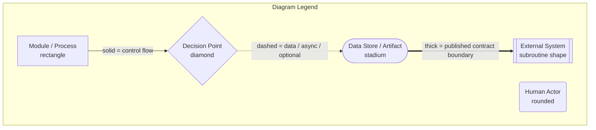

| Convention | Meaning |
|---|---|
| Solid arrow `-->` | Synchronous control flow or in-process call |
| Dashed arrow `-.->` | Asynchronous, optional, deferred, or read-only data flow |
| Thick arrow `==>` | Crosses a published contract boundary; breaking changes require a schema version bump |
| `[[Double bracket]]` | System outside TradyPerch's control |
| Bold stroke | Component on the critical correctness path |

### 0.4.4 Engineering Decision Record Format

Every non-obvious *implementation* decision is backed by an EDR in this compressed form:

> **EDR-nnn — Title**
> **Serves:** the ADR or invariant this decision implements.
> **Context:** the implementation forces in play.
> **Decision:** what was chosen.
> **Alternatives Rejected:** each with the specific reason it lost.
> **Trade-off:** what this costs.
> **Scalability:** how this behaves as client count, review count, or team size grows.

**EDRs may not contradict ADRs.** An EDR that appears to require an architectural change is a signal to stop and raise an ADR instead.

### 0.4.5 Contract Table Convention

Module and function contracts are specified as tables rather than signatures, because this document contains no code. A contract table is normative and complete: an implementer MUST NOT add an undeclared input, undeclared output, or undeclared error class.

| Column | Meaning |
|---|---|
| **Input** | Every value the unit receives. For pure units this is the complete set — nothing else may be read. |
| **Output** | The success value. |
| **Errors** | The exhaustive set of `ERR-*` classes the unit may produce. Any other error is `ERR-INTERNAL-UNCLASSIFIED`, which is a defect. |
| **Purity** | `pure` (no I/O, clock, randomness, environment) or `impure`. `pure` is mechanically enforced by DR-1/DR-2. |
| **Idempotent** | Whether repeating the call with identical inputs yields identical results and no additional side effects. |

### 0.4.6 Implementation Note Convention

| Marker | Meaning |
|---|---|
| **Implementation Note** | Operational knowledge that saves hours but is not itself a requirement. |
| **Agent Note** | Guidance aimed specifically at an AI coding agent, usually naming a plausible-but-wrong implementation to avoid. |
| **Assumption** | Something believed true at authoring time that depends on a third party and MUST be re-verified during implementation. |
| **Verify** | A concrete check that proves the adjacent requirement was implemented. |

---

## 0.5 How an AI Coding Agent Should Use This Document

This document was written on the explicit assumption that a substantial portion of the implementation will be performed by AI coding agents. The following rules exist to make that safe.

| # | Rule |
|---|---|
| A-1 | **Build in the order given by SAD Appendix A.** It is dependency-ordered: every phase is verifiable before the next begins. Do not build the browser adapter before the pure core; do not build any producer of data before the Normalizer (§23), which is the security boundary. |
| A-2 | **Treat every contract table as exhaustive.** If a field is not in the table, it does not exist. Adding "useful extra" fields to the Ledger or Payload silently breaks determinism (§54) and schema validation (§25). |
| A-3 | **Never widen a hard ceiling.** Values marked *hard ceiling* in §8/§9 are compile-time constants. Configuration may lower them only. |
| A-4 | **Never simplify the absence asymmetry** (§22.5, SAD §20.7.3). Uniform treatment of absence is the single worst defect this system can contain. If the reconciliation logic looks redundant, it is not — read PT-07 and CH-04 first. |
| A-5 | **Never add a retry to an `ERR-BLOCKED-*` path**, including "just one retry to see if it clears" (INV-07). |
| A-6 | **Never introduce a dependency** not listed in §10 without following DEP-1/DEP-2. |
| A-7 | **Write the test named in the section you are implementing.** Sections that carry a *Verify* row are not complete without it. |
| A-8 | **When a requirement and an existing test disagree, stop.** Do not amend the test to match the code. Raise it. |
| A-9 | **Do not infer behaviour from the illustrative JSON.** Illustrative documents show shape, not rules. The rules are in the tables. |
| A-10 | **Do not implement anything from §76–§91.** Those sections specify future work and are present so that v1.0's seams are correct, not so that v1.0 builds them. |

---

## 0.6 Engineering Decision Record Index

Forty implementation-level decisions. Each appears inline at the point of relevance; the full index is here so the decision set is auditable without reading the whole document.

| EDR | Decision | § | Serves |
|---|---|---|---|
| EDR-001 | Stage functions are free functions taking an explicit context object, not classes with injected state | §3 | ADR-018 |
| EDR-002 | The `Result` type is a discriminated union, and `core/` never throws | §40 | ADR-018 |
| EDR-003 | One composition root file; adapters are constructed nowhere else | §7 | DR-5 |
| EDR-004 | Stage boundaries are typed by branded record types, not plain objects | §5 | INV-05 |
| EDR-005 | Configuration is frozen deeply after resolution and carries its own resolution trace | §8 | ADR-015 |
| EDR-006 | Unknown `TPRE_*` variables are a startup error, never ignored | §9 | ADR-015 |
| EDR-007 | Dependencies are pinned by lockfile and installed with `npm ci` only | §10 | DEP-4 |
| EDR-008 | No transpilation step: JSDoc-typed `.mjs` is executed exactly as committed | §12 | ADR-004 |
| EDR-009 | Browser launch is a port method; `playwright` is imported by exactly one file | §15 | ADR-005 |
| EDR-010 | Headless is the only production mode; headed exists solely as a local debug flag | §17 | ADR-005 |
| EDR-011 | One browser per shard, one context per target, one page per context, closed in `finally` | §18 | INV-09 |
| EDR-012 | Route interception uses a host allowlist plus a resource-type denylist, both measured | §16 | THREAT-04 |
| EDR-013 | Pagination scrolls by container-height ratio, never to absolute bottom | §19 | ADR-009 |
| EDR-014 | The pagination growth curve is a first-class output retained in the acquisition report | §19 | RISK-04 |
| EDR-015 | Extraction operates on a serialised subtree string, not on live browser handles | §20 | ADR-017 |
| EDR-016 | Owner-reply detachment happens before any other field extraction | §21 | FR-033 |
| EDR-017 | Rating parsing is a three-parser cascade with a mandatory integer post-check | §21 | RISK-11 |
| EDR-018 | Duplicate detection is two-tier and intra-run collapse is deterministic | §22 | ADR-007 |
| EDR-019 | Normalisation is a fixed eight-step ordered pipeline; order is normative | §23 | INV-05 |
| EDR-020 | Length bounding is grapheme-cluster-aware, applied last | §23 | INV-05 |
| EDR-021 | Payloads are minified with stable key order; ledgers are pretty-printed with stable key order | §24 | FR-065 |
| EDR-022 | `generated_at` is excluded from every content hash | §54 | FR-065 |
| EDR-023 | The Publish Gate evaluates all rules and returns all reasons, never short-circuits | §26 | ADR-011 |
| EDR-024 | Rejection discards observations from both stores atomically — the Ledger is not written | §26 | ADR-011 |
| EDR-025 | Publication order is payload-then-state, never the reverse | §26 | INV-04 |
| EDR-026 | Retry policy is a lookup table returning a decision object; the executor is generic | §29 | ADR-018 |
| EDR-027 | Every retry is budget-checked before sleeping | §29 | NFR-016 |
| EDR-028 | Six nested timeout levels, each strictly inside the next | §30 | NFR-016 |
| EDR-029 | The shard matrix is emitted by a job, never hard-coded in workflow YAML | §32 | ADR-016 |
| EDR-030 | Exit codes 5, 6 and 7 are successes at the CI level and failures at the alert level | §32 | ADR-011 |
| EDR-031 | Log redaction is a sink-level transform seeded at startup | §37 | FR-076 |
| EDR-032 | Debug and trace events are ring-buffered and flushed only on target failure | §37 | NFR-036 |
| EDR-033 | Health records are append-only JSONL, one record per target per run | §42 | ADR-021 |
| EDR-034 | Rate budget accounting is pessimistic: written before the request, not after | §57 | FR-089 |
| EDR-035 | Concurrency safety is achieved by path disjointness, not by locking | §56 | INV-09 |
| EDR-036 | Identity hashing is versioned and uses only cross-adapter-available fields | §53 | ADR-023 |
| EDR-037 | Feature flags are configuration keys with code defaults, never runtime toggles | §73 | ADR-015 |
| EDR-038 | Adapters are statically registered in the composition root, not dynamically loaded | §74 | ADR-002 |
| EDR-039 | Schema files are the runtime authority; generated types are derived from them | §52 | P-4 |
| EDR-040 | Every future-platform seam is an interface that already exists in v1.0 | §75 | ADR-002 |

---

## 0.7 Section Map — Mandated Section to Location

| § | Title | Part |
|---|---|---|
| 1 | Technical Overview | 1 |
| 2 | System Components | 1 |
| 3 | Internal Modules | 1 |
| 4 | Module Responsibilities | 1 |
| 5 | Data Flow | 1 |
| 6 | Complete Folder Structure | 2 |
| 7 | File-by-File Responsibilities | 2 |
| 8 | Configuration Files | 2 |
| 9 | Environment Variables | 2 |
| 10 | Dependency List | 2 |
| 11 | Runtime Requirements | 3 |
| 12 | Build Requirements | 3 |
| 13 | Development Environment | 3 |
| 14 | Production Environment | 3 |
| 15 | Playwright Requirements | 4 |
| 16 | Browser Configuration | 4 |
| 17 | Headless vs Headed Design | 4 |
| 18 | Browser Lifecycle | 4 |
| 19 | Page Navigation Strategy | 4 |
| 20 | DOM Extraction Strategy | 4 |
| 21 | Review Detection Logic | 4 |
| 22 | Duplicate Detection | 5 |
| 23 | Review Normalization | 5 |
| 24 | JSON Generation Rules | 5 |
| 25 | JSON Validation Rules | 5 |
| 26 | Publish Rules | 5 |
| 27 | Rollback Rules | 5 |
| 28 | Recovery Rules | 5 |
| 29 | Retry Rules | 5 |
| 30 | Timeout Strategy | 5 |
| 31 | Scheduler Requirements | 6 |
| 32 | GitHub Actions Requirements | 6 |
| 33 | Git Requirements | 6 |
| 34 | Branch Strategy | 6 |
| 35 | Commit Strategy | 6 |
| 36 | Release Strategy | 6 |
| 37 | Logging Requirements | 7 |
| 38 | Error Classification | 7 |
| 39 | Error Recovery Matrix | 7 |
| 40 | Exception Handling | 7 |
| 41 | Monitoring Requirements | 7 |
| 42 | Metrics Collection | 7 |
| 43 | Performance Requirements | 8 |
| 44 | Memory Limits | 8 |
| 45 | CPU Requirements | 8 |
| 46 | Storage Requirements | 8 |
| 47 | Security Requirements | 9 |
| 48 | Secrets Management | 9 |
| 49 | Configuration Validation | 9 |
| 50 | Input Validation | 9 |
| 51 | Output Validation | 9 |
| 52 | JSON Schema Specification | 9 |
| 53 | Hash Generation | 9 |
| 54 | Change Detection | 9 |
| 55 | Cache Strategy | 10 |
| 56 | Locking Strategy | 10 |
| 57 | Concurrency Rules | 10 |
| 58 | Race Condition Prevention | 10 |
| 59 | Failure Recovery | 10 |
| 60 | Disaster Recovery | 10 |
| 61 | Testing Strategy | 11 |
| 62 | CI/CD Pipeline | 12 |
| 63 | GitHub Actions Workflow | 12 |
| 64 | Deployment Pipeline | 12 |
| 65 | Release Checklist | 12 |
| 66 | Rollback Checklist | 12 |
| 67 | Code Standards | 13 |
| 68 | Naming Standards | 13 |
| 69 | File Naming Standards | 13 |
| 70 | API Contracts (Future) | 14 |
| 71 | Multi Client Configuration | 14 |
| 72 | Business Configuration | 14 |
| 73 | Feature Flags | 14 |
| 74 | Plugin Architecture | 14 |
| 75 | Adapter Architecture | 14 |
| 76 | Future Google Business API Adapter | 15 |
| 77 | Future Facebook Adapter | 15 |
| 78 | Future JustDial Adapter | 15 |
| 79 | Future Trustpilot Adapter | 15 |
| 80 | Future AI Analysis Module | 15 |
| 81 | Future Dashboard Requirements | 15 |
| 82 | Future Admin Panel | 15 |
| 83 | Future Client Portal | 15 |
| 84 | Future REST API | 15 |
| 85 | Future GraphQL API | 15 |
| 86 | Future Webhook Support | 15 |
| 87 | Future Database Support | 15 |
| 88 | Future Redis Support | 15 |
| 89 | Future Docker Support | 15 |
| 90 | Future Kubernetes Support | 15 |
| 91 | Future Multi-region Deployment | 15 |
| 92 | Risks During Implementation | 16 |
| 93 | Engineering Decisions | 16 |
| 94 | Technical Trade-offs | 16 |
| 95 | Known Technical Limitations | 16 |
| 96 | Future Improvements | 16 |
| 97 | Developer Setup Guide | 17 |
| 98 | Local Development Guide | 17 |
| 99 | Production Deployment Guide | 17 |
| 100 | Final Technical Checklist | 17 |

---

## 0.8 The Implementation Invariants — Restated

The SAD's ten invariants, restated as the implementation obligations they translate into. **This table is the single most important page in this document.** Every one of these has a named test; a build in which any of these tests is absent is not conformant.

| INV | Architectural Statement | Implementation Obligation | Enforcing Test |
|---|---|---|---|
| **INV-01** | The website never contacts a review source | The published payload is a static file; no consumer recipe issues a request to any third-party origin | Consumer network assertion (§61) |
| **INV-02** | Failure never degrades the live payload | Every failure path ends in "retain Last Known Good"; the publish step is reachable only through the Gate | CH-01, CH-04, CH-05, CH-06 |
| **INV-03** | Absence is not deletion | `missing_streak` increments only when `completeness === 'full'`; `partial` mutates nothing | **PT-07, CH-04** |
| **INV-04** | Reconciliation is idempotent | `reconcile` is pure, takes `now` as a parameter, and returns new objects | **PT-01** |
| **INV-05** | Output is safe as untrusted text | Eight-step normalisation, a markup self-check, and a text-only renderer | **PT-10, CH-14** |
| **INV-06** | Full provenance on every payload | `provenance` block populated from engine version, pack version, run id, adapter id | Schema validation, manifest test |
| **INV-07** | A challenge is terminal | Retry policy returns `never` for every `ERR-BLOCKED-*` class | CH-03, `retry-policy.blocked-never` |
| **INV-08** | No secret in any artifact | Sink-level redaction seeded at startup; push-time scanning | `security.redaction` |
| **INV-09** | Client isolation | Path-disjoint writes, per-target error envelope, per-target browser context, `fail-fast: false` | `security.isolation` |
| **INV-10** | Adapter switch by config only | Identity derivation uses only cross-adapter-available fields | **PT-08**, quarterly S7 drill |

---

## 0.9 Open Implementation Questions

Deliberately unresolved at TRD baseline. Each has an owner and a resolution deadline. **An implementer encountering one of these MUST apply the interim position rather than inventing an answer.**

| ID | Question | Owner | Required By | Interim Position |
|---|---|---|---|---|
| OIQ-01 | Does Node's built-in argument parser cover the full flag surface in §7, or is a small dependency required? | Backend | Build phase 10 | Use the built-in parser; add a dependency only if a documented gap exists (DEP-2). |
| OIQ-02 | Is a compact internal relative-date implementation sufficient for the six-locale matrix, or is a data-driven helper needed? | Backend | Build phase 3 | Implement internally; §21.6 defines the phrase table format that makes this tractable. |
| OIQ-03 | Which HTML parser is used for offline fixture extraction tests? | QA | Build phase 13 | Any dev-only parser meeting DEP-3; it must never appear in production dependencies. |
| OIQ-04 | Do the chosen static host's response headers honour the §55 cache directives? | DevOps | Deployment step 7 | Assume they do not; verify and record actual headers in `docs/runbooks/` before the first client. |
| OIQ-05 | What is the exact runner RAM and CPU allocation at implementation time? | DevOps | Build phase 19 | Assume the §44/§45 budgets; measure and record on the first production run. |

---

## 0.10 Assumptions Requiring Re-Verification

Every assumption below concerns a third party and was true at authoring time only. **Each MUST be re-verified during implementation**; none may be treated as fact.

| ID | Assumption | Verify By | If False |
|---|---|---|---|
| TA-01 | The CI platform provides ≥ 4 usable CPU cores and ≥ 14 GB RAM per hosted runner | `tpre doctor` output on the first CI run | Reduce `max_reviews`; re-derive §44 budgets |
| TA-02 | The CI platform's job timeout ceiling remains at or above 30 minutes | Workflow configuration | Lower the in-engine run budget so it still fires first (§30) |
| TA-03 | Browser binaries remain cacheable between runs at ~350 MB | Cache hit rate in the setup step | Accept ~50 s cold start per job |
| TA-04 | The source continues to render review content without authentication | Canary structural assertions | Migrate clients to an official API adapter (§76) |
| TA-05 | Relative-date phrasing for the six required locales matches the §21.6 phrase table | Locale matrix unit tests against captured fixtures | Extend the phrase table; it is data, not code |
| TA-06 | Node LTS ≥ 20 provides stable grapheme segmentation for the normalisation bound | Unit test on ZWJ emoji sequences | Add a bounded, justified dependency under DEP-1 |

---

*End of front matter. Part 1 begins with Section 1, Technical Overview.*


---

# Part 1 — Technical Overview, Components, and Data Flow

*Sections 1 through 5. Audience: every implementer. This part establishes the vocabulary, the component inventory, the module graph, and the record types that every later section refers to. Read it before any other part.*

---

# 1. Technical Overview

## 1.1 What Is Being Built, Technically

A **single Node.js command-line application** that runs on an ephemeral CI runner, reads client configuration from a Git checkout, acquires reviews through a pluggable adapter, transforms them through a pure processing core, merges them into a durable per-client Ledger, projects a public JSON payload, evaluates that payload against safety invariants, and commits it to a separate Git branch that a CDN serves to client websites.

There is no server, no database, no message queue, no runtime API, and no persistent process. **The entire system is a CLI, two orphan Git branches, and a set of workflow definitions.**

| Technical Characteristic | Value | Consequence for Implementation |
|---|---|---|
| Execution model | Scheduled batch, exits after each run | No connection pooling, no warm caches, no in-memory state between runs. Everything needed must be read at startup. |
| Process lifetime | 3–20 minutes | Startup cost matters; long-lived optimisations do not. |
| Concurrency model | Single-threaded within a shard; parallel across shards | No locks, no mutexes, no shared memory. Isolation is achieved by disjoint paths (§56). |
| State location | Git branches (`data`, `state`) | Every write is a file write followed by a commit. No transactions across files. |
| Failure model | Fail closed on permission, fail soft on data | A missing secret stops everything; a malformed review is quarantined. |
| Output model | Immutable, content-addressed static JSON | Byte-determinism is a hard requirement, not a nicety (§54). |
| Trust model | All acquired content is hostile until normalised | Exactly one module may convert raw input into trusted values (§23). |

## 1.2 The Execution Shape of One Run

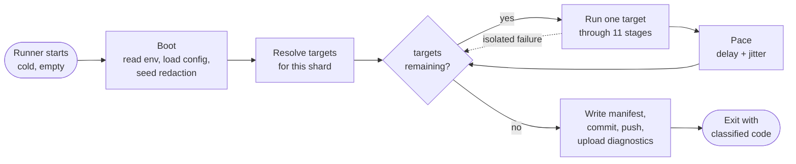

**The single most important structural property visible here:** the target loop is the only place where a failure can occur without ending the run. Everything before it (boot, planning) is fail-fast; everything inside it is fail-isolated; everything after it is best-effort with guaranteed manifest emission.

## 1.3 The Eleven Pipeline Stages

Every target executes exactly these stages, numbered 0 through 10, in this order. **No stage may be skipped except as noted, and no stage may reach forward to a later stage's data.** This is the SAD's ten-stage pipeline (§16.4) with stage 0 counted explicitly.

| # | Stage | Purity | Network | May Fail Softly | Produces | Spec |
|---|---|---|---|---|---|---|
| 0 | Preflight | impure | optional | No — a block is terminal for the target | `PreflightVerdict` | §2.6 |
| 1 | Resolve | impure | yes (cache-first) | No | `ResolvedListing` | §2.8 |
| 2 | Acquire | impure | yes | No | `RawAcquisition`, `AcquisitionReport` | §19, §20 |
| 3 | Extract | **pure** | no | Yes — per-field fallback | `ExtractedReview[]` | §21 |
| 4 | Normalize | **pure** | no | Yes — per-record quarantine | `NormalizedReview[]` | §23 |
| 5 | Validate | **pure** | no | Yes — findings, not throws | `ValidationReport` | §25 |
| 6 | Reconcile | **pure** | no | No | `Ledger`, `DecisionLog` | §22 |
| 7 | Enrich | impure | optional | Yes — always optional | annotations | §80 |
| 8 | Project | **pure** | no | No | `Artifacts` (candidate) | §24 |
| 9 | Gate | **pure** | no | **This is the decision point** | `GateVerdict` | §26 |
| 10 | Publish | impure | yes | Yes — retry on conflict | commits, artifacts | §26.6 |

**Six of eleven stages are pure.** Those six contain every piece of logic whose failure would silently corrupt data, and they are exhaustively testable offline with zero flakiness. This partitioning is deliberate and is the reason the test strategy in §61 is achievable.

> **EDR-001 — Stage functions are free functions over an explicit context, not classes with injected state**
> **Serves:** ADR-018 (reconciliation must be pure and property-testable).
> **Context:** The conventional object-oriented shape gives each stage a class with constructor-injected dependencies. It reads well and is the default output of most code generators.
> **Decision:** Every pure stage is a free function whose entire input is its parameters. Impure stages are free functions taking an explicit `ctx` object containing ports (clock, logger, random, adapters). Nothing reads instance state.
> **Alternatives Rejected:** *Classes with injected dependencies* — makes it syntactically easy to hold mutable state between calls, which is exactly how a pure stage stops being pure; also makes property testing awkward because the unit under test must be constructed rather than called. *Module-level singletons* — forbidden outright by §67 (no global state); makes test isolation impossible. *Dependency-injection container* — solves a wiring problem that does not exist at 30 components, and hides the composition root that DR-5 requires to be explicit.
> **Trade-off:** Call sites pass more arguments. Mitigated by the single `ctx` object convention and the ≤ 4 parameter limit in §67.2.
> **Scalability:** Unchanged by client count. As the team grows, free functions remain the shape that is hardest to accidentally make stateful.

## 1.4 Technology Stack — Implementation Bindings

The SAD chose these (§19). This table states what each choice *obliges the implementer to do*.

| Layer | Choice | Implementation Obligation | Confined To |
|---|---|---|---|
| Runtime | Node.js LTS ≥ 20, ESM `.mjs` | No CommonJS anywhere; `node:` prefix on built-ins; no transpilation (§12) | Whole codebase |
| Typing | JavaScript + JSDoc, `checkJs` strict | Types are comments; the checker is the compiler. `any` requires written justification | Whole codebase |
| Automation | Playwright, pinned Chromium | Exactly one file may import `playwright` (DR-3) | `adapters/browser/playwright-chromium.mjs` |
| Scheduler | GitHub Actions | Zero platform SDK imports outside three adapter files (NFR-045) | `adapters/state`, `adapters/publisher`, `adapters/notifier` |
| Data format | JSON (payloads, config), JSONL (logs, health) | Stable key ordering everywhere; minified payloads, pretty ledgers (§24) | Whole codebase |
| Persistence | Git, two orphan branches | All writes are temp-write-then-rename, then commit-per-shard | `adapters/state`, `adapters/publisher` |
| Validation | JSON Schema | Schemas in `schemas/` are the runtime authority (EDR-039) | Config, payload, ledger, health, manifest |
| Testing | Vitest + fast-check | Default suite runs offline in under three minutes (§61) | `tests/` |

## 1.5 The Layering and Its Enforcement

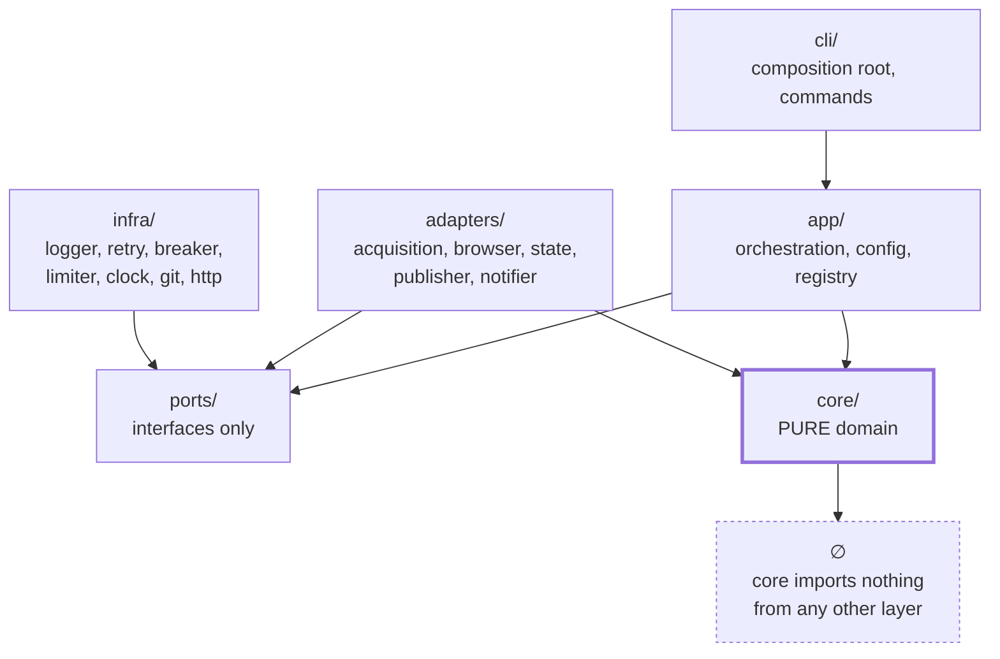

The six dependency rules (SAD §16.5, DR-1…DR-6) are enforced by an automated architecture test, not by convention. §61 specifies that test. **Restated here because it is the rule most likely to be broken by a code generator producing "helpful" imports:**

| Rule | Implementation Statement | How It Gets Broken |
|---|---|---|
| DR-1 | `core/` imports nothing from `adapters/`, `infra/`, `app/`, `cli/`, or any I/O-capable package | A logger import "just for debugging" inside the reconciler |
| DR-2 | `core/` never references `Date.now`, `Math.random`, `process.env`, `fs`, or `fetch` | A `Date.now()` default parameter for `now` — this single line makes every property test meaningless |
| DR-3 | Adapters depend only on `ports/` and `core/` types; adapters never import each other | The Places adapter importing a mapping helper from the DOM adapter |
| DR-4 | `app/` never imports a concrete adapter | The orchestrator importing the Playwright adapter to "check if the browser is available" |
| DR-5 | Only `cli/composition.mjs` constructs concrete implementations | A command file constructing its own notifier |
| DR-6 | No import reaches past a package's public index | Importing `core/reconcile/decide.mjs` directly from `app/` |

**Agent Note.** DR-2 is the rule an AI coding agent is most likely to violate, because `now = Date.now()` as a default parameter value is idiomatic JavaScript and looks like a convenience. It is not a convenience here — it converts `reconcile` from a pure function into a non-deterministic one, and every property law in §61 silently stops testing anything.

## 1.6 Technical Constraints That Shape Every Decision

| ID | Constraint | Implementation Consequence |
|---|---|---|
| CON-01 | Zero recurring cost | No managed service, no SaaS monitoring, no paid API. Monitoring is files; alerting is issues. |
| CON-04 | No client-specific code paths | Every per-client difference is a configuration value. A conditional on `slug` is a defect. |
| CON-05 | One part-time maintainer | Diagnosability outranks cleverness everywhere. |
| CON-08 | No server to operate | State is Git; there is no place to hold a lock or a session. |
| CON-09 | No cache may be correctness-critical | A cold cache must produce identical output (§55). |
| CON-13 | Commit volume must stay low | Hash-gated writes and per-shard commit batching are mandatory, not optimisations. |
| CON-17 | Repository is public | No secret may exist in any file, ever (§48). |

## 1.7 What "Done" Means for v1.0

A conformant v1.0 implementation satisfies all of the following. This is the acceptance definition that §100 expands into a checklist.

| # | Criterion | Verified By |
|---|---|---|
| 1 | All eleven stages implemented, with the six pure stages provably pure | Architecture test (DR-1, DR-2) |
| 2 | All four v1.0 adapters implemented and passing one shared contract suite | Contract suite × 4 (§61.6) |
| 3 | All fifteen property laws passing at ≥ 1,000 cases each | `tests/property/` |
| 4 | All fourteen chaos scenarios passing | `tests/chaos/` |
| 5 | All twenty golden fixtures passing against their pack versions | `tests/regression/` |
| 6 | Publish Gate at 100% statement coverage | Coverage gate |
| 7 | Every error class in §38 reachable, classified, and mapped to a retry policy and severity | `tests/unit/` |
| 8 | Eight workflows present, each with an explicit minimum `permissions` block | Workflow lint (§61) |
| 9 | Default test suite completes offline in under three minutes | CI timing |
| 10 | A payload published for the first client, schema-valid, non-empty, reachable over HTTPS | `scripts/verify-payload.mjs` |

---

# 2. System Components

## 2.1 Component Inventory

Thirty components, unchanged from SAD §17.1, specified here with their implementation bindings: which file owns them, where they are constructed, whether they hold state, and what configuration they read.

| # | Component | Layer | Purity | Owning File | Constructed By | Holds State |
|---|---|---|---|---|---|---|
| C-01 | CLI / Composition Root | cli | impure | `cli/index.mjs`, `cli/composition.mjs` | process entry | no |
| C-02 | Pipeline Orchestrator | app | impure | `app/orchestrator.mjs` | composition root | per-run only |
| C-03 | Config Loader & Validator | app | mostly pure | `app/config/loader.mjs` | composition root | frozen result |
| C-04 | Client Registry | app | **pure** | `app/registry.mjs` | — (function) | no |
| C-05 | Shard Planner | app | **pure** | `app/shard-planner.mjs` | — (function) | no |
| C-06 | Policy Preflight Gate | app | impure | `app/preflight.mjs` | composition root | no |
| C-07 | Rate Limiter / Pacer | infra | impure | `infra/limiter/token-bucket.mjs` | composition root | persisted |
| C-08 | Listing Resolver | adapters | impure | `adapters/acquisition/google-dom/resolver.mjs` | composition root | cache-backed |
| C-09 | Browser Session Manager | adapters | impure | `adapters/browser/playwright-chromium.mjs` | composition root | browser handle |
| C-10 | Navigator | adapters | impure | `adapters/acquisition/google-dom/navigator.mjs` | adapter | per-target |
| C-11 | Selector Pack Loader & Resolver | core | **pure** | `core/selectors/loader.mjs`, `resolver.mjs` | — (function) | no |
| C-12 | Extractor | core | **pure** | `core/extract/index.mjs` | — (function) | no |
| C-13 | Normalizer | core | **pure** | `core/normalize/index.mjs` | — (function) | no |
| C-14 | Date Resolver | core | **pure** | `core/dates/relative.mjs` | — (function) | no |
| C-15 | Language Detector | core | **pure** | `core/lang/detect.mjs` | — (function) | no |
| C-16 | Identity & Hash Service | core | **pure** | `core/identity/*.mjs` | — (function) | no |
| C-17 | Validator | core | **pure** | `core/validate/*.mjs` | — (function) | no |
| C-18 | Reconciler | core | **pure** | `core/reconcile/index.mjs` | — (function) | no |
| C-19 | Ledger Store | adapters | impure | `adapters/state/git-state.mjs` | composition root | filesystem |
| C-20 | Enricher | app | impure | `app/enrich/index.mjs` | composition root | no |
| C-21 | Projector | core | **pure** | `core/project/payload.mjs` | — (function) | no |
| C-22 | Publish Gate | core | **pure** | `core/gate/index.mjs` | — (function) | no |
| C-23 | Publisher | adapters | impure | `adapters/publisher/git-data.mjs` | composition root | staging dir |
| C-24 | Logger | infra | impure | `infra/logger/jsonl.mjs` | composition root | ring buffer |
| C-25 | Metrics & Health Recorder | infra | impure | `infra/health/recorder.mjs` | composition root | append-only |
| C-26 | Notifier | adapters | impure | `adapters/notifier/github-issues.mjs` | composition root | no |
| C-27 | Retry Manager | infra | pure policy | `infra/retry/policy.mjs`, `execute.mjs` | — (function) | no |
| C-28 | Circuit Breaker | infra | impure | `infra/breaker/circuit.mjs` | composition root | persisted |
| C-29 | Diagnostics | infra | impure | `infra/diagnostics/*.mjs` | composition root | per-target |
| C-30 | Clock & Random Providers | infra | impure | `infra/clock.mjs`, `infra/random.mjs` | composition root | no |

**Seventeen of thirty components are pure or pure-policy.** Every one of them is a function, not an object, and requires no construction.

## 2.2 Component Interaction Map

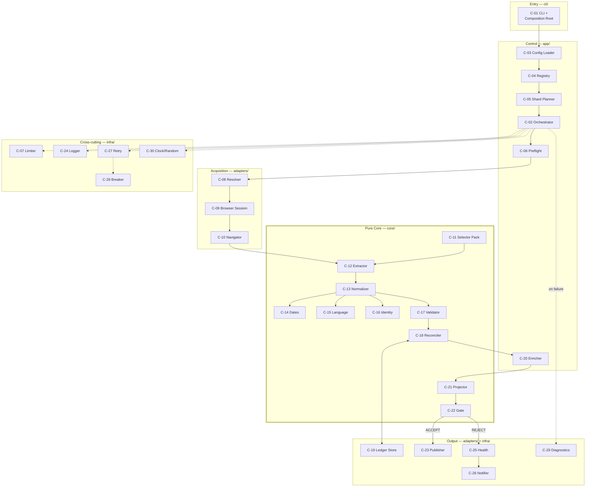

## 2.3 C-01 · CLI and Composition Root

| Aspect | Specification |
|---|---|
| **Responsibility** | Parse arguments, read and validate environment, construct every concrete implementation, inject into the orchestrator, map the run result to an exit code. |
| **Purity** | impure |
| **Commands** | `harvest`, `resolve`, `validate-config`, `canary`, `replay`, `project`, `export`, `doctor`, `plan` |
| **Errors** | `ERR-CONFIG-INVALID`, `ERR-CONFIG-VERSION`, `ERR-CONFIG-SECRET-MISSING`, `ERR-INTERNAL-*` |

**Normative requirements:**

| ID | Requirement |
|---|---|
| TR-CLI-001 | `cli/composition.mjs` MUST be the only file in the repository that constructs a concrete adapter, infra implementation, or port implementation. |
| TR-CLI-002 | Exit codes MUST be exactly those in §2.3.1. New codes require a MAJOR version bump (§36). |
| TR-CLI-003 | `process.exit()` MUST NOT be called outside `cli/`. Every other layer returns a value. |
| TR-CLI-004 | The CLI MUST flush logs, write the run manifest, and upload diagnostics **before** exiting, for every exit code including failures. |
| TR-CLI-005 | An uncaught exception MUST be caught at the CLI boundary, logged with its full stack to the log sink, classified as `ERR-INTERNAL-UNCLASSIFIED`, and mapped to exit code 1. Its stack MUST NOT be written to stdout when `--output json` is active. |
| TR-CLI-006 | Unknown commands and unknown flags MUST exit 2 with a usage message. Silent tolerance of an unknown flag is forbidden — it is the same failure class as EDR-006. |

### 2.3.1 Exit Code Contract

| Code | Meaning | CI Job Conclusion | Alert Severity |
|---|---|---|---|
| `0` | All targets succeeded | success | none |
| `1` | Unexpected internal error | **failure** | critical |
| `2` | Invalid usage or configuration | **failure** | error |
| `3` | All targets failed | **failure** | error |
| `4` | Partial: some targets failed or were deferred | success | warn |
| `5` | Gate rejection; nothing published, nothing crashed | success | error |
| `6` | Policy blocked | success | warn (info if intentional) |
| `7` | Bot challenge encountered | success | **critical** |

> **EDR-030 — Exit codes 5, 6 and 7 are CI successes and alerting failures**
> **Serves:** ADR-011 (gated publication), ADR-021 (issue-based alerting).
> **Context:** A red CI badge means "the code is broken". A gate rejection means the code worked perfectly and correctly declined to publish bad data.
> **Decision:** Codes 5, 6, and 7 do not fail the shard job. They emit a workflow annotation and drive an alert whose severity is set independently of job conclusion.
> **Alternatives Rejected:** *Fail the job on any non-zero code* — trains the maintainer to ignore red builds, which is the fastest route to missing a genuine regression. *Exit 0 for everything and signal through the manifest* — loses the ability for the workflow to branch without parsing logs, and makes a crashed engine indistinguishable from a healthy one. *Separate exit-code namespaces per command* — unnecessary complexity; one namespace is small enough to memorise.
> **Trade-off:** The workflow needs an explicit classification step (§32) rather than relying on the shell's exit status.
> **Scalability:** Unchanged. The code set is fixed at eight and is part of the CLI's MAJOR contract.

## 2.4 C-02 · Pipeline Orchestrator

| Aspect | Specification |
|---|---|
| **Responsibility** | Execute the eleven stages for a list of targets, enforcing budget, pacing, isolation, and diagnostics. Owns sequencing and policy. Owns **no domain logic**. |
| **Input** | `OrchestratorRequest { targets, config, adapters, ports, budgets, runId, mode }` |
| **Output** | `RunResult { perTarget: TargetOutcome[], summary, manifest }` |
| **Purity** | impure |
| **Errors** | Never throws to the CLI except on `ERR-INTERNAL-INVARIANT` |

| ID | Requirement |
|---|---|
| TR-APP-001 | Each target MUST execute inside its own error envelope. No error, rejection, or timeout from one target may propagate to another (INV-09). |
| TR-APP-002 | Each target MUST receive a fresh browser context and a fresh target-scoped logger child. |
| TR-APP-003 | Target order MUST be a deterministic pseudo-random permutation seeded by `runId + slug`, so no client is permanently first. |
| TR-APP-004 | On per-target budget expiry the orchestrator MUST abort that target with `ERR-BUDGET-TARGET` and continue to the next. |
| TR-APP-005 | On per-run budget expiry the orchestrator MUST finish the current target, mark all remaining targets `deferred` (**not** `failed`), and exit 4. |
| TR-APP-006 | The orchestrator MUST record a `TargetOutcome` for every target, including blocked and deferred ones. A target absent from the outcome list is a defect. |
| TR-APP-007 | The orchestrator MUST NOT contain any conditional keyed on a client slug, source, or adapter identity. Behaviour differences come from capabilities and configuration only (CON-04). |

### 2.4.1 Target Outcome State Machine

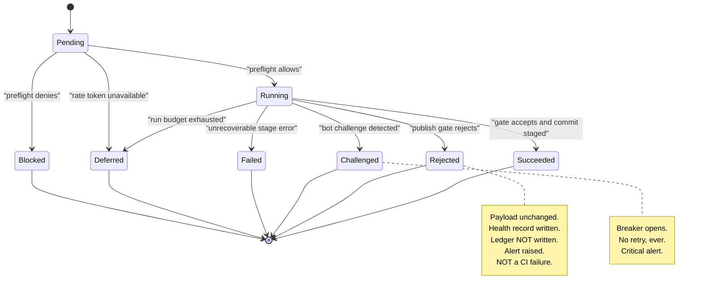

| Outcome | Ledger Written | Payload Written | Health Written | Contributes To Exit Code |
|---|---|---|---|---|
| `succeeded` | yes | yes (if changed) | yes | 0 |
| `rejected` | **no** | no | yes | 5 |
| `blocked` | no | no | yes | 6 |
| `challenged` | no | no | yes | 7 |
| `deferred` | no | no | yes | 4 |
| `failed` | no | no | yes | 3 or 4 |

**The "Ledger Written: no" row for `rejected` is load-bearing** and is specified fully in §26.5. A rejected harvest's observations are discarded from *both* stores, not just from the payload.

## 2.5 C-03, C-04, C-05 · Configuration, Registry, Planning

| Component | Contract | Purity |
|---|---|---|
| **C-03 Config Loader** | `(sources, env, flags) → EffectiveConfig + ResolutionTrace` | mostly pure — reads files and env at one boundary, then pure |
| **C-04 Client Registry** | `(configs, now, healthSeries) → Target[]` | **pure** |
| **C-05 Shard Planner** | `(targets, shardCount, costModel) → ShardPlan` | **pure** |

| ID | Requirement |
|---|---|
| TR-CFG-001 | The config loader MUST apply the six-layer precedence chain in the order defined in §8.3 and MUST emit a resolution trace naming the winning layer for every key. |
| TR-CFG-002 | The resolved config MUST be deeply frozen before it leaves the loader. Any later mutation is a defect. |
| TR-CFG-003 | The registry MUST be a pure function. `tpre plan` MUST therefore be runnable with zero side effects. |
| TR-CFG-004 | The shard planner MUST balance by *estimated cost* (historical p50 duration), falling back to review count when no history exists — never by target count alone. |
| TR-CFG-005 | Shard assignment MUST be deterministic for a given `(targets, shardCount, costModel)` triple, so `plan` output is reproducible. |

**Why the registry is pure and the loader is not.** The loader must touch the filesystem and environment once. The registry must not, because "which clients are due?" is a question asked during incidents and must be answerable from a dry run with no side effects. The boundary is drawn at exactly the point where I/O stops.

## 2.6 C-06 · Policy Preflight Gate

| Aspect | Specification |
|---|---|
| **Responsibility** | Decide, before any acquisition, whether this target may proceed. |
| **Output** | `PreflightVerdict { allow, reasons: PolicyReason[], recordedAt }` |
| **Purity** | impure (may fetch robots directives) |

**Checks, evaluated in this order, failing fast:**

| # | Check | Denial Error | Severity |
|---|---|---|---|
| 1 | Global kill switch (`policy.global_enabled`) | `ERR-POLICY-KILLSWITCH` | info |
| 2 | Per-source enable flag | `ERR-POLICY-KILLSWITCH` | info |
| 3 | Client `enabled` | `ERR-POLICY-KILLSWITCH` | info |
| 4 | Authorisation record complete (**`dom` access method only**) | `ERR-POLICY-UNAUTHORIZED` | error |
| 5 | Robots directive for the target path, per mode `block`/`warn`/`ignore` | `ERR-POLICY-ROBOTS` | warn |
| 6 | Rate-limit budget available for the source | `ERR-POLICY-BUDGET` | info |
| 7 | Circuit-breaker state for the source-access pair | `ERR-POLICY-BREAKER-OPEN` | warn |

| ID | Requirement |
|---|---|
| TR-APP-010 | The verdict MUST be recorded in the run manifest **whether it allows or denies**. An audit trail that records only denials proves nothing. |
| TR-APP-011 | A robots-fetch failure MUST be treated as `unknown` and resolved per the configured mode: `block` denies, `warn` and `ignore` proceed with a recorded note. It MUST NOT silently pass. |
| TR-APP-012 | Check 4 MUST be skipped for non-`dom` access methods. Requiring an authorisation record for an official-API client would be incorrect and would obstruct the migration path (ADR-023). |

## 2.7 C-07 · Rate Limiter and Pacer

| Aspect | Specification |
|---|---|
| **Mechanism** | Token bucket, counters persisted to the `state` branch per source per UTC hour and per UTC day |
| **Consistency** | Advisory and eventually consistent — see §57 |
| **Failure direction** | **Fail closed.** Unreadable counter ⇒ assume consumed ⇒ defer the target |

| ID | Requirement |
|---|---|
| TR-SEC-001 | Hourly and daily source ceilings MUST be compile-time constants. Configuration may lower them; no configuration path may raise them (FR-089). |
| TR-SEC-002 | Budget consumption MUST be written **before** the requests are made (pessimistic accounting), so a crash over-counts rather than under-counts (EDR-034). |
| TR-SEC-003 | Every inter-request and inter-target delay MUST apply jitter as specified in §57.4. |

## 2.8 C-08 · Listing Resolver

| Aspect | Specification |
|---|---|
| **Responsibility** | Convert whatever identity the operator supplied into a canonical, verified, cached listing identity plus advertised aggregates |
| **Output** | `ResolvedListing { canonicalId, canonicalUrl, displayName, advertisedTotal, advertisedRating, resolvedVia, verifiedAt }` |
| **Errors** | `ERR-RESOLVE-NO-IDENTIFIER`, `ERR-RESOLVE-NOTFOUND`, `ERR-RESOLVE-AMBIGUOUS`, `ERR-IDENTITY-DRIFT` |

**Resolution precedence (highest first):** explicit canonical identifier → explicit numeric id → cached identity within TTL → identifier parsed from URL → search tuple (last resort, emits `warn` every time).

| ID | Requirement |
|---|---|
| TR-APP-020 | Identity MUST be verified on **every** run by comparing the page's business name to `resolution.expected_name` using normalised similarity ≥ `resolution.identity_threshold` (default 0.82). |
| TR-APP-021 | Name normalisation before comparison MUST strip legal suffixes, collapse punctuation, casefold, and remove diacritics — otherwise a routine rebrand trips a false drift alert. |
| TR-APP-022 | Two or more search candidates above threshold MUST produce `ERR-RESOLVE-AMBIGUOUS` and abort. The resolver MUST NOT guess (FR-014). |
| TR-APP-023 | `resolution.allow_search` MUST default to `false` when `TPRE_ENV=production`. |

## 2.9 C-09, C-10 · Browser Session and Navigator

Fully specified in §15–§19. Component-level contract only:

| Component | Owns | Explicitly Does Not Own |
|---|---|---|
| C-09 Browser Session | Browser, context, and page lifecycle; route interception; timeouts | Any knowledge of reviews, selectors, or pagination |
| C-10 Navigator | Interaction sequences: navigate, dismiss, open, sort, paginate, expand, serialise | Field locations (that is C-11/C-12) and field meaning |

| ID | Requirement |
|---|---|
| TR-BRW-001 | `adapters/browser/playwright-chromium.mjs` MUST be the only file importing `playwright`. Enforced by architecture test DR-3. |
| TR-NAV-001 | The Navigator MUST emit a stop reason as a first-class output. Completeness classification (§19.5) depends entirely on it. |

## 2.10 C-11 … C-18, C-21, C-22 · The Pure Core

Contracts summarised here; full specification in Part 4 and Part 5.

| Component | Contract | Errors |
|---|---|---|
| C-11 Selector Pack | `(packJson) → SelectorPack` and `(node, field, pack) → FieldResolution` | `ERR-PARSE-SELECTOR-PACK` |
| C-12 Extractor | `(subtree, pack, listingCtx) → ExtractedReview[]` | `ERR-PARSE-STRUCTURE`, `ERR-PARSE-EMPTY-UNEXPECTED`, `ERR-PARSE-FIELD-REQUIRED`, `ERR-PARSE-RATING-INVALID` |
| C-13 Normalizer | `ExtractedReview → NormalizedReview \| Quarantined` | `ERR-CLEAN-MARKUP-SURVIVED` |
| C-14 Date Resolver | `(relativeText, observedAt, locale) → { resolved, precision, confidence }` | none — fails soft |
| C-15 Language Detector | `text → { code, confidence }` | none — returns null |
| C-16 Identity & Hash | `NormalizedReview → { identityHash, contentHash, authorKey }` | none |
| C-17 Validator | `(records, acquisitionReport, config) → ValidationReport` | none — produces findings |
| C-18 Reconciler | `(priorLedger, observed, report, config, now) → { ledger, decisions }` | none |
| C-21 Projector | `(ledger, config, engineMeta) → Artifacts` | none |
| C-22 Publish Gate | `(candidate, current, report, config) → GateVerdict` | none — produces a verdict |

**Note that eight of these ten produce no errors at all.** They produce *findings*, *verdicts*, or *null values*. Errors-as-values is the core's error model (§40), and a thrown exception inside `core/` is a defect regardless of what it says.

## 2.11 C-19, C-23 · State and Publication

| Component | v1.0 Implementation | Port | Alternatives Designed |
|---|---|---|---|
| C-19 Ledger Store | `git-state` — filesystem rooted at a `state` branch checkout | `StatePort` | filesystem, object storage, database (§87) |
| C-23 Publisher | `git-data` — commits to the `data` branch | `PublisherPort` | filesystem (dev), object storage (v3), API (v3) |

| ID | Requirement |
|---|---|
| TR-STOR-001 | Every file write MUST be write-to-temp-then-rename. A partially-written ledger is unrecoverable; a temp file is not. |
| TR-STOR-002 | Ledgers MUST be pretty-printed with stable key ordering and a trailing newline. Payloads MUST be minified with stable key ordering. The reasons differ and both are normative (§24.2). |
| TR-STOR-003 | Unknown fields encountered when reading a ledger MUST be preserved on write (FR-058), so an older engine cannot silently strip a newer engine's data. |
| TR-PUB-001 | Publication MUST skip the write entirely when new bytes equal current bytes (FR-065). |
| TR-PUB-002 | Commits MUST be one per shard per branch, not one per target (CON-13). |
| TR-PUB-003 | Push MUST use fetch-rebase-retry up to three times. `--force-with-lease` and `--force` MUST NOT be used against `data` or `state`. |

## 2.12 C-24 … C-30 · Cross-Cutting Infrastructure

| Component | Key Implementation Points |
|---|---|
| C-24 Logger | JSONL sink; mandatory field set; redaction at the sink (EDR-031); ring-buffered `trace`/`debug` (EDR-032) |
| C-25 Health Recorder | One append-only JSONL record per target per run on `state`; computes yield delta, coverage, duration percentile |
| C-26 Notifier | `github-issues` primary with fingerprint dedup; `webhook` secondary; `console` for local |
| C-27 Retry Manager | Policy is a data table keyed by error class; executor is generic and budget-aware |
| C-28 Circuit Breaker | Per source-access pair; persisted to `state`; `closed → open → half-open` with escalating cooldown |
| C-29 Diagnostics | On any target failure: sanitised HTML, screenshot, ring-buffer flush, acquisition report, effective config, selector health |
| C-30 Clock & Random | Exist solely to make DR-2 mechanically enforceable; `fixed` and `seeded` implementations used in every test |

**On C-30.** `ClockPort` and `RandomPort` look like over-engineering until the first intermittent property-test failure. They are the mechanism that converts "the core is pure" from a convention into a fact, and they cost approximately twenty lines.

---

# 3. Internal Modules

## 3.1 Module Tree

The `src/` tree is organised by layer first and by domain second. This ordering is deliberate: the layer determines what a module is *allowed* to do, and that is the more important property.

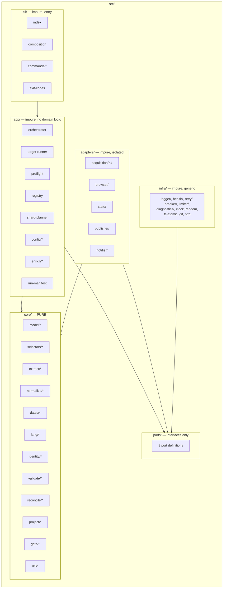

## 3.2 Module Dependency Graph — Core Internals

Within `core/`, modules form a strict directed acyclic graph. **A cycle inside `core/` is a defect**, and the architecture test asserts acyclicity.

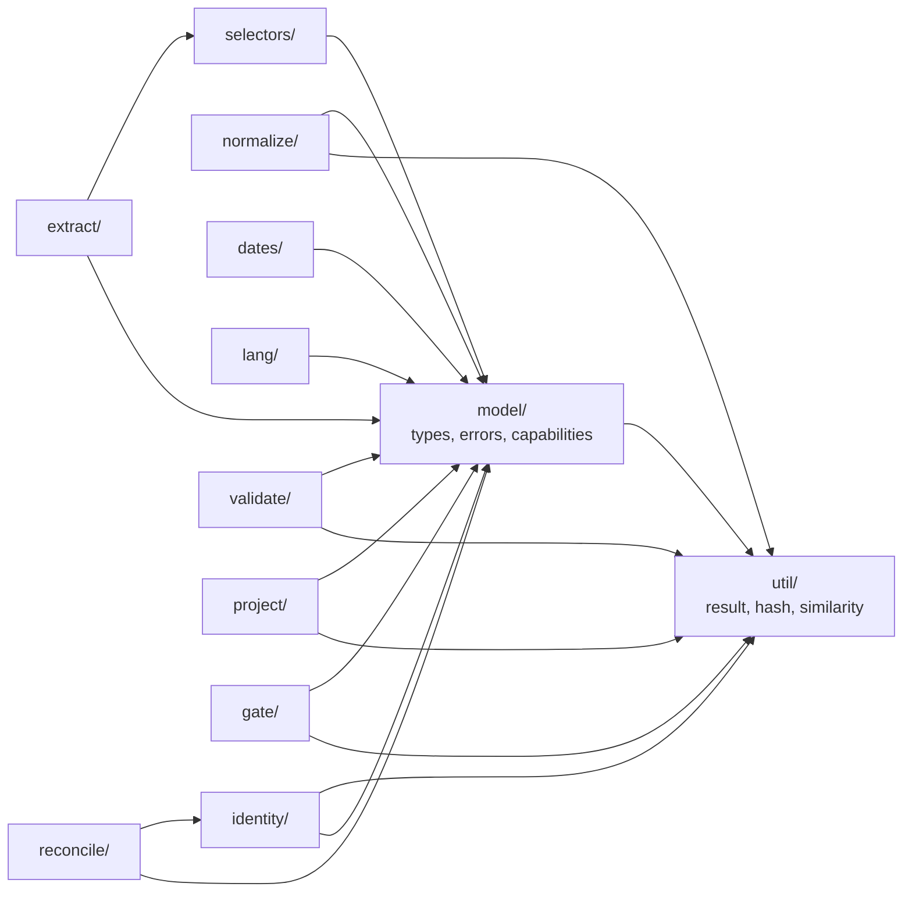

| Observation | Implication |
|---|---|
| `util/` depends on nothing | It is built first (SAD Appendix A phase 1) and is the only module that may be imported by every other |
| `normalize/` does not depend on `dates/`, `lang/`, or `identity/` | Those are applied *after* normalisation by the calling stage, not inside it. This keeps the security boundary narrow and independently testable |
| `reconcile/` depends only on `identity/` and `model/` | It is deliberately ignorant of extraction, normalisation, and projection — which is why it can be property-tested against synthetic ledgers |
| `gate/` depends on nothing but types and utilities | It can be tested with hand-built payload pairs and no pipeline at all, which is what makes 100% coverage achievable |

## 3.3 Module Catalogue

| Module | Layer | Purity | Owns | Build Phase |
|---|---|---|---|---|
| `core/util` | core | pure | `Result` type, canonical serialisation, digests, string similarity | 1 |
| `core/model` | core | pure | All record types, error constants, capability descriptors | 1 |
| `core/normalize` | core | pure | The eight-step cleaning pipeline — the security boundary | 2 |
| `core/dates` | core | pure | Relative-phrase parsing, precision, confidence, pinning | 3 |
| `core/lang` | core | pure | Script-range + stopword language detection | 3 |
| `core/identity` | core | pure | `author_key`, `identity_hash`, `content_hash` | 3 |
| `core/validate` | core | pure | Per-record and aggregate findings, completeness classification | 4 |
| `core/reconcile` | core | pure | The merge function, decisions, removal, suppression | 5 |
| `core/project` | core | pure | Ledger → artifacts, aggregates, schema.org projection | 6 |
| `core/gate` | core | pure | G-01…G-12 evaluation | 6 |
| `ports` | ports | n/a | Eight interface definitions | 7 |
| `infra/*` | infra | impure | Logger, clock, random, retry, breaker, limiter, diagnostics, git, http, fs-atomic | 7 |
| `adapters/state` | adapters | impure | Ledger, cache, health persistence | 8 |
| `adapters/publisher` | adapters | impure | Payload publication | 8, 18 |
| `app/config` | app | mixed | Six-layer resolution, migration, defaults | 9 |
| `cli` | cli | impure | Commands, composition, exit codes | 10 |
| `adapters/acquisition/file-csv` | adapters | impure | CSV import — the simplest adapter, built first | 11 |
| `core/selectors` | core | pure | Pack loading and ordered strategy resolution | 12 |
| `core/extract` | core | pure | Field extraction per review node | 13 |
| `adapters/browser` | adapters | impure | Playwright session management | 14 |
| `adapters/acquisition/google-dom` | adapters | impure | Navigation, consent, challenge detection, serialisation | 15–16 |
| `app/orchestrator` | app | impure | The eleven-stage loop | 17 |
| `adapters/notifier` | adapters | impure | Alerting | 20 |
| `adapters/acquisition/google-*-api` | adapters | impure | Official API adapters | 22 |

**The build order is not arbitrary.** Two orderings are load-bearing and restated from SAD Appendix A: the Normalizer (phase 2) is built before anything that produces data, because it is the security boundary and retrofitting it is how INV-05 gets violated; and the CSV adapter (phase 11) is built before any browser work, because implementing the simplest adapter first proves the interface is genuinely source-agnostic while it is still cheap to change.

---

# 4. Module Responsibilities

## 4.1 Responsibility Matrix

The second column is the one that prevents scope creep. **A module that acquires a responsibility from the third column is a defect**, regardless of how convenient it seems.

| Module | Owns | Explicitly Does NOT Own |
|---|---|---|
| Scheduler | *When* work happens | *What* work happens |
| Shard Planner | *Which runner* does which work | *How* work is done |
| Orchestrator | Stage sequencing, budgets, isolation, pacing | Any domain logic whatsoever |
| Preflight | Permission to proceed | Data |
| Resolver | Turning identity input into a verified listing | Reading reviews |
| Browser Session | Browser/context/page lifecycle, interception | What is on the page |
| Navigator | Getting content into the DOM | Interpreting content |
| Selector Pack | *Where* fields are | *What* fields mean |
| Extractor | Lifting raw strings from structure | Cleaning them |
| Normalizer | Canonical, safe, typed, bounded values | Deciding validity |
| Date Resolver | Turning a phrase into an estimate with honest precision | Deciding sort order |
| Identity | Deriving stable keys | Deciding whether records match |
| Validator | Verdicts about quality | Fixing anything |
| Reconciler | Merging observation into knowledge | Presentation |
| Projector | Public shape | Whether to publish |
| Publish Gate | The publish/reject decision | Writing anything |
| Publisher | Durable, visible output | Content |
| Ledger Store | Persistence of state | Interpretation of state |
| Logger | Structured, redacted event record | Deciding severity policy |
| Retry Manager | Whether and when to retry | Executing the operation |
| Circuit Breaker | Whether a source is available | Why it became unavailable |
| Diagnostics | Preserving evidence | Diagnosing |

**Two rows deserve emphasis.** "Normalizer does not own deciding validity" is what keeps the security boundary narrow enough to test exhaustively — it cleans, and something else judges. "Publish Gate does not own writing anything" is what makes 100% test coverage of the gate practical: it is a pure function from three inputs to a verdict, testable with no filesystem at all.

## 4.2 Port Contracts

Eight ports. Every one exists because the SAD assigned low or medium confidence to the concrete choice behind it (SAD §19.6). Where confidence was high, no port was added — over-abstracting a confident choice buys no option value.

### IF-ACQ-01 · AcquisitionAdapter

| Aspect | Specification |
|---|---|
| **Methods** | `capabilities()`, `resolve(listingSpec, ctx)`, `acquire(resolved, budget, ctx)` |
| **v1.0 implementations** | `google:dom`, `google:places-api`, `google:business-profile-api`, `file:csv` |
| **Purity** | impure |

| Method | Input | Output | Errors |
|---|---|---|---|
| `capabilities` | — | `AdapterCapabilities { adapterId, source, accessMethod, fields[], maxReviews, supportsSort, supportsReplies, requiresSecrets[] }` | none |
| `resolve` | `(listingSpec, ctx)` | `ResolvedListing` | `ERR-RESOLVE-*`, `ERR-IDENTITY-DRIFT` |
| `acquire` | `(resolved, budget, ctx)` | `{ raw: RawAcquisition, report: AcquisitionReport }` | `ERR-NET-*`, `ERR-HTTP-*`, `ERR-BROWSER-*`, `ERR-NAV-*`, `ERR-BLOCKED-*`, `ERR-BUDGET-TARGET` |

| ID | Requirement |
|---|---|
| TR-EXT-P-001 | An adapter MUST declare accurate capabilities. Fields it cannot supply MUST be `null` in its output — **never fabricated, never defaulted, never inferred**. |
| TR-EXT-P-002 | An adapter MUST NOT write to the Ledger, the payload, or any file outside the diagnostics directory (FR-030). |
| TR-EXT-P-003 | An adapter MUST return errors drawn from the canonical taxonomy (§38). An adapter-specific error class is a defect. |
| TR-EXT-P-004 | An adapter MUST respect the supplied budget and abort cleanly when it is exceeded, returning a partial report rather than throwing. |
| TR-EXT-P-005 | An adapter whose required secret is absent MUST fail closed with `ERR-CONFIG-SECRET-MISSING`. It MUST NOT fall back to another access method (SEC-4). |
| TR-EXT-P-006 | Reviews produced by any adapter MUST reconcile with reviews produced by any other adapter for the same logical review (PT-08, INV-10). |

**TR-EXT-P-006 is the requirement that makes ADR-023's migration guarantee real.** It constrains identity derivation (§53) to fields every adapter can supply, and it is verified both by a property test and by the quarterly migration drill.

### IF-STATE-01 · StatePort

| Method | Input | Output | Errors |
|---|---|---|---|
| `readLedger` | `(clientSlug, listingKey)` | `Ledger \| null` | `ERR-STATE-CORRUPT` |
| `writeLedger` | `(clientSlug, listingKey, ledger)` | `void` | `ERR-STATE-WRITE` |
| `readCache` | `(key)` | `CacheEntry \| null` | none — miss is null |
| `writeCache` | `(key, value, ttl)` | `void` | `ERR-STATE-WRITE` |
| `appendHealth` | `(record)` | `void` | `ERR-STATE-WRITE` |
| `readHealth` | `(slug, window)` | `HealthRecord[]` | none |

| ID | Requirement |
|---|---|
| TR-STOR-010 | A missing ledger MUST be returned as `null` and treated by the caller as an empty ledger — **not** as an error. First runs are normal. |
| TR-STOR-011 | A ledger that fails schema validation on read MUST produce `ERR-STATE-CORRUPT` and abort the target. It MUST NOT be silently repaired or partially parsed. |
| TR-STOR-012 | A cache miss MUST NOT be an error at any call site. |

### IF-PUB-01 · PublisherPort

| Method | Input | Output | Errors |
|---|---|---|---|
| `readCurrent` | `(clientSlug, listingKey)` | `Artifacts \| null` | none |
| `publish` | `(artifacts, meta)` | `PublishResult { written[], skipped[], commitSha }` | `ERR-PUBLISH-CONFLICT`, `ERR-PUBLISH-AUTH` |

**`readCurrent` is not optional.** The Publish Gate compares *change*, not state, and cannot evaluate G-02 through G-05 or G-12 without the currently published payload. Skipping the `data` branch checkout to save a few seconds silently disables the system's most valuable safety rules.

### IF-NOTIFY-01 · NotifierPort

| Method | Input | Output | Errors |
|---|---|---|---|
| `raise` | `(alert)` | `AlertRef` | none — logged, never fatal |
| `resolve` | `(fingerprint, resolution)` | `void` | none |
| `digest` | `(summary)` | `void` | none |

| ID | Requirement |
|---|---|
| TR-MON-001 | Notifier failures MUST be logged and MUST NOT fail the run. A monitoring subsystem that can crash the thing it monitors is worse than none. |
| TR-MON-002 | Three consecutive notifier failures MUST escalate to the secondary webhook channel if one is configured. |

### IF-BROWSER-01 · BrowserPort

| Method | Input | Output | Errors |
|---|---|---|---|
| `launch` | `(options)` | `BrowserHandle` | `ERR-BROWSER-LAUNCH` |
| `newContext` | `(handle, contextOptions)` | `ContextHandle` | `ERR-BROWSER-CRASH` |
| `close` | `(handle)` | `void` | none — best effort |

### IF-CLOCK-01, IF-RANDOM-01, IF-LOG-01

| Port | Methods | Implementations |
|---|---|---|
| `ClockPort` | `now()`, `sleep(ms)` | `system`, `fixed` (tests) |
| `RandomPort` | `jitter(base)`, `uuid()` | `system`, `seeded` (tests) |
| `LoggerPort` | `event(e)`, `child(bindings)`, `flush()` | `jsonl`, `pretty`, `memory` (tests) |

| ID | Requirement |
|---|---|
| TR-TEST-001 | Every test MUST use `fixed` clock and `seeded` random. A test that reads the system clock is non-deterministic and will eventually fail at 2 a.m. for no reason. |

## 4.3 Module Contract Summary

The complete set of pure-core contracts, in pipeline order. Each is specified in full in the section named.

| Module | Input | Output | Purity | Idempotent | Full Spec |
|---|---|---|---|---|---|
| `selectors.load` | pack JSON | `SelectorPack` | pure | yes | §20.3 |
| `selectors.resolve` | `(node, fieldSpec, pack)` | `FieldResolution { value, strategyIndex, kind }` | pure | yes | §20.4 |
| `extract` | `(subtree, pack, listingCtx)` | `ExtractedReview[]` | pure | yes | §21 |
| `normalize` | `(ExtractedReview, config)` | `NormalizedReview \| Quarantined` | pure | yes | §23 |
| `dates.resolve` | `(phrase, observedAt, locale)` | `{ resolved, precision, confidence }` | pure | yes | §21.6 |
| `lang.detect` | `text` | `{ code, confidence }` | pure | yes | §23.7 |
| `identity.derive` | `NormalizedReview` | `{ identityHash, contentHash, authorKey }` | pure | yes | §53 |
| `validate` | `(records, report, config)` | `ValidationReport` | pure | yes | §25 |
| `reconcile` | `(prior, observed, report, config, now)` | `{ ledger, decisions }` | pure | **yes — INV-04** | §22.5 |
| `project` | `(ledger, config, engineMeta)` | `Artifacts` | pure | yes | §24 |
| `gate.evaluate` | `(candidate, current, report, config)` | `GateVerdict` | pure | yes | §26 |

---

# 5. Data Flow

## 5.1 Record Type Progression

A review passes through five distinct representations. **Each is a different type, and they are not interchangeable.** Conflating them is the most common structural error in implementations of this kind of system.

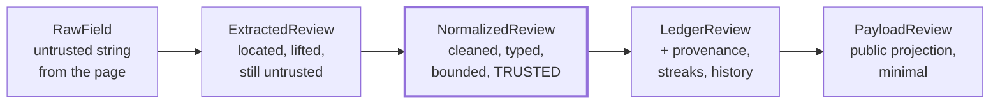

| Type | Trust | Contains | Never Contains |
|---|---|---|---|
| `RawField` | **none** | Verbatim string as found | — |
| `ExtractedReview` | **none** | Raw field strings + strategy metadata | Cleaned values |
| `NormalizedReview` | full | Branded `CleanString` values, integers, enums | Markup, control characters, unbounded text |
| `LedgerReview` | full | Normalized fields + `first_seen_at`, `revision`, `missing_streak`, `hash_history`, provenance | Public formatting decisions |
| `PayloadReview` | full | The 24 public fields (§52) | Streaks, tombstones, history, quarantine data |

> **EDR-004 — Stage boundaries are typed by branded record types, not plain objects**
> **Serves:** INV-05 (output safe as untrusted text).
> **Context:** All five representations are, at runtime, plain JavaScript objects. Nothing structural prevents passing an `ExtractedReview` where a `NormalizedReview` is expected — which would route untrusted content around the security boundary.
> **Decision:** Each representation is a distinct JSDoc type, and cleaned strings carry a branded `CleanString` type that only the Normalizer produces. Downstream signatures accept `CleanString`, not `string`.
> **Alternatives Rejected:** *Plain shared shape with a `cleaned: boolean` flag* — a boolean is trivially set incorrectly and provides no check at authoring time. *Runtime class instances with private fields* — real enforcement, but forces the core to construct objects rather than return literals, complicating property testing and structural sharing. *Trusting review discipline* — this is precisely the boundary where a single lapse compromises every client site simultaneously.
> **Trade-off:** Branding is a type-level fiction; it is erased at runtime and provides no protection against a deliberate cast. It is a guard against accident, not against malice — and accident is the realistic threat.
> **Scalability:** Improves with team size. The larger the team, the more valuable it is that the type checker, rather than a reviewer's memory, enforces the boundary.

## 5.2 Stage-by-Stage Data Contract

| Stage | Consumes | Produces | Discarded After |
|---|---|---|---|
| 0 Preflight | `EffectiveConfig`, breaker state, budget | `PreflightVerdict` | never — recorded in manifest |
| 1 Resolve | `listingSpec`, identity cache | `ResolvedListing` | cached 30 days |
| 2 Acquire | `ResolvedListing`, budget | `RawAcquisition`, `AcquisitionReport` | raw discarded on success; retained on failure |
| 3 Extract | `RawAcquisition`, `SelectorPack` | `ExtractedReview[]`, `SelectorHealth` | raw released |
| 4 Normalize | `ExtractedReview[]`, config | `NormalizedReview[]`, `Quarantined[]` | extracted released |
| 5 Validate | `NormalizedReview[]`, `AcquisitionReport` | `ValidationReport` | — |
| 6 Reconcile | prior `Ledger`, `NormalizedReview[]`, `ValidationReport`, `now` | new `Ledger`, `DecisionLog` | prior ledger released |
| 7 Enrich | `Ledger` | annotations | — |
| 8 Project | `Ledger`, config, engine meta | `Artifacts` (candidate) | — |
| 9 Gate | candidate `Artifacts`, current `Artifacts`, `ValidationReport` | `GateVerdict` | — |
| 10 Publish | `Artifacts`, `Ledger`, `HealthRecord` | commits | staged files after commit |

**The "Discarded After" column is a memory requirement, not a note.** §44 depends on the raw acquisition string being released before the pure pipeline runs, and on the prior ledger being released after reconciliation.

## 5.3 End-to-End Sequence

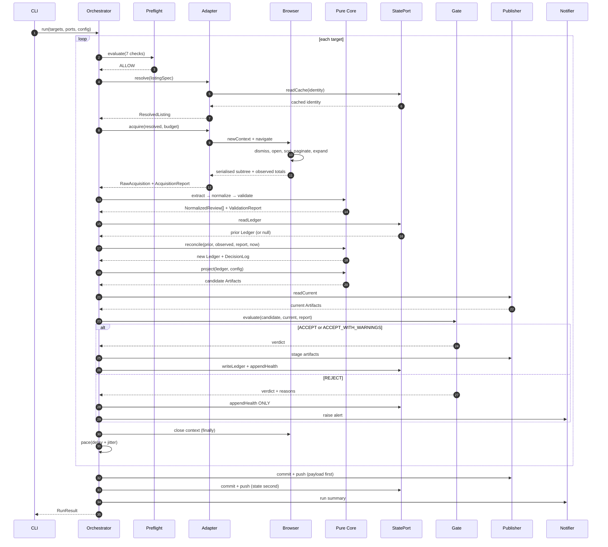

**Note steps at the end: payload is committed before state.** This ordering is normative (EDR-025) and is explained in §26.7 — when two writes cannot be atomic, order them so a crash between them leaves a state the next run can repair.

## 5.4 Trust Boundary Crossings

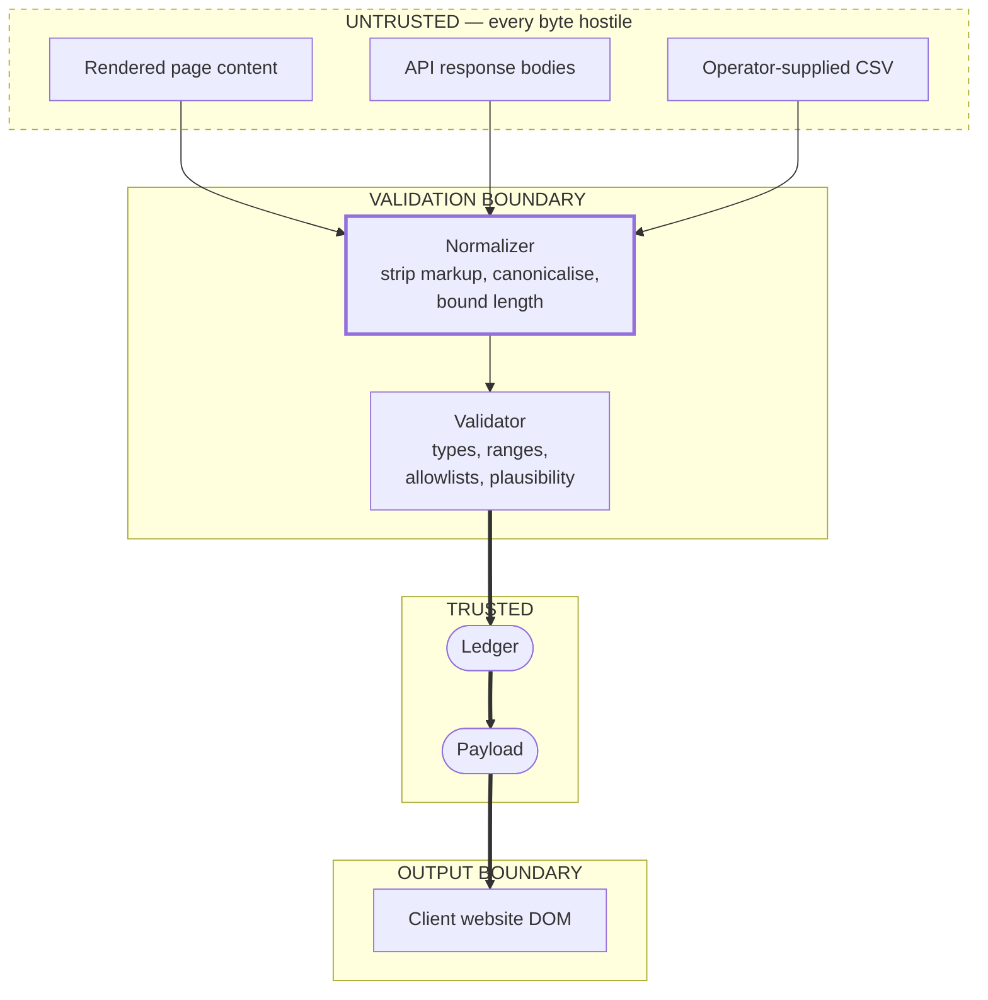

| Crossing | Rule | Enforcement |
|---|---|---|
| Untrusted → Validation | Nothing may bypass the Normalizer. No stage may read raw content directly. | Type system: only the Normalizer accepts `RawField` and only it returns `CleanString` |
| Validation → Trusted | Only records with zero `fatal` findings cross. Quarantined records go to diagnostics, never to the Ledger. | `reconcile` accepts `NormalizedReview[]` only |
| Trusted → Output | The Payload is plain-text-only by construction. | Schema declares `text` as plain text; there is no `text_html` field and there must never be one |

**Three sources converge on one Normalizer.** That is the entire point of the boundary: adding a fifth source in v2.0 adds no new sanitisation path and no new place for INV-05 to be violated.

## 5.5 Data Flow Under Failure

The success path is one of six. The other five matter more, because they are what protect the client's website.

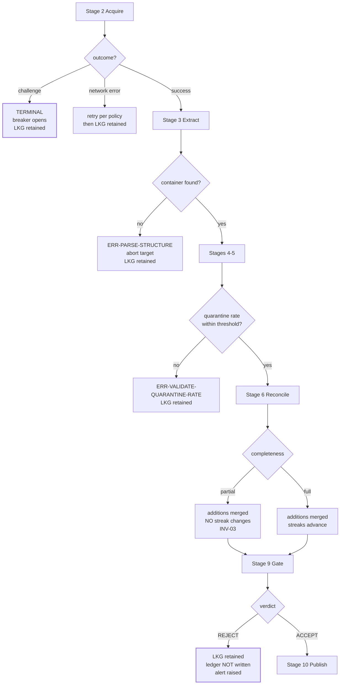

**Every terminal box in that diagram ends with "LKG retained".** That is INV-02, and it is not achieved by a single guard — it is achieved because no path to the publish step exists except through the Gate.

## 5.6 What Flows Where — Store Map

| Data | Destination | Branch | Retention | Public |
|---|---|---|---|---|
| Payload artifacts | `clients/<slug>/<listing>/` | `data` | truncated quarterly | **served** |
| Global manifest | `index.json` | `data` | truncated quarterly | **served** |
| Ledger | `ledger/<slug>/<listing>.json` | `state` | indefinite | readable, not served |
| Health series | `health/<slug>.jsonl` | `state` | indefinite | readable, not served |
| Identity cache | `cache/identity/<slug>/<listing>.json` | `state` | TTL 30 days | readable, not served |
| Rate budget | `cache/budget/<source>/<date>.json` | `state` | rolls hourly/daily | readable, not served |
| Breaker state | `breaker/<source-access>.json` | `state` | until closed | readable, not served |
| Run manifest | `runs/<yyyy-mm>/<run-id>.json` | `state` | 90 days | readable, not served |
| Run log (JSONL) | CI artifact | — | 14 days | no |
| Diagnostics bundle | CI artifact | — | 14 days | no |

**Note the distinction between "readable" and "served".** The repository is public, so everything on `state` is readable by anyone who looks. It is not *served* to visitors, and no consumer contract references it. §46.2 states the disclosure obligation this creates.

---

*End of Part 1. Part 2 specifies the complete folder structure, the responsibility of every file, the configuration file set, the environment variables, and the dependency list.*


---

# Part 2 — Codebase Layout, Configuration, and Dependencies

*Sections 6 through 10. Audience: implementing engineers and AI coding agents. This is the most directly actionable part of the document: §6 and §7 together are sufficient to create the entire file tree, and §8 through §10 define everything those files read.*

---

# 6. Complete Folder Structure

## 6.1 Normative Status

The layout below is **normative and complete**. An implementer MUST create exactly this tree. A file not listed here MUST NOT be created without an EDR; a file listed here MUST exist by the end of its build phase.

The structure is unchanged from SAD §18. This section adds, for each directory, the *rules that govern what may live there* — which is the part that determines whether the structure survives contact with a deadline.

## 6.2 Repository Root — `main` Branch

```
tp-reviews-engine/
├── .github/                     Automation and governance
├── bin/                         Executable entry point
├── src/                         The engine
├── selectors/                   Versioned selector packs (volatile knowledge)
├── schemas/                     JSON Schema — the runtime authority
├── clients/                     One config file per tenant
├── profiles/                    Shared tuning sets
├── compliance/                  Authorisations, denylist, privacy templates
├── fixtures/                    Golden test corpus
├── tests/                       All test suites
├── frontend/                    Reference renderer and integration recipes
├── scripts/                     Maintenance and authoring tools
├── docs/                        SAD, TRD, runbooks, ADRs
├── .editorconfig
├── .env.example
├── .gitattributes
├── .gitignore
├── .nvmrc
├── eslint.config.mjs
├── prettier.config.mjs
├── vitest.config.mjs
├── jsconfig.json
├── package.json
├── package-lock.json
├── CHANGELOG.md
├── CODE_OF_CONDUCT.md
├── CONTRIBUTING.md
├── LICENSE
├── README.md
└── SECURITY.md
```

| ID | Requirement |
|---|---|
| TR-BLD-001 | The repository root MUST contain no source file. Every executable unit lives under `src/` or `scripts/`. |
| TR-BLD-002 | `.gitattributes` MUST enforce `text eol=lf` for all text files. A CRLF line ending in a JSON payload changes its bytes and therefore its content hash (§54), silently breaking hash-gating on Windows checkouts. |
| TR-BLD-003 | `.gitignore` MUST exclude `.state/`, `.publish/`, `.artifacts/`, `node_modules/`, `.env`, and Playwright's browser cache directory. |
| TR-BLD-004 | `.nvmrc` MUST pin the Node major version and MUST match the version used by the CI setup action. |

**Implementation Note on TR-BLD-002.** This is not a style preference. The whole change-detection strategy assumes byte-determinism; a developer on Windows whose Git checks out CRLF will produce payloads that differ from CI's by every line ending, causing every file to be rewritten on every run and multiplying commit churn by a factor of roughly fifty.

## 6.3 `.github/` — Automation and Governance

```
.github/
├── workflows/
│   ├── harvest.yml              Production pipeline. Cron ×4 + dispatch.
│   ├── canary.yml               Independent cron. Structural assertions.
│   ├── ci.yml                   PR + push to main. All quality gates.
│   ├── validate-config.yml      PR touching clients/, profiles/, compliance/.
│   ├── pages.yml                Push to data. Deploy static origin.
│   ├── keepalive.yml            Monthly. Liveness + dormancy prevention.
│   ├── release.yml              Tag v*. Verify, notes, publish.
│   └── dependency-audit.yml     Weekly advisory scan.
├── actions/
│   └── setup-engine/
│       └── action.yml           Composite: Node, caches, browsers, banner.
├── ISSUE_TEMPLATE/
│   ├── incident.yml
│   ├── selector-break.yml
│   └── client-onboarding.yml
├── pull_request_template.md
├── CODEOWNERS
└── dependabot.yml
```

| ID | Requirement |
|---|---|
| TR-CI-001 | Every workflow MUST declare an explicit top-level `permissions:` block with the minimum required set. A workflow without one is a CI failure, enforced by a lint step (§61.9). |
| TR-CI-002 | Every third-party action MUST be pinned to a full commit SHA, never a tag (NFR-028). |
| TR-CI-003 | `pull_request_target` MUST NOT appear in any workflow. |
| TR-CI-004 | Setup logic MUST exist exactly once, in the composite action. Duplicated setup steps across workflows are a defect — a Node or browser version change must be a one-file edit. |
| TR-CI-005 | `CODEOWNERS` MUST require review for `src/core/`, `schemas/`, `selectors/`, and `compliance/`. |

## 6.4 `bin/` and `src/` — The Engine

```
bin/
└── tpre.mjs                     Shebang wrapper. Delegates to src/cli. No logic.

src/
├── cli/
│   ├── index.mjs                Command registry and argument parsing
│   ├── composition.mjs          THE composition root (DR-5)
│   ├── exit-codes.mjs           Canonical exit code constants
│   └── commands/
│       ├── harvest.mjs
│       ├── resolve.mjs
│       ├── validate-config.mjs
│       ├── canary.mjs
│       ├── replay.mjs
│       ├── project.mjs
│       ├── export.mjs
│       ├── plan.mjs
│       └── doctor.mjs
│
├── app/
│   ├── orchestrator.mjs         The eleven-stage loop (C-02)
│   ├── target-runner.mjs        Single-target envelope + isolation
│   ├── preflight.mjs            Policy gate (C-06)
│   ├── registry.mjs             Client enumeration, due set (C-04, pure)
│   ├── shard-planner.mjs        Cost-balanced partitioning (C-05, pure)
│   ├── run-manifest.mjs         Per-run manifest assembly
│   ├── config/
│   │   ├── loader.mjs           Six-layer resolution + trace (C-03)
│   │   ├── defaults.mjs         Layer 1 — code defaults
│   │   └── migrate.mjs          config_version migrations
│   └── enrich/
│       ├── index.mjs            Enrichment dispatcher (C-20)
│       └── noop.mjs             v1.0 default
│
├── core/                        PURE. No I/O, clock, env, or randomness.
│   ├── index.mjs                Public surface of the core
│   ├── model/
│   │   ├── review.mjs
│   │   ├── ledger.mjs
│   │   ├── payload.mjs
│   │   ├── report.mjs
│   │   ├── capabilities.mjs
│   │   └── errors.mjs
│   ├── selectors/
│   │   ├── loader.mjs
│   │   └── resolver.mjs
│   ├── extract/
│   │   ├── index.mjs
│   │   ├── rating.mjs
│   │   ├── author.mjs
│   │   ├── text.mjs
│   │   ├── reply.mjs
│   │   └── meta.mjs
│   ├── normalize/
│   │   ├── index.mjs
│   │   ├── unicode.mjs
│   │   ├── whitespace.mjs
│   │   ├── markup.mjs
│   │   └── url.mjs
│   ├── dates/
│   │   ├── relative.mjs
│   │   ├── precision.mjs
│   │   └── pin.mjs
│   ├── lang/
│   │   └── detect.mjs
│   ├── identity/
│   │   ├── author-key.mjs
│   │   ├── identity-hash.mjs
│   │   └── content-hash.mjs
│   ├── validate/
│   │   ├── record.mjs
│   │   ├── aggregate.mjs
│   │   └── completeness.mjs
│   ├── reconcile/
│   │   ├── index.mjs
│   │   ├── decide.mjs
│   │   ├── removal.mjs
│   │   └── suppress.mjs
│   ├── project/
│   │   ├── payload.mjs
│   │   ├── latest.mjs
│   │   ├── stats.mjs
│   │   └── schema-org.mjs
│   ├── gate/
│   │   ├── index.mjs
│   │   └── rules.mjs
│   └── util/
│       ├── result.mjs
│       ├── hash.mjs
│       └── similarity.mjs
│
├── ports/                       Interface definitions only. No implementations.
│   ├── acquisition.mjs
│   ├── state.mjs
│   ├── publisher.mjs
│   ├── notifier.mjs
│   ├── browser.mjs
│   ├── clock.mjs
│   ├── random.mjs
│   └── logger.mjs
│
├── adapters/
│   ├── acquisition/
│   │   ├── google-dom/
│   │   │   ├── index.mjs
│   │   │   ├── resolver.mjs
│   │   │   ├── navigator.mjs
│   │   │   ├── consent.mjs
│   │   │   ├── challenge-detect.mjs
│   │   │   └── dom-serialize.mjs
│   │   ├── google-places-api/
│   │   │   ├── index.mjs
│   │   │   ├── client.mjs
│   │   │   └── map.mjs
│   │   ├── google-business-profile-api/
│   │   │   ├── index.mjs
│   │   │   ├── auth.mjs
│   │   │   ├── client.mjs
│   │   │   └── map.mjs
│   │   └── file-csv/
│   │       ├── index.mjs
│   │       ├── parse.mjs
│   │       └── COLUMNS.md
│   ├── browser/
│   │   └── playwright-chromium.mjs   ONLY file importing playwright
│   ├── state/
│   │   └── git-state.mjs
│   ├── publisher/
│   │   ├── git-data.mjs
│   │   └── filesystem.mjs
│   └── notifier/
│       ├── github-issues.mjs
│       ├── webhook.mjs
│       └── console.mjs
│
└── infra/
    ├── logger/
    │   ├── jsonl.mjs
    │   ├── redact.mjs
    │   └── pretty.mjs
    ├── health/
    │   └── recorder.mjs
    ├── retry/
    │   ├── policy.mjs
    │   └── execute.mjs
    ├── breaker/
    │   └── circuit.mjs
    ├── limiter/
    │   └── token-bucket.mjs
    ├── diagnostics/
    │   ├── snapshot.mjs
    │   └── bundle.mjs
    ├── clock.mjs
    ├── random.mjs
    ├── fs-atomic.mjs
    ├── git.mjs
    └── http.mjs
```

### 6.4.1 Directory Rules

| Directory | May Contain | MUST NOT Contain |
|---|---|---|
| `bin/` | A shebang wrapper only | Any logic, any argument handling |
| `cli/` | Argument parsing, command dispatch, composition, exit mapping | Domain logic, direct file I/O beyond config discovery |
| `app/` | Sequencing, budgets, isolation, policy, config resolution | Domain logic, concrete adapter imports (DR-4) |
| `core/` | Pure functions and types | I/O, clock, randomness, environment, any non-pure dependency (DR-1, DR-2) |
| `ports/` | Type definitions and interface documentation | Any executable behaviour |
| `adapters/` | Concrete implementations of exactly one port each | Imports of another adapter (DR-3) |
| `infra/` | Generic, domain-ignorant technical utilities | Any knowledge of reviews, listings, or clients |

**The rule for `infra/` is the one most often broken.** A helper that knows what a review is does not belong in `infra/` — it belongs in `core/`. The test is simple: if a function's name or body mentions a domain noun, it is not infrastructure.

## 6.5 `selectors/` — Isolated Volatile Knowledge

```
selectors/
├── README.md                    How to author, test, and version a pack
├── google-maps/
│   ├── v1.json                  Historical. Retained for fixture regression.
│   ├── v2.json                  Historical.
│   ├── v3.json                  CURRENT. Pinned by profiles/default.json.
│   └── assertions.json          Structural assertions used by the canary
└── schema/
    └── selector-pack.schema.json
```

| ID | Requirement |
|---|---|
| TR-SEL-001 | A merged selector pack MUST NEVER be edited. A change creates `v<n+1>.json`. |
| TR-SEL-002 | Old packs MUST be retained indefinitely. Fixtures captured under pack `vN` continue to be tested against `vN`, which is what proves the corpus tests extraction rather than today's markup. |
| TR-SEL-003 | Every pack MUST validate against `selector-pack.schema.json` at load time. A malformed pack MUST fail with `ERR-PARSE-SELECTOR-PACK` at load, never produce mysterious extraction failures later. |
| TR-SEL-004 | Pack version pinning MUST live in a profile, not in a client config or in code. |

## 6.6 `schemas/`, `clients/`, `profiles/`, `compliance/`

```
schemas/
├── payload.v1.schema.json        THE PUBLIC CONTRACT (§52)
├── ledger.v1.schema.json         Internal state shape. Not a contract.
├── client-config.v1.schema.json  Client configuration contract
├── health-record.v1.schema.json
├── run-manifest.v1.schema.json
└── README.md                     Versioning and compatibility policy

clients/
├── README.md
├── _template.config.json         Copy-me starting point, every field documented
├── commerce-insight.config.json  First production client
└── _example-multilocation.config.json

profiles/
├── default.json                  Baseline; pins the current selector pack
├── conservative.json             Slower pacing, lower caps, staged pack rollout
├── high-volume.json              1,000+ review listings
└── README.md

compliance/
├── denylist.json                 Permanent suppressions (FR-087)
├── authorizations/
│   └── <slug>.md                 Written authorisation record per client
├── PRIVACY-NOTICE-TEMPLATE.md
└── README.md
```

| ID | Requirement |
|---|---|
| TR-CFG-010 | Files beginning with `_` in `clients/` MUST be excluded from the registry. They are templates and examples, not tenants. |
| TR-CFG-011 | `compliance/denylist.json` MUST live on `main`, not in the Ledger. Erasure obligations must survive a `state` branch disaster (§60.5). |
| TR-CFG-012 | Every schema file MUST be named `<name>.v<major>.schema.json` and MUST be the runtime validation authority (EDR-039). |

**Implementation Note on TR-CFG-011.** This is a disaster-recovery decision hiding in a directory layout. If the denylist lived only inside ledgers, then rebuilding `state` from scratch would resurrect every review a data subject had asked to have removed — turning a recoverable incident into a compliance breach.

## 6.7 `fixtures/` and `tests/`

```
fixtures/
├── README.md                     How to capture, sanitise, and add a fixture
├── dom/google/
│   ├── 001-standard-120-reviews/
│   │   ├── page.html             Sanitised captured markup
│   │   ├── meta.json             Pack version, capture date, provenance
│   │   └── expected.json         Golden expected extraction output
│   ├── 002-single-review/
│   ├── 003-zero-reviews/
│   ├── 004-owner-replies/
│   ├── 005-truncated-long-text/
│   ├── 006-rtl-arabic-hebrew/
│   ├── 007-emoji-and-cjk/
│   ├── 008-missing-avatars/
│   ├── 009-anonymous-authors/
│   ├── 010-rating-only-no-text/
│   ├── 011-duplicate-author-names/
│   ├── 012-locale-de-relative-dates/
│   ├── 013-locale-hi-relative-dates/
│   ├── 014-partial-load-stalled/       ADVERSARIAL
│   ├── 015-structure-changed/          ADVERSARIAL
│   ├── 016-challenge-page/             ADVERSARIAL
│   ├── 017-consent-interstitial/       ADVERSARIAL
│   ├── 018-5000-reviews-cap/
│   ├── 019-markup-in-review-text/      ADVERSARIAL — security
│   └── 020-mixed-language-set/
├── api/
│   ├── places/
│   └── business-profile/
├── csv/
│   ├── valid.csv
│   ├── partially-invalid.csv
│   └── malformed.csv
├── ledgers/
│   ├── empty.json
│   ├── steady-120.json
│   ├── with-tombstones.json
│   └── with-suppressions.json
└── server/
    └── serve.mjs                 Static fixture server. No internet.

tests/
├── unit/                         Mirrors src/core/ file-for-file
├── property/
│   ├── reconcile.idempotence.test.mjs
│   ├── reconcile.monotonicity.test.mjs
│   ├── reconcile.commutativity.test.mjs
│   ├── identity.cross-adapter.test.mjs
│   ├── hash.stability.test.mjs
│   └── normalize.invariants.test.mjs
├── contract/
│   └── acquisition-adapter.contract.test.mjs
├── regression/
│   └── fixtures.golden.test.mjs
├── integration/
│   ├── pipeline.fixture-server.test.mjs
│   ├── publish.git.test.mjs
│   └── state.roundtrip.test.mjs
├── chaos/
│   └── failure-matrix.test.mjs
├── architecture/
│   └── dependency-rules.test.mjs
├── budgets/
│   ├── payload-size.test.mjs
│   └── renderer-size.test.mjs
├── security/
│   ├── xss-fixture.test.mjs
│   ├── redaction.test.mjs
│   ├── url-allowlist.test.mjs
│   ├── workflow-lint.test.mjs
│   ├── renderer-api.test.mjs
│   └── isolation.test.mjs
├── live/                         OPT-IN ONLY. Never in default CI.
│   └── smoke.harvest.test.mjs
└── helpers/
    ├── build-review.mjs
    ├── fixed-clock.mjs
    └── seeded-random.mjs
```

| ID | Requirement |
|---|---|
| TR-TEST-010 | `tests/live/` MUST be excluded from the default runner configuration. A network-dependent test in the blocking path trains engineers to re-run CI until it passes, destroying the value of every other test. |
| TR-TEST-011 | Fixtures MUST be trimmed to the review container subtree plus minimal ancestry. A full-page capture MUST be rejected in review. |
| TR-TEST-012 | Fixture capture MUST pass through `scripts/sanitize-html.mjs`, which strips scripts, tokens, cookies, tracking attributes, and inline event handlers. Review text and author names are **retained** — they are needed for parser correctness and are already public. |

## 6.8 `frontend/`, `scripts/`, `docs/`

```
frontend/
├── README.md                      Integration decision guide
├── renderer/
│   ├── tp-reviews.mjs             Reference renderer. < 5 KB minified. ZERO deps.
│   ├── tp-reviews.css             Unopinionated base styles, CSS custom properties
│   └── SAFETY.md                  Why text-only DOM APIs, and what never to do
├── recipes/
│   ├── static-html.md
│   ├── react.md
│   ├── nextjs-app-router.md
│   ├── astro.md
│   ├── vue.md
│   └── schema-org.md
└── examples/
    ├── static/index.html
    └── nextjs/

scripts/
├── capture-fixture.mjs
├── sanitize-html.mjs
├── new-client.mjs
├── validate-all.mjs
├── truncate-data-history.mjs
├── verify-payload.mjs
└── size-report.mjs

docs/
├── sad/                           The architecture document set
├── trd/                           This document set
├── runbooks/
│   ├── selector-break.md
│   ├── bot-challenge.md
│   ├── stale-client.md
│   ├── publish-conflict.md
│   └── disaster-recovery.md
├── onboarding.md
├── maintenance.md
├── client-explainer.md
└── decisions/
    └── ADR-0xx-*.md
```

| ID | Requirement |
|---|---|
| TR-STD-001 | `frontend/renderer/` MUST have zero runtime dependencies (DEP-6). It ships to client sites; a dependency there is a supply-chain risk multiplied by client count. |
| TR-STD-002 | `frontend/` MUST NOT use any HTML-injection DOM API. Enforced by `tests/security/renderer-api.test.mjs`. |

## 6.9 `data` Branch (Orphan) — Published Artifacts

```
/  (root of the data branch; this IS the static site root)
├── index.json                     Global manifest
├── clients/
│   └── <client-slug>/
│       ├── index.json             Client manifest
│       └── <listing-key>/
│           ├── reviews.json       Full payload
│           ├── latest.json        Top-N payload
│           ├── stats.json         Aggregates only
│           ├── schema-org.json    Opt-in structured data
│           └── index.json         Listing manifest — the freshness pointer
├── .nojekyll
├── _headers
├── robots.txt
└── README.md                      "Machine-generated. Do not edit."
```

## 6.10 `state` Branch (Orphan) — Internal State

```
/  (root of the state branch; NEVER published)
├── ledger/
│   └── <client-slug>/
│       └── <listing-key>.json
├── health/
│   └── <client-slug>.jsonl
├── cache/
│   ├── identity/<client>/<listing>.json
│   └── budget/<source>/<yyyy-mm-dd>.json
├── breaker/
│   └── <source-access>.json
├── runs/
│   └── <yyyy-mm>/<run-id>.json
└── README.md                      "Machine-owned. Hand-edit only per §60."
```

| ID | Requirement |
|---|---|
| TR-GIT-001 | Both `data` and `state` MUST be orphan branches with no shared history with `main`. |
| TR-GIT-002 | Humans MUST NOT hand-edit `state` except during a documented recovery procedure (§60). |
| TR-GIT-003 | Client slug and listing key MUST be immutable after first publication. They are part of the public payload URL and the Ledger primary key; changing one is a migration, not an edit. |

---

# 7. File-by-File Responsibilities

## 7.1 How to Read This Section

Each table row states what a file owns, what it exports (as a contract, not a signature), its purity, and the test that proves it works. **A file's responsibility is its whole responsibility** — the "Does Not" column exists because responsibility creep is how a 400-line limit gets breached and how a pure module becomes impure.

## 7.2 `bin/` and `cli/`

| File | Owns | Does Not | Purity | Verified By |
|---|---|---|---|---|
| `bin/tpre.mjs` | Shebang, delegation to `src/cli/index.mjs` | Anything else. This file is three lines. | impure | Smoke: `tpre --version` |
| `cli/index.mjs` | Command registry, argument parsing, flag validation, dispatch, top-level error catch | Constructing adapters; domain logic | impure | Usage tests, unknown-flag rejection |
| `cli/composition.mjs` | Constructing every concrete port implementation and injecting them | Any conditional business logic | impure | Architecture test DR-5 |
| `cli/exit-codes.mjs` | The eight exit-code constants | Any mapping logic beyond constants | pure | Unit: constant stability |
| `cli/commands/harvest.mjs` | Wiring `harvest` flags to an `OrchestratorRequest`; mapping `RunResult` to an exit code | Executing stages | impure | Integration |
| `cli/commands/resolve.mjs` | Resolving one listing spec and printing the canonical identity | Harvesting | impure | Integration |
| `cli/commands/validate-config.mjs` | Schema + semantic validation; `--explain` trace; `--migrate` rewrite | Network access | impure | Unit + integration |
| `cli/commands/canary.mjs` | Reference-listing harvest with `--no-publish`; assertion evaluation | Publishing payloads | impure | Live (opt-in) |
| `cli/commands/replay.mjs` | Re-running stages 3–10 from a stored raw artifact | Acquisition | impure | Integration |
| `cli/commands/project.mjs` | Rebuilding payloads from the Ledger with **no acquisition** | Any network call | impure | Integration + DR drill |
| `cli/commands/export.mjs` | Full client data export (FR-093) | Modifying state | impure | Integration |
| `cli/commands/plan.mjs` | Printing the due set and shard assignment | **Any side effect at all** | impure (reads only) | Unit: purity of registry |
| `cli/commands/doctor.mjs` | Environment diagnostics: versions, caches, secrets present, branch checkouts, connectivity | Fixing anything | impure | Manual + CI smoke |

**`tpre project` is the most operationally valuable command in the set.** It regenerates every published artifact from durable state without touching the network, and it is the answer to four different incidents: a bad projection release, a schema addition, a display-config change, and payload corruption.

## 7.3 `app/`

| File | Owns | Does Not | Purity | Verified By |
|---|---|---|---|---|
| `app/orchestrator.mjs` | The eleven-stage loop, run budget, pacing, ordering, aggregate outcome | Domain logic; error classification detail | impure | Integration, CH-13 |
| `app/target-runner.mjs` | The per-target error envelope, per-target budget, context lifecycle, diagnostics trigger | Sequencing across targets | impure | `security.isolation` |
| `app/preflight.mjs` | The seven ordered policy checks and the recorded verdict | Acquisition | impure | Unit per check |
| `app/registry.mjs` | Client discovery, `enabled` filtering, listing expansion, due-set computation | I/O — receives configs and health as arguments | **pure** | Unit: due-set matrix |
| `app/shard-planner.mjs` | Cost-balanced partitioning, spill-to-next-cycle, priority ordering | Executing anything | **pure** | Unit: balance quality |
| `app/run-manifest.mjs` | Assembling the per-run manifest from outcomes and timings | Writing it (that is the state adapter) | mostly pure | Schema validation |
| `app/config/loader.mjs` | Six-layer resolution, `$ref` profile inheritance, schema validation, freezing, trace emission | Semantic rules V-1…V-12 (those live in `validate-config`) | mixed | Precedence matrix tests |
| `app/config/defaults.mjs` | Layer 1: a default for **every** key | Environment reads | pure | Unit: completeness vs schema |
| `app/config/migrate.mjs` | Ordered `config_version` N→N+1 migrations | Guessing at unmigratable values | pure | Unit per migration |
| `app/enrich/index.mjs` | Dispatching to an enrichment implementation | Enrichment itself | impure | Unit |
| `app/enrich/noop.mjs` | Doing nothing, deterministically | — | pure | Unit: identity |

| ID | Requirement |
|---|---|
| TR-APP-030 | `app/registry.mjs` and `app/shard-planner.mjs` MUST be pure. `tpre plan` is a diagnostic command that operators run during incidents; it MUST be safe to run at any time. |
| TR-APP-031 | `app/config/defaults.mjs` MUST contain a default for every key present in `client-config.v1.schema.json`. A unit test MUST assert this correspondence — a key with no code default is a runtime `undefined` waiting to happen. |

## 7.4 `core/model/` and `core/util/`

| File | Owns | Purity | Verified By |
|---|---|---|---|
| `core/index.mjs` | The core's public surface. Nothing outside may import past it (DR-6). | pure | Architecture test |
| `core/model/review.mjs` | `ExtractedReview`, `NormalizedReview`, `LedgerReview`, `PayloadReview`, `CleanString` brand | pure | Type-check only |
| `core/model/ledger.mjs` | Ledger shape, constructors, invariant helpers | pure | Unit + PT-15 |
| `core/model/payload.mjs` | Public payload shape per `schema_version` | pure | Schema conformance |
| `core/model/report.mjs` | `AcquisitionReport`, `ValidationReport`, `DecisionLog`, `GateVerdict` | pure | Type-check |
| `core/model/capabilities.mjs` | Adapter capability descriptor (FR-020) | pure | Contract suite |
| `core/model/errors.mjs` | Every `ERR-*` constant and its metadata (scope, severity, runbook) | pure | Unit: taxonomy completeness |
| `core/util/result.mjs` | The `Result` discriminated union and its combinators | pure | Unit |
| `core/util/hash.mjs` | Canonical serialisation and digest helpers | pure | PT-09, unit |
| `core/util/similarity.mjs` | Normalised string similarity for identity verification and near-duplicate detection | pure | Unit: threshold behaviour |

> **EDR-002 — `Result` is a discriminated union and `core/` never throws**
> **Serves:** ADR-018, §40 (exception handling).
> **Context:** JavaScript's default error mechanism is the exception. Using it inside a pure functional core means every caller must reason about control flow that is invisible in the signature.
> **Decision:** `core/` returns `Result` values. Exceptions are thrown only at adapter and infrastructure boundaries and are converted to classified outcomes at exactly one place — the target runner.
> **Alternatives Rejected:** *Throwing classified error objects everywhere* — simpler to write, but makes it impossible to see from a contract table which failures a function can produce, and encourages the broad `catch` that §40.4 forbids. *Returning `null` on failure* — loses the reason, which is the only thing that makes an incident diagnosable. *Error-first callbacks* — obsolete and incompatible with the `async`/`await`-only rule in §67.
> **Trade-off:** Verbose call sites in the core, since every result must be unwrapped. Accepted because the core is under 1% of runtime (§43.2) and clarity there is worth more than brevity.
> **Scalability:** Improves with codebase size — the set of failures a function can produce stays visible in its contract rather than accumulating in undocumented throw sites.

## 7.5 `core/` — Domain Modules

| File | Owns | Does Not | Verified By |
|---|---|---|---|
| `selectors/loader.mjs` | Parsing and schema-validating a pack | Resolving fields | Pack validation tests |
| `selectors/resolver.mjs` | Ordered strategy resolution; recording `strategyIndex` and health | Knowing field meaning | Unit + CH-07 |
| `extract/index.mjs` | Per-node field orchestration in the §21.3 order | Cleaning values | Golden fixtures |
| `extract/rating.mjs` | The three-parser cascade P1/P2/P3 and the integer post-check | Deciding validity | Unit: all three parsers |
| `extract/author.mjs` | Display name, profile URL, avatar URL, badges | URL validation | Golden fixtures |
| `extract/text.mjs` | Body text lifting and truncation-marker detection | Markup removal | Fixtures 005, 019 |
| `extract/reply.mjs` | Owner-reply subtree isolation, performed **first** | Anything else | Fixture 004 |
| `extract/meta.mjs` | Likes, photo counts, visit metadata where present | Fabricating absent fields | Fixtures |
| `normalize/index.mjs` | The eight ordered steps (§23.3) | Validation verdicts | **PT-10, PT-11** |
| `normalize/unicode.mjs` | NFC, control/zero-width/bidi stripping, grapheme-safe cutting | Whitespace policy | Unit: adversarial strings |
| `normalize/whitespace.mjs` | Newline canonicalisation and run collapsing | Length bounding | Unit |
| `normalize/markup.mjs` | Entity decoding then total markup removal | Escaping (removal, not escaping) | **`security.xss-fixture`** |
| `normalize/url.mjs` | Host-allowlist validation, size-parameter normalisation | Fetching anything | `security.url-allowlist` |
| `dates/relative.mjs` | Locale-aware phrase → duration parsing | Sorting | Locale matrix |
| `dates/precision.mjs` | Precision and confidence derivation from phrase granularity | Arithmetic accuracy claims | Unit |
| `dates/pin.mjs` | First-observation pinning; refusing to recompute | Estimation | **PT-06** |
| `lang/detect.mjs` | Script-range then stopword detection; null below 12 graphemes | Rejecting reviews | Unit + fixture 020 |
| `identity/author-key.mjs` | Casefold, diacritic strip, punctuation strip, collapse, hash | Merging homoglyphs | Unit: homoglyph separation |
| `identity/identity-hash.mjs` | The six ordered inputs (§53.3) and the 32-hex output | Using source-specific ids | **PT-08, PT-09** |
| `identity/content-hash.mjs` | The nine content inputs and the explicit exclusions | Including `relative_date` | Unit: stability across harvests |
| `validate/record.mjs` | Per-record findings with severity | Modifying data | Unit per finding |
| `validate/aggregate.mjs` | Coverage, duplicates, plausibility, distribution, quarantine rate | Modifying data | Unit: threshold boundaries |
| `validate/completeness.mjs` | `full` / `full_capped` / `partial` / `failed` classification | Acquisition | **CH-04** |
| `reconcile/index.mjs` | The merge function; pure, idempotent, order-independent | I/O, clock | **PT-01, PT-02, PT-07** |
| `reconcile/decide.mjs` | INSERT / UPDATE / UNCHANGED / MISSING classification | Streak policy | Unit per branch |
| `reconcile/removal.mjs` | Confidence-gated removal and tombstoning | Deleting anything from the ledger | **PT-03** |
| `reconcile/suppress.mjs` | Denylist application; permanent | Un-suppressing | **PT-04** |
| `project/payload.mjs` | Ledger → public payload; filters, sort, field selection | Deciding to publish | **PT-12, PT-13** |
| `project/latest.mjs` | Top-N slice | Recomputing aggregates | Unit |
| `project/stats.mjs` | Count, mean, distribution, languages, completeness | Inflating counts | Unit: arithmetic |
| `project/schema-org.mjs` | Structured-data projection, opt-in | Substituting `advertised_total` | Unit |
| `gate/index.mjs` | Evaluating all rules and returning all reasons | Writing anything | **100% coverage** |
| `gate/rules.mjs` | G-01…G-12 as independently testable data | Short-circuiting | **100% coverage** |

## 7.6 `adapters/` and `infra/`

| File | Owns | Critical Constraint |
|---|---|---|
| `acquisition/google-dom/index.mjs` | Adapter entry, capability declaration, stage wiring | Declares reduced capabilities honestly |
| `acquisition/google-dom/resolver.mjs` | Identity resolution via id/CID/URL/search | Never guesses on ambiguity |
| `acquisition/google-dom/navigator.mjs` | Navigate, dismiss, open, sort, paginate, expand | Emits stop reason as a first-class output |
| `acquisition/google-dom/consent.mjs` | Dismissing **benign, dismissible** interstitials only | A non-dismissible wall is `ERR-NAV-CONSENT-WALL`, not a puzzle |
| `acquisition/google-dom/challenge-detect.mjs` | Challenge classification, **before** parsing is attempted | **TERMINAL. No retry path may exist (INV-07)** |
| `acquisition/google-dom/dom-serialize.mjs` | Extracting the review subtree as a string | Never serialises the whole document (§44.3) |
| `acquisition/google-places-api/*` | HTTP client, quota accounting, response mapping | Declares ~5-review capability honestly |
| `acquisition/google-business-profile-api/*` | OAuth refresh, paginated listing, response mapping | Fails closed on missing secret |
| `acquisition/file-csv/*` | Column-contract parsing with per-row error isolation | Built first, to prove the interface |
| `browser/playwright-chromium.mjs` | Browser, context, page lifecycle; interception; timeouts | **The only file importing `playwright`** |
| `state/git-state.mjs` | Ledger, cache, health, breaker persistence | Atomic write-then-rename |
| `publisher/git-data.mjs` | Staging, hash gating, commit, rebase-retry push | Never force-pushes |
| `publisher/filesystem.mjs` | Local development publication | Used by default in dev |
| `notifier/github-issues.mjs` | Fingerprinted open/comment/close lifecycle | Never fails the run |
| `infra/logger/jsonl.mjs` | The structured sink and the ring buffer | — |
| `infra/logger/redact.mjs` | Sink-level redaction seeded at startup | **100% coverage required** |
| `infra/health/recorder.mjs` | Append-only health records and derived signals | Never read-modify-writes the series |
| `infra/retry/policy.mjs` | The policy lookup table | Returns `never` for every `ERR-BLOCKED-*` |
| `infra/retry/execute.mjs` | Generic, budget-aware retry execution | Never classifies errors itself |
| `infra/breaker/circuit.mjs` | Persisted breaker state machine with escalating cooldown | Per source-access pair |
| `infra/limiter/token-bucket.mjs` | Persisted advisory budget, pessimistic accounting | Fails closed |
| `infra/diagnostics/snapshot.mjs` | Sanitised HTML and screenshot capture | Strips tokens and cookies |
| `infra/diagnostics/bundle.mjs` | Assembling the seven-file per-target bundle | Secrets stripped from config |
| `infra/clock.mjs`, `infra/random.mjs` | System implementations of the two determinism ports | Test doubles live in `tests/helpers/` |
| `infra/fs-atomic.mjs` | Write-temp-then-rename | The only permitted file-write path |
| `infra/git.mjs` | Checkout, stage, commit, push-with-rebase-retry | No force flags |
| `infra/http.mjs` | Fetch wrapper: timeouts, classified errors, no redirect surprises | Used by API adapters only |

---

# 8. Configuration Files

## 8.1 The Configuration Surface

Six file classes participate in configuration. **Each has exactly one job**, and the separation is what makes onboarding a file rather than an engineering task.

| File Class | Path | Scope | Authored By | Reviewed |
|---|---|---|---|---|
| Code defaults | `src/app/config/defaults.mjs` | Global | Engineer | Yes — code review |
| Profile | `profiles/*.json` | Group | Engineer | Yes |
| Client config | `clients/<slug>.config.json` | Tenant | Engineer/operator | Yes — `validate-config` workflow |
| Listing override | Inside client config | Target | Operator | Yes |
| Environment | `TPRE_*` variables | Run | CI / operator | Repository settings audit |
| CLI flag | Invocation | One command | Operator | No — ephemeral |

## 8.2 Configuration Precedence Chain

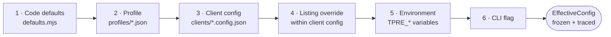

| ID | Requirement |
|---|---|
| TR-CFG-020 | Later layers MUST win over earlier ones, key by key. Merging MUST be deep for objects and replacing for arrays — a partially-merged array is never what an operator means. |
| TR-CFG-021 | The loader MUST emit a resolution trace recording, per key, the winning layer and the winning value. |
| TR-CFG-022 | The trace MUST be written into the diagnostics bundle and printed by `tpre validate-config --explain`. |
| TR-CFG-023 | The resolved config MUST be deeply frozen before use (EDR-005). |
| TR-CFG-024 | Secret **values** MUST NOT appear in the trace. They are rendered as `«set»` or `«unset»`. |

> **EDR-005 — Configuration is deeply frozen and carries its own resolution trace**
> **Serves:** ADR-015 (declarative, layered, versioned configuration).
> **Context:** Six layers means the effective value of any key is the outcome of a computation nobody watched. During an incident, "why did this client use a three-minute timeout?" must be answerable in one command.
> **Decision:** The loader returns a deeply-frozen `EffectiveConfig` plus a parallel `ResolutionTrace` mapping every key to its winning layer and value.
> **Alternatives Rejected:** *Return the merged object alone* — answering the provenance question then requires reading four files and mentally replaying the merge, which is exactly the archaeology this design exists to prevent. *Log every override at load time* — produces noise proportional to key count on every run and is unqueryable. *Lazy resolution per key* — makes the effective config unknowable as a whole and defeats freezing.
> **Trade-off:** The trace roughly doubles the in-memory size of the config object. At a few kilobytes, irrelevant.
> **Scalability:** Value increases with client count. At 100 clients with three profiles, the trace is the only practical way to answer configuration questions.

## 8.3 Client Configuration Structure

| Section | Type | Required | Purpose |
|---|---|---|---|
| `config_version` | integer | ✅ | Schema version of this document |
| `slug` | string | ✅ | MUST equal the filename stem (V-1) |
| `display_name` | string | ✅ | Human-readable client name |
| `enabled` | boolean | ✅ | Participation in scheduled runs |
| `profile` | string | ✅ | Which profile to inherit |
| `tier` | enum | ✅ | `premium` / `standard` / `economy` / `paused` |
| `authorization` | object | ✅ when any listing uses `dom` | The written-authorisation record (V-3) |
| `listings[]` | array | ✅ (min 1) | One or more listing definitions |
| `listings[].key` | string | ✅ | Stable listing key; immutable |
| `listings[].adapter` | enum | ✅ | `google:dom` / `google:places-api` / `google:business-profile-api` / `file:csv` |
| `listings[].identity` | object | ✅ | `place_id` and/or `cid` and/or `url`, plus `expected_name` |
| `listings[].locale` | BCP 47 | — | Drives date parsing and page locale |
| `listings[].cadence` | enum | — | Tier override for this listing |
| `listings[].overrides` | object | — | Any timing/threshold/cap override |
| `display` | object | — | Ordering, `latest_count`, language filter, minimums |
| `publish` | object | — | Which artifacts to emit; `schema_org` opt-in |
| `gate` | object | — | Publish Gate threshold overrides |
| `secrets` | string[] | — | Secret **names** required by the chosen adapters |
| `notes` | string | — | Free text for operators |

### 8.3.1 Illustrative Client Configuration

*Data, not code — an example instance of the schema above.*

```json
{
  "config_version": 1,
  "slug": "commerce-insight",
  "display_name": "Commerce Insight",
  "enabled": true,
  "profile": "default",
  "tier": "premium",
  "authorization": {
    "authorized_by": "Founder, Commerce Insight",
    "authorization_date": "2026-07-22",
    "relationship": "owner",
    "evidence_ref": "compliance/authorizations/commerce-insight.md",
    "scope_ack": true
  },
  "listings": [
    {
      "key": "main",
      "adapter": "google:dom",
      "identity": {
        "place_id": "REDACTED_PLACE_IDENTIFIER",
        "url": "https://maps.google.com/?cid=REDACTED",
        "expected_name": "Commerce Insight"
      },
      "locale": "en-IN",
      "cadence": "standard",
      "overrides": {
        "nav": { "max_reviews": 600, "expand_max_count": 250 },
        "reconcile": { "removal_confirmations": 3 }
      }
    }
  ],
  "display": {
    "order": "newest",
    "latest_count": 20,
    "min_text_length": 0,
    "languages": null,
    "include_rating_only": true,
    "min_rating": null
  },
  "publish": { "reviews": true, "latest": true, "stats": true, "schema_org": false },
  "gate": { "max_count_drop_ratio": 0.20, "max_rating_shift": 0.50, "coverage_min": 0.95 },
  "secrets": [],
  "notes": "First production client. Offered Business Profile API at onboarding; client deferred OAuth grant — revisit at renewal."
}
```

**Agent Note.** `display.min_rating` is `null` and MUST default to `null`. It is the mechanism by which a client could filter out low ratings, and the product position is that TradyPerch declines to do that. Setting it to a non-null value triggers validation rule V-8, which requires a written justification in `notes`. Do not "helpfully" default it to 3.

## 8.4 Complete Configuration Key Reference

Every key that affects behaviour, with its default, its hard ceiling where one exists, and the section that specifies its semantics.

### 8.4.1 Resolution

| Key | Type | Default | § |
|---|---|---|---|
| `resolution.allow_search` | boolean | `false` (prod), `true` (dev) | §2.8 |
| `resolution.identity_threshold` | number | `0.82` | §2.8 |
| `resolution.cache_ttl_days` | integer | `30` | §55.4 |
| `resolution.expected_name` | string | *required* | §2.8 |
| `resolution.advertised_drop_tolerance` | number | `0.40` | §26.3 |

### 8.4.2 Navigation

| Key | Type | Default | Hard Ceiling | § |
|---|---|---|---|---|
| `nav.navigation_timeout_ms` | integer | `30000` | — | §30.3 |
| `nav.surface_timeout_ms` | integer | `15000` | — | §30.3 |
| `nav.scroll_increment_ratio` | number | `0.9` | — | §19.4 |
| `nav.scroll_settle_ms` | integer | `900` | — | §19.4 |
| `nav.stall_threshold` | integer | `3` | — | §19.4 |
| `nav.pagination_budget_ms` | integer | `120000` | — | §30.3 |
| `nav.max_reviews` | integer | `1000` | **`5000`** | §44.3 |
| `nav.expand_max_count` | integer | `200` | — | §19.6 |
| `nav.sort_order` | enum | `newest` | — | §19.3 |
| `nav.locale` | BCP 47 | client locale | — | §19.3 |

### 8.4.3 Normalisation and Validation

| Key | Type | Default | § |
|---|---|---|---|
| `normalize.max_text_length` | integer | `5000` graphemes | §23.3 |
| `validate.coverage_min` | number | `0.95` | §25.4 |
| `validate.quarantine_max` | number | `0.05` | §25.4 |
| `validate.rating_tolerance` | number | `0.30` | §25.4 |
| `validate.near_duplicate_threshold` | number | `0.92` | §22.6 |

### 8.4.4 Reconciliation

| Key | Type | Default | Range | § |
|---|---|---|---|---|
| `reconcile.removal_confirmations` | integer | `3` | 2–10 | §22.5 |
| `reconcile.coverage_min` | number | `0.95` | 0.5–1.0 | §25.5 |
| `reconcile.near_duplicate_threshold` | number | `0.92` | 0.8–1.0 | §22.6 |
| `reconcile.keep_tombstones` | boolean | `true` | — | §22.5 |

**`reconcile.keep_tombstones` MUST remain `true` in production.** It exists as a key only so that tests can construct a ledger without tombstone accumulation. Setting it false in a client config is a defect, and validation SHOULD warn.

### 8.4.5 Publish Gate

| Key | Type | Default | Overridable by `--force-publish` | § |
|---|---|---|---|---|
| `gate.max_count_drop_ratio` | number | `0.20` | yes | §26.3 |
| `gate.max_rating_shift` | number | `0.50` | yes | §26.3 |
| `gate.coverage_min` | number | `0.95` | n/a (warn rule) | §26.3 |
| `gate.quarantine_max` | number | `0.05` | **no** | §26.3 |
| `gate.max_payload_bytes` | integer | `2000000` | n/a (warn rule) | §26.3 |

### 8.4.6 Display and Publication

| Key | Type | Default | § |
|---|---|---|---|
| `display.order` | enum | `newest` | §24.4 |
| `display.latest_count` | integer | `20` | §24.4 |
| `display.min_text_length` | integer | `0` | §24.4 |
| `display.languages` | string[] \| null | `null` (all) | §24.4 |
| `display.include_rating_only` | boolean | `true` | §24.4 |
| `display.min_rating` | integer \| null | **`null`** | §24.4, V-8 |
| `publish.reviews` / `latest` / `stats` | boolean | `true` | §24.6 |
| `publish.schema_org` | boolean | **`false`** | §24.7 |
| `publish.payload_shard_threshold` | integer | `1000000` | §46.4 |

### 8.4.7 Rate Limiting and Budgets

| Key | Type | Default | Hard Ceiling / Floor | § |
|---|---|---|---|---|
| `budget_target_ms` | integer | `300000` | ceiling `300000` | §30.2 |
| `budget_run_ms` | integer | `900000` | ceiling `900000` | §30.2 |
| `inter_target_delay_ms` | integer | `10000` | **floor `5000`** | §57.3 |
| `min_request_delay_ms` | integer | `500` | **floor `250`** | §57.3 |
| `source_hourly_budget` | integer | `200` | ceiling `600` | §57.3 |
| `source_daily_budget` | integer | `2000` | ceiling `6000` | §57.3 |
| `max_parallel` | integer | `4` | ceiling `8` | §57.2 |
| `cadence_floor_hours` | integer | `6` | **floor `1`** | §31.3 |

| ID | Requirement |
|---|---|
| TR-CFG-030 | A configuration value exceeding a hard ceiling MUST be a **validation error**, not a silent clamp. Clamping hides operator intent, which is exactly what must be visible during an incident. |
| TR-CFG-031 | Hard ceilings MUST be compile-time constants in code, not configuration keys. A ceiling that can be configured is not a ceiling. |

## 8.5 Profiles

| Profile | Purpose | Notable Settings |
|---|---|---|
| `default` | Baseline for most clients | 6 h cadence, `max_reviews` 1000, standard timings, current pack pin |
| `conservative` | Sensitive clients; staged pack rollout; post-incident | 12 h cadence, longer delays, `max_reviews` 400 |
| `high-volume` | Listings with 1,000+ reviews | Extended pagination budget, higher caps, larger scroll increments, sharding enabled |

**Profiles pin the selector pack version, and that is how a pack rollout is staged.** Point `conservative` at the new pack, observe one cycle, then move `default`. A staged rollout of the highest-risk change in the system, achieved with a one-line edit in two files.

## 8.6 Tooling Configuration Files

| File | Owns | Key Requirements |
|---|---|---|
| `package.json` | Scripts, engines, dependency declarations | `"type": "module"`; `engines.node` matching `.nvmrc` |
| `package-lock.json` | Exact dependency tree | Committed; CI installs with `npm ci` only |
| `jsconfig.json` | `checkJs`, strict type-checking options | Strict mode on; no implicit `any` |
| `eslint.config.mjs` | Structural limits (§67.2) and prohibited patterns (§67.3) | Enforces complexity ≤ 10, file ≤ 400 lines, no `console.*` outside permitted paths |
| `prettier.config.mjs` | Formatting | Applied to all JSON and Markdown as well as source |
| `vitest.config.mjs` | Test discovery, coverage thresholds, exclusions | **MUST exclude `tests/live/`** |
| `.nvmrc` | Node major pin | Must match CI |
| `.editorconfig` | Editor defaults | LF endings, UTF-8, final newline |
| `.env.example` | Documented template of every variable | Committed; contains no real values |

---

# 9. Environment Variables

## 9.1 Conventions

| Rule | Detail |
|---|---|
| Prefix | All engine variables use `TPRE_`, except platform-provided ones and secrets |
| Naming | `TPRE_<AREA>_<KEY>`, uppercase snake case |
| Types | All values arrive as strings; the loader coerces and validates against the schema |
| Precedence | Layer 5 — beats config files, loses to CLI flags |
| Secrets | Never in config files; injected as environment variables at the step level (SEC-1) |
| Documentation | Every variable appears in the tables below. An undocumented variable is a defect. |

## 9.2 Operational Variables

| Variable | Type | Default | Purpose |
|---|---|---|---|
| `TPRE_ENV` | enum | `development` | `development` / `ci` / `production`. Drives defaults such as `allow_search`. |
| `TPRE_LOG_LEVEL` | enum | `info` | Minimum level written |
| `TPRE_LOG_FORMAT` | enum | `pretty` local, `jsonl` in CI | Sink selection |
| `TPRE_RUN_ID` | string | generated | Correlation id; supplied by the workflow so all shards share one |
| `TPRE_DRY_RUN` | boolean | `false` | Full pipeline, no writes |
| `TPRE_NO_PUBLISH` | boolean | `false` | Write state but not payloads |
| `TPRE_FORCE` | boolean | `false` | Bypass the cadence due-check. **Never bypasses the Gate.** |
| `TPRE_FORCE_PUBLISH` | boolean | `false` | Downgrade overridable gate rules; requires `TPRE_FORCE_REASON` |
| `TPRE_FORCE_REASON` | string | — | Mandatory audit text when force-publishing |
| `TPRE_SHARD` | string | — | `i/n` shard assignment |
| `TPRE_TIER` | enum | — | Cadence tier for this run |
| `TPRE_CLIENT` | string | — | Restrict to one client |
| `TPRE_LISTING` | string | — | Restrict to one listing |

## 9.3 Path Variables

| Variable | Default | Purpose |
|---|---|---|
| `TPRE_CLIENTS_DIR` | `./clients` | Client config location |
| `TPRE_PROFILES_DIR` | `./profiles` | Profiles |
| `TPRE_SELECTORS_DIR` | `./selectors` | Selector packs |
| `TPRE_STATE_DIR` | `./.state` | Checkout of the `state` branch |
| `TPRE_PUBLISH_DIR` | `./.publish` | Checkout of the `data` branch |
| `TPRE_ARTIFACT_DIR` | `./.artifacts` | Logs, manifests, diagnostics |
| `TPRE_FIXTURE_DIR` | `./fixtures` | Test fixtures |

## 9.4 Behavioural Override Variables

**Every variable here may only make the engine more conservative.** A value exceeding the ceiling is a validation error, not a clamp.

| Variable | Type | Ceiling / Floor |
|---|---|---|
| `TPRE_BUDGET_TARGET_MS` | integer | ceiling 300000 |
| `TPRE_BUDGET_RUN_MS` | integer | ceiling 900000 |
| `TPRE_MAX_REVIEWS` | integer | ceiling 5000 |
| `TPRE_INTER_TARGET_DELAY_MS` | integer | floor 5000 |
| `TPRE_MIN_REQUEST_DELAY_MS` | integer | floor 250 |
| `TPRE_SOURCE_HOURLY_BUDGET` | integer | ceiling 600 |
| `TPRE_SOURCE_DAILY_BUDGET` | integer | ceiling 6000 |
| `TPRE_SELECTOR_PACK` | string | must exist on disk |
| `TPRE_DIAGNOSTICS_SCREENSHOT` | boolean | — |

## 9.5 Policy Variables — The Kill Switches

| Variable | Type | Default | Purpose |
|---|---|---|---|
| `TPRE_POLICY_ENABLED` | boolean | `true` | **Global kill switch.** `false` blocks all acquisition. |
| `TPRE_POLICY_DOM_ENABLED` | boolean | `true` | Blocks only DOM acquisition; API clients continue |
| `TPRE_POLICY_ROBOTS_MODE` | enum | `warn` | `block` / `warn` / `ignore` |
| `TPRE_POLICY_BREAKER_OVERRIDE` | boolean | `false` | Force-close breakers; recorded in the manifest with operator identity |
| `TPRE_MAINTENANCE_MODE` | boolean | `false` | Suppress non-critical alerts |

| ID | Requirement |
|---|---|
| TR-ENV-001 | Policy variables MUST be repository **variables**, not secrets, so that flipping one is a two-click operation visible in the audit log. |
| TR-ENV-002 | `TPRE_POLICY_ENABLED=false` MUST block acquisition for every adapter, including official-API adapters. It is the stop-everything lever. |

## 9.6 Secret Variables

| Variable | Required When | Notes |
|---|---|---|
| `GITHUB_TOKEN` | Always in CI | Provided per job; least privilege per §63 |
| `GOOGLE_PLACES_API_KEY` | Any client uses `google:places-api` | Server-side only; never in a payload |
| `GBP_OAUTH_CLIENT_ID` | Any client uses `google:business-profile-api` | One per developer registration |
| `GBP_OAUTH_CLIENT_SECRET` | Same | |
| `GBP_REFRESH_TOKEN__<SLUG_UPPER>` | Per client using that adapter | Independently revocable |
| `ALERT_WEBHOOK_URL` | Optional secondary alert channel | |

| ID | Requirement |
|---|---|
| TR-SEC-010 | An adapter whose required secret is missing MUST raise `ERR-CONFIG-SECRET-MISSING` and exit 2. It MUST NOT fall back to the DOM adapter (SEC-4). |
| TR-SEC-011 | Secrets MUST be read exactly once at startup into a sealed object, and the log redaction filter MUST be seeded with their values at that moment (§48.4). |
| TR-SEC-012 | Secrets MUST NOT be passed as command-line arguments — only as environment variables (SEC-2). |

**TR-SEC-010 exists because of a specific, plausible incident:** an OAuth refresh token expires overnight, the API adapter fails, and a "helpful" fallback silently downgrades a sanctioned API client to unsanctioned DOM scraping. That is a serious policy violation arising from a trivial operational event, and it must be designed out rather than trusted to attention.

## 9.7 Variable Validation at Startup

The engine performs these five steps, in this order, before any other work:

| # | Step | Failure Mode |
|---|---|---|
| 1 | Read all `TPRE_*` variables and coerce types | Type coercion failure ⇒ exit 2 |
| 2 | **Reject unknown `TPRE_*` variables** | Unknown variable ⇒ exit 2 with the offending name |
| 3 | Validate every value against its schema, including ceiling checks | Ceiling breach ⇒ exit 2 |
| 4 | Record the environment layer in the resolution trace, secrets as `«set»`/`«unset»` | — |
| 5 | Seed the log redaction filter with every secret value read | — |

> **EDR-006 — Unknown `TPRE_*` variables are a startup error, never ignored**
> **Serves:** ADR-015.
> **Context:** Silently ignoring unrecognised configuration is one of the most common sources of "I changed the setting and nothing happened" confusion. `TPRE_MAX_REVIEW` (singular) looks correct at a glance and does nothing.
> **Decision:** Any environment variable beginning with `TPRE_` that is not in the documented set causes exit 2 with a message naming the variable and the closest valid match.
> **Alternatives Rejected:** *Warn and continue* — warnings in a CI log with hundreds of lines are not read; the operator still believes the setting took effect. *Ignore silently* — the default behaviour of most configuration libraries, and the source of the confusion this rule prevents. *Accept any `TPRE_*` and pass through to config* — makes typos into new configuration keys, which is worse than ignoring them.
> **Trade-off:** A future variable added by a workflow before the engine supports it will hard-fail. Mitigated by adding the variable to the documented set in the same pull request that introduces its use.
> **Scalability:** More valuable as the variable count grows. At 40 variables, near-miss typos are inevitable.

## 9.8 Local Development Environment

| Aspect | Detail |
|---|---|
| Mechanism | A git-ignored `.env` file, loaded **only** when `TPRE_ENV=development` |
| Template | `.env.example`, committed, with every variable and explanatory comments |
| Safety | The loader MUST refuse to read `.env` when `TPRE_ENV` is `ci` or `production` |
| Dev defaults | `allow_search: true`, `console` notifier, `filesystem` publisher, `pretty` logs, `TPRE_NO_PUBLISH=true` |
| Offline | `npm test` requires no network; `fixtures/server/serve.mjs` provides integration targets |

**The refusal in row 3 is a safety property, not a convenience.** A stray `.env` on a machine that is later used to run a production harvest must not be able to influence that run.

---

# 10. Dependency List

## 10.1 Dependency Policy

The SAD requires written justification for every production dependency (NFR-023), with a target of fewer than ten.

| Rule | Statement |
|---|---|
| DEP-1 | Every new production dependency requires a written justification in §10.2 and reviewer approval. |
| DEP-2 | No dependency may be added for functionality achievable in under ~100 lines of readable code. |
| DEP-3 | Dependencies with native compilation, postinstall scripts, or transitive trees deeper than three levels require security review. |
| DEP-4 | The lockfile is committed and CI installs from it exactly (`npm ci`). |
| DEP-5 | Dependency updates arrive by pull request with CI green; the Playwright/Chromium pin is never auto-merged. |
| DEP-6 | The frontend renderer has **zero** dependencies. Non-negotiable — it ships to client sites. |

## 10.2 Production Dependencies

| Dependency | Role | Justification | Alternative If Dropped |
|---|---|---|---|
| `playwright` | Browser automation | Irreplaceable core capability. The target renders reviews client-side into a virtualised container; there is no server-rendered markup to parse. | Puppeteer (documented migration, confined to one file) |
| A JSON Schema validator | Config, payload, ledger, health, manifest validation | Validation must be rigorous and standards-based. Hand-rolled validation is exactly where silent data corruption enters. | None acceptable |
| An argument parser *(only if needed)* | CLI | Small and stable. **Node's built-in parser is preferred if sufficient** — see OIQ-01. | Built-in |
| A relative-date/locale helper *(only if needed)* | Date resolution | Only if the six-locale matrix proves too large to hand-implement safely. **Prefer a compact internal implementation** — see OIQ-02. | Internal implementation |

**The target is two production dependencies, not ten.** Two of the four rows above are conditional and should be resolved toward "not needed" wherever the internal implementation is under a hundred readable lines.

## 10.3 Development Dependencies

| Dependency | Role | Justification |
|---|---|---|
| `vitest` | Test runner | Fast, ESM-native, good coverage integration; no transpilation required |
| `fast-check` | Property testing | Property laws are load-bearing for INV-03 and INV-04. Not optional. |
| An HTML parser | Offline fixture extraction tests | Needed to run pure extraction against saved markup without launching a browser |
| ESLint + plugins | Structural limits and prohibited patterns | Enforces §67 mechanically |
| Prettier | Formatting | Removes formatting from review entirely |
| A TypeScript checker | `checkJs` type checking | Provides the type safety that replaces a compile step |

## 10.4 Dependency Graph

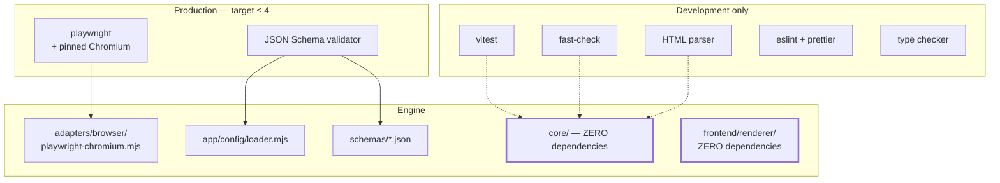

**Two nodes in that graph have zero dependencies and must keep it that way.** `core/` is dependency-free because DR-1 forbids any I/O-capable package, which happens to exclude essentially every npm package worth adding. `frontend/renderer/` is dependency-free because it executes on client websites TradyPerch does not control.

## 10.5 Supply-Chain Controls

| Control | Implementation | Verified By |
|---|---|---|
| Lockfile integrity | Committed `package-lock.json`; `npm ci` only | CI install step |
| Advisory gating | Audit on every CI run; high-severity blocks release | `ci.yml` |
| Postinstall review | Any dependency with a postinstall script requires security sign-off (DEP-3) | Manual, at DEP-1 approval |
| Browser pin | Chromium pinned via the Playwright version in the lockfile | Never auto-merged (DEP-5) |
| Action pinning | Every third-party action by full commit SHA | `security.workflow-lint` |
| Provenance | Prefer packages publishing provenance attestations where available | Manual review |

**THREAT-05 (supply-chain compromise) is the highest residual technical risk in the system** (SAD §36.4). The controls above bound it; they do not eliminate it. The single highest-value mitigation available is the v1.1 job split (§96.2), which removes the write token from the job that executes the most third-party code.

## 10.6 Node.js Built-Ins Used

Built-ins are not dependencies, but the set used is constrained so that portability off the CI platform stays a one-day exercise (§14.6).

| Built-in | Used By | Notes |
|---|---|---|
| `node:fs/promises` | `infra/fs-atomic.mjs`, state and publisher adapters | The only permitted file-write path |
| `node:path` | Path construction throughout `adapters/`, `app/` | Never in `core/` |
| `node:crypto` | `core/util/hash.mjs` | SHA-256 digests only |
| `node:child_process` | `infra/git.mjs` | Git invocation only; **never with interpolated untrusted content** |
| `node:util` | Argument parsing (if built-in parser is used) | |
| `node:process` | `cli/` only | `process.env` MUST NOT be read in `core/` (DR-2) |

| ID | Requirement |
|---|---|
| TR-DEP-001 | `node:child_process` MUST be used only in `infra/git.mjs`, and MUST NOT receive any value derived from acquired content, issue text, or configuration free-text fields (NFR-030). |
| TR-DEP-002 | `core/` MUST NOT import any `node:` built-in other than `node:crypto`. Enforced by architecture test DR-1. |

---

*End of Part 2. Part 3 specifies runtime requirements, build requirements, and the development and production environments.*


---

# Part 3 — Runtime, Build, and Environments

*Sections 11 through 14. Audience: DevOps, implementing engineers. This part defines what the engine needs to run, what "building" means for a system with no build step, and the exact differences between the development and production environments.*

---

# 11. Runtime Requirements

## 11.1 Runtime Platform

| Requirement | Value | Rationale |
|---|---|---|
| Runtime | Node.js LTS, **major ≥ 20** | Stable ESM, `node:` protocol, `Intl.Segmenter` for grapheme-aware bounding (§23.4), and native `parseArgs` |
| Module system | ESM only, `.mjs` extension | No dual-package hazard, no `require`/`import` interop confusion |
| Operating system | Linux x64 (production); macOS and Windows (development) | Production runs on hosted Linux runners; developers are not constrained |
| Architecture | x64 | Browser binary availability. ARM works for development but is not the production target |
| Shell | POSIX shell for scripts | `scripts/*.sh` must run on the runner; developer scripts are `.mjs` and shell-agnostic |

| ID | Requirement |
|---|---|
| TR-ENV-010 | The engine MUST run on the Node major pinned in `.nvmrc` with no polyfills, no shims, and no runtime feature detection. |
| TR-ENV-011 | The engine MUST NOT depend on any OS-level package beyond what the browser binary itself requires. |
| TR-ENV-012 | The engine MUST run identically from a clean clone with `npm ci` and no additional setup other than browser installation. |

**Implementation Note on `Intl.Segmenter`.** Grapheme-cluster-aware length bounding (§23.4, TR-NORM-020) depends on it. If it proves unavailable or incorrect for ZWJ emoji sequences on the pinned Node version, assumption TA-06 has failed and a bounded, justified dependency is required under DEP-1. Verify this in build phase 2 — before anything produces data — not later.

## 11.2 Resource Requirements

| Resource | Minimum | Typical | Peak Budget | Enforced By |
|---|---|---|---|---|
| CPU cores | 2 | 2–4 | — | §45 |
| RAM (process tree) | 2 GB | 700 MB used | **≤ 700 MB** | §44 |
| RAM (Node alone) | — | 80–120 MB | **≤ 120 MB** | §44.2 |
| RAM (Chromium) | — | 300–500 MB | **≤ 600 MB** | §44.2 |
| Disk (working) | 2 GB | ~1.2 GB | — | §46 |
| Disk (browser binaries) | ~500 MB | ~350 MB cached | — | §46.2 |
| Network egress | Minimal | ~8–14 requests per harvest | — | §57.2 |
| Wall clock per target | — | 75 s p50 | **300 s hard** | §30.2 |
| Wall clock per run | — | 8–15 min | **900 s hard** | §30.2 |

**The memory budget is deliberately an order of magnitude below available RAM.** Not because memory is scarce on a 16 GB runner, but because a pathological listing — 5,000 reviews with long text — must be structurally incapable of exhausting the job, and because a rising memory profile is only a useful leak indicator when the baseline is low.

## 11.3 Runtime Dependencies at Execution Time

| Dependency | Needed For | Absent Behaviour |
|---|---|---|
| Node runtime | Everything | Cannot start |
| `node_modules` from lockfile | Schema validation, browser control | Exit 2 at startup |
| Chromium binary | DOM adapter only | `ERR-BROWSER-LAUNCH`; API and CSV adapters unaffected |
| `main` checkout | Config, profiles, selectors, schemas | Exit 2 |
| `state` checkout | Ledger, caches, breaker, health | Treated as empty; first-run semantics; budget fails closed |
| `data` checkout | Gate comparison against current payload | **Gate cannot evaluate G-02…G-05, G-12** — see TR-ENV-013 |
| Network egress | Acquisition and publication | Classified network errors; LKG retained |
| `GITHUB_TOKEN` | Publication and alerting | `ERR-PUBLISH-AUTH` (critical) |

| ID | Requirement |
|---|---|
| TR-ENV-013 | If the `data` checkout is missing or unreadable, the engine MUST treat the current payload as **unknown** and MUST NOT evaluate the change-based gate rules as if the prior payload were empty. Treating "unknown" as "empty" would make G-02 pass trivially and defeat the system's most valuable safety rule. The correct behaviour is to fail the target with a classified error. |
| TR-ENV-014 | A missing `state` checkout MUST produce first-run semantics for ledgers and caches, but MUST fail closed for rate budgets (§57.5). |

**TR-ENV-013 is a subtle trap worth stating explicitly.** A naive implementation reads the current payload, gets `null` because the checkout failed, and evaluates "candidate is non-empty and prior was empty ⇒ first publish ⇒ skip G-02…G-05." That path publishes an unvalidated payload over a healthy one. The distinction between *"there is no prior payload"* and *"I could not read the prior payload"* is load-bearing.

## 11.4 Runtime Modes

| Mode | Trigger | Publishes | Network | Notifier | Publisher |
|---|---|---|---|---|---|
| `production` | `TPRE_ENV=production` | yes | yes | `github-issues` | `git-data` |
| `ci` | `TPRE_ENV=ci` | per flags | per flags | `github-issues` | `git-data` |
| `development` | `TPRE_ENV=development` (default) | no (`TPRE_NO_PUBLISH=true` default) | optional | `console` | `filesystem` |
| `dry-run` | `--dry-run` / `TPRE_DRY_RUN=true` | **no writes at all** | yes | `console` | none |
| `no-publish` | `--no-publish` | state only | yes | active | none |
| `replay` | `tpre replay --from <artifact>` | per flags | **none** | active | per flags |
| `project` | `tpre project` | payload only | **none** | active | active |

| ID | Requirement |
|---|---|
| TR-ENV-015 | `--dry-run` MUST perform the full pipeline including the Gate, and MUST write nothing anywhere — not payloads, not ledgers, not health records, not caches. Its value is that it exercises every decision without consequence. |
| TR-ENV-016 | `tpre project` and `tpre replay` MUST make zero network requests. Both are recovery tools used when the network path is the problem. |

## 11.5 Startup Sequence

The engine performs these steps in this exact order. **Order matters:** redaction must be seeded before anything can log a secret, and configuration must be validated before anything acts on it.

| # | Step | Failure |
|---|---|---|
| 1 | Parse arguments; reject unknown commands and flags | exit 2 |
| 2 | Read and coerce `TPRE_*` variables; reject unknown ones | exit 2 |
| 3 | Read secrets into a sealed object | — |
| 4 | **Seed the log redaction filter with all secret values** | — |
| 5 | Construct the logger and emit the run-start event | — |
| 6 | Discover and load client configs, profiles, defaults | exit 2 |
| 7 | Apply the six-layer precedence chain; validate; freeze; emit trace | exit 2 |
| 8 | Verify `config_version` is supported | `ERR-CONFIG-VERSION`, exit 2 |
| 9 | Verify required secrets for the selected adapters are present | `ERR-CONFIG-SECRET-MISSING`, exit 2 |
| 10 | Construct concrete adapters in the composition root | exit 1 |
| 11 | Compute the due set and the shard assignment | exit 2 |
| 12 | Enter the target loop | — |

**Step 4 before step 5 is not negotiable.** A logger constructed before the redaction filter is seeded can emit a secret in its own startup event.

## 11.6 Shutdown Sequence

| # | Step | Runs On |
|---|---|---|
| 1 | Close the browser and all contexts | always (`finally`) |
| 2 | Flush the log sink | always |
| 3 | Write the run manifest | always |
| 4 | Commit and push `data` (payload first) | success or partial |
| 5 | Commit and push `state` (state second) | always, including full failure |
| 6 | Write diagnostics bundles for failed targets | always |
| 7 | Emit the aggregate summary and compute the exit code | always |
| 8 | Exit | always |

| ID | Requirement |
|---|---|
| TR-ENV-017 | Steps 1–3 and 5–8 MUST execute even when every target failed. Health records are written on failure precisely because that is when monitoring matters most. |
| TR-ENV-018 | The engine MUST NOT rely on process-exit handlers for these steps. Signal handlers and `beforeExit` are unreliable under CI cancellation; the sequence MUST be an explicit `finally` in the CLI. |

---

# 12. Build Requirements

## 12.1 There Is No Build Step

> **EDR-008 — No transpilation: JSDoc-typed `.mjs` is executed exactly as committed**
> **Serves:** ADR-004 (CI as compute plane), SAD §19.1's sub-decision on typing.
> **Context:** The conventional Node project transpiles TypeScript to JavaScript, producing a `dist/` directory and source maps. It gives better ergonomics at authoring time.
> **Decision:** The engine is plain `.mjs` with JSDoc type annotations and `checkJs` enabled. There is no compile stage, no `dist/`, and no source maps. What runs is byte-identical to what is committed.
> **Alternatives Rejected:** *Full TypeScript with a build step* — adds a compile stage to every local iteration and, decisively, puts generated code between the engineer and the stack trace during a 2 a.m. CI investigation. A stack frame pointing at `dist/orchestrator.js:1:4821` is materially worse than one pointing at `src/app/orchestrator.mjs:214`. *TypeScript with `ts-node`-style runtime transpilation* — reintroduces a transform, plus startup cost, plus a dependency in the production path. *Untyped JavaScript* — gives up the type checking that catches the boundary errors this system cares about most.
> **Trade-off:** JSDoc is more verbose than TypeScript syntax, and some advanced type constructs are awkward. Accepted: the types that matter here are record shapes and function signatures, both of which JSDoc expresses well.
> **Scalability:** Neutral to team size. It becomes a worse trade only if the codebase grows past the point where JSDoc's expressiveness limits bite — estimated well beyond v3.0.

## 12.2 What "Build" Means Here

| Activity | Command | Produces | Blocking |
|---|---|---|---|
| Install | `npm ci` | `node_modules/` from the lockfile exactly | yes |
| Browser install | `npx playwright install chromium` | Pinned browser binary | yes (DOM adapter only) |
| Type check | `npm run typecheck` | Diagnostics only; no output files | yes |
| Lint | `npm run lint` | Diagnostics only | yes |
| Format check | `npm run format:check` | Diagnostics only | yes |
| Test | `npm test` | Coverage report | yes |
| Schema validation | `npm run validate:schemas` | Diagnostics only | yes |
| Size report | `npm run size` | Size report against budgets | yes |
| Renderer minification | `npm run build:renderer` | `frontend/renderer/tp-reviews.min.mjs` | yes |

**Exactly one artifact is produced by a build: the minified renderer.** Everything else is verification. This is the entire reason the deployment story in §64 is short.

## 12.3 Required npm Scripts

| Script | Purpose | Must Be Offline |
|---|---|---|
| `test` | Default suite: unit, property, regression, contract, architecture, integration, chaos, budgets, security | **yes** |
| `test:watch` | Local iteration | yes |
| `test:coverage` | Coverage with thresholds enforced | yes |
| `test:live` | Opt-in live suite | no |
| `typecheck` | `checkJs` strict type check | yes |
| `lint` / `lint:fix` | ESLint | yes |
| `format` / `format:check` | Prettier | yes |
| `validate:schemas` | Every schema against every fixture and config | yes |
| `validate:configs` | Schema + semantic rules V-1…V-12 | yes |
| `build:renderer` | Minify the reference renderer | yes |
| `size` | Payload and renderer size budgets | yes |
| `parse:fixture` | Run the parser against one fixture — the incident-repair loop | yes |
| `capture:fixture` | Capture and sanitise a live page into the corpus | no |

| ID | Requirement |
|---|---|
| TR-BLD-010 | `npm test` MUST pass on an air-gapped machine (TG-10). Any test requiring the internet lives in `tests/live/` and is excluded from the default runner. |
| TR-BLD-011 | `npm test` MUST complete in under three minutes on a typical development machine. A suite slower than that stops being run locally, which is when it stops preventing defects. |
| TR-BLD-012 | `npm run parse:fixture -- <nnn>` MUST reproduce a production extraction failure offline in under ten seconds. This is the inner loop of the 60-minute selector repair target (§92.3). |

## 12.4 Build Determinism

| Property | Mechanism |
|---|---|
| Identical dependency tree | Committed lockfile; `npm ci` never resolves ranges |
| Identical browser | Chromium pinned via the Playwright version in the lockfile |
| Identical Node | `.nvmrc` pin, matched by the CI setup action |
| Identical line endings | `.gitattributes` enforces LF |
| Identical output bytes | Stable key ordering and minification in the projector (§24.2) |

| ID | Requirement |
|---|---|
| TR-BLD-013 | `npm install` MUST NOT be used in CI. Only `npm ci`. An install that can resolve a range makes the build non-reproducible, and reproducibility is what makes `tpre project` a safe recovery tool. |
| TR-BLD-014 | The browser version MUST NOT be upgraded automatically. Upgrades land as a dedicated pull request that passes the full fixture corpus plus a live canary run (RISK-14). |

## 12.5 Renderer Build

The one real build output. Constraints are tight because it ships to client websites.

| Constraint | Value | Enforced By |
|---|---|---|
| Size | ≤ 5 KB minified | `tests/budgets/renderer-size.test.mjs` |
| Dependencies | **zero** | DEP-6, dependency graph test |
| Module format | ESM, directly loadable by a browser | Manual + example pages |
| DOM APIs | Text-only; no HTML-injection API | `tests/security/renderer-api.test.mjs` |
| Styling | CSS custom properties; inherits host typography | Manual review |
| Failure mode | A failed fetch leaves existing markup untouched | Integration recipe verification |

---

# 13. Development Environment

## 13.1 Prerequisites

| Requirement | Version | Verify |
|---|---|---|
| Node.js | Matching `.nvmrc`, LTS ≥ 20 | `node --version` |
| npm | Bundled with Node | `npm --version` |
| Git | ≥ 2.30 | `git --version` |
| Chromium via Playwright | Pinned by lockfile | `npx playwright install chromium` |
| Disk | ~2 GB free | — |
| Editor | Any with JSDoc/`checkJs` support | — |

## 13.2 First-Run Setup

| # | Step | Expected Result |
|---|---|---|
| 1 | Clone the repository | — |
| 2 | `nvm use` (or install the pinned Node major) | Node version matches `.nvmrc` |
| 3 | `npm ci` | Dependency tree installed from lockfile exactly |
| 4 | `npx playwright install chromium` | Pinned browser present |
| 5 | Copy `.env.example` to `.env` | Local overrides available |
| 6 | `npm test` | **Green, offline, under three minutes** |
| 7 | `node bin/tpre.mjs doctor` | Versions, caches, secrets, checkouts reported |
| 8 | `node bin/tpre.mjs plan` | Due set printed; no side effects |

**Step 6 is the gate for "the environment works."** If the full default suite is green on a machine with no network access, the development environment is correct. This is the four-hour onboarding target (SAD §53).

## 13.3 Development Defaults

| Setting | Development Value | Reason |
|---|---|---|
| `TPRE_ENV` | `development` | Enables `.env` loading |
| `TPRE_NO_PUBLISH` | `true` | A local run must never write to a real branch |
| Publisher | `filesystem` | Writes to `.publish/` for inspection |
| Notifier | `console` | No issues opened from a laptop |
| Log format | `pretty` | Human-readable |
| `resolution.allow_search` | `true` | Convenience during onboarding; forbidden in production |
| Browser mode | headless (headed available via flag) | §17 |

| ID | Requirement |
|---|---|
| TR-ENV-020 | The config loader MUST refuse to read `.env` unless `TPRE_ENV=development`. A stray local file must not be able to influence a production run. |
| TR-ENV-021 | The `filesystem` publisher and `console` notifier MUST be selected automatically in development, so that a developer cannot accidentally publish or alert by omitting a flag. |

## 13.4 The Offline Development Loop

Everything below runs with no network access. This is the property that makes the system pleasant to work on and possible to debug on a train.

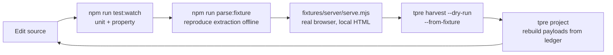

| Loop Stage | Command | Round-Trip |
|---|---|---|
| Pure logic | `npm run test:watch` | < 1 s |
| Extraction against saved markup | `npm run parse:fixture -- 001` | < 10 s |
| Browser-level navigation | `node fixtures/server/serve.mjs` + integration test | < 60 s |
| Full offline pipeline | `tpre harvest --client X --dry-run --from-fixture` | < 90 s |
| Payload regeneration | `tpre project --client X` | < 5 s |

**The fixture server is what makes browser-level testing viable offline.** It serves the same sanitised markup the regression suite uses, over HTTP, with configurable lazy-loading behaviour — so the Navigator's scroll loop, stall detection, and expansion budget are exercised against realistic dynamics with zero network and zero flakiness.

## 13.5 Development Safety Rails

| Rail | Mechanism | Prevents |
|---|---|---|
| No accidental publish | `TPRE_NO_PUBLISH=true` default + `filesystem` publisher | Writing to a real `data` branch from a laptop |
| No accidental alert | `console` notifier default | Opening issues during local testing |
| No accidental live request | Default suites are offline; live tests are opt-in | Generating source requests on every test run |
| No stale `.env` in CI | Loader refuses `.env` outside development | Local settings influencing production |
| No secret commit | `.gitignore` on `.env`; push-time scanning | INV-08 violation |
| No fixture with pending erasure | Review checklist + fixture hygiene rules | Compliance violation |

## 13.6 Common Development Tasks

| Task | Command |
|---|---|
| Check the environment | `tpre doctor` |
| See what is due | `tpre plan` |
| Explain a config value's origin | `tpre validate-config --explain` |
| Test a client offline | `tpre harvest --client X --dry-run` |
| Rebuild payloads with no network | `tpre project --client X` |
| Reproduce an extraction failure | `npm run parse:fixture -- <nnn>` |
| Add a client | `node scripts/new-client.mjs` |
| Capture a fixture | `node scripts/capture-fixture.mjs` |
| Export a client's data | `tpre export --client X` |

---

# 14. Production Environment

## 14.1 Production Topology

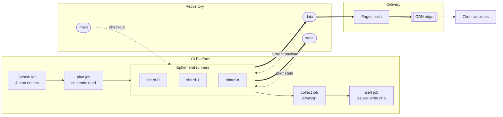

## 14.2 Production Environment Facts

| Fact | Value | Consequence |
|---|---|---|
| Compute lifetime | Minutes; nothing persists in the runner | No warm state, no local cache between runs |
| Environments | Two logical: `production` (scheduled, publishes) and `dry-run` (PR-triggered, publishes nothing) | No staging environment exists, by design |
| Deployment unit | A Git commit on `main` | The engine is *adopted by the next scheduled run*, not deployed |
| Rollback unit | A commit on `data` (payload) or `main` (engine) | §66 |
| State ownership | `state` is machine-owned | Humans MUST NOT hand-edit except per §60 |
| Egress identity | Shared cloud IP range, outside our control | Blocks may occur through no fault of ours (§57.6) |
| Repository visibility | Public (for unmetered CI minutes) | **No secret may exist in any file, ever** |

## 14.3 Production Configuration Differences

| Setting | Development | Production | Why |
|---|---|---|---|
| `TPRE_ENV` | `development` | `production` | Drives all other differences |
| `.env` loading | yes | **refused** | A stray file must not influence production |
| `resolution.allow_search` | `true` | **`false`** | Runtime search is fragile and must not be a production mode |
| Publisher | `filesystem` | `git-data` | — |
| Notifier | `console` | `github-issues` | — |
| Log format | `pretty` | `jsonl` | Machine-analysable |
| Log level | `debug` | `info` (with ring-buffered debug) | Volume control (§37.4) |
| Screenshots | on | on, 14-day retention | Privacy (§47.7) |
| Publish | off | on, gated | — |

## 14.4 Production Readiness Requirements

| ID | Requirement |
|---|---|
| TR-ENV-030 | Branch protection MUST be active on `main`: review required, CI required, no force-push, linear history. |
| TR-ENV-031 | `data` and `state` MUST be writable only by the workflow token and repository admins. |
| TR-ENV-032 | Every workflow MUST have been run at least once manually and verified green before the first client is onboarded. |
| TR-ENV-033 | Actual CDN response headers MUST be verified and recorded in `docs/runbooks/` before the first client is onboarded (OIQ-04). Assumed headers are not verified headers. |
| TR-ENV-034 | The keepalive workflow MUST be run manually once and confirmed not to open a spurious issue. |
| TR-ENV-035 | At least one full clone including `data` and `state` MUST exist outside the primary account before the first client is onboarded (§60.6). |

**TR-ENV-035 converts a maintenance step into a disaster-recovery control at zero cost.** The quarterly history-truncation procedure already requires creating a mirror; that mirror is the offsite backup and MUST be retained rather than deleted.

## 14.5 Production Observability Surface

| Surface | Location | Refresh | Purpose |
|---|---|---|---|
| Run summary | Workflow job summary | Per run | Per-target outcome table |
| Health series | `state:/health/<slug>.jsonl` | Per run | The monitoring substrate |
| Run manifest | `state:/runs/<yyyy-mm>/<run-id>.json` | Per run | 90-day trend analysis |
| Alerts | GitHub Issues, fingerprint-deduplicated | On condition | The only interrupt channel |
| Weekly digest | A single long-lived issue, updated in place | Weekly | Portfolio health |
| Payload verification | Dedicated job | Daily | **The only true Level-1 monitor** — fetches over the public CDN URL exactly as a visitor would |

## 14.6 Portability Off the CI Platform

The SAD estimates one engineer-day to migrate (§37.6). That estimate is only true if these constraints hold, so they are stated as requirements:

| ID | Requirement |
|---|---|
| TR-ENV-040 | No platform SDK may be imported outside `adapters/state/`, `adapters/publisher/`, and `adapters/notifier/`. Enforced by architecture test DR-3. |
| TR-ENV-041 | The engine MUST be invocable as a plain CLI with only environment variables and local checkouts — no platform-specific context object. |
| TR-ENV-042 | `tpre plan` MUST emit its shard assignment as JSON on stdout, so any orchestrator can consume it. |
| TR-ENV-043 | Secrets MUST be read from environment variables only, never from a platform-specific secret API. |

**These four requirements are the entire portability story.** They are cheap to hold and expensive to retrofit, which is why they are requirements rather than aspirations.

## 14.7 Production Failure Envelope

What production is designed to survive without human intervention, and what it is not.

| Failure | Survives Automatically | Human Action |
|---|---|---|
| Transient network error | yes — retry per policy | none |
| Retry exhaustion | yes — LKG retained | none |
| Partial harvest | yes — additions merged, gate rejects | investigate if persistent |
| Gate rejection | yes — LKG retained, alert raised | review reasons |
| Publish conflict | yes — rebase-retry, then next run reproduces | none |
| Bot challenge | yes — breaker opens, LKG retained | **policy decision required** |
| Structure change | yes — LKG retained, alert with failed assertion | selector repair |
| Ledger corruption | no | restore from Git history |
| Identity drift | no | verify listing, update config |
| Publish auth failure | no | rotate token |
| CI platform outage | yes — staleness only | wait, or run locally |
| CDN outage | **no — the only visitor-visible failure** | switch to fallback origin |

**Every row except the last has zero visitor impact.** That is not luck; it is the consequence of ADR-001 (decoupling), ADR-006 (state separate from output), and ADR-011 (gated publication) acting together. Any change that breaks one of those three re-opens every row in this table.

---

*End of Part 3. Part 4 specifies the Playwright requirements, browser configuration and lifecycle, the navigation strategy, the DOM extraction strategy, and the review detection logic.*


---

# Part 4 — Acquisition: Browser, Navigation, and Extraction

*Sections 15 through 21. Audience: implementing engineers. This part covers the most volatile and highest-risk code in the system. Every requirement here exists because a specific failure mode was observed or anticipated; the rationale column is not decoration.*

---

# 15. Playwright Requirements

## 15.1 Scope of the Playwright Dependency

> **EDR-009 — Browser control is a port method, and `playwright` is imported by exactly one file**
> **Serves:** ADR-005 (Playwright with pinned Chromium).
> **Context:** Playwright is the single largest dependency in the system and the one most likely to need replacing (Puppeteer is a viable alternative; the SAD rates reversibility as High only because of this confinement). Left unconstrained, browser API calls spread into the navigator, the resolver, the consent handler, and the diagnostics capture — and the migration estimate goes from a day to a week.
> **Decision:** `adapters/browser/playwright-chromium.mjs` is the only file permitted to import `playwright`. Everything else receives a `BrowserPort` handle and calls port methods.
> **Alternatives Rejected:** *Import Playwright wherever convenient* — the default outcome; makes the dependency unremovable and makes browser behaviour untestable without a browser. *Wrap every Playwright type in a bespoke abstraction* — over-abstraction; the port exposes handles opaquely and lets the adapter use rich APIs internally, which is the correct depth. *Use Playwright's test runner as the harness* — couples the production engine to a test framework and imports an enormous surface for no gain.
> **Trade-off:** The Navigator receives handles it cannot introspect with full type information, and some Playwright ergonomics (auto-waiting locators) must be surfaced through the port rather than used directly. Mitigated by keeping the Navigator itself inside the `google-dom` adapter, which is permitted to hold a handle.
> **Scalability:** The confinement is what keeps ADR-005's reversibility claim honest. It costs one file and one architecture test.

| ID | Requirement |
|---|---|
| TR-BRW-010 | `playwright` MUST be imported by exactly one file. Enforced by architecture test DR-3. |
| TR-BRW-011 | The Chromium build MUST be pinned via the Playwright version in the lockfile and MUST NOT be upgraded automatically (RISK-14). |
| TR-BRW-012 | Playwright's test runner MUST NOT be a dependency. Vitest is the harness (§61). |
| TR-BRW-013 | Browser upgrades MUST land as a dedicated pull request that passes the full fixture corpus **and** a live canary run before merge. |

## 15.2 Browser Choice

| Requirement | Value | Rationale |
|---|---|---|
| Engine | Chromium | The target is developed and tested against Chromium-family browsers by its own vendor; highest fidelity, lowest surprise |
| Firefox | Diagnostic use only | If extraction breaks in Chromium only, a Firefox run is a useful signal about whether the change is rendering-specific |
| WebKit | Not used | No diagnostic value that Firefox does not provide more cheaply |

## 15.3 Playwright Capabilities Used

| Capability | Used For | Alternative If Removed |
|---|---|---|
| Browser launch with explicit args | Session management | — |
| Browser contexts | **Per-target isolation (INV-09)** | Would require a browser per target: ~1.5 s × target count |
| Route interception | Resource blocking and host allowlisting (§16.4) | Would lose 60–80% byte reduction and a defence-in-depth control |
| Auto-waiting locators | Reduced flakiness in the scroll-and-expand loop | Hand-written wait loops — the single largest source of scraper flakiness |
| Locale and timezone per context | Correct relative-date phrasing per client | Would make date parsing locale-ambiguous |
| Screenshot capture | Diagnostics bundle | Would materially degrade incident diagnosis |
| Console and page-error listeners | Debug-level instrumentation | Reduced diagnosability |
| Element evaluation returning strings | DOM subtree serialisation (§20.2) | — |

## 15.4 Playwright Capabilities Deliberately Not Used

**This table is a security-review artifact.** It documents what the codebase must not contain, so an auditor can verify absence rather than infer it.

| Not Used | Reason |
|---|---|
| Persistent contexts / storage state | Contexts are always fresh; no session is cultivated (INV-07 posture, §18.1) |
| Proxy configuration | No proxy configuration key exists in the config schema |
| Browser fingerprint patching / stealth plugins | ADR-010: the engine never disguises itself |
| Human-like mouse paths or typing cadence | Interaction is direct and deterministic |
| Authentication of any kind on the DOM path | FR-021: no credential path exists in the DOM adapter |
| `page.pause()` / inspector | Debug-only tooling; MUST NOT appear in committed code |
| Video recording | Storage cost and personal-data exposure with no diagnostic gain over screenshots |
| Multiple pages per context | One page per context; parallel pages would multiply memory and request pressure |

| ID | Requirement |
|---|---|
| TR-BRW-014 | The codebase MUST NOT contain any proxy configuration, fingerprint modification, storage-state persistence, or input-timing randomisation. A pull request introducing any of these MUST be rejected (ADR-010). |

---

# 16. Browser Configuration

## 16.1 Launch Configuration

| Setting | Value | Rationale |
|---|---|---|
| Headless | `true` in all non-development modes | §17 |
| Sandbox | Enabled where the runner permits | Defence in depth; disable only if the runner requires it, and record why |
| Downloads | Disabled | Nothing is ever downloaded; a download path is an unnecessary file-write surface |
| Default timeout | **Explicitly set — never infinite** | NFR-016 |
| Slow-mo | `0` in production; available locally | Debug aid only |
| Devtools | `false` always | — |

| ID | Requirement |
|---|---|
| TR-BRW-020 | No timeout anywhere in the browser layer may be left at an infinite or unset default. Every one of the six budgets in §30.3 MUST be explicitly configured. |
| TR-BRW-021 | Launch arguments MUST be a reviewed, documented list. An argument added to "make it work" without a recorded reason is a defect — several plausible Chromium flags materially weaken sandboxing. |

## 16.2 Context Configuration

A fresh context is created per target. These settings are applied to every one of them.

| Setting | Value | Rationale |
|---|---|---|
| Viewport | Realistic desktop dimensions | Layout-dependent extraction requires a plausible viewport; a 0×0 or mobile viewport changes which elements render |
| Locale | From client config (`listings[].locale`) | **Drives relative-date phrasing.** Wrong locale ⇒ unparseable dates ⇒ null estimates |
| Timezone | From client config | Consistency with locale |
| `reducedMotion` | `reduce` | Removes animation-driven timing variance from the scroll loop |
| Permissions | **none granted** | No geolocation, notifications, camera, or clipboard |
| Geolocation | not set | Location-based result variation would make harvests non-reproducible |
| Service workers | blocked | Unnecessary; adds an uncontrolled request source |
| Storage | none persisted | Fresh context per target; nothing survives |
| `bypassCSP` | `false` | No reason to weaken the page's own protections |
| HTTPS errors | **never ignored** | §47.9 — no certificate validation bypass under any configuration |

| ID | Requirement |
|---|---|
| TR-BRW-022 | Locale and timezone MUST come from client configuration, not from the runner's defaults. A runner in UTC harvesting an Indian client's listing produces different relative-date phrasing than expected. |
| TR-BRW-023 | Certificate validation MUST NOT be bypassed under any configuration or environment variable. |
| TR-BRW-024 | No permission may be granted to any context. If a future requirement appears to need one, it requires an EDR. |

## 16.3 Resource Blocking

Route interception applies a resource-type policy and a host allowlist. Both are measured, and the measurement is reported.

| Resource Type | Action | Rationale |
|---|---|---|
| Images | **block** | Not needed for extraction; avatars are captured as URLs only (ADR-014). Largest single bandwidth saving. |
| Media (video/audio) | **block** | Never needed |
| Fonts | **block** | Layout may shift slightly; extraction does not depend on glyph metrics |
| Stylesheets | **allow** | Some structural and visibility determinations depend on computed layout |
| Scripts | **allow** | The page must execute — the content is not in the initial response |
| XHR / fetch | **allow** (allowlisted hosts only) | This is how review batches arrive |
| Analytics / telemetry hosts | **block** | Not needed; reduces noise and avoids sending signals we have no reason to send |
| Any host outside the allowlist | **block** | Defence in depth: a compromised page cannot use the runner as a request source (THREAT-04) |

| ID | Requirement |
|---|---|
| TR-BRW-030 | Blocking MUST be measured. The count and byte total of blocked requests MUST appear in the `AcquisitionReport` and the run manifest. |
| TR-BRW-031 | An integration test MUST assert that images, fonts, and media are actually blocked, and that the measured byte reduction is non-trivial. A regression that silently stops blocking is otherwise invisible. |
| TR-BRW-032 | The host allowlist MUST be configuration, not a hard-coded literal, so that adding a source in v2.0 does not require touching the browser adapter. |

> **EDR-012 — Route interception uses a host allowlist plus a resource-type denylist, and both are measured**
> **Serves:** THREAT-04 (crafted content exhausting runner resources), §43 (performance).
> **Context:** Resource blocking is usually treated as a performance optimisation. Here it is simultaneously a performance measure, a politeness measure, and a security control — and controls that are not measured decay silently.
> **Decision:** Two independent filters. A resource-type denylist blocks images, media, fonts, and known telemetry. A host allowlist blocks everything not explicitly permitted. Both emit counters into the acquisition report.
> **Alternatives Rejected:** *Resource-type filtering alone* — permits arbitrary hosts, leaving the runner usable as a request source by a compromised page. *Host allowlist alone* — permits megabytes of images from an allowlisted host, losing the 60–80% byte reduction. *No blocking* — 25–40% slower, far more bytes, and a wider attack surface, for no benefit. *Blocking stylesheets too* — tempting for speed, but breaks layout-dependent visibility determinations that extraction relies on.
> **Trade-off:** The allowlist must be maintained when a source changes its CDN hostnames, and a missed hostname manifests as a page that fails to load its reviews. Mitigated by making it configuration and by the canary detecting it within hours.
> **Scalability:** Per-source allowlists compose cleanly as adapters are added; the mechanism does not change.

## 16.4 Instrumentation

| Signal | Level | Retained |
|---|---|---|
| Console messages from the page | `debug` | Ring buffer; flushed on failure |
| Page errors | `debug` | Ring buffer; flushed on failure |
| Failed requests | `debug` | Ring buffer; flushed on failure |
| Response statuses on allowlisted hosts | `debug` | Ring buffer |
| Blocked request counts and bytes | `info` (aggregate) | Always — feeds TR-BRW-030 |

**Instrumentation is ring-buffered rather than always-written for the reason in §37.4:** a healthy 1,000-review harvest would otherwise produce megabytes of console noise per run, and the noise is only ever useful when the target failed.

---

# 17. Headless vs Headed Design

## 17.1 The Decision

> **EDR-010 — Headless is the only production mode; headed exists solely as a local debug flag**
> **Serves:** ADR-005, ADR-010.
> **Context:** Headed and headless Chromium differ in observable ways — rendering timing, some default behaviours, and the properties an anti-automation system might inspect. There is a temptation to run headed "because it looks more like a real browser."
> **Decision:** Production runs headless, always. A `--headed` flag exists for local debugging only and is refused when `TPRE_ENV` is `ci` or `production`.
> **Alternatives Rejected:** *Headed in production via a virtual display* — adds an OS-level dependency to the runner, roughly doubles memory, and is transparently an attempt to appear more human. That crosses the line ADR-010 draws, and it does so for a marginal and unreliable benefit. *Headless for some clients, headed for others* — makes behaviour non-reproducible across the fleet and makes an incident impossible to attribute. *Alternating modes on retry* — an evasion pattern; forbidden.
> **Trade-off:** If the source ever renders differently to headless browsers, extraction breaks and the engine has no sanctioned response other than the official-API migration path. That is the intended consequence, not an oversight.
> **Scalability:** Neutral. Headless is the cheaper mode at every scale.

| ID | Requirement |
|---|---|
| TR-BRW-040 | `--headed` MUST be refused with exit 2 when `TPRE_ENV` is `ci` or `production`. |
| TR-BRW-041 | No configuration path may select headed mode for a scheduled run. |
| TR-BRW-042 | Headed and headless MUST produce identical extraction output against the fixture corpus. A divergence is a defect in the extraction path, not an acceptable difference. |

## 17.2 Mode Comparison

| Aspect | Headless (production) | Headed (local debug only) |
|---|---|---|
| Memory | 300–500 MB | 500–800 MB |
| Startup | ~1.5 s | ~2.5 s |
| Requires display | no | yes |
| Permitted in CI | yes | **no** |
| Use case | All harvesting | Watching the scroll loop behave; diagnosing a stall |
| Screenshot fidelity | Full | Full |

## 17.3 When to Use Headed Locally

| Situation | Why Headed Helps |
|---|---|
| Pagination stalls and the growth curve is unexplained | Watching the container scroll shows immediately whether the wrong element is being scrolled |
| A consent interstitial is not being dismissed | The dismissal affordance is visible |
| Expansion clicks appear to do nothing | Reveals whether the click lands on the right element |
| Extraction returns zero with a valid-looking page | Shows whether content rendered at all |

**In every one of those cases, the outcome should be a new fixture**, so the problem becomes reproducible headlessly and permanently. Headed debugging that does not end in a fixture has left the system no better defended than before.

---

# 18. Browser Lifecycle

## 18.1 Lifecycle Model

> **EDR-011 — One browser per shard, one context per target, one page per context, all closed in `finally`**
> **Serves:** INV-09 (client isolation), §44 (memory).
> **Context:** Browser launch costs ~1.5 s; context creation costs milliseconds. Reusing everything is fastest; reusing nothing is safest.
> **Decision:** The browser process is launched once per shard job and reused across targets. A fresh context is created per target and closed in a `finally` block. One page per context.
> **Alternatives Rejected:** *One browser per target* — costs ~1.5 s × target count with no isolation benefit over a fresh context, since contexts already isolate storage, cookies, cache, and permissions. *One context reused across targets* — saves ~100 ms per target and breaks per-target isolation, leaking state between tenants. This is the optimisation that looks harmless and violates INV-09. *Multiple pages per context for parallelism* — multiplies concurrent requests to the source and peak memory, for wall-clock time the freshness SLO does not need.
> **Trade-off:** A browser crash mid-shard affects all remaining targets in that shard rather than one. Mitigated by `ERR-BROWSER-CRASH` being retryable once and by shards being independent.
> **Scalability:** Correct at every scale in the roadmap. At 500 clients the shard count grows; the per-shard model does not change.

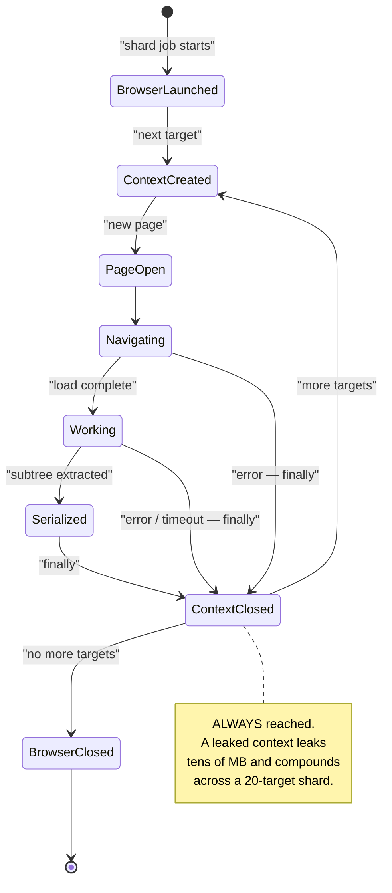

## 18.2 Lifecycle Requirements

| ID | Requirement |
|---|---|
| TR-BRW-050 | The browser MUST be launched once per shard job and reused across targets. |
| TR-BRW-051 | A fresh context MUST be created per target. Contexts MUST NOT be reused across targets under any circumstance. |
| TR-BRW-052 | Every context MUST be closed in a `finally` block that executes on success, on error, on timeout, and on abort. |
| TR-BRW-053 | An integration test MUST assert that the open-context count returns to zero after a multi-target run, including a run in which a target fails. |
| TR-BRW-054 | The serialised DOM subtree MUST be captured and the page released **before** the pure pipeline runs, so Chromium can reclaim memory during processing (§44.3, M-7). |
| TR-BRW-055 | The browser MUST be closed before the shard job writes its commits, so that a hung browser cannot delay or prevent publication. |

**TR-BRW-053 is the test that catches the most expensive class of memory bug in this system.** A leaked context is invisible on a two-target local run and fatal on a twenty-target production shard.

## 18.3 Browser Failure Handling

| Failure | Error Class | Retry | Recovery |
|---|---|---|---|
| Launch fails | `ERR-BROWSER-LAUNCH` | immediate ×1 | Retry once; on repeat, fail the run (scope: run) |
| Context creation fails | `ERR-BROWSER-CRASH` | backoff ×1 | Retry once; on repeat, fail the target |
| Page crashes mid-navigation | `ERR-BROWSER-CRASH` | backoff ×1 | Close context, new context, retry once |
| Out of memory | `ERR-BROWSER-OOM` | **never** | Fail the target; alert recommends lowering `max_reviews` |
| Browser becomes unresponsive | `ERR-BUDGET-TARGET` | never | Per-target budget fires; context force-closed |

| ID | Requirement |
|---|---|
| TR-BRW-056 | `ERR-BROWSER-OOM` MUST NOT be retried. Retrying an OOM with the same inputs reproduces it deterministically while consuming another several minutes of budget. The correct response is a configuration change, which is a human decision. |
| TR-BRW-057 | After any browser-level failure, the context MUST be closed before the next target begins, even if closing itself throws. A close failure is logged and swallowed. |

---

# 19. Page Navigation Strategy

## 19.1 Navigator Responsibility

The Navigator drives the page from "opened" to "all target review content present in the DOM", then hands off a serialised subtree. It knows about **interaction sequences**. It knows nothing about **field locations** — that is the selector pack's job (§20).

## 19.2 Navigation Phase Machine

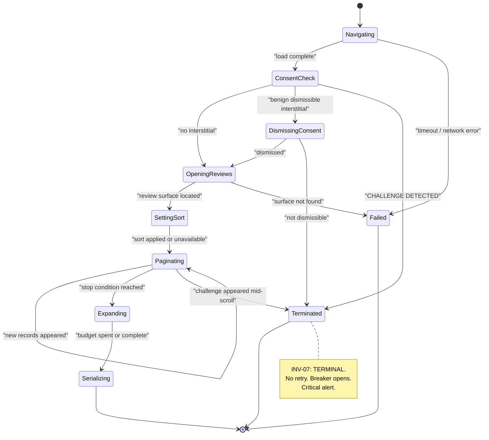

| Phase | Timeout | Failure Class |
|---|---|---|
| Navigating | `nav.navigation_timeout_ms` (30 s) | `ERR-NAV-TIMEOUT` |
| ConsentCheck | included in surface timeout | `ERR-BLOCKED-CHALLENGE` / `ERR-NAV-CONSENT-WALL` |
| DismissingConsent | 5 s | `ERR-NAV-CONSENT-WALL` |
| OpeningReviews | `nav.surface_timeout_ms` (15 s) | `ERR-NAV-SURFACE-NOT-FOUND` |
| SettingSort | 5 s, non-fatal | falls back silently |
| Paginating | `nav.pagination_budget_ms` (120 s) | stop reason `budget_exhausted` |
| Expanding | remaining target budget | non-fatal; flags records |
| Serializing | 5 s | `ERR-PARSE-STRUCTURE` |

| ID | Requirement |
|---|---|
| TR-NAV-010 | Sort-order application MUST be non-fatal. If the sort control is absent or unresponsive, the Navigator proceeds and records that sort was not applied. A missing sort control is a product change, not a harvest failure. |
| TR-NAV-011 | Challenge detection MUST run **before** parsing is attempted, at the end of navigation (§21.8). Detecting a challenge after a parse failure produces a misleading `ERR-PARSE-STRUCTURE` alert and sends the engineer to the wrong runbook. |
| TR-NAV-012 | Only **benign, dismissible** interstitials may be dismissed. A non-dismissible wall is `ERR-NAV-CONSENT-WALL` — source-scoped, no retry. The Navigator MUST NOT attempt repeated dismissal strategies. |

## 19.3 ALG-PAGINATE — The Pagination Algorithm

The review list is a lazily-populated, virtualised container. This algorithm is normative.

| Step | Action |
|---|---|
| 1 | Locate the scroll container that owns the review list, from the selector pack's `containers.scroll`. |
| 2 | Record `count₀` = number of review nodes currently present. |
| 3 | **Loop:** |
| 3a | Scroll the container by `containerHeight × nav.scroll_increment_ratio` (default 0.9). **Not to the absolute bottom.** |
| 3b | Wait for either a count increase or `nav.scroll_settle_ms` (default 900 ms), whichever occurs first. |
| 3c | Record `countₙ`. |
| 3d | Evaluate stop conditions **in this order** (see §19.4). |
| 3e | If no stop condition met, continue the loop. |
| 4 | Emit `PaginationReport { finalCount, iterations, stopReason, elapsedMs, growthCurve }`. |

> **EDR-013 — Scroll by container-height ratio, never to absolute bottom**
> **Serves:** ADR-009, RISK-04 (silent partial data).
> **Context:** Jumping to the bottom of the container is faster and is the obvious implementation.
> **Decision:** Scroll by 90% of container height per iteration.
> **Alternatives Rejected:** *Scroll to absolute bottom* — faster, and **skips records**: jumping past the virtualisation window means the intervening records are never materialised, and the harvest silently returns fewer reviews than exist. This is a correctness failure disguised as a performance win. *Scroll by a fixed pixel amount* — breaks when the container height differs across viewports or when card heights change. *Scroll one card at a time* — correct but many times slower, with no accuracy gain over 90%.
> **Trade-off:** More iterations, therefore slightly longer harvests. Pagination is already ~65% of harvest time (§43.2), so this is the dominant cost — and it is the correct place to spend it.
> **Scalability:** Iterations scale linearly with review count, bounded by `max_reviews` and `pagination_budget_ms`.

> **EDR-014 — The growth curve is a first-class output, retained in the acquisition report**
> **Serves:** RISK-04, §41 (monitoring).
> **Context:** When a harvest returns 12 of 118 reviews, the question is *where* it stopped growing. Without a record, this is unanswerable after the fact.
> **Decision:** The count after every iteration is retained as an array in the `AcquisitionReport` and written to the diagnostics bundle.
> **Alternatives Rejected:** *Record only the final count* — the most common implementation, and it makes stall diagnosis guesswork. *Log each iteration at `debug`* — the data exists but must be reconstructed by parsing logs, and `debug` is ring-buffered so it is discarded on success. *Record only on failure* — a *successful* harvest with a suspicious curve is exactly the case worth catching early.
> **Trade-off:** A few hundred bytes per harvest in the manifest. Irrelevant.
> **Scalability:** Constant per harvest.

**The growth curve is the single most diagnostic artifact in the system.** A curve that plateaus at 12 with `advertisedTotal = 118` tells the whole story of an incident in one array.

## 19.4 Stop Conditions

Evaluated in this order. **The order matters** — `cap_reached` before `target_reached` means a capped harvest is classified as capped rather than as complete.

| # | Condition | Test | Stop Reason |
|---|---|---|---|
| 1 | Cap reached | `countₙ ≥ nav.max_reviews` | `cap_reached` |
| 2 | Target reached | `countₙ ≥ advertisedTotal` | `target_reached` |
| 3 | Stalled | `countₙ == countₙ₋₁` for `nav.stall_threshold` consecutive iterations (default 3), each separated by increasing backoff (900 ms, 1800 ms, 3600 ms) | `stalled` |
| 4 | Budget exhausted | `elapsed ≥ nav.pagination_budget_ms` | `budget_exhausted` |
| 5 | Error | Any thrown error or challenge detection | `error` |

| ID | Requirement |
|---|---|
| TR-NAV-020 | Stall detection MUST use increasing backoff between attempts. A stall declared after three immediate re-scrolls will produce false stalls on a slow network. |
| TR-NAV-021 | `exhausted` MUST be distinguished from `stalled`. Both mean "no new records appeared", but `exhausted` additionally requires `count ≥ 95% of advertised`. |
| TR-NAV-022 | The stop reason MUST be a first-class output propagated to the `AcquisitionReport`, the `ValidationReport`, the health record, and the payload's `harvest_completeness`. |

## 19.5 Stop Reason → Completeness Mapping

**This is the mechanical expression of INV-03 and the single most important table in Part 4.**

| Stop Reason | Completeness | Reconciler Behaviour | Publish Gate Treatment |
|---|---|---|---|
| `target_reached` | `full` | Streaks may advance | Normal evaluation |
| `exhausted` (no growth **and** count ≥ 95% of advertised) | `full` | Streaks may advance | Normal evaluation |
| `cap_reached` | `full_capped` | Streaks may advance | Normal; count-drop uses the cap, not advertised total |
| `stalled` (count < 95% of advertised) | **`partial`** | **Streaks MUST NOT change** | G-05 applies strictly: count must not drop at all |
| `budget_exhausted` | **`partial`** | **Streaks MUST NOT change** | Same as `stalled` |
| `error` / `challenge` | `failed` | No reconciliation at all | No publication at all |

**A `partial` harvest is trustworthy for additions and untrustworthy for absences.** A review that appeared is real — records cannot appear spuriously. A review that did not appear may simply not have loaded. The reconciler treats the two asymmetrically on exactly this basis (§22.5).

**Agent Note.** The temptation is to collapse `stalled` and `exhausted` into one reason, since both mean "growth stopped." Do not. The difference between them is the difference between a complete harvest and a harvest that is lying, and every downstream protection depends on the distinction.

## 19.6 Text Expansion

| Aspect | Rule |
|---|---|
| Trigger | A review node contains an expansion affordance per the selector pack |
| Budget | `min(nav.expand_max_count, floor(remaining_budget_ms / expected_interaction_ms))`; defaults 200 and 120 ms |
| Order | **Longest-truncated first**, by rendered length, so the budget buys the most recovered text |
| Failure | An expansion that throws or times out marks that record `text_truncated: true` and continues |
| Verification | After expansion, text is re-read and checked for the absence of a truncation marker; if still present, `text_truncated` remains `true` |
| Network | None — expansion reveals already-loaded text |

| ID | Requirement |
|---|---|
| TR-NAV-030 | An expansion failure MUST NOT fail the record or the harvest. It sets `text_truncated: true`. |
| TR-NAV-031 | Records left unexpanded due to budget exhaustion MUST be flagged `text_truncated: true`, never stored silently short. |
| TR-NAV-032 | Expansion ordering MUST be deterministic given identical input, so that repeated runs against a fixture produce identical output (required by PT-12). |

**Storing truncated text flagged as truncated is strictly better than storing it silently, and both are better than failing the harvest.** The payload exposes `text_truncated` so a consumer can choose to link out rather than show a clipped review.

## 19.7 Navigation Configuration

| Key | Default | Ceiling | Effect |
|---|---|---|---|
| `nav.navigation_timeout_ms` | 30000 | — | Page load budget |
| `nav.surface_timeout_ms` | 15000 | — | Locating the review surface |
| `nav.scroll_increment_ratio` | 0.9 | — | Fraction of container height per scroll |
| `nav.scroll_settle_ms` | 900 | — | Wait for new records |
| `nav.stall_threshold` | 3 | — | Consecutive no-growth iterations |
| `nav.pagination_budget_ms` | 120000 | — | Hard cap on pagination |
| `nav.max_reviews` | 1000 | **5000** | Per-harvest cap |
| `nav.expand_max_count` | 200 | — | Expansion interaction budget |
| `nav.sort_order` | `newest` | — | Falls back silently if unavailable |
| `nav.locale` | client locale | — | Drives date phrasing |

## 19.8 Request Profile

Per harvest, the DOM adapter's expected network profile. **This table is the quantitative basis for §57's politeness argument** and MUST be re-measured if the navigation strategy changes.

| Request Type | Count | Notes |
|---|---|---|
| Listing page load | 1 | |
| Lazy review batches | ~6–12 for 120 reviews | Triggered by scrolling, exactly as a human browsing would |
| Text expansions | 0 | In-page; no network |
| Blocked (images, fonts, media, analytics) | ~40–120 **avoided** | §16.3 |
| **Effective requests per harvest** | **~8–14** | |

---

# 20. DOM Extraction Strategy

## 20.1 The Two-Stage Split

Extraction is split across a trust boundary: an impure step that produces a string, and a pure step that reads it.


> **EDR-015 — Extraction operates on a serialised subtree string, not on live browser handles**
> **Serves:** ADR-017 (golden fixtures as the primary regression mechanism), §44 (memory).
> **Context:** It is entirely possible to extract fields by querying live Playwright locators. It is the shorter path and needs no serialisation step.
> **Decision:** The browser adapter serialises the review container's subtree into a string. The pure Extractor parses that string. No `core/` code ever touches a browser handle.
> **Alternatives Rejected:** *Extract directly from live locators* — makes extraction impure, so it cannot be property-tested, cannot be run against saved fixtures, and cannot be reproduced offline during an incident. This single choice would eliminate the golden-fixture strategy, the 60-minute repair target, and roughly half of the test portfolio. *Serialise the whole document* — 5–20× more input for the parser and correspondingly more memory (§44.3, M-1). *Extract in the page context via injected evaluation* — puts extraction logic inside the untrusted page's execution environment, which is both a security problem and undebuggable.
> **Trade-off:** A serialisation step, and the loss of Playwright's auto-waiting during field resolution. Neither matters: by serialisation time the content is already materialised, and the string is what the fixture corpus stores.
> **Scalability:** Constant. The subtree size is bounded by `max_reviews` and the text-length bound.

| ID | Requirement |
|---|---|
| TR-EXT-010 | The Extractor MUST be pure and MUST accept a string, never a handle. Enforced by DR-1. |
| TR-EXT-011 | Serialisation MUST capture the review container subtree only, never `document.documentElement` (§44.3, M-1). |
| TR-EXT-012 | The serialised string MUST be byte-identical to what `scripts/capture-fixture.mjs` stores after sanitisation, so that a diagnostics snapshot can become a fixture by copying it. |

**TR-EXT-012 is what makes the selector-repair runbook a 60-minute procedure.** An engineer copies `snapshot.html` from the diagnostics bundle into `fixtures/dom/google/<nnn>/page.html`, and the failure is reproducible offline in seconds.

## 20.2 Selector Pack Structure

All field-location knowledge lives in versioned JSON files. Parser code is generic: it reads a pack and resolves fields through ordered strategies.

| Section | Contents |
|---|---|
| `meta` | `pack_version`, `source`, `created`, `notes`, `min_engine_version` |
| `containers` | Locators for the review surface, the scroll container, the individual review node, the reply node |
| `fields` | Per logical field: ordered `strategies[]`, `required` flag, `transform` reference |
| `affordances` | Locators for the expansion control, sort control, pagination trigger, consent dismissal |
| `signals` | Locators and patterns indicating a challenge page, empty state, or error state |
| `assertions` | Structural invariants the canary verifies (§41.6) |

### 20.2.1 Illustrative Pack Fragment

*Data, not code — an example instance of the pack schema.*

```json
{
  "meta": {
    "pack_version": "google-maps/v3",
    "source": "google",
    "created": "2026-07-24",
    "min_engine_version": "1.0.0",
    "notes": "v3 adds a role-based strategy for the rating after v2's aria-label pattern began falling back on ~15% of records."
  },
  "containers": {
    "surface": { "strategies": [ { "kind": "role", "expr": "REDACTED", "confidence": 0.95 } ] },
    "scroll": { "strategies": [ { "kind": "structural-relative", "expr": "REDACTED", "confidence": 0.85 } ] },
    "review_node": { "strategies": [ { "kind": "role", "expr": "REDACTED", "confidence": 0.95 } ] },
    "reply_node": { "strategies": [ { "kind": "structural-relative", "expr": "REDACTED", "confidence": 0.80 } ] }
  },
  "fields": {
    "rating": {
      "required": true,
      "strategies": [
        { "kind": "aria-label-pattern", "expr": "REDACTED", "confidence": 0.95, "notes": "Carries the numeric value directly; most robust." },
        { "kind": "role", "expr": "REDACTED", "confidence": 0.85 },
        { "kind": "css", "expr": "REDACTED", "confidence": 0.40, "notes": "Last resort. Generated class name — expect breakage." }
      ]
    }
  },
  "signals": {
    "challenge": { "patterns": ["REDACTED"], "confidence": "high" },
    "empty_state": { "patterns": ["REDACTED"], "confidence": "high" }
  }
}
```

## 20.3 Strategy Kinds, in Preference Order

| Order | Kind | Stability | Why This Rank |
|---|---|---|---|
| 1 | `role` | **Highest** | Accessibility semantics are user-facing contracts; changing them breaks screen readers, so vendors change them rarely and carefully |
| 2 | `aria-label-pattern` | High | Same reasoning, and it often carries the *value* directly, which is more robust than parsing visual stars |
| 3 | `data-attribute` | Medium-High | Frequently used for the vendor's own tooling, so moderately stable |
| 4 | `structural-relative` | Medium | Survives class renames; breaks on layout restructuring |
| 5 | `text-pattern` | Medium | Locale-dependent but structure-independent |
| 6 | `css` | **Lowest** | Fastest to write, first to break. Present only as a last-resort fallback with low confidence weight |

| ID | Requirement |
|---|---|
| TR-SEL-010 | Every required field MUST declare at least two strategies of **different kinds**. A single-strategy required field is a single point of failure. |
| TR-SEL-011 | No required field may declare `css` as its only strategy. |
| TR-SEL-012 | A new strategy MUST be inserted at its correct stability rank, not appended for convenience. If only a `css` strategy can be found, that MUST be recorded in the pack's `notes` as technical debt with a follow-up issue. |
| TR-SEL-013 | Every strategy MUST carry a `notes` field explaining what it targets and why it is ranked where it is. Six months later, nobody remembers why strategy 2 exists. |

## 20.4 Strategy Resolution and Health Reporting

For every field of every record, the resolver records which strategy index succeeded. This is aggregated into a per-run health signal.

| Signal | Meaning | Action |
|---|---|---|
| All fields resolve at index 0 | Healthy | none |
| A field resolves at index ≥ 1 for > 20% of records | **Drift beginning** — the preferred locator is failing | `warn` alert; extraction still correct |
| A field resolves at index ≥ 1 for > 80% of records | **Drift confirmed** | `warn` with elevated priority; schedule a pack update |
| A required field resolves at no index for > 5% of records | **Breakage** | `error` alert; records quarantined; gate likely rejects |

| ID | Requirement |
|---|---|
| TR-SEL-020 | The resolver MUST record `strategyIndex` and `kind` for every resolved field. |
| TR-SEL-021 | Per-run aggregation MUST produce `selector-health.json` in the diagnostics bundle and feed `MET-selector-health`. |

**This is the most valuable operational property of the selector-pack design.** It converts an upstream change from a *cliff* — extraction works, then abruptly does not — into a *ramp*, where fallbacks begin carrying load and the system reports it while everything still works. Detection lead time improves from "after the break" to "days before the break."

## 20.5 Pack Loading and Validation

| ID | Requirement |
|---|---|
| TR-SEL-030 | A pack MUST be validated against `selector-pack.schema.json` at load time. Failure is `ERR-PARSE-SELECTOR-PACK`, scope `run`, and aborts before any target executes. |
| TR-SEL-031 | Loading MUST verify `meta.min_engine_version` against the running engine version and refuse a pack requiring a newer engine. |
| TR-SEL-032 | The resolved pack version MUST appear in every payload's `provenance.selector_pack_version` (INV-06). |

---

# 21. Review Detection Logic

## 21.1 Detection Order

Detection proceeds container → nodes → fields. Each level has distinct failure semantics, and conflating them produces misleading alerts.

| Level | Success | Failure | Scope |
|---|---|---|---|
| Container | Review surface located | `ERR-PARSE-STRUCTURE` | **abort target** |
| Nodes | ≥ 1 review node, or a legitimate empty state | `ERR-PARSE-EMPTY-UNEXPECTED` | **abort target** |
| Fields (required) | Resolved at some strategy index | `ERR-PARSE-FIELD-REQUIRED` | **quarantine record** |
| Fields (optional) | Resolved or absent | not an error — field is `null` | — |

## 21.2 The Empty-State Distinction

**A listing with zero reviews is a legitimate result. A page that returned zero reviews because it broke is not.** Distinguishing them requires an explicit signal.

| Situation | Classification | Action |
|---|---|---|
| Container found, zero nodes, **empty-state signal present** | Not an error | `total_count: 0` is a valid harvest |
| Container found, zero nodes, **no empty-state signal** | `ERR-PARSE-EMPTY-UNEXPECTED` | Abort target; likely a change or a load failure |
| Container not found | `ERR-PARSE-STRUCTURE` | Abort target; almost certainly an upstream change |

| ID | Requirement |
|---|---|
| TR-EXT-020 | The pack MUST declare an `signals.empty_state` locator. Without it, a genuinely empty listing is indistinguishable from a broken page, and one of the two will be handled wrongly. |
| TR-EXT-021 | A zero-review harvest with a valid empty-state signal MUST still pass through the full pipeline and MUST still be gated. G-02 protects against publishing an empty payload over a non-empty one. |

## 21.3 Per-Record Extraction Order

For each review node located inside the review container:

| # | Field | Required | Notes |
|---|---|---|---|
| 1 | **Reply isolation** | — | **First, and non-negotiable.** Identify and detach any owner-reply subtree. Everything after operates on the review-only subtree. |
| 2 | Author display name | ✅ | Prefer an accessible name; fall back to structural |
| 3 | Author profile URL | — | Validated later against the host allowlist |
| 4 | Author avatar URL | — | URL only, **never fetched** |
| 5 | Author badges | — | Local-guide indicator, review-count text |
| 6 | Rating | ✅ | Three-parser cascade (§21.5) |
| 7 | Relative date text | ✅ | Verbatim, unmodified |
| 8 | Review text | — | With truncation-marker detection. Rating-only reviews are valid |
| 9 | Like / helpful count | — | Locale-aware thousands separators |
| 10 | Photo count | — | |
| 11 | Visit metadata | — | Where present |
| 12 | Owner reply text + relative date | — | From the detached subtree |
| 13 | Source node ordinal | — | Diagnostics only. **Never used for identity** |

> **EDR-016 — Owner-reply detachment happens before any other field extraction**
> **Serves:** FR-033.
> **Context:** An owner reply is nested inside or adjacent to the review it answers. Its text, and sometimes its own rating-like elements, sit inside the review node's subtree.
> **Decision:** Step 1 detaches the reply subtree. All subsequent field extraction operates on the review-only remainder.
> **Alternatives Rejected:** *Extract reply last, filtering it out of the text afterwards* — the text field will already contain the reply's words concatenated with the review's, and separating them post hoc requires string heuristics that fail on short replies. *Match the reply by a text prefix* — locale-dependent and fragile. *Ignore replies entirely* — loses a genuinely valuable field and still leaves the reply text contaminating the review body.
> **Trade-off:** The extractor must handle a node that has been structurally modified before other fields are read.
> **Scalability:** Constant. Every source with owner replies needs this, so the ordering generalises.

**FR-033 exists because ingesting an owner reply as a five-star review is a real, observed failure** that silently inflates a business's displayed rating. Step 1 is not stylistic ordering; it is the mitigation.

## 21.4 Node Identification

| ID | Requirement |
|---|---|
| TR-EXT-030 | Review nodes MUST be located via the pack's `containers.review_node` strategies, scoped inside the located surface. A document-wide query risks matching similar cards elsewhere on the page. |
| TR-EXT-031 | Node ordinal position MUST be retained for diagnostics only and MUST NOT contribute to identity (§53). Rendered ordering is unstable and personalised. |
| TR-EXT-032 | Duplicate nodes representing the same review within one harvest MUST be collapsed deterministically at the validation stage (§22.4), not silently at extraction. |

## 21.5 Rating Parsing — The Three-Parser Cascade

| Parser | Input Shape | Output | Reliability |
|---|---|---|---|
| **P1** accessible-label | A label containing a numeric rating and a scale | Integer 1–5 | **Most reliable** — carries the value explicitly; must handle locale decimal separators |
| **P2** star-count | Count of "filled" indicator elements | Integer 1–5 | Requires the pack to distinguish filled from unfilled; fragile to styling change |
| **P3** numeric-text | A bare numeric string near the rating container | Integer 1–5 | Last resort |

> **EDR-017 — Rating parsing is a three-parser cascade with a mandatory integer post-check**
> **Serves:** RISK-11, INV-02.
> **Context:** Ratings are displayed visually as stars, semantically as labels, and sometimes numerically. Any single approach breaks on some rendering variant.
> **Decision:** Try P1, then P2, then P3, taking the first success. Then apply a mandatory post-check: the value MUST be an integer in [1, 5].
> **Alternatives Rejected:** *Star-counting alone* — the intuitive approach, and it breaks the moment the visual treatment of filled versus unfilled changes, which is a pure styling change vendors make freely. *Accessible label alone* — most robust but absent in some renderings. *Averaging the parsers' results* — produces non-integer values, which is precisely the corruption the post-check exists to catch.
> **Trade-off:** Three parsers to maintain rather than one.
> **Scalability:** The cascade generalises across sources; API adapters skip it entirely and supply the rating directly.

### 21.5.1 The Integer Post-Check

| ID | Requirement |
|---|---|
| TR-EXT-040 | A parsed rating MUST be an integer in [1, 5]. A non-integer value MUST produce `ERR-PARSE-RATING-INVALID` and quarantine that record. |
| TR-EXT-041 | This check MUST be implemented. It is not defensive programming; it catches a specific, recurring corruption. |

**Why a non-integer rating is almost always a specific bug.** A value like 4.5 nearly always means the *aggregate business rating* was captured instead of the individual review's rating — the parser matched an element one level too high in the tree. Without this check, the business's own 4.7 average is silently ingested as a review, repeatedly, inflating the published mean. This single check has prevented an entire class of silent corruption and MUST exist.

## 21.6 Date Detection and Resolution

Relative dates are lossy, locale-dependent, and re-render differently on every harvest.

| Concept | Rule |
|---|---|
| **Capture verbatim** | `relative_date_raw` stores the exact string, always, for every locale. This is the audit trail. |
| **Resolve to an estimate** | Parse the phrase into a duration and subtract from `observed_at`, giving `date_estimated`. |
| **Record precision** | One of `day`, `week`, `month`, `year`, `unknown` — derived from **phrase granularity**, not from the arithmetic. |
| **Record confidence** | `high` for explicit day/week phrases, `medium` for month phrases, `low` for year phrases and anything requiring a fallback. |
| **PIN on first observation** | Once a review has a `date_estimated`, it is **never recomputed** (FR-036). |
| **Never sort by estimate alone** | Ordering uses the composite key `(date_estimated desc, first_seen_at desc, identity_hash asc)`. |

| ID | Requirement |
|---|---|
| TR-EXT-050 | `date_estimated` MUST be pinned at first observation and MUST NEVER be recomputed on a later harvest. Verified by **PT-06**. |
| TR-EXT-051 | An unparseable phrase MUST yield `precision: unknown`, `confidence: low`, `date_estimated: null`, with the record **still valid**. A review MUST NEVER be discarded because its date could not be parsed. |
| TR-EXT-052 | The locale phrase table MUST be data, not code, so that adding a locale is a data change. |

**Why pinning is mandatory.** On the first harvest a review reads "2 months ago"; a year later the same review reads "1 year ago". Recomputing on each harvest would push the review's date forward in time on every run, permanently scrambling sort order and making "newest first" meaningless. Pinning trades precision for stability, and stability is what a displayed ordering requires.

### 21.6.1 Minimum Locale Coverage

| Locale | Example Phrases | Implementation Hazard |
|---|---|---|
| `en` | "a day ago", "2 weeks ago", "3 months ago", "yesterday" | **The "a/an" singular forms** — a very common parser bug, since "a day" has no digit to match |
| `hi` | Devanagari relative phrases | Required for the first target's market |
| `de` | "vor 2 Wochen" | Prefix rather than suffix ordering |
| `fr` | "il y a 2 semaines" | Multi-word prefix |
| `es` / `pt` | "hace 2 semanas" | |
| `ar` | RTL relative phrases | Also exercises RTL text handling |

**Agent Note.** A regex matching `(\d+)\s+(day|week|month|year)s?\s+ago` passes a naive test suite and silently fails on every "a day ago" and "yesterday" in the corpus — which are among the most common phrasings on recent reviews, exactly the ones a "newest first" display shows most prominently.

## 21.7 Truncation Detection

| ID | Requirement |
|---|---|
| TR-EXT-060 | Truncation markers MUST be locale-aware and declared in the selector pack, not hard-coded. |
| TR-EXT-061 | The marker MUST be removed from the stored text and MUST set `text_truncated: true`. |
| TR-EXT-062 | Marker matching MUST occur after whitespace canonicalisation (§23.3 step 6) so matching is reliable. |

## 21.8 Challenge Detection

**This is the highest-severity detection path in the system.** A missed challenge means the parser attempts to extract reviews from a challenge page, producing a misleading `ERR-PARSE-STRUCTURE`, a wasted investigation, and — worst — a retry that escalates a soft block into a hard one.

| Signal Class | What Is Checked | Confidence |
|---|---|---|
| HTTP status | Unexpected 4xx/5xx on a normally-200 path; redirect to a known-challenge path | **High** |
| Page structure | Challenge-widget container patterns declared in the pack's `signals` section | **High** |
| Text signals | Locale-aware phrase patterns indicating unusual traffic or verification requirements | Medium |
| Absence signals | Review surface absent **and** page body unusually short **and** no empty-state marker | Medium |
| Behavioural | Navigation completes but the DOM never reaches a stable state matching any known archetype | Low — tiebreaker only |

### 21.8.1 Classification Rule

| Evidence | Classification |
|---|---|
| Any single **High**-confidence signal | `ERR-BLOCKED-CHALLENGE` |
| Two **Medium**-confidence signals | `ERR-BLOCKED-CHALLENGE` |
| One Medium signal, or Low signals only | `ERR-NAV-SURFACE-NOT-FOUND` → selector-break runbook |

| ID | Requirement |
|---|---|
| TR-NAV-040 | Challenge detection MUST run at the end of navigation, **before** any parsing is attempted. |
| TR-NAV-041 | `ERR-BLOCKED-CHALLENGE` MUST be terminal: **zero retries**, breaker opens for the source-access pair, `critical` alert, LKG retained. |
| TR-NAV-042 | A test MUST enumerate every `ERR-BLOCKED-*` class and assert the retry policy returns `never` for each. This converts a principle into a mechanism. |
| TR-NAV-043 | Fixture `016-challenge-page` MUST classify as a terminal challenge, **not** as a parse failure. Verified by CH-03. |

### 21.8.2 Challenge Response Sequence

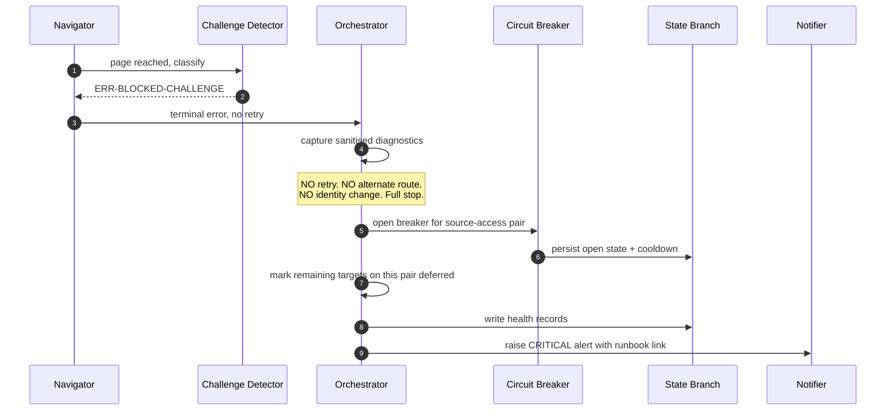

**Note what is absent from that diagram.** There is no retry, no alternate route, no identity change, and no fallback to a different access method for the same source. The engine's entire response is: stop, record, alert, and let a human decide policy.

## 21.9 Extraction Error Model

| Situation | Class | Effect |
|---|---|---|
| Review container not found | `ERR-PARSE-STRUCTURE` | **Abort target.** Almost certainly an upstream change |
| Zero nodes, container found, empty-state signal present | not an error | `total_count: 0` is legitimate |
| Zero nodes, container found, no empty-state signal | `ERR-PARSE-EMPTY-UNEXPECTED` | Abort target |
| Required field missing on one record | `ERR-PARSE-FIELD-REQUIRED` | **Quarantine that record only** |
| Optional field missing | not an error | Field is `null` |
| Rating out of range or non-integer | `ERR-PARSE-RATING-INVALID` | Quarantine that record |
| Pack malformed | `ERR-PARSE-SELECTOR-PACK` | Abort **run** |

| ID | Requirement |
|---|---|
| TR-EXT-070 | No `ERR-PARSE-*` class may be retried. Pure functions are deterministic: the same input produces the same failure, so retrying is provably useless and consumes budget. |
| TR-EXT-071 | Record-scope quarantine MUST NOT abort the harvest until the quarantine rate exceeds `validate.quarantine_max` (default 0.05), at which point it escalates to `ERR-VALIDATE-QUARANTINE-RATE` at target scope. |

---

*End of Part 4. Part 5 specifies duplicate detection, normalisation, JSON generation and validation, and the publish, rollback, recovery, retry, and timeout rules.*


---

# Part 5 — Processing, Data Rules, and Resilience Mechanics

*Sections 22 through 30. Audience: implementing engineers, QA. This is the correctness core of the system. Every requirement in §22 and §23 has a named test, and a build that omits those tests is not conformant regardless of what else it passes.*

---

# 22. Duplicate Detection

## 22.1 The Problem

The DOM path exposes no durable per-review identifier. Without stable identity, every harvest either duplicates everything or overwrites everything. A single hash over all content fails differently: any edit to a review produces a "new" review plus a phantom deletion of the old one, which a visitor sees as a review vanishing and a near-identical one appearing.

## 22.2 Two-Tier Identity

> **EDR-018 — Duplicate detection is two-tier, and intra-run collapse is deterministic**
> **Serves:** ADR-007 (two-tier identity), RISK-11.
> **Context:** "Is this the same review?" and "did this review change?" are different questions requiring different inputs. Conflating them into one hash makes edits look like deletions.
> **Decision:** Two hashes. `identity_hash` answers "same review?" and is computed over fields that do not change when a review is edited. `content_hash` answers "did it change?" and covers everything displayed. Within a single harvest, records colliding on `identity_hash` are collapsed by a deterministic rule.
> **Alternatives Rejected:** *Rendered position as identity* — ordering is unstable and personalised; catastrophic. *Author name alone* — one author may review multiple listings, and names collide. *Single content hash as identity* — turns every edit into insert-plus-delete, producing visible duplicate-then-vanish churn. *Source-specific internal identifiers where available* — attractive, but they exist only on some access methods, so identity would not survive an adapter migration, breaking ADR-023's premise. Rejected specifically to preserve migration.
> **Trade-off:** Identity is not robust to an author simultaneously renaming themselves and rewriting their text, which produces one transient duplicate (L-04). Accepted, documented, and surfaced by the near-duplicate warning.
> **Scalability:** Identity derivation is O(1) per record and the ledger is a map keyed by `identity_hash`, so reconciliation is O(n) with no nested scans.

| Hash | Answers | Inputs | Changes When |
|---|---|---|---|
| `identity_hash` | "Is this the same review?" | listing key, source, author key, first 512 graphemes of normalised text, rating | Author renames **and** rewrites |
| `content_hash` | "Did it change?" | rating, full text, truncation flag, author name, avatar URL, reply text and date, likes, photo count | Any displayed value changes |

Full derivation is specified in §53.

## 22.3 Duplicate Classes

| Class | Definition | Detection | Action |
|---|---|---|---|
| **Intra-run exact** | Two records in one harvest with identical `identity_hash` | Map collision during validation | **Collapse deterministically** (§22.4) |
| **Cross-run same** | Observed record matches a ledger record's `identity_hash` | Ledger lookup | UPDATE or UNCHANGED (§22.5) |
| **Near-duplicate** | Same `author_key`, text similarity ≥ 0.92, **different** `identity_hash` | Aggregate validation | `warn` finding; gate rule G-11 |
| **Genuine duplicate** | Same person posted the same text twice | Indistinguishable from intra-run exact | Collapsing is **correct behaviour**, not a bug |
| **Transient migration duplicate** | Author renamed and rewrote simultaneously | Near-duplicate warning | Old record tombstones after the confirmation window |

## 22.4 Intra-Run Collapse Rule

| ID | Requirement |
|---|---|
| TR-REC-001 | Records colliding on `identity_hash` within one harvest MUST be collapsed to exactly one record. |
| TR-REC-002 | The surviving record MUST be selected deterministically: the record with the greater count of non-null fields wins; if tied, the record with the longer text wins; if still tied, the earlier node ordinal wins. |
| TR-REC-003 | Collapse MUST occur during validation (§25), not during extraction. Extraction reports what it saw; validation decides what that means. |
| TR-REC-004 | Every collapse MUST emit a `warn`-level aggregate finding with the collision count. |

**Determinism in TR-REC-002 is required by PT-12** (projection determinism). A collapse rule that depends on iteration order produces different payloads from identical inputs, which breaks hash-gating and generates spurious commits.

## 22.5 Reconciliation Decisions

`reconcile(priorLedger, observed, validationReport, config, now) → { ledger, decisions }`

**Pure, deterministic, idempotent, and order-independent.** This is the most consequential function in the system: it is where "what we just saw" becomes "what we know".

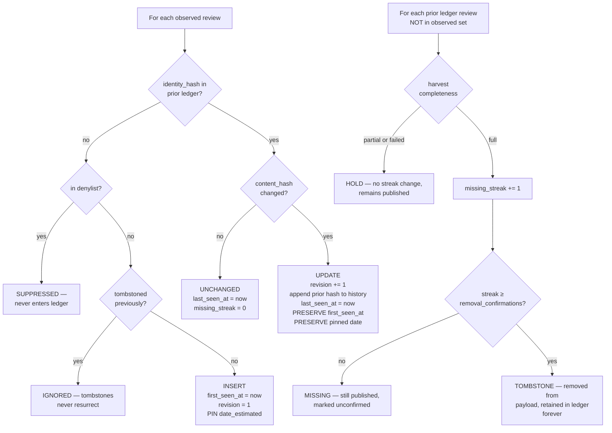

### 22.5.1 The Asymmetry Rule (Normative)

| Observation | Trust | Action |
|---|---|---|
| A review **appeared** | **Trusted** regardless of completeness | Insert or update. A record cannot appear spuriously. |
| A review **did not appear** in a `full` harvest | Trusted | Increment `missing_streak` |
| A review **did not appear** in a `partial` or `failed` harvest | **NOT trusted** | **Change nothing.** Do not increment. Do not decrement. |

| ID | Requirement |
|---|---|
| TR-REC-010 | `missing_streak` MUST be incremented only when `completeness === 'full'` or `'full_capped'`. |
| TR-REC-011 | A `partial` or `failed` harvest MUST leave every ledger record's streak, state, and timestamps **unchanged** for absent records. |
| TR-REC-012 | A record MUST be tombstoned only after `reconcile.removal_confirmations` (default 3) consecutive qualifying harvests. |
| TR-REC-013 | A record that reappears MUST have its streak reset to zero. |
| TR-REC-014 | A tombstoned `identity_hash` MUST NEVER become active again under any observation sequence. Verified by **PT-03**. |
| TR-REC-015 | A suppressed `identity_hash` MUST NEVER appear in any projected payload. Verified by **PT-04**. |

**Agent Note — read this before touching `core/reconcile/`.** The asymmetry looks like redundant branching. It is not. An implementer who "simplifies" this by treating absence uniformly has introduced the system's worst possible bug: a single partial page load would begin a countdown to deleting a client's entire review set. The protections are PT-07 (property law) and CH-04 (chaos scenario), and CH-04 is the single most important test in the suite. If only one test could be run before a release, it would be that one.

### 22.5.2 Field Mutation Rules

| Field | On INSERT | On UPDATE | On UNCHANGED | On MISSING (full) |
|---|---|---|---|---|
| `first_seen_at` | set to `now` | **preserved** | preserved | preserved |
| `date_estimated` | pinned | **preserved** | preserved | preserved |
| `last_seen_at` | `now` | `now` | `now` | unchanged |
| `last_updated_at` | `now` | `now` | preserved | preserved |
| `revision` | 1 | +1 | preserved | preserved |
| `hash_history` | empty | prior `content_hash` appended | preserved | preserved |
| `missing_streak` | 0 | 0 | 0 | +1 |
| `state` | `active` | `active` | `active` | `unconfirmed` → `tombstoned` at threshold |

| ID | Requirement |
|---|---|
| TR-REC-020 | `first_seen_at` MUST NEVER change after INSERT. Verified by **PT-05**. |
| TR-REC-021 | The pinned `date_estimated` MUST NEVER change after INSERT. Verified by **PT-06**. |
| TR-REC-022 | Reconciliation MUST return new objects and MUST NOT mutate its inputs. |

## 22.6 Reconciliation Properties

These three laws are why the system is safe to retry, replay, and re-shard.

| Property | Statement | Test | Why It Matters |
|---|---|---|---|
| **Idempotence** | `reconcile(reconcile(L,H),H) ≡ reconcile(L,H)` for fixed `now` | **PT-01** | A shard that crashes after reconciling but before committing can simply re-run |
| **Commutativity** | Shuffling `observed` yields an identical ledger | **PT-02** | Upstream ordering is unstable and personalised; any order-dependence produces nondeterministic output |
| **Monotonicity** | A tombstoned or suppressed id never becomes active | **PT-03** | Prevents "deleted review comes back" — embarrassing and legally significant |
| **Preservation** | `first_seen_at` and pinned dates never change after INSERT | **PT-05, PT-06** | Historical integrity and stable sort order |

| ID | Requirement |
|---|---|
| TR-REC-030 | `now` MUST be an explicit parameter. Reading the clock inside `reconcile` makes every property law untestable (DR-2). |
| TR-REC-031 | The ledger MUST be represented internally as a map keyed by `identity_hash`, not an array. An array forces nested scans and produces O(n²) allocation at 1,000+ reviews. |

## 22.7 Near-Duplicate Detection

| Aspect | Rule |
|---|---|
| Criteria | Same `author_key`, text similarity ≥ `validate.near_duplicate_threshold` (default 0.92), different `identity_hash` |
| Severity | `warn` — never fatal |
| Purpose | Early signal for RISK-11 and for the transient migration duplicate (L-04) |
| Gate interaction | G-11 warns when a near-duplicate cluster exceeds three members |
| Action | Never automatic. A near-duplicate is reported, never merged. |

**Near-duplicates are reported, not merged.** Two reviews that look similar may genuinely be two reviews. Automatic merging would silently delete real content, which is a worse failure than displaying two similar cards.

---

# 23. Review Normalization

## 23.1 This Is the Security Boundary

Everything downstream trusts that the Normalizer did its job. Review text is attacker-controllable input — anyone can leave a review — that ends up in the DOM of every client website simultaneously. **This module is the single highest-consequence piece of code in the system** and is built in phase 2, before anything that produces data.

## 23.2 Contract

| Aspect | Specification |
|---|---|
| **Input** | `ExtractedReview` (untrusted), `EffectiveConfig` |
| **Output** | `NormalizedReview` (trusted, branded `CleanString` fields) or `Quarantined` |
| **Purity** | **pure** |
| **Idempotent** | **yes** — `normalize(normalize(x)) ≡ normalize(x)`, verified by PT-11 |
| **Errors** | `ERR-CLEAN-MARKUP-SURVIVED` (critical — indicates a defect in this module) |

## 23.3 ALG-NORMALIZE — The Eight-Step Pipeline

> **EDR-019 — Normalisation is a fixed eight-step ordered pipeline, and the order is normative**
> **Serves:** INV-05.
> **Context:** Each step is individually obvious. The order is not, and three of the orderings are load-bearing in ways that are invisible until they are wrong.
> **Decision:** Eight steps in the fixed order below, each independently unit-tested, with the ordering rationale recorded per step.
> **Alternatives Rejected:** *A single regex-based sanitiser* — cannot handle nested entities, and a sanitiser that escapes rather than removes leaves markup that a consumer might later un-escape. *Escaping instead of removing* — leaves the payload carrying markup that is one careless `innerHTML` away from executing; removal eliminates the class entirely. *Sanitising at render time in the frontend* — moves the boundary to code TradyPerch does not control on sites TradyPerch does not control. *Reordering for efficiency* — the pipeline is under 1% of runtime; there is nothing to gain.
> **Trade-off:** Review text loses all formatting, including emphasis. Line breaks are preserved; nothing else is. This is the correct trade for eliminating stored XSS across every client site simultaneously (L-26).
> **Scalability:** Constant per record. New sources add no new sanitisation path, because all sources converge on this one module.

| # | Step | Detail | Why This Position |
|---|---|---|---|
| 1 | **Decode entities** | Resolve HTML entity references | **Must precede stripping.** Otherwise `&lt;script&gt;` survives as literal text and re-encodes into markup downstream |
| 2 | **Strip markup** | Remove all tags and tag-like constructs. **Remove, do not escape** | Must follow decoding, for the reason above |
| 3 | **Unicode normalise** | NFC | Before length bounding, so grapheme counting is meaningful |
| 4 | **Remove control characters** | Strip C0/C1 except `\n` and `\t`; strip zero-width and **bidi-override** characters | Bidi overrides can visually reorder text — a real spoofing vector |
| 5 | **Canonicalise whitespace** | `\r\n`/`\r` → `\n`; collapse ≥ 3 newlines to 2; collapse horizontal runs; trim | After control removal, so invisible characters do not survive as "content" |
| 6 | **Detect truncation** | Match locale-aware markers; set `text_truncated`; remove the marker | After whitespace canonicalisation, so matching is reliable |
| 7 | **Bound length** | Cut at `normalize.max_text_length` (5,000) on a **grapheme cluster** boundary; set `text_clipped` | Last, so the bound applies to final content |
| 8 | **Type and brand** | Return branded `CleanString` values | Makes the boundary enforceable by the type checker |

| ID | Requirement |
|---|---|
| TR-NORM-010 | Step 2 MUST **remove** markup, not escape it. The payload contains no markup of any kind, and there is no `text_html` field — there must never be one. |
| TR-NORM-011 | Steps MUST execute in exactly this order. A unit test MUST assert that a nested-entity payload (`&amp;lt;script&amp;gt;`) does not survive. |
| TR-NORM-012 | Bidi **override** characters (RLO/LRO) MUST be stripped. Bidi **marks** required for correct rendering of mixed-direction content MUST be preserved. These are different characters with different purposes. |
| TR-NORM-013 | Normalisation MUST be idempotent. Verified by **PT-11**. |

## 23.4 Length Bounding

> **EDR-020 — Length bounding is grapheme-cluster-aware and applied last**
> **Serves:** INV-05, §46 (payload size).
> **Context:** Cutting a string at 5,000 *code units* splits surrogate pairs and ZWJ emoji sequences, producing mojibake — visible garbage characters on the client's website.
> **Decision:** Bound at 5,000 **grapheme clusters**, computed after all other transformations.
> **Alternatives Rejected:** *Bound by code units* — fast and wrong; splits emoji and combining sequences. *Bound by bytes* — worse, since it truncates multi-byte characters mid-sequence. *Bound before normalisation* — the bound would apply to pre-cleaning content, so a review padded with 10,000 characters of markup would be cut before the markup was removed, discarding real text. *No bound* — unbounded attacker-controlled input in a size-budgeted payload (THREAT-04).
> **Trade-off:** A 5,000-grapheme bound is a much larger byte count for CJK text than for Latin. §46.3's payload size budget accounts for this.
> **Scalability:** Constant per record; the bound is what makes payload size predictable.

| ID | Requirement |
|---|---|
| TR-NORM-020 | Bounding MUST cut on a grapheme cluster boundary. A test MUST assert that a ZWJ emoji sequence at the boundary is not split. |
| TR-NORM-021 | A bounded record MUST set `text_clipped: true`. |
| TR-NORM-022 | `text_clipped` and `text_truncated` are **different flags** with different meanings: `text_clipped` means the engine bounded it; `text_truncated` means the source's text was longer than what was retrieved. Both may be true. |

## 23.5 Script and Emoji Handling

| Concern | Rule |
|---|---|
| Emoji | **Preserved exactly**, including ZWJ sequences and skin-tone modifiers |
| RTL text | Preserved. Bidi *overrides* stripped; bidi *marks* preserved |
| CJK | Preserved |
| Combining marks | Preserved after NFC |
| **Homoglyph author names** | **NOT normalised away** |

| ID | Requirement |
|---|---|
| TR-NORM-030 | Visually identical author names using different scripts MUST NOT be merged. Two authors with visually identical names are two authors; merging them is a data-integrity bug, not a feature. A unit test MUST assert this. |

## 23.6 Author Name Handling

| Field | Treatment |
|---|---|
| `author.name` (published) | Preserved as given, with only steps 1–5 applied. **Never abbreviated, initialised, or anonymised by default** (FR-042) |
| `author_key` (internal) | Casefold → strip diacritics → collapse whitespace → remove punctuation → hash. Used for identity matching only, **never published** |
| Anonymous authors | Missing or placeholder name yields `author.name: null` and an `author_key` derived from a per-listing anonymous bucket plus content, so two anonymous reviews are not merged |
| `author.initials` | Derived, 1–2 graphemes, so a consumer can render an avatar without fetching an image (ADR-014) |

| ID | Requirement |
|---|---|
| TR-NORM-040 | Anonymous reviews MUST NOT collapse into one another. The anonymous `author_key` MUST incorporate content, not only the listing. |

## 23.7 Language Detection

| Aspect | Rule |
|---|---|
| Method | Script-range analysis first (Devanagari, Arabic, CJK, Cyrillic, Latin), then stopword frequency for Latin disambiguation |
| Output | `{ code: ISO 639-1 \| null, confidence: 0–1 }` |
| Minimum length | Below 12 graphemes, return `null` with confidence 0 |
| Dependency | **No large model, no network** (DEP-2). A compact internal implementation is required |
| Use | Optional consumer-side filtering; input to future AI enrichment. **Never used to reject a review** |

| ID | Requirement |
|---|---|
| TR-NORM-050 | Language detection MUST NEVER cause a record to be rejected or quarantined. A wrong guess is worse than no guess, which is why short text returns `null`. |

## 23.8 URL Validation

| Field | Rule |
|---|---|
| `author.avatar_url` | MUST parse as HTTPS; host MUST match the source's avatar host allowlist; size query parameters MAY be normalised; otherwise `null`. **Never fetched** |
| `author.profile_url` | MUST parse as HTTPS and match the source host allowlist; otherwise `null` |
| `source_url` | **Constructed by the engine** from the canonical listing identity. Never taken from page content |

| ID | Requirement |
|---|---|
| TR-NORM-060 | A URL failing allowlist validation MUST be set to `null`, not passed through and not rejected as a record-level error. |
| TR-NORM-061 | `source_url` MUST be engine-constructed (FR-091). A URL lifted from page content is attacker-influenced. |
| TR-NORM-062 | The engine MUST NEVER fetch an avatar or profile URL (ADR-014). |

**Rationale for the allowlist.** An unvalidated URL from page content, published into a client's site as an image `src`, is an open redirect and a tracking vector (THREAT-03). Allowlisting is cheap and eliminates it. Verified by `tests/security/url-allowlist.test.mjs`.

---

# 24. JSON Generation Rules

## 24.1 Projector Contract

| Aspect | Specification |
|---|---|
| **Input** | `Ledger`, `EffectiveConfig`, `EngineMeta` |
| **Output** | `Artifacts { reviews, latest, stats, schemaOrg?, index }` |
| **Purity** | **pure** |
| **Determinism** | **Identical ledger + identical config ⇒ byte-identical output.** Verified by PT-12 |

## 24.2 ALG-PROJECT — Generation Steps

| # | Step |
|---|---|
| 1 | Filter out tombstoned and suppressed records |
| 2 | Apply display filters: `min_text_length`, `languages`, `include_rating_only`, optional `min_rating` |
| 3 | Sort by the composite key `(date_estimated desc, first_seen_at desc, identity_hash asc)` — total and stable |
| 4 | Map each ledger record to its public projection for the target `schema_version` |
| 5 | Compute aggregates (§24.5) |
| 6 | Emit `reviews.json`, `latest.json`, `stats.json`, optional `schema-org.json`, and the listing `index.json` |
| 7 | Serialise with stable key ordering; compute the content hash over canonical bytes |

## 24.3 Serialisation Rules

> **EDR-021 — Payloads are minified with stable key order; ledgers are pretty-printed with stable key order**
> **Serves:** FR-065 (hash-gated writes), §46 (storage).
> **Context:** The two stores have opposite readers. Payloads are read by machines over a network; ledgers are read by humans during incidents.
> **Decision:** Payloads minified, ledgers pretty-printed, **both with stable key ordering and a trailing newline on ledgers.**
> **Alternatives Rejected:** *Pretty-print both* — payloads grow ~25% for readability nobody uses; the payload is consumed by `response.json()`. *Minify both* — makes the ledger diff a single unreadable line, destroying the "Git is the database and diffs are the audit log" property that the entire persistence strategy depends on. *Unstable key ordering* — breaks content hashing, so hash-gating stops working and every run rewrites every file, multiplying commit churn.
> **Trade-off:** Two serialisation modes to maintain. Trivial.
> **Scalability:** Stable ordering becomes more valuable as history grows, because diffs stay meaningful.

| ID | Requirement |
|---|---|
| TR-PROJ-010 | Payload artifacts MUST be minified with stable key ordering, UTF-8, no BOM, LF line endings. |
| TR-PROJ-011 | Ledgers MUST be pretty-printed with stable key ordering and a trailing newline. |
| TR-PROJ-012 | Key ordering MUST be deterministic and MUST NOT depend on object insertion order. |
| TR-PROJ-013 | Projection MUST be deterministic: identical inputs produce byte-identical output. Verified by **PT-12**. |

> **EDR-022 — `generated_at` is excluded from every content hash**
> **Serves:** FR-065.
> **Context:** Every artifact carries a `generated_at` timestamp. If it participates in the content hash, the hash changes on every run even when nothing else did — so hash-gating never skips a write, and every client produces a commit on every cycle.
> **Decision:** `generated_at` lives in the envelope and in the manifest, and is explicitly excluded from the canonical byte sequence over which the content hash is computed.
> **Alternatives Rejected:** *Omit `generated_at` entirely* — consumers legitimately need to know payload age; `MET-payload-age` depends on it. *Round the timestamp to the cadence interval* — reduces churn but does not eliminate it, and produces a misleading timestamp. *Compare payloads field-by-field instead of by hash* — works, but is slower and duplicates logic the hash already provides.
> **Trade-off:** Two byte sequences exist per artifact: the written bytes and the hashed bytes. This must be implemented carefully and tested (§54.3).
> **Scalability:** Essential. Without it, commit volume grows linearly with client count × cadence regardless of whether anything changed.

## 24.4 Display Filters

| Filter | Default | Effect |
|---|---|---|
| `display.order` | `newest` | Sort direction |
| `display.latest_count` | 20 | Size of the `latest.json` slice |
| `display.min_text_length` | 0 | Excludes very short reviews |
| `display.languages` | `null` (all) | Restricts to listed language codes |
| `display.include_rating_only` | `true` | Whether reviews with no text are published |
| `display.min_rating` | **`null`** | Excludes ratings below the threshold |

| ID | Requirement |
|---|---|
| TR-PROJ-020 | `display.min_rating` MUST default to `null`. Setting it to a non-null value triggers validation rule V-8, which requires a written justification in `notes`. |
| TR-PROJ-021 | Filters MUST be applied before aggregate computation, so that `stats` describes what was actually published. |

**On V-8 as deliberate friction.** The product position is that TradyPerch declines to filter out low ratings. The config system does not forbid it outright — a jurisdiction or platform might someday require selective display — but it makes the choice visible, justified in writing, and surfaced in review. Mechanisms that make the wrong choice slightly uncomfortable are more durable than mechanisms that make it impossible and get bypassed.

## 24.5 Aggregate Computation

| Field | Computation | Constraint |
|---|---|---|
| `total_count` | Count of published reviews, post-filter, post-suppression | — |
| `advertised_total` | As reported by the source | Never substituted for `total_count` |
| `coverage` | `total_count / advertised_total` | `null` when advertised total is unknown |
| `mean_rating` | Mean over **published** reviews, 2 decimal places | Computed, never copied from `advertised_rating` |
| `advertised_rating` | As reported by the source | — |
| `distribution` | Counts keyed `"1"`…`"5"` | Sums to `total_count` |
| `with_text_count` / `with_reply_count` | Counts | — |
| `newest_review_date` / `oldest_review_date` | From pinned estimates | `null` if all estimates are null |
| `languages` | Count per detected code | Excludes `null` |
| `completeness` | From the harvest that produced this payload | — |
| `last_full_harvest_at` | Last time a `full` harvest succeeded | **The honest freshness signal** |

| ID | Requirement |
|---|---|
| TR-PROJ-030 | `mean_rating` MUST be computed from published reviews and MUST NOT be replaced by `advertised_rating` even when they diverge. |
| TR-PROJ-031 | Publishing both `mean_rating` and `advertised_rating` is deliberate. Divergence means either coverage is incomplete or extraction is wrong, and a consumer or a monitoring check must be able to see that without access to internals. |

## 24.6 Artifact Set

| Artifact | Purpose | Typical Size (120 reviews) | Cache TTL |
|---|---|---|---|
| `reviews.json` | Complete payload | ~108 KB / ~37 KB gzip | Long |
| `latest.json` | Top-N for the common widget case | ~19 KB / ~7 KB gzip | Medium |
| `stats.json` | Aggregates only — badges and headlines | ~0.9 KB | Medium |
| `schema-org.json` | Structured-data projection, opt-in | ~28 KB | Long |
| `index.json` (listing) | Manifest: hashes, counts, versions, `generated_at` | ~1 KB | **Short — the freshness pointer** |

**Consumer contract:** read `index.json` first (short TTL), then fetch the referenced artifact (long TTL). This is the manifest-plus-immutable-content pattern; it gives both freshness and cacheability without any cache-purge capability, which matters because the zero-cost hosting options do not offer programmatic purging.

## 24.7 schema.org Projection

| Concern | Rule |
|---|---|
| Default | **Off.** `publish.schema_org` defaults to `false` |
| Shape | `AggregateRating` on the business entity plus an array of `Review` objects |
| Honesty | Only reviews the engine actually holds. `reviewCount` reflects published reviews; `advertised_total` MUST NOT be substituted to inflate it |
| Dates | Emitted only when `date_precision` is `day` or `week`; coarser precision omits `datePublished` rather than asserting a false date |
| Warning | Search engines have specific and changing policies about self-serving review markup. **Assumption: policies must be verified before enabling for a client** |

| ID | Requirement |
|---|---|
| TR-PROJ-040 | `publish.schema_org` MUST default to `false` and MUST require per-client opt-in. Emitting markup that violates a search engine's guidelines can result in a manual action against the client's site — a harm the engine must not cause by default. |
| TR-PROJ-041 | The schema.org recipe MUST carry the policy warning prominently. |

## 24.8 Payload Sharding

Triggered when `reviews.json` exceeds `publish.payload_shard_threshold` (default 1 MB, roughly 1,200 reviews).

| Aspect | Design |
|---|---|
| Shape | `reviews.page-1.json`, `reviews.page-2.json`, … each ≤ threshold, plus a `pagination` block in the listing manifest |
| Ordering | Pages ordered newest-first, so page 1 is what almost every consumer needs |
| Contract | `pagination: { page, page_size, total_pages, total_count, next }` |
| Compatibility | `latest.json` and `stats.json` are unaffected, so the common integration never notices sharding |
| Status | **Deferred to v1.1** (L-23). `max_reviews` protects in the interim |

---

# 25. JSON Validation Rules

## 25.1 Two Distinct Validations

| Validation | Subject | Stage | Failure Effect |
|---|---|---|---|
| **Data validation** | Normalized records and the harvest as a whole | 5 | Findings → quarantine or completeness classification |
| **Schema validation** | The generated payload document | 9 (gate rule G-01) | **REJECT** — `ERR-GATE-REJECT-SCHEMA`, critical |

Both are specified here. The schema documents themselves are in §52.

## 25.2 Validator Contract

| Aspect | Specification |
|---|---|
| **Input** | `NormalizedReview[]`, `AcquisitionReport`, `EffectiveConfig` |
| **Output** | `ValidationReport { recordFindings[], aggregateFindings[], completeness, coverage, counts, quarantined[] }` |
| **Purity** | **pure** |
| **Constraint** | **The Validator produces verdicts; it never modifies data** |

## 25.3 Per-Record Findings

| Check | Severity | Effect |
|---|---|---|
| Rating is an integer in [1,5] | **fatal** | Quarantine record |
| `author_key` derivable | **fatal** | Quarantine record |
| **Text contains no markup** | **fatal** | **Quarantine and alert `error`. This is a self-check on the security boundary and MUST exist** |
| `relative_date_raw` non-empty | warn | Keep; `date_estimated: null` |
| Text length within bound | info | Already enforced by the cleaner |
| Avatar/profile URL valid or null | warn | Set to `null` |
| Language detected or null | info | — |
| Reply, if present, has text | warn | Drop empty reply |

| ID | Requirement |
|---|---|
| TR-VAL-010 | The markup self-check MUST be implemented. It validates that the Normalizer worked. Its failure class `ERR-CLEAN-MARKUP-SURVIVED` is `critical` severity because it indicates the security boundary itself failed. |
| TR-VAL-011 | The Validator MUST NOT modify any record. Setting an invalid URL to `null` is performed by the Normalizer (§23.8); the Validator only reports. |

**On TR-VAL-010.** A self-check that verifies the previous stage did its job looks redundant. It is the third of seven layers protecting against stored XSS (§51.2), and it is the layer that turns a silent Normalizer defect into a loud, attributable alert.

## 25.4 Aggregate Findings

| Check | Rule | Severity |
|---|---|---|
| Coverage | `extracted / advertisedTotal ≥ validate.coverage_min` (0.95) for `full` | Determines completeness |
| Intra-run duplicates | Identical `identity_hash` within one harvest ⇒ collapse deterministically | warn |
| Near-duplicates | Same `author_key`, similarity ≥ 0.92, different `identity_hash` | warn |
| Mean rating plausibility | Computed mean within `validate.rating_tolerance` (0.30) of advertised | warn |
| Distribution degeneracy | Not 100% single-rating unless the listing genuinely has ≤ 3 reviews | warn |
| **Quarantine rate** | Quarantined ÷ total ≤ `validate.quarantine_max` (0.05) | **fatal above threshold** |
| Selector strategy health | Per §20.4 | warn / error |

| ID | Requirement |
|---|---|
| TR-VAL-020 | A quarantine rate above threshold MUST escalate to `ERR-VALIDATE-QUARANTINE-RATE` at target scope. A systemic extraction failure must not be reported as many independent record warnings. |

## 25.5 Completeness Classification

| Input | Classification |
|---|---|
| Stop reason `target_reached`, or `exhausted` with coverage ≥ 0.95 | `full` |
| Stop reason `cap_reached` | `full_capped` |
| Stop reason `stalled` with coverage < 0.95, or `budget_exhausted` | `partial` |
| Stop reason `error` or challenge | `failed` |

| ID | Requirement |
|---|---|
| TR-VAL-030 | Completeness MUST be computed from the stop reason **and** coverage together, never from coverage alone. A harvest that reached the advertised total is `full` even if the advertised total was itself wrong. |
| TR-VAL-031 | Completeness MUST propagate to the reconciler (§22.5), the gate (§26.3), the health record, and the payload's `harvest_completeness` and `stats.completeness`. |

## 25.6 Payload Schema Validation

| ID | Requirement |
|---|---|
| TR-VAL-040 | Every generated payload MUST validate against `schemas/payload.v1.schema.json` before publication. Failure is gate rule G-01 → `ERR-GATE-REJECT-SCHEMA`, severity **critical**. |
| TR-VAL-041 | A schema validation failure MUST be treated as an engine defect, not a data problem. It means the projector produced a document its own contract forbids. |
| TR-VAL-042 | Every ledger MUST validate against `schemas/ledger.v1.schema.json` on read. Failure is `ERR-STATE-CORRUPT`. |
| TR-VAL-043 | Schema validation MUST run in CI against every fixture and every client config, so contract drift is caught before it reaches production. |

---

# 26. Publish Rules

## 26.1 The Publish Gate

The Gate sits between the Projector and the Publisher. It is **pure**, receives both the candidate and the currently published payload, and can therefore reason about *change* rather than only about *state*.

| Aspect | Specification |
|---|---|
| **Input** | candidate `Artifacts`, current `Artifacts` (or a first-publish marker), `ValidationReport`, `EffectiveConfig` |
| **Output** | `GateVerdict { decision: ACCEPT \| ACCEPT_WITH_WARNINGS \| REJECT, reasons: GateReason[] }` |
| **Purity** | **pure** |
| **Coverage requirement** | **100% statements. Not negotiable** |

## 26.2 Evaluation Semantics

> **EDR-023 — The Gate evaluates all rules and returns all reasons; it never short-circuits**
> **Serves:** ADR-011.
> **Context:** The obvious implementation returns on the first failing rule.
> **Decision:** Every rule is evaluated on every invocation, and the verdict carries every reason.
> **Alternatives Rejected:** *Short-circuit on first REJECT* — the alert then names one problem when there are four, so the engineer fixes one and the next run rejects again for the next reason. Incident time multiplies by the number of concurrent problems. *Evaluate lazily by severity* — same defect, more complexity. *Return a boolean* — loses everything that makes the alert actionable.
> **Trade-off:** A few microseconds of unnecessary evaluation on an already-doomed candidate. Irrelevant — the gate is a pure function over in-memory data.
> **Scalability:** Constant per target.

| ID | Requirement |
|---|---|
| TR-GATE-001 | All twelve rules MUST be evaluated on every invocation. |
| TR-GATE-002 | The verdict MUST carry an itemised reason per violated rule, including the rule id, the threshold, and the observed value. |
| TR-GATE-003 | Every rule MUST be independently testable and independently configurable. |
| TR-GATE-004 | Gate statement coverage MUST be 100%. Every rule needs a test proving it rejects, **and** a test proving it does not reject spuriously. |

## 26.3 Gate Rule Set

| ID | Rule | Default Threshold | Verdict | Error Class | Overridable |
|---|---|---|---|---|---|
| **G-01** | Candidate validates against `payload.v1.schema.json` | — | **REJECT** | `ERR-GATE-REJECT-SCHEMA` (critical) | **no** |
| **G-02** | Candidate non-empty when prior payload was non-empty | — | **REJECT** | `ERR-GATE-REJECT-EMPTY` (critical) | **no** |
| **G-03** | Count has not dropped by more than `max_count_drop_ratio` | 0.20 | **REJECT** | `ERR-GATE-REJECT-COUNT-DROP` | yes |
| **G-04** | Mean rating has not shifted by more than `max_rating_shift` | 0.50 | **REJECT** | `ERR-GATE-REJECT-RATING-SHIFT` | yes |
| **G-05** | If completeness is `partial`, count must not have dropped **at all** | — | **REJECT** | `ERR-GATE-REJECT-COVERAGE` | yes |
| **G-06** | Quarantine rate ≤ `quarantine_max` | 0.05 | **REJECT** | `ERR-VALIDATE-QUARANTINE-RATE` | **no** |
| **G-07** | No record-level `fatal` findings remain | — | **REJECT** | `ERR-VALIDATE-AGGREGATE` | **no** |
| **G-08** | Coverage ≥ `coverage_min` OR completeness is `full_capped` | 0.95 | WARN | — | n/a |
| **G-09** | Computed mean within `rating_tolerance` of advertised | 0.30 | WARN | — | n/a |
| **G-10** | Payload size within budget | 2 MB | WARN | — | n/a |
| **G-11** | No near-duplicate cluster larger than 3 | — | WARN | — | n/a |
| **G-12** | `advertised_total` has not dropped beyond tolerance | 0.40 | WARN | — | yes |

**G-05 is the rule that catches the partial-harvest failure**, and it is deliberately stricter than G-03: in a partial harvest, *any* count drop is untrustworthy, because absence carries no information.

## 26.4 First-Publish Exception

On a client's first ever publish there is no prior payload, so the change-based rules have nothing to compare against.

| Rule | First Publish |
|---|---|
| G-01, G-06, G-07, G-08 | **Still apply** |
| G-02, G-03, G-04, G-05, G-12 | **Skipped** |

| ID | Requirement |
|---|---|
| TR-GATE-010 | A first publish MUST be marked `first_publish: true` in the manifest. |
| TR-GATE-011 | A first publish MUST still be rejectable for being schema-invalid or low-coverage. That is exactly what onboarding verification needs. |
| TR-GATE-012 | "No prior payload exists" MUST be distinguished from "the prior payload could not be read" (TR-ENV-013). Only the former triggers the first-publish exception. |

## 26.5 Rejection Semantics

> **EDR-024 — Rejection discards observations from both stores; the Ledger is not written**
> **Serves:** ADR-011, ADR-006.
> **Context:** The obvious implementation retains the payload but still writes the ledger, on the reasoning that the ledger is internal and more data is better.
> **Decision:** On REJECT, the ledger is **not** written. Only a health record is written. The harvest's observations are discarded entirely.
> **Alternatives Rejected:** *Write the ledger, retain the payload* — the payload is protected but the **state is polluted**. A subsequent `tpre project` run would then produce the bad payload from the bad ledger with no gate involvement at all, because `project` regenerates from state without re-harvesting. The protection would be bypassed by the recovery tool. *Write the ledger to a quarantine branch* — added complexity for data that is, by definition, not trusted. *Write partial ledger updates for insertions only* — plausible, but makes the ledger's state depend on gate outcomes, which breaks the reasoning that reconciliation is a pure function of observations.
> **Trade-off:** A rejected harvest's genuine new reviews are discarded and must be re-observed next cycle. Cheap: the next cycle is hours away and the reviews will still be there.
> **Scalability:** Unchanged.

| ID | Requirement |
|---|---|
| TR-GATE-020 | On REJECT, the engine MUST write **only** a health record. It MUST NOT write the ledger, the payload, or the identity cache. |
| TR-GATE-021 | On REJECT, an alert MUST be raised with the itemised reasons. |
| TR-GATE-022 | REJECT MUST map to exit code 5 and MUST NOT fail the CI job. |

## 26.6 Publication Steps

| # | Step | Rule |
|---|---|---|
| 1 | Stage all artifacts for all targets in the shard into the `data` checkout | Batched, not per target |
| 2 | **Hash gate**: if new bytes equal current bytes, do not touch the file | FR-065 |
| 3 | Commit once per shard with the structured message (§35.3) | CON-13 |
| 4 | Push; on non-fast-forward, fetch, rebase, retry — up to 3 attempts (2 s, 6 s, 18 s) | Never force |
| 5 | Write ledger and health to the `state` checkout | Separate commit |
| 6 | Push `state` with the same retry logic | — |

| ID | Requirement |
|---|---|
| TR-PUB-010 | `--force-with-lease` and `--force` MUST NOT be used against `data` or `state`. |
| TR-PUB-011 | After 3 failed push attempts, `ERR-PUBLISH-CONFLICT` is raised, artifacts are uploaded as CI artifacts, and the next run reproduces them deterministically. |
| TR-PUB-012 | Shards write disjoint client paths, so a rebase can never produce a content conflict — only an ancestry update (§58.3). |

## 26.7 Publication Ordering

> **EDR-025 — Publication order is payload first, then state — never the reverse**
> **Serves:** INV-04, INV-02.
> **Context:** Two commits to two branches cannot be made atomic. A crash between them leaves the system inconsistent in one of two ways, and the two are not equally recoverable.
> **Decision:** Commit the payload first, then the state.
> **Alternatives Rejected:** *State first, then payload* — a crash between them leaves a ledger recording reviews as published that were never published. The next run reconciles from that ledger, sees no changes, hash-gates the write, and **the payload is never produced**. The system silently converges on a wrong state. *Attempt two-phase commit across branches* — Git offers no such primitive; simulating one adds a coordination file that is itself subject to the same problem. *Single combined branch* — rejected architecturally by ADR-012.
> **Trade-off:** A crash between the two leaves a published payload that the ledger does not yet justify. The next run re-reconciles from the older ledger and produces the same payload — a benign no-op, because reconciliation is idempotent.
> **Scalability:** Unchanged.

**The general principle worth extracting:** when two writes cannot be atomic, order them so a crash between them leaves a state the next run can repair. Publishing before recording state is repairable. Recording state before publishing is not.

## 26.8 Force Override

| Aspect | Rule |
|---|---|
| Invocation | `--force-publish` on **manual dispatch only**. Never available to a scheduled run |
| Effect | Downgrades G-03, G-04, G-05, and G-12 to warnings |
| Never overridable | **G-01, G-02, G-06, G-07** — these indicate defects or genuine corruption, not threshold disagreements |
| Audit | Records operator, timestamp, overridden rules, and a **mandatory free-text reason** in the manifest and the commit message |
| Procedure | The runbook requires manual verification of the actual source count before overriding |
| Use case | A genuine large drop: client deleted duplicate listings, platform bulk-removed reviews |

| ID | Requirement |
|---|---|
| TR-GATE-030 | `TPRE_FORCE_PUBLISH=true` without `TPRE_FORCE_REASON` MUST exit 2. |
| TR-GATE-031 | A scheduled run MUST ignore force flags entirely. |

---

# 27. Rollback Rules

## 27.1 Three Independent Rollback Units

Conflating these is a common and costly mistake. They roll back independently, and keeping them separate is what makes rollback cheap.

| Deployable | Artifact | Rollback Mechanism | Time | Data Loss |
|---|---|---|---|---|
| **Engine** | Code on `main` | Revert the merge commit | ~5 min | none |
| **Configuration** | `clients/`, `profiles/`, `selectors/` | Revert the config commit | ~2 min | none |
| **Data** | Payloads on `data` | `git revert` on `data`, or `tpre project` | ~10 min | none |

## 27.2 Rollback Decision Table

| Problem | Rollback | Preferred Mechanism | Why |
|---|---|---|---|
| Bad engine release | Revert on `main` | `git revert`; next cycle uses reverted code | The engine is adopted, not deployed |
| Bad selector pack | Revert the profile pin | One-line edit | **No code revert, no release, no data change** |
| Bad payload published | `tpre project` from the Ledger | Preferred over `git revert` | Also repairs a projector defect, not just the symptom |
| Bad payload, Ledger also suspect | `git revert` the `data` commit | Restores exact prior bytes | Ledger cannot be trusted to regenerate |
| Bad config change | Revert the config commit | — | — |
| Bad ledger state | Restore the prior ledger version from `state` history; re-run | Idempotence re-derives | §28.4 |
| Schema regression breaking consumers | Republish the previous major in parallel | §36.5 | Consumers cannot be redeployed on demand |

| ID | Requirement |
|---|---|
| TR-PUB-020 | `tpre project` MUST be preferred over `git revert` for payload rollback whenever the Ledger is sound, because it repairs the cause rather than the symptom and requires zero source requests. |
| TR-PUB-021 | Selector pack rollback MUST NOT require a code change or a release. This is the entire payoff of ADR-009. |

## 27.3 Rollback Constraints

| ID | Requirement |
|---|---|
| TR-PUB-022 | Rollback MUST NOT require re-acquisition from any source. Every rollback path in §27.2 is offline. |
| TR-PUB-023 | After any payload rollback, `scripts/verify-payload.mjs` MUST be run against the public URL, and the CDN TTL must be allowed to expire or a content-addressed URL used to verify immediately. |
| TR-PUB-024 | A rollback that reveals an engine defect MUST be followed by a regression test reproducing the root cause (§61.10). |

---

# 28. Recovery Rules

## 28.1 Recovery Philosophy

| Statement | Consequence |
|---|---|
| The published payload is the only thing visitors see, and it is never degraded by a failure | Every recovery path preserves LKG (INV-02) |
| The Ledger is the source of truth; the payload is derivable | Any payload corruption is repaired by `tpre project` with zero acquisition |
| Git history is the backup | Every prior payload and ledger state is one revert away. RPO ≈ 0 |
| Recovery is automatic where possible, scripted where not | Automatic: gate rejection, retry exhaustion, publish conflict. Scripted: ledger corruption, identity drift, repository loss |

## 28.2 Recovery Matrix

| Failure | Detection | Automatic Recovery | Manual Step | Visitor Impact | RTO |
|---|---|---|---|---|---|
| Transient network error | Error class | Retry per policy | none | **none** | seconds |
| Retry exhaustion | Target outcome | LKG retained; next cycle retries | none | **none** | 1 cycle |
| Bot challenge | Challenge detector | Breaker opens; LKG retained | Review policy; consider migration | **none** | hours–days |
| Structure change | Canary or `ERR-PARSE-STRUCTURE` | LKG retained; alert names the failed assertion | Selector pack fix | **none** | ~60 min |
| Partial harvest | Completeness classification | Additions merged; gate likely rejects | Investigate if persistent | **none** | 1 cycle |
| Gate rejection | Gate verdict | LKG retained; reasons alerted | Review reasons | **none** | 1 cycle |
| Publish conflict | Push rejection | Rebase-retry ×3; artifacts preserved | none — next run reproduces | **none** | 1 cycle |
| Ledger corruption | Schema validation on read | Abort target; LKG retained | Restore prior ledger from Git | **none** | ~15 min |
| Payload corruption (engine bug) | Payload verification check | — | Revert engine; `tpre project` | Until CDN TTL | ~30 min |
| Identity drift | Name similarity check | Abort target; LKG retained | Verify listing; update config | **none** | ~20 min |
| Repository loss | Absence | — | Restore from a clone (§60.6) | **none** until CDN TTL | ~2 h |
| CI platform outage | Staleness alert | — | Wait, or run the CLI locally | **none** until staleness | hours |
| Total source access loss | Repeated challenges | Breaker at max cooldown | Migrate to official API | **none** | ~1 h per client |

**Every row's visitor impact is "none" except payload corruption caused by an engine defect** — and that one is bounded by CDN TTL and repaired by regenerating from the Ledger without touching the network.

## 28.3 Automatic Recovery Flow

```mermaid
flowchart TD
    START["Harvest produces candidate"] --> G["Publish Gate"]
    G -->|ACCEPT| PUB["Publish; update ledger;<br/>health = healthy"]
    G -->|ACCEPT_WITH_WARNINGS| PUBW["Publish; update ledger;<br/>health = degraded; warn alert"]
    G -->|REJECT| KEEP["Retain LKG"]
    KEEP --> HEALTH["Write health record ONLY<br/>— ledger NOT updated"]
    HEALTH --> ALERT["Alert with itemised reasons"]
    ALERT --> AGE{"payload age"}
    AGE -->|"< 24 h"| WAIT["Next cycle retries<br/>no escalation"]
    AGE -->|"24–48 h"| ESC1["Escalate to high"]
    AGE -->|"> 48 h"| ESC2["Escalate to critical"]
    WAIT --> START
```

## 28.4 Ledger Recovery

| Scenario | Procedure |
|---|---|
| Schema-invalid ledger | 1. Alert fires with the validation error. 2. `git log` the ledger file on `state`. 3. Identify the last valid version. 4. Restore it. 5. Re-run the harvest — **idempotence re-derives everything since**. 6. Record how many harvests of history were lost (usually zero) |
| Ledger lost entirely | Restore from Git. If Git history is also gone, bootstrap from the current payload with `tpre import-payload --as-ledger`, **accepting the losses**: `first_seen_at` becomes the import date, `revision` resets to 1, and **tombstones and suppressions are lost — the denylist MUST be re-applied from `compliance/denylist.json`** |
| Ledger–payload divergence | `tpre project --client X --verify` reports the diff. **The Ledger wins by definition**; run `project` to regenerate |
| Identity algorithm change | Requires a migration preserving `first_seen_at`, pinned dates, revisions, hash history, tombstones, and suppressions (§53.6) |

| ID | Requirement |
|---|---|
| TR-STOR-020 | Ledger recovery MUST be possible from Git history without any source request. |
| TR-STOR-021 | The bootstrap-from-payload path MUST be documented as lossy and MUST require explicit operator confirmation. |

**Why the denylist lives on `main` and not in the Ledger.** Erasure obligations must survive a `state` branch disaster. If suppressions existed only inside ledgers, rebuilding `state` would resurrect every review a data subject asked to have removed — turning a recoverable incident into a compliance breach. This is the kind of detail that only appears in a recovery plan written before the disaster.

## 28.5 Stale Client Escalation

| Age | Automatic Action | Human Action |
|---|---|---|
| < 12 h | none | none |
| 12–24 h | `warn` in digest | none |
| 24–48 h | `high` alert | Check: breaker open? gate rejecting? schedules enabled? |
| 48–72 h | `critical` alert | Diagnose; consider `--force-publish` after verification, or adapter migration |
| > 72 h | `critical`, escalated daily | Decide: repair, migrate, or inform the client that updates are paused |

**Below 72 hours, no client communication is warranted** — the site shows correct, slightly older reviews and nothing is visibly wrong. Beyond 72 hours the client should be told plainly that automatic updates are paused and why. The client must never discover a problem before TradyPerch reports it.

---

# 29. Retry Rules

## 29.1 Principles

| Principle | Rationale |
|---|---|
| Retry only what can plausibly succeed on repetition | Retrying a deterministic failure burns budget and delays the real diagnosis |
| **Never retry a policy or anti-bot signal** | INV-07. Retrying a challenge escalates a soft block into a hard one |
| Policy lives in a table, not at call sites | One place to audit, one place to change, testable in isolation |
| Every retry is budget-aware | A retry that cannot finish within the remaining budget is not attempted |
| Jitter always | Synchronised retries across shards create the traffic burst that triggers rate limiting |
| Retries are visible | Every attempt logs at `warn` with its attempt number; `MET-retry-rate` is monitored |

> **EDR-026 — Retry policy is a lookup table returning a decision object; the executor is generic**
> **Serves:** ADR-018, INV-07.
> **Context:** Retry logic written at call sites drifts: one path retries a challenge "just once", another retries a parse error, and neither is visible in review.
> **Decision:** A pure policy function maps an error class to `{ decision, maxAttempts, baseMs, multiplier, jitter, capMs }`. A thin generic executor consumes it and knows nothing about error semantics.
> **Alternatives Rejected:** *Try/catch with retry at each call site* — unauditable and guarantees drift. *A retry decorator with per-call configuration* — the configuration then lives at call sites again. *A retry library* — DEP-2; the policy table plus executor is well under 100 lines and the policy is the part that matters.
> **Trade-off:** An indirection between the failure and the retry.
> **Scalability:** Improves. Adding an error class means adding a table row, and the "is this retryable?" question has exactly one answer location.

## 29.2 Retry Policy Table (Normative)

| Error Class | Decision | Max | Base | Multiplier | Cap | Jitter |
|---|---|---|---|---|---|---|
| `ERR-NET-DNS` | backoff | 3 | 1 s | 3× | 15 s | full |
| `ERR-NET-TIMEOUT` | backoff | 3 | 2 s | 2× | 20 s | full |
| `ERR-NET-RESET` | backoff | 3 | 1 s | 3× | 15 s | full |
| `ERR-NET-TLS` | backoff | 2 | 2 s | 2× | 10 s | full |
| `ERR-HTTP-5XX` | backoff | 3 | 3 s | 3× | 30 s | full |
| `ERR-HTTP-429` | backoff | 2 | **60 s** | 4× | 300 s | full |
| `ERR-NAV-TIMEOUT` | backoff | 2 | 5 s | 2× | 20 s | full |
| `ERR-BROWSER-LAUNCH` | immediate | 1 | 0 | — | — | none |
| `ERR-BROWSER-CRASH` | backoff | 1 | 3 s | — | — | full |
| `ERR-STATE-WRITE` | backoff | 2 | 1 s | 2× | 5 s | full |
| `ERR-PUBLISH-CONFLICT` | backoff | 3 | 2 s | 3× | 20 s | full |
| **All `ERR-BLOCKED-*`** | **never** | 0 | — | — | — | — |
| **All `ERR-POLICY-*`** | **never** | 0 | — | — | — | — |
| **All `ERR-PARSE-*`** | **never** | 0 | — | — | — | — |
| **All `ERR-GATE-*`** | **never** | 0 | — | — | — | — |
| **All `ERR-CONFIG-*`** | **never** | 0 | — | — | — | — |
| `ERR-BROWSER-OOM` | never | 0 | — | — | — | — |
| `ERR-IDENTITY-DRIFT` | never | 0 | — | — | — | — |
| `ERR-STATE-CORRUPT` | never | 0 | — | — | — | — |
| `ERR-INTERNAL-*` | never | 0 | — | — | — | — |

**`ERR-HTTP-429`'s 60-second base is deliberate and much larger than every other class.** A 429 is the source explicitly stating that the request rate is too high. Retrying in 2 seconds is an argument with it. Retrying in 60 seconds, twice, and then opening the circuit breaker, is a concession — which is both the polite response and the effective one.

**Full jitter** means the delay is sampled uniformly from `[0, computed_delay]`, not `computed_delay ± small`. This variant best decorrelates concurrent retries across independent shards, which is precisely the failure mode that matters here.

## 29.3 Retry Decision Flow

```mermaid
flowchart TD
    E["Operation throws"] --> C["Classify → ERR-*"]
    C --> P{"policy decision"}
    P -->|never| F["Fail immediately<br/>classified outcome"]
    P -->|immediate| I{"attempts left?"}
    P -->|backoff| B{"attempts left?"}
    I -->|no| F
    I -->|yes| RUN["Retry now"]
    B -->|no| F
    B -->|yes| D["delay = min(cap, base × mult^n)<br/>then sample U(0, delay)"]
    D --> BUD{"remaining budget ><br/>delay + estimated op time?"}
    BUD -->|no| F2["Fail — ERR-BUDGET-TARGET<br/>do not sleep pointlessly"]
    BUD -->|yes| SLEEP["Sleep, log warn"] --> RUN
    RUN --> OK{"succeeded?"}
    OK -->|yes| S["Continue — record retry count"]
    OK -->|no| C
```

> **EDR-027 — Every retry is budget-checked before sleeping**
> **Serves:** NFR-016, §30.
> **Context:** A target with 8 seconds of budget remaining, facing a 20-second backoff, will sleep 20 seconds and then fail on the budget anyway.
> **Decision:** Before sleeping, compare the projected delay plus estimated operation time against remaining target budget. If it does not fit, fail immediately with `ERR-BUDGET-TARGET`.
> **Alternatives Rejected:** *Sleep and let the budget fire* — wastes time that could have gone to the next client and produces a confusing error class (a budget error attributed to a network failure). *Shorten the delay to fit* — an artificially shortened backoff is a more aggressive retry, which is the opposite of the intent. *Ignore the budget for retries* — lets a single target consume the whole run budget.
> **Trade-off:** Slightly more complex executor.
> **Scalability:** More valuable as targets per shard grow, since wasted time on one target directly delays others.

## 29.4 What Is Never Retried, and Why

| Class Group | Reason |
|---|---|
| `ERR-BLOCKED-*` | INV-07. Retrying escalates. Terminal by policy, asserted by test |
| `ERR-POLICY-*` | The answer will not change within a run. A budget or breaker block is a *deferral*, not a failure to overcome |
| `ERR-PARSE-*` | Pure functions are deterministic. The same input produces the same failure. Retrying is provably useless |
| `ERR-GATE-*` | The gate is pure and its inputs have not changed |
| `ERR-CONFIG-*` | Requires human action |
| `ERR-BROWSER-OOM` | Deterministic given the same inputs; needs a configuration change |
| `ERR-IDENTITY-DRIFT` | Requires human verification that the listing is still correct. Auto-retrying risks harvesting the wrong business |
| `ERR-STATE-CORRUPT` | Requires recovery, not repetition |

| ID | Requirement |
|---|---|
| TR-ERR-010 | A test MUST enumerate every `ERR-BLOCKED-*` class and assert the policy returns `never`. This converts a principle into a mechanism, which is the only form of principle that survives a deadline. |
| TR-ERR-011 | Only idempotent operations may be wrapped in retry. Acquisition is safe (read-only). Publication is safe (hash-gated and idempotent). |

## 29.5 Circuit Breaker

| Aspect | Specification |
|---|---|
| Granularity | **Per source-access pair** — `google:dom` separately from `google:business-profile-api` |
| Persistence | `state:/breaker/<source-access>.json` |
| States | `closed` → `open` → `half-open` → `closed` or `open` |
| Opens on | Any `ERR-BLOCKED-*` (immediately, one occurrence); `ERR-HTTP-429`/`403` twice within 24 h; failure rate > 50% across ≥ 6 targets in one run |
| Cooldown | Challenge: 6 h, doubling on each reopen, capped at 72 h. Rate-limit: 2 h, doubling, capped at 24 h |
| Half-open probe | A single target — the one with the oldest successful harvest. Success closes; failure reopens with doubled cooldown |
| Manual override | An engineer may force-close after reviewing the runbook. Recorded in the manifest with operator identity |
| Alerting | Opening raises `critical` (challenge) or `high` (rate limit); closing posts a resolution comment |

```mermaid
stateDiagram-v2
    [*] --> Closed
    Closed --> Open: "challenge (1×) OR<br/>429/403 (2× in 24h) OR<br/>failure rate > 50%"
    Open --> HalfOpen: "cooldown elapsed"
    HalfOpen --> Closed: "probe target succeeds"
    HalfOpen --> Open: "probe fails — cooldown doubles"
    Open --> Closed: "manual override, recorded"
    note right of Open
        Targets on this pair are
        DEFERRED, not failed.
        Other pairs continue.
        LKG served throughout.
    end note
```

| ID | Requirement |
|---|---|
| TR-ERR-020 | The breaker MUST be per source-access pair. A block on the DOM path MUST NOT defer clients on the Business Profile API path — that is a direct operational dividend of ADR-002's two-dimensional adapter model. |
| TR-ERR-021 | Targets deferred by an open breaker MUST be outcome `deferred`, not `failed`. |

**The escalating cooldown is how the system responds correctly to persistent blocking with no human decision.** If the source keeps saying no, the engine asks less and less often, up to a 72-hour interval — by which point the maintainer has had multiple critical alerts and the runbook has already recommended migrating the affected clients to an official API.

---

# 30. Timeout Strategy

## 30.1 Nested Budget Principle

> **EDR-028 — Six nested timeout levels, each strictly inside the next**
> **Serves:** NFR-016.
> **Context:** A platform-level job cancellation produces no manifest, no flushed logs, no diagnostics, and no health record. It converts a ten-minute investigation into a guess.
> **Decision:** Six explicit levels, each set so the inner one always fires first. **The engine must always be the thing that stops.**
> **Alternatives Rejected:** *A single overall timeout* — when it fires, there is no information about which stage hung. *Rely on the platform job timeout* — the failure mode the design exists to avoid; it produces no evidence. *No timeouts, rely on natural completion* — a hung page load blocks forever, and NFR-016 forbids any infinite default.
> **Trade-off:** Six values to keep consistent. Mitigated by making the relationship a validated invariant (TR-ERR-031).
> **Scalability:** Unchanged; the levels are per target, not per client count.

## 30.2 Timeout Levels

| Level | Timeout | If Exceeded |
|---|---|---|
| Per-network-operation (page load, API call) | 15–30 s | Classified error; retryable per policy |
| Per pagination loop | 120 s | Stop reason `budget_exhausted` ⇒ completeness `partial` |
| Per target (client × listing) | **300 s** | `ERR-BUDGET-TARGET`; target failed; next target proceeds |
| Per run (in-engine) | **900 s** | Remaining targets `deferred`; exit 4 |
| Per shard job (platform) | **1800 s** | Platform cancels — **the failure mode we design to avoid** |
| Per workflow | Platform default | Never approached |

| ID | Requirement |
|---|---|
| TR-ERR-030 | The in-engine run budget MUST be at least 10 minutes below the platform job timeout. Only the engine can write a manifest, flush logs, upload diagnostics, and commit health records; a platform cancellation loses all of it. |
| TR-ERR-031 | The nesting relationship MUST be validated at startup: network < pagination < target < run < job. A configuration that inverts any pair MUST exit 2. |
| TR-ERR-032 | **No timeout anywhere may be infinite or left at a library default.** Every one of the six levels is explicitly configured. |

## 30.3 Component Timeout Assignment

| Component | Setting | Default | Level |
|---|---|---|---|
| Browser launch | launch timeout | 30 s | network |
| Context creation | context timeout | 10 s | network |
| Page navigation | `nav.navigation_timeout_ms` | 30 s | network |
| Review surface location | `nav.surface_timeout_ms` | 15 s | network |
| Consent dismissal | fixed | 5 s | network |
| Sort application | fixed, non-fatal | 5 s | network |
| Scroll settle | `nav.scroll_settle_ms` | 900 ms | sub-loop |
| Pagination total | `nav.pagination_budget_ms` | 120 s | pagination |
| Single expansion interaction | derived | ~120 ms | sub-loop |
| DOM serialisation | fixed | 5 s | network |
| HTTP request (API adapters) | fixed | 20 s | network |
| Git push (per attempt) | fixed | 60 s | network |
| Target total | `budget_target_ms` | 300 s | target |
| Run total | `budget_run_ms` | 900 s | run |

## 30.4 Timeout Behaviour Requirements

| ID | Requirement |
|---|---|
| TR-ERR-040 | Per-target budget expiry MUST abort that target only and MUST allow the next target to proceed. |
| TR-ERR-041 | Per-run budget expiry MUST finish the current target, mark remaining targets `deferred` (**not** `failed`), and exit 4. Verified by **CH-13**. |
| TR-ERR-042 | Pagination budget expiry MUST classify the harvest `partial`, never `full`. A time-limited harvest has not proven anything about absences. |
| TR-ERR-043 | A timeout MUST always close the browser context in `finally`, even when the abort is triggered externally. |
| TR-ERR-044 | Every timeout MUST produce a classified error carrying the stage that was executing, so that "which phase hung?" is answerable from the manifest alone. |

---

*End of Part 5. Part 6 specifies scheduling, GitHub Actions requirements, Git operations, branch strategy, commit strategy, and release strategy.*


---

# Part 6 — Scheduling, CI Orchestration, and Version Control

*Sections 31 through 36. Audience: DevOps, implementing engineers. This part specifies when work happens, how the CI platform is driven, and how every artifact — code, configuration, and data — is versioned.*

---

# 31. Scheduler Requirements

## 31.1 Scheduling Model

Work is initiated by a clock, processes a bounded set, and exits. There is no long-running scheduler process, no queue, and no persistent job state. **The scheduler is four cron entries and a pure due-set function.**

| Property | Value | Consequence |
|---|---|---|
| Trigger | Platform cron, plus manual dispatch, plus PR-triggered dry runs | No scheduler to operate or monitor |
| Granularity | 5-minute minimum (platform-imposed) | Cadence is expressed in hours, not minutes |
| Delivery guarantee | **Best-effort.** Scheduled runs may be delayed under platform load | SLO has hours of margin (CON-10) |
| Catch-up | **None.** A missed cycle is not made up | Cadence is a rate, not a schedule of instants |
| Overlap | Prevented by a concurrency group | Two runs never write the same client paths concurrently |

## 31.2 Cadence Tiers

| Tier | Interval | Cron Minute | Cron Hours (UTC) | Intended For |
|---|---|---|---|---|
| `hourly` | 1 h | **17** | every hour | Policy floor; exceptional use only |
| `standard` | 6 h | **23** | 1, 7, 13, 19 | Default tier |
| `relaxed` | 12 h | **41** | 3, 15 | Low-change listings |
| `daily` | 24 h | **52** | 4 | Economy tier |

| ID | Requirement |
|---|---|
| TR-SCHED-001 | Cron minutes MUST NOT be `0`, `15`, `30`, or `45`. Scheduled workflows across the platform cluster heavily at those minutes, and clustering is the primary cause of multi-minute delivery delay (CON-10). |
| TR-SCHED-002 | Each tier MUST have its own cron entry mapping to a `tier` input on the `plan` job. |
| TR-SCHED-003 | The `daily` tier's hour MUST fall in a low-traffic window for the primary market. |

**The off-round minute choice is a real mitigation, not superstition.** A scheduled run at `:00` competes with an enormous number of other repositories' scheduled runs; a run at `:23` does not.

## 31.3 Due-Set Computation

A target is due when `now − last_success ≥ tier_interval × 0.9`.

| ID | Requirement |
|---|---|
| TR-SCHED-010 | The 0.9 factor MUST be applied. Without it, a run delivered four minutes late finds nothing due and skips an entire cycle, effectively halving the cadence. |
| TR-SCHED-011 | A target that has **never** succeeded MUST always be due. |
| TR-SCHED-012 | A target whose circuit breaker is open MUST NOT be due until the cooldown expires. |
| TR-SCHED-013 | A target appearing in more than one tier's window MUST be harvested once; the due-set check prevents double-harvesting. |
| TR-SCHED-014 | `--force` MUST bypass the due check but MUST NOT bypass the Publish Gate or the policy preflight. |
| TR-SCHED-015 | The due-set function MUST be pure — a function of `(registry, health, now)` — so that `tpre plan` is a side-effect-free diagnostic. |
| TR-SCHED-016 | The cadence floor MUST be one hour, enforced as a compile-time constant. No configuration may schedule a listing more frequently. |

## 31.4 Sharding

```mermaid
flowchart TB
    CRON["Cron fires for tier"] --> REG["Load registry<br/>filter enabled + due"]
    REG --> COST["Estimate cost per target<br/>from historical p50 duration"]
    COST --> PART["Partition into shards<br/>greedy longest-processing-time first"]
    PART --> CAP{"shard count ≤<br/>max_parallel × ceiling?"}
    CAP -->|no| SPILL["Defer lowest-priority targets<br/>to the next cycle"]
    CAP -->|yes| EMIT["Emit matrix"]
    EMIT --> M0["shard-0"]
    EMIT --> M1["shard-1"]
    EMIT --> MN["shard-n"]
```

| Parameter | Default | Behaviour |
|---|---|---|
| Targets per shard | ~8 | Held roughly constant; shard *count* grows with client count |
| `max_parallel` | **4** (ceiling 8) | Deliberately capped low — bounds concurrent source requests, not runner availability |
| Shard duration target | ≤ 20 min | Enforced by the partitioner via cost estimation |
| Partition algorithm | Greedy longest-processing-time-first on estimated duration | Keeps the slowest shard 20–40% shorter than count-based partitioning |
| Spill behaviour | Lowest-priority targets **deferred**, not failed | Cadence degrades gracefully rather than the cycle failing |
| Priority ordering | Oldest successful harvest first | No client is ever starved |

| ID | Requirement |
|---|---|
| TR-SCHED-020 | Partitioning MUST balance by estimated cost, falling back to review count when no history exists. Balancing by target count puts three 2,000-review listings in one shard. |
| TR-SCHED-021 | Overflow beyond the shard budget MUST defer targets to the next cycle, never fail the cycle. A capacity condition must not become an incident. |
| TR-SCHED-022 | `max_parallel` MUST NOT exceed 8 under any configuration. |

**Why `max_parallel` is the real limiter and not runner capacity.** Four parallel shards each making a request every few seconds is a modest, defensible request rate. Sixteen parallel shards is four times the instantaneous pressure on the source for the same total work. Total work is fixed by client count and cadence, so parallelism buys only wall-clock completion time — which is worth very little when the freshness SLO is measured in hours. **Parallelism is spent on politeness rather than on speed.**

## 31.5 Overlap and Concurrency Control

| Setting | Value | Rationale |
|---|---|---|
| Concurrency group | `harvest-<tier>` | Per-tier, so a long `daily` run does not block `standard` |
| `cancel-in-progress` | `false` for scheduled; `true` for dispatch | Cancelling a scheduled run mid-flight could abandon staged commits. For manual dispatch, the operator wants the newest attempt to win |
| Overlap guard | If a previous run of the same group is still active, exit `0` with a `skipped_overlap` annotation | Prevents two runs writing the same client paths concurrently |

## 31.6 Dormancy Prevention

**An operational trap that silently disables the entire system.** The platform may automatically disable scheduled workflows in a repository with no recent activity. Because harvest commits land on `data` and `state` — not on the default branch — a naive deployment can be switched off after a quiet period and nobody notices.

| Mitigation | Detail |
|---|---|
| Keepalive workflow | Monthly; makes a trivial verifiable change and asserts via API that the harvest workflow's state is `active` |
| Liveness alert | If keepalive finds the workflow disabled, it opens a `critical` issue immediately |
| Staleness alert (independent) | Fires at 24 h and escalates at 48 h **regardless of cause**, so dormancy is caught even if keepalive itself fails |
| Manual verification | Monthly checklist item |

| ID | Requirement |
|---|---|
| TR-SCHED-030 | Two independent detectors MUST exist: keepalive detects the **cause**, staleness detects the **symptom**. A monitoring design that relies on a single detector for a silent failure mode is not a monitoring design. |

---

# 32. GitHub Actions Requirements

## 32.1 Workflow Inventory

Eight workflows, each with a single purpose. Splitting rather than building one large conditional workflow is deliberate: each has different permissions, schedules, failure semantics, and alerting behaviour.

| Workflow | Trigger | Purpose | Permissions | Duration |
|---|---|---|---|---|
| `harvest` | `schedule` ×4 + `workflow_dispatch` | The production pipeline | `contents: write` on plan/publish jobs only | 3–20 min |
| `canary` | `schedule` (offset) + dispatch | Detect upstream change before clients are affected | `contents: write` (health only), `issues: write` | 1–3 min |
| `ci` | `pull_request`, `push: main` | Verify every change | `contents: read` | 2–5 min |
| `validate-config` | `pull_request` on `clients/**`, `profiles/**`, `compliance/**` | Config correctness, authorisation gate, dry run | `contents: read`, `pull-requests: write` | 1–3 min |
| `pages` | `push: data` | Deploy the static origin | `pages: write`, `id-token: write` | 30–90 s |
| `keepalive` | `schedule` (monthly) | Dormancy prevention, liveness assertion | `contents: write`, `issues: write` | < 30 s |
| `release` | `push: tags v*` | Verify, generate notes, publish release | `contents: write` | 2–4 min |
| `dependency-audit` | `schedule` (weekly) | Advisory scan | `contents: read`, `issues: write` | < 60 s |

| ID | Requirement |
|---|---|
| TR-CI-010 | Every workflow MUST declare an explicit top-level `permissions:` block with the minimum set, elevating per job only where required. A workflow without one is a CI failure. |
| TR-CI-011 | Workflows MUST NOT be merged into a single conditional workflow. A combined workflow needs the union of all permissions, violating least privilege. |

## 32.2 The `harvest` Job Graph

```mermaid
flowchart TB
    T["Trigger<br/>cron per tier | dispatch"] --> PLAN
    PLAN["Job: plan<br/>compute due set, shard, emit matrix"] --> GUARD{"targets > 0?"}
    GUARD -->|no| NOOP["Job: no-op<br/>log and exit 0"]
    GUARD -->|yes| MATRIX["Job: harvest<br/>matrix over shards<br/>fail-fast: false"]
    MATRIX --> S0["shard-0"]
    MATRIX --> S1["shard-1"]
    MATRIX --> SN["shard-n"]
    S0 --> COLLECT
    S1 --> COLLECT
    SN --> COLLECT
    COLLECT["Job: collect<br/>always()<br/>aggregate outcomes"] --> ALERT["Job: alert<br/>issues: write ONLY"]
    COLLECT --> DIGEST["Job: digest<br/>weekly only"]
```

### 32.2.1 Job: `plan`

| Aspect | Specification |
|---|---|
| Purpose | Decide what work exists this cycle and how to divide it |
| Steps | Checkout `main` (shallow, sparse) → setup engine → checkout `state` (shallow, sparse) → `tpre plan --tier <t> --shards auto --output json` → emit outputs |
| Outputs | `matrix` (JSON array of shard descriptors), `target_count`, `plan_summary` |
| Timeout | 5 min |
| Permissions | `contents: read` |
| Failure | The whole cycle is skipped. **Safe**: no data changes, LKG remains served, next cycle retries. Alert at `warn` |

> **EDR-029 — The shard matrix is emitted by a job, never hard-coded in workflow YAML**
> **Serves:** ADR-016, BG-02 (onboarding is config-only).
> **Context:** A matrix can be written literally in YAML. It is simpler and needs no `plan` job.
> **Decision:** The `plan` job computes the due set and emits the matrix as a job output consumed by the harvest job's strategy.
> **Alternatives Rejected:** *Hard-coded matrix in YAML* — adding the 40th client would require editing a workflow file, turning onboarding into a CI change and making client count a configuration concern rather than a data concern. *One job per client* — cleanest isolation, but multiplies ~60 s of job setup by client count and exhausts concurrency limits at trivial scale. *Single sequential job* — wall clock grows linearly and eventually exceeds the cadence interval.
> **Trade-off:** One extra job (~40 s) per cycle, and matrix generation must produce valid JSON or the run fails opaquely. Mitigated by schema-validating the plan output.
> **Scalability:** This is the mechanism that carries the system from 2 clients to several hundred without a workflow edit.

### 32.2.2 Job: `harvest` (Matrix)

| Aspect | Specification |
|---|---|
| Strategy | `matrix` from `needs.plan.outputs.matrix`, **`fail-fast: false`**, `max-parallel` from a repository variable (default 4) |
| Timeout | `timeout-minutes: 30` per shard |
| Permissions | `contents: write` |
| `continue-on-error` | **No.** A genuinely failing shard should be red |

| ID | Requirement |
|---|---|
| TR-CI-020 | `fail-fast: false` is **load-bearing for INV-09**. With fail-fast enabled, one client's failure cancels every other shard mid-flight, converting a single-client incident into a portfolio-wide freshness outage. |
| TR-CI-021 | `max-parallel` MUST come from a repository variable so it can be lowered without a code change during an incident. |

**Shard job steps, in order:**

| # | Step | Timeout | Notes |
|---|---|---|---|
| 1 | Checkout `main` | 2 min | Shallow (`fetch-depth: 1`), sparse |
| 2 | Setup engine (composite action) | 4 min | Node, dependency cache, `npm ci`, browser cache, conditional install, versions banner |
| 3 | Checkout `data` → `./.publish` | 2 min | **Required for the Gate to compare change** |
| 4 | Checkout `state` → `./.state` | 2 min | Shallow, sparse to this shard's clients where possible |
| 5 | Run harvest | 24 min | `tpre harvest --shard i/n --tier <t>`; captures exit code |
| 6 | Classify exit code | — | Maps code → conclusion and annotations (§32.4) |
| 7 | Commit + push `data` | 3 min | Only if artifacts changed; rebase-retry ×3 |
| 8 | Commit + push `state` | 3 min | Always — health records are written even on failure |
| 9 | Upload diagnostics artifact | 2 min | `if: always()`; retention 14 days |
| 10 | Upload run manifest | 1 min | `if: always()`; retention 90 days |
| 11 | Write job summary | — | Human-readable per-target outcome table |

| ID | Requirement |
|---|---|
| TR-CI-022 | Step 3 MUST NOT be skipped. Without the `data` checkout the Publish Gate cannot detect "count dropped 70%" — the single most valuable rule it has. Skipping it to save three seconds silently disables the system's most important safety property. |
| TR-CI-023 | Steps 9–11 MUST run with `if: always()`. Diagnostics matter most when the run failed. |

### 32.2.3 Jobs: `collect` and `alert`

| Job | Condition | Purpose | Permissions |
|---|---|---|---|
| `collect` | `if: always()` | Download shard manifests, aggregate outcomes, compute run health, emit an alert plan | `contents: write` |
| `alert` | `if: always() && alert_plan != '[]'` | Reconcile desired alert state with actual issue state | **`issues: write` only** |

| ID | Requirement |
|---|---|
| TR-CI-030 | `collect` MUST run even when every shard failed — that is exactly when alerting matters most. |
| TR-CI-031 | The `alert` job MUST have `issues: write` and **no `contents` access**, so that a bug in alerting can never touch data. |
| TR-CI-032 | Alert failures MUST NOT fail the run. Three consecutive alert-job failures MUST escalate to the secondary webhook channel if configured. |

## 32.3 Triggers

| Trigger | Workflow | Inputs |
|---|---|---|
| `schedule` | harvest, canary, keepalive, dependency-audit | tier derived from the cron entry |
| `workflow_dispatch` | harvest | `tier`, `client`, `listing`, `force`, `dry_run`, `log_level` |
| `workflow_dispatch` | canary | `selector_pack` override |
| `pull_request` | ci, validate-config | — |
| `push: main` | ci | — |
| `push: data` | pages | — |
| `push: tags v*` | release | — |

| ID | Requirement |
|---|---|
| TR-CI-040 | **`pull_request_target` MUST NOT be used.** It runs workflow code with access to secrets in the context of an untrusted fork PR and is the single most common cause of CI credential compromise. Enforced by lint. |
| TR-CI-041 | `repository_dispatch` MUST NOT be used in v1.0. It is the natural trigger for a future "refresh now" feature and is deliberately deferred rather than left half-implemented. |

## 32.4 Exit Code Classification

| Exit Code | Meaning | Job Conclusion | Annotation | Alert Severity |
|---|---|---|---|---|
| 0 | All targets succeeded | success | — | none |
| 4 | Partial: some failed or deferred | success | `warning` per failed target | `warn` |
| 5 | Gate rejection | success | `warning` | `error` |
| 6 | Policy blocked | success | `notice` | `warn` / `info` |
| 7 | Bot challenge | success | `warning` | **`critical`** |
| 3 | All targets failed | **failure** | `error` | `error` |
| 2 | Invalid usage or config | **failure** | `error` | `error` |
| 1 | Unexpected internal error | **failure** | `error` | `critical` |

**Why code 7 is critical despite not failing the job.** A bot challenge is the highest-severity operational event in the system and demands human judgement about policy, not a retry. Severity is orthogonal to job conclusion.

## 32.5 Caching

**Normative: no cache may be correctness-critical (CON-09).** A cold cache must produce identical output, only slower.

| Cache | Key | Restore Keys | Size | Saves | If Cold |
|---|---|---|---|---|---|
| npm dependencies | `node-<os>-<lockfile-hash>` | `node-<os>-` | ~40 MB | ~25 s | `npm ci` from network |
| Playwright browsers | `pw-<os>-<exact-version>` | **none** | ~350 MB | ~45 s | Browser download |
| Resolved identities | Not a CI cache — `state` branch | — | < 1 KB | The whole search step | One search, with a warning |
| Rate budgets | Not a CI cache — `state` branch | — | < 1 KB | — | **Assume consumed; defer** |

| ID | Requirement |
|---|---|
| TR-CI-050 | The browser cache MUST use an exact key with **no restore-keys fallback**. A partial restore of a different browser version produces a subtly different browser than the pin specifies, silently breaking the determinism RISK-14's mitigation depends on. Cache misses on version change are correct and desirable. |
| TR-CI-051 | Cache eviction MUST be tolerated silently. The cost is seconds, not correctness. |

## 32.6 Composite Setup Action

| ID | Requirement |
|---|---|
| TR-CI-060 | Setup logic MUST exist exactly once, in `.github/actions/setup-engine/action.yml`, used by every workflow. |
| TR-CI-061 | The action MUST print a versions banner (Node, npm, Playwright, browser, engine) into the job log. During an incident, "which browser version produced this?" must be answerable from the log alone. |
| TR-CI-062 | Browser installation MUST be conditional on a cache miss. |

## 32.7 Workflow Design Decisions

| Decision | Chosen | Rejected | Reason |
|---|---|---|---|
| Workflow count | Eight focused | One conditional | Different permissions, schedules, failure semantics; one workflow would need the union of all permissions |
| Shard execution | Matrix | Sequential loop | Parallelism, per-shard isolation, independent timeouts, per-shard diagnostics |
| Matrix source | Generated by a job | Hard-coded YAML | Client count becomes data, not configuration |
| Commit granularity | Per shard | Per target | 5–20× fewer commits; safe because reconciliation is idempotent |
| Setup | Composite action | Duplicated steps | One-file edit for a version change |
| Action pinning | **SHA** | Tag | A mutable tag is a supply-chain hole with write access |
| Runner | Hosted | Self-hosted | Cost, maintenance, and decisively: a persistent runner with write access is a far worse security position |

---

# 33. Git Requirements

## 33.1 Git as the Data Store

The system uses Git as its database. This is not a compromise forced by the zero-cost constraint — the access pattern (read one small file, write one small file, once per run, no concurrent writers to the same path) **is a file access pattern**, and in exchange the system gets versioning, atomicity, replication, access control, audit logging, code review on data changes, and free point-in-time recovery.

| Property Needed | Git Provides |
|---|---|
| Durable, versioned state | Native |
| Atomic write per run | Commit |
| Point-in-time recovery | `git checkout <sha>` |
| Audit log of every data change | `git log -p` |
| Code review on data changes | Pull requests on `compliance/` |
| Replication | Every clone |
| Zero cost | Yes |

**Where this breaks down (stated honestly):** concurrent writers to the same file (avoided by disjoint sharding), high write frequency (mitigated by hash-gating), unbounded history growth (mitigated by truncation), and ad-hoc cross-client queries (which is what pushes v3.0 toward a real datastore).

## 33.2 Git Operation Requirements

| ID | Requirement |
|---|---|
| TR-GIT-010 | All Git operations MUST go through `infra/git.mjs`. No other module may invoke Git. |
| TR-GIT-011 | `infra/git.mjs` MUST NOT interpolate any value derived from acquired content, issue text, or configuration free-text into a shell command (NFR-030). |
| TR-GIT-012 | Checkouts MUST be shallow (`fetch-depth: 1`) and sparse wherever the required paths are known. |
| TR-GIT-013 | `--force` and `--force-with-lease` MUST NOT be used against `data` or `state`. |
| TR-GIT-014 | Push conflicts MUST be resolved by fetch-rebase-retry, up to 3 attempts with backoff (2 s, 6 s, 18 s). |
| TR-GIT-015 | Every file write MUST be write-to-temp-then-rename before staging. |
| TR-GIT-016 | Commits MUST be one per shard per branch. |

## 33.3 Conflict Impossibility by Construction

| Store | Path Template | Written By |
|---|---|---|
| Payload | `data:/clients/<slug>/<listing>/*` | **Only** the shard containing that target |
| Client manifest | `data:/clients/<slug>/index.json` | **Only** that client's shard |
| Global manifest | `data:/index.json` | **Only the `collect` job**, after all shards complete |
| Ledger | `state:/ledger/<slug>/<listing>.json` | Only that client's shard |
| Health | `state:/health/<slug>.jsonl` | Only that client's shard (append) |
| Identity cache | `state:/cache/identity/<slug>/<listing>.json` | Only that client's shard |
| Rate budget | `state:/cache/budget/<source>/<date>.json` | **Any shard** — intentionally shared |
| Breaker | `state:/breaker/<source-access>.json` | **Any shard** — intentionally shared |

| ID | Requirement |
|---|---|
| TR-GIT-020 | Shards MUST write disjoint client paths, so a rebase can never produce a content conflict — only an ancestry update. |
| TR-GIT-021 | The global manifest MUST be written by the `collect` job, **not** by shards. If shards wrote it, every shard would read-modify-write the same file and conflicts would be guaranteed. |
| TR-GIT-022 | The two intentionally-shared files (budget, breaker) MUST tolerate last-write-wins, because both fail in the conservative direction (§58.4). |

## 33.4 History Management

| Branch | Policy | Frequency | Rationale |
|---|---|---|---|
| `main` | **Never truncated** | — | Code history is permanent |
| `data` | Retain 90 days; older squashed into a baseline commit | Quarterly, scripted | Only current state matters for a published artifact |
| `state` | Retain 12 months; older squashed | Annually, manual with review | Ledger history is the audit trail and is worth more |

| ID | Requirement |
|---|---|
| TR-GIT-030 | History truncation MUST run as a reviewed pull request against a **mirror first**, MUST be verified by diffing the tip tree before and after (which must be identical), and MUST be announced so anyone holding a clone re-clones. |
| TR-GIT-031 | The mirror created during truncation MUST be retained as the offsite backup (§60.6), not deleted. |

**History rewriting is the single most dangerous scripted operation in this system** and is treated accordingly. TR-GIT-031 turns a required maintenance step into a disaster-recovery control at zero additional cost.

---

# 34. Branch Strategy

## 34.1 Branch Model

```mermaid
flowchart TB
    subgraph HUMAN["Human-authored — reviewed"]
        F1["feat/expand-budget"] --> M["main<br/>protected, always releasable"]
        F2["fix/date-hi-locale"] --> M
        F3["selectors/pack-v4"] --> M
        F4["client/acme-corp"] --> M
        M --> T["tags: v1.0.0, v1.1.0"]
    end
    subgraph MACHINE["Machine-written — never reviewed, never merged"]
        D(["data — orphan<br/>published payloads"])
        S(["state — orphan<br/>ledger, health, caches"])
    end
    M -.->|"workflows write to"| D
    M -.->|"workflows write to"| S
```

| Branch | Owner | Protection | History |
|---|---|---|---|
| `main` | Humans | Review required, CI required, no force-push, linear history | Permanent |
| `data` | Automation | Push restricted to workflow token and admins | Truncated quarterly |
| `state` | Automation | Same | Truncated annually |
| `feat/*`, `fix/*`, `chore/*`, `docs/*` | Individual | None | Deleted after merge |
| `selectors/*` | Individual | None | Deleted after merge |
| `client/*` | Individual | None | Deleted after merge |
| `release/*` | On demand only | Review required | Created only if two majors ever need parallel support |

## 34.2 Branch Naming

| Prefix | Use | Example |
|---|---|---|
| `feat/` | New capability | `feat/csv-adapter` |
| `fix/` | Defect repair | `fix/rating-aria-parse` |
| `selectors/` | Selector pack change | `selectors/pack-v4-review-container` |
| `client/` | Client onboarding or config change | `client/acme-corp-onboard` |
| `chore/` | Dependencies, tooling, CI | `chore/bump-playwright` |
| `docs/` | Documentation only | `docs/trd-section-22-update` |
| `sec/` | Security fix | `sec/url-allowlist-hardening` |

## 34.3 Branch Requirements

| ID | Requirement |
|---|---|
| TR-GIT-040 | `main` MUST be protected: review required, CI required, no force-push, linear history. |
| TR-GIT-041 | `data` and `state` MUST be orphan branches with no shared history with `main`. |
| TR-GIT-042 | Feature branches MUST be short-lived and squash-merged. |
| TR-GIT-043 | Machine branches MUST NEVER be merged into `main`, and `main` MUST NEVER be merged into them. |

**Why data does not live on `main`.** Thousands of machine commits would bury code history, making `git log` and `git blame` useless on source files — which is precisely when they matter most, during an incident.

## 34.4 Special Branch Operations

| Operation | Procedure | Risk |
|---|---|---|
| Orphan branch creation | `git checkout --orphan <name>`, clear index, add placeholders, commit, push | Low, one-time |
| Data history truncation | Scripted, mirror-first, tip-tree diff verified identical, announced | **High — the most dangerous scripted operation** |
| Emergency payload revert | `git revert` the specific `data` commit; verify at the CDN after TTL | Low |
| Hotfix | Branch from `main`, minimal change, expedited review (**still required**), tag a patch | Low |
| Re-creating `state` | Only in disaster recovery; accepts loss of harvest history but not of payloads | Medium |

---

# 35. Commit Strategy

## 35.1 Two Commit Populations

| Population | Author | Convention | Reviewed |
|---|---|---|---|
| Human commits on `main` | Engineers | Conventional Commits | Yes |
| Machine commits on `data`/`state` | Workflows | Structured machine format | No |

## 35.2 Human Commit Convention

Conventional Commits, because the changelog and release notes are generated from them.

| Type | Use | Version Effect |
|---|---|---|
| `feat:` | New capability | MINOR |
| `fix:` | Defect repair | PATCH |
| `perf:` | Performance | PATCH |
| `refactor:` | No behaviour change | PATCH |
| `docs:` | Documentation | none |
| `test:` | Tests only | none |
| `chore:` | Tooling, dependencies | PATCH |
| `sec:` | Security fix | PATCH or MINOR |
| `selectors:` | Pack change | PATCH |
| `BREAKING CHANGE:` footer | Any breaking change | MAJOR |

**Scopes** are the module or client: `feat(reconcile):`, `fix(dates):`, `client(acme):`, `selectors(google-maps):`.

## 35.3 Machine Commit Format

**Normative format:**

```
data(<slug>/<listing>): +<inserts> ~<updates> -<removals> n=<total> r=<rating> [run:<id>]
```

| ID | Requirement |
|---|---|
| TR-GIT-050 | Machine commits MUST use the structured format above. It is machine-parseable, human-readable, and greppable during incident review. |
| TR-GIT-051 | Machine commit types MUST be `data:` or `state:` and MUST NOT affect version computation. |
| TR-GIT-052 | A force-published commit MUST include the operator identity, the overridden rules, and the mandatory reason in its message. |

**`git log --grep="data(commerce-insight" --oneline` is a usable audit tool during an incident**, which is the entire justification for a structured machine format.

## 35.4 Commit Batching

| ID | Requirement |
|---|---|
| TR-GIT-060 | Artifacts MUST be staged per target but committed **once per shard per branch**. |
| TR-GIT-061 | A file whose new bytes equal its current bytes MUST NOT be staged at all (FR-065). |

**The batching trade-off, stated explicitly.** A shard crash after target 3 of 10 loses the staged work of those three targets. That is acceptable *only because reconciliation is idempotent* (INV-04) and the next run reproduces it exactly. Batching reduces commit count by 5–20×, directly addressing CON-13.

## 35.5 Pull Request Requirements

| Requirement | Enforcement |
|---|---|
| CI green | Branch protection |
| CODEOWNER review for `core/`, `schemas/`, `selectors/`, `compliance/` | CODEOWNERS |
| PR template completed, including "which test would have caught this?" | Template + reviewer |
| Documentation or an ADR/EDR updated for behavioural changes | Template checklist |
| Squash merge with a Conventional Commit title | Repository setting |
| Branch deleted after merge | Repository setting |
| No secrets, no `.env`, no fixture containing personal data pending erasure | Secret scan + review |

---

# 36. Release Strategy

## 36.1 Four Independent Version Streams

Conflating these is a common and costly mistake. They change at different rates for different reasons.

| Stream | Scheme | Changes When | Consumer Impact |
|---|---|---|---|
| **Engine** | SemVer `MAJOR.MINOR.PATCH` | Code changes | None directly — consumers never run the engine |
| **Payload schema** | Single integer major | The public contract changes | **Direct — this is the contract** |
| **Selector pack** | Monotonic integer, immutable files | Upstream markup changes | None |
| **Config schema** | Single integer | Client config shape changes | Operators only |

Plus two internal streams: `ledger_version` (free to change) and `identity_algo_version` (requires a migration, §53.6).

## 36.2 Engine SemVer Rules

| Bump | Trigger | Examples |
|---|---|---|
| **MAJOR** | Breaking change to the CLI contract, exit codes, config schema, or a payload schema major | Renaming a command; changing an exit-code meaning; requiring a new mandatory config field |
| **MINOR** | New backwards-compatible capability | A new adapter; a new artifact type; a new optional config key; new gate rules that only warn |
| **PATCH** | Fixes and internal changes | Selector pack pin update; parser fix; performance work; dependency bump |

**A selector pack update is a PATCH.** It changes no interface and no contract; it repairs the implementation's knowledge of a volatile external surface. Treating it as a MINOR would produce a meaningless version stream dominated by upstream churn.

## 36.3 Payload Schema Versioning

| Aspect | Rule |
|---|---|
| Form | Single integer in `schema_version` |
| Evolution within a major | **Additive only**: new nullable fields, new artifact types, new open-enum members, populating previously-null fields |
| Breaking change | Requires a new major, published **in parallel** for ≥ 90 days |
| Parallel publication | `clients/<slug>/<listing>/v2/reviews.json` alongside v1 paths; the manifest lists both |
| Deprecation | Announced in `CHANGELOG.md`, in the manifest's `notices`, and directly to every client integrator |

| Change Type | Allowed in v1? |
|---|---|
| Add a nullable field | ✅ |
| Add a new artifact | ✅ |
| Add an enum member to an open field | ✅ |
| Populate a previously-null field | ✅ |
| Remove or rename a field | ❌ Requires v2 |
| Change a type or unit | ❌ Requires v2 |
| Change sort order semantics | ❌ Requires v2 |
| Tighten a nullable field to non-nullable | ❌ Requires v2 |

| ID | Requirement |
|---|---|
| TR-STD-010 | Payload schema evolution within a major MUST be additive only. Consumers are client websites TradyPerch does not always control and cannot redeploy on demand. |
| TR-STD-011 | The v1 field set MUST declare fields the engine does not yet populate (`ai`, `verified`, `likes`, `photo_count`) as nullable, so a consumer written today does not break when they are filled in. |

## 36.4 Selector Pack Versioning

| Rule | Detail |
|---|---|
| Naming | `v<integer>.json`, monotonic |
| Immutability | **A merged pack is never edited.** Fixes create a new version |
| Pinning | Profiles pin a pack version; clients inherit |
| Retention | Old packs retained indefinitely |
| Provenance | The pack version appears in every payload's `provenance` (INV-06) |
| Rollback | Change the profile pin — one line |

## 36.5 Release Process

```mermaid
flowchart TD
    A["Feature branch"] --> B["PR opened"]
    B --> C["ci workflow<br/>lint, types, unit, property,<br/>fixtures, contract, arch,<br/>chaos, budgets, secrets, audit"]
    C --> D{"green?"}
    D -->|no| A
    D -->|yes| E["CODEOWNER review<br/>if core/, schemas/, selectors/, compliance/"]
    E --> F["Squash merge to main"]
    F --> G["ci on main"]
    G --> H{"release?"}
    H -->|no| I["Next scheduled harvest<br/>uses the new main"]
    H -->|yes| J["Tag vX.Y.Z"]
    J --> K["release workflow<br/>verify + notes + publish"]
    K --> L["Manual canary dispatch"]
    L --> M{"canary green?"}
    M -->|no| N["Revert tag; investigate"]
    M -->|yes| O["Manual harvest for one<br/>low-risk client"]
    O --> P{"payload sane?"}
    P -->|no| N
    P -->|yes| Q["Let scheduled runs proceed"]
```

| ID | Requirement |
|---|---|
| TR-STD-020 | The engine is **adopted by the next scheduled run**, not deployed. A bad release therefore affects every client at the next cycle, which is why the canary-then-single-client sequence at steps L–Q is mandatory. It costs about ten minutes. |
| TR-STD-021 | Release notes MUST be generated from Conventional Commits. |
| TR-STD-022 | A release MUST NOT proceed if `CHANGELOG.md` is not updated with breaking changes called out explicitly. |

## 36.6 Selector Pack Release (Highest-Risk Change)

| # | Step |
|---|---|
| 1 | Capture a fixture from the changed markup |
| 2 | Author `selectors/google-maps/v<n+1>.json`; **never edit an existing pack** |
| 3 | Run the golden suite: new pack passes new + pack-agnostic fixtures; **old packs still pass theirs** |
| 4 | Pin the new pack in `profiles/conservative.json` **only** |
| 5 | Merge; dispatch a canary run with the new pack |
| 6 | Observe one full cycle for the small set of clients on `conservative` |
| 7 | Check strategy health: all required fields resolving at index 0 |
| 8 | Pin the new pack in `profiles/default.json` |
| 9 | Observe one cycle across all clients |
| 10 | **Rollback if needed: revert the one-line pin. No code revert, no release, no data change** |

**Step 10 is the entire payoff of ADR-009.** The riskiest recurring change in the system has a one-line, instantly-verifiable rollback.

## 36.7 Version Compatibility Matrix

| Engine | Payload Schema | Config Schema | Selector Packs |
|---|---|---|---|
| 1.0.x | 1 | 1 | v1–v3 |
| 1.x.x | 1 | 1 | v1–vN |
| 2.x.x | 1 and 2 (parallel) | 1 and 2 | vN+ |
| 3.x.x | 2 | 2 | — |

**Support commitment:** the engine supports the current and immediately previous config schema, so a config change and an engine deploy need not be simultaneous. The payload schema's previous major is supported for its 90-day deprecation window.

---

*End of Part 6. Part 7 specifies logging, error classification, the error recovery matrix, exception handling, monitoring, and metrics collection.*


---

# Part 7 — Logging, Errors, and Observability

*Sections 37 through 42. Audience: DevOps, backend engineers, QA. This part specifies how the system explains itself. The governing requirement is that any production failure must be diagnosable from artifacts alone, without reproduction.*

---

# 37. Logging Requirements

## 37.1 Objectives

| Objective | Mechanism |
|---|---|
| Any production failure diagnosable from artifacts alone | Structured events + ring-buffered debug + snapshot capture |
| Zero secret or PII leakage | Sink-level redaction + bounded context + sanitised snapshots |
| Machine-analysable for trends | JSONL with a stable field set |
| Cheap when healthy | Debug buffered in memory, flushed only on failure |
| Attributable | Every event carries `runId`, `clientSlug`, `listingKey`, `stage` |

## 37.2 Format and Field Set

JSONL — one JSON object per line, UTF-8.

**Mandatory fields on every event:**

| Field | Type | Notes |
|---|---|---|
| `ts` | RFC 3339 with milliseconds | **UTC always** |
| `level` | enum | `trace` / `debug` / `info` / `warn` / `error` / `fatal` |
| `runId` | string | Correlates across shards, manifests, and artifacts |
| `event` | string | Stable dot-notation name, e.g. `nav.pagination.iteration` |
| `stage` | string | One of the eleven stage names, or `orchestrator` |

**Conditional fields:** `clientSlug`, `listingKey`, `targetId`, `durationMs`, `count`, `errorClass`, `detail` (bounded object, ≤ 2 KB serialised), `attempt`, `outcome`.

| ID | Requirement |
|---|---|
| TR-LOG-001 | `event` names MUST be drawn from a fixed enumeration defined in code, **not composed at call sites**. Free-form event names make the logs unqueryable within a month. |
| TR-LOG-002 | `detail` MUST be bounded to 2 KB serialised. An unbounded detail object is how a review's full text ends up in a log. |
| TR-LOG-003 | Timestamps MUST be UTC. A mixed-timezone log series cannot be correlated across shards. |
| TR-LOG-004 | Child loggers MUST be created per target and per stage, so context need not be repeated at call sites. |

## 37.3 Level Policy

| Level | Use | Retained |
|---|---|---|
| `trace` | Per-record extraction detail, per-scroll measurements | **Ring buffer only**; flushed on target failure |
| `debug` | Stage entry/exit, selector strategy resolution, blocked-request counts | **Ring buffer only**; flushed on target failure |
| `info` | Stage completion with counts and timings; target outcome; run summary | Always written |
| `warn` | Fallback strategy used, record quarantined, retry attempted, coverage below target, runtime search used | Always written |
| `error` | Target failed, gate rejected, publish conflict | Always written |
| `fatal` | Run aborted | Always written |

## 37.4 The Ring Buffer

> **EDR-032 — Debug and trace events are ring-buffered and flushed only on target failure**
> **Serves:** NFR-036 (retention), §43 (performance).
> **Context:** Full-fidelity debug logging is exactly what an engineer wants during an incident and exactly what nobody wants for the other 99% of runs. A healthy 1,000-review harvest at `debug` produces roughly 15,000 lines.
> **Decision:** `trace` and `debug` events accumulate in an in-memory ring buffer, capped at 2,000 events or 4 MB per target. On target success they are discarded. On target failure they are flushed to the diagnostics bundle **ahead of** the failure event.
> **Alternatives Rejected:** *Always write debug* — megabytes of I/O per run for data that is discarded unread; also multiplies artifact storage. *Never write debug; re-run with `--log-level debug` on failure* — the failure may not reproduce, and the upstream page has already changed by the time anyone looks. *Sample debug events* — produces a log with holes exactly where the interesting sequence was. *Write debug to a separate always-on file* — same I/O cost, same storage cost.
> **Trade-off:** A few MB of memory per target, and no debug detail for a run that succeeded but was subtly wrong. Mitigated because the Publish Gate converts "subtly wrong" into a failure, which triggers the flush.
> **Scalability:** Memory cost is per target and bounded; it does not grow with client count.

| ID | Requirement |
|---|---|
| TR-LOG-010 | The ring buffer MUST be capped at 2,000 events **or** 4 MB, whichever is reached first. |
| TR-LOG-011 | On target failure, the buffer MUST be flushed **before** the failure event, so the log reads chronologically. |
| TR-LOG-012 | The buffer MUST be reset per target. Carrying one target's trace into another's diagnostics is both confusing and a cross-tenant information leak. |

**This decision is why a 10-minute incident diagnosis is achievable.** Full diagnostic depth exists exactly when it is needed and costs nothing the rest of the time.

## 37.5 Redaction

> **EDR-031 — Redaction is a sink-level transform seeded at startup, never a call-site responsibility**
> **Serves:** INV-08, FR-076.
> **Context:** The conventional approach asks every call site to avoid logging secrets. That works until one call site logs a whole config object.
> **Decision:** Redaction is applied at the sink. The sink is seeded at startup with every secret value read from the environment, and it also applies key-name pattern matching. A careless `log.debug({ detail: config })` cannot leak, because avoiding the leak is not the caller's responsibility.
> **Alternatives Rejected:** *Redact at call sites* — one omission is a permanent secret exposure in a public repository. Human discipline is not a control for an irreversible failure. *Redact only known secret keys* — misses a secret embedded in a URL or an error message. *Post-process logs before upload* — the secret has already been written to disk and may already be in the platform's live log stream.
> **Trade-off:** Every log event pays a scan cost. At `info` volume this is negligible; at `debug` volume the ring buffer means most events are discarded before the sink ever sees them.
> **Scalability:** Constant per event.

| Rule | Implementation |
|---|---|
| Known secret values | Sink seeded at startup; exact and substring matches replaced with `«redacted:NAME»` |
| Key-name patterns | Any object key matching `/token\|secret\|key\|password\|cookie\|auth\|credential\|refresh/i` has its value replaced |
| Authorization headers | Never logged, at any level |
| Cookies and storage state | Never logged, never written to any artifact |
| URLs | Query strings stripped unless explicitly allowlisted (avatar size parameters) |
| Review text | **Truncated to 120 characters**, and only at `debug` |
| Author names | Logged only as `author_key` hash prefixes at `debug`. Never as plain names |

| ID | Requirement |
|---|---|
| TR-LOG-020 | Redaction MUST be applied at the sink, not at the call site. |
| TR-LOG-021 | The redaction filter MUST be seeded before the logger emits its first event (§11.5, step 4 before step 5). |
| TR-LOG-022 | `infra/logger/redact.mjs` MUST have **100% statement coverage**. |
| TR-LOG-023 | A test MUST feed a synthetic config containing sentinel secret values through **every** log level and assert no sentinel appears in the output. This test is mandatory and blocks release. |
| TR-LOG-024 | `console.*` MUST NOT be used outside `infra/logger/` and `cli/`. It bypasses redaction entirely. |

**Logs are not a data store.** Full review text lives in the payload, which is its proper home. The 120-character truncation is a data-minimisation control, not a formatting preference.

## 37.6 Log Destinations and Retention

| Destination | Content | Retention | Driver |
|---|---|---|---|
| stdout (workflow log) | `info` and above, pretty-formatted | Platform default | Human reading |
| `run.jsonl` (CI artifact) | All written events, structured | **14 days** | NFR-036, PII minimisation |
| `manifest.json` (CI artifact) | Aggregated run facts, no event stream | **90 days** | Trend analysis, no PII |
| Job summary (markdown) | Per-target outcome table | Platform retention | Human reading |
| Health series (`state`) | One record per target per run | **Indefinite** | The monitoring substrate |
| Diagnostics bundle (CI artifact) | Per failed target | **14 days** | NFR-036 |

**Manifests are retained six times longer than logs** because they contain no PII and no raw content, are ~4 KB, and answer the questions that matter months later ("when did coverage start declining?"). Logs contain bounded PII and are only useful during an active investigation.

## 37.7 Diagnostics Bundle

Written per failed target into `diagnostics/<clientSlug>/<listingKey>/`.

| File | Content | Sanitisation |
|---|---|---|
| `flushed.jsonl` | The ring buffer contents | Full redaction applied |
| `error.json` | The classified error including `context` and `runbook` | Bounded context only |
| `snapshot.html` | The review subtree markup at failure | Scripts removed, PII-bearing attributes stripped, tokens and cookies removed, **review text preserved** |
| `snapshot.png` | Viewport screenshot | Reduced resolution; **may contain reviewer names** — 14-day retention |
| `acquisition-report.json` | Growth curve, stop reason, timings, blocked-byte counts | Safe |
| `effective-config.json` | Fully resolved config with the resolution trace | **Secrets stripped** |
| `selector-health.json` | Per-field strategy resolution statistics | Safe |

| ID | Requirement |
|---|---|
| TR-LOG-030 | `snapshot.html` MUST retain review text. It is needed for parser repair and is already public. |
| TR-LOG-031 | `snapshot.html` MUST be byte-compatible with the fixture corpus format, so it can be copied directly into `fixtures/dom/google/<nnn>/page.html` (TR-EXT-012). |
| TR-LOG-032 | `snapshot.png` MUST be disableable by configuration (`TPRE_DIAGNOSTICS_SCREENSHOT=false`) for privacy-sensitive deployments. |
| TR-LOG-033 | `effective-config.json` MUST have secret values replaced with `«set»`/`«unset»`. |

**This bundle is the difference between a 60-minute repair and a multi-hour investigation.** `snapshot.html` in particular converts a live-site debugging session into an offline fixture-based one.

---

# 38. Error Classification

## 38.1 Classification Philosophy

| Principle | Consequence |
|---|---|
| **Every error has a class, and the class determines behaviour** | No `catch (e) { console.log(e) }`. The class drives retry policy, alert severity, exit code, and runbook selection — all mechanically |
| **Errors are values in the core, exceptions at the boundaries** | `core/` returns `Result`. Adapters may throw; the target runner converts throws into classified outcomes at exactly one place |
| **Fail closed on permission, fail soft on data** | A missing secret stops everything. A single malformed review is quarantined and the harvest continues |
| **Never let a partial success masquerade as success** | Completeness propagates to the payload and to the gate |
| **An unclassified error is a defect** | `ERR-INTERNAL-UNCLASSIFIED` exists, and its occurrence opens a `critical` alert — it means the taxonomy has a hole |

## 38.2 Error Object Shape

| Field | Purpose |
|---|---|
| `class` | The `ERR-*` constant. Drives **all** mechanical behaviour |
| `message` | Human-readable, **never containing untrusted content verbatim** (NFR-030) |
| `stage` | Which of the eleven stages produced it |
| `scope` | `record` / `target` / `shard` / `source` / `run` |
| `retryable` | Derived from policy, materialised for auditability |
| `context` | Bounded structured object: counts, timings, strategy indices, stop reason. **Never raw page content** |
| `cause` | The underlying error with its stack, for logs only |
| `runbook` | Path to the relevant runbook |

| ID | Requirement |
|---|---|
| TR-ERR-050 | Every classified error MUST carry all eight fields. |
| TR-ERR-051 | `message` MUST NOT interpolate acquired content, author names, or review text. Log-injection and workflow-expression-injection vector. |
| TR-ERR-052 | The `runbook` field MUST be populated. An alert that tells the engineer exactly which document to open removes the slowest step in incident response: figuring out what kind of problem this is. |

## 38.3 Complete Error Taxonomy

Format: `ERR-<DOMAIN>-<SPECIFIC>`. **This table is the single source of truth** for retry policy (§29.2) and alert severity (§41.4).

### 38.3.1 Policy and Configuration

| Class | Meaning | Retry | Scope | Severity |
|---|---|---|---|---|
| `ERR-POLICY-KILLSWITCH` | Global or per-source acquisition disabled | never | target | info |
| `ERR-POLICY-UNAUTHORIZED` | Authorisation record missing or incomplete | never | target | error |
| `ERR-POLICY-ROBOTS` | Robots directive disallows and mode is `block` | never | target | warn |
| `ERR-POLICY-BUDGET` | Rate budget exhausted | never (deferral) | target | info |
| `ERR-POLICY-BREAKER-OPEN` | Circuit breaker open for this source | never (deferral) | source | warn |
| `ERR-CONFIG-INVALID` | Config fails schema validation | never | target | error |
| `ERR-CONFIG-VERSION` | Unsupported `config_version` | never | run | error |
| `ERR-CONFIG-SECRET-MISSING` | Adapter requires an absent secret | never | run | error |

### 38.3.2 Resolution

| Class | Meaning | Retry | Scope | Severity |
|---|---|---|---|---|
| `ERR-RESOLVE-NO-IDENTIFIER` | No identifier and search disallowed | never | target | error |
| `ERR-RESOLVE-NOTFOUND` | Listing not found | never | target | error |
| `ERR-RESOLVE-AMBIGUOUS` | Multiple candidates above threshold | never | target | error |
| `ERR-IDENTITY-DRIFT` | Resolved listing name no longer matches expectation | never | target | **high** |

### 38.3.3 Network and Transport

| Class | Meaning | Retry | Scope | Severity |
|---|---|---|---|---|
| `ERR-NET-DNS` | DNS failure | backoff ×3 | target | warn |
| `ERR-NET-TIMEOUT` | Connection or read timeout | backoff ×3 | target | warn |
| `ERR-NET-RESET` | Connection reset | backoff ×3 | target | warn |
| `ERR-NET-TLS` | TLS negotiation failure | backoff ×2 | target | warn |
| `ERR-HTTP-429` | Rate limited by the source | backoff ×2, 60 s base | **source** | **high** |
| `ERR-HTTP-5XX` | Source server error | backoff ×3 | target | warn |
| `ERR-HTTP-4XX` | Client error other than 429 | never | target | error |
| `ERR-HTTP-403` | Forbidden — possible block | never | **source** | **high** |

### 38.3.4 Browser and Navigation

| Class | Meaning | Retry | Scope | Severity |
|---|---|---|---|---|
| `ERR-BROWSER-LAUNCH` | Browser failed to start | immediate ×1 | run | error |
| `ERR-BROWSER-CRASH` | Context or page crashed | backoff ×1 | target | warn |
| `ERR-BROWSER-OOM` | Out of memory | **never** | target | error |
| `ERR-NAV-TIMEOUT` | Page load exceeded budget | backoff ×2 | target | warn |
| `ERR-NAV-SURFACE-NOT-FOUND` | Review surface could not be located | never | target | **high** |
| `ERR-NAV-CONSENT-WALL` | Non-dismissible interstitial | never | source | **high** |
| `ERR-BUDGET-TARGET` | Per-target wall clock exhausted | never | target | warn |

### 38.3.5 Anti-Bot — The Terminal Classes

| Class | Meaning | Retry | Scope | Severity |
|---|---|---|---|---|
| **`ERR-BLOCKED-CHALLENGE`** | Bot-detection challenge presented | **NEVER** | **source + breaker** | **critical** |
| **`ERR-BLOCKED-UNUSUAL-TRAFFIC`** | Unusual-traffic interstitial | **NEVER** | source + breaker | **critical** |
| `ERR-BLOCKED-GEO` | Regional redirect or restriction | never | source | warn |

| ID | Requirement |
|---|---|
| TR-ERR-060 | These classes MUST be non-retryable **at the policy level**, not merely by convention. The retry table encodes `never`, and a unit test asserts no retry path exists for them (INV-07). |

### 38.3.6 Parsing and Data

| Class | Meaning | Retry | Scope | Severity |
|---|---|---|---|---|
| `ERR-PARSE-STRUCTURE` | Review container not found in a page that loaded | never | target | **high** — primary RISK-01 signal |
| `ERR-PARSE-EMPTY-UNEXPECTED` | Zero reviews and no empty-state signal | never | target | **high** |
| `ERR-PARSE-FIELD-REQUIRED` | Required field unresolvable | never | **record** | warn (error above threshold) |
| `ERR-PARSE-RATING-INVALID` | Rating outside 1–5 or non-integer | never | record | warn |
| `ERR-PARSE-SELECTOR-PACK` | Pack malformed or fails its schema | never | run | error |
| **`ERR-CLEAN-MARKUP-SURVIVED`** | Markup present after cleaning | never | record | **critical** — security-boundary defect |
| `ERR-VALIDATE-QUARANTINE-RATE` | Quarantine rate above threshold | never | target | error |
| `ERR-VALIDATE-AGGREGATE` | Aggregate plausibility failure | never | target | error |

### 38.3.7 State, Gate, and Publication

| Class | Meaning | Retry | Scope | Severity |
|---|---|---|---|---|
| `ERR-STATE-CORRUPT` | Ledger fails schema validation | never | target | **high** |
| `ERR-STATE-WRITE` | Ledger write failed | backoff ×2 | target | error |
| `ERR-GATE-REJECT-COUNT-DROP` | Count fell beyond tolerance | never | target | error |
| `ERR-GATE-REJECT-RATING-SHIFT` | Mean rating moved beyond tolerance | never | target | error |
| **`ERR-GATE-REJECT-EMPTY`** | Candidate empty, prior non-empty | never | target | **critical** |
| `ERR-GATE-REJECT-COVERAGE` | Completeness `partial` with material change | never | target | warn |
| **`ERR-GATE-REJECT-SCHEMA`** | Candidate fails its own schema | never | target | **critical** — engine defect |
| `ERR-PUBLISH-CONFLICT` | Push rejected after retries | backoff ×3 | shard | warn |
| **`ERR-PUBLISH-AUTH`** | Token lacks permission | never | run | **critical** |

### 38.3.8 Internal

| Class | Meaning | Retry | Scope | Severity |
|---|---|---|---|---|
| **`ERR-INTERNAL-INVARIANT`** | An assumed invariant was violated | never | run | **critical** |
| **`ERR-INTERNAL-UNCLASSIFIED`** | An error escaped classification | never | target | **critical** |

## 38.4 The Critical Set Is Deliberately Narrow

**Only six classes are `critical`:** the two bot-challenge classes, empty-payload rejection, schema rejection, markup-survived, publish-auth, plus the two internal classes. Everything else is `high` or below.

**A severity scheme in which most things are critical is a severity scheme with one level.** The narrowness is what makes a critical alert meaningful.

## 38.5 Error Propagation

```mermaid
flowchart TD
    R["Record-scope error"] --> Q["Quarantine record<br/>continue harvest"]
    Q --> QR{"quarantine rate<br/>above threshold?"}
    QR -->|no| CONT["Harvest continues"]
    QR -->|yes| TE["Escalate to target error"]
    T["Target-scope error"] --> TE
    TE --> TO["Target outcome = failed<br/>LKG retained<br/>health record written"]
    TO --> NEXT["Next target proceeds — INV-09"]
    S["Source-scope error"] --> BRK["Open circuit breaker<br/>defer remaining targets<br/>using that source-access pair"]
    BRK --> OTHER["Targets on OTHER pairs<br/>continue normally"]
    RUN["Run-scope error"] --> ABORT["Abort shard<br/>write what state exists<br/>exit non-zero"]
```

| ID | Requirement |
|---|---|
| TR-ERR-070 | Source-scope errors MUST affect only the source-access **pair**. A client on the Business Profile API adapter is on a different pair and MUST continue normally. This is a direct operational dividend of ADR-002's two-dimensional adapter model. |
| TR-ERR-071 | Record-scope errors MUST NOT abort the harvest until the quarantine rate threshold is breached. |

---

# 39. Error Recovery Matrix

## 39.1 Complete Class-to-Behaviour Matrix

**This is the mechanical lookup an implementer builds from.** Every column is derived from the error class alone — no call site makes any of these decisions.

| Error Class | Retry | Scope | Severity | Exit Contribution | Breaker | Recovery | Runbook |
|---|---|---|---|---|---|---|---|
| `ERR-POLICY-KILLSWITCH` | never | target | info | 6 | — | none needed | — |
| `ERR-POLICY-UNAUTHORIZED` | never | target | error | 6 | — | Complete the authorisation record | onboarding |
| `ERR-POLICY-ROBOTS` | never | target | warn | 6 | — | Review robots mode | — |
| `ERR-POLICY-BUDGET` | never | target | info | 4 | — | Next cycle | — |
| `ERR-POLICY-BREAKER-OPEN` | never | source | warn | 4 | already open | Wait for cooldown | bot-challenge |
| `ERR-CONFIG-INVALID` | never | target | error | 2 | — | Fix config | — |
| `ERR-CONFIG-VERSION` | never | run | error | 2 | — | Run `--migrate` | — |
| `ERR-CONFIG-SECRET-MISSING` | never | run | error | 2 | — | Configure the secret | — |
| `ERR-RESOLVE-NO-IDENTIFIER` | never | target | error | 3/4 | — | Add an explicit identifier | onboarding |
| `ERR-RESOLVE-NOTFOUND` | never | target | error | 3/4 | — | Verify the listing exists | — |
| `ERR-RESOLVE-AMBIGUOUS` | never | target | error | 3/4 | — | Supply an explicit identifier | onboarding |
| `ERR-IDENTITY-DRIFT` | never | target | **high** | 3/4 | — | Verify the listing; update `expected_name` | stale-client |
| `ERR-NET-DNS` | b×3 | target | warn | 3/4 | — | automatic | — |
| `ERR-NET-TIMEOUT` | b×3 | target | warn | 3/4 | — | automatic | — |
| `ERR-NET-RESET` | b×3 | target | warn | 3/4 | — | automatic | — |
| `ERR-NET-TLS` | b×2 | target | warn | 3/4 | — | automatic | — |
| `ERR-HTTP-429` | b×2 (60 s) | source | **high** | 3/4 | **2× in 24 h opens** | Reduce cadence | bot-challenge |
| `ERR-HTTP-5XX` | b×3 | target | warn | 3/4 | — | automatic | — |
| `ERR-HTTP-4XX` | never | target | error | 3/4 | — | Investigate | — |
| `ERR-HTTP-403` | never | source | **high** | 3/4 | **2× in 24 h opens** | Investigate scope | bot-challenge |
| `ERR-BROWSER-LAUNCH` | i×1 | run | error | 1/3 | — | Check the runner image | — |
| `ERR-BROWSER-CRASH` | b×1 | target | warn | 3/4 | — | automatic | — |
| `ERR-BROWSER-OOM` | **never** | target | error | 3/4 | — | Lower `max_reviews` | — |
| `ERR-NAV-TIMEOUT` | b×2 | target | warn | 3/4 | — | automatic | — |
| `ERR-NAV-SURFACE-NOT-FOUND` | never | target | **high** | 3/4 | — | Selector repair | selector-break |
| `ERR-NAV-CONSENT-WALL` | never | source | **high** | 3/4 | — | Evaluate locale config | selector-break |
| `ERR-BUDGET-TARGET` | never | target | warn | 4 | — | Raise budget or lower caps | — |
| **`ERR-BLOCKED-CHALLENGE`** | **never** | source | **critical** | **7** | **opens immediately, 6 h** | **Policy decision** | **bot-challenge** |
| **`ERR-BLOCKED-UNUSUAL-TRAFFIC`** | **never** | source | **critical** | **7** | **opens immediately** | **Policy decision** | **bot-challenge** |
| `ERR-BLOCKED-GEO` | never | source | warn | 3/4 | — | Evaluate locale | — |
| `ERR-PARSE-STRUCTURE` | never | target | **high** | 3/4 | — | Selector repair | selector-break |
| `ERR-PARSE-EMPTY-UNEXPECTED` | never | target | **high** | 3/4 | — | Investigate both hypotheses | selector-break |
| `ERR-PARSE-FIELD-REQUIRED` | never | record | warn | — | — | Selector repair if systemic | selector-break |
| `ERR-PARSE-RATING-INVALID` | never | record | warn | — | — | Check for aggregate capture | selector-break |
| `ERR-PARSE-SELECTOR-PACK` | never | run | error | 2 | — | Fix or revert the pack | selector-break |
| **`ERR-CLEAN-MARKUP-SURVIVED`** | never | record | **critical** | 3/4 | — | **Fix the Normalizer; add a fixture** | security |
| `ERR-VALIDATE-QUARANTINE-RATE` | never | target | error | 3/4 | — | Selector repair | selector-break |
| `ERR-VALIDATE-AGGREGATE` | never | target | error | 3/4 | — | Investigate | selector-break |
| `ERR-STATE-CORRUPT` | never | target | **high** | 3/4 | — | Restore from Git history | disaster-recovery |
| `ERR-STATE-WRITE` | b×2 | target | error | 3/4 | — | Check disk and permissions | — |
| `ERR-GATE-REJECT-COUNT-DROP` | never | target | error | **5** | — | Verify at source; `--force-publish` if genuine | stale-client |
| `ERR-GATE-REJECT-RATING-SHIFT` | never | target | error | **5** | — | Same | stale-client |
| **`ERR-GATE-REJECT-EMPTY`** | never | target | **critical** | **5** | — | Investigate — never force | stale-client |
| `ERR-GATE-REJECT-COVERAGE` | never | target | warn | **5** | — | Next cycle | stale-client |
| **`ERR-GATE-REJECT-SCHEMA`** | never | target | **critical** | **5** | — | **Engine defect — revert** | disaster-recovery |
| `ERR-PUBLISH-CONFLICT` | b×3 | shard | warn | 4 | — | Next run reproduces | publish-conflict |
| **`ERR-PUBLISH-AUTH`** | never | run | **critical** | 1 | — | Rotate the token | disaster-recovery |
| **`ERR-INTERNAL-INVARIANT`** | never | run | **critical** | 1 | — | **Engine defect** | disaster-recovery |
| **`ERR-INTERNAL-UNCLASSIFIED`** | never | target | **critical** | 1 | — | **Taxonomy has a hole — add the class** | — |

| ID | Requirement |
|---|---|
| TR-ERR-080 | Every column in this matrix MUST be derivable from the error class alone. No call site may choose a retry policy, a severity, or a runbook. |
| TR-ERR-081 | A unit test MUST assert that every class in `core/model/errors.mjs` has a row in the retry policy table and a severity mapping. A class missing from either is a defect. |

---

# 40. Exception Handling

## 40.1 The Two-Zone Model

| Zone | Mechanism | Rationale |
|---|---|---|
| `core/` | **`Result` values, never thrown exceptions** | Makes the failure set visible in every contract table and prevents invisible control flow in pure code |
| `adapters/`, `infra/`, `app/` | May throw; converted at exactly one place | Boundary code interacts with libraries that throw, and fighting that is more error-prone than containing it |

## 40.2 The Single Conversion Point

| ID | Requirement |
|---|---|
| TR-ERR-090 | `app/target-runner.mjs` MUST be the **only** place where a thrown exception is converted into a classified `TargetOutcome`. |
| TR-ERR-091 | The conversion MUST classify the error. An unclassifiable throw becomes `ERR-INTERNAL-UNCLASSIFIED` at `critical` severity — because it means the taxonomy has a hole. |
| TR-ERR-092 | The orchestrator MUST NOT throw to the CLI except on `ERR-INTERNAL-INVARIANT`. |
| TR-ERR-093 | The CLI MUST catch any remaining exception, log it with a full stack to the sink, and map it to exit 1 — while still executing the shutdown sequence (§11.6). |

## 40.3 Error Envelope Per Target

```mermaid
flowchart TD
    START["Target begins"] --> TRY["try"]
    TRY --> STAGES["Stages 0-10"]
    STAGES -->|success| OUT1["outcome: succeeded"]
    STAGES -->|throws| CATCH["catch"]
    CATCH --> CLASS["Classify → ERR-*"]
    CLASS --> OUT2["outcome: failed / blocked /<br/>challenged / rejected / deferred"]
    OUT1 --> FIN["finally"]
    OUT2 --> FIN
    FIN --> CLOSE["close browser context"]
    CLOSE --> DIAG["write diagnostics if failed"]
    DIAG --> HEALTH["append health record"]
    HEALTH --> NEXT["next target — INV-09"]
```

| ID | Requirement |
|---|---|
| TR-ERR-100 | The `finally` block MUST execute for every outcome, including timeouts and aborts. |
| TR-ERR-101 | A failure inside the `finally` block MUST be logged and swallowed. A failure while cleaning up must not prevent the next target from running. |
| TR-ERR-102 | A health record MUST be appended for **every** target regardless of outcome. |

## 40.4 Prohibited Patterns

| Anti-Pattern | Why Forbidden |
|---|---|
| **Swallowing an error and returning an empty array** | Converts a failure into apparent success with zero reviews — **the exact path to a wiped payload** |
| Catching broadly and retrying without classification | Retries a challenge or a structure change, wasting budget and escalating a block |
| Interpolating untrusted content into an error message | Log-injection and workflow-expression-injection vector |
| Using exceptions for control flow inside `core/` | Breaks purity and makes `Result` composition inconsistent |
| Empty catch blocks | Discards the only evidence of the failure |
| Alerting on every occurrence | Alert fatigue; deduplication and thresholds are mandatory |
| `process.exit()` outside `cli/` | Skips log flush, manifest write, and diagnostics upload — destroying the evidence needed to diagnose the failure |

| ID | Requirement |
|---|---|
| TR-ERR-110 | `catch` blocks that return an empty collection MUST be rejected in review and MUST be flagged by lint where detectable. This single pattern is how a review widget silently wipes a client's reviews. |

---

# 41. Monitoring Requirements

## 41.1 Approach

There is no budget for a monitoring SaaS (CON-01). The repository **is** the monitoring system:

- **Metrics** are append-only JSONL records on the `state` branch
- **Dashboards** are generated markdown in the job summary and a weekly digest issue
- **Alerts** are GitHub Issues, deduplicated by fingerprint
- **Synthetic checks** are the canary harvest and a published-payload verification job

This is adequate at the target scale and has one property a SaaS would not: **the monitoring data lives next to the code and the data it describes, versioned together.**

## 41.2 Signal Hierarchy

```mermaid
flowchart TD
    subgraph L1["Level 1 — Visitor-Facing (what actually matters)"]
        A1["Payload reachable at the CDN"]
        A2["Payload non-empty and schema-valid"]
        A3["Payload age within SLO"]
    end
    subgraph L2["Level 2 — Data Quality"]
        B1["Coverage ratio"]
        B2["Yield delta vs trailing median"]
        B3["Mean rating stability"]
        B4["Quarantine rate"]
    end
    subgraph L3["Level 3 — Pipeline Health"]
        C1["Harvest success rate"]
        C2["Gate rejection rate"]
        C3["Retry rate by error class"]
        C4["Duration percentiles"]
    end
    subgraph L4["Level 4 — Upstream Drift (leading indicators)"]
        D1["Selector strategy health"]
        D2["Canary structural assertions"]
        D3["Advertised total vs extracted"]
        D4["Challenge / 429 occurrences"]
    end
    L4 -.->|"predicts"| L3 -.->|"causes"| L2 -.->|"would affect"| L1
```

**Monitoring effort is inverted relative to causation.** Level 1 is what the client cares about and is almost never the first thing to break. Level 4 is where breakage begins, and is where alerting invests most heavily — because catching drift at Level 4 means Level 1 never degrades at all.

## 41.3 The Canary

| Aspect | Specification |
|---|---|
| Target | A fixed, well-known public listing with many reviews, **unrelated to any client**. Chosen for stability, not relevance |
| Schedule | Every 3 hours, offset from all client tiers |
| Action | A full harvest with `--no-publish`, then evaluation of the structural assertions in `selectors/google-maps/assertions.json` |
| Assertions | Review container locatable; ≥ N review nodes present; every required field resolvable at strategy index 0; rating parseable by P1; relative-date phrase matches a known locale pattern; expansion affordance present; sort control present |
| On failure | Opens/updates a `high` issue **naming the specific failed assertion** |
| Cost | ~90 s per run, 8 runs/day |
| Rate limits | Counts against the source budget like any harvest |

| ID | Requirement |
|---|---|
| TR-MON-010 | Canary failures MUST name the specific failed assertion. "Assertion `fields.rating.strategy[0]` failed" tells the engineer which line of the selector pack to edit. "Yield fell 40% for three clients" starts an investigation. |
| TR-MON-011 | The canary MUST NOT publish. It writes a health record only. |
| TR-MON-012 | The canary schedule MUST be offset from all client tier crons, so a platform-wide delay does not hide both signals simultaneously. |

**Assertion-level rather than yield-level detection is what makes the 60-minute repair target achievable.**

## 41.4 Alert Severity Model

| Severity | Definition | Response Time | Channel |
|---|---|---|---|
| **critical** | Visitor impact possible, or a security/policy event | Same day | Issue (title-tagged) + webhook if configured |
| **high** | Data correctness at risk; LKG protecting visitors | 1 business day | Issue |
| **error** | Pipeline failing for one or more clients; no visitor impact | 2 business days | Issue |
| **warn** | Degradation or leading indicator; no current impact | Next maintenance window | Issue, batched |
| **info** | Notable but expected (policy block, deferral) | None | Job summary only |

## 41.5 Alerting Mechanics

| Aspect | Rule |
|---|---|
| Fingerprint | `[tpre:<severity>:<condition>:<scope>]` in the issue title |
| Dedup | An open issue with the same fingerprint is **commented on**, not duplicated |
| Comment rate limit | One comment per fingerprint per 6 hours, with the occurrence count included |
| Auto-close | When the condition is absent for N consecutive cycles (default 2), close with a resolution comment |
| Flap suppression | An issue reopened more than 3 times in 24 h is escalated one severity level and labelled `flapping` |
| Content | Symptom, affected clients, error class, metric values with trend, direct run link, and the `runbook` path |

| ID | Requirement |
|---|---|
| TR-MON-020 | Alerts MUST be deduplicated by fingerprint. An alerting system that opens a new issue per occurrence is an alerting system nobody reads. |
| TR-MON-021 | Alerts MUST auto-close when the condition clears. Manual closure does not scale and leaves a misleading open-issue count. |
| TR-MON-022 | An intermittent fault MUST be escalated, not ignored. Flapping is often worse than a consistent failure. |

## 41.6 Alert Fatigue Controls

| Control | Rule |
|---|---|
| Threshold over occurrence | Almost every alert requires N consecutive occurrences. **Exceptions: challenge, publish-auth, empty-payload rejection, markup-survived** |
| Batching | `warn` alerts are batched into the weekly digest unless they persist beyond 3 cycles |
| Suppression during known incidents | An open `critical` issue for a source suppresses downstream `error`/`warn` alerts caused by it, listing them inside the critical issue instead |
| Maintenance mode | `TPRE_MAINTENANCE_MODE=true` suppresses non-critical alerts during a planned window |
| **No alert without an action** | **Normative: if there is no action a human would take, it is a metric, not an alert** |

## 41.7 Dashboards

| Dashboard | Where | Refresh | Content |
|---|---|---|---|
| Run summary | Workflow job summary | Per run | Per-target outcome table: status, yield, coverage, duration, decisions |
| Weekly digest | A single long-lived issue, updated in place | Weekly | Per-client health matrix, yield trend, success rate, open conditions |
| Client health card | Generated markdown on `state` | Per run | Last 30 harvests for one client |
| **Payload verification** | Dedicated job output | Daily | For each published payload: reachable, schema-valid, non-empty, age |

| ID | Requirement |
|---|---|
| TR-MON-030 | The payload verification check MUST fetch each payload **over the public CDN URL, exactly as a visitor's browser would**, and assert reachability, schema validity, non-emptiness, and age. |

**This is the only Level-1 monitor and therefore the most important one.** Every other monitor watches the pipeline; this one watches the promise.

## 41.8 Honest Limitations

| Limitation | Impact | Accepted Because |
|---|---|---|
| No real-time alerting; detection latency equals cycle time | A failure at 06:05 is detected at the 07:23 cycle | LKG means detection latency has no visitor impact |
| No paging; relies on the maintainer reading issues | A weekend failure may sit until Monday | No failure mode requires urgent response; staleness escalates at 48 h |
| Metrics are files, so ad-hoc querying means writing a script | Slower exploratory analysis | Scale does not justify a time-series database |
| Health series grows unboundedly | Repository growth | ~200 bytes/record; ~4 MB/client/decade. Non-issue |
| No distributed tracing across shards | Cross-shard correlation is manual, via `runId` | Shards are independent by design; there is nothing to trace |

---

# 42. Metrics Collection

## 42.1 Collection Mechanism

> **EDR-033 — Health records are append-only JSONL, one record per target per run**
> **Serves:** ADR-021, CON-01.
> **Context:** The system needs a time series but has no budget for a time-series database and no server to run one.
> **Decision:** One JSONL record appended per target per run to `state:/health/<slug>.jsonl`. Derived signals are computed at read time.
> **Alternatives Rejected:** *Read-modify-write a JSON summary per client* — creates a write conflict surface where none need exist, and loses history. *A time-series database* — cost and an operational dependency, for a series measured in a few thousand records per client per year. *Compute metrics only in the run manifest* — manifests expire after 90 days, so long-term trends would be lost. *Store metrics in the payload* — leaks internal state into a public contract (FR-060).
> **Trade-off:** Trend queries require reading and parsing a file rather than issuing a query. At ~200 bytes per record this is fast well past the point where the file-based approach is replaced anyway (§81).
> **Scalability:** Fails at roughly 200 clients, where reading hundreds of files by hand becomes impractical. That is the documented trigger for building the generated dashboard.

| ID | Requirement |
|---|---|
| TR-MON-040 | Health records MUST be **appended**, never read-modify-written. Append is conflict-free; read-modify-write is not. |
| TR-MON-041 | A health record MUST be written for every target on every run, including blocked, deferred, rejected, and failed outcomes. |
| TR-MON-042 | Health records MUST validate against `schemas/health-record.v1.schema.json`. |
| TR-MON-043 | Health records MUST contain no PII beyond counts. |

## 42.2 Health Record Contents

| Field | Type | Purpose |
|---|---|---|
| `ts` | RFC 3339 | When the harvest ran |
| `runId` | string | Correlation |
| `clientSlug`, `listingKey` | string | Identity |
| `adapter` | string | Which access path was used |
| `outcome` | enum | `succeeded` / `rejected` / `blocked` / `challenged` / `deferred` / `failed` |
| `errorClass` | string \| null | If not successful |
| `extracted` | integer | Reviews extracted |
| `advertisedTotal` | integer \| null | Source-reported total |
| `coverage` | number \| null | extracted ÷ advertised |
| `completeness` | enum | `full` / `full_capped` / `partial` / `failed` |
| `stopReason` | enum | From the Navigator |
| `quarantined` | integer | Records quarantined |
| `decisions` | object | `{ inserts, updates, unchanged, missing, tombstoned }` |
| `meanRating` | number \| null | Computed |
| `durationMs` | integer | Wall clock for this target |
| `peakRssBytes` | integer | For leak detection (§44.5) |
| `selectorHealth` | number | Fraction of fields resolved at strategy index 0 |
| `retries` | object | Count per error class |
| `gateVerdict` | enum \| null | `ACCEPT` / `ACCEPT_WITH_WARNINGS` / `REJECT` |
| `gateReasons` | string[] | Rule ids violated |
| `engineVersion`, `packVersion` | string | Provenance |

## 42.3 Metric Catalogue

| ID | Metric | Type | Source | Alert Threshold |
|---|---|---|---|---|
| `MET-harvest-yield` | Reviews extracted per harvest | gauge | Health record | Drop > 30% vs trailing 5-run median |
| `MET-coverage` | extracted ÷ advertised | gauge | Health record | < 0.95 for 2 consecutive `full` harvests |
| `MET-completeness` | full / full_capped / partial / failed | enum | Health record | `partial` for 3 consecutive runs |
| `MET-harvest-duration` | Wall clock per target | histogram | Manifest | p95 > 240 s |
| `MET-harvest-success-rate` | succeeded ÷ attempted, 7-day | ratio | Health series | < 0.95 |
| `MET-gate-rejection-rate` | rejected ÷ attempted, 7-day | ratio | Health series | > 0.10 |
| `MET-payload-age` | now − `generated_at` | gauge | Published manifest | > 24 h warn, > 48 h critical |
| `MET-quarantine-rate` | quarantined ÷ extracted | ratio | Validation report | > 0.05 |
| `MET-selector-health` | Fraction resolved at strategy index 0 | ratio | Selector health | < 0.95 warn, < 0.80 error |
| `MET-retry-rate` | Retries per harvest by class | counter | Manifest | > 3 per target |
| `MET-challenge-count` | Bot challenges in 24 h | counter | Health series | **≥ 1 → critical** |
| `MET-429-count` | HTTP 429 responses in 24 h | counter | Health series | ≥ 1 → high |
| `MET-payload-size` | Bytes per artifact | gauge | Manifest | > 2 MB → sharding review |
| `MET-repo-growth` | Data branch size delta per week | gauge | Maintenance job | > 50 MB/week |
| `MET-commit-churn` | Commits per client per week | counter | Git log | **> 30 → hash-gate defect** |

## 42.4 Derived Signals

| Signal | Computation | Why It Matters |
|---|---|---|
| Yield delta | Current yield ÷ trailing 5-run median | Detects a drop that absolute thresholds would miss on a small listing |
| Duration trend | p95 week over week | A > 50% rise is often the earliest sign of upstream throttling |
| Strategy drift | Fraction at index 0, trended | Fires while extraction still works — days of lead time |
| Rejection clustering | Gate rejections grouped by rule id | Distinguishes "one client's data changed" from "the engine has a bug" |
| Commit churn | Commits per client per week | **A silent hash-gating regression is a 15× repository-growth event and is otherwise invisible** |

| ID | Requirement |
|---|---|
| TR-MON-050 | `MET-commit-churn` MUST be monitored with a threshold of 30 commits per client per week. Hash-gating is the load-bearing control on repository growth, and its failure is invisible until the repository is unwieldy. |
| TR-MON-051 | `peakRssBytes` MUST be recorded per target. It costs nothing and is the only way to detect a slow memory leak in a system whose processes are ephemeral — without it, a leak manifests as an unexplained OOM months later. |

---

*End of Part 7. Part 8 specifies the performance, memory, CPU, and storage requirements.*


---

# Part 8 — Performance, Memory, CPU, and Storage

*Sections 43 through 46. Audience: backend engineers, DevOps. Every budget in this part is enforced by a CI test. A budget that is not enforced by CI is an aspiration, and this part contains no aspirations.*

---

# 43. Performance Requirements

## 43.1 Budgets

| Scope | Budget | Measured Where | Enforced By |
|---|---|---|---|
| Harvest per listing, DOM adapter, ≤ 200 reviews | **p50 ≤ 75 s, p95 ≤ 180 s** | Run manifest | `MET-harvest-duration` alert |
| Harvest per listing, API adapter | **p95 ≤ 10 s** | Run manifest | Alert |
| Pure pipeline (stages 3–9), 1,000 reviews | **≤ 2 s CPU** | Unit benchmark | `tests/budgets/` |
| Shard job total | **≤ 20 min** | Workflow | Job timeout at 30 min |
| Cold start (deps + browser restore) | **≤ 60 s** warm cache | Workflow | Manifest field |
| `reviews.json`, 200 reviews | **≤ 180 KB raw / ≤ 60 KB gzip** | Size budget test | `tests/budgets/payload-size.test.mjs` |
| `latest.json` | **≤ 24 KB raw / ≤ 9 KB gzip** | Size budget test | Same |
| Renderer bundle | **≤ 5 KB minified** | Size budget test | `tests/budgets/renderer-size.test.mjs` |
| Client page added weight | **≤ 15 KB compressed** | Manual Lighthouse | Integration verification |

| ID | Requirement |
|---|---|
| TR-PERF-001 | Size budgets MUST be enforced by tests that fail the build. |
| TR-PERF-002 | Duration budgets MUST be monitored, not build-enforced. Wall-clock duration on a shared CI runner is too variable to gate a build on, and a flaky performance gate trains engineers to re-run CI. |

**The distinction in TR-PERF-002 matters.** Size is deterministic and therefore gate-able. Duration is not, so it is alerted on trend rather than asserted on a single run.

## 43.2 Where the Time Actually Goes

Measured profile of a representative 120-review DOM harvest. **Understanding this distribution is what prevents optimisation effort being spent in the wrong place.**

| Phase | Typical | Share | Optimisable |
|---|---|---|---|
| Browser launch (amortised across shard) | 1.5 s | 2% | Already amortised |
| Context creation | 0.1 s | < 1% | No |
| Initial navigation + render | 4–8 s | 8% | Partly, via resource blocking |
| **Pagination (scroll + settle loops)** | **35–70 s** | **~65%** | **Yes — the dominant cost** |
| Text expansion | 8–20 s | 18% | Yes, via budget tuning |
| DOM serialisation | 0.3 s | < 1% | No |
| **Pure pipeline (extract → gate)** | **0.4 s** | **< 1%** | Already fast |
| Publish (Git ops, amortised) | 2 s | 3% | Already batched per shard |
| Inter-target pacing (deliberate) | 5–10 s | 10% | **Intentionally not optimised** |

**Two conclusions follow, and both are load-bearing.**

First, ~65% of harvest time is waiting for lazily-loaded content, so optimisation effort belongs almost entirely in the pagination loop.

Second — and more important for implementers — **the pure pipeline is under 1% of runtime.** There is no engineering reason to compromise the core's clarity, purity, or thoroughness for speed. That is an explicit licence to write the most obviously-correct reconciliation code rather than the fastest.

## 43.3 Optimisations Applied

| # | Optimisation | Mechanism | Measured Effect |
|---|---|---|---|
| O-1 | **Resource blocking** | Block images, media, fonts, analytics, non-allowlisted hosts | 60–80% fewer bytes; 25–40% faster page-ready |
| O-2 | **Adaptive settle wait** | Wait for a count increase *or* the settle timeout, whichever first — not a fixed sleep | 200–600 ms per scroll iteration; 3–7 s per harvest |
| O-3 | **Incremental scroll** | Scroll by 90% of container height | Avoids skipping past the virtualisation window — **a correctness win as much as a performance one** |
| O-4 | **Browser reuse across targets** | One browser per shard, fresh context per target | ~1.5 s per target after the first |
| O-5 | **Expansion prioritisation** | Longest-truncated first within the budget | Maximises recovered text per unit of budget |
| O-6 | **Batch Git operations** | One commit and push per shard | ~2 s per target; 5–20× fewer commits |
| O-7 | **Sparse, shallow checkouts** | `fetch-depth: 1` plus sparse paths | 5–15 s per job, and it degrades less as history grows |
| O-8 | **Ring-buffered debug logging** | Debug retained in memory, flushed only on failure | Eliminates megabytes of I/O per healthy run |
| O-9 | **Identity cache** | Resolved identity persisted; search step eliminated | 5–15 s per target, and removes the most fragile step |
| O-10 | **Cost-balanced sharding** | Partition by historical p50 duration | Slowest shard 20–40% shorter than naive partitioning |
| O-11 | **Hash-gated writes** | Skip writes when content is byte-identical | Most cycles for a stable listing write nothing at all |
| O-12 | **Precomputed aggregates** | Stats computed at build time | Renderer stays under 5 KB and does zero arithmetic |

| ID | Requirement |
|---|---|
| TR-PERF-010 | O-2 MUST wait for a count increase *or* the timeout, whichever comes first. A fixed sleep wastes the difference on every iteration, and there are dozens of iterations per harvest. |
| TR-PERF-011 | O-1's effectiveness MUST be asserted by an integration test. A regression that silently stops blocking images is otherwise invisible — the harvest still succeeds, just slower and heavier. |

## 43.4 Optimisations Deliberately Not Applied

| Rejected | Reason |
|---|---|
| **Parallel targets within one shard** | Multiplies concurrent requests to the source and multiplies peak memory. Politeness and predictability outweigh a 2× shard speedup |
| **Removing inter-target pacing** | It is a feature, not overhead (§57.3) |
| **Aggressive scroll-to-bottom** | Faster but skips records — trades correctness for speed |
| **Reusing browser contexts across clients** | Saves ~100 ms; breaks per-target isolation (INV-09) and leaks state between tenants |
| **Caching page HTML between runs** | Defeats the entire purpose; the point is to observe change |
| **Micro-optimising the pure pipeline** | It is < 1% of runtime. Clarity wins |
| **Compressing payloads at rest in Git** | Git already compresses objects; pre-compression would defeat delta compression and make diffs unreadable |
| **HTTP/2 tuning, connection pooling** | The browser handles it; there is nothing to tune at 8–14 requests |

**Agent Note.** Several entries in this table are optimisations a performance-minded implementer would reach for by default. Each was considered and rejected for a stated reason. Applying any of them requires an EDR that addresses that reason.

## 43.5 Frontend Performance

The consumer side is where performance is most visible to end users and where the budget is tightest.

| Concern | Approach |
|---|---|
| **Zero third-party origins** | Payload served from one origin the client already trusts, or a TradyPerch subdomain. No vendor script |
| **Build-time path (preferred)** | SSG frameworks import the payload at build and render into HTML. Runtime cost: **zero**. Works with JavaScript disabled |
| **Runtime path** | Fetch `latest.json` (≤ 9 KB gzip), render into pre-sized containers |
| **Layout stability** | Containers pre-sized from `stats.total_count` and a fixed card height, so **CLS is 0** |
| **Avatar images** | Lazy-loaded, `decoding="async"`, with `initials` rendered immediately. Avatars never block first paint |
| **Progressive enhancement** | Static markup first; the renderer enhances it. A failed fetch leaves existing markup untouched |
| **Pagination** | Client-side over an already-loaded payload — instant, no network |
| **Fonts** | The renderer inherits the host site's typography and loads no font of its own |

| ID | Requirement |
|---|---|
| TR-PERF-020 | The renderer MUST pre-size containers from `stats.total_count` so cumulative layout shift is zero. |
| TR-PERF-021 | A failed payload fetch MUST leave existing markup untouched and MUST NOT display an error. It is supplementary content; its absence must be invisible. |

## 43.6 Regression Prevention

| Guard | Mechanism |
|---|---|
| Size budgets | CI tests fail on payload or renderer size regression |
| Duration tracking | `MET-harvest-duration` p95 alert at > 240 s |
| Benchmark test | Pure pipeline against a 1,000-review fixture, asserting ≤ 2 s |
| Blocked-bytes assertion | Integration test asserts the blocker is active and effective |
| Cold-start tracking | Setup step duration recorded in the manifest |

---

# 44. Memory Limits

## 44.1 Budget

| Constraint | Value |
|---|---|
| Runner RAM available | ~16 GB (TA-01 — **verify at implementation**) |
| **Peak RSS, whole process tree** | **≤ 700 MB** |
| Node process alone | **≤ 120 MB** |
| Chromium | ≤ 500 MB typical, **≤ 600 MB peak** |
| Concurrency within a shard | **1 target at a time** |

**The budget is deliberately an order of magnitude below available RAM.** Not because memory is scarce, but because staying far under the ceiling means a pathological listing (5,000 reviews with long text) cannot OOM the job, and because a rising memory profile is only a useful leak indicator when the baseline is low.

## 44.2 Where Memory Goes

| Consumer | Typical | Growth Driver | Control |
|---|---|---|---|
| Chromium renderer process | 300–500 MB | DOM node count; review count | `max_reviews` cap; resource blocking |
| Serialised DOM subtree | 2–20 MB | Review count × text length | Subtree only, never the whole document |
| Extracted/normalised records | 1–10 MB | Review count | Bounded text length; single-pass transformation |
| Ledger in memory | 0.2–5 MB | Total historical reviews including tombstones | Pruning policy at 5 MB |
| Log ring buffer | ≤ 4 MB | Event volume | Hard cap by count and bytes |
| Playwright internals | 50–80 MB | Contexts open | One context at a time |

## 44.3 Techniques Applied

| # | Technique | Detail |
|---|---|---|
| M-1 | **Serialise only the review subtree** | Never serialise the whole document. Reduces parser input by 5–20× |
| M-2 | **Hard review cap** | `max_reviews` default 1,000, hard ceiling 5,000. Beyond this, `cap_reached` rather than unbounded growth |
| M-3 | **Bounded text length** | 5,000 graphemes per review, enforced during normalisation **before records accumulate** |
| M-4 | **Bounded log buffer** | 2,000 events or 4 MB, whichever first |
| M-5 | **Single-pass transformation** | Extract → normalise → validate per record where possible, rather than materialising three full arrays |
| M-6 | **Close contexts in `finally`** | A leaked context leaks tens of MB and compounds across a 20-target shard |
| M-7 | **Release the DOM handle before the pure pipeline** | The serialised string is retained; the page and its handles are released, letting Chromium reclaim memory during processing |
| M-8 | **Ledger map, not array** | Keyed by `identity_hash`. Reconciliation is O(n) with no nested scans, avoiding O(n²) temporary allocation at 1,000+ reviews |
| M-9 | **No raw HTML retention after extraction** | Kept only if diagnostics are triggered; discarded on success |
| M-10 | **Streaming-friendly health writes** | Health series is appended, never read-modify-written in full |

| ID | Requirement |
|---|---|
| TR-MEM-001 | M-3 MUST apply during normalisation, before records accumulate. Bounding after accumulation defeats the purpose — the unbounded text has already been allocated. |
| TR-MEM-002 | M-6 MUST be enforced by both a lint rule and an integration test asserting the open-context count returns to zero. |
| TR-MEM-003 | M-8 MUST be implemented. A ledger represented as an array forces a nested scan per observed record, producing O(n²) behaviour and substantial temporary allocation at 1,000+ reviews. |

## 44.4 Memory Failure Handling

| Scenario | Detection | Response |
|---|---|---|
| Chromium OOM | Context crash / `ERR-BROWSER-OOM` | **Never retried.** Target fails; alert recommends lowering `max_reviews` for that client |
| Node heap exhaustion | Process crash | Shard fails; the missing run manifest is itself the signal. Prevented by M-2 and M-3 |
| Gradual growth across a shard | `peakRssBytes` sampled per target in the manifest | A monotonic rise across targets indicates a leak (usually a leaked context) and raises a `warn` alert |

| ID | Requirement |
|---|---|
| TR-MEM-010 | Peak RSS MUST be recorded per target in the run manifest. |

## 44.5 Leak Detection

**Ephemeral processes hide leaks.** A leak that would be obvious in a long-running service is invisible here — the process exits before it matters, until one day a shard has twenty targets and it does.

| ID | Requirement |
|---|---|
| TR-MEM-020 | Peak RSS per target MUST be trended within a run. A monotonic increase across targets in a single shard is the leak signature and MUST raise a `warn` alert. |
| TR-MEM-021 | The integration test asserting zero open contexts after a multi-target run MUST include a run in which a target fails, since the failure path is where `finally` blocks get skipped. |

---

# 45. CPU Requirements

## 45.1 CPU Profile

The workload is **I/O-bound, not CPU-bound**. This single fact governs every decision in this section.

| Consumer | CPU Share | Notes |
|---|---|---|
| Chromium rendering and script execution | ~70% | The page executes an application; this is unavoidable |
| Waiting (network, settle delays, pacing) | — | Not CPU; it is the majority of wall clock |
| Pure pipeline | **< 1%** | 0.4 s for 120 reviews |
| Hashing (SHA-256 per review × 2) | < 0.1% | Negligible at any realistic review count |
| JSON serialisation | < 0.5% | Minification and stable key ordering |
| Git operations | ~2% | Amortised per shard |

| Requirement | Value |
|---|---|
| Minimum cores | 2 |
| Recommended cores | 2–4 |
| Parallelism within a shard | **1 target at a time** |
| Worker threads | **none** |
| Native compilation | **none** (DEP-3) |

## 45.2 Why There Is No Parallelism Inside a Shard

| ID | Requirement |
|---|---|
| TR-PERF-030 | Targets within a shard MUST be processed sequentially. |

**Three independent reasons, any one of which would be sufficient:**

1. **Request pressure.** Two concurrent targets double the instantaneous request rate against the source, which §57 exists to minimise.
2. **Memory.** Two concurrent browser contexts with materialised DOMs roughly double peak RSS, breaching the §44 budget.
3. **Diagnosability.** Interleaved logs from concurrent targets are materially harder to read during an incident, and the run is not wall-clock-constrained anyway.

Parallelism exists at the **shard** level, where it is bounded by `max_parallel` and where each shard is a separate process with its own memory.

## 45.3 CPU-Sensitive Operations

| Operation | Cost | Mitigation |
|---|---|---|
| Grapheme segmentation for length bounding | Moderate on very long text | Applied once per review, bounded at 5,000 graphemes |
| String similarity for near-duplicate detection | **O(n²) pairs if done naively** | Compare only within `author_key` buckets, not across all pairs |
| Canonical serialisation for hashing | Low | Stable key ordering computed once per record |
| JSON parse of the prior ledger | Low | ~180 KB for 120 reviews |

| ID | Requirement |
|---|---|
| TR-PERF-031 | Near-duplicate detection MUST bucket by `author_key` before comparing. A naive all-pairs comparison is O(n²) and becomes visible at 1,000+ reviews — the only place in the pure pipeline where an algorithmic mistake would actually matter. |

## 45.4 What Not to Optimise

Given the < 1% figure in §43.2, the following are explicitly out of scope and require an EDR to pursue:

| Not Worth Doing | Why |
|---|---|
| Faster hashing algorithm | SHA-256 at this volume is sub-millisecond |
| Streaming JSON parser for the ledger | The ledger fits comfortably in memory and is read once |
| Worker threads for the pure pipeline | Adds complexity and serialisation cost to something taking 0.4 s |
| Caching normalisation results | Records are processed once per run |
| Lazy evaluation in the projector | Determinism is worth more than laziness, and the projector is fast |

---

# 46. Storage Requirements

## 46.1 What Is Stored, Where

| Store | Branch | Content | Growth Rate | Served |
|---|---|---|---|---|
| Engine | `main` | Code, config, selectors, schemas, fixtures | Slow, human-driven | no |
| Payloads | `data` | Published artifacts | Per changed harvest | **yes** |
| Ledgers | `state` | Full internal state | Per changed harvest | no |
| Health | `state` | Append-only JSONL | Every run, ~200 B/target | no |
| Caches | `state` | Identity, budgets, breaker | Tiny | no |
| Run manifests | `state` | ~4 KB per run | Every run | no |
| CI artifacts | Platform | Logs, diagnostics | Every run, expiring | no |

## 46.2 The Public-Repository Consequence

Because unmetered CI minutes require a public repository, **everything in the repository is world-readable.** This is acceptable only because of a strict invariant.

| Requirement | Enforcement |
|---|---|
| No secrets anywhere (INV-08) | Secret scanning on every push; redaction at the log sink; secrets exist only as platform secrets |
| No data beyond what is already public | Payloads contain review content already publicly displayed at the source |
| No additional personal data | Data minimisation; the Ledger holds no more personal data than the payload, plus hashes |
| Diagnostics containing rendered personal data expire | 14-day artifact retention; screenshots are CI artifacts, never committed |

| ID | Requirement |
|---|---|
| TR-STOR-030 | The public-ledger consequence MUST be disclosed to every client **at onboarding**, in writing. A client who objects MUST be deployed in private-repository mode, which costs CI minutes. |

**Stated plainly:** the Ledger is public. Anyone can read a client's full review history including tombstones. That is a deliberate, disclosed consequence of the zero-cost constraint, and it is defensible because the content is already public at the source. It must be surfaced during onboarding, not discovered later.

## 46.3 Payload Storage Optimisation

| Technique | Detail | Saving |
|---|---|---|
| Minification | No whitespace in published artifacts | ~25% |
| Stable key ordering | Deterministic bytes; enables hash-gating and clean diffs | Enables everything else |
| Field omission | Absent optional fields omitted rather than emitted as `null` where the schema permits | 5–12% |
| Split artifacts | `latest.json` serves the common case | Most consumers fetch 8 KB instead of 38 KB |
| `stats.json` | 1 KB artifact for badge use cases | Avoids a 38 KB fetch for "4.9★ from 118 reviews" |
| Hash-gated writes | Unchanged content is not rewritten | Most cycles produce zero commits for stable listings |
| Rely on Git compression | No pre-compression at rest | Preserves delta compression and readable history |

**Measured for a 120-review listing:** `reviews.json` ≈ 108 KB raw / 37 KB gzip; `latest.json` ≈ 19 KB / 7 KB; `stats.json` ≈ 0.9 KB; `schema-org.json` ≈ 28 KB (opt-in).

## 46.4 Payload Sharding

| Aspect | Design |
|---|---|
| Trigger | `reviews.json` exceeds `publish.payload_shard_threshold` (default 1 MB, ~1,200 reviews) |
| Shape | `reviews.page-<n>.json`, each ≤ threshold, plus a `pagination` block in the listing manifest |
| Ordering | **Newest-first**, so page 1 is what almost every consumer needs |
| Compatibility | `latest.json` and `stats.json` unaffected — the common integration never notices |
| Status | Deferred to v1.1 (L-23); `max_reviews` protects in the interim |

## 46.5 History Growth Management

**The real risk in a Git-as-database design.**

| Scenario | Commits/day | Annual Commits | Annual `data` Growth |
|---|---|---|---|
| 1 client, stable listing (hash-gating active) | ~0.3 | ~110 | ~2 MB |
| 10 clients | ~3 | ~1,100 | ~20 MB |
| 50 clients | ~15 | ~5,500 | ~100 MB |
| 100 clients | ~30 | ~11,000 | ~200 MB |
| **100 clients, hash-gating broken** | **~400** | **~146,000** | **~3 GB** |

**Hash-gating is the load-bearing control, and its failure is a 15× growth event.** `MET-commit-churn` monitors it directly with a threshold of 30 commits per client per week, because a silent regression here is otherwise invisible until the repository is unwieldy.

| ID | Requirement |
|---|---|
| TR-STOR-040 | Hash-gating MUST be verified by an integration test asserting that a second identical run produces **zero** file writes. |

## 46.6 Truncation Policy

| Branch | Policy | Frequency | Rationale |
|---|---|---|---|
| `main` | **Never truncated** | — | Code history is permanent |
| `data` | Retain 90 days; older squashed into a baseline commit | Quarterly, scripted | Only current state matters for a published artifact |
| `state` | Retain 12 months; older squashed | Annually, manual with review | Ledger history is the audit trail and is worth more |

| ID | Requirement |
|---|---|
| TR-STOR-041 | Truncation MUST run against a **mirror first**, MUST verify the tip tree is byte-identical before and after, and MUST be announced so anyone holding a clone re-clones. |
| TR-STOR-042 | The mirror MUST be retained as the offsite backup (§60.6). |

## 46.7 Ledger Growth

| Aspect | Value |
|---|---|
| Size per review including history | ~1.5 KB |
| 120-review listing | ~180 KB |
| Growth | **Monotonic** — tombstones and revision history are never pruned in v1.0 |
| Pruning trigger | 5 MB per ledger |
| Pruning policy | Defined but not implemented in v1.0 (L-24) |

## 46.8 Disk Requirements at Run Time

| Item | Size |
|---|---|
| Repository checkout (`main`, shallow sparse) | ~15 MB |
| `data` checkout (shallow) | ~5–50 MB depending on client count |
| `state` checkout (shallow, sparse) | ~2–20 MB |
| `node_modules` | ~120 MB |
| Browser binaries | ~350 MB |
| Working artifacts (logs, diagnostics) | ~10–50 MB |
| **Total** | **~500 MB – 600 MB** |

---

*End of Part 8. Part 9 specifies security requirements, secrets management, the four validation layers, the JSON Schema specification, hash generation, and change detection.*


---

# Part 9 — Security, Validation, Schema, and Hashing

*Sections 47 through 54. Audience: security engineers, backend engineers. §51 protects every client website simultaneously and §53 determines whether the adapter migration guarantee is real. Both are load-bearing.*

---

# 47. Security Requirements

## 47.1 Security Model Summary

| Question | Answer |
|---|---|
| Most valuable asset | **Write access to the repository** — it can alter every client's published data simultaneously |
| Most likely attack | Supply-chain compromise of a dependency or CI action, executing in a runner that holds a write token |
| Highest-impact attack | **Stored XSS via review text reaching every client website at once** |
| Most damaging accident | A secret committed or logged into a public repository |
| What protects visitors | The payload contains no markup and no executable content **by construction** |
| What protects clients from each other | Path-disjoint sharding and per-target isolation |

## 47.2 Security Principles

| # | Principle | Application |
|---|---|---|
| 1 | **Least privilege, always explicit** | Every workflow declares `permissions:`; the alert job has `issues: write` and no content access |
| 2 | **Fail closed on authorisation** | Missing secret, missing authorisation record, unreadable budget → stop, never degrade to a less-controlled path |
| 3 | **Untrusted until validated** | All source content crosses the Normalizer boundary; no stage may read raw content |
| 4 | **Defence in depth on output** | Payload is markup-free **and** the renderer uses text-only DOM APIs. Either alone would suffice; both are required |
| 5 | **Pin everything** | Actions by commit SHA, dependencies by lockfile, browser by version |
| 6 | **Ephemeral compute** | No persistent runner; nothing to compromise between runs |
| 7 | **No secret ever touches an artifact** | Redaction at the sink; secrets never in config; scanning on every push |
| 8 | **Assume the repository is public** | Because it is |

## 47.3 Threat Register Summary

| ID | Threat | L | I | Residual |
|---|---|---|---|---|
| THREAT-01 | Malicious review text becomes stored XSS on client sites | 2 | 5 | **Low** |
| THREAT-02 | Malicious review text triggers workflow expression injection | 1 | 5 | Very low |
| THREAT-03 | Malicious avatar/profile URL becomes an open redirect or tracker | 3 | 3 | Low |
| THREAT-04 | Source serves crafted content to exhaust runner memory or time | 2 | 2 | Low |
| **THREAT-05** | **Compromised npm dependency executes in the runner and pushes malicious payloads** | 2 | 5 | **Medium — the highest residual** |
| THREAT-06 | Compromised third-party CI action steals the write token | 2 | 5 | Low-Medium |
| THREAT-07 | Malicious Playwright/Chromium build | 1 | 5 | Low |
| THREAT-08 | Secret committed or logged into the public repository | 2 | 4 | Low |
| THREAT-09 | Engine defect wipes a client's payload | 2 | 5 | Very low |
| THREAT-10 | Attacker with repository write access publishes false reviews | 1 | 5 | Low |
| THREAT-11 | CDN or DNS compromise serves a malicious payload | 1 | 4 | Low |
| THREAT-12 | Denial of service against the source, caused by us | 1 | 4 | Very low |
| THREAT-13 | Reviewer personal data exposed beyond its public context | 2 | 3 | Low |
| THREAT-14 | Ledger tampering alters published history | 1 | 4 | Low |
| THREAT-15 | Client A's harvest corrupts client B's data | 1 | 4 | Very low |
| THREAT-16 | Alert channel abuse via crafted issue content | 1 | 4 | Very low |
| THREAT-17 | Stale or absent monitoring conceals a long outage | 3 | 3 | Low |

## 47.4 The Dominant Residual Risk

**THREAT-05 carries the highest residual risk and deserves explicit acknowledgement rather than a reassuring summary.** A malicious dependency executing in a runner holding a repository write token could publish arbitrary content to every client's payload simultaneously.

| Aspect | Assessment |
|---|---|
| Why it cannot be eliminated | Running third-party code is unavoidable — Playwright alone is a large dependency with a native binary |
| What bounds it | Fewer than 10 production dependencies; lockfile pinning; audit gating; ephemeral runners; branch protection on `main`; and the fact that **the payload is data, not code** — a poisoned payload displays wrong reviews, it does not execute on client sites |
| What would reduce it further | **The v1.1 job split**: run the browser job with `contents: read` and publish from a separate job with `contents: write`. The job that executes the most third-party code would then hold no write credential at all |
| Detection | Unexpected payload changes trip the Publish Gate; unexpected commits are visible in history; `MET-commit-churn` catches anomalous write volume |

| ID | Requirement |
|---|---|
| TR-SEC-020 | The v1.1 job split MUST be implemented before client count exceeds 25. It is the single highest-value security improvement available and costs one extra job. |

## 47.5 CI/CD Security Controls

| Control | Rule | Enforcement |
|---|---|---|
| Explicit permissions | Every workflow declares a minimum `permissions` block | CI lint fails the build otherwise |
| Action pinning | Third-party actions pinned to full commit SHA | CI lint + Dependabot for SHA updates |
| No `pull_request_target` | **Forbidden outright** | CI lint |
| No secrets in fork PRs | Platform default, relied upon deliberately | `validate-config` runs network-free |
| **Expression injection** | Untrusted values MUST NOT be interpolated into `run:` blocks; pass via `env:` and quote | CI lint + review |
| Branch protection | `main` requires review, passing CI, no force-push | Repository settings |
| Machine-owned branches | `data` and `state` writable only by the workflow token and admins | Repository settings |
| Token scope | `GITHUB_TOKEN` per job, minimum scope, never persisted | Design |
| Self-hosted runners | **Forbidden** | §14.2 |

**On expression injection specifically.** A workflow that interpolates an issue title into a shell command allows anyone who can open an issue to execute code in a runner holding a write token. **This system's alerting reads and writes issues, which makes it exactly the shape of workflow where this mistake happens.** The lint rule is not optional.

## 47.6 Output Safety — Seven Layers

**The most consequential security property of the system**, because a failure here compromises every client site simultaneously, from a source an attacker can write to by simply leaving a review.

| Layer | Control | Owner |
|---|---|---|
| 1 · Extraction | Text is read as text content, never as markup | `core/extract/text.mjs` |
| 2 · Normalisation | Entity decoding then **complete markup removal**; control and bidi-override characters stripped | `core/normalize/markup.mjs` |
| 3 · Validation | Self-check asserts no markup survived; `ERR-CLEAN-MARKUP-SURVIVED` is **critical** | `core/validate/record.mjs` |
| 4 · Contract | Schema declares `text` as plain text; **there is no `text_html` field and there must never be one** | `schemas/payload.v1.schema.json` |
| 5 · Renderer | Text-only DOM APIs exclusively; lint forbids HTML-injection APIs in `frontend/` | `frontend/renderer/` |
| 6 · Documentation | `frontend/SAFETY.md` states why; every recipe repeats "never insert this as HTML" | `frontend/` |
| 7 · Test | Fixture `019-markup-in-review-text` contains payloads designed to survive naive sanitisation | `tests/security/` |

**Threat walk-through.** An attacker leaves a review containing a script payload. Layer 2 removes it. Even if layer 2 had a defect, layer 3 detects, quarantines, and alerts. Even if both failed, layer 5 renders it as visible text rather than executing it. **Three independent failures are required for exploitation.**

| ID | Requirement |
|---|---|
| TR-SEC-030 | All seven layers MUST be implemented. Removing any one because "the others cover it" defeats the defence-in-depth design and requires an EDR. |

## 47.7 Personal Data Protection

| Control | Detail |
|---|---|
| Minimisation | Only display name, avatar URL, text, rating, dates, reply |
| **No image re-hosting** | Avatars are referenced by URL; a deterministic initials avatar is the fallback. **The engine never fetches them** |
| Suppression | Denylist retains only a hash and a reason code; name and text are purged |
| Diagnostics | Screenshots may contain rendered personal data; 14-day retention; disableable by config |
| Logs | Author names never logged in plain text; only `author_key` hash prefixes at `debug` |
| Attribution | Every review carries a source link so provenance is verifiable |

| ID | Requirement |
|---|---|
| TR-SEC-040 | The engine MUST NEVER download, cache, or re-host a reviewer profile image. Re-hosting copies a person's photograph onto TradyPerch infrastructure, escalating both the data-protection footprint and the copyright position, for the benefit of slightly more reliable avatar rendering. |
| TR-SEC-041 | Suppression MUST purge name and text from the Ledger, retaining only the hash and a reason code. A suppression that leaves the data in place is not a suppression. |

## 47.8 Dependency and Supply-Chain Security

| Control | Detail |
|---|---|
| Minimal surface | Fewer than 10 production dependencies, each justified |
| Lockfile | Committed; CI installs with `npm ci` exactly |
| Audit | Every CI run; high-severity advisories block release |
| Update discipline | Dependency PRs reviewed; **never auto-merged for the browser pin** |
| Postinstall scripts | Require security review |
| Frontend | **Zero dependencies** |
| Provenance | Prefer packages publishing provenance attestations |

## 47.9 Network Security

| Control | Detail |
|---|---|
| Host allowlist | The browser blocks requests to hosts outside a configured allowlist — a compromised page cannot use the runner as a request source |
| No inbound surface | The system has no listening ports; there is nothing to attack from outside |
| TLS | All egress HTTPS; **no certificate validation bypass under any configuration** |
| No proxying | No proxy configuration exists |
| Egress minimisation | Resource blocking removes 60–80% of requests, incidentally shrinking the attack surface |

## 47.10 Security Test Obligations

| Test | Asserts |
|---|---|
| `security.xss-fixture.test.mjs` | Adversarial markup in review text never survives to the payload |
| `security.redaction.test.mjs` | Sentinel secrets never appear in any log level or artifact |
| `security.url-allowlist.test.mjs` | Off-allowlist avatar/profile URLs are nulled |
| `security.workflow-lint.test.mjs` | All workflows declare permissions; no `pull_request_target`; all actions SHA-pinned; no untrusted interpolation into `run:` |
| `security.renderer-api.test.mjs` | The renderer source contains no HTML-injection API usage |
| `security.isolation.test.mjs` | A failing target cannot write outside its own client path |

**Standing rule: every security incident adds a permanent regression test.** An incident that does not produce a test will recur.

---

# 48. Secrets Management

## 48.1 Secret Inventory

| Secret | Required When | Scope | Rotation |
|---|---|---|---|
| `GITHUB_TOKEN` | Always in CI | Per job, automatic | None needed — per-job |
| `GOOGLE_PLACES_API_KEY` | Any client uses `google:places-api` | Repository | Annually or on suspicion |
| `GBP_OAUTH_CLIENT_ID` | Any client uses `google:business-profile-api` | Repository | On suspicion |
| `GBP_OAUTH_CLIENT_SECRET` | Same | Repository | On suspicion |
| `GBP_REFRESH_TOKEN__<SLUG_UPPER>` | Per client using that adapter | Repository, one per client | **On client offboarding** or suspicion |
| `ALERT_WEBHOOK_URL` | Optional secondary channel | Repository | On suspicion |

## 48.2 Secret Handling Rules

| ID | Rule |
|---|---|
| TR-SEC-050 | Secrets MUST be stored as platform secrets only. **Never in files, never in config, never in the Ledger.** |
| TR-SEC-051 | Config references secrets **by name**; the engine resolves names to values at startup. |
| TR-SEC-052 | Secrets MUST be injected at the **step** level, never at workflow or job level, so an unrelated step cannot read them. |
| TR-SEC-053 | Secrets MUST NOT be passed as command-line arguments. Process lists are visible in some contexts. |
| TR-SEC-054 | The engine MUST read secrets exactly once at startup into a sealed object. |
| TR-SEC-055 | The log redaction filter MUST be seeded with every secret value at that moment (§37.5). |
| TR-SEC-056 | An adapter whose required secret is missing MUST **fail closed** with `ERR-CONFIG-SECRET-MISSING` and exit 2. It MUST NOT fall back to another access method. |

## 48.3 Per-Client Secret Isolation

**Business Profile refresh tokens are named per client** (`GBP_REFRESH_TOKEN__ACME_CORP`), so one client's grant can be revoked without affecting any other. This is what makes offboarding step 3 (§71.6) a single, safe operation.

| ID | Requirement |
|---|---|
| TR-SEC-060 | Per-client secrets MUST use the `<NAME>__<SLUG_UPPER>` convention. |
| TR-SEC-061 | Client offboarding MUST revoke the per-client OAuth token. |

## 48.4 Why Fail-Closed on a Missing Secret Matters

TR-SEC-056 exists because of a specific, plausible incident: an OAuth refresh token expires overnight, the API adapter fails, and a "helpful" fallback silently downgrades a sanctioned API client to unsanctioned DOM scraping.

**That is a serious policy violation arising from a trivial operational event.** It must be designed out rather than trusted to attention. A contract test asserts this behaviour on every API adapter.

## 48.5 Compromise Response

| Incident | Immediate Action | Follow-Up |
|---|---|---|
| Secret exposed | Revoke and rotate immediately; **assume compromised**; audit for use | Purge from history if committed; announce re-clone; post-mortem |
| Malicious payload published | Revert the `data` commit; regenerate from Ledger; verify at the CDN | Identify the vector; audit all payloads in the window; notify affected clients |
| Dependency advisory (critical) | Assess exploitability in our usage; patch or pin; re-run audit | Review whether the dependency is still justified |
| Runner compromise suspected | Disable workflows; rotate all secrets; audit all commits in the window | Implement the v1.1 job split permanently |
| XSS reported by a client | Verify; regenerate payloads with stricter sanitisation; notify all clients | **Add the payload to the adversarial fixture corpus permanently** |
| Data-subject complaint | Suppress via denylist same-day; respond within the statutory window | Review whether minimisation needs tightening |

---

# 49. Configuration Validation

## 49.1 Two Validation Layers

| Layer | Catches | When | Blocking |
|---|---|---|---|
| **Schema validation** | Shape errors: wrong types, missing required fields, unknown properties | Load time and CI | yes |
| **Semantic validation** | Errors that actually happen: mismatched slugs, missing authorisation, ceiling breaches | `validate-config` command and workflow | yes for `error`, no for `warning` |

## 49.2 Semantic Validation Rules

| # | Rule | Severity |
|---|---|---|
| V-1 | `slug` equals the filename stem | **error** |
| V-2 | Listing keys unique within a client | **error** |
| V-3 | `adapter: google:dom` requires a complete `authorization` block | **error — the compliance gate** |
| V-4 | Adapter's required secret names present in `secrets` and existing in the environment at run time | **error** |
| V-5 | No rate or cadence override exceeds a hard ceiling | **error** |
| V-6 | `identity` contains at least one of `place_id`, `cid`, or `url` when `resolution.allow_search` is false | **error** |
| V-7 | `expected_name` present for every listing | **error** |
| V-8 | `min_rating` set to a non-null value requires a `notes` justification | **warning — deliberate friction** |
| V-9 | `publish.schema_org: true` requires acknowledgement of the structured-data policy warning | warning |
| V-10 | Gate thresholds within sane bounds (`max_count_drop_ratio` ≤ 0.5) | warning |
| V-11 | Listing without an explicit identifier | warning |
| V-12 | `tier: premium` with `cadence: daily` — contradictory | warning |

| ID | Requirement |
|---|---|
| TR-CFG-040 | V-1 through V-7 MUST block the `validate-config` workflow. A config that fails any of them MUST NOT be merged. |
| TR-CFG-041 | V-3 MUST be enforced mechanically, not by review. It is the mechanism by which the written-authorisation requirement is guaranteed rather than hoped for. |
| TR-CFG-042 | One invalid config MUST fail only that client, never the whole run. |

**On V-8 as deliberate friction rather than prohibition.** The product position is that TradyPerch declines to filter out low ratings. The config system does not forbid it outright — a jurisdiction or platform might someday require selective display — but it makes the choice visible, justified in writing, and surfaced in review. **Mechanisms that make the wrong choice slightly uncomfortable are more durable than mechanisms that make it impossible and get bypassed.**

## 49.3 Startup Validation Sequence

| # | Check | Failure |
|---|---|---|
| 1 | `config_version` supported | `ERR-CONFIG-VERSION`, exit 2 |
| 2 | Every config validates against its schema | `ERR-CONFIG-INVALID`, that client only |
| 3 | Semantic rules V-1…V-7 | `ERR-CONFIG-INVALID`, that client only |
| 4 | Unknown `TPRE_*` variables rejected | exit 2 |
| 5 | Every value within its ceiling | exit 2 |
| 6 | Required secrets present for selected adapters | `ERR-CONFIG-SECRET-MISSING`, exit 2 |
| 7 | Timeout nesting relationship valid | exit 2 |

| ID | Requirement |
|---|---|
| TR-CFG-050 | A value exceeding a hard ceiling MUST be a **validation error, not a silent clamp**. Clamping hides operator intent, which is exactly what must be visible during an incident. |

## 49.4 Configuration Migration

| Aspect | Rule |
|---|---|
| Version field | `config_version`, integer, required |
| Unsupported version | `ERR-CONFIG-VERSION`, run aborts |
| Migration | `app/config/migrate.mjs` holds an ordered list of N→N+1 migrations |
| Application | `tpre validate-config --migrate` rewrites files in place and prints a diff for review |
| Policy | Migrations are additive and mechanical. **A migration that cannot be performed automatically MUST fail with a clear message telling the operator what to do** |
| Compatibility window | The engine supports the current version and the previous one |

---

# 50. Input Validation

## 50.1 Input Surfaces

Every place untrusted or semi-trusted data enters the system.

| Surface | Trust | Validation | Failure Mode |
|---|---|---|---|
| Rendered page content | **none** | Normalizer (§23) then Validator (§25) | Quarantine record |
| API response bodies | **none** | Same path | Quarantine record |
| Operator-supplied CSV | **none** | Column contract + per-row isolation | Skip row, report |
| Client configuration | semi | Schema + semantic rules (§49) | Reject config |
| Selector packs | semi | Pack schema at load | Abort run |
| Environment variables | semi | Type coercion + ceiling checks | Exit 2 |
| CLI flags | semi | Parser + allowlist | Exit 2 |
| Prior Ledger | semi | Schema validation on read | `ERR-STATE-CORRUPT` |
| Prior payload (for the Gate) | semi | Schema validation | Treat as unknown, not empty |

| ID | Requirement |
|---|---|
| TR-SEC-070 | **No stage may read raw acquired content directly.** Everything crosses the Normalizer. Enforced by the type system: only the Normalizer accepts `RawField`, and only it returns `CleanString`. |
| TR-SEC-071 | CSV parsing MUST isolate errors per row. One malformed row MUST NOT abort the import. |
| TR-SEC-072 | A ledger failing schema validation MUST NOT be partially parsed or silently repaired. |

## 50.2 Injection Surfaces

| Surface | Vector | Control |
|---|---|---|
| Shell commands | Interpolated review text or config free-text | `infra/git.mjs` is the only shell caller; it accepts no acquired content |
| Workflow expressions | Issue titles, PR bodies, review content in `run:` blocks | Untrusted values passed via `env:`, quoted; CI lint |
| Log format strings | Review text | Structured logging only; no format-string interpolation |
| Dynamic imports | Path built from input | **Forbidden** (§67.3) |
| Selector construction | String concatenation from input | **Forbidden** — selectors come from packs, not from data |
| Client DOM | Review text | Seven-layer output safety (§47.6) |

| ID | Requirement |
|---|---|
| TR-SEC-080 | Dynamic `import()` of a path built from any input MUST NOT appear in the codebase. |
| TR-SEC-081 | Selectors MUST NOT be constructed by string concatenation from data. They come from validated pack files. |

## 50.3 Numeric and Enum Validation

| Input | Rule |
|---|---|
| Rating | Integer in [1, 5]. Non-integer ⇒ `ERR-PARSE-RATING-INVALID`, quarantine |
| Likes, photo count | Non-negative integer or `null`. Locale-aware thousands separators parsed |
| Advertised total | Non-negative integer or `null` |
| Advertised rating | Number in [1.0, 5.0] or `null` |
| `source` | Member of the closed enum |
| `date_precision`, `date_confidence` | Member of the closed enum |
| Language code | ISO 639-1 or `null` |

---

# 51. Output Validation

## 51.1 What Gets Validated Before Publication

| Artifact | Validation | Failure |
|---|---|---|
| `reviews.json` | Full schema validation (G-01) | **REJECT**, `ERR-GATE-REJECT-SCHEMA`, critical |
| `latest.json` | Full schema validation | Same |
| `stats.json` | Full schema validation | Same |
| `schema-org.json` | Structural check | Same |
| `index.json` | Full schema validation | Same |
| Ledger | Schema validation before write | `ERR-STATE-WRITE` |
| Health record | Schema validation before append | `ERR-STATE-WRITE` |
| Run manifest | Schema validation before write | logged, non-fatal |

| ID | Requirement |
|---|---|
| TR-VAL-050 | **Every** generated artifact MUST be schema-validated before publication, not just `reviews.json`. |
| TR-VAL-051 | A schema validation failure at publication time MUST be treated as an **engine defect**, not a data problem. It means the projector produced a document its own contract forbids. |

## 51.2 Output Safety Assertions

| Assertion | Where | Failure |
|---|---|---|
| No field named `text_html` exists | Schema | Schema rejects |
| `text` contains no markup | Validator self-check | `ERR-CLEAN-MARKUP-SURVIVED`, critical |
| `text` length within bound | Validator | info (already enforced) |
| No control characters in any string | Validator | Quarantine |
| All URLs are HTTPS and allowlisted, or null | Normalizer + test | Set to null |
| No internal state fields present | Schema `additionalProperties: false` | Schema rejects |
| No secret-shaped strings | CI artifact entropy scan | Blocks publication |

| ID | Requirement |
|---|---|
| TR-VAL-060 | The payload schema MUST set `additionalProperties: false` on every object. This is what mechanically prevents internal state (streaks, tombstones, quarantine records) from leaking into a public contract. |

## 51.3 Published Payload Verification

An external check, run daily, that fetches each published payload over the public CDN URL **exactly as a visitor's browser would**.

| Check | Threshold |
|---|---|
| Reachable over HTTPS | 200 response |
| Schema-valid | passes `payload.v1.schema.json` |
| Non-empty | `stats.total_count > 0` where the ledger is non-empty |
| Age | `generated_at` within SLO |
| Content type | `application/json` |
| No third-party origin contacted | Consumer recipe network assertion |

**This is the only Level-1 monitor and therefore the most important one.** Every other check watches the pipeline; this one watches the promise.

---

# 52. JSON Schema Specification

## 52.1 Schema Authority

> **EDR-039 — Schema files are the runtime authority; documentation and generated types are derived**
> **Serves:** P-4 (precedence rules).
> **Context:** The payload shape is described in three places: this document, the JSON Schema files, and JSDoc types in `core/model/`. They will drift.
> **Decision:** `schemas/*.json` is the single runtime authority. Documentation describes it; types are derived from it. Where they disagree, the schema wins and the others are defective.
> **Alternatives Rejected:** *Types as the authority, generating schemas* — schemas would then be build artifacts, and a consumer could not rely on a committed contract file. *Documentation as authority* — prose cannot be executed. *No schema, validate by hand* — hand-rolled validation is exactly where silent data corruption enters.
> **Trade-off:** Types must be kept in sync with schemas by hand or by generation. A CI check asserts correspondence.
> **Scalability:** Essential as consumer count grows — external integrators need a machine-readable contract they can pin.

| ID | Requirement |
|---|---|
| TR-VAL-070 | `schemas/payload.v1.schema.json` is the public contract. Consumers may rely on it. |
| TR-VAL-071 | Schemas MUST be validated in CI against every fixture and every client config. |
| TR-VAL-072 | Every schema file MUST set `additionalProperties: false` on all objects. |

## 52.2 Schema Inventory

| Schema | Public Contract | Versioning |
|---|---|---|
| `payload.v1.schema.json` | **Yes** | Additive-only within a major; new major requires 90-day parallel publication |
| `ledger.v1.schema.json` | No | Free to change; `ledger_version` internal |
| `client-config.v1.schema.json` | Operator-facing | `config_version` with migrations |
| `health-record.v1.schema.json` | No | Free to change |
| `run-manifest.v1.schema.json` | No | Free to change |
| `selector-pack.schema.json` | No | Free to change |

## 52.3 Payload Envelope

Every published artifact shares this envelope.

| Field | Type | Nullable | Description |
|---|---|---|---|
| `schema_version` | integer | No | Major version. `1` for v1.0. **Consumers MUST check this** |
| `artifact` | enum | No | `reviews` / `latest` / `stats` / `schema_org` / `index` |
| `generated_at` | RFC 3339 UTC | No | When produced. **Excluded from the content hash** |
| `client` | object | No | `{ slug, display_name }` |
| `listing` | object | No | Listing identity block (§52.4) |
| `provenance` | object | No | Engine and run provenance (§52.7) |
| `stats` | object | No | Aggregates (§52.6) |
| `reviews` | array | No (may be empty) | Review objects. Absent in the `stats` artifact |
| `pagination` | object | Yes | Present when the payload is sharded |
| `notices` | string[] | Yes | Human-readable notes, e.g. `"harvest_partial"`. **Never an error channel** |

## 52.4 Listing Object

| Field | Type | Nullable | Description |
|---|---|---|---|
| `key` | string | No | Stable internal listing key. Part of the artifact URL. **Never changes** |
| `source` | enum | No | `google` / `facebook` / `trustpilot` / `justdial` / `glassdoor` / `yelp` / `manual` / `csv` |
| `source_id` | string | Yes | Canonical identifier at the source, where publishable |
| `source_url` | URI | Yes | Deep link. **Engine-constructed, never scraped** |
| `display_name` | string | No | Business name as configured |
| `locale` | BCP 47 | Yes | Tag used during acquisition |
| `advertised_total` | integer | Yes | Source-reported total at harvest time |
| `advertised_rating` | number | Yes | Source-reported aggregate |
| `address_hint` | string | Yes | Coarse location label. **Never a precise address** |

## 52.5 Review Object — The Core Entity

| # | Field | Type | Nullable | v1.0 Populated | Description |
|---|---|---|---|---|---|
| 1 | `id` | string | No | ✅ | `identity_hash`, hex, 32 chars. Stable across harvests and adapters |
| 2 | `content_hash` | string | No | ✅ | Changes when the review is edited |
| 3 | `author` | object | No | ✅ | See below |
| 4 | `rating` | integer 1–5 | No | ✅ | Normalised star rating |
| 5 | `text` | string | Yes | ✅ | **Plain text, no markup.** `null` for rating-only |
| 6 | `text_truncated` | boolean | No | ✅ | Source text was longer than what was retrieved |
| 7 | `text_clipped` | boolean | No | ✅ | Engine bounded the length |
| 8 | `date` | RFC 3339 | Yes | ✅ | Pinned absolute estimate |
| 9 | `date_precision` | enum | No | ✅ | `day` / `week` / `month` / `year` / `unknown` |
| 10 | `date_confidence` | enum | No | ✅ | `high` / `medium` / `low` |
| 11 | `relative_date` | string | Yes | ✅ | The source's own phrasing, verbatim |
| 12 | `language` | string | Yes | ✅ | ISO 639-1 |
| 13 | `language_confidence` | number 0–1 | Yes | ✅ | |
| 14 | `likes` | integer | Yes | ⚠️ where available | Helpful count |
| 15 | `photo_count` | integer | Yes | ⚠️ where available | |
| 16 | `owner_reply` | object | Yes | ✅ | See below |
| 17 | `source` | enum | No | ✅ | Enables merged multi-source payloads |
| 18 | `source_url` | URI | Yes | ✅ | |
| 19 | `verified` | boolean | Yes | ⚠️ | `null` when unknown — **never fabricated** |
| 20 | `first_seen_at` | RFC 3339 | No | ✅ | When this engine first observed it |
| 21 | `last_updated_at` | RFC 3339 | No | ✅ | Last observed content change |
| 22 | `revision` | integer ≥ 1 | No | ✅ | Increments on each observed edit |
| 23 | `ai` | object | Yes | ❌ v2.0 | Reserved enrichment block |
| 24 | `flags` | string[] | Yes | ✅ | e.g. `unconfirmed`, `rating_only`, `reply_present` |

**`author` object:**

| Field | Type | Nullable | Notes |
|---|---|---|---|
| `name` | string | Yes | As published at the source. **Never abbreviated by the engine** |
| `initials` | string | Yes | Derived, 1–2 graphemes, so a consumer can render an avatar without fetching an image |
| `avatar_url` | URI | Yes | Allowlisted host, HTTPS. **Referenced, never re-hosted** |
| `profile_url` | URI | Yes | Allowlisted host |
| `is_local_guide` | boolean | Yes | Source-specific badge |
| `review_count_hint` | integer | Yes | Author's total at the source |

**`owner_reply` object:**

| Field | Type | Nullable | Notes |
|---|---|---|---|
| `text` | string | No | Plain text, same sanitisation as review text |
| `date` | RFC 3339 | Yes | Pinned estimate |
| `date_precision` | enum | No | As above |
| `relative_date` | string | Yes | Verbatim |
| `author_label` | string | Yes | e.g. the business name. **Never a personal name** |

## 52.6 Stats Object

| Field | Type | Description |
|---|---|---|
| `total_count` | integer | Published count, post-filter, post-suppression |
| `advertised_total` | integer \| null | Source-reported total |
| `coverage` | number 0–1 \| null | `total_count / advertised_total` |
| `mean_rating` | number | Computed from published reviews, 2 dp |
| `advertised_rating` | number \| null | Source-reported aggregate |
| `distribution` | object | Counts keyed `"1"`…`"5"` |
| `with_text_count` | integer | |
| `with_reply_count` | integer | |
| `newest_review_date` | string \| null | |
| `oldest_review_date` | string \| null | |
| `languages` | object | Count per detected code |
| `completeness` | enum | `full` / `full_capped` / `partial` |
| `last_full_harvest_at` | string \| null | **The honest freshness signal** |

## 52.7 Provenance Object

| Field | Type | Description |
|---|---|---|
| `engine_version` | string | SemVer of the engine |
| `schema_version` | integer | Duplicated for convenience |
| `adapter` | string | e.g. `google:dom` |
| `adapter_capabilities` | string[] | What this adapter could supply — **explains any nulls** |
| `selector_pack_version` | string \| null | `null` for API adapters |
| `identity_algo_version` | integer | Enables safe future identity migration |
| `run_id` | string | Links to logs, manifest, diagnostics |
| `harvest_started_at` | string | |
| `harvest_completeness` | enum | `full` / `full_capped` / `partial` |
| `content_hash` | string | Over canonical bytes **excluding `generated_at`** |

**INV-06 is satisfied entirely by this object.** Given a payload, an engineer can identify the exact code, the exact selector pack, and the exact run that produced it — the difference between a 10-minute investigation and a 2-hour one.

## 52.8 Illustrative Payload

*Data, not code — an example instance of the contract.*

```json
{
  "schema_version": 1,
  "artifact": "latest",
  "generated_at": "2026-07-30T06:04:11Z",
  "client": { "slug": "commerce-insight", "display_name": "Commerce Insight" },
  "listing": {
    "key": "main",
    "source": "google",
    "source_id": "REDACTED_PLACE_IDENTIFIER",
    "source_url": "https://maps.google.com/?cid=REDACTED",
    "display_name": "Commerce Insight",
    "locale": "en-IN",
    "advertised_total": 118,
    "advertised_rating": 4.9,
    "address_hint": "Indore, MP"
  },
  "provenance": {
    "engine_version": "1.0.3",
    "schema_version": 1,
    "adapter": "google:dom",
    "adapter_capabilities": ["reviews", "owner_replies", "relative_dates", "avatars", "likes"],
    "selector_pack_version": "google-maps/v3",
    "identity_algo_version": 1,
    "run_id": "20260730T060112Z-a91f",
    "harvest_started_at": "2026-07-30T06:01:12Z",
    "harvest_completeness": "full",
    "content_hash": "9f2c41ab77de0356"
  },
  "stats": {
    "total_count": 116,
    "advertised_total": 118,
    "coverage": 0.983,
    "mean_rating": 4.87,
    "advertised_rating": 4.9,
    "distribution": { "1": 1, "2": 0, "3": 2, "4": 8, "5": 105 },
    "with_text_count": 103,
    "with_reply_count": 41,
    "newest_review_date": "2026-07-28T00:00:00Z",
    "oldest_review_date": "2023-02-15T00:00:00Z",
    "languages": { "en": 92, "hi": 21, "mr": 3 },
    "completeness": "full",
    "last_full_harvest_at": "2026-07-30T06:03:48Z"
  },
  "reviews": [
    {
      "id": "b41f0c7d5e2a9836c1d40f7b8a2e5c93",
      "content_hash": "77de0356b41f0c7d",
      "author": {
        "name": "Ananya Sharma",
        "initials": "AS",
        "avatar_url": "https://lh3.googleusercontent.com/REDACTED=s64-c",
        "profile_url": "https://www.google.com/maps/contrib/REDACTED",
        "is_local_guide": true,
        "review_count_hint": 34
      },
      "rating": 5,
      "text": "The advanced module completely changed how I approach client work. Structured, practical, and the mentor actually responds to questions.",
      "text_truncated": false,
      "text_clipped": false,
      "date": "2026-07-28T00:00:00Z",
      "date_precision": "day",
      "date_confidence": "high",
      "relative_date": "2 days ago",
      "language": "en",
      "language_confidence": 0.97,
      "likes": 3,
      "photo_count": 0,
      "owner_reply": {
        "text": "Thank you Ananya — delighted the advanced module landed well.",
        "date": "2026-07-29T00:00:00Z",
        "date_precision": "day",
        "relative_date": "a day ago",
        "author_label": "Commerce Insight"
      },
      "source": "google",
      "source_url": "https://maps.google.com/?cid=REDACTED",
      "verified": null,
      "first_seen_at": "2026-07-28T12:01:44Z",
      "last_updated_at": "2026-07-29T18:02:10Z",
      "revision": 2,
      "ai": null,
      "flags": ["reply_present"]
    }
  ],
  "notices": []
}
```

## 52.9 Consumer Contract Rules

| Rule | Reason |
|---|---|
| Check `schema_version` and refuse unknown majors gracefully | Prevents silent misinterpretation |
| Treat every nullable field as null-possible, **always** | Adapter capabilities differ per client |
| Ignore unknown fields | Forward compatibility |
| Use `relative_date` for display when `date_precision` is `month` or coarser | Avoids presenting false precision |
| Fall back to `author.initials` when `avatar_url` fails to load | Third-party image hosts are not guaranteed |
| **Never insert `text` as HTML** | INV-05 |

---

# 53. Hash Generation

## 53.1 Two Hashes, Two Jobs

| Hash | Answers | Stability Requirement |
|---|---|---|
| `identity_hash` | "Is this the same review?" | **Stable across harvests, across engine versions, and across adapters** |
| `content_hash` | "Did it change?" | Changes when and only when displayed content changes |

## 53.2 Algorithm

| Property | Value |
|---|---|
| Digest | SHA-256 |
| Input | Canonical, delimiter-escaped concatenation of ordered fields |
| Output | First **32 hex characters** (128 bits) |
| Versioning | `identity_algo_version`, currently `1`, is the first input |

## 53.3 `identity_hash` Inputs — Normative and Order-Fixed

| # | Input | Normalisation | Rationale |
|---|---|---|---|
| 1 | `identity_algo_version` | Literal, currently `1` | Allows a future algorithm change without ambiguity |
| 2 | `listing.key` | As stored | Scopes identity to a listing |
| 3 | `source` | Lowercase | The same person on two platforms is two reviews |
| 4 | `author_key` | Casefold, diacritic-strip, punctuation-strip, whitespace-collapse | Resilient to formatting differences |
| 5 | `text_identity_digest` | **First 512 graphemes** of normalised text, lowercased, whitespace-collapsed; `""` if no text | The strongest available discriminator, bounded so appending a sentence does not break identity |
| 6 | `rating` | Integer | Tiebreaker for short or empty texts |

> **EDR-036 — Identity hashing is versioned and uses only cross-adapter-available fields**
> **Serves:** ADR-023, INV-10.
> **Context:** The DOM path exposes different fields than the Business Profile API. Some access methods expose a source-internal review identifier, which would be a far better identity input.
> **Decision:** Identity uses only fields **every** adapter can supply. A source-specific identifier MUST NOT be used, even when available.
> **Alternatives Rejected:** *Use the source identifier where available, fall back otherwise* — identity would then differ between the DOM path and the API path for the same review, so migrating a client would insert every review as new and tombstone every old one. That single choice would destroy the migration guarantee that ADR-023 exists to provide. *Include the avatar URL* — changes when a reviewer updates their photo. *Include `relative_date`* — changes on every harvest by nature. *Hash the full text* — an appended sentence would create a new identity, producing a duplicate-then-vanish visible to visitors.
> **Trade-off:** Identity is weaker than it could be on adapters that offer a real identifier. Accepted deliberately: portability is worth more than marginal precision.
> **Scalability:** Every future adapter must supply these six inputs, which is a low and reasonable bar — it is also the first item on the adapter-addition checklist (§75.6).

| ID | Requirement |
|---|---|
| TR-HASH-001 | `identity_hash` MUST use only the six inputs above, in that order. |
| TR-HASH-002 | A source-specific review identifier MUST NOT be used, even when the adapter exposes one. |
| TR-HASH-003 | The text input MUST be bounded at 512 graphemes. |
| TR-HASH-004 | The same logical review harvested via two adapters MUST produce the same `identity_hash`. Verified by **PT-08** and by the quarterly migration drill. |
| TR-HASH-005 | Inputs MUST be delimiter-escaped so that concatenation is unambiguous. Without escaping, `("ab", "c")` and `("a", "bc")` hash identically. |

**Why the first 512 graphemes rather than the whole text.** A reviewer appending "Update: still great!" to a long review should be an UPDATE, not an INSERT. Truncating the identity input makes identity tolerant of appends — the most common form of review edit — while remaining highly discriminative.

**Collision analysis.** Within a single listing, an identity collision requires the same author key, same rating, and same first 512 graphemes. That is not a hash collision but a genuine duplicate: the same person posting the same text twice. Collapsing those is correct behaviour. Cryptographic collision at 128 bits is not a practical concern at this scale.

## 53.4 `content_hash` Inputs

**Computed over:** `rating`, full normalised `text`, `text_truncated`, `author.name`, `author.avatar_url`, `owner_reply.text`, `owner_reply.date`, `likes`, `photo_count`.

**Deliberately excluded:**

| Excluded | Why |
|---|---|
| `relative_date` | **Changes every harvest by nature.** Including it would mark every review as edited on every run — the single most common bug in naive implementations of this system |
| `first_seen_at`, `last_updated_at`, `revision` | Engine-generated; including them makes the hash self-referential |
| Anything engine-generated | Same |

| ID | Requirement |
|---|---|
| TR-HASH-010 | `relative_date` MUST NOT contribute to `content_hash`. A test MUST assert that two harvests of an unchanged review, with different relative-date phrasings, produce the same `content_hash`. |

## 53.5 `author_key` Derivation

| # | Step |
|---|---|
| 1 | Casefold |
| 2 | Strip diacritics |
| 3 | Collapse whitespace |
| 4 | Remove punctuation |
| 5 | Hash |

| ID | Requirement |
|---|---|
| TR-HASH-020 | `author_key` MUST NOT be published. It is an internal matching key. |
| TR-HASH-021 | Homoglyph names MUST NOT be merged (§23.5). Diacritic stripping is not homoglyph normalisation, and the distinction MUST be tested. |
| TR-HASH-022 | Anonymous authors MUST derive a key from a per-listing anonymous bucket **plus content**, so two anonymous reviews are not merged. |

## 53.6 Identity Algorithm Versioning — The Dangerous Migration

`identity_algo_version` changes the meaning of every review's primary key.

| Rule | Detail |
|---|---|
| Trigger | **Only** a demonstrated defect — an identity collision class, or a change needed for cross-adapter stability |
| Never | For convenience, tidiness, or a "better" hash |
| Procedure | (1) Implement the new algorithm alongside the old. (2) Migrate each ledger record, computing the new hash while preserving `first_seen_at`, pinned dates, `revision`, `hash_history`, tombstones, and suppressions. (3) **Rewrite tombstone and suppression keys under the new algorithm** — omitting this resurrects deleted or erased reviews, the worst possible outcome. (4) Dry-run and diff. (5) Verify the payload differs only in `id` values. (6) Apply per client with manual review |
| Consumer impact | All `id` values change. **Must be announced as a breaking change for anyone persisting `id`**, even though the schema major does not change |
| Test | A dedicated migration test asserting preservation of all six properties |

**This is the only migration in the system that cannot be fully automated with confidence.** It is documented in detail precisely so that whoever contemplates it understands the cost before starting.

---

# 54. Change Detection

## 54.1 Three Levels of Change Detection

| Level | Question | Mechanism | Consequence |
|---|---|---|---|
| **Review** | Did this review change? | `content_hash` comparison | UPDATE vs UNCHANGED |
| **Artifact** | Did this file change? | Content hash over canonical bytes | Write or skip (FR-065) |
| **Payload** | Did the published payload change enough to be suspicious? | Publish Gate rules G-03, G-04 | ACCEPT or REJECT |

## 54.2 Artifact-Level Hash Gating

| ID | Requirement |
|---|---|
| TR-HASH-030 | Before writing any artifact, the engine MUST compare the new canonical bytes against the current bytes. If identical, **the file MUST NOT be touched at all** — no write, no stage, no commit. |
| TR-HASH-031 | The comparison MUST exclude `generated_at` (EDR-022). |
| TR-HASH-032 | An integration test MUST assert that a second identical run produces **zero** file writes and **zero** commits. |

**Hash-gating is the load-bearing control on repository growth.** Its silent failure is a 15× growth event (§46.5), which is why `MET-commit-churn` monitors it directly.

## 54.3 The Two Byte Sequences

Because `generated_at` is excluded from the hash but present in the file, every artifact has two byte sequences:

| Sequence | Contains `generated_at` | Used For |
|---|---|---|
| **Written bytes** | yes | The file on disk and the published artifact |
| **Canonical bytes** | no | The content hash, hash-gating, and change detection |

| ID | Requirement |
|---|---|
| TR-HASH-033 | Both sequences MUST be produced deterministically from the same source object, with stable key ordering. |
| TR-HASH-034 | A unit test MUST assert that two projections differing **only** in `generated_at` produce identical content hashes. |
| TR-HASH-035 | A unit test MUST assert that two projections differing in **any** other field produce different content hashes. |

**TR-HASH-034 and TR-HASH-035 are a matched pair.** The first proves the exclusion works; the second proves it is not over-broad. Implementing only the first permits a defect where the hash is computed over almost nothing and every change is invisible.

## 54.4 Content Addressing

| Mechanism | Detail |
|---|---|
| Every artifact carries a `content_hash` | Computed over canonical bytes |
| The manifest references artifacts with their hash | `{ path, bytes, content_hash }` |
| Consumers wanting guaranteed freshness | Request `reviews.json?v=<content_hash>` — a distinct cache key that changes only when the content changes |
| Consumers wanting simplicity | Request `reviews.json` and accept the TTL |
| `previous_content_hash` in the manifest | Enables a consumer to detect change **without downloading the payload** |

**This gives both audiences what they need without any cache-purge API** — which matters because the zero-cost hosting options do not offer programmatic purging.

## 54.5 Change Detection Failure Modes

| Failure | Symptom | Detection | Cause |
|---|---|---|---|
| Hash includes a volatile field | Every run writes every file | `MET-commit-churn` > 30/week | `generated_at` or `relative_date` in the hash input |
| Hash excludes too much | Real changes never publish | Payload age rises; `MET-payload-age` alert | Over-broad exclusion |
| Unstable key ordering | Every run writes every file | `MET-commit-churn` | Insertion-order serialisation |
| Line-ending drift | Every run writes every file | `MET-commit-churn` | Missing `.gitattributes` LF enforcement |
| Non-deterministic collapse rule | Intermittent rewrites | Intermittent churn | Iteration-order-dependent duplicate collapse (§22.4) |

**Every row in that table produces the same symptom — commit churn — which is why a single metric catches all five.** That is the value of having one observable that the whole change-detection design converges on.

---

*End of Part 9. Part 10 specifies caching, locking, concurrency, race-condition prevention, failure recovery, and disaster recovery.*


---

# Part 10 — Caching, Concurrency, and Recovery

*Sections 55 through 60. Audience: backend engineers, DevOps, SRE. The governing property of this part is that the system has no coordination service and needs none, because concurrency safety is achieved structurally rather than by locking.*

---

# 55. Cache Strategy

## 55.1 Cache Layers

```mermaid
flowchart LR
    subgraph BUILD["Build / Run Time"]
        L1["L1 · CI dependency cache"]
        L2["L2 · Browser binary cache"]
        L3["L3 · Identity + budget cache<br/>state branch"]
    end
    subgraph DELIVER["Delivery"]
        L4["L4 · CDN edge cache"]
        L5["L5 · Browser HTTP cache"]
        L6["L6 · Consumer app cache"]
    end
    L1 -.-> L2 -.-> L3
    L3 ==> L4 ==> L5 ==> L6
```

| Layer | Purpose | Invalidation | Correctness-Critical |
|---|---|---|---|
| L1 CI dependencies | Faster setup | Lockfile hash | **No** |
| L2 Browser binary | Faster setup | Exact Playwright version | **No** |
| L3 Identity / budget | Skip resolution; rate accounting | TTL 30 d / hourly rollover | **No** for identity; budget fails closed |
| L4 CDN edge | Serve visitors globally | TTL + content addressing | Yes for freshness |
| L5 Browser HTTP | Repeat visits | `Cache-Control` | Yes for freshness |
| L6 Consumer app | Avoid refetch within a session | App-defined TTL | Yes for freshness |

| ID | Requirement |
|---|---|
| TR-CACHE-001 | L1, L2, and L3 MUST be optimisations only. **A cold cache MUST produce identical output**, only slower (CON-09). |
| TR-CACHE-002 | The budget cache is the sole exception in *direction*: it fails **closed** (assume consumed) rather than open. That is conservative, not incorrect. |

## 55.2 CI Caches

| Cache | Key | Restore Keys | Size | Saves |
|---|---|---|---|---|
| npm dependencies | `node-<os>-<lockfile-hash>` | `node-<os>-` | ~40 MB | ~25 s |
| Playwright browsers | `pw-<os>-<exact-version>` | **none** | ~350 MB | ~45 s |

| ID | Requirement |
|---|---|
| TR-CACHE-010 | The browser cache MUST use an exact key with **no restore-keys fallback**. A partial restore of a different browser build produces a subtly different browser than the pin specifies, silently breaking the determinism that the browser-pinning mitigation depends on. **Cache misses on version change are correct and desirable.** |

## 55.3 Identity Cache

| Aspect | Rule |
|---|---|
| Location | `state:/cache/identity/<client>/<listing>.json` |
| TTL | 30 days |
| Re-verification | **Every run** — the business name is already on the page being loaded, so verification is free |
| Re-resolution | Only on TTL expiry or on drift |
| Cold behaviour | One search per listing, with a `warn` event |

**The identity cache eliminates the most fragile step in the acquisition path.** Search is expensive and unreliable; the design goal is to execute it approximately never. Caching the result and verifying it cheaply on every run gets both properties at once.

## 55.4 Publication Cache Semantics

The manifest-plus-immutable-content pattern.

| Artifact | Cache-Control | TTL | Reasoning |
|---|---|---|---|
| `index.json` (global) | `public, max-age=300, stale-while-revalidate=600` | 5 min | The freshness pointer. Short TTL, tiny payload |
| `<listing>/index.json` | Same | 5 min | Same |
| `stats.json` | `public, max-age=600` | 10 min | Small and frequently embedded |
| `latest.json` | `public, max-age=900, stale-while-revalidate=3600` | 15 min | The common consumer artifact |
| `reviews.json` | `public, max-age=1800, stale-while-revalidate=7200` | 30 min | Larger, changes less often |
| `schema-org.json` | `public, max-age=3600` | 1 h | Consumed at build time in most integrations |

**`stale-while-revalidate` is doing important work here.** A visitor arriving just after the TTL expires is served the cached copy instantly while the edge refreshes in the background — so a cache miss never becomes visitor-visible latency. For content whose freshness requirement is measured in hours, this is exactly the right semantic.

| ID | Requirement |
|---|---|
| TR-CACHE-020 | **Actual response headers MUST be verified during deployment and recorded in `docs/runbooks/`** (OIQ-04). Whether these directives are honoured depends entirely on the chosen static host. |
| TR-CACHE-021 | If the host imposes a fixed long TTL, the manifest pattern MUST be supplemented with content-hashed URLs (§54.4). If it imposes a fixed short TTL, freshness is unaffected — it only means more origin requests. |

## 55.5 Consumer Caching Guidance

| Rule | Reason |
|---|---|
| Cache in `sessionStorage` for the session at most | Avoids refetching on client-side navigation without risking indefinite staleness |
| Never cache indefinitely in `localStorage` | A visitor returning in a month would see a month-old payload |
| Read `index.json` first, then the artifact | Gives freshness and cacheability simultaneously |
| Use `?v=<content_hash>` when guaranteed freshness is required | A distinct cache key that changes only when content changes |

---

# 56. Locking Strategy

## 56.1 There Are No Locks

> **EDR-035 — Concurrency safety is achieved by path disjointness, not by locking**
> **Serves:** INV-09, CON-08 (no server).
> **Context:** Multiple shards run concurrently on independent ephemeral runners with no shared memory, no shared filesystem, and no coordination service. The conventional answer is a distributed lock.
> **Decision:** No locks exist. Concurrent writers are made structurally impossible by assigning each writable path to exactly one writer.
> **Alternatives Rejected:** *A lock file on the `state` branch* — acquiring it requires a commit-and-push, which is itself the operation being protected; the lock has the same race as the thing it guards. *An external coordination service* — violates CON-01 and CON-08, and introduces an availability dependency in front of a batch job that does not need one. *Optimistic concurrency with retry on conflict* — this is in fact what the push-rebase-retry does, but it is a *transport-level* mechanism, not a correctness mechanism; correctness comes from disjointness. *Advisory locking via branch protection* — not a lock, and would block legitimate concurrent shards.
> **Trade-off:** Every writable path must have exactly one writer, which constrains the design of any future feature that wants to write shared state. Two paths (budget, breaker) deliberately break the rule and are designed to tolerate last-write-wins.
> **Scalability:** Holds to the point where a shard would need to write another shard's path — which is the same point (~500 clients) at which the architecture moves to a real datastore.

| ID | Requirement |
|---|---|
| TR-CONC-001 | No lock file, lease, mutex, or coordination service may be introduced. A feature that appears to require one requires an EDR. |
| TR-CONC-002 | Every writable path MUST have exactly one writer, except the two documented shared paths in §56.3. |

## 56.2 Writer Assignment

| Path | Sole Writer |
|---|---|
| `data:/clients/<slug>/<listing>/*` | The shard containing that target |
| `data:/clients/<slug>/index.json` | That client's shard |
| `data:/index.json` | **The `collect` job**, after all shards complete |
| `state:/ledger/<slug>/<listing>.json` | That client's shard |
| `state:/health/<slug>.jsonl` | That client's shard (append) |
| `state:/cache/identity/<slug>/<listing>.json` | That client's shard |
| `state:/runs/<yyyy-mm>/<run-id>.json` | The `collect` job |

**The global manifest is written by `collect`, not by shards.** If shards wrote it, every shard would need to read-modify-write the same file and Git conflicts would be guaranteed. Deferring it to a single post-shard job makes conflict structurally impossible.

## 56.3 The Two Intentionally Shared Paths

| Path | Written By | Conflict Resolution | Why It Is Safe |
|---|---|---|---|
| `state:/cache/budget/<source>/<date>.json` | Any shard | Last-write-wins | Budgets are set an order of magnitude below any plausible threshold; a lost increment costs a handful of requests |
| `state:/breaker/<source-access>.json` | Any shard | Last-write-wins | Both possible outcomes fail conservatively: a lost "open" is re-triggered by the next occurrence; a lost "close" means one extra cooldown period |

| ID | Requirement |
|---|---|
| TR-CONC-010 | Both shared paths MUST fail in the conservative direction under last-write-wins. Any future shared path MUST demonstrate the same property or MUST NOT be shared. |

## 56.4 File-Level Atomicity

| ID | Requirement |
|---|---|
| TR-CONC-020 | Every file write MUST be write-to-temp-then-rename. Rename is atomic on the platforms in scope; a partially-written ledger is unrecoverable, a partially-written temp file is inert. |
| TR-CONC-021 | Commits MUST be one per shard per branch, so the commit itself is the transaction boundary. |
| TR-CONC-022 | If the commit fails after files are written, the next run MUST read the previous state and re-derive. This is safe **because reconciliation is idempotent** (INV-04). |

---

# 57. Concurrency Rules

## 57.1 Concurrency Model

| Level | Concurrency | Bounded By |
|---|---|---|
| Runs of the same tier | **1** | Concurrency group |
| Shards within a run | `max_parallel`, default 4, ceiling 8 | Repository variable |
| Targets within a shard | **1** | Sequential by design (§45.2) |
| Browser contexts per target | **1** | One context, one page |
| Concurrent writes to one path | **1** | Path disjointness |

## 57.2 Why Parallelism Is Capped Low

`max_parallel` is capped at 4 by default and 8 absolutely — far below what the platform would permit.

**The reason is not runner availability.** Four parallel shards each making a request every few seconds is a modest, defensible request rate. Sixteen parallel shards is four times the instantaneous pressure on the source for the same total work. Total work is fixed by client count and cadence, so parallelism buys only wall-clock completion time — which is worth very little when the freshness SLO is measured in hours.

**Parallelism is therefore spent on politeness rather than on speed.**

### 57.2.1 Request Volume Analysis

| Clients | Harvests/day | Requests/day | Requests/hour | Assessment |
|---|---|---|---|---|
| 1 | 4 | ~48 | 2 | Less than one person browsing the listing once |
| 10 | 40 | ~480 | 20 | A small office's incidental traffic |
| 50 | 200 | ~2,400 | 100 | Noticeable but modest |
| 100 | 400 | ~4,800 | 200 | **Approaching the threshold of prudence** |
| 500 | 2,000 | ~24,000 | 1,000 | **Not defensible** |

**The honest conclusion:** the volume argument holds comfortably to roughly 50 clients, becomes arguable at 100, and fails at 500. The architecture's answer at that point is not a cleverer rate limiter — **it is migration to official APIs.** Any other answer would be self-deception.

## 57.3 Pacing and Rate Limiting

| Layer | Mechanism | Configurable | Hard Limit |
|---|---|---|---|
| Per-request spacing | Minimum delay between page interactions | Downward only | **250 ms floor** |
| Per-target spacing | Delay between clients within a shard | Downward only | **5 s floor** |
| Per-source hourly budget | Persisted token bucket | Downward only | **600 req/h compile-time constant** |
| Per-source daily budget | Persisted counter | Downward only | **6,000 req/day compile-time constant** |
| Shard parallelism | `max_parallel` | Yes | **8** |
| Cadence floor | Minimum interval between harvests of one listing | Upward only | **1 h** |

| ID | Requirement |
|---|---|
| TR-CONC-030 | Configuration may make the engine **more** conservative but never less. |
| TR-CONC-031 | Hard ceilings MUST be compile-time constants, not configuration keys. This closes the path where a well-meaning operator "temporarily raises the limit" during an incident and turns a soft rate-limit signal into a hard block. |

## 57.4 Jitter

Three independent applications, each addressing a different synchronisation risk.

| Where | Amount | Prevents |
|---|---|---|
| Cron minute selection | Fixed odd minutes per tier | Platform-wide congestion at round minutes, which causes delivery delay |
| Inter-target delay | `base + U(0, base)` | All shards hitting the source at the same instant after setup completes |
| Intra-harvest interactions | `base + U(0, base × 0.5)` | A metronomic request pattern, which is both the most detectable and the least human-like signature |

**On the third row: this is not evasion.** The engine does not attempt to *appear* human — that would be the arms race ADR-010 forbids. It simply avoids being pathologically machine-like in a way that creates load spikes. Even spacing is better for the source than bursts, and jitter is how independent workers achieve even spacing without coordination.

| ID | Requirement |
|---|---|
| TR-CONC-040 | All jitter MUST come from `RandomPort`, so tests can seed it deterministically. |
| TR-CONC-041 | Full jitter (`U(0, delay)`) MUST be used for retries, not `delay ± small`. It is the variant that best decorrelates concurrent retries across independent shards. |

## 57.5 Budget Accounting Across Ephemeral Runners

> **EDR-034 — Rate budget accounting is pessimistic: consumption is written before the request, not after**
> **Serves:** FR-089, THREAT-12.
> **Context:** Runners are ephemeral and may run concurrently, so there is no shared in-memory counter. Counters are persisted to the `state` branch and are therefore eventually consistent.
> **Decision:** Consumption is written **before** the requests are made. A crash therefore over-counts rather than under-counts.
> **Alternatives Rejected:** *Write consumption after the requests* — a shard that crashes mid-harvest has made the requests and recorded none of them, so the budget under-counts and the next shard over-spends. Failing in the permissive direction is exactly wrong for a politeness control. *Reconcile after the fact from logs* — logs are ring-buffered and expire; the budget must be authoritative at decision time. *Skip persistence and rely on per-run limits alone* — loses all cross-run accounting, which is where the daily budget lives.
> **Trade-off:** A crashed shard permanently over-counts its budget for that hour, slightly reducing capacity. Harmless, and self-correcting at the next rollover.
> **Scalability:** Precision degrades as concurrency rises, which is why budgets are set an order of magnitude below any plausible threshold.

| Challenge | Approach |
|---|---|
| No shared counter | Persisted per source per UTC hour and per UTC day on `state` |
| Concurrent shards may double-spend | **Accepted.** With budgets an order of magnitude below any threshold, over-spending by a handful of requests is harmless |
| A crashed shard may not write back | **Pessimistic accounting** — written before the requests |
| Counter file unreadable | **Fail closed**: assume consumed, defer the target |

**Design honesty.** Exact distributed rate limiting without a coordination service is not achievable, and pretending otherwise with an elaborate algorithm would be worse than admitting it. The engineering answer is to make precision unnecessary by operating far below the limit, then to fail conservatively whenever the accounting is uncertain. **Every ambiguity in this subsystem resolves toward fewer requests.**

## 57.6 Adaptive Backpressure

| Signal | Automatic Response |
|---|---|
| Any `ERR-HTTP-429` | Source budget for the current hour set to zero; 60 s base retry delay; occurrence recorded |
| Two 429s in 24 h | Circuit breaker opens for 2 h with escalating cooldown |
| Any `ERR-BLOCKED-*` | Breaker opens immediately for 6 h with escalating cooldown; `critical` alert |
| p95 duration rising > 50% week over week | `warn` suggesting a cadence reduction — often the earliest sign of upstream throttling |
| Breaker reopening more than twice | Runbook recommends dropping affected clients one cadence tier, then migrating to an official API |

| ID | Requirement |
|---|---|
| TR-CONC-050 | Backpressure MUST be **automatic downward and manual upward**. The engine slows itself without asking. It MUST NEVER speed itself back up automatically — restoring cadence after an incident is a human decision made with context the engine does not have. |

## 57.7 Shared Egress Reputation

**A material and often-overlooked risk.** The runner's egress addresses belong to a large shared cloud range used by every other user of the platform, including users whose automation is far less careful.

| Consequence | Mitigation |
|---|---|
| The engine may be rate-limited or challenged for behaviour that is not its own | Circuit breaker and escalating cooldown handle it without human intervention; alerts state clearly that the cause may be exogenous |
| Being maximally polite does not guarantee access | Accepted; documented in the client explainer as "best-effort updates" |
| The correct response is **never** to change identity | Rotating identity to escape a shared-reputation block is evasion (ADR-010) |

**This is the strongest practical argument for the official-API recommendation.** No amount of engineering discipline on our side can guarantee access through a shared-reputation channel. An official API adapter has a private, authenticated quota that nobody else can consume or spoil. **Clients on the Business Profile API are simply immune to this entire section.**

---

# 58. Race Condition Prevention

## 58.1 Enumerated Races and Their Resolution

| # | Race | Resolution | Residual |
|---|---|---|---|
| R-1 | Two shards write the same payload file | **Impossible** — path disjointness | none |
| R-2 | Two shards write the same ledger | **Impossible** — path disjointness | none |
| R-3 | Two shards push to `data` simultaneously | Fetch-rebase-retry; disjoint paths mean no content conflict, only ancestry | Push may need up to 3 attempts |
| R-4 | Two shards increment the same budget counter | Last-write-wins; pessimistic accounting | A few requests over-spent |
| R-5 | Two shards write breaker state | Last-write-wins; both outcomes fail conservatively | One extra cooldown at worst |
| R-6 | A scheduled run starts while another is running | Concurrency group; new run exits with `skipped_overlap` | A skipped cycle |
| R-7 | Crash between payload commit and state commit | Payload-first ordering; next run re-reconciles idempotently | Benign no-op |
| R-8 | Crash after files written, before commit | Next run reads previous state and re-derives | Work repeated |
| R-9 | The `collect` job writes the global manifest while a shard is still pushing | `collect` depends on all shards via `needs:` | none |
| R-10 | Two runs of different tiers select the same target | Due-set check; the second finds it not due | none |

| ID | Requirement |
|---|---|
| TR-CONC-060 | Every race in this table MUST have a documented resolution. A new shared-write path MUST be added to this table with its resolution before it is implemented. |

## 58.2 Why R-1 and R-2 Are Impossible Rather Than Handled

A target belongs to exactly one shard, and a shard writes only its own targets' paths. There is no code path by which two shards could select the same target, because the shard plan is computed once, by one job, and partitions the target set.

**This is the difference between a system that handles conflicts and a system that cannot have them.** Handling is a runtime behaviour that can be wrong; impossibility is a structural property that cannot.

## 58.3 Push Conflict Resolution

| Step | Action |
|---|---|
| 1 | Attempt push |
| 2 | On non-fast-forward: fetch |
| 3 | Rebase the shard's single commit onto the new tip |
| 4 | Retry push |
| 5 | Up to 3 attempts with backoff (2 s, 6 s, 18 s) |
| 6 | On exhaustion: `ERR-PUBLISH-CONFLICT`, artifacts uploaded to CI, next run reproduces |

| ID | Requirement |
|---|---|
| TR-CONC-070 | The rebase MUST NOT produce a content conflict, because shards write disjoint paths. **If a content conflict ever occurs, it indicates a path-disjointness violation and MUST be treated as a defect**, not resolved automatically. |
| TR-CONC-071 | Force-push MUST NOT be used as a conflict resolution. |

**TR-CONC-070 is a useful canary.** A content conflict on `data` means two writers touched one file, which means the isolation guarantee is broken somewhere. Automatically resolving it would hide the defect.

## 58.4 Ordering Guarantees

| Guarantee | Mechanism |
|---|---|
| Payload before state | Explicit ordering (EDR-025) |
| Global manifest after all shards | `collect` job dependency |
| Redaction seeded before first log event | Startup sequence step 4 before step 5 |
| Reply detached before other fields extracted | Extraction order step 1 |
| Entities decoded before markup stripped | Normalisation step 1 before step 2 |
| Length bounded last | Normalisation step 7 |
| Challenge detected before parsing attempted | Navigation phase ordering |

**Each row is an ordering that produces a subtle, hard-to-diagnose defect when inverted.** They are collected here because ordering constraints are invisible in a module diagram and are exactly the kind of thing a refactor silently breaks.

---

# 59. Failure Recovery

## 59.1 Automatic Recovery Behaviours

| Failure | Automatic Behaviour | Human Involvement |
|---|---|---|
| Transient network error | Retry per policy | none |
| Retry exhaustion | LKG retained; next cycle retries | none |
| Browser crash | One retry with a fresh context | none |
| Partial harvest | Additions merged; **no streak changes**; gate likely rejects | Only if persistent |
| Gate rejection | LKG retained; ledger not written; alert raised | Review reasons |
| Publish conflict | Rebase-retry ×3; artifacts preserved | none |
| Rate budget exhausted | Target deferred to the next cycle | none |
| Circuit breaker open | Targets deferred; cooldown escalates | Policy decision if repeated |
| Run budget exhausted | Remaining targets deferred; exit 4 | Only if recurring |

## 59.2 The Recovery Invariant

**Every automatic recovery path ends in one of two states:**

1. The harvest succeeded and the payload was updated.
2. The harvest did not succeed and **the previous payload is still being served, unchanged**.

There is no third state. There is no partial publication, no degraded payload, and no empty payload. This is INV-02, and it is achieved not by a guard but by the structural fact that **no path to the publish step exists except through the Gate**.

| ID | Requirement |
|---|---|
| TR-REC-040 | No code path may write a payload artifact without passing through the Publish Gate. An architecture test SHOULD assert that `adapters/publisher/` is called only from the post-gate branch of the target runner. |

## 59.3 Recovery Testing

Every automatic recovery behaviour has a chaos scenario.

| Scenario | Injected Failure | Asserts |
|---|---|---|
| CH-01 | Network timeout on navigation | Retry ×2 with backoff, then target fails; LKG retained |
| CH-02 | HTTP 429 on first request | Hour budget zeroed, 60 s backoff; second 429 opens breaker |
| CH-03 | Challenge page served | **Terminal, zero retries**, breaker opens, critical alert, LKG retained |
| **CH-04** | **Pagination stalls at 12 of 118** | **Completeness `partial`, additions merged, NO streak increments, gate rejects on G-05** |
| CH-05 | Review container absent | `ERR-PARSE-STRUCTURE`, target fails, LKG retained |
| CH-06 | All reviews vanish, no empty-state marker | `ERR-PARSE-EMPTY-UNEXPECTED`; if it passed, G-02 rejects |
| CH-07 | Selector pack broken for one field | Fallback strategies engage; strategy-health alert; extraction still correct |
| CH-08 | Pack broken for all strategies of a required field | Records quarantined; threshold breached; gate rejects |
| CH-09 | Browser crashes mid-pagination | One retry; on repeat, target fails cleanly with context closed |
| CH-10 | Ledger file corrupted | `ERR-STATE-CORRUPT`, target aborts, LKG retained |
| CH-11 | Git push conflict | Rebase-retry ×3 succeeds; artifacts identical |
| CH-12 | Git push fails permanently | `ERR-PUBLISH-CONFLICT`; artifacts uploaded; next run reproduces byte-identically |
| CH-13 | Run budget exhausted mid-shard | Remaining targets `deferred` (not failed); exit 4; no data loss |
| CH-14 | Malicious markup in review text | Stripped at normalisation; validator self-check passes; payload is plain text |

**CH-04 is the single most important test in the entire suite.** It simulates the exact failure that would otherwise silently delete a client's reviews, and it asserts three independent protections engage: partial classification, streak suppression, and gate rejection. **If only one test could be run before a release, it would be this one.**

---

# 60. Disaster Recovery

## 60.1 Objectives

| Objective | Target | Achieved By |
|---|---|---|
| **RPO** (data loss window) | **~0** for payloads and ledgers | Everything is committed to Git; every state is recoverable from history |
| **RTO** (time to restore) | ≤ 2 h for total repository loss; ≤ 30 min for anything less | Small system, everything scripted, no infrastructure to rebuild |
| **Visitor impact** | **Zero** for all scenarios except a CDN failure exceeding cache TTL | Static artifacts served from a CDN, independent of the engine |

**This plan is short because ADR-001, ADR-006, and ADR-012 did the work.** There is no database to restore, no server to rebuild, and no configuration drift to reconstruct — the entire system is a Git repository and a static file.

## 60.2 Disaster Scenarios

| # | Scenario | Likelihood | Visitor Impact | RTO | Procedure |
|---|---|---|---|---|---|
| D-1 | Bad payload published | Low | Until CDN TTL (≤ 30 min) | 15 min | §60.3 |
| D-2 | Ledger corrupted or lost for one client | Low | **None** | 20 min | §60.4 |
| D-3 | `data` branch corrupted | Very low | **None** (CDN serves cached) | 30 min | §60.5 |
| D-4 | `state` branch lost entirely | Very low | **None** | 45 min | §60.5 |
| D-5 | Entire repository lost or account compromised | Very low | **None** until CDN TTL | 2 h | §60.6 |
| D-6 | CI platform unavailable | Low | **None** (staleness only) | Hours | §60.7 |
| D-7 | CDN / static host unavailable | Low | **Yes — payload unreachable** | 1 h | §60.8 |
| D-8 | Total loss of source access | Medium | **None** | 1 h per client | Adapter migration |
| D-9 | Maintainer unavailable | Medium | None until something breaks | 1 day | Handover documentation |

## 60.3 D-1 — Bad Payload Published

| # | Step |
|---|---|
| 1 | Identify the bad commit on `data`: `git log --oneline -- clients/<slug>/` |
| 2 | Choose the mechanism: `git revert <sha>` restores exact prior bytes; **`tpre project --client <slug>` regenerates from the Ledger and is preferred** if the Ledger is sound, because it also repairs any projector defect |
| 3 | Push; the `pages` workflow redeploys automatically |
| 4 | Wait out the CDN TTL, or use a content-addressed URL to verify immediately |
| 5 | Run `scripts/verify-payload.mjs` against the public URL |
| 6 | If the cause was an engine defect, revert the engine and **add a regression test** |

## 60.4 D-2 — Ledger Corrupted or Lost

| # | Step |
|---|---|
| 1 | `git log --oneline -- ledger/<slug>/<listing>.json` on `state` |
| 2 | Identify the last version passing schema validation |
| 3 | Restore that version |
| 4 | Commit with a message referencing the incident |
| 5 | Run a harvest — **idempotence (INV-04) re-derives everything since** |
| 6 | Verify the payload is unchanged or improved |
| 7 | If **no** valid version exists, bootstrap from the current payload: `tpre import-payload --as-ledger --client <slug>` |

**Accept the losses on step 7:** `first_seen_at` becomes the import date, `revision` resets to 1, and **tombstones and suppressions are lost — the denylist MUST be re-applied from `compliance/denylist.json`**, which is exactly why that file lives on `main` and not in the Ledger.

## 60.5 D-3 / D-4 — Branch Loss

| Branch | Procedure |
|---|---|
| `data` | Recreate as an orphan branch; run `tpre project` for every client to regenerate every payload from ledgers; run `pages`; verify all payloads. **No acquisition required — zero source requests** |
| `state` | Recreate as an orphan branch with placeholders; ledgers are lost, so bootstrap each client per §60.4 step 7; re-apply the denylist; accept loss of health history and identity caches (both regenerate) |

**The asymmetry is instructive: losing `data` is trivial because it is derivable; losing `state` is worse because it is the source of truth.** This is exactly the right way round, because `state` is written less often, has a smaller history, and has the longer retention policy.

## 60.6 D-5 — Total Repository Loss

| # | Step | Time |
|---|---|---|
| 1 | Locate the most recent clone: a developer machine, a CI cache, or **the mirror created during the last history-truncation operation** | 15 min |
| 2 | Create a new repository; push `main` from the clone | 10 min |
| 3 | Push `data` and `state` if present; otherwise recreate per §60.5 | 20 min |
| 4 | Reconfigure: branch protection, Pages, variables, secrets, schedules | 30 min |
| 5 | **Rotate every secret** — assume compromise if loss was due to account compromise | 20 min |
| 6 | Update client-site payload URLs if the origin changed | 15 min |
| 7 | Run a full harvest; verify all payloads | 20 min |
| **Total** | | **~2 h** |

| ID | Requirement |
|---|---|
| TR-STOR-050 | At least one full clone including `data` and `state` MUST exist outside the primary account. The quarterly truncation procedure already requires creating a mirror; **that mirror MUST be retained as the offsite backup rather than deleted.** |

**TR-STOR-050 converts a required maintenance step into a disaster-recovery control at zero additional cost.**

## 60.7 D-6 — CI Platform Unavailable

| # | Step |
|---|---|
| 1 | Confirm scope via the platform status page |
| 2 | If brief: **do nothing.** LKG serves; staleness alerts will fire and can be acknowledged |
| 3 | If prolonged: run the engine locally — `tpre harvest --all` with `TPRE_ENV=production` and local checkouts of `data` and `state`, then push manually |
| 4 | If very prolonged: stand up cron on any host (~1 engineer-day) |

**Step 3 is possible only because the engine is a plain CLI with no platform dependency in its core.** A maintainer with a laptop is a complete disaster-recovery compute plane. That property is worth the four portability requirements in §14.6.

## 60.8 D-7 — CDN Unavailable

**The only scenario with visitor impact**, because it sits between the payload and the visitor.

| # | Step |
|---|---|
| 1 | Confirm scope; determine whether the failure is host-wide or site-specific |
| 2 | **Client sites using build-time integration (patterns B/C) are unaffected** — the data is already in their HTML |
| 3 | For runtime-fetch clients: switch the payload URL to the fallback origin |
| 4 | Communicate to affected clients if the outage exceeds 1 h |
| 5 | Post-incident: consider moving affected clients to a build-time pattern permanently |

**Prevention insight.** Build-time integration patterns are immune to this scenario, which is a strong argument for preferring them wherever the client's stack allows.

## 60.9 DR Drill Schedule

| Drill | Frequency | Verifies |
|---|---|---|
| Payload regeneration from Ledger (`tpre project`) | **Monthly**, on one client | D-1, D-3 |
| Ledger restore from Git history | Quarterly | D-2 |
| Local harvest and manual push | Quarterly | D-6 |
| Offsite clone existence and completeness | Quarterly | D-5 mitigation |
| Adapter migration drill | Quarterly | D-8, INV-10 |
| Full repository restore into a scratch account | Annually | D-5 |

| ID | Requirement |
|---|---|
| TR-STOR-060 | DR drills MUST be executed on the stated schedule and the result recorded. **A DR plan that has never been executed is a hypothesis.** These drills are cheap — most are a single command — and they are the difference between a plan and a document. |

## 60.10 The Adapter Migration Drill

Performed quarterly, because it proves the system's single most important contingency.

| # | Step | Success Criterion |
|---|---|---|
| 1 | Pick a test client or the scratch tenant | — |
| 2 | Obtain or reuse an OAuth grant for a test Business Profile | — |
| 3 | Change `adapter` to `google:business-profile-api` | **Config-only change** |
| 4 | Dry-run harvest; compare the observed set to the current Ledger | ≥ existing coverage |
| 5 | **Verify identity reconciliation: reviews match existing records rather than inserting duplicates** | **0 spurious inserts** |
| 6 | Full harvest and publish | Payload count and rating unchanged or improved |
| 7 | Record elapsed time | **≤ 1 hour** |

**Step 5 is the crux of the whole drill.** If cross-adapter identity stability were ever broken by a refactor, PT-08 should catch it — but this drill verifies it against real data from two genuinely different sources, which is the only evidence that matters. **A failure here invalidates the migration guarantee and is a release blocker.**

---

*End of Part 10. Part 11 specifies the complete testing strategy.*


---

# Part 11 — Testing Strategy

*Section 61. Audience: QA lead, every engineer. The governing constraint is that the default suite runs offline in under three minutes. A suite slower than that stops being run locally, which is when it stops preventing defects.*

---

# 61. Testing Strategy

## 61.1 Testing Philosophy

| Principle | Consequence |
|---|---|
| **Tests run offline by default** | `npm test` passes on an air-gapped machine. Anything requiring the internet lives in `tests/live/` and is never part of default CI |
| **Test the pure core exhaustively; test the impure edges structurally** | Six of eleven stages are pure and get near-total coverage. The impure stages get contract tests, integration tests against fixtures, and chaos tests — **not brittle mocks of a browser** |
| **Fixtures are the primary defence against upstream change** | Golden HTML fixtures with expected outputs turn a live-site incident into an offline unit test |
| **Properties over examples where invariants exist** | Reconciliation's correctness is expressible as laws. Property tests check thousands of cases; examples check the ones we thought of |
| **Every incident becomes a permanent test** | Non-negotiable. An incident without a regression test will recur |
| **Test the guards, not just the happy path** | The Publish Gate, the removal-confirmation rule, and the sanitisation boundary are the safety mechanisms. **A safety mechanism without a test is decoration** |

## 61.2 Test Portfolio

```mermaid
flowchart TB
    subgraph P["Test Portfolio — by count and by value"]
        direction TB
        U["Unit — ~350 tests<br/>pure functions, fast, exhaustive"]
        PR["Property — 15 laws × 1000s of cases<br/>reconciliation, identity, normalisation"]
        R["Regression — 20 golden fixtures<br/>parser vs saved markup"]
        C["Contract — 1 suite × 4 adapters<br/>every adapter obeys the interface"]
        A["Architecture — 6 rules<br/>dependency and purity enforcement"]
        I["Integration — ~25 tests<br/>pipeline vs local fixture server"]
        CH["Chaos — 14 scenarios<br/>injected failures"]
        B["Budgets — 4 tests<br/>size and performance ceilings"]
        S["Security — 6 tests<br/>XSS, redaction, isolation, workflow lint"]
        L["Live — 3 tests, OPT-IN<br/>real source, manual invocation"]
    end
    U --> PR --> R --> C --> A --> I --> CH --> B --> S --> L
```

| Suite | Count | Runtime | Runs In | Network |
|---|---|---|---|---|
| Unit | ~350 | < 10 s | Every PR | No |
| Property | 15 laws | < 30 s | Every PR | No |
| Regression (golden fixtures) | ~20 | < 20 s | Every PR | No |
| Contract | 4 adapters | < 15 s | Every PR | No (recorded fixtures) |
| Architecture | 6 rules | < 5 s | Every PR | No |
| Integration | ~25 | < 60 s | Every PR | **Localhost only** |
| Chaos | 14 | < 45 s | Every PR | Localhost only |
| Budgets | 4 | < 10 s | Every PR | No |
| Security | 6 | < 10 s | Every PR | No |
| Live smoke | 3 | ~3 min | Manual / nightly | **Yes** |

**Total default CI test time: under three minutes.**

| ID | Requirement |
|---|---|
| TR-TEST-020 | The default suite MUST complete in under three minutes and MUST require no network. |
| TR-TEST-021 | `tests/live/` MUST be excluded from the default runner configuration. |

---

## 61.3 Unit Testing

### 61.3.1 Coverage Requirements

| Target | Coverage | Notable Cases |
|---|---|---|
| `core/normalize/*` | ≥ 95% | **Adversarial strings**: nested entities, bidi overrides, ZWJ emoji sequences, 10,000-grapheme text, CJK, RTL, control characters, markup that survives naive stripping |
| `core/dates/*` | ≥ 95% | Full locale matrix; **singular "a day ago" forms**; unparseable phrases; pinning behaviour |
| `core/identity/*` | ≥ 95% | Author-key normalisation; diacritics; **homoglyphs must NOT merge**; append-tolerance of the 512-grapheme window |
| `core/extract/*` | ≥ 90% | Rating parsers P1/P2/P3; reply isolation; missing optional fields |
| `core/validate/*` | ≥ 95% | Each finding type; threshold boundaries; completeness classification |
| `core/reconcile/*` | ≥ 95% | Every decision branch; **the asymmetry rule**; streak arithmetic; tombstone and suppression handling |
| `core/project/*` | ≥ 95% | Determinism; sort stability; filter application; aggregate arithmetic |
| **`core/gate/*`** | **100%** | **Every rule G-01…G-12 independently, plus the first-publish exception and every force-override combination** |
| `app/config/*` | ≥ 90% | Precedence matrix — one test per layer pair; ceiling rejection; unknown-variable rejection |
| `infra/retry/*` | ≥ 95% | Policy lookup for every error class; the "blocked is never retried" assertion |
| **`infra/logger/redact.mjs`** | **100%** | Sentinel secrets at every level; key-pattern matching |

| ID | Requirement |
|---|---|
| TR-TEST-030 | Gate coverage MUST be 100%. It is the single mechanism standing between a bad harvest and a broken client website. Every rule needs a test proving it rejects, **and** a test proving it does not reject spuriously. |
| TR-TEST-031 | Redaction coverage MUST be 100%. Its failure mode is irreversible in a public repository. |

**Coverage is a floor, not a goal.** A module at 92% with the wrong assertions is worse than one at 80% with the right ones. The gates that carry real weight are the property laws, the chaos scenarios, and the two 100% modules — because those test behaviour that matters rather than lines that executed.

### 61.3.2 Unit Test Standards

| Standard | Rule |
|---|---|
| Naming | `<subject>.<behaviour>.test.mjs` |
| Structure | Arrange–Act–Assert, visually separated |
| Test names | **Full sentences describing behaviour**: *"retains last known good when coverage is below threshold"* |
| Shared state | **None.** Each test constructs its own data via builders |
| Builders over literals | `buildReview({ rating: 3 })` — a schema change then breaks one builder, not 200 tests |
| Determinism | **Fixed clock and seeded random in every test** |
| Network | None in default suites |
| Assertions | One logical assertion per test; multiple `expect` calls are fine if they assert one behaviour |

| ID | Requirement |
|---|---|
| TR-TEST-032 | Every test MUST use `fixed` clock and `seeded` random. A test reading the system clock is non-deterministic and will eventually fail at 2 a.m. for no reason. |
| TR-TEST-033 | Test data MUST be constructed through builders in `tests/helpers/`, not through inline object literals. |

---

## 61.4 Property Testing

Fifteen laws, each asserted with generated inputs at ≥ 1,000 cases.

| ID | Law | Statement | Protects |
|---|---|---|---|
| **PT-01** | Reconcile idempotence | `reconcile(reconcile(L,H),H) ≡ reconcile(L,H)` for fixed `now` | INV-04 |
| **PT-02** | Reconcile commutativity | Shuffling `observed` yields an identical Ledger | Deterministic output under unstable upstream ordering |
| **PT-03** | Tombstone monotonicity | A tombstoned id never becomes active under any observation sequence | "Deleted review comes back" |
| **PT-04** | Suppression durability | A suppressed id never appears in any projected payload | Compliance |
| **PT-05** | First-seen preservation | `first_seen_at` never changes after INSERT | Historical integrity |
| **PT-06** | Date-pin preservation | The pinned date never changes after INSERT | Stable sort order |
| **PT-07** | **Absence asymmetry** | **For any `partial` harvest, the Ledger's streaks and states are unchanged** | **INV-03 — the worst possible bug** |
| **PT-08** | Cross-adapter identity | The same logical review from two adapters yields the same `identity_hash` | INV-10, the migration guarantee |
| **PT-09** | Hash stability | `identity_hash` is invariant under insignificant formatting differences and under text appends beyond 512 graphemes | Duplicate prevention |
| **PT-10** | **Normalisation output safety** | **Output contains no markup, no control characters, and is within the length bound, for ALL generated inputs** | **INV-05** |
| **PT-11** | Normalisation idempotence | `normalize(normalize(x)) ≡ normalize(x)` | Pipeline correctness |
| **PT-12** | Projection determinism | Same ledger + config ⇒ byte-identical artifacts | Hash-gating |
| **PT-13** | Sort totality | The composite sort key is total and stable; no two distinct reviews compare equal | Stable display order |
| **PT-14** | Gate monotone safety | If a candidate would be accepted, a candidate with strictly more reviews and the same rating is also accepted | Gate sanity |
| **PT-15** | Ledger round-trip | `parse(serialize(L)) ≡ L`, including unknown-field preservation | Forward compatibility |

| ID | Requirement |
|---|---|
| TR-TEST-040 | Each law MUST run at least 1,000 generated cases. |
| TR-TEST-041 | A failing property test MUST report the minimal counterexample. |
| TR-TEST-042 | Property tests MUST reference their invariant in a comment, e.g. naming `INV-03`. |

**PT-07 and PT-10 are the two most likely to be broken by a well-intentioned refactor**, and the two whose breakage would be most damaging. They exist as properties rather than examples precisely because a developer "simplifying" the absence logic would still pass hand-written examples.

---

## 61.5 Regression Testing — Golden Fixtures

### 61.5.1 The Mechanism

Real pages are captured, sanitised, and committed as fixtures with an `expected.json` golden output and a `meta.json` recording provenance and pack version. The regression suite runs every parser × every applicable fixture on every PR.

| ID | Requirement |
|---|---|
| TR-TEST-050 | Every fixture MUST have `page.html`, `meta.json`, and `expected.json`. |
| TR-TEST-051 | Fixtures captured under pack `vN` MUST continue to be tested against `vN`. This is what proves the corpus tests **extraction** rather than today's markup. |
| TR-TEST-052 | The baseline fixture MUST be re-captured at least quarterly, so the corpus does not drift into testing only historical markup. |

### 61.5.2 Corpus Requirements

| Category | Fixtures | Purpose |
|---|---|---|
| Baseline | `001` standard 120 reviews | Happy path |
| Boundary | `002` single, `003` zero, `018` 5,000-review cap | Edge counts |
| Structural variety | `004` owner replies, `009` anonymous, `010` rating-only, `008` missing avatars | Field presence permutations |
| Text handling | `005` truncated, `006` RTL, `007` emoji/CJK, `020` mixed-language | Normalisation correctness |
| Locale | `012` German dates, `013` Hindi dates | Date matrix |
| Identity hazards | `011` duplicate author names | Identity discrimination |
| **Adversarial** | `014` partial stalled, `015` structure changed, `016` challenge page, `017` consent interstitial, `019` markup in text | **Assert correct failure** |

**The adversarial fixtures are the point of the corpus.**

| Fixture | Must Do | Must Not Do |
|---|---|---|
| `014` | Classify as `partial`; decrement no streak | Classify as `full` |
| `015` | Fail loudly with `ERR-PARSE-STRUCTURE` | Silently return three reviews |
| `016` | Classify as a **terminal challenge** | Classify as a parse failure |
| `017` | Dismiss and proceed | Treat as a challenge |
| `019` | Produce plain text with no markup | Escape rather than remove |

**A corpus containing only happy paths would pass while the system's safety properties silently rotted.**

### 61.5.3 Fixture Hygiene

| Rule | Detail |
|---|---|
| Sanitisation | `scripts/sanitize-html.mjs` strips scripts, tokens, cookies, tracking attributes, inline event handlers. **Review text and author names are retained** — needed for parser correctness and already public |
| Provenance | `meta.json` records capture date, source locale, pack version at capture, and whether the fixture is pack-agnostic |
| Size | Trimmed to the review container subtree plus minimal ancestry; a full-page capture is rejected in review |
| Privacy | A fixture containing a review subject to an erasure request MUST be removed and replaced with a re-capture |

---

## 61.6 Contract Testing

**One suite, executed against all four adapters.**

| Assertion | Applies To |
|---|---|
| `capabilities()` returns a valid descriptor naming supported fields | All |
| `resolve()` returns a `ResolvedListing` or a classified error, **never throws raw** | All |
| `acquire()` respects the supplied budget and aborts cleanly when exceeded | All |
| `acquire()` returns an `AcquisitionReport` with counts, stop reason, and timings | All |
| The adapter never writes to the Ledger or Payload | All |
| **Missing required secret ⇒ fail closed, never a silent downgrade** | API adapters |
| Fields the adapter cannot supply are `null`, **never fabricated** | All |
| Errors are drawn from the canonical taxonomy | All |
| Reviews reconcile with reviews from another adapter for the same logical review | All (paired with PT-08) |

**Running one suite against four genuinely different adapters is what validates the abstraction.** An interface tested against a single implementation is not an interface, it is a rename — and it will not survive the first migration attempt. This suite is the practical justification for building four adapters in v1.0 rather than one.

| ID | Requirement |
|---|---|
| TR-TEST-060 | The contract suite MUST run against **all four** adapters. Adding a fifth adapter (§76–§79) means running the same suite, not writing a new one. |

---

## 61.7 Architecture Testing

Six rules enforced by static analysis of the import graph.

| Rule | Assertion |
|---|---|
| DR-1 | No file in `core/` imports from `adapters/`, `infra/`, `app/`, `cli/`, or any I/O-capable package |
| DR-2 | No file in `core/` references `Date.now`, `Math.random`, `process.env`, `fs`, or `fetch` |
| DR-3 | No adapter imports another adapter; **`playwright` is imported by exactly one file** |
| DR-4 | `app/` does not import any concrete adapter |
| DR-5 | Only `cli/composition.mjs` constructs concrete implementations |
| DR-6 | No import reaches past a package's index into internals |

**These tests catch the class of erosion that documentation cannot prevent.** Every one of them will be violated eventually by someone in a hurry; the test is what makes the violation a two-minute fix instead of a six-month architectural drift.

| ID | Requirement |
|---|---|
| TR-TEST-070 | The architecture suite MUST also assert acyclicity within `core/`. |
| TR-TEST-071 | The architecture suite MUST assert that `adapters/publisher/` is reachable only from the post-gate branch (TR-REC-040). |

---

## 61.8 Integration and End-to-End Testing

### 61.8.1 What "End-to-End" Means Here

There is no user-facing application to drive, so E2E means: **a real browser, driving real markup, through the complete eleven-stage pipeline, to a real Git commit — all on localhost with no internet.**

The fixture server is what makes this possible. It serves the same sanitised markup the regression suite uses, over HTTP, with configurable lazy-loading behaviour — so the Navigator's scroll loop, stall detection, and expansion budget are exercised against realistic dynamics with **zero network and zero flakiness**.

### 61.8.2 Integration Test Inventory

| Test | Mechanism | Asserts |
|---|---|---|
| Full pipeline against the fixture server | Fixture server + real browser | Navigation, pagination, expansion, extraction, and the full pure pipeline work end to end |
| Pagination stall behaviour | Server stops yielding after batch 2 | Stop reason `stalled`, completeness `partial`, gate rejects |
| Publish to a real Git repository | Temporary local repository | Staging, hash-gating, commit message format, rebase-retry |
| **Hash-gating** | Two identical runs | **Second run produces zero writes and zero commits** |
| State round-trip | Temporary directory | Ledger write/read fidelity, atomic rename, unknown-field preservation |
| Resource blocking | Server logs requests | Images/fonts/media actually blocked; measured byte reduction non-trivial |
| **Context isolation** | Two targets in sequence, one failing | **No storage, cookie, or cache carryover; open-context count returns to zero** |
| Config resolution | Layered fixtures | Precedence matrix correct; trace accurate |
| Alert reconciliation | In-memory notifier | Open/comment/close lifecycle, dedup by fingerprint, rate limiting |
| Full offline harvest | `--dry-run --from-fixture` | Complete pipeline with zero writes |

| ID | Requirement |
|---|---|
| TR-TEST-080 | Integration tests MUST use only localhost. |
| TR-TEST-081 | The context-isolation test MUST include a run in which a target **fails**, because the failure path is where `finally` blocks get skipped. |

### 61.8.3 Consumer-Side E2E

| Test | Asserts |
|---|---|
| Network assertion on each integration recipe | **No request is made to any third-party origin** (INV-01) |
| Empty-state behaviour | Blocking the payload URL produces a clean empty state, no visible error |
| Layout stability | Containers pre-sized; CLS = 0 |
| Accessibility | Star rating has a text equivalent; pagination is keyboard-operable |
| Renderer safety | No HTML-injection DOM API present in the source |

---

## 61.9 Chaos Testing

Fourteen scenarios, each asserting a specific safety property. **Normative: none of these scenarios may result in a degraded published payload.**

| ID | Injected Failure | Expected Behaviour | Asserts |
|---|---|---|---|
| CH-01 | Network timeout on navigation | Retry ×2 with backoff, then target fails; LKG retained | Retry policy, INV-02 |
| CH-02 | HTTP 429 on first request | Hour budget zeroed, 60 s backoff; second 429 opens breaker | Backpressure |
| CH-03 | Challenge page served | **Terminal, zero retries**, breaker opens, `critical` alert, LKG retained | **INV-07** |
| **CH-04** | **Pagination stalls at 12 of 118** | **Completeness `partial`, additions merged, NO streak increments, gate rejects on G-05** | **INV-03** |
| CH-05 | Review container absent, page otherwise valid | `ERR-PARSE-STRUCTURE`, target fails, `high` alert, LKG retained | Structure detection |
| CH-06 | All reviews vanish, no empty-state marker | `ERR-PARSE-EMPTY-UNEXPECTED`; if it passed, G-02 rejects | INV-02, G-02 |
| CH-07 | Selector pack broken for one field | Fallback strategies engage; strategy-health alert; extraction still correct | Selector resilience |
| CH-08 | Pack broken for all strategies of a required field | Records quarantined; threshold breached; gate rejects | G-06 |
| CH-09 | Browser crashes mid-pagination | One retry; on repeat, target fails cleanly with context closed | Browser lifecycle |
| CH-10 | Ledger file corrupted | `ERR-STATE-CORRUPT`, target aborts, LKG retained, runbook referenced | State integrity |
| CH-11 | Git push conflict simulated | Rebase-retry ×3 succeeds; artifacts identical | Conflict handling |
| CH-12 | Git push fails permanently | `ERR-PUBLISH-CONFLICT`; artifacts uploaded; next run reproduces byte-identically | INV-04 |
| CH-13 | Run budget exhausted mid-shard | Remaining targets `deferred` (not failed); exit 4; no data loss | Budget semantics |
| CH-14 | Malicious markup in review text | Stripped at normalisation; validator self-check passes; payload is plain text | **INV-05** |

| ID | Requirement |
|---|---|
| TR-TEST-090 | All fourteen scenarios MUST pass before release. |
| TR-TEST-091 | **CH-04 is the single most important test in the suite.** It simulates the exact failure that would otherwise silently delete a client's reviews, and asserts three independent protections engage: partial classification, streak suppression, and gate rejection. |

---

## 61.10 Performance Testing

| Test | Target | Enforcement |
|---|---|---|
| Pure pipeline benchmark | ≤ 2 s CPU for 1,000 reviews | **Blocking** |
| `reviews.json` size, 200 reviews | ≤ 180 KB raw / ≤ 60 KB gzip | **Blocking** |
| `latest.json` size | ≤ 24 KB raw / ≤ 9 KB gzip | **Blocking** |
| Renderer bundle size | ≤ 5 KB minified | **Blocking** |
| Blocked-bytes effectiveness | Non-trivial reduction measured | **Blocking** |
| Harvest duration p95 | ≤ 180 s | Monitored, **not blocking** |
| Cold-start duration | ≤ 60 s warm cache | Monitored |
| Peak RSS per target | ≤ 700 MB | Monitored |

| ID | Requirement |
|---|---|
| TR-TEST-100 | Size and CPU-benchmark budgets MUST be blocking, because they are deterministic. |
| TR-TEST-101 | Wall-clock duration MUST NOT be blocking. Duration on a shared CI runner is too variable to gate a build on, and a flaky performance gate trains engineers to re-run CI until it passes — which destroys the value of every other test. |

**The distinction in TR-TEST-101 is the difference between a performance gate that works and one that gets ignored.**

---

## 61.11 Security Testing

| Test | Asserts |
|---|---|
| `security.xss-fixture` | Adversarial markup in review text never survives to the payload |
| `security.redaction` | Sentinel secrets never appear in any log level or artifact |
| `security.url-allowlist` | Off-allowlist avatar/profile URLs are nulled |
| `security.workflow-lint` | All workflows declare permissions; no `pull_request_target`; all actions SHA-pinned; no untrusted interpolation into `run:` |
| `security.renderer-api` | The renderer source contains no HTML-injection API usage |
| `security.isolation` | A failing target cannot write outside its own client path |

| ID | Requirement |
|---|---|
| TR-TEST-110 | Every security incident MUST add a permanent regression test. An incident that does not produce a test will recur. |

---

## 61.12 Live Testing (Opt-In Only)

| Aspect | Rule |
|---|---|
| Location | `tests/live/`, **excluded from the default runner** |
| Invocation | `npm run test:live`, or the nightly canary workflow |
| Network | Yes — real source |
| Rate discipline | Uses a single fixed reference listing and counts against the source budget like any harvest |
| Tests | (1) end-to-end smoke harvest with `--no-publish`; (2) structural assertions; (3) resolution of a known identity |
| **Failure policy** | **Live test failure never blocks a PR. It opens an issue** |

**Rationale for the failure policy.** A flaky, network-dependent test in the blocking path trains engineers to re-run CI until it passes, which destroys the value of every other test in the suite.

---

## 61.13 Quality Gates

| Gate | Threshold | Blocking |
|---|---|---|
| Statement coverage, `src/core/` | ≥ 90% | ✅ |
| Statement coverage, `src/core/gate/` | **100%** | ✅ |
| Statement coverage, `infra/logger/redact.mjs` | **100%** | ✅ |
| Statement coverage, overall | ≥ 70% | ✅ |
| All architecture rules | Pass | ✅ |
| All 15 property laws | Pass | ✅ |
| All 20 golden fixtures | Pass | ✅ |
| All 14 chaos scenarios | Pass | ✅ |
| All 6 security tests | Pass | ✅ |
| Size budgets | Within limits | ✅ |
| Schema validation (all schemas, all fixtures, all configs) | Pass | ✅ |
| Lint and type check | Zero errors | ✅ |
| Secret scan | Zero findings | ✅ |
| Dependency audit | Zero high-severity | ✅ |
| Live smoke | Pass | ❌ advisory |

---

## 61.14 Regression Discipline

| Trigger | Required Test Addition |
|---|---|
| Any production incident | A test reproducing the root cause, referenced by the incident issue number |
| Any selector pack change | A new fixture captured from the changed markup |
| Any upstream structural change | Fixture + updated canary assertions |
| Any gate threshold change | Boundary tests at the new threshold |
| Any identity or hashing change | Extended PT-08/PT-09 cases plus a documented migration |
| Any security finding | A permanent test under `tests/security/` |
| Any dependency major upgrade | Full suite plus a live smoke run before merge |

**Enforced by the PR template checklist.** *"Does this change fix a bug? If so, which test would have caught it?"* is a required field, and reviewers are instructed to reject a bug fix with no accompanying test.

---

## 61.15 Test-to-Requirement Traceability

**If an invariant has no test, it is not enforced.** This is the audit trail.

| Invariant | Enforcing Tests |
|---|---|
| INV-01 website never contacts a source | Consumer network assertion on every recipe |
| INV-02 failure never degrades the payload | CH-01, CH-04, CH-05, CH-06; full gate suite |
| INV-03 absence ≠ deletion | **PT-07, CH-04** |
| INV-04 reconcile idempotent | **PT-01**, CH-12 |
| INV-05 output safe as text | **PT-10**, CH-14, `security.xss-fixture` |
| INV-06 full provenance | Schema validation; manifest test |
| INV-07 challenge is terminal | CH-03, `retry-policy.blocked-never` |
| INV-08 no secret in any artifact | `security.redaction`; push-time scan |
| INV-09 client isolation | `security.isolation`; `fail-fast: false` |
| INV-10 adapter switch by config only | **PT-08**; quarterly migration drill |

| Risk | Enforcing Test |
|---|---|
| Upstream DOM change | CH-07, CH-08; fixture 015 |
| Challenge / rate-limit | CH-02, CH-03 |
| Silent partial data | **CH-04** |
| Destructive delete | **PT-03, PT-07** |
| Stored XSS | CH-14; fixture 019 |
| Duplicates | PT-08, PT-09 |
| Hash-gating regression | Integration hash-gating test; `MET-commit-churn` |
| Memory leak | Context-isolation test; `peakRssBytes` trend |

---

*End of Part 11. Part 12 specifies the CI/CD pipeline, workflow definitions, the deployment pipeline, and the release and rollback checklists.*


---

# Part 12 — CI/CD, Deployment, and Delivery Checklists

*Sections 62 through 66. Audience: DevOps, release manager, QA. §32 specified the harvest workflow's requirements; this part specifies the remaining seven workflows step by step, and the checklists that gate a release.*

---

# 62. CI/CD Pipeline

## 62.1 Pipeline Overview

```mermaid
flowchart TB
    subgraph DEV["Development"]
        BR["Feature branch"] --> PR["Pull request"]
    end
    subgraph VERIFY["Verification — every PR"]
        CI["ci.yml<br/>11 gate groups"]
        VC["validate-config.yml<br/>if clients/profiles/compliance touched"]
    end
    subgraph MERGE["Integration"]
        MAIN["main<br/>protected"]
        CIM["ci.yml on push"]
    end
    subgraph REL["Release — on tag"]
        REL1["release.yml<br/>verify, notes, publish"]
        CAN["canary dispatch"]
        ONE["single-client harvest"]
    end
    subgraph PROD["Production — scheduled"]
        HAR["harvest.yml<br/>4 crons"]
        PAG["pages.yml<br/>on data push"]
    end
    subgraph GUARD["Standing guards"]
        CANS["canary.yml<br/>every 3 h"]
        KA["keepalive.yml<br/>monthly"]
        AUD["dependency-audit.yml<br/>weekly"]
    end

    PR --> CI
    PR --> VC
    CI --> MAIN
    VC --> MAIN
    MAIN --> CIM
    CIM --> REL1 --> CAN --> ONE --> HAR
    HAR ==> PAG
    CANS -.-> HAR
    KA -.-> HAR
    AUD -.-> MAIN
```

## 62.2 The Three Pipelines

| Pipeline | Purpose | Trigger | Failure Means |
|---|---|---|---|
| **Verification** | Prove a change is safe | PR, push to `main` | The code is broken |
| **Production** | Do the work | Cron, dispatch | Depends on exit code (§32.4) |
| **Guard** | Detect drift and dormancy | Cron | Something upstream changed, or the system is silently off |

**Keeping these separate is what makes a red badge meaningful.** A gate rejection in the production pipeline is not a broken build; a failing test in the verification pipeline is.

## 62.3 `ci.yml` — Verification Pipeline

Runs on every pull request and on every push to `main`. Permissions: `contents: read`.

| # | Gate Group | Command | Blocking | Typical |
|---|---|---|---|---|
| 1 | Setup | composite action | ✅ | 25 s |
| 2 | Lint | `npm run lint` | ✅ | 8 s |
| 3 | Format check | `npm run format:check` | ✅ | 4 s |
| 4 | Type check | `npm run typecheck` | ✅ | 12 s |
| 5 | Unit + property + regression + contract | `npm test` | ✅ | 90 s |
| 6 | Architecture rules | included in `npm test` | ✅ | 5 s |
| 7 | Integration + chaos | included in `npm test` | ✅ | 105 s |
| 8 | Security suite | included in `npm test` | ✅ | 10 s |
| 9 | Size budgets | `npm run size` | ✅ | 10 s |
| 10 | Schema validation | `npm run validate:schemas` | ✅ | 8 s |
| 11 | Workflow lint | included in security suite | ✅ | 3 s |
| 12 | Secret scan | platform scanning + artifact entropy scan | ✅ | 10 s |
| 13 | Dependency audit | `npm audit` | ✅ high-severity | 12 s |
| 14 | Coverage thresholds | `npm run test:coverage` | ✅ | included |

| ID | Requirement |
|---|---|
| TR-CI-070 | `ci.yml` MUST complete in under five minutes. |
| TR-CI-071 | `ci.yml` MUST require **no network access** beyond dependency installation. |
| TR-CI-072 | Every gate group in the table MUST be blocking. A non-blocking quality gate is a report, and reports are not read. |

## 62.4 `validate-config.yml` — Configuration Pipeline

Runs on pull requests touching `clients/**`, `profiles/**`, or `compliance/**`. Permissions: `contents: read`, `pull-requests: write`.

| # | Step | Asserts |
|---|---|---|
| 1 | Checkout, setup | — |
| 2 | Schema-validate every client config | Shape correctness |
| 3 | Apply semantic rules V-1…V-12 | **V-3 is the authorisation gate** |
| 4 | Verify authorisation records exist for every `dom` listing | Compliance |
| 5 | Resolve effective config for each changed client and emit the trace | Precedence correctness |
| 6 | **Network-free dry-run projection** from any existing ledger | The config produces a sane payload |
| 7 | Post a summary comment on the PR | Reviewer sees the effect, not just the diff |

| ID | Requirement |
|---|---|
| TR-CI-080 | This workflow MUST run **network-free**. It runs on pull requests, including from forks, where no secrets are available by design. |
| TR-CI-081 | The PR comment MUST show the *effect* of the change — resolved values, projected counts — not merely that validation passed. A reviewer cannot evaluate a config diff without seeing what it resolves to. |

## 62.5 `canary.yml` — Drift Detection

Runs every 3 hours, offset from all client tiers. Permissions: `contents: write` (health only), `issues: write`.

| # | Step |
|---|---|
| 1 | Checkout, setup |
| 2 | Checkout `state` for health writing |
| 3 | `tpre canary` — full harvest of the reference listing with `--no-publish` |
| 4 | Evaluate structural assertions from `selectors/google-maps/assertions.json` |
| 5 | Write a health record |
| 6 | On assertion failure: open or update a `high` issue **naming the specific failed assertion** |

| ID | Requirement |
|---|---|
| TR-CI-090 | The canary MUST NOT publish any payload. |
| TR-CI-091 | The canary target MUST be a listing unrelated to any client, chosen for stability rather than relevance. |
| TR-CI-092 | Canary requests MUST count against the source budget like any harvest. |

## 62.6 `pages.yml` — Distribution

Runs on push to `data`. Permissions: `pages: write`, `id-token: write`.

| # | Step |
|---|---|
| 1 | Checkout `data` |
| 2 | Verify `.nojekyll`, `_headers`, `robots.txt` are present |
| 3 | Deploy the branch root as the static origin |
| 4 | Emit the deployed URL into the job summary |

| ID | Requirement |
|---|---|
| TR-CI-100 | This workflow MUST have no `contents: write`. It publishes; it does not produce. |

## 62.7 `keepalive.yml` — Dormancy Prevention

Runs monthly. Permissions: `contents: write`, `issues: write`.

| # | Step |
|---|---|
| 1 | Update a timestamp file on `state` (a trivial, verifiable change) |
| 2 | Query the API for the `harvest` workflow's state |
| 3 | If `harvest` is disabled, open a **`critical`** issue immediately |
| 4 | Emit a liveness record |

| ID | Requirement |
|---|---|
| TR-CI-110 | Keepalive MUST assert the harvest workflow's active state via API, not merely produce activity. Producing activity prevents dormancy; asserting state **detects** it. |

## 62.8 `release.yml` — Release Pipeline

Runs on push of a `v*` tag. Permissions: `contents: write`.

| # | Step |
|---|---|
| 1 | Checkout at the tag |
| 2 | Re-run the full verification suite |
| 3 | Verify `CHANGELOG.md` contains an entry for this version |
| 4 | Verify the payload schema version is unchanged, **or** a parallel-publish plan is documented |
| 5 | Generate release notes from Conventional Commits |
| 6 | Publish the release |

| ID | Requirement |
|---|---|
| TR-CI-120 | The release workflow MUST re-run the full suite at the tag, not trust the last `main` run. The tag may not point at the commit that was last verified. |

## 62.9 `dependency-audit.yml` — Supply-Chain Guard

Runs weekly. Permissions: `contents: read`, `issues: write`.

| # | Step |
|---|---|
| 1 | Install from the lockfile |
| 2 | Run the audit |
| 3 | On a **new** high-severity advisory, open an issue with the affected package and its usage site |
| 4 | Do not fail the workflow for advisories already tracked in an open issue |

---

# 63. GitHub Actions Workflow

## 63.1 Permission Matrix

**Least privilege, declared explicitly, per workflow and per job.**

| Workflow | Job | `contents` | `issues` | `pull-requests` | `pages` | `id-token` |
|---|---|---|---|---|---|---|
| `harvest` | plan | read | — | — | — | — |
| `harvest` | harvest (matrix) | **write** | — | — | — | — |
| `harvest` | collect | **write** | — | — | — | — |
| `harvest` | alert | **—** | **write** | — | — | — |
| `canary` | — | write | write | — | — | — |
| `ci` | — | read | — | — | — | — |
| `validate-config` | — | read | — | write | — | — |
| `pages` | — | **—** | — | — | write | write |
| `keepalive` | — | write | write | — | — | — |
| `release` | — | write | — | — | — | — |
| `dependency-audit` | — | read | write | — | — | — |

| ID | Requirement |
|---|---|
| TR-CI-130 | The `alert` job MUST have **no `contents` permission**. A bug in alerting must be structurally incapable of touching data. |
| TR-CI-131 | The `pages` workflow MUST have **no `contents` permission**. |
| TR-CI-132 | A workflow lacking an explicit `permissions` block MUST fail the workflow lint. |

**The two bolded absences in that matrix are deliberate design, not oversight.** They are what makes "a bug in the alerting code cannot corrupt a client's payload" a structural fact rather than a hope.

## 63.2 Composite Setup Action

`.github/actions/setup-engine/action.yml`, used by every workflow.

| # | Step | Notes |
|---|---|---|
| 1 | Set up Node from `.nvmrc` | Single source of version truth |
| 2 | Restore npm cache | Key: `node-<os>-<lockfile-hash>` |
| 3 | `npm ci` | Never `npm install` |
| 4 | Determine the Playwright version | For the exact cache key |
| 5 | Restore browser cache | **Exact key, no fallback** |
| 6 | Install browsers **only on cache miss** | Conditional |
| 7 | Print a versions banner | Node, npm, Playwright, browser, engine version |

| ID | Requirement |
|---|---|
| TR-CI-140 | The versions banner MUST be printed into the job log. During an incident, "which browser version produced this payload?" must be answerable from the log alone. |

## 63.3 Workflow Security Requirements

| ID | Requirement |
|---|---|
| TR-CI-150 | Every third-party action MUST be pinned to a full commit SHA. |
| TR-CI-151 | `pull_request_target` MUST NOT appear in any workflow. |
| TR-CI-152 | Untrusted values (issue titles, PR bodies, review content) MUST NOT be interpolated into `run:` blocks. Pass them via `env:` and quote them. |
| TR-CI-153 | Self-hosted runners MUST NOT be used. |
| TR-CI-154 | Secrets MUST be referenced only in the `env:` of the specific step that needs them. |

**On expression injection.** A workflow interpolating an issue title into a shell command lets anyone who can open an issue execute code in a runner holding a write token. This system's alerting reads and writes issues, which makes it exactly the shape of workflow where this mistake happens. The lint rule is not optional.

## 63.4 Artifact Retention

| Artifact | Retention | Reason |
|---|---|---|
| Diagnostics bundle | 14 days | Contains bounded PII (screenshots) |
| `run.jsonl` | 14 days | Contains bounded PII |
| `manifest.json` | 90 days | No PII; basis of trend analysis |
| Staged artifacts on publish failure | 14 days | Next run reproduces them anyway |

---

# 64. Deployment Pipeline

## 64.1 What "Deployment" Means

There is no server to deploy. Deployment is three independent things that are often conflated and should not be.

| Deployable | Artifact | Mechanism | Rollback | Time |
|---|---|---|---|---|
| **Engine** | Code on `main` | Merge + tag | Revert commit | ~5 min |
| **Configuration** | `clients/`, `profiles/`, `selectors/` | Merge | Revert commit | ~2 min |
| **Data** | Payloads on `data` | Machine-written by harvests | `git revert` or `tpre project` | ~10 min |

**Keeping these separate is what makes rollback cheap.** A bad selector pack is reverted by changing one line in a profile without touching engine code. A bad engine release is reverted without touching data. A bad payload is regenerated from the Ledger without acquiring anything.

## 64.2 First-Time Deployment

| # | Step | Verification |
|---|---|---|
| 1 | Create the repository. Decide public (default, free minutes) or private (costs minutes) | Repository exists |
| 2 | Push the engine to `main` | CI green |
| 3 | Configure branch protection on `main`: review required, CI required, no force-push | Settings verified |
| 4 | Create the `data` orphan branch with `.nojekyll`, `robots.txt`, `_headers`, `README.md` | Branch exists, no shared history |
| 5 | Create the `state` orphan branch with directory placeholders and `README.md` | Branch exists |
| 6 | Enable Pages, sourced from the `data` branch root | A test file is served over HTTPS |
| 7 | **Verify actual response headers and record them in `docs/runbooks/`** | Headers documented (OIQ-04) |
| 8 | Configure repository variables: `TPRE_POLICY_*`, `MAX_PARALLEL` | Visible in settings |
| 9 | Configure secrets for any API adapters in use | `tpre doctor` reports them present |
| 10 | Enable and verify all schedules | Workflow list shows all schedules active |
| 11 | Run `keepalive` manually | Green, no spurious issue opened |
| 12 | **Create the offsite clone** including `data` and `state` | Clone exists outside the primary account |
| 13 | Onboard the first client | Payload published |
| 14 | Run payload verification manually | Reachable, schema-valid, non-empty |
| 15 | Configure the CDN custom domain if used; **re-verify headers** | HTTPS on the custom domain |
| 16 | Run the adapter migration drill on a scratch client | Completed under one hour |
| 17 | Begin the 30-day soak | Success criteria tracked |

| ID | Requirement |
|---|---|
| TR-CI-160 | Step 7 MUST be completed before the first client is onboarded. Assumed cache headers are not verified cache headers, and the difference determines whether the manifest pattern works. |
| TR-CI-161 | Step 12 MUST be completed before the first client is onboarded. A system with no offsite copy has no D-5 recovery path. |

## 64.3 Engine Release Deployment

The engine is **adopted by the next scheduled run**, not deployed. A bad release therefore affects every client at the next cycle, which is why the staged sequence exists.

| # | Step | Gate |
|---|---|---|
| 1 | Merge to `main`; CI green | Automatic |
| 2 | Tag `vX.Y.Z`; release workflow runs the full suite | Automatic |
| 3 | **Dispatch a canary run manually** | Manual check: assertions pass |
| 4 | **Dispatch a harvest for one low-risk client** | Manual check: payload count and rating sane |
| 5 | Let scheduled runs proceed | — |
| 6 | Verify payloads for all clients after the first full cycle | Payload verification job |

| ID | Requirement |
|---|---|
| TR-CI-170 | Steps 3 and 4 MUST NOT be skipped. They convert an all-clients-at-once release into a controlled rollout and cost about ten minutes. |

## 64.4 Selector Pack Deployment

The highest-risk recurring change in the system. Full procedure in §36.6.

| Stage | Blast Radius |
|---|---|
| Pinned in `conservative` only | The small set of clients on that profile |
| Canary run with the new pack | Zero clients |
| Pinned in `default` | All clients |
| Rollback | **One line, instantly** |

## 64.5 Client Site Integration Deployment

| # | Step | Verification |
|---|---|---|
| 1 | Choose an integration pattern from the recommendation matrix | Documented in the client's record |
| 2 | Add the snippet or build-time import | Renders locally |
| 3 | If the site enforces a strict CSP, add the payload origin to `connect-src` | No console errors |
| 4 | Verify layout stability: containers pre-sized, CLS 0 | Lighthouse |
| 5 | Verify accessibility: star rating has a text equivalent, pagination keyboard-operable | Manual + automated check |
| 6 | **Verify the failure mode**: block the payload URL, confirm a clean empty state | No visible error |
| 7 | **Verify no third-party origin is contacted** | Network waterfall (INV-01) |
| 8 | If `schema_org` is enabled, validate the markup and re-read the policy warning | Structured-data test tool |
| 9 | Record the integration pattern and URL in the client's config `notes` | Config updated |

| ID | Requirement |
|---|---|
| TR-CI-180 | Steps 6 and 7 MUST be performed for every client integration. They verify the two properties the whole architecture exists to provide. |

---

# 65. Release Checklist

## 65.1 Pre-Release

| # | Check | Owner |
|---|---|---|
| 1 | All CI gates green, **including chaos and property suites** | Engineer |
| 2 | `CHANGELOG.md` updated; breaking changes called out explicitly | Engineer |
| 3 | Payload schema version unchanged, **or** a parallel-publish plan documented | Architect |
| 4 | Selector pack pin intentional and staged (`conservative` before `default`) | Engineer |
| 5 | This document or an ADR/EDR updated for any behavioural change | Engineer |
| 6 | Every new error class added to the taxonomy, the retry table, and the severity map | Engineer |
| 7 | Every new timing, threshold, or limit is configurable with a named default | Reviewer |
| 8 | No new production dependency, **or** DEP-1 justification recorded and approved | Reviewer |
| 9 | Coverage thresholds met, including 100% on gate and redaction | QA |
| 10 | No new secret required, **or** secrets configured and `tpre doctor` confirms | DevOps |

## 65.2 Release Execution

| # | Check |
|---|---|
| 11 | Tag created; release workflow green |
| 12 | Release notes generated and reviewed |
| 13 | Canary dispatched and green |
| 14 | One low-risk client harvested manually; payload count and mean rating sane |
| 15 | Payload verified over the public CDN URL |

## 65.3 Post-Release

| # | Check | When |
|---|---|---|
| 16 | Payload verification green for **all** clients | After the first full cycle |
| 17 | No unexpected rise in gate rejection rate | After 24 h |
| 18 | No unexpected rise in commit churn | After 24 h |
| 19 | Selector strategy health unchanged | After 24 h |
| 20 | Rollback procedure identified and recorded for this specific change | Before release |

| ID | Requirement |
|---|---|
| TR-CI-190 | Check 20 MUST be completed **before** the release, not after. Identifying the rollback path during an incident is the slowest possible moment to do it. |

---

# 66. Rollback Checklist

## 66.1 Rollback Decision

| Symptom | Likely Cause | Rollback Unit |
|---|---|---|
| Extraction failing across all clients | Selector pack or upstream change | **Pack pin** (or no rollback — repair instead) |
| Extraction failing for one client | Config or listing change | **Config** |
| Gate rejecting across all clients | Engine defect in projector or gate | **Engine** |
| Payload schema-invalid | Engine defect | **Engine** — this is `ERR-GATE-REJECT-SCHEMA`, critical |
| Payload wrong but valid | Projector defect or config change | **`tpre project`** after fixing |
| Commit churn spike | Hash-gating regression | **Engine** |
| Every client stale | Schedules disabled, or breaker open | Neither — investigate |

## 66.2 Engine Rollback

| # | Step | Verification |
|---|---|---|
| 1 | Identify the offending merge commit on `main` | `git log` |
| 2 | `git revert` the merge | CI green on the revert |
| 3 | Merge the revert | — |
| 4 | Dispatch a canary run | Assertions pass |
| 5 | Dispatch a harvest for one client | Payload sane |
| 6 | Let scheduled runs proceed | — |
| 7 | Add a regression test reproducing the defect | Test fails before the fix, passes after |

**Data loss: none.** The engine holds no state.

## 66.3 Selector Pack Rollback

| # | Step | Time |
|---|---|---|
| 1 | Revert the one-line pin in `profiles/default.json` (and `conservative.json` if advanced) | 1 min |
| 2 | Merge | 1 min |
| 3 | Next scheduled run uses the previous pack | — |

**No code revert, no release, no data change.** This is the entire payoff of externalising selectors into versioned data files.

## 66.4 Payload Rollback

| # | Step | Notes |
|---|---|---|
| 1 | Determine whether the Ledger is sound | `tpre project --client X --verify` reports the diff |
| 2a | **If sound**: `tpre project --client X` | **Preferred** — regenerates from state and repairs any projector defect |
| 2b | If not sound: `git revert` the `data` commit | Restores exact prior bytes |
| 3 | Push; `pages` redeploys automatically | 30–90 s |
| 4 | Wait out the CDN TTL, or verify via a content-addressed URL | ≤ 30 min |
| 5 | Run `scripts/verify-payload.mjs` against the public URL | Confirms |
| 6 | If the cause was an engine defect, roll back the engine too | §66.2 |

| ID | Requirement |
|---|---|
| TR-CI-200 | `tpre project` MUST be preferred over `git revert` whenever the Ledger is sound, because it repairs the cause rather than the symptom and requires **zero source requests**. |

## 66.5 Configuration Rollback

| # | Step |
|---|---|
| 1 | `git revert` the config commit |
| 2 | `validate-config` workflow confirms the reverted config is valid |
| 3 | Merge |
| 4 | Next scheduled run uses the previous configuration |

## 66.6 Ledger Rollback

| # | Step |
|---|---|
| 1 | `git log --oneline -- ledger/<slug>/<listing>.json` on `state` |
| 2 | Identify the last version passing schema validation |
| 3 | `git checkout <sha> -- ledger/<slug>/<listing>.json` |
| 4 | Commit referencing the incident |
| 5 | Run a harvest — **idempotence re-derives everything since** |
| 6 | Verify the payload is unchanged or improved |

**Data loss: recent harvest history only, usually zero.** Ledger history is a convenience; the payload is what matters, and it is regenerable.

## 66.7 Rollback Verification

Every rollback ends with these four checks, regardless of what was rolled back.

| # | Check |
|---|---|
| 1 | Payload reachable over the public CDN URL |
| 2 | Payload schema-valid |
| 3 | Payload non-empty and count/rating sane |
| 4 | A regression test exists that would have caught the defect |

| ID | Requirement |
|---|---|
| TR-CI-210 | Check 4 is mandatory. A rollback without a regression test means the same defect ships again. |

## 66.8 What Cannot Be Rolled Back

**Stated honestly, so nobody discovers it during an incident.**

| Action | Why It Is Irreversible | Mitigation |
|---|---|---|
| History truncation on `data` or `state` | Rewrites history; old commits are unreachable | Mirror-first procedure; tip-tree diff verification; announcement |
| An identity algorithm migration | Every `id` changes; consumers persisting `id` see all reviews as new | Announce as breaking; per-client manual review |
| A secret exposed in a public repository | Public and permanently archived by third parties | Assume compromised; rotate immediately |
| A suppressed review's data, once purged | Purging is the point | Denylist retains the hash so it stays suppressed |
| A client slug or listing key change | Part of the public payload URL and the Ledger primary key | Treated as a migration, not an edit |

---

*End of Part 12. Part 13 specifies the code, naming, and file-naming standards.*


---

# Part 13 — Code, Naming, and File Standards

*Sections 67 through 69. Audience: every engineer and every AI coding agent. These standards exist to keep the codebase maintainable by one person in three years. Most are enforced by lint; the ones that are not are enforced in review.*

---

# 67. Code Standards

## 67.1 Language and Module Standards

| Standard | Rule |
|---|---|
| Module system | **ESM only. `.mjs` extension. No CommonJS anywhere** |
| Typing | JavaScript with JSDoc annotations, `checkJs` enabled, strict. **No build step** |
| Node APIs | Prefer `node:`-prefixed built-ins explicitly |
| Async | **`async`/`await` only.** No raw promise chains, no callbacks |
| Errors in `core/` | `Result` values, **never thrown exceptions** |
| Errors at boundaries | Throw classified errors; converted to outcomes at exactly one place |
| Immutability | Domain objects frozen after construction. **Reconciliation returns new objects; it never mutates its inputs** |
| Global state | **None. No module-level mutable variables. Ever.** Config and dependencies are passed in |
| Determinism in `core/` | No clock, no randomness, no environment |

| ID | Requirement |
|---|---|
| TR-STD-030 | Module-level mutable state MUST NOT exist anywhere in the codebase. It is the mechanism by which a pure module silently becomes impure and by which test isolation silently breaks. |
| TR-STD-031 | `core/` MUST return `Result` values. A thrown exception inside `core/` is a defect regardless of what it says. |

## 67.2 Structural Limits (Enforced by Lint)

| Limit | Value | Rationale |
|---|---|---|
| Cyclomatic complexity per function | **≤ 10** | A function above this cannot be reasoned about during an incident |
| Function length | **≤ 60 lines** | Reviewability |
| File length | **≤ 400 lines** | A file longer than this has more than one responsibility |
| Function parameters | **≤ 4**, or a single options object | Call sites stay readable |
| Nesting depth | **≤ 3** | Deep nesting in extraction code is where bugs hide |
| Module exports | Prefer named; **no default exports** | Refactorability and greppability |

| ID | Requirement |
|---|---|
| TR-STD-040 | These limits MUST be enforced by lint, not by review. A limit enforced by review is a limit that is negotiated away under deadline pressure. |
| TR-STD-041 | A justified exception MUST carry an inline comment stating why, and MUST be approved by a reviewer. |

## 67.3 Prohibited Patterns

| Prohibited | Reason |
|---|---|
| `any` in JSDoc without a written justification comment | Defeats the type checking that replaces a compiler |
| Empty catch blocks | Discards the only evidence of the failure |
| **Catch-and-return-empty-array** | **The path to a wiped payload** |
| `console.*` outside `infra/logger/` and `cli/` | Bypasses redaction |
| `process.exit()` outside `cli/` | Skips log flush, manifest write, and diagnostics upload |
| `Date.now()` / `Math.random()` in `core/` | Breaks purity and makes every property test meaningless |
| Dynamic `import()` of a path built from input | Injection vector |
| HTML-injection DOM APIs in `frontend/` | INV-05 |
| String concatenation to build selectors from input | Injection vector |
| Interpolating untrusted content into log format strings, shell commands, or workflow expressions | Injection vector |
| Magic numbers | Timings and thresholds belong in config with named defaults |
| Commented-out code | Version control exists |
| `TODO` without an issue reference | Becomes permanent otherwise |

| ID | Requirement |
|---|---|
| TR-STD-050 | Catch-and-return-empty-collection MUST be rejected in review and flagged by lint where detectable. This single pattern converts a failure into apparent success with zero reviews, which is exactly how a review widget silently wipes a client's reviews. |

**Agent Note.** Several of these are idioms a code generator produces by default: `Date.now()` as a default parameter, a broad `catch` returning `[]`, a default export, a magic timeout literal. Each is prohibited here for a stated reason, and each will pass a superficial test suite while breaking something this system depends on.

## 67.4 Purity Rules

| Rule | Applies To | Enforcement |
|---|---|---|
| No I/O | `core/` | DR-1 architecture test |
| No clock | `core/` | DR-2 architecture test |
| No randomness | `core/` | DR-2 |
| No environment access | `core/` | DR-2 |
| No mutation of inputs | `core/` | Review + property tests |
| Deterministic output | `core/` | PT-12 |

| ID | Requirement |
|---|---|
| TR-STD-060 | `now` MUST be an explicit parameter to any function that needs the current time. A default parameter value of `Date.now()` is the most common way DR-2 is violated and looks entirely idiomatic. |

## 67.5 Documentation Standards

| Element | Requirement |
|---|---|
| Every exported function | JSDoc: purpose, `@param`, `@returns`, `@throws` if it throws, and a `@see` reference to the relevant SAD or TRD section |
| Every module | A header comment stating its responsibility **and what it explicitly does not do** |
| Every non-obvious decision in code | An inline comment stating **why**, not what |
| Every error class | Documented in the taxonomy table — a class not in the table is a defect |
| Every config key | Documented in §8 and in the schema's `description` |
| Every selector strategy | A `notes` field in the pack explaining what it targets and why it is ranked where it is |

**On the last row:** six months after a pack is written, nobody remembers why strategy 2 exists. The `notes` field is what makes a pack maintainable rather than archaeological.

**On the "what it does not do" clause:** the responsibility matrix in §4.1 is only enforceable if each module states its own boundary. A module header that lists only what the module does provides no defence against scope creep.

## 67.6 Code Review Standards

Reviewers check, in this order:

| # | Check |
|---|---|
| 1 | **Does this preserve the ten invariants?** Especially INV-02, INV-03, INV-05 |
| 2 | Does it respect the dependency rules? Is anything impure creeping into `core/`? |
| 3 | Is every new error classified and in the taxonomy? |
| 4 | Is every new timing, threshold, or limit configurable with a named default? |
| 5 | Would the change be diagnosable from artifacts alone if it failed in production? |
| 6 | Is there a test that would have caught the bug being fixed? |
| 7 | Is documentation or an ADR/EDR updated? |
| 8 | Could untrusted content reach a shell, a log format string, a workflow expression, or a client DOM? |
| 9 | **Is this client-specific in any way?** A conditional on a client slug is a defect |
| 10 | Is it simpler than what it replaces? If not, is the added complexity justified in writing? |

**Check 1 is first because it is the only one whose failure is unrecoverable.** A performance regression is annoying; an INV-03 violation deletes a client's reviews.

## 67.7 Testing Standards

| Standard | Rule |
|---|---|
| Naming | `<subject>.<behaviour>.test.mjs` |
| Structure | Arrange–Act–Assert, visually separated |
| Test names | Full sentences describing behaviour |
| Shared mutable state | **None between tests** |
| Builders over literals | A schema change breaks one builder, not 200 tests |
| Determinism | Fixed clock and seeded random in **every** test |
| Network | None in default suites |
| Assertions | One logical assertion per test |
| Invariant reference | Chaos and property tests name their invariant in a comment |

---

# 68. Naming Standards

## 68.1 Code Naming

| Element | Convention | Example |
|---|---|---|
| Files | kebab-case, `.mjs` | `identity-hash.mjs` |
| Directories | kebab-case, singular unless a collection | `adapters/acquisition/google-dom/` |
| Functions | camelCase, **verb-first** | `resolveListing`, `computeIdentityHash` |
| Predicates | `is`/`has`/`can` prefix | `isTombstoned`, `hasOwnerReply` |
| Pure transformers | `to`/`from` prefix | `toNormalizedReview`, `fromLedgerRecord` |
| Constructors / builders | `create`/`build` prefix | `createLedger`, `buildPayload` |
| Types (JSDoc) | PascalCase | `NormalizedReview`, `AcquisitionReport` |
| Constants | SCREAMING_SNAKE_CASE | `MAX_REVIEWS_CEILING` |
| Error classes | `ERR-<DOMAIN>-<SPECIFIC>` | `ERR-PARSE-STRUCTURE` |
| Log events | dot.notation, noun.verb | `nav.pagination.stalled` |
| Metric ids | `MET-kebab-case` | `MET-harvest-yield` |
| Config keys | **snake_case in JSON, camelCase in code** | `max_count_drop_ratio` ↔ `maxCountDropRatio` |
| Environment variables | `TPRE_<AREA>_<KEY>` | `TPRE_BUDGET_TARGET_MS` |
| Test files | `<subject>.<behaviour>.test.mjs` | `reconcile.idempotence.test.mjs` |

| ID | Requirement |
|---|---|
| TR-STD-070 | The JSON↔code case mapping MUST happen in exactly one place — the config loader — and MUST be tested. Scattered ad-hoc conversion produces keys that work in some paths and silently fail in others. |

**On the case split:** JSON uses `snake_case` because that is the convention in the schema and data ecosystem and it reads better in a hand-edited file. Code uses `camelCase` because that is JavaScript. Fighting either convention costs more than the single mapping point.

## 68.2 Domain Vocabulary Discipline

**The same concept must have exactly one name everywhere:** in code, in logs, in this document, and in conversation.

| Preferred | Never Use | Why |
|---|---|---|
| **harvest** | scrape, crawl, fetch-run, sync | One name for the unit of work, in logs, metrics, and speech |
| **listing** | place, location, business, profile | "Place" and "profile" are source-specific; the domain term must not be |
| **payload** | output, feed, file, export | Distinguishes the public artifact from everything else |
| **ledger** | database, store, cache, state file | Names the specific concept |
| **reconcile** | merge, sync, update, diff | One name for the operation with laws attached |
| **tombstone** | deleted, removed, archived | Precise: retained-but-not-published |
| **suppress** | hide, filter, block | Reserved specifically for compliance removal |
| **adapter** | driver, provider, connector, plugin | Matches the architectural pattern |
| **target** | job, task, item, client-run | The (client × listing) unit |
| **completeness** | quality, confidence, health | Reserved for the `full`/`partial`/`failed` classification |
| **coverage** | completeness, ratio | Reserved for extracted ÷ advertised |
| **gate** | check, validation, guard | Reserved for the Publish Gate specifically |
| **canary** | monitor, healthcheck, probe | Reserved for the reference-listing harvest |
| **selector pack** | selectors, config, rules | Names the versioned artifact |

**Why this table earns its place in a technical requirements document.** Vocabulary drift is how systems become incomprehensible. When "coverage" and "completeness" are used interchangeably in code and logs, the Publish Gate's rules stop being readable, and the next engineer cannot tell whether a comparison means the ratio or the classification. **One name per concept, enforced in review, is cheap discipline with compounding returns.**

| ID | Requirement |
|---|---|
| TR-STD-080 | `coverage` and `completeness` MUST NOT be used interchangeably. `coverage` is a number in [0,1]; `completeness` is an enum. Confusing them in the gate rules would be a correctness defect, not a style issue. |

## 68.3 Identifier Naming

| Family | Format | Assigned By |
|---|---|---|
| Technical requirement | `TR-<AREA>-<nnn>` | This document |
| Engineering decision | `EDR-<nnn>` | This document |
| Interface contract | `IF-<SUBJECT>-<nn>` | This document |
| Algorithm | `ALG-<NAME>` | This document |
| Architecture decision | `ADR-<nnn>` | The SAD |
| Invariant | `INV-<nn>` | The SAD |
| Error class | `ERR-<DOMAIN>-<SPECIFIC>` | `core/model/errors.mjs` |
| Metric | `MET-<kebab-case>` | The SAD |
| Gate rule | `G-<nn>` | The SAD |
| Property law | `PT-<nn>` | The SAD |
| Chaos scenario | `CH-<nn>` | The SAD |
| Dependency rule | `DR-<n>` | The SAD |
| Config validation rule | `V-<n>` | The SAD |

| ID | Requirement |
|---|---|
| TR-STD-081 | Identifiers MUST NOT be reused or renumbered once published. A retired identifier is marked retired; its number is never reassigned. |

---

# 69. File Naming Standards

## 69.1 Source and Test Files

| Element | Rule | Example |
|---|---|---|
| Source file | kebab-case, `.mjs` | `content-hash.mjs` |
| Test file | `<subject>.<behaviour>.test.mjs` | `gate.count-drop.test.mjs` |
| Test helper | kebab-case, `.mjs` | `fixed-clock.mjs` |
| Package index | `index.mjs` | — |
| Executable entry | `tpre.mjs` | — |

| ID | Requirement |
|---|---|
| TR-STD-090 | Test files MUST mirror the module they test file-for-file under `tests/unit/`. A test whose location does not indicate its subject is a test nobody finds. |

## 69.2 Data and Artifact Files

| Element | Rule | Example |
|---|---|---|
| Client slug | Lowercase kebab, ASCII, ≤ 40 chars, **immutable after first publish** | `commerce-insight` |
| Client config | `<slug>.config.json` | `commerce-insight.config.json` |
| Template / example config | `_`-prefixed, **excluded from the registry** | `_template.config.json` |
| Listing key | Lowercase kebab, **immutable after first publish** | `main`, `indore-central` |
| Payload artifacts | Fixed names | `reviews.json`, `latest.json`, `stats.json`, `index.json` |
| Sharded payloads | `reviews.page-<n>.json` | `reviews.page-2.json` |
| Selector packs | `v<integer>.json`, monotonic, **immutable once merged** | `v3.json` |
| Schemas | `<name>.v<major>.schema.json` | `payload.v1.schema.json` |
| Fixtures | `<nnn>-<kebab-description>/` | `014-partial-load-stalled/` |
| Run ids | `<yyyymmdd>T<hhmmss>Z-<short-random>` | `20260730T060112Z-a91f` |
| Alert fingerprints | `[tpre:<severity>:<condition>:<scope>]` | `[tpre:high:selector-drift:google-maps/v3]` |
| Runbooks | `<condition>.md` | `bot-challenge.md` |
| Authorisation records | `<slug>.md` | `commerce-insight.md` |

## 69.3 The Immutability Rule

| ID | Requirement |
|---|---|
| TR-STD-100 | Client slugs and listing keys MUST NEVER be changed after first publication. They are part of the public payload URL and part of the Ledger's primary key. |
| TR-STD-101 | A rename MUST be treated as a migration, not an edit. |
| TR-STD-102 | Selector pack files MUST NEVER be edited after merge. A change creates a new version file. |

**Choose keys carefully at onboarding, and prefer a neutral key over a descriptive one that might become wrong.** `main` survives an office move; `indore-office` does not.

## 69.4 Path Structure

| Store | Template |
|---|---|
| Payload | `data:/clients/<slug>/<listing-key>/<artifact>.json` |
| Client manifest | `data:/clients/<slug>/index.json` |
| Global manifest | `data:/index.json` |
| Ledger | `state:/ledger/<slug>/<listing-key>.json` |
| Health | `state:/health/<slug>.jsonl` |
| Identity cache | `state:/cache/identity/<slug>/<listing-key>.json` |
| Rate budget | `state:/cache/budget/<source>/<yyyy-mm-dd>.json` |
| Breaker | `state:/breaker/<source-access>.json` |
| Run manifest | `state:/runs/<yyyy-mm>/<run-id>.json` |
| Diagnostics | `<artifact-dir>/diagnostics/<slug>/<listing-key>/` |

| ID | Requirement |
|---|---|
| TR-STD-110 | Path templates MUST be constructed in exactly one module per store, never assembled ad hoc at call sites. A path built two different ways will eventually be built two different ways. |

## 69.5 File Encoding and Format

| Property | Rule |
|---|---|
| Encoding | **UTF-8, no BOM** |
| Line endings | **LF**, enforced by `.gitattributes` |
| Final newline | Required on all text files |
| Payload JSON | Minified, stable key order |
| Ledger JSON | Pretty-printed, stable key order, trailing newline |
| Config JSON | Pretty-printed, stable key order |
| Log/health files | JSONL, one object per line |

| ID | Requirement |
|---|---|
| TR-STD-120 | LF enforcement is **not** a style preference. A CRLF line ending in a payload changes its bytes and therefore its content hash, silently breaking hash-gating on Windows checkouts and multiplying commit churn by roughly fifty. |

---

*End of Part 13. Part 14 specifies the future API contracts, multi-client configuration, business configuration, feature flags, and the plugin and adapter architectures.*


---

# Part 14 — Contracts, Multi-Tenancy, and Extension Architecture

*Sections 70 through 75. Audience: architects, backend engineers. This part specifies the seams: what is contractual today, how tenants are separated, how behaviour is varied without code, and how new sources are added without touching the core.*

---

# 70. API Contracts (Future)

## 70.1 What Is Contractual Today

v1.0 ships no runtime API. It nonetheless has four contracts, and confusing which is which causes real breakage.

| Contract | Audience | Stability | Breaking Change Requires |
|---|---|---|---|
| **Published payload JSON** | Client websites TradyPerch does not control | **Highest** — additive-only within a major | A new `schema_version` major, published in parallel for ≥ 90 days |
| **CLI surface** | Operators, workflows | High | An engine MAJOR bump |
| **Client config schema** | Operators | Medium | A `config_version` bump with a migration |
| **Port interfaces** | Internal implementers | Low — internal | Nothing external; a refactor |

| ID | Requirement |
|---|---|
| TR-STD-130 | Only the payload schema is a **public** contract. The others are internal or operator-facing and must not be described to clients as APIs. |
| TR-STD-131 | Consumer-facing documentation MUST state the payload contract rules explicitly: check `schema_version`, treat nullable fields as null-possible, ignore unknown fields, never insert `text` as HTML. |

## 70.2 The CLI Contract

The CLI is a contract because workflows depend on it and because exit codes drive alerting.

| Element | Stability | Change Requires |
|---|---|---|
| Command names | High | MAJOR |
| Exit code meanings | **High** | MAJOR |
| `--output json` shape | High | MAJOR |
| Flag names | Medium | MINOR to add, MAJOR to remove or rename |
| Log event names | Medium | Additive only within a major |
| Human-readable output | None | Free |

## 70.3 When a Runtime API Becomes Necessary

v1.0 deliberately ships no API. The trigger conditions:

| Trigger | Why an API Solves It |
|---|---|
| A consumer needs filtered or queried data | Static payloads force the consumer to download everything and filter client-side — fine at 60 KB, wasteful at 2 MB |
| Cross-client queries (portfolio dashboards) | Impossible against per-client static files without N fetches |
| Write operations (manual entry, moderation, replies) | Static artifacts are read-only by nature |
| Third-party access with per-consumer rate limits and revocation | A static file cannot be rate-limited or revoked per consumer |
| Real-time invalidation ("refresh my reviews now") | Requires a request path |

**Until at least two of these are true, the static artifact remains the better engineering choice.** An API adds an availability dependency in front of content that is currently as available as a CDN. This is the most likely thing in the roadmap to be over-built.

## 70.4 Future API Position

```mermaid
flowchart LR
    LED(["Ledger<br/>source of truth"]) --> PROJ["Projector"]
    PROJ ==> STATIC(["Static artifacts<br/>CDN — v1.0 path, RETAINED"])
    LED -.->|"v3.0"| SYNC["Sync worker"]
    SYNC --> DB(["Read-optimised store"])
    DB --> API["Read API"]
    API --> SDK["Client SDK"]
    STATIC --> SITE1["Existing consumers<br/>unchanged, forever"]
    SDK --> SITE2["New consumers<br/>filtering, cross-client"]
```

| ID | Requirement |
|---|---|
| TR-FUT-001 | Introducing the API MUST NOT break or deprecate the static path. Existing client sites continue to work untouched. **This is a hard requirement because those sites are not all under TradyPerch's control.** |
| TR-FUT-002 | The Ledger MUST remain the write-side source of truth. The API reads from a projection, so a total loss of the read store is repairable by replaying from the Ledger. |

## 70.5 Contract Evolution Rules

| Change | Payload | CLI | Config |
|---|---|---|---|
| Add an optional/nullable field | ✅ additive | ✅ MINOR | ✅ MINOR |
| Add a new artifact / command / section | ✅ additive | ✅ MINOR | ✅ MINOR |
| Populate a previously-null field | ✅ additive | n/a | n/a |
| Add an enum member to an open field | ✅ additive | ✅ | ✅ |
| Rename or remove a field/command | ❌ new major | ❌ MAJOR | ❌ version bump + migration |
| Change a type, unit, or meaning | ❌ new major | ❌ MAJOR | ❌ version bump + migration |
| Change sort-order semantics | ❌ new major | n/a | n/a |
| Tighten nullable to non-nullable | ❌ new major | n/a | n/a |

---

# 71. Multi Client Configuration

## 71.1 Tenancy Model

**Single-instance, config-partitioned, path-isolated multi-tenancy.** One engine version, one repository, one workflow set, serving N clients whose only distinguishing artifact is a configuration document.

| Property | Implementation |
|---|---|
| Isolation of **data** | Every client owns a disjoint path prefix on `data` and `state`. No shared file is written by more than one client's harvest |
| Isolation of **failure** | Per-target error envelope, per-target browser context, `fail-fast: false` matrix |
| Isolation of **configuration** | One file per client; no client can affect another's effective config |
| Isolation of **credentials** | Per-client secret naming, independently revocable |
| Sharing of **code** | **Total.** There is exactly one engine, and client-specific code paths are forbidden |
| Sharing of **rate budget** | **Deliberate** — the source sees one actor, not N tenants |

**The one shared resource is the rate budget, and that sharing is correct.** From the source's perspective, all TradyPerch harvests are one consumer. Partitioning the budget per client would let 50 clients each "politely" consume their own allowance and collectively behave badly.

## 71.2 Client Registry

| Aspect | Design |
|---|---|
| Discovery | **Every `clients/*.config.json` file is a client.** There is no separate index to keep in sync |
| Slug source | The filename is authoritative; the `slug` field must match, and a mismatch is a validation error |
| Enable/disable | `enabled: false` retains config and data but removes the client from all due sets |
| Exclusion | Files beginning with `_` are templates, not tenants |
| Ordering | Deterministic pseudo-random per run, seeded by `runId` |
| Validation | Every config validated before any harvest; **one invalid config fails only that client** |

**Why filesystem-as-registry rather than a registry file:** a separate index is a second place to update and therefore a guaranteed source of drift. Adding a client is creating a file; removing one is deleting a file. Nothing else to remember.

## 71.3 Path Isolation Scheme

| Store | Path Template | Written By |
|---|---|---|
| Payload | `data:/clients/<slug>/<listing-key>/*` | Only that client's shard |
| Client manifest | `data:/clients/<slug>/index.json` | Only that client's shard |
| Global manifest | `data:/index.json` | **Only the `collect` job** |
| Ledger | `state:/ledger/<slug>/<listing-key>.json` | Only that client's shard |
| Health | `state:/health/<slug>.jsonl` | Only that client's shard (append) |
| Identity cache | `state:/cache/identity/<slug>/<listing-key>.json` | Only that client's shard |
| Rate budget | `state:/cache/budget/<source>/<date>.json` | **Any shard** — intentionally shared |
| Breaker | `state:/breaker/<source-access>.json` | **Any shard** — intentionally shared |

| ID | Requirement |
|---|---|
| TR-CFG-060 | A test MUST assert that a failing target cannot write outside its own client path. |

## 71.4 Multi-Listing Clients

| Scenario | Handling |
|---|---|
| One client, several branch locations | Each listing is a separate target with its own listing key, ledger, and payload set |
| Client wants a combined view | An optional merged payload at `clients/<slug>/_all/reviews.json`, produced by the `collect` job from the per-listing ledgers |
| Merged payload identity | Reviews retain their original `identity_hash` and carry `listing.key` so a consumer can attribute or group them |
| Merged aggregates | Recomputed across listings; `advertised_total` summed; merged mean weighted by count |
| Failure semantics | **A failed listing does not block the others.** The merged view is built from whatever ledgers are current, with a `notices` entry naming any stale listing |
| Cadence | Per listing, so a flagship location can be `standard` while satellites are `daily` |

## 71.5 Cross-Client Concerns

| Concern | Handling |
|---|---|
| One client's huge listing starving others | Cost-balanced sharding; per-target budget cap; spill-to-next-cycle |
| One client's failure cascading | Per-target envelope; `fail-fast: false` |
| Source-level block affecting all clients | Breaker is per source-access pair, so API clients continue |
| Alert noise scaling with client count | Batching, digest, source-level suppression of downstream alerts |
| Config drift between clients | Profile inheritance means shared settings live in one place |
| **A client requesting a code change** | **Refused.** Either it becomes a config option available to all, or it is not done |

**That last row is the discipline that keeps this a product rather than a collection of bespoke integrations.** Every client-specific request must be answered by generalising it into configuration. It is slower once and enormously cheaper thereafter.

| ID | Requirement |
|---|---|
| TR-CFG-070 | No conditional keyed on a client slug may exist anywhere in the codebase. An architecture test SHOULD scan for slug literals outside `clients/` and `tests/`. |

## 71.6 Onboarding and Offboarding

**Onboarding, target ≤ 20 minutes:**

| # | Step | Time |
|---|---|---|
| 1 | Complete the compliance checklist, including **written authorisation** | 5 min |
| 2 | `tpre resolve` to obtain the canonical listing identity | 1 min |
| 3 | `scripts/new-client.mjs` to scaffold from the template | 1 min |
| 4 | Set adapter (**offer the Business Profile API first**), tier, locale, display preferences | 3 min |
| 5 | `tpre validate-config` and `tpre harvest --dry-run` | 3 min |
| 6 | Open PR; the `validate-config` workflow posts the extraction summary | 2 min |
| 7 | Merge; dispatch a manual harvest | 2 min |
| 8 | Add the integration snippet; verify rendering, CLS, and failure mode | 3 min |

**Offboarding:**

| # | Step |
|---|---|
| 1 | Set `enabled: false` — harvests stop immediately, data and payload remain |
| 2 | Export the client's full corpus with `tpre export --client <slug>` and deliver it |
| 3 | **Revoke the per-client OAuth token secret** if one exists |
| 4 | After the agreed retention period, remove the config and move `data`/`state` paths to an archive prefix |
| 5 | Remove the snippet from the client site, or let it degrade to the stable empty state |

**Step 5 is safe either way.** A client site left pointing at a removed payload gets a 404, the renderer's fetch fails, and the empty state persists — no error, no broken layout. **Offboarding cannot break a former client's website**, which is a genuine courtesy and avoids a support call.

---

# 72. Business Configuration

## 72.1 Business-Level Knobs

Configuration that expresses a commercial or editorial decision rather than a technical one.

| Key | Business Meaning | Default | Constraint |
|---|---|---|---|
| `tier` | SLO tier — cadence and alerting | `standard` | Commercial |
| `listings[].cadence` | How often this listing refreshes | from tier | Floor 1 h |
| `display.latest_count` | How many reviews the common widget shows | 20 | — |
| `display.order` | Presentation order | `newest` | — |
| `display.languages` | Language filter | `null` (all) | — |
| `display.min_text_length` | Excludes very short reviews | 0 | — |
| `display.include_rating_only` | Whether text-less reviews are published | `true` | — |
| **`display.min_rating`** | **Excludes low ratings** | **`null`** | **V-8: requires written justification** |
| `publish.schema_org` | Structured-data emission | **`false`** | Opt-in; carries policy risk |
| `notes` | Operator free text | — | Where the API-migration conversation is recorded |

## 72.2 SLO Tiers

| Tier | Cadence | Gate Thresholds | Alerting | Intended For |
|---|---|---|---|---|
| `premium` | 1–6 h | Strict (default) | Individual alerts | Flagship clients |
| `standard` | 6–12 h | Default | Batched into digest unless `high`+ | Most clients |
| `economy` | 24 h | Slightly relaxed count-drop tolerance | Digest only | Low-change listings |
| `paused` | none | n/a | Staleness suppressed | Offboarding or disputes |

**Tiering is the primary lever for scaling gracefully.** It converts a technical constraint — total request volume — into a commercial variable, cadence as a product feature, rather than an engineering crisis.

| ID | Requirement |
|---|---|
| TR-CFG-080 | Tier MUST affect cadence, gate strictness, and alerting granularity only. It MUST NOT gate access to any correctness or safety mechanism. A cheaper tier gets less frequent updates, never weaker protection. |

## 72.3 The Two Ethically-Loaded Options

| Option | Default | Mechanism | Why Not Simply Forbidden |
|---|---|---|---|
| `display.min_rating` | `null` | V-8 warning requiring a written justification in `notes` | A jurisdiction or platform might someday require selective display. Making it visible and uncomfortable is more durable than making it impossible and getting bypassed |
| `publish.schema_org` | `false` | V-9 warning requiring acknowledgement of the policy risk | Structured-data policies change; a client may legitimately want it with informed consent |

| ID | Requirement |
|---|---|
| TR-CFG-090 | Both options MUST default to the conservative value and MUST require an explicit, recorded decision to change. Neither may be set by a profile — only by an individual client config, so the decision is always visible in that client's file. |

## 72.4 Authorisation Record

| Field | Purpose |
|---|---|
| `authorized_by` | Who at the client authorised collection |
| `authorization_date` | When |
| `relationship` | `owner` / `authorised agent` |
| `evidence_ref` | Path to `compliance/authorizations/<slug>.md` |
| `scope_ack` | Client acknowledged the scope and limitations |

| ID | Requirement |
|---|---|
| TR-CFG-100 | The authorisation block MUST be complete for any client with a `dom` listing (V-3), enforced mechanically by `validate-config`, not by review. |
| TR-CFG-101 | The block MUST NOT be required for official-API listings. Requiring it there would obstruct the migration path the whole architecture is designed to preserve. |

## 72.5 Disclosure Obligations

The following MUST be disclosed to a client **before onboarding**, in writing, in plain language.

| Topic | Client-Facing Summary |
|---|---|
| Freshness and pauses | "Reviews update automatically several times a day. Updates are best-effort and depend on a third-party platform; occasionally they pause for a day or two while we fix something." |
| Acquisition method | "We read your reviews from your own public listing at your instruction. There is a fully-supported official-API alternative that takes five minutes of your time to enable, and we recommend it." |
| **Public storage** | **"Your review data is stored in a public code repository. It contains only reviews already public. If you would prefer private storage, we can arrange it at additional cost."** |
| Coverage | "We show the reviews we can collect — typically 95%+ of your current reviews. Very old reviews may not be included." |
| Dates | "The platform shows relative dates like '3 months ago'. We display it the same way rather than guessing an exact date." |

**Trust is damaged by surprises, not by limitations.** A client told about a possible two-day pause in advance experiences it as expected behaviour; a client who was not experiences it as a failure.

---

# 73. Feature Flags

## 73.1 Flag Model

> **EDR-037 — Feature flags are configuration keys with code defaults, never runtime toggles**
> **Serves:** ADR-015, CON-08.
> **Context:** There is no server, no flag service, and no process that lives long enough to poll one.
> **Decision:** Every flag is a configuration key resolved through the six-layer chain, with a code-level default. There is no dynamic evaluation, no percentage rollout, and no user targeting.
> **Alternatives Rejected:** *A flag service* — a paid dependency and an availability dependency in a batch job, for a system with fewer than ten flags. *Environment-variable-only flags* — no structure, no validation, no inheritance; the pattern this configuration system exists to replace. *Hard-coded feature branches* — the flag then requires a deploy, which is what flags exist to avoid. *Percentage rollout* — meaningless when the unit of rollout is a client and the client count is in the tens; per-profile pinning achieves staged rollout more legibly.
> **Trade-off:** A flag change requires a merge. At this cadence that is a two-minute operation and it produces an audit trail, which a runtime toggle does not.
> **Scalability:** Adequate to several hundred clients. Beyond that, the admin panel writes the same config files via pull request, preserving the audit trail.

## 73.2 Flag Inventory

| Flag | Scope | Default | Purpose |
|---|---|---|---|
| `enabled` | client | `true` | Participation in scheduled runs |
| `publish.reviews` / `latest` / `stats` | client | `true` | Which artifacts to emit |
| `publish.schema_org` | client | **`false`** | Structured-data opt-in |
| `resolution.allow_search` | global/env | `false` in prod | Runtime search permission |
| `reconcile.keep_tombstones` | global | `true` | **Testing only; MUST remain true in production** |
| `TPRE_POLICY_ENABLED` | env | `true` | **Global kill switch** |
| `TPRE_POLICY_DOM_ENABLED` | env | `true` | DOM-only kill switch |
| `TPRE_POLICY_ROBOTS_MODE` | env | `warn` | Robots handling mode |
| `TPRE_MAINTENANCE_MODE` | env | `false` | Alert suppression |
| `TPRE_DIAGNOSTICS_SCREENSHOT` | env | `true` | Privacy control |
| `diagnostics.screenshot` | client | `true` | Per-client privacy control |

## 73.3 Kill Switches

The three policy variables are a distinct class: they exist to stop the system quickly during an incident.

| Switch | Effect | Response Time |
|---|---|---|
| `TPRE_POLICY_ENABLED=false` | **Blocks all acquisition, every adapter** | Two clicks |
| `TPRE_POLICY_DOM_ENABLED=false` | Blocks DOM acquisition only; API clients continue | Two clicks |
| `TPRE_MAINTENANCE_MODE=true` | Suppresses non-critical alerts | Two clicks |

| ID | Requirement |
|---|---|
| TR-CFG-110 | Kill switches MUST be repository **variables**, not secrets, so flipping one is visible in the audit log. |
| TR-CFG-111 | A kill switch MUST take effect at the **next run**, with no deploy and no code change. |
| TR-CFG-112 | `TPRE_POLICY_DOM_ENABLED=false` MUST NOT affect official-API clients. Separating the two switches is what makes a DOM incident a partial stop rather than a total one. |

## 73.4 Flag Discipline

| Rule | Statement |
|---|---|
| F-1 | Every flag MUST have a code-level default |
| F-2 | Every flag MUST be documented in §8.4 or §9 |
| F-3 | A flag MUST NOT gate a correctness or safety mechanism. `reconcile.keep_tombstones` is the sole exception and exists for tests only |
| F-4 | A flag introduced for a migration MUST have a removal date recorded in `CHANGELOG.md` |
| F-5 | Flags MUST NOT compose into untested combinations. A flag whose interaction with another is untested is a defect |

| ID | Requirement |
|---|---|
| TR-CFG-120 | F-3 is absolute. There MUST be no flag that disables the Publish Gate, the removal-confirmation rule, the normalisation pipeline, or challenge detection. `--force-publish` downgrades four gate rules under audit; it does not disable the gate. |

---

# 74. Plugin Architecture

## 74.1 There Is No Dynamic Plugin System

> **EDR-038 — Adapters are statically registered in the composition root, not dynamically loaded**
> **Serves:** ADR-002, DR-5.
> **Context:** "Adapter" suggests a plugin system: a directory scanned at startup, modules loaded by convention, third parties dropping in new sources.
> **Decision:** All adapters ship in the same repository and are statically imported and constructed in `cli/composition.mjs`. There is no dynamic loading, no plugin directory scan, and no external plugin API.
> **Alternatives Rejected:** *Dynamic `import()` of a plugin directory* — defeats static analysis, so the architecture tests cannot verify dependency rules; makes the dependency graph unknowable; and creates a code-execution surface driven by filesystem contents. *A published plugin API for third parties* — there are no third-party adapter authors, and a public extension API is a permanent compatibility obligation taken on for a hypothetical user. *Configuration-driven module paths* — a path built from configuration is an injection vector (§50.2).
> **Trade-off:** Adding a source requires a merge into this repository rather than a drop-in package. Given that every adapter must also pass the contract suite and be added to the payload's `source` enum, a merge was required anyway.
> **Scalability:** Holds indefinitely. Even at v4.0 with six sources, static registration of six adapters is trivial and keeps the whole graph analysable.

| ID | Requirement |
|---|---|
| TR-EXT-P-010 | Dynamic module loading MUST NOT be used for adapters or any other extension point. |
| TR-EXT-P-011 | All concrete implementations MUST be constructed in `cli/composition.mjs`. |

## 74.2 The Actual Extension Points

Extensibility is achieved through **ports**, not plugins. Each port is an extension point with a defined contract and at least one alternative implementation already designed.

| Port | Extension Point | v1.0 Implementations | Designed Alternatives |
|---|---|---|---|
| `AcquisitionAdapter` | New sources and access methods | 4 | Facebook, Trustpilot, Yelp, CSV workflow |
| `StatePort` | Where internal state lives | `git-state` | Filesystem, object storage, database |
| `PublisherPort` | Where payloads go | `git-data`, `filesystem` | Object storage, API |
| `NotifierPort` | Where alerts go | `github-issues`, `webhook`, `console` | Any channel |
| `BrowserPort` | Which automation library | `playwright-chromium` | Puppeteer |
| `ClockPort` / `RandomPort` | Determinism | `system`, `fixed`, `seeded` | — |
| `LoggerPort` | Where logs go | `jsonl`, `pretty`, `memory` | Any sink |

**Every port exists because the SAD assigned low or medium confidence to the concrete choice behind it.** Where confidence was high — JSON as the data format, for instance — no port was added. Over-abstracting a confident choice adds cost with no option value.

## 74.3 Adding an Extension Point

| ID | Requirement |
|---|---|
| TR-EXT-P-020 | A new port MUST be justified by an actual second implementation or a documented migration scenario. A port with exactly one implementation and no plausible second is a rename, not an abstraction. |
| TR-EXT-P-021 | A new port MUST have a contract test suite runnable against every implementation. |

---

# 75. Adapter Architecture

## 75.1 The Adapter Matrix

Acquisition is modelled as a matrix of **source** × **access method**. Each populated cell is an adapter implementing one interface and declaring its capabilities.

| Source ↓ / Access → | `dom` | `official-api` | `file` | `manual` |
|---|---|---|---|---|
| **google** | `google:dom` ✅ v1.0 | `google:places-api` ✅ v1.0<br/>`google:business-profile-api` ✅ v1.0 | — | — |
| **facebook** | ❌ never | v2.0 | — | — |
| **trustpilot** | ❌ never | v2.0 | v2.0 fallback | — |
| **justdial** | ❌ **declined** | none available | **v2.0 — the recommended path** | — |
| **glassdoor** | ❌ declined | — | — | — |
| **yelp** | ❌ never | v2.5 | — | — |
| **any** | — | — | `file:csv` ✅ v1.0 | v2.0 |

**Everything above the adapter layer consumes `ExtractedReview` and knows nothing of either dimension.**

| ID | Requirement |
|---|---|
| TR-EXT-P-030 | **No new DOM adapter may be added without a dedicated ADR re-arguing the legal and ethical analysis for that specific source.** The v1.0 DOM adapter exists because one specific high-value source has a restrictive API and clients resist OAuth. That justification does not generalise, and the engine must not accumulate scrapers. |

## 75.2 Why the Matrix Rather Than a Source-Only Abstraction

A `GoogleAdapter` handling all access methods internally would hide the most important operational distinction. `dom` and `official-api` differ enormously in reliability, legality, capability, and failure modes:

| Dimension | `dom` | `official-api` |
|---|---|---|
| Sanctioned | no | yes |
| Rate limit | shared egress reputation | private authenticated quota |
| Coverage | ~95%, pagination-bounded | complete |
| Date precision | relative estimates only | absolute |
| Breakage mode | markup change | versioned API deprecation |
| Circuit breaker scope | separate | separate |

**Conflating them would make per-client method selection impossible**, which is the mechanism by which any client can be migrated off DOM reading in under an hour.

## 75.3 Adapter Contract

| Method | Input | Output | Errors |
|---|---|---|---|
| `capabilities()` | — | `AdapterCapabilities` | none |
| `resolve(listingSpec, ctx)` | listing spec | `ResolvedListing` | `ERR-RESOLVE-*`, `ERR-IDENTITY-DRIFT` |
| `acquire(resolved, budget, ctx)` | resolved listing, budget | `{ raw, report }` | `ERR-NET-*`, `ERR-HTTP-*`, `ERR-BROWSER-*`, `ERR-NAV-*`, `ERR-BLOCKED-*`, `ERR-BUDGET-TARGET` |

## 75.4 Capability Declaration

| Field | Purpose |
|---|---|
| `adapterId` | e.g. `google:dom` |
| `source` | Enum member |
| `accessMethod` | `dom` / `official-api` / `file` / `manual` |
| `fields[]` | Which review fields this adapter can supply |
| `maxReviews` | Ceiling this access method can reach |
| `supportsSort` | Whether ordering can be requested |
| `supportsReplies` | Whether owner replies are available |
| `requiresSecrets[]` | Secret names needed |

| ID | Requirement |
|---|---|
| TR-EXT-P-040 | Capabilities MUST be **accurate**. Fields the adapter cannot supply MUST be `null` in its output — never fabricated, never defaulted, never inferred. |
| TR-EXT-P-041 | `adapter_capabilities` MUST be published in the payload's `provenance`, so that a consumer seeing a null field can tell whether it is missing or unsupported. |

**The capability declaration is what makes heterogeneous adapters safe.** Downstream stages adjust expectations rather than assuming every adapter returns everything. Without it, the Places adapter's five-review sample would look like a catastrophic coverage failure rather than a known capability limit.

## 75.5 Cross-Adapter Identity — The Migration Guarantee

| ID | Requirement |
|---|---|
| TR-EXT-P-050 | The same logical review acquired through any two adapters MUST produce the same `identity_hash`. |
| TR-EXT-P-051 | Identity derivation MUST use only fields every adapter can supply. **A source-specific identifier MUST NOT be used even when available.** |
| TR-EXT-P-052 | This MUST be verified by PT-08 against paired fixtures **and** by the quarterly migration drill against real data. |

**Without TR-EXT-P-050, switching a client's adapter would insert every review as new and tombstone every old one** — visible to visitors as the entire review set churning. The property test catches regressions; the drill proves the claim against reality. Both are required, because the property test uses fixtures the implementer wrote, and the drill does not.

## 75.6 Adapter Addition Checklist

For any new source, before merge:

| # | Requirement |
|---|---|
| 1 | Assessed against the integration framework and recorded |
| 2 | **If no official API: a dedicated ADR re-arguing the legal analysis for this source** |
| 3 | Implements `AcquisitionAdapter` and passes the **full contract suite** |
| 4 | Declares accurate capabilities; unavailable fields are `null`, never fabricated |
| 5 | Reviews reconcile with other adapters for the same logical review where overlap exists (PT-08) |
| 6 | **≥ 3 fixtures including at least one adversarial** |
| 7 | Error classes mapped into the canonical taxonomy |
| 8 | Rate limits and pacing configured with the same conservatism as existing adapters |
| 9 | Payload `source` enum extended (an additive, non-breaking change) |
| 10 | Documentation: capability table, credential requirements, onboarding steps |
| 11 | Compliance: authorisation and data-protection posture assessed for the new source |

## 75.7 Adapter Cost Asymmetry

| Source Type | Adapter | Selector Pack | Fixtures | Mapping | Total | Ongoing |
|---|---|---|---|---|---|---|
| API-based | 2–3 d | — | 1 d | 1 d | **4–5 d** | Low |
| DOM-based | 4 d | 3 d | 3 d | 1 d | **11 d** | **Indefinite** |

**A DOM-based source costs roughly 2.5× an API-based source to build and carries indefinite maintenance.** This asymmetry should govern prioritisation: **prefer a lower-demand source with an API over a higher-demand source without one.**

## 75.8 What Survives an Adapter Change

When a client migrates from `google:dom` to `google:business-profile-api`:

| Preserved | Changed |
|---|---|
| Every review's `identity_hash` | `provenance.adapter` |
| `first_seen_at` and pinned dates | `provenance.adapter_capabilities` |
| Revision history and tombstones | `provenance.selector_pack_version` → `null` |
| Suppressions | Date precision improves |
| Payload URL and schema | Coverage typically improves |
| The consumer integration | Some previously-null fields become populated |

**Nothing a consumer depends on changes.** That is the entire point of the abstraction, and it is why the adapter matrix was worth building four adapters for in v1.0.

---

*End of Part 14. Part 15 specifies the future adapters, the AI analysis module, the dashboard, admin panel, client portal, REST and GraphQL APIs, webhooks, database, Redis, Docker, Kubernetes, and multi-region deployment.*


---

# Part 15 — Future Adapters and Platform

*Sections 76 through 91. Audience: architects, product. **None of this is v1.0 work.** These sections exist so that v1.0's seams are correct, not so that v1.0 builds them. Each section states the trigger that justifies building it, the seam it depends on, and the honest cost.*

> **Agent Note.** An implementing agent MUST NOT build anything in this part. Its purpose is to constrain v1.0 design — for example, §87 is why `StatePort` exists, and §84 is why the payload remains the origin of truth. Building any of it early adds cost with no option value.

---

# 76. Future Google Business API Adapter

## 76.1 Status Correction — This Ships in v1.0

**The Business Profile API adapter is not future work.** It is a first-class v1.0 deliverable, alongside `google:places-api`, and this section documents it as shipped rather than planned.

| Adapter | v1.0 Status | Why |
|---|---|---|
| `google:business-profile-api` | ✅ **Ships in v1.0** | It is the migration path off DOM reading, and a migration path that does not yet exist is not a migration path |
| `google:places-api` | ✅ **Ships in v1.0** | Fallback for clients who will not complete an OAuth grant |
| `google:dom` | ✅ Ships in v1.0 | Default only for clients who decline the OAuth grant |

**Building the official adapters in v1.0 costs an estimated +20–25% effort and is the single most important risk mitigation in the project.** It converts "we would have to rewrite the acquisition layer" into "change one line of configuration." The quarterly migration drill (§60.10) exists to keep that claim true.

## 76.2 Capability Comparison

| Capability | `google:dom` | `google:places-api` | `google:business-profile-api` |
|---|---|---|---|
| Sanctioned | ❌ | ✅ | ✅ |
| Cost | free | free tier, then metered | free |
| Client friction | none | none | **OAuth grant, ~5 min** |
| Review coverage | ~95%, pagination-bounded | **~5 reviews only** | **complete** |
| Absolute dates | ❌ estimates only | ✅ | ✅ |
| Owner replies | ✅ | ❌ | ✅ |
| Historical backfill | ❌ | ❌ | ✅ |
| Immune to shared-egress blocks | ❌ | ✅ | ✅ |
| Write-back (reply management) | ❌ | ❌ | **✅ — future** |

**For any client willing to grant OAuth access to their own Business Profile, this adapter is strictly superior on every axis.** The DOM adapter exists for clients who will not complete that grant.

## 76.3 What Remains Future

| Capability | Version | Requires |
|---|---|---|
| Reply management — drafting and publishing owner replies | v4.0 | Write scope on the OAuth grant |
| Historical backfill beyond the first harvest | v1.1 | A one-time backfill command |
| Multi-location batch fetch | v2.0 | Batch endpoint usage and quota accounting |

**Reply management is only available on this adapter**, which is one more argument for the migration recommendation: the highest-value future feature is structurally unavailable to DOM clients.

## 76.4 Migration Path

| # | Step | Property |
|---|---|---|
| 1 | Client completes the OAuth grant | ~5 min of client time |
| 2 | Store the refresh token as `GBP_REFRESH_TOKEN__<SLUG_UPPER>` | Independently revocable |
| 3 | Change `listings[].adapter` in the client config | **Config-only change** |
| 4 | Dry-run harvest; compare the observed set to the current Ledger | Verification |
| 5 | Verify identity reconciliation: **zero spurious inserts** | PT-08 in practice |
| 6 | Full harvest and publish | Coverage improves |
| **Total** | | **≤ 1 hour** |

---

# 77. Future Facebook Adapter

| Aspect | Assessment |
|---|---|
| **Version** | v2.0 |
| **Access method** | **Official API only.** Page access token via the client's Business Manager |
| **Client friction** | Medium — token grant through Business Manager |
| **Data quality** | ★★★★☆ — recommendations and replies |
| **Demand** | Medium-high |
| **Effort** | Adapter 3 d + fixtures 1 d + mapping 1 d = **5 d** |
| **Seam it uses** | `AcquisitionAdapter` port; `source` enum extension |

| ID | Requirement |
|---|---|
| TR-FUT-010 | A Facebook DOM adapter MUST NOT be built. Facebook has a sanctioned API path, so the v1.0 DOM justification does not apply. |

**Implementation notes for whoever builds it.** Facebook models "recommendations" rather than star ratings on Pages, so the mapping to the 1–5 integer rating must be explicit and documented, not inferred. A binary recommend/not-recommend mapped to 5/1 is a defensible choice **only if it is declared in the capability descriptor and visible in `provenance.adapter_capabilities`** — a consumer must be able to tell that these ratings are derived rather than native.

---

# 78. Future JustDial Adapter

## 78.1 Recommendation: Do Not Build a DOM Adapter

| Consideration | Assessment |
|---|---|
| API availability | No public reviews API known to be available for general use. **Assumption — must be re-verified before any work** |
| Consequence of building | Would require a DOM adapter, re-arguing the legal analysis for a different platform with different terms |
| Data value | Moderate — a supplementary rather than primary reputation signal for most businesses |
| Demand | Medium in the Indian market, which is the first client's market |
| **Recommendation** | **Support it via `file:csv`, not via a scraper** |

## 78.2 The CSV Path

| Aspect | Detail |
|---|---|
| Mechanism | The client or TradyPerch exports or transcribes reviews periodically into the documented CSV column contract |
| Effort | **2 d** — the CSV workflow is being built for v2.0 anyway |
| Legal position | Clean. No ToS question |
| Freshness | Manual cadence, appropriate for a source with low review velocity |
| Quality | Operator-dependent, and honestly labelled as `source: csv` in the payload |

**This is the pattern for every source without an API:** offer CSV import rather than a scraper. It is honest, cheap, legally clean, and adequate for sources where review velocity is low.

| ID | Requirement |
|---|---|
| TR-FUT-020 | A JustDial DOM adapter MUST NOT be built without a dedicated ADR re-arguing the legal analysis for that platform specifically. |

---

# 79. Future Trustpilot Adapter

| Aspect | Assessment |
|---|---|
| **Version** | v2.0 |
| **Access method** | Official API where the client has a paid plan; **documented CSV fallback otherwise** |
| **Client friction** | Low — the client provides API credentials |
| **Data quality** | ★★★★★ |
| **Demand** | Medium |
| **Effort** | Adapter 2 d + fixtures 1 d + mapping 1 d = **4 d** |

**The dual path is the interesting part of this adapter.** A client on a Trustpilot paid plan gets full API access; a client without one gets CSV import. Both produce reviews carrying `source: trustpilot`, and both reconcile into the same Ledger with the same identity derivation. **This is the adapter matrix doing exactly what it was designed for** — the access method varies per client while everything above the adapter layer is unchanged.

---

# 80. Future AI Analysis Module

## 80.1 Scope and Constraints

| Aspect | Rule |
|---|---|
| **Version** | v2.0 |
| **Status** | **Opt-in per client**, off by default |
| **Placement** | Stage 7 (Enrich) — already exists in v1.0 as a no-op |
| **Output target** | The reserved `ai` block in the payload, declared nullable at v1 so consumers are already forward-compatible |
| **Cost model** | Cached by content hash; only new or edited reviews are ever processed |

## 80.2 Reserved Field Block

Declared at v1 as nullable so a consumer written today does not break when it is populated.

| Field | Type | Description |
|---|---|---|
| `summary` | string \| null | One-sentence abstractive summary |
| `sentiment` | enum \| null | `positive` / `neutral` / `negative` / `mixed` |
| `sentiment_score` | number −1…1 \| null | |
| `topics` | string[] \| null | Extracted themes |
| `keywords` | string[] \| null | |
| `spam_score` | number 0–1 \| null | Higher means more likely inauthentic |
| `language_detected` | string \| null | Model-asserted, distinct from the heuristic `language` field |
| `model` | string \| null | Model identifier used |
| `generated_at` | string \| null | |
| `content_hash_at_generation` | string \| null | **Enables cache invalidation and prevents stale AI text against edited reviews** |

## 80.3 Normative Guardrails

| ID | Requirement |
|---|---|
| TR-FUT-030 | AI fields MUST NEVER overwrite or influence source-of-truth fields — `rating`, `text`, `author`, or dates. Enrichment is **additive only**. |
| TR-FUT-031 | AI output MUST always be identifiable as machine-generated. |
| TR-FUT-032 | Enrichment MUST be cached by `content_hash`. Re-processing unchanged reviews on every harvest is the difference between a trivial cost and an unbounded one. |
| TR-FUT-033 | `content_hash_at_generation` MUST be stored, and enrichment MUST be invalidated when it no longer matches. Showing an AI summary of text the reviewer has since rewritten is a correctness failure. |
| TR-FUT-034 | Enrichment failure MUST be non-fatal. The stage is optional; a failed enrichment leaves `ai: null` and the harvest continues. |
| TR-FUT-035 | AI MUST NOT be used to generate, embellish, or translate review text presented as the reviewer's own words. |

## 80.4 Why the Seam Already Exists in v1.0

`app/enrich/index.mjs` and `app/enrich/noop.mjs` ship in v1.0 doing nothing, deterministically. That costs perhaps thirty lines and means adding enrichment in v2.0 requires **no change to the orchestrator, the pipeline stage list, the payload schema, or any consumer.**

**This is the pattern the whole of Part 15 follows:** build the seam now, build the feature when the trigger fires.

---

# 81. Future Dashboard Requirements

| Aspect | Detail |
|---|---|
| **Trigger** | More than ~200 health files, i.e. roughly 200 client-listings. Reading them by hand stops being viable |
| **Version** | v3.0 |
| **Effort** | ~5 d |
| **Replaces** | File-based monitoring, which is adequate below the trigger and impractical above it |

## 81.1 Information Architecture

| Screen | Purpose | Priority |
|---|---|---|
| **Fleet overview** | Every client's freshness, coverage, and last outcome in one view | **The only screen that matters during an incident** |
| Client detail | Last 30 harvests, yield trend, gate verdicts, selector health | High |
| Run detail | Per-target outcomes, timings, decisions for one run | Medium |
| Drift monitor | Selector strategy health and canary assertion history across packs | High |
| Alert history | Open and resolved conditions with time-to-resolution | Medium |

## 81.2 Technical Approach

| Decision | Choice | Reason |
|---|---|---|
| Generation | **Static site generated from the health series** by a scheduled job | Zero runtime cost, no server, consistent with the architecture |
| Hosting | The same static origin, under an authenticated path | No new infrastructure |
| Data source | `state:/health/*.jsonl` | Already exists; no new collection |
| Refresh | Per run, or on a schedule | — |

| ID | Requirement |
|---|---|
| TR-FUT-040 | The dashboard MUST be generated, not live-queried. A live dashboard implies a server and a datastore, which is the v3.0 platform decision and should not be smuggled in via a monitoring feature. |

---

# 82. Future Admin Panel

| Aspect | Detail |
|---|---|
| **Trigger** | Manual onboarding exceeding 30 minutes, or more than 4 onboardings per week |
| **Version** | v3.0 |
| **Effort** | ~12 d |

## 82.1 The Central Design Constraint

**The admin panel MUST write configuration by opening a pull request, not by mutating a database.**

| Property | Why It Must Be Preserved |
|---|---|
| Every config change is reviewable | The authorisation gate (V-3) depends on review |
| Every config change is revertible | Rollback is `git revert` |
| Every config change is audited | `git log` is the audit trail |
| The engine's config source does not change | No second configuration path to keep consistent |

| ID | Requirement |
|---|---|
| TR-FUT-050 | The admin panel MUST produce pull requests against `clients/`, `profiles/`, and `compliance/`. It MUST NOT introduce a parallel configuration store. A second source of configuration truth would divide the audit trail and eventually diverge. |

## 82.2 Capability Set

| Capability | Notes |
|---|---|
| Onboarding wizard | Resolve identity, scaffold config, capture authorisation, run a dry-run, open the PR |
| Client enable/disable | A one-field PR |
| Cadence and tier changes | A one-field PR |
| Adapter migration | Guides the OAuth grant, then a one-field PR |
| Manual harvest dispatch | Workflow dispatch, no config change |
| Suppression request handling | A PR against `compliance/denylist.json` |
| Health and alert viewing | Read-only, from the dashboard data |

---

# 83. Future Client Portal

| Aspect | Detail |
|---|---|
| **Trigger** | Client demand for visibility into their own review data |
| **Version** | v3.0 |
| **Effort** | ~12 d |

## 83.1 Trust Boundary

| Rule | Reason |
|---|---|
| A client sees **only their own** data | Multi-tenant isolation extends to the portal |
| The portal is **read-mostly** | Write operations are limited to refresh requests and suppression requests |
| A refresh request is **queued and rate-limited**, never immediate | Otherwise the portal becomes a way for a client to breach the source rate budget |
| Suppression requests go through **review**, not straight to the denylist | A suppression is permanent and must not be self-service |

| ID | Requirement |
|---|---|
| TR-FUT-060 | A client-initiated refresh MUST be subject to the same cadence floor and source budget as a scheduled harvest. A portal button that bypasses rate limiting is a rate-limiting bypass regardless of who presses it. |

## 83.2 Failure-State Copy

**Normative, because this is where client trust is won or lost.** The portal must state plainly when updates are paused, why, and what is being done — rather than showing a spinner or a stale-but-confident timestamp.

| State | Copy Principle |
|---|---|
| Healthy | Show last update time plainly |
| Stale < 24 h | No special messaging — this is normal |
| Stale 24–72 h | "Updates are temporarily paused while we resolve an issue with the review platform. Your website continues to show your reviews." |
| Stale > 72 h | Same, plus a named contact and an expected resolution |
| Adapter migration available | "You can enable faster, more complete updates in about five minutes." |

---

# 84. Future REST API

| Aspect | Detail |
|---|---|
| **Trigger** | At least **two** of the §70.3 conditions live |
| **Version** | v3.0 |
| **Effort** | ~10 d, plus ongoing operational cost |
| **Style** | **REST + JSON** |

## 84.1 Why REST

| Option | Verdict | Reason |
|---|---|---|
| **REST + JSON** | **Chosen** | Cacheable at the edge; trivially consumable; ETag and conditional requests; matches the existing payload shape |
| GraphQL | Rejected | §85 |
| gRPC | Rejected | Not browser-native without a proxy; violates the zero-dependency consumer principle |
| tRPC or similar | Rejected | Couples consumers to a TypeScript server; excludes non-JS clients |

**The dominant access pattern is "give me this client's reviews, optionally filtered."** That is a cacheable GET.

## 84.2 Endpoint Sketch

| Method | Path | Auth |
|---|---|---|
| `GET` | `/clients/{slug}/listings` | Read key |
| `GET` | `/clients/{slug}/listings/{key}/reviews` | Read key |
| `GET` | `/clients/{slug}/listings/{key}/stats` | Read key |
| `GET` | `/clients/{slug}/reviews` | Read key |
| `GET` | `/clients/{slug}/health` | Client key |
| `POST` | `/clients/{slug}/refresh` | Client key, rate-limited, queued |
| `POST` | `/clients/{slug}/reviews/manual` | Admin key |
| `PATCH` | `/clients/{slug}/reviews/{id}/suppress` | Admin key |
| `GET` | `/openapi.json` | Public |

**Query parameters** on the reviews collection: `limit`, `cursor` (**cursor pagination, never offset** — offsets are unstable when the underlying set changes), `min_rating`, `max_rating`, `language`, `has_text`, `has_reply`, `since`, `until`, `sort`, `fields`.

## 84.3 Contract Rules

| Aspect | Rule |
|---|---|
| Versioning | Major version in the path; additive-only within a major |
| Response envelope | `{ data, meta, links }` |
| Errors | Problem-details style plus a machine-readable `code` from the §38 taxonomy where applicable |
| Caching | `ETag` on every response; `304` on `If-None-Match` |
| Rate limits | Returned as headers on **every** response, not only on `429`, so consumers can self-pace |
| Idempotency | `Idempotency-Key` required on all `POST` |
| Time | RFC 3339 UTC everywhere |
| Nulls | Present-and-null rather than absent |

## 84.4 The Honest Cost

| Requirement | Implication |
|---|---|
| Availability target 99.9% | Needs monitoring, alerting, and someone on call |
| **Cost** | **Non-zero and recurring.** Compute, database, egress. **This breaks the zero-cost constraint and must be a deliberate, priced decision** |
| Security surface | **The first inbound attack surface in the system's history** |
| Compliance | Access logging, retention, and data-subject support over a live datastore |
| Support | An API has consumers who file issues |

**Do not build the API to be modern. Build it when at least two triggers are live, and price it into the client relationship first.**

---

# 85. Future GraphQL API

## 85.1 Recommendation: Do Not Build

| Consideration | Assessment |
|---|---|
| Advantage | One round trip for compound queries; a typed schema |
| **Disadvantage** | **Poor HTTP cacheability** — which is the property that makes the current architecture fast and free |
| Server complexity | Materially higher than REST for a read-mostly resource |
| Fit | Overkill for a resource with ~24 fields and one dominant access pattern |
| **Verdict** | **Rejected.** Revisit only if a consumer emerges with genuinely graph-shaped needs across clients, listings, and time |

**GraphQL's advantage is arbitrary compound queries — a solution to a problem this data shape does not have.** Its cost is edge cacheability, which is exactly what the architecture depends on. Trading the thing that works for a capability nobody has asked for is the wrong direction.

| ID | Requirement |
|---|---|
| TR-FUT-070 | If GraphQL is ever built, it MUST sit alongside REST rather than replacing it, and the static payload path MUST remain untouched. |

---

# 86. Future Webhook Support

| Aspect | Detail |
|---|---|
| **Trigger** | Client integration demand for push notification of new reviews |
| **Version** | v3.0 |
| **Effort** | ~4 d |

## 86.1 Design Sketch

| Aspect | Rule |
|---|---|
| Events | `review.created`, `review.updated`, `review.removed`, `harvest.completed`, `harvest.failed` |
| Delivery | At-least-once, with retry and exponential backoff |
| Ordering | **Not guaranteed.** Consumers must be idempotent |
| Payload | The event plus the affected review's public projection — **never internal state** |
| Signing | HMAC signature over the body, with a per-client secret |
| Replay protection | Timestamp in the signed payload; consumers reject stale deliveries |
| Failure | After N failed deliveries, the endpoint is disabled and an alert raised |

| ID | Requirement |
|---|---|
| TR-FUT-080 | Webhook payloads MUST contain only fields present in the public payload schema. A webhook is a second public contract and must not become a back door for internal state. |
| TR-FUT-081 | Webhook delivery MUST NOT block or delay a harvest. It is dispatched after publication, and its failure is not a harvest failure. |

---

# 87. Future Database Support

| Aspect | Detail |
|---|---|
| **Trigger** | Repository growth beyond manageable limits, cross-client query needs, or the API's latency requirements |
| **Version** | v3.0 |
| **Effort** | ~6 d |
| **Seam** | **`StatePort` already exists** — this is why |

## 87.1 Where Git-as-Database Gives Way

| Requirement | Why Git Cannot Serve It |
|---|---|
| Filtering and sorting by arbitrary fields | Requires reading and scanning every file per request |
| Cross-client aggregation | Requires reading every client's file per request |
| Sub-100 ms p95 response | Filesystem scans plus JSON parsing per request will not hold |
| Concurrent reads at request volume | Not what a Git checkout is for |

## 87.2 Design

**The Ledger remains the write-side source of truth on the `state` branch.** A sync worker projects it into a read-optimised store. The API reads only from that store.

| ID | Requirement |
|---|---|
| TR-FUT-090 | The database MUST be a **read model**, not the source of truth. A total loss of the read store MUST be repairable by replaying from the Ledger. |
| TR-FUT-091 | The engine MUST continue to write the Ledger to `state` even after the database exists, so the recovery property in TR-FUT-090 remains true. |

**Keeping Git as the write side preserves every property in §33.1** — versioning, audit log, code review on data changes, free point-in-time recovery — while adding query capability where it is actually needed. **A migration that moved the write side into the database would give all of that up in exchange for query performance the write path does not need.**

---

# 88. Future Redis Support

## 88.1 Recommendation: Almost Certainly Not Needed

| Candidate Use | Assessment |
|---|---|
| Caching payloads | The CDN already does this, better and free |
| Caching resolved identities | Already persisted to `state`; a 30-day TTL on a file is sufficient |
| Rate limit coordination | **The one genuine use** — but only at the scale where a central token service is warranted |
| Job queue | There is no queue; work is a cron-triggered batch |
| Session storage | There are no sessions |

## 88.2 The One Genuine Use

At the scale where DOM acquisition is no longer viable anyway (≈500 clients), advisory file-based rate accounting becomes too imprecise. **A central token service — Redis or equivalent — would provide exact per-source accounting.**

| ID | Requirement |
|---|---|
| TR-FUT-100 | Redis MUST NOT be introduced for caching. Every caching need in this system is already served by the CDN, the `state` branch, or the CI cache — all of them free. |
| TR-FUT-101 | If introduced for rate coordination, it MUST fail closed. An unreachable coordination service MUST defer targets, never permit unbounded requests. |

**Introducing Redis for caching would be adding a stateful service with an availability requirement to a system whose entire value proposition includes not having one.**

---

# 89. Future Docker Support

| Aspect | Detail |
|---|---|
| **Trigger** | Migration off the CI platform to a dedicated host, or a client requiring on-premises deployment |
| **Version** | v3.0 |
| **Effort** | ~1 d |

## 89.1 Why It Is Not Needed in v1.0

The CI runner already provides a clean, reproducible environment per run. A container would add a build step, an image registry, and a second dependency-pinning mechanism — **to solve a reproducibility problem the lockfile and the browser pin already solve.**

## 89.2 What a Container Would Need

| Element | Detail |
|---|---|
| Base | A Node LTS image matching `.nvmrc` |
| Browser | Playwright's own image variant, or an explicit browser install layer |
| Size | ~1.2 GB — dominated by the browser |
| Volumes | `main`, `data`, `state` checkouts mounted or cloned at start |
| Secrets | Environment variables only, exactly as today |
| Entrypoint | `tpre` with arguments passed through |

| ID | Requirement |
|---|---|
| TR-FUT-110 | A container image MUST NOT become a second dependency-pinning mechanism. The lockfile and the browser pin remain authoritative; the image reproduces them rather than overriding them. |
| TR-FUT-111 | The engine MUST remain runnable **without** a container. The local development story and the disaster-recovery path both depend on running the CLI directly. |

---

# 90. Future Kubernetes Support

## 90.1 Recommendation: Do Not Build Before v4.0

| Consideration | Assessment |
|---|---|
| What the workload is | A scheduled batch job that runs for minutes and exits |
| What Kubernetes provides | Orchestration of long-running services, rolling deploys, service discovery, autoscaling |
| Overlap | **Cron scheduling, and essentially nothing else** |
| Cost | A cluster to operate, secure, upgrade, and pay for — against a constraint of one part-time maintainer and zero recurring cost |

**The honest assessment: Kubernetes solves problems this system does not have.** A `CronJob` resource is the only useful primitive, and a plain cron entry on a small host provides the same thing for a fraction of the operational cost.

## 90.2 When It Would Become Reasonable

| Condition | Version |
|---|---|
| Thousands of clients requiring genuine horizontal scale | v4.0 |
| An existing cluster already operated for other reasons | Any time — the marginal cost is then near zero |
| A client requiring deployment into their own cluster | On demand |

| ID | Requirement |
|---|---|
| TR-FUT-120 | Kubernetes MUST NOT be adopted before a container image exists and has been operated in production, and MUST NOT be adopted solely for scheduling. |

---

# 91. Future Multi-region Deployment

## 91.1 What Is Already Multi-region

**The part that matters is already global.** Payloads are served from a CDN edge, so visitors anywhere are served from a nearby point of presence. That is the only latency-sensitive path in the system.

| Component | Regional Status |
|---|---|
| Payload delivery | ✅ Already global via CDN |
| Harvest compute | Single region — **and this is fine** |
| Git storage | Provider-managed replication |
| Alerting | Provider-managed |

## 91.2 Why Multi-region Compute Is Not Valuable

| Motivation | Assessment |
|---|---|
| Latency | Irrelevant — harvests are batch jobs with an hours-scale SLO |
| Availability | A regional CI outage causes staleness, not visitor impact. LKG covers it |
| **Geo-varied source content** | **The one genuine motivation** — a source may render different content by region |
| Data residency | Would matter if personal data were stored per region; currently it is public review content in one public repository |

## 91.3 The Geo-Variation Case

If a client's listing renders materially differently by region, the correct answer is **not** multi-region compute. It is:

| Option | Preference |
|---|---|
| Set the context locale and timezone correctly per client | **First choice — already implemented in v1.0** |
| Migrate the client to an official API, which is region-neutral | **Second choice** |
| Run compute in a matching region | Last resort, and only if the first two fail |

| ID | Requirement |
|---|---|
| TR-FUT-130 | Regional variation MUST first be addressed through context locale configuration, then through adapter migration. Multi-region compute is a last resort. |
| TR-FUT-131 | Multi-region compute MUST NOT be used as a means of obtaining different egress identities. That is evasion, and it is prohibited regardless of the technical framing. |

**TR-FUT-131 exists because "multi-region deployment" is an entirely legitimate-sounding way to describe egress rotation.** The prohibition is on the behaviour, not on the vocabulary used to propose it.

---

## 91.4 Future Work Summary

| § | Item | Version | Effort | Seam in v1.0 |
|---|---|---|---|---|
| 76 | Business Profile API adapter | **v1.0 — ships** | — | `AcquisitionAdapter` |
| 76.3 | Reply management | v4.0 | ~5 d | OAuth write scope |
| 77 | Facebook adapter | v2.0 | 5 d | `AcquisitionAdapter` |
| 78 | JustDial via CSV | v2.0 | 2 d | `file:csv` adapter |
| 79 | Trustpilot adapter | v2.0 | 4 d | `AcquisitionAdapter` |
| 80 | AI enrichment | v2.0 | 6 d | Stage 7 no-op; reserved `ai` block |
| 81 | Dashboard | v3.0 | 5 d | Health series |
| 82 | Admin panel | v3.0 | 12 d | Config-as-files + PR flow |
| 83 | Client portal | v3.0 | 12 d | Health series + API |
| 84 | REST API | v3.0 | 10 d | Ledger as source of truth |
| 85 | GraphQL | **declined** | — | — |
| 86 | Webhooks | v3.0 | 4 d | Publication event |
| 87 | Database | v3.0 | 6 d | **`StatePort`** |
| 88 | Redis | **declined** except rate coordination | — | — |
| 89 | Docker | v3.0 | 1 d | Portable CLI |
| 90 | Kubernetes | v4.0 at earliest | — | Container image |
| 91 | Multi-region | **not planned** | — | CDN already global |

**Four of seventeen items are declined outright, and one already ships.** That is the intended shape of a roadmap: most future work should be work that has been *decided against* with a reason, so nobody re-proposes it every quarter.

---

*End of Part 15. Part 16 covers implementation risks, the consolidated engineering decision register, technical trade-offs, known limitations, and future improvements.*


---

# Part 16 — Risks, Decisions, Trade-offs, and Limitations

*Sections 92 through 96. Audience: architects, engineering leads, anyone inheriting this system. This part is deliberately unflattering. A document that only records what works is not useful to whoever has to maintain the result.*

---

# 92. Risks During Implementation

## 92.1 Implementation Risk Register

These are risks to **building** the system, distinct from the SAD's register of risks to **operating** it.

| ID | Risk | Likelihood | Impact | Mitigation | Owner |
|---|---|---|---|---|---|
| **IR-01** | **The absence asymmetry is "simplified" during implementation or a later refactor** | **High** | **Critical** | PT-07 + CH-04 + explicit Agent Notes in §22.5; review checklist item 1 | Backend |
| **IR-02** | Purity leaks into `core/` via a default `Date.now()` parameter | **High** | High | DR-2 architecture test; §67.4; called out as the most likely agent error | Backend |
| IR-03 | Selector pack authoring produces `css`-only strategies under time pressure | High | Medium | TR-SEL-011 blocks it; pack schema requires ≥ 2 strategies of different kinds | Backend |
| IR-04 | Date parser fails on singular forms ("a day ago", "yesterday") | **High** | Medium | Locale matrix unit tests are mandatory; §21.6.1 names the hazard explicitly | Backend |
| IR-05 | Length bounding implemented by code units rather than grapheme clusters | Medium | Medium | TR-NORM-020 + a ZWJ boundary test | Backend |
| IR-06 | `generated_at` accidentally included in the content hash | Medium | **High** | TR-HASH-034 and TR-HASH-035 as a matched pair; `MET-commit-churn` catches it in production | Backend |
| IR-07 | Line-ending drift on a Windows development machine breaks byte-determinism | Medium | Medium | `.gitattributes` LF enforcement; TR-BLD-002 | DevOps |
| IR-08 | The Gate is implemented with short-circuit evaluation | Medium | Medium | EDR-023; 100% coverage requirement surfaces unreached branches | Backend |
| IR-09 | Browser contexts leak because `finally` is omitted on an error path | Medium | **High** | TR-BRW-053 integration test **including a failing target** | Backend |
| IR-10 | The `data` checkout is skipped in the workflow to save time | Low | **Critical** | TR-CI-022; without it, G-02…G-05 silently stop working | DevOps |
| IR-11 | A retry is added to an `ERR-BLOCKED-*` path "just to see if it clears" | Medium | **High** | TR-NAV-042 enumerating test; INV-07 | Backend |
| IR-12 | Extraction implemented against live browser handles rather than a serialised string | Medium | **High** | EDR-015; DR-1 makes it impossible in `core/` | Backend |
| IR-13 | Owner replies ingested as reviews | Medium | **High** | EDR-016 ordering; fixture 004 | Backend |
| IR-14 | Aggregate business rating captured instead of a review rating | Medium | **High** | TR-EXT-040 integer post-check | Backend |
| IR-15 | Near-duplicate detection implemented as all-pairs comparison | Medium | Low | TR-PERF-031 bucketing requirement | Backend |
| IR-16 | Unknown `TPRE_*` variables silently ignored | Medium | Medium | EDR-006; startup rejection | Backend |
| IR-17 | Test suite grows past three minutes and stops being run locally | Medium | Medium | TR-BLD-011; suite timing tracked in CI | QA |
| IR-18 | Live tests added to the blocking path | Low | Medium | TR-TEST-021 excludes `tests/live/` from the default runner | QA |
| IR-19 | A production dependency added without DEP-1 justification | Medium | Medium | Dependency graph test; review checklist | Reviewer |
| IR-20 | Workflow written without an explicit `permissions` block | Medium | High | `security.workflow-lint` fails the build | DevOps |
| IR-21 | Secrets logged during early development before redaction is wired | Medium | **Critical** | Startup order (§11.5 step 4 before 5); sentinel test | Backend |
| IR-22 | Implementation begins with the browser adapter rather than the pure core | Medium | Medium | Build order is dependency-ordered; the Normalizer is phase 2 | Lead |
| IR-23 | The CSV adapter is deferred, so the adapter interface is never validated against a second implementation | Medium | **High** | Build phase 11 places it before any browser work | Lead |
| IR-24 | Ledger implemented as an array rather than a map | Low | Medium | TR-MEM-003; O(n²) becomes visible at 1,000 reviews | Backend |
| IR-25 | The first-publish exception applied when the `data` checkout merely failed to read | Low | **Critical** | TR-ENV-013 and TR-GATE-012 distinguish "no prior payload" from "could not read prior payload" | Backend |

## 92.2 The Five Risks Worth Re-reading Before Coding

| # | Risk | Why It Tops the List |
|---|---|---|
| 1 | **IR-01 — absence asymmetry simplified** | The only implementation defect that can silently delete a paying client's entire review set. Everything else degrades; this one destroys |
| 2 | **IR-10 — `data` checkout skipped** | A three-second saving that disables the system's most valuable safety rules, with no visible symptom until a bad payload publishes |
| 3 | **IR-25 — unreadable prior payload treated as empty** | Turns a transient infrastructure failure into an unvalidated publish over a healthy payload |
| 4 | **IR-21 — secrets logged before redaction is seeded** | Irreversible in a public repository |
| 5 | **IR-02 — clock leaks into `core/`** | Does not fail anything visibly; it silently converts fifteen property laws into tests that prove nothing |

**Note the common shape of items 1, 2, 3, and 5: none of them produce a failing test or an error message.** They produce a system that appears to work. That is what makes them the top risks, and it is why each has a *named, mandatory* test rather than a review guideline.

## 92.3 Schedule Risks

| Risk | Assessment |
|---|---|
| Selector pack authoring is slower than estimated | **Likely.** The first pack for a source is substantially harder than subsequent versions. Budget 3 days, not 1 |
| The date locale matrix expands | Likely. Six locales is a minimum, not a ceiling. The phrase table is data, so expansion is cheap once the mechanism exists |
| Fixture capture and sanitisation is fiddly | Likely. `scripts/capture-fixture.mjs` and `sanitize-html.mjs` are load-bearing tooling and deserve real effort in phase 13 |
| Building four adapters instead of one | **Known and accepted: +20–25%.** Not a risk; a decision |
| The 60-minute selector repair target is not met initially | Expected. The target assumes the diagnostics bundle, the fixture tooling, and the `parse:fixture` loop all exist and work |

## 92.4 Risk-to-Test Traceability

| Risk | Enforcing Test |
|---|---|
| IR-01 | **PT-07, CH-04** |
| IR-02 | DR-2 architecture test |
| IR-03 | Pack schema validation |
| IR-04 | Locale matrix unit tests |
| IR-05 | ZWJ boundary unit test |
| IR-06 | TR-HASH-034 / TR-HASH-035 pair; hash-gating integration test |
| IR-08 | Gate 100% coverage |
| IR-09 | Context-isolation test with a failing target |
| IR-11 | `retry-policy.blocked-never` |
| IR-12 | DR-1 architecture test |
| IR-13 | Fixture 004 |
| IR-14 | Rating integer post-check unit test |
| IR-20 | `security.workflow-lint` |
| IR-21 | `security.redaction` sentinel test |
| IR-24 | Pure pipeline benchmark at 1,000 reviews |
| IR-25 | Gate unit test for the unreadable-prior case |

**Ten of the twenty-five implementation risks have a dedicated named test.** The remainder are caught by review, by build ordering, or by production metrics — and that distribution is deliberate: tests are expensive, and they are spent on the failures that are silent.

---

# 93. Engineering Decisions

## 93.1 Decision Register

Forty implementation-level decisions, each subordinate to an architectural decision in the SAD. The full text of each appears inline at the point of relevance; three that had no natural inline home appear in full below.

| EDR | Decision | § | Serves |
|---|---|---|---|
| EDR-001 | Stage functions are free functions over an explicit context, not classes | §1.3 | ADR-018 |
| EDR-002 | `Result` is a discriminated union; `core/` never throws | §7.4 | ADR-018 |
| **EDR-003** | **One composition root; adapters constructed nowhere else** | **§93.2** | DR-5 |
| EDR-004 | Stage boundaries typed by branded record types | §5.1 | INV-05 |
| EDR-005 | Config deeply frozen, carries a resolution trace | §8.2 | ADR-015 |
| EDR-006 | Unknown `TPRE_*` variables are a startup error | §9.7 | ADR-015 |
| **EDR-007** | **Dependencies pinned by lockfile; `npm ci` only** | **§93.3** | DEP-4 |
| EDR-008 | No transpilation; JSDoc-typed `.mjs` runs as committed | §12.1 | ADR-004 |
| EDR-009 | Browser control is a port; `playwright` imported by one file | §15.1 | ADR-005 |
| EDR-010 | Headless only in production; headed is a local debug flag | §17.1 | ADR-005 |
| EDR-011 | One browser per shard, one context per target, closed in `finally` | §18.1 | INV-09 |
| EDR-012 | Host allowlist plus resource-type denylist, both measured | §16.3 | THREAT-04 |
| EDR-013 | Scroll by container-height ratio, never to absolute bottom | §19.3 | ADR-009 |
| EDR-014 | The growth curve is a first-class retained output | §19.3 | RISK-04 |
| EDR-015 | Extraction operates on a serialised subtree string | §20.1 | ADR-017 |
| EDR-016 | Owner-reply detachment before any other extraction | §21.3 | FR-033 |
| EDR-017 | Three-parser rating cascade with a mandatory integer post-check | §21.5 | RISK-11 |
| EDR-018 | Two-tier duplicate detection; deterministic intra-run collapse | §22.2 | ADR-007 |
| EDR-019 | Eight-step ordered normalisation pipeline | §23.3 | INV-05 |
| EDR-020 | Grapheme-cluster-aware length bounding, applied last | §23.4 | INV-05 |
| EDR-021 | Payloads minified, ledgers pretty-printed, both stably ordered | §24.3 | FR-065 |
| EDR-022 | `generated_at` excluded from every content hash | §24.3 | FR-065 |
| EDR-023 | The Gate evaluates all rules and returns all reasons | §26.2 | ADR-011 |
| EDR-024 | Rejection discards observations from both stores | §26.5 | ADR-011 |
| EDR-025 | Publication order is payload-then-state | §26.7 | INV-04 |
| EDR-026 | Retry policy is a lookup table; the executor is generic | §29.1 | ADR-018 |
| EDR-027 | Every retry is budget-checked before sleeping | §29.3 | NFR-016 |
| EDR-028 | Six nested timeout levels, each strictly inside the next | §30.1 | NFR-016 |
| EDR-029 | The shard matrix is emitted by a job, never hard-coded | §32.2.1 | ADR-016 |
| EDR-030 | Exit codes 5, 6, 7 are CI successes and alerting failures | §2.3.1 | ADR-011 |
| EDR-031 | Redaction is a sink-level transform seeded at startup | §37.5 | FR-076 |
| EDR-032 | Debug and trace ring-buffered, flushed only on failure | §37.4 | NFR-036 |
| EDR-033 | Health records are append-only JSONL | §42.1 | ADR-021 |
| EDR-034 | Rate budget accounting is pessimistic | §57.5 | FR-089 |
| EDR-035 | Concurrency safety by path disjointness, not locking | §56.1 | INV-09 |
| EDR-036 | Identity hashing versioned, cross-adapter fields only | §53.3 | ADR-023 |
| EDR-037 | Feature flags are config keys, never runtime toggles | §73.1 | ADR-015 |
| EDR-038 | Adapters statically registered, not dynamically loaded | §74.1 | ADR-002 |
| EDR-039 | Schema files are the runtime authority | §52.1 | P-4 |
| **EDR-040** | **Every future-platform seam is an interface that already exists in v1.0** | **§93.4** | ADR-002 |

## 93.2 EDR-003 — One Composition Root

> **EDR-003 — All concrete implementations are constructed in exactly one file**
> **Serves:** DR-5, ADR-002.
> **Context:** Dependency injection can be done anywhere. Left unconstrained, each command file constructs the adapters it needs, and within a few months there is no single place that answers "which notifier is production actually using?"
> **Decision:** `cli/composition.mjs` is the only file in the repository permitted to construct a concrete adapter, port implementation, or infrastructure object. Everything else receives what it needs as an argument.
> **Alternatives Rejected:** *Construct where needed* — the default; makes the wiring unknowable and makes it trivially easy for `app/` to import a concrete adapter, violating DR-4. *A dependency-injection container* — solves a wiring problem that does not exist at thirty components, and replaces an explicit, greppable file with runtime resolution that static analysis cannot verify. *Factory functions per layer* — several composition roots instead of one, which is the problem restated.
> **Trade-off:** The composition root grows to a few hundred lines and is the least elegant file in the codebase. Accepted: it is also the file a new maintainer reads first to understand what the system is actually made of.
> **Scalability:** Grows linearly with implementation count, which is small and bounded. At v3.0 with a database adapter and an API publisher it remains one readable file.

## 93.3 EDR-007 — Lockfile-Only Installation

> **EDR-007 — Dependencies are pinned by a committed lockfile and installed with `npm ci` exclusively**
> **Serves:** DEP-4, ADR-005 (browser pinning).
> **Context:** `npm install` resolves version ranges at install time, so two installs from the same source can produce different trees — including a different Chromium build, since the browser version is determined by the Playwright version.
> **Decision:** The lockfile is committed. CI installs with `npm ci` only. `npm install` is never used in any workflow.
> **Alternatives Rejected:** *`npm install` in CI* — the browser could change between two runs of the same commit, which breaks the determinism that fixture-based regression testing depends on and makes "which browser produced this payload?" unanswerable. *Vendoring `node_modules`* — enormous repository growth for a property the lockfile already provides. *A dependency-version range policy with periodic manual pinning* — pinning that depends on someone remembering is not pinning.
> **Trade-off:** Dependency updates require an explicit pull request rather than arriving silently. That is the intent, not a cost.
> **Scalability:** Unchanged. The discipline matters more as the dependency tree grows, not less.

## 93.4 EDR-040 — Seams Before Features

> **EDR-040 — Every future-platform capability has an interface that already exists in v1.0**
> **Serves:** ADR-002, ADR-003.
> **Context:** Sixteen future capabilities are specified in Part 15. The two failure modes are building them early, and building v1.0 so tightly that adding them later requires a rewrite.
> **Decision:** For each future capability, v1.0 ships the *seam* and nothing else. `StatePort` exists so a database can be added. Stage 7 exists as a deterministic no-op so enrichment can be added. The `ai` block is declared nullable so consumers are already forward-compatible. The Ledger remains the source of truth so an API can project from it.
> **Alternatives Rejected:** *Build the features* — enormous cost for capabilities with no current user, and every one of them adds operating burden against a one-maintainer constraint. *Build nothing and refactor later* — the specific refactors that would be required (extracting a state port after the fact, adding a pipeline stage, adding a payload field to a live contract) range from tedious to genuinely breaking for consumers. *Build abstract base classes and framework scaffolding* — speculative generality; the seams here are interfaces with at least one real implementation, not empty extension points.
> **Trade-off:** A handful of interfaces and one no-op module exist in v1.0 with a single implementation each, which looks like over-abstraction to a reviewer who has not read Part 15. The `@see` references in module headers exist partly to answer that reviewer.
> **Scalability:** This is the mechanism by which roughly 60% of the codebase and 100% of the hard-won correctness logic survives from v1.0 to v4.0.

## 93.5 Decision Density by Area

| Area | EDRs | Why So Many / Few |
|---|---|---|
| Acquisition and browser | 9 | The most volatile area, where a wrong choice is expensive to reverse |
| Data processing and hashing | 8 | Where silent corruption enters |
| Publication and recovery | 6 | Where a wrong choice reaches a visitor |
| Configuration and environment | 5 | Where operator confusion originates |
| Observability | 3 | Constrained by CON-01 into few real options |
| Structure and standards | 5 | Enforced mechanically, so few decisions needed |
| Extensibility | 4 | Mostly decisions **not** to build |

---

# 94. Technical Trade-offs

## 94.1 The Trade-off Register

Every entry states what was given up, what was gained, and the condition under which the trade should be revisited.

| ID | Trade-off | Given Up | Gained | Revisit When |
|---|---|---|---|---|
| **TT-01** | Deletions propagate slowly (up to 3 cadence intervals, ~18 h) | Prompt removal of genuinely deleted reviews | **Immunity to mass deletion from a bad harvest** | Never. This asymmetry is the product |
| **TT-02** | The Gate sometimes refuses genuinely correct data | Freshness in rare legitimate-large-change cases | Protection against every silent-corruption mode | Gate rejection rate persistently > 10% |
| **TT-03** | Freshness measured in hours, not seconds | Real-time updates | Zero cost, zero latency at render, zero third-party origins | A client genuinely needs sub-hour freshness |
| **TT-04** | Dates are estimates, pinned at first observation | Absolute date precision on the DOM path | Stable sort order that does not scramble on every run | Client migrates to an official API — the problem disappears |
| **TT-05** | Review text loses all formatting | Emphasis, links, lists in review text | **Elimination of stored XSS across every client site simultaneously** | Never |
| **TT-06** | No transpilation, JSDoc types | TypeScript syntax ergonomics | Stack traces that point at committed source at 2 a.m. | Codebase outgrows JSDoc's expressiveness |
| **TT-07** | Four adapters built in v1.0 instead of one | ~20–25% additional effort | A tested migration path, and a validated abstraction | Never |
| **TT-08** | Git as the database | Queries, concurrent writes, unbounded history | Versioning, atomicity, replication, audit log, code review on data, free PITR, zero cost | ~500 clients, or cross-client query needs |
| **TT-09** | Public repository | Private ledgers | Unmetered CI minutes | A client objects; private mode is available at a cost |
| **TT-10** | Parallelism capped at 4 shards | Wall-clock completion time | Bounded instantaneous request pressure on the source | Never below ~100 clients |
| **TT-11** | Sequential targets within a shard | ~2× shard speedup | Bounded memory, bounded request rate, readable logs | Never |
| **TT-12** | Debug logs discarded on success | Post-hoc analysis of healthy-but-wrong runs | No megabytes of noise per run | The Gate stops catching "subtly wrong" |
| **TT-13** | Alerts are GitHub Issues, no paging | 3 a.m. notification | Zero cost, stateful, threaded, deduplicable | A failure mode emerges that requires urgent response |
| **TT-14** | Monitoring is files, not a time-series database | Ad-hoc querying | Monitoring data versioned alongside the data it describes | ~200 clients |
| **TT-15** | Identity uses only cross-adapter fields | Marginal precision on adapters with native IDs | **The entire migration guarantee** | Never |
| **TT-16** | Commit batching per shard | Per-target commit granularity | 5–20× fewer commits | Never — safe because reconciliation is idempotent |
| **TT-17** | Hard ceilings are compile-time constants | Operator flexibility during an incident | An operator cannot turn a soft rate-limit signal into a hard block | Never |
| **TT-18** | No CAPTCHA handling of any kind | Continued access when challenged | Legal defensibility, flat maintenance cost, diagnosability | Never |
| **TT-19** | Avatars referenced, never re-hosted | Reliable avatar rendering | No copying of personal photographs onto TradyPerch infrastructure | Legal sign-off changes |
| **TT-20** | Coverage target is 95%, not 100% | A handful of reviews | A harvest that completes in bounded time | Client migrates to an official API |

## 94.2 The Trade-offs That Are Not Negotiable

Five entries above are marked "Revisit: Never." They are the ones where the trade **is** the product:

| TT | Statement |
|---|---|
| TT-01 | Absence is not deletion |
| TT-05 | Output is plain text |
| TT-07 | The migration path is built, not planned |
| TT-15 | Identity is portable across adapters |
| TT-18 | A challenge means stop |

**A change that reverses any of these is not a trade-off adjustment; it is a different product.** Each requires an ADR amending the SAD, not an EDR.

## 94.3 Trade-offs an Implementer Will Be Tempted to Reverse

| Temptation | Why It Looks Right | Why It Is Wrong |
|---|---|---|
| "Treat absence uniformly — the branching is redundant" | Simpler code, passes hand-written tests | Deletes clients' reviews on a partial page load |
| "Scroll to the bottom — it is faster" | Genuinely faster | Skips records past the virtualisation window |
| "Reuse the browser context — it saves time" | Saves ~100 ms per target | Leaks state between tenants |
| "Escape markup instead of removing it" | Preserves formatting | Leaves markup one careless `innerHTML` away from executing |
| "Retry the challenge once, it might clear" | Seems harmless | Escalates a soft block into a durable one |
| "Include the source's review ID in identity — it is more precise" | Objectively better identity | Destroys the migration guarantee |
| "Default `now` to `Date.now()`" | Idiomatic JavaScript | Silently voids fifteen property laws |
| "Skip the `data` checkout, the gate can work without it" | Saves three seconds | Disables the four most valuable gate rules |

---

# 95. Known Technical Limitations

**Stated plainly and completely.** Every limitation here is accepted, mitigated, or scheduled, and every one should be understood before promising anything to a client.

## 95.1 Data Completeness and Fidelity

| # | Limitation | Impact | Status |
|---|---|---|---|
| L-01 | **Absolute review dates are estimates, not facts** on the DOM path | A review may display as "May 2026" when posted in late April | Mitigated: `date_precision` and `date_confidence` published. **Eliminated on the API path** |
| L-02 | **No historical backfill** before the first harvest | A listing with 800 reviews may only ever surface the most recent several hundred | Accepted. Eliminated on the Business Profile API path |
| L-03 | Coverage target is 95%, not 100% | A handful of reviews may be absent from a "successful" harvest | Accepted and published as `coverage` |
| L-04 | Simultaneous author-rename and text-rewrite creates one transient duplicate | Briefly the same review appears twice, then the old one tombstones | Accepted; near-duplicate warning surfaces it |
| L-05 | Very long reviews may remain truncated if the expansion budget is exhausted | Text ends mid-sentence | Mitigated: `text_truncated` published |
| L-06 | Owner-reply dates are relative too | Same as L-01 | Same mitigation |
| L-07 | Some fields are unavailable on some adapters | Inconsistent richness across clients | **By design**: `adapter_capabilities` published so nulls are explicable |
| L-08 | `verified` is almost always null | The field exists but is unpopulated | Accepted. **Never fabricated** — a false verification badge would be deceptive |

## 95.2 Freshness and Availability

| # | Limitation | Impact | Status |
|---|---|---|---|
| L-09 | Freshness is hours, not seconds | A new review may take ~6 h 10 min to appear | By design; disclosed to clients |
| L-10 | Scheduled runs are best-effort and may be delayed | Occasional cycles run late | Accepted; SLO has margin |
| L-11 | Updates pause entirely during an upstream break or block | Reviews go stale until repaired | Mitigated: LKG means nothing looks broken; alerting at 24 h |
| L-12 | A scheduled workflow can be silently disabled after inactivity | Total silent stop | Mitigated by **two independent detectors** |

## 95.3 Method and Scale

| # | Limitation | Impact | Status |
|---|---|---|---|
| L-13 | The default DOM method is contrary to the source's terms | Contractual and reputational risk | Disclosed; migration path pre-built; authorisation gate enforced |
| L-14 | Egress IP reputation is shared and outside our control | Blocks may occur through no fault of ours | Accepted; breaker handles it; **the strongest argument for API migration** |
| L-15 | **The DOM path does not scale beyond ~50–100 clients defensibly** | A hard ceiling on the default configuration | Stated numerically in §57.2; API migration is the answer |
| L-16 | Bot challenges cannot be worked around | A challenged source stays unavailable until it clears or the client migrates | **By design** |
| L-17 | Only listings the client owns may be harvested | No competitor data, no market aggregates | By design |

## 95.4 Architectural and Operational

| # | Limitation | Impact | Status |
|---|---|---|---|
| L-18 | **The repository is public, so ledgers are publicly readable** | A client's full review history including tombstones is visible | Disclosed; private mode available at a cost. **MUST be surfaced at onboarding** |
| L-19 | No cross-client queries | Portfolio-level questions require a script | Accepted until v3.0 |
| L-20 | No real-time alerting or paging | Weekend failures may wait until Monday | Accepted — no failure mode requires urgency |
| L-21 | Monitoring is file-based and does not scale past ~200 clients | Manual analysis becomes impractical | Scheduled: §81 |
| L-22 | Onboarding requires an engineer | Not self-serve | By design for v1.0; §82 addresses it |
| L-23 | Payload sharding deferred to v1.1 | Listings above ~1,200 reviews produce a large single file | Scheduled; `max_reviews` protects in the interim |
| L-24 | Ledger history grows monotonically | Slow growth for very old, high-churn listings | Accepted; pruning policy defined at 5 MB |
| L-25 | Branch history rewriting is required periodically and is the most dangerous scripted operation | Requires care and coordination | Mitigated by the mandatory mirror-first procedure |

## 95.5 Consumer-Side

| # | Limitation | Impact | Status |
|---|---|---|---|
| L-26 | **No rich text in reviews** | Line breaks preserved; emphasis is not | By design (INV-05). **Non-negotiable** |
| L-27 | Avatars may fail to load, being hotlinked | Some cards show initials instead of a photo | By design; the `initials` fallback makes it look intentional |
| L-28 | Runtime integration requires JavaScript | JS-disabled visitors see the empty state on pattern A | Mitigated: build-time patterns need no JS |
| L-29 | Structured-data markup carries search-engine policy risk | Clients must decide with information | Opt-in, off by default |
| L-30 | A strict CSP requires a `connect-src` addition | One-line change during integration | Documented in every recipe |

## 95.6 Limitations Introduced by This Document's Own Decisions

**Stated separately because they are consequences of implementation choices rather than of the architecture.**

| # | Limitation | Source |
|---|---|---|
| L-31 | No debug detail for a run that succeeded but was subtly wrong | EDR-032 ring buffering. Mitigated because the Gate converts "subtly wrong" into a failure |
| L-32 | A crashed shard permanently over-counts its rate budget for that hour | EDR-034 pessimistic accounting. Self-corrects at rollover |
| L-33 | A crash between the two commits leaves a payload the ledger does not yet justify | EDR-025 ordering. Benign; the next run reproduces it |
| L-34 | A rejected harvest's genuine new reviews are discarded and must be re-observed | EDR-024. Cheap: the next cycle is hours away |
| L-35 | Branded types are erased at runtime and guard against accident, not malice | EDR-004. Accident is the realistic threat |
| L-36 | The composition root is the least elegant file in the codebase | EDR-003. It is also the first file a new maintainer should read |

---

# 96. Future Improvements

## 96.1 Improvement Register

Ordered by value per unit of effort, not by appeal.

| # | Improvement | Effort | Value | Version |
|---|---|---|---|---|
| **1** | **Split acquisition and publication into separate jobs** so the browser job holds no write token | 1 d | **Highest — reduces THREAT-05, the dominant residual risk** | v1.1 |
| **2** | **Business Profile API migration campaign** — offer OAuth to every existing client | ~1 h per client | **Highest — reduces the method risk and lifts every capability limit** | v1.1 |
| 3 | Expand the fixture corpus with every incident encountered during the soak | ongoing | High | v1.1 |
| 4 | `tpre doctor` expansion: verify CDN headers, schedule liveness, secret presence | 0.5 d | High | v1.1 |
| 5 | Payload sharding implementation and verification | 2 d | Medium | v1.1 |
| 6 | Automated weekly digest generation | 1 d | Medium | v1.1 |
| 7 | Per-client SLO tier enforcement | 1 d | Medium | v1.1 |
| 8 | Selector pack authoring helper (`scripts/suggest-strategies.mjs`) | 2 d | Medium | v1.1 |
| 9 | Ledger pruning policy implementation | 1 d | Low until a ledger exceeds 5 MB | v1.2 |
| 10 | Historical backfill command for the API adapters | 2 d | Medium | v1.2 |

## 96.2 The Two That Matter

**Improvement 1 — the job split.** Today the harvest job executes the most third-party code in the system (a browser plus the entire npm tree) while holding a repository write token. Splitting it so that the browser job runs with `contents: read` and uploads staged artifacts, and a small separate job with `contents: write` downloads, re-validates against the schema, and commits, means **the job that executes untrusted code holds no write credential at all.**

This is the single highest-value security improvement available to the system and it costs one extra job.

| ID | Requirement |
|---|---|
| TR-FUT-140 | The job split MUST be implemented before client count exceeds 25. |

**Improvement 2 — the migration campaign.** Every client moved to the Business Profile API simultaneously: eliminates their exposure to L-13, L-14, L-15, and L-16; improves their coverage and date precision; removes them from the DOM adapter's request budget; and makes them immune to shared-egress reputation problems.

**These are not primarily engineering improvements. They are risk retirements**, which is why v1.1 is entirely risk reduction and contains no features.

## 96.3 Improvements Deliberately Not Planned

| Not Planned | Reason |
|---|---|
| CAPTCHA solving or any evasion capability | ADR-010 |
| Authenticated scraping | Out of scope by design |
| Harvesting listings the client does not own | Out of scope by design |
| Review filtering as a marketed feature | Product position |
| Fabricated, AI-generated, or incentivised reviews | Fraud |
| Re-hosting reviewer profile images | ADR-014, unless legal sign-off changes |
| GraphQL API | §85 |
| Redis for caching | §88 |
| Kubernetes for scheduling | §90 |
| Multi-region compute | §91 |

**Ten items on the "never" list against ten on the "planned" list.** A roadmap that only accumulates is a roadmap nobody can act on; recording what has been decided against, with a reason, is what stops the same proposals recurring every quarter.

## 96.4 Improvement Triggers

Pre-committed thresholds, so scaling and investment decisions are made on data rather than on anxiety.

| Trigger | Threshold | Action |
|---|---|---|
| Cycle wall-clock | > 50% of cadence interval | Increase shard count or reduce cadence tier |
| Source pressure signals | Any 429 or challenge in 30 days | Reduce cadence; accelerate API migration |
| Runner minutes | > 50,000/month | Evaluate a dedicated host |
| `data` branch size | > 500 MB | Truncate history; consider a cohort split |
| Commits per client per week | > 30 | **Investigate hash-gating defect** |
| Client count | > 25 | Implement the job split; introduce SLO tiers |
| Client count | > 100 | **DOM adapter becomes exceptional; API migration campaign** |
| Client count | > 300 | Begin platform restructuring |
| Health file count | > 200 | Build the generated dashboard |
| Manual onboarding time | > 30 min or > 4/week | Build the admin panel |

---

*End of Part 16. Part 17 contains the developer setup guide, the local development guide, the production deployment guide, and the final technical checklist.*


---

# Part 17 — Guides and Final Checklist

*Sections 97 through 100. Audience: new engineers, operators, and the person doing the first production deployment. §100 is the acceptance gate for v1.0.*

---

# 97. Developer Setup Guide

**Target: from a clean machine to a green offline test run in under four hours, including reading time.**

## 97.1 Prerequisites

| Requirement | Version | Verify With |
|---|---|---|
| Node.js | Matching `.nvmrc`, LTS ≥ 20 | `node --version` |
| npm | Bundled with Node | `npm --version` |
| Git | ≥ 2.30 | `git --version` |
| Disk space | ~2 GB free | — |
| Editor | Any with JSDoc / `checkJs` support | — |
| Network | Required for setup only; **not for testing** | — |

## 97.2 Hour 1 — Orientation (Read, Do Not Code)

| # | Read | Why |
|---|---|---|
| 1 | SAD §0.8 — the ten invariants | Everything else is in service of these |
| 2 | SAD Appendix G — the quick-reference card | One page, pinned above the desk |
| 3 | TRD §0.5 — how to use this document | Especially A-1 through A-10 |
| 4 | TRD §1 — technical overview | The shape of a run |
| 5 | TRD §22.5 — the asymmetry rule | The single most consequential piece of logic |
| 6 | TRD §92.2 — the five risks worth re-reading before coding | What goes wrong, and why it goes wrong silently |

**The five things to hold in memory:**

1. The website never talks to the review source.
2. A failed harvest must never make the client's site worse. **Last Known Good, always.**
3. **Absence is not deletion.**
4. Volatile knowledge lives in data files, not code.
5. A challenge means **stop**, not try harder.

## 97.3 Hour 2 — Local Setup

| # | Step | Expected Result |
|---|---|---|
| 1 | Clone the repository | — |
| 2 | `nvm use` (or install the pinned Node major) | Version matches `.nvmrc` |
| 3 | `npm ci` | Dependency tree installed from the lockfile exactly |
| 4 | `npx playwright install chromium` | Pinned browser present |
| 5 | `cp .env.example .env` | Local overrides available |
| 6 | **`npm test`** | **Green, offline, under three minutes** |
| 7 | `node bin/tpre.mjs doctor` | Versions, caches, secrets, checkouts reported |
| 8 | `node bin/tpre.mjs plan` | Due set printed; **no side effects** |

**Step 6 is the gate for "the environment works."** If the full default suite is green with the network disconnected, setup is correct.

| ID | Requirement |
|---|---|
| TR-STD-140 | `npm ci` MUST be used, never `npm install`. An install that resolves ranges produces a different tree — including potentially a different browser build. |

## 97.4 Hour 3 — Run the Pipeline Offline

| # | Step | What It Demonstrates |
|---|---|---|
| 1 | `npm run parse:fixture -- 001` | The pure extractor against saved markup — the inner loop of incident repair |
| 2 | `npm run parse:fixture -- 014` | An adversarial fixture classifying as `partial` |
| 3 | `node fixtures/server/serve.mjs` in one terminal | A real HTTP server for real browser tests |
| 4 | Run the integration suite against it | Navigation, pagination, stall detection, expansion |
| 5 | `tpre harvest --client <test> --dry-run` | The full eleven-stage pipeline with zero writes |
| 6 | `tpre project --client <test>` | Payload regeneration from the Ledger with no network |
| 7 | Inspect `.publish/` | What a payload actually looks like |

**By the end of hour 3, a new engineer has run every stage of the system without touching the internet.** That is the property that makes this codebase pleasant to work on.

## 97.5 Hour 4 — Client Onboarding Walkthrough (Dry Run)

| # | Step |
|---|---|
| 1 | `node scripts/new-client.mjs` — scaffold a config from the template |
| 2 | Read `clients/_template.config.json` and every field's comment |
| 3 | `tpre validate-config --explain` — see the six-layer resolution trace |
| 4 | Deliberately break a rule (mismatch the slug) and observe V-1 fail |
| 5 | Deliberately set `adapter: google:dom` without an authorisation block; observe **V-3** fail |
| 6 | Deliberately exceed a hard ceiling; observe the **error, not a clamp** |
| 7 | Delete the config |

**Steps 4 through 6 matter more than steps 1 through 3.** Understanding what the system refuses to do, and why, is what prevents an engineer from later "fixing" a validation rule that is working as intended.

## 97.6 Deep Reading by Role

| Role | Read Next |
|---|---|
| Backend | §15–§30, §49–§58 |
| DevOps | §11–§14, §31–§36, §62–§66 |
| QA | §61, §38–§40, §65–§66 |
| Security | §47–§54 |
| Frontend / integrator | §52, §24, §51, §70 |

## 97.7 First Supervised Tasks

Ordered so each builds on the last and each is verifiable.

| # | Task | Teaches |
|---|---|---|
| 1 | Add a locale phrase to the date phrase table with tests | The data-not-code principle |
| 2 | Add a fixture from a saved snapshot and write its `expected.json` | The regression loop |
| 3 | Add a per-record validation finding | The verdicts-not-mutations rule |
| 4 | Add a gate rule (behind a warn verdict) with 100% coverage | The gate's testing discipline |
| 5 | Add a new error class end to end: taxonomy, retry table, severity, runbook | The mechanical-classification model |

**Task 5 is the graduation exercise.** Adding an error class correctly requires touching the taxonomy, the retry policy, the severity map, the recovery matrix, and a runbook — which means understanding how the mechanical parts of the system fit together.

## 97.8 Where to Ask

| Question | Source |
|---|---|
| "Why is it built this way?" | The SAD's ADR set |
| "How exactly do I build this?" | This document |
| "What broke and what do I do?" | `docs/runbooks/` |
| "What does this config value do?" | §8.4, or `tpre validate-config --explain` |
| "Which test would catch this?" | §61.15 traceability tables |

---

# 98. Local Development Guide

## 98.1 Development Defaults

| Setting | Value | Reason |
|---|---|---|
| `TPRE_ENV` | `development` | Enables `.env` loading |
| `TPRE_NO_PUBLISH` | `true` | A local run must never write to a real branch |
| Publisher | `filesystem` | Writes to `.publish/` for inspection |
| Notifier | `console` | No issues opened from a laptop |
| Log format | `pretty` | Human-readable |
| `resolution.allow_search` | `true` | Convenience during onboarding; **forbidden in production** |
| Browser | headless (`--headed` available locally) | §17 |

| ID | Requirement |
|---|---|
| TR-ENV-050 | The config loader MUST refuse to read `.env` unless `TPRE_ENV=development`. A stray local file must not be able to influence a production run. |

## 98.2 The Inner Loops

Four loops of increasing cost. **Use the cheapest one that can reproduce the problem.**

| Loop | Command | Round-trip | Use For |
|---|---|---|---|
| **Pure logic** | `npm run test:watch` | < 1 s | Reconciliation, normalisation, hashing, gate rules |
| **Extraction** | `npm run parse:fixture -- <nnn>` | < 10 s | Selector packs, field parsing, date locales |
| **Browser** | fixture server + integration test | < 60 s | Navigation, pagination, stall detection, expansion |
| **Full pipeline** | `tpre harvest --dry-run --from-fixture` | < 90 s | End-to-end behaviour, gate decisions |

**The extraction loop is the one that matters most operationally.** It is the inner loop of the selector-repair runbook, and getting a production failure into it takes one file copy from the diagnostics bundle.

## 98.3 Reproducing a Production Failure Locally

| # | Step | Time |
|---|---|---|
| 1 | Download the diagnostics bundle from the failed run's artifacts | 2 min |
| 2 | Read `error.json` and `selector-health.json` | 5 min |
| 3 | Copy `snapshot.html` into `fixtures/dom/google/<nnn>-<description>/page.html` | 1 min |
| 4 | Write `meta.json` recording capture date and pack version | 2 min |
| 5 | `npm run parse:fixture -- <nnn>` — **reproduce the failure offline** | < 1 min |
| 6 | Iterate on the selector pack until extraction is correct | 10–20 min |
| 7 | Write `expected.json` | 3 min |
| 8 | Run the full golden suite: the new pack passes new + pack-agnostic fixtures; **old packs still pass theirs** | 2 min |

**Total to a reproducible offline test: about ten minutes.** That is the payoff of EDR-015 (extraction operates on a string) and TR-EXT-012 (snapshots are fixture-compatible).

## 98.4 Common Development Tasks

| Task | Command |
|---|---|
| Check the environment | `tpre doctor` |
| See what is due | `tpre plan` |
| Explain where a config value came from | `tpre validate-config --explain` |
| Test a client offline | `tpre harvest --client X --dry-run` |
| Rebuild payloads with no network | `tpre project --client X` |
| Compare ledger against published payload | `tpre project --client X --verify` |
| Reproduce an extraction failure | `npm run parse:fixture -- <nnn>` |
| Add a client | `node scripts/new-client.mjs` |
| Capture a fixture | `node scripts/capture-fixture.mjs` |
| Export a client's data | `tpre export --client X` |
| Check size budgets | `npm run size` |

## 98.5 Development Safety Rails

| Rail | Mechanism | Prevents |
|---|---|---|
| No accidental publish | `TPRE_NO_PUBLISH=true` default + `filesystem` publisher | Writing to a real `data` branch |
| No accidental alert | `console` notifier default | Opening issues during local testing |
| No accidental live request | Default suites are offline; live tests opt-in | Source requests on every test run |
| No stale `.env` in CI | Loader refuses `.env` outside development | Local settings influencing production |
| No secret commit | `.gitignore` on `.env`; push-time scanning | An irreversible public exposure |
| No headed mode in CI | `--headed` refused outside development | Non-reproducible behaviour |

## 98.6 Debugging Guidance

| Symptom | First Check | Then |
|---|---|---|
| Pagination stalls unexpectedly | The growth curve in `acquisition-report.json` | Run headed locally and watch the container scroll |
| Extraction returns zero | Is the empty-state signal present? | Reproduce against the fixture |
| A field is null for every record | `selector-health.json` — which strategy index resolved | Pack repair |
| Dates are all null | Is the context locale correct for this client? | Locale phrase table |
| Gate rejects unexpectedly | The itemised reasons in the verdict | Compare candidate vs current counts |
| Every run writes every file | Content hash includes something volatile | §54.5 failure-mode table |
| A property test fails intermittently | Something in `core/` is reading the clock or randomness | DR-2 |

---

# 99. Production Deployment Guide

## 99.1 Pre-Deployment Requirements

| # | Requirement | Verify |
|---|---|---|
| 1 | All CI gates green on `main` | CI run |
| 2 | Branch protection active on `main` | Settings |
| 3 | `data` and `state` orphan branches created | `git branch -a` |
| 4 | Machine branches writable only by the workflow token and admins | Settings |
| 5 | All eight workflows present, each with an explicit `permissions` block | Workflow lint |
| 6 | Repository variables configured | Settings |
| 7 | Secrets configured for any API adapters in use | `tpre doctor` |
| 8 | **CDN response headers verified and recorded in `docs/runbooks/`** | Manual |
| 9 | **Offsite clone including `data` and `state` created** | Manual |
| 10 | Keepalive run manually, no spurious issue | Workflow run |

## 99.2 Deployment Sequence

| # | Step | Verification |
|---|---|---|
| 1 | Create the repository; decide public or private | Repository exists |
| 2 | Push the engine to `main` | CI green |
| 3 | Configure branch protection | Settings verified |
| 4 | Create `data` orphan branch with `.nojekyll`, `robots.txt`, `_headers`, `README.md` | Branch exists, no shared history |
| 5 | Create `state` orphan branch with placeholders and `README.md` | Branch exists |
| 6 | Enable Pages from the `data` branch root | A test file served over HTTPS |
| 7 | **Verify and record actual response headers** | Documented |
| 8 | Configure repository variables | Visible in settings |
| 9 | Configure secrets | `tpre doctor` reports present |
| 10 | Enable and verify all schedules | All schedules active |
| 11 | Run `keepalive` manually | Green, no issue opened |
| 12 | **Create the offsite clone** | Clone exists outside the primary account |
| 13 | Onboard the first client | Payload published |
| 14 | Run payload verification manually | Reachable, schema-valid, non-empty |
| 15 | Configure a custom domain if used; **re-verify headers** | HTTPS on the custom domain |
| 16 | Run the adapter migration drill on a scratch client | Completed under one hour |
| 17 | Begin the 30-day soak | Criteria tracked |

## 99.3 The Soak Period

Thirty days with the first client before onboarding a second.

| Signal | Healthy | Investigate |
|---|---|---|
| Harvest success rate | > 98% | < 95% |
| Coverage | > 0.97 | < 0.95 |
| Gate rejections | < 2% | > 10% |
| Selector strategy index-0 rate | 100% | < 95% |
| p95 harvest duration | < 150 s | > 240 s |
| Payload age p95 | < 8 h | > 24 h |
| **Challenges in 30 days** | **0** | **≥ 1** |
| Commits per client per week | < 5 | > 30 |
| Peak RSS per target | < 700 MB | rising across a shard |

| ID | Requirement |
|---|---|
| TR-ENV-060 | A second client MUST NOT be onboarded until the soak completes with no unresolved `high` or `critical` condition. The soak exists to find the problems that only appear against real, changing upstream data. |

## 99.4 Steady-State Operations

| Activity | Frequency | Effort |
|---|---|---|
| Reading the weekly digest | Weekly | 10 min |
| Responding to `warn` alerts | ~monthly | 30 min |
| Selector pack repair | 1–3 × / year | 2–8 h each |
| Dependency and browser updates | Quarterly | 1–2 h |
| Fixture corpus refresh | Quarterly | 1–2 h |
| Data history truncation | Quarterly | 30 min |
| Document and assumption review | Quarterly | 2 h |
| DR drills | Per §60.9 | ~1 h/quarter |
| Client onboarding | Per client | 20 min |
| **Steady-state total** | | **2–6 h/quarter, plus 4–8 h spikes 1–3 × / year** |

**This is the honest maintenance cost and must be represented accurately in any commercial model.** The engine is not zero-maintenance; it is *low and predictable* maintenance, which is a different and more defensible claim.

## 99.5 Emergency Levers

| Situation | Action |
|---|---|
| Stop all DOM acquisition now | `TPRE_POLICY_DOM_ENABLED=false` |
| Stop everything now | `TPRE_POLICY_ENABLED=false` |
| Undo a bad payload | `tpre project`, or `git revert` on `data` |
| Undo a bad selector pack | Revert the one-line pin in the profile |
| Silence non-critical alerts | `TPRE_MAINTENANCE_MODE=true` |
| Reduce source pressure | Lower `MAX_PARALLEL`; move clients to a slower tier |

## 99.6 When In Doubt

> **Do not publish. Stale correct data beats fresh wrong data, every time.**

---

# 100. Final Technical Checklist

**This is the acceptance gate for v1.0.** Every item is verifiable, and every unchecked item is a conformance gap.

## 100.1 Architecture Conformance

| # | Item | Verified By |
|---|---|---|
| 1 | All eleven pipeline stages implemented in order | Integration test |
| 2 | Six pure stages provably pure | DR-1, DR-2 architecture tests |
| 3 | `core/` imports nothing from other layers | DR-1 |
| 4 | `core/` references no clock, randomness, environment, or I/O | DR-2 |
| 5 | No adapter imports another adapter | DR-3 |
| 6 | `app/` imports no concrete adapter | DR-4 |
| 7 | Only `cli/composition.mjs` constructs implementations | DR-5 |
| 8 | No import reaches past a package index | DR-6 |
| 9 | `playwright` imported by exactly one file | DR-3 |
| 10 | No cycles within `core/` | Architecture test |

## 100.2 Invariant Enforcement

| # | Invariant | Test |
|---|---|---|
| 11 | INV-01 — website never contacts a source | Consumer network assertion |
| 12 | INV-02 — failure never degrades the payload | CH-01, CH-04, CH-05, CH-06 |
| 13 | **INV-03 — absence is not deletion** | **PT-07, CH-04** |
| 14 | INV-04 — reconciliation idempotent | PT-01 |
| 15 | **INV-05 — output safe as untrusted text** | **PT-10, CH-14, `security.xss-fixture`** |
| 16 | INV-06 — full provenance on every payload | Schema validation |
| 17 | INV-07 — a challenge is terminal | CH-03, `retry-policy.blocked-never` |
| 18 | INV-08 — no secret in any artifact | `security.redaction` |
| 19 | INV-09 — client isolation | `security.isolation` |
| 20 | INV-10 — adapter switch by config only | PT-08, migration drill |

## 100.3 Correctness Mechanisms

| # | Item |
|---|---|
| 21 | The asymmetry rule increments streaks only on `full` harvests |
| 22 | Tombstones never resurrect (PT-03) |
| 23 | Suppressions never appear in any payload (PT-04) |
| 24 | `first_seen_at` and pinned dates never change after INSERT (PT-05, PT-06) |
| 25 | Rating integer post-check implemented |
| 26 | Owner-reply detachment happens before all other extraction |
| 27 | Normalisation runs the eight steps in the specified order |
| 28 | Length bounding is grapheme-cluster-aware |
| 29 | Homoglyph author names are not merged |
| 30 | Identity uses only cross-adapter-available fields |
| 31 | `relative_date` excluded from `content_hash` |
| 32 | `generated_at` excluded from every content hash |
| 33 | Projection is byte-deterministic (PT-12) |
| 34 | Publication order is payload-then-state |
| 35 | Rejection writes only a health record — not the ledger |

## 100.4 Safety and Resilience

| # | Item |
|---|---|
| 36 | All twelve gate rules implemented and independently testable |
| 37 | Gate statement coverage at 100% |
| 38 | First-publish exception skips exactly G-02–G-05 and G-12 |
| 39 | "No prior payload" distinguished from "could not read prior payload" |
| 40 | Force override cannot downgrade G-01, G-02, G-06, or G-07 |
| 41 | Every `ERR-BLOCKED-*` class returns retry `never` |
| 42 | Circuit breaker is per source-access pair |
| 43 | Six nested timeout levels, each strictly inside the next |
| 44 | Browser contexts closed in `finally` on every path |
| 45 | All fourteen chaos scenarios pass |

## 100.5 Security

| # | Item |
|---|---|
| 46 | Seven-layer output safety implemented |
| 47 | Redaction applied at the sink, seeded before the first log event |
| 48 | Redaction module at 100% coverage |
| 49 | URL host allowlist enforced; invalid URLs nulled |
| 50 | No secret in any file, config, ledger, or artifact |
| 51 | Adapters fail closed on a missing secret |
| 52 | Every workflow declares an explicit minimum `permissions` block |
| 53 | The `alert` job has no `contents` permission |
| 54 | All third-party actions SHA-pinned |
| 55 | No `pull_request_target` anywhere |
| 56 | No untrusted interpolation into `run:` blocks |
| 57 | Schemas set `additionalProperties: false` |
| 58 | No proxy, fingerprint, storage-state, or evasion code present |

## 100.6 Operations

| # | Item |
|---|---|
| 59 | Eight workflows present and each verified green at least once |
| 60 | Four cron entries with off-round minutes |
| 61 | Shard matrix emitted by the `plan` job |
| 62 | `fail-fast: false` on the harvest matrix |
| 63 | `data` checkout present in the shard job |
| 64 | Exit codes 5, 6, 7 do not fail the job |
| 65 | Diagnostics and manifest uploaded with `if: always()` |
| 66 | Health record written for every target on every run |
| 67 | Keepalive asserts the harvest workflow's active state |
| 68 | Payload verification job runs daily against the public URL |
| 69 | Alerts deduplicated by fingerprint and auto-closing |

## 100.7 Quality

| # | Item |
|---|---|
| 70 | Default suite passes offline in under three minutes |
| 71 | All 15 property laws pass at ≥ 1,000 cases |
| 72 | All 20 golden fixtures pass against their pack versions |
| 73 | Contract suite passes against all four adapters |
| 74 | All 6 architecture rules pass |
| 75 | All 6 security tests pass |
| 76 | Size budgets enforced and passing |
| 77 | `core/` coverage ≥ 90%; overall ≥ 70% |
| 78 | Lint, format, and type check clean |
| 79 | Dependency audit clean of high-severity findings |
| 80 | `tests/live/` excluded from the default runner |

## 100.8 Configuration and Contracts

| # | Item |
|---|---|
| 81 | Six-layer precedence chain with a resolution trace |
| 82 | Effective config deeply frozen |
| 83 | Unknown `TPRE_*` variables rejected at startup |
| 84 | Ceiling breaches are errors, not clamps |
| 85 | Semantic rules V-1…V-12 implemented; V-1…V-7 blocking |
| 86 | Every config key has a code-level default |
| 87 | Payload validates against `payload.v1.schema.json` |
| 88 | `display.min_rating` defaults to `null` |
| 89 | `publish.schema_org` defaults to `false` |
| 90 | Client slugs and listing keys documented as immutable |

## 100.9 Delivery and Recovery

| # | Item |
|---|---|
| 91 | Hash-gating verified: a second identical run writes nothing |
| 92 | Push uses rebase-retry; no force-push against `data` or `state` |
| 93 | Commits batched one per shard per branch |
| 94 | Machine commit message format implemented |
| 95 | `tpre project` regenerates payloads with zero network requests |
| 96 | Ledger restorable from Git history |
| 97 | Offsite clone exists including `data` and `state` |
| 98 | Adapter migration drill completed in under one hour |
| 99 | All runbooks present and referenced from error classes |
| 100 | This document and the SAD are in sync with the implementation |

---

## 100.10 The Ten That Cannot Be Waived

If schedule pressure forces a partial release, these ten are the ones with no acceptable workaround. Every other item can be scheduled; **these define whether the system is safe to point at a paying client.**

| # | Item | Consequence of Omission |
|---|---|---|
| 13 | INV-03 — PT-07 and CH-04 | A partial page load begins a countdown to deleting a client's reviews |
| 15 | INV-05 — PT-10 and CH-14 | Stored XSS across every client site simultaneously |
| 37 | Gate coverage at 100% | The last line of defence is unverified |
| 39 | Unreadable-prior distinguished from no-prior | An infrastructure blip publishes an unvalidated payload |
| 41 | `ERR-BLOCKED-*` never retried | A soft block escalates into a durable one |
| 47 | Redaction seeded before the first log event | Irreversible secret exposure in a public repository |
| 51 | Adapters fail closed on a missing secret | A silent downgrade from a sanctioned API to unsanctioned scraping |
| 63 | `data` checkout present in the shard job | The four most valuable gate rules silently stop working |
| 91 | Hash-gating verified | 15× repository growth, invisible until unwieldy |
| 95 | `tpre project` works offline | The primary recovery path does not exist |

---

## 100.11 Sign-Off

| Role | Confirms | Signature | Date |
|---|---|---|---|
| Staff Software Architect | §100.1, §100.2, §100.3 | | |
| Senior Backend Engineer | §100.3, §100.4, §100.8 | | |
| DevOps Engineer | §100.6, §100.9 | | |
| QA Lead | §100.7, and every item in §100.10 | | |
| Security Engineer | §100.5 | | |
| Product | §100.8 disclosure obligations, soak criteria | | |

---

*End of the Technical Requirements Document.*

**A closing note for whoever implements this.** The hardest parts of this system are not technically difficult. Reconciliation is a map merge; normalisation is a string pipeline; the gate is twelve comparisons. What makes them hard is that **each has a plausible simpler version that is wrong in a way no test catches unless the test was written on purpose.** That is why this document names those tests, names the specific wrong implementations, and explains why each one is tempting. Build it in the given order, write the named tests first, and the rest is ordinary engineering.


---

