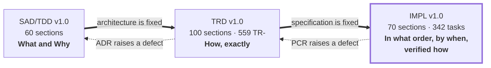

# TP Reviews Engine

## Implementation Plan (IMPL) v1.0

*The engineering execution manual for TP Reviews Engine v1.0. It contains no application code and no architecture. It contains the order in which the approved architecture gets built, by whom, in what sequence, verified how, and abandoned how if it goes wrong.*

---

| Field | Value |
|---|---|
| **Product Name** | TP Reviews Engine |
| **Internal Codename** | `tp-reviews-engine` |
| **Brand Owner** | TradyPerch |
| **Document Type** | Implementation Plan (IMPL) |
| **Document Version** | v1.0 |
| **Product Version Planned** | Engine v1.0.0 (`MAJOR.MINOR.PATCH`) |
| **Governing Architecture** | TP Reviews Engine SAD/TDD v1.0 — baselined 2026-07-30, Approved for Implementation |
| **Governing Technical Spec** | TP Reviews Engine TRD v1.0 — baselined 2026-07-30, Approved for Implementation |
| **Status** | Approved for Execution |
| **Classification** | Internal — Commercial Confidential |
| **First Implementation Target** | Commerce Insight |
| **Planned Duration** | 16 calendar weeks to v1.0.0 GA, plus a 30-day production soak |
| **Planned Effort** | ≈ 970 engineer-hours across 342 tasks |
| **Document Date** | 2026-07-31 |

---

## 0.1 Document Control

### 0.1.1 Revision History

| Version | Date | Author | Change Summary | Approval |
|---|---|---|---|---|
| v0.1 | 2026-07-31 | TradyPerch Engineering | Initial extraction of build order from SAD Appendix A into milestones. | Draft |
| v0.5 | 2026-07-31 | TradyPerch Engineering | Full phase set, task breakdown, and management apparatus. | Review |
| **v1.0** | **2026-07-31** | **TradyPerch Engineering** | **Baselined for execution. 70 mandated sections, 26 phases, 342 tasks, 9 milestones, 8 sprints, 12 decision gates.** | **Approved** |

### 0.1.2 Ownership

| Role | Owns In This Document | Cadence |
|---|---|---|
| Engineering Manager / TPM | §6–§10, §63–§69, Part 15 (management), decision gates | Weekly |
| Staff Software Architect | §1–§5, §51–§53, Part 17 (quality gates) | Per milestone |
| Staff Backend Engineer | §24–§43, task packages WP-02 … WP-19 | Daily |
| Senior DevOps Engineer | §11–§23, §47–§49, §63–§67 | Per milestone |
| QA Architect | §54–§62, Part 17 testing criteria | Per sprint |
| Security Engineer | §23, §41, §47, quality-gate security criteria | Per milestone + on incident |
| AI Delivery Lead | Part 16 (AI coding agent playbook) | Continuous |

### 0.1.3 Binding Status

This plan is **binding for execution**. It does not create requirements; it sequences them.

| # | Rule |
|---|---|
| B-1 | A task may be re-estimated, re-assigned, or re-ordered by the Engineering Manager. It may not be **deleted** without a recorded Plan Change Record (PCR, §0.9). |
| B-2 | A phase's Exit Criteria are not negotiable under schedule pressure. Slipping a date is permitted; declaring a phase complete with unmet exit criteria is not. |
| B-3 | Where this plan and the TRD disagree on *what to build*, the TRD wins and this plan is defective. |
| B-4 | Where this plan and the TRD disagree on *the order of building*, this plan wins — the TRD deliberately does not sequence. |
| B-5 | Where this plan and the SAD's Appendix A build order disagree, **Appendix A wins**; this plan is an expansion of it, never a revision of it. |

---

## 0.2 Purpose and Relationship to the Baselined Documents

### 0.2.1 The Three-Document Set

| The SAD Answers | The TRD Answers | **This Plan Answers** |
|---|---|---|
| Why a hexagonal pipeline? | Which file holds which stage | **Which week that file is written, what must exist first, and what proves it works** |
| Why selector packs? | The pack's JSON structure and validation | **That packs are built in phase 12 — after the pure core, before any browser code — and why moving them earlier or later costs money** |
| Why a Publish Gate? | The arithmetic of G-01…G-12 | **That the Gate is built in phase 6 with a 100%-coverage exit criterion, and that no publication code may be merged until that gate is green** |
| Why absence ≠ deletion? | The streak state machine and PT-07 | **That the reconciler is milestone M2's single deliverable, is estimated at 46 hours, is the project's critical-path apex, and has a named rollback if PT-07 cannot be made to pass** |

### 0.2.2 What This Document Is Not

- **It is not architecture.** No decision from the SAD is re-opened, softened, deferred, or "improved". If a phase looks expensive, that is information for the schedule, not an invitation to redesign.
- **It is not requirements.** Every "MUST" in this document is a *process* obligation (a gate, a review, an order). Product obligations live in the SAD and TRD and are referenced by identifier only.
- **It is not code.** No file in this plan contains an implementation. Where an artifact's shape matters, it is referenced by its TRD section number, not restated.
- **It is not a substitute for reading the TRD.** Every task in Part 12–14 assumes the implementer has the referenced TRD section open. The plan says *when* and *whether it worked*; the TRD says *what*.

### 0.2.3 Precedence

| # | Rule |
|---|---|
| P-1 | The ten system invariants (SAD §0.8) outrank every statement in all three documents. |
| P-2 | SAD > TRD on architecture. |
| P-3 | TRD > SAD on implementation detail. |
| P-4 | **This plan > both, on sequencing, estimation, staffing, and gating — and on nothing else.** |
| P-5 | A published JSON Schema file in `schemas/` beats all prose at runtime. |

---

## 0.3 Intended Audience and Reading Paths

| Reader | Read First | Then | May Skip |
|---|---|---|---|
| **AI coding agent** | §0.4 (identifiers), **Part 16 (agent playbook)**, §5 (order justification) | The phase section for the current task, then that task's row in Part 12–14 | Part 15 (management) |
| **Implementing engineer** | §1–§5 | §11–§23 once, then the phase you are on | §7, §8, Part 15 |
| **Engineering manager / TPM** | §6–§10, Part 15 | Decision gates, risk register, critical path | §24–§53 detail |
| **QA architect** | §54–§62, Part 17 | Per-phase Testing Checklists | §11–§23 |
| **DevOps** | §11–§23, §47–§49 | §63–§67 | §29–§43 |
| **Security engineer** | §23, §41, Part 17 security criteria | §60, §62 | §6–§10 |
| **Anyone inheriting the project mid-flight** | §0.9 (change control), Part 15 progress tracking | The current milestone's exit criteria | Completed phases |

### 0.3.1 Estimated Reading Time

| Part | Sections | Approx. Pages | Reading Time |
|---|---|---|---|
| Front matter | §0 | 10 | 25 min |
| Part 1 — Philosophy, Principles, Build Strategy | §1–§5 | 16 | 40 min |
| Part 2 — Milestones, Sprints, Releases | §6–§10 | 14 | 35 min |
| Part 3 — Repository and Environment | §11–§23 | 20 | 50 min |
| Part 4 — Foundation Systems | §24–§28 | 13 | 35 min |
| Part 5 — Acquisition | §29–§33 | 13 | 35 min |
| Part 6 — Processing and Data | §34–§38 | 13 | 35 min |
| Part 7 — Publication, Rollback, Recovery | §39–§43 | 12 | 30 min |
| Part 8 — Observability and Delivery | §44–§50 | 16 | 40 min |
| Part 9 — Extensibility Preparation | §51–§53 | 7 | 20 min |
| Part 10 — Testing Implementation | §54–§62 | 18 | 45 min |
| Part 11 — Checklists and V2 | §63–§70 | 14 | 35 min |
| Parts 12–14 — Task Breakdown | 342 tasks | 42 | reference |
| Part 15 — Engineering Management | — | 14 | 35 min |
| Part 16 — AI Coding Agent Playbook | — | 12 | 30 min |
| Part 17 — Quality Gates | — | 10 | 25 min |
| Part 18 — Appendices | — | 8 | reference |
| **Total** | **§0–§70** | **≈ 252** | **≈ 9 h** |

---

## 0.4 Notation, Identifiers, and Scales

### 0.4.1 Requirement Keywords

RFC 2119 keywords carry their SAD meanings. In this document they bind **process**, not product.

| Keyword | In This Document Means |
|---|---|
| **MUST** | The gate does not open without it. A release manager cannot waive it; only a PCR can. |
| **MUST NOT** | Doing it is a defect in execution, reportable at the daily stand-up. |
| **SHOULD** | Deviation requires one sentence of recorded rationale in the sprint log. |
| **MAY** | Genuinely at the team's discretion. |

### 0.4.2 Identifier Families Introduced Here

**No SAD or TRD identifier is redefined.** All families below are new and belong to this plan alone.

| Prefix | Meaning | Format | Example |
|---|---|---|---|
| `MS-` | **Milestone.** A shippable, independently demonstrable increment. | `MS-<n>` | `MS-4` |
| `PH-` | **Phase.** A unit of the SAD Appendix A build order, expanded here. | `PH-<nn>` | `PH-05` |
| `WP-` | **Work Package.** A cohesive group of tasks owned by one engineer at a time. | `WP-<nn>` | `WP-11` |
| `T-` | **Task.** The atomic unit of assignment and tracking. | `T-<nnn>` | `T-147` |
| `SP-` | **Sprint.** A two-week iteration. | `SP-<n>` | `SP-3` |
| `QG-` | **Quality Gate.** A blocking, automated or human check bound to a phase. | `QG-<nn>` | `QG-07` |
| `DG-` | **Decision Gate.** A scheduled human go/no-go with named attendees. | `DG-<nn>` | `DG-04` |
| `PR-` | **Plan Risk.** A risk to *executing* this plan. | `PR-<nn>` | `PR-06` |
| `DEL-` | **Deliverable.** A named artifact a phase must produce. | `DEL-<nn>` | `DEL-22` |
| `PCR-` | **Plan Change Record.** An approved deviation from this plan. | `PCR-<nn>` | `PCR-01` |
| `CP` | **Critical Path.** The dependency chain that sets the end date. | — | — |

Reused, never redefined: `INV-`, `ADR-`, `FR-`, `NFR-`, `CON-`, `RISK-`, `THREAT-`, `ERR-`, `MET-`, `G-`, `PT-`, `CH-`, `DR-`, `SEC-`, `V-`, `L-` (SAD); `TR-`, `EDR-`, `IF-`, `ALG-`, `IR-`, `OIQ-`, `TA-` (TRD).

### 0.4.3 Difficulty Scale

Difficulty measures **how likely the task is to be got wrong**, not how long it takes. The two are independent, and conflating them is how the reconciler gets assigned to a junior engineer because "it's only 400 lines".

| Level | Name | Meaning | Who May Own It | AI Agent Autonomy |
|---|---|---|---|---|
| **D1** | Mechanical | The output is fully determined by the spec. Copying a table into a constants file. | Anyone, including an unsupervised agent | Full — generate and merge on green CI |
| **D2** | Straightforward | One design choice, locally scoped, obvious from context. | Any engineer; agent with review | Full — generate, human reviews the diff |
| **D3** | Substantive | Several interacting rules; a wrong reading produces plausible-looking wrong behaviour. | Engineer with the TRD section open | Assisted — agent drafts, engineer verifies against spec line by line |
| **D4** | Hazardous | Correctness is not observable from the happy path. Failure is silent. | Senior engineer, paired review mandatory | Assisted only, with property tests written **first** by a human |
| **D5** | Critical-path apex | Gets one shot; a defect here corrupts client data or the public contract. | Staff engineer, two reviewers, no time pressure | **Human-led.** Agent may write tests and scaffolding only |

**Tasks touching `core/reconcile/`, `core/normalize/`, `core/gate/`, `core/identity/`, and `infra/logger/redact.mjs` are D4 or D5 by default.** No exceptions; the difficulty is a property of the module, not of the change size.

### 0.4.4 Priority Scale

| Priority | Meaning | Slippage Consequence |
|---|---|---|
| **P0** | On the critical path. | The project end date moves by the same amount. |
| **P1** | Required for the milestone, off the critical path. | The milestone's slack absorbs it once. |
| **P2** | Required for v1.0.0 GA, not for the milestone. | Can be pulled into hardening (SP-8). |
| **P3** | Required for the 30-day soak or for v1.1. | Can be deferred past GA with a recorded owner. |

### 0.4.5 Estimation Model

| Convention | Value |
|---|---|
| Unit | **Ideal engineer-hours (IEH)** — focused work by a competent engineer with the spec open, excluding meetings, review latency, and CI wait |
| Working day | 5.5 IEH — the remaining 2.5 hours are review, stand-up, CI, and context switching |
| Sprint | 10 working days = **55 IEH per engineer** |
| Team capacity | 2.0 FTE engineers + 0.5 FTE lead = **137 IEH per two-week sprint** raw, planned at ≈ 88% = **120 IEH committed**. SP-0 and SP-8 are one-week sprints: 68 raw, 60 committed |
| Estimate confidence | D1–D2: ±20% · D3: ±40% · D4: ±70% · D5: ±100% |
| AI-agent multiplier | D1–D2: **0.4×** elapsed · D3: **0.7×** · D4: **1.0×** (no speedup; verification dominates) · D5: **1.2×** (agent output must be re-derived by hand) |

**The multiplier row is the single most important line in this table for scheduling.** AI agents compress the mechanical two-thirds of this project substantially and compress the hazardous third not at all. Any schedule that assumes a uniform speedup will miss, and will miss precisely on the tasks whose failure is unrecoverable. All dates in this plan are stated **with** the multipliers already applied.

### 0.4.6 Block Conventions

| Marker | Meaning |
|---|---|
| **Sequencing Note** | Why this thing is here and not somewhere else. Load-bearing; do not reorder without reading it. |
| **Agent Note** | Aimed at an AI coding agent; usually names a plausible wrong action. |
| **Manager Note** | A staffing, tracking, or reporting consequence. |
| **Stop Condition** | If this is observed, halt the phase and escalate to the named decision gate. |

---

## 0.5 The Twelve Execution Rules

These govern every phase, every task, and every agent session. They are restated at the head of Part 16 because agents will read that part first.

| # | Rule | Consequence of Breaking It |
|---|---|---|
| **X-1** | **Build strictly in the order of SAD Appendix A**, expanded here as PH-00 … PH-25. | Every out-of-order build in a hexagonal codebase produces a fake abstraction shaped like the one implementation that existed at the time. |
| **X-2** | **A phase is done when its Exit Criteria are green, not when its code is written.** | "Done" that means "written" is how six phases finish in week 9 and none of them work. |
| **X-3** | **`main` is always releasable.** Every merge passes the full `ci.yml` gate set. | A red `main` blocks every other engineer and every agent session. |
| **X-4** | **Vertical slices over horizontal layers**, wherever the dependency graph allows a choice. | Horizontal layers defer all integration risk to the end, which is where schedules die. |
| **X-5** | **Tests are written in the same task as the code they test.** A task is not two tasks. | A "write the tests later" task is never scheduled and never done. |
| **X-6** | **No task may introduce a dependency** without a DEP-1 justification merged first. | See TRD §10.1; the target is two production dependencies. |
| **X-7** | **The Normalizer (PH-02) precedes every producer of data.** | It is the security boundary. Retrofitting it is how INV-05 is violated. |
| **X-8** | **The CSV adapter (PH-11) precedes every browser task.** | An interface validated against one implementation is a rename, not an interface. |
| **X-9** | **Every incident, in development or production, becomes a permanent test in the same PR that fixes it.** | TRD §61.14. Non-negotiable. |
| **X-10** | **Never widen a hard ceiling, never add a retry to an `ERR-BLOCKED-*` path, never simplify the absence asymmetry.** | The three unrecoverable classes of defect. IR-01, IR-11, A-3. |
| **X-11** | **Estimates are revised in the open.** A task exceeding 2× its estimate is escalated at the next stand-up, not absorbed. | Silent absorption is how a two-week slip is discovered in week 15. |
| **X-12** | **Every phase names its rollback before it starts.** | Identifying the rollback path during an incident is the slowest possible moment to do it (TR-CI-190). |

---

## 0.6 Phase Index — SAD Appendix A Expanded

The SAD's twenty-six build phases, restated with their plan identifiers, milestones, and the sections of this document that expand them. **This table is the spine of the plan.**

| PH | SAD Appendix A Phase | Milestone | Sprint | Expanded In | IEH | Diff |
|---|---|---|---|---|---|---|
| PH-00 | Repo skeleton, tooling, CI with a trivial test | MS-0 | SP-0 | §11–§23 | 62 | D2 |
| PH-01 | `core/model/`, `core/util/result`, `core/util/hash`, error taxonomy | MS-1 | SP-1 | §26, §36 | 34 | D2 |
| PH-02 | **`core/normalize/` — the security boundary** | MS-1 | SP-1 | §37 | 40 | **D4** |
| PH-03 | `core/dates/`, `core/lang/`, `core/identity/` | MS-1 | SP-1 | §33, §36 | 46 | D3 |
| PH-04 | `core/validate/` | MS-1 | SP-2 | §34 | 26 | D3 |
| PH-05 | **`core/reconcile/` — the hardest module** | MS-2 | SP-2 | §35, §38 | 46 | **D5** |
| PH-06 | `core/project/` and `core/gate/` | MS-2 | SP-2 | §39, §40 | 40 | **D4** |
| PH-07 | `ports/` + `infra/` (logger, clock, random, retry, fs-atomic) | MS-3 | SP-3 | §25, §26, §27 | 44 | D3 |
| PH-08 | `adapters/state/git-state`, `adapters/publisher/filesystem` | MS-3 | SP-3 | §38, §41 | 28 | D3 |
| PH-09 | `app/config/` six-layer loader | MS-4 | SP-3 | §24 | 32 | D3 |
| PH-10 | `cli/` skeleton + `validate-config`, `project`, `doctor` | MS-4 | SP-3 | §24, §42 | 34 | D2 |
| PH-11 | **`file:csv` adapter — proves the interface** | MS-5 | SP-4 | §52 | 24 | D3 |
| PH-12 | `selectors/` schema, loader, strategy resolver | MS-5 | SP-4 | §32 | 26 | D3 |
| PH-13 | `core/extract/` against saved fixtures | MS-5 | SP-4 | §33 | 42 | D3 |
| PH-14 | `adapters/browser/playwright-chromium` + session manager | MS-6 | SP-5 | §29, §30 | 34 | D3 |
| PH-15 | `fixtures/server/serve.mjs` + Navigator | MS-6 | SP-5 | §31 | 36 | D3 |
| PH-16 | `google-dom` adapter: resolver, consent, challenge, serialise | MS-6 | SP-5 | §32 | 44 | **D4** |
| PH-17 | Orchestrator + target runner + preflight | MS-6 | SP-6 | §28 | 40 | D3 |
| PH-18 | `adapters/publisher/git-data` + hash gating + rebase-retry | MS-7 | SP-6 | §41 | 32 | D3 |
| PH-19 | `harvest.yml` + `setup-engine` composite action | MS-7 | SP-6 | §48 | 30 | D3 |
| PH-20 | Diagnostics, health recorder, `notifier/github-issues` | MS-8 | SP-7 | §44, §45, §46 | 36 | D2 |
| PH-21 | Chaos suite CH-01…CH-14 | MS-8 | SP-7 | §62 | 34 | **D4** |
| PH-22 | `google:places-api` and `google:business-profile-api` adapters | MS-8 | SP-7 | §52 | 40 | D3 |
| PH-23 | `frontend/renderer/` + five integration recipes | MS-9 | SP-8 | §50 | 34 | D2 |
| PH-24 | Remaining five workflows | MS-9 | SP-8 | §48, §49 | 26 | D2 |
| PH-25 | Onboard Commerce Insight; begin the 30-day soak | MS-9 | SP-8 | §66 | 20 | D3 |
| — | Hardening, documentation, release engineering | MS-9 | SP-8 | §63–§65 | 40 | D2 |
| **Total** | | | | | **970** | |

**Sequencing Note.** PH-02 before PH-03 and PH-05 before PH-06 are the two orderings that carry real risk if inverted. Everything else in this table can absorb a week of local reordering without harm; those two cannot. §5 gives the full justification.

---

## 0.7 Section Map — Mandated Topic to Location

| § | Title | Part | Phase(s) |
|---|---|---|---|
| 1 | Implementation Philosophy | 1 | all |
| 2 | Engineering Principles | 1 | all |
| 3 | Project Build Strategy | 1 | all |
| 4 | Dependency Graph | 1 | all |
| 5 | Implementation Order Justification | 1 | all |
| 6 | Milestone Strategy | 2 | all |
| 7 | Sprint Strategy | 2 | all |
| 8 | Release Strategy | 2 | PH-19 … PH-25 |
| 9 | Feature Delivery Strategy | 2 | all |
| 10 | Incremental Development Rules | 2 | all |
| 11 | Repository Initialization Plan | 3 | PH-00 |
| 12 | Git Configuration Plan | 3 | PH-00 |
| 13 | Branch Creation Order | 3 | PH-00 |
| 14 | Folder Creation Order | 3 | PH-00 |
| 15 | Dependency Installation Order | 3 | PH-00 |
| 16 | Development Environment Setup | 3 | PH-00 |
| 17 | Node Setup | 3 | PH-00 |
| 18 | TypeScript Setup | 3 | PH-00 |
| 19 | Linting Setup | 3 | PH-00 |
| 20 | Formatting Setup | 3 | PH-00 |
| 21 | Testing Framework Setup | 3 | PH-00 |
| 22 | Git Hooks Setup | 3 | PH-00 |
| 23 | Environment Variables Setup | 3 | PH-00, PH-09 |
| 24 | Configuration System Implementation | 4 | PH-09, PH-10 |
| 25 | Logging System Implementation | 4 | PH-07 |
| 26 | Error Handling System | 4 | PH-01, PH-07 |
| 27 | Retry Engine | 4 | PH-07 |
| 28 | Scheduler Implementation | 4 | PH-17 |
| 29 | Playwright Engine | 5 | PH-14 |
| 30 | Browser Management | 5 | PH-14 |
| 31 | Navigation Engine | 5 | PH-15 |
| 32 | Review Detection Engine | 5 | PH-12, PH-16 |
| 33 | Review Parser | 5 | PH-03, PH-13 |
| 34 | Review Validation | 6 | PH-04 |
| 35 | Duplicate Detection | 6 | PH-05 |
| 36 | Hash Generator | 6 | PH-01, PH-03 |
| 37 | Normalizer | 6 | PH-02 |
| 38 | Review Ledger | 6 | PH-05, PH-08 |
| 39 | JSON Builder | 7 | PH-06 |
| 40 | JSON Validator | 7 | PH-06 |
| 41 | Publication Pipeline | 7 | PH-18 |
| 42 | Rollback Engine | 7 | PH-18, PH-10 |
| 43 | Recovery Engine | 7 | PH-10, PH-20 |
| 44 | Health Check System | 8 | PH-20 |
| 45 | Monitoring System | 8 | PH-20 |
| 46 | Metrics | 8 | PH-20 |
| 47 | GitHub Integration | 8 | PH-08, PH-18 |
| 48 | GitHub Actions | 8 | PH-19, PH-24 |
| 49 | Deployment Pipeline | 8 | PH-24, PH-25 |
| 50 | Website Integration | 8 | PH-23 |
| 51 | Future API Layer Preparation | 9 | PH-07, PH-08 |
| 52 | Adapter Layer Preparation | 9 | PH-11, PH-22 |
| 53 | Plugin System Preparation | 9 | PH-07, PH-17 |
| 54 | Testing Implementation | 10 | all |
| 55 | Unit Testing Order | 10 | PH-01 … PH-13 |
| 56 | Integration Testing Order | 10 | PH-08 … PH-19 |
| 57 | End-to-End Testing Order | 10 | PH-15 … PH-23 |
| 58 | Performance Testing | 10 | PH-06, PH-21 |
| 59 | Load Testing | 10 | PH-21 |
| 60 | Failure Simulation | 10 | PH-21 |
| 61 | Regression Testing | 10 | PH-13, PH-21 |
| 62 | Chaos Testing | 10 | PH-21 |
| 63 | Deployment Readiness Checklist | 11 | PH-24 |
| 64 | Release Candidate Checklist | 11 | PH-24 |
| 65 | Production Checklist | 11 | PH-25 |
| 66 | Post Deployment Verification | 11 | PH-25 |
| 67 | Rollback Procedure | 11 | PH-25 |
| 68 | Maintenance Checklist | 11 | post-GA |
| 69 | Future Upgrade Checklist | 11 | post-GA |
| 70 | Version 2 Preparation | 11 | post-GA |

---

## 0.8 Team Model and Capacity Assumptions

| Role | FTE | Owns | Named Risk If Absent |
|---|---|---|---|
| Staff Backend Engineer (Lead Implementer) | 1.0 | `core/`, adapters, orchestration | PR-01: the D4/D5 modules have no qualified owner and the schedule is fiction |
| Backend Engineer | 1.0 | `infra/`, `cli/`, `app/`, adapters, fixtures | PR-02: sprint capacity halves; MS-6 onward slips ~5 weeks |
| Senior DevOps Engineer | 0.3 | Workflows, branch setup, Pages, secrets, runners | PR-03: PH-19/PH-24 slip and the harvest never runs unattended |
| QA Architect | 0.3 | Property laws, chaos suite, fixture corpus, coverage gates | PR-04: chaos suite is written by the person who wrote the bug |
| Engineering Manager / TPM | 0.5 | Gates, tracking, risk register, stakeholder reporting | PR-05: exit criteria erode silently under deadline |
| Security Engineer | 0.1 | Redaction, secrets, workflow lint, threat re-verification | PR-06: INV-08 is asserted rather than tested |
| AI Coding Agents | n/a | D1–D3 task execution under Part 16 rules | PR-07: elapsed time roughly doubles; correctness unchanged |

**Manager Note.** The 0.3 FTE QA Architect is the line item most likely to be cut and the one that must not be. Six of eleven pipeline stages are pure specifically so that they can be exhaustively tested; deleting the person who writes those tests deletes the reason the architecture is shaped this way.

### 0.8.1 Capacity Ledger

| Sprint | Weeks | Raw Capacity | Planned IEH | Cumulative Planned | Planned Phases |
|---|---|---|---|---|---|
| SP-0 | W01 | 68 | 62 | 62 | PH-00 |
| SP-1 | W02–W03 | 137 | 120 | 182 | PH-01, PH-02, PH-03 |
| SP-2 | W04–W05 | 137 | 112 | 294 | PH-04, PH-05, PH-06 |
| SP-3 | W06–W07 | 137 | **138** | 432 | PH-07, PH-08, PH-09, PH-10 |
| SP-4 | W08–W09 | 137 | 92 | 524 | PH-11, PH-12, PH-13 |
| SP-5 | W10–W11 | 137 | 114 | 638 | PH-14, PH-15, PH-16 |
| SP-6 | W12–W13 | 137 | 102 | 740 | PH-17, PH-18, PH-19 |
| SP-7 | W14–W15 | 137 | 110 | 850 | PH-20, PH-21, PH-22 |
| SP-8 | W16 | 68 | 120 | 970 | PH-23, PH-24, PH-25, hardening |
| **Total** | **16 weeks** | **1,095** | **970** | | **125 IEH (11%) reserve** |

**The 11% reserve is deliberately thin and deliberately visible.** It is not contingency for scope; it is contingency for the two D5 tasks. Two sprints are planned above their raw capacity — SP-3 (138 vs 137) and SP-8 (120 vs 68) — and both are called out where they occur (§7.2). SP-8's overage is absorbed by the fact that 40 IEH of its load is the unallocated hardening allowance, which is drawn against only if defects require it. If the reserve is consumed before SP-5, DG-06 is triggered early and scope is cut from MS-8, not from MS-2.

---

## 0.9 Change Control

### 0.9.1 Plan Change Records

Any deviation from this plan that changes a milestone date, deletes a task, or reorders a phase requires a PCR.

> **PCR-nn — Title**
> **Requested by / Date:**
> **Change:** what moves, is deleted, or is reordered.
> **Reason:** the observed fact that makes the plan wrong.
> **Impact:** on the critical path, on the end date, on which decision gate.
> **Invariant check:** which of INV-01…INV-10 this touches. If any, the Architect signs.
> **Approval:** Engineering Manager; plus Architect if the invariant check is non-empty.

### 0.9.2 What Does *Not* Require a PCR

| Change | Handling |
|---|---|
| Re-estimating a task | Sprint log entry |
| Re-assigning a task | Sprint log entry |
| Splitting a task into two | Sprint log; keep the parent ID with `.1` `.2` suffixes |
| Adding a task inside an existing phase | Sprint log; new ID from the reserved block for that phase |
| Reordering tasks **within** a phase | Free, provided intra-phase dependencies hold |
| Adding a regression test for a defect found | Always allowed, always required (X-9) |

### 0.9.3 What Requires an ADR or EDR Instead

If the reason a task cannot be completed is that the specification is wrong or under-specified, **stop and raise a defect against the TRD (EDR) or SAD (ADR)**. Do not solve it in the plan. A PCR that changes *what is built* is a mis-filed EDR.

---

## 0.10 Open Planning Questions

Deliberately unresolved at plan baseline. Each has an owner, a deadline, and an interim position that MUST be applied rather than an invented answer.

| ID | Question | Owner | Required By | Interim Position |
|---|---|---|---|---|
| OPQ-01 | Does the second Backend Engineer start at W01 or W06? | EM | DG-01 (W01) | Plan assumes W01. If W06, MS-5 onward slips 3 weeks; DG-03 re-baselines. |
| OPQ-02 | Is the canary reference listing chosen and stable? | Backend | PH-19 (W12) | Use a well-known, high-volume, non-client listing; record the choice in `selectors/google-maps/assertions.json` provenance. |
| OPQ-03 | Which HTML parser for offline extraction tests (TRD OIQ-03)? | QA | PH-13 (W08) | Any dev-only parser satisfying DEP-3. Decision recorded as a one-line dev-dependency justification, not an EDR. |
| OPQ-04 | Repository public or private (TRD §64.2 step 1)? | EM | PH-00 (W01) | **Public.** Free CI minutes; CON-17 already assumes no secret exists in any file. |
| OPQ-05 | Do we run the 30-day soak with one client or two? | EM | DG-11 (W16) | One (Commerce Insight). A second client during soak confuses the signal with onboarding noise. |
| OPQ-06 | Is the v1.1 job-split (TRD §96.2) in scope before the first external client? | Architect | DG-12 (post-GA) | Out of scope for v1.0.0; recorded in §70 as V2-01 with its risk (THREAT-05) restated. |

---

## 0.11 Assumptions This Plan Depends On

Distinct from the TRD's `TA-` assumptions (which concern third parties). These concern **execution**, and each is falsifiable in week 1.

| ID | Assumption | Falsified By | If False |
|---|---|---|---|
| PA-01 | Both baselined documents are readable by the implementers without further clarification | More than two blocking clarification requests per phase | Escalate to DG-02; the TRD is defective and needs an EDR round before SP-2 |
| PA-02 | The team can run Chromium locally on their development machines | `tpre doctor` fails on any developer machine in W01 | Fall back to a devcontainer; +8 IEH in PH-00 |
| PA-03 | CI runners meet TA-01 (≥ 4 cores, ≥ 14 GB) | First `tpre doctor` in CI | Re-derive §44/§45 budgets; lower `max_reviews` default; +6 IEH in PH-19 |
| PA-04 | AI coding agents can operate against the TRD at D1–D3 with the Part 16 rules | Agent-produced PRs failing review at > 40% in SP-1 | Drop the agent multiplier to 1.0×; end date moves ~4 weeks; DG-03 re-baselines |
| PA-05 | No external dependency on this project's output before W16 | A client commitment made outside engineering | Scope is cut, not quality. §9.5 names exactly what is cuttable. |

---

*End of front matter. Part 1 begins with Section 1, Implementation Philosophy.*
