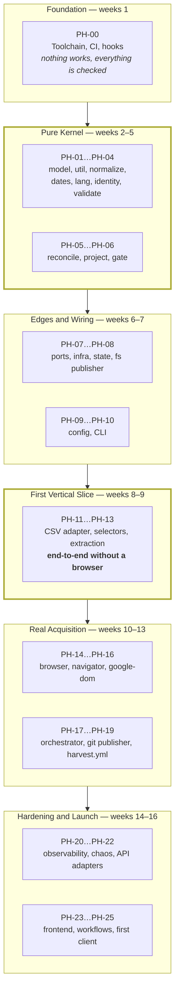
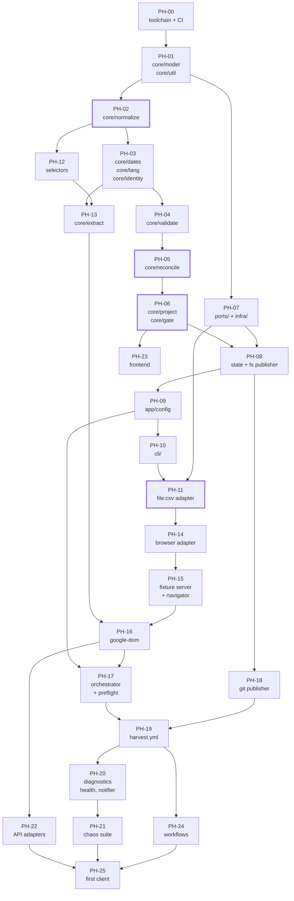
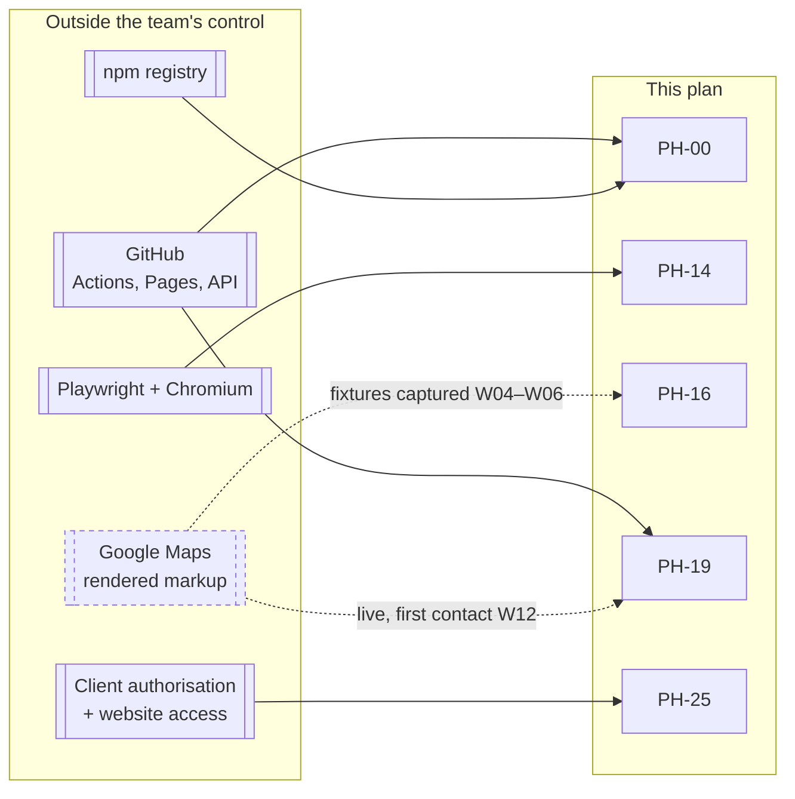
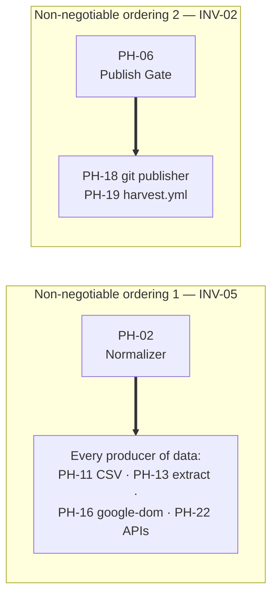

# Part 1 — Philosophy, Principles, Build Strategy, and Order

*Sections 1 through 5. Audience: everyone, before anything else. This part explains why the build order is what it is. An engineer who reads only Part 12 and starts at task T-001 will produce working code in the wrong sequence, and the cost of that shows up in week 11, not week 2.*

---

# 1. Implementation Philosophy

## 1.1 The Governing Sentence

> **Build the things whose failure is invisible before the things whose failure is obvious.**

Every ordering decision in this plan derives from that sentence. A browser adapter that does not work fails loudly on the first run. A normalizer that lets one markup form through fails silently, on someone else's website, months later, and is discovered by a client. The second class of defect is the one the build order is designed around.

The SAD's Appendix A already encodes this. This plan does not improve on it; it explains it, expands it into assignable work, and attaches gates to it so that the ordering survives the week somebody is behind schedule.

## 1.2 The Five Philosophical Commitments

| # | Commitment | What It Rules Out | What It Buys |
|---|---|---|---|
| **1** | **Correctness before capability** | Building acquisition first because it is the visible part of the product | Every producer of data is built against a boundary that is already proven safe |
| **2** | **Purity before plumbing** | Wiring adapters early "so we can see something work" | Six of eleven stages become exhaustively testable offline, which is what makes a three-minute suite possible |
| **3** | **The simplest implementation of an interface, first** | Building `google:dom` as the first adapter | The port is validated against a second implementation while changing it is still free (X-8) |
| **4** | **Deterministic before non-deterministic** | Any early dependency on the network, the clock, or a live page | Every early phase is testable with zero flake, so a red build always means a real defect |
| **5** | **Reversibility is a feature of the plan, not just the product** | Phases with no stated rollback | A phase can be abandoned in week N without unwinding weeks 1..N-1 |

## 1.3 What This Project Is, From a Delivery Standpoint

| Property | Value | Delivery Consequence |
|---|---|---|
| Deployable surface | A CLI, two orphan Git branches, eight workflow files | There is no staging environment to build, and no deployment automation to write beyond the workflows themselves |
| Runtime | Ephemeral CI runner, 3–20 minutes | Nothing can be "tested in production by watching it" — the process is gone before you look |
| State | Git branches | Every state bug is diffable and revertible; every state bug is also a commit somebody has to clean up |
| Blast radius of a defect | Every client website simultaneously | Publication is gated, and the gate is built (PH-06) five phases before anything can publish (PH-18) |
| Observability | Files and issues | Monitoring must be built as a deliverable (PH-20), not bought |
| Team | ≈ 2.3 FTE + agents | Every hour of avoidable rework is ~0.5% of the schedule |

**The fourth row is the one that shapes the plan most.** In a system where a bad artifact reaches every client at once, the correct order is: build the thing that says *no*, then build the thing that produces candidates for it to say no to. That is why the Publish Gate is phase 6 and the publisher is phase 18.

## 1.4 The Two Failure Modes This Plan Exists to Prevent

### 1.4.1 The Demo Trap

The natural order of work — browser first, because it is the interesting part; parsing second, because it is next; storage third — produces a demo in week 2 and a product in month 9. It fails because:

- the adapter interface is designed around exactly one implementation and does not survive the second;
- the pure core is written *after* its consumers, so its signatures are shaped by call sites rather than by laws;
- normalisation is retrofitted, and INV-05 becomes an aspiration;
- every test needs a browser, so the suite is slow, flaky, and eventually not run.

**Countermeasure:** X-1, X-7, X-8, and the fact that PH-14 (the first line of Playwright code) is scheduled in week 10 of 16.

### 1.4.2 The Cathedral Trap

The opposite failure: build every layer perfectly and integrate at the end. It fails because integration risk is deferred to the point where there is no schedule left to absorb it.

**Countermeasure:** X-4 (vertical slices) and the milestone definition in §6 — every milestone from MS-3 onward is *demonstrable end to end* on a narrowing but real path:

| Milestone | The Vertical Slice That Must Run |
|---|---|
| MS-3 | Ledger written to disk and read back, byte-identically |
| MS-4 | `tpre validate-config --explain` and `tpre project` run against fixtures with no network |
| MS-5 | A CSV file becomes a published payload on the local filesystem |
| MS-6 | A local fixture page in a real browser becomes a payload on the local filesystem |
| MS-7 | A local fixture page becomes a commit on a real `data` branch, via GitHub Actions |
| MS-9 | A real listing becomes a payload on a CDN, rendered on a real website |

**MS-5 is the load-bearing one.** By the end of week 9 — before any browser code — the entire pipeline from adapter to published artifact runs end to end. Every subsequent phase substitutes a component into a path that already works, which is the cheapest form of integration there is.

## 1.5 Attitude Toward AI Coding Agents

This project is planned on the explicit assumption that a substantial share of implementation is performed by AI coding agents. The philosophy is stated here and operationalised in Part 16.

| Position | Rationale |
|---|---|
| Agents are **excellent** at D1–D2 work | Constants, schemas, scaffolding, test-file skeletons, workflow YAML, recipe documents. Roughly 55% of this plan's task count. |
| Agents are **useful but supervised** at D3 | They produce plausible implementations of specified algorithms. Verification against the TRD line by line is the human's job and is *not* faster than writing it. |
| Agents are **hazardous** at D4–D5 | Precisely because the failure modes are invisible. TRD §0.5 lists ten agent rules; A-4 (never simplify the absence asymmetry) and DR-2 (`Date.now()` default parameters) exist because these are the statistically likely outputs. |
| Agents **never** own an exit criterion | A phase is signed off by a named human. |

**Agent Note.** The most valuable thing an agent can do on this project is write the *test* for a D4 module from the TRD's property laws, and then let a human write the implementation against it. That inverts the usual split and puts the agent where its recall of a long specification is an advantage and its confident guessing is not.

---

# 2. Engineering Principles

Twelve principles. Each is operational: it can be checked in a pull request, and each names its enforcement.

## 2.1 The Principle Set

| # | Principle | Statement | Enforced By |
|---|---|---|---|
| **EP-01** | **Dependency-ordered construction** | Never build a module before everything it imports is complete and tested. | Phase exit criteria; architecture test |
| **EP-02** | **The pure core is sacred** | `core/` has zero I/O, zero clock, zero randomness, zero environment, zero dependencies. | DR-1/DR-2 architecture tests, from PH-01 onward |
| **EP-03** | **Test in the same commit** | Code and its tests are one task, one PR, one review. | PR template; X-5 |
| **EP-04** | **Errors are values in the core, exceptions at the edges** | `Result` in `core/`; classified throws at adapters; conversion in exactly one place. | EDR-002; review checklist |
| **EP-05** | **Every threshold is configuration with a named default** | No magic number survives review. | Lint (magic numbers), review checklist item 4 |
| **EP-06** | **Every failure is classified** | An error not in the taxonomy is `ERR-INTERNAL-UNCLASSIFIED`, which is a defect. | Unit test: taxonomy completeness |
| **EP-07** | **Determinism is testable, so test it** | Fixed clock and seeded random in every test, from the first test. | TR-TEST-032; helpers exist in PH-00 |
| **EP-08** | **The gate before the producer** | Safety mechanisms are built before the things they guard. | Phase order PH-06 ≪ PH-18 |
| **EP-09** | **One name per concept** | TRD §68.2's vocabulary table is binding in code, logs, commits, and tickets. | Review; `coverage` vs `completeness` is a correctness issue |
| **EP-10** | **Diagnosability outranks cleverness** | If it cannot be diagnosed from artifacts alone, it is not finished. | Review checklist item 5 |
| **EP-11** | **No client-specific code path, ever** | A conditional on a slug is a defect regardless of deadline. | CON-04; review checklist item 9 |
| **EP-12** | **Leave the seam, don't build the future** | v1.0 builds interfaces that future work will need; it builds none of that work. | TRD A-10; §51–§53 of this plan |

## 2.2 Principles in Tension, and How They Are Resolved

Principles that never conflict are decoration. These three pairs conflict in practice; the resolution is stated in advance so it is not re-litigated per pull request.

| Tension | Resolution | Authority |
|---|---|---|
| EP-01 (dependency order) vs X-4 (vertical slices) | Dependency order wins on *module* granularity; slices are formed at *milestone* granularity. You may not build a partial reconciler to unblock a demo. | §5.6 |
| EP-03 (test in the same commit) vs velocity in D1 tasks | Holds absolutely. A D1 task with no test is a D1 task with no acceptance criterion. | X-5 |
| EP-12 (leave the seam) vs "we'll need this anyway" | The seam is an interface file in `ports/` plus a contract test. Anything with behaviour is future work. | TRD §75, A-10 |

## 2.3 The Definition of Done — One Task

A task is done when **all eight** hold. Seven of eight is not done.

| # | Condition |
|---|---|
| 1 | The code exists and satisfies the TRD section named in the task |
| 2 | Its tests exist, in the same PR, and fail against the previous commit |
| 3 | Lint, format, and type check pass with zero errors |
| 4 | The full default suite passes locally in under three minutes |
| 5 | Coverage thresholds for the touched module are met (see Part 17) |
| 6 | Module header documents what the module does **and what it explicitly does not do** (TRD §67.5) |
| 7 | Any new error class is in the taxonomy, the retry table, and the severity map |
| 8 | The PR description names the TRD section(s) implemented and the invariant(s) touched |

## 2.4 The Definition of Done — One Phase

| # | Condition |
|---|---|
| 1 | Every task in the phase is done by §2.3 |
| 2 | The phase's **Exit Criteria** (stated per phase in Parts 4–10) are green |
| 3 | The phase's **Verification Checklist** has been executed by someone other than the implementer |
| 4 | The phase's **Documentation Required** artifacts exist and are merged |
| 5 | `main` is green and releasable |
| 6 | The phase's rollback strategy has been *read* by the reviewer and is still accurate |

## 2.5 The Definition of Done — v1.0.0

Identical to TRD §1.7's ten criteria plus this plan's §64 release-candidate checklist. It is not restated here; duplicating an acceptance definition is how two versions of it come to exist.

---

# 3. Project Build Strategy

## 3.1 Strategy in One Diagram

## 3.2 The Six Strategic Blocks

| Block | Weeks | Phases | Strategic Purpose | What Is Deliberately Absent |
|---|---|---|---|---|
| **Foundation** | W01 | PH-00 | Make every subsequent commit checkable. | Any product code at all |
| **Pure Kernel** | W02–W05 | PH-01…PH-06 | Build every module whose defects are invisible, while the cost of getting them right is lowest. | Any I/O, any adapter, any network, any CLI |
| **Edges and Wiring** | W06–W07 | PH-07…PH-10 | Give the kernel a way in and out. | Any acquisition |
| **First Vertical Slice** | W08–W09 | PH-11…PH-13 | Prove the whole pipeline with the dumbest possible source. | Any browser |
| **Real Acquisition** | W10–W13 | PH-14…PH-19 | Substitute the real source into a proven pipeline; automate it. | Observability beyond logs |
| **Hardening and Launch** | W14–W16 | PH-20…PH-25 | Make failures visible, prove them safe, ship. | Anything from TRD §76–§91 |

**Sequencing Note.** The "deliberately absent" column is the operative one. Each block's discipline is defined by what it refuses to build, and every one of those refusals has been violated in some other project by someone who was two days behind.

## 3.3 Build Strategy Decision Matrix

The four candidate strategies, scored against this project's actual constraints. Recorded so that the chosen strategy is understood as a decision, not a default.

| Criterion | Weight | **A. Layer-by-layer (bottom-up)** | B. Feature-first (browser first) | C. Outside-in (CLI first, mocks inward) | D. Strangler around a spike |
|---|---|---|---|---|---|
| Protects INV-05 / INV-03 | ×5 | **5** | 1 | 3 | 1 |
| Validates the adapter port honestly | ×4 | **5** | 1 | 3 | 2 |
| Time to first end-to-end demo | ×2 | 2 | **5** | 4 | 5 |
| Test suite stays offline and fast | ×4 | **5** | 1 | 4 | 2 |
| Rework risk if a phase is wrong | ×4 | **4** | 2 | 3 | 2 |
| Suits AI-agent parallelisation | ×3 | **4** | 3 | 4 | 2 |
| Matches SAD Appendix A | ×5 | **5** | 1 | 2 | 1 |
| **Weighted total** | | **☑ 127** | 51 | 91 | 50 |

**Chosen: A, tempered by X-4.** Pure layer-by-layer would defer integration to week 13; the milestone definitions in §6 force a runnable vertical path from MS-3 onward, which recovers strategy C's main benefit without paying for its mocks.

**Why not C (outside-in with mocks):** in a system whose entire value is the correctness of six pure functions, mocking those functions to build the CLI first means the CLI is designed against fictional behaviour. The real signatures are determined by the laws in TRD §61.4, and those laws are knowable *now* — the SAD and TRD are baselined. Outside-in exists to discover unknown interfaces; here they are specified.

## 3.4 Parallelisation Strategy

Two engineers plus agents. The plan is written so that at every point in the schedule there is a second, genuinely independent track.

| Sprint | Track A (Lead Implementer) | Track B (Engineer 2 + agents) | Coupling Risk |
|---|---|---|---|
| SP-0 | Repo, branches, workflows skeleton | Tooling configs, hooks, test helpers | Low — different files |
| SP-1 | **PH-02 normalize** (D4) | PH-01 model/util, PH-03 dates/lang | Low — PH-03 imports PH-01 only |
| SP-2 | **PH-05 reconcile** (D5) | PH-04 validate, then PH-06 project | **Medium** — PH-06 gate needs PH-05's ledger shape; mitigated by fixing the shape in PH-01 |
| SP-3 | PH-07 ports/infra | PH-08 state, PH-09 config, PH-10 CLI | Low |
| SP-4 | PH-13 extraction + fixtures | PH-11 CSV adapter, PH-12 selectors | Low — PH-13 depends on PH-12's resolver contract, fixed at start of sprint |
| SP-5 | PH-16 google-dom | PH-14 browser, PH-15 navigator + fixture server | **High** — same subsystem; managed by daily interface sync, see §7.6 |
| SP-6 | PH-17 orchestrator | PH-18 publisher, PH-19 harvest.yml | Medium |
| SP-7 | PH-21 chaos | PH-20 observability, PH-22 API adapters | Low |
| SP-8 | PH-25 onboarding, hardening | PH-23 frontend, PH-24 workflows | Low |

**Manager Note.** SP-5 is the only sprint where both engineers work inside the same subsystem. It is also the sprint with the highest external-change risk (upstream markup). If a re-plan is needed, SP-5 is the one to protect with slack, not SP-2 — SP-2's risk is *difficulty*, which slack does not reduce, whereas SP-5's risk is *interface churn*, which it does.

## 3.5 The Cost of Getting the Order Wrong

Stated in hours, because "it's better this way" does not survive a deadline conversation.

| Inversion | Estimated Rework | Why |
|---|---|---|
| Browser adapter before the pure core | **+120 IEH** | The port is shaped by Playwright's ergonomics; the CSV and API adapters then require a port redesign, and every extraction test needs a browser |
| Normalizer after any producer | **+40 IEH and an unbounded correctness risk** | Every producer's tests encode pre-normalisation shapes; retrofitting requires re-deriving all golden fixtures and re-auditing INV-05 |
| Gate after the publisher | **+25 IEH** | The publisher's tests are written against an ungated path; the gate then has to be inserted into a code path that already has a "just publish" branch, which is the branch that survives |
| Reconciler after the projector | **+30 IEH** | The projector is written against a guessed ledger shape and re-written once |
| Config loader before the core | **+15 IEH** | Config keys are invented rather than derived from what the modules actually need; §8.4's key set becomes aspirational |
| CSV adapter after `google-dom` | **+35 IEH and a false interface** | The abstraction is a rename until a second implementation exists (TRD §61.6) |

---

# 4. Dependency Graph

## 4.1 Module-Level Dependency Graph

The build-order graph. An arrow means *must be complete and tested before*. This is the graph the phase order topologically sorts.

## 4.2 The Hard Edges

Most edges in that graph are soft — they could be violated with modest local cost. Six are hard: violating them causes rework measured in weeks or a correctness risk that cannot be bought back with testing later.

| Edge | Hardness | Reason |
|---|---|---|
| PH-01 → PH-02 | **Hard** | The `CleanString` brand and `Result` type are the normalizer's output vocabulary |
| **PH-02 → everything that produces data** | **Hard, non-negotiable** | INV-05 security boundary; X-7 |
| PH-01 → PH-05 | **Hard** | The ledger shape must be fixed before reconciliation logic; changing it later invalidates every property test |
| **PH-05 → PH-06** | **Hard** | The projector reads the ledger; the gate compares projections. Both are meaningless against a guessed shape |
| **PH-11 → PH-14** | **Hard** | X-8; a second adapter must exist before the port hardens around Playwright |
| PH-06 → PH-18 | **Hard** | EP-08; the publisher must be unreachable except through the gate (TR-REC-040, architecture test) |

## 4.3 Task-Level Dependency Density

| Phase | Tasks | Internal Deps | External Deps | Fan-out (phases blocked) | Parallelisable Within Phase |
|---|---|---|---|---|---|
| PH-00 | 46 | 38 | 0 | 25 | High — 6 concurrent streams |
| PH-01 | 14 | 11 | 1 | 24 | Medium |
| PH-02 | 12 | 11 | 2 | 22 | **Low — sequential eight-step pipeline** |
| PH-03 | 14 | 9 | 2 | 18 | High — three independent modules |
| PH-04 | 10 | 8 | 3 | 15 | Medium |
| PH-05 | 15 | 14 | 4 | 14 | **Very low — one cohesive algorithm** |
| PH-06 | 15 | 11 | 5 | 12 | Medium — projector and gate split cleanly |
| PH-07 | 16 | 9 | 2 | 14 | High |
| PH-08 | 11 | 7 | 4 | 10 | Medium |
| PH-09 | 12 | 10 | 3 | 9 | Low |
| PH-10 | 12 | 8 | 6 | 8 | High — one task per command |
| PH-11 | 9 | 6 | 4 | 7 | Medium |
| PH-12 | 10 | 8 | 2 | 6 | Medium |
| PH-13 | 13 | 10 | 4 | 5 | High — one task per field extractor |
| PH-14 | 11 | 8 | 3 | 4 | Low |
| PH-15 | 12 | 10 | 3 | 3 | Medium |
| PH-16 | 13 | 10 | 5 | 3 | Medium |
| PH-17 | 12 | 9 | 6 | 2 | Low |
| PH-18 | 11 | 8 | 4 | 2 | Medium |
| PH-19 | 11 | 7 | 5 | 4 | Medium |
| PH-20 | 11 | 6 | 5 | 2 | High |
| PH-21 | 13 | 2 | 13 | 1 | **Very high — independent scenarios** |
| PH-22 | 11 | 7 | 5 | 1 | High — two adapters |
| PH-23 | 11 | 7 | 3 | 1 | High |
| PH-24 | 9 | 4 | 6 | 1 | High — five workflows |
| PH-25 | 8 | 6 | 9 | 0 | Low |
| **Total** | **342** | | | | |

**Manager Note.** The "Parallelisable Within Phase" column is the staffing input. PH-02, PH-05, PH-09, PH-14, and PH-17 are single-owner phases: adding a second engineer to them produces coordination cost and no speedup. PH-00, PH-13, PH-21, PH-24 absorb agents and additional hands well and are where extra capacity should be spent if it appears.

## 4.4 Artifact-Level Dependencies

Not all dependencies are code. These are the non-code prerequisites, which are the ones that get discovered late.

| Artifact | Needed By | Owner | Lead Time | Risk If Late |
|---|---|---|---|---|
| GitHub repository, public, with Actions enabled | PH-00 | DevOps | 1 day | Blocks everything |
| `data` and `state` orphan branches | PH-08 | DevOps | 1 hour | PH-08 tests can use temp dirs; real risk is at PH-18 |
| GitHub Pages enabled, headers verified (OIQ-04) | PH-24 | DevOps | 2 days incl. verification | Blocks PH-25; assumed-but-unverified headers invalidate the manifest freshness pattern |
| Twenty golden fixtures captured and sanitised | PH-13 | QA + Backend | **2 weeks elapsed** | **Highest non-code risk.** Capture starts in SP-2, not SP-4 |
| `selectors/google-maps/v1.json` authored | PH-12 | Backend | 3 days | Blocks PH-13 |
| Written authorisation record for Commerce Insight | PH-25 | EM | **Unknown — external** | Blocks the first client. Start at W01. V-3 makes it a hard validation failure, by design |
| Canary reference listing chosen (OPQ-02) | PH-19 | Backend | 1 day | Canary is decorative without it |
| Offsite clone of the repository (TR-CI-161) | PH-25 | DevOps | 1 hour | Blocks first-client onboarding by rule |
| Client website access for integration (PH-23 verification) | PH-25 | EM | External | Recipes can be verified on a scratch site instead |

**Stop Condition.** If the Commerce Insight authorisation record is not obtainable by the end of SP-6 (W13), raise it at DG-08. The engine ships regardless — but the first client becomes an internal scratch listing and the soak begins later. Building an unauthorised DOM client is not an available option (V-3, SAD §15).

## 4.5 External Dependency Graph

**The dashed edge is the plan's largest uncontrolled risk** and is registered as PR-09. Mitigation is structural, not managerial: fixtures are captured early (SP-2), extraction is tested against saved markup only (PH-13), and the first live contact is deliberately deferred to week 12, by which point a markup change costs a selector pack revision rather than a redesign.

---

# 5. Implementation Order Justification

*This section exists so that nobody has to re-derive the order under pressure. Each phase's placement is justified against the alternative of moving it earlier and moving it later.*

## 5.1 Justification Format

For each phase: **why not earlier**, **why not later**, and **what breaks if moved**.

## 5.2 Foundation and Kernel

| Phase | Why Not Earlier | Why Not Later | What Breaks If Moved |
|---|---|---|---|
| **PH-00** Toolchain | It is first. | Every commit made before the lint/type/test gates exists must be re-audited when they arrive. | Moving it later means the pure-core phases are written without DR-1/DR-2 enforcement — the single cheapest guard in the project |
| **PH-01** model + util | Needs the toolchain to be checkable. | Everything imports it. It is the vocabulary. | The `Result` type and `CleanString` brand get invented three times in three modules |
| **PH-02** normalize | Needs `Result` and the brand (PH-01). | **Nothing that produces data may precede it (X-7, INV-05).** | INV-05 becomes retrofit; golden fixtures are re-derived; the security boundary is asserted rather than proven |
| **PH-03** dates, lang, identity | Identity hashing consumes normalised text; the normalizer must exist first. | The reconciler (PH-05) is meaningless without `identity_hash`. | Identity is computed over un-normalised text and PT-09 fails in ways that look like flakiness |
| **PH-04** validate | Validation classifies normalised records; needs PH-02, PH-03. | The reconciler consumes a `ValidationReport`. | Completeness classification gets embedded in the reconciler, and CH-04's three independent protections collapse into one |
| **PH-05** reconcile | Needs the ledger shape (PH-01), identity (PH-03), and completeness (PH-04). | **It is the apex of the critical path.** Every week it is delayed is a week of schedule risk with no compensating benefit. | Nothing later is trustworthy. PT-01…PT-07 are the project's core correctness argument |
| **PH-06** project + gate | The projector reads a ledger that must already have a fixed shape and semantics. | **The gate must exist before anything can publish (EP-08).** | The publisher acquires an ungated path; TR-REC-040's architecture test becomes unenforceable |

### 5.2.1 The Two Orderings That Cannot Be Changed

**These two are the plan's only true constraints of conscience.** Every other ordering is an efficiency argument that a competent team could relitigate. These two are correctness arguments that a competent team should not.

## 5.3 Edges and Wiring

| Phase | Why Not Earlier | Why Not Later | What Breaks If Moved |
|---|---|---|---|
| **PH-07** ports + infra | Port shapes are derived from what the core actually needs; guessing them before the core exists produces ports nobody uses | The CSV adapter (PH-11) implements a port; nothing can be adapted before ports exist | Ports designed against imagination; the retry policy table is written before the taxonomy is complete |
| **PH-08** state + fs publisher | Serialising a ledger requires a final ledger shape and the `fs-atomic` primitive from PH-07 | Nothing can persist; PH-11's slice cannot complete | Ledger round-trip (PT-15) discovered late; unknown-field preservation retrofitted |
| **PH-09** config | Config keys are derived from what modules need. Writing the loader first invents keys | The CLI, the registry, and every adapter read config | `defaults.mjs` drifts from the schema and TR-APP-031's correspondence test is written against a moving target |
| **PH-10** CLI | The composition root can only construct things that exist | Nothing is runnable by a human; `tpre doctor` is the tool that makes every later phase debuggable | Debugging PH-13 onward happens through test harnesses instead of the real entry point, hiding wiring defects until PH-17 |

## 5.4 The First Vertical Slice

| Phase | Why Not Earlier | Why Not Later | What Breaks If Moved |
|---|---|---|---|
| **PH-11** CSV adapter | Needs ports (PH-07), state (PH-08), config (PH-09), CLI (PH-10) — the whole spine | **X-8: it must precede all browser work.** Later means the port is validated only against Playwright | The `AcquisitionPort` becomes a Playwright-shaped interface with a CSV translation layer bolted on. This is the single most common way hexagonal architectures degrade |
| **PH-12** selectors | The pack loader is pure and needs `Result` + validation vocabulary | The extractor consumes resolved fields | Selector strategy resolution gets embedded in extraction, and CH-07's fallback behaviour becomes untestable in isolation |
| **PH-13** extract | Needs the pack resolver (PH-12) and normalisation targets (PH-02) | The DOM adapter serialises a subtree *for* the extractor | Extraction is written against live browser handles instead of a serialised string — IR-12, and it makes DR-1 unsatisfiable |

**Sequencing Note on PH-13.** Extraction is built and fully tested against saved fixtures with **no browser in the repository yet**. This is the phase that most often gets merged with browser work in other projects, and separating them is what makes twenty golden fixtures cheap to run on every PR.

## 5.5 Acquisition, Automation, and Launch

| Phase | Why Not Earlier | Why Not Later | What Breaks If Moved |
|---|---|---|---|
| **PH-14** browser adapter | X-8 and the whole kernel | The navigator drives a browser | Playwright's API leaks into the navigator and the port |
| **PH-15** fixture server + navigator | Needs a browser to drive | The DOM adapter composes navigation | Pagination logic is tested against the live source, making the suite network-dependent and flaky — which ends with the suite being disabled |
| **PH-16** google-dom | Needs navigation (PH-15) and extraction (PH-13) | The orchestrator runs adapters | Challenge detection gets written after retry logic exists, and someone adds a retry to it (IR-11) |
| **PH-17** orchestrator | Needs at least one full adapter and config | Nothing sequences targets; budgets and isolation are unverified | Per-target isolation is retrofitted, and INV-09 is asserted rather than tested with a failing target |
| **PH-18** git publisher | Needs the gate (PH-06) and state (PH-08) | Nothing reaches a branch | Hash-gating is implemented after commit logic and the churn regression (IR-06) ships |
| **PH-19** harvest.yml | Needs a working end-to-end local run | Nothing runs unattended; TA-01/TA-05 stay unverified | Runner resource assumptions are discovered at launch instead of week 12 |
| **PH-20** observability | Needs real failures to observe, which PH-17–PH-19 produce | Chaos tests assert on health records and alerts | The chaos suite has to invent its own observation mechanism, which is then thrown away |
| **PH-21** chaos | Needs every failure path built | **It is a release gate.** Nothing ships without CH-01…CH-14 | The 14 scenarios become a post-launch project, which means they become nothing |
| **PH-22** API adapters | Needs the DOM adapter to exist so the contract suite has something to differ from | PT-08 (cross-adapter identity) cannot pass; INV-10's migration guarantee is unproven | The ToS migration path (RISK-03) is theoretical at launch, which is the one time it must not be |
| **PH-23** frontend | Needs a real payload shape | Clients cannot consume anything | Renderer is written against an imagined payload |
| **PH-24** workflows | Needs the harvest workflow as the template | The system cannot self-monitor | Canary and keepalive are "later", and dormancy (RISK-17) is discovered by a client |
| **PH-25** first client | Needs all of it | — | — |

## 5.6 Where Vertical Slicing Is Permitted, and Where It Is Not

X-4 says prefer vertical slices. EP-01 says respect dependency order. The boundary:

| Granularity | Slicing Permitted? | Rule |
|---|---|---|
| Across milestones | **Yes, mandatory** | Each milestone from MS-3 delivers a runnable path (§1.4.2) |
| Across phases within a milestone | **Yes, if the dependency graph allows** | E.g. PH-09 and PH-10 may interleave; PH-12 and PH-11 are independent |
| Across tasks within a phase | **Yes** | Provided intra-phase dependencies hold |
| **Within a D4/D5 module** | **No** | A half-built reconciler is not a slice, it is a bug with a schedule. PH-02, PH-05, PH-06 land whole or not at all |

## 5.7 What Happens If a Phase Fails

Each phase has a rollback strategy (stated per phase). At the plan level, the responses are:

| Situation | Response | Authority |
|---|---|---|
| A phase overruns by < 50% | Absorb from reserve; log it | EM, at stand-up |
| A phase overruns by ≥ 50% | Escalate at the next decision gate; consider descoping a **later** milestone, never an earlier one | DG |
| A phase's exit criteria cannot be met | **Stop. The phase does not close.** Either the spec is wrong (raise an EDR) or the implementation is (fix it) | Architect |
| A D5 phase produces a property test that cannot be made to pass | **Stop the project's forward motion.** This is a specification defect or a comprehension failure, and both are cheaper to resolve now than after anything depends on it | Architect + EM, DG-04 |
| An external dependency (fixtures, authorisation, Pages) is late | Re-sequence within the milestone; the phase order permits PH-22/PH-23 to move earlier | EM |

**The fourth row is the one that matters.** If PT-07 cannot be made to pass in PH-05, no amount of downstream progress is worth anything, because every later artifact is derived from a reconciler that may delete a client's reviews. The correct action is to halt and resolve, and this plan states that in advance so it does not have to be argued in week 5.

---

*End of Part 1. Part 2 specifies the milestone, sprint, release, and feature-delivery strategies, and the incremental development rules.*
