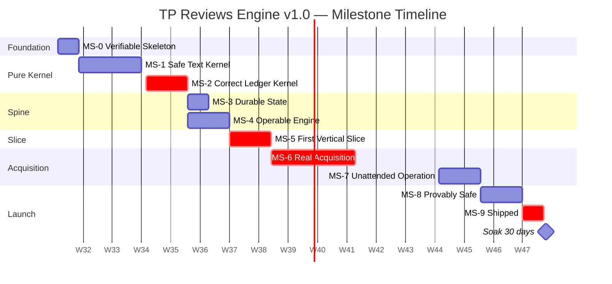
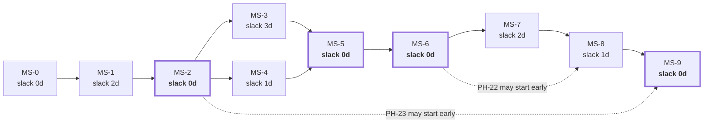
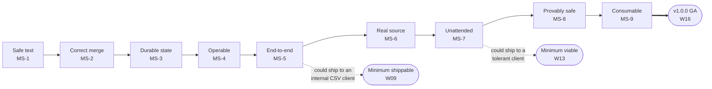

# Part 2 — Milestones, Sprints, Releases, and Delivery Rules

*Sections 6 through 10. Audience: engineering manager, tech lead, and every engineer at sprint planning. Part 1 established the order. This part attaches it to a calendar, to demonstrable increments, and to the rules that keep the increments honest.*

---

# 6. Milestone Strategy

## 6.1 What a Milestone Is Here

A milestone is **not** a date and **not** a set of completed phases. It is a *demonstrable capability* that a person outside the team can watch work, plus a gate that is either green or not.

| Property | Rule |
|---|---|
| Demonstrability | Every milestone from MS-3 onward has a **single command** that demonstrates it. If it cannot be demonstrated in one command, it is not a milestone |
| Independence | A milestone's demo must not require a component from a later milestone, not even a stub |
| Testability | A milestone's demo path is covered by an automated test that runs in `ci.yml` |
| Reversibility | A milestone can be reverted by reverting its merge commits, without touching earlier milestones |
| Gate | Every milestone ends at a decision gate (DG) with a named chair and a written go/no-go |

## 6.2 The Nine Milestones

| MS | Name | Phases | Weeks | The One-Command Demo | Gate |
|---|---|---|---|---|---|
| **MS-0** | **Verifiable Skeleton** | PH-00 | W01 | `npm ci && npm run verify` — lint, types, format, one trivial test, all green in CI on a no-op PR | DG-01 |
| **MS-1** | **Safe Text Kernel** | PH-01…PH-04 | W02–W05 | `npm test -- tests/property tests/unit/core` — PT-05, PT-06, PT-09, PT-10, PT-11 green at 1,000 cases | DG-02 |
| **MS-2** | **Correct Ledger Kernel** | PH-05, PH-06 | W04–W05 | `npm test -- tests/property tests/unit/core/gate` — PT-01…PT-04, **PT-07**, PT-12…PT-14 green; gate at 100% coverage | **DG-03** |
| **MS-3** | **Durable State** | PH-07, PH-08 | W06–W07 | `npm test -- tests/integration/state.roundtrip` — a ledger written, read, and re-serialised byte-identically, unknown fields preserved | DG-04 |
| **MS-4** | **Operable Engine** | PH-09, PH-10 | W06–W07 | `tpre doctor && tpre validate-config --explain --client _example && tpre plan` — three commands, zero network, zero side effects | DG-05 |
| **MS-5** | **First Vertical Slice** | PH-11…PH-13 | W08–W09 | `tpre harvest --client _fixture-csv --publisher filesystem` — a CSV file becomes a schema-valid payload on disk, through all eleven stages | **DG-06** |
| **MS-6** | **Real Acquisition** | PH-14…PH-17 | W10–W13 | `npm run fixtures:serve & tpre harvest --client _fixture-dom` — a real Chromium drives real markup on localhost to a payload on disk | DG-07 |
| **MS-7** | **Unattended Operation** | PH-18, PH-19 | W12–W13 | A manually dispatched `harvest.yml` run produces a commit on the `data` branch | **DG-08** |
| **MS-8** | **Provably Safe** | PH-20…PH-22 | W14–W15 | `npm test -- tests/chaos tests/contract` — CH-01…CH-14 and the contract suite × 4 adapters, all green | **DG-09** |
| **MS-9** | **Shipped** | PH-23…PH-25 | W16 | A public HTTPS payload URL rendering on a real web page, with a network waterfall showing zero third-party requests | **DG-10 / DG-11** |

**Bolded gates are hard stops.** DG-03, DG-06, DG-08, DG-09, DG-10 cannot be passed conditionally; the others may pass with recorded, dated follow-up actions.

## 6.3 Milestone Timeline

## 6.4 Milestone Detail

### MS-0 · Verifiable Skeleton

| Field | Value |
|---|---|
| **Capability delivered** | Every future commit is automatically checked for lint, format, types, tests, architecture rules, and workflow security |
| **Phases** | PH-00 |
| **Effort** | 62 IEH |
| **Entry criteria** | Repository exists; OPQ-04 answered |
| **Exit criteria** | A no-op PR runs `ci.yml` end to end in < 5 min and is green; a deliberately broken commit is *rejected* by each of the six gate groups (proved by six throwaway branches) |
| **Demo** | `npm ci && npm run verify` locally; CI green on PR #1 |
| **Rollback** | Delete the repository and restart. Cost: 62 IEH, no downstream impact |
| **Gate** | DG-01 — chaired by DevOps |
| **Manager note** | The "prove each gate rejects" exit criterion costs ~4 IEH and is the only evidence that the gates work. A gate nobody has seen fail is a gate that may be misconfigured |

### MS-1 · Safe Text Kernel

| Field | Value |
|---|---|
| **Capability delivered** | Hostile text becomes safe text, deterministically; dates, languages, and identities are derived correctly |
| **Phases** | PH-01, PH-02, PH-03, PH-04 |
| **Effort** | 146 IEH |
| **Entry criteria** | MS-0 green |
| **Exit criteria** | PT-05, PT-06, PT-09, PT-10, PT-11 pass at ≥ 1,000 cases; `core/normalize/` ≥ 95% coverage; `security.xss-fixture` green against fixture 019; adversarial string corpus green; DR-1 and DR-2 architecture tests green |
| **Demo** | `npm test -- tests/property tests/unit/core` |
| **Rollback** | Revert to MS-0. Nothing outside `core/` and `tests/` exists yet |
| **Gate** | DG-02 — chaired by Architect |
| **Risk carried** | The eight-step normalisation order is normative (EDR-019). A reordering that passes tests still violates the spec; review must check order, not just output |

### MS-2 · Correct Ledger Kernel

| Field | Value |
|---|---|
| **Capability delivered** | Observations merge into durable state without ever deleting on absence; payloads project deterministically; the gate refuses bad ones |
| **Phases** | PH-05, PH-06 |
| **Effort** | 86 IEH |
| **Entry criteria** | MS-1 green. **No exceptions** — a reconciler built on an unproven normalizer is untrustworthy |
| **Exit criteria** | PT-01, PT-02, PT-03, PT-04, **PT-07**, PT-12, PT-13, PT-14, PT-15 pass at ≥ 1,000 cases; `core/gate/` at **100% statement coverage**; every G-01…G-12 rule has both a rejects-when-it-should and a does-not-reject-spuriously test |
| **Demo** | `npm run test:coverage -- src/core/gate` showing 100%, plus the property run |
| **Rollback** | Revert PH-05 and PH-06 merges; MS-1 remains standing and useful |
| **Gate** | **DG-03 — hard stop.** Chaired by Architect, attended by EM and QA |
| **Stop condition** | If PT-07 cannot be made to pass, halt forward motion (§5.7). Do not proceed to MS-3 with a failing or skipped PT-07 under any schedule pressure |

### MS-3 · Durable State

| Field | Value |
|---|---|
| **Capability delivered** | State survives the process; writes are atomic; unknown fields are preserved |
| **Phases** | PH-07, PH-08 |
| **Effort** | 72 IEH |
| **Entry criteria** | MS-2 green |
| **Exit criteria** | State round-trip integration test green; `infra/logger/redact.mjs` at **100% coverage** with sentinel secrets at every level; `fs-atomic` proven by a crash-injection test (temp file left, target untouched); retry policy returns `never` for every `ERR-BLOCKED-*` |
| **Demo** | `npm test -- tests/integration/state.roundtrip tests/security/redaction` |
| **Rollback** | Revert PH-08; PH-07's ports remain (they are interfaces and cost nothing to keep) |
| **Gate** | DG-04 — chaired by Backend Lead |

### MS-4 · Operable Engine

| Field | Value |
|---|---|
| **Capability delivered** | A human can inspect, explain, and plan the system's behaviour without running it |
| **Phases** | PH-09, PH-10 |
| **Effort** | 66 IEH |
| **Entry criteria** | MS-3 green |
| **Exit criteria** | Six-layer precedence matrix tests green (one test per adjacent layer pair, plus one full-stack test); ceiling breach produces a validation **error** not a clamp; unknown `TPRE_*` exits 2 naming the variable and the nearest match; `defaults.mjs` ↔ schema correspondence test green; `tpre doctor`, `plan`, `validate-config`, `project` all runnable |
| **Demo** | The three-command sequence in §6.2 |
| **Rollback** | Revert PH-10; PH-09's loader is still reachable from tests |
| **Gate** | DG-05 — chaired by Backend Lead |

### MS-5 · First Vertical Slice

| Field | Value |
|---|---|
| **Capability delivered** | **The entire eleven-stage pipeline runs, end to end, for a real adapter, producing a schema-valid payload** |
| **Phases** | PH-11, PH-12, PH-13 |
| **Effort** | 92 IEH |
| **Entry criteria** | MS-4 green |
| **Exit criteria** | Contract suite passes against `file:csv`; all twenty golden fixtures pass against their pinned pack version; a CSV harvest produces a payload that validates against `payload.v1.schema.json`; hash-gating verified (two identical runs, zero writes on the second) |
| **Demo** | `tpre harvest --client _fixture-csv --publisher filesystem` |
| **Rollback** | Revert PH-11; the pipeline reverts to being test-only. MS-4 stands |
| **Gate** | **DG-06 — hard stop.** Chaired by Architect and EM |
| **Why it is a hard stop** | This is the last moment at which the `AcquisitionPort` can be changed cheaply. After PH-14, changing it costs browser rework. DG-06 exists to ask one question: *does this interface look right to someone who has now implemented it once?* |

### MS-6 · Real Acquisition

| Field | Value |
|---|---|
| **Capability delivered** | A real browser drives real markup through the proven pipeline |
| **Phases** | PH-14, PH-15, PH-16, PH-17 |
| **Effort** | 154 IEH |
| **Entry criteria** | MS-5 green; fixture corpus complete |
| **Exit criteria** | Full pipeline integration test against the local fixture server green; pagination-stall test yields `stopReason: stalled`, `completeness: partial`, and a gate rejection; context-isolation test green **including a failing target**; challenge detection terminal with zero retry paths (enumerating test); `playwright` imported by exactly one file (DR-3) |
| **Demo** | `npm run fixtures:serve` + `tpre harvest --client _fixture-dom` |
| **Rollback** | Revert PH-16 and PH-15; PH-14's browser port remains, unused. MS-5's CSV path still works and could ship |
| **Gate** | DG-07 — chaired by Backend Lead, attended by Security |

### MS-7 · Unattended Operation

| Field | Value |
|---|---|
| **Capability delivered** | The system runs itself on a schedule and commits results |
| **Phases** | PH-18, PH-19 |
| **Effort** | 62 IEH |
| **Entry criteria** | MS-6 green; `data` and `state` branches exist |
| **Exit criteria** | A dispatched `harvest.yml` produces a `data` commit; rebase-retry proven by a simulated conflict (CH-11); hash-gating proven in CI (second run, zero commits); shard matrix emitted by a job not hard-coded (EDR-029); every workflow has an explicit `permissions:` block; all third-party actions SHA-pinned |
| **Demo** | Workflow run URL + the resulting `data` commit |
| **Rollback** | Disable the schedule; revert PH-19. Local harvest still works |
| **Gate** | **DG-08 — hard stop.** Chaired by DevOps and Security |
| **Why it is a hard stop** | This is the first time the system holds a write token and touches a live source. Both are irreversible categories of mistake |

### MS-8 · Provably Safe

| Field | Value |
|---|---|
| **Capability delivered** | Every failure mode is injected, observed, and proven not to reach a visitor |
| **Phases** | PH-20, PH-21, PH-22 |
| **Effort** | 110 IEH |
| **Entry criteria** | MS-7 green |
| **Exit criteria** | CH-01…CH-14 all green; contract suite green against **all four** adapters; PT-08 cross-adapter identity green; alert lifecycle integration test green (open → comment → close, deduped by fingerprint); health records written and readable |
| **Demo** | `npm test -- tests/chaos tests/contract` |
| **Rollback** | PH-22 is independently revertible (two adapters); PH-21 is tests only and never reverts; PH-20 reverts to console logging |
| **Gate** | **DG-09 — hard stop.** Chaired by QA and Architect |

### MS-9 · Shipped

| Field | Value |
|---|---|
| **Capability delivered** | A client website displays real reviews from a CDN, contacting no third party |
| **Phases** | PH-23, PH-24, PH-25 |
| **Effort** | 120 IEH incl. hardening |
| **Entry criteria** | MS-8 green; authorisation record merged; Pages headers verified (OIQ-04); offsite clone exists (TR-CI-161) |
| **Exit criteria** | §63 deployment-readiness, §64 release-candidate, and §65 production checklists all complete; the TRD's §100 hundred-item checklist complete with all ten non-waivable items green; payload reachable, schema-valid, non-empty over HTTPS; network waterfall shows zero third-party origins |
| **Demo** | The live page + the waterfall screenshot |
| **Rollback** | §67, in full |
| **Gate** | **DG-10 (release candidate) and DG-11 (production go-live)** |

## 6.5 Milestone Dependency and Slack

The four zero-slack milestones are the critical path (§Part 15). The two dashed edges are the plan's designed pressure valves: PH-22 (API adapters) and PH-23 (frontend) have unusually early dependency satisfaction and can be pulled forward if a sprint finishes light, or pushed to post-GA if a sprint runs heavy — with PH-22 being the one that must **not** be pushed past GA, because INV-10's migration guarantee is a compliance argument, not a feature.

---

# 7. Sprint Strategy

## 7.1 Sprint Shape

| Property | Value |
|---|---|
| Length | 2 weeks (SP-0 and SP-8 are 1 week) |
| Committed capacity | 120 IEH (≈ 88% of 137 raw); 60 IEH in the one-week sprints |
| Ceremony budget | ≤ 4 hours per sprint per person, total |
| Planning | 90 min, first Monday |
| Daily stand-up | 10 min, asynchronous written by default; synchronous only in SP-5 |
| Mid-sprint checkpoint | 30 min, end of week 1 — the only purpose is *is the sprint goal still achievable* |
| Review / demo | 45 min, second Friday — **the milestone demo command is run live** |
| Retrospective | 30 min, second Friday |
| Gate | Held immediately after review when a milestone closes in that sprint |

**The ceremony budget is deliberately small.** With 2.3 FTE, every hour of ceremony is 0.4% of sprint capacity. The demo is the ceremony that earns its cost, because running the command live is the only thing that reliably distinguishes "done" from "believed done".

## 7.2 Sprint Plan

| Sprint | Weeks | Goal (one sentence) | Phases | IEH | Milestone Closed |
|---|---|---|---|---|---|
| **SP-0** | W01 | Every commit from now on is automatically checked. | PH-00 | 62 | MS-0 |
| **SP-1** | W02–W03 | Hostile text becomes safe text, provably. | PH-01, PH-02, PH-03 | 120 | — |
| **SP-2** | W04–W05 | Absence never deletes, and nothing bad can be published. | PH-04, PH-05, PH-06 | 112 | MS-1, MS-2 |
| **SP-3** | W06–W07 | The kernel gets a way in, a way out, and a human interface. | PH-07, PH-08, PH-09, PH-10 | 138 | MS-3, MS-4 |
| **SP-4** | W08–W09 | A file becomes a payload, through every stage. | PH-11, PH-12, PH-13 | 92 | MS-5 |
| **SP-5** | W10–W11 | A browser drives real markup into the proven pipeline. | PH-14, PH-15, PH-16 | 114 | — |
| **SP-6** | W12–W13 | The system runs itself and commits the result. | PH-17, PH-18, PH-19 | 102 | MS-6, MS-7 |
| **SP-7** | W14–W15 | Every failure mode is injected and proven safe. | PH-20, PH-21, PH-22 | 110 | MS-8 |
| **SP-8** | W16 | A real client's reviews render on a real website. | PH-23, PH-24, PH-25, hardening | 120 | MS-9 |

**Note on SP-3's 138 IEH.** It exceeds both the 120 committed capacity and the 137 raw capacity. This is intentional and is the plan's single most likely overrun: PH-07 through PH-10 are four phases of moderate, highly parallel, low-risk work, and SP-3 is where the second engineer and the agents produce their highest throughput (the D1–D2 share is ~60%). If the agent multiplier assumption (PA-04) is falsified in SP-1, **SP-3 is where the plan breaks**, and DG-03 is the gate at which that is caught. The contingency is to move PH-10's five non-essential commands (`replay`, `export`, `canary`, `resolve`, and the `--migrate` flag) into SP-8 hardening — a pre-identified 22 IEH of cuttable scope.

## 7.3 Sprint Goals Are Single Sentences, By Rule

A sprint goal that needs a bulleted list is two sprints. The one-sentence goals above are the commitment; the phase list is the plan for meeting it. If the sentence can still be truthfully said at the review, the sprint succeeded even if a task slipped.

## 7.4 Sprint Entry Checklist

Run at planning. All must be true before the sprint is committed.

| # | Check |
|---|---|
| 1 | The previous sprint's milestone gate is closed, or its follow-ups are dated and owned |
| 2 | Every task in the sprint has an owner (human or a named agent workflow) |
| 3 | Every P0 task's dependencies are complete, not "nearly" |
| 4 | The sprint's demo command is written down **before** the sprint starts |
| 5 | Total committed IEH ≤ 120, or the overage is explicitly accepted with a named cut list |
| 6 | Every D4/D5 task has a second reviewer named at planning, not at review time |
| 7 | Any external artifact needed this sprint (§4.4) is in hand |

## 7.5 Sprint Exit Checklist

| # | Check |
|---|---|
| 1 | The demo command runs live, from a clean checkout, at the review |
| 2 | `main` is green |
| 3 | Every completed task meets §2.3's eight conditions |
| 4 | Incomplete tasks are moved with a recorded reason (not silently re-estimated) |
| 5 | Any defect found this sprint has a permanent test (X-9) |
| 6 | The risk register is re-scored — not merely re-read |
| 7 | Actual vs estimated IEH is recorded per task, feeding §7.7 |

## 7.6 SP-5 Gets Special Handling

SP-5 is the only sprint where two engineers work inside one subsystem (browser + navigator + DOM adapter). Additional rules apply for that sprint only:

| Rule | Detail |
|---|---|
| Synchronous stand-up | 15 minutes, daily, video. Written stand-ups do not surface interface disagreements fast enough |
| Interface freeze | The `BrowserPort` and `NavigatorResult` shapes are agreed and merged **on day 1** of the sprint, before either engineer writes behaviour |
| Integration cadence | Both tracks merge to `main` at least daily. A branch older than 24 hours in this sprint is escalated |
| Fixture-first | Every navigation behaviour is demonstrated against the fixture server before it is attempted against the live source |
| Live contact | **Exactly one** engineer performs live-source contact, from one machine, with the rate limiter active. Two people independently testing against the live source is how a source-side rate limit is discovered the expensive way |

## 7.7 Estimation Calibration Loop

| Sprint | What Is Measured | What Is Adjusted |
|---|---|---|
| SP-0 | Actual vs estimated on 46 D1–D2 tasks | The D1/D2 hour baseline and the agent multiplier (PA-04) |
| SP-1 | Actual vs estimated on the first D4 module (PH-02) | The D4 multiplier and the ±70% confidence band |
| SP-2 | Actual vs estimated on the first D5 module (PH-05) | Whether the 9% reserve is sufficient; input to DG-03 |
| SP-4 | Integration surprises per phase | Whether MS-6's 154 IEH is credible |

**Calibration is published, not private.** The estimate-vs-actual table is part of the sprint review, and the plan's dates are re-baselined at DG-03 and DG-06 using measured velocity rather than the assumed one. Re-baselining twice, early, with data, is cheaper than defending the original dates until week 14.

---

# 8. Release Strategy

## 8.1 What Gets Released

TRD §64.1 establishes that "deployment" is three independent things. The release strategy inherits that split exactly.

| Releasable | Versioned By | Cadence During Build | Cadence After GA |
|---|---|---|---|
| **Engine** | SemVer tag `vX.Y.Z` on `main` | Per milestone (pre-release tags) | Per change, batched weekly |
| **Configuration** (`clients/`, `profiles/`) | Git commit only | Continuous | Per client change |
| **Selector packs** | `v<n>.json`, immutable | Per authoring session | On upstream change |
| **Payload schema** | `schema_version` integer | Frozen at `1` for v1.0 | Only with a parallel-publish plan |
| **Renderer** | Bundled with engine version | Per milestone | Per change |

## 8.2 Version Plan

| Version | When | Contains | Audience |
|---|---|---|---|
| `v0.1.0-alpha` | End of SP-2 (MS-2) | Pure kernel only. No I/O | Internal — proves the kernel |
| `v0.2.0-alpha` | End of SP-3 (MS-4) | + state, config, CLI | Internal |
| `v0.3.0-beta` | End of SP-4 (MS-5) | + CSV adapter; full pipeline offline | Internal — **the first tag anyone could actually run** |
| `v0.4.0-beta` | End of SP-6 (MS-7) | + browser, DOM adapter, orchestrator, CI harvest | Internal — first unattended runs |
| `v0.9.0-rc.1` | End of SP-7 (MS-8) | + observability, chaos-verified, four adapters | Internal RC |
| `v0.9.x-rc.n` | SP-8 as needed | Hardening fixes only | Internal RC |
| **`v1.0.0`** | End of SP-8 (MS-9) | GA | First client |
| `v1.0.x` | Post-GA | Soak fixes, no behaviour change | First client |
| `v1.1.0` | Post-soak | §70 V2-prep items with a v1.1 tag | Internal |

| ID | Requirement |
|---|---|
| REL-01 | Pre-release tags MUST be created even though nothing consumes them. They are how "the state of the world at MS-n" stays reproducible during an incident six months later. |
| REL-02 | `v1.0.0` MUST NOT be tagged until every item in §64 and §65 is complete, including the ten non-waivable items in TRD §100.10. |
| REL-03 | No release, including alphas, MAY be tagged from a red `main`. |

## 8.3 Release Mechanics

Unchanged from TRD §62.8 and §64.3. Restated here as an execution sequence with owners and durations.

| # | Step | Owner | Duration | Blocking |
|---|---|---|---|---|
| 1 | Confirm §65.1 pre-release checklist (10 items) | Engineer | 30 min | ✅ |
| 2 | Update `CHANGELOG.md`; breaking changes called out | Engineer | 15 min | ✅ |
| 3 | Merge to `main`; CI green | Engineer | 10 min | ✅ |
| 4 | Tag `vX.Y.Z`; `release.yml` re-runs the **full** suite at the tag | Automated | 5 min | ✅ |
| 5 | Review generated release notes | EM | 10 min | ✅ |
| 6 | **Dispatch a canary run manually; assertions must pass** | DevOps | 10 min | ✅ (TR-CI-170) |
| 7 | **Dispatch a harvest for one low-risk client; count and rating sane** | DevOps | 10 min | ✅ (TR-CI-170) |
| 8 | Verify the payload over the public CDN URL | DevOps | 5 min | ✅ |
| 9 | Let scheduled runs proceed | — | — | — |
| 10 | Post-release verification after the first full cycle (§66) | DevOps | 20 min | ✅ |

**Total human time per release: ~2 hours.** Steps 6 and 7 are the ones that will be proposed for skipping. TR-CI-170 forbids it, and this plan restates the reason: the engine is *adopted* by the next scheduled run rather than deployed, so a bad release reaches every client simultaneously at the next cycle. Ten minutes of staged rollout is the entire defence.

## 8.4 Release Cadence Rules

| Rule | Statement |
|---|---|
| REL-04 | No release on a Friday afternoon or the day before a team absence. The engine is adopted by the *next scheduled run*, which may be at 03:00 |
| REL-05 | No more than one engine release per 24 hours during the soak. Two releases in one cycle make attribution impossible |
| REL-06 | A selector pack change is **not** an engine release. It is a config commit and follows §8.5 |
| REL-07 | A release that changes `schema_version` requires a parallel-publish plan signed by the Architect, and is out of scope for v1.0.x by rule |

## 8.5 Selector Pack Release (The Highest-Frequency Change)

| Stage | Action | Blast Radius | Rollback |
|---|---|---|---|
| 1 | Author `v<n+1>.json`; never edit `v<n>` (TR-SEL-001) | Zero | — |
| 2 | Add a fixture captured from the changed markup | Zero | — |
| 3 | Merge; regression suite runs both packs | Zero | Revert merge |
| 4 | Pin `v<n+1>` in `profiles/conservative.json` | Clients on `conservative` only | One line |
| 5 | Observe one full cycle; strategy-health index unchanged | — | One line |
| 6 | Pin `v<n+1>` in `profiles/default.json` | All clients | **One line, instantly** |

**This six-step sequence is the payoff of the entire selector-pack design** and should be exercised once during SP-7 as a drill, on a pack that changes nothing, so that the team has done it before the day it matters.

---

# 9. Feature Delivery Strategy

## 9.1 There Are No "Features" — There Are Capabilities

The product surface is one CLI and one JSON contract. Framing work as features invites parallel feature branches, which this codebase's dependency structure punishes. Work is framed as **capabilities**, each of which is a milestone's demo.

| Anti-pattern | Why It Fails Here | What To Do Instead |
|---|---|---|
| "Feature branch for multi-location support" | Multi-location is a config shape, not a feature; it touches registry, projector, and paths simultaneously | Deliver it as part of the registry and path tasks, with `_example-multilocation.config.json` as the test |
| "Feature flag for the new gate rules" | The gate is 100%-covered and evaluated in full (EDR-023); a flag creates an untested combination | Threshold changes are config values with defaults, per EP-05 |
| "Feature branch for the Places API adapter" | Adapters are independent by construction (DR-3); a long-lived branch adds merge risk for no isolation benefit | Trunk-based, behind the adapter registry in the composition root |

## 9.2 Trunk-Based Development

| Rule | Statement |
|---|---|
| FD-01 | All work happens on short-lived branches off `main`, merged within **48 hours** |
| FD-02 | A branch older than 72 hours is escalated at stand-up. In SP-5, the threshold is 24 hours |
| FD-03 | `main` is protected: review required, CI required, no force-push, linear history preferred |
| FD-04 | Incomplete work merges to `main` only if it is **unreachable** — not exported from a package index, not registered in the composition root, not referenced by a command |
| FD-05 | Feature flags are configuration keys with code defaults (EDR-037), never runtime toggles, and never used to hide half-built code |

**FD-04 is how a large phase lands incrementally without a long-lived branch.** `core/reconcile/decide.mjs` can merge on day 3 of PH-05 with full unit tests while `core/reconcile/index.mjs` does not yet export it. Nothing calls it; CI still checks it; the diff stays reviewable.

## 9.3 Capability Delivery Sequence

**Two earlier shipping points exist and are recorded deliberately.** If external pressure demands something in production before W16, the honest answers are: a CSV-fed client at W09, or a DOM client without chaos verification at W13. Both are *worse products*, and both are stated so that the conversation is about which risk is accepted rather than about whether the team can "go faster".

## 9.4 What Is Explicitly Not Delivered in v1.0

Restated from TRD A-10 and §76–§91 so that no task in this plan silently expands.

| Not Built | Seam That Exists Instead | Section |
|---|---|---|
| REST / GraphQL API | `PublisherPort` and the payload contract | §51 |
| Dashboard, admin panel, client portal | Health JSONL + run manifests are the data source | §51 |
| AI enrichment | `app/enrich/` dispatcher with a `noop` implementation | §53 |
| Facebook / JustDial / Trustpilot adapters | `AcquisitionPort` + the contract suite | §52 |
| Database, Redis, Docker, Kubernetes, multi-region | `StatePort`, path templates in one module | §51 |
| Webhooks | `NotifierPort` with a `webhook` implementation already present | §51 |

## 9.5 Pre-Identified Cut List

If the schedule must absorb a slip, cut in this order. **Nothing above the line may be cut.**

| Order | Cuttable Item | IEH Recovered | Cost of Cutting |
|---|---|---|---|
| 1 | `tpre replay` command | 8 | Reproducing a production failure needs a manual fixture capture |
| 2 | `tpre export` command | 6 | FR-093 data export becomes a manual `git` operation |
| 3 | `google:places-api` adapter | 18 | Only one API adapter proves cross-adapter identity; PT-08 still passes with two adapters total |
| 4 | Three of five integration recipes (keep static-html + react) | 10 | Next.js/Astro/Vue clients need bespoke help |
| 5 | `dependency-audit.yml` (run manually weekly instead) | 5 | A human must remember |
| 6 | `_example-multilocation.config.json` and its tests | 6 | Multi-location onboarding is unproven until the second client |
| 7 | Pretty log formatter (`infra/logger/pretty.mjs`) | 5 | Local development reads JSONL |
| — | **↑ total recoverable: 58 IEH ↑** | | |
| — | **═══ THE LINE ═══** | | |
| ✗ | Any chaos scenario | — | CH-04 alone is the reason the system is trustworthy |
| ✗ | Any property law | — | The correctness argument is the property laws |
| ✗ | Gate or redaction coverage | — | 100% is the requirement, not a target |
| ✗ | The CSV adapter | — | The interface becomes unvalidated (X-8) |
| ✗ | Fixture corpus completeness | — | Adversarial fixtures are the point (TRD §61.5.2) |
| ✗ | The staged release steps 6–7 | — | TR-CI-170 |
| ✗ | Offsite clone, Pages header verification | — | TR-CI-160, TR-CI-161 |

**Manager Note.** This list is published at DG-01, before anyone is under pressure. Cut lists written during a crunch always cut testing, because testing is the only thing that looks optional from the outside.

---

# 10. Incremental Development Rules

## 10.1 The Sixteen Rules

| # | Rule | Rationale | Enforcement |
|---|---|---|---|
| **ID-01** | **Never write a module before every module it imports is complete and tested.** | EP-01 | Task dependencies; review |
| **ID-02** | **Every commit compiles, type-checks, lints, and passes the full default suite.** | `main` is always releasable (X-3) | Pre-push hook + CI |
| **ID-03** | **A PR changes one module, or one cohesive concern, and is under ~400 lines of diff.** | Reviewability is the binding constraint on defect detection | Review; PR template |
| **ID-04** | **Code and its tests land together.** | X-5 | PR template |
| **ID-05** | **Merge at least daily.** | FD-02 | Stand-up |
| **ID-06** | **Unreachable code may merge; unfinished reachable code may not.** | FD-04 | Review |
| **ID-07** | **No stubs in `main` that return plausible fake data.** A stub returns `Result.err(ERR-INTERNAL-INVARIANT)` or does not exist. | A stub returning `[]` is indistinguishable from a wiped payload — the exact defect class TRD §67.3 prohibits | Lint + review |
| **ID-08** | **No TODO without an issue reference.** | TRD §67.3 | Lint |
| **ID-09** | **Refactor and behaviour change are separate commits.** | A diff mixing both is unreviewable, and the behaviour change hides in the noise | Review |
| **ID-10** | **When a requirement and a test disagree, stop and escalate.** Never amend the test to match the code. | TRD A-8 | Review; stand-up escalation |
| **ID-11** | **Every defect found gets a test in the same PR as the fix.** | X-9 | PR template |
| **ID-12** | **Never widen a hard ceiling to make a test pass.** | TRD A-3 | Review; ceilings are compile-time constants |
| **ID-13** | **Property tests are written before or with the implementation of a D4/D5 module — never after.** | A property test written after the fact tends to encode the implementation's behaviour rather than the law | Task ordering in PH-02, PH-05, PH-06 |
| **ID-14** | **Every phase ends with the repository in a demonstrable state.** | Milestones must be demonstrable; phases feed them | Phase exit criteria |
| **ID-15** | **No new production dependency without a merged DEP-1 justification.** | X-6 | Dependency-graph test; review |
| **ID-16** | **Delete dead code immediately.** Version control is the archive. | TRD §67.3 | Review |

## 10.2 Commit Discipline

| Aspect | Rule |
|---|---|
| Format | Conventional Commits (`feat:`, `fix:`, `test:`, `refactor:`, `chore:`, `docs:`, `ci:`) — required, because `release.yml` generates notes from them |
| Scope | The module: `feat(core/reconcile): ...` |
| Body | For any D3+ change: which TRD section, which invariant, and what was verified |
| Footer | `Refs: TR-REC-014, INV-03` — identifiers, not prose |
| Size | One logical change. A commit that needs "and" in its subject is two commits |
| Frequency | At least once per working session; agents commit per task (Part 16) |

## 10.3 Pull Request Discipline

| Aspect | Rule |
|---|---|
| Size | ≤ ~400 lines of diff, excluding fixtures and generated files |
| Lifetime | ≤ 48 hours from open to merge (≤ 24 h in SP-5) |
| Reviewers | 1 for D1–D3; **2 for D4–D5**, one of whom must not have written any part of the module |
| Required in the description | TRD sections implemented; invariants touched; "which test would have caught this bug?" for any fix |
| Blocking checks | All 14 `ci.yml` gate groups |
| Self-merge | Permitted for D1 documentation-only changes; forbidden otherwise |

## 10.4 The Incremental Rule That Is Most Often Broken

**ID-07 (no plausible stubs).** In a system whose worst failure mode is "returns an empty list and everything looks fine", a stub that returns `[]` during development is the same shape as the production defect that wipes a client's reviews. During PH-13 and PH-16, where field extractors are built one at a time, the temptation to return `[]` from an unimplemented extractor is constant.

The required pattern: an unimplemented unit returns a `Result` error of `ERR-INTERNAL-INVARIANT`, which the target runner classifies as `critical` and which no test can accidentally pass. It is louder than an exception and it cannot be mistaken for success.

## 10.5 Handling Discovered Work

| Discovery | Response |
|---|---|
| A missing task inside the current phase | Add it with an ID from that phase's reserved block; log it; no PCR |
| A missing task in a later phase | Add it to that phase; log it; no PCR |
| A missing **phase** | PCR. This means the build order is incomplete, which is an Architect concern |
| A specification gap | Stop, raise an EDR against the TRD. Do not invent (TRD A-8) |
| An invariant that appears unimplementable | Stop, escalate to the next DG immediately. Do not "temporarily" relax it |
| A dependency that must be added | DEP-1 justification PR first, merged, then the task proceeds |

---

*End of Part 2. Part 3 specifies repository initialisation, Git configuration, branch and folder creation order, dependency installation, and the complete development environment setup.*
