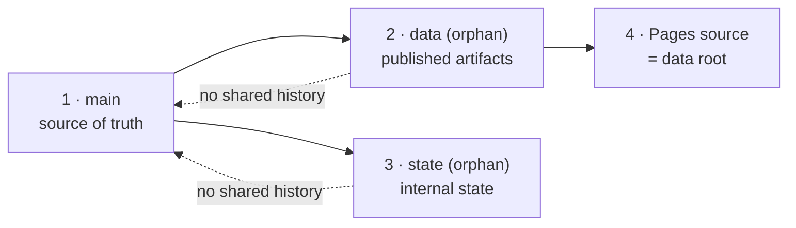

# Part 3 — Repository, Toolchain, and Development Environment

*Sections 11 through 23. Audience: DevOps and the engineer who runs `git init`. This entire part is phase **PH-00**, sprint **SP-0**, milestone **MS-0** — one week, 62 IEH, 46 tasks, and no product code at all. It is the highest leverage week in the project, because every check installed here is applied to every commit that follows and every check omitted here is a manual review obligation for sixteen weeks.*

---

## Standard Phase Block

Every phase section in Parts 3 through 10 uses this fourteen-field structure. It is defined once here and not repeated.

| Field | What It Means |
|---|---|
| **Purpose** | The single sentence answering *why this exists in the build order at this point* |
| **Objectives** | The enumerated outcomes. Each maps to at least one task |
| **Dependencies** | Phases, artifacts, and external items that must be complete first |
| **Estimated Complexity** | Difficulty band (D1–D5) with the reason |
| **Estimated Time** | Ideal engineer-hours, with agent multiplier already applied |
| **Risks** | Named, with the mitigation and the plan-risk ID where one exists |
| **Expected Deliverables** | `DEL-nn` artifacts that must exist at the end |
| **Acceptance Criteria** | What makes the *work* correct |
| **Exit Criteria** | What makes the *phase* closeable — always a superset of acceptance, always mechanically checkable |
| **Rollback Strategy** | How to undo this phase without unwinding earlier ones |
| **Verification Checklist** | Executed by someone other than the implementer |
| **Testing Checklist** | The specific tests this phase must add |
| **Documentation Required** | Documents that must be merged before the phase closes |
| **Future Improvements** | Deliberately deferred work, with the version it belongs to |

---

# 11. Repository Initialization Plan

| Field | Value |
|---|---|
| **Purpose** | Create the single repository that holds engine, configuration, published data, and internal state, structured so that the three orphan-branch stores can never be confused with source. |
| **Objectives** | (1) Repository created with the correct visibility. (2) `main` protected. (3) Root files present and correct. (4) Governance files present. (5) A no-op PR proves the protection rules work. |
| **Dependencies** | OPQ-04 answered (public vs private); GitHub organisation access; DevOps availability |
| **Estimated Complexity** | **D2.** No design decisions; several irreversible-ish settings |
| **Estimated Time** | 6 IEH |
| **Risks** | Wrong visibility chosen (a private repo consumes paid minutes; a public repo makes every future secret leak permanent — CON-17 already assumes public). Branch protection configured after the first merges, leaving unprotected history |
| **Deliverables** | DEL-01 repository · DEL-02 protected `main` · DEL-03 root file set · DEL-04 governance file set |

## 11.1 Initialization Sequence

Strictly ordered. Steps 3 and 4 must precede any product commit.

| # | Step | Command / Action | Verification |
|---|---|---|---|
| 1 | Decide visibility (OPQ-04: **public**) | GitHub UI | Repo page shows Public |
| 2 | Create `tp-reviews-engine`, no auto-README | GitHub UI | Empty repo |
| 3 | Local `git init`, set `main` as the initial branch | `git init -b main` | `git branch --show-current` → `main` |
| 4 | Commit the root file set (§11.2) as commit #1 | — | `git log` shows one commit |
| 5 | Push `main`; enable branch protection **before** commit #2 | GitHub settings | A direct push to `main` is rejected |
| 6 | Enable Actions; disable Actions on forks writing to the repo | Settings → Actions | Confirmed |
| 7 | Set Actions default permissions to **read-only** | Settings → Actions → Workflow permissions | Confirmed; workflows declare their own (TR-CI-001) |
| 8 | Add `CODEOWNERS` requiring review for `src/core/`, `schemas/`, `selectors/`, `compliance/` (TR-CI-005) | File | A PR touching `src/core/` requests the owner |
| 9 | Create the three issue templates and the PR template | Files | Visible in the UI |
| 10 | Enable secret scanning and push protection | Settings → Security | Confirmed |
| 11 | Enable Dependabot with `dependabot.yml` | File | First PR appears within a week |
| 12 | Create the **offsite clone** (TR-CI-161) | `git clone --mirror` to a second account/host | Clone contains `main` |

**Sequencing Note on step 5.** Branch protection must exist before the second commit, not before the first — commit #1 has to be pushed to create the branch that gets protected. Protecting after five merges leaves five commits that bypassed review, and in a repository whose reviewers include the CODEOWNERS rule for `src/core/`, that is the exact history nobody audits later.

## 11.2 Root File Set — Creation Order

| # | File | Contents Source | Why This Order |
|---|---|---|---|
| 1 | `.gitattributes` | TR-BLD-002 — `* text=auto eol=lf` | **First. Before any other file.** A file committed before this rule may carry CRLF permanently |
| 2 | `.gitignore` | TR-BLD-003 — `.state/`, `.publish/`, `.artifacts/`, `node_modules/`, `.env`, Playwright cache | Second, so no artifact is ever staged |
| 3 | `.editorconfig` | LF, UTF-8, final newline | Editors pick it up on first open |
| 4 | `.nvmrc` | Node major pin (TR-BLD-004) | Needed by step 5 of the setup action and by every developer |
| 5 | `README.md` | Project statement + link to `docs/` | — |
| 6 | `LICENSE` | Per TradyPerch policy | — |
| 7 | `SECURITY.md` | Reporting address, response expectation | Public repo obligation |
| 8 | `CODE_OF_CONDUCT.md`, `CONTRIBUTING.md` | Standard; CONTRIBUTING points at §67–§69 | — |
| 9 | `CHANGELOG.md` | `## Unreleased` heading only | `release.yml` verifies an entry exists (TRD §62.8 step 3) |
| 10 | `package.json` | `"type": "module"`, `engines.node`, script names (§15.4) | Must exist before any `npm` command |
| 11 | `.env.example` | Every `TPRE_*` variable, documented, no real values | §23 |

| ID | Requirement |
|---|---|
| INIT-01 | `.gitattributes` MUST be the first file committed. IR-07 (line-ending drift) is a byte-determinism defect that surfaces as fifty-fold commit churn, months later, on a Windows machine. |
| INIT-02 | The repository root MUST contain no source file (TR-BLD-001). A "quick script" at the root is how `scripts/` stops being the place scripts live. |

## 11.3 Acceptance Criteria

| # | Criterion |
|---|---|
| 1 | `git config core.autocrlf` is irrelevant to the result — a clone on Windows and a clone on Linux produce byte-identical working trees |
| 2 | A direct push to `main` is rejected for every team member including the repository owner |
| 3 | A PR touching `src/core/` (even an empty file) requests review from CODEOWNERS |
| 4 | Actions' default token permission is read-only |
| 5 | The offsite mirror exists and is documented in `docs/runbooks/disaster-recovery.md` |

## 11.4 Exit Criteria

| # | Criterion | Evidence |
|---|---|---|
| 1 | All twelve initialization steps complete | Checklist signed by DevOps |
| 2 | All eleven root files present and reviewed | PR #1 merged |
| 3 | Protection rules demonstrated to reject | Screenshot or CLI output of a rejected push |
| 4 | Offsite mirror verified by cloning *from* it | `git clone <mirror>` succeeds |

## 11.5 Rollback Strategy

Delete and recreate. There is no downstream dependency yet. Cost: 6 IEH. The only irreversible element is repository visibility if a secret were committed while private and later made public — which is why §23 forbids any real secret in any file at any time, from the first commit.

## 11.6 Verification Checklist

- [ ] Clone on a second machine; `git ls-files --eol` shows `lf` for every text file
- [ ] Attempt a direct `main` push; confirm rejection
- [ ] Open a throwaway PR touching `src/core/.gitkeep`; confirm CODEOWNERS request
- [ ] Confirm Actions cannot write by default
- [ ] Confirm secret scanning and push protection are on
- [ ] Confirm the mirror is on a different account/host than the primary

## 11.7 Testing Checklist

No automated tests exist yet. The first automated test arrives in §21. The verification above is manual **by necessity and only this once**; every later phase's verification is automated.

## 11.8 Documentation Required

`README.md` root section; `CONTRIBUTING.md` pointing at TRD §67–§69; `docs/runbooks/disaster-recovery.md` stub containing the mirror location.

## 11.9 Future Improvements

| Item | Version | Note |
|---|---|---|
| Repository ruleset instead of legacy branch protection | v1.1 | Cosmetic; equivalent enforcement |
| Automated mirror sync on a schedule | v1.1 | Currently manual per §60 |

---

# 12. Git Configuration Plan

| Field | Value |
|---|---|
| **Purpose** | Make byte-determinism, review discipline, and history hygiene properties of the repository rather than of individual developers' machines. |
| **Objectives** | (1) LF everywhere, enforced. (2) Commit format enforced. (3) History model chosen and applied. (4) Large/binary artifact policy set. (5) Machine-owned branches marked as such. |
| **Dependencies** | §11 complete |
| **Estimated Complexity** | **D2** |
| **Estimated Time** | 4 IEH |
| **Risks** | IR-07 line-ending drift; a developer's global `core.autocrlf=true` silently overriding intent (mitigated: `.gitattributes` wins) |
| **Deliverables** | DEL-05 `.gitattributes` · DEL-06 commit convention doc · DEL-07 branch protection settings record |

## 12.1 Repository-Level Git Settings

| Setting | Value | Reason |
|---|---|---|
| `.gitattributes` text rule | `* text=auto eol=lf` | TR-BLD-002. Byte-determinism underpins hash-gating |
| Binary declarations | `*.png binary`, `*.jpg binary`, `*.woff2 binary` | Diagnostics screenshots must not be line-ending normalised |
| `*.html` in `fixtures/` | `linguist-vendored` | Keeps language stats meaningful; fixtures are data |
| Merge strategy on `main` | Squash merge, linear history | One commit per PR keeps `release.yml`'s Conventional-Commit notes readable |
| Merge strategy on `data` / `state` | **Not applicable** — machine-written, never PR'd | TR-GIT-002 |
| Force-push | Disabled on `main`, `data`, `state` | TR-PUB-003 |
| Delete branch on merge | Enabled | FD-02 hygiene |
| Signed commits | Encouraged, not required for v1.0 | Recorded as a v1.1 item |

## 12.2 Commit Convention

| Element | Rule |
|---|---|
| Type | `feat` `fix` `test` `refactor` `chore` `docs` `ci` `perf` `build` |
| Scope | The module path fragment: `core/reconcile`, `adapters/browser`, `ci` |
| Subject | Imperative, ≤ 72 chars, no trailing period |
| Body | Required for D3+; states the TRD section and what was verified |
| Footer | `Refs:` with `TR-`, `EDR-`, `INV-`, `PT-`, `CH-` identifiers |
| Breaking | `!` after the scope plus a `BREAKING CHANGE:` footer |

Enforced by a `commit-msg` hook (§22) and re-checked in `ci.yml` for the PR title on squash merges.

## 12.3 Branch Naming

| Purpose | Pattern | Example |
|---|---|---|
| Task branch | `t/<task-id>-<slug>` | `t/147-identity-hash` |
| Phase branch (rare; only for a coordinated interface change) | `ph/<phase>-<slug>` | `ph/07-ports` |
| Fix | `fix/<issue>-<slug>` | `fix/212-rating-cascade` |
| Chore | `chore/<slug>` | `chore/bump-playwright` |
| Machine-owned | `data`, `state` | Never created by a human after setup |

**The `t/<task-id>` convention is what makes progress tracking automatic** (Part 15): a merged branch name maps a commit to a task without anyone updating a spreadsheet.

## 12.4 Acceptance / Exit Criteria

| # | Criterion |
|---|---|
| 1 | `git ls-files --eol` reports `lf` for 100% of text files, on Windows and Linux clones |
| 2 | A commit with a malformed message is rejected locally by the hook and by CI |
| 3 | `main` history is linear after three merged PRs |
| 4 | Force-push to all three long-lived branches is rejected |

## 12.5 Rollback / Verification / Testing / Documentation / Future

| Field | Content |
|---|---|
| **Rollback** | Revert `.gitattributes` and re-normalise with `git add --renormalize .`. Costs one commit touching every text file — which is exactly why this is done in week 1 and not week 9 |
| **Verification** | Cross-platform clone comparison; deliberate malformed commit; deliberate force-push attempt |
| **Testing** | `tests/security/workflow-lint.test.mjs` later asserts workflow hygiene; line endings are asserted by the byte-determinism integration test in PH-18 |
| **Documentation** | `CONTRIBUTING.md` commit section; branch naming table |
| **Future** | Required commit signing (v1.1); `git maintenance` scheduling for the growing `data` branch (v1.1, see TRD §46) |

---

# 13. Branch Creation Order

| Field | Value |
|---|---|
| **Purpose** | Create the two orphan stores with no shared history, in the order that guarantees neither can ever be merged into source. |
| **Objectives** | (1) `main` protected and populated. (2) `data` orphan created with its static-site scaffolding. (3) `state` orphan created with its directory skeleton. (4) Both marked machine-owned. (5) Protection applied to all three. |
| **Dependencies** | §11, §12 |
| **Estimated Complexity** | **D2**, with one hazardous step (orphan creation is easy to get wrong in a way that shares history) |
| **Estimated Time** | 5 IEH |
| **Risks** | An orphan branch created by copying `main` inherits history and 60 MB of documentation into the published static origin. Recovery is a history rewrite, which is on TRD §66.8's irreversible list |
| **Deliverables** | DEL-08 `data` branch · DEL-09 `state` branch · DEL-10 protection records |

## 13.1 Creation Order and Why

| # | Branch | Created How | Initial Contents | Verification |
|---|---|---|---|---|
| 1 | `main` | Already exists from §11 | Root file set | — |
| 2 | `data` | `git switch --orphan data` then commit | `.nojekyll`, `robots.txt`, `_headers`, `README.md` ("Machine-generated. Do not edit."), `index.json` with an empty client map | `git log data` shows exactly one commit; `git merge-base main data` fails |
| 3 | `state` | `git switch --orphan state` then commit | `ledger/.gitkeep`, `health/.gitkeep`, `cache/identity/.gitkeep`, `cache/budget/.gitkeep`, `breaker/.gitkeep`, `runs/.gitkeep`, `README.md` ("Machine-owned. Hand-edit only per §60.") | Same two checks |
| 4 | — | Enable Pages sourced from `data` root | — | A test file at `data:/ping.txt` is served over HTTPS |

| ID | Requirement |
|---|---|
| BR-01 | `git merge-base main data` and `git merge-base main state` MUST both fail. This is the mechanical test for TR-GIT-001 and MUST be added to the verification checklist, not assumed from the command used. |
| BR-02 | The `data` branch MUST contain `.nojekyll` from its first commit. Without it, a static host may refuse to serve paths beginning with `_` or may attempt to build the branch. |
| BR-03 | Neither orphan branch may ever be merged, rebased onto, or cherry-picked from `main`. Protection settings MUST forbid PRs targeting them. |

## 13.2 Why `data` Before `state`

Two reasons, both operational. First, `data` is the branch whose hosting configuration has a lead time (Pages enablement, DNS if custom, and the header verification of OIQ-04 which TR-CI-160 makes a blocker for client onboarding) — starting it earlier absorbs that latency. Second, if only one orphan branch gets created correctly in week 1, it should be the one that is publicly visible, because a mistake there is discovered by a stranger.

## 13.3 Acceptance / Exit Criteria

| # | Criterion |
|---|---|
| 1 | Both orphan branches exist with exactly one commit and no shared history |
| 2 | Pages serves a test file from `data` over HTTPS |
| 3 | **Actual response headers recorded** in `docs/runbooks/pages-headers.md` (OIQ-04, TR-CI-160) |
| 4 | Protection prevents force-push and direct human PRs to `data` and `state` |
| 5 | The offsite mirror includes both orphan branches |

## 13.4 Rollback / Verification / Testing / Documentation / Future

| Field | Content |
|---|---|
| **Rollback** | Delete and recreate the orphan branch. Free at this stage; after PH-18 it is a data-loss event requiring §66.6 |
| **Verification** | The two `merge-base` failures; an HTTPS fetch of `ping.txt` with headers captured verbatim |
| **Testing** | None automated in PH-00. `scripts/verify-payload.mjs` (PH-24) later asserts reachability and schema validity |
| **Documentation** | `docs/runbooks/pages-headers.md` with the literal header dump and the date measured |
| **Future** | Automated header regression check in `pages.yml` (v1.1); `data` history truncation tooling already specified as `scripts/truncate-data-history.mjs` (built PH-24) |

---

# 14. Folder Creation Order

| Field | Value |
|---|---|
| **Purpose** | Create the complete normative tree from TRD §6 up front, so that no file is ever created in a "temporary" location and so that the architecture test has a tree to assert against from day one. |
| **Objectives** | (1) Every directory from TRD §6.2–§6.8 exists. (2) Each carries a `.gitkeep` or a `README.md` stating its rule. (3) The directory-rules table from TRD §6.4.1 is committed as `docs/` reference. |
| **Dependencies** | §11 |
| **Estimated Complexity** | **D1** — mechanical, fully determined by TRD §6 |
| **Estimated Time** | 4 IEH |
| **Risks** | Deviation from the normative tree (a file not listed in TRD §6 requires an EDR); empty directories silently dropped by Git without `.gitkeep` |
| **Deliverables** | DEL-11 complete directory tree · DEL-12 per-directory README set |

## 14.1 Creation Order

Order matters only for the READMEs that state rules; the directories themselves can be created in one operation. Creating them **all at once** is deliberate: a partially created tree invites improvisation.

| # | Group | Directories | Note |
|---|---|---|---|
| 1 | Governance | `.github/workflows/`, `.github/actions/setup-engine/`, `.github/ISSUE_TEMPLATE/` | Workflows land in §21 and PH-19/PH-24 |
| 2 | Entry | `bin/` | One file, three lines, written in PH-10 |
| 3 | Engine | `src/cli/commands/`, `src/app/config/`, `src/app/enrich/`, `src/core/{model,selectors,extract,normalize,dates,lang,identity,validate,reconcile,project,gate,util}/`, `src/ports/`, `src/adapters/{acquisition/{google-dom,google-places-api,google-business-profile-api,file-csv},browser,state,publisher,notifier}/`, `src/infra/{logger,health,retry,breaker,limiter,diagnostics}/` | The whole tree, empty |
| 4 | Data-as-code | `selectors/google-maps/`, `selectors/schema/`, `schemas/`, `clients/`, `profiles/`, `compliance/authorizations/` | READMEs state the immutability rules (TR-SEL-001, TR-CFG-011) |
| 5 | Test assets | `fixtures/dom/google/`, `fixtures/api/{places,business-profile}/`, `fixtures/csv/`, `fixtures/ledgers/`, `fixtures/server/` | Fixture README states capture and sanitisation policy (TR-TEST-011/012) |
| 6 | Tests | `tests/{unit,property,contract,regression,integration,chaos,architecture,budgets,security,live,helpers}/` | `tests/live/README.md` states the opt-in rule prominently |
| 7 | Consumer | `frontend/{renderer,recipes,examples/static,examples/nextjs}/` | Renderer README states DEP-6 |
| 8 | Tooling | `scripts/` | Seven scripts land across PH-13, PH-24 |
| 9 | Docs | `docs/{sad,trd,plan,runbooks,decisions}/` | SAD/TRD/plan already exist |

| ID | Requirement |
|---|---|
| FLD-01 | The tree MUST match TRD §6 exactly. A directory not listed there MUST NOT be created without an EDR. |
| FLD-02 | Every directory whose contents are governed by a rule (`core/`, `infra/`, `ports/`, `adapters/`, `selectors/`, `compliance/`, `tests/live/`, `frontend/renderer/`) MUST carry a `README.md` stating that rule in one paragraph. |
| FLD-03 | `.gitkeep` files MUST be removed in the same PR that adds the first real file to that directory. |

**Sequencing Note.** FLD-02 is worth its four hours. The directory rules in TRD §6.4.1 are the ones most often broken — particularly the `infra/` rule ("a helper that knows what a review is belongs in `core/`"). A README in the directory is read by an agent that has the folder open; a table in a 100-section document is not.

## 14.2 Acceptance / Exit / Rollback / Verification / Testing / Documentation / Future

| Field | Content |
|---|---|
| **Acceptance** | `find . -type d` output matches TRD §6 exactly, modulo `node_modules` and dot-directories |
| **Exit** | Tree diff against TRD §6 is empty; nine READMEs merged |
| **Rollback** | Delete directories; zero cost |
| **Verification** | A reviewer diffs the tree against TRD §6.2–§6.8 line by line — this is a genuinely useful five-minute review |
| **Testing** | `tests/architecture/dependency-rules.test.mjs` (added in §21 as a skeleton) later asserts no file exists outside the allowed tree |
| **Documentation** | Nine directory READMEs |
| **Future** | A `scripts/verify-tree.mjs` check comparing the tree to a manifest (v1.1) |

---

# 15. Dependency Installation Order

| Field | Value |
|---|---|
| **Purpose** | Install the minimum toolchain in an order that lets each addition be verified before the next, and that keeps the production dependency count at the TRD's target of two. |
| **Objectives** | (1) `package.json` correct. (2) Dev dependencies installed in verified order. (3) Production dependencies installed with DEP-1 justifications recorded. (4) Lockfile committed. (5) `npm ci` proven to work from a clean clone. |
| **Dependencies** | §11, §17 (Node) |
| **Estimated Complexity** | **D2** |
| **Estimated Time** | 5 IEH |
| **Risks** | Dependency creep (IR-19); a dependency with a postinstall script entering without DEP-3 review; Playwright installed before it is needed, adding ~350 MB to every CI run for nine weeks |
| **Deliverables** | DEL-13 `package.json` · DEL-14 `package-lock.json` · DEL-15 DEP-1 justification records |

## 15.1 Installation Order

**Ordered by when the tool is first needed, not by category.** Each step ends with a command that proves the tool works before the next is added.

| # | Package | Category | Installed In | Proof It Works | Blocks |
|---|---|---|---|---|---|
| 1 | *(none)* — `package.json` by hand | — | §11 step 10 | `npm ls` runs without error | Everything |
| 2 | TypeScript (checker only, `checkJs`) | dev | §18 | `npm run typecheck` passes on an empty tree | §18 |
| 3 | ESLint + plugins | dev | §19 | `npm run lint` passes; a deliberate violation fails | §19 |
| 4 | Prettier | dev | §20 | `npm run format:check` passes; a mis-formatted file fails | §20 |
| 5 | Vitest | dev | §21 | `npm test` runs one trivial passing test | §21, everything after |
| 6 | fast-check | dev | §21 | A trivial property runs 1,000 cases | PH-02 onward |
| 7 | JSON Schema validator | **prod** | PH-09 | Validates a fixture config against a schema | PH-09 |
| 8 | HTML parser (dev only, OIQ-03) | dev | PH-13 | Parses fixture `page.html` and yields the review subtree | PH-13 |
| 9 | `playwright` | **prod** | PH-14 | `npx playwright --version`; a browser launches headless | PH-14 |

| ID | Requirement |
|---|---|
| DEP-ORD-01 | Playwright MUST NOT be installed before PH-14. Nine weeks of CI runs pulling a 350 MB browser cache for code that does not exist is roughly 40 minutes of avoidable CI time per week and hides the true cold-start cost when it is finally measured (TA-03). |
| DEP-ORD-02 | The JSON Schema validator and `playwright` are the **only** two production dependencies planned. Each MUST have a DEP-1 justification merged in the PR that adds it (TRD §10.2). |
| DEP-ORD-03 | Any dependency with a postinstall script MUST have a DEP-3 security review recorded before the lockfile is committed. |
| DEP-ORD-04 | CI MUST use `npm ci` exclusively. `npm install` in a workflow is a CI failure (DEP-4). |

## 15.2 The Two Conditional Dependencies

TRD §10.2 lists two dependencies as conditional; both must be resolved toward "not needed" if possible.

| Candidate | Decision Point | Interim Position | Owner |
|---|---|---|---|
| Argument parser | PH-10 (OIQ-01) | Use `node:util`'s built-in parser; add a dependency only if a documented gap exists | Backend |
| Relative-date/locale helper | PH-03 (OIQ-02) | Implement internally; TRD §21.6's phrase table makes it tractable | Backend |

**Both decisions are recorded in the PR that closes them**, as a one-paragraph note, not as an EDR — an EDR is for decisions that constrain future work, and "we did not need a library" constrains nothing.

## 15.3 `package.json` Script Contract

The script names are a contract: `ci.yml`, the git hooks, the composite action, and Part 16's agent rules all invoke them by name. Defining them in week 1 and never renaming them is what keeps those four consumers in sync.

| Script | Runs | First Needed |
|---|---|---|
| `verify` | lint + format:check + typecheck + test | §21 |
| `lint` | ESLint over `src/`, `tests/`, `scripts/`, `frontend/` | §19 |
| `lint:fix` | ESLint with `--fix` | §19 |
| `format` | Prettier write | §20 |
| `format:check` | Prettier check | §20 |
| `typecheck` | TS `--noEmit` over the JSDoc-typed tree | §18 |
| `test` | Vitest default project (excludes `tests/live/`) | §21 |
| `test:coverage` | Vitest with coverage thresholds | §21 |
| `test:live` | Vitest live project only | PH-19 |
| `test:watch` | Vitest watch | §21 |
| `size` | `scripts/size-report.mjs` | PH-23 |
| `validate:schemas` | `scripts/validate-all.mjs` | PH-09 |
| `fixtures:serve` | `fixtures/server/serve.mjs` | PH-15 |
| `parse:fixture` | Re-runs extraction against one fixture | PH-13 |

**Scripts that do not yet have an implementation are defined now and exit 0 with a "not yet implemented" notice**, except `test`, which must genuinely run. This keeps `ci.yml` stable across sixteen weeks instead of being edited in eleven separate PRs.

## 15.4 Acceptance / Exit Criteria

| # | Criterion |
|---|---|
| 1 | `rm -rf node_modules && npm ci` succeeds from a clean clone in under 60 s |
| 2 | Production dependency count is **0** at the end of PH-00, and never exceeds **2** |
| 3 | Every dev dependency is justified in one line in `package.json`'s adjacent `docs/` note or its PR |
| 4 | The lockfile is committed and `npm ci` in CI produces an identical tree (verified by `npm ls --all` hash comparison in the first CI run) |

## 15.5 Rollback / Verification / Testing / Documentation / Future

| Field | Content |
|---|---|
| **Rollback** | `git revert` the dependency PR; `npm ci` restores the previous tree exactly. This is the cheapest rollback in the project and is why the lockfile is committed |
| **Verification** | Clean-clone install timed; dependency count asserted; audit run |
| **Testing** | `tests/architecture/` gains a dependency-graph assertion in PH-07: `core/` imports no package, `frontend/renderer/` imports no package (DEP-6) |
| **Documentation** | DEP-1 justifications; `docs/` note on the two conditional decisions |
| **Future** | Provenance attestation verification (v1.1); the v1.1 job split that removes the write token from the job executing third-party code (TRD §96.2) |

---

# 16. Development Environment Setup

| Field | Value |
|---|---|
| **Purpose** | Make a new engineer or agent productive in under four hours, with an offline-capable, deterministic local environment identical in behaviour to CI. |
| **Objectives** | (1) One documented setup path. (2) `tpre doctor` as the single diagnostic. (3) Offline-by-default local runs. (4) Editor configuration shared. (5) The four-hour onboarding path from TRD §97 validated by an actual new person. |
| **Dependencies** | §11–§15, §17–§22 |
| **Estimated Complexity** | **D2** |
| **Estimated Time** | 8 IEH |
| **Risks** | PA-02 (Chromium fails to run locally on a team machine); environment drift between developers producing "works on my machine" defects in byte-sensitive code |
| **Deliverables** | DEL-16 `docs/onboarding.md` · DEL-17 editor config · DEL-18 `.env.example` · DEL-19 devcontainer *(contingency only)* |

## 16.1 The Local Environment Contract

| Property | Value | Enforced By |
|---|---|---|
| Node version | Exactly the `.nvmrc` major | `engines.node` + `tpre doctor` |
| Install command | `npm ci` | Documented; hooks warn if `node_modules` is stale |
| Default publisher | `filesystem` | Dev defaults (TRD §9.8) |
| Default notifier | `console` | Dev defaults |
| Log format | `pretty` | `TPRE_LOG_FORMAT` dev default |
| Network during `npm test` | **None** | Suites excluded/isolated; `tests/live/` opt-in |
| `.env` loading | Only when `TPRE_ENV=development` | Loader refuses under `ci`/`production` |
| Search resolution | `allow_search: true` in dev, `false` in production | TR-APP-023 |

## 16.2 Four-Hour Onboarding Path

Mirrors TRD §97 and is validated, not assumed. **The exit criterion is that a person who has never seen the repository completes it in four hours unaided.**

| Hour | Activity | Proof of Completion |
|---|---|---|
| 1 | Read SAD §0.8 (invariants), §16, Appendix A; TRD §0.5, §1, §6–§7 | Can name the ten invariants and the eleven stages |
| 2 | `nvm use`, `npm ci`, `npm run verify` | Green suite locally |
| 3 | `tpre doctor`, run the offline pipeline against a fixture | A payload appears in `.publish/` |
| 4 | Dry-run client onboarding walkthrough | `tpre validate-config --explain` output understood |

**Manager Note.** Schedule this validation for the end of SP-3, using the DevOps engineer (who has not been in the code) as the subject. Doing it in SP-0 validates nothing because there is nothing to run; doing it in SP-8 is too late to fix.

## 16.3 Editor and Tooling Configuration

| Item | Content | Why |
|---|---|---|
| `.editorconfig` | LF, UTF-8, final newline, 2-space indent | Prevents formatting churn before Prettier runs |
| `.vscode/extensions.json` *(recommended, not required)* | ESLint, Prettier, EditorConfig | New machines pick up the toolchain automatically |
| `.vscode/settings.json` | Format on save with Prettier; ESLint as the fixer | Removes formatting from review entirely |
| `jsconfig.json` | `checkJs`, strict (see §18) | Editor type errors match CI type errors |

## 16.4 Acceptance / Exit / Rollback / Verification / Testing / Documentation / Future

| Field | Content |
|---|---|
| **Acceptance** | A clean machine reaches a green `npm run verify` using only `docs/onboarding.md` |
| **Exit** | Onboarding validated by a person who did not write it; `tpre doctor` reports green on all three team machines; PA-02 confirmed or the devcontainer contingency executed |
| **Rollback** | Documentation-only; revert freely |
| **Verification** | The four-hour walkthrough, timed, by an uninvolved person |
| **Testing** | `tpre doctor` gains a CI smoke invocation in PH-19 |
| **Documentation** | `docs/onboarding.md`, `docs/maintenance.md` stub |
| **Future** | Devcontainer as the default rather than the contingency (v1.1); a `scripts/bootstrap.mjs` one-liner |

---

# 17. Node Setup

| Field | Value |
|---|---|
| **Purpose** | Pin one Node version as the single source of truth for local machines, CI, and the composite action, and prove that no transpilation step exists anywhere. |
| **Objectives** | (1) `.nvmrc` pins the LTS major (≥ 20 per TRD §1.4). (2) `engines.node` matches. (3) The composite action reads `.nvmrc`. (4) ESM-only confirmed. (5) The "no build step" property is asserted, not assumed. |
| **Dependencies** | §11 |
| **Estimated Complexity** | **D1** |
| **Estimated Time** | 3 IEH |
| **Risks** | Version skew between `.nvmrc`, `engines.node`, and the workflow (three sources of truth is two too many); a `require()` creeping in and silently working under a bundler that does not exist |
| **Deliverables** | DEL-20 `.nvmrc` · DEL-21 `engines` block · DEL-22 no-build-step assertion |

## 17.1 Configuration Points

| Point | Value | Consumed By |
|---|---|---|
| `.nvmrc` | Node LTS major (≥ 20) | Developers (`nvm use`), the composite action step 1 |
| `package.json` `engines.node` | `>=20 <21` style range matching `.nvmrc` | `npm ci` warning; `tpre doctor` |
| `package.json` `"type"` | `"module"` | Node's module resolution |
| File extension | `.mjs` everywhere | TRD §67.1 |
| Built-ins | `node:`-prefixed | TRD §10.6 |

| ID | Requirement |
|---|---|
| NODE-01 | `.nvmrc` is the **only** place the Node version is written as a literal. The workflow reads it; `engines.node` is checked against it by a unit test. Three literals is how a CI upgrade silently diverges from local. |
| NODE-02 | No transpilation, no bundler, no build step (EDR-008). The code that runs is the code that was committed. A `build` script MUST NOT be added to `package.json`. |
| NODE-03 | `core/` may import only `node:crypto` among built-ins (TR-DEP-002), asserted by the architecture test. |

## 17.2 The No-Build-Step Assertion

This property is load-bearing for diagnosability (the stack trace line numbers match the repository) and is easy to lose. It is asserted three ways:

| # | Assertion | Where |
|---|---|---|
| 1 | `package.json` has no `build` script and no bundler dependency | Dependency-graph test (PH-07) |
| 2 | `bin/tpre.mjs` executes directly from a clean clone after `npm ci` | CI smoke step (§21) |
| 3 | A deliberate syntax error's stack trace reports the source file and line, unmapped | Manual, once, at PH-10 |

## 17.3 Acceptance / Exit / Rollback / Verification / Testing / Documentation / Future

| Field | Content |
|---|---|
| **Acceptance** | `node --version` on a developer machine, in CI, and in the composite action banner are identical |
| **Exit** | The version-consistency unit test passes; the no-build-step assertions 1 and 2 pass in CI |
| **Rollback** | Change one file (`.nvmrc`) and re-run CI |
| **Verification** | Compare the versions banner (TR-CI-140) against `.nvmrc` |
| **Testing** | `tests/unit/build/node-version.consistency.test.mjs` — asserts `.nvmrc` ↔ `engines.node` |
| **Documentation** | `docs/onboarding.md` prerequisites section |
| **Future** | Node major upgrade procedure as a documented checklist (§69) |

---

# 18. TypeScript Setup

*Type checking without TypeScript source. The TRD's decision (EDR-008, ADR-004) is JSDoc-typed `.mjs` with `checkJs`, executed exactly as committed. This section sets that up; it does not revisit it.*

| Field | Value |
|---|---|
| **Purpose** | Provide compile-grade type safety with no compile step, so that types catch the errors a compiler would while the executed artifact remains the committed source. |
| **Objectives** | (1) `jsconfig.json` in strict mode. (2) `typecheck` script wired. (3) Zero-error baseline on an empty tree. (4) `any` policy enforced. (5) Types derived from schemas, not duplicated (EDR-039). |
| **Dependencies** | §15 step 2, §17 |
| **Estimated Complexity** | **D2** |
| **Estimated Time** | 6 IEH |
| **Risks** | Strictness relaxed under pressure in week 9, silently, by adding a compiler option; `any` proliferation in adapter code where third-party types are awkward; generated types drifting from `schemas/` |
| **Deliverables** | DEL-23 `jsconfig.json` · DEL-24 `typecheck` script · DEL-25 `any` policy note |

## 18.1 Checker Configuration

| Option Group | Setting | Reason |
|---|---|---|
| `checkJs` | on | The entire point |
| `strict` family | fully on (`strictNullChecks`, `strictFunctionTypes`, `noImplicitAny`, `strictBindCallApply`, `noImplicitThis`, `useUnknownInCatchVariables`, `alwaysStrict`) | TRD §8.6: "strict mode on; no implicit `any`" |
| `noUncheckedIndexedAccess` | on | The single highest-value non-default option for a codebase that indexes into parsed arrays constantly |
| `noEmit` | on | There is no build step (NODE-02) |
| `module` / `moduleResolution` | `nodenext` | ESM `.mjs` resolution semantics |
| `target` / `lib` | Matching the pinned Node major | Prevents using APIs the runtime lacks |
| `exactOptionalPropertyTypes` | on | Payload and ledger records distinguish "absent" from "null" meaningfully (TRD §24) |
| `include` | `src/`, `tests/`, `scripts/`, `frontend/` | Everything executable |

| ID | Requirement |
|---|---|
| TS-01 | `noUncheckedIndexedAccess` and `exactOptionalPropertyTypes` MUST be enabled from the first commit. Enabling them later against a populated codebase produces hundreds of findings and is therefore never done. |
| TS-02 | `any` requires an adjacent comment stating why (TRD §67.3). A lint rule flags bare `any`. |
| TS-03 | Types describing schema-governed data MUST be **derived from** `schemas/*.json`, never hand-written in parallel (EDR-039). Where derivation is impractical, a unit test MUST assert correspondence. |
| TS-04 | The `typecheck` script MUST report zero errors on `main` at all times. A baseline of "known errors" MUST NOT be introduced. |

## 18.2 Why Strictness Is a Week-1 Decision

Every option in §18.1 is trivially enabled on an empty tree and expensive on a populated one. The cost curve is the entire argument: at commit #1 the cost is zero; at commit #500 the cost is a multi-day cleanup that competes with feature work and loses. Recording it here means the decision is made once, in the cheapest week, by the people who read the reasoning.

## 18.3 Acceptance / Exit / Rollback / Verification / Testing / Documentation / Future

| Field | Content |
|---|---|
| **Acceptance** | `npm run typecheck` exits 0 on an empty tree and non-zero on a deliberately mistyped fixture file |
| **Exit** | Zero errors; a deliberate violation of each of the four strict options is proven to fail (four throwaway commits) |
| **Rollback** | Relaxing an option is a PR with a written justification; it is not a routine change |
| **Verification** | The four deliberate violations |
| **Testing** | Type checking is itself the test; additionally `tests/unit/model/` asserts schema-derived types match schema files |
| **Documentation** | `CONTRIBUTING.md` typing section; the `any` policy |
| **Future** | Full TypeScript source (**explicitly rejected** by ADR-004 — recorded here so it is not re-proposed as an improvement) |

---

# 19. Linting Setup

| Field | Value |
|---|---|
| **Purpose** | Mechanically enforce TRD §67.2's structural limits and §67.3's prohibited patterns, so that they are never negotiated in review under deadline pressure (TR-STD-040). |
| **Objectives** | (1) Structural limits enforced. (2) Prohibited patterns detected. (3) Layer-specific rules applied via config overrides. (4) Zero-warning policy. (5) Every rule proven to fire. |
| **Dependencies** | §15 step 3, §17, §18 |
| **Estimated Complexity** | **D3** — the layer-specific overrides are where this gets subtle |
| **Estimated Time** | 10 IEH |
| **Risks** | Rules configured but never proven to fire (the most common lint failure mode); over-broad rules producing noise, leading to blanket disables; `core/` purity rules not applied because they are expressed as import restrictions in the wrong config block |
| **Deliverables** | DEL-26 `eslint.config.mjs` · DEL-27 rule-proof branch set · DEL-28 lint rule reference doc |

## 19.1 Rule Groups

| Group | Rules | Scope | TRD Source |
|---|---|---|---|
| **Structural limits** | complexity ≤ 10; function ≤ 60 lines; file ≤ 400 lines; params ≤ 4; nesting depth ≤ 3; no default exports | All of `src/` | §67.2 |
| **Prohibited patterns** | no empty catch; no `console.*`; no `process.exit()`; no commented-out code; no `TODO` without a reference; no magic numbers in timing/threshold positions | All of `src/` | §67.3 |
| **Purity (core)** | no import from `adapters/`, `infra/`, `app/`, `cli/`; no `node:` import except `node:crypto`; no `Date.now`, `Math.random`, `process.env`, `fs`, `fetch` | `src/core/**` only | DR-1, DR-2 |
| **Layering** | `app/` may not import `adapters/`; adapters may not import each other; only `cli/composition.mjs` may import concrete implementations; no import past a package index | Per-directory overrides | DR-3…DR-6 |
| **Console exceptions** | `console.*` permitted in `infra/logger/**` and `cli/**` only | Overrides | §67.3 |
| **Exit exceptions** | `process.exit()` permitted in `cli/**` only | Overrides | TR-CLI-003 |
| **Async style** | `async`/`await` only; no raw promise chains; no callbacks | All | §67.1 |
| **Frontend** | No HTML-injection DOM APIs; no imports at all (zero deps) | `frontend/**` | TR-STD-001/002 |
| **Tests** | Relaxed file length; **not** relaxed on `console` or determinism | `tests/**` | §61.3.2 |

| ID | Requirement |
|---|---|
| LINT-01 | Warnings MUST be treated as errors (`--max-warnings 0`). A warning nobody must fix is a rule nobody follows. |
| LINT-02 | Every rule group MUST be proven to fire, once, by a deliberate violation on a throwaway branch. A configured-but-inert rule is worse than no rule, because it creates false confidence. |
| LINT-03 | A rule disable comment MUST carry a reason on the same line. Bare disables are rejected in review. |
| LINT-04 | The `core/` purity rules MUST be expressed as import restrictions **and** as the PH-07 architecture test. Two independent mechanisms, because DR-2 is the rule most likely to be violated (IR-02). |

## 19.2 Why Lint Duplicates the Architecture Test

Deliberate redundancy. Lint gives the *fast, local* signal at the moment of typing — which is when a `Date.now()` default parameter is cheapest to remove. The architecture test (PH-07) gives the *authoritative* signal and can express graph-level properties lint cannot (acyclicity, "reachable only from the post-gate branch"). Neither replaces the other, and the cost of both is a few hours once.

## 19.3 Acceptance / Exit / Rollback / Verification / Testing / Documentation / Future

| Field | Content |
|---|---|
| **Acceptance** | `npm run lint` exits 0 on the empty tree; each of the nine rule groups fails a deliberate violation |
| **Exit** | Nine proof branches recorded (branch name + the rule that fired) in the phase closure note; zero-warning policy active in CI |
| **Rollback** | Disabling a rule requires a PR with justification; the config is otherwise revertible freely |
| **Verification** | Reviewer re-runs two of the nine proofs at random |
| **Testing** | Lint is itself a CI gate group; `tests/architecture/` supplements it from PH-07 |
| **Documentation** | `docs/` lint rule reference mapping each rule to its TRD section |
| **Future** | A custom rule detecting catch-and-return-empty-collection (TR-STD-050) — high value, deferred to v1.1 because a robust implementation is non-trivial and review covers it in the interim |

---

# 20. Formatting Setup

| Field | Value |
|---|---|
| **Purpose** | Remove formatting from code review entirely, and guarantee byte-stable formatting of JSON that participates in content hashing. |
| **Objectives** | (1) Prettier configured for source, JSON, Markdown, and YAML. (2) Format-on-save documented. (3) `format:check` blocking in CI. (4) Generated JSON explicitly excluded. |
| **Dependencies** | §15 step 4 |
| **Estimated Complexity** | **D1** |
| **Estimated Time** | 3 IEH |
| **Risks** | Prettier reformatting machine-generated payloads or ledgers, breaking byte-determinism — the one real hazard in an otherwise trivial section |
| **Deliverables** | DEL-29 `prettier.config.mjs` · DEL-30 `.prettierignore` |

## 20.1 Scope and Exclusions

| Path | Formatted? | Reason |
|---|---|---|
| `src/**`, `tests/**`, `scripts/**`, `frontend/**` | ✅ | Source |
| `*.md`, `docs/**` | ✅ | Documentation diffs stay readable |
| `.github/**/*.yml` | ✅ | Workflow diffs stay readable |
| `schemas/**`, `selectors/**`, `clients/**`, `profiles/**` | ✅ | Hand-authored JSON; pretty-printed with stable key order (TRD §69.5) |
| `fixtures/**/expected.json` | ❌ **excluded** | Golden outputs are machine-generated and byte-compared |
| `fixtures/**/page.html` | ❌ **excluded** | Captured markup must not be reformatted; reformatting changes what the parser sees |
| `.publish/**`, `.state/**`, `.artifacts/**` | ❌ excluded | Machine-written; not in Git anyway |

| ID | Requirement |
|---|---|
| FMT-01 | `fixtures/**/page.html` and `fixtures/**/expected.json` MUST be in `.prettierignore`. Reformatting a captured page changes whitespace-sensitive extraction behaviour, and reformatting a golden output makes the regression suite compare against a file the engine did not produce. |
| FMT-02 | Prettier settings MUST include `endOfLine: "lf"`, reinforcing `.gitattributes` at the tool level. |

## 20.2 Acceptance / Exit / Rollback / Verification / Testing / Documentation / Future

| Field | Content |
|---|---|
| **Acceptance** | `npm run format:check` exits 0; a deliberately mis-formatted file fails |
| **Exit** | Excluded paths verified by formatting the whole tree and confirming zero changes under `fixtures/` |
| **Rollback** | Free |
| **Verification** | `npm run format && git status` → no changes under `fixtures/` |
| **Testing** | CI gate group 3 |
| **Documentation** | `CONTRIBUTING.md` one paragraph |
| **Future** | None. This section is finished work |

---

# 21. Testing Framework Setup

| Field | Value |
|---|---|
| **Purpose** | Stand up the test runner, the coverage gates, the determinism helpers, and the ten test-suite directories **before the first line of product code**, so that no module is ever written without a place for its test. |
| **Objectives** | (1) Vitest configured with projects per suite. (2) `tests/live/` excluded from the default runner. (3) Coverage thresholds configured, including the two 100% modules. (4) Determinism helpers written. (5) Builders scaffolded. (6) One trivial test green in CI. (7) A property test harness proven at 1,000 cases. |
| **Dependencies** | §15 steps 5–6, §17, §18 |
| **Estimated Complexity** | **D3** — the projects/threshold configuration is fiddly and load-bearing |
| **Estimated Time** | 12 IEH |
| **Risks** | IR-18 (live tests in the blocking path); IR-17 (suite creeping past three minutes); coverage thresholds set globally rather than per-module, which lets `core/gate/` sit below 100% while the average hides it |
| **Deliverables** | DEL-31 `vitest.config.mjs` · DEL-32 `tests/helpers/fixed-clock.mjs` · DEL-33 `tests/helpers/seeded-random.mjs` · DEL-34 `tests/helpers/build-review.mjs` · DEL-35 trivial passing test · DEL-36 coverage threshold config |

## 21.1 Runner Configuration

| Aspect | Setting | Requirement |
|---|---|---|
| Projects | `default` (all suites except live) and `live` | TR-TEST-021 |
| Default exclusions | `tests/live/**` | TR-TEST-021, IR-18 |
| Timeout | Per-suite; integration and chaos get longer budgets | — |
| Reporters | Concise locally, JUnit + summary in CI | — |
| Coverage provider | Statement coverage with per-path thresholds | §61.13 |
| Parallelism | Enabled; **disabled** for suites touching a temp Git repository | Avoids cross-test interference in PH-08/PH-18 |
| Global setup | None. **No shared mutable state between tests** | §61.3.2 |

## 21.2 Coverage Thresholds — Configured Now, Enforced Always

| Path | Threshold | Effective From |
|---|---|---|
| `src/core/gate/**` | **100%** | PH-06 |
| `src/infra/logger/redact.mjs` | **100%** | PH-07 |
| `src/core/**` | ≥ 90% | PH-01 |
| `src/core/normalize/**`, `dates/**`, `identity/**`, `validate/**`, `reconcile/**`, `project/**` | ≥ 95% | Per phase |
| `src/core/extract/**` | ≥ 90% | PH-13 |
| `src/app/config/**` | ≥ 90% | PH-09 |
| `src/infra/retry/**` | ≥ 95% | PH-07 |
| Overall | ≥ 70% | PH-06 |

| ID | Requirement |
|---|---|
| TEST-CFG-01 | Thresholds MUST be **per-path**, never a single global number. A global threshold lets the two 100% modules degrade while the average is carried by trivially covered constants files. |
| TEST-CFG-02 | Thresholds MUST be written in week 1 with the paths that do not exist yet. A threshold added after the module is written is a threshold set to whatever the module happens to achieve. |
| TEST-CFG-03 | The default suite MUST be timed in CI on every run, and the timing MUST be printed. IR-17 is detected by a trend, not by an event. |

## 21.3 Determinism Helpers — Written Before Any Test

| Helper | Contract | Used By |
|---|---|---|
| `fixed-clock.mjs` | Returns a `ClockPort` yielding a caller-supplied instant, never advancing unless told | **Every** test (TR-TEST-032) |
| `seeded-random.mjs` | Returns a `RandomPort` from a seed; reproducible sequence | Every test touching ordering or jitter |
| `build-review.mjs` | Builder producing a valid `NormalizedReview` with overrides | Every core test (TR-TEST-033) |
| `build-ledger.mjs` | Builder producing a valid `Ledger` with overrides | PH-05 onward |
| `temp-repo.mjs` | Creates and destroys a temporary Git repository | PH-08, PH-18 |

**Sequencing Note.** These are written in PH-00, before `ClockPort` and `RandomPort` exist as interfaces (PH-07). That is intentional: the helper defines the shape the port must satisfy, from the test's point of view, which is the point of view that matters for determinism. The port file in PH-07 documents what the helper already established.

## 21.4 The Trivial Test

One test, asserting one true thing, existing solely so that `ci.yml` can be proven end to end on a no-op PR (MS-0's demo). It is deleted in PH-01 when real tests arrive — and its deletion PR is the first real exercise of the review process.

## 21.5 Acceptance / Exit Criteria

| # | Criterion |
|---|---|
| 1 | `npm test` runs the trivial test and passes, offline, in under 5 seconds |
| 2 | `npm run test:live` runs zero tests and exits 0 (the directory exists and is empty) |
| 3 | A test placed in `tests/live/` is **not** picked up by `npm test` — proven by adding a deliberately failing live test and confirming `npm test` stays green |
| 4 | A property harness runs 1,000 generated cases and reports a minimal counterexample on a deliberately false property |
| 5 | Coverage thresholds are configured for all eleven paths in §21.2 |
| 6 | Suite duration is printed in the CI log |

## 21.6 Rollback / Verification / Testing / Documentation / Future

| Field | Content |
|---|---|
| **Rollback** | Revert the config; no product code depends on it yet |
| **Verification** | Criteria 3 and 4 executed by the QA Architect personally — they are the two that prove the two most damaging test-infrastructure failure modes are absent |
| **Testing** | The framework is the testing |
| **Documentation** | `tests/README.md` describing each suite directory, its purpose, its runtime budget, and whether it may touch the network |
| **Future** | Mutation testing on `core/gate/` and `core/reconcile/` (v1.1) — the natural next step once 100% statement coverage exists and stops being informative |

---

# 22. Git Hooks Setup

| Field | Value |
|---|---|
| **Purpose** | Move the fast checks to the moment of committing, so that CI failures are rare and CI stays a confirmation rather than a discovery mechanism. |
| **Objectives** | (1) `pre-commit` runs format and lint on staged files. (2) `commit-msg` validates Conventional Commits. (3) `pre-push` runs type check and the fast suites. (4) Hooks are installable in one command and bypassable only deliberately. |
| **Dependencies** | §19, §20, §21 |
| **Estimated Complexity** | **D2** |
| **Estimated Time** | 5 IEH |
| **Risks** | Slow hooks get bypassed with `--no-verify` and then never run; hooks that run the *full* suite on pre-commit make committing painful, which encourages large commits — the opposite of ID-03 |
| **Deliverables** | DEL-37 hook scripts · DEL-38 install script · DEL-39 hook policy note |

## 22.1 Hook Budget and Content

**The budget is the design constraint.** A hook slower than its budget will be bypassed.

| Hook | Budget | Runs | Rationale |
|---|---|---|---|
| `pre-commit` | **< 3 s** | Prettier + ESLint on **staged files only** | Catches the two highest-frequency, lowest-value CI failures |
| `commit-msg` | < 0.2 s | Conventional Commit format check | `release.yml` depends on it (TRD §62.8 step 5) |
| `pre-push` | **< 45 s** | `typecheck` + unit + property + architecture suites | Catches the failures that would otherwise block a reviewer |
| *(not a hook)* | — | Integration, chaos, security, budgets, coverage | CI only — too slow for a push gate |

| ID | Requirement |
|---|---|
| HOOK-01 | Hooks MUST NOT run the full default suite on `pre-commit`. The budget in §22.1 is normative; exceeding it produces `--no-verify` habits which disable *all* hooks, including `commit-msg`. |
| HOOK-02 | `--no-verify` usage MUST be reported at stand-up when it happens. It is not forbidden — there are legitimate uses — but it is not silent. |
| HOOK-03 | Hooks MUST be installed by a documented one-liner and MUST be idempotent. A hook that requires manual setup is a hook half the team does not have. |
| HOOK-04 | CI MUST re-run everything the hooks run. Hooks are an accelerator, never an authority — a contributor without hooks must still be blocked by CI. |

## 22.2 Acceptance / Exit / Rollback / Verification / Testing / Documentation / Future

| Field | Content |
|---|---|
| **Acceptance** | Each hook fires; each stays within budget on a representative commit; each is bypassable with `--no-verify` |
| **Exit** | Timings recorded for all three hooks; installed on all three team machines; agent workflows (Part 16) configured to run the same commands explicitly since agents may not trigger hooks |
| **Rollback** | Delete the hooks directory; CI is unaffected (HOOK-04) |
| **Verification** | Deliberate bad format, bad commit message, and type error, each caught at the right stage |
| **Testing** | None automated; hooks are developer ergonomics, and CI is the authority |
| **Documentation** | `CONTRIBUTING.md` hook section including the `--no-verify` policy |
| **Future** | A `pre-push` secret-scan pass (v1.1) — currently covered by platform push protection |

---

# 23. Environment Variables Setup

| Field | Value |
|---|---|
| **Purpose** | Establish the complete `TPRE_*` surface, the secret-handling discipline, and the fail-fast startup validation, before any code reads an environment variable. |
| **Objectives** | (1) `.env.example` documents every variable. (2) The unknown-variable rejection rule is designed in from the start (EDR-006). (3) Secrets policy is written and enforceable. (4) Repository variables vs secrets split is decided and applied. (5) The `.env`-refusal safety property is specified for PH-09. |
| **Dependencies** | §11; TRD §9 (the authoritative variable list) |
| **Estimated Complexity** | **D2** in PH-00 (documentation and repository settings); **D3** in PH-09 (the loader that enforces it) |
| **Estimated Time** | 6 IEH in PH-00 (loader implementation is counted in PH-09) |
| **Risks** | IR-16 (unknown variables silently ignored); IR-21 (**secrets logged before redaction is wired** — the one irreversible risk in this section); repository variables created as secrets, making a kill-switch flip invisible in the audit log |
| **Deliverables** | DEL-40 `.env.example` · DEL-41 variable reference doc · DEL-42 repository variables configured · DEL-43 secrets policy note |

## 23.1 The Variable Surface

Authoritative list: TRD §9.2–§9.6. Not restated here — duplicating a 40-row table across documents is how the two copies diverge. What this section adds is the **classification** that determines *where each variable lives*.

| Class | Storage | Examples | Rule |
|---|---|---|---|
| Operational | Workflow `env:` or CLI | `TPRE_ENV`, `TPRE_LOG_LEVEL`, `TPRE_RUN_ID`, `TPRE_DRY_RUN` | Per-run |
| Paths | Workflow `env:` | `TPRE_STATE_DIR`, `TPRE_PUBLISH_DIR`, … | Defaults are correct locally |
| Behavioural overrides | Repository **variables** | `TPRE_MAX_REVIEWS`, budgets, delays | Ceilings/floors enforced at load |
| **Policy kill switches** | Repository **variables**, never secrets | `TPRE_POLICY_ENABLED`, `TPRE_POLICY_DOM_ENABLED`, `TPRE_POLICY_ROBOTS_MODE`, `TPRE_POLICY_BREAKER_OVERRIDE`, `TPRE_MAINTENANCE_MODE` | TR-ENV-001 — flipping one must be two clicks and **visible in the audit log** |
| Secrets | Repository **secrets**, step-level `env:` only | `GITHUB_TOKEN`, `GOOGLE_PLACES_API_KEY`, `GBP_*`, `ALERT_WEBHOOK_URL` | SEC-1, SEC-2, TR-SEC-012 |

## 23.2 The Five Startup Rules (Implemented in PH-09, Specified Now)

| # | Rule | Failure Mode | Source |
|---|---|---|---|
| 1 | Read and coerce all `TPRE_*` | Coercion failure ⇒ exit 2 | TRD §9.7 |
| 2 | **Reject unknown `TPRE_*`**, naming the variable and the nearest valid match | Unknown ⇒ exit 2 | EDR-006, IR-16 |
| 3 | Validate against schema including ceilings | Ceiling breach ⇒ exit 2, **never a silent clamp** | TR-CFG-030 |
| 4 | Record the environment layer in the resolution trace, secrets as `«set»`/`«unset»` | — | TR-CFG-024 |
| 5 | **Seed the redaction filter with every secret value read** | — | TR-SEC-011 |

**Sequencing Note on rule 5.** Step 4 must precede step 5 in the *specification*, but step 5 must be wired before *any* logging call exists in the codebase. This is IR-21, rated `Critical` impact: a secret logged during early development in a public repository is permanently compromised (TRD §66.8). The plan's countermeasure is ordering: `infra/logger/redact.mjs` is built in PH-07 **with 100% coverage as a phase exit criterion**, and no adapter that reads a secret is built until PH-22 — fifteen phases later.

## 23.3 `.env.example` Rules

| ID | Requirement |
|---|---|
| ENV-01 | `.env.example` MUST list **every** variable from TRD §9, with a one-line comment and a safe placeholder. An undocumented variable is a defect (TRD §9.1). |
| ENV-02 | `.env.example` MUST contain no real value, ever, including "expired" ones. |
| ENV-03 | `.env` MUST be in `.gitignore` from commit #1 (INIT-01 ordering makes this true). |
| ENV-04 | The loader MUST refuse to read `.env` when `TPRE_ENV` is `ci` or `production` (TRD §9.8). This is a safety property, not a convenience — a stray `.env` on a machine later used for a production harvest must not influence it. |

## 23.4 Acceptance / Exit Criteria

| # | Criterion |
|---|---|
| 1 | `.env.example` variable set is identical to TRD §9's tables — asserted by a unit test in PH-09 that parses both |
| 2 | All five policy variables exist as repository **variables** with documented defaults |
| 3 | No secret exists in the repository; push protection and secret scanning active |
| 4 | The secrets policy note is merged, stating: secrets are step-level `env:` only, never CLI arguments, never in config files |
| 5 | The redaction ordering constraint (§23.2 rule 5) is recorded as an explicit exit criterion of PH-07 |

## 23.5 Rollback / Verification / Testing / Documentation / Future

| Field | Content |
|---|---|
| **Rollback** | Documentation and repository settings only. A leaked secret is **not** rollbackable (TRD §66.8) — rotate immediately and treat as compromised |
| **Verification** | Reviewer diffs `.env.example` against TRD §9; confirms the five policy variables are variables and not secrets; confirms push protection |
| **Testing** | PH-09 adds: `.env.example` ↔ TRD variable-set correspondence; unknown-variable rejection; ceiling rejection; `.env` refusal under `ci`/`production` |
| **Documentation** | `docs/` environment reference; secrets policy note; kill-switch runbook entry (which lever, when, who) |
| **Future** | OIDC-based secretless auth for API adapters (v2, TRD §76); per-client secret scoping already designed via `GBP_REFRESH_TOKEN__<SLUG>` |

---

# PH-00 Phase Closure

## Consolidated Exit Criteria

PH-00 closes when **all** of the following are true. This is DG-01's agenda.

| # | Criterion | Section | Evidence |
|---|---|---|---|
| 1 | Repository created, protected, mirrored offsite | §11 | Settings screenshots; mirror clone |
| 2 | LF enforced; cross-platform clone identical | §12 | `git ls-files --eol` on two OSes |
| 3 | Three branches exist; orphans share no history | §13 | Two failing `merge-base` commands |
| 4 | Pages serves from `data`; **actual headers recorded** | §13 | `docs/runbooks/pages-headers.md` |
| 5 | Complete normative tree present with nine rule READMEs | §14 | Tree diff vs TRD §6 |
| 6 | Toolchain installed; zero production dependencies | §15 | `npm ls --prod` empty |
| 7 | Node pinned in exactly one place; no build step | §17 | Version-consistency test green |
| 8 | Type checker strict; four options proven to fire | §18 | Four proof branches |
| 9 | Lint enforcing nine rule groups; each proven to fire | §19 | Nine proof branches |
| 10 | Formatting enforced; fixtures excluded | §20 | `npm run format` yields no fixture changes |
| 11 | Vitest configured; live suite excluded and **proven** excluded | §21 | Deliberately failing live test; `npm test` still green |
| 12 | Coverage thresholds configured for all eleven paths | §21 | Config diff |
| 13 | Determinism helpers and builders exist | §21 | Files merged |
| 14 | Hooks installed, within budget, on all machines | §22 | Timings recorded |
| 15 | `.env.example` complete; policy variables set; no secrets | §23 | Diff vs TRD §9 |
| 16 | `ci.yml` green end to end on a no-op PR in < 5 min | §21 | PR #1 |
| 17 | **Each of the six CI gate groups proven to reject** | §21 | Six proof branches |

## The Seventeen-Criterion Rule

**Criterion 17 is the one that gets skipped and must not be.** Nineteen proof branches (four type, nine lint, six CI) cost roughly six IEH combined. They are the only evidence that the automation installed this week actually works. Every subsequent phase's exit criteria assume these gates function; if they do not, sixteen weeks of work are checked by nothing and nobody finds out until something ships.

## Phase Rollback

PH-00's rollback is deletion and restart, costing 62 IEH and zero downstream impact — the cheapest rollback in the plan, and the reason it is worth over-investing in this week rather than under-investing.

---

*End of Part 3. Part 4 specifies the foundation systems: configuration, logging, error handling, retry, and scheduling.*
