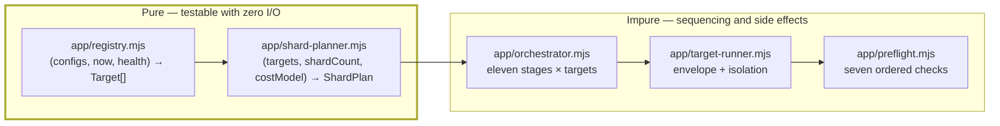

# Part 4 — Foundation Systems

*Sections 24 through 28. Audience: implementing engineers. These five systems — configuration, logging, error handling, retry, and scheduling — are cross-cutting: nearly every later phase depends on at least one of them. They are grouped here by subject rather than by build order, so each section states its phase and its position in the sequence explicitly.*

**Build-order reminder.** These sections do **not** appear in the order they are built:

| § | System | Built In | Sprint |
|---|---|---|---|
| 24 | Configuration | PH-09, PH-10 | SP-3 |
| 25 | Logging | PH-07 | SP-3 |
| 26 | Error handling | PH-01 (taxonomy) + PH-07 (propagation) | SP-1, SP-3 |
| 27 | Retry engine | PH-07 | SP-3 |
| 28 | Scheduler | PH-17 (in-engine) + PH-19/PH-24 (cron) | SP-6, SP-8 |

The error taxonomy (§26.2) is built in **PH-01**, in sprint 1, because every subsequent module names error classes from it. Building the taxonomy late is how an "unclassified" bucket becomes the third-largest error class.

---

# 24. Configuration System Implementation

| Field | Value |
|---|---|
| **Purpose** | Turn six independent sources of configuration into one deeply-frozen, fully-traced effective value set, so that "why did this client use a three-minute timeout?" is answerable in one command during an incident. |
| **Objectives** | (1) Six-layer precedence chain implemented in order. (2) Every key has a code default. (3) Schema validation at load. (4) Semantic rules V-1…V-12 in `validate-config`. (5) Resolution trace emitted, secrets masked. (6) Deep freeze. (7) Unknown-variable and ceiling-breach rejection. (8) `config_version` migration path. |
| **Dependencies** | PH-01 (`Result`), PH-07 (ports, fs), §23 (variable surface), `schemas/client-config.v1.schema.json` |
| **Estimated Complexity** | **D3.** No single hard idea, but eight interacting rules and a precedence matrix that is easy to get subtly wrong |
| **Estimated Time** | 32 IEH (PH-09) + 12 IEH of the CLI's `validate-config` command (PH-10) |
| **Risks** | Precedence implemented as a shallow merge, silently discarding nested overrides · arrays deep-merged instead of replaced (TR-CFG-020) · ceilings clamped rather than rejected (TR-CFG-030) · secret values leaking into the trace (TR-CFG-024) · `defaults.mjs` drifting from the schema (TR-APP-031) |
| **Plan risks** | PR-11 |

## 24.1 Implementation Order Within the Phase

Strictly sequential; each step is independently testable.

| # | Step | Produces | Test Written With It |
|---|---|---|---|
| 1 | `app/config/defaults.mjs` — a default for **every** schema key | Layer 1 | Correspondence test: every key in `client-config.v1.schema.json` has a default (TR-APP-031) |
| 2 | Schema load + validation of a single client config | Validated layer 3 | Per-field validation tests; malformed config rejected with a useful message |
| 3 | Profile resolution (`$ref` inheritance) | Layer 2 | Profile-inherits-and-overrides tests |
| 4 | Listing overrides | Layer 4 | Nested override tests |
| 5 | Environment layer with coercion and unknown-variable rejection | Layer 5 | Unknown `TPRE_*` exits 2 naming the nearest match (EDR-006) |
| 6 | CLI flag layer | Layer 6 | Flag beats env beats file |
| 7 | **Precedence matrix tests** — one per adjacent pair, plus a full six-layer test | — | The core evidence this phase works |
| 8 | Ceiling and floor validation | — | Breach ⇒ **error**, never clamp (TR-CFG-030) |
| 9 | Resolution trace with secret masking | `ResolutionTrace` | Trace names the winning layer per key; secrets render `«set»`/`«unset»` |
| 10 | Deep freeze | Frozen `EffectiveConfig` | Mutation attempt throws in strict mode |
| 11 | `config_version` migration (`migrate.mjs`) | — | One test per migration; unmigratable values are refused, never guessed |
| 12 | Semantic rules V-1…V-12 (in `validate-config`, not the loader) | Validation findings | One test per rule; **V-3 (authorisation) gets two** |

**Sequencing Note on step 12.** The semantic rules live in the `validate-config` command, not in the loader (TRD §7.3). Putting them in the loader would make every harvest re-evaluate policy rules that belong in a pull-request gate, and would make the loader impure in a way that complicates every test that needs a config.

## 24.2 The Precedence Matrix Test

The single most valuable test in this phase, and the one most often written too thinly.

| Test | Asserts |
|---|---|
| L1 only | Defaults apply when nothing else is set |
| L2 > L1 | Profile beats default |
| L3 > L2 | Client beats profile |
| L4 > L3 | Listing override beats client |
| L5 > L4 | Environment beats listing override |
| L6 > L5 | CLI flag beats environment |
| Full stack | All six set on one key; L6 wins; **trace names L6** |
| Deep object | Nested objects merge key-by-key, not wholesale |
| **Array** | Arrays **replace**, never merge (TR-CFG-020) |
| Absent key | A key set at L2 and nowhere else survives all later layers |

**Agent Note.** The array rule is the one an agent gets wrong, because "deep merge" libraries concatenate or union arrays by default. TR-CFG-020 is explicit: arrays replace. A partially-merged `display.languages` array is never what an operator means, and the failure is silent — the client simply publishes languages nobody asked for.

## 24.3 Expected Deliverables

| ID | Deliverable |
|---|---|
| DEL-44 | `src/app/config/defaults.mjs` with a default for every key |
| DEL-45 | `src/app/config/loader.mjs` implementing the six-layer chain, freeze, and trace |
| DEL-46 | `src/app/config/migrate.mjs` with the `config_version` 1→N framework (no migrations yet exist) |
| DEL-47 | `schemas/client-config.v1.schema.json` finalised |
| DEL-48 | `clients/_template.config.json` with every field documented |
| DEL-49 | `profiles/default.json`, `conservative.json`, `high-volume.json` |
| DEL-50 | `tpre validate-config` with `--explain` and `--migrate` |
| DEL-51 | Precedence matrix test suite |

## 24.4 Acceptance Criteria

| # | Criterion |
|---|---|
| 1 | Every key in the schema has a default; the correspondence test proves it |
| 2 | All ten precedence tests pass |
| 3 | A ceiling breach produces exit 2 with a message naming the key, the value, and the ceiling |
| 4 | An unknown `TPRE_*` produces exit 2 naming the variable and the nearest valid match |
| 5 | `--explain` prints, per key, the winning layer and value, with secrets masked |
| 6 | The returned config is deeply frozen; a mutation attempt throws |
| 7 | `display.min_rating` defaults to `null` and triggers V-8 when set |
| 8 | The three profiles load, inherit, and pin a selector pack version |

## 24.5 Exit Criteria

| # | Criterion | Evidence |
|---|---|---|
| 1 | `src/app/config/**` coverage ≥ 90% | Coverage report |
| 2 | All ten precedence tests + ceiling + unknown-variable tests green | CI |
| 3 | `tpre validate-config --explain --client commerce-insight` produces a readable trace | Manual, recorded in the PR |
| 4 | `.env.example` ↔ TRD §9 correspondence test green | CI |
| 5 | `.env` refusal under `TPRE_ENV=ci`/`production` proven | CI |
| 6 | No secret value appears anywhere in trace output | `security.redaction` extension |

## 24.6 Rollback Strategy

Config is read-only at runtime and has no persistent side effects. Rollback is a straight revert of the phase's merges; the engine reverts to being unrunnable-by-humans (MS-3 state), which blocks MS-4 but corrupts nothing. **The one irreversible risk is a config value that was already used to publish** — handled by `tpre project` regenerating payloads from the ledger after the config is corrected (§42).

## 24.7 Verification Checklist

- [ ] Reviewer sets the same key at all six layers and confirms the trace
- [ ] Reviewer sets `nav.max_reviews` to 6000 and confirms an **error**, not a clamp to 5000
- [ ] Reviewer sets `TPRE_MAX_REVIEW` (typo) and confirms exit 2 with a suggestion
- [ ] Reviewer confirms an array override replaces rather than merges
- [ ] Reviewer confirms a secret name appears in the trace and its value does not
- [ ] Reviewer confirms `defaults.mjs` has no environment read

## 24.8 Testing Checklist

| Suite | Tests Added |
|---|---|
| Unit | Precedence ×10, ceiling ×8, coercion ×6, migration framework ×3, defaults correspondence ×1, freeze ×2 |
| Unit (semantic) | V-1…V-12, one each; **V-3 twice** (present-and-valid, absent-for-a-`dom`-listing) |
| Integration | Layered fixture directory resolving to a known effective config |
| Security | Trace contains no secret value |

## 24.9 Documentation Required

`clients/README.md` (how to author a client config); `profiles/README.md` (what each profile is for and when to move a client); `schemas/README.md` (versioning and compatibility policy); the `--explain` output format documented in `docs/maintenance.md`.

## 24.10 Future Improvements

| Item | Version |
|---|---|
| A `tpre validate-config --diff <ref>` showing the effective-config delta of a PR | v1.1 |
| Config linting for "this override equals the default" noise | v1.1 |
| Per-client config in a database with an admin UI | v2 (TRD §82) — the seam is the loader's source abstraction |

---

# 25. Logging System Implementation

| Field | Value |
|---|---|
| **Purpose** | Produce a structured, redacted, correlated event stream that makes an incident diagnosable from artifacts alone, with no ability for a secret to reach it. |
| **Objectives** | (1) JSONL sink with the mandatory field set. (2) **Sink-level redaction seeded at startup.** (3) Ring-buffered `debug`/`trace`, flushed only on target failure. (4) Child loggers per target. (5) Pretty formatter for local development. (6) 100% coverage on redaction. |
| **Dependencies** | PH-01 (`Result`, error constants), §23 (secret surface) |
| **Estimated Complexity** | **D3 overall, D4 for `redact.mjs`** — its failure mode is irreversible in a public repository |
| **Estimated Time** | 14 IEH within PH-07 |
| **Risks** | **IR-21 — secrets logged before redaction is wired.** Rated `Critical`. Mitigated by ordering: redaction is built and covered before any adapter that reads a secret exists · redaction implemented per-call-site instead of at the sink, leaving one un-redacted path · ring buffer retaining unbounded memory on a long run |
| **Plan risks** | PR-12 |

## 25.1 Implementation Order

| # | Step | Why This Order |
|---|---|---|
| 1 | The `LoggerPort` interface in `ports/logger.mjs` | Every consumer depends on the shape, not the sink |
| 2 | **`infra/logger/redact.mjs`** with its 100%-coverage test suite | Built **before** the sink, so no sink exists that lacks it |
| 3 | `infra/logger/jsonl.mjs` — the sink, composing redaction unconditionally | Redaction cannot be bypassed because there is no unredacted write path |
| 4 | Child logger creation (per-run, per-target) | Correlation ids |
| 5 | Ring buffer for `debug`/`trace` with a bounded size | EDR-032 |
| 6 | Flush-on-failure wiring | Only failures pay the volume cost |
| 7 | `infra/logger/pretty.mjs` | Development ergonomics; cuttable (§9.5) |

| ID | Requirement |
|---|---|
| LOG-ORD-01 | `redact.mjs` MUST be implemented and at 100% coverage **before** `jsonl.mjs` is written. This ordering is the mitigation for IR-21 and MUST NOT be inverted for convenience. |
| LOG-ORD-02 | There MUST be exactly one write path to the sink, and it MUST pass through redaction (EDR-031). A "raw" or "debug" write helper MUST NOT exist. |

## 25.2 The Redaction Test Design

100% coverage is necessary and not sufficient. The suite must include:

| Test Class | Cases |
|---|---|
| Sentinel secrets | A known sentinel value seeded at startup, then logged at every level (`trace`…`error`), in every position: message, field value, nested object, array element, error message, stack trace |
| Key-pattern matching | Fields named `token`, `secret`, `password`, `authorization`, `refresh_token`, `api_key` redacted by key regardless of value |
| Partial containment | A secret embedded inside a longer string (a URL query parameter) is redacted |
| Encoded forms | URL-encoded and base64 forms of a sentinel where feasible — documented as best-effort, not guaranteed |
| Negative | A value resembling but not equal to a secret is **not** redacted (avoids over-redaction destroying diagnosability) |
| Seeding | A logger constructed before seeding refuses to write, or writes nothing at all — never writes unredacted |

## 25.3 Deliverables / Acceptance / Exit

| Field | Content |
|---|---|
| **Deliverables** | DEL-52 `ports/logger.mjs` · DEL-53 `infra/logger/redact.mjs` · DEL-54 `infra/logger/jsonl.mjs` · DEL-55 `infra/logger/pretty.mjs` · DEL-56 `tests/security/redaction.test.mjs` |
| **Acceptance** | Mandatory field set present on every event; child loggers carry `runId` and target identity; ring buffer bounded and flushed only on failure; redaction unconditional |
| **Exit** | `infra/logger/redact.mjs` at **100% statement coverage**; sentinel test green at every level and position; a code search confirms exactly one sink write path; `console.*` absent outside `infra/logger/` and `cli/` (lint) |

## 25.4 Rollback / Verification / Testing / Documentation / Future

| Field | Content |
|---|---|
| **Rollback** | Revert to `console` output. **Not acceptable beyond PH-07** — every later phase's diagnosability depends on structure. Treat a redaction defect as a stop-the-line event, not a rollback candidate |
| **Verification** | Reviewer seeds a sentinel, runs a failing target, greps every produced artifact (logs, manifest, diagnostics bundle) for the sentinel. Zero hits required |
| **Testing** | `tests/security/redaction.test.mjs`; unit tests for ring buffer bounds and flush semantics |
| **Documentation** | Log event naming convention (`noun.verb` dot notation, TRD §68.1); the mandatory field set; how to read a `run.jsonl` during an incident |
| **Future** | Log sampling at high volume (v2); OpenTelemetry export (v2, seam is the sink interface) |

---

# 26. Error Handling System

| Field | Value |
|---|---|
| **Purpose** | Make every failure a classified, named, testable value with a defined retry policy, scope, and severity — so that no failure is ever "unexpected" in production. |
| **Objectives** | (1) Complete `ERR-*` taxonomy as constants with metadata. (2) `Result` discriminated union with combinators. (3) Exactly one exception→outcome conversion point. (4) Per-target error envelope. (5) Taxonomy completeness test. (6) Every class mapped to retry policy and severity. |
| **Dependencies** | PH-00 (toolchain). The taxonomy has **no** code dependencies, which is why it is built first |
| **Estimated Complexity** | **D2 for the taxonomy (mechanical), D3 for the propagation model** |
| **Estimated Time** | 10 IEH in PH-01 (taxonomy + `Result`) · 8 IEH in PH-07 (propagation, envelope) · 6 IEH in PH-17 (target runner conversion) |
| **Risks** | Errors thrown inside `core/` (TR-STD-031 violation) · a broad `catch` returning an empty collection (TR-STD-050 — the path to a wiped payload) · new error classes added at adapter sites without taxonomy entries, growing `ERR-INTERNAL-UNCLASSIFIED` |

## 26.1 Why the Taxonomy Is Phase 1

The fifty error classes in SAD Appendix B are pure data — a constants file with metadata. Building it in PH-01, before any module can produce an error, means every subsequent module *selects* an error class rather than *inventing* one. The alternative — adding classes as they are needed — produces near-duplicates (`ERR-PARSE-FAILED` alongside `ERR-PARSE-STRUCTURE`) and a taxonomy that no longer matches the document it came from.

## 26.2 Implementation Order

| # | Step | Phase | Produces |
|---|---|---|---|
| 1 | `core/model/errors.mjs` — every `ERR-*` constant with scope, severity, retry policy, runbook reference | PH-01 | The taxonomy |
| 2 | Taxonomy completeness test — the constant set matches SAD Appendix B exactly | PH-01 | Evidence |
| 3 | `core/util/result.mjs` — `Result` union and combinators | PH-01 | The core's error mechanism |
| 4 | `infra/retry/policy.mjs` — the lookup table keyed by class (§27) | PH-07 | Policy |
| 5 | Severity map consumed by the notifier | PH-07 | Alert routing |
| 6 | `app/target-runner.mjs` — **the single exception→outcome conversion point** | PH-17 | The envelope |
| 7 | `cli/index.mjs` top-level catch → `ERR-INTERNAL-UNCLASSIFIED` → exit 1 | PH-10 | The backstop |

| ID | Requirement |
|---|---|
| ERR-01 | The taxonomy MUST be complete at the end of PH-01, including classes for phases not yet built. A class defined before its producer exists costs nothing; a producer that invents its own class costs a taxonomy. |
| ERR-02 | Every class MUST have exactly one retry policy, one scope, and one severity, and a test MUST assert that no class is missing any of the three. |
| ERR-03 | `core/` MUST NOT throw (TR-STD-031). Enforced by review and by the architecture test's absence of `throw` in `core/` outside `Result` construction helpers. |
| ERR-04 | There MUST be exactly **one** place converting a thrown exception into a classified outcome. Two such places is how one of them stops redacting, stops recording diagnostics, or stops writing a health record. |

## 26.3 The Six Critical Classes Get Special Treatment

SAD Appendix B designates six classes `critical`: `ERR-BLOCKED-CHALLENGE`, `ERR-BLOCKED-UNUSUAL-TRAFFIC`, `ERR-GATE-REJECT-EMPTY`, `ERR-GATE-REJECT-SCHEMA`, `ERR-CLEAN-MARKUP-SURVIVED`, `ERR-PUBLISH-AUTH`, plus the two internal classes.

| Obligation | Where Implemented | Verified By |
|---|---|---|
| Never retried (the two `BLOCKED` classes) | `infra/retry/policy.mjs` | `retry-policy.blocked-never` enumerating test |
| Opens the circuit breaker | `infra/breaker/circuit.mjs` | CH-03 |
| Raises a `critical` alert | Notifier severity map | Alert lifecycle integration test |
| Never reaches a visitor | Gate + LKG retention | CH-01, CH-03, CH-14 |

## 26.4 Deliverables / Acceptance / Exit

| Field | Content |
|---|---|
| **Deliverables** | DEL-57 `core/model/errors.mjs` · DEL-58 `core/util/result.mjs` · DEL-59 taxonomy completeness test · DEL-60 severity map · DEL-61 target-runner envelope |
| **Acceptance** | Every SAD Appendix B class present with correct scope/severity/retry; `Result` combinators unit-tested; the envelope catches, classifies, records health, triggers diagnostics, and continues to the next target |
| **Exit** | Taxonomy completeness test green; `retry-policy.blocked-never` green; no `throw` in `core/`; exactly one conversion point (verified by code search and recorded in the PR); `ERR-INTERNAL-UNCLASSIFIED` reachable and tested |

## 26.5 Rollback / Verification / Testing / Documentation / Future

| Field | Content |
|---|---|
| **Rollback** | The taxonomy is data; reverting it reverts every consumer's imports. In practice this phase is never rolled back — it is corrected forward |
| **Verification** | Reviewer diffs the constants file against SAD Appendix B row by row; confirms the `never` retry policy on both `BLOCKED` classes by reading the table, not the code |
| **Testing** | Unit: taxonomy completeness, every class reachable, `Result` combinators · Integration: envelope isolation with a failing target (`security.isolation`) · Chaos: CH-03, CH-05, CH-10 |
| **Documentation** | `docs/` error reference generated from the constants file; runbook references per class |
| **Future** | Auto-generated error documentation from the constants file (v1.1); error-rate SLOs per class (v2) |

---

# 27. Retry Engine

| Field | Value |
|---|---|
| **Purpose** | Retry the failures that are worth retrying, never retry the ones that are not, and make the difference a data table rather than scattered conditionals. |
| **Objectives** | (1) Policy as a lookup table keyed by error class. (2) Generic, budget-aware executor. (3) Jittered exponential backoff. (4) **`never` for every `ERR-BLOCKED-*`.** (5) Circuit breaker with escalating cooldown, persisted. (6) Token-bucket limiter with pessimistic accounting. |
| **Dependencies** | PH-01 (taxonomy), PH-07 (clock, random ports), state adapter for persistence (PH-08 for breaker/limiter persistence) |
| **Estimated Complexity** | **D3**, with one **D4** aspect: the never-retry rule is a correctness property, not a tuning choice |
| **Estimated Time** | 14 IEH in PH-07 (policy, executor, breaker, limiter) |
| **Risks** | **IR-11 — a retry added to an `ERR-BLOCKED-*` path "just to see if it clears"** · retry without a budget check, so a run exceeds its budget while sleeping (TR: EDR-027) · the executor classifying errors itself instead of consuming the policy (couples generic machinery to the taxonomy) · breaker state lost on a fresh runner, reopening a source that should stay closed |

## 27.1 Implementation Order

| # | Step | Produces | Test |
|---|---|---|---|
| 1 | `infra/retry/policy.mjs` — pure lookup returning a decision object | Policy | **Enumerating test: every class in the taxonomy has a policy, and every `ERR-BLOCKED-*` returns `never`** |
| 2 | `infra/retry/execute.mjs` — generic executor consuming a decision | Executor | Backoff arithmetic, attempt caps, jitter bounds |
| 3 | Budget check before each sleep | — | A retry that would exceed the remaining budget is abandoned, not slept through (EDR-027) |
| 4 | `infra/breaker/circuit.mjs` — `closed → open → half-open`, escalating cooldown, per source-access pair | Breaker | State transitions; persistence round-trip |
| 5 | `infra/limiter/token-bucket.mjs` — hourly/daily counters, **written before the request** | Limiter | Pessimistic accounting: a crash over-counts (EDR-034) |
| 6 | Fail-closed behaviour on unreadable counters | — | Unreadable counter ⇒ defer the target, never proceed |

| ID | Requirement |
|---|---|
| RETRY-01 | The policy MUST be a **table**, and the executor MUST NOT know any error class name. An executor with a `switch` on error classes has absorbed the policy, and the enumerating test then proves nothing. |
| RETRY-02 | The enumerating test MUST iterate the taxonomy programmatically, not list classes by hand. A hand-written list drifts the moment a class is added. |
| RETRY-03 | Every retry MUST be budget-checked **before** sleeping (EDR-027). Sleeping past a run budget converts a recoverable partial run into a timeout. |
| RETRY-04 | Rate-budget consumption MUST be written **before** the request (EDR-034). Optimistic accounting under-counts on crash, which is the direction that gets an IP blocked. |

## 27.2 The Never-Retry Rule Deserves Its Own Test File

`tests/unit/infra/retry-policy.blocked-never.test.mjs` exists solely to assert that every `ERR-BLOCKED-*` class returns `never`, by enumerating the taxonomy. It is named in SAD Appendix D as INV-07's enforcing test. It is a five-line test whose value is entirely in being impossible to delete by accident — a reviewer seeing that filename in a diff knows exactly what is being changed.

## 27.3 Deliverables / Acceptance / Exit

| Field | Content |
|---|---|
| **Deliverables** | DEL-62 `infra/retry/policy.mjs` · DEL-63 `infra/retry/execute.mjs` · DEL-64 `infra/breaker/circuit.mjs` · DEL-65 `infra/limiter/token-bucket.mjs` · DEL-66 `retry-policy.blocked-never` test |
| **Acceptance** | Policy covers every class; executor is class-agnostic; backoff jittered; breaker persists and escalates; limiter fails closed |
| **Exit** | `infra/retry/**` coverage ≥ 95%; enumerating test green; budget-before-sleep proven by a unit test; breaker round-trip proven; CH-01 and CH-02 pass in PH-21 |

## 27.4 Rollback / Verification / Testing / Documentation / Future

| Field | Content |
|---|---|
| **Rollback** | Set every policy to `never`. The engine becomes less resilient and remains **correct** — an important property: the safe rollback direction is fewer retries, never more |
| **Verification** | Reviewer reads the policy table against SAD Appendix B's `R` column, row by row; confirms the executor contains no error-class literal |
| **Testing** | Unit: policy per class, backoff arithmetic, jitter bounds, budget interaction, breaker transitions, limiter accounting · Chaos: CH-01, CH-02, CH-03 |
| **Documentation** | The policy table rendered in `docs/`; the breaker's cooldown schedule; the runbook for a stuck-open breaker |
| **Future** | Adaptive backoff from observed source behaviour (v2) — deliberately not v1.0: an adaptive policy that learns from a blocked source can learn to retry a challenge |

---

# 28. Scheduler Implementation

| Field | Value |
|---|---|
| **Purpose** | Decide which targets are due, distribute them across shards deterministically and cost-balanced, sequence them with pacing and budgets, and guarantee that no target is silently skipped. |
| **Objectives** | (1) Pure registry computing the due set. (2) Pure shard planner balancing by estimated cost. (3) Orchestrator executing the eleven stages per target with isolation. (4) Per-target and per-run budgets with correct deferral semantics. (5) Deterministic target ordering seeded by run id. (6) Cron surface across four tiers (PH-19/PH-24). |
| **Dependencies** | PH-09 (config), PH-16 (at least one full adapter), PH-07 (clock, logger, limiter), PH-08 (health series for cost estimates) |
| **Estimated Complexity** | **D3** — the purity split and the deferral semantics are the subtle parts |
| **Estimated Time** | 40 IEH (PH-17) + 12 IEH cron surface (PH-19) |
| **Risks** | The registry becoming impure, making `tpre plan` unsafe during an incident (TR-APP-030) · shard balancing by target count instead of estimated cost, producing a 3× duration spread (TR-CFG-004) · budget-exhausted targets marked `failed` instead of `deferred`, producing false alerts (TR-APP-005, CH-13) · a target absent from the outcome list (TR-APP-006) |

## 28.1 The Purity Split

**`tpre plan` runs only the pure half.** This is why an operator can run it mid-incident to answer "what is due right now?" without any risk of side effects — and why TR-APP-030 makes purity a requirement rather than a nicety.

## 28.2 Implementation Order

| # | Step | Purity | Test |
|---|---|---|---|
| 1 | `app/registry.mjs` — enumeration, `enabled` filter, listing expansion, cadence due-check | **pure** | Due-set matrix: tiers × last-run-times × cadence floors |
| 2 | `app/shard-planner.mjs` — cost-balanced partitioning, spill, priority ordering | **pure** | Balance quality (max/min shard cost ratio), determinism, spill correctness |
| 3 | `app/preflight.mjs` — seven checks in order, failing fast | impure | One test per check + the recorded-verdict-on-allow test (TR-APP-010) |
| 4 | `app/target-runner.mjs` — envelope, per-target budget, context lifecycle, diagnostics trigger | impure | Isolation with a **failing** target |
| 5 | `app/orchestrator.mjs` — the loop, run budget, pacing, deterministic ordering | impure | CH-13 (budget exhaustion → `deferred`), ordering determinism |
| 6 | `app/run-manifest.mjs` — assembly from outcomes and timings | mostly pure | Schema validation |
| 7 | Cron surface in `harvest.yml` — four tiers, matrix emitted by a job | n/a | PH-19 |

| ID | Requirement |
|---|---|
| SCHED-01 | The registry and shard planner MUST be pure (TR-APP-030) and MUST be built **before** the orchestrator, so that the orchestrator is written against a computed plan rather than computing one. |
| SCHED-02 | Target order MUST be a deterministic pseudo-random permutation seeded by `runId + slug` (TR-APP-003), so no client is permanently first — and so an ordering bug is reproducible from the run id. |
| SCHED-03 | Run-budget exhaustion MUST mark remaining targets `deferred`, **never** `failed` (TR-APP-005). `failed` triggers alerts and pollutes the success-rate metric; `deferred` is a scheduling fact. |
| SCHED-04 | Every target MUST appear in the outcome list, including blocked and deferred ones (TR-APP-006). A missing target is invisible in the manifest and therefore invisible in the incident. |
| SCHED-05 | The shard matrix MUST be emitted by a job, never hard-coded in workflow YAML (EDR-029). |

## 28.3 The Cadence Surface

| Tier | Cadence | Cron Slots | Notes |
|---|---|---|---|
| `premium` | 6 h | 4/day | The `cadence_floor_hours` default of 6 is a floor, not a target |
| `standard` | 12 h | 2/day | |
| `economy` | 24 h | 1/day | |
| `paused` | never | — | Still appears in `tpre plan` output, marked paused |

Offsets are chosen so no two tiers start simultaneously, and the canary (every 3 h) is offset from all four. **The canary must never share a start minute with a harvest tier**, or a source-side rate observation cannot distinguish them.

## 28.4 Deliverables / Acceptance / Exit

| Field | Content |
|---|---|
| **Deliverables** | DEL-67 `app/registry.mjs` · DEL-68 `app/shard-planner.mjs` · DEL-69 `app/preflight.mjs` · DEL-70 `app/target-runner.mjs` · DEL-71 `app/orchestrator.mjs` · DEL-72 `app/run-manifest.mjs` · DEL-73 `tpre plan` |
| **Acceptance** | Due-set matrix correct across tiers and cadence floors; shards balanced by cost within 25%; preflight verdict recorded on allow **and** deny; isolation holds with a failing target; deferral semantics correct |
| **Exit** | Registry and shard planner pass a purity assertion in the architecture test; `tpre plan` runs with zero side effects (proven by running it against a read-only checkout); CH-13 green; every target present in the manifest |

## 28.5 Rollback / Verification / Testing / Documentation / Future

| Field | Content |
|---|---|
| **Rollback** | Reduce to single-shard sequential execution by setting `max_parallel: 1`. Slower, correct, and always available — the shard planner is an optimisation over a working serial path |
| **Verification** | Reviewer runs `tpre plan` twice and diffs (identical); runs it against a checkout with no write permission (succeeds); confirms a deferred target does not raise an error alert |
| **Testing** | Unit: due-set matrix, shard balance, determinism, spill, preflight ×7 · Integration: orchestrator with two targets, one failing · Chaos: CH-13 |
| **Documentation** | `docs/maintenance.md` cadence and sharding section; the `tpre plan` output format; the runbook for "every client stale" (schedules disabled vs breaker open) |
| **Future** | Cost model learning from a longer health window (v1.1); priority pre-emption for a client that has been stale longest (v1.1); event-driven scheduling (v2, requires a server — out of architecture for v1) |

---

## Part 4 Cross-Cutting Exit Criteria

The five foundation systems are complete when, together, they satisfy:

| # | Criterion | Verified In |
|---|---|---|
| 1 | Config resolves, freezes, traces, and rejects — with no secret in the trace | §24 |
| 2 | Every log line is redacted at the sink; a sentinel never appears in any artifact | §25 |
| 3 | Every failure is a named class with a policy, a scope, and a severity | §26 |
| 4 | No `ERR-BLOCKED-*` has a retry path, proven by enumeration | §27 |
| 5 | Every target appears in the manifest with a correct outcome, and `tpre plan` has no side effects | §28 |

**These five together are what makes the rest of the system diagnosable.** Every phase from PH-11 onward assumes them, and no phase after PH-17 adds a new cross-cutting concern — which is a deliberate property of the build order, not an accident.

---

*End of Part 4. Part 5 specifies the acquisition layer: the Playwright engine, browser management, navigation, review detection, and the parser.*
