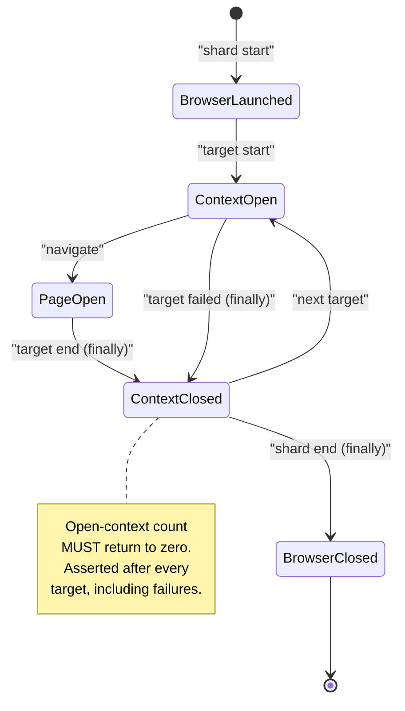

# Part 5 — Acquisition Layer Implementation

*Sections 29 through 33. Audience: the two engineers in SP-4 and SP-5. This is the part of the system that touches something outside the team's control, and it is deliberately the last major subsystem built — week 8 for extraction, week 10 for the browser. Everything here substitutes into a pipeline that already works end to end.*

**Build-order reminder.**

| § | System | Built In | Sprint |
|---|---|---|---|
| 29 | Playwright engine | PH-14 | SP-5 |
| 30 | Browser management | PH-14 | SP-5 |
| 31 | Navigation engine | PH-15 | SP-5 |
| 32 | Review detection (selector packs + challenge detection) | PH-12 (packs) + PH-16 (detection) | SP-4, SP-5 |
| 33 | Review parser (dates + extraction) | PH-03 (dates) + PH-13 (extraction) | SP-1, SP-4 |

**The parser is built five weeks before the browser.** That inversion is the single most important structural feature of this part and is justified in §5.4 — extraction operates on a serialised subtree string (EDR-015), so it needs saved markup, not a browser.

---

# 29. Playwright Engine

| Field | Value |
|---|---|
| **Purpose** | Confine every line of browser-automation library code to exactly one file, so that the browser is a replaceable detail rather than an architectural commitment. |
| **Objectives** | (1) `BrowserPort` interface defined. (2) One file imports `playwright`. (3) Launch flags and context options per TRD §16. (4) Route interception with a host allowlist plus resource-type denylist, **measured**. (5) Six timeout budgets nested correctly. (6) Headless-only in production; headed as a local debug flag. |
| **Dependencies** | PH-11 complete (**X-8: the CSV adapter must exist first**), PH-07 (ports, logger, retry), §15 step 9 (Playwright installed for the first time here) |
| **Estimated Complexity** | **D3.** The library is well documented; the discipline of confining it is the work |
| **Estimated Time** | 18 IEH of PH-14's 34 |
| **Risks** | `playwright` imported by a second file, usually the navigator "just for a type" (DR-3, IR-12) · route interception configured but never measured, so nobody notices it stopped working · timeout levels not nested, so an outer timeout fires before an inner one and the diagnostic is useless · headed mode leaking into a production code path |
| **Plan risks** | PR-14 |

## 29.1 Implementation Order

| # | Step | Produces | Verified By |
|---|---|---|---|
| 1 | `ports/browser.mjs` — the interface, written **before** any Playwright code | The seam | Architecture test: `app/` and `core/` reference only the port |
| 2 | `adapters/browser/playwright-chromium.mjs` — launch with the TRD §16 flag set | Launch | Launch/close smoke test |
| 3 | Context creation with locale, timezone, viewport, user agent per config | Context | Context option assertions |
| 4 | Route interception: host allowlist + resource-type denylist | Interception | **Measured** byte reduction (§29.3) |
| 5 | The six timeout levels, each strictly inside the next (EDR-028) | Budgets | Nesting assertion test |
| 6 | Teardown in `finally`, in the correct order | Lifecycle | §30 |
| 7 | Headed flag, local only, refused when `TPRE_ENV=production` | Debug | Unit: production refusal |

| ID | Requirement |
|---|---|
| PW-01 | `adapters/browser/playwright-chromium.mjs` MUST be the only file importing `playwright` (TR-BRW-001, DR-3). Enforced by the architecture test **and** by lint. Two mechanisms because this is the rule whose violation is most tempting and least visible. |
| PW-02 | The port MUST be written before the adapter. A port extracted from an implementation is shaped by that implementation, which is how "browser" ends up meaning "Chromium via Playwright" in the type system. |
| PW-03 | Route interception effectiveness MUST be **measured**, not assumed (EDR-012). The integration test asserts a non-trivial byte reduction with the fixture server logging requests. |
| PW-04 | Headed mode MUST be refused when `TPRE_ENV=production` (EDR-010). |

## 29.2 The Six Timeout Levels

Each strictly inside the next (EDR-028). The nesting is asserted by a unit test that reads the resolved config, not by inspection.

| Level | Budget | Config Key | Fires Before |
|---|---|---|---|
| 1 | Single action (click, scroll step) | derived | Navigation |
| 2 | Navigation | `nav.navigation_timeout_ms` (30 s) | Surface wait |
| 3 | Surface wait | `nav.surface_timeout_ms` (15 s) | *(shorter by design — a surface that has not appeared in 15 s will not appear)* |
| 4 | Pagination loop | `nav.pagination_budget_ms` (120 s) | Target |
| 5 | Target | `budget_target_ms` (300 s, hard ceiling) | Run |
| 6 | Run | `budget_run_ms` (900 s, hard ceiling) | CI job timeout |

**The seventh, invisible level is the CI job timeout (TA-02).** The in-engine run budget must fire first, or the engine loses its chance to write a manifest, flush logs, and upload diagnostics — which converts a diagnosable partial run into a silent job cancellation. This is asserted by a workflow-level check in PH-19.

## 29.3 Measuring Interception

| Measurement | Method | Threshold |
|---|---|---|
| Blocked bytes | Fixture server logs every request; test compares total bytes with and without interception | Non-trivial reduction, recorded as a number in the test |
| Blocked types | Assert images, fonts, media, analytics hosts are absent from the request log | Zero occurrences |
| Allowed hosts | Assert only allowlisted hosts appear | Zero off-allowlist requests |

**Recording the actual number matters more than the threshold.** A test asserting "> 0% reduction" passes forever; a test recording "78% reduction, 2026-10-14" makes a regression to 12% visible in a diff.

## 29.4 Deliverables / Acceptance / Exit

| Field | Content |
|---|---|
| **Deliverables** | DEL-74 `ports/browser.mjs` · DEL-75 `adapters/browser/playwright-chromium.mjs` · DEL-76 interception measurement test · DEL-77 timeout nesting test · DEL-78 DEP-1 justification for `playwright` |
| **Acceptance** | Browser launches headless and closes cleanly; context options applied; interception measured; six timeouts nested; headed refused in production |
| **Exit** | DR-3 architecture test green (exactly one importer); interception byte reduction recorded; timeout nesting asserted; launch/close proven in a `finally` path with an injected failure |

## 29.5 Rollback / Verification / Testing / Documentation / Future

| Field | Content |
|---|---|
| **Rollback** | Revert PH-14. MS-5's CSV path still works end to end, so the product remains demonstrable. This is the designed benefit of X-8 |
| **Verification** | Reviewer greps the repository for `playwright` imports (expects one); runs the interception test and reads the recorded byte numbers; confirms the headed flag is refused under production env |
| **Testing** | Unit: launch flags, context options, timeout nesting, headed refusal · Integration: interception measurement against the fixture server (PH-15) |
| **Documentation** | Why exactly one file imports the library; the documented Puppeteer migration path (one file); the launch flag rationale |
| **Future** | Puppeteer or a lighter engine (v2, confined to this file by construction); browser pooling across targets (**rejected** — INV-09 requires a fresh context per target and pooling erodes it) |

---

# 30. Browser Management

| Field | Value |
|---|---|
| **Purpose** | Guarantee that one target's browser state can never influence another's, and that no context ever leaks — including on the failure paths where `finally` blocks are most often omitted. |
| **Objectives** | (1) One browser per shard, one context per target, one page per context (EDR-011). (2) Teardown in `finally`, ordered. (3) Open-context count returns to zero after every target. (4) Isolation proven with a **failing** target. (5) Peak RSS monitored. |
| **Dependencies** | §29 |
| **Estimated Complexity** | **D3**, elevated by the failure-path requirement |
| **Estimated Time** | 16 IEH of PH-14's 34 |
| **Risks** | **IR-09 — contexts leak because `finally` is omitted on an error path.** Rated `High` impact · storage/cookie carryover between targets, violating INV-09 · browser crash mid-pagination leaving a zombie process · memory growth across a 30-target shard exceeding the runner |
| **Plan risks** | PR-15 |

## 30.1 The Lifecycle Contract

| ID | Requirement |
|---|---|
| BRW-01 | Context close MUST be in a `finally` block, and the integration test MUST include a run in which a target **fails** (TR-TEST-081, TR-BRW-053). A test covering only the success path proves nothing about the path where the leak occurs. |
| BRW-02 | Teardown order MUST be page → context → browser, and each step MUST tolerate the previous having already failed. |
| BRW-03 | The open-context count MUST be asserted as zero after every target in the integration suite, not merely at the end of the run. |
| BRW-04 | A browser crash MUST produce `ERR-BROWSER-CRASH` with one retry (per policy), and on repeat MUST fail the target with the context closed (CH-09). |

## 30.2 Isolation Test Design

The `security.isolation` test is one of the ten enforcing tests in SAD Appendix D and deserves explicit design:

| # | Assertion |
|---|---|
| 1 | Target A sets a cookie and local storage; target B's context sees neither |
| 2 | Target A **fails mid-run**; target B still runs and its context is fresh |
| 3 | Open-context count is zero between A and B, and after B |
| 4 | Target A cannot write outside its own client path (path disjointness, EDR-035) |
| 5 | An unhandled rejection inside target A does not propagate to the orchestrator loop |

## 30.3 Deliverables / Acceptance / Exit

| Field | Content |
|---|---|
| **Deliverables** | DEL-79 session manager within the browser adapter · DEL-80 `tests/security/isolation.test.mjs` · DEL-81 context-lifecycle integration test with a failing target · DEL-82 RSS measurement in the health record |
| **Acceptance** | Fresh context per target; zero carryover; zero leaked contexts including on failure; crash handled per CH-09 |
| **Exit** | `security.isolation` green including the failing-target case; open-context count asserted zero after every target; peak RSS recorded per target and under the 700 MB monitored budget |

## 30.4 Rollback / Verification / Testing / Documentation / Future

| Field | Content |
|---|---|
| **Rollback** | Launch a fresh browser per target instead of per shard. Slower (~2 s per target), strictly safer, always available. **This is the correct emergency response to any suspected isolation defect** |
| **Verification** | Reviewer runs the isolation test with the `finally` block deliberately removed and confirms it fails — the only way to know the test tests anything |
| **Testing** | Integration: isolation ×5 assertions · Chaos: CH-09 (crash mid-pagination) |
| **Documentation** | The lifecycle diagram; the "fresh browser per target" emergency lever in `docs/runbooks/` |
| **Future** | Per-target memory ceiling with proactive restart (v1.1); measured context-reuse optimisation (**rejected for v1.0** — INV-09) |

---

# 31. Navigation Engine

| Field | Value |
|---|---|
| **Purpose** | Drive a review surface to as complete a state as the budget allows, and report honestly how complete that state is. |
| **Objectives** | (1) Fixture server serving sanitised markup with configurable lazy-load dynamics. (2) Navigate → dismiss → open → sort → paginate → expand sequence. (3) Scroll by container-height ratio, never to absolute bottom (EDR-013). (4) Stall detection. (5) **Stop reason as a first-class output.** (6) Growth curve retained in the acquisition report (EDR-014). |
| **Dependencies** | §29, §30 (a browser to drive) |
| **Estimated Complexity** | **D3**, with a **D4** consequence: the stop reason feeds completeness classification, which feeds the absence asymmetry |
| **Estimated Time** | 36 IEH (PH-15) |
| **Risks** | Stop reason inferred later from counts rather than emitted at the point of stopping (TR-NAV-001) · scrolling to absolute bottom, which a virtualised container punishes · pagination tested against the live source instead of the fixture server, making the suite flaky and eventually disabled · expansion budget unbounded, blowing the target budget on a 5,000-review listing |
| **Plan risks** | PR-16 |

## 31.1 Why the Fixture Server Comes First

`fixtures/server/serve.mjs` is built **before** the navigator, in the same phase. It serves the same sanitised markup the regression suite uses, over HTTP, with configurable lazy-loading — so scroll loops, stall detection, and expansion budgets are exercised against realistic dynamics with **zero network and zero flakiness** (TRD §61.8.1).

| Fixture Server Capability | Exercises |
|---|---|
| Serve a full corpus page | Happy-path pagination |
| Stop yielding after batch N | **Stall detection → `partial` → gate rejection (CH-04)** |
| Delay responses configurably | Timeout paths |
| Serve a challenge page | Terminal challenge detection (CH-03) |
| Serve a consent interstitial | Dismissal path |
| Log every request | Interception measurement (§29.3) |

**This one file is what makes every acquisition test deterministic.** It is 6 IEH and it removes the single largest source of test flakiness in the project.

## 31.2 Implementation Order

| # | Step | Test |
|---|---|---|
| 1 | Fixture server with the six capabilities above | Server self-test |
| 2 | Navigate + wait for the review surface | Surface-not-found → `ERR-NAV-SURFACE-NOT-FOUND` |
| 3 | Consent dismissal — **benign, dismissible interstitials only** | Fixture 017 dismissed; a non-dismissible wall → `ERR-NAV-CONSENT-WALL` |
| 4 | Open the review pane; apply sort order | Sort applied and verified |
| 5 | **Pagination loop**: scroll by container-height ratio, settle, count, detect stall | Growth curve recorded; stall after `nav.stall_threshold` |
| 6 | Expansion of truncated reviews, capped by `nav.expand_max_count` | Cap respected; budget respected |
| 7 | **Stop reason emitted** (`complete` / `capped` / `stalled` / `budget` / `error`) | One test per reason |
| 8 | Growth curve retained in the `AcquisitionReport` | Report schema validation |

| ID | Requirement |
|---|---|
| NAV-01 | The stop reason MUST be emitted by the navigator at the point of stopping (TR-NAV-001). Completeness classification (§34) depends entirely on it, and inferring it downstream from counts is how a stalled harvest is classified `full`. |
| NAV-02 | Scrolling MUST be by container-height ratio (EDR-013), never `scrollIntoView` on a last element and never to absolute bottom — a virtualised container recycles nodes and absolute-bottom scrolling skips content. |
| NAV-03 | The growth curve (reviews observed per scroll iteration) MUST be retained in the acquisition report (EDR-014). It is the primary evidence for diagnosing a partial harvest after the fact. |
| NAV-04 | Every navigation behaviour MUST be demonstrated against the fixture server before it is attempted against the live source (SP-5 rule, §7.6). |

## 31.3 Deliverables / Acceptance / Exit

| Field | Content |
|---|---|
| **Deliverables** | DEL-83 `fixtures/server/serve.mjs` · DEL-84 `adapters/acquisition/google-dom/navigator.mjs` · DEL-85 `adapters/acquisition/google-dom/consent.mjs` · DEL-86 pagination integration tests · DEL-87 stall test |
| **Acceptance** | All five stop reasons produced and asserted; growth curve present; consent dismissal handles fixture 017 and refuses a hard wall; expansion capped |
| **Exit** | Pagination integration test green against the fixture server; **stall test yields `stalled` + `partial` + gate rejection**; zero network in the suite; budget respected under a 5,000-review fixture |

## 31.4 Rollback / Verification / Testing / Documentation / Future

| Field | Content |
|---|---|
| **Rollback** | Reduce `nav.max_reviews` and accept `capped` completeness — a correct, lower-yield mode. The gate's coverage rule then governs whether the smaller payload publishes |
| **Verification** | Reviewer runs the stall scenario and confirms three independent protections engage (partial classification, no streak increment, gate rejection) |
| **Testing** | Integration: full pagination, stall, expansion cap, consent dismissal, timeout · Chaos: CH-04 (the most important test in the suite) |
| **Documentation** | The navigation phase machine; the stop-reason semantics table; `docs/runbooks/selector-break.md` navigation section |
| **Future** | Adaptive scroll increment from observed growth (v1.1); parallel pagination (**rejected** — increases source load, violates pacing discipline) |

---

# 32. Review Detection Engine

*Two components, built five weeks apart: selector packs (PH-12, SP-4) locate content; challenge detection (PH-16, SP-5) recognises when there is no content to locate because the source has said stop.*

| Field | Value |
|---|---|
| **Purpose** | Externalise all volatile knowledge about the source's markup into versioned data files, and detect a bot challenge before any parsing is attempted. |
| **Objectives** | (1) Selector pack JSON schema. (2) Load-time validation. (3) Ordered strategy resolution with recorded `strategyIndex`. (4) Structural assertions file for the canary. (5) **Challenge detection, before parsing, terminal.** (6) Consent vs challenge distinguished. (7) DOM subtree serialisation only. |
| **Dependencies** | PH-02 (normalize) for the pack loader's outputs; PH-01 (`Result`); PH-15 (navigation) for challenge detection's position in the sequence |
| **Estimated Complexity** | **D3 for packs, D4 for challenge detection** — a challenge misclassified as a parse failure gets retried, which is INV-07's exact failure |
| **Estimated Time** | 26 IEH (PH-12) + 18 IEH of PH-16's 44 |
| **Risks** | **IR-03 — pack authored with `css`-only strategies under time pressure** (schema requires ≥ 2 strategies of different kinds) · a merged pack edited in place instead of versioned (TR-SEL-001) · **IR-11 — a retry added to the challenge path** · a challenge page parsed as a zero-review page, producing `ERR-PARSE-EMPTY-UNEXPECTED` instead of `ERR-BLOCKED-CHALLENGE` and therefore being retried |
| **Plan risks** | PR-17, PR-18 |

## 32.1 Selector Packs — Implementation Order (PH-12)

| # | Step | Test |
|---|---|---|
| 1 | `selectors/schema/selector-pack.schema.json` — requires ≥ 2 strategies of **different kinds** per field, plus a `notes` field per strategy | Schema rejects a single-strategy field; rejects two `css` strategies |
| 2 | `core/selectors/loader.mjs` — parse and schema-validate at load | Malformed pack ⇒ `ERR-PARSE-SELECTOR-PACK` **at load**, not later (TR-SEL-003) |
| 3 | `core/selectors/resolver.mjs` — ordered resolution, records `strategyIndex` and health | Strategy 0 hit; fallback to 1 recorded; all-fail ⇒ field-required error |
| 4 | `selectors/google-maps/v1.json` authored with `notes` on every strategy | Golden fixtures resolve at index 0 |
| 5 | `selectors/google-maps/assertions.json` — structural assertions for the canary | Assertions evaluate against fixture 001 |
| 6 | Profile pinning (`profiles/*.json` pins a pack version) | Pin change alters resolution; TR-SEL-004 |

| ID | Requirement |
|---|---|
| SEL-01 | A merged pack MUST NEVER be edited; a change creates `v<n+1>.json` (TR-SEL-001). Enforced in review and by a CI check comparing merged pack files against their previous content. |
| SEL-02 | Old packs MUST be retained indefinitely and fixtures captured under `vN` MUST continue to be tested against `vN` (TR-SEL-002). This is what proves the corpus tests **extraction** rather than today's markup. |
| SEL-03 | Every strategy MUST carry a `notes` field explaining what it targets and why it is ranked where it is (TRD §67.5). Six months later this is the difference between a maintainable pack and an archaeological one. |
| SEL-04 | Pack version pinning MUST live in a profile, never in a client config or in code (TR-SEL-004). This is what makes a staged rollout a one-line edit in two files. |

## 32.2 Challenge Detection — Implementation Order (PH-16)

| # | Step | Test |
|---|---|---|
| 1 | Classification runs **before** any parsing attempt | Fixture 016 classified as a challenge, never as a parse failure |
| 2 | Distinguish consent interstitial (dismissible) from challenge (terminal) | Fixture 017 dismissed; fixture 016 terminal |
| 3 | Emit `ERR-BLOCKED-CHALLENGE` / `ERR-BLOCKED-UNUSUAL-TRAFFIC` | Retry policy returns `never` (enumerating test) |
| 4 | Open the circuit breaker for the source-access pair | Breaker state persisted |
| 5 | Raise a `critical` alert | Notifier severity map |
| 6 | Retain LKG; write **no** ledger, **no** payload | Outcome table (TRD §2.4.1) |

| ID | Requirement |
|---|---|
| CHAL-01 | Challenge detection MUST occur **before** parsing is attempted. A challenge page parsed first produces a plausible "zero reviews" result, which is retryable — and retrying a challenge is the specific behaviour INV-07 forbids. |
| CHAL-02 | **No retry path may exist**, including "one retry to see if it clears" (INV-07, A-5, IR-11). The absence is proven by the enumerating retry-policy test, not by reading the adapter. |
| CHAL-03 | A code review of any PR touching `challenge-detect.mjs` MUST include a second reviewer who checks the retry-policy test still enumerates. |

## 32.3 DOM Serialisation

| ID | Requirement |
|---|---|
| SER-01 | Extraction MUST operate on a **serialised subtree string**, never on live browser handles (EDR-015, IR-12). This is what makes `core/extract/` pure and testable against saved fixtures. |
| SER-02 | The serialiser MUST NEVER serialise the whole document (TRD §44.3). A full-page serialisation on a 5,000-review listing is a memory event. |
| SER-03 | The serialised subtree MUST be the review container plus minimal ancestry — the same shape as a captured fixture, so that a production failure can be reproduced by saving the string as a fixture. |

**Sequencing Note.** SER-03 is what makes `tpre replay` possible and what makes "every incident becomes a permanent test" (X-9) cheap for extraction defects: the diagnostics bundle contains a string that *is* a fixture.

## 32.4 Deliverables / Acceptance / Exit

| Field | Content |
|---|---|
| **Deliverables** | DEL-88 `selectors/schema/selector-pack.schema.json` · DEL-89 `core/selectors/loader.mjs` · DEL-90 `core/selectors/resolver.mjs` · DEL-91 `selectors/google-maps/v1.json` · DEL-92 `selectors/google-maps/assertions.json` · DEL-93 `challenge-detect.mjs` · DEL-94 `dom-serialize.mjs` |
| **Acceptance** | Pack schema enforces multi-kind strategies; load-time validation fails loudly; strategy index recorded; challenge terminal; subtree-only serialisation |
| **Exit** | Pack validation tests green; CH-07 (one field's strategies broken → fallback engages) and CH-08 (all strategies broken → quarantine → gate rejects) green in PH-21; fixture 016 terminal with zero retries; DR-1 holds for `core/selectors/` |

## 32.5 Rollback / Verification / Testing / Documentation / Future

| Field | Content |
|---|---|
| **Rollback** | Revert the pack pin in `profiles/default.json` — **one line, instantly** (TRD §66.3). This is the entire payoff of externalising selectors, and it should be drilled once in SP-7 |
| **Verification** | Reviewer breaks strategy 0 of one field in a scratch pack and confirms fallback + health signal; reviewer confirms fixture 016 produces `ERR-BLOCKED-CHALLENGE` and that the retry table returns `never` |
| **Testing** | Unit: pack schema, loader, resolver ordering, strategy health · Regression: fixtures 001–020 · Chaos: CH-03, CH-07, CH-08 |
| **Documentation** | `selectors/README.md` — how to author, test, and version a pack; the staged rollout procedure; `docs/runbooks/selector-break.md` |
| **Future** | Automated pack candidate generation from a diff of two captures (v2); pack authoring UI (v2, TRD §82) |

---

# 33. Review Parser

*Two components: date resolution (PH-03, SP-1) and field extraction (PH-13, SP-4). Both are pure, both are tested entirely offline, and neither ever sees a browser.*

| Field | Value |
|---|---|
| **Purpose** | Convert a serialised markup subtree into structured, per-field review records, failing softly per field and loudly per structure, with locale-aware date resolution that is pinned on first observation and never recomputed. |
| **Objectives** | (1) Locale-aware relative-date parsing across the six-locale matrix. (2) Precision and confidence derivation. (3) **First-observation date pinning.** (4) Owner-reply detachment **first**. (5) Three-parser rating cascade with an integer post-check. (6) Per-field extraction with fallback. (7) Twenty golden fixtures. |
| **Dependencies** | PH-02 (normalize) — extraction feeds it; PH-12 (selector resolver); the fixture corpus |
| **Estimated Complexity** | **D3**, with three **D4** hazards named below |
| **Estimated Time** | 22 IEH (dates/lang in PH-03) + 42 IEH (extraction in PH-13) |
| **Risks** | **IR-04 — date parser fails on singular forms** ("a day ago", "yesterday"). Rated `High` · **IR-13 — owner replies ingested as reviews** · **IR-14 — aggregate business rating captured instead of a review rating** · date recomputed on later harvests, destroying sort stability (PT-06) · extraction against live handles instead of a string (IR-12) |
| **Plan risks** | PR-19 |

## 33.1 Date Resolution — Implementation Order (PH-03)

| # | Step | Test |
|---|---|---|
| 1 | Phrase table format per TRD §21.6 (data, not code) | Table parses; six locales present |
| 2 | `core/dates/relative.mjs` — phrase → duration | **Locale matrix: six locales × all granularities × singular and plural forms** |
| 3 | Singular-form handling explicitly enumerated | "a day ago", "an hour ago", "yesterday", "last week" per locale |
| 4 | Unparseable phrase → null, never a guess | Fails soft; no error |
| 5 | `core/dates/precision.mjs` — precision and confidence from phrase granularity | "3 months ago" ⇒ low precision, correctly stated |
| 6 | **`core/dates/pin.mjs` — pin on first observation, refuse to recompute** | **PT-06** at ≥ 1,000 cases |

| ID | Requirement |
|---|---|
| DATE-01 | Singular forms MUST have explicit tests per locale (IR-04). They are the highest-frequency failure and the least likely to be generated by an agent that pattern-matched the plural case. |
| DATE-02 | The pinned date MUST NEVER change after INSERT (PT-06). Recomputing on each harvest makes the display order jitter for no reason a client can understand. |
| DATE-03 | The phrase table is **data**. Extending it for a seventh locale MUST NOT require a code change (TA-05's "if false" path depends on this). |

## 33.2 Extraction — Implementation Order (PH-13)

**Order within the phase is normative** — reply detachment first (EDR-016), then fields.

| # | Step | Fixture | Hazard |
|---|---|---|---|
| 1 | **`extract/reply.mjs` — owner-reply subtree isolation, performed first** | 004 | **IR-13**: replies ingested as reviews |
| 2 | `extract/rating.mjs` — three-parser cascade P1/P2/P3 + **integer post-check** | 001, 010 | **IR-14**: aggregate rating captured |
| 3 | `extract/author.mjs` — name, profile URL, avatar URL, badges | 008, 009, 011 | Anonymous authors fabricated |
| 4 | `extract/text.mjs` — body lifting, truncation-marker detection | 005, 019 | Markup removal attempted here (belongs in normalize) |
| 5 | `extract/meta.mjs` — likes, photo counts, visit metadata | 001 | **Fabricating absent fields** |
| 6 | `extract/index.mjs` — per-node orchestration in the §21.3 order | all | Order deviation |
| 7 | Golden fixture suite across all twenty fixtures | all | — |

| ID | Requirement |
|---|---|
| EXT-01 | Owner-reply detachment MUST happen **before any other field extraction** (EDR-016). A reply that is still attached becomes text, rating, and author data for a review that does not exist. |
| EXT-02 | The rating cascade MUST end with a mandatory integer post-check (EDR-017, TR-EXT-040). This is the mitigation for IR-14: an aggregate business rating is typically fractional (4.3), a review rating never is. |
| EXT-03 | A field the adapter cannot supply MUST be `null`, **never fabricated** (contract suite assertion). |
| EXT-04 | Extraction MUST be pure and operate on a string (EDR-015, DR-1). |

## 33.3 The Fixture Corpus Is a Scheduling Dependency

Twenty fixtures with `page.html`, `meta.json`, and `expected.json` each. **Capture begins in SP-2, four weeks before PH-13 needs them** (§4.4), because capture and sanitisation have elapsed-time cost that cannot be compressed.

| Category | Fixtures | Owner | Captured By |
|---|---|---|---|
| Baseline + boundary | 001, 002, 003, 018 | Backend | End of SP-2 |
| Structural variety | 004, 008, 009, 010 | Backend | End of SP-2 |
| Text handling | 005, 006, 007, 020 | QA | End of SP-3 |
| Locale | 012, 013 | QA | End of SP-3 |
| Identity hazards | 011 | QA | End of SP-3 |
| **Adversarial** | **014, 015, 016, 017, 019** | **QA + Backend** | **End of SP-3** |

**The adversarial five are the point of the corpus** (TRD §61.5.2) and are the ones most likely to be deferred, because they require deliberately constructing failure states rather than capturing a normal page. They are scheduled as named tasks in PH-13's task block, not as "capture fixtures".

## 33.4 Deliverables / Acceptance / Exit

| Field | Content |
|---|---|
| **Deliverables** | DEL-95 `core/dates/*` · DEL-96 `core/lang/detect.mjs` · DEL-97 `core/extract/*` (six files) · DEL-98 twenty fixture directories · DEL-99 `tests/regression/fixtures.golden.test.mjs` · DEL-100 `scripts/capture-fixture.mjs` and `scripts/sanitize-html.mjs` |
| **Acceptance** | Locale matrix green including singular forms; pinning proven by PT-06; replies detached first; rating integer post-check enforced; all twenty fixtures produce their golden output |
| **Exit** | `core/extract/**` ≥ 90%, `core/dates/**` ≥ 95%; twenty golden fixtures green **against their pinned pack versions**; adversarial fixtures assert **correct failure** (015 → `ERR-PARSE-STRUCTURE`, not three silent reviews); DR-1/DR-2 hold across all parser modules |

## 33.5 Rollback / Verification / Testing / Documentation / Future

| Field | Content |
|---|---|
| **Rollback** | Revert to the previous selector pack pin (one line) for a markup-shaped failure; revert the extraction PR for a logic-shaped failure. Fixtures are never rolled back — they are the record |
| **Verification** | Reviewer runs `npm run parse:fixture -- 015` and confirms a loud failure; runs `-- 019` and confirms plain text with no markup; runs `-- 004` and confirms zero replies in the review list |
| **Testing** | Unit: rating parsers ×3, reply isolation, author fields, text truncation, meta absence, locale matrix, pinning · Regression: twenty fixtures · Property: PT-05, PT-06 · Security: fixture 019 via `security.xss-fixture` |
| **Documentation** | `fixtures/README.md` — how to capture, sanitise, and add a fixture; the phrase table format; the rating cascade rationale |
| **Future** | Quarterly baseline re-capture (TR-TEST-052) as a scheduled maintenance task (§68); additional locales as data-only additions |

---

## Part 5 Cross-Cutting Exit Criteria

| # | Criterion | Verified In |
|---|---|---|
| 1 | Exactly one file imports the browser library | §29 |
| 2 | No context leaks, including on failure paths | §30 |
| 3 | Stop reason is emitted, not inferred, and drives completeness | §31 |
| 4 | A challenge is terminal, with zero retry paths, proven by enumeration | §32 |
| 5 | Twenty golden fixtures pass against their pinned packs, adversarial ones asserting correct failure | §33 |
| 6 | Every module in `core/extract/`, `core/dates/`, `core/lang/`, `core/selectors/` is pure | DR-1/DR-2 |

**Criterion 6 is the one that makes this whole part cheap to maintain.** Four of the five subsystems in Part 5 are pure and run in milliseconds with no browser; only §29–§31 need Chromium, and they are tested against a localhost fixture server. That is why the default suite stays under three minutes with acquisition fully covered.

---

*End of Part 5. Part 6 specifies validation, duplicate detection, hashing, normalisation, and the ledger.*
