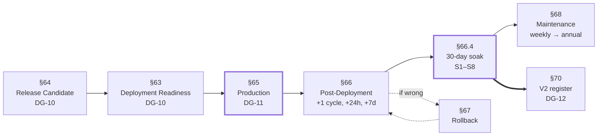

# Part 11 — Checklists, Procedures, and V2 Preparation

*Sections 63 through 70. Audience: the release manager, DevOps, and whoever is on call. Everything in this part is designed to be executed while under pressure by someone who did not write it. Each item has an owner, an evidence requirement, and a blocking flag — because a checklist whose items can be judged "probably fine" is a form.*

---

## How to Use These Checklists

| Convention | Meaning |
|---|---|
| **Blocking** ✅ | The gate does not pass. No waiver exists below the Engineering Manager, and none at all for items marked **non-waivable** |
| **Evidence** | What is recorded. "Confirmed verbally" is not evidence; a command output, a URL, a screenshot, or a merged file is |
| **Owner** | The role that executes it. The role that *verifies* it is always someone else |
| Order | Items are ordered by execution sequence, not by importance |

**The verification rule:** no person both executes and signs off the same item. On a 2.3 FTE team this is the only structural defence against confirmation bias, and it costs minutes.

---

# 63. Deployment Readiness Checklist

**Gate: DG-10 · Owner: DevOps · Executed at: end of SP-8, before the release candidate is tagged**

*This checklist asks: "is the system capable of being deployed?" It does not ask whether it should be.*

## 63.1 Repository and Branches

| # | Check | Owner | Evidence | Blocking |
|---|---|---|---|---|
| 1 | `main` protected: review required, CI required, no force-push | DevOps | Settings export | ✅ |
| 2 | `data` and `state` exist as orphans with no shared history | DevOps | Two failing `git merge-base` commands | ✅ |
| 3 | Force-push disabled on all three long-lived branches | DevOps | Settings export | ✅ |
| 4 | `CODEOWNERS` covers `src/core/`, `schemas/`, `selectors/`, `compliance/` | DevOps | File + a test PR requesting review | ✅ |
| 5 | Secret scanning and push protection enabled | Security | Settings export | ✅ |
| 6 | **Offsite mirror exists and has been cloned from successfully** | DevOps | Clone output | ✅ **non-waivable** (TR-CI-161) |

## 63.2 Hosting and Distribution

| # | Check | Owner | Evidence | Blocking |
|---|---|---|---|---|
| 7 | Pages enabled, sourced from the `data` branch root | DevOps | A served test file over HTTPS | ✅ |
| 8 | **Actual response headers measured and recorded** | DevOps | `docs/runbooks/pages-headers.md` with a dated header dump | ✅ **non-waivable** (TR-CI-160, OIQ-04) |
| 9 | `.nojekyll`, `robots.txt`, `_headers` present on `data` | DevOps | File listing | ✅ |
| 10 | Custom domain configured and headers **re-verified** if used | DevOps | Second header dump | ✅ if applicable |

## 63.3 Workflows and Permissions

| # | Check | Owner | Evidence | Blocking |
|---|---|---|---|---|
| 11 | All eight workflows present | DevOps | File listing | ✅ |
| 12 | Every workflow declares explicit minimum `permissions:` | DevOps | `security.workflow-lint` green | ✅ |
| 13 | The `alert` job has **no `contents`** permission | Security | Workflow diff | ✅ (TR-CI-130) |
| 14 | `pages.yml` has **no `contents`** permission | Security | Workflow diff | ✅ (TR-CI-131) |
| 15 | Every third-party action pinned to a full commit SHA | Security | `security.workflow-lint` green | ✅ |
| 16 | `pull_request_target` absent everywhere | Security | Repository search | ✅ |
| 17 | No untrusted value interpolated into any `run:` block | Security | Manual review recorded | ✅ |
| 18 | Setup logic exists exactly once, in the composite action | DevOps | File listing | ✅ |
| 19 | Versions banner printed in job logs | DevOps | Log excerpt | ✅ (TR-CI-140) |
| 20 | Each workflow triggered at least once and observed to pass | DevOps | Eight run URLs | ✅ |

## 63.4 Configuration and Secrets

| # | Check | Owner | Evidence | Blocking |
|---|---|---|---|---|
| 21 | Five policy variables set as repository **variables**, not secrets | DevOps | Settings export | ✅ (TR-ENV-001) |
| 22 | All required secrets configured for the adapters in use | DevOps | `tpre doctor` output | ✅ |
| 23 | No secret exists in any file, in any branch, in any history | Security | Scan output | ✅ **non-waivable** (INV-08) |
| 24 | `.env.example` matches the documented variable set | Backend | Correspondence test green | ✅ |
| 25 | Client config validates; authorisation record present for every `dom` listing | Backend | `validate-config` run | ✅ (V-3) |

## 63.5 Engine Capability

| # | Check | Owner | Evidence | Blocking |
|---|---|---|---|---|
| 26 | `tpre doctor` reports green on a clean CI runner | DevOps | Log excerpt | ✅ |
| 27 | A dispatched harvest produces a `data` commit | DevOps | Commit URL | ✅ |
| 28 | A second identical dispatch produces **zero** commits | DevOps | Run log | ✅ (hash-gating) |
| 29 | `tpre project --client X` regenerates payloads with no network | Backend | Run log | ✅ |
| 30 | All five rollback units drilled with recorded timings | Backend/DevOps | Drill records | ✅ (RB-04) |

---

# 64. Release Candidate Checklist

**Gate: DG-10 · Owner: Engineering Manager · Executed at: tag time for `v0.9.0-rc.1` and every subsequent RC**

## 64.1 Quality Gates

| # | Check | Evidence | Blocking |
|---|---|---|---|
| 1 | All 14 `ci.yml` gate groups green on the tagged commit | CI run URL | ✅ |
| 2 | **All fifteen property laws pass at ≥ 1,000 cases** | Test output | ✅ **non-waivable** |
| 3 | **All fourteen chaos scenarios pass** | Test output | ✅ **non-waivable** (TR-TEST-090) |
| 4 | All twenty golden fixtures pass against their pinned packs | Test output | ✅ |
| 5 | Contract suite green against **all four** adapters | Test output | ✅ |
| 6 | Six architecture rules green, including acyclicity | Test output | ✅ |
| 7 | Six security tests green | Test output | ✅ |
| 8 | **`core/gate/` at 100% statement coverage** | Coverage report | ✅ **non-waivable** |
| 9 | **`infra/logger/redact.mjs` at 100% statement coverage** | Coverage report | ✅ **non-waivable** |
| 10 | `src/core/` ≥ 90%, overall ≥ 70% | Coverage report | ✅ |
| 11 | Blocking size and CPU budgets within limits | Test output | ✅ |
| 12 | Schema validation passes for all schemas, fixtures, and configs | Test output | ✅ |
| 13 | Lint, format, type check: zero errors | CI run | ✅ |
| 14 | Dependency audit: zero high-severity | CI run | ✅ |
| 15 | Default suite completes offline in under three minutes | CI timing | ✅ |

## 64.2 Content and Contract

| # | Check | Evidence | Blocking |
|---|---|---|---|
| 16 | `CHANGELOG.md` has an entry for this version; breaking changes called out | File diff | ✅ |
| 17 | Payload `schema_version` unchanged, **or** a parallel-publish plan is documented and signed | Architect sign-off | ✅ |
| 18 | Selector pack pin is intentional and staged (`conservative` before `default`) | Profile diff | ✅ |
| 19 | Every new error class is in the taxonomy, the retry table, and the severity map | Test green | ✅ |
| 20 | Every new timing, threshold, or limit is configurable with a named default | Review record | ✅ |
| 21 | No new production dependency, **or** a DEP-1 justification is merged and approved | `package.json` diff | ✅ |
| 22 | TRD/SAD updated, or an ADR/EDR recorded, for any behavioural change | Doc diff | ✅ |
| 23 | Production dependency count ≤ 2 | `npm ls --prod` | ✅ |

## 64.3 Documentation and Operability

| # | Check | Evidence | Blocking |
|---|---|---|---|
| 24 | All five runbooks present and each drilled at least once | Drill records | ✅ (REC-01) |
| 25 | `docs/onboarding.md` validated by an uninvolved person in ≤ 4 hours | Timing record | ✅ |
| 26 | Five integration recipes present, each with a network assertion | Test output | ✅ |
| 27 | `frontend/renderer/` at zero dependencies and ≤ 5 KB minified | Budget test | ✅ |
| 28 | `docs/maintenance.md` complete: cadence, metrics, emergency levers | File | ✅ |
| 29 | **Rollback path for this specific release identified and recorded** | Release note | ✅ **before** release (TR-CI-190) |

## 64.4 The Ten That Cannot Be Waived

Restated from TRD §100.10 as the RC's final gate. If any is red, the tag is not created — regardless of schedule.

| # | Item |
|---|---|
| 1 | **PT-07** passes — absence never deletes |
| 2 | **CH-04** passes — a partial harvest engages all three protections |
| 3 | **PT-10** passes — output is safe as text for all generated inputs |
| 4 | `core/gate/` at 100% coverage |
| 5 | `infra/logger/redact.mjs` at 100% coverage |
| 6 | Every `ERR-BLOCKED-*` returns retry policy `never`, proven by enumeration |
| 7 | No secret exists in any artifact or any branch history |
| 8 | Every workflow has an explicit minimum `permissions` block |
| 9 | The `data` checkout is present in every publishing job |
| 10 | The offsite clone exists and has been restored from |

---

# 65. Production Checklist

**Gate: DG-11 · Owner: Engineering Manager · Executed at: `v1.0.0` tag and first client onboarding**

## 65.1 Pre-Release (10 items, TRD §65.1)

| # | Check | Owner |
|---|---|---|
| 1 | All CI gates green, **including chaos and property suites** | Engineer |
| 2 | `CHANGELOG.md` updated; breaking changes explicit | Engineer |
| 3 | Payload schema version unchanged, or a parallel-publish plan documented | Architect |
| 4 | Selector pack pin intentional and staged | Engineer |
| 5 | Documentation or ADR/EDR updated for any behavioural change | Engineer |
| 6 | Every new error class in the taxonomy, retry table, and severity map | Engineer |
| 7 | Every new timing, threshold, or limit configurable with a named default | Reviewer |
| 8 | No new production dependency, or DEP-1 recorded and approved | Reviewer |
| 9 | Coverage thresholds met, including the two 100% modules | QA |
| 10 | No new secret required, or secrets configured and `tpre doctor` confirms | DevOps |

## 65.2 Client Onboarding Prerequisites

| # | Check | Owner | Blocking |
|---|---|---|---|
| 11 | **Written authorisation record merged** for every `dom` listing | EM | ✅ **non-waivable** (V-3, SAD §15) |
| 12 | Client config validates; slug and listing key chosen and **understood to be immutable** | Backend | ✅ (TR-STD-100) |
| 13 | The client has been offered the Business Profile API adapter and the answer recorded in `notes` | EM | ✅ (SAD §15.3.1) |
| 14 | Privacy notice template provided to the client | EM | ✅ |
| 15 | Integration pattern chosen and recorded in the client's config `notes` | EM | ✅ |

## 65.3 Release Execution (TRD §65.2)

| # | Check | Owner |
|---|---|---|
| 16 | Tag created; `release.yml` green (**full suite re-run at the tag**) | Engineer |
| 17 | Release notes generated and reviewed | EM |
| 18 | **Canary dispatched and green** | DevOps |
| 19 | **One low-risk client harvested manually; payload count and mean rating sane** | DevOps |
| 20 | Payload verified over the public CDN URL | DevOps |

**Items 18 and 19 are TR-CI-170 and are the two that will be proposed for skipping.** They cost ten minutes and convert an all-clients-at-once adoption into a controlled rollout.

## 65.4 First-Client Go-Live

| # | Check | Owner | Evidence |
|---|---|---|---|
| 21 | Payload reachable over HTTPS, schema-valid, non-empty | DevOps | `scripts/verify-payload.mjs` output |
| 22 | Rendered on the client's site | EM | URL |
| 23 | **Network waterfall shows zero third-party requests** | EM | Screenshot (INV-01) |
| 24 | **Failure mode verified: payload URL blocked ⇒ clean empty state** | EM | Screenshot (TR-CI-180) |
| 25 | Layout stability: CLS 0 | EM | Lighthouse |
| 26 | Accessibility: star rating has a text equivalent; pagination keyboard-operable | EM | Manual + automated |
| 27 | CSP `connect-src` updated if the site enforces one | EM | No console errors |
| 28 | Schedules enabled and verified active | DevOps | Workflow list |
| 29 | `keepalive` run manually; green, no spurious issue | DevOps | Run URL |
| 30 | 30-day soak tracking started with S1–S8 criteria recorded | EM | Tracking sheet |

---

# 66. Post Deployment Verification

**Owner: DevOps · Executed at: +1 cycle, +24 h, +7 d, +30 d**

## 66.1 After the First Full Cycle

| # | Check | Threshold | Action If Failed |
|---|---|---|---|
| 1 | Payload verification green for **all** clients | 100% | Investigate before the next cycle |
| 2 | Every client has a health record for the cycle | 100% | A missing record means a target vanished — investigate immediately |
| 3 | Payload `generated_at` advanced | All | Schedules may not be firing |
| 4 | Commit count on `data` equals the number of clients whose content changed | Exact | A higher count means hash-gating regressed (IR-06) |

## 66.2 After 24 Hours

| # | Check | Healthy | Act |
|---|---|---|---|
| 5 | Gate rejection rate | < 2% | > 10% ⇒ investigate the projector or upstream |
| 6 | Commit churn | Stable | Sudden rise ⇒ hash-gating regression |
| 7 | Selector strategy index-0 share | 100% | < 95% ⇒ upstream drift beginning |
| 8 | Success rate | > 98% | < 95% ⇒ investigate |
| 9 | No unexpected `critical` alerts | Zero | Any ⇒ incident |

## 66.3 After 7 Days

| # | Check |
|---|---|
| 10 | p95 harvest duration within 180 s |
| 11 | Peak RSS trend flat (a rising trend is a leak) |
| 12 | Payload age p95 under 8 hours |
| 13 | Zero challenges encountered |
| 14 | Canary assertions green on every run |
| 15 | Dependency audit produced no new high-severity advisory |

## 66.4 The 30-Day Soak (S1–S8)

| # | Criterion | Target |
|---|---|---|
| S1 | Success rate over 30 days | > 98% |
| S2 | Zero bot challenges | 0 |
| S3 | Zero incidents reaching a client website | 0 |
| S4 | Coverage sustained | > 0.97 |
| S5 | Gate rejections | < 2% of runs |
| S6 | Commit churn within the modelled range | Yes |
| S7 | **Adapter migration drill repeated successfully** | < 1 hour |
| S8 | No manual intervention required to keep the system running | 0 interventions |

**S8 is the real acceptance criterion for the product.** The system is built for one part-time maintainer (CON-05); a system that needs weekly attention has not met its design goal even if every other metric is green.

---

# 67. Rollback Procedure

**Owner: whoever is on call · Executed at: any time · Drilled: before GA**

## 67.1 Decide What to Roll Back

| Symptom | Likely Cause | Rollback Unit |
|---|---|---|
| Extraction failing across all clients | Selector pack or upstream change | **Pack pin** — or repair instead |
| Extraction failing for one client | Config or listing change | **Config** |
| Gate rejecting across all clients | Engine defect in projector or gate | **Engine** |
| Payload schema-invalid | Engine defect | **Engine** — this is `ERR-GATE-REJECT-SCHEMA`, critical |
| Payload wrong but valid | Projector defect or config change | **`tpre project`** after fixing |
| Commit churn spike | Hash-gating regression | **Engine** |
| Every client stale | Schedules disabled, or a breaker open | **Neither — investigate** |

## 67.2 Engine Rollback (~5 minutes, zero data loss)

| # | Step | Verification |
|---|---|---|
| 1 | Identify the offending merge commit on `main` | `git log` |
| 2 | `git revert` the merge | CI green on the revert |
| 3 | Merge the revert | — |
| 4 | Dispatch a canary run | Assertions pass |
| 5 | Dispatch a harvest for one client | Payload sane |
| 6 | Let scheduled runs proceed | — |
| 7 | **Add a regression test reproducing the defect** | Fails before the fix, passes after |

## 67.3 Selector Pack Rollback (~2 minutes)

| # | Step |
|---|---|
| 1 | Revert the one-line pin in `profiles/default.json` (and `conservative.json` if advanced) |
| 2 | Merge |
| 3 | The next scheduled run uses the previous pack |

**No code revert, no release, no data change.**

## 67.4 Payload Rollback (~10 minutes)

| # | Step | Notes |
|---|---|---|
| 1 | Determine whether the ledger is sound | `tpre project --client X --verify` reports the diff |
| 2a | **If sound: `tpre project --client X`** | **Preferred** — repairs the cause; zero source requests (TR-CI-200) |
| 2b | If not sound: `git revert` the `data` commit | Restores exact prior bytes |
| 3 | Push; `pages` redeploys automatically | 30–90 s |
| 4 | Wait out the CDN TTL, or verify via a content-addressed URL | ≤ 30 min |
| 5 | Run `scripts/verify-payload.mjs` against the public URL | Confirms |
| 6 | If the cause was an engine defect, roll back the engine too | §67.2 |

## 67.5 Configuration Rollback (~2 minutes)

Revert the config commit; `validate-config` confirms the reverted config is valid; merge; the next run uses it.

## 67.6 Ledger Rollback (~15 minutes, usually zero data loss)

| # | Step |
|---|---|
| 1 | `git log --oneline -- ledger/<slug>/<listing>.json` on `state` |
| 2 | Identify the last version passing schema validation |
| 3 | `git checkout <sha> -- ledger/<slug>/<listing>.json` |
| 4 | Commit, referencing the incident |
| 5 | Run a harvest — **idempotence re-derives everything since** |
| 6 | Verify the payload is unchanged or improved |

## 67.7 Rollback Verification — Always These Four

| # | Check |
|---|---|
| 1 | Payload reachable over the public CDN URL |
| 2 | Payload schema-valid |
| 3 | Payload non-empty; count and rating sane |
| 4 | **A regression test exists that would have caught the defect** (TR-CI-210) |

## 67.8 What Cannot Be Rolled Back

**Read this before, not during, an incident.**

| Action | Why Irreversible | Mitigation |
|---|---|---|
| History truncation on `data` or `state` | Rewrites history; old commits unreachable | Mirror first; tip-tree diff; announce |
| Identity algorithm migration | Every `id` changes; consumers persisting `id` see all reviews as new | Announce as breaking; per-client manual review |
| A secret exposed in a public repository | Public and permanently archived by third parties | Assume compromised; **rotate immediately** |
| A suppressed review's data, once purged | Purging is the point | The denylist retains the hash so it stays suppressed |
| A client slug or listing key change | Part of the public URL and the ledger key | Treated as a migration, not an edit |

---

# 68. Maintenance Checklist

**Owner: the maintainer · Cadence: weekly, monthly, quarterly, annually**

## 68.1 Weekly (≈ 15 minutes)

| # | Check | Where |
|---|---|---|
| 1 | Open issues with a `tpre:` fingerprint — any new `critical` or `high`? | Issues |
| 2 | Success rate over the last 7 days | Health series |
| 3 | Gate rejection rate | Health series |
| 4 | Any client stale > 24 hours | Manifest freshness |
| 5 | Dependency audit issue, if any opened | Issues |

## 68.2 Monthly (≈ 45 minutes)

| # | Check |
|---|---|
| 6 | Selector strategy index-0 share — the earliest drift signal |
| 7 | Commit churn trend on `data` |
| 8 | Peak RSS trend |
| 9 | `keepalive` ran and asserted the harvest workflow is enabled |
| 10 | Offsite mirror refreshed and verified by cloning from it |
| 11 | Canary assertions still meaningful (not passing trivially) |

## 68.3 Quarterly (≈ 3 hours)

| # | Check |
|---|---|
| 12 | **Re-capture the baseline fixture** (TR-TEST-052) so the corpus does not drift into testing only historical markup |
| 13 | **Run the adapter migration drill** (S7) — the RISK-03 contingency stays real only if exercised |
| 14 | Review metric thresholds against 90 days of actuals; adjust once, deliberately |
| 15 | Re-verify the TRD's `TA-` assumptions — runner resources, browser cacheability, source rendering behaviour, locale phrasing |
| 16 | Review `docs/runbooks/` against what has actually happened; update |
| 17 | Security review: secrets rotation, permission matrix, dependency posture |
| 18 | Review the denylist and any erasure requests processed |

## 68.4 Annually

| # | Check |
|---|---|
| 19 | Node LTS major upgrade assessment (§69) |
| 20 | Playwright/Chromium pin upgrade with a full suite and live smoke |
| 21 | Re-read SAD §15 (legal and ethical) against current source terms and enforcement posture |
| 22 | Re-read the known-limitations register; retire or re-affirm each |
| 23 | Disaster recovery drill: restore the entire system from the offsite mirror into a scratch account |

**Item 23 is the one that decays fastest.** A recovery path that worked eighteen months ago against a different platform configuration is an assumption, not a capability.

---

# 69. Future Upgrade Checklist

**Owner: the engineer performing the upgrade**

## 69.1 Node Major Upgrade

| # | Step | Blocking |
|---|---|---|
| 1 | Confirm the target is an LTS release ≥ 20 | ✅ |
| 2 | Update `.nvmrc` — **the only literal** | ✅ |
| 3 | Update `engines.node`; the consistency test proves the match | ✅ |
| 4 | Full suite green locally on the new version | ✅ |
| 5 | **Re-verify grapheme segmentation behaviour** (TA-06) with the ZWJ boundary test | ✅ |
| 6 | Re-verify built-in argument parser behaviour if used (OIQ-01) | ✅ |
| 7 | CI green with the composite action picking up the new version | ✅ |
| 8 | Canary green | ✅ |
| 9 | One client harvested manually; payload byte-compared to the previous run | ✅ |
| 10 | Watch commit churn for 24 hours | ✅ |

**Step 9 is the one that matters.** A runtime change that alters number formatting, key ordering, or Unicode behaviour changes payload bytes, which changes hashes, which rewrites every file.

## 69.2 Playwright / Chromium Upgrade

| # | Step | Blocking |
|---|---|---|
| 1 | Never auto-merge (DEP-5) | ✅ |
| 2 | Full suite green, including all integration and chaos tests | ✅ |
| 3 | **Live smoke run before merge** (TRD §61.14) | ✅ |
| 4 | Browser cache key updated; cold-start timing re-measured (TA-03) | ✅ |
| 5 | Interception byte-reduction re-measured and recorded | ✅ |
| 6 | Canary green for one full cycle before merging to `default` | ✅ |

## 69.3 Selector Pack Upgrade

Follows §8.5's six-step staged sequence. Never edit a merged pack (TR-SEL-002).

## 69.4 Payload Schema Version Upgrade

| # | Step | Blocking |
|---|---|---|
| 1 | Confirm the change is genuinely breaking; additive changes do not need a version | ✅ |
| 2 | **Parallel-publish plan documented and signed by the Architect** | ✅ |
| 3 | Both versions published simultaneously for a stated transition window | ✅ |
| 4 | Every consumer recipe updated and re-verified | ✅ |
| 5 | Client notification with the transition window | ✅ |
| 6 | Old version retired only after the window, with evidence no consumer uses it | ✅ |

## 69.5 Dependency Upgrade (Routine)

| # | Step |
|---|---|
| 1 | Arrives by pull request; CI green (DEP-5) |
| 2 | Major upgrades require the full suite plus a live smoke run |
| 3 | Any new postinstall script triggers a DEP-3 security review |
| 4 | Lockfile committed; `npm ci` reproduces exactly |

## 69.6 Adding a Client (Routine, ≈ 30 minutes)

| # | Step |
|---|---|
| 1 | Written authorisation obtained and recorded in `compliance/authorizations/<slug>.md` |
| 2 | Business Profile API offered; the answer recorded in `notes` |
| 3 | `scripts/new-client.mjs` scaffolds the config from `_template.config.json` |
| 4 | Slug and listing key chosen carefully — **immutable after first publish** |
| 5 | `validate-config` PR green; the workflow comment shows the resolved effect |
| 6 | Merge; dispatch one harvest manually |
| 7 | Payload verified; integration pattern chosen; steps 6–7 of TR-CI-180 performed |
| 8 | Client recorded in the tracking sheet with tier and cadence |

## 69.7 Adding an Adapter (≈ 3 days)

| # | Step |
|---|---|
| 1 | Implement `AcquisitionPort` in a new directory under `adapters/acquisition/` |
| 2 | Declare capabilities **honestly**, including what it cannot supply |
| 3 | **Run the existing contract suite** — do not write a new one (TR-TEST-060) |
| 4 | Add fixtures under `fixtures/api/<source>/` or equivalent |
| 5 | Extend PT-08 with the new adapter |
| 6 | Register statically in the composition root (EDR-038) |
| 7 | Document required secrets and add them to `.env.example` |

---

# 70. Version 2 Preparation

*Not a roadmap — the SAD owns that. This is the register of what v1.0 deliberately left undone, with the seam that makes each cheap and the condition that should trigger it.*

## 70.1 The V2 Register

| ID | Item | Seam Built in v1.0 | Trigger Condition | Est. |
|---|---|---|---|---|
| **V2-01** | **Job split removing the write token from the job executing third-party code** | Workflow structure | **Before the second external client** — this is the highest-value residual mitigation for THREAT-05 | 1 wk |
| V2-02 | Facebook adapter | `AcquisitionPort` + contract suite | A client requests it | 1 wk |
| V2-03 | JustDial adapter | Same | A client requests it | 1 wk |
| V2-04 | Trustpilot adapter | Same | A client requests it | 1 wk |
| V2-05 | AI enrichment (sentiment, topics) | `app/enrich/` dispatcher | Client demand; **determinism constraint must be solved first** | 3 wk |
| V2-06 | Static health dashboard generated into `data` | Health JSONL + manifests | > 20 clients, when weekly manual checks stop scaling | 2 wk |
| V2-07 | Admin panel / onboarding wizard | Config schema + `validate-config` | > 50 clients, or non-engineer onboarding | 6 wk |
| V2-08 | Client portal | Payload contract + health | Client demand for self-service | 6 wk |
| V2-09 | REST API | `PublisherPort` | A consumer that cannot use static JSON | 4 wk |
| V2-10 | Webhooks for payload changes | `NotifierPort` | A consumer needing push | 2 wk |
| V2-11 | Database-backed state | `StatePort` | Git state operations exceed ~30 s per run | 3 wk |
| V2-12 | Payload sharding tuning at scale | Sharding path exists | A listing exceeding 5,000 reviews in production | 1 wk |
| V2-13 | Mutation testing on gate and reconcile | 100% coverage already achieved | After GA, when statement coverage stops being informative | 1 wk |
| V2-14 | Identity algorithm v2 | Versioned identity hash | Only if a defect requires it — **it is a breaking migration** | 2 wk + migration |

## 70.2 What Must Be Decided Before V2 Starts

| # | Question | Owner | Why It Blocks |
|---|---|---|---|
| 1 | Does the enrichment stage need to remain deterministic? | Architect | A non-deterministic enricher makes PT-12 unsatisfiable and hash-gating useless. **This is the single hardest V2 design question** |
| 2 | Does a dashboard live in `data` (static, free) or as a service (costs, contradicts CON-01)? | EM + Architect | Determines whether V2-06 or V2-07 is the right first step |
| 3 | Is multi-tenancy still config-file-based at 100+ clients? | Architect | Determines whether V2-11 is required or optional |
| 4 | Does the ToS posture change (SAD §15) require accelerating API-only operation? | EM | Would reprioritise V2-02…V2-04 below an API-first migration |

## 70.3 What V1.0 Must Hand Over

| Artifact | Purpose for V2 |
|---|---|
| The health series | The only historical data about how the system actually behaves |
| The fixture corpus | Every future adapter and parser change is regression-tested against it |
| The property laws | They constrain V2 exactly as they constrained v1.0 |
| The chaos suite | Every V2 failure path must join it |
| The runbooks with real drill timings | Operational knowledge that is otherwise lost with the person |
| The measured numbers | Interception byte reduction, cold start, p95 duration, payload sizes, commit churn — the baselines against which V2 regressions are visible |

## 70.4 The Handover Rule

**No V2 work begins until the 30-day soak completes and S1–S8 are recorded.** A platform extended before its foundation is measured inherits unmeasured problems, and the soak's whole purpose is to convert design assumptions into observed facts.

---

## Part 11 Summary — The Gates in Order

---

*End of Part 11. Parts 12 through 14 contain the complete task breakdown: 342 tasks across 26 phases.*
