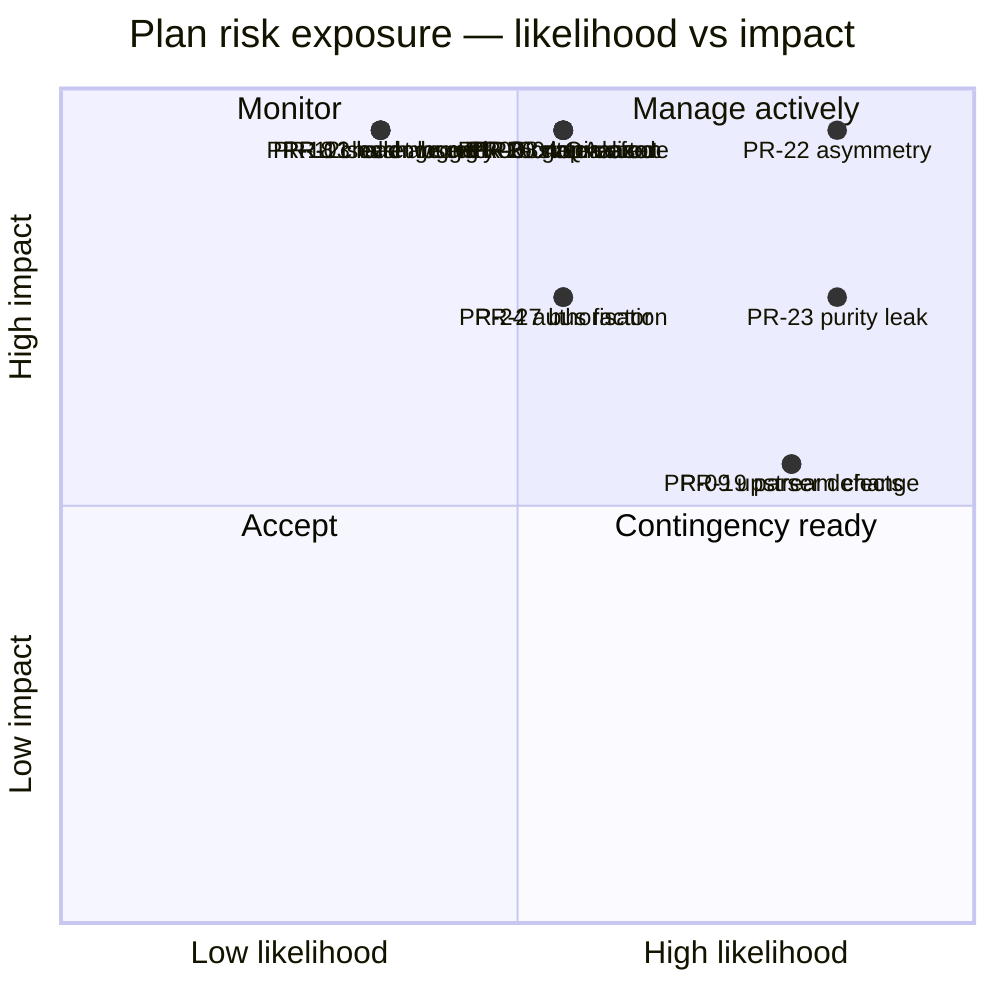

# Part 15 — Engineering Management

*Audience: the Engineering Manager, the tech lead, and anyone who has to answer "are we on track?" This part contains the sprint mechanics, the risk register, the dependency matrix, the critical path, the twelve decision gates, and the progress-tracking model. It is the only part of the plan that a non-engineer needs to read in full.*

---

# 15.1 Sprint Planning

## 15.1.1 The Planning Meeting

Ninety minutes, first Monday. The agenda is fixed and does not expand.

| # | Item | Time | Output |
|---|---|---|---|
| 1 | Previous sprint's gate outcome and open follow-ups | 10 min | Follow-ups dated and owned |
| 2 | Estimate-vs-actual review from the previous sprint | 10 min | Calibration input (§7.7) |
| 3 | Sprint goal stated as **one sentence** | 5 min | The commitment |
| 4 | Task selection against the phase plan | 25 min | Assigned tasks with owners |
| 5 | D4/D5 second reviewers named | 5 min | Named at planning, **not at review time** |
| 6 | External dependencies confirmed in hand (§4.4) | 10 min | Blockers surfaced now, not mid-sprint |
| 7 | Demo command written down | 5 min | The sprint's acceptance |
| 8 | Risk register re-scored | 15 min | Updated likelihood and impact |
| 9 | Cut list confirmed if the sprint is over capacity | 5 min | Named, ordered, agreed |

## 15.1.2 Capacity Rules

| Rule | Statement |
|---|---|
| CAP-1 | Commit to ≤ 120 IEH per two-week sprint (60 for one-week sprints), or record the overage with a named cut list |
| CAP-2 | A single engineer may not be assigned more than one D4 or D5 task in a sprint |
| CAP-3 | Agent-executed tasks count at their **post-multiplier** estimate, and the human review time is counted separately against the reviewer |
| CAP-4 | Unfinished work moves with a recorded reason; it is never silently re-estimated to fit |
| CAP-5 | The reserve is drawn against explicitly at the planning meeting, never absorbed inside a task estimate |

## 15.1.3 The Sprint Goals, Restated for Tracking

| Sprint | Goal (the sentence that must still be true at review) |
|---|---|
| SP-0 | Every commit from now on is automatically checked. |
| SP-1 | Hostile text becomes safe text, provably. |
| SP-2 | Absence never deletes, and nothing bad can be published. |
| SP-3 | The kernel gets a way in, a way out, and a human interface. |
| SP-4 | A file becomes a payload, through every stage. |
| SP-5 | A browser drives real markup into the proven pipeline. |
| SP-6 | The system runs itself and commits the result. |
| SP-7 | Every failure mode is injected and proven safe. |
| SP-8 | A real client's reviews render on a real website. |

---

# 15.2 Weekly Milestones

**Sixteen weekly checkpoints.** Each has one observable outcome. A week whose outcome is not observable is a week whose progress is a claim.

| Week | Sprint | Observable Outcome | If Missed |
|---|---|---|---|
| **W01** | SP-0 | `ci.yml` green on a no-op PR; 19 proof branches recorded | Everything slips one week; no recovery is possible later, so protect this week |
| **W02** | SP-1 | Taxonomy complete; DR-1/DR-2 architecture tests active; PT-10 and PT-11 exist and are **red** | Normalizer starts without its acceptance criteria |
| **W03** | SP-1 | PT-10, PT-11 green; `core/normalize/` ≥ 95%; dates and identity landed | MS-1 slips; MS-2 cannot start (hard edge) |
| **W04** | SP-2 | Validation complete; **PT-01, PT-02, PT-07 exist and are red** | Reconciliation starts without its laws — stop and correct |
| **W05** | SP-2 | **PT-07 green**; gate at 100% coverage; PT-12, PT-13, PT-14 green | **DG-03 fails. This is the project's most consequential week** |
| **W06** | SP-3 | Redaction at 100%; state round-trip green; PT-15 green | MS-3 slips into W07; absorbable |
| **W07** | SP-3 | `tpre doctor`, `plan`, `validate-config`, `project` all run | MS-4 slips; MS-5 start delayed |
| **W08** | SP-4 | Contract suite exists; CSV adapter passes it; selector packs load | The interface is never validated before browser work (X-8 violated) |
| **W09** | SP-4 | **CSV → payload, end to end**; twenty golden fixtures green | **DG-06 fails; the port cannot be changed cheaply after this** |
| **W10** | SP-5 | Browser launches; interception measured; isolation test green with a failing target | Acquisition slips into W12 |
| **W11** | SP-5 | Fixture server + navigator; **stall ⇒ partial ⇒ gate rejection**; DOM adapter passes the contract suite | MS-6 slips |
| **W12** | SP-6 | Orchestrator complete; hash-gating proven; **first live-source contact** | Live behaviour unknown until W13 |
| **W13** | SP-6 | Dispatched `harvest.yml` commits to `data`; second run produces zero commits | **DG-08 fails; unattended operation unproven** |
| **W14** | SP-7 | Health, alerts, diagnostics working; chaos harness built | Chaos compresses into one week |
| **W15** | SP-7 | **All fourteen chaos scenarios green**; contract × 4; migration drill under an hour | **DG-09 fails; the release cannot proceed** |
| **W16** | SP-8 | Renderer shipped; eight workflows live; **first client's reviews on a real website** | GA slips; soak start slips by the same amount |

---

# 15.3 Risk Register

Twenty-eight risks to **executing this plan**. Distinct from the SAD's operating risks (`RISK-`) and the TRD's implementation risks (`IR-`), both of which are referenced where relevant.

**Scoring:** Likelihood (L) and Impact (I) on 1–5. Exposure = L × I. Re-scored at every sprint planning (§15.1.1 item 8).

## 15.3.1 The Register

| ID | Risk | L | I | Exp | Mitigation | Trigger to Escalate | Owner |
|---|---|---|---|---|---|---|---|
| **PR-01** | The Staff Backend Engineer is unavailable | 2 | 5 | **10** | D4/D5 tasks have named second reviewers who could take over; the property laws document intent independently of the person | Any absence > 3 days during SP-1, SP-2 | EM |
| PR-02 | The second Backend Engineer starts late or leaves (OPQ-01) | 3 | 4 | **12** | Plan states the consequence: MS-5 onward slips ~3 weeks; DG-03 re-baselines | Confirmed at DG-01 | EM |
| PR-03 | DevOps unavailable at PH-19/PH-24 | 2 | 4 | 8 | Workflows are the most agent-tractable work in the plan; the composite action is one file | Absence during SP-6 or SP-8 | EM |
| PR-04 | QA architect cut or unavailable | 3 | 5 | **15** | §0.8's Manager Note: this is the line item most likely to be cut and the one that must not be. Chaos tests written by the code's author test the failures already thought of | Any proposal to reduce QA below 0.3 FTE | EM |
| PR-05 | Exit criteria erode under deadline | 3 | 5 | **15** | X-2 and B-2; gates chaired by someone other than the implementer; the cut list (§9.5) is published at DG-01 before pressure exists | Any phase closed with an amber exit criterion | Architect |
| PR-06 | Security review not performed | 2 | 4 | 8 | Security items are checklist rows with named owners in §63–§65 | Any release checklist with an unsigned security row | Security |
| PR-07 | AI agents unavailable or unusable | 2 | 3 | 6 | Multiplier drops to 1.0×; end date moves ~4 weeks; DG-03 re-baselines | > 40% agent PR rejection rate in SP-1 | AI Lead |
| **PR-08** | Normalizer passes tests but misses an input class | 3 | 5 | **15** | PT-10 at ≥ 1,000 generated cases; the eight-class adversarial corpus; a second reviewer constructs five strings **blind** (§37.6) | Any adversarial string found post-PH-02 | Backend |
| **PR-09** | Upstream markup changes during the build | 4 | 3 | **12** | Fixtures captured early (SP-2/SP-3); extraction tested only against saved markup; first live contact deferred to W12; selector packs are data | Canary assertions failing before GA | Backend |
| **PR-10** | Fixture corpus is late, blocking PH-13 | 3 | 4 | **12** | Capture starts SP-2, four weeks before it is needed; the adversarial five are named tasks, not "capture fixtures" | Fewer than 12 fixtures by end of SP-3 | QA |
| PR-11 | Config precedence subtly wrong | 3 | 3 | 9 | Ten-test precedence matrix including the array-replace rule; `--explain` trace | Any precedence surprise found after PH-09 | Backend |
| **PR-12** | **A secret is logged before redaction is wired** | 2 | 5 | **10** | Ordering: `redact.mjs` at 100% before the sink exists; no secret-reading adapter until PH-22; push protection | Any secret in any artifact, ever | Security |
| PR-13 | Identity or content hashing wrong after first publish | 2 | 5 | **10** | Versioned identity; PT-08/PT-09; `generated_at` exclusion as a matched pair; irreversibility stated in §36.4 | Any proposed change to identity inputs post-GA | Architect |
| PR-14 | Playwright leaks beyond one file | 3 | 3 | 9 | DR-3 architecture test **and** lint; grep in the PH-14 verification | A second importer appears | Backend |
| PR-15 | Browser contexts leak on failure paths | 3 | 4 | **12** | Isolation test **including a failing target**; open-context assertion after every target; reviewer removes the `finally` to prove the test works | RSS trend rising across a shard | Backend |
| PR-16 | Stop reason inferred rather than emitted | 3 | 5 | **15** | NAV-01; completeness derived only from the stop reason; CH-04 asserts three protections | Any code path computing completeness from counts | Backend |
| PR-17 | Selector pack authored with weak strategies | 3 | 3 | 9 | Schema requires ≥ 2 strategies of different kinds; `notes` mandatory; CH-07/CH-08 | A pack merged with a single-strategy field | Backend |
| **PR-18** | A retry is added to a challenge path | 2 | 5 | **10** | Enumerating retry test; second reviewer on any `challenge-detect.mjs` PR; INV-07 | Any retry appearing near an `ERR-BLOCKED-*` path | Architect |
| PR-19 | Parser defects: singular dates, replies, aggregate ratings | 4 | 3 | **12** | Named tasks for each (T-075, T-200, T-201); fixtures 004, 010; integer post-check | Any golden fixture regenerated to match the code | Backend |
| PR-20 | Gate short-circuits or mis-handles first publish | 3 | 5 | **15** | EDR-023; 100% coverage; the unreadable-prior test (IR-25) | Any gate PR without both a rejects and a does-not-reject test | Architect |
| PR-21 | `data` checkout skipped in a workflow | 2 | 5 | **10** | TR-CI-022; an in-workflow comment stating why; gate rejects on unreadable prior | Any workflow edit touching checkout steps | DevOps |
| **PR-22** | **The absence asymmetry is simplified** | 4 | 5 | **20** | **The plan's highest-exposure risk.** PT-07 written first; CH-04's three assertions; module header explaining why it is not redundant; human-led implementation by rule (Part 16) | Any refactor PR touching `core/reconcile/` | Architect |
| **PR-23** | Purity leaks into `core/` via a default `Date.now()` | 4 | 4 | **16** | DR-2 architecture test **and** lint; TR-STD-060; called out as the most likely agent error | Any `core/` function with a defaulted temporal parameter | Backend |
| PR-24 | Client authorisation record unobtainable | 3 | 4 | **12** | Start at W01; §4.4's Stop Condition: the engine ships regardless, with an internal scratch listing | Not in hand by end of SP-6 | EM |
| PR-25 | Scope creeps into TRD §76–§91 | 3 | 3 | 9 | A-10; the "seam or future work?" review question; §9.4's explicit not-built list | Any PR implementing behaviour behind a seam | Architect |
| PR-26 | Agent-produced code passes review but violates a rule | 3 | 4 | **12** | Part 16's module isolation and verification rules; D4/D5 are human-led; architecture tests are mechanical | Two agent PRs rejected for the same rule class | AI Lead |
| PR-27 | Single-point knowledge (bus factor 1 on the kernel) | 3 | 4 | **12** | Two reviewers on D4/D5; property laws encode intent; module headers state boundaries; onboarding validated by an outsider | Only one person can explain `core/reconcile/` at DG-04 | EM |
| PR-28 | The suite grows past three minutes and stops being run | 3 | 3 | 9 | IR-17; suite duration printed on every CI run; live suite excluded and proven excluded | Any CI run above 3 minutes for the default suite | QA |

## 15.3.2 Exposure Map

## 15.3.3 The Five to Watch

| Rank | ID | Why It Leads |
|---|---|---|
| 1 | **PR-22** | Exposure 20. It is the only risk whose realisation is both invisible and destructive to a paying client's data |
| 2 | **PR-23** | Exposure 16. It silently voids fifteen property laws, so it defeats the mitigation for every other correctness risk |
| 3 | PR-04, PR-05, PR-20, PR-16, PR-08 | Exposure 15 each. All five are "the safety mechanism was built but not really tested" |
| 4 | PR-09 | The only high-likelihood external risk; mitigated structurally rather than managerially |
| 5 | PR-02 | The staffing risk with the largest schedule consequence, and it is knowable at DG-01 |

---

# 15.4 Dependency Matrix

## 15.4.1 Phase-to-Phase

`■` = hard dependency (cannot start) · `□` = soft dependency (can start, cannot finish) · blank = independent

| Blocked ↓ / Requires → | 00 | 01 | 02 | 03 | 04 | 05 | 06 | 07 | 08 | 09 | 10 | 11 | 12 | 13 | 14 | 15 | 16 | 17 | 18 | 19 | 20 | 21 | 22 | 23 | 24 |
|---|---|---|---|---|---|---|---|---|---|---|---|---|---|---|---|---|---|---|---|---|---|---|---|---|---|
| **PH-01** | ■ | | | | | | | | | | | | | | | | | | | | | | | | |
| **PH-02** | ■ | ■ | | | | | | | | | | | | | | | | | | | | | | | |
| **PH-03** | ■ | ■ | ■ | | | | | | | | | | | | | | | | | | | | | | |
| **PH-04** | ■ | ■ | ■ | ■ | | | | | | | | | | | | | | | | | | | | | |
| **PH-05** | ■ | ■ | ■ | ■ | ■ | | | | | | | | | | | | | | | | | | | | |
| **PH-06** | ■ | ■ | ■ | ■ | ■ | ■ | | | | | | | | | | | | | | | | | | | |
| **PH-07** | ■ | ■ | | | | | □ | | | | | | | | | | | | | | | | | | |
| **PH-08** | ■ | ■ | | | | ■ | ■ | ■ | | | | | | | | | | | | | | | | | |
| **PH-09** | ■ | ■ | | | | | ■ | ■ | □ | | | | | | | | | | | | | | | | |
| **PH-10** | ■ | ■ | | | | | ■ | ■ | ■ | ■ | | | | | | | | | | | | | | | |
| **PH-11** | ■ | ■ | ■ | ■ | ■ | ■ | ■ | ■ | ■ | ■ | ■ | | | | | | | | | | | | | | |
| **PH-12** | ■ | ■ | ■ | | | | | ■ | | | | | | | | | | | | | | | | | |
| **PH-13** | ■ | ■ | ■ | ■ | | | | ■ | | | | □ | ■ | | | | | | | | | | | | |
| **PH-14** | ■ | ■ | | | | | | ■ | | ■ | ■ | **■** | | | | | | | | | | | | | |
| **PH-15** | ■ | ■ | | | | | | ■ | | ■ | | | | ■ | ■ | | | | | | | | | | |
| **PH-16** | ■ | ■ | ■ | ■ | ■ | | | ■ | | ■ | | | ■ | ■ | ■ | ■ | | | | | | | | | |
| **PH-17** | ■ | ■ | | | | ■ | ■ | ■ | ■ | ■ | ■ | □ | | | ■ | ■ | ■ | | | | | | | | |
| **PH-18** | ■ | ■ | | | | ■ | ■ | ■ | ■ | ■ | ■ | | | | | | | ■ | | | | | | | |
| **PH-19** | ■ | | | | | | | ■ | ■ | ■ | ■ | | | | ■ | ■ | ■ | ■ | ■ | | | | | | |
| **PH-20** | ■ | ■ | | | | | | ■ | ■ | ■ | ■ | | | | | | | ■ | ■ | ■ | | | | | |
| **PH-21** | ■ | ■ | ■ | ■ | ■ | ■ | ■ | ■ | ■ | ■ | ■ | ■ | ■ | ■ | ■ | ■ | ■ | ■ | ■ | ■ | ■ | | | | |
| **PH-22** | ■ | ■ | ■ | ■ | ■ | ■ | ■ | ■ | ■ | ■ | ■ | ■ | | | | | ■ | ■ | | | | | | | |
| **PH-23** | ■ | ■ | ■ | | | | ■ | | | | | | | | | | | | | | | | | | |
| **PH-24** | ■ | | | | | | | ■ | ■ | ■ | ■ | | | | | | | ■ | ■ | ■ | ■ | | | | |
| **PH-25** | ■ | ■ | ■ | ■ | ■ | ■ | ■ | ■ | ■ | ■ | ■ | ■ | ■ | ■ | ■ | ■ | ■ | ■ | ■ | ■ | ■ | ■ | ■ | ■ | ■ |

**The bolded cell — PH-14 requires PH-11 — is the one dependency in this matrix that is a policy rather than a technical necessity.** Nothing in the code prevents building the browser adapter first. X-8 forbids it, because an interface validated against one implementation is a rename.

## 15.4.2 Non-Code Dependencies

| Artifact | Blocks | Lead Time | Start By | Owner |
|---|---|---|---|---|
| Repository + Actions | Everything | 1 day | W01 D1 | DevOps |
| `data`/`state` branches | PH-08 (tests), PH-18 (real) | 1 hour | W01 | DevOps |
| Pages + **measured headers** | PH-24, PH-25 | 2 days | W01 | DevOps |
| Fixture corpus (20) | PH-13 | **2 weeks elapsed** | **W04** | QA + Backend |
| Selector pack v1 | PH-13 | 3 days | W08 | Backend |
| Canary reference listing (OPQ-02) | PH-19 | 1 day | W12 | Backend |
| Offsite clone | PH-25 (by rule) | 1 hour | W01 | DevOps |
| **Client authorisation record** | PH-25 | **Unknown — external** | **W01** | EM |
| Client website access | PH-25 verification | External | W12 | EM |

---

# 15.5 Critical Path Analysis

## 15.5.1 The Path

```mermaid
flowchart LR
    A["PH-00<br/>62 IEH<br/>W01"] --> B["PH-01<br/>34<br/>W02"]
    B --> C["PH-02<br/>40<br/>W02–03"]
    C --> D["PH-03<br/>46<br/>W03"]
    D --> E["PH-04<br/>26<br/>W04"]
    E --> F["PH-05<br/>46<br/>W04–05"]
    F --> G["PH-06<br/>40<br/>W05"]
    G --> H["PH-08<br/>28<br/>W06"]
    H --> I["PH-09<br/>32<br/>W07"]
    I --> J["PH-10<br/>34<br/>W07"]
    J --> K["PH-11<br/>24<br/>W08"]
    K --> L["PH-13<br/>42<br/>W09"]
    L --> M["PH-16<br/>44<br/>W11"]
    M --> N["PH-17<br/>40<br/>W12"]
    N --> O["PH-18<br/>32<br/>W12"]
    O --> P["PH-19<br/>30<br/>W13"]
    P --> Q["PH-21<br/>34<br/>W14–15"]
    Q --> R["PH-25<br/>20<br/>W16"]

    style C stroke-width:3px
    style F stroke-width:3px
    style G stroke-width:3px
    style K stroke-width:3px
    style Q stroke-width:3px
```

**Critical path length: 654 IEH across 18 phases.** Every hour of slip on any of these phases is an hour of slip on the GA date.

## 15.5.2 Off-Path Phases and Their Slack

| Phase | Slack | Notes |
|---|---|---|
| PH-07 | 0 — it feeds PH-08 | Effectively on-path |
| PH-12 | 4 days | Can run parallel to PH-11 |
| PH-14, PH-15 | 3 days combined | Feed PH-16; SP-5's coupling risk consumes this |
| PH-20 | 5 days | Can start during SP-6 if capacity appears |
| PH-22 | 6 days | Can start once PH-16 lands; **must not move past GA** |
| PH-23 | **10 days** | Only needs PH-06's payload shape; the plan's largest pressure valve |
| PH-24 | 4 days | Highly parallel; agent-tractable |

## 15.5.3 The Five Phases That Set the Date

| Rank | Phase | Why | Protection |
|---|---|---|---|
| 1 | **PH-05** | D5, 46 IEH, single-owner, non-parallelisable, and everything downstream derives from it | Two reviewers; properties first; §5.7's stop condition |
| 2 | **PH-02** | D4, blocks every producer of data by rule (X-7) | Properties first; blind adversarial review |
| 3 | **PH-06** | D4, 100% coverage requirement, blocks all publication | Rules as data; per-rule tests |
| 4 | **PH-11** | Small but gates all browser work (X-8) | Contract suite written here, not later |
| 5 | **PH-21** | Release gate; cannot be compressed because it finds defects that then need repair | The 40 IEH hardening allowance exists for its output |

## 15.5.4 Compression Options, Honestly Assessed

| Option | Saves | Cost | Recommendation |
|---|---|---|---|
| Add a third engineer at W01 | ~2 weeks | Onboarding cost; PH-02/PH-05 do not parallelise | **Only if they own PH-07/PH-09/PH-10 and PH-23** |
| Pull PH-23 forward to SP-6 | 0 on the path | Frees SP-8 | **Yes if SP-6 finishes light** |
| Drop the Places API adapter | 18 IEH off-path | PT-08 proven with 3 adapters instead of 4 | Acceptable under §9.5 |
| Cut the three optional recipes | 10 IEH off-path | Bespoke help for those clients | Acceptable |
| Run chaos concurrently with PH-22 | ~3 days | Chaos then tests a moving target | **No** |
| Shorten the soak | 0 to GA | The soak *is* the acceptance of the design goal (S8) | **No** |
| Skip staged release steps | 10 min | TR-CI-170 | **No** |

---

# 15.6 Decision Gates

Twelve gates. Each has a chair, an agenda, a decision, and a written outcome. **The chair is never the person who did the work.**

| Gate | When | Chair | Decision | Hard Stop |
|---|---|---|---|---|
| **DG-01** | End W01 | DevOps | Is the toolchain proven to reject bad work? Publish the cut list. Confirm OPQ-01 and OPQ-04 | No |
| **DG-02** | End W03 | Architect | Is text provably safe? Are PA-01 and PA-04 holding? | No |
| **DG-03** | End W05 | Architect | **Is the kernel correct?** Re-baseline dates from measured velocity | **Yes** |
| **DG-04** | End W06 | Backend Lead | Does state survive the process? Is redaction proven? | No |
| **DG-05** | End W07 | Backend Lead | Can a human operate the engine? | No |
| **DG-06** | End W09 | Architect + EM | **Is the adapter interface right, now that it has one implementation?** Last cheap moment to change it. Second re-baseline | **Yes** |
| **DG-07** | End W11 | Backend Lead + Security | Does real acquisition work, with isolation intact? | No |
| **DG-08** | End W13 | DevOps + Security | **May the system hold a write token and touch a live source unattended?** | **Yes** |
| **DG-09** | End W15 | QA + Architect | **Is every failure mode proven safe?** | **Yes** |
| **DG-10** | W16 | EM | Release candidate: §63 and §64 complete? | **Yes** |
| **DG-11** | W16 | EM | Production go-live: §65 complete, including the two non-waivable prerequisites? | **Yes** |
| **DG-12** | Post-soak | EM + Architect | Soak accepted (S1–S8)? V2 register prioritised? | No |

## 15.6.1 Gate Mechanics

| Rule | Statement |
|---|---|
| G-1 | The gate's agenda is the milestone's exit criteria, verbatim. Nothing is added on the day |
| G-2 | Each criterion is **green, amber, or red**. Amber requires a dated owner and a follow-up; red blocks |
| G-3 | A hard-stop gate has **no amber**. Criteria are green or the gate does not pass |
| G-4 | The outcome is written the same day: decision, conditions, follow-ups, and re-baselined dates |
| G-5 | A gate may be held early if the criteria are met early. It may not be held late without recording why |

## 15.6.2 Go/No-Go Checkpoints

Three of the twelve are true go/no-go decisions where "no" has a defined alternative rather than "wait".

| Checkpoint | Question | If No |
|---|---|---|
| **DG-03** (W05) | Is `core/` correct? | **Halt forward motion** (§5.7). Resolve the specification or the comprehension failure. Do not build on an unproven kernel |
| **DG-06** (W09) | Is `AcquisitionPort` right? | Change it now, at a cost of ~1 week. Changing it after PH-14 costs ~3 weeks of browser rework |
| **DG-08** (W13) | May we run unattended against a live source? | Ship the CSV-fed path to an internal client; defer DOM acquisition until the concern is resolved. This is a real, tested product state (§9.3) |

---

# 15.7 Progress Tracking

## 15.7.1 What Is Tracked

| Signal | Source | Cadence | Answers |
|---|---|---|---|
| Tasks merged vs planned | Branch names (`t/<id>-*`) merged to `main` | Daily, automatic | Are we moving? |
| IEH actual vs estimate | Sprint log | Per task | Are the estimates real? |
| Phase exit criteria status | The phase's criteria table | Weekly | Are we *done*, or just *finished writing*? |
| Property laws green | CI | Every commit | Is the correctness argument intact? |
| Default suite duration | CI | Every commit | Is the suite still usable? (IR-17) |
| Coverage on the two 100% modules | CI | Every commit | Are the safety mechanisms still fully covered? |
| Open risks above exposure 12 | Risk register | Weekly | What is most likely to hurt us? |
| Agent PR acceptance rate | Review outcomes | Weekly | Is PA-04 holding? |
| Blocked-task count and age | Sprint board | Daily | Where is the queue forming? |

## 15.7.2 The Weekly Report

One page, same shape every week. Written by the EM, read in three minutes.

| Section | Content |
|---|---|
| **This week's observable outcome** | From §15.2, and whether it was observed |
| **Tasks** | Merged / in progress / blocked, with the oldest blocker named |
| **Burn** | IEH spent vs planned, cumulative, and reserve remaining |
| **Gate status** | Next gate, its date, and any criterion currently amber or red |
| **Top three risks** | By exposure, with what changed |
| **Decisions needed** | With owners and dates |

## 15.7.3 Burn-Down Against the Reserve

The tracked number is not tasks completed; it is **reserve remaining**, because that is the number that predicts the end date.

| Checkpoint | Reserve Remaining (Healthy) | Action If Below |
|---|---|---|
| End SP-1 | ≥ 110 of 125 | Re-examine the D4 multiplier at DG-02 |
| End SP-2 | ≥ 90 | **Trigger DG-03 re-baselining with measured velocity** |
| End SP-4 | ≥ 70 | Apply cut-list items 1–2; confirm at DG-06 |
| End SP-6 | ≥ 45 | Apply cut-list items 3–4 |
| End SP-7 | ≥ 25 | Apply items 5–7; protect the hardening allowance |
| End SP-8 | ≥ 0 | GA slips by the overage; the soak start slips with it |

## 15.7.4 What Is Deliberately Not Tracked

| Not Tracked | Why |
|---|---|
| Lines of code | Uncorrelated with progress; anti-correlated with quality in a codebase with a 400-line file limit |
| Individual velocity | Two engineers on a 2.3 FTE team; the number is noise and the incentive is bad |
| Test count | The property laws and chaos scenarios matter; the count of unit tests does not |
| Story points | The plan estimates in IEH with explicit confidence bands; a second abstraction adds nothing |
| Percentage complete per phase | A phase is complete when its exit criteria are green. "80% complete" is the number that hides the last 80% |

## 15.7.5 The Escalation Rules

| Situation | Escalate To | Within |
|---|---|---|
| A task exceeds 2× its estimate (X-11) | Stand-up | Same day |
| A phase's exit criterion cannot be met | Architect | Same day |
| A requirement and a test disagree (ID-10) | Architect | Immediately — **stop work on that task** |
| An invariant appears unimplementable | The next DG, convened early | Immediately |
| A branch is older than 72 hours (24 h in SP-5) | Stand-up | Same day |
| An external dependency slips (§15.4.2) | EM | Same day |
| Reserve falls below its checkpoint threshold | The next DG | That week |

---

## Part 15 Summary — The Management Model in Six Lines

1. **Nine milestones**, each with a one-command demo, each gated by a named chair.
2. **Sixteen weekly outcomes**, each observable, so progress is never a claim.
3. **Twenty-eight plan risks**, re-scored every sprint, with the top two (PR-22, PR-23) named as the ones that defeat all other mitigations.
4. **A 654-IEH critical path** through eighteen phases, with the five date-setting phases identified and protected.
5. **Twelve decision gates**, five of them hard stops, three of them true go/no-go with defined alternatives.
6. **Reserve remaining** is the tracked number, because it is the one that predicts the end date.

---

*End of Part 15. Part 16 is the AI coding agent playbook.*
