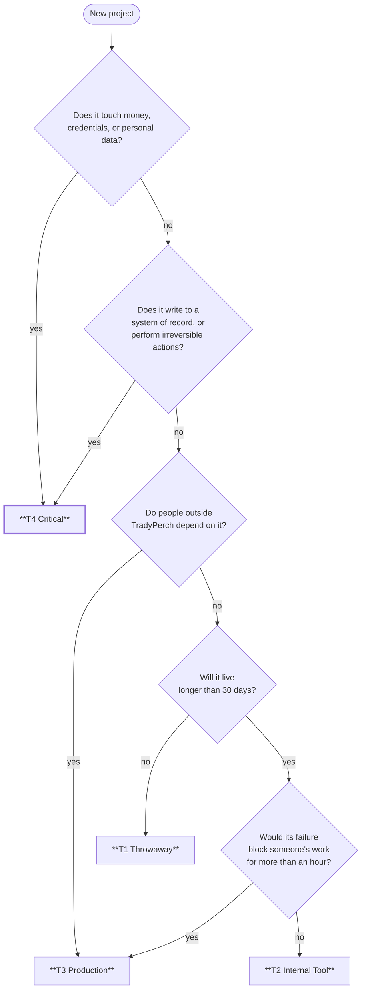
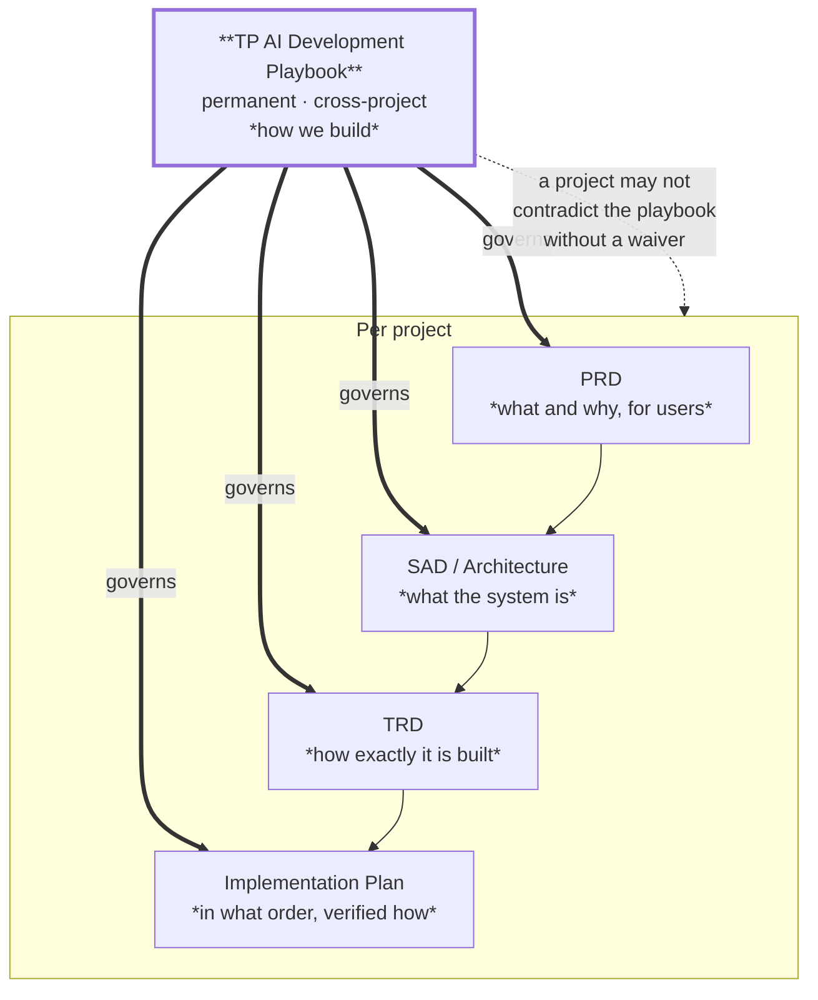

# TP AI Development Playbook

## The TradyPerch Engineering Handbook

### Version 1.0

*The engineering operating system for every TradyPerch software project. Not project-specific. Not optional. This is how we build.*

---

| Field | Value |
|---|---|
| **Document Name** | TP AI Development Playbook |
| **Short Name** | The Playbook |
| **Owner** | TradyPerch Engineering |
| **Version** | 1.0 |
| **Status** | **Active — binding on all projects from this date** |
| **Classification** | Internal — Commercial Confidential |
| **Scope** | Every TradyPerch software project, of every kind, built by humans, AI agents, or both |
| **Supersedes** | All prior informal practice |
| **Review Cadence** | Quarterly; amendments per §29 |
| **First Governed Project** | TP Reviews Engine v1.0 |
| **Document Date** | 2026-07-31 |

---

## 0.1 Why This Document Exists

TradyPerch builds software with a small team and a large share of the implementation performed by AI coding agents. That combination is enormously productive and structurally fragile. It is productive because an agent can implement a well-specified module faster than a human can type. It is fragile because an agent will also implement a *badly* specified module at exactly the same speed, with the same confidence, and the defect will look like working code.

The difference between those two outcomes is not the model. It is the process around it.

This playbook is that process. It exists so that:

| Without It | With It |
|---|---|
| Every project invents its own architecture | Architecture is chosen from a known set, with recorded reasons |
| Every project invents its own quality bar | The quality bar is the same everywhere and is mechanically enforced |
| Agent output quality depends on who wrote the prompt that day | Prompt structure, size, and context are standardised |
| A defect found in project A recurs in project B | Standards absorb the lesson once |
| "Done" means whatever the person saying it believes | "Done" is eleven conditions, all checkable |
| Knowledge lives in one person's memory | Knowledge lives in documents that outlive the person |
| Six months later, nobody can safely change the code | The code was written to be changed six months later |

**The economic argument.** A defect caught in review costs minutes. The same defect caught in production costs hours and a customer's confidence. A defect caught *never* — a silent data corruption, a leaked secret, a wiped record — costs the business. Every rule in this handbook exists because the class of failure it prevents is more expensive than the discipline it demands. Where that stops being true, the rule is wrong and §29 explains how to change it.

## 0.2 What This Document Is Not

| It Is Not | Because |
|---|---|
| A style guide | Formatting is delegated to automated formatters. This handbook governs decisions, not whitespace |
| A technology mandate | It does not say "use React". It says how to *choose*, and how to record the choice |
| A substitute for thinking | Every rule states its rationale. An engineer who understands the rationale can identify when the rule does not apply — and §29 tells them what to do about it |
| Application code | This handbook contains no implementation. It contains process, standards, workflows, governance, and templates |
| Optional | The rules marked **MUST** are binding. §30 lists the ones that have no waiver at all |

## 0.3 Audience and Conformance

### 0.3.1 Who Must Follow This

| Audience | Obligation |
|---|---|
| **AI coding agents** — Claude Code, OpenAI Codex, Gemini CLI, Cursor, Windsurf, GitHub Copilot, and successors | Full conformance. §2, §3, §4, §13, §19, §25, §26 are written specifically for you |
| **Human engineers** | Full conformance. You are additionally accountable for anything an agent produces under your name |
| **Technical leads** | Full conformance, plus responsibility for the gates in §27 |
| **Engineering managers** | Responsible for §5, §20, §22, §28, and for not asking anyone to skip §27 |
| **Contractors and external contributors** | Full conformance on TradyPerch repositories |

### 0.3.2 Conformance Keywords

RFC 2119 keywords. They are testable assertions, not emphasis.

| Keyword | Meaning | Deviation Requires |
|---|---|---|
| **MUST / MUST NOT** | Absolute. Non-conformance blocks merge or release | A written waiver (§29.4), except for §30 rules which admit none |
| **SHOULD / SHOULD NOT** | Strong default. Deviation is sometimes correct | One sentence of recorded rationale in the pull request |
| **MAY** | Genuinely optional | Nothing |
| **WILL** | A future commitment of this handbook | Nothing today |

### 0.3.3 Conformance Tiers by Project Class

Not every project needs every control. **The tier is chosen at project inception (§5) and recorded in the PRD.** It cannot be lowered later without a waiver.

| Tier | Applies To | Examples | Required Sections |
|---|---|---|---|
| **T1 — Throwaway** | Lives < 30 days, single user, no data, no secrets | A one-off migration script, a spike, a proof of concept | §1, §2, §8 (naming only), §24, §30 |
| **T2 — Internal Tool** | Internal users, non-critical, recoverable failures | An internal CLI, a dashboard, a dev tool, a Chrome extension for internal use | T1 + §5 (light), §6, §7, §10, §11 (unit), §14 (README), §15 (secrets), §23 |
| **T3 — Production Service** | External users or business-critical internal use | A SaaS platform, a customer-facing web app, a mobile app, a backend API | T2 + all of §5, §9, §11 (full), §12, §16, §17, §18, §22, §27, §28 |
| **T4 — Critical** | Handles money, personal data, credentials, or writes to systems of record | Payments, auth, anything holding PII, anything with an irreversible write | T3 + mandatory security review (§15), mandatory chaos testing (§11), two-reviewer rule on the hazard modules, formal release gates |

**Choosing a tier is a decision with consequences, and inflation is as harmful as deflation.** A T4 process applied to a two-day internal script wastes a week and teaches the team that the process is theatre. A T2 process applied to a payments integration is how a company ends up in the news.

### 0.3.4 The Tier Decision Tree

**When genuinely uncertain, choose the higher tier.** Downgrading later is a five-minute decision; discovering mid-project that the tier was too low means retrofitting tests, security review, and observability into a codebase that was not built for them.

## 0.4 How to Read This Handbook

### 0.4.1 Reading Paths

| You are… | Read, in this order | Time |
|---|---|---|
| **An AI coding agent, first session on a project** | §30 (constitution) → §2 → §25 (workflow) → §3 → §4 → §24 (forbidden) → the section for your task | 90 min |
| **A human engineer, first week** | §1 → §30 → §5 → §8 → §10 → §23 (checklists) → skim the rest | 4 h |
| **A technical lead starting a project** | §5 → §6 → §0.3.3 (tier) → §20 → §27 → §22 | 3 h |
| **An engineering manager** | §1 → §5 → §20 → §21 → §22 → §28 | 2 h |
| **Reviewing someone's pull request** | §23.3 (before merge) → §10 → §24 | 15 min |
| **In an incident** | §12 → §13 → §18.7 (rollback) → §17 | 20 min |
| **Deciding whether to rewrite something** | §21 | 30 min |
| **Anyone, ever, in doubt** | **§30** | 10 min |

### 0.4.2 The Standard Section Block

Every one of the thirty sections follows this structure. It is defined here once and not repeated.

| Field | Contains |
|---|---|
| **Purpose** | One paragraph: what this section is for and what goes wrong without it |
| **Objectives** | The enumerated outcomes the section is trying to produce |
| **Engineering Rationale** | *Why* these rules, not merely what they are. The part that lets a competent engineer know when a rule does not apply |
| **Standards** | The normative content: MUST / SHOULD / MAY rules, tables, and thresholds |
| **Real-World Examples** | Concrete situations, drawn from real project shapes, showing the rule in action |
| **Common Mistakes** | What people and agents actually get wrong, with the symptom and the fix |
| **Anti-Patterns** | Named failure shapes, so that a team can recognise one by name before it costs a quarter |
| **Decision Tables** | Structured choices with criteria, so decisions are made once and recorded |
| **Checklists** | Executable, in order, by someone who did not write the section |
| **Risk Analysis** | What can still go wrong when the section is followed, and what bounds it |
| **Future Improvements** | What this section will need as TradyPerch grows |

### 0.4.3 Notation

| Convention | Meaning |
|---|---|
| **`RULE-nn`** | A numbered normative rule within a section. Cited in reviews as e.g. `SEC-15.4` |
| **Rationale** | An explanation block. Not normative, but the reason the adjacent rule exists |
| **Agent Note** | Aimed at AI coding agents; usually names a plausible-but-wrong action |
| **Human Note** | Aimed at human engineers; usually names a discipline that automation cannot enforce |
| **Anti-pattern:** *name* | A named failure shape |
| **T1 / T2 / T3 / T4** | Conformance tier that the adjacent rule applies from |
| ✅ / ❌ | Conformant / non-conformant example |

### 0.4.4 Identifier Families

| Prefix | Meaning | Defined In |
|---|---|---|
| `§n` | A section of this handbook | — |
| `RULE-` | A normative rule | Per section |
| `AP-` | A named anti-pattern | §24 and throughout |
| `GATE-` | A quality gate | §27 |
| `KPI-` | An engineering metric | §28 |
| `CONST-` | A constitutional rule — no waiver exists | §30 |
| `TMPL-` | A prompt template | §26 |
| `CHK-` | A checklist | §23 |
| `ADR-` | An architecture decision record (per project) | §5 |
| `WAIVER-` | An approved deviation | §29.4 |

## 0.5 The Handbook in One Page

If everything else is lost, this page is the handbook.

| # | Principle | Section |
|---|---|---|
| 1 | **Plan before you build.** Every project above T1 has a written PRD, architecture, and implementation plan before the first line of code | §5 |
| 2 | **Simplicity is a feature.** The simplest design that satisfies the requirement wins, every time | §1 |
| 3 | **AI writes; humans are accountable.** No agent output ships without a named human who has read it | §2 |
| 4 | **One task, one prompt, one commit, one pull request** | §3, §25 |
| 5 | **Tests ship with the code they test.** Not later. There is no later | §10, §11 |
| 6 | **Silent failure is the worst failure.** Never swallow an error; never return an empty result on failure | §24 |
| 7 | **Secrets never touch the repository.** Ever, in any form, in any branch, in any history | §15, §30 |
| 8 | **The build is always green.** A broken main branch blocks everyone | §7, §27 |
| 9 | **Every module has one responsibility and states what it does not do** | §9, §14 |
| 10 | **If it cannot be diagnosed from logs and artifacts alone, it is not finished** | §17 |
| 11 | **Every incident becomes a permanent test, in the same change that fixes it** | §12 |
| 12 | **When something does not fit the spec, stop and ask. Never invent** | §2, §13 |
| 13 | **Reversibility is a design goal.** Know the rollback before you ship | §18, §21 |
| 14 | **Documentation is part of the work, not after it** | §14 |
| 15 | **The rules apply under deadline pressure. That is when they are load-bearing** | §30 |

## 0.6 Section Map

| § | Title | Part | Primary Audience |
|---|---|---|---|
| 1 | Engineering Philosophy | 1 | Everyone |
| 2 | AI Coding Philosophy | 1 | Agents, leads |
| 3 | Prompt Engineering Standards | 2 | Agents, engineers |
| 4 | Context Management | 2 | Agents, engineers |
| 5 | Planning Before Coding | 3 | Leads, managers |
| 6 | Repository Standards | 4 | Engineers |
| 7 | Git Standards | 4 | Engineers, agents |
| 8 | Coding Standards | 5 | Engineers, agents |
| 9 | Module Isolation Rules | 5 | Engineers, agents |
| 10 | Definition of Done | 6 | Everyone |
| 11 | Testing Standards | 6 | Engineers, QA |
| 12 | Debugging Standards | 7 | Engineers |
| 13 | AI Error Recovery | 7 | Agents, engineers |
| 14 | Documentation Standards | 8 | Everyone |
| 15 | Security Standards | 8 | Everyone |
| 16 | Performance Standards | 9 | Engineers |
| 17 | Observability | 9 | Engineers, SRE |
| 18 | Deployment Standards | 10 | DevOps, engineers |
| 19 | AI Agent Collaboration | 10 | Agents, leads |
| 20 | Project Lifecycle | 11 | Managers, leads |
| 21 | Decision Frameworks | 11 | Leads, architects |
| 22 | Risk Management | 12 | Managers, leads |
| 23 | Engineering Checklists | 12 | Everyone |
| 24 | Forbidden Practices | 13 | Everyone |
| 25 | AI Coding Workflow | 13 | Agents |
| 26 | Prompt Library | 14 | Agents, engineers |
| 27 | Quality Gates | 15 | Leads, managers |
| 28 | Engineering KPIs | 15 | Managers |
| 29 | Future Evolution | 16 | Everyone |
| 30 | **The Engineering Constitution** | 16 | **Everyone** |

## 0.7 Relationship to Project Documents

This handbook is the standing standard. Each project produces its own documents that instantiate it.

| Rule | Statement |
|---|---|
| **P-1** | A project document MUST NOT contradict this handbook. Where it does, the handbook wins and the project document is defective |
| **P-2** | A project MAY be *stricter* than the handbook without any approval |
| **P-3** | A project MAY be *looser* only with a recorded waiver (§29.4) |
| **P-4** | Where the handbook is silent, the project decides and records the decision as an ADR |
| **P-5** | A pattern that three projects have independently adopted SHOULD be proposed as a handbook amendment |

## 0.8 Document Control

### 0.8.1 Revision History

| Version | Date | Change | Approval |
|---|---|---|---|
| v0.1 | 2026-07-31 | Extracted from TP Reviews Engine practice; generalised | Draft |
| **v1.0** | **2026-07-31** | **Baselined. Thirty sections, four conformance tiers, the Engineering Constitution.** | **Active** |

### 0.8.2 Ownership

| Section Range | Owner | Review Cadence |
|---|---|---|
| §1–§2, §29–§30 | Head of Engineering | Annually, or on incident |
| §3–§4, §13, §19, §25–§26 | AI Systems Architect | **Quarterly** — this is the fastest-moving area |
| §5, §20–§22, §28 | Technical Program Management | Semi-annually |
| §6–§9, §21 | Principal Engineer | Semi-annually |
| §10–§12, §23, §27 | QA Lead | Quarterly |
| §14 | Whoever last found the docs wrong | Continuous |
| §15 | Security Architect | **Quarterly + on any incident** |
| §16–§18 | Staff DevOps Engineer | Semi-annually |
| §24 | Everyone. Additions are welcome from anyone who has been bitten | Continuous |

### 0.8.3 Binding Status

This handbook is binding from its baseline date on all new projects, and on existing projects at their next major version. A pull request that contradicts a **MUST** rule is rejected. A pull request that contradicts a **SHOULD** rule without a recorded reason is rejected. Neither is a judgement about the author; both are how a standard stays a standard.

**Code that drifts from this handbook is treated as a defect of the same severity as a failing test.**

---

*End of front matter. Part 1 begins with Section 1, Engineering Philosophy.*
