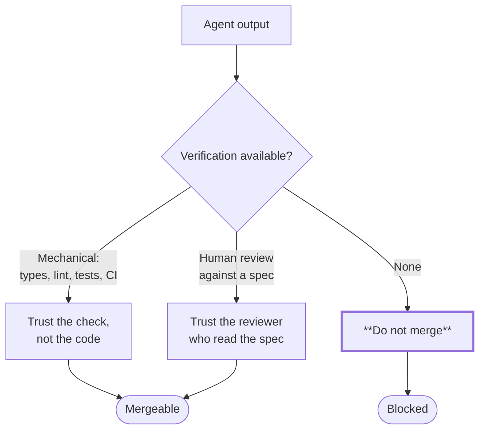

# Part 1 — Philosophy

*Sections 1 and 2. Everything else in this handbook is a consequence of these two sections. An engineer who internalises Part 1 will derive most of the remaining twenty-eight sections independently; an engineer who skips it will experience the rest as arbitrary bureaucracy.*

---

# 1. Engineering Philosophy

## 1.1 Purpose

To state what TradyPerch engineers value, so that the thousands of small decisions nobody reviews — the ones made alone, at speed, under pressure — trend in the same direction. Standards govern the decisions we anticipated. Philosophy governs the ones we did not.

Without a shared philosophy, a team of three produces four architectures, every code review becomes a negotiation of first principles, and the codebase becomes a geological record of whoever was most opinionated in each quarter.

## 1.2 Objectives

1. Define the values that override local convenience.
2. Establish quality as a **precondition** of delivery, not a phase after it.
3. Make maintainability a first-class requirement with the same standing as functionality.
4. Establish that clarity beats cleverness, permanently and without exception.
5. Define what ownership means when much of the code is machine-written.
6. Establish documentation as part of the work rather than a tax on it.
7. Give every engineer a defensible answer to "why are we doing it this way?"

## 1.3 Engineering Rationale

### 1.3.1 The Constraint That Shapes Everything

TradyPerch is a small engineering organisation building software intended to last years, with a large fraction of implementation performed by AI agents. Three consequences follow, and they are the root of nearly every rule in this handbook:

| Constraint | Consequence |
|---|---|
| **Small team** | Nobody can be a full-time gatekeeper. Quality must be *mechanised* — in linters, tests, and CI — because it cannot be *supervised* |
| **Long horizon** | The person maintaining this in three years will have no context. Code must explain itself, and documents must survive their authors |
| **AI-heavy implementation** | Code volume is cheap; *correct* code volume is not. The scarce resource is verification, so everything is optimised for being easy to verify |

**The third consequence is the one that is new**, and it inverts an old assumption. For decades, engineering process assumed that writing code was the expensive step and that reviewing it was cheap by comparison. With capable agents, generating a plausible 400-line module costs minutes. Confirming that it is correct costs the same as it always did. So the bottleneck has moved, and a process designed for the old bottleneck now optimises the wrong thing.

**Everything in this handbook is designed to reduce the cost of verification.** Small modules, explicit contracts, pure functions, one-responsibility files, tests written with the code, standard structures, forbidden patterns — none of these make code faster to write. They make it faster to *check*, and checking is now the constraint.

### 1.3.2 Why Quality-First Is an Economic Position, Not a Moral One

"Quality first" sounds like a slogan until it is quantified. The cost of a defect grows by roughly an order of magnitude at each stage it survives:

| Caught At | Typical Cost | Who Pays |
|---|---|---|
| While writing | ~1 minute | The author |
| In automated checks | ~5 minutes | The author |
| In review | ~30 minutes | Author + reviewer |
| In staging | ~2 hours | The team |
| In production | ~1 day + trust | The team + users |
| **Never (silent corruption)** | **Unbounded** | **The business** |

Shipping faster by skipping the early stages does not save time. It **moves** time from a cheap stage to an expensive one, and adds risk. The only genuine way to ship faster is to make the early stages cheaper — which is what automation, small changes, and clear standards do.

**Human Note.** The pressure to skip quality steps never arrives labelled as such. It arrives as "this one is simple", "we'll add the tests after the demo", or "the client is waiting". Those are the moments this section exists for. The correct response is not heroism; it is to reduce scope, which is a decision the person applying pressure is entitled to make.

### 1.3.3 Simplicity Is Not Aesthetic Preference

A clever solution is one where the reader must reconstruct the author's reasoning to understand what happens. A simple solution is one where they do not.

In a codebase read far more often than it is written — and maintained by people, and by agents, who lack the author's context — reconstruction cost is the dominant cost. Cleverness moves work from the author to every future reader, multiplied by every future reading.

| The Clever Version | The Simple Version | What It Costs |
|---|---|---|
| A dense expression chaining five operations | Five named steps | Three lines. Buys instant comprehension and a precise stack trace |
| A generic abstraction over one use case | The one use case, directly | Removes an indirection the reader must trace and a constraint on the next change |
| Implicit behaviour via convention | Explicit behaviour, stated | Two lines. Removes "how did that happen?" from every future incident |
| A configuration flag "for flexibility" | The one behaviour that is needed | Removes an untested code path |
| Metaprogramming that generates handlers | Handlers, written out | Greppability. An identifier you cannot search for is an identifier nobody will find |

**Rationale.** Every one of these trades a small, one-time authoring cost for a permanent reduction in reading cost. That is always the right trade in a long-lived codebase, and it is *especially* right when a substantial number of future readers are agents that reason locally from what is in front of them.

### 1.3.4 Maintainability Is a Requirement, Not a Virtue

A feature that works and cannot be safely changed is a liability with a nice demo. TradyPerch treats maintainability as a functional requirement with acceptance criteria:

| Property | Testable Statement |
|---|---|
| **Comprehensible** | A competent engineer unfamiliar with the module can state what it does after five minutes |
| **Changeable** | A typical change touches one module and does not require understanding three others |
| **Verifiable** | A change's correctness is established by tests, not by manual exploration |
| **Diagnosable** | A production failure can be understood from logs and artifacts alone, without reproducing it locally |
| **Reversible** | Any change can be undone in under fifteen minutes, and the procedure is written down before it is needed |
| **Replaceable** | Any single module can be rewritten without rewriting its neighbours |

**If a change cannot satisfy all six, it is not finished — regardless of whether it works.**

### 1.3.5 Reliability Is Designed, Not Achieved

Reliable systems are not systems that do not fail. They are systems in which failure is anticipated, bounded, observable, and recoverable.

| Property | What It Means in Practice |
|---|---|
| **Fail closed on permission and identity** | When authorisation is uncertain, deny. A system that grants access on error is worse than one that is down |
| **Fail soft on data** | One malformed record must not take down the batch. Quarantine it, record it, continue |
| **Never fail silently** | Every failure produces a classified, logged, attributable signal. Silence is the only truly unrecoverable failure mode |
| **Degrade honestly** | If part of the system is unavailable, say so. Do not present stale data as fresh or partial data as complete |
| **Preserve the last known good** | A failed update must never leave the system worse than before it started |
| **Make recovery cheap** | If recovery requires improvisation, it will be improvised badly, at 3 a.m., by whoever is available |

### 1.3.6 Ownership in an AI-Assisted Team

Ownership is the property that someone specific is accountable for a thing being right. AI agents cannot hold it — they have no continuity, no stake, and no ability to be answerable.

| Ownership Rule | Statement |
|---|---|
| **OWN-1** | Every module has exactly one accountable human owner. Not a team; a person |
| **OWN-2** | The person who merges a change owns it, regardless of who or what wrote it |
| **OWN-3** | "The AI wrote it" is never an explanation for a defect. It is an admission that the owner did not verify it |
| **OWN-4** | Ownership transfers explicitly, in writing, with a handover — never by attrition |
| **OWN-5** | An unowned module is a defect in the project, and is assigned at the next review |

**Rationale.** The single greatest risk of AI-assisted development is diffusion of responsibility: the agent generated it, the reviewer skimmed it, nobody actually understands it, and it works — until it does not, and then nobody can fix it. OWN-2 exists to make that impossible. If you merge it, you own it. If you are not willing to own it, do not merge it.

### 1.3.7 Documentation Culture

Documentation is not a phase, a chore, or something written for an imaginary future reader. It is written for a specific, real person: **the engineer, or agent, who touches this next and does not have your context.** That person is frequently you, four months later.

| Principle | Consequence |
|---|---|
| Documentation ships with the change | A pull request that changes behaviour and not the docs is incomplete |
| Explain **why**, not what | The code says what. Only a human can record why the obvious alternative was rejected |
| State what a module **does not** do | The most valuable line in a module header, because it prevents scope creep and misuse |
| Record decisions when made | Reconstructing a decision six months later costs ten times more and loses the alternatives |
| Delete stale docs aggressively | Wrong documentation is worse than none: it is trusted, and it lies |
| Optimise for scanning | Tables and lists over paragraphs. Nobody reads documentation; they search it |

## 1.4 Standards

| ID | Rule | Tier |
|---|---|---|
| **PHIL-01** | Simplicity MUST be preferred over cleverness. Where a reviewer judges a solution to be clever, the burden of justification is on the author | All |
| **PHIL-02** | Maintainability MUST be treated as a functional requirement, assessed at review against §1.3.4's six properties | T2+ |
| **PHIL-03** | Every module MUST have exactly one accountable human owner | T2+ |
| **PHIL-04** | Failures MUST be explicit, classified, and logged. Silent failure is prohibited (§24) | All |
| **PHIL-05** | Documentation MUST ship in the same change as the behaviour it describes | T2+ |
| **PHIL-06** | Decisions with long-term consequences MUST be recorded as ADRs at the time they are made | T3+ |
| **PHIL-07** | Quality checks MUST be mechanised wherever mechanisation is possible. A standard enforced only by review is a standard that erodes | T2+ |
| **PHIL-08** | The conformance tier MUST be chosen at inception and recorded. It MUST NOT be lowered without a waiver | All |
| **PHIL-09** | Scope MUST be the first thing cut under pressure. Quality gates MUST be the last | All |
| **PHIL-10** | An engineer MUST be able to state the rationale for any standard they are applying, or MUST look it up before applying it | All |

## 1.5 Real-World Examples

### Example 1 — The Two-Hour Optimisation

A dashboard endpoint takes 800 ms. An engineer spends two hours adding a caching layer with invalidation logic, reducing it to 40 ms.

| Question | Answer |
|---|---|
| Did it work? | Yes |
| Was it the right call? | **Almost certainly not** |
| Why not? | The endpoint is called by four internal users a few times a day. 800 ms was invisible. The cache added an invalidation path — the classic source of "stale data" bugs — and a second source of truth |
| What should have happened? | Measure the actual user impact first (§16). Record that it is acceptable. Move on |
| What rule covers it? | PHIL-01, and §16's rule that optimisation requires a measured problem |

### Example 2 — The Silent Catch

An agent implements a data import. When a row fails to parse, it catches the error and continues. The import reports success. Three weeks later a customer notices 12% of their records are missing.

| Question | Answer |
|---|---|
| Did the code work? | It ran without crashing, which is not the same thing |
| What was the actual defect? | The failure had no signal. Nobody could have known |
| Cost of catching it in review | Thirty seconds — the reviewer asks "what happens to a bad row?" |
| Cost of catching it in production | Three weeks of missing data, a customer escalation, and an audit of every other import |
| What rule covers it? | PHIL-04, §24's prohibition on catch-and-continue, and §11's requirement that failure paths are tested |

### Example 3 — The Rewrite That Should Not Have Happened

A five-year-old internal tool is "unmaintainable". An engineer proposes a rewrite: six weeks. The rewrite ships at eleven weeks, missing three behaviours nobody had documented because they were only visible in the old code.

| Question | Answer |
|---|---|
| Was the old code bad? | Yes |
| Was the rewrite justified? | Not on that evidence. §21's rewrite criteria were not applied |
| What was actually missing? | Nobody had characterised the existing behaviour. The old code *was* the specification |
| What should have happened? | Characterisation tests first, then incremental replacement behind the existing interface |
| What rule covers it? | §21.4 (rewrite decision framework) |

### Example 4 — The Feature That Could Not Be Removed

A SaaS product adds an integration for one customer. It is wired directly into the core request path with three conditionals on customer id. Two years later the customer leaves. Removing the integration takes a week because nobody can prove which conditionals are still load-bearing.

| Question | Answer |
|---|---|
| What went wrong? | Customer-specific logic in shared code. §9's isolation rules would have made this an adapter |
| Symptom to watch for | Any conditional keyed on a customer, tenant, or account identifier in shared code |
| Cost at the time | Ten minutes saved |
| Cost later | A week, plus permanent uncertainty |

## 1.6 Common Mistakes

| # | Mistake | Symptom | Fix |
|---|---|---|---|
| 1 | Treating quality as a phase | "We'll harden it after launch" | Quality is a per-change property. There is no hardening phase, and there never has been |
| 2 | Optimising the writing step | Huge changes generated quickly, then stuck in review for days | Optimise the *verification* step. Small changes merge fast |
| 3 | Confusing "it works" with "it is done" | Feature demos fine; breaks on the second edge case | §10's Definition of Done, all eleven conditions |
| 4 | Building for imagined future needs | Configuration flags with one value; abstractions with one implementation | YAGNI (§8). Build for the requirement in front of you |
| 5 | Documenting *what* instead of *why* | Comments that restate the line below them | Comments explain rejected alternatives and non-obvious constraints |
| 6 | Diffused ownership | "I thought you owned that" | OWN-1: one named human per module |
| 7 | Trusting agent output because it looks right | Plausible code that fails on the case nobody tested | §2's verification rules; §11's testing rules |
| 8 | Cargo-culting this handbook | Applying T4 process to a T1 script | §0.3.3. The tier is a decision, and inflation is as harmful as deflation |

## 1.7 Anti-Patterns

| ID | Anti-Pattern | Description | Why It Persists | Countermeasure |
|---|---|---|---|---|
| **AP-01** | **Hero Engineering** | One person heroically ships under pressure by bypassing process | It works, once, and gets praised | Praise the outcome, review the method. Recognise that the next attempt fails |
| **AP-02** | **Resume-Driven Development** | Technology chosen for its interest rather than its fit | Learning is genuinely valuable, so it feels defensible | §21's decision matrices force stated criteria |
| **AP-03** | **The Big Rewrite** | Replacing a working system wholesale rather than incrementally | The existing code is genuinely unpleasant | §21.4's five preconditions, all required |
| **AP-04** | **Quality Theatre** | Process that produces artifacts nobody reads — checklists ticked without execution | It is visible and feels like rigour | Every check produces *evidence*, not a tick (§27) |
| **AP-05** | **Premature Generalisation** | An abstraction built before a second use case exists | Feels forward-thinking | Two users minimum; three is often better |
| **AP-06** | **The Knowledge Silo** | One person understands a critical component | Efficient in the short term | Two reviewers on hazard modules; docs as an exit criterion |
| **AP-07** | **Deadline Amnesia** | Standards apply until the week they matter | Pressure is real | §30. The constitution is written specifically for that week |
| **AP-08** | **The Zombie Feature** | Nobody uses it, nobody removes it, everybody maintains it | Removal feels risky | §20's retirement stage; usage measurement before renewal |

## 1.8 Decision Tables

### 1.8.1 Simplicity vs Capability

| Situation | Choose Simple When | Choose Capable When |
|---|---|---|
| Data storage | One consumer, small volume, no complex queries | Multiple consumers, growth is measured not assumed |
| Abstraction | One implementation exists | **Two implementations exist today** |
| Configuration | The value has never changed | The value has changed at least once, or differs by environment |
| Caching | The measured latency is acceptable | A measured problem exists and correctness is unaffected |
| Async processing | The operation completes within the request budget | It does not, measurably |
| Framework | The standard library suffices | You would write more than ~200 lines to replace it |

**The pattern:** the "capable" column always requires *evidence in the present tense*. Anticipated need is not evidence.

### 1.8.2 What to Cut Under Pressure

Cut in this order. Never invert it.

| Order | Cut | Why It Is Safe |
|---|---|---|
| 1 | **Scope** — fewer features, fully done | The only genuinely safe cut. Recoverable in the next iteration |
| 2 | **Polish** — visual refinement, minor ergonomics | Visible, cheap to add later |
| 3 | **Non-essential integrations** | Isolated by design (§9), so removal is clean |
| 4 | **Performance beyond the requirement** | Measurable, revisitable |
| — | **═══ THE LINE ═══** | |
| ✗ | Tests | The change becomes unverifiable and every later change becomes risky |
| ✗ | Security controls | The failure is unbounded and often irreversible |
| ✗ | Error handling | Converts a visible failure into a silent one |
| ✗ | Observability | The system becomes undiagnosable exactly when it matters |
| ✗ | Documentation of decisions | The rationale is lost permanently |
| ✗ | Code review | Removes the only check on machine-generated code |

## 1.9 Checklists

### CHK-1.1 · Am I Making the Right Trade? (before any non-trivial decision)

- [ ] Can I state the requirement this serves, in one sentence, without using the word "flexible"?
- [ ] Is there a simpler option that satisfies it? Why did I reject it?
- [ ] Will a stranger understand this in five minutes without asking me?
- [ ] What is the reversal cost if this is wrong?
- [ ] Does this create a second source of truth for anything?
- [ ] Am I building for a need that exists today, or one I imagine?
- [ ] If this fails in production at 3 a.m., what will the logs say?

### CHK-1.2 · Ownership Handover

- [ ] The new owner has read the module and can state what it does **and does not** do
- [ ] Known defects, workarounds, and sharp edges are written down, not spoken
- [ ] Runbooks for its failure modes exist and have been read
- [ ] Its tests pass and the new owner has run them
- [ ] The ownership record is updated in the repository
- [ ] The previous owner is available for questions for two weeks, and this is stated

## 1.10 Risk Analysis

| Risk | Likelihood | Impact | Mitigation | Residual |
|---|---|---|---|---|
| Philosophy is read once and never applied | High | High | Every later section restates its philosophical basis; reviews cite rules | Medium — requires leadership modelling |
| "Simplicity" used to justify under-engineering | Medium | Medium | Simplicity means fewest concepts, not least work. §10's DoD is unaffected by it | Low |
| Quality-first used to justify perfectionism | Medium | Medium | Tiers (§0.3.3) bound the process; DoD bounds the work | Low |
| Ownership becomes a blame mechanism | Medium | High | Ownership is about *accountability for fixing*, not fault. Incident reviews are blameless (§12) | Medium — cultural, needs active management |
| Standards ossify and stop matching reality | Medium | Medium | §29's amendment process, quarterly reviews, and the three-project rule (P-5) | Low |

## 1.11 Future Improvements

| Item | When | Note |
|---|---|---|
| A short onboarding narrative version of §1 | When headcount exceeds ~8 | The handbook form is for reference, not for first contact |
| Recorded worked examples from real TradyPerch incidents | Continuously | Real examples beat hypothetical ones; add one per incident |
| A measured decision-quality retrospective | Annually | Sample twenty past decisions; assess which the philosophy got right |

---

# 2. AI Coding Philosophy

## 2.1 Purpose

To define how AI coding agents participate in TradyPerch engineering: what they are excellent at, what they are dangerous at, what they may never do, and how human accountability is preserved when most of the code is machine-written.

Without this section, AI assistance produces a codebase that looks professional, passes superficial review, and contains a class of defect that traditional process was never designed to catch — because traditional process assumed that anyone who could produce plausible code understood the domain.

## 2.2 Objectives

1. Define the division of labour between agents and humans by *risk*, not by convenience.
2. Establish that human accountability is never transferred.
3. Define trust boundaries: what agent output may be relied upon without verification (almost nothing) and what must always be verified.
4. Establish a verification philosophy proportional to the cost of being wrong.
5. Name the specific failure modes agents exhibit, so they can be checked for by name.
6. Define supervision rules that scale as agent capability grows.

## 2.3 Engineering Rationale

### 2.3.1 What Agents Are Genuinely Excellent At

Stated plainly, because under-using a capable tool is also a failure.

| Strength | Why | Example Task |
|---|---|---|
| **Breadth of recall** | They have read more code and specification than any individual | Applying a 40-page specification consistently across 30 files |
| **Tireless consistency** | The 200th test is written with the same care as the first | Exhaustive boundary tests; adversarial input corpora |
| **Mechanical transformation** | Renaming, restructuring, transcribing a table into constants | Migrations, scaffolding, config generation |
| **Draft velocity** | A first version in minutes | Getting a shape on the page for a human to critique |
| **Pattern completion** | Extending an established pattern to a new case | The fifth adapter, given four |
| **Documentation** | Turning a diff into a description | Changelogs, API docs, module headers |
| **Enumeration** | Listing what a human would forget | "Which error classes can this produce?" |

**The highest-value agent application at TradyPerch is exhaustive testing of a human-designed hazardous module.** That inverts the usual split and puts the agent where its recall is an asset and its confidence is not a liability.

### 2.3.2 What Agents Are Dangerous At — and Why

The dangers are not random. They follow from how these systems work, which means they are predictable and therefore checkable.

| Failure Mode | Mechanism | What It Looks Like | Where It Bites |
|---|---|---|---|
| **Confident fabrication** | Trained to produce plausible continuations, not to signal absence of knowledge | An API that does not exist, called correctly | Unfamiliar libraries, internal APIs |
| **Plausible-but-wrong defaults** | Idiomatic patterns dominate the training distribution | A defaulted timestamp parameter; a broad catch returning empty | Purity, determinism, error handling |
| **Specification drift under length** | Attention over a long context is not uniform | Rule 3 of 12 quietly not implemented | Long specifications, many-rule modules |
| **Silent simplification** | Redundancy looks like a smell | Three near-identical branches collapsed into one | **Deliberate asymmetries and safety branches** |
| **Local reasoning** | Optimises the visible file | A helper duplicated because the existing one was not in context | Cross-cutting concerns |
| **Test-to-implementation fitting** | Tests written after code describe the code | Tests that pass against a wrong implementation | Post-hoc test writing |
| **Instruction recency bias** | Later instructions dominate | An early constraint dropped after a long exchange | Long sessions, iterative refinement |
| **Overreach** | Trained to be helpful | Unrequested refactoring bundled into a fix | Any task with an adjacent imperfection |

**Rationale for the whole of §2:** every rule below targets one of these eight mechanisms. They are not generic caution; they are countermeasures.

### 2.3.3 The Asymmetry That Determines Everything

> An agent's probability of being right is high. The cost of the cases where it is wrong is not uniformly distributed.

An agent might be right 95% of the time across a project. If the 5% is spread evenly, that is an ordinary quality problem. It is not spread evenly. It concentrates in exactly the places where:

- the correct behaviour is unusual (a deliberate asymmetry, a safety branch);
- the failure is silent (data corruption rather than a crash);
- the specification is subtle (ordering, purity, boundary conditions);
- and the idiomatic pattern is *wrong for this codebase*.

**Therefore verification effort is allocated by consequence, not by volume.** A 500-line scaffolding change may get a five-minute review. A 20-line change to a reconciliation branch gets two reviewers and a hand-trace. This is not distrust of the agent; it is correct allocation of the scarce resource.

### 2.3.4 The Trust Model

**Trust is never granted to the agent. It is granted to the *verification*.**

| Trust Level | What It Applies To | Verification Required |
|---|---|---|
| **T-A · Mechanically verified** | Anything a type checker, linter, test, or CI gate can confirm | The gate is the verification. A human need not re-derive it |
| **T-B · Spec-verified** | Behaviour specified in a document the reviewer reads alongside the diff | Line-by-line comparison against the named specification |
| **T-C · Judgement-verified** | Design decisions, naming, boundaries, trade-offs | Human judgement, recorded in review comments |
| **T-D · Unverifiable as written** | "It should handle edge cases correctly" | **Not mergeable.** Make it verifiable or do not ship it |

**T-D is the important row.** If nobody can state how they would know the code is right, the code does not merge. The response is to write the test, write the spec, or reduce the scope — not to approve it because it looks reasonable.

### 2.3.5 The Human Supervision Ladder

Supervision intensity scales with the cost of being wrong, not with the size of the change.

| Level | Applies To | Human Involvement | Merge Requirement |
|---|---|---|---|
| **S1 · Autonomous** | Formatting, docs, dependency-free scaffolding, generated boilerplate, test data builders | Read the diff | 1 approval |
| **S2 · Reviewed** | Ordinary feature work with clear specs and good test coverage | Review against the spec | 1 approval |
| **S3 · Verified** | Business logic, integrations, anything with non-obvious rules | **Line-by-line against the specification**, with the spec open | 1 approval, spec cited in the PR |
| **S4 · Co-developed** | Security, auth, payments, data migration, concurrency, anything irreversible | Human designs and specifies; agent may implement; **two reviewers**, one uninvolved | 2 approvals |
| **S5 · Human-led** | The hazard modules (§2.4.2) | **Human writes the implementation.** Agent may write tests, fixtures, and documentation | 2 approvals, one being the module owner |

### 2.3.6 Verification Philosophy

Four principles, in priority order:

| # | Principle | Consequence |
|---|---|---|
| **V-1** | **Verify the requirement, not the code** | Ask "does this do what was asked?" before "is this good code?" A beautifully written wrong thing is still wrong |
| **V-2** | **Prefer mechanical verification** | Every rule that a test or linter can enforce, one should. Human attention is finite and degrades over a long diff |
| **V-3** | **Verify the failure paths first** | Happy paths are where agents are strongest and where defects are cheapest. Failure paths are the inverse |
| **V-4** | **Verify by attack, not by inspection** | Do not read code looking for bugs. Construct the input that would break it, then check |

**V-4 in practice.** The most effective review technique for agent-generated code is to spend two minutes constructing three adversarial inputs *before* reading the implementation, then check each. This finds a category of defect that inspection reliably misses, because inspection follows the author's reasoning and adversarial construction does not.

### 2.3.7 Why "The AI Did It" Is Never an Explanation

An agent is a tool with a very high output rate. A defect in its output that reaches production is a failure of the process that accepted it. Three consequences:

1. **The merging human is accountable.** Not the agent, not the prompt, not the model version.
2. **"I didn't read it closely" is a process finding**, and the process is amended (§29) or the change was too large (§3.4).
3. **Repeated defects of the same class are a standards gap**, not an agent problem. Fix the standard so the mechanical gate catches it next time.

## 2.4 Standards

### 2.4.1 What AI Agents MUST Do

| ID | Rule | Tier |
|---|---|---|
| **AI-01** | An agent MUST work from a written specification — a task description, ticket, or plan entry. "Make it better" is not a task | All |
| **AI-02** | An agent MUST implement one task per session and one task per pull request | All |
| **AI-03** | An agent MUST write tests in the same change as the code they test | T2+ |
| **AI-04** | An agent MUST state, in the pull request, which specification it implemented and how it verified the result | T2+ |
| **AI-05** | An agent MUST stop and ask when the specification does not cover the case in front of it | All |
| **AI-06** | An agent MUST re-read the governing specification after any context compaction or summarisation | All |
| **AI-07** | An agent MUST run the full local verification suite before proposing a change | T2+ |
| **AI-08** | An agent MUST declare uncertainty explicitly rather than choosing the most plausible option silently | All |
| **AI-09** | An agent MUST keep changes within the size limits in §3.4 | All |
| **AI-10** | An agent MUST follow the project's existing patterns rather than importing conventions from elsewhere | All |

### 2.4.2 What AI Agents MUST NOT Do

| ID | Prohibition | Rationale |
|---|---|---|
| **AI-N1** | **MUST NOT invent an API, library, function, or configuration key.** If it is not in the codebase or the documentation provided, it does not exist — ask | Confident fabrication is the most common agent failure |
| **AI-N2** | **MUST NOT weaken a test, threshold, or type to make a check pass** | The check is the requirement; the code is the attempt |
| **AI-N3** | **MUST NOT swallow an error, return an empty result on failure, or catch broadly and continue** | Converts a visible failure into a silent one (§24) |
| **AI-N4** | **MUST NOT simplify code that looks redundant** without confirming why the redundancy exists | Deliberate asymmetries and safety branches look like duplication |
| **AI-N5** | **MUST NOT bundle refactoring with behaviour change** | The behaviour change hides in the diff |
| **AI-N6** | **MUST NOT add a dependency** without explicit approval recorded in the change | Supply chain is a security boundary |
| **AI-N7** | **MUST NOT write, log, print, or commit a secret, credential, token, or key** — including placeholders that look real | Irreversible in a repository |
| **AI-N8** | **MUST NOT expand scope beyond the task**, however obviously beneficial the addition seems | Unreviewed scope is unowned scope |
| **AI-N9** | **MUST NOT claim a change is tested, verified, or complete without having run the verification** | Reported outcomes must be true |
| **AI-N10** | **MUST NOT proceed past an ambiguity by choosing the most likely interpretation** | Ask. The cost of asking is one message; the cost of guessing is a wrong implementation that looks right |
| **AI-N11** | **MUST NOT modify the hazard modules' implementation** (below) unless explicitly instructed by the module owner | These are S5 by definition |
| **AI-N12** | **MUST NOT disable, skip, or delete a failing test** to unblock progress | A failing test is information |

### 2.4.3 The Hazard Modules

**Every project MUST designate its hazard modules at inception** and record them in the repository. They are S5: human-led implementation, agent-assisted testing only.

The general test for a hazard module — any one of these is sufficient:

| Criterion | Examples |
|---|---|
| Failure is **silent** and corrupts data | Merge/reconciliation logic, deduplication, migrations |
| Failure is **irreversible** | Deletion, payment capture, external notifications, publishing |
| It is a **security boundary** | Auth, session handling, input sanitisation, redaction, permission checks |
| It enforces a **safety property** | Rate limiting, circuit breaking, publication gates, quota enforcement |
| Correctness depends on a **deliberate asymmetry** | Anything where similar-looking branches must stay separate |
| It defines a **public contract** | Payload schemas, API contracts, identifier derivation |

**Agent Note.** If you are asked to modify a module and cannot tell whether it is a hazard module, **ask before writing**. The cost of asking is one message. The cost of being wrong is the category of defect this entire section exists to prevent.

### 2.4.4 Human Supervision Rules

| ID | Rule |
|---|---|
| **SUP-1** | Every agent-produced change MUST be merged by a named human who has read it |
| **SUP-2** | The reviewer MUST have the governing specification available and MUST cite it |
| **SUP-3** | For S4/S5 changes, one reviewer MUST NOT have participated in producing the change |
| **SUP-4** | A reviewer who cannot verify a change within a reasonable time MUST reject it as **too large**, not approve it provisionally |
| **SUP-5** | A human MUST NOT approve a change they do not understand. "It passes CI" is not understanding |
| **SUP-6** | Agent-produced test changes MUST be reviewed with **more** scrutiny than implementation changes, because a weakened test disables future verification permanently |

**SUP-6 is counter-intuitive and important.** A wrong implementation fails visibly. A weakened test silently removes a guard forever, and nobody notices because the suite is green.

## 2.5 Real-World Examples

### Example 1 — Fabricated Configuration

An agent is asked to add retry behaviour to an HTTP client. It produces well-structured code referencing a configuration option that the library does not have. Everything type-checks because the config object is loosely typed. The retry silently never happens.

| | |
|---|---|
| Mechanism | Confident fabrication (§2.3.2) |
| Why review missed it | The code looked idiomatic and the option name was plausible |
| What would have caught it | A test asserting the retry *occurred* — V-3, verify failure paths |
| Rule | AI-N1, AI-03 |

### Example 2 — The Helpful Simplification

An agent is asked to fix a typo in a module that handles record removal. It fixes the typo and also merges two branches that "did the same thing". They did not: one applied only when the incoming data was complete. The change passes all existing tests, because no existing test exercised incomplete data.

| | |
|---|---|
| Mechanism | Silent simplification + overreach |
| Cost | Potential data loss under a condition that occurs occasionally |
| What would have caught it | AI-N5 (no bundling), AI-N4 (no simplification), a property test over incomplete inputs |
| Rule | AI-N4, AI-N5, AI-N8, and the module should have been designated a hazard module |

### Example 3 — Specification Drift at Length

A twelve-rule validation specification is handed to an agent in one prompt. The implementation satisfies eleven rules. Rule 7 — the one in the middle, phrased differently from its neighbours — is not implemented. Tests were generated from the implementation, so they pass.

| | |
|---|---|
| Mechanism | Specification drift + test-to-implementation fitting |
| What would have caught it | One rule per task (§3.4); tests derived from the spec, not the code; a rule-to-test traceability table |
| Rule | AI-02, AI-09, §11's traceability requirement |

### Example 4 — The Correct Use

A team needs adversarial test coverage for an input-sanitisation module. A human writes the module and the property statement. An agent generates 60 adversarial inputs across eight categories — encodings, control characters, bidirectional overrides, emoji sequences, length boundaries — and the corresponding tests. Two genuine defects surface.

| | |
|---|---|
| Why this works | Recall and tirelessness are assets; the human retained the judgement |
| Supervision level | S5 implementation, S2 tests |
| Result | Better coverage than either would have produced alone |

## 2.6 Common Mistakes

| # | Mistake | Symptom | Fix |
|---|---|---|---|
| 1 | Treating an agent as a junior engineer | Vague direction, expecting judgement | Agents have vast recall and no stake. Specify precisely; verify by consequence |
| 2 | Treating an agent as a compiler | Assuming identical input gives identical output | Outputs vary. Verification is per change, not per prompt |
| 3 | Reviewing agent code like human code | Scanning for style; missing fabricated APIs | V-4: attack it, do not read it |
| 4 | Accepting large changes because they look complete | 900-line PR merged after a skim | SUP-4: reject as too large |
| 5 | Letting the agent write the spec and the code | Circular verification | The specification is a human artifact (§5) |
| 6 | Approving because CI is green | Green means "no known check failed" | SUP-5 |
| 7 | Blaming the model for a process failure | "Claude got it wrong" | §2.3.7 |
| 8 | Never using agents on hazardous modules **at all** | Slow, and forfeits their best application | S5 permits — and encourages — agent-written tests |
| 9 | Prompting for the whole feature at once | Drift, unreviewable diff | §3.4's limits |
| 10 | Letting a session run for hours | Early constraints dropped | §4's session rules |

## 2.7 Anti-Patterns

| ID | Anti-Pattern | Description | Countermeasure |
|---|---|---|---|
| **AP-09** | **Vibe Merging** | Approving because the code "looks right" and CI is green | SUP-5; V-1; cite the spec in the review |
| **AP-10** | **The Oracle Fallacy** | Treating agent output as authoritative on facts about the world | AI-N1; verify every external API against its documentation |
| **AP-11** | **Prompt Roulette** | Re-prompting repeatedly until the output looks acceptable, without understanding why earlier attempts failed | If two attempts fail, the specification is the problem (§3.7) |
| **AP-12** | **Context Hoarding** | Feeding the entire codebase into every prompt | §4.5. More context is not better context |
| **AP-13** | **Agent Sprawl** | Multiple agents working the same area concurrently | §19's ownership and locking rules |
| **AP-14** | **The Confident Refactor** | An agent restructures for readability and changes behaviour | AI-N5; refactor and behaviour change are separate changes |
| **AP-15** | **Test Laundering** | Tests generated from the implementation, then cited as verification | Tests derive from the specification; every new test must fail against the previous commit |
| **AP-16** | **Accountability Diffusion** | Nobody can say who is responsible for a module | OWN-1; SUP-1 |

## 2.8 Decision Tables

### 2.8.1 Choosing a Supervision Level

| Question | If Yes |
|---|---|
| Does it touch auth, payments, personal data, or secrets? | **S5** |
| Is any effect irreversible (delete, publish, notify, charge)? | **S5** |
| Does it enforce a safety property or a public contract? | **S5** |
| Does it change data in a way that could be silently wrong? | **S4** minimum |
| Does it involve concurrency, ordering, or time? | **S4** minimum |
| Is it an integration with an external system? | **S3** minimum |
| Does it implement documented business rules? | **S3** |
| Is it ordinary feature work with tests? | **S2** |
| Is it formatting, docs, or scaffolding with no behaviour? | **S1** |

**When two rows apply, the higher level wins.**

### 2.8.2 Agent or Human?

| Task Shape | Prefer | Why |
|---|---|---|
| Exhaustive test cases from a stated property | **Agent** | Tireless enumeration |
| Designing the property itself | **Human** | Requires judgement about what matters |
| Applying a long spec across many files | **Agent** | Recall and consistency |
| Deciding the architecture in that spec | **Human** | Trade-offs, context, consequences |
| Mechanical refactor with tests as a safety net | **Agent** | Fast and checkable |
| Refactor without test coverage | **Human first** — write characterisation tests | Nothing verifies the agent |
| Reproducing a known bug as a test | **Agent** | Mechanical once the cause is known |
| Diagnosing an unknown production incident | **Human-led**, agent-assisted | Requires hypotheses about the real world |
| Writing a changelog from a diff | **Agent** | Summarisation |
| Deciding whether to ship | **Human** | Not a technical judgement alone |

### 2.8.3 When an Agent Should Stop and Ask

| Situation | Action |
|---|---|
| The specification does not cover this case | **Stop. Ask.** |
| Two parts of the specification appear to conflict | **Stop. Ask.** Do not reconcile them yourself |
| A test and a requirement disagree | **Stop. Ask.** Never change the test |
| The task requires a new dependency | **Stop. Ask.** |
| The obvious implementation violates a stated rule | **Stop. Ask.** The rule usually has a reason |
| The change is growing past the size limit | **Stop.** Propose a split |
| You are about to modify a hazard module | **Stop. Ask.** |
| You cannot tell whether existing code is intentional | **Stop. Ask.** Especially if it looks redundant |
| You need information not in the provided context | **Ask for it.** Do not infer it |

## 2.9 Checklists

### CHK-2.1 · Agent Self-Check Before Proposing a Change

- [ ] I implemented exactly the task described — nothing more
- [ ] Every API, function, and configuration key I used exists in the codebase or its documentation
- [ ] I did not weaken any test, type, or threshold
- [ ] No error is swallowed; no failure path returns an empty result
- [ ] Tests are included and each fails against the previous commit
- [ ] I ran the full local verification and it passed
- [ ] Refactoring, if any, is in a separate commit from behaviour change
- [ ] No secret, credential, or realistic-looking placeholder appears anywhere
- [ ] I have listed every assumption I made
- [ ] I have listed everything I was uncertain about
- [ ] The change is within the size limit
- [ ] The PR names the specification implemented and how I verified it

### CHK-2.2 · Human Review of Agent Output

- [ ] I have the specification open and have compared it to the diff
- [ ] I constructed three adversarial inputs **before** reading the implementation, and checked each
- [ ] Every external API used is real — I verified at least the unfamiliar ones
- [ ] The failure paths are handled and tested, not just the happy path
- [ ] No test was weakened, skipped, or deleted
- [ ] No unrequested change is bundled in
- [ ] The supervision level matches §2.8.1, and the required reviewers are present
- [ ] I understand this change well enough to fix it at 3 a.m.
- [ ] If it is a hazard module, the owner has reviewed it
- [ ] **I am willing to own this**

## 2.10 Risk Analysis

| Risk | Likelihood | Impact | Mitigation | Residual |
|---|---|---|---|---|
| Fabricated API reaches production | Medium | High | AI-N1; failure-path tests; unfamiliar APIs verified against docs | Low |
| Silent simplification of a safety branch | **Medium** | **Critical** | AI-N4; hazard module designation; property tests; two reviewers | **Medium — the residual risk of the whole model** |
| Reviewer fatigue on large diffs | High | High | §3.4 size limits; SUP-4 reject-as-too-large | Medium |
| Weakened test disables a guard permanently | Medium | High | AI-N2, AI-N12, SUP-6 | Low |
| Accountability diffuses | Medium | High | OWN-2, SUP-1 | Low |
| Over-restriction wastes agent capability | Medium | Medium | Tiers and supervision levels are proportional; S1/S2 are genuinely autonomous | Low |
| Agent capability outgrows these rules | High | Low | §29's quarterly review of §2, §3, §4, §13, §19, §25 | Low |

**The second row is the honest one.** No process fully eliminates the risk that a subtle safety property is silently removed by an agent optimising for clarity. The controls reduce it substantially; they do not reduce it to zero. That residual is why hazard modules exist, why they get two reviewers, and why property-based tests are mandatory on them.

## 2.11 Future Improvements

| Item | When | Note |
|---|---|---|
| Automated detection of weakened tests in a diff | v1.1 | A change that reduces assertion count or coverage should be flagged automatically |
| A hazard-module registry with enforced review rules | v1.1 | Currently a per-project document; should be repository metadata that CI reads |
| Agent-defect taxonomy with measured frequencies | v1.2 | Track which of the eight mechanisms actually bites, and re-weight the rules |
| Per-model capability profiles | Continuous | Different agents have different failure profiles; §29's quarterly review should record them |
| Automated spec-to-test traceability | v1.2 | Would mechanise the check that every rule has a test |

---

*End of Part 1. Part 2 covers prompt engineering standards and context management — the two disciplines that determine whether §2's rules are achievable in practice.*
