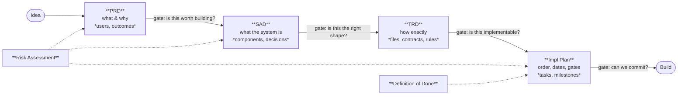

# Part 3 — Planning Before Coding

*Section 5. The single highest-leverage section in this handbook. Every hour spent here saves between five and fifty hours later, and the multiplier rises with the amount of AI-assisted implementation, because an agent will implement a bad plan flawlessly and at speed.*

---

# 5. Planning Before Coding

## 5.1 Purpose

To ensure that before implementation begins, someone has decided *what* is being built, *why*, *how*, and *in what order* — and written it down in a form that a human or an agent can implement from without asking a clarifying question.

The failure this prevents is specific and expensive: a team builds the wrong thing correctly. Nothing in code review, testing, or deployment catches that. Only planning does.

## 5.2 Objectives

1. Define the mandatory planning documents per conformance tier.
2. Define what each document answers, and what it must not contain.
3. Establish the sequence and the gates between documents.
4. Make the documents *implementable* — precise enough for an agent, short enough to be read.
5. Establish risk assessment as a planning output, not a retrospective activity.
6. Define the project-level Definition of Done before work begins, not after.
7. Prevent both under-planning (the common failure) and over-planning (the reaction to it).

## 5.3 Engineering Rationale

### 5.3.1 Why Planning Matters More With AI, Not Less

The intuitive argument is that agents make planning less necessary — they can figure things out. The opposite is true, for four reasons:

| Reason | Mechanism |
|---|---|
| **Implementation is no longer the bottleneck** | When coding was slow, planning competed with it for time. It no longer does. The bottleneck is deciding correctly and verifying |
| **Agents do not push back** | A human handed a contradictory spec asks a question. An agent resolves it silently and plausibly |
| **Wrong work is produced faster** | Three days of wrong implementation now takes three hours, but still takes three days to unwind |
| **Verification requires a reference** | You cannot check output against a specification that does not exist. Without a plan, review degrades to "does this look reasonable?" — AP-09 |

**The sharpest formulation:** *an agent is a machine that turns specifications into code. If the specification is in someone's head, the machine cannot reach it, and what it produces instead is a guess with good grammar.*

### 5.3.2 The Four Questions, and Why They Are Separate Documents

| Document | Question | Author | Changes When |
|---|---|---|---|
| **PRD** | *What are we building, for whom, and why?* | Product / EM | The user need changes |
| **SAD** | *What is the system, and why is it shaped that way?* | Architect | The architecture changes |
| **TRD** | *How exactly is it built?* | Lead engineer | The implementation approach changes |
| **Implementation Plan** | *In what order, by when, verified how?* | Lead / TPM | The schedule or sequence changes |

They are separate because they have **different authors, different audiences, different change rates, and different review cycles.** Merging them produces a document that is simultaneously too detailed for stakeholders and too vague for implementers, and that must be re-approved by everyone whenever anything changes.

### 5.3.3 The Cost Curve of Deciding Late

| Decision Changed At | Relative Cost | Why |
|---|---|---|
| In the PRD | **1×** | Editing a paragraph |
| In the SAD | **5×** | Redrawing a component boundary |
| In the TRD | **20×** | Re-specifying contracts and rules |
| During implementation | **100×** | Rewriting code and its tests |
| After release | **1,000×+** | Migration, compatibility, communication, trust |

**This curve is why planning gates exist and why they are worth defending.** It is also why the correct response to "we don't have time to plan" is: "then we have decided to pay 20× for the decisions we are about to make."

### 5.3.4 The Over-Planning Failure

Under-planning is the common failure; over-planning is the over-correction, and it is also expensive. Symptoms:

| Symptom | Diagnosis |
|---|---|
| The plan specifies things nobody has evidence about | Speculative design. Cut it |
| The document is written for approval rather than for implementation | Ceremony. Ask who will read it while typing |
| Every section is filled because the template has it | Template compliance. Empty sections are legitimate |
| Planning has exceeded 15% of the estimated build effort (T3) | Diminishing returns |
| The plan is being refined rather than tested against reality | Build a spike; learn something real |

**The test that distinguishes them:** *will an implementer read this section while working?* If yes, it earns its place. If it exists to demonstrate diligence, delete it.

### 5.3.5 Planning Depth by Tier

| Tier | PRD | Architecture | TRD | Impl Plan | Risk | Typical Planning Effort |
|---|---|---|---|---|---|---|
| **T1** | ❌ | ❌ | ❌ | ❌ | ❌ | A sentence in the commit |
| **T2** | **1 page** | **1 diagram + 1 page** | ❌ (folded into the plan) | **1 page: ordered task list** | Top 3 risks | ~half a day |
| **T3** | **Full** | **Full** | **Full or folded**, by complexity | **Full** | **Full register** | 5–15% of build effort |
| **T4** | **Full** | **Full + threat model** | **Full** | **Full + gates** | **Full + security review** | 15–25% of build effort |

**Agent Note.** If you are asked to implement something at T2 or above and the corresponding documents do not exist, **say so and stop**. Producing code against an absent specification is the failure this whole section prevents. Offer to help write the plan instead — that is a legitimate and valuable use of an agent.

## 5.4 Standards — The Documents

### 5.4.1 PRD — Product Requirements Document

**Answers:** what are we building, for whom, why, and how will we know it worked?

| Section | Contents | Notes |
|---|---|---|
| Problem | The problem, in the user's language, with evidence | If there is no evidence, say so explicitly |
| Users | Who, and what they are trying to accomplish | Roles, not demographics |
| Goals | 3–5 outcomes, each measurable | "Fast" is not a goal; "p95 under 300 ms" is |
| Non-goals | **What this deliberately does not do** | The most valuable section; prevents scope creep for the project's whole life |
| Requirements | Numbered, testable, prioritised | Each one testable, or it is a wish |
| Success metrics | How we will know, and when we will check | With the threshold that would mean failure |
| Constraints | Budget, deadline, compliance, platform | Real constraints only |
| Open questions | With owners and dates | Better recorded than resolved by assumption |
| **Conformance tier** | T1–T4 with justification | §0.3.3. Drives everything downstream |

| ID | Rule |
|---|---|
| **PLAN-01** | Every requirement MUST be testable. If nobody can say how it would be verified, it is not a requirement |
| **PLAN-02** | The non-goals section MUST NOT be empty for T3+ |
| **PLAN-03** | The PRD MUST NOT specify implementation. "Uses a queue" belongs in the SAD |
| **PLAN-04** | The conformance tier MUST be recorded here and MUST NOT be lowered later without a waiver |

### 5.4.2 SAD — Software Architecture Document

**Answers:** what is the system, what are its parts, and why is it shaped this way?

| Section | Contents |
|---|---|
| Context | The system's boundary: what is inside, what is outside, who talks to it |
| Quality attributes | Ranked. Reliability vs latency vs cost vs simplicity — **ranked, because they conflict** |
| Architecture overview | The component map; one diagram that fits on a screen |
| Components | Each: responsibility, dependencies, and **what it explicitly does not do** |
| Data model | The entities and their relationships; the durable ones |
| Key flows | 3–5 sequences that show how the parts cooperate |
| **Decisions (ADRs)** | Each with alternatives considered and the reason each was rejected |
| **Invariants** | The properties that must always hold, with the mechanism enforcing each |
| Non-functional design | How reliability, security, and performance are achieved structurally |
| Risks | Architectural risks and their mitigations |
| Out of scope | What the architecture deliberately does not address |

| ID | Rule |
|---|---|
| **PLAN-05** | Quality attributes MUST be **ranked**, not listed. An unranked list is not a decision |
| **PLAN-06** | Every significant decision MUST be an ADR recording the **rejected alternatives and why** |
| **PLAN-07** | T3+ MUST state system invariants and, for each, the mechanism that enforces it |
| **PLAN-08** | Every component MUST state what it does **not** do |
| **PLAN-09** | The architecture MUST be expressible in one diagram that fits on one screen. If it cannot, it is too complex or insufficiently understood |

**Rationale for PLAN-07.** An invariant without an enforcing mechanism is a hope. Stating both turns architecture into something testable: for each invariant, there is a test, and the traceability from invariant to test is the audit trail that the system is actually safe rather than believed safe.

**Rationale for PLAN-06.** The rejected alternatives are the valuable part. Six months later, someone will propose the alternative. Without the record, the team re-litigates it from scratch; with it, the conversation is thirty seconds long — or, if circumstances have genuinely changed, a well-informed reversal.

### 5.4.3 TRD — Technical Requirements Document

**Answers:** how exactly is this built? The level at which an implementer needs no clarification.

| Section | Contents |
|---|---|
| Folder structure | Complete, normative. Where every kind of file lives |
| File responsibilities | Per file: what it owns, what it does not, its purity, its verification |
| Interfaces / contracts | Inputs, outputs, errors, side effects, idempotence — as **tables**, not signatures |
| Data schemas | The authoritative shapes, versioned |
| Algorithms | Step-numbered where order is normative |
| Configuration | Every key, type, default, ceiling, and meaning |
| Error taxonomy | Every failure class with severity, scope, and handling policy |
| Validation rules | Every rule, with its threshold and the behaviour at the boundary |
| Testing requirements | What must be tested and to what standard |
| Environment | Runtime, dependencies, and their justification |

| ID | Rule |
|---|---|
| **PLAN-10** | Contracts MUST be specified as tables (name, inputs, outputs, errors, purity, idempotence), not as code |
| **PLAN-11** | Every threshold MUST state its exact value and the boundary behaviour |
| **PLAN-12** | Every error class MUST be enumerated with severity and handling policy |
| **PLAN-13** | Where order is normative, it MUST be stated as normative, with the reason |
| **PLAN-14** | The TRD MUST NOT contain application code. Data, schemas, and configuration instances are specification artifacts; logic is not |

**Rationale for PLAN-14.** Code in a specification becomes the implementation by copy-paste, and then the specification and the code drift as one is updated and the other is not. Contract tables cannot be copy-pasted into a codebase, which forces the implementer to *understand* rather than transcribe — and understanding is what verification depends on.

**Rationale for PLAN-13.** Ordering constraints are invisible in code. An implementer who does not know that step 3 must precede step 5 will reorder them for readability, and the resulting defect passes every test that was written by someone with the same misunderstanding.

### 5.4.4 Implementation Plan

**Answers:** in what order, by when, verified how, and abandoned how?

| Section | Contents |
|---|---|
| Build order | Phases, dependency-ordered, with the reason for the order |
| Dependency graph | What blocks what |
| Milestones | Each independently demonstrable, with a demo command |
| Task breakdown | Each with ID, description, dependencies, estimate, acceptance, verification, rollback |
| Quality gates | What must be green before each phase closes |
| Risk register | Execution risks with owners and triggers |
| Critical path | The chain that sets the end date |
| Decision gates | Scheduled go/no-go points with chairs |
| Rollback | Per phase: how to undo it |

| ID | Rule |
|---|---|
| **PLAN-15** | The build order MUST be dependency-ordered, and the ordering rationale MUST be recorded |
| **PLAN-16** | Every milestone MUST be independently demonstrable |
| **PLAN-17** | Every task MUST have acceptance criteria and a verification step |
| **PLAN-18** | Every phase MUST state its rollback strategy **before** it starts |
| **PLAN-19** | Safety mechanisms MUST be built before the things they guard |

**Rationale for PLAN-19.** This is the most consequential sequencing rule in the handbook. If the validator is built after the thing that produces data, the producer's tests are written against unvalidated output, and the validator is retrofitted into a system that already works without it — at which point it is a formality rather than a gate. Build the thing that says *no* first.

### 5.4.5 Risk Assessment

Produced during planning, maintained through the project. Not a document written once.

| Column | Contents |
|---|---|
| ID | Stable identifier |
| Risk | One sentence, stated as a thing that could happen |
| Category | Technical / business / security / operational / dependency / people |
| Likelihood | 1–5 |
| Impact | 1–5 |
| Exposure | L × I |
| Mitigation | What reduces likelihood or impact — **structural if possible** |
| **Trigger** | The observable event that means this is happening |
| Contingency | What we do when the trigger fires |
| Owner | A person |

| ID | Rule |
|---|---|
| **PLAN-20** | Every risk MUST have a named owner and an observable trigger. A risk without a trigger is a worry |
| **PLAN-21** | Risks MUST be re-scored at each milestone, not merely re-read |
| **PLAN-22** | Structural mitigations MUST be preferred over procedural ones |
| **PLAN-23** | T4 projects MUST include a threat model (§15) in the risk assessment |

**Rationale for PLAN-22.** "We will be careful" is a procedural mitigation and it degrades under pressure. "The alerting job has no write permission to data" is structural: it holds when everyone is tired. Whenever a risk can be eliminated by structure rather than discipline, that is the correct mitigation.

### 5.4.6 Definition of Done — Project Level

Written **before** implementation begins. §10 governs the per-change DoD; this is the project's completion definition.

| Dimension | Example Criterion |
|---|---|
| Functional | Every P0 requirement demonstrably met |
| Quality | Coverage thresholds met; all gates green |
| Performance | Stated budgets met under stated load |
| Security | Review complete; no unresolved high findings |
| Documentation | README, architecture, runbooks, API docs complete |
| Operational | Monitoring, alerts, health checks live; runbooks drilled |
| Deployment | Deployed via the standard pipeline; rollback tested |
| Handover | An owner exists; someone else has run the runbooks |

| ID | Rule |
|---|---|
| **PLAN-24** | The project DoD MUST be written before implementation and MUST NOT be weakened afterwards |
| **PLAN-25** | Every DoD criterion MUST be objectively checkable |
| **PLAN-26** | "Rollback tested" MUST mean executed at least once, not documented |

## 5.5 Standards — The Process

### 5.5.1 The Planning Sequence and Its Gates

| # | Step | Output | Gate | Who Decides |
|---|---|---|---|---|
| 1 | Frame the problem | Problem statement, evidence, tier | Is this worth solving? | EM |
| 2 | Write the PRD | PRD | Are the requirements testable and bounded? | EM + lead |
| 3 | Explore approaches | 2–3 options with trade-offs | Have we considered a genuinely simpler option? | Architect |
| 4 | Write the architecture | SAD + ADRs | Is this the simplest shape that meets the quality attributes? | Architect |
| 5 | Assess risk | Risk register | Are the top risks mitigated structurally? | Lead + EM |
| 6 | Write the TRD | TRD | Could an implementer build this without asking a question? | Lead |
| 7 | Plan implementation | Impl plan | Is the order dependency-correct and are gates defined? | Lead + TPM |
| 8 | Define done | Project DoD | Is every criterion checkable? | EM + lead |
| 9 | **Commit** | Baseline | Can we commit to this? | EM |

| ID | Rule |
|---|---|
| **PLAN-27** | Step 3 MUST produce at least two options. A single option is a preference, not a decision |
| **PLAN-28** | Documents MUST be baselined at step 9. After baseline, changes go through change control |
| **PLAN-29** | Implementation MUST NOT begin before step 9 for T3+ |
| **PLAN-30** | A spike MAY precede any step to reduce uncertainty, and MUST be time-boxed and thrown away |

**Rationale for PLAN-30.** Spikes are the correct answer to "we cannot plan this because we do not know X". A time-boxed, disposable spike converts an unknown into a fact for a bounded cost. The rule that it is thrown away is what stops a spike from becoming the implementation — which is how unplanned code enters a planned project.

### 5.5.2 Baselining and Change Control

| ID | Rule |
|---|---|
| **PLAN-31** | Baselined documents MUST be version-controlled alongside the code |
| **PLAN-32** | A change to a baselined document MUST record what changed, why, and the impact |
| **PLAN-33** | Where a document and the code disagree, **stop**. One of them is wrong, and deciding which is a decision, not an assumption |
| **PLAN-34** | An implementer who finds a specification gap MUST raise it, not fill it (§2, AI-05) |

## 5.6 Real-World Examples

### Example 1 — The Missing Non-Goal

A team builds an internal analytics tool. The PRD lists what it does. Six months later it has grown export, scheduling, alerting, and user management, because each was "a small addition" and nothing said it should not.

| | |
|---|---|
| Root cause | No non-goals section |
| Cost | The tool is now a product with no product owner and no roadmap |
| Rule | PLAN-02 |
| The fix that would have worked | One line: "This does not send notifications and does not manage users." |

### Example 2 — The Unranked Quality Attributes

An architecture lists "fast, reliable, cheap, simple" as goals. During implementation, every trade-off becomes an argument, because all four are equally sanctioned and they conflict pairwise.

| | |
|---|---|
| Root cause | Attributes listed, not ranked |
| Symptom | Repeated design debates that end in whoever argues longest |
| Rule | PLAN-05 |
| The fix | "Reliability > simplicity > cost > latency." Now every trade-off has an answer |

### Example 3 — The Specification That Was Not Implementable

A TRD says the system should "validate input appropriately and handle errors gracefully". Three engineers implement three different validation regimes. An agent implements a fourth. All four pass review, because there is nothing to review against.

| | |
|---|---|
| Root cause | Unfalsifiable requirements |
| Rule | PLAN-01, PLAN-11, PLAN-12 |
| The test that would have caught it | "Could an implementer build this without asking a question?" — step 6's gate |

### Example 4 — The Order That Was Wrong

A project builds its data ingestion, storage, and API. The validation layer is planned last, "once we know what the data looks like". By the time it is built, three modules already depend on unvalidated data shapes and two of them work around known-bad records.

| | |
|---|---|
| Root cause | The safety mechanism was built after the things it guards |
| Rule | PLAN-19 |
| Cost | Retrofitting validation required changing three modules and re-deriving all test fixtures |

### Example 5 — Planning That Paid For Itself

A project spends two weeks on architecture and specification before writing code. The specification names ten invariants, each with an enforcing test, and the build order puts the safety mechanisms first. Implementation proceeds with almost no clarifying questions, and agents implement most of the mechanical work correctly on the first pass.

| | |
|---|---|
| Why it worked | The agent had a specification to implement rather than a goal to interpret |
| Measured effect | Rework was concentrated in the two modules whose specifications were weakest — which is exactly what the theory predicts |
| The lesson | Specification quality determines agent output quality more than any other single factor |

## 5.7 Common Mistakes

| # | Mistake | Symptom | Fix |
|---|---|---|---|
| 1 | Starting with code because it feels productive | Three rewrites of the same module | The first version is a spike; time-box it and throw it away (PLAN-30) |
| 2 | Merging PRD and TRD | Stakeholders confused; implementers under-served | Separate documents, separate audiences |
| 3 | Requirements that are not testable | Endless "is this done?" | PLAN-01 |
| 4 | Skipping alternatives | Fragile design, no defence when challenged | PLAN-27 |
| 5 | Planning to completeness before starting | Weeks of documentation, no learning | §5.3.4's test; spikes for unknowns |
| 6 | Risks listed, never triggered | Risk register as decoration | PLAN-20's observable trigger |
| 7 | DoD written at the end | It describes what was built | PLAN-24 |
| 8 | Documents that live outside version control | Drift, no history, no review | PLAN-31 |
| 9 | Filling every template section | Ceremony | Empty sections are legitimate; delete them |
| 10 | Not re-planning when reality changes | The plan becomes fiction; people stop reading it | Change control (PLAN-32), not abandonment |

## 5.8 Anti-Patterns

| ID | Anti-Pattern | Description | Countermeasure |
|---|---|---|---|
| **AP-29** | **Plan-Shaped Prose** | A document that reads like a plan and specifies nothing checkable | Every statement must be verifiable |
| **AP-30** | **The Big Design Up Front** | Every detail specified before any learning | Spikes; tier-appropriate depth |
| **AP-31** | **The Retro-Spec** | Documentation written after implementation to satisfy process | It records what was built, not what should have been. Worthless as a check |
| **AP-32** | **Requirements by Ticket** | The specification is fifty tickets with no coherent whole | Tickets are tasks, not specifications |
| **AP-33** | **The Immutable Plan** | Reality changed; the plan did not | Change control, not abandonment |
| **AP-34** | **Estimate as Commitment** | An estimate hardens into a deadline without scope adjustment | Estimates have confidence bands; scope is the variable |
| **AP-35** | **The Absent Owner** | Documents with no named owner | Every document names one |

## 5.9 Decision Tables

### 5.9.1 Which Documents Does This Project Need?

| Question | If Yes |
|---|---|
| Will it live less than 30 days and touch nothing durable? | T1 — a commit message |
| Is it internal, small, and recoverable? | T2 — 1-page PRD, 1 diagram, ordered task list |
| Do external users depend on it? | T3 — full set |
| Does it touch money, credentials, or personal data? | T4 — full set + threat model + security review |
| Is it a rewrite of something that exists? | Full set **plus** characterisation of current behaviour (§21) |
| Is it a spike? | None — time-box it, write findings, throw the code away |

### 5.9.2 How Detailed Should the Specification Be?

| Factor | More Detail | Less Detail |
|---|---|---|
| Implementer | An agent, or someone new | The author, in the next hour |
| Failure mode | Silent or irreversible | Loud and cheap |
| Domain rules | Many, subtle, interacting | Few and obvious |
| Reversibility | Hard to change later | Easy |
| Longevity | Years | Weeks |
| Coupling | Many dependents | Isolated |

**When the implementer is an agent, always move one step toward more detail.** Agents do not ask the clarifying question a human would.

### 5.9.3 Build, Buy, or Do Without?

| Criterion | Build | Buy / Adopt | Do Without |
|---|---|---|---|
| Is it core to what makes TradyPerch valuable? | ✅ | ❌ | — |
| Is a good, maintained option available? | — | ✅ | — |
| Would building it take under ~200 lines? | ✅ | ❌ | — |
| Does it introduce a dependency on an external party's roadmap? | ✅ prefer build | ⚠️ weigh it | — |
| Does the requirement have evidence behind it? | — | — | ❌ if no evidence |
| Is there a recurring cost? | ✅ prefer build | ⚠️ | — |
| Does it handle credentials or personal data? | ⚠️ raise to T4 | ⚠️ due diligence | — |

## 5.10 Checklists

### CHK-5.1 · Before Writing Any Code (T2+)

- [ ] The problem is written down and someone other than the author agrees with it
- [ ] The conformance tier is chosen and recorded
- [ ] Requirements exist and every one is testable
- [ ] Non-goals are written down
- [ ] At least two approaches were considered, and the rejection reasons are recorded
- [ ] The architecture fits in one diagram
- [ ] Invariants are stated, each with an enforcing mechanism (T3+)
- [ ] Hazard modules are identified (§2.4.3)
- [ ] The build order is dependency-correct and **safety mechanisms come first**
- [ ] Every task has acceptance criteria
- [ ] The top risks have owners and observable triggers
- [ ] The project DoD is written
- [ ] Rollback is defined for each phase
- [ ] Documents are in version control

### CHK-5.2 · Specification Quality Review

- [ ] Could an implementer build this without asking a question?
- [ ] Is every threshold a number with stated boundary behaviour?
- [ ] Is every error case enumerated?
- [ ] Is every ordering constraint stated as normative, with its reason?
- [ ] Does every component state what it does **not** do?
- [ ] Are there any unfalsifiable statements ("appropriately", "gracefully", "as needed")? Remove them
- [ ] Are there contradictions between sections?
- [ ] Is there anything specified that has no evidence of being needed?

### CHK-5.3 · Planning Gate (step 9)

- [ ] All tier-required documents exist and are baselined
- [ ] Open questions have owners and dates, or are resolved
- [ ] The estimate has a stated confidence band
- [ ] The critical path is identified
- [ ] Decision gates are scheduled with named chairs
- [ ] The cut list is written **before** pressure exists
- [ ] Someone who did not write the plan has read it and could implement from it

## 5.11 Risk Analysis

| Risk | Likelihood | Impact | Mitigation | Residual |
|---|---|---|---|---|
| Planning skipped under time pressure | **High** | **High** | Tier requirements; the cost curve in §5.3.3; gates | Medium |
| Documents written for approval, not implementation | Medium | High | CHK-5.2's first question; empty sections permitted | Medium |
| Over-planning delays learning | Medium | Medium | Spikes; tier-appropriate depth; the 15% guideline | Low |
| Documents drift from the code | High | Medium | Version control; PLAN-33 stop rule; docs ship with changes | Medium |
| Requirements unfalsifiable | Medium | High | PLAN-01; review checklist | Low |
| Risk register becomes decoration | High | Medium | Observable triggers; re-scoring at milestones | Medium |
| Plan treated as immutable | Medium | Medium | Change control process | Low |

## 5.12 Future Improvements

| Item | When | Note |
|---|---|---|
| Document templates in a repository | v1.1 | Reduce the cost of doing it right to near zero |
| Automated specification linting | v1.2 | Detect unfalsifiable language ("appropriately", "as needed") |
| Planning-effort telemetry | v1.2 | Measure actual planning share vs rework, per tier |
| A worked example set from real TradyPerch projects | Continuous | The most useful teaching artifact; add one per project |
| Spec-to-test traceability tooling | v1.2 | Mechanise the check that every requirement has a test |

---

*End of Part 3. Part 4 covers repository and Git standards — the substrate everything else is built on.*
