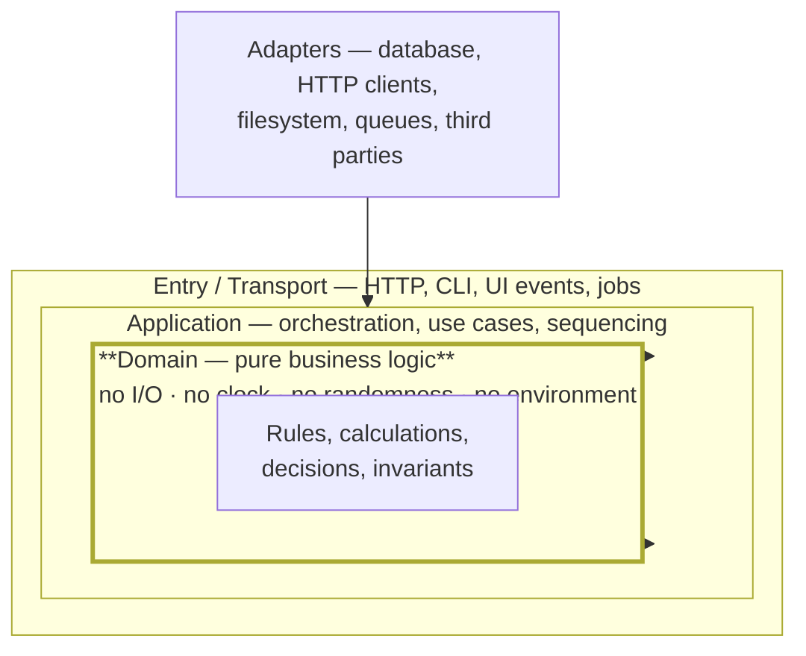

# Part 5 — Coding Standards and Module Isolation

*Sections 8 and 9. These two sections govern the code itself: how it is named, shaped, structured, and separated. They are the sections agents consult most often, and the sections whose violation is cheapest to detect mechanically and most expensive to detect late.*

---

# 8. Coding Standards

## 8.1 Purpose

To make code written by different people, and by different agents, at different times, indistinguishable in quality and shape — so that reading it requires no adjustment and changing it requires no archaeology.

## 8.2 Objectives

1. Standardise naming so that identifiers carry accurate information.
2. Establish structural limits that keep code reviewable.
3. Define what comments are for, and what they are not for.
4. Delegate formatting entirely to tools, removing it from human attention.
5. Apply the classical design principles with TradyPerch's specific interpretation of each.
6. Define the layered architecture that all projects follow, in shape if not in naming.
7. Make every rule mechanically enforceable wherever possible.

## 8.3 Engineering Rationale

### 8.3.1 Consistency Beats Individual Optimality

Two reasonable conventions, applied consistently, produce a better codebase than a mixture of the best convention for each situation. The reason is that consistency is what allows pattern recognition, and pattern recognition is what makes reading fast.

This matters doubly for agents. An agent infers conventions from surrounding code. A consistent codebase produces consistent agent output; an inconsistent one produces output that matches whichever file happened to be in context, and the inconsistency compounds.

**Consequence: personal preference is not an argument.** The convention is the convention. Where it is genuinely wrong, §29 changes it everywhere at once.

### 8.3.2 Names Are the Primary Interface

A reader encounters a name far more often than a definition. A name that is accurate saves a lookup; a name that is misleading causes a defect.

| Name Quality | Effect |
|---|---|
| Accurate and specific | The reader does not need the definition |
| Vague (`data`, `handle`, `process`) | The reader must read the definition, every time |
| **Misleading** | The reader does not read the definition, and is wrong |

The third row is why naming is a correctness concern rather than a style one. A function called `validateUser` that also creates a session will be used by someone who does not read it.

### 8.3.3 Structural Limits Exist for Review, Not Aesthetics

| Limit | Enables |
|---|---|
| Function length | Holding the whole function in working memory while reviewing |
| File length | Finding things; knowing a file has one responsibility |
| Cyclomatic complexity | Reasoning about all paths during an incident |
| Parameter count | Reading call sites without checking the signature |
| Nesting depth | Following control flow without a stack in your head |

Every one of these is a proxy for *how hard is this to verify*, which is the binding constraint (§1.3.1). They are enforced by lint rather than review because a limit enforced by review is negotiated away under deadline pressure — and the negotiation happens at precisely the moment the limit matters most.

### 8.3.4 Comments Explain Why

Code states what happens. Only a human can state:

- why the obvious approach was rejected;
- what constraint from outside the code forced this shape;
- what will break if this is changed;
- why an apparent redundancy is deliberate.

The last is the most valuable comment a codebase can contain, and it is the direct countermeasure to the silent-simplification failure (§2.3.2, AI-N4).

**A comment that restates the code is worse than none**: it doubles the maintenance surface and it goes stale, at which point it actively misleads.

### 8.3.5 The Principles, and What They Actually Mean Here

The classical acronyms are widely quoted and frequently misapplied. TradyPerch's interpretations:

| Principle | Common Misapplication | TradyPerch Interpretation |
|---|---|---|
| **SRP** | "One function does one thing" (too granular) | A module has **one reason to change**. Ask: which stakeholder's decision would force this file to change? If two, split it |
| **OCP** | Building extension points everywhere in advance | Extensible **where extension has actually occurred twice**. Not before |
| **LSP** | Rarely misapplied; usually ignored | An implementation must be substitutable without the caller knowing. If it needs special handling, the abstraction is wrong |
| **ISP** | Splitting every interface | An interface should not force implementers to provide behaviour they cannot support. Honest, narrow capabilities beat wide ones with stubs |
| **DIP** | Adding interfaces everywhere for "testability" | **Business logic depends on abstractions of I/O, never on I/O directly.** This is the one that pays for itself immediately |
| **DRY** | Removing every textual duplicate | One source of truth for each piece of **knowledge**. Two things that look alike but change for different reasons are **not** duplication |
| **KISS** | An excuse for under-designing | Fewest concepts a reader must hold. Not least code |
| **YAGNI** | An excuse for ignoring known requirements | Do not build for **speculative** needs. Known requirements are not speculative |

**The DRY row deserves emphasis.** Premature de-duplication is a top-three cause of bad architecture: two similar blocks are merged, then diverge in requirements, then acquire a parameter, then a second parameter, then a conditional — and the result is more complex than the duplication ever was. **Duplication is cheaper than the wrong abstraction.** Wait for the third occurrence.

### 8.3.6 Clean Architecture — The Only Structural Rule That Matters

Whatever the naming, every TradyPerch project separates code into three concentric responsibilities:

| Rule | Statement |
|---|---|
| **Dependencies point inward** | The domain knows nothing about the application layer, and neither knows about transport or adapters |
| **The domain is pure** | No I/O, no clock, no randomness, no environment, no framework |
| **Adapters implement interfaces the inner layers define** | The interface belongs to the consumer, not the implementer |
| **Only the composition root constructs concrete things** | One place wires the system together |

**Why this single rule is worth more than all the others combined:**

| Property | Consequence |
|---|---|
| The domain is testable without infrastructure | Tests are fast, deterministic, and exhaustive — which makes them get run |
| Infrastructure can be replaced | A database change is one adapter, not a rewrite |
| Business rules are findable | "Where is the discount logic?" has one answer |
| Agents can work on the domain safely | No environment to misunderstand; no I/O to get wrong; the whole context fits in a prompt |

**The last row is the AI-specific argument.** A pure function with an explicit contract is the ideal unit of agent work: the input space is knowable, the output is checkable, and there is no hidden state to get wrong. Every hour spent keeping the domain pure pays back in agent output quality.

## 8.4 Standards

### 8.4.1 Naming

| Element | Convention | Notes |
|---|---|---|
| Files, directories | `kebab-case` | Portability across filesystems |
| Types, classes, interfaces | `PascalCase` | Nouns |
| Functions, methods | `camelCase`, **verb-first** | `calculateTotal`, not `total` |
| Variables | `camelCase` | Nouns |
| Constants | `SCREAMING_SNAKE_CASE` | Genuine constants only |
| Booleans | `is` / `has` / `can` / `should` prefix | `isActive`, `hasPermission` |
| Predicates | Same as booleans | Reads as a question |
| Transformers | `to` / `from` prefix | `toDisplayModel` |
| Constructors / builders | `create` / `build` prefix | `createSession` |
| Async operations | No special marker | The type system says it |
| Collections | Plural | `users`, not `userList` |
| Private members | Language convention | Do not invent one |
| Environment variables | `SCREAMING_SNAKE_CASE` with project prefix | Namespacing |
| Test files | `<subject>.<behaviour>.test.<ext>` | Locatable |

| ID | Rule |
|---|---|
| **CODE-01** | Names MUST be specific. `data`, `info`, `handle`, `process`, `manager`, `helper`, `util` as a **whole** name are prohibited |
| **CODE-02** | A name MUST describe what the thing **is or does**, not how it is implemented |
| **CODE-03** | Abbreviations MUST NOT be invented. Only universally understood ones are permitted (`id`, `url`, `http`) |
| **CODE-04** | One concept, one name, everywhere — in code, logs, documentation, tickets, and speech |
| **CODE-05** | A function whose name does not describe everything it does MUST be renamed or split. **A name that under-describes is a defect** |

**Rationale for CODE-04.** Vocabulary drift is how a codebase becomes incomprehensible. When "customer", "client", "account", and "user" are used interchangeably, no reader can tell whether two functions operate on the same thing, and no agent can either. Pick one term per concept; write it down; enforce it in review.

### 8.4.2 Structural Limits

Enforced by lint, not review.

| Limit | Value | Hard ceiling |
|---|---|---|
| Function length | ≤ 40 lines | 60 |
| File length | ≤ 300 lines | 400 |
| Cyclomatic complexity per function | ≤ 8 | 10 |
| Parameters | ≤ 3, or an options object | 4 |
| Nesting depth | ≤ 3 | 4 |
| Public exports per module | ≤ 7 | 10 |

| ID | Rule |
|---|---|
| **CODE-06** | Limits MUST be enforced by lint. A limit enforced by review is negotiated away under pressure |
| **CODE-07** | An exception MUST carry an inline comment stating why, and MUST be approved by a reviewer |
| **CODE-08** | Deep nesting MUST be resolved by early return, extraction, or guard clauses — never by widening the limit |

### 8.4.3 Functions

| ID | Rule |
|---|---|
| **CODE-09** | A function MUST do one thing at one level of abstraction |
| **CODE-10** | A function MUST NOT have a side effect its name does not imply |
| **CODE-11** | Prefer pure functions. Where a function must be impure, isolate the impurity at the edge |
| **CODE-12** | Boolean parameters that select behaviour MUST NOT be used — split the function or pass an enum |
| **CODE-13** | Output parameters MUST NOT be used. Return values |
| **CODE-14** | A function MUST NOT modify its arguments unless that is its explicit, named purpose |

**Rationale for CODE-12.** `render(true)` at a call site is unreadable, and the reader must open the definition to learn what `true` means. It also indicates that the function has two behaviours, which contradicts CODE-09.

### 8.4.4 Error Handling

| ID | Rule |
|---|---|
| **CODE-15** | Errors MUST be handled explicitly. An empty catch is prohibited |
| **CODE-16** | A catch MUST NOT return an empty collection, `null`, or a default that hides the failure |
| **CODE-17** | Catch the **narrowest** error you can handle. Broad catches are permitted only at designated boundaries |
| **CODE-18** | Every error MUST be classified — a type, a code, or a class from a project taxonomy |
| **CODE-19** | Error messages MUST state what failed, what was attempted, and what would fix it. They MUST NOT contain secrets or personal data |
| **CODE-20** | There MUST be exactly one place per project where an unexpected error becomes a user-facing response and a log entry |
| **CODE-21** | Failure MUST NOT be silent. Every failure produces a signal somewhere |

**CODE-16 is the single most important rule in §8**, and it is the one agents violate most often because the pattern is idiomatic elsewhere. Returning an empty result on failure converts a loud failure into a silent one that looks like a legitimate empty result. Downstream code cannot distinguish them. This is the mechanism behind an entire category of data-loss incidents.

### 8.4.5 Comments and Documentation in Code

| ID | Rule |
|---|---|
| **CODE-22** | Every module MUST have a header stating its responsibility **and what it explicitly does not do** |
| **CODE-23** | Comments MUST explain **why**. A comment restating the code MUST be deleted |
| **CODE-24** | Every non-obvious constant MUST have a comment stating where the value came from |
| **CODE-25** | Deliberate redundancy or asymmetry MUST carry a comment explaining why it is not a smell |
| **CODE-26** | Every public function MUST document purpose, parameters, return, errors, and side effects |
| **CODE-27** | `TODO` MUST reference a tracked issue. Untracked `TODO`s MUST NOT be committed |
| **CODE-28** | Commented-out code MUST NOT be committed. Version control is the archive |

**Rationale for CODE-25.** This is the countermeasure for the most dangerous agent failure mode. Where two branches look identical but must remain separate, the comment is what stops the next reader — human or machine — from "simplifying" them. It is three lines that prevent a class of silent data corruption.

### 8.4.6 Formatting

| ID | Rule |
|---|---|
| **CODE-29** | Formatting MUST be automated. A formatter is configured and its output is authoritative |
| **CODE-30** | Formatting MUST NOT be discussed in review. If it is wrong, the configuration is wrong |
| **CODE-31** | Formatting MUST run on save locally and be verified in CI |
| **CODE-32** | Generated and vendored files MUST be excluded from formatting |

**Rationale for CODE-32.** Reformatting a generated file makes it differ from what the generator produces, so the next generation shows a spurious diff. Reformatting captured test fixtures can change what the code under test actually sees.

### 8.4.7 Types

| ID | Rule |
|---|---|
| **CODE-33** | Static typing MUST be used where the language supports it, in its strictest practical mode |
| **CODE-34** | Escape hatches (`any`, casts, suppressions) MUST carry an inline justification |
| **CODE-35** | Types MUST be defined at boundaries — every input and output of a module |
| **CODE-36** | Prefer making illegal states unrepresentable over validating them at runtime |
| **CODE-37** | External input MUST be validated at the boundary and typed thereafter |

**Rationale for CODE-36.** A type that cannot express an invalid state removes an entire class of test and an entire class of defect. This is the cheapest correctness technique available in a typed language.

### 8.4.8 Dependencies

| ID | Rule |
|---|---|
| **CODE-38** | Every production dependency MUST have a recorded justification |
| **CODE-39** | A dependency MUST NOT be added for functionality achievable in under ~100 readable lines |
| **CODE-40** | Dependencies MUST be pinned by lockfile; CI installs from the lockfile exactly |
| **CODE-41** | Dependencies with install scripts, native compilation, or deep transitive trees require security review |
| **CODE-42** | Third-party libraries SHOULD be wrapped at the boundary where the cost of replacement would otherwise be high |

## 8.5 Real-World Examples

### Example 1 — The Misleading Name

A function named `getUser` also refreshes the user's session as a side effect. A caller uses it in a read-only reporting path. Sessions are refreshed for users who are not active, and the session-expiry metric becomes meaningless.

| | |
|---|---|
| Rules | CODE-05, CODE-10 |
| The tell | A `get` that writes |
| Fix | Split into `getUser` and `refreshSession`, and let callers compose |

### Example 2 — The Wrong Abstraction

Two report generators share 80% of their code. They are merged into one function with a `type` parameter. Over eighteen months it grows four more parameters and six conditionals. Adding a third report requires understanding both existing ones.

| | |
|---|---|
| Rules | §8.3.5's DRY interpretation |
| Root cause | De-duplicating similarity rather than shared knowledge |
| Correct approach | Leave them separate. Extract only the genuinely shared *knowledge* — the calculation — not the shared *shape* |

### Example 3 — The Silent Catch

An import pipeline catches parse failures per record and returns an empty result for the failed ones. The batch reports success. A downstream consumer treats "no records" as "no data to process". Two weeks of data are silently absent.

| | |
|---|---|
| Rules | CODE-16, CODE-21 |
| Why review missed it | The catch looked defensive and responsible |
| Correct approach | Classify the failure, record it, count it, surface it. Continue processing if that is the intent — but never silently |

### Example 4 — The Purity Payoff

A pricing engine is written as pure functions taking explicit inputs, including the current time. Its 400 tests run in under a second with no infrastructure. An agent adds three new pricing rules with exhaustive boundary tests in one session, correctly, because the entire contract fits in a prompt and every case is checkable.

| | |
|---|---|
| Rules | CODE-11, §8.3.6 |
| The observation | Purity is not a stylistic preference. It is what makes a module safe to hand to an agent |

## 8.6 Common Mistakes

| # | Mistake | Symptom | Fix |
|---|---|---|---|
| 1 | Vague names | Every read requires opening the definition | CODE-01 |
| 2 | Functions that do more than their names say | Surprising side effects | CODE-05, CODE-10 |
| 3 | Premature de-duplication | Parameterised functions with six flags | Wait for the third occurrence |
| 4 | Empty or broad catches | Silent failures | CODE-15, CODE-16, CODE-17 |
| 5 | Comments restating code | Stale, misleading comments | CODE-23 |
| 6 | Business logic mixed with I/O | Untestable without infrastructure | §8.3.6 |
| 7 | Deep nesting | Unreadable control flow | CODE-08, guard clauses |
| 8 | Boolean parameters | Unreadable call sites | CODE-12 |
| 9 | Adding a dependency for a small utility | Supply-chain surface for 30 lines | CODE-39 |
| 10 | Type escape hatches without justification | Type system silently disabled | CODE-34 |
| 11 | Debating formatting in review | Wasted attention | CODE-29, CODE-30 |
| 12 | Untracked `TODO`s | Permanent, forgotten | CODE-27 |

## 8.7 Anti-Patterns

| ID | Anti-Pattern | Description | Countermeasure |
|---|---|---|---|
| **AP-49** | **The God Object** | One class or module that knows and does everything | SRP; file limits |
| **AP-50** | **Primitive Obsession** | Domain concepts represented as raw strings and numbers | CODE-36 |
| **AP-51** | **The Parameter Avalanche** | A function with nine parameters, most optional | CODE-12; an options object; or split |
| **AP-52** | **Stringly Typed** | Behaviour selected by magic strings | Enums; CODE-36 |
| **AP-53** | **The Swallowed Exception** | `catch` that logs at debug level and continues | CODE-16, CODE-21 |
| **AP-54** | **Copy-Paste Inheritance** | A file duplicated and edited, including its bugs | Extract shared knowledge; §24 |
| **AP-55** | **The Utility Junk Drawer** | `utils.js` accumulating unrelated functions | AP-36; name by responsibility |
| **AP-56** | **Comment-Driven Confusion** | Comments that no longer match the code | CODE-23; delete on sight |
| **AP-57** | **Framework Leakage** | Framework types spread through the domain | §8.3.6; wrap at the boundary |
| **AP-58** | **The Clever One-Liner** | Six operations chained into one dense expression | §1.3.3 |

## 8.8 Decision Tables

### 8.8.1 Split This Function?

| Signal | Split |
|---|---|
| The name needs "and" | ✅ |
| Over 40 lines | ✅ |
| Complexity over 8 | ✅ |
| Blank lines separating logical stages | ✅ — those stages are the functions |
| A comment introduces a section | ✅ — the comment is the function name |
| Two different levels of abstraction | ✅ |
| Multiple reasons it could change | ✅ |
| It is long but linear with no branches | ⚠️ Often fine; readability decides |

### 8.8.2 Extract a Shared Abstraction?

| Occurrences | Action |
|---|---|
| 1 | Write it inline |
| 2 | **Leave it duplicated.** Note the duplication in a comment if you like |
| 3 | Extract — the shape is now visible |
| 3, but changing for different reasons | **Do not extract.** They are coincidentally similar |
| 2, but the knowledge is genuinely one thing (a tax rate, a validation rule) | Extract the **knowledge**, not the code |

### 8.8.3 Add a Dependency?

| Question | Add | Write It |
|---|---|---|
| Would writing it take over ~100 lines? | ✅ | — |
| Is it security-sensitive (crypto, auth, parsing untrusted input)? | ✅ **always** | ❌ never |
| Is it actively maintained with a healthy release history? | ✅ | — |
| Does it pull in a large transitive tree? | ⚠️ review | ✅ |
| Does it have install scripts? | ⚠️ security review | ✅ |
| Is it a one-line convenience? | ❌ | ✅ |
| Does it ship to a client environment we do not control? | ❌ prefer zero | ✅ |

**The second row admits no exception.** Hand-rolled cryptography, authentication, or parsers for untrusted input are how organisations produce vulnerabilities that survive for years.

## 8.9 Checklists

### CHK-8.1 · Before Submitting Code

- [ ] Every name describes what the thing is or does, accurately and completely
- [ ] No function does more than its name says
- [ ] All structural limits met, or the exception is justified inline
- [ ] Every error is classified and handled; no empty catch; no empty-on-failure return
- [ ] Module header states responsibility and non-responsibility
- [ ] Comments explain why, and none restates the code
- [ ] Deliberate redundancy is explained
- [ ] No commented-out code; no untracked `TODO`
- [ ] Formatter and linter clean
- [ ] Types are strict; escape hatches justified
- [ ] No new dependency, or its justification is recorded
- [ ] Business logic contains no I/O, clock, randomness, or environment access

### CHK-8.2 · Reviewing Code

- [ ] Could I explain this to someone else in two minutes?
- [ ] Do the names tell the truth?
- [ ] What happens on each failure path? Is any of them silent?
- [ ] Is there a simpler shape that satisfies the requirement?
- [ ] Is anything here speculative — built for a need that does not exist?
- [ ] Is there duplication that is actually *divergence waiting to happen*, or divergence being wrongly merged?
- [ ] Does the domain layer stay pure?
- [ ] Would I be comfortable maintaining this?

## 8.10 Risk Analysis

| Risk | Likelihood | Impact | Mitigation | Residual |
|---|---|---|---|---|
| Standards ignored under deadline | High | Medium | Mechanical enforcement (CODE-06) | Low |
| Silent failures via caught errors | **Medium** | **High** | CODE-16, CODE-21, review focus on failure paths | Medium |
| Premature abstraction | High | Medium | The three-occurrence rule | Medium |
| Domain layer contaminated with I/O | Medium | High | Structural rules; automated dependency checks (§9) | Low |
| Naming drift across a codebase | High | Medium | CODE-04; a project glossary | Medium |
| Lint rules disabled wholesale | Low | High | Configuration changes reviewed like code | Low |
| Agent imports conventions from elsewhere | Medium | Medium | Consistency; standing context; review | Low |

## 8.11 Future Improvements

| Item | When | Note |
|---|---|---|
| Custom lint rule for catch-and-return-empty | v1.1 | The highest-value rule not yet mechanised |
| Project glossary as an enforced artifact | v1.1 | Supports CODE-04 |
| Automated detection of naming drift | v1.2 | Flag synonyms for the same concept |
| Shared lint configuration package | v1.1 | One configuration, all projects, updated centrally |

---

# 9. Module Isolation Rules

## 9.1 Purpose

To ensure that a module can be understood, tested, changed, and replaced without understanding, testing, changing, or replacing its neighbours. Isolation is what keeps a codebase's cost of change flat as it grows, instead of quadratic.

## 9.2 Objectives

1. Establish one responsibility per module, with a testable definition of "one".
2. Define coupling and cohesion as measurable properties rather than vibes.
3. Establish dependency inversion as the default relationship between logic and I/O.
4. Define how to build for extension without speculative generality.
5. Make boundary violations mechanically detectable.
6. Make modules safe units of agent work.

## 9.3 Engineering Rationale

### 9.3.1 What Isolation Buys

| Property | Without Isolation | With Isolation |
|---|---|---|
| Understanding a module | Requires understanding its dependents | Read it alone |
| Changing it | Unknown blast radius | Bounded by its interface |
| Testing it | Requires the whole system | Test alone, fast |
| Replacing it | A rewrite | Swap the implementation |
| **Handing it to an agent** | **Unsafe — unknowable context** | **Safe — the contract is the context** |
| Parallel work | Constant conflicts | Independent |

The fifth row is the AI-specific argument and it is decisive at TradyPerch's scale. An agent given a module with a clear interface and no hidden dependencies can work correctly. An agent given a module entangled with five others cannot, because the relevant context does not fit and the failure modes are invisible from inside the file.

### 9.3.2 Coupling and Cohesion, Made Concrete

**Coupling** is how much a change here forces a change there. Ranked worst to best:

| Coupling Type | Description | Verdict |
|---|---|---|
| **Content** | One module reaches into another's internals | Prohibited |
| **Common** | Shared mutable global state | Prohibited |
| **Control** | One module passes a flag telling another how to behave | Avoid — CODE-12 |
| **Stamp** | Passing a whole object when a field would do | Acceptable, mildly wasteful |
| **Data** | Passing exactly what is needed | **Target** |
| **Message** | Communicating through a defined interface or event | **Target** |

**Cohesion** is how related a module's contents are. Ranked best to worst:

| Cohesion Type | Description | Verdict |
|---|---|---|
| **Functional** | Everything contributes to one well-defined task | **Target** |
| **Sequential** | Output of one part is input to the next | Good |
| **Communicational** | Everything operates on the same data | Acceptable |
| **Temporal** | Things that happen at the same time (startup, shutdown) | Acceptable for lifecycle |
| **Logical** | Things of the same *kind* grouped together (`utils/`) | **Weak — AP-55** |
| **Coincidental** | No relationship | Prohibited |

**The practical test for both:** if changing one requirement forces edits in three modules, coupling is too high. If a module's name requires "and" to describe, cohesion is too low.

### 9.3.3 Dependency Inversion Is the Load-Bearing Idea

Stated plainly: **the module containing business logic defines the interface it needs; the module containing I/O implements it.** The dependency arrow points from infrastructure toward logic, which is the opposite of the naive arrangement.

| Naive | Inverted |
|---|---|
| Order logic imports the database client | Order logic defines an `OrderStore` interface; the database adapter implements it |
| Testing requires a database | Testing requires a test double, or nothing |
| Changing databases changes the logic | Changing databases changes one adapter |
| The logic knows about SQL, connection pools, and retries | The logic knows about orders |

The cost is one interface definition. The return is that the most valuable, most tested, longest-lived code in the system has no infrastructure dependency at all.

### 9.3.4 Extension Without Speculation

Plugin architectures and extension points are frequently built speculatively and then never used — the classic YAGNI violation. The rule that resolves this:

> **Build an extension point when the second implementation exists, not when it is anticipated.**

An interface with one implementation is not an abstraction; it is a rename. It has all of the indirection cost and none of the benefit, and it is shaped by that single implementation — so when the second arrives, the interface usually does not fit it anyway.

**The corollary:** when a second implementation *does* arrive, extracting the interface is cheap, because you now know what varies.

## 9.4 Standards

### 9.4.1 One Responsibility

| ID | Rule |
|---|---|
| **MOD-01** | Each module MUST have exactly one reason to change |
| **MOD-02** | Each module MUST have a header stating its responsibility **and what it does not do** |
| **MOD-03** | A module whose description needs "and" MUST be split |
| **MOD-04** | A module MUST NOT contain logic belonging to two different domains |
| **MOD-05** | Cross-cutting concerns (logging, metrics, auth) MUST be applied at boundaries, not embedded in domain logic |

### 9.4.2 Coupling

| ID | Rule |
|---|---|
| **MOD-06** | A module MUST NOT reach into another module's internals. Only public interfaces |
| **MOD-07** | Shared mutable global state MUST NOT exist |
| **MOD-08** | Modules MUST depend on the narrowest interface that satisfies their need |
| **MOD-09** | Circular dependencies MUST NOT exist, and MUST be detected automatically |
| **MOD-10** | Direct imports MUST NOT cross a layer boundary in the wrong direction |
| **MOD-11** | A module MUST NOT know which concrete implementation it is given |

**Rationale for MOD-07.** Module-level mutable state is the mechanism by which a pure module silently becomes impure, tests stop being isolated, and a defect becomes order-dependent — the hardest class of bug to reproduce. There is no version of this that is worth its cost.

### 9.4.3 Cohesion

| ID | Rule |
|---|---|
| **MOD-12** | Things that change together MUST live together |
| **MOD-13** | Organise by domain, not by technical type (REPO-10) |
| **MOD-14** | Modules named for a technical category rather than a responsibility MUST be split or renamed |
| **MOD-15** | A module SHOULD expose at most seven public members |

### 9.4.4 Dependency Inversion

| ID | Rule |
|---|---|
| **MOD-16** | Business logic MUST NOT import I/O directly |
| **MOD-17** | The interface MUST be defined by the consumer, in the consumer's layer |
| **MOD-18** | Concrete implementations MUST be constructed in exactly one place per application |
| **MOD-19** | Every I/O dependency MUST be substitutable in tests without patching or monkey-patching |
| **MOD-20** | Time, randomness, and environment MUST be injected, never read directly from business logic |

**Rationale for MOD-20.** These three are the most commonly missed dependencies and the most damaging, because reading them directly makes a function non-deterministic without any visible sign. A function that reads the clock cannot be property-tested, cannot be tested at boundaries, and will fail intermittently in CI for reasons nobody can reproduce. Injecting them costs a parameter.

**Agent Note.** Providing a current-time default parameter is idiomatic in most languages and is *specifically prohibited* here. It looks like a convenience and it silently converts a deterministic function into a non-deterministic one. If a function needs the time, the caller passes it.

### 9.4.5 Boundary Enforcement

| ID | Rule |
|---|---|
| **MOD-21** | Layer and dependency rules MUST be enforced automatically, not by convention (T3+) |
| **MOD-22** | The automated check MUST run in CI and MUST block merge |
| **MOD-23** | The rule set MUST be documented where the code is, not only in a handbook |
| **MOD-24** | Every violation MUST be fixed, not exempted. An exemption list becomes the architecture |

**Rationale for MOD-21/24.** Architectural erosion is gradual and invisible in any single pull request. Each violation is individually defensible; the aggregate is a mess. An automated check converts a six-month drift into a two-minute fix, and an exemption list converts the check back into a suggestion.

### 9.4.6 Plugin and Extension Architecture

| ID | Rule |
|---|---|
| **MOD-25** | Extension points MUST NOT be built before a second implementation exists |
| **MOD-26** | When built, the extension contract MUST be a documented interface with a **shared conformance test suite** |
| **MOD-27** | Every implementation MUST pass the same conformance suite |
| **MOD-28** | Implementations MUST NOT import each other |
| **MOD-29** | Registration MUST be static and explicit. Dynamic loading from a path built from input is prohibited |
| **MOD-30** | An implementation MUST declare honestly what it cannot do, rather than fabricating a value |

**Rationale for MOD-27.** One conformance suite run against every implementation is what validates that the abstraction is real. An interface tested against a single implementation is a rename; it will not survive the second implementation, and the failure will be discovered at the worst possible moment — during a migration.

**Rationale for MOD-30.** An implementation that returns a fabricated value where it cannot supply a real one corrupts every downstream consumer silently. Declaring the capability honestly lets callers reason correctly.

## 9.5 Real-World Examples

### Example 1 — The Entangled Service

An order service imports the payment client, the email client, the database, and the inventory service directly. Testing an order calculation requires four running services. The team stops writing tests for it. Three years later nobody will touch it.

| | |
|---|---|
| Rules | MOD-16, MOD-19 |
| The tell | A unit test that requires infrastructure |
| Fix | Extract the calculation into a pure module; the service orchestrates |

### Example 2 — The Interface With One Implementation

An interface is created for the storage layer "so we can swap it later". Six years later there is one implementation. The interface has drifted to match it exactly, including a method that only makes sense for that backend.

| | |
|---|---|
| Rules | MOD-25 |
| Cost | Indirection on every call site; no benefit |
| The lesson | Speculative abstraction is not free, and it does not even work when the second implementation arrives |

### Example 3 — The Hidden Time Dependency

A subscription-renewal function reads the current date internally. Tests pass in the morning and fail after 15:00 UTC. The team marks the test flaky and skips it. Eleven months later a month-end boundary defect ships.

| | |
|---|---|
| Rules | MOD-20 |
| Root cause | An implicit dependency on the clock |
| Fix | The caller passes the time. The test passes any time it wants, including the boundary |

### Example 4 — The Conformance Suite That Earned Its Keep

A system defines one interface for four different data sources and runs a single conformance suite against all four. When one source becomes unavailable, migrating clients to another is a configuration change verified by tests that already exist.

| | |
|---|---|
| Rules | MOD-26, MOD-27 |
| Why it worked | The abstraction was validated against genuine variety, not against one implementation |

## 9.6 Common Mistakes

| # | Mistake | Symptom | Fix |
|---|---|---|---|
| 1 | Business logic importing I/O | Tests need infrastructure | MOD-16 |
| 2 | Reading time, randomness, or environment in logic | Flaky tests; untestable boundaries | MOD-20 |
| 3 | Modules named by type | Every change touches every directory | MOD-13 |
| 4 | Circular dependencies | Import order matters; initialisation bugs | MOD-09 |
| 5 | Speculative interfaces | Indirection with no benefit | MOD-25 |
| 6 | Global mutable state | Order-dependent bugs; non-isolated tests | MOD-07 |
| 7 | Cross-cutting concerns inside domain logic | Logging in the middle of a calculation | MOD-05 |
| 8 | Exemption lists for boundary violations | The exemptions become the architecture | MOD-24 |
| 9 | Implementations importing each other | The abstraction is fictional | MOD-28 |
| 10 | Fabricating unsupported values | Silent downstream corruption | MOD-30 |

## 9.7 Anti-Patterns

| ID | Anti-Pattern | Description | Countermeasure |
|---|---|---|---|
| **AP-59** | **The Distributed Monolith** | Separate services that cannot deploy independently | Coupling analysis; if they must ship together, merge them |
| **AP-60** | **The Leaky Abstraction** | An interface exposing its implementation's concepts | MOD-11; define the interface from the consumer's needs |
| **AP-61** | **The Shared Kernel** | A "common" module every other module depends on, growing without bound | AP-55; split by responsibility |
| **AP-62** | **Anaemic Domain** | Domain objects with no behaviour; all logic in services | Behaviour belongs with the data it operates on |
| **AP-63** | **The Framework Prison** | Framework concepts spread so far that upgrading is a rewrite | Wrap at the boundary |
| **AP-64** | **The Exemption List** | Architecture rules with a growing list of approved violations | MOD-24 |
| **AP-65** | **Plugin Theatre** | A plugin system with one plugin, forever | MOD-25 |

## 9.8 Decision Tables

### 9.8.1 Split This Module?

| Signal | Split |
|---|---|
| Its description needs "and" | ✅ |
| Two different roles would request changes to it | ✅ |
| Two parts change at very different rates | ✅ |
| It exceeds the file limit | ✅ |
| Its tests fall into two unrelated groups | ✅ |
| Part of it is pure and part does I/O | ✅ **always** |
| It is large but genuinely one cohesive algorithm | ❌ Keep it together |

### 9.8.2 Where Does This Logic Belong?

| The logic… | Layer |
|---|---|
| Decides something using business rules | **Domain** (pure) |
| Sequences several operations to fulfil a use case | **Application** |
| Translates an HTTP request into a use case call | **Transport** |
| Talks to a database, queue, or third party | **Adapter** |
| Formats output for display | **Transport** |
| Validates business rules | **Domain** |
| Validates input shape | **Transport / boundary** |
| Retries, times out, or rate-limits | **Adapter or platform** |
| Logs, measures, traces | **Boundary**, never domain |

### 9.8.3 Interface or Direct Dependency?

| Situation | Interface | Direct |
|---|---|---|
| Domain depends on I/O | ✅ **always** | ❌ |
| Two implementations exist today | ✅ | — |
| One implementation, none expected | ❌ | ✅ |
| The dependency is a pure utility with no I/O | ❌ | ✅ |
| It must be substitutable in tests | ✅ | — |
| It is a stable third-party library used in one place | ❌ | ✅ |
| It is a third-party library used in twenty places | ✅ wrap it | — |

## 9.9 Checklists

### CHK-9.1 · Module Design Review

- [ ] The responsibility fits in one sentence with no "and"
- [ ] The header states what it does **and does not** do
- [ ] Every dependency is necessary and as narrow as possible
- [ ] No circular dependency
- [ ] Business logic contains no I/O, clock, randomness, or environment
- [ ] Time, randomness, and environment are injected
- [ ] It can be tested without infrastructure
- [ ] It could be replaced without changing its consumers
- [ ] Cross-cutting concerns are at the boundary
- [ ] Public surface is minimal
- [ ] The whole module fits in an agent prompt alongside its contract

### CHK-9.2 · Before Building an Extension Point

- [ ] A second implementation exists **today** — not anticipated
- [ ] The interface is derived from the consumer's needs, not one implementation's shape
- [ ] A conformance suite exists and every implementation passes it
- [ ] Implementations do not import each other
- [ ] Registration is static and explicit
- [ ] Each implementation declares honestly what it cannot support

## 9.10 Risk Analysis

| Risk | Likelihood | Impact | Mitigation | Residual |
|---|---|---|---|---|
| Architectural erosion over time | **High** | High | Automated boundary checks (MOD-21); no exemptions | Low |
| Over-isolation producing indirection sprawl | Medium | Medium | MOD-25; two-implementation rule | Low |
| Hidden dependencies on time or environment | Medium | High | MOD-20; automated detection | Low |
| Modules too coupled to hand to an agent | Medium | Medium | CHK-9.1's last item | Medium |
| Boundary checks disabled when they become inconvenient | Low | High | Configuration changes reviewed like code | Low |
| Abstraction validated against one implementation | Medium | High | MOD-27's conformance suite | Medium |

## 9.11 Future Improvements

| Item | When | Note |
|---|---|---|
| Shared dependency-rule checking tool | v1.1 | One implementation, all projects |
| Coupling metrics tracked over time | v1.2 | Make erosion visible before it is expensive |
| Automated purity checking for domain layers | v1.1 | Detect clock, randomness, environment, and I/O access |
| Conformance-suite scaffolding | v1.2 | Reduce the cost of MOD-26 to near zero |

---

*End of Part 5. Part 6 defines what "done" means and how it is verified.*
