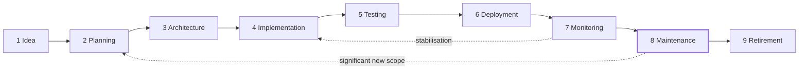

# Part 11 — Project Lifecycle and Decision Frameworks

*Sections 20 and 21. A project's whole life, from the first sentence to the day it is switched off — and the frameworks for the handful of decisions that determine whether that life is long and useful or short and expensive.*

---

# 20. Project Lifecycle

## 20.1 Purpose

To define the stages every TradyPerch project passes through, what each stage produces, and what must be true to leave it — including the stage teams systematically forget: retirement.

## 20.2 Objectives

1. Define the nine stages and their entry and exit criteria.
2. Make the transitions explicit decisions rather than gradual drifts.
3. Establish maintenance as a funded activity rather than an assumption.
4. Establish retirement as a planned stage with its own criteria.
5. Prevent the two lifecycle failures: building without a decision to build, and running forever without a decision to continue.

## 20.3 Engineering Rationale

### 20.3.1 The Lifecycle Is Mostly Maintenance

| Stage | Typical Share of Total Cost |
|---|---|
| Idea and planning | 5–15% |
| Implementation | 20–30% |
| Testing and hardening | 10–15% |
| Deployment | 5% |
| **Maintenance and operation** | **40–60%** |
| Retirement | 2–5% |

**The majority of a system's cost occurs after it is "finished."** Decisions made during the 25% that is implementation determine the cost of the 50% that is maintenance — which is the entire economic argument for §8, §9, §11, and §14.

The practical consequence: a decision that saves a week of implementation and adds a day per month of maintenance is a bad decision, and it takes about seven months to become obviously bad.

### 20.3.2 Transitions Must Be Decisions

Projects fail at transitions more often than within stages, because transitions frequently happen by drift rather than by decision:

| Drift | What Should Have Happened |
|---|---|
| Coding began during "exploration" | A decision to build, with a tier and a plan |
| A prototype became production | A decision to productionise, with the work that implies |
| "Temporarily" running unmonitored | A decision that it is operational, with observability |
| Nobody owns it any more | An ownership handover, or a retirement decision |
| It has not been used in a year | A retirement decision |

Each drift is individually reasonable and collectively expensive. Making transitions explicit is what converts a slow accumulation of half-supported systems into a portfolio someone can account for.

### 20.3.3 Retirement Is a Stage, Not an Accident

Most organisations have no retirement process, so systems accumulate. Each costs: dependencies to update, vulnerabilities to patch, questions to answer, confusion for newcomers, and infrastructure to pay for.

**A system that nobody has decided to keep should be decided about.** The decision may well be "keep" — but it should be a decision, with an owner, rather than an absence of one.

## 20.4 Standards — The Nine Stages

### 20.4.1 Stage 1 — Idea

| Aspect | Content |
|---|---|
| **Purpose** | Decide whether the problem is worth solving |
| **Produces** | A problem statement with evidence; a rough sense of cost |
| **Entry** | Someone identifies a problem |
| **Exit** | A decision: pursue, park, or decline — **recorded either way** |
| **Common failure** | Skipping straight to solutions; coding "just to explore" without a time box |

| ID | Rule |
|---|---|
| **LIFE-01** | The problem MUST be stated before any solution is discussed |
| **LIFE-02** | Declined and parked ideas MUST be recorded with the reason. **This prevents re-litigating them quarterly** |
| **LIFE-03** | Exploration code MUST be time-boxed and thrown away (PLAN-30) |

### 20.4.2 Stage 2 — Planning

| Aspect | Content |
|---|---|
| **Purpose** | Decide what to build and to what standard |
| **Produces** | PRD, conformance tier, risk assessment, project DoD (§5) |
| **Entry** | The idea was approved |
| **Exit** | Requirements are testable; tier chosen; risks owned; DoD written |
| **Common failure** | Requirements that cannot be verified; no non-goals |

### 20.4.3 Stage 3 — Architecture

| Aspect | Content |
|---|---|
| **Purpose** | Decide the shape of the system |
| **Produces** | Architecture document, ADRs, technical specification, implementation plan |
| **Entry** | Planning complete |
| **Exit** | An implementer could build it without asking a question (CHK-5.2) |
| **Common failure** | Speculative complexity; one option considered |

### 20.4.4 Stage 4 — Implementation

| Aspect | Content |
|---|---|
| **Purpose** | Build it |
| **Produces** | Working, tested, documented software |
| **Entry** | Architecture baselined |
| **Exit** | Every planned change meets §10.4.1 |
| **Common failure** | Scope creep; skipped tests; deviation from the plan without recording it |

| ID | Rule |
|---|---|
| **LIFE-04** | Implementation MUST follow the planned order, especially where safety mechanisms come first (PLAN-19) |
| **LIFE-05** | Deviations from the plan MUST be recorded, not absorbed |
| **LIFE-06** | Scope added during implementation MUST go through planning, however small it seems |

### 20.4.5 Stage 5 — Testing and Hardening

| Aspect | Content |
|---|---|
| **Purpose** | Establish that it works, including when things go wrong |
| **Produces** | Verified behaviour, measured performance, security review, drilled runbooks |
| **Entry** | Implementation complete |
| **Exit** | Feature DoD met for everything; performance and security verified; runbooks drilled |
| **Common failure** | Treating this as a phase that can be compressed rather than a set of gates |

**Note.** Most testing happens during implementation (§11). This stage covers what can only be done on the whole system: end-to-end paths, load behaviour, failure injection, security review, and operational drills.

### 20.4.6 Stage 6 — Deployment

| Aspect | Content |
|---|---|
| **Purpose** | Get it into production safely |
| **Produces** | A running system with verified deployment and rollback |
| **Entry** | Testing complete |
| **Exit** | Deployed; post-deployment verification passing; rollback tested |
| **Common failure** | First deployment attempted at the end rather than early and repeatedly |

| ID | Rule |
|---|---|
| **LIFE-07** | The deployment pipeline MUST be built and exercised **early**, not at the end |
| **LIFE-08** | The first production deployment MUST NOT be the first time the pipeline runs |

### 20.4.7 Stage 7 — Monitoring and Stabilisation

| Aspect | Content |
|---|---|
| **Purpose** | Confirm real-world behaviour matches expectation |
| **Produces** | Baselines, tuned alerts, a defect list, confirmed operability |
| **Entry** | Deployed |
| **Exit** | A defined stabilisation period passes with metrics within budget and no unresolved critical defects |
| **Common failure** | Moving the team off the project the day after launch |

| ID | Rule |
|---|---|
| **LIFE-09** | A stabilisation period MUST be defined and staffed before the team disperses |
| **LIFE-10** | Alert thresholds MUST be tuned against real data during this stage (OBS-24) |
| **LIFE-11** | The team MUST NOT be reassigned before stabilisation completes |

**Rationale for LIFE-11.** The people who built it are the only ones who can efficiently diagnose its early failures. Reassigning them immediately converts a two-hour fix into a two-day investigation, and it happens routinely because launch feels like completion.

### 20.4.8 Stage 8 — Maintenance

The longest stage, and the one most often unplanned.

| Aspect | Content |
|---|---|
| **Purpose** | Keep it working, current, and secure |
| **Produces** | Sustained value |
| **Entry** | Stabilised |
| **Exit** | A retirement decision |
| **Common failure** | Treating it as unfunded background work |

| Activity | Cadence |
|---|---|
| Dependency updates and security patches | Monthly, or on advisory |
| Defect repair | As raised, by severity |
| Runbook verification | Quarterly |
| Documentation review | Quarterly |
| Quick start verification | Quarterly |
| Performance and cost review | Quarterly |
| Dependency pruning | Quarterly |
| **Continued-value review** | **Annually** |
| Ownership confirmation | Annually |

| ID | Rule |
|---|---|
| **LIFE-12** | Every system in maintenance MUST have a named owner |
| **LIFE-13** | Maintenance MUST be explicitly funded — allocated time, not goodwill |
| **LIFE-14** | Security patching MUST NOT wait for a feature release |
| **LIFE-15** | An annual review MUST ask: is this still worth running? |
| **LIFE-16** | A system with no owner MUST be assigned one or retired within 30 days |

**Rationale for LIFE-13.** Unfunded maintenance is performed by whoever feels responsible, in time they do not officially have, until they stop. Then the system decays until it fails, and the failure is treated as a surprise.

### 20.4.9 Stage 9 — Retirement

| Aspect | Content |
|---|---|
| **Purpose** | Switch it off deliberately and completely |
| **Produces** | A decommissioned system; preserved data; informed users |
| **Entry** | A decision that it is no longer worth running |
| **Exit** | Nothing runs; nothing references it; data is preserved or destroyed per policy |
| **Common failure** | Turning off the visible part and leaving jobs, credentials, and infrastructure running |

| ID | Rule |
|---|---|
| **LIFE-17** | Retirement MUST be a planned activity with a checklist, not an omission |
| **LIFE-18** | Users and consumers MUST be notified with a migration path and a date |
| **LIFE-19** | Data MUST be exported, archived, or destroyed per policy — decided **before** shutdown |
| **LIFE-20** | All associated resources MUST be removed: credentials, jobs, infrastructure, DNS, monitors, integrations |
| **LIFE-21** | The repository MUST be archived with a README stating status and replacement (REPO-19) |
| **LIFE-22** | Retirement MUST be verified — nothing still calls it, nothing still runs |

**Rationale for LIFE-20.** Orphaned credentials and scheduled jobs are a recurring source of both cost and security exposure. A credential belonging to a system nobody operates is a credential nobody rotates and nobody monitors.

## 20.5 Real-World Examples

### Example 1 — The Prototype That Became Production

A weekend prototype is demonstrated and immediately used by a customer. It has no tests, no error handling, no observability, and one hard-coded credential. Eighteen months later it is business-critical and nobody will touch it.

| | |
|---|---|
| Root cause | No explicit transition from exploration to production |
| Rules | LIFE-03, and the tier decision (§0.3.3) |
| The correct moment | The day it was first shown to a customer. That was a transition, and it needed a decision |

### Example 2 — The Team That Left at Launch

A system launches on a Thursday. The team moves to the next project on Monday. Three defects surface in week two and take eight days to resolve because the people with context are unavailable.

| | |
|---|---|
| Rules | LIFE-09, LIFE-11 |
| Cost | Eight days of degraded service and a poor first impression |
| Correct approach | A two-week stabilisation period staffed before anyone is reassigned |

### Example 3 — The Half-Retired System

A tool is "decommissioned". Its web interface is switched off. Its nightly job continues running for fourteen months, writing to a database nobody reads, using a credential nobody rotates. It is discovered during a security audit.

| | |
|---|---|
| Rules | LIFE-20, LIFE-22 |
| The general lesson | Retirement means removing everything, and verifying that nothing remains |

### Example 4 — The Annual Review That Saved Money

An annual continued-value review finds three internal tools with no users in twelve months. All three are retired. The savings are modest in infrastructure and substantial in attention: three fewer things to patch, document, and explain.

| | |
|---|---|
| Rule | LIFE-15 |
| The under-appreciated benefit | Removing a system removes an ongoing cognitive and maintenance tax, not just a bill |

## 20.6 Common Mistakes

| # | Mistake | Symptom | Fix |
|---|---|---|---|
| 1 | Coding during "exploration" | The prototype becomes production | LIFE-03 |
| 2 | No explicit transition decisions | Drift into unsupported states | Stage gates |
| 3 | Deployment built last | The first deploy is the riskiest | LIFE-07 |
| 4 | Team disperses at launch | Slow early defect resolution | LIFE-11 |
| 5 | Maintenance unfunded | Gradual decay, then failure | LIFE-13 |
| 6 | No owner | Nobody patches it | LIFE-12, LIFE-16 |
| 7 | No retirement process | Systems accumulate | LIFE-17 |
| 8 | Partial retirement | Orphaned jobs and credentials | LIFE-20, LIFE-22 |
| 9 | Scope added without planning | Plan becomes fiction | LIFE-06 |
| 10 | No continued-value review | Zombie systems | LIFE-15 |

## 20.7 Anti-Patterns

| ID | Anti-Pattern | Description | Countermeasure |
|---|---|---|---|
| **AP-134** | **The Permanent Prototype** | Exploration code running in production for years | LIFE-03; explicit transitions |
| **AP-135** | **Launch and Abandon** | Team leaves the day after deployment | LIFE-09, LIFE-11 |
| **AP-136** | **The Unfunded Mandate** | Maintenance expected but not scheduled | LIFE-13 |
| **AP-137** | **The Orphan System** | Running, used, owned by nobody | LIFE-12, LIFE-16 |
| **AP-138** | **The Zombie** | Nobody uses it; everybody maintains it | LIFE-15 |
| **AP-139** | **Partial Decommission** | The visible part is off; the rest runs | LIFE-20, LIFE-22 |
| **AP-140** | **Perpetual Beta** | Never formally released, so never formally supported | Explicit stage transitions |

## 20.8 Decision Tables

### 20.8.1 What Stage Is This In?

| Signal | Stage |
|---|---|
| We are discussing whether to solve this | Idea |
| We know what to build; deciding scope and standard | Planning |
| We know what; deciding how | Architecture |
| Building | Implementation |
| Built; verifying the whole | Testing |
| Verified; getting it live | Deployment |
| Live; watching and tuning | Monitoring |
| Live; stable; keeping it working | Maintenance |
| Deciding whether to stop | Retirement |

### 20.8.2 Is This Ready to Move On?

| From → To | Required |
|---|---|
| Idea → Planning | The problem is stated with evidence; someone decided to pursue it |
| Planning → Architecture | Testable requirements; tier chosen; risks owned; DoD written |
| Architecture → Implementation | An implementer could build it without asking a question |
| Implementation → Testing | Every change meets the change DoD |
| Testing → Deployment | Feature DoD met; performance and security verified; runbooks drilled |
| Deployment → Monitoring | Deployed; verification passing; rollback tested |
| Monitoring → Maintenance | Stabilisation period passed; alerts tuned; no unresolved critical defects |
| Maintenance → Retirement | A decision that continued operation is not worth its cost |

### 20.8.3 Should This Be Retired?

| Question | Points Toward Retirement |
|---|---|
| Has it been used in the last six months? | No → ✅ |
| Does it have an owner? | No → ✅ |
| Is there a replacement? | Yes → ✅ |
| Is maintenance cost exceeding value? | Yes → ✅ |
| Does it hold data anyone still needs? | No → ✅ |
| Does it block a dependency upgrade elsewhere? | Yes → ✅ |
| Would anyone notice if it stopped today? | No → ✅ **strong signal** |

## 20.9 Checklists

### CHK-20.1 · Stage Transition

- [ ] Exit criteria for the current stage are met
- [ ] The transition is an explicit decision with a decider
- [ ] Documents for the new stage exist
- [ ] Ownership is clear
- [ ] Risks re-assessed
- [ ] Any deviation from the plan is recorded

### CHK-20.2 · Retirement

- [ ] Decision recorded with a rationale and an approver
- [ ] Users and consumers notified with a date and a migration path
- [ ] Data exported, archived, or destroyed per policy
- [ ] All scheduled jobs disabled
- [ ] All credentials revoked
- [ ] All infrastructure removed
- [ ] DNS records removed
- [ ] Monitors and alerts removed
- [ ] Integrations disconnected — **and the other side notified**
- [ ] Repository archived with a status README naming the replacement
- [ ] **Verified: nothing calls it, nothing runs, no credential remains**
- [ ] Documentation updated to state that it is retired

### CHK-20.3 · Annual System Review

- [ ] Still used? By whom? Measured, not assumed
- [ ] Owner confirmed and still employed in that role
- [ ] Dependencies current; no unpatched advisories
- [ ] Documentation accurate; quick start works
- [ ] Runbooks drilled in the last year
- [ ] Cost known and proportionate to value
- [ ] Any known critical defects
- [ ] Decision: continue, invest, or retire

## 20.10 Risk Analysis

| Risk | Likelihood | Impact | Mitigation | Residual |
|---|---|---|---|---|
| Prototype becomes production silently | **High** | High | LIFE-03; explicit transitions; tier decision | Medium |
| Maintenance unfunded until failure | High | High | LIFE-13; annual review | Medium |
| System without an owner | Medium | Medium | LIFE-12, LIFE-16 | Low |
| Incomplete retirement leaving live resources | Medium | **High** | CHK-20.2; verification step | Low |
| Team dispersed before stabilisation | High | Medium | LIFE-11 | Medium |
| Portfolio accumulates zombie systems | High | Medium | LIFE-15 | Medium |

## 20.11 Future Improvements

| Item | When | Note |
|---|---|---|
| System inventory with owner, tier, and last review | v1.1 | Makes LIFE-12 and LIFE-15 enforceable |
| Automated usage reporting per system | v1.2 | Turns "is it used?" into data |
| Retirement checklist as a repository template | v1.1 | Lowers the cost of doing it completely |
| Maintenance cost tracking | v1.2 | Makes the continued-value review evidence-based |

---

# 21. Decision Frameworks

## 21.1 Purpose

To make recurring high-stakes decisions consistently and defensibly, using stated criteria rather than whoever argues most persuasively on the day.

## 21.2 Objectives

1. Provide frameworks for the five decisions that recur across every project.
2. Make trade-offs explicit and recorded.
3. Reduce the influence of recency, enthusiasm, and seniority on technical decisions.
4. Establish reversibility as the primary factor in how much deliberation a decision deserves.
5. Make "not now" a legitimate, recorded outcome.

## 21.3 Engineering Rationale

### 21.3.1 Reversibility Determines Deliberation

The most useful single question about any decision: **how expensive is it to undo?**

| Reversibility | Example | Approach |
|---|---|---|
| **Trivial** | Function name, file organisation | Decide immediately; do not discuss |
| **Cheap** | Library for an isolated concern | Decide quickly; record briefly |
| **Moderate** | Framework choice; API shape | Consider options; write an ADR |
| **Expensive** | Data model; service boundaries | Multiple options; prototype if uncertain; ADR |
| **Effectively permanent** | Public API contract; identifier scheme; data format consumed externally | Maximum deliberation; assume it is forever |

**The failure in both directions:** agonising over reversible decisions wastes time and delays learning; rushing irreversible ones creates permanent constraints. Most teams do both, on the wrong decisions.

### 21.3.2 The Cost of Not Deciding

Deferral is a legitimate choice, but it is a choice with a cost:

| Deferral Cost | Mechanism |
|---|---|
| Work proceeds on assumptions | Different people assume differently |
| Options close silently | The default becomes permanent by accident |
| Repeated discussion | The same conversation, monthly |
| Blocked work | Someone waits |

| ID | Rule |
|---|---|
| **DEC-01** | A deferred decision MUST have a decision date and an owner |
| **DEC-02** | A deferred decision MUST state the interim position, so work can proceed without inventing one |

### 21.3.3 Trade-Off Analysis Requires Weighted Criteria

An unweighted comparison table produces whatever the author already preferred, because the criteria selected and their implicit importance do the work invisibly.

The discipline: **state the criteria and their weights before evaluating options.** Weights come from the project's ranked quality attributes (PLAN-05). This makes the decision auditable, and it occasionally produces a result the author did not expect — which is the point.

## 21.4 Standards — The Five Frameworks

### 21.4.1 When to Refactor

**Refactor** = improving structure without changing behaviour.

| Signal | Refactor |
|---|---|
| You are about to change this code and the current structure makes it hard | ✅ **The best time** |
| The same change must be made in three places | ✅ |
| A module exceeds structural limits | ✅ |
| A name no longer describes what the thing does | ✅ |
| Tests are hard to write because of coupling | ✅ |
| It is ugly but stable and untouched | ❌ Leave it |
| Nobody has changed it in a year | ❌ Leave it |
| There is no test coverage | ❌ **Add characterisation tests first** |
| You are mid-way through a behaviour change | ❌ Finish first, then refactor separately |

| ID | Rule |
|---|---|
| **DEC-03** | Refactoring MUST be behaviour-preserving and MUST be a separate change (GIT-11) |
| **DEC-04** | Refactoring without test coverage MUST be preceded by characterisation tests |
| **DEC-05** | Refactoring SHOULD be done immediately before a change to the same code, not as standalone work |
| **DEC-06** | Refactoring MUST have a stated goal — "make X easier", not "clean up" |

**Rationale for DEC-05.** Standalone refactoring carries risk with no immediate return and is hard to prioritise honestly. Refactoring as preparation for a change has an immediate payoff and the change itself validates it.

### 21.4.2 When to Rewrite

**Rewrite** = replacing a working system with a new implementation. The most consistently underestimated decision in software.

**All five preconditions must hold. Four is not enough.**

| # | Precondition |
|---|---|
| 1 | The existing system's behaviour is **documented or characterised by tests** — otherwise the specification is being thrown away with the code |
| 2 | The reason is **structural**, not aesthetic — it cannot meet a real requirement, not merely that it is unpleasant |
| 3 | Incremental improvement has been **attempted and demonstrated insufficient** |
| 4 | The replacement can be delivered **incrementally**, running alongside the original |
| 5 | The team has **capacity to maintain both** during the transition |

| ID | Rule |
|---|---|
| **DEC-07** | A rewrite MUST satisfy all five preconditions |
| **DEC-08** | A rewrite MUST be delivered incrementally, behind the existing interface where possible |
| **DEC-09** | A rewrite MUST NOT add features. Behaviour parity first; changes afterwards |
| **DEC-10** | A rewrite estimate MUST be multiplied by at least 2× before it is used for planning |
| **DEC-11** | The old system MUST NOT be deleted until the new one has run in production for a defined period |

**Rationale for DEC-09.** Combining a rewrite with new features makes it impossible to determine whether a difference in behaviour is a bug or a feature, which removes the only reliable way to verify a rewrite: comparison against the original.

**Rationale for DEC-10.** Rewrites are systematically underestimated because the estimate covers the understood behaviour, and the undocumented behaviour — which is usually most of the difficulty — is invisible until encountered.

### 21.4.3 When to Optimise

Per §16. Summarised as a gate:

| # | Precondition |
|---|---|
| 1 | A stated budget is being violated |
| 2 | The violation is measured, not suspected |
| 3 | The bottleneck is identified by measurement, not intuition |
| 4 | The simplest fix has been considered first |
| 5 | The improvement will be verified by measurement |

| ID | Rule |
|---|---|
| **DEC-12** | Optimisation MUST satisfy all five preconditions |
| **DEC-13** | An optimisation that does not measurably improve the budget MUST be reverted (PERF-03) |

### 21.4.4 When to Postpone

"Not now" is a legitimate outcome, but only when it is a decision.

| Signal | Postpone |
|---|---|
| The requirement is speculative | ✅ |
| Information that would change the decision arrives soon | ✅ |
| It is reversible and cheap to add later | ✅ |
| It is currently blocking someone | ❌ Decide now |
| Postponing means proceeding on an assumption | ❌ Decide, or state the interim position |
| It is expensive to add later | ❌ Decide now |
| It is irreversible once shipped | ❌ **Decide now** |

| ID | Rule |
|---|---|
| **DEC-14** | Postponement MUST record a decision date and an owner (DEC-01) |
| **DEC-15** | Postponement MUST state the interim position (DEC-02) |
| **DEC-16** | A decision postponed three times MUST be escalated. It is not actually being postponed; it is being avoided |

### 21.4.5 When to Adopt a Technology

| Criterion | Weight | Question |
|---|---|---|
| Fit for the requirement | ×5 | Does it solve the actual problem, not an adjacent one? |
| Team familiarity | ×4 | Can the current team operate it under pressure? |
| Maturity and maintenance | ×4 | Is it maintained? What is its release history? |
| Operational burden | ×4 | What does running it cost in attention, not licence fees? |
| Reversibility | ×3 | How hard is it to leave? |
| Community and documentation | ×3 | Can we get answers at 2 a.m.? |
| Licensing | ×3 | Compatible with commercial use? |
| Performance | ×2 | Adequate for the stated budgets? |
| Ecosystem | ×2 | Does it integrate with what we have? |

| ID | Rule |
|---|---|
| **DEC-17** | Technology adoption MUST be evaluated against stated, weighted criteria and recorded as an ADR |
| **DEC-18** | The "do nothing new" option MUST be evaluated as a genuine alternative |
| **DEC-19** | Adopting a technology one person understands MUST be treated as a risk with a named mitigation |
| **DEC-20** | Operational burden MUST be weighted at least as highly as capability |

**Rationale for DEC-20.** Technology is adopted for its capability and abandoned for its operational cost. Weighting the two equally at adoption is the only way to avoid a portfolio of individually reasonable choices that are collectively unmaintainable.

## 21.5 Decision Records

Every decision satisfying any of these belongs in an ADR (§14.4.4):

| Trigger |
|---|
| It is expensive or impossible to reverse |
| It constrains future work |
| A reasonable person would choose differently |
| It was contentious |
| It will be questioned later |
| It involves adopting or removing a technology |
| It defines a public contract |
| It accepts a known risk |

| ID | Rule |
|---|---|
| **DEC-21** | An ADR MUST record the rejected alternatives and why each lost (DOC-15) |
| **DEC-22** | An ADR MUST be written at the time of the decision (DOC-14) |
| **DEC-23** | An ADR SHOULD state what would cause the decision to be revisited |

## 21.6 Real-World Examples

### Example 1 — The Rewrite That Failed the Preconditions

A team proposes rewriting a five-year-old service. Assessment: behaviour is undocumented and untested (fails 1), the reason is that the code is unpleasant (fails 2), incremental improvement was never attempted (fails 3). The rewrite is declined; characterisation tests are written instead, and three months of incremental improvement resolves the actual complaints.

| | |
|---|---|
| Rule | DEC-07 |
| Outcome | Roughly a quarter of engineering time saved, and the system is now testable |

### Example 2 — The Technology Adopted for One Person

A new data store is adopted because one engineer knows it well. Nine months later they leave. Nobody else can operate it. Migration takes two months.

| | |
|---|---|
| Rules | DEC-19, DEC-20 |
| What the framework would have shown | Team familiarity ×4 scores 1/5; operational burden ×4 scores 1/5. The weighted result would have been clearly negative |

### Example 3 — The Refactor at the Right Moment

An engineer needs to add a third payment method. The existing code has two, with duplicated logic. They refactor first — extracting the shared behaviour — as a separate change with no behaviour modification, then add the third method in a second change. Both changes are small and reviewable.

| | |
|---|---|
| Rules | DEC-03, DEC-05 |
| Why it worked | The refactor had an immediate purpose, a clear goal, and existing tests to protect it |

### Example 4 — The Decision Postponed Correctly

A team defers choosing a search technology because usage patterns are unknown. They record: decision date in three months, interim position is the database's built-in search, owner named. At the date, real usage data makes the choice obvious and cheap.

| | |
|---|---|
| Rules | DEC-01, DEC-02, DEC-14, DEC-15 |
| Why it worked | The deferral was explicit, time-bound, and had an interim position, so nobody proceeded on a private assumption |

## 21.7 Common Mistakes

| # | Mistake | Symptom | Fix |
|---|---|---|---|
| 1 | Rewriting instead of improving | Long project; features lost | DEC-07 |
| 2 | Refactoring without tests | Behaviour changes silently | DEC-04 |
| 3 | Optimising without measuring | Complexity, no gain | DEC-12 |
| 4 | Deferring without a date | The default becomes permanent | DEC-14 |
| 5 | Adopting technology on enthusiasm | Operational burden discovered later | DEC-17 |
| 6 | Agonising over reversible decisions | Slow progress | §21.3.1 |
| 7 | Rushing irreversible decisions | Permanent constraints | §21.3.1 |
| 8 | No record of decisions | Re-litigation every quarter | DEC-21 |
| 9 | Combining rewrite with new features | Cannot verify parity | DEC-09 |
| 10 | Unweighted comparison tables | Confirms the pre-existing preference | §21.3.3 |

## 21.8 Anti-Patterns

| ID | Anti-Pattern | Description | Countermeasure |
|---|---|---|---|
| **AP-141** | **The Second-System Effect** | The rewrite is over-engineered with everything the original lacked | DEC-09 |
| **AP-142** | **Analysis Paralysis** | Deliberating a trivially reversible decision | §21.3.1 |
| **AP-143** | **The Reversible Decision Treated as Permanent** | Weeks spent choosing something replaceable in a day | §21.3.1 |
| **AP-144** | **Decision by Exhaustion** | Whoever argues longest wins | Weighted criteria |
| **AP-145** | **The Undocumented Reversal** | A past decision quietly reversed; nobody knows why either version exists | DEC-22 |
| **AP-146** | **Resume-Driven Adoption** | Technology chosen for interest | DEC-17, DEC-18 |
| **AP-147** | **The Perpetual Deferral** | The same decision postponed indefinitely | DEC-16 |

## 21.9 Decision Tables

### 21.9.1 How Much Deliberation?

| Reversal Cost | Deliberation | Record |
|---|---|---|
| Minutes | None — decide and move | Nothing |
| Hours | Brief | Commit message |
| Days | Consider two options | Short note |
| Weeks | Multiple options; consult | **ADR** |
| Months | Options, prototype, weighted criteria | **ADR + review** |
| Permanent | All of the above, plus assume it is forever | **ADR + explicit approval** |

### 21.9.2 Build, Buy, or Do Without?

| Criterion | Build | Buy | Do Without |
|---|---|---|---|
| Core to what makes us valuable | ✅ | ❌ | — |
| A commodity capability | ❌ | ✅ | — |
| Under ~200 lines to build | ✅ | ❌ | — |
| Security-sensitive (crypto, auth) | ❌ | ✅ | — |
| Recurring cost with uncertain value | ✅ | ⚠️ | ✅ |
| The requirement has no evidence | — | — | ✅ |
| Creates a dependency on another party's roadmap | ✅ prefer | ⚠️ weigh | — |

### 21.9.3 Refactor, Rewrite, or Leave It?

| Situation | Action |
|---|---|
| Hard to change, and you are about to change it | **Refactor** |
| Hard to change, but you are not changing it | **Leave it** |
| Cannot meet a real requirement, structurally | Consider **rewrite** against DEC-07 |
| Unpleasant but working and stable | **Leave it** |
| No test coverage and you must change it | **Characterisation tests**, then refactor |
| The technology is unsupported and unpatchable | Plan a **replacement**, incrementally |

## 21.10 Checklists

### CHK-21.1 · Before a Significant Decision

- [ ] The decision is stated as a question with options
- [ ] At least two genuine options exist, including "do nothing"
- [ ] Criteria are stated and weighted **before** evaluating
- [ ] Weights derive from the project's ranked quality attributes
- [ ] Reversal cost is assessed
- [ ] Deliberation is proportional to reversal cost
- [ ] The decision, alternatives, and reasons are recorded
- [ ] The revisit condition is stated

### CHK-21.2 · Before Proposing a Rewrite

- [ ] Existing behaviour is documented or covered by characterisation tests
- [ ] The reason is structural, not aesthetic
- [ ] Incremental improvement was attempted and demonstrably insufficient
- [ ] The replacement can be delivered incrementally
- [ ] The team can maintain both during the transition
- [ ] The estimate has been multiplied by at least 2×
- [ ] No new features are included
- [ ] Success is defined as behaviour parity, measurably

## 21.11 Risk Analysis

| Risk | Likelihood | Impact | Mitigation | Residual |
|---|---|---|---|---|
| Unjustified rewrite consumes a quarter | Medium | **High** | DEC-07's five preconditions | Low |
| Technology adopted without operational assessment | High | High | DEC-17, DEC-20 | Medium |
| Decisions re-litigated repeatedly | High | Medium | ADRs with rejected alternatives | Low |
| Analysis paralysis on reversible decisions | Medium | Medium | §21.3.1 | Low |
| Irreversible decision made hastily | Medium | **High** | Reversal-cost assessment first | Medium |
| Frameworks applied mechanically without judgement | Medium | Medium | Each states its rationale | Medium |

## 21.12 Future Improvements

| Item | When | Note |
|---|---|---|
| Decision-quality retrospective | Annually | Sample past decisions; assess which the framework got right |
| Shared technology-evaluation record | v1.1 | Avoid re-evaluating the same options across projects |
| ADR index across all repositories | v1.2 | Cross-project decision visibility |

---

*End of Part 11. Part 12 covers risk management and the engineering checklists that operationalise everything so far.*
