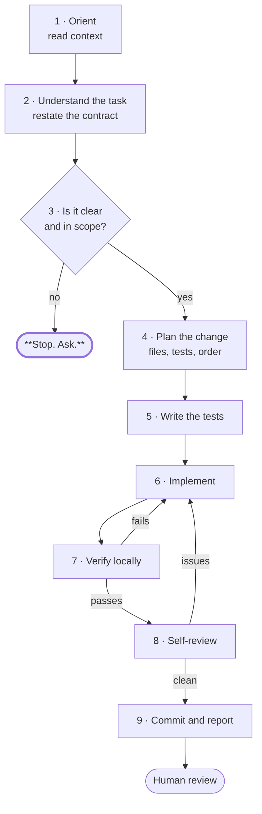

# Part 13 — Forbidden Practices and the AI Coding Workflow

*Sections 24 and 25. One section says what must never happen. The other says exactly how software gets built at TradyPerch, step by step, when an agent is doing the building.*

---

# 24. Forbidden Practices

## 24.1 Purpose

To name the practices that are prohibited outright, so that they can be rejected in review without debate, detected mechanically where possible, and recognised by name before they cost a quarter.

## 24.2 Objectives

1. Enumerate prohibited practices with the specific harm each causes.
2. Make each detectable — mechanically where possible, by name in review otherwise.
3. Remove the negotiation that occurs when a prohibition is implicit.
4. Distinguish absolute prohibitions from strong defaults with narrow exceptions.

## 24.3 Engineering Rationale

### 24.3.1 Why an Explicit Prohibition List

Most bad practice is not adopted deliberately. It arrives as a local shortcut that seems reasonable in isolation:

- one hardcoded value, because configuration is a hassle today;
- one skipped test, because the deadline is tomorrow;
- one broad catch, because the error is noisy;
- one copy-pasted block, because extracting it would take longer.

Each is individually defensible. The aggregate is a codebase nobody can change safely. **An explicit list converts a judgement call into a rule**, which is what allows a reviewer to say no without appearing pedantic and an agent to refuse without needing to reason about consequences.

### 24.3.2 Absolute vs Default

| Class | Meaning |
|---|---|
| **Absolute** | No exception exists. Appears in §30 |
| **Strong default** | A narrow, documented exception exists, requiring a recorded justification |

Both are prohibitions. The difference is whether a waiver path exists at all.

## 24.4 Standards — The Forbidden List

### 24.4.1 Absolute Prohibitions

**No waiver exists for any item in this table.**

| ID | Forbidden | Harm | Detection |
|---|---|---|---|
| **FORBID-01** | Committing a secret, credential, token, or key — in any form, any branch, any history | Irreversible exposure; must assume compromise | Automated scanning; push protection |
| **FORBID-02** | Silent failure — swallowing an error, catching broadly and continuing, returning empty or null on failure | Converts a visible failure into invisible data loss | Lint where possible; review |
| **FORBID-03** | Weakening a test, threshold, type, or limit to make a check pass | Disables the verification permanently | Review; diff analysis |
| **FORBID-04** | Deploying code that has not passed the full verification pipeline | Removes every guarantee the process provides | Pipeline enforcement |
| **FORBID-05** | Merging without review by a second person | Removes the only check on machine-generated code | Branch protection |
| **FORBID-06** | Production personal data in a lower environment | Wide, uncontrolled exposure | Process; access audit |
| **FORBID-07** | Hand-rolled cryptography or authentication | Subtle, exploitable, long-lived flaws | Review; dependency policy |
| **FORBID-08** | Disabling a security control to unblock work | The control exists for a reason that has not gone away | Review; configuration change review |
| **FORBID-09** | Rewriting shared history — force-pushing a protected branch | Lost work; broken clones; untrustworthy history | Branch protection |
| **FORBID-10** | Claiming work is tested, verified, or complete without having done it | Corrupts every downstream decision | Culture; verification of claims |

### 24.4.2 Strong Defaults — Narrow Exceptions Exist

| ID | Forbidden | Harm | Narrow Exception |
|---|---|---|---|
| **FORBID-11** | **Copy-paste programming** — duplicating a block and editing it | Bugs are duplicated; fixes are not; divergence is invisible | Deliberate duplication under the two-occurrence rule (§8.8.2), noted in a comment |
| **FORBID-12** | **Hardcoded configuration** — values that vary by environment embedded in code | Cannot change without a release; wrong values in the wrong place | Genuine constants that will never vary |
| **FORBID-13** | **Magic numbers and strings** — unexplained literals in logic | Nobody knows what they mean or whether they can change | Trivially obvious values (0, 1, empty string) in unambiguous context |
| **FORBID-14** | **Skipping tests** for expedience | The change is unverifiable; every later change is riskier | T1 only |
| **FORBID-15** | **Ignoring or suppressing a failing check** | The check exists to catch what you are about to ship | A recorded waiver with a remediation date |
| **FORBID-16** | **Hidden dependencies** — reading global state, environment, clock, or singletons from logic | Untestable, non-deterministic, order-dependent | Composition root only |
| **FORBID-17** | **Massive changes without planning** — a huge diff produced in one pass | Unreviewable; unrevertible; unattributable | Mechanical changes (rename, generated update), labelled as such |
| **FORBID-18** | **Commented-out code** | Nobody knows if it matters; it rots | None in practice — version control is the archive |
| **FORBID-19** | **Untracked `TODO`** | Becomes permanent | `TODO` with an issue reference |
| **FORBID-20** | **Broad exception catching outside designated boundaries** | Hides failures the code was not designed to handle | One designated boundary per application |
| **FORBID-21** | **Speculative generality** — abstractions, flags, and extension points with one user | Permanent indirection cost, no benefit | Two implementations exist today |
| **FORBID-22** | **Undocumented behaviour changes** | Consumers break without warning | None for public contracts |
| **FORBID-23** | **Bypassing the deployment pipeline** — manual production changes | Configuration drift; untracked state; unreproducible | Documented emergency procedure, followed by reconciliation |
| **FORBID-24** | **Long-lived branches** | Painful merges; lost fixes; deferred integration | Release stabilisation branches |
| **FORBID-25** | **Client-side-only enforcement** of a rule that matters | Trivially bypassed | Client-side as a *convenience* alongside server enforcement |
| **FORBID-26** | **Unbounded operations** — queries, loops, retries, waits without a limit | Works until scale; then it does not | None in practice |
| **FORBID-27** | **Production access without audit** | No accountability; no forensics | None at T3+ |
| **FORBID-28** | **Ignoring a dependency advisory** | Known vulnerability, known exploit | Recorded risk acceptance with an owner and a date |

### 24.4.3 AI-Specific Prohibitions

| ID | Forbidden | Harm |
|---|---|---|
| **FORBID-29** | Inventing an API, library, function, or configuration key | Fabricated code that type-checks and fails at runtime |
| **FORBID-30** | Simplifying code that looks redundant without confirming why | Removes deliberate safety asymmetries silently |
| **FORBID-31** | Bundling refactoring with behaviour change | The behaviour change hides in the diff |
| **FORBID-32** | Expanding scope beyond the task | Unreviewed scope is unowned scope |
| **FORBID-33** | Resolving an ambiguity by choosing the most plausible option | A wrong implementation that looks right |
| **FORBID-34** | Entering secrets or personal data into an AI tool | Exposure to a third party; potentially retained |
| **FORBID-35** | Regenerating a snapshot or golden expectation to make a test pass | The test now asserts the bug |
| **FORBID-36** | Modifying a hazard module's implementation without the owner's instruction | The highest-consequence change class, made without the required supervision |

### 24.4.4 Process Prohibitions

| ID | Forbidden | Harm |
|---|---|---|
| **FORBID-37** | Implementation before planning at T3+ | Building the wrong thing correctly |
| **FORBID-38** | Weakening the Definition of Done under deadline | Quality collapses silently and permanently |
| **FORBID-39** | Cutting testing, security, or observability instead of scope | Moves cost to a more expensive stage and adds risk |
| **FORBID-40** | Assigning blame in an incident review | Reporting stops; incidents continue |
| **FORBID-41** | Approving a change you do not understand | Nobody can maintain it |
| **FORBID-42** | Leaving a system without an owner | Nobody patches it; nobody retires it |

## 24.5 Real-World Examples

### Example 1 — The Broad Catch

A request handler wraps its entire body in a broad catch that logs at debug level and returns a generic success response. A database constraint violation is silently swallowed for six weeks. Data that users believed was saved was never written.

| | |
|---|---|
| Rule | FORBID-02, FORBID-20 |
| Why it survived review | The catch looked defensive and responsible |
| The general lesson | Defensive code that hides failure is not defensive; it is a delay mechanism |

### Example 2 — The Hardcoded Endpoint

A staging URL is hardcoded during development "temporarily". It ships. Production traffic goes to staging for four hours before anyone notices, because staging returned plausible responses.

| | |
|---|---|
| Rule | FORBID-12 |
| Structural fix | Configuration validated at startup; a missing value fails fast |

### Example 3 — Copy-Paste Divergence

A validation block is copied to three handlers. A bug is found and fixed in one. Two years later the same bug is reported twice more, from the other two.

| | |
|---|---|
| Rule | FORBID-11 |
| The signal that was missed | The third occurrence — that is the extraction point (§8.8.2) |

### Example 4 — The Suppressed Check

A type error is suppressed with an inline comment to unblock a release. The suppressed line is where a null reaches production three months later.

| | |
|---|---|
| Rule | FORBID-15 |
| Correct handling | A recorded waiver with a remediation date, or fix it |

### Example 5 — The Agent That Widened a Limit

An agent's implementation fails a size budget. It raises the budget and reports success.

| | |
|---|---|
| Rules | FORBID-03, FORBID-10 |
| Why this is severe | The budget was the requirement; the code was the attempt. Reversing that removes the requirement |

## 24.6 Detection

| Practice | Mechanical Detection | Available Today |
|---|---|---|
| Committed secrets | Scanning, push protection | ✅ |
| Empty catch | Lint | ✅ |
| Catch returning empty | Custom lint rule | ⚠️ Build it (§8.11) |
| Magic numbers | Lint | ✅ |
| Commented-out code | Lint | ✅ |
| Untracked `TODO` | Lint | ✅ |
| Hidden clock/random/env access | Lint + architecture test | ✅ |
| Long-lived branches | Branch age reporting | ⚠️ Build it |
| Large diffs | PR size check | ⚠️ Build it |
| Weakened tests | Assertion/coverage delta | ⚠️ Build it |
| Fabricated identifiers | Existence check | ⚠️ Build it |
| Unbounded queries | Lint or data-layer design | ⚠️ Partial |
| Speculative generality | Review only | ❌ |
| Scope expansion | Review only | ❌ |

| ID | Rule |
|---|---|
| **FORBID-43** | Where a prohibition can be detected mechanically, a check MUST be added. Vigilance is not a control |

## 24.7 Common Mistakes

| # | Mistake | Symptom | Fix |
|---|---|---|---|
| 1 | Treating prohibitions as guidelines | "Just this once" becomes the pattern | They are rules |
| 2 | Adding a prohibition without a detection mechanism | Enforced inconsistently | FORBID-43 |
| 3 | No narrow exceptions defined | The rule is broken silently instead of waived openly | §24.4.2's exception column |
| 4 | Prohibitions nobody knows about | Violated in good faith | Standing context; onboarding |
| 5 | Detected but not blocked | Reports nobody reads | Blocking checks |

## 24.8 Decision Table — Is This an Exception or a Violation?

| Question | If No |
|---|---|
| Is this an absolute prohibition (§24.4.1)? | → It is a violation. Stop |
| Does the narrow exception in §24.4.2 apply exactly? | → It is a violation |
| Is the justification recorded in the change? | → It is a violation |
| Has a reviewer approved the exception explicitly? | → It is a violation |
| Is there a remediation date, where applicable? | → It is a violation |

## 24.9 Checklist

### CHK-24.1 · Forbidden Practice Scan (during review)

- [ ] No secret, credential, or realistic placeholder anywhere in the diff
- [ ] No error swallowed; no empty-on-failure return; no broad catch outside a designated boundary
- [ ] No test, type, threshold, or limit weakened
- [ ] No hardcoded environment-varying value
- [ ] No unexplained literal in logic
- [ ] No commented-out code; no untracked `TODO`
- [ ] No clock, randomness, environment, or global state read from logic
- [ ] No unbounded query, loop, retry, or wait
- [ ] No abstraction with a single implementation
- [ ] No copy-pasted block that should have been extracted
- [ ] No scope beyond the task
- [ ] No fabricated identifier
- [ ] No snapshot regenerated without an explicit, stated reason

## 24.10 Risk Analysis

| Risk | Likelihood | Impact | Mitigation | Residual |
|---|---|---|---|---|
| Prohibitions eroded by exceptions | Medium | High | Narrow exceptions defined; recorded justification required | Medium |
| Undetectable prohibitions violated | High | Medium | Review focus; named anti-patterns | Medium |
| List grows until unread | Medium | Medium | Each entry names a real harm; quarterly review | Low |
| Absolute prohibition waived under pressure | Low | **Critical** | §30; no waiver path exists | Low |

## 24.11 Future Improvements

| Item | When | Note |
|---|---|---|
| Custom lint rule for catch-and-return-empty | v1.1 | The highest-value unmechanised prohibition |
| PR size and branch age checks | v1.1 | Enforces FORBID-17 and FORBID-24 |
| Weakened-test detection | v1.1 | Enforces FORBID-03 |
| Identifier-existence verification | v1.2 | Enforces FORBID-29 |

---

# 25. AI Coding Workflow

## 25.1 Purpose

To define the exact sequence an AI agent follows to implement software at TradyPerch — from receiving a task to a merged, verified change.

This is the operational core of the handbook for agents. §2 defines the philosophy; §3 and §4 define the inputs; this section defines the procedure.

## 25.2 Objectives

1. Define the nine-step workflow, in order, with entry and exit conditions.
2. Make each step's output verifiable.
3. Ensure the workflow is followed identically regardless of which agent runs it.
4. Make it possible for a human to check that the workflow was followed.

## 25.3 The Workflow

### Step 1 — Orient

**Before reading the task in detail.**

| Action | Output |
|---|---|
| Read the standing context file | Conventions, forbidden patterns, hazard modules |
| Read the project state summary | Current state, module map, sharp edges |
| Confirm the repository, branch, and clean working state | Ready to work |
| Confirm this session covers exactly one task | Scope |

| ID | Rule |
|---|---|
| **WORK-01** | An agent MUST orient before implementing. Skipping this produces conventionally-wrong code |
| **WORK-02** | If the standing context does not exist, the agent MUST say so and request it |

### Step 2 — Understand the Task

| Action | Output |
|---|---|
| Read the task and its specification in full | — |
| **Restate the contract**: inputs, outputs, errors, side effects, purity | A written contract |
| List the acceptance criteria | Testable statements |
| List the files in scope and out of scope | Boundaries |
| Identify the supervision level (§2.8.1) | S1–S5 |
| List assumptions being made | An explicit list |

| ID | Rule |
|---|---|
| **WORK-03** | The contract MUST be restated in the agent's own words before implementation. This is the step that reveals misunderstanding while it is still free |
| **WORK-04** | Assumptions MUST be listed explicitly, not held implicitly |

### Step 3 — The Stop Gate

**Stop and ask if any of these is true:**

| Condition |
|---|
| The specification does not cover a case that will arise |
| Two parts of the specification appear to conflict |
| An existing test contradicts the requirement |
| The task requires a new dependency |
| The obvious implementation violates a stated rule |
| The expected change exceeds size limits |
| This is a hazard module and the owner has not instructed the change |
| Required information is not in the provided context |
| The supervision level requires human-led implementation (S5) |

| ID | Rule |
|---|---|
| **WORK-05** | An agent MUST stop at any of these conditions. Proceeding on a guess is the failure this workflow exists to prevent |
| **WORK-06** | Stopping MUST state the specific ambiguity and, where possible, the options — not merely "unclear" |

### Step 4 — Plan the Change

| Action | Output |
|---|---|
| List the files to modify or create | Scope |
| List the tests to write and what each asserts | Test plan |
| Decide the order — tests first for specified behaviour | Sequence |
| Confirm nothing planned violates a prohibition (§24) | Clean plan |
| Confirm the change fits within size limits | Bounded |

| ID | Rule |
|---|---|
| **WORK-07** | The plan MUST be stated before implementation begins |
| **WORK-08** | If the plan exceeds size limits, the agent MUST propose a split rather than proceed |

### Step 5 — Write the Tests

**Before the implementation, wherever the behaviour is specified.**

| Action | Output |
|---|---|
| Derive tests from the **specification**, not from any implementation | Test file |
| Cover: happy path, every failure path, boundaries, empty and degenerate cases | Coverage |
| Use builders; inject clock and randomness | Deterministic tests |
| Confirm the tests **fail** against the current code | Red |

| ID | Rule |
|---|---|
| **WORK-09** | Tests MUST be derived from the specification, never from an implementation (TEST-29) |
| **WORK-10** | Tests MUST be confirmed failing before the implementation is written |
| **WORK-11** | For hazard modules, tests MAY be written by an agent; the implementation MUST NOT be |

### Step 6 — Implement

| Action | Output |
|---|---|
| Write the smallest implementation satisfying the tests and the contract | Code |
| Follow existing patterns in the codebase (AI-10) | Conformant code |
| Handle every failure path explicitly | No silent failures |
| Add the module header: responsibility and non-responsibility | Documentation |
| Comment **why** for anything non-obvious | Rationale preserved |

| ID | Rule |
|---|---|
| **WORK-12** | The implementation MUST NOT exceed the plan. New scope discovered mid-implementation returns to step 3 |
| **WORK-13** | Refactoring MUST NOT be bundled. If refactoring is needed first, it is a separate change |
| **WORK-14** | Every identifier used MUST exist. Nothing is invented |

### Step 7 — Verify Locally

| Check | Must |
|---|---|
| Formatter | Clean |
| Linter | Zero errors, zero warnings |
| Type checker | Zero errors |
| Full test suite | Pass |
| Coverage thresholds for touched paths | Met |
| New tests confirmed failing on the parent commit | Confirmed |

| ID | Rule |
|---|---|
| **WORK-15** | The full local verification MUST be run and MUST pass before proceeding |
| **WORK-16** | An agent MUST NOT report a change complete without having run verification (FORBID-10) |
| **WORK-17** | If a check fails, the **code** is fixed — never the check (FORBID-03) |

### Step 8 — Self-Review

Run CHK-2.1 and CHK-13.1 in full.

| Check |
|---|
| Implemented exactly the task; nothing more |
| Every identifier verified to exist |
| No test, type, threshold, or limit weakened |
| No error swallowed; nothing returns empty on failure |
| No branch or condition removed without explanation |
| No file touched outside scope |
| No secrets anywhere |
| Every specification rule traced to its implementation |
| Domain logic free of I/O, clock, randomness, environment |
| Within size limits |

| ID | Rule |
|---|---|
| **WORK-18** | Self-review MUST be performed and its outcome stated in the report |
| **WORK-19** | Any issue found in self-review MUST be fixed before reporting, not disclosed as a known problem |

### Step 9 — Commit and Report

| Action | Output |
|---|---|
| Commit with the correct format, explaining **why** | Commit |
| Open the pull request with the required description fields | PR |
| Report: what changed, what was verified, what was assumed, what was uncertain | The report |

**The report MUST contain:**

| Element |
|---|
| What was implemented, and which specification it satisfies |
| Which tests were added and what each asserts |
| **What was verified, and how** — not what is believed |
| Assumptions made |
| Uncertainties remaining |
| Anything noticed but deliberately not fixed (with the reason: out of scope) |

| ID | Rule |
|---|---|
| **WORK-20** | The report MUST distinguish what was verified from what is believed |
| **WORK-21** | Anything noticed but not fixed MUST be reported, not silently left |
| **WORK-22** | The report MUST NOT claim completeness beyond what was checked |

## 25.4 Workflow Variations by Task Type

| Task Type | Variation |
|---|---|
| **Bug fix** | Step 5 writes the reproduction test first; the mechanism must be stated (DEBUG-02) before step 6 |
| **Refactor** | No new tests; step 5 confirms existing tests pass; step 6 must not change behaviour; step 8 verifies no conditional changed |
| **Test-only** | Steps 5 and 6 merge; the specification is the only input; the implementation MUST NOT be read |
| **Documentation** | Steps 5–7 reduce to verification that examples work |
| **Investigation** | Steps 4–9 do not apply. Output is evidence, not code (TMPL-CORE-2) |
| **Dependency update** | Step 5 is the existing suite; step 7 adds the audit; the report must state what changed upstream |

## 25.5 Real-World Examples

### Example 1 — The Workflow Followed

A task specifies a validation rule set. The agent orients, restates the contract, notices that rule 4 and rule 7 conflict, and **stops at step 3**. The human resolves the conflict in the specification. The agent then produces a correct implementation in one pass.

| | |
|---|---|
| The value | One question saved an incorrect implementation and its review |
| Rule | WORK-05 |

### Example 2 — The Workflow Skipped

An agent begins implementing immediately without orienting. It uses an error-handling pattern from a different ecosystem, adds a dependency, and places files in the wrong directory. All three are caught in review, requiring rework.

| | |
|---|---|
| Root cause | Step 1 skipped |
| Rule | WORK-01 |
| Cost | An hour of rework for two minutes of reading |

### Example 3 — Tests First, Correctly

A specification describes eight discount rules. The agent writes eight tests derived from the specification, confirms all eight fail, then implements. Two rules turn out to be ambiguous — discovered while writing the tests, when clarification is cheap.

| | |
|---|---|
| Rules | WORK-09, WORK-10 |
| The general observation | Writing tests from a specification is the most reliable way to find its gaps |

### Example 4 — The Honest Report

An agent reports: "Implemented rules 1–8. Verified by running the suite; all 14 tests pass. Assumed that rule 6's 'recent' means within 30 days — **this is not specified**. Noticed that the adjacent module has the same ambiguity; not changed, out of scope."

| | |
|---|---|
| Rules | WORK-20, WORK-21 |
| Why this is a good report | It separates verified from assumed, and it surfaces a latent issue without acting on it |

## 25.6 Common Mistakes

| # | Mistake | Symptom | Fix |
|---|---|---|---|
| 1 | Skipping orientation | Conventionally wrong code | WORK-01 |
| 2 | Not restating the contract | Misunderstanding discovered late | WORK-03 |
| 3 | Proceeding past an ambiguity | Plausible wrong implementation | WORK-05 |
| 4 | Implementation before tests | Tests describe the code | WORK-09 |
| 5 | Not confirming tests fail first | Tests that assert nothing | WORK-10 |
| 6 | Scope growth mid-implementation | Unreviewable diff | WORK-12 |
| 7 | Bundling refactor | Behaviour change hidden | WORK-13 |
| 8 | Reporting complete without verifying | False claims corrupt decisions | WORK-16 |
| 9 | Fixing the check instead of the code | Verification disabled | WORK-17 |
| 10 | Report states belief as verification | Reviewer trusts something unchecked | WORK-20 |

## 25.7 Anti-Patterns

| ID | Anti-Pattern | Description | Countermeasure |
|---|---|---|---|
| **AP-158** | **Straight to Code** | Implementation begins before understanding | WORK-01…WORK-03 |
| **AP-159** | **The Silent Assumption** | An ambiguity resolved without mention | WORK-04, WORK-05 |
| **AP-160** | **Test-After Rationalisation** | Tests written to match what was built | WORK-09 |
| **AP-161** | **Scope Creep by Helpfulness** | Adjacent improvements bundled in | WORK-12 |
| **AP-162** | **The Optimistic Report** | "Done and tested" without running anything | WORK-16, WORK-20 |
| **AP-163** | **Check Adjustment** | The failing check is modified rather than the code | WORK-17 |

## 25.8 Decision Table — Which Step Am I On?

| Situation | Step |
|---|---|
| I have a task and have not read the project context | 1 |
| I have read the context but not restated the contract | 2 |
| I have a contract and something is unclear | **3 — stop and ask** |
| Everything is clear; I have not decided what files to touch | 4 |
| I know the plan; no tests exist yet | 5 |
| Tests exist and fail | 6 |
| The implementation exists; verification has not run | 7 |
| Verification passes; self-review has not run | 8 |
| Self-review is clean | 9 |
| I discovered new scope mid-implementation | **Back to 3** |
| A check failed and I want to change the check | **Stop. WORK-17** |

## 25.9 Checklists

### CHK-25.1 · Workflow Conformance (for the human reviewer)

- [ ] The report names the specification implemented
- [ ] The report distinguishes verified from assumed
- [ ] Assumptions are listed and each is acceptable
- [ ] Tests were derived from the specification, not the code
- [ ] New tests fail against the parent commit
- [ ] No scope beyond the task
- [ ] No prohibition violated (CHK-24.1)
- [ ] Anything noticed-but-not-fixed is reported

## 25.10 Risk Analysis

| Risk | Likelihood | Impact | Mitigation | Residual |
|---|---|---|---|---|
| Workflow skipped under time pressure | Medium | High | Report structure makes skipping visible | Medium |
| Step 3 not honoured; ambiguity resolved silently | **High** | High | WORK-05, WORK-06; report lists assumptions | Medium |
| Tests written after implementation | High | High | WORK-09, WORK-10; parent-commit check | Medium |
| Report claims more than was verified | Medium | High | WORK-20; reviewer checks claims | Medium |
| Workflow followed mechanically without understanding | Medium | Medium | Each step states its purpose | Medium |

## 25.11 Future Improvements

| Item | When | Note |
|---|---|---|
| Report template enforced in the PR body | v1.1 | Makes WORK-20 mechanical |
| Automated parent-commit test verification | v1.2 | Mechanises WORK-10 |
| Workflow conformance sampling | v1.2 | Measure how often step 3 is honoured |

---

*End of Part 13. Part 14 is the prompt library — the reusable templates that operationalise this workflow.*
