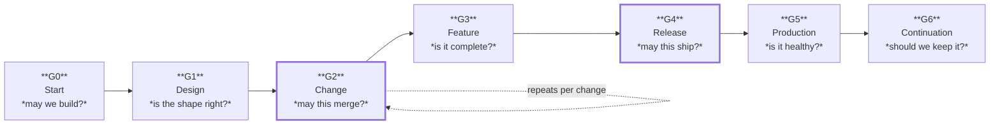

# Part 15 — Quality Gates and Engineering KPIs

*Sections 27 and 28. Gates are the checkpoints work must pass. KPIs are how the engineering organisation knows whether it is getting better or worse. Both fail in the same way: by measuring what is easy rather than what matters.*

---

# 27. Quality Gates

## 27.1 Purpose

To define the mandatory checkpoints between phases of work, so that problems are caught at the cheapest point and so that "we'll fix it later" is not available as an unstated decision.

## 27.2 Objectives

1. Define the gates, their criteria, and who decides.
2. Establish evidence rather than assertion as the basis for passing.
3. Scale gate rigour to conformance tier.
4. Define what happens when a gate fails.
5. Prevent gates from degrading into ceremony.

## 27.3 Engineering Rationale

### 27.3.1 A Gate Is a Decision Point, Not a Formality

| Real Gate | Ceremony |
|---|---|
| Can fail, and sometimes does | Has never failed |
| Requires evidence | Requires a signature |
| Has a named decider | Passes by consensus or default |
| Blocks progress when unmet | Produces a note |
| Failing is normal and unremarkable | Failing is an embarrassment, so it does not happen |

**The diagnostic:** *when did this gate last stop something?* A gate that has never blocked anything is either perfectly upstream-controlled — rare — or it is decoration.

### 27.3.2 Evidence, Not Assertion

The difference between a working gate and a checkbox culture is what "passed" means.

| Assertion | Evidence |
|---|---|
| "Tests pass" | The CI run link |
| "Security reviewed" | The review record with findings and resolutions |
| "Rollback tested" | The date it was executed and by whom |
| "Documented" | The merged document |
| "Performance verified" | The measured numbers, with the load |
| "Runbooks drilled" | Who ran them, when, and what they corrected |

| ID | Rule |
|---|---|
| **GATE-01** | Every gate criterion MUST be satisfied by evidence, not by assertion |
| **GATE-02** | Evidence MUST be recorded where it can be found later, not stated in a meeting |

### 27.3.3 Gates Must Be Cheap or They Get Bypassed

A gate that costs a day will be worked around. Most gate criteria should be automated and therefore free; the human judgement should be reserved for the few things automation cannot check.

| ID | Rule |
|---|---|
| **GATE-03** | Every criterion that can be automated MUST be automated |
| **GATE-04** | Human gate time SHOULD be under 30 minutes for a change gate and under two hours for a release gate |

## 27.4 Standards — The Gates

### GATE-G0 · Start Gate

**Question:** may we build this?

| Criterion | Evidence | Tier |
|---|---|---|
| The problem is stated with evidence | The problem statement | T2+ |
| Someone other than the proposer agrees it is worth solving | Recorded decision | T2+ |
| The conformance tier is chosen | Recorded in the PRD | All |
| An owner is named | Recorded | T2+ |
| Rough cost is understood | Estimate with a confidence band | T3+ |

**Decider:** Engineering Manager. **Failing outcome:** the idea is parked with a recorded reason (LIFE-02).

### GATE-G1 · Design Gate

**Question:** is this the right shape to build?

| Criterion | Evidence | Tier |
|---|---|---|
| Requirements are testable | The PRD | T2+ |
| Non-goals are stated | The PRD | T3+ |
| At least two approaches were considered | ADR with rejected alternatives | T3+ |
| Quality attributes are ranked | Architecture document | T3+ |
| Invariants stated with enforcing mechanisms | Architecture document | T3+ |
| Hazard modules identified | Standing context | T2+ |
| Build order puts safety mechanisms first | Implementation plan | T3+ |
| Standing risks assessed; risks owned with triggers | Risk register | T3+ |
| An implementer could build it without asking a question | Reviewed by someone who did not write it | T3+ |
| Project Definition of Done written | The DoD | T2+ |
| Threat model complete | The threat model | T4 |

**Decider:** Architect (T3+), Technical Lead (T2). **Failing outcome:** return to planning; do not begin implementation.

### GATE-G2 · Change Gate

**Question:** may this merge? *The most frequently exercised gate — it runs on every change.*

| Criterion | Automated | Tier |
|---|---|---|
| Build, lint, format, types clean | ✅ | All |
| All tests pass | ✅ | T2+ |
| New tests fail against the parent commit | ⚠️ partially | T2+ |
| Coverage thresholds met per path | ✅ | T3+ |
| Architecture and boundary rules pass | ✅ | T3+ |
| Security tests pass | ✅ | T3+ |
| Secret scan clean | ✅ | All |
| Dependency audit clean of high severity | ✅ | T2+ |
| Size budgets met | ✅ | T3+ |
| Change within size limits | ⚠️ | All |
| Documentation updated in this change | ❌ review | T2+ |
| No forbidden practice present | ❌ review | All |
| Required approvals present for the supervision level | ✅ | T2+ |
| **The reviewer understands it and is willing to own it** | ❌ review | All |

**Decider:** the reviewer. **Failing outcome:** changes requested, or rejected as too large.

| ID | Rule |
|---|---|
| **GATE-05** | The change gate MUST NOT be bypassed, including by repository owners and for "trivial" changes |
| **GATE-06** | Overriding a failed automated check requires a recorded reason and a second approver |

### GATE-G3 · Feature Gate

**Question:** is this feature complete?

| Criterion | Evidence | Tier |
|---|---|---|
| Every change within it passed G2 | Merge history | All |
| Every acceptance criterion demonstrated | Demonstration or test | T2+ |
| End-to-end path verified in a production-like environment | Test run | T3+ |
| Error and empty states implemented and verified | Test evidence | T2+ |
| Performance within budget under expected load | Measured numbers | T3+ |
| Security review complete if any trigger applied | Review record | T3+ |
| Observability in place for its failure modes | Dashboards, alerts, runbook | T3+ |
| Documentation complete | Merged documents | T2+ |
| **Rollback executed at least once** | Date and executor | T3+ |
| Feature flags have owners and removal dates | Flag register | T2+ |

**Decider:** Technical Lead. **Failing outcome:** the feature is not complete; the remaining work is scheduled, not deferred to a ticket nobody prioritises.

### GATE-G4 · Release Gate

**Question:** may this ship?

| Criterion | Evidence | Tier |
|---|---|---|
| All checks green at the exact release commit | CI run | All |
| Full suite re-run at the tag | CI run | T2+ |
| Changelog updated; breaking changes explicit | The changelog | T2+ |
| Migrations backward-compatible and tested at production scale | Test record | T3+ |
| **Rollback path identified and previously tested** | Record | T3+ |
| Nothing irreversible, or compensating controls documented | Record | T3+ |
| Security review complete if any trigger applied | Review record | T3+ |
| Performance verified against budgets | Measurements | T3+ |
| Consumers notified of breaking changes | Communication record | T3+ |
| Deployment window appropriate; team available | Schedule | T2+ |
| Post-deployment verification in place | Pipeline configuration | T3+ |

**Decider:** Release owner (T3), plus explicit approval (T4). **Failing outcome:** the release does not proceed; scope is cut or work completed.

### GATE-G5 · Production Gate

**Question:** is it healthy in production?

| Criterion | Evidence | When |
|---|---|---|
| Automated post-deployment verification passed | Pipeline output | Immediately |
| A real user path exercised successfully | Synthetic transaction | Immediately |
| Error rate and latency compared to baseline | Dashboard | Immediately |
| No new alert categories firing | Alert history | Watch window |
| Stabilisation period passed without unresolved critical defects | Defect list | Per project |
| Alert thresholds tuned against real data | Alert configuration | First month |
| Runbooks verified against real behaviour | Drill records | First month |

**Decider:** the deploying engineer for the immediate checks; the Technical Lead for stabilisation. **Failing outcome:** roll back.

### GATE-G6 · Continuation Gate

**Question:** should we keep running this?

| Criterion | Evidence | Cadence |
|---|---|---|
| Still used, measurably | Usage data | Annual |
| Owner confirmed and available | Inventory | Annual |
| Dependencies current; no unpatched advisories | Audit | Quarterly |
| Documentation accurate; quick start works | Verification record | Quarterly |
| Runbooks drilled within the year | Drill records | Annual |
| Cost proportionate to value | Cost review | Annual |
| No unresolved critical defects | Defect list | Annual |

**Decider:** Engineering Manager. **Failing outcome:** invest, or retire (§20.4.9).

## 27.5 Gate Failure Handling

| ID | Rule |
|---|---|
| **GATE-07** | A failed gate MUST block progression. It MUST NOT be passed "conditionally" without a recorded, dated condition and an owner |
| **GATE-08** | Repeated failures at the same gate MUST trigger a process review, not merely more attempts |
| **GATE-09** | A gate MUST NOT be weakened to allow a specific change through. **Change the change, or waive it explicitly with a record** |
| **GATE-10** | Waivers MUST have an expiry date and a named approver |

**Rationale for GATE-09.** Lowering a threshold to unblock a release is permanent for everything that follows, because nobody raises it again. A one-off waiver expires; a lowered gate does not.

## 27.6 Real-World Examples

### Example 1 — The Gate That Never Failed

A team has a "security sign-off" gate on every release. In two years it has never blocked one. Investigation shows it consists of one person being asked "any concerns?" in a meeting. A genuine vulnerability ships.

| | |
|---|---|
| Diagnosis | Ceremony, not a gate (§27.3.1) |
| Fix | Defined criteria, evidence, and specific triggers (§15.4.12) |

### Example 2 — Evidence Instead of Assertion

A release gate requires "rollback tested". Under an assertion model, the answer is "yes, it's documented". Under an evidence model, the answer must be a date and an executor — and it turns out nobody has run it in eleven months. It fails, and the failure prevents an outage two weeks later.

| | |
|---|---|
| Rules | GATE-01, GATE-02 |
| The general point | The evidence requirement is the entire difference |

### Example 3 — The Weakened Gate

A coverage threshold blocks a release. Rather than adding tests, the threshold is lowered by four points "temporarily". Eighteen months later it has never been raised, and coverage has drifted eleven points below the original.

| | |
|---|---|
| Rule | GATE-09 |
| Correct handling | A waiver with an expiry, or add the tests |

### Example 4 — The Gate That Caught the Right Thing

A change gate's final human criterion — "the reviewer understands it and is willing to own it" — causes a reviewer to decline a large agent-generated change. It is split into four. Two of the four contain defects found in review.

| | |
|---|---|
| Why it worked | The only criterion automation cannot replace |
| Counterfactual | One approval on a change nobody understood |

## 27.7 Common Mistakes

| # | Mistake | Symptom | Fix |
|---|---|---|---|
| 1 | Gates that never fail | Ceremony | §27.3.1 diagnostic |
| 2 | Assertion instead of evidence | False confidence | GATE-01 |
| 3 | Gates too expensive | Worked around | GATE-03, GATE-04 |
| 4 | Conditional passes with no condition recorded | The condition is never met | GATE-07 |
| 5 | Weakening a gate for one change | Permanent degradation | GATE-09 |
| 6 | Same gate failing repeatedly | Symptom treated, cause ignored | GATE-08 |
| 7 | Gate criteria not automated where possible | Slow, inconsistent | GATE-03 |
| 8 | No named decider | Passes by default | Every gate names one |

## 27.8 Anti-Patterns

| ID | Anti-Pattern | Description | Countermeasure |
|---|---|---|---|
| **AP-168** | **The Rubber Gate** | Always passes; exists for appearances | §27.3.1 |
| **AP-169** | **Gate Inflation** | So many criteria that passing takes days | GATE-04 |
| **AP-170** | **The Permanent Exception** | A waiver with no expiry, renewed indefinitely | GATE-10 |
| **AP-171** | **Sign-Off Theatre** | Approval without evidence | GATE-01 |
| **AP-172** | **The Ratcheting Down** | Thresholds lowered whenever they block | GATE-09 |

## 27.9 Decision Table — Can This Gate Be Passed?

| Question | If No |
|---|---|
| Is every criterion satisfied with evidence? | It does not pass |
| Is the evidence recorded where it can be found? | It does not pass |
| Is there a named decider, and have they decided? | It does not pass |
| If conditional: is the condition recorded, dated, and owned? | It does not pass |
| Is any criterion being weakened to allow this through? | **Stop.** Waive explicitly or change the change |

## 27.10 Checklist

### CHK-27.1 · Running a Gate

- [ ] The criteria for this gate and tier are known before the meeting
- [ ] Evidence is collected in advance, not assembled during the review
- [ ] Automated criteria are genuinely green, not "green except"
- [ ] Human criteria are assessed by someone who did not do the work
- [ ] The decider is present and decides
- [ ] The outcome is recorded, including any conditions with dates and owners
- [ ] Failures result in work, not in a weakened criterion

## 27.11 Risk Analysis

| Risk | Likelihood | Impact | Mitigation | Residual |
|---|---|---|---|---|
| Gates degrade into ceremony | **High** | High | Evidence requirement; failure diagnostic | Medium |
| Gates bypassed under deadline | High | High | GATE-05; automation makes bypass visible | Medium |
| Gates too costly, so worked around | Medium | Medium | GATE-03, GATE-04 | Low |
| Thresholds ratcheted down | Medium | High | GATE-09, GATE-10 | Medium |
| Gate criteria drift from what matters | Medium | Medium | Quarterly review; incident-driven updates | Medium |

## 27.12 Future Improvements

| Item | When | Note |
|---|---|---|
| Gate evidence collected automatically into a release record | v1.1 | Removes assembly cost |
| Waiver register with expiry tracking | v1.1 | Enforces GATE-10 |
| Gate failure-rate reporting | v1.2 | Identifies ceremony gates and problem stages |

---

# 28. Engineering KPIs

## 28.1 Purpose

To measure whether engineering is getting better or worse, using a small number of metrics that resist gaming and that lead to action rather than to reporting.

## 28.2 Objectives

1. Define the metrics TradyPerch tracks and why each is chosen.
2. Establish healthy ranges and action thresholds.
3. Prevent metrics from becoming targets that distort behaviour.
4. Establish who reviews them and how often.
5. Explicitly define what is not measured, and why.

## 28.3 Engineering Rationale

### 28.3.1 Metrics Become Targets, and Targets Get Gamed

Any metric used as a target will be optimised, including in ways that damage the underlying goal:

| Metric as Target | Predictable Distortion |
|---|---|
| Test coverage | Tests that execute lines and assert nothing |
| Bug count | Defects reclassified as "expected behaviour" |
| Velocity / story points | Point inflation |
| Deployment frequency | Trivial deployments to raise the number |
| Lines of code | Verbose code |
| Time to close tickets | Tickets closed prematurely; work moved to new tickets |

**Consequence:** metrics are used to prompt investigation, not to evaluate individuals. The moment a metric appears in a performance discussion, it stops measuring the system and starts measuring the incentive.

| ID | Rule |
|---|---|
| **KPI-01** | KPIs MUST NOT be used to evaluate individuals |
| **KPI-02** | A KPI MUST prompt a question, not a judgement. "Why did this change?" not "this is bad" |
| **KPI-03** | Where a metric can be gamed, its counter-metric MUST be tracked alongside it |

### 28.3.2 Pair Every Speed Metric With a Quality Metric

Speed and quality trade off, so a speed metric alone will be optimised at quality's expense — and vice versa. Pairing them makes the trade-off visible.

| Speed Metric | Paired Quality Metric |
|---|---|
| Deployment frequency | Change failure rate |
| Lead time to production | Defect escape rate |
| Time to close a defect | Recurrence rate |
| Feature throughput | Rework rate |

### 28.3.3 Leading and Lagging Indicators

| Type | Meaning | Examples |
|---|---|---|
| **Lagging** | Tells you what happened | Incidents, escaped defects, change failure rate |
| **Leading** | Tells you what is about to happen | Review latency, change size, suite duration, flaky test count, dependency age |

**Leading indicators are more useful and less watched.** A rising average change size predicts a rising defect rate weeks before it appears. Watching only lagging indicators means responding to problems after they have already cost something.

## 28.4 Standards — The KPI Set

### 28.4.1 Delivery

| KPI | Definition | Healthy | Investigate | Type |
|---|---|---|---|---|
| **KPI-D1 Deployment frequency** | Deployments to production per week per project | Daily or better (T3) | Weekly or worse | Lagging |
| **KPI-D2 Lead time** | Merge to production | < 1 day | > 3 days | Lagging |
| **KPI-D3 Change failure rate** | Deployments requiring a rollback or hotfix | < 10% | > 20% | Lagging |
| **KPI-D4 Recovery time** | Detection to restoration | < 1 hour | > 4 hours | Lagging |

**These four are paired by construction:** D1 and D2 measure speed; D3 and D4 measure the cost of that speed. Improvement means moving all four in the right direction, not trading between them.

### 28.4.2 Quality

| KPI | Definition | Healthy | Investigate | Type |
|---|---|---|---|---|
| **KPI-Q1 Escaped defect rate** | Defects found in production per release | Trending down | Trending up | Lagging |
| **KPI-Q2 Defect recurrence** | Defects that are a repeat of a previous class | 0 | Any | Lagging |
| **KPI-Q3 Build success rate** | First-attempt CI passes on the trunk | > 95% | < 90% | Lagging |
| **KPI-Q4 Flaky test count** | Tests failing intermittently | **0** | Any | Leading |
| **KPI-Q5 Test suite duration** | Default suite wall clock | Within budget | Trending up | Leading |
| **KPI-Q6 Coverage on critical paths** | Safety mechanisms and domain logic | At threshold | Below | Leading |

| ID | Rule |
|---|---|
| **KPI-04** | KPI-Q2 (recurrence) MUST be zero. Any recurrence means a systemic control was not added (DEBUG-14) |
| **KPI-05** | KPI-Q4 (flaky tests) MUST be zero. Any is a defect with a 48-hour resolution window |

### 28.4.3 Process

| KPI | Definition | Healthy | Investigate | Type |
|---|---|---|---|---|
| **KPI-P1 Change size** | Median diff lines per merged change | < 200 | > 400 | **Leading** |
| **KPI-P2 Review latency** | Open to first review | < 4 hours | > 24 hours | **Leading** |
| **KPI-P3 Branch age at merge** | Creation to merge | < 24 hours | > 48 hours | **Leading** |
| **KPI-P4 Review depth** | Changes merged with substantive comments | > 50% | < 25% | Leading |
| **KPI-P5 Documentation currency** | Documents changed alongside their code | > 90% | < 70% | Leading |

**KPI-P1, P2, and P3 are the three most predictive metrics in this set.** Rising change size, rising review latency, and rising branch age together mean review capacity is being exceeded — which reliably precedes a rise in escaped defects.

### 28.4.4 Operational

| KPI | Definition | Healthy | Investigate | Type |
|---|---|---|---|---|
| **KPI-O1 Alert actionability** | Alerts that required action | > 80% | < 50% | Leading |
| **KPI-O2 Incident detection source** | Share detected by monitoring rather than users | > 90% | < 70% | Lagging |
| **KPI-O3 Runbook currency** | Runbooks drilled within the review period | 100% | < 80% | Leading |
| **KPI-O4 Dependency age** | Median age behind latest stable | < 3 months | > 6 months | Leading |
| **KPI-O5 Unpatched advisories** | High-severity advisories open | **0** | Any | Leading |

### 28.4.5 AI-Specific

| KPI | Definition | Healthy | Investigate | Type |
|---|---|---|---|---|
| **KPI-A1 Agent change acceptance** | Agent-produced changes merged without substantial rework | > 70% | < 50% | Leading |
| **KPI-A2 Agent defect classes** | Distribution across the eight failure modes (§2.3.2) | Flat or falling | Any mode rising | Leading |
| **KPI-A3 Correction depth** | Corrections per agent task before acceptance | < 2 | > 3 | Leading |
| **KPI-A4 Specification-gap rate** | Agent tasks that stopped for ambiguity | 10–25% | **< 5% or > 40%** | Leading |

**KPI-A4 is the most interesting metric in the set, and its healthy range is two-sided.** Too low means agents are guessing rather than asking, which is the failure §2 exists to prevent. Too high means specifications are systematically inadequate. A stable rate in the middle means the stop-and-ask rule is working and specifications are mostly adequate.

### 28.4.6 What Is Deliberately Not Measured

| Not Measured | Why |
|---|---|
| Lines of code | Uncorrelated with value; anti-correlated with quality |
| Commits per person | Measures activity, not outcome; trivially gamed |
| Story points or velocity | Inflates; not comparable between teams or over time |
| Hours worked | Measures presence, not contribution |
| Individual defect attribution | Suppresses reporting; incidents are systemic (INC-01) |
| Test count | Count says nothing about what is verified |
| Individual PR throughput | Encourages small, low-value changes and discourages review |

| ID | Rule |
|---|---|
| **KPI-06** | These MUST NOT be tracked as engineering KPIs, and MUST NOT appear in evaluation |

### 28.4.7 Review Cadence

| Cadence | Reviewed | By |
|---|---|---|
| Weekly | KPI-Q3, Q4, P1, P2, P3, O5 | Technical Lead |
| Monthly | Full delivery and quality set, plus AI-specific | Engineering Manager + Lead |
| Quarterly | Everything, including trends and threshold appropriateness | Head of Engineering |
| Per incident | O2, Q1, Q2 | Incident reviewer |

| ID | Rule |
|---|---|
| **KPI-07** | KPI review MUST result in an action or an explicit decision to take none |
| **KPI-08** | Thresholds MUST be reviewed quarterly against actual data |
| **KPI-09** | A KPI that has not prompted an action in two quarters MUST be reconsidered |

## 28.5 Real-World Examples

### Example 1 — The Coverage Target That Backfired

A team is set an 85% coverage target. Coverage reaches 87% within a month. Escaped defects rise. Investigation finds hundreds of tests calling functions and asserting nothing.

| | |
|---|---|
| Rules | KPI-01, KPI-02, §28.3.1 |
| The lesson | Coverage is a floor to detect gaps, not a target to hit |

### Example 2 — The Leading Indicator That Predicted an Incident

Median change size rises from 180 to 520 lines over six weeks; review latency doubles. No quality metric has moved yet. The lead reduces concurrent agent count and enforces size limits. Escaped defects never rise.

| | |
|---|---|
| Rules | KPI-P1, KPI-P2, §28.3.3 |
| The value | The problem was corrected before it produced an incident |

### Example 3 — Detection Source Revealing the Real Gap

KPI-O2 shows 40% of incidents detected by users. The team had assumed monitoring was adequate because alerts fired during incidents — but only after users had already reported them.

| | |
|---|---|
| Rule | KPI-O2, INC-04 |
| Action | Symptom-based alerting on the paths users actually complained about |

### Example 4 — The Two-Sided AI Metric

KPI-A4 falls to 2%: agents almost never stop for ambiguity. This looks like an improvement. Investigation shows agents are resolving ambiguity silently, and three defects trace to silently-chosen interpretations.

| | |
|---|---|
| Rule | KPI-A4's two-sided range |
| The lesson | A metric moving in the "good" direction is not always good. Ask why |

## 28.6 Common Mistakes

| # | Mistake | Symptom | Fix |
|---|---|---|---|
| 1 | Metrics used to evaluate people | Gaming; suppressed reporting | KPI-01 |
| 2 | Speed metrics without quality pairs | Faster, worse | §28.3.2 |
| 3 | Only lagging indicators | Always responding, never preventing | §28.3.3 |
| 4 | Coverage as a target | Assertion-free tests | §28.3.1 |
| 5 | Too many metrics | None acted upon | KPI-09 |
| 6 | Thresholds never revisited | Alarms that mean nothing | KPI-08 |
| 7 | Reviewed but not acted upon | Reporting theatre | KPI-07 |
| 8 | Tracking activity metrics | Measures effort, not outcome | KPI-06 |

## 28.7 Anti-Patterns

| ID | Anti-Pattern | Description | Countermeasure |
|---|---|---|---|
| **AP-173** | **The Dashboard Nobody Acts On** | Metrics displayed, never used | KPI-07 |
| **AP-174** | **Goodhart's Trap** | A measure becomes a target and ceases to measure | KPI-01, KPI-03 |
| **AP-175** | **Vanity Engineering Metrics** | Commits, lines, tickets closed | KPI-06 |
| **AP-176** | **The Individual Scorecard** | Per-person metrics | KPI-01 |
| **AP-177** | **Metric Proliferation** | Forty tracked, none acted upon | KPI-09 |
| **AP-178** | **The Unquestioned Improvement** | A metric moving favourably, never investigated | Example 4 |

## 28.8 Decision Tables

### 28.8.1 Is This a Good KPI?

| Question | If No |
|---|---|
| Would a change in it cause us to do something differently? | Do not track it |
| Is it resistant to gaming, or paired with a counter-metric? | Add the pair |
| Does it measure the system rather than an individual? | Do not track it |
| Can it be collected automatically? | Manual collection will lapse |
| Does it have a defined healthy range? | Define one, or it cannot prompt action |

### 28.8.2 What Does a Moving Metric Mean?

| Movement | Likely Cause | First Check |
|---|---|---|
| Change size rising | Review capacity exceeded; agents unconstrained | Concurrent agent count; size limits |
| Review latency rising | Capacity exceeded, or changes too large | KPI-P1 |
| Build success falling | Flaky tests, or insufficient local verification | KPI-Q4 |
| Suite duration rising | Test pyramid inverting | Ratio of E2E to unit tests |
| Escaped defects rising | Review depth falling, or coverage of failure paths | KPI-P4, KPI-Q6 |
| Change failure rate rising | Insufficient verification before release | Gate evidence |
| Recovery time rising | Rollback path degraded | When was rollback last tested? |
| Alert actionability falling | Alerts added without discipline | Monthly alert review |
| Agent acceptance falling | Specifications degrading, or task size growing | KPI-A3, KPI-A4 |
| Specification-gap rate falling toward zero | **Agents guessing rather than asking** | Sample recent agent reports for silent assumptions |

## 28.9 Checklist

### CHK-28.1 · Monthly KPI Review

- [ ] Every metric collected and current
- [ ] Trends examined, not only current values
- [ ] Leading indicators examined **before** lagging ones
- [ ] Every metric outside its healthy range has an investigation
- [ ] Every favourable movement is questioned, not assumed to be good
- [ ] Each investigation produces an action or an explicit decision to take none
- [ ] Actions from the previous review are checked
- [ ] No metric is being used to evaluate a person
- [ ] Any metric that has prompted no action in two quarters is reconsidered

## 28.10 Risk Analysis

| Risk | Likelihood | Impact | Mitigation | Residual |
|---|---|---|---|---|
| Metrics gamed once they become targets | **High** | High | KPI-01, KPI-03, paired metrics | Medium |
| Reviewed but never acted upon | High | Medium | KPI-07 | Medium |
| Too many metrics dilute attention | Medium | Medium | KPI-09 | Low |
| Leading indicators ignored in favour of lagging | High | Medium | Review order; §28.3.3 | Medium |
| Individual attribution creeps in | Medium | High | KPI-01, KPI-06; leadership discipline | Medium |
| Thresholds become meaningless | Medium | Low | KPI-08 quarterly recalibration | Low |

## 28.11 Future Improvements

| Item | When | Note |
|---|---|---|
| Automated collection for all process KPIs | v1.1 | Manual collection lapses within a quarter |
| Agent failure-mode classification in review | v1.2 | Makes KPI-A2 collectable |
| Cross-project KPI comparison | v1.2 | Identifies systemic versus local issues |
| Predictive alerting on leading indicators | v1.2 | Act before the lagging metric moves |

---

*End of Part 15. Part 16 contains the amendment process and the Engineering Constitution.*
