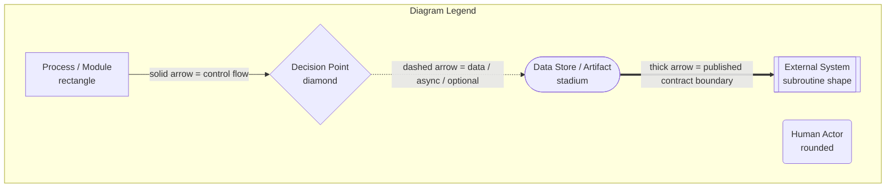

# TP Reviews Engine

## Software Architecture & Technical Design Document (SAD/TDD)

---

| Field | Value |
|---|---|
| **Product Name** | TP Reviews Engine |
| **Internal Codename** | `tp-reviews-engine` |
| **Brand Owner** | TradyPerch |
| **Author** | TradyPerch |
| **Document Type** | Software Architecture Document (SAD) + Technical Design Document (TDD) |
| **Document Version** | v1.0 |
| **Product Version Described** | Engine v1.0.x (`MAJOR.MINOR.PATCH`) |
| **Payload Schema Version Described** | `schema_version: 1` |
| **Status** | Approved for Implementation |
| **Classification** | Internal — Commercial Confidential |
| **First Implementation Target** | Commerce Insight (education / coaching business) |
| **Reference Architecture Scope** | Generic, multi-tenant, unlimited client websites |
| **Document Date** | 2026-07-30 |

---

## 0.1 Document Control

### 0.1.1 Revision History

| Version | Date | Author | Change Summary | Approval |
|---|---|---|---|---|
| v0.1 | 2026-07-12 | TradyPerch | Initial problem framing; feasibility spike on Google Maps review DOM. | Draft |
| v0.2 | 2026-07-18 | TradyPerch | Added adapter abstraction after realising a single-source design would not survive Google DOM churn. | Draft |
| v0.3 | 2026-07-24 | TradyPerch | Added Reconciliation Engine, publish quality gates, and the "absence is not deletion" invariant. | Draft |
| v0.9 | 2026-07-28 | TradyPerch | Full section coverage; legal and ethical analysis completed; threat model added. | Review |
| **v1.0** | **2026-07-30** | **TradyPerch** | **Baselined for implementation. All 60 mandated sections complete. ADR set frozen at ADR-001 … ADR-024.** | **Approved** |

### 0.1.2 Document Ownership and Review Cadence

| Role | Responsibility Regarding This Document | Review Cadence |
|---|---|---|
| Staff Software Architect | Owns Sections 16–21, 35–40. Final authority on ADR acceptance. | Quarterly |
| Senior Backend Engineer | Owns Sections 20–34, 45–46. Keeps module contracts in sync with code. | Per release |
| DevOps Engineer | Owns Sections 22, 25–28, 42–44, 52. | Per release |
| QA Lead | Owns Sections 41, 49. Maintains the failure-simulation matrix. | Per release |
| Security Engineer | Owns Sections 35–36. Owns the ToS/legal risk register jointly with Product. | Quarterly + on incident |
| Product Manager | Owns Sections 1–11, 47–48, 55–59. | Monthly |
| Technical Writer | Owns document structure, glossary, onboarding guide (Section 53). | Continuous |

### 0.1.3 Approval Gate Definition

This document is considered **binding** for implementation. A pull request that contradicts a normative statement in this document must either (a) be rejected, or (b) be accompanied by a new Architecture Decision Record (ADR) that supersedes the relevant statement. Code and document drift is treated as a defect of the same severity as a failing test.

---

## 0.2 Purpose of This Document

This document specifies, at implementation-ready fidelity, the complete architecture of the **TP Reviews Engine**: a zero-recurring-cost, source-agnostic review synchronisation platform that keeps a client website's displayed customer reviews in step with the reviews published on external review platforms — beginning with Google Business Profile reviews as surfaced on Google Maps.

The document has four distinct jobs:

1. **Specification.** It defines what will be built, precisely enough that an implementer — human or an AI coding agent — can produce the system without asking clarifying questions. Every module has a named responsibility, a defined input contract, a defined output contract, a defined error taxonomy, and a defined failure behaviour.
2. **Justification.** It records *why* each decision was made, which alternatives were considered, and on what grounds the alternatives were rejected. A future maintainer inheriting this system must be able to reconstruct the reasoning without archaeology.
3. **Risk disclosure.** The product's core acquisition mechanism — automated collection of publicly rendered review content without using a vendor API — carries legal, ethical, and reliability risk. This document does not soften that. Section 15 states the risk plainly, quantifies it, and specifies the migration path to official APIs that the architecture is deliberately built to accommodate.
4. **Operating manual.** It contains the runbooks, recovery procedures, monitoring definitions, and onboarding path required to operate the system in production for paying clients.

### 0.2.1 What This Document Is Not

- It is **not source code**, and it deliberately contains none. Where a data contract must be shown exactly, it is shown as a field table plus an illustrative data payload — data, not logic. Where a CI pipeline must be shown exactly, it is shown as a step table with declared inputs, timeouts, permissions, and failure semantics — not as workflow source.
- It is **not a sales document.** Where the architecture has a hard ceiling, the ceiling is stated numerically (see Section 37).
- It is **not a legal opinion.** Section 15 is an engineering-grade risk analysis prepared by engineers, and it recommends independent counsel review before the scraping adapter is enabled for any client other than a client who owns the reviewed listing and has instructed TradyPerch in writing.

---

## 0.3 Intended Audience and Reading Paths

| Reader | Read First | Then | May Skip |
|---|---|---|---|
| **Implementing engineer / AI coding agent** | §16, §17, §18, §20, §21, §39, §40 | §22–§34, §41, §45, §46 | §55–§58 |
| **Reviewing architect** | §1, §13, §16, §17, §19, §37, §38 | ADR index (§0.6), §36 | §42, §53 |
| **DevOps / SRE** | §22, §24–§28, §42, §52 | §31–§34, §37 | §54–§59 |
| **QA Lead** | §41, §23, §26, §27, §49 | §21, §29, §30 | §55–§58 |
| **Security Engineer** | §15, §35, §36, §40 | §29, §30, §28 | §47, §55–§58 |
| **Product Manager / Founder** | §1–§8, §9, §15, §47, §48 | §37, §49 | §18, §20, §45 |
| **Client-side / frontend integrator** | §21, §33, §34, §54 | §11, §49 | §20, §22–§30 |
| **New hire (day one)** | §53, then §1, §16, §20 | Everything | Nothing |

### 0.3.1 Estimated Reading Time

| Part | Sections | Approx. Pages | Approx. Reading Time |
|---|---|---|---|
| Front matter | §0 | 6 | 12 min |
| Part 1 — Foundations | §1–§8 | 11 | 25 min |
| Part 2 — Requirements, Risk, Legal | §9–§15 | 15 | 40 min |
| Part 3 — Architecture | §16–§19 | 14 | 40 min |
| Part 4 — Engine and Data Contract | §20–§21 | 13 | 35 min |
| Part 5 — Operations | §22–§28 | 12 | 30 min |
| Part 6 — Resilience and Security | §29–§36 | 12 | 30 min |
| Part 7 — Scale and Configuration | §37–§40 | 9 | 25 min |
| Part 8 — Quality and Delivery | §41–§46 | 10 | 25 min |
| Part 9 — Roadmap and Maintenance | §47–§53 | 10 | 25 min |
| Part 10 — Future Platform | §54–§60 | 10 | 25 min |
| Appendices | A–G | 6 | 15 min |
| **Total** | **§0–§60** | **≈ 128** | **≈ 5.5 h** |

---

## 0.4 Notation and Conventions

### 0.4.1 Requirement Keywords

This document uses RFC 2119 keywords with the following meanings. They are load-bearing; treat them as testable assertions.

| Keyword | Meaning | Consequence of Violation |
|---|---|---|
| **MUST** / **MUST NOT** | Absolute requirement. | Implementation is non-conformant. Blocks release. Requires an ADR to change. |
| **SHOULD** / **SHOULD NOT** | Strong recommendation. Deviation permitted only with a recorded rationale in the pull request description. | Requires reviewer sign-off. |
| **MAY** | Genuinely optional. | None. |
| **WILL** | Statement about future planned work, not a v1.0 obligation. | None for v1.0. |

### 0.4.2 Identifier Conventions Used in This Document

| Prefix | Meaning | Example |
|---|---|---|
| `FR-` | Functional Requirement (§10) | `FR-014` |
| `NFR-` | Non-Functional Requirement (§11) | `NFR-007` |
| `UC-` | Use Case (§9) | `UC-03` |
| `CON-` | Constraint (§13) | `CON-11` |
| `RISK-` | Risk register entry (§14) | `RISK-06` |
| `THREAT-` | Threat model entry (§36) | `THREAT-09` |
| `ADR-` | Architecture Decision Record (§0.6) | `ADR-007` |
| `INV-` | System Invariant — a property that must hold at all times | `INV-03` |
| `ERR-` | Error class in the canonical error taxonomy (§23) | `ERR-PARSE-STRUCTURE` |
| `MET-` | Metric definition (§25) | `MET-harvest-yield` |
| `SLO-` | Service Level Objective (§11) | `SLO-freshness` |

### 0.4.3 Diagram Legend

All diagrams in this document are authored in Mermaid so that they live in version control alongside the text and are diffable in pull requests. The following visual grammar is used consistently.

| Convention | Meaning |
|---|---|
| Solid arrow `-->` | Synchronous control flow or in-process call. |
| Dashed arrow `-.->` | Asynchronous, optional, deferred, or read-only data flow. |
| Thick arrow `==>` | Crosses a published contract boundary. Breaking changes here require a schema version bump. |
| Dotted subgraph boundary | Trust boundary. Data crossing it is untrusted until validated. |
| `[[Double bracket]]` node | System outside TradyPerch's control. Assume it can change without notice. |
| Red / `:::danger` styling | Component on the critical failure path, or a known-fragile dependency. |

### 0.4.4 Architecture Decision Record Format

Every non-obvious decision in this document is backed by an ADR presented in this compressed inline form:

> **ADR-nnn — Title**
> **Status:** Accepted | Superseded by ADR-mmm | Rejected
> **Context:** the forces in play.
> **Decision:** what was chosen.
> **Alternatives Rejected:** each alternative with the specific reason it lost.
> **Consequences:** what this makes easy, what this makes hard, and what it commits us to.

### 0.4.5 Engineering Note Convention

Passages marked **Engineering Note** contain operational knowledge that is not a requirement but that will save an implementer hours. Passages marked **Assumption** record something believed true at authoring time that MUST be re-verified during implementation, because it depends on a third party. Passages marked **Recommendation** are advisory and may be declined by the product owner.

---

## 0.5 Glossary and Abbreviations

### 0.5.1 Domain Terms

| Term | Definition |
|---|---|
| **Review** | A single unit of customer feedback: rating, optional free text, author identity, timestamp, and optional owner reply. The atomic record of this system. |
| **Listing** | A business entity on an external platform (e.g. a Google Business Profile location). One client MAY own several listings. |
| **Place Identity** | The tuple that uniquely and stably resolves a listing on a given source. For Google: a Place ID or a CID. |
| **Source** | An external platform from which reviews originate: `google`, `facebook`, `trustpilot`, `justdial`, `glassdoor`, `yelp`, `manual`, `csv`. |
| **Adapter** | A pluggable component that knows how to acquire raw reviews from exactly one source via exactly one access method. |
| **Access Method** | *How* an adapter gets data: `dom` (rendered page reading), `official-api`, `file`, `manual`. Orthogonal to source. |
| **Harvest** | One complete execution of the pipeline for one client and one source. The unit of scheduling, logging, retry, and billing. |
| **Yield** | Number of reviews successfully extracted in a harvest. The primary health signal. |
| **Coverage** | Extracted count divided by the listing's advertised total review count. Used to decide whether a harvest was complete. |
| **Ledger** | The private, append-oriented internal state store per client. Holds provenance, tombstones, revision history, and first/last-seen timestamps. Never published. |
| **Payload** | The public, published JSON artifact the client website reads. A projection of the Ledger, minimised and sanitised. |
| **Reconciliation** | The merge of a new harvest's reviews into the existing Ledger, producing insert / update / unchanged / missing decisions. |
| **Tombstone** | A Ledger record marking a review as confirmed-removed at source, retained so it is never resurrected. |
| **Publish Gate** | The set of quality invariants a candidate Payload must pass before it is allowed to replace the live Payload. |
| **Last Known Good (LKG)** | The most recent Payload that passed the Publish Gate. The system's fallback for every failure mode. |
| **Selector Pack** | A versioned data file describing how to locate fields in a rendered page, decoupled from engine code so DOM breakage is a data fix. |
| **Canary** | A lightweight scheduled harvest against a fixed reference listing, used to detect upstream structural change before client harvests are affected. |
| **Drift** | Divergence between what the engine expects from a source and what the source actually returns. |
| **Tenant / Client** | One paying customer of TradyPerch, with one configuration file and one output namespace. |

### 0.5.2 Abbreviations

| Abbrev. | Expansion |
|---|---|
| ADR | Architecture Decision Record |
| CID | Google Maps Customer ID — a numeric listing identifier appearing in Maps URLs |
| CI/CD | Continuous Integration / Continuous Delivery |
| CSP | Content Security Policy |
| DPDP | Digital Personal Data Protection Act, 2023 (India) |
| DR | Disaster Recovery |
| GBP | Google Business Profile |
| GDPR | General Data Protection Regulation (EU/UK) |
| GHA | GitHub Actions |
| LKG | Last Known Good |
| PII | Personally Identifiable Information |
| RPO / RTO | Recovery Point Objective / Recovery Time Objective |
| SAD / TDD | Software Architecture Document / Technical Design Document |
| SLI / SLO | Service Level Indicator / Objective |
| SPA | Single Page Application |
| SSG / SSR | Static Site Generation / Server-Side Rendering |
| STRIDE | Spoofing, Tampering, Repudiation, Information disclosure, Denial of service, Elevation of privilege |
| ToS | Terms of Service |
| TTL | Time To Live |
| UGC | User-Generated Content |
| WCAG | Web Content Accessibility Guidelines |

---

## 0.6 Architecture Decision Record Index

The full text of each ADR appears inline at the point in the document where it is most relevant. This index exists so a reviewer can audit the decision set without reading the whole document.

| ADR | Decision | Section | Status |
|---|---|---|---|
| ADR-001 | Decouple acquisition from the website entirely; the site reads a static artifact and never contacts a source. | §16 | Accepted |
| ADR-002 | Adopt an Adapter + Access Method matrix rather than hard-coding Google DOM reading. | §17 | Accepted |
| ADR-003 | Publish a static JSON artifact rather than exposing a runtime API in v1.0. | §19 | Accepted |
| ADR-004 | Use GitHub Actions as the scheduler and compute plane. | §19 | Accepted |
| ADR-005 | Use Playwright with Chromium rather than a raw HTTP client or Puppeteer. | §19 | Accepted |
| ADR-006 | Separate the private Ledger from the public Payload. | §20.11 | Accepted |
| ADR-007 | Two-tier review identity: `identity_hash` (stable) plus `content_hash` (change detection). | §21.4 | Accepted |
| ADR-008 | Absence at source MUST NOT immediately delete a review — confidence-gated removal only. | §20.7 | Accepted |
| ADR-009 | Externalise selectors into versioned Selector Packs. | §20.4 | Accepted |
| ADR-010 | Treat bot-detection challenges as a terminal, alert-worthy stop condition — never as an obstacle to defeat. | §29 | Accepted |
| ADR-011 | Enforce a Publish Gate with statistical invariants; fall back to Last Known Good on failure. | §27 | Accepted |
| ADR-012 | Store data on a dedicated orphan `data` branch, not on `main`. | §33 | Accepted |
| ADR-013 | Serve the Payload through a CDN edge (GitHub Pages / jsDelivr), not `raw.githubusercontent.com`. | §34 | Accepted |
| ADR-014 | Never proxy or re-host reviewer profile images in v1.0; render deterministic initial avatars. | §35.6 | Accepted |
| ADR-015 | Client configuration is declarative, schema-validated, layered, and versioned. | §39 | Accepted |
| ADR-016 | Shard clients across a GitHub Actions matrix with bounded concurrency. | §37 | Accepted |
| ADR-017 | Golden HTML fixtures are the primary parser regression mechanism. | §41.3 | Accepted |
| ADR-018 | Reconciliation MUST be a pure, idempotent, property-tested function. | §41.2 | Accepted |
| ADR-019 | Payload `schema_version` evolves additively; consumers pin a major. | §43 | Accepted |
| ADR-020 | Trunk-based development with a protected `main` and a machine-owned `data` branch. | §44 | Accepted |
| ADR-021 | Alerting via GitHub Issues as the zero-cost primary channel, webhook as optional secondary. | §25 | Accepted |
| ADR-022 | AI enrichment is opt-in, cached by content hash, and never overwrites source-of-truth fields. | §59 | Accepted |
| ADR-023 | The official-API adapters are first-class v1.0 deliverables, not future work, so any client can be migrated off DOM reading in under one hour. | §15.7 | Accepted |
| ADR-024 | The engine ships a robots.txt and ToS pre-flight gate that can hard-block a harvest by configuration. | §15.5 | Accepted |

---

## 0.7 Document Map — Mandated Section to Location

| § | Title | Part / File |
|---|---|---|
| 1 | Executive Summary | Part 1 |
| 2 | Vision | Part 1 |
| 3 | Problem Statement | Part 1 |
| 4 | Business Goals | Part 1 |
| 5 | Technical Goals | Part 1 |
| 6 | Non-Technical Goals | Part 1 |
| 7 | Scope | Part 1 |
| 8 | Out of Scope | Part 1 |
| 9 | Use Cases | Part 2 |
| 10 | Functional Requirements | Part 2 |
| 11 | Non-Functional Requirements | Part 2 |
| 12 | System Requirements | Part 2 |
| 13 | Constraints | Part 2 |
| 14 | Risk Analysis | Part 2 |
| 15 | Legal & Ethical Considerations | Part 2 |
| 16 | High-Level Architecture | Part 3 |
| 17 | Detailed Architecture | Part 3 |
| 18 | Folder Structure | Part 3 |
| 19 | Technology Justification | Part 3 |
| 20 | Review Collection Engine | Part 4 |
| 21 | JSON Schema | Part 4 |
| 22 | GitHub Actions Workflow | Part 5 |
| 23 | Error Handling | Part 5 |
| 24 | Logging Strategy | Part 5 |
| 25 | Monitoring Strategy | Part 5 |
| 26 | Retry Strategy | Part 5 |
| 27 | Recovery Strategy | Part 5 |
| 28 | Rate Limiting Strategy | Part 5 |
| 29 | Future CAPTCHA Handling Strategy | Part 6 |
| 30 | Future Anti-Bot Strategy | Part 6 |
| 31 | Performance Optimization | Part 6 |
| 32 | Memory Optimization | Part 6 |
| 33 | Storage Optimization | Part 6 |
| 34 | Caching Strategy | Part 6 |
| 35 | Security Architecture | Part 6 |
| 36 | Threat Modeling | Part 6 |
| 37 | Scalability Plan | Part 7 |
| 38 | Multi-Client Architecture | Part 7 |
| 39 | Configuration System | Part 7 |
| 40 | Environment Variables | Part 7 |
| 41 | Testing Strategy | Part 8 |
| 42 | Deployment Guide | Part 8 |
| 43 | Versioning Strategy | Part 8 |
| 44 | Git Branching Strategy | Part 8 |
| 45 | Coding Standards | Part 8 |
| 46 | Naming Conventions | Part 8 |
| 47 | Future Roadmap | Part 9 |
| 48 | Future Integrations | Part 9 |
| 49 | Known Limitations | Part 9 |
| 50 | Maintenance Guide | Part 9 |
| 51 | Update Strategy | Part 9 |
| 52 | Disaster Recovery Plan | Part 9 |
| 53 | Developer Onboarding Guide | Part 9 |
| 54 | API Design (Future) | Part 10 |
| 55 | Future Dashboard Design | Part 10 |
| 56 | Future Admin Panel | Part 10 |
| 57 | Future Client Portal | Part 10 |
| 58 | Future Analytics Dashboard | Part 10 |
| 59 | Future AI Features | Part 10 |
| 60 | Conclusion | Part 10 |

---

## 0.8 System Invariants — The Short List

If a reader retains nothing else from this document, they should retain these. Every one of them exists because its violation is a known, observed failure mode of review-synchronisation systems. They are referenced throughout as `INV-nn`.

| ID | Invariant | Rationale |
|---|---|---|
| **INV-01** | The client website MUST NEVER make a network request to a review source at page-render time. | Removes all latency, availability, cost, quota, CORS, and legal exposure from the visitor path. |
| **INV-02** | A failed harvest MUST NEVER degrade the live Payload. Failure means "serve Last Known Good", never "serve less". | The most common catastrophic failure of scraper-backed sites is publishing an empty list. |
| **INV-03** | Absence of a review in one harvest MUST NOT be interpreted as deletion. | Partial page loads and truncated scrolls are far more common than genuine review deletion. |
| **INV-04** | Reconciliation MUST be idempotent: reconciling the same harvest twice produces the same Ledger. | Enables safe retries, replays, and backfills. |
| **INV-05** | The published Payload MUST be safe to render as untrusted text. No HTML, no scripts, no unsanitised markup ever leaves the engine. | Review text is attacker-controllable input that ends up in a client's DOM. |
| **INV-06** | Every published Payload MUST be traceable to the exact engine version, selector pack version, and harvest run that produced it. | Without provenance, DOM-drift incidents are undebuggable. |
| **INV-07** | A bot-detection challenge MUST end the harvest and raise an alert. It MUST NOT be circumvented. | Legal, ethical, and reliability grounds — see §29. |
| **INV-08** | No secret, credential, cookie, or session token MUST ever be written to a Payload, a log, a commit, or an artifact. | Public repositories and public artifacts. Irreversible on exposure. |
| **INV-09** | Every client's data MUST be isolated such that a failure in one client's harvest cannot alter another client's Payload. | Multi-tenant blast-radius containment. |
| **INV-10** | The engine MUST be able to switch a client from DOM reading to an official API by configuration change only, with no code change and no Payload schema change. | This is the system's insurance policy against its own biggest risk. |

---

## 0.9 Open Questions Register

Items that are deliberately unresolved at v1.0 baseline, with the owner and the date by which resolution is required.

| ID | Question | Owner | Required By | Interim Position |
|---|---|---|---|---|
| OQ-01 | Will TradyPerch obtain written client authorisation for each listing before enabling the DOM adapter? | Product | Before second client onboards | Treated as MUST in §15.6; onboarding checklist enforces it. |
| OQ-02 | Should the Payload be served from GitHub Pages under a TradyPerch domain, or from the client's own domain via their build pipeline? | Architect | Before third client onboards | Both supported; §34 defines the decision matrix. |
| OQ-03 | Retention period for raw harvest artifacts, balancing debuggability against PII minimisation. | Security + Legal | Before first production client | Default 14 days, sanitised; §24.7. |
| OQ-04 | Whether owner replies are republished verbatim or summarised. | Product | v1.1 | Republished verbatim, attributed to the business; configurable. |
| OQ-05 | Commercial model — per-client fee vs. bundled into web-development retainer. | Product | Before pricing page ships | Out of scope for this document. |

---

## 0.10 Assumptions Register (Global)

These assumptions underpin the whole design. Each is tagged with what breaks if it turns out false, and where the mitigation lives. **Every assumption about a third party MUST be re-verified at implementation time**; third-party platform behaviour, pricing, and quotas change without notice and this document was authored at a point in time.

| ID | Assumption | If False, Then | Mitigation |
|---|---|---|---|
| AS-01 | GitHub Actions remains free for public repositories with a 5-minute-minimum cron granularity and a 6-hour job ceiling. | Compute plane must move to a paid runner or a client-owned server. | §19.3, §37.6 define the portability boundary: the engine is a plain Node CLI: any scheduler can run it. |
| AS-02 | Google Maps continues to render review content in a way that a standards-compliant browser can display without authentication. | The DOM adapter dies. | ADR-023: official-API adapters ship in v1.0 as a same-day migration path. |
| AS-03 | Review volume per client listing is in the tens to low thousands, not millions. | Pagination and memory strategy needs redesign. | §31, §32 define the streaming path and the hard cap of 5,000 reviews per listing per harvest. |
| AS-04 | Clients accept a freshness budget measured in hours, not seconds. | Architecture premise fails; a push/webhook design would be required. | §11 SLO-freshness sets 6 h default, 1 h floor. |
| AS-05 | Client websites can consume a static JSON file over HTTPS at build time or run time. | Integration requires a shim. | §54 defines the future API; §34 defines four integration patterns. |
| AS-06 | The client owns, or is the authorised agent of, the business listing whose reviews are being collected. | The legal basis in §15 collapses. | §15.6 authorisation gate; OQ-01. |

---

*End of front matter. Part 1 begins with Section 1, Executive Summary.*
