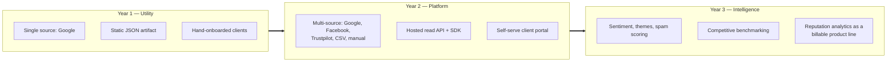
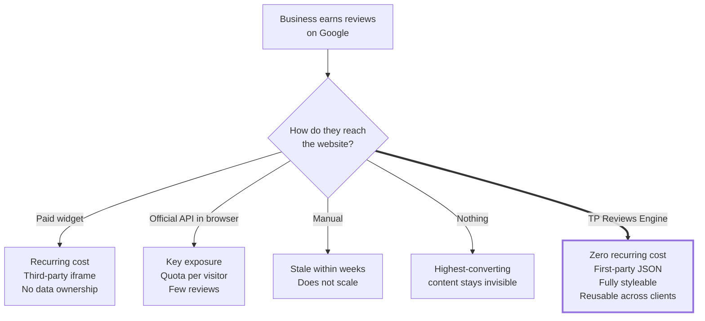
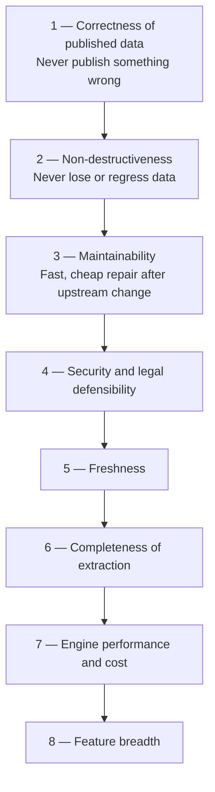

# Part 1 — Foundations

*Sections 1 through 8. Audience: everyone. This part establishes what the product is, why it exists, what "done" means commercially and technically, and — equally importantly — what this product refuses to be.*

---

# 1. Executive Summary

## 1.1 The One-Paragraph Version

**TP Reviews Engine** is a reusable, zero-recurring-cost review synchronisation platform built by TradyPerch. It runs on a schedule outside of any client website, collects a business's published customer reviews from external platforms, normalises them into a single stable JSON contract, validates that contract against quality invariants, and publishes it as a static artifact that any website — plain HTML, React, Next.js, Astro, Vue, or a CMS template — can read with a single `fetch` or a build-time import. The website never contacts a review platform, never holds a credential, never pays a widget vendor, and never breaks when the upstream platform changes. When the upstream platform *does* change, only the engine breaks, only on a schedule, in a place where TradyPerch controls the blast radius and where the last known good data continues to be served to every visitor in the meantime.

## 1.2 The Commercial Thesis

Small and mid-size businesses want their Google reviews on their website. The market's answer is a subscription widget: Elfsight, EmbedSocial, Trustindex, Reviews on My Website, and a dozen others, typically USD 5–30 per month per site, forever, for a JavaScript file that injects an iframe. For a web studio like TradyPerch that builds and maintains many client sites, that model has four defects:

1. **Recurring cost per client, forever.** It is either absorbed as margin erosion or passed on as a line item the client resents.
2. **Third-party script on the client's critical rendering path.** A vendor's outage, slowdown, or tracker becomes the client's Core Web Vitals problem and the client's cookie-consent problem.
3. **No ownership of the data.** The reviews render inside someone else's iframe. They cannot be styled to match the brand beyond what the vendor allows, cannot be indexed as first-party content, cannot be reshaped into schema.org markup the studio controls, and cannot be reused in a newsletter, a proposal deck, or a landing page.
4. **No leverage.** Every new client repeats the same integration, the same subscription, the same limitations. Nothing compounds.

TP Reviews Engine inverts all four. The cost is engineering time paid once. The website's runtime dependency is a static JSON file on a CDN. The data is a first-party asset in a repository TradyPerch controls. And every client onboarded after the first is a configuration file, not a project.

**The asset being built is not a scraper. It is a normalisation-and-publication pipeline with pluggable acquisition.** That distinction is the entire architecture, and it is what makes the product durable when — not if — a specific acquisition method stops working.

## 1.3 What Is Actually Being Built

| Layer | What It Is | Where It Runs | Failure Impact |
|---|---|---|---|
| **Acquisition** | Pluggable adapters. v1.0 ships four: Google DOM reader, Google Places API reader, Google Business Profile API reader, and a file importer for CSV/manual reviews. | GitHub Actions runner, on a schedule | Contained. A failed acquisition leaves the previous published data in place. |
| **Processing** | Source-agnostic core: normalise → validate → reconcile → enrich → project. Pure functions, fully unit-testable, zero network access. | Same runner | Contained and deterministic. Bugs here are caught by property tests before merge. |
| **Publication** | Content-addressed JSON artifacts committed to a dedicated data branch and served through a CDN edge. | GitHub, CDN | Contained. Publication is gated; a bad payload is never published. |
| **Consumption** | A ~2 KB, dependency-free reference renderer plus framework-specific integration recipes. | Client website | The only component visitors touch. Has no runtime dependency on anything TradyPerch operates except one cached static file. |

## 1.4 The Five Decisions That Define the System

| # | Decision | Why It Matters More Than It Looks |
|---|---|---|
| 1 | **The website never scrapes.** Acquisition is fully asynchronous and offline relative to page render. | This is not merely a performance optimisation. It removes the entire class of "our site got blocked / rate-limited / CORS-failed / leaked an API key" incidents, and it means a visitor's browser never sends a request to Google on the client's behalf. |
| 2 | **Acquisition is an adapter, not the product.** | Google's rendered markup is the single most volatile dependency in this system. By confining it behind an interface that three other adapters also implement, a total loss of that method is a configuration change, not a rewrite. See ADR-002 and INV-10. |
| 3 | **The Ledger and the Payload are different things.** | Merging *new observations* into *accumulated knowledge* is the hard problem in this domain, and it is impossible if the only state you keep is the file you publish. Reviews that scroll off the visible list, get edited, or fail to load in one run must not vanish. See ADR-006. |
| 4 | **Publication is gated on invariants, not on job success.** | A harvest can "succeed" and still be wrong — three reviews extracted where there were eighty, because a scroll container did not virtualise as expected. The gate catches that class of silent corruption. See ADR-011 and INV-02. |
| 5 | **Bot-detection is a stop signal, not a puzzle.** | The system is explicitly designed *not* to escalate against anti-automation measures. This is simultaneously the ethical position, the legally defensible position, and — critically — the engineering position, because an evasion arms race produces a system whose reliability is inversely proportional to the effort spent on it. See ADR-010 and §29. |

## 1.5 Honest Statement of the Core Risk

This document would be professionally negligent if it buried the following.

**The default v1.0 acquisition method reads publicly rendered Google Maps pages with an automated browser. Google's Terms of Service prohibit automated access to its services except through its published APIs.** Using this method therefore places the operator in breach of a contract with Google, with the realistic consequences being (in ascending order of severity and descending order of likelihood): silent rate-limiting, bot-challenge interstitials, IP-range blocking, and — in the tail — a demand letter. It is not a criminal-law problem in most jurisdictions when the data is public and no access control is circumvented, but it is a contractual and reputational one.

The architecture's response to this is not to pretend the risk away. It is:

- **Section 15** analyses the position in detail, including the specific alternative official APIs, their real capabilities, their real costs, and their real limitations.
- **ADR-023** makes both official-API adapters *v1.0 deliverables rather than roadmap items*, so that any client can be migrated from DOM reading to a sanctioned API by editing one line of configuration.
- **§15.6** defines an authorisation gate: the DOM adapter is only enabled for listings that the client owns or is the authorised agent for.
- **INV-07 / ADR-010** guarantee the system never attempts to defeat an anti-automation control.
- **§15.7** presents the recommendation, stated once, plainly: *for any client who is willing to complete a five-minute OAuth grant, use the Google Business Profile API adapter instead. It is free, sanctioned, returns richer data including all reviews rather than a handful, and eliminates this entire risk class.* The DOM adapter exists for the case where that grant cannot be obtained.

The product owner has considered this and directed that the DOM adapter ship as the default. This document therefore specifies it completely — and specifies the escape hatch just as completely.

## 1.6 Success Criteria for v1.0

v1.0 is complete when all of the following are objectively true, measured over a 30-day soak on the Commerce Insight deployment plus one synthetic second tenant:

| # | Criterion | Measurement |
|---|---|---|
| S1 | A review left on Google appears on the client website within one scheduled cycle plus CDN TTL. | Manual end-to-end verification, 5 trials. |
| S2 | Zero incidents in which the website displayed fewer reviews than the previous day due to an engine failure. | Publish Gate rejection log; visual diff. |
| S3 | Onboarding a new client takes under 20 minutes and touches no engine source file. | Timed dry run by an engineer who did not build the system. |
| S4 | Recurring operating cost is exactly zero. | GitHub billing page. |
| S5 | Total added weight on the client page is under 15 KB compressed, with no third-party origin contacted. | Lighthouse + network waterfall. |
| S6 | A deliberately broken selector pack is detected by the canary within one cycle and raises an alert without corrupting any client payload. | Chaos test CH-07 (§41.5). |
| S7 | A client can be migrated from the DOM adapter to the Business Profile API adapter in under one hour end-to-end. | Timed migration drill (§51.6). |
| S8 | Every published payload validates against the v1 JSON Schema with zero warnings. | CI validation step, blocking. |

---

# 2. Vision

## 2.1 Vision Statement

> **Every business TradyPerch touches should have its real customer reputation living inside its own website — as first-party, brand-styled, structured, search-visible content that updates itself, costs nothing to run, and belongs to the business rather than to a widget vendor.**

## 2.2 The Three-Year Picture

The engine is deliberately over-specified relative to v1.0 because the intended destination is not "a script that fetches Google reviews." It is a **reputation data layer** for a web studio's entire client portfolio.

The architectural consequence is that **v1.0 must not make any decision that forecloses Year 2 or Year 3.** Three specific forward commitments are enforced from day one:

1. **The JSON contract is designed for fields that v1.0 does not populate.** Sentiment, AI summary, spam score, language, likes, verification flag, and source attribution all exist in the schema at v1.0 and are simply `null` or absent. Consumers written today will not break when they are filled in tomorrow. (§21)
2. **Nothing in the core assumes Google.** The word `google` appears in exactly one layer: the adapters. Every downstream module operates on a `NormalizedReview`, which has no source-specific fields outside a namespaced `source_meta` object. (§17)
3. **Nothing assumes a static file.** The publication layer is an interface with one v1.0 implementation (Git commit + CDN). A future implementation writing to object storage or a database behind an API requires no change above it. (§54)

## 2.3 The Experience Being Designed For

**For the end visitor:** reviews appear instantly as part of the page, in the site's own typography, with no layout shift, no cookie banner triggered by a third party, no iframe, and no "Powered by" badge. They are readable with JavaScript disabled if the site is statically generated.

**For the client business owner:** they do nothing. They keep asking happy customers for Google reviews exactly as before. The website keeps up on its own. If they reply to a review on Google, the reply appears on the site too.

**For TradyPerch:** a new client is a config file and a pull request. A Google layout change is one incident affecting all clients at once, resolved once, in one place — which is a far better operational profile than the alternative of per-client bespoke integrations that each break at different times for different reasons.

**For the engineer on call:** every failure is visible, classified, attributed to a version, and non-destructive. There is no scenario in the design where the correct response is "restore the site urgently."

## 2.4 Design Philosophy

| Principle | Concrete Expression in This System |
|---|---|
| **Fail static, never fail blank.** | Last Known Good is always served. The absence of fresh data is invisible to visitors. INV-02. |
| **The volatile part must be the smallest part.** | DOM knowledge lives in data files and one adapter, not spread across the codebase. ADR-009. |
| **Accumulate, don't replace.** | Each harvest is an *observation*, merged into durable state — not a truth that overwrites history. ADR-006, INV-03. |
| **Make the boring path free and the risky path optional.** | Officially sanctioned acquisition is fully implemented and one config line away. ADR-023. |
| **Observability before cleverness.** | Structured logs, run manifests, and health metrics are v1.0 scope, not v2. §24, §25. |
| **Optimise for the maintainer in 18 months.** | Every decision has a written rationale. Every module has a single responsibility and a stated contract. |
| **Refuse to enter arms races.** | The system stops at the first anti-bot signal and escalates to a human, on purpose. ADR-010. |

---

# 3. Problem Statement

## 3.1 The Problem, Stated Precisely

A business accumulates customer reviews on platforms it does not control. Those reviews are the single highest-converting content asset the business owns — and they are invisible on the business's own website unless someone puts them there. Keeping them there, current, and trustworthy is a continuous synchronisation problem that no small business will solve manually, and that the existing market solves only by renting an iframe.

Formally, the system must maintain a mapping:

> *For each client `C` and each source listing `L`, maintain a locally published set `P(C,L)` that converges to the externally published set `E(L)` within a bounded freshness window, without the consuming website ever reading `E(L)` directly, and without `P(C,L)` ever regressing to a state worse than its last valid version.*

Three properties of that statement do the heavy lifting:

- **"Converges"** — not "equals". Perfect equality is unattainable against a source that paginates lazily, personalises ordering, and does not expose a change feed. The system targets convergence with explicit, measured error bounds (§11).
- **"Without the consuming website ever reading `E(L)`"** — the decoupling is a hard requirement, not an optimisation (INV-01).
- **"Never regressing"** — monotonic quality is the difference between a system a studio can sell and a science project (INV-02).

## 3.2 Why This Is Harder Than It Looks

Engineers new to this domain consistently underestimate it. The following table is the honest inventory of what actually makes the problem difficult; every one of these has a corresponding mitigation elsewhere in this document.

| # | Difficulty | Why It Bites | Mitigated In |
|---|---|---|---|
| D1 | **No stable public identifier for a review.** The rendered page does not reliably expose a durable per-review ID. | Without identity, you cannot tell "new review" from "same review, re-rendered". Naive systems duplicate on every run. | §21.4 — two-tier hashing |
| D2 | **Only relative dates are shown.** "2 months ago", "a week ago", "yesterday". | Relative dates are lossy and re-render differently on every harvest, so they cannot be part of an identity key, and they cannot be sorted precisely. | §20.5 — date resolution and pinning |
| D3 | **Reviews are lazy-loaded into a virtualised scroll container.** | A naive extraction gets the first 8–10 reviews and reports success. The failure is *silent*. | §20.3, §27 — coverage checks |
| D4 | **Long review text is truncated with a "More" affordance.** | Extracting visible text yields "…Read more". Expanding requires interaction per review, which is slow and fragile. | §20.3, §20.5 |
| D5 | **Markup is obfuscated and rotates.** Class names are generated; structure changes without notice. | Any selector strategy based on generated class names has a half-life measured in weeks. | §20.4 — semantic/ARIA-first selector packs |
| D6 | **Ordering is not stable and may be personalised or relevance-ranked.** | You cannot assume "newest first", cannot paginate by offset safely, and cannot diff by position. | §20.7 — set-based reconciliation |
| D7 | **Reviews are edited and deleted at source.** | An update must not create a duplicate; a deletion must eventually propagate; but a *failed load* must not look like a deletion. | §20.7 — confidence-gated removal |
| D8 | **Localisation.** Text, dates, and the UI language vary by locale, and reviews themselves are multilingual, including RTL scripts and emoji. | Date parsing and text handling break in exactly the environments the developer never tests. | §20.5, §41.5 |
| D9 | **Owner replies are structurally nested and easy to mistake for reviews.** | Naive parsers ingest the business's own reply as a five-star review. | §20.5 |
| D10 | **Anti-automation.** Challenges, consent interstitials, and regional redirects appear unpredictably. | A run that hits one must stop cleanly and loudly rather than half-succeeding. | §29, §30 |
| D11 | **Review text is untrusted, attacker-influenceable input that lands in a client's DOM.** | A review containing markup becomes a stored-XSS vector on every client site simultaneously. | §35.4, INV-05 |
| D12 | **Reviewer names and photos are personal data.** | Republishing and especially *caching* them engages GDPR/DPDP obligations and image licensing. | §15.8, ADR-014 |

**Engineering Note.** D3, D7 and D11 are the three that turn into production incidents. D3 corrupts data quietly, D7 corrupts it destructively, and D11 corrupts someone else's website. The Publish Gate (§27.3), the confidence-gated removal rule (§20.7), and the sanitisation pass (§20.6) exist specifically and only because of these three.

## 3.3 Why Existing Solutions Are Rejected

| Option | What It Costs | Why Rejected |
|---|---|---|
| **Paid widget (Elfsight, EmbedSocial, Trustindex, …)** | USD 5–30 / month / site, indefinitely | Recurring cost per client; third-party script and iframe on the render path; data not owned; styling constrained; vendor lock-in; the studio builds no reusable asset. |
| **Google Places API, direct from the browser** | Free tier then metered | API key exposed client-side; quota consumed by every visitor and every bot; CORS restrictions; returns a small sample of reviews; couples site availability to Google availability. Violates INV-01. |
| **Google Places API, from a server** | Free tier then metered | Requires an always-on server the studio must operate and secure — reintroducing recurring cost and an operational surface. Still returns only a small sample of reviews. Retained as an *adapter*, not as the architecture. |
| **Manual copy-paste into the CMS** | Staff time | Goes stale immediately; does not scale past a handful of clients; no provenance; the studio is blamed when reviews are outdated. |
| **Scraping directly from the client's own website at request time** | Free | Catastrophic: exposes the client's domain to blocking, adds seconds of latency, breaks under any upstream change, and puts the visitor's browser in the loop. Explicitly forbidden by INV-01. |
| **Commercial scraping SaaS (Outscraper and similar)** | Per-request fees | Violates the zero-cost constraint; simply relocates the same ToS risk to a vendor while adding a bill and a data-processor relationship. |

## 3.4 The Gap Being Filled

---

# 4. Business Goals

Business goals are numbered `BG-nn` and each carries an explicit measurement definition, a target, and the architectural mechanism that delivers it. A goal without a measurement is a slogan; none appear here.

## 4.1 Primary Business Goals

| ID | Goal | Measure | v1.0 Target | Delivered By |
|---|---|---|---|---|
| **BG-01** | Eliminate recurring per-client cost for review display. | Monthly invoice attributable to review functionality. | **INR/USD 0.00** | GitHub Actions free tier on a public repository; static artifact hosting; no vendor. §19.3 |
| **BG-02** | Make client onboarding near-zero-effort so the marginal client is profitable. | Wall-clock minutes from "client says yes" to "reviews live on their site", measured by an engineer following §53. | **≤ 20 minutes**, zero engine code changes. | Declarative client registry; config-only onboarding. §38, §39 |
| **BG-03** | Build a reusable, sellable asset rather than a one-off integration. | Number of distinct client sites served by one unmodified engine version. | **≥ 2 at launch, unbounded by design** | Multi-tenant architecture. §38 |
| **BG-04** | Improve client conversion by surfacing social proof natively. | Presence of reviews above the fold on money pages; structured-data eligibility. | 100% of onboarded clients | First-party rendering + schema.org projection. §21.9 |
| **BG-05** | Remove third-party performance and privacy drag from client sites. | Third-party origins contacted for review functionality; added compressed bytes. | **0 origins; ≤ 15 KB** | Static artifact, no vendor script. §31 |
| **BG-06** | Differentiate TradyPerch's web offering commercially. | Ability to include "self-updating reviews" as a standard inclusion at no marginal cost. | Included in every build | The whole system. |
| **BG-07** | Own the client's reputation data as a first-party asset. | Review corpus retrievable in a portable, documented format independent of any vendor. | 100% | Versioned JSON in a TradyPerch-controlled repository. §21, §33 |
| **BG-08** | Establish the data foundation for a future paid analytics product. | Historical review records retained with first-seen timestamps and full provenance. | Retained from day one | The Ledger. §20.11, §58 |

## 4.2 Secondary Business Goals

| ID | Goal | Rationale |
|---|---|---|
| **BG-09** | Reduce support load. Clients must never need to email about reviews being outdated. | Support hours are the hidden cost of a studio's client portfolio. Silent self-healing (§27) is a cost-control mechanism. |
| **BG-10** | Make the system explicable to a non-technical client in two sentences. | Sellability. "We copy your Google reviews to your site every few hours automatically" is the entire pitch. |
| **BG-11** | Keep the exit cost near zero. | If Google shuts the door entirely, the value already created — the accumulated corpus, the pipeline, the frontend components, the multi-tenant machinery — must survive. Sources are adapters precisely so that the asset is not the scraper. |
| **BG-12** | Produce documentation good enough to hand the system to a contractor. | The founder must not be the single point of failure. §50, §53. |

## 4.3 Explicit Non-Goals of the Business Case

To keep scope honest, the following are stated as *not* business goals of v1.0:

- Selling the engine as standalone SaaS to third parties (that is a v3+ consideration; see §47).
- Competing on feature breadth with commercial widget vendors (carousels, badges, popups, review-request email campaigns).
- Handling review *collection* — i.e., soliciting reviews from customers. The engine reads reputation; it does not generate it.

## 4.4 Value Model

A simple, defensible model for the internal business case. Figures are illustrative and denominated in USD-equivalent monthly cost per client site.

| Scenario | Widget Subscription | TP Reviews Engine | Delta per Client per Year |
|---|---|---|---|
| 1 client | ~$10/mo | $0 | ~$120 |
| 10 clients | ~$100/mo | $0 | ~$1,200 |
| 50 clients | ~$500/mo | $0 | ~$6,000 |
| 100 clients | ~$1,000/mo | $0 (compute still within free tier for public repos; see §37) | ~$12,000 |

Against this sits a one-time build cost and an ongoing maintenance cost that is **not zero** and must not be represented as zero. §50 estimates realistic maintenance at **2–6 engineer-hours per quarter in steady state, with 4–8 hour spikes when an upstream layout change occurs (historically 1–3 times per year for this class of target).** The break-even against widget subscriptions is reached at a small number of clients; the honest statement is that the engine wins decisively on portfolio economics and marginally on a single site.

---

# 5. Technical Goals

Technical goals are the engineering commitments that make the business goals achievable. Each maps to requirements in §10/§11 and to mechanisms later in the document.

## 5.1 Goal Table

| ID | Technical Goal | Definition of Success | Mechanism |
|---|---|---|---|
| **TG-01** | **Source independence.** No module above the adapter layer knows what a "Google" is. | A new source can be added by implementing one interface and adding one config value. Verified by the CSV adapter, which shares zero code with the Google adapters. | §17.3 Adapter contract |
| **TG-02** | **Deterministic core.** All transformation logic is pure and side-effect free. | The entire pipeline from raw extraction onward runs offline against fixtures with no network, no clock dependency, and no filesystem dependency, and produces byte-identical output. | §17.5, §41.2 |
| **TG-03** | **Non-destructive by construction.** No failure mode results in worse published data. | Chaos suite CH-01…CH-14 (§41.5) contains no scenario that degrades the live payload. | Publish Gate + LKG, §27 |
| **TG-04** | **Idempotent and replayable.** Running the same harvest twice changes nothing. | Property test: `reconcile(reconcile(S, H), H) == reconcile(S, H)`. | ADR-018, §20.7 |
| **TG-05** | **Fast to diagnose.** Any production incident is explicable from artifacts alone, without reproducing it. | Every run emits a signed manifest: engine version, selector pack version, timings, counts, decisions, and a sanitised DOM snapshot on failure. | §24, INV-06 |
| **TG-06** | **Fast to repair.** The most likely failure (upstream markup change) is fixable without touching engine code. | Median time-to-repair for a selector break ≤ 60 minutes, of which ≤ 15 minutes is code review. | Selector Packs, ADR-009; §51 |
| **TG-07** | **Cheap at rest and in motion.** | Steady-state compute ≤ 3 minutes per client per day; published payload ≤ 60 KB compressed for a 200-review listing. | §31, §33 |
| **TG-08** | **Framework-agnostic consumption.** | Reference integrations verified for static HTML, React, Next.js (app router, both SSG and ISR), Astro, and Vue. | §34.6 |
| **TG-09** | **Secure by default.** | No secret in any artifact; least-privilege CI tokens; all third-party actions pinned by commit SHA; published text safe to render. | §35 |
| **TG-10** | **Testable without the internet.** | `npm test` passes on an air-gapped machine. Network-touching tests are a separate, explicitly-invoked suite. | §41.1 |
| **TG-11** | **Observable without a paid tool.** | Health status, failure classification, and trend of yield are derivable from repository artifacts alone. | §25 |
| **TG-12** | **Portable off GitHub.** | The engine is a plain Node CLI. Moving to any other scheduler requires no engine change — only a new invocation wrapper. | §19.3, §37.6 |
| **TG-13** | **Graceful under partial failure.** | A single client's failure never blocks or corrupts another's. Matrix jobs are independent with `fail-fast: false`. | §22.4, INV-09 |
| **TG-14** | **Schema-stable.** | Consumers pinned to `schema_version: 1` continue to work across all v1.x engine releases. | §43 |

## 5.2 Explicit Anti-Goals (Technical)

Stating what the system deliberately will *not* optimise for prevents well-intentioned complexity.

| Anti-Goal | Reasoning |
|---|---|
| **Real-time / sub-minute freshness.** | Would require polling at a frequency that is both abusive to the source and impossible on the chosen scheduler. The value of a review appearing in 4 hours versus 4 seconds is nil. |
| **Complete historical backfill of every review ever written.** | Upstream interfaces do not reliably expose deep history, and forcing them to is exactly the behaviour that triggers anti-automation. The system accumulates history *forward* from first harvest. |
| **100% extraction fidelity.** | Chasing the last 2% of edge-case reviews costs more than it returns and increases fragility. §11 sets an explicit, measured accuracy target instead. |
| **Evading anti-bot systems.** | ADR-010. Non-negotiable. |
| **Being a general-purpose web scraping framework.** | Generality here is a trap; the adapter interface is intentionally narrow. |
| **Zero-downtime, high-availability infrastructure.** | The published artifact is static and CDN-cached. The engine can be down for a week with no visitor-visible impact. Availability effort belongs on the artifact, not the engine. |

## 5.3 Quality Attribute Priorities

When two desirable properties conflict, this ordering resolves the conflict. It is binding on design reviews.

**Worked example of applying this ordering.** A harvest extracts 40 of an advertised 118 reviews because the scroll container stopped yielding. Freshness (Q5) and completeness (Q6) argue for publishing the 40 to keep the site current. Correctness (Q1) and non-destructiveness (Q2) outrank both. **The correct behaviour is: reject the payload, retain Last Known Good, mark the run degraded, and alert.** This is codified in §27.3 and is not left to the implementer's judgement.

---

# 6. Non-Technical Goals

These are the organisational, human, and communication goals. They are frequently omitted from architecture documents and are frequently the reason systems fail after the original author moves on.

## 6.1 Goal Table

| ID | Goal | Success Looks Like | Owner |
|---|---|---|---|
| **NTG-01** | **The founder is not a single point of failure.** | A competent Node developer with no prior exposure can take over maintenance using §50 and §53 alone. Verified by a dry-run handover. | Technical Writer |
| **NTG-02** | **Client trust is never damaged by the system.** | No client ever discovers a problem before TradyPerch does. Alerting (§25) precedes client-visible symptoms in every designed failure mode. | DevOps |
| **NTG-03** | **The legal posture is documented, deliberate, and revisitable.** | §15 exists, has been read by the product owner, is re-reviewed quarterly, and the authorisation gate (§15.6) is enforced in onboarding. | Security + Product |
| **NTG-04** | **The system is explainable to clients without embarrassment.** | A one-page client-facing explainer exists that is truthful about how data is obtained and how often it updates. | Product |
| **NTG-05** | **Knowledge is written down at the moment of decision, not reconstructed later.** | Every merged PR that changes behaviour updates this document or adds an ADR. Enforced by PR template checklist. | All engineers |
| **NTG-06** | **Onboarding a new engineer takes under one day to first useful contribution.** | §53 walkthrough completes in ≤ 4 hours including a green local test run against fixtures. | Technical Writer |
| **NTG-07** | **The brand is protected.** | Output artifacts, alerts, and any client-visible surface carry consistent TradyPerch identity; no debug output ever reaches a client site. | Product |
| **NTG-08** | **Maintenance is predictable, not heroic.** | Quarterly maintenance window scheduled in advance (§50.4); dependency and browser updates are routine, not emergency. | DevOps |
| **NTG-09** | **Ethical operation is a stated position, not an accident.** | The engine respects rate limits far below any plausible threshold, identifies itself honestly where identification is expected, stops at challenges, and honours removal requests within 7 days. | Security |
| **NTG-10** | **The documentation is usable by AI coding agents.** | An agent given this document alone produces a conformant implementation without asking clarifying questions — the stated authoring bar for §17–§21 and §39–§41. | Technical Writer |

## 6.2 Team and Role Model

Even though v1.0 may be executed by a single person wearing all hats, the roles are defined so that responsibilities remain legible as the team grows.

| Role | v1.0 Responsibilities | Escalation Owner For |
|---|---|---|
| Staff Architect | Interface contracts, ADRs, schema evolution | Design disputes, schema changes |
| Backend Engineer | Engine modules, adapters, reconciliation | Extraction defects |
| DevOps | Workflows, scheduling, secrets, publication, monitoring | Pipeline failures, hosting |
| QA | Fixture corpus, chaos matrix, release verification | Regressions |
| Security | Threat model, dependency posture, PII handling | Incidents, disclosure requests |
| Product | Client scope, roadmap, authorisation gate | Legal/ToS posture decisions |
| Technical Writer | This document, onboarding, client-facing explainer | Doc drift |

## 6.3 Communication and Cadence Commitments

| Artifact | Frequency | Audience | Content |
|---|---|---|---|
| Health digest | Weekly, automated | Internal | Per-client last-success time, yield trend, open alerts. |
| Incident note | Per incident | Internal + affected client if visible | What happened, visitor impact (usually none), fix, prevention. |
| Selector-pack changelog | Per change | Internal | What upstream changed, how detected, how repaired, detection lead time. |
| Document review | Quarterly | All roles | Assumptions register (§0.10) re-verified; legal posture re-read. |
| Client explainer | On onboarding | Client | Plain-language description of behaviour, update frequency, and data handling. |

---

# 7. Scope

## 7.1 Scope Statement

v1.0 delivers an end-to-end, production-operable system that keeps one or more client websites synchronised with their Google Business Profile reviews, using a pluggable acquisition layer that ships with four working adapters, publishing a versioned JSON contract through a CDN-fronted static artifact, operated on a schedule by GitHub Actions at zero recurring cost, with full observability, non-destructive failure handling, and documented multi-tenant onboarding.

## 7.2 In-Scope Capability Matrix

| Area | In Scope for v1.0 | Notes |
|---|---|---|
| **Sources** | Google Business Profile reviews via three access methods (rendered page, Places API, Business Profile API); plus CSV/manual import. | One source family, four adapters. |
| **Listing resolution** | Resolve a listing from a Place ID, a CID, a Maps URL, or a name+location search, with caching of the resolved identity. | §20.2 |
| **Extraction** | Rating, review text (full, expanded), author display name, author profile URL, avatar URL, relative date, resolved absolute date estimate, owner reply text and date, review language, like/helpful count where present, local-guide flag where present. | §21.3 |
| **Normalisation** | Whitespace, Unicode NFC, emoji preservation, control-character stripping, HTML entity decoding, markup removal, truncation-marker detection, language detection. | §20.6 |
| **Validation** | Schema validation, field-level constraint validation, statistical plausibility checks, cross-run consistency checks. | §20.6, §27.3 |
| **Reconciliation** | Insert / update / unchanged / missing classification; confidence-gated removal; tombstones; first-seen and last-seen tracking; revision counters. | §20.7 |
| **Storage** | Per-client Ledger (private, full state) and Payload (public, projected). Dedicated data branch. | §33 |
| **Publication** | Content-addressed artifacts, an `index.json` manifest, a `reviews.json` full payload, a `latest.json` top-N payload, and precomputed aggregate statistics. | §21.7 |
| **Distribution** | CDN-fronted static hosting with documented cache semantics and CORS. | §34 |
| **Consumption** | A dependency-free reference renderer plus documented integration recipes for HTML, React, Next.js, Astro, and Vue; plus a schema.org projection recipe. | §34.6, §21.9 |
| **Scheduling** | Cron schedule with jitter, manual dispatch, per-client cadence tiers, and sharded matrix execution. | §22 |
| **Resilience** | Classified error taxonomy, bounded retries with backoff and jitter, circuit breaking, Last Known Good fallback, canary detection. | §23, §26, §27 |
| **Observability** | Structured JSONL logs, run manifests, health metrics, GitHub-Issue-based alerting, weekly digest. | §24, §25 |
| **Multi-tenancy** | Client registry, per-client config with inheritance, isolation guarantees, sharding. | §38 |
| **Security** | Least-privilege CI permissions, pinned actions, secret hygiene, output sanitisation, dependency policy, threat model. | §35, §36 |
| **Testing** | Unit, contract, golden-fixture parser regression, integration against a local fixture server, property tests on reconciliation, chaos/failure-injection matrix, opt-in live smoke test. | §41 |
| **Documentation** | This document, an onboarding guide, a maintenance runbook, a DR plan, and a client-facing explainer. | §50–§53 |

## 7.3 In-Scope Non-Functional Commitments

Summarised here; specified fully in §11.

| Property | v1.0 Commitment |
|---|---|
| Freshness | Default 6-hour cycle; configurable 1–24 h. |
| Extraction accuracy | ≥ 98% field-level accuracy on the golden fixture corpus; ≥ 95% coverage of advertised review count on a successful harvest. |
| Payload availability | ≥ 99.9% (a static CDN-served file). |
| Engine success rate | ≥ 95% of scheduled harvests succeed or degrade gracefully; ≤ 1% result in an unnoticed stale payload beyond 48 h. |
| Recovery | RPO effectively zero (Ledger is versioned in Git); RTO ≤ 1 h for pipeline failure, ≤ 0 for visitor impact. |
| Cost | Zero recurring. |

## 7.4 Deliverables Checklist

| # | Deliverable | Acceptance |
|---|---|---|
| 1 | Engine CLI (Node) with documented commands and exit codes | §42.3 |
| 2 | Four acquisition adapters | Contract test suite passes for each |
| 3 | Client registry + config schema + validator | §39 |
| 4 | Published JSON Schema for the payload contract | §21 |
| 5 | GitHub Actions workflows: harvest, canary, validate, release | §22 |
| 6 | Reference frontend renderer + 5 integration recipes | §34.6 |
| 7 | Golden fixture corpus (≥ 20 fixtures incl. adversarial) | §41.3 |
| 8 | Chaos/failure-injection suite | §41.5 |
| 9 | This document set | Review sign-off |
| 10 | Commerce Insight deployed and soaked 30 days | §1.6 |

---

# 8. Out of Scope

Scope discipline is the difference between a shippable v1.0 and a permanent prototype. Everything below is **explicitly excluded** from v1.0. Most items name the version in which they are reconsidered; those with no version are permanently excluded and the reasoning is stated.

## 8.1 Excluded — Deferred to a Named Future Version

| Item | Why Not Now | Revisit In |
|---|---|---|
| Non-Google sources (Facebook, Trustpilot, Yelp, JustDial, Glassdoor) | Adapter interface is proven with four adapters; adding sources before the core is soaked adds risk without learning. | v2.0 (§48) |
| Hosted read API with authentication and rate limiting | Static artifacts satisfy every v1.0 use case at zero cost. An API is an operational commitment. | v3.0 (§54) |
| Web dashboard / admin panel / client portal | Configuration is engineer-operated at v1.0 scale. A UI before ~25 clients is premature. | v3.0 (§55–§57) |
| Analytics product (trends, benchmarking, alerts on rating drops) | Requires accumulated history that only exists after months of operation. | v3.0–v4.0 (§58) |
| AI enrichment: summarisation, sentiment, spam scoring, keyword extraction | Schema reserves the fields; populating them requires a paid inference budget, conflicting with BG-01 unless opt-in. | v2.0, opt-in (§59) |
| Review response / reply-from-dashboard workflows | Requires write access via the Business Profile API and a UI. | v4.0 |
| Review solicitation (asking customers for reviews) | Different product. Adjacent, not overlapping. | v4.0+ |
| Multi-language translation of reviews | Cost and quality concerns; detection of language is in scope, translation is not. | v3.0 |
| Image caching / re-hosting of reviewer avatars | Copyright and PII exposure; ADR-014. | Reconsidered only with legal sign-off |
| Self-serve signup and billing | TradyPerch operates the service for its own clients at v1.0. | v4.0 |
| Webhooks / push notifications to client systems on new review | Pull-based static consumption covers all identified use cases. | v3.0 |
| Real-time or sub-hourly synchronisation | See §5.2 anti-goals. | Not planned |

## 8.2 Excluded — Permanently, With Reasoning

| Item | Reasoning |
|---|---|
| **Any technique intended to circumvent bot detection**: CAPTCHA solving services, residential proxy rotation for evasion, browser-fingerprint spoofing, behavioural mimicry designed to defeat classifiers. | ADR-010. Ethically indefensible, legally aggravating, and — decisively — an architectural dead end. Systems built on evasion have reliability that degrades over time and maintenance cost that grows without bound. The engine stops at the first challenge and escalates to a human. |
| **Authenticated scraping** — logging into any account to access more data. | Circumventing an access control transforms a contract question into a computer-misuse question in many jurisdictions. Categorically excluded. |
| **Collecting reviews for listings the client neither owns nor is authorised to represent** (e.g. competitor listings). | §15.6. No legitimate-interest argument survives this, and it converts a defensible practice into an indefensible one. |
| **Republishing reviews under a different business's identity, or altering review content.** | Fraudulent. The engine never edits review text beyond safety sanitisation, and always attributes to the source. |
| **Filtering out negative reviews as a product feature.** | A "hide reviews below N stars" toggle is technically trivial and commercially requested. It is excluded because it makes TradyPerch complicit in deceptive reputation presentation. The engine supports *ordering* and *pagination*, and it supports a documented, disclosed `min_rating` only where local law and platform terms permit; the default is to display all. **Recommendation: keep the default and decline the request.** |
| **Storing more personal data than is displayed.** | Data minimisation. The Ledger keeps what is needed for identity and provenance, not a profile of reviewers. §15.8 |
| **Operating as a data processor for third parties' scraped data.** | Turns a studio tool into a regulated data business. |

## 8.3 Boundary Clarifications

Ambiguities that would otherwise cause scope disputes during implementation.

| Question | Answer |
|---|---|
| Does the engine host the client website? | No. It publishes a data artifact. Hosting is the client's existing arrangement. |
| Does the engine style the reviews? | It ships an unopinionated reference renderer and documented recipes. Visual design is per-client work outside this system. |
| Does the engine guarantee every review appears? | No. It guarantees ≥ 95% coverage on successful harvests and full transparency about what it has. Absolute completeness is not offered. See §49. |
| Does the engine handle a client with multiple locations? | Yes — a client MAY declare multiple listings; payloads are per listing plus an optional merged view. §38.4 |
| Does the engine delete a review from the site when it is deleted on Google? | Yes, but only after confidence-gated confirmation across multiple successful harvests. §20.7 |
| Is the repository public or private? | Public by default, because GitHub Actions minutes are unmetered for public repositories and this is load-bearing for BG-01. Consequences and mitigations are in §33.2 and §35.3. A private-repo deployment mode is supported and costed in §37.5. |
| Who owns the published data? | The client owns their review corpus. TradyPerch operates the pipeline. Export is always available as plain JSON (BG-07). |

---

*End of Part 1. Part 2 covers Use Cases, Functional and Non-Functional Requirements, System Requirements, Constraints, Risk Analysis, and the Legal & Ethical assessment.*
