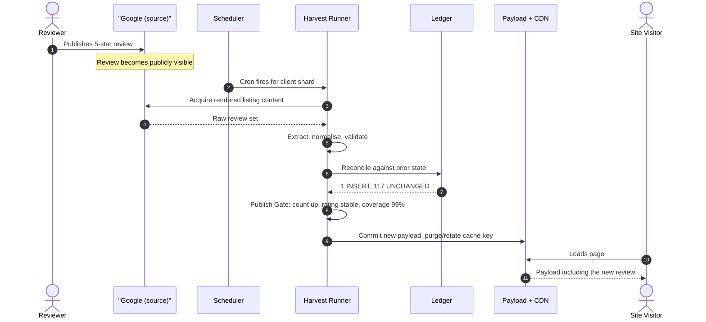
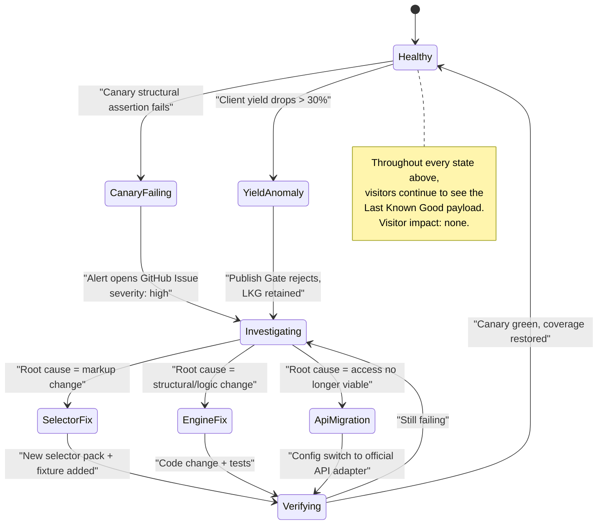
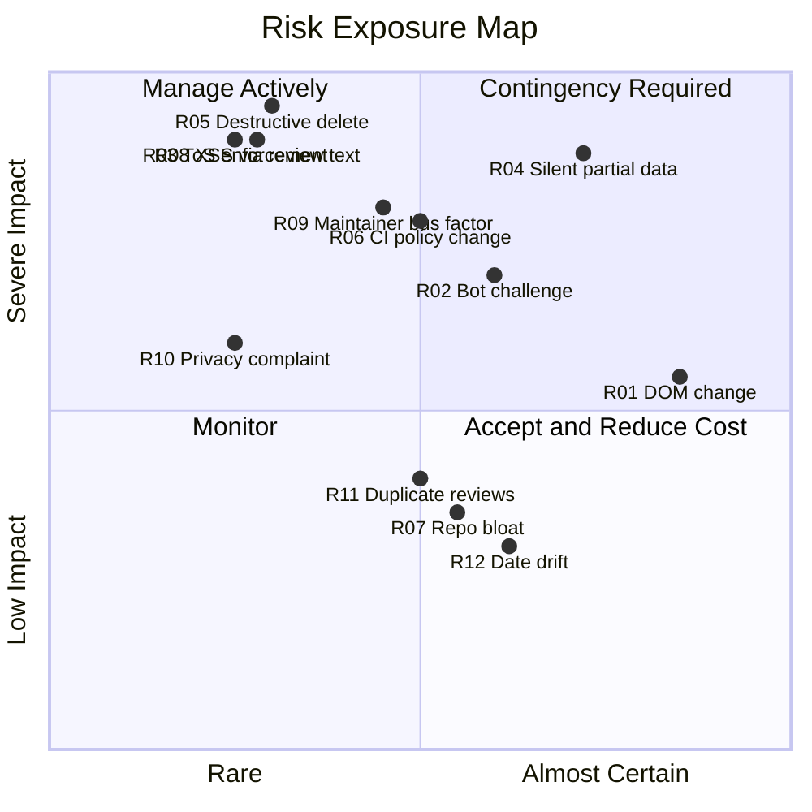

# Part 2 — Requirements, Constraints, Risk, and Legal Position

*Sections 9 through 15. Audience: architects, engineers, QA, security, product. This part is the contractual core of the document: it defines what the system must do, how well it must do it, what it must run on, what limits it, what could go wrong, and where it stands legally.*

---

# 9. Use Cases

## 9.1 Actor Catalogue

| Actor | Type | Description | Trust Level |
|---|---|---|---|
| **Site Visitor** | Human, external | Views the client's website. Never authenticated. Sees reviews. | Untrusted (receives output only) |
| **Client Business Owner** | Human, external | Owns the business and the Google listing. Requests the integration. | Semi-trusted (provides configuration inputs) |
| **Reviewer** | Human, external | Writes the review on the source platform. Not a user of this system, but a data subject with rights. | N/A — data subject |
| **TradyPerch Engineer** | Human, internal | Onboards clients, maintains the engine, responds to alerts. | Trusted |
| **Scheduler** | Machine, internal | GitHub Actions cron. Initiates harvests. | Trusted |
| **Harvest Runner** | Machine, internal | Ephemeral CI job executing the engine for one shard. | Trusted, but operates on untrusted input |
| **Review Source** | Machine, external | Google Maps / Places API / Business Profile API. | **Untrusted and volatile** — may change shape, rate-limit, or challenge at any time |
| **CDN Edge** | Machine, external | Serves the published artifact to visitors. | Trusted for delivery, not for integrity (integrity is verified by content hash) |
| **Client Website Build** | Machine, external | Client's SSG/CI process that may import the payload at build time. | Semi-trusted consumer |

## 9.2 Use Case Index

| ID | Name | Primary Actor | Priority | Frequency |
|---|---|---|---|---|
| UC-01 | Onboard a new client | Engineer | Must | Per client |
| UC-02 | Scheduled review synchronisation | Scheduler | Must | Every cycle |
| UC-03 | Site visitor views reviews | Site Visitor | Must | Continuous |
| UC-04 | New review appears at source | Reviewer → System | Must | Continuous |
| UC-05 | Existing review is edited at source | Reviewer → System | Must | Occasional |
| UC-06 | Review is deleted at source | Reviewer → System | Must | Rare |
| UC-07 | Owner replies to a review | Client Owner → System | Should | Occasional |
| UC-08 | Upstream markup changes and extraction breaks | Review Source | Must | 1–3 × / year |
| UC-09 | Source presents a bot challenge | Review Source | Must | Occasional |
| UC-10 | Harvest partially fails / low coverage | Runner | Must | Occasional |
| UC-11 | Engineer diagnoses a failed harvest | Engineer | Must | Per incident |
| UC-12 | Engineer repairs a selector break | Engineer | Must | Per incident |
| UC-13 | Manual on-demand refresh | Engineer | Should | Ad hoc |
| UC-14 | Migrate a client from DOM adapter to official API | Engineer | Must | Ad hoc |
| UC-15 | Import legacy or off-platform reviews via CSV | Engineer | Should | Ad hoc |
| UC-16 | Reviewer requests removal of their review data | Reviewer | Must | Rare |
| UC-17 | Client offboarding / data export | Client Owner | Should | Rare |
| UC-18 | Client website consumes payload at build time | Website Build | Must | Per deploy |
| UC-19 | Add a new source platform | Engineer | Could (v2) | Rare |
| UC-20 | Full disaster recovery from repository loss | Engineer | Must | Never, hopefully |

## 9.3 Detailed Use Cases

### UC-01 — Onboard a New Client

| Field | Detail |
|---|---|
| **Goal** | Make a new client's reviews live on their site with no engine code change. |
| **Preconditions** | Client has a Google Business Profile with ≥ 1 review. Written authorisation obtained (§15.6). Client's site can fetch or import a JSON file. |
| **Trigger** | Engineer runs the onboarding checklist (§53.5). |
| **Main Success Scenario** | 1. Engineer resolves the listing identity (Place ID or CID) using the `resolve` CLI command. 2. Engineer creates `clients/<slug>.config.json` from the template, setting listing identity, cadence tier, display preferences, and adapter. 3. Engineer runs config validation; schema errors block. 4. Engineer runs a local dry-run harvest with `--no-publish`; reviews the extracted output and the coverage report. 5. Engineer opens a PR; CI validates config, runs the dry-run in the runner environment, and posts the extraction summary as a PR comment. 6. PR merged. 7. First scheduled (or manually dispatched) harvest publishes the payload. 8. Engineer adds the fetch/import snippet to the client site. 9. Verification checklist confirms rendering, structured data, and cache headers. |
| **Alternate Flows** | 4a. Coverage below threshold → engineer inspects the run artifact, adjusts scroll/timeout profile in config, retries. 4b. Listing ambiguous (chain with many branches) → engineer supplies an explicit Place ID rather than a name search. 4c. Zero reviews → onboarding proceeds; payload publishes with `total_count: 0` and the site renders an empty-state. |
| **Failure Flows** | Authorisation absent → onboarding blocked by checklist (hard gate). |
| **Postconditions** | Client appears in the registry, has a published payload, and is included in the scheduled matrix. |
| **NFRs Engaged** | ≤ 20 min (BG-02); no engine code change (TG-01). |

### UC-02 — Scheduled Review Synchronisation

| Field | Detail |
|---|---|
| **Goal** | Bring every active client's payload up to date. |
| **Trigger** | Cron schedule per cadence tier, with jitter (§28.4). |
| **Main Success Scenario** | 1. Scheduler fires; workflow computes the set of due clients and partitions them into shards. 2. Each shard job restores caches, launches the engine, and processes its clients sequentially with inter-client pacing. 3. For each client: resolve → acquire → extract → normalise → validate → reconcile → project → gate → stage. 4. Shard commits staged artifacts for its clients to the data branch (with retry on non-fast-forward). 5. Publication job triggers CDN refresh where applicable. 6. Run manifests and logs are uploaded as artifacts; health metrics appended. 7. Alerting job evaluates aggregate health and opens/updates/closes issues. |
| **Alternate Flows** | Any client failing → that client's payload retained at LKG; other clients unaffected (INV-09). Shard job failing entirely → next cycle retries; no data loss. |
| **Postconditions** | Payloads updated for all clients whose harvests passed the Publish Gate. Health record written for every client, including failures. |

### UC-03 — Site Visitor Views Reviews

| Field | Detail |
|---|---|
| **Goal** | Render current reviews with no perceptible cost. |
| **Main Success Scenario** | *Static-generation path:* reviews are already in the HTML at build time; nothing happens at runtime. *Runtime path:* the page fetches `reviews.latest.json` from the CDN; the response is cached; the renderer inserts sanitised text into pre-sized containers to avoid layout shift. |
| **Alternate Flows** | Fetch fails or times out → renderer keeps the server-rendered/empty-state markup and fails silently. Never shows an error to the visitor. |
| **NFRs Engaged** | ≤ 15 KB compressed; zero third-party origins; no layout shift; works with JS disabled on the static path. |

### UC-04 — New Review Appears at Source

**Timing budget:** worst case = cadence interval (6 h default) + harvest duration (≤ 3 min) + commit propagation (≤ 1 min) + CDN TTL (≤ 5 min for the manifest) ≈ **6 h 9 min**. Best case ≈ 9 minutes if the review lands just before a cycle.

### UC-05 — Existing Review Is Edited at Source

| Field | Detail |
|---|---|
| **Challenge** | The text changed, so a content hash changes; a naive system inserts a duplicate and the site shows the review twice. |
| **Main Success Scenario** | 1. Extraction produces a review whose `identity_hash` (author key + listing + first-observed epoch anchor) matches an existing Ledger record but whose `content_hash` differs. 2. Reconciler classifies **UPDATE**: increments `revision`, sets `updated_at`, preserves `first_seen_at`, appends the previous `content_hash` to `revision_history`. 3. Payload reflects new text; ordering preserved by original date. |
| **Edge case** | Author changes their display name *and* text simultaneously → identity match fails → recorded as INSERT and the old record eventually goes MISSING then tombstoned. This produces one transient duplicate-looking pair. Accepted, documented in §49, mitigated by a fuzzy near-duplicate warning in validation. |

### UC-06 — Review Is Deleted at Source

| Field | Detail |
|---|---|
| **Challenge** | Distinguishing genuine deletion from a truncated harvest is the single most dangerous ambiguity in the system (D7). |
| **Main Success Scenario** | 1. Harvest completes with coverage ≥ threshold and `harvest_completeness: full`. 2. A Ledger record is absent from the observed set → marked `unconfirmed`, `missing_streak = 1`. Still published. 3. Second consecutive qualifying harvest also absent → `missing_streak = 2`. Still published. 4. Third consecutive qualifying harvest absent → tombstoned, removed from payload, retained in Ledger permanently. |
| **Guard** | Only harvests flagged `full` increment the streak. A degraded or partial harvest resets nothing and increments nothing. |
| **Configurable** | `removal_confirmations` default 3, minimum 2, maximum 10. |

### UC-08 — Upstream Markup Changes and Extraction Breaks

### UC-09 — Source Presents a Bot Challenge

| Field | Detail |
|---|---|
| **Trigger** | Runner receives a challenge interstitial, an unusual-traffic page, or a consent wall it cannot lawfully and trivially pass. |
| **Behaviour (normative)** | 1. Detector classifies the page as `ERR-BLOCKED-CHALLENGE`. 2. Runner **immediately aborts** this client's harvest. **No retry.** 3. A circuit breaker opens for the affected source at the account/runner level, suppressing further harvests for a cooldown (default 6 h, escalating). 4. A high-severity alert is raised. 5. LKG retained for all clients. 6. Runbook §29.5 directs the engineer to evaluate whether to reduce cadence, pause, or migrate the client to an official API. |
| **Explicitly forbidden** | Solving, bypassing, outsourcing, or retrying the challenge; rotating identity to avoid it. INV-07, ADR-010. |

### UC-11 / UC-12 — Diagnose and Repair

| Step | Action | Artifact Used |
|---|---|---|
| 1 | Open the failing run; read the run manifest. | `manifest.json` — engine version, selector pack version, per-stage timings, counts, error class |
| 2 | Read the classified error and its context. | `run.jsonl` structured log |
| 3 | Inspect the captured page snapshot (sanitised HTML + screenshot, secrets and cookies stripped). | `snapshot.html`, `snapshot.png` |
| 4 | Reproduce offline: add the snapshot to the fixture corpus and run the parser against it. | Fixture harness (`npm run parse:fixture`) |
| 5 | Adjust the selector pack; re-run against all fixtures to confirm no regression. | Golden fixture suite |
| 6 | Bump `selectors_version`, open PR, CI runs full fixture suite + canary against live. | CI |
| 7 | Merge; trigger manual harvest for affected clients; verify coverage restored. | `harvest --client <slug> --force` |
| **Target** | Median 60 minutes from alert to repaired payload. | TG-06 |

### UC-16 — Reviewer Requests Data Removal

| Field | Detail |
|---|---|
| **Legal basis** | GDPR Art. 17 / DPDP Act 2023 erasure and correction rights, where applicable. |
| **Main Success Scenario** | 1. Request received at a published contact address. 2. Engineer adds an entry to `compliance/denylist.json` keyed by `identity_hash` (or author key + listing), with reason code and date. 3. Next harvest excludes the review from the payload and writes a permanent suppression tombstone. 4. Ledger retains only the minimal record needed to keep the suppression durable — the hash and the reason — and purges name, text, and avatar. 5. Requester notified within the statutory window. |
| **SLA** | Suppression effective within 7 days; expedited manual run available same-day. |
| **Guarantee** | Suppression is durable: a suppressed review is never re-inserted by a later harvest. |

---

# 10. Functional Requirements

Requirements are grouped by pipeline stage. Each is atomic, testable, and traceable. **Priority** uses MoSCoW: `M` = Must for v1.0, `S` = Should, `C` = Could, `W` = Won't (v1.0).

## 10.1 Configuration and Client Registry

| ID | Requirement | Pri | Verified By |
|---|---|---|---|
| FR-001 | The system MUST read a declarative client registry enumerating all tenants, with one configuration document per client. | M | Unit + integration |
| FR-002 | Client configuration MUST be validated against a published JSON Schema before any harvest begins; validation failure MUST abort that client only. | M | Unit; CI gate |
| FR-003 | Configuration MUST support inheritance: engine defaults ← profile defaults ← client config ← environment override ← CLI flag, with later layers winning. | M | Unit (precedence matrix) |
| FR-004 | Each client configuration MUST declare: slug, display name, enabled flag, one or more listings, adapter selection, cadence tier, locale, and publication target. | M | Schema |
| FR-005 | Configuration MUST carry a `config_version`; the engine MUST refuse to run an unsupported version and MUST provide a documented migration path. | M | Unit |
| FR-006 | The system MUST support enabling/disabling a client without deleting its configuration or data. | M | Integration |
| FR-007 | The system MUST support per-client overrides of every timing, threshold, and limit that affects harvest behaviour. | M | Schema |
| FR-008 | The system MUST support declaring multiple listings per client, each with independent identity and payload. | S | Integration |
| FR-009 | The system SHOULD support a merged cross-listing payload for multi-location clients. | S | Integration |
| FR-010 | Secrets MUST NEVER appear in client configuration; configuration MUST reference secrets by name only. | M | Static check in CI (secret scan) |

## 10.2 Listing Resolution

| ID | Requirement | Pri | Verified By |
|---|---|---|---|
| FR-011 | The system MUST resolve a listing from any of: explicit Place ID, explicit CID, a full Maps URL, or a name + location search string. | M | Unit + live smoke |
| FR-012 | Resolution MUST prefer explicit identifiers over search, and MUST warn when falling back to search. | M | Unit |
| FR-013 | Resolved identity MUST be cached persistently and reused across runs to eliminate the search step. | M | Integration |
| FR-014 | The system MUST detect and fail loudly on ambiguous resolution (multiple plausible matches above a similarity threshold) rather than guessing. | M | Unit (ambiguity fixtures) |
| FR-015 | The system MUST verify that a cached identity still corresponds to the expected business name before harvesting; a mismatch MUST abort with `ERR-IDENTITY-DRIFT`. | M | Integration |
| FR-016 | Resolution MUST record and expose the listing's advertised total review count and aggregate rating when available, for use in coverage calculation. | M | Unit |

## 10.3 Acquisition (Adapter Layer)

| ID | Requirement | Pri | Verified By |
|---|---|---|---|
| FR-017 | The system MUST define a single adapter interface; all acquisition MUST go through it. | M | Contract test suite |
| FR-018 | v1.0 MUST ship four adapters: `google:dom`, `google:places-api`, `google:business-profile-api`, `file:csv`. | M | Contract test per adapter |
| FR-019 | An adapter MUST be selectable per client per listing by configuration alone, with no code change. | M | Integration (INV-10 drill) |
| FR-020 | Each adapter MUST declare its capabilities (fields it can supply, max reviews, supports owner replies, supports deep history) so downstream stages can adapt expectations. | M | Unit |
| FR-021 | The DOM adapter MUST operate on publicly accessible content only, without authentication, and MUST NOT attempt to access any content behind a login. | M | Code review; security review |
| FR-022 | The DOM adapter MUST block loading of images, media, fonts, and analytics resources not required for extraction. | M | Integration (network assertion) |
| FR-023 | The DOM adapter MUST paginate through the lazily-loaded review list until either exhaustion, a configured maximum, or a stall condition is detected. | M | Integration (fixture server) |
| FR-024 | The DOM adapter MUST expand truncated review text before extraction, up to a configured per-run interaction budget. | M | Integration |
| FR-025 | The DOM adapter MUST detect and classify: consent interstitial, bot challenge, empty result, changed structure, and network failure — as distinct error classes. | M | Chaos suite |
| FR-026 | The official-API adapters MUST read credentials only from the secret store and MUST fail closed if credentials are absent. | M | Unit |
| FR-027 | The CSV adapter MUST accept a documented column contract, validate every row, and report per-row errors without aborting the whole import. | S | Unit |
| FR-028 | Every adapter MUST return raw records plus an acquisition report containing observed totals, pagination steps, stall/stop reason, and timings. | M | Unit |
| FR-029 | Adapters MUST enforce a hard wall-clock budget and abort cleanly when exceeded. | M | Chaos suite |
| FR-030 | Adapters MUST NOT write to the Ledger or Payload. Acquisition is read-only with respect to system state. | M | Architecture test (dependency rule) |

## 10.4 Extraction and Normalisation

| ID | Requirement | Pri | Verified By |
|---|---|---|---|
| FR-031 | Extraction MUST locate fields using a versioned Selector Pack loaded from data, not hard-coded in logic. | M | Unit; ADR-009 |
| FR-032 | Selector resolution MUST support ordered fallback strategies per field, and MUST record which strategy succeeded. | M | Unit |
| FR-033 | Extraction MUST distinguish a review from an owner reply and MUST NOT ingest a reply as a review. | M | Golden fixtures (reply cases) |
| FR-034 | The system MUST parse ratings from any of: numeric text, star-count markup, or accessibility label, normalising to a 1–5 integer. | M | Unit |
| FR-035 | The system MUST capture the relative date string verbatim and MUST additionally compute a resolved absolute date estimate with an explicit precision indicator. | M | Unit (date matrix) |
| FR-036 | The resolved absolute date for a review MUST be pinned on first observation and MUST NOT drift on subsequent harvests. | M | Property test |
| FR-037 | Normalisation MUST apply Unicode NFC, strip control and zero-width characters, collapse whitespace, decode HTML entities, and preserve emoji and RTL text. | M | Unit (adversarial strings) |
| FR-038 | Normalisation MUST remove all HTML markup from review text; the payload MUST contain plain text only. | M | Unit; INV-05 |
| FR-039 | Normalisation MUST detect and flag truncation markers, and MUST record whether the stored text is complete or truncated. | M | Unit |
| FR-040 | The system MUST detect review language and record an ISO 639-1 code with a confidence score. | S | Unit |
| FR-041 | Normalisation MUST enforce a maximum stored text length (default 5,000 characters) with safe truncation at a grapheme boundary and a flag recording that truncation occurred. | M | Unit |
| FR-042 | Author display names MUST be preserved as given, with only safety normalisation applied; the system MUST NOT alter, abbreviate, or anonymise them by default. | M | Unit |
| FR-043 | The system MUST derive a stable author key that is resilient to insignificant formatting differences in the display name. | M | Unit |
| FR-044 | Avatar URLs MUST be captured, validated against an allowlist of expected hosts, and stored as URLs only — never downloaded or re-hosted. | M | Unit; ADR-014 |

## 10.5 Validation

| ID | Requirement | Pri | Verified By |
|---|---|---|---|
| FR-045 | Every normalised review MUST be validated against field-level constraints; invalid records MUST be quarantined with a reason, not silently dropped. | M | Unit |
| FR-046 | The system MUST compute a coverage ratio (extracted ÷ advertised total) and classify the harvest as `full`, `partial`, or `failed`. | M | Unit |
| FR-047 | Validation MUST detect intra-run duplicates and collapse them deterministically. | M | Unit |
| FR-048 | Validation MUST detect near-duplicates (high text similarity, same author) and emit a warning without blocking. | S | Unit |
| FR-049 | Validation MUST verify aggregate plausibility: computed mean rating within tolerance of advertised rating; rating distribution non-degenerate. | M | Unit |
| FR-050 | A run whose validation produces any `fatal` finding MUST NOT proceed to publication. | M | Integration |

## 10.6 Reconciliation and State

| ID | Requirement | Pri | Verified By |
|---|---|---|---|
| FR-051 | Reconciliation MUST be a pure function of (prior Ledger, observed set, harvest report, config) → (new Ledger, decision log). | M | Property test; ADR-018 |
| FR-052 | Reconciliation MUST be idempotent (INV-04). | M | Property test |
| FR-053 | Reconciliation MUST classify each observed review as INSERT, UPDATE, or UNCHANGED, and each absent prior review as MISSING or TOMBSTONED. | M | Unit |
| FR-054 | The Ledger MUST record, per review: `first_seen_at`, `last_seen_at`, `revision`, `content_hash` history, and the harvest run id of each state change. | M | Unit |
| FR-055 | A review MUST NOT be removed from the payload until it has been absent from `removal_confirmations` consecutive `full` harvests (INV-03). | M | Unit + chaos |
| FR-056 | Tombstoned reviews MUST NEVER be re-inserted. | M | Property test |
| FR-057 | Reviews present in the compliance denylist MUST be excluded from the payload and permanently suppressed. | M | Unit |
| FR-058 | The Ledger MUST be forward-compatible: unknown fields encountered in a Ledger written by a newer engine MUST be preserved, not dropped. | S | Unit |

## 10.7 Publication

| ID | Requirement | Pri | Verified By |
|---|---|---|---|
| FR-059 | The system MUST project the Ledger into a public payload conforming to the published JSON Schema. | M | Schema validation in CI |
| FR-060 | The payload MUST NOT contain any internal state, provenance secrets, quarantined records, or suppressed reviews. | M | Unit |
| FR-061 | The system MUST emit three artifacts per listing: a full payload, a top-N latest payload, and a manifest with aggregates and integrity hashes. | M | Integration |
| FR-062 | The system MUST enforce a Publish Gate comprising: schema validity, non-zero count (unless the listing genuinely has zero), count-drop threshold, mean-rating-shift threshold, and coverage classification. | M | Chaos suite |
| FR-063 | On Publish Gate failure the system MUST retain the previous payload unchanged, record the rejection with reasons, and raise an alert (INV-02). | M | Chaos suite |
| FR-064 | Publication MUST be atomic per listing: a consumer MUST never observe a partially written payload. | M | Integration |
| FR-065 | The system MUST skip writing when content is byte-identical to the current published artifact, to avoid empty commits. | M | Integration |
| FR-066 | Every payload MUST embed provenance: engine version, schema version, adapter, selector pack version, run id, and generation timestamp (INV-06). | M | Schema |
| FR-067 | The system MUST publish aggregate statistics (total count, mean rating, rating distribution, newest review date) precomputed so consumers need no client-side computation. | M | Unit |
| FR-068 | The system SHOULD publish a schema.org-compatible projection to enable structured data without consumer-side transformation. | S | Unit |

## 10.8 Distribution and Consumption

| ID | Requirement | Pri | Verified By |
|---|---|---|---|
| FR-069 | Published artifacts MUST be retrievable over HTTPS with permissive CORS suitable for cross-origin browser fetch. | M | Live check |
| FR-070 | Artifacts MUST carry cache-control semantics documented per artifact type, with the manifest short-lived and content-addressed files long-lived. | M | Live check |
| FR-071 | The system MUST ship a dependency-free reference renderer under 5 KB minified that renders reviews accessibly. | M | Size budget test |
| FR-072 | The reference renderer MUST insert text via safe DOM text APIs and MUST NEVER use HTML-injection APIs. | M | Code review; INV-05 |
| FR-073 | Integration recipes MUST be documented and verified for static HTML, React, Next.js, Astro, and Vue. | M | Manual verification checklist |
| FR-074 | The renderer MUST degrade to a stable empty state on fetch failure, with no visible error. | M | Integration |

## 10.9 Observability and Operations

| ID | Requirement | Pri | Verified By |
|---|---|---|---|
| FR-075 | Every run MUST emit structured, machine-parseable logs with a correlation id, stage, level, error class, and timing. | M | Unit |
| FR-076 | Logs and artifacts MUST be redacted of secrets, cookies, tokens, and full request headers before being written. | M | Security review; unit |
| FR-077 | Every run MUST emit a manifest capturing versions, counts, decisions, gate results, and per-stage durations. | M | Unit |
| FR-078 | On failure, the system MUST capture a sanitised page snapshot and screenshot to enable offline reproduction. | M | Chaos suite |
| FR-079 | The system MUST append per-client health records enabling trend analysis of yield, coverage, and duration. | M | Integration |
| FR-080 | The system MUST run a canary harvest against a fixed reference listing on a schedule independent of client harvests. | M | Integration |
| FR-081 | The system MUST raise alerts through a zero-cost channel, deduplicated per root cause, with defined severities. | M | Integration |
| FR-082 | The system MUST auto-resolve alerts when the underlying condition clears. | S | Integration |
| FR-083 | The system MUST support a manual on-demand harvest for a single client, bypassing cadence but not the Publish Gate. | M | Manual test |
| FR-084 | The system MUST support a dry-run mode that performs the full pipeline but writes nothing. | M | Unit |
| FR-085 | The system MUST support replaying a stored raw acquisition artifact through the pipeline without network access. | S | Integration |

## 10.10 Compliance and Ethics

| ID | Requirement | Pri | Verified By |
|---|---|---|---|
| FR-086 | The system MUST maintain a per-client authorisation record asserting the client owns or represents the listing. Harvest MUST refuse to run for a client without it. | M | Config schema (required field) |
| FR-087 | The system MUST support a compliance denylist that permanently suppresses specified reviews. | M | Unit |
| FR-088 | The system MUST NOT attempt to solve, bypass, or outsource any bot-detection challenge (INV-07). | M | Code review; security review |
| FR-089 | The system MUST enforce a minimum inter-request delay and a maximum request rate per source, configurable downward but not upward beyond a hard-coded ceiling. | M | Unit |
| FR-090 | The system MUST include a pre-flight check that can hard-block acquisition based on configured policy (robots directives, per-source policy flags). | M | Unit; ADR-024 |
| FR-091 | The system MUST attribute reviews to their source in the payload and MUST provide a link back to the source listing. | M | Schema |
| FR-092 | The system MUST NOT retain reviewer personal data beyond what is published, except the minimal hashes required for identity and suppression. | M | Data-minimisation review |
| FR-093 | The system MUST provide a complete data export for a client on request in documented JSON form. | S | Manual test |

## 10.11 Requirement Traceability Summary

| Goal | Satisfied By |
|---|---|
| BG-01 zero cost | FR-018, FR-069; §19.3 |
| BG-02 fast onboarding | FR-001…FR-010, FR-011…FR-013 |
| BG-07 data ownership | FR-054, FR-093 |
| TG-01 source independence | FR-017…FR-020, FR-030 |
| TG-03 non-destructive | FR-055, FR-062, FR-063 |
| TG-04 idempotence | FR-051, FR-052, FR-056 |
| TG-06 fast repair | FR-031, FR-032, FR-078, FR-085 |
| INV-05 output safety | FR-038, FR-060, FR-072 |
| INV-07 no evasion | FR-088, FR-089, FR-090 |

---

# 11. Non-Functional Requirements

## 11.1 Service Level Objectives

SLOs are stated with an indicator (how it is measured), a target, and a consequence of breach.

| ID | SLO | Indicator | Target | Breach Consequence |
|---|---|---|---|---|
| **SLO-freshness** | A new review reaches the website within one cycle + propagation. | `now − payload.generated_at` at p95 | ≤ 8 h (6 h cadence) | Investigate scheduler delay; consider tier change |
| **SLO-availability** | The payload is retrievable by visitors. | CDN success rate | ≥ 99.9% monthly | Escalate to hosting alternative (§34.5) |
| **SLO-visitor-impact** | Visitors never see fewer reviews than the previous day due to engine failure. | Count of gate-bypass incidents | **0** | Sev-1 incident review |
| **SLO-harvest-success** | Scheduled harvests complete without error. | successful ÷ scheduled, per 30 days | ≥ 95% | Root-cause review; possible cadence reduction |
| **SLO-staleness-alarm** | No client silently stale. | Clients with `last_success > 48 h` | 0 | Alert fires at 24 h; page at 48 h |
| **SLO-repair-time** | Time from alert to restored coverage after upstream change. | Median across incidents | ≤ 60 min | Improve selector pack tooling |
| **SLO-accuracy** | Field-level extraction correctness. | Golden fixture assertions passing | ≥ 98% | Block release |
| **SLO-coverage** | Share of advertised reviews captured on a `full` harvest. | extracted ÷ advertised | ≥ 95% | Investigate pagination |

## 11.2 Performance Requirements

| ID | Requirement | Target | Rationale |
|---|---|---|---|
| NFR-001 | Harvest wall-clock per listing (≤ 200 reviews), DOM adapter. | p50 ≤ 75 s, p95 ≤ 180 s, hard cap 300 s | Keeps shard jobs well inside runner limits and inside pacing budget. |
| NFR-002 | Harvest wall-clock per listing, official-API adapter. | p95 ≤ 10 s | API path is the fast path. |
| NFR-003 | Core pipeline (post-acquisition) CPU time for 1,000 reviews. | ≤ 2 s | Pure functions; no excuse for slowness. |
| NFR-004 | Peak resident memory per harvest process. | ≤ 700 MB incl. browser; ≤ 120 MB for the Node process alone | Fits comfortably in a 16 GB runner with concurrency headroom. |
| NFR-005 | Shard job total duration. | ≤ 20 min | Well below the 6 h job ceiling; keeps feedback fast. |
| NFR-006 | Published full payload size, 200 reviews. | ≤ 180 KB raw, ≤ 60 KB gzip | Bandwidth and CDN friendliness. |
| NFR-007 | Published `latest.json` (top 20). | ≤ 24 KB raw, ≤ 9 KB gzip | This is what most sites actually load. |
| NFR-008 | Total added page weight for review rendering. | ≤ 15 KB compressed | BG-05. |
| NFR-009 | Renderer time-to-first-review-painted on a warm cache. | ≤ 50 ms after payload availability | No perceptible delay. |
| NFR-010 | Cumulative Layout Shift attributable to reviews. | 0 | Reserve space; render skeletons. |
| NFR-011 | Cold-start overhead per shard (dependency + browser restore). | ≤ 60 s with warm cache | Caching strategy §34.2. |

## 11.3 Reliability and Resilience

| ID | Requirement |
|---|---|
| NFR-012 | The system MUST tolerate complete unavailability of the source for at least 30 consecutive days with zero visitor-visible impact. |
| NFR-013 | The system MUST tolerate a total loss of the CI provider by remaining runnable as a local CLI producing identical artifacts. |
| NFR-014 | No single client's failure may affect another client's payload, run, or alert state (INV-09). |
| NFR-015 | All state MUST be reconstructable from version-controlled artifacts; there is no ephemeral state whose loss is unrecoverable. |
| NFR-016 | Every network operation MUST have an explicit timeout; no unbounded waits anywhere in the system. |
| NFR-017 | Retries MUST be bounded, jittered, and classified — retry only on retryable error classes (§26.2). |
| NFR-018 | The system MUST degrade in a defined order: fresh full → fresh partial rejected → LKG served → stale LKG served with alert. It MUST NEVER serve empty. |

## 11.4 Maintainability

| ID | Requirement | Measure |
|---|---|---|
| NFR-019 | Upstream markup changes MUST be repairable by editing data files only, in the common case. | ≥ 70% of historical breakages fixable without code change |
| NFR-020 | Every module MUST have a single documented responsibility and an explicit interface. | Architecture review |
| NFR-021 | Cyclomatic complexity per function ≤ 10; file length ≤ 400 lines; function length ≤ 60 lines. | Lint rules, enforced in CI |
| NFR-022 | Test coverage: ≥ 90% statements on pure core modules; ≥ 70% overall. | CI coverage gate |
| NFR-023 | Dependency count MUST be minimised; each production dependency requires written justification in §19.7. | Dependency review |
| NFR-024 | The build MUST be reproducible from a lockfile with pinned versions. | CI verification |
| NFR-025 | Any engineer MUST be able to reproduce any production failure offline from stored artifacts within 10 minutes. | Drill |

## 11.5 Security

| ID | Requirement |
|---|---|
| NFR-026 | No secret may be present in any repository file, log, artifact, or payload (INV-08). Enforced by automated scanning on every push. |
| NFR-027 | CI workflows MUST declare least-privilege permissions explicitly; the default token MUST be read-only unless a step requires otherwise. |
| NFR-028 | All third-party CI actions MUST be pinned to a full commit SHA, never a mutable tag. |
| NFR-029 | Published text MUST be safe to insert into a DOM as text content; the payload MUST contain no markup (INV-05). |
| NFR-030 | Untrusted source content MUST NEVER be interpolated into a shell command, a workflow expression, a file path, or a log format string. |
| NFR-031 | Dependencies MUST be audited on every CI run; high-severity advisories block release. |
| NFR-032 | The browser MUST run with a restrictive profile: no persistent profile reuse across clients, no extensions, no file access beyond the run directory. |

## 11.6 Privacy and Compliance

| ID | Requirement |
|---|---|
| NFR-033 | Only personal data necessary for display and identity is stored: display name, avatar URL, review text, dates. No emails, no IDs beyond what is public, no behavioural data. |
| NFR-034 | Reviewer avatars MUST be referenced, never copied or cached (ADR-014). |
| NFR-035 | Erasure requests MUST be honoured within 7 days and MUST be durable across future harvests. |
| NFR-036 | Raw acquisition artifacts containing personal data MUST have a defined retention period (default 14 days) and MUST be sanitised before storage. |
| NFR-037 | The payload MUST attribute content to its source with a link, so visitors can verify authenticity. |

## 11.7 Usability and Accessibility

| ID | Requirement |
|---|---|
| NFR-038 | The reference renderer MUST meet WCAG 2.1 AA: sufficient contrast on default styling, semantic markup, accessible star ratings with text alternatives, keyboard-operable pagination. |
| NFR-039 | Star ratings MUST NOT rely on colour alone; a numeric or text equivalent MUST be present for assistive technology. |
| NFR-040 | The renderer MUST respect `prefers-reduced-motion` for any transition. |
| NFR-041 | Review text MUST render correctly for RTL languages and MUST preserve emoji. |
| NFR-042 | Operator-facing CLI output MUST be readable in plain text terminals and MUST support a machine-readable JSON output mode. |

## 11.8 Portability

| ID | Requirement |
|---|---|
| NFR-043 | The engine MUST run on Linux, macOS, and Windows for development; Linux is the only supported production target. |
| NFR-044 | The engine MUST run on the current Node LTS and the immediately preceding LTS. |
| NFR-045 | The engine MUST NOT depend on any GitHub-specific API for its core pipeline; GitHub integration MUST be confined to the publication and alerting adapters. |
| NFR-046 | Published artifacts MUST be consumable by any HTTP client with no SDK requirement. |

## 11.9 NFR Conflict Resolution Matrix

| Conflict | Resolution | Authority |
|---|---|---|
| Freshness vs. rate-limit politeness | Politeness wins. Reduce cadence rather than increase request rate. | §28 |
| Coverage vs. harvest duration | Duration cap wins; report partial coverage honestly and reject publication if below threshold. | §5.3 |
| Payload richness vs. size | Split into `latest.json` and `reviews.json`; consumers choose. | §21.7 |
| Debuggability vs. PII minimisation | Sanitise then retain briefly; never retain raw personal data long-term. | NFR-036 |
| Test realism vs. offline testability | Fixtures are primary; live tests are separate and opt-in. | §41.1 |

---

# 12. System Requirements

## 12.1 Development Environment

| Component | Requirement | Notes |
|---|---|---|
| OS | Linux, macOS, or Windows 10+ | Windows developers SHOULD use WSL2 for parity with CI. |
| Node.js | Current LTS (≥ 20.x), plus previous LTS supported | Version pinned by an `.nvmrc`-equivalent and enforced by an engines check. |
| Package manager | npm with a committed lockfile | Chosen for zero-install-friction and CI ubiquity. |
| Browser runtime | Playwright-managed Chromium | Never the system Chrome; version must be pinned for determinism. |
| Disk | ≥ 5 GB free | Browser binaries (~500 MB) plus fixtures plus artifacts. |
| RAM | ≥ 8 GB | Local full-suite runs with a browser. |
| Git | ≥ 2.30 | Sparse checkout and orphan-branch operations. |
| Editor tooling | Formatter + linter + type checking on save | §45. |

## 12.2 Continuous Integration Runtime

| Component | Requirement | Source of Truth |
|---|---|---|
| Runner | GitHub-hosted Linux runner (`ubuntu-latest`) | **Assumption AS-01** — verify current specification at implementation time. Current generation provides 4 vCPU / 16 GB RAM / ~14 GB free SSD. |
| Job time limit | Per-job maximum 6 hours; workflow 35 days | Shard jobs target ≤ 20 min (NFR-005), a ~18× safety margin. |
| Concurrency | Free-tier concurrent job limit constrains shard parallelism | §37.3 sizes shards against this. |
| Minutes | Unmetered for public repositories; metered for private | **Load-bearing for BG-01.** See §33.2 and §37.5. |
| Schedule granularity | Cron with 5-minute minimum resolution; **scheduled runs may be delayed under platform load and are not a real-time guarantee** | Design tolerates delay (SLO-freshness has margin). |
| Schedule dormancy | Scheduled workflows in a repository with no activity for an extended period may be disabled automatically by the platform | **Operational trap.** Mitigated by a keepalive commit from the data branch and a monthly liveness check (§50.3). |
| Artifact retention | Default 90 days, configurable down | Set to 14 days for run artifacts (NFR-036). |
| Cache | Per-repository cache with size ceiling and eviction of entries unused for ~7 days | Browser + dependency caching, §34.2. |
| Secrets | Repository/environment secrets, masked in logs, unavailable to fork PRs | §40.3. |
| Network egress | Runner egress originates from cloud provider IP ranges shared with all other users of the platform | **Material to §14 and §30**: shared reputation means rate-limiting risk is partly outside our control. |

**Engineering Note.** The two items above that most often surprise teams are *schedule dormancy* (a repository that goes quiet stops running its cron) and *shared egress reputation* (your polite scraper shares an IP neighbourhood with impolite ones). Both are designed for explicitly: §50.3 and §28.6.

## 12.3 Production Runtime — Publication and Delivery

| Component | Requirement |
|---|---|
| Repository | One Git repository, public by default, containing engine code on `main` and published artifacts on an orphan `data` branch (ADR-012). |
| Static hosting | A CDN-fronted static origin. Primary option: GitHub Pages built from the data branch. Secondary: a public CDN mirror of the repository. Tertiary: client's own hosting via build-time import. §34.5 |
| TLS | HTTPS only; HTTP redirected. |
| CORS | Permissive read-only CORS on payload artifacts. |
| Domain | Optional custom subdomain (e.g. `reviews.tradyperch.com`) for brand and cache-control independence. |

## 12.4 Client Website Requirements

| Requirement | Detail |
|---|---|
| Minimum | Ability to fetch an HTTPS JSON file at runtime **or** import a JSON file at build time. |
| Frameworks verified | Static HTML, React 18+, Next.js 14+ (App Router, SSG and ISR), Astro 4+, Vue 3+. |
| No requirement for | A backend, a database, a build step (runtime path), a package install, or a cookie banner change. |
| CSP compatibility | If the client enforces a Content Security Policy, `connect-src` must allow the payload origin. Documented in the integration recipe. No inline script is required by the reference renderer. |
| JS-disabled support | Full support on the build-time path; graceful empty state on the runtime path. |

## 12.5 Capacity Planning Baseline

Sizing assumptions used throughout this document. All are per-listing unless stated.

| Quantity | Baseline | Design Ceiling |
|---|---|---|
| Reviews per listing | 120 | 5,000 (hard cap per harvest) |
| New reviews per listing per day | 0–3 | 50 |
| Listings per client | 1 | 25 |
| Clients | 2 at launch | See §37 for the honest per-tier analysis |
| Harvest cadence | 6 h | 1 h floor (policy), 24 h ceiling (tier) |
| Payload size, 120 reviews | ~110 KB raw / ~38 KB gzip | 2 MB raw (triggers sharding, §33.4) |
| Ledger size, 120 reviews | ~180 KB | Grows monotonically with history |
| Runner minutes per client per day (DOM, 6 h cadence) | ~6 min | ~20 min |

---

# 13. Constraints

Constraints are conditions the design cannot change. They are distinguished from requirements: a requirement is something we chose, a constraint is something imposed on us. Each constraint states its origin and its architectural consequence.

## 13.1 Business Constraints

| ID | Constraint | Origin | Architectural Consequence |
|---|---|---|---|
| CON-01 | **Zero recurring monetary cost.** No subscriptions, no metered APIs above free allowances, no paid hosting. | Product mandate (BG-01) | Forces GitHub Actions as compute, static artifacts as delivery, and rules out managed queues, databases, and monitoring SaaS. |
| CON-02 | **No paid review-widget or scraping SaaS.** | Product mandate | Acquisition must be built in-house; adapter layer is mandatory. |
| CON-03 | **Must be reusable for unlimited future clients without rework.** | Product mandate (BG-03) | Multi-tenancy and config-driven onboarding are v1.0 scope, not v2. |
| CON-04 | **First target is Commerce Insight, but nothing may be specific to it.** | Product mandate | No client-specific code paths permitted; only config. Enforced by review. |
| CON-05 | **Maintenance capacity is a single part-time engineer.** | Team reality | Rules out designs requiring on-call rotation, always-on infrastructure, or high operational toil. Favours "fail static". |
| CON-06 | **The system must be sellable and explainable to non-technical clients.** | Product | Behaviour must be simple and predictable; no probabilistic or opaque behaviour visible to clients. |

## 13.2 Technical Constraints

| ID | Constraint | Origin | Consequence |
|---|---|---|---|
| CON-07 | **The client website must never contact a review source.** | INV-01 | All acquisition is offline and asynchronous. Eliminates any client-side API key. |
| CON-08 | **No persistent server.** | CON-01 | State must live in Git. No in-memory caches across runs; no long-lived processes; no WebSockets. |
| CON-09 | **Compute is ephemeral and stateless.** | GitHub Actions model | Every run must bootstrap from committed state. Caches are optimisations only and must never be correctness-critical. |
| CON-10 | **Scheduling granularity is ~5 minutes minimum and delivery is best-effort.** | Platform | Sub-hourly freshness cannot be promised. Jitter must be added deliberately (§28.4). |
| CON-11 | **Job wall-clock is bounded (6 h) and shard concurrency is limited.** | Platform | Clients must be sharded; per-listing budget capped; long tail handled by tiering (§37.3). |
| CON-12 | **Runner egress IPs are shared and not controllable.** | Platform | Rate-limiting and challenge risk is partly exogenous. Must be handled by backoff and circuit breaking, not by identity manipulation. |
| CON-13 | **Repository storage is finite and Git history is append-only.** | Git | Data must be committed on an orphan branch, deduplicated by hash, and periodically history-truncated (§33.5). Uncontrolled commit churn is a real failure mode. |
| CON-14 | **No authenticated access to sources on the DOM path.** | §8.2 policy | Only publicly rendered data; deep history and some fields are unavailable. |
| CON-15 | **Official Google APIs return a limited number of reviews per listing** (Places API), or **require the business owner's OAuth grant and access approval** (Business Profile API). | Third-party design | Neither official path is a drop-in replacement for "all reviews with no client involvement". This is the central tension of the whole product. §15.3 |
| CON-16 | **JSON is the only interchange format.** | Product mandate | No binary formats, no protobuf, no database. Simplifies consumption; constrains payload size strategy (§33). |
| CON-17 | **The payload is public.** | Static hosting on a public origin | No confidential data may enter it, ever. Drives INV-08 and NFR-033. |
| CON-18 | **Node.js and Playwright are mandated.** | Product mandate | No Python/Go components. Rules out some scraping ecosystems; §19 justifies why this is fine. |

## 13.3 Legal, Ethical, and Policy Constraints

| ID | Constraint | Origin | Consequence |
|---|---|---|---|
| CON-19 | **Automated access to Google outside its published APIs is contrary to Google's Terms of Service.** | Google ToS | Acknowledged risk; mitigated by authorisation gate, minimal footprint, and a ready migration path. §15 |
| CON-20 | **No circumvention of technical protection measures, including bot challenges and access controls.** | Law + ethics + ADR-010 | Hard stop behaviour; INV-07. |
| CON-21 | **Reviewer names, photos, and text are personal data and third-party content.** | GDPR / DPDP / copyright | Data minimisation; attribution and source links; no image re-hosting; erasure workflow. §15.8 |
| CON-22 | **Only listings the client owns or represents may be harvested.** | Ethics + legitimate interest | Authorisation record is a required config field (FR-086). |
| CON-23 | **Reviews must be presented faithfully.** | Consumer-protection principles | No content editing; no default rating filter; no reordering that misrepresents (§8.2). |

## 13.4 Constraint Interaction Analysis

Some constraints conflict. The resolutions below are binding.

| Conflicting Pair | Tension | Resolution |
|---|---|---|
| CON-01 (free) vs. CON-15 (official APIs limited) | The free, sanctioned path returns few reviews; the complete path is unsanctioned. | Ship both. Default to DOM for completeness where authorised; recommend Business Profile API wherever the client will grant OAuth — it is both free *and* complete. §15.7 |
| CON-01 (free) vs. CON-17 (payload public) | Free unmetered CI requires a public repository, which makes artifacts public. | Accepted. Payload contains only already-public review content, plus zero secrets. Private-repo mode documented with its cost (§37.5). |
| CON-08 (no server) vs. need for durable state | State must persist across ephemeral runs. | Git *is* the database. Ledger on the data branch; Git provides versioning, atomicity per commit, and free backup. §33 |
| CON-10 (coarse scheduling) vs. freshness desire | Cannot promise minutes. | SLO-freshness set at hours with margin; expectation set with clients in §6.3 explainer. |
| CON-13 (history growth) vs. frequent commits | 4 commits/day/client × many clients bloats history. | Hash-gated writes (FR-065), orphan branch, and scheduled history truncation. §33.5 |
| CON-05 (one part-time maintainer) vs. CON-19 (fragile acquisition) | Fragility demands attention that capacity does not permit. | Fail-static design means fragility costs *data freshness*, not *uptime*. Repair can wait for business hours. This is the single most important consequence of the architecture. |

---

# 14. Risk Analysis

## 14.1 Method

Risks are scored on **Likelihood** (1 Rare … 5 Almost Certain) and **Impact** (1 Negligible … 5 Severe), giving an **Exposure** = L × I. Exposure ≥ 15 requires an active mitigation owned by a named role and reviewed quarterly. Exposure ≥ 20 requires a pre-planned contingency that can be executed within one business day.

*Reading the map: the upper-right region (frequent and damaging) contains RISK-01 and RISK-04 — the two risks the entire architecture is organised around. The upper-left region contains rare-but-severe risks whose mitigation is a pre-built contingency rather than day-to-day engineering.*

## 14.2 Risk Register

| ID | Risk | L | I | Exp | Category | Mitigation | Contingency | Owner |
|---|---|---|---|---|---|---|---|---|
| **RISK-01** | Google changes rendered markup; extraction breaks. | 5 | 3 | **15** | Technical | Selector packs as data (ADR-009); ordered fallback strategies; canary detection (FR-080); golden fixtures; LKG retention. | Selector pack hotfix within 60 min (§51). If unrepairable, switch affected clients to official API adapter. | Backend |
| **RISK-02** | Source presents bot challenges / rate-limits the runner's IP range. | 3 | 4 | **12** | Technical / Policy | Very low request volume; enforced pacing and jitter (§28); circuit breaker; no evasion (ADR-010). | Reduce cadence; pause client; migrate to official API. | DevOps |
| **RISK-03** | Google enforces its ToS against TradyPerch (block, demand letter). | 2 | 5 | **10** | Legal | Authorisation gate (client owns listing); minimal footprint; honest attribution; no circumvention; documented migration path. | Immediate global disable of DOM adapter via a single kill-switch config; all clients migrated to official APIs; counsel engaged. | Product + Security |
| **RISK-04** | Harvest succeeds but captures only a fraction of reviews; site silently loses content. | 4 | 5 | **20** | Technical | Coverage computation (FR-046); Publish Gate count-drop and coverage thresholds (FR-062); classification of harvest completeness. | Automatic LKG retention; alert; manual re-run. | Backend + QA |
| **RISK-05** | A bug interprets a failed load as mass deletion and wipes the payload. | 2 | 5 | **10** | Technical | INV-03; confidence-gated removal across ≥ 3 `full` harvests; property tests; Publish Gate. | Git revert of the data branch to any prior commit; RTO minutes. | Backend |
| **RISK-06** | GitHub changes Actions free-tier terms, cron behaviour, or public-repo policy. | 3 | 4 | **12** | External | Engine is a plain CLI (TG-12); no GitHub API in the core (NFR-045). | Move scheduling to any cron host or the client's own CI; ~1 day of work. | DevOps |
| **RISK-07** | Repository grows unmanageably from frequent data commits. | 3 | 2 | 6 | Operational | Hash-gated writes; orphan data branch; minified payloads; scheduled history truncation (§33.5). | Rewrite data branch history; re-create orphan branch from current state. | DevOps |
| **RISK-08** | Malicious review text becomes stored XSS on every client site. | 2 | 5 | **10** | Security | Markup stripped at normalisation (FR-038); payload is plain text (INV-05); renderer uses text APIs only (FR-072); integration recipes warn against HTML injection. | Emergency payload regeneration with stricter sanitisation; notify affected clients; publish advisory. | Security |
| **RISK-09** | Single maintainer becomes unavailable; system rots. | 3 | 4 | **12** | Organisational | This document; onboarding guide (§53); maintenance runbook (§50); everything in version control; no undocumented tribal knowledge. | Contractor handover using §53; expected ramp ≤ 1 day. | Product |
| **RISK-10** | Reviewer or regulator objects to republication of personal data. | 2 | 3 | 6 | Legal / Privacy | Data minimisation; no avatar re-hosting; attribution + source link; documented erasure workflow with 7-day SLA. | Immediate suppression via denylist; respond within statutory window. | Security |
| **RISK-11** | Identity hashing produces duplicates after an author renames or edits. | 3 | 2 | 6 | Data quality | Two-tier hashing (ADR-007); author-key normalisation; near-duplicate warning (FR-048). | Manual merge tool; Ledger repair command. | Backend |
| **RISK-12** | Relative-date parsing yields wrong absolute dates, corrupting ordering. | 3 | 2 | 6 | Data quality | Date pinned on first observation (FR-036); explicit precision field; never re-derive. | Recompute ordering from `first_seen_at` fallback. | Backend |
| **RISK-13** | A client demands negative reviews be hidden. | 3 | 3 | 9 | Ethical / Commercial | Policy stated in §8.2; default shows all; the studio declines. | Documented decline script; offer response-management help instead. | Product |
| **RISK-14** | Playwright/Chromium update changes behaviour and breaks extraction. | 3 | 3 | 9 | Technical | Pinned browser version; upgrades land via PR with full fixture suite + canary; never auto-updated in production. | Roll back the pin; re-test. | DevOps |
| **RISK-15** | Dependency supply-chain compromise reaches the runner, which holds write access to the repository. | 2 | 5 | **10** | Security | Minimal dependency count; lockfile; pinned action SHAs; least-privilege token; audit on every run; no `pull_request_target`. | Rotate tokens, revert commits, audit history, publish advisory. | Security |
| **RISK-16** | Client site build breaks because payload shape changed. | 2 | 3 | 6 | Integration | `schema_version` with additive-only minor evolution (ADR-019); consumers pin a major; CI validates schema. | Serve previous schema version in parallel during a deprecation window. | Architect |
| **RISK-17** | Scheduled workflow silently disabled after repository inactivity. | 3 | 3 | 9 | Operational | Keepalive activity from data commits; monthly liveness check; staleness alert at 24 h (SLO-staleness-alarm). | Re-enable and back-fill; no data loss. | DevOps |
| **RISK-18** | Listing identity drifts (business renamed, merged, or duplicated on the platform). | 2 | 3 | 6 | Data | Identity verification pre-flight (FR-015); abort on mismatch. | Re-resolve and update config; Ledger continuity preserved by listing key. | Backend |

## 14.3 Aggregate Risk Posture

| Category | Highest Exposure | Overall Assessment |
|---|---|---|
| Technical | RISK-04 (20) | **Well controlled.** The two highest-exposure technical risks (silent partial data, DOM change) are precisely the ones the architecture is organised around. |
| Legal | RISK-03 (10) | **Acknowledged, not eliminated.** Reducible to near zero only by abandoning the DOM adapter. The migration path exists and is tested (S7). |
| Security | RISK-08, RISK-15 (10 each) | **Controlled by construction**, not by vigilance — sanitisation and least privilege are structural. |
| Organisational | RISK-09 (12) | **Mitigated by documentation.** This is the reason this document is long. |
| External | RISK-06 (12) | **Portable by design.** The blast radius of losing the platform is one day of work. |

**Residual risk statement.** After all mitigations, the dominant residual risk is *legal/contractual* (RISK-03), not technical. That is the correct place for residual risk to sit in this product, because it is the only one that cannot be engineered away — and the only one whose contingency (migrate to official APIs) is fully pre-built.

---

# 15. Legal & Ethical Considerations

> **This section is an engineering risk analysis, not legal advice.** It is written to be honest, specific, and actionable. **Recommendation: obtain a short written review from counsel in the operating jurisdiction before enabling the DOM adapter for any client, and re-review annually.** Nothing in this section should be read as a determination that any particular activity is lawful.

## 15.1 The Position, Stated Plainly

The default v1.0 acquisition method loads publicly accessible Google Maps pages in an automated browser and reads the review content those pages display. This is commonly called scraping.

**Google's Terms of Service prohibit accessing its services by automated means other than through its published APIs and other than as expressly permitted.** Google's Maps/Google Platform terms additionally restrict scraping, caching, and re-display of content obtained from its services outside of the licensed API paths. Therefore:

- **Automated collection via the DOM adapter is, in the ordinary reading, a breach of Google's Terms of Service.**
- Re-publishing the collected review content on a third-party website is a further activity that the API terms would govern if the content had been obtained through an API, and which the general terms address for content obtained otherwise.

This document does not attempt to argue otherwise, and any implementer who reads this section as permission has misread it. What follows is an analysis of the actual risk profile, the mitigations, and — importantly — the fully-built alternative.

## 15.2 What Kind of Legal Exposure This Actually Is

It is important to be precise, because the discourse around scraping is unusually confused.

| Legal Theory | Applicability Here | Assessment |
|---|---|---|
| **Breach of contract (ToS)** | **Directly applicable.** Using the service creates a contractual relationship; automated access breaches it. | This is the real exposure. Remedies are typically termination of access, injunctive relief, and — rarely for small actors — damages. |
| **Computer misuse / unauthorised access** (e.g. US CFAA, UK Computer Misuse Act, IT Act s.43/66 in India) | **Weak, where no access control is circumvented.** In the US, appellate authority (notably the *hiQ v. LinkedIn* line, informed by *Van Buren*) has held that scraping data that is publicly available without authentication does not constitute "unauthorised access" under the CFAA. | Low, **conditional on never authenticating and never circumventing a technical barrier.** This is exactly why §8.2 categorically excludes both. The moment the system logs in or defeats a challenge, this row changes from "weak" to "serious". |
| **Copyright in review text** | **Applicable but nuanced.** The reviewer, not Google and not the business, generally owns the expressive content of their review. | Mitigated by: attribution to the author, a link to the source, and no editing. Not eliminated. Notably, republication of user reviews on the reviewed business's own site is an extremely widespread industry practice, including by Google's own licensed API terms which permit display with attribution. |
| **Database / sui generis rights** (EU/UK) | Potentially applicable to systematic extraction of a substantial part of a database. | Mitigated by taking only the reviews of a single listing the client owns — not a substantial part of Google's database. |
| **Trespass to chattels / server burden** | Requires demonstrable harm from load. | Effectively nil: the system's total request volume for a client is a few page loads per day — less than a single human browsing. |
| **Data protection (GDPR / UK GDPR / DPDP Act 2023)** | **Applicable.** Reviewer names, photos, and opinions are personal data, and TradyPerch processes them. | Addressed in §15.8. This is a genuine compliance obligation independent of the scraping question. |
| **Consumer protection / unfair practices** | Applicable to *how reviews are presented*, not how obtained. | Addressed by §8.2 (no filtering of negatives, no editing, faithful attribution). |

**Synthesis.** The realistic exposure is contractual and reputational, not criminal, **provided** the system never authenticates, never circumvents a protection measure, keeps its footprint trivial, and only harvests listings the client owns. Every one of those provisos is a hard requirement elsewhere in this document (FR-021, FR-088, FR-089, FR-086) — they are not aspirations, they are the conditions under which this design is defensible at all.

## 15.3 The Official Alternatives — Complete, Honest Comparison

This is the most consequential table in the document. It must be read before choosing an adapter for any client.

> **Assumption (must be re-verified at implementation time).** Third-party API capabilities, quotas, pricing tiers, and access-approval processes change frequently and without notice. The figures below reflect the authors' understanding at the time of writing and are directional. **Verify each cell against current vendor documentation during implementation.**

| Dimension | **DOM Adapter** (`google:dom`) | **Places API** (`google:places-api`) | **Business Profile API** (`google:business-profile-api`) |
|---|---|---|---|
| **Sanctioned by Google** | ❌ No — contrary to ToS | ✅ Yes | ✅ Yes |
| **Monetary cost** | Free | Free within a monthly per-SKU allowance, then metered per call. The SKU tier that includes review content is the most expensive tier and has the **smallest** free allowance (order of ~1,000 calls/month). At 4 harvests/day, one listing consumes ~120 calls/month — so roughly **8 listings** fit in the free allowance. | **Free.** No per-call charge; governed by quota rather than price. |
| **Reviews returned per listing** | Effectively all publicly displayed reviews, subject to pagination and the 5,000 hard cap | **Approximately 5** — a small, non-configurable sample | **All reviews** for the location, paginated |
| **Owner replies** | Yes, as rendered | Limited | ✅ Yes, and can be **written** back |
| **Historical backfill** | Partial — whatever the interface will paginate | No | ✅ Yes |
| **Setup friction for the client** | **None** — needs only the listing URL | None — TradyPerch's own API key | **Meaningful**: the business owner must grant OAuth access to their Business Profile, and the developer must be granted API access by Google via an application process that can take days to weeks |
| **Credentials required** | None | API key (server-side only) | OAuth 2.0 client + refresh token per client, stored as a secret |
| **Fragility** | **High** — breaks on markup change | Low | Low |
| **Rate-limit / block risk** | Real and exogenous | Quota-bounded, predictable | Quota-bounded, predictable |
| **Legal exposure** | Contractual breach | ✅ None | ✅ None |
| **Reciprocal obligations** | N/A | Attribution and caching restrictions apply | Attribution obligations apply |
| **Best used when** | Client cannot or will not grant OAuth **and** owns the listing **and** accepts documented risk | A ≤ 5-review "highlights" widget is sufficient, or as a **cross-check** on DOM data | **Almost always, if the client will grant access** |

### 15.3.1 The Recommendation

**For any client willing to spend five minutes granting OAuth access to their own Google Business Profile, the Business Profile API adapter is strictly superior on every axis that matters: it is free, sanctioned, complete, richer, more stable, and eliminates the entire legal and fragility risk class.** The only cost is a one-time consent flow and the initial Google API access approval for TradyPerch as a developer — which is a one-off, not per client.

The DOM adapter's *only* advantage is zero client involvement. That is a real advantage for a web studio selling a "we handle everything" service, and it is why the product owner has directed that it ship as the default. But it should be understood as a **convenience trade purchased with legal risk**, not as a technical necessity.

**Product recommendation, stated once:** make the Business Profile API the default at onboarding, present the OAuth grant as a standard 5-minute step in the client welcome flow, and reserve the DOM adapter for clients who will not complete it. This preserves the "it just works" promise for 90% of clients while confining the risk to the minority who force it.

### 15.3.2 Decision Matrix — Adapter Selection Per Client

| Client Situation | Recommended Adapter | Fallback |
|---|---|---|
| Client will grant OAuth to their Business Profile | `google:business-profile-api` | `google:dom` |
| Client is unresponsive but owns the listing and has authorised in writing | `google:dom` | `google:places-api` for a 5-review highlights display |
| Client wants only a "4.9★ from 120 reviews + 5 highlights" block | `google:places-api` | — |
| Client has reviews on a platform with no API access | `file:csv` with a documented manual refresh | — |
| Listing is not owned by the client | **None. Refuse.** | — |

## 15.4 Production Implications of the Scraping Path

Beyond legality, choosing the DOM adapter has concrete operational consequences that must be disclosed to the product owner and, in appropriate terms, to the client.

| Implication | Detail | Where Handled |
|---|---|---|
| **Freshness is best-effort, not guaranteed.** | Any upstream change can pause updates for hours or days. | SLO framing (§11.1); client explainer (§6.3) |
| **Maintenance is recurring and unpredictable in timing.** | 1–3 breakages/year, each 2–8 engineer-hours. Cannot be scheduled in advance. | §50.4 |
| **Client contracts must not promise continuous synchronisation.** | Language should promise "periodic automatic updates on a best-effort basis" and disclose that updates depend on a third-party platform. | Product to own |
| **A hard shutdown is possible.** | If access becomes impossible, clients must be migrated. The migration must be pre-tested, not theoretical. | S7 drill; §51.6 |
| **Reputational consideration.** | TradyPerch is a named commercial actor. Being publicly identified as scraping Google is a marketing liability even absent enforcement. | Argues further for §15.3.1 |
| **The engine must never be marketed as an "official Google integration".** | Doing so would be misleading. | §6.3 explainer wording |

## 15.5 Pre-Flight Policy Gate (ADR-024)

> **ADR-024 — Ship a policy pre-flight gate**
> **Status:** Accepted
> **Context:** The system must be able to stop itself, globally and immediately, if the policy or legal posture changes — without a code deploy and without editing every client config.
> **Decision:** The engine performs a **policy pre-flight** before any acquisition. It evaluates, in order: (1) a global kill-switch flag; (2) a per-source policy flag; (3) a per-client authorisation record; (4) a robots-directive check for the target path where the access method is `dom`; (5) rate-limit budget availability. Any failure aborts acquisition with a distinct, non-retryable error class and leaves LKG in place.
> **Alternatives Rejected:** *Rely on disabling the workflow* — too coarse, affects all clients including API-based ones, and leaves no audit record. *Rely on per-client config edits* — too slow in an incident and error-prone.
> **Consequences:** A single commit can halt all DOM acquisition across all clients within one cycle while leaving official-API clients running. The robots check is advisory-by-configuration: the operator explicitly records the decision to proceed or not, creating an auditable position rather than an implicit one.

**Engineering Note on robots directives.** Robots directives are a crawling convention, not a legal instrument, and their scope for a JavaScript-rendered application is genuinely ambiguous. The engine's job is not to adjudicate that ambiguity — it is to *surface* it: fetch the directives, evaluate the target path, record the result in the run manifest, and honour the operator's configured policy (`block` | `warn` | `ignore`, default `warn`). The default is `warn` rather than `block` because a `block` default would silently disable the product, and silent policy failure is worse than a recorded decision. **Recommendation: set `block` for any client where the authorisation record is anything less than an explicit written instruction.**

## 15.6 The Authorisation Gate

**Normative.** The DOM adapter MUST NOT be enabled for a listing unless the client configuration contains an authorisation record with all of the following:

| Field | Meaning |
|---|---|
| `authorized_by` | Name and role of the person at the client who gave the instruction |
| `authorization_date` | Date of the written instruction |
| `relationship` | `owner` \| `authorized_agent` — no other value permitted |
| `evidence_ref` | Reference to the stored written instruction (email, signed order form, contract clause) |
| `scope_ack` | Explicit acknowledgement that the client has been informed the method reads publicly displayed content from the platform and that updates are best-effort |

Config validation MUST fail if the adapter is `google:dom` and any field is missing. This converts a policy into a mechanism, which is the only kind of policy that survives contact with a deadline.

**Why this matters legally as well as ethically.** A studio harvesting *its own client's* reviews at the client's written instruction, from the client's own listing, for display on the client's own site, is in a materially stronger position than an anonymous party bulk-collecting third-party data — on legitimate-interest grounds under data-protection law, on any implied-licence argument regarding the client's own content, and simply in terms of how the activity would be characterised if challenged. Harvesting a competitor's listing destroys all of that. Hence CON-22 and §8.2.

## 15.7 The Migration Path (ADR-023)

> **ADR-023 — Official-API adapters are v1.0 deliverables, not roadmap items**
> **Status:** Accepted
> **Context:** The dominant residual risk (RISK-03) is that DOM access becomes untenable, either through enforcement or through unrepairable technical change. A contingency that has never been executed is not a contingency.
> **Decision:** Both official-API adapters are implemented, tested, and contract-verified in v1.0, even though no launch client uses them by default. A documented, timed migration drill (S7) is part of release acceptance. INV-10 guarantees the switch requires no code change and no schema change.
> **Alternatives Rejected:** *Build the official adapters later, when needed* — rejected because "when needed" is precisely the moment there is no time to build them, and because building them later means discovering only then that the schema, capability model, or config shape needs to change. *Build only the Business Profile API adapter* — rejected because it requires per-client OAuth that some clients will never complete, leaving no sanctioned option at all for them; the Places API adapter provides a degraded-but-legal path.
> **Consequences:** Roughly 20–25% additional v1.0 implementation effort, spent entirely on insurance. In exchange, RISK-03's contingency is a configuration change measured in minutes, and the capability model (FR-020) is validated by three genuinely different sources rather than assumed.

### 15.7.1 Migration Runbook Summary

| Step | Action | Time |
|---|---|---|
| 1 | Confirm the client will grant access; send the OAuth consent link. | Client-dependent |
| 2 | Store the resulting refresh token as a per-client secret (never in config). | 5 min |
| 3 | Change `adapter` in the client config; set capability expectations. | 2 min |
| 4 | Dry-run harvest; compare output against current Ledger; expect ≥ existing coverage. | 10 min |
| 5 | Reconcile: the two-tier identity model means API-sourced reviews match existing DOM-sourced records where the same review is present, so history is preserved rather than duplicated. **This is why identity is content-derived and not source-specific.** | Automatic |
| 6 | Merge; run; verify payload count and rating unchanged or improved. | 10 min |
| 7 | Record the migration in the client's change log. | 2 min |
| **Total** | | **≤ 1 hour of engineer time** |

**Engineering Note.** Step 5 is the subtle one and it retroactively justifies ADR-007. If review identity were derived from a source-specific ID, switching adapters would orphan the entire existing corpus and the site would appear to lose and then regain every review. Because identity is derived from listing + author key + content, the same review harvested by a different method reconciles to the same Ledger record. **Cross-adapter identity stability is a first-class requirement, and it must appear in the property test suite (§41.2).**

## 15.8 Data Protection and Privacy

Independent of the scraping question, TradyPerch processes personal data (reviewer names, photographs, and opinions) and must handle it correctly.

| Obligation | How the Design Satisfies It |
|---|---|
| **Lawful basis** | Legitimate interest: displaying a business's own customer feedback, at the business's instruction, where the reviewer published the content publicly with the manifest intention that it be seen by prospective customers. Documented per client via the authorisation record. |
| **Data minimisation (NFR-033)** | Stores only display name, avatar URL (as a reference), review text, rating, dates, and reply. No emails, no profile scraping, no cross-listing linkage of individuals, no behavioural data. |
| **Purpose limitation** | Data is used only to display reviews on the client's site. Explicitly not used for marketing, enrichment, or resale. |
| **Storage limitation** | Payload retains current reviews. Ledger retains history for correctness. Raw harvest artifacts are sanitised and expire in 14 days (NFR-036). |
| **Accuracy** | Reviews are republished verbatim and updated when edited at source (UC-05); a source link lets anyone verify. |
| **No unnecessary copying of images (ADR-014)** | Avatars are referenced by URL or replaced by generated initial avatars. Downloading and re-hosting a person's photograph is both a copyright and a data-protection escalation for no product benefit. |
| **Rights of the data subject** | Erasure/objection handled by the denylist workflow (UC-16), 7-day SLA, durable across harvests. A contact address is published on the client site's privacy notice or by TradyPerch. |
| **Transparency** | The client's privacy notice should disclose that reviews from third-party platforms are displayed and how to request removal. **Recommendation: TradyPerch supplies standard wording as part of onboarding.** |
| **India — DPDP Act 2023** | Relevant for Indian clients including the first target. Publicly available personal data made public by the data principal themselves receives lighter treatment under the Act, but notice, purpose limitation, and grievance-redressal expectations still shape the design. The erasure workflow and published contact point address the grievance mechanism. |
| **Cross-border** | Data resides in the repository/CDN. No additional transfer beyond what the client's own hosting already entails. |

## 15.9 Ethical Position

Legality and ethics are different questions and this document answers both.

| Ethical Question | Position |
|---|---|
| **Is it fair to read a page a browser is designed to show?** | Reading publicly displayed content at a rate far below a single human browser, for the benefit of the business whose content it is, at that business's instruction, is defensible. The activity is not extractive at scale, does not deprive the platform of anything, and does not burden it. |
| **Is it fair to the reviewer?** | The reviewer wrote a public review about a business intending prospective customers to read it. Displaying it, verbatim, attributed, with a link back, on that business's website, is consistent with their intention. Editing it, filtering it, or anonymising it would not be. |
| **Is it fair to the platform?** | This is the weakest point of the position, and it should be stated as such. The platform bears the cost of collecting and hosting the reviews and offers an API path with deliberate limits. Bypassing those limits takes value the platform intended to meter. **This is the honest ethical cost of the DOM adapter, and it is the strongest non-legal argument for §15.3.1's recommendation.** |
| **Is it acceptable to defeat anti-bot measures?** | No. An anti-automation control is an unambiguous statement of the platform's wishes. Overriding it converts a defensible grey-area activity into a clear one. Hence INV-07/ADR-010 — and note that this is enforced as a *mechanism* (immediate abort, circuit breaker, alert), not left to individual judgement under deadline pressure. |
| **Is it acceptable to hide negative reviews?** | No. §8.2. The system exists to present a business's real reputation. A system that presents a curated fiction is a different, worse product. |
| **Is it acceptable to not tell clients how it works?** | No. §6.3 mandates a plain-language client explainer that is truthful about the method and the best-effort nature of updates. |

## 15.10 Compliance Checklist (Onboarding Gate)

Every client onboarding MUST complete this checklist. It is reproduced in §53.5.

| # | Check | Blocking |
|---|---|---|
| 1 | Client owns or is authorised agent for every configured listing. | ✅ |
| 2 | Written authorisation stored and referenced in config (`evidence_ref`). | ✅ |
| 3 | Adapter selection reviewed against §15.3.2; Business Profile API offered first and the client's answer recorded. | ✅ |
| 4 | Client explainer sent, including update cadence and best-effort disclaimer. | ✅ |
| 5 | Privacy-notice wording supplied to the client. | ✅ |
| 6 | Removal-request contact point exists and is monitored. | ✅ |
| 7 | Rate-limit and cadence tier set no more aggressively than the default. | ✅ |
| 8 | Robots/policy pre-flight mode explicitly chosen and recorded. | ✅ |
| 9 | No competitor or third-party listing present in the configuration. | ✅ |
| 10 | Kill-switch procedure known to whoever is on call. | ✅ |

---

*End of Part 2. Part 3 presents the High-Level Architecture, the Detailed Architecture of every component, the complete folder and file structure, and the technology justification.*
