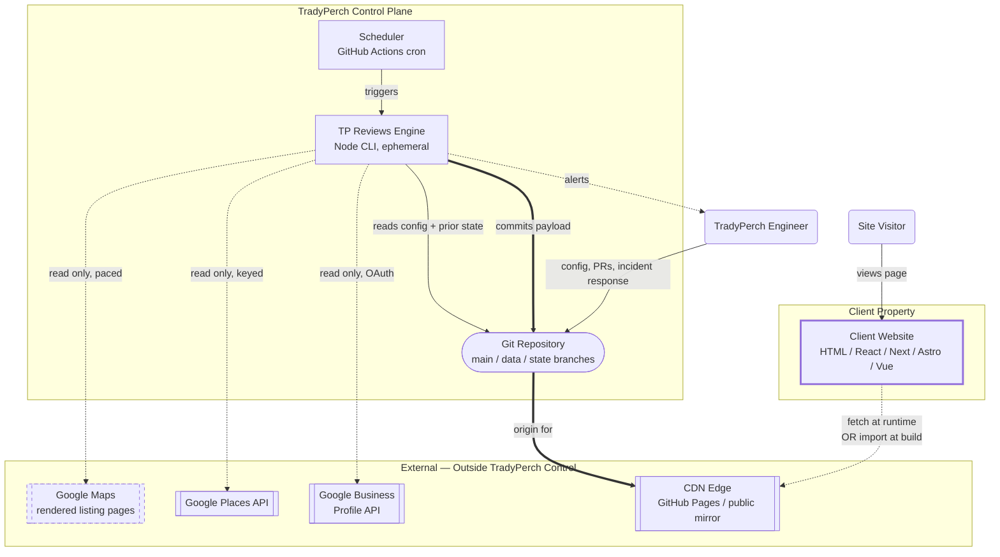
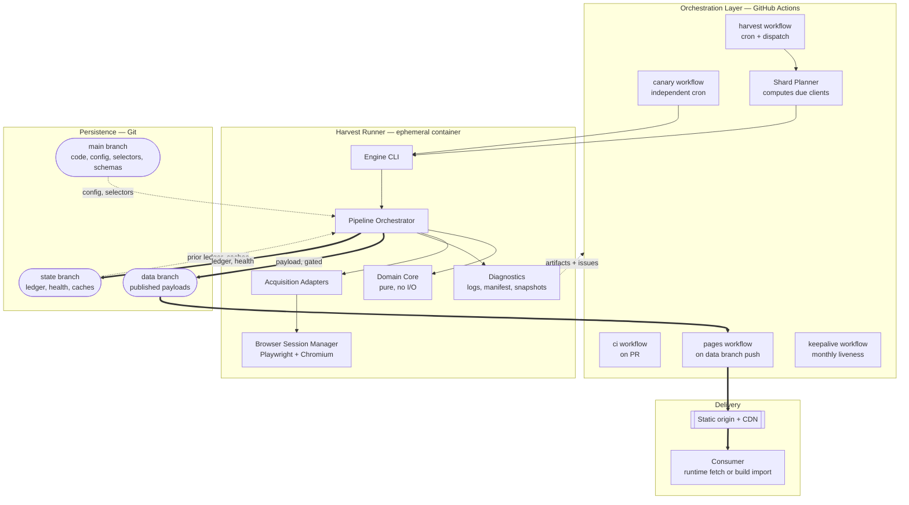
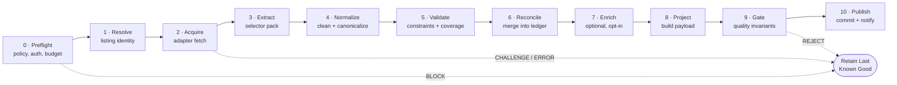
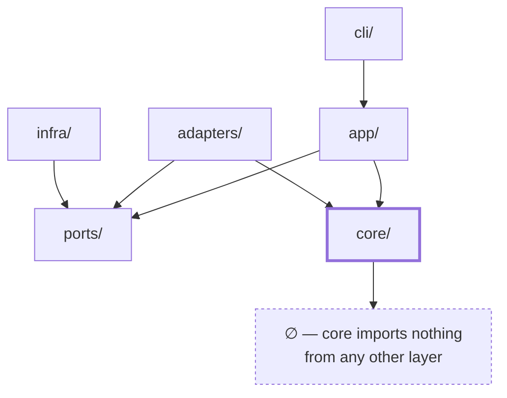
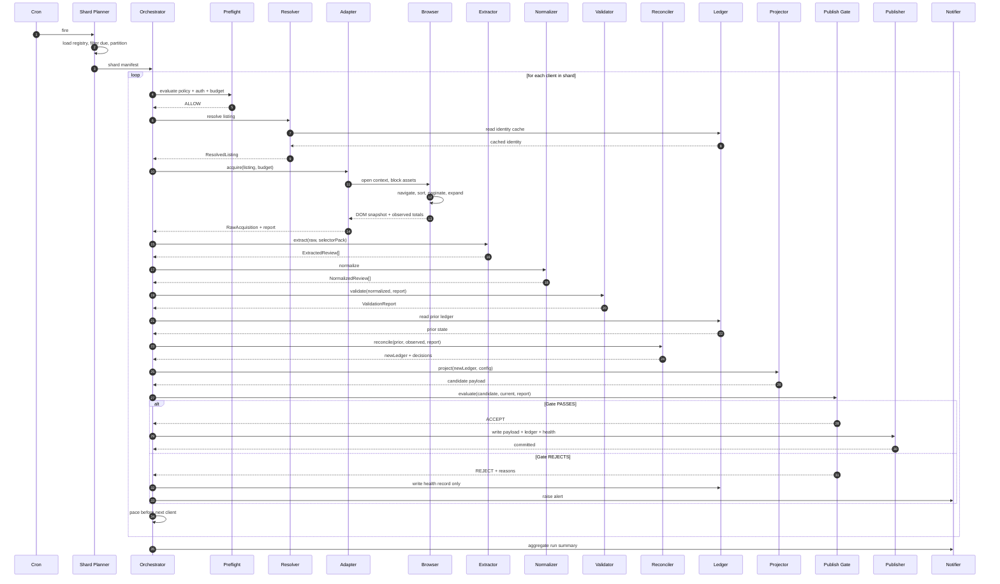
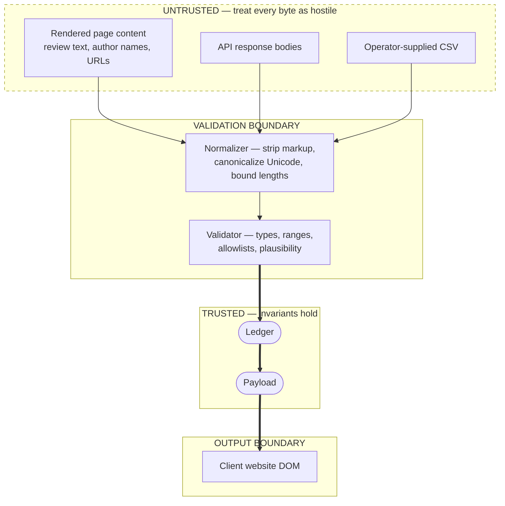
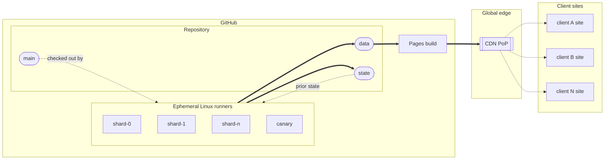
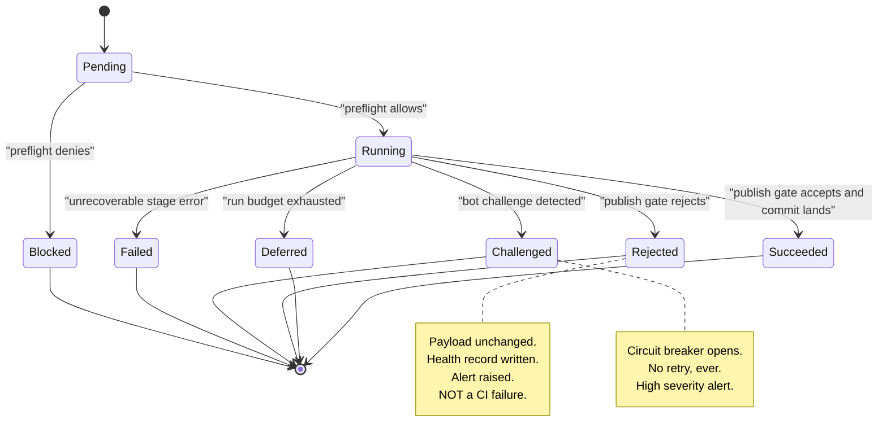

# Part 3 — Architecture

*Sections 16 through 19. Audience: architects and implementing engineers. This part is normative and implementation-ready. §17 and §18 together are intended to be sufficient for an implementer to lay out the entire codebase without further clarification.*

---

# 16. High-Level Architecture

## 16.1 Architectural Style

The system is a **scheduled, batch, hexagonal (ports-and-adapters) pipeline with immutable published output.** Four style choices define it:

| Choice | Meaning | Why |
|---|---|---|
| **Scheduled batch, not event-driven** | Work is initiated by a clock, processes a bounded set, and exits. | The source has no change feed. Polling is the only option, and polling wants batch. Batch also means every run is a clean slate, which eliminates an entire class of state-corruption bugs. |
| **Hexagonal / ports-and-adapters** | A pure domain core surrounded by interchangeable adapters for acquisition, storage, publication, and notification. | The single most volatile thing in the system (how reviews are obtained) must be swappable without touching anything else. TG-01, INV-10. |
| **Pipeline with explicit stages** | Ten named stages, each with a typed input and output, each independently testable. | Makes failure attribution trivial: every error carries the stage that produced it. Also makes the system explicable in a single diagram. |
| **Immutable, content-addressed published output** | Published artifacts are written whole, named partly by content hash, and never mutated in place. | Enables aggressive CDN caching, atomic consumer reads, trivial rollback, and integrity verification. |

**Rejected styles, for the record:**

| Style | Why Rejected |
|---|---|
| Long-running service with an internal scheduler | Requires a server → violates CON-01 and CON-08. |
| Event-driven / webhook-driven | No source emits events. Would be pure fiction. |
| Serverless functions (Lambda/Workers) per client | Reintroduces an account, quotas, cold starts, and eventually a bill. Also weaker for a headless browser workload. |
| Monolithic script with no layering | The naive choice. Dies at the first upstream change because DOM knowledge is smeared across the codebase. This is the design most implementations of this idea actually use, and it is why most of them are abandoned. |
| Microservices | Absurd at this scale. Named only to make clear it was considered and dismissed. |

## 16.2 System Context (Level 1)



**The single most important property visible in this diagram:** there is no arrow from `SITE` to any Google system. The visitor's browser and the client's server never touch a review source. That is INV-01, and it is the reason every other property of the system is achievable.

## 16.3 Container View (Level 2)



## 16.4 The Ten-Stage Pipeline

Every harvest is exactly these ten stages, in this order, for one client and one listing. **No stage may be skipped except as explicitly noted; no stage may reach forward.**



| Stage | Network? | Pure? | Can Fail Non-Fatally? | Output |
|---|---|---|---|---|
| 0 Preflight | Optional (robots) | No | No — a block is terminal for this client | `PreflightVerdict` |
| 1 Resolve | Yes (cache-first) | No | No | `ResolvedListing` |
| 2 Acquire | Yes | No | No | `RawAcquisition` + `AcquisitionReport` |
| 3 Extract | No | **Yes** | Yes — per-field fallbacks | `ExtractedReview[]` |
| 4 Normalize | No | **Yes** | Yes — per-record quarantine | `NormalizedReview[]` |
| 5 Validate | No | **Yes** | Yes — warnings vs. fatals | `ValidationReport` |
| 6 Reconcile | No | **Yes** | No | `Ledger` + `DecisionLog` |
| 7 Enrich | Optional | No | Yes — enrichment is always optional | annotations |
| 8 Project | No | **Yes** | No | `Payload` candidate |
| 9 Gate | No | **Yes** | **This is the decision point** | `GateVerdict` |
| 10 Publish | Yes | No | Yes — retry on conflict | commit + artifacts |

**Engineering Note.** Stages 3–6 and 8–9 are pure. That is six of the ten stages, including every stage where a subtle logic bug would corrupt data. Those six can be exhaustively tested offline against fixtures with zero flakiness. This partitioning is the reason TG-02 and TG-10 are achievable, and it is a deliberate design objective rather than a happy accident: **anything that can be pure, is.**

## 16.5 Dependency Rule



**Normative dependency rules, enforced by an automated architecture test in CI (§41.2):**

| Rule | Statement |
|---|---|
| DR-1 | `core/` MUST NOT import from `adapters/`, `infra/`, `app/`, `cli/`, or any third-party package other than pure utility libraries with no I/O. |
| DR-2 | `core/` MUST NOT read the clock, the filesystem, the network, the environment, or a random source. All such values are passed in. |
| DR-3 | `adapters/` MUST depend only on `ports/` interfaces and `core/` types. Adapters MUST NOT import each other. |
| DR-4 | `app/` MUST NOT import a concrete adapter directly; adapters are injected by a composition root in `cli/`. |
| DR-5 | Only `cli/` may construct concrete implementations. There is exactly one composition root. |
| DR-6 | No module may import from a deeper path than a package's public index — no reaching into internals. |

**Why this is worth enforcing mechanically.** Every one of these rules will be violated at 11 p.m. under incident pressure unless a test fails. DR-2 in particular: a single `Date.now()` inside the reconciler makes the entire reconciliation suite non-deterministic and the property tests meaningless.

## 16.6 Data Flow — End to End



## 16.7 Trust Boundaries



| Boundary | Crossing Rule |
|---|---|
| Untrusted → Validation | Nothing may bypass the Normalizer. No stage may read raw content directly. Enforced by types: only the Normalizer accepts `RawField`, and only it returns `CleanString`. |
| Validation → Trusted | Only records with no `fatal` findings cross. Quarantined records go to diagnostics, never to the Ledger. |
| Trusted → Output | The Payload is plain-text-only by construction, so the output boundary requires no further sanitisation — but the reference renderer *still* uses text-only DOM APIs, on defence-in-depth grounds (FR-072). |

## 16.8 Deployment View



| Deployment Fact | Value |
|---|---|
| Compute lifetime | Minutes. Nothing persists in the runner. |
| Number of environments | Two logical: `production` (scheduled, publishes) and `dry-run` (PR-triggered, publishes nothing). |
| Blue/green or canary deploys of the engine | Not applicable to the engine (batch, idempotent). The *canary* here is a canary **harvest**, which is a different and more useful thing (§25.5). |
| Rollback unit | A Git commit on `data` (payload rollback) or `main` (engine rollback). |
| State ownership | `state` branch is machine-owned. Humans MUST NOT hand-edit it except during documented recovery (§52). |

## 16.9 ADR-001 and ADR-003

> **ADR-001 — Full decoupling of acquisition from the consuming website**
> **Status:** Accepted
> **Context:** The obvious implementations put the source call in the website — either client-side JavaScript hitting an API, or a server-side proxy route. Both are simpler to build.
> **Decision:** The website reads a pre-built static artifact and never contacts a review source, at build time or at run time.
> **Alternatives Rejected:** *Client-side API call* — exposes a key to every visitor and every bot, burns quota on traffic, adds render-blocking latency, breaks under CORS and ad-blockers, and couples site availability to source availability. *Server-side proxy on the client's host* — requires a backend for static sites, requires per-client secret management, puts the client's own domain reputation at risk if the source rate-limits, and multiplies the number of places that can break by the number of clients. *Build-time fetch directly from the source in the client's CI* — spreads acquisition logic across N client repositories, meaning an upstream change breaks N build pipelines instead of one engine.
> **Consequences:** Enables zero-latency rendering, zero third-party origins, zero client-side secrets, and complete containment of upstream volatility. Costs: freshness is bounded by cadence, and a separate publication mechanism is required. Both accepted.

> **ADR-003 — Publish a static artifact rather than expose a runtime API in v1.0**
> **Status:** Accepted
> **Context:** A read API would be more flexible: filtering, pagination, per-consumer shaping.
> **Decision:** v1.0 publishes static JSON files. §54 designs the future API but does not build it.
> **Alternatives Rejected:** *Serverless read API* — introduces an account, cold starts, a quota, and eventually a bill (CON-01); adds an availability dependency in front of content that is currently as available as a CDN. *Database-backed API* — same, worse. *GraphQL endpoint* — solves a shaping problem that does not exist when payloads are ≤ 60 KB.
> **Consequences:** Consumers do their own filtering and pagination against a small payload, which is trivially fast in the browser. The artifact is infinitely cacheable and cannot go down independently of the CDN. When the API arrives in v3, the static artifact remains the origin of truth, so no consumer is forced to migrate.

---

# 17. Detailed Architecture

Each component below is specified with: responsibility, inputs, outputs, dependencies, error modes, and design notes. This section is the contract an implementer works from.

## 17.1 Component Inventory

| # | Component | Layer | Pure | §20 Ref |
|---|---|---|---|---|
| C-01 | CLI / Composition Root | cli | No | — |
| C-02 | Pipeline Orchestrator | app | No | §20.1 |
| C-03 | Config Loader & Validator | app | Mostly | §39 |
| C-04 | Client Registry | app | Yes | §38.2 |
| C-05 | Shard Planner | app | Yes | §37.3 |
| C-06 | Policy Preflight Gate | app | No | §15.5 |
| C-07 | Rate Limiter / Pacer | infra | No | §28 |
| C-08 | Listing Resolver (Search Module) | adapters | No | §20.2 |
| C-09 | Browser Session Manager | adapters | No | §20.3 |
| C-10 | Navigator (Navigation Module) | adapters | No | §20.3 |
| C-11 | Selector Pack Loader & Strategy Resolver | core | Yes | §20.4 |
| C-12 | Extractor (Review Parser) | core | Yes | §20.5 |
| C-13 | Normalizer (Data Cleaner) | core | Yes | §20.6 |
| C-14 | Date Resolver | core | Yes | §20.5.4 |
| C-15 | Language Detector | core | Yes | §20.6.5 |
| C-16 | Identity & Hash Service | core | Yes | §21.4 |
| C-17 | Validator | core | Yes | §20.6.7 |
| C-18 | Reconciler | core | Yes | §20.7 |
| C-19 | Ledger Store | adapters | No | §20.11 |
| C-20 | Enricher | app | No | §59 |
| C-21 | Projector (Exporter) | core | Yes | §20.8 |
| C-22 | Publish Gate | core | Yes | §27.3 |
| C-23 | Publisher | adapters | No | §20.8.4 |
| C-24 | Logger | infra | No | §24 |
| C-25 | Metrics & Health Recorder | infra | No | §25 |
| C-26 | Notifier | adapters | No | §25.6 |
| C-27 | Retry Manager | infra | Yes (policy) | §26 |
| C-28 | Circuit Breaker | infra | No | §26.5 |
| C-29 | Diagnostics / Snapshot Capture | infra | No | §24.6 |
| C-30 | Clock & Random Providers | infra | No | DR-2 |

## 17.2 C-01 · CLI / Composition Root

| Aspect | Specification |
|---|---|
| **Responsibility** | Parse arguments, read environment, construct concrete adapters, inject them into the orchestrator, map the result to an exit code. **This is the only place in the codebase where concrete implementations are named.** |
| **Commands** | `harvest`, `resolve`, `validate-config`, `canary`, `replay`, `project`, `export`, `doctor`, `plan` |
| **Key flags** | `--client <slug>`, `--all`, `--shard i/n`, `--listing <id>`, `--adapter <id>`, `--dry-run`, `--no-publish`, `--force`, `--from-fixture <path>`, `--log-level`, `--output json|text`, `--budget-ms`, `--max-reviews` |
| **Exit codes** | `0` success; `1` unexpected internal error; `2` invalid usage/config; `3` all clients failed; `4` partial failure (some clients failed); `5` gate rejection (no publish, no crash); `6` policy blocked; `7` bot challenge encountered |
| **Design note** | Distinct exit codes matter because the workflow uses them to decide alerting severity without parsing logs. Code `5` and `6` are *not* failures in the CI sense and must not turn a shard red — they must produce a warning annotation and an alert. |
| **Error modes** | Unknown command → 2. Missing required secret for a selected adapter → 2 (fail closed). Uncaught exception → 1 with full stack in the log, never in stdout JSON. |

## 17.3 C-02 · Pipeline Orchestrator

| Aspect | Specification |
|---|---|
| **Responsibility** | Execute the ten stages for a list of (client, listing) pairs, enforcing budgets, pacing, isolation, and diagnostics. Owns *sequencing and policy*, owns *no domain logic*. |
| **Inputs** | `OrchestratorRequest { targets, config, adapters, ports, budgets, runId, mode }` |
| **Outputs** | `RunResult { perTarget: TargetOutcome[], summary, manifest }` |
| **Isolation guarantee** | Each target runs inside its own error envelope. A thrown error, a timeout, or a process-level warning from one target MUST NOT propagate to another (INV-09). Implementation: per-target try/catch plus a fresh browser context per target plus a per-target working directory. |
| **Budget enforcement** | Two budgets: per-target wall clock (default 300 s) and per-run wall clock (default 15 min). On per-target expiry, abort that target with `ERR-BUDGET-TARGET`. On per-run expiry, finish the current target, skip the rest, mark them `deferred` (not failed), and exit `4`. |
| **Pacing** | Between targets, sleep for the configured inter-target delay plus jitter (§28.4). |
| **Ordering** | Targets are processed in a deterministic order derived from a hash of `runId + slug`, so the same client is not always first — a client that is always first would always absorb any per-run warm-up anomaly. |
| **Error modes** | Any stage error is caught, classified (§23), recorded, and converted into a `TargetOutcome` with `status: failed|blocked|rejected|deferred|succeeded`. The orchestrator itself never throws to the CLI except on genuinely unrecoverable internal invariant violations. |

### 17.3.1 Target Outcome State Machine



## 17.4 C-03 · Config Loader & Validator, C-04 · Client Registry, C-05 · Shard Planner

| Component | Responsibility | Notes |
|---|---|---|
| **C-03 Config Loader** | Discover config files, apply the six-layer precedence chain, resolve `$ref`-style profile inheritance, validate against JSON Schema, and produce a frozen, fully-resolved `EffectiveConfig` per client. Emits a resolution trace showing which layer supplied each value. | The resolution trace is not a luxury. "Why did this client use a 3-minute timeout?" is a question that gets asked during incidents, and answering it by reading four files is unacceptable. Full spec in §39. |
| **C-04 Client Registry** | Enumerate clients, filter by `enabled`, expand listings into targets, and compute the due set from cadence tier and last-success time. Pure function of (registry, now, health). | Being pure makes "which clients are due?" testable and makes `plan` a dry-runnable command. |
| **C-05 Shard Planner** | Partition the due set into `n` shards balanced by *estimated cost*, not by count. Estimated cost = f(adapter, historical p50 duration, review count). | Balancing by count puts three 2,000-review listings in one shard. Balancing by historical duration is the only approach that keeps shard durations even. Falls back to count when history is absent. |

## 17.5 C-06 · Policy Preflight Gate

| Aspect | Specification |
|---|---|
| **Responsibility** | Decide, before any acquisition, whether this target may proceed. |
| **Checks, in order (fail fast)** | 1. Global kill switch (`policy.global_enabled`). 2. Per-source enable flag. 3. Client `enabled`. 4. Authorisation record completeness (FR-086) — only for `dom` access method. 5. Robots-directive evaluation for the target path, per configured mode `block|warn|ignore`. 6. Rate-limit budget availability for the source. 7. Circuit-breaker state for the source. |
| **Output** | `PreflightVerdict { allow: boolean, reasons: PolicyReason[], recordedAt }` — always recorded in the run manifest, whether allow or deny, so the decision is auditable after the fact. |
| **Error modes** | Robots fetch failure → treated as `unknown`; behaviour per mode (`block` denies, `warn`/`ignore` proceed with a recorded note). Never fails the run silently. |
| **Design note** | The verdict is recorded even on `allow`. An audit trail that only records denials proves nothing. |

## 17.6 C-07 · Rate Limiter / Pacer

| Aspect | Specification |
|---|---|
| **Responsibility** | Enforce a global-per-source request budget and inter-request spacing across an ephemeral, distributed set of runners. |
| **Mechanism** | Token bucket with the counter **persisted to the `state` branch** per source per UTC hour and per UTC day. Because runners are ephemeral and may run concurrently, the persisted counter is advisory and eventually consistent; the design compensates by setting budgets an order of magnitude below any plausible threshold, so a race that double-spends a few tokens is harmless. |
| **Hard ceiling** | A compile-time constant caps requests per source per hour regardless of configuration (FR-089). Configuration may lower it, never raise it. |
| **Spacing** | Minimum inter-request delay with full jitter within a configured window, applied inside the Navigator between page interactions as well as between targets. |
| **Error modes** | Budget exhausted → preflight denies with `ERR-POLICY-BUDGET`; not an error, a deferral. Persisted counter unreadable → assume worst case (budget consumed) and defer. **Fail closed.** |
| **Design note** | Distributed rate limiting without a central store is genuinely unsolvable in the strict sense. The engineering answer is not a clever algorithm; it is to operate so far below any limit that precision is unnecessary. §28.2 quantifies this. |

## 17.7 C-08 · Listing Resolver

| Aspect | Specification |
|---|---|
| **Responsibility** | Turn whatever identity the operator supplied into a canonical, verified, cached listing identity plus advertised aggregates. |
| **Input forms accepted** | Place ID, CID, full Maps URL, `{ name, locality, country }` search tuple. |
| **Resolution order** | Explicit identifier → cached identity → URL parse → search (with a loud warning). |
| **Verification** | The resolved page's business name is compared to the configured expected name using a normalised similarity measure. Below threshold → `ERR-IDENTITY-DRIFT`, abort. This catches the "business renamed / listing merged / wrong branch" class of silent corruption. |
| **Outputs** | `ResolvedListing { canonicalId, canonicalUrl, displayName, advertisedTotal, advertisedRating, resolvedVia, verifiedAt }` |
| **Caching** | Persisted to `state`; TTL 30 days; re-verified every run (cheap) but re-resolved only on TTL expiry or drift. |
| **Error modes** | Ambiguous match → `ERR-RESOLVE-AMBIGUOUS`, abort (FR-014, never guess). Not found → `ERR-RESOLVE-NOTFOUND`. |

## 17.8 C-09 · Browser Session Manager

| Aspect | Specification |
|---|---|
| **Responsibility** | Own the lifecycle of the browser, contexts, and pages. Nothing else in the system may touch the browser API. |
| **Lifecycle** | One browser process per shard job (reused across targets — expensive to start). **One fresh context per target** (cheap, and provides isolation). One page per context. Contexts are always closed, in a `finally`, even on abort. |
| **Context configuration** | Realistic viewport; explicit locale and timezone from client config; `reducedMotion: reduce`; no persistent storage; no service workers; no permissions granted; no geolocation. |
| **Resource blocking** | Route interception blocks images, media, fonts, stylesheets not needed for layout-dependent extraction, and any request to hosts outside a configured allowlist. Blocking is measured and reported (bytes saved) so regressions are visible. |
| **Timeouts** | Distinct budgets for: browser launch, context creation, navigation, selector wait, interaction, and total. No default-infinite timeout anywhere (NFR-016). |
| **Instrumentation** | Console messages, page errors, failed requests, and response statuses are collected into the run log at `debug` level, and into diagnostics on failure. |
| **Error modes** | Launch failure → `ERR-BROWSER-LAUNCH` (retryable once). Context crash → `ERR-BROWSER-CRASH` (retryable once, then abort). OOM → `ERR-BROWSER-OOM` (not retryable; reduce `max_reviews`). |
| **Design note** | Reusing the browser but not the context is the correct trade-off: browser launch dominates cost (~1–2 s), context creation is milliseconds, and per-target isolation is worth far more than the milliseconds. |

## 17.9 C-10 · Navigator

| Aspect | Specification |
|---|---|
| **Responsibility** | Drive the page from "opened" to "all target review content present in the DOM". Knows about *interaction sequences*; knows nothing about *field locations* (that is C-11/C-12). |
| **Phases** | (a) navigate to canonical URL; (b) dismiss consent/interstitial if a known-benign dismissible element exists; (c) locate and open the reviews surface; (d) set sort order to newest where available; (e) paginate by scrolling the review container until a stop condition; (f) expand truncated texts within the interaction budget; (g) hand off the DOM. |
| **Stop conditions for pagination** | `exhausted` (no new records after k attempts), `target_reached` (advertised total met), `cap_reached` (`max_reviews`), `stalled` (no growth within a time window), `budget_exhausted`, `error`. **The stop reason is a first-class output and feeds directly into harvest completeness classification.** |
| **Stall detection** | Track record count after each scroll. If count is unchanged for `stall_threshold` consecutive attempts (default 3) with backoff between them, declare `stalled`. |
| **Expansion budget** | Expanding truncated text requires one interaction per review. Budget = `min(expand_max, remaining_time / expected_interaction_ms)`. Reviews left unexpanded are flagged `text_truncated: true` rather than silently stored short. |
| **Error modes** | `ERR-NAV-TIMEOUT`, `ERR-NAV-CONSENT-WALL`, `ERR-NAV-SURFACE-NOT-FOUND`, `ERR-BLOCKED-CHALLENGE` (terminal). |
| **Design note** | The distinction between `exhausted` and `stalled` is the single most important signal the Navigator produces. `exhausted` with count ≈ advertised total means a complete harvest. `stalled` at 12 of 118 means the harvest is a lie. §27.3 depends entirely on getting this right. |

## 17.10 C-11 · Selector Pack Loader & Strategy Resolver

| Aspect | Specification |
|---|---|
| **Responsibility** | Load a versioned, declarative description of where fields live, and resolve each field by trying ordered strategies until one succeeds. |
| **Pack contents** | For each logical field: an ordered list of strategies, each with a kind (`role`, `aria-label`, `data-attribute`, `text-pattern`, `structural-relative`, `css`), a locator expression, an optional post-extraction transform reference, and a confidence weight. Also: container selectors, pagination affordances, expansion affordances, and structural assertions used by the canary. |
| **Outputs** | Field value plus `resolvedByStrategy` and `strategyIndex`. |
| **Health signal** | If a field resolves via strategy index > 0 (a fallback), that is recorded and aggregated into a `selector_health` score. **A silent drop from strategy 0 to strategy 2 across all reviews is the earliest possible warning of upstream change** — earlier than a yield drop, because it fires while extraction still works. |
| **Error modes** | All strategies fail for a required field → `ERR-PARSE-FIELD-REQUIRED` for that record (quarantine, not abort). All strategies fail for the container → `ERR-PARSE-STRUCTURE` (abort target). |
| **Design note** | Strategy ordering is deliberate: semantic and accessibility-derived locators first, because they are tied to user-facing meaning and change far less often than generated class names; generated CSS selectors last, as a desperate fallback with a low confidence weight. ADR-009 has the full rationale. |

## 17.11 C-12 through C-18 · Core Domain Components

These are specified in full detail in §20.5–§20.7 and §21.4. Summarised here for the inventory.

| Component | One-Line Contract |
|---|---|
| **C-12 Extractor** | `(rawDom, selectorPack, listingContext) → ExtractedReview[]` — locates and lifts raw field strings; performs no cleaning. |
| **C-13 Normalizer** | `ExtractedReview → NormalizedReview \| Quarantined` — cleans, canonicalises, bounds, and types every field. |
| **C-14 Date Resolver** | `(relativeText, observedAt, locale) → { resolved, precision, confidence }` — never re-resolves an already-pinned date. |
| **C-15 Language Detector** | `text → { code, confidence }` — heuristic, script-range plus stopword based; no network, no large model. |
| **C-16 Identity & Hash** | `NormalizedReview → { identityHash, contentHash, authorKey }` — deterministic, versioned, cross-adapter stable. |
| **C-17 Validator** | `(NormalizedReview[], AcquisitionReport, config) → ValidationReport` — per-record findings plus aggregate findings plus completeness classification. |
| **C-18 Reconciler** | `(priorLedger, observed, report, config, now) → { ledger, decisions }` — pure, idempotent, monotonic. |

## 17.12 C-19 · Ledger Store

| Aspect | Specification |
|---|---|
| **Responsibility** | Persist and retrieve internal state: ledgers, identity caches, rate budgets, health series, circuit-breaker state. |
| **Interface (port)** | `readLedger(clientSlug, listingKey)`, `writeLedger(...)`, `readCache(key)`, `writeCache(key, value, ttl)`, `appendHealth(record)`, `readHealth(slug, window)` |
| **v1.0 implementation** | Filesystem-backed, rooted at a checkout of the `state` branch, committed at end of run. |
| **Atomicity** | Write-to-temp-then-rename per file. Commit-per-run at the branch level. If the commit fails after files are written, the next run reads the previous state and re-derives — safe because reconciliation is idempotent (INV-04). |
| **Concurrency** | Concurrent shards write disjoint client paths, so file-level conflict is impossible by construction. Branch-level push conflicts are resolved by rebase-and-retry (§20.8.4). |
| **Error modes** | Missing ledger → treated as empty (first run), not an error. Corrupt ledger → `ERR-STATE-CORRUPT`, abort target, alert; recovery per §52.4. |
| **Design note** | Ledgers are stored **pretty-printed with stable key ordering**, not minified. They are diffed by humans during incidents, and a readable diff is worth more than the bytes saved. The opposite choice is made for payloads (§33.3). |

## 17.13 C-21 · Projector and C-22 · Publish Gate

| Component | Specification |
|---|---|
| **C-21 Projector** | Pure projection from Ledger to public artifacts. Applies: suppression list, display filters (ordering, min length, language), field selection per `schema_version`, top-N slicing, aggregate computation, and schema.org projection. Emits `reviews.json`, `latest.json`, `stats.json`, optional `schema-org.json`, and a per-listing `index.json`. Deterministic: same ledger + same config ⇒ byte-identical output. |
| **C-22 Publish Gate** | Pure evaluation of a candidate payload against the current published payload and the validation report. Produces `ACCEPT`, `ACCEPT_WITH_WARNINGS`, or `REJECT` plus itemised reasons. Full rule set in §27.3. The gate is the last line of defence for INV-02 and is deliberately pure so it can be tested exhaustively with synthetic payload pairs. |

## 17.14 C-23 · Publisher

| Aspect | Specification |
|---|---|
| **Responsibility** | Write accepted artifacts durably and make them visible to consumers. |
| **Interface (port)** | `publish(artifacts, meta) → PublishResult` |
| **v1.0 implementation** | Git: stage files on the `data` branch checkout, skip if content-identical (FR-065), commit with a structured message, push with rebase-and-retry on non-fast-forward, up to 3 attempts with backoff. |
| **Commit message format** | `data(<slug>/<listing>): +<inserts> ~<updates> -<removals> n=<total> r=<rating> [run:<id>]` — machine-parseable, human-readable, and greppable during incident review. |
| **Atomicity for consumers** | Consumers read the manifest first, which references content-addressed files. Because a commit is atomic and the manifest is updated in the same commit, a consumer never sees a manifest pointing at a file that does not exist. |
| **Error modes** | Push rejected after retries → `ERR-PUBLISH-CONFLICT`; artifacts retained as CI artifacts so the next run reproduces them. Auth failure → `ERR-PUBLISH-AUTH`, high severity. |
| **Alternative implementations (designed, not built)** | Filesystem publisher (local dev), object-storage publisher (v3), API publisher (v3). All satisfy the same port. |

## 17.15 C-24 through C-29 · Cross-Cutting Components

| Component | Key Points |
|---|---|
| **C-24 Logger** | Structured JSONL, one event per line, mandatory fields `ts, level, runId, clientSlug, listingKey, stage, event, durationMs, errorClass`. Redaction filter applied at the sink, not the call site, so a careless log call cannot leak. §24. |
| **C-25 Metrics & Health Recorder** | Appends one health record per target per run to a per-client JSONL series on the `state` branch. Computes derived signals (yield delta, coverage, duration percentile). Zero external dependencies — the "monitoring system" is a set of append-only files plus a summarising job. §25. |
| **C-26 Notifier** | Port with two implementations: GitHub Issues (primary, free, deduplicated by a stable fingerprint in the title) and generic webhook (optional). Severity → channel mapping in §25.6. |
| **C-27 Retry Manager** | Policy-as-data: per error class, a retry decision (`never`, `immediate`, `backoff`), max attempts, base delay, multiplier, jitter, and a cap. Pure policy function; the executing wrapper is thin. §26. |
| **C-28 Circuit Breaker** | Per-source state machine persisted to `state`: `closed → open → half-open`. Opens on a challenge (immediately) or on a failure-rate threshold. §26.5. |
| **C-29 Diagnostics** | On any target failure: capture sanitised HTML, a screenshot, the last 200 log events, the acquisition report, and the effective config (secrets stripped). Bundle into a per-target artifact directory. This bundle is what makes UC-11 a 10-minute job instead of a 2-hour one. §24.6. |

## 17.16 Interface Contracts — Port Summary

| Port | Methods | v1.0 Implementations |
|---|---|---|
| `AcquisitionAdapter` | `capabilities()`, `resolve(listingSpec, ctx)`, `acquire(resolved, budget, ctx)` | `google-dom`, `google-places-api`, `google-business-profile-api`, `file-csv` |
| `StatePort` | `readLedger`, `writeLedger`, `readCache`, `writeCache`, `appendHealth`, `readHealth` | `git-state` |
| `PublisherPort` | `publish`, `readCurrent` | `git-data`, `filesystem` |
| `NotifierPort` | `raise`, `resolve`, `digest` | `github-issues`, `webhook`, `console` |
| `BrowserPort` | `launch`, `newContext`, `close` | `playwright-chromium` |
| `ClockPort` | `now`, `sleep` | `system`, `fixed` (tests) |
| `RandomPort` | `jitter`, `uuid` | `system`, `seeded` (tests) |
| `LoggerPort` | `event`, `child`, `flush` | `jsonl`, `pretty`, `memory` (tests) |

**Design note.** `ClockPort` and `RandomPort` exist solely to make DR-2 enforceable. They look like over-engineering until the first time a property test fails intermittently at 2 a.m.

## 17.17 ADR-002 — The Adapter Matrix

> **ADR-002 — Model acquisition as a (Source × Access Method) adapter matrix**
> **Status:** Accepted
> **Context:** The naive design is a `GoogleReviewScraper` class. It works until the day it does not, and then every downstream module turns out to depend on Google-shaped data.
> **Decision:** Acquisition is modelled as a matrix of **source** (`google`, later `facebook`, `trustpilot`, …) × **access method** (`dom`, `official-api`, `file`, `manual`). Each cell that exists is an adapter implementing one interface and declaring its capabilities. Everything above the adapter layer consumes `ExtractedReview` and knows nothing of either dimension.
> **Alternatives Rejected:** *Single scraper class* — couples the whole system to one volatile mechanism; migration becomes a rewrite. *Source-only abstraction* (`GoogleAdapter` handling all access methods internally) — hides the most important operational distinction, since `dom` and `official-api` differ enormously in reliability, legality, capability, and failure modes; conflating them makes per-client method selection impossible. *Plugin system with dynamic loading* — unnecessary indirection for a set of adapters that ship in the same repository, and it defeats static analysis.
> **Consequences:** Four adapters must be built for v1.0 rather than one (+20–25% effort, per ADR-023). In exchange: per-client method selection (§15.3.2), a tested migration path (S7), a capability model validated by genuinely different sources, and the ability to add a source in v2 without touching the core. The capability declaration (FR-020) is what makes heterogeneous adapters safe — downstream stages adjust expectations rather than assuming every adapter returns everything.

---

# 18. Folder Structure

The layout below is normative. Every directory and every file has a stated purpose. An implementer should create exactly this tree.

## 18.1 Repository Root — `main` Branch

```
tp-reviews-engine/
├── .github/
├── bin/
├── src/
├── selectors/
├── schemas/
├── clients/
├── profiles/
├── compliance/
├── fixtures/
├── tests/
├── frontend/
├── scripts/
├── docs/
├── .editorconfig
├── .gitattributes
├── .gitignore
├── .nvmrc
├── eslint.config.mjs
├── prettier.config.mjs
├── vitest.config.mjs
├── package.json
├── package-lock.json
├── CHANGELOG.md
├── CODE_OF_CONDUCT.md
├── CONTRIBUTING.md
├── LICENSE
├── README.md
└── SECURITY.md
```

## 18.2 `.github/` — Automation and Governance

| Path | Purpose |
|---|---|
| `.github/workflows/harvest.yml` | The production pipeline. Cron-scheduled plus manual dispatch. Plans shards, runs them as a matrix, publishes, alerts. §22.2 |
| `.github/workflows/canary.yml` | Independent schedule. Harvests a fixed reference listing and runs structural assertions. Detects upstream change before clients are affected. §25.5 |
| `.github/workflows/ci.yml` | On pull request and push to `main`: lint, type-check, unit, property, contract, fixture-regression, architecture-rule tests, size budgets, schema validation, secret scan, dependency audit. |
| `.github/workflows/validate-config.yml` | On changes under `clients/` or `profiles/`: schema-validate every client config, verify authorisation records, and perform a network-free dry-run projection. Posts a summary comment on the PR. |
| `.github/workflows/pages.yml` | On push to `data`: build and deploy the static origin. |
| `.github/workflows/keepalive.yml` | Monthly. Performs a trivial repository activity and asserts that scheduled workflows are still enabled. Mitigates RISK-17. |
| `.github/workflows/release.yml` | On tag: verify, generate release notes from Conventional Commits, publish the release. §43 |
| `.github/workflows/dependency-audit.yml` | Weekly. Audits dependencies and opens an issue on new high-severity advisories. |
| `.github/actions/setup-engine/action.yml` | Composite action: set up Node, restore dependency cache, restore Playwright browser cache, install browsers if the cache missed, print a versions banner. Used by every workflow so setup logic exists once. |
| `.github/ISSUE_TEMPLATE/incident.yml` | Structured incident report: symptom, affected clients, error class, run link, suspected cause. |
| `.github/ISSUE_TEMPLATE/selector-break.yml` | Specialised template for the most common incident, with a checklist that mirrors §51.3. |
| `.github/ISSUE_TEMPLATE/client-onboarding.yml` | The §15.10 compliance checklist as an issue template, so authorisation is tracked, not assumed. |
| `.github/pull_request_template.md` | Includes the NTG-05 checklist item: "documentation or ADR updated". |
| `.github/CODEOWNERS` | Requires review for `src/core/`, `schemas/`, `selectors/`, and `compliance/`. |
| `.github/dependabot.yml` | Dependency and action-SHA updates, grouped, weekly, with a manual-review requirement (never auto-merged into production browser pins). |

## 18.3 `bin/` and `src/` — The Engine

```
bin/
└── tpre.mjs                     Executable entry point. Thin shebang wrapper → src/cli.

src/
├── cli/
│   ├── index.mjs                Command registry and argument parsing.
│   ├── composition.mjs          THE composition root. Builds concrete adapters. (DR-5)
│   ├── exit-codes.mjs           Canonical exit code constants. (§17.2)
│   └── commands/
│       ├── harvest.mjs          Full pipeline for selected targets.
│       ├── resolve.mjs          Resolve a listing identity and print it. Onboarding aid.
│       ├── validate-config.mjs  Schema + semantic validation of client configs.
│       ├── canary.mjs           Structural assertions against the reference listing.
│       ├── replay.mjs           Re-run stages 3–10 from a stored raw artifact. (FR-085)
│       ├── project.mjs          Rebuild payloads from the ledger with no acquisition.
│       ├── export.mjs           Full client data export. (FR-093)
│       ├── plan.mjs             Print the due set and shard assignment. No side effects.
│       └── doctor.mjs           Environment diagnostics: versions, caches, connectivity.
│
├── app/                         Orchestration. Impure, but domain-logic-free.
│   ├── orchestrator.mjs         The ten-stage loop. (C-02)
│   ├── target-runner.mjs        Single-target execution envelope + isolation. (§17.3)
│   ├── preflight.mjs            Policy gate. (C-06)
│   ├── registry.mjs             Client enumeration and due-set computation. (C-04)
│   ├── shard-planner.mjs        Cost-balanced partitioning. (C-05)
│   ├── config/
│   │   ├── loader.mjs           Layered resolution + trace. (C-03)
│   │   ├── defaults.mjs         Code-level defaults — the lowest precedence layer.
│   │   └── migrate.mjs          config_version migrations. (FR-005)
│   ├── enrich/
│   │   ├── index.mjs            Optional enrichment stage dispatcher. (C-20)
│   │   └── noop.mjs             v1.0 default: does nothing, deterministically.
│   └── run-manifest.mjs         Assembles the per-run manifest. (FR-077)
│
├── core/                        PURE. No I/O, no clock, no env, no randomness. (DR-1, DR-2)
│   ├── index.mjs                Public surface of the core.
│   ├── model/
│   │   ├── review.mjs           ExtractedReview, NormalizedReview, LedgerReview types.
│   │   ├── ledger.mjs           Ledger shape, invariants, and constructors.
│   │   ├── payload.mjs          Public payload shape per schema_version.
│   │   ├── report.mjs           AcquisitionReport, ValidationReport, DecisionLog.
│   │   ├── capabilities.mjs     Adapter capability descriptor. (FR-020)
│   │   └── errors.mjs           Error class taxonomy constants. (§23)
│   ├── selectors/
│   │   ├── loader.mjs           Parse and validate a selector pack. (C-11)
│   │   └── resolver.mjs         Ordered strategy resolution + health reporting.
│   ├── extract/
│   │   ├── index.mjs            Orchestrates field extraction per review node. (C-12)
│   │   ├── rating.mjs           Numeric / star-count / aria-label rating parsing.
│   │   ├── author.mjs           Display name, profile URL, avatar URL, guide flag.
│   │   ├── text.mjs             Review body, truncation detection.
│   │   ├── reply.mjs            Owner reply isolation. (FR-033)
│   │   └── meta.mjs             Likes, photos count, visit metadata where present.
│   ├── normalize/
│   │   ├── index.mjs            Normalization pipeline per record. (C-13)
│   │   ├── unicode.mjs          NFC, control/zero-width stripping, grapheme-safe cuts.
│   │   ├── whitespace.mjs       Collapse, trim, newline canonicalization.
│   │   ├── markup.mjs           Entity decoding + total markup removal. (FR-038)
│   │   └── url.mjs              URL validation against host allowlists. (FR-044)
│   ├── dates/
│   │   ├── relative.mjs         Locale-aware relative-phrase parsing. (C-14)
│   │   ├── precision.mjs        Precision and confidence modelling.
│   │   └── pin.mjs              First-observation pinning rules. (FR-036)
│   ├── lang/
│   │   └── detect.mjs           Script-range + stopword language detection. (C-15)
│   ├── identity/
│   │   ├── author-key.mjs       Normalized author key derivation. (FR-043)
│   │   ├── identity-hash.mjs    Stable cross-adapter identity. (ADR-007)
│   │   └── content-hash.mjs     Change-detection hash.
│   ├── validate/
│   │   ├── record.mjs           Per-record constraint validation. (C-17)
│   │   ├── aggregate.mjs        Plausibility, distribution, duplicate detection.
│   │   └── completeness.mjs     full | partial | failed classification. (FR-046)
│   ├── reconcile/
│   │   ├── index.mjs            The merge function. Pure, idempotent. (C-18)
│   │   ├── decide.mjs           INSERT / UPDATE / UNCHANGED / MISSING classification.
│   │   ├── removal.mjs          Confidence-gated removal + tombstones. (FR-055)
│   │   └── suppress.mjs         Denylist application. (FR-057)
│   ├── project/
│   │   ├── payload.mjs          Ledger → public payload. (C-21)
│   │   ├── latest.mjs           Top-N projection.
│   │   ├── stats.mjs            Aggregates: count, mean, distribution, newest.
│   │   └── schema-org.mjs       Structured-data projection. (FR-068)
│   ├── gate/
│   │   ├── index.mjs            Publish Gate evaluation. (C-22)
│   │   └── rules.mjs            Rule set as data, each independently testable. (§27.3)
│   └── util/
│       ├── result.mjs           Explicit Result/Either type — errors as values in core.
│       ├── hash.mjs             Canonical serialization + digest helpers.
│       └── similarity.mjs       Normalized string similarity for identity and drift.
│
├── ports/                       Interface definitions only. No implementations.
│   ├── acquisition.mjs
│   ├── state.mjs
│   ├── publisher.mjs
│   ├── notifier.mjs
│   ├── browser.mjs
│   ├── clock.mjs
│   ├── random.mjs
│   └── logger.mjs
│
├── adapters/
│   ├── acquisition/
│   │   ├── google-dom/
│   │   │   ├── index.mjs            Adapter entry; declares capabilities.
│   │   │   ├── resolver.mjs         Listing resolution via URL/CID/search. (C-08)
│   │   │   ├── navigator.mjs        Navigation, pagination, expansion. (C-10)
│   │   │   ├── consent.mjs          Benign, dismissible interstitial handling only.
│   │   │   ├── challenge-detect.mjs Bot-challenge classification. TERMINAL. (INV-07)
│   │   │   └── dom-serialize.mjs    Extract the review subtree for the pure Extractor.
│   │   ├── google-places-api/
│   │   │   ├── index.mjs            Adapter entry; declares reduced capabilities.
│   │   │   ├── client.mjs           HTTP client, quota accounting, error mapping.
│   │   │   └── map.mjs              API response → ExtractedReview.
│   │   ├── google-business-profile-api/
│   │   │   ├── index.mjs            Adapter entry; full capabilities.
│   │   │   ├── auth.mjs             OAuth refresh-token exchange. Secrets only.
│   │   │   ├── client.mjs           Paginated review listing.
│   │   │   └── map.mjs              API response → ExtractedReview.
│   │   └── file-csv/
│   │       ├── index.mjs            Adapter entry; manual/imported source.
│   │       ├── parse.mjs            Column contract parsing, per-row error isolation.
│   │       └── COLUMNS.md          The documented column contract. (FR-027)
│   ├── browser/
│   │   └── playwright-chromium.mjs  The only file permitted to import playwright. (C-09)
│   ├── state/
│   │   └── git-state.mjs            Ledger, caches, health on the state branch. (C-19)
│   ├── publisher/
│   │   ├── git-data.mjs             Commit payloads to the data branch. (C-23)
│   │   └── filesystem.mjs           Local development publisher.
│   └── notifier/
│       ├── github-issues.mjs        Primary alert channel, deduplicated. (ADR-021)
│       ├── webhook.mjs              Optional secondary channel.
│       └── console.mjs              Local development channel.
│
└── infra/
    ├── logger/
    │   ├── jsonl.mjs               Structured sink. (C-24)
    │   ├── redact.mjs              Sink-level redaction. (FR-076)
    │   └── pretty.mjs              Human-readable local sink.
    ├── health/
    │   └── recorder.mjs            Health series append + derived signals. (C-25)
    ├── retry/
    │   ├── policy.mjs              Retry policy as data. (C-27)
    │   └── execute.mjs             Thin executor around the policy.
    ├── breaker/
    │   └── circuit.mjs             Persisted circuit-breaker state machine. (C-28)
    ├── limiter/
    │   └── token-bucket.mjs        Persisted, advisory rate budget. (C-07)
    ├── diagnostics/
    │   ├── snapshot.mjs            Sanitised HTML + screenshot capture. (C-29)
    │   └── bundle.mjs              Assemble the per-target diagnostic bundle.
    ├── clock.mjs                   System clock implementation. (C-30)
    ├── random.mjs                  System randomness + jitter.
    ├── fs-atomic.mjs               Write-temp-then-rename helper.
    ├── git.mjs                     Minimal Git operations: checkout, commit, push-retry.
    └── http.mjs                    Fetch wrapper: timeouts, retries, no redirect surprises.
```

## 18.4 `selectors/` — The Volatile Knowledge, Isolated

```
selectors/
├── README.md                    How to author, test, and version a pack. Read this first.
├── google-maps/
│   ├── v1.json                  Historical. Retained for fixture regression.
│   ├── v2.json                  Historical.
│   ├── v3.json                  CURRENT. Referenced by profiles/default.
│   └── assertions.json          Structural assertions used by the canary. (§25.5)
└── schema/
    └── selector-pack.schema.json  JSON Schema every pack must validate against.
```

| Design point | Rationale |
|---|---|
| Packs are versioned files, never edited in place | A pack change is the highest-risk change in the system. Immutable versions make rollback a one-line config edit and make "which pack produced this payload?" answerable (INV-06). |
| Old packs are retained | Golden fixtures captured under an old pack must keep passing under that pack, proving the fixture corpus is testing extraction rather than testing today's markup. |
| Packs have their own schema | A malformed pack must fail at load with a clear message, not produce mysterious extraction failures. |
| Assertions live beside packs | The canary's structural assertions are pack-version-specific by nature. |

## 18.5 `schemas/`, `clients/`, `profiles/`, `compliance/`

```
schemas/
├── payload.v1.schema.json        THE PUBLIC CONTRACT. Consumers may rely on this. (§21)
├── ledger.v1.schema.json         Internal state shape. Not a public contract.
├── client-config.v1.schema.json  Client configuration contract. (§39)
├── health-record.v1.schema.json  Health series record shape.
├── run-manifest.v1.schema.json   Run manifest shape.
└── README.md                     Versioning and compatibility policy. (§43)

clients/
├── README.md                     How to add a client. Points at §53.5.
├── _template.config.json         Copy-me starting point with every field commented.
├── commerce-insight.config.json  First production client.
└── _example-multilocation.config.json  Reference for the multi-listing case.

profiles/
├── default.json                  Baseline timings, thresholds, selector pack pin.
├── conservative.json             Slower pacing, lower caps. For sensitive clients.
├── high-volume.json              For listings with 1,000+ reviews.
└── README.md                     Which profile to choose and why.

compliance/
├── denylist.json                 Permanent review suppressions. (FR-087, UC-16)
├── authorizations/
│   └── <slug>.md                 Record of written authorisation per client. (§15.6)
├── PRIVACY-NOTICE-TEMPLATE.md    Wording supplied to clients. (§15.8)
└── README.md                     The compliance workflow, start to finish.
```

**Engineering Note on `compliance/`.** Putting compliance artifacts in the repository, under review, next to the code they govern, is deliberate. A compliance obligation stored in someone's email is not an obligation, it is a hope. `denylist.json` being a version-controlled file also means an erasure is auditable and cannot be silently reverted.

## 18.6 `fixtures/` and `tests/`

```
fixtures/
├── README.md                     How to capture, sanitise, and add a fixture.
├── dom/
│   ├── google/
│   │   ├── 001-standard-120-reviews/     Baseline happy path.
│   │   │   ├── page.html                  Sanitised captured markup.
│   │   │   ├── meta.json                  Pack version, capture date, provenance.
│   │   │   └── expected.json              Golden expected extraction output.
│   │   ├── 002-single-review/
│   │   ├── 003-zero-reviews/
│   │   ├── 004-owner-replies/
│   │   ├── 005-truncated-long-text/
│   │   ├── 006-rtl-arabic-hebrew/
│   │   ├── 007-emoji-and-cjk/
│   │   ├── 008-missing-avatars/
│   │   ├── 009-anonymous-authors/
│   │   ├── 010-rating-only-no-text/
│   │   ├── 011-duplicate-author-names/
│   │   ├── 012-locale-de-relative-dates/
│   │   ├── 013-locale-hi-relative-dates/
│   │   ├── 014-partial-load-stalled/       Adversarial: must classify as partial.
│   │   ├── 015-structure-changed/          Adversarial: must fail loudly.
│   │   ├── 016-challenge-page/             Adversarial: must classify as terminal.
│   │   ├── 017-consent-interstitial/
│   │   ├── 018-5000-reviews-cap/           Performance and cap behaviour.
│   │   ├── 019-markup-in-review-text/      Security: XSS payload in review body.
│   │   └── 020-mixed-language-set/
├── api/
│   ├── places/                    Recorded API response shapes (sanitised).
│   └── business-profile/
├── csv/
│   ├── valid.csv
│   ├── partially-invalid.csv
│   └── malformed.csv
├── ledgers/
│   ├── empty.json
│   ├── steady-120.json
│   ├── with-tombstones.json
│   └── with-suppressions.json
└── server/
    └── serve.mjs                  Static fixture server for integration tests. No internet.

tests/
├── unit/                          Mirrors src/core/ file-for-file.
├── property/
│   ├── reconcile.idempotence.test.mjs      INV-04
│   ├── reconcile.monotonicity.test.mjs     Tombstones never resurrect (FR-056)
│   ├── reconcile.commutativity.test.mjs    Order of observed records is irrelevant
│   ├── identity.cross-adapter.test.mjs     §15.7.1 step 5 — the migration guarantee
│   ├── hash.stability.test.mjs             Hashes stable across engine versions
│   └── normalize.invariants.test.mjs       Output always plain text, always bounded
├── contract/
│   └── acquisition-adapter.contract.test.mjs  Run against ALL four adapters.
├── regression/
│   └── fixtures.golden.test.mjs    Every fixture × its pack version.
├── integration/
│   ├── pipeline.fixture-server.test.mjs
│   ├── publish.git.test.mjs        Against a temporary local repository.
│   └── state.roundtrip.test.mjs
├── chaos/
│   └── failure-matrix.test.mjs     CH-01…CH-14. (§41.5)
├── architecture/
│   └── dependency-rules.test.mjs   DR-1…DR-6, enforced. (§16.5)
├── budgets/
│   ├── payload-size.test.mjs       NFR-006, NFR-007
│   └── renderer-size.test.mjs      FR-071
├── live/                           OPT-IN ONLY. Never runs in default CI.
│   └── smoke.harvest.test.mjs
└── helpers/
    ├── build-review.mjs            Test data builders.
    ├── fixed-clock.mjs
    └── seeded-random.mjs
```

## 18.7 `frontend/`, `scripts/`, `docs/`

```
frontend/
├── README.md                      Integration decision guide. (§34.6)
├── renderer/
│   ├── tp-reviews.mjs             The reference renderer. < 5 KB minified. (FR-071)
│   ├── tp-reviews.css             Unopinionated base styles, CSS custom properties.
│   └── SAFETY.md                  Why textContent only, and what never to do. (INV-05)
├── recipes/
│   ├── static-html.md
│   ├── react.md
│   ├── nextjs-app-router.md       SSG and ISR variants.
│   ├── astro.md
│   ├── vue.md
│   └── schema-org.md              Structured data without a transform step.
└── examples/
    ├── static/index.html
    └── nextjs/                    Minimal reference consumer.

scripts/
├── capture-fixture.mjs            Capture + sanitise a page into the fixture corpus.
├── sanitize-html.mjs              Strip PII, tokens, and analytics from captured markup.
├── new-client.mjs                 Scaffold a client config from the template.
├── validate-all.mjs               Run every schema validation locally.
├── truncate-data-history.mjs      Scheduled history maintenance. (§33.5)
├── verify-payload.mjs             Fetch a published payload and assert integrity.
└── size-report.mjs                Payload and renderer size budget report.

docs/
├── sad/                           This document set.
├── runbooks/
│   ├── selector-break.md          §51.3 as an executable checklist.
│   ├── bot-challenge.md           §29.5
│   ├── stale-client.md            §27.6
│   ├── publish-conflict.md
│   └── disaster-recovery.md       §52
├── onboarding.md                  §53
├── maintenance.md                 §50
├── client-explainer.md            Plain-language client-facing description. (§6.3)
└── decisions/
    └── ADR-0xx-*.md               Full ADR texts, mirroring §0.6.
```

## 18.8 `data` Branch (Orphan) — Published Artifacts

```
/  (root of the data branch; this IS the static site root)
├── index.json                     Global manifest: schema version, clients, generated_at.
├── clients/
│   └── <client-slug>/
│       ├── index.json             Client manifest: listings, aggregate stats, hashes.
│       └── <listing-key>/
│           ├── reviews.json       Full payload. (FR-061)
│           ├── latest.json        Top-N payload. Most sites load only this.
│           ├── stats.json         Aggregates only. Tiny; for badges and headlines.
│           └── schema-org.json    Structured-data projection. (FR-068)
├── .nojekyll                      Prevents static-site-generator processing.
├── _headers                       Cache and CORS directives where the host honours them.
├── robots.txt                     Discourage indexing of raw data endpoints.
└── README.md                      "This branch is machine-generated. Do not edit."
```

## 18.9 `state` Branch (Orphan) — Internal State

```
/  (root of the state branch; NEVER published)
├── ledger/
│   └── <client-slug>/
│       └── <listing-key>.json     The Ledger. Pretty-printed, stable key order. (C-19)
├── health/
│   └── <client-slug>.jsonl        Append-only health series. (C-25)
├── cache/
│   ├── identity/<client>/<listing>.json   Resolved listing identity + TTL.
│   └── budget/<source>/<yyyy-mm-dd>.json  Rate budget counters. (C-07)
├── breaker/
│   └── <source>.json              Circuit-breaker state. (C-28)
├── runs/
│   └── <yyyy-mm>/<run-id>.json    Run manifests, retained per policy.
└── README.md                      "Machine-owned. Hand-edit only per §52."
```

> **ADR-012 — Two orphan branches: `data` (published) and `state` (internal)**
> **Status:** Accepted
> **Context:** Everything must live in Git (CON-08). But published artifacts and internal state have opposite requirements: one is a public contract that should be minified and cached forever; the other is verbose internal bookkeeping that must never be served to the public and that changes on every run.
> **Decision:** Two orphan branches. `data` is the static site root, containing only publishable artifacts. `state` holds ledgers, health, caches, breaker state, and manifests, and is never published.
> **Alternatives Rejected:** *Everything on `main`* — engine history becomes unreadable, `git log` on source code becomes useless, and the code diff is buried under thousands of data commits. *One combined data branch* — publishing the ledger exposes internal bookkeeping as if it were a contract, invites consumers to depend on it, and serves needless bytes; excluding it from the site build then requires host-specific ignore rules. *Separate repository for data* — adds cross-repository token management and breaks the single-clone-and-run development story.
> **Consequences:** Two extra checkouts per run (sparse and shallow, so cheap). Clean separation of contract from bookkeeping. Independent history-truncation policies (§33.5): `data` can be aggressively truncated because current state is all that matters; `state` truncation must be more careful because ledger history is the audit trail.

## 18.10 Naming Rules for Paths

| Element | Rule | Example |
|---|---|---|
| Client slug | Lowercase kebab-case, ASCII, ≤ 40 chars, stable forever | `commerce-insight` |
| Listing key | Lowercase kebab, derived from the canonical identifier, stable forever | `main-branch`, `chi-central` |
| Selector pack | `v<integer>.json`, monotonic, immutable once merged | `v3.json` |
| Fixture directory | `<nnn>-<kebab-description>` | `014-partial-load-stalled` |
| Schema file | `<name>.v<major>.schema.json` | `payload.v1.schema.json` |
| Run id | `<yyyymmdd>T<hhmmss>Z-<short-random>` | `20260730T060112Z-a91f` |

**Normative:** a client slug and a listing key MUST NEVER be changed after first publication. They are part of the public URL of the payload and part of the Ledger's primary key. Renaming requires an explicit migration (§43.6), not an edit.

---

# 19. Technology Justification

Each technology is justified against alternatives with an explicit decision matrix. Scores are 1 (poor) to 5 (excellent), weighted by how much the criterion matters *to this system specifically*.

## 19.1 Why Node.js

| Criterion | Weight | Node.js | Python | Go | Rust | Deno/Bun |
|---|---|---|---|---|---|---|
| Browser automation ecosystem maturity | 25% | 5 | 5 | 3 | 2 | 4 |
| Native JSON handling (the system's only data format) | 15% | 5 | 4 | 3 | 3 | 5 |
| Zero-friction CI availability | 10% | 5 | 5 | 5 | 4 | 3 |
| Shared language with the frontend deliverable | 15% | 5 | 1 | 1 | 1 | 5 |
| Maintainer familiarity / hiring pool for a small studio | 15% | 5 | 5 | 3 | 2 | 3 |
| Startup time and memory for short batch jobs | 10% | 4 | 4 | 5 | 5 | 5 |
| Long-term stability of tooling | 10% | 4 | 4 | 5 | 5 | 2 |
| **Weighted total** | | **4.75** | **4.10** | **3.20** | **2.65** | **4.10** |

**Decision: Node.js (current LTS).**

**Reasoning beyond the score.** Two criteria dominate and both favour Node decisively. First, **Playwright's reference implementation is JavaScript**; every other language binding trails it. When the automation layer is the riskiest part of the system, being on the first-party implementation matters. Second, **the deliverable includes a browser-side renderer**. Choosing Python for the engine means maintaining two languages, two toolchains, two test frameworks, and two mental models for a system whose entire domain object is a JSON document — for a team of one.

**Alternatives, and why they lost:**

- **Python** scored well and is a legitimate choice; it lost on the frontend-language split and on JSON ergonomics (dataclass/dict conversion friction on every boundary). If this system had no frontend component, Python would be nearly tied.
- **Go** offers better resource characteristics and single-binary distribution, which genuinely matter for a batch job. It lost on browser-automation ecosystem depth and on the frontend split. Single-binary distribution is worth little here because the runtime is a CI runner that already has Node.
- **Rust** is the wrong tool: the workload is I/O-bound and glue-heavy, the performance ceiling is irrelevant, and development velocity for a part-time maintainer would suffer badly.
- **Deno / Bun** have real appeal (native TypeScript, better defaults, faster startup). They lost on **long-term stability of tooling** — a system whose defining requirement is being maintainable by one person in three years should not sit on a fast-moving runtime. **Recommendation: revisit at v3.**

**Sub-decision: JavaScript with JSDoc types, or TypeScript?** — Use **TypeScript-checked JavaScript**: plain `.mjs` files with JSDoc type annotations and `checkJs` enabled. This gives type safety at the boundaries that matter (the core's function signatures, the schema-derived types) with no build step, no transpilation, and no source-map indirection during incident debugging. Running exactly what is committed is worth more than syntactic elegance in a system whose failures are diagnosed from CI logs. *Alternative rejected: full TypeScript with a build step* — adds a compile stage to every local iteration, and puts generated code between the engineer and the stack trace at 2 a.m.

## 19.2 Why Playwright

| Criterion | Weight | Playwright | Puppeteer | Selenium | Raw HTTP + parser | Cheerio/jsdom |
|---|---|---|---|---|---|---|
| Handles JS-rendered, lazily-loaded content | 30% | 5 | 5 | 4 | 1 | 1 |
| Auto-waiting / reduced flakiness | 20% | 5 | 3 | 2 | — | — |
| Request interception for resource blocking | 10% | 5 | 5 | 2 | 5 | — |
| Browser installation and version pinning in CI | 10% | 5 | 4 | 2 | 5 | 5 |
| Multi-browser and multi-locale contexts | 10% | 5 | 2 | 4 | — | — |
| Debuggability: trace, screenshot, HAR | 10% | 5 | 3 | 3 | 2 | 2 |
| Resource cost | 10% | 2 | 2 | 1 | 5 | 5 |
| **Weighted total** | | **4.70** | **3.70** | **2.90** | **1.90** | **1.70** |

**Decision: Playwright with a pinned Chromium.**

**Reasoning.** The target renders reviews client-side into a virtualised, lazily-populated container. That single fact eliminates every non-browser option outright: there is no server-rendered markup to parse. Among browser drivers, Playwright wins on the two things that determine operational cost in this system:

1. **Auto-waiting.** Playwright's locators wait for actionability by default. In a scroll-and-expand workload, the alternative is hand-written wait loops, which is precisely where flaky scrapers come from.
2. **Diagnostics.** Trace capture, screenshots, and a first-class `route` API make UC-11 (diagnose a failure from artifacts) tractable. Puppeteer can do most of this with more code; Selenium substantially less well.

**Alternatives, and why they lost:**

- **Raw HTTP + HTML parser** was evaluated seriously because it would be ~50× cheaper and far more stable. It fails on the fundamental point above: the content is not in the initial response. A variant — calling the internal RPC endpoints the page itself uses — was also considered and **rejected on three independent grounds**: those endpoints are undocumented and unversioned (so they are *more* fragile than the DOM, not less), calling them directly is a more aggressive posture than rendering a page a browser is meant to render, and their response format would require reverse-engineering that this document will not specify. The DOM path is both the more stable and the more defensible choice — a rare alignment.
- **Puppeteer** is a reasonable second choice and the migration cost from Playwright is low. It lost on auto-waiting and locale/context ergonomics.
- **Selenium** carries a heavier operational footprint (driver management) for no benefit here.
- **jsdom / Cheerio** cannot execute the application. Retained for a different purpose: parsing *saved fixtures* in offline tests, where the markup is already materialised.

**Chromium rather than Firefox or WebKit:** the target is developed and tested against Chromium-family browsers by its own vendor, so Chromium is the highest-fidelity, lowest-surprise choice. Firefox is retained as a *diagnostic* option — if extraction breaks in Chromium only, a Firefox run is a useful signal about whether the change is rendering-specific.

**Pinned browser version (normative).** The Chromium build is pinned via the Playwright version in the lockfile and is **never** upgraded automatically (RISK-14). Upgrades land as a dedicated pull request that must pass the full fixture corpus plus a live canary run.

> **ADR-005 — Playwright with a pinned Chromium as the browser automation layer**
> **Status:** Accepted
> **Context:** The target renders reviews client-side into a virtualised, lazily-populated container. Something must execute the page. The candidates differ enormously in flakiness and in how debuggable a failure is six hours later from CI artifacts alone.
> **Decision:** Playwright, driving a Chromium build pinned via the lockfile, confined to a single adapter file (`adapters/browser/playwright-chromium.mjs`) that is the only file in the codebase permitted to import it.
> **Alternatives Rejected:** *Raw HTTP + HTML parser* — the content is not in the initial response; there is nothing to parse. *Calling the internal RPC endpoints the page itself uses* — rejected on three independent grounds: those endpoints are undocumented and unversioned (so *more* fragile than the DOM, not less), calling them directly is a more aggressive posture than rendering a page a browser is meant to render, and reverse-engineering their format is out of scope for this document. *Puppeteer* — a reasonable second choice; lost on auto-waiting (the single largest source of scraper flakiness) and locale/context ergonomics. *Selenium* — heavier operational footprint for no benefit here. *jsdom / Cheerio* — cannot execute the application; retained instead for parsing saved fixtures in offline tests, which is a different job.
> **Consequences:** ~500 MB of browser binary to cache, ~300–500 MB of runtime memory, and a heavyweight dependency in the supply chain (THREAT-05). In exchange: auto-waiting removes the hand-written wait loops that make scrapers flaky, and first-class trace/screenshot/route APIs are what make UC-11's 10-minute diagnosis possible. Confining the import to one file keeps the migration cost to Puppeteer low if that ever becomes necessary.

## 19.3 Why GitHub Actions

| Criterion | Weight | GitHub Actions | Self-hosted cron VM | Cloudflare Workers/Cron | AWS Lambda + EventBridge | Vercel/Netlify Cron | GitLab CI |
|---|---|---|---|---|---|---|---|
| Zero recurring cost at target scale (CON-01) | 30% | 5 | 2 | 3 | 3 | 3 | 4 |
| Runs a headless browser without contortion | 25% | 5 | 5 | 1 | 2 | 2 | 5 |
| Co-located with the code and the data store | 15% | 5 | 2 | 2 | 2 | 3 | 5 |
| Zero infrastructure to operate or secure (CON-05) | 15% | 5 | 1 | 4 | 3 | 4 | 5 |
| Scheduling reliability and granularity | 10% | 3 | 5 | 4 | 5 | 4 | 3 |
| Secret management included | 5% | 5 | 3 | 4 | 5 | 4 | 5 |
| **Weighted total** | | **4.75** | **2.85** | **2.50** | **2.65** | **2.95** | **4.55** |

**Decision: GitHub Actions.**

**Reasoning.** Two hard constraints decide this. **CON-01** requires zero recurring cost, and Actions minutes are unmetered for public repositories — no other option offers a genuinely free, unlimited compute allowance capable of running a browser. **CON-05** (one part-time maintainer) rules out anything requiring a machine to patch, monitor, and secure. The self-hosted VM scores best on scheduling precision and worst on everything that actually matters here: it costs money, it must be maintained, and — critically for §35 — a compromised self-hosted runner with repository write access is a far worse security position than an ephemeral hosted one.

**Alternatives, and why they lost:**

- **Cloudflare Workers / Lambda** are excellent schedulers and poor browser hosts. Running Chromium in either requires either a heavyweight custom layer or a paid third-party browser service (violating CON-01 and CON-02). They remain the natural home for the *future API* (§54), which is a different workload.
- **Vercel / Netlify cron** are constrained by short function timeouts and are not designed for a multi-minute browser workload.
- **GitLab CI** scored very close and is a genuine alternative; it lost only because the repository, the data store, the issue tracker used for alerting, and the static hosting are all already GitHub. Splitting them would add a cross-service token for no benefit.
- **Self-hosted runner** is explicitly rejected on security grounds as well as cost: §36 treats a persistent runner with write access as an unacceptable target.

**Known weaknesses accepted, with mitigations:**

| Weakness | Mitigation |
|---|---|
| Cron delivery is best-effort and can be delayed under platform load (CON-10) | SLO-freshness has hours of margin; staleness alerting catches real drift (SLO-staleness-alarm). |
| Scheduled workflows can be auto-disabled after repository inactivity (RISK-17) | Keepalive workflow + monthly liveness assertion (§18.2, §50.3). |
| Egress IPs are shared and their reputation is outside our control (CON-12) | Very low request volume, circuit breaking, no evasion (§28, §29). |
| Public repository required for unmetered minutes | Payload contains only public review content and zero secrets (CON-17, INV-08). Private mode costed in §37.5. |
| Vendor concentration | NFR-045 keeps GitHub out of the core; TG-12 keeps the engine a portable CLI. Migration estimated at one day. |

> **ADR-004 — GitHub Actions as scheduler and compute plane**
> **Status:** Accepted
> **Context:** The system needs periodic compute capable of running a browser, at zero cost, with no infrastructure to operate.
> **Decision:** GitHub Actions, on a public repository, with the engine kept strictly portable (NFR-045).
> **Alternatives Rejected:** See the matrix and notes above.
> **Consequences:** Zero cost and zero operations, at the price of best-effort scheduling and a public repository. The portability requirement is what makes this reversible: because the engine is a plain CLI with GitHub confined to three adapters (state, publisher, notifier), migrating to another host is a matter of writing one new invocation wrapper.

## 19.4 Why JSON

| Criterion | Weight | JSON | NDJSON | YAML | CSV | SQLite | Protobuf/MessagePack |
|---|---|---|---|---|---|---|---|
| Native browser consumption with zero dependency | 30% | 5 | 3 | 1 | 3 | 1 | 1 |
| Human-readable diffs in Git | 20% | 4 | 5 | 5 | 4 | 1 | 1 |
| Schema tooling and validation ecosystem | 15% | 5 | 4 | 4 | 2 | 3 | 5 |
| Nested/structured data support (replies, metadata) | 15% | 5 | 5 | 5 | 1 | 4 | 5 |
| Size efficiency | 10% | 3 | 3 | 2 | 4 | 4 | 5 |
| Streaming for very large sets | 10% | 2 | 5 | 1 | 4 | 5 | 4 |
| **Weighted total** | | **4.25** | **4.05** | **3.05** | **2.90** | **2.55** | **2.85** |

**Decision: JSON for all published artifacts and all configuration; NDJSON/JSONL for append-only series (logs, health).**

**Reasoning.** JSON's decisive advantage is that `await (await fetch(url)).json()` is the entire consumer integration, in every framework, with no dependency and no build step. That is BG-05 and FR-071 in one line. Every alternative adds a parser to the client bundle or a transformation step to the build.

**Alternatives, and why they lost:**

- **YAML** is better for human-authored configuration and is genuinely tempting for `clients/*.config.json`. **Rejected deliberately** to keep the system single-format: one parser, one schema toolchain, one set of editor tooling, one class of parse error. YAML's significant-whitespace failure modes and type-coercion surprises are a poor trade for slightly nicer config files. JSON with a schema and a commented template achieves 90% of the ergonomics.
- **NDJSON** wins on streaming and on append-only diffs, and **is adopted** for logs and the health series — where its properties matter and where no browser consumes it. It loses for payloads because it is not directly consumable by `response.json()`.
- **SQLite** would be superb internal state — real queries over history, transactional integrity. **Rejected** because a binary blob in Git produces unreadable diffs and merge conflicts that cannot be resolved, destroying the "Git is the database, and diffs are the audit log" property (§33.6) that the whole persistence strategy depends on. Revisit only if the Ledger exceeds ~50 MB per client.
- **Protobuf / MessagePack** trade the one thing that matters most (zero-dependency browser consumption) for the thing that matters least (bytes, at 60 KB gzip).
- **CSV** cannot represent nested owner replies or provenance without ugly encoding. Retained only as an *import* format (`file-csv` adapter) because that is what humans have.

**Normative formatting rules:** payloads are **minified with stable key ordering** (deterministic bytes ⇒ content hashing works, and no diff noise from key reordering); ledgers and configs are **pretty-printed with stable key ordering and a trailing newline** (human-diffable). Both are UTF-8 without BOM, with `\n` line endings enforced by `.gitattributes`.

## 19.5 Why GitHub (as Repository, Data Store, and Distribution)

GitHub plays four distinct roles, and each deserves separate justification because each could in principle be a different provider.

| Role | Why GitHub | Alternative Considered | Why Rejected |
|---|---|---|---|
| **Source repository** | Ubiquitous, free, integrated with the chosen CI. | GitLab, Codeberg, self-hosted | No advantage; would split the toolchain. |
| **Data store (Git as the database)** | Free, versioned, atomic per commit, replicated, with a complete audit log and free point-in-time recovery. Every write is a reviewable, revertible transaction. | Managed Postgres / Firebase / S3 / Airtable | All incur cost or a free-tier cliff (CON-01), and none give a human-readable diff of every change — which is the single most valuable debugging property this system has (§33.6). |
| **Static distribution origin** | GitHub Pages is free, CDN-backed, supports custom domains and HTTPS, and builds automatically from the `data` branch. | S3+CloudFront, Cloudflare Pages, Netlify | All are viable and all are documented as fallbacks (§34.5). Pages wins on zero additional account and zero additional token. |
| **Alerting channel** | Issues are free, threaded, deduplicable, searchable, assignable, and already in the maintainer's workflow. | Email, Slack, PagerDuty, Sentry | Cost, or an extra integration, or an extra place to look. Webhook remains an optional secondary (ADR-021). |

**The critical insight, and the one worth internalising: using Git as the database is not a compromise forced by the zero-cost constraint — it is genuinely the right choice for this workload.** The access pattern is: read a small state file once per run, write it once per run, and never query it concurrently or transactionally. That is a *file*, not a database. And in exchange for accepting a file, the system gets versioning, atomicity, replication, access control, audit logging, code review on data changes, and free point-in-time recovery — features that would cost real money and real operational effort to assemble otherwise. §52's disaster recovery plan is short precisely because of this decision.

**Where this choice would break down (stated honestly):** concurrent writers to the same file (avoided by disjoint sharding), high write frequency (mitigated by hash-gated writes, §33.3), unbounded history growth (mitigated by truncation, §33.5), and any need for ad-hoc queries across clients (which is what pushes v3 toward a real datastore behind the API, §54.7). At approximately 500 clients these pressures become real; §37 quantifies the crossover.

## 19.6 Technology Summary

| Layer | Choice | Confidence | Reversibility |
|---|---|---|---|
| Runtime | Node.js LTS, JSDoc-typed ESM | High | Medium — a rewrite, but a mechanical one |
| Automation | Playwright + pinned Chromium | High | High — confined to one adapter |
| Scheduler / compute | GitHub Actions | Medium-High | High — engine is a portable CLI (TG-12) |
| Data format | JSON + JSONL | Very High | Low — it is the public contract (but that is by design) |
| Persistence | Git (two orphan branches) | High | High — behind `StatePort` |
| Distribution | GitHub Pages + CDN | Medium-High | Very High — behind `PublisherPort`, four documented alternatives |
| Alerting | GitHub Issues | Medium | Very High — behind `NotifierPort` |
| Testing | Vitest + fast-check (property) + fixture corpus | High | High |

**Observation.** Every choice with less than high confidence is behind a port. That is not a coincidence; it is the design method. **Where confidence is low, add an interface. Where confidence is high, allow coupling.** Over-abstracting the confident choices (e.g. abstracting JSON behind a serialisation layer "in case") would add cost with no option value.

## 19.7 Dependency Policy and Justification

**NFR-023 requires written justification for every production dependency.** The target is fewer than ten.

| Dependency | Role | Justification | Alternative |
|---|---|---|---|
| `playwright` | Browser automation | Irreplaceable core capability. §19.2 | Puppeteer |
| A JSON Schema validator (e.g. Ajv) | Config, payload, and ledger validation | Validation must be rigorous and standards-based; hand-rolled validation is exactly where silent data corruption enters. | Hand-rolled (rejected) |
| An argument parser | CLI | Small, stable, saves error-prone hand-parsing. Node's built-in `parseArgs` is preferred if sufficient. | Built-in |
| A relative-date/locale helper *(optional)* | Date resolution | Only if the locale matrix proves too large to hand-implement safely. Prefer a small, data-driven internal implementation. | Internal |
| `fast-check` *(dev only)* | Property testing | Property tests are load-bearing for INV-04 and FR-056. | None |
| `vitest` *(dev only)* | Test runner | Fast, ESM-native, good coverage integration. | node:test |
| An HTML parser *(dev only)* | Fixture-based offline extraction tests | Needed to run pure extraction against saved markup without a browser. | Browser (slower) |

**Policy (normative):**

| Rule | Statement |
|---|---|
| DEP-1 | Every new production dependency requires a written justification in this table and reviewer approval. |
| DEP-2 | No dependency may be added for functionality achievable in under ~100 lines of readable code. |
| DEP-3 | Dependencies with native compilation, postinstall scripts, or transitive trees deeper than three levels require security review. |
| DEP-4 | The lockfile is committed and CI installs from it exactly (`npm ci`). |
| DEP-5 | Dependency updates arrive by pull request with CI green; the Playwright/Chromium pin is never auto-merged. |
| DEP-6 | The frontend renderer has **zero** dependencies. Non-negotiable — it ships to client sites (FR-071). |

---

*End of Part 3. Part 4 specifies the Review Collection Engine module by module, and defines the complete JSON schema for the published contract.*
