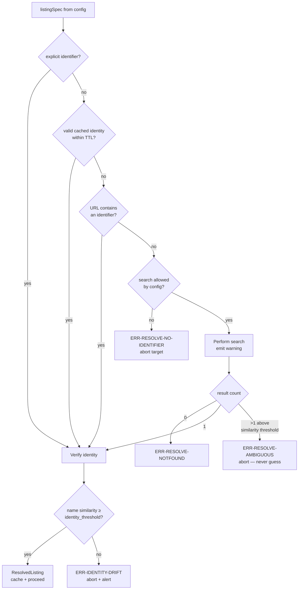
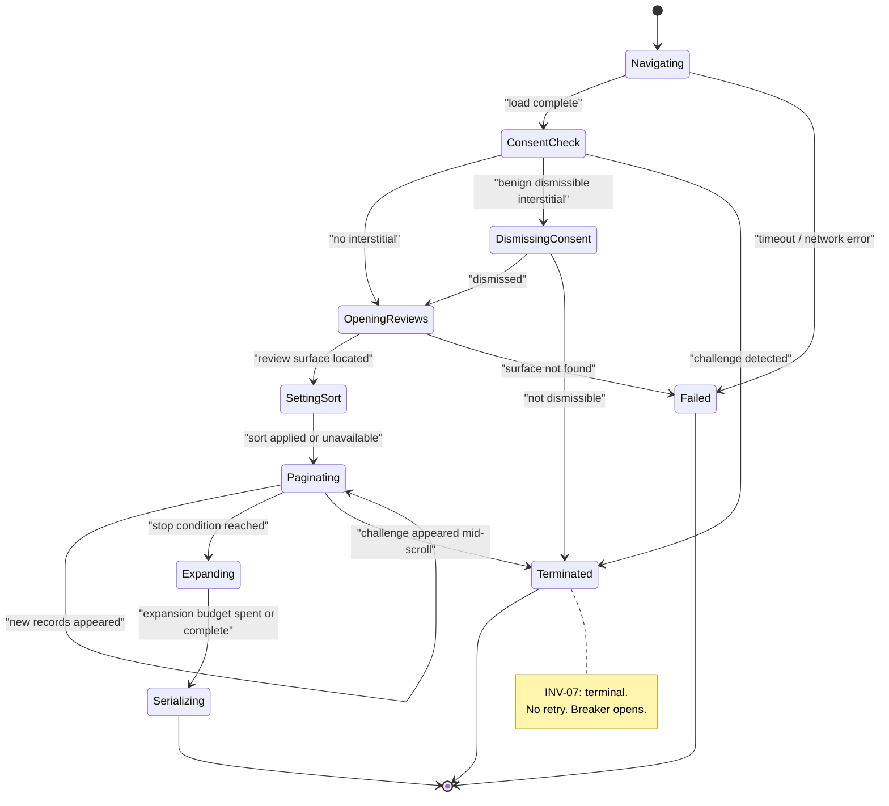
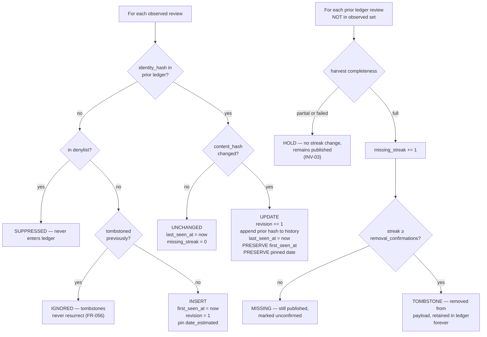
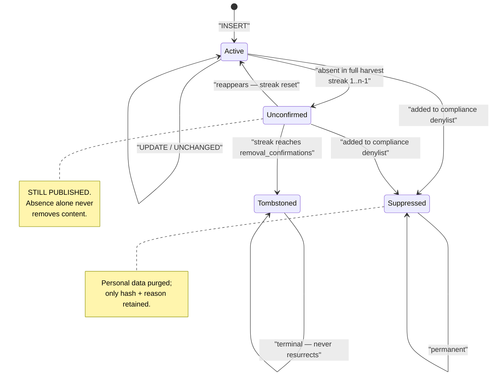

# Part 4 — The Review Collection Engine and the Data Contract

*Sections 20 and 21. Audience: implementing engineers. This is the most prescriptive part of the document. Every module is specified to the level of its inputs, outputs, algorithm, error modes, configuration surface, and test obligations. An implementer should be able to build the engine from this part plus §18's file layout without further questions.*

---

# 20. Review Collection Engine

## 20.1 Engine Overview

### 20.1.1 Module Map

```mermaid
flowchart TB
    subgraph SCHED["Scheduling Layer — §20.12"]
        SCH["Scheduler / Cron"]
        PLAN["Shard Planner"]
    end
    subgraph CTRL["Control Layer"]
        ORCH["Orchestrator — §20.1.3"]
        PRE["Preflight Gate"]
        RETRY["Retry Manager — §20.10"]
        BREAK["Circuit Breaker"]
        LIM["Rate Pacer"]
    end
    subgraph ACQ["Acquisition Layer"]
        SRCH["Search / Resolution — §20.2"]
        NAV["Navigation — §20.3"]
        SESS["Browser Session"]
    end
    subgraph PURE["Pure Processing Layer"]
        SEL["Selector Packs — §20.4"]
        PARSE["Review Parser — §20.5"]
        CLEAN["Data Cleaner — §20.6"]
        VAL["Data Validator — §20.6.7"]
        RECON["Reconciler — §20.7"]
        PROJ["Projector — §20.8"]
        GATE["Publish Gate"]
    end
    subgraph OUT["Output Layer"]
        LEDG["Ledger Store — §20.11"]
        PUB["Publisher — §20.8.4"]
        LOG["Logger — §20.9"]
        REC["Failure Recovery — §20.13"]
    end

    SCH --> PLAN --> ORCH
    ORCH --> PRE --> SRCH --> NAV
    NAV --> SESS
    ORCH --> RETRY --> BREAK
    ORCH --> LIM
    NAV --> PARSE
    SEL --> PARSE
    PARSE --> CLEAN --> VAL --> RECON --> PROJ --> GATE
    RECON <--> LEDG
    GATE --> PUB
    ORCH --> LOG
    GATE -.->|"reject"| REC
    NAV -.->|"error"| REC
    REC --> LEDG
```



### 20.1.2 Module Responsibility Matrix

| Module | Owns | Explicitly Does NOT Own |
|---|---|---|
| Scheduler | *When* work happens | What work happens |
| Shard Planner | *Which runner* does which work | How work is done |
| Orchestrator | Stage sequencing, budgets, isolation | Any domain logic |
| Preflight | Permission to proceed | Data |
| Search / Resolution | Turning identity input into a canonical, verified listing | Reading reviews |
| Navigation | Getting content into the DOM | Interpreting content |
| Selector Packs | *Where* fields are | *What* fields mean |
| Review Parser | Lifting raw strings from structure | Cleaning them |
| Data Cleaner | Canonical, safe, typed values | Deciding validity |
| Data Validator | Verdicts about quality | Fixing anything |
| Reconciler | Merging observation into knowledge | Presentation |
| Projector | Public shape | Whether to publish |
| Publish Gate | The publish/reject decision | Writing anything |
| Publisher | Durable, visible output | Content |
| Ledger Store | Persistence of state | Interpretation of state |
| Logger | Structured, redacted event record | Deciding severity policy |
| Retry Manager | Whether and when to retry | Executing the operation |
| Failure Recovery | Preserving the last good state | Preventing failure |

### 20.1.3 Orchestrator Algorithm (Normative, Prose)

For each target `(client, listing)` in the shard, in a deterministic pseudo-random order:

1. Open a target-scoped logger child with `clientSlug`, `listingKey`, `runId`, and a fresh `targetId`.
2. Start the per-target budget timer. Register a hard abort at `budget_target_ms`.
3. **Preflight.** Evaluate the seven checks in order. Record the verdict in the manifest unconditionally. If denied, emit outcome `blocked` and continue to the next target.
4. **Acquire the rate token.** If unavailable, emit outcome `deferred` and continue.
5. **Resolve.** Obtain `ResolvedListing`, from cache where valid. Verify identity. On drift or ambiguity, emit `failed` with the specific error class.
6. **Acquire.** Invoke the selected adapter. The adapter internally uses Navigation and Browser Session (for `dom`) or an HTTP client (for API adapters). Wrap in the Retry Manager using the policy for acquisition-class errors.
7. **Extract → Normalize → Validate.** Pure stages, no retry (a pure function that failed will fail identically). Quarantine bad records; do not abort unless the container itself could not be located.
8. **Read prior Ledger.** A missing ledger is an empty ledger, not an error.
9. **Reconcile.** Pure. Produces the new Ledger and a decision log.
10. **Enrich** (v1.0: no-op).
11. **Project.** Build candidate artifacts.
12. **Gate.** Evaluate the candidate against the currently published payload and the validation report.
13. If `ACCEPT` or `ACCEPT_WITH_WARNINGS`: stage artifacts, write Ledger, append health record, emit `succeeded`. If `REJECT`: write **health record only**, retain published payload, emit `rejected`, raise an alert.
14. Close the browser context. Flush logs. Record per-stage timings.
15. Pace: sleep `inter_target_delay_ms` + jitter.

After all targets: write the run manifest, commit staged artifacts (single commit per branch per shard), push with rebase-and-retry, upload diagnostics, and emit the aggregate summary that drives the exit code.

**Normative note on commit batching.** Artifacts are *staged* per target but *committed once per shard*. This reduces commit count by the shard size (typically 5–20×), which directly addresses CON-13. The cost is that a shard crash after target 3 of 10 loses the staged work of those three targets — which is acceptable because reconciliation is idempotent (INV-04) and the next run reproduces it exactly.

## 20.2 Search / Resolution Module

### 20.2.1 Purpose

Convert whatever the operator supplied into a canonical, verified listing identity, and do so **once**, then cache it forever. Search is the most fragile and most expensive step in the entire acquisition path; the design goal is to execute it approximately never.

### 20.2.2 Input Forms and Precedence

| Priority | Input Form | Confidence | Cost | Notes |
|---|---|---|---|---|
| 1 | Explicit canonical place identifier | Highest | Zero | Preferred. Obtained once during onboarding via the `resolve` command. |
| 2 | Explicit numeric listing id (CID) | High | Zero | Extractable from a Maps URL; stable. |
| 3 | Cached identity (from a previous resolution) | High | Zero | TTL 30 days, but re-verified every run. |
| 4 | Full listing URL | High | Low | Parsed for embedded identifiers; falls to (5) if none present. |
| 5 | Name + locality + country search tuple | **Low** | High | Last resort. Emits a `warn`-level event every time it is used. |

**Normative:** onboarding MUST convert form (5) or (4) into form (1) and persist it in the client config. Search-at-runtime is a development convenience, not a production mode. Config validation emits a warning for any listing lacking an explicit identifier.

### 20.2.3 Resolution Flowchart



### 20.2.4 Identity Verification

Every run verifies that the cached identity still points at the expected business. This costs nothing (the name is already on the page being loaded) and catches an entire class of silent corruption.

| Check | Rule | On Failure |
|---|---|---|
| Name similarity | Normalised similarity between the page's business name and `expected_name` ≥ `identity_threshold` (default 0.82) | `ERR-IDENTITY-DRIFT`, abort, alert `high` |
| Advertised total sanity | Advertised total ≥ 0 and, if a prior value exists, has not fallen by more than `advertised_drop_tolerance` (default 40%) | Warning; feeds the Publish Gate |
| Aggregate rating sanity | Advertised rating within [1.0, 5.0] and not shifted by more than 0.5 from the prior value | Warning; feeds the Publish Gate |

**Engineering Note.** Name normalisation for the similarity check must strip legal suffixes (`Pvt Ltd`, `LLC`, `Inc`), collapse punctuation, casefold, and remove diacritics — otherwise a client's routine rebrand from "Commerce Insight" to "Commerce Insight®" trips a false drift alert. Test cases for this are mandatory.

### 20.2.5 Configuration Surface

| Key | Default | Meaning |
|---|---|---|
| `resolution.allow_search` | `false` in production, `true` in dev | Whether runtime search is permitted |
| `resolution.identity_threshold` | `0.82` | Minimum name similarity |
| `resolution.cache_ttl_days` | `30` | Re-resolution interval |
| `resolution.expected_name` | *required* | Ground truth for verification |
| `resolution.advertised_drop_tolerance` | `0.40` | Warning threshold |

### 20.2.6 Test Obligations

| Test | Assertion |
|---|---|
| Explicit id short-circuits | Search is never invoked when an id is present |
| Ambiguity | Two candidates above threshold ⇒ abort, no guess |
| Drift | Name mismatch ⇒ `ERR-IDENTITY-DRIFT` |
| Normalisation | Legal-suffix and diacritic variants do **not** trip drift |
| Cache TTL | Expired cache triggers re-resolution but not re-search when an id exists |

## 20.3 Navigation Module

### 20.3.1 Purpose

Drive the page from "opened" to "all target review content materialised in the DOM", then hand a serialised subtree to the pure parser. The Navigation module is the only component that performs interaction, and it is the primary consumer of the time budget.

### 20.3.2 Phase Machine



### 20.3.3 Pagination Algorithm (Normative)

The review list is a lazily-populated, virtualised container. The algorithm is:

1. Locate the scroll container that owns the review list (from the selector pack, `containers.scroll`).
2. Record `count₀` = number of review nodes currently present.
3. Loop:
   a. Scroll the container by a configured increment (default: container height × 0.9) — **not** to the absolute bottom, because jumping past the virtualisation window can skip records.
   b. Wait for either a count increase or `scroll_settle_ms` (default 900 ms), whichever comes first.
   c. Record `countₙ`.
   d. Evaluate stop conditions in this order:
      - `cap_reached` if `countₙ ≥ max_reviews`.
      - `target_reached` if `countₙ ≥ advertisedTotal`.
      - `stalled` if `countₙ == countₙ₋₁` for `stall_threshold` consecutive iterations (default 3), each separated by an increasing backoff (900 ms, 1800 ms, 3600 ms).
      - `budget_exhausted` if elapsed ≥ `pagination_budget_ms`.
      - `error` on any thrown error or challenge detection.
   e. Otherwise continue.
4. Emit `PaginationReport { finalCount, iterations, stopReason, elapsedMs, growthCurve }`.

**The growth curve is retained** (count after each iteration). It is the single most diagnostic artifact in the system: a curve that plateaus at 12 with `advertisedTotal = 118` tells the whole story of an incident in one array.

### 20.3.4 Stop Reason → Completeness Mapping

| Stop Reason | Completeness | Publish Gate Treatment |
|---|---|---|
| `target_reached` | `full` | Normal evaluation |
| `exhausted` (no growth after threshold **and** count ≥ 95% of advertised) | `full` | Normal evaluation |
| `cap_reached` | `full_capped` | Normal evaluation; count-drop rule uses the cap, not the advertised total |
| `stalled` (count < 95% of advertised) | `partial` | **Cannot increment removal streaks**; count-drop rule applied strictly |
| `budget_exhausted` | `partial` | Same as `stalled` |
| `error` / `challenge` | `failed` | No publication at all |

**This table is the mechanical expression of INV-03 and is the single most important table in §20.** A `partial` harvest is trustworthy for *additions* (a review that appeared is real) and untrustworthy for *absences* (a review that did not appear may simply not have loaded). The reconciler treats the two asymmetrically on exactly this basis.

### 20.3.5 Text Expansion

| Aspect | Rule |
|---|---|
| Trigger | A review node contains an expansion affordance per the selector pack |
| Budget | `min(expand_max_count, floor(remaining_budget_ms / expected_interaction_ms))`; defaults 200 and 120 ms |
| Order | Longest-truncated first (by rendered length), so the budget buys the most recovered text |
| Failure | An expansion that throws or times out marks that record `text_truncated: true` and continues |
| Verification | After expansion, the text is re-read and checked for the absence of a truncation marker; if still present, `text_truncated` remains `true` |

**Design note.** Storing truncated text *flagged as truncated* is strictly better than storing it silently, and both are better than failing the harvest. The payload exposes `text_truncated` so a consumer can choose to link out rather than show a clipped review.

### 20.3.6 Configuration Surface

| Key | Default | Notes |
|---|---|---|
| `nav.navigation_timeout_ms` | `30000` | Page load |
| `nav.surface_timeout_ms` | `15000` | Locating the review surface |
| `nav.scroll_increment_ratio` | `0.9` | Fraction of container height per scroll |
| `nav.scroll_settle_ms` | `900` | Wait for new records |
| `nav.stall_threshold` | `3` | Consecutive no-growth iterations |
| `nav.pagination_budget_ms` | `120000` | Hard cap on pagination |
| `nav.max_reviews` | `1000` | Per-harvest cap; hard ceiling 5000 |
| `nav.expand_max_count` | `200` | Expansion interaction budget |
| `nav.sort_order` | `newest` | Falls back silently if unavailable |
| `nav.locale` | client locale | Drives date phrasing |

### 20.3.7 Resource Blocking (Performance and Politeness)

| Resource Type | Action | Rationale |
|---|---|---|
| Images | Block | Not needed for extraction; avatars are captured as URLs only (ADR-014). Largest single bandwidth saving. |
| Media (video/audio) | Block | Never needed |
| Fonts | Block | Layout may shift; extraction does not depend on glyph metrics |
| Stylesheets | **Allow** | Some structural and visibility determinations depend on computed layout |
| Analytics / telemetry hosts | Block | Not needed; reduces noise and avoids sending signals we have no reason to send |
| Hosts outside allowlist | Block | Defence in depth: a compromised page cannot make the runner a request source |

Measured effect: **60–80% reduction in transferred bytes** and a 25–40% reduction in wall-clock time. Both are reported in the run manifest so a regression in blocking effectiveness is visible.

## 20.4 Selector Pack Subsystem

### 20.4.1 The Core Idea

> **ADR-009 — Externalise all field-location knowledge into versioned, declarative Selector Packs**
> **Status:** Accepted
> **Context:** RISK-01 (upstream markup change) is the highest-likelihood risk in the system. In a conventional implementation, field locations are embedded in parser code, so every upstream change requires a code change, a code review, a release, and a deploy — and the knowledge of *why* a particular selector was chosen is lost.
> **Decision:** All field-location knowledge lives in versioned JSON files under `selectors/`. Parser code is generic: it reads a pack and resolves fields through ordered strategies. Packs are immutable once merged; a change means a new version file plus a one-line profile pin.
> **Alternatives Rejected:** *Selectors as constants in code* — the default approach; makes the highest-frequency change also the highest-ceremony change. *Machine-learned or heuristic extraction with no selectors* — non-deterministic, untestable against golden fixtures, and impossible to reason about during an incident. *Selectors fetched from a remote config service at runtime* — introduces a network dependency and a supply-chain risk into the most sensitive path, for a change frequency of ~3 per year.
> **Consequences:** A markup change is repaired by editing a data file, verified against the fixture corpus, and rolled out by changing one pinned version — with instant rollback. Cost: an extra indirection layer to understand, and the discipline of keeping packs schema-valid. Target: ≥ 70% of breakages fixable without touching code (NFR-019).

### 20.4.2 Pack Structure (Field Contract)

| Section | Contents |
|---|---|
| `meta` | `pack_version`, `source`, `created`, `notes`, `min_engine_version` |
| `containers` | Locators for: the review surface, the scroll container, the individual review node, the reply node |
| `fields` | Per logical field: ordered `strategies[]`, `required` flag, `transform` reference |
| `affordances` | Locators for: expansion control, sort control, pagination trigger, consent dismissal |
| `signals` | Locators/patterns that indicate: challenge page, empty state, error state |
| `assertions` | Structural invariants the canary verifies (§25.5) |

### 20.4.3 Strategy Kinds, in Preference Order

| Order | Kind | Example Concept | Stability | Why This Rank |
|---|---|---|---|---|
| 1 | `role` | An element with an accessibility role identifying a review or rating | **Highest** | Accessibility semantics are user-facing contracts; changing them breaks screen readers, so vendors change them rarely and carefully |
| 2 | `aria-label-pattern` | A labelled element whose label matches a rating pattern | High | Same reasoning; also carries the *value* directly, which is often more robust than parsing visual stars |
| 3 | `data-attribute` | A stable-looking data attribute | Medium-High | Frequently used for the vendor's own tooling, so moderately stable |
| 4 | `structural-relative` | "The element two levels above the rating, containing a text node" | Medium | Survives class renames; breaks on layout restructuring |
| 5 | `text-pattern` | Match a known phrase shape (e.g. a relative-date pattern) | Medium | Locale-dependent but structure-independent |
| 6 | `css` | A generated class selector | **Lowest** | Fastest to write, first to break. Present only as a last-resort fallback with low confidence weight |

**Normative:** every required field MUST declare at least two strategies of different kinds, and MUST NOT declare `css` as its only strategy.

### 20.4.4 Strategy Health Reporting — The Early-Warning System

For every field of every record, the resolver records which strategy index succeeded. Aggregated per run:

| Signal | Meaning | Action |
|---|---|---|
| All fields resolve at index 0 | Healthy | None |
| A field resolves at index ≥ 1 for > 20% of records | **Drift beginning** — the preferred locator is failing | `warn` alert; investigate at leisure; extraction still correct |
| A field resolves at index ≥ 1 for > 80% of records | **Drift confirmed** | `warn` alert with elevated priority; schedule a pack update |
| A required field resolves at no index for > 5% of records | **Breakage** | `error` alert; records quarantined; gate likely rejects |

**This is the most valuable operational property of the selector-pack design.** It converts an upstream change from a *cliff* (extraction works, then abruptly does not) into a *ramp* (fallbacks begin to carry the load, and we get told about it while everything still works). Median detection lead time is expected to improve from "after the break" to "days before the break".

### 20.4.5 Authoring and Rollout Workflow

| Step | Action |
|---|---|
| 1 | Capture a live page as a sanitised fixture (`scripts/capture-fixture.mjs`) |
| 2 | Add the fixture with an `expected.json` golden file |
| 3 | Copy the current pack to `v<n+1>.json`; edit strategies |
| 4 | Run the golden suite: the **new** pack must pass the new fixture **and** all existing fixtures whose `meta.json` marks them pack-agnostic; **old** packs must continue to pass their own fixtures |
| 5 | Update `profiles/default.json` to pin the new pack |
| 6 | PR; CI runs the full corpus plus a live canary |
| 7 | Merge; next scheduled run uses the new pack; monitor strategy health |
| 8 | Rollback if needed: revert the one-line pin. No code revert, no release |

## 20.5 Review Parser

### 20.5.1 Purpose and Purity

The parser is a **pure function**: `(serializedSubtree, selectorPack, listingContext) → ExtractedReview[]`. It performs no I/O and no cleaning. Its only job is to locate and lift raw strings, plus record how it found them.

Purity here is load-bearing: it is what allows the golden fixture corpus (§41.3) to be the primary regression mechanism, and what makes an incident reproducible offline in seconds.

### 20.5.2 Per-Record Extraction Order

For each review node located inside the review container:

| # | Field | Strategy Notes | Required |
|---|---|---|---|
| 1 | **Reply isolation** | *First*, identify and detach any owner-reply subtree. Everything after operates on the review-only subtree. | — |
| 2 | Author display name | Prefer an accessible name; fall back to structural | Yes |
| 3 | Author profile URL | Optional; validated later against a host allowlist | No |
| 4 | Author avatar URL | Optional; URL only, never fetched | No |
| 5 | Author badges | e.g. local-guide indicator, review-count text | No |
| 6 | Rating | Three parsers in order: aria-label numeric, filled-star count, numeric text | Yes |
| 7 | Relative date text | Verbatim, unmodified | Yes |
| 8 | Review text | With truncation-marker detection | No (rating-only reviews are valid) |
| 9 | Like / helpful count | Numeric text, locale-aware thousands separators | No |
| 10 | Photo count | If the review includes images | No |
| 11 | Visit metadata | e.g. service type, where present | No |
| 12 | Owner reply text + relative date | From the detached subtree | No |
| 13 | Source node ordinal | Position in the rendered list — retained for diagnostics only, never for identity | — |

**Normative:** step 1 comes first and is non-negotiable. FR-033 exists because ingesting an owner reply as a five-star review is a real, observed failure that silently inflates ratings.

### 20.5.3 Rating Parsing Detail

| Parser | Input Shape | Output | Notes |
|---|---|---|---|
| P1 accessible-label | A label containing a numeric rating and a scale | Integer 1–5 | Most reliable; carries the value explicitly. Must handle locale decimal separators. |
| P2 star-count | Count of "filled" indicator elements | Integer 1–5 | Requires the pack to distinguish filled from unfilled; fragile to styling change. |
| P3 numeric-text | A bare numeric string near the rating container | Integer 1–5 | Last resort. |

Post-parse validation: value MUST be an integer in [1, 5]. A non-integer (e.g. 4.5 from a mis-parsed aggregate) is a **fatal record finding** — it almost always means the aggregate business rating was captured instead of the review rating. This specific check has prevented a whole class of silent corruption and MUST be implemented.

### 20.5.4 Date Resolution — The Hardest Small Problem

Relative dates are lossy, locale-dependent, and re-render differently every harvest. The design:

| Concept | Rule |
|---|---|
| **Capture verbatim** | `relative_date_raw` stores the exact string, always, for every locale. This is the audit trail. |
| **Resolve to an estimate** | Parse the phrase into a duration and subtract from `observed_at`, giving `date_estimated`. |
| **Record precision** | One of `day`, `week`, `month`, `year`, `unknown` — derived from the phrase granularity, not from the arithmetic. |
| **Record confidence** | `high` for explicit day/week phrases, `medium` for month phrases, `low` for year phrases and anything requiring a fallback. |
| **PIN on first observation** | Once a review has a `date_estimated`, it is **never recomputed** (FR-036). Later harvests see "3 years ago" where the first saw "2 months ago"; recomputing would push the review's date forward in time on every run, scrambling ordering permanently. |
| **Never sort by estimate alone** | Ordering uses `(date_estimated, first_seen_at, identity_hash)` as a composite key so ordering is stable and total even when estimates tie. |

**Locale matrix (minimum required coverage):**

| Locale | Example Phrases | Notes |
|---|---|---|
| `en` | "a day ago", "2 weeks ago", "3 months ago", "a year ago", "yesterday" | Note the "a/an" singular forms — a very common parser bug |
| `hi` | Devanagari relative phrases | Required for the first target's market |
| `de` | "vor 2 Wochen" | Prefix rather than suffix ordering |
| `fr` | "il y a 2 semaines" | Multi-word prefix |
| `es` / `pt` | "hace 2 semanas" | |
| `ar` | RTL relative phrases | Also exercises RTL text handling |

**Normative:** the date resolver MUST fail *soft* — an unparseable phrase yields `precision: unknown`, `confidence: low`, and `date_estimated: null`, with the record still valid. Ordering falls back to `first_seen_at`. **Never** discard a review because its date could not be parsed.

**Engineering Note.** The temptation is to be clever: fetch absolute dates from a tooltip, or reverse-engineer a timestamp from an internal identifier. Both were considered. Both were rejected: tooltips require an extra interaction per review (blowing the budget), and internal identifiers are undocumented and unstable. The pinned-estimate approach is less precise but is stable, cheap, and honest — and the payload exposes `date_precision` so a consumer can render "3 months ago" rather than a false-precision date.

### 20.5.5 Parser Error Model

| Situation | Classification | Effect |
|---|---|---|
| Review container not found | `ERR-PARSE-STRUCTURE` | **Abort target.** Almost certainly an upstream change. |
| Zero review nodes but container found and empty-state signal present | Not an error | `total_count: 0` is a legitimate result |
| Zero review nodes, container found, no empty-state signal | `ERR-PARSE-EMPTY-UNEXPECTED` | Abort target; likely a change or a load failure |
| Required field missing on a single record | `ERR-PARSE-FIELD-REQUIRED` | Quarantine that record only |
| Optional field missing | Not an error | Field is `null` |
| Rating out of range | `ERR-PARSE-RATING-INVALID` | Quarantine that record |

## 20.6 Data Cleaner (Normalizer)

### 20.6.1 Purpose

Transform raw extracted strings into canonical, safe, bounded, typed values. **This is the security boundary of the entire system** (§16.7): everything downstream trusts that the Normalizer did its job.

### 20.6.2 Normalisation Pipeline (Ordered — Order Matters)

| # | Step | Detail | Why This Position |
|---|---|---|---|
| 1 | Decode entities | Resolve HTML entity references | Must precede markup stripping, or `&lt;script&gt;` survives as literal text and re-encodes into markup downstream |
| 2 | Strip markup | Remove all tags and any tag-like constructs | Must follow decoding for the reason above |
| 3 | Unicode normalise | NFC | Before length bounding, so grapheme counting is meaningful |
| 4 | Remove control characters | Strip C0/C1 controls except `\n` and `\t`; strip zero-width and bidi-override characters | Bidi overrides can visually reorder text — a real spoofing vector |
| 5 | Canonicalise whitespace | `\r\n`/`\r` → `\n`; collapse runs of ≥ 3 newlines to 2; collapse horizontal whitespace runs; trim | After control-character removal so invisible characters do not survive as "content" |
| 6 | Detect truncation | Match locale-aware truncation markers; set `text_truncated` and remove the marker | After whitespace canonicalisation so marker matching is reliable |
| 7 | Bound length | Cut at `max_text_length` (default 5,000) on a **grapheme cluster** boundary; set `text_clipped` | Last, so the bound applies to final content |
| 8 | Type and brand | Return branded `CleanString` values | Makes the boundary enforceable by the type checker |

**Normative:** step 2 removes markup rather than escaping it. The payload contains **no markup of any kind** (FR-038, INV-05). A consumer that wants emphasis in review text does not get it — that is the correct trade for eliminating stored XSS across every client site simultaneously.

### 20.6.3 Emoji, RTL, and Script Handling

| Concern | Rule |
|---|---|
| Emoji | **Preserved exactly**, including ZWJ sequences and skin-tone modifiers. Length bounding must be grapheme-aware or a cut will split a ZWJ sequence and produce mojibake. |
| RTL text | Preserved. Explicit bidi *override* characters (RLO/LRO) are stripped; bidi *marks* required for correct rendering of mixed content are preserved. |
| CJK | Preserved. Note that a 5,000-*grapheme* bound is a much larger byte count for CJK; the payload size budget accounts for this. |
| Combining marks | Preserved after NFC. |
| Homoglyph author names | **Not** normalised away. Two authors with visually identical names are two authors; the author key derivation must not merge them (that would be a data-integrity bug, not a feature). |

### 20.6.4 Author Name and Key

| Field | Treatment |
|---|---|
| `author.name` (published) | Preserved as given, with only steps 1–5 applied. **Never** abbreviated, initialised, or anonymised by default (FR-042). |
| `author_key` (internal) | Derived: casefold → strip diacritics → collapse whitespace → remove punctuation → hash. Used for identity matching only, never published. |
| Anonymous authors | A missing or placeholder name yields `author.name: null` and an `author_key` derived from a per-listing anonymous bucket plus content, so two anonymous reviews are not merged. |

### 20.6.5 Language Detection

| Aspect | Rule |
|---|---|
| Method | Script-range analysis first (Devanagari, Arabic, CJK, Cyrillic, Latin), then stopword frequency for Latin-script disambiguation |
| Output | `{ code: ISO 639-1 \| null, confidence: 0–1 }` |
| Minimum length | Below 12 graphemes, return `null` with confidence 0 — short text cannot be reliably classified and a wrong guess is worse than none |
| Dependency policy | No large model, no network (DEP-2). A compact internal implementation is required. |
| Use | Optional consumer-side filtering; input to future AI enrichment; never used to reject a review |

### 20.6.6 URL Validation

| Field | Rule |
|---|---|
| `author.avatar_url` | Must parse as HTTPS; host must match the source's expected avatar host allowlist; query parameters that encode a size may be normalised to a preferred size; otherwise set `null`. **Never fetched.** |
| `author.profile_url` | Must parse as HTTPS and match the source host allowlist; otherwise `null` |
| `source_url` | Constructed by the engine from the canonical listing identity, never taken from page content |

**Rationale for the allowlist.** An unvalidated URL from page content, published into a client's site as an image `src`, is an open redirect and a tracking vector. Allowlisting is cheap and eliminates it.

### 20.6.7 Data Validator

The Validator produces verdicts; it never modifies data.

**Per-record findings:**

| Check | Severity | Effect |
|---|---|---|
| Rating is an integer in [1,5] | fatal | Quarantine record |
| `author_key` derivable | fatal | Quarantine record |
| `relative_date_raw` non-empty | warn | Keep; `date_estimated: null` |
| Text length within bound | info | Already enforced by the cleaner |
| Text contains no markup | fatal | **Indicates a cleaner bug.** Quarantine and alert `error`. This is a self-check on the security boundary and MUST exist. |
| Avatar/profile URL valid or null | warn | Set to `null` |
| Language detected or null | info | — |
| Reply, if present, has text | warn | Drop empty reply |

**Aggregate findings:**

| Check | Rule | Severity |
|---|---|---|
| Coverage | `extracted / advertisedTotal ≥ coverage_min` (default 0.95) for `full` classification | Determines completeness |
| Intra-run duplicates | Identical `identity_hash` within one harvest ⇒ collapse deterministically (keep the record with more complete fields) | warn |
| Near-duplicates | Same `author_key`, text similarity ≥ 0.92, different `identity_hash` | warn (RISK-11 early signal) |
| Mean rating plausibility | Computed mean within `rating_tolerance` (default 0.3) of advertised rating | warn; feeds the gate |
| Distribution degeneracy | Not 100% single-rating unless the listing genuinely has ≤ 3 reviews | warn |
| Quarantine rate | Quarantined ÷ total ≤ `quarantine_max` (default 0.05) | fatal above threshold — indicates systemic extraction failure |
| Strategy health | Per §20.4.4 | warn / error |

**Output:** `ValidationReport { recordFindings[], aggregateFindings[], completeness, coverage, counts, quarantined[] }`. This report is an input to both the Reconciler (for asymmetric absence handling) and the Publish Gate (for the accept/reject decision).

## 20.7 Reconciliation Engine

### 20.7.1 Purpose and Contract

`reconcile(priorLedger, observed, validationReport, config, now) → { ledger, decisions }`

Pure, deterministic, idempotent, and order-independent. This is the most consequential pure function in the system: it is where "what we just saw" becomes "what we know".

### 20.7.2 Decision Rules



### 20.7.3 The Asymmetry Rule (Normative)

| Observation | Trust Level | Action |
|---|---|---|
| A review **appeared** | **Trusted** regardless of completeness | Insert or update it. A record cannot appear spuriously. |
| A review **did not appear** in a `full` harvest | Trusted | Increment `missing_streak` |
| A review **did not appear** in a `partial` or `failed` harvest | **Not trusted** | Change nothing. Do not increment, do not decrement. |

This asymmetry is the whole of INV-03 and it is the reason the system cannot wipe a client's reviews. **An implementer who "simplifies" this by treating absence uniformly has introduced the system's worst possible bug.** It must be covered by an explicit, named test.

> **ADR-008 — Absence at source MUST NOT immediately delete a review**
> **Status:** Accepted
> **Context:** A harvest observes a set of reviews. The naive interpretation is that the observed set *is* the truth, so anything absent has been deleted. That interpretation is wrong far more often than it is right: partial page loads, stalled virtualised scrolling, personalised ordering, and truncated pagination all produce absences that have nothing to do with deletion. Genuine review deletion is rare; incomplete harvests are common.
> **Decision:** Absence is treated asymmetrically from presence. A review that *appears* is trusted immediately regardless of harvest quality. A review that *does not appear* increments a `missing_streak` only when the harvest was classified `full`, and is removed from the payload only after `removal_confirmations` (default 3) consecutive qualifying harvests. Absence in a `partial` or `failed` harvest changes nothing at all.
> **Alternatives Rejected:** *Treat the observed set as authoritative* — the industry-default approach, and the direct cause of the "our reviews disappeared" failure that makes review widgets untrustworthy. *Delete after a single absence with a manual undo* — puts a destructive default behind a human recovery step, which is backwards. *Never delete anything* — leaves genuinely removed reviews (including ones removed by the platform for policy violations) displayed indefinitely, which is its own correctness and compliance problem. *Compare against the advertised total only* — too coarse; a listing can lose one review and gain one between harvests with no net count change.
> **Consequences:** Deletions propagate slowly — up to three cadence intervals, roughly 18 hours at the default 6-hour tier. That latency is the price, and it is cheap: a deleted review displaying for a further day is a minor inaccuracy, whereas mass deletion from a bad harvest is a client-visible catastrophe. The rule also requires that harvest completeness be classified honestly (§20.3.4), which is why the Navigator's stop reason is a first-class output rather than an internal detail.

### 20.7.4 Ledger Record Lifecycle



### 20.7.5 Idempotence, Monotonicity, and Commutativity

These three properties are enforced by property tests (§41.2) and are the reason the system is safe to retry, replay, and re-shard.

| Property | Statement | Why It Matters |
|---|---|---|
| **Idempotence** | `reconcile(reconcile(L, H), H) ≡ reconcile(L, H)` when `now` is held fixed | Safe retries. A shard that crashes after reconciling but before committing can simply re-run. |
| **Monotonicity** | A tombstoned or suppressed id never becomes active again | Compliance durability (FR-057) and prevention of "deleted review comes back" — a class of bug that is both embarrassing and legally significant. |
| **Commutativity** | The order of records within `observed` does not affect the resulting Ledger | Upstream ordering is unstable and personalised (D6). Any order-dependence would produce nondeterministic output. |
| **Preservation** | `first_seen_at` and the pinned `date_estimated` are never modified after INSERT | Historical integrity; stable sort order. |

### 20.7.6 Cross-Adapter Identity Stability

**Normative and load-bearing for ADR-023.** The same real-world review, harvested via the DOM adapter and via the Business Profile API adapter, MUST produce the same `identity_hash`. This requires that identity derivation use only fields every adapter can supply: listing key, author key, and normalised text (plus rating as a tiebreaker). It MUST NOT use any source-specific or access-method-specific value.

A dedicated property test (`identity.cross-adapter.test.mjs`) asserts this against paired fixtures — the same reviews captured through both paths. Without this test, the migration guarantee in §15.7.1 is an unverified claim.

### 20.7.7 Configuration Surface

| Key | Default | Range | Notes |
|---|---|---|---|
| `reconcile.removal_confirmations` | `3` | 2–10 | Consecutive `full` harvests before tombstoning |
| `reconcile.coverage_min` | `0.95` | 0.5–1.0 | Threshold for `full` classification |
| `reconcile.near_duplicate_threshold` | `0.92` | 0.8–1.0 | Warning only |
| `reconcile.keep_tombstones` | `true` | — | MUST remain true; present for testing only |

## 20.8 Exporter — Projector, Gate, and Publisher

### 20.8.1 Projector

Pure: `(ledger, config, engineMeta) → Artifacts`. Steps:

1. Filter: exclude tombstoned and suppressed records.
2. Apply display filters from config: `min_text_length`, `languages`, `include_rating_only`, optional `min_rating` (default: none — see §8.2).
3. Sort by the composite key `(date_estimated desc, first_seen_at desc, identity_hash asc)` — total and stable.
4. Map each Ledger record to its public projection for the target `schema_version`.
5. Compute aggregates.
6. Emit `reviews.json` (all), `latest.json` (top `latest_count`, default 20), `stats.json`, optional `schema-org.json`, and a listing `index.json`.
7. Serialise minified with stable key ordering; compute a content hash over the canonical bytes.

**Determinism requirement:** identical ledger + identical config ⇒ byte-identical artifacts. This is what makes hash-gated writes (FR-065) work, and it is broken by a single unsorted key or embedded timestamp in the wrong place. `generated_at` therefore lives **only** in the manifest and in a field explicitly excluded from the content hash.

### 20.8.2 Publish Gate Placement

The Gate sits between the Projector and the Publisher and is specified fully in §27.3. Architecturally the important point is that it is **pure** and receives both the candidate and the currently published payload, so it can reason about *change* rather than only about *state*.

### 20.8.3 Artifact Set Per Listing

| Artifact | Purpose | Typical Size (120 reviews) | Cache TTL |
|---|---|---|---|
| `reviews.json` | Complete payload | ~110 KB / ~38 KB gzip | Long, content-addressed via manifest |
| `latest.json` | Top-N for the common widget case | ~20 KB / ~8 KB gzip | Medium |
| `stats.json` | Aggregates only — rating badge, count headline | ~1 KB | Medium |
| `schema-org.json` | Structured-data projection | ~30 KB | Long |
| `index.json` (listing) | Manifest: hashes, counts, versions, generated_at | ~1 KB | **Short** — this is the freshness pointer |

**Consumer contract:** read `index.json` first (short TTL), then fetch the referenced artifact (long TTL). This is the standard manifest-plus-immutable-content pattern and it gives both freshness and cacheability without cache purging.

### 20.8.4 Publisher

| Aspect | Rule |
|---|---|
| Staging | All artifacts for all targets in a shard are written to a checkout of the `data` branch |
| Hash gate | If the new bytes equal the current bytes, the file is not touched (FR-065) — no commit, no churn |
| Commit | One commit per shard per branch, with the structured message from §17.14 |
| Push | `--force-with-lease` is **not** used. Push; on non-fast-forward, fetch, rebase the shard's commit, retry, up to 3 times with backoff (2 s, 6 s, 18 s) |
| Conflict impossibility | Shards write disjoint client paths, so a rebase can never produce a content conflict — only an ancestry update |
| Failure | After 3 attempts, `ERR-PUBLISH-CONFLICT`; artifacts are uploaded as CI artifacts and the next run reproduces them deterministically |
| Ledger and health | Written to the `state` branch in a separate commit with the same retry logic |
| Ordering | **Payload first, then state.** If the process dies between them, the next run re-reconciles from the older ledger and produces the same payload (idempotence) — a benign no-op. The reverse order could publish a payload that the ledger does not justify. |

**Engineering Note.** That last row is subtle and worth stating explicitly: when two writes cannot be made atomic, order them so that a crash between them leaves the system in a state the next run can repair. Publishing before recording state is repairable; recording state before publishing is not.

## 20.9 Logger

Specified fully in §24. Module-level contract:

| Aspect | Rule |
|---|---|
| Format | JSONL, one event per line, UTF-8 |
| Mandatory fields | `ts`, `level`, `runId`, `stage`, `event`; plus `clientSlug`, `listingKey`, `targetId` where in target scope |
| Optional fields | `durationMs`, `errorClass`, `count`, `detail` (bounded object) |
| Child loggers | Created per target and per stage so context need not be repeated at call sites |
| Redaction | Applied **at the sink** (FR-076) — a careless call site cannot leak, because redaction is not the caller's responsibility |
| Levels | `trace`, `debug`, `info`, `warn`, `error`, `fatal`; default `info` in CI, `debug` on failure re-run |
| Volume control | `trace`/`debug` are buffered in a ring buffer and only flushed to disk if the target fails — full-fidelity logs exactly when needed, and cheap otherwise |

**The ring-buffer decision matters.** Always writing debug logs for a healthy 5,000-review harvest produces megabytes of noise per run. Buffering them and flushing only on failure gives full diagnostic depth with none of the cost — and it is why UC-11 can be a 10-minute job.

## 20.10 Retry Manager

Specified fully in §26. Module-level contract:

| Aspect | Rule |
|---|---|
| Policy source | Data, not code: a table keyed by error class (§26.2) |
| Decision | `never` \| `immediate` \| `backoff` with `maxAttempts`, `baseMs`, `multiplier`, `jitter`, `capMs` |
| Purity | The policy function is pure; the executor is a thin wrapper |
| Non-retryable by construction | Bot challenge, policy block, identity drift, structure change, gate rejection, schema invalid |
| Budget awareness | A retry is not attempted if the projected delay would exceed the remaining target budget |
| Idempotence requirement | Only operations that are safe to repeat may be wrapped. Acquisition is safe (read-only). Publication is safe (hash-gated and idempotent). |

## 20.11 Ledger Store

> **ADR-006 — Separate the private Ledger from the public Payload**
> **Status:** Accepted
> **Context:** The naive design keeps one file: the published JSON. Then reconciliation has nothing to reconcile against except the thing it is about to overwrite, and every field needed for correctness (first-seen time, missing streaks, tombstones, revision history, provenance) either pollutes the public contract or does not exist.
> **Decision:** Two stores. The **Ledger** (private, on the `state` branch) is the source of truth: complete, verbose, append-oriented, containing tombstones, streaks, revision history, and provenance. The **Payload** (public, on the `data` branch) is a *projection* of the Ledger: minimal, minified, safe, and versioned as a contract.
> **Alternatives Rejected:** *Single published file as state* — makes tombstones and streaks impossible without leaking internal bookkeeping into a public contract; makes the public schema hostage to internal needs; and means a bad publish destroys the state that would let you recover. *State in a separate database* — cost and operational burden (CON-01, CON-08). *State in CI cache* — caches are evictable; correctness must never depend on a cache (CON-09).
> **Consequences:** One extra branch and one extra write per run. In exchange: the public contract stays minimal and stable, internal state can evolve freely without a schema version bump, a bad payload can always be regenerated from the Ledger (`project` command), and every state transition is a reviewable Git diff. This ADR is what makes §52's recovery plan almost trivially short.

| Aspect | Rule |
|---|---|
| Location | `state` branch, `ledger/<client>/<listing>.json` |
| Format | Pretty-printed JSON, stable key order, trailing newline — optimised for human diff reading |
| Size expectation | ~1.5 KB per review including history; ~180 KB for 120 reviews |
| Growth | Monotonic. Tombstones and revision history are never pruned in v1.0. §33.5 defines the pruning policy if a ledger exceeds 5 MB. |
| Atomicity | Temp-write-then-rename per file; commit per shard |
| Corruption handling | Schema-validate on read. On failure: `ERR-STATE-CORRUPT`, abort target, alert `high`, recover per §52.4 (restore the previous version from Git history — always available) |
| Forward compatibility | Unknown fields are preserved on read-modify-write (FR-058), so an older engine cannot silently strip a newer engine's data |

## 20.12 Scheduler

Specified fully in §22. Module-level contract:

| Aspect | Rule |
|---|---|
| Trigger | Cron per cadence tier, plus manual dispatch, plus PR-triggered dry runs |
| Cadence tiers | `hourly` (policy floor), `standard` (6 h, default), `relaxed` (12 h), `daily` (24 h) |
| Due-set computation | A pure function of (registry, health, now): a target is due if `now − last_success ≥ tier_interval × 0.9` |
| Jitter | Each tier's cron fires at a non-round minute, and the orchestrator adds per-target jitter (§28.4) so requests are never synchronised across clients |
| Sharding | Cost-balanced by historical p50 duration (§37.3) |
| Overlap prevention | A concurrency group ensures a new scheduled run cannot start while the previous one is still running; the new run is cancelled rather than queued |
| Catch-up | A missed cycle is not "made up". The next cycle simply proceeds — cadence is a rate, not a contract for specific instants |

## 20.13 Failure Recovery

Specified fully in §27. Module-level contract:

| Failure | Recovery Action | Visitor Impact |
|---|---|---|
| Adapter error (network, timeout) | Retry per policy; on exhaustion, retain LKG | None |
| Bot challenge | Terminal; breaker opens; alert; retain LKG | None |
| Structure change | Abort target; alert; retain LKG | None |
| Partial harvest | Reconcile additions only; gate likely rejects; retain LKG | None |
| Gate rejection | Retain LKG; alert with itemised reasons | None |
| Publish conflict | Rebase-retry; on exhaustion, artifacts preserved; next run reproduces | None |
| Ledger corruption | Restore previous ledger version from Git; re-run | None |
| Total repository loss | Recreate from any clone; payloads are also cached at the CDN | None until CDN TTL expiry |
| Engine regression | Revert the engine commit; re-run `project` from the Ledger to regenerate payloads without any acquisition | None |

**The pattern across every row is identical: no failure mode reaches the visitor.** That is not an accident of good luck; it is the consequence of ADR-001 (decoupling), ADR-006 (state separate from output), and ADR-011 (gated publication) acting together. Any proposed change that breaks one of those three re-opens every row in this table.

---

# 21. JSON Schema — The Public Data Contract

## 21.1 Design Principles

| # | Principle | Consequence |
|---|---|---|
| 1 | **The payload is a contract.** Consumers pin a major version and are guaranteed stability within it. | Additive-only evolution within a major (ADR-019). |
| 2 | **Forward-declare fields the engine does not yet populate.** | Sentiment, AI summary, spam score, likes, and verification exist at v1 as nullable fields. A consumer written today does not break when they are filled in (§2.2). |
| 3 | **Plain text only. No markup, ever.** | INV-05. Eliminates stored XSS across all client sites. |
| 4 | **Precompute anything a consumer would otherwise compute.** | Aggregates, distribution, and sort order ship ready-to-use; the renderer stays under 5 KB. |
| 5 | **Provenance is mandatory.** | Every payload states which engine, schema, adapter, selector pack, and run produced it (INV-06). |
| 6 | **Honest metadata about quality.** | `date_precision`, `text_truncated`, `coverage`, and `completeness` are published, so consumers can render truthfully rather than confidently. |
| 7 | **No internal state leaks.** | Streaks, tombstones, revision history, and quarantine records never appear (FR-060). |
| 8 | **Stable ordering, stable bytes.** | Deterministic key order and total sort order make content hashing and diffing meaningful. |

## 21.2 Artifact Envelope

Every published artifact shares this envelope.

| Field | Type | Nullable | Description |
|---|---|---|---|
| `schema_version` | integer | No | Major version of this contract. `1` for v1.0. Consumers MUST check this. |
| `artifact` | string enum | No | `reviews` \| `latest` \| `stats` \| `schema_org` \| `index` |
| `generated_at` | string (RFC 3339 UTC) | No | When this artifact was produced. **Excluded from the content hash.** |
| `client` | object | No | `{ slug, display_name }` |
| `listing` | object | No | Listing identity block (§21.3) |
| `provenance` | object | No | Engine and run provenance (§21.6) |
| `stats` | object | No | Aggregates (§21.5) |
| `reviews` | array | No (may be empty) | Review objects. Absent in `stats` artifact. |
| `pagination` | object | Yes | Present when the payload is sharded (§33.4) |
| `notices` | array of string | Yes | Human-readable notes, e.g. `"harvest_partial"`. Never an error channel — informational only. |

## 21.3 Listing Object

| Field | Type | Nullable | Description |
|---|---|---|---|
| `key` | string | No | Stable internal listing key. Part of the artifact URL. Never changes. |
| `source` | string enum | No | `google` \| `facebook` \| `trustpilot` \| `justdial` \| `glassdoor` \| `yelp` \| `manual` \| `csv` |
| `source_id` | string | Yes | Canonical identifier at the source, where publishable |
| `source_url` | string (URI) | Yes | Deep link to the listing at the source. Engine-constructed, never scraped (FR-091). |
| `display_name` | string | No | Business name as configured |
| `locale` | string | Yes | BCP 47 tag used during acquisition |
| `advertised_total` | integer | Yes | Total review count as reported by the source at harvest time |
| `advertised_rating` | number | Yes | Aggregate rating as reported by the source |
| `address_hint` | string | Yes | Coarse location label for multi-location disambiguation. **Never a precise address.** |

## 21.4 Review Object — The Core Entity

### 21.4.1 Field Reference

| # | Field | Type | Nullable | v1.0 Populated | Description |
|---|---|---|---|---|---|
| 1 | `id` | string | No | ✅ | **The review's public identity.** `identity_hash`, hex, 32 chars. Stable across harvests and across adapters (§21.4.3). |
| 2 | `content_hash` | string | No | ✅ | Hash of the review's content fields. Changes when the review is edited (§21.4.4). |
| 3 | `author` | object | No | ✅ | See §21.4.2 |
| 4 | `rating` | integer 1–5 | No | ✅ | Normalised star rating |
| 5 | `text` | string | Yes | ✅ | Review body. **Plain text, no markup.** `null` for rating-only reviews. |
| 6 | `text_truncated` | boolean | No | ✅ | `true` if the source text was longer than what is stored (expansion failed or budget spent) |
| 7 | `text_clipped` | boolean | No | ✅ | `true` if the engine bounded the length at `max_text_length` |
| 8 | `date` | string (RFC 3339) | Yes | ✅ | Pinned absolute estimate. `null` if unparseable. |
| 9 | `date_precision` | string enum | No | ✅ | `day` \| `week` \| `month` \| `year` \| `unknown`. **Consumers SHOULD use this to decide display format.** |
| 10 | `date_confidence` | string enum | No | ✅ | `high` \| `medium` \| `low` |
| 11 | `relative_date` | string | Yes | ✅ | The source's own phrasing, verbatim. Best choice for display when precision is coarse. |
| 12 | `language` | string | Yes | ✅ | ISO 639-1 |
| 13 | `language_confidence` | number 0–1 | Yes | ✅ | |
| 14 | `likes` | integer | Yes | ⚠️ where available | Helpful/like count at the source |
| 15 | `photo_count` | integer | Yes | ⚠️ where available | Number of images attached to the review |
| 16 | `owner_reply` | object | Yes | ✅ | See §21.4.2 |
| 17 | `source` | string enum | No | ✅ | Which platform this review came from. Enables merged multi-source payloads. |
| 18 | `source_url` | string (URI) | Yes | ✅ | Link to the review or its listing at the source |
| 19 | `verified` | boolean | Yes | ⚠️ | Source-asserted verification, where the source exposes such a concept. `null` when unknown — **never fabricated.** |
| 20 | `first_seen_at` | string (RFC 3339) | No | ✅ | When this engine first observed the review. Useful for "new since your last visit" UX. |
| 21 | `last_updated_at` | string (RFC 3339) | No | ✅ | When the engine last observed a content change |
| 22 | `revision` | integer ≥ 1 | No | ✅ | Increments on each observed edit |
| 23 | `ai` | object | Yes | ❌ v2.0 | Reserved AI enrichment block (§21.4.5) |
| 24 | `flags` | array of string | Yes | ✅ | Machine-readable quality/state notes, e.g. `unconfirmed`, `rating_only`, `reply_present` |

### 21.4.2 Nested Objects

**`author`**

| Field | Type | Nullable | Notes |
|---|---|---|---|
| `name` | string | Yes | As published at the source. `null` for anonymous. Never abbreviated by the engine. |
| `initials` | string | Yes | Derived, 1–2 graphemes. Provided so a consumer can render an avatar without fetching an image (ADR-014). |
| `avatar_url` | string (URI) | Yes | Allowlisted host, HTTPS. **Referenced, never re-hosted.** Consumers SHOULD treat failure to load as normal and fall back to `initials`. |
| `profile_url` | string (URI) | Yes | Allowlisted host |
| `is_local_guide` | boolean | Yes | Source-specific badge, where exposed |
| `review_count_hint` | integer | Yes | Author's total review count at the source, where exposed |

**`owner_reply`**

| Field | Type | Nullable | Notes |
|---|---|---|---|
| `text` | string | No | Plain text, same sanitisation as review text |
| `date` | string (RFC 3339) | Yes | Pinned estimate |
| `date_precision` | string enum | No | As above |
| `relative_date` | string | Yes | Verbatim |
| `author_label` | string | Yes | e.g. the business name as displayed. Never a personal name. |

### 21.4.3 `identity_hash` — Design and Rationale

> **ADR-007 — Two-tier review identity: `identity_hash` plus `content_hash`**
> **Status:** Accepted
> **Context:** The source does not expose a durable per-review identifier through the DOM (D1). Without stable identity, every harvest either duplicates everything or overwrites everything. A single hash over all content fails differently: any edit to the review produces a "new" review and a phantom deletion of the old one.
> **Decision:** Two hashes with different jobs. `identity_hash` answers "is this the same review?" and is computed over fields that do not change when a review is edited. `content_hash` answers "did it change?" and is computed over everything displayed.
> **Alternatives Rejected:** *Rendered position as identity* — ordering is unstable and personalised (D6); catastrophic. *Author name alone* — one author may leave reviews for multiple listings, and names collide. *Single content hash as identity* — turns every edit into an insert-plus-delete, producing visible duplicate-then-vanish churn. *Source-specific internal identifiers where available* — attractive, but they exist only on some access methods, so identity would not survive an adapter migration, breaking ADR-023's entire premise (§15.7.1 step 5). Rejected precisely to preserve migration.
> **Consequences:** Identity is robust to edits and portable across adapters. Cost: identity is *not* robust to an author simultaneously renaming themselves and rewriting their text, which produces one transient duplicate (§49). Accepted, documented, and surfaced by the near-duplicate warning (FR-048).

**`identity_hash` inputs (normative, order fixed):**

| # | Input | Normalisation Applied | Rationale |
|---|---|---|---|
| 1 | `identity_algo_version` | Literal, currently `1` | Allows a future algorithm change without ambiguity |
| 2 | `listing.key` | As stored | Scopes identity to a listing |
| 3 | `source` | Lowercase | The same person on two platforms is two reviews |
| 4 | `author_key` | Casefold, diacritic-strip, punctuation-strip, whitespace-collapse | Resilient to formatting differences |
| 5 | `text_identity_digest` | First 512 graphemes of normalised text, lowercased, whitespace-collapsed; `""` if no text | The strongest available discriminator; bounded so that appending a sentence does not break identity |
| 6 | `rating` | Integer | Tiebreaker for short or empty texts |

Hash: SHA-256 over a canonical, delimiter-escaped concatenation; published as the first 32 hex characters.

**Why the first 512 graphemes rather than the whole text:** a reviewer appending "Update: still great!" to a long review should be an UPDATE, not an INSERT. Truncating the identity input makes identity tolerant of appends — the most common form of review edit — while remaining highly discriminative.

**Collision analysis.** Within a single listing, identity collision requires the same author key, same rating, and same first 512 graphemes. That is not a hash collision but a genuine duplicate: the same person posting the same text twice. Collapsing those is correct behaviour, not a bug. Cryptographic collision at 128 bits of output is not a practical concern at this scale.

### 21.4.4 `content_hash` — Inputs

Computed over: `rating`, full normalised `text`, `text_truncated`, `author.name`, `author.avatar_url`, `owner_reply.text`, `owner_reply.date`, `likes`, `photo_count`.

**Deliberately excluded:** `relative_date` (changes every harvest by nature — including it would mark every review as edited on every run, which is the single most common bug in naive implementations of this system), `first_seen_at`, `last_updated_at`, `revision`, and anything engine-generated.

### 21.4.5 Reserved `ai` Block (v2.0)

Declared at v1 as nullable so consumers are forward-compatible (Principle 2).

| Field | Type | Description |
|---|---|---|
| `summary` | string \| null | One-sentence abstractive summary |
| `sentiment` | string enum \| null | `positive` \| `neutral` \| `negative` \| `mixed` |
| `sentiment_score` | number −1…1 \| null | |
| `topics` | array of string \| null | Extracted themes, e.g. `["pricing", "instructor quality"]` |
| `keywords` | array of string \| null | |
| `spam_score` | number 0–1 \| null | Higher means more likely inauthentic |
| `language_detected` | string \| null | Model-asserted language, distinct from the heuristic `language` field |
| `model` | string \| null | Model identifier used |
| `generated_at` | string \| null | |
| `content_hash_at_generation` | string \| null | The `content_hash` the enrichment was computed against — enables cache invalidation and prevents stale AI text being shown against edited reviews |

**Normative:** AI fields MUST NEVER overwrite or influence source-of-truth fields (`rating`, `text`, `author`, dates). Enrichment is additive and always identifiable as machine-generated (ADR-022).

## 21.5 Stats Object

| Field | Type | Description |
|---|---|---|
| `total_count` | integer | Published review count (post-filter, post-suppression) |
| `advertised_total` | integer \| null | Source-reported total, for transparency about coverage |
| `coverage` | number 0–1 \| null | `total_count / advertised_total` |
| `mean_rating` | number | Computed from published reviews, 2 decimal places |
| `advertised_rating` | number \| null | Source-reported aggregate |
| `distribution` | object | Counts keyed `"1"`…`"5"` |
| `with_text_count` | integer | Reviews having non-null text |
| `with_reply_count` | integer | Reviews having an owner reply |
| `newest_review_date` | string \| null | |
| `oldest_review_date` | string \| null | |
| `languages` | object | Count per detected language code |
| `completeness` | string enum | `full` \| `full_capped` \| `partial` — from the harvest that produced this payload |
| `last_full_harvest_at` | string \| null | Last time a `full` harvest succeeded. **The honest freshness signal.** |

**Design note.** Publishing both `mean_rating` (computed from what we have) and `advertised_rating` (what the source says) is a deliberate honesty mechanism. If they diverge, either coverage is incomplete or extraction is wrong — and a consumer, or a monitoring check, can see that without access to internals.

## 21.6 Provenance Object

| Field | Type | Description |
|---|---|---|
| `engine_version` | string | SemVer of the engine that produced this |
| `schema_version` | integer | Duplicated from the envelope for convenience |
| `adapter` | string | e.g. `google:dom`, `google:business-profile-api` |
| `adapter_capabilities` | array of string | What this adapter could supply — explains any nulls |
| `selector_pack_version` | string \| null | `null` for API adapters |
| `identity_algo_version` | integer | Enables safe future identity migration |
| `run_id` | string | Links the payload to logs, the manifest, and diagnostics |
| `harvest_started_at` | string | |
| `harvest_completeness` | string enum | `full` \| `full_capped` \| `partial` |
| `content_hash` | string | Hash over the canonical payload bytes excluding `generated_at` |

**INV-06 is satisfied entirely by this object.** Given a payload, an engineer can identify the exact code, the exact selector pack, and the exact run that produced it — which is the difference between a 10-minute investigation and a 2-hour one.

## 21.7 Illustrative Payload

The following is **data, not code** — an example instance of the contract described above. Values are illustrative.

```json
{
  "schema_version": 1,
  "artifact": "latest",
  "generated_at": "2026-07-30T06:04:11Z",
  "client": { "slug": "commerce-insight", "display_name": "Commerce Insight" },
  "listing": {
    "key": "main",
    "source": "google",
    "source_id": "REDACTED_PLACE_IDENTIFIER",
    "source_url": "https://maps.google.com/?cid=REDACTED",
    "display_name": "Commerce Insight",
    "locale": "en-IN",
    "advertised_total": 118,
    "advertised_rating": 4.9,
    "address_hint": "Indore, MP"
  },
  "provenance": {
    "engine_version": "1.0.3",
    "schema_version": 1,
    "adapter": "google:dom",
    "adapter_capabilities": ["reviews", "owner_replies", "relative_dates", "avatars", "likes"],
    "selector_pack_version": "google-maps/v3",
    "identity_algo_version": 1,
    "run_id": "20260730T060112Z-a91f",
    "harvest_started_at": "2026-07-30T06:01:12Z",
    "harvest_completeness": "full",
    "content_hash": "9f2c41ab77de0356"
  },
  "stats": {
    "total_count": 116,
    "advertised_total": 118,
    "coverage": 0.983,
    "mean_rating": 4.87,
    "advertised_rating": 4.9,
    "distribution": { "1": 1, "2": 0, "3": 2, "4": 8, "5": 105 },
    "with_text_count": 103,
    "with_reply_count": 41,
    "newest_review_date": "2026-07-28T00:00:00Z",
    "oldest_review_date": "2023-02-15T00:00:00Z",
    "languages": { "en": 92, "hi": 21, "mr": 3 },
    "completeness": "full",
    "last_full_harvest_at": "2026-07-30T06:03:48Z"
  },
  "reviews": [
    {
      "id": "b41f0c7d5e2a9836c1d40f7b8a2e5c93",
      "content_hash": "77de0356b41f0c7d",
      "author": {
        "name": "Ananya Sharma",
        "initials": "AS",
        "avatar_url": "https://lh3.googleusercontent.com/REDACTED=s64-c",
        "profile_url": "https://www.google.com/maps/contrib/REDACTED",
        "is_local_guide": true,
        "review_count_hint": 34
      },
      "rating": 5,
      "text": "The advanced module completely changed how I approach client work. Structured, practical, and the mentor actually responds to questions. Worth every rupee.",
      "text_truncated": false,
      "text_clipped": false,
      "date": "2026-07-28T00:00:00Z",
      "date_precision": "day",
      "date_confidence": "high",
      "relative_date": "2 days ago",
      "language": "en",
      "language_confidence": 0.97,
      "likes": 3,
      "photo_count": 0,
      "owner_reply": {
        "text": "Thank you Ananya — delighted the advanced module landed well. See you in the next cohort.",
        "date": "2026-07-29T00:00:00Z",
        "date_precision": "day",
        "relative_date": "a day ago",
        "author_label": "Commerce Insight"
      },
      "source": "google",
      "source_url": "https://maps.google.com/?cid=REDACTED",
      "verified": null,
      "first_seen_at": "2026-07-28T12:01:44Z",
      "last_updated_at": "2026-07-29T18:02:10Z",
      "revision": 2,
      "ai": null,
      "flags": ["reply_present"]
    },
    {
      "id": "c8823a10ff45b7e9026d1a4c5b90e731",
      "content_hash": "0a91cc73de55b201",
      "author": { "name": null, "initials": null, "avatar_url": null, "profile_url": null, "is_local_guide": null, "review_count_hint": null },
      "rating": 4,
      "text": null,
      "text_truncated": false,
      "text_clipped": false,
      "date": "2026-05-01T00:00:00Z",
      "date_precision": "month",
      "date_confidence": "medium",
      "relative_date": "3 months ago",
      "language": null,
      "language_confidence": null,
      "likes": null,
      "photo_count": null,
      "owner_reply": null,
      "source": "google",
      "source_url": "https://maps.google.com/?cid=REDACTED",
      "verified": null,
      "first_seen_at": "2026-05-04T06:02:11Z",
      "last_updated_at": "2026-05-04T06:02:11Z",
      "revision": 1,
      "ai": null,
      "flags": ["rating_only"]
    }
  ],
  "notices": []
}
```

## 21.8 Listing Manifest (`index.json`)

The freshness pointer. Short TTL; everything else it references is long-lived.

| Field | Type | Description |
|---|---|---|
| `schema_version` | integer | |
| `artifact` | `"index"` | |
| `generated_at` | string | |
| `artifacts` | object | Per artifact name: `{ path, bytes, content_hash }` |
| `stats` | object | Full stats block, duplicated so a badge needs exactly one request |
| `provenance` | object | |
| `previous_content_hash` | string \| null | Enables a consumer to detect change without downloading the payload |

## 21.9 schema.org Projection

Publishing structured data lets the client's site become eligible for rich results without any consumer-side transformation (FR-068).

| Concern | Decision |
|---|---|
| Shape | An `AggregateRating` on the business entity plus an array of `Review` objects with `author` (`Person`), `reviewRating`, `datePublished`, and `reviewBody` |
| Where injected | The consumer inlines it as a JSON-LD block. The engine supplies the object; the recipe (`frontend/recipes/schema-org.md`) shows the injection |
| Honesty constraint | Only reviews the engine actually holds are included. `reviewCount` reflects published reviews, and `advertised_total` is **not** substituted to inflate it. |
| Dates | Emitted only when `date_precision` is `day` or `week`; coarser precision omits `datePublished` rather than asserting a false date |
| **Warning (normative)** | Search engines have specific and changing policies about self-serving review markup — in particular, restrictions on a site marking up reviews about *itself* that were collected from a third-party platform. **Assumption: policies must be verified before enabling this artifact for a client.** The recipe MUST carry this warning, and the artifact is **opt-in per client** (`publish.schema_org: false` by default). Emitting markup that violates a search engine's guidelines can result in a manual action against the client's site — a harm the engine must not cause by default. |

## 21.10 Schema Versioning and Compatibility

> **ADR-019 — Additive-only evolution within a major schema version**
> **Status:** Accepted
> **Context:** Payloads are consumed by client websites TradyPerch does not always control and cannot redeploy on demand. A breaking change to the payload breaks live client sites.
> **Decision:** `schema_version` is a single integer major. Within a major, changes MUST be additive: new nullable fields, new artifact types, new enum members in fields documented as open. Removing a field, renaming a field, narrowing a type, changing a unit, or changing the meaning of a value requires a new major, published **in parallel** for a deprecation window of at least 90 days.
> **Alternatives Rejected:** *Full SemVer on the payload* — consumers reading a static file cannot negotiate a minor version, so the minor is decoration. *No versioning* — guarantees an eventual outage on a client site. *Content negotiation* — impossible for static files.
> **Consequences:** The v1 field set must be designed generously up front, which is exactly why §21.4 declares fields the engine does not yet populate. Cost: some permanent nulls in the payload, worth a few hundred bytes.

| Change Type | Allowed in v1? | Example |
|---|---|---|
| Add a nullable field | ✅ | Populating `ai` in v2.0 |
| Add a new artifact | ✅ | Adding a `digest.json` |
| Add an enum member to an open field | ✅ | New `source` value |
| Populate a previously-null field | ✅ | `verified` becoming non-null |
| Add a `notices` entry | ✅ | |
| Remove or rename a field | ❌ | Requires v2 |
| Change a type or unit | ❌ | Requires v2 |
| Change sort order semantics | ❌ | Requires v2 |
| Tighten a nullable field to non-nullable | ❌ | Requires v2 |

**Consumer guidance (published in the integration recipes):**

| Rule | Reason |
|---|---|
| Check `schema_version` and refuse unknown majors gracefully | Prevents silent misinterpretation |
| Treat every nullable field as null-possible, always | Adapter capabilities differ per client (FR-020) |
| Ignore unknown fields | Forward compatibility |
| Use `relative_date` for display when `date_precision` is `month` or coarser | Avoids presenting false precision |
| Fall back to `author.initials` when `avatar_url` fails to load | Third-party image hosts are not guaranteed |
| Never insert `text` as HTML | INV-05; it is plain text and must be rendered as such |

## 21.11 Ledger Schema (Internal — Not a Contract)

Documented for implementers; explicitly **not** a public contract and free to change without a version bump.

| Field | Type | Notes |
|---|---|---|
| `ledger_version` | integer | Internal shape version |
| `client_slug`, `listing_key` | string | Primary key |
| `created_at`, `updated_at` | string | |
| `identity_algo_version` | integer | Detects the need for an identity migration |
| `reviews` | object keyed by `identity_hash` | Map, not array — makes reconciliation O(n) and diffs readable |
| `reviews[].state` | enum | `active` \| `unconfirmed` \| `tombstoned` \| `suppressed` |
| `reviews[].missing_streak` | integer | Consecutive `full` harvests absent |
| `reviews[].first_seen_at` | string | **Never modified** |
| `reviews[].last_seen_at` | string | |
| `reviews[].date_pinned` | string \| null | **Never modified after INSERT** |
| `reviews[].revision` | integer | |
| `reviews[].content_hash` | string | Current |
| `reviews[].hash_history` | array | Prior content hashes with timestamps and run ids, capped at 20 entries |
| `reviews[].payload` | object | The full normalised review as last observed |
| `reviews[].provenance` | object | Adapter, pack version, run id of last change |
| `harvest_history` | array | Last 50 harvests: run id, timestamp, completeness, coverage, counts, decisions |
| `tombstones` | object | Hash → `{ tombstoned_at, last_seen_at, reason }`. Retained forever. |
| `suppressions` | object | Hash → `{ suppressed_at, reason_code }`. **Personal data purged**; only the hash and reason remain. |

**Note on `suppressions`.** This is how the system honours erasure durably while remaining able to prevent re-insertion: it retains the minimum necessary (a hash and a reason) and nothing else. Retaining the name or text "so we can recognise it later" would defeat the purpose of the erasure entirely.

---

*End of Part 4. Part 5 covers the GitHub Actions workflow in full, the error taxonomy, and the logging, monitoring, retry, recovery, and rate-limiting strategies.*
