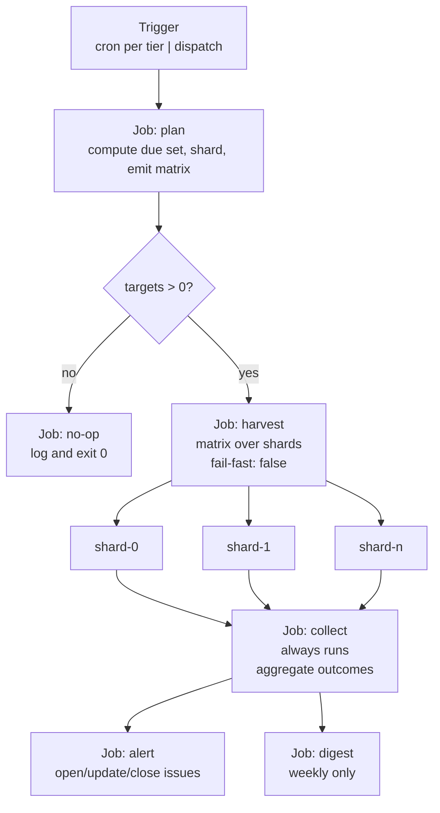
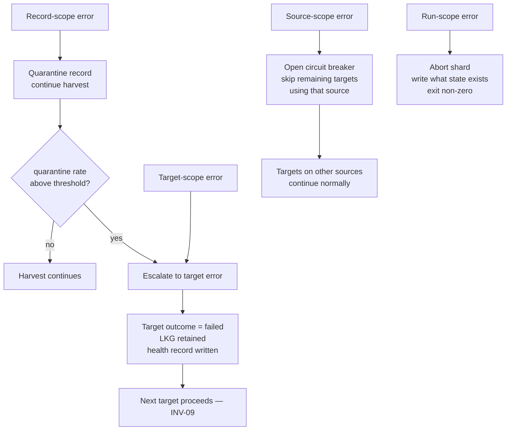
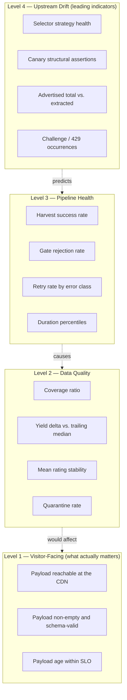
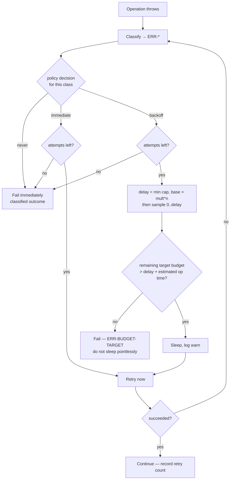
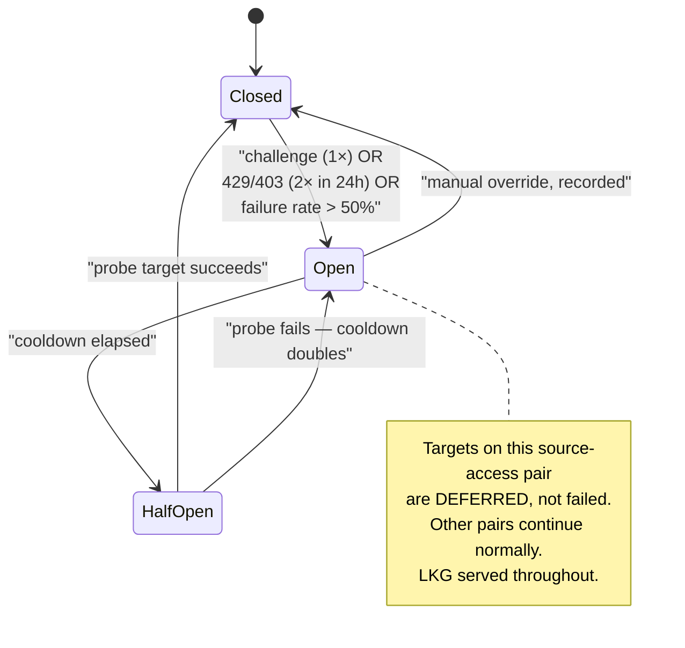
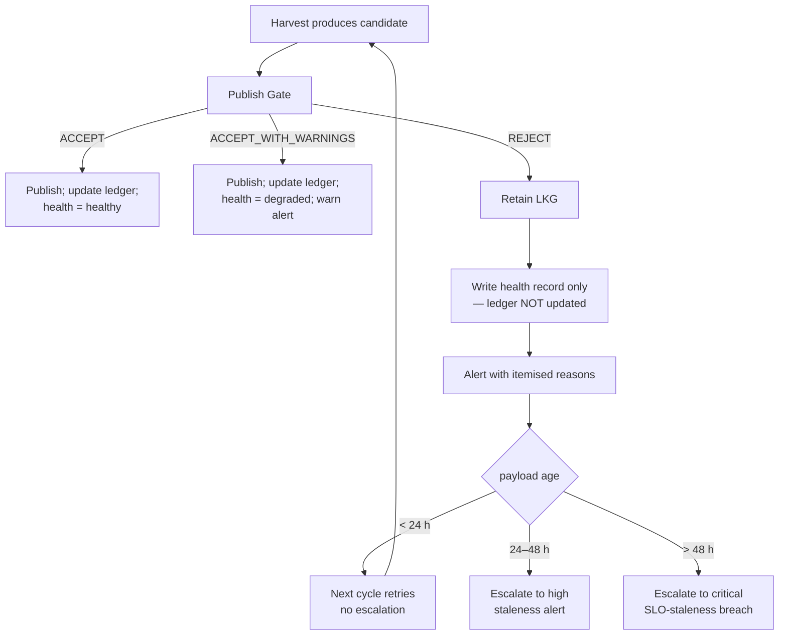

# Part 5 — Operations: Pipeline, Errors, Observability, and Resilience

*Sections 22 through 28. Audience: DevOps, backend engineers, QA. This part specifies how the system runs in production, how it fails, how failure is detected, and how it returns to health without human intervention wherever that is possible.*

---

# 22. GitHub Actions Workflow

## 22.1 Workflow Inventory

Eight workflows, each with a single purpose. Splitting them rather than building one large conditional workflow is deliberate: each has different permissions, different schedules, different failure semantics, and different alerting behaviour, and a single workflow attempting all of that becomes unreadable and over-privileged.

| Workflow | Trigger | Purpose | Permissions | Typical Duration |
|---|---|---|---|---|
| `harvest` | `schedule` (4 cron entries) + `workflow_dispatch` | The production pipeline | `contents: write` on the plan/publish jobs only | 3–20 min |
| `canary` | `schedule` (independent, offset) + `workflow_dispatch` | Detect upstream change before clients are affected | `contents: write` (health only), `issues: write` | 1–3 min |
| `ci` | `pull_request`, `push: main` | Verify every change | `contents: read` | 2–5 min |
| `validate-config` | `pull_request` touching `clients/**`, `profiles/**`, `compliance/**` | Config correctness + authorisation gate + dry-run | `contents: read`, `pull-requests: write` | 1–3 min |
| `pages` | `push: data` | Deploy the static origin | `pages: write`, `id-token: write` | 30–90 s |
| `keepalive` | `schedule` (monthly) | Prevent scheduled-workflow dormancy; assert liveness | `contents: write`, `issues: write` | < 30 s |
| `release` | `push: tags v*` | Verify, generate notes, publish release | `contents: write` | 2–4 min |
| `dependency-audit` | `schedule` (weekly) | Advisory scan; open an issue on new high-severity findings | `contents: read`, `issues: write` | < 60 s |

**Normative permission rule (NFR-027):** every workflow declares `permissions:` explicitly at the top level with the minimum set, and elevates per job only where required. A workflow with no explicit `permissions` block is a CI failure, enforced by a lint step in `ci`.

## 22.2 The `harvest` Workflow — Job Graph

### 22.2.1 Job: `plan`

| Aspect | Specification |
|---|---|
| Purpose | Decide what work exists this cycle, and how to divide it. |
| Steps | 1. Checkout `main` (shallow, sparse: `clients/`, `profiles/`, `src/`, `schemas/`). 2. Setup engine (composite action). 3. Checkout `state` branch into a subdirectory (shallow, sparse: `health/`, `breaker/`). 4. Run `tpre plan --tier <tier> --shards auto --output json`. 5. Emit `matrix` and `target_count` as job outputs. |
| Inputs | `tier` (from the cron entry via a mapping step, or from dispatch input), `client` (optional dispatch override), `force` (optional dispatch flag) |
| Outputs | `matrix` (JSON array of shard descriptors), `target_count`, `plan_summary` (markdown, written to the job summary) |
| Timeout | 5 minutes |
| Permissions | `contents: read` |
| Failure behaviour | If `plan` fails, the whole cycle is skipped. This is safe: no data changes, LKG remains served, and the next cycle retries. An alert fires at `warn`. |
| Design note | Emitting the matrix from a job rather than hard-coding it is what makes client count a data concern rather than a workflow-file concern. Adding the 40th client changes no YAML. |

### 22.2.2 Job: `harvest` (Matrix)

| Aspect | Specification |
|---|---|
| Strategy | `matrix: { shard: fromJSON(needs.plan.outputs.matrix) }`, `fail-fast: false`, `max-parallel` from a repository variable (default 4) |
| `fail-fast: false` rationale | **Load-bearing for INV-09.** With fail-fast enabled, one client's failure cancels every other shard mid-flight, converting a single-client incident into a portfolio-wide outage of freshness. |
| `max-parallel` rationale | Two independent reasons: it bounds concurrent requests to the source (§28), and it stays within the account's concurrent-job allowance so shards do not queue unpredictably. |
| Timeout | `timeout-minutes: 30` per shard (NFR-005 targets ≤ 20; the extra 10 is headroom, not budget) |
| Steps | See table below |
| Permissions | `contents: write` — required to push payload and state commits |
| Continue-on-error | **No.** A shard that genuinely fails should be red. Gate rejections and policy blocks are *not* shard failures — they map to exit codes 5 and 6 which the step treats as success-with-annotation. |

**Shard job steps, in order:**

| # | Step | Timeout | Notes |
|---|---|---|---|
| 1 | Checkout `main` | 2 min | Shallow (`fetch-depth: 1`), sparse — the engine does not need history |
| 2 | Setup engine (composite) | 4 min | Node setup, dependency cache restore, `npm ci`, Playwright browser cache restore, conditional browser install, versions banner |
| 3 | Checkout `data` branch → `./.publish` | 2 min | Shallow. Needed so the Publish Gate can compare against the currently published payload. |
| 4 | Checkout `state` branch → `./.state` | 2 min | Shallow, sparse to the clients in this shard where possible |
| 5 | Run harvest | 24 min | `tpre harvest --shard <i>/<n> --tier <tier>`; env from secrets; captures exit code |
| 6 | Classify exit code | — | Maps exit code → shard conclusion and step annotations (§22.6) |
| 7 | Commit + push `data` | 3 min | Only if artifacts changed; rebase-and-retry ×3 |
| 8 | Commit + push `state` | 3 min | Always (health records are written even on failure) |
| 9 | Upload diagnostics artifact | 2 min | `if: always()`; retention 14 days (NFR-036) |
| 10 | Upload run manifest | 1 min | `if: always()`; small, retained 90 days for trend analysis |
| 11 | Write job summary | — | Human-readable table of per-target outcomes |

**Engineering Note on step 3.** Checking out the `data` branch is what makes the Publish Gate able to compare *change* rather than only inspect *state* (§17.13). Without it, the gate cannot detect "count dropped 70%" — the single most valuable rule it has. Skipping this checkout to save 3 seconds would silently disable the system's most important safety property.

### 22.2.3 Job: `collect`

| Aspect | Specification |
|---|---|
| Condition | `if: always()` — must run even when every shard failed, because that is exactly when alerting matters most |
| Purpose | Download all shard manifests, aggregate outcomes, compute run-level health, write the run summary, and emit an alert plan |
| Outputs | `alert_plan` (JSON: alerts to open, update, or close), `run_status` (`healthy` \| `degraded` \| `failed`) |
| Timeout | 5 min |
| Permissions | `contents: write` (writes the aggregated run manifest to `state`) |

### 22.2.4 Job: `alert`

| Aspect | Specification |
|---|---|
| Condition | `if: always() && needs.collect.outputs.alert_plan != '[]'` |
| Purpose | Reconcile the desired alert state with the actual issue state: open new, update existing, close resolved |
| Permissions | `issues: write` only — deliberately no `contents` access, so a bug in alerting can never touch data |
| Timeout | 3 min |
| Failure behaviour | Alert failures are logged but do not fail the run. **However**, three consecutive alert-job failures escalate to the secondary webhook channel if configured — because a monitoring system that fails silently is worse than none. |

## 22.3 Scheduling

### 22.3.1 Cron Entries

Four schedule entries, one per cadence tier. Each maps to a `tier` input in the `plan` job.

| Tier | Frequency | Cron Pattern (UTC) | Minute Choice Rationale |
|---|---|---|---|
| `hourly` | Every hour | Minute 17 | Off-the-hour to avoid the platform-wide congestion at `:00`, which is the most common cause of delayed scheduled runs |
| `standard` | Every 6 hours | Minute 23, hours 1/7/13/19 | Default tier. Odd hours avoid the midnight/noon peak. |
| `relaxed` | Every 12 hours | Minute 41, hours 3/15 | |
| `daily` | Daily | Minute 52, hour 4 | Low-traffic window in the primary market |

**Normative:** cron minutes MUST NOT be `0`, `15`, `30`, or `45`. Scheduled workflows across the platform cluster heavily at those minutes, and clustering is the primary cause of multi-minute delivery delay (CON-10).

### 22.3.2 Due-Set Semantics

A target is due when `now − last_success ≥ tier_interval × 0.9`. The 0.9 factor absorbs scheduler jitter: without it, a run delivered 4 minutes late would find nothing due and skip an entire cycle, effectively halving the cadence.

| Rule | Statement |
|---|---|
| A target may appear in more than one tier's schedule window; the due-set check prevents double-harvesting. |
| A target that has **never** succeeded is always due. |
| A target whose circuit breaker is open is **not** due until the breaker's cooldown expires. |
| `--force` bypasses the due check but never bypasses the Publish Gate or the policy preflight. |
| A missed cycle is **not** made up. Cadence is a rate, not a schedule of instants. |

### 22.3.3 Concurrency Control

| Setting | Value | Rationale |
|---|---|---|
| Concurrency group | `harvest-${{ inputs.tier || 'scheduled' }}` | Per-tier grouping, so a long `daily` run does not block the `standard` tier |
| `cancel-in-progress` | `false` for scheduled runs; `true` for dispatch | Cancelling a scheduled run mid-flight could abandon staged commits. Queuing is safer. For manual dispatch, the operator wants the newest attempt to win. |
| Overlap guard | If a run finds a previous run of the same group still active, it exits `0` with a `skipped_overlap` annotation | Prevents two runs writing the same client paths concurrently |

### 22.3.4 Scheduled-Workflow Dormancy (RISK-17)

**Operational trap, stated explicitly.** The platform may automatically disable scheduled workflows in a repository that has had no activity for an extended period. Since the harvest workflow's own commits land on the `data` and `state` branches — not on the default branch — a naive deployment can be silently switched off after a quiet period.

| Mitigation | Detail |
|---|---|
| Keepalive workflow | Monthly, makes a trivial verifiable change (updates a timestamp file on `state`) and asserts that the harvest workflow's `state` is `active` via the API |
| Liveness alert | If `keepalive` finds the harvest workflow disabled, it opens a `critical` issue immediately |
| Staleness alert (independent) | `SLO-staleness-alarm` fires at 24 h and pages at 48 h regardless of cause, so dormancy is caught even if keepalive itself fails |
| Documented in the runbook | §50.3 lists "check that schedules are still enabled" as a monthly manual verification |

**Two independent detectors are used deliberately.** Keepalive detects the cause; staleness detects the symptom. A monitoring design that relies on a single detector for a silent failure mode is not a monitoring design.

## 22.4 Triggers

| Trigger | Workflow | Inputs | Who Uses It |
|---|---|---|---|
| `schedule` | harvest, canary, keepalive, dependency-audit | tier derived from cron | The system |
| `workflow_dispatch` | harvest | `tier`, `client`, `listing`, `force`, `dry_run`, `log_level` | Engineer, for UC-13 and UC-12 verification |
| `workflow_dispatch` | canary | `selector_pack` override | Engineer, verifying a pack fix before merge |
| `pull_request` | ci, validate-config | — | Every change |
| `push: main` | ci | — | Post-merge verification |
| `push: data` | pages | — | The system |
| `push: tags v*` | release | — | Release process |

**Explicitly not used:** `pull_request_target`. It runs workflow code from the base branch with access to secrets in the context of an untrusted fork PR, and is the single most common cause of CI credential compromise. Forbidden by §35.3 and checked by a CI lint rule.

**Also not used:** `repository_dispatch` in v1.0. It is the natural trigger for a future "client requests immediate refresh" feature (§57) and is deliberately deferred rather than left half-implemented.

## 22.5 Timeouts

Every level has an explicit timeout. Nested budgets are set so that the inner one always fires first, producing a *diagnosable* failure rather than an opaque platform cancellation.

| Level | Timeout | If Exceeded |
|---|---|---|
| Per-network-operation (page load, API call) | 15–30 s | Classified error, retryable per policy |
| Per pagination loop | 120 s | Stop reason `budget_exhausted` ⇒ completeness `partial` |
| Per target (client × listing) | 300 s | `ERR-BUDGET-TARGET`, target marked failed, next target proceeds |
| Per run (in-engine) | 15 min | Remaining targets marked `deferred`, exit 4 |
| Per shard job (platform) | 30 min | Platform cancels the job — **the failure mode we design to avoid**, because it produces no manifest |
| Per workflow | Platform default | Never approached |

**Normative:** the in-engine run budget (15 min) MUST be at least 10 minutes below the platform job timeout (30 min). The engine must always be the thing that stops, because only the engine can write a manifest, flush logs, upload diagnostics, and commit health records. A platform-level cancellation loses all of it — which turns a 10-minute investigation into a guess.

## 22.6 Failure Handling and Exit-Code Mapping

| Engine Exit Code | Meaning | Shard Job Conclusion | Annotation | Alert Severity |
|---|---|---|---|---|
| 0 | All targets succeeded | success | — | none |
| 4 | Partial: some targets failed or deferred | success | `warning` per failed target | `warn` |
| 5 | Gate rejection (no target succeeded, none crashed) | success | `warning` | `error` |
| 6 | Policy blocked | success | `notice` | `warn` (or `info` if the block was intentional) |
| 7 | Bot challenge encountered | success | `warning` | **`critical`** |
| 3 | All targets failed | **failure** | `error` | `error` |
| 2 | Invalid usage or config | **failure** | `error` | `error` |
| 1 | Unexpected internal error | **failure** | `error` | `critical` |

**Why codes 5, 6, and 7 do not fail the job.** A red CI badge is a signal that *the code is broken*. A gate rejection means the code worked correctly and correctly refused to publish bad data — that is a data incident, not a build failure. Conflating them trains the maintainer to ignore red builds, which is the fastest route to missing a real regression. The distinction is enforced by the classification step (§22.2.2 step 6).

**Why code 7 is critical despite not failing the job.** A bot challenge is the highest-severity operational event in the system (§29) and demands human judgement about policy, not a retry. Severity is orthogonal to job conclusion.

## 22.7 Secrets

| Secret | Required By | Scope | Notes |
|---|---|---|---|
| `GITHUB_TOKEN` | publish, alert | Automatic, per-job | Never stored; permissions declared per job |
| `GOOGLE_PLACES_API_KEY` | `google:places-api` adapter | Repository | Optional — only if any client uses this adapter |
| `GBP_OAUTH_CLIENT_ID` | `google:business-profile-api` | Repository | One per TradyPerch developer registration |
| `GBP_OAUTH_CLIENT_SECRET` | same | Repository | |
| `GBP_REFRESH_TOKEN__<CLIENT_SLUG_UPPER>` | same | Repository, one per client | Per-client naming so a single client's grant can be revoked without affecting others |
| `ALERT_WEBHOOK_URL` | notifier (secondary) | Repository | Optional |

**Normative secret rules:**

| # | Rule |
|---|---|
| SEC-1 | Secrets are referenced only in `env:` of the specific step that needs them. Never at workflow or job level, so an unrelated step cannot read them. |
| SEC-2 | Secrets are never passed as command-line arguments (process lists are visible in some contexts) — only via environment variables. |
| SEC-3 | The engine reads secrets exactly once at startup into a sealed config object, and the logger's redaction filter is seeded with their values so any accidental log of a secret value is masked at the sink (§24.4). |
| SEC-4 | Adapters requiring a missing secret **fail closed** with exit 2 (FR-026). They never fall back to an unauthenticated path — a silent downgrade from the sanctioned API to DOM scraping would be a serious policy violation. |
| SEC-5 | No secret is available to workflows triggered by forked pull requests. `validate-config` therefore runs a network-free dry run only. |
| SEC-6 | Secret rotation procedure and cadence are defined in §35.5; per-client tokens are rotated on client offboarding. |

## 22.8 Caching

Four caches, each with a distinct key strategy. **Normative: no cache may be correctness-critical (CON-09).** A cold cache must produce identical output, only slower.

| Cache | Key | Restore Keys | Size | Effect | If Cold |
|---|---|---|---|---|---|
| npm dependencies | `node-${{ runner.os }}-${{ hashFiles('package-lock.json') }}` | `node-${{ runner.os }}-` | ~40 MB | Saves ~25 s | `npm ci` from network (~30 s) |
| Playwright browsers | `pw-${{ runner.os }}-${{ steps.pwver.outputs.version }}` | none (exact only) | ~350 MB | Saves ~45 s | Browser download (~50 s) |
| Resolved listing identities | Not a CI cache — persisted on the `state` branch | — | < 1 KB/listing | Eliminates the search step entirely | One search per listing, with a warning |
| Rate-limit budget counters | Persisted on the `state` branch | — | < 1 KB | Cross-run rate accounting | Assume budget consumed; defer (fail closed) |

**Why the Playwright cache uses an exact key with no restore-keys fallback:** a partial restore of a different browser version is worse than no cache — it produces a subtly different browser than the pin specifies, silently breaking the determinism that RISK-14's mitigation depends on. Cache misses on browser version change are correct and desirable.

**Cache eviction awareness.** Platform caches are evicted after a period of non-use and are subject to a repository-wide size ceiling. Design consequence: a client on the `daily` tier whose shard runs once per day still hits the cache; a repository quiet for weeks will cold-start. Both are acceptable — the cost is seconds, not correctness.

## 22.9 Notifications

Detailed in §25.6. Workflow-level integration points:

| Event | Channel | Payload |
|---|---|---|
| New failure condition | GitHub Issue, opened with a deduplicating fingerprint in the title | Symptom, affected clients, error class, run link, suggested runbook |
| Existing condition persists | Comment on the open issue, rate-limited to one comment per 6 h | Occurrence count, trend |
| Condition clears | Issue closed with a resolution comment | Cycles healthy, restored counts |
| Critical severity | Issue + optional webhook | Same, plus explicit "action required" framing |
| Weekly digest | Single issue, updated in place | Per-client health table, yield trend, open conditions |

## 22.10 Workflow Design Decisions

| Decision | Chosen | Rejected Alternative | Reason |
|---|---|---|---|
| One workflow with conditionals vs. eight focused workflows | Eight | One | Different permissions, schedules, and failure semantics. A single workflow would need the union of all permissions — violating least privilege. |
| Matrix over shards vs. sequential loop in one job | Matrix | Sequential | Parallelism, per-shard isolation (INV-09), independent timeouts, and per-shard diagnostics. |
| Matrix generated by a job vs. hard-coded in YAML | Generated | Hard-coded | Client count becomes data, not configuration. BG-02. |
| Commit per target vs. commit per shard | Per shard | Per target | 5–20× fewer commits (CON-13) at the cost of replayable work on crash — safe because of INV-04. |
| Composite action for setup vs. duplicated steps | Composite | Duplicated | Setup logic exists once; a Node or Playwright version change is a one-file edit. |
| Third-party actions pinned by SHA vs. tag | **SHA** | Tag | NFR-028. A mutable tag is a supply-chain hole with write access to the repository. |
| Self-hosted runner vs. hosted | Hosted | Self-hosted | Cost, maintenance, and — decisively — a persistent runner with write access is a far worse security position (§36). |

---

# 23. Error Handling

## 23.1 Philosophy

| Principle | Consequence |
|---|---|
| **Every error has a class, and the class determines behaviour.** | No `catch (e) { console.log(e) }`. The class drives retry policy, alert severity, exit code, and runbook selection — all mechanically. |
| **Errors are values in the core, exceptions at the boundaries.** | `core/` returns `Result` types (`util/result.mjs`). Adapters and infrastructure may throw; the target runner converts throws into classified outcomes at exactly one place. |
| **Fail closed on permission, fail soft on data.** | A missing secret or a policy block stops everything. A single malformed review is quarantined and the harvest continues. |
| **Never let a partial success masquerade as success.** | Completeness classification propagates all the way to the payload (`harvest_completeness`) and to the gate. |
| **An unclassified error is a defect.** | The catch-all class `ERR-INTERNAL-UNCLASSIFIED` exists, and its occurrence opens a `critical` alert — because it means the taxonomy has a hole. |

## 23.2 Error Taxonomy

Format: `ERR-<DOMAIN>-<SPECIFIC>`. The table is the single source of truth for retry policy (§26.2) and alert severity (§25.4).

### 23.2.1 Policy and Configuration

| Class | Meaning | Retry | Scope | Severity |
|---|---|---|---|---|
| `ERR-POLICY-KILLSWITCH` | Global or per-source acquisition disabled | never | target | info |
| `ERR-POLICY-UNAUTHORIZED` | Authorisation record missing or incomplete (FR-086) | never | target | error |
| `ERR-POLICY-ROBOTS` | Robots directive disallows and mode is `block` | never | target | warn |
| `ERR-POLICY-BUDGET` | Rate budget exhausted | never (deferred) | target | info |
| `ERR-POLICY-BREAKER-OPEN` | Circuit breaker open for this source | never (deferred) | source | warn |
| `ERR-CONFIG-INVALID` | Config fails schema validation | never | target | error |
| `ERR-CONFIG-VERSION` | Unsupported `config_version` | never | run | error |
| `ERR-CONFIG-SECRET-MISSING` | Adapter requires an absent secret | never | run | error |

### 23.2.2 Resolution

| Class | Meaning | Retry | Scope | Severity |
|---|---|---|---|---|
| `ERR-RESOLVE-NO-IDENTIFIER` | No identifier and search disallowed | never | target | error |
| `ERR-RESOLVE-NOTFOUND` | Listing not found | never | target | error |
| `ERR-RESOLVE-AMBIGUOUS` | Multiple candidates above threshold | never | target | error |
| `ERR-IDENTITY-DRIFT` | Resolved listing name no longer matches expectation | never | target | **high** |

### 23.2.3 Network and Transport

| Class | Meaning | Retry | Scope | Severity |
|---|---|---|---|---|
| `ERR-NET-DNS` | DNS failure | backoff ×3 | target | warn |
| `ERR-NET-TIMEOUT` | Connection or read timeout | backoff ×3 | target | warn |
| `ERR-NET-RESET` | Connection reset | backoff ×3 | target | warn |
| `ERR-NET-TLS` | TLS negotiation failure | backoff ×2 | target | warn |
| `ERR-HTTP-429` | Rate limited by the source | backoff ×2, long delay | **source** | **high** |
| `ERR-HTTP-5XX` | Source server error | backoff ×3 | target | warn |
| `ERR-HTTP-4XX` | Client error other than 429 | never | target | error |
| `ERR-HTTP-403` | Forbidden — possible block | never | **source** | **high** |

### 23.2.4 Browser and Navigation

| Class | Meaning | Retry | Scope | Severity |
|---|---|---|---|---|
| `ERR-BROWSER-LAUNCH` | Browser failed to start | immediate ×1 | run | error |
| `ERR-BROWSER-CRASH` | Context or page crashed | backoff ×1 | target | warn |
| `ERR-BROWSER-OOM` | Out of memory | **never** | target | error |
| `ERR-NAV-TIMEOUT` | Page load exceeded budget | backoff ×2 | target | warn |
| `ERR-NAV-SURFACE-NOT-FOUND` | Review surface could not be located | never | target | **high** |
| `ERR-NAV-CONSENT-WALL` | Non-dismissible interstitial | never | source | **high** |
| `ERR-BUDGET-TARGET` | Per-target wall clock exhausted | never | target | warn |

**Why `ERR-BROWSER-OOM` is never retried:** retrying an out-of-memory condition with the same inputs reproduces it deterministically while consuming another several minutes of budget. The correct response is a configuration change (lower `max_reviews`), which is a human decision.

### 23.2.5 Anti-Bot (Terminal Class)

| Class | Meaning | Retry | Scope | Severity |
|---|---|---|---|---|
| `ERR-BLOCKED-CHALLENGE` | Bot-detection challenge presented | **NEVER** | **source, breaker opens** | **critical** |
| `ERR-BLOCKED-UNUSUAL-TRAFFIC` | Unusual-traffic interstitial | **NEVER** | source, breaker opens | **critical** |
| `ERR-BLOCKED-GEO` | Regional redirect or restriction | never | source | warn |

**Normative (INV-07):** these classes MUST be non-retryable at the policy level, not merely by convention. The retry policy table encodes `never`, and a unit test asserts that no retry path exists for them. Retrying a challenge is the exact behaviour that escalates a soft signal into a hard block.

### 23.2.6 Parsing and Data

| Class | Meaning | Retry | Scope | Severity |
|---|---|---|---|---|
| `ERR-PARSE-STRUCTURE` | Review container not found in a page that loaded | never | target | **high** — primary RISK-01 signal |
| `ERR-PARSE-EMPTY-UNEXPECTED` | Zero reviews and no empty-state signal | never | target | **high** |
| `ERR-PARSE-FIELD-REQUIRED` | Required field unresolvable | never | **record** (quarantine) | warn (error above quarantine threshold) |
| `ERR-PARSE-RATING-INVALID` | Rating outside 1–5 or non-integer | never | record | warn |
| `ERR-PARSE-SELECTOR-PACK` | Pack malformed or fails its schema | never | run | error |
| `ERR-CLEAN-MARKUP-SURVIVED` | Markup present after cleaning | never | record | **critical** — indicates a security-boundary defect (§20.6.7) |
| `ERR-VALIDATE-QUARANTINE-RATE` | Quarantine rate above threshold | never | target | error |
| `ERR-VALIDATE-AGGREGATE` | Aggregate plausibility failure | never | target | error |

### 23.2.7 State, Gate, and Publication

| Class | Meaning | Retry | Scope | Severity |
|---|---|---|---|---|
| `ERR-STATE-CORRUPT` | Ledger fails schema validation | never | target | **high** |
| `ERR-STATE-WRITE` | Ledger write failed | backoff ×2 | target | error |
| `ERR-GATE-REJECT-COUNT-DROP` | Count fell beyond tolerance | never | target | error |
| `ERR-GATE-REJECT-RATING-SHIFT` | Mean rating moved beyond tolerance | never | target | error |
| `ERR-GATE-REJECT-EMPTY` | Candidate empty, prior non-empty | never | target | **critical** |
| `ERR-GATE-REJECT-COVERAGE` | Completeness `partial` with material change | never | target | warn |
| `ERR-GATE-REJECT-SCHEMA` | Candidate fails its own schema | never | target | **critical** — engine defect |
| `ERR-PUBLISH-CONFLICT` | Push rejected after retries | backoff ×3 then give up | shard | warn |
| `ERR-PUBLISH-AUTH` | Token lacks permission | never | run | **critical** |

### 23.2.8 Internal

| Class | Meaning | Retry | Scope | Severity |
|---|---|---|---|---|
| `ERR-INTERNAL-INVARIANT` | An assumed invariant was violated | never | run | **critical** |
| `ERR-INTERNAL-UNCLASSIFIED` | An error escaped classification | never | target | **critical** |

## 23.3 Error Object Shape

Every classified error carries:

| Field | Purpose |
|---|---|
| `class` | The `ERR-*` constant. Drives all mechanical behaviour. |
| `message` | Human-readable, **never** containing untrusted content verbatim (NFR-030) |
| `stage` | Which of the ten stages produced it |
| `scope` | `record` \| `target` \| `shard` \| `source` \| `run` |
| `retryable` | Derived from policy, materialised for auditability |
| `context` | Bounded structured object: counts, timings, selector strategy indices, stop reason. **Never** raw page content. |
| `cause` | The underlying error, with its stack, for logs only |
| `runbook` | Path to the relevant runbook, e.g. `docs/runbooks/selector-break.md` |

**The `runbook` field is not decoration.** An alert that tells the on-call engineer exactly which document to open removes the slowest step in incident response: figuring out what kind of problem this is.

## 23.4 Error Propagation

**Note the asymmetry in source-scope handling.** A source-level block affects all clients using that source — but a client on the Business Profile API adapter is on a *different* source-access pair and continues normally. This is a direct operational dividend of ADR-002's two-dimensional adapter model: a block on one access method does not take down clients on another.

## 23.5 Anti-Patterns (Forbidden)

| Anti-Pattern | Why Forbidden |
|---|---|
| Swallowing an error and returning an empty array | Converts a failure into apparent success with zero reviews — the exact path to a wiped payload. |
| Catching broadly and retrying without classification | Retries a challenge or a structure change, wasting budget and escalating a block. |
| Interpolating untrusted content into an error message | Log-injection and workflow-expression-injection vector (NFR-030). |
| Using an exception for control flow inside `core/` | Breaks purity and makes `Result`-based composition inconsistent. |
| Alerting on every error occurrence | Alert fatigue. Deduplication and thresholds are mandatory (§25.7). |
| `process.exit()` from anywhere but the CLI | Skips log flushing, manifest writing, and diagnostics upload — destroying the evidence needed to diagnose the failure. |

---

# 24. Logging Strategy

## 24.1 Objectives

| Objective | Mechanism |
|---|---|
| Any production failure diagnosable from artifacts alone, without reproduction | Structured events + ring-buffered debug + snapshot capture |
| Zero secret or PII leakage | Sink-level redaction + bounded context + sanitised snapshots |
| Machine-analysable for trends | JSONL with a stable field set |
| Cheap when healthy | Debug buffered in memory, flushed only on failure |
| Attributable | Every event carries `runId`, `clientSlug`, `listingKey`, `stage` |

## 24.2 Format and Field Set

JSONL — one JSON object per line. Mandatory fields on every event:

| Field | Type | Notes |
|---|---|---|
| `ts` | RFC 3339 with milliseconds | UTC always |
| `level` | enum | `trace` \| `debug` \| `info` \| `warn` \| `error` \| `fatal` |
| `runId` | string | Correlates across shards, manifests, and artifacts |
| `event` | string | Stable dot-notation name, e.g. `nav.pagination.iteration` |
| `stage` | string | One of the ten stage names, or `orchestrator` |

Conditional fields: `clientSlug`, `listingKey`, `targetId`, `durationMs`, `count`, `errorClass`, `detail` (bounded object, ≤ 2 KB serialised), `attempt`, `outcome`.

**Normative:** `event` names are drawn from a fixed enumeration defined in code, not composed at call sites. Free-form event names make the logs unqueryable within a month.

## 24.3 Level Policy

| Level | Use | Retained |
|---|---|---|
| `trace` | Per-record extraction detail, per-scroll measurements | Ring buffer only; flushed on target failure |
| `debug` | Stage entry/exit, selector strategy resolution, blocked-request counts | Ring buffer only; flushed on target failure |
| `info` | Stage completion with counts and timings; target outcome; run summary | Always written |
| `warn` | Fallback strategy used, record quarantined, retry attempted, coverage below target, search used at runtime | Always written |
| `error` | Target failed, gate rejected, publish conflict | Always written |
| `fatal` | Run aborted | Always written |

### 24.3.1 The Ring Buffer

| Aspect | Detail |
|---|---|
| Size | 2,000 events or 4 MB, whichever first, per target |
| Behaviour | `trace`/`debug` events accumulate in memory. On target success they are discarded. On target failure they are flushed to the diagnostics bundle ahead of the failure event. |
| Effect | Full-fidelity debug logs for exactly the runs that need them; a healthy 1,000-review harvest writes ~60 lines instead of ~15,000. |
| Trade-off accepted | A memory cost of a few MB per target, and no debug detail for a *successful but subtly wrong* run — mitigated because the gate turns "subtly wrong" into a failure, which triggers the flush. |

## 24.4 Redaction

**Applied at the sink, never at the call site (FR-076).** This is the single most important design decision in the logging subsystem: it means a careless `log.debug({ detail: config })` cannot leak, because avoiding the leak is not the caller's responsibility.

| Redaction Rule | Implementation |
|---|---|
| Known secret values | The sink is seeded at startup with every secret value read from the environment; exact and substring matches are replaced with `«redacted:NAME»` |
| Key-name patterns | Any object key matching `/token|secret|key|password|cookie|auth|credential|refresh/i` has its value replaced |
| Authorization headers | Never logged, at any level |
| Cookies and storage state | Never logged, never written to any artifact |
| URLs | Query strings stripped unless explicitly allowlisted (avatar size parameters) |
| Review text | **Truncated to 120 characters** in logs, and only at `debug`. Full text lives in the payload, which is its proper home; logs are not a data store. |
| Author names | Logged only as `author_key` hash prefixes at `debug`. Never as plain names. |

**Verification:** a unit test feeds a synthetic config containing known sentinel secret values through every log level and asserts no sentinel appears in the output. This test is mandatory and blocks release.

## 24.5 Log Destinations

| Destination | Content | Retention |
|---|---|---|
| stdout (workflow log) | `info` and above, pretty-formatted for human reading | Platform log retention |
| `run.jsonl` (artifact) | All written events, structured | 14 days (NFR-036) |
| `manifest.json` (artifact) | Aggregated run facts, no event stream | 90 days — small, and the basis of trend analysis |
| Job summary (markdown) | Per-target outcome table | Platform retention |
| Health series (`state` branch) | One record per target per run | Indefinite — this is the monitoring substrate |

**Why manifests are retained 6× longer than logs:** manifests contain no PII and no raw content, are ~4 KB, and answer the questions that matter months later ("when did coverage start declining?"). Logs contain bounded PII and are only useful during an active investigation.

## 24.6 Diagnostics Bundle (On Failure)

Written per failed target into `diagnostics/<clientSlug>/<listingKey>/`:

| File | Content | Sanitisation |
|---|---|---|
| `flushed.jsonl` | The ring buffer contents | Full redaction applied |
| `error.json` | The classified error object including `context` and `runbook` | Bounded context only |
| `snapshot.html` | The review subtree markup at failure | Scripts removed, PII-bearing attributes stripped, tokens and cookies removed, review text preserved (needed for parser repair) |
| `snapshot.png` | Screenshot of the viewport | Captured at reduced resolution; may contain reviewer names — retention 14 days, access limited by repository visibility |
| `acquisition-report.json` | Pagination growth curve, stop reason, timings, blocked-byte counts | Safe |
| `effective-config.json` | Fully resolved config with the resolution trace | Secrets stripped |
| `selector-health.json` | Per-field strategy resolution statistics | Safe |

**This bundle is the difference between TG-06 (60-minute repair) and a multi-hour investigation.** `snapshot.html` in particular converts a live-site debugging session into an offline fixture-based one: drop it into `fixtures/dom/google/`, add an `expected.json`, and the parser can be fixed and regression-tested without touching the network.

**Privacy note.** `snapshot.png` is the only artifact that may contain unredacted personal data (reviewer names and avatars as rendered). It is therefore: captured only on failure, retained 14 days, and excluded from any long-lived storage. A configuration flag (`diagnostics.screenshot: false`) allows a privacy-sensitive deployment to disable it entirely at the cost of some diagnosability.

## 24.7 Retention Summary

| Artifact | Retention | Driver |
|---|---|---|
| Workflow logs | Platform default | — |
| `run.jsonl` | 14 days | NFR-036, PII minimisation |
| Diagnostics bundle | 14 days | NFR-036 |
| `manifest.json` | 90 days | Trend analysis, no PII |
| Health series | Indefinite | Monitoring substrate, no PII beyond counts |
| Ledger | Indefinite | Source of truth |
| Payload history (Git) | Truncated per §33.5 | Storage management |

---

# 25. Monitoring Strategy

## 25.1 Constraint and Approach

There is no budget for a monitoring SaaS (CON-01). The approach is therefore to make the repository itself the monitoring system:

- **Metrics** are append-only JSONL records on the `state` branch.
- **Dashboards** are generated markdown in the job summary and a weekly digest issue.
- **Alerts** are GitHub Issues, deduplicated by fingerprint.
- **Synthetic checks** are the canary harvest and a published-payload verification job.

This is genuinely adequate for the scale in question, and it has one property a SaaS would not: **the monitoring data lives next to the code and the data it describes, versioned together.** Its honest limitations are stated in §25.9.

## 25.2 Signal Hierarchy

**The arrows point in the direction of causation, and monitoring effort is inverted relative to it.** Level 1 is what the client cares about and is almost never the first thing to break. Level 4 is where breakage begins, and is where the alerting invests most heavily — because catching drift at Level 4 means Level 1 never degrades at all.

## 25.3 Metric Catalogue

| ID | Metric | Type | Source | Alert Threshold |
|---|---|---|---|---|
| `MET-harvest-yield` | Reviews extracted per harvest | gauge | Health record | Drop > 30% vs. trailing 5-run median |
| `MET-coverage` | extracted ÷ advertised | gauge | Health record | < 0.95 for 2 consecutive `full` harvests |
| `MET-completeness` | full / full_capped / partial / failed | enum | Health record | `partial` for 3 consecutive runs |
| `MET-harvest-duration` | Wall clock per target | histogram | Manifest | p95 > 240 s |
| `MET-harvest-success-rate` | succeeded ÷ attempted, 7-day window | ratio | Health series | < 0.95 |
| `MET-gate-rejection-rate` | rejected ÷ attempted, 7-day | ratio | Health series | > 0.10 |
| `MET-payload-age` | now − `generated_at` | gauge | Published manifest | > 24 h warn, > 48 h critical |
| `MET-quarantine-rate` | quarantined ÷ extracted | ratio | Validation report | > 0.05 |
| `MET-selector-health` | Fraction of fields resolved at strategy index 0 | ratio | Selector health | < 0.95 warn, < 0.80 error |
| `MET-retry-rate` | Retries per harvest by class | counter | Manifest | > 3 per target |
| `MET-challenge-count` | Bot challenges in 24 h | counter | Health series | ≥ 1 → critical |
| `MET-429-count` | HTTP 429 responses in 24 h | counter | Health series | ≥ 1 → high |
| `MET-payload-size` | Bytes per artifact | gauge | Manifest | > 2 MB → sharding review |
| `MET-repo-growth` | Data branch size delta per week | gauge | Maintenance job | > 50 MB/week |
| `MET-commit-churn` | Commits per client per week | counter | Git log | > 30 → hash-gate defect |

## 25.4 Alert Severity Model

| Severity | Definition | Response Time | Channel |
|---|---|---|---|
| **critical** | Visitor impact possible, or a security/policy event | Same day | Issue (title-tagged) + webhook if configured |
| **high** | Data correctness at risk; LKG protecting visitors | 1 business day | Issue |
| **error** | Pipeline failing for one or more clients; no visitor impact | 2 business days | Issue |
| **warn** | Degradation or leading indicator; no current impact | Next maintenance window | Issue, batched |
| **info** | Notable but expected (policy block, deferral) | None | Job summary only |

**Critical is deliberately narrow.** Only four conditions qualify: a bot challenge (`ERR-BLOCKED-*`), an empty-payload gate rejection, a publish-auth failure, and a security-boundary breach (`ERR-CLEAN-MARKUP-SURVIVED`). Everything else is at most `high`. A severity scheme where most things are critical is a severity scheme with one level.

## 25.5 The Canary — Leading-Indicator Detection

> **Purpose:** detect upstream structural change *before* it affects a client, on a schedule independent of client harvests.

| Aspect | Specification |
|---|---|
| Target | A fixed, well-known public listing with many reviews, unrelated to any client. Chosen for stability, not for relevance. |
| Schedule | Every 3 hours, offset from all client tiers |
| What it does | A full harvest with `--no-publish`, then evaluates the structural assertions from `selectors/google-maps/assertions.json` |
| Assertions | Review container locatable; ≥ N review nodes present; every required field resolvable at strategy index 0; rating parseable by parser P1; relative-date phrase matches a known locale pattern; expansion affordance present; sort control present |
| On failure | Opens/updates a `high` issue naming the specific failed assertion — which is a far better starting point than "extraction broke" |
| Cost | ~90 s per run, 8 runs/day. Trivial. |
| Why not just watch client yield | Yield drops *after* the break and is confounded by genuine review-count changes. Assertions fail at the moment structure changes, are unambiguous, and name the specific field. |
| Rate-limit consideration | The canary counts against the source budget like any harvest, and its frequency is set with that in mind (§28.2). |

**Assertion-level rather than yield-level detection is what makes TG-06 achievable.** "Assertion `fields.rating.strategy[0]` failed on the canary" tells the engineer which line of the selector pack to edit. "Yield fell 40% for three clients" starts an investigation.

## 25.6 Alerting Mechanics

> **ADR-021 — GitHub Issues as the primary alert channel**
> **Status:** Accepted
> **Context:** Alerting must cost nothing (CON-01), must be visible to a part-time maintainer (CON-05), and must not require a new integration to check.
> **Decision:** Alerts are GitHub Issues with a deduplicating fingerprint embedded in the title. An optional webhook is a secondary channel for `critical` only.
> **Alternatives Rejected:** *Email* — no threading, no dedup, no state, easy to filter into oblivion. *Slack/Discord webhook as primary* — free, but stateless: no way to represent "still broken" versus "broken again", and no assignment or history. Retained as a *secondary* channel precisely because it is good at interrupting and bad at record-keeping. *A monitoring SaaS free tier* — violates the spirit of CON-01 and adds a vendor for a system whose entire premise is not having one. *Failing the CI build as the alert* — conflates code failure with data failure (§22.6).
> **Consequences:** Alerts are stateful, threaded, searchable, assignable, and free, and they live where the maintainer already works. Cost: no phone-waking capability without the webhook, which is acceptable because **no failure mode in this system requires a 3 a.m. response** — LKG protects visitors in every case.

**Fingerprint and lifecycle:**

| Aspect | Rule |
|---|---|
| Fingerprint | `[tpre:<severity>:<condition>:<scope>]` in the title, e.g. `[tpre:high:selector-drift:google-maps/v3]` |
| Dedup | An open issue with the same fingerprint is commented on, not duplicated |
| Comment rate limit | One comment per fingerprint per 6 hours, regardless of occurrence count; the count is included |
| Auto-close | When the condition is absent for `N` consecutive cycles (default 2), the issue is closed with a resolution comment (FR-082) |
| Flap suppression | An issue reopened more than 3 times in 24 h is escalated one severity level and labelled `flapping` — because an intermittent fault is often worse than a consistent one |
| Content | Symptom, affected clients, error class, metric values with trend, direct run link, and the `runbook` path |

## 25.7 Alert Fatigue Controls

| Control | Rule |
|---|---|
| Threshold over occurrence | Almost every alert requires N consecutive occurrences, not one. Exceptions: challenge, publish-auth, empty-payload rejection, markup-survived. |
| Batching | `warn` alerts are batched into the weekly digest unless they persist beyond 3 cycles. |
| Suppression during known incidents | An open `critical` issue for a source suppresses downstream `error`/`warn` alerts caused by it, which are listed in the critical issue instead. |
| Maintenance mode | A repository variable suppresses non-critical alerts during a planned maintenance window (§50.4). |
| No alert without an action | Every alert type maps to a runbook. **Normative: if there is no action a human would take, it is a metric, not an alert.** |

## 25.8 Dashboards

| Dashboard | Where | Refresh | Content |
|---|---|---|---|
| Run summary | Workflow job summary | Per run | Per-target outcome table: status, yield, coverage, duration, decisions |
| Weekly digest | A single long-lived issue, updated in place | Weekly | Per-client health matrix, yield sparkline data, success rate, open conditions, upcoming maintenance |
| Client health card | Generated markdown on the `state` branch | Per run | Last 30 harvests for one client: outcome, yield, coverage, completeness |
| Payload verification | Dedicated job output | Daily | For each published payload: reachable, schema-valid, non-empty, age. **A true synthetic check from outside the pipeline.** |

**The payload verification check is the only Level-1 monitor and is therefore the most important one.** It fetches each published payload over the public CDN URL exactly as a visitor's browser would, and asserts reachability, schema validity, non-emptiness, and age. Every other monitor watches the pipeline; this one watches the promise.

## 25.9 Honest Limitations of This Monitoring Approach

| Limitation | Impact | Accepted Because |
|---|---|---|
| No real-time alerting; detection latency equals cycle time | A failure at 06:05 is detected at the 07:23 cycle | LKG means detection latency has no visitor impact |
| No paging; relies on the maintainer reading issues | A weekend failure may sit until Monday | No failure mode requires urgent response; staleness alerting escalates at 48 h |
| Metrics are files, so ad-hoc querying means writing a script | Slower exploratory analysis | Scale does not justify a time-series database; §58 addresses this when it does |
| Health series grows unboundedly | Repository growth | ~200 bytes/record; ~4 MB/client/decade at 6 h cadence. Non-issue. |
| No distributed tracing across shards | Cross-shard correlation is manual, via `runId` | Shards are independent by design; there is nothing to trace |

---

# 26. Retry Strategy

## 26.1 Principles

| Principle | Rationale |
|---|---|
| **Retry only what can plausibly succeed on repetition.** | Retrying a deterministic failure (structure change, invalid config, OOM) burns budget and delays the real diagnosis. |
| **Never retry a policy or anti-bot signal.** | INV-07. Retrying a challenge escalates a soft block into a hard one. |
| **Policy lives in a table, not in call sites.** | One place to audit, one place to change, and testable in isolation. |
| **Every retry is budget-aware.** | A retry that cannot finish within the remaining target budget is not attempted. |
| **Jitter always.** | Synchronised retries across shards create exactly the traffic burst that triggers rate limiting. |
| **Retries are visible.** | Every attempt logs at `warn` with the attempt number, and `MET-retry-rate` is monitored: a rising retry rate is an early warning even when harvests still succeed. |

## 26.2 Retry Policy Table (Normative)

| Error Class | Decision | Max Attempts | Base | Multiplier | Cap | Jitter |
|---|---|---|---|---|---|---|
| `ERR-NET-DNS` | backoff | 3 | 1 s | 3× | 15 s | full |
| `ERR-NET-TIMEOUT` | backoff | 3 | 2 s | 2× | 20 s | full |
| `ERR-NET-RESET` | backoff | 3 | 1 s | 3× | 15 s | full |
| `ERR-NET-TLS` | backoff | 2 | 2 s | 2× | 10 s | full |
| `ERR-HTTP-5XX` | backoff | 3 | 3 s | 3× | 30 s | full |
| `ERR-HTTP-429` | backoff | 2 | **60 s** | 4× | 300 s | full |
| `ERR-NAV-TIMEOUT` | backoff | 2 | 5 s | 2× | 20 s | full |
| `ERR-BROWSER-LAUNCH` | immediate | 1 | 0 | — | — | none |
| `ERR-BROWSER-CRASH` | backoff | 1 | 3 s | — | — | full |
| `ERR-STATE-WRITE` | backoff | 2 | 1 s | 2× | 5 s | full |
| `ERR-PUBLISH-CONFLICT` | backoff | 3 | 2 s | 3× | 20 s | full |
| **All `ERR-BLOCKED-*`** | **never** | 0 | — | — | — | — |
| **All `ERR-POLICY-*`** | **never** | 0 | — | — | — | — |
| **All `ERR-PARSE-*`** | **never** | 0 | — | — | — | — |
| **All `ERR-GATE-*`** | **never** | 0 | — | — | — | — |
| **All `ERR-CONFIG-*`** | **never** | 0 | — | — | — | — |
| `ERR-BROWSER-OOM` | never | 0 | — | — | — | — |
| `ERR-IDENTITY-DRIFT` | never | 0 | — | — | — | — |
| `ERR-STATE-CORRUPT` | never | 0 | — | — | — | — |
| `ERR-INTERNAL-*` | never | 0 | — | — | — | — |

**`ERR-HTTP-429`'s 60-second base delay is deliberate and much larger than the others.** A 429 is the source explicitly stating that the request rate is too high. Retrying in 2 seconds is an argument with it. Retrying in 60 seconds, twice, and then opening the circuit breaker, is a concession — which is both the polite and the effective response.

**Full jitter** means the actual delay is uniformly sampled from `[0, computed_delay]` rather than `computed_delay ± small`. This is the variant that best decorrelates concurrent retries across independent shards, which is exactly the failure mode that matters here.

## 26.3 Retry Decision Flow

**The budget check before sleeping is a small detail with real value.** Without it, a target with 8 seconds of budget left sleeps 20 seconds and then fails on the budget anyway — wasting the time that could have been spent on the *next* client and producing a confusing error class.

## 26.4 What Is Never Retried, and Why

| Class Group | Reason |
|---|---|
| `ERR-BLOCKED-*` | INV-07. Retrying escalates. Terminal by policy, asserted by test. |
| `ERR-POLICY-*` | The answer will not change within a run. A budget or breaker block is a *deferral*, not a failure to overcome. |
| `ERR-PARSE-*` | Pure functions are deterministic. The same input produces the same failure. Retrying is provably useless. |
| `ERR-GATE-*` | The gate is pure and its inputs have not changed. |
| `ERR-CONFIG-*` | Requires human action. |
| `ERR-BROWSER-OOM` | Deterministic given the same inputs; needs a config change. |
| `ERR-IDENTITY-DRIFT` | Requires human verification that the listing is still correct. Auto-retrying risks harvesting the wrong business. |
| `ERR-STATE-CORRUPT` | Requires recovery, not repetition. |

## 26.5 Circuit Breaker

| Aspect | Specification |
|---|---|
| Granularity | Per source-access pair (`google:dom` separately from `google:business-profile-api`) |
| Persistence | `state` branch, `breaker/<source-access>.json` |
| States | `closed` (normal) → `open` (all targets on this pair deferred) → `half-open` (one probe target allowed) → `closed` or `open` |
| Opens on | Any `ERR-BLOCKED-*` (immediately, one occurrence); or `ERR-HTTP-429`/`ERR-HTTP-403` twice within 24 h; or failure rate > 50% across ≥ 6 targets in one run |
| Cooldown | Challenge: 6 h, doubling on each consecutive reopen, capped at 72 h. Rate-limit: 2 h, doubling, capped at 24 h. |
| Half-open probe | A single target, chosen as the one with the oldest successful harvest. Success closes the breaker; failure reopens with a doubled cooldown. |
| Manual override | An engineer may force-close the breaker via dispatch input after reviewing the runbook. Recorded in the manifest with the operator's identity. |
| Alerting | Opening raises `critical` (challenge) or `high` (rate limit). Closing posts a resolution comment. |

**The escalating cooldown is the mechanism by which the system responds correctly to persistent blocking without any human decision.** If the source keeps saying no, the system asks less and less often, up to a 72-hour interval — at which point the maintainer has had multiple critical alerts and the runbook has already recommended migrating the affected clients to an official API adapter.

---

# 27. Recovery Strategy

## 27.1 Recovery Philosophy

| Statement | Consequence |
|---|---|
| **The published payload is the only thing visitors see, and it is never degraded by a failure.** | Every recovery path preserves LKG (INV-02). |
| **The Ledger is the source of truth; the payload is derivable.** | Any payload corruption is repaired by re-running `project` with no acquisition at all. |
| **Git history is the backup.** | Every prior payload and ledger state is one revert away. RPO ≈ 0. |
| **Recovery is automatic where possible, and scripted where not.** | Automatic: gate rejection, retry exhaustion, publish conflict. Scripted: ledger corruption, identity drift, full repository loss. |

## 27.2 Recovery Matrix

| Failure | Detection | Automatic Recovery | Manual Step | Visitor Impact | RTO |
|---|---|---|---|---|---|
| Transient network error | Error class | Retry per policy | none | none | seconds |
| Retry exhaustion | Target outcome | LKG retained; next cycle retries | none | none | 1 cycle |
| Bot challenge | Challenge detector | Breaker opens; LKG retained | Review policy; consider adapter migration | none | hours–days |
| Structure change | Canary or `ERR-PARSE-STRUCTURE` | LKG retained; alert with failed assertion | Selector pack fix (§51) | none | ~60 min |
| Partial harvest | Completeness classification | Additions merged; gate likely rejects; LKG retained | Investigate if persistent | none | 1 cycle |
| Gate rejection | Gate verdict | LKG retained; itemised reasons alerted | Review reasons; `--force` only after verification | none | 1 cycle |
| Publish conflict | Push rejection | Rebase-retry ×3; artifacts preserved | none — next run reproduces | none | 1 cycle |
| Ledger corruption | Schema validation on read | Abort target; LKG retained | Restore prior ledger from Git; re-run | none | ~15 min |
| Payload corruption (engine bug) | Payload verification check | — | Revert engine; run `project` from ledger | Until CDN TTL expiry | ~30 min |
| Identity drift | Name similarity check | Abort target; LKG retained | Verify listing; update config | none | ~20 min |
| Repository loss | Absence | — | Restore from any clone; §52.3 | none until CDN TTL | ~2 h |
| CI platform outage | Staleness alert | — | Wait, or run the CLI locally and push | none until staleness | hours |
| Total source access loss | Repeated challenges/blocks | Breaker at max cooldown | Migrate clients to official API (§15.7.1) | none | ~1 h per client |

**Every row's visitor impact is "none" except payload corruption caused by an engine defect** — and that one is bounded by CDN TTL and repaired by regenerating from the Ledger without touching the network. This table is the operational proof of ADR-001 + ADR-006 + ADR-011 working together.

## 27.3 The Publish Gate — Full Rule Set

> **ADR-011 — Gate publication on statistical invariants; fall back to Last Known Good**
> **Status:** Accepted
> **Context:** RISK-04 (silent partial data) has the highest exposure in the register. A harvest can complete without error and still be badly wrong. Job success is not evidence of data correctness.
> **Decision:** A pure Publish Gate evaluates every candidate payload against the currently published payload and the validation report. Rejection retains LKG, writes a health record, and alerts. Rejection is not a build failure.
> **Alternatives Rejected:** *Publish whatever the harvest produced* — the industry default, and the reason review widgets visibly break. *Human approval per publish* — impossible at any scale and defeats automation. *Publish but flag* — visitors do not read flags; a site showing 12 of 118 reviews is broken regardless of metadata.
> **Consequences:** The system will sometimes refuse to publish genuinely-correct data (a real 40% review drop after a bulk platform removal), requiring a `--force` override with verification. That false-positive cost is deliberately accepted: the asymmetry between "occasionally stale" and "visibly broken" is enormous. Thresholds are per-client configurable for listings with volatile counts.

### 27.3.1 Rules

Each rule is independently testable and independently configurable.

| ID | Rule | Default Threshold | Verdict on Violation |
|---|---|---|---|
| G-01 | Candidate validates against `payload.v1.schema.json` | — | **REJECT** `ERR-GATE-REJECT-SCHEMA` (critical — engine defect) |
| G-02 | Candidate is non-empty when the prior payload was non-empty | — | **REJECT** `ERR-GATE-REJECT-EMPTY` (critical) |
| G-03 | Count has not dropped by more than `max_count_drop_ratio` | 0.20 | **REJECT** `ERR-GATE-REJECT-COUNT-DROP` |
| G-04 | Mean rating has not shifted by more than `max_rating_shift` | 0.50 | **REJECT** `ERR-GATE-REJECT-RATING-SHIFT` |
| G-05 | If completeness is `partial`, the count must not have dropped at all | — | **REJECT** `ERR-GATE-REJECT-COVERAGE` |
| G-06 | Quarantine rate ≤ `quarantine_max` | 0.05 | **REJECT** |
| G-07 | No record-level `fatal` validation findings remain | — | **REJECT** |
| G-08 | Coverage ≥ `coverage_min` OR completeness is `full_capped` | 0.95 | **WARN** (accept with warnings) |
| G-09 | Computed mean within `rating_tolerance` of advertised | 0.30 | **WARN** |
| G-10 | Payload size within budget | 2 MB | **WARN** (triggers sharding review) |
| G-11 | No near-duplicate cluster larger than 3 | — | **WARN** |
| G-12 | `advertised_total` has not dropped beyond tolerance | 0.40 | **WARN** |

### 27.3.2 First-Publish Exception

On a client's first ever publish there is no prior payload, so G-02 through G-05 and G-12 have nothing to compare against. They are **skipped**, and the run is marked `first_publish: true` in the manifest. G-01, G-06, G-07, and G-08 still apply — so a first publish can still be rejected for being invalid or low-coverage, which is exactly what onboarding verification needs.

### 27.3.3 Force Override

| Aspect | Rule |
|---|---|
| Invocation | `--force-publish` on manual dispatch only. **Never available to a scheduled run.** |
| Effect | Downgrades G-03, G-04, G-05, and G-12 to warnings. **G-01, G-02, G-06, and G-07 are never overridable** — they indicate defects or genuine corruption, not threshold disagreements. |
| Audit | Records the operator, the timestamp, the overridden rules, and a mandatory free-text reason in the manifest and in the commit message. |
| Use case | A genuine large drop (client deleted duplicate listings, platform bulk-removed reviews). |
| Procedure | The runbook requires manual verification of the actual source count before overriding. |

## 27.4 Recovery Flow

**Note that on rejection the Ledger is deliberately not updated.** A rejected harvest's observations are discarded entirely rather than being recorded as knowledge. This is important: if a partial harvest's absences were recorded in the Ledger, then even though the payload was protected, the *state* would be polluted, and a subsequent `project` run would produce the bad payload without any gate involvement. Rejection must be all-or-nothing across both stores.

## 27.5 Ledger Recovery

| Scenario | Procedure |
|---|---|
| Schema-invalid ledger | 1. Alert fires with the validation error. 2. `git log` the ledger file on the `state` branch. 3. Identify the last valid version. 4. Restore that version. 5. Re-run the harvest — idempotence means recent history is re-derived correctly. 6. Note in the incident issue how many harvests of history were lost (usually zero, since ledger history is a convenience, not the payload). |
| Ledger lost entirely | Restore from Git. If Git history for the ledger is also gone (should be impossible), bootstrap from the current published payload using `tpre import-payload --as-ledger`, accepting that `first_seen_at` becomes the import date and tombstones are lost. Documented as a lossy last resort. |
| Ledger–payload divergence | `tpre project --client X --verify` reports the diff. The Ledger wins by definition; run `project` to regenerate. |
| Identity algorithm change | A change to `identity_algo_version` requires a migration that recomputes hashes while preserving `first_seen_at`. Specified in §43.6. Not permitted as a casual change. |

## 27.6 Stale Client Runbook (Summary)

| Age | Automatic Action | Human Action |
|---|---|---|
| < 12 h | none | none |
| 12–24 h | `warn` in digest | none |
| 24–48 h | `high` alert | Check the runbook: breaker open? gate rejecting? schedules enabled? |
| 48–72 h | `critical` alert | Diagnose per UC-11; consider `--force` after verification, or adapter migration |
| > 72 h | `critical`, escalated daily | Decide: repair, migrate to official API, or inform the client that updates are paused |

**Client communication threshold.** Below 72 hours, no client communication is warranted — the site is showing correct, slightly older reviews and nothing is visibly wrong. Beyond 72 hours, the client should be told, plainly, that automatic updates are paused and why. Proactive disclosure here is NTG-02: the client must never discover a problem before TradyPerch reports it.

---

# 28. Rate Limiting Strategy

## 28.1 Objective

Operate at a request volume so far below any plausible threshold that rate limiting is a non-event — and do so *demonstrably*, so the position is defensible if questioned.

This is a politeness and risk-management strategy, not a throughput-optimisation one. The engine is deliberately slower than it could be.

## 28.2 Volume Analysis (The Quantitative Case)

Per harvest, the DOM adapter's request profile:

| Request Type | Count | Notes |
|---|---|---|
| Listing page load | 1 | |
| Lazy review batches | ~6–12 for 120 reviews | Triggered by scrolling, exactly as a human browsing would |
| Text expansions | 0 (in-page, no network) | Expansion reveals already-loaded text |
| Blocked (images, fonts, media, analytics) | ~40–120 **avoided** | §20.3.7 |
| **Effective network requests per harvest** | **~8–14** | |

Aggregate at various scales, at the default 6-hour cadence (4 harvests/day):

| Clients | Harvests/day | Requests/day | Requests/hour (avg) | Comparison |
|---|---|---|---|---|
| 1 | 4 | ~48 | 2 | Less than one person browsing the listing once |
| 10 | 40 | ~480 | 20 | A small office's incidental traffic |
| 50 | 200 | ~2,400 | 100 | Noticeable but modest |
| 100 | 400 | ~4,800 | 200 | Approaching the threshold of prudence |
| 500 | 2,000 | ~24,000 | 1,000 | **Not defensible. See §37.** |

**The honest conclusion, stated here and repeated in §37:** the volume argument holds comfortably to roughly 50 clients, becomes arguable at 100, and fails at 500. The architecture's answer at that point is not a cleverer rate limiter — it is migration to official APIs. Any other answer would be self-deception.

## 28.3 Enforcement Layers

| Layer | Mechanism | Configurable | Hard Ceiling |
|---|---|---|---|
| Per-request spacing | Minimum delay between page interactions within a harvest | Yes, downward only | 250 ms floor |
| Per-target spacing | Delay between clients within a shard | Yes, downward only | 5 s floor |
| Per-source hourly budget | Persisted token bucket | Yes, downward only | 600 req/h compile-time constant |
| Per-source daily budget | Persisted counter | Yes, downward only | 6,000 req/day compile-time constant |
| Shard parallelism | `max-parallel` on the matrix | Yes | 8 |
| Cadence floor | Minimum interval between harvests of one listing | Yes, upward only | 1 h |

**Normative:** configuration may make the engine *more* conservative but never less. The hard ceilings are compile-time constants, not configuration keys (FR-089). This closes the path where a well-meaning operator "temporarily raises the limit" during an incident and turns a soft rate-limit signal into a hard block.

## 28.4 Jitter

Three independent jitter applications, each addressing a different synchronisation risk:

| Where | Amount | Prevents |
|---|---|---|
| Cron minute selection | Fixed odd minutes per tier (§22.3.1) | Platform-wide congestion at round minutes, which causes delivery delay |
| Inter-target delay | `base + U(0, base)` | All shards hitting the source at the same instant after setup completes |
| Intra-harvest interactions | `base + U(0, base × 0.5)` | A metronomic request pattern, which is both the most detectable and the least human-like signature |

**On the third row: this is not evasion.** The engine does not attempt to *appear* human — that would be the arms race ADR-010 forbids. It simply avoids being pathologically machine-like in a way that creates load spikes. Even spacing is better for the source than bursts, and jitter is how independent workers achieve even spacing without coordination.

## 28.5 Adaptive Backpressure

The system reduces its own rate in response to signals, automatically and without human involvement:

| Signal | Automatic Response |
|---|---|
| Any `ERR-HTTP-429` | Source budget for the current hour set to zero; 60 s base retry delay; occurrence recorded |
| Two 429s in 24 h | Circuit breaker opens for 2 h with escalating cooldown |
| Any `ERR-BLOCKED-*` | Breaker opens immediately for 6 h with escalating cooldown; `critical` alert |
| p95 harvest duration rising > 50% week over week | `warn` alert suggesting a cadence reduction — often the earliest sign of upstream throttling |
| Breaker reopening more than twice | Runbook recommends dropping affected clients one cadence tier and, if it persists, migrating them to an official API |

**Backpressure is one-directional and automatic downward, manual upward.** The engine will slow itself down without asking. It will never speed itself back up automatically — restoring cadence after an incident is a human decision made with context the engine does not have.

## 28.6 Shared Egress Reputation (CON-12)

**A material and often-overlooked risk.** The runner's egress addresses belong to a large shared cloud range used by every other user of the platform, including users whose automation is far less careful. Consequences:

| Consequence | Implication | Mitigation |
|---|---|---|
| The engine may be rate-limited or challenged for behaviour that is not its own | Blocks can appear without any change on our side | Circuit breaker + escalating cooldown handle it without human intervention; alerts state clearly that the cause may be exogenous |
| Being maximally polite does not guarantee access | The zero-cost compute choice carries an availability cost | Accepted; documented in the client explainer as "best-effort updates" |
| The correct response is never to change identity | Rotating identity to escape a shared-reputation block is evasion | ADR-010; §30 |

**This is the strongest practical argument for §15.3.1's recommendation.** No amount of engineering discipline on our side can guarantee access through a shared-reputation channel. An official API adapter has a private, authenticated quota that nobody else can consume or spoil. Clients on the Business Profile API are simply immune to this entire section.

## 28.7 Budget Accounting Across Ephemeral Runners

| Challenge | Approach |
|---|---|
| Runners are ephemeral and may run concurrently, so there is no shared in-memory counter | Counters are persisted per source per UTC hour and per UTC day on the `state` branch |
| Concurrent shards may read a stale counter and double-spend | **Accepted.** With budgets set an order of magnitude below any plausible threshold, over-spending by a handful of requests is harmless. |
| A shard that crashes may not write back its consumption | Consumption is written *before* the requests are made (pessimistic accounting), so a crash over-counts rather than under-counts — the safe direction |
| Counter file unreadable | **Fail closed**: assume the budget is consumed and defer the target |

**Design honesty.** Exact distributed rate limiting without a coordination service is not achievable, and pretending otherwise with an elaborate algorithm would be worse than admitting it. The engineering answer is to make precision unnecessary by operating far below the limit, then to fail in the conservative direction whenever the accounting is uncertain. Every ambiguity in this subsystem resolves toward *fewer* requests.

---

*End of Part 5. Part 6 covers CAPTCHA and anti-bot posture, performance, memory, storage, caching, security architecture, and the threat model.*
