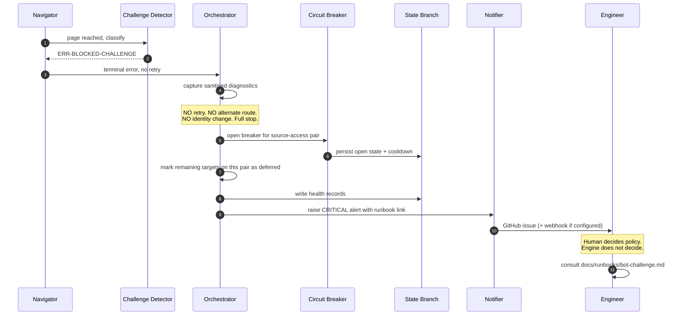
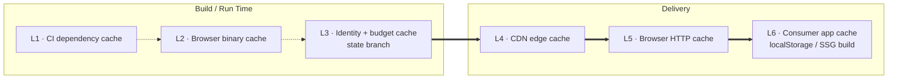
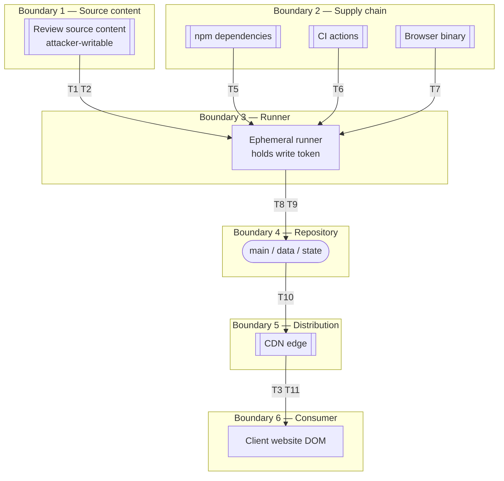

# Part 6 — Resilience Posture, Performance, and Security

*Sections 29 through 36. Audience: architects, backend engineers, security engineers, DevOps. This part covers how the system behaves when the source pushes back, how it stays fast and small, and how it stays safe.*

---

# 29. CAPTCHA Handling Strategy

## 29.1 The Position

> **The TP Reviews Engine does not handle CAPTCHAs. It detects them, stops, and asks a human what to do.**

This is stated first, unambiguously, because the section title invites the opposite reading. There is no CAPTCHA-solving component in this architecture, there is no roadmap item to add one, and a pull request introducing one must be rejected.

> **ADR-010 — Treat anti-bot challenges as a terminal stop condition, never as an obstacle to overcome**
> **Status:** Accepted
> **Context:** A DOM-reading acquisition path will eventually encounter a bot-detection challenge. The industry's default response is to defeat it: a solving service, a proxy pool, a fingerprint-spoofing browser patch. All are readily available and inexpensive.
> **Decision:** Any detected challenge immediately terminates the harvest for that source, opens the circuit breaker, raises a `critical` alert, and retains Last Known Good. The engine never attempts to solve, bypass, outsource, or route around a challenge.
> **Alternatives Rejected:**
> • *Integrate a CAPTCHA-solving service* — a paid dependency (violating CON-01 and CON-02), a data-processor relationship with an unvetted third party, and an unambiguous act of circumventing a technical measure. Converts the legal analysis in §15.2 from "contractual, weak criminal exposure" to "circumvention", which is precisely the line that changes the character of the activity.
> • *Rotate proxies or egress identity on challenge* — the same objection, plus it makes the system's behaviour non-reproducible and its failures undiagnosable.
> • *Spoof browser fingerprints / mimic human input patterns* — an arms race whose defining property is that maintenance cost rises over time while reliability falls. Every hour spent on it is an hour not spent on the official-API path that makes the whole problem disappear.
> • *Retry the challenge with backoff, hoping it clears* — superficially innocent and therefore the most likely to be implemented by accident. Rejected because repeated requests after an explicit anti-automation signal is the exact behaviour that escalates a soft signal into a durable block.
> **Consequences:** A challenge means a client's reviews stop updating until a human acts. That is an accepted cost, and it is a cheap one because LKG means visitors see nothing wrong. In exchange the system remains legally defensible, ethically coherent, cheap to maintain, and diagnosable. It also creates the right incentive: when challenges appear, the correct engineering response is to migrate that client to the Business Profile API, which is the outcome §15.3.1 wants anyway.

## 29.2 Why This Is the Engineering Answer, Not Only the Ethical One

It would be easy to read this section as a compliance concession. It is not. Even setting aside law and ethics entirely, evasion is the wrong architecture for this product:

| Property | Evasion Approach | Stop-and-Escalate Approach |
|---|---|---|
| Reliability trend over time | **Degrades.** Each detection improvement requires a counter-measure; gaps between them are outages. | **Stable.** Behaviour is unchanged by the adversary's improvements. |
| Maintenance cost trend | **Rises without bound.** | Flat. |
| Diagnosability | Poor — failures are entangled with evasion state (which proxy, which fingerprint, which session). | Excellent — one error class, one runbook. |
| Reproducibility in tests | Effectively impossible. | Trivial: fixture `016-challenge-page`. |
| Cost | Solving services and proxy pools are metered. | Zero. |
| Blast radius when it fails | All clients simultaneously, unpredictably. | One source-access pair, with LKG protecting every visitor. |
| Does it solve the underlying problem? | No — it postpones it. | No — but it *surfaces* it, which drives the actual fix (API migration). |

**A system built on evasion optimises for continuing to scrape. This system optimises for the client's website being correct. Those are different goals, and only the second one is what TradyPerch sells.**

## 29.3 Detection

Detection must be reliable and conservative. A missed challenge means the parser tries to extract reviews from a challenge page — producing `ERR-PARSE-STRUCTURE`, a misleading alert, and a wasted investigation. A false positive means an unnecessary breaker trip.

| Signal Class | Examples of What Is Checked | Confidence |
|---|---|---|
| HTTP status | Unexpected 4xx/5xx on a normally-200 path; a redirect to a path in the known-challenge list | High |
| Page structure signals | Presence of challenge-widget container patterns declared in the selector pack's `signals` section | High |
| Text signals | Locale-aware phrase patterns indicating unusual traffic or verification requirements, matched against a maintained list | Medium |
| Absence signals | The review surface is absent *and* the page body is unusually short *and* no empty-state marker is present | Medium |
| Behavioural signals | Navigation completes but the DOM never reaches a stable state matching any known page archetype | Low — used only as a tiebreaker |

**Classification rule:** any single High-confidence signal, or two Medium-confidence signals, classifies the page as `ERR-BLOCKED-CHALLENGE`. Lower combinations classify as `ERR-NAV-SURFACE-NOT-FOUND`, which routes to the selector-break runbook instead — a different, more common problem.

**Normative:** challenge detection runs **before** parsing is attempted, at the end of navigation. Detecting a challenge after a parse failure is too late to produce a clean signal.

## 29.4 Response Sequence

## 29.5 Runbook: Bot Challenge Encountered

This is the decision procedure the alert links to. It is reproduced here because it is the point at which architecture becomes policy.

| Step | Action | Notes |
|---|---|---|
| 1 | **Do not disable the breaker.** Do not re-run the harvest to "see if it clears." | Re-running after a challenge is the single worst response. |
| 2 | Confirm the classification from the diagnostics bundle: read `error.json` and open `snapshot.html`. | Rules out a misclassified selector break. |
| 3 | Determine scope: one client, or every client on `google:dom`? | Health series answers this. |
| 4 | Check whether anything changed on our side: cadence increase, new clients onboarded, shard parallelism raised, a new profile. | Self-inflicted causes are the most likely and the easiest to fix. |
| 5 | If self-inflicted: reduce cadence one tier, reduce `max-parallel`, and leave the breaker to expire naturally. | Do not force-close. |
| 6 | If not self-inflicted (shared-egress reputation, §28.6): leave the breaker's escalating cooldown to operate. Take no action for at least one full cooldown. | The system is already doing the right thing. |
| 7 | If challenges recur across two or more cooldowns: **migrate affected clients to `google:business-profile-api`** per §15.7.1. | This is the intended terminal branch of this runbook, not a last resort. |
| 8 | If migration is not possible for a client (no OAuth grant): offer `google:places-api` for a reduced 5-review display, or inform the client that automatic updates are paused. | §15.3.2 decision matrix. |
| 9 | Record the incident: date, scope, suspected cause, action, outcome. Add to the quarterly review. | Pattern recognition across incidents is what informs cadence policy. |
| 10 | **Never** implement, install, or evaluate a solving or evasion mechanism as a response. | ADR-010. If someone proposes it, this row is the answer. |

## 29.6 What the Engine Explicitly Does Not Contain

Stated as a checklist for security review and for anyone auditing the codebase:

| Absent by Design | Verification |
|---|---|
| Any dependency on a CAPTCHA-solving or anti-detect service | Dependency audit (§19.7); no network egress to any such host is possible under the host allowlist |
| Proxy configuration, proxy rotation, or per-run egress selection | No proxy configuration key exists in the config schema |
| Browser fingerprint patching, stealth plugins, or WebDriver-flag masking | Playwright launched with default hardening only; no patching layer |
| Randomised human-like mouse paths or typing cadence | Interaction is direct and deterministic |
| Session or cookie persistence across runs | Contexts are always fresh; no storage state is saved (§17.8) |
| Any authenticated access | FR-021; no credential path exists in the DOM adapter |
| Retry on any `ERR-BLOCKED-*` class | Asserted by unit test against the retry policy table |

**A test asserts the last row directly.** `retry-policy.blocked-never.test.mjs` enumerates every `ERR-BLOCKED-*` class and asserts the policy returns `never`. This converts a principle into a mechanism, which is the only form of principle that survives a deadline.

---

# 30. Anti-Bot Strategy

## 30.1 Framing

§29 covers the acute event (a challenge appears). This section covers the standing posture: how the system behaves so that challenges are unlikely in the first place, and how it responds to softer signals.

**The strategy is minimisation and legibility, not concealment.** The engine aims to be a small, well-behaved, predictable consumer — not an invisible one.

## 30.2 Posture Principles

| # | Principle | Implementation |
|---|---|---|
| 1 | **Take less.** The most effective anti-bot strategy is to not look like a bot problem. | ~8–14 requests per harvest; 4 harvests/day; resource blocking removes 60–80% of bytes (§20.3.7). |
| 2 | **Ask less often.** | Cadence floor of 1 h, default 6 h; cadence is reduced automatically under pressure and never raised automatically (§28.5). |
| 3 | **Spread out.** | Three layers of jitter; off-round cron minutes; bounded shard parallelism (§28.4). |
| 4 | **Do not persist identity.** | Fresh context per target, no cookie or storage reuse. Notably this is the *opposite* of evasion practice, which cultivates persistent trusted sessions. |
| 5 | **Stop at the first no.** | INV-07, circuit breaker with escalating cooldown. |
| 6 | **Prefer the sanctioned door.** | Two official-API adapters shipped and one config line away (ADR-023). |
| 7 | **Never disguise.** | No fingerprint manipulation, no proxying, no user-agent forgery beyond the browser's own default. |

## 30.3 Signal Response Matrix

| Upstream Signal | Interpretation | Automatic Response | Human Involvement |
|---|---|---|---|
| Slower responses, rising p95 duration | Possible soft throttling | `warn` alert at > 50% week-over-week increase | Consider cadence reduction |
| HTTP 429 | Explicit rate limit | Hour budget zeroed; 60 s base backoff; ×2 in 24 h opens breaker | Review volume; reduce cadence |
| HTTP 403 | Possible block | Breaker opens after 2 occurrences | Investigate scope |
| Consent/regional interstitial, dismissible | Normal | Dismissed once; recorded | None |
| Consent/regional interstitial, non-dismissible | Access constraint | `ERR-NAV-CONSENT-WALL`, source-scoped, no retry | Evaluate locale configuration |
| Challenge page | Explicit anti-automation | **Terminal.** Breaker opens 6 h escalating. `critical` alert | §29.5 runbook |
| Structural change with no error | Product change, not anti-bot | Canary assertion failure; `high` alert | §51 selector repair |
| Sudden empty result with valid structure | Ambiguous | `ERR-PARSE-EMPTY-UNEXPECTED`; no publish | Investigate both hypotheses |

**Distinguishing the last two rows matters operationally.** A structural change and an anti-bot response can look similar from a distance, and they have completely different runbooks. The signals in §29.3 exist to keep the classification clean.

## 30.4 What Would Change If Access Became Reliably Blocked

A pre-decided position, so that the decision is not made under pressure:

| Option | Decision | Reasoning |
|---|---|---|
| Invest in evasion | **Rejected permanently** | ADR-010 and §29.2. |
| Reduce cadence to daily or weekly | **Acceptable interim measure** | Preserves some freshness at lower volume; costs nothing. |
| Migrate clients to `google:business-profile-api` | **Preferred permanent answer** | Free, sanctioned, complete, immune to shared-egress reputation. Requires client OAuth. |
| Migrate to `google:places-api` | **Acceptable for clients who cannot grant OAuth** | Legal and free within allowance, but a ~5-review sample only. Site shows a "highlights" block rather than a full list. |
| Manual/CSV import | **Acceptable fallback for low-change clients** | Preserves the display; loses automation. |
| Discontinue the feature for a client | **Last resort, with honest communication** | Better than a broken widget or a fabricated one. |

**Note that four of the six options preserve a working client website.** That is a direct consequence of the adapter matrix (ADR-002) and of shipping the official adapters in v1.0 (ADR-023). A single-mechanism design would have exactly two options here: evade, or fail.

## 30.5 What This Document Deliberately Does Not Specify

For the avoidance of doubt, and as guidance to any future implementer or AI agent working from this document: **this document does not specify, and must not be extended to specify, techniques for defeating bot detection.** That includes fingerprint surfaces to modify, timing distributions that resemble human input, proxy topologies, session-warming strategies, or challenge-token handling.

If a future requirement appears to need such a technique, the correct response is to re-read §15.3.1 and migrate the affected client to an official API. That path is already built, already tested, and already documented.

---

# 31. Performance Optimization

## 31.1 Budgets

Performance work is only meaningful against declared budgets. These derive from §11.2.

| Scope | Budget | Measured Where |
|---|---|---|
| Harvest per listing, DOM adapter, ≤ 200 reviews | p50 ≤ 75 s, p95 ≤ 180 s | Run manifest |
| Harvest per listing, API adapter | p95 ≤ 10 s | Run manifest |
| Pure pipeline (stages 3–9), 1,000 reviews | ≤ 2 s CPU | Unit benchmark |
| Shard job total | ≤ 20 min | Workflow |
| Cold-start (deps + browser restore) | ≤ 60 s warm cache | Workflow |
| Published `reviews.json`, 200 reviews | ≤ 180 KB raw / ≤ 60 KB gzip | Size budget test |
| Published `latest.json` | ≤ 24 KB raw / ≤ 9 KB gzip | Size budget test |
| Renderer bundle | ≤ 5 KB minified | Size budget test |
| Client page added weight | ≤ 15 KB compressed | Manual Lighthouse verification |

**Normative:** the size budgets are enforced by tests that fail the build (`tests/budgets/`). A budget that is not enforced by CI is an aspiration.

## 31.2 Where the Time Actually Goes

Measured profile of a representative 120-review DOM harvest. Understanding this distribution is what prevents optimisation effort being spent in the wrong place.

| Phase | Typical | Share | Optimisable? |
|---|---|---|---|
| Browser launch (once per shard, amortised) | 1.5 s | 2% | Already amortised across targets |
| Context creation | 0.1 s | < 1% | No |
| Initial navigation + render | 4–8 s | 8% | Partly, via resource blocking |
| **Pagination (scroll + settle loops)** | **35–70 s** | **~65%** | **Yes — the dominant cost** |
| Text expansion | 8–20 s | 18% | Yes, via budget tuning |
| DOM serialisation | 0.3 s | < 1% | No |
| Pure pipeline (extract → gate) | 0.4 s | < 1% | Already fast |
| Publish (Git ops, amortised) | 2 s | 3% | Already batched per shard |
| Inter-target pacing (deliberate) | 5–10 s | 10% | **Intentionally not optimised** |

**Two conclusions follow.** First, ~65% of harvest time is waiting for lazily-loaded content — so optimisation effort belongs almost entirely in the pagination loop. Second, the pure pipeline is under 1% of runtime, which means **there is no engineering reason to compromise the core's clarity, purity, or thoroughness for speed.** That is a licence to write the most obviously-correct reconciliation code rather than the fastest.

## 31.3 Optimisations Applied

| # | Optimisation | Mechanism | Measured Effect |
|---|---|---|---|
| O-1 | **Resource blocking** | Block images, media, fonts, analytics, and non-allowlisted hosts (§20.3.7) | 60–80% fewer bytes; 25–40% faster page-ready |
| O-2 | **Adaptive settle wait** | Wait for a count increase *or* the settle timeout, whichever first — not a fixed sleep | Saves 200–600 ms per scroll iteration; 3–7 s per harvest |
| O-3 | **Incremental scroll, not jump-to-bottom** | Scroll by 90% of container height | Avoids skipping past the virtualisation window, which otherwise causes silent record loss (a correctness win as much as a performance one) |
| O-4 | **Browser reuse across targets** | One browser per shard, fresh context per target | Saves ~1.5 s per target after the first |
| O-5 | **Expansion prioritisation** | Expand longest-truncated reviews first within the budget | Maximises recovered text per unit of budget |
| O-6 | **Batch Git operations** | One commit and push per shard, not per target | Saves ~2 s per target; reduces commit churn 5–20× (CON-13) |
| O-7 | **Sparse, shallow checkouts** | `fetch-depth: 1` plus sparse paths for `main`, `data`, `state` | Saves 5–15 s per job and grows less painful as history grows |
| O-8 | **Ring-buffered debug logging** | Debug retained in memory, flushed only on failure (§24.3.1) | Eliminates megabytes of I/O per healthy run |
| O-9 | **Identity cache** | Resolved listing identity persisted; search step eliminated entirely | Saves 5–15 s per target and removes the most fragile step |
| O-10 | **Cost-balanced sharding** | Partition by historical p50 duration, not by client count | Reduces the slowest shard's duration by 20–40% versus naive partitioning |
| O-11 | **Hash-gated writes** | Skip file writes when content is byte-identical | Most cycles for a stable listing write nothing at all |
| O-12 | **Precomputed aggregates** | Stats computed at build time, not by the consumer | Renderer stays under 5 KB and does zero arithmetic |

## 31.4 Optimisations Deliberately Not Applied

| Rejected Optimisation | Reason |
|---|---|
| Parallel targets within one shard | Multiplies concurrent requests to the source (§28) and multiplies peak memory. Politeness and predictability outweigh a 2× shard speedup. |
| Removing inter-target pacing | It is a feature, not overhead. |
| Aggressive scroll-to-bottom | Faster but skips records — trades correctness for speed, which violates the §5.3 priority order. |
| Reusing browser contexts across clients | Saves ~100 ms; breaks per-target isolation (INV-09) and leaks state between tenants. |
| Caching page HTML between runs | Defeats the entire purpose; the point is to observe change. |
| Micro-optimising the pure pipeline | It is < 1% of runtime (§31.2). Clarity wins. |
| Compressing payloads at rest in Git | Git already compresses objects; pre-compressing would defeat delta compression and make diffs unreadable. |
| HTTP/2 multiplexing tuning, connection pooling | The browser handles it; there is nothing to tune at 8–14 requests. |

## 31.5 Frontend Performance

The consumer side is where performance is most visible to end users, and where the budget is tightest.

| Concern | Approach |
|---|---|
| **Zero third-party origins** | The payload is served from one origin the client already trusts, or from a TradyPerch subdomain. No vendor script. |
| **Build-time path (preferred)** | For SSG frameworks, the payload is imported at build time and rendered into HTML. Runtime cost: **zero**. Works with JavaScript disabled. |
| **Runtime path** | Fetch `latest.json` (≤ 9 KB gzip), render into pre-sized containers. |
| **Layout stability** | Containers are pre-sized from `stats.total_count` and a fixed card height, so CLS is 0 (NFR-010). |
| **Avatar images** | Lazy-loaded, `decoding="async"`, with `initials` fallback rendered immediately (ADR-014). Avatars never block first paint. |
| **Progressive enhancement** | Server-rendered or static markup first; the renderer enhances it. Fetch failure leaves the existing markup untouched (FR-074). |
| **Pagination** | Client-side over an already-loaded payload — instant, no network. |
| **Fonts** | The renderer inherits the host site's typography and loads no font of its own. |

## 31.6 Performance Regression Prevention

| Guard | Mechanism |
|---|---|
| Size budgets | CI tests fail on payload or renderer size regression |
| Duration tracking | `MET-harvest-duration` p95 alert at > 240 s |
| Benchmark test | Pure pipeline benchmark against a 1,000-review fixture, asserting ≤ 2 s |
| Blocked-bytes assertion | Integration test asserts the resource blocker is active and effective; a regression that silently stops blocking images is otherwise invisible |
| Cold-start tracking | Setup step duration recorded in the manifest |

---

# 32. Memory Optimization

## 32.1 Budget and Environment

| Constraint | Value |
|---|---|
| Runner RAM | ~16 GB (AS-01 — verify at implementation) |
| Peak RSS budget, whole process tree | ≤ 700 MB |
| Node process alone | ≤ 120 MB |
| Chromium | ≤ 500 MB typical, ≤ 600 MB peak |
| Concurrency within a shard | 1 target at a time (§31.4) |

**The budget is deliberately far below the available RAM.** Not because memory is scarce, but because staying an order of magnitude under the ceiling means a pathological listing (5,000 reviews with long text) cannot OOM the job, and because a rising memory profile is a useful leak indicator only if the baseline is low.

## 32.2 Where Memory Goes

| Consumer | Typical | Growth Driver | Control |
|---|---|---|---|
| Chromium renderer process | 300–500 MB | Number of DOM nodes retained; review count | `max_reviews` cap; resource blocking |
| Serialised DOM subtree | 2–20 MB | Review count × text length | Extract the review subtree only, never the whole document |
| Extracted/normalised records | 1–10 MB | Review count | Bounded text length; single-pass transformation |
| Ledger in memory | 0.2–5 MB | Total historical reviews including tombstones | Ledger pruning policy (§33.5) |
| Log ring buffer | ≤ 4 MB | Event volume | Hard cap by count and bytes |
| Playwright internals | 50–80 MB | Contexts open | One context at a time |

## 32.3 Techniques Applied

| # | Technique | Detail |
|---|---|---|
| M-1 | **Serialise only the review subtree** | Never serialise `document.documentElement`. Extract the review container's outer markup. Reduces the parser's input by 5–20×. |
| M-2 | **Hard review cap** | `max_reviews` default 1,000, hard ceiling 5,000. Beyond this, `cap_reached` completeness rather than unbounded growth. |
| M-3 | **Bounded text length** | 5,000 graphemes per review, enforced during normalisation, before records accumulate. |
| M-4 | **Bounded log buffer** | 2,000 events or 4 MB, whichever first. |
| M-5 | **Single-pass transformation** | Extract → normalise → validate runs per record where possible, rather than materialising three full arrays. The Ledger map is the only structure that must be fully materialised. |
| M-6 | **Close contexts in `finally`** | A leaked context leaks tens of MB and compounds across a 20-target shard. Enforced by a linting rule and by an integration test that asserts context count returns to zero. |
| M-7 | **Release the DOM handle before the pure pipeline** | The serialised string is retained; the page and its handles are released, letting Chromium reclaim memory during the (brief) processing phase. |
| M-8 | **Ledger map, not array** | Keyed by `identity_hash`. Reconciliation is O(n) with no nested scans, avoiding the O(n²) temporary allocations a naive implementation produces at 1,000+ reviews. |
| M-9 | **No raw HTML retention after extraction** | Kept only if diagnostics are triggered; discarded on success. |
| M-10 | **Streaming-friendly health writes** | Health series is appended, never read-modify-written in full. |

## 32.4 Memory Failure Handling

| Scenario | Detection | Response |
|---|---|---|
| Chromium OOM | Context crash / `ERR-BROWSER-OOM` | **Never retried** (§26.4). Target fails; alert recommends lowering `max_reviews` for that client. |
| Node heap exhaustion | Process crash | Shard fails; the run manifest is lost, which is itself the signal. Prevented by M-2 and M-3. |
| Gradual growth across a shard | RSS sampled and recorded per target in the manifest | A monotonic rise across targets indicates a leak (usually a leaked context) and raises a `warn` alert |

**Instrumentation requirement:** peak RSS is recorded per target in the run manifest. This costs nothing and is the only way to detect a slow leak in a system whose processes are ephemeral — without it, a leak simply manifests as an unexplained OOM months later.

---

# 33. Storage Optimization

## 33.1 What Is Stored, Where, and Why

| Store | Branch | Content | Growth Rate | Public |
|---|---|---|---|---|
| Engine | `main` | Code, config, selectors, schemas, fixtures | Slow, human-driven | Yes |
| Payloads | `data` | Published artifacts | Per changed harvest | Yes |
| Ledgers | `state` | Full internal state | Per changed harvest | Yes (repo is public) but not served |
| Health | `state` | Append-only JSONL | Every run, ~200 B/target | Yes, not served |
| Caches | `state` | Identity, budgets, breaker | Tiny | Yes, not served |
| Run manifests | `state` | ~4 KB per run | Every run | Yes, not served |
| CI artifacts | Platform | Logs, diagnostics | Every run, expiring | No |

## 33.2 The Public-Repository Consequence

Because unmetered CI minutes require a public repository (CON-01 → AS-01), everything in the repository is world-readable. This is acceptable **only** because of a strict invariant:

| Requirement | Enforcement |
|---|---|
| No secrets anywhere in the repository (INV-08) | Secret scanning on every push; redaction at the log sink; secrets exist only as platform secrets |
| No data beyond what is already public | Payloads contain review content that is already publicly displayed at the source |
| No additional personal data | NFR-033 data minimisation; Ledger holds no more personal data than the payload, plus hashes |
| Diagnostics containing rendered personal data expire | 14-day artifact retention; screenshots are CI artifacts, never committed |

**Stated plainly:** the Ledger is public. Anyone can read a client's full review history including tombstones. That is a deliberate, disclosed consequence of the zero-cost constraint, and it is defensible because the content is already public at the source. **A client who objects must be deployed in private-repository mode (§37.5), which costs CI minutes.** This trade-off must be surfaced during onboarding, not discovered later.

## 33.3 Payload Storage Optimisation

| Technique | Detail | Saving |
|---|---|---|
| Minification | No whitespace in published artifacts | ~25% |
| Stable key ordering | Deterministic bytes; also enables hash-gating and clean diffs | Enables other optimisations |
| Field omission | Absent optional fields are omitted rather than emitted as `null` where the schema permits | 5–12% |
| Split artifacts | `latest.json` (top 20) serves the common case; `reviews.json` only when a consumer needs everything | Most consumers fetch 8 KB instead of 38 KB |
| `stats.json` | 1 KB artifact for badge/headline use cases | Avoids a 38 KB fetch for a "4.9★ from 118 reviews" line |
| Hash-gated writes | Unchanged content is not rewritten | Most cycles produce zero commits for stable listings |
| Rely on Git's compression | No pre-compression at rest | Preserves delta compression and readable history |

**Measured for a 120-review listing:** `reviews.json` ≈ 108 KB raw / 37 KB gzip; `latest.json` ≈ 19 KB / 7 KB; `stats.json` ≈ 0.9 KB; `schema-org.json` ≈ 28 KB (opt-in).

## 33.4 Payload Sharding (Large Listings)

Triggered when `reviews.json` exceeds `payload_shard_threshold` (default 1 MB, roughly 1,200 reviews).

| Aspect | Design |
|---|---|
| Shape | `reviews.page-1.json`, `reviews.page-2.json`, … each ≤ threshold, plus a `pagination` block in the listing manifest |
| Ordering | Pages are ordered newest-first, so page 1 is what almost every consumer needs |
| Consumer contract | `pagination: { page, page_size, total_pages, total_count, next }`. Consumers unaware of sharding still get the newest reviews from page 1. |
| Backwards compatibility | `latest.json` and `stats.json` are unaffected, so the common integration never notices sharding |
| Threshold rationale | 1 MB is well below any CDN concern but above the point where a single fetch becomes rude on mobile |

## 33.5 History Growth Management

**The real risk in a Git-as-database design.** Analysis at the default cadence:

| Scenario | Commits/day | Annual Commits | Annual Growth (data branch) |
|---|---|---|---|
| 1 client, stable listing (hash-gating active) | ~0.3 | ~110 | ~2 MB |
| 10 clients | ~3 | ~1,100 | ~20 MB |
| 50 clients | ~15 | ~5,500 | ~100 MB |
| 100 clients | ~30 | ~11,000 | ~200 MB |
| 100 clients, hash-gating broken | ~400 | ~146,000 | ~3 GB |

**Hash-gating (FR-065) is the load-bearing control**, and its failure is a 15× growth event. `MET-commit-churn` monitors it directly with a threshold of 30 commits per client per week, because a silent regression here is otherwise invisible until the repository is unwieldy.

**Truncation policy:**

| Branch | Policy | Frequency | Rationale |
|---|---|---|---|
| `data` | Retain 90 days of history; older history squashed into a single "baseline" commit | Quarterly, scripted (`scripts/truncate-data-history.mjs`) | Only current state matters for a published artifact; older payload versions have no operational value |
| `state` | Retain 12 months; older squashed | Annually, manual with review | Ledger history is the audit trail for data changes and is worth more; §15's compliance posture benefits from it |
| `main` | **Never truncated** | — | Code history is permanent |

**Normative safety rules for truncation:** it MUST run as a reviewed pull request against a mirror first, MUST be verified by diffing the tip tree before and after (which must be identical), and MUST be announced so that anyone holding a clone re-clones. History rewriting is the single most dangerous scripted operation in this system and is treated accordingly.

## 33.6 Why Git-as-Database Is Genuinely Right Here

Restating from §19.5 with the storage lens, because it is the most questioned decision in this architecture:

| Property Needed | Git Provides | A Database Would Require |
|---|---|---|
| Durable, versioned state | Native | Backups, PITR configuration, cost |
| Atomic write per run | Commit | Transactions (fine, but also a connection, a schema, a migration story) |
| Point-in-time recovery | `git checkout <sha>` | Backup restore procedure |
| Audit log of every data change | `git log -p` | Audit table, triggers |
| Code review on data changes | Pull requests on `compliance/` | Custom tooling |
| Replication | Every clone | Replica configuration, cost |
| Zero cost | Yes | No |
| **Cost of the choice** | No queries; no concurrency; history growth | — |

The access pattern — read one small file, write one small file, once per run, with no concurrent writers to the same path — is a file access pattern. Using a database for it would be paying real money and real operational complexity to solve problems this workload does not have. **The point at which this reverses is quantified in §37.4: around 500 clients, when history growth, run duration, and the desire for cross-client queries converge.**

---

# 34. Caching Strategy

## 34.1 Cache Layers

| Layer | Purpose | Invalidation | Correctness-Critical? |
|---|---|---|---|
| L1 CI dependencies | Faster setup | Lockfile hash | **No** (CON-09) |
| L2 Browser binary | Faster setup | Exact Playwright version | **No** |
| L3 Identity / budget | Skip resolution; rate accounting | TTL 30 d / hourly rollover | **No** for identity; budget fails closed |
| L4 CDN edge | Serve visitors globally | TTL + content addressing | Yes for freshness |
| L5 Browser HTTP | Repeat visits | `Cache-Control` | Yes for freshness |
| L6 Consumer app | Avoid refetch within a session | App-defined TTL | Yes for freshness |

**Normative (CON-09):** L1, L2, and L3 are optimisations only. A cold cache must produce identical output. The budget cache is the sole exception in *direction*: it fails closed (assume consumed) rather than open, which is conservative rather than incorrect.

## 34.2 CI Caches

Detailed in §22.8. Key points restated: dependency cache keyed on lockfile hash with a prefix fallback; browser cache keyed on exact version with **no** fallback (a partial restore of a different browser build is worse than a miss); both are pure speed optimisations.

## 34.3 Publication Cache Semantics

The manifest-plus-immutable-content pattern:

| Artifact | Cache-Control | TTL | Reasoning |
|---|---|---|---|
| `index.json` (global) | `public, max-age=300, stale-while-revalidate=600` | 5 min | The freshness pointer. Short TTL, tiny payload. |
| `<listing>/index.json` | `public, max-age=300, stale-while-revalidate=600` | 5 min | Same. |
| `stats.json` | `public, max-age=600` | 10 min | Small and frequently embedded. |
| `latest.json` | `public, max-age=900, stale-while-revalidate=3600` | 15 min | The common consumer artifact. |
| `reviews.json` | `public, max-age=1800, stale-while-revalidate=7200` | 30 min | Larger, changes less often in practice. |
| `schema-org.json` | `public, max-age=3600` | 1 h | Consumed at build time in most integrations. |

**`stale-while-revalidate` is doing important work here.** It means a visitor arriving just after the TTL expires is served the cached copy instantly while the edge refreshes in the background — so a cache miss never becomes visitor-visible latency. For content whose freshness requirement is measured in hours, this is exactly the right semantic.

**Reality check (Assumption):** whether these headers are honoured depends on the chosen static host. GitHub Pages applies its own caching policy and does not honour arbitrary per-file cache headers in all configurations. **The implementer MUST verify actual response headers during deployment and record them in `docs/runbooks/`.** If the host imposes a fixed short TTL, freshness is unaffected (it only means more origin requests); if it imposes a long TTL, the manifest pattern must be supplemented with content-hashed filenames (§34.4).

## 34.4 Content Addressing (Cache-Busting Without Purging)

| Mechanism | Detail |
|---|---|
| Every artifact carries a `content_hash` | Computed over canonical bytes excluding `generated_at` |
| The manifest references artifacts with their hash | `{ path: "reviews.json", content_hash: "9f2c41ab" }` |
| Consumers wanting guaranteed freshness | Request `reviews.json?v=<content_hash>` — a distinct cache key that changes only when the content changes |
| Consumers wanting simplicity | Request `reviews.json` directly and accept the TTL |

This gives both audiences what they need without any cache-purge API — which matters because the zero-cost hosting options do not offer programmatic purging.

## 34.5 Distribution Options

> **ADR-013 — Serve payloads through a CDN edge, not directly from a raw repository content endpoint**
> **Status:** Accepted
> **Context:** The simplest possible distribution is to point the client site at the raw file URL of the repository. It works immediately and costs nothing.
> **Decision:** Payloads are served through a proper static-hosting CDN — GitHub Pages built from the `data` branch by default.
> **Alternatives Rejected:** *Raw repository content endpoint* — not intended or supported as a production CDN, subject to undocumented rate limiting and short caching, serves with content-type and CORS behaviour that is not guaranteed stable, and puts client sites' availability on an endpoint with no service commitment. It is the option most implementations of this idea choose and it is the one most likely to fail under real traffic. *Public package CDN mirroring the repository* — genuinely good for caching but with long, hard-to-invalidate TTLs on branch-based paths, which conflicts with a 5-minute manifest. Retained as a documented **fallback**. *Client's own hosting via build-time import* — excellent when available; documented as pattern C in §34.6 and preferred for SSG clients.
> **Consequences:** One extra workflow (`pages`) and a deploy step of 30–90 s after each data commit. In exchange: real CDN behaviour, custom domain support, HTTPS, and predictable headers.

| Option | Cost | CORS | Custom Domain | Purge | Recommendation |
|---|---|---|---|---|---|
| GitHub Pages from `data` | Free | Permissive | Yes | No (use content addressing) | **Default** |
| Public package CDN mirror | Free | Yes | No | Limited | Fallback / secondary |
| Cloudflare Pages or similar | Free tier | Yes | Yes | Yes | If purge control is needed |
| Object storage + CDN | Small cost | Yes | Yes | Yes | Only if CON-01 is relaxed |
| Client's own hosting (build-time import) | Free | N/A | Client domain | N/A | **Preferred for SSG clients** |

## 34.6 Consumer Integration Patterns

| Pattern | How | Freshness | Best For |
|---|---|---|---|
| **A — Runtime fetch** | Browser fetches `latest.json` from the CDN on page load | CDN TTL | Static HTML, SPAs, sites without a build pipeline |
| **B — Build-time import with periodic rebuild** | SSG imports the payload at build; a scheduled rebuild refreshes it | Rebuild cadence | Astro, Next.js SSG, Hugo — best performance, works without JS |
| **C — Build-time import with revalidation** | Next.js ISR or equivalent revalidates on an interval | Revalidation interval | Next.js App Router — best balance |
| **D — Server-side fetch with cache** | Client's backend fetches and caches | Server cache TTL | Sites that already have a backend |

**Recommendation matrix:**

| Client Site Type | Pattern | Why |
|---|---|---|
| Static HTML / WordPress theme | A | No build step available |
| Astro / Hugo / Eleventy | B | Zero runtime cost, JS-optional |
| Next.js App Router | C | Fresh without rebuilds; ISR is designed for exactly this |
| React SPA | A | No build-time data phase |
| Vue / Nuxt | B or C | Depending on rendering mode |

**Normative consumer guidance (published in every recipe):**

| Rule | Reason |
|---|---|
| Always render a stable empty state first; enhance on success | FR-074 — a failed fetch must be invisible |
| Never block first paint on the payload fetch | It is supplementary content |
| Cache in `sessionStorage` for the session at most | Avoids refetching on client-side navigation without risking indefinite staleness |
| Never insert `text` as HTML | INV-05 |
| Check `schema_version` | ADR-019 |
| Pre-size containers from `stats.total_count` | NFR-010, CLS = 0 |

---

# 35. Security Architecture

## 35.1 Security Model Summary

| Question | Answer |
|---|---|
| What is the most valuable asset? | Write access to the repository — it can alter every client's published data simultaneously. |
| What is the most likely attack? | Supply-chain compromise of a dependency or a CI action, executing in a runner that holds a write token. |
| What is the highest-impact attack? | Stored XSS via review text reaching every client website at once. |
| What is the most damaging accident? | A secret committed or logged into a public repository. |
| What protects visitors? | The payload contains no markup and no executable content by construction (INV-05). |
| What protects clients from each other? | Path-disjoint sharding and per-target isolation (INV-09). |

## 35.2 Security Principles

| # | Principle | Application |
|---|---|---|
| 1 | **Least privilege, always explicit** | Every workflow declares `permissions:`; the alert job has `issues: write` and no content access. |
| 2 | **Fail closed on authorisation** | Missing secret, missing authorisation record, unreadable budget → stop, never degrade to a less-controlled path. |
| 3 | **Untrusted until validated** | All source content crosses the Normalizer boundary (§16.7); no stage may read raw content. |
| 4 | **Defence in depth on output** | Payload is markup-free *and* the renderer uses text-only DOM APIs. Either alone would suffice; both are required. |
| 5 | **Pin everything** | Actions by commit SHA, dependencies by lockfile, browser by version. |
| 6 | **Ephemeral compute** | No persistent runner; nothing to compromise between runs. |
| 7 | **No secret ever touches an artifact** | Redaction at the sink; secrets never in config; scanning on every push. |
| 8 | **Assume the repository is public** | Because it is. Nothing sensitive may exist in it, ever. |

## 35.3 CI/CD Security Controls

| Control | Rule | Enforcement |
|---|---|---|
| Explicit permissions | Every workflow declares the minimum `permissions` block | CI lint step fails the build otherwise |
| Action pinning | Third-party actions pinned to full commit SHA (NFR-028) | CI lint + Dependabot for SHA updates |
| No `pull_request_target` | Forbidden outright | CI lint |
| No secrets in fork PRs | Platform default, relied upon deliberately; `validate-config` therefore runs network-free | Design |
| Expression injection | Untrusted values (issue titles, PR bodies, review content) MUST NOT be interpolated into `run:` blocks; pass via `env:` and quote | CI lint + review |
| Branch protection | `main` requires review, passing CI, and no force-push | Repository settings, documented in §44 |
| Machine-owned branches | `data` and `state` are writable only by the workflow token and repository admins | Repository settings |
| Token scope | `GITHUB_TOKEN` per job, minimum scope, never persisted | Design |
| Third-party action count | Minimised; prefer first-party or inline steps | Review |
| Self-hosted runners | **Forbidden** | §19.3 |

**On expression injection specifically:** a workflow that interpolates `${{ github.event.issue.title }}` into a shell command allows anyone who can open an issue to execute code in a runner holding a write token. This system's alerting reads and writes issues, which makes it exactly the shape of workflow where this mistake happens. The lint rule is not optional.

## 35.4 Output Safety — Protecting Client Websites

**The most consequential security property of the system**, because a failure here compromises every client site simultaneously, from a source (review text) that an attacker can write to by simply leaving a review.

| Layer | Control |
|---|---|
| 1 · Extraction | Text is read as text content, never as markup |
| 2 · Normalisation | Entity decoding then complete markup removal; control and bidi-override characters stripped (§20.6.2) |
| 3 · Validation | A self-check asserts no markup survived; `ERR-CLEAN-MARKUP-SURVIVED` is **critical** severity because it indicates the boundary itself failed |
| 4 · Contract | The schema declares `text` as plain text; there is no `text_html` field and there must never be one |
| 5 · Renderer | Uses text-only DOM APIs exclusively; a lint rule forbids HTML-injection APIs in `frontend/` |
| 6 · Documentation | `frontend/SAFETY.md` states plainly why, and every recipe repeats: never insert this as HTML |
| 7 · Test | Fixture `019-markup-in-review-text` contains payloads designed to survive naive sanitisation and asserts they do not |

**Threat walk-through.** An attacker leaves a review containing a script payload. Layer 2 removes it. Even if layer 2 had a defect, layer 3 detects and quarantines the record and alerts. Even if both failed, layer 5 renders it as visible text rather than executing it. Three independent failures are required for exploitation.

## 35.5 Secret Management

| Aspect | Rule |
|---|---|
| Storage | Platform secrets only. Never in files, never in config, never in the Ledger. |
| Reference | Config references secrets by *name* (FR-010); the engine resolves names to values at startup. |
| Scope | Injected at the step level, never workflow or job level (SEC-1). |
| Per-client isolation | Business Profile refresh tokens are named per client, so one client's grant can be revoked independently. |
| Redaction | The log sink is seeded with all secret values at startup; substring matches are masked (§24.4). |
| Rotation | API keys annually or on suspicion; OAuth refresh tokens on client offboarding or on suspicion; `GITHUB_TOKEN` is per-job and needs no rotation. |
| Detection | Push-time secret scanning; a CI job greps artifacts for high-entropy strings before upload. |
| Compromise response | §36.6. |

## 35.6 Personal Data Protection

| Control | Detail |
|---|---|
| Minimisation | Only display name, avatar URL, text, rating, dates, reply (NFR-033) |
| **No image re-hosting (ADR-014)** | Avatars are referenced by URL; a deterministic initials avatar is provided as the fallback |
| Suppression | Denylist retains only a hash and a reason code; name and text are purged (§21.11) |
| Diagnostics | Screenshots may contain rendered personal data; 14-day retention; disableable by config |
| Logs | Author names never logged in plain text; only `author_key` hash prefixes at `debug` |
| Attribution | Every review carries a source link so provenance is verifiable (FR-091) |

> **ADR-014 — Never download, cache, or re-host reviewer profile images**
> **Status:** Accepted
> **Context:** Hotlinked avatars sometimes fail to load, and caching them locally would guarantee availability and improve performance.
> **Decision:** Avatar URLs are stored and published as references only. The engine never fetches them. Consumers render an `initials` avatar when the image fails.
> **Alternatives Rejected:** *Download and re-host* — copies a person's photograph onto TradyPerch infrastructure, escalating both the data-protection footprint (storage of biometric-adjacent personal data) and the copyright position, for the benefit of slightly more reliable avatar rendering. *Proxy on demand* — requires a server (CON-08) and creates the same copying question.
> **Consequences:** Some avatars will not render. The `initials` fallback (deterministic, generated from the display name, styled by the host site) makes this visually clean rather than broken. Avatar loading also never blocks first paint, so the failure mode is invisible.

## 35.7 Dependency and Supply-Chain Security

| Control | Detail |
|---|---|
| Minimal surface | Fewer than 10 production dependencies, each justified (§19.7) |
| Lockfile | Committed; CI installs with `npm ci` exactly |
| Audit | Every CI run; high-severity advisories block release (NFR-031) |
| Update discipline | Dependabot PRs reviewed, never auto-merged for the browser pin |
| Postinstall scripts | Dependencies with postinstall scripts require security review (DEP-3) |
| Frontend | **Zero dependencies** — it ships to client sites (DEP-6) |
| Provenance | Prefer packages publishing provenance attestations where available |

## 35.8 Network Security

| Control | Detail |
|---|---|
| Host allowlist | The browser blocks requests to hosts outside a configured allowlist — so a compromised page cannot use the runner as a request source |
| No inbound surface | The system has no listening ports; there is nothing to attack from outside |
| TLS | All egress HTTPS; no certificate validation bypass under any configuration |
| No proxying | No proxy configuration exists (§29.6) |
| Egress minimisation | Resource blocking removes 60–80% of requests, incidentally shrinking the attack surface |

---

# 36. Threat Modeling

## 36.1 Method and Scope

STRIDE applied per trust boundary from §16.7, plus a supply-chain analysis. Each threat has a likelihood, impact, existing control, and residual risk.

**Assets, in priority order:**

| # | Asset | Why It Matters |
|---|---|---|
| A1 | Repository write access | Controls every client's published data |
| A2 | Client websites' integrity | Payload is rendered into pages TradyPerch does not control |
| A3 | Published payload correctness | The product |
| A4 | Secrets (API keys, OAuth tokens) | Access to client business profiles |
| A5 | Reviewer personal data | Legal and ethical obligation |
| A6 | Ledger integrity | Source of truth for A3 |

## 36.2 Trust Boundary Diagram

## 36.3 Threat Register

| ID | Threat | STRIDE | L | I | Control | Residual |
|---|---|---|---|---|---|---|
| **THREAT-01** | Malicious review text becomes stored XSS on client sites | Tampering, Elevation | 2 | 5 | Seven-layer output safety (§35.4); markup removal; markup-survived self-check; text-only renderer; adversarial fixture | **Low** |
| **THREAT-02** | Malicious review text triggers workflow expression injection | Elevation | 1 | 5 | Untrusted values never interpolated into `run:`; CI lint; content never reaches a shell | **Very low** |
| **THREAT-03** | Malicious avatar/profile URL becomes an open redirect or tracker on client sites | Tampering | 3 | 3 | Host allowlist validation; invalid URLs nulled; images never fetched by the engine | **Low** |
| **THREAT-04** | Source serves crafted content to exhaust runner memory or time | DoS | 2 | 2 | `max_reviews` cap; text length bound; wall-clock budgets at five levels | **Low** |
| **THREAT-05** | Compromised npm dependency executes in the runner and pushes malicious payloads | Tampering, Elevation | 2 | 5 | Minimal dependencies; lockfile; audit on every run; postinstall review; ephemeral runner; branch protection on `main` | **Medium** — the highest residual technical risk |
| **THREAT-06** | Compromised third-party CI action steals the write token | Elevation | 2 | 5 | SHA pinning; minimal action usage; least-privilege per-job permissions | **Low-Medium** |
| **THREAT-07** | Malicious Playwright/Chromium build | Tampering | 1 | 5 | Version pinning; official distribution; manual upgrade review | **Low** |
| **THREAT-08** | Secret committed or logged into the public repository | Info disclosure | 2 | 4 | Sink-level redaction; secrets never in config; push-time scanning; artifact entropy scan | **Low** |
| **THREAT-09** | Engine defect wipes a client's payload | Tampering (accidental) | 2 | 5 | INV-03 asymmetry rule; confidence-gated removal; Publish Gate G-02/G-03; property tests; Git revert | **Very low** |
| **THREAT-10** | Attacker with repository write access publishes false reviews | Tampering, Repudiation | 1 | 5 | Branch protection; review required on `main`; machine-only write to `data`/`state`; commit history is an audit log | **Low** |
| **THREAT-11** | CDN or DNS compromise serves a malicious payload to client sites | Tampering | 1 | 4 | HTTPS; content hashes in the manifest allow consumer-side verification; payload is data, not code, so the blast radius is content only | **Low** |
| **THREAT-12** | Denial of service against the source, caused by us | DoS | 1 | 4 | Hard compile-time rate ceilings; jitter; circuit breaker; §28 volume analysis | **Very low** |
| **THREAT-13** | Reviewer personal data exposed beyond its public context | Info disclosure | 2 | 3 | Minimisation; no image re-hosting; short diagnostics retention; suppression workflow | **Low** |
| **THREAT-14** | Ledger tampering alters published history | Tampering | 1 | 4 | Machine-only writes; Git history; schema validation on read; payload regenerable from any prior ledger state | **Low** |
| **THREAT-15** | Client A's harvest corrupts client B's data | Tampering | 1 | 4 | Path-disjoint sharding; per-target isolation; per-target error envelope (INV-09) | **Very low** |
| **THREAT-16** | Alert channel abuse: crafted content in an issue triggers unintended workflow behaviour | Elevation | 1 | 4 | Alerting job has `issues: write` only, no content access; no workflow triggers on issue events | **Very low** |
| **THREAT-17** | Stale or absent monitoring conceals a long outage | Repudiation | 3 | 3 | Two independent staleness detectors (§22.3.4); external payload verification check (§25.8) | **Low** |

## 36.4 The Dominant Residual Risk

**THREAT-05 (supply-chain compromise) carries the highest residual risk** and deserves explicit acknowledgement rather than a reassuring summary. A malicious dependency executing in a runner that holds a repository write token could publish arbitrary content to every client's payload simultaneously.

| Aspect | Assessment |
|---|---|
| **Why it cannot be eliminated** | Running third-party code is unavoidable — Playwright alone is a large dependency with a native binary. |
| **What bounds it** | Fewer than 10 production dependencies; lockfile pinning; audit gating; ephemeral runners with no persistent credentials; branch protection meaning `main` cannot be modified without review; and the fact that the payload is **data, not code** — a poisoned payload displays wrong reviews, it does not execute on client sites (because of §35.4). |
| **What would reduce it further** | Running the browser in a network-restricted sandbox; splitting acquisition and publication into separate jobs so the browser-running job holds no write token. **Recommendation: implement the job split in v1.1** — it is a genuine reduction in blast radius for modest workflow complexity. |
| **Detection** | Unexpected payload changes trip the Publish Gate; unexpected commits are visible in history; `MET-commit-churn` catches anomalous write volume. |

**Recommended v1.1 hardening (job split):** the `harvest` matrix job runs with `contents: read` and uploads staged artifacts; a separate small `publish` job with `contents: write` downloads them, re-validates against the schema, and commits. The job that executes the most third-party code (browser + npm tree) would then hold no write credential at all. This is the single highest-value security improvement available to the system and it costs one extra job.

## 36.5 Security Test Obligations

| Test | Asserts |
|---|---|
| `security.xss-fixture.test.mjs` | Adversarial markup in review text never survives to the payload |
| `security.redaction.test.mjs` | Sentinel secrets never appear in any log level or artifact |
| `security.url-allowlist.test.mjs` | Off-allowlist avatar/profile URLs are nulled |
| `security.workflow-lint.test.mjs` | All workflows declare permissions; no `pull_request_target`; all actions SHA-pinned; no untrusted interpolation into `run:` |
| `security.renderer-api.test.mjs` | The renderer source contains no HTML-injection API usage |
| `security.isolation.test.mjs` | A failing target cannot write outside its own client path |

## 36.6 Incident Response

| Incident | Immediate Action | Follow-Up |
|---|---|---|
| Secret exposed | Revoke and rotate immediately; assume compromised; audit for use | Purge from history if committed; announce re-clone; post-mortem |
| Malicious payload published | Revert the `data` commit; regenerate from Ledger with `project`; verify at the CDN | Identify the vector; audit all payloads in the window; notify affected clients |
| Dependency advisory (critical) | Assess exploitability in our usage; patch or pin; re-run audit | Review whether the dependency is still justified (DEP-1/DEP-2) |
| Runner compromise suspected | Disable workflows; rotate all secrets; audit all commits in the window | Consider the v1.1 job split as a permanent mitigation |
| XSS reported by a client | Verify; regenerate payloads with stricter sanitisation; notify all clients | Add the payload to the adversarial fixture corpus permanently |
| Data-subject complaint | Suppress via denylist same-day; respond within the statutory window | Review whether the minimisation policy needs tightening |

**Standing rule:** every security incident adds a permanent regression test. An incident that does not produce a test will recur.

---

*End of Part 6. Part 7 covers the scalability analysis at 100 / 500 / 5,000 clients, the multi-client architecture, the configuration system, and environment variables.*
