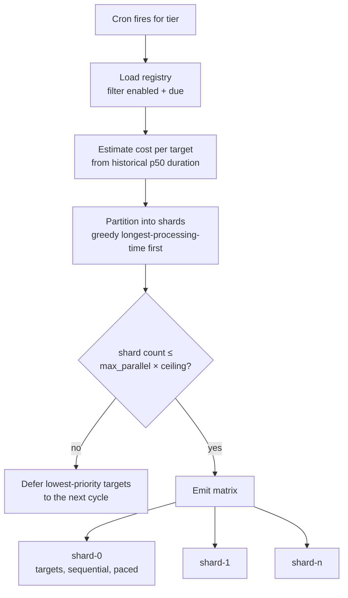
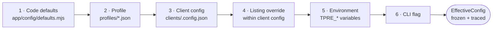

# Part 7 — Scale, Multi-Tenancy, and Configuration

*Sections 37 through 40. Audience: architects, DevOps, implementing engineers. §37 is the most commercially important section in this document, because it states honestly where this architecture stops working and what replaces it.*

---

# 37. Scalability Plan

## 37.1 What "Scale" Means Here

This system does not scale along the usual axis. There are no concurrent users, no request throughput, no database contention. The scaling dimensions are:

| Dimension | Unit | Pressure Created |
|---|---|---|
| **Client count** | Tenants | Total harvests per cycle → runner minutes, commit churn, source request volume |
| **Listings per client** | Targets | Same, multiplied |
| **Reviews per listing** | Records | Harvest duration, memory, payload size |
| **Cadence** | Harvests/day | Multiplies everything |
| **Source request volume** | Requests/hour | **The binding constraint, and it is not technical** |

**The critical insight, stated up front:** the technical ceilings of this architecture are high. The *acceptability* ceiling of the DOM acquisition method is low. Those are different limits, and the second one binds first. Any scalability plan that discusses only sharding and runner minutes is dishonest about this product.

## 37.2 Baseline Unit Economics

Per client, per day, at the default 6-hour cadence with one listing of ~120 reviews:

| Resource | Consumption |
|---|---|
| Harvests | 4 |
| Runner minutes (DOM adapter) | ~6 min/day (4 × ~90 s) |
| Runner minutes (API adapter) | ~0.7 min/day |
| Source requests | ~48/day |
| Commits (with hash-gating) | ~0.3/day |
| Repository growth | ~5 KB/day |
| Payload bytes served | Depends on client traffic, not on us |

## 37.3 Sharding and Scheduling Mechanics

The mechanism that carries the system from 2 clients to a few hundred.



| Parameter | Default | Scaling Behaviour |
|---|---|---|
| Targets per shard | ~8 | Held roughly constant; shard *count* grows with client count |
| `max-parallel` | 4 | **Deliberately capped low** — bounds concurrent source requests (§28.3), not runner availability |
| Shard duration target | ≤ 20 min | Enforced by the partitioner via cost estimation |
| Partition algorithm | Greedy longest-processing-time-first on estimated duration | Keeps the slowest shard 20–40% shorter than naive count-based partitioning |
| Spill behaviour | Lowest-priority targets deferred, not failed | Cadence degrades gracefully rather than the cycle failing |
| Priority ordering | Oldest successful harvest first | Ensures no client is starved indefinitely |

**Why `max-parallel` is the real limiter and not runner capacity.** Four parallel shards each making a request every few seconds is a modest, defensible request rate. Sixteen parallel shards is four times the instantaneous pressure on the source for the same total work. Since total work is fixed by client count and cadence, parallelism buys only *wall-clock completion time* — which is worth very little when the freshness SLO is measured in hours. **Parallelism is therefore spent on politeness rather than on speed**, which is the correct trade for this system.

> **ADR-016 — Shard clients across a CI matrix with cost-balanced partitioning and bounded concurrency**
> **Status:** Accepted
> **Context:** Client count grows; per-run wall clock and per-job time limits do not. Work must be divided across runners. How it is divided determines whether the slowest shard is 8 minutes or 25, and how much instantaneous pressure lands on the source.
> **Decision:** The `plan` job computes the due set and partitions it into shards using greedy longest-processing-time-first ordering over *estimated cost* (historical p50 duration per target, falling back to review count when no history exists). Shards run as an independent matrix with `fail-fast: false` and a deliberately low `max-parallel` (default 4, ceiling 8). Overflow beyond the shard budget is **deferred to the next cycle**, not failed, with priority given to the targets whose last success is oldest.
> **Alternatives Rejected:** *Partition by client count* — puts three 2,000-review listings in one shard and three trivial ones in another; the slowest shard is 20–40% longer than necessary. *One job per client* — cleanest isolation, but multiplies job startup (~60 s of setup each) by client count and blows through concurrency limits at trivial scale. *Sequential single job* — simplest, but wall clock grows linearly and eventually exceeds the cadence interval. *Raise `max-parallel` to whatever the platform allows* — buys wall-clock time the SLO does not need, at the cost of multiplying instantaneous request pressure on the source; rejected on §28's politeness grounds, not on technical ones. *Fail the cycle on overflow* — turns a capacity condition into an incident; deferral degrades cadence gracefully instead.
> **Consequences:** Shard durations stay even, no client is ever starved (oldest-success-first priority), and a single client's failure cannot affect another's (INV-09). Cost: the planner needs historical duration data to be effective, so the first few cycles for a new client partition sub-optimally. Accepted — it self-corrects within a day.

## 37.4 Scale Tier Analysis

Each tier states what changes, what breaks, and what the answer is. This is the section to read before promising anything to anyone.

### 37.4.1 Tier 1 — 1 to 25 Clients (v1.0 Design Target)

| Metric | Value | Status |
|---|---|---|
| Targets per cycle | 25 | Comfortable |
| Shards | 3–4 | Within `max-parallel` |
| Runner minutes/day | ~150 | Free on public repo; ~4,500/month — **exceeds the private-repo free allowance**, see §37.5 |
| Source requests/hour | ~50 | Trivially defensible |
| Cycle wall-clock | ~20 min | Fine |
| Commits/day | ~8 | Fine |
| Annual repo growth | ~50 MB | Fine |
| **Verdict** | **Works with no changes.** This is the design point. | ✅ |

**Required work:** none. This is what v1.0 delivers.

### 37.4.2 Tier 2 — 100 Clients

| Metric | Value | Status |
|---|---|---|
| Targets per cycle | ~100 | Manageable |
| Shards | 13 at 8 targets each | Exceeds `max-parallel` 4 → 4 waves → ~80 min cycle wall-clock |
| Runner minutes/day | ~600 (~18,000/month) | Free on public repo only |
| **Source requests/hour** | **~200** | **Approaching the limit of what is defensible** |
| Commits/day | ~30 | Fine with hash-gating |
| Annual repo growth | ~200 MB | Needs the quarterly truncation policy (§33.5) |
| Cycle wall-clock | ~80 min | Still inside the 6 h cadence |
| **Verdict** | **Works technically. The request-volume argument becomes strained.** | ⚠️ |

**Required work at this tier:**

| # | Change | Effort |
|---|---|---|
| 1 | Enable quarterly `data` history truncation | Already scripted |
| 2 | Move most clients to `relaxed` (12 h) or `daily` cadence; reserve `standard` for high-change clients | Config only |
| 3 | Raise `max-parallel` to 6 **only if** the source shows no pressure signals | Config, reversible |
| 4 | **Migrate as many clients as possible to `google:business-profile-api`** | Per-client OAuth, ~1 h each |
| 5 | Add per-client SLO tiering so a paying premium client gets `standard` and others get `daily` | Config schema addition |
| 6 | Implement the v1.1 job split (§36.4) — more valuable at this scale | ~1 day |

**Honest assessment.** At 100 clients on DOM acquisition, TradyPerch is making ~4,800 requests per day to one platform from a shared IP range. That is not abusive by volume, but it is no longer trivially small, and it is a pattern that could reasonably attract attention. **The correct posture at this tier is that the DOM adapter should be the minority case, not the default.**

### 37.4.3 Tier 3 — 500 Clients

| Metric | Value | Status |
|---|---|---|
| Targets per cycle | ~500 | Requires restructuring |
| Shards | 63 at 8 targets | 16 waves at `max-parallel` 4 → ~5 h cycle |
| Runner minutes/day | ~3,000 (~90,000/month) | Free only on a public repo; a substantial share of platform goodwill |
| **Source requests/hour (DOM)** | **~1,000** | ❌ **Not defensible** |
| Commits/day | ~150 | Requires commit batching across shards |
| Annual repo growth | ~1 GB | Requires aggressive truncation and possibly repository splitting |
| Cycle wall-clock | ~5 h at 6 h cadence | **Too close to the cadence boundary** |
| **Verdict** | **The DOM path fails here. The rest of the architecture holds.** | ❌ for DOM, ✅ for API |

**Required work at this tier:**

| # | Change | Effort |
|---|---|---|
| 1 | **DOM adapter becomes exceptional, not default.** Target ≥ 90% of clients on official APIs. | Onboarding policy change + client migration campaign |
| 2 | Cadence tiering enforced: `daily` default, `standard` as a paid upgrade | Config + commercial policy |
| 3 | Split into multiple repositories by client cohort, each with its own workflows and data branch | ~3 days |
| 4 | Replace `state`-branch counters with a lightweight coordination store, or accept coarser rate accounting per repository | ~2 days |
| 5 | Aggregate health into a generated dashboard — reading 500 JSONL files by hand is no longer viable (§58) | ~3 days |
| 6 | Consider moving compute off GitHub Actions to a small dedicated host if API adapters dominate (browser no longer needed for most clients) | ~2 days |

**The structural observation.** At 500 clients the system is no longer a studio tool; it is a service. Every one of the changes above is a normal consequence of that transition, and none of them require abandoning the architecture — because the adapter matrix (ADR-002), the port boundaries (§17.16), and the pure core (§16.4) were built for exactly this. **The only component that genuinely does not survive this tier is the DOM adapter, and it was always the component flagged as expendable.**

### 37.4.4 Tier 4 — 5,000 Clients

| Metric | Value | Status |
|---|---|---|
| Targets per cycle | ~5,000 | Fundamentally different system |
| Source requests/hour (DOM) | ~10,000 | ❌ Categorically unacceptable |
| Runner minutes/day | ~30,000 with DOM; ~3,500 with API | ❌ / ⚠️ |
| Repository model | Git-as-database fails: commit volume, history size, no cross-client queries | ❌ |
| Monitoring model | File-based monitoring fails | ❌ |
| Onboarding model | Manual config PRs fail | ❌ |
| **Verdict** | **Requires a genuinely different platform. This is v4.0, and it is a business, not a tool.** | ❌ |

**What 5,000 clients actually requires:**

| Layer | v1.0 | v4.0 at 5,000 clients |
|---|---|---|
| Acquisition | DOM primary | **Official APIs exclusively.** DOM removed entirely. |
| Compute | GitHub Actions | Container platform or serverless with a work queue |
| Scheduling | Cron + matrix | Distributed queue with per-tenant fairness and priority |
| State | Git | Managed relational or document database |
| Payload storage | Git branch | Object storage with CDN |
| Distribution | GitHub Pages | CDN with programmatic purge |
| Rate limiting | Advisory counters | Central token service per tenant credential |
| Monitoring | JSONL + Issues | Time-series metrics + real alerting |
| Onboarding | Config PR | Self-serve portal with OAuth (§57) |
| Cost | Zero | Real, and necessarily passed on to clients |

**What survives unchanged from v1.0 to v4.0:** the pure domain core (extract, normalise, validate, reconcile, project, gate), the JSON payload contract, the identity model, the Publish Gate rules, the reference renderer, the fixture corpus, and every port interface. **That is roughly 60% of the codebase and 100% of the hard-won correctness logic.** This is the return on the hexagonal architecture and it is the reason §16.1 rejected a monolithic script.

## 37.5 Cost at Scale

| Clients | Public Repo (chosen) | Private Repo | Dedicated Host (API adapters only) |
|---|---|---|---|
| 25 | $0 | Exceeds free minutes; ~$30–60/mo | ~$5/mo |
| 100 | $0 | ~$150–250/mo | ~$5/mo |
| 500 | $0 (but see §37.4.3) | ~$700+/mo | ~$10–20/mo |
| 5,000 | Not viable | Not viable | ~$100–300/mo + database + CDN |

**Two conclusions.** First, the public-repository choice is what makes BG-01 true, and its cost is the disclosure obligation in §33.2. Second, at any scale above ~100 clients where API adapters dominate, **a small dedicated host is cheaper and simpler than CI minutes** — because API harvesting needs no browser, so the entire reason for choosing a beefy ephemeral runner disappears. §19.3's decision is correct for v1.0 and should be revisited at Tier 3, exactly as TG-12 anticipates.

## 37.6 Portability Assessment (TG-12 Verification)

What it would actually take to move off GitHub Actions:

| Component | Coupling | Migration Work |
|---|---|---|
| Engine core + adapters | **None** | Zero — it is a Node CLI |
| Scheduling | Workflow cron | One cron entry or scheduler config |
| Shard planning | `plan` command emits a matrix | Emit whatever the new orchestrator wants; the command already outputs JSON |
| State storage | `git-state` adapter | Swap for a filesystem or object-storage adapter behind `StatePort` |
| Publication | `git-data` adapter | Swap behind `PublisherPort` |
| Alerting | `github-issues` adapter | Swap behind `NotifierPort` |
| Caching | Platform cache action | Any cache mechanism, or none |
| Secrets | Platform secrets | Any secret store; the engine reads environment variables |
| **Total estimated effort** | | **~1 engineer-day** |

**This estimate is the value of NFR-045.** It exists because the engine never imports a GitHub SDK outside three adapter files, and an architecture test enforces it (DR-3). Without that rule the estimate would be a week and the claim in ADR-004 would be marketing.

## 37.7 Scaling Decision Triggers

Pre-committed thresholds, so scaling decisions are made on data rather than on anxiety:

| Trigger | Threshold | Action |
|---|---|---|
| Cycle wall-clock | > 50% of cadence interval | Increase shard count or reduce cadence tier |
| Source pressure signals | Any 429 or challenge in 30 days | Reduce cadence; accelerate API migration |
| Runner minutes | > 50,000/month | Evaluate dedicated host (§37.5) |
| Repository size (`data`) | > 500 MB | Truncate history; consider cohort split |
| Commits per client per week | > 30 | Investigate hash-gating defect |
| Client count | > 40 | Introduce per-client SLO tiers and priced cadence |
| Client count | > 100 | DOM adapter becomes exceptional; API migration campaign |
| Client count | > 300 | Begin Tier 3 restructuring |
| Health file count | > 200 | Build the generated dashboard (§58) |
| Manual onboarding time | > 30 min or > 4/week | Build the admin panel (§56) |

---

# 38. Multi-Client Architecture

## 38.1 Tenancy Model

**Single-instance, config-partitioned, path-isolated multi-tenancy.** One engine version, one repository, one workflow set, serving N clients whose only distinguishing artifact is a configuration document.

| Property | Implementation |
|---|---|
| Isolation of *data* | Every client owns a disjoint path prefix on `data` and `state`. No shared file is written by more than one client's harvest. |
| Isolation of *failure* | Per-target error envelope, per-target browser context, `fail-fast: false` matrix (INV-09). |
| Isolation of *configuration* | One file per client; no client can affect another's effective config. |
| Isolation of *credentials* | Per-client secret naming (`GBP_REFRESH_TOKEN__<SLUG>`), independently revocable. |
| Sharing of *code* | Total. There is exactly one engine, and CON-04 forbids client-specific code paths. |
| Sharing of *rate budget* | Deliberate — the source-level budget is global, because the source sees one actor, not N tenants. |

**The one shared resource is the rate budget, and that sharing is correct.** From the source's perspective, all TradyPerch harvests are one consumer. Partitioning the budget per client would let 50 clients each "politely" consume their own allowance and collectively behave badly.

## 38.2 Client Registry

| Aspect | Design |
|---|---|
| Discovery | Every `clients/*.config.json` file is a client. There is no separate index to keep in sync. |
| Slug source | Filename is authoritative; the `slug` field must match, and a mismatch is a validation error |
| Enable/disable | `enabled: false` retains config and data but removes the client from all due sets (FR-006) |
| Ordering | Deterministic pseudo-random per run, seeded by `runId` — so no client is permanently first or last |
| Validation | Every config validated before any harvest; one invalid config fails only that client (FR-002) |

**Why filesystem-as-registry rather than a registry file:** a separate index is a second place to update and therefore a guaranteed source of drift. Adding a client is creating a file; removing one is deleting a file. Nothing else to remember.

## 38.3 Path Isolation Scheme

| Store | Path Template | Written By |
|---|---|---|
| Payload | `data:/clients/<slug>/<listing-key>/*` | Only the shard containing that target |
| Client manifest | `data:/clients/<slug>/index.json` | Only that client's shard |
| Global manifest | `data:/index.json` | **Only the `collect` job**, after all shards complete |
| Ledger | `state:/ledger/<slug>/<listing-key>.json` | Only that client's shard |
| Health | `state:/health/<slug>.jsonl` | Only that client's shard (append) |
| Identity cache | `state:/cache/identity/<slug>/<listing-key>.json` | Only that client's shard |
| Rate budget | `state:/cache/budget/<source>/<date>.json` | **Any shard** — the one intentionally shared path |
| Breaker | `state:/breaker/<source>.json` | Any shard — intentionally shared |

**The global manifest is written by `collect`, not by shards.** If shards wrote it, every shard would need to read-modify-write the same file and Git conflicts would be guaranteed. Deferring it to a single post-shard job makes conflict structurally impossible. The two intentionally-shared files (budget, breaker) are tolerant of last-write-wins because both fail in the conservative direction.

## 38.4 Multi-Listing Clients

| Scenario | Handling |
|---|---|
| One client, several branch locations | Each listing is a separate target with its own listing key, ledger, and payload set |
| Client wants a combined view | An optional merged payload at `clients/<slug>/_all/reviews.json`, produced by the `collect` job from the per-listing ledgers |
| Merged payload identity | Reviews retain their original `identity_hash` and carry `listing.key` so a consumer can attribute or group them |
| Merged aggregates | Recomputed across listings; `advertised_total` is summed, and the merged mean is weighted by count |
| Failure semantics | A failed listing does not block the others. The merged view is built from whatever ledgers are current, with a `notices` entry naming any stale listing. |
| Cadence | Per listing, so a flagship location can be on `standard` while satellites are `daily` |

## 38.5 Per-Client Feature and SLO Tiers

| Tier | Cadence | Publish Gate Thresholds | Alerting | Intended For |
|---|---|---|---|---|
| `premium` | 1–6 h | Strict (default) | Individual alerts | Flagship clients |
| `standard` | 6–12 h | Default | Batched into digest unless `high`+ | Most clients |
| `economy` | 24 h | Slightly relaxed count-drop tolerance | Digest only | Low-change listings |
| `paused` | none | n/a | Staleness suppressed | Offboarding or disputes |

**Tiering is the primary lever for scaling gracefully** (§37.4.2 item 5). It converts a technical constraint (total request volume) into a commercial variable (cadence as a product feature) rather than an engineering crisis.

## 38.6 Onboarding and Offboarding

**Onboarding (UC-01), target ≤ 20 minutes:**

| # | Step | Time |
|---|---|---|
| 1 | Complete the §15.10 compliance checklist, including written authorisation | 5 min (mostly waiting on the client) |
| 2 | `tpre resolve` to obtain the canonical listing identity | 1 min |
| 3 | `scripts/new-client.mjs` to scaffold the config from the template | 1 min |
| 4 | Set adapter (offer Business Profile API first per §15.3.1), tier, locale, display preferences | 3 min |
| 5 | `tpre validate-config` and `tpre harvest --dry-run` | 3 min |
| 6 | Open PR; `validate-config` workflow posts the extraction summary | 2 min |
| 7 | Merge; dispatch a manual harvest | 2 min |
| 8 | Add the integration snippet to the client site; verify rendering, CLS, and structured data | 3 min |

**Offboarding:**

| # | Step |
|---|---|
| 1 | Set `enabled: false` — harvests stop immediately, data and payload remain |
| 2 | Export the client's full corpus with `tpre export --client <slug>` and deliver it (BG-07, FR-093) |
| 3 | Revoke the per-client OAuth token secret if one exists |
| 4 | After an agreed retention period, remove the config, and move `data`/`state` paths to an archive prefix |
| 5 | Remove the snippet from the client site (or let it degrade to the stable empty state, which it does safely) |

**Note that step 5 is safe either way.** A client site left pointing at a removed payload gets a 404, the renderer's fetch fails, and the empty state persists — no error, no broken layout (FR-074). Offboarding cannot break a former client's website, which is a genuine courtesy and avoids a support call.

## 38.7 Cross-Client Concerns

| Concern | Handling |
|---|---|
| One client's huge listing starving others | Cost-balanced sharding; per-target budget cap; spill-to-next-cycle rather than run overrun |
| One client's failure cascading | Per-target envelope; `fail-fast: false` (INV-09) |
| Source-level block affecting all clients | Circuit breaker is per source-access pair, so API clients continue (§23.4) |
| Alert noise scaling with client count | Batching, digest, and source-level suppression of downstream alerts (§25.7) |
| Config drift between clients | Profile inheritance means shared settings live in one place (§39.3) |
| A client requesting a code change | CON-04: refused. Either it becomes a config option available to all, or it is not done. |

**That last row is the discipline that keeps this a product rather than a collection of bespoke integrations.** Every client-specific request must be answered by generalising it into configuration. It is slower once and enormously cheaper thereafter.

---

# 39. Configuration System

## 39.1 Design Goals

| Goal | Mechanism |
|---|---|
| Onboarding is config-only | Every behavioural knob is configurable (FR-007) |
| Mistakes caught before they run | JSON Schema validation, blocking in CI (FR-002) |
| Shared settings defined once | Profile inheritance |
| Effective values explicable | Resolution trace showing which layer supplied each value |
| Safe evolution | `config_version` with migrations (FR-005) |
| No secrets in config | Secrets referenced by name only (FR-010) |
| Conservative-only overrides | Rate and cadence keys may be tightened, never loosened past hard ceilings (FR-089) |

> **ADR-015 — Declarative, schema-validated, layered, versioned configuration**
> **Status:** Accepted
> **Context:** The alternative is imperative per-client setup code or environment-variable sprawl. Both make onboarding an engineering task and make the effective behaviour of a client unknowable without reading code.
> **Decision:** Configuration is declarative JSON, validated against a published schema, resolved through a six-layer precedence chain, with a resolution trace and an explicit version field.
> **Alternatives Rejected:** *Per-client code modules* — violates CON-04 and BG-02; every client becomes a deployment. *Environment variables only* — no structure, no validation, no inheritance, and unreadable at 20 keys. *YAML* — rejected for format consistency (§19.4). *A database-backed config UI* — the right answer at ~25+ clients (§56), premature before that.
> **Consequences:** Onboarding is a file. Effective behaviour is inspectable. Cost: a schema to maintain and a precedence chain to understand — both documented here.

## 39.2 Precedence Chain

Six layers, later winning over earlier (FR-003):



| Layer | Scope | Typical Use |
|---|---|---|
| 1 Code defaults | Global | The safe baseline for every key. Every key MUST have a default here. |
| 2 Profile | Group | `default`, `conservative`, `high-volume` — shared tuning sets |
| 3 Client config | Tenant | Identity, adapter, tier, display preferences, authorisation |
| 4 Listing override | Target | Per-location cadence, locale, caps |
| 5 Environment | Run | CI-injected values, secrets by name, log level |
| 6 CLI flag | Invocation | Ad-hoc operator overrides during diagnosis |

**Normative:** the resolution trace records, per key, the winning layer and value. It is written into the diagnostics bundle and printed by `tpre validate-config --explain`. The question "why did this client use a 3-minute timeout?" must be answerable in one command, not by reading four files.

## 39.3 Client Configuration Structure

| Section | Purpose | Required |
|---|---|---|
| `config_version` | Schema version of this document | ✅ |
| `slug` | Must equal the filename stem | ✅ |
| `display_name` | Human-readable client name | ✅ |
| `enabled` | Participation in scheduled runs | ✅ |
| `profile` | Which profile to inherit | ✅ |
| `tier` | SLO tier (§38.5) | ✅ |
| `authorization` | The §15.6 authorisation record | ✅ when any listing uses `dom` |
| `listings[]` | One or more listing definitions | ✅ (min 1) |
| `listings[].key` | Stable listing key; immutable | ✅ |
| `listings[].adapter` | `google:dom` \| `google:places-api` \| `google:business-profile-api` \| `file:csv` | ✅ |
| `listings[].identity` | Explicit identifier and/or URL, plus `expected_name` | ✅ |
| `listings[].locale` | BCP 47 tag driving date parsing and page locale | — |
| `listings[].cadence` | Tier override for this listing | — |
| `listings[].overrides` | Any timing/threshold/cap override | — |
| `display` | Ordering, `latest_count`, language filter, `min_text_length` | — |
| `publish` | Which artifacts to emit; `schema_org` opt-in | — |
| `gate` | Publish Gate threshold overrides | — |
| `secrets` | Secret **names** required by the chosen adapters | — |
| `notes` | Free text for operators | — |

## 39.4 Illustrative Client Configuration

Data, not code — an example instance of the schema described above.

```json
{
  "config_version": 1,
  "slug": "commerce-insight",
  "display_name": "Commerce Insight",
  "enabled": true,
  "profile": "default",
  "tier": "premium",
  "authorization": {
    "authorized_by": "Founder, Commerce Insight",
    "authorization_date": "2026-07-22",
    "relationship": "owner",
    "evidence_ref": "compliance/authorizations/commerce-insight.md",
    "scope_ack": true
  },
  "listings": [
    {
      "key": "main",
      "adapter": "google:dom",
      "identity": {
        "place_id": "REDACTED_PLACE_IDENTIFIER",
        "url": "https://maps.google.com/?cid=REDACTED",
        "expected_name": "Commerce Insight"
      },
      "locale": "en-IN",
      "cadence": "standard",
      "overrides": {
        "nav": { "max_reviews": 600, "expand_max_count": 250 },
        "reconcile": { "removal_confirmations": 3 }
      }
    }
  ],
  "display": {
    "order": "newest",
    "latest_count": 20,
    "min_text_length": 0,
    "languages": null,
    "include_rating_only": true,
    "min_rating": null
  },
  "publish": {
    "reviews": true,
    "latest": true,
    "stats": true,
    "schema_org": false
  },
  "gate": {
    "max_count_drop_ratio": 0.20,
    "max_rating_shift": 0.50,
    "coverage_min": 0.95
  },
  "secrets": [],
  "notes": "First production client. Offered Business Profile API at onboarding; client deferred OAuth grant — revisit at renewal (see OQ-01)."
}
```

**Note `display.min_rating: null` and the `notes` field.** The first is the §8.2 ethical default made explicit rather than implicit. The second is where the API-migration conversation is recorded, so the recommendation in §15.3.1 is tracked per client rather than forgotten.

## 39.5 Validation Rules Beyond Schema

Schema validation catches shape errors. These semantic rules catch the errors that actually happen:

| # | Rule | Severity |
|---|---|---|
| V-1 | `slug` equals the filename stem | error |
| V-2 | Listing keys unique within a client | error |
| V-3 | `adapter: google:dom` requires a complete `authorization` block | **error — the §15.6 gate** |
| V-4 | Adapter's required secret names are present in `secrets` and exist in the environment at run time | error |
| V-5 | No rate/cadence override exceeds a hard ceiling | error |
| V-6 | `identity` contains at least one of `place_id`, `cid`, or `url` when `resolution.allow_search` is false | error |
| V-7 | `expected_name` present for every listing | error |
| V-8 | `min_rating` set to a non-null value requires a `notes` justification | **warning** — deliberate friction on an ethically-loaded option |
| V-9 | `publish.schema_org: true` requires acknowledgement of the §21.9 policy warning | warning |
| V-10 | Gate thresholds within sane bounds (`max_count_drop_ratio` ≤ 0.5) | warning |
| V-11 | Listing without an explicit identifier | warning (search at runtime is fragile) |
| V-12 | `tier: premium` with `cadence: daily` — contradictory | warning |

**V-8 is deliberate friction rather than a prohibition.** §8.2 says TradyPerch should decline rating filters; the config system does not forbid it outright (a jurisdiction or platform might someday require it), but it makes the choice visible, justified in writing, and surfaced in review. Mechanisms that make the wrong choice slightly uncomfortable are more durable than mechanisms that make it impossible and get bypassed.

## 39.6 Configuration Versioning and Migration

| Aspect | Rule |
|---|---|
| Version field | `config_version`, integer, required |
| Unsupported version | `ERR-CONFIG-VERSION`, run aborts (FR-005) |
| Migration | `app/config/migrate.mjs` holds an ordered list of migrations from version N to N+1 |
| Application | `tpre validate-config --migrate` rewrites config files in place and prints a diff for review |
| Policy | Migrations are additive and mechanical. A migration that cannot be performed automatically must fail with a clear message telling the operator what to do. |
| Compatibility window | The engine supports the current version and the previous one, so a config change and an engine deploy need not be simultaneous |

## 39.7 Profiles

| Profile | Purpose | Notable Settings |
|---|---|---|
| `default` | Baseline for most clients | 6 h cadence, `max_reviews` 1000, standard timings, current selector pack |
| `conservative` | Sensitive clients or after any source pressure | 12 h cadence, longer delays, lower parallel share, `max_reviews` 400 |
| `high-volume` | Listings with 1,000+ reviews | Extended pagination budget, higher `max_reviews`, larger scroll increments, payload sharding enabled |

**Profiles pin the selector pack version.** This is how a pack rollout is staged: point `conservative` at the new pack first, observe one cycle, then move `default`. A staged rollout of the highest-risk change in the system, achieved with a one-line edit in two files.

---

# 40. Environment Variables

## 40.1 Conventions

| Rule | Detail |
|---|---|
| Prefix | All engine variables use `TPRE_`, except platform-provided ones |
| Naming | `TPRE_<AREA>_<KEY>`, uppercase snake case |
| Types | All values are strings; the loader coerces and validates against the schema |
| Precedence | Layer 5 — beats config, loses to CLI flags (§39.2) |
| Secrets | Never in config files; referenced by name and injected as environment variables at the step level (SEC-1) |
| Documentation | Every variable appears in this table; an undocumented variable is a defect |

## 40.2 Operational Variables

| Variable | Type | Default | Purpose |
|---|---|---|---|
| `TPRE_ENV` | enum | `development` | `development` \| `ci` \| `production`. Drives defaults such as `allow_search`. |
| `TPRE_LOG_LEVEL` | enum | `info` | Minimum level written |
| `TPRE_LOG_FORMAT` | enum | `pretty` local, `jsonl` in CI | Sink selection |
| `TPRE_RUN_ID` | string | generated | Correlation id; supplied by the workflow so all shards share it |
| `TPRE_DRY_RUN` | boolean | `false` | Full pipeline, no writes |
| `TPRE_NO_PUBLISH` | boolean | `false` | Write state but not payloads |
| `TPRE_FORCE` | boolean | `false` | Bypass cadence due-check (never the gate) |
| `TPRE_FORCE_PUBLISH` | boolean | `false` | Downgrade overridable gate rules; requires `TPRE_FORCE_REASON` |
| `TPRE_FORCE_REASON` | string | — | Mandatory audit text when force-publishing |
| `TPRE_SHARD` | string | — | `i/n` shard assignment |
| `TPRE_TIER` | enum | — | Cadence tier for this run |
| `TPRE_CLIENT` | string | — | Restrict to one client |
| `TPRE_LISTING` | string | — | Restrict to one listing |

## 40.3 Path Variables

| Variable | Default | Purpose |
|---|---|---|
| `TPRE_CLIENTS_DIR` | `./clients` | Client config location |
| `TPRE_PROFILES_DIR` | `./profiles` | Profiles |
| `TPRE_SELECTORS_DIR` | `./selectors` | Selector packs |
| `TPRE_STATE_DIR` | `./.state` | Checkout of the `state` branch |
| `TPRE_PUBLISH_DIR` | `./.publish` | Checkout of the `data` branch |
| `TPRE_ARTIFACT_DIR` | `./.artifacts` | Logs, manifests, diagnostics |
| `TPRE_FIXTURE_DIR` | `./fixtures` | Test fixtures |

## 40.4 Behavioural Override Variables

Every one of these may only make the engine **more** conservative (FR-089). A value exceeding the hard ceiling is a validation error, not a clamp — silently clamping would hide operator intent.

| Variable | Type | Ceiling |
|---|---|---|
| `TPRE_BUDGET_TARGET_MS` | integer | 300000 |
| `TPRE_BUDGET_RUN_MS` | integer | 900000 |
| `TPRE_MAX_REVIEWS` | integer | 5000 |
| `TPRE_INTER_TARGET_DELAY_MS` | integer | floor 5000 |
| `TPRE_MIN_REQUEST_DELAY_MS` | integer | floor 250 |
| `TPRE_SOURCE_HOURLY_BUDGET` | integer | 600 |
| `TPRE_SOURCE_DAILY_BUDGET` | integer | 6000 |
| `TPRE_SELECTOR_PACK` | string | — (must exist on disk) |
| `TPRE_DIAGNOSTICS_SCREENSHOT` | boolean | — |

## 40.5 Policy Variables (The Kill Switches)

| Variable | Type | Default | Purpose |
|---|---|---|---|
| `TPRE_POLICY_ENABLED` | boolean | `true` | **Global kill switch.** `false` blocks all acquisition. |
| `TPRE_POLICY_DOM_ENABLED` | boolean | `true` | Blocks only DOM acquisition; API clients continue |
| `TPRE_POLICY_ROBOTS_MODE` | enum | `warn` | `block` \| `warn` \| `ignore` (§15.5) |
| `TPRE_POLICY_BREAKER_OVERRIDE` | boolean | `false` | Force-close breakers; recorded in the manifest with operator identity |
| `TPRE_MAINTENANCE_MODE` | boolean | `false` | Suppress non-critical alerts (§25.7) |

**These are repository variables rather than secrets**, so that flipping `TPRE_POLICY_DOM_ENABLED` to `false` is a two-click operation visible in the audit log — which is exactly what is needed during a §15 incident (RISK-03's contingency).

## 40.6 Secret Variables

| Variable | Required When | Notes |
|---|---|---|
| `GITHUB_TOKEN` | Always in CI | Provided per job; least privilege per §22.7 |
| `GOOGLE_PLACES_API_KEY` | Any client uses `google:places-api` | Server-side only; never in a payload |
| `GBP_OAUTH_CLIENT_ID` | Any client uses `google:business-profile-api` | One per developer registration |
| `GBP_OAUTH_CLIENT_SECRET` | Same | |
| `GBP_REFRESH_TOKEN__<SLUG_UPPER>` | Per client using that adapter | Independently revocable |
| `ALERT_WEBHOOK_URL` | Optional secondary alert channel | |

**Fail-closed rule (FR-026, SEC-4):** an adapter whose secret is missing raises `ERR-CONFIG-SECRET-MISSING` and exits 2. It MUST NOT fall back to the DOM adapter. A silent downgrade from a sanctioned API to unsanctioned scraping because a token expired would be a serious policy violation arising from a trivial operational event — exactly the kind of failure that must be designed out rather than trusted to attention.

## 40.7 Local Development

| Aspect | Detail |
|---|---|
| Mechanism | A git-ignored `.env` file loaded only when `TPRE_ENV=development` |
| Template | `.env.example`, committed, with every variable and comments |
| Safety | The loader refuses to read `.env` when `TPRE_ENV` is `ci` or `production`, so a stray local file cannot influence a production run |
| Defaults for development | `allow_search: true`, `console` notifier, `filesystem` publisher, `pretty` logs, `TPRE_NO_PUBLISH=true` |
| Offline development | `npm test` requires no network (TG-10); the fixture server (`fixtures/server/serve.mjs`) provides integration targets |

## 40.8 Variable Validation

At startup the engine:

1. Reads all `TPRE_*` variables and coerces types.
2. **Rejects unknown `TPRE_*` variables** with a clear error — a typo like `TPRE_MAX_REVIEW` must fail loudly rather than be silently ignored, which is otherwise a genuinely confusing class of incident.
3. Validates every value against its schema, including ceiling checks.
4. Records the resolved environment layer in the resolution trace, with secret **values** replaced by `«set»` or `«unset»`.
5. Seeds the log redaction filter with every secret value read (§24.4).

**Step 2 deserves emphasis.** Silently ignoring unrecognised configuration is one of the most common sources of "I changed the setting and nothing happened" confusion. The cost of strictness is one error message; the cost of leniency is an hour of someone's afternoon.

---

*End of Part 7. Part 8 covers the testing strategy, deployment, versioning, branching, coding standards, and naming conventions.*
