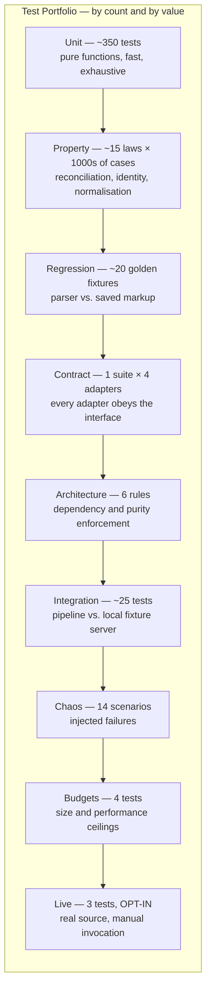
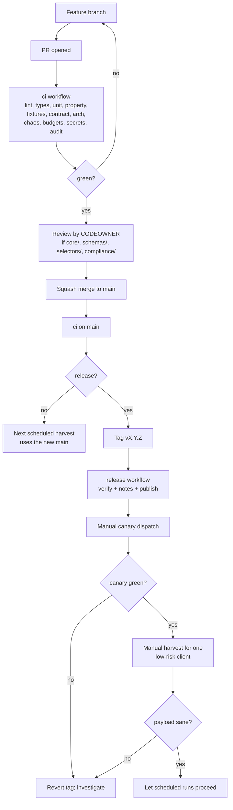
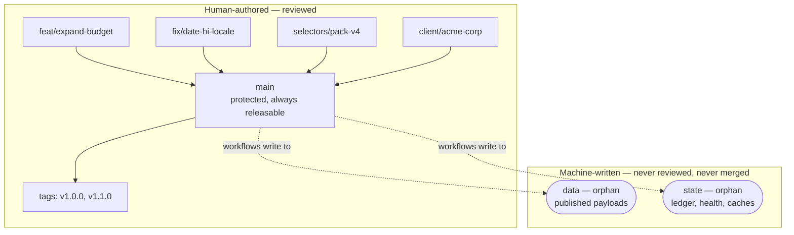

# Part 8 — Quality Assurance and Delivery

*Sections 41 through 46. Audience: QA lead, engineers, DevOps. This part defines how correctness is proven, how the system reaches production, and the standards that keep the codebase maintainable by one person in three years.*

---

# 41. Testing Strategy

## 41.1 Testing Philosophy

| Principle | Consequence |
|---|---|
| **Tests run offline by default (TG-10).** | `npm test` passes on an air-gapped machine. Anything requiring the internet lives in `tests/live/` and is never part of default CI. |
| **Test the pure core exhaustively; test the impure edges structurally.** | Six of the ten pipeline stages are pure (§16.4). Those get near-total coverage. The impure stages get contract tests, integration tests against fixtures, and chaos tests — not brittle mocks of a browser. |
| **Fixtures are the primary defence against upstream change.** | Golden HTML fixtures with expected outputs are what turn a live-site incident into an offline unit test (ADR-017). |
| **Properties over examples where invariants exist.** | Reconciliation's correctness is expressible as laws (idempotence, monotonicity, commutativity). Property tests check thousands of cases; examples check the ones we thought of. |
| **Every incident becomes a permanent test.** | Non-negotiable. An incident without a regression test will recur. |
| **Test the guards, not just the happy path.** | The Publish Gate, the removal-confirmation rule, and the sanitisation boundary are the system's safety mechanisms. A safety mechanism without a test is decoration. |

## 41.2 Test Pyramid and Inventory

| Suite | Count | Runtime | Runs In | Network |
|---|---|---|---|---|
| Unit | ~350 | < 10 s | Every PR | No |
| Property | ~15 laws | < 30 s | Every PR | No |
| Regression (golden fixtures) | ~20 | < 20 s | Every PR | No |
| Contract | 4 adapters | < 15 s | Every PR | No (recorded fixtures) |
| Architecture | 6 rules | < 5 s | Every PR | No |
| Integration | ~25 | < 60 s | Every PR | Localhost only |
| Chaos | 14 | < 45 s | Every PR | Localhost only |
| Budgets | 4 | < 10 s | Every PR | No |
| Live smoke | 3 | ~3 min | Manual / nightly | **Yes** |

**Total default CI test time: under three minutes.** This is a deliberate target. A test suite slower than that stops being run locally, which is when it stops preventing defects.

### 41.2.1 Unit Testing

| Target | Coverage Requirement | Notable Cases |
|---|---|---|
| `core/normalize/*` | ≥ 95% | Adversarial strings: nested entities, bidi overrides, ZWJ emoji sequences, 10,000-grapheme text, CJK, RTL, control characters, markup that survives naive stripping |
| `core/dates/*` | ≥ 95% | Full locale matrix (§20.5.4); singular "a day ago" forms; unparseable phrases; pinning behaviour |
| `core/identity/*` | ≥ 95% | Author-key normalisation; diacritics; homoglyphs must **not** merge; append-tolerance of the 512-grapheme window |
| `core/extract/*` | ≥ 90% | Rating parsers P1/P2/P3; reply isolation; missing optional fields |
| `core/validate/*` | ≥ 95% | Each finding type; threshold boundaries; completeness classification |
| `core/reconcile/*` | ≥ 95% | Every decision branch; the asymmetry rule; streak arithmetic; tombstone and suppression handling |
| `core/project/*` | ≥ 95% | Determinism; sort stability; filter application; aggregate arithmetic |
| `core/gate/*` | ≥ 100% | **Every rule G-01…G-12, each independently, plus the first-publish exception and every force-override combination.** |
| `app/config/*` | ≥ 90% | Precedence matrix — one test per layer pair; ceiling rejection; unknown-variable rejection |
| `infra/retry/*` | ≥ 95% | Policy lookup for every error class; the "blocked is never retried" assertion |
| `infra/logger/redact.mjs` | ≥ 100% | Sentinel secrets at every level; key-pattern matching |

**Gate coverage is 100% and not negotiable.** It is the single mechanism standing between a bad harvest and a broken client website. Every rule needs a test that proves it rejects, and a test that proves it does not reject spuriously.

### 41.2.2 Property Testing

Laws asserted with generated inputs (fast-check), each with ≥ 1,000 cases:

| ID | Law | Statement |
|---|---|---|
| PT-01 | Reconcile idempotence | `reconcile(reconcile(L,H),H) ≡ reconcile(L,H)` for fixed `now` (INV-04) |
| PT-02 | Reconcile commutativity | Shuffling `observed` yields an identical Ledger |
| PT-03 | Tombstone monotonicity | A tombstoned id never becomes `active` under any observation sequence (FR-056) |
| PT-04 | Suppression durability | A suppressed id never appears in any projected payload |
| PT-05 | First-seen preservation | `first_seen_at` never changes after INSERT |
| PT-06 | Date-pin preservation | `date_pinned` never changes after INSERT |
| PT-07 | Absence asymmetry | For any `partial` harvest, the Ledger's streaks and states are unchanged (INV-03) |
| PT-08 | Cross-adapter identity | The same logical review from two adapters yields the same `identity_hash` (§20.7.6) |
| PT-09 | Hash stability | `identity_hash` is invariant under insignificant formatting differences and under text appends beyond 512 graphemes |
| PT-10 | Normalisation output safety | Output contains no markup, no control characters, and is within the length bound, for **all** generated inputs (INV-05) |
| PT-11 | Normalisation idempotence | `normalize(normalize(x)) ≡ normalize(x)` |
| PT-12 | Projection determinism | Same ledger + config ⇒ byte-identical artifacts |
| PT-13 | Sort totality | The composite sort key is total and stable; no two distinct reviews compare equal |
| PT-14 | Gate monotone safety | If a candidate would be accepted, then a candidate with strictly more reviews and the same rating is also accepted |
| PT-15 | Ledger round-trip | `parse(serialize(L)) ≡ L`, including unknown-field preservation (FR-058) |

**PT-07 and PT-10 are the two that would most plausibly be broken by a well-intentioned refactor**, and they are the two whose breakage would be most damaging. They exist as properties rather than examples precisely because a developer "simplifying" the absence logic would still pass hand-written examples.

> **ADR-018 — Reconciliation MUST be a pure, idempotent, property-tested function**
> **Status:** Accepted
> **Context:** Reconciliation is where "what we just observed" becomes "what we know". It is the only module in the system whose bugs are both silent and destructive: a wrong decision does not throw, it quietly inserts a duplicate, resurrects a tombstoned review, or drops a real one. Example-based tests only cover the cases the author thought of, and the dangerous cases are the ones nobody thinks of.
> **Decision:** Reconciliation is a pure function of `(priorLedger, observed, validationReport, config, now)` with no I/O, no clock access, and no randomness — `now` is passed in explicitly. Its correctness is expressed as laws (idempotence, commutativity, monotonicity, preservation, cross-adapter identity stability) and verified by property-based tests over generated inputs, not only by examples.
> **Alternatives Rejected:** *Impure reconciler that reads and writes state directly* — the obvious implementation; makes the function untestable without a filesystem, makes `now` implicit and therefore non-deterministic, and makes the property tests impossible to write. *Example-based tests only* — would pass while INV-03 was broken, which is precisely the failure this ADR exists to prevent. *Incremental in-place mutation of the Ledger* — faster and less allocation, but destroys the ability to compare before and after, and makes a partial failure leave corrupt state.
> **Consequences:** Retries, replays, and re-shards are provably safe (INV-04), which is what allows the orchestrator to batch commits per shard rather than per target (§20.1.3) and allows `ERR-PUBLISH-CONFLICT` to be recoverable by simply running again. Cost: the full prior Ledger and the new Ledger both exist in memory during reconciliation — acceptable at the §12.5 sizing, and the reason `max_reviews` has a hard ceiling. `ClockPort` and `RandomPort` (§17.16) exist solely to make this purity mechanically enforceable rather than a convention.

### 41.2.3 Architecture Testing

Six rules from §16.5, enforced by static analysis of the import graph:

| Rule | Assertion |
|---|---|
| DR-1 | No file in `core/` imports from `adapters/`, `infra/`, `app/`, `cli/`, or any I/O-capable package |
| DR-2 | No file in `core/` references `Date.now`, `Math.random`, `process.env`, `fs`, or `fetch` |
| DR-3 | No adapter imports another adapter; `playwright` is imported by exactly one file |
| DR-4 | `app/` does not import any concrete adapter |
| DR-5 | Only `cli/composition.mjs` constructs concrete implementations |
| DR-6 | No import reaches past a package's index into internals |

**These tests catch the class of erosion that documentation cannot prevent.** Every one of them will be violated eventually by someone in a hurry; the test is what makes the violation a two-minute fix instead of a six-month architectural drift.

## 41.3 Golden Fixture Regression Testing

> **ADR-017 — Golden HTML fixtures are the primary parser regression mechanism**
> **Status:** Accepted
> **Context:** The parser's correctness is defined relative to real upstream markup, which changes. Testing against hand-written synthetic markup proves nothing about reality; testing against the live site is slow, flaky, and impossible offline.
> **Decision:** Capture real pages, sanitise them, commit them as fixtures with an `expected.json` golden output and a `meta.json` recording provenance and pack version. The regression suite runs every parser × every applicable fixture on every PR.
> **Alternatives Rejected:** *Synthetic markup only* — tests the test author's imagination. *Live-site tests in CI* — flaky, slow, network-dependent, and generates requests on every PR (a rate-limiting own-goal). *Snapshot testing of parser output without stored input* — cannot detect that the parser broke, only that its output changed, and gives nothing to debug against.
> **Consequences:** The fixture corpus must be maintained and periodically refreshed, and it contains third-party markup (sanitised). In exchange: parser changes are provably non-regressive, an incident becomes an offline test in minutes (§24.6), and TG-06's 60-minute repair target is achievable.

### 41.3.1 Fixture Corpus Requirements

| Category | Fixtures | Purpose |
|---|---|---|
| Baseline | `001` standard 120 reviews | Happy path |
| Boundary | `002` single review, `003` zero reviews, `018` 5,000-review cap | Edge counts |
| Structural variety | `004` owner replies, `010` rating-only, `009` anonymous authors, `008` missing avatars | Field presence permutations |
| Text handling | `005` truncated long text, `006` RTL Arabic/Hebrew, `007` emoji and CJK, `020` mixed-language | Normalisation correctness |
| Locale | `012` German dates, `013` Hindi dates | Date matrix |
| Identity hazards | `011` duplicate author names | Identity discrimination |
| **Adversarial** | `014` partial load stalled, `015` structure changed, `016` challenge page, `017` consent interstitial, `019` markup in review text | **The most valuable fixtures — they assert correct failure** |

**The adversarial fixtures are the point of the corpus.** `014` must classify as `partial` and must not decrement any streak. `015` must fail loudly with `ERR-PARSE-STRUCTURE`, not silently return three reviews. `016` must classify as a terminal challenge, not as a parse failure. `019` must produce plain text with no markup. A corpus containing only happy paths would pass while the system's safety properties silently rotted.

### 41.3.2 Fixture Hygiene

| Rule | Detail |
|---|---|
| Sanitisation | `scripts/sanitize-html.mjs` strips scripts, tokens, cookies, tracking attributes, and inline event handlers. Review text and author names are **retained** — they are needed for parser correctness and are already public. |
| Provenance | `meta.json` records capture date, source locale, pack version at capture, and whether the fixture is pack-agnostic |
| Size | Fixtures are trimmed to the review container subtree plus minimal ancestry; a full page capture is rejected in review |
| Refresh cadence | The baseline fixture is re-captured at least quarterly (§50.4) so the corpus does not drift into testing only historical markup |
| Old packs retained | Fixtures captured under pack `vN` continue to be tested against pack `vN`, proving the corpus tests extraction rather than today's markup |
| Privacy | A fixture containing a request for erasure (§UC-16) is removed and replaced with a re-capture |

## 41.4 Integration Testing

| Test | Mechanism | Asserts |
|---|---|---|
| Full pipeline against fixture server | `fixtures/server/serve.mjs` serves fixture HTML on localhost; a real browser drives it | Navigation, pagination, expansion, extraction, and the full pure pipeline work end to end |
| Pagination stall behaviour | Fixture server stops yielding new records after batch 2 | Stop reason `stalled`, completeness `partial`, gate rejects |
| Publish to a real Git repository | A temporary local repository | Staging, hash-gating, commit message format, rebase-retry |
| State round-trip | Temporary directory | Ledger write/read fidelity, atomic rename, unknown-field preservation |
| Resource blocking | Fixture server logs requests | Images/fonts/media are actually blocked; measured byte reduction is non-trivial |
| Context isolation | Two targets in sequence | No storage, cookie, or cache carryover between targets |
| Config resolution | Layered fixtures | Precedence matrix correct; trace accurate |
| Alert reconciliation | Notifier with an in-memory implementation | Open/comment/close lifecycle, dedup by fingerprint, rate limiting |

**The fixture server is what makes browser-level integration testing viable offline.** It serves the same sanitised markup the regression suite uses, but over HTTP with configurable lazy-loading behaviour — so the Navigator's scroll loop, stall detection, and expansion budget are exercised against realistic dynamics with zero network and zero flakiness.

## 41.5 Failure Simulation (Chaos Suite)

Fourteen scenarios, each asserting a specific safety property. **Normative: none of these scenarios may result in a degraded published payload (TG-03).**

| ID | Injected Failure | Expected Behaviour | Asserts |
|---|---|---|---|
| CH-01 | Network timeout on navigation | Retry ×2 with backoff, then target fails; LKG retained | §26.2 policy, INV-02 |
| CH-02 | HTTP 429 on first request | Hour budget zeroed, 60 s backoff, occurrence recorded; second 429 in window opens breaker | §28.5 |
| CH-03 | Challenge page served | Terminal, **zero retries**, breaker opens, `critical` alert, LKG retained | INV-07, ADR-010 |
| CH-04 | Pagination stalls at 12 of 118 | Completeness `partial`, additions merged, **no streak increments**, gate rejects on G-05 | **INV-03 — the most important chaos test** |
| CH-05 | Review container absent, page otherwise valid | `ERR-PARSE-STRUCTURE`, target fails, `high` alert, LKG retained | §23.2.6 |
| CH-06 | All reviews vanish (source returns zero, no empty-state marker) | `ERR-PARSE-EMPTY-UNEXPECTED`; if it were to pass, gate G-02 rejects | INV-02, G-02 |
| CH-07 | Selector pack deliberately broken for one field | Fallback strategies engage; strategy-health alert; extraction still correct | §20.4.4, S6 |
| CH-08 | Selector pack broken for all strategies of a required field | Records quarantined; quarantine-rate threshold breached; gate rejects | G-06 |
| CH-09 | Browser crashes mid-pagination | One retry; on repeat, target fails cleanly with context closed | §17.8 |
| CH-10 | Ledger file corrupted | `ERR-STATE-CORRUPT`, target aborts, LKG retained, recovery runbook referenced | §27.5 |
| CH-11 | Git push conflict (concurrent write simulated) | Rebase-retry ×3 succeeds; artifacts identical | §20.8.4 |
| CH-12 | Git push fails permanently | `ERR-PUBLISH-CONFLICT`; artifacts uploaded; next run reproduces byte-identically | INV-04 |
| CH-13 | Run budget exhausted mid-shard | Remaining targets `deferred` (not failed); exit 4; no data loss | §22.5 |
| CH-14 | Malicious markup in review text | Stripped at normalisation; validator self-check passes; payload contains plain text | INV-05, THREAT-01 |

**CH-04 is the single most important test in the entire suite.** It simulates the exact failure that would otherwise silently delete a client's reviews, and it asserts three independent protections engage: partial classification, streak suppression, and gate rejection. If only one test could be run before a release, it would be this one.

## 41.6 Contract Testing

One suite, executed against all four adapters:

| Assertion | Applies To |
|---|---|
| `capabilities()` returns a valid descriptor naming supported fields | All |
| `resolve()` returns a `ResolvedListing` or a classified error, never throws raw | All |
| `acquire()` respects the supplied budget and aborts cleanly when exceeded | All |
| `acquire()` returns an `AcquisitionReport` with counts, stop reason, and timings | All |
| The adapter never writes to the Ledger or Payload (FR-030) | All |
| Missing required secret ⇒ fail closed, never a silent downgrade | API adapters |
| Fields the adapter cannot supply are `null`, never fabricated | All |
| Errors are drawn from the canonical taxonomy | All |
| Reviews from this adapter reconcile with reviews from another adapter for the same logical review | All (paired with PT-08) |

**Running one suite against four genuinely different adapters is what validates the abstraction.** An interface tested against a single implementation is not an interface, it is a rename — and it will not survive the first migration attempt. This suite is the practical justification for the extra cost accepted in ADR-023.

## 41.7 Live Testing (Opt-In)

| Aspect | Rule |
|---|---|
| Location | `tests/live/`, excluded from the default runner configuration |
| Invocation | `npm run test:live`, or the nightly canary workflow |
| Network | Yes — real source |
| Rate discipline | Uses a single fixed reference listing and counts against the source budget like any harvest |
| Tests | (1) end-to-end smoke harvest with `--no-publish`; (2) structural assertions; (3) resolution of a known identity |
| Failure policy | Live test failure never blocks a PR. It opens an issue. |
| Rationale | A flaky, network-dependent test in the blocking path trains engineers to re-run CI until it passes, which destroys the value of every other test in the suite |

## 41.8 Coverage and Quality Gates

| Gate | Threshold | Blocking |
|---|---|---|
| Statement coverage, `src/core/` | ≥ 90% | ✅ |
| Statement coverage, `src/core/gate/` | 100% | ✅ |
| Statement coverage, overall | ≥ 70% | ✅ |
| All architecture rules | Pass | ✅ |
| All property laws | Pass | ✅ |
| All golden fixtures | Pass | ✅ |
| All chaos scenarios | Pass | ✅ |
| Size budgets | Within limits | ✅ |
| Schema validation (all schemas, all fixtures) | Pass | ✅ |
| Lint and type check | Zero errors | ✅ |
| Secret scan | Zero findings | ✅ |
| Dependency audit | Zero high-severity | ✅ |
| Live smoke | Pass | ❌ advisory |

**Coverage is a floor, not a goal.** A module at 92% with the wrong assertions is worse than one at 80% with the right ones. The gates that carry real weight are the property laws, the chaos scenarios, and the 100% gate coverage — because those test behaviour that matters rather than lines that executed.

## 41.9 Regression Testing Discipline

| Trigger | Required Test Addition |
|---|---|
| Any production incident | A test reproducing the root cause, referenced by the incident issue number |
| Any selector pack change | A new fixture captured from the changed markup |
| Any upstream structural change | Fixture + updated assertions |
| Any gate threshold change | Boundary tests at the new threshold |
| Any identity or hashing change | Extended PT-08/PT-09 cases plus a documented migration (§43.6) |
| Any security finding | A permanent test in `tests/` under the relevant security file (§36.5) |
| Any dependency major upgrade | Full suite plus a live smoke run before merge |

**Enforced by the PR template checklist.** "Does this change fix a bug? If so, which test would have caught it?" is a required field, and reviewers are instructed to reject a bug fix with no accompanying test.

---

# 42. Deployment Guide

## 42.1 What "Deployment" Means Here

There is no server to deploy. Deployment consists of three independent things that are often conflated and should not be:

| Deployable | Artifact | Mechanism | Rollback |
|---|---|---|---|
| **Engine** | Code on `main` | Merge + tag | Revert commit / re-tag |
| **Configuration** | Files under `clients/`, `profiles/`, `selectors/` | Merge | Revert commit |
| **Data** | Payloads on `data` | Machine-written by harvests | `git revert` on `data`, or `tpre project` |

**Keeping these separate is what makes rollback cheap.** A bad selector pack is reverted by changing one line in a profile without touching engine code. A bad engine release is reverted without touching data. A bad payload is regenerated from the Ledger without acquiring anything.

## 42.2 Initial Deployment — First-Time Setup

| # | Step | Verification |
|---|---|---|
| 1 | Create the repository. Decide public (default, free minutes) or private (§37.5 cost). | Repository exists |
| 2 | Push the engine to `main`. | CI green |
| 3 | Configure branch protection on `main`: require review, require CI, no force-push. | Settings verified |
| 4 | Create the `data` orphan branch with `.nojekyll`, `robots.txt`, `_headers`, and `README.md`. | Branch exists, empty of history |
| 5 | Create the `state` orphan branch with directory placeholders and `README.md`. | Branch exists |
| 6 | Enable GitHub Pages, sourced from the `data` branch root. | A test file is served over HTTPS |
| 7 | **Verify actual response headers** and record them (§34.3 Assumption). | Headers documented in `docs/runbooks/` |
| 8 | Configure repository variables: `TPRE_POLICY_*`, `MAX_PARALLEL`. | Visible in settings |
| 9 | Configure secrets for any API adapters in use. | `tpre doctor` reports them present |
| 10 | Enable and verify the schedules. | Workflow list shows all schedules active |
| 11 | Run `keepalive` manually to confirm the liveness assertion works. | Green, no issue opened |
| 12 | Onboard the first client per §38.6. | Payload published |
| 13 | Run the payload verification check manually. | Reachable, schema-valid, non-empty |
| 14 | Configure the CDN custom domain if used, and re-verify headers. | HTTPS on the custom domain |
| 15 | Run the S7 migration drill (§15.7.1) on a scratch client. | Completed under one hour |
| 16 | Begin the 30-day soak (§1.6). | Success criteria S1–S8 tracked |

## 42.3 CLI Reference (Deployment-Relevant Commands)

| Command | Purpose | Side Effects |
|---|---|---|
| `tpre doctor` | Environment diagnostics: Node version, browser presence, cache state, secret presence, branch checkouts | None |
| `tpre plan` | Print the due set and shard assignment | None |
| `tpre validate-config [--explain] [--migrate]` | Schema + semantic validation; resolution trace; migration | Writes only with `--migrate` |
| `tpre resolve --listing <spec>` | Resolve and print a canonical listing identity | Writes identity cache |
| `tpre harvest [--client] [--listing] [--shard i/n] [--dry-run] [--no-publish] [--force]` | The pipeline | Writes payload, ledger, health |
| `tpre canary [--selector-pack <v>]` | Structural assertions against the reference listing | Writes health only |
| `tpre replay --from <artifact>` | Re-run stages 3–10 from a stored acquisition | Writes per flags |
| `tpre project --client <slug> [--verify]` | Rebuild payloads from the Ledger with **no acquisition** | Writes payload |
| `tpre export --client <slug>` | Full data export (FR-093) | Writes an export file |

**`tpre project` is the most operationally valuable command in the list** and is worth internalising: it regenerates every published artifact from durable state without touching the network. It is the answer to a bad projection release, a schema addition, a display-config change, and a payload corruption incident — four different problems, one command, zero source requests.

## 42.4 Engine Release Deployment

**Note the staged rollout at steps L through Q.** The engine is not "deployed" so much as *adopted by the next scheduled run* — which means a bad release affects every client at the next cycle. The canary-then-single-client sequence is what converts that into a controlled rollout, and it costs about ten minutes.

## 42.5 Selector Pack Deployment (Highest-Risk Change)

| # | Step |
|---|---|
| 1 | Capture a fixture from the changed markup |
| 2 | Author `selectors/google-maps/v<n+1>.json`; **never edit an existing pack** |
| 3 | Run the golden suite: new pack passes new + pack-agnostic fixtures; old packs still pass theirs |
| 4 | Pin the new pack in `profiles/conservative.json` **only** |
| 5 | Merge; dispatch a canary run with the new pack |
| 6 | Observe one full cycle for the small set of clients on `conservative` |
| 7 | Check strategy health: all required fields resolving at index 0 |
| 8 | Pin the new pack in `profiles/default.json` |
| 9 | Observe one cycle across all clients |
| 10 | Rollback if needed: revert the one-line pin in the profile. **No code revert, no release, no data change.** |

**Step 10 is the entire payoff of ADR-009.** The riskiest recurring change in the system has a one-line, instantly-verifiable rollback.

## 42.6 Client Site Integration Deployment

| # | Step | Verification |
|---|---|---|
| 1 | Choose an integration pattern from the §34.6 matrix | Documented in the client's record |
| 2 | Add the snippet or build-time import | Renders locally |
| 3 | If the site enforces CSP, add the payload origin to `connect-src` | No console errors |
| 4 | Verify layout stability: containers pre-sized, CLS 0 | Lighthouse |
| 5 | Verify accessibility: star rating has a text equivalent, keyboard-operable pagination | Manual + automated axe check |
| 6 | Verify the failure mode: block the payload URL and confirm a clean empty state | No visible error |
| 7 | Verify no third-party origin is contacted | Network waterfall |
| 8 | If `schema_org` is enabled, validate the markup and re-read the §21.9 warning | Structured-data test tool |
| 9 | Record the integration pattern and URL in the client's config `notes` | Config updated |

## 42.7 Rollback Procedures

| Problem | Rollback | Time | Data Loss |
|---|---|---|---|
| Bad engine release | Revert the merge on `main`; next cycle uses reverted code | ~5 min | None |
| Bad selector pack | Revert the profile pin | ~2 min | None |
| Bad payload published | `git revert` the `data` commit, or `tpre project` from the Ledger | ~10 min | None |
| Bad config change | Revert the config commit | ~2 min | None |
| Bad ledger state | Restore the prior ledger version from `state` history; re-run | ~15 min | Recent harvest history only |
| Schema regression breaking consumers | Republish the previous major in parallel (§43.4) | ~30 min | None |

**Every row's data loss is "None" or bounded to harvest history**, because the Ledger is versioned and the payload is derivable from it. This is the operational dividend of ADR-006.

## 42.8 Deployment Checklist (Per Release)

| # | Check |
|---|---|
| 1 | All CI gates green, including chaos and property suites |
| 2 | `CHANGELOG.md` updated; breaking changes called out explicitly |
| 3 | Schema version unchanged, or a parallel-publish plan documented |
| 4 | Selector pack pin intentional and staged |
| 5 | This document updated, or an ADR added (NTG-05) |
| 6 | Canary dispatched and green |
| 7 | One low-risk client harvested manually and payload verified |
| 8 | Payload verification check green for all clients after the first full cycle |
| 9 | No new secrets required, or secrets configured and `doctor` confirms |
| 10 | Rollback procedure identified for this specific change |

---

# 43. Versioning Strategy

## 43.1 Four Independent Version Streams

Conflating these is a common and costly mistake. They change at different rates for different reasons and must be versioned separately.

| Stream | Scheme | Changes When | Consumer Impact |
|---|---|---|---|
| **Engine** | SemVer `MAJOR.MINOR.PATCH` | Code changes | None directly — consumers never run the engine |
| **Payload schema** | Single integer major | The public contract changes | **Direct** — this is the contract |
| **Selector pack** | Monotonic integer, immutable files | Upstream markup changes | None |
| **Config schema** | Single integer | Client config shape changes | Operators only |

**Plus two internal ones:** `ledger_version` (internal state shape, free to change) and `identity_algo_version` (requires a migration, §43.6).

## 43.2 Engine SemVer Rules

| Bump | Trigger | Examples |
|---|---|---|
| **MAJOR** | Breaking change to the CLI contract, exit codes, config schema, or a payload schema major | Renaming a command; changing an exit-code meaning; requiring a new mandatory config field |
| **MINOR** | New backwards-compatible capability | A new adapter; a new artifact type; a new optional config key; new gate rules that only warn |
| **PATCH** | Fixes and internal changes | Selector pack pin update; parser fix; performance work; dependency bump |

**Note that a selector pack update is a PATCH.** It changes no interface and no contract; it repairs the implementation's knowledge of a volatile external surface. Treating it as a MINOR would produce a meaningless version stream dominated by upstream churn.

## 43.3 Payload Schema Versioning

Governed by ADR-019 (§21.10). Restated operationally:

| Aspect | Rule |
|---|---|
| Form | Single integer in `schema_version` |
| Evolution within a major | **Additive only**: new nullable fields, new artifact types, new open-enum members, populating previously-null fields |
| Breaking change | Requires a new major, published **in parallel** for ≥ 90 days |
| Parallel publication | `clients/<slug>/<listing>/v2/reviews.json` alongside the v1 paths; the manifest lists both |
| Deprecation | Announced in `CHANGELOG.md`, in the manifest's `notices`, and directly to every client integrator |
| Consumer obligation | Check `schema_version`; ignore unknown fields; treat nullable fields as null-possible |

## 43.4 Schema Migration Procedure

| # | Step |
|---|---|
| 1 | Draft the new schema; identify every breaking change and justify each |
| 2 | Publish the new schema file (`payload.v2.schema.json`) and update the projector to emit both majors |
| 3 | Announce with a ≥ 90-day window; contact every client integrator |
| 4 | Publish both majors in parallel; the manifest references both |
| 5 | Update reference renderer and all recipes to the new major |
| 6 | Track adoption where possible; extend the window if any client is unmigrated |
| 7 | After the window, stop emitting the old major; keep the last artifacts in place for a further 30 days |
| 8 | Remove old-major projection code |

## 43.5 Selector Pack Versioning

| Rule | Detail |
|---|---|
| Naming | `v<integer>.json`, monotonic |
| Immutability | **A merged pack is never edited.** Fixes create a new version. |
| Pinning | Profiles pin a pack version; clients inherit |
| Retention | Old packs retained indefinitely — they are needed to keep old fixtures meaningful |
| Provenance | The pack version appears in every payload's `provenance` (INV-06) |
| Rollback | Change the profile pin |

## 43.6 Identity Algorithm Versioning (The Dangerous One)

`identity_algo_version` changes the meaning of every review's primary key. Treated with corresponding care.

| Rule | Detail |
|---|---|
| Trigger | Only a demonstrated defect in identity derivation — e.g. an identity collision class, or a change needed for cross-adapter stability |
| Never | For convenience, tidiness, or a "better" hash |
| Procedure | (1) Implement the new algorithm alongside the old. (2) Write a migration that, for each Ledger record, computes the new hash while preserving `first_seen_at`, `date_pinned`, `revision`, `hash_history`, tombstones, and suppressions. (3) Rewrite tombstone and suppression keys under the new algorithm — **omitting this would resurrect deleted or erased reviews, which is the worst possible outcome.** (4) Run in dry-run mode and diff. (5) Verify the payload before and after differs only in `id` values. (6) Apply per client with a manual review. |
| Gate interaction | The `id` values all change, so consumers keyed on `id` see every review as new. The migration must be announced to integrators as a **breaking change for anyone persisting `id`**, even though the schema major does not change. |
| Test | A dedicated migration test asserting preservation of all six properties above |

**This is the only migration in the system that cannot be fully automated with confidence.** It is documented in detail precisely so that whoever contemplates it understands the cost before starting.

## 43.7 Version Compatibility Matrix

| Engine | Payload Schema | Config Schema | Selector Packs |
|---|---|---|---|
| 1.0.x | 1 | 1 | v1–v3 |
| 1.x.x | 1 | 1 | v1–vN |
| 2.x.x | 1 and 2 (parallel) | 1 and 2 | vN+ |
| 3.x.x | 2 | 2 | — |

**Support commitment:** the engine supports the current and immediately previous config schema, so a config change and an engine deploy need not be simultaneous. The payload schema's previous major is supported for its 90-day deprecation window.

---

# 44. Git Branching Strategy

> **ADR-020 — Trunk-based development with a protected `main` and two machine-owned orphan branches**
> **Status:** Accepted
> **Context:** The repository holds three different kinds of content with three different change patterns: human-authored code (occasional, reviewed), human-authored config (frequent, reviewed), and machine-written data (constant, unreviewed).
> **Decision:** `main` is the single trunk for all human-authored content, protected and always releasable. `data` and `state` are orphan branches written only by automation. Feature branches are short-lived and squash-merged.
> **Alternatives Rejected:** *Git Flow* — `develop`, `release/*`, and `hotfix/*` branches add ceremony that serves multi-version support this system does not have; a one-to-two person team gains nothing. *Long-lived feature branches* — guarantee painful merges in a repository where `selectors/` and `schemas/` are edited by everyone. *Data on `main`* — buries code history under thousands of machine commits, making `git log` and `git blame` useless on source files (§18.9). *Separate data repository* — adds cross-repository tokens and breaks single-clone development.
> **Consequences:** Simple, fast, and safe. Cost: no built-in mechanism for supporting two engine majors simultaneously — accepted, because a release branch can be cut on demand if that need ever arises.

## 44.1 Branch Model

| Branch | Owner | Protection | History Policy |
|---|---|---|---|
| `main` | Humans | Review required, CI required, no force-push, linear history | Permanent |
| `data` | Automation | Push restricted to the workflow token and admins | Truncated quarterly (§33.5) |
| `state` | Automation | Same | Truncated annually |
| `feat/*`, `fix/*`, `chore/*`, `docs/*` | Individual | None | Deleted after merge |
| `selectors/*` | Individual | None | Deleted after merge |
| `client/*` | Individual | None | Deleted after merge |
| `release/*` | On demand only | Review required | Created only if two majors ever need parallel support |

## 44.2 Branch Naming

| Prefix | Use | Example |
|---|---|---|
| `feat/` | New capability | `feat/csv-adapter` |
| `fix/` | Defect repair | `fix/rating-aria-parse` |
| `selectors/` | Selector pack change | `selectors/pack-v4-review-container` |
| `client/` | Client onboarding or config change | `client/acme-corp-onboard` |
| `chore/` | Dependencies, tooling, CI | `chore/bump-playwright` |
| `docs/` | Documentation only | `docs/sad-section-37-update` |
| `sec/` | Security fix | `sec/url-allowlist-hardening` |

## 44.3 Commit Conventions

Conventional Commits, because the changelog and release notes are generated from them.

| Type | Use | Version Effect |
|---|---|---|
| `feat:` | New capability | MINOR |
| `fix:` | Defect repair | PATCH |
| `perf:` | Performance | PATCH |
| `refactor:` | No behaviour change | PATCH |
| `docs:` | Documentation | none |
| `test:` | Tests only | none |
| `chore:` | Tooling, dependencies | PATCH |
| `sec:` | Security fix | PATCH or MINOR |
| `selectors:` | Pack change | PATCH |
| `data:` | **Machine-only.** Payload commits. | none |
| `state:` | **Machine-only.** Ledger and health commits. | none |
| `BREAKING CHANGE:` footer | Any breaking change | MAJOR |

**Scopes** are the module or client: `feat(reconcile):`, `fix(dates):`, `client(acme):`, `selectors(google-maps):`.

**Machine commit format** (from §17.14): `data(<slug>/<listing>): +<inserts> ~<updates> -<removals> n=<total> r=<rating> [run:<id>]`. Machine-parseable and greppable — `git log --grep="data(commerce-insight" --oneline` is a usable audit tool during an incident.

## 44.4 Pull Request Requirements

| Requirement | Enforcement |
|---|---|
| CI green | Branch protection |
| CODEOWNER review for `core/`, `schemas/`, `selectors/`, `compliance/` | CODEOWNERS |
| PR template completed, including "which test would have caught this?" | Template + reviewer |
| Documentation or ADR updated for behavioural changes (NTG-05) | Template checklist |
| Squash merge with a Conventional Commit title | Repository setting |
| Branch deleted after merge | Repository setting |
| No secrets, no `.env`, no fixture containing personal data pending erasure | Secret scan + review |

## 44.5 Special Branch Operations

| Operation | Procedure | Risk |
|---|---|---|
| Orphan branch creation | `git checkout --orphan <name>`, clear the index, add placeholders, commit, push | Low, one-time |
| Data history truncation | Scripted, on a mirror first, tip-tree diff verified identical, announced (§33.5) | **High** — the most dangerous scripted operation in the system |
| Emergency payload revert | `git revert` the specific `data` commit; verify at the CDN after TTL | Low |
| Hotfix | Branch from `main`, minimal change, expedited review (still required), tag a patch | Low |
| Re-creating `state` from scratch | Only in disaster recovery (§52.4); accepts loss of harvest history but not of payloads | Medium |

---

# 45. Coding Standards

## 45.1 Language and Module Standards

| Standard | Rule |
|---|---|
| Module system | ESM only. `.mjs` extension. No CommonJS anywhere. |
| Typing | JavaScript with JSDoc annotations, `checkJs` enabled, strict. **No build step** (§19.1). |
| Node APIs | Prefer `node:` prefixed built-ins explicitly |
| Async | `async`/`await` only. No raw promise chains, no callbacks. |
| Errors in `core/` | `Result` values, never thrown exceptions |
| Errors at boundaries | Throw classified errors; converted to outcomes at exactly one place (§23.1) |
| Immutability | Domain objects are frozen after construction. Reconciliation returns new objects; it never mutates its inputs. |
| No global state | No module-level mutable variables. Ever. Config and dependencies are passed in. |
| Determinism in `core/` | No clock, no randomness, no environment (DR-2) |

## 45.2 Structural Limits (Enforced by Lint)

| Limit | Value | Rationale |
|---|---|---|
| Cyclomatic complexity per function | ≤ 10 | NFR-021 |
| Function length | ≤ 60 lines | Reviewability |
| File length | ≤ 400 lines | A file longer than this has more than one responsibility |
| Function parameters | ≤ 4, or a single options object | Call sites stay readable |
| Nesting depth | ≤ 3 | Deep nesting in extraction code is where bugs hide |
| Module exports | Prefer named; no default exports | Refactorability and greppability |

## 45.3 Prohibited Patterns

| Prohibited | Reason |
|---|---|
| `any` in JSDoc without a written justification comment | Defeats the type checking that replaces a compiler |
| Empty catch blocks | §23.5 |
| Catch-and-return-empty-array | The path to a wiped payload |
| `console.*` outside `infra/logger/` and `cli/` | Bypasses redaction (§24.4) |
| `process.exit()` outside `cli/` | Skips log flush, manifest write, and diagnostics upload |
| `Date.now()` / `Math.random()` in `core/` | DR-2 |
| Dynamic `import()` of a path built from input | Injection vector |
| HTML-injection DOM APIs in `frontend/` | INV-05 |
| String concatenation to build selectors from input | Injection vector |
| Interpolating untrusted content into log format strings, shell commands, or workflow expressions | NFR-030 |
| Magic numbers | Timings and thresholds belong in config with named defaults |
| Commented-out code | Version control exists |
| `TODO` without an issue reference | Becomes permanent otherwise |

## 45.4 Documentation Standards

| Element | Requirement |
|---|---|
| Every exported function | JSDoc: purpose, `@param`, `@returns`, `@throws` if it throws, and a `@see` reference to the relevant SAD section |
| Every module | A header comment: responsibility, and what it explicitly does not do |
| Every non-obvious decision in code | An inline comment stating **why**, not what |
| Every error class | Documented in the taxonomy table (§23.2) — a class not in the table is a defect |
| Every config key | Documented in §39/§40 and in the schema's `description` |
| Every selector strategy | A `notes` field in the pack explaining what it targets and why it is ordered where it is |

**On the last row:** six months after a pack is written, nobody remembers why strategy 2 exists. The `notes` field is what makes a pack maintainable rather than archaeological.

## 45.5 Testing Standards

| Standard | Rule |
|---|---|
| Naming | `<subject>.<behaviour>.test.mjs` |
| Structure | Arrange–Act–Assert, visually separated |
| Test names | Full sentences describing behaviour: *"retains last known good when coverage is below threshold"* |
| No shared mutable state between tests | Each test constructs its own data via builders |
| Builders over literals | `buildReview({ rating: 3 })` — a schema change then breaks one builder, not 200 tests |
| Determinism | Fixed clock and seeded random in every test |
| No network in default suites | TG-10 |
| One logical assertion per test | Multiple `expect` calls are fine if they assert one behaviour |
| Chaos and property tests reference their invariant | e.g. a comment naming `INV-03` |

## 45.6 Code Review Standards

Reviewers check, in this order:

| # | Check |
|---|---|
| 1 | Does this preserve the ten invariants (§0.8)? Especially INV-02, INV-03, INV-05. |
| 2 | Does it respect the dependency rules? Is anything impure creeping into `core/`? |
| 3 | Is every new error classified and in the taxonomy? |
| 4 | Is every new timing, threshold, or limit configurable with a named default? |
| 5 | Would the change be diagnosable from artifacts alone if it failed in production? |
| 6 | Is there a test that would have caught the bug being fixed? |
| 7 | Is documentation or an ADR updated (NTG-05)? |
| 8 | Could untrusted content reach a shell, a log format string, a workflow expression, or a client DOM? |
| 9 | Is this client-specific in any way (CON-04)? |
| 10 | Is it simpler than what it replaces? If not, is the added complexity justified in writing? |

---

# 46. Naming Conventions

## 46.1 Code Naming

| Element | Convention | Example |
|---|---|---|
| Files | kebab-case, `.mjs` | `identity-hash.mjs` |
| Directories | kebab-case, singular unless a collection | `adapters/acquisition/google-dom/` |
| Functions | camelCase, verb-first | `resolveListing`, `computeIdentityHash` |
| Predicates | `is`/`has`/`can` prefix | `isTombstoned`, `hasOwnerReply` |
| Pure transformers | `to`/`from` prefix | `toNormalizedReview`, `fromLedgerRecord` |
| Constructors/builders | `create`/`build` prefix | `createLedger`, `buildPayload` |
| Types (JSDoc) | PascalCase | `NormalizedReview`, `AcquisitionReport` |
| Constants | SCREAMING_SNAKE_CASE | `MAX_REVIEWS_CEILING` |
| Error classes | `ERR-<DOMAIN>-<SPECIFIC>` | `ERR-PARSE-STRUCTURE` |
| Log events | dot.notation, noun.verb | `nav.pagination.stalled` |
| Metric ids | `MET-kebab-case` | `MET-harvest-yield` |
| Config keys | snake_case in JSON, camelCase in code | `max_count_drop_ratio` ↔ `maxCountDropRatio` |
| Environment variables | `TPRE_<AREA>_<KEY>` | `TPRE_BUDGET_TARGET_MS` |
| Test files | `<subject>.<behaviour>.test.mjs` | `reconcile.idempotence.test.mjs` |

**On the config-key case split:** JSON uses `snake_case` because that is the convention in the schema and data ecosystem and it reads better in a hand-edited file; code uses `camelCase` because that is JavaScript. The mapping happens in exactly one place — the config loader — and is tested.

## 46.2 Domain Naming (Vocabulary Discipline)

The same concept must have exactly one name everywhere: in code, in logs, in this document, and in conversation.

| Preferred | Never Use | Why |
|---|---|---|
| **harvest** | scrape, crawl, fetch-run, sync | One name for the unit of work, in logs, metrics, and speech. *(Note: "scraping" is used in §15 deliberately, when discussing the legal characterisation of the DOM method — that is the correct term in that context.)* |
| **listing** | place, location, business, profile | "Place" and "profile" are source-specific; the domain term must not be |
| **payload** | output, feed, file, export | Distinguishes the public artifact from everything else |
| **ledger** | database, store, cache, state file | Names the specific concept |
| **reconcile** | merge, sync, update, diff | One name for the operation with laws attached |
| **tombstone** | deleted, removed, archived | Precise: retained-but-not-published |
| **suppress** | hide, filter, block | Reserved specifically for compliance removal |
| **adapter** | driver, provider, connector, plugin | Matches the architectural pattern |
| **target** | job, task, item, client-run | The (client × listing) unit |
| **completeness** | quality, confidence, health | Reserved for the `full`/`partial`/`failed` classification |
| **coverage** | completeness, ratio | Reserved for extracted ÷ advertised |
| **gate** | check, validation, guard | Reserved for the Publish Gate specifically |
| **canary** | monitor, healthcheck, probe | Reserved for the reference-listing harvest |
| **selector pack** | selectors, config, rules | Names the versioned artifact |

**Why this table earns its place in an architecture document.** Vocabulary drift is how systems become incomprehensible. When "coverage" and "completeness" are used interchangeably in code and logs, the Publish Gate's rules stop being readable, and the next engineer cannot tell whether `if (coverage < min)` means the ratio or the classification. One name per concept, enforced in review, is cheap discipline with compounding returns.

## 46.3 Artifact and Path Naming

| Element | Rule | Example |
|---|---|---|
| Client slug | Lowercase kebab, ASCII, ≤ 40 chars, **immutable after first publish** | `commerce-insight` |
| Listing key | Lowercase kebab, **immutable after first publish** | `main`, `indore-central` |
| Payload artifacts | Fixed names | `reviews.json`, `latest.json`, `stats.json`, `index.json` |
| Sharded payloads | `reviews.page-<n>.json` | `reviews.page-2.json` |
| Selector packs | `v<integer>.json` | `v3.json` |
| Schemas | `<name>.v<major>.schema.json` | `payload.v1.schema.json` |
| Fixtures | `<nnn>-<kebab-description>/` | `014-partial-load-stalled/` |
| Run ids | `<yyyymmdd>T<hhmmss>Z-<short-random>` | `20260730T060112Z-a91f` |
| Alert fingerprints | `[tpre:<severity>:<condition>:<scope>]` | `[tpre:high:selector-drift:google-maps/v3]` |
| Client configs | `<slug>.config.json` | `commerce-insight.config.json` |
| Runbooks | `<condition>.md` | `bot-challenge.md` |

**Normative:** client slugs and listing keys are part of the public payload URL and part of the Ledger primary key. Changing one is a migration (§43.6-class operation), not an edit. Choose them carefully at onboarding, and prefer a neutral key (`main`) over a descriptive one that might become wrong (`indore-office` when the office moves).

---

*End of Part 8. Part 9 covers the future roadmap, future integrations, known limitations, the maintenance guide, the update strategy for upstream change, the disaster recovery plan, and developer onboarding.*
