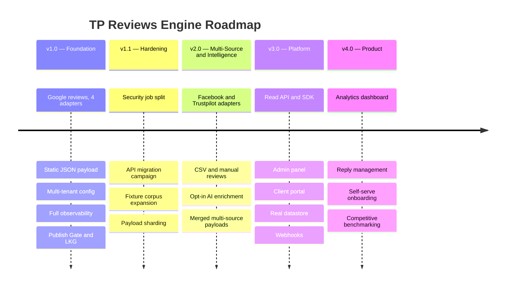
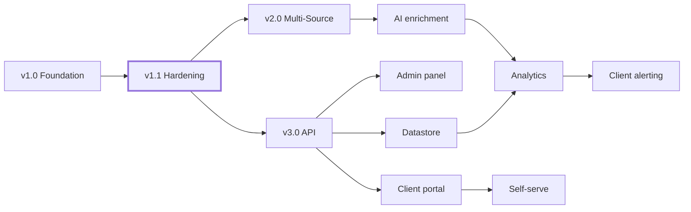
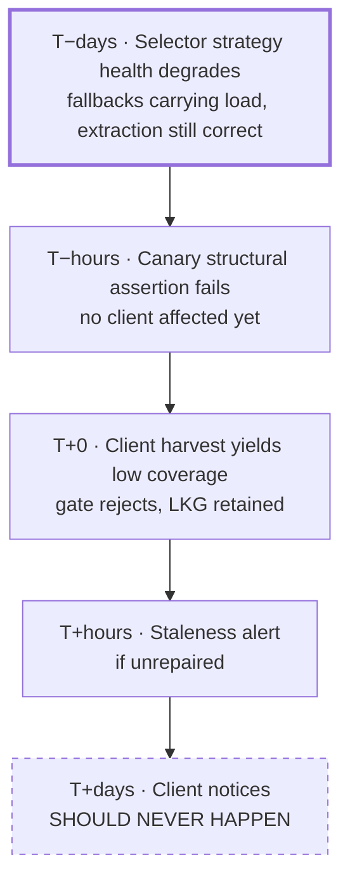

# Part 9 — Roadmap, Limitations, and Operating the System

*Sections 47 through 53. Audience: product, engineers, whoever inherits this system. §49 and §51 are the two sections a new maintainer should read first.*

---

# 47. Future Roadmap

## 47.1 Roadmap Principles

| Principle | Application |
|---|---|
| **Soak before extending.** | v1.0 runs 30 days on real clients before any v2 work begins. Extending an unsoaked foundation compounds defects. |
| **Reduce risk before adding features.** | The highest-value v1.1 items are the security job split and API migration — neither is a feature. |
| **Every version must be shippable on its own.** | No version depends on a later one to be useful. |
| **Additive to the contract, always.** | ADR-019. Consumers written for v1.0 must work at v4.0. |
| **Client count drives the roadmap, not calendar dates.** | The triggers in §37.7 determine when platform work becomes necessary. |

## 47.2 Version Timeline

## 47.3 Version 1.1 — Hardening (Immediately After Soak)

**Theme: reduce the two highest residual risks before adding anything.**

| # | Item | Driver | Effort | Priority |
|---|---|---|---|---|
| 1.1-01 | **Split acquisition and publication into separate jobs** so the browser-running job holds no write token | THREAT-05, §36.4 | 1 day | **Highest** |
| 1.1-02 | **Business Profile API migration campaign** — offer OAuth to every existing client | §15.3.1, RISK-03 | Per client ~1 h | **Highest** |
| 1.1-03 | Expand the fixture corpus with every incident encountered during soak | §41.9 | Ongoing | High |
| 1.1-04 | Payload sharding implementation and verification | §33.4 | 2 days | Medium |
| 1.1-05 | Automated weekly digest generation | §25.8 | 1 day | Medium |
| 1.1-06 | `tpre doctor` expansion: verify CDN headers, schedule liveness, secret presence | §42.2 step 7 | 0.5 day | Medium |
| 1.1-07 | Per-client SLO tiering enforcement | §38.5 | 1 day | Medium |
| 1.1-08 | Selector pack authoring helper (`scripts/suggest-strategies.mjs`) | TG-06 | 2 days | Low |

**Exit criteria for v1.1:** the browser-executing job holds no repository write credential; ≥ 50% of clients on an official API adapter; the fixture corpus contains a test for every soak-period incident.

## 47.4 Version 2.0 — Multi-Source and Intelligence

**Theme: prove the adapter abstraction with genuinely different sources, and populate the reserved schema fields.**

| # | Item | Notes | Effort |
|---|---|---|---|
| 2.0-01 | Facebook Page reviews/recommendations adapter | Requires Page access token via the client's Business Manager — official API path, no DOM reading | 5 days |
| 2.0-02 | Trustpilot adapter | Official API where the client has a paid plan; documented CSV fallback otherwise | 4 days |
| 2.0-03 | `file:csv` promoted to a first-class workflow with a validation UI in CI | Already exists as an adapter; needs operator ergonomics | 2 days |
| 2.0-04 | Manual review entry via a structured config file | For testimonials collected outside any platform | 2 days |
| 2.0-05 | Merged multi-source payload with per-source attribution | Schema already supports `source` per review | 3 days |
| 2.0-06 | **AI enrichment, opt-in** — summary, sentiment, topics, spam score | §59; populates the reserved `ai` block | 6 days |
| 2.0-07 | Source-diversity aware Publish Gate rules | A drop in one source must not be masked by another source's growth | 2 days |
| 2.0-08 | Translation of review text (opt-in, per client) | Deferred from v1.0 §8.1 | 3 days |

**Architectural note on 2.0-01 and 2.0-02.** Both new sources use **official APIs, not DOM reading.** This is deliberate: v1.0's DOM adapter exists because a specific, high-value source has a restrictive API and clients resist OAuth. That justification does not generalise, and the engine must not accumulate scrapers. **Normative for v2.0: no new DOM adapter may be added without an ADR that re-argues §15 for that specific source.**

## 47.5 Version 3.0 — Platform

**Theme: the system becomes a service with an interface, triggered by the §37.7 thresholds (roughly 25+ clients).**

| # | Item | Trigger | Effort |
|---|---|---|---|
| 3.0-01 | Read API with authentication, rate limiting, and pagination (§54) | Consumers needing filtering or cross-client queries | 10 days |
| 3.0-02 | Client SDK (JS/TS) wrapping the API and the static payloads | API exists | 4 days |
| 3.0-03 | Real datastore behind `StatePort` | Repository growth or query needs (§37.4.3) | 6 days |
| 3.0-04 | Admin panel (§56) | Manual onboarding > 4/week or > 30 min | 12 days |
| 3.0-05 | Client portal (§57) | Client demand for visibility | 12 days |
| 3.0-06 | Webhooks on new-review events | Client integration demand | 4 days |
| 3.0-07 | Compute migration off CI to a small dedicated host | > 50,000 runner minutes/month | 3 days |
| 3.0-08 | Generated health dashboard replacing file-based monitoring (§58) | > 200 health files | 5 days |

## 47.6 Version 4.0 — Product

**Theme: reputation intelligence becomes a billable product line rather than an included service.**

| # | Item | Notes |
|---|---|---|
| 4.0-01 | Analytics dashboard: trends, cohorts, topic evolution, rating drivers (§58) | Requires the historical corpus that v1.0 has been accumulating since day one |
| 4.0-02 | Reply management: draft and publish owner replies via the Business Profile API | Requires write scope; only available on the API adapter — another argument for §15.3.1 |
| 4.0-03 | Competitive benchmarking | **Requires an explicit ethics and legal review**: §8.2 currently forbids harvesting competitor listings. Any benchmarking must use aggregate, lawfully-obtained data only. Flagged here so it is not implemented casually. |
| 4.0-04 | Self-serve onboarding with OAuth and billing | Turns the tool into SaaS |
| 4.0-05 | Alerting to clients on rating drops or negative-review spikes | High commercial value; low technical difficulty once analytics exists |
| 4.0-06 | Review-request campaigns | Adjacent product; explicitly out of scope until v4 |

## 47.7 Explicitly Not on the Roadmap, Ever

| Item | Reason |
|---|---|
| CAPTCHA solving or any evasion capability | ADR-010, §29, §30 |
| Authenticated scraping | §8.2 |
| Harvesting listings the client does not own | §8.2, CON-22 |
| Review filtering as a marketed feature | §8.2 |
| Fabricated, AI-generated, or incentivised reviews | Fraud |
| Re-hosting reviewer profile images | ADR-014, unless legal sign-off changes |

## 47.8 Roadmap Dependency Graph

**v1.1 is on the critical path to everything** and is the only version whose work is purely risk reduction. Skipping it to reach v2.0 features faster would carry THREAT-05 and RISK-03 forward into a larger system — which is exactly the mistake this roadmap is ordered to prevent.

---

# 48. Future Integrations

## 48.1 Integration Assessment Framework

Every candidate source is assessed on six axes before any work begins. This framework exists so that "can we add Yelp?" has a structured answer rather than an enthusiastic one.

| Axis | Question |
|---|---|
| **Official API?** | Is there a sanctioned path? If not, §15 must be re-argued for this source specifically. |
| **Cost** | Free, free-tier, or metered? CON-01 still applies. |
| **Client friction** | Does the client need to grant access, and how hard is that? |
| **Data quality** | All reviews or a sample? Replies? Dates? Stable identifiers? |
| **Commercial demand** | How many TradyPerch clients actually have reviews there? |
| **Maintenance burden** | Estimated ongoing cost. |

## 48.2 Source Assessment Matrix

| Source | Official API | Cost | Client Friction | Data Quality | Demand | Verdict |
|---|---|---|---|---|---|---|
| **Google (Business Profile API)** | ✅ Yes | Free | Medium — OAuth grant | ★★★★★ all reviews, replies, write-back | Very high | **v1.0 — shipped** |
| **Google (Places API)** | ✅ Yes | Free tier, then metered | None | ★★☆☆☆ ~5 reviews | Very high | **v1.0 — shipped** |
| **Google (DOM)** | ❌ No | Free | None | ★★★★☆ | Very high | **v1.0 — shipped, with §15 caveats** |
| **Facebook Pages** | ✅ Yes | Free | Medium — Business Manager token | ★★★★☆ recommendations, replies | Medium-high | **v2.0** |
| **Trustpilot** | ✅ Yes | Free tier limited; full access on paid plans | Low — client provides API credentials | ★★★★★ | Medium | **v2.0** |
| **CSV / manual** | n/a | Free | Low | ★★★☆☆ operator-dependent | High — every client has off-platform testimonials | **v1.0 adapter, v2.0 workflow** |
| **Yelp** | ⚠️ Restricted | Free tier very limited | Low | ★★☆☆☆ typically ~3 excerpted reviews with display restrictions | Low outside the US | **v2.5 — low priority** |
| **JustDial** | ❌ No known public API | Free | None | ★★★☆☆ | Medium in India | **Deferred — see §48.4** |
| **Glassdoor** | ❌ No public reviews API | — | — | ★★★★☆ | Low, and a different use case (employer brand) | **Deferred — see §48.5** |
| **Zomato / Swiggy** | ⚠️ Partner-only | — | High | ★★★☆☆ | Niche | Not planned |
| **Capterra / G2** | ⚠️ Partner programmes | Varies | Medium | ★★★★☆ | Niche (B2B software clients) | Assess on demand |
| **Amazon / marketplace** | ⚠️ Seller APIs, product-scoped | — | High | ★★★☆☆ | Not applicable to service businesses | Not planned |

## 48.3 Integration Effort Estimates

| Source | Adapter | Selector Pack | Fixtures | Mapping | Total |
|---|---|---|---|---|---|
| Facebook Pages | 3 d | — (API) | 1 d | 1 d | **5 d** |
| Trustpilot | 2 d | — (API) | 1 d | 1 d | **4 d** |
| CSV workflow | 1 d | — | 0.5 d | 0.5 d | **2 d** |
| Yelp | 2 d | — (API) | 1 d | 1 d | **4 d** |
| A hypothetical DOM source | 4 d | 3 d | 3 d | 1 d | **11 d + ongoing** |

**The last row is the important one.** A DOM-based source costs roughly 2.5× an API-based source to build and carries indefinite maintenance. This asymmetry should govern prioritisation: **prefer a lower-demand source with an API over a higher-demand source without one.**

## 48.4 JustDial — Specific Assessment

Relevant because the first target operates in the Indian market.

| Consideration | Assessment |
|---|---|
| API availability | No public reviews API is known to be available for general use. **Assumption — must be re-verified before any work.** |
| Consequence | Integration would require a DOM adapter, re-arguing §15 for a different platform with different terms |
| Data value | Moderate — a supplementary rather than primary reputation signal for most businesses |
| **Recommendation** | **Do not build a DOM adapter for JustDial.** Instead, support it via the `file:csv` adapter: the client (or TradyPerch) exports or transcribes reviews periodically. This preserves the display capability, involves no ToS question, and costs two days of the CSV workflow that is being built anyway. |

**This is the pattern for every source without an API:** offer CSV import rather than a scraper. It is honest, cheap, legally clean, and adequate for sources where review velocity is low.

## 48.5 Glassdoor — Specific Assessment

| Consideration | Assessment |
|---|---|
| Use case | Employer brand, not customer reputation — a **different product** for a different buyer inside the client organisation |
| API | No general public reviews API known. **Assumption — verify.** |
| Sensitivity | Employee reviews are materially more sensitive than customer reviews: identifiability risk is higher, and republishing them on a careers page has genuine employment-relations implications |
| **Recommendation** | **Do not integrate.** If a client wants employer-brand content on a careers page, use explicitly-collected employee testimonials with consent. This is a better product and avoids republishing pseudonymous employee criticism in a context its authors did not intend. |

**Noted here rather than silently omitted** because it appears on the requested integration list, and a reasoned decline is more useful than an empty roadmap slot.

## 48.6 Adapter Addition Checklist

For any new source, before merge:

| # | Requirement |
|---|---|
| 1 | Assessed against §48.1 and recorded in this document |
| 2 | If no official API, a dedicated ADR re-arguing §15 for this source (v2.0 normative rule) |
| 3 | Implements `AcquisitionAdapter` and passes the full contract suite (§41.6) |
| 4 | Declares accurate capabilities (FR-020); unavailable fields are `null`, never fabricated |
| 5 | Reviews reconcile with other adapters for the same logical review where overlap exists (PT-08) |
| 6 | ≥ 3 fixtures including at least one adversarial |
| 7 | Error classes mapped into the canonical taxonomy (§23.2) |
| 8 | Rate limits and pacing configured with the same conservatism as existing adapters |
| 9 | Payload `source` enum extended (an additive, non-breaking change) |
| 10 | Documentation: capability table, credential requirements, onboarding steps |
| 11 | Compliance: authorisation and data-protection posture assessed for the new source |

---

# 49. Known Limitations

**Stated plainly and completely.** Every limitation here is either accepted, mitigated, or scheduled — and every one should be understood before promising anything to a client.

## 49.1 Data Completeness and Fidelity

| # | Limitation | Impact | Status |
|---|---|---|---|
| L-01 | **Absolute review dates are estimates, not facts.** Only relative dates are available on the DOM path, resolved and pinned at first observation. | A review may display as "May 2026" when it was posted in late April. | Mitigated: `date_precision` and `date_confidence` published; `relative_date` available for honest display. Eliminated on the API path. |
| L-02 | **No historical backfill before first harvest.** Reviews older than the pagination reach are never captured. | A listing with 800 reviews may only ever surface the most recent several hundred. | Accepted (§5.2). Eliminated on the Business Profile API path. |
| L-03 | **Coverage target is 95%, not 100%.** | A handful of reviews may be absent from a "successful" harvest. | Accepted and published as `coverage` in `stats`. |
| L-04 | **Simultaneous author-rename and text-rewrite creates one transient duplicate.** | Briefly, the same review may appear twice, then the old one is tombstoned after the confirmation window. | Accepted (ADR-007); near-duplicate warning surfaces it. |
| L-05 | **Very long reviews may remain truncated** if the expansion budget is exhausted. | Text ends mid-sentence. | Mitigated: `text_truncated` published so consumers can link out instead. |
| L-06 | **Owner-reply dates are relative too**, with the same estimation limits. | Same as L-01. | Same mitigation. |
| L-07 | **Some fields are unavailable on some adapters.** Likes, local-guide flags, and photo counts vary by access method. | Inconsistent richness across clients. | By design: `adapter_capabilities` published so nulls are explicable. |
| L-08 | **`verified` is almost always null.** No source reliably exposes a verification concept for reviews. | The field exists but is unpopulated. | Accepted. **Never fabricated** — a false verification badge would be deceptive. |

## 49.2 Freshness and Availability

| # | Limitation | Impact | Status |
|---|---|---|---|
| L-09 | **Freshness is hours, not seconds.** Default 6-hour cadence plus CDN TTL. | A new review may take up to ~6 h 10 min to appear. | By design (§5.2, AS-04). Disclosed in the client explainer. |
| L-10 | **Scheduled runs are best-effort and may be delayed.** | Occasional cycles run late. | Accepted (CON-10); SLO has margin. |
| L-11 | **Updates pause entirely during an upstream break or a block.** | Reviews go stale until repaired. | Mitigated: LKG means nothing looks broken; alerting at 24 h; §51 repair path. |
| L-12 | **A scheduled workflow can be silently disabled after repository inactivity.** | Total silent stop. | Mitigated by two independent detectors (§22.3.4). |

## 49.3 Method and Legal

| # | Limitation | Impact | Status |
|---|---|---|---|
| L-13 | **The default DOM method is contrary to Google's ToS.** | Contractual and reputational risk (RISK-03). | Disclosed in §15; migration path pre-built (ADR-023); authorisation gate enforced. |
| L-14 | **Egress IP reputation is shared and outside our control.** | Blocks may occur through no fault of ours. | Accepted (CON-12); breaker handles it; strongest argument for API migration. |
| L-15 | **The DOM path does not scale beyond ~50–100 clients defensibly.** | A hard ceiling on the default configuration. | Stated in §28.2 and §37.4; API migration is the answer. |
| L-16 | **Bot challenges cannot be worked around.** | A challenged source stays unavailable until it clears or the client migrates. | By design (ADR-010). |
| L-17 | **Only listings the client owns may be harvested.** | No competitor data, no aggregate market data. | By design (CON-22). |

## 49.4 Architectural and Operational

| # | Limitation | Impact | Status |
|---|---|---|---|
| L-18 | **The repository is public, so ledgers are publicly readable.** | A client's full review history including tombstones is visible. | Disclosed (§33.2); private mode available at a cost (§37.5). **Must be surfaced at onboarding.** |
| L-19 | **No cross-client queries.** Git-as-database supports no ad-hoc analysis. | Portfolio-level questions require a script. | Accepted until v3.0 (§37.4.3). |
| L-20 | **No real-time alerting or paging.** | Weekend failures may wait until Monday. | Accepted — no failure mode requires urgency (§25.9). |
| L-21 | **Monitoring is file-based and does not scale past ~200 clients.** | Manual analysis becomes impractical. | Scheduled: §58, triggered per §37.7. |
| L-22 | **Onboarding requires an engineer.** | Not self-serve. | By design for v1.0; §56 addresses it. |
| L-23 | **Payload sharding is deferred to v1.1.** | Listings above ~1,200 reviews produce a large single file. | Scheduled (1.1-04); `max_reviews` cap protects in the interim. |
| L-24 | **Ledger history grows monotonically.** Tombstones and revision history are never pruned in v1.0. | Slow growth for very old, high-churn listings. | Accepted; pruning policy defined at 5 MB (§20.11). |
| L-25 | **`state` and `data` branch history rewriting is required periodically** and is the most dangerous scripted operation in the system. | Requires care and coordination. | Mitigated by mandatory mirror-first procedure (§33.5). |

## 49.5 Consumer-Side

| # | Limitation | Impact | Status |
|---|---|---|---|
| L-26 | **No rich text in reviews.** All markup is stripped. | Line breaks are preserved; emphasis is not. | By design (INV-05). Non-negotiable. |
| L-27 | **Avatars may fail to load** since they are hotlinked, never re-hosted. | Some cards show initials instead of a photo. | By design (ADR-014); `initials` fallback makes it look intentional. |
| L-28 | **Runtime integration requires JavaScript.** | JS-disabled visitors see the empty state on pattern A. | Mitigated: patterns B and C render at build time and need no JS. |
| L-29 | **Structured-data markup carries search-engine policy risk** and is opt-in and off by default. | Clients must decide with information. | Warned in §21.9; opt-in per client. |
| L-30 | **The client must update `connect-src` if they enforce a strict CSP.** | One-line change during integration. | Documented in every recipe. |

## 49.6 Limitation Disclosure Obligations

**Normative.** The following limitations MUST be disclosed to a client before onboarding, in writing, in plain language:

| Limitation | Client-Facing Wording (Summary) |
|---|---|
| L-09, L-11 | "Reviews update automatically several times a day. Updates are best-effort and depend on a third-party platform; occasionally they pause for a day or two while we fix something." |
| L-13 | "We read your reviews from your own public Google listing at your instruction. There is a fully-supported official-API alternative that takes five minutes of your time to enable, and we recommend it." |
| L-18 | "Your review data is stored in a public code repository. It contains only reviews already public on Google. If you would prefer private storage, we can arrange it at additional cost." |
| L-02, L-03 | "We show the reviews we can collect — typically 95%+ of your current reviews. Very old reviews may not be included." |
| L-01 | "Google shows relative dates like '3 months ago'. We display it the same way rather than guessing an exact date." |

**Why this table is normative.** NTG-02 says client trust must never be damaged by the system. Trust is damaged by *surprises*, not by limitations. A client who was told L-11 in advance experiences a two-day pause as expected behaviour; a client who was not experiences it as a failure.

---

# 50. Maintenance Guide

## 50.1 Steady-State Effort

Honest estimates, not optimistic ones:

| Activity | Frequency | Effort |
|---|---|---|
| Reading the weekly digest | Weekly | 10 min |
| Responding to `warn`-level alerts | ~monthly | 30 min |
| Selector pack repair | 1–3 × / year | 2–8 h each |
| Dependency and browser updates | Quarterly | 1–2 h |
| Fixture corpus refresh | Quarterly | 1–2 h |
| Data history truncation | Quarterly | 30 min |
| Document and assumption review | Quarterly | 2 h |
| Client onboarding | Per client | 20 min |
| **Steady-state total** | | **2–6 h / quarter, plus 4–8 h spikes 1–3 × / year** |

**This is the honest maintenance cost referenced in §4.4** and it must be represented accurately in any commercial model. The engine is not zero-maintenance; it is *low and predictable* maintenance, which is a different and more defensible claim.

## 50.2 Daily (Automated — Zero Human Effort)

| Check | Mechanism |
|---|---|
| Harvests ran for all due clients | `collect` job aggregation |
| Payload verification: reachable, valid, non-empty, fresh | Daily verification job (§25.8) |
| No open `critical` or `high` alerts | Alert reconciliation |
| Canary structural assertions passing | Canary workflow |

**Human involvement: none, unless an alert fires.** That is the design intent — a maintainer who must check a dashboard daily will stop doing so within a month.

## 50.3 Weekly and Monthly

| Cadence | Task | Time |
|---|---|---|
| Weekly | Read the digest: per-client health, yield trends, open conditions | 10 min |
| Weekly | Review any `warn` alerts batched into the digest | 10 min |
| Monthly | Confirm scheduled workflows are still enabled (RISK-17) — the keepalive asserts this, but verify manually | 5 min |
| Monthly | Check repository size and commit churn against §37.7 thresholds | 5 min |
| Monthly | Review the compliance denylist for pending requests | 5 min |
| Monthly | Verify the CDN is serving current payloads with expected headers | 5 min |

## 50.4 Quarterly Maintenance Window

Scheduled in advance and announced internally (NTG-08). Non-critical alerting is suppressed via `TPRE_MAINTENANCE_MODE`.

| # | Task | Notes |
|---|---|---|
| 1 | Update dependencies; review each Dependabot PR | Never auto-merge the browser pin |
| 2 | Update Playwright and Chromium as a dedicated PR | Full fixture suite + live canary before merge (RISK-14) |
| 3 | Re-capture the baseline fixture from the live source | Prevents the corpus drifting into testing only historical markup |
| 4 | Review selector strategy health trends | Falling index-0 resolution predicts a break (§20.4.4) |
| 5 | Truncate `data` branch history | Scripted, mirror-first (§33.5) |
| 6 | Review §0.10 assumptions register — **re-verify every third-party assumption** | API capabilities, quotas, runner specs, free-tier terms |
| 7 | Re-read §15 and confirm the legal posture is unchanged | NTG-03 |
| 8 | Review per-client adapter selection; push API migration (§15.3.1) | Track in each client's config `notes` |
| 9 | Review scaling triggers against §37.7 | |
| 10 | Review and prune stale alerts, issues, and branches | |
| 11 | Verify the DR plan: perform one restore drill (§52.6) | |
| 12 | Update this document with anything learned | NTG-05 |

## 50.5 Health Indicators — What Good Looks Like

| Indicator | Healthy | Investigate | Act |
|---|---|---|---|
| Harvest success rate (30 d) | > 98% | 95–98% | < 95% |
| Coverage | > 0.97 | 0.95–0.97 | < 0.95 |
| Gate rejection rate | < 2% | 2–10% | > 10% |
| Selector strategy index-0 resolution | 100% | 95–99% | < 95% |
| p95 harvest duration | < 150 s | 150–240 s | > 240 s |
| Commits per client per week | < 10 | 10–30 | > 30 |
| Payload age p95 | < 8 h | 8–24 h | > 24 h |
| Retry rate per harvest | < 0.5 | 0.5–3 | > 3 |
| Challenges in 30 days | 0 | — | ≥ 1 |

## 50.6 Common Maintenance Tasks

| Task | Procedure |
|---|---|
| Add a client | §38.6 |
| Pause a client | `enabled: false`; staleness alerting suppressed automatically for `paused` tier |
| Change a client's cadence | Edit `tier` or listing `cadence`; effective next cycle |
| Migrate a client to an API adapter | §15.7.1 |
| Repair a selector break | §51.3 |
| Force a publish after a verified genuine drop | §27.3.3 — requires a written reason |
| Regenerate all payloads after a projector change | `tpre project --client <slug>` per client; no acquisition |
| Honour an erasure request | Add to `compliance/denylist.json`; verify next cycle; §UC-16 |
| Rotate a secret | §35.5 |
| Recover a corrupted ledger | §27.5 |
| Roll back a bad release | §42.7 |

## 50.7 Handover Requirements

If maintenance transfers to another engineer or contractor:

| # | Item |
|---|---|
| 1 | This document, read in the §0.3 order for their role |
| 2 | Repository access with appropriate permissions |
| 3 | Walkthrough of §53 onboarding, ending in a green local test run |
| 4 | One supervised selector repair using a deliberately broken pack (§53.7) |
| 5 | One supervised client onboarding |
| 6 | Access to the compliance records and an explanation of §15 |
| 7 | Explicit transfer of the on-call expectation and the alert channel |
| 8 | Review of the open questions register (§0.9) |

---

# 51. Update Strategy — Adapting to Upstream Change

**The most operationally important section for long-term survival.** RISK-01 has the highest likelihood in the register; this section is its mitigation, expressed as a procedure.

## 51.1 Change Taxonomy

| Type | Frequency | Detection | Repair | Code Change? |
|---|---|---|---|---|
| **Class-name / attribute churn** | Frequent | Selector health degradation | New selector pack | **No** |
| **Element restructuring** | 1–3 × / year | Canary assertion failure, `ERR-PARSE-STRUCTURE` | New selector pack, possibly new strategy kinds | **Usually no** |
| **Interaction change** (scroll container, expansion affordance moved) | Rare | Pagination `stalled`, expansion failures | Pack update + possibly Navigator change | **Sometimes** |
| **Locale/date phrasing change** | Rare | Date parse failures | Date resolver data update | **Data only** |
| **New anti-bot measure** | Rare | `ERR-BLOCKED-*` | §29.5 — not a repair | **No** |
| **Feature removal** (e.g. sort control disappears) | Rare | Assertion failure | Pack update + graceful degradation | **Sometimes** |
| **Access model change** (content requires auth) | Very rare | Consistent failure | **Migrate to official API** | Config only |

**Target: ≥ 70% of changes repairable by editing data files only (NFR-019).** The taxonomy above shows why that target is realistic — the frequent categories are all pack-only.

## 51.2 Detection Layers (Ordered by Lead Time)

**The whole detection design exists to keep incidents at T−days or T−hours.** Layer 1 (strategy health) is the highest-value monitor in the system because it fires *while everything still works*, and it is available only because the selector resolver records which strategy succeeded (§20.4.4). Layer 5 is a monitoring failure, not merely an incident, and any occurrence requires a post-mortem on the detection layers rather than only on the break itself.

## 51.3 Selector Repair Runbook

**Target: 60 minutes median, alert to restored coverage (TG-06).**

| # | Step | Time |
|---|---|---|
| 1 | Read the alert: which assertion or field failed, which clients affected, which pack version | 2 min |
| 2 | Open the diagnostics bundle for a failed target; read `error.json` and `selector-health.json` | 5 min |
| 3 | Copy `snapshot.html` into `fixtures/dom/google/<nnn>-<description>/page.html`; add `meta.json` | 3 min |
| 4 | Run the parser against the new fixture: `npm run parse:fixture -- <nnn>` — reproduce the failure offline | 3 min |
| 5 | Inspect the snapshot; identify the new structure for the failing field | 10 min |
| 6 | Copy the current pack to `v<n+1>.json`; add a new strategy, **placing it by stability rank (§20.4.3), not by convenience** | 10 min |
| 7 | Iterate until the new fixture extracts correctly | 10 min |
| 8 | Write `expected.json` for the new fixture | 3 min |
| 9 | Run the full golden suite: new pack passes all pack-agnostic fixtures; old packs still pass theirs | 2 min |
| 10 | Pin the new pack in `profiles/conservative.json` only | 1 min |
| 11 | Open PR; CI runs everything; dispatch a canary with the new pack | 5 min |
| 12 | Merge; dispatch a manual harvest for one affected client; verify coverage restored | 5 min |
| 13 | Pin in `profiles/default.json`; observe one cycle | 1 min + 1 cycle |
| 14 | Close the alert; record the incident in the pack changelog with detection lead time | 3 min |
| **Total active work** | | **~63 min** |

**Step 6 is where discipline matters most.** Under pressure, the temptation is to add a generated-class-name selector because it works immediately. That produces a repair with a short half-life and a pack that degrades over time. **Normative: a new strategy must be placed at its correct stability rank, and if only a `css` strategy can be found, that fact must be noted in the pack's `notes` field as technical debt with a follow-up issue.**

## 51.4 Emergency Degradation Options

If a repair is not immediately possible:

| Option | Effect | When |
|---|---|---|
| Do nothing | LKG continues to serve; reviews go stale | Default and usually correct — there is no visitor impact |
| Reduce affected clients' cadence | Fewer failed harvests, less alert noise | If failures are noisy |
| Disable the affected field | Harvest succeeds without, say, `likes`; payload has nulls | If a non-required field broke and the rest is fine |
| Roll back to an older pack | Sometimes an older strategy set matches a reverted upstream change | If the change looks like an A/B test |
| Switch clients to `google:places-api` | 5-review highlights display, immediately and legally | If the break is prolonged |
| Switch clients to `google:business-profile-api` | Full restoration | If OAuth can be obtained |
| Pause the client | Honest stop with client communication | If nothing else applies for > 72 h |

**"Do nothing" is listed first because it is usually the right answer.** LKG means the client's website is correct and current-looking. There is no visitor-facing emergency, which means the repair can be done properly on Monday rather than badly at midnight. **This is the single most valuable operational property the architecture provides.**

## 51.5 Preventive Practices

| Practice | Why |
|---|---|
| Semantic/accessibility-first strategy ordering | Those locators change least often because changing them breaks assistive technology |
| ≥ 2 strategies of different kinds per required field | Single-strategy fields are single points of failure |
| Quarterly baseline fixture refresh | Keeps the corpus honest |
| Strategy health monitoring | Converts cliffs into ramps |
| Assertion-based canary | Names the broken field instead of reporting a symptom |
| Pack `notes` explaining each strategy | Makes the next repair faster |
| Staged rollout via `conservative` then `default` | Bounds the blast radius of a bad pack |
| Old packs retained and still tested | Prevents fixture rot |

## 51.6 Adapter Migration Drill (S7)

**Normative: performed at least quarterly**, so the RISK-03 contingency is proven rather than assumed.

| # | Step | Success Criterion |
|---|---|---|
| 1 | Pick a test client (or the scratch tenant) | — |
| 2 | Obtain or reuse an OAuth grant for a test Business Profile | — |
| 3 | Change `adapter` to `google:business-profile-api` | Config-only change |
| 4 | Dry-run harvest; compare the observed set to the current Ledger | ≥ existing coverage |
| 5 | Verify identity reconciliation: reviews match existing records rather than inserting duplicates | **PT-08 holds in practice** — 0 spurious inserts |
| 6 | Full harvest and publish | Payload count and rating unchanged or improved |
| 7 | Record elapsed time | **≤ 1 hour** |

**Step 5 is the crux of the whole drill.** If cross-adapter identity stability were ever broken by a refactor, the property test should catch it — but this drill verifies it against real data from two genuinely different sources, which is the only evidence that matters. A failure here invalidates ADR-023 and is a release blocker.

---

# 52. Disaster Recovery Plan

## 52.1 Objectives

| Objective | Target | Achieved By |
|---|---|---|
| **RPO** (data loss window) | ~0 for payloads and ledgers | Everything is committed to Git; every state is recoverable from history |
| **RTO** (time to restore operation) | ≤ 2 h for total repository loss; ≤ 30 min for anything less | Small system, everything scripted, no infrastructure to rebuild |
| **Visitor impact** | **Zero** for all scenarios except a CDN-level failure exceeding cache TTL | Static artifacts served from a CDN, independent of the engine |

**This plan is short because ADR-006, ADR-012, and ADR-001 did the work.** There is no database to restore, no server to rebuild, no configuration drift to reconstruct — the entire system is a Git repository and a static file.

## 52.2 Disaster Scenarios

| # | Scenario | Likelihood | Visitor Impact | RTO | Procedure |
|---|---|---|---|---|---|
| D-1 | Bad payload published | Low | Until CDN TTL (≤ 30 min) | 15 min | §52.3 |
| D-2 | Ledger corrupted or lost for one client | Low | None | 20 min | §52.4 |
| D-3 | `data` branch corrupted or history damaged | Very low | None (CDN serves cached) | 30 min | §52.5 |
| D-4 | `state` branch lost entirely | Very low | None | 45 min | §52.5 |
| D-5 | Entire repository lost or account compromised | Very low | None until CDN TTL | 2 h | §52.6 |
| D-6 | CI platform unavailable for an extended period | Low | None (staleness only) | Hours | §52.7 |
| D-7 | CDN / static host unavailable | Low | **Yes** — payload unreachable | 1 h | §52.8 |
| D-8 | Total loss of source access | Medium | None | 1 h per client | §15.7.1 |
| D-9 | Maintainer unavailable | Medium | None until something breaks | 1 day | §50.7 |

## 52.3 D-1 — Bad Payload Published

| # | Step |
|---|---|
| 1 | Identify the bad commit on `data`: `git log --oneline -- clients/<slug>/` |
| 2 | Decide the mechanism: `git revert <sha>` restores the exact prior bytes; `tpre project --client <slug>` regenerates from the Ledger (preferred if the Ledger is sound, because it also repairs any projector defect) |
| 3 | Push; the `pages` workflow redeploys automatically |
| 4 | Wait out the CDN TTL, or request a content-addressed URL to verify immediately |
| 5 | Run `scripts/verify-payload.mjs` against the public URL |
| 6 | If the cause was an engine defect, revert the engine too, and add a regression test (§41.9) |

## 52.4 D-2 — Ledger Corrupted or Lost

| # | Step |
|---|---|
| 1 | `git log --oneline -- ledger/<slug>/<listing>.json` on the `state` branch |
| 2 | Identify the last version that passes schema validation |
| 3 | Restore that version: `git checkout <sha> -- ledger/<slug>/<listing>.json` |
| 4 | Commit with a clear message referencing the incident |
| 5 | Run a harvest — idempotence (INV-04) re-derives everything since |
| 6 | Verify the payload is unchanged or improved |
| 7 | If **no** valid version exists, bootstrap from the current payload: `tpre import-payload --as-ledger --client <slug>`. **Accept the losses:** `first_seen_at` becomes the import date, `revision` resets to 1, and **tombstones and suppressions are lost — the denylist must be re-applied from `compliance/denylist.json`**, which is why that file lives on `main` and not in the Ledger. |

**Note the last sentence.** Keeping the compliance denylist on `main` rather than only in the Ledger is a deliberate DR decision: erasure obligations must survive a state-branch disaster. This is the kind of detail that only appears in a DR plan written before the disaster.

## 52.5 D-3 / D-4 — Branch Loss

| Branch | Procedure |
|---|---|
| `data` | Recreate as an orphan branch; run `tpre project` for every client to regenerate every payload from ledgers; run `pages`; verify all payloads. **No acquisition required — zero source requests.** |
| `state` | Recreate as an orphan branch with placeholders; ledgers are lost, so bootstrap each client per §52.4 step 7; re-apply the denylist; accept loss of health history and identity caches (both regenerate). |

**The asymmetry is instructive: losing `data` is trivial (it is derivable), losing `state` is worse (it is the source of truth).** This is exactly the right way round, because `state` is written less often, has a smaller history, and is the one with the longer retention policy (§33.5).

## 52.6 D-5 — Total Repository Loss

| # | Step | Time |
|---|---|---|
| 1 | Locate the most recent clone: any developer machine, any CI cache, or the mirror created during the last history-truncation operation | 15 min |
| 2 | Create a new repository; push `main` from the clone | 10 min |
| 3 | Push `data` and `state` if present in the clone; otherwise recreate per §52.5 | 20 min |
| 4 | Reconfigure: branch protection, Pages, variables, secrets, schedules | 30 min |
| 5 | Rotate every secret — assume compromise if loss was due to account compromise | 20 min |
| 6 | Update the client-site payload URLs if the origin changed | 15 min |
| 7 | Run a full harvest; verify all payloads | 20 min |
| **Total** | | **~2 h** |

**Standing mitigation (normative):** at least one full clone including `data` and `state` MUST exist outside the primary account. The quarterly history-truncation procedure (§33.5) already requires creating a mirror — **that mirror is the offsite backup and MUST be retained rather than deleted.** This converts a required maintenance step into a DR control at zero additional cost.

## 52.7 D-6 — CI Platform Unavailable

| # | Step |
|---|---|
| 1 | Confirm scope via the platform status page |
| 2 | If expected to be brief: do nothing. LKG serves; staleness alerts will fire and can be acknowledged. |
| 3 | If prolonged: run the engine locally — `tpre harvest --all` with `TPRE_ENV=production` and local checkouts of `data` and `state`, then push manually |
| 4 | If very prolonged: stand up cron on any host (§37.6, ~1 engineer-day) |

**Step 3 is possible only because of TG-12 and NFR-045.** The engine is a plain CLI with no platform dependency in its core, so a maintainer with a laptop is a complete disaster-recovery compute plane.

## 52.8 D-7 — CDN / Static Host Unavailable

**The only scenario with visitor impact**, because it sits between the payload and the visitor.

| # | Step |
|---|---|
| 1 | Confirm scope; check whether the failure is host-wide or specific to the site |
| 2 | Client sites using build-time integration (patterns B/C) are **unaffected** — the data is already in their HTML |
| 3 | For runtime-fetch clients: switch the payload URL to the fallback origin (public package CDN mirror of the repository, §34.5) |
| 4 | Communicate to affected clients if the outage exceeds 1 h |
| 5 | Post-incident: consider moving the affected clients to a build-time pattern permanently |

**Prevention insight.** Integration patterns B and C are immune to this scenario, which is a strong argument for preferring them wherever the client's stack allows. This should be reflected in the §34.6 recommendation, and it is.

## 52.9 DR Drill Schedule

| Drill | Frequency | Verifies |
|---|---|---|
| Payload regeneration from Ledger (`tpre project`) | Monthly, on one client | D-1, D-3 |
| Ledger restore from Git history | Quarterly | D-2 |
| Local harvest and manual push | Quarterly | D-6 |
| Offsite clone existence and completeness | Quarterly | D-5 mitigation |
| Adapter migration drill | Quarterly | D-8, ADR-023 |
| Full repository restore | Annually, into a scratch account | D-5 |

**A DR plan that has never been executed is a hypothesis.** These drills are cheap — most are a single command — and they are the difference between a plan and a document.

---

# 53. Developer Onboarding Guide

**Target: from zero to first useful contribution in under one day (NTG-06); green local test run in under four hours.**

## 53.1 Prerequisites

| Requirement | Notes |
|---|---|
| Node LTS (≥ 20) | Version pinned by `.nvmrc` |
| Git ≥ 2.30 | |
| ~5 GB free disk | Browser binaries plus fixtures |
| A terminal and an editor with the project's formatter/linter | |
| Linux, macOS, or Windows with WSL2 | WSL2 strongly preferred on Windows for CI parity |
| Repository read access | Write access after the first supervised task |

## 53.2 Hour 1 — Orientation (Read, Do Not Code)

| # | Task | Time |
|---|---|---|
| 1 | Read §1 (Executive Summary) and §2 (Vision) | 15 min |
| 2 | Read §0.8 (System Invariants) — **memorise INV-02, INV-03, INV-05** | 10 min |
| 3 | Read §16 (High-Level Architecture) including all diagrams | 20 min |
| 4 | Skim §49 (Known Limitations) — understand what the system does *not* do | 10 min |
| 5 | Read §15.1–§15.3 — understand the legal posture and the API recommendation | 15 min |

**Why reading comes before coding.** Almost every serious mistake available in this codebase is a violation of one of the ten invariants, and every one of them looks like a reasonable simplification from inside a single file. Understanding them first is cheaper than learning them from a review.

## 53.3 Hour 2 — Local Setup

| # | Task | Verification |
|---|---|---|
| 1 | Clone the repository | — |
| 2 | `npm ci` | Exits clean |
| 3 | Install the pinned browser | Playwright reports success |
| 4 | Copy `.env.example` to `.env`; set `TPRE_ENV=development` | — |
| 5 | `npm run doctor` | All checks green |
| 6 | `npm test` | **All suites pass, with no network** |
| 7 | `npm run lint && npm run typecheck` | Zero errors |

**If step 6 requires the internet, that is a defect in the test suite (TG-10), not in your setup.** Report it.

## 53.4 Hour 3 — Run the Pipeline Offline

| # | Task | What It Teaches |
|---|---|---|
| 1 | `npm run fixtures:serve` — start the fixture server | Integration testing needs no internet |
| 2 | `tpre harvest --client _fixture --no-publish --log-level debug` | The full ten-stage pipeline, with logs |
| 3 | Read the emitted `manifest.json` | What provenance and per-stage timings look like |
| 4 | `npm run parse:fixture -- 001` | Pure parsing against saved markup |
| 5 | `npm run parse:fixture -- 014` | **A `partial` harvest — observe that streaks do not increment (INV-03)** |
| 6 | `npm run parse:fixture -- 016` | **A challenge page — observe the terminal classification (INV-07)** |
| 7 | `tpre project --client _fixture` | Payload regeneration with no acquisition |
| 8 | Inspect the generated payload against §21 | The public contract, concretely |

**Steps 5 and 6 are the two most important minutes of onboarding.** They demonstrate the system's two defining behaviours — refusing to treat a partial harvest as truth, and refusing to fight anti-bot measures — as observable output rather than as documentation.

## 53.5 Hour 4 — Client Onboarding Walkthrough (Dry Run)

Perform against a scratch client, without merging.

| # | Task |
|---|---|
| 1 | Read §15.10 (Compliance Checklist) and §38.6 |
| 2 | `node scripts/new-client.mjs --slug scratch-test` |
| 3 | Fill in identity, adapter (`google:dom`), tier, locale |
| 4 | `tpre validate-config --explain` — **observe the resolution trace and which layer supplied each value** |
| 5 | Deliberately omit the `authorization` block; re-validate | **Observe V-3 failing the config.** This is the §15.6 gate working. |
| 6 | Restore the block; validate clean |
| 7 | Deliberately set `TPRE_MAX_REVIEWS=99999`; run | **Observe the ceiling rejection.** Conservative-only overrides (FR-089). |
| 8 | Discard the scratch config |

## 53.6 Day 1 Afternoon — Deep Reading by Role

| Role | Sections |
|---|---|
| Backend engineer | §17, §20, §21, §23, §26, §27, §41 |
| DevOps | §22, §24, §25, §28, §42, §52 |
| QA | §41, §49, §23, §27.3 |
| Security | §35, §36, §15, §40.5 |
| Frontend / integrator | §21, §34, §31.5 |

## 53.7 First Supervised Tasks

Completed with a reviewer, in this order:

| # | Task | Skill Demonstrated |
|---|---|---|
| 1 | Add a golden fixture from an existing diagnostics bundle and make the parser handle it | Fixture workflow, offline debugging |
| 2 | Repair a deliberately broken selector pack (the reviewer breaks one field) | §51.3 runbook end to end |
| 3 | Add a new config key with a default, schema entry, validation, and documentation | The config system and its discipline |
| 4 | Add a chaos scenario for a failure mode not yet covered | Understanding of the safety properties |
| 5 | Onboard a real client under supervision | The compliance gate and the full onboarding path |

**Task 2 is the graduation exercise.** An engineer who can complete a selector repair in under 90 minutes, with a fixture and a staged rollout, can maintain this system. That is the actual competency the product depends on.

## 53.8 Mental Model — The Five Things to Remember

| # | Principle |
|---|---|
| 1 | **The website never talks to Google.** Everything else follows from this. |
| 2 | **A failed harvest must never make the site worse.** LKG always. If you are unsure whether to publish, do not publish. |
| 3 | **Absence is not deletion.** A review that did not appear may simply not have loaded. |
| 4 | **The volatile knowledge lives in data files, not in code.** Fix markup breakage in a selector pack. |
| 5 | **A challenge means stop, not try harder.** Escalate to a human; migrate to the official API. |

## 53.9 Where to Ask

| Question | Source |
|---|---|
| "Why is it built this way?" | The relevant ADR (§0.6 index) |
| "What should happen when X fails?" | §23 taxonomy, then §27 recovery matrix |
| "Is this allowed?" | §15, then §8.2 |
| "How do I fix a broken selector?" | `docs/runbooks/selector-break.md` (§51.3) |
| "What does this field mean?" | §21 |
| "Why is my config value being ignored?" | `tpre validate-config --explain` |
| "Should I add this dependency?" | §19.7 DEP-1…DEP-6 |
| "Is this a limitation or a bug?" | §49 |

---

*End of Part 9. Part 10 covers the future API design, dashboard and portal designs, AI features, and the conclusion.*
