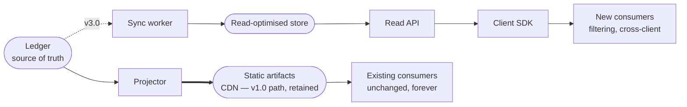
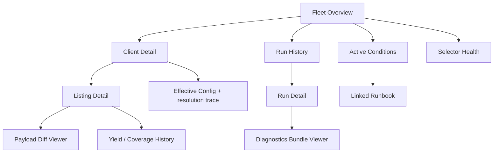
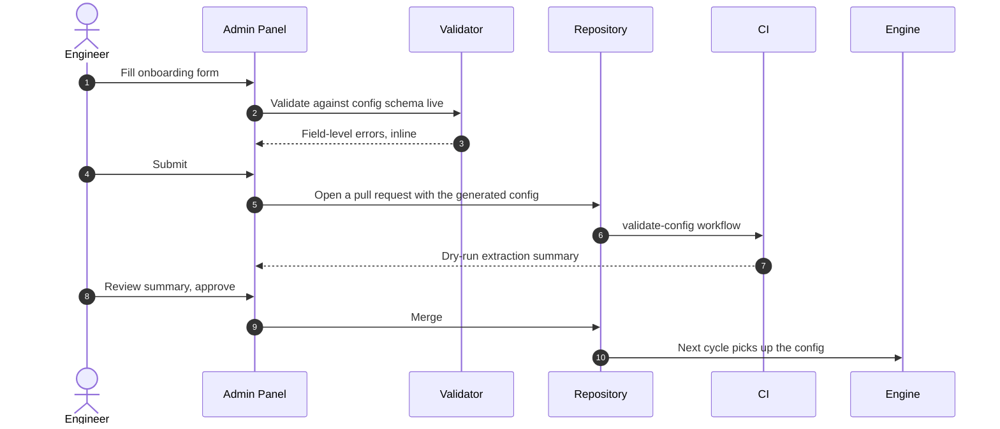
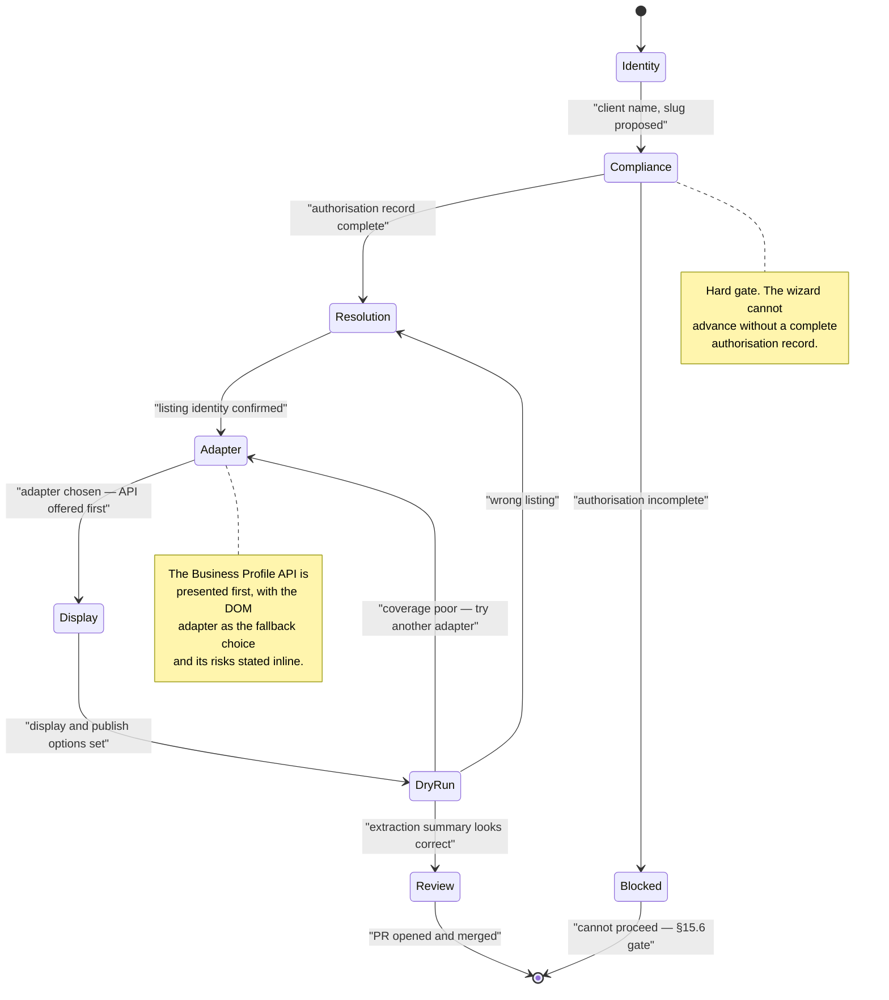
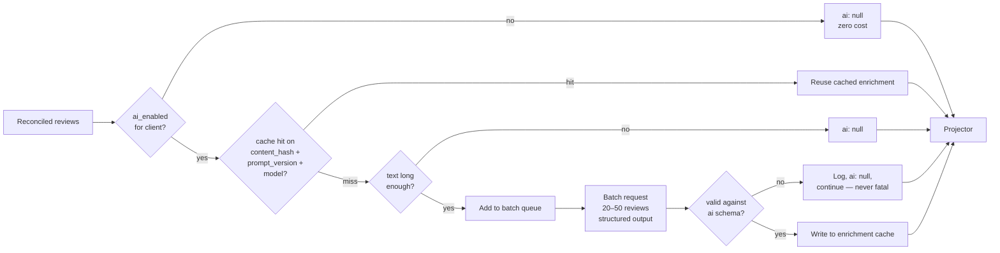

# Part 10 — The Future Platform

*Sections 54 through 60. Audience: product and architecture. Everything in this part is **design, not v1.0 scope** — it exists so that v1.0 does not accidentally foreclose it, and so that when the §37.7 triggers fire the design work is already done. §60 closes the document.*

---

# 54. API Design (Future)

## 54.1 When an API Becomes Necessary

v1.0 deliberately ships no API (ADR-003). The trigger conditions for building one:

| Trigger | Why an API Solves It |
|---|---|
| A consumer needs filtered or queried data (by rating, language, date range, keyword) | Static payloads force the consumer to download everything and filter client-side; fine at 60 KB, wasteful at 2 MB |
| Cross-client queries (portfolio dashboards, benchmarking) | Impossible against per-client static files without N fetches |
| Write operations (manual review entry, moderation, replies) | Static artifacts are read-only by nature |
| Third-party or partner access with per-consumer rate limits and revocation | A static file cannot be rate-limited or revoked per consumer |
| Real-time invalidation ("refresh my reviews now") | Requires a request path |

**Until at least two of these are true, the static artifact remains the better engineering choice.** Restated because it is the most likely thing to be over-built: an API adds an availability dependency in front of content that is currently as available as a CDN.

## 54.2 Architectural Position

The API is **additive**, not a replacement. The Ledger remains the source of truth; static artifacts continue to be published.



**Normative for v3.0:** introducing the API MUST NOT break or deprecate the static path. Existing client sites continue to work untouched. This is a hard requirement because those sites are not all under TradyPerch's control.

## 54.3 Style Decision

| Option | Pros | Cons | Verdict |
|---|---|---|---|
| **REST + JSON** | Cacheable at the edge; trivially consumable; ETag/conditional requests; matches the existing payload shape | Multiple round trips for compound queries | **Chosen** |
| GraphQL | One round trip for compound queries; typed schema | Poor HTTP cacheability; server complexity; overkill for a read-mostly resource with ~10 fields | Rejected |
| gRPC | Efficient, typed | Not browser-native without a proxy; violates the zero-dependency consumer principle | Rejected |
| tRPC or similar | Excellent DX in TS | Couples consumers to a TS server; excludes non-JS clients | Rejected |

**Reasoning.** The dominant access pattern is "give me this client's reviews, optionally filtered". That is a cacheable GET. GraphQL's advantage — arbitrary compound queries — is a solution to a problem this data shape does not have, and its cost (edge cacheability) is the thing that makes the current architecture cheap and fast.

## 54.4 Endpoint Design

Base: `https://api.tradyperch.com/v1`

| Method | Path | Purpose | Auth |
|---|---|---|---|
| `GET` | `/clients/{slug}/listings` | List a client's listings with aggregates | Read key |
| `GET` | `/clients/{slug}/listings/{key}/reviews` | Paginated, filterable reviews | Read key |
| `GET` | `/clients/{slug}/listings/{key}/stats` | Aggregates only | Read key |
| `GET` | `/clients/{slug}/reviews` | Merged across listings | Read key |
| `GET` | `/clients/{slug}/health` | Freshness and coverage — for the client portal | Client key |
| `POST` | `/clients/{slug}/refresh` | Request an out-of-band harvest (rate-limited, queued) | Client key |
| `POST` | `/clients/{slug}/reviews/manual` | Add a manually-collected review | Admin key |
| `PATCH` | `/clients/{slug}/reviews/{id}/suppress` | Compliance suppression | Admin key |
| `GET` | `/admin/clients` | Portfolio listing | Admin key |
| `GET` | `/admin/runs` | Recent harvest runs and outcomes | Admin key |
| `GET` | `/openapi.json` | Machine-readable specification | Public |

**Query parameters on the reviews collection:**

| Parameter | Type | Notes |
|---|---|---|
| `limit`, `cursor` | int, opaque string | Cursor pagination; **not** offset — offsets are unstable when the underlying set changes |
| `min_rating`, `max_rating` | int | |
| `language` | ISO 639-1, repeatable | |
| `has_text` | boolean | |
| `has_reply` | boolean | |
| `since`, `until` | RFC 3339 | Filters on `date`, falling back to `first_seen_at` where `date` is null |
| `sort` | enum | `newest`, `oldest`, `rating_desc`, `rating_asc`, `relevance` |
| `fields` | csv | Sparse fieldsets to reduce payload |

## 54.5 Contract Rules

| Aspect | Rule |
|---|---|
| Versioning | Major version in the path (`/v1`). Additive-only within a major, matching ADR-019's discipline. |
| Response envelope | `{ data, meta, links }` — `meta` carries counts and provenance, `links` carries `next`/`prev` |
| Errors | Problem-details style: `type`, `title`, `status`, `detail`, `instance`, plus a machine-readable `code` drawn from the §23 taxonomy where applicable |
| Caching | `ETag` on every response; `304` on `If-None-Match`; `Cache-Control` tuned per endpoint (stats longer than reviews) |
| Rate limits | Returned as headers on every response, not only on `429` — consumers should be able to self-pace without hitting the wall |
| Idempotency | `Idempotency-Key` header required on all `POST` |
| Time | RFC 3339 UTC everywhere. No local times, no epoch integers. |
| Nulls | Present-and-null rather than absent, so consumers need not distinguish |

## 54.6 Authentication and Authorisation

| Key Type | Scope | Issued To | Capabilities |
|---|---|---|---|
| **Read key** | One client, read-only | Client's website or integrator | Reviews, stats, listings |
| **Client key** | One client, read + limited write | Client portal session | Above, plus health and refresh requests |
| **Admin key** | All clients | TradyPerch only | Everything, including suppression and manual entry |

| Control | Detail |
|---|---|
| Transport | HTTPS only; keys in an `Authorization` header, never in a query string (query strings land in logs and referrers) |
| Storage | Hashed at rest; the plaintext key is shown once at creation |
| Rotation | Two active keys per scope permitted, so rotation needs no downtime |
| Revocation | Immediate |
| Public-site use | **Read keys are safe to expose in a browser** because they are read-only, per-client, and rate-limited — but the recommended pattern remains build-time fetch or a server-side proxy, and the docs say so |
| Signed requests | HMAC request signing available for partner integrations requiring non-repudiation |

## 54.7 Storage Behind the API

This is where Git-as-database finally gives way (§33.6, §37.4.3).

| Requirement | Why Git Cannot Serve It |
|---|---|
| Filtering and sorting by arbitrary fields | Requires reading and scanning every file per request |
| Cross-client aggregation | Requires reading every client's file per request |
| Sub-100 ms p95 response | Filesystem scans plus JSON parsing per request will not hold at scale |
| Concurrent reads at request volume | Not what a Git checkout is for |

**Design:** the Ledger remains the write-side source of truth on the `state` branch. A sync worker projects it into a read-optimised store (a managed relational database is the right default; the schema is small — clients, listings, reviews, aggregates, health). The API reads only from that store. This is a straightforward read-model projection, and it keeps the property that a total loss of the read store is repairable by replaying from the Ledger.

## 54.8 Client SDK

| Aspect | Decision |
|---|---|
| Language | TypeScript first (matches the consumer base), published as an npm package |
| Size budget | ≤ 8 KB minified + gzipped |
| Design | Thin typed wrapper: no state management, no framework bindings, no React components |
| Features | Typed responses generated from the OpenAPI spec, cursor auto-pagination, ETag handling, retry with backoff on 429/5xx |
| Non-goals | UI components, caching layers, framework-specific hooks — those belong in the recipes, not the SDK |

## 54.9 Operational Requirements (If Built)

Stated plainly because this is the point at which the product acquires real operational obligations it does not have today:

| Requirement | Implication |
|---|---|
| Availability target | 99.9% — needs monitoring, alerting, and someone on call |
| Cost | **Non-zero and recurring.** Compute, database, and egress. This breaks CON-01 and must be a deliberate, priced decision. |
| Security surface | First inbound attack surface in the system's history — authn/authz, input validation, rate limiting, abuse handling |
| Compliance | Access logging, retention, and DSAR support over a live datastore |
| Support | An API has consumers who file issues |

**Recommendation.** Do not build the API to be modern. Build it when at least two §54.1 triggers are live, and price it into the client relationship first.

---

# 55. Future Dashboard Design

## 55.1 Purpose and Trigger

An internal operations dashboard for TradyPerch engineers. Triggered when the file-based monitoring of §25 stops scaling — approximately 25 clients for convenience, 200 for necessity (§37.7).

**It replaces reading JSONL files by hand. It is not a client-facing product.**

## 55.2 Information Architecture



## 55.3 Screen Specifications

### 55.3.1 Fleet Overview — The Only Screen That Matters at 3 a.m.

**Design principle: answer "is anything wrong, and does it need me now?" in under three seconds, without scrolling.**

```
┌──────────────────────────────────────────────────────────────────────┐
│  TP REVIEWS ENGINE — FLEET                    last cycle 06:23 UTC   │
├──────────────────────────────────────────────────────────────────────┤
│   HEALTHY 47      DEGRADED 2      FAILING 1      PAUSED 3            │
│                                                                      │
│  ⚠ ACTION REQUIRED                                                   │
│  ┌────────────────────────────────────────────────────────────────┐ │
│  │ CRITICAL  bot challenge — google:dom   breaker open 4h12m       │ │
│  │           12 clients deferred · LKG serving · runbook →         │ │
│  ├────────────────────────────────────────────────────────────────┤ │
│  │ HIGH      selector drift — pack v3, field: rating               │ │
│  │           fallback strategy carrying 84% · canary red · fix →   │ │
│  └────────────────────────────────────────────────────────────────┘ │
│                                                                      │
│  STALENESS               COVERAGE              CYCLE DURATION        │
│  p50  3.1h  p95  7.4h    p50 0.99  min 0.91    p50 14m  max 22m      │
│                                                                      │
│  CLIENTS NEEDING ATTENTION                                           │
│  slug              status      age    cov    yield Δ    last ok      │
│  acme-dental       degraded    26h    0.88   −14%       26h ago      │
│  northside-law     failing     51h    —      —          51h ago      │
│  commerce-insight  healthy      2h    0.98    +2        2h ago       │
└──────────────────────────────────────────────────────────────────────┘
```

| Design Rule | Rationale |
|---|---|
| Action-required block is first and is the only coloured region | Colour used everywhere is colour used nowhere |
| Healthy clients are a **count**, not a list | A list of 47 green rows is noise that hides the one red row |
| Every alert row links directly to its runbook | Removes the slowest step in incident response (§23.3) |
| "LKG serving" stated explicitly on every failure | The on-call engineer's first question is always "is a client's site broken?" — the answer is pre-answered |
| Distributions (p50/p95), not averages | An average hides the one client that is 51 hours stale |
| No auto-refresh animation, no live-updating counters | Motion draws the eye away from the alert block |

### 55.3.2 Other Screens

| Screen | Key Content | Primary Use |
|---|---|---|
| **Client Detail** | Config summary, per-listing status, 30-harvest sparkline, adapter and pack versions, alert history, integration pattern and payload URL | Answering "what is going on with this client?" |
| **Listing Detail** | Yield/coverage/duration series, decision log (inserts/updates/removals over time), tombstone list, current payload preview | Data-quality investigation |
| **Payload Diff** | Side-by-side previous vs. candidate, with gate verdict and per-rule results | Deciding whether a gate rejection was correct |
| **Run Detail** | Per-target outcome table, stage timings, pagination growth curve, resource-blocking stats, links to diagnostics | Incident forensics |
| **Selector Health** | Per-field strategy-index resolution rates over time, per pack version | The leading-indicator screen — catches drift before breakage |
| **Diagnostics Viewer** | Rendered snapshot, screenshot, flushed log, error context — all in one view | Replaces downloading and unzipping artifacts |

## 55.4 Technical Approach

| Decision | Choice | Rationale |
|---|---|---|
| Rendering | Statically generated, rebuilt after each cycle | No server; consistent with the existing architecture; free hosting |
| Data source | Reads the same JSONL health series and manifests the engine already writes | No new data pipeline; no divergence between dashboard and reality |
| Interactivity | Client-side filtering and charting over pre-loaded data | Under 200 clients the whole dataset is a few hundred KB |
| Access control | Behind the repository's access control initially; a hosted version needs real auth | Defers the auth question until it must be answered |
| Charting | Small dependency or hand-rolled inline SVG; no heavy chart library | The charts needed are sparklines and line series |
| Effort estimate | ~5 engineer-days | |

## 55.5 Explicit Non-Goals

| Excluded | Reason |
|---|---|
| Editing configuration | That is the admin panel (§56). A read-only dashboard cannot break production. |
| Real-time streaming updates | Cycle-time refresh matches the data's actual cadence |
| Client-facing views | That is the portal (§57), with entirely different content and trust boundaries |
| Mobile-first layout | Incident response happens at a desk; responsive is enough |

---

# 56. Future Admin Panel

## 56.1 Purpose and Trigger

Convert client onboarding and configuration from a pull-request workflow into a guided UI. **Triggered when manual onboarding exceeds 4 per week or 30 minutes each** (§37.7) — not before, because the PR workflow has a genuine advantage the UI must work hard to replicate: review, audit, and revert are free.

## 56.2 The Central Design Constraint

> **The admin panel must not become a second source of truth for configuration.**

A UI that writes to a database while the engine reads from files creates two realities and guarantees drift. The design keeps configuration in Git:



| Property Preserved | How |
|---|---|
| Git remains the source of truth | The panel authors commits; it never writes runtime state |
| Review and audit | Every change is a PR with an author and a diff |
| Revert | `git revert`, unchanged |
| Schema validation | The same schema, applied in the browser *and* in CI |
| No new deployment coupling | The engine is unaware the panel exists |

**This is the single most important decision in §56.** A panel that bypasses Git would be faster to build and would destroy the properties that make §52's recovery plan short.

## 56.3 Capability Set

| Capability | Priority | Notes |
|---|---|---|
| Guided client onboarding wizard | Must | Encodes §15.10's compliance checklist as required steps |
| Listing resolution helper | Must | Search, preview candidates, select, and store the canonical identifier — replaces the CLI `resolve` step |
| Config editor with live validation and resolution trace | Must | Shows the effective value and which layer supplied it |
| Enable / disable / pause client | Must | Generates the config change as a PR |
| Manual harvest trigger | Must | Calls the workflow dispatch API |
| Force-publish with mandatory reason | Should | Enforces the §27.3.3 audit requirement structurally |
| Compliance denylist management | Must | The erasure workflow (UC-16) becomes a form with an SLA timer |
| Selector pack staging | Should | Assign a pack to a profile, view fixture results, stage the rollout |
| Secret presence check | Should | Reports whether required secrets exist; **never displays or accepts secret values** |
| Bulk cadence retiering | Could | The primary lever at scale (§37.4.2) |

## 56.4 Onboarding Wizard Flow



**Note the two annotations.** They are the mechanism by which §15's policy becomes unavoidable rather than aspirational: the compliance gate cannot be skipped, and the recommended adapter is the default path rather than the buried option. A UI is a policy-enforcement surface, and this one is designed as such deliberately.

## 56.5 Security Requirements

| Requirement | Rationale |
|---|---|
| Authentication via an existing identity provider; no bespoke password system | Reduces attack surface and avoids credential storage |
| Two roles: `operator` (config PRs, triggers) and `admin` (denylist, force-publish, pack staging) | Least privilege for destructive or compliance-relevant actions |
| Every action logged with actor and timestamp | Audit trail for compliance actions |
| Secrets never displayed, never accepted, never proxied | The panel checks presence only; secret entry stays in the platform's own secret UI |
| Mandatory reason field on force-publish and suppression | Structural enforcement of audit requirements |
| No direct write path to `data` or `state` | The panel opens PRs against `main` only |

## 56.6 Effort and Sequencing

| Phase | Scope | Effort |
|---|---|---|
| 1 | Read-only config viewer with resolution trace | 2 days |
| 2 | Onboarding wizard producing a PR | 5 days |
| 3 | Manual triggers and enable/disable | 2 days |
| 4 | Denylist and compliance workflows | 2 days |
| 5 | Selector pack staging | 3 days |
| **Total** | | **~14 days** |

---

# 57. Future Client Portal

## 57.1 Purpose and Value

A client-facing view answering three questions the client will otherwise ask by email: *are my reviews up to date, what do they look like on my site, and how do I get them fixed if something is wrong?*

**Commercial rationale.** The portal is a retention feature, not an operational one. It makes an invisible service visible — a client who can see "last updated 2 hours ago · 118 reviews · 4.9★" understands what they are paying for. That is worth more than any operational convenience it provides.

## 57.2 Trust Boundary

The portal is the first surface where an **external, semi-trusted** user sees system internals. The boundary is drawn deliberately.

| Shown | Hidden | Why |
|---|---|---|
| Last update time, next expected update | Cron schedules, shard assignment | Internal scheduling is not the client's concern and invites cadence negotiation |
| Review count, mean rating, distribution | Coverage ratio, advertised-vs-extracted gap | A client seeing "coverage 0.94" will read it as a defect rather than an honest metric |
| Status: `up to date` / `updating` / `paused` | Error classes, breaker state, selector pack versions | Internal taxonomy is meaningless and alarming to a client |
| Their own reviews as published | Ledger internals, tombstones, revision history | Not a contract; potentially confusing |
| Their integration snippet and payload URL | Repository paths, branch names | Reduces support surface |
| A "request refresh" button | Rate-limit internals | The button is rate-limited server-side and simply queues |
| Data export | Other clients' anything | Tenant isolation |

**On the coverage decision.** §21.5 deliberately publishes coverage in the payload for transparency, and §57.2 deliberately hides it from the portal. That is not a contradiction: a machine-readable field for an integrator who asked for it is a different thing from a number on a client's dashboard that they will misread. The portal instead shows *last full update*, which conveys the same health information in terms the client can act on.

## 57.3 Screen Design

```
┌──────────────────────────────────────────────────────────────────┐
│  Commerce Insight — Reviews                    Powered by TradyPerch │
├──────────────────────────────────────────────────────────────────┤
│                                                                  │
│   ● Up to date            Last updated 2 hours ago               │
│                           Next update in about 4 hours           │
│                                                                  │
│   ★ 4.9         118 reviews         41 replied to                │
│                                                                  │
│   ▁▂▃▃▄▅▅▆▇█   reviews over the last 12 months                   │
│                                                                  │
│  ┌────────────────────────────────────────────────────────────┐ │
│  │  Your latest reviews                                       │ │
│  │  ★★★★★  Ananya S.      2 days ago      replied ✓           │ │
│  │  ★★★★★  Rohit M.       5 days ago                          │ │
│  │  ★★★★☆  Priya K.       1 week ago      replied ✓           │ │
│  │                                        view all 118 →      │ │
│  └────────────────────────────────────────────────────────────┘ │
│                                                                  │
│  On your website        commerceinsight.in/reviews  ↗            │
│  Need a change?         Contact your account manager             │
│                                                                  │
│  [ Refresh now ]   [ Download all reviews (JSON / CSV) ]         │
└──────────────────────────────────────────────────────────────────┘
```

| Design Rule | Rationale |
|---|---|
| Status as a plain-language phrase, never a code | "Up to date" not `healthy`; "Paused — we're working on it" not `breaker_open` |
| Next-update estimate, not a schedule | Sets expectation without creating a commitment to an instant |
| No technical vocabulary anywhere | If a client needs a glossary, the portal has failed |
| Failure states are honest but calm | "Updates are paused while we fix something. Your website is still showing your reviews." |
| Export prominent | Reinforces BG-07 (the client owns their data) and reduces lock-in anxiety |
| One contact path | Prevents the portal becoming a support ticketing system by accident |

## 57.4 Failure-State Copy (Normative)

Because these strings are the client-facing expression of every failure mode in §27, they are specified rather than left to implementation.

| Internal State | Client-Facing Message |
|---|---|
| Healthy, < 12 h | "Up to date. Last updated *N* hours ago." |
| Healthy, 12–24 h | "Up to date. Last updated *N* hours ago." *(no change — this is normal)* |
| Gate rejected, < 48 h | "Checking an update. Your website is showing your most recent verified reviews." |
| Breaker open / challenge | "Updates are paused while we resolve something on our side. Your website is unaffected and is showing your latest verified reviews." |
| Stale > 72 h | "Updates have been paused since *date*. We're on it — your account manager has been notified." |
| Client paused | "Updates are paused at your request." |
| Zero reviews at source | "No reviews found yet. As soon as a customer leaves one, it will appear here and on your website." |

**Every message states what is true about the client's website**, because that is the only thing the client actually cares about. Not one of them exposes a cause the client cannot act on.

## 57.5 Technical Approach

| Aspect | Decision |
|---|---|
| Auth | Magic-link email, scoped to one client. No passwords to store or reset. |
| Data | Reads the API's client-scoped endpoints (§54.4) with a client key |
| Rendering | Server-rendered or statically generated per client with client-side hydration for the review list |
| Refresh button | Rate-limited to 1 per hour per client; queues a workflow dispatch; **never bypasses the Publish Gate** |
| Export | Generates JSON and CSV on demand from the API |
| Multi-listing | Listing selector for multi-location clients |
| Branding | TradyPerch-branded, with the client's name and logo |
| Effort | ~12 days, and dependent on §54 |

---

# 58. Future Analytics Dashboard

## 58.1 Positioning

**This is a product, not a feature.** §55 (internal ops) and §57 (client reassurance) are cost centres. §58 is the first thing in this roadmap that a client would pay extra for, and it is the commercial justification for having accumulated review history since day one.

## 58.2 The Data Asset

The analytics product is only possible because v1.0 made three decisions that cost nothing at the time:

| v1.0 Decision | Enables |
|---|---|
| Ledger retains `first_seen_at` per review, forever (§20.11) | True time series — when reviews actually arrived, not just their estimated dates |
| Ledger retains `harvest_history` and revision history | Trend analysis and edit detection |
| Tombstones are never pruned | Deletion analysis — an under-appreciated signal |
| Health series is append-only and unbounded (§25.3) | Operational trend correlation |

**This is the return on ADR-006.** A design that published only the current payload would have no history to sell, and no way to reconstruct it retroactively. Two years of accumulated `first_seen_at` values cannot be back-filled.

## 58.3 Metric Catalogue

| Category | Metrics |
|---|---|
| **Volume** | Reviews per month; rolling 90-day velocity; velocity change vs. prior period |
| **Sentiment** | Mean rating over time; rating distribution shift; share of 1–2★ over time |
| **Engagement** | Reply rate; median time-to-reply; reply rate by rating band |
| **Content** | Share with text; median review length; language mix over time |
| **Themes** *(requires §59)* | Topic frequency over time; topic-to-rating correlation; emerging and declining themes |
| **Anomaly** | Rating drop detection; review-velocity spike or collapse; suspected inauthentic clustering |
| **Comparative** | This client vs. their own historical baseline; vs. anonymised portfolio percentile |

## 58.4 The Insights That Justify the Price

Raw charts are commodity. These derived insights are the product:

| Insight | Question It Answers | Mechanism |
|---|---|---|
| **Rating trajectory** | "Is my reputation improving or declining, controlling for volume?" | Rolling mean with confidence bands; direction test |
| **Theme-to-rating attribution** | "Which specific thing is driving my low ratings?" | Correlate extracted topics against rating; rank by impact |
| **Reply impact** | "Does replying to reviews actually help?" | Compare subsequent review velocity and rating after replied vs. unreplied periods |
| **Velocity alert** | "Have my reviews stopped coming in?" | Detect a statistically significant drop against the client's own baseline |
| **Emerging theme alert** | "Is a new complaint starting to appear?" | Topic frequency change detection over trailing windows |
| **Portfolio percentile** | "How do I compare?" | **Anonymised and aggregated across TradyPerch clients only** — never scraped competitor data (§8.2, §47.7) |

**Note the constraint on the last row.** Benchmarking is commercially the most attractive metric and ethically the most dangerous. It is permitted **only** against aggregated, anonymised, consented data from TradyPerch's own client base — never against harvested competitor listings. This requires client consent in the service terms and a minimum cohort size (≥ 10 clients per comparison group) to prevent de-anonymisation.

## 58.5 Technical Requirements

| Requirement | Implication |
|---|---|
| Time-series storage | The read store from §54.7, extended with monthly aggregate rollups |
| Aggregate pre-computation | Computed after each cycle, not per page view |
| Cohort anonymisation | Minimum cohort size enforced in the query layer, not in the UI |
| Historical backfill | Compute from the existing Ledger on first deployment — the accumulated history becomes immediately valuable |
| Charting | A real chart library is justified here (unlike §55); accessibility and colour-blind-safe palettes are requirements, not niceties |
| Effort | ~15 days, dependent on §54 and (for themes) §59 |

## 58.6 Client Alerting

The highest-value, lowest-effort feature in this entire section:

| Alert | Trigger | Channel |
|---|---|---|
| New negative review | A 1–2★ review appears | Email within one cycle |
| Rating decline | Rolling mean drops beyond a threshold | Email + portal banner |
| Velocity collapse | Review rate falls materially below baseline | Monthly digest |
| Milestone | 100th review, 4.9★ reached | Email — a genuinely welcome message |
| Unanswered negative review | A 1–2★ review with no reply after 48 h | Email — the most actionable alert in the set |

**The last row is the one clients will value most.** An unanswered negative review is a concrete, urgent, fixable problem, and the system already has every field needed to detect it. It requires no AI, no analytics store, and no dashboard — it could ship in v2.0 as a standalone feature. **Recommendation: build this before the dashboard.**

---

# 59. Future AI Features

## 59.1 Scope and Constraint

Five capabilities, populating the reserved `ai` block from §21.4.5: summarisation, sentiment analysis, spam detection, keyword/topic extraction, and aggregate insights.

> **ADR-022 — AI enrichment is opt-in, cached by content hash, additive-only, and never authoritative**
> **Status:** Accepted
> **Context:** AI enrichment is the highest-perceived-value future feature and the one most likely to be implemented carelessly. It costs real money (violating CON-01), it is non-deterministic (violating TG-02), and it produces plausible text that can be wrong about a real person's opinion.
> **Decision:** (1) Enrichment is **opt-in per client**, defaulting to off, so CON-01 holds for every client who does not choose it. (2) Results are **cached by `content_hash`** so a given review is enriched exactly once, ever. (3) Enrichment is **strictly additive** — it MUST NEVER modify `rating`, `text`, `author`, or dates. (4) Enrichment output is **always identifiable as machine-generated** in the payload and in any UI. (5) Enrichment failure is **never fatal** — the pipeline continues and the `ai` block stays null.
> **Alternatives Rejected:** *Enrich everything by default* — breaks the zero-cost promise and spends money on clients who never asked. *Enrich at request time in the client's browser* — exposes an API key and puts inference latency in the render path (violating INV-01's spirit). *Let AI rewrite or clean review text* — categorically rejected: altering a person's published opinion is misrepresentation, regardless of intent. *Use AI-generated sentiment to reorder or filter which reviews are shown* — rejected on the same grounds as §8.2's rating filter.
> **Consequences:** Enrichment is cheap (each review paid for once), safe (source data immutable), honest (labelled), and optional. Cost: two code paths (enriched and not), and a cache to maintain.

## 59.2 Model Selection

**Assumption (verify at implementation).** Model availability and pricing change; the figures below reflect the current Claude model line-up at authoring time and must be re-checked before committing to a cost model.

| Task | Recommended Model | Model ID | Rationale |
|---|---|---|---|
| Sentiment classification | Claude Haiku 4.5 | `claude-haiku-4-5` | High volume, low complexity, latency-insensitive. Cheapest current model at $1 / $5 per million input / output tokens. |
| Spam / inauthenticity scoring | Claude Haiku 4.5 | `claude-haiku-4-5` | Same profile as sentiment; both are classification with a small structured output. |
| Keyword and topic extraction | Claude Haiku 4.5 | `claude-haiku-4-5` | Structured extraction from short text. |
| Per-review summarisation | Claude Haiku 4.5 | `claude-haiku-4-5` | Reviews are short; summarising a 200-word review needs no frontier model. |
| **Aggregate insight generation** | Claude Sonnet 5 | `claude-sonnet-5` | Reasoning across hundreds of reviews to produce a themed narrative — genuinely harder, and run rarely (once per client per month), so the higher rate is immaterial. $3 / $15 per million, with a lower introductory rate currently in effect. |
| Theme-to-rating attribution (§58.4) | Claude Sonnet 5 | `claude-sonnet-5` | Analytical reasoning over a corpus, run monthly. |

**Decision rule, stated plainly:** *use the cheapest model that passes the evaluation set.* For per-review classification and extraction that is Haiku 4.5. Reserve a larger model for the once-a-month aggregate reasoning where quality differences actually show up and volume is negligible. Escalating every task to a frontier model would multiply cost by 5× for no measurable gain on a 40-word review.

## 59.3 Cost Model

Per-review enrichment, combining all four per-review tasks into a single structured request:

| Component | Estimate |
|---|---|
| Input tokens per review (shared instruction block + review text) | ~400 |
| Output tokens per review (structured: sentiment, score, topics, keywords, spam score, summary) | ~150 |
| Cost at Haiku 4.5 rates | ~$0.0004 input + ~$0.00075 output ≈ **$0.0011 per review** |
| **With Batch API (50% discount)** | ≈ **$0.00055 per review** |

Scaled:

| Scenario | Reviews Enriched | Cost |
|---|---|---|
| Initial backfill, one 120-review client | 120 | ~$0.13 (~$0.07 batched) |
| Ongoing, one client at 3 new reviews/day | ~90/month | ~$0.10/month (~$0.05 batched) |
| 50 clients, ongoing | ~4,500/month | ~$5/month (~$2.50 batched) |
| 50 clients, initial backfill at 120 each | 6,000 | ~$6.60 one-off (~$3.30 batched) |
| Monthly aggregate insight, 50 clients, Sonnet 5 | 50 requests × ~30k input | ~$5–8/month |

**Two conclusions.** First, **content-hash caching is what makes this affordable** — without it, re-enriching every review on every harvest would multiply the ongoing figure by roughly 40× (4 harvests/day × 30 days), turning $0.10/month into ~$4/month per client. Second, the absolute numbers are small enough that enrichment can plausibly be included in a client's fee rather than metered — but it is **not zero**, so it remains opt-in and CON-01 remains true by default.

## 59.4 Cost Optimisation Mechanisms

| Mechanism | Effect | Notes |
|---|---|---|
| **Content-hash caching** | ~40× reduction on ongoing cost | The single most important optimisation. A review is enriched once per content version, ever. Cache key: `content_hash` + `ai_prompt_version` + model id. |
| **Batch API** | 50% discount on all token usage | Enrichment is latency-insensitive by nature — nothing waits on it. Batches complete well within the harvest cadence. **This should be the default path, not an option.** |
| **Prompt caching** | Up to ~90% saving on the repeated instruction prefix | **Caveat that matters:** the minimum cacheable prefix is model-dependent, and Haiku 4.5's is ~4,096 tokens. A compact instruction block will silently not cache on Haiku — `cache_read_input_tokens` will simply read zero. Either accept no caching on the classification path, or batch many reviews per request so the shared prefix genuinely pays off. **Verify with usage fields rather than assuming.** |
| **Multi-review batching per request** | Fewer requests, better prefix amortisation | Send 20–50 reviews in one structured request rather than one per request. |
| **Single combined request per review** | ~4× fewer requests than one call per task | Sentiment, spam, topics, keywords, and summary in one structured output. |
| **Skip trivial inputs** | Avoids paying for nothing | Rating-only reviews and text under ~12 graphemes are not enriched; the fields stay null. |
| **Structured outputs** | Eliminates parse-failure retries | Constrain the response to the `ai` block schema so malformed output is not a failure mode. |

## 59.5 Feature Specifications

### 59.5.1 Review Summarisation

| Aspect | Specification |
|---|---|
| Output | One sentence, ≤ 140 characters, plain text |
| Purpose | Compact display in carousels and constrained layouts |
| Guardrail | The summary MUST NOT introduce claims absent from the review. Verified by an evaluation set with adversarial cases. |
| Display requirement | Labelled as a summary, with the full text one interaction away. **Never presented as the reviewer's own words.** |
| Skip condition | Reviews under ~200 characters are not summarised — there is nothing to compress |

### 59.5.2 Sentiment Analysis

| Aspect | Specification |
|---|---|
| Output | `sentiment` enum (`positive` / `neutral` / `negative` / `mixed`) plus `sentiment_score` in [−1, 1] |
| Why not just use the star rating | Because ratings and text frequently disagree — a 4★ review whose text is a complaint, or a 2★ review that praises the service but criticises the price. That divergence is the actual insight. |
| Guardrail | Sentiment MUST NEVER override, adjust, or influence the displayed `rating`. The rating is what the reviewer chose. |
| Use | Analytics themes; internal quality signals; **never** display ordering or filtering |

### 59.5.3 Spam and Inauthenticity Detection

**The most sensitive feature in this document, and the one requiring the most restraint.**

| Aspect | Specification |
|---|---|
| Output | `spam_score` in [0, 1] plus contributing signal labels |
| Signals | Generic praise with no specifics; template-like phrasing; implausible detail; near-duplicate text across authors; author with a single review and no history |
| **Normative: never auto-hide** | A high spam score MUST NEVER automatically suppress a review from the payload. It flags for **human review only.** |
| Rationale | A false positive silently hides a real customer's genuine opinion — an outcome strictly worse than displaying a suspicious review. The asymmetry is not close. |
| Legitimate use | Alerting the client that they may be receiving inauthentic reviews (which they should report to the platform, where the actual adjudication belongs); internal data-quality monitoring |
| Illegitimate use, explicitly excluded | Suppressing negative reviews under the guise of spam detection. This would be §8.2's prohibited rating filter wearing a lab coat, and it is forbidden. |

### 59.5.4 Keyword and Topic Extraction

| Aspect | Specification |
|---|---|
| Output | `topics` (a controlled vocabulary, per-vertical) and `keywords` (free-form noun phrases) |
| Controlled vocabulary rationale | Free-form topics do not aggregate — "the teacher", "instructor", and "faculty" become three unrelated themes and the analytics are worthless. A per-vertical controlled list is what makes §58.4's theme attribution possible. |
| Vocabulary maintenance | Reviewed quarterly; new topics added when they appear repeatedly in the keyword stream |
| Use | The foundation of §58's theme analytics |

### 59.5.5 Aggregate Insights

| Aspect | Specification |
|---|---|
| Cadence | Monthly per client |
| Input | All reviews from the period plus the trailing baseline, with existing per-review enrichment |
| Output | A short narrative: what changed, what customers praised, what they complained about, and one specific suggested action |
| Model | Claude Sonnet 5 — genuine multi-document reasoning, run 12 times per client per year |
| Guardrail | Every claim must be traceable to reviews in the input set; the output cites review counts rather than asserting unsupported generalities |
| Human review | Reviewed by TradyPerch before being sent to a client, at least until confidence is established |

## 59.6 Architecture



| Component | Specification |
|---|---|
| Placement | Stage 7 (Enrich) of the ten-stage pipeline — already reserved in v1.0 as a no-op (§16.4) |
| Cache location | `state` branch, `cache/enrichment/<client>/<content_hash>.json` |
| Cache key | `content_hash` + `ai_prompt_version` + model id — so a prompt revision or model change invalidates correctly rather than silently serving stale enrichment |
| Failure behaviour | Non-fatal, always. Enrichment failure leaves `ai: null` and the harvest proceeds. |
| Secrets | API key as a platform secret; the adapter fails closed if absent (FR-026) |
| Determinism note | Enrichment is the **only** non-deterministic stage in the pipeline. It is deliberately isolated at stage 7 and its output is cached, so a given payload is reproducible from the cache even though the model is not deterministic. This is why TG-02's purity guarantee survives. |

## 59.7 Ethical Guardrails (Normative Summary)

| # | Rule |
|---|---|
| 1 | AI output MUST NEVER modify `rating`, `text`, `author`, or dates. |
| 2 | AI-generated content MUST be labelled as such wherever displayed. |
| 3 | Spam scores MUST NEVER auto-suppress a review. |
| 4 | Sentiment MUST NEVER influence which reviews are displayed or in what order. |
| 5 | Summaries MUST NOT be presented as the reviewer's own words. |
| 6 | No AI feature may be used to make a business's reputation appear better than its reviews support. |
| 7 | Enrichment MUST be opt-in, and its cost disclosed to the client. |
| 8 | Every AI feature ships with an evaluation set including adversarial cases, and a documented accuracy measurement. |

**Rule 6 is the one that matters.** Every individual AI feature here is defensible. The combination — summarise, score, filter, reorder — could easily be assembled into a system that launders a mediocre reputation into a good-looking one. The guardrails exist to make that assembly impossible by construction rather than by good intentions.

---

# 60. Conclusion

## 60.1 What This Document Specifies

A complete, implementation-ready architecture for **TP Reviews Engine**: a reusable, zero-recurring-cost platform that keeps any number of client websites synchronised with their published customer reviews, built to survive the failure of its own most fragile component.

Across sixty sections it defines 93 functional requirements, 46 non-functional requirements, 24 architecture decision records, 20 use cases, 18 risks with mitigations and contingencies, 17 threats with controls, a complete error taxonomy, a versioned public data contract, a ten-stage pipeline with per-stage contracts, a multi-tenant model, a testing strategy including a 14-scenario chaos matrix, operational runbooks, a disaster recovery plan, and an honest scalability analysis that states where the architecture stops working.

## 60.2 The Five Decisions That Carry the System

If this document were reduced to a single page, it would be these:

| # | Decision | What It Buys |
|---|---|---|
| 1 | **The website never contacts a review source** (ADR-001, INV-01) | Eliminates latency, cost, quota, CORS, key exposure, and legal exposure from the visitor path — and makes every other property achievable |
| 2 | **Acquisition is an adapter, not the product** (ADR-002, ADR-023, INV-10) | Total loss of the default acquisition method is a configuration change measured in minutes, not a rewrite |
| 3 | **The Ledger and the Payload are different things** (ADR-006) | Makes correct reconciliation possible, keeps the public contract minimal, and makes every payload regenerable without touching the network |
| 4 | **Publication is gated on invariants, not on job success** (ADR-011, INV-02) | No failure mode in the entire system reaches a visitor. §27.2's recovery matrix reads "visitor impact: none" on every row. |
| 5 | **A bot-detection challenge is a stop signal, not a puzzle** (ADR-010, INV-07) | Keeps the system legally defensible, ethically coherent, and — decisively — cheap to maintain forever rather than progressively more expensive |

**Decisions 1, 3, and 4 acting together are why §52's disaster recovery plan is two pages instead of twenty.** There is no database to restore, no server to rebuild, and no scenario in which a client's website is broken and waiting on an engineer.

## 60.3 What Is Honestly Uncertain

A document that projected total confidence would be less useful than one that marks its own weak points.

| Uncertainty | Assessment |
|---|---|
| **How long DOM acquisition remains viable** | Genuinely unknown. Could be years; could end next quarter. This is why ADR-023 makes the official-API adapters v1.0 deliverables and why §51.6 drills the migration quarterly. |
| **Whether the legal position holds under scrutiny** | §15 is an engineering risk analysis, not a legal opinion. The recommendation for counsel review before the DOM adapter is enabled beyond an owned-listing case stands. |
| **Whether the 20-minute onboarding target survives real clients** | Optimistic. The compliance gate (§15.10) is the likely bottleneck, and it is a deliberate one. |
| **Whether maintenance stays at 2–6 hours per quarter** | The estimate is honest but unvalidated. §50.1 will be revised after the first year with actual figures. |
| **Whether clients value the portal and analytics enough to pay** | Untested commercial hypothesis. §58's data asset accumulates regardless, at zero marginal cost, which is why building it into v1.0 was correct even if the product never ships. |
| **Whether Git-as-database holds to 500 clients** | §37.4.3 says no, and names the crossover pressures. That analysis should be re-run against measured data at 100 clients rather than trusted. |

## 60.4 The Central Trade-Off, Stated Once More

This system exists because a web studio wanted its clients' Google reviews on their websites without paying a subscription forever. The architecture delivers that, and it does so at a cost that must be understood rather than glossed:

**What is gained:** zero recurring cost, complete data ownership, first-party rendering with no third-party script, unlimited reuse across clients, a reputation data asset that compounds, and an engineering artifact the studio owns outright.

**What is paid:** a fragile default acquisition method requiring periodic maintenance; a legal position that is defensible but not clean; freshness measured in hours rather than seconds; a public repository whose contents are world-readable; and a hard ceiling on how far the default configuration scales.

**What makes the trade worthwhile is not that the risks are small — it is that every one of them is contained.** The fragile component is isolated behind an interface with three sanctioned alternatives already built. The legal exposure is bounded by an authorisation gate and a tested one-hour migration. The freshness limit is invisible to visitors. The public repository holds nothing that is not already public. And the scaling ceiling is documented with the specific work required to pass it.

**A system whose worst-case failure is "the reviews are a day old" is a system a small team can actually run.** That, more than any individual technical choice in this document, is the architecture.

## 60.5 Implementation Readiness

| Question | Answer |
|---|---|
| Can an engineer build this from this document? | Yes. §17–§21 specify every component's contract; §18 specifies every file; §39–§41 specify configuration and verification. |
| Can an AI coding agent build this without clarification? | That was the authoring bar for §17–§21 and §39–§41. Ambiguities that remain are recorded in §0.9 rather than left implicit. |
| Is anything specified that should not be built? | §54–§59 are explicitly future design, not scope. Building them in v1.0 would be a scope failure. |
| What should be built first? | §42.2's initial deployment sequence, ending in the 30-day soak against §1.6's eight success criteria. |
| What should be built immediately after? | v1.1's two hardening items (§47.3): the security job split, and migrating clients to the Business Profile API. Neither is a feature. Both reduce the two highest residual risks in the register. |

## 60.6 Closing

The engineering content of this document reduces to one repeated pattern: **isolate what is volatile, make the durable parts pure, gate every irreversible action, and never let a failure reach the person the system exists to serve.**

Applied to review synchronisation, that pattern produces a scraper that a single part-time engineer can maintain, a data contract that will outlive the method used to fill it, and a client website that stays correct whether or not anything upstream is working today.

The reviews will be a few hours old sometimes. They will never be wrong, and they will never disappear.

---

**Document ends.**

*TP Reviews Engine — Software Architecture & Technical Design Document v1.0*
*TradyPerch · 2026-07-30 · Approved for Implementation*
