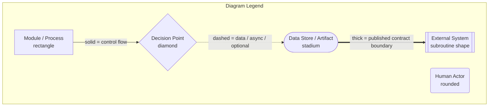

# TP Reviews Engine

## Technical Requirements Document (TRD)

---

| Field | Value |
|---|---|
| **Product Name** | TP Reviews Engine |
| **Internal Codename** | `tp-reviews-engine` |
| **Brand Owner** | TradyPerch |
| **Document Type** | Technical Requirements Document (TRD) |
| **Document Version** | v1.0 |
| **Product Version Specified** | Engine v1.0.x (`MAJOR.MINOR.PATCH`) |
| **Payload Schema Version Specified** | `schema_version: 1` |
| **Config Schema Version Specified** | `config_version: 1` |
| **Governing Architecture** | TP Reviews Engine SAD/TDD v1.0 (baselined 2026-07-30, Approved for Implementation) |
| **Status** | Approved for Implementation |
| **Classification** | Internal — Commercial Confidential |
| **First Implementation Target** | Commerce Insight |
| **Reference Scope** | Generic, multi-tenant, unlimited client websites |
| **Document Date** | 2026-07-30 |

---

## 0.1 Document Control

### 0.1.1 Revision History

| Version | Date | Author | Change Summary | Approval |
|---|---|---|---|---|
| v0.1 | 2026-07-30 | TradyPerch | Initial extraction of implementation requirements from SAD §16–§21. | Draft |
| v0.5 | 2026-07-30 | TradyPerch | Full section coverage; module contracts, algorithms, and validation tables completed. | Review |
| **v1.0** | **2026-07-30** | **TradyPerch** | **Baselined for implementation. All 100 mandated sections complete. EDR set frozen at EDR-001 … EDR-040.** | **Approved** |

### 0.1.2 Ownership

| Role | Owns | Review Cadence |
|---|---|---|
| Staff Software Architect | §1–§7, §74–§75, §93–§94 | Per release |
| Senior Backend Engineer | §15–§30, §49–§58 | Per release |
| DevOps Engineer | §31–§36, §41–§46, §62–§66 | Per release |
| QA Lead | §61, §65–§66, §100 | Per release |
| Security Engineer | §47–§51 | Quarterly + on incident |
| Technical Writer | §97–§99, structure, cross-references | Continuous |

### 0.1.3 Binding Status

This TRD is **binding for implementation**. A pull request that contradicts a normative statement here must either be rejected, or be accompanied by an Engineering Decision Record (EDR) that supersedes the relevant statement — and, if the contradiction touches architecture rather than implementation, by an ADR amending the SAD first.

Code that drifts from this document is treated as a defect of the same severity as a failing test.

---

## 0.2 Purpose and Relationship to the SAD

### 0.2.1 What This Document Is

The **Software Architecture Document (SAD/TDD) v1.0 already exists and is approved.** It decided *what the system is* and *why*. This TRD does not revisit any of that.

This document converts the approved architecture into **detailed technical implementation requirements**: the level of specification at which an engineer — or an AI coding agent — writes files, functions, tests, workflows, and schemas without asking a clarifying question.

| The SAD Answers | This TRD Answers |
|---|---|
| Why a hexagonal pipeline? | Which file holds which stage, what its exact input and output records are, and which errors it may return |
| Why selector packs? | The pack's field-by-field JSON structure, its schema constraints, its load-time validation rules, and its failure modes |
| Why a Publish Gate? | The evaluation order of G-01…G-12, the exact arithmetic of each threshold, the first-publish skip set, and the 100%-coverage test obligation |
| Why Playwright? | Launch flags, context options, route-interception rules, the six timeout budgets, and the teardown ordering that must sit in `finally` |
| Why absence ≠ deletion? | The streak state machine, the fields it mutates, the fields it must never mutate, and the property test that proves it |

### 0.2.2 What This Document Is Not

- **It is not an architecture document.** No decision in the SAD is re-opened, re-argued, or "improved" here. Where this document explains *why*, it is explaining an implementation choice subordinate to an architectural one, and it names the ADR it serves.
- **It is not source code**, and it contains none. Where an exact structure must be conveyed, it is conveyed as a **contract table** (name, inputs, outputs, purity, error modes) or as an **illustrative data document** (JSON payloads, JSON Schema fragments, configuration instances). Data and schemas are specification artifacts; logic is not specified as code anywhere in this document.
- **It is not a substitute for reading the SAD.** §0.8 of the SAD (the ten invariants) and Appendix A (build order) are prerequisites. This document assumes them.

### 0.2.3 Precedence Between Documents

| # | Rule |
|---|---|
| P-1 | The **ten system invariants** (SAD §0.8, INV-01…INV-10) outrank every statement in either document. |
| P-2 | Where the SAD and this TRD conflict on **architecture**, the SAD wins and this TRD is defective. |
| P-3 | Where the SAD and this TRD conflict on **implementation detail**, this TRD wins, because the SAD deliberately stops above that level. |
| P-4 | Where either document conflicts with a **published JSON Schema file** in `schemas/`, the schema file wins at runtime and the document must be corrected — schemas are executable, prose is not. |
| P-5 | Where a **hard ceiling** stated as a compile-time constant conflicts with configuration, the constant wins (SAD FR-089). |

---

## 0.3 Intended Audience and Reading Paths

| Reader | Read First | Then | May Skip |
|---|---|---|---|
| **AI coding agent implementing v1.0** | §0.6, §1, §6, §7, then SAD Appendix A build order | §15–§30, §49–§61 in build order | §76–§91 |
| **Backend engineer** | §1–§5, §6–§7 | §15–§30, §52–§58 | §76–§91 |
| **DevOps / SRE** | §11–§14, §31–§36 | §37–§46, §62–§66 | §20–§24 |
| **QA lead** | §61 | §25, §26, §38–§40, §65–§66 | §70–§91 |
| **Security engineer** | §47–§51 | §48, §52, §67 | §76–§91 |
| **Frontend integrator** | §52, §70 | §24, §51 | §15–§46 |
| **New hire** | §97, §98 | §1–§7, then by role | — |

### 0.3.1 Estimated Reading Time

| Part | Sections | Approx. Pages | Reading Time |
|---|---|---|---|
| Front matter | §0 | 7 | 15 min |
| Part 1 — Overview and Components | §1–§5 | 13 | 35 min |
| Part 2 — Codebase Layout | §6–§10 | 16 | 40 min |
| Part 3 — Runtime and Environments | §11–§14 | 9 | 25 min |
| Part 4 — Acquisition and Browser | §15–§21 | 15 | 40 min |
| Part 5 — Processing and Data Rules | §22–§30 | 16 | 45 min |
| Part 6 — Scheduling and Git | §31–§36 | 10 | 25 min |
| Part 7 — Observability | §37–§42 | 10 | 25 min |
| Part 8 — Performance and Resources | §43–§46 | 7 | 20 min |
| Part 9 — Security and Validation | §47–§54 | 14 | 40 min |
| Part 10 — Concurrency and State | §55–§60 | 9 | 25 min |
| Part 11 — Testing | §61 | 10 | 25 min |
| Part 12 — CI/CD and Delivery | §62–§66 | 10 | 25 min |
| Part 13 — Standards | §67–§69 | 6 | 15 min |
| Part 14 — Extensibility | §70–§75 | 9 | 25 min |
| Part 15 — Future Platform | §76–§91 | 12 | 30 min |
| Part 16 — Risks and Decisions | §92–§96 | 10 | 25 min |
| Part 17 — Guides and Checklist | §97–§100 | 9 | 25 min |
| **Total** | **§0–§100** | **≈ 142** | **≈ 8 h** |

---

## 0.4 Notation and Conventions

### 0.4.1 Requirement Keywords

RFC 2119 keywords, identical in meaning to SAD §0.4.1. They are testable assertions, not emphasis.

| Keyword | Meaning | Consequence of Violation |
|---|---|---|
| **MUST** / **MUST NOT** | Absolute requirement | Implementation is non-conformant. Blocks release. Requires an EDR (or ADR) to change. |
| **SHOULD** / **SHOULD NOT** | Strong recommendation | Deviation requires a recorded rationale in the pull request. |
| **MAY** | Genuinely optional | None. |
| **WILL** | Planned future work | No v1.0 obligation. |

### 0.4.2 Identifier Scheme

This document introduces four new identifier families and reuses all SAD families unchanged. **Reused identifiers always mean exactly what the SAD says they mean** — they are never redefined here.

| Prefix | Meaning | Defined In | Example |
|---|---|---|---|
| `TR-` | **Technical Requirement.** A normative, testable implementation obligation. Format `TR-<AREA>-<nnn>`. | This document | `TR-NAV-014` |
| `EDR-` | **Engineering Decision Record.** An implementation-level decision, subordinate to an ADR. | This document (§93) | `EDR-017` |
| `IF-` | **Interface Contract.** A named port or module contract with fixed inputs and outputs. | This document (§4) | `IF-ACQ-01` |
| `ALG-` | **Algorithm.** A normative, step-numbered procedure. | This document | `ALG-PAGINATE` |
| `INV-` | System Invariant | SAD §0.8 | `INV-03` |
| `ADR-` | Architecture Decision Record | SAD §0.6 | `ADR-009` |
| `FR-` / `NFR-` | Functional / Non-Functional Requirement | SAD §10, §11 | `FR-065` |
| `CON-` / `RISK-` / `THREAT-` | Constraint / Risk / Threat | SAD §13, §14, §36 | `THREAT-05` |
| `ERR-` | Error class | SAD §23.2 | `ERR-PARSE-STRUCTURE` |
| `MET-` | Metric | SAD §25.3 | `MET-coverage` |
| `G-` | Publish Gate rule | SAD §27.3.1 | `G-05` |
| `PT-` / `CH-` | Property law / Chaos scenario | SAD §41.2.2, §41.5 | `PT-07`, `CH-04` |
| `DR-` | Dependency rule | SAD §16.5 | `DR-2` |
| `SEC-` | Secret-handling rule | SAD §22.7 | `SEC-4` |
| `V-` | Config semantic validation rule | SAD §39.5 | `V-3` |
| `L-` | Known limitation | SAD §49 | `L-13` |

**Area codes used in `TR-<AREA>-<nnn>`:**

| Code | Area | Code | Area |
|---|---|---|---|
| `CORE` | Pure domain core | `NAV` | Navigation |
| `CLI` | Command-line interface | `EXT` | Extraction |
| `APP` | Orchestration layer | `NORM` | Normalisation |
| `CFG` | Configuration | `VAL` | Validation |
| `ENV` | Environment and runtime | `REC` | Reconciliation |
| `DEP` | Dependencies | `PROJ` | Projection |
| `BLD` | Build and tooling | `GATE` | Publish Gate |
| `BRW` | Browser | `PUB` | Publication |
| `SEL` | Selector packs | `GIT` | Git operations |
| `SCHED` | Scheduling | `CI` | Continuous integration |
| `LOG` | Logging | `ERR` | Error handling |
| `MON` | Monitoring | `PERF` | Performance |
| `MEM` | Memory | `STOR` | Storage |
| `SEC` | Security | `HASH` | Hashing and identity |
| `TEST` | Testing | `STD` | Standards |
| `EXT-P` | Extensibility / plugins | `FUT` | Future work |

### 0.4.3 Diagram Legend

Identical visual grammar to SAD §0.4.3, restated so this document is usable standalone.

| Convention | Meaning |
|---|---|
| Solid arrow `-->` | Synchronous control flow or in-process call |
| Dashed arrow `-.->` | Asynchronous, optional, deferred, or read-only data flow |
| Thick arrow `==>` | Crosses a published contract boundary; breaking changes require a schema version bump |
| `[[Double bracket]]` | System outside TradyPerch's control |
| Bold stroke | Component on the critical correctness path |

### 0.4.4 Engineering Decision Record Format

Every non-obvious *implementation* decision is backed by an EDR in this compressed form:

> **EDR-nnn — Title**
> **Serves:** the ADR or invariant this decision implements.
> **Context:** the implementation forces in play.
> **Decision:** what was chosen.
> **Alternatives Rejected:** each with the specific reason it lost.
> **Trade-off:** what this costs.
> **Scalability:** how this behaves as client count, review count, or team size grows.

**EDRs may not contradict ADRs.** An EDR that appears to require an architectural change is a signal to stop and raise an ADR instead.

### 0.4.5 Contract Table Convention

Module and function contracts are specified as tables rather than signatures, because this document contains no code. A contract table is normative and complete: an implementer MUST NOT add an undeclared input, undeclared output, or undeclared error class.

| Column | Meaning |
|---|---|
| **Input** | Every value the unit receives. For pure units this is the complete set — nothing else may be read. |
| **Output** | The success value. |
| **Errors** | The exhaustive set of `ERR-*` classes the unit may produce. Any other error is `ERR-INTERNAL-UNCLASSIFIED`, which is a defect. |
| **Purity** | `pure` (no I/O, clock, randomness, environment) or `impure`. `pure` is mechanically enforced by DR-1/DR-2. |
| **Idempotent** | Whether repeating the call with identical inputs yields identical results and no additional side effects. |

### 0.4.6 Implementation Note Convention

| Marker | Meaning |
|---|---|
| **Implementation Note** | Operational knowledge that saves hours but is not itself a requirement. |
| **Agent Note** | Guidance aimed specifically at an AI coding agent, usually naming a plausible-but-wrong implementation to avoid. |
| **Assumption** | Something believed true at authoring time that depends on a third party and MUST be re-verified during implementation. |
| **Verify** | A concrete check that proves the adjacent requirement was implemented. |

---

## 0.5 How an AI Coding Agent Should Use This Document

This document was written on the explicit assumption that a substantial portion of the implementation will be performed by AI coding agents. The following rules exist to make that safe.

| # | Rule |
|---|---|
| A-1 | **Build in the order given by SAD Appendix A.** It is dependency-ordered: every phase is verifiable before the next begins. Do not build the browser adapter before the pure core; do not build any producer of data before the Normalizer (§23), which is the security boundary. |
| A-2 | **Treat every contract table as exhaustive.** If a field is not in the table, it does not exist. Adding "useful extra" fields to the Ledger or Payload silently breaks determinism (§54) and schema validation (§25). |
| A-3 | **Never widen a hard ceiling.** Values marked *hard ceiling* in §8/§9 are compile-time constants. Configuration may lower them only. |
| A-4 | **Never simplify the absence asymmetry** (§22.5, SAD §20.7.3). Uniform treatment of absence is the single worst defect this system can contain. If the reconciliation logic looks redundant, it is not — read PT-07 and CH-04 first. |
| A-5 | **Never add a retry to an `ERR-BLOCKED-*` path**, including "just one retry to see if it clears" (INV-07). |
| A-6 | **Never introduce a dependency** not listed in §10 without following DEP-1/DEP-2. |
| A-7 | **Write the test named in the section you are implementing.** Sections that carry a *Verify* row are not complete without it. |
| A-8 | **When a requirement and an existing test disagree, stop.** Do not amend the test to match the code. Raise it. |
| A-9 | **Do not infer behaviour from the illustrative JSON.** Illustrative documents show shape, not rules. The rules are in the tables. |
| A-10 | **Do not implement anything from §76–§91.** Those sections specify future work and are present so that v1.0's seams are correct, not so that v1.0 builds them. |

---

## 0.6 Engineering Decision Record Index

Forty implementation-level decisions. Each appears inline at the point of relevance; the full index is here so the decision set is auditable without reading the whole document.

| EDR | Decision | § | Serves |
|---|---|---|---|
| EDR-001 | Stage functions are free functions taking an explicit context object, not classes with injected state | §3 | ADR-018 |
| EDR-002 | The `Result` type is a discriminated union, and `core/` never throws | §40 | ADR-018 |
| EDR-003 | One composition root file; adapters are constructed nowhere else | §7 | DR-5 |
| EDR-004 | Stage boundaries are typed by branded record types, not plain objects | §5 | INV-05 |
| EDR-005 | Configuration is frozen deeply after resolution and carries its own resolution trace | §8 | ADR-015 |
| EDR-006 | Unknown `TPRE_*` variables are a startup error, never ignored | §9 | ADR-015 |
| EDR-007 | Dependencies are pinned by lockfile and installed with `npm ci` only | §10 | DEP-4 |
| EDR-008 | No transpilation step: JSDoc-typed `.mjs` is executed exactly as committed | §12 | ADR-004 |
| EDR-009 | Browser launch is a port method; `playwright` is imported by exactly one file | §15 | ADR-005 |
| EDR-010 | Headless is the only production mode; headed exists solely as a local debug flag | §17 | ADR-005 |
| EDR-011 | One browser per shard, one context per target, one page per context, closed in `finally` | §18 | INV-09 |
| EDR-012 | Route interception uses a host allowlist plus a resource-type denylist, both measured | §16 | THREAT-04 |
| EDR-013 | Pagination scrolls by container-height ratio, never to absolute bottom | §19 | ADR-009 |
| EDR-014 | The pagination growth curve is a first-class output retained in the acquisition report | §19 | RISK-04 |
| EDR-015 | Extraction operates on a serialised subtree string, not on live browser handles | §20 | ADR-017 |
| EDR-016 | Owner-reply detachment happens before any other field extraction | §21 | FR-033 |
| EDR-017 | Rating parsing is a three-parser cascade with a mandatory integer post-check | §21 | RISK-11 |
| EDR-018 | Duplicate detection is two-tier and intra-run collapse is deterministic | §22 | ADR-007 |
| EDR-019 | Normalisation is a fixed eight-step ordered pipeline; order is normative | §23 | INV-05 |
| EDR-020 | Length bounding is grapheme-cluster-aware, applied last | §23 | INV-05 |
| EDR-021 | Payloads are minified with stable key order; ledgers are pretty-printed with stable key order | §24 | FR-065 |
| EDR-022 | `generated_at` is excluded from every content hash | §54 | FR-065 |
| EDR-023 | The Publish Gate evaluates all rules and returns all reasons, never short-circuits | §26 | ADR-011 |
| EDR-024 | Rejection discards observations from both stores atomically — the Ledger is not written | §26 | ADR-011 |
| EDR-025 | Publication order is payload-then-state, never the reverse | §26 | INV-04 |
| EDR-026 | Retry policy is a lookup table returning a decision object; the executor is generic | §29 | ADR-018 |
| EDR-027 | Every retry is budget-checked before sleeping | §29 | NFR-016 |
| EDR-028 | Six nested timeout levels, each strictly inside the next | §30 | NFR-016 |
| EDR-029 | The shard matrix is emitted by a job, never hard-coded in workflow YAML | §32 | ADR-016 |
| EDR-030 | Exit codes 5, 6 and 7 are successes at the CI level and failures at the alert level | §32 | ADR-011 |
| EDR-031 | Log redaction is a sink-level transform seeded at startup | §37 | FR-076 |
| EDR-032 | Debug and trace events are ring-buffered and flushed only on target failure | §37 | NFR-036 |
| EDR-033 | Health records are append-only JSONL, one record per target per run | §42 | ADR-021 |
| EDR-034 | Rate budget accounting is pessimistic: written before the request, not after | §57 | FR-089 |
| EDR-035 | Concurrency safety is achieved by path disjointness, not by locking | §56 | INV-09 |
| EDR-036 | Identity hashing is versioned and uses only cross-adapter-available fields | §53 | ADR-023 |
| EDR-037 | Feature flags are configuration keys with code defaults, never runtime toggles | §73 | ADR-015 |
| EDR-038 | Adapters are statically registered in the composition root, not dynamically loaded | §74 | ADR-002 |
| EDR-039 | Schema files are the runtime authority; generated types are derived from them | §52 | P-4 |
| EDR-040 | Every future-platform seam is an interface that already exists in v1.0 | §75 | ADR-002 |

---

## 0.7 Section Map — Mandated Section to Location

| § | Title | Part |
|---|---|---|
| 1 | Technical Overview | 1 |
| 2 | System Components | 1 |
| 3 | Internal Modules | 1 |
| 4 | Module Responsibilities | 1 |
| 5 | Data Flow | 1 |
| 6 | Complete Folder Structure | 2 |
| 7 | File-by-File Responsibilities | 2 |
| 8 | Configuration Files | 2 |
| 9 | Environment Variables | 2 |
| 10 | Dependency List | 2 |
| 11 | Runtime Requirements | 3 |
| 12 | Build Requirements | 3 |
| 13 | Development Environment | 3 |
| 14 | Production Environment | 3 |
| 15 | Playwright Requirements | 4 |
| 16 | Browser Configuration | 4 |
| 17 | Headless vs Headed Design | 4 |
| 18 | Browser Lifecycle | 4 |
| 19 | Page Navigation Strategy | 4 |
| 20 | DOM Extraction Strategy | 4 |
| 21 | Review Detection Logic | 4 |
| 22 | Duplicate Detection | 5 |
| 23 | Review Normalization | 5 |
| 24 | JSON Generation Rules | 5 |
| 25 | JSON Validation Rules | 5 |
| 26 | Publish Rules | 5 |
| 27 | Rollback Rules | 5 |
| 28 | Recovery Rules | 5 |
| 29 | Retry Rules | 5 |
| 30 | Timeout Strategy | 5 |
| 31 | Scheduler Requirements | 6 |
| 32 | GitHub Actions Requirements | 6 |
| 33 | Git Requirements | 6 |
| 34 | Branch Strategy | 6 |
| 35 | Commit Strategy | 6 |
| 36 | Release Strategy | 6 |
| 37 | Logging Requirements | 7 |
| 38 | Error Classification | 7 |
| 39 | Error Recovery Matrix | 7 |
| 40 | Exception Handling | 7 |
| 41 | Monitoring Requirements | 7 |
| 42 | Metrics Collection | 7 |
| 43 | Performance Requirements | 8 |
| 44 | Memory Limits | 8 |
| 45 | CPU Requirements | 8 |
| 46 | Storage Requirements | 8 |
| 47 | Security Requirements | 9 |
| 48 | Secrets Management | 9 |
| 49 | Configuration Validation | 9 |
| 50 | Input Validation | 9 |
| 51 | Output Validation | 9 |
| 52 | JSON Schema Specification | 9 |
| 53 | Hash Generation | 9 |
| 54 | Change Detection | 9 |
| 55 | Cache Strategy | 10 |
| 56 | Locking Strategy | 10 |
| 57 | Concurrency Rules | 10 |
| 58 | Race Condition Prevention | 10 |
| 59 | Failure Recovery | 10 |
| 60 | Disaster Recovery | 10 |
| 61 | Testing Strategy | 11 |
| 62 | CI/CD Pipeline | 12 |
| 63 | GitHub Actions Workflow | 12 |
| 64 | Deployment Pipeline | 12 |
| 65 | Release Checklist | 12 |
| 66 | Rollback Checklist | 12 |
| 67 | Code Standards | 13 |
| 68 | Naming Standards | 13 |
| 69 | File Naming Standards | 13 |
| 70 | API Contracts (Future) | 14 |
| 71 | Multi Client Configuration | 14 |
| 72 | Business Configuration | 14 |
| 73 | Feature Flags | 14 |
| 74 | Plugin Architecture | 14 |
| 75 | Adapter Architecture | 14 |
| 76 | Future Google Business API Adapter | 15 |
| 77 | Future Facebook Adapter | 15 |
| 78 | Future JustDial Adapter | 15 |
| 79 | Future Trustpilot Adapter | 15 |
| 80 | Future AI Analysis Module | 15 |
| 81 | Future Dashboard Requirements | 15 |
| 82 | Future Admin Panel | 15 |
| 83 | Future Client Portal | 15 |
| 84 | Future REST API | 15 |
| 85 | Future GraphQL API | 15 |
| 86 | Future Webhook Support | 15 |
| 87 | Future Database Support | 15 |
| 88 | Future Redis Support | 15 |
| 89 | Future Docker Support | 15 |
| 90 | Future Kubernetes Support | 15 |
| 91 | Future Multi-region Deployment | 15 |
| 92 | Risks During Implementation | 16 |
| 93 | Engineering Decisions | 16 |
| 94 | Technical Trade-offs | 16 |
| 95 | Known Technical Limitations | 16 |
| 96 | Future Improvements | 16 |
| 97 | Developer Setup Guide | 17 |
| 98 | Local Development Guide | 17 |
| 99 | Production Deployment Guide | 17 |
| 100 | Final Technical Checklist | 17 |

---

## 0.8 The Implementation Invariants — Restated

The SAD's ten invariants, restated as the implementation obligations they translate into. **This table is the single most important page in this document.** Every one of these has a named test; a build in which any of these tests is absent is not conformant.

| INV | Architectural Statement | Implementation Obligation | Enforcing Test |
|---|---|---|---|
| **INV-01** | The website never contacts a review source | The published payload is a static file; no consumer recipe issues a request to any third-party origin | Consumer network assertion (§61) |
| **INV-02** | Failure never degrades the live payload | Every failure path ends in "retain Last Known Good"; the publish step is reachable only through the Gate | CH-01, CH-04, CH-05, CH-06 |
| **INV-03** | Absence is not deletion | `missing_streak` increments only when `completeness === 'full'`; `partial` mutates nothing | **PT-07, CH-04** |
| **INV-04** | Reconciliation is idempotent | `reconcile` is pure, takes `now` as a parameter, and returns new objects | **PT-01** |
| **INV-05** | Output is safe as untrusted text | Eight-step normalisation, a markup self-check, and a text-only renderer | **PT-10, CH-14** |
| **INV-06** | Full provenance on every payload | `provenance` block populated from engine version, pack version, run id, adapter id | Schema validation, manifest test |
| **INV-07** | A challenge is terminal | Retry policy returns `never` for every `ERR-BLOCKED-*` class | CH-03, `retry-policy.blocked-never` |
| **INV-08** | No secret in any artifact | Sink-level redaction seeded at startup; push-time scanning | `security.redaction` |
| **INV-09** | Client isolation | Path-disjoint writes, per-target error envelope, per-target browser context, `fail-fast: false` | `security.isolation` |
| **INV-10** | Adapter switch by config only | Identity derivation uses only cross-adapter-available fields | **PT-08**, quarterly S7 drill |

---

## 0.9 Open Implementation Questions

Deliberately unresolved at TRD baseline. Each has an owner and a resolution deadline. **An implementer encountering one of these MUST apply the interim position rather than inventing an answer.**

| ID | Question | Owner | Required By | Interim Position |
|---|---|---|---|---|
| OIQ-01 | Does Node's built-in argument parser cover the full flag surface in §7, or is a small dependency required? | Backend | Build phase 10 | Use the built-in parser; add a dependency only if a documented gap exists (DEP-2). |
| OIQ-02 | Is a compact internal relative-date implementation sufficient for the six-locale matrix, or is a data-driven helper needed? | Backend | Build phase 3 | Implement internally; §21.6 defines the phrase table format that makes this tractable. |
| OIQ-03 | Which HTML parser is used for offline fixture extraction tests? | QA | Build phase 13 | Any dev-only parser meeting DEP-3; it must never appear in production dependencies. |
| OIQ-04 | Do the chosen static host's response headers honour the §55 cache directives? | DevOps | Deployment step 7 | Assume they do not; verify and record actual headers in `docs/runbooks/` before the first client. |
| OIQ-05 | What is the exact runner RAM and CPU allocation at implementation time? | DevOps | Build phase 19 | Assume the §44/§45 budgets; measure and record on the first production run. |

---

## 0.10 Assumptions Requiring Re-Verification

Every assumption below concerns a third party and was true at authoring time only. **Each MUST be re-verified during implementation**; none may be treated as fact.

| ID | Assumption | Verify By | If False |
|---|---|---|---|
| TA-01 | The CI platform provides ≥ 4 usable CPU cores and ≥ 14 GB RAM per hosted runner | `tpre doctor` output on the first CI run | Reduce `max_reviews`; re-derive §44 budgets |
| TA-02 | The CI platform's job timeout ceiling remains at or above 30 minutes | Workflow configuration | Lower the in-engine run budget so it still fires first (§30) |
| TA-03 | Browser binaries remain cacheable between runs at ~350 MB | Cache hit rate in the setup step | Accept ~50 s cold start per job |
| TA-04 | The source continues to render review content without authentication | Canary structural assertions | Migrate clients to an official API adapter (§76) |
| TA-05 | Relative-date phrasing for the six required locales matches the §21.6 phrase table | Locale matrix unit tests against captured fixtures | Extend the phrase table; it is data, not code |
| TA-06 | Node LTS ≥ 20 provides stable grapheme segmentation for the normalisation bound | Unit test on ZWJ emoji sequences | Add a bounded, justified dependency under DEP-1 |

---

*End of front matter. Part 1 begins with Section 1, Technical Overview.*
