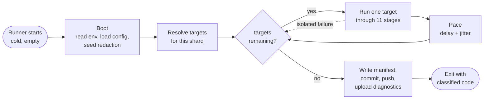
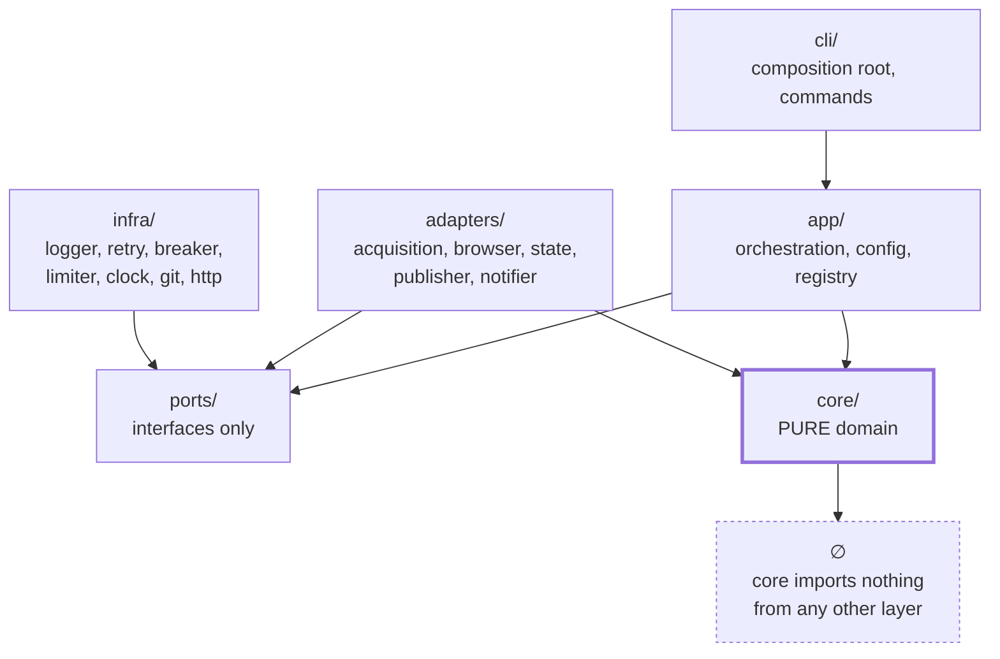
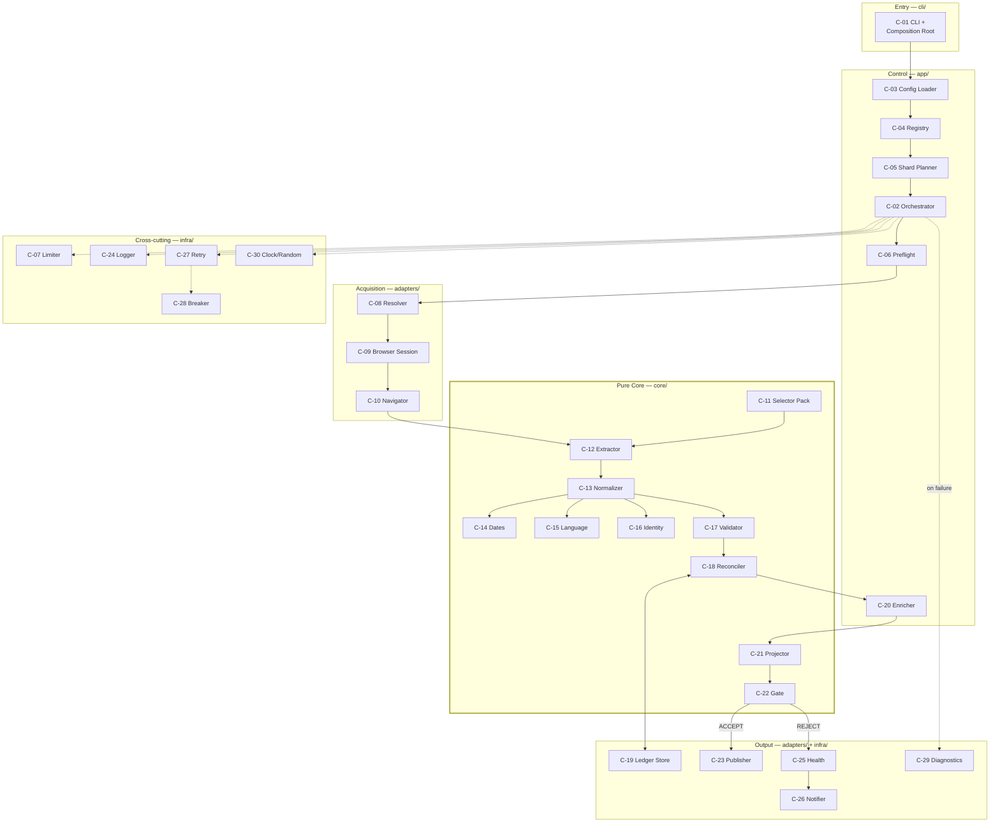
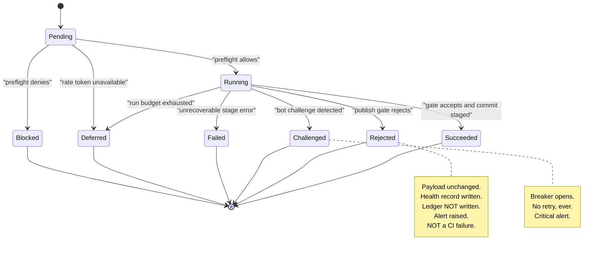
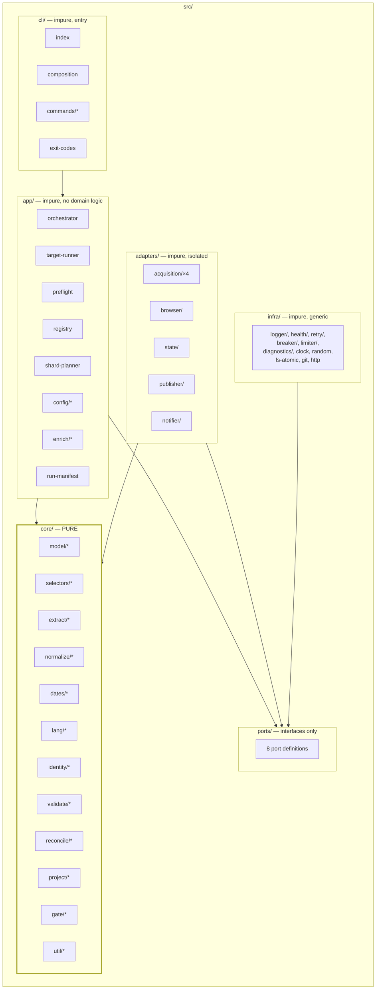
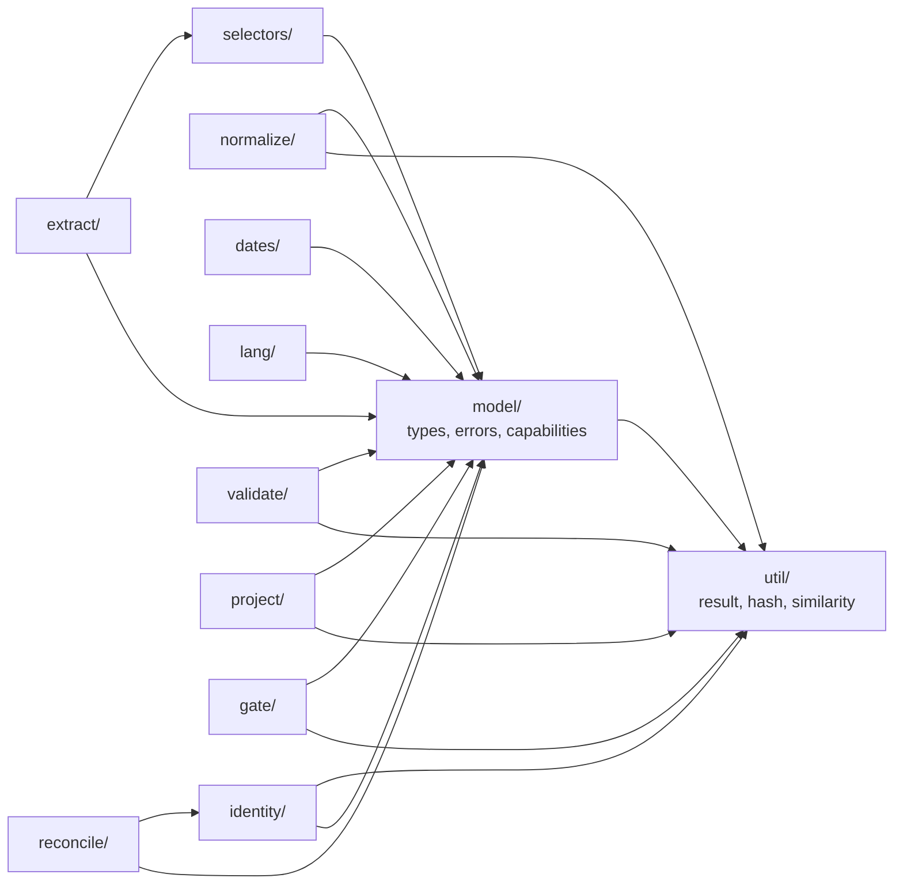
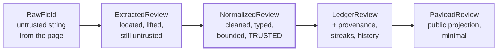
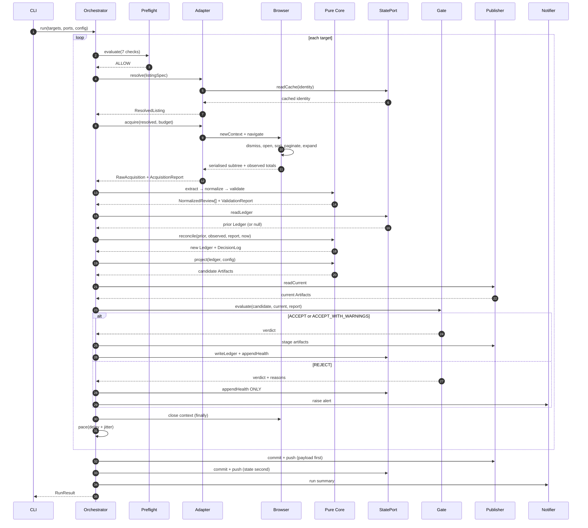
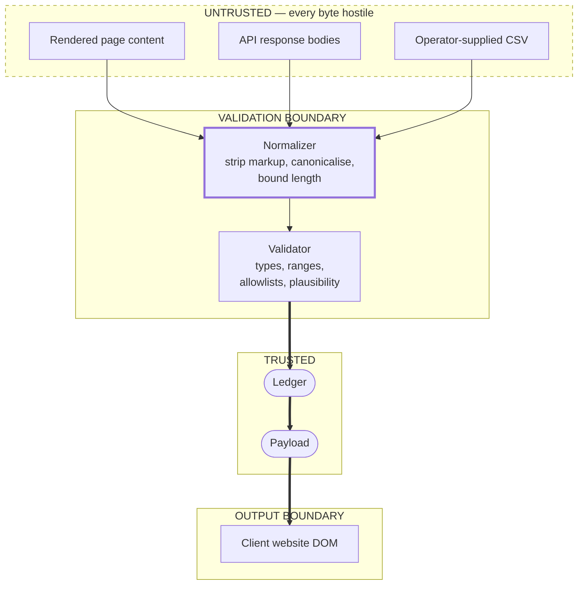
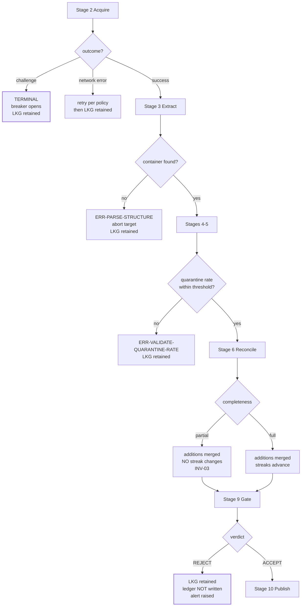

# Part 1 — Technical Overview, Components, and Data Flow

*Sections 1 through 5. Audience: every implementer. This part establishes the vocabulary, the component inventory, the module graph, and the record types that every later section refers to. Read it before any other part.*

---

# 1. Technical Overview

## 1.1 What Is Being Built, Technically

A **single Node.js command-line application** that runs on an ephemeral CI runner, reads client configuration from a Git checkout, acquires reviews through a pluggable adapter, transforms them through a pure processing core, merges them into a durable per-client Ledger, projects a public JSON payload, evaluates that payload against safety invariants, and commits it to a separate Git branch that a CDN serves to client websites.

There is no server, no database, no message queue, no runtime API, and no persistent process. **The entire system is a CLI, two orphan Git branches, and a set of workflow definitions.**

| Technical Characteristic | Value | Consequence for Implementation |
|---|---|---|
| Execution model | Scheduled batch, exits after each run | No connection pooling, no warm caches, no in-memory state between runs. Everything needed must be read at startup. |
| Process lifetime | 3–20 minutes | Startup cost matters; long-lived optimisations do not. |
| Concurrency model | Single-threaded within a shard; parallel across shards | No locks, no mutexes, no shared memory. Isolation is achieved by disjoint paths (§56). |
| State location | Git branches (`data`, `state`) | Every write is a file write followed by a commit. No transactions across files. |
| Failure model | Fail closed on permission, fail soft on data | A missing secret stops everything; a malformed review is quarantined. |
| Output model | Immutable, content-addressed static JSON | Byte-determinism is a hard requirement, not a nicety (§54). |
| Trust model | All acquired content is hostile until normalised | Exactly one module may convert raw input into trusted values (§23). |

## 1.2 The Execution Shape of One Run

**The single most important structural property visible here:** the target loop is the only place where a failure can occur without ending the run. Everything before it (boot, planning) is fail-fast; everything inside it is fail-isolated; everything after it is best-effort with guaranteed manifest emission.

## 1.3 The Eleven Pipeline Stages

Every target executes exactly these stages, numbered 0 through 10, in this order. **No stage may be skipped except as noted, and no stage may reach forward to a later stage's data.** This is the SAD's ten-stage pipeline (§16.4) with stage 0 counted explicitly.

| # | Stage | Purity | Network | May Fail Softly | Produces | Spec |
|---|---|---|---|---|---|---|
| 0 | Preflight | impure | optional | No — a block is terminal for the target | `PreflightVerdict` | §2.6 |
| 1 | Resolve | impure | yes (cache-first) | No | `ResolvedListing` | §2.8 |
| 2 | Acquire | impure | yes | No | `RawAcquisition`, `AcquisitionReport` | §19, §20 |
| 3 | Extract | **pure** | no | Yes — per-field fallback | `ExtractedReview[]` | §21 |
| 4 | Normalize | **pure** | no | Yes — per-record quarantine | `NormalizedReview[]` | §23 |
| 5 | Validate | **pure** | no | Yes — findings, not throws | `ValidationReport` | §25 |
| 6 | Reconcile | **pure** | no | No | `Ledger`, `DecisionLog` | §22 |
| 7 | Enrich | impure | optional | Yes — always optional | annotations | §80 |
| 8 | Project | **pure** | no | No | `Artifacts` (candidate) | §24 |
| 9 | Gate | **pure** | no | **This is the decision point** | `GateVerdict` | §26 |
| 10 | Publish | impure | yes | Yes — retry on conflict | commits, artifacts | §26.6 |

**Six of eleven stages are pure.** Those six contain every piece of logic whose failure would silently corrupt data, and they are exhaustively testable offline with zero flakiness. This partitioning is deliberate and is the reason the test strategy in §61 is achievable.

> **EDR-001 — Stage functions are free functions over an explicit context, not classes with injected state**
> **Serves:** ADR-018 (reconciliation must be pure and property-testable).
> **Context:** The conventional object-oriented shape gives each stage a class with constructor-injected dependencies. It reads well and is the default output of most code generators.
> **Decision:** Every pure stage is a free function whose entire input is its parameters. Impure stages are free functions taking an explicit `ctx` object containing ports (clock, logger, random, adapters). Nothing reads instance state.
> **Alternatives Rejected:** *Classes with injected dependencies* — makes it syntactically easy to hold mutable state between calls, which is exactly how a pure stage stops being pure; also makes property testing awkward because the unit under test must be constructed rather than called. *Module-level singletons* — forbidden outright by §67 (no global state); makes test isolation impossible. *Dependency-injection container* — solves a wiring problem that does not exist at 30 components, and hides the composition root that DR-5 requires to be explicit.
> **Trade-off:** Call sites pass more arguments. Mitigated by the single `ctx` object convention and the ≤ 4 parameter limit in §67.2.
> **Scalability:** Unchanged by client count. As the team grows, free functions remain the shape that is hardest to accidentally make stateful.

## 1.4 Technology Stack — Implementation Bindings

The SAD chose these (§19). This table states what each choice *obliges the implementer to do*.

| Layer | Choice | Implementation Obligation | Confined To |
|---|---|---|---|
| Runtime | Node.js LTS ≥ 20, ESM `.mjs` | No CommonJS anywhere; `node:` prefix on built-ins; no transpilation (§12) | Whole codebase |
| Typing | JavaScript + JSDoc, `checkJs` strict | Types are comments; the checker is the compiler. `any` requires written justification | Whole codebase |
| Automation | Playwright, pinned Chromium | Exactly one file may import `playwright` (DR-3) | `adapters/browser/playwright-chromium.mjs` |
| Scheduler | GitHub Actions | Zero platform SDK imports outside three adapter files (NFR-045) | `adapters/state`, `adapters/publisher`, `adapters/notifier` |
| Data format | JSON (payloads, config), JSONL (logs, health) | Stable key ordering everywhere; minified payloads, pretty ledgers (§24) | Whole codebase |
| Persistence | Git, two orphan branches | All writes are temp-write-then-rename, then commit-per-shard | `adapters/state`, `adapters/publisher` |
| Validation | JSON Schema | Schemas in `schemas/` are the runtime authority (EDR-039) | Config, payload, ledger, health, manifest |
| Testing | Vitest + fast-check | Default suite runs offline in under three minutes (§61) | `tests/` |

## 1.5 The Layering and Its Enforcement

The six dependency rules (SAD §16.5, DR-1…DR-6) are enforced by an automated architecture test, not by convention. §61 specifies that test. **Restated here because it is the rule most likely to be broken by a code generator producing "helpful" imports:**

| Rule | Implementation Statement | How It Gets Broken |
|---|---|---|
| DR-1 | `core/` imports nothing from `adapters/`, `infra/`, `app/`, `cli/`, or any I/O-capable package | A logger import "just for debugging" inside the reconciler |
| DR-2 | `core/` never references `Date.now`, `Math.random`, `process.env`, `fs`, or `fetch` | A `Date.now()` default parameter for `now` — this single line makes every property test meaningless |
| DR-3 | Adapters depend only on `ports/` and `core/` types; adapters never import each other | The Places adapter importing a mapping helper from the DOM adapter |
| DR-4 | `app/` never imports a concrete adapter | The orchestrator importing the Playwright adapter to "check if the browser is available" |
| DR-5 | Only `cli/composition.mjs` constructs concrete implementations | A command file constructing its own notifier |
| DR-6 | No import reaches past a package's public index | Importing `core/reconcile/decide.mjs` directly from `app/` |

**Agent Note.** DR-2 is the rule an AI coding agent is most likely to violate, because `now = Date.now()` as a default parameter value is idiomatic JavaScript and looks like a convenience. It is not a convenience here — it converts `reconcile` from a pure function into a non-deterministic one, and every property law in §61 silently stops testing anything.

## 1.6 Technical Constraints That Shape Every Decision

| ID | Constraint | Implementation Consequence |
|---|---|---|
| CON-01 | Zero recurring cost | No managed service, no SaaS monitoring, no paid API. Monitoring is files; alerting is issues. |
| CON-04 | No client-specific code paths | Every per-client difference is a configuration value. A conditional on `slug` is a defect. |
| CON-05 | One part-time maintainer | Diagnosability outranks cleverness everywhere. |
| CON-08 | No server to operate | State is Git; there is no place to hold a lock or a session. |
| CON-09 | No cache may be correctness-critical | A cold cache must produce identical output (§55). |
| CON-13 | Commit volume must stay low | Hash-gated writes and per-shard commit batching are mandatory, not optimisations. |
| CON-17 | Repository is public | No secret may exist in any file, ever (§48). |

## 1.7 What "Done" Means for v1.0

A conformant v1.0 implementation satisfies all of the following. This is the acceptance definition that §100 expands into a checklist.

| # | Criterion | Verified By |
|---|---|---|
| 1 | All eleven stages implemented, with the six pure stages provably pure | Architecture test (DR-1, DR-2) |
| 2 | All four v1.0 adapters implemented and passing one shared contract suite | Contract suite × 4 (§61.6) |
| 3 | All fifteen property laws passing at ≥ 1,000 cases each | `tests/property/` |
| 4 | All fourteen chaos scenarios passing | `tests/chaos/` |
| 5 | All twenty golden fixtures passing against their pack versions | `tests/regression/` |
| 6 | Publish Gate at 100% statement coverage | Coverage gate |
| 7 | Every error class in §38 reachable, classified, and mapped to a retry policy and severity | `tests/unit/` |
| 8 | Eight workflows present, each with an explicit minimum `permissions` block | Workflow lint (§61) |
| 9 | Default test suite completes offline in under three minutes | CI timing |
| 10 | A payload published for the first client, schema-valid, non-empty, reachable over HTTPS | `scripts/verify-payload.mjs` |

---

# 2. System Components

## 2.1 Component Inventory

Thirty components, unchanged from SAD §17.1, specified here with their implementation bindings: which file owns them, where they are constructed, whether they hold state, and what configuration they read.

| # | Component | Layer | Purity | Owning File | Constructed By | Holds State |
|---|---|---|---|---|---|---|
| C-01 | CLI / Composition Root | cli | impure | `cli/index.mjs`, `cli/composition.mjs` | process entry | no |
| C-02 | Pipeline Orchestrator | app | impure | `app/orchestrator.mjs` | composition root | per-run only |
| C-03 | Config Loader & Validator | app | mostly pure | `app/config/loader.mjs` | composition root | frozen result |
| C-04 | Client Registry | app | **pure** | `app/registry.mjs` | — (function) | no |
| C-05 | Shard Planner | app | **pure** | `app/shard-planner.mjs` | — (function) | no |
| C-06 | Policy Preflight Gate | app | impure | `app/preflight.mjs` | composition root | no |
| C-07 | Rate Limiter / Pacer | infra | impure | `infra/limiter/token-bucket.mjs` | composition root | persisted |
| C-08 | Listing Resolver | adapters | impure | `adapters/acquisition/google-dom/resolver.mjs` | composition root | cache-backed |
| C-09 | Browser Session Manager | adapters | impure | `adapters/browser/playwright-chromium.mjs` | composition root | browser handle |
| C-10 | Navigator | adapters | impure | `adapters/acquisition/google-dom/navigator.mjs` | adapter | per-target |
| C-11 | Selector Pack Loader & Resolver | core | **pure** | `core/selectors/loader.mjs`, `resolver.mjs` | — (function) | no |
| C-12 | Extractor | core | **pure** | `core/extract/index.mjs` | — (function) | no |
| C-13 | Normalizer | core | **pure** | `core/normalize/index.mjs` | — (function) | no |
| C-14 | Date Resolver | core | **pure** | `core/dates/relative.mjs` | — (function) | no |
| C-15 | Language Detector | core | **pure** | `core/lang/detect.mjs` | — (function) | no |
| C-16 | Identity & Hash Service | core | **pure** | `core/identity/*.mjs` | — (function) | no |
| C-17 | Validator | core | **pure** | `core/validate/*.mjs` | — (function) | no |
| C-18 | Reconciler | core | **pure** | `core/reconcile/index.mjs` | — (function) | no |
| C-19 | Ledger Store | adapters | impure | `adapters/state/git-state.mjs` | composition root | filesystem |
| C-20 | Enricher | app | impure | `app/enrich/index.mjs` | composition root | no |
| C-21 | Projector | core | **pure** | `core/project/payload.mjs` | — (function) | no |
| C-22 | Publish Gate | core | **pure** | `core/gate/index.mjs` | — (function) | no |
| C-23 | Publisher | adapters | impure | `adapters/publisher/git-data.mjs` | composition root | staging dir |
| C-24 | Logger | infra | impure | `infra/logger/jsonl.mjs` | composition root | ring buffer |
| C-25 | Metrics & Health Recorder | infra | impure | `infra/health/recorder.mjs` | composition root | append-only |
| C-26 | Notifier | adapters | impure | `adapters/notifier/github-issues.mjs` | composition root | no |
| C-27 | Retry Manager | infra | pure policy | `infra/retry/policy.mjs`, `execute.mjs` | — (function) | no |
| C-28 | Circuit Breaker | infra | impure | `infra/breaker/circuit.mjs` | composition root | persisted |
| C-29 | Diagnostics | infra | impure | `infra/diagnostics/*.mjs` | composition root | per-target |
| C-30 | Clock & Random Providers | infra | impure | `infra/clock.mjs`, `infra/random.mjs` | composition root | no |

**Seventeen of thirty components are pure or pure-policy.** Every one of them is a function, not an object, and requires no construction.

## 2.2 Component Interaction Map

## 2.3 C-01 · CLI and Composition Root

| Aspect | Specification |
|---|---|
| **Responsibility** | Parse arguments, read and validate environment, construct every concrete implementation, inject into the orchestrator, map the run result to an exit code. |
| **Purity** | impure |
| **Commands** | `harvest`, `resolve`, `validate-config`, `canary`, `replay`, `project`, `export`, `doctor`, `plan` |
| **Errors** | `ERR-CONFIG-INVALID`, `ERR-CONFIG-VERSION`, `ERR-CONFIG-SECRET-MISSING`, `ERR-INTERNAL-*` |

**Normative requirements:**

| ID | Requirement |
|---|---|
| TR-CLI-001 | `cli/composition.mjs` MUST be the only file in the repository that constructs a concrete adapter, infra implementation, or port implementation. |
| TR-CLI-002 | Exit codes MUST be exactly those in §2.3.1. New codes require a MAJOR version bump (§36). |
| TR-CLI-003 | `process.exit()` MUST NOT be called outside `cli/`. Every other layer returns a value. |
| TR-CLI-004 | The CLI MUST flush logs, write the run manifest, and upload diagnostics **before** exiting, for every exit code including failures. |
| TR-CLI-005 | An uncaught exception MUST be caught at the CLI boundary, logged with its full stack to the log sink, classified as `ERR-INTERNAL-UNCLASSIFIED`, and mapped to exit code 1. Its stack MUST NOT be written to stdout when `--output json` is active. |
| TR-CLI-006 | Unknown commands and unknown flags MUST exit 2 with a usage message. Silent tolerance of an unknown flag is forbidden — it is the same failure class as EDR-006. |

### 2.3.1 Exit Code Contract

| Code | Meaning | CI Job Conclusion | Alert Severity |
|---|---|---|---|
| `0` | All targets succeeded | success | none |
| `1` | Unexpected internal error | **failure** | critical |
| `2` | Invalid usage or configuration | **failure** | error |
| `3` | All targets failed | **failure** | error |
| `4` | Partial: some targets failed or were deferred | success | warn |
| `5` | Gate rejection; nothing published, nothing crashed | success | error |
| `6` | Policy blocked | success | warn (info if intentional) |
| `7` | Bot challenge encountered | success | **critical** |

> **EDR-030 — Exit codes 5, 6 and 7 are CI successes and alerting failures**
> **Serves:** ADR-011 (gated publication), ADR-021 (issue-based alerting).
> **Context:** A red CI badge means "the code is broken". A gate rejection means the code worked perfectly and correctly declined to publish bad data.
> **Decision:** Codes 5, 6, and 7 do not fail the shard job. They emit a workflow annotation and drive an alert whose severity is set independently of job conclusion.
> **Alternatives Rejected:** *Fail the job on any non-zero code* — trains the maintainer to ignore red builds, which is the fastest route to missing a genuine regression. *Exit 0 for everything and signal through the manifest* — loses the ability for the workflow to branch without parsing logs, and makes a crashed engine indistinguishable from a healthy one. *Separate exit-code namespaces per command* — unnecessary complexity; one namespace is small enough to memorise.
> **Trade-off:** The workflow needs an explicit classification step (§32) rather than relying on the shell's exit status.
> **Scalability:** Unchanged. The code set is fixed at eight and is part of the CLI's MAJOR contract.

## 2.4 C-02 · Pipeline Orchestrator

| Aspect | Specification |
|---|---|
| **Responsibility** | Execute the eleven stages for a list of targets, enforcing budget, pacing, isolation, and diagnostics. Owns sequencing and policy. Owns **no domain logic**. |
| **Input** | `OrchestratorRequest { targets, config, adapters, ports, budgets, runId, mode }` |
| **Output** | `RunResult { perTarget: TargetOutcome[], summary, manifest }` |
| **Purity** | impure |
| **Errors** | Never throws to the CLI except on `ERR-INTERNAL-INVARIANT` |

| ID | Requirement |
|---|---|
| TR-APP-001 | Each target MUST execute inside its own error envelope. No error, rejection, or timeout from one target may propagate to another (INV-09). |
| TR-APP-002 | Each target MUST receive a fresh browser context and a fresh target-scoped logger child. |
| TR-APP-003 | Target order MUST be a deterministic pseudo-random permutation seeded by `runId + slug`, so no client is permanently first. |
| TR-APP-004 | On per-target budget expiry the orchestrator MUST abort that target with `ERR-BUDGET-TARGET` and continue to the next. |
| TR-APP-005 | On per-run budget expiry the orchestrator MUST finish the current target, mark all remaining targets `deferred` (**not** `failed`), and exit 4. |
| TR-APP-006 | The orchestrator MUST record a `TargetOutcome` for every target, including blocked and deferred ones. A target absent from the outcome list is a defect. |
| TR-APP-007 | The orchestrator MUST NOT contain any conditional keyed on a client slug, source, or adapter identity. Behaviour differences come from capabilities and configuration only (CON-04). |

### 2.4.1 Target Outcome State Machine

| Outcome | Ledger Written | Payload Written | Health Written | Contributes To Exit Code |
|---|---|---|---|---|
| `succeeded` | yes | yes (if changed) | yes | 0 |
| `rejected` | **no** | no | yes | 5 |
| `blocked` | no | no | yes | 6 |
| `challenged` | no | no | yes | 7 |
| `deferred` | no | no | yes | 4 |
| `failed` | no | no | yes | 3 or 4 |

**The "Ledger Written: no" row for `rejected` is load-bearing** and is specified fully in §26.5. A rejected harvest's observations are discarded from *both* stores, not just from the payload.

## 2.5 C-03, C-04, C-05 · Configuration, Registry, Planning

| Component | Contract | Purity |
|---|---|---|
| **C-03 Config Loader** | `(sources, env, flags) → EffectiveConfig + ResolutionTrace` | mostly pure — reads files and env at one boundary, then pure |
| **C-04 Client Registry** | `(configs, now, healthSeries) → Target[]` | **pure** |
| **C-05 Shard Planner** | `(targets, shardCount, costModel) → ShardPlan` | **pure** |

| ID | Requirement |
|---|---|
| TR-CFG-001 | The config loader MUST apply the six-layer precedence chain in the order defined in §8.3 and MUST emit a resolution trace naming the winning layer for every key. |
| TR-CFG-002 | The resolved config MUST be deeply frozen before it leaves the loader. Any later mutation is a defect. |
| TR-CFG-003 | The registry MUST be a pure function. `tpre plan` MUST therefore be runnable with zero side effects. |
| TR-CFG-004 | The shard planner MUST balance by *estimated cost* (historical p50 duration), falling back to review count when no history exists — never by target count alone. |
| TR-CFG-005 | Shard assignment MUST be deterministic for a given `(targets, shardCount, costModel)` triple, so `plan` output is reproducible. |

**Why the registry is pure and the loader is not.** The loader must touch the filesystem and environment once. The registry must not, because "which clients are due?" is a question asked during incidents and must be answerable from a dry run with no side effects. The boundary is drawn at exactly the point where I/O stops.

## 2.6 C-06 · Policy Preflight Gate

| Aspect | Specification |
|---|---|
| **Responsibility** | Decide, before any acquisition, whether this target may proceed. |
| **Output** | `PreflightVerdict { allow, reasons: PolicyReason[], recordedAt }` |
| **Purity** | impure (may fetch robots directives) |

**Checks, evaluated in this order, failing fast:**

| # | Check | Denial Error | Severity |
|---|---|---|---|
| 1 | Global kill switch (`policy.global_enabled`) | `ERR-POLICY-KILLSWITCH` | info |
| 2 | Per-source enable flag | `ERR-POLICY-KILLSWITCH` | info |
| 3 | Client `enabled` | `ERR-POLICY-KILLSWITCH` | info |
| 4 | Authorisation record complete (**`dom` access method only**) | `ERR-POLICY-UNAUTHORIZED` | error |
| 5 | Robots directive for the target path, per mode `block`/`warn`/`ignore` | `ERR-POLICY-ROBOTS` | warn |
| 6 | Rate-limit budget available for the source | `ERR-POLICY-BUDGET` | info |
| 7 | Circuit-breaker state for the source-access pair | `ERR-POLICY-BREAKER-OPEN` | warn |

| ID | Requirement |
|---|---|
| TR-APP-010 | The verdict MUST be recorded in the run manifest **whether it allows or denies**. An audit trail that records only denials proves nothing. |
| TR-APP-011 | A robots-fetch failure MUST be treated as `unknown` and resolved per the configured mode: `block` denies, `warn` and `ignore` proceed with a recorded note. It MUST NOT silently pass. |
| TR-APP-012 | Check 4 MUST be skipped for non-`dom` access methods. Requiring an authorisation record for an official-API client would be incorrect and would obstruct the migration path (ADR-023). |

## 2.7 C-07 · Rate Limiter and Pacer

| Aspect | Specification |
|---|---|
| **Mechanism** | Token bucket, counters persisted to the `state` branch per source per UTC hour and per UTC day |
| **Consistency** | Advisory and eventually consistent — see §57 |
| **Failure direction** | **Fail closed.** Unreadable counter ⇒ assume consumed ⇒ defer the target |

| ID | Requirement |
|---|---|
| TR-SEC-001 | Hourly and daily source ceilings MUST be compile-time constants. Configuration may lower them; no configuration path may raise them (FR-089). |
| TR-SEC-002 | Budget consumption MUST be written **before** the requests are made (pessimistic accounting), so a crash over-counts rather than under-counts (EDR-034). |
| TR-SEC-003 | Every inter-request and inter-target delay MUST apply jitter as specified in §57.4. |

## 2.8 C-08 · Listing Resolver

| Aspect | Specification |
|---|---|
| **Responsibility** | Convert whatever identity the operator supplied into a canonical, verified, cached listing identity plus advertised aggregates |
| **Output** | `ResolvedListing { canonicalId, canonicalUrl, displayName, advertisedTotal, advertisedRating, resolvedVia, verifiedAt }` |
| **Errors** | `ERR-RESOLVE-NO-IDENTIFIER`, `ERR-RESOLVE-NOTFOUND`, `ERR-RESOLVE-AMBIGUOUS`, `ERR-IDENTITY-DRIFT` |

**Resolution precedence (highest first):** explicit canonical identifier → explicit numeric id → cached identity within TTL → identifier parsed from URL → search tuple (last resort, emits `warn` every time).

| ID | Requirement |
|---|---|
| TR-APP-020 | Identity MUST be verified on **every** run by comparing the page's business name to `resolution.expected_name` using normalised similarity ≥ `resolution.identity_threshold` (default 0.82). |
| TR-APP-021 | Name normalisation before comparison MUST strip legal suffixes, collapse punctuation, casefold, and remove diacritics — otherwise a routine rebrand trips a false drift alert. |
| TR-APP-022 | Two or more search candidates above threshold MUST produce `ERR-RESOLVE-AMBIGUOUS` and abort. The resolver MUST NOT guess (FR-014). |
| TR-APP-023 | `resolution.allow_search` MUST default to `false` when `TPRE_ENV=production`. |

## 2.9 C-09, C-10 · Browser Session and Navigator

Fully specified in §15–§19. Component-level contract only:

| Component | Owns | Explicitly Does Not Own |
|---|---|---|
| C-09 Browser Session | Browser, context, and page lifecycle; route interception; timeouts | Any knowledge of reviews, selectors, or pagination |
| C-10 Navigator | Interaction sequences: navigate, dismiss, open, sort, paginate, expand, serialise | Field locations (that is C-11/C-12) and field meaning |

| ID | Requirement |
|---|---|
| TR-BRW-001 | `adapters/browser/playwright-chromium.mjs` MUST be the only file importing `playwright`. Enforced by architecture test DR-3. |
| TR-NAV-001 | The Navigator MUST emit a stop reason as a first-class output. Completeness classification (§19.5) depends entirely on it. |

## 2.10 C-11 … C-18, C-21, C-22 · The Pure Core

Contracts summarised here; full specification in Part 4 and Part 5.

| Component | Contract | Errors |
|---|---|---|
| C-11 Selector Pack | `(packJson) → SelectorPack` and `(node, field, pack) → FieldResolution` | `ERR-PARSE-SELECTOR-PACK` |
| C-12 Extractor | `(subtree, pack, listingCtx) → ExtractedReview[]` | `ERR-PARSE-STRUCTURE`, `ERR-PARSE-EMPTY-UNEXPECTED`, `ERR-PARSE-FIELD-REQUIRED`, `ERR-PARSE-RATING-INVALID` |
| C-13 Normalizer | `ExtractedReview → NormalizedReview \| Quarantined` | `ERR-CLEAN-MARKUP-SURVIVED` |
| C-14 Date Resolver | `(relativeText, observedAt, locale) → { resolved, precision, confidence }` | none — fails soft |
| C-15 Language Detector | `text → { code, confidence }` | none — returns null |
| C-16 Identity & Hash | `NormalizedReview → { identityHash, contentHash, authorKey }` | none |
| C-17 Validator | `(records, acquisitionReport, config) → ValidationReport` | none — produces findings |
| C-18 Reconciler | `(priorLedger, observed, report, config, now) → { ledger, decisions }` | none |
| C-21 Projector | `(ledger, config, engineMeta) → Artifacts` | none |
| C-22 Publish Gate | `(candidate, current, report, config) → GateVerdict` | none — produces a verdict |

**Note that eight of these ten produce no errors at all.** They produce *findings*, *verdicts*, or *null values*. Errors-as-values is the core's error model (§40), and a thrown exception inside `core/` is a defect regardless of what it says.

## 2.11 C-19, C-23 · State and Publication

| Component | v1.0 Implementation | Port | Alternatives Designed |
|---|---|---|---|
| C-19 Ledger Store | `git-state` — filesystem rooted at a `state` branch checkout | `StatePort` | filesystem, object storage, database (§87) |
| C-23 Publisher | `git-data` — commits to the `data` branch | `PublisherPort` | filesystem (dev), object storage (v3), API (v3) |

| ID | Requirement |
|---|---|
| TR-STOR-001 | Every file write MUST be write-to-temp-then-rename. A partially-written ledger is unrecoverable; a temp file is not. |
| TR-STOR-002 | Ledgers MUST be pretty-printed with stable key ordering and a trailing newline. Payloads MUST be minified with stable key ordering. The reasons differ and both are normative (§24.2). |
| TR-STOR-003 | Unknown fields encountered when reading a ledger MUST be preserved on write (FR-058), so an older engine cannot silently strip a newer engine's data. |
| TR-PUB-001 | Publication MUST skip the write entirely when new bytes equal current bytes (FR-065). |
| TR-PUB-002 | Commits MUST be one per shard per branch, not one per target (CON-13). |
| TR-PUB-003 | Push MUST use fetch-rebase-retry up to three times. `--force-with-lease` and `--force` MUST NOT be used against `data` or `state`. |

## 2.12 C-24 … C-30 · Cross-Cutting Infrastructure

| Component | Key Implementation Points |
|---|---|
| C-24 Logger | JSONL sink; mandatory field set; redaction at the sink (EDR-031); ring-buffered `trace`/`debug` (EDR-032) |
| C-25 Health Recorder | One append-only JSONL record per target per run on `state`; computes yield delta, coverage, duration percentile |
| C-26 Notifier | `github-issues` primary with fingerprint dedup; `webhook` secondary; `console` for local |
| C-27 Retry Manager | Policy is a data table keyed by error class; executor is generic and budget-aware |
| C-28 Circuit Breaker | Per source-access pair; persisted to `state`; `closed → open → half-open` with escalating cooldown |
| C-29 Diagnostics | On any target failure: sanitised HTML, screenshot, ring-buffer flush, acquisition report, effective config, selector health |
| C-30 Clock & Random | Exist solely to make DR-2 mechanically enforceable; `fixed` and `seeded` implementations used in every test |

**On C-30.** `ClockPort` and `RandomPort` look like over-engineering until the first intermittent property-test failure. They are the mechanism that converts "the core is pure" from a convention into a fact, and they cost approximately twenty lines.

---

# 3. Internal Modules

## 3.1 Module Tree

The `src/` tree is organised by layer first and by domain second. This ordering is deliberate: the layer determines what a module is *allowed* to do, and that is the more important property.

## 3.2 Module Dependency Graph — Core Internals

Within `core/`, modules form a strict directed acyclic graph. **A cycle inside `core/` is a defect**, and the architecture test asserts acyclicity.

| Observation | Implication |
|---|---|
| `util/` depends on nothing | It is built first (SAD Appendix A phase 1) and is the only module that may be imported by every other |
| `normalize/` does not depend on `dates/`, `lang/`, or `identity/` | Those are applied *after* normalisation by the calling stage, not inside it. This keeps the security boundary narrow and independently testable |
| `reconcile/` depends only on `identity/` and `model/` | It is deliberately ignorant of extraction, normalisation, and projection — which is why it can be property-tested against synthetic ledgers |
| `gate/` depends on nothing but types and utilities | It can be tested with hand-built payload pairs and no pipeline at all, which is what makes 100% coverage achievable |

## 3.3 Module Catalogue

| Module | Layer | Purity | Owns | Build Phase |
|---|---|---|---|---|
| `core/util` | core | pure | `Result` type, canonical serialisation, digests, string similarity | 1 |
| `core/model` | core | pure | All record types, error constants, capability descriptors | 1 |
| `core/normalize` | core | pure | The eight-step cleaning pipeline — the security boundary | 2 |
| `core/dates` | core | pure | Relative-phrase parsing, precision, confidence, pinning | 3 |
| `core/lang` | core | pure | Script-range + stopword language detection | 3 |
| `core/identity` | core | pure | `author_key`, `identity_hash`, `content_hash` | 3 |
| `core/validate` | core | pure | Per-record and aggregate findings, completeness classification | 4 |
| `core/reconcile` | core | pure | The merge function, decisions, removal, suppression | 5 |
| `core/project` | core | pure | Ledger → artifacts, aggregates, schema.org projection | 6 |
| `core/gate` | core | pure | G-01…G-12 evaluation | 6 |
| `ports` | ports | n/a | Eight interface definitions | 7 |
| `infra/*` | infra | impure | Logger, clock, random, retry, breaker, limiter, diagnostics, git, http, fs-atomic | 7 |
| `adapters/state` | adapters | impure | Ledger, cache, health persistence | 8 |
| `adapters/publisher` | adapters | impure | Payload publication | 8, 18 |
| `app/config` | app | mixed | Six-layer resolution, migration, defaults | 9 |
| `cli` | cli | impure | Commands, composition, exit codes | 10 |
| `adapters/acquisition/file-csv` | adapters | impure | CSV import — the simplest adapter, built first | 11 |
| `core/selectors` | core | pure | Pack loading and ordered strategy resolution | 12 |
| `core/extract` | core | pure | Field extraction per review node | 13 |
| `adapters/browser` | adapters | impure | Playwright session management | 14 |
| `adapters/acquisition/google-dom` | adapters | impure | Navigation, consent, challenge detection, serialisation | 15–16 |
| `app/orchestrator` | app | impure | The eleven-stage loop | 17 |
| `adapters/notifier` | adapters | impure | Alerting | 20 |
| `adapters/acquisition/google-*-api` | adapters | impure | Official API adapters | 22 |

**The build order is not arbitrary.** Two orderings are load-bearing and restated from SAD Appendix A: the Normalizer (phase 2) is built before anything that produces data, because it is the security boundary and retrofitting it is how INV-05 gets violated; and the CSV adapter (phase 11) is built before any browser work, because implementing the simplest adapter first proves the interface is genuinely source-agnostic while it is still cheap to change.

---

# 4. Module Responsibilities

## 4.1 Responsibility Matrix

The second column is the one that prevents scope creep. **A module that acquires a responsibility from the third column is a defect**, regardless of how convenient it seems.

| Module | Owns | Explicitly Does NOT Own |
|---|---|---|
| Scheduler | *When* work happens | *What* work happens |
| Shard Planner | *Which runner* does which work | *How* work is done |
| Orchestrator | Stage sequencing, budgets, isolation, pacing | Any domain logic whatsoever |
| Preflight | Permission to proceed | Data |
| Resolver | Turning identity input into a verified listing | Reading reviews |
| Browser Session | Browser/context/page lifecycle, interception | What is on the page |
| Navigator | Getting content into the DOM | Interpreting content |
| Selector Pack | *Where* fields are | *What* fields mean |
| Extractor | Lifting raw strings from structure | Cleaning them |
| Normalizer | Canonical, safe, typed, bounded values | Deciding validity |
| Date Resolver | Turning a phrase into an estimate with honest precision | Deciding sort order |
| Identity | Deriving stable keys | Deciding whether records match |
| Validator | Verdicts about quality | Fixing anything |
| Reconciler | Merging observation into knowledge | Presentation |
| Projector | Public shape | Whether to publish |
| Publish Gate | The publish/reject decision | Writing anything |
| Publisher | Durable, visible output | Content |
| Ledger Store | Persistence of state | Interpretation of state |
| Logger | Structured, redacted event record | Deciding severity policy |
| Retry Manager | Whether and when to retry | Executing the operation |
| Circuit Breaker | Whether a source is available | Why it became unavailable |
| Diagnostics | Preserving evidence | Diagnosing |

**Two rows deserve emphasis.** "Normalizer does not own deciding validity" is what keeps the security boundary narrow enough to test exhaustively — it cleans, and something else judges. "Publish Gate does not own writing anything" is what makes 100% test coverage of the gate practical: it is a pure function from three inputs to a verdict, testable with no filesystem at all.

## 4.2 Port Contracts

Eight ports. Every one exists because the SAD assigned low or medium confidence to the concrete choice behind it (SAD §19.6). Where confidence was high, no port was added — over-abstracting a confident choice buys no option value.

### IF-ACQ-01 · AcquisitionAdapter

| Aspect | Specification |
|---|---|
| **Methods** | `capabilities()`, `resolve(listingSpec, ctx)`, `acquire(resolved, budget, ctx)` |
| **v1.0 implementations** | `google:dom`, `google:places-api`, `google:business-profile-api`, `file:csv` |
| **Purity** | impure |

| Method | Input | Output | Errors |
|---|---|---|---|
| `capabilities` | — | `AdapterCapabilities { adapterId, source, accessMethod, fields[], maxReviews, supportsSort, supportsReplies, requiresSecrets[] }` | none |
| `resolve` | `(listingSpec, ctx)` | `ResolvedListing` | `ERR-RESOLVE-*`, `ERR-IDENTITY-DRIFT` |
| `acquire` | `(resolved, budget, ctx)` | `{ raw: RawAcquisition, report: AcquisitionReport }` | `ERR-NET-*`, `ERR-HTTP-*`, `ERR-BROWSER-*`, `ERR-NAV-*`, `ERR-BLOCKED-*`, `ERR-BUDGET-TARGET` |

| ID | Requirement |
|---|---|
| TR-EXT-P-001 | An adapter MUST declare accurate capabilities. Fields it cannot supply MUST be `null` in its output — **never fabricated, never defaulted, never inferred**. |
| TR-EXT-P-002 | An adapter MUST NOT write to the Ledger, the payload, or any file outside the diagnostics directory (FR-030). |
| TR-EXT-P-003 | An adapter MUST return errors drawn from the canonical taxonomy (§38). An adapter-specific error class is a defect. |
| TR-EXT-P-004 | An adapter MUST respect the supplied budget and abort cleanly when it is exceeded, returning a partial report rather than throwing. |
| TR-EXT-P-005 | An adapter whose required secret is absent MUST fail closed with `ERR-CONFIG-SECRET-MISSING`. It MUST NOT fall back to another access method (SEC-4). |
| TR-EXT-P-006 | Reviews produced by any adapter MUST reconcile with reviews produced by any other adapter for the same logical review (PT-08, INV-10). |

**TR-EXT-P-006 is the requirement that makes ADR-023's migration guarantee real.** It constrains identity derivation (§53) to fields every adapter can supply, and it is verified both by a property test and by the quarterly migration drill.

### IF-STATE-01 · StatePort

| Method | Input | Output | Errors |
|---|---|---|---|
| `readLedger` | `(clientSlug, listingKey)` | `Ledger \| null` | `ERR-STATE-CORRUPT` |
| `writeLedger` | `(clientSlug, listingKey, ledger)` | `void` | `ERR-STATE-WRITE` |
| `readCache` | `(key)` | `CacheEntry \| null` | none — miss is null |
| `writeCache` | `(key, value, ttl)` | `void` | `ERR-STATE-WRITE` |
| `appendHealth` | `(record)` | `void` | `ERR-STATE-WRITE` |
| `readHealth` | `(slug, window)` | `HealthRecord[]` | none |

| ID | Requirement |
|---|---|
| TR-STOR-010 | A missing ledger MUST be returned as `null` and treated by the caller as an empty ledger — **not** as an error. First runs are normal. |
| TR-STOR-011 | A ledger that fails schema validation on read MUST produce `ERR-STATE-CORRUPT` and abort the target. It MUST NOT be silently repaired or partially parsed. |
| TR-STOR-012 | A cache miss MUST NOT be an error at any call site. |

### IF-PUB-01 · PublisherPort

| Method | Input | Output | Errors |
|---|---|---|---|
| `readCurrent` | `(clientSlug, listingKey)` | `Artifacts \| null` | none |
| `publish` | `(artifacts, meta)` | `PublishResult { written[], skipped[], commitSha }` | `ERR-PUBLISH-CONFLICT`, `ERR-PUBLISH-AUTH` |

**`readCurrent` is not optional.** The Publish Gate compares *change*, not state, and cannot evaluate G-02 through G-05 or G-12 without the currently published payload. Skipping the `data` branch checkout to save a few seconds silently disables the system's most valuable safety rules.

### IF-NOTIFY-01 · NotifierPort

| Method | Input | Output | Errors |
|---|---|---|---|
| `raise` | `(alert)` | `AlertRef` | none — logged, never fatal |
| `resolve` | `(fingerprint, resolution)` | `void` | none |
| `digest` | `(summary)` | `void` | none |

| ID | Requirement |
|---|---|
| TR-MON-001 | Notifier failures MUST be logged and MUST NOT fail the run. A monitoring subsystem that can crash the thing it monitors is worse than none. |
| TR-MON-002 | Three consecutive notifier failures MUST escalate to the secondary webhook channel if one is configured. |

### IF-BROWSER-01 · BrowserPort

| Method | Input | Output | Errors |
|---|---|---|---|
| `launch` | `(options)` | `BrowserHandle` | `ERR-BROWSER-LAUNCH` |
| `newContext` | `(handle, contextOptions)` | `ContextHandle` | `ERR-BROWSER-CRASH` |
| `close` | `(handle)` | `void` | none — best effort |

### IF-CLOCK-01, IF-RANDOM-01, IF-LOG-01

| Port | Methods | Implementations |
|---|---|---|
| `ClockPort` | `now()`, `sleep(ms)` | `system`, `fixed` (tests) |
| `RandomPort` | `jitter(base)`, `uuid()` | `system`, `seeded` (tests) |
| `LoggerPort` | `event(e)`, `child(bindings)`, `flush()` | `jsonl`, `pretty`, `memory` (tests) |

| ID | Requirement |
|---|---|
| TR-TEST-001 | Every test MUST use `fixed` clock and `seeded` random. A test that reads the system clock is non-deterministic and will eventually fail at 2 a.m. for no reason. |

## 4.3 Module Contract Summary

The complete set of pure-core contracts, in pipeline order. Each is specified in full in the section named.

| Module | Input | Output | Purity | Idempotent | Full Spec |
|---|---|---|---|---|---|
| `selectors.load` | pack JSON | `SelectorPack` | pure | yes | §20.3 |
| `selectors.resolve` | `(node, fieldSpec, pack)` | `FieldResolution { value, strategyIndex, kind }` | pure | yes | §20.4 |
| `extract` | `(subtree, pack, listingCtx)` | `ExtractedReview[]` | pure | yes | §21 |
| `normalize` | `(ExtractedReview, config)` | `NormalizedReview \| Quarantined` | pure | yes | §23 |
| `dates.resolve` | `(phrase, observedAt, locale)` | `{ resolved, precision, confidence }` | pure | yes | §21.6 |
| `lang.detect` | `text` | `{ code, confidence }` | pure | yes | §23.7 |
| `identity.derive` | `NormalizedReview` | `{ identityHash, contentHash, authorKey }` | pure | yes | §53 |
| `validate` | `(records, report, config)` | `ValidationReport` | pure | yes | §25 |
| `reconcile` | `(prior, observed, report, config, now)` | `{ ledger, decisions }` | pure | **yes — INV-04** | §22.5 |
| `project` | `(ledger, config, engineMeta)` | `Artifacts` | pure | yes | §24 |
| `gate.evaluate` | `(candidate, current, report, config)` | `GateVerdict` | pure | yes | §26 |

---

# 5. Data Flow

## 5.1 Record Type Progression

A review passes through five distinct representations. **Each is a different type, and they are not interchangeable.** Conflating them is the most common structural error in implementations of this kind of system.

| Type | Trust | Contains | Never Contains |
|---|---|---|---|
| `RawField` | **none** | Verbatim string as found | — |
| `ExtractedReview` | **none** | Raw field strings + strategy metadata | Cleaned values |
| `NormalizedReview` | full | Branded `CleanString` values, integers, enums | Markup, control characters, unbounded text |
| `LedgerReview` | full | Normalized fields + `first_seen_at`, `revision`, `missing_streak`, `hash_history`, provenance | Public formatting decisions |
| `PayloadReview` | full | The 24 public fields (§52) | Streaks, tombstones, history, quarantine data |

> **EDR-004 — Stage boundaries are typed by branded record types, not plain objects**
> **Serves:** INV-05 (output safe as untrusted text).
> **Context:** All five representations are, at runtime, plain JavaScript objects. Nothing structural prevents passing an `ExtractedReview` where a `NormalizedReview` is expected — which would route untrusted content around the security boundary.
> **Decision:** Each representation is a distinct JSDoc type, and cleaned strings carry a branded `CleanString` type that only the Normalizer produces. Downstream signatures accept `CleanString`, not `string`.
> **Alternatives Rejected:** *Plain shared shape with a `cleaned: boolean` flag* — a boolean is trivially set incorrectly and provides no check at authoring time. *Runtime class instances with private fields* — real enforcement, but forces the core to construct objects rather than return literals, complicating property testing and structural sharing. *Trusting review discipline* — this is precisely the boundary where a single lapse compromises every client site simultaneously.
> **Trade-off:** Branding is a type-level fiction; it is erased at runtime and provides no protection against a deliberate cast. It is a guard against accident, not against malice — and accident is the realistic threat.
> **Scalability:** Improves with team size. The larger the team, the more valuable it is that the type checker, rather than a reviewer's memory, enforces the boundary.

## 5.2 Stage-by-Stage Data Contract

| Stage | Consumes | Produces | Discarded After |
|---|---|---|---|
| 0 Preflight | `EffectiveConfig`, breaker state, budget | `PreflightVerdict` | never — recorded in manifest |
| 1 Resolve | `listingSpec`, identity cache | `ResolvedListing` | cached 30 days |
| 2 Acquire | `ResolvedListing`, budget | `RawAcquisition`, `AcquisitionReport` | raw discarded on success; retained on failure |
| 3 Extract | `RawAcquisition`, `SelectorPack` | `ExtractedReview[]`, `SelectorHealth` | raw released |
| 4 Normalize | `ExtractedReview[]`, config | `NormalizedReview[]`, `Quarantined[]` | extracted released |
| 5 Validate | `NormalizedReview[]`, `AcquisitionReport` | `ValidationReport` | — |
| 6 Reconcile | prior `Ledger`, `NormalizedReview[]`, `ValidationReport`, `now` | new `Ledger`, `DecisionLog` | prior ledger released |
| 7 Enrich | `Ledger` | annotations | — |
| 8 Project | `Ledger`, config, engine meta | `Artifacts` (candidate) | — |
| 9 Gate | candidate `Artifacts`, current `Artifacts`, `ValidationReport` | `GateVerdict` | — |
| 10 Publish | `Artifacts`, `Ledger`, `HealthRecord` | commits | staged files after commit |

**The "Discarded After" column is a memory requirement, not a note.** §44 depends on the raw acquisition string being released before the pure pipeline runs, and on the prior ledger being released after reconciliation.

## 5.3 End-to-End Sequence

**Note steps at the end: payload is committed before state.** This ordering is normative (EDR-025) and is explained in §26.7 — when two writes cannot be atomic, order them so a crash between them leaves a state the next run can repair.

## 5.4 Trust Boundary Crossings

| Crossing | Rule | Enforcement |
|---|---|---|
| Untrusted → Validation | Nothing may bypass the Normalizer. No stage may read raw content directly. | Type system: only the Normalizer accepts `RawField` and only it returns `CleanString` |
| Validation → Trusted | Only records with zero `fatal` findings cross. Quarantined records go to diagnostics, never to the Ledger. | `reconcile` accepts `NormalizedReview[]` only |
| Trusted → Output | The Payload is plain-text-only by construction. | Schema declares `text` as plain text; there is no `text_html` field and there must never be one |

**Three sources converge on one Normalizer.** That is the entire point of the boundary: adding a fifth source in v2.0 adds no new sanitisation path and no new place for INV-05 to be violated.

## 5.5 Data Flow Under Failure

The success path is one of six. The other five matter more, because they are what protect the client's website.

**Every terminal box in that diagram ends with "LKG retained".** That is INV-02, and it is not achieved by a single guard — it is achieved because no path to the publish step exists except through the Gate.

## 5.6 What Flows Where — Store Map

| Data | Destination | Branch | Retention | Public |
|---|---|---|---|---|
| Payload artifacts | `clients/<slug>/<listing>/` | `data` | truncated quarterly | **served** |
| Global manifest | `index.json` | `data` | truncated quarterly | **served** |
| Ledger | `ledger/<slug>/<listing>.json` | `state` | indefinite | readable, not served |
| Health series | `health/<slug>.jsonl` | `state` | indefinite | readable, not served |
| Identity cache | `cache/identity/<slug>/<listing>.json` | `state` | TTL 30 days | readable, not served |
| Rate budget | `cache/budget/<source>/<date>.json` | `state` | rolls hourly/daily | readable, not served |
| Breaker state | `breaker/<source-access>.json` | `state` | until closed | readable, not served |
| Run manifest | `runs/<yyyy-mm>/<run-id>.json` | `state` | 90 days | readable, not served |
| Run log (JSONL) | CI artifact | — | 14 days | no |
| Diagnostics bundle | CI artifact | — | 14 days | no |

**Note the distinction between "readable" and "served".** The repository is public, so everything on `state` is readable by anyone who looks. It is not *served* to visitors, and no consumer contract references it. §46.2 states the disclosure obligation this creates.

---

*End of Part 1. Part 2 specifies the complete folder structure, the responsibility of every file, the configuration file set, the environment variables, and the dependency list.*
