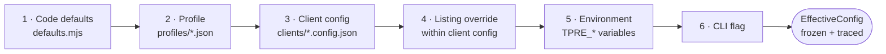
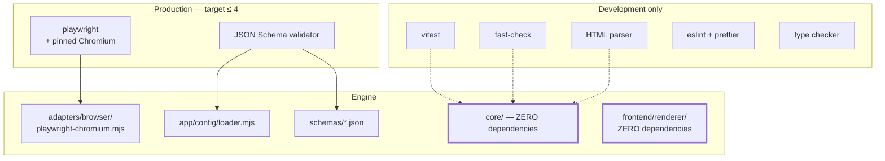

# Part 2 — Codebase Layout, Configuration, and Dependencies

*Sections 6 through 10. Audience: implementing engineers and AI coding agents. This is the most directly actionable part of the document: §6 and §7 together are sufficient to create the entire file tree, and §8 through §10 define everything those files read.*

---

# 6. Complete Folder Structure

## 6.1 Normative Status

The layout below is **normative and complete**. An implementer MUST create exactly this tree. A file not listed here MUST NOT be created without an EDR; a file listed here MUST exist by the end of its build phase.

The structure is unchanged from SAD §18. This section adds, for each directory, the *rules that govern what may live there* — which is the part that determines whether the structure survives contact with a deadline.

## 6.2 Repository Root — `main` Branch

```
tp-reviews-engine/
├── .github/                     Automation and governance
├── bin/                         Executable entry point
├── src/                         The engine
├── selectors/                   Versioned selector packs (volatile knowledge)
├── schemas/                     JSON Schema — the runtime authority
├── clients/                     One config file per tenant
├── profiles/                    Shared tuning sets
├── compliance/                  Authorisations, denylist, privacy templates
├── fixtures/                    Golden test corpus
├── tests/                       All test suites
├── frontend/                    Reference renderer and integration recipes
├── scripts/                     Maintenance and authoring tools
├── docs/                        SAD, TRD, runbooks, ADRs
├── .editorconfig
├── .env.example
├── .gitattributes
├── .gitignore
├── .nvmrc
├── eslint.config.mjs
├── prettier.config.mjs
├── vitest.config.mjs
├── jsconfig.json
├── package.json
├── package-lock.json
├── CHANGELOG.md
├── CODE_OF_CONDUCT.md
├── CONTRIBUTING.md
├── LICENSE
├── README.md
└── SECURITY.md
```

| ID | Requirement |
|---|---|
| TR-BLD-001 | The repository root MUST contain no source file. Every executable unit lives under `src/` or `scripts/`. |
| TR-BLD-002 | `.gitattributes` MUST enforce `text eol=lf` for all text files. A CRLF line ending in a JSON payload changes its bytes and therefore its content hash (§54), silently breaking hash-gating on Windows checkouts. |
| TR-BLD-003 | `.gitignore` MUST exclude `.state/`, `.publish/`, `.artifacts/`, `node_modules/`, `.env`, and Playwright's browser cache directory. |
| TR-BLD-004 | `.nvmrc` MUST pin the Node major version and MUST match the version used by the CI setup action. |

**Implementation Note on TR-BLD-002.** This is not a style preference. The whole change-detection strategy assumes byte-determinism; a developer on Windows whose Git checks out CRLF will produce payloads that differ from CI's by every line ending, causing every file to be rewritten on every run and multiplying commit churn by a factor of roughly fifty.

## 6.3 `.github/` — Automation and Governance

```
.github/
├── workflows/
│   ├── harvest.yml              Production pipeline. Cron ×4 + dispatch.
│   ├── canary.yml               Independent cron. Structural assertions.
│   ├── ci.yml                   PR + push to main. All quality gates.
│   ├── validate-config.yml      PR touching clients/, profiles/, compliance/.
│   ├── pages.yml                Push to data. Deploy static origin.
│   ├── keepalive.yml            Monthly. Liveness + dormancy prevention.
│   ├── release.yml              Tag v*. Verify, notes, publish.
│   └── dependency-audit.yml     Weekly advisory scan.
├── actions/
│   └── setup-engine/
│       └── action.yml           Composite: Node, caches, browsers, banner.
├── ISSUE_TEMPLATE/
│   ├── incident.yml
│   ├── selector-break.yml
│   └── client-onboarding.yml
├── pull_request_template.md
├── CODEOWNERS
└── dependabot.yml
```

| ID | Requirement |
|---|---|
| TR-CI-001 | Every workflow MUST declare an explicit top-level `permissions:` block with the minimum required set. A workflow without one is a CI failure, enforced by a lint step (§61.9). |
| TR-CI-002 | Every third-party action MUST be pinned to a full commit SHA, never a tag (NFR-028). |
| TR-CI-003 | `pull_request_target` MUST NOT appear in any workflow. |
| TR-CI-004 | Setup logic MUST exist exactly once, in the composite action. Duplicated setup steps across workflows are a defect — a Node or browser version change must be a one-file edit. |
| TR-CI-005 | `CODEOWNERS` MUST require review for `src/core/`, `schemas/`, `selectors/`, and `compliance/`. |

## 6.4 `bin/` and `src/` — The Engine

```
bin/
└── tpre.mjs                     Shebang wrapper. Delegates to src/cli. No logic.

src/
├── cli/
│   ├── index.mjs                Command registry and argument parsing
│   ├── composition.mjs          THE composition root (DR-5)
│   ├── exit-codes.mjs           Canonical exit code constants
│   └── commands/
│       ├── harvest.mjs
│       ├── resolve.mjs
│       ├── validate-config.mjs
│       ├── canary.mjs
│       ├── replay.mjs
│       ├── project.mjs
│       ├── export.mjs
│       ├── plan.mjs
│       └── doctor.mjs
│
├── app/
│   ├── orchestrator.mjs         The eleven-stage loop (C-02)
│   ├── target-runner.mjs        Single-target envelope + isolation
│   ├── preflight.mjs            Policy gate (C-06)
│   ├── registry.mjs             Client enumeration, due set (C-04, pure)
│   ├── shard-planner.mjs        Cost-balanced partitioning (C-05, pure)
│   ├── run-manifest.mjs         Per-run manifest assembly
│   ├── config/
│   │   ├── loader.mjs           Six-layer resolution + trace (C-03)
│   │   ├── defaults.mjs         Layer 1 — code defaults
│   │   └── migrate.mjs          config_version migrations
│   └── enrich/
│       ├── index.mjs            Enrichment dispatcher (C-20)
│       └── noop.mjs             v1.0 default
│
├── core/                        PURE. No I/O, clock, env, or randomness.
│   ├── index.mjs                Public surface of the core
│   ├── model/
│   │   ├── review.mjs
│   │   ├── ledger.mjs
│   │   ├── payload.mjs
│   │   ├── report.mjs
│   │   ├── capabilities.mjs
│   │   └── errors.mjs
│   ├── selectors/
│   │   ├── loader.mjs
│   │   └── resolver.mjs
│   ├── extract/
│   │   ├── index.mjs
│   │   ├── rating.mjs
│   │   ├── author.mjs
│   │   ├── text.mjs
│   │   ├── reply.mjs
│   │   └── meta.mjs
│   ├── normalize/
│   │   ├── index.mjs
│   │   ├── unicode.mjs
│   │   ├── whitespace.mjs
│   │   ├── markup.mjs
│   │   └── url.mjs
│   ├── dates/
│   │   ├── relative.mjs
│   │   ├── precision.mjs
│   │   └── pin.mjs
│   ├── lang/
│   │   └── detect.mjs
│   ├── identity/
│   │   ├── author-key.mjs
│   │   ├── identity-hash.mjs
│   │   └── content-hash.mjs
│   ├── validate/
│   │   ├── record.mjs
│   │   ├── aggregate.mjs
│   │   └── completeness.mjs
│   ├── reconcile/
│   │   ├── index.mjs
│   │   ├── decide.mjs
│   │   ├── removal.mjs
│   │   └── suppress.mjs
│   ├── project/
│   │   ├── payload.mjs
│   │   ├── latest.mjs
│   │   ├── stats.mjs
│   │   └── schema-org.mjs
│   ├── gate/
│   │   ├── index.mjs
│   │   └── rules.mjs
│   └── util/
│       ├── result.mjs
│       ├── hash.mjs
│       └── similarity.mjs
│
├── ports/                       Interface definitions only. No implementations.
│   ├── acquisition.mjs
│   ├── state.mjs
│   ├── publisher.mjs
│   ├── notifier.mjs
│   ├── browser.mjs
│   ├── clock.mjs
│   ├── random.mjs
│   └── logger.mjs
│
├── adapters/
│   ├── acquisition/
│   │   ├── google-dom/
│   │   │   ├── index.mjs
│   │   │   ├── resolver.mjs
│   │   │   ├── navigator.mjs
│   │   │   ├── consent.mjs
│   │   │   ├── challenge-detect.mjs
│   │   │   └── dom-serialize.mjs
│   │   ├── google-places-api/
│   │   │   ├── index.mjs
│   │   │   ├── client.mjs
│   │   │   └── map.mjs
│   │   ├── google-business-profile-api/
│   │   │   ├── index.mjs
│   │   │   ├── auth.mjs
│   │   │   ├── client.mjs
│   │   │   └── map.mjs
│   │   └── file-csv/
│   │       ├── index.mjs
│   │       ├── parse.mjs
│   │       └── COLUMNS.md
│   ├── browser/
│   │   └── playwright-chromium.mjs   ONLY file importing playwright
│   ├── state/
│   │   └── git-state.mjs
│   ├── publisher/
│   │   ├── git-data.mjs
│   │   └── filesystem.mjs
│   └── notifier/
│       ├── github-issues.mjs
│       ├── webhook.mjs
│       └── console.mjs
│
└── infra/
    ├── logger/
    │   ├── jsonl.mjs
    │   ├── redact.mjs
    │   └── pretty.mjs
    ├── health/
    │   └── recorder.mjs
    ├── retry/
    │   ├── policy.mjs
    │   └── execute.mjs
    ├── breaker/
    │   └── circuit.mjs
    ├── limiter/
    │   └── token-bucket.mjs
    ├── diagnostics/
    │   ├── snapshot.mjs
    │   └── bundle.mjs
    ├── clock.mjs
    ├── random.mjs
    ├── fs-atomic.mjs
    ├── git.mjs
    └── http.mjs
```

### 6.4.1 Directory Rules

| Directory | May Contain | MUST NOT Contain |
|---|---|---|
| `bin/` | A shebang wrapper only | Any logic, any argument handling |
| `cli/` | Argument parsing, command dispatch, composition, exit mapping | Domain logic, direct file I/O beyond config discovery |
| `app/` | Sequencing, budgets, isolation, policy, config resolution | Domain logic, concrete adapter imports (DR-4) |
| `core/` | Pure functions and types | I/O, clock, randomness, environment, any non-pure dependency (DR-1, DR-2) |
| `ports/` | Type definitions and interface documentation | Any executable behaviour |
| `adapters/` | Concrete implementations of exactly one port each | Imports of another adapter (DR-3) |
| `infra/` | Generic, domain-ignorant technical utilities | Any knowledge of reviews, listings, or clients |

**The rule for `infra/` is the one most often broken.** A helper that knows what a review is does not belong in `infra/` — it belongs in `core/`. The test is simple: if a function's name or body mentions a domain noun, it is not infrastructure.

## 6.5 `selectors/` — Isolated Volatile Knowledge

```
selectors/
├── README.md                    How to author, test, and version a pack
├── google-maps/
│   ├── v1.json                  Historical. Retained for fixture regression.
│   ├── v2.json                  Historical.
│   ├── v3.json                  CURRENT. Pinned by profiles/default.json.
│   └── assertions.json          Structural assertions used by the canary
└── schema/
    └── selector-pack.schema.json
```

| ID | Requirement |
|---|---|
| TR-SEL-001 | A merged selector pack MUST NEVER be edited. A change creates `v<n+1>.json`. |
| TR-SEL-002 | Old packs MUST be retained indefinitely. Fixtures captured under pack `vN` continue to be tested against `vN`, which is what proves the corpus tests extraction rather than today's markup. |
| TR-SEL-003 | Every pack MUST validate against `selector-pack.schema.json` at load time. A malformed pack MUST fail with `ERR-PARSE-SELECTOR-PACK` at load, never produce mysterious extraction failures later. |
| TR-SEL-004 | Pack version pinning MUST live in a profile, not in a client config or in code. |

## 6.6 `schemas/`, `clients/`, `profiles/`, `compliance/`

```
schemas/
├── payload.v1.schema.json        THE PUBLIC CONTRACT (§52)
├── ledger.v1.schema.json         Internal state shape. Not a contract.
├── client-config.v1.schema.json  Client configuration contract
├── health-record.v1.schema.json
├── run-manifest.v1.schema.json
└── README.md                     Versioning and compatibility policy

clients/
├── README.md
├── _template.config.json         Copy-me starting point, every field documented
├── commerce-insight.config.json  First production client
└── _example-multilocation.config.json

profiles/
├── default.json                  Baseline; pins the current selector pack
├── conservative.json             Slower pacing, lower caps, staged pack rollout
├── high-volume.json              1,000+ review listings
└── README.md

compliance/
├── denylist.json                 Permanent suppressions (FR-087)
├── authorizations/
│   └── <slug>.md                 Written authorisation record per client
├── PRIVACY-NOTICE-TEMPLATE.md
└── README.md
```

| ID | Requirement |
|---|---|
| TR-CFG-010 | Files beginning with `_` in `clients/` MUST be excluded from the registry. They are templates and examples, not tenants. |
| TR-CFG-011 | `compliance/denylist.json` MUST live on `main`, not in the Ledger. Erasure obligations must survive a `state` branch disaster (§60.5). |
| TR-CFG-012 | Every schema file MUST be named `<name>.v<major>.schema.json` and MUST be the runtime validation authority (EDR-039). |

**Implementation Note on TR-CFG-011.** This is a disaster-recovery decision hiding in a directory layout. If the denylist lived only inside ledgers, then rebuilding `state` from scratch would resurrect every review a data subject had asked to have removed — turning a recoverable incident into a compliance breach.

## 6.7 `fixtures/` and `tests/`

```
fixtures/
├── README.md                     How to capture, sanitise, and add a fixture
├── dom/google/
│   ├── 001-standard-120-reviews/
│   │   ├── page.html             Sanitised captured markup
│   │   ├── meta.json             Pack version, capture date, provenance
│   │   └── expected.json         Golden expected extraction output
│   ├── 002-single-review/
│   ├── 003-zero-reviews/
│   ├── 004-owner-replies/
│   ├── 005-truncated-long-text/
│   ├── 006-rtl-arabic-hebrew/
│   ├── 007-emoji-and-cjk/
│   ├── 008-missing-avatars/
│   ├── 009-anonymous-authors/
│   ├── 010-rating-only-no-text/
│   ├── 011-duplicate-author-names/
│   ├── 012-locale-de-relative-dates/
│   ├── 013-locale-hi-relative-dates/
│   ├── 014-partial-load-stalled/       ADVERSARIAL
│   ├── 015-structure-changed/          ADVERSARIAL
│   ├── 016-challenge-page/             ADVERSARIAL
│   ├── 017-consent-interstitial/       ADVERSARIAL
│   ├── 018-5000-reviews-cap/
│   ├── 019-markup-in-review-text/      ADVERSARIAL — security
│   └── 020-mixed-language-set/
├── api/
│   ├── places/
│   └── business-profile/
├── csv/
│   ├── valid.csv
│   ├── partially-invalid.csv
│   └── malformed.csv
├── ledgers/
│   ├── empty.json
│   ├── steady-120.json
│   ├── with-tombstones.json
│   └── with-suppressions.json
└── server/
    └── serve.mjs                 Static fixture server. No internet.

tests/
├── unit/                         Mirrors src/core/ file-for-file
├── property/
│   ├── reconcile.idempotence.test.mjs
│   ├── reconcile.monotonicity.test.mjs
│   ├── reconcile.commutativity.test.mjs
│   ├── identity.cross-adapter.test.mjs
│   ├── hash.stability.test.mjs
│   └── normalize.invariants.test.mjs
├── contract/
│   └── acquisition-adapter.contract.test.mjs
├── regression/
│   └── fixtures.golden.test.mjs
├── integration/
│   ├── pipeline.fixture-server.test.mjs
│   ├── publish.git.test.mjs
│   └── state.roundtrip.test.mjs
├── chaos/
│   └── failure-matrix.test.mjs
├── architecture/
│   └── dependency-rules.test.mjs
├── budgets/
│   ├── payload-size.test.mjs
│   └── renderer-size.test.mjs
├── security/
│   ├── xss-fixture.test.mjs
│   ├── redaction.test.mjs
│   ├── url-allowlist.test.mjs
│   ├── workflow-lint.test.mjs
│   ├── renderer-api.test.mjs
│   └── isolation.test.mjs
├── live/                         OPT-IN ONLY. Never in default CI.
│   └── smoke.harvest.test.mjs
└── helpers/
    ├── build-review.mjs
    ├── fixed-clock.mjs
    └── seeded-random.mjs
```

| ID | Requirement |
|---|---|
| TR-TEST-010 | `tests/live/` MUST be excluded from the default runner configuration. A network-dependent test in the blocking path trains engineers to re-run CI until it passes, destroying the value of every other test. |
| TR-TEST-011 | Fixtures MUST be trimmed to the review container subtree plus minimal ancestry. A full-page capture MUST be rejected in review. |
| TR-TEST-012 | Fixture capture MUST pass through `scripts/sanitize-html.mjs`, which strips scripts, tokens, cookies, tracking attributes, and inline event handlers. Review text and author names are **retained** — they are needed for parser correctness and are already public. |

## 6.8 `frontend/`, `scripts/`, `docs/`

```
frontend/
├── README.md                      Integration decision guide
├── renderer/
│   ├── tp-reviews.mjs             Reference renderer. < 5 KB minified. ZERO deps.
│   ├── tp-reviews.css             Unopinionated base styles, CSS custom properties
│   └── SAFETY.md                  Why text-only DOM APIs, and what never to do
├── recipes/
│   ├── static-html.md
│   ├── react.md
│   ├── nextjs-app-router.md
│   ├── astro.md
│   ├── vue.md
│   └── schema-org.md
└── examples/
    ├── static/index.html
    └── nextjs/

scripts/
├── capture-fixture.mjs
├── sanitize-html.mjs
├── new-client.mjs
├── validate-all.mjs
├── truncate-data-history.mjs
├── verify-payload.mjs
└── size-report.mjs

docs/
├── sad/                           The architecture document set
├── trd/                           This document set
├── runbooks/
│   ├── selector-break.md
│   ├── bot-challenge.md
│   ├── stale-client.md
│   ├── publish-conflict.md
│   └── disaster-recovery.md
├── onboarding.md
├── maintenance.md
├── client-explainer.md
└── decisions/
    └── ADR-0xx-*.md
```

| ID | Requirement |
|---|---|
| TR-STD-001 | `frontend/renderer/` MUST have zero runtime dependencies (DEP-6). It ships to client sites; a dependency there is a supply-chain risk multiplied by client count. |
| TR-STD-002 | `frontend/` MUST NOT use any HTML-injection DOM API. Enforced by `tests/security/renderer-api.test.mjs`. |

## 6.9 `data` Branch (Orphan) — Published Artifacts

```
/  (root of the data branch; this IS the static site root)
├── index.json                     Global manifest
├── clients/
│   └── <client-slug>/
│       ├── index.json             Client manifest
│       └── <listing-key>/
│           ├── reviews.json       Full payload
│           ├── latest.json        Top-N payload
│           ├── stats.json         Aggregates only
│           ├── schema-org.json    Opt-in structured data
│           └── index.json         Listing manifest — the freshness pointer
├── .nojekyll
├── _headers
├── robots.txt
└── README.md                      "Machine-generated. Do not edit."
```

## 6.10 `state` Branch (Orphan) — Internal State

```
/  (root of the state branch; NEVER published)
├── ledger/
│   └── <client-slug>/
│       └── <listing-key>.json
├── health/
│   └── <client-slug>.jsonl
├── cache/
│   ├── identity/<client>/<listing>.json
│   └── budget/<source>/<yyyy-mm-dd>.json
├── breaker/
│   └── <source-access>.json
├── runs/
│   └── <yyyy-mm>/<run-id>.json
└── README.md                      "Machine-owned. Hand-edit only per §60."
```

| ID | Requirement |
|---|---|
| TR-GIT-001 | Both `data` and `state` MUST be orphan branches with no shared history with `main`. |
| TR-GIT-002 | Humans MUST NOT hand-edit `state` except during a documented recovery procedure (§60). |
| TR-GIT-003 | Client slug and listing key MUST be immutable after first publication. They are part of the public payload URL and the Ledger primary key; changing one is a migration, not an edit. |

---

# 7. File-by-File Responsibilities

## 7.1 How to Read This Section

Each table row states what a file owns, what it exports (as a contract, not a signature), its purity, and the test that proves it works. **A file's responsibility is its whole responsibility** — the "Does Not" column exists because responsibility creep is how a 400-line limit gets breached and how a pure module becomes impure.

## 7.2 `bin/` and `cli/`

| File | Owns | Does Not | Purity | Verified By |
|---|---|---|---|---|
| `bin/tpre.mjs` | Shebang, delegation to `src/cli/index.mjs` | Anything else. This file is three lines. | impure | Smoke: `tpre --version` |
| `cli/index.mjs` | Command registry, argument parsing, flag validation, dispatch, top-level error catch | Constructing adapters; domain logic | impure | Usage tests, unknown-flag rejection |
| `cli/composition.mjs` | Constructing every concrete port implementation and injecting them | Any conditional business logic | impure | Architecture test DR-5 |
| `cli/exit-codes.mjs` | The eight exit-code constants | Any mapping logic beyond constants | pure | Unit: constant stability |
| `cli/commands/harvest.mjs` | Wiring `harvest` flags to an `OrchestratorRequest`; mapping `RunResult` to an exit code | Executing stages | impure | Integration |
| `cli/commands/resolve.mjs` | Resolving one listing spec and printing the canonical identity | Harvesting | impure | Integration |
| `cli/commands/validate-config.mjs` | Schema + semantic validation; `--explain` trace; `--migrate` rewrite | Network access | impure | Unit + integration |
| `cli/commands/canary.mjs` | Reference-listing harvest with `--no-publish`; assertion evaluation | Publishing payloads | impure | Live (opt-in) |
| `cli/commands/replay.mjs` | Re-running stages 3–10 from a stored raw artifact | Acquisition | impure | Integration |
| `cli/commands/project.mjs` | Rebuilding payloads from the Ledger with **no acquisition** | Any network call | impure | Integration + DR drill |
| `cli/commands/export.mjs` | Full client data export (FR-093) | Modifying state | impure | Integration |
| `cli/commands/plan.mjs` | Printing the due set and shard assignment | **Any side effect at all** | impure (reads only) | Unit: purity of registry |
| `cli/commands/doctor.mjs` | Environment diagnostics: versions, caches, secrets present, branch checkouts, connectivity | Fixing anything | impure | Manual + CI smoke |

**`tpre project` is the most operationally valuable command in the set.** It regenerates every published artifact from durable state without touching the network, and it is the answer to four different incidents: a bad projection release, a schema addition, a display-config change, and payload corruption.

## 7.3 `app/`

| File | Owns | Does Not | Purity | Verified By |
|---|---|---|---|---|
| `app/orchestrator.mjs` | The eleven-stage loop, run budget, pacing, ordering, aggregate outcome | Domain logic; error classification detail | impure | Integration, CH-13 |
| `app/target-runner.mjs` | The per-target error envelope, per-target budget, context lifecycle, diagnostics trigger | Sequencing across targets | impure | `security.isolation` |
| `app/preflight.mjs` | The seven ordered policy checks and the recorded verdict | Acquisition | impure | Unit per check |
| `app/registry.mjs` | Client discovery, `enabled` filtering, listing expansion, due-set computation | I/O — receives configs and health as arguments | **pure** | Unit: due-set matrix |
| `app/shard-planner.mjs` | Cost-balanced partitioning, spill-to-next-cycle, priority ordering | Executing anything | **pure** | Unit: balance quality |
| `app/run-manifest.mjs` | Assembling the per-run manifest from outcomes and timings | Writing it (that is the state adapter) | mostly pure | Schema validation |
| `app/config/loader.mjs` | Six-layer resolution, `$ref` profile inheritance, schema validation, freezing, trace emission | Semantic rules V-1…V-12 (those live in `validate-config`) | mixed | Precedence matrix tests |
| `app/config/defaults.mjs` | Layer 1: a default for **every** key | Environment reads | pure | Unit: completeness vs schema |
| `app/config/migrate.mjs` | Ordered `config_version` N→N+1 migrations | Guessing at unmigratable values | pure | Unit per migration |
| `app/enrich/index.mjs` | Dispatching to an enrichment implementation | Enrichment itself | impure | Unit |
| `app/enrich/noop.mjs` | Doing nothing, deterministically | — | pure | Unit: identity |

| ID | Requirement |
|---|---|
| TR-APP-030 | `app/registry.mjs` and `app/shard-planner.mjs` MUST be pure. `tpre plan` is a diagnostic command that operators run during incidents; it MUST be safe to run at any time. |
| TR-APP-031 | `app/config/defaults.mjs` MUST contain a default for every key present in `client-config.v1.schema.json`. A unit test MUST assert this correspondence — a key with no code default is a runtime `undefined` waiting to happen. |

## 7.4 `core/model/` and `core/util/`

| File | Owns | Purity | Verified By |
|---|---|---|---|
| `core/index.mjs` | The core's public surface. Nothing outside may import past it (DR-6). | pure | Architecture test |
| `core/model/review.mjs` | `ExtractedReview`, `NormalizedReview`, `LedgerReview`, `PayloadReview`, `CleanString` brand | pure | Type-check only |
| `core/model/ledger.mjs` | Ledger shape, constructors, invariant helpers | pure | Unit + PT-15 |
| `core/model/payload.mjs` | Public payload shape per `schema_version` | pure | Schema conformance |
| `core/model/report.mjs` | `AcquisitionReport`, `ValidationReport`, `DecisionLog`, `GateVerdict` | pure | Type-check |
| `core/model/capabilities.mjs` | Adapter capability descriptor (FR-020) | pure | Contract suite |
| `core/model/errors.mjs` | Every `ERR-*` constant and its metadata (scope, severity, runbook) | pure | Unit: taxonomy completeness |
| `core/util/result.mjs` | The `Result` discriminated union and its combinators | pure | Unit |
| `core/util/hash.mjs` | Canonical serialisation and digest helpers | pure | PT-09, unit |
| `core/util/similarity.mjs` | Normalised string similarity for identity verification and near-duplicate detection | pure | Unit: threshold behaviour |

> **EDR-002 — `Result` is a discriminated union and `core/` never throws**
> **Serves:** ADR-018, §40 (exception handling).
> **Context:** JavaScript's default error mechanism is the exception. Using it inside a pure functional core means every caller must reason about control flow that is invisible in the signature.
> **Decision:** `core/` returns `Result` values. Exceptions are thrown only at adapter and infrastructure boundaries and are converted to classified outcomes at exactly one place — the target runner.
> **Alternatives Rejected:** *Throwing classified error objects everywhere* — simpler to write, but makes it impossible to see from a contract table which failures a function can produce, and encourages the broad `catch` that §40.4 forbids. *Returning `null` on failure* — loses the reason, which is the only thing that makes an incident diagnosable. *Error-first callbacks* — obsolete and incompatible with the `async`/`await`-only rule in §67.
> **Trade-off:** Verbose call sites in the core, since every result must be unwrapped. Accepted because the core is under 1% of runtime (§43.2) and clarity there is worth more than brevity.
> **Scalability:** Improves with codebase size — the set of failures a function can produce stays visible in its contract rather than accumulating in undocumented throw sites.

## 7.5 `core/` — Domain Modules

| File | Owns | Does Not | Verified By |
|---|---|---|---|
| `selectors/loader.mjs` | Parsing and schema-validating a pack | Resolving fields | Pack validation tests |
| `selectors/resolver.mjs` | Ordered strategy resolution; recording `strategyIndex` and health | Knowing field meaning | Unit + CH-07 |
| `extract/index.mjs` | Per-node field orchestration in the §21.3 order | Cleaning values | Golden fixtures |
| `extract/rating.mjs` | The three-parser cascade P1/P2/P3 and the integer post-check | Deciding validity | Unit: all three parsers |
| `extract/author.mjs` | Display name, profile URL, avatar URL, badges | URL validation | Golden fixtures |
| `extract/text.mjs` | Body text lifting and truncation-marker detection | Markup removal | Fixtures 005, 019 |
| `extract/reply.mjs` | Owner-reply subtree isolation, performed **first** | Anything else | Fixture 004 |
| `extract/meta.mjs` | Likes, photo counts, visit metadata where present | Fabricating absent fields | Fixtures |
| `normalize/index.mjs` | The eight ordered steps (§23.3) | Validation verdicts | **PT-10, PT-11** |
| `normalize/unicode.mjs` | NFC, control/zero-width/bidi stripping, grapheme-safe cutting | Whitespace policy | Unit: adversarial strings |
| `normalize/whitespace.mjs` | Newline canonicalisation and run collapsing | Length bounding | Unit |
| `normalize/markup.mjs` | Entity decoding then total markup removal | Escaping (removal, not escaping) | **`security.xss-fixture`** |
| `normalize/url.mjs` | Host-allowlist validation, size-parameter normalisation | Fetching anything | `security.url-allowlist` |
| `dates/relative.mjs` | Locale-aware phrase → duration parsing | Sorting | Locale matrix |
| `dates/precision.mjs` | Precision and confidence derivation from phrase granularity | Arithmetic accuracy claims | Unit |
| `dates/pin.mjs` | First-observation pinning; refusing to recompute | Estimation | **PT-06** |
| `lang/detect.mjs` | Script-range then stopword detection; null below 12 graphemes | Rejecting reviews | Unit + fixture 020 |
| `identity/author-key.mjs` | Casefold, diacritic strip, punctuation strip, collapse, hash | Merging homoglyphs | Unit: homoglyph separation |
| `identity/identity-hash.mjs` | The six ordered inputs (§53.3) and the 32-hex output | Using source-specific ids | **PT-08, PT-09** |
| `identity/content-hash.mjs` | The nine content inputs and the explicit exclusions | Including `relative_date` | Unit: stability across harvests |
| `validate/record.mjs` | Per-record findings with severity | Modifying data | Unit per finding |
| `validate/aggregate.mjs` | Coverage, duplicates, plausibility, distribution, quarantine rate | Modifying data | Unit: threshold boundaries |
| `validate/completeness.mjs` | `full` / `full_capped` / `partial` / `failed` classification | Acquisition | **CH-04** |
| `reconcile/index.mjs` | The merge function; pure, idempotent, order-independent | I/O, clock | **PT-01, PT-02, PT-07** |
| `reconcile/decide.mjs` | INSERT / UPDATE / UNCHANGED / MISSING classification | Streak policy | Unit per branch |
| `reconcile/removal.mjs` | Confidence-gated removal and tombstoning | Deleting anything from the ledger | **PT-03** |
| `reconcile/suppress.mjs` | Denylist application; permanent | Un-suppressing | **PT-04** |
| `project/payload.mjs` | Ledger → public payload; filters, sort, field selection | Deciding to publish | **PT-12, PT-13** |
| `project/latest.mjs` | Top-N slice | Recomputing aggregates | Unit |
| `project/stats.mjs` | Count, mean, distribution, languages, completeness | Inflating counts | Unit: arithmetic |
| `project/schema-org.mjs` | Structured-data projection, opt-in | Substituting `advertised_total` | Unit |
| `gate/index.mjs` | Evaluating all rules and returning all reasons | Writing anything | **100% coverage** |
| `gate/rules.mjs` | G-01…G-12 as independently testable data | Short-circuiting | **100% coverage** |

## 7.6 `adapters/` and `infra/`

| File | Owns | Critical Constraint |
|---|---|---|
| `acquisition/google-dom/index.mjs` | Adapter entry, capability declaration, stage wiring | Declares reduced capabilities honestly |
| `acquisition/google-dom/resolver.mjs` | Identity resolution via id/CID/URL/search | Never guesses on ambiguity |
| `acquisition/google-dom/navigator.mjs` | Navigate, dismiss, open, sort, paginate, expand | Emits stop reason as a first-class output |
| `acquisition/google-dom/consent.mjs` | Dismissing **benign, dismissible** interstitials only | A non-dismissible wall is `ERR-NAV-CONSENT-WALL`, not a puzzle |
| `acquisition/google-dom/challenge-detect.mjs` | Challenge classification, **before** parsing is attempted | **TERMINAL. No retry path may exist (INV-07)** |
| `acquisition/google-dom/dom-serialize.mjs` | Extracting the review subtree as a string | Never serialises the whole document (§44.3) |
| `acquisition/google-places-api/*` | HTTP client, quota accounting, response mapping | Declares ~5-review capability honestly |
| `acquisition/google-business-profile-api/*` | OAuth refresh, paginated listing, response mapping | Fails closed on missing secret |
| `acquisition/file-csv/*` | Column-contract parsing with per-row error isolation | Built first, to prove the interface |
| `browser/playwright-chromium.mjs` | Browser, context, page lifecycle; interception; timeouts | **The only file importing `playwright`** |
| `state/git-state.mjs` | Ledger, cache, health, breaker persistence | Atomic write-then-rename |
| `publisher/git-data.mjs` | Staging, hash gating, commit, rebase-retry push | Never force-pushes |
| `publisher/filesystem.mjs` | Local development publication | Used by default in dev |
| `notifier/github-issues.mjs` | Fingerprinted open/comment/close lifecycle | Never fails the run |
| `infra/logger/jsonl.mjs` | The structured sink and the ring buffer | — |
| `infra/logger/redact.mjs` | Sink-level redaction seeded at startup | **100% coverage required** |
| `infra/health/recorder.mjs` | Append-only health records and derived signals | Never read-modify-writes the series |
| `infra/retry/policy.mjs` | The policy lookup table | Returns `never` for every `ERR-BLOCKED-*` |
| `infra/retry/execute.mjs` | Generic, budget-aware retry execution | Never classifies errors itself |
| `infra/breaker/circuit.mjs` | Persisted breaker state machine with escalating cooldown | Per source-access pair |
| `infra/limiter/token-bucket.mjs` | Persisted advisory budget, pessimistic accounting | Fails closed |
| `infra/diagnostics/snapshot.mjs` | Sanitised HTML and screenshot capture | Strips tokens and cookies |
| `infra/diagnostics/bundle.mjs` | Assembling the seven-file per-target bundle | Secrets stripped from config |
| `infra/clock.mjs`, `infra/random.mjs` | System implementations of the two determinism ports | Test doubles live in `tests/helpers/` |
| `infra/fs-atomic.mjs` | Write-temp-then-rename | The only permitted file-write path |
| `infra/git.mjs` | Checkout, stage, commit, push-with-rebase-retry | No force flags |
| `infra/http.mjs` | Fetch wrapper: timeouts, classified errors, no redirect surprises | Used by API adapters only |

---

# 8. Configuration Files

## 8.1 The Configuration Surface

Six file classes participate in configuration. **Each has exactly one job**, and the separation is what makes onboarding a file rather than an engineering task.

| File Class | Path | Scope | Authored By | Reviewed |
|---|---|---|---|---|
| Code defaults | `src/app/config/defaults.mjs` | Global | Engineer | Yes — code review |
| Profile | `profiles/*.json` | Group | Engineer | Yes |
| Client config | `clients/<slug>.config.json` | Tenant | Engineer/operator | Yes — `validate-config` workflow |
| Listing override | Inside client config | Target | Operator | Yes |
| Environment | `TPRE_*` variables | Run | CI / operator | Repository settings audit |
| CLI flag | Invocation | One command | Operator | No — ephemeral |

## 8.2 Configuration Precedence Chain



| ID | Requirement |
|---|---|
| TR-CFG-020 | Later layers MUST win over earlier ones, key by key. Merging MUST be deep for objects and replacing for arrays — a partially-merged array is never what an operator means. |
| TR-CFG-021 | The loader MUST emit a resolution trace recording, per key, the winning layer and the winning value. |
| TR-CFG-022 | The trace MUST be written into the diagnostics bundle and printed by `tpre validate-config --explain`. |
| TR-CFG-023 | The resolved config MUST be deeply frozen before use (EDR-005). |
| TR-CFG-024 | Secret **values** MUST NOT appear in the trace. They are rendered as `«set»` or `«unset»`. |

> **EDR-005 — Configuration is deeply frozen and carries its own resolution trace**
> **Serves:** ADR-015 (declarative, layered, versioned configuration).
> **Context:** Six layers means the effective value of any key is the outcome of a computation nobody watched. During an incident, "why did this client use a three-minute timeout?" must be answerable in one command.
> **Decision:** The loader returns a deeply-frozen `EffectiveConfig` plus a parallel `ResolutionTrace` mapping every key to its winning layer and value.
> **Alternatives Rejected:** *Return the merged object alone* — answering the provenance question then requires reading four files and mentally replaying the merge, which is exactly the archaeology this design exists to prevent. *Log every override at load time* — produces noise proportional to key count on every run and is unqueryable. *Lazy resolution per key* — makes the effective config unknowable as a whole and defeats freezing.
> **Trade-off:** The trace roughly doubles the in-memory size of the config object. At a few kilobytes, irrelevant.
> **Scalability:** Value increases with client count. At 100 clients with three profiles, the trace is the only practical way to answer configuration questions.

## 8.3 Client Configuration Structure

| Section | Type | Required | Purpose |
|---|---|---|---|
| `config_version` | integer | ✅ | Schema version of this document |
| `slug` | string | ✅ | MUST equal the filename stem (V-1) |
| `display_name` | string | ✅ | Human-readable client name |
| `enabled` | boolean | ✅ | Participation in scheduled runs |
| `profile` | string | ✅ | Which profile to inherit |
| `tier` | enum | ✅ | `premium` / `standard` / `economy` / `paused` |
| `authorization` | object | ✅ when any listing uses `dom` | The written-authorisation record (V-3) |
| `listings[]` | array | ✅ (min 1) | One or more listing definitions |
| `listings[].key` | string | ✅ | Stable listing key; immutable |
| `listings[].adapter` | enum | ✅ | `google:dom` / `google:places-api` / `google:business-profile-api` / `file:csv` |
| `listings[].identity` | object | ✅ | `place_id` and/or `cid` and/or `url`, plus `expected_name` |
| `listings[].locale` | BCP 47 | — | Drives date parsing and page locale |
| `listings[].cadence` | enum | — | Tier override for this listing |
| `listings[].overrides` | object | — | Any timing/threshold/cap override |
| `display` | object | — | Ordering, `latest_count`, language filter, minimums |
| `publish` | object | — | Which artifacts to emit; `schema_org` opt-in |
| `gate` | object | — | Publish Gate threshold overrides |
| `secrets` | string[] | — | Secret **names** required by the chosen adapters |
| `notes` | string | — | Free text for operators |

### 8.3.1 Illustrative Client Configuration

*Data, not code — an example instance of the schema above.*

```json
{
  "config_version": 1,
  "slug": "commerce-insight",
  "display_name": "Commerce Insight",
  "enabled": true,
  "profile": "default",
  "tier": "premium",
  "authorization": {
    "authorized_by": "Founder, Commerce Insight",
    "authorization_date": "2026-07-22",
    "relationship": "owner",
    "evidence_ref": "compliance/authorizations/commerce-insight.md",
    "scope_ack": true
  },
  "listings": [
    {
      "key": "main",
      "adapter": "google:dom",
      "identity": {
        "place_id": "REDACTED_PLACE_IDENTIFIER",
        "url": "https://maps.google.com/?cid=REDACTED",
        "expected_name": "Commerce Insight"
      },
      "locale": "en-IN",
      "cadence": "standard",
      "overrides": {
        "nav": { "max_reviews": 600, "expand_max_count": 250 },
        "reconcile": { "removal_confirmations": 3 }
      }
    }
  ],
  "display": {
    "order": "newest",
    "latest_count": 20,
    "min_text_length": 0,
    "languages": null,
    "include_rating_only": true,
    "min_rating": null
  },
  "publish": { "reviews": true, "latest": true, "stats": true, "schema_org": false },
  "gate": { "max_count_drop_ratio": 0.20, "max_rating_shift": 0.50, "coverage_min": 0.95 },
  "secrets": [],
  "notes": "First production client. Offered Business Profile API at onboarding; client deferred OAuth grant — revisit at renewal."
}
```

**Agent Note.** `display.min_rating` is `null` and MUST default to `null`. It is the mechanism by which a client could filter out low ratings, and the product position is that TradyPerch declines to do that. Setting it to a non-null value triggers validation rule V-8, which requires a written justification in `notes`. Do not "helpfully" default it to 3.

## 8.4 Complete Configuration Key Reference

Every key that affects behaviour, with its default, its hard ceiling where one exists, and the section that specifies its semantics.

### 8.4.1 Resolution

| Key | Type | Default | § |
|---|---|---|---|
| `resolution.allow_search` | boolean | `false` (prod), `true` (dev) | §2.8 |
| `resolution.identity_threshold` | number | `0.82` | §2.8 |
| `resolution.cache_ttl_days` | integer | `30` | §55.4 |
| `resolution.expected_name` | string | *required* | §2.8 |
| `resolution.advertised_drop_tolerance` | number | `0.40` | §26.3 |

### 8.4.2 Navigation

| Key | Type | Default | Hard Ceiling | § |
|---|---|---|---|---|
| `nav.navigation_timeout_ms` | integer | `30000` | — | §30.3 |
| `nav.surface_timeout_ms` | integer | `15000` | — | §30.3 |
| `nav.scroll_increment_ratio` | number | `0.9` | — | §19.4 |
| `nav.scroll_settle_ms` | integer | `900` | — | §19.4 |
| `nav.stall_threshold` | integer | `3` | — | §19.4 |
| `nav.pagination_budget_ms` | integer | `120000` | — | §30.3 |
| `nav.max_reviews` | integer | `1000` | **`5000`** | §44.3 |
| `nav.expand_max_count` | integer | `200` | — | §19.6 |
| `nav.sort_order` | enum | `newest` | — | §19.3 |
| `nav.locale` | BCP 47 | client locale | — | §19.3 |

### 8.4.3 Normalisation and Validation

| Key | Type | Default | § |
|---|---|---|---|
| `normalize.max_text_length` | integer | `5000` graphemes | §23.3 |
| `validate.coverage_min` | number | `0.95` | §25.4 |
| `validate.quarantine_max` | number | `0.05` | §25.4 |
| `validate.rating_tolerance` | number | `0.30` | §25.4 |
| `validate.near_duplicate_threshold` | number | `0.92` | §22.6 |

### 8.4.4 Reconciliation

| Key | Type | Default | Range | § |
|---|---|---|---|---|
| `reconcile.removal_confirmations` | integer | `3` | 2–10 | §22.5 |
| `reconcile.coverage_min` | number | `0.95` | 0.5–1.0 | §25.5 |
| `reconcile.near_duplicate_threshold` | number | `0.92` | 0.8–1.0 | §22.6 |
| `reconcile.keep_tombstones` | boolean | `true` | — | §22.5 |

**`reconcile.keep_tombstones` MUST remain `true` in production.** It exists as a key only so that tests can construct a ledger without tombstone accumulation. Setting it false in a client config is a defect, and validation SHOULD warn.

### 8.4.5 Publish Gate

| Key | Type | Default | Overridable by `--force-publish` | § |
|---|---|---|---|---|
| `gate.max_count_drop_ratio` | number | `0.20` | yes | §26.3 |
| `gate.max_rating_shift` | number | `0.50` | yes | §26.3 |
| `gate.coverage_min` | number | `0.95` | n/a (warn rule) | §26.3 |
| `gate.quarantine_max` | number | `0.05` | **no** | §26.3 |
| `gate.max_payload_bytes` | integer | `2000000` | n/a (warn rule) | §26.3 |

### 8.4.6 Display and Publication

| Key | Type | Default | § |
|---|---|---|---|
| `display.order` | enum | `newest` | §24.4 |
| `display.latest_count` | integer | `20` | §24.4 |
| `display.min_text_length` | integer | `0` | §24.4 |
| `display.languages` | string[] \| null | `null` (all) | §24.4 |
| `display.include_rating_only` | boolean | `true` | §24.4 |
| `display.min_rating` | integer \| null | **`null`** | §24.4, V-8 |
| `publish.reviews` / `latest` / `stats` | boolean | `true` | §24.6 |
| `publish.schema_org` | boolean | **`false`** | §24.7 |
| `publish.payload_shard_threshold` | integer | `1000000` | §46.4 |

### 8.4.7 Rate Limiting and Budgets

| Key | Type | Default | Hard Ceiling / Floor | § |
|---|---|---|---|---|
| `budget_target_ms` | integer | `300000` | ceiling `300000` | §30.2 |
| `budget_run_ms` | integer | `900000` | ceiling `900000` | §30.2 |
| `inter_target_delay_ms` | integer | `10000` | **floor `5000`** | §57.3 |
| `min_request_delay_ms` | integer | `500` | **floor `250`** | §57.3 |
| `source_hourly_budget` | integer | `200` | ceiling `600` | §57.3 |
| `source_daily_budget` | integer | `2000` | ceiling `6000` | §57.3 |
| `max_parallel` | integer | `4` | ceiling `8` | §57.2 |
| `cadence_floor_hours` | integer | `6` | **floor `1`** | §31.3 |

| ID | Requirement |
|---|---|
| TR-CFG-030 | A configuration value exceeding a hard ceiling MUST be a **validation error**, not a silent clamp. Clamping hides operator intent, which is exactly what must be visible during an incident. |
| TR-CFG-031 | Hard ceilings MUST be compile-time constants in code, not configuration keys. A ceiling that can be configured is not a ceiling. |

## 8.5 Profiles

| Profile | Purpose | Notable Settings |
|---|---|---|
| `default` | Baseline for most clients | 6 h cadence, `max_reviews` 1000, standard timings, current pack pin |
| `conservative` | Sensitive clients; staged pack rollout; post-incident | 12 h cadence, longer delays, `max_reviews` 400 |
| `high-volume` | Listings with 1,000+ reviews | Extended pagination budget, higher caps, larger scroll increments, sharding enabled |

**Profiles pin the selector pack version, and that is how a pack rollout is staged.** Point `conservative` at the new pack, observe one cycle, then move `default`. A staged rollout of the highest-risk change in the system, achieved with a one-line edit in two files.

## 8.6 Tooling Configuration Files

| File | Owns | Key Requirements |
|---|---|---|
| `package.json` | Scripts, engines, dependency declarations | `"type": "module"`; `engines.node` matching `.nvmrc` |
| `package-lock.json` | Exact dependency tree | Committed; CI installs with `npm ci` only |
| `jsconfig.json` | `checkJs`, strict type-checking options | Strict mode on; no implicit `any` |
| `eslint.config.mjs` | Structural limits (§67.2) and prohibited patterns (§67.3) | Enforces complexity ≤ 10, file ≤ 400 lines, no `console.*` outside permitted paths |
| `prettier.config.mjs` | Formatting | Applied to all JSON and Markdown as well as source |
| `vitest.config.mjs` | Test discovery, coverage thresholds, exclusions | **MUST exclude `tests/live/`** |
| `.nvmrc` | Node major pin | Must match CI |
| `.editorconfig` | Editor defaults | LF endings, UTF-8, final newline |
| `.env.example` | Documented template of every variable | Committed; contains no real values |

---

# 9. Environment Variables

## 9.1 Conventions

| Rule | Detail |
|---|---|
| Prefix | All engine variables use `TPRE_`, except platform-provided ones and secrets |
| Naming | `TPRE_<AREA>_<KEY>`, uppercase snake case |
| Types | All values arrive as strings; the loader coerces and validates against the schema |
| Precedence | Layer 5 — beats config files, loses to CLI flags |
| Secrets | Never in config files; injected as environment variables at the step level (SEC-1) |
| Documentation | Every variable appears in the tables below. An undocumented variable is a defect. |

## 9.2 Operational Variables

| Variable | Type | Default | Purpose |
|---|---|---|---|
| `TPRE_ENV` | enum | `development` | `development` / `ci` / `production`. Drives defaults such as `allow_search`. |
| `TPRE_LOG_LEVEL` | enum | `info` | Minimum level written |
| `TPRE_LOG_FORMAT` | enum | `pretty` local, `jsonl` in CI | Sink selection |
| `TPRE_RUN_ID` | string | generated | Correlation id; supplied by the workflow so all shards share one |
| `TPRE_DRY_RUN` | boolean | `false` | Full pipeline, no writes |
| `TPRE_NO_PUBLISH` | boolean | `false` | Write state but not payloads |
| `TPRE_FORCE` | boolean | `false` | Bypass the cadence due-check. **Never bypasses the Gate.** |
| `TPRE_FORCE_PUBLISH` | boolean | `false` | Downgrade overridable gate rules; requires `TPRE_FORCE_REASON` |
| `TPRE_FORCE_REASON` | string | — | Mandatory audit text when force-publishing |
| `TPRE_SHARD` | string | — | `i/n` shard assignment |
| `TPRE_TIER` | enum | — | Cadence tier for this run |
| `TPRE_CLIENT` | string | — | Restrict to one client |
| `TPRE_LISTING` | string | — | Restrict to one listing |

## 9.3 Path Variables

| Variable | Default | Purpose |
|---|---|---|
| `TPRE_CLIENTS_DIR` | `./clients` | Client config location |
| `TPRE_PROFILES_DIR` | `./profiles` | Profiles |
| `TPRE_SELECTORS_DIR` | `./selectors` | Selector packs |
| `TPRE_STATE_DIR` | `./.state` | Checkout of the `state` branch |
| `TPRE_PUBLISH_DIR` | `./.publish` | Checkout of the `data` branch |
| `TPRE_ARTIFACT_DIR` | `./.artifacts` | Logs, manifests, diagnostics |
| `TPRE_FIXTURE_DIR` | `./fixtures` | Test fixtures |

## 9.4 Behavioural Override Variables

**Every variable here may only make the engine more conservative.** A value exceeding the ceiling is a validation error, not a clamp.

| Variable | Type | Ceiling / Floor |
|---|---|---|
| `TPRE_BUDGET_TARGET_MS` | integer | ceiling 300000 |
| `TPRE_BUDGET_RUN_MS` | integer | ceiling 900000 |
| `TPRE_MAX_REVIEWS` | integer | ceiling 5000 |
| `TPRE_INTER_TARGET_DELAY_MS` | integer | floor 5000 |
| `TPRE_MIN_REQUEST_DELAY_MS` | integer | floor 250 |
| `TPRE_SOURCE_HOURLY_BUDGET` | integer | ceiling 600 |
| `TPRE_SOURCE_DAILY_BUDGET` | integer | ceiling 6000 |
| `TPRE_SELECTOR_PACK` | string | must exist on disk |
| `TPRE_DIAGNOSTICS_SCREENSHOT` | boolean | — |

## 9.5 Policy Variables — The Kill Switches

| Variable | Type | Default | Purpose |
|---|---|---|---|
| `TPRE_POLICY_ENABLED` | boolean | `true` | **Global kill switch.** `false` blocks all acquisition. |
| `TPRE_POLICY_DOM_ENABLED` | boolean | `true` | Blocks only DOM acquisition; API clients continue |
| `TPRE_POLICY_ROBOTS_MODE` | enum | `warn` | `block` / `warn` / `ignore` |
| `TPRE_POLICY_BREAKER_OVERRIDE` | boolean | `false` | Force-close breakers; recorded in the manifest with operator identity |
| `TPRE_MAINTENANCE_MODE` | boolean | `false` | Suppress non-critical alerts |

| ID | Requirement |
|---|---|
| TR-ENV-001 | Policy variables MUST be repository **variables**, not secrets, so that flipping one is a two-click operation visible in the audit log. |
| TR-ENV-002 | `TPRE_POLICY_ENABLED=false` MUST block acquisition for every adapter, including official-API adapters. It is the stop-everything lever. |

## 9.6 Secret Variables

| Variable | Required When | Notes |
|---|---|---|
| `GITHUB_TOKEN` | Always in CI | Provided per job; least privilege per §63 |
| `GOOGLE_PLACES_API_KEY` | Any client uses `google:places-api` | Server-side only; never in a payload |
| `GBP_OAUTH_CLIENT_ID` | Any client uses `google:business-profile-api` | One per developer registration |
| `GBP_OAUTH_CLIENT_SECRET` | Same | |
| `GBP_REFRESH_TOKEN__<SLUG_UPPER>` | Per client using that adapter | Independently revocable |
| `ALERT_WEBHOOK_URL` | Optional secondary alert channel | |

| ID | Requirement |
|---|---|
| TR-SEC-010 | An adapter whose required secret is missing MUST raise `ERR-CONFIG-SECRET-MISSING` and exit 2. It MUST NOT fall back to the DOM adapter (SEC-4). |
| TR-SEC-011 | Secrets MUST be read exactly once at startup into a sealed object, and the log redaction filter MUST be seeded with their values at that moment (§48.4). |
| TR-SEC-012 | Secrets MUST NOT be passed as command-line arguments — only as environment variables (SEC-2). |

**TR-SEC-010 exists because of a specific, plausible incident:** an OAuth refresh token expires overnight, the API adapter fails, and a "helpful" fallback silently downgrades a sanctioned API client to unsanctioned DOM scraping. That is a serious policy violation arising from a trivial operational event, and it must be designed out rather than trusted to attention.

## 9.7 Variable Validation at Startup

The engine performs these five steps, in this order, before any other work:

| # | Step | Failure Mode |
|---|---|---|
| 1 | Read all `TPRE_*` variables and coerce types | Type coercion failure ⇒ exit 2 |
| 2 | **Reject unknown `TPRE_*` variables** | Unknown variable ⇒ exit 2 with the offending name |
| 3 | Validate every value against its schema, including ceiling checks | Ceiling breach ⇒ exit 2 |
| 4 | Record the environment layer in the resolution trace, secrets as `«set»`/`«unset»` | — |
| 5 | Seed the log redaction filter with every secret value read | — |

> **EDR-006 — Unknown `TPRE_*` variables are a startup error, never ignored**
> **Serves:** ADR-015.
> **Context:** Silently ignoring unrecognised configuration is one of the most common sources of "I changed the setting and nothing happened" confusion. `TPRE_MAX_REVIEW` (singular) looks correct at a glance and does nothing.
> **Decision:** Any environment variable beginning with `TPRE_` that is not in the documented set causes exit 2 with a message naming the variable and the closest valid match.
> **Alternatives Rejected:** *Warn and continue* — warnings in a CI log with hundreds of lines are not read; the operator still believes the setting took effect. *Ignore silently* — the default behaviour of most configuration libraries, and the source of the confusion this rule prevents. *Accept any `TPRE_*` and pass through to config* — makes typos into new configuration keys, which is worse than ignoring them.
> **Trade-off:** A future variable added by a workflow before the engine supports it will hard-fail. Mitigated by adding the variable to the documented set in the same pull request that introduces its use.
> **Scalability:** More valuable as the variable count grows. At 40 variables, near-miss typos are inevitable.

## 9.8 Local Development Environment

| Aspect | Detail |
|---|---|
| Mechanism | A git-ignored `.env` file, loaded **only** when `TPRE_ENV=development` |
| Template | `.env.example`, committed, with every variable and explanatory comments |
| Safety | The loader MUST refuse to read `.env` when `TPRE_ENV` is `ci` or `production` |
| Dev defaults | `allow_search: true`, `console` notifier, `filesystem` publisher, `pretty` logs, `TPRE_NO_PUBLISH=true` |
| Offline | `npm test` requires no network; `fixtures/server/serve.mjs` provides integration targets |

**The refusal in row 3 is a safety property, not a convenience.** A stray `.env` on a machine that is later used to run a production harvest must not be able to influence that run.

---

# 10. Dependency List

## 10.1 Dependency Policy

The SAD requires written justification for every production dependency (NFR-023), with a target of fewer than ten.

| Rule | Statement |
|---|---|
| DEP-1 | Every new production dependency requires a written justification in §10.2 and reviewer approval. |
| DEP-2 | No dependency may be added for functionality achievable in under ~100 lines of readable code. |
| DEP-3 | Dependencies with native compilation, postinstall scripts, or transitive trees deeper than three levels require security review. |
| DEP-4 | The lockfile is committed and CI installs from it exactly (`npm ci`). |
| DEP-5 | Dependency updates arrive by pull request with CI green; the Playwright/Chromium pin is never auto-merged. |
| DEP-6 | The frontend renderer has **zero** dependencies. Non-negotiable — it ships to client sites. |

## 10.2 Production Dependencies

| Dependency | Role | Justification | Alternative If Dropped |
|---|---|---|---|
| `playwright` | Browser automation | Irreplaceable core capability. The target renders reviews client-side into a virtualised container; there is no server-rendered markup to parse. | Puppeteer (documented migration, confined to one file) |
| A JSON Schema validator | Config, payload, ledger, health, manifest validation | Validation must be rigorous and standards-based. Hand-rolled validation is exactly where silent data corruption enters. | None acceptable |
| An argument parser *(only if needed)* | CLI | Small and stable. **Node's built-in parser is preferred if sufficient** — see OIQ-01. | Built-in |
| A relative-date/locale helper *(only if needed)* | Date resolution | Only if the six-locale matrix proves too large to hand-implement safely. **Prefer a compact internal implementation** — see OIQ-02. | Internal implementation |

**The target is two production dependencies, not ten.** Two of the four rows above are conditional and should be resolved toward "not needed" wherever the internal implementation is under a hundred readable lines.

## 10.3 Development Dependencies

| Dependency | Role | Justification |
|---|---|---|
| `vitest` | Test runner | Fast, ESM-native, good coverage integration; no transpilation required |
| `fast-check` | Property testing | Property laws are load-bearing for INV-03 and INV-04. Not optional. |
| An HTML parser | Offline fixture extraction tests | Needed to run pure extraction against saved markup without launching a browser |
| ESLint + plugins | Structural limits and prohibited patterns | Enforces §67 mechanically |
| Prettier | Formatting | Removes formatting from review entirely |
| A TypeScript checker | `checkJs` type checking | Provides the type safety that replaces a compile step |

## 10.4 Dependency Graph



**Two nodes in that graph have zero dependencies and must keep it that way.** `core/` is dependency-free because DR-1 forbids any I/O-capable package, which happens to exclude essentially every npm package worth adding. `frontend/renderer/` is dependency-free because it executes on client websites TradyPerch does not control.

## 10.5 Supply-Chain Controls

| Control | Implementation | Verified By |
|---|---|---|
| Lockfile integrity | Committed `package-lock.json`; `npm ci` only | CI install step |
| Advisory gating | Audit on every CI run; high-severity blocks release | `ci.yml` |
| Postinstall review | Any dependency with a postinstall script requires security sign-off (DEP-3) | Manual, at DEP-1 approval |
| Browser pin | Chromium pinned via the Playwright version in the lockfile | Never auto-merged (DEP-5) |
| Action pinning | Every third-party action by full commit SHA | `security.workflow-lint` |
| Provenance | Prefer packages publishing provenance attestations where available | Manual review |

**THREAT-05 (supply-chain compromise) is the highest residual technical risk in the system** (SAD §36.4). The controls above bound it; they do not eliminate it. The single highest-value mitigation available is the v1.1 job split (§96.2), which removes the write token from the job that executes the most third-party code.

## 10.6 Node.js Built-Ins Used

Built-ins are not dependencies, but the set used is constrained so that portability off the CI platform stays a one-day exercise (§14.6).

| Built-in | Used By | Notes |
|---|---|---|
| `node:fs/promises` | `infra/fs-atomic.mjs`, state and publisher adapters | The only permitted file-write path |
| `node:path` | Path construction throughout `adapters/`, `app/` | Never in `core/` |
| `node:crypto` | `core/util/hash.mjs` | SHA-256 digests only |
| `node:child_process` | `infra/git.mjs` | Git invocation only; **never with interpolated untrusted content** |
| `node:util` | Argument parsing (if built-in parser is used) | |
| `node:process` | `cli/` only | `process.env` MUST NOT be read in `core/` (DR-2) |

| ID | Requirement |
|---|---|
| TR-DEP-001 | `node:child_process` MUST be used only in `infra/git.mjs`, and MUST NOT receive any value derived from acquired content, issue text, or configuration free-text fields (NFR-030). |
| TR-DEP-002 | `core/` MUST NOT import any `node:` built-in other than `node:crypto`. Enforced by architecture test DR-1. |

---

*End of Part 2. Part 3 specifies runtime requirements, build requirements, and the development and production environments.*
