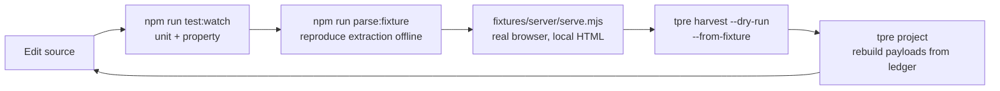
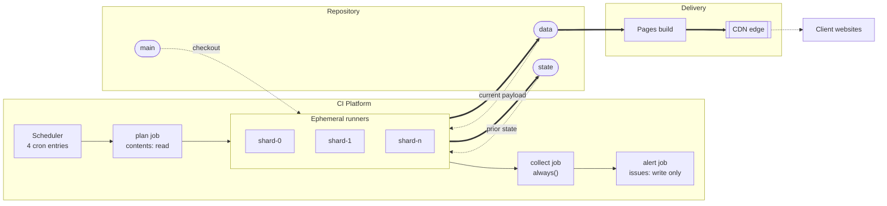

# Part 3 — Runtime, Build, and Environments

*Sections 11 through 14. Audience: DevOps, implementing engineers. This part defines what the engine needs to run, what "building" means for a system with no build step, and the exact differences between the development and production environments.*

---

# 11. Runtime Requirements

## 11.1 Runtime Platform

| Requirement | Value | Rationale |
|---|---|---|
| Runtime | Node.js LTS, **major ≥ 20** | Stable ESM, `node:` protocol, `Intl.Segmenter` for grapheme-aware bounding (§23.4), and native `parseArgs` |
| Module system | ESM only, `.mjs` extension | No dual-package hazard, no `require`/`import` interop confusion |
| Operating system | Linux x64 (production); macOS and Windows (development) | Production runs on hosted Linux runners; developers are not constrained |
| Architecture | x64 | Browser binary availability. ARM works for development but is not the production target |
| Shell | POSIX shell for scripts | `scripts/*.sh` must run on the runner; developer scripts are `.mjs` and shell-agnostic |

| ID | Requirement |
|---|---|
| TR-ENV-010 | The engine MUST run on the Node major pinned in `.nvmrc` with no polyfills, no shims, and no runtime feature detection. |
| TR-ENV-011 | The engine MUST NOT depend on any OS-level package beyond what the browser binary itself requires. |
| TR-ENV-012 | The engine MUST run identically from a clean clone with `npm ci` and no additional setup other than browser installation. |

**Implementation Note on `Intl.Segmenter`.** Grapheme-cluster-aware length bounding (§23.4, TR-NORM-020) depends on it. If it proves unavailable or incorrect for ZWJ emoji sequences on the pinned Node version, assumption TA-06 has failed and a bounded, justified dependency is required under DEP-1. Verify this in build phase 2 — before anything produces data — not later.

## 11.2 Resource Requirements

| Resource | Minimum | Typical | Peak Budget | Enforced By |
|---|---|---|---|---|
| CPU cores | 2 | 2–4 | — | §45 |
| RAM (process tree) | 2 GB | 700 MB used | **≤ 700 MB** | §44 |
| RAM (Node alone) | — | 80–120 MB | **≤ 120 MB** | §44.2 |
| RAM (Chromium) | — | 300–500 MB | **≤ 600 MB** | §44.2 |
| Disk (working) | 2 GB | ~1.2 GB | — | §46 |
| Disk (browser binaries) | ~500 MB | ~350 MB cached | — | §46.2 |
| Network egress | Minimal | ~8–14 requests per harvest | — | §57.2 |
| Wall clock per target | — | 75 s p50 | **300 s hard** | §30.2 |
| Wall clock per run | — | 8–15 min | **900 s hard** | §30.2 |

**The memory budget is deliberately an order of magnitude below available RAM.** Not because memory is scarce on a 16 GB runner, but because a pathological listing — 5,000 reviews with long text — must be structurally incapable of exhausting the job, and because a rising memory profile is only a useful leak indicator when the baseline is low.

## 11.3 Runtime Dependencies at Execution Time

| Dependency | Needed For | Absent Behaviour |
|---|---|---|
| Node runtime | Everything | Cannot start |
| `node_modules` from lockfile | Schema validation, browser control | Exit 2 at startup |
| Chromium binary | DOM adapter only | `ERR-BROWSER-LAUNCH`; API and CSV adapters unaffected |
| `main` checkout | Config, profiles, selectors, schemas | Exit 2 |
| `state` checkout | Ledger, caches, breaker, health | Treated as empty; first-run semantics; budget fails closed |
| `data` checkout | Gate comparison against current payload | **Gate cannot evaluate G-02…G-05, G-12** — see TR-ENV-013 |
| Network egress | Acquisition and publication | Classified network errors; LKG retained |
| `GITHUB_TOKEN` | Publication and alerting | `ERR-PUBLISH-AUTH` (critical) |

| ID | Requirement |
|---|---|
| TR-ENV-013 | If the `data` checkout is missing or unreadable, the engine MUST treat the current payload as **unknown** and MUST NOT evaluate the change-based gate rules as if the prior payload were empty. Treating "unknown" as "empty" would make G-02 pass trivially and defeat the system's most valuable safety rule. The correct behaviour is to fail the target with a classified error. |
| TR-ENV-014 | A missing `state` checkout MUST produce first-run semantics for ledgers and caches, but MUST fail closed for rate budgets (§57.5). |

**TR-ENV-013 is a subtle trap worth stating explicitly.** A naive implementation reads the current payload, gets `null` because the checkout failed, and evaluates "candidate is non-empty and prior was empty ⇒ first publish ⇒ skip G-02…G-05." That path publishes an unvalidated payload over a healthy one. The distinction between *"there is no prior payload"* and *"I could not read the prior payload"* is load-bearing.

## 11.4 Runtime Modes

| Mode | Trigger | Publishes | Network | Notifier | Publisher |
|---|---|---|---|---|---|
| `production` | `TPRE_ENV=production` | yes | yes | `github-issues` | `git-data` |
| `ci` | `TPRE_ENV=ci` | per flags | per flags | `github-issues` | `git-data` |
| `development` | `TPRE_ENV=development` (default) | no (`TPRE_NO_PUBLISH=true` default) | optional | `console` | `filesystem` |
| `dry-run` | `--dry-run` / `TPRE_DRY_RUN=true` | **no writes at all** | yes | `console` | none |
| `no-publish` | `--no-publish` | state only | yes | active | none |
| `replay` | `tpre replay --from <artifact>` | per flags | **none** | active | per flags |
| `project` | `tpre project` | payload only | **none** | active | active |

| ID | Requirement |
|---|---|
| TR-ENV-015 | `--dry-run` MUST perform the full pipeline including the Gate, and MUST write nothing anywhere — not payloads, not ledgers, not health records, not caches. Its value is that it exercises every decision without consequence. |
| TR-ENV-016 | `tpre project` and `tpre replay` MUST make zero network requests. Both are recovery tools used when the network path is the problem. |

## 11.5 Startup Sequence

The engine performs these steps in this exact order. **Order matters:** redaction must be seeded before anything can log a secret, and configuration must be validated before anything acts on it.

| # | Step | Failure |
|---|---|---|
| 1 | Parse arguments; reject unknown commands and flags | exit 2 |
| 2 | Read and coerce `TPRE_*` variables; reject unknown ones | exit 2 |
| 3 | Read secrets into a sealed object | — |
| 4 | **Seed the log redaction filter with all secret values** | — |
| 5 | Construct the logger and emit the run-start event | — |
| 6 | Discover and load client configs, profiles, defaults | exit 2 |
| 7 | Apply the six-layer precedence chain; validate; freeze; emit trace | exit 2 |
| 8 | Verify `config_version` is supported | `ERR-CONFIG-VERSION`, exit 2 |
| 9 | Verify required secrets for the selected adapters are present | `ERR-CONFIG-SECRET-MISSING`, exit 2 |
| 10 | Construct concrete adapters in the composition root | exit 1 |
| 11 | Compute the due set and the shard assignment | exit 2 |
| 12 | Enter the target loop | — |

**Step 4 before step 5 is not negotiable.** A logger constructed before the redaction filter is seeded can emit a secret in its own startup event.

## 11.6 Shutdown Sequence

| # | Step | Runs On |
|---|---|---|
| 1 | Close the browser and all contexts | always (`finally`) |
| 2 | Flush the log sink | always |
| 3 | Write the run manifest | always |
| 4 | Commit and push `data` (payload first) | success or partial |
| 5 | Commit and push `state` (state second) | always, including full failure |
| 6 | Write diagnostics bundles for failed targets | always |
| 7 | Emit the aggregate summary and compute the exit code | always |
| 8 | Exit | always |

| ID | Requirement |
|---|---|
| TR-ENV-017 | Steps 1–3 and 5–8 MUST execute even when every target failed. Health records are written on failure precisely because that is when monitoring matters most. |
| TR-ENV-018 | The engine MUST NOT rely on process-exit handlers for these steps. Signal handlers and `beforeExit` are unreliable under CI cancellation; the sequence MUST be an explicit `finally` in the CLI. |

---

# 12. Build Requirements

## 12.1 There Is No Build Step

> **EDR-008 — No transpilation: JSDoc-typed `.mjs` is executed exactly as committed**
> **Serves:** ADR-004 (CI as compute plane), SAD §19.1's sub-decision on typing.
> **Context:** The conventional Node project transpiles TypeScript to JavaScript, producing a `dist/` directory and source maps. It gives better ergonomics at authoring time.
> **Decision:** The engine is plain `.mjs` with JSDoc type annotations and `checkJs` enabled. There is no compile stage, no `dist/`, and no source maps. What runs is byte-identical to what is committed.
> **Alternatives Rejected:** *Full TypeScript with a build step* — adds a compile stage to every local iteration and, decisively, puts generated code between the engineer and the stack trace during a 2 a.m. CI investigation. A stack frame pointing at `dist/orchestrator.js:1:4821` is materially worse than one pointing at `src/app/orchestrator.mjs:214`. *TypeScript with `ts-node`-style runtime transpilation* — reintroduces a transform, plus startup cost, plus a dependency in the production path. *Untyped JavaScript* — gives up the type checking that catches the boundary errors this system cares about most.
> **Trade-off:** JSDoc is more verbose than TypeScript syntax, and some advanced type constructs are awkward. Accepted: the types that matter here are record shapes and function signatures, both of which JSDoc expresses well.
> **Scalability:** Neutral to team size. It becomes a worse trade only if the codebase grows past the point where JSDoc's expressiveness limits bite — estimated well beyond v3.0.

## 12.2 What "Build" Means Here

| Activity | Command | Produces | Blocking |
|---|---|---|---|
| Install | `npm ci` | `node_modules/` from the lockfile exactly | yes |
| Browser install | `npx playwright install chromium` | Pinned browser binary | yes (DOM adapter only) |
| Type check | `npm run typecheck` | Diagnostics only; no output files | yes |
| Lint | `npm run lint` | Diagnostics only | yes |
| Format check | `npm run format:check` | Diagnostics only | yes |
| Test | `npm test` | Coverage report | yes |
| Schema validation | `npm run validate:schemas` | Diagnostics only | yes |
| Size report | `npm run size` | Size report against budgets | yes |
| Renderer minification | `npm run build:renderer` | `frontend/renderer/tp-reviews.min.mjs` | yes |

**Exactly one artifact is produced by a build: the minified renderer.** Everything else is verification. This is the entire reason the deployment story in §64 is short.

## 12.3 Required npm Scripts

| Script | Purpose | Must Be Offline |
|---|---|---|
| `test` | Default suite: unit, property, regression, contract, architecture, integration, chaos, budgets, security | **yes** |
| `test:watch` | Local iteration | yes |
| `test:coverage` | Coverage with thresholds enforced | yes |
| `test:live` | Opt-in live suite | no |
| `typecheck` | `checkJs` strict type check | yes |
| `lint` / `lint:fix` | ESLint | yes |
| `format` / `format:check` | Prettier | yes |
| `validate:schemas` | Every schema against every fixture and config | yes |
| `validate:configs` | Schema + semantic rules V-1…V-12 | yes |
| `build:renderer` | Minify the reference renderer | yes |
| `size` | Payload and renderer size budgets | yes |
| `parse:fixture` | Run the parser against one fixture — the incident-repair loop | yes |
| `capture:fixture` | Capture and sanitise a live page into the corpus | no |

| ID | Requirement |
|---|---|
| TR-BLD-010 | `npm test` MUST pass on an air-gapped machine (TG-10). Any test requiring the internet lives in `tests/live/` and is excluded from the default runner. |
| TR-BLD-011 | `npm test` MUST complete in under three minutes on a typical development machine. A suite slower than that stops being run locally, which is when it stops preventing defects. |
| TR-BLD-012 | `npm run parse:fixture -- <nnn>` MUST reproduce a production extraction failure offline in under ten seconds. This is the inner loop of the 60-minute selector repair target (§92.3). |

## 12.4 Build Determinism

| Property | Mechanism |
|---|---|
| Identical dependency tree | Committed lockfile; `npm ci` never resolves ranges |
| Identical browser | Chromium pinned via the Playwright version in the lockfile |
| Identical Node | `.nvmrc` pin, matched by the CI setup action |
| Identical line endings | `.gitattributes` enforces LF |
| Identical output bytes | Stable key ordering and minification in the projector (§24.2) |

| ID | Requirement |
|---|---|
| TR-BLD-013 | `npm install` MUST NOT be used in CI. Only `npm ci`. An install that can resolve a range makes the build non-reproducible, and reproducibility is what makes `tpre project` a safe recovery tool. |
| TR-BLD-014 | The browser version MUST NOT be upgraded automatically. Upgrades land as a dedicated pull request that passes the full fixture corpus plus a live canary run (RISK-14). |

## 12.5 Renderer Build

The one real build output. Constraints are tight because it ships to client websites.

| Constraint | Value | Enforced By |
|---|---|---|
| Size | ≤ 5 KB minified | `tests/budgets/renderer-size.test.mjs` |
| Dependencies | **zero** | DEP-6, dependency graph test |
| Module format | ESM, directly loadable by a browser | Manual + example pages |
| DOM APIs | Text-only; no HTML-injection API | `tests/security/renderer-api.test.mjs` |
| Styling | CSS custom properties; inherits host typography | Manual review |
| Failure mode | A failed fetch leaves existing markup untouched | Integration recipe verification |

---

# 13. Development Environment

## 13.1 Prerequisites

| Requirement | Version | Verify |
|---|---|---|
| Node.js | Matching `.nvmrc`, LTS ≥ 20 | `node --version` |
| npm | Bundled with Node | `npm --version` |
| Git | ≥ 2.30 | `git --version` |
| Chromium via Playwright | Pinned by lockfile | `npx playwright install chromium` |
| Disk | ~2 GB free | — |
| Editor | Any with JSDoc/`checkJs` support | — |

## 13.2 First-Run Setup

| # | Step | Expected Result |
|---|---|---|
| 1 | Clone the repository | — |
| 2 | `nvm use` (or install the pinned Node major) | Node version matches `.nvmrc` |
| 3 | `npm ci` | Dependency tree installed from lockfile exactly |
| 4 | `npx playwright install chromium` | Pinned browser present |
| 5 | Copy `.env.example` to `.env` | Local overrides available |
| 6 | `npm test` | **Green, offline, under three minutes** |
| 7 | `node bin/tpre.mjs doctor` | Versions, caches, secrets, checkouts reported |
| 8 | `node bin/tpre.mjs plan` | Due set printed; no side effects |

**Step 6 is the gate for "the environment works."** If the full default suite is green on a machine with no network access, the development environment is correct. This is the four-hour onboarding target (SAD §53).

## 13.3 Development Defaults

| Setting | Development Value | Reason |
|---|---|---|
| `TPRE_ENV` | `development` | Enables `.env` loading |
| `TPRE_NO_PUBLISH` | `true` | A local run must never write to a real branch |
| Publisher | `filesystem` | Writes to `.publish/` for inspection |
| Notifier | `console` | No issues opened from a laptop |
| Log format | `pretty` | Human-readable |
| `resolution.allow_search` | `true` | Convenience during onboarding; forbidden in production |
| Browser mode | headless (headed available via flag) | §17 |

| ID | Requirement |
|---|---|
| TR-ENV-020 | The config loader MUST refuse to read `.env` unless `TPRE_ENV=development`. A stray local file must not be able to influence a production run. |
| TR-ENV-021 | The `filesystem` publisher and `console` notifier MUST be selected automatically in development, so that a developer cannot accidentally publish or alert by omitting a flag. |

## 13.4 The Offline Development Loop

Everything below runs with no network access. This is the property that makes the system pleasant to work on and possible to debug on a train.

| Loop Stage | Command | Round-Trip |
|---|---|---|
| Pure logic | `npm run test:watch` | < 1 s |
| Extraction against saved markup | `npm run parse:fixture -- 001` | < 10 s |
| Browser-level navigation | `node fixtures/server/serve.mjs` + integration test | < 60 s |
| Full offline pipeline | `tpre harvest --client X --dry-run --from-fixture` | < 90 s |
| Payload regeneration | `tpre project --client X` | < 5 s |

**The fixture server is what makes browser-level testing viable offline.** It serves the same sanitised markup the regression suite uses, over HTTP, with configurable lazy-loading behaviour — so the Navigator's scroll loop, stall detection, and expansion budget are exercised against realistic dynamics with zero network and zero flakiness.

## 13.5 Development Safety Rails

| Rail | Mechanism | Prevents |
|---|---|---|
| No accidental publish | `TPRE_NO_PUBLISH=true` default + `filesystem` publisher | Writing to a real `data` branch from a laptop |
| No accidental alert | `console` notifier default | Opening issues during local testing |
| No accidental live request | Default suites are offline; live tests are opt-in | Generating source requests on every test run |
| No stale `.env` in CI | Loader refuses `.env` outside development | Local settings influencing production |
| No secret commit | `.gitignore` on `.env`; push-time scanning | INV-08 violation |
| No fixture with pending erasure | Review checklist + fixture hygiene rules | Compliance violation |

## 13.6 Common Development Tasks

| Task | Command |
|---|---|
| Check the environment | `tpre doctor` |
| See what is due | `tpre plan` |
| Explain a config value's origin | `tpre validate-config --explain` |
| Test a client offline | `tpre harvest --client X --dry-run` |
| Rebuild payloads with no network | `tpre project --client X` |
| Reproduce an extraction failure | `npm run parse:fixture -- <nnn>` |
| Add a client | `node scripts/new-client.mjs` |
| Capture a fixture | `node scripts/capture-fixture.mjs` |
| Export a client's data | `tpre export --client X` |

---

# 14. Production Environment

## 14.1 Production Topology

## 14.2 Production Environment Facts

| Fact | Value | Consequence |
|---|---|---|
| Compute lifetime | Minutes; nothing persists in the runner | No warm state, no local cache between runs |
| Environments | Two logical: `production` (scheduled, publishes) and `dry-run` (PR-triggered, publishes nothing) | No staging environment exists, by design |
| Deployment unit | A Git commit on `main` | The engine is *adopted by the next scheduled run*, not deployed |
| Rollback unit | A commit on `data` (payload) or `main` (engine) | §66 |
| State ownership | `state` is machine-owned | Humans MUST NOT hand-edit except per §60 |
| Egress identity | Shared cloud IP range, outside our control | Blocks may occur through no fault of ours (§57.6) |
| Repository visibility | Public (for unmetered CI minutes) | **No secret may exist in any file, ever** |

## 14.3 Production Configuration Differences

| Setting | Development | Production | Why |
|---|---|---|---|
| `TPRE_ENV` | `development` | `production` | Drives all other differences |
| `.env` loading | yes | **refused** | A stray file must not influence production |
| `resolution.allow_search` | `true` | **`false`** | Runtime search is fragile and must not be a production mode |
| Publisher | `filesystem` | `git-data` | — |
| Notifier | `console` | `github-issues` | — |
| Log format | `pretty` | `jsonl` | Machine-analysable |
| Log level | `debug` | `info` (with ring-buffered debug) | Volume control (§37.4) |
| Screenshots | on | on, 14-day retention | Privacy (§47.7) |
| Publish | off | on, gated | — |

## 14.4 Production Readiness Requirements

| ID | Requirement |
|---|---|
| TR-ENV-030 | Branch protection MUST be active on `main`: review required, CI required, no force-push, linear history. |
| TR-ENV-031 | `data` and `state` MUST be writable only by the workflow token and repository admins. |
| TR-ENV-032 | Every workflow MUST have been run at least once manually and verified green before the first client is onboarded. |
| TR-ENV-033 | Actual CDN response headers MUST be verified and recorded in `docs/runbooks/` before the first client is onboarded (OIQ-04). Assumed headers are not verified headers. |
| TR-ENV-034 | The keepalive workflow MUST be run manually once and confirmed not to open a spurious issue. |
| TR-ENV-035 | At least one full clone including `data` and `state` MUST exist outside the primary account before the first client is onboarded (§60.6). |

**TR-ENV-035 converts a maintenance step into a disaster-recovery control at zero cost.** The quarterly history-truncation procedure already requires creating a mirror; that mirror is the offsite backup and MUST be retained rather than deleted.

## 14.5 Production Observability Surface

| Surface | Location | Refresh | Purpose |
|---|---|---|---|
| Run summary | Workflow job summary | Per run | Per-target outcome table |
| Health series | `state:/health/<slug>.jsonl` | Per run | The monitoring substrate |
| Run manifest | `state:/runs/<yyyy-mm>/<run-id>.json` | Per run | 90-day trend analysis |
| Alerts | GitHub Issues, fingerprint-deduplicated | On condition | The only interrupt channel |
| Weekly digest | A single long-lived issue, updated in place | Weekly | Portfolio health |
| Payload verification | Dedicated job | Daily | **The only true Level-1 monitor** — fetches over the public CDN URL exactly as a visitor would |

## 14.6 Portability Off the CI Platform

The SAD estimates one engineer-day to migrate (§37.6). That estimate is only true if these constraints hold, so they are stated as requirements:

| ID | Requirement |
|---|---|
| TR-ENV-040 | No platform SDK may be imported outside `adapters/state/`, `adapters/publisher/`, and `adapters/notifier/`. Enforced by architecture test DR-3. |
| TR-ENV-041 | The engine MUST be invocable as a plain CLI with only environment variables and local checkouts — no platform-specific context object. |
| TR-ENV-042 | `tpre plan` MUST emit its shard assignment as JSON on stdout, so any orchestrator can consume it. |
| TR-ENV-043 | Secrets MUST be read from environment variables only, never from a platform-specific secret API. |

**These four requirements are the entire portability story.** They are cheap to hold and expensive to retrofit, which is why they are requirements rather than aspirations.

## 14.7 Production Failure Envelope

What production is designed to survive without human intervention, and what it is not.

| Failure | Survives Automatically | Human Action |
|---|---|---|
| Transient network error | yes — retry per policy | none |
| Retry exhaustion | yes — LKG retained | none |
| Partial harvest | yes — additions merged, gate rejects | investigate if persistent |
| Gate rejection | yes — LKG retained, alert raised | review reasons |
| Publish conflict | yes — rebase-retry, then next run reproduces | none |
| Bot challenge | yes — breaker opens, LKG retained | **policy decision required** |
| Structure change | yes — LKG retained, alert with failed assertion | selector repair |
| Ledger corruption | no | restore from Git history |
| Identity drift | no | verify listing, update config |
| Publish auth failure | no | rotate token |
| CI platform outage | yes — staleness only | wait, or run locally |
| CDN outage | **no — the only visitor-visible failure** | switch to fallback origin |

**Every row except the last has zero visitor impact.** That is not luck; it is the consequence of ADR-001 (decoupling), ADR-006 (state separate from output), and ADR-011 (gated publication) acting together. Any change that breaks one of those three re-opens every row in this table.

---

*End of Part 3. Part 4 specifies the Playwright requirements, browser configuration and lifecycle, the navigation strategy, the DOM extraction strategy, and the review detection logic.*
