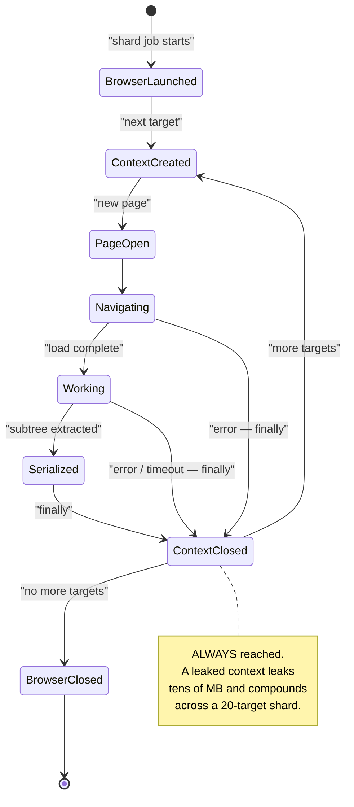
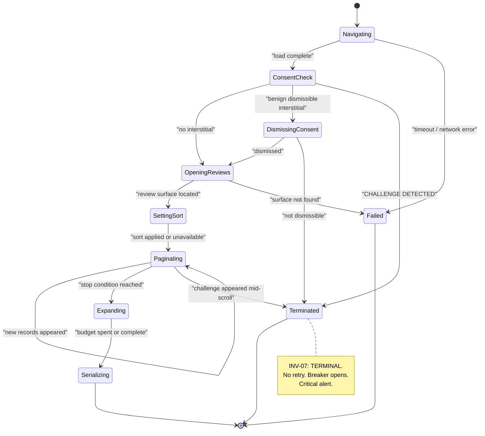
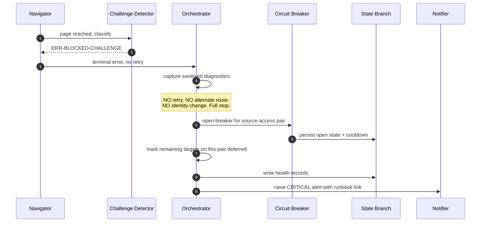

# Part 4 — Acquisition: Browser, Navigation, and Extraction

*Sections 15 through 21. Audience: implementing engineers. This part covers the most volatile and highest-risk code in the system. Every requirement here exists because a specific failure mode was observed or anticipated; the rationale column is not decoration.*

---

# 15. Playwright Requirements

## 15.1 Scope of the Playwright Dependency

> **EDR-009 — Browser control is a port method, and `playwright` is imported by exactly one file**
> **Serves:** ADR-005 (Playwright with pinned Chromium).
> **Context:** Playwright is the single largest dependency in the system and the one most likely to need replacing (Puppeteer is a viable alternative; the SAD rates reversibility as High only because of this confinement). Left unconstrained, browser API calls spread into the navigator, the resolver, the consent handler, and the diagnostics capture — and the migration estimate goes from a day to a week.
> **Decision:** `adapters/browser/playwright-chromium.mjs` is the only file permitted to import `playwright`. Everything else receives a `BrowserPort` handle and calls port methods.
> **Alternatives Rejected:** *Import Playwright wherever convenient* — the default outcome; makes the dependency unremovable and makes browser behaviour untestable without a browser. *Wrap every Playwright type in a bespoke abstraction* — over-abstraction; the port exposes handles opaquely and lets the adapter use rich APIs internally, which is the correct depth. *Use Playwright's test runner as the harness* — couples the production engine to a test framework and imports an enormous surface for no gain.
> **Trade-off:** The Navigator receives handles it cannot introspect with full type information, and some Playwright ergonomics (auto-waiting locators) must be surfaced through the port rather than used directly. Mitigated by keeping the Navigator itself inside the `google-dom` adapter, which is permitted to hold a handle.
> **Scalability:** The confinement is what keeps ADR-005's reversibility claim honest. It costs one file and one architecture test.

| ID | Requirement |
|---|---|
| TR-BRW-010 | `playwright` MUST be imported by exactly one file. Enforced by architecture test DR-3. |
| TR-BRW-011 | The Chromium build MUST be pinned via the Playwright version in the lockfile and MUST NOT be upgraded automatically (RISK-14). |
| TR-BRW-012 | Playwright's test runner MUST NOT be a dependency. Vitest is the harness (§61). |
| TR-BRW-013 | Browser upgrades MUST land as a dedicated pull request that passes the full fixture corpus **and** a live canary run before merge. |

## 15.2 Browser Choice

| Requirement | Value | Rationale |
|---|---|---|
| Engine | Chromium | The target is developed and tested against Chromium-family browsers by its own vendor; highest fidelity, lowest surprise |
| Firefox | Diagnostic use only | If extraction breaks in Chromium only, a Firefox run is a useful signal about whether the change is rendering-specific |
| WebKit | Not used | No diagnostic value that Firefox does not provide more cheaply |

## 15.3 Playwright Capabilities Used

| Capability | Used For | Alternative If Removed |
|---|---|---|
| Browser launch with explicit args | Session management | — |
| Browser contexts | **Per-target isolation (INV-09)** | Would require a browser per target: ~1.5 s × target count |
| Route interception | Resource blocking and host allowlisting (§16.4) | Would lose 60–80% byte reduction and a defence-in-depth control |
| Auto-waiting locators | Reduced flakiness in the scroll-and-expand loop | Hand-written wait loops — the single largest source of scraper flakiness |
| Locale and timezone per context | Correct relative-date phrasing per client | Would make date parsing locale-ambiguous |
| Screenshot capture | Diagnostics bundle | Would materially degrade incident diagnosis |
| Console and page-error listeners | Debug-level instrumentation | Reduced diagnosability |
| Element evaluation returning strings | DOM subtree serialisation (§20.2) | — |

## 15.4 Playwright Capabilities Deliberately Not Used

**This table is a security-review artifact.** It documents what the codebase must not contain, so an auditor can verify absence rather than infer it.

| Not Used | Reason |
|---|---|
| Persistent contexts / storage state | Contexts are always fresh; no session is cultivated (INV-07 posture, §18.1) |
| Proxy configuration | No proxy configuration key exists in the config schema |
| Browser fingerprint patching / stealth plugins | ADR-010: the engine never disguises itself |
| Human-like mouse paths or typing cadence | Interaction is direct and deterministic |
| Authentication of any kind on the DOM path | FR-021: no credential path exists in the DOM adapter |
| `page.pause()` / inspector | Debug-only tooling; MUST NOT appear in committed code |
| Video recording | Storage cost and personal-data exposure with no diagnostic gain over screenshots |
| Multiple pages per context | One page per context; parallel pages would multiply memory and request pressure |

| ID | Requirement |
|---|---|
| TR-BRW-014 | The codebase MUST NOT contain any proxy configuration, fingerprint modification, storage-state persistence, or input-timing randomisation. A pull request introducing any of these MUST be rejected (ADR-010). |

---

# 16. Browser Configuration

## 16.1 Launch Configuration

| Setting | Value | Rationale |
|---|---|---|
| Headless | `true` in all non-development modes | §17 |
| Sandbox | Enabled where the runner permits | Defence in depth; disable only if the runner requires it, and record why |
| Downloads | Disabled | Nothing is ever downloaded; a download path is an unnecessary file-write surface |
| Default timeout | **Explicitly set — never infinite** | NFR-016 |
| Slow-mo | `0` in production; available locally | Debug aid only |
| Devtools | `false` always | — |

| ID | Requirement |
|---|---|
| TR-BRW-020 | No timeout anywhere in the browser layer may be left at an infinite or unset default. Every one of the six budgets in §30.3 MUST be explicitly configured. |
| TR-BRW-021 | Launch arguments MUST be a reviewed, documented list. An argument added to "make it work" without a recorded reason is a defect — several plausible Chromium flags materially weaken sandboxing. |

## 16.2 Context Configuration

A fresh context is created per target. These settings are applied to every one of them.

| Setting | Value | Rationale |
|---|---|---|
| Viewport | Realistic desktop dimensions | Layout-dependent extraction requires a plausible viewport; a 0×0 or mobile viewport changes which elements render |
| Locale | From client config (`listings[].locale`) | **Drives relative-date phrasing.** Wrong locale ⇒ unparseable dates ⇒ null estimates |
| Timezone | From client config | Consistency with locale |
| `reducedMotion` | `reduce` | Removes animation-driven timing variance from the scroll loop |
| Permissions | **none granted** | No geolocation, notifications, camera, or clipboard |
| Geolocation | not set | Location-based result variation would make harvests non-reproducible |
| Service workers | blocked | Unnecessary; adds an uncontrolled request source |
| Storage | none persisted | Fresh context per target; nothing survives |
| `bypassCSP` | `false` | No reason to weaken the page's own protections |
| HTTPS errors | **never ignored** | §47.9 — no certificate validation bypass under any configuration |

| ID | Requirement |
|---|---|
| TR-BRW-022 | Locale and timezone MUST come from client configuration, not from the runner's defaults. A runner in UTC harvesting an Indian client's listing produces different relative-date phrasing than expected. |
| TR-BRW-023 | Certificate validation MUST NOT be bypassed under any configuration or environment variable. |
| TR-BRW-024 | No permission may be granted to any context. If a future requirement appears to need one, it requires an EDR. |

## 16.3 Resource Blocking

Route interception applies a resource-type policy and a host allowlist. Both are measured, and the measurement is reported.

| Resource Type | Action | Rationale |
|---|---|---|
| Images | **block** | Not needed for extraction; avatars are captured as URLs only (ADR-014). Largest single bandwidth saving. |
| Media (video/audio) | **block** | Never needed |
| Fonts | **block** | Layout may shift slightly; extraction does not depend on glyph metrics |
| Stylesheets | **allow** | Some structural and visibility determinations depend on computed layout |
| Scripts | **allow** | The page must execute — the content is not in the initial response |
| XHR / fetch | **allow** (allowlisted hosts only) | This is how review batches arrive |
| Analytics / telemetry hosts | **block** | Not needed; reduces noise and avoids sending signals we have no reason to send |
| Any host outside the allowlist | **block** | Defence in depth: a compromised page cannot use the runner as a request source (THREAT-04) |

| ID | Requirement |
|---|---|
| TR-BRW-030 | Blocking MUST be measured. The count and byte total of blocked requests MUST appear in the `AcquisitionReport` and the run manifest. |
| TR-BRW-031 | An integration test MUST assert that images, fonts, and media are actually blocked, and that the measured byte reduction is non-trivial. A regression that silently stops blocking is otherwise invisible. |
| TR-BRW-032 | The host allowlist MUST be configuration, not a hard-coded literal, so that adding a source in v2.0 does not require touching the browser adapter. |

> **EDR-012 — Route interception uses a host allowlist plus a resource-type denylist, and both are measured**
> **Serves:** THREAT-04 (crafted content exhausting runner resources), §43 (performance).
> **Context:** Resource blocking is usually treated as a performance optimisation. Here it is simultaneously a performance measure, a politeness measure, and a security control — and controls that are not measured decay silently.
> **Decision:** Two independent filters. A resource-type denylist blocks images, media, fonts, and known telemetry. A host allowlist blocks everything not explicitly permitted. Both emit counters into the acquisition report.
> **Alternatives Rejected:** *Resource-type filtering alone* — permits arbitrary hosts, leaving the runner usable as a request source by a compromised page. *Host allowlist alone* — permits megabytes of images from an allowlisted host, losing the 60–80% byte reduction. *No blocking* — 25–40% slower, far more bytes, and a wider attack surface, for no benefit. *Blocking stylesheets too* — tempting for speed, but breaks layout-dependent visibility determinations that extraction relies on.
> **Trade-off:** The allowlist must be maintained when a source changes its CDN hostnames, and a missed hostname manifests as a page that fails to load its reviews. Mitigated by making it configuration and by the canary detecting it within hours.
> **Scalability:** Per-source allowlists compose cleanly as adapters are added; the mechanism does not change.

## 16.4 Instrumentation

| Signal | Level | Retained |
|---|---|---|
| Console messages from the page | `debug` | Ring buffer; flushed on failure |
| Page errors | `debug` | Ring buffer; flushed on failure |
| Failed requests | `debug` | Ring buffer; flushed on failure |
| Response statuses on allowlisted hosts | `debug` | Ring buffer |
| Blocked request counts and bytes | `info` (aggregate) | Always — feeds TR-BRW-030 |

**Instrumentation is ring-buffered rather than always-written for the reason in §37.4:** a healthy 1,000-review harvest would otherwise produce megabytes of console noise per run, and the noise is only ever useful when the target failed.

---

# 17. Headless vs Headed Design

## 17.1 The Decision

> **EDR-010 — Headless is the only production mode; headed exists solely as a local debug flag**
> **Serves:** ADR-005, ADR-010.
> **Context:** Headed and headless Chromium differ in observable ways — rendering timing, some default behaviours, and the properties an anti-automation system might inspect. There is a temptation to run headed "because it looks more like a real browser."
> **Decision:** Production runs headless, always. A `--headed` flag exists for local debugging only and is refused when `TPRE_ENV` is `ci` or `production`.
> **Alternatives Rejected:** *Headed in production via a virtual display* — adds an OS-level dependency to the runner, roughly doubles memory, and is transparently an attempt to appear more human. That crosses the line ADR-010 draws, and it does so for a marginal and unreliable benefit. *Headless for some clients, headed for others* — makes behaviour non-reproducible across the fleet and makes an incident impossible to attribute. *Alternating modes on retry* — an evasion pattern; forbidden.
> **Trade-off:** If the source ever renders differently to headless browsers, extraction breaks and the engine has no sanctioned response other than the official-API migration path. That is the intended consequence, not an oversight.
> **Scalability:** Neutral. Headless is the cheaper mode at every scale.

| ID | Requirement |
|---|---|
| TR-BRW-040 | `--headed` MUST be refused with exit 2 when `TPRE_ENV` is `ci` or `production`. |
| TR-BRW-041 | No configuration path may select headed mode for a scheduled run. |
| TR-BRW-042 | Headed and headless MUST produce identical extraction output against the fixture corpus. A divergence is a defect in the extraction path, not an acceptable difference. |

## 17.2 Mode Comparison

| Aspect | Headless (production) | Headed (local debug only) |
|---|---|---|
| Memory | 300–500 MB | 500–800 MB |
| Startup | ~1.5 s | ~2.5 s |
| Requires display | no | yes |
| Permitted in CI | yes | **no** |
| Use case | All harvesting | Watching the scroll loop behave; diagnosing a stall |
| Screenshot fidelity | Full | Full |

## 17.3 When to Use Headed Locally

| Situation | Why Headed Helps |
|---|---|
| Pagination stalls and the growth curve is unexplained | Watching the container scroll shows immediately whether the wrong element is being scrolled |
| A consent interstitial is not being dismissed | The dismissal affordance is visible |
| Expansion clicks appear to do nothing | Reveals whether the click lands on the right element |
| Extraction returns zero with a valid-looking page | Shows whether content rendered at all |

**In every one of those cases, the outcome should be a new fixture**, so the problem becomes reproducible headlessly and permanently. Headed debugging that does not end in a fixture has left the system no better defended than before.

---

# 18. Browser Lifecycle

## 18.1 Lifecycle Model

> **EDR-011 — One browser per shard, one context per target, one page per context, all closed in `finally`**
> **Serves:** INV-09 (client isolation), §44 (memory).
> **Context:** Browser launch costs ~1.5 s; context creation costs milliseconds. Reusing everything is fastest; reusing nothing is safest.
> **Decision:** The browser process is launched once per shard job and reused across targets. A fresh context is created per target and closed in a `finally` block. One page per context.
> **Alternatives Rejected:** *One browser per target* — costs ~1.5 s × target count with no isolation benefit over a fresh context, since contexts already isolate storage, cookies, cache, and permissions. *One context reused across targets* — saves ~100 ms per target and breaks per-target isolation, leaking state between tenants. This is the optimisation that looks harmless and violates INV-09. *Multiple pages per context for parallelism* — multiplies concurrent requests to the source and peak memory, for wall-clock time the freshness SLO does not need.
> **Trade-off:** A browser crash mid-shard affects all remaining targets in that shard rather than one. Mitigated by `ERR-BROWSER-CRASH` being retryable once and by shards being independent.
> **Scalability:** Correct at every scale in the roadmap. At 500 clients the shard count grows; the per-shard model does not change.



## 18.2 Lifecycle Requirements

| ID | Requirement |
|---|---|
| TR-BRW-050 | The browser MUST be launched once per shard job and reused across targets. |
| TR-BRW-051 | A fresh context MUST be created per target. Contexts MUST NOT be reused across targets under any circumstance. |
| TR-BRW-052 | Every context MUST be closed in a `finally` block that executes on success, on error, on timeout, and on abort. |
| TR-BRW-053 | An integration test MUST assert that the open-context count returns to zero after a multi-target run, including a run in which a target fails. |
| TR-BRW-054 | The serialised DOM subtree MUST be captured and the page released **before** the pure pipeline runs, so Chromium can reclaim memory during processing (§44.3, M-7). |
| TR-BRW-055 | The browser MUST be closed before the shard job writes its commits, so that a hung browser cannot delay or prevent publication. |

**TR-BRW-053 is the test that catches the most expensive class of memory bug in this system.** A leaked context is invisible on a two-target local run and fatal on a twenty-target production shard.

## 18.3 Browser Failure Handling

| Failure | Error Class | Retry | Recovery |
|---|---|---|---|
| Launch fails | `ERR-BROWSER-LAUNCH` | immediate ×1 | Retry once; on repeat, fail the run (scope: run) |
| Context creation fails | `ERR-BROWSER-CRASH` | backoff ×1 | Retry once; on repeat, fail the target |
| Page crashes mid-navigation | `ERR-BROWSER-CRASH` | backoff ×1 | Close context, new context, retry once |
| Out of memory | `ERR-BROWSER-OOM` | **never** | Fail the target; alert recommends lowering `max_reviews` |
| Browser becomes unresponsive | `ERR-BUDGET-TARGET` | never | Per-target budget fires; context force-closed |

| ID | Requirement |
|---|---|
| TR-BRW-056 | `ERR-BROWSER-OOM` MUST NOT be retried. Retrying an OOM with the same inputs reproduces it deterministically while consuming another several minutes of budget. The correct response is a configuration change, which is a human decision. |
| TR-BRW-057 | After any browser-level failure, the context MUST be closed before the next target begins, even if closing itself throws. A close failure is logged and swallowed. |

---

# 19. Page Navigation Strategy

## 19.1 Navigator Responsibility

The Navigator drives the page from "opened" to "all target review content present in the DOM", then hands off a serialised subtree. It knows about **interaction sequences**. It knows nothing about **field locations** — that is the selector pack's job (§20).

## 19.2 Navigation Phase Machine



| Phase | Timeout | Failure Class |
|---|---|---|
| Navigating | `nav.navigation_timeout_ms` (30 s) | `ERR-NAV-TIMEOUT` |
| ConsentCheck | included in surface timeout | `ERR-BLOCKED-CHALLENGE` / `ERR-NAV-CONSENT-WALL` |
| DismissingConsent | 5 s | `ERR-NAV-CONSENT-WALL` |
| OpeningReviews | `nav.surface_timeout_ms` (15 s) | `ERR-NAV-SURFACE-NOT-FOUND` |
| SettingSort | 5 s, non-fatal | falls back silently |
| Paginating | `nav.pagination_budget_ms` (120 s) | stop reason `budget_exhausted` |
| Expanding | remaining target budget | non-fatal; flags records |
| Serializing | 5 s | `ERR-PARSE-STRUCTURE` |

| ID | Requirement |
|---|---|
| TR-NAV-010 | Sort-order application MUST be non-fatal. If the sort control is absent or unresponsive, the Navigator proceeds and records that sort was not applied. A missing sort control is a product change, not a harvest failure. |
| TR-NAV-011 | Challenge detection MUST run **before** parsing is attempted, at the end of navigation (§21.8). Detecting a challenge after a parse failure produces a misleading `ERR-PARSE-STRUCTURE` alert and sends the engineer to the wrong runbook. |
| TR-NAV-012 | Only **benign, dismissible** interstitials may be dismissed. A non-dismissible wall is `ERR-NAV-CONSENT-WALL` — source-scoped, no retry. The Navigator MUST NOT attempt repeated dismissal strategies. |

## 19.3 ALG-PAGINATE — The Pagination Algorithm

The review list is a lazily-populated, virtualised container. This algorithm is normative.

| Step | Action |
|---|---|
| 1 | Locate the scroll container that owns the review list, from the selector pack's `containers.scroll`. |
| 2 | Record `count₀` = number of review nodes currently present. |
| 3 | **Loop:** |
| 3a | Scroll the container by `containerHeight × nav.scroll_increment_ratio` (default 0.9). **Not to the absolute bottom.** |
| 3b | Wait for either a count increase or `nav.scroll_settle_ms` (default 900 ms), whichever occurs first. |
| 3c | Record `countₙ`. |
| 3d | Evaluate stop conditions **in this order** (see §19.4). |
| 3e | If no stop condition met, continue the loop. |
| 4 | Emit `PaginationReport { finalCount, iterations, stopReason, elapsedMs, growthCurve }`. |

> **EDR-013 — Scroll by container-height ratio, never to absolute bottom**
> **Serves:** ADR-009, RISK-04 (silent partial data).
> **Context:** Jumping to the bottom of the container is faster and is the obvious implementation.
> **Decision:** Scroll by 90% of container height per iteration.
> **Alternatives Rejected:** *Scroll to absolute bottom* — faster, and **skips records**: jumping past the virtualisation window means the intervening records are never materialised, and the harvest silently returns fewer reviews than exist. This is a correctness failure disguised as a performance win. *Scroll by a fixed pixel amount* — breaks when the container height differs across viewports or when card heights change. *Scroll one card at a time* — correct but many times slower, with no accuracy gain over 90%.
> **Trade-off:** More iterations, therefore slightly longer harvests. Pagination is already ~65% of harvest time (§43.2), so this is the dominant cost — and it is the correct place to spend it.
> **Scalability:** Iterations scale linearly with review count, bounded by `max_reviews` and `pagination_budget_ms`.

> **EDR-014 — The growth curve is a first-class output, retained in the acquisition report**
> **Serves:** RISK-04, §41 (monitoring).
> **Context:** When a harvest returns 12 of 118 reviews, the question is *where* it stopped growing. Without a record, this is unanswerable after the fact.
> **Decision:** The count after every iteration is retained as an array in the `AcquisitionReport` and written to the diagnostics bundle.
> **Alternatives Rejected:** *Record only the final count* — the most common implementation, and it makes stall diagnosis guesswork. *Log each iteration at `debug`* — the data exists but must be reconstructed by parsing logs, and `debug` is ring-buffered so it is discarded on success. *Record only on failure* — a *successful* harvest with a suspicious curve is exactly the case worth catching early.
> **Trade-off:** A few hundred bytes per harvest in the manifest. Irrelevant.
> **Scalability:** Constant per harvest.

**The growth curve is the single most diagnostic artifact in the system.** A curve that plateaus at 12 with `advertisedTotal = 118` tells the whole story of an incident in one array.

## 19.4 Stop Conditions

Evaluated in this order. **The order matters** — `cap_reached` before `target_reached` means a capped harvest is classified as capped rather than as complete.

| # | Condition | Test | Stop Reason |
|---|---|---|---|
| 1 | Cap reached | `countₙ ≥ nav.max_reviews` | `cap_reached` |
| 2 | Target reached | `countₙ ≥ advertisedTotal` | `target_reached` |
| 3 | Stalled | `countₙ == countₙ₋₁` for `nav.stall_threshold` consecutive iterations (default 3), each separated by increasing backoff (900 ms, 1800 ms, 3600 ms) | `stalled` |
| 4 | Budget exhausted | `elapsed ≥ nav.pagination_budget_ms` | `budget_exhausted` |
| 5 | Error | Any thrown error or challenge detection | `error` |

| ID | Requirement |
|---|---|
| TR-NAV-020 | Stall detection MUST use increasing backoff between attempts. A stall declared after three immediate re-scrolls will produce false stalls on a slow network. |
| TR-NAV-021 | `exhausted` MUST be distinguished from `stalled`. Both mean "no new records appeared", but `exhausted` additionally requires `count ≥ 95% of advertised`. |
| TR-NAV-022 | The stop reason MUST be a first-class output propagated to the `AcquisitionReport`, the `ValidationReport`, the health record, and the payload's `harvest_completeness`. |

## 19.5 Stop Reason → Completeness Mapping

**This is the mechanical expression of INV-03 and the single most important table in Part 4.**

| Stop Reason | Completeness | Reconciler Behaviour | Publish Gate Treatment |
|---|---|---|---|
| `target_reached` | `full` | Streaks may advance | Normal evaluation |
| `exhausted` (no growth **and** count ≥ 95% of advertised) | `full` | Streaks may advance | Normal evaluation |
| `cap_reached` | `full_capped` | Streaks may advance | Normal; count-drop uses the cap, not advertised total |
| `stalled` (count < 95% of advertised) | **`partial`** | **Streaks MUST NOT change** | G-05 applies strictly: count must not drop at all |
| `budget_exhausted` | **`partial`** | **Streaks MUST NOT change** | Same as `stalled` |
| `error` / `challenge` | `failed` | No reconciliation at all | No publication at all |

**A `partial` harvest is trustworthy for additions and untrustworthy for absences.** A review that appeared is real — records cannot appear spuriously. A review that did not appear may simply not have loaded. The reconciler treats the two asymmetrically on exactly this basis (§22.5).

**Agent Note.** The temptation is to collapse `stalled` and `exhausted` into one reason, since both mean "growth stopped." Do not. The difference between them is the difference between a complete harvest and a harvest that is lying, and every downstream protection depends on the distinction.

## 19.6 Text Expansion

| Aspect | Rule |
|---|---|
| Trigger | A review node contains an expansion affordance per the selector pack |
| Budget | `min(nav.expand_max_count, floor(remaining_budget_ms / expected_interaction_ms))`; defaults 200 and 120 ms |
| Order | **Longest-truncated first**, by rendered length, so the budget buys the most recovered text |
| Failure | An expansion that throws or times out marks that record `text_truncated: true` and continues |
| Verification | After expansion, text is re-read and checked for the absence of a truncation marker; if still present, `text_truncated` remains `true` |
| Network | None — expansion reveals already-loaded text |

| ID | Requirement |
|---|---|
| TR-NAV-030 | An expansion failure MUST NOT fail the record or the harvest. It sets `text_truncated: true`. |
| TR-NAV-031 | Records left unexpanded due to budget exhaustion MUST be flagged `text_truncated: true`, never stored silently short. |
| TR-NAV-032 | Expansion ordering MUST be deterministic given identical input, so that repeated runs against a fixture produce identical output (required by PT-12). |

**Storing truncated text flagged as truncated is strictly better than storing it silently, and both are better than failing the harvest.** The payload exposes `text_truncated` so a consumer can choose to link out rather than show a clipped review.

## 19.7 Navigation Configuration

| Key | Default | Ceiling | Effect |
|---|---|---|---|
| `nav.navigation_timeout_ms` | 30000 | — | Page load budget |
| `nav.surface_timeout_ms` | 15000 | — | Locating the review surface |
| `nav.scroll_increment_ratio` | 0.9 | — | Fraction of container height per scroll |
| `nav.scroll_settle_ms` | 900 | — | Wait for new records |
| `nav.stall_threshold` | 3 | — | Consecutive no-growth iterations |
| `nav.pagination_budget_ms` | 120000 | — | Hard cap on pagination |
| `nav.max_reviews` | 1000 | **5000** | Per-harvest cap |
| `nav.expand_max_count` | 200 | — | Expansion interaction budget |
| `nav.sort_order` | `newest` | — | Falls back silently if unavailable |
| `nav.locale` | client locale | — | Drives date phrasing |

## 19.8 Request Profile

Per harvest, the DOM adapter's expected network profile. **This table is the quantitative basis for §57's politeness argument** and MUST be re-measured if the navigation strategy changes.

| Request Type | Count | Notes |
|---|---|---|
| Listing page load | 1 | |
| Lazy review batches | ~6–12 for 120 reviews | Triggered by scrolling, exactly as a human browsing would |
| Text expansions | 0 | In-page; no network |
| Blocked (images, fonts, media, analytics) | ~40–120 **avoided** | §16.3 |
| **Effective requests per harvest** | **~8–14** | |

---

# 20. DOM Extraction Strategy

## 20.1 The Two-Stage Split

Extraction is split across a trust boundary: an impure step that produces a string, and a pure step that reads it.


> **EDR-015 — Extraction operates on a serialised subtree string, not on live browser handles**
> **Serves:** ADR-017 (golden fixtures as the primary regression mechanism), §44 (memory).
> **Context:** It is entirely possible to extract fields by querying live Playwright locators. It is the shorter path and needs no serialisation step.
> **Decision:** The browser adapter serialises the review container's subtree into a string. The pure Extractor parses that string. No `core/` code ever touches a browser handle.
> **Alternatives Rejected:** *Extract directly from live locators* — makes extraction impure, so it cannot be property-tested, cannot be run against saved fixtures, and cannot be reproduced offline during an incident. This single choice would eliminate the golden-fixture strategy, the 60-minute repair target, and roughly half of the test portfolio. *Serialise the whole document* — 5–20× more input for the parser and correspondingly more memory (§44.3, M-1). *Extract in the page context via injected evaluation* — puts extraction logic inside the untrusted page's execution environment, which is both a security problem and undebuggable.
> **Trade-off:** A serialisation step, and the loss of Playwright's auto-waiting during field resolution. Neither matters: by serialisation time the content is already materialised, and the string is what the fixture corpus stores.
> **Scalability:** Constant. The subtree size is bounded by `max_reviews` and the text-length bound.

| ID | Requirement |
|---|---|
| TR-EXT-010 | The Extractor MUST be pure and MUST accept a string, never a handle. Enforced by DR-1. |
| TR-EXT-011 | Serialisation MUST capture the review container subtree only, never `document.documentElement` (§44.3, M-1). |
| TR-EXT-012 | The serialised string MUST be byte-identical to what `scripts/capture-fixture.mjs` stores after sanitisation, so that a diagnostics snapshot can become a fixture by copying it. |

**TR-EXT-012 is what makes the selector-repair runbook a 60-minute procedure.** An engineer copies `snapshot.html` from the diagnostics bundle into `fixtures/dom/google/<nnn>/page.html`, and the failure is reproducible offline in seconds.

## 20.2 Selector Pack Structure

All field-location knowledge lives in versioned JSON files. Parser code is generic: it reads a pack and resolves fields through ordered strategies.

| Section | Contents |
|---|---|
| `meta` | `pack_version`, `source`, `created`, `notes`, `min_engine_version` |
| `containers` | Locators for the review surface, the scroll container, the individual review node, the reply node |
| `fields` | Per logical field: ordered `strategies[]`, `required` flag, `transform` reference |
| `affordances` | Locators for the expansion control, sort control, pagination trigger, consent dismissal |
| `signals` | Locators and patterns indicating a challenge page, empty state, or error state |
| `assertions` | Structural invariants the canary verifies (§41.6) |

### 20.2.1 Illustrative Pack Fragment

*Data, not code — an example instance of the pack schema.*

```json
{
  "meta": {
    "pack_version": "google-maps/v3",
    "source": "google",
    "created": "2026-07-24",
    "min_engine_version": "1.0.0",
    "notes": "v3 adds a role-based strategy for the rating after v2's aria-label pattern began falling back on ~15% of records."
  },
  "containers": {
    "surface": { "strategies": [ { "kind": "role", "expr": "REDACTED", "confidence": 0.95 } ] },
    "scroll": { "strategies": [ { "kind": "structural-relative", "expr": "REDACTED", "confidence": 0.85 } ] },
    "review_node": { "strategies": [ { "kind": "role", "expr": "REDACTED", "confidence": 0.95 } ] },
    "reply_node": { "strategies": [ { "kind": "structural-relative", "expr": "REDACTED", "confidence": 0.80 } ] }
  },
  "fields": {
    "rating": {
      "required": true,
      "strategies": [
        { "kind": "aria-label-pattern", "expr": "REDACTED", "confidence": 0.95, "notes": "Carries the numeric value directly; most robust." },
        { "kind": "role", "expr": "REDACTED", "confidence": 0.85 },
        { "kind": "css", "expr": "REDACTED", "confidence": 0.40, "notes": "Last resort. Generated class name — expect breakage." }
      ]
    }
  },
  "signals": {
    "challenge": { "patterns": ["REDACTED"], "confidence": "high" },
    "empty_state": { "patterns": ["REDACTED"], "confidence": "high" }
  }
}
```

## 20.3 Strategy Kinds, in Preference Order

| Order | Kind | Stability | Why This Rank |
|---|---|---|---|
| 1 | `role` | **Highest** | Accessibility semantics are user-facing contracts; changing them breaks screen readers, so vendors change them rarely and carefully |
| 2 | `aria-label-pattern` | High | Same reasoning, and it often carries the *value* directly, which is more robust than parsing visual stars |
| 3 | `data-attribute` | Medium-High | Frequently used for the vendor's own tooling, so moderately stable |
| 4 | `structural-relative` | Medium | Survives class renames; breaks on layout restructuring |
| 5 | `text-pattern` | Medium | Locale-dependent but structure-independent |
| 6 | `css` | **Lowest** | Fastest to write, first to break. Present only as a last-resort fallback with low confidence weight |

| ID | Requirement |
|---|---|
| TR-SEL-010 | Every required field MUST declare at least two strategies of **different kinds**. A single-strategy required field is a single point of failure. |
| TR-SEL-011 | No required field may declare `css` as its only strategy. |
| TR-SEL-012 | A new strategy MUST be inserted at its correct stability rank, not appended for convenience. If only a `css` strategy can be found, that MUST be recorded in the pack's `notes` as technical debt with a follow-up issue. |
| TR-SEL-013 | Every strategy MUST carry a `notes` field explaining what it targets and why it is ranked where it is. Six months later, nobody remembers why strategy 2 exists. |

## 20.4 Strategy Resolution and Health Reporting

For every field of every record, the resolver records which strategy index succeeded. This is aggregated into a per-run health signal.

| Signal | Meaning | Action |
|---|---|---|
| All fields resolve at index 0 | Healthy | none |
| A field resolves at index ≥ 1 for > 20% of records | **Drift beginning** — the preferred locator is failing | `warn` alert; extraction still correct |
| A field resolves at index ≥ 1 for > 80% of records | **Drift confirmed** | `warn` with elevated priority; schedule a pack update |
| A required field resolves at no index for > 5% of records | **Breakage** | `error` alert; records quarantined; gate likely rejects |

| ID | Requirement |
|---|---|
| TR-SEL-020 | The resolver MUST record `strategyIndex` and `kind` for every resolved field. |
| TR-SEL-021 | Per-run aggregation MUST produce `selector-health.json` in the diagnostics bundle and feed `MET-selector-health`. |

**This is the most valuable operational property of the selector-pack design.** It converts an upstream change from a *cliff* — extraction works, then abruptly does not — into a *ramp*, where fallbacks begin carrying load and the system reports it while everything still works. Detection lead time improves from "after the break" to "days before the break."

## 20.5 Pack Loading and Validation

| ID | Requirement |
|---|---|
| TR-SEL-030 | A pack MUST be validated against `selector-pack.schema.json` at load time. Failure is `ERR-PARSE-SELECTOR-PACK`, scope `run`, and aborts before any target executes. |
| TR-SEL-031 | Loading MUST verify `meta.min_engine_version` against the running engine version and refuse a pack requiring a newer engine. |
| TR-SEL-032 | The resolved pack version MUST appear in every payload's `provenance.selector_pack_version` (INV-06). |

---

# 21. Review Detection Logic

## 21.1 Detection Order

Detection proceeds container → nodes → fields. Each level has distinct failure semantics, and conflating them produces misleading alerts.

| Level | Success | Failure | Scope |
|---|---|---|---|
| Container | Review surface located | `ERR-PARSE-STRUCTURE` | **abort target** |
| Nodes | ≥ 1 review node, or a legitimate empty state | `ERR-PARSE-EMPTY-UNEXPECTED` | **abort target** |
| Fields (required) | Resolved at some strategy index | `ERR-PARSE-FIELD-REQUIRED` | **quarantine record** |
| Fields (optional) | Resolved or absent | not an error — field is `null` | — |

## 21.2 The Empty-State Distinction

**A listing with zero reviews is a legitimate result. A page that returned zero reviews because it broke is not.** Distinguishing them requires an explicit signal.

| Situation | Classification | Action |
|---|---|---|
| Container found, zero nodes, **empty-state signal present** | Not an error | `total_count: 0` is a valid harvest |
| Container found, zero nodes, **no empty-state signal** | `ERR-PARSE-EMPTY-UNEXPECTED` | Abort target; likely a change or a load failure |
| Container not found | `ERR-PARSE-STRUCTURE` | Abort target; almost certainly an upstream change |

| ID | Requirement |
|---|---|
| TR-EXT-020 | The pack MUST declare an `signals.empty_state` locator. Without it, a genuinely empty listing is indistinguishable from a broken page, and one of the two will be handled wrongly. |
| TR-EXT-021 | A zero-review harvest with a valid empty-state signal MUST still pass through the full pipeline and MUST still be gated. G-02 protects against publishing an empty payload over a non-empty one. |

## 21.3 Per-Record Extraction Order

For each review node located inside the review container:

| # | Field | Required | Notes |
|---|---|---|---|
| 1 | **Reply isolation** | — | **First, and non-negotiable.** Identify and detach any owner-reply subtree. Everything after operates on the review-only subtree. |
| 2 | Author display name | ✅ | Prefer an accessible name; fall back to structural |
| 3 | Author profile URL | — | Validated later against the host allowlist |
| 4 | Author avatar URL | — | URL only, **never fetched** |
| 5 | Author badges | — | Local-guide indicator, review-count text |
| 6 | Rating | ✅ | Three-parser cascade (§21.5) |
| 7 | Relative date text | ✅ | Verbatim, unmodified |
| 8 | Review text | — | With truncation-marker detection. Rating-only reviews are valid |
| 9 | Like / helpful count | — | Locale-aware thousands separators |
| 10 | Photo count | — | |
| 11 | Visit metadata | — | Where present |
| 12 | Owner reply text + relative date | — | From the detached subtree |
| 13 | Source node ordinal | — | Diagnostics only. **Never used for identity** |

> **EDR-016 — Owner-reply detachment happens before any other field extraction**
> **Serves:** FR-033.
> **Context:** An owner reply is nested inside or adjacent to the review it answers. Its text, and sometimes its own rating-like elements, sit inside the review node's subtree.
> **Decision:** Step 1 detaches the reply subtree. All subsequent field extraction operates on the review-only remainder.
> **Alternatives Rejected:** *Extract reply last, filtering it out of the text afterwards* — the text field will already contain the reply's words concatenated with the review's, and separating them post hoc requires string heuristics that fail on short replies. *Match the reply by a text prefix* — locale-dependent and fragile. *Ignore replies entirely* — loses a genuinely valuable field and still leaves the reply text contaminating the review body.
> **Trade-off:** The extractor must handle a node that has been structurally modified before other fields are read.
> **Scalability:** Constant. Every source with owner replies needs this, so the ordering generalises.

**FR-033 exists because ingesting an owner reply as a five-star review is a real, observed failure** that silently inflates a business's displayed rating. Step 1 is not stylistic ordering; it is the mitigation.

## 21.4 Node Identification

| ID | Requirement |
|---|---|
| TR-EXT-030 | Review nodes MUST be located via the pack's `containers.review_node` strategies, scoped inside the located surface. A document-wide query risks matching similar cards elsewhere on the page. |
| TR-EXT-031 | Node ordinal position MUST be retained for diagnostics only and MUST NOT contribute to identity (§53). Rendered ordering is unstable and personalised. |
| TR-EXT-032 | Duplicate nodes representing the same review within one harvest MUST be collapsed deterministically at the validation stage (§22.4), not silently at extraction. |

## 21.5 Rating Parsing — The Three-Parser Cascade

| Parser | Input Shape | Output | Reliability |
|---|---|---|---|
| **P1** accessible-label | A label containing a numeric rating and a scale | Integer 1–5 | **Most reliable** — carries the value explicitly; must handle locale decimal separators |
| **P2** star-count | Count of "filled" indicator elements | Integer 1–5 | Requires the pack to distinguish filled from unfilled; fragile to styling change |
| **P3** numeric-text | A bare numeric string near the rating container | Integer 1–5 | Last resort |

> **EDR-017 — Rating parsing is a three-parser cascade with a mandatory integer post-check**
> **Serves:** RISK-11, INV-02.
> **Context:** Ratings are displayed visually as stars, semantically as labels, and sometimes numerically. Any single approach breaks on some rendering variant.
> **Decision:** Try P1, then P2, then P3, taking the first success. Then apply a mandatory post-check: the value MUST be an integer in [1, 5].
> **Alternatives Rejected:** *Star-counting alone* — the intuitive approach, and it breaks the moment the visual treatment of filled versus unfilled changes, which is a pure styling change vendors make freely. *Accessible label alone* — most robust but absent in some renderings. *Averaging the parsers' results* — produces non-integer values, which is precisely the corruption the post-check exists to catch.
> **Trade-off:** Three parsers to maintain rather than one.
> **Scalability:** The cascade generalises across sources; API adapters skip it entirely and supply the rating directly.

### 21.5.1 The Integer Post-Check

| ID | Requirement |
|---|---|
| TR-EXT-040 | A parsed rating MUST be an integer in [1, 5]. A non-integer value MUST produce `ERR-PARSE-RATING-INVALID` and quarantine that record. |
| TR-EXT-041 | This check MUST be implemented. It is not defensive programming; it catches a specific, recurring corruption. |

**Why a non-integer rating is almost always a specific bug.** A value like 4.5 nearly always means the *aggregate business rating* was captured instead of the individual review's rating — the parser matched an element one level too high in the tree. Without this check, the business's own 4.7 average is silently ingested as a review, repeatedly, inflating the published mean. This single check has prevented an entire class of silent corruption and MUST exist.

## 21.6 Date Detection and Resolution

Relative dates are lossy, locale-dependent, and re-render differently on every harvest.

| Concept | Rule |
|---|---|
| **Capture verbatim** | `relative_date_raw` stores the exact string, always, for every locale. This is the audit trail. |
| **Resolve to an estimate** | Parse the phrase into a duration and subtract from `observed_at`, giving `date_estimated`. |
| **Record precision** | One of `day`, `week`, `month`, `year`, `unknown` — derived from **phrase granularity**, not from the arithmetic. |
| **Record confidence** | `high` for explicit day/week phrases, `medium` for month phrases, `low` for year phrases and anything requiring a fallback. |
| **PIN on first observation** | Once a review has a `date_estimated`, it is **never recomputed** (FR-036). |
| **Never sort by estimate alone** | Ordering uses the composite key `(date_estimated desc, first_seen_at desc, identity_hash asc)`. |

| ID | Requirement |
|---|---|
| TR-EXT-050 | `date_estimated` MUST be pinned at first observation and MUST NEVER be recomputed on a later harvest. Verified by **PT-06**. |
| TR-EXT-051 | An unparseable phrase MUST yield `precision: unknown`, `confidence: low`, `date_estimated: null`, with the record **still valid**. A review MUST NEVER be discarded because its date could not be parsed. |
| TR-EXT-052 | The locale phrase table MUST be data, not code, so that adding a locale is a data change. |

**Why pinning is mandatory.** On the first harvest a review reads "2 months ago"; a year later the same review reads "1 year ago". Recomputing on each harvest would push the review's date forward in time on every run, permanently scrambling sort order and making "newest first" meaningless. Pinning trades precision for stability, and stability is what a displayed ordering requires.

### 21.6.1 Minimum Locale Coverage

| Locale | Example Phrases | Implementation Hazard |
|---|---|---|
| `en` | "a day ago", "2 weeks ago", "3 months ago", "yesterday" | **The "a/an" singular forms** — a very common parser bug, since "a day" has no digit to match |
| `hi` | Devanagari relative phrases | Required for the first target's market |
| `de` | "vor 2 Wochen" | Prefix rather than suffix ordering |
| `fr` | "il y a 2 semaines" | Multi-word prefix |
| `es` / `pt` | "hace 2 semanas" | |
| `ar` | RTL relative phrases | Also exercises RTL text handling |

**Agent Note.** A regex matching `(\d+)\s+(day|week|month|year)s?\s+ago` passes a naive test suite and silently fails on every "a day ago" and "yesterday" in the corpus — which are among the most common phrasings on recent reviews, exactly the ones a "newest first" display shows most prominently.

## 21.7 Truncation Detection

| ID | Requirement |
|---|---|
| TR-EXT-060 | Truncation markers MUST be locale-aware and declared in the selector pack, not hard-coded. |
| TR-EXT-061 | The marker MUST be removed from the stored text and MUST set `text_truncated: true`. |
| TR-EXT-062 | Marker matching MUST occur after whitespace canonicalisation (§23.3 step 6) so matching is reliable. |

## 21.8 Challenge Detection

**This is the highest-severity detection path in the system.** A missed challenge means the parser attempts to extract reviews from a challenge page, producing a misleading `ERR-PARSE-STRUCTURE`, a wasted investigation, and — worst — a retry that escalates a soft block into a hard one.

| Signal Class | What Is Checked | Confidence |
|---|---|---|
| HTTP status | Unexpected 4xx/5xx on a normally-200 path; redirect to a known-challenge path | **High** |
| Page structure | Challenge-widget container patterns declared in the pack's `signals` section | **High** |
| Text signals | Locale-aware phrase patterns indicating unusual traffic or verification requirements | Medium |
| Absence signals | Review surface absent **and** page body unusually short **and** no empty-state marker | Medium |
| Behavioural | Navigation completes but the DOM never reaches a stable state matching any known archetype | Low — tiebreaker only |

### 21.8.1 Classification Rule

| Evidence | Classification |
|---|---|
| Any single **High**-confidence signal | `ERR-BLOCKED-CHALLENGE` |
| Two **Medium**-confidence signals | `ERR-BLOCKED-CHALLENGE` |
| One Medium signal, or Low signals only | `ERR-NAV-SURFACE-NOT-FOUND` → selector-break runbook |

| ID | Requirement |
|---|---|
| TR-NAV-040 | Challenge detection MUST run at the end of navigation, **before** any parsing is attempted. |
| TR-NAV-041 | `ERR-BLOCKED-CHALLENGE` MUST be terminal: **zero retries**, breaker opens for the source-access pair, `critical` alert, LKG retained. |
| TR-NAV-042 | A test MUST enumerate every `ERR-BLOCKED-*` class and assert the retry policy returns `never` for each. This converts a principle into a mechanism. |
| TR-NAV-043 | Fixture `016-challenge-page` MUST classify as a terminal challenge, **not** as a parse failure. Verified by CH-03. |

### 21.8.2 Challenge Response Sequence



**Note what is absent from that diagram.** There is no retry, no alternate route, no identity change, and no fallback to a different access method for the same source. The engine's entire response is: stop, record, alert, and let a human decide policy.

## 21.9 Extraction Error Model

| Situation | Class | Effect |
|---|---|---|
| Review container not found | `ERR-PARSE-STRUCTURE` | **Abort target.** Almost certainly an upstream change |
| Zero nodes, container found, empty-state signal present | not an error | `total_count: 0` is legitimate |
| Zero nodes, container found, no empty-state signal | `ERR-PARSE-EMPTY-UNEXPECTED` | Abort target |
| Required field missing on one record | `ERR-PARSE-FIELD-REQUIRED` | **Quarantine that record only** |
| Optional field missing | not an error | Field is `null` |
| Rating out of range or non-integer | `ERR-PARSE-RATING-INVALID` | Quarantine that record |
| Pack malformed | `ERR-PARSE-SELECTOR-PACK` | Abort **run** |

| ID | Requirement |
|---|---|
| TR-EXT-070 | No `ERR-PARSE-*` class may be retried. Pure functions are deterministic: the same input produces the same failure, so retrying is provably useless and consumes budget. |
| TR-EXT-071 | Record-scope quarantine MUST NOT abort the harvest until the quarantine rate exceeds `validate.quarantine_max` (default 0.05), at which point it escalates to `ERR-VALIDATE-QUARANTINE-RATE` at target scope. |

---

*End of Part 4. Part 5 specifies duplicate detection, normalisation, JSON generation and validation, and the publish, rollback, recovery, retry, and timeout rules.*
