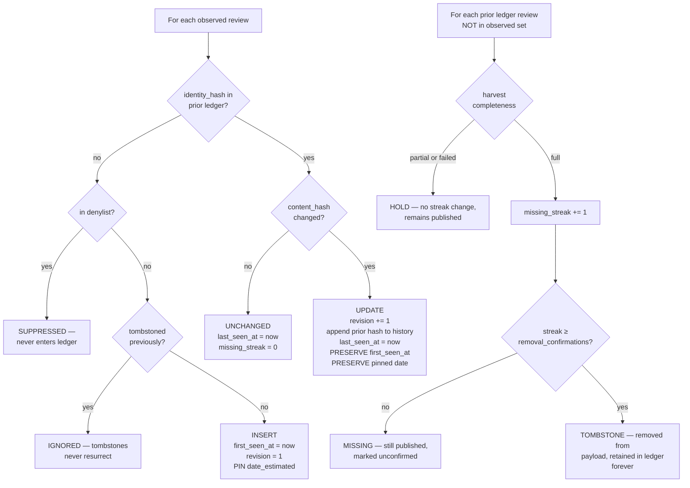
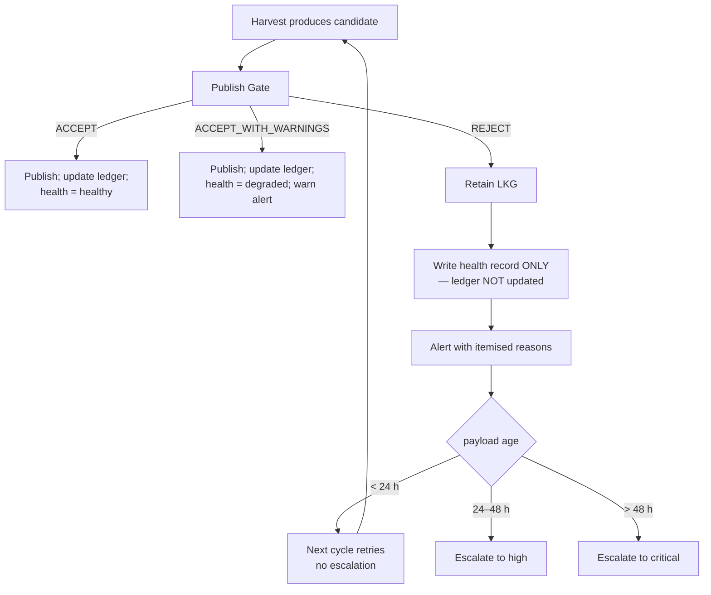
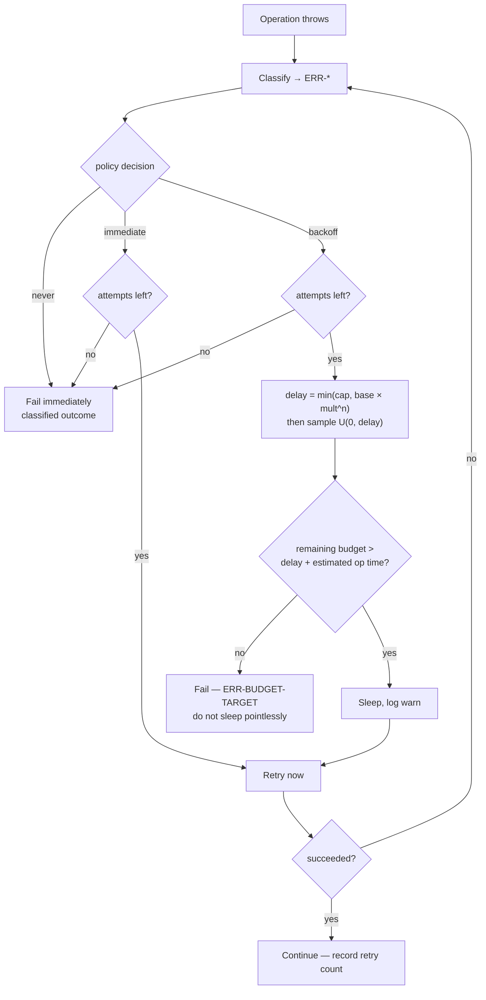
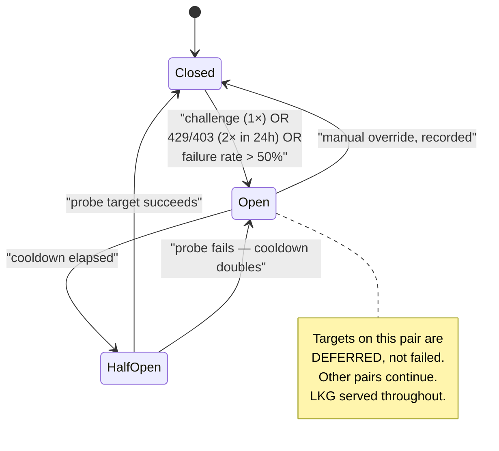

# Part 5 — Processing, Data Rules, and Resilience Mechanics

*Sections 22 through 30. Audience: implementing engineers, QA. This is the correctness core of the system. Every requirement in §22 and §23 has a named test, and a build that omits those tests is not conformant regardless of what else it passes.*

---

# 22. Duplicate Detection

## 22.1 The Problem

The DOM path exposes no durable per-review identifier. Without stable identity, every harvest either duplicates everything or overwrites everything. A single hash over all content fails differently: any edit to a review produces a "new" review plus a phantom deletion of the old one, which a visitor sees as a review vanishing and a near-identical one appearing.

## 22.2 Two-Tier Identity

> **EDR-018 — Duplicate detection is two-tier, and intra-run collapse is deterministic**
> **Serves:** ADR-007 (two-tier identity), RISK-11.
> **Context:** "Is this the same review?" and "did this review change?" are different questions requiring different inputs. Conflating them into one hash makes edits look like deletions.
> **Decision:** Two hashes. `identity_hash` answers "same review?" and is computed over fields that do not change when a review is edited. `content_hash` answers "did it change?" and covers everything displayed. Within a single harvest, records colliding on `identity_hash` are collapsed by a deterministic rule.
> **Alternatives Rejected:** *Rendered position as identity* — ordering is unstable and personalised; catastrophic. *Author name alone* — one author may review multiple listings, and names collide. *Single content hash as identity* — turns every edit into insert-plus-delete, producing visible duplicate-then-vanish churn. *Source-specific internal identifiers where available* — attractive, but they exist only on some access methods, so identity would not survive an adapter migration, breaking ADR-023's premise. Rejected specifically to preserve migration.
> **Trade-off:** Identity is not robust to an author simultaneously renaming themselves and rewriting their text, which produces one transient duplicate (L-04). Accepted, documented, and surfaced by the near-duplicate warning.
> **Scalability:** Identity derivation is O(1) per record and the ledger is a map keyed by `identity_hash`, so reconciliation is O(n) with no nested scans.

| Hash | Answers | Inputs | Changes When |
|---|---|---|---|
| `identity_hash` | "Is this the same review?" | listing key, source, author key, first 512 graphemes of normalised text, rating | Author renames **and** rewrites |
| `content_hash` | "Did it change?" | rating, full text, truncation flag, author name, avatar URL, reply text and date, likes, photo count | Any displayed value changes |

Full derivation is specified in §53.

## 22.3 Duplicate Classes

| Class | Definition | Detection | Action |
|---|---|---|---|
| **Intra-run exact** | Two records in one harvest with identical `identity_hash` | Map collision during validation | **Collapse deterministically** (§22.4) |
| **Cross-run same** | Observed record matches a ledger record's `identity_hash` | Ledger lookup | UPDATE or UNCHANGED (§22.5) |
| **Near-duplicate** | Same `author_key`, text similarity ≥ 0.92, **different** `identity_hash` | Aggregate validation | `warn` finding; gate rule G-11 |
| **Genuine duplicate** | Same person posted the same text twice | Indistinguishable from intra-run exact | Collapsing is **correct behaviour**, not a bug |
| **Transient migration duplicate** | Author renamed and rewrote simultaneously | Near-duplicate warning | Old record tombstones after the confirmation window |

## 22.4 Intra-Run Collapse Rule

| ID | Requirement |
|---|---|
| TR-REC-001 | Records colliding on `identity_hash` within one harvest MUST be collapsed to exactly one record. |
| TR-REC-002 | The surviving record MUST be selected deterministically: the record with the greater count of non-null fields wins; if tied, the record with the longer text wins; if still tied, the earlier node ordinal wins. |
| TR-REC-003 | Collapse MUST occur during validation (§25), not during extraction. Extraction reports what it saw; validation decides what that means. |
| TR-REC-004 | Every collapse MUST emit a `warn`-level aggregate finding with the collision count. |

**Determinism in TR-REC-002 is required by PT-12** (projection determinism). A collapse rule that depends on iteration order produces different payloads from identical inputs, which breaks hash-gating and generates spurious commits.

## 22.5 Reconciliation Decisions

`reconcile(priorLedger, observed, validationReport, config, now) → { ledger, decisions }`

**Pure, deterministic, idempotent, and order-independent.** This is the most consequential function in the system: it is where "what we just saw" becomes "what we know".

### 22.5.1 The Asymmetry Rule (Normative)

| Observation | Trust | Action |
|---|---|---|
| A review **appeared** | **Trusted** regardless of completeness | Insert or update. A record cannot appear spuriously. |
| A review **did not appear** in a `full` harvest | Trusted | Increment `missing_streak` |
| A review **did not appear** in a `partial` or `failed` harvest | **NOT trusted** | **Change nothing.** Do not increment. Do not decrement. |

| ID | Requirement |
|---|---|
| TR-REC-010 | `missing_streak` MUST be incremented only when `completeness === 'full'` or `'full_capped'`. |
| TR-REC-011 | A `partial` or `failed` harvest MUST leave every ledger record's streak, state, and timestamps **unchanged** for absent records. |
| TR-REC-012 | A record MUST be tombstoned only after `reconcile.removal_confirmations` (default 3) consecutive qualifying harvests. |
| TR-REC-013 | A record that reappears MUST have its streak reset to zero. |
| TR-REC-014 | A tombstoned `identity_hash` MUST NEVER become active again under any observation sequence. Verified by **PT-03**. |
| TR-REC-015 | A suppressed `identity_hash` MUST NEVER appear in any projected payload. Verified by **PT-04**. |

**Agent Note — read this before touching `core/reconcile/`.** The asymmetry looks like redundant branching. It is not. An implementer who "simplifies" this by treating absence uniformly has introduced the system's worst possible bug: a single partial page load would begin a countdown to deleting a client's entire review set. The protections are PT-07 (property law) and CH-04 (chaos scenario), and CH-04 is the single most important test in the suite. If only one test could be run before a release, it would be that one.

### 22.5.2 Field Mutation Rules

| Field | On INSERT | On UPDATE | On UNCHANGED | On MISSING (full) |
|---|---|---|---|---|
| `first_seen_at` | set to `now` | **preserved** | preserved | preserved |
| `date_estimated` | pinned | **preserved** | preserved | preserved |
| `last_seen_at` | `now` | `now` | `now` | unchanged |
| `last_updated_at` | `now` | `now` | preserved | preserved |
| `revision` | 1 | +1 | preserved | preserved |
| `hash_history` | empty | prior `content_hash` appended | preserved | preserved |
| `missing_streak` | 0 | 0 | 0 | +1 |
| `state` | `active` | `active` | `active` | `unconfirmed` → `tombstoned` at threshold |

| ID | Requirement |
|---|---|
| TR-REC-020 | `first_seen_at` MUST NEVER change after INSERT. Verified by **PT-05**. |
| TR-REC-021 | The pinned `date_estimated` MUST NEVER change after INSERT. Verified by **PT-06**. |
| TR-REC-022 | Reconciliation MUST return new objects and MUST NOT mutate its inputs. |

## 22.6 Reconciliation Properties

These three laws are why the system is safe to retry, replay, and re-shard.

| Property | Statement | Test | Why It Matters |
|---|---|---|---|
| **Idempotence** | `reconcile(reconcile(L,H),H) ≡ reconcile(L,H)` for fixed `now` | **PT-01** | A shard that crashes after reconciling but before committing can simply re-run |
| **Commutativity** | Shuffling `observed` yields an identical ledger | **PT-02** | Upstream ordering is unstable and personalised; any order-dependence produces nondeterministic output |
| **Monotonicity** | A tombstoned or suppressed id never becomes active | **PT-03** | Prevents "deleted review comes back" — embarrassing and legally significant |
| **Preservation** | `first_seen_at` and pinned dates never change after INSERT | **PT-05, PT-06** | Historical integrity and stable sort order |

| ID | Requirement |
|---|---|
| TR-REC-030 | `now` MUST be an explicit parameter. Reading the clock inside `reconcile` makes every property law untestable (DR-2). |
| TR-REC-031 | The ledger MUST be represented internally as a map keyed by `identity_hash`, not an array. An array forces nested scans and produces O(n²) allocation at 1,000+ reviews. |

## 22.7 Near-Duplicate Detection

| Aspect | Rule |
|---|---|
| Criteria | Same `author_key`, text similarity ≥ `validate.near_duplicate_threshold` (default 0.92), different `identity_hash` |
| Severity | `warn` — never fatal |
| Purpose | Early signal for RISK-11 and for the transient migration duplicate (L-04) |
| Gate interaction | G-11 warns when a near-duplicate cluster exceeds three members |
| Action | Never automatic. A near-duplicate is reported, never merged. |

**Near-duplicates are reported, not merged.** Two reviews that look similar may genuinely be two reviews. Automatic merging would silently delete real content, which is a worse failure than displaying two similar cards.

---

# 23. Review Normalization

## 23.1 This Is the Security Boundary

Everything downstream trusts that the Normalizer did its job. Review text is attacker-controllable input — anyone can leave a review — that ends up in the DOM of every client website simultaneously. **This module is the single highest-consequence piece of code in the system** and is built in phase 2, before anything that produces data.

## 23.2 Contract

| Aspect | Specification |
|---|---|
| **Input** | `ExtractedReview` (untrusted), `EffectiveConfig` |
| **Output** | `NormalizedReview` (trusted, branded `CleanString` fields) or `Quarantined` |
| **Purity** | **pure** |
| **Idempotent** | **yes** — `normalize(normalize(x)) ≡ normalize(x)`, verified by PT-11 |
| **Errors** | `ERR-CLEAN-MARKUP-SURVIVED` (critical — indicates a defect in this module) |

## 23.3 ALG-NORMALIZE — The Eight-Step Pipeline

> **EDR-019 — Normalisation is a fixed eight-step ordered pipeline, and the order is normative**
> **Serves:** INV-05.
> **Context:** Each step is individually obvious. The order is not, and three of the orderings are load-bearing in ways that are invisible until they are wrong.
> **Decision:** Eight steps in the fixed order below, each independently unit-tested, with the ordering rationale recorded per step.
> **Alternatives Rejected:** *A single regex-based sanitiser* — cannot handle nested entities, and a sanitiser that escapes rather than removes leaves markup that a consumer might later un-escape. *Escaping instead of removing* — leaves the payload carrying markup that is one careless `innerHTML` away from executing; removal eliminates the class entirely. *Sanitising at render time in the frontend* — moves the boundary to code TradyPerch does not control on sites TradyPerch does not control. *Reordering for efficiency* — the pipeline is under 1% of runtime; there is nothing to gain.
> **Trade-off:** Review text loses all formatting, including emphasis. Line breaks are preserved; nothing else is. This is the correct trade for eliminating stored XSS across every client site simultaneously (L-26).
> **Scalability:** Constant per record. New sources add no new sanitisation path, because all sources converge on this one module.

| # | Step | Detail | Why This Position |
|---|---|---|---|
| 1 | **Decode entities** | Resolve HTML entity references | **Must precede stripping.** Otherwise `&lt;script&gt;` survives as literal text and re-encodes into markup downstream |
| 2 | **Strip markup** | Remove all tags and tag-like constructs. **Remove, do not escape** | Must follow decoding, for the reason above |
| 3 | **Unicode normalise** | NFC | Before length bounding, so grapheme counting is meaningful |
| 4 | **Remove control characters** | Strip C0/C1 except `\n` and `\t`; strip zero-width and **bidi-override** characters | Bidi overrides can visually reorder text — a real spoofing vector |
| 5 | **Canonicalise whitespace** | `\r\n`/`\r` → `\n`; collapse ≥ 3 newlines to 2; collapse horizontal runs; trim | After control removal, so invisible characters do not survive as "content" |
| 6 | **Detect truncation** | Match locale-aware markers; set `text_truncated`; remove the marker | After whitespace canonicalisation, so matching is reliable |
| 7 | **Bound length** | Cut at `normalize.max_text_length` (5,000) on a **grapheme cluster** boundary; set `text_clipped` | Last, so the bound applies to final content |
| 8 | **Type and brand** | Return branded `CleanString` values | Makes the boundary enforceable by the type checker |

| ID | Requirement |
|---|---|
| TR-NORM-010 | Step 2 MUST **remove** markup, not escape it. The payload contains no markup of any kind, and there is no `text_html` field — there must never be one. |
| TR-NORM-011 | Steps MUST execute in exactly this order. A unit test MUST assert that a nested-entity payload (`&amp;lt;script&amp;gt;`) does not survive. |
| TR-NORM-012 | Bidi **override** characters (RLO/LRO) MUST be stripped. Bidi **marks** required for correct rendering of mixed-direction content MUST be preserved. These are different characters with different purposes. |
| TR-NORM-013 | Normalisation MUST be idempotent. Verified by **PT-11**. |

## 23.4 Length Bounding

> **EDR-020 — Length bounding is grapheme-cluster-aware and applied last**
> **Serves:** INV-05, §46 (payload size).
> **Context:** Cutting a string at 5,000 *code units* splits surrogate pairs and ZWJ emoji sequences, producing mojibake — visible garbage characters on the client's website.
> **Decision:** Bound at 5,000 **grapheme clusters**, computed after all other transformations.
> **Alternatives Rejected:** *Bound by code units* — fast and wrong; splits emoji and combining sequences. *Bound by bytes* — worse, since it truncates multi-byte characters mid-sequence. *Bound before normalisation* — the bound would apply to pre-cleaning content, so a review padded with 10,000 characters of markup would be cut before the markup was removed, discarding real text. *No bound* — unbounded attacker-controlled input in a size-budgeted payload (THREAT-04).
> **Trade-off:** A 5,000-grapheme bound is a much larger byte count for CJK text than for Latin. §46.3's payload size budget accounts for this.
> **Scalability:** Constant per record; the bound is what makes payload size predictable.

| ID | Requirement |
|---|---|
| TR-NORM-020 | Bounding MUST cut on a grapheme cluster boundary. A test MUST assert that a ZWJ emoji sequence at the boundary is not split. |
| TR-NORM-021 | A bounded record MUST set `text_clipped: true`. |
| TR-NORM-022 | `text_clipped` and `text_truncated` are **different flags** with different meanings: `text_clipped` means the engine bounded it; `text_truncated` means the source's text was longer than what was retrieved. Both may be true. |

## 23.5 Script and Emoji Handling

| Concern | Rule |
|---|---|
| Emoji | **Preserved exactly**, including ZWJ sequences and skin-tone modifiers |
| RTL text | Preserved. Bidi *overrides* stripped; bidi *marks* preserved |
| CJK | Preserved |
| Combining marks | Preserved after NFC |
| **Homoglyph author names** | **NOT normalised away** |

| ID | Requirement |
|---|---|
| TR-NORM-030 | Visually identical author names using different scripts MUST NOT be merged. Two authors with visually identical names are two authors; merging them is a data-integrity bug, not a feature. A unit test MUST assert this. |

## 23.6 Author Name Handling

| Field | Treatment |
|---|---|
| `author.name` (published) | Preserved as given, with only steps 1–5 applied. **Never abbreviated, initialised, or anonymised by default** (FR-042) |
| `author_key` (internal) | Casefold → strip diacritics → collapse whitespace → remove punctuation → hash. Used for identity matching only, **never published** |
| Anonymous authors | Missing or placeholder name yields `author.name: null` and an `author_key` derived from a per-listing anonymous bucket plus content, so two anonymous reviews are not merged |
| `author.initials` | Derived, 1–2 graphemes, so a consumer can render an avatar without fetching an image (ADR-014) |

| ID | Requirement |
|---|---|
| TR-NORM-040 | Anonymous reviews MUST NOT collapse into one another. The anonymous `author_key` MUST incorporate content, not only the listing. |

## 23.7 Language Detection

| Aspect | Rule |
|---|---|
| Method | Script-range analysis first (Devanagari, Arabic, CJK, Cyrillic, Latin), then stopword frequency for Latin disambiguation |
| Output | `{ code: ISO 639-1 \| null, confidence: 0–1 }` |
| Minimum length | Below 12 graphemes, return `null` with confidence 0 |
| Dependency | **No large model, no network** (DEP-2). A compact internal implementation is required |
| Use | Optional consumer-side filtering; input to future AI enrichment. **Never used to reject a review** |

| ID | Requirement |
|---|---|
| TR-NORM-050 | Language detection MUST NEVER cause a record to be rejected or quarantined. A wrong guess is worse than no guess, which is why short text returns `null`. |

## 23.8 URL Validation

| Field | Rule |
|---|---|
| `author.avatar_url` | MUST parse as HTTPS; host MUST match the source's avatar host allowlist; size query parameters MAY be normalised; otherwise `null`. **Never fetched** |
| `author.profile_url` | MUST parse as HTTPS and match the source host allowlist; otherwise `null` |
| `source_url` | **Constructed by the engine** from the canonical listing identity. Never taken from page content |

| ID | Requirement |
|---|---|
| TR-NORM-060 | A URL failing allowlist validation MUST be set to `null`, not passed through and not rejected as a record-level error. |
| TR-NORM-061 | `source_url` MUST be engine-constructed (FR-091). A URL lifted from page content is attacker-influenced. |
| TR-NORM-062 | The engine MUST NEVER fetch an avatar or profile URL (ADR-014). |

**Rationale for the allowlist.** An unvalidated URL from page content, published into a client's site as an image `src`, is an open redirect and a tracking vector (THREAT-03). Allowlisting is cheap and eliminates it. Verified by `tests/security/url-allowlist.test.mjs`.

---

# 24. JSON Generation Rules

## 24.1 Projector Contract

| Aspect | Specification |
|---|---|
| **Input** | `Ledger`, `EffectiveConfig`, `EngineMeta` |
| **Output** | `Artifacts { reviews, latest, stats, schemaOrg?, index }` |
| **Purity** | **pure** |
| **Determinism** | **Identical ledger + identical config ⇒ byte-identical output.** Verified by PT-12 |

## 24.2 ALG-PROJECT — Generation Steps

| # | Step |
|---|---|
| 1 | Filter out tombstoned and suppressed records |
| 2 | Apply display filters: `min_text_length`, `languages`, `include_rating_only`, optional `min_rating` |
| 3 | Sort by the composite key `(date_estimated desc, first_seen_at desc, identity_hash asc)` — total and stable |
| 4 | Map each ledger record to its public projection for the target `schema_version` |
| 5 | Compute aggregates (§24.5) |
| 6 | Emit `reviews.json`, `latest.json`, `stats.json`, optional `schema-org.json`, and the listing `index.json` |
| 7 | Serialise with stable key ordering; compute the content hash over canonical bytes |

## 24.3 Serialisation Rules

> **EDR-021 — Payloads are minified with stable key order; ledgers are pretty-printed with stable key order**
> **Serves:** FR-065 (hash-gated writes), §46 (storage).
> **Context:** The two stores have opposite readers. Payloads are read by machines over a network; ledgers are read by humans during incidents.
> **Decision:** Payloads minified, ledgers pretty-printed, **both with stable key ordering and a trailing newline on ledgers.**
> **Alternatives Rejected:** *Pretty-print both* — payloads grow ~25% for readability nobody uses; the payload is consumed by `response.json()`. *Minify both* — makes the ledger diff a single unreadable line, destroying the "Git is the database and diffs are the audit log" property that the entire persistence strategy depends on. *Unstable key ordering* — breaks content hashing, so hash-gating stops working and every run rewrites every file, multiplying commit churn.
> **Trade-off:** Two serialisation modes to maintain. Trivial.
> **Scalability:** Stable ordering becomes more valuable as history grows, because diffs stay meaningful.

| ID | Requirement |
|---|---|
| TR-PROJ-010 | Payload artifacts MUST be minified with stable key ordering, UTF-8, no BOM, LF line endings. |
| TR-PROJ-011 | Ledgers MUST be pretty-printed with stable key ordering and a trailing newline. |
| TR-PROJ-012 | Key ordering MUST be deterministic and MUST NOT depend on object insertion order. |
| TR-PROJ-013 | Projection MUST be deterministic: identical inputs produce byte-identical output. Verified by **PT-12**. |

> **EDR-022 — `generated_at` is excluded from every content hash**
> **Serves:** FR-065.
> **Context:** Every artifact carries a `generated_at` timestamp. If it participates in the content hash, the hash changes on every run even when nothing else did — so hash-gating never skips a write, and every client produces a commit on every cycle.
> **Decision:** `generated_at` lives in the envelope and in the manifest, and is explicitly excluded from the canonical byte sequence over which the content hash is computed.
> **Alternatives Rejected:** *Omit `generated_at` entirely* — consumers legitimately need to know payload age; `MET-payload-age` depends on it. *Round the timestamp to the cadence interval* — reduces churn but does not eliminate it, and produces a misleading timestamp. *Compare payloads field-by-field instead of by hash* — works, but is slower and duplicates logic the hash already provides.
> **Trade-off:** Two byte sequences exist per artifact: the written bytes and the hashed bytes. This must be implemented carefully and tested (§54.3).
> **Scalability:** Essential. Without it, commit volume grows linearly with client count × cadence regardless of whether anything changed.

## 24.4 Display Filters

| Filter | Default | Effect |
|---|---|---|
| `display.order` | `newest` | Sort direction |
| `display.latest_count` | 20 | Size of the `latest.json` slice |
| `display.min_text_length` | 0 | Excludes very short reviews |
| `display.languages` | `null` (all) | Restricts to listed language codes |
| `display.include_rating_only` | `true` | Whether reviews with no text are published |
| `display.min_rating` | **`null`** | Excludes ratings below the threshold |

| ID | Requirement |
|---|---|
| TR-PROJ-020 | `display.min_rating` MUST default to `null`. Setting it to a non-null value triggers validation rule V-8, which requires a written justification in `notes`. |
| TR-PROJ-021 | Filters MUST be applied before aggregate computation, so that `stats` describes what was actually published. |

**On V-8 as deliberate friction.** The product position is that TradyPerch declines to filter out low ratings. The config system does not forbid it outright — a jurisdiction or platform might someday require selective display — but it makes the choice visible, justified in writing, and surfaced in review. Mechanisms that make the wrong choice slightly uncomfortable are more durable than mechanisms that make it impossible and get bypassed.

## 24.5 Aggregate Computation

| Field | Computation | Constraint |
|---|---|---|
| `total_count` | Count of published reviews, post-filter, post-suppression | — |
| `advertised_total` | As reported by the source | Never substituted for `total_count` |
| `coverage` | `total_count / advertised_total` | `null` when advertised total is unknown |
| `mean_rating` | Mean over **published** reviews, 2 decimal places | Computed, never copied from `advertised_rating` |
| `advertised_rating` | As reported by the source | — |
| `distribution` | Counts keyed `"1"`…`"5"` | Sums to `total_count` |
| `with_text_count` / `with_reply_count` | Counts | — |
| `newest_review_date` / `oldest_review_date` | From pinned estimates | `null` if all estimates are null |
| `languages` | Count per detected code | Excludes `null` |
| `completeness` | From the harvest that produced this payload | — |
| `last_full_harvest_at` | Last time a `full` harvest succeeded | **The honest freshness signal** |

| ID | Requirement |
|---|---|
| TR-PROJ-030 | `mean_rating` MUST be computed from published reviews and MUST NOT be replaced by `advertised_rating` even when they diverge. |
| TR-PROJ-031 | Publishing both `mean_rating` and `advertised_rating` is deliberate. Divergence means either coverage is incomplete or extraction is wrong, and a consumer or a monitoring check must be able to see that without access to internals. |

## 24.6 Artifact Set

| Artifact | Purpose | Typical Size (120 reviews) | Cache TTL |
|---|---|---|---|
| `reviews.json` | Complete payload | ~108 KB / ~37 KB gzip | Long |
| `latest.json` | Top-N for the common widget case | ~19 KB / ~7 KB gzip | Medium |
| `stats.json` | Aggregates only — badges and headlines | ~0.9 KB | Medium |
| `schema-org.json` | Structured-data projection, opt-in | ~28 KB | Long |
| `index.json` (listing) | Manifest: hashes, counts, versions, `generated_at` | ~1 KB | **Short — the freshness pointer** |

**Consumer contract:** read `index.json` first (short TTL), then fetch the referenced artifact (long TTL). This is the manifest-plus-immutable-content pattern; it gives both freshness and cacheability without any cache-purge capability, which matters because the zero-cost hosting options do not offer programmatic purging.

## 24.7 schema.org Projection

| Concern | Rule |
|---|---|
| Default | **Off.** `publish.schema_org` defaults to `false` |
| Shape | `AggregateRating` on the business entity plus an array of `Review` objects |
| Honesty | Only reviews the engine actually holds. `reviewCount` reflects published reviews; `advertised_total` MUST NOT be substituted to inflate it |
| Dates | Emitted only when `date_precision` is `day` or `week`; coarser precision omits `datePublished` rather than asserting a false date |
| Warning | Search engines have specific and changing policies about self-serving review markup. **Assumption: policies must be verified before enabling for a client** |

| ID | Requirement |
|---|---|
| TR-PROJ-040 | `publish.schema_org` MUST default to `false` and MUST require per-client opt-in. Emitting markup that violates a search engine's guidelines can result in a manual action against the client's site — a harm the engine must not cause by default. |
| TR-PROJ-041 | The schema.org recipe MUST carry the policy warning prominently. |

## 24.8 Payload Sharding

Triggered when `reviews.json` exceeds `publish.payload_shard_threshold` (default 1 MB, roughly 1,200 reviews).

| Aspect | Design |
|---|---|
| Shape | `reviews.page-1.json`, `reviews.page-2.json`, … each ≤ threshold, plus a `pagination` block in the listing manifest |
| Ordering | Pages ordered newest-first, so page 1 is what almost every consumer needs |
| Contract | `pagination: { page, page_size, total_pages, total_count, next }` |
| Compatibility | `latest.json` and `stats.json` are unaffected, so the common integration never notices sharding |
| Status | **Deferred to v1.1** (L-23). `max_reviews` protects in the interim |

---

# 25. JSON Validation Rules

## 25.1 Two Distinct Validations

| Validation | Subject | Stage | Failure Effect |
|---|---|---|---|
| **Data validation** | Normalized records and the harvest as a whole | 5 | Findings → quarantine or completeness classification |
| **Schema validation** | The generated payload document | 9 (gate rule G-01) | **REJECT** — `ERR-GATE-REJECT-SCHEMA`, critical |

Both are specified here. The schema documents themselves are in §52.

## 25.2 Validator Contract

| Aspect | Specification |
|---|---|
| **Input** | `NormalizedReview[]`, `AcquisitionReport`, `EffectiveConfig` |
| **Output** | `ValidationReport { recordFindings[], aggregateFindings[], completeness, coverage, counts, quarantined[] }` |
| **Purity** | **pure** |
| **Constraint** | **The Validator produces verdicts; it never modifies data** |

## 25.3 Per-Record Findings

| Check | Severity | Effect |
|---|---|---|
| Rating is an integer in [1,5] | **fatal** | Quarantine record |
| `author_key` derivable | **fatal** | Quarantine record |
| **Text contains no markup** | **fatal** | **Quarantine and alert `error`. This is a self-check on the security boundary and MUST exist** |
| `relative_date_raw` non-empty | warn | Keep; `date_estimated: null` |
| Text length within bound | info | Already enforced by the cleaner |
| Avatar/profile URL valid or null | warn | Set to `null` |
| Language detected or null | info | — |
| Reply, if present, has text | warn | Drop empty reply |

| ID | Requirement |
|---|---|
| TR-VAL-010 | The markup self-check MUST be implemented. It validates that the Normalizer worked. Its failure class `ERR-CLEAN-MARKUP-SURVIVED` is `critical` severity because it indicates the security boundary itself failed. |
| TR-VAL-011 | The Validator MUST NOT modify any record. Setting an invalid URL to `null` is performed by the Normalizer (§23.8); the Validator only reports. |

**On TR-VAL-010.** A self-check that verifies the previous stage did its job looks redundant. It is the third of seven layers protecting against stored XSS (§51.2), and it is the layer that turns a silent Normalizer defect into a loud, attributable alert.

## 25.4 Aggregate Findings

| Check | Rule | Severity |
|---|---|---|
| Coverage | `extracted / advertisedTotal ≥ validate.coverage_min` (0.95) for `full` | Determines completeness |
| Intra-run duplicates | Identical `identity_hash` within one harvest ⇒ collapse deterministically | warn |
| Near-duplicates | Same `author_key`, similarity ≥ 0.92, different `identity_hash` | warn |
| Mean rating plausibility | Computed mean within `validate.rating_tolerance` (0.30) of advertised | warn |
| Distribution degeneracy | Not 100% single-rating unless the listing genuinely has ≤ 3 reviews | warn |
| **Quarantine rate** | Quarantined ÷ total ≤ `validate.quarantine_max` (0.05) | **fatal above threshold** |
| Selector strategy health | Per §20.4 | warn / error |

| ID | Requirement |
|---|---|
| TR-VAL-020 | A quarantine rate above threshold MUST escalate to `ERR-VALIDATE-QUARANTINE-RATE` at target scope. A systemic extraction failure must not be reported as many independent record warnings. |

## 25.5 Completeness Classification

| Input | Classification |
|---|---|
| Stop reason `target_reached`, or `exhausted` with coverage ≥ 0.95 | `full` |
| Stop reason `cap_reached` | `full_capped` |
| Stop reason `stalled` with coverage < 0.95, or `budget_exhausted` | `partial` |
| Stop reason `error` or challenge | `failed` |

| ID | Requirement |
|---|---|
| TR-VAL-030 | Completeness MUST be computed from the stop reason **and** coverage together, never from coverage alone. A harvest that reached the advertised total is `full` even if the advertised total was itself wrong. |
| TR-VAL-031 | Completeness MUST propagate to the reconciler (§22.5), the gate (§26.3), the health record, and the payload's `harvest_completeness` and `stats.completeness`. |

## 25.6 Payload Schema Validation

| ID | Requirement |
|---|---|
| TR-VAL-040 | Every generated payload MUST validate against `schemas/payload.v1.schema.json` before publication. Failure is gate rule G-01 → `ERR-GATE-REJECT-SCHEMA`, severity **critical**. |
| TR-VAL-041 | A schema validation failure MUST be treated as an engine defect, not a data problem. It means the projector produced a document its own contract forbids. |
| TR-VAL-042 | Every ledger MUST validate against `schemas/ledger.v1.schema.json` on read. Failure is `ERR-STATE-CORRUPT`. |
| TR-VAL-043 | Schema validation MUST run in CI against every fixture and every client config, so contract drift is caught before it reaches production. |

---

# 26. Publish Rules

## 26.1 The Publish Gate

The Gate sits between the Projector and the Publisher. It is **pure**, receives both the candidate and the currently published payload, and can therefore reason about *change* rather than only about *state*.

| Aspect | Specification |
|---|---|
| **Input** | candidate `Artifacts`, current `Artifacts` (or a first-publish marker), `ValidationReport`, `EffectiveConfig` |
| **Output** | `GateVerdict { decision: ACCEPT \| ACCEPT_WITH_WARNINGS \| REJECT, reasons: GateReason[] }` |
| **Purity** | **pure** |
| **Coverage requirement** | **100% statements. Not negotiable** |

## 26.2 Evaluation Semantics

> **EDR-023 — The Gate evaluates all rules and returns all reasons; it never short-circuits**
> **Serves:** ADR-011.
> **Context:** The obvious implementation returns on the first failing rule.
> **Decision:** Every rule is evaluated on every invocation, and the verdict carries every reason.
> **Alternatives Rejected:** *Short-circuit on first REJECT* — the alert then names one problem when there are four, so the engineer fixes one and the next run rejects again for the next reason. Incident time multiplies by the number of concurrent problems. *Evaluate lazily by severity* — same defect, more complexity. *Return a boolean* — loses everything that makes the alert actionable.
> **Trade-off:** A few microseconds of unnecessary evaluation on an already-doomed candidate. Irrelevant — the gate is a pure function over in-memory data.
> **Scalability:** Constant per target.

| ID | Requirement |
|---|---|
| TR-GATE-001 | All twelve rules MUST be evaluated on every invocation. |
| TR-GATE-002 | The verdict MUST carry an itemised reason per violated rule, including the rule id, the threshold, and the observed value. |
| TR-GATE-003 | Every rule MUST be independently testable and independently configurable. |
| TR-GATE-004 | Gate statement coverage MUST be 100%. Every rule needs a test proving it rejects, **and** a test proving it does not reject spuriously. |

## 26.3 Gate Rule Set

| ID | Rule | Default Threshold | Verdict | Error Class | Overridable |
|---|---|---|---|---|---|
| **G-01** | Candidate validates against `payload.v1.schema.json` | — | **REJECT** | `ERR-GATE-REJECT-SCHEMA` (critical) | **no** |
| **G-02** | Candidate non-empty when prior payload was non-empty | — | **REJECT** | `ERR-GATE-REJECT-EMPTY` (critical) | **no** |
| **G-03** | Count has not dropped by more than `max_count_drop_ratio` | 0.20 | **REJECT** | `ERR-GATE-REJECT-COUNT-DROP` | yes |
| **G-04** | Mean rating has not shifted by more than `max_rating_shift` | 0.50 | **REJECT** | `ERR-GATE-REJECT-RATING-SHIFT` | yes |
| **G-05** | If completeness is `partial`, count must not have dropped **at all** | — | **REJECT** | `ERR-GATE-REJECT-COVERAGE` | yes |
| **G-06** | Quarantine rate ≤ `quarantine_max` | 0.05 | **REJECT** | `ERR-VALIDATE-QUARANTINE-RATE` | **no** |
| **G-07** | No record-level `fatal` findings remain | — | **REJECT** | `ERR-VALIDATE-AGGREGATE` | **no** |
| **G-08** | Coverage ≥ `coverage_min` OR completeness is `full_capped` | 0.95 | WARN | — | n/a |
| **G-09** | Computed mean within `rating_tolerance` of advertised | 0.30 | WARN | — | n/a |
| **G-10** | Payload size within budget | 2 MB | WARN | — | n/a |
| **G-11** | No near-duplicate cluster larger than 3 | — | WARN | — | n/a |
| **G-12** | `advertised_total` has not dropped beyond tolerance | 0.40 | WARN | — | yes |

**G-05 is the rule that catches the partial-harvest failure**, and it is deliberately stricter than G-03: in a partial harvest, *any* count drop is untrustworthy, because absence carries no information.

## 26.4 First-Publish Exception

On a client's first ever publish there is no prior payload, so the change-based rules have nothing to compare against.

| Rule | First Publish |
|---|---|
| G-01, G-06, G-07, G-08 | **Still apply** |
| G-02, G-03, G-04, G-05, G-12 | **Skipped** |

| ID | Requirement |
|---|---|
| TR-GATE-010 | A first publish MUST be marked `first_publish: true` in the manifest. |
| TR-GATE-011 | A first publish MUST still be rejectable for being schema-invalid or low-coverage. That is exactly what onboarding verification needs. |
| TR-GATE-012 | "No prior payload exists" MUST be distinguished from "the prior payload could not be read" (TR-ENV-013). Only the former triggers the first-publish exception. |

## 26.5 Rejection Semantics

> **EDR-024 — Rejection discards observations from both stores; the Ledger is not written**
> **Serves:** ADR-011, ADR-006.
> **Context:** The obvious implementation retains the payload but still writes the ledger, on the reasoning that the ledger is internal and more data is better.
> **Decision:** On REJECT, the ledger is **not** written. Only a health record is written. The harvest's observations are discarded entirely.
> **Alternatives Rejected:** *Write the ledger, retain the payload* — the payload is protected but the **state is polluted**. A subsequent `tpre project` run would then produce the bad payload from the bad ledger with no gate involvement at all, because `project` regenerates from state without re-harvesting. The protection would be bypassed by the recovery tool. *Write the ledger to a quarantine branch* — added complexity for data that is, by definition, not trusted. *Write partial ledger updates for insertions only* — plausible, but makes the ledger's state depend on gate outcomes, which breaks the reasoning that reconciliation is a pure function of observations.
> **Trade-off:** A rejected harvest's genuine new reviews are discarded and must be re-observed next cycle. Cheap: the next cycle is hours away and the reviews will still be there.
> **Scalability:** Unchanged.

| ID | Requirement |
|---|---|
| TR-GATE-020 | On REJECT, the engine MUST write **only** a health record. It MUST NOT write the ledger, the payload, or the identity cache. |
| TR-GATE-021 | On REJECT, an alert MUST be raised with the itemised reasons. |
| TR-GATE-022 | REJECT MUST map to exit code 5 and MUST NOT fail the CI job. |

## 26.6 Publication Steps

| # | Step | Rule |
|---|---|---|
| 1 | Stage all artifacts for all targets in the shard into the `data` checkout | Batched, not per target |
| 2 | **Hash gate**: if new bytes equal current bytes, do not touch the file | FR-065 |
| 3 | Commit once per shard with the structured message (§35.3) | CON-13 |
| 4 | Push; on non-fast-forward, fetch, rebase, retry — up to 3 attempts (2 s, 6 s, 18 s) | Never force |
| 5 | Write ledger and health to the `state` checkout | Separate commit |
| 6 | Push `state` with the same retry logic | — |

| ID | Requirement |
|---|---|
| TR-PUB-010 | `--force-with-lease` and `--force` MUST NOT be used against `data` or `state`. |
| TR-PUB-011 | After 3 failed push attempts, `ERR-PUBLISH-CONFLICT` is raised, artifacts are uploaded as CI artifacts, and the next run reproduces them deterministically. |
| TR-PUB-012 | Shards write disjoint client paths, so a rebase can never produce a content conflict — only an ancestry update (§58.3). |

## 26.7 Publication Ordering

> **EDR-025 — Publication order is payload first, then state — never the reverse**
> **Serves:** INV-04, INV-02.
> **Context:** Two commits to two branches cannot be made atomic. A crash between them leaves the system inconsistent in one of two ways, and the two are not equally recoverable.
> **Decision:** Commit the payload first, then the state.
> **Alternatives Rejected:** *State first, then payload* — a crash between them leaves a ledger recording reviews as published that were never published. The next run reconciles from that ledger, sees no changes, hash-gates the write, and **the payload is never produced**. The system silently converges on a wrong state. *Attempt two-phase commit across branches* — Git offers no such primitive; simulating one adds a coordination file that is itself subject to the same problem. *Single combined branch* — rejected architecturally by ADR-012.
> **Trade-off:** A crash between the two leaves a published payload that the ledger does not yet justify. The next run re-reconciles from the older ledger and produces the same payload — a benign no-op, because reconciliation is idempotent.
> **Scalability:** Unchanged.

**The general principle worth extracting:** when two writes cannot be atomic, order them so a crash between them leaves a state the next run can repair. Publishing before recording state is repairable. Recording state before publishing is not.

## 26.8 Force Override

| Aspect | Rule |
|---|---|
| Invocation | `--force-publish` on **manual dispatch only**. Never available to a scheduled run |
| Effect | Downgrades G-03, G-04, G-05, and G-12 to warnings |
| Never overridable | **G-01, G-02, G-06, G-07** — these indicate defects or genuine corruption, not threshold disagreements |
| Audit | Records operator, timestamp, overridden rules, and a **mandatory free-text reason** in the manifest and the commit message |
| Procedure | The runbook requires manual verification of the actual source count before overriding |
| Use case | A genuine large drop: client deleted duplicate listings, platform bulk-removed reviews |

| ID | Requirement |
|---|---|
| TR-GATE-030 | `TPRE_FORCE_PUBLISH=true` without `TPRE_FORCE_REASON` MUST exit 2. |
| TR-GATE-031 | A scheduled run MUST ignore force flags entirely. |

---

# 27. Rollback Rules

## 27.1 Three Independent Rollback Units

Conflating these is a common and costly mistake. They roll back independently, and keeping them separate is what makes rollback cheap.

| Deployable | Artifact | Rollback Mechanism | Time | Data Loss |
|---|---|---|---|---|
| **Engine** | Code on `main` | Revert the merge commit | ~5 min | none |
| **Configuration** | `clients/`, `profiles/`, `selectors/` | Revert the config commit | ~2 min | none |
| **Data** | Payloads on `data` | `git revert` on `data`, or `tpre project` | ~10 min | none |

## 27.2 Rollback Decision Table

| Problem | Rollback | Preferred Mechanism | Why |
|---|---|---|---|
| Bad engine release | Revert on `main` | `git revert`; next cycle uses reverted code | The engine is adopted, not deployed |
| Bad selector pack | Revert the profile pin | One-line edit | **No code revert, no release, no data change** |
| Bad payload published | `tpre project` from the Ledger | Preferred over `git revert` | Also repairs a projector defect, not just the symptom |
| Bad payload, Ledger also suspect | `git revert` the `data` commit | Restores exact prior bytes | Ledger cannot be trusted to regenerate |
| Bad config change | Revert the config commit | — | — |
| Bad ledger state | Restore the prior ledger version from `state` history; re-run | Idempotence re-derives | §28.4 |
| Schema regression breaking consumers | Republish the previous major in parallel | §36.5 | Consumers cannot be redeployed on demand |

| ID | Requirement |
|---|---|
| TR-PUB-020 | `tpre project` MUST be preferred over `git revert` for payload rollback whenever the Ledger is sound, because it repairs the cause rather than the symptom and requires zero source requests. |
| TR-PUB-021 | Selector pack rollback MUST NOT require a code change or a release. This is the entire payoff of ADR-009. |

## 27.3 Rollback Constraints

| ID | Requirement |
|---|---|
| TR-PUB-022 | Rollback MUST NOT require re-acquisition from any source. Every rollback path in §27.2 is offline. |
| TR-PUB-023 | After any payload rollback, `scripts/verify-payload.mjs` MUST be run against the public URL, and the CDN TTL must be allowed to expire or a content-addressed URL used to verify immediately. |
| TR-PUB-024 | A rollback that reveals an engine defect MUST be followed by a regression test reproducing the root cause (§61.10). |

---

# 28. Recovery Rules

## 28.1 Recovery Philosophy

| Statement | Consequence |
|---|---|
| The published payload is the only thing visitors see, and it is never degraded by a failure | Every recovery path preserves LKG (INV-02) |
| The Ledger is the source of truth; the payload is derivable | Any payload corruption is repaired by `tpre project` with zero acquisition |
| Git history is the backup | Every prior payload and ledger state is one revert away. RPO ≈ 0 |
| Recovery is automatic where possible, scripted where not | Automatic: gate rejection, retry exhaustion, publish conflict. Scripted: ledger corruption, identity drift, repository loss |

## 28.2 Recovery Matrix

| Failure | Detection | Automatic Recovery | Manual Step | Visitor Impact | RTO |
|---|---|---|---|---|---|
| Transient network error | Error class | Retry per policy | none | **none** | seconds |
| Retry exhaustion | Target outcome | LKG retained; next cycle retries | none | **none** | 1 cycle |
| Bot challenge | Challenge detector | Breaker opens; LKG retained | Review policy; consider migration | **none** | hours–days |
| Structure change | Canary or `ERR-PARSE-STRUCTURE` | LKG retained; alert names the failed assertion | Selector pack fix | **none** | ~60 min |
| Partial harvest | Completeness classification | Additions merged; gate likely rejects | Investigate if persistent | **none** | 1 cycle |
| Gate rejection | Gate verdict | LKG retained; reasons alerted | Review reasons | **none** | 1 cycle |
| Publish conflict | Push rejection | Rebase-retry ×3; artifacts preserved | none — next run reproduces | **none** | 1 cycle |
| Ledger corruption | Schema validation on read | Abort target; LKG retained | Restore prior ledger from Git | **none** | ~15 min |
| Payload corruption (engine bug) | Payload verification check | — | Revert engine; `tpre project` | Until CDN TTL | ~30 min |
| Identity drift | Name similarity check | Abort target; LKG retained | Verify listing; update config | **none** | ~20 min |
| Repository loss | Absence | — | Restore from a clone (§60.6) | **none** until CDN TTL | ~2 h |
| CI platform outage | Staleness alert | — | Wait, or run the CLI locally | **none** until staleness | hours |
| Total source access loss | Repeated challenges | Breaker at max cooldown | Migrate to official API | **none** | ~1 h per client |

**Every row's visitor impact is "none" except payload corruption caused by an engine defect** — and that one is bounded by CDN TTL and repaired by regenerating from the Ledger without touching the network.

## 28.3 Automatic Recovery Flow

## 28.4 Ledger Recovery

| Scenario | Procedure |
|---|---|
| Schema-invalid ledger | 1. Alert fires with the validation error. 2. `git log` the ledger file on `state`. 3. Identify the last valid version. 4. Restore it. 5. Re-run the harvest — **idempotence re-derives everything since**. 6. Record how many harvests of history were lost (usually zero) |
| Ledger lost entirely | Restore from Git. If Git history is also gone, bootstrap from the current payload with `tpre import-payload --as-ledger`, **accepting the losses**: `first_seen_at` becomes the import date, `revision` resets to 1, and **tombstones and suppressions are lost — the denylist MUST be re-applied from `compliance/denylist.json`** |
| Ledger–payload divergence | `tpre project --client X --verify` reports the diff. **The Ledger wins by definition**; run `project` to regenerate |
| Identity algorithm change | Requires a migration preserving `first_seen_at`, pinned dates, revisions, hash history, tombstones, and suppressions (§53.6) |

| ID | Requirement |
|---|---|
| TR-STOR-020 | Ledger recovery MUST be possible from Git history without any source request. |
| TR-STOR-021 | The bootstrap-from-payload path MUST be documented as lossy and MUST require explicit operator confirmation. |

**Why the denylist lives on `main` and not in the Ledger.** Erasure obligations must survive a `state` branch disaster. If suppressions existed only inside ledgers, rebuilding `state` would resurrect every review a data subject asked to have removed — turning a recoverable incident into a compliance breach. This is the kind of detail that only appears in a recovery plan written before the disaster.

## 28.5 Stale Client Escalation

| Age | Automatic Action | Human Action |
|---|---|---|
| < 12 h | none | none |
| 12–24 h | `warn` in digest | none |
| 24–48 h | `high` alert | Check: breaker open? gate rejecting? schedules enabled? |
| 48–72 h | `critical` alert | Diagnose; consider `--force-publish` after verification, or adapter migration |
| > 72 h | `critical`, escalated daily | Decide: repair, migrate, or inform the client that updates are paused |

**Below 72 hours, no client communication is warranted** — the site shows correct, slightly older reviews and nothing is visibly wrong. Beyond 72 hours the client should be told plainly that automatic updates are paused and why. The client must never discover a problem before TradyPerch reports it.

---

# 29. Retry Rules

## 29.1 Principles

| Principle | Rationale |
|---|---|
| Retry only what can plausibly succeed on repetition | Retrying a deterministic failure burns budget and delays the real diagnosis |
| **Never retry a policy or anti-bot signal** | INV-07. Retrying a challenge escalates a soft block into a hard one |
| Policy lives in a table, not at call sites | One place to audit, one place to change, testable in isolation |
| Every retry is budget-aware | A retry that cannot finish within the remaining budget is not attempted |
| Jitter always | Synchronised retries across shards create the traffic burst that triggers rate limiting |
| Retries are visible | Every attempt logs at `warn` with its attempt number; `MET-retry-rate` is monitored |

> **EDR-026 — Retry policy is a lookup table returning a decision object; the executor is generic**
> **Serves:** ADR-018, INV-07.
> **Context:** Retry logic written at call sites drifts: one path retries a challenge "just once", another retries a parse error, and neither is visible in review.
> **Decision:** A pure policy function maps an error class to `{ decision, maxAttempts, baseMs, multiplier, jitter, capMs }`. A thin generic executor consumes it and knows nothing about error semantics.
> **Alternatives Rejected:** *Try/catch with retry at each call site* — unauditable and guarantees drift. *A retry decorator with per-call configuration* — the configuration then lives at call sites again. *A retry library* — DEP-2; the policy table plus executor is well under 100 lines and the policy is the part that matters.
> **Trade-off:** An indirection between the failure and the retry.
> **Scalability:** Improves. Adding an error class means adding a table row, and the "is this retryable?" question has exactly one answer location.

## 29.2 Retry Policy Table (Normative)

| Error Class | Decision | Max | Base | Multiplier | Cap | Jitter |
|---|---|---|---|---|---|---|
| `ERR-NET-DNS` | backoff | 3 | 1 s | 3× | 15 s | full |
| `ERR-NET-TIMEOUT` | backoff | 3 | 2 s | 2× | 20 s | full |
| `ERR-NET-RESET` | backoff | 3 | 1 s | 3× | 15 s | full |
| `ERR-NET-TLS` | backoff | 2 | 2 s | 2× | 10 s | full |
| `ERR-HTTP-5XX` | backoff | 3 | 3 s | 3× | 30 s | full |
| `ERR-HTTP-429` | backoff | 2 | **60 s** | 4× | 300 s | full |
| `ERR-NAV-TIMEOUT` | backoff | 2 | 5 s | 2× | 20 s | full |
| `ERR-BROWSER-LAUNCH` | immediate | 1 | 0 | — | — | none |
| `ERR-BROWSER-CRASH` | backoff | 1 | 3 s | — | — | full |
| `ERR-STATE-WRITE` | backoff | 2 | 1 s | 2× | 5 s | full |
| `ERR-PUBLISH-CONFLICT` | backoff | 3 | 2 s | 3× | 20 s | full |
| **All `ERR-BLOCKED-*`** | **never** | 0 | — | — | — | — |
| **All `ERR-POLICY-*`** | **never** | 0 | — | — | — | — |
| **All `ERR-PARSE-*`** | **never** | 0 | — | — | — | — |
| **All `ERR-GATE-*`** | **never** | 0 | — | — | — | — |
| **All `ERR-CONFIG-*`** | **never** | 0 | — | — | — | — |
| `ERR-BROWSER-OOM` | never | 0 | — | — | — | — |
| `ERR-IDENTITY-DRIFT` | never | 0 | — | — | — | — |
| `ERR-STATE-CORRUPT` | never | 0 | — | — | — | — |
| `ERR-INTERNAL-*` | never | 0 | — | — | — | — |

**`ERR-HTTP-429`'s 60-second base is deliberate and much larger than every other class.** A 429 is the source explicitly stating that the request rate is too high. Retrying in 2 seconds is an argument with it. Retrying in 60 seconds, twice, and then opening the circuit breaker, is a concession — which is both the polite response and the effective one.

**Full jitter** means the delay is sampled uniformly from `[0, computed_delay]`, not `computed_delay ± small`. This variant best decorrelates concurrent retries across independent shards, which is precisely the failure mode that matters here.

## 29.3 Retry Decision Flow

> **EDR-027 — Every retry is budget-checked before sleeping**
> **Serves:** NFR-016, §30.
> **Context:** A target with 8 seconds of budget remaining, facing a 20-second backoff, will sleep 20 seconds and then fail on the budget anyway.
> **Decision:** Before sleeping, compare the projected delay plus estimated operation time against remaining target budget. If it does not fit, fail immediately with `ERR-BUDGET-TARGET`.
> **Alternatives Rejected:** *Sleep and let the budget fire* — wastes time that could have gone to the next client and produces a confusing error class (a budget error attributed to a network failure). *Shorten the delay to fit* — an artificially shortened backoff is a more aggressive retry, which is the opposite of the intent. *Ignore the budget for retries* — lets a single target consume the whole run budget.
> **Trade-off:** Slightly more complex executor.
> **Scalability:** More valuable as targets per shard grow, since wasted time on one target directly delays others.

## 29.4 What Is Never Retried, and Why

| Class Group | Reason |
|---|---|
| `ERR-BLOCKED-*` | INV-07. Retrying escalates. Terminal by policy, asserted by test |
| `ERR-POLICY-*` | The answer will not change within a run. A budget or breaker block is a *deferral*, not a failure to overcome |
| `ERR-PARSE-*` | Pure functions are deterministic. The same input produces the same failure. Retrying is provably useless |
| `ERR-GATE-*` | The gate is pure and its inputs have not changed |
| `ERR-CONFIG-*` | Requires human action |
| `ERR-BROWSER-OOM` | Deterministic given the same inputs; needs a configuration change |
| `ERR-IDENTITY-DRIFT` | Requires human verification that the listing is still correct. Auto-retrying risks harvesting the wrong business |
| `ERR-STATE-CORRUPT` | Requires recovery, not repetition |

| ID | Requirement |
|---|---|
| TR-ERR-010 | A test MUST enumerate every `ERR-BLOCKED-*` class and assert the policy returns `never`. This converts a principle into a mechanism, which is the only form of principle that survives a deadline. |
| TR-ERR-011 | Only idempotent operations may be wrapped in retry. Acquisition is safe (read-only). Publication is safe (hash-gated and idempotent). |

## 29.5 Circuit Breaker

| Aspect | Specification |
|---|---|
| Granularity | **Per source-access pair** — `google:dom` separately from `google:business-profile-api` |
| Persistence | `state:/breaker/<source-access>.json` |
| States | `closed` → `open` → `half-open` → `closed` or `open` |
| Opens on | Any `ERR-BLOCKED-*` (immediately, one occurrence); `ERR-HTTP-429`/`403` twice within 24 h; failure rate > 50% across ≥ 6 targets in one run |
| Cooldown | Challenge: 6 h, doubling on each reopen, capped at 72 h. Rate-limit: 2 h, doubling, capped at 24 h |
| Half-open probe | A single target — the one with the oldest successful harvest. Success closes; failure reopens with doubled cooldown |
| Manual override | An engineer may force-close after reviewing the runbook. Recorded in the manifest with operator identity |
| Alerting | Opening raises `critical` (challenge) or `high` (rate limit); closing posts a resolution comment |

| ID | Requirement |
|---|---|
| TR-ERR-020 | The breaker MUST be per source-access pair. A block on the DOM path MUST NOT defer clients on the Business Profile API path — that is a direct operational dividend of ADR-002's two-dimensional adapter model. |
| TR-ERR-021 | Targets deferred by an open breaker MUST be outcome `deferred`, not `failed`. |

**The escalating cooldown is how the system responds correctly to persistent blocking with no human decision.** If the source keeps saying no, the engine asks less and less often, up to a 72-hour interval — by which point the maintainer has had multiple critical alerts and the runbook has already recommended migrating the affected clients to an official API.

---

# 30. Timeout Strategy

## 30.1 Nested Budget Principle

> **EDR-028 — Six nested timeout levels, each strictly inside the next**
> **Serves:** NFR-016.
> **Context:** A platform-level job cancellation produces no manifest, no flushed logs, no diagnostics, and no health record. It converts a ten-minute investigation into a guess.
> **Decision:** Six explicit levels, each set so the inner one always fires first. **The engine must always be the thing that stops.**
> **Alternatives Rejected:** *A single overall timeout* — when it fires, there is no information about which stage hung. *Rely on the platform job timeout* — the failure mode the design exists to avoid; it produces no evidence. *No timeouts, rely on natural completion* — a hung page load blocks forever, and NFR-016 forbids any infinite default.
> **Trade-off:** Six values to keep consistent. Mitigated by making the relationship a validated invariant (TR-ERR-031).
> **Scalability:** Unchanged; the levels are per target, not per client count.

## 30.2 Timeout Levels

| Level | Timeout | If Exceeded |
|---|---|---|
| Per-network-operation (page load, API call) | 15–30 s | Classified error; retryable per policy |
| Per pagination loop | 120 s | Stop reason `budget_exhausted` ⇒ completeness `partial` |
| Per target (client × listing) | **300 s** | `ERR-BUDGET-TARGET`; target failed; next target proceeds |
| Per run (in-engine) | **900 s** | Remaining targets `deferred`; exit 4 |
| Per shard job (platform) | **1800 s** | Platform cancels — **the failure mode we design to avoid** |
| Per workflow | Platform default | Never approached |

| ID | Requirement |
|---|---|
| TR-ERR-030 | The in-engine run budget MUST be at least 10 minutes below the platform job timeout. Only the engine can write a manifest, flush logs, upload diagnostics, and commit health records; a platform cancellation loses all of it. |
| TR-ERR-031 | The nesting relationship MUST be validated at startup: network < pagination < target < run < job. A configuration that inverts any pair MUST exit 2. |
| TR-ERR-032 | **No timeout anywhere may be infinite or left at a library default.** Every one of the six levels is explicitly configured. |

## 30.3 Component Timeout Assignment

| Component | Setting | Default | Level |
|---|---|---|---|
| Browser launch | launch timeout | 30 s | network |
| Context creation | context timeout | 10 s | network |
| Page navigation | `nav.navigation_timeout_ms` | 30 s | network |
| Review surface location | `nav.surface_timeout_ms` | 15 s | network |
| Consent dismissal | fixed | 5 s | network |
| Sort application | fixed, non-fatal | 5 s | network |
| Scroll settle | `nav.scroll_settle_ms` | 900 ms | sub-loop |
| Pagination total | `nav.pagination_budget_ms` | 120 s | pagination |
| Single expansion interaction | derived | ~120 ms | sub-loop |
| DOM serialisation | fixed | 5 s | network |
| HTTP request (API adapters) | fixed | 20 s | network |
| Git push (per attempt) | fixed | 60 s | network |
| Target total | `budget_target_ms` | 300 s | target |
| Run total | `budget_run_ms` | 900 s | run |

## 30.4 Timeout Behaviour Requirements

| ID | Requirement |
|---|---|
| TR-ERR-040 | Per-target budget expiry MUST abort that target only and MUST allow the next target to proceed. |
| TR-ERR-041 | Per-run budget expiry MUST finish the current target, mark remaining targets `deferred` (**not** `failed`), and exit 4. Verified by **CH-13**. |
| TR-ERR-042 | Pagination budget expiry MUST classify the harvest `partial`, never `full`. A time-limited harvest has not proven anything about absences. |
| TR-ERR-043 | A timeout MUST always close the browser context in `finally`, even when the abort is triggered externally. |
| TR-ERR-044 | Every timeout MUST produce a classified error carrying the stage that was executing, so that "which phase hung?" is answerable from the manifest alone. |

---

*End of Part 5. Part 6 specifies scheduling, GitHub Actions requirements, Git operations, branch strategy, commit strategy, and release strategy.*
