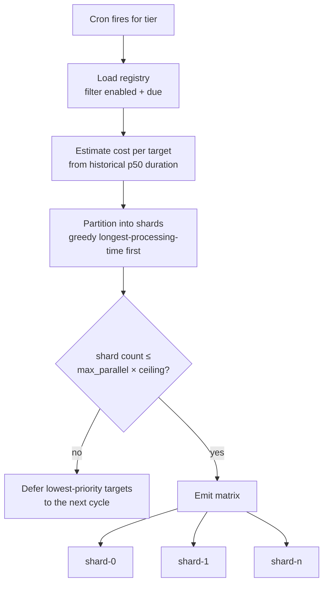
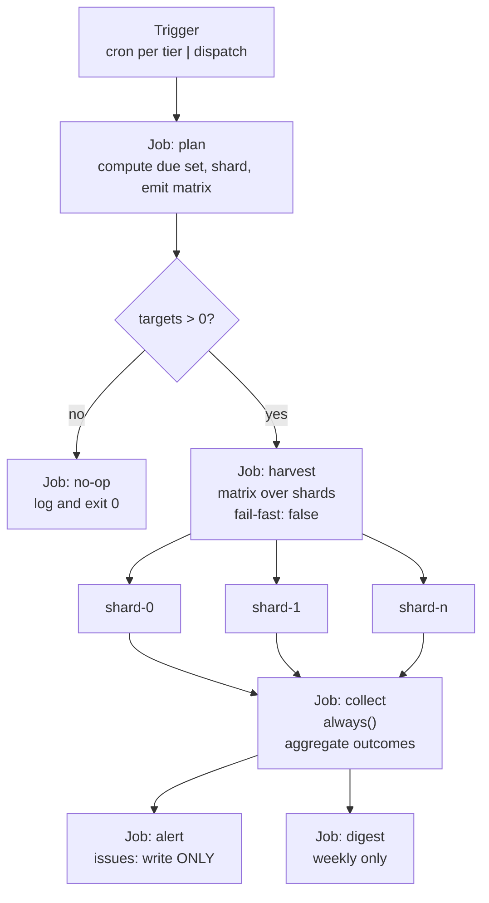
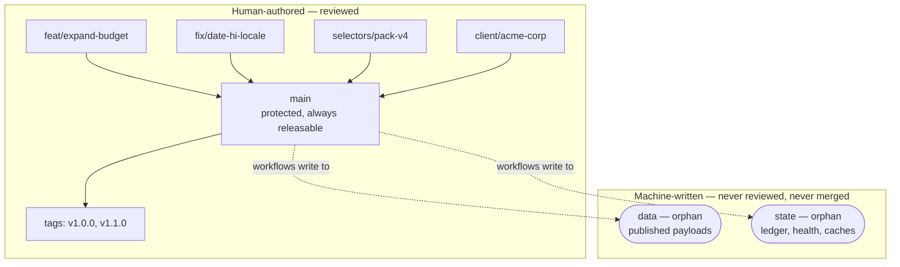
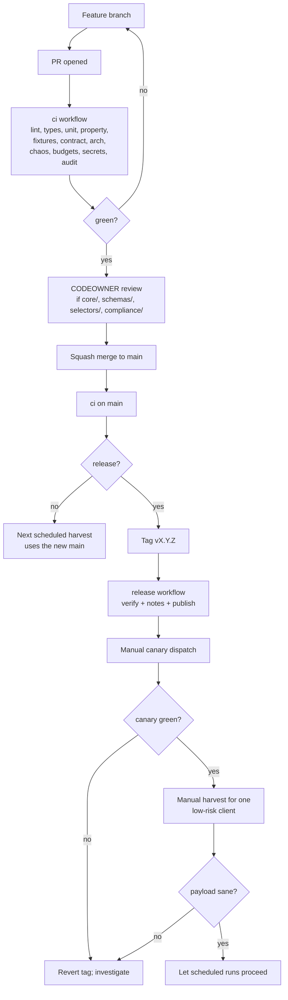

# Part 6 — Scheduling, CI Orchestration, and Version Control

*Sections 31 through 36. Audience: DevOps, implementing engineers. This part specifies when work happens, how the CI platform is driven, and how every artifact — code, configuration, and data — is versioned.*

---

# 31. Scheduler Requirements

## 31.1 Scheduling Model

Work is initiated by a clock, processes a bounded set, and exits. There is no long-running scheduler process, no queue, and no persistent job state. **The scheduler is four cron entries and a pure due-set function.**

| Property | Value | Consequence |
|---|---|---|
| Trigger | Platform cron, plus manual dispatch, plus PR-triggered dry runs | No scheduler to operate or monitor |
| Granularity | 5-minute minimum (platform-imposed) | Cadence is expressed in hours, not minutes |
| Delivery guarantee | **Best-effort.** Scheduled runs may be delayed under platform load | SLO has hours of margin (CON-10) |
| Catch-up | **None.** A missed cycle is not made up | Cadence is a rate, not a schedule of instants |
| Overlap | Prevented by a concurrency group | Two runs never write the same client paths concurrently |

## 31.2 Cadence Tiers

| Tier | Interval | Cron Minute | Cron Hours (UTC) | Intended For |
|---|---|---|---|---|
| `hourly` | 1 h | **17** | every hour | Policy floor; exceptional use only |
| `standard` | 6 h | **23** | 1, 7, 13, 19 | Default tier |
| `relaxed` | 12 h | **41** | 3, 15 | Low-change listings |
| `daily` | 24 h | **52** | 4 | Economy tier |

| ID | Requirement |
|---|---|
| TR-SCHED-001 | Cron minutes MUST NOT be `0`, `15`, `30`, or `45`. Scheduled workflows across the platform cluster heavily at those minutes, and clustering is the primary cause of multi-minute delivery delay (CON-10). |
| TR-SCHED-002 | Each tier MUST have its own cron entry mapping to a `tier` input on the `plan` job. |
| TR-SCHED-003 | The `daily` tier's hour MUST fall in a low-traffic window for the primary market. |

**The off-round minute choice is a real mitigation, not superstition.** A scheduled run at `:00` competes with an enormous number of other repositories' scheduled runs; a run at `:23` does not.

## 31.3 Due-Set Computation

A target is due when `now − last_success ≥ tier_interval × 0.9`.

| ID | Requirement |
|---|---|
| TR-SCHED-010 | The 0.9 factor MUST be applied. Without it, a run delivered four minutes late finds nothing due and skips an entire cycle, effectively halving the cadence. |
| TR-SCHED-011 | A target that has **never** succeeded MUST always be due. |
| TR-SCHED-012 | A target whose circuit breaker is open MUST NOT be due until the cooldown expires. |
| TR-SCHED-013 | A target appearing in more than one tier's window MUST be harvested once; the due-set check prevents double-harvesting. |
| TR-SCHED-014 | `--force` MUST bypass the due check but MUST NOT bypass the Publish Gate or the policy preflight. |
| TR-SCHED-015 | The due-set function MUST be pure — a function of `(registry, health, now)` — so that `tpre plan` is a side-effect-free diagnostic. |
| TR-SCHED-016 | The cadence floor MUST be one hour, enforced as a compile-time constant. No configuration may schedule a listing more frequently. |

## 31.4 Sharding



| Parameter | Default | Behaviour |
|---|---|---|
| Targets per shard | ~8 | Held roughly constant; shard *count* grows with client count |
| `max_parallel` | **4** (ceiling 8) | Deliberately capped low — bounds concurrent source requests, not runner availability |
| Shard duration target | ≤ 20 min | Enforced by the partitioner via cost estimation |
| Partition algorithm | Greedy longest-processing-time-first on estimated duration | Keeps the slowest shard 20–40% shorter than count-based partitioning |
| Spill behaviour | Lowest-priority targets **deferred**, not failed | Cadence degrades gracefully rather than the cycle failing |
| Priority ordering | Oldest successful harvest first | No client is ever starved |

| ID | Requirement |
|---|---|
| TR-SCHED-020 | Partitioning MUST balance by estimated cost, falling back to review count when no history exists. Balancing by target count puts three 2,000-review listings in one shard. |
| TR-SCHED-021 | Overflow beyond the shard budget MUST defer targets to the next cycle, never fail the cycle. A capacity condition must not become an incident. |
| TR-SCHED-022 | `max_parallel` MUST NOT exceed 8 under any configuration. |

**Why `max_parallel` is the real limiter and not runner capacity.** Four parallel shards each making a request every few seconds is a modest, defensible request rate. Sixteen parallel shards is four times the instantaneous pressure on the source for the same total work. Total work is fixed by client count and cadence, so parallelism buys only wall-clock completion time — which is worth very little when the freshness SLO is measured in hours. **Parallelism is spent on politeness rather than on speed.**

## 31.5 Overlap and Concurrency Control

| Setting | Value | Rationale |
|---|---|---|
| Concurrency group | `harvest-<tier>` | Per-tier, so a long `daily` run does not block `standard` |
| `cancel-in-progress` | `false` for scheduled; `true` for dispatch | Cancelling a scheduled run mid-flight could abandon staged commits. For manual dispatch, the operator wants the newest attempt to win |
| Overlap guard | If a previous run of the same group is still active, exit `0` with a `skipped_overlap` annotation | Prevents two runs writing the same client paths concurrently |

## 31.6 Dormancy Prevention

**An operational trap that silently disables the entire system.** The platform may automatically disable scheduled workflows in a repository with no recent activity. Because harvest commits land on `data` and `state` — not on the default branch — a naive deployment can be switched off after a quiet period and nobody notices.

| Mitigation | Detail |
|---|---|
| Keepalive workflow | Monthly; makes a trivial verifiable change and asserts via API that the harvest workflow's state is `active` |
| Liveness alert | If keepalive finds the workflow disabled, it opens a `critical` issue immediately |
| Staleness alert (independent) | Fires at 24 h and escalates at 48 h **regardless of cause**, so dormancy is caught even if keepalive itself fails |
| Manual verification | Monthly checklist item |

| ID | Requirement |
|---|---|
| TR-SCHED-030 | Two independent detectors MUST exist: keepalive detects the **cause**, staleness detects the **symptom**. A monitoring design that relies on a single detector for a silent failure mode is not a monitoring design. |

---

# 32. GitHub Actions Requirements

## 32.1 Workflow Inventory

Eight workflows, each with a single purpose. Splitting rather than building one large conditional workflow is deliberate: each has different permissions, schedules, failure semantics, and alerting behaviour.

| Workflow | Trigger | Purpose | Permissions | Duration |
|---|---|---|---|---|
| `harvest` | `schedule` ×4 + `workflow_dispatch` | The production pipeline | `contents: write` on plan/publish jobs only | 3–20 min |
| `canary` | `schedule` (offset) + dispatch | Detect upstream change before clients are affected | `contents: write` (health only), `issues: write` | 1–3 min |
| `ci` | `pull_request`, `push: main` | Verify every change | `contents: read` | 2–5 min |
| `validate-config` | `pull_request` on `clients/**`, `profiles/**`, `compliance/**` | Config correctness, authorisation gate, dry run | `contents: read`, `pull-requests: write` | 1–3 min |
| `pages` | `push: data` | Deploy the static origin | `pages: write`, `id-token: write` | 30–90 s |
| `keepalive` | `schedule` (monthly) | Dormancy prevention, liveness assertion | `contents: write`, `issues: write` | < 30 s |
| `release` | `push: tags v*` | Verify, generate notes, publish release | `contents: write` | 2–4 min |
| `dependency-audit` | `schedule` (weekly) | Advisory scan | `contents: read`, `issues: write` | < 60 s |

| ID | Requirement |
|---|---|
| TR-CI-010 | Every workflow MUST declare an explicit top-level `permissions:` block with the minimum set, elevating per job only where required. A workflow without one is a CI failure. |
| TR-CI-011 | Workflows MUST NOT be merged into a single conditional workflow. A combined workflow needs the union of all permissions, violating least privilege. |

## 32.2 The `harvest` Job Graph



### 32.2.1 Job: `plan`

| Aspect | Specification |
|---|---|
| Purpose | Decide what work exists this cycle and how to divide it |
| Steps | Checkout `main` (shallow, sparse) → setup engine → checkout `state` (shallow, sparse) → `tpre plan --tier <t> --shards auto --output json` → emit outputs |
| Outputs | `matrix` (JSON array of shard descriptors), `target_count`, `plan_summary` |
| Timeout | 5 min |
| Permissions | `contents: read` |
| Failure | The whole cycle is skipped. **Safe**: no data changes, LKG remains served, next cycle retries. Alert at `warn` |

> **EDR-029 — The shard matrix is emitted by a job, never hard-coded in workflow YAML**
> **Serves:** ADR-016, BG-02 (onboarding is config-only).
> **Context:** A matrix can be written literally in YAML. It is simpler and needs no `plan` job.
> **Decision:** The `plan` job computes the due set and emits the matrix as a job output consumed by the harvest job's strategy.
> **Alternatives Rejected:** *Hard-coded matrix in YAML* — adding the 40th client would require editing a workflow file, turning onboarding into a CI change and making client count a configuration concern rather than a data concern. *One job per client* — cleanest isolation, but multiplies ~60 s of job setup by client count and exhausts concurrency limits at trivial scale. *Single sequential job* — wall clock grows linearly and eventually exceeds the cadence interval.
> **Trade-off:** One extra job (~40 s) per cycle, and matrix generation must produce valid JSON or the run fails opaquely. Mitigated by schema-validating the plan output.
> **Scalability:** This is the mechanism that carries the system from 2 clients to several hundred without a workflow edit.

### 32.2.2 Job: `harvest` (Matrix)

| Aspect | Specification |
|---|---|
| Strategy | `matrix` from `needs.plan.outputs.matrix`, **`fail-fast: false`**, `max-parallel` from a repository variable (default 4) |
| Timeout | `timeout-minutes: 30` per shard |
| Permissions | `contents: write` |
| `continue-on-error` | **No.** A genuinely failing shard should be red |

| ID | Requirement |
|---|---|
| TR-CI-020 | `fail-fast: false` is **load-bearing for INV-09**. With fail-fast enabled, one client's failure cancels every other shard mid-flight, converting a single-client incident into a portfolio-wide freshness outage. |
| TR-CI-021 | `max-parallel` MUST come from a repository variable so it can be lowered without a code change during an incident. |

**Shard job steps, in order:**

| # | Step | Timeout | Notes |
|---|---|---|---|
| 1 | Checkout `main` | 2 min | Shallow (`fetch-depth: 1`), sparse |
| 2 | Setup engine (composite action) | 4 min | Node, dependency cache, `npm ci`, browser cache, conditional install, versions banner |
| 3 | Checkout `data` → `./.publish` | 2 min | **Required for the Gate to compare change** |
| 4 | Checkout `state` → `./.state` | 2 min | Shallow, sparse to this shard's clients where possible |
| 5 | Run harvest | 24 min | `tpre harvest --shard i/n --tier <t>`; captures exit code |
| 6 | Classify exit code | — | Maps code → conclusion and annotations (§32.4) |
| 7 | Commit + push `data` | 3 min | Only if artifacts changed; rebase-retry ×3 |
| 8 | Commit + push `state` | 3 min | Always — health records are written even on failure |
| 9 | Upload diagnostics artifact | 2 min | `if: always()`; retention 14 days |
| 10 | Upload run manifest | 1 min | `if: always()`; retention 90 days |
| 11 | Write job summary | — | Human-readable per-target outcome table |

| ID | Requirement |
|---|---|
| TR-CI-022 | Step 3 MUST NOT be skipped. Without the `data` checkout the Publish Gate cannot detect "count dropped 70%" — the single most valuable rule it has. Skipping it to save three seconds silently disables the system's most important safety property. |
| TR-CI-023 | Steps 9–11 MUST run with `if: always()`. Diagnostics matter most when the run failed. |

### 32.2.3 Jobs: `collect` and `alert`

| Job | Condition | Purpose | Permissions |
|---|---|---|---|
| `collect` | `if: always()` | Download shard manifests, aggregate outcomes, compute run health, emit an alert plan | `contents: write` |
| `alert` | `if: always() && alert_plan != '[]'` | Reconcile desired alert state with actual issue state | **`issues: write` only** |

| ID | Requirement |
|---|---|
| TR-CI-030 | `collect` MUST run even when every shard failed — that is exactly when alerting matters most. |
| TR-CI-031 | The `alert` job MUST have `issues: write` and **no `contents` access**, so that a bug in alerting can never touch data. |
| TR-CI-032 | Alert failures MUST NOT fail the run. Three consecutive alert-job failures MUST escalate to the secondary webhook channel if configured. |

## 32.3 Triggers

| Trigger | Workflow | Inputs |
|---|---|---|
| `schedule` | harvest, canary, keepalive, dependency-audit | tier derived from the cron entry |
| `workflow_dispatch` | harvest | `tier`, `client`, `listing`, `force`, `dry_run`, `log_level` |
| `workflow_dispatch` | canary | `selector_pack` override |
| `pull_request` | ci, validate-config | — |
| `push: main` | ci | — |
| `push: data` | pages | — |
| `push: tags v*` | release | — |

| ID | Requirement |
|---|---|
| TR-CI-040 | **`pull_request_target` MUST NOT be used.** It runs workflow code with access to secrets in the context of an untrusted fork PR and is the single most common cause of CI credential compromise. Enforced by lint. |
| TR-CI-041 | `repository_dispatch` MUST NOT be used in v1.0. It is the natural trigger for a future "refresh now" feature and is deliberately deferred rather than left half-implemented. |

## 32.4 Exit Code Classification

| Exit Code | Meaning | Job Conclusion | Annotation | Alert Severity |
|---|---|---|---|---|
| 0 | All targets succeeded | success | — | none |
| 4 | Partial: some failed or deferred | success | `warning` per failed target | `warn` |
| 5 | Gate rejection | success | `warning` | `error` |
| 6 | Policy blocked | success | `notice` | `warn` / `info` |
| 7 | Bot challenge | success | `warning` | **`critical`** |
| 3 | All targets failed | **failure** | `error` | `error` |
| 2 | Invalid usage or config | **failure** | `error` | `error` |
| 1 | Unexpected internal error | **failure** | `error` | `critical` |

**Why code 7 is critical despite not failing the job.** A bot challenge is the highest-severity operational event in the system and demands human judgement about policy, not a retry. Severity is orthogonal to job conclusion.

## 32.5 Caching

**Normative: no cache may be correctness-critical (CON-09).** A cold cache must produce identical output, only slower.

| Cache | Key | Restore Keys | Size | Saves | If Cold |
|---|---|---|---|---|---|
| npm dependencies | `node-<os>-<lockfile-hash>` | `node-<os>-` | ~40 MB | ~25 s | `npm ci` from network |
| Playwright browsers | `pw-<os>-<exact-version>` | **none** | ~350 MB | ~45 s | Browser download |
| Resolved identities | Not a CI cache — `state` branch | — | < 1 KB | The whole search step | One search, with a warning |
| Rate budgets | Not a CI cache — `state` branch | — | < 1 KB | — | **Assume consumed; defer** |

| ID | Requirement |
|---|---|
| TR-CI-050 | The browser cache MUST use an exact key with **no restore-keys fallback**. A partial restore of a different browser version produces a subtly different browser than the pin specifies, silently breaking the determinism RISK-14's mitigation depends on. Cache misses on version change are correct and desirable. |
| TR-CI-051 | Cache eviction MUST be tolerated silently. The cost is seconds, not correctness. |

## 32.6 Composite Setup Action

| ID | Requirement |
|---|---|
| TR-CI-060 | Setup logic MUST exist exactly once, in `.github/actions/setup-engine/action.yml`, used by every workflow. |
| TR-CI-061 | The action MUST print a versions banner (Node, npm, Playwright, browser, engine) into the job log. During an incident, "which browser version produced this?" must be answerable from the log alone. |
| TR-CI-062 | Browser installation MUST be conditional on a cache miss. |

## 32.7 Workflow Design Decisions

| Decision | Chosen | Rejected | Reason |
|---|---|---|---|
| Workflow count | Eight focused | One conditional | Different permissions, schedules, failure semantics; one workflow would need the union of all permissions |
| Shard execution | Matrix | Sequential loop | Parallelism, per-shard isolation, independent timeouts, per-shard diagnostics |
| Matrix source | Generated by a job | Hard-coded YAML | Client count becomes data, not configuration |
| Commit granularity | Per shard | Per target | 5–20× fewer commits; safe because reconciliation is idempotent |
| Setup | Composite action | Duplicated steps | One-file edit for a version change |
| Action pinning | **SHA** | Tag | A mutable tag is a supply-chain hole with write access |
| Runner | Hosted | Self-hosted | Cost, maintenance, and decisively: a persistent runner with write access is a far worse security position |

---

# 33. Git Requirements

## 33.1 Git as the Data Store

The system uses Git as its database. This is not a compromise forced by the zero-cost constraint — the access pattern (read one small file, write one small file, once per run, no concurrent writers to the same path) **is a file access pattern**, and in exchange the system gets versioning, atomicity, replication, access control, audit logging, code review on data changes, and free point-in-time recovery.

| Property Needed | Git Provides |
|---|---|
| Durable, versioned state | Native |
| Atomic write per run | Commit |
| Point-in-time recovery | `git checkout <sha>` |
| Audit log of every data change | `git log -p` |
| Code review on data changes | Pull requests on `compliance/` |
| Replication | Every clone |
| Zero cost | Yes |

**Where this breaks down (stated honestly):** concurrent writers to the same file (avoided by disjoint sharding), high write frequency (mitigated by hash-gating), unbounded history growth (mitigated by truncation), and ad-hoc cross-client queries (which is what pushes v3.0 toward a real datastore).

## 33.2 Git Operation Requirements

| ID | Requirement |
|---|---|
| TR-GIT-010 | All Git operations MUST go through `infra/git.mjs`. No other module may invoke Git. |
| TR-GIT-011 | `infra/git.mjs` MUST NOT interpolate any value derived from acquired content, issue text, or configuration free-text into a shell command (NFR-030). |
| TR-GIT-012 | Checkouts MUST be shallow (`fetch-depth: 1`) and sparse wherever the required paths are known. |
| TR-GIT-013 | `--force` and `--force-with-lease` MUST NOT be used against `data` or `state`. |
| TR-GIT-014 | Push conflicts MUST be resolved by fetch-rebase-retry, up to 3 attempts with backoff (2 s, 6 s, 18 s). |
| TR-GIT-015 | Every file write MUST be write-to-temp-then-rename before staging. |
| TR-GIT-016 | Commits MUST be one per shard per branch. |

## 33.3 Conflict Impossibility by Construction

| Store | Path Template | Written By |
|---|---|---|
| Payload | `data:/clients/<slug>/<listing>/*` | **Only** the shard containing that target |
| Client manifest | `data:/clients/<slug>/index.json` | **Only** that client's shard |
| Global manifest | `data:/index.json` | **Only the `collect` job**, after all shards complete |
| Ledger | `state:/ledger/<slug>/<listing>.json` | Only that client's shard |
| Health | `state:/health/<slug>.jsonl` | Only that client's shard (append) |
| Identity cache | `state:/cache/identity/<slug>/<listing>.json` | Only that client's shard |
| Rate budget | `state:/cache/budget/<source>/<date>.json` | **Any shard** — intentionally shared |
| Breaker | `state:/breaker/<source-access>.json` | **Any shard** — intentionally shared |

| ID | Requirement |
|---|---|
| TR-GIT-020 | Shards MUST write disjoint client paths, so a rebase can never produce a content conflict — only an ancestry update. |
| TR-GIT-021 | The global manifest MUST be written by the `collect` job, **not** by shards. If shards wrote it, every shard would read-modify-write the same file and conflicts would be guaranteed. |
| TR-GIT-022 | The two intentionally-shared files (budget, breaker) MUST tolerate last-write-wins, because both fail in the conservative direction (§58.4). |

## 33.4 History Management

| Branch | Policy | Frequency | Rationale |
|---|---|---|---|
| `main` | **Never truncated** | — | Code history is permanent |
| `data` | Retain 90 days; older squashed into a baseline commit | Quarterly, scripted | Only current state matters for a published artifact |
| `state` | Retain 12 months; older squashed | Annually, manual with review | Ledger history is the audit trail and is worth more |

| ID | Requirement |
|---|---|
| TR-GIT-030 | History truncation MUST run as a reviewed pull request against a **mirror first**, MUST be verified by diffing the tip tree before and after (which must be identical), and MUST be announced so anyone holding a clone re-clones. |
| TR-GIT-031 | The mirror created during truncation MUST be retained as the offsite backup (§60.6), not deleted. |

**History rewriting is the single most dangerous scripted operation in this system** and is treated accordingly. TR-GIT-031 turns a required maintenance step into a disaster-recovery control at zero additional cost.

---

# 34. Branch Strategy

## 34.1 Branch Model



| Branch | Owner | Protection | History |
|---|---|---|---|
| `main` | Humans | Review required, CI required, no force-push, linear history | Permanent |
| `data` | Automation | Push restricted to workflow token and admins | Truncated quarterly |
| `state` | Automation | Same | Truncated annually |
| `feat/*`, `fix/*`, `chore/*`, `docs/*` | Individual | None | Deleted after merge |
| `selectors/*` | Individual | None | Deleted after merge |
| `client/*` | Individual | None | Deleted after merge |
| `release/*` | On demand only | Review required | Created only if two majors ever need parallel support |

## 34.2 Branch Naming

| Prefix | Use | Example |
|---|---|---|
| `feat/` | New capability | `feat/csv-adapter` |
| `fix/` | Defect repair | `fix/rating-aria-parse` |
| `selectors/` | Selector pack change | `selectors/pack-v4-review-container` |
| `client/` | Client onboarding or config change | `client/acme-corp-onboard` |
| `chore/` | Dependencies, tooling, CI | `chore/bump-playwright` |
| `docs/` | Documentation only | `docs/trd-section-22-update` |
| `sec/` | Security fix | `sec/url-allowlist-hardening` |

## 34.3 Branch Requirements

| ID | Requirement |
|---|---|
| TR-GIT-040 | `main` MUST be protected: review required, CI required, no force-push, linear history. |
| TR-GIT-041 | `data` and `state` MUST be orphan branches with no shared history with `main`. |
| TR-GIT-042 | Feature branches MUST be short-lived and squash-merged. |
| TR-GIT-043 | Machine branches MUST NEVER be merged into `main`, and `main` MUST NEVER be merged into them. |

**Why data does not live on `main`.** Thousands of machine commits would bury code history, making `git log` and `git blame` useless on source files — which is precisely when they matter most, during an incident.

## 34.4 Special Branch Operations

| Operation | Procedure | Risk |
|---|---|---|
| Orphan branch creation | `git checkout --orphan <name>`, clear index, add placeholders, commit, push | Low, one-time |
| Data history truncation | Scripted, mirror-first, tip-tree diff verified identical, announced | **High — the most dangerous scripted operation** |
| Emergency payload revert | `git revert` the specific `data` commit; verify at the CDN after TTL | Low |
| Hotfix | Branch from `main`, minimal change, expedited review (**still required**), tag a patch | Low |
| Re-creating `state` | Only in disaster recovery; accepts loss of harvest history but not of payloads | Medium |

---

# 35. Commit Strategy

## 35.1 Two Commit Populations

| Population | Author | Convention | Reviewed |
|---|---|---|---|
| Human commits on `main` | Engineers | Conventional Commits | Yes |
| Machine commits on `data`/`state` | Workflows | Structured machine format | No |

## 35.2 Human Commit Convention

Conventional Commits, because the changelog and release notes are generated from them.

| Type | Use | Version Effect |
|---|---|---|
| `feat:` | New capability | MINOR |
| `fix:` | Defect repair | PATCH |
| `perf:` | Performance | PATCH |
| `refactor:` | No behaviour change | PATCH |
| `docs:` | Documentation | none |
| `test:` | Tests only | none |
| `chore:` | Tooling, dependencies | PATCH |
| `sec:` | Security fix | PATCH or MINOR |
| `selectors:` | Pack change | PATCH |
| `BREAKING CHANGE:` footer | Any breaking change | MAJOR |

**Scopes** are the module or client: `feat(reconcile):`, `fix(dates):`, `client(acme):`, `selectors(google-maps):`.

## 35.3 Machine Commit Format

**Normative format:**

```
data(<slug>/<listing>): +<inserts> ~<updates> -<removals> n=<total> r=<rating> [run:<id>]
```

| ID | Requirement |
|---|---|
| TR-GIT-050 | Machine commits MUST use the structured format above. It is machine-parseable, human-readable, and greppable during incident review. |
| TR-GIT-051 | Machine commit types MUST be `data:` or `state:` and MUST NOT affect version computation. |
| TR-GIT-052 | A force-published commit MUST include the operator identity, the overridden rules, and the mandatory reason in its message. |

**`git log --grep="data(commerce-insight" --oneline` is a usable audit tool during an incident**, which is the entire justification for a structured machine format.

## 35.4 Commit Batching

| ID | Requirement |
|---|---|
| TR-GIT-060 | Artifacts MUST be staged per target but committed **once per shard per branch**. |
| TR-GIT-061 | A file whose new bytes equal its current bytes MUST NOT be staged at all (FR-065). |

**The batching trade-off, stated explicitly.** A shard crash after target 3 of 10 loses the staged work of those three targets. That is acceptable *only because reconciliation is idempotent* (INV-04) and the next run reproduces it exactly. Batching reduces commit count by 5–20×, directly addressing CON-13.

## 35.5 Pull Request Requirements

| Requirement | Enforcement |
|---|---|
| CI green | Branch protection |
| CODEOWNER review for `core/`, `schemas/`, `selectors/`, `compliance/` | CODEOWNERS |
| PR template completed, including "which test would have caught this?" | Template + reviewer |
| Documentation or an ADR/EDR updated for behavioural changes | Template checklist |
| Squash merge with a Conventional Commit title | Repository setting |
| Branch deleted after merge | Repository setting |
| No secrets, no `.env`, no fixture containing personal data pending erasure | Secret scan + review |

---

# 36. Release Strategy

## 36.1 Four Independent Version Streams

Conflating these is a common and costly mistake. They change at different rates for different reasons.

| Stream | Scheme | Changes When | Consumer Impact |
|---|---|---|---|
| **Engine** | SemVer `MAJOR.MINOR.PATCH` | Code changes | None directly — consumers never run the engine |
| **Payload schema** | Single integer major | The public contract changes | **Direct — this is the contract** |
| **Selector pack** | Monotonic integer, immutable files | Upstream markup changes | None |
| **Config schema** | Single integer | Client config shape changes | Operators only |

Plus two internal streams: `ledger_version` (free to change) and `identity_algo_version` (requires a migration, §53.6).

## 36.2 Engine SemVer Rules

| Bump | Trigger | Examples |
|---|---|---|
| **MAJOR** | Breaking change to the CLI contract, exit codes, config schema, or a payload schema major | Renaming a command; changing an exit-code meaning; requiring a new mandatory config field |
| **MINOR** | New backwards-compatible capability | A new adapter; a new artifact type; a new optional config key; new gate rules that only warn |
| **PATCH** | Fixes and internal changes | Selector pack pin update; parser fix; performance work; dependency bump |

**A selector pack update is a PATCH.** It changes no interface and no contract; it repairs the implementation's knowledge of a volatile external surface. Treating it as a MINOR would produce a meaningless version stream dominated by upstream churn.

## 36.3 Payload Schema Versioning

| Aspect | Rule |
|---|---|
| Form | Single integer in `schema_version` |
| Evolution within a major | **Additive only**: new nullable fields, new artifact types, new open-enum members, populating previously-null fields |
| Breaking change | Requires a new major, published **in parallel** for ≥ 90 days |
| Parallel publication | `clients/<slug>/<listing>/v2/reviews.json` alongside v1 paths; the manifest lists both |
| Deprecation | Announced in `CHANGELOG.md`, in the manifest's `notices`, and directly to every client integrator |

| Change Type | Allowed in v1? |
|---|---|
| Add a nullable field | ✅ |
| Add a new artifact | ✅ |
| Add an enum member to an open field | ✅ |
| Populate a previously-null field | ✅ |
| Remove or rename a field | ❌ Requires v2 |
| Change a type or unit | ❌ Requires v2 |
| Change sort order semantics | ❌ Requires v2 |
| Tighten a nullable field to non-nullable | ❌ Requires v2 |

| ID | Requirement |
|---|---|
| TR-STD-010 | Payload schema evolution within a major MUST be additive only. Consumers are client websites TradyPerch does not always control and cannot redeploy on demand. |
| TR-STD-011 | The v1 field set MUST declare fields the engine does not yet populate (`ai`, `verified`, `likes`, `photo_count`) as nullable, so a consumer written today does not break when they are filled in. |

## 36.4 Selector Pack Versioning

| Rule | Detail |
|---|---|
| Naming | `v<integer>.json`, monotonic |
| Immutability | **A merged pack is never edited.** Fixes create a new version |
| Pinning | Profiles pin a pack version; clients inherit |
| Retention | Old packs retained indefinitely |
| Provenance | The pack version appears in every payload's `provenance` (INV-06) |
| Rollback | Change the profile pin — one line |

## 36.5 Release Process



| ID | Requirement |
|---|---|
| TR-STD-020 | The engine is **adopted by the next scheduled run**, not deployed. A bad release therefore affects every client at the next cycle, which is why the canary-then-single-client sequence at steps L–Q is mandatory. It costs about ten minutes. |
| TR-STD-021 | Release notes MUST be generated from Conventional Commits. |
| TR-STD-022 | A release MUST NOT proceed if `CHANGELOG.md` is not updated with breaking changes called out explicitly. |

## 36.6 Selector Pack Release (Highest-Risk Change)

| # | Step |
|---|---|
| 1 | Capture a fixture from the changed markup |
| 2 | Author `selectors/google-maps/v<n+1>.json`; **never edit an existing pack** |
| 3 | Run the golden suite: new pack passes new + pack-agnostic fixtures; **old packs still pass theirs** |
| 4 | Pin the new pack in `profiles/conservative.json` **only** |
| 5 | Merge; dispatch a canary run with the new pack |
| 6 | Observe one full cycle for the small set of clients on `conservative` |
| 7 | Check strategy health: all required fields resolving at index 0 |
| 8 | Pin the new pack in `profiles/default.json` |
| 9 | Observe one cycle across all clients |
| 10 | **Rollback if needed: revert the one-line pin. No code revert, no release, no data change** |

**Step 10 is the entire payoff of ADR-009.** The riskiest recurring change in the system has a one-line, instantly-verifiable rollback.

## 36.7 Version Compatibility Matrix

| Engine | Payload Schema | Config Schema | Selector Packs |
|---|---|---|---|
| 1.0.x | 1 | 1 | v1–v3 |
| 1.x.x | 1 | 1 | v1–vN |
| 2.x.x | 1 and 2 (parallel) | 1 and 2 | vN+ |
| 3.x.x | 2 | 2 | — |

**Support commitment:** the engine supports the current and immediately previous config schema, so a config change and an engine deploy need not be simultaneous. The payload schema's previous major is supported for its 90-day deprecation window.

---

*End of Part 6. Part 7 specifies logging, error classification, the error recovery matrix, exception handling, monitoring, and metrics collection.*
