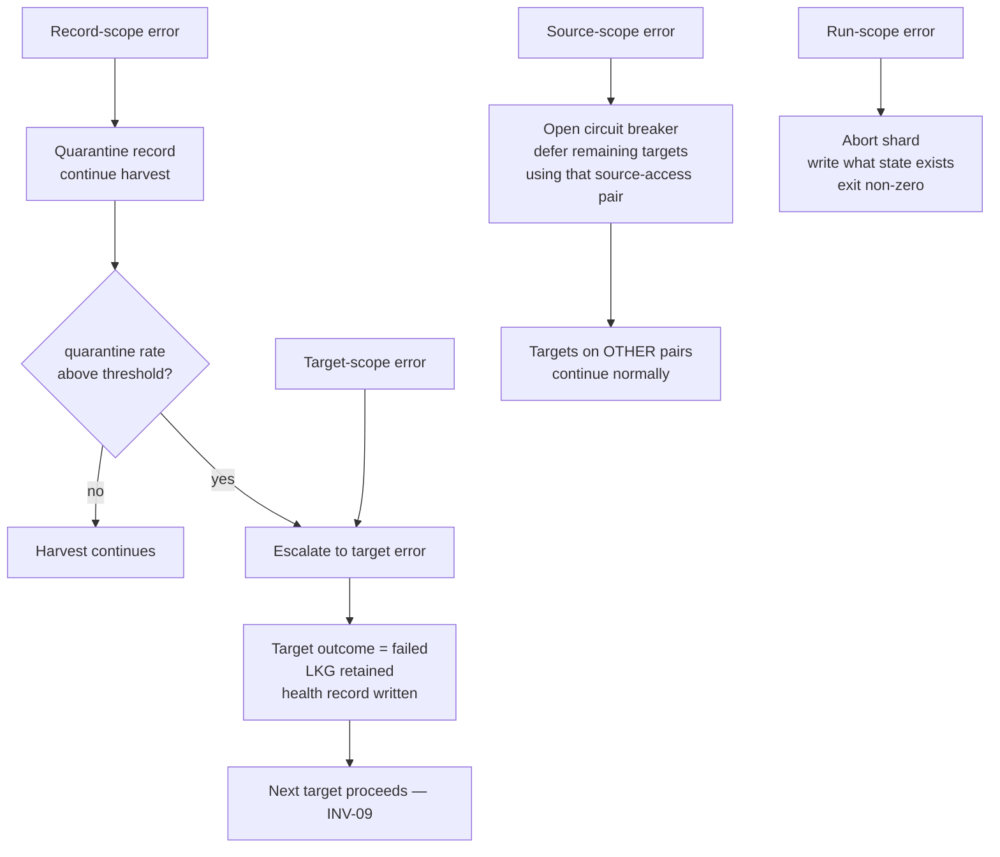
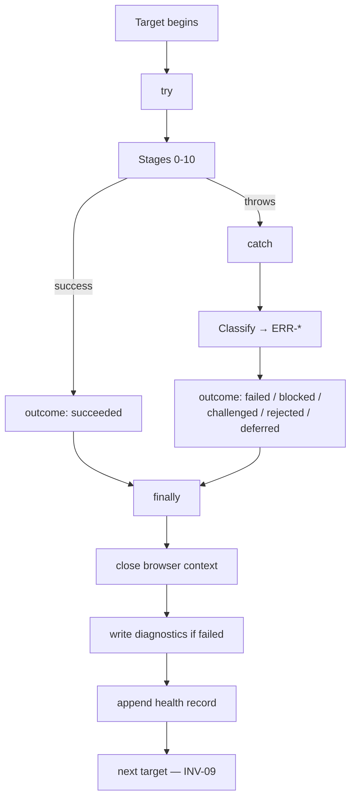
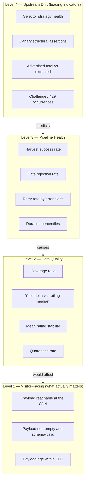

# Part 7 — Logging, Errors, and Observability

*Sections 37 through 42. Audience: DevOps, backend engineers, QA. This part specifies how the system explains itself. The governing requirement is that any production failure must be diagnosable from artifacts alone, without reproduction.*

---

# 37. Logging Requirements

## 37.1 Objectives

| Objective | Mechanism |
|---|---|
| Any production failure diagnosable from artifacts alone | Structured events + ring-buffered debug + snapshot capture |
| Zero secret or PII leakage | Sink-level redaction + bounded context + sanitised snapshots |
| Machine-analysable for trends | JSONL with a stable field set |
| Cheap when healthy | Debug buffered in memory, flushed only on failure |
| Attributable | Every event carries `runId`, `clientSlug`, `listingKey`, `stage` |

## 37.2 Format and Field Set

JSONL — one JSON object per line, UTF-8.

**Mandatory fields on every event:**

| Field | Type | Notes |
|---|---|---|
| `ts` | RFC 3339 with milliseconds | **UTC always** |
| `level` | enum | `trace` / `debug` / `info` / `warn` / `error` / `fatal` |
| `runId` | string | Correlates across shards, manifests, and artifacts |
| `event` | string | Stable dot-notation name, e.g. `nav.pagination.iteration` |
| `stage` | string | One of the eleven stage names, or `orchestrator` |

**Conditional fields:** `clientSlug`, `listingKey`, `targetId`, `durationMs`, `count`, `errorClass`, `detail` (bounded object, ≤ 2 KB serialised), `attempt`, `outcome`.

| ID | Requirement |
|---|---|
| TR-LOG-001 | `event` names MUST be drawn from a fixed enumeration defined in code, **not composed at call sites**. Free-form event names make the logs unqueryable within a month. |
| TR-LOG-002 | `detail` MUST be bounded to 2 KB serialised. An unbounded detail object is how a review's full text ends up in a log. |
| TR-LOG-003 | Timestamps MUST be UTC. A mixed-timezone log series cannot be correlated across shards. |
| TR-LOG-004 | Child loggers MUST be created per target and per stage, so context need not be repeated at call sites. |

## 37.3 Level Policy

| Level | Use | Retained |
|---|---|---|
| `trace` | Per-record extraction detail, per-scroll measurements | **Ring buffer only**; flushed on target failure |
| `debug` | Stage entry/exit, selector strategy resolution, blocked-request counts | **Ring buffer only**; flushed on target failure |
| `info` | Stage completion with counts and timings; target outcome; run summary | Always written |
| `warn` | Fallback strategy used, record quarantined, retry attempted, coverage below target, runtime search used | Always written |
| `error` | Target failed, gate rejected, publish conflict | Always written |
| `fatal` | Run aborted | Always written |

## 37.4 The Ring Buffer

> **EDR-032 — Debug and trace events are ring-buffered and flushed only on target failure**
> **Serves:** NFR-036 (retention), §43 (performance).
> **Context:** Full-fidelity debug logging is exactly what an engineer wants during an incident and exactly what nobody wants for the other 99% of runs. A healthy 1,000-review harvest at `debug` produces roughly 15,000 lines.
> **Decision:** `trace` and `debug` events accumulate in an in-memory ring buffer, capped at 2,000 events or 4 MB per target. On target success they are discarded. On target failure they are flushed to the diagnostics bundle **ahead of** the failure event.
> **Alternatives Rejected:** *Always write debug* — megabytes of I/O per run for data that is discarded unread; also multiplies artifact storage. *Never write debug; re-run with `--log-level debug` on failure* — the failure may not reproduce, and the upstream page has already changed by the time anyone looks. *Sample debug events* — produces a log with holes exactly where the interesting sequence was. *Write debug to a separate always-on file* — same I/O cost, same storage cost.
> **Trade-off:** A few MB of memory per target, and no debug detail for a run that succeeded but was subtly wrong. Mitigated because the Publish Gate converts "subtly wrong" into a failure, which triggers the flush.
> **Scalability:** Memory cost is per target and bounded; it does not grow with client count.

| ID | Requirement |
|---|---|
| TR-LOG-010 | The ring buffer MUST be capped at 2,000 events **or** 4 MB, whichever is reached first. |
| TR-LOG-011 | On target failure, the buffer MUST be flushed **before** the failure event, so the log reads chronologically. |
| TR-LOG-012 | The buffer MUST be reset per target. Carrying one target's trace into another's diagnostics is both confusing and a cross-tenant information leak. |

**This decision is why a 10-minute incident diagnosis is achievable.** Full diagnostic depth exists exactly when it is needed and costs nothing the rest of the time.

## 37.5 Redaction

> **EDR-031 — Redaction is a sink-level transform seeded at startup, never a call-site responsibility**
> **Serves:** INV-08, FR-076.
> **Context:** The conventional approach asks every call site to avoid logging secrets. That works until one call site logs a whole config object.
> **Decision:** Redaction is applied at the sink. The sink is seeded at startup with every secret value read from the environment, and it also applies key-name pattern matching. A careless `log.debug({ detail: config })` cannot leak, because avoiding the leak is not the caller's responsibility.
> **Alternatives Rejected:** *Redact at call sites* — one omission is a permanent secret exposure in a public repository. Human discipline is not a control for an irreversible failure. *Redact only known secret keys* — misses a secret embedded in a URL or an error message. *Post-process logs before upload* — the secret has already been written to disk and may already be in the platform's live log stream.
> **Trade-off:** Every log event pays a scan cost. At `info` volume this is negligible; at `debug` volume the ring buffer means most events are discarded before the sink ever sees them.
> **Scalability:** Constant per event.

| Rule | Implementation |
|---|---|
| Known secret values | Sink seeded at startup; exact and substring matches replaced with `«redacted:NAME»` |
| Key-name patterns | Any object key matching `/token\|secret\|key\|password\|cookie\|auth\|credential\|refresh/i` has its value replaced |
| Authorization headers | Never logged, at any level |
| Cookies and storage state | Never logged, never written to any artifact |
| URLs | Query strings stripped unless explicitly allowlisted (avatar size parameters) |
| Review text | **Truncated to 120 characters**, and only at `debug` |
| Author names | Logged only as `author_key` hash prefixes at `debug`. Never as plain names |

| ID | Requirement |
|---|---|
| TR-LOG-020 | Redaction MUST be applied at the sink, not at the call site. |
| TR-LOG-021 | The redaction filter MUST be seeded before the logger emits its first event (§11.5, step 4 before step 5). |
| TR-LOG-022 | `infra/logger/redact.mjs` MUST have **100% statement coverage**. |
| TR-LOG-023 | A test MUST feed a synthetic config containing sentinel secret values through **every** log level and assert no sentinel appears in the output. This test is mandatory and blocks release. |
| TR-LOG-024 | `console.*` MUST NOT be used outside `infra/logger/` and `cli/`. It bypasses redaction entirely. |

**Logs are not a data store.** Full review text lives in the payload, which is its proper home. The 120-character truncation is a data-minimisation control, not a formatting preference.

## 37.6 Log Destinations and Retention

| Destination | Content | Retention | Driver |
|---|---|---|---|
| stdout (workflow log) | `info` and above, pretty-formatted | Platform default | Human reading |
| `run.jsonl` (CI artifact) | All written events, structured | **14 days** | NFR-036, PII minimisation |
| `manifest.json` (CI artifact) | Aggregated run facts, no event stream | **90 days** | Trend analysis, no PII |
| Job summary (markdown) | Per-target outcome table | Platform retention | Human reading |
| Health series (`state`) | One record per target per run | **Indefinite** | The monitoring substrate |
| Diagnostics bundle (CI artifact) | Per failed target | **14 days** | NFR-036 |

**Manifests are retained six times longer than logs** because they contain no PII and no raw content, are ~4 KB, and answer the questions that matter months later ("when did coverage start declining?"). Logs contain bounded PII and are only useful during an active investigation.

## 37.7 Diagnostics Bundle

Written per failed target into `diagnostics/<clientSlug>/<listingKey>/`.

| File | Content | Sanitisation |
|---|---|---|
| `flushed.jsonl` | The ring buffer contents | Full redaction applied |
| `error.json` | The classified error including `context` and `runbook` | Bounded context only |
| `snapshot.html` | The review subtree markup at failure | Scripts removed, PII-bearing attributes stripped, tokens and cookies removed, **review text preserved** |
| `snapshot.png` | Viewport screenshot | Reduced resolution; **may contain reviewer names** — 14-day retention |
| `acquisition-report.json` | Growth curve, stop reason, timings, blocked-byte counts | Safe |
| `effective-config.json` | Fully resolved config with the resolution trace | **Secrets stripped** |
| `selector-health.json` | Per-field strategy resolution statistics | Safe |

| ID | Requirement |
|---|---|
| TR-LOG-030 | `snapshot.html` MUST retain review text. It is needed for parser repair and is already public. |
| TR-LOG-031 | `snapshot.html` MUST be byte-compatible with the fixture corpus format, so it can be copied directly into `fixtures/dom/google/<nnn>/page.html` (TR-EXT-012). |
| TR-LOG-032 | `snapshot.png` MUST be disableable by configuration (`TPRE_DIAGNOSTICS_SCREENSHOT=false`) for privacy-sensitive deployments. |
| TR-LOG-033 | `effective-config.json` MUST have secret values replaced with `«set»`/`«unset»`. |

**This bundle is the difference between a 60-minute repair and a multi-hour investigation.** `snapshot.html` in particular converts a live-site debugging session into an offline fixture-based one.

---

# 38. Error Classification

## 38.1 Classification Philosophy

| Principle | Consequence |
|---|---|
| **Every error has a class, and the class determines behaviour** | No `catch (e) { console.log(e) }`. The class drives retry policy, alert severity, exit code, and runbook selection — all mechanically |
| **Errors are values in the core, exceptions at the boundaries** | `core/` returns `Result`. Adapters may throw; the target runner converts throws into classified outcomes at exactly one place |
| **Fail closed on permission, fail soft on data** | A missing secret stops everything. A single malformed review is quarantined and the harvest continues |
| **Never let a partial success masquerade as success** | Completeness propagates to the payload and to the gate |
| **An unclassified error is a defect** | `ERR-INTERNAL-UNCLASSIFIED` exists, and its occurrence opens a `critical` alert — it means the taxonomy has a hole |

## 38.2 Error Object Shape

| Field | Purpose |
|---|---|
| `class` | The `ERR-*` constant. Drives **all** mechanical behaviour |
| `message` | Human-readable, **never containing untrusted content verbatim** (NFR-030) |
| `stage` | Which of the eleven stages produced it |
| `scope` | `record` / `target` / `shard` / `source` / `run` |
| `retryable` | Derived from policy, materialised for auditability |
| `context` | Bounded structured object: counts, timings, strategy indices, stop reason. **Never raw page content** |
| `cause` | The underlying error with its stack, for logs only |
| `runbook` | Path to the relevant runbook |

| ID | Requirement |
|---|---|
| TR-ERR-050 | Every classified error MUST carry all eight fields. |
| TR-ERR-051 | `message` MUST NOT interpolate acquired content, author names, or review text. Log-injection and workflow-expression-injection vector. |
| TR-ERR-052 | The `runbook` field MUST be populated. An alert that tells the engineer exactly which document to open removes the slowest step in incident response: figuring out what kind of problem this is. |

## 38.3 Complete Error Taxonomy

Format: `ERR-<DOMAIN>-<SPECIFIC>`. **This table is the single source of truth** for retry policy (§29.2) and alert severity (§41.4).

### 38.3.1 Policy and Configuration

| Class | Meaning | Retry | Scope | Severity |
|---|---|---|---|---|
| `ERR-POLICY-KILLSWITCH` | Global or per-source acquisition disabled | never | target | info |
| `ERR-POLICY-UNAUTHORIZED` | Authorisation record missing or incomplete | never | target | error |
| `ERR-POLICY-ROBOTS` | Robots directive disallows and mode is `block` | never | target | warn |
| `ERR-POLICY-BUDGET` | Rate budget exhausted | never (deferral) | target | info |
| `ERR-POLICY-BREAKER-OPEN` | Circuit breaker open for this source | never (deferral) | source | warn |
| `ERR-CONFIG-INVALID` | Config fails schema validation | never | target | error |
| `ERR-CONFIG-VERSION` | Unsupported `config_version` | never | run | error |
| `ERR-CONFIG-SECRET-MISSING` | Adapter requires an absent secret | never | run | error |

### 38.3.2 Resolution

| Class | Meaning | Retry | Scope | Severity |
|---|---|---|---|---|
| `ERR-RESOLVE-NO-IDENTIFIER` | No identifier and search disallowed | never | target | error |
| `ERR-RESOLVE-NOTFOUND` | Listing not found | never | target | error |
| `ERR-RESOLVE-AMBIGUOUS` | Multiple candidates above threshold | never | target | error |
| `ERR-IDENTITY-DRIFT` | Resolved listing name no longer matches expectation | never | target | **high** |

### 38.3.3 Network and Transport

| Class | Meaning | Retry | Scope | Severity |
|---|---|---|---|---|
| `ERR-NET-DNS` | DNS failure | backoff ×3 | target | warn |
| `ERR-NET-TIMEOUT` | Connection or read timeout | backoff ×3 | target | warn |
| `ERR-NET-RESET` | Connection reset | backoff ×3 | target | warn |
| `ERR-NET-TLS` | TLS negotiation failure | backoff ×2 | target | warn |
| `ERR-HTTP-429` | Rate limited by the source | backoff ×2, 60 s base | **source** | **high** |
| `ERR-HTTP-5XX` | Source server error | backoff ×3 | target | warn |
| `ERR-HTTP-4XX` | Client error other than 429 | never | target | error |
| `ERR-HTTP-403` | Forbidden — possible block | never | **source** | **high** |

### 38.3.4 Browser and Navigation

| Class | Meaning | Retry | Scope | Severity |
|---|---|---|---|---|
| `ERR-BROWSER-LAUNCH` | Browser failed to start | immediate ×1 | run | error |
| `ERR-BROWSER-CRASH` | Context or page crashed | backoff ×1 | target | warn |
| `ERR-BROWSER-OOM` | Out of memory | **never** | target | error |
| `ERR-NAV-TIMEOUT` | Page load exceeded budget | backoff ×2 | target | warn |
| `ERR-NAV-SURFACE-NOT-FOUND` | Review surface could not be located | never | target | **high** |
| `ERR-NAV-CONSENT-WALL` | Non-dismissible interstitial | never | source | **high** |
| `ERR-BUDGET-TARGET` | Per-target wall clock exhausted | never | target | warn |

### 38.3.5 Anti-Bot — The Terminal Classes

| Class | Meaning | Retry | Scope | Severity |
|---|---|---|---|---|
| **`ERR-BLOCKED-CHALLENGE`** | Bot-detection challenge presented | **NEVER** | **source + breaker** | **critical** |
| **`ERR-BLOCKED-UNUSUAL-TRAFFIC`** | Unusual-traffic interstitial | **NEVER** | source + breaker | **critical** |
| `ERR-BLOCKED-GEO` | Regional redirect or restriction | never | source | warn |

| ID | Requirement |
|---|---|
| TR-ERR-060 | These classes MUST be non-retryable **at the policy level**, not merely by convention. The retry table encodes `never`, and a unit test asserts no retry path exists for them (INV-07). |

### 38.3.6 Parsing and Data

| Class | Meaning | Retry | Scope | Severity |
|---|---|---|---|---|
| `ERR-PARSE-STRUCTURE` | Review container not found in a page that loaded | never | target | **high** — primary RISK-01 signal |
| `ERR-PARSE-EMPTY-UNEXPECTED` | Zero reviews and no empty-state signal | never | target | **high** |
| `ERR-PARSE-FIELD-REQUIRED` | Required field unresolvable | never | **record** | warn (error above threshold) |
| `ERR-PARSE-RATING-INVALID` | Rating outside 1–5 or non-integer | never | record | warn |
| `ERR-PARSE-SELECTOR-PACK` | Pack malformed or fails its schema | never | run | error |
| **`ERR-CLEAN-MARKUP-SURVIVED`** | Markup present after cleaning | never | record | **critical** — security-boundary defect |
| `ERR-VALIDATE-QUARANTINE-RATE` | Quarantine rate above threshold | never | target | error |
| `ERR-VALIDATE-AGGREGATE` | Aggregate plausibility failure | never | target | error |

### 38.3.7 State, Gate, and Publication

| Class | Meaning | Retry | Scope | Severity |
|---|---|---|---|---|
| `ERR-STATE-CORRUPT` | Ledger fails schema validation | never | target | **high** |
| `ERR-STATE-WRITE` | Ledger write failed | backoff ×2 | target | error |
| `ERR-GATE-REJECT-COUNT-DROP` | Count fell beyond tolerance | never | target | error |
| `ERR-GATE-REJECT-RATING-SHIFT` | Mean rating moved beyond tolerance | never | target | error |
| **`ERR-GATE-REJECT-EMPTY`** | Candidate empty, prior non-empty | never | target | **critical** |
| `ERR-GATE-REJECT-COVERAGE` | Completeness `partial` with material change | never | target | warn |
| **`ERR-GATE-REJECT-SCHEMA`** | Candidate fails its own schema | never | target | **critical** — engine defect |
| `ERR-PUBLISH-CONFLICT` | Push rejected after retries | backoff ×3 | shard | warn |
| **`ERR-PUBLISH-AUTH`** | Token lacks permission | never | run | **critical** |

### 38.3.8 Internal

| Class | Meaning | Retry | Scope | Severity |
|---|---|---|---|---|
| **`ERR-INTERNAL-INVARIANT`** | An assumed invariant was violated | never | run | **critical** |
| **`ERR-INTERNAL-UNCLASSIFIED`** | An error escaped classification | never | target | **critical** |

## 38.4 The Critical Set Is Deliberately Narrow

**Only six classes are `critical`:** the two bot-challenge classes, empty-payload rejection, schema rejection, markup-survived, publish-auth, plus the two internal classes. Everything else is `high` or below.

**A severity scheme in which most things are critical is a severity scheme with one level.** The narrowness is what makes a critical alert meaningful.

## 38.5 Error Propagation

| ID | Requirement |
|---|---|
| TR-ERR-070 | Source-scope errors MUST affect only the source-access **pair**. A client on the Business Profile API adapter is on a different pair and MUST continue normally. This is a direct operational dividend of ADR-002's two-dimensional adapter model. |
| TR-ERR-071 | Record-scope errors MUST NOT abort the harvest until the quarantine rate threshold is breached. |

---

# 39. Error Recovery Matrix

## 39.1 Complete Class-to-Behaviour Matrix

**This is the mechanical lookup an implementer builds from.** Every column is derived from the error class alone — no call site makes any of these decisions.

| Error Class | Retry | Scope | Severity | Exit Contribution | Breaker | Recovery | Runbook |
|---|---|---|---|---|---|---|---|
| `ERR-POLICY-KILLSWITCH` | never | target | info | 6 | — | none needed | — |
| `ERR-POLICY-UNAUTHORIZED` | never | target | error | 6 | — | Complete the authorisation record | onboarding |
| `ERR-POLICY-ROBOTS` | never | target | warn | 6 | — | Review robots mode | — |
| `ERR-POLICY-BUDGET` | never | target | info | 4 | — | Next cycle | — |
| `ERR-POLICY-BREAKER-OPEN` | never | source | warn | 4 | already open | Wait for cooldown | bot-challenge |
| `ERR-CONFIG-INVALID` | never | target | error | 2 | — | Fix config | — |
| `ERR-CONFIG-VERSION` | never | run | error | 2 | — | Run `--migrate` | — |
| `ERR-CONFIG-SECRET-MISSING` | never | run | error | 2 | — | Configure the secret | — |
| `ERR-RESOLVE-NO-IDENTIFIER` | never | target | error | 3/4 | — | Add an explicit identifier | onboarding |
| `ERR-RESOLVE-NOTFOUND` | never | target | error | 3/4 | — | Verify the listing exists | — |
| `ERR-RESOLVE-AMBIGUOUS` | never | target | error | 3/4 | — | Supply an explicit identifier | onboarding |
| `ERR-IDENTITY-DRIFT` | never | target | **high** | 3/4 | — | Verify the listing; update `expected_name` | stale-client |
| `ERR-NET-DNS` | b×3 | target | warn | 3/4 | — | automatic | — |
| `ERR-NET-TIMEOUT` | b×3 | target | warn | 3/4 | — | automatic | — |
| `ERR-NET-RESET` | b×3 | target | warn | 3/4 | — | automatic | — |
| `ERR-NET-TLS` | b×2 | target | warn | 3/4 | — | automatic | — |
| `ERR-HTTP-429` | b×2 (60 s) | source | **high** | 3/4 | **2× in 24 h opens** | Reduce cadence | bot-challenge |
| `ERR-HTTP-5XX` | b×3 | target | warn | 3/4 | — | automatic | — |
| `ERR-HTTP-4XX` | never | target | error | 3/4 | — | Investigate | — |
| `ERR-HTTP-403` | never | source | **high** | 3/4 | **2× in 24 h opens** | Investigate scope | bot-challenge |
| `ERR-BROWSER-LAUNCH` | i×1 | run | error | 1/3 | — | Check the runner image | — |
| `ERR-BROWSER-CRASH` | b×1 | target | warn | 3/4 | — | automatic | — |
| `ERR-BROWSER-OOM` | **never** | target | error | 3/4 | — | Lower `max_reviews` | — |
| `ERR-NAV-TIMEOUT` | b×2 | target | warn | 3/4 | — | automatic | — |
| `ERR-NAV-SURFACE-NOT-FOUND` | never | target | **high** | 3/4 | — | Selector repair | selector-break |
| `ERR-NAV-CONSENT-WALL` | never | source | **high** | 3/4 | — | Evaluate locale config | selector-break |
| `ERR-BUDGET-TARGET` | never | target | warn | 4 | — | Raise budget or lower caps | — |
| **`ERR-BLOCKED-CHALLENGE`** | **never** | source | **critical** | **7** | **opens immediately, 6 h** | **Policy decision** | **bot-challenge** |
| **`ERR-BLOCKED-UNUSUAL-TRAFFIC`** | **never** | source | **critical** | **7** | **opens immediately** | **Policy decision** | **bot-challenge** |
| `ERR-BLOCKED-GEO` | never | source | warn | 3/4 | — | Evaluate locale | — |
| `ERR-PARSE-STRUCTURE` | never | target | **high** | 3/4 | — | Selector repair | selector-break |
| `ERR-PARSE-EMPTY-UNEXPECTED` | never | target | **high** | 3/4 | — | Investigate both hypotheses | selector-break |
| `ERR-PARSE-FIELD-REQUIRED` | never | record | warn | — | — | Selector repair if systemic | selector-break |
| `ERR-PARSE-RATING-INVALID` | never | record | warn | — | — | Check for aggregate capture | selector-break |
| `ERR-PARSE-SELECTOR-PACK` | never | run | error | 2 | — | Fix or revert the pack | selector-break |
| **`ERR-CLEAN-MARKUP-SURVIVED`** | never | record | **critical** | 3/4 | — | **Fix the Normalizer; add a fixture** | security |
| `ERR-VALIDATE-QUARANTINE-RATE` | never | target | error | 3/4 | — | Selector repair | selector-break |
| `ERR-VALIDATE-AGGREGATE` | never | target | error | 3/4 | — | Investigate | selector-break |
| `ERR-STATE-CORRUPT` | never | target | **high** | 3/4 | — | Restore from Git history | disaster-recovery |
| `ERR-STATE-WRITE` | b×2 | target | error | 3/4 | — | Check disk and permissions | — |
| `ERR-GATE-REJECT-COUNT-DROP` | never | target | error | **5** | — | Verify at source; `--force-publish` if genuine | stale-client |
| `ERR-GATE-REJECT-RATING-SHIFT` | never | target | error | **5** | — | Same | stale-client |
| **`ERR-GATE-REJECT-EMPTY`** | never | target | **critical** | **5** | — | Investigate — never force | stale-client |
| `ERR-GATE-REJECT-COVERAGE` | never | target | warn | **5** | — | Next cycle | stale-client |
| **`ERR-GATE-REJECT-SCHEMA`** | never | target | **critical** | **5** | — | **Engine defect — revert** | disaster-recovery |
| `ERR-PUBLISH-CONFLICT` | b×3 | shard | warn | 4 | — | Next run reproduces | publish-conflict |
| **`ERR-PUBLISH-AUTH`** | never | run | **critical** | 1 | — | Rotate the token | disaster-recovery |
| **`ERR-INTERNAL-INVARIANT`** | never | run | **critical** | 1 | — | **Engine defect** | disaster-recovery |
| **`ERR-INTERNAL-UNCLASSIFIED`** | never | target | **critical** | 1 | — | **Taxonomy has a hole — add the class** | — |

| ID | Requirement |
|---|---|
| TR-ERR-080 | Every column in this matrix MUST be derivable from the error class alone. No call site may choose a retry policy, a severity, or a runbook. |
| TR-ERR-081 | A unit test MUST assert that every class in `core/model/errors.mjs` has a row in the retry policy table and a severity mapping. A class missing from either is a defect. |

---

# 40. Exception Handling

## 40.1 The Two-Zone Model

| Zone | Mechanism | Rationale |
|---|---|---|
| `core/` | **`Result` values, never thrown exceptions** | Makes the failure set visible in every contract table and prevents invisible control flow in pure code |
| `adapters/`, `infra/`, `app/` | May throw; converted at exactly one place | Boundary code interacts with libraries that throw, and fighting that is more error-prone than containing it |

## 40.2 The Single Conversion Point

| ID | Requirement |
|---|---|
| TR-ERR-090 | `app/target-runner.mjs` MUST be the **only** place where a thrown exception is converted into a classified `TargetOutcome`. |
| TR-ERR-091 | The conversion MUST classify the error. An unclassifiable throw becomes `ERR-INTERNAL-UNCLASSIFIED` at `critical` severity — because it means the taxonomy has a hole. |
| TR-ERR-092 | The orchestrator MUST NOT throw to the CLI except on `ERR-INTERNAL-INVARIANT`. |
| TR-ERR-093 | The CLI MUST catch any remaining exception, log it with a full stack to the sink, and map it to exit 1 — while still executing the shutdown sequence (§11.6). |

## 40.3 Error Envelope Per Target

| ID | Requirement |
|---|---|
| TR-ERR-100 | The `finally` block MUST execute for every outcome, including timeouts and aborts. |
| TR-ERR-101 | A failure inside the `finally` block MUST be logged and swallowed. A failure while cleaning up must not prevent the next target from running. |
| TR-ERR-102 | A health record MUST be appended for **every** target regardless of outcome. |

## 40.4 Prohibited Patterns

| Anti-Pattern | Why Forbidden |
|---|---|
| **Swallowing an error and returning an empty array** | Converts a failure into apparent success with zero reviews — **the exact path to a wiped payload** |
| Catching broadly and retrying without classification | Retries a challenge or a structure change, wasting budget and escalating a block |
| Interpolating untrusted content into an error message | Log-injection and workflow-expression-injection vector |
| Using exceptions for control flow inside `core/` | Breaks purity and makes `Result` composition inconsistent |
| Empty catch blocks | Discards the only evidence of the failure |
| Alerting on every occurrence | Alert fatigue; deduplication and thresholds are mandatory |
| `process.exit()` outside `cli/` | Skips log flush, manifest write, and diagnostics upload — destroying the evidence needed to diagnose the failure |

| ID | Requirement |
|---|---|
| TR-ERR-110 | `catch` blocks that return an empty collection MUST be rejected in review and MUST be flagged by lint where detectable. This single pattern is how a review widget silently wipes a client's reviews. |

---

# 41. Monitoring Requirements

## 41.1 Approach

There is no budget for a monitoring SaaS (CON-01). The repository **is** the monitoring system:

- **Metrics** are append-only JSONL records on the `state` branch
- **Dashboards** are generated markdown in the job summary and a weekly digest issue
- **Alerts** are GitHub Issues, deduplicated by fingerprint
- **Synthetic checks** are the canary harvest and a published-payload verification job

This is adequate at the target scale and has one property a SaaS would not: **the monitoring data lives next to the code and the data it describes, versioned together.**

## 41.2 Signal Hierarchy

**Monitoring effort is inverted relative to causation.** Level 1 is what the client cares about and is almost never the first thing to break. Level 4 is where breakage begins, and is where alerting invests most heavily — because catching drift at Level 4 means Level 1 never degrades at all.

## 41.3 The Canary

| Aspect | Specification |
|---|---|
| Target | A fixed, well-known public listing with many reviews, **unrelated to any client**. Chosen for stability, not relevance |
| Schedule | Every 3 hours, offset from all client tiers |
| Action | A full harvest with `--no-publish`, then evaluation of the structural assertions in `selectors/google-maps/assertions.json` |
| Assertions | Review container locatable; ≥ N review nodes present; every required field resolvable at strategy index 0; rating parseable by P1; relative-date phrase matches a known locale pattern; expansion affordance present; sort control present |
| On failure | Opens/updates a `high` issue **naming the specific failed assertion** |
| Cost | ~90 s per run, 8 runs/day |
| Rate limits | Counts against the source budget like any harvest |

| ID | Requirement |
|---|---|
| TR-MON-010 | Canary failures MUST name the specific failed assertion. "Assertion `fields.rating.strategy[0]` failed" tells the engineer which line of the selector pack to edit. "Yield fell 40% for three clients" starts an investigation. |
| TR-MON-011 | The canary MUST NOT publish. It writes a health record only. |
| TR-MON-012 | The canary schedule MUST be offset from all client tier crons, so a platform-wide delay does not hide both signals simultaneously. |

**Assertion-level rather than yield-level detection is what makes the 60-minute repair target achievable.**

## 41.4 Alert Severity Model

| Severity | Definition | Response Time | Channel |
|---|---|---|---|
| **critical** | Visitor impact possible, or a security/policy event | Same day | Issue (title-tagged) + webhook if configured |
| **high** | Data correctness at risk; LKG protecting visitors | 1 business day | Issue |
| **error** | Pipeline failing for one or more clients; no visitor impact | 2 business days | Issue |
| **warn** | Degradation or leading indicator; no current impact | Next maintenance window | Issue, batched |
| **info** | Notable but expected (policy block, deferral) | None | Job summary only |

## 41.5 Alerting Mechanics

| Aspect | Rule |
|---|---|
| Fingerprint | `[tpre:<severity>:<condition>:<scope>]` in the issue title |
| Dedup | An open issue with the same fingerprint is **commented on**, not duplicated |
| Comment rate limit | One comment per fingerprint per 6 hours, with the occurrence count included |
| Auto-close | When the condition is absent for N consecutive cycles (default 2), close with a resolution comment |
| Flap suppression | An issue reopened more than 3 times in 24 h is escalated one severity level and labelled `flapping` |
| Content | Symptom, affected clients, error class, metric values with trend, direct run link, and the `runbook` path |

| ID | Requirement |
|---|---|
| TR-MON-020 | Alerts MUST be deduplicated by fingerprint. An alerting system that opens a new issue per occurrence is an alerting system nobody reads. |
| TR-MON-021 | Alerts MUST auto-close when the condition clears. Manual closure does not scale and leaves a misleading open-issue count. |
| TR-MON-022 | An intermittent fault MUST be escalated, not ignored. Flapping is often worse than a consistent failure. |

## 41.6 Alert Fatigue Controls

| Control | Rule |
|---|---|
| Threshold over occurrence | Almost every alert requires N consecutive occurrences. **Exceptions: challenge, publish-auth, empty-payload rejection, markup-survived** |
| Batching | `warn` alerts are batched into the weekly digest unless they persist beyond 3 cycles |
| Suppression during known incidents | An open `critical` issue for a source suppresses downstream `error`/`warn` alerts caused by it, listing them inside the critical issue instead |
| Maintenance mode | `TPRE_MAINTENANCE_MODE=true` suppresses non-critical alerts during a planned window |
| **No alert without an action** | **Normative: if there is no action a human would take, it is a metric, not an alert** |

## 41.7 Dashboards

| Dashboard | Where | Refresh | Content |
|---|---|---|---|
| Run summary | Workflow job summary | Per run | Per-target outcome table: status, yield, coverage, duration, decisions |
| Weekly digest | A single long-lived issue, updated in place | Weekly | Per-client health matrix, yield trend, success rate, open conditions |
| Client health card | Generated markdown on `state` | Per run | Last 30 harvests for one client |
| **Payload verification** | Dedicated job output | Daily | For each published payload: reachable, schema-valid, non-empty, age |

| ID | Requirement |
|---|---|
| TR-MON-030 | The payload verification check MUST fetch each payload **over the public CDN URL, exactly as a visitor's browser would**, and assert reachability, schema validity, non-emptiness, and age. |

**This is the only Level-1 monitor and therefore the most important one.** Every other monitor watches the pipeline; this one watches the promise.

## 41.8 Honest Limitations

| Limitation | Impact | Accepted Because |
|---|---|---|
| No real-time alerting; detection latency equals cycle time | A failure at 06:05 is detected at the 07:23 cycle | LKG means detection latency has no visitor impact |
| No paging; relies on the maintainer reading issues | A weekend failure may sit until Monday | No failure mode requires urgent response; staleness escalates at 48 h |
| Metrics are files, so ad-hoc querying means writing a script | Slower exploratory analysis | Scale does not justify a time-series database |
| Health series grows unboundedly | Repository growth | ~200 bytes/record; ~4 MB/client/decade. Non-issue |
| No distributed tracing across shards | Cross-shard correlation is manual, via `runId` | Shards are independent by design; there is nothing to trace |

---

# 42. Metrics Collection

## 42.1 Collection Mechanism

> **EDR-033 — Health records are append-only JSONL, one record per target per run**
> **Serves:** ADR-021, CON-01.
> **Context:** The system needs a time series but has no budget for a time-series database and no server to run one.
> **Decision:** One JSONL record appended per target per run to `state:/health/<slug>.jsonl`. Derived signals are computed at read time.
> **Alternatives Rejected:** *Read-modify-write a JSON summary per client* — creates a write conflict surface where none need exist, and loses history. *A time-series database* — cost and an operational dependency, for a series measured in a few thousand records per client per year. *Compute metrics only in the run manifest* — manifests expire after 90 days, so long-term trends would be lost. *Store metrics in the payload* — leaks internal state into a public contract (FR-060).
> **Trade-off:** Trend queries require reading and parsing a file rather than issuing a query. At ~200 bytes per record this is fast well past the point where the file-based approach is replaced anyway (§81).
> **Scalability:** Fails at roughly 200 clients, where reading hundreds of files by hand becomes impractical. That is the documented trigger for building the generated dashboard.

| ID | Requirement |
|---|---|
| TR-MON-040 | Health records MUST be **appended**, never read-modify-written. Append is conflict-free; read-modify-write is not. |
| TR-MON-041 | A health record MUST be written for every target on every run, including blocked, deferred, rejected, and failed outcomes. |
| TR-MON-042 | Health records MUST validate against `schemas/health-record.v1.schema.json`. |
| TR-MON-043 | Health records MUST contain no PII beyond counts. |

## 42.2 Health Record Contents

| Field | Type | Purpose |
|---|---|---|
| `ts` | RFC 3339 | When the harvest ran |
| `runId` | string | Correlation |
| `clientSlug`, `listingKey` | string | Identity |
| `adapter` | string | Which access path was used |
| `outcome` | enum | `succeeded` / `rejected` / `blocked` / `challenged` / `deferred` / `failed` |
| `errorClass` | string \| null | If not successful |
| `extracted` | integer | Reviews extracted |
| `advertisedTotal` | integer \| null | Source-reported total |
| `coverage` | number \| null | extracted ÷ advertised |
| `completeness` | enum | `full` / `full_capped` / `partial` / `failed` |
| `stopReason` | enum | From the Navigator |
| `quarantined` | integer | Records quarantined |
| `decisions` | object | `{ inserts, updates, unchanged, missing, tombstoned }` |
| `meanRating` | number \| null | Computed |
| `durationMs` | integer | Wall clock for this target |
| `peakRssBytes` | integer | For leak detection (§44.5) |
| `selectorHealth` | number | Fraction of fields resolved at strategy index 0 |
| `retries` | object | Count per error class |
| `gateVerdict` | enum \| null | `ACCEPT` / `ACCEPT_WITH_WARNINGS` / `REJECT` |
| `gateReasons` | string[] | Rule ids violated |
| `engineVersion`, `packVersion` | string | Provenance |

## 42.3 Metric Catalogue

| ID | Metric | Type | Source | Alert Threshold |
|---|---|---|---|---|
| `MET-harvest-yield` | Reviews extracted per harvest | gauge | Health record | Drop > 30% vs trailing 5-run median |
| `MET-coverage` | extracted ÷ advertised | gauge | Health record | < 0.95 for 2 consecutive `full` harvests |
| `MET-completeness` | full / full_capped / partial / failed | enum | Health record | `partial` for 3 consecutive runs |
| `MET-harvest-duration` | Wall clock per target | histogram | Manifest | p95 > 240 s |
| `MET-harvest-success-rate` | succeeded ÷ attempted, 7-day | ratio | Health series | < 0.95 |
| `MET-gate-rejection-rate` | rejected ÷ attempted, 7-day | ratio | Health series | > 0.10 |
| `MET-payload-age` | now − `generated_at` | gauge | Published manifest | > 24 h warn, > 48 h critical |
| `MET-quarantine-rate` | quarantined ÷ extracted | ratio | Validation report | > 0.05 |
| `MET-selector-health` | Fraction resolved at strategy index 0 | ratio | Selector health | < 0.95 warn, < 0.80 error |
| `MET-retry-rate` | Retries per harvest by class | counter | Manifest | > 3 per target |
| `MET-challenge-count` | Bot challenges in 24 h | counter | Health series | **≥ 1 → critical** |
| `MET-429-count` | HTTP 429 responses in 24 h | counter | Health series | ≥ 1 → high |
| `MET-payload-size` | Bytes per artifact | gauge | Manifest | > 2 MB → sharding review |
| `MET-repo-growth` | Data branch size delta per week | gauge | Maintenance job | > 50 MB/week |
| `MET-commit-churn` | Commits per client per week | counter | Git log | **> 30 → hash-gate defect** |

## 42.4 Derived Signals

| Signal | Computation | Why It Matters |
|---|---|---|
| Yield delta | Current yield ÷ trailing 5-run median | Detects a drop that absolute thresholds would miss on a small listing |
| Duration trend | p95 week over week | A > 50% rise is often the earliest sign of upstream throttling |
| Strategy drift | Fraction at index 0, trended | Fires while extraction still works — days of lead time |
| Rejection clustering | Gate rejections grouped by rule id | Distinguishes "one client's data changed" from "the engine has a bug" |
| Commit churn | Commits per client per week | **A silent hash-gating regression is a 15× repository-growth event and is otherwise invisible** |

| ID | Requirement |
|---|---|
| TR-MON-050 | `MET-commit-churn` MUST be monitored with a threshold of 30 commits per client per week. Hash-gating is the load-bearing control on repository growth, and its failure is invisible until the repository is unwieldy. |
| TR-MON-051 | `peakRssBytes` MUST be recorded per target. It costs nothing and is the only way to detect a slow memory leak in a system whose processes are ephemeral — without it, a leak manifests as an unexplained OOM months later. |

---

*End of Part 7. Part 8 specifies the performance, memory, CPU, and storage requirements.*
