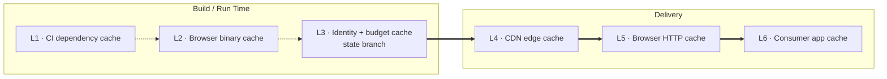

# Part 10 — Caching, Concurrency, and Recovery

*Sections 55 through 60. Audience: backend engineers, DevOps, SRE. The governing property of this part is that the system has no coordination service and needs none, because concurrency safety is achieved structurally rather than by locking.*

---

# 55. Cache Strategy

## 55.1 Cache Layers

| Layer | Purpose | Invalidation | Correctness-Critical |
|---|---|---|---|
| L1 CI dependencies | Faster setup | Lockfile hash | **No** |
| L2 Browser binary | Faster setup | Exact Playwright version | **No** |
| L3 Identity / budget | Skip resolution; rate accounting | TTL 30 d / hourly rollover | **No** for identity; budget fails closed |
| L4 CDN edge | Serve visitors globally | TTL + content addressing | Yes for freshness |
| L5 Browser HTTP | Repeat visits | `Cache-Control` | Yes for freshness |
| L6 Consumer app | Avoid refetch within a session | App-defined TTL | Yes for freshness |

| ID | Requirement |
|---|---|
| TR-CACHE-001 | L1, L2, and L3 MUST be optimisations only. **A cold cache MUST produce identical output**, only slower (CON-09). |
| TR-CACHE-002 | The budget cache is the sole exception in *direction*: it fails **closed** (assume consumed) rather than open. That is conservative, not incorrect. |

## 55.2 CI Caches

| Cache | Key | Restore Keys | Size | Saves |
|---|---|---|---|---|
| npm dependencies | `node-<os>-<lockfile-hash>` | `node-<os>-` | ~40 MB | ~25 s |
| Playwright browsers | `pw-<os>-<exact-version>` | **none** | ~350 MB | ~45 s |

| ID | Requirement |
|---|---|
| TR-CACHE-010 | The browser cache MUST use an exact key with **no restore-keys fallback**. A partial restore of a different browser build produces a subtly different browser than the pin specifies, silently breaking the determinism that the browser-pinning mitigation depends on. **Cache misses on version change are correct and desirable.** |

## 55.3 Identity Cache

| Aspect | Rule |
|---|---|
| Location | `state:/cache/identity/<client>/<listing>.json` |
| TTL | 30 days |
| Re-verification | **Every run** — the business name is already on the page being loaded, so verification is free |
| Re-resolution | Only on TTL expiry or on drift |
| Cold behaviour | One search per listing, with a `warn` event |

**The identity cache eliminates the most fragile step in the acquisition path.** Search is expensive and unreliable; the design goal is to execute it approximately never. Caching the result and verifying it cheaply on every run gets both properties at once.

## 55.4 Publication Cache Semantics

The manifest-plus-immutable-content pattern.

| Artifact | Cache-Control | TTL | Reasoning |
|---|---|---|---|
| `index.json` (global) | `public, max-age=300, stale-while-revalidate=600` | 5 min | The freshness pointer. Short TTL, tiny payload |
| `<listing>/index.json` | Same | 5 min | Same |
| `stats.json` | `public, max-age=600` | 10 min | Small and frequently embedded |
| `latest.json` | `public, max-age=900, stale-while-revalidate=3600` | 15 min | The common consumer artifact |
| `reviews.json` | `public, max-age=1800, stale-while-revalidate=7200` | 30 min | Larger, changes less often |
| `schema-org.json` | `public, max-age=3600` | 1 h | Consumed at build time in most integrations |

**`stale-while-revalidate` is doing important work here.** A visitor arriving just after the TTL expires is served the cached copy instantly while the edge refreshes in the background — so a cache miss never becomes visitor-visible latency. For content whose freshness requirement is measured in hours, this is exactly the right semantic.

| ID | Requirement |
|---|---|
| TR-CACHE-020 | **Actual response headers MUST be verified during deployment and recorded in `docs/runbooks/`** (OIQ-04). Whether these directives are honoured depends entirely on the chosen static host. |
| TR-CACHE-021 | If the host imposes a fixed long TTL, the manifest pattern MUST be supplemented with content-hashed URLs (§54.4). If it imposes a fixed short TTL, freshness is unaffected — it only means more origin requests. |

## 55.5 Consumer Caching Guidance

| Rule | Reason |
|---|---|
| Cache in `sessionStorage` for the session at most | Avoids refetching on client-side navigation without risking indefinite staleness |
| Never cache indefinitely in `localStorage` | A visitor returning in a month would see a month-old payload |
| Read `index.json` first, then the artifact | Gives freshness and cacheability simultaneously |
| Use `?v=<content_hash>` when guaranteed freshness is required | A distinct cache key that changes only when content changes |

---

# 56. Locking Strategy

## 56.1 There Are No Locks

> **EDR-035 — Concurrency safety is achieved by path disjointness, not by locking**
> **Serves:** INV-09, CON-08 (no server).
> **Context:** Multiple shards run concurrently on independent ephemeral runners with no shared memory, no shared filesystem, and no coordination service. The conventional answer is a distributed lock.
> **Decision:** No locks exist. Concurrent writers are made structurally impossible by assigning each writable path to exactly one writer.
> **Alternatives Rejected:** *A lock file on the `state` branch* — acquiring it requires a commit-and-push, which is itself the operation being protected; the lock has the same race as the thing it guards. *An external coordination service* — violates CON-01 and CON-08, and introduces an availability dependency in front of a batch job that does not need one. *Optimistic concurrency with retry on conflict* — this is in fact what the push-rebase-retry does, but it is a *transport-level* mechanism, not a correctness mechanism; correctness comes from disjointness. *Advisory locking via branch protection* — not a lock, and would block legitimate concurrent shards.
> **Trade-off:** Every writable path must have exactly one writer, which constrains the design of any future feature that wants to write shared state. Two paths (budget, breaker) deliberately break the rule and are designed to tolerate last-write-wins.
> **Scalability:** Holds to the point where a shard would need to write another shard's path — which is the same point (~500 clients) at which the architecture moves to a real datastore.

| ID | Requirement |
|---|---|
| TR-CONC-001 | No lock file, lease, mutex, or coordination service may be introduced. A feature that appears to require one requires an EDR. |
| TR-CONC-002 | Every writable path MUST have exactly one writer, except the two documented shared paths in §56.3. |

## 56.2 Writer Assignment

| Path | Sole Writer |
|---|---|
| `data:/clients/<slug>/<listing>/*` | The shard containing that target |
| `data:/clients/<slug>/index.json` | That client's shard |
| `data:/index.json` | **The `collect` job**, after all shards complete |
| `state:/ledger/<slug>/<listing>.json` | That client's shard |
| `state:/health/<slug>.jsonl` | That client's shard (append) |
| `state:/cache/identity/<slug>/<listing>.json` | That client's shard |
| `state:/runs/<yyyy-mm>/<run-id>.json` | The `collect` job |

**The global manifest is written by `collect`, not by shards.** If shards wrote it, every shard would need to read-modify-write the same file and Git conflicts would be guaranteed. Deferring it to a single post-shard job makes conflict structurally impossible.

## 56.3 The Two Intentionally Shared Paths

| Path | Written By | Conflict Resolution | Why It Is Safe |
|---|---|---|---|
| `state:/cache/budget/<source>/<date>.json` | Any shard | Last-write-wins | Budgets are set an order of magnitude below any plausible threshold; a lost increment costs a handful of requests |
| `state:/breaker/<source-access>.json` | Any shard | Last-write-wins | Both possible outcomes fail conservatively: a lost "open" is re-triggered by the next occurrence; a lost "close" means one extra cooldown period |

| ID | Requirement |
|---|---|
| TR-CONC-010 | Both shared paths MUST fail in the conservative direction under last-write-wins. Any future shared path MUST demonstrate the same property or MUST NOT be shared. |

## 56.4 File-Level Atomicity

| ID | Requirement |
|---|---|
| TR-CONC-020 | Every file write MUST be write-to-temp-then-rename. Rename is atomic on the platforms in scope; a partially-written ledger is unrecoverable, a partially-written temp file is inert. |
| TR-CONC-021 | Commits MUST be one per shard per branch, so the commit itself is the transaction boundary. |
| TR-CONC-022 | If the commit fails after files are written, the next run MUST read the previous state and re-derive. This is safe **because reconciliation is idempotent** (INV-04). |

---

# 57. Concurrency Rules

## 57.1 Concurrency Model

| Level | Concurrency | Bounded By |
|---|---|---|
| Runs of the same tier | **1** | Concurrency group |
| Shards within a run | `max_parallel`, default 4, ceiling 8 | Repository variable |
| Targets within a shard | **1** | Sequential by design (§45.2) |
| Browser contexts per target | **1** | One context, one page |
| Concurrent writes to one path | **1** | Path disjointness |

## 57.2 Why Parallelism Is Capped Low

`max_parallel` is capped at 4 by default and 8 absolutely — far below what the platform would permit.

**The reason is not runner availability.** Four parallel shards each making a request every few seconds is a modest, defensible request rate. Sixteen parallel shards is four times the instantaneous pressure on the source for the same total work. Total work is fixed by client count and cadence, so parallelism buys only wall-clock completion time — which is worth very little when the freshness SLO is measured in hours.

**Parallelism is therefore spent on politeness rather than on speed.**

### 57.2.1 Request Volume Analysis

| Clients | Harvests/day | Requests/day | Requests/hour | Assessment |
|---|---|---|---|---|
| 1 | 4 | ~48 | 2 | Less than one person browsing the listing once |
| 10 | 40 | ~480 | 20 | A small office's incidental traffic |
| 50 | 200 | ~2,400 | 100 | Noticeable but modest |
| 100 | 400 | ~4,800 | 200 | **Approaching the threshold of prudence** |
| 500 | 2,000 | ~24,000 | 1,000 | **Not defensible** |

**The honest conclusion:** the volume argument holds comfortably to roughly 50 clients, becomes arguable at 100, and fails at 500. The architecture's answer at that point is not a cleverer rate limiter — **it is migration to official APIs.** Any other answer would be self-deception.

## 57.3 Pacing and Rate Limiting

| Layer | Mechanism | Configurable | Hard Limit |
|---|---|---|---|
| Per-request spacing | Minimum delay between page interactions | Downward only | **250 ms floor** |
| Per-target spacing | Delay between clients within a shard | Downward only | **5 s floor** |
| Per-source hourly budget | Persisted token bucket | Downward only | **600 req/h compile-time constant** |
| Per-source daily budget | Persisted counter | Downward only | **6,000 req/day compile-time constant** |
| Shard parallelism | `max_parallel` | Yes | **8** |
| Cadence floor | Minimum interval between harvests of one listing | Upward only | **1 h** |

| ID | Requirement |
|---|---|
| TR-CONC-030 | Configuration may make the engine **more** conservative but never less. |
| TR-CONC-031 | Hard ceilings MUST be compile-time constants, not configuration keys. This closes the path where a well-meaning operator "temporarily raises the limit" during an incident and turns a soft rate-limit signal into a hard block. |

## 57.4 Jitter

Three independent applications, each addressing a different synchronisation risk.

| Where | Amount | Prevents |
|---|---|---|
| Cron minute selection | Fixed odd minutes per tier | Platform-wide congestion at round minutes, which causes delivery delay |
| Inter-target delay | `base + U(0, base)` | All shards hitting the source at the same instant after setup completes |
| Intra-harvest interactions | `base + U(0, base × 0.5)` | A metronomic request pattern, which is both the most detectable and the least human-like signature |

**On the third row: this is not evasion.** The engine does not attempt to *appear* human — that would be the arms race ADR-010 forbids. It simply avoids being pathologically machine-like in a way that creates load spikes. Even spacing is better for the source than bursts, and jitter is how independent workers achieve even spacing without coordination.

| ID | Requirement |
|---|---|
| TR-CONC-040 | All jitter MUST come from `RandomPort`, so tests can seed it deterministically. |
| TR-CONC-041 | Full jitter (`U(0, delay)`) MUST be used for retries, not `delay ± small`. It is the variant that best decorrelates concurrent retries across independent shards. |

## 57.5 Budget Accounting Across Ephemeral Runners

> **EDR-034 — Rate budget accounting is pessimistic: consumption is written before the request, not after**
> **Serves:** FR-089, THREAT-12.
> **Context:** Runners are ephemeral and may run concurrently, so there is no shared in-memory counter. Counters are persisted to the `state` branch and are therefore eventually consistent.
> **Decision:** Consumption is written **before** the requests are made. A crash therefore over-counts rather than under-counts.
> **Alternatives Rejected:** *Write consumption after the requests* — a shard that crashes mid-harvest has made the requests and recorded none of them, so the budget under-counts and the next shard over-spends. Failing in the permissive direction is exactly wrong for a politeness control. *Reconcile after the fact from logs* — logs are ring-buffered and expire; the budget must be authoritative at decision time. *Skip persistence and rely on per-run limits alone* — loses all cross-run accounting, which is where the daily budget lives.
> **Trade-off:** A crashed shard permanently over-counts its budget for that hour, slightly reducing capacity. Harmless, and self-correcting at the next rollover.
> **Scalability:** Precision degrades as concurrency rises, which is why budgets are set an order of magnitude below any plausible threshold.

| Challenge | Approach |
|---|---|
| No shared counter | Persisted per source per UTC hour and per UTC day on `state` |
| Concurrent shards may double-spend | **Accepted.** With budgets an order of magnitude below any threshold, over-spending by a handful of requests is harmless |
| A crashed shard may not write back | **Pessimistic accounting** — written before the requests |
| Counter file unreadable | **Fail closed**: assume consumed, defer the target |

**Design honesty.** Exact distributed rate limiting without a coordination service is not achievable, and pretending otherwise with an elaborate algorithm would be worse than admitting it. The engineering answer is to make precision unnecessary by operating far below the limit, then to fail conservatively whenever the accounting is uncertain. **Every ambiguity in this subsystem resolves toward fewer requests.**

## 57.6 Adaptive Backpressure

| Signal | Automatic Response |
|---|---|
| Any `ERR-HTTP-429` | Source budget for the current hour set to zero; 60 s base retry delay; occurrence recorded |
| Two 429s in 24 h | Circuit breaker opens for 2 h with escalating cooldown |
| Any `ERR-BLOCKED-*` | Breaker opens immediately for 6 h with escalating cooldown; `critical` alert |
| p95 duration rising > 50% week over week | `warn` suggesting a cadence reduction — often the earliest sign of upstream throttling |
| Breaker reopening more than twice | Runbook recommends dropping affected clients one cadence tier, then migrating to an official API |

| ID | Requirement |
|---|---|
| TR-CONC-050 | Backpressure MUST be **automatic downward and manual upward**. The engine slows itself without asking. It MUST NEVER speed itself back up automatically — restoring cadence after an incident is a human decision made with context the engine does not have. |

## 57.7 Shared Egress Reputation

**A material and often-overlooked risk.** The runner's egress addresses belong to a large shared cloud range used by every other user of the platform, including users whose automation is far less careful.

| Consequence | Mitigation |
|---|---|
| The engine may be rate-limited or challenged for behaviour that is not its own | Circuit breaker and escalating cooldown handle it without human intervention; alerts state clearly that the cause may be exogenous |
| Being maximally polite does not guarantee access | Accepted; documented in the client explainer as "best-effort updates" |
| The correct response is **never** to change identity | Rotating identity to escape a shared-reputation block is evasion (ADR-010) |

**This is the strongest practical argument for the official-API recommendation.** No amount of engineering discipline on our side can guarantee access through a shared-reputation channel. An official API adapter has a private, authenticated quota that nobody else can consume or spoil. **Clients on the Business Profile API are simply immune to this entire section.**

---

# 58. Race Condition Prevention

## 58.1 Enumerated Races and Their Resolution

| # | Race | Resolution | Residual |
|---|---|---|---|
| R-1 | Two shards write the same payload file | **Impossible** — path disjointness | none |
| R-2 | Two shards write the same ledger | **Impossible** — path disjointness | none |
| R-3 | Two shards push to `data` simultaneously | Fetch-rebase-retry; disjoint paths mean no content conflict, only ancestry | Push may need up to 3 attempts |
| R-4 | Two shards increment the same budget counter | Last-write-wins; pessimistic accounting | A few requests over-spent |
| R-5 | Two shards write breaker state | Last-write-wins; both outcomes fail conservatively | One extra cooldown at worst |
| R-6 | A scheduled run starts while another is running | Concurrency group; new run exits with `skipped_overlap` | A skipped cycle |
| R-7 | Crash between payload commit and state commit | Payload-first ordering; next run re-reconciles idempotently | Benign no-op |
| R-8 | Crash after files written, before commit | Next run reads previous state and re-derives | Work repeated |
| R-9 | The `collect` job writes the global manifest while a shard is still pushing | `collect` depends on all shards via `needs:` | none |
| R-10 | Two runs of different tiers select the same target | Due-set check; the second finds it not due | none |

| ID | Requirement |
|---|---|
| TR-CONC-060 | Every race in this table MUST have a documented resolution. A new shared-write path MUST be added to this table with its resolution before it is implemented. |

## 58.2 Why R-1 and R-2 Are Impossible Rather Than Handled

A target belongs to exactly one shard, and a shard writes only its own targets' paths. There is no code path by which two shards could select the same target, because the shard plan is computed once, by one job, and partitions the target set.

**This is the difference between a system that handles conflicts and a system that cannot have them.** Handling is a runtime behaviour that can be wrong; impossibility is a structural property that cannot.

## 58.3 Push Conflict Resolution

| Step | Action |
|---|---|
| 1 | Attempt push |
| 2 | On non-fast-forward: fetch |
| 3 | Rebase the shard's single commit onto the new tip |
| 4 | Retry push |
| 5 | Up to 3 attempts with backoff (2 s, 6 s, 18 s) |
| 6 | On exhaustion: `ERR-PUBLISH-CONFLICT`, artifacts uploaded to CI, next run reproduces |

| ID | Requirement |
|---|---|
| TR-CONC-070 | The rebase MUST NOT produce a content conflict, because shards write disjoint paths. **If a content conflict ever occurs, it indicates a path-disjointness violation and MUST be treated as a defect**, not resolved automatically. |
| TR-CONC-071 | Force-push MUST NOT be used as a conflict resolution. |

**TR-CONC-070 is a useful canary.** A content conflict on `data` means two writers touched one file, which means the isolation guarantee is broken somewhere. Automatically resolving it would hide the defect.

## 58.4 Ordering Guarantees

| Guarantee | Mechanism |
|---|---|
| Payload before state | Explicit ordering (EDR-025) |
| Global manifest after all shards | `collect` job dependency |
| Redaction seeded before first log event | Startup sequence step 4 before step 5 |
| Reply detached before other fields extracted | Extraction order step 1 |
| Entities decoded before markup stripped | Normalisation step 1 before step 2 |
| Length bounded last | Normalisation step 7 |
| Challenge detected before parsing attempted | Navigation phase ordering |

**Each row is an ordering that produces a subtle, hard-to-diagnose defect when inverted.** They are collected here because ordering constraints are invisible in a module diagram and are exactly the kind of thing a refactor silently breaks.

---

# 59. Failure Recovery

## 59.1 Automatic Recovery Behaviours

| Failure | Automatic Behaviour | Human Involvement |
|---|---|---|
| Transient network error | Retry per policy | none |
| Retry exhaustion | LKG retained; next cycle retries | none |
| Browser crash | One retry with a fresh context | none |
| Partial harvest | Additions merged; **no streak changes**; gate likely rejects | Only if persistent |
| Gate rejection | LKG retained; ledger not written; alert raised | Review reasons |
| Publish conflict | Rebase-retry ×3; artifacts preserved | none |
| Rate budget exhausted | Target deferred to the next cycle | none |
| Circuit breaker open | Targets deferred; cooldown escalates | Policy decision if repeated |
| Run budget exhausted | Remaining targets deferred; exit 4 | Only if recurring |

## 59.2 The Recovery Invariant

**Every automatic recovery path ends in one of two states:**

1. The harvest succeeded and the payload was updated.
2. The harvest did not succeed and **the previous payload is still being served, unchanged**.

There is no third state. There is no partial publication, no degraded payload, and no empty payload. This is INV-02, and it is achieved not by a guard but by the structural fact that **no path to the publish step exists except through the Gate**.

| ID | Requirement |
|---|---|
| TR-REC-040 | No code path may write a payload artifact without passing through the Publish Gate. An architecture test SHOULD assert that `adapters/publisher/` is called only from the post-gate branch of the target runner. |

## 59.3 Recovery Testing

Every automatic recovery behaviour has a chaos scenario.

| Scenario | Injected Failure | Asserts |
|---|---|---|
| CH-01 | Network timeout on navigation | Retry ×2 with backoff, then target fails; LKG retained |
| CH-02 | HTTP 429 on first request | Hour budget zeroed, 60 s backoff; second 429 opens breaker |
| CH-03 | Challenge page served | **Terminal, zero retries**, breaker opens, critical alert, LKG retained |
| **CH-04** | **Pagination stalls at 12 of 118** | **Completeness `partial`, additions merged, NO streak increments, gate rejects on G-05** |
| CH-05 | Review container absent | `ERR-PARSE-STRUCTURE`, target fails, LKG retained |
| CH-06 | All reviews vanish, no empty-state marker | `ERR-PARSE-EMPTY-UNEXPECTED`; if it passed, G-02 rejects |
| CH-07 | Selector pack broken for one field | Fallback strategies engage; strategy-health alert; extraction still correct |
| CH-08 | Pack broken for all strategies of a required field | Records quarantined; threshold breached; gate rejects |
| CH-09 | Browser crashes mid-pagination | One retry; on repeat, target fails cleanly with context closed |
| CH-10 | Ledger file corrupted | `ERR-STATE-CORRUPT`, target aborts, LKG retained |
| CH-11 | Git push conflict | Rebase-retry ×3 succeeds; artifacts identical |
| CH-12 | Git push fails permanently | `ERR-PUBLISH-CONFLICT`; artifacts uploaded; next run reproduces byte-identically |
| CH-13 | Run budget exhausted mid-shard | Remaining targets `deferred` (not failed); exit 4; no data loss |
| CH-14 | Malicious markup in review text | Stripped at normalisation; validator self-check passes; payload is plain text |

**CH-04 is the single most important test in the entire suite.** It simulates the exact failure that would otherwise silently delete a client's reviews, and it asserts three independent protections engage: partial classification, streak suppression, and gate rejection. **If only one test could be run before a release, it would be this one.**

---

# 60. Disaster Recovery

## 60.1 Objectives

| Objective | Target | Achieved By |
|---|---|---|
| **RPO** (data loss window) | **~0** for payloads and ledgers | Everything is committed to Git; every state is recoverable from history |
| **RTO** (time to restore) | ≤ 2 h for total repository loss; ≤ 30 min for anything less | Small system, everything scripted, no infrastructure to rebuild |
| **Visitor impact** | **Zero** for all scenarios except a CDN failure exceeding cache TTL | Static artifacts served from a CDN, independent of the engine |

**This plan is short because ADR-001, ADR-006, and ADR-012 did the work.** There is no database to restore, no server to rebuild, and no configuration drift to reconstruct — the entire system is a Git repository and a static file.

## 60.2 Disaster Scenarios

| # | Scenario | Likelihood | Visitor Impact | RTO | Procedure |
|---|---|---|---|---|---|
| D-1 | Bad payload published | Low | Until CDN TTL (≤ 30 min) | 15 min | §60.3 |
| D-2 | Ledger corrupted or lost for one client | Low | **None** | 20 min | §60.4 |
| D-3 | `data` branch corrupted | Very low | **None** (CDN serves cached) | 30 min | §60.5 |
| D-4 | `state` branch lost entirely | Very low | **None** | 45 min | §60.5 |
| D-5 | Entire repository lost or account compromised | Very low | **None** until CDN TTL | 2 h | §60.6 |
| D-6 | CI platform unavailable | Low | **None** (staleness only) | Hours | §60.7 |
| D-7 | CDN / static host unavailable | Low | **Yes — payload unreachable** | 1 h | §60.8 |
| D-8 | Total loss of source access | Medium | **None** | 1 h per client | Adapter migration |
| D-9 | Maintainer unavailable | Medium | None until something breaks | 1 day | Handover documentation |

## 60.3 D-1 — Bad Payload Published

| # | Step |
|---|---|
| 1 | Identify the bad commit on `data`: `git log --oneline -- clients/<slug>/` |
| 2 | Choose the mechanism: `git revert <sha>` restores exact prior bytes; **`tpre project --client <slug>` regenerates from the Ledger and is preferred** if the Ledger is sound, because it also repairs any projector defect |
| 3 | Push; the `pages` workflow redeploys automatically |
| 4 | Wait out the CDN TTL, or use a content-addressed URL to verify immediately |
| 5 | Run `scripts/verify-payload.mjs` against the public URL |
| 6 | If the cause was an engine defect, revert the engine and **add a regression test** |

## 60.4 D-2 — Ledger Corrupted or Lost

| # | Step |
|---|---|
| 1 | `git log --oneline -- ledger/<slug>/<listing>.json` on `state` |
| 2 | Identify the last version passing schema validation |
| 3 | Restore that version |
| 4 | Commit with a message referencing the incident |
| 5 | Run a harvest — **idempotence (INV-04) re-derives everything since** |
| 6 | Verify the payload is unchanged or improved |
| 7 | If **no** valid version exists, bootstrap from the current payload: `tpre import-payload --as-ledger --client <slug>` |

**Accept the losses on step 7:** `first_seen_at` becomes the import date, `revision` resets to 1, and **tombstones and suppressions are lost — the denylist MUST be re-applied from `compliance/denylist.json`**, which is exactly why that file lives on `main` and not in the Ledger.

## 60.5 D-3 / D-4 — Branch Loss

| Branch | Procedure |
|---|---|
| `data` | Recreate as an orphan branch; run `tpre project` for every client to regenerate every payload from ledgers; run `pages`; verify all payloads. **No acquisition required — zero source requests** |
| `state` | Recreate as an orphan branch with placeholders; ledgers are lost, so bootstrap each client per §60.4 step 7; re-apply the denylist; accept loss of health history and identity caches (both regenerate) |

**The asymmetry is instructive: losing `data` is trivial because it is derivable; losing `state` is worse because it is the source of truth.** This is exactly the right way round, because `state` is written less often, has a smaller history, and has the longer retention policy.

## 60.6 D-5 — Total Repository Loss

| # | Step | Time |
|---|---|---|
| 1 | Locate the most recent clone: a developer machine, a CI cache, or **the mirror created during the last history-truncation operation** | 15 min |
| 2 | Create a new repository; push `main` from the clone | 10 min |
| 3 | Push `data` and `state` if present; otherwise recreate per §60.5 | 20 min |
| 4 | Reconfigure: branch protection, Pages, variables, secrets, schedules | 30 min |
| 5 | **Rotate every secret** — assume compromise if loss was due to account compromise | 20 min |
| 6 | Update client-site payload URLs if the origin changed | 15 min |
| 7 | Run a full harvest; verify all payloads | 20 min |
| **Total** | | **~2 h** |

| ID | Requirement |
|---|---|
| TR-STOR-050 | At least one full clone including `data` and `state` MUST exist outside the primary account. The quarterly truncation procedure already requires creating a mirror; **that mirror MUST be retained as the offsite backup rather than deleted.** |

**TR-STOR-050 converts a required maintenance step into a disaster-recovery control at zero additional cost.**

## 60.7 D-6 — CI Platform Unavailable

| # | Step |
|---|---|
| 1 | Confirm scope via the platform status page |
| 2 | If brief: **do nothing.** LKG serves; staleness alerts will fire and can be acknowledged |
| 3 | If prolonged: run the engine locally — `tpre harvest --all` with `TPRE_ENV=production` and local checkouts of `data` and `state`, then push manually |
| 4 | If very prolonged: stand up cron on any host (~1 engineer-day) |

**Step 3 is possible only because the engine is a plain CLI with no platform dependency in its core.** A maintainer with a laptop is a complete disaster-recovery compute plane. That property is worth the four portability requirements in §14.6.

## 60.8 D-7 — CDN Unavailable

**The only scenario with visitor impact**, because it sits between the payload and the visitor.

| # | Step |
|---|---|
| 1 | Confirm scope; determine whether the failure is host-wide or site-specific |
| 2 | **Client sites using build-time integration (patterns B/C) are unaffected** — the data is already in their HTML |
| 3 | For runtime-fetch clients: switch the payload URL to the fallback origin |
| 4 | Communicate to affected clients if the outage exceeds 1 h |
| 5 | Post-incident: consider moving affected clients to a build-time pattern permanently |

**Prevention insight.** Build-time integration patterns are immune to this scenario, which is a strong argument for preferring them wherever the client's stack allows.

## 60.9 DR Drill Schedule

| Drill | Frequency | Verifies |
|---|---|---|
| Payload regeneration from Ledger (`tpre project`) | **Monthly**, on one client | D-1, D-3 |
| Ledger restore from Git history | Quarterly | D-2 |
| Local harvest and manual push | Quarterly | D-6 |
| Offsite clone existence and completeness | Quarterly | D-5 mitigation |
| Adapter migration drill | Quarterly | D-8, INV-10 |
| Full repository restore into a scratch account | Annually | D-5 |

| ID | Requirement |
|---|---|
| TR-STOR-060 | DR drills MUST be executed on the stated schedule and the result recorded. **A DR plan that has never been executed is a hypothesis.** These drills are cheap — most are a single command — and they are the difference between a plan and a document. |

## 60.10 The Adapter Migration Drill

Performed quarterly, because it proves the system's single most important contingency.

| # | Step | Success Criterion |
|---|---|---|
| 1 | Pick a test client or the scratch tenant | — |
| 2 | Obtain or reuse an OAuth grant for a test Business Profile | — |
| 3 | Change `adapter` to `google:business-profile-api` | **Config-only change** |
| 4 | Dry-run harvest; compare the observed set to the current Ledger | ≥ existing coverage |
| 5 | **Verify identity reconciliation: reviews match existing records rather than inserting duplicates** | **0 spurious inserts** |
| 6 | Full harvest and publish | Payload count and rating unchanged or improved |
| 7 | Record elapsed time | **≤ 1 hour** |

**Step 5 is the crux of the whole drill.** If cross-adapter identity stability were ever broken by a refactor, PT-08 should catch it — but this drill verifies it against real data from two genuinely different sources, which is the only evidence that matters. **A failure here invalidates the migration guarantee and is a release blocker.**

---

*End of Part 10. Part 11 specifies the complete testing strategy.*
