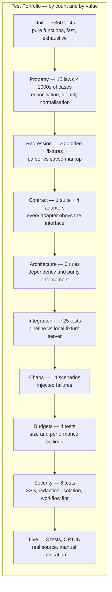

# Part 11 — Testing Strategy

*Section 61. Audience: QA lead, every engineer. The governing constraint is that the default suite runs offline in under three minutes. A suite slower than that stops being run locally, which is when it stops preventing defects.*

---

# 61. Testing Strategy

## 61.1 Testing Philosophy

| Principle | Consequence |
|---|---|
| **Tests run offline by default** | `npm test` passes on an air-gapped machine. Anything requiring the internet lives in `tests/live/` and is never part of default CI |
| **Test the pure core exhaustively; test the impure edges structurally** | Six of eleven stages are pure and get near-total coverage. The impure stages get contract tests, integration tests against fixtures, and chaos tests — **not brittle mocks of a browser** |
| **Fixtures are the primary defence against upstream change** | Golden HTML fixtures with expected outputs turn a live-site incident into an offline unit test |
| **Properties over examples where invariants exist** | Reconciliation's correctness is expressible as laws. Property tests check thousands of cases; examples check the ones we thought of |
| **Every incident becomes a permanent test** | Non-negotiable. An incident without a regression test will recur |
| **Test the guards, not just the happy path** | The Publish Gate, the removal-confirmation rule, and the sanitisation boundary are the safety mechanisms. **A safety mechanism without a test is decoration** |

## 61.2 Test Portfolio

| Suite | Count | Runtime | Runs In | Network |
|---|---|---|---|---|
| Unit | ~350 | < 10 s | Every PR | No |
| Property | 15 laws | < 30 s | Every PR | No |
| Regression (golden fixtures) | ~20 | < 20 s | Every PR | No |
| Contract | 4 adapters | < 15 s | Every PR | No (recorded fixtures) |
| Architecture | 6 rules | < 5 s | Every PR | No |
| Integration | ~25 | < 60 s | Every PR | **Localhost only** |
| Chaos | 14 | < 45 s | Every PR | Localhost only |
| Budgets | 4 | < 10 s | Every PR | No |
| Security | 6 | < 10 s | Every PR | No |
| Live smoke | 3 | ~3 min | Manual / nightly | **Yes** |

**Total default CI test time: under three minutes.**

| ID | Requirement |
|---|---|
| TR-TEST-020 | The default suite MUST complete in under three minutes and MUST require no network. |
| TR-TEST-021 | `tests/live/` MUST be excluded from the default runner configuration. |

---

## 61.3 Unit Testing

### 61.3.1 Coverage Requirements

| Target | Coverage | Notable Cases |
|---|---|---|
| `core/normalize/*` | ≥ 95% | **Adversarial strings**: nested entities, bidi overrides, ZWJ emoji sequences, 10,000-grapheme text, CJK, RTL, control characters, markup that survives naive stripping |
| `core/dates/*` | ≥ 95% | Full locale matrix; **singular "a day ago" forms**; unparseable phrases; pinning behaviour |
| `core/identity/*` | ≥ 95% | Author-key normalisation; diacritics; **homoglyphs must NOT merge**; append-tolerance of the 512-grapheme window |
| `core/extract/*` | ≥ 90% | Rating parsers P1/P2/P3; reply isolation; missing optional fields |
| `core/validate/*` | ≥ 95% | Each finding type; threshold boundaries; completeness classification |
| `core/reconcile/*` | ≥ 95% | Every decision branch; **the asymmetry rule**; streak arithmetic; tombstone and suppression handling |
| `core/project/*` | ≥ 95% | Determinism; sort stability; filter application; aggregate arithmetic |
| **`core/gate/*`** | **100%** | **Every rule G-01…G-12 independently, plus the first-publish exception and every force-override combination** |
| `app/config/*` | ≥ 90% | Precedence matrix — one test per layer pair; ceiling rejection; unknown-variable rejection |
| `infra/retry/*` | ≥ 95% | Policy lookup for every error class; the "blocked is never retried" assertion |
| **`infra/logger/redact.mjs`** | **100%** | Sentinel secrets at every level; key-pattern matching |

| ID | Requirement |
|---|---|
| TR-TEST-030 | Gate coverage MUST be 100%. It is the single mechanism standing between a bad harvest and a broken client website. Every rule needs a test proving it rejects, **and** a test proving it does not reject spuriously. |
| TR-TEST-031 | Redaction coverage MUST be 100%. Its failure mode is irreversible in a public repository. |

**Coverage is a floor, not a goal.** A module at 92% with the wrong assertions is worse than one at 80% with the right ones. The gates that carry real weight are the property laws, the chaos scenarios, and the two 100% modules — because those test behaviour that matters rather than lines that executed.

### 61.3.2 Unit Test Standards

| Standard | Rule |
|---|---|
| Naming | `<subject>.<behaviour>.test.mjs` |
| Structure | Arrange–Act–Assert, visually separated |
| Test names | **Full sentences describing behaviour**: *"retains last known good when coverage is below threshold"* |
| Shared state | **None.** Each test constructs its own data via builders |
| Builders over literals | `buildReview({ rating: 3 })` — a schema change then breaks one builder, not 200 tests |
| Determinism | **Fixed clock and seeded random in every test** |
| Network | None in default suites |
| Assertions | One logical assertion per test; multiple `expect` calls are fine if they assert one behaviour |

| ID | Requirement |
|---|---|
| TR-TEST-032 | Every test MUST use `fixed` clock and `seeded` random. A test reading the system clock is non-deterministic and will eventually fail at 2 a.m. for no reason. |
| TR-TEST-033 | Test data MUST be constructed through builders in `tests/helpers/`, not through inline object literals. |

---

## 61.4 Property Testing

Fifteen laws, each asserted with generated inputs at ≥ 1,000 cases.

| ID | Law | Statement | Protects |
|---|---|---|---|
| **PT-01** | Reconcile idempotence | `reconcile(reconcile(L,H),H) ≡ reconcile(L,H)` for fixed `now` | INV-04 |
| **PT-02** | Reconcile commutativity | Shuffling `observed` yields an identical Ledger | Deterministic output under unstable upstream ordering |
| **PT-03** | Tombstone monotonicity | A tombstoned id never becomes active under any observation sequence | "Deleted review comes back" |
| **PT-04** | Suppression durability | A suppressed id never appears in any projected payload | Compliance |
| **PT-05** | First-seen preservation | `first_seen_at` never changes after INSERT | Historical integrity |
| **PT-06** | Date-pin preservation | The pinned date never changes after INSERT | Stable sort order |
| **PT-07** | **Absence asymmetry** | **For any `partial` harvest, the Ledger's streaks and states are unchanged** | **INV-03 — the worst possible bug** |
| **PT-08** | Cross-adapter identity | The same logical review from two adapters yields the same `identity_hash` | INV-10, the migration guarantee |
| **PT-09** | Hash stability | `identity_hash` is invariant under insignificant formatting differences and under text appends beyond 512 graphemes | Duplicate prevention |
| **PT-10** | **Normalisation output safety** | **Output contains no markup, no control characters, and is within the length bound, for ALL generated inputs** | **INV-05** |
| **PT-11** | Normalisation idempotence | `normalize(normalize(x)) ≡ normalize(x)` | Pipeline correctness |
| **PT-12** | Projection determinism | Same ledger + config ⇒ byte-identical artifacts | Hash-gating |
| **PT-13** | Sort totality | The composite sort key is total and stable; no two distinct reviews compare equal | Stable display order |
| **PT-14** | Gate monotone safety | If a candidate would be accepted, a candidate with strictly more reviews and the same rating is also accepted | Gate sanity |
| **PT-15** | Ledger round-trip | `parse(serialize(L)) ≡ L`, including unknown-field preservation | Forward compatibility |

| ID | Requirement |
|---|---|
| TR-TEST-040 | Each law MUST run at least 1,000 generated cases. |
| TR-TEST-041 | A failing property test MUST report the minimal counterexample. |
| TR-TEST-042 | Property tests MUST reference their invariant in a comment, e.g. naming `INV-03`. |

**PT-07 and PT-10 are the two most likely to be broken by a well-intentioned refactor**, and the two whose breakage would be most damaging. They exist as properties rather than examples precisely because a developer "simplifying" the absence logic would still pass hand-written examples.

---

## 61.5 Regression Testing — Golden Fixtures

### 61.5.1 The Mechanism

Real pages are captured, sanitised, and committed as fixtures with an `expected.json` golden output and a `meta.json` recording provenance and pack version. The regression suite runs every parser × every applicable fixture on every PR.

| ID | Requirement |
|---|---|
| TR-TEST-050 | Every fixture MUST have `page.html`, `meta.json`, and `expected.json`. |
| TR-TEST-051 | Fixtures captured under pack `vN` MUST continue to be tested against `vN`. This is what proves the corpus tests **extraction** rather than today's markup. |
| TR-TEST-052 | The baseline fixture MUST be re-captured at least quarterly, so the corpus does not drift into testing only historical markup. |

### 61.5.2 Corpus Requirements

| Category | Fixtures | Purpose |
|---|---|---|
| Baseline | `001` standard 120 reviews | Happy path |
| Boundary | `002` single, `003` zero, `018` 5,000-review cap | Edge counts |
| Structural variety | `004` owner replies, `009` anonymous, `010` rating-only, `008` missing avatars | Field presence permutations |
| Text handling | `005` truncated, `006` RTL, `007` emoji/CJK, `020` mixed-language | Normalisation correctness |
| Locale | `012` German dates, `013` Hindi dates | Date matrix |
| Identity hazards | `011` duplicate author names | Identity discrimination |
| **Adversarial** | `014` partial stalled, `015` structure changed, `016` challenge page, `017` consent interstitial, `019` markup in text | **Assert correct failure** |

**The adversarial fixtures are the point of the corpus.**

| Fixture | Must Do | Must Not Do |
|---|---|---|
| `014` | Classify as `partial`; decrement no streak | Classify as `full` |
| `015` | Fail loudly with `ERR-PARSE-STRUCTURE` | Silently return three reviews |
| `016` | Classify as a **terminal challenge** | Classify as a parse failure |
| `017` | Dismiss and proceed | Treat as a challenge |
| `019` | Produce plain text with no markup | Escape rather than remove |

**A corpus containing only happy paths would pass while the system's safety properties silently rotted.**

### 61.5.3 Fixture Hygiene

| Rule | Detail |
|---|---|
| Sanitisation | `scripts/sanitize-html.mjs` strips scripts, tokens, cookies, tracking attributes, inline event handlers. **Review text and author names are retained** — needed for parser correctness and already public |
| Provenance | `meta.json` records capture date, source locale, pack version at capture, and whether the fixture is pack-agnostic |
| Size | Trimmed to the review container subtree plus minimal ancestry; a full-page capture is rejected in review |
| Privacy | A fixture containing a review subject to an erasure request MUST be removed and replaced with a re-capture |

---

## 61.6 Contract Testing

**One suite, executed against all four adapters.**

| Assertion | Applies To |
|---|---|
| `capabilities()` returns a valid descriptor naming supported fields | All |
| `resolve()` returns a `ResolvedListing` or a classified error, **never throws raw** | All |
| `acquire()` respects the supplied budget and aborts cleanly when exceeded | All |
| `acquire()` returns an `AcquisitionReport` with counts, stop reason, and timings | All |
| The adapter never writes to the Ledger or Payload | All |
| **Missing required secret ⇒ fail closed, never a silent downgrade** | API adapters |
| Fields the adapter cannot supply are `null`, **never fabricated** | All |
| Errors are drawn from the canonical taxonomy | All |
| Reviews reconcile with reviews from another adapter for the same logical review | All (paired with PT-08) |

**Running one suite against four genuinely different adapters is what validates the abstraction.** An interface tested against a single implementation is not an interface, it is a rename — and it will not survive the first migration attempt. This suite is the practical justification for building four adapters in v1.0 rather than one.

| ID | Requirement |
|---|---|
| TR-TEST-060 | The contract suite MUST run against **all four** adapters. Adding a fifth adapter (§76–§79) means running the same suite, not writing a new one. |

---

## 61.7 Architecture Testing

Six rules enforced by static analysis of the import graph.

| Rule | Assertion |
|---|---|
| DR-1 | No file in `core/` imports from `adapters/`, `infra/`, `app/`, `cli/`, or any I/O-capable package |
| DR-2 | No file in `core/` references `Date.now`, `Math.random`, `process.env`, `fs`, or `fetch` |
| DR-3 | No adapter imports another adapter; **`playwright` is imported by exactly one file** |
| DR-4 | `app/` does not import any concrete adapter |
| DR-5 | Only `cli/composition.mjs` constructs concrete implementations |
| DR-6 | No import reaches past a package's index into internals |

**These tests catch the class of erosion that documentation cannot prevent.** Every one of them will be violated eventually by someone in a hurry; the test is what makes the violation a two-minute fix instead of a six-month architectural drift.

| ID | Requirement |
|---|---|
| TR-TEST-070 | The architecture suite MUST also assert acyclicity within `core/`. |
| TR-TEST-071 | The architecture suite MUST assert that `adapters/publisher/` is reachable only from the post-gate branch (TR-REC-040). |

---

## 61.8 Integration and End-to-End Testing

### 61.8.1 What "End-to-End" Means Here

There is no user-facing application to drive, so E2E means: **a real browser, driving real markup, through the complete eleven-stage pipeline, to a real Git commit — all on localhost with no internet.**

The fixture server is what makes this possible. It serves the same sanitised markup the regression suite uses, over HTTP, with configurable lazy-loading behaviour — so the Navigator's scroll loop, stall detection, and expansion budget are exercised against realistic dynamics with **zero network and zero flakiness**.

### 61.8.2 Integration Test Inventory

| Test | Mechanism | Asserts |
|---|---|---|
| Full pipeline against the fixture server | Fixture server + real browser | Navigation, pagination, expansion, extraction, and the full pure pipeline work end to end |
| Pagination stall behaviour | Server stops yielding after batch 2 | Stop reason `stalled`, completeness `partial`, gate rejects |
| Publish to a real Git repository | Temporary local repository | Staging, hash-gating, commit message format, rebase-retry |
| **Hash-gating** | Two identical runs | **Second run produces zero writes and zero commits** |
| State round-trip | Temporary directory | Ledger write/read fidelity, atomic rename, unknown-field preservation |
| Resource blocking | Server logs requests | Images/fonts/media actually blocked; measured byte reduction non-trivial |
| **Context isolation** | Two targets in sequence, one failing | **No storage, cookie, or cache carryover; open-context count returns to zero** |
| Config resolution | Layered fixtures | Precedence matrix correct; trace accurate |
| Alert reconciliation | In-memory notifier | Open/comment/close lifecycle, dedup by fingerprint, rate limiting |
| Full offline harvest | `--dry-run --from-fixture` | Complete pipeline with zero writes |

| ID | Requirement |
|---|---|
| TR-TEST-080 | Integration tests MUST use only localhost. |
| TR-TEST-081 | The context-isolation test MUST include a run in which a target **fails**, because the failure path is where `finally` blocks get skipped. |

### 61.8.3 Consumer-Side E2E

| Test | Asserts |
|---|---|
| Network assertion on each integration recipe | **No request is made to any third-party origin** (INV-01) |
| Empty-state behaviour | Blocking the payload URL produces a clean empty state, no visible error |
| Layout stability | Containers pre-sized; CLS = 0 |
| Accessibility | Star rating has a text equivalent; pagination is keyboard-operable |
| Renderer safety | No HTML-injection DOM API present in the source |

---

## 61.9 Chaos Testing

Fourteen scenarios, each asserting a specific safety property. **Normative: none of these scenarios may result in a degraded published payload.**

| ID | Injected Failure | Expected Behaviour | Asserts |
|---|---|---|---|
| CH-01 | Network timeout on navigation | Retry ×2 with backoff, then target fails; LKG retained | Retry policy, INV-02 |
| CH-02 | HTTP 429 on first request | Hour budget zeroed, 60 s backoff; second 429 opens breaker | Backpressure |
| CH-03 | Challenge page served | **Terminal, zero retries**, breaker opens, `critical` alert, LKG retained | **INV-07** |
| **CH-04** | **Pagination stalls at 12 of 118** | **Completeness `partial`, additions merged, NO streak increments, gate rejects on G-05** | **INV-03** |
| CH-05 | Review container absent, page otherwise valid | `ERR-PARSE-STRUCTURE`, target fails, `high` alert, LKG retained | Structure detection |
| CH-06 | All reviews vanish, no empty-state marker | `ERR-PARSE-EMPTY-UNEXPECTED`; if it passed, G-02 rejects | INV-02, G-02 |
| CH-07 | Selector pack broken for one field | Fallback strategies engage; strategy-health alert; extraction still correct | Selector resilience |
| CH-08 | Pack broken for all strategies of a required field | Records quarantined; threshold breached; gate rejects | G-06 |
| CH-09 | Browser crashes mid-pagination | One retry; on repeat, target fails cleanly with context closed | Browser lifecycle |
| CH-10 | Ledger file corrupted | `ERR-STATE-CORRUPT`, target aborts, LKG retained, runbook referenced | State integrity |
| CH-11 | Git push conflict simulated | Rebase-retry ×3 succeeds; artifacts identical | Conflict handling |
| CH-12 | Git push fails permanently | `ERR-PUBLISH-CONFLICT`; artifacts uploaded; next run reproduces byte-identically | INV-04 |
| CH-13 | Run budget exhausted mid-shard | Remaining targets `deferred` (not failed); exit 4; no data loss | Budget semantics |
| CH-14 | Malicious markup in review text | Stripped at normalisation; validator self-check passes; payload is plain text | **INV-05** |

| ID | Requirement |
|---|---|
| TR-TEST-090 | All fourteen scenarios MUST pass before release. |
| TR-TEST-091 | **CH-04 is the single most important test in the suite.** It simulates the exact failure that would otherwise silently delete a client's reviews, and asserts three independent protections engage: partial classification, streak suppression, and gate rejection. |

---

## 61.10 Performance Testing

| Test | Target | Enforcement |
|---|---|---|
| Pure pipeline benchmark | ≤ 2 s CPU for 1,000 reviews | **Blocking** |
| `reviews.json` size, 200 reviews | ≤ 180 KB raw / ≤ 60 KB gzip | **Blocking** |
| `latest.json` size | ≤ 24 KB raw / ≤ 9 KB gzip | **Blocking** |
| Renderer bundle size | ≤ 5 KB minified | **Blocking** |
| Blocked-bytes effectiveness | Non-trivial reduction measured | **Blocking** |
| Harvest duration p95 | ≤ 180 s | Monitored, **not blocking** |
| Cold-start duration | ≤ 60 s warm cache | Monitored |
| Peak RSS per target | ≤ 700 MB | Monitored |

| ID | Requirement |
|---|---|
| TR-TEST-100 | Size and CPU-benchmark budgets MUST be blocking, because they are deterministic. |
| TR-TEST-101 | Wall-clock duration MUST NOT be blocking. Duration on a shared CI runner is too variable to gate a build on, and a flaky performance gate trains engineers to re-run CI until it passes — which destroys the value of every other test. |

**The distinction in TR-TEST-101 is the difference between a performance gate that works and one that gets ignored.**

---

## 61.11 Security Testing

| Test | Asserts |
|---|---|
| `security.xss-fixture` | Adversarial markup in review text never survives to the payload |
| `security.redaction` | Sentinel secrets never appear in any log level or artifact |
| `security.url-allowlist` | Off-allowlist avatar/profile URLs are nulled |
| `security.workflow-lint` | All workflows declare permissions; no `pull_request_target`; all actions SHA-pinned; no untrusted interpolation into `run:` |
| `security.renderer-api` | The renderer source contains no HTML-injection API usage |
| `security.isolation` | A failing target cannot write outside its own client path |

| ID | Requirement |
|---|---|
| TR-TEST-110 | Every security incident MUST add a permanent regression test. An incident that does not produce a test will recur. |

---

## 61.12 Live Testing (Opt-In Only)

| Aspect | Rule |
|---|---|
| Location | `tests/live/`, **excluded from the default runner** |
| Invocation | `npm run test:live`, or the nightly canary workflow |
| Network | Yes — real source |
| Rate discipline | Uses a single fixed reference listing and counts against the source budget like any harvest |
| Tests | (1) end-to-end smoke harvest with `--no-publish`; (2) structural assertions; (3) resolution of a known identity |
| **Failure policy** | **Live test failure never blocks a PR. It opens an issue** |

**Rationale for the failure policy.** A flaky, network-dependent test in the blocking path trains engineers to re-run CI until it passes, which destroys the value of every other test in the suite.

---

## 61.13 Quality Gates

| Gate | Threshold | Blocking |
|---|---|---|
| Statement coverage, `src/core/` | ≥ 90% | ✅ |
| Statement coverage, `src/core/gate/` | **100%** | ✅ |
| Statement coverage, `infra/logger/redact.mjs` | **100%** | ✅ |
| Statement coverage, overall | ≥ 70% | ✅ |
| All architecture rules | Pass | ✅ |
| All 15 property laws | Pass | ✅ |
| All 20 golden fixtures | Pass | ✅ |
| All 14 chaos scenarios | Pass | ✅ |
| All 6 security tests | Pass | ✅ |
| Size budgets | Within limits | ✅ |
| Schema validation (all schemas, all fixtures, all configs) | Pass | ✅ |
| Lint and type check | Zero errors | ✅ |
| Secret scan | Zero findings | ✅ |
| Dependency audit | Zero high-severity | ✅ |
| Live smoke | Pass | ❌ advisory |

---

## 61.14 Regression Discipline

| Trigger | Required Test Addition |
|---|---|
| Any production incident | A test reproducing the root cause, referenced by the incident issue number |
| Any selector pack change | A new fixture captured from the changed markup |
| Any upstream structural change | Fixture + updated canary assertions |
| Any gate threshold change | Boundary tests at the new threshold |
| Any identity or hashing change | Extended PT-08/PT-09 cases plus a documented migration |
| Any security finding | A permanent test under `tests/security/` |
| Any dependency major upgrade | Full suite plus a live smoke run before merge |

**Enforced by the PR template checklist.** *"Does this change fix a bug? If so, which test would have caught it?"* is a required field, and reviewers are instructed to reject a bug fix with no accompanying test.

---

## 61.15 Test-to-Requirement Traceability

**If an invariant has no test, it is not enforced.** This is the audit trail.

| Invariant | Enforcing Tests |
|---|---|
| INV-01 website never contacts a source | Consumer network assertion on every recipe |
| INV-02 failure never degrades the payload | CH-01, CH-04, CH-05, CH-06; full gate suite |
| INV-03 absence ≠ deletion | **PT-07, CH-04** |
| INV-04 reconcile idempotent | **PT-01**, CH-12 |
| INV-05 output safe as text | **PT-10**, CH-14, `security.xss-fixture` |
| INV-06 full provenance | Schema validation; manifest test |
| INV-07 challenge is terminal | CH-03, `retry-policy.blocked-never` |
| INV-08 no secret in any artifact | `security.redaction`; push-time scan |
| INV-09 client isolation | `security.isolation`; `fail-fast: false` |
| INV-10 adapter switch by config only | **PT-08**; quarterly migration drill |

| Risk | Enforcing Test |
|---|---|
| Upstream DOM change | CH-07, CH-08; fixture 015 |
| Challenge / rate-limit | CH-02, CH-03 |
| Silent partial data | **CH-04** |
| Destructive delete | **PT-03, PT-07** |
| Stored XSS | CH-14; fixture 019 |
| Duplicates | PT-08, PT-09 |
| Hash-gating regression | Integration hash-gating test; `MET-commit-churn` |
| Memory leak | Context-isolation test; `peakRssBytes` trend |

---

*End of Part 11. Part 12 specifies the CI/CD pipeline, workflow definitions, the deployment pipeline, and the release and rollback checklists.*
