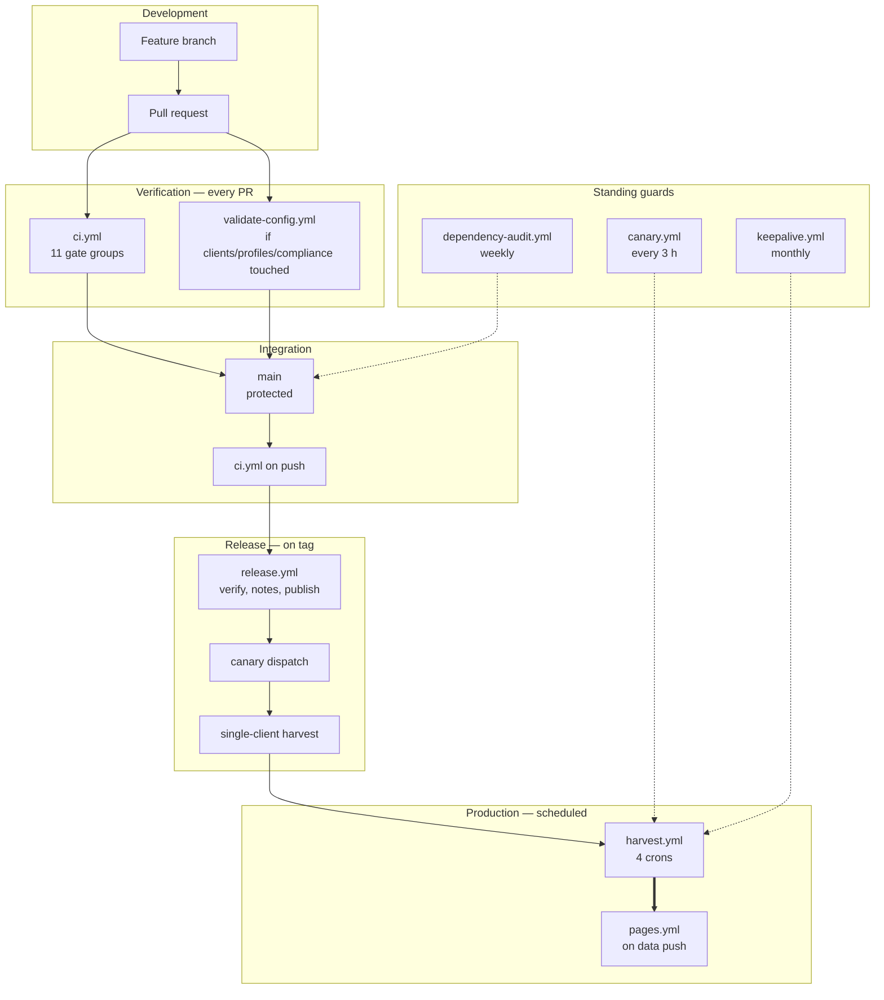

# Part 12 — CI/CD, Deployment, and Delivery Checklists

*Sections 62 through 66. Audience: DevOps, release manager, QA. §32 specified the harvest workflow's requirements; this part specifies the remaining seven workflows step by step, and the checklists that gate a release.*

---

# 62. CI/CD Pipeline

## 62.1 Pipeline Overview

## 62.2 The Three Pipelines

| Pipeline | Purpose | Trigger | Failure Means |
|---|---|---|---|
| **Verification** | Prove a change is safe | PR, push to `main` | The code is broken |
| **Production** | Do the work | Cron, dispatch | Depends on exit code (§32.4) |
| **Guard** | Detect drift and dormancy | Cron | Something upstream changed, or the system is silently off |

**Keeping these separate is what makes a red badge meaningful.** A gate rejection in the production pipeline is not a broken build; a failing test in the verification pipeline is.

## 62.3 `ci.yml` — Verification Pipeline

Runs on every pull request and on every push to `main`. Permissions: `contents: read`.

| # | Gate Group | Command | Blocking | Typical |
|---|---|---|---|---|
| 1 | Setup | composite action | ✅ | 25 s |
| 2 | Lint | `npm run lint` | ✅ | 8 s |
| 3 | Format check | `npm run format:check` | ✅ | 4 s |
| 4 | Type check | `npm run typecheck` | ✅ | 12 s |
| 5 | Unit + property + regression + contract | `npm test` | ✅ | 90 s |
| 6 | Architecture rules | included in `npm test` | ✅ | 5 s |
| 7 | Integration + chaos | included in `npm test` | ✅ | 105 s |
| 8 | Security suite | included in `npm test` | ✅ | 10 s |
| 9 | Size budgets | `npm run size` | ✅ | 10 s |
| 10 | Schema validation | `npm run validate:schemas` | ✅ | 8 s |
| 11 | Workflow lint | included in security suite | ✅ | 3 s |
| 12 | Secret scan | platform scanning + artifact entropy scan | ✅ | 10 s |
| 13 | Dependency audit | `npm audit` | ✅ high-severity | 12 s |
| 14 | Coverage thresholds | `npm run test:coverage` | ✅ | included |

| ID | Requirement |
|---|---|
| TR-CI-070 | `ci.yml` MUST complete in under five minutes. |
| TR-CI-071 | `ci.yml` MUST require **no network access** beyond dependency installation. |
| TR-CI-072 | Every gate group in the table MUST be blocking. A non-blocking quality gate is a report, and reports are not read. |

## 62.4 `validate-config.yml` — Configuration Pipeline

Runs on pull requests touching `clients/**`, `profiles/**`, or `compliance/**`. Permissions: `contents: read`, `pull-requests: write`.

| # | Step | Asserts |
|---|---|---|
| 1 | Checkout, setup | — |
| 2 | Schema-validate every client config | Shape correctness |
| 3 | Apply semantic rules V-1…V-12 | **V-3 is the authorisation gate** |
| 4 | Verify authorisation records exist for every `dom` listing | Compliance |
| 5 | Resolve effective config for each changed client and emit the trace | Precedence correctness |
| 6 | **Network-free dry-run projection** from any existing ledger | The config produces a sane payload |
| 7 | Post a summary comment on the PR | Reviewer sees the effect, not just the diff |

| ID | Requirement |
|---|---|
| TR-CI-080 | This workflow MUST run **network-free**. It runs on pull requests, including from forks, where no secrets are available by design. |
| TR-CI-081 | The PR comment MUST show the *effect* of the change — resolved values, projected counts — not merely that validation passed. A reviewer cannot evaluate a config diff without seeing what it resolves to. |

## 62.5 `canary.yml` — Drift Detection

Runs every 3 hours, offset from all client tiers. Permissions: `contents: write` (health only), `issues: write`.

| # | Step |
|---|---|
| 1 | Checkout, setup |
| 2 | Checkout `state` for health writing |
| 3 | `tpre canary` — full harvest of the reference listing with `--no-publish` |
| 4 | Evaluate structural assertions from `selectors/google-maps/assertions.json` |
| 5 | Write a health record |
| 6 | On assertion failure: open or update a `high` issue **naming the specific failed assertion** |

| ID | Requirement |
|---|---|
| TR-CI-090 | The canary MUST NOT publish any payload. |
| TR-CI-091 | The canary target MUST be a listing unrelated to any client, chosen for stability rather than relevance. |
| TR-CI-092 | Canary requests MUST count against the source budget like any harvest. |

## 62.6 `pages.yml` — Distribution

Runs on push to `data`. Permissions: `pages: write`, `id-token: write`.

| # | Step |
|---|---|
| 1 | Checkout `data` |
| 2 | Verify `.nojekyll`, `_headers`, `robots.txt` are present |
| 3 | Deploy the branch root as the static origin |
| 4 | Emit the deployed URL into the job summary |

| ID | Requirement |
|---|---|
| TR-CI-100 | This workflow MUST have no `contents: write`. It publishes; it does not produce. |

## 62.7 `keepalive.yml` — Dormancy Prevention

Runs monthly. Permissions: `contents: write`, `issues: write`.

| # | Step |
|---|---|
| 1 | Update a timestamp file on `state` (a trivial, verifiable change) |
| 2 | Query the API for the `harvest` workflow's state |
| 3 | If `harvest` is disabled, open a **`critical`** issue immediately |
| 4 | Emit a liveness record |

| ID | Requirement |
|---|---|
| TR-CI-110 | Keepalive MUST assert the harvest workflow's active state via API, not merely produce activity. Producing activity prevents dormancy; asserting state **detects** it. |

## 62.8 `release.yml` — Release Pipeline

Runs on push of a `v*` tag. Permissions: `contents: write`.

| # | Step |
|---|---|
| 1 | Checkout at the tag |
| 2 | Re-run the full verification suite |
| 3 | Verify `CHANGELOG.md` contains an entry for this version |
| 4 | Verify the payload schema version is unchanged, **or** a parallel-publish plan is documented |
| 5 | Generate release notes from Conventional Commits |
| 6 | Publish the release |

| ID | Requirement |
|---|---|
| TR-CI-120 | The release workflow MUST re-run the full suite at the tag, not trust the last `main` run. The tag may not point at the commit that was last verified. |

## 62.9 `dependency-audit.yml` — Supply-Chain Guard

Runs weekly. Permissions: `contents: read`, `issues: write`.

| # | Step |
|---|---|
| 1 | Install from the lockfile |
| 2 | Run the audit |
| 3 | On a **new** high-severity advisory, open an issue with the affected package and its usage site |
| 4 | Do not fail the workflow for advisories already tracked in an open issue |

---

# 63. GitHub Actions Workflow

## 63.1 Permission Matrix

**Least privilege, declared explicitly, per workflow and per job.**

| Workflow | Job | `contents` | `issues` | `pull-requests` | `pages` | `id-token` |
|---|---|---|---|---|---|---|
| `harvest` | plan | read | — | — | — | — |
| `harvest` | harvest (matrix) | **write** | — | — | — | — |
| `harvest` | collect | **write** | — | — | — | — |
| `harvest` | alert | **—** | **write** | — | — | — |
| `canary` | — | write | write | — | — | — |
| `ci` | — | read | — | — | — | — |
| `validate-config` | — | read | — | write | — | — |
| `pages` | — | **—** | — | — | write | write |
| `keepalive` | — | write | write | — | — | — |
| `release` | — | write | — | — | — | — |
| `dependency-audit` | — | read | write | — | — | — |

| ID | Requirement |
|---|---|
| TR-CI-130 | The `alert` job MUST have **no `contents` permission**. A bug in alerting must be structurally incapable of touching data. |
| TR-CI-131 | The `pages` workflow MUST have **no `contents` permission**. |
| TR-CI-132 | A workflow lacking an explicit `permissions` block MUST fail the workflow lint. |

**The two bolded absences in that matrix are deliberate design, not oversight.** They are what makes "a bug in the alerting code cannot corrupt a client's payload" a structural fact rather than a hope.

## 63.2 Composite Setup Action

`.github/actions/setup-engine/action.yml`, used by every workflow.

| # | Step | Notes |
|---|---|---|
| 1 | Set up Node from `.nvmrc` | Single source of version truth |
| 2 | Restore npm cache | Key: `node-<os>-<lockfile-hash>` |
| 3 | `npm ci` | Never `npm install` |
| 4 | Determine the Playwright version | For the exact cache key |
| 5 | Restore browser cache | **Exact key, no fallback** |
| 6 | Install browsers **only on cache miss** | Conditional |
| 7 | Print a versions banner | Node, npm, Playwright, browser, engine version |

| ID | Requirement |
|---|---|
| TR-CI-140 | The versions banner MUST be printed into the job log. During an incident, "which browser version produced this payload?" must be answerable from the log alone. |

## 63.3 Workflow Security Requirements

| ID | Requirement |
|---|---|
| TR-CI-150 | Every third-party action MUST be pinned to a full commit SHA. |
| TR-CI-151 | `pull_request_target` MUST NOT appear in any workflow. |
| TR-CI-152 | Untrusted values (issue titles, PR bodies, review content) MUST NOT be interpolated into `run:` blocks. Pass them via `env:` and quote them. |
| TR-CI-153 | Self-hosted runners MUST NOT be used. |
| TR-CI-154 | Secrets MUST be referenced only in the `env:` of the specific step that needs them. |

**On expression injection.** A workflow interpolating an issue title into a shell command lets anyone who can open an issue execute code in a runner holding a write token. This system's alerting reads and writes issues, which makes it exactly the shape of workflow where this mistake happens. The lint rule is not optional.

## 63.4 Artifact Retention

| Artifact | Retention | Reason |
|---|---|---|
| Diagnostics bundle | 14 days | Contains bounded PII (screenshots) |
| `run.jsonl` | 14 days | Contains bounded PII |
| `manifest.json` | 90 days | No PII; basis of trend analysis |
| Staged artifacts on publish failure | 14 days | Next run reproduces them anyway |

---

# 64. Deployment Pipeline

## 64.1 What "Deployment" Means

There is no server to deploy. Deployment is three independent things that are often conflated and should not be.

| Deployable | Artifact | Mechanism | Rollback | Time |
|---|---|---|---|---|
| **Engine** | Code on `main` | Merge + tag | Revert commit | ~5 min |
| **Configuration** | `clients/`, `profiles/`, `selectors/` | Merge | Revert commit | ~2 min |
| **Data** | Payloads on `data` | Machine-written by harvests | `git revert` or `tpre project` | ~10 min |

**Keeping these separate is what makes rollback cheap.** A bad selector pack is reverted by changing one line in a profile without touching engine code. A bad engine release is reverted without touching data. A bad payload is regenerated from the Ledger without acquiring anything.

## 64.2 First-Time Deployment

| # | Step | Verification |
|---|---|---|
| 1 | Create the repository. Decide public (default, free minutes) or private (costs minutes) | Repository exists |
| 2 | Push the engine to `main` | CI green |
| 3 | Configure branch protection on `main`: review required, CI required, no force-push | Settings verified |
| 4 | Create the `data` orphan branch with `.nojekyll`, `robots.txt`, `_headers`, `README.md` | Branch exists, no shared history |
| 5 | Create the `state` orphan branch with directory placeholders and `README.md` | Branch exists |
| 6 | Enable Pages, sourced from the `data` branch root | A test file is served over HTTPS |
| 7 | **Verify actual response headers and record them in `docs/runbooks/`** | Headers documented (OIQ-04) |
| 8 | Configure repository variables: `TPRE_POLICY_*`, `MAX_PARALLEL` | Visible in settings |
| 9 | Configure secrets for any API adapters in use | `tpre doctor` reports them present |
| 10 | Enable and verify all schedules | Workflow list shows all schedules active |
| 11 | Run `keepalive` manually | Green, no spurious issue opened |
| 12 | **Create the offsite clone** including `data` and `state` | Clone exists outside the primary account |
| 13 | Onboard the first client | Payload published |
| 14 | Run payload verification manually | Reachable, schema-valid, non-empty |
| 15 | Configure the CDN custom domain if used; **re-verify headers** | HTTPS on the custom domain |
| 16 | Run the adapter migration drill on a scratch client | Completed under one hour |
| 17 | Begin the 30-day soak | Success criteria tracked |

| ID | Requirement |
|---|---|
| TR-CI-160 | Step 7 MUST be completed before the first client is onboarded. Assumed cache headers are not verified cache headers, and the difference determines whether the manifest pattern works. |
| TR-CI-161 | Step 12 MUST be completed before the first client is onboarded. A system with no offsite copy has no D-5 recovery path. |

## 64.3 Engine Release Deployment

The engine is **adopted by the next scheduled run**, not deployed. A bad release therefore affects every client at the next cycle, which is why the staged sequence exists.

| # | Step | Gate |
|---|---|---|
| 1 | Merge to `main`; CI green | Automatic |
| 2 | Tag `vX.Y.Z`; release workflow runs the full suite | Automatic |
| 3 | **Dispatch a canary run manually** | Manual check: assertions pass |
| 4 | **Dispatch a harvest for one low-risk client** | Manual check: payload count and rating sane |
| 5 | Let scheduled runs proceed | — |
| 6 | Verify payloads for all clients after the first full cycle | Payload verification job |

| ID | Requirement |
|---|---|
| TR-CI-170 | Steps 3 and 4 MUST NOT be skipped. They convert an all-clients-at-once release into a controlled rollout and cost about ten minutes. |

## 64.4 Selector Pack Deployment

The highest-risk recurring change in the system. Full procedure in §36.6.

| Stage | Blast Radius |
|---|---|
| Pinned in `conservative` only | The small set of clients on that profile |
| Canary run with the new pack | Zero clients |
| Pinned in `default` | All clients |
| Rollback | **One line, instantly** |

## 64.5 Client Site Integration Deployment

| # | Step | Verification |
|---|---|---|
| 1 | Choose an integration pattern from the recommendation matrix | Documented in the client's record |
| 2 | Add the snippet or build-time import | Renders locally |
| 3 | If the site enforces a strict CSP, add the payload origin to `connect-src` | No console errors |
| 4 | Verify layout stability: containers pre-sized, CLS 0 | Lighthouse |
| 5 | Verify accessibility: star rating has a text equivalent, pagination keyboard-operable | Manual + automated check |
| 6 | **Verify the failure mode**: block the payload URL, confirm a clean empty state | No visible error |
| 7 | **Verify no third-party origin is contacted** | Network waterfall (INV-01) |
| 8 | If `schema_org` is enabled, validate the markup and re-read the policy warning | Structured-data test tool |
| 9 | Record the integration pattern and URL in the client's config `notes` | Config updated |

| ID | Requirement |
|---|---|
| TR-CI-180 | Steps 6 and 7 MUST be performed for every client integration. They verify the two properties the whole architecture exists to provide. |

---

# 65. Release Checklist

## 65.1 Pre-Release

| # | Check | Owner |
|---|---|---|
| 1 | All CI gates green, **including chaos and property suites** | Engineer |
| 2 | `CHANGELOG.md` updated; breaking changes called out explicitly | Engineer |
| 3 | Payload schema version unchanged, **or** a parallel-publish plan documented | Architect |
| 4 | Selector pack pin intentional and staged (`conservative` before `default`) | Engineer |
| 5 | This document or an ADR/EDR updated for any behavioural change | Engineer |
| 6 | Every new error class added to the taxonomy, the retry table, and the severity map | Engineer |
| 7 | Every new timing, threshold, or limit is configurable with a named default | Reviewer |
| 8 | No new production dependency, **or** DEP-1 justification recorded and approved | Reviewer |
| 9 | Coverage thresholds met, including 100% on gate and redaction | QA |
| 10 | No new secret required, **or** secrets configured and `tpre doctor` confirms | DevOps |

## 65.2 Release Execution

| # | Check |
|---|---|
| 11 | Tag created; release workflow green |
| 12 | Release notes generated and reviewed |
| 13 | Canary dispatched and green |
| 14 | One low-risk client harvested manually; payload count and mean rating sane |
| 15 | Payload verified over the public CDN URL |

## 65.3 Post-Release

| # | Check | When |
|---|---|---|
| 16 | Payload verification green for **all** clients | After the first full cycle |
| 17 | No unexpected rise in gate rejection rate | After 24 h |
| 18 | No unexpected rise in commit churn | After 24 h |
| 19 | Selector strategy health unchanged | After 24 h |
| 20 | Rollback procedure identified and recorded for this specific change | Before release |

| ID | Requirement |
|---|---|
| TR-CI-190 | Check 20 MUST be completed **before** the release, not after. Identifying the rollback path during an incident is the slowest possible moment to do it. |

---

# 66. Rollback Checklist

## 66.1 Rollback Decision

| Symptom | Likely Cause | Rollback Unit |
|---|---|---|
| Extraction failing across all clients | Selector pack or upstream change | **Pack pin** (or no rollback — repair instead) |
| Extraction failing for one client | Config or listing change | **Config** |
| Gate rejecting across all clients | Engine defect in projector or gate | **Engine** |
| Payload schema-invalid | Engine defect | **Engine** — this is `ERR-GATE-REJECT-SCHEMA`, critical |
| Payload wrong but valid | Projector defect or config change | **`tpre project`** after fixing |
| Commit churn spike | Hash-gating regression | **Engine** |
| Every client stale | Schedules disabled, or breaker open | Neither — investigate |

## 66.2 Engine Rollback

| # | Step | Verification |
|---|---|---|
| 1 | Identify the offending merge commit on `main` | `git log` |
| 2 | `git revert` the merge | CI green on the revert |
| 3 | Merge the revert | — |
| 4 | Dispatch a canary run | Assertions pass |
| 5 | Dispatch a harvest for one client | Payload sane |
| 6 | Let scheduled runs proceed | — |
| 7 | Add a regression test reproducing the defect | Test fails before the fix, passes after |

**Data loss: none.** The engine holds no state.

## 66.3 Selector Pack Rollback

| # | Step | Time |
|---|---|---|
| 1 | Revert the one-line pin in `profiles/default.json` (and `conservative.json` if advanced) | 1 min |
| 2 | Merge | 1 min |
| 3 | Next scheduled run uses the previous pack | — |

**No code revert, no release, no data change.** This is the entire payoff of externalising selectors into versioned data files.

## 66.4 Payload Rollback

| # | Step | Notes |
|---|---|---|
| 1 | Determine whether the Ledger is sound | `tpre project --client X --verify` reports the diff |
| 2a | **If sound**: `tpre project --client X` | **Preferred** — regenerates from state and repairs any projector defect |
| 2b | If not sound: `git revert` the `data` commit | Restores exact prior bytes |
| 3 | Push; `pages` redeploys automatically | 30–90 s |
| 4 | Wait out the CDN TTL, or verify via a content-addressed URL | ≤ 30 min |
| 5 | Run `scripts/verify-payload.mjs` against the public URL | Confirms |
| 6 | If the cause was an engine defect, roll back the engine too | §66.2 |

| ID | Requirement |
|---|---|
| TR-CI-200 | `tpre project` MUST be preferred over `git revert` whenever the Ledger is sound, because it repairs the cause rather than the symptom and requires **zero source requests**. |

## 66.5 Configuration Rollback

| # | Step |
|---|---|
| 1 | `git revert` the config commit |
| 2 | `validate-config` workflow confirms the reverted config is valid |
| 3 | Merge |
| 4 | Next scheduled run uses the previous configuration |

## 66.6 Ledger Rollback

| # | Step |
|---|---|
| 1 | `git log --oneline -- ledger/<slug>/<listing>.json` on `state` |
| 2 | Identify the last version passing schema validation |
| 3 | `git checkout <sha> -- ledger/<slug>/<listing>.json` |
| 4 | Commit referencing the incident |
| 5 | Run a harvest — **idempotence re-derives everything since** |
| 6 | Verify the payload is unchanged or improved |

**Data loss: recent harvest history only, usually zero.** Ledger history is a convenience; the payload is what matters, and it is regenerable.

## 66.7 Rollback Verification

Every rollback ends with these four checks, regardless of what was rolled back.

| # | Check |
|---|---|
| 1 | Payload reachable over the public CDN URL |
| 2 | Payload schema-valid |
| 3 | Payload non-empty and count/rating sane |
| 4 | A regression test exists that would have caught the defect |

| ID | Requirement |
|---|---|
| TR-CI-210 | Check 4 is mandatory. A rollback without a regression test means the same defect ships again. |

## 66.8 What Cannot Be Rolled Back

**Stated honestly, so nobody discovers it during an incident.**

| Action | Why It Is Irreversible | Mitigation |
|---|---|---|
| History truncation on `data` or `state` | Rewrites history; old commits are unreachable | Mirror-first procedure; tip-tree diff verification; announcement |
| An identity algorithm migration | Every `id` changes; consumers persisting `id` see all reviews as new | Announce as breaking; per-client manual review |
| A secret exposed in a public repository | Public and permanently archived by third parties | Assume compromised; rotate immediately |
| A suppressed review's data, once purged | Purging is the point | Denylist retains the hash so it stays suppressed |
| A client slug or listing key change | Part of the public payload URL and the Ledger primary key | Treated as a migration, not an edit |

---

*End of Part 12. Part 13 specifies the code, naming, and file-naming standards.*
