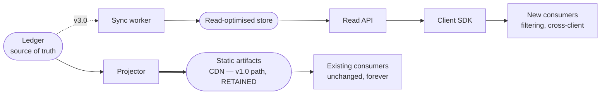

# Part 14 — Contracts, Multi-Tenancy, and Extension Architecture

*Sections 70 through 75. Audience: architects, backend engineers. This part specifies the seams: what is contractual today, how tenants are separated, how behaviour is varied without code, and how new sources are added without touching the core.*

---

# 70. API Contracts (Future)

## 70.1 What Is Contractual Today

v1.0 ships no runtime API. It nonetheless has four contracts, and confusing which is which causes real breakage.

| Contract | Audience | Stability | Breaking Change Requires |
|---|---|---|---|
| **Published payload JSON** | Client websites TradyPerch does not control | **Highest** — additive-only within a major | A new `schema_version` major, published in parallel for ≥ 90 days |
| **CLI surface** | Operators, workflows | High | An engine MAJOR bump |
| **Client config schema** | Operators | Medium | A `config_version` bump with a migration |
| **Port interfaces** | Internal implementers | Low — internal | Nothing external; a refactor |

| ID | Requirement |
|---|---|
| TR-STD-130 | Only the payload schema is a **public** contract. The others are internal or operator-facing and must not be described to clients as APIs. |
| TR-STD-131 | Consumer-facing documentation MUST state the payload contract rules explicitly: check `schema_version`, treat nullable fields as null-possible, ignore unknown fields, never insert `text` as HTML. |

## 70.2 The CLI Contract

The CLI is a contract because workflows depend on it and because exit codes drive alerting.

| Element | Stability | Change Requires |
|---|---|---|
| Command names | High | MAJOR |
| Exit code meanings | **High** | MAJOR |
| `--output json` shape | High | MAJOR |
| Flag names | Medium | MINOR to add, MAJOR to remove or rename |
| Log event names | Medium | Additive only within a major |
| Human-readable output | None | Free |

## 70.3 When a Runtime API Becomes Necessary

v1.0 deliberately ships no API. The trigger conditions:

| Trigger | Why an API Solves It |
|---|---|
| A consumer needs filtered or queried data | Static payloads force the consumer to download everything and filter client-side — fine at 60 KB, wasteful at 2 MB |
| Cross-client queries (portfolio dashboards) | Impossible against per-client static files without N fetches |
| Write operations (manual entry, moderation, replies) | Static artifacts are read-only by nature |
| Third-party access with per-consumer rate limits and revocation | A static file cannot be rate-limited or revoked per consumer |
| Real-time invalidation ("refresh my reviews now") | Requires a request path |

**Until at least two of these are true, the static artifact remains the better engineering choice.** An API adds an availability dependency in front of content that is currently as available as a CDN. This is the most likely thing in the roadmap to be over-built.

## 70.4 Future API Position

| ID | Requirement |
|---|---|
| TR-FUT-001 | Introducing the API MUST NOT break or deprecate the static path. Existing client sites continue to work untouched. **This is a hard requirement because those sites are not all under TradyPerch's control.** |
| TR-FUT-002 | The Ledger MUST remain the write-side source of truth. The API reads from a projection, so a total loss of the read store is repairable by replaying from the Ledger. |

## 70.5 Contract Evolution Rules

| Change | Payload | CLI | Config |
|---|---|---|---|
| Add an optional/nullable field | ✅ additive | ✅ MINOR | ✅ MINOR |
| Add a new artifact / command / section | ✅ additive | ✅ MINOR | ✅ MINOR |
| Populate a previously-null field | ✅ additive | n/a | n/a |
| Add an enum member to an open field | ✅ additive | ✅ | ✅ |
| Rename or remove a field/command | ❌ new major | ❌ MAJOR | ❌ version bump + migration |
| Change a type, unit, or meaning | ❌ new major | ❌ MAJOR | ❌ version bump + migration |
| Change sort-order semantics | ❌ new major | n/a | n/a |
| Tighten nullable to non-nullable | ❌ new major | n/a | n/a |

---

# 71. Multi Client Configuration

## 71.1 Tenancy Model

**Single-instance, config-partitioned, path-isolated multi-tenancy.** One engine version, one repository, one workflow set, serving N clients whose only distinguishing artifact is a configuration document.

| Property | Implementation |
|---|---|
| Isolation of **data** | Every client owns a disjoint path prefix on `data` and `state`. No shared file is written by more than one client's harvest |
| Isolation of **failure** | Per-target error envelope, per-target browser context, `fail-fast: false` matrix |
| Isolation of **configuration** | One file per client; no client can affect another's effective config |
| Isolation of **credentials** | Per-client secret naming, independently revocable |
| Sharing of **code** | **Total.** There is exactly one engine, and client-specific code paths are forbidden |
| Sharing of **rate budget** | **Deliberate** — the source sees one actor, not N tenants |

**The one shared resource is the rate budget, and that sharing is correct.** From the source's perspective, all TradyPerch harvests are one consumer. Partitioning the budget per client would let 50 clients each "politely" consume their own allowance and collectively behave badly.

## 71.2 Client Registry

| Aspect | Design |
|---|---|
| Discovery | **Every `clients/*.config.json` file is a client.** There is no separate index to keep in sync |
| Slug source | The filename is authoritative; the `slug` field must match, and a mismatch is a validation error |
| Enable/disable | `enabled: false` retains config and data but removes the client from all due sets |
| Exclusion | Files beginning with `_` are templates, not tenants |
| Ordering | Deterministic pseudo-random per run, seeded by `runId` |
| Validation | Every config validated before any harvest; **one invalid config fails only that client** |

**Why filesystem-as-registry rather than a registry file:** a separate index is a second place to update and therefore a guaranteed source of drift. Adding a client is creating a file; removing one is deleting a file. Nothing else to remember.

## 71.3 Path Isolation Scheme

| Store | Path Template | Written By |
|---|---|---|
| Payload | `data:/clients/<slug>/<listing-key>/*` | Only that client's shard |
| Client manifest | `data:/clients/<slug>/index.json` | Only that client's shard |
| Global manifest | `data:/index.json` | **Only the `collect` job** |
| Ledger | `state:/ledger/<slug>/<listing-key>.json` | Only that client's shard |
| Health | `state:/health/<slug>.jsonl` | Only that client's shard (append) |
| Identity cache | `state:/cache/identity/<slug>/<listing-key>.json` | Only that client's shard |
| Rate budget | `state:/cache/budget/<source>/<date>.json` | **Any shard** — intentionally shared |
| Breaker | `state:/breaker/<source-access>.json` | **Any shard** — intentionally shared |

| ID | Requirement |
|---|---|
| TR-CFG-060 | A test MUST assert that a failing target cannot write outside its own client path. |

## 71.4 Multi-Listing Clients

| Scenario | Handling |
|---|---|
| One client, several branch locations | Each listing is a separate target with its own listing key, ledger, and payload set |
| Client wants a combined view | An optional merged payload at `clients/<slug>/_all/reviews.json`, produced by the `collect` job from the per-listing ledgers |
| Merged payload identity | Reviews retain their original `identity_hash` and carry `listing.key` so a consumer can attribute or group them |
| Merged aggregates | Recomputed across listings; `advertised_total` summed; merged mean weighted by count |
| Failure semantics | **A failed listing does not block the others.** The merged view is built from whatever ledgers are current, with a `notices` entry naming any stale listing |
| Cadence | Per listing, so a flagship location can be `standard` while satellites are `daily` |

## 71.5 Cross-Client Concerns

| Concern | Handling |
|---|---|
| One client's huge listing starving others | Cost-balanced sharding; per-target budget cap; spill-to-next-cycle |
| One client's failure cascading | Per-target envelope; `fail-fast: false` |
| Source-level block affecting all clients | Breaker is per source-access pair, so API clients continue |
| Alert noise scaling with client count | Batching, digest, source-level suppression of downstream alerts |
| Config drift between clients | Profile inheritance means shared settings live in one place |
| **A client requesting a code change** | **Refused.** Either it becomes a config option available to all, or it is not done |

**That last row is the discipline that keeps this a product rather than a collection of bespoke integrations.** Every client-specific request must be answered by generalising it into configuration. It is slower once and enormously cheaper thereafter.

| ID | Requirement |
|---|---|
| TR-CFG-070 | No conditional keyed on a client slug may exist anywhere in the codebase. An architecture test SHOULD scan for slug literals outside `clients/` and `tests/`. |

## 71.6 Onboarding and Offboarding

**Onboarding, target ≤ 20 minutes:**

| # | Step | Time |
|---|---|---|
| 1 | Complete the compliance checklist, including **written authorisation** | 5 min |
| 2 | `tpre resolve` to obtain the canonical listing identity | 1 min |
| 3 | `scripts/new-client.mjs` to scaffold from the template | 1 min |
| 4 | Set adapter (**offer the Business Profile API first**), tier, locale, display preferences | 3 min |
| 5 | `tpre validate-config` and `tpre harvest --dry-run` | 3 min |
| 6 | Open PR; the `validate-config` workflow posts the extraction summary | 2 min |
| 7 | Merge; dispatch a manual harvest | 2 min |
| 8 | Add the integration snippet; verify rendering, CLS, and failure mode | 3 min |

**Offboarding:**

| # | Step |
|---|---|
| 1 | Set `enabled: false` — harvests stop immediately, data and payload remain |
| 2 | Export the client's full corpus with `tpre export --client <slug>` and deliver it |
| 3 | **Revoke the per-client OAuth token secret** if one exists |
| 4 | After the agreed retention period, remove the config and move `data`/`state` paths to an archive prefix |
| 5 | Remove the snippet from the client site, or let it degrade to the stable empty state |

**Step 5 is safe either way.** A client site left pointing at a removed payload gets a 404, the renderer's fetch fails, and the empty state persists — no error, no broken layout. **Offboarding cannot break a former client's website**, which is a genuine courtesy and avoids a support call.

---

# 72. Business Configuration

## 72.1 Business-Level Knobs

Configuration that expresses a commercial or editorial decision rather than a technical one.

| Key | Business Meaning | Default | Constraint |
|---|---|---|---|
| `tier` | SLO tier — cadence and alerting | `standard` | Commercial |
| `listings[].cadence` | How often this listing refreshes | from tier | Floor 1 h |
| `display.latest_count` | How many reviews the common widget shows | 20 | — |
| `display.order` | Presentation order | `newest` | — |
| `display.languages` | Language filter | `null` (all) | — |
| `display.min_text_length` | Excludes very short reviews | 0 | — |
| `display.include_rating_only` | Whether text-less reviews are published | `true` | — |
| **`display.min_rating`** | **Excludes low ratings** | **`null`** | **V-8: requires written justification** |
| `publish.schema_org` | Structured-data emission | **`false`** | Opt-in; carries policy risk |
| `notes` | Operator free text | — | Where the API-migration conversation is recorded |

## 72.2 SLO Tiers

| Tier | Cadence | Gate Thresholds | Alerting | Intended For |
|---|---|---|---|---|
| `premium` | 1–6 h | Strict (default) | Individual alerts | Flagship clients |
| `standard` | 6–12 h | Default | Batched into digest unless `high`+ | Most clients |
| `economy` | 24 h | Slightly relaxed count-drop tolerance | Digest only | Low-change listings |
| `paused` | none | n/a | Staleness suppressed | Offboarding or disputes |

**Tiering is the primary lever for scaling gracefully.** It converts a technical constraint — total request volume — into a commercial variable, cadence as a product feature, rather than an engineering crisis.

| ID | Requirement |
|---|---|
| TR-CFG-080 | Tier MUST affect cadence, gate strictness, and alerting granularity only. It MUST NOT gate access to any correctness or safety mechanism. A cheaper tier gets less frequent updates, never weaker protection. |

## 72.3 The Two Ethically-Loaded Options

| Option | Default | Mechanism | Why Not Simply Forbidden |
|---|---|---|---|
| `display.min_rating` | `null` | V-8 warning requiring a written justification in `notes` | A jurisdiction or platform might someday require selective display. Making it visible and uncomfortable is more durable than making it impossible and getting bypassed |
| `publish.schema_org` | `false` | V-9 warning requiring acknowledgement of the policy risk | Structured-data policies change; a client may legitimately want it with informed consent |

| ID | Requirement |
|---|---|
| TR-CFG-090 | Both options MUST default to the conservative value and MUST require an explicit, recorded decision to change. Neither may be set by a profile — only by an individual client config, so the decision is always visible in that client's file. |

## 72.4 Authorisation Record

| Field | Purpose |
|---|---|
| `authorized_by` | Who at the client authorised collection |
| `authorization_date` | When |
| `relationship` | `owner` / `authorised agent` |
| `evidence_ref` | Path to `compliance/authorizations/<slug>.md` |
| `scope_ack` | Client acknowledged the scope and limitations |

| ID | Requirement |
|---|---|
| TR-CFG-100 | The authorisation block MUST be complete for any client with a `dom` listing (V-3), enforced mechanically by `validate-config`, not by review. |
| TR-CFG-101 | The block MUST NOT be required for official-API listings. Requiring it there would obstruct the migration path the whole architecture is designed to preserve. |

## 72.5 Disclosure Obligations

The following MUST be disclosed to a client **before onboarding**, in writing, in plain language.

| Topic | Client-Facing Summary |
|---|---|
| Freshness and pauses | "Reviews update automatically several times a day. Updates are best-effort and depend on a third-party platform; occasionally they pause for a day or two while we fix something." |
| Acquisition method | "We read your reviews from your own public listing at your instruction. There is a fully-supported official-API alternative that takes five minutes of your time to enable, and we recommend it." |
| **Public storage** | **"Your review data is stored in a public code repository. It contains only reviews already public. If you would prefer private storage, we can arrange it at additional cost."** |
| Coverage | "We show the reviews we can collect — typically 95%+ of your current reviews. Very old reviews may not be included." |
| Dates | "The platform shows relative dates like '3 months ago'. We display it the same way rather than guessing an exact date." |

**Trust is damaged by surprises, not by limitations.** A client told about a possible two-day pause in advance experiences it as expected behaviour; a client who was not experiences it as a failure.

---

# 73. Feature Flags

## 73.1 Flag Model

> **EDR-037 — Feature flags are configuration keys with code defaults, never runtime toggles**
> **Serves:** ADR-015, CON-08.
> **Context:** There is no server, no flag service, and no process that lives long enough to poll one.
> **Decision:** Every flag is a configuration key resolved through the six-layer chain, with a code-level default. There is no dynamic evaluation, no percentage rollout, and no user targeting.
> **Alternatives Rejected:** *A flag service* — a paid dependency and an availability dependency in a batch job, for a system with fewer than ten flags. *Environment-variable-only flags* — no structure, no validation, no inheritance; the pattern this configuration system exists to replace. *Hard-coded feature branches* — the flag then requires a deploy, which is what flags exist to avoid. *Percentage rollout* — meaningless when the unit of rollout is a client and the client count is in the tens; per-profile pinning achieves staged rollout more legibly.
> **Trade-off:** A flag change requires a merge. At this cadence that is a two-minute operation and it produces an audit trail, which a runtime toggle does not.
> **Scalability:** Adequate to several hundred clients. Beyond that, the admin panel writes the same config files via pull request, preserving the audit trail.

## 73.2 Flag Inventory

| Flag | Scope | Default | Purpose |
|---|---|---|---|
| `enabled` | client | `true` | Participation in scheduled runs |
| `publish.reviews` / `latest` / `stats` | client | `true` | Which artifacts to emit |
| `publish.schema_org` | client | **`false`** | Structured-data opt-in |
| `resolution.allow_search` | global/env | `false` in prod | Runtime search permission |
| `reconcile.keep_tombstones` | global | `true` | **Testing only; MUST remain true in production** |
| `TPRE_POLICY_ENABLED` | env | `true` | **Global kill switch** |
| `TPRE_POLICY_DOM_ENABLED` | env | `true` | DOM-only kill switch |
| `TPRE_POLICY_ROBOTS_MODE` | env | `warn` | Robots handling mode |
| `TPRE_MAINTENANCE_MODE` | env | `false` | Alert suppression |
| `TPRE_DIAGNOSTICS_SCREENSHOT` | env | `true` | Privacy control |
| `diagnostics.screenshot` | client | `true` | Per-client privacy control |

## 73.3 Kill Switches

The three policy variables are a distinct class: they exist to stop the system quickly during an incident.

| Switch | Effect | Response Time |
|---|---|---|
| `TPRE_POLICY_ENABLED=false` | **Blocks all acquisition, every adapter** | Two clicks |
| `TPRE_POLICY_DOM_ENABLED=false` | Blocks DOM acquisition only; API clients continue | Two clicks |
| `TPRE_MAINTENANCE_MODE=true` | Suppresses non-critical alerts | Two clicks |

| ID | Requirement |
|---|---|
| TR-CFG-110 | Kill switches MUST be repository **variables**, not secrets, so flipping one is visible in the audit log. |
| TR-CFG-111 | A kill switch MUST take effect at the **next run**, with no deploy and no code change. |
| TR-CFG-112 | `TPRE_POLICY_DOM_ENABLED=false` MUST NOT affect official-API clients. Separating the two switches is what makes a DOM incident a partial stop rather than a total one. |

## 73.4 Flag Discipline

| Rule | Statement |
|---|---|
| F-1 | Every flag MUST have a code-level default |
| F-2 | Every flag MUST be documented in §8.4 or §9 |
| F-3 | A flag MUST NOT gate a correctness or safety mechanism. `reconcile.keep_tombstones` is the sole exception and exists for tests only |
| F-4 | A flag introduced for a migration MUST have a removal date recorded in `CHANGELOG.md` |
| F-5 | Flags MUST NOT compose into untested combinations. A flag whose interaction with another is untested is a defect |

| ID | Requirement |
|---|---|
| TR-CFG-120 | F-3 is absolute. There MUST be no flag that disables the Publish Gate, the removal-confirmation rule, the normalisation pipeline, or challenge detection. `--force-publish` downgrades four gate rules under audit; it does not disable the gate. |

---

# 74. Plugin Architecture

## 74.1 There Is No Dynamic Plugin System

> **EDR-038 — Adapters are statically registered in the composition root, not dynamically loaded**
> **Serves:** ADR-002, DR-5.
> **Context:** "Adapter" suggests a plugin system: a directory scanned at startup, modules loaded by convention, third parties dropping in new sources.
> **Decision:** All adapters ship in the same repository and are statically imported and constructed in `cli/composition.mjs`. There is no dynamic loading, no plugin directory scan, and no external plugin API.
> **Alternatives Rejected:** *Dynamic `import()` of a plugin directory* — defeats static analysis, so the architecture tests cannot verify dependency rules; makes the dependency graph unknowable; and creates a code-execution surface driven by filesystem contents. *A published plugin API for third parties* — there are no third-party adapter authors, and a public extension API is a permanent compatibility obligation taken on for a hypothetical user. *Configuration-driven module paths* — a path built from configuration is an injection vector (§50.2).
> **Trade-off:** Adding a source requires a merge into this repository rather than a drop-in package. Given that every adapter must also pass the contract suite and be added to the payload's `source` enum, a merge was required anyway.
> **Scalability:** Holds indefinitely. Even at v4.0 with six sources, static registration of six adapters is trivial and keeps the whole graph analysable.

| ID | Requirement |
|---|---|
| TR-EXT-P-010 | Dynamic module loading MUST NOT be used for adapters or any other extension point. |
| TR-EXT-P-011 | All concrete implementations MUST be constructed in `cli/composition.mjs`. |

## 74.2 The Actual Extension Points

Extensibility is achieved through **ports**, not plugins. Each port is an extension point with a defined contract and at least one alternative implementation already designed.

| Port | Extension Point | v1.0 Implementations | Designed Alternatives |
|---|---|---|---|
| `AcquisitionAdapter` | New sources and access methods | 4 | Facebook, Trustpilot, Yelp, CSV workflow |
| `StatePort` | Where internal state lives | `git-state` | Filesystem, object storage, database |
| `PublisherPort` | Where payloads go | `git-data`, `filesystem` | Object storage, API |
| `NotifierPort` | Where alerts go | `github-issues`, `webhook`, `console` | Any channel |
| `BrowserPort` | Which automation library | `playwright-chromium` | Puppeteer |
| `ClockPort` / `RandomPort` | Determinism | `system`, `fixed`, `seeded` | — |
| `LoggerPort` | Where logs go | `jsonl`, `pretty`, `memory` | Any sink |

**Every port exists because the SAD assigned low or medium confidence to the concrete choice behind it.** Where confidence was high — JSON as the data format, for instance — no port was added. Over-abstracting a confident choice adds cost with no option value.

## 74.3 Adding an Extension Point

| ID | Requirement |
|---|---|
| TR-EXT-P-020 | A new port MUST be justified by an actual second implementation or a documented migration scenario. A port with exactly one implementation and no plausible second is a rename, not an abstraction. |
| TR-EXT-P-021 | A new port MUST have a contract test suite runnable against every implementation. |

---

# 75. Adapter Architecture

## 75.1 The Adapter Matrix

Acquisition is modelled as a matrix of **source** × **access method**. Each populated cell is an adapter implementing one interface and declaring its capabilities.

| Source ↓ / Access → | `dom` | `official-api` | `file` | `manual` |
|---|---|---|---|---|
| **google** | `google:dom` ✅ v1.0 | `google:places-api` ✅ v1.0 `google:business-profile-api` ✅ v1.0 | — | — |
| **facebook** | ❌ never | v2.0 | — | — |
| **trustpilot** | ❌ never | v2.0 | v2.0 fallback | — |
| **justdial** | ❌ **declined** | none available | **v2.0 — the recommended path** | — |
| **glassdoor** | ❌ declined | — | — | — |
| **yelp** | ❌ never | v2.5 | — | — |
| **any** | — | — | `file:csv` ✅ v1.0 | v2.0 |

**Everything above the adapter layer consumes `ExtractedReview` and knows nothing of either dimension.**

| ID | Requirement |
|---|---|
| TR-EXT-P-030 | **No new DOM adapter may be added without a dedicated ADR re-arguing the legal and ethical analysis for that specific source.** The v1.0 DOM adapter exists because one specific high-value source has a restrictive API and clients resist OAuth. That justification does not generalise, and the engine must not accumulate scrapers. |

## 75.2 Why the Matrix Rather Than a Source-Only Abstraction

A `GoogleAdapter` handling all access methods internally would hide the most important operational distinction. `dom` and `official-api` differ enormously in reliability, legality, capability, and failure modes:

| Dimension | `dom` | `official-api` |
|---|---|---|
| Sanctioned | no | yes |
| Rate limit | shared egress reputation | private authenticated quota |
| Coverage | ~95%, pagination-bounded | complete |
| Date precision | relative estimates only | absolute |
| Breakage mode | markup change | versioned API deprecation |
| Circuit breaker scope | separate | separate |

**Conflating them would make per-client method selection impossible**, which is the mechanism by which any client can be migrated off DOM reading in under an hour.

## 75.3 Adapter Contract

| Method | Input | Output | Errors |
|---|---|---|---|
| `capabilities()` | — | `AdapterCapabilities` | none |
| `resolve(listingSpec, ctx)` | listing spec | `ResolvedListing` | `ERR-RESOLVE-*`, `ERR-IDENTITY-DRIFT` |
| `acquire(resolved, budget, ctx)` | resolved listing, budget | `{ raw, report }` | `ERR-NET-*`, `ERR-HTTP-*`, `ERR-BROWSER-*`, `ERR-NAV-*`, `ERR-BLOCKED-*`, `ERR-BUDGET-TARGET` |

## 75.4 Capability Declaration

| Field | Purpose |
|---|---|
| `adapterId` | e.g. `google:dom` |
| `source` | Enum member |
| `accessMethod` | `dom` / `official-api` / `file` / `manual` |
| `fields[]` | Which review fields this adapter can supply |
| `maxReviews` | Ceiling this access method can reach |
| `supportsSort` | Whether ordering can be requested |
| `supportsReplies` | Whether owner replies are available |
| `requiresSecrets[]` | Secret names needed |

| ID | Requirement |
|---|---|
| TR-EXT-P-040 | Capabilities MUST be **accurate**. Fields the adapter cannot supply MUST be `null` in its output — never fabricated, never defaulted, never inferred. |
| TR-EXT-P-041 | `adapter_capabilities` MUST be published in the payload's `provenance`, so that a consumer seeing a null field can tell whether it is missing or unsupported. |

**The capability declaration is what makes heterogeneous adapters safe.** Downstream stages adjust expectations rather than assuming every adapter returns everything. Without it, the Places adapter's five-review sample would look like a catastrophic coverage failure rather than a known capability limit.

## 75.5 Cross-Adapter Identity — The Migration Guarantee

| ID | Requirement |
|---|---|
| TR-EXT-P-050 | The same logical review acquired through any two adapters MUST produce the same `identity_hash`. |
| TR-EXT-P-051 | Identity derivation MUST use only fields every adapter can supply. **A source-specific identifier MUST NOT be used even when available.** |
| TR-EXT-P-052 | This MUST be verified by PT-08 against paired fixtures **and** by the quarterly migration drill against real data. |

**Without TR-EXT-P-050, switching a client's adapter would insert every review as new and tombstone every old one** — visible to visitors as the entire review set churning. The property test catches regressions; the drill proves the claim against reality. Both are required, because the property test uses fixtures the implementer wrote, and the drill does not.

## 75.6 Adapter Addition Checklist

For any new source, before merge:

| # | Requirement |
|---|---|
| 1 | Assessed against the integration framework and recorded |
| 2 | **If no official API: a dedicated ADR re-arguing the legal analysis for this source** |
| 3 | Implements `AcquisitionAdapter` and passes the **full contract suite** |
| 4 | Declares accurate capabilities; unavailable fields are `null`, never fabricated |
| 5 | Reviews reconcile with other adapters for the same logical review where overlap exists (PT-08) |
| 6 | **≥ 3 fixtures including at least one adversarial** |
| 7 | Error classes mapped into the canonical taxonomy |
| 8 | Rate limits and pacing configured with the same conservatism as existing adapters |
| 9 | Payload `source` enum extended (an additive, non-breaking change) |
| 10 | Documentation: capability table, credential requirements, onboarding steps |
| 11 | Compliance: authorisation and data-protection posture assessed for the new source |

## 75.7 Adapter Cost Asymmetry

| Source Type | Adapter | Selector Pack | Fixtures | Mapping | Total | Ongoing |
|---|---|---|---|---|---|---|
| API-based | 2–3 d | — | 1 d | 1 d | **4–5 d** | Low |
| DOM-based | 4 d | 3 d | 3 d | 1 d | **11 d** | **Indefinite** |

**A DOM-based source costs roughly 2.5× an API-based source to build and carries indefinite maintenance.** This asymmetry should govern prioritisation: **prefer a lower-demand source with an API over a higher-demand source without one.**

## 75.8 What Survives an Adapter Change

When a client migrates from `google:dom` to `google:business-profile-api`:

| Preserved | Changed |
|---|---|
| Every review's `identity_hash` | `provenance.adapter` |
| `first_seen_at` and pinned dates | `provenance.adapter_capabilities` |
| Revision history and tombstones | `provenance.selector_pack_version` → `null` |
| Suppressions | Date precision improves |
| Payload URL and schema | Coverage typically improves |
| The consumer integration | Some previously-null fields become populated |

**Nothing a consumer depends on changes.** That is the entire point of the abstraction, and it is why the adapter matrix was worth building four adapters for in v1.0.

---

*End of Part 14. Part 15 specifies the future adapters, the AI analysis module, the dashboard, admin panel, client portal, REST and GraphQL APIs, webhooks, database, Redis, Docker, Kubernetes, and multi-region deployment.*
